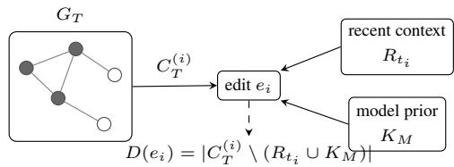

# The Working Set of a Coding Agent: Coherence Debt in Repository-Scale Tasks

Bardia Mohammadi1, Lars Klein2, Aman Chadha3, Akhil Arora4, Laurent Bindschaedler1

1Max Planck Institute for Software Systems 2EPFL 3Apple∗ 4Aarhus University {bmohammadi, bindsch}@mpi-sws.org

## Abstract

Repository-scale coding requires an agent to keep tests, imports, configuration, and migration rules consistent within a bounded context window. We model this as reconstructing a coupled-fact graph: at each edit, a required fact comes from recent context or parametric memory, and the facts covered by neither form coherence debt. We supply and withhold each channel and inject faults across seven models and five harnesses. As expected, no model completes a task on an unseen API with both channels empty, and putting the facts in the prompt restores success. When a rename defeats what models memorized about a real library, all seven fail in the same place, passing and missing the same tests. Availability decides the outcome and distance does not: withholding a fact costs exactly the work it supports, and a supplied fact works as well far from the edit as next to it. Harnesses pay unequal prices for it: configurations that all pass every test difer more than tenfold in tokens consumed because they rebuild the same content at diferent rates, and spending more recovers nothing when facts are withheld. A missing fact produces wrong work rather than absent work: an agent asked to act acts, fabricating the file or guessing the value, so instruments built on reads look for a hole already filled. How often it says it is blocked instead is a property of the model, from every trial to none. Availability does not settle every edit: where standard and code disagree, agents follow the standard even when it prescribes the worse code, so a stale convention file costs more than no file. Because parametric memory substitutes for reading, on SWE-bench, where models likely know the repositories, reads no longer predict success. Harnesses should keep the facts an edit depends on available when the agent writes, and check that availability against what the agent produces rather than what it reads.

## 1 Introduction

Coding agents increasingly attempt migrations, upgrades, and bug fixes that span a repository. Such work is dificult for a reason that is easy to miss when evaluation observes only the final patch: an edit in one file is correct only if it remains consistent with facts elsewhere. A validator must agree with its tests, a renamed symbol with every import, and a configuration change with the runtime contract. No one hands the agent this structure. The agent must reconstruct it through reads, edits, tests, and sometimes handofs to other workers.

We study the availability of those coupled facts at the moment of an edit. A tool-using agent has two ways to obtain a required fact. The fact may sit in recent context because the agent read it or the harness supplied it, or the model may already hold it in parametric memory. The first channel is bounded and evicts facts as new reads arrive, while the second is fixed for a model and unreliable on novel application programming interfaces (APIs). If neither channel covers a fact, the edit proceeds from an incomplete view. We call this shortfall coherence debt.

This framing adapts the working-set idea of virtual memory (Denning 1968) to an addressless setting. Repository facts behave unlike pages: a migration rule stated in prose and a stale implementation may encode diferent versions of one fact, yet no address or invalidation bit tells the agent which is current. More context therefore helps only when it contains the facts coupled to the present edit. Likewise, decomposition helps only when the partition leaves mutually consistent facts together.

Existing work establishes repository-level evaluation (Jimenez et al. 2024), builds tool-using loops (Yang et al. 2024; Wang et al. 2025), guides retrieval with repository structure (Ouyang et al. 2025), and shows that successful agents gather context before editing (Mehtiyev and Assunção 2026). We ask a narrower causal question: which facts must be available when the agent writes, and can recent context and model prior substitutefor one another?

We manipulate both channels, then measure how they operate in trajectories. Four fictional API migrations, each with 12 mechanically checked requirements, run closed-book: the model receives the task description but no workspace and no tools, so both channels start empty. A matched frontloaded condition puts the exact rules and source files in the prompt, with the model and tool surface unchanged. A real Pydantic migration with 79 tests, and a twin with every API name renamed, hold the task fixed while making memorized knowledge useless. In tool-using runs we measure which of an edited file’s dependencies the agent read shortly before the edit, and we build synthetic tasks whose required facts we know because we author them. The Experimental Design section gives the full setup.

We draw five claims from this evidence. First, context substitutes for missing knowledge: across 154 closed-book trials on the four fictional migrations no model completes one, and putting the same facts in the prompt lifts 299 of 300 matched trials to at least 9 of the 12 requirements. Second, models that memorized the same library fail in the same place: on the renamed migration, 66 of 70 trials across seven models end at the same score, each passing the identical 24 of the 79 tests. Third, availability decides the outcome and distance does not: withholding required facts costs exactly the work they support and no more, so damage falls linearly across 30 trials, while a supplied fact is used as reliably at the far end of a 128,000-character context as beside the edit. Fourth, small exploratory runs indicate that these efects act through the coupling of the task: irrelevant content hurts only when it sits inside the files the agent must read, and splitting the work across subagents hurts a tightly coupled task while leaving independent fixes intact. Fifth, harnesses pay unequal prices for the same result: across configurations that all pass every test, the tokens consumed over a run difer by 12.8× while the amount held in front of the model at any moment differs by only $1 . 8 \times .$ , and the expensive configurations recover nothing extra when facts are withheld. Throughout, a missing fact produces wrong work instead of absent work: the agent fabricates the file or guesses the value, and how often it reports being blocked instead ranges from every trial to none across the models we test. Two scope conditions matter just as much. Availability does not decide the edit on its own: when a written standard and working code state the same fact diferently, agents follow the standard in every one of 39 trials across two harnesses, even where that means writing the worse code. And because parametric memory substitutes for reading, on SWE-bench, where the models likely already know the repositories and we observe the task structure only coarsely, what an agent reads no longer predicts whether it succeeds.

Contributions. We (1) show that withholding facts costs exactly the work they support, and derive from a two-channel, edit-time account of repository coherence why read-derived instruments cannot see that shortfall, namely that they must overstate missing facts by exactly the parametric coverage, and we confirm it by enumeration; (2) isolate channel substitution with controlled closed-book, rename, and front-load interventions; (3) establish that coverage acts through presence, by fault injection on tasks whose coupled facts we construct; (4) bound the account from within our own workloads, showing coverage does not determine the edit when covered facts conflict, since agents follow a written standard over contradicting code even where it is the worse guide; (5) report that the framework does not transfer to real repositories rather than treat a within-workload diagnostic as universal; and (6) show that read-derived instruments cannot measure the shortfall they were built for, since agents compensate for a missing fact by acting, and give the consequences for harness design, including that a stale convention file costs more than no file at all. We provide the workload rules and trial ledger (Appendix B), notation (Appendix A), instrumentation (Appendix Q), reproduction details (Appendix S), and the ethics and data statement (Appendix T) in the Appendix.

  
Figure 1: Each edit requires a slice of the task’s coupledfact graph. Recent context and model prior are substitutable channels, and their uncovered remainder is coherence debt.

## 2 Coherence as Edit-Time Coverage

Coupled-fact graph. A task T induces a graph $G _ { T } =$ $( \bar { V _ { T } } , \bar { E _ { T } } )$ . The nodes are atomic facts relevant to the patch: symbols, tests, configuration values, imports, migration rules, and invariants. An edge means that relying on or changing one endpoint requires the other to remain consistent. Let $C _ { T } \subseteq V _ { T }$ be a minimal set that must be jointly correct for the task oracle to pass, and let $C _ { T } ^ { ( i ) }$ be the subset required by edit $e _ { i } . C _ { T }$ is relative to the oracle, the fact schema, and the implementation path, so alternative correct patches can induce diferent minimal fact sets. Tests and prose rules couple files that share no static dependency, so $G _ { T }$ extends well beyond the import graph.

At edit time $t _ { i } , R _ { t _ { i } }$ denotes facts resident in the efective context and $K _ { M }$ facts available from model $M \mathrm { { s } }$ parametric memory. We define per-edit coherence debt as

$$
D ( e _ { i } ) = \left| C _ { T } ^ { ( i ) } \setminus ( R _ { t _ { i } } \cup K _ { M } ) \right| .\tag{1}
$$

The union carries the key prediction: a fact may arrive through either channel, so success should depend on coverage and not on which channel supplied it. Uncovered coupled facts create a specific, measurable risk. There are other causes of failure, and coverage alone does not guarantee a correct edit.

Trajectory and thrashing. Because $R _ { t }$ is bounded, required facts enter and leave the efective working set. We call a trajectory thrashing when uncovered edit-time debt survives repeated read–edit–test cycles because no new evidence retires it. A long successful trajectory may accumulate more raw debt than a short failure, so the relevant diagnostics are debt per edit and its mean over the final quarter of a trajectory, rather than unnormalized cumulative debt.

Observable proxy. Neither $G _ { T }$ nor internal context retention is directly observable in historical harness logs. For an edit of file $f _ { i } ,$ , we build a static import graph and compute

$$
\rho _ { w } ( f _ { i } , t _ { i } ) = \frac { | N ( f _ { i } ) \cap \mathrm { R e a d } ( t _ { i } - w , t _ { i } ) | } { | N ( f _ { i } ) | } ,
$$

where $N ( f _ { i } )$ contains one-hop import neighbors and $\operatorname { R e a d } ( t _ { i } - w , t _ { i } )$ contains files read during the preceding w tool events. Reads after the edit never count, and we set $\rho _ { w } \ = \ 1$ when $| N ( f _ { i } ) | ~ = ~ 0$ . This convention treats import-isolated files as covered by construction and cannot detect their non-import dependencies. We call $1 - \rho _ { w }$ the residency score and reserve coherence debt for the latent fact-level quantity of Equation 1: the score counts unread neighbor files, not missing facts, and misses dynamic, prose, prompt-supplied, and parametric ones. We sweep w ∈ {4, 8, 16, 32, 64, 128} rather than reporting a single favorable window.

Predictions. We pre-specify four tests. (P1) If $R _ { t }$ and $K _ { M }$ are empty, novel migrations should reach a floor, and supplying the missing facts through either channel should lift it. (P2) Models sharing a partial prior should fail on the same task region, and not merely at the same rate. (P3) Coverage should act through presence rather than proximity: withholding required facts should cost only the work those facts support, while a fact’s distance from the edit should not matter, and total read volume should not substitute for either. (P4) Placement and decomposition should matter through the coupled-fact graph: unavoidable in-file bloat should displace required facts, and partitioning across a coupled cut should add incoherence.

## 2.1 A versioned event semantics

Historical tool logs expose actions and observations but not the facts that justified a write. To make the framework prospectively measurable, we define a run as a totally ordered stream of five event types. Each event carries a run identifier, monotone event identifier, timestamp, actor, and type-specific payload, and file versions advance on every edit, including a restoring edit. Table 1 lists the payload each type must record. The actor emits an edit intent before the write, naming the required facts and versions it relies on. This records the actor’s claimed support set, which exposes missing and stale support before the outcome but requires external validation rather than establishing ground truth.

The stream lets us separate four causes that otherwise end in the same failed test: (i) a working-set miss, where a required fact has no current extraction for the editing actor; (ii) a stale read, which relies on a fact from an obsolete source version; (iii) a handofgap, where a current fact held by a parent never reaches the assigned worker; and (iv) a speculative write, an uncovered intent later contradicted and undone. We measure parametric shortfall separately through closed-book behavior, since no harness logs internal $K _ { M }$

These distinctions matter: a reread repairs a missing or stale fact but not a handof policy, serialization removes cross-worker gaps at the cost of time, and a stronger prior covers a fact with no read event. We formalize that last asymmetry as a measurement proposition, stated and proved in the Appendix: an event-only estimator observes read-covered facts but not parametric coverage, so it reports the union of the true uncovered set and the parametrically covered set, and its overstatement equals exactly the parametric coverage. We verify the implementation against that prediction by enumerating every read/parametric/uncovered assignment of required facts across 1,089 simulator runs (Appendices C and D). Of 124 fully covered runs, 119 pass the oracle while the estimator still reports working-set misses. A union-aware estimator is exact. So $\rho _ { w }$ is a lower bound on observable readderived coverage rather than an estimate of total coverage, and we keep the empirical score deliberately narrow: historical logs recover reads, edits, tests, and worker identity, but never structured fact extraction, so every headline trajectory result uses the residency score. We exclude a tempting “retirement overrun” term because its reliable estimator depends on the terminal outcome and would leak the label.

## 3 Experimental Design

Channel-control workloads. Four hand-authored migrations, Sprocket (Rust), Grimwire (Go), Kestrix (Python), and Zynet (JavaScript), define fictional v1→v2 APIs. Each contains three editable files, a change log, and 12 mechanically checked migration requirements. We invented their library names and rules, so prior exposure is highly unlikely, though generic idioms remain available. A standard closed-book prompt describes the requested change but withholds the workspace and tools, so $R _ { t } \cap C _ { T } \approx$ ∅: the task description remains while its coupled facts are absent. In the matched front-loaded condition, the prompt also carries the verbatim change log and editable v1 sources. We leave the model and sandbox unchanged.

To that we add a 79-test Pydantic v1→v2 migration, which $K _ { M }$ plausibly covers, and an adversarial rename that preserves behavior while replacing Pydantic surface forms with a lexical shim. Seven model families participate in closedbook trials (Sonnet, Haiku, Codex, Z.ai, DeepSeek, Qwen, Gemini), and five participate in the fully sandboxed frontload matrix. Codex is absent from that matrix because of a startup-time sandbox interaction that precedes any model call, and Gemini because its quota expired before the matrix ran. Under a relaxed-sandbox runner Codex reaches 12/12 on each of the four workloads, in 12 of 24 trials. We report that number in the Appendix as an instrumentation diagnostic, not as headline evidence.

Tool-using workloads. The primary tool-using corpus contains 122 matched trials across Claude Code, Codex CLI, Aider (Gauthier 2023), and OpenHands. Its central task is a two-app Pydantic migration with 79 tests. We vary irrelevant content while holding target behavior fixed: a lean repository, standalone documentation the agent can skip, code bloat embedded in files the agent must edit, and a renamed codebloat twin that weakens the parametric shortcut. A matched independent-fixes task has 12 modules with one test each and no cross-module imports or shared names, which gives us a zero-coupling decomposition control.

For ground truth, we generate synthetic-coherence tasks that couple three files through a random literal stored in a permotif secret file. The correct edit is defined by that literal and its upstream dependency, so we know $C _ { T } ^ { ( i ) }$ by construction. We withhold the secret for a controlled number of motifs, which fixes the size of the injected fault while leaving the rest of the task intact. The Appendix provides the trial ledger, parsers, and graph construction.

Outcomes and uncertainty. Closed-book outcomes are evaluator scores or passed-test identity, the set of tests a trial passes. Tool-using success requires the task oracle to pass. We measure separation by within-cell ROC AUC, with 95% intervals from 1,000 within-cell bootstrap resamples. Thirty cells ran twice in separate batches, and outcomes disagree across batches on 4.8% of matched trials, which bounds run-to-run noise under the contrasts below. Small intervention cells $( n = 3 – 1 2 )$ are exploratory. For external validity, we analyze 100 SWE-bench Verified instances across eight repositories and four model/harness families (400 attempted, 397 scored), and only recoverable multi-edit transcripts enter trajectory statistics.

<table><tr><td>Event</td><td>Required payload</td><td>Role in coverage analysis</td></tr><tr><td>file_read</td><td>path, observed repository/file version, byte range</td><td>What source reached an actor; asserts no semantic extraction by itself.</td></tr><tr><td>fact_extracted</td><td>fact identifier/value, source span and version, acquisition mode</td><td>Adds a versioned fact to the actor ledger by reading, prompt supply, or handoff.</td></tr><tr><td>edit_intent</td><td>target/base version, required facts, relied-on fact versions, pro- posed transformation</td><td>Records the actor&#x27;s claimed pre-write support set, which exposes missing and stale dependencies before the outcome but requires external validation.</td></tr><tr><td>test_feedback</td><td>command, oracle result, diagnostics, contradicted intents</td><td>Ties environmental evidence to the edits it validates or invalidates.</td></tr><tr><td>revert</td><td>restored content/version, reverted intent, triggering feedback</td><td>An explicit compensating write, not a reversal inferred from a later diff.</td></tr></table>

Table 1: Prospective five-event representation. Historical experiments use coarser proxies. The schema specifies what a coherence-aware harness should retain.

Isolation and validity controls. Closed-book inference is unusually vulnerable to accidental workspace leakage. Our final sandbox denies the complete project root, which holds answers, generators, prior transcripts, and sibling trials alike, and re-allows only the empty trial directory and the command-line configuration paths needed at startup. We exclude runs from four earlier policies that left answer keys, sibling workloads, cross-trial artifacts, or generator scripts readable, and we replace test-name excerpts with per-file counts because identifiers revealed migration rules. The evaluators for the novel workloads contain four markers per editable file, which makes 754 controlled trials practical but can reward imitation. We therefore require emitted files to parse or typecheck, compare front-loaded ceiling outputs with handauthored references, and score the Pydantic family with behavioral tests. For the trajectory study, all windows are causal, outcome labels never enter the feature, and we reproduce the result from normalized event streams. The Appendix reports the trial ledger, extraction rules, and identifiability checks under varying irrelevant reads and fact-set sizes.

Evidence tiers. The conflicting-source contrast was not pre-specified, and we report it as a scope condition the four predictions did not anticipate. We treat five large contrasts as confirmatory, four pre-specified and the conflicting-source contrast post hoc: the novel closed-book floor, front-load recovery, the renamed test-identity failure point, the faultinjection sweep with its distance arms, and the conflictingsource contrast. The bloat, decomposition, model-capacity, and harness swaps are mechanism probes with small cells. We read them as directions only, and no collection of n = 3 cells carries a main claim.

Supporting detail sits in the Appendix, grouped to follow this paper’s order. Appendix B lists the workloads and how trials are grouped, and Appendix E states the order-independence result and its limit. Appendix G and Appendix H give the supplied-fact distance and invariantretention sweeps behind the presence result. Appendix P reports a richer neighborhood we piloted and did not adopt, and Appendix R reports run-to-run stability.

## 4 Results

## 4.1 The channels substitute

Table 2 reports the controlled channel experiments. With no workspace and no task-specific prior, all 154 novel closedbook trials score 0/12: no family guesses even one complete migration. The Wilson score-interval 95% upper bound on a nonzero complete-solution probability is 2.4%, so we report an exact floor and not a generic claim that novel APIs are dificult. Novelty alone does not force that floor: on a fifth workload, Flareforge, whose renamed JavaScript Result API is idiomatic in Rust and Elm, five families most often score 3/12 by analogy while still missing the workloadspecific rename. What produces the floor is missing prior coverage rather than unfamiliarity.

The front-load condition changes only fact availability, which tests P1. Beyond the 9-of-12 threshold the table reports, 213 of 300 trials satisfy every requirement, and the one run below threshold fails in a revealing way: it emits narrative where it should emit file blocks. Ceiling-hit rates vary by family and workload, so recovery is imperfect. The reversal from floor to ceiling is what substitution predicts, since context supplies facts the prior lacks.

We read this pair as calibration: compliance is expected once the rules are in the prompt, and the informative half is that the floor sits at exactly zero, which fixes the endpoints for the sweeps that follow. Mean line-level Jaccard against the hand-authored migration is 1.00 for Kestrix, 0.99 for Sprocket and Zynet, and 0.79 for Grimwire, where valid Go idioms difer in threading context.Context.

The Pydantic pair exposes partial K , which tests P2. Six of seven families converge on one score in ordinary closedbook trials, and renaming the API relocates that shared failure point without dispersing it: the trials that land there pass not merely an equal number of tests but the same ones, across all seven families. The surviving tests concern locally idiomatic application wiring, while the failures require following renamed validator, settings, and configuration rules. This is an observable boundary of the shared prior, not a claim about mechanism.

The prior does not give way all at once. We rename a controlled number of symbols and score each one by how the agent resolved it, which separates two failures a pass rate merges: the agent may take the supplied name, revert to the original, use both forms at once, or invent a third. Across 52 trials (Appendix F) the share of renamed symbols resolved correctly falls from 30% at five renamed symbols to 18% at ten and holds there at nineteen, while mixed use climbs from 8% to 35% and then 39%, and invented names appear only past five renames. The prior first overrides the supplied name, then mixes both names inside one file, and the efect saturates once about half the surface is renamed.

<table><tr><td>Experiment</td><td>Channel state</td><td>n</td><td>Outcome</td><td>Result</td></tr><tr><td>Novel closed-book</td><td> $R _ { t } = \varnothing ,$  task-specific  $K _ { M } \approx \varnothing$ </td><td>154</td><td>complete migration</td><td>0/154; every trial 0/12</td></tr><tr><td>Novel front-load</td><td>exact rules/source supplied in  $R _ { 0 }$ </td><td>300</td><td>at least 9/12 requirements</td><td>299/300; mean cell scores 9.0–12.0</td></tr><tr><td>Pydantic closed-book</td><td>public API available mainly through  $K _ { M }$ </td><td>32 of 36</td><td>passed-test identity</td><td>same 53/79 tests; pairwise Jaccard 1.000</td></tr><tr><td>Renamed closed-book</td><td>lexical access to prior defeated</td><td>66 of 70</td><td>passed-test identity</td><td>same  $2 4 / 7 9$  tests across seven families; Jaccard 1.000</td></tr></table>

Table 2: Controlled evidence for two-channel coverage. The last two rows count trials at the dominant score out of all trials in that condition. Within each, every cross-model pair has an identical passed-test set. Jaccard is intersection over union.

## 4.2 Availability decides, distance does not

If coherence debt is a count of missing facts, then damage should add up rather than compound (Appendix I). The synthetic tasks test P3 directly, since we build the coupling ourselves: each motif ties three files through one secret value, so we withhold it for exactly m of eight motifs and leave the rest untouched. Damage tracks the injection precisely. Withholding m motifs costs the work of those m and nothing more: across 30 trials, six per level, passed tests fall 32.0, 24.0, 16.7, 8.0, 0.0 against a linear prediction of 32, 24, 16, 8, 0, with a standard deviation at or below 1.1. Absence adds over the coupled-fact graph rather than cascading through it, which is what the debt count assumes when it sums uncovered facts.

A present fact stays usable, and we could not make it lapse. We state sixteen invariants once, then issue up to ninety-six unrelated tasks one at a time, each revealed only after the last. Across seven trials the agent honors every invariant at every position, never rereads the statement, and accumulates roughly 140,000 tokens. No working-set miss appears, which limits how much eviction can explain.

Distance does not decide the matter either. Supplying the fact and varying only its distance from the edit leaves success flat across three model families and two harnesses, out to 128,000 characters on the tool-using harness and 200,000 on the closed-book harness, while withholding it floors the same tasks. These arms sit at ceiling, so they bound large efects rather than excluding small ones. Together with the additivity above, they locate the mechanism in whether a fact is present at all rather than in how far away it sits. Presence and residency coincide here because nothing evicts: a fact we supply stays supplied. The working-set account predicts they separate only once a trajectory is long enough to lose one, and the capacity result says we never reached that point. We report presence, and treat residency as the mechanism these experiments bound rather than confirm.

## 4.3 Withholding costs exactly the work it supports

The account’s central claim is that an edit is correct only when the facts it depends on are available as the agent writes. We test it by withholding those facts directly. Each motif carries its required value in one file, and we remove that value from k of eight motifs while leaving everything else untouched, then sweep k. Two removals are run separately: deleting the file, and replacing its contents with a stub of identical length so a readable file remains. The tests are withheld from the agent throughout, since the generated assertions state the expected literals and would otherwise hand the agent the fact we removed.

Damage tracks the withheld facts with no slack at all. Each motif supports four tests, and the median trial loses exactly four per withheld motif across both removals and all levels:
<table><tr><td>facts withheld</td><td>0</td><td>2</td><td>4</td><td>6</td><td>8</td></tr><tr><td>tests passed, stub</td><td>32</td><td>24</td><td>16</td><td>8</td><td>0</td></tr><tr><td>tests passed, deleted</td><td></td><td>24</td><td>16</td><td>8</td><td>0</td></tr><tr><td>linear prediction</td><td>32</td><td>24</td><td>16</td><td>8</td><td>0</td></tr></table>

Maximum deviation over the nine cells is zero tests $( n = 6$ per cell). Appendix J gives the construction, the four controls that run before scoring, and the residency figures under the same manipulation. An independent fault-injection sweep on the same workload family gives 32.0, 24.0, 16.7, 8.0, and 0.0 against the same prediction. Damage adds rather than compounds: a missing fact costs the work it supports and nothing further.

## 4.4 The working set is similar, the refetch rate is not

If coherence turns on which facts are resident when the agent writes, then two harnesses that reach the same coverage should be comparable in what they hold and may difer in what they pay to hold it. We measure both over six configurations and three task sizes, with eight trials per cell: 144 trials, every one of which passes every test.

Peak per-turn context varies by 1.8× across all eighteen cells: every configuration puts about the same amount in front of the model at any one moment. Cumulative input varies by 12.8×, from 293,882 tokens to 3,752,134. The working set is therefore similar and the rate at which it is rebuilt is not. The cheapest configuration completes in five tool calls and the most expensive in seventy-nine, and an agentic loop resends its conversation each turn, so the spread is a refetch rate rather than a capacity diference. Reasoning tokens are at most 0.46% of input and explain none of it.

A harness can therefore spend an order of magnitude more to assemble the same working set. The obvious follow-up is whether the expensive ones earn it when the facts are harder to reach, which the first sweep cannot answer because coverage sits at its ceiling in every cell. We therefore withheld k of the eight required facts and reran five of the six configurations at $k \in \{ 0 , 4 , 8 \}$ , with opencode excluded for the instrumentation failure Appendix K records:
<table><tr><td>configuration</td><td>k=0 k=4</td></tr><tr><td></td><td>k=8 100% 50% 0%</td></tr><tr><td>Opus Fable</td><td></td></tr><tr><td>100%</td><td>50% 0%</td></tr><tr><td>Sonnet</td><td>100% 50% 0% 0%</td></tr><tr><td>Haiku</td><td>100% 53%</td></tr><tr><td>Codex 100%</td><td>50% 0%</td></tr></table>

The outcome is set by availability and by nothing else. Every configuration loses exactly the proportion withheld, and no two difer by more than three points at any level. Their spend follows no such pattern: at k=0 it varies by 12.5×, and Haiku consumes 5,730,807 cumulative input tokens to reach the 100% that Opus reaches on 459,122. Spending more does not recover more when the facts are withheld, and it does not recover more when they are present. The extra spending buys a diferent route to the same working set.

We report these as token counts rather than costs. Cache reads dominate every total and are billed far below fresh input, vendors price caching diferently, and on uncached input the ordering does not survive: twenty-two uncached tokens at the cheapest configuration against 163,236 at the most expensive. Appendix K gives the per-vendor accounting, which is not comparable as reported.

## 4.5 Agents compensate rather than abstain

Withholding produces wrong work rather than absent work. An agent asked to do something does something, so a missing fact yields a confident wrong edit. That is the mechanism behind the linearity in Section 4.3, and we see it take several forms.

With the fact’s file deleted, the agent writes its own and invents a value: in one trial at $k = 8$ it created all eight missing files and proceeded. Where a written standard contradicts working code, it substitutes the standard, a case we return to below. It guesses, leaving placeholders or writing literals from nothing. It searches elsewhere in the repository, which is the benign case. Or it stops and says it cannot proceed.

The last of these is the interesting one, because it is the response that would make coherence debt observable as the agent works rather than diagnosable only after the failure. Which agents give it depends almost entirely on the model. We withheld every required fact and recorded what each configuration did, six or eight trials apiece:

<table><tr><td>configuration</td><td>n</td><td>blocked</td><td>share</td></tr><tr><td>Opus, Claude Code</td><td>8</td><td>8</td><td>100%</td></tr><tr><td>Fable, Claude Code</td><td>8</td><td>6</td><td>75%</td></tr><tr><td>Sonnet, Claude Code</td><td>8</td><td>2</td><td>25%</td></tr><tr><td>Haiku, Claude Code</td><td>8</td><td>1</td><td>12.5%</td></tr><tr><td>GPT-5, Codex CLI</td><td>8</td><td>0</td><td>0%</td></tr><tr><td>GLM-5.2, opencode</td><td>6</td><td>0</td><td>0%</td></tr><tr><td>pooled</td><td>46</td><td>17</td><td>37%</td></tr></table>

The range runs from never to always. Opus reports the missing file in every trial. Codex CLI and opencode never do, and instead produce a confident wrong migration each time. Haiku is the only configuration that fabricates the missing file outright, in three of eight. Within one model the rate is stable: a separate 96-trial block on Haiku (Appendix L) gives 13.5%, against 12.5% here, and whether the absence announced itself as experimental made no diference we can detect in that block (Fisher exact $p = 0 . 5 5 2 )$

The capability is real and unevenly distributed. We currently reconstruct coherence debt after a failure. An agent that says it lacks a required fact converts it into a signal available as the edit happens, at no cost. Some configurations already emit that signal and others never do, which makes it a harness-selection question rather than a research one.

## 4.6 Mechanism probes separate the channels

External supply versus self-reading. Our proxy watches the agent read, which makes it blind to facts the harness hands over. The two-channel account turns that blindness into a prediction: hand the agent the facts and it should succeed more while reading less, so the link between self-reading and success should weaken. We test this on the in-file-bloat migration with three prompts: a baseline with only the task description, an overlay that names ten target files and the required v1→v2 transformations, and a troubleshoot variant adding edit-level pitfalls, with tools, tests, repositories, and budgets fixed.

Pass rate rises monotonically for both agents: Claude goes from 1/6 with the task description alone to 2/6 with the overlay and 2/3 once pitfalls are added, and Codex from 2/6 to 3/6 to 2/3, though the small cells do not separate the individual steps. The behavioral mechanism difers: for Claude the Spearman correlation between residency built from the agent’s own reads and success flips sign once the overlay is present (+0.866 to −0.828), since the prompt already supplies the facts, while for Codex it weakens but stays positive $( + 0 . 8 6 6 ~ { \mathrm { t o } } ~ + 0 . 5 0 0 )$ because it keeps inspecting the named files. With one or two successes per cell these coeficients turn on single trials, so only direction is interpretable.

Parametric coverage changes failure shape. We hold the Pydantic code-bloat task and Claude Code harness fixed and replace Sonnet with Haiku. Sonnet succeeds in $1 / 6$ runs, and its five failures still pass 97–99% of the test suite. Haiku succeeds in $0 / 3 .$ and two of its three failures pass 0%: a missing late invariant and a failure to establish the migration are qualitatively diferent outcomes, though the third Haiku run reaches 97.5% and shows the boundary is not clean. The framework accounts for this as a prior threshold. Above the threshold, $K _ { M }$ covers most of $C _ { T }$ and leaves a small workspace-dependent residual. Below it, the agent cannot form a viable initial patch. With only three Haiku runs this is a directional observation, not a model scaling law.

<table><tr><td>Condition</td><td>Claude</td><td>Codex</td></tr><tr><td>Lean migration</td><td>2/3</td><td>2/3</td></tr><tr><td>Standalone document bloat</td><td>2/3</td><td>3/3</td></tr><tr><td>In-file code bloat</td><td>1/6</td><td>2/6</td></tr><tr><td>Renamed in-file bloat</td><td>0/3</td><td>2/3</td></tr><tr><td>Coupled, decomposition on</td><td>1/6</td><td>2/6</td></tr><tr><td>Coupled, decomposition off</td><td>1/3</td><td>3/3</td></tr><tr><td>Independent, decomposition on</td><td>3/3</td><td>3/3</td></tr><tr><td>Independent, decomposition off</td><td>3/3</td><td>3/3</td></tr></table>

Table 3: Exploratory placement and decomposition interventions (successful trials). The in-file-bloat and coupled/decomposition-on rows report the same trials, recut by worker mode.

Together the probes bound the channel claim. $R _ { t }$ covers facts from a prompt, an overlay, a read, or a handof, so a read-derived proxy sees one acquisition mode only, while $K _ { M }$ can shrink the residual task enough to turn catastrophic failures into near-misses. Measuring either alone can invert or erase an efect. Their union at the edit, as in Figure 1, is the correct object.

## 4.7 Coupling predicts intervention efects

Table 3 reports two matched interventions that test P4, and with it whether the framework predicts more than correlation. Placement matters more than volume. Standalone document bloat is easy to avoid and does not reduce pass rate (Claude $2 / 3 ,$ , Codex $3 / 3 )$ . Embedding irrelevant code in required source files reduces success to $1 / 6$ and $2 / 6 ,$ respectively. Agents actually read fewer bytes in some failing conditions, so raw context consumption cannot explain the ordering. The renamed twin further drops Claude to $0 / 3 ,$ consistent with removing parametric coverage.

Decomposition depends on the cut. On the tightly coupled migration, Codex succeeds in $2 / 6$ decomposed runs but $\mathbf { \bar { 3 } } / 3$ single-worker runs. On the size-matched independent-fixes control, both modes achieve $3 / 3 .$ Claude likewise preserves $3 / 3$ correctness on independent fixes and finishes 30% faster with subagents (116.0 versus 167.5 seconds). These cells are small and exploratory, but their sign pattern is the one coupling predicts: parallelism is safe across independent components and risky when workers must maintain a shared invariant. Graph-partition accounts of multi-agent coding report the same pattern (Yang et al. 2026; Pan and Luo 2026).

Harness policy changes the visible symptom. Holding Sonnet and the code-bloat task fixed, Claude Code produces mostly all-or-nothing failures $( 1 / 6 )$ , Aider partial migrations (0/6, 39–70% passing), and OpenHands a split between 60– $6 7 \%$ and 96–98% (0/6). A shell-only Claude probe moves failed runs from 97–99% passing to 0%. These exploratory cells rank no harness. They show retry, edit, and retirement policies deciding how missing coverage surfaces: coverage determines whether the agent fails, and policy determines how.

## 4.8 Coverage is not suficient

Coherence debt counts a required fact as covered or not, which leaves no room for two covered facts that disagree. We build a workload in which they do. A written engineering standard states a rule and working code in the same repository demonstrates the opposite: integer cents against float division, . $\mathtt { { g e t } } \left( \mathtt { \xi } \right)$ with a default against direct indexing, timezone-aware timestamps against a naive helper. Both sources sit in the window and neither is evicted. Tasks arrive one at a time, each gated on the previous handler existing, so the agent can neither read the queue ahead nor satisfy the set with one template.

The written standard wins completely (Appendix M). Across 39 trials the agent follows the document on every contested decision, at conflict counts of four and ten, on three model tiers of one harness and on a second harness with a different scafold (Wilson 95% interval [0.91, 1.00]). Agreeing rules stay at ceiling, the agent never edits the contradiction away, and the source it follows does not drift across task positions. We then invert the workload, which rules out the obvious alternative that the model simply writes sensible code and the standard happens to agree. With the document demanding the worse practice and the code demonstrating the better one, the agent still follows the document: it writes camelcase handlers, indexes payloads directly, divides money into floats, calls the naive clock, and interpolates its log messages. No prior produces that combination by accident.

Coverage therefore remains necessary but is not suficient. Withholding a fact still floors the task, yet when two covered facts conflict the outcome turns on which source carries authority, and $D ( e _ { i } )$ is blind to that distinction by construction. Nothing here is distant, stale, or evicted, so residency cannot account for it either. Whether authority, modality, or read order does the work is a question these cells do not separate, and we leave it open.

## 4.9 A stale standard is worse than no standard

Section 4.8 shows that a written standard beats working code when they disagree. That leaves a practical question it does not answer: what a wrong standard costs, given that project conventions are routinely committed to repositories and routinely go out of date.

We compare three conditions on the same contested surfaces: a correct standard, no standard at all, and a standard demanding the worse form. We score the share of decisions written the better way, so all three conditions land on one scale:

<table><tr><td>what the agent has</td><td>better form</td></tr><tr><td>a standard agreeing with the code</td><td>100%</td></tr><tr><td>only code demonstrating the convention</td><td>33%</td></tr><tr><td>a standard demanding the worse form</td><td>0%</td></tr></table>

Ten trials per condition give 3,385 scored decisions, and Appendix N lists the contested surfaces and the scoring rule. The endpoints carry no variance at all: every one of the ten correct-standard trials writes every decision the better way, and every one of the ten stale-standard trials writes none. A stale standard is therefore worse than silence. It suppresses the inference the agent would otherwise make from code that demonstrates the convention. Deleting an out-of-date convention file beats leaving it in place.

## 4.10 The score is workload-relative

A useful framework should state where it fails. A four-feature predictor (mean and final-quarter residency score, thrashing, and model capacity) reaches held-out AUC 0.71 under a random split but only 0.66 under leave-one-workload-out: the score’s absolute level is workload-relative.

The sharper limit on the instrument comes from SWEbench Verified (Jimenez et al. 2024). Resolved rates, meaning all instance tests pass, span 1.0–39.4% across 397 scored trials over 100 instances from eight repositories: GPT-5 with Codex CLI 39.4% (Wilson 95% CI [30.3, 49.2]), Sonnet with Claude Code 31.3% [23.0, 41.0], Haiku with Claude Code 22.2% [15.2, 31.4], and Sonnet with Aider 1.0% [0.2, 5.4], with three unparseable transcripts reducing the first three to $n = 9 9$ . A measurement limit compounds this. When an agent performs its edits through a script it writes, the per-file writes never appear as tool events, so any read-derived proxy, ours included, sees an emptier trajectory than the work required. If the score measures something general, it should separate success from failure here too. It does not: among 122 recoverable multi-edit trajectories the final-quarter residency score gives within-cell $\mathbf { \bar { A U C } } \approx 0 . 4 9$ , which is chance. An earlier score that included an outcome-gated “retirement” term produced AUC above 0.92, and once we remove that leakage the efect disappears. We therefore make no claim that the residency score, still less coherence debt itself, predicts SWE-bench resolution. Attrition does not explain the null. Reconstructing the cohorts, with executing taken as a non-trivial wall time and a recorded evaluation and recoverable as an event stream that survives and parses, 195 of 420 trials execute, and recoverable trials resolve at 49.4% against 56.9% for the rest (Fisher exact $p = 0 . 3 1 0 )$ . The rates difer from those we reported at submission, so these are reconstructions rather than the original cohorts. The inference is unchanged, and now survives a change of definition.

This null result is compatible with, but does not prove, the two-channel account. Popular repositories and APIs may be well represented in $K _ { M }$ , which makes the workspaceresidency channel less decisive, and the import graph may also be a poor proxy for issue-specific coupling. Either explanation limits the present instrument: a deployable predictor needs task-specific fact extraction and calibration, not a universal threshold on import-neighbor reads.

Three repositories, astropy, sphinx, and pylint, resolve at 0% across all four families, but we cannot attribute that regime to coupling from these data: historical streams lack intent–feedback–revert links, and the 100 Aider trials expose no recoverable multi-edit stream. We therefore leave reversion, bailout, and time-to-fix untested rather than manufacturing nulls.

## 5 What the Event Stream Can and Cannot Measure

The residency score watches the agent read. Section 4.5 shows that an agent responds to a missing fact by acting, which means the shortfall enters the tool stream as more activity rather than less. A measure built on read events therefore looks for a hole the agent has already filled. We set this out because every trajectory result above rests on that measure. The failure is behavioral rather than statistical, so averaging does not remove it.

Volume manipulations cannot separate structure from effort. Padding a repository with task-irrelevant text triples the material an agent must work through, so it raises efort by construction. We previously reported that residency separated a lean condition from a padded one while activity counts did not, and we withdraw that reading. Rerunning the contrast at twenty trials per condition puts every activity count at AUC 0.86–0.95 and the residency score at 0.55 with a 95% interval of[0.36, 0.71], the reverse ofthe original result and equally uninformative for the same reason. Repeating it on a fictional API, where the model cannot work from recall, gives the same shape. The design cannot support a claim in either direction, ours included. The case for residency as the better feature rests on fault injection, which manipulates the facts themselves.

Opening a file is not obtaining a fact, though we could not measure the gap directly. Deleting a required file and replacing its contents with a stub of equal length leave the agent in the same position: the fact cannot be obtained, and matched trials fail identically. The two difer only in whether a file remains to open, so a score that separated them would be tracking access rather than acquisition. We tested this and found no efect we can defend. Withholding four of eight facts, where every trial still yields a scorable edit, gives AUC 0.59 with a 95% interval of [0.36, 0.81] over fourteen trials per arm. Withholding all eight gives 1.00, but only five trials in one arm and six in the other survive to be scored there, and they are selected by the very behavior under study, so we treat that figure as an artifact of attrition rather than a result. The next paragraph, where the score credits files the agent wrote itself, carries this point, and the deletion-versus-stub contrast does not.

The score credits files the agent wrote itself. Because the agent supplies missing files, a naive reading of the stream counts its own writes as coverage. Under deletion this returned 1.000, a perfect score, in the condition where nothing was available. Disqualifying agent-authored paths from the numerator corrects it and makes the same cell return 0.000. Any event-derived coverage measure needs this exclusion, and to our knowledge it is not standard.

Reads rise as availability falls. Reads of the withheld file rise from 5.5 to 10 to 13 as more facts are removed. The score holds up or climbs precisely as the quantity it estimates collapses.

Import neighborhoods are a poor stand-in for the required facts. On workloads where we author the coupling, the required facts per edit are known, so the fidelity of the proxy is measurable directly. Import edges recover 40% of the authored edges at 40% precision. Making the graph directed removes every spurious edge at no cost to recall, so the symmetric convention is pure loss. Resolving the identifiers an edit uses reaches perfect recall at 4% precision, which makes it a candidate generator rather than a measure. Appendix O gives the per-generator figures. The workload is built so that the required value must be written as a literal rather than imported, which is deliberate: it is a real dependency with no syntactic trace, and it is the case an import graph cannot see.

The measurement vanishes where the condition is most severe. The score exists only where the agent edits. Under full withholding the agent frequently makes no edit, so roughly 60% of trials contribute nothing and the remainder are selected by the behavior under study. Only three of five neighborhood entries per motif are withholdable at all, so the ceiling under total withholding is 0.333 rather than zero.

What to measure instead. On workloads whose coupling we author, the required facts are known and the outcome is exact. That instrument produced the zero-deviation table in Section 4.3, and it needs no graph, no window, no event stream. We keep the residency score for historical corpora, where nothing better is recoverable, and we now state its limits rather than defending it.

## 6 Implications and Limitations

Implications for harnesses. Larger windows, retrieval, memory files, and subagents are all means to an end. Our results suggest what that end should be: keep the facts coupled to the next edit both current and mutually consistent. A harness could log an edit intent, attach versioned supporting facts, invalidate them after writes, and require explicit transfer across workers, over a task graph that includes tests, instructions, and runtime invariants beyond static imports. Such a log also speaks to a failure mode we do not cover: agents that reach correct code and then discard it (Kim et al. 2026). If the agent produced the correct edit its facts were available, so the failure lies in retention rather than coverage, and we treat it as a candidate falsifier.

Latent state and proxy validity. $G _ { T } , C _ { T } ^ { ( i ) }$ , and internal retention are latent. Import-neighbor residency is credible when static dependencies approximate task coupling and weak under dynamic dispatch, generated code, or prose rules. Tool logs show prompt-supplied facts and compaction only partially. The synthetic fault injection validates the residency proxy on one constructed family only. A semantic-graph pilot (Tree-sitter contributors 2026) improves packing but not file ranking, so we keep the import proxy throughout.

Causal and statistical limits. Fictional migrations remove direct API exposure but not generic priors. Marker evaluators constrain specified transformations rather than engineering quality, though reference Jaccard checks reduce this concern. Trajectory comparisons stay within harness and workload. Two limits deserve emphasis. The conflicting-source result is a perfect separation over 39 trials, so its interval remains wide at the lower bound ([0.91, 1.00]) even though no trial dissents. In addition, these cells do not separate authority from modality or read order.

Scope. The framework targets work whose correctness depends on cross-file consistency and should explain less for single-file edits. Six of seven main workloads are migrationshaped, where the agent must discover a latent graph. Greenfield development may build its graph while writing and behave diferently. The residency score diagnoses structural fact availability, not planning, reasoning, test quality, or semantic search.

Falsifiable boundary. Three patterns would weaken the framework: reliable success when both channels lack required facts, equal predictive power for arbitrary and coupled-fact reads, or decomposition efects unrelated to the cut. The first is absent in our closed-book matrix, volume baselines and the fault-injection curve contradict the second, and the small intervention cells contradict the third without settling it. A decisive test should preregister a task-held-out graph and distance, fork the same pre-edit state, and randomize an identical required fact to absent, early, recent, and refreshed positions with equal-length irrelevant controls. It should then compare import, lexical, heterogeneousgraph, and dataflow retrieval on independently authored nonmigration tasks before relating coverage to edit correctness.

## 7 Related Work

Repository-scale coding agents. Benchmarks and scaffolds established the setting: SWE-bench scores issue resolution (Jimenez et al. 2024), agent loops expose read–edit–test trajectories (Yang et al. 2024; Wang et al. 2025; Gauthier 2023; Yao et al. 2023; Shinn et al. 2023), and others exploit repository structure through change-impact planning (Bairi et al. 2024), code-graph navigation (Ouyang et al. 2025), and eficient edit representation and resource accounting (Zhang et al. 2026c; Fan et al. 2025). We ask which coupled facts must be available when the agent writes, and whether the two channels substitute.

Measuring the context that reaches the patcher. ContextBench and CORE-Bench score retrieved context against gold annotations (Li et al. 2026; Zhang et al. 2026a), SWE-Explore validates ranked context by restricted-context repair (Zhang et al. 2026b), compression asks how little suffices (Jia, Barr, and Mechtaev 2026), and ContextCov enforces constraints declared in instruction files (Sharma 2026). Trajectory studies diagnose failures post hoc (Bouzenia and Pradel 2025; Xia et al. 2025; Majgaonkar et al. 2025; Sahoo et al. 2026; Wang, Xie, and Huo 2026; Zhao et al. 2026), and across 9,374 trajectories successful agents gather context before editing (Mehtiyev and Assunção 2026), subsuming our residency-before-edit observation at far larger scale. Two studies share our vocabulary: Coherence Collapse finds agents discarding already-correct code (Kim et al. 2026), and Strained Coherence flags verbalized conflict in reasoning traces (Pandya, Zhang, and Lyu 2026). Both classify completed trajectories. We manipulate fact availability before the edit, withholding and supplying each channel independently, and we find that a fact helps only while it is resident.

Context as managed memory. Long-context studies report positional degradation and efective lengths below advertised windows (Liu et al. 2024; Hsieh et al. 2024). That work motivates harnesses that manage the window as a memory hierarchy (Packer et al. 2023; Rafique and Bindschaedler 2026; Mason 2026) and protocols that adapt cache-coherence and consistency notions (Goodman 1983; Lamport 1979) to multi-agent synchronization (Parakhin 2026; Yu et al. 2026). Others internalize facts into parameters instead (Yuan et al. 2026). These build the substrate. Our formulation, which adapts the working set (Denning 1968), states what the substrate must preserve, and why repository facts are harder than pages: they carry no address. $C _ { T }$ likewise descends from slicing and dependence graphs (Weiser 1984; Ferrante, Ottenstein, and Warren 1987; Horwitz, Reps, and Binkley 1990), but its task-induced edges span prose rules, tests, and configuration invariants beyond static analysis.

Decomposition and context injection. Multi-agent work partitions by cohesion (Yang et al. 2026) and bounds attainable success by a cut on the task constraint graph (Pan and Luo 2026), much as scalability laws bound speedup by coherence overhead (Gunther 2002). Context-file studies test repository instructions as an intervention (Gloaguen et al. 2026). We claim neither as new. Our contribution is the shared explanation: both alter coverage of $C _ { T } ^ { ( i ) }$ at edit time through $\bar { R } _ { t }$ , while familiarity supplies the $K _ { M }$ channel, so the coupling that limits partitioning also determines when front-loading helps.

## 8 Conclusion

Repository-scale coding depends on an edit-time working set of coupled facts. Success tracks whether those facts are present when the agent writes, from context or model prior, rather than how much context it consumes or how far back a supplied fact sits. Two limits bound that account: coverage does not settle an edit when two covered sources disagree, and the score that diagnoses failures within a workload does not transfer to real repositories.

## References

Bairi, R.; Sonwane, A.; Kanade, A.; C., V. D.; Iyer, A.; Parthasarathy, S.; Rajamani, S. K.; Ashok, B.; and Shet, S. 2024. CodePlan: Repository-Level Coding using LLMs and Planning. Proceedings of the ACM on Software Engineering, 1(FSE): 675–698.

Bouzenia, I.; and Pradel, M. 2025. Understanding Software Engineering Agents: A Study of Thought-Action-Result Trajectories. In Proceedings of the 40th IEEE/ACM International Conference on Automated Software Engineering (ASE 2025), 2846–2857. IEEE.

Denning, P. J. 1968. The working set model for program behavior. Communications ofthe ACM, 11(5): 323–333.

Fan, Z.; Vasilevski, K.; Lin, D.; Chen, B.; Chen, Y.; Zhong, Z.; Zhang, J. M.; He, P.; and Hassan, A. E. 2025. SWE-

Efi: Re-Evaluating Software AI Agent System Efectiveness Under Resource Constraints. arXiv:2509.09853.

Ferrante, J.; Ottenstein, K. J.; and Warren, J. D. 1987. The Program Dependence Graph and Its Use in Optimization. ACM Transactions on Programming Languages and Systems, 9(3): 319–349.

Gauthier, P. 2023. Aider: AI Pair Programming in Your Terminal. Open-source software. Accessed 2026-07-28.

Gloaguen, T.; Mündler, N.; Müller, M. N.; Raychev, V.; and Vechev, M. 2026. Evaluating AGENTS.md: Are Repository-Level Context Files Helpful for Coding Agents? In ICLR 2026 Workshop on Memoryfor LLM-BasedAgentic Systems. arXiv:2602.11988.

Goodman, J. R. 1983. Using cache memory to reduce processor-memory trafic. In Proceedings ofthe 10th Annual International Symposium on Computer Architecture (ISCA ’83), 124–131. ACM.

Gunther, N. J. 2002. A New Interpretation of Amdahl’s Law and Geometric Scalability. arXiv:cs/0210017.

Horwitz, S.; Reps, T. W.; and Binkley, D. W. 1990. Interprocedural Slicing Using Dependence Graphs. ACM Transactions on Programming Languages and Systems, 12(1): 26– 60.

Hsieh, C.-P.; Sun, S.; Kriman, S.; Acharya, S.; Rekesh, D.; Jia, F.; Zhang, Y.; and Ginsburg, B. 2024. RULER: What’s the Real Context Size of Your Long-Context Language Models? In First Conference on Language Modeling (COLM).

Jia, H.; Barr, E. T.; and Mechtaev, S. 2026. Compressing Code Context for LLM-based Issue Resolution. arXiv:2603.28119.

Jimenez, C. E.; Yang, J.; Wettig, A.; Yao, S.; Pei, K.; Press, O.; and Narasimhan, K. R. 2024. SWE-bench: Can Language Models Resolve Real-World GitHub Issues? In International Conference on Learning Representations (ICLR), 54107– 54157.

Kim, M.; Wang, D.; Cui, S.; Farmahinifarahani, F.; Zhuo, T. Y.; Garg, S.; Ray, B.; Mukherjee, R.; and Kumar, V. 2026. Coherence Collapse: Diagnosing Why Code Agents Fail After Reaching the Right Code. arXiv:2603.24631.

Lamport, L. 1979. How to Make a Multiprocessor Computer That Correctly Executes Multiprocess Programs. IEEE Transactions on Computers, C-28(9): 690–691.

Li, H.; Zhu, L.; Zhang, B.; Feng, R.; Wang, J.; Pan, Y.; Barr, E. T.; Sarro, F.; Chu, Z.; and Ye, H. 2026. ContextBench: A Benchmark for Context Retrieval in Coding Agents. arXiv:2602.05892.

Liu, N. F.; Lin, K.; Hewitt, J.; Paranjape, A.; Bevilacqua, M.; Petroni, F.; and Liang, P. 2024. Lost in the Middle: How Language Models Use Long Contexts. Transactions of the Associationfor Computational Linguistics, 12: 157–173.

Majgaonkar, O.; Fei, Z.; Li, X.; Sarro, F.; and Ye, H. 2025. Understanding Code Agent Behaviour: An Empirical Study of Success and Failure Trajectories. arXiv:2511.00197.

Mason, T. 2026. The Missing Memory Hierarchy: Demand Paging for LLM Context Windows. arXiv:2603.09023.

Mehtiyev, T.; and Assunção, W. 2026. Beyond Resolution Rates: Behavioral Drivers of Coding Agent Success and Failure. arXiv:2604.02547.

Ouyang, S.; Yu, W.; Ma, K.; Xiao, Z.; Zhang, Z.; Jia, M.; Han, J.; Zhang, H.; and Yu, D. 2025. RepoGraph: Enhancing AI Software Engineering with Repository-level Code Graph. In International Conference on Learning Representations (ICLR), 30098–30121.

Packer, C.; Wooders, S.; Lin, K.; Fang, V.; Patil, S. G.; Stoica, I.; and Gonzalez, J. E. 2023. MemGPT: Towards LLMs as Operating Systems. arXiv:2310.08560.

Pan, S.; and Luo, M. 2026. How Task Structure Limits Multi-Agent Success: An Information-Theoretic Analysis. arXiv:2606.13733.

Pandya, M.; Zhang, K.; and Lyu, B. 2026. Strained Coherence: A Pre-Failure Signal in Coding Agent Execution Trajectories. arXiv:2606.07889.

Parakhin, V. 2026. Token Coherence: Adapting MESI Cache Protocols to Minimize Synchronization Overhead in Multi-Agent LLM Systems. arXiv:2603.15183.

Rafique, M.; and Bindschaedler, L. 2026. ClawVM: Harness-Managed Virtual Memory for Stateful Tool-Using LLM Agents. In Proceedings of the Sixth European Workshop on Machine Learning and Systems (EuroMLSys ’26), 1–12. ACM.

Sahoo, P.; Mittal, G.; Li, X.; Ma, S.; Steenhoek, B.; Lin, P.; and Hu, Y. 2026. AgentLens: Revealing The Lucky Pass Problem in SWE-Agent Evaluation. arXiv:2605.12925.

Sharma, R. K. 2026. ContextCov: Deriving and Enforcing Executable Constraints from Agent Instruction Files. arXiv:2603.00822.

Shinn, N.; Cassano, F.; Gopinath, A.; Narasimhan, K.; and Yao, S. 2023. Reflexion: language agents with verbal reinforcement learning. In Advances in Neural Information Processing Systems (NeurIPS), volume 36, 8634–8652. Curran Associates, Inc.

Tree-sitter contributors. 2026. py-tree-sitter: Python Bindings to the Tree-sitter Parsing Library. Open-source software. Accessed 2026-07-28.

Wang, M.; Xie, X.; and Huo, Y. 2026. TrajAudit: Automated Failure Diagnosis for Agentic Coding Systems. arXiv:2605.26563.

Wang, X.; Li, B.; Song, Y.; Xu, F. F.; Tang, X.; Zhuge, M.; Pan, J.; Song, Y.; Li, B.; Singh, J.; Tran, H. H.; Li, F.; Ma, R.; Zheng, M.; Qian, B.; Shao, Y.; Muennighof, N.; Zhang, Y.; Hui, B.; Lin, J.; Brennan, R.; Peng, H.; Ji, H.; and Neubig, G. 2025. OpenHands: An Open Platform for AI Software Developers as Generalist Agents. In International Conference on Learning Representations (ICLR), 65882– 65919.

Weiser, M. 1984. Program Slicing. IEEE Transactions on Software Engineering, SE-10(4): 352–357.

Xia, C. S.; Deng, Y.; Dunn, S.; and Zhang, L. 2025. Demystifying LLM-Based Software Engineering Agents. Proceedings ofthe ACM on Software Engineering, 2(FSE): 801–824.

Yang, J.; Jimenez, C. E.; Wettig, A.; Lieret, K.; Yao, S.; Narasimhan, K.; and Press, O. 2024. SWE-agent: Agent-Computer Interfaces Enable Automated Software Engineering. In Advances in Neural Information Processing Systems (NeurIPS), volume 37, 50528–50652. Curran Associates, Inc.

Yang, X.; Nie, L.; Chandra, E.; Gannutin, S.; Lin, F.; and Chaudhuri, S. 2026. When Parallelism Pays Of: Cohesion-Aware Task Partitioning for Multi-Agent Coding. arXiv:2606.00953.

Yao, S.; Zhao, J.; Yu, D.; Du, N.; Shafran, I.; Narasimhan, K. R.; and Cao, Y. 2023. ReAct: Synergizing Reasoning and Acting in Language Models. In International Conference on Learning Representations (ICLR).

Yu, Z.; Yu, N.; Zhang, H.; Ni, W.; Yin, M.; Yang, J.; Zhao, Y.; and Zhao, J. 2026. Multi-Agent Memory from a Computer Architecture Perspective: Visions and Challenges Ahead. In Architecture 2.0: Workshop on AI for Computing Systems Design, co-located with ASPLOS 2026. arXiv:2603.10062.

Yuan, J.; Jin, T.; Chen, W.; and Liu, Z. 2026. SE-Bench: Benchmarking Self-Evolution with Knowledge Internalization. arXiv:2602.04811.

Zhang, F.; Zhang, Y.; Li, M.; Long, D.; Hu, L.; Xie, P.; Zhang, Z.; and Zhuang, F. 2026a. CORE-Bench: A Comprehensive Benchmark for Code Retrieval in the Era of Agentic Coding. arXiv:2606.11864.

Zhang, S.; Wang, Y.; Liang, J.; Shi, Y.; Zeng, W.; Wang, M.; He, S.; Xu, N.; Ye, S.; Cai, K.; and Gu, X. 2026b. SWE-Explore: Benchmarking How Coding Agents Explore Repositories. arXiv:2606.07297.

Zhang, Y.; Pei, J.; Li, K.; Jin, Q.; Wang, M.; Pan, J.; Kang, Y.; Fu, S.; Nallipogu, E.; Hu, J.; Huang, Y.; and Jin, Z. 2026c. SWE-Edit: Rethinking Code Editing for Eficient SWE-Agent. arXiv:2604.26102.

Zhao, X.; Li, H.; Li, S.; Zhao, T.; Barr, E. T.; Sarro, F.; and Ye, H. 2026. Failure as a Process: An Anatomy of CLI Coding Agent Trajectories. arXiv:2607.09510.

## A Notation and Abbreviations

This document supplements the main paper and reuses its notation. A task $\bar { T ^ { \dag } }$ induces a coupled-fact graph $G _ { T } , C _ { T }$ is the set of facts that must be jointly correct for the task oracle to pass, and $C _ { T } ^ { ( i ) }$ the slice required by edit $e _ { i } . \mathrm { A t }$ edit time, $R _ { t }$ denotes the facts resident in the efective context and $K _ { M }$ those available from model $M \mathrm { { s } }$ parametric memory. Coherence debt $D ( e _ { i } ) = | C _ { T } ^ { ( i ) } \backslash ( R _ { t _ { i } } \cup K _ { M } ) |$ | counts the facts covered by neither channel. The residency proxy $\rho _ { w } ( f _ { i } , t _ { i } )$ is the fraction of the one-hop import neighbors of file $f _ { i }$ that the agent read during the preceding w tool events.

We abbreviate area under the receiver operating characteristic curve as AUC, and report it throughout as a separation statistic in [0, 1], where 0.5 is chance. We expand other abbreviations at first use.

## B Workloads and Trial Organization

We connect the experimental design to the released artifact here. We summarize the closed-book migration rules and release names, then enumerate the matched-intervention blocks in the tool-using case study.

Closed-book migration rules. Table A1 summarizes the rules that define success for each closed-book workload.

Case-study trial ledger. We organize the main paper’s tool-using corpus into eight matched-intervention blocks. Table A2 lists each block’s size, harness/model/workload coverage, and tested claim. Table A3 lists four parameter sweeps that sit outside that corpus and vary one quantity apiece. The later sweeps, namely direct withholding, supplied-fact distance, abstention, standard-against-code, and harness spend, are specified in their own appendix sections.

## C Event-Only Estimator Enumeration

The two coverage channels make an asymmetric demand on measurement. A fact supplied by $R _ { t }$ leaves a read in the trajectory, while a fact supplied by $K _ { M }$ leaves nothing. Any coverage estimate reconstructed from tool events is therefore blind to the parametric channel, and the framework predicts the size and sign of the resulting error rather than merely warning that one exists.

Design. We extend the simulator with a parametric channel: prime\_prior places a current fact copy in an actor’s ledger and emits no event, so the fact is covered but invisible to any event-derived replay. One edit requires k facts, each held in its own source file, and we assign each required fact to exactly one of three states: covered by reading, covered parametrically, or left uncovered. The edit writes the correct value for every fact the actor holds and a wrong value for every uncovered fact, so the oracle fails precisely when some required fact was uncovered. We enumerate all $3 ^ { k }$ assignments for $k = 2 , \ldots , 6$ , which yields $9 + 2 7 + 8 1 + 2 4 3 + 7 2 9 = 1 , 0 8 9$ runs. Two estimators run on every trace: a union-aware estimator that consults the ledger, and an event-only estimator, which is the existing infer\_edit\_coverage replay used for the historical proxies and which therefore sees reads and handofs but not prior coverage.

Proposition 1 (Event-only overstatement). For one required-fact set C, partition its facts into read-covered $R ,$ parametrically covered $P ,$ and uncovered U. An eventonly estimator that observes R but not $P$ reports missing set ${ \widehat { U } } \ = \ C \ \backslash \ R \ = \ U \cup P .$ . Therefore ${ \widehat { U } } \setminus U \ = \ P$ and $| { \widehat { U } } | - | U | = | P | .$

Proof. The construction assigns each fact to exactly one of $R , P ,$ and $U$ , so $C = R { \dot { \cup } } { \check { P } } { \dot { \cup } } U$ . Removing R leaves the disjoint union $P { \dot { \cup } } U$ , from which both equalities follow.

Predictions and results. The framework predicts $( \mathrm { P } { \cdot } \mathrm { A } )$ the union-aware estimator recovers the uncovered set exactly; (P-B), formalized as Proposition 1 above, that the event-only estimator reports the uncovered set plus every parametrically covered fact, so its error equals the edit’s parametric coverage; and (P-C) on an edit that succeeds because $K _ { M }$ covered everything, the event-only estimator reports every required fact as a working-set miss. All three hold on all 1,089 runs with no violations. The union-aware estimator is exact in 1,089/1,089. The event-only overstatement equals the parametric coverage in every run, averaging 1.84 facts and reaching 6. Of the 124 runs whose required facts were fully covered, 119 pass the oracle while the event-only estimator still reports working-set misses. The five exceptions are exactly the runs in which every fact happened to be covered by reading.

Scope. This is a formal result about instruments rather than an agent experiment. That the outcome depends only on the uncovered set is a property of the simulator’s own bookkeeping, and P-A likewise follows from how we maintain the ledger. We ofer neither as empirical evidence for the framework. The substantive content is P-B and P-C, which characterize what the paper’s own read-derived proxy cannot represent and quantify how far it errs. This is why we treat $\rho _ { w }$ as a lower bound on $R _ { t }$ throughout, and why the overlay condition of the main paper can raise success while lowering the measured association between self-reading and success. Unit tests pin the individual cases, including the false-alarm case of a passing, fully prior-covered edit.

## D Five-Event Trace Simulator

The artifact implements the enumeration of Appendix C, and rerunning it reproduces the four figures reported there: 1,089 runs over all ${ \bf { \bar { 3 } } } ^ { k }$ assignments for $k = 2 \dots 6$ , 124 fully covered, 119 of those where the event-only estimator still reports a miss, and five all-read runs where the two estimators agree. The implementation also checks the two properties directly on every run rather than only the counts: the unionaware estimator is exact, and the event-only overstatement equals the parametric set.

The artifact includes a standard-library simulator with regression tests. Each scenario starts from the same two-file contract, produces a wrong edit, receives failing test feedback, and reverts the edit. Only the causal prefix difers, as Table A4 shows:

The simulator treats an edit\_intent as an atomic logbefore-apply operation and assigns a new monotonically increasing file version both to an applied edit and to its later reversal. Worker parentage is run metadata. We would log a successful transfer as fact\_extracted with acquisition mode handoff, so omitting that record while the parent holds a current fact produces the handof-gap trace.

<table><tr><td>Workload</td><td>Migration-rule summary</td></tr><tr><td>Sprocket (Rust)</td><td>Attribute handler (async) → async_handler; builder Route: :builder () → Route: : spec () ; add context type and marker.</td></tr><tr><td>Grimwire (Go)</td><td>Open (dsn) → Connect (ctx, dsn) ; thread context . Context through create/read/update/delete (CRUD) methods; move orm to v2/orm; add marker.</td></tr><tr><td>Kestrix (Python)</td><td>Schema → kestrix.Model; strict = True → mode = &#x27;strict&#x27;; factory call → Foo.spawn (); add marker.</td></tr><tr><td>Zynet (JavaScript)</td><td>defineSchema → Schema.declare; required → req; add&#x27;sync&#x27;to validateOn; add marker.</td></tr><tr><td>Flareforge (JavaScript)</td><td>Partial-idiom Result&lt;T, E&gt; migration: throwOnError → resultMode; add marker.</td></tr><tr><td>Pydantic (Python)</td><td>Real v1→v2 migration on two FastAPI apps: BaseSettings, validators, root validators, JSON encoders, and ConfigDict; 79 tests.</td></tr><tr><td>Rename (Python)</td><td>The Pydantic migration behind a shim that renames pydant ic, BaseModel, and related symbols to valirex, RexBase, and counterparts; 79 tests.</td></tr></table>

Table A1: Migration-rule summary for the closed-book workloads.
<table><tr><td>Block</td><td>n</td><td>Design</td><td>Tested prediction</td></tr><tr><td>A</td><td>36</td><td>Claude, Codex × 5 bloat conditions × Pydantic</td><td>Placement matters over volume.</td></tr><tr><td>B</td><td>12</td><td>Claude, Codex × 6 workloads</td><td>Residency AUC across independent workloads.</td></tr><tr><td>C</td><td>18</td><td>Claude, Codex × {lean, overlay, troubleshoot}</td><td>Overlay inverts residency-success sign for Claude.</td></tr><tr><td>D</td><td>3</td><td>Claude-Haiku on Pydantic</td><td>Capacity floor changes failure shape.</td></tr><tr><td>E</td><td>3</td><td>Claude shell-only on Pydantic</td><td>Tool-surface swap changes edit interface.</td></tr><tr><td>F</td><td>27</td><td>4 harnesses × Pydantic</td><td>Cross-harness failure-shape divergence.</td></tr><tr><td>G</td><td>15</td><td>Codex subagent mode on {tight, loose}</td><td>Decomposition sign flips with coupling.</td></tr><tr><td>H</td><td>8</td><td>Cross-stack (Rust, JS, Python)</td><td>Extends the corpus beyond Python.</td></tr></table>

Table A2: Case-study block structure. We release full per-trial data with the code and results archive.

<table><tr><td>Sweep</td><td>n</td><td>Parameter varied</td></tr><tr><td>Fault injection</td><td>30</td><td>motifs withheld, m ∈ {0, 2, 4, 6, 8}, six per level</td></tr><tr><td>Invariant retention</td><td>7</td><td>trajectory length, 24 to 96 tasks</td></tr><tr><td>Symbol rename</td><td>52</td><td>symbols renamed, K ∈ {5, 10, 19}, two subset rules</td></tr><tr><td>Conflicting source</td><td>39</td><td>polarity and conflict count, four agent configurations</td></tr></table>

Table A3: Parameter sweeps, held apart from the case-study blocks of Table A2. Each varies one quantity and scores a graded outcome rather than trial success.

<table><tr><td>Scenario</td><td>Identifying prefix before the common fail/revert suffix</td><td></td><td></td></tr><tr><td>Missing read</td><td>edit intent requires a fact for which no worker has a current extraction  $( M _ { i } ^ { a } \neq \emptyset )$ </td></tr><tr><td>Stale read</td><td>actor extracts source version 1; another edit</td></tr><tr><td></td><td>advances the source to version  $2 ;$  actor edits</td></tr><tr><td>from version 1 Handoff gap lead extracts the current fact; run manifest</td><td> $( Q _ { i } ^ { a } \neq \emptyset )$ </td></tr></table>

Table A4: The simulator’s three deterministic failure traces. They share the same visible outcome but fire disjoint causes. For edit i by actor $a , M _ { i } ^ { a } , Q _ { i } ^ { a }$ , and $H _ { i } ^ { a }$ are its missing, stale, and handof-stranded required facts.

We also ran a seeded matched stress test of 100 triplets, one trace per cause, with 2–8 required facts and 0–5 irrelevant reads. Every trace contains all five event types, fails and reverts its initial edit, then passes after a cause-specific recovery. The three members of a triplet have identical event-type counts through the failure boundary. Only source version, provenance, and actor ownership difer.

Finally, we audit a vendored SWE-agent trajectory fixture. Its 22 messages and 10 shell commands expose three reads, two edits, and three test-like actions, but no explicit coherence events and no revert. Therefore a SWE-agent-style action/observation trace supports a coarse retrospective projection but cannot faithfully recover fact\_extracted or the required facts of edit\_intent. Those fields require prospective annotations. The simulator remains an executable witness ofthe transition system and its identifiability conditions rather than data supporting the paper’s empirical efect sizes. Table A5 reports the stress-test checks.

Prospective implementation acceptance run. We also ran the production logger on the committed Pydantic-v1 Item schema and its v2 reference migration, using Pydantic 2.13.4. The deterministic trajectory first proposed the wrong mapping ConfigDict(from\_attributes=False) while the required migration-rule fact was absent (logged debt 1). The semantic check rejected attribute-object validation, feedback contradicted that edit, and an explicit undo restored version 1 as new file version 3 with a direct link to the failed-test event. After reading the rule and re-reading the restored target, the reference edit had empty missing, stale, and handof sets (debt 0), produced version $^ { 4 , }$ and passed the same check. The JSON Lines (JSONL) file contains 34 monotone events: 4 reads, 24 fact extractions, 3 intents (including the restoring write), 2 test-feedback events, and 1 revert. An independent replayer, given only the 28,599-byte JSON Lines file, reconstructed all four Itemschema versions, the actor fact ledger, and the three feedback/contradiction/revert causal links, and its final bytes equal the retained workspace.

<table><tr><td>Scaled simulator check</td><td>Result</td></tr><tr><td>Runs containing all five event types</td><td>300/300</td></tr><tr><td>Offline coverage replay agreement</td><td>900/900 edits</td></tr><tr><td>Injected cause recovered</td><td>300/300</td></tr><tr><td>Diagnosis available before failed test</td><td>300/300</td></tr><tr><td>Feedback-linked revert and passing retry Ambiguous from event counts alone</td><td>300/300</td></tr><tr><td></td><td>300/300</td></tr></table>

Table A5: Consistency and identifiability checks for the matched simulator. These are constructed-trace results and estimate neither real failure prevalence nor predictive accuracy.

This is an implementation acceptance test rather than an agent-performance experiment: the edit is referencebacked, we inject the failure deliberately, and the run covers one model rather than the full 79-test monorepo. It establishes the operational claims the event model needs, namely durable pre-write intent, deterministic semantic provenance, feedback-linked reversal, and standalone replay, but it contributes no efect-size evidence. The artifact records the trace, reconstruction, manifest, and analysis.

## E Order Independence and Its Limit

Coherence debt is defined at an edit and refers only to what is covered when the agent writes. It says nothing about when or how a fact arrived. Two trajectories are therefore interchangeable as far as the account is concerned when they produce the same edits and cover the required slice at each one, and success is a property of that equivalence class rather than of a particular ordering.

Front-loading is the canonical member of the class. Supplying all of $\hat { C } _ { T }$ before the first edit sets $D ( e _ { i } ) = 0$ everywhere by construction, which collapses an interleaved tool-using session into a single exchange. Our front-load condition is that collapse performed deliberately, and the monotone overlay gradient in the main paper is the same efect applied by degrees.

Agentless (Xia et al. 2025) demonstrates the engineering form of this: a fixed localize, repair, and validate pipeline competes with agent frameworks that explore for many turns. Read through the account here, that result is what order independence predicts once localization is good enough to assemble $C _ { T }$ in advance. Retrieval-oriented systems that hand a solver a prepared context rely on the same efect.

The limit is not the window but the fact set. $C _ { T }$ is relative to the implementation path, so alternative correct patches require diferent facts. To front-load $C _ { T }$ one must already know which path will be taken, and the path is what the trajectory produces. Order independence therefore holds given an edit sequence. It does not supply the sequence. Our workloads hide this because their specification fixes the path, which is exactly why front-loading recovers almost every trial there and why we make no claim that it would on an underspecified issue.

Two consequences follow that the coverage view alone does not suggest. First, supplying a fact that disagrees with the repository is worse than supplying nothing, because the written source wins: front-loading a stale $\hat { C _ { T } }$ injects error with authority rather than leaving a gap. Second, the steering a human performs across turns divides into supplying facts, which this account covers and which is front-loadable, and choosing among correct implementations, which changes the applicable $C _ { T }$ and which it does not cover. How much of real steering falls in the second class is an empirical question we have not measured.

## F Symbol-Rename Sweep

The adversarial rename in the main paper replaces a library’s surface forms wholesale. This sweep varies how much of that surface we replace.

Sweep. We rename K of nineteen symbol pairs, sweeping K over five, ten, and nineteen, and draw the subset two ways: by centrality, taking the most fundamental symbols first, and at random with a fresh seed per trial so that diferent trials contest diferent symbols. Fifty-two trials enter the analysis.

Outcome. A pass rate is uninformative here, because heavily renamed output frequently fails to import and every such trial scores identically. We therefore classify each renamed symbol by how the agent resolved it: correct when only the supplied name appears, stale when only the original does, mixed when both appear, and invented when the agent writes a name from neither set. The four counts are available whether or not the artifact runs, and they separate two failures a pass rate merges, namely falling back on the prior and inventing a replacement.

## G Supplied-Fact Distance

The residency proxy in the main paper is observational: a recent read can mean the agent found the file and edited soon after. To separate position from retrieval behavior we randomize where a required fact sits and hold everything else fixed. Each motif’s secret value, SALT, is supplied in the prompt, followed by N characters of fixed task-irrelevant filler, then the instruction that consumes it. Only N varies. Withholding the fact gives the floor.

We use two harnesses. In the agent arm a tool-using agent works in an isolated workspace containing only the task. In the closed-book arm a model receives one prompt and no tools, so re-reading is impossible and position is the only variable. Scoring is mechanical in both.

Table A6 reports the result. No arm declines with distance. Because every supplied arm sits at its ceiling, we also ran a harder variant requiring arithmetic on the retrieved value,

which moves Qwen of the ceiling to between 8% and 19%. That variant shows no monotone trend either, and its best cel is at 32,000 characters of separation rather than at zero.
<table><tr><td>Arm</td><td>Model</td><td>Separation</td><td>Solved</td></tr><tr><td>Agent, tools</td><td>Sonnet</td><td>withheld</td><td>0/24</td></tr><tr><td>Agent, tools</td><td>Sonnet</td><td>source readable</td><td>24/24</td></tr><tr><td>Agent, tools</td><td>Sonnet</td><td>0-128K chars</td><td>24/24 each</td></tr><tr><td>Closed book</td><td>DeepSeek</td><td>withheld</td><td>0/80</td></tr><tr><td>Closed book</td><td>DeepSeek</td><td>0-200K chars</td><td>80/80 each</td></tr><tr><td>Closed book</td><td>DeepSeek</td><td>0–200K, 32 facts</td><td>192/192 each</td></tr><tr><td>Closed book</td><td>Qwen</td><td>withheld</td><td>2/192</td></tr><tr><td>Closed book</td><td>Qwen</td><td>0–200K chars</td><td>192/192 each</td></tr></table>

Table A6: Supplied-fact distance. Withholding the fact floors every arm, and distance changes nothing up to 200,000 characters.

We read this as bounding the mechanism rather than contradicting the presence finding. Position within a window does not degrade a fact that is still present. A residency effect must therefore come from facts leaving the window under compaction or eviction, from whether the agent re-reads, or from the ordering confound above, and not from distance itself. The arms are at ceiling, so they bound large efects only.

## H Invariant-Retention Sweep

This sweep bounds how far eviction can carry the account. It asks whether a fact the agent has already been given stops being usable as a trajectory grows.

Construction. The workspace states sixteen engineering invariants once, in a single document, and then issues a sequence of unrelated implementation tasks. A task is revealed only after the previous one’s artifact exists, so the agent cannot read the queue ahead, and task text is stored encoded to prevent bulk retrieval. Each task needs diferent logic from the last, which stops one template from covering the set. These three properties matter: in earlier designs of ours an agent satisfied the whole workload without carrying anything, by reading every fact at the start and writing the answers into a single shell command.

Sweep and outcome. We vary the trajectory length over 24, 48, and 96 tasks at sixteen invariants, with seven trials in total, plus a shorter twelve-invariant calibration run. A syntactic predicate checks each invariant against every emitted artifact, so we score compliance per task position without needing the code to run. We also count re-reads of the invariant document, since an agent that consults it before each task would show compliance without retention.

Reading. No cell shows decay. Compliance holds at every task position, the agent does not return to the statement, and context reaches roughly 140,000 tokens by the longest cell. We report this as a bound rather than as support: it says we could not induce a working-set miss on this workload, not that none exists.

## I Fault-Injection Sweep

The main paper’s presence result rests on withholding a controlled number of required facts. This section records how we build the fault and what we vary.

Construction. Each task holds eight independent motifs. A motif is three Python files coupled through one secret integer that exists in a single place: the first file states it, the second derives a value from it, and the third derives a further value from that. The task oracle pins all three, so a motif contributes four tests and a complete task contributes 32. Because we author the coupling, the required-fact set is known by construction rather than inferred, which is what makes a controlled withholding possible at all.

The injected fault. We withhold the secret for m of the eight motifs and leave the remaining motifs untouched, sweeping m over 0, 2, 4, 6, and 8 with six trials at each level, 30 in total. Nothing else changes between levels: the same workspace, the same instructions, the same evaluator. The prediction the sweep tests is additivity. If debt is a count of missing facts, withholding m motifs should cost the work those m motifs support and leave the rest intact, so the passed count should fall linearly from 32 to 0 in steps of four tests per withheld motif.

Outcome. We score passed tests out of 32 rather than trial success, since a binary outcome cannot express partial damage and would report every level below m=0 as an identical failure. Cell means are 32.0, 24.0, 16.7, 8.0, and 0.0 against the linear prediction 32, 24, 16, 8, 0. Three of the five cells have zero spread, and the widest, m=4, has a standard deviation that rounds to 1.1.

## J Direct Withholding Sweep

The fault-injection sweep of Appendix I removes a fact from the partition available to a worker. This sweep removes it from the workspace outright, which separates availability from the multi-agent machinery.

Construction. Each of eight motifs stores its required value in pkg\_m/secret.py, and the three files of that motif depend on it. We withhold the value from k of the eight and sweep $k \in \{ 0 , 2 , 4 , 6 , 8 \}$ , in two forms. Deletion removes the file. Redaction replaces its contents with a stub of identical byte length that defines nothing, so a readable file remains where the value was. The two put the agent in the same position, and difer only in whether an open is possible.

Controls. Four checks run before any trial is scored. Tests are withheld throughout via -leak-free, since the generated assertions state the expected literals and would otherwise return the value we removed. Seeds are restricted to those whose eight salts are distinct and exceed the motif indices, so a withheld value is neither visible elsewhere nor confusable with an index. Two of eight arbitrary seeds fail that test. Byte counts are compared between intact and redacted files. And the withheld motifs are drawn at random rather than taken as the first k: taking the first k means an agent working in order meets only broken motifs, generalizes from two, and stops, which measures halting rather than availability.

Outcome. Each motif supports four tests. Median tests passed, six trials per cell:
<table><tr><td>k withheld</td><td>0</td><td>2</td><td>4</td><td>6</td><td>8</td></tr><tr><td>redaction</td><td>32</td><td>24</td><td>16</td><td>8</td><td>0</td></tr><tr><td>deletion</td><td></td><td>24</td><td>16</td><td>8</td><td>0</td></tr><tr><td>prediction</td><td>32</td><td>24</td><td>16</td><td>8</td><td>0</td></tr></table>

Maximum deviation over the nine cells is zero tests.

Residency under the same manipulation. Residency is computed against the authored neighborhood rather than the import graph, because secret.py appears in no import neighborhood: the templates require the value as a literal and forbid importing it. Agent-authored paths are excluded from the numerator, since an agent that writes the missing file and reads it back has acquired nothing. Without that exclusion the score returns 1.000 at $k = 8 ,$ where no required fact exists at all; with it, 0.000.

Comparing redaction against deletion at $k = 4 ,$ where all 28 trials yield a scorable edit, gives AUC 0.59 with a 95% interval of [0.36, 0.81]. At k = 8 the figure is 1.00, but only five and six trials per arm survive to be scored and they are selected by the behavior under study.

## K Harness Spend at Fixed Outcome

Coverage against withholding. The main sweep holds the workload fixed, so coverage cannot separate the configurations. We therefore withheld k of eight required facts and reran the five configurations at $k \in \{ 0 , 4 , 8 \}$ , with four seeds each and the tests withheld. Coverage is set by availability alone: every configuration loses exactly the proportion withheld, the spread across harnesses never exceeds three points at any level, and spend at k=0 still difers by 12.5×.

opencode driving GLM-5.2 is excluded from this sweep rather than reported at zero. Under -leak-free the agent runs in an isolated copy, and opencode resolves a project root by walking up rather than honoring the directory it is given: its transcripts show it searching the surrounding repository for a task file that lives in the copy. That is an instrumentation failure on our side and says nothing about the model.

Design. The sweep runs six configurations over three task sizes, eight trials each, 144 trials in total: Claude Code at four tiers, Codex CLI, and opencode driving GLM-5.2.

Accounting. The three vendors do not report comparably. Claude splits input into disjoint uncached, cache-read, and cache-write buckets. Codex reports input inclusive of its cached share, and opencode reports input excluding cache reads. We separate the buckets and recombine them identically. Codex forks itself into parallel sub-agents that share a session identifier and bill separately, so a trial is summed over every fork it produced. Reading only the parent undercounts it roughly threefold.

Result. Every trial passes every test. Cumulative input spans 12.8×, from 293,882 to 3,752,134 tokens, while peak per-turn context spans 1.8×. The diference is turn count:

five tool calls at the cheapest, seventy-nine at the most expensive, and an agentic loop re-sends its conversation each turn. Reasoning tokens are at most 0.46% of input.

These are token counts rather than costs. Cache reads dominate every total and are billed far below fresh input, and vendors price caching diferently. On uncached input the ordering does not even survive: twenty-two tokens at the cheapest configuration against 163,236 at the most expensive.

## L Abstention Across Configurations

Design. Every required fact is withheld by deletion, so there is nothing to be right about and the only question is what the agent does. We run eight seeds per configuration (six for opencode) with the tests withheld throughout.

Classification. The closing turn is searched for an explicit statement of being blocked or a request for the missing value, and the tool stream is searched for creation of the file whose absence defined the trial. We count a trial as blocked (blk.) when it states it cannot proceed, as fabrication (fab.) when it creates the withheld file, and as proceeding (proc.) otherwise.

<table><tr><td>configuration</td><td>n</td><td>blk.</td><td>fab.</td><td>proc.</td></tr><tr><td>Opus, Claude Code</td><td>8</td><td>8</td><td>0</td><td>0</td></tr><tr><td>Fable, Claude Code</td><td>8</td><td>6</td><td>0</td><td>2</td></tr><tr><td>Sonnet, Claude Code</td><td>8</td><td>2</td><td>0</td><td>6</td></tr><tr><td>Haiku, Claude Code</td><td>8</td><td>1</td><td>3</td><td>4</td></tr><tr><td>GPT-5, Codex CLI</td><td>8</td><td>0</td><td>0</td><td>8</td></tr><tr><td>GLM-5.2, opencode</td><td>6</td><td>0</td><td>0</td><td>6</td></tr><tr><td>pooled</td><td>46</td><td>17</td><td>3</td><td>26</td></tr></table>

A separate 96-trial block on Haiku reports being blocked in 13.5% of trials, against 12.5% here. In that block, stating in the placeholder that the value had been withheld for a trial made no diference we can detect: 8 of 48 trials blocked against 5 of 48, Fisher exact $p = 0 . 5 5 2$

## M Conflicting-Source Experiment

This section documents the workload behind the main paper’s conflicting-source result, in which a written standard and working code cover the same fact and disagree.

Contested surfaces. The workspace states ten engineering rules in a standard, STYLE.md, and demonstrates each in existing modules the agent can read. Ten surfaces are contestable, and how many are actually contested is the swept parameter: monetary rounding, payload field access, timestamp awareness, validation routing, response key casing, timestamp serialization, log formatting, handler naming, status casing, and where a fee rate comes from. The agent decides every surface independently in each emitted handler, so a trial yields ten decisions per task rather than one outcome.

Conflict count. The parameter is how many of the ten rules the existing code contradicts. We report cells at four and ten. The remaining rules agree across both sources and act as a within-workspace control, so the rule volume the agent must satisfy is constant across the sweep and only the number of contradictions changes.

Serial task issuance. A workspace script issues tasks one at a time, and the next appears only once the previous handler exists. Task text is stored encoded, so the queue cannot be read ahead in bulk. Each task requires diferent arithmetic, so no single template covers the set. These three properties block a shortcut that defeated earlier designs of ours (Appendix H): given the whole task list at once, an agent reads every fact, writes the answers into one shell command, and loops over them.

Polarity. Under normal polarity the standard states current good practice and the code demonstrates the opposite. Following the standard is then confounded with writing sensible code. The inverted arm removes that confound: the standard asks for the worse form and the existing code demonstrates the better one, so a handler that matches the standard cannot be explained by a competent prior.

Scoring. A syntactic predicate checks each contested surface in the emitted handler and classifies it as following the standard, following the code, following neither, or mixing both. Scoring reads the emitted source, so it does not require the package to import or the tests to run. We also record whether the agent modified either source, since editing away the contradiction would dissolve the manipulation. No trial did.

Coverage. The main paper reports 39 trials spanning three model tiers of one harness and a second harness with an independent scafold, at both polarities. Cells are uneven in size because the harnesses rate-limit independently.

## N Standard-Against-Code Sweep

Design. The workload has ten contested surfaces where a written standard and working code can disagree: integer cents against float money, .get() with a default against direct indexing, timezone-aware timestamps against a naive clock, and seven more. We compare three conditions on the same surfaces: a standard that agrees with the code, no standard at all, and a standard demanding the worse form while the code demonstrates the better one. Each trial issues twelve tasks one at a time, and each condition has ten trials.

Scoring. Outcome is the share of contested surfaces written the objectively better way, which holds fixed across all three conditions and so places them on one scale. A surface counts only where exactly one form is present.

<table><tr><td>condition</td><td>decisions</td><td>better form</td></tr><tr><td>correct standard</td><td>1,125</td><td>100%</td></tr><tr><td>no standard</td><td>1,065</td><td>33%</td></tr><tr><td>stale standard</td><td>1,195</td><td>0%</td></tr></table>

The endpoints carry no variance: all ten correct-standard trials take every decision, all ten stale-standard trials take none. An earlier version of the no-standard arm removed the standard while every task still instructed the agent to reread it, which measured how an agent handles an instruction pointing at a missing file. We rebuilt the arm and report only the rebuilt runs here.

## O Fidelity of the Import Proxy

On workloads whose coupling we author, the facts each edit requires are known, so the fidelity of a candidate neighborhood is measurable without agent runs. Over six trials, against 40 authored edges per trial:

<table><tr><td>generator</td><td>precision</td><td>recall</td></tr><tr><td>imports, symmetric (as used)</td><td>0.40</td><td>0.40</td></tr><tr><td>imports, directed dependencies</td><td>1.00</td><td>0.40</td></tr><tr><td>identifier resolution</td><td>0.04</td><td>1.00</td></tr></table>

Making the graph directed removes every spurious edge at no cost to recall, so the symmetric convention is pure loss. Identifier resolution reaches perfect recall at 4% precision, which suits it to generating candidates rather than to measurement. The workload requires its coupled value as a literal and forbids importing it, so the dependency has no syntactic trace: that is the case an import graph cannot see, and it is the majority of the authored edges.

## P Semantic Graph Pilot Details

The import graph is computable but cannot represent many couplings the framework names, so we tested a semantic refinement before considering it as an edit-time metric. A Tree-sitter extractor builds nodes for files, classes, functions, methods, tests, imports, decorators, routes, validators, and configuration providers, with edges for imports, calls, references, inheritance, test targets, route handlers, validator models, and configuration consumers. On the 21 top-level Python modules of our own analysis code, we froze six task descriptions and their gold files and symbols before retrieval, then compared (i) a coarse directory/file graph reconstructed from go-ingest, (ii) an import-only projection of the same Tree-sitter parse, and (iii) the full semantic graph. Each condition uses the same deterministic lexical anchors and a two-hop graph neighborhood. This is a navigation and context-packing test, analogous to the structural guidance of RepoGraph (Ouyang et al. 2025). It is not a test of edit-time coherence debt.

Table A7 shows a mixed result. The semantic graph reaches all gold files by rank five, but its mean reciprocal rank (MRR) falls from .833 to .750 and its Hit@1, the fraction of tasks whose top-ranked file is correct, from .667 to .500: richer edges do not improve top-ranked file localization. They do improve packing once the budget can hold several symbol chunks, though the gain varies across budgets, and the sweep below gives the full curve. The representation therefore changes a granularity/cost trade-of rather than dominating the import graph. This pilot has six authored tasks in one small research repository, and that corpus exercises calls, references, and test-target links but none of the route, validator, or configuration heuristics that motivated the refinement. We treat it as a check that semantic neighborhoods can pack diferent context, not as evidence that semantic residency predicts agent success, and we retain the import proxy for every headline trajectory result in the main paper. We would need a cross-repository, issue-derived evaluation that ablates file ranking and chunking separately before replacing it.

<table><tr><td>Representation</td><td>MRR</td><td>Recall@5</td><td>File@12K</td><td>Symbol@12K</td></tr><tr><td>Directory/file</td><td>.833</td><td>.967</td><td>.256</td><td>.778</td></tr><tr><td>Import-only</td><td>.833</td><td>1.000</td><td>.256</td><td>.778</td></tr><tr><td>Semantic</td><td>.750</td><td>1.000</td><td>.567</td><td>.883</td></tr></table>

Table A7: Six-task semantic-graph pilot. MRR is mean reciprocal rank of the first gold file, Recall@5 the fraction of gold files retrieved by rank five, and File@12K and Symbol@12K the relevant-file and relevant-symbol recall in a 12,000-character packed context. The richer graph improves packing but not file ranking.

The artifact’s tools/repo-graph package uses the local tools/py-tree-sitter checkout (Tree-sitter contributors 2026) and a Python grammar to parse the same 21 files for both the import-only and semantic conditions. The directory/file graph contains 23 nodes and 22 edges, the import projection 21 nodes and 20 edges, and the semantic graph 445 nodes and 1,521 edges. Semantic nodes comprise 21 files, 7 classes, 177 functions, 12 methods, 12 tests, 211 imports, and 5 decorators. Its edges include 347 calls, 371 references, 33 test-target links, 20 file imports, and one inheritance link. The implementation also emits route-handler, validator-model, and configuration-consumer links, but this corpus instantiates none of those framework-specific cases.

Each representation receives the same task text, lexicalanchor scorer, two-hop neighborhood, and cutofs $k \in$ {1, 3, 5, 10}. We sweep packed-context budgets of 4K, 8K, 12K, and 24K characters. Semantic relevant-file recall is .339, .339, .567, .828 across that sweep, versus .256, .256, .256, .289 for both coarse baselines. Semantic relevant-symbol recall is .478, .478, .883, .958, versus .556, .639, .778, .778. Semantic packing uses definition-level chunks while the baselines pack whole files, so this comparison evaluates the complete representations, not graph edges in isolation. Our next experiment must cross file/symbol chunking with coarse/semantic edges factorially, on independently authored issue tasks, before we attribute the gain to edge type.

Tree-sitter makes syntax and source locations available but does not provide Python type resolution. Our resolver links same-file definitions, imported bindings, self/cls methods, and unique repository symbols conservatively. It omits ambiguous targets and can miss dynamic imports, reflection, dependency injection, monkey-patching, and runtime dispatch. These limitations are why we treat the semantic graph $\hat { G } _ { T } ^ { \mathrm { s e m } }$ as another proxy rather than as $G _ { T }$ itself.

## Q Measurement and Benchmark Details

We collect here the supporting measurements behind the trajectory results: the AUC bootstrap procedure, alternative engagement baselines, import-graph extraction, read volume in the bloat intervention, and SWE-bench execution.

AUC cells and bootstrap procedure. The residency analysis groups trials by (agent, workload). A cell enters ROC AUC only if it holds at least one success and one failure, and we exclude one-class cells rather than assign them AUC 0.5. For a per-cell interval, the implementation resamples the success and failure strata separately, preserving both classes in every one of 1,000 draws. Ordinary unstratified bootstrap samples with one class therefore never enter the interval.

Residency and engagement baselines. Table A8 compares $\rho _ { 3 2 }$ with coverage, volume, and efort baselines on an n=12 lean-versus-code-bloat block. We sign every entry in one direction, namely the AUC at which the lean condition scores higher, so that the rows stay mutually interpretable. In this block residency reaches AUC 0.83, volume baselines remain near chance, and the two efort measures separate the conditions in the opposite direction. The twenty-trial rerun reported in the main paper reverses this pattern, so we keep the table as a record of the original block rather than as evidence that residency separates the conditions. This block is a dedicated run of six lean and six code-bloat trials, held apart from the intervention cells of Table 3 of the main paper. No trial in it succeeds, and all twelve nonetheless pass 97.5–98.7% of the suite, so success is invariant across the block and outcome cannot drive any of these comparisons. We recompute all values from the released ledger.

<table><tr><td>Baseline</td><td>AUC (lean &gt; bloat, n=12)</td></tr><tr><td>Residency  $\rho _ { 3 2 }$  (coverage)</td><td>0.83</td></tr><tr><td>Distinct files edited (coverage)</td><td>0.82</td></tr><tr><td>Number of reads (volume)</td><td>0.58</td></tr><tr><td>Number of tool calls (volume)</td><td>0.53</td></tr><tr><td>Number of edits (volume)</td><td>0.49</td></tr><tr><td>Wall time (effort)</td><td>0.33</td></tr><tr><td>Self-rereads (effort)</td><td>0.24</td></tr></table>

Table A8: Condition-discrimination AUC on the n=12 leanvs-bloat block, all signed as lean scoring higher. In this block the coverage measures separate the conditions and volume counts sit near chance, while the efort measures fall below 0.5 because in-file bloat makes the agent reread more and work longer while covering less of the dependency neighborhood. The twenty-trial rerun in the main paper reverses this pattern. A self-reread is a read of a file the same agent had already read.

Import-graph extraction. We build the proxy graph $\hat { G } _ { T }$ by abstract syntax tree (AST) traversal of every Python source, resolving each import and from . . . import via package-relative path. The extractor captures docstringembedded imports, conditional imports, and re-exports through \_\_init\_\_.py, with a regex fallback for malformed workspaces. The cross-family repositories (marked, ripgrep) use language-specific extractors of the same shape. We canonicalize file paths to workspace-relative form before set comparison. For each edit on file $f , \rho _ { w }$ is the fraction of the in- and out-neighbors of $f$ in $\hat { G } _ { T }$ among the distinct files in the agent’s tool-result stream within the last w tool events.

Read volume per bloat condition. Table A9 reports median bytes read for the same conditions as Table 3 of the main

paper, which separates placement efects from raw reading volume.
<table><tr><td>Condition</td><td>Claude bytes</td><td>Codex bytes</td></tr><tr><td>lean</td><td>35,497</td><td>104,551</td></tr><tr><td>document bloat</td><td>21,214</td><td>50,992</td></tr><tr><td>code bloat</td><td>24,200</td><td>152,270</td></tr><tr><td>code bloat, single agent</td><td>11,774</td><td>501,605</td></tr><tr><td>renamed twin</td><td>8,843</td><td>151,173</td></tr></table>

Table A9: Median byte count of file content each agent read in the bloat-placement conditions. Pass rates appear in Table 3 of the main paper.

SWE-bench execution. Every trial ran under its harness and wrote harness-native transcripts when the harness exposed them. The Codex event extractor consumes the current codex-cli 0.14x session layout. We score Aider runs but exclude them from trajectory statistics because they expose no recoverable multi-edit stream in this setup.

## R Run-to-Run Stability

We executed thirty (benchmark, agent, condition) cells twice in separate batches on diferent dates, covering 404 trials. Full-marks outcomes disagree across batches on 4.8% of matched trials, which bounds the noise under the contrasts we report.

## S Execution Environment and Reproducibility

We record here the execution details needed to reproduce the closed-book isolation: the sandbox’s exact scope, the localmodel serving environment, and the Codex run we excluded from the sandboxed front-load headline.

Recomputing the reported values. We recompute the following from the released per-trial ledgers and compare each against its printed value: the condition-discrimination baselines, the independent-fixes decomposition control and its wall-clock speedup, the estimator-enumeration summary, and the semantic-graph pilot including its graph statistics and budget sweep.

Project repository. The project repository is available at https://github.com/mpi-dsg/agent-coherence.

Closed-book sandbox. Every closed-book trial in the main paper’s channel-control experiments runs the model process under an operating-system sandbox policy that we generate per trial and retain with the trial record. The policy denies all reads beneath the project root, which holds the workload generators, the reference outputs, and every prior trial transcript, and then re-admits two things the process needs to start: the trial’s own scratch directory, and the command-line interface (CLI) configuration paths the tool probes at launch. We build it as a denylist over a permissive base, because the CLI must still load its binary, its libraries, and its interpreter.

Paths elsewhere on the machine stay readable, so we do not claim total isolation. The claim is narrower and suficient:

the answer specific to each workload exists only beneath the denied root. We hand-authored the four novel workloads, and their application programming interface (API) rules appear in no other file on the machine and in no training corpus.

Local-model cluster. We served DeepSeek-Coder-V2-Lite (16B parameters, 30 GB weights) and Qwen3-Coder-30B-A3B-Instruct (57 GB weights) locally via vLLM 0.24 on an H100 PCI Express (PCIe) graphics processing unit (GPU) node (2×80 GB, PCIe Gen5, 1 TB main memory). DeepSeek uses one GPU at 85% memory use and its default sequence length. Qwen also uses one GPU, and we trim its default 262,144-token context to 65,536 tokens so the key-value (KV) cache fits alongside the weights. Neither model needs custom kernels.

Excluded Codex front-load diagnostic. The main frontloaded numbers in Table 2 of the main paper exclude Codex: under the final sandbox policy its binary cannot complete a read it makes at startup. With the sandbox relaxed, Codex reaches 12/12 in 12 of 24 trials, three of six per workload, so it recovers on every workload without matching the ceiling rate of the other families. The denied read happens before the model API call, so it depends on neither the prompt content nor the recovery behavior. We report this only as an instrumentation diagnostic. It does not enter the headline front-load evidence or support a capacity claim.

## T Ethics and Data Statement

We accessed all models through published inference APIs (Anthropic, OpenAI, Z.ai, Google) or as selfhosted open-weight checkpoints (DeepSeek-Coder-V2-Lite, Qwen3-Coder-30B) under their respective licenses. We involve no human subjects, no personally identifying data, and no confidential source code. We hand-authored the synthetic workloads specifically for this study, and they contain no code drawn from any repository.

Full per-trial data accompanies the code release: prompts, raw model responses, evaluation logs, and sandbox profiles. The closed-book matrix, front-load recovery and its reference comparison, test-identity Jaccard, SWE-bench resolved rates, matched event simulator, and semantic-graph pilot are recomputable from that released data. The residency baselines, the fault-injection sweep, the conflicting-source cells, and the SWE-bench trajectory statistics we recompute separately, from their own analysis code rather than from the shared recomputation script.

The tool-using intervention cells, namely the residency baselines, the overlay sign flip, the bloat matrix, and the capacity and cross-harness counts, ship as derived per-trial records. The main paper marks the single-intervention cells among them as exploratory rather than confirmatory. The Execution Environment and Reproducibility section above records the sandbox profile, local-model cluster, and excluded Codex diagnostic needed to reproduce the execution environment.