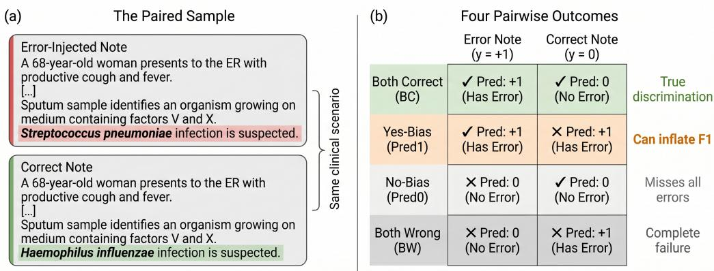
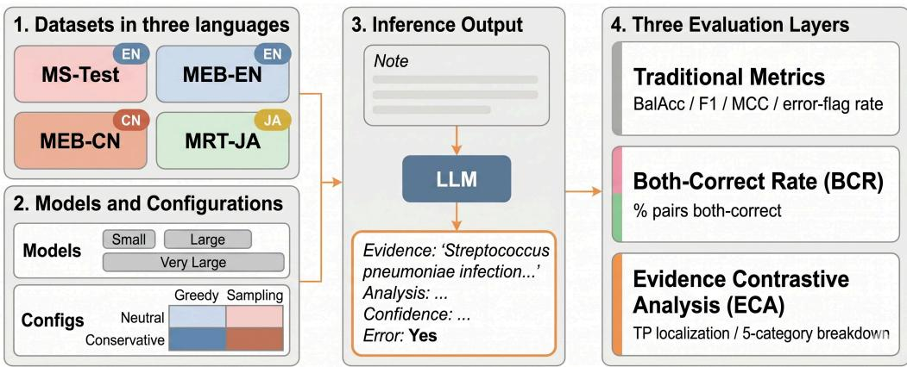
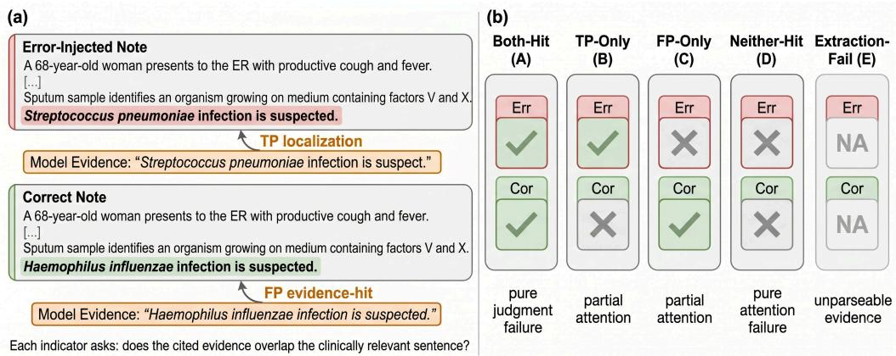
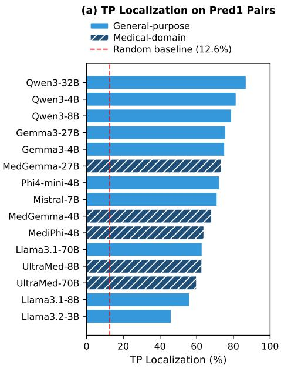
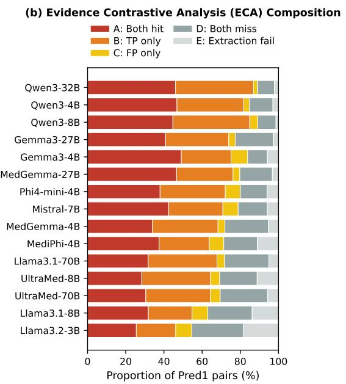
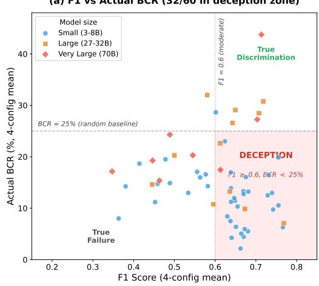
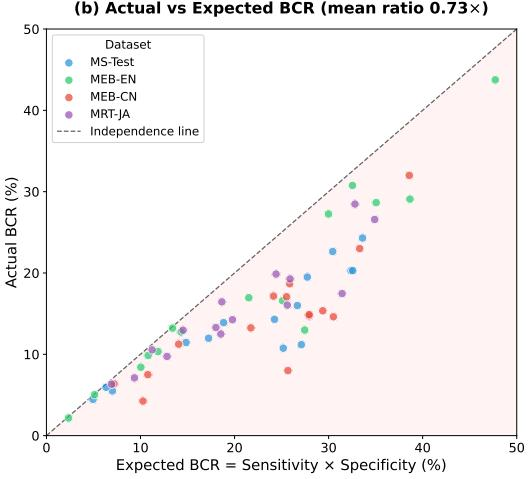
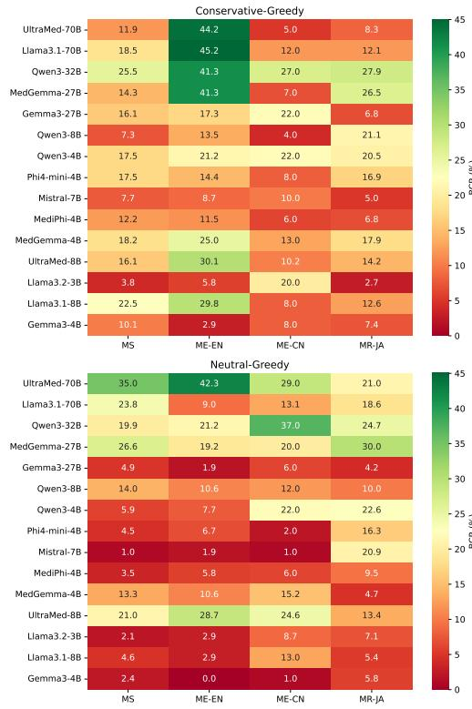

# Toward Better Assessment of LLMs’ Performance in Clinical Error Detection

Yifan Zhang1

eyfzh@udel.edu

Rahmatollah Beheshti1

rbi@udel.edu

1 University of Delaware, Newark, DE, USA

## Abstract

Automated detection of errors in clinical documentation is a promising application of large language models (LLMs), yet decisions to deploy such models rest on benchmarks that evaluate each clinical note in isolation. Error-detection benchmarks are typically constructed by injecting errors into notes, such that each erroneous note has a natural counterpart. Aggregate discriminative metrics (e.g., balanced accuracy or F1) do not exploit this structure. We show that this omission is consequential. In particular, evaluating 15 diverse LLMs on 4 standardized clinical error-detection test sets across 3 languages, we find that 13 of 15 models fall below the level of random pairwise discrimination, even while achieving F1 scores that standard practice would read as moderate. We also observe that the underlying bias patterns difer across languages: the same model can default to “no error” on one language and over-flag errors on another. To diagnose where discrimination breaks down, we further introduce a procedure to score the evidence models cite in their outputs. We find that while models consistently locate error-relevant content, they fail to produce the corresponding correct verdict on the clean counterpart. Finally, we show that F1 and pairwise accuracy are driven in opposite directions by the same underlying bias, so that ranking models by F1 may systematically promote the weakest discriminators. For safety-critical clinical NLP applications, we advocate for supplementing aggregate metrics with paired evaluations in benchmark reporting. Code and analysis scripts are available at https://github.com/healthylaife/paired-clinical-eval.

## 1. Introduction

Medical errors are a substantial and persistent source of preventable harm in US healthcare, with widely cited estimates ranging from tens of thousands to several hundred thousand deaths per year (Kohn et al., 2000; Makary and Daniel, 2016). A substantial portion of these errors originates in or propagates through clinical documentation: incorrect diagnoses recorded in progress notes, inappropriate treatment plans, or misidentified pathogens that cascade into downstream care decisions (Ben Abacha et al., 2024). Manual review of clinical notes is time-consuming, inconsistent, and does not scale with growing documentation volumes. Automated detection using language models to flag potential errors is therefore of direct clinical interest.

From a machine learning perspective, clinical error detection is a particularly demanding task. Unlike medical question answering, where a model selects among predefined options, error detection requires the model to evaluate clinical reasoning. The model must read a note, understand the implicit chain from symptoms through diagnosis to management, and judge whether that reasoning is sound. This demands not only medical knowledge but also the ability to distinguish incorrect clinical decisions from decisions that are unconventional but clinically appropriate.

<table><tr><td colspan="2">(b) Error Note (y = +1)</td><td colspan="2">Four Pairwise Outcomes Correct Note (y = 0)</td></tr><tr><td>Both Correct (BC)</td><td>✓ Pred: +1 (Has Error)</td><td>✓ Pred: 0 (No Error)</td><td rowspan="2">True discrimination Can inflate F1</td></tr><tr><td>Yes-Bias (Pred1)</td><td>√ Pred: +1 (Has Error)</td><td>× Pred: +1 (Has Error)</td></tr><tr><td>No-Bias (Pred0)</td><td>× Pred: 0 (No Error)</td><td>✓ Pred: 0 (No Error)</td><td>Misses all errors</td></tr><tr><td>Both Wrong (BW)</td><td>× Pred: 0 (No Error)</td><td>× Pred: +1 (Has Error)</td><td>Complete failure</td></tr></table>

Figure 1: Paired clinical error detection. (a) Each clinical scenario produces an errorinjected note and a correct note difering by one sentence. (b) A model’s predictions on the pair fall into four mutually exclusive outcomes.

Recent work has established benchmarks for this task (MEDEC (Ben Abacha et al., 2025), MedRECT (Iwase et al., 2025), and MedErrBench (Ma et al., 2026)), with top systems relying on large proprietary models with retrieval augmentation (Corbeil, 2024) and prompt optimization (Toma et al., 2024). How and where LLMs fail at this task remains largely unexamined.

LLMs are appealing for clinical deployment because they can be hosted locally, avoiding the need to transmit patient data to external vendors. Standard evaluation suggests that such models perform reasonably well on clinical error detection. Yet aggregate metrics evaluate each note in isolation and can be inflated by bidirectional prediction bias: a model that always predicts error (yes-bias) or always predicts no error (no-bias) can achieve high aggregate scores without distinguishing erroneous notes from correct ones.

The paired structure of clinical error detection datasets makes this problem visible. Clinical scenarios included in these benchmarks produce two notes that difer by a single sentence: one with an injected error and one without (Figure 1). A model that truly discriminates should correctly identify the error in the first note and clear the second; a biased model assigns the same label to both, revealing that its aggregate performance reflects a default tendency rather than clinical understanding. The separation of true discrimination from response bias is long established in signal detection theory (Green and Swets, 1966), and evaluation on minimally contrastive samples is well established through contrast sets (Gardner et al., 2020). To the best of our knowledge, clinical error detection has not adopted pairwise evaluation.

Based on this principle, we define the Both-Correct Rate (BCR), which adapts contrast consistency to clinical error detection by requiring correct classification of both members of each pair. To diagnose where discrimination breaks down, we introduce Evidence Contrastive Analysis (ECA), which checks whether the evidence a model cites on a failed pair overlaps with the ground-truth error and correction sentences. The framework applies to any (correct, corrupted) pair, including substitution, insertion, and omission; our experiments focus on substitution-form errors because these are the errors released by the public paired benchmarks, a data limitation discussed in Section 5.3. We apply this framework to 15 LLMs across four paired clinical error-detection datasets in three languages, with four prompt configurations per model. We assess model outputs through three comprehensive strategies: aggregate pointwise metrics, pairwise BCR, and ECA on the dominant failure mode.

In this paper, we make three contributions:

• Discrimination failure is pervasive despite adequate aggregate performance. We show that the vast majority of tested models fall below 25% random pairwise discrimination despite achieving reasonable aggregate scores. The underlying prediction bias is bidirectional and language-dependent: the same model can exhibit yes-bias on one language and no-bias on another.

• Models locate error-relevant evidence but cannot judge it. Through ECA, we show that models locate error-relevant text yet produce the same verdict on both members of the pair. In the majority of yes-bias failures, the model locates the error sentence on the erroneous note, yet labels both as erroneous.

• Standard metrics are structurally misleading on paired clinical data. We show that F1 and BCR can be driven in opposite directions by the same underlying prediction bias, so that the models ranked highest by F1 are typically ranked lowest by BCR.

## 2. Related Work

## 2.1. Error Detection in Clinical Texts

The need for safer clinical documentation has motivated a series of benchmarks for automated error detection. The MEDIQA-CORR 2024 shared task formalized clinical error detection as a community challenge (Ben Abacha et al., 2024), with MEDEC providing a larger public corpus (Ben Abacha et al., 2025). Subsequent work expanded the scope to multilingual evaluation (Iwase et al., 2025; Ma et al., 2026). Despite growing benchmark diversity, the evaluation paradigm remains focused on comparing aggregate accuracy across models and strategies. Standard benchmarks can create an evaluation illusion that obscures real-world clinical limitations (Agrawal et al., 2025), and retrieval proficiency does not necessarily predict operational success (Kanithi et al., 2026). Whether high scores on clinical error detection benchmarks reflect discriminative ability rather than systematic prediction bias remains unexamined. This paper addresses that gap by applying pairwise evaluation to clinical error detection, adapting the contrast consistency principle (Gardner et al., 2020) to the paired structure already provided by MEDEC-style datasets.

## 2.2. Prediction Bias in Healthcare

Systematic prediction bias, defined as the tendency to default to a single output class regardless of the input, is well-documented in LLMs. Sycophancy, in which models align with perceived user expectations (Sharma et al., 2024), represents one mechanism that can produce such bias; in clinical error detection, it manifests as yes-bias, defaulting to “error present.” In the medical domain specifically, LLMs exhibit heightened susceptibility to cognitive biases, with less capable models showing larger accuracy degradation under biased prompting (Schmidgall et al., 2024). In parallel, a growing body of work has examined demographic bias in medical LLMs, showing that outputs in clinical decision support shift with patients’ protected attributes and that prompt phrasing modulates the observed patterns (Poulain et al., 2026); such evaluations have been scaled through automatically generated, evidence-grounded test cases (Fayyaz et al., 2024), and Adiba et al. (2025) surveys the area. This demographic line of work concerns which patients a model treats diferently, whereas prediction bias concerns which output class a model defaults to. Despite these findings, prior work has predominantly characterized prediction bias as unidirectional, assuming models consistently favor one class. Whether the bias direction is stable across languages and prompt configurations has not been investigated.

## 2.3. Pairwise Evaluation and Representation Gaps

Signal detection theory separates a system’s ability to discriminate between classes from its response bias toward one class (Green and Swets, 1966). Because measured accuracy reflects both, response bias alone can produce high accuracy when the class prior is skewed or evaluation is restricted to a single class. A parallel concern motivates minimal-pair evaluation (Warstadt et al., 2020) and contrast sets (Gardner et al., 2020), which evaluate models on minimally contrastive inputs to reveal whether they have learned the relevant distinction or merely exploit superficial correlations. Despite the paired structure built into these datasets (Ben Abacha et al., 2024; Iwase et al., 2025; Ma et al., 2026), clinical NLP benchmarks have not adopted contrastive evaluation.

A separate line of work has shown that LLMs can encode correct information internally while producing incorrect outputs. Probing studies demonstrate that truthfulness is represented in hidden states even when generated text is wrong (Burns et al., 2023; Orgad et al., 2025). Separately, chain-of-thought explanations can misstate the factors actually driving a prediction (Turpin et al., 2023). Probing requires weight access, which is unavailable for the closed models that dominate clinical deployment. Whether correct evidence can surface in a model’s generated text alongside an incorrect verdict has not been systematically studied.

## 3. Methods

Pairing is the organizing principle of our evaluation (Figure 1): each error-injected note has a correct counterpart from the same clinical scenario, making the pair, not the single note, the unit at which true discrimination can be separated from response bias. Building on this, we develop three parallel evaluation layers (Figure 2): traditional pointwise metrics (§3.4.1), the Both-Correct Rate at the pair level (§3.4.2), and Evidence Contrastive Analysis within failed pairs (§3.4.3). We apply this framework to 15 instruction-tuned LLMs across four test sets in three languages, under four prompt–decoding configurations per model–dataset combination.

  
Figure 2: Our framework for evaluating LLMs in clinical error detection tasks. Four paired clinical error-detection test sets across three languages, LLMs across three size tiers, and four prompt-decoding configurations are used. Each model’s structured per-note output is then assessed through three parallel evaluation layers: traditional pointwise metrics, pairwise Both-Correct Rate (BCR), and Evidence Contrastive Analysis (ECA).

## 3.1. Datasets and Task

We apply our framework to four clinical error detection test sets spanning three languages (Table 1). MEDEC MS-Test (MS-Test) is drawn from the MEDEC MS corpus (Ben Abacha et al., 2025); MedErrBench-EN (MEB-EN) and MedErrBench-CN (MEB-CN) are the English and Chinese test sets of MedErrBench (Ma et al., 2026); and MedRECT-JA (MRT-JA) is the Japanese test set of MedRECT, with nine error types (Iwase et al., 2025).

In each dataset, error-injected notes are paired with correct counterparts from the same clinical scenarios. Whether these pairs are released explicitly varies by dataset, and not every released note participates in a matched pair; we apply dataset-specific procedures to identify usable pairs, with details in Appendix A.

MedRECT-JA warrants a caveat: its 190 error notes share only 105 unique clean notes, a many-to-one structure that may inflate within-pair error correlation (Appendix A).

We restrict evaluation to the binary error-flag sub-task: given a single clinical note, decide whether it contains a medical error, thereby measuring pairwise discrimination without conflating detection with correction. Notes are evaluated independently; the model never sees a pair side-by-side, so pairwise discrimination must be inferred from each note’s content alone, with pairing applied post-hoc to compute BCR.

## 3.2. Models

We evaluate 15 instruction-tuned LLMs (Appendix C, Table 4) across three size tiers (3–8B, 27–32B, and 70B) and five model families; five are medical-domain, the other ten generalpurpose. This grid enables two comparisons: scale within a family (e.g., Qwen 3 at 4B, 8B, and 32B) and medical specialization at matched scale (e.g., Gemma 3-27B vs. MedGemma 27B).

Table 1: Datasets used for inference and evaluation. Error and Clean are the sub-counts of notes with and without errors, respectively; Pairs is the number of matched (error, correct) tuples used for BCR evaluation, which can difer from min(Error, Clean) when notes lack a counterpart or share counterparts across pairs.
<table><tr><td>Dataset</td><td>Samples</td><td>Error</td><td>Clean</td><td>Pairs</td><td>Language</td><td>Source</td></tr><tr><td>MS-Test</td><td>597</td><td>311</td><td>286</td><td>286</td><td>English</td><td>Ben Abacha et al. (2025)</td></tr><tr><td>MEB-EN</td><td>208</td><td>104</td><td>104</td><td>104</td><td>English</td><td>Ma et al. (2026)</td></tr><tr><td>MEB-CN</td><td>200</td><td>100</td><td>100</td><td>100</td><td>Chinese</td><td>Ma et al. (2026)</td></tr><tr><td>MRT-JA</td><td>295</td><td>190</td><td>105</td><td>190</td><td>Japanese</td><td>Iwase et al. (2025)</td></tr></table>

Clinical sites adopting LLMs for error detection are unlikely to curate task-specific fewshot demonstrations, and a fair comparison across model families with diferent training paradigms requires a common starting point. We therefore evaluate all models zero-shot, without task-specific examples or fine-tuning.

Precision. Models at 27B parameters and below are loaded in native bfloat16 (bf16); the two 70B models are loaded in 8-bit floating point (fp8) via vLLM (Kwon et al., 2023) due to memory constraints, which may slightly reduce their performance relative to full precision.

## 3.3. Prompt Design and Decoding

We treat prompt and decoding choices as a 2×2 perturbation matrix that probes two orthogonal sources of variability: whether instruction wording can shift prediction bias, and whether sampling noise drives the observed patterns. Reporting the cross-configuration mean and standard deviation across the four resulting configurations lets us separate stable model behavior from configuration-driven artifacts, a robustness check that singleconfiguration benchmarks cannot provide.

The neutral prompt instructs the model to act as a skilled medical doctor performing a standard clinical review. The conservative prompt adds an explicit instruction to prefer “no error” when the evidence is ambiguous, testing whether directed caution can shift prediction bias without improving discrimination. Both prompts require a structured four-line output (Evidence, Analysis, Confidence, Error:Yes/No), providing both the binary verdict for evaluation and the textual evidence used by ECA (Section 3.4.3). Dataset-specific error type lists are provided in the native language of each dataset.

For decoding, we use greedy decoding as the primary setting because it yields fully reproducible outputs and isolates bias efects from sampling noise, and complement it with stochastic sampling to test whether sampling variability shifts the observed bias patterns. Full prompt templates and exact decoding parameters appear in Appendix D.

## 3.4. Evaluation Framework

## 3.4.1. Traditional Metrics

We report balanced accuracy, F1, precision, recall, specificity, and the Matthews correlation coeficient (MCC). We additionally report the error-flag rate: the fraction of notes for which the model outputs Error:Yes. Balanced accuracy and MCC serve as primary anchors because they account for class imbalance and penalize degenerate classifiers, respectively. F1 and recall are reported to expose the discrepancy between bias-sensitive and bias-resistant metrics.

## 3.4.2. Both-Correct Rate (BCR)

BCR adapts the contrast consistency principle (Gardner et al., 2020) to clinical error detection. For each pair $( x _ { e } , x _ { c } )$ consisting of an error-injected and a correct note from the same clinical scenario, the model’s predictions $( \hat { y } _ { e } , \hat { y } _ { c } )$ fall into four mutually exclusive categories. We use the shorthand Pred1 (both predicted erroneous) to denote pairs where the model flags both members as containing an error, and Pred0 (both predicted non-erroneous) for pairs where the model judges both error-free. These two outcomes correspond to systematic yes-bias and no-bias failure modes, respectively.

1. Both Correct $( \mathbf { B C } ) \colon \hat { y } _ { e } = 1$ and $\hat { y } _ { c } = 0$ . Correct on both members of the pair.

2. Pred1: $\hat { y } _ { e } = 1$ and $\hat { y } _ { c } = 1$ . Both members predicted as containing an error (yes-bias).

3. Pred0: $\hat { y } _ { e } = 0$ and $\hat { y } _ { c } = 0$ . Both members predicted as error-free (no-bias).

4. Both Wrong (BW): $\hat { y } _ { e } = 0$ and $\hat { y } _ { c } = 1$ . Inverted judgment on both members.

BCR is the fraction of pairs classified as Both Correct:

$$
\mathrm { B C R } = \frac { 1 } { N } \sum _ { i = 1 } ^ { N } \mathbf { 1 } [ \hat { y } _ { e , i } = 1 \ \wedge \ \hat { y } _ { c , i } = 0 ] .\tag{1}
$$

The population counterpart of Equation 1 is $\mathbb { E } [ { \mathrm { B C R } } ] = P ( { \hat { y } } _ { e } = 1 , { \hat { y } } _ { c } = 0 \mid y _ { e } = 1 , y _ { c } =$ 0): the joint probability that a random pair is classified correctly on both members. Under the null hypothesis that within-pair predictions are conditionally independent given the pair labels, with each prediction depending only on its own note, this joint factorizes into marginals, giving

$$
\mathbb { E } [ \mathrm { B C R } ] _ { \mathrm { i n d e p } } = P ( \hat { y } _ { e } = 1 \mid y _ { e } = 1 ) \cdot P ( \hat { y } _ { c } = 0 \mid y _ { c } = 0 ) = \mathrm { s e n s i t i v i t y } \cdot \mathrm { s p e c i f i c i t y } .\tag{2}
$$

We define the independence ratio as

$$
R _ { \mathrm { i n d e p e n d e n c e } } = { \frac { \mathrm { B C R } } { \mathbb { E } [ \mathrm { B C R } ] _ { \mathrm { i n d e p } } } } ,\tag{3}
$$

which measures how far observed BCR departs from the independence baseline implied by the model’s own marginal sensitivity and specificity. A consistent $R _ { \mathrm { i n d e p e n d e n c e } } < 1$ indicates that within-pair prediction outcomes are systematically dependent: joint success on both members of a pair occurs less often than within-pair independence would predict. We emphasize that our contribution is this diagnostic apparatus—the independence ratio, which isolates within-pair dependence that contrastive accuracy alone does not expose, together with ECA (Section 3.4.3), which localizes where discrimination breaks down—rather than the BCR statistic itself, which is a direct adaptation of contrast consistency (Gardner et al., 2020).

Beyond this stochastic baseline, BCR obeys a deterministic upper bound. Because a Both-Correct pair requires $\hat { y } _ { e } = 1$ and $\hat { y } _ { c } = 0$ , the Both-Correct event is contained in each single-note success event, so

$$
\mathrm { B C R } \leq \operatorname* { m i n } ( \mathrm { s e n s i t i v i t y } , \mathrm { s p e c i f i c i t y } ) .\tag{4}
$$

Any class bias therefore caps BCR at the weaker marginal, however high F1 climbs through recall on the favored class, so the F1–BCR divergence in Section 4.5 is structural rather than model-specific. A short proof and an always-error corollary $( \mathrm { F 1 } = 2 / 3$ with $\mathrm { B C R } = 0$ on balanced data) are given in Appendix B.

For a random classifier with sensitivity = specificity = 0.5, Equation 2 yields a 25% BCR baseline; this figure is the balanced special case and applies only to the three classbalanced pair sets (MS-Test, MEB-EN, MEB-CN). On MedRECT-JA (190 of 295 notes contain errors), a random predictor calibrated to the empirical class prevalence (outputting $\hat { y } = 1$ with probability 190/295 independent of the input) has sensitivity = 190/295 and specificity = 105/295, giving an independence baseline of $( 1 9 0 / 2 9 5 ) ( 1 0 5 / 2 9 5 ) \approx 2 2 . 9 \%$ The general, balance-free reference is therefore the independence ratio $R _ { \mathrm { i n d e p e n d e n c e } }$ (Equation 3) rather than any fixed percentage. We report the four-configuration mean ± standard deviation as the primary BCR measure; cross-configuration variation is informative in itself about prompt sensitivity.

## 3.4.3. Evidence Contrastive Analysis (ECA)

BCR reveals whether models discriminate between paired samples, but not which stage of their reasoning fails: locating the relevant evidence or judging it correctly once located. Evidence Contrastive Analysis (ECA) is a post-hoc diagnostic procedure that, for each pair, scores whether the cited Evidence field overlaps the clinically relevant sentence on the error note (TP localization) and on the correct note (FP evidence-hit). Overlap is scored by sub-string containment $\mathrm { o r } \geq 6 0 \%$ word coverage (threshold sensitivity in Appendix E), adapting the rationale token-overlap convention (DeYoung et al., 2020), with characterlevel counting for Chinese and Japanese where word boundaries are ill-defined. Combining these two indicators across the pair yields the five mutually exclusive categories shown in Figure 3, which separate attention failures from judgment failures.

## 3.4.4. Parse Failure Handling

Although our prompts specify a strict four-line output format, not all models achieve perfect compliance: some outputs add extra text, omit the Error field, or produce a malformed structure, leaving no parseable verdict. Pairs where either member cannot be parsed are excluded from BCR computation. To verify that this exclusion does not bias the results, we compare against a random-assignment imputation that fills in unparseable verdicts using the model’s overall accuracy (Appendix E). Parse failures are themselves captured as Extraction-Fail (E) in ECA (Section 3.4.3).

  
Figure 3: Evidence Contrastive Analysis (ECA). (a) The two indicators, illustrated on a shared clinical scenario: TP localization asks whether the cited evidence on the error note (Streptococcus pneumoniae) overlaps the error sentence; FP evidencehit asks the same question on the correct note (Haemophilus influenzae). (b) The five outcomes arising from combining the two indicators across a pair. Both-Hit (A) isolates a judgment failure: the model attends to the correct location in both notes, yet still cannot determine which version is incorrect. Neither-Hit (D) reflects full attention failure. TP-Only (B) and FP-Only (C) are partial-attention failures. Extraction-Fail (E) captures pairs with unparseable Evidence fields.

## 4. Results

## 4.1. Traditional Metrics Suggest Moderate Performance

Across all 240 runs (15 models × 4 datasets × 4 configurations), balanced accuracy ranges from 0.45 to 0.71, with MCC near zero for most models, indicating performance close to chance at distinguishing error-containing notes from correct ones. F1 scores, however, range up to 0.80: in 178 of 240 runs (74%), F1 exceeds 0.5 while balanced accuracy stays at or below 0.6. Under standard evaluation practice, these F1 scores would suggest that most models achieve moderate performance on clinical error detection. Full per-run metrics for all 240 runs appear in Appendix G.1 (Tables 11–14). The pairwise analysis that follows reveals that this apparent performance does not reflect discriminative ability at the pair level.

## 4.2. Pairwise BCR Reveals Low Discrimination

Table 2 presents the four-configuration mean BCR for each model–dataset combination. Thirteen of 15 models fall below 25% mean BCR across datasets, the level expected from a random classifier on balanced data. Only Qwen 3-32B (28.0%) and UltraMedical 70B (25.7%) exceed this threshold, and both still fail to correctly classify both members of a pair more than 70% of the time.

The 25% baseline is the balanced special case (for prevalence-imbalanced MRT-JA it is 22.9%; the balance-free reference is the independence ratio of Equation 3, analyzed in Section 4.5). The Sens and Spec columns of Table 2 make the mechanism concrete: topranked models pair moderate sensitivity with moderate specificity, whereas the lowest-BCR models drive one marginal to an extreme (e.g., Gemma 3-4B at 94.2% sensitivity but 7.2% specificity), exactly the configuration a single aggregate score conceals.

Table 2: Four-configuration mean BCR (%) ± standard deviation by model and dataset. Sens and Spec are the model’s mean pointwise sensitivity and specificity, averaged over all 16 runs; the highest-BCR models pair moderate sensitivity with moderate specificity, while the lowest-BCR models collapse one marginal toward its extreme. † Medical-domain model. Sorted by cross-dataset mean BCR.
<table><tr><td></td><td colspan="5">BCR (%)</td><td colspan="2">Marginal (%)</td></tr><tr><td>Model</td><td></td><td></td><td>MS-Test MEB-EN MEB-CN MRT-JA</td><td></td><td>Mean</td><td>Sens</td><td>Spec</td></tr><tr><td>Qwen 3-32B</td><td> $2 2 . 6 { \pm } 3 . 7 $ </td><td> $3 0 . 8 { \pm } 1 1 . 1$ </td><td> $3 2 . 0 { \pm } 5 . 5 $ </td><td> $2 6 . 6 { \pm } 1 . 9$ </td><td>28.0</td><td>69.4</td><td>51.4</td></tr><tr><td>UltraMed-70B†</td><td> $2 4 . 3 { \pm } 9 . 8 $ </td><td> $4 3 . 7 { \pm } 2 . 2 $ </td><td> $1 6 . 8 { \pm } 1 0 . 0 $ </td><td> $1 8 . 0 { \pm } 5 . 7 $ </td><td>25.7</td><td>47.0</td><td>73.5</td></tr><tr><td>MedGemma 27B†</td><td> $2 0 . 3 { \pm } 4 . 9$ </td><td> $2 9 . 1 { \pm } 8 . 6 $ </td><td> $1 4 . 6 { \pm } 5 . 7 $ </td><td> $2 8 . 5 { \pm } 4 . 2$ </td><td>23.1</td><td>61.2</td><td>56.0</td></tr><tr><td>Llama 3.1-70B</td><td> $2 0 . 2 { \pm } 3 . 6 $ </td><td> $2 7 . 1 { \pm } 1 5 . 6 $ </td><td> $1 5 . 3 { \pm } 2 . 8 $ </td><td> $1 7 . 4 { \pm } 7 . 0 $ </td><td>20.0</td><td>63.6</td><td>51.4</td></tr><tr><td>UltraMed-8B↑</td><td> $1 9 . 6 { \pm } 5 . 8 $ </td><td> $2 8 . 5 { \pm } 2 . 5 $ </td><td> $1 8 . 4 { \pm } 5 . 5 $ </td><td> $1 3 . 5 { \pm } 1 . 8 $ </td><td>20.0</td><td>43.4</td><td>65.0</td></tr><tr><td>Qwen 3-4B</td><td> $1 2 . 0 { \pm } 5 . 9$ </td><td> $1 3 . 2 { \pm } 6 . 6 $ </td><td> $2 3 . 0 { \pm } 1 . 2 $ </td><td> $1 9 . 9 { \pm } 1 . 9 $ </td><td>17.0</td><td>83.5</td><td>27.8</td></tr><tr><td>MedGemma 4B†</td><td> $1 6 . 0 { \pm } 3 . 8 $ </td><td> $1 6 . 6 { \pm } 6 . 6 $ </td><td> $1 4 . 8 { \pm } 2 . 7 $ </td><td> $1 2 . 5 { \pm } 6 . 6 $ </td><td>15.0</td><td>66.5</td><td>38.6</td></tr><tr><td>Llama 3.1-8B</td><td> $1 4 . 1 { \pm } 7 . 5 $ </td><td> $1 6 . 9 { \pm } 1 3 . 1 $ </td><td> $1 4 . 6 { \pm } 4 . 6 $ </td><td> $1 2 . 8 { \pm } 7 . 4 $ </td><td>14.6</td><td>70.9</td><td>34.5</td></tr><tr><td>Phi-4-mini</td><td> $1 3 . 9 { \pm } 7 . 7 $ </td><td> $1 2 . 7 { \pm } 5 . 6 $ </td><td> $7 . 5 { \pm } 4 . 8 $ </td><td> $1 6 . 5 { \pm } 1 . 5 $ </td><td>12.7</td><td>86.1</td><td>18.4</td></tr><tr><td>Qwen 3-8B</td><td> $1 1 . 2 { \pm } 3 . 2 $ </td><td> $1 3 . 0 { \pm } 1 . 4 $ </td><td> $8 . 0 { \pm } 3 . 2 $ </td><td> $1 6 . 1 { \pm } 4 . 6 $ </td><td>12.1</td><td>56.4</td><td>49.4</td></tr><tr><td>MediPhi 4B†</td><td> $1 1 . 5 { \pm } 6 . 5 $ </td><td> $1 0 . 3 { \pm } 4 . 6 $ </td><td> $1 1 . 2 { \pm } 6 . 1$ </td><td> $9 . 7 { \pm } 2 . 1$ </td><td>10.7</td><td>87.4</td><td>15.4</td></tr><tr><td>Gemma 3-27B</td><td> $1 0 . 8 { \pm } 5 . 7 $ </td><td> $9 . 9 { \pm } 8 . 4$ </td><td> $1 3 . 2 { \pm } 8 . 3 $ </td><td> $7 . 1 { \pm } 3 . 3 $ </td><td>10.2</td><td>85.2</td><td>21.0</td></tr><tr><td>Llama 3.2-3B</td><td> $5 . 9 { \pm } 3 . 1 $ </td><td> $8 . 4 { \pm } 4 . 2$ </td><td> $1 6 . 3 { \pm } 7 . 7 $ </td><td> $1 0 . 0 { \pm } 7 . 1$ </td><td>10.2</td><td>84.1</td><td>17.5</td></tr><tr><td>Mistral 7B</td><td> $4 . 5 { \pm } 3 . 4 $ </td><td> $5 . 0 { \pm } 3 . 6 $ </td><td> $6 . 3 { \pm } 5 . 4 $ </td><td> $1 2 . 8 { \pm } 6 . 4 $ </td><td>7.1</td><td>88.8</td><td>10.9</td></tr><tr><td>Gemma 3-4B</td><td> $5 . 5 { \pm } 3 . 8 $ </td><td> $2 . 2 { \pm } 2 . 4$ </td><td> $4 . 2 { \pm } 3 . 3 $ </td><td> $6 . 3 { \pm } 1 . 1$ </td><td>4.6</td><td>94.2</td><td>7.2</td></tr></table>

Two secondary trends emerge within this pattern. First, scaling within model families yields modest gains: Qwen improves from 17.0% (4B) to 28.0% (32B), though nonmonotonically (12.1% at 8B), and Llama from 10.2% (3B) to 20.0% (70B). However, these gains are concentrated on English datasets; for example, Llama 3B-to-70B gains 18.7 pp on MedErrBench-EN but decreases by 1.0 pp on MedErrBench-CN. Second, medical-domain pretraining often provides larger gains than scaling alone: Gemma 3-27B (general-purpose) achieves 10.2% mean BCR, while MedGemma 27B (medical) reaches 23.1%, more than doubling its general-purpose counterpart. This holds for four of five matched general–medical pairs; MediPhi 4B (10.7%) is the exception, underperforming Phi-4-mini (12.7%).

Cross-configuration standard deviations range from 1.1 pp to 15.6 pp across individual model–dataset entries. Llama 3.1-70B is the most unstable overall. On MedErrBench-EN, its BCR ranges from 9.0% to 45.2% across the four configurations, a spread of 36.2 pp.

Table 3: Mean error-flag rate per model–dataset combination. Pink cells indicate yes-bias $\left( \mathrm { r a t e } \geq 0 . 6 \right)$ ; blue cells indicate no-bias $\mathrm { ( r a t e < 0 . 4 ) }$ ; unshaded cells are balanced $( 0 . 4 \leq \mathrm { r a t e } < 0 . 6 )$ . A check in the Shift column marks models whose bias category changes across datasets. † Medical-domain model.
<table><tr><td rowspan=1 colspan=7>Model               MS-TestMEB-EN MEB-CN MRT-JA Shift?</td></tr><tr><td rowspan=1 colspan=3>Llama 3.2-3B          .94        .88</td><td rowspan=1 colspan=1>.63</td><td rowspan=1 colspan=3>.89</td></tr><tr><td rowspan=1 colspan=1>Gemma 3-4B</td><td rowspan=1 colspan=2>.94        .98</td><td rowspan=1 colspan=1>.89</td><td rowspan=1 colspan=3>.93</td></tr><tr><td rowspan=1 colspan=1>Qwen 3-4B</td><td rowspan=1 colspan=2>.81        .91</td><td rowspan=1 colspan=1>.61</td><td rowspan=1 colspan=3>.80</td></tr><tr><td rowspan=1 colspan=1>MedGemma 4B†</td><td rowspan=1 colspan=2>.60        .66</td><td rowspan=1 colspan=1>.50</td><td rowspan=1 colspan=3>.80       √</td></tr><tr><td rowspan=1 colspan=1>MediPhi 4B†</td><td rowspan=1 colspan=2>.84        .89</td><td rowspan=1 colspan=1>.85</td><td rowspan=1 colspan=2>.86</td><td rowspan=3 colspan=1></td></tr><tr><td rowspan=1 colspan=1>Phi-4-mini</td><td rowspan=1 colspan=2>.79        .89</td><td rowspan=1 colspan=1>.88</td><td rowspan=1 colspan=2>.81</td></tr><tr><td rowspan=1 colspan=1>Mistral 7B</td><td rowspan=1 colspan=1>.95</td><td rowspan=1 colspan=1>.96</td><td rowspan=1 colspan=1>.93</td><td rowspan=1 colspan=2>.72</td></tr><tr><td rowspan=1 colspan=1>Llama 3.1-8B</td><td rowspan=1 colspan=1>.67</td><td rowspan=1 colspan=1>.78</td><td rowspan=1 colspan=1>.43</td><td rowspan=1 colspan=2>.85</td><td rowspan=1 colspan=1>√</td></tr><tr><td rowspan=1 colspan=1>UltraMed-8B†</td><td rowspan=1 colspan=1>.42</td><td rowspan=1 colspan=1>.55</td><td rowspan=1 colspan=1>.32</td><td rowspan=1 colspan=2>.27</td><td rowspan=1 colspan=1>√</td></tr><tr><td rowspan=1 colspan=1>Qwen 3-8B</td><td rowspan=1 colspan=1>.50</td><td rowspan=1 colspan=1>.60</td><td rowspan=1 colspan=1>.36</td><td rowspan=1 colspan=2>.69</td><td rowspan=1 colspan=1>√</td></tr><tr><td rowspan=1 colspan=1>Gemma 3-27B</td><td rowspan=1 colspan=1>.67</td><td rowspan=1 colspan=1>.92</td><td rowspan=1 colspan=1>.77</td><td rowspan=2 colspan=2>.92</td><td rowspan=3 colspan=1>√√</td></tr><tr><td rowspan=1 colspan=1>MedGemma 27B†</td><td rowspan=1 colspan=1>.45</td><td rowspan=1 colspan=1>.60</td><td rowspan=1 colspan=1>.43</td><td rowspan=1 colspan=1>.65</td></tr><tr><td rowspan=1 colspan=1>Qwen 3-32B</td><td rowspan=1 colspan=1>.62</td><td rowspan=1 colspan=1>.78</td><td rowspan=1 colspan=1>.43</td><td rowspan=1 colspan=2>.56</td></tr><tr><td rowspan=1 colspan=1>Llama 3.1-70B</td><td rowspan=1 colspan=1>.50</td><td rowspan=1 colspan=1>.78</td><td rowspan=1 colspan=1>.41</td><td rowspan=1 colspan=2>.57</td><td rowspan=1 colspan=1>√</td></tr><tr><td rowspan=1 colspan=1>UltraMed-70B†</td><td rowspan=1 colspan=1>.36</td><td rowspan=1 colspan=1>.59</td><td rowspan=1 colspan=1>.20</td><td rowspan=1 colspan=2>.33</td><td rowspan=1 colspan=1>√</td></tr></table>

## 4.3. Bias Is Bidirectional and Language-Dependent

The bias patterns underlying these BCR results are not uniform across languages. Table 3 reports the mean error-flag rate for each model–dataset combination, along with the resulting bias category. Eight of 15 models change bias category across datasets, and for seven of these, the mean error-flag rate falls on opposite sides of parity on diferent datasets; Qwen 3-8B reverses outright, from no-bias on Chinese (0.36) to yes-bias on Japanese (0.69). UltraMedical 8B illustrates the more common pattern: balanced prediction rates on English datasets (0.42–0.55) shifting to strong no-bias on Chinese and Japanese (0.27–0.32).

Several models also switch bias direction outright between prompt variants: on at least one dataset, seven of 15 models show yes-bias under neutral prompting but no-bias under conservative prompting (per-configuration error-flag rates in Appendix G, Tables 11–14), so conservative prompting does not simply shift prediction rates toward balance.

## 4.4. The Localization-Judgment Gap

Having established that discrimination fails and that yes-bias (Pred1 ) is the dominant failure mode across our experiments (for the two no-bias models, UltraMedical 8B and 70B, Pred0 dominates instead), we next examine whether models nonetheless attend to error-relevant content in their outputs. We focus ECA on Pred1 pairs, which concentrate the bulk of failures and therefore ofer the greatest statistical power for diagnosing what happens when models fail pairwise discrimination while still producing reasoning evidence.

TP localization measures whether the evidence cited by the model on the error note overlaps with the actual error sentence. Random baselines, corresponding to a sentencelevel uniform pick, are the inverse of the average number of sentences per note (12.6% for MS-Test, 9.3% for MEB-EN, 27.7% for MEB-CN, 10.1% for MRT-JA). On MS-Test, all 15 models exceed the random baseline under the four-configuration mean (Figure 4a). Averaged across the 15 models, per-dataset TP localization rates are 87% on MEB-EN, 70% on MEB-CN, 69% on MS-Test, and 42% on MRT-JA (full per-model values in Appendix G.2, Table 15).

  
Figure 4: The localization-judgment gap on MS-Test (four-configuration mean across 15 models). (a) TP localization per model; dashed line is the random baseline (12.6%). (b) ECA category composition per model, as percentage of Pred1 pairs; category definitions in Figure 3.

The ECA category breakdown (Figure 4b) shows that correct localization on the error note coexists with pair failure. On MS-Test, Both-Hit (A) and TP-Only (B) together, which both indicate that the model attended to the error sentence on the error note, account for 46–87% of categorized Pred1 pairs across models (mean 70%); the model thus locates the right content in most failed pairs, yet still misjudges them. Within this, Both-Hit (A) alone captures the purest form of the localization-judgment gap: the model attends to the relevant sentence on both notes yet judges both as erroneous (26–49% of Pred1 pairs, mean 38%). Neither-Hit (D), which represents full attention failure, accounts for only 18% on average.

## 4.5. Prediction Bias Mediates the Relationship Between F1 and BCR

The preceding sections raise a question: if models fail at pairwise discrimination, why do traditional metrics suggest otherwise? Figure 5 addresses this by examining how prediction

(b) Actual vs Expected BCR (mean ratio 0.73×)

(a) F1 vs Actual BCR (32/60 in deception zone)

  
Figure 5: Metric deception across 60 model–dataset entries (four-configuration means). (a) Shaded region indicates $\mathrm { F 1 \geq 0 . 6 }$ with BCR < 25%. (b) Actual BCR vs. expected BCR under statistical independence (Equation 2); the dashed line is the independence baseline $( R _ { \mathrm { i n d e p e n d e n c e } } = 1 )$ , below which all 60 entries fall.

bias relates to both F1 and BCR. We operationalize prediction bias as the error-flag rate (Section 3.4.1).

The error-flag rate simultaneously inflates F1 $( r = + 0 . 8 5 $ across 60 model–dataset entries) and suppresses BCR $( r = - 0 . 4 9 )$ , while the direct F1–BCR correlation is near zero $( r = - 0 . 0 6 )$ The two mechanisms pull F1 and BCR in opposite directions, so the direct F1–BCR association is dataset-dependent rather than uniform: it is negative on MS-Test $( r ~ = ~ - 0 . 6 6 )$ , MEB-CN $( r ~ = ~ - 0 . 1 4 )$ and MRT-JA $( r \ = \ - 0 . 2 3 )$ , positive on MEB-EN $( r = + 0 . 3 1 )$ , and averages to near zero once the four datasets are pooled (Appendix F, Table 8). This opposition is the empirical face of the structural bound of Equation 4: a collapsed marginal caps BCR while F1 is free to rise. The practical consequence is visible in the rankings rather than in the pooled correlation: on three of four datasets, the top-3 models by F1 and the top-3 by BCR share zero overlap (Appendix F, Table 9).

Thirty-two of 60 entries (53%) fall in a deception zone where F1 $\geq 0 . 6$ but $\mathrm { B C R } < 2 5 \%$ (Figure 5a). On MS-Test, the three models with the highest F1 (Gemma 3-4B, Llama 3.2- 3B, Mistral 7B, all with $\mathrm { F 1 > 0 . 6 5 ) }$ have the three lowest BCR values (4.5–5.9%).

The independence ratio (Equation 3) averages 0.73 across the 60 model–dataset entries, with all 60 falling below the independence line (Figure 5b), confirming that within-pair errors are systematically correlated. Per-dataset ratios range from 0.62 on MEB-CN (strongest correlation) to 0.84 on MEB-EN (closest to independence); full details in Appendix F.

A proprietary reference point. Our systematic evaluation covers open-weight models, which are the systems that most healthcare organizations can deploy on-premise for PHI reasons. To situate that range against a frontier proprietary system, we additionally ran GPT-5 mini1 on MS-Test within our available budget. As a reasoning model, it does not accept a temperature setting, so we vary only the prompt (neutral and conservative), running two runs. Its BCR of 42.3% (F1 = 0.66, balanced accuracy = 0.69) exceeds every open-weight model on MS-Test (best 24.3%, UltraMedical 70B) and sits outside the deception zone; its observed BCR still falls below its own independence baseline of 47.1% (sensitivity × specificity), consistent with the within-pair dependence seen throughout. Training data is undisclosed for GPT-5 mini and open-weight models alike, so benchmark exposure cannot be ruled out for either. Because contamination inflates rather than depresses scores, it bears on a strong result like this one, not on our main finding of pervasive failure of discrimination. We read this as one illustrative data point, not a full proprietary evaluation.

## 5. Discussion

## 5.1. Implications for Clinical Model Selection

Thirteen of 15 models fall below 25% random BCR (Section 4.2), yet many of these same models achieve F1 scores above 0.6. F1-based model selection would therefore systematically favor the weakest discriminators. In a clinical setting, evaluating candidate models by F1 on MS-Test, Gemma 3-4B, Llama 3.2-3B, Mistral 7B would rank as the top three, precisely the models with the lowest BCR (4.5–5.9%). This is not a hypothetical concern but the default outcome of current evaluation practice.

This vulnerability is specific to the accuracy regime in which clinical error detection operates. At high balanced accuracy (e.g., ≈90%), bias has limited room to inflate F1, and BCR is mathematically constrained to be high. Clinical error detection, however, operates at ≈50–60% balanced accuracy, where a model can achieve F1 ≈ 0.68 by always predicting a single class. In this regime, pairwise evaluation is not a refinement but the only way to separate discriminative ability from systematic bias. Many clinical NLP tasks operate at similar accuracy levels and face the same risk. This concern is consistent with a growing literature showing that aggregate confusion-matrix metrics can reward degenerate prediction strategies, remain high under class imbalance or weak discrimination, and are formally improper as decision measures (Lipton et al., 2014; Reinke et al., 2024; Van Calster et al., 2025).

That few model–dataset entries achieve both high F1 and high BCR is an empirical finding, not a mathematical necessity. If models achieved high F1 through correct pairwise classification rather than bias, the two metrics would correlate positively. The almost empty upper-right quadrant of Figure 5a confirms that, across most models tested, high F1 is largely achieved through bias alone. For safety-critical clinical NLP, paired metrics such as BCR should be reported alongside traditional metrics.

Concretely, paired evaluation serves three points in the deployment pipeline. Benchmark designers can report BCR and the independence ratio next to F1 and MCC, so that published rankings reflect discrimination rather than a default class tendency. Healthcareorganization governance and procurement teams, who are often limited to open-weight, onpremise models by PHI and data-governance rules, can screen candidate models on paired data as a gate before adoption, catching systems that pass on aggregate metrics but fail pairwise. Vendors can run the same check before release. This screen is a necessary first step, not a replacement for prospective, workflow-level evaluation with clinicians in the loop, nor for broader error-type coverage (Section 5.3). What it establishes is a precondition: whether a model can tell an erroneous note from its clean counterpart at all. Most of the models we tested cannot.

## 5.2. Evidence Production and Clinical Judgment

The localization-judgment gap documented in Section 4.4 is consistent with prior work showing that models encode correct information internally but fail to express it (Burns et al., 2023; Orgad et al., 2025). Turpin et al. (2023)further show that generated explanations can misstate the factors driving a prediction. What distinguishes our finding is that the correct evidence appears directly in the model’s generated output: in Both-Hit (A) pairs, which average 38% of Pred1 failures on MS-Test (26–49% across models), the model cites the error sentence on the error note and the corresponding sentence on the correct note, yet predicts error on both. The failure is thus detectable from model outputs alone, without access to internal representations. ECA is deliberately a localization (evidence-citation) diagnostic and not a test of comprehension—we do not claim the model understands the sentence it cites—and the localization finding is robust to how overlap is measured: an orthogonal embedding-based Recall@1 criterion reproduces both the magnitude and the per-model ranking of TP localization (Appendix E, Table 7).

This separation between evidence production and clinical judgment suggests two directions for intervention. First, contrastive fine-tuning, which trains models to distinguish paired samples, could target the judgment component while preserving the localization ability models already demonstrate. Second, pipeline architectures that decompose the task into localization followed by judgment may better match the model’s existing capability structure, in which localization is relatively strong (Both-Hit and TP-Only together account for a mean of 70% of Pred1 pairs on MS-Test) but judgment is weak.

Until discriminative ability improves, the high recall of yes-biased models may support pre-filtering workflows with mandatory human review, provided the base-rate of errors is high enough that precision remains workable and alert fatigue is monitored: the model flags candidate errors at high sensitivity, and clinicians provide the judgment that the model lacks. Standalone deployment for clinical error detection may not be supported by current evidence.

## 5.3. Limitations

All evaluations use zero-shot prompting with two prompt variants and, for sampling-based decoding, a single inference run per configuration. Few-shot or task-specific fine-tuning may improve discrimination; however, zero-shot reflects the most realistic deployment scenario. Our primary measure, the four-configuration mean, is anchored by two fully reproducible greedy-decoding runs, which mitigates single-run sampling variance. Conservative prompting shifts BCR by up to 12.8 pp in either direction (Figure 6), yet at least 13 of 15 models stay below the 25% balanced-random level under either prompt alone, so prompt-level interventions redistribute errors rather than close the discrimination gap.

Our systematic evaluation covers open-weight models up to 70B parameters, using a single proprietary reference point (GPT-5 mini on MS-Test, Section 4.5) rather than a full proprietary sweep. This scoping reflects both computational and budget constraints and a methodological concern: proprietary models do not disclose their training data, so we cannot verify whether the benchmark source datasets appeared during their training; the open-weight models we evaluate are not fully immune to this data-leakage risk, but their training-data documentation at least allows partial verification. More importantly, the 3B–70B range is suficient to establish that discrimination failure is pervasive and that scaling alone provides limited gains. Our contribution is diagnostic: we aim to characterize where and why pairwise discrimination fails, not to produce a ranking of models for clinical deployment.

A further scope limitation is the error type. Clinical errors also include insertions and omissions, but the public benchmarks with released pairs inject substitution-form errors, so our empirical results are confined to that form. The paired machinery extends directly once such data exist: an inserted false statement is scored as the error note against the note without it, and an omitted finding as the incomplete note against the complete one, with ECA localizing insertions on the present text and omissions on the complete-note side. Evaluating BCR on paired insertion and omission data is the immediate next step this framework enables.

ECA substring matching was designed for single-sentence errors; MedRECT-JA’s multisentence structures reduce matching granularity, and TP localization may partly reflect entity salience rather than true error localization. These factors afect the granularity of the diagnosis but do not undermine the core observation. All 15 models exceed their respective random baselines, and the localization-judgment gap is consistently observed across all four benchmarks. Our analysis also does not investigate the internal mechanisms that produce this gap; understanding why models fail to convert correct evidence into correct verdicts is an important next step that the diagnostic framework presented here should enable.

## Acknowledgments

Our work was partly supported by NSF awards 2443639 and 2552481, and NIH awards, P20GM103446 and U54GM104941.

## References

Farzana Islam Adiba, Yifan Zhang, and Rahmatollah Beheshti. Bias and fairness in medical LLMs: An extensive scoping review. OSF Preprints, 2025. doi: 10.31219/osf.io/fqejh v1.

Monica Agrawal, Irene Y. Chen, Freya Gulamali, and Shalmali Joshi. The evaluation illusion of large language models in medicine. npj Digital Medicine, 8(1):600, 2025. doi: 10.1038/s41746-025-01963-x.

Asma Ben Abacha, Wen-wai Yim, Yujuan Fu, Zhaoyi Sun, Fei Xia, and Meliha Yetisgen. Overview of the MEDIQA-CORR 2024 shared task on medical error detection and correction. In Proceedings of the 6th Clinical Natural Language Processing Workshop (ClinicalNLP 2024), pages 596–603, 2024. doi: 10.18653/v1/2024.clinicalnlp-1.57.

Asma Ben Abacha, Wen-wai Yim, Yujuan Fu, Zhaoyi Sun, Meliha Yetisgen, Fei Xia, and Thomas Lin. MEDEC: A benchmark for medical error detection and correction in clinical notes. In Findings of the Association for Computational Linguistics: ACL 2025, pages 22539–22550, 2025. doi: 10.18653/v1/2025.findings-acl.1159.

Collin Burns, Haotian Ye, Dan Klein, and Jacob Steinhardt. Discovering latent knowledge in language models without supervision. In Proceedings of the International Conference on Learning Representations (ICLR), 2023. URL https://openreview.net/forum?id= ETKGuby0hcs.

Jean-Philippe Corbeil. IryoNLP at MEDIQA-CORR 2024: Tackling the medical error detection & correction task on the shoulders of medical agents. In Proceedings of the 6th Clinical Natural Language Processing Workshop, pages 570–580, 2024. doi: 10.18653/v1/ 2024.clinicalnlp-1.54.

Jean-Philippe Corbeil, Amin Dada, Jean-Michel Attendu, Asma Ben Abacha, Alessandro Sordoni, Lucas Caccia, Fran¸cois Beaulieu, Thomas Lin, Jens Kleesiek, and Paul Vozila. A modular approach for clinical SLMs driven by synthetic data with pre-instruction tuning, model merging, and clinical-tasks alignment. In Proceedings of the 63rd Annual Meeting of the Association for Computational Linguistics (Volume 1: Long Papers), pages 19352– 19374, 2025. doi: 10.18653/v1/2025.acl-long.950.

Pritam Deka, Anna Jurek-Loughrey, and P Deepak. Improved methods to aid unsupervised evidence-based fact checking for online health news. Journal of Data Intelligence, 3(4): 474–504, 2022.

Jay DeYoung, Sarthak Jain, Nazneen Fatema Rajani, Eric Lehman, Caiming Xiong, Richard Socher, and Byron C. Wallace. ERASER: A benchmark to evaluate rationalized NLP models. In Proceedings of the 58th Annual Meeting of the Association for Computational Linguistics (ACL), pages 4443–4458, 2020. doi: 10.18653/v1/2020.acl-main.408.

Hamed Fayyaz, Raphael Poulain, and Rahmatollah Beheshti. Enabling scalable evaluation of bias patterns in medical LLMs. arXiv preprint arXiv:2410.14763, 2024.

Matt Gardner, Yoav Artzi, Victoria Basmov, Jonathan Berant, Ben Bogin, Sihao Chen, Pradeep Dasigi, Dheeru Dua, Yanai Elazar, Ananth Gottumukkala, et al. Evaluating models’ local decision boundaries via contrast sets. In Findings of the Association for Computational Linguistics: EMNLP 2020, pages 1307–1323, 2020. doi: 10.18653/v1/ 2020.findings-emnlp.117.

Gemma Team, Aishwarya Kamath, Johan Ferret, Shreya Pathak, et al. Gemma 3 technical report. arXiv preprint arXiv:2503.19786, 2025.

Aaron Grattafiori, Abhimanyu Dubey, Abhinav Jauhri, et al. The Llama 3 herd of models. arXiv preprint arXiv:2407.21783, 2024.

David M. Green and John A. Swets. Signal Detection Theory and Psychophysics. Wiley, 1966.

Naoto Iwase, Hiroki Okuyama, and Junichiro Iwasawa. MedRECT: A medical reasoning benchmark for error correction in clinical texts. arXiv preprint arXiv:2511.00421, 2025.

Albert Q. Jiang, Alexandre Sablayrolles, Arthur Mensch, et al. Mistral 7B. arXiv preprint arXiv:2310.06825, 2023.

Praveenkumar Kanithi, Cl´ement Christophe, Marco AF Pimentel, Tathagata Raha, Prateek Munjal, Nada Saadi, Hamza A. Javed, Svetlana Maslenkova, Nasir Hayat, Ronnie Rajan, and Shadab Khan. MEDIC: Comprehensive evaluation of leading indicators for LLM safety and utility in clinical applications. Transactions on Machine Learning Research, 2026. ISSN 2835-8856. URL https://openreview.net/forum?id=pDQe9Icwb6.

Linda T. Kohn, Janet M. Corrigan, and Molla S. Donaldson, editors. To Err Is Human: Building a Safer Health System. National Academies Press, Washington, DC, 2000. doi: 10.17226/9728.

Woosuk Kwon, Zhuohan Li, Siyuan Zhuang, Ying Sheng, Lianmin Zheng, Cody Hao Yu, Joseph Gonzalez, Hao Zhang, and Ion Stoica. Eficient memory management for large language model serving with PagedAttention. In Proceedings of the 29th Symposium on Operating Systems Principles, pages 611–626, 2023. doi: 10.1145/3600006.3613165.

Zachary C. Lipton, Charles Elkan, and Balakrishnan Naryanaswamy. Optimal thresholding of classifiers to maximize F1 measure. In Toon Calders, Floriana Esposito, Eyke H¨ullermeier, and Rosa Meo, editors, Machine Learning and Knowledge Discovery in Databases – European Conference, ECML PKDD 2014, volume 8725 of Lecture Notes in Computer Science, pages 225–239. Springer, 2014. doi: 10.1007/978-3-662-44851-9 15.

Congbo Ma, Yichun Zhang, Yousef Al-Jazzazi, Ahamed Foisal, Laasya Sharma, Yousra Sadqi, Khaled Saleh, Jihad Mallat, and Farah E. Shamout. MedErrBench: A fine-grained multilingual benchmark for medical error detection and correction with clinical expert annotations. In Findings of the Association for Computational Linguistics: ACL 2026, pages 11802–11827, San Diego, California, United States, 2026. Association for Computational Linguistics. doi: 10.18653/v1/2026.findings-acl.573.

Martin A. Makary and Michael Daniel. Medical error—the third leading cause of death in the US. BMJ, 353:i2139, 2016. doi: 10.1136/bmj.i2139.

Microsoft, Abdelrahman Abouelenin, Atabak Ashfaq, Adam Atkinson, et al. Phi-4-mini technical report: Compact yet powerful multimodal language models via mixture-of-loras. arXiv preprint arXiv:2503.01743, 2025.

Hadas Orgad, Michael Toker, Zorik Gekhman, Roi Reichart, Idan Szpektor, Hadas Kotek, and Yonatan Belinkov. LLMs know more than they show: On the intrinsic representation of LLM hallucinations. In The Thirteenth International Conference on Learning Representations, 2025. URL https://openreview.net/forum?id=KRnsX5Em3W.

Raphael Poulain, Farzana Islam Adiba, Hamed Fayyaz, and Rahmatollah Beheshti. Bias patterns in the application of LLMs for clinical decision support: A comprehensive study. Delaware Journal of Public Health, 12(1):54–67, 2026. doi: 10.32481/djph.2026.03.10. arXiv:2404.15149.

Annika Reinke, Minu D. Tizabi, Michael Baumgartner, Matthias Eisenmann, Doreen Heckmann-N¨otzel, et al. Understanding metric-related pitfalls in image analysis validation. Nature Methods, 21(2):182–194, 2024. doi: 10.1038/s41592-023-02150-0.

Samuel Schmidgall, Carl Harris, Ime Essien, Daniel Olshvang, Tawsifur Rahman, Ji Woong Kim, Rojin Ziaei, Jason Eshraghian, Peter Abadir, and Rama Chellappa. Evaluation and mitigation of cognitive biases in medical language models. npj Digital Medicine, 7(1):295, 2024. doi: 10.1038/s41746-024-01283-6.

Andrew Sellergren, Sahar Kazemzadeh, Tiam Jaroensri, Atilla Kiraly, Madeleine Traverse, et al. MedGemma technical report. arXiv preprint arXiv:2507.05201, 2025.

Mrinank Sharma, Meg Tong, Tomasz Korbak, David Duvenaud, Amanda Askell, Samuel R. Bowman, Newton Cheng, Esin Durmus, Zac Hatfield-Dodds, Scott R. Johnston, Shauna Kravec, Timothy Maxwell, Sam McCandlish, Kamal Ndousse, Oliver Rausch, Nicholas Schiefer, Da Yan, Miranda Zhang, and Ethan Perez. Towards understanding sycophancy in language models. In Proceedings of the International Conference on Learning Representations (ICLR), 2024. URL https://openreview.net/forum?id=tvhaxkMKAn.

Augustin Toma, Ronald Xie, Steven Palayew, Patrick Lawler, and Bo Wang. WangLab at MEDIQA-CORR 2024: Optimized LLM-based programs for medical error detection and correction. In Proceedings of the 6th Clinical Natural Language Processing Workshop, pages 616–623, 2024. doi: 10.18653/v1/2024.clinicalnlp-1.59.

Miles Turpin, Julian Michael, Ethan Perez, and Samuel R. Bowman. Language models don’t always say what they think: Unfaithful explanations in chain-of-thought prompting. In Advances in Neural Information Processing Systems (NeurIPS), volume 36, 2023. doi: 10.52202/075280-3275.

Ben Van Calster, Gary S. Collins, Andrew J. Vickers, Laure Wynants, Kathleen F. Kerr, Lasai Barre˜nada, Ga¨el Varoquaux, Karandeep Singh, Karel G. M. Moons, Tina Hernandez-Boussard, Dirk Timmerman, David J. McLernon, Maarten van Smeden,

Ewout W. Steyerberg, and Topic Group 6 of the STRATOS initiative. Evaluation of performance measures in predictive artificial intelligence models to support medical decisions: overview and guidance. The Lancet Digital Health, 7(12):100916, 2025. doi: 10.1016/j.landig.2025.100916.

Alex Warstadt, Alicia Parrish, Haokun Liu, Anhad Mohananey, Wei Peng, Sheng-Fu Wang, and Samuel R. Bowman. BLiMP: The benchmark of linguistic minimal pairs for English. Transactions of the Association for Computational Linguistics, 8:377–392, 2020. doi: 10.1162/tacl a 00321.

Shitao Xiao, Zheng Liu, Peitian Zhang, Niklas Muennighof, Defu Lian, and Jian-Yun Nie. C-pack: Packed resources for general chinese embeddings. In Proceedings of the 47th International ACM SIGIR Conference on Research and Development in Information Retrieval, pages 641–649, 2024. doi: 10.1145/3626772.3657878.

An Yang, Anfeng Li, Baosong Yang, et al. Qwen3 technical report. arXiv preprint arXiv:2505.09388, 2025.

Kaiyan Zhang, Sihang Zeng, Ermo Hua, Ning Ding, Zhang-Ren Chen, Zhiyuan Ma, Haoxin Li, Ganqu Cui, Biqing Qi, Xuekai Zhu, Xingtai Lv, Jin-Fang Hu, Zhiyuan Liu, and Bowen Zhou. UltraMedical: Building specialized generalists in biomedicine. In Advances in Neural Information Processing Systems, volume 37, pages 26045–26081, 2024. doi: 10.52202/079017-0819.

## Appendix A. Pair Construction Details

BCR evaluation requires matched (error, correct) pairs from the same clinical scenario. Because the four datasets difer in their release structure, pair construction uses datasetspecific methods.

MEDEC MS-Test (MS-Test). MEDEC (Ben Abacha et al., 2025) does not provide explicit pairing between error-injected and correct notes. We recover pairs using Jaccard word-overlap similarity between each error note and all clean notes, with a threshold of ≥ 0.6. Each error note is assigned to its highest-similarity clean note under one-to-one matching (i.e., once a clean note is paired, it is removed from the candidate pool). Of 311 error notes, 286 are successfully paired; 25 remain unmatched and are excluded from BCR computation. These unmatched notes are retained for traditional pointwise metric computation.

MedErrBench-EN (MEB-EN) and MedErrBench-CN (MEB-CN). Both test sets from MedErrBench (Ma et al., 2026) release samples in an alternating error–correct order. We pair consecutive samples directly: for each pair of adjacent rows, one has Error Flag = 1 and the other has Error Flag = 0. This yields 104 pairs for MedErrBench-EN and 100 pairs for MedErrBench-CN, with no unmatched samples.

MedRECT-JA (MRT-JA). MedRECT (Iwase et al., 2025) provides a clinical scenario ID for each note. We group notes by scenario ID and pair each error note with clean notes from the same scenario, filtering to pairs with text similarity above 0.85 (measured by character-level overlap). This yields 190 pairs. However, because MedRECT contains 190 error notes but only 105 unique clean notes, some clean notes appear in multiple pairs (many-to-one structure). If a shared clean note is systematically misclassified, all its associated pairs fail simultaneously, which may inflate the apparent degree of within-pair error correlation for this dataset.

## Appendix B. An Upper Bound on BCR

We show that on matched pairs BCR is bounded above by the smaller of the model’s marginal sensitivity and specificity, and draw the corollary that a class-biased predictor can attain a moderate F1. In contrast, its BCR is pinned at zero. This makes the $\mathrm { F 1 / B C R }$ divergence of Section 4.5 a structural property rather than a feature of the particular models tested.

Setup. Let the evaluation set consist of N matched pairs $( x _ { e } , x _ { c } )$ , each with one error note $( y _ { e } = 1 )$ and one correct note $( y _ { c } = 0 )$ . Write the model’s per-note predictions as $\hat { y } _ { e } , \hat { y } _ { c } \in \{ 0 , 1 \}$ . Because the pairs are matched, the N error notes are exactly the positive class and the N correct notes exactly the negative class, so

$$
\mathrm { s e n s i t i v i t y } = \frac { 1 } { N } \sum _ { i = 1 } ^ { N } \mathbf { 1 } [ \hat { y } _ { e , i } = 1 ] , \qquad \mathrm { s p e c i f i c i t y } = \frac { 1 } { N } \sum _ { i = 1 } ^ { N } \mathbf { 1 } [ \hat { y } _ { c , i } = 0 ] ,
$$

while $\begin{array} { r } { \mathrm { B C R } = \frac { 1 } { N } \sum _ { i } \mathbf { 1 } [ \hat { y } _ { e , i } = 1 \wedge \hat { y } _ { c , i } = 0 ] \ ( \mathrm { E q u a t i o n \ 1 } ) } \end{array}$

Bound. For every pair i, the Both-Correct indicator is the product of the two single-note success indicators, and is therefore at most each factor:

$$
\begin{array} { r } { \mathbf { 1 } [ \widehat { y } _ { e , i } = 1 \wedge \widehat { y } _ { c , i } = 0 ] = \mathbf { 1 } [ \widehat { y } _ { e , i } = 1 ] \mathbf { 1 } [ \widehat { y } _ { c , i } = 0 ] \leq \mathbf { 1 } [ \widehat { y } _ { e , i } = 1 ] , } \end{array}
$$

and likewise $\mathbf { \nabla } \leq \mathbf { 1 } [ \hat { y } _ { c , i } ~ = ~ 0 ]$ . Averaging over the N pairs gives BCR ≤ sensitivity and BCR ≤ specificity, hence

$$
\mathrm { B C R } \leq \mathrm { m i n } ( \mathrm { s e n s i t i v i t y } , \mathrm { s p e c i f i c i t y } ) ,
$$

which is Equation 4. Equivalently, the Both-Correct pairs are the intersection of the correctly flagged error notes and the correctly cleared correct notes, and an intersection cannot exceed either set.

Corollary: class bias caps BCR. The bound is governed by the weaker marginal, which a class-biased model drives toward zero. The constant “always-error” predictor $( \hat { y } = 1$ for every note) has sensitivity = 1 and specificity = 0, so min(sensitivity, specificity) = 0 and therefore BCR = 0: it fails every pair on the correct member. Yet on a class-balanced set its F1 is bounded well away from zero—with precision $= 1 / 2$ and recall = 1,

$$
\operatorname { F 1 } = { \frac { 2 \cdot { \frac { 1 } { 2 } } \cdot 1 } { { \frac { 1 } { 2 } } + 1 } } = { \frac { 2 } { 3 } } \approx 0 . 6 7 .
$$

More generally, any predictor whose bias pushes one marginal toward its extreme incurs a BCR ceiling at the opposite, weak marginal, however high F1 climbs through recall on the favored class. The F1/BCR divergence documented in Section 4.5 thus follows from Equation 4 for any model set, and is not an artifact of the particular models we evaluate.

## Appendix C. Evaluated Models: References and Identifiers

Table 4 lists, for each of the 15 evaluated models, the technical report/publication citation, the HuggingFace repository identifier, the model family, whether it is medical-domain, and the loading precision. Midrule separators follow the three size tiers (Small 3–8B, Large 27–32B, Very Large 70B).

Table 4: References, HuggingFace identifiers, family, domain, and loading precision for all 15 evaluated models. All models are instruction-tuned.
<table><tr><td>Model (Reference)</td><td>HuggingFace ID</td><td>Family</td><td>Domain</td><td>Prec.</td></tr><tr><td>Llama 3.2-3B (Grattafiori et al., 2024)</td><td>meta-1lama/Llama-3.2-3B-Instruct</td><td>Llama</td><td>General</td><td>bf16</td></tr><tr><td>Gemma 3-4B (Gemma Team et al., 2025)</td><td>google/gemma-3-4b-it</td><td>Gemma</td><td>General</td><td>bf16</td></tr><tr><td>Qwen 3-4B (Yang et al., 2025)</td><td>Qwen/Qwen3-4B-Instruct-2507</td><td>Qwen</td><td>General</td><td>bf16</td></tr><tr><td>MedGemma 4B (Sellergren et al., 2025)</td><td>google/medgemma-4b-it</td><td>Gemma</td><td>Medical</td><td>bf16</td></tr><tr><td>MediPhi 4B (Corbeil et al., 2025)</td><td>microsoft/MediPhi-Instruct</td><td>Phi</td><td>Medical</td><td>bf16</td></tr><tr><td>Phi-4-mini (Microsoft et al., 2025)</td><td>microsoft/Phi-4-mini-instruct</td><td>Phi</td><td>General</td><td>bf16</td></tr><tr><td>Mistral 7B v0.3 (Jiang et al., 2023)</td><td>mistralai/Mistral-7B-Instruct-vO.3</td><td>Mistral</td><td>General</td><td>bf16</td></tr><tr><td>Llama 3.1-8B (Grattafiori et al., 2024)</td><td>meta-1lama/Llama-3.1-8B-Instruct</td><td>Llama</td><td>General</td><td>bf16</td></tr><tr><td>UltraMedical 8B (Zhang et al., 2024)</td><td>TsinghuaC3I/Llama-3-8B-UltraMedical</td><td>Llama</td><td>Medical</td><td>bf16</td></tr><tr><td>Qwen 3-8B (Yang et al., 2025)</td><td>Qwen/Qwen3-8B</td><td>Qwen</td><td>General</td><td>bf16</td></tr><tr><td>Gemma 3-27B (Gemma Team et al., 2025)</td><td>google/gemma-3-27b-it</td><td>Gemma</td><td>General</td><td>bf16</td></tr><tr><td>MedGemma 27B (Sellergren et al., 2025)</td><td>google/medgemma-27b-text-it</td><td>Gemma</td><td>Medical</td><td>bf16</td></tr><tr><td>Qwen 3-32B (Yang et al., 2025)</td><td>Qwen/Qwen3-32B</td><td>Qwen</td><td>General</td><td>bf16</td></tr><tr><td>Llama 3.1-70B (Grattafiori et al., 2024)</td><td>meta-1lama/Llama-3.1-70B-Instruct</td><td>Llama</td><td>General</td><td>fp8</td></tr><tr><td>UltraMedical 70B (Zhang et al., 2024)</td><td>TsinghuaC3I/Llama-3-70B-UltraMedical Llama</td><td></td><td>Medical</td><td>fp8</td></tr></table>

## Appendix D. Prompt Templates and Decoding Settings

Decoding settings. Greedy decoding uses temperature T = 0. Stochastic sampling uses T = 0.7 and top-p = 0.9, common defaults for open-ended generation. Each model is run once per (prompt × decoding) configuration, yielding four runs per model–dataset pair.

Output format. All prompts require a structured four-line output format with Evidence (a quoted text span from the note, or NA), Analysis (3–5 sentences of reasoning), Confidence (0–100), and Error: Yes/No. The key structural diference between neutral and conservative variants is in the system prompt and error-flagging threshold.

MEDEC MS-Test — Neutral. System: You are a skilled medical doctor reviewing the clinical text.

The following is a medical narrative about a patient. The text is either correct or contains one error.

An “error” must meet BOTH: (1) The note explicitly states something incorrect/unsafe (diagnosis, management, medication, treatment, or causal organism), AND (2) You can quote the exact text span that is wrong.   
If you cannot quote an exact span, output Error: No.   
Output EXACTLY 4 lines (nothing else):   
Evidence: ⟨copy a short exact quote from the note that is wrong, or NA⟩   
Analysis: [Your short reasoning in 3–5 sentences]   
Confidence: [0–100]   
Error: [No or Yes]   
Clinical Note: {medical note}

MEDEC MS-Test — Conservative. System: You are a conservative medical reviewer. Only flag a significant medical error if the text itself clearly supports it. Do NOT assume missing information. Do NOT invent guidelines or facts not stated in the note. If the note is incomplete or ambiguous, prefer “no error” with lower confidence.

The user prompt follows the same structure as neutral, with “significant medical error” replacing “error.”

MedErrBench-EN. Identical to MEDEC MS-Test prompts, except the error-type list is expanded to 10 categories: diagnosis, management, treatment, pharmacotherapy, causal organism, lab/serum value interpretation, physiology, histology, anatomy, and epidemiology.

MedErrBench-CN. The same prompt structure was translated into Chinese, along with lists of Chinese-language error types. Output format keys (Evidence, Analysis, Confidence, Error) remain in English for parsing consistency.

MedRECT-JA. The same prompt structure was translated into Japanese, with nine Japanese-language error types derived from the dataset’s annotation taxonomy. Output format keys remain in English.

## Appendix E. Robustness Analyses

Parse failure handling. Nine of 240 runs exceed a 5% parse failure rate (Table 5). Parse failures concentrate in UltraMedical (8B and 70B), primarily on the non-English datasets, and in Llama 3.2-3B on MedErrBench-CN. Comparing the skip strategy against random assignment yields deltas below 0.5 pp for all 15 models (Table 6). The same 13 of 15 models fall below 25% BCR under both strategies. All BCR values reported in this paper use the skip strategy; random assignment serves only as a robustness check.

Table 5: Runs exceeding 5% parse failure rate (9 of 240).
<table><tr><td>Model</td><td>Dataset</td><td>Config</td><td>parse-failure rate (%)</td></tr><tr><td>UltraMed-8B</td><td>MEB-CN</td><td>neut-gre</td><td>24.5</td></tr><tr><td>UltraMed-70B</td><td>MRT-JA</td><td>cons-sam</td><td>22.0</td></tr><tr><td>UltraMed-70B</td><td>MRT-JA</td><td>neut-sam</td><td>14.9</td></tr><tr><td>Llama 3.2-3B</td><td>MEB-CN</td><td>cons-sam</td><td>9.5</td></tr><tr><td>UltraMed-8B</td><td>MEB-CN</td><td>neut-sam</td><td>9.5</td></tr><tr><td>Llama 3.2-3B</td><td>MEB-CN</td><td>neut-sam</td><td>9.0</td></tr><tr><td>UltraMed-8B</td><td>MRT-JA</td><td>neut-sam</td><td>8.8</td></tr><tr><td>UltraMed-70B</td><td>MRT-JA</td><td>cons-gre</td><td>7.5</td></tr><tr><td>UltraMed-8B</td><td>MS-Test</td><td>neut-sam</td><td>7.4</td></tr></table>

Table 6: Skip vs. random-assignment BCR comparison (four-configuration mean, crossdataset mean). All deltas < 0.5 pp.
<table><tr><td>Model Skip (%)</td><td>Random (%)</td><td>∆</td></tr><tr><td>Qwen 3-32B</td><td>28.0 28.0</td><td>0.0</td></tr><tr><td>UltraMed-70B</td><td>25.7</td><td>26.1 -0.4</td></tr><tr><td>MedGemma 27B</td><td>23.1</td><td>23.1 0.0</td></tr><tr><td>Llama 3.1-70B</td><td>20.0</td><td>20.1 -0.1</td></tr><tr><td>UltraMed-8B</td><td>20.0</td><td>20.3 -0.3</td></tr><tr><td>Qwen 3-4B</td><td>17.0</td><td>17.0 0.0</td></tr><tr><td>MedGemma 4B</td><td>15.0</td><td>15.0 0.0</td></tr><tr><td>Llama 3.1-8B</td><td>14.6</td><td>14.7 -0.1</td></tr><tr><td>Phi-4-mini</td><td>12.7</td><td>12.6 +0.1</td></tr><tr><td>Qwen 3-8B</td><td>12.1</td><td>12.1 0.0</td></tr><tr><td>MediPhi 4B</td><td>10.7</td><td>10.7 0.0</td></tr><tr><td>Gemma 3-27B</td><td>10.2</td><td>10.2 0.0</td></tr><tr><td>Llama 3.2-3B</td><td>10.2</td><td>10.5 -0.3</td></tr><tr><td>Mistral 7B</td><td>7.1</td><td>7.3 -0.2</td></tr><tr><td>Gemma 3-4B</td><td>4.6</td><td>4.6 0.0</td></tr></table>

Threshold sensitivity. We checked the ECA word-coverage threshold at 0.5, 0.6, and 0.7, and the MS-Test Jaccard pairing threshold at 0.5, 0.6, and 0.7. Per-model TP-localization rates shift by < 3 pp, and the rank ordering of models is preserved. The MRT-JA characteroverlap threshold of 0.85 yields the full 190-pair set; lowering to 0.75 adds no pairs because the same-scenario notes already exceed 0.85.

Embedding-based localization robustness. ECA’s TP localization is scored by an absolute substring/word-coverage rule, which raises the concern that the localization finding could be an artifact of that particular criterion or of incidental word overlap. To test this, we re-scored TP localization on the same model outputs (no re-inference) with a methodologically orthogonal, embedding-based criterion. For each Pred1 pair on MS-Test, we embed the cited Evidence span and every sentence of the error note with a sentence encoder, rank sentences by cosine similarity, and count a hit only when the gold error sentence is the single most similar sentence (Recall@1 )—a relative-ranking test that is stricter than an absolute threshold and not tied to any word-overlap cutof. We use two encoders, one biomedical (S-PubMedBert (Deka et al., 2022), checkpoint pritamdeka/S-PubMedBert-MS-MARCO) and one general (BGE-large (Xiao et al., 2024), checkpoint BAAI/bge-large-en-v1.5), and pool over the four prompt–decoding configurations of all 15 models, giving N = 9,428 localization judgments. As shown in Table 7, pooled Recall@1 is 65.3% / 67.1% against a 12.6% random baseline, all 15 models clear the baseline under both encoders, and per-model Recall@1 correlates with the substring TP-localization rate at Pearson $r = 0 . 9 9 \mathrm { ~ / ~ } 0 . 9 8 \mathrm { { ; } }$ ; the pooled substring rate (69.4%) reproduces the 69% reported in Section 4.4. A methodologically diferent localization criterion therefore reproduces both the per-model ranking and the magnitude of the finding. We present this as robustness of the localization signal to how it is measured, not as a claim of semantic abstraction from word overlap: the agreement reflects that models predominantly cite the error sentence verbatim, which, if anything, sharpens the localization–judgment gap, since the model reproduces the erroneous sentence in its own evidence yet still labels both the erroneous and the corrected note as containing an error.

Table 7: Embedding-based re-scoring of TP localization on MS-Test Pred1 pairs (N = 9,428 judgments pooled over 15 models × 4 configurations). Recall@1 counts a hit only when the gold error sentence is the single most similar sentence to the cited evidence. Random baseline = 12.6%. Pearson r is the per-model correlation with the substring TP-localization rate.
<table><tr><td>Encoder</td><td>Recall@1</td><td>Recall@3</td><td>MRR</td><td>Pearson r</td><td>Above baseline</td></tr><tr><td>S-PubMedBert (biomedical)</td><td>65.3%</td><td>73.8%</td><td>0.73</td><td>0.99</td><td>15/15</td></tr><tr><td>BGE-large (general)</td><td>67.1%</td><td>82.5%</td><td>0.77</td><td>0.98</td><td>15/15</td></tr></table>

Cross-configuration BCR. Figure 6 shows BCR for all 15 models under each of the four configurations. The rank ordering of models is largely stable across configurations, but absolute BCR values vary substantially (up to 36.2 pp for Llama 3.1-70B).

<table><tr><td rowspan=1 colspan=1>UltraMed-70B</td><td rowspan=1 colspan=1>17.5</td><td rowspan=1 colspan=1>47.1</td><td rowspan=1 colspan=1>9.1</td><td rowspan=1 colspan=1>20.0</td></tr><tr><td rowspan=1 colspan=1>Llama3.1-70B</td><td rowspan=1 colspan=1>23.4</td><td rowspan=1 colspan=1>39.8</td><td rowspan=1 colspan=1>19.0</td><td rowspan=1 colspan=1>28.4</td></tr><tr><td rowspan=1 colspan=1>Qwen3-32B</td><td rowspan=1 colspan=1>26.9</td><td rowspan=1 colspan=1>42.3</td><td rowspan=1 colspan=1>26.0</td><td rowspan=1 colspan=1>28.9</td></tr><tr><td rowspan=1 colspan=1>MedGemma-27B</td><td rowspan=1 colspan=1>16.8</td><td rowspan=1 colspan=1>32.7</td><td rowspan=1 colspan=1>11.0</td><td rowspan=1 colspan=1>34.4</td></tr><tr><td rowspan=1 colspan=1>Gemma3-27B</td><td rowspan=1 colspan=1>16.8</td><td rowspan=1 colspan=1>19.2</td><td rowspan=1 colspan=1>21.0</td><td rowspan=1 colspan=1>12.6</td></tr><tr><td rowspan=1 colspan=1>Qwen3-8B</td><td rowspan=1 colspan=1>8.7</td><td rowspan=1 colspan=1>13.5</td><td rowspan=1 colspan=1>6.0</td><td rowspan=1 colspan=1>20.0</td></tr><tr><td rowspan=1 colspan=1>Qwen3-4B</td><td rowspan=1 colspan=1>18.2</td><td rowspan=1 colspan=1>18.3</td><td rowspan=1 colspan=1>23.0</td><td rowspan=1 colspan=1>18.4</td></tr><tr><td rowspan=1 colspan=1>Phi4-mini-4B</td><td rowspan=1 colspan=1>24.5</td><td rowspan=1 colspan=1>21.2</td><td rowspan=1 colspan=1>15.0</td><td rowspan=1 colspan=1>14.3</td></tr><tr><td rowspan=1 colspan=1>Mistral-7B</td><td rowspan=1 colspan=1>8.0</td><td rowspan=1 colspan=1>8.7</td><td rowspan=1 colspan=1>13.0</td><td rowspan=1 colspan=1>8.3</td></tr><tr><td rowspan=1 colspan=1>MediPhi-4B</td><td rowspan=1 colspan=1>21.3</td><td rowspan=1 colspan=1>17.3</td><td rowspan=1 colspan=1>21.0</td><td rowspan=1 colspan=1>10.0</td></tr><tr><td rowspan=1 colspan=1>MedGemma-4B</td><td rowspan=1 colspan=1>21.0</td><td rowspan=1 colspan=1>21.2</td><td rowspan=1 colspan=1>12.0</td><td rowspan=1 colspan=1>20.0</td></tr><tr><td rowspan=1 colspan=1>UltraMed-8B</td><td rowspan=1 colspan=1>12.9</td><td rowspan=1 colspan=1>24.3</td><td rowspan=1 colspan=1>17.0</td><td rowspan=1 colspan=1>10.8</td></tr><tr><td rowspan=1 colspan=1>Llama3.2-3B</td><td rowspan=1 colspan=1>8.0</td><td rowspan=1 colspan=1>12.5</td><td rowspan=1 colspan=1>27.2</td><td rowspan=1 colspan=1>8.6</td></tr><tr><td rowspan=1 colspan=1>Llama3.1-8B</td><td rowspan=1 colspan=1>20.3</td><td rowspan=1 colspan=1>30.1</td><td rowspan=1 colspan=1>20.0</td><td rowspan=1 colspan=1>24.7</td></tr><tr><td rowspan=1 colspan=1>Gemma3-4B</td><td rowspan=1 colspan=1>8.4</td><td rowspan=1 colspan=1>5.8</td><td rowspan=1 colspan=1>7.0</td><td rowspan=1 colspan=1>7.4</td></tr><tr><td rowspan=3 colspan=1></td><td rowspan=1 colspan=1>MS</td><td rowspan=1 colspan=1>ME-EN</td><td rowspan=1 colspan=1>ME-CN</td><td></td></tr><tr><td rowspan=2 colspan=1></td><td rowspan=2 colspan=1>Neutral</td><td rowspan=2 colspan=1>-Sample</td><td></td></tr><tr><td rowspan=1 colspan=1>MR-JA</td></tr><tr><td rowspan=1 colspan=1>UltraMed-70B</td><td rowspan=1 colspan=1>32.9</td><td rowspan=1 colspan=1>41.3</td><td rowspan=1 colspan=1>24.2</td><td rowspan=1 colspan=1>22.6</td></tr><tr><td rowspan=1 colspan=1>Llama3.1-70B</td><td rowspan=1 colspan=1>15.1</td><td rowspan=1 colspan=1>14.4</td><td rowspan=1 colspan=1>17.0</td><td rowspan=1 colspan=1>10.6</td></tr><tr><td rowspan=1 colspan=1>Qwen3-32B</td><td rowspan=1 colspan=1>18.2</td><td rowspan=1 colspan=1>18.3</td><td rowspan=1 colspan=1>38.0</td><td rowspan=1 colspan=1>24.7</td></tr><tr><td rowspan=1 colspan=1>MedGemma-27B</td><td rowspan=1 colspan=1>23.4</td><td rowspan=1 colspan=1>23.1</td><td rowspan=1 colspan=1>20.2</td><td rowspan=1 colspan=1>23.2</td></tr><tr><td rowspan=1 colspan=1>Gemma3-27B</td><td rowspan=1 colspan=1>5.2</td><td rowspan=1 colspan=1>1.0</td><td rowspan=1 colspan=1>4.0</td><td rowspan=1 colspan=1>4.7</td></tr><tr><td rowspan=1 colspan=1>Qwen3-8B</td><td rowspan=1 colspan=1>14.7</td><td rowspan=1 colspan=1>14.4</td><td rowspan=1 colspan=1>10.0</td><td rowspan=1 colspan=1>13.2</td></tr><tr><td rowspan=1 colspan=1>Qwen3-4B</td><td rowspan=1 colspan=1>6.3</td><td rowspan=1 colspan=1>5.8</td><td rowspan=1 colspan=1>25.0</td><td rowspan=1 colspan=1>17.9</td></tr><tr><td rowspan=1 colspan=1>Phi4-mini-4B</td><td rowspan=1 colspan=1>9.1</td><td rowspan=1 colspan=1>8.7</td><td rowspan=1 colspan=1>5.0</td><td rowspan=1 colspan=1>18.4</td></tr><tr><td rowspan=1 colspan=1>Mistral-7B</td><td rowspan=1 colspan=1>1.0</td><td rowspan=1 colspan=1>1.0</td><td rowspan=1 colspan=1>1.0</td><td rowspan=1 colspan=1>17.0</td></tr><tr><td rowspan=1 colspan=1>MediPhi-4B</td><td rowspan=1 colspan=1>8.7</td><td rowspan=1 colspan=1>6.7</td><td rowspan=1 colspan=1>12.0</td><td rowspan=1 colspan=1>12.6</td></tr><tr><td rowspan=1 colspan=1>MedGemma-4B</td><td rowspan=1 colspan=1>11.5</td><td rowspan=1 colspan=1>9.6</td><td rowspan=1 colspan=1>19.0</td><td rowspan=1 colspan=1>7.4</td></tr><tr><td rowspan=1 colspan=1>UltraMed-8B</td><td rowspan=1 colspan=1>28.3</td><td rowspan=1 colspan=1>30.9</td><td rowspan=1 colspan=1>22.0</td><td rowspan=1 colspan=1>15.7</td></tr><tr><td rowspan=1 colspan=1>Llama3.2-3B</td><td rowspan=1 colspan=1>9.8</td><td rowspan=1 colspan=1>12.6</td><td rowspan=1 colspan=1>9.4</td><td rowspan=1 colspan=1>21.7</td></tr><tr><td rowspan=1 colspan=1>Llama3.1-8B</td><td rowspan=1 colspan=1>9.2</td><td rowspan=1 colspan=1>4.8</td><td rowspan=1 colspan=1>17.3</td><td rowspan=1 colspan=1>8.4</td></tr><tr><td rowspan=1 colspan=1>Gemma3-4B</td><td rowspan=1 colspan=1>1.0</td><td rowspan=1 colspan=1>0.0</td><td rowspan=1 colspan=1>1.0</td><td rowspan=1 colspan=1>4.7</td></tr></table>

Figure 6: BCR (%) by configuration. Rank ordering is largely stable; absolute values vary up to 36.2 pp.

## Appendix F. Prediction Bias Mediation Analysis

Section 4.5 reports that prediction bias (error-flag rate) mediates the relationship between F1 and BCR. Tables 8–10 provide per-dataset details.

Table 8: Per-dataset error-flag-rate mediation correlations (Pearson r, n = 15 models per dataset). Error-flag rate suppresses BCR across all datasets and strongly inflates F1 on three of four (weaker on MEB-EN); the direct F1–BCR correlation varies in sign across datasets and is near zero only when pooled.
<table><tr><td>Dataset</td><td>Error-flag → F1</td><td>Error-flag → BCR F1 → BCR</td></tr><tr><td>MS-Test</td><td>+0.946</td><td>-0.855 -0.659</td></tr><tr><td>MEB-EN</td><td>+0.406</td><td>-0.737 +0.310</td></tr><tr><td>MEB-CN</td><td>+0.911</td><td>-0.530 -0.142</td></tr><tr><td>MRT-JA</td><td>+0.963</td><td>-0.480 -0.233</td></tr><tr><td>All (n = 60)</td><td>+0.853</td><td>-0.488 -0.058</td></tr></table>

Table 9: Top-3 models by F1 vs. top-3 by BCR (4-config mean). On 3 of 4 datasets, no model appears in both top-3 lists.
<table><tr><td>Dataset</td><td>Top-3 by F1</td><td>Top-3 by BCR</td><td>Overlap</td></tr><tr><td>MS-Test</td><td>Gemma 3-4B, Llama 3.2-3B, Mistral 7B</td><td>UltraMed-70B, Qwen 3-32B, MedGemma 27B 0/3</td><td></td></tr><tr><td>MEB-EN</td><td>Qwen 3-32B, UltraMed-70B, Llama 3.1-70B</td><td>UltraMed-70B, Qwen 3-32B, MedGemma 27B 2/3</td><td></td></tr><tr><td>MEB-CN</td><td>Mistral 7B, Gemma 3-4B, MediPhi 4B</td><td>Qwen 3-32B, Qwen 3-4B, UltraMed-8B</td><td>0/3</td></tr><tr><td>MRT-JA</td><td>Gemma 3-27B, Gemma 3-4B, Llama 3.2-3B</td><td>MedGemma 27B, Qwen 3-32B, Qwen 3-4B</td><td> $0 / 3$ </td></tr></table>

Table 10: Per-dataset independence ratios. Ratio is the mean of per-model independence ratios $R _ { \mathrm { i n d e p e n d e n c e } }$ (Equation 3), not the quotient of the two column means. Actual BCR falls below the expected value (sensitivity × specificity) for all 60 model–dataset entries.
<table><tr><td>Dataset</td><td>Expected BCR</td><td>Actual BCR</td><td>Ratio</td><td>Below</td></tr><tr><td>MS-Test</td><td>21.9%</td><td>14.2%</td><td>0.685×</td><td>15/15</td></tr><tr><td>MEB-EN</td><td>21.7%</td><td>17.8%</td><td>0.844×</td><td>15/15</td></tr><tr><td>MEB-CN</td><td>23.5%</td><td>14.4%</td><td>0.621×</td><td>15/15</td></tr><tr><td>MRT-JA</td><td>20.3%</td><td>15.2%</td><td>0.765×</td><td>15/15</td></tr><tr><td>All</td><td>21.9%</td><td>15.4%</td><td>0.729×</td><td>60/60</td></tr></table>

## Appendix G. Detailed Results

## G.1. Full Traditional Metrics (All 240 Runs)

Tables 11–14 report per-run traditional metrics for every inference run in the study, organized by configuration. Each table contains 60 rows (15 models × 4 datasets), sorted by balanced accuracy within each dataset. Flag% (error-flag rate) is the fraction of notes flagged as containing an error.

Table 11: Traditional metrics — Conservative-Greedy configuration (all 15 models × 4 datasets = 60 runs). Sorted by balanced accuracy within each dataset. Flag%(error-flag rate) is the fraction of notes flagged as containing an error.
<table><tr><td>Dataset</td><td>Model</td><td>BalAcc</td><td>F1</td><td>Prec</td><td>Rec</td><td>Spec</td><td>MCC</td><td>Flag%</td></tr><tr><td>MS-Test</td><td>Qwen 3-32B</td><td>.584</td><td>.564</td><td>.616</td><td>.521</td><td>.647</td><td>.169</td><td>44.1</td></tr><tr><td></td><td>Llama 3.1-70B</td><td>.566</td><td>.375</td><td>.690</td><td>.257</td><td>.874</td><td>.166</td><td>19.4</td></tr><tr><td></td><td>MedGemma 27B</td><td>.555</td><td>.300</td><td>.720</td><td>.190</td><td>.920</td><td>.159</td><td>13.7</td></tr><tr><td></td><td>UltraMed-70B</td><td>.554</td><td>.262</td><td>.778</td><td>.158</td><td>.951</td><td>.177</td><td>10.6</td></tr><tr><td></td><td>Llama 3.1-8B</td><td>.550</td><td>.539</td><td>.575</td><td>.506</td><td>.593</td><td>.100</td><td>45.9</td></tr><tr><td></td><td>MedGemma 4B</td><td>.549</td><td>.482</td><td>.588</td><td>.408</td><td>.689</td><td>.101</td><td>36.2</td></tr><tr><td></td><td>Gemma 3-27B</td><td>.546</td><td>.513</td><td>.576</td><td>.463</td><td>.629</td><td>.094</td><td>41.9</td></tr><tr><td></td><td>Qwen 3-4B</td><td>.531</td><td>.620</td><td>.544</td><td>.720</td><td>.343</td><td>.068</td><td>69.0</td></tr><tr><td></td><td>UltraMed-8B</td><td>.527</td><td>.368</td><td>.575</td><td>.270</td><td>.783</td><td>.062</td><td>24.5</td></tr><tr><td></td><td>Gemma 3-4B</td><td>.525</td><td>.675</td><td>.535</td><td>.913</td><td>.136</td><td>.079</td><td>88.9</td></tr><tr><td></td><td>MediPhi 4B</td><td>.520</td><td>.657</td><td>.533</td><td>.855</td><td>.185</td><td>.055</td><td>83.6</td></tr></table>

(continued on next page)

(Table 11 continued from previous page)
<table><tr><td>Dataset</td><td>Model</td><td>BalAcc</td><td>F1</td><td>Prec</td><td>Rec</td><td>Spec</td><td>MCC</td><td>Flag%</td></tr><tr><td></td><td>Phi-4-mini</td><td>.517</td><td>.604</td><td>.533</td><td>.698</td><td>.336</td><td>.036</td><td>68.2</td></tr><tr><td></td><td>Qwen 3-8B</td><td>.511</td><td>.238</td><td>.560</td><td>.151</td><td>.871</td><td>.031</td><td>14.1</td></tr><tr><td></td><td>Llama 3.2-3B</td><td>.505</td><td>.680</td><td>.523</td><td>.971</td><td>.038</td><td>.026</td><td>96.6</td></tr><tr><td></td><td>Mistral 7B</td><td>.496</td><td>.658</td><td>.519</td><td>.900</td><td>.091</td><td>-.015</td><td>90.5</td></tr><tr><td>MedErrBench-EN</td><td>UltraMed-70B</td><td>.692</td><td>.640</td><td>.770</td><td>.548</td><td>.837</td><td>.402</td><td>35.6</td></tr><tr><td></td><td>Llama 3.1-70B</td><td>.688</td><td>.709</td><td>.664</td><td>.760</td><td>.615</td><td>.379</td><td>57.2</td></tr><tr><td></td><td>MedGemma 27B</td><td>.683</td><td>.612</td><td>.788</td><td>.500</td><td>.865</td><td>.393</td><td>31.7</td></tr><tr><td></td><td>Qwen 3-32B</td><td>.673</td><td>.721</td><td>.629</td><td>.846</td><td>.500</td><td>.369</td><td>67.3</td></tr><tr><td></td><td>UltraMed-8B</td><td>.594</td><td>.567</td><td>.604</td><td>.534</td><td>.654</td><td>.189</td><td>44.0</td></tr><tr><td></td><td>Qwen 3-4B</td><td>.582</td><td>.690</td><td>.548</td><td>.933</td><td>.231</td><td>.229</td><td>85.1</td></tr><tr><td></td><td>Llama 3.1-8B</td><td>.572</td><td>.621</td><td>.557</td><td>.702</td><td>.442</td><td>.149</td><td>63.0</td></tr><tr><td></td><td>MedGemma 4B</td><td>.558</td><td>.521</td><td>.568</td><td>.481</td><td>.635</td><td>.117</td><td>42.3</td></tr><tr><td></td><td>Gemma 3-27B</td><td>.553</td><td>.669</td><td>.531</td><td>.904</td><td>.202</td><td>.148</td><td>85.1</td></tr><tr><td></td><td>Phi-4-mini</td><td>.538</td><td>.657</td><td>.523</td><td>.885</td><td>.192</td><td>.107</td><td>84.6</td></tr><tr><td></td><td>MediPhi 4B</td><td>.538</td><td>.671</td><td>.521</td><td>.942</td><td>.135</td><td>.130</td><td>90.4</td></tr><tr><td></td><td>Qwen 3-8B</td><td>.529</td><td>.395</td><td>.552</td><td>.308</td><td>.750</td><td>.064</td><td>27.9</td></tr><tr><td></td><td>Llama 3.2-3B</td><td>.505</td><td>.658</td><td>.503</td><td>.952</td><td>.058</td><td>.021</td><td>94.7</td></tr><tr><td></td><td>Mistral 7B</td><td>.505</td><td>.648</td><td>.503</td><td>.913</td><td>.096</td><td>.017</td><td>90.9</td></tr><tr><td></td><td>Gemma 3-4B</td><td>.490</td><td>.649</td><td>.495</td><td>.942</td><td>.038</td><td>-.045</td><td>95.2</td></tr><tr><td>MedErrBench-CN</td><td>Qwen 3-32B</td><td>.590</td><td>.474</td><td>.661</td><td>.370</td><td>.810</td><td>.200</td><td>28.0</td></tr><tr><td></td><td>Qwen 3-4B</td><td>.575</td><td>.573</td><td>.576</td><td>.570</td><td>.580</td><td>.150</td><td>49.5</td></tr><tr><td></td><td>Gemma 3-27B</td><td>.570</td><td>.623</td><td>.555</td><td>.710</td><td>.430</td><td>.146</td><td>64.0</td></tr><tr><td></td><td>Llama 3.1-70B</td><td>.545</td><td>.222</td><td>.765</td><td>.130</td><td>.960</td><td>.161</td><td>8.5</td></tr><tr><td></td><td>MedGemma 4B</td><td>.525</td><td>.371</td><td>.549</td><td>.280</td><td>.770</td><td>.057</td><td>25.5</td></tr><tr><td></td><td>UltraMed-70B</td><td>.525</td><td>.112</td><td>.857</td><td>.060</td><td>.990</td><td>.136</td><td>3.5</td></tr><tr><td></td><td>MedGemma 27B</td><td>.525</td><td>.188</td><td>.647</td><td>.110</td><td>.940</td><td>.090</td><td>8.5</td></tr><tr><td></td><td>Llama 3.2-3B</td><td>.524</td><td>.456</td><td>.534.398</td><td></td><td>.649</td><td>.049</td><td>37.4</td></tr><tr><td></td><td>Gemma 3-4B</td><td>.520</td><td>.631</td><td>.512</td><td>.820</td><td>.220</td><td>.050</td><td>80.0</td></tr><tr><td></td><td>Qwen 3-8B</td><td>.515</td><td>.110</td><td>.667</td><td>.060</td><td>.970</td><td>.072</td><td>4.5</td></tr><tr><td></td><td>Llama 3.1-8B</td><td>.510</td><td>.246</td><td>.533</td><td>.160</td><td>.860</td><td>.028</td><td>15.0</td></tr><tr><td></td><td>UltraMed-8B</td><td>.507</td><td>.236</td><td>.517</td><td>.153</td><td>.860</td><td>.018</td><td>14.6</td></tr><tr><td></td><td>Mistral 7B</td><td>.505</td><td>.643</td><td>.503</td><td>.890</td><td>.120</td><td>.016</td><td>88.5</td></tr><tr><td></td><td>MediPhi 4B</td><td>.495</td><td>.625</td><td>.497</td><td>.840</td><td>.150</td><td>-.014</td><td>84.5</td></tr><tr><td>MedRECT-JA</td><td>Phi-4-mini</td><td>.495</td><td>.625</td><td>.497</td><td>.840</td><td>.150</td><td>-.014</td><td>84.5</td></tr><tr><td></td><td>Qwen 3-32B</td><td>.585</td><td>.516</td><td>.763</td><td>.389</td><td>.781</td><td>.174</td><td>32.9</td></tr><tr><td></td><td>Qwen 3-4B</td><td>.576</td><td>.741</td><td>.691</td><td>.800 .221</td><td>.352</td><td>.168 .145</td><td>74.6</td></tr><tr><td></td><td>Llama 3.1-70B MedGemma 27B</td><td>.558</td><td>.346</td><td>.792</td><td>.598</td><td>.895 .505</td><td>.099</td><td>18.0 56.1</td></tr><tr><td></td><td>Qwen 3-8B</td><td>.551</td><td>.638</td><td>.685</td><td>.489</td><td>.600</td><td>.086</td><td>45.8</td></tr><tr><td></td><td>MedGemma 4B</td><td>.545 .534</td><td>.572</td><td>.689</td><td>.763</td><td>.305</td><td>.074</td><td>73.9</td></tr><tr><td></td><td>UltraMed-8B</td><td>.525</td><td>.711 .441</td><td>.665</td><td>.326</td><td>.724</td><td>.052</td><td>30.8</td></tr><tr><td></td><td></td><td></td><td></td><td>.681</td><td></td><td></td><td></td><td></td></tr><tr><td></td><td>Phi-4-mini</td><td>.516</td><td>.734</td><td>.652</td><td>.841</td><td>.190</td><td>.040</td><td>83.0</td></tr><tr><td></td><td>Gemma 3-27B</td><td>.512</td><td>.755</td><td>.650</td><td>.900</td><td>.124</td><td>.037</td><td>89.2</td></tr><tr><td></td><td>UltraMed-70B</td><td>.508 .507</td><td>.213 .753</td><td>.667 .648</td><td>.126 .900</td><td>.889 .114</td><td>.023 .022</td><td>12.1 89.5</td></tr><tr><td></td><td>Gemma 3-4B MediPhi 4B</td></table>

Table 12: Traditional metrics — Conservative-Sampling configuration (all 15 models × 4 datasets = 60 runs). Sorted by balanced accuracy within each dataset. Flag%(error-flag rate) is the fraction of notes flagged as containing an error.
<table><tr><td>Dataset</td><td>Model</td><td>BalAcc</td><td>F1</td><td>Prec</td><td>Rec</td><td>Spec</td><td>MCC</td><td>Flag%</td></tr><tr><td>MS-Test</td><td>Llama 3.1-70B</td><td>.588</td><td>.462</td><td>.688</td><td>.347</td><td>.829</td><td>.200</td><td>26.3</td></tr><tr><td></td><td>UltraMed-70B</td><td>.570</td><td>.355</td><td>.730</td><td>.235</td><td>.906</td><td>.188</td><td>16.8</td></tr><tr><td></td><td>MedGemma 27B</td><td>.569</td><td>.345</td><td>.737</td><td>.225</td><td>.913</td><td>.188</td><td>15.9</td></tr><tr><td></td><td>Qwen 3-32B</td><td>.566</td><td>.543</td><td>.596</td><td>.498</td><td>.633</td><td>.132</td><td>43.6</td></tr><tr><td></td><td>Gemma 3-27B</td><td>.555</td><td>.518</td><td>.588</td><td>.463</td><td>.647</td><td>.112</td><td>41.0</td></tr><tr><td></td><td>Phi-4-mini</td><td>.542</td><td>.606</td><td>.555</td><td>.669</td><td>.416</td><td>.088</td><td>62.8</td></tr><tr><td></td><td>MedGemma 4B</td><td>.542</td><td>.476</td><td>.578</td><td>.405</td><td>.678</td><td>.087</td><td>36.5</td></tr><tr><td></td><td>Qwen 3-4B</td><td>.530</td><td>.616</td><td>.543</td><td>.711</td><td>.350</td><td>.065</td><td>68.2</td></tr><tr><td></td><td>Gemma 3-4B</td><td>.523</td><td>.676</td><td>.533</td><td>.923</td><td>.122</td><td>.076</td><td>90.1</td></tr><tr><td></td><td>MediPhi 4B</td><td>.521</td><td>.599</td><td>.537</td><td>.678</td><td>.364</td><td>.044</td><td>65.8</td></tr><tr><td></td><td>Llama 3.1-8B</td><td>.517</td><td>.446</td><td>.544</td><td>.377</td><td>.657</td><td>.036</td><td>36.1</td></tr><tr><td></td><td>UltraMed-8B</td><td>.505.341</td><td></td><td>.527</td><td>.252</td><td>.758</td><td>.011</td><td>24.7</td></tr><tr><td></td><td>Qwen 3-8B</td><td>.501</td><td>.227</td><td>.523</td><td>.145</td><td>.857</td><td>.002</td><td>14.4</td></tr><tr><td></td><td>Llama 3.2-3B</td><td>.498</td><td>.656</td><td>.520</td><td>.891</td><td>.105</td><td>-.007</td><td>89.3</td></tr><tr><td></td><td>Mistral 7B</td><td>.493</td><td>.654</td><td>.517</td><td>.891</td><td>.094</td><td>-.025</td><td>89.8</td></tr><tr><td>MedErrBench-EN</td><td>UltraMed-70B</td><td>.692</td><td>.680</td><td>.708</td><td>.654</td><td>.731</td><td>.386</td><td>46.2</td></tr><tr><td></td><td>Qwen 3-32B</td><td>.692</td><td>.742</td><td>.639</td><td>.885</td><td>.500</td><td>.417</td><td>69.2</td></tr><tr><td></td><td>Llama 3.1-70B</td><td>.666.718</td><td></td><td>.624</td><td>.846</td><td>.485</td><td>.356</td><td>68.1</td></tr><tr><td></td><td>MedGemma 27B</td><td>.644</td><td>.575</td><td>.714</td><td>.481</td><td>.808</td><td>.305</td><td>33.7</td></tr><tr><td></td><td>Gemma 3-27B</td><td>.572</td><td>.683</td><td>.542</td><td>.923</td><td>.221</td><td>.202</td><td>85.1</td></tr><tr><td></td><td>Phi-4-mini</td><td>.572</td><td>.674</td><td></td><td>.544.885</td><td>.260</td><td>.185</td><td>81.2</td></tr><tr><td></td><td>Llama 3.1-8B</td><td>.570</td><td>.594</td><td>.565</td><td>.625</td><td>.515</td><td>.140</td><td>55.6</td></tr><tr><td></td><td>Qwen 3-4B</td><td>.562</td><td>.681</td><td>.536</td><td>.933</td><td>.192</td><td>.186</td><td>87.0</td></tr><tr><td></td><td>UltraMed-8B</td><td>.561</td><td>.486</td><td>.589</td><td>.413</td><td>.709</td><td>.128</td><td>35.3</td></tr><tr><td></td><td>MedGemma 4B</td><td>.529</td><td>.500</td><td>.533</td><td>.471</td><td>.587</td><td>.058</td><td>44.2</td></tr><tr><td></td><td>Mistral 7B</td><td>.529</td><td>.673</td><td>.515</td><td>.971</td><td>.087</td><td>.124</td><td>94.2</td></tr><tr><td></td><td>MediPhi 4B</td><td>.519</td><td>.618</td><td></td><td>.513.779</td><td>.260</td><td>.045</td><td>76.0</td></tr><tr><td></td><td>Gemma 3-4B</td><td>.514.667</td><td></td><td>.508</td><td>.971</td><td>.058</td><td>.071</td><td>95.7</td></tr><tr><td></td><td>Qwen 3-8B</td><td>.514.380</td><td></td><td>.525</td><td>.298</td><td>.731</td><td>.032</td><td>28.4</td></tr><tr><td></td><td>Llama 3.2-3B</td><td>.510</td><td>.641</td><td>.506</td><td>.875</td><td>.144</td><td>.028</td><td>86.5</td></tr><tr><td>MedErrBench-CN</td><td>Qwen 3-32B</td><td>.600</td><td>.487</td><td>.679</td><td>.380</td><td>.820</td><td>.223</td><td>28.0</td></tr><tr><td></td><td>Qwen 3-4B</td><td>.580</td><td>.584</td><td>.578</td><td>.590</td><td>.570</td><td>.160</td><td>51.0</td></tr><tr><td></td><td>Llama 3.1-70B</td><td>.570</td><td>.434</td><td>.635</td><td>.330</td><td>.810</td><td>.160</td><td>26.0</td></tr><tr><td></td><td>UltraMed-8B</td><td>.565</td><td>.351</td><td>.697</td><td>.235</td><td>.896</td><td>.174</td><td>17.0</td></tr><tr><td></td><td>Gemma 3-27B</td><td>.555</td><td>.608</td><td>.543</td><td>.690</td><td>.420</td><td>.114</td><td>63.5</td></tr><tr><td></td><td>Llama 3.1-8B</td><td>.555.378</td><td></td><td>.628</td><td>.270</td><td>.840</td><td>.134</td><td>21.5</td></tr><tr><td></td><td>UltraMed-70B</td><td>.546.182</td><td></td><td>.909</td><td>.101</td><td>.990</td><td>.199</td><td>5.5</td></tr><tr><td></td><td>MedGemma 27B</td><td>.545</td><td>.260</td><td>.696</td><td>.160</td><td>.930</td><td>.141</td><td>11.5</td></tr><tr><td></td><td>Llama 3.2-3B</td><td>.542</td><td>.520</td><td>.556</td><td>.489</td><td>.596</td><td>.085</td><td>44.8</td></tr><tr><td></td><td>Qwen 3-8B</td><td>.530</td><td>.145</td><td>.800</td><td>.080</td><td>.980</td><td>.138</td><td>5.0</td></tr><tr><td></td><td>MediPhi 4B</td><td>.530</td><td>.618</td><td>.521</td><td>.760</td><td>.300</td><td>.068</td><td>73.0</td></tr><tr><td></td><td>MedGemma 4B</td><td>.515.312</td><td></td><td>.537</td><td>.220</td><td>.810</td><td>.037</td><td>20.5</td></tr><tr><td></td><td>Mistral 7B</td><td>.515</td><td>.639</td><td>.509</td><td>.860</td><td>.170</td><td>.041</td><td>84.5</td></tr><tr><td></td><td>Phi-4-mini</td><td>.510 .485</td><td>.623 .593</td><td>.506 .490</td><td>.810 .750</td><td>.210 .220</td><td>.025 -.035</td><td>80.0 76.5</td></tr><tr><td>MedRECT-JA MedGemma 27B</td><td>Gemma 3-4B</td></table>

(continued on next page)

(Table 12 continued from previous page)
<table><tr><td>Dataset</td><td>Model</td><td>BalAcc</td><td>F1</td><td>Prec</td><td>Rec</td><td>Spec</td><td>MCC</td><td>Flag%</td></tr><tr><td></td><td>UltraMed-70B</td><td>.558</td><td>.429</td><td>.733</td><td>.303</td><td>.812</td><td>.127</td><td>26.1</td></tr><tr><td></td><td>Llama 3.1-8B</td><td>.550</td><td>.734</td><td>.674</td><td>.805</td><td>.295</td><td>.114</td><td>76.9</td></tr><tr><td></td><td>MedGemma 4B</td><td>.548</td><td>.731</td><td>.673</td><td>.800</td><td>.295</td><td>.108</td><td>76.6</td></tr><tr><td></td><td>Qwen 3-4B</td><td>.539</td><td>.717</td><td>.668</td><td>.774</td><td>.305</td><td>.086</td><td>74.6</td></tr><tr><td></td><td>Qwen 3-8B</td><td>.538</td><td>.580</td><td>.681</td><td>.505</td><td>.571</td><td>.074</td><td>47.8</td></tr><tr><td></td><td>Llama 3.2-3B</td><td>.519</td><td>.767</td><td>.657</td><td>.921</td><td>.117</td><td>.061</td><td>90.8</td></tr><tr><td></td><td>Gemma 3-27B</td><td>.518</td><td>.752</td><td>.654</td><td>.884</td><td>.152</td><td>.052</td><td>87.1</td></tr><tr><td></td><td>Phi-4-mini</td><td>.512</td><td>.741</td><td>.649</td><td>.862</td><td>.162</td><td>.033</td><td>85.4</td></tr><tr><td></td><td>Gemma 3-4B</td><td>.511</td><td>.767</td><td>.650</td><td>.937</td><td>.086</td><td>.042</td><td>92.9</td></tr><tr><td></td><td>MediPhi 4B</td><td>.501</td><td>.744</td><td>.645</td><td>.879</td><td>.124</td><td>.004</td><td>87.8</td></tr><tr><td></td><td>UltraMed-8B</td><td>.455</td><td>.378</td><td>.580</td><td>.280</td><td>.630</td><td>-.093</td><td>31.2</td></tr><tr><td></td><td>Mistral 7B</td><td>.447.675</td><td></td><td>.614</td><td>.749</td><td>.146</td><td>-.123</td><td>78.6</td></tr></table>

Table 13: Traditional metrics — Neutral-Greedy configuration (all 15 models × 4 datasets = 60 runs). Sorted by balanced accuracy within each dataset. Flag%(error-flag rate) is the fraction of notes flagged as containing an error.
<table><tr><td>Dataset</td><td>Model</td><td>BalAcc</td><td></td><td>F1 Prec</td><td>Rec</td><td>Spec</td><td>MCC</td><td>Flag%</td></tr><tr><td>MS-Test</td><td>UltraMed-70B</td><td>.642</td><td>.650</td><td>.661</td><td>.640</td><td>.643</td><td>.283</td><td>50.4</td></tr><tr><td></td><td>MedGemma 27B</td><td>.596</td><td>.690</td><td>.585</td><td>.839</td><td>.353</td><td>.221</td><td>74.7</td></tr><tr><td></td><td>Llama 3.1-70B</td><td>.586</td><td>.669</td><td>.584</td><td>.784</td><td>.389</td><td>.188</td><td>70.2</td></tr><tr><td></td><td>Qwen 3-32B</td><td></td><td>.561.676</td><td>.559</td><td>.855</td><td>.266</td><td>.150</td><td>79.7</td></tr><tr><td></td><td>UltraMed-8B</td><td></td><td>.541.618</td><td>.552</td><td>.701</td><td>.381</td><td>.087</td><td>66.2</td></tr><tr><td></td><td>Qwen 3-8B</td><td></td><td>.533.672</td><td>.540</td><td>.891</td><td>.175</td><td>.094</td><td>85.9</td></tr><tr><td></td><td>MedGemma 4B</td><td></td><td>.517.656</td><td>.531</td><td>.859</td><td>.175</td><td>.046</td><td>84.3</td></tr><tr><td></td><td>Gemma 3-4B</td><td></td><td>.511.689</td><td>.526</td><td>.997</td><td>.024</td><td>.092</td><td>98.7</td></tr><tr><td></td><td>Gemma 3-27B</td><td></td><td>.510.675</td><td>.526</td><td>.942</td><td>.077</td><td>.038</td><td>93.3</td></tr><tr><td></td><td>Qwen 3-4B</td><td></td><td>.509.677</td><td>.526</td><td>.949</td><td>.070</td><td>.039</td><td>94.0</td></tr><tr><td></td><td>Phi-4-mini</td><td></td><td>.507.676</td><td>.525</td><td>.949</td><td>.066</td><td>.032</td><td>94.1</td></tr><tr><td></td><td>Llama 3.1-8B</td><td></td><td>.507.677</td><td>.524</td><td>.958</td><td>.056</td><td>.033</td><td>95.1</td></tr><tr><td></td><td>Llama 3.2-3B</td><td>.506</td><td>.685</td><td>.524</td><td>.990</td><td>.021</td><td>.046</td><td>98.5</td></tr><tr><td></td><td>Mistral 7B</td><td>.501</td><td>.682</td><td>.521</td><td>.987</td><td>.014</td><td>.005</td><td>98.7</td></tr><tr><td></td><td>MediPhi 4B</td><td>.495</td><td>.670</td><td>.519</td><td>.945</td><td>.045</td><td>-.021</td><td>95.0</td></tr><tr><td>MedErrBench-EN</td><td>UltraMed-70B</td><td>.712</td><td>.774</td><td>.636</td><td>.990</td><td>.433</td><td>.510</td><td>77.9</td></tr><tr><td></td><td>UltraMed-8B</td><td>.609</td><td>.688</td><td>.575</td><td>.854</td><td>.363</td><td>.249</td><td>74.6</td></tr><tr><td></td><td>Qwen 3-32B</td><td></td><td>.596.706</td><td>.555</td><td>.971</td><td>.221</td><td>.291</td><td>87.5</td></tr><tr><td></td><td>MedGemma 27B</td><td>.582</td><td>.697</td><td>.546</td><td>.962</td><td>.202</td><td>.251</td><td>88.0</td></tr><tr><td></td><td>Llama 3.1-70B</td><td>.545.691</td><td></td><td>.528</td><td>1.000</td><td>.089</td><td>.217</td><td>95.6</td></tr><tr><td></td><td>Qwen 3-8B</td><td>.538.678</td><td></td><td>.521</td><td>.971</td><td>.106</td><td>.154</td><td>93.3</td></tr><tr><td></td><td>Qwen 3-4B</td><td>.534.680</td><td></td><td>.518</td><td>.990</td><td>.077</td><td>.165</td><td>95.7</td></tr><tr><td></td><td>Phi-4-mini</td><td>.529.678</td><td></td><td>.515</td><td>.990</td><td>.067</td><td>.150</td><td>96.2</td></tr><tr><td></td><td>MediPhi 4B</td><td></td><td>.524.675</td><td>.512</td><td>.990</td><td>.058</td><td>.133</td><td>96.6</td></tr><tr><td></td><td>Llama 3.1-8B</td><td></td><td>.515.673</td><td>.507</td><td>1.000</td><td>.029</td><td>.122</td><td>98.5</td></tr><tr><td></td><td>MedGemma 4B</td><td></td><td>.510.643</td><td>.505</td><td>.885</td><td>.135</td><td>.029</td><td>87.5</td></tr><tr><td></td><td>Mistral 7B</td><td></td><td>.510.671</td><td>.505</td><td>1.000</td><td>.019</td><td>.099</td><td>99.0</td></tr><tr><td></td><td>Gemma 3-27B</td><td></td><td>.510.671</td><td>.505</td><td>1.000</td><td>.019</td><td>.099</td><td>99.0</td></tr><tr><td></td><td>Gemma 3-4B</td><td>.500.667</td><td></td><td>.500</td><td>1.000</td><td>.000</td><td>.000</td><td>100.0</td></tr><tr><td></td><td>Llama 3.2-3B</td><td>.481</td><td>.633</td><td>.489</td><td>.894</td><td>.067</td><td>-.068</td><td>91.3</td></tr><tr><td>MedErrBench-CN</td><td>Qwen 3-32B</td><td></td><td>.655.679</td><td>.635</td><td>.730</td><td>.580</td><td>.314</td><td>57.5</td></tr><tr><td></td><td>UltraMed-70B</td><td></td><td>.635.535</td><td>.737</td><td>.420</td><td>.850</td><td>.299</td><td>28.5</td></tr></table>

(continued on next page)

(Table 13 continued from previous page)
<table><tr><td>Dataset</td><td>Model</td><td>BalAcc</td><td>F1</td><td>Prec</td><td>Rec</td><td>Spec</td><td>MCC</td><td>Flag%</td></tr><tr><td></td><td>Qwen 3-4B</td><td>.590</td><td>.664</td><td>.562</td><td>.810</td><td>.370</td><td>.200</td><td>72.0</td></tr><tr><td></td><td>MedGemma 27B</td><td>.590</td><td>.677</td><td>.558</td><td>.860</td><td>.320</td><td>.214</td><td>77.0</td></tr><tr><td></td><td>UltraMed-8B</td><td>.549</td><td>.570</td><td>.549</td><td>.592</td><td>.507</td><td>.099</td><td>54.3</td></tr><tr><td></td><td>Llama 3.1-70B</td><td>.532</td><td>.559</td><td>.532</td><td>.590</td><td>.475</td><td>.065</td><td>55.8</td></tr><tr><td></td><td>Llama 3.2-3B</td><td>.530</td><td>.654</td><td>.512</td><td>.904</td><td>.156</td><td>.091</td><td>87.4</td></tr><tr><td></td><td>Qwen 3-8B</td><td>.530</td><td>.605</td><td>.522</td><td>.720</td><td>.340</td><td>.065</td><td>69.0</td></tr><tr><td></td><td>MedGemma 4B</td><td>.529</td><td>.633</td><td>.516</td><td>.818</td><td>.240</td><td>.071</td><td>78.9</td></tr><tr><td></td><td>Gemma 3-27B</td><td>.520</td><td>.657</td><td>.511</td><td>.920</td><td>.120</td><td>.067</td><td>90.0</td></tr><tr><td></td><td>MediPhi 4B</td><td>.520</td><td>.669</td><td>.511</td><td>.970</td><td>.070</td><td>.092</td><td>95.0</td></tr><tr><td></td><td>Llama 3.1-8B</td><td>.510</td><td>.585</td><td>.507</td><td>.690</td><td>.330</td><td>.021</td><td>68.0</td></tr><tr><td></td><td>Gemma 3-4B</td><td>.505</td><td>.669</td><td>.503</td><td>1.000</td><td>.010</td><td>.071</td><td>99.5</td></tr><tr><td></td><td>Mistral 7B</td><td>.490</td><td>.658</td><td>.497</td><td>.970</td><td>.010</td><td>-.071</td><td>98.0</td></tr><tr><td></td><td>Phi-4-mini</td><td>.485</td><td>.639</td><td>.492</td><td>.910</td><td>.060</td><td>-.057</td><td>92.5</td></tr><tr><td>MedRECT-JA</td><td>Qwen 3-4B</td><td>.600</td><td>.801</td><td>.696</td><td>.942</td><td>.257</td><td>.285</td><td>87.1</td></tr><tr><td></td><td>MedGemma 27B</td><td>.596</td><td>.757</td><td>.703</td><td>.821</td><td>.371</td><td>.214</td><td>75.3</td></tr><tr><td></td><td>Qwen 3-32B</td><td>.596</td><td>.771</td><td>.700</td><td>.858</td><td>.333</td><td>.225</td><td>79.0</td></tr><tr><td></td><td>Llama 3.1-70B</td><td>.567</td><td>.762</td><td>.679</td><td>.867</td><td>.267</td><td>.167</td><td>81.9</td></tr><tr><td></td><td>UltraMed-70B</td><td>.551</td><td>.504</td><td>.710</td><td>.390</td><td>.713</td><td>.103</td><td>35.3</td></tr><tr><td></td><td>Phi-4-mini</td><td>.540</td><td>.722</td><td>.668</td><td>.784</td><td>.295</td><td>.089</td><td>75.6</td></tr><tr><td></td><td>UltraMed-8B</td><td>.531</td><td>.391</td><td>.704</td><td>.270</td><td>.792</td><td>.069</td><td>24.8</td></tr><tr><td></td><td>Qwen 3-8B</td><td>.528</td><td>.771</td><td>.658</td><td>.932</td><td>.124</td><td>.094</td><td>91.2</td></tr><tr><td></td><td>Mistral 7B</td><td>.524</td><td>.652</td><td>.661</td><td>.644</td><td>.404</td><td>.047</td><td>62.7</td></tr><tr><td></td><td>Gemma 3-27B</td><td>.521</td><td>1.786</td><td>.654</td><td>.984</td><td>.057</td><td>.115</td><td>96.9</td></tr><tr><td></td><td>MediPhi 4B</td><td>.514.750</td><td></td><td>.651</td><td>.884</td><td>.143</td><td>.039</td><td>87.5</td></tr><tr><td></td><td>Gemma 3-4B</td><td>.511 .779</td><td></td><td>.649</td><td>.974</td><td>.048</td><td>.056</td><td>96.6</td></tr><tr><td></td><td>Llama 3.2-3B</td><td>.502.747</td><td></td><td>.645</td><td>.887</td><td>.117</td><td>.005</td><td>88.6</td></tr><tr><td></td><td>Llama 3.1-8B</td><td>.494.755</td><td></td><td>.645</td><td>.910</td><td>.078</td><td>-.020</td><td>91.4</td></tr><tr><td></td><td>MedGemma 4B</td><td>.489.720</td><td></td><td>.638</td><td>.826</td><td>.152</td><td>-.027</td><td>83.4</td></tr></table>

Table 14: Traditional metrics — Neutral-Sampling configuration (all 15 models × 4 datasets = 60 runs). Sorted by balanced accuracy within each dataset. Flag%(error-flag rate) is the fraction of notes flagged as containing an error.
<table><tr><td>Dataset</td><td>Model</td><td>BalAcc</td><td>F1</td><td>Prec</td><td>Rec</td><td>Spec</td><td>MCC</td><td>Flag%</td></tr><tr><td>MS-Test</td><td>UltraMed-70B</td><td>.621</td><td>.688</td><td>.611</td><td>.788</td><td>.455</td><td>.258</td><td>67.2</td></tr><tr><td></td><td>MedGemma 27B</td><td>.568</td><td>.666</td><td>.567</td><td>.807</td><td>.329</td><td>.155</td><td>74.2</td></tr><tr><td></td><td>UltraMed-8B</td><td>.557</td><td>.586</td><td>.577</td><td>.597</td><td>.517</td><td>.114</td><td>54.2</td></tr><tr><td></td><td>Qwen 3-32B</td><td>.545</td><td>.666</td><td>.549</td><td>.846</td><td>.245</td><td>.113</td><td>80.2</td></tr><tr><td></td><td>Llama 3.1-70B</td><td>.543</td><td>.675</td><td>.548</td><td>.878</td><td>.208</td><td>.116</td><td>83.7</td></tr><tr><td></td><td>Qwen 3-8B</td><td>.538</td><td>.674</td><td>.543</td><td>.887</td><td>.189</td><td>.107</td><td>85.1</td></tr><tr><td></td><td>Phi-4-mini</td><td>.514</td><td>.670</td><td>.529</td><td>.913</td><td>.115</td><td>.047</td><td>89.9</td></tr><tr><td></td><td>Gemma 3-27B</td><td>.511</td><td>.676</td><td>.527</td><td>.942</td><td>.080</td><td>.045</td><td>93.1</td></tr><tr><td></td><td>MediPhi 4B</td><td>.511</td><td>.669</td><td>.527</td><td>.916</td><td>.105</td><td>.036</td><td>90.6</td></tr><tr><td></td><td>Llama 3.2-3B</td><td>.511</td><td>.669</td><td>.527</td><td>.916</td><td>.105</td><td>.036</td><td>90.6</td></tr><tr><td></td><td>Qwen 3-4B</td><td>.507</td><td>.676</td><td>.525</td><td>.949</td><td>.066</td><td>.032</td><td>94.1</td></tr><tr><td></td><td>Llama 3.1-8B</td><td>.507</td><td>.667</td><td>.525</td><td>.913</td><td>.102</td><td>.025</td><td>90.6</td></tr><tr><td></td><td>Mistral 7B</td><td>.504</td><td>.686</td><td>.523</td><td>.997</td><td>.010</td><td>.045</td><td>99.3</td></tr><tr><td></td><td>Gemma 3-4B</td><td>.500</td><td>.683</td><td>.521</td><td>.990</td><td>.010</td><td>.004</td><td>99.0</td></tr><tr><td></td><td>MedGemma 4B</td><td>.497</td><td>.639</td><td>.519</td><td>.830</td><td>.164</td><td>-.008</td><td>83.2</td></tr><tr><td>MedErrBench-EN</td><td>UltraMed-70B</td><td>.692</td><td>.759</td><td>.623</td><td>.971</td><td>.413</td><td>.463</td><td>77.9</td></tr></table>

(continued on next page)

(Table 14 continued from previous page)
<table><tr><td>Dataset</td><td>Model</td><td>BalAcc</td><td>F1 Prec</td><td></td><td></td><td>Rec Spec</td><td>MCC</td><td>Flag%</td></tr><tr><td></td><td>UltraMed-8B</td><td></td><td>.615.667</td><td>.575</td><td>.794</td><td>.436</td><td>.245</td><td>67.7</td></tr><tr><td></td><td>MedGemma 27B</td><td></td><td>.611.716</td><td>.564</td><td>.981</td><td>.240</td><td>.329</td><td>87.0</td></tr><tr><td></td><td>Qwen 3-32B</td><td>.587.703</td><td></td><td>.548</td><td>.981</td><td>.192</td><td>.281</td><td>89.4</td></tr><tr><td></td><td>Llama 3.1-70B</td><td>.567.696</td><td></td><td>.536</td><td>.990</td><td>.144</td><td>.253</td><td>92.3</td></tr><tr><td></td><td>Qwen 3-8B</td><td>.553</td><td>.683</td><td>.529</td><td>.962</td><td>.144</td><td>.184</td><td>90.9</td></tr><tr><td></td><td>Phi-4-mini</td><td>.529</td><td>9.671</td><td>.515</td><td>.962</td><td>.096</td><td>.115</td><td>93.3</td></tr><tr><td></td><td>Qwen 3-4B</td><td>.524.675</td><td></td><td>.512</td><td>.990</td><td>.058</td><td>.133</td><td>96.6</td></tr><tr><td></td><td>Llama 3.1-8B</td><td>.514.667</td><td></td><td>.508</td><td>.971</td><td>.058</td><td>.071</td><td>95.7</td></tr><tr><td></td><td>MedGemma 4B</td><td>.505</td><td>.644</td><td>.503</td><td>.894</td><td>.115</td><td>.015</td><td>88.9</td></tr><tr><td></td><td>MediPhi 4B</td><td>.505</td><td>.656</td><td>.503</td><td>.942</td><td>.067</td><td>.020</td><td>93.8</td></tr><tr><td></td><td>Gemma 3-27B</td><td>.505.669</td><td></td><td>.502</td><td>1.000</td><td>.010</td><td>.070</td><td>99.5</td></tr><tr><td></td><td>Gemma 3-4B</td><td>.500</td><td>.667</td><td>.500</td><td>1.000</td><td>.000</td><td>.000</td><td>100.0</td></tr><tr><td></td><td>Mistral 7B</td><td>.500</td><td>.665</td><td>.500</td><td>.990</td><td>.010</td><td>.000</td><td>99.0</td></tr><tr><td></td><td>Llama 3.2-3B</td><td>.475</td><td>.589</td><td>.481</td><td>.757</td><td>.192</td><td>-.061</td><td>78.3</td></tr><tr><td>MedErrBench-CN</td><td>Qwen 3-32B</td><td>.655 .682</td><td></td><td>.632</td><td>.740</td><td>.570</td><td>.315</td><td>58.5</td></tr><tr><td></td><td>Qwen 3-4B</td><td>.605 .675</td><td></td><td>.573</td><td>.820</td><td>.390</td><td>.233</td><td>71.5</td></tr><tr><td></td><td>UltraMed-70B</td><td>.587</td><td>7.560</td><td>.593</td><td>.531</td><td>.643</td><td>.175</td><td>44.3</td></tr><tr><td></td><td>MedGemma 27B</td><td>.567</td><td>.656</td><td>.547</td><td>.820</td><td>.313</td><td>.155</td><td>75.4</td></tr><tr><td></td><td>Llama 3.1-8B</td><td>.556.627</td><td></td><td>.540</td><td>.747</td><td>.364</td><td>.120</td><td>69.2</td></tr><tr><td></td><td>Llama 3.1-70B</td><td>.550</td><td>.637</td><td>.534</td><td>.790</td><td>.310</td><td>.114</td><td>74.0</td></tr><tr><td></td><td>MedGemma 4B</td><td>.545</td><td>.640</td><td>.529</td><td>.810</td><td>.280</td><td>.106</td><td>76.5</td></tr><tr><td></td><td>UltraMed-8B</td><td>.537</td><td>7.500</td><td>.553</td><td>.457</td><td>.618</td><td>.075</td><td>42.0</td></tr><tr><td></td><td>Qwen 3-8B</td><td>.525 .592</td><td></td><td>.519</td><td>.690</td><td>.360</td><td>.053</td><td>66.5</td></tr><tr><td></td><td>Gemma 3-27B</td><td>.515</td><td>.657</td><td>.508</td><td>.930</td><td>.100</td><td>.054</td><td>91.5</td></tr><tr><td></td><td>Phi-4-mini</td><td>.515</td><td>.664</td><td>.508</td><td>.960</td><td>.070</td><td>.066</td><td>94.5</td></tr><tr><td></td><td>MediPhi 4B</td><td>.510</td><td>0.645</td><td>.506</td><td>.890</td><td>.130</td><td>.031</td><td>88.0</td></tr><tr><td></td><td>Gemma 3-4B</td><td>.505</td><td>.669</td><td>.503</td><td>1.000</td><td>.010</td><td>.071</td><td>99.5</td></tr><tr><td></td><td>Mistral 7B</td><td>.500</td><td>.664</td><td>.500</td><td>.990</td><td>.010</td><td>.000</td><td>99.0</td></tr><tr><td>MedRECT-JA</td><td>Llama 3.2-3B</td><td>.490</td><td>.593</td><td>.467</td><td>.814</td><td>.167</td><td>-.025</td><td>82.4</td></tr><tr><td></td><td>Qwen 3-32B</td><td></td><td>.595.767</td><td>.700</td><td>.847</td><td>.343 .362</td><td>.220</td><td>78.0</td></tr><tr><td></td><td>MedGemma 27B Qwen 3-4B</td><td>.573.734 .556 .761</td><td></td><td>.690 .675</td><td>.784</td><td>.238</td><td>.158 .144</td><td>73.2 83.4</td></tr><tr><td></td><td>UltraMed-70B</td><td>.551.640</td><td></td><td>.683</td><td>.874 .602</td><td>.500</td><td>.099</td><td>56.6</td></tr><tr><td></td><td>Llama 3.1-70B</td><td>.538</td><td>3.776</td><td>.665</td><td>.932</td><td>.144</td><td>.123</td><td>90.5</td></tr><tr><td></td><td>Qwen 3-8B</td><td>.538.778</td><td></td><td>.663</td><td>.942</td><td>.133</td><td>.130</td><td>91.5</td></tr><tr><td></td><td>Phi-4-mini</td><td>.534.730</td><td></td><td>.664</td><td>.811</td><td>.257</td><td>.079</td><td>78.6</td></tr><tr><td></td><td>Llama 3.2-3B</td><td>.533 .740</td><td></td><td>.668</td><td>.829</td><td>.238</td><td>.080</td><td>80.6</td></tr><tr><td></td><td>MedGemma 4B</td><td>.521.754</td><td></td><td>.655</td><td>.889</td><td>.152</td><td>.061</td><td>87.5</td></tr><tr><td></td><td>Gemma 3-27B</td><td>.520.782</td><td></td><td>.654</td><td>.974</td><td>.067</td><td>.098</td><td>95.9</td></tr><tr><td></td><td>Llama 3.1-8B</td><td>.513.763</td><td></td><td>.651</td><td>.921</td><td>.105</td><td>.044</td><td>91.2</td></tr><tr><td></td><td></td><td></td><td></td><td>.650</td><td>.821</td><td>.200</td><td>.026</td><td>81.4</td></tr><tr><td></td><td>MediPhi 4B</td><td>.511 .726</td><td></td><td></td><td></td><td></td><td></td><td></td></tr><tr><td></td><td>Mistral 7B Gemma 3-4B</td><td>.500.663 .497.766</td><td></td><td>.645 .643</td><td>.683 .947</td><td>.317 .048</td><td>-.000 -.011</td><td>68.3 94.9</td></tr><tr><td></td><td></td><td>.489.312</td><td></td><td></td><td></td><td></td><td></td><td></td></tr><tr><td></td><td>UltraMed-8B</td><td></td><td></td><td>.621</td><td>.208</td><td>.771</td><td>-.025</td><td>21.6</td></tr></table>

## G.2. Full ECA Category Breakdown

Table 15 reports the complete ECA breakdown for all 15 models on all four datasets, with category counts pooled across the four prompt–decoding configurations. TP localization and FP evidence-hit are reported as four-configuration means, matching the convention used in Section 4.4; per-configuration raw outputs are available as supplementary material.

Table 15: Full ECA breakdown per model–dataset combination (totals pooled across the four configurations). n: Pred1 pairs categorized into A–E. TP loc and FP hit: four-configuration mean overlap rates (%). A– E: pooled category counts (Both-Hit / TP-Only / FP-Only / Neither-Hit / Extraction-Fail). Within each dataset, rows are sorted by TP loc. Every model–dataset combination had at least one configuration with ≥ 5 Pred1 pairs, so all 60 combinations are listed. Because TP loc is an unweighted four-configuration mean while A–E are pooled counts, TP loc and (A + B)/n can difer by several points when Pred1 counts are uneven across configurations.
<table><tr><td>Dataset</td><td>Model</td><td></td><td>n TP loc</td><td>FP hit</td><td>A</td><td>B</td><td>C</td><td></td><td>D E</td></tr><tr><td>MS-Test</td><td>Qwen 3-32B</td><td>521</td><td>86.9</td><td>48.8</td><td>240</td><td>213 11</td><td></td><td>46</td><td>11</td></tr><tr><td></td><td>Qwen 3-4B</td><td>818</td><td>81.4</td><td>49.9</td><td>383</td><td>286</td><td>24</td><td>101</td><td>24</td></tr><tr><td></td><td>Qwen 3-8B</td><td>452</td><td>78.8</td><td>41.5</td><td>202</td><td>182</td><td>19</td><td>43</td><td>6</td></tr><tr><td></td><td>Gemma 3-27B</td><td>668</td><td>75.7</td><td>43.7</td><td>273</td><td>221</td><td>23</td><td>133</td><td>18</td></tr><tr><td></td><td>Gemma 3-4B</td><td>1033</td><td>75.2</td><td>58.0</td><td>507</td><td>269</td><td>90</td><td>107</td><td>60</td></tr><tr><td></td><td>MedGemma 27B</td><td>311</td><td>73.3</td><td>42.9145</td><td></td><td>92</td><td>11</td><td>53</td><td>10</td></tr><tr><td></td><td>Phi-4-mini</td><td>761</td><td>72.3</td><td>45.4</td><td>289</td><td>260</td><td>60</td><td>107</td><td>45</td></tr><tr><td></td><td>Mistral 7B</td><td>1027</td><td>71.0</td><td>50.7</td><td>436</td><td>292</td><td>82</td><td>157</td><td>60</td></tr><tr><td></td><td>MedGemma 4B</td><td>524</td><td>68.0</td><td>37.8 178</td><td></td><td>180</td><td>19</td><td>119</td><td>28</td></tr><tr><td></td><td>MediPhi 4B</td><td>830</td><td>63.8</td><td>45.5 311</td><td></td><td>218</td><td>63</td><td>146</td><td>92</td></tr><tr><td></td><td>Llama 3.1-70B</td><td>397</td><td>62.9</td><td>36.3</td><td>126</td><td>143</td><td>16</td><td>92</td><td>20</td></tr><tr><td></td><td>UltraMed-8B</td><td>250</td><td>62.5</td><td>30.3</td><td>71</td><td>90</td><td>12</td><td>49</td><td>28</td></tr><tr><td></td><td>UltraMed-70B</td><td>213</td><td>59.8</td><td>35.4</td><td>65</td><td>72</td><td>11</td><td>53</td><td>12</td></tr><tr><td></td><td>Llama 3.1-8B</td><td>616</td><td>56.0</td><td>42.4 196</td><td></td><td>141</td><td>51</td><td>143</td><td>85</td></tr><tr><td></td><td>Llama 3.2-3B</td><td>1007</td><td>46.0</td><td>34.0</td><td>257</td><td>208</td><td>85</td><td>273</td><td>184</td></tr><tr><td>MedErrBench-EN</td><td>Qwen 3-32B</td><td>255</td><td>96.8</td><td>90.2</td><td>224</td><td>22</td><td>5</td><td></td><td></td></tr><tr><td></td><td>Qwen 3-8B</td><td>206</td><td>95.6</td><td>95.3 188</td><td></td><td>7</td><td>6</td><td>4 5</td><td>0 0</td></tr><tr><td></td><td>UltraMed-70B</td><td>145</td><td>95.1</td><td>85.8 112</td><td></td><td>26</td><td>7</td><td>0</td><td>0</td></tr><tr><td></td><td>MedGemma 27B</td><td>162</td><td>94.8</td><td>86.2 126</td><td></td><td>20</td><td>8</td><td>7</td><td>1</td></tr><tr><td></td><td>Qwen 3-4B</td><td>345</td><td>94.0</td><td>88.3 295</td><td></td><td>30</td><td>10</td><td>8</td><td>2</td></tr><tr><td></td><td>Gemma 3-27B</td><td>356</td><td>92.8</td><td>81.7 7277</td><td></td><td>52</td><td>11</td><td>14</td><td>2</td></tr><tr><td></td><td>Gemma 3-4B</td><td>398</td><td>90.8</td><td>89.2</td><td>330</td><td>31 25</td><td></td><td>8</td><td>4</td></tr><tr><td></td><td>Llama 3.1-70B</td><td>256</td><td>87.4</td><td>79.4</td><td>185</td><td>38</td><td>15</td><td>16</td><td>2</td></tr><tr><td></td><td>Phi-4-mini</td><td>334</td><td>81.9</td><td>78.8 221</td><td></td><td>53</td><td>42</td><td>12</td><td>6</td></tr><tr><td></td><td>MediPhi 4B</td><td>334</td><td>81.5</td><td>82.1 236</td><td></td><td>37</td><td>39</td><td>13</td><td>9</td></tr><tr><td></td><td>Llama 3.2-3B</td><td>326</td><td>80.7</td><td>82.3</td><td>231</td><td>34</td><td>38</td><td>10</td><td>13</td></tr><tr><td></td><td>Mistral 7B</td><td>382</td><td>80.4</td><td>76.0 259</td><td></td><td>47 30</td><td></td><td>38</td><td>8</td></tr><tr><td></td><td>UltraMed-8B</td><td>114</td><td>80.3</td><td>66.8</td><td>68</td><td>25</td><td>10</td><td>6</td><td>5</td></tr><tr><td></td><td>MedGemma 4B</td><td>215</td><td>80.0</td><td>79.4 146</td><td></td><td>24</td><td>28</td><td>16</td><td>1</td></tr><tr><td></td><td>Llama 3.1-8B</td><td>271</td><td>79.7</td><td>69.6</td><td>162</td><td>49</td><td>20</td><td>29</td><td>11</td></tr><tr><td>MedErrBench-CN</td><td>Qwen 3-4B</td><td>185</td><td>93.0</td><td>80.6 144</td><td></td><td>28</td><td>4</td><td>9</td><td>0</td></tr><tr><td></td><td>UltraMed-70B Qwen 3-32B</td><td>36</td><td>92.1</td><td>86.3</td><td>22</td><td>8</td><td></td><td>4</td><td>0</td></tr><tr><td></td><td>Phi-4-mini</td><td>94</td><td>90.3</td><td>74.9</td><td>69</td><td>15</td><td>2</td><td>8</td><td>0</td></tr><tr><td></td><td></td><td>322</td><td>86.2</td><td>87.8 262</td><td></td><td>16</td><td>20</td><td>24</td><td>0</td></tr><tr><td></td><td>Gemma 3-4B</td><td>340</td><td>82.2</td><td>79.1 242</td><td></td><td>35 26</td><td></td><td>34</td><td>3</td></tr><tr><td></td><td>Llama 3.1-8B</td><td>124</td><td>75.9</td><td>71.8</td><td>69</td><td>15</td><td>13</td><td>19</td><td>8</td></tr><tr><td></td><td>MedGemma 4B</td><td>153</td><td>70.1</td><td>63.2</td><td>92</td><td>17</td><td>8</td><td>35</td><td>1</td></tr><tr><td></td><td>Gemma 3-27B</td><td>272</td><td>69.5</td><td>65.0</td><td>147</td><td>41 24</td><td></td><td>57</td><td>3</td></tr><tr><td></td><td>MedGemma 27B</td><td>134</td><td>67.8</td><td>59.8</td><td>80</td><td>22</td><td>2</td><td>26</td><td>4</td></tr><tr><td></td><td>Llama 3.1-70B</td><td>120</td><td>63.8</td><td>49.9</td><td>71</td><td>28</td><td>1</td><td>19 82</td><td>1 27</td></tr><tr><td>Mistral 7B Qwen 3-8B</td><td></td><td>345</td><td>59.4</td><td>57.9 50.3</td><td>169 84 18</td><td>37 30 7</td></table>

(continued on next page)

(Table 15 continued from previous page)
<table><tr><td>Dataset</td><td>Model</td><td>n</td><td>TP loc FP hit</td><td></td><td>A</td><td>B</td><td>C</td><td>D</td><td>E</td></tr><tr><td></td><td>Llama 3.2-3B UltraMed-8B</td><td>171 35</td><td>49.2 42.5</td><td>57.3 29.4</td><td>79 9</td><td>17 27 11</td><td>3</td><td>31 11</td><td>17 1</td></tr><tr><td>MedRECT-JA</td><td>Qwen 3-32B</td><td>270</td><td>91.8</td><td>44.8</td><td>115</td><td>127</td><td>5</td><td></td><td></td></tr><tr><td></td><td>Qwen 3-4B</td><td>493</td><td>68.7</td><td>41.7</td><td>188</td><td>150</td><td>18</td><td>14 121</td><td>9 16</td></tr><tr><td></td><td>Qwen 3-8B</td><td>423</td><td>64.7</td><td>45.5</td><td>139</td><td>130</td><td>34</td><td>95</td><td>25</td></tr><tr><td></td><td>Llama 3.1-70B</td><td>335</td><td>64.6</td><td>33.8</td><td>69</td><td>108</td><td>15</td><td>121</td><td>22</td></tr><tr><td></td><td>MedGemma 27B</td><td>323</td><td>58.7</td><td>32.0</td><td>84</td><td>110</td><td>17</td><td></td><td>19</td></tr><tr><td></td><td>Gemma 3-27B</td><td>656</td><td>53.8</td><td>22.2</td><td>119</td><td>231</td><td></td><td>93</td><td>61</td></tr><tr><td></td><td>Gemma 3-4B</td><td>666</td><td>40.0</td><td></td><td>102</td><td>163</td><td>25 56</td><td>220</td><td>74</td></tr><tr><td></td><td>Phi-4-mini</td><td>500</td><td>35.1</td><td>23.9</td><td>67</td><td></td><td>56</td><td>271</td><td></td></tr><tr><td></td><td>Llama 3.1-8B</td><td>549</td><td>32.1</td><td>24.5</td><td>85</td><td>109 85</td><td></td><td>164</td><td>104</td></tr><tr><td></td><td>Llama 3.2-3B</td><td>588</td><td>25.1</td><td>28.5</td><td>75</td><td>75</td><td>66</td><td>183</td><td>130</td></tr><tr><td></td><td>MedGemma 4B</td><td>528</td><td>23.0</td><td>17.1</td><td></td><td>70</td><td>31</td><td>265</td><td>142</td></tr><tr><td></td><td>UltraMed-70B</td><td>106</td><td>21.1</td><td>18.0</td><td>46</td><td></td><td>45</td><td>276</td><td>91</td></tr><tr><td></td><td></td><td></td><td></td><td>16.8</td><td>10</td><td>17</td><td>8 5</td><td>48</td><td>23</td></tr><tr><td></td><td>UltraMed-8B</td><td>59 431</td><td>20.1 19.5</td><td>8.4</td><td>2</td><td>9</td><td></td><td>28</td><td>15</td></tr><tr><td></td><td>Mistral 7B</td><td></td><td></td><td>24.2</td><td>44</td><td>41</td><td>62</td><td>190</td><td>94</td></tr><tr><td></td><td>MediPhi 4B</td><td>586</td><td>18.3</td><td>13.7</td><td>35</td><td>72</td><td>44</td><td>287</td><td>148</td></tr></table>