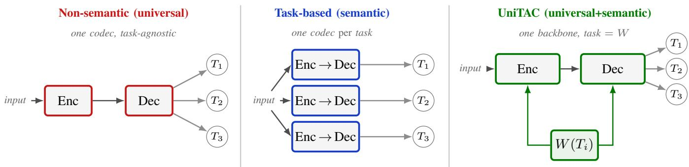
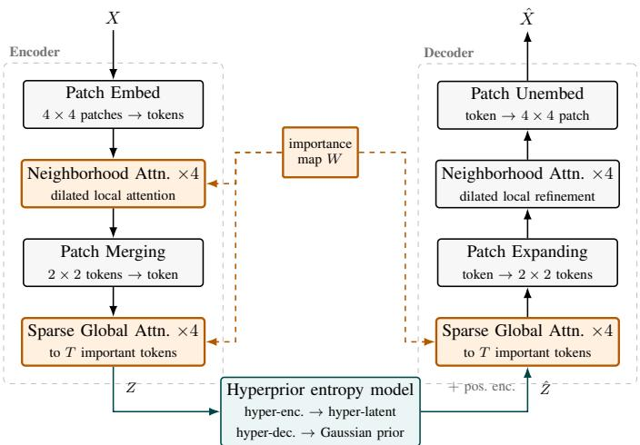
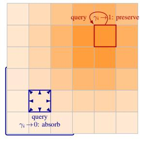
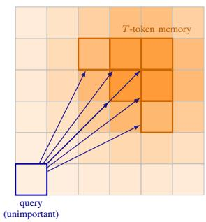
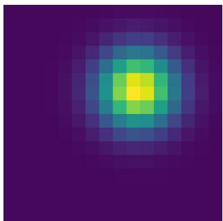
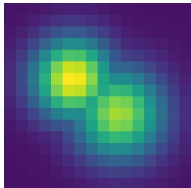
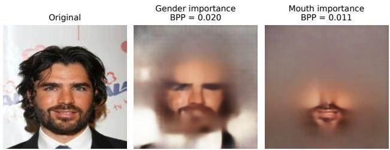
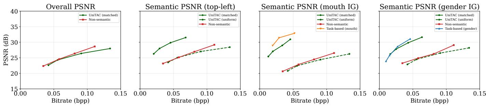
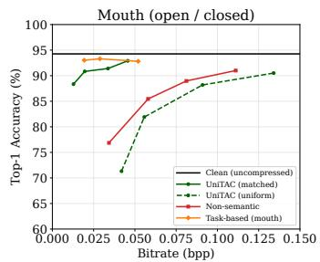
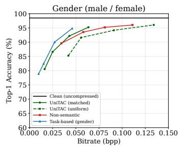

# UniTAC: Universal Task-Aware Compression via Weighted Distortion Measures

Homa Esfahanizadeh, Matin Mortaheb, Jinfeng Du, and Harish Viswanathan

Nokia Bell Labs, Murray Hill, NJ 07974, USA

{homa.esfahanizadeh, matin.mortaheb, jinfeng.du, harish.viswanathan}@nokia-bell-labs.com

Abstract—Physical AI systems such as autonomous vehicles and robots rely on timely exchange of high-dimensional sensory signals under tight bandwidth, latency, and energy budgets. Because the task driving downstream decisions evolves over time, a task-specific codec is brittle and retraining one per task is infeasible in the field. We propose UniTAC, a single learned image codec spanning universal (task-agnostic) to task-specialized operation, re-targeted at runtime without retraining. The task is abstracted as a per-component importance vector, derived, e.g., from gradient attribution of any downstream model, and transmitted as low-overhead side information that conditions both encoder and decoder. Trained once over a broad, randomized family of such vectors against weighted-reconstruction distortion, UniTAC keeps a fixed backbone and a single humanviewable reconstruction whose fidelity is steered to the active task by swapping the injected vector. We analyze the underlying weighted rate-distortion problem, characterizing when a diagonal weighted distortion is task-consistent and how weights relate to task sensitivity. Guided by this, we design a Vision Transformer (ViT) codec whose token-level conditioning natively realizes this weight-driven code. On a localized task at 0.034 bpp, a single UniTAC model reaches 91.4% accuracy, only 1.9% below a taskbased codec (93.3%) and above universal codecs (76.9%).

Index Terms—task-aware compression, universal source coding, semantic communications, Physical AI, weighted ratedistortion, learned image compression, Vision Transformer.

## I. INTRODUCTION

Physical AI refers to AI systems that perceive and act in the physical world, typically closing feedback loops between sensing, communication, and control [1]. In such systems, raw sensory streams are high-rate and redundant, yet the downstream task rarely needs all bits equally. For example, a mobile robot may only need an accurate reconstruction of regions associated with obstacles, grasp points, or safetycritical agents. On the other hand, Physical AI systems communicate over tightly constrained links that are bandwidthlimited, time-varying, and often noisy, motivating task-based tools for emerging data-transmission use cases.

Generic learned image and feature codecs, however, are task-agnostic. They optimize rate-distortion objectives with respect to PSNR or MS-SSIM, and thus spend bits uniformly regardless of what the receiver needs [2], [3]. Building task awareness into compression faces two practical obstacles:

• Task evolution: In Physical $\mathrm { A I } ,$ the active task changes with context. For instance, a mobile robot’s task can shift from navigation to mapping to interaction. Designing and retraining a bespoke codec for each task, e.g., [4], [5], is operationally expensive and often infeasible in the field.

• Systematic definition and integration of the region of interest: Prior methods rely on heuristics, such as text prompts or application metadata, to indicate salient regions [6], [7], but a principled mapping from the task to per-component importance, together with a way to integrate it systematically into the compressor, is lacking.

This paper develops a unifying approach that combines the benefits of universal (task-agnostic) and semantic (task-aware) compression; see Fig. 1.

We represent the signal as a collection of components $\{ { \pmb x } _ { i } \} _ { i = 1 } ^ { n }$ and drive a single compressor with a weighted distortion $\begin{array} { r } { \sum _ { i } w _ { i } D _ { i } ( { \pmb x } _ { i } , \hat { { \pmb x } } _ { i } ) } \end{array}$ , where $\hat { \mathbf { x } } _ { i }$ is the compressor’s reconstruction of component $\mathbf { \Delta } _ { \mathbf { \mathcal { X } } _ { i } }$ and the weights $\{ w _ { i } \}$ encode task saliency and can depend on the signal. Our contributions are threefold. (i) Framework: we cast task-aware compression as weight-conditioned compression, in which a task descriptor is injected as a per-component importance vector W that conditions both the encoder and decoder. The compressor is trained once over a broad family of such vectors, so that task drift is handled at runtime by updating W rather than retraining. (ii) Theory: we analyze the underlying weighted rate-distortion problem and characterize when a diagonal weighted distortion is task-consistent and how the weights relate to task sensitivity, giving a principled task to importance mapping. (iii) Design and evaluation: guided by this analysis, we design a Vision Transformer (ViT) codec whose tokenlevel conditioning natively realizes the weight-driven code, and show on downstream tasks that a single UniTAC model approaches a task-specific codec while improving over a universal one at nearly equal rate.

The remainder of the paper is organized as follows. Section II reviews related work on learned compression and taskoriented communication. Section III introduces the weighteddistortion framework and the notion of task consistency. Section IV develops the theoretical analysis linking the weights to task sensitivity. Section V presents the ViT-based UniTAC codec, and Section VI reports the experimental evaluation. Section VII concludes.

## II. RELATED WORK

## A. Universal image and feature compression

Classical rate–distortion codecs (JPEG, BPG, HEVC/VVC intra) and learned image compression based on nonlinear transform coding with factorized or hyperprior entropy models [2], [8] are all trained to minimize a generic distortion (PSNR / MS-SSIM) at a given rate. This effort has culminated in JPEG AI (ISO/IEC 6048 | ITU-T T.840) [3], [9], the first end-to-end learned image-coding standard, which specifies convolutional analysis/synthesis transforms, a hyperprior with a multistage context entropy model, and a 3D gain unit for spatially variable quantization and region-of-interest control. All of these codecs are inherently task-agnostic and allocate rate uniformly across the image. Even JPEG AI is trained on a fixed distortion (a weighted combination of MSE and MS-SSIM), and its gain unit provides only a manually specified region-of-interest rather than a task-derived importance signal that conditions the coding process. A related informationtheoretic result establishes achievability for lossy compression, where a single asymptotic code must satisfy a distortion measure drawn from a family revealed only at runtime [10].

  
Fig. 1. Three regimes of learned compression. (left) Non-semantic (universal): a single task-agnostic codec spends bits uniformly, so it serves every task but is specialized to none. (middle) Task-based (semantic): a separate codec is trained for each task, so task drift forces retraining a new codec. (right) UniTAC (ours): a single shared backbone in which the task is abstracted as a per-component importance vector W injected at runtime; swapping W specializes the same model to any task without retraining.

## B. Task-oriented and semantic communication

A growing body of work departs from reconstruction-centric coding and instead optimizes transmission for a downstream objective, known as task-oriented or semantic communication [11], [12]. A representative approach [4] trains a feature extractor, task head, and entropy model end-to-end to minimize a task loss plus a rate penalty on the features. Such single-task feature codecs are information-theoretically driven toward the minimal task-sufficient statistic (a soft label at the optimum) and therefore discard the input. Other work such as [5], [13] instead trains the codec against a combination of a task loss, a generic distortion loss, and a rate loss. The distortion term keeps these codecs reconstructable, but the task is still baked into the trained weights, so serving a new task requires retraining.

The information-bottleneck (IB) principle [14] characterizes the optimal trade-off between the rate of a compressed representation and the information it retains about a relevant target variable, and its deep variational realization [15] makes this trade-off trainable in neural networks. Practical IB-based methods shape data for a specific downstream task by optimizing mutual-information objectives, e.g., InfoShape for images [16] and TexShape for sentence embeddings [17]. These formulations analyze what a task-relevant representation should retain, but they optimize a single fixed relevance variable, yield a representation specialized to that one objective, and neither reconstruct the source nor re-specialize a single codec to a new task at runtime.

A complementary view of semantic communication is offered by joint source–channel coding (JSCC), which maps source content directly to channel symbols rather than through separate compression and channel codes [18], [19]. Semantic and task-aware JSCC folds the source’s semantic structure into channel error protection: instead of protecting all bits equally, unequal protection is allocated according to the semantic or task importance of the underlying content. This can take the form of a multi-level reliability interface that maps source semantics to graded channel reliability [20], or of error-resilient, low-latency video transmission that prioritizes semantically important content against block erasures and channel impairments [21], [22].

## C. Multi-task and adaptive codecs

Closest to UniTAC is a line of multi-task codecs, which fall into two categories: coding for machines, and coding for both machines and humans. The latter is more aligned with Physical AI, where a decoded signal must serve a downstream task while remaining usable for human viewing.

Prompt-based image coding for machines [6] conditions a single feature codec with task-driven “prompts.” Each prompt is an importance map that tells the codec to spend more bits on task-relevant regions and fewer elsewhere, giving spatially uneven, content-aware bit allocation. Because the codec is trained on a wide, randomized family of such maps, one model can serve several downstream tasks simply by being given a different map. It differs from UniTAC in several ways. It compresses and reconstructs backbone features under a downstream task loss and thus yields no human-viewable image. Its importance map is produced by a learned information selector that, together with task-adaptive prompts injected into the downstream network, must be fine-tuned per task, so a task-specific parameter set is still required at inference. Finally, its importance map conditions only the encoder, is never transmitted, and drives only local, positionwise modulation rather than long-range, content-dependent interaction. Multi-Path Aggregation [23] serves both human viewing and machine vision from one transformer codec by inserting a shared main path plus per-task side paths. For this method, a dedicated side path (and predictor) is added and fine-tuned per task in a second training stage, supporting only a fixed, predefined task set rather than arbitrary or unseen tasks. Scalable human–machine coding [24] likewise serves both consumers, but through a fixed, predefined layered task hierarchy rather than a runtime importance vector.

Unlike these task/importance-conditioned codecs, UniTAC is agnostic to how the importance vector is derived. It is a single universal image codec that receives the importance vector as transmitted low-overhead side information, conditions both encoder and decoder on it, and reconstructs a humanviewable, general-purpose image whose fidelity is prioritized for the targeted task, enabling runtime re-targeting to any task without retraining.

## D. Task-to-importance mapping

A body of explainability research identifies which parts of an input a trained model relies upon, producing per-input importance or saliency maps. These methods fall into a few families: gradient- and activation-based methods that backpropagate or pool network responses onto the input $( \mathrm { e . g . }$ Grad-CAM [25]); perturbation- and mask-based methods that find the smallest region whose deletion or retention most changes the prediction [26]; and path-attribution methods that integrate gradients along a path from a baseline to the input. Integrated Gradients [27] is the canonical path method, requiring a reference baseline and satisfying desirable axioms such as completeness. Its variants average over baselines or distributions $( \mathrm { e . g . }$ , SmoothGrad [28] and expected gradients / attribution priors [29]) for smoother, distribution-aware maps. Related sensitivity measures based on the task Jacobian or Fisher information similarly quantify how strongly each input component influences the output. This prior art was developed for interpretability, and does not connect the resulting importance to rate allocation, condition an encoder/decoder on it, or use it to weight a reconstruction distortion. UniTAC repurposes such task sensitivity as a principled task-to-importance signal.

## III. A WEIGHTED-DISTORTION FRAMEWORK FORTASK-CONDITIONED COMPRESSION

Throughout, boldface symbols denote random quantities and non-bold symbols their realizations (or deterministic quantities); uppercase letters denote vectors and matrices, and lowercase letters denote scalars and sub-vectors/sub-matrices (components, columns, and entries); and calligraphic letters denote sets. Thus, $\boldsymbol { X }$ is a random vector with realization $X , \ x _ { i }$ is a random component with realization $x _ { i } , \ W$ is a (deterministic) weight vector with entries $w _ { i } .$ , and ${ \mathcal { P } } , S$ denote sets. We write R and $\mathbb { R } _ { + }$ for the reals and nonnegative reals, $( \cdot ) ^ { T }$ for transpose, and E[·] for expectation.

Let X and $\hat { X }$ denote the original and reconstructed source vector. Let the task be specified by a function $f : \mathbb { R } ^ { n }  \mathbb { R } ^ { m }$ . A natural task-fidelity criterion is the mean squared error (MSE) in task space:

$$
\mathcal { L } _ { \mathrm { t a s k } } \triangleq \mathbb { E } \left[ | | f ( X ) - f ( \hat { X } ) | | _ { 2 } ^ { 2 } \right] .\tag{1}
$$

Our key proposal is to compress against a separable weighted distortion ${ \cal D } _ { W } = \mathbb { E } [ { \cal D } _ { W } ( { \pmb X } , \hat { \pmb X } ) ]$ , where

$$
D _ { W } ( \pmb { X } , \hat { \pmb { X } } ) \triangleq \sum _ { i = 1 } ^ { n } w _ { i } ( \pmb { X } ) D _ { i } ( \pmb { x } _ { i } , \hat { \pmb { x } } _ { i } ) , w _ { i } ( \pmb { X } ) \geq 0 .\tag{2}
$$

Here, $D _ { i } ( { \pmb x } _ { i } , \hat { { \pmb x } } _ { i } ) \geq 0$ is a per-component distortion $( \mathrm { e . g . }$ , the squared error $| | \pmb { x } _ { i } - \hat { \pmb { x } } _ { i } | | _ { 2 } ^ { 2 } )$ and the weight $w _ { i } ( X )$ encodes the task importance of component i. The weights may be sample-dependent, produced by a weight map $W : \mathbb { R } ^ { n } \to \mathbb { R } _ { + } ^ { n }$ The goal is to choose the weights so that a rate-constrained compressor minimizing the weighted distortion $D _ { W }$ also drives down the task distortion $\mathcal { L } _ { \mathrm { t a s k } } ;$ ; when it does, we call the weighted distortion task-consistent. Establishing when this holds and what weights it dictates is one focus of this paper.

Mathematically, the reconstruction is produced via a test channel $p ( { \hat { X } } | X )$ , which is a conditional distribution mapping a source realization X to a reconstruction $\hat { X }$ and abstracts any (possibly stochastic) encoder-decoder pair. The compression rate is measured by the mutual information $I ( X ; { \hat { X } } )$ , and the feasible set at rate budget R is the collection of all test channels satisfying this budget:

$$
\mathcal { P } ( R ) \triangleq \left\{ p ( \hat { X } | X ) : I ( X ; \hat { X } ) \leq R \right\} .\tag{3}
$$

The results investigated in this paper address when minimizing the weighted distortion $D _ { W }$ (the separable surrogate optimized by the codec) over ${ \mathcal { P } } ( R )$ also minimizes the true task loss $\mathcal { L } _ { \mathrm { t a s k } }$ (the quantity we ultimately care about).

Definition 1 (Task consistency). For a rate budget $R > 0 ,$ , the weighted distortion D is task-consistent at rate R if

$$
\operatorname * { a r g m i n } _ { p \in \mathcal { P } ( R ) } D _ { W } ( p ) \ \subseteq \ \operatorname * { a r g m i n } _ { p \in \mathcal { P } ( R ) } \mathcal { L } _ { t a s k } ( p ) ,\tag{4}
$$

$i . e . ,$ , every minimizer of the weighted distortion over the feasible set ${ \mathcal { P } } ( R )$ also minimizes the task loss over that set.

Exact consistency is often too stringent. It suffices that a compressor tuned to $D _ { W }$ be near-optimal for the task. We therefore relax Definition 1 via a suboptimality gap.

Definition 2 (δ-approximate task consistency). For a tolerance $\delta \geq 0 _ { ; }$ , the weighted distortion $D _ { W }$ is δ-task-consistent at rate $R > 0$ if every $p ^ { \star } \in \arg \operatorname* { m i n } _ { p \in \mathcal { P } ( R ) } D _ { W } ( p )$ satisfies

$$
\mathcal { L } _ { t a s k } ( p ^ { \star } ) \ \leq \ \operatorname* { m i n } _ { p \in \mathcal { P } ( R ) } \mathcal { L } _ { t a s k } ( p ) + \delta .\tag{5}
$$

Definition 1 is the exact case $\delta = 0 .$

The framework suggests training a single learned compressor that takes the importance-weight vector W as an input conditioning signal, so that one fixed backbone can emulate a whole family of task-specific codecs simply by changing the task abstraction W. At runtime, a task engine re-estimates W as the active task evolves, e.g., via reinforcement learning, gradient/saliency attribution, or a user prompt, and the compressor immediately reallocates bits toward the components that W marks as important, without any retraining. To obtain such a weight-conditioned codec, we do not fix the weights during training, but instead expose the model to a broad family of importance vectors, so that it learns to respond correctly to any weighting it may later be given.

## IV. THEORETICAL ANALYSIS: TOWARD TASK-CONSISTENT WEIGHTED DISTORTION

We now analyze when the separable weighted distortion is a faithful surrogate for the task loss, and what weights this dictates. Throughout, we focus on quadratic per-component distortions $D _ { i } ( { \pmb x } _ { i } , \hat { \pmb x } _ { i } ) = | | { \pmb x } _ { i } - \hat { \pmb x } _ { i } | | _ { 2 } ^ { 2 }$ for analytical clarity, so $\begin{array} { r } { D _ { W } ( \pmb { X } , \hat { \pmb { X } } ) = \sum _ { i = 1 } ^ { n } w _ { i } ( \pmb { X } ) | | \pmb { x } _ { i } - \hat { \pmb { x } } _ { i } | | _ { 2 } ^ { 2 } } \end{array}$ . All proofs are deferred to the appendix.

## A. From task loss to weighted distortion via sensitivity

One of our main tools is the first-order (local) approximation of $f \colon$

$$
f ( { \hat { X } } ) \approx f ( X ) + J _ { f } ( X ) ( { \hat { X } } - X ) ,\tag{6}
$$

where $J _ { f } ( X ) = \nabla _ { X } f \in \mathbb { R } ^ { m \times n }$ is the Jacobian matrix. Then

$$
| | f ( X ) - f ( \hat { X } ) | | _ { 2 } ^ { 2 } \approx ( \hat { X } - X ) ^ { T } J _ { f } ( X ) ^ { T } J _ { f } ( X ) ( \hat { X } - X ) .\tag{7}
$$

We define $G ( X ) \triangleq J _ { f } ( X ) ^ { T } J _ { f } ( X )$ . This shows that the ideal distortion in X-space is a quadratic form with matrix weight $G ( X )$ , which is non-separable across components, in general. Expanding $\begin{array} { r } { E ^ { T } G ( X ) E = \sum _ { i } g _ { i i } ( X ) e _ { i } ^ { 2 } + \sum _ { i \neq j } g _ { i j } ( X ) e _ { i } e _ { j } } \end{array}$ with error $E \triangleq { \hat { X } } - X$ , we see that a separable surrogate keeps the first sum and drops the cross terms, so it is faithful exactly when those cross terms vanish, either per-sample or in expectation: (i) Task orthogonality: since $g _ { i j } ( X ) = \langle \partial f / \partial x _ { i } , \partial f / \partial x _ { j } \rangle$ , a diagonal G means the task has no first-order interaction between distinct components. This is a property of $f$ alone. (ii) Uncorrelated errors: as $\operatorname { \mathbb { E } } [ g _ { i j } ( X ) e _ { i } e _ { j } ] \ = \ \operatorname { \mathbb { E } } [ g _ { i j } ( X ) \operatorname { \mathbb { E } } [ e _ { i } e _ { j } \ | \ X ] ]$ , zero-mean errors that are independent across components give ${ \mathbb E } [ e _ { i } e _ { j } \mid X ] = 0$ so the cross terms vanish even when $G$ is not diagonal.

## B. Structural constraints: symmetry and irrelevance

The following two results show how the structure of the task alone constrains the admissible weights. Task symmetry forces the weights to share that symmetry, reducing to equal weights when they are sample-independent, and the task irrelevance of a component forces its weight to zero.

Proposition 1. (Symmetry forces symmetric weights). Suppose the source $\pmb { X } = \left( \pmb { x } _ { 1 } , \ldots , \pmb { x } _ { n } \right)$ is exchangeable (its components are statistically interchangeable, e.g., i.i.d.) and the task $f : \mathbb { R } ^ { n }  \mathbb { R } ^ { m }$ is permutation-invariant, $f ( \pi X ) ~ = ~ f ( X )$ for every permutation π and every X (e.g., a set function). Then, any weight map W $: \mathbb { R } ^ { n } \ \to \ \mathbb { R } _ { + } ^ { n }$ for which $D _ { W }$ is task-consistent at rate R is permutation-equivariant, i.e., $w _ { \pi ( i ) } ( \pi X ) = w _ { i } ( X )$ for every permutation π, every i, and almost every X. In particular, sample-independent weights must satisfy $w _ { 1 } = \cdot \cdot \cdot = w _ { n }$

Proposition 2. (Irrelevance forces zero weights). Suppose the task ignores a subset ${ \mathcal { S } } \subseteq \{ 1 , \ldots , n \}$ , i.e., $f ( X ) = f ( X ^ { \prime } )$ whenever $x s c = x _ { S ^ { c } } ^ { \prime }$ . Let $L ^ { \star } ( R ) \triangleq$ minp∈P(R) Ltask(p) denote the best achievable task loss at rate $R ,$ and assume (i) each ignored component $\mathbf { \Psi } _ { \mathbf { { \textit { x } } } _ { i } , \textit { \textbf { i } } \in \mathcal { S } , }$ , has strictly positive variance, and (ii) L⋆ is strictly decreasing at R. Then, any weight vector for which $D _ { W }$ is task-consistent at rate R must set $w _ { i } ( \pmb { X } ) = 0$ for all $i \in S .$

## C. Linear tasks: exact reduction to weighted MSE

We first specialize to linear tasks, for which the task loss reduces exactly to a weighted MSE with closed-form weights. We treat the single-output case, its extension to several linear outputs, and the effect of source correlation.

Theorem 1. (Exact reduction to weighted MSE). Consider a single-output linear function $f ( \pmb { X } ) = A ^ { T } \pmb { X }$ . Defining $e _ { i } =$ $\pmb { x } _ { i } - \hat { \pmb { x } } _ { i } , i f \mathbb { E } [ \pmb { e } _ { i } \pmb { e } _ { j } ] = 0 f o r i \neq j ,$ , then minimizing task loss $\mathbb { E } [ | f ( X ) - f ( \hat { X } ) | ^ { 2 } ]$ is equivalent to minimizing the weighted MSE $\begin{array} { r } { \mathbb { E } [ \sum _ { i } a _ { i } ^ { 2 } ( { \pmb x } _ { i } - { \hat { \pmb x } } _ { i } ) ^ { 2 } ] } \end{array}$ . Thus, $w _ { i } = a _ { i } ^ { 2 }$ yields an optimal separable distortion.

Remark 1. (Gaussian source). For a Gaussian source with independent components, the optimal allocation is given in closed form by reverse water-filling and is exact. For non-Gaussian sources, the reverse water-filling allocation is nearoptimal.

Proposition 3. (Multiple linear outputs). Let $f ( \mathbf { { X } } ) = S X$ with $S \in \mathbb { R } ^ { m \times n }$ . I $\begin{array} { r } { f \mathbb { E } [ e _ { i } e _ { j } ] = 0 f o r \ i \neq j , } \end{array}$ , then the optimal separable weights are the squared column norms of S:

$$
w _ { i } = \| s _ { : , i } \| _ { 2 } ^ { 2 } = \sum _ { k = 1 } ^ { m } s _ { k , i } ^ { 2 } .\tag{8}
$$

Remark 2. (Correlated sources and errors). When the error covariance $\mathbb { E } [ E E ^ { T } ]$ is not diagonal, $e . g .$ , because the source components or the quantization errors are correlated, a linear transform that decorrelates the errors (e.g., KLT/whitening) recovers a separable form with transformed coefficients; otherwise separable weighted distortion is only an approximation.

## D. Nonlinear tasks: Jacobian sensitivity

For a general nonlinear task, the exact reduction of the previous subsection no longer holds. This is because the induced distortion metric $G ( { \bar { X } } ) = J _ { f } ( X ) ^ { T } J _ { f } ( X )$ now varies with X and is generally non-diagonal. We therefore return to the first-order sensitivity analysis and derive weights from the task Jacobian. Retaining only the diagonal of G yields the sample-dependent weights $w _ { i } ( \boldsymbol { X } ) \propto g _ { i i } ( \boldsymbol { X } ) = ( \partial f / \partial x _ { i } ) ^ { 2 }$ These weights make $D _ { W }$ δ-approximately task-consistent (Definition 2), where the gap δ arises from exactly two sources: the first-order (linearization) error of approximating f by its Jacobian, and the off-diagonal cross terms $\sum _ { i \neq j } { \mathbb { E } } [ g _ { i j } ( X ) e _ { i } e _ { j } ]$ that the separable surrogate discards by ignoring inter-component correlations.

Remark 3. (From local gradients to integrated sensitivity). We state this remark for a scalar task $f : \mathbb { R } ^ { n }  \mathbb { R } ,$ , but it can be applied per output of a vector task. The point gradient $\partial f / \partial x _ { i } ( X )$ is a local sensitivity. By the gradient theorem, the coefficient that acts exactly on $x _ { i } - { \hat { x } } _ { i }$ is not the local gradient but its path average along the segment from Xˆ to X,

$$
\begin{array} { r l r } {  { f ( \boldsymbol { X } ) - f ( \hat { \boldsymbol { X } } ) = \sum _ { i = 1 } ^ { n } ( x _ { i } - \hat { x } _ { i } ) \bar { g } _ { i } , } } \\ & { } & { \bar { g } _ { i } \triangleq \int _ { 0 } ^ { 1 } \frac { \partial f } { \partial x _ { i } } \big ( \hat { \boldsymbol { X } } + \alpha ( \boldsymbol { X } - \hat { \boldsymbol { X } } ) \big ) d \alpha . } \end{array}
$$

Here $( x _ { i } - { \hat { x } } _ { i } ) { \bar { g } } _ { i }$ is a first-order attribution of the task change onto component i. Writing $b _ { i } \triangleq { \bar { g } } _ { i } ( x _ { i } - { \hat { x } } _ { i } )$ and applying the Cauchy–Schwarz inequality, $\begin{array} { r } { ( \mathbf { 1 } ^ { T } B ) ^ { 2 } \leq n \sum _ { i } b _ { i } ^ { 2 } } \end{array}$ , then taking expectations yields the bound

$$
\begin{array} { r } { \mathbb { E } [ ( f ( { \cal X } ) - f ( \hat { { \cal X } } ) ) ^ { 2 } ] \ \leq \ n \mathbb { E } \Big [ \sum _ { i = 1 } ^ { n } \bar { g } _ { i } ^ { 2 } \big ( { \pmb x } _ { i } - \hat { { \pmb x } } _ { i } \big ) ^ { 2 } \Big ] . } \end{array}\tag{9}
$$

The right-hand side is n times a separable weighted distortion with the sample-dependent weights $w _ { i } ( X ) = \bar { g } _ { i } ^ { 2 }$ , so driving it down controls the task loss. The coefficient g¯i is the gradient averaged along the segment from Xˆ to X and hence depends on the reconstruction, which is unknown at design time. We therefore anchor the path at a fixed task-appropriate baseline $X _ { 0 } \ ( e . g .$ , a black input), so that $\bar { g } _ { i }$ becomes the per-image integrated gradient of f along $X _ { 0 }  X$ [27]; this per-sample map is the surrogate we use in our experiments (Section VI). In the small-error limit ${ \hat { X } }  X$ the segment collapses and ${ \bar { g } } _ { i }  \partial f / \partial x _ { i } ( X )$ , recovering the local point-gradient weights of the preceding paragraph.

## V. CODEC DESIGN: VIT-BASED UNITAC

The theory of Section IV prescribes what a task-aware codec should do (i.e., allocating rate across components in proportion to a per-component importance vector), but leaves open how a single learned compressor can realize an entire family of such allocations without retraining. We now instantiate this principle in a ViT-based codec whose token-level conditioning natively consumes W.

The design has a two-stage transformer autoencoder that maps the image to a compact latent space and back, mechanisms that inject the importance map into the attention computation so that capacity is steered toward the components W marks as important, and a hyperprior entropy model that turns the latent representation into a bitstream and yields a differentiable rate estimate. Training against the weighted distortion of (2) over a broad randomized family of importance maps produces a single backbone that is specialized at runtime purely by swapping W. Fig. 2 shows the overall pipeline. Throughout, we assume an error-free transport layer; thus, the coded latents and the importance map W reach the decoder without bit errors or erasures.

## A. Tokenization and transformer backbone

The input image $\begin{array} { r l r } { X } & { { } \in } & { \mathbb { R } ^ { 3 \times H \times W } } \end{array}$ is split into nonoverlapping $p \times p$ patches $( p = 4 )$ by a strided 2D convolution, producing a token grid of size $\begin{array} { r } { \frac { H } { p } ^ { \mathbf { \check { \phi } } } \times \frac { W } { p } } \end{array}$ with an embedding width of $C _ { 0 } ~ = ~ 9 6$ . These tokens are the components $\{ x _ { i } \}$ of the framework, so the weighted distortion is measured on spatial patches, and the importance map is aligned with this grid. Every transformer block follows the standard prenorm layout (i.e., layer normalization before each sub-layer, a residual connection around each sub-layer, and a two-layer GELU MLP whose hidden dimension is 4× the token width), and all attention uses 4 heads. Each stage below is a stack of $D = 4$ such blocks.

  
Fig. 2. End-to-end UniTAC codec. The orange path marks the importance map W conditioning the encoder and decoder attention stages.

The encoder’s first stage uses neighborhood-attention (NAT) blocks. Full self-attention costs grow quadratically with the number of tokens, making it prohibitive to apply directly on the encoder’s high-resolution grid. This stage, therefore, restricts each token to attend only within a local $k \times k$ window $( k = 3 )$ , making attention linear in the number of tokens, with a learnable relative-position bias that lets the block weight neighbors by their spatial offset. Cyclically increasing dilation {1, 2, 4} enlarges the receptive field as blocks stack while preserving this linear cost. A patch-merging layer then halves each spatial dimension (merging each $2 \times 2$ block of tokens into one) and doubles the width to $C _ { 1 } = 2 C _ { 0 } = 1 9 2$ . This bottleneck grid holds fewer tokens, and the second stage performs sparse global-attention (SGAT) on it. Each SGAT block first performs sparse global attention over an importanceselected memory of tokens (Section V-B) and then a full self-attention over all tokens to restore global consistency. A linear projection maps the bottleneck tokens to a latent tensor $Z \in \dot { \mathbb { R } ^ { C _ { z } \times \frac { H } { 2 p } \times \frac { W } { 2 p } } }$ with $C _ { z } = 4 8$

The decoder mirrors this pipeline in reverse: a stack of D SGAT blocks on the bottleneck grid, a patch-expanding layer that doubles each spatial dimension, and a stack of D NAT refinement blocks, ending with a sigmoid that maps the recovered tokens to a bounded reconstruction $\hat { X } \in [ 0 , 1 ] ^ { 3 \times H \times W }$ A 2D sinusoidal positional encoding is added at the decoder input, as its bottleneck stage would otherwise begin without any spatial reference.

## B. Token-level weight conditioning

The importance map is supplied as a low-resolution grid $W \in \mathbb { R } _ { + } ^ { G \times G }$ (with $G = 1 6 )$ , normalized to unit mean, and bilinearly resized to each stage’s token resolution. UniTAC consumes it through two complementary mechanisms that together let important tokens retain their own detail while unimportant tokens borrow detail from important regions, so that latent capacity concentrates where the task needs it (Fig. 3).

Local stage (neighborhood attention). Importance enters this stage through two mechanisms (Fig. 3a). The first controls where each token attends: within its $k \times k$ window, a token forms a standard attention score toward each neighbor $j$ (the scaled query–key dot product plus a learnable relative-position bias, as in base ViT), and we add an importance bonus $s w _ { j }$ to it (learnable scale s), so every token attends more strongly toward important neighbors. The second controls how much each token updates: a learnable self-gate $\gamma _ { i }$ that grows with the token’s own importance $w _ { i }$ blends its current content with the attention output, $x _ { i } \gets x _ { i } + ( 1 - \gamma _ { i } ) \left[ \mathrm { a t t n } ( X ) \right]$ i. An important token $( \gamma _ { i } \to 1 )$ keeps its own detail, while an unimportant one $( \gamma _ { i } \to 0 )$ fully absorbs content attended from its neighborhood. On the decoder side, the mirrored neighborhood-attention stage runs unconditioned, without the importance bonus or self-gate: the rate has already been allocated at the encoder, so this stage only spatially refines the reconstruction.

Bottleneck stage (sparse global attention). At the bottleneck, each query independently samples its own memory of $T$ tokens $( T \ = \ 2 4 )$ , drawing token $j$ with probability $\dot { \propto } w _ { j } ^ { 1 / \tau }$ , and attends only over that set (if the grid holds at most $\check { T }$ tokens, every query attends densely to all of them). The temperature $\tau$ follows a cosine schedule from $\tau = 1$ (sampling proportional to $w _ { j } ;$ exploratory) toward a small τ (a near-deterministic draw on the highest-importance tokens; late training and inference). A learnable gate $g _ { i } = g _ { \operatorname* { m i n } } + \left( g _ { \operatorname* { m a x } } - g _ { \operatorname* { m i n } } \right) \sigma ( \beta ^ { \prime } ( w _ { i } - 1 ) )$ , with learnable slope $\beta ^ { \prime }$ and bounds $g _ { \mathrm { m i n } } ~ \in ~ [ 0 , \frac { 1 } { 2 } ] , ~ g _ { \mathrm { m a x } } ~ \in ~ [ \frac { 1 } { 2 } , 1 ] ,$ mixes each token’s self-representation with the content read from this memory, and a following full self-attention restores global consistency. Unlike the local stage, the decoder’s mirrored bottleneck (Fig. 3b) retains conditioning under W.

## C. Entropy coding and rate estimation

The latent $Z$ is compressed with a hyperprior entropy model [2]. A hyper-encoder maps Z to a hyper-latent Y, coded under a factorized prior,1 from which a hyper-decoder predicts per-element Gaussian parameters $( \mu , \sigma )$ for $Z .$ HEre, Y is transmitted as side information; both encoder and decoder then derive the same $( \mu , \sigma )$ by running the hyper-decoder on it. Quantization is simulated during training by additive uniform noise and replaced by rounding at inference, with arithmetic coding producing the actual bitstream. The expected code length of the quantized latents $\hat { Z } , \hat { Y }$ is estimated differentiably under the conditional model $p ( \hat { Z } \mid \mu , \sigma )$ and the factorized prior $p ( \hat { Y } )$ as

  
(a) Neighborhood attention.  
(b) Sparse global attention.  
Fig. 3. Token-level weight conditioning on a sample token grid. Higher color intensity marks more important tokens (larger wi). (a) Local stage: each token attends to its k×k neighborhood, biased toward important neighbors. (b) Bottleneck stage: each query attends to an importance-sampled memory of T tokens. In both stages an importance gate lets unimportant tokens borrow detail from important ones.

$$
\mathsf { b p p } = \frac { 1 } { H W } \Big ( \sum - \log _ { 2 } p ( \hat { Z } \mid \mu , \sigma ) + \sum - \log _ { 2 } p ( \hat { Y } ) \Big ) ,\tag{10}
$$

which serves as the rate term in the training objective and as the reported rate at test time.

The importance map $W$ must also reach the decoder and is likewise transmitted as side information. As it is a small fixedsize $G \times G$ grid $( G = 1 6 )$ , independent of image resolution and identical for every codec we compare, its overhead is a negligible, common additive constant. We therefore omit it from the rate objective and the reported bpp.

## D. Training objective and randomized importance maps

The codec is trained end to end to minimize a rate–distortion objective that pairs the rate estimate (10) with the separable weighted distortion of (2), normalized by the total weight,

$$
\mathcal { L } = \underbrace { \sum _ { i } w _ { i } ( x _ { i } - \hat { x } _ { i } ) ^ { 2 } } _ { \mathrm { w e i g h t e d ~ d i s t o r t i o n } } + \lambda \mathsf { b p p } ,\tag{11}
$$

where the per-patch squared error is weighted by the same importance map $W$ that conditions the network, and λ trades off rate against task fidelity. To obtain a universal weightconditioned codec rather than one specialized for a single task, we do not fix $W$ during training. In fact, each image is paired with a freshly sampled importance map from a broad synthetic family (random mixtures of Gaussian “blobs” spanning from peaky to diffuse regimes, varied in count, location, and scale; Fig. 4), exposing the backbone to a rich range of importance patterns so that it responds correctly to any weighting supplied at test time. At inference, the synthetic map is replaced by a task-derived importance map, computed here via integrated gradients of a downstream classifier, so that the identical backbone is specialized to the active task. Fig. 5 illustrates the resulting task-driven reconstructions for the same image and codec under two different importance maps.

  
Fig. 4. Synthetic training importance maps (mean-normalized; brighter denotes larger w ): a single blob (left) and two overlapping blobs (right).

  
Fig. 5. Task-driven bit allocation for a fixed image (single UniTAC backbone, λ = 0.10). Left: original; middle/right: reconstructions conditioned on the gender and mouth integrated-gradients maps. At nearly equal rate, the same backbone shifts fidelity toward each task’s important region without retraining.

## VI. EXPERIMENTAL EVALUATION

We evaluate whether a single weight-conditioned UniTAC backbone can, without retraining, match task-specific codecs while surpassing task-agnostic ones. On two downstream faceanalysis tasks, we report signal fidelity (PSNR, semantic PSNR) and task fidelity (classification accuracy) versus rate.

## A. Experimental setup

a) Data: All codecs are trained on AffectNet [30] and evaluated on the test split of CelebA [31]; the CelebA training split is used only to train the classifiers that provide the downstream accuracy metric and the attribute-based importance maps. Both at training and test time, each image is cropped to a square and resized to a common size drawn from a range of scales (64 × 64 to 256 × 256 in steps of 32), so that the codec sees images at multiple resolutions.

b) Tasks: We consider two binary CelebA attribute classifications with different spatial support: gender (the Male attribute, spatially global) and mouth state (the Mouth\_Slightly\_Open attribute, spatially localized). For each task, we fine-tune a separate ImageNet-pretrained ResNet-18 [32] classifier on clean CelebA images (resized to 224×224 and standardized with ImageNet statistics), reaching Top-1 accuracies of 98.5% (gender) and 94.3% (mouth) on uncompressed images. Each classifier is used both to derive its task importance map via integrated gradients and to measure task fidelity on the reconstructions.

c) Importance maps: Each task’s importance map W is derived from its classifier by integrated gradients of the toppredicted-class logit, using a black (all-zero) baseline and 8 steps along the path from the baseline to the image. The perpixel attributions are reduced to a scalar saliency by taking the absolute value and averaging over color channels, then average-pooled to the $G \times G$ conditioning grid, floored at a small value (0.02), and mean-normalized. This single map serves two roles: at inference it conditions the codec’s encoder and decoder, and in evaluation it defines the task weighting of the semantic-PSNR metric.

d) Codecs: We compare three codecs, mirroring Fig. 1:

• UniTAC (ours): the single weight-conditioned backbone, trained once on randomized synthetic maps and specialized at test time by injecting each task’s importance map.

• Non-semantic (universal): a task-agnostic codec that allocates rate evenly.

• Task-based (semantic): a separate codec trained end-toend for each task’s importance map (one for gender, one for mouth).

All three share the same ViT-based [33] architecture and are trained at various rate–distortion trade-offs.

e) Metrics: Against the measured bitrate (bits per pixel), we report three quantities: (i) overall PSNR, full-image reconstruction fidelity; (ii) semantic PSNR, reconstruction error reweighted by the task importance map, measuring fidelity where the task-relevant regions lie; and (iii) downstream Top-1 accuracy, the task classifier evaluated on the decoded images.

## B. Rate–distortion: overall and semantic PSNR

Fig. 6 reports rate–distortion curves. On overall PSNR (left), UniTAC under a uniform map tracks the non-semantic codec closely, confirming that weight conditioning does not sacrifice generic reconstruction quality when no task is specified. On semantic PSNR scored under a task’s importance map (middle and right), injecting the matched map at encode time yields a large gain over both the uniform-map operating point and the non-semantic codec at equal rate: at a comparable rate (≈ 0.04 bpp), it improves task-region PSNR by roughly 7 dB (gender) to 10 dB (mouth) over uniform encoding, as rate concentrates on the task-relevant tokens. Crucially, this single UniTAC backbone nearly matches the “task-based” codec that is trained exclusively for that one task, with no retraining.

## C. Downstream task accuracy

Fig. 7 reports downstream accuracy versus rate. For both tasks, at a comparable rate the task-matched map preserves accuracy far better than either the uniform-map operating point or the non-semantic codec. On the mouth task at ≈0.034 bpp, it retains 91.4% accuracy, versus 76.9% for the non-semantic codec at the same rate and 71.3% under a uniform map (0.042 bpp). On the gender task at ≈ 0.043 bpp, the same backbone re-conditioned on the gender map retains 92.2%, versus 85.3% under a uniform map (0.042 bpp). The smaller margin reflects the spatially global support of the gender attribute. In both cases, UniTAC’s task-matched accuracy closely matches the dedicated per-task codec at equal rate with a single shared model.

  
Fig. 6. Rate–distortion on CelebA. Left to right: overall PSNR, and semantic PSNR under a synthetic top-left ROI, the mouth map, and the gender map.

  
Fig. 7. Downstream accuracy vs. rate on CelebA.

## VII. DISCUSSION AND CONCLUSION

UniTAC shows that a single image codec can span the full range from universal to task-specialized operation, retargeted at runtime by swapping the injected weight vector W rather than retraining a codec per task. The same backbone matches the non-semantic codec on overall PSNR, substantially improves task-region semantic PSNR and downstream accuracy at equal or lower rate, and approaches the pertask “task-based” upper baseline. Two questions remain open. The first is the universality gap: how closely a weightconditioned compressor can approach a fully retrained taskspecific one across a rich family of tasks. The second is the quality of the importance map, the operative link between task and rate allocation, since the codec can allocate bits only as well as the supplied weights indicate. We estimate this map by integrated gradients with a fixed baseline; comparing alternative attribution methods and richer models that capture the cross-component interactions discarded by the diagonal approximation is a promising avenue for closing the remaining gap to task-specific codecs.

## APPENDIX A

## A. Proposition 1 (symmetry forces symmetric weights)

Proof. Suppose, for contradiction, that $w _ { j } ( \pi { \cal X } ) \ \ne \ w _ { i } ( { \pmb X } )$ on a set of positive probability for some $i \neq j ,$ where π is the transposition of i and $j .$ . For any feasible $p ( { \hat { X } } \mid X )$ define $p _ { \pi } ( \hat { { \cal X } } \mid { \cal X } ) \triangleq p ( \pi ^ { - 1 } \hat { { \cal X } } \mid \pi ^ { - 1 } { \cal X } )$ . By exchangeability, $( X , { \hat { X } } )$ under $p _ { \pi }$ has the same law as $( \pi X , \pi { \hat { X } } )$ under $p ,$ so $I _ { p _ { \pi } } = I _ { p } \leq R$ (feasible) and, by permutation-invariance of $f , { \mathcal { L } } _ { \mathrm { t a s k } } ( p _ { \pi } ) = { \mathcal { L } } _ { \mathrm { t a s k } } ( p )$ . The weighted distortion, however, changes:

$$
\begin{array} { r l } {  { D _ { W } ( p _ { \pi } ) - D _ { W } ( p ) = \mathbb { E } _ { p } \big [ ( w _ { j } ( \pi \boldsymbol { X } ) - w _ { i } ( \boldsymbol { X } ) ) ( \pmb { x } _ { i } - \hat { \pmb x } _ { i } ) ^ { 2 } } } \\ & { \qquad + ( w _ { i } ( \pi \boldsymbol { X } ) - w _ { j } ( \boldsymbol { X } ) ) ( \pmb { x } _ { j } - \hat { \pmb x } _ { j } ) ^ { 2 } \big ] , } \end{array}
$$

which is nonzero for some feasible $p$ coding i and $j$ at different fidelity. Then $p$ and $p _ { \pi }$ have equal task loss but different $D _ { W }$ , contradicting task consistency at rate R. Hence $w _ { \pi ( i ) } ( \pi X ) = w _ { i } ( X )$ almost surely; for sample-independent weights, this reduces to $w _ { 1 } = \cdot \cdot \cdot = w _ { n }$ □

## B. Proposition 2 (irrelevance forces zero weights)

Proof. We argue by contradiction. Suppose $\mathrm { P r } [ { \boldsymbol w \boldsymbol k } ( { \boldsymbol X } ) > 0 ] >$ 0 for some $k \in { S } ,$ , and let $p ^ { \star }$ minimize $D _ { W }$ at rate R, with reconstruction $\hat { X }$ . Since $w _ { k } \ > \ 0$ on a positive-probability set and $\scriptstyle { \mathbf { { \mathit { x } } } } _ { k }$ has positive variance (assumption (i)), the term $\mathbb { E } [ w _ { k } ( \pmb { X } ) ( \pmb { x } _ { k } - \pmb { \hat { x } } _ { k } ) ^ { 2 } ]$ is strictly reduced by letting $\hat { \pmb x } _ { k }$ carry information about ${ \pmb x } _ { k } ;$ hence $p ^ { \star }$ spends a positive rate on $\scriptstyle { \mathbf { { \mathit { x } } } } _ { k }$

Now, let $\tilde { p }$ be the test channel that replaces the ignored coordinates by a constant:

$$
\begin{array} { r } { \tilde { \pmb { x } } _ { S ^ { c } } \triangleq \hat { \pmb { x } } _ { S ^ { c } } , \qquad \tilde { \pmb { x } } _ { S } \triangleq { \ b { c } } . } \end{array}
$$

As $\tilde { X }$ is a deterministic function of $\hat { X }$ , it uses no more rate, and since $p ^ { \star }$ spent positive rate on $\mathbf {  { x } } _ { k } .$ , we have $I ( X ; { \tilde { X } } ) <$ $I ( X ; { \hat { X } } ) \leq R .$ Because $f$ ignores $\begin{array} { r } { S , \mathcal { L } _ { \mathrm { t a s k } } ( \tilde { p } ) = \mathcal { L } _ { \mathrm { t a s k } } ( p ^ { \star } ) } \end{array}$ . As $L ^ { \star }$ is strictly decreasing at R (assumption (ii)), this freed rate yields a feasible $p ^ { \prime }$ with

$$
\mathcal { L } _ { \mathrm { t a s k } } ( p ^ { \prime } ) < \mathcal { L } _ { \mathrm { t a s k } } ( \tilde { p } ) = \mathcal { L } _ { \mathrm { t a s k } } ( p ^ { \star } ) .
$$

Thus $p ^ { \star }$ does not minimize the task loss, contradicting taskconsistency. Hence $w _ { i } ( \pmb { X } ) = 0$ almost surely for all $i \in S .$ □

## C. Theorem 1 (exact reduction to weighted MSE)

Proof. As $\boldsymbol { f } ( \boldsymbol { X } ) - \boldsymbol { f } ( \hat { \boldsymbol { X } } ) = A ^ { T } ( \boldsymbol { X } - \hat { \boldsymbol { X } } ) = A ^ { T } \boldsymbol { E } ,$

$$
\mathbb { E } [ | f ( \pmb { X } ) - f ( \hat { \pmb { X } } ) | ^ { 2 } ] = \mathbb { E } [ ( \pmb { A } ^ { T } \pmb { E } ) ^ { 2 } ] = \pmb { A } ^ { T } \mathbb { E } [ \pmb { E } \pmb { E } ^ { T } ] \pmb { A } .
$$

Under the uncorrelated-error assumption,

$$
\mathbb { E } [ | f ( \pmb { X } ) - f ( \hat { \pmb { X } } ) | ^ { 2 } ] = \sum _ { i = 1 } ^ { n } a _ { i } ^ { 2 } \mathbb { E } [ e _ { i } ^ { 2 } ] = \mathbb { E } [ \sum _ { i = 1 } ^ { n } a _ { i } ^ { 2 } ( \pmb { x } _ { i } - \hat { \pmb { x } } _ { i } ) ^ { 2 } ] ,
$$

which is exactly the expected weighted MSE with $w _ { i } = a _ { i } ^ { 2 }$ □

## D. Proposition 3 (multiple linear outputs)

Proof. With $G \triangleq S ^ { T } S .$ , we have $\mathcal { L } _ { \mathrm { t a s k } } = \mathbb { E } [ E ^ { T } G E ]$ . Since any scalar equals its own trace, using the cyclic property of the trace, we obtain

$$
\mathcal { L } _ { \mathrm { t a s k } } = \mathrm { t r } ( \mathbb { E } [ \pmb { E } ^ { T } G \pmb { E } ] ) = \mathrm { t r } ( G \mathbb { E } [ \pmb { E } \pmb { E } ^ { T } ] ) .
$$

Under the uncorrelated-error assumption, $\mathbb { E } [ E E ^ { T } ]$ is diagonal. Thus, only the diagonal of G matters, i.e., $\begin{array} { r } { \dot { g } _ { i i } = \dot { \sum } _ { k = 1 } ^ { m } s _ { k , i } ^ { 2 } = } \end{array}$ $\| s _ { : , i } \| _ { 2 } ^ { 2 }$ . Therefore,

$$
\mathcal { L } _ { \mathrm { t a s k } } = \sum _ { i = 1 } ^ { n } \Vert s _ { : , i } \Vert _ { 2 } ^ { 2 } \mathbb { E } [ e _ { i } ^ { 2 } ] = \mathbb { E } [ \sum _ { i } \Vert s _ { : , i } \Vert _ { 2 } ^ { 2 } ( { \pmb x } _ { i } - \hat { { \pmb x } } _ { i } ) ^ { 2 } ] .
$$

## REFERENCES

[1] J. Duan, S. Yu, H. L. Tan, H. Zhu, and C. Tan, “A survey of embodied ai: From simulators to research tasks,” IEEE Transactions on Emerging Topics in Computational Intelligence, vol. 6, no. 2, pp. 230–244, 2022.

[2] J. Ballé, D. Minnen, S. Singh, S. J. Hwang, and N. Johnston, “Variational image compression with a scale hyperprior,” in International Conference on Learning Representations (ICLR), 2018.

[3] S. Esenlik, Y. Wu, Z. Zhang, Y.-K. Wang, K. Zhang, L. Zhang, J. a. Ascenso, and S. Liu, “An overview of the JPEG AI learning-based image coding standard,” IEEE Transactions on Circuits and Systems for Video Technology, 2025.

[4] S. Singh, S. Abu-El-Haija, N. Johnston, J. Ballé, A. Shrivastava, and G. Toderici, “End-to-end learning of compressible features,” in IEEE International Conference on Image Processing (ICIP), 2020.

[5] N. Le, H. Zhang, F. Cricri, R. Ghaznavi-Youvalari, and E. Rahtu, “Image coding for machines: An end-to-end learned approach,” in IEEE International Conference on Acoustics, Speech and Signal Processing (ICASSP), 2021, pp. 1590–1594.

[6] R. Feng, J. Liu, X. Jin, X. Pan, H. Sun, and Z. Chen, “Prompt-ICM: A unified framework towards image coding for machines with task-driven prompts,” arXiv preprint arXiv:2305.02578, 2023.

[7] ISO/IEC, “ISO/IEC 15444-1: Information technology – JPEG 2000 image coding system: Core coding system,” 2019, region-of-interest coding.

[8] J. Ballé, V. Laparra, and E. P. Simoncelli, “End-to-end optimized image compression,” in International Conference on Learning Representations (ICLR), 2017.

[9] JPEG, “JPEG AI – learning-based image coding standard, iso/iec 6048- 1:2025 | itu-t t.840.1,” https://jpeg.org/jpegai/, 2025.

[10] A. Mahmood and A. B. Wagner, “Lossy compression with universal distortion,” IEEE Transactions on Information Theory, vol. 69, no. 6, pp. 3552–3573, 2023, also ISIT 2022; arXiv:2110.07022.

[11] D. Gündüz, Z. Qin, I. n. Estella Aguerri, H. S. Dhillon, Z. Yang, A. Yener, K. K. Wong, and C.-B. Chae, “Beyond transmitting bits: Context, semantics, and task-oriented communications,” IEEE Journal on Selected Areas in Communications, 2023.

[12] E. Calvanese Strinati and S. Barbarossa, “6G networks: Beyond shannon towards semantic and goal-oriented communications,” Computer Networks, vol. 190, 2021.

[13] L.-Y. Duan, J. Liu, W. Yang, T. Huang, and W. Gao, “Video coding for machines: A paradigm of collaborative compression and intelligent analytics,” IEEE Transactions on Image Processing, vol. 29, pp. 8680– 8695, 2020.

[14] N. Tishby, F. C. Pereira, and W. Bialek, “The information bottleneck method,” in 37th Allerton Conference on Communication, Control, and Computing, 1999.

[15] A. A. Alemi, I. Fischer, J. V. Dillon, and K. Murphy, “Deep variational information bottleneck,” in International Conference on Learning Representations (ICLR), 2017.

[16] H. Esfahanizadeh, W. Wu, M. Ghobadi, R. Barzilay, and M. Médard, “InfoShape: Task-based neural data shaping via mutual information,” in IEEE International Conference on Acoustics, Speech and Signal Processing (ICASSP), 2023, pp. 1–5.

[17] K. Kale, H. Esfahanizadeh, N. Elias, O. Baser, M. Médard, and S. Vishwanath, “TexShape: Information theoretic sentence embedding for language models,” in IEEE International Symposium on Information Theory (ISIT), 2024, pp. 2038–2043.

[18] E. Bourtsoulatze, D. Burth Kurka, and D. Gündüz, “Deep joint sourcechannel coding for wireless image transmission,” IEEE Transactions on Cognitive Communications and Networking, vol. 5, no. 3, pp. 567–579, 2019.

[19] T.-Y. Tung and D. Gündüz, “DeepWiVe: Deep-learning-aided wireless video transmission,” IEEE Journal on Selected Areas in Communications, vol. 40, no. 9, pp. 2570–2583, 2022.

[20] T.-Y. Tung, H. Esfahanizadeh, J. Du, and H. Viswanathan, “Multilevel reliability interface for semantic communications over wireless networks,” IEEE Transactions on Communications, vol. 73, no. 8, pp. 6023–6035, 2025.

[21] N. Fayaz, H. Esfahanizadeh, M. Mortaheb, J. Du, and H. Viswanathan, “Towards robust semantic video transmission over block erasure channels,” in IEEE Vehicular Technology Conference (VTC2025-Fall), 2025.

[22] M. Mortaheb, H. Esfahanizadeh, J. Du, and H. Viswanathan, “Semanticaware neural video codec for error-resilient low-latency transmission,” in Allerton Conference on Communication, Control, and Computing, 2026.

[23] X. Zhang, P. Guo, M. Lu, and Z. Ma, “All-in-one image coding for joint human-machine vision with multi-path aggregation,” in Advances in Neural Information Processing Systems (NeurIPS), 2024.

[24] H. Choi and I. V. Bajic, “Scalable image coding for humans and´ machines,” IEEE Transactions on Image Processing, vol. 31, pp. 2739– 2754, 2022.

[25] R. R. Selvaraju, M. Cogswell, A. Das, R. Vedantam, D. Parikh, and D. Batra, “Grad-CAM: Visual explanations from deep networks via gradient-based localization,” in IEEE International Conference on Computer Vision (ICCV), 2017.

[26] R. C. Fong and A. Vedaldi, “Interpretable explanations of black boxes by meaningful perturbation,” in IEEE International Conference on Computer Vision (ICCV), 2017.

[27] M. Sundararajan, A. Taly, and Q. Yan, “Axiomatic attribution for deep networks,” in International Conference on Machine Learning (ICML), 2017, pp. 3319–3328.

[28] D. Smilkov, N. Thorat, B. Kim, F. Viégas, and M. Wattenberg, “Smoothgrad: Removing noise by adding noise,” 2017, arXiv:1706.03825.

[29] G. Erion, J. D. Janizek, P. Sturmfels, S. Lundberg, and S.-I. Lee, “Learning explainable models using attribution priors,” 2019, arXiv:1906.10670.

[30] A. Mollahosseini, B. Hasani, and M. H. Mahoor, “AffectNet: A database for facial expression, valence, and arousal computing in the wild,” IEEE Transactions on Affective Computing, vol. 10, no. 1, pp. 18–31, 2019.

[31] Z. Liu, P. Luo, X. Wang, and X. Tang, “Deep learning face attributes in the wild,” in IEEE International Conference on Computer Vision (ICCV), 2015, pp. 3730–3738.

[32] K. He, X. Zhang, S. Ren, and J. Sun, “Deep residual learning for image recognition,” in IEEE Conference on Computer Vision and Pattern Recognition (CVPR), 2016, pp. 770–778.

[33] A. Dosovitskiy, L. Beyer, A. Kolesnikov, D. Weissenborn, X. Zhai, T. Unterthiner, M. Dehghani, M. Minderer, G. Heigold, S. Gelly, J. Uszkoreit, and N. Houlsby, “An image is worth 16x16 words: Transformers for image recognition at scale,” in International Conference on Learning Representations (ICLR), 2021.