# Unifying Graph Neural Networks Through a Common Layer Equation

Sai Karthik Navuluru<sup>1</sup> Siddhartha Shankar Das<sup>2</sup> Bo Ni<sup>3</sup> Hongjie Chen<sup>4</sup> Yu Wang<sup>5</sup> Baris Coskunuzer<sup>1</sup> Nesreen K. Ahmed<sup>6</sup> Franck Dernoncourt<sup>7</sup> Mahantesh Halappanavar<sup>2</sup> Tyler Derr<sup>3</sup> Ryan A. Rossi<sup>7</sup> Lakshman Tamil<sup>1</sup>

<sup>1</sup>University of Texas at Dallas <sup>2</sup>Pacific Northwest National Laboratory <sup>3</sup>Vanderbilt University <sup>4</sup>Dolby Laboratories <sup>5</sup>University of Georgia <sup>6</sup>Cisco AI Research <sup>7</sup>Adobe Research <sup>1</sup> {saikarthik.navuluru, coskunuz, laxman}@utdallas.edu <sup>2</sup> {siddhartha.das, Mahantesh.Halappanavar}@pnnl.gov <sup>3</sup> {bo.ni, tyler.derr}@vanderbilt.edu <sup>4</sup> {hongjie.chen}@dolby.com <sup>5</sup> {Yu.Wang6}@uga.edu <sup>6</sup> {n.kamel}@gmail.com <sup>7</sup> {franck.dernoncourt}@gmail.com, {ryrossi}@adobe.com

## Abstract

Graph neural networks are commonly presented through family-specific equations whose notation obscures shared computations and structural diferences. We develop a common layer equation that represents covered architectures through seven components consisting of an update domain, channel set, propagation bank, per-channel message maps, channelfusion operator, ego/residual map, and update map. Its central factorization separates where information moves, encoded by the propagation bank, from what moves, encoded by the message maps. Function-valued component fillings extend the same equation from local message passing to attention, spectral filtering, global communication, relation-specific channels, higher-order domains, and geometric messages.

We make the unification checkable through worked reductions of canonical layers and explicit fillings spanning seven nonexclusive architectural families. A fixed slot discipline assigns each elementary operation by output role and states the boundary of the covered layer class. The decomposition yields two component-level conclusions. Under endpoint-local messages and node-local updates, operator support bounds one-layer dependencies, and a full efective operator row is necessary for one-layer global mixing under the stated hypotheses. In the linear additive regime, displayed channel count is not identifiable, whereas the minimum Kronecker separation rank of the summed layer operator is invariant. These results turn the decomposition into a unified attribution and identifiability framework. Under the fixed slot discipline, component-wise comparison identifies where two architectures difer, while functional equivalence additionally requires agreement among internal mechanisms and component interactions. The unified system organizes more than 200 architectures, separates architectural families from reusable operations and problem settings, and connects propagation choices to oversmoothing, oversquashing, heterophily, and expressivity.

The unified equation provides a representation and component-analysis framework. Selecting the best architecture for a dataset remains an empirical inverse problem. We use the structured design space to generate well-formed architectures, translate documented benchmark evidence descriptively into component choices, and formulate the unresolved inverse problem of mapping measurable graph and task properties to validated component fillings.

## Contents

1 Introduction 4   
1.1 Contributions 8   
1.2 Scope and Terminology   
2 Preliminaries 10   
2.1 Basic Graph-Theoretic Objects 10   
2.2 Graph Data and Notation 10   
2.3 Learning Tasks on Graphs 1   
2.4 Homophily and Heterophily 11   
2.5 Message Passing Intuition 12   
2.6 Layer Slots in the Unified Equation 12   
2.7 Spectral and Spatial Perspectives 13   
2.8 Symmetry, Invariance, and Equivariance 14   
3 The Unified Layer Equation for Graph Neural Networks 15   
3.1 Coverage, Claims, and the Seven Families 15   
3.2 Setup and Notation . 18   
3.3 Slot Discipline   
3.4 Discriminating Axes   
3.5 Worked Reductions for the Canonical Models   
3.6 Graded Extension for Higher-Order Models   
4 Generated Architectures from the Unified Equation <sup>26</sup><sub>26</sub>   
4.1 Procedure for Generated Architectures   
4.2 Generated Architectures   
5 GNN Propagation: Limits, Expressivity, and Remedies 30   
5.1 Oversmoothing: collapse under repeated propagation 30   
5.2 Oversquashing: sensitivity, curvature, and efective resistance   
5.3 Heterophily: a spectral mismatch .   
5.4 The oversmoothing-oversquashing trade-of   
5.5 Expressivity: the WL ladder and substructure counting   
5.6 Global attention as a propagation channel   
5.7 Constraining Generated Architectures by Propagation Limits   
6 Benchmark Properties in the Component Vocabulary 43   
7 Open Problems and Challenges   
7.1 Generalization and optimization theory beyond expressivity   
7.2 Distribution shift and size generalization .   
7.3 Dataset-adaptive slot selection and the fragility of homophily   
7.4 Automated and causal architecture generation over the slot search space   
7.5 Scaling the propagation operator and the cost of global attention   
7.6 Temporal graphs and the carry slot as a memory operator   
7.7 Graph-level readout as the missing pooling slot .   
7.8 The missing transferable vocabulary for graph foundation models   
7.9 Trustworthy GNNs and entanglement through the propagation slot   
7.10 Equivariance level and symmetry relaxation   
7.11 Broader Outlook Beyond the Base-Layer Equation   
7.11.1 Subgraph selection and propagation for retrieval-grounded generation   
7.11.2 Personalization by conditioning the operator on the individual   
7.11.3 Graphs as a reasoning substrate for language models   
7.11.4 Language agents as optimizable graphs   
7.11.5 Editing and generating networks by treating the model as a graph   
7.12 The evaluation crisis and whether progress can be measured   
8 Conclusion 55   
Appendix 89   
A Notation . 89   
B Operations: Composable Modules . 90   
B.1 Positional and Structural Encodings 91   
B.2 Graph Rewiring and Virtual Nodes 92   
B.3 Skip and Residual Connections 93   
B.4 Normalization . . 94   
B.5 Pooling and Readout . 94   
B.6 Continuous-Depth and ODE Views 95   
B.7 Mini-Batch Sampling . 96   
C Theoretical Analysis 97   
C.1 Subsumption: families as slot choices . 99   
C.2 Locality and globality: properties of the support of P<sub>k</sub> 101   
C.3 Smoothing, homophily, and heterophily: spectral filling of P<sub>k</sub> 102   
C.4 Expressivity boundary and symmetry 103   
D Per-Family Comparison Tables 105   
D.1 Assignment rules for primary families 105

## 1 Introduction

Graph Neural Networks (GNNs) are standard tools for relational data, including social-network analysis (Hamilton et al., 2017), molecular property prediction (Gilmer et al., 2017), knowledge-graph reasoning (Schlichtkrull et al., 2018), recommendation (Ying et al., 2018a), temporal interaction modeling (Rossi et al., 2020a), and combinatorial optimization (Khalil et al., 2017). Their success has produced hundreds of architectures, from spectral filters (Bruna et al., 2014; Deferrard et al., 2016) and attention (Veličković et al., 2018) to higher-order (Morris et al., 2019; Maron et al., 2019a), directional (Gasteiger et al., 2020), and geometric equivariant models (Satorras et al., 2021). Reusable operations such as rewiring (Topping et al., 2022) and pooling (Ying et al., 2018b) add another source of variation. Family-specific motivations and notation make these designs dificult to compare.

Existing formalisms explain graph learning through message passing (Gilmer et al., 2017), graph networks (Battaglia et al., 2018), geometric deep learning (Bronstein et al., 2021), the augmented-message-passing view (Veličković, 2022), and equivariance (Maron et al., 2019b). Other organizing schemes emphasize applications, model categories (Wu et al., 2021; Zhou et al., 2020), or encoder–decoder structure (Hamilton, 2020; Chami et al., 2022). These abstractions do not provide one layer-level component inventory across the seven families considered here. In particular, message-passing and graph-network formulations do not uniformly factor scalar support and weighting into a propagation bank $\{ \mathbf { P } _ { k } \}$ and transmitted values into message maps $\left\{ \Psi _ { k } \right\}$ . Geometric formulations instead foreground symmetry, while encoder–decoder taxonomies foreground tasks and objectives. DeepGL (Rossi et al., 2020b) provides a related operator-composition view for feature construction rather than a factorized neural layer. Section 3.1 compares MPNNs, Graph Network blocks, and augmented message passing component by component. It states which mappings are exact and where a multi-stage composition or graded domain is required.

We address this comparability problem by unifying covered graph neural layers through seven components. The central split separates where information moves $\left( \mathbf { P } _ { k } \right)$ from what moves $\left( \Psi _ { k } \right)$ . Applying one fixed assignment discipline across families preserves formal diferences that a generic message-passing description can hide. Our contribution is the systematic use of this operator–message factorization as a unified system across all seven families, together with the attribution and identifiability results that the separated components make possible. It refines general message-passing descriptions by exposing computational roles needed for component-level comparison and analysis. Figure 1 shows how the equation supports unification, comparison, and architecture generation.

This unification matters because fragmented notation creates more than a presentation problem. The same mechanism can appear under diferent names, while methods with similar names can change diferent parts of the computation. Comparisons may therefore conflate changes in support, transmitted values, mixing, and updating, and a result stated for one family may not visibly transfer to another. The unified system makes these distinctions explicit. It also exposes two cross-family conclusions. Under endpoint-local messages and node-local updates, the support of $\{ \mathbf { P } _ { k } \}$ bounds one-layer dependencies, and one-layer global mixing requires a full efective operator row under the stated hypotheses. In the linear additive regime, raw channel count is not identifiable, whereas minimum Kronecker separation rank is an invariant of the summed layer operator. The unified components let an architectural comparison, theoretical statement, benchmark finding, or proposed remedy be stated through the components it acts on. They also make underrepresented component combinations visible, while selecting the best architecture remains an empirical inverse problem.

The unified layer has seven components $( \boldsymbol { \mathcal { X } } , \boldsymbol { \mathcal { K } } , \{ \mathbf { P } _ { k } \} , \{ \Psi _ { k } \} , \boxplus , \boldsymbol { \mathcal { B } } _ { \ell } , \boldsymbol { \phi } _ { \ell } )$ . It can be read as a computational pipeline. The domain X specifies what objects are updated, and K lists the available channels. On each channel, $\Psi _ { k }$ constructs the value to transmit and $\mathbf { P } _ { k }$ determines where it moves and with what scalar weight. The mixing operator ⊞ combines channel contributions, $\boldsymbol { B _ { \ell } }$ carries the ego or residual state, and $\phi _ { \ell }$ produces the new state.

$$
\begin{array} { r } { \bar { \mathbf { H } } ^ { ( \ell + 1 ) } = \phi _ { \ell } \Big ( \underbrace { \mathcal { B } _ { \ell } \big ( \mathbf { H } ^ { ( \ell ) } , \mathbf { H } ^ { ( 0 ) } \big ) } _ { \mathrm { e g o / r e s i d u a l } } , \underbrace { \sharp _ { k \in \mathcal { K } } \mathbf { C } _ { k } ^ { ( \ell ) } } _ { \widetilde { \mathbf { H } } ^ { ( \ell ) } } \Big ) , } \end{array}
$$

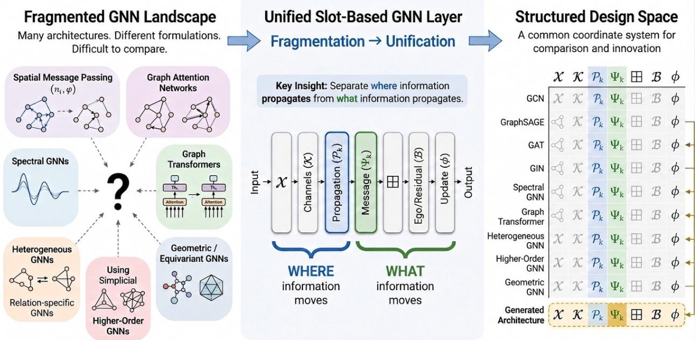  
From fragmented formulations to a unified, interpretable, and generative design space for Graph Neural Networks Compare·Understand·Generate  
Figure 1: Our unified GNN design space. We organize seven previously fragmented architectural families around one common layer. Read the figure from left to right: family-specific formulations are translated into seven shared components: the update domain $x ,$ channel set $\kappa ,$ propagation bank $\{ \mathbf { P } _ { k } \}$ , message maps $\{ \Psi _ { k } \}$ , mixing operator ⊞, ego/residual map $B _ { \ell } .$ , and update map ϕ<sub>ℓ</sub>. They then become directly comparable and recombinable. The key split is intuitive: $\mathbf { P } _ { k }$ specifies where information moves, while $\Psi _ { k }$ specifies what moves.

Here ℓ indexes layers, $k \in \mathcal { K }$ indexes channels, and $\mathbf { H } ^ { ( 0 ) } = \mathbf { X }$ . Each contribution $\mathbf { C } _ { k } ^ { \left( \ell \right) }$ couples $\mathbf { P } _ { k } ^ { \left( \ell \right) }$ with $\Psi _ { k } ^ { ( \ell ) }$ In the linear case, $\mathbf { C } _ { k } ^ { ( \ell ) } = \mathbf { P } _ { k } ^ { ( \ell ) } \boldsymbol { \Psi } _ { k } ^ { ( \ell ) }$ . The symbol $\widetilde { \mathbf { H } } ^ { ( \ell ) }$ denotes only the output of ⊞, not an eighth component. A single-channel spatial layer sets $\kappa = \{ 1 \}$ . Equation (3) in Section 3 gives the full definition, including the pairwise form needed for edge-conditioned and geometric messages.

For intuition, GCN (Kipf & Welling, 2017) uses one channel with $\mathbf { P } _ { 1 } = \hat { \mathbf { A } }$ , the symmetrically normalized adjacency with self-loops. It sets $\begin{array} { r } { \Psi _ { 1 } = \mathbf { H } ^ { \left( \ell \right) } \mathbf { W } ^ { \left( \ell \right) } , ~ B _ { \ell } = 0 . } \end{array}$ and $\phi _ { \ell } ( a , b ) = \sigma ( b )$ , recovering $\bar { \mathbf { H } } ^ { ( \ell + 1 ) } =$ $\sigma ( \hat { \mathbf { A } } \mathbf { H } ^ { ( \ell ) } \mathbf { W } ^ { ( \ell ) } )$ . Section 3 gives full reductions for GCN, GraphSAGE, GAT, and GIN.

Function-valued fillings allow the same components to express local message passing, attention, spectral and polynomial filtering, global Transformer attention, relation-specific channels, higher-order domains, and geometric messages. The tables show the seven components in six columns because the distinct maps $B _ { \ell }$ and ϕ<sub>ℓ</sub> share the final Ego/Update display column. Difering cells then localize the formal choices recorded by the slot discipline.

The equation provides a unified component system for comparing architectures and formulating the empirical inverse problem of selecting a model for a dataset. The seven families are nonexclusive and are defined by their primary axis of variation. Spatial, attention, spectral, and Graph Transformer families primarily specialize $\mathbf { P } _ { k }$ . Heterogeneous, higher-order, and geometric families primarily vary K, X, or $\Psi _ { k }$ and $\phi _ { \ell }$ jointly. Hybrid models may therefore occupy several families.

The layer output $\bar { \mathbf { H } } ^ { ( \ell + 1 ) }$ preserves its domain. A separate pooling operation may coarsen it between layers (Appendix B), while higher-order architectures change X itself by lifting the domain to tuples, subgraphs, or cells (Section 3). Table 1 illustrates the seven-component representation for twenty-one methods, and Table 2 identifies each family’s primary component.

Table 1: Our seven-family taxonomy expressed in one common layer. Each colored band is one family, and its three anchor methods show how familiar architectures fill the same seven components. Read each row from left to right: what objects are updated (X), which channels are used (K), where information moves $\left( \mathbf { P } _ { k } \right)$ , what information moves $\left( \Psi _ { k } \right)$ , how channel contributions are combined (⊞), and how the result updates the state $\left( \left( \boldsymbol { B } _ { \ell } , \phi _ { \ell } \right) \right)$ . The six displayed columns combine the distinct ego/residual and update maps in the final Ego/Update column. Full source-grounded decompositions and conventions appear in Table 14–Table 20 and Sections 3.2–3.6. Here cg denotes the Clebsch–Gordan tensor product.
<table><tr><td>Method</td><td>x</td><td>K</td><td>Propagation  $\mathbf { P } _ { k } ^ { ( \ell ) }$ </td><td>Message  $\Psi _ { k } ^ { ( \ell ) }$ </td><td>Mixing  $\boxplus ^ { ( \ell ) }$ </td><td>Ego/Update  $( \pmb { { \cal B } } _ { \ell } , \phi _ { \ell } )$ </td></tr><tr><td colspan="7">1 Spatial local support in Pk with differences in aggregation and ego/update</td></tr><tr><td>GCN Kipf &amp; Welling (2017)</td><td>V</td><td>{1}</td><td>Â</td><td> $\mathbf { H } ^ { ( \ell ) } \mathbf { W } ^ { ( \ell ) }$ </td><td> $\mathbf { P } _ { 1 } \Psi _ { 1 }$ </td><td> $\sigma ( \widetilde { \mathbf { H } } ^ { ( \ell ) } )$ </td></tr><tr><td>GraphSAGE- Mean Hamilton et al. (2017)</td><td>V</td><td>{1}</td><td> $\mathbf { D } ^ { - 1 } \mathbf { A }$ </td><td> $\mathbf { H } ^ { ( \ell ) }$ </td><td> $\mathbf { P } _ { 1 } \Psi _ { 1 }$ </td><td> $\mathrm { n o r m } ( \sigma ( [ \mathbf { H } ^ { ( \ell ) } ] |$   $\widetilde { \mathbf { H } } ^ { ( \ell ) } ] \mathbf { W } ^ { ( \ell ) } ) )$ </td></tr><tr><td>GIN Xu et al. (2019b)</td><td>V</td><td>{1}</td><td>A</td><td> $\mathbf { H } ^ { ( \ell ) }$ </td><td> $\mathbf { P } _ { 1 } \Psi _ { 1 }$ </td><td> $\mathrm { M L P } ^ { ( \ell ) } ( ( 1 + \epsilon _ { \ell } ) { \bf { H } } ^ { ( \ell ) } +$ </td></tr><tr><td colspan="7">2 Attention state-dependent αij(H()) in Pk</td></tr><tr><td>GAT Veličković et al. (2018)</td><td>V</td><td> $\{ 1 , \dots , M \}$ </td><td> $\mathrm { s o f t m a x } _ { j \in \widetilde { N } ( i ) } \left( \begin{array} { r l } \end{array} \right.$   $\mathrm { L R e L U } ( | \hat { h } _ { i }  \mathbf { \tilde { W } } _ { m } | )$   $h _ { j } \mathbf { W } _ { m } \big ] \mathbf { a } _ { m } \big ) \Big )$ </td><td> $\mathbf { H } ^ { ( \ell ) } \mathbf { W } _ { m } ^ { ( \ell ) }$ </td><td> $\mathbf { C } _ { m } = \mathbf { P } _ { m } \Psi _ { m } ;$   $\bar { \mathbf { H } } = \| _ { m } \mathbf { C } _ { m }$ </td><td> $\begin{array} { r } { B _ { \ell } = 0 ; } \end{array}$   $\sigma ( \widetilde { \mathbf { H } } ^ { ( \ell ) } )$ </td></tr><tr><td>GaAN Zhang et al. (2018)</td><td>V</td><td> $\{ 1 , \dots , M \}$ </td><td> $\mathrm { s o f t m a x } _ { j \in \mathcal { N } ( i ) } \langle$   $\mathbf { \Sigma } _ { h _ { i } } \mathbf { w } _ { x a } ^ { ( m ) } ,$   $h _ { j } \mathbf { W } _ { z a } ^ { ( m ) } \rangle$ </td><td> $\mathrm { F C } _ { \theta _ { v } ^ { ( m ) } } ^ { h } ( h _ { j } )$ </td><td> $\mathbf { C } _ { m , i } = \mathbf { P } _ { m } \Psi _ { m } ;$   $\widetilde { \mathbf { H } } _ { i } = \| _ { m } g _ { i } ^ { ( m ) } \mathbf { C } _ { m , i }$ </td><td> $B _ { \ell , i } = h _ { i } ;$   $\begin{array} { r } { \mathbf { g } _ { i } = \sigma ( \mathrm { F C } ( \mathbf { q } _ { i } ) ) ; } \end{array}$   $\mathrm { F C } ( \boldsymbol { B _ { \ell , i } } | | \widetilde { \mathbf { H } } _ { i } )$ </td></tr><tr><td>MAGNA Wang et al. (2021)</td><td>V</td><td> $\{ ( m , k ) :$ </td><td> $1 \leq m \leq M \ c G _ { k } ( \operatorname { s o f t m a x } ( \mathbf { S } _ { m } ^ { ( \ell ) } ) ) ^ { k } ;$   $c _ { k < K } = \alpha ( 1 { - } \alpha ) ^ { k } ,$ </td><td> $\mathrm { L N } ( \mathbf { H } ^ { ( \ell ) } )$ </td><td> $\begin{array} { r } { \mathbf { z } _ { m } = \sum _ { k = 0 } ^ { K } \mathbf { P } _ { m , k } \boldsymbol { \Psi } _ { n } } \end{array}$ </td><td> $\mathbf { R } = \mathbf { H } ^ { ( \ell ) } + \widetilde { \mathbf { H } } ;$ </td></tr><tr><td colspan="7"> $c _ { K } = ( 1 { - } \alpha ) ^ { K }$  3 Spectral 1 polynomial/spectral basis with coefficients folded into Pk</td></tr><tr><td>ChebNet Defferrard et al. (2016)</td><td>V</td><td> $\{ 0 , \ldots ,$  K-1}</td><td> $T _ { k } ( \tilde { \mathbf { L } } _ { \mathrm { c h } } )$   $( [ - 1 , 1 ] \mathrm { - r e s c a l e d ~ } { \bf L } _ { \mathrm { s y m } } )$ </td><td> $\mathbf { H } ^ { ( \ell ) } \Theta _ { k }$ </td><td> $\sum _ { k } \mathbf { P } _ { k } \Psi _ { k }$ </td><td> $\sigma ( \widetilde { \mathbf { H } } ^ { ( \ell ) } )$ </td></tr><tr><td>APPNP Gasteiger et al. (2019a)</td><td>V</td><td> $\{ 0 , \ldots , K \}$ </td><td> $\mathbf { P } _ { k } =$   $\int \alpha ( 1 - \alpha ) ^ { k } \hat { \mathbf { A } } ^ { k } , \quad k < k$   $\mathbf { \hat { \lambda } } \left( ( 1 - \alpha ) ^ { K } \hat { \mathbf { A } } ^ { K } , \quad k = k \right.$ </td><td> $f _ { \theta } ( \mathbf { X } )$ </td><td> $\sum _ { k } \mathbf { P } _ { k } \Psi _ { k }$ </td><td> $\widetilde { \mathbf { H } } ^ { ( \ell ) }$  final softmax external</td></tr><tr><td>GPR-GNN Chien et al. (2021)</td><td>V</td><td> $\{ 0 , \ldots , K \}$ </td><td> $\gamma _ { k } \hat { \mathbf { A } } ^ { k }$   $( \mathrm { l e a r n e d } , \mathrm { s i g n e d } )$ </td><td> $f _ { \theta } ( \mathbf { X } )$ </td><td> $\sum _ { k } \mathbf { P } _ { k } \Psi _ { k }$ </td><td> $\widetilde { \mathbf { H } } ^ { \left( \ell \right) }$  final softmax external</td></tr><tr><td colspan="7">4 Graph Transformer global/sparsified attention in Pk</td></tr><tr><td>Ying et al. (2021)</td><td> $\{ v _ { g } \}$  + deg</td><td>heads</td><td> $\mathrm { s o f t m a x } ( \mathbf { Q } _ { m } \mathbf { K } _ { m } ^ { \top } / \sqrt { d } +$   $b _ { \phi ( i , j ) } + c _ { i j } ^ { \mathrm { S P - e d g e } } )$ </td><td> $\mathbf { H } ^ { ( \ell ) } \mathbf { W } _ { m } ^ { V }$ </td><td> $\Vert _ { m } \mathbf { P } _ { m } \Psi _ { m }$ </td><td> $\mathrm { M H A } ( \mathrm { L N } H ) + H ;$   $H ^ { + } =$   $\mathrm { F F N } ( \mathrm { L N } H ^ { \prime } ) + H ^ { \prime }$   $\mathrm { b r a n c h \ r e s + B N ; }$ </td></tr><tr><td>GPS* Rampášek et al. (2022)</td><td>+ PE /SE</td><td>lo,gl</td><td>MPNNe( H, E, A); GlobalAttn(H)</td><td> ${ \hat { \mathbf { X } } } _ { M } ,$   $\hat { \mathbf { X } } _ { T }$ </td><td> $\mathbf { H } _ { n , \sigma } ^ { ( \ell + 1 ) }$   $+ \mathbf { H } _ { T } ^ { ( \ell + 1 ) }$ </td><td> $\mathrm { M L P + r e s + B N }$ </td></tr><tr><td>NodeFormer Wu et al. (2022)</td><td>V</td><td>{1:K}G⊕  $\{ { \mathrm { r e l } } \} _ { \mathrm { o p t } }$ </td><td> $\tilde { \phi } _ { g } ( \mathbf { Q } / \sqrt { \tau } ) \tilde { \phi } _ { g } ( \mathbf { K } / \sqrt { \tau } ) ^ { \top }$   $\mathbf { P } _ { \mathrm { r e l } } = \sigma ( b ^ { ( \ell ) } ) \mathbf { A }$ </td><td> $\mathbf { H } ^ { ( \ell ) } \mathbf { W } ^ { V }$ </td><td> $K ^ { - 1 } \sum _ { \mathfrak { c } ^ { r } } \mathbf { P } _ { r } \Psi$   $+ \overline { { \mathbf { P } } } _ { \mathrm { r e l } } \Psi$ </td><td> $\mathbf { H } ^ { ( \ell + 1 ) } = \widetilde { \mathbf { H } } ^ { ( \ell ) }$ </td></tr><tr><td colspan="7">5 Heterogeneous K indexes relations/meta-paths with per-type Pk</td></tr><tr><td>Method</td><td>X</td><td>K</td><td>Propagation  $\mathbf { P } _ { k } ^ { ( \ell ) }$ </td><td>Message  $\Psi _ { k } ^ { ( \ell ) }$ </td><td>Mixing  $\boxplus ^ { ( \ell ) }$ </td><td> $\mathbf { E g o / U p d a t e }$   $( \pmb { { \cal B } } _ { \ell } , \phi _ { \ell } )$ </td></tr><tr><td>R-GCN Schlichtkrull et al. (2018)</td><td>V</td><td>R</td><td> $\frac { 1 } { c _ { i , r } } \mathbf { A } _ { r }$  (per-relation</td><td> $\mathbf { H } ^ { ( \ell ) } \mathbf { W } _ { r }$ </td><td> $\sum _ { k \in \mathcal { K } } \mathbf { P } _ { k } \Psi _ { k }$ </td><td> $\sigma ( \mathbf { H } ^ { ( \ell ) } \mathbf { W } _ { 0 } { + } \widetilde { \mathbf { H } } ^ { ( \ell ) } )$ </td></tr><tr><td>HAN Wang et al. (2019b)</td><td>V</td><td> $\begin{array} { r } { \{ ( \Phi , k ) : } \\ { \Phi \in \mathcal { P } , } \end{array}$   $1 \leq k \leq K \}$ </td><td> $\alpha _ { i j } ^ { \Phi , k } ( \mathbf { H } ) \mathbf { A } _ { \Phi }$  (softmax over j ∈ NiΦ)</td><td> $\mathbf { H } ^ { ( \ell ) } \mathbf { M } _ { \varphi }$  (by node type φ)</td><td> $\sum _ { \| _ { k } \sigma ( \mathbf { P } _ { \Phi , k } ^ { } \Psi _ { \Phi , k } ) }$ </td><td> $\begin{array} { r } { B _ { \ell } = 0 ; } \end{array}$   $\phi _ { \ell } ( \widetilde { \mathbf { H } } ) = \widetilde { \mathbf { H } }$ </td></tr><tr><td>HGT Hu et al. (2020b)</td><td>V</td><td> $\{ m : 1 \leq$   $m \leq h \}$ </td><td> $\pmb { \alpha } _ { s , e , t } ^ { ( m ) }$  (meta-relation conditioned)</td><td> $\mathrm { M - L i n e a r } _ { \tau _ { c } } ^ { m }$   $( \mathbf { H } _ { s } ^ { ( \ell ) } ) \mathbf { W } _ { r } ^ { \mathrm { M S } \dot { \mathbf { G } } , \mathrm { m } }$ </td><td> $\begin{array} { r } { \mathbf { C } _ { m , t } = \sum _ { s \in \mathcal { N } ( t ) } } \end{array}$   $\alpha _ { s , e , t } ^ { ( m ) } \Psi _ { s , e , t } ^ { ( m ) } ;$   $\widetilde { \mathbf { H } } _ { t } = \| _ { m } \mathbf { C } _ { m , t }$ </td><td> ${ \mathbf W } _ { \tau _ { t } } ^ { A } \sigma ( \widetilde { { \mathbf H } } _ { t } ) + { \mathbf H } _ { t }$ </td></tr><tr><td colspan="7">6 Higher-order domain X beyond nodes: tuples/subgraphs/cells</td></tr><tr><td>PPGN Maron et al. (2019a)</td><td></td><td> $V ^ { 2 } \qquad \{ c = 1 { : } b \}$ </td><td> $\overline { { \mathrm { M L P } _ { 1 } ( \mathbf { H } ^ { ( \ell ) } ) } }$  (state-dependent operator)</td><td> $\mathrm { M L P _ { 2 } } ( { \bf H } ^ { ( \ell ) } )$ </td><td> $\mathbf { P } \times \Psi \times$ </td><td> $\overline { { [ \mathrm { M L P _ { 3 } } ( \mathbf { H } ^ { ( \ell ) } ) | | } }$   $\widetilde { \mathbf { H } } ^ { ( \ell ) } ]$   $( \mathrm { M L P _ { 3 } ~ g i v e s ~ } \mathcal { B } _ { \ell } )$ </td></tr><tr><td>NGNN‡ Zhang &amp; Li (2021)</td><td>S</td><td>{1}</td><td> $\mathbf { A } _ { { S } _ { i } }$ </td><td> $M _ { t } ( h _ { v , G _ { w } ^ { h } } ^ { t } ,$   ${ h _ { u , G _ { w } ^ { h } } ^ { t } } , e _ { v u } )$ </td><td>∑  $u \in N ( v | G _ { w } ^ { h } )$   $\mathbf { P } _ { v u } \Psi _ { v u }$ </td><td> $\begin{array} { c } { { U _ { t } ( h _ { \ v , G _ { w } ^ { h } } ^ { t } , } } \\ { { \widetilde { \mathbf { H } } _ { v } ^ { t + 1 } ) ; } } \end{array}$   $R _ { 0 }$  then R1 pooling</td></tr><tr><td>MPSN Bodnar et al. (2021b)</td><td> $\ d \ L \bigcup _ { p } X _ { p }$ </td><td>{B,C,↓,↑}</td><td> $B ( \sigma ) , C ( \sigma ) ,$   $N _ { \downarrow } ( \sigma ) , N _ { \uparrow } ( \sigma )$ </td><td> $M _ { \mathrm { B } } , M _ { \mathrm { C } } , M _ { \downarrow } , M _ { \uparrow }$ </td><td> $[ m _ { \mathrm { B } } | | m _ { \mathrm { C } }$   $\| m _ { \downarrow } \| m _ { \uparrow } ]$ </td><td> $U ( h _ { \sigma } ^ { ( \ell ) } , \widetilde { { \mathbf { H } } } _ { \sigma } ^ { ( \ell ) } )$ </td></tr><tr><td colspan="7">7 Geometric Ψk, φ respect a geometric symmetry group</td></tr><tr><td>SchNet Schütt et al. (2017)</td><td> $V ; r _ { i j }$ </td><td>{1}</td><td> $1 ( \mathrm { a l l \ p a i r s } )$ </td><td> $( h _ { j } \mathbf { W } _ { \mathrm { i n } } ) \odot$   $W _ { \theta } ( \mathrm { R B F } ( r _ { i j } ) )$   $\Psi _ { h , i j } = m _ { i j } =$ </td><td>id  $( C _ { 1 , i } { = } \sum _ { j } P _ { i j } \Psi _ { i j } )$ </td><td> $\mathbf { H } ^ { ( \ell ) } + \mathrm { M L P } ( \widetilde { \mathbf { H } } ^ { ( \ell ) } )$ </td></tr><tr><td>EGNN Satorras et al. (2021)</td><td>V;  $( h _ { i } , x _ { i } )$ </td><td>{h, x}</td><td> $P _ { h , i j } =$   $\mathbb { 1 } [ j \in \mathcal { N } ( i ) ] ;$   $P _ { x , i j } =$   $C 1 [ j \neq i ]$   $\underline { { \cdot \phi _ { x } ( m _ { i j } ) } }$ </td><td> $\phi _ { e } ( h _ { i } , h _ { j } ,$   $\| x _ { i } - x _ { j } \| ^ { 2 } , \mathbf { \dot { e } } _ { i j } ) ;$   $\Psi _ { x , i j } =$   $\underline { { x _ { i } - x _ { j } } }$ </td><td> $\mathrm { i d ~ } \left( C _ { h } , C _ { x } \mathrm { \ t y p e d } \right)$ </td><td> $x _ { i } ^ { \prime } = x _ { i } + \Delta x _ { i } ;$   ${ \pmb h } _ { i } ^ { \prime } = \phi _ { h } ( { \pmb h } _ { i } , m _ { i } )$ </td></tr><tr><td>SE(3)-Tr. Fuchs et al. (2020)</td><td> $Y _ { ; } \{ 1 , \ldots , M \}$ </td><td></td><td> $\alpha _ { i j } ^ { m } =$   $\operatorname { s o f t m a x } _ { j \in N _ { i } \setminus i }$   $\left( q _ { i } ^ { m \top } k _ { i j } ^ { m } \right)$ </td><td> $\Psi _ { i j } ^ { m } =$   $W _ { V , m } ^ { \ell k } ( x _ { j } - x _ { i } ) f _ { j } ^ { k }$ </td><td> $\Vert _ { m } C _ { m }$ </td><td>self-interaction + norm nonlinearity</td></tr></table>

We make the coverage claim checkable through step-by-step reductions of GCN (Kipf & Welling, 2017), GraphSAGE (Hamilton et al., 2017), GAT (Veličković et al., 2018), and GIN (Xu et al., 2019b), supplemented by representative fillings across all seven families. Section 3 extends the same components to state-dependent attention, multi-hop and spectral bases, global communication, relation and meta-path channels, lifted domains, and geometric equivariant messages.

What the unification establishes. A flexible equation risks making coverage vacuous because the same computation can be assigned to diferent components. We therefore fix a slot discipline that assigns each elementary operation by output role. Scalar edge and channel weights enter $\mathbf { P } _ { k } ,$ , vector- or matrix-valued messages enter $\Psi _ { k }$ , ⊞ combines channel contributions, $B _ { \ell }$ forms the ego or residual input, and $\phi _ { \ell }$ performs the update. The fixed discipline makes component-wise comparisons meaningful even when equivalent factorizations exist. It determines entries up to stated redundancies, including channel-rank non-identifiability in the linear regime (Proposition 2) and equivalent iterative or polynomial forms.

The coverage boundary is equally explicit. Channels use either a matrix linear-value form $\mathbf { P } _ { k } \Psi _ { k }$ or a pairwise message with permutation-invariant aggregation, followed by permutation-equivariant mixing. Section 3 identifies methods outside these primitives and the structural property responsible. These cases bound the framework rather than establish impossibility.

Table 2: How our seven families occupy the unified layer. This table is the compact map behind our taxonomy: the bold Defining axis identifies the component that most clearly separates each family, while the remaining cells summarize its common fillings. Families 1–4 primarily change where information moves through $\mathbf { P } _ { k } ;$ Family 5 changes the relation or meta-path channels $\kappa ;$ Family 6 changes the updated domain $x ;$ and Family 7 changes the geometric message and update maps $\Psi _ { k }$ and $\phi .$ . Thus the table can be read as a guide from a family name to the part of Eq. (3) that it principally redesigns. Here $V ^ { k } , s .$ and $\mathcal { X } _ { p }$ denote tuples, subgraphs, and cells, respectively (Section 3.6).
<table><tr><td>Family</td><td>Defining axis</td><td>Domain X</td><td>Channels K</td><td>Propagation  $\mathbf { P } _ { k }$ </td><td>Message  $\Psi _ { k }$ </td><td>Mixing 田</td><td>Ego/Update (Be, φe)</td></tr><tr><td>1 Spatial</td><td> ${ \bf { P } } _ { k } \colon { \bf { \Delta } }$  local support</td><td>V</td><td>one or more local supports</td><td>fixed sparse local operators</td><td>linear or pairwise local messages</td><td>id. / sum / concat</td><td>σ/MLP/ gate / residual</td></tr><tr><td>2 Attention</td><td> ${ \bf { P } } _ { k } \colon { \bf { \Delta } }$  state-dependent</td><td>V</td><td>heads</td><td> $\alpha ( \mathbf { H } ^ { ( \ell ) } )$  on local support</td><td>linear / pairwise values</td><td>concat / mean / gated mixing</td><td>σ /MLP / residual</td></tr><tr><td>3 Spectral</td><td> ${ \bf { P } } _ { k } \colon { \bf { \Delta } }$  polynomial basis</td><td>V</td><td>spectral order k</td><td> $g _ { k } ( \mathbf { S } ) ~ / ~ \hat { \mathbf { A } } ^ { k }$ </td><td> ${ \bf H } ^ { ( \ell ) } \Theta _ { k } ~ / ~ f _ { \theta } ( { \bf X } )$ </td><td> $\sum _ { k } \mathbf { P } _ { k } \Psi _ { k }$  (coefficients folded into  $\mathbf { P } _ { k } )$ </td><td>id.  $\mathbf { \nabla } / \sigma \mathbf { \nabla } /$  residual</td></tr><tr><td>4 Graph Transformer</td><td> ${ \bf { P } } _ { k } \colon$  global support</td><td>V (or tokens)</td><td>heads / tokens</td><td>global or sparsified attention (optionally local-global)</td><td>projected values / branch outputs</td><td>concat / sum / local-global mixing</td><td>residual + norm + MLP</td></tr><tr><td>5 Heterogeneous</td><td>K: relations / meta-paths</td><td>V</td><td>relations / meta-paths</td><td>typed adjacency or relation- conditioned attention</td><td>type-/relation- specific messages</td><td>sum / concat / semantic attention</td><td>type-specific σ /  / residual</td></tr><tr><td>6 Higher-order</td><td>X: lifted domain</td><td> $\begin{array} { l } { { V ^ { k } \mathrm { ~ / ~ } s \mathrm { ~ / ~ } } } \\ { { \chi _ { p } } } \end{array}$ </td><td>replacement / incidence / support types</td><td>lifted or inter-rank operators</td><td>inner-GNN / pairwise / equivariant messages</td><td>sum / concat / typed mixing</td><td>lifted update / MLP / base GNN</td></tr><tr><td>7 Geometric</td><td> $\Psi _ { k } ,$  φ: geometric equivariance</td><td> $V ~ /$  edges (+ geometry)</td><td>directed scalar / vector / tensor channels</td><td>invariant scalar support or attention weights</td><td>G-equivariant tensor / geometric sum / concat messages</td><td>typed sum / direct G-equivariant</td><td>update</td></tr></table>

Within this discipline, difering components locate recorded computational diferences. GraphSAGE and GIN difer in operator normalization and ego handling, while GCN and GAT difer in fixed versus statedependent scalar weights. Functional equivalence additionally depends on internal mechanisms and component interactions beyond the displayed granularity. The fixed coordinates nevertheless expose relationships obscured by paper-specific notation and reveal combinations absent from the catalogued inventory. Section 4 uses those combinations to generate structurally consistent candidates for empirical evaluation.

The available evidence also rules out a context-free ranking of component fillings. Rankings depend on graph structure under heterophily (Zhu et al., 2020; Pei et al., 2020), tuning (Tönshof et al., 2024), and evaluation protocol (Luo et al., 2024b; 2025; Rubio-Madrigal & Burkholz, 2026). These finite comparisons neither establish a no-free-lunch theorem nor preclude dominance on a specified distribution class. They motivate the unresolved problem of mapping measurable graph and task properties to validated component choices (Section 7).

The paper proceeds from notation (Section 2) to the unified equation and families (Section 3), generated architectures (Section 4), propagation analysis (Section 5), benchmark interpretation (Section 6), and open problems (Section 7). The family map and detailed component tables provide the primary reference path through the paper.

## 1.1 Contributions

The unified equation supports four contributions.

• We define a seven-component unification of covered graph neural layers, together with a fixed slot discipline, a named coverage boundary, worked reductions of four canonical layers, and representative fillings across all seven families (Section 3).

• We organize more than 200 catalogued architectures from over 400 cited works into seven nonexclusive, component-anchored families. The comparison tables record assignments for all seven components at a declared reporting granularity and distinguish architectural families from reusable operations and problem settings (Table 14–Table 20).

• We derive component-level attribution and identifiability results. Under node-local updates, operator support localizes one-layer dependencies and yields a necessary full-row condition for onelayer global mixing. In the linear additive regime, raw channel count is non-identifiable and minimum Kronecker channel rank provides the corresponding invariant. These are the central consequences of exposing the propagation bank and channel decomposition. Seventeen results connect these and related component interactions to oversmoothing, oversquashing, heterophily, expressivity, and permutation symmetry, with sixteen proofs in Appendix C. Section 6 records documented benchmark properties and evaluation findings, then translates them descriptively into the component vocabulary while reserving causal attribution for controlled evidence.

• We treat the component inventory as a structured design space. It supports the generation of well-formed architectures (Section 4) and exposes the inverse problem of selecting fillings from measurable graph, task, and deployment properties (Section 7).

## 1.2 Scope and Terminology

We use component and slot interchangeably for one coordinate of the unified equation. A filling is a concrete choice for that coordinate. A compatible assignment to all seven components specifies a layer at the declared reporting granularity. Within the broader graph-learning stack, an architectural family groups layers by a primary pattern of component variation. A family-agnostic operation, such as a positional encoding, rewiring, skip connection, normalization, or pooling, is a reusable module with a primary component or external location and may afect other components (Appendix B). A problem setting or training paradigm instead specifies data, task, or loss without fixing the layer. Architectural families organize the unification, operations are treated separately, and problem settings and training paradigms remain outside its primary scope. Temporal graphs and pre-training may add architectural machinery, but are treated primarily as a problem setting and training paradigm, respectively.

Architectural families. Table 2 groups the seven families by their primary component. Spatial message-passing, attention, spectral/polynomial, and Graph Transformer families specialize $\mathbf { P } _ { k } ,$ whereas heterogeneous/multi-relational, higher-order/subgraph, and geometric equivariant families vary K, X, and jointly $\Psi _ { k } , \phi ,$ respectively. Section 3 introduces each family, Appendix D provides the tables, and Section 5 further studies the propagation families.

Operations and diagnostics. Appendix B maps positional/structural encodings, rewiring, virtual nodes, skip connections, normalization, pooling, continuous-depth/ODE views, and mini-batch sampling to their primary components or external locations. Appendix C gives sixteen proofs concerning expressivity, locality/- globality of $\mathbf { P } _ { k } .$ , spectral filtering, oversmoothing, heterophilic realizability, and permutation equivariance. The immediate concatenation corollary is proved with its statement in Section 3. Section 5 uses these results.

Scope beyond the base-layer equation. The seven-component equation describes single-layer graph computation rather than complete training or deployment pipelines. Recurrent and fixed-point GNNs (Scarselli et al., 2009; Li et al., 2016) largely overlap the MPNN framework (Gilmer et al., 2017) and are treated elsewhere. Graph autoencoders and generative models center on decoders and generation processes, so we cover only their encoders when these belong to the seven families. Temporal and dynamic graph networks are primarily problem settings, despite often adding memory, message, and update machinery. Pre-training objectives, graph generative decoders, language-model coupling, retrieval systems, and multi-agent contro therefore remain outside the formal scope of the equation. Section 7 nevertheless uses the component vocabulary to formulate open questions about temporal memory, cross-domain transfer, retrieval-grounded generation, personalization, reasoning graphs, and graph-structured agent systems, as well as weight-space model editing. These discussions identify possible extensions and do not claim that the seven-component equation represents the complete surrounding system. Their constituent GNN layers remain representable when they satisfy our primitives. We cover what a layer computes, not its training loss, enclosing task pipeline, or deployment system. Adaptation to data structure within the heterogeneous and geometric families remains in scope because it is a layer property.

## 2 Preliminaries

This section fixes the notation and definitions used throughout the paper.

## 2.1 Basic Graph-Theoretic Objects

A graph $\mathcal { G } = ( \nu , \mathcal { E } )$ consists of a node set V and an edge set $\mathcal { E } .$ Nodes represent entities, and edges represent relations between them. We write $n = | \nu |$ for the number of nodes and $m = | \mathcal { E } |$ for the number of edges.

Graphs can be undirected (edges are symmetric, $\mathrm { i . e . , ~ } ( u , v )$ is the same as $( v , u ) )$ or directed (order matters). They can be unweighted (edges are present or absent) or weighted (each edge $( u , v )$ has a weight $w _ { u v } )$

The adjacency matrix $\mathbf { A } \in \mathbb { R } ^ { n \times n }$ encodes connectivity. Specifically, $A _ { u v } = 1 \mathrm { ~ i f ~ } ( u , v ) \in \mathcal { E }$ (unweighted), or $A _ { u v } = w _ { u v }$ (weighted). For undirected graphs, A is symmetric. The neighborhood of node v is $\mathcal { N } ( v )$ , with degree $d _ { v } = | \mathcal { N } ( v ) |$ in the unweighted case and $\begin{array} { r } { d _ { v } = \sum _ { u } A _ { v u } } \end{array}$ for weighted graphs. Directed graphs use separate in- and out-degree conventions. The degree matrix D is diagonal with $D _ { v v } = d _ { v }$

For normalized propagation operators, inverse normalizations $\mathbf { D } ^ { - 1 }$ and $\mathbf { D } ^ { - 1 / 2 }$ adopt the convention that isolated nodes $( d _ { v } = 0 )$ contribute 0. The spectral statements below assume no isolated nodes, so that $\mathbf { D } ^ { - 1 / 2 }$ is invertible and the normalized Laplacian’s null space tracks connected components. Isolates, if present, are dropped from the spectral discussion.

Self-loops connect each node to itself. With self-loops, the adjacency becomes $\tilde { \mathbf { A } } = \mathbf { A } + \mathbf { I }$ with corresponding degree matrix D<sup>˜</sup> . A normalized adjacency is $\hat { \mathbf { A } } = \bar { \tilde { \mathbf { D } } } ^ { - 1 / 2 } \tilde { \mathbf { A } } \tilde { \mathbf { D } } ^ { - 1 / 2 }$ . Normalization prevents high-degree nodes from dominating aggregation. The self-loop-free normalized adjacency is $\bar { \mathbf { A } } = \mathbf { D } ^ { - 1 / 2 } \mathbf { A } \mathbf { D } ^ { - 1 / 2 }$ , used below in spectral analysis.

The combinatorial (unnormalized) graph Laplacian is $\mathbf { L } = \mathbf { D } - \mathbf { A }$ , and the symmetric normalized Laplacian is ${ \bf L } _ { \mathrm { s y m } } = { \bf I } - \bar { \bf A } = { \bf I } - { \bf D } ^ { - 1 / 2 } { \bf A } { \bf \bar { D } } ^ { - 1 / 2 }$ . Unless stated otherwise, all spectral statements refer to $\mathbf { L } _ { \mathrm { s y m } } ;$ its spectrum, eigenbasis, and the resulting high-pass/low-pass filtering language are developed in Section 2.7.

When a model uses the self-loop-normalized support $\hat { \bf A }$ instead, we write the reference propagation Laplacian as $\mathbf { L } _ { \mathrm { r e f } } = \mathbf { I } - \hat { \mathbf { A } }$ , and distinguish it explicitly. For an undirected graph with nonnegative weights, $\mathbf { L } _ { \mathrm { r e f } } = \mathbf { I } - \hat { \mathbf { A } }$ is symmetric positive semidefinite with spectrum in $[ 0 , 2 ) ;$ the self-loop on every node rules out a bipartite component, and hence rules out the eigenvalue 2 itself. $\mathbf { L } _ { \mathrm { r e f } }$ therefore admits its own exact orthonormal eigendecomposition and Fourier picture. Adding self-loops gives it a generally diferent eigenbasis from $\mathbf { L } _ { \mathrm { s y m } }$ The two can still share eigenvectors in special cases, notably regular graphs, where the normalizations difer only by a constant. The clean Fourier picture developed in Section 2.7 is stated for $\mathbf { L } _ { \mathrm { s y m } } .$ , and the same construction applies verbatim to $\mathbf { L } _ { \mathrm { r e f } }$ in its own eigenbasis.

Real-world graphs are typically sparse $( m \ll n ^ { 2 } )$ . Sparsity makes message passing tractable, since naive dense propagation over all $n ^ { 2 }$ pairs is usually infeasible. This is also why graph Transformers, which attend over all pairs (Ying et al., 2021; Rampášek et al., 2022), often require scaling mechanisms such as sparsification or kernelization, as discussed under the Graph Transformer family (Section 3).

## 2.2 Graph Data and Notation

Node features are stored in $\mathbf { X } \in \mathbb { R } ^ { n \times d }$ , where row $\mathbf { \boldsymbol { x } } _ { v }$ is the feature vector of node v. Edge features are denoted by $e _ { u v }$ or a tensor E. Some tasks also use graph-level features $\pmb { x } _ { \mathcal { G } }$

Labels depend on the task; for node-level tasks, node labels are $\mathbf { Y } \in \mathbb { R } ^ { n \times c }$

Hidden representations at layer ℓ are $\mathbf { H } ^ { ( \ell ) }$ , with $\mathbf { H } ^ { ( 0 ) } = \mathbf { X }$ by default (some models instead take $\mathbf { H } ^ { ( 0 ) }$ to be a learned embedding of X). A GNN layer transforms $\mathbf { H } ^ { ( \ell ) }$ to $\mathbf { H } ^ { ( \ell + 1 ) }$ by combining feature transformations with graph-structured propagation. The final output before prediction is $\mathbf { Z } ;$ predicted labels are $\hat { \mathbf Y }$

In most node-level models the update domain is the node set, written $\mathcal { X } = \mathcal { V } .$ , so rows of $\mathbf { H } ^ { ( \ell ) }$ are indexed by nodes. In the unified notation, X denotes the update domain more generally. Higher-order models may index rows by tuples, rooted subgraphs, simplices, cells, or motifs. Geometric models may attach scalar, vector, or tensor features and coordinates to each object. We keep X for input features and X for the domain to avoid ambiguity. The per-family comparison tables render this same node-set domain value as plain V instead of V, a typographic compression for column width, not a separate object.

## 2.3 Learning Tasks on Graphs

Graph learning spans several task types that difer in their prediction target. This paper’s layer designs primarily target the first five below; the last two (generation and temporal/dynamic tasks) are problem settings we note only for completeness (Section 1.2).

Node classification and regression. Predict a label or continuous value for each node, e.g., semisupervised document or user classification (Kipf & Welling, 2017; Veličković et al., 2018).

Edge and link prediction. Predict whether an edge exists, its type, or an associated value, e.g., knowledgegraph completion (Schlichtkrull et al., 2018; Rossi et al., 2021).

Graph classification and regression. Predict a label or value for an entire graph, e.g., molecular property prediction (Gilmer et al., 2017; Hu et al., 2020a).

Community detection and clustering. Identify groups of nodes with similar roles or dense internal connectivity (Wang et al., 2019a).

Combinatorial optimization on graphs. Predict or construct a combinatorial structure that optimizes a graph-defined objective, e.g., the traveling salesman problem or minimum vertex cover (Khalil et al., 2017), or influence maximization.

Graph generation. Generate new graphs or components satisfying desired properties, e.g., molecule or layout synthesis (Yan et al., 2024).

Temporal and dynamic graph tasks. When nodes, edges, features, or labels change over time, tasks include forecasting future links, predicting event times, and learning adaptive representations (Rossi et al., 2020a; Huang et al., 2023b).

As Section 1.2 makes explicit, graph generation is itself a task and temporal/dynamic graphs are a problem setting, not a layer design.

## 2.4 Homophily and Heterophily

Homophily means connected nodes tend to be similar. Heterophily means they tend to difer. In label settings, homophily means adjacent nodes often share the same class. The distinction strongly afects which propagation operators perform well, since standard GNN propagation implicitly assumes homophily and degrades when it is absent (Pei et al., 2020; Zhu et al., 2020).

A common measure (Zhu et al., 2020), defined when $| \mathcal { E } | > 0$ , is the fraction of edges connecting same-label nodes. Formally, $\begin{array} { r } { h _ { \mathrm { e d g e } } = \frac { 1 } { | \mathcal { E } | } \sum _ { ( u , v ) \in \mathcal { E } } \mathcal { W } \{ y _ { u } = y _ { v } \} } \end{array}$ . Values near one indicate strong homophily. Values near zero indicate few same-label edges, though this does not automatically mean strong heterophily without considering class balance.

Node-level homophily (Pei et al., 2020) averages this locally over the non-isolated nodes $\mathcal { V } _ { + } = \{ v : | \mathcal { N } ( v ) | > 0 \}$ This gives $\begin{array} { r } { h _ { \mathrm { n o d e } } = \frac { 1 } { | \mathcal { V } _ { + } | } \sum _ { v \in \mathcal { V } _ { + } } \frac { 1 } { | \mathcal { N } ( v ) | } \sum _ { u \in \mathcal { N } ( v ) } | \mathcal { k } \{ y _ { u } = y _ { v } \} } \end{array}$ . Feature homophily can be measured using similarity functions, e.g., cosine similarity, $\begin{array} { r } { h _ { \mathrm { f e a t } } = \frac { 1 } { | \mathcal { E } | } \sum _ { ( u , v ) \in \mathcal { E } } \sin ( { \bf x } _ { u } , { \bf x } _ { v } ) } \end{array}$ . Edge homophily is also sensitive to the number and balance of classes, which makes raw comparisons across datasets unreliable; adjusted homophily corrects for this and is comparable across datasets. Label informativeness instead tracks how much structure helps GNN performance (Platonov et al., 2023a) (Section 7).

These are descriptive statistics, not fixed properties of a graph. A graph can be label-homophilic but featureheterophilic, and homophily can vary across classes and neighborhoods. They are also global averages: a single graph routinely contains both homophilic and heterophilic neighborhoods at once, so a single graph-level ratio can obscure node-level mixture. A layer’s propagation should accommodate that mixture rather than treat the graph as uniformly homophilic or heterophilic.

## 2.5 Message Passing Intuition

The core of many GNNs is message passing (Gilmer et al., 2017). Each node collects information from its neighbors, transforms it, aggregates it, and updates its representation. A single layer has the form

$$
{ h } _ { v } ^ { ( \ell + 1 ) } = \mathrm { U p d a t e } ^ { ( \ell ) } \Big ( h _ { v } ^ { ( \ell ) } , \mathrm { A g g r e g a t e } ^ { ( \ell ) } \{ \mathrm { M e s s a g e } ^ { ( \ell ) } ( h _ { v } ^ { ( \ell ) } , h _ { u } ^ { ( \ell ) } , e _ { u v } ) : u \in \mathcal { N } ( v ) \} \Big ) .\tag{1}
$$

After one layer, a node has information from its immediate neighbors. After L layers, its receptive field can include nodes within L hops. This changes for architectures with multi-hop propagation, graph rewiring, or global tokens, which let information travel farther than one hop per layer (Section 3 and Appendix B develop these mechanisms).

Repeated propagation can cause several problems. Oversmoothing describes representations that become too similar after many steps (Li et al., 2018a; Oono & Suzuki, 2020). Oversquashing describes information compressed through graph bottlenecks (Topping et al., 2022; Giovanni et al., 2023a). Long-range dependencies arise when predictions depend on distant nodes. Many later architectures respond by modifying one specific part of the layer (propagation, aggregation, or the graph structure itself) to control this flow. Section 5 analyzes these phenomena in detail; the next subsection names each such part of the layer precisely.

## 2.6 Layer Slots in the Unified Equation

To compare architectures that change only one part of the same underlying computation, we give each modifiable part of the layer a name. A component (or slot) is such a named position in the layer equation. The domain X and channel index set K are sets; the remaining components are operators or maps. Diferent architectures fill these positions diferently, and a family is defined by the component it primarily specializes.

Eq. (1) above is the node-local case of the unified equation, Eq. (3), whose compact top-level form is $\bar { \mathbf { H } } ^ { ( \ell + 1 ) } = \phi _ { \ell } \big ( \mathcal { B } _ { \ell } \big ( \mathbf { H } ^ { ( \ell ) } , \mathbf { H } ^ { ( 0 ) } \big ) , \widetilde { \mathbf { H } } ^ { ( \ell ) } \big )$ , an ego/residual term combined with the mixed message across channels. Its seven components $( \mathcal { X } , \mathcal { K } , \mathbf { P } _ { k } , \mathring { \Psi } _ { k } , \mathbb { H } , \mathcal { B } _ { \ell } , \phi _ { \ell } )$ are defined in full in Section 3. We record here only the detail left implicit there. The channel set K indexes hops, heads, relations, meta-paths, spectral terms, lifted ranks, or tensor degrees, and the message map carries its explicit arguments $\Psi _ { k } ^ { ( \ell ) } ( { \bf H } ^ { ( \ell ) } , { \bf H } ^ { ( 0 ) } , { \bf E } )$ . The mixed message is the output of the mixing component

$$
\begin{array} { r } { \widetilde { \mathbf { H } } ^ { ( \ell ) } = \boldsymbol { \boxdot { \mathbf { k } } } \mathbf { \Lambda } \mathbf { \in } \mathcal { K } \mathbf { C } _ { k } ^ { ( \ell ) } , \qquad [ \mathbf { C } _ { k } ^ { ( \ell ) } ] _ { i : } = \left\{ \begin{array} { l l } { [ \mathbf { P } _ { k } ^ { ( \ell ) } \Psi _ { k } ^ { ( \ell ) } ] _ { i : } } & { ( \mathrm { l i n e a r - v a l u e ~ c h a n n e l } ) , } \\ { \operatorname { A g g } _ { j } \big ( [ \mathbf { P } _ { k } ^ { ( \ell ) } ] _ { i j } \Psi _ { k } ^ { ( \ell ) } ( h _ { i } , h _ { j } , e _ { i j } ) \big ) } & { ( \mathrm { p a i r w i s e ~ c h a n n e l } ) , } \end{array} \right. } \end{array}
$$

where ⊞ denotes the channel-mixing operator (sum, concatenation, or gated/attention combination across the channel index $k ,$ equivariant under node relabeling), and the channel contribution $\mathbf { C } _ { k }$ is the matrix product for a linear value or, row by row, the aggregated per-edge message for an edge-conditioned/geometric one. The neighbor aggregation $\mathrm { A g g } _ { j }$ ranges over $j$ with $[ \mathbf { P } _ { k } ^ { ( \ell ) } ] _ { i j } \neq 0$ and is part of the channel contribution, not of ⊞.

A scalar per-channel coeficient (fixed, learned, signed, or constrained) is absorbed into the operator, $\mathbf { P } _ { k } ^ { ( \ell ) } \gets \gamma _ { k } ^ { ( \ell ) } \mathbf { P } _ { k } ^ { ( \ell ) }$ , so the mix $\widetilde { \mathbf { H } } ^ { ( \ell ) }$ carries no separate coeficient slot and no additive residual term. The update map then combines $\widetilde { \mathbf { H } } ^ { ( \ell ) }$ with an ego or residual term $B _ { \ell } ( { \bf H } ^ { ( \ell ) } , { \bf H } ^ { ( 0 ) } )$ to produce the node-preserving intermediate state $\bar { \mathbf { H } } ^ { ( \ell + 1 ) }$ , which an optional pooling step then maps to the next domain.

After L layers, a readout ρ maps the stack of layer states to the task representation, $\mathbf { Z } = \rho ( \mathbf { H } ^ { ( 0 ) } , \ldots , \mathbf { H } ^ { ( L ) } ) \mathbf { W } _ { \mathrm { o u t } }$ For most node-level models ρ simply selects the last state $\mathbf { H } ^ { ( L ) }$ , while jumping-knowledge designs instead combine states from multiple layers.

This slot vocabulary is the backbone of the seven families, each varying a particular slot or sub-property as its primary lever. Four families specialize the propagation operator $\mathbf { P } _ { k }$ . Spatial models vary the local operator together with the message and update. Attention models make $\mathbf { P } _ { k }$ state-dependent. Spectral models vary the basis and the coeficient rule folded into $\mathbf { P } _ { k }$ . Graph Transformers use global or tokenized attention operators. The remaining three vary a diferent slot instead. Heterogeneous models index channels by relation or meta-path, higher-order models change the domain X , and geometric models constrain $\Psi _ { k }$ and ϕ to respect an additional symmetry group. Figure 2 and the slot legend in Section 3 (Table 10 in Appendix A) give the visual and tabular counterparts of this decomposition.

## 2.7 Spectral and Spatial Perspectives

Two views complement each other. The spatial perspective starts from neighborhoods. A node receives messages from adjacent nodes and updates its representation. The spectral perspective starts from graph signals.

A graph signal is a vector $\mathbf { x } \in \mathbb { R } ^ { n }$ where $x _ { v }$ is the value at node v (Shuman et al., 2013). Node features are signals on graph vertices. Each column of the feature matrix $\mathbf { X } \in \mathbb { R } ^ { \dot { n } \times d }$ is one signal, representing one feature channel. This view lets GNN layers be interpreted as operations that transform, smooth, sharpen, or mix signals over graph structure.

The graph Laplacian (Chung, 1997) makes the frequency view concrete. For a signal x on an undirected graph (where A is symmetric), the Laplacian quadratic form is $\begin{array} { r } { \mathbf { x } ^ { \top } \mathbf { L x } = \frac { 1 } { 2 } \sum _ { u , v } A _ { u v } ( x _ { u } - x _ { v } ) ^ { 2 } } \end{array}$ . This is small when adjacent nodes have similar values and large when they difer, making it the graph’s discrete Dirichlet energy; the normalized $\mathbf { L } _ { \mathrm { s y m } }$ used from here on carries the same reading with an added degree weighting. This is why Laplacians formalize smoothness and frequency.

For undirected graphs with nonnegative edge weights, $\mathbf { L } _ { \mathrm { s y m } }$ is symmetric positive semidefinite. Its eigenvalues are real and nonnegative, $0 = \lambda _ { 1 } \leq \lambda _ { 2 } \leq \cdot \cdot \cdot \leq \lambda _ { n } \leq 2$ . The multiplicity of the zero eigenvalue equals the number of connected components (assuming no isolated nodes, as fixed in Section 2.1; under the ${ \bf D } ^ { - 1 / 2 }$ convention above, an isolated node instead contributes an eigenvalue of 1, which is exactly why it must be excluded for the correspondence to hold).

The eigendecomposition is $\mathbf { L } _ { \mathrm { s y m } } \ = \ \mathbf { U } \mathbf { \Lambda } \mathbf { U } ^ { \top }$ , where U contains orthonormal eigenvectors and $\Lambda \ =$ $\mathrm { d i a g } ( \lambda _ { 1 } , \ldots , \lambda _ { n } )$ contains eigenvalues. The eigenvectors are graph Fourier basis functions. Small eigenvalues correspond to smooth, low-frequency eigenvectors; large eigenvalues correspond to high-frequency eigenvectors that change rapidly across edges. This frequency interpretation explains how propagation preserves, suppresses, or amplifies modes of variation.

This construction assumes an undirected graph with symmetric Laplacian, so the eigenvalues are real and the Fourier interpretation applies directly. Directed, signed, temporal, or heterogeneous graphs may instead call for non-symmetric or complex operators, for which this picture does not transfer automatically. The relevant families adopt symmetrized or magnetic Laplacians, and we state the spectral caveats where those operators are introduced, rather than assuming the undirected filtering intuition carries over unchanged.

The graph Fourier transform of a signal x is $\widehat { \mathbf { x } } = \mathbf { U } ^ { \top } \mathbf { x } .$ , representing x in the frequency domain. The inverse is $\mathbf { x } = \mathbf { U } \widehat { \mathbf { x } }$

A spectral graph filter modifies frequency components (Bruna et al., 2014). Formally, $g _ { \theta } ( \mathbf { L } _ { \mathrm { s y m } } ) \mathbf { x } ~ =$ $\mathbf { U } g _ { \theta } ( \mathbf { A } ) \mathbf { U } ^ { \top } \mathbf { x }$ , where $g _ { \boldsymbol { \theta } } ( \mathbf { \Lambda } \mathbf { \Lambda } )$ is diagonal with ith entry $g _ { \boldsymbol { \theta } } ( \lambda _ { i } )$ . A low-pass filter preserves smooth components. A high-pass filter emphasizes variation. A band-pass filter preserves an intermediate range. Because $\mathbf { L } _ { \mathrm { s y m } } = \mathbf { I } - \bar { \mathbf { A } }$ measures disagreement between neighbors while A<sup>¯</sup> measures agreement with them, a propagation operator built on the Laplacian tends to act as a high-pass filter and one built on the normalized adjacency tends to act as a low-pass filter. For multi-dimensional features, $g _ { \theta } ( \mathbf { L } _ { \mathrm { s y m } } ) \mathbf { X } = \mathbf { U } g _ { \theta } ( \mathbf { A } ) \mathbf { U } ^ { \top } \mathbf { X }$

Explicit spectral filtering through the eigendecomposition is expensive on large graphs. The standard alternative is a degree-K polynomial $\begin{array} { r } { p _ { \theta } ( \lambda ) = \sum _ { k = 0 } ^ { K } \bar { \theta } _ { k } \lambda ^ { k } } \end{array}$ applied to the Laplacian (Deferrard et al., 2016). This gives $\begin{array} { r } { p _ { \theta } ( \mathbf { L } _ { \mathrm { s y m } } ) \mathbf { x } = \sum _ { k = 0 } ^ { K } \theta _ { k } \mathbf { L } _ { \mathrm { s y m } } ^ { k } \mathbf { x } } \end{array}$ . On a fixed graph where the operator in use has q distinct eigenvalues, polynomials realize spectral responses exactly. Any prescribed response is interpolated by a polynomial of degree at most $q - 1$ (Appendix C; the count q is operator-dependent, since $\mathbf { L } _ { \mathrm { s y m } }$ and A<sup>ˆ</sup> generally have diferent numbers of distinct eigenvalues). A truncation $K < q - 1$ may still be exact for responses that happen to admit a lower-degree realization; it only approximates responses that require higher degree, trading expressivity for locality and cost. Polynomial filters avoid eigendecomposition and use sparse matrix multiplication. They are localized. $\mathbf { L } _ { \mathrm { s y m } } ^ { k } \mathbf { x }$ depends on nodes at most k hops away. This connects spectral filtering to message passing and multi-hop propagation.

Chebyshev polynomial bases are common in practice (Deferrard et al., 2016; He et al., 2022b), and GCN (Kipf & Welling, 2017) follows from this construction after a first-order truncation, parameter tying across the two terms, and the renormalization trick $\mathbf { I } + \mathbf { D } ^ { - 1 / 2 } \mathbf { A } \mathbf { D } ^ { - 1 / 2 } \to \hat { \mathbf { A } }$ , which rescales the [0, 2] spectrum of $\mathbf { I } + \mathbf { D } ^ { - 1 / 2 } \mathbf { A } \mathbf { D } ^ { - 1 / 2 }$ to mitigate the numerical instability of repeated application.

The two views are compatible. Consider a propagation operator P that acts as a scalar on each eigenspace of $\mathbf { L } _ { \mathrm { s y m } }$ , equivalently a spectral function $g ( \mathbf { L } _ { \mathrm { s y m } } )$ , using the same spectral-function form as $g _ { \theta }$ above but without asserting it is learned or parameterized. Such an operator has both a spectral form $\mathbf { P } = \mathbf { U } g ( \pmb { \Lambda } ) \mathbf { U } ^ { \top }$ and, by the polynomial realizability above, a spatial form as a weighted combination of Laplacian powers, $\begin{array} { r } { \mathbf { P } = \sum _ { k } \theta _ { k } \mathbf { S } _ { k } } \end{array}$ with $\mathbf { S } _ { k } = \mathbf { L } _ { \mathrm { s y m } } ^ { k }$ . This equivalence is what links polynomial filters to multi-hop propagation. It is not universal. A general propagation operator (a data-dependent attention matrix, a per-relation operator) typically does not act as a scalar on each $\mathbf { L } _ { \mathrm { s y m } }$ eigenspace. It may fail to commute with $\mathbf { L } _ { \mathrm { s y m } }$ at all, or split a repeated eigenspace, and so has no such $g ( \pmb { \Lambda } )$ form.

The slot framework therefore takes structural supports $\{ \mathbf { S } _ { k } \}$ (adjacency powers, Laplacian powers, attention operators, relation matrices) as primary, with the spectral form available for the operators that admit it. In Eq. (3), each weighted support $\theta _ { k } \mathbf { S } _ { k }$ becomes a propagation channel $\mathbf { P } _ { k } ^ { ( \ell ) }$ with its scalar coeficient $\theta _ { k }$ folded in (the spectral instance of the generic per-channel coeficient $\gamma _ { k }$ introduced above), so the coeficient rule lives on the operator rather than in a separate slot. We reserve $\dot { \Psi } _ { k } ^ { ( \ell ) }$ for the channel message/value, so spectral basis supports and messages are not overloaded. The first form emphasizes graph frequencies; the second emphasizes the operators through which information flows. These spectral and spatial objects and their roles are summarized alongside the rest of the paper’s notation in Table 10, given in Appendix A.

## 2.8 Symmetry, Invariance, and Equivariance

Graphs have no canonical node ordering. Reordering nodes does not change the underlying graph, only its matrix representation. Graph learning methods should respect this symmetry.

A function is permutation invariant if reordering input nodes does not change the output. Graph-level predictions should be invariant. A molecule’s predicted property should not depend on node indexing. A function is permutation equivariant if reordering input nodes reorders output nodes the same way. Node-level predictions should be equivariant. Permuting nodes permutes predictions consistently. These symmetries are the defining design constraint of GNNs (Maron et al., 2019b).

Message passing satisfies this when the neighbor aggregation is order-invariant (sum, mean, max) and the attention scores transform equivariantly with the node relabeling. This is why GNNs difer from sequence models. The architecture respects relational structure rather than an arbitrary node ordering. For lifted higher-order domains, equivariance is with respect to the induced permutation action on tuples, subgraphs, or cells. For geometric families, permutation equivariance is combined with an additional group equivariance or invariance, such as translation, rotation, or Euclidean symmetry.

This symmetry constraint has an exact combinatorial counterpart. Sum-aggregation message passing distinguishes two nodes, or two graphs, only as well as the Weisfeiler–Leman (WL) test does. Equivariant message passing is therefore no more powerful than 1-WL at telling non-isomorphic graphs apart (Xu et al., 2019b; Morris et al., 2019). Section 5 develops this expressivity ceiling in full, alongside the substructurecounting and higher-order refinements that exceed it.

Section 3 develops the unified equation in full and organizes the literature into the seven families. The notation introduced above, together with the unified layer-slot notation, is collected for reference in Appendix A (Table 10).

## 3 The Unified Layer Equation for Graph Neural Networks

## 3.1 Coverage, Claims, and the Seven Families

Graph neural networks are often presented as distinct families, yet many difer only in local choices within a shared layer. Our unified equation forms a message on each channel, propagates it with a channel operator, combines the channels, and updates the state. Its seven components are the update domain $x ,$ channel set $\kappa$ propagation bank $\{ \mathbf { P } _ { k } \}$ , message maps $\left\{ \Psi _ { k } \right\}$ , mixing operator ⊞, ego/residual map $\begin{array} { r } { B _ { \ell } . } \end{array}$ and update map ϕ . This unified system records which object an architecture changes and how, enabling conditional attribution and identifiability results across families. Selecting the best filling for a task remains the separate empirical inverse problem. Appendix D uses the components to organize seven primary-axis families. These are not disjoint sets, so a hybrid model may occupy several categories depending on the component being compared. For the appendix tables, each method is assigned to one primary family according to the dominant mechanism of its layer update. Secondary mechanisms are reported as cross-references or boundary notes rather than duplicate rows. Appendix D.1 states the assignment rules in family order. When more than one rule applies, the primary family is the one that best describes the contribution claimed for the cited layer. The coverage claim is about the core propagation/update mechanism of a layer, not about every procedure surrounding a cited model. When the cited layer is itself one synchronous propagation/update rule, the displayed slots give a full-layer decomposition. When a method additionally contains a solver, inner loop, routing procedure, search procedure, readout, pooling step, or typed edge node global schedule, the table retains the covered core equation and marks the remaining machinery as an exact slice or named boundary in the row caption

A first pass, concretely. Before the claims and equivariance theorem below reuse this notation, one instance fixes what each name denotes. GCN’s layer $\mathbf { H } ^ { ( \ell + 1 ) } = \sigma ( \hat { \mathbf { A } } \mathbf { H } ^ { ( \ell ) } \mathbf { W } ^ { ( \ell ) } )$ updates nodes $( { \mathcal { X } } = V )$ through a single channel $( \kappa = \{ 1 \}$ , so ⊞ is a no-op). Within that channel, $\boldsymbol { \Psi } ( \mathbf { H } ^ { ( \ell ) } ) = \mathbf { H } ^ { ( \ell ) } \mathbf { W } ^ { ( \ell ) }$ is what moves and the normalized adjacency A<sup>ˆ</sup> , playing the role of $\mathbf { P } _ { 1 } .$ , is where it moves. There is no separate ego term $( B _ { \ell } = 0 )$ and $\phi _ { \ell }$ is the elementwise nonlinearity σ applied to the mixed message. Each row is read with the same slot questions: name the domain being updated, the channels available, what moves on each channel and where, how the channels combine, how the prior state carries forward, and how the result becomes the new state. Whether that reading covers the full layer or only the core propagation/update equation is part of the row-level claim, not something inferred from the presence of slot entries alone. Section 3.2 makes each slot precise and Eq. (3) states them jointly; this walkthrough only aims to make the claims and theorem below legible on a first pass.

Relation to message passing and graph networks. The MPNN formulation (Gilmer et al., 2017) computes $\begin{array} { r } { m _ { i } ^ { ( \ell + 1 ) } = \sum _ { j \in \mathcal { N } ( i ) } M _ { \ell } ( h _ { i } ^ { ( \ell ) } , h _ { j } ^ { ( \ell ) } , e _ { i j } ) } \end{array}$ and then $h _ { i } ^ { ( \ell + 1 ) } = U _ { \ell } ( h _ { i } ^ { ( \ell ) } , m _ { i } ^ { ( \ell + 1 ) } )$ . Equation (3) recovers it exactly by taking $\begin{array} { r } { \mathcal { X } = \gamma , K = \{ 1 \} , [ { \bf P } _ { 1 } ] _ { i j } = { \bf 1 } _ { \{ j \in \cal N ( i ) \} } , \Psi _ { 1 } = M _ { \ell } , \mathrm { ~ A g g } = \sum , \boxplus = \mathrm { i d } , \mathcal { B } _ { \ell } ( { \bf H } ^ { ( \ell ) } , { \bf H } ^ { ( 0 ) } ) = { \bf H } ^ { ( \ell ) } } \end{array}$ and $\phi _ { \ell } = U _ { \ell }$ . Its graph readout is the external map $R ,$ downstream of the seven layer components.

The Graph Network block (Battaglia et al., 2018) first updates each edge with $\phi ^ { e }$ , aggregates updated incident edges with $\rho ^ { e \to v }$ , and updates each node with $\phi ^ { v }$ . It also permits global aggregation and a global update. Its node-update slice is recovered by using edge support in $\mathbf { P } _ { 1 } .$ , taking $\Psi _ { 1 } = \phi ^ { e } , \mathrm { A g g } = \rho ^ { e \to v } , \mathbb { H } = \mathrm { i d }$ , and $B _ { \ell } ( h _ { i } ) = ( h _ { i } , u )$ with $\phi _ { \ell } = \phi ^ { v }$ , after broadcasting the global attribute as context when it is present. The full edge node global block is not one node-only instance of $\operatorname { E q . } \ ( 3 )$ . Its typed states use the graded domains of Section 3.6, while its prescribed edge node global update order is a composition of such updates. Section 4 makes this distinction explicit by adding an execution schedule in its Level 3 schema demonstration. The augmented-message-passing view (Veličković, 2022) argues that computations that appear to go beyond message passing can often be expressed through pairwise messages on a suitably modified graph. It does not prescribe the support–value factorization or the channel and mixing inventory used here. Table 3 records these relations without imposing an expressive ordering.

Table 3: Comparison with prior message-passing abstractions.
<table><tr><td rowspan=1 colspan=1>Formalism</td><td rowspan=1 colspan=1>Canonical computationalobjects</td><td rowspan=1 colspan=1>Not separately exposed</td><td rowspan=1 colspan=1>Exact relation or boundary</td></tr><tr><td rowspan=1 colspan=1>MPNN (Gilmeret al., 2017)</td><td rowspan=1 colspan=1>Node states, a pairwise message $M _ { \ell } ( h _ { i } , h _ { j } , e _ { i j } ) ,$ summation overneighbors, a node update $U _ { \ell } ,$ and a graph-level readout $R$ </td><td rowspan=1 colspan=1>The canonical equations expose asingle neighbor-aggregatedmessage $\begin{array} { r } { \bar { m } _ { i } = \sum _ { j \in \mathcal { N } ( i ) } ^ { - } M _ { \ell } ( \cdot ) . } \end{array}$ They do not separately expose achannel index set, adecomposition of propagationsupport from message values, adistinct cross-channel mixingoperator, or an independentlynamed ego/residual construction</td><td rowspan=1 colspan=1>Exact node-domain specialization ofthe pairwise branch with $\kappa = \{ 1 \}$  $[ \mathbf { P } _ { 1 } ] _ { i j } ^ { - } = \mathbf { 1 } _ { \{ j \in \mathcal { N } ( i ) \} } , \Psi _ { 1 } = M _ { \ell } ,$  ${ \mathrm { A g g } } = \sum , \mathbb { E } = { \mathrm { i d } } ,$  $B _ { \ell } ( { \bf H } ^ { ( \ell ) } , { \bf H } ^ { ( 0 ) } ) = { \bf H } ^ { ( \ell ) }$ , and $\phi _ { \ell } = U _ { \ell }$ The graph-level readout R lies outsidethe base-layer equation</td></tr><tr><td rowspan=1 colspan=1>Graph Networkblock (Battagliaet al., 2018)</td><td rowspan=1 colspan=1>A graph (u, V, E); edge update $\phi ^ { e } ;$ edge-to-node aggregation $\rho ^ { e \to v }$ ; node update $\bar { \phi } ^ { v }$ 40edge-to-global andnode-to-global aggregations $\rho ^ { e \to u }$ and $\rho ^ { v  u }$ ; and globalupdate $\phi ^ { u }$ </td><td rowspan=1 colspan=1>The GN formalism explicitlytypes edge , node, and globaldomain updates and aggregations,but it does not separatelyparameterize them by a channelinventory K with distinct supportoperators $\mathbf { P } _ { k } ,$ value maps $\Psi _ { k } ,$ anda cross-channel mixing operator </td><td rowspan=1 colspan=1>Its node-update slice is representedexactly by taking edge incidence as thesupport of ${ \bf P } _ { 1 } , \Psi _ { 1 } = \phi ^ { e } , \mathrm { A g g } = \rho ^ { e  v } ,$  $\mathbb { H } = \mathrm { i d } , \ : \mathcal { B } _ { \ell } ( \pmb { h } _ { i } ) = ( \pmb { h } _ { i } , \pmb { \mathrm { u } } )$ , and $\phi _ { \ell } = \phi ^ { v } ,$ with u supplied as shared context. Afull GN block additionally updatesedge and global states: in thecanonical ordering, $\phi ^ { v }$ consumesaggregated updated edges and $\phi ^ { u }$ consumes aggregated updated edgesand updated nodes. Representing thefull block therefore requires multipletyped domains and staged updatesrather than a single node-domainbase-layer application</td></tr><tr><td rowspan=1 colspan=1>Augmentedmessage-passingview (Veličković,2022)</td><td rowspan=1 colspan=1>Pairwise message passingapplied to a suitably augmentedcomputational graph, wherefeatures, connectivity, orrepresented entities may bemodified so that a richercomputation is realized throughpairwise communication</td><td rowspan=1 colspan=1>This is a broad representationalviewpoint rather than aprescribed layer tuple. It does notrequire an explicit channelinventory, support valuefactorization, or separately namedcross channel mixing component</td><td rowspan=1 colspan=1>Broader in representational scope. Acomputation is captured by oneseven-component base-layerapplication only when the relevantsynchronous step admits the statedchannel-wise normalization.Computations requiring graphaugmentation, replicated entities,multiple dependent stages, or othertransformations may still fall withinaugmented message passing whilerequiring more than one base-layerapplication or an augmentedcomputational graph</td></tr><tr><td rowspan=1 colspan=1>Seven-componentequation (thiswork)</td><td rowspan=1 colspan=1> ${ \mathcal { X } } , { \mathcal { K } } , \{ { \bf P } _ { k } \} , \{ \Psi _ { k } \} , \boxplus , { \mathcal { B } } _ { \ell } ,$ andφe</td><td rowspan=1 colspan=1>The training objective, post-stackreadout, external domaintransitions such as pooling, andmulti-stage control flow areoutside the base layer</td><td rowspan=1 colspan=1>A typed reporting form for the coveredlayer class. It refines the canonicalMPNN description by separatelyexposing support, channel-wise valuecomputation, mixing, and base-stateconstruction. It captures thenode-update slice of a Graph Networkblock but not an entire staged edgenode global block in one node-domainapplication, and it is intentionallynarrower than the broaderaugmented-message-passing viewpoint</td></tr></table>

Component-level consequences of the decomposition. The decomposition yields two conclusions that are not available from an undivided message function without first introducing equivalent structure. First, under the endpoint-local message and node-local update assumptions of Proposition 3, the union of the supports of $\{ \mathbf { P } _ { k } \}$ fixes the support-level envelope of the one-layer dependency graph. Changing only $\Psi _ { k }$ , ⊞, $B _ { \ell } .$ or ϕ cannot create dependence on a node outside that support. Proposition 5 consequently localizes one-layer global mixing to a full efective operator row under its stated assumptions. Second, in the linear additive regime, Proposition 2 shows that the displayed channel count |K| is not an invariant of the layer function because channels can be split or cancelled. The minimum Kronecker separation rank of $\textstyle \sum _ { k } \mathbf { W } _ { k } ^ { \top } \otimes \mathbf { P } _ { k }$ is invariant. Thus two models cannot be declared functionally diferent merely because their tables use diferent numbers of heads, relations, or polynomial terms. Their contribution is component-level attribution and identifiability. Expressive comparison with unrestricted message passing is a separate question.

We make three claims, all checkable against the comparison tables rather than asserted.

1. Coverage with a named boundary. The framework covers layers built from the two channel types formalized in Theorem 1. Matrix linear-value channels use $\mathbf { P } _ { k } \Psi _ { k }$ , while pairwise-message channels invariantly aggregate $\Psi _ { k } ( h _ { i } , h _ { j } , e _ { i j } )$ . The former permits fixed or state-dependent node-level and inter-rank matrices, and the latter covers edge-conditioned and geometric messages that no single matrix product expresses. An equivariant ⊞ combines either type before $\phi _ { \ell }$ . With permutationcommuting slots and an invariant readout, the graph function is permutation-invariant. Section 3.5 verifies representative reductions.

This condition is independently checkable from the channel form and mix symmetry. Tables distinguish full-layer decompositions from exact covered slices, flag layers that fail the condition, and exclude methods without a single-layer graph-propagation description. Section 3.2 details five cases outside the channel primitives, and Section 3.6 gives a sixth case outside the single-layer scope. Alternative representations of these methods require primitives beyond the stated reduction rules.

2. Determinacy under a fixed slot discipline. Section 3.3 assigns each ingredient to a slot, determining the normalized placements in Section 3.5 relative to the convention rather than absolutely. Determinacy remains subject to the linear-regime channel-rank redundancy of Proposition 2 and computationally equivalent forms. For example, APPNP places its teleport in $B _ { \ell } = \alpha f _ { \theta } ( \mathbf { X } )$ iteratively but absorbs it into $\mathbf { P } _ { k }$ with $\boldsymbol { B } _ { \ell } = 0$ when unrolled (Section 3.2).

3. Discrimination relative to that discipline. Under the stated rule, difering table cells localize architectural diferences. This claim is conditional because another discipline could relocate diferences and the slots can interact (Section 3.5).

We do not claim that the slots are orthogonal or that every instantiation is trainable, stable, scalable, or expressive. These remain properties of specific models.

The theorem below states the equivariance guarantee using notation defined in Sections 3.2 and 3.6. Its proof is in Appendix C.

Theorem 1 (Permutation equivariance). Suppose each operator is an equivariant function of the graph, in the sense made precise by the following hypotheses on the node domain, the graded domain, and pooling.

Hypotheses (node domain). A linear-value channel has a row-wise message $\Psi _ { k }$ and a matrix product $\mathbf { P } _ { k } \Psi _ { k }$ , with $\mathbf P _ { k } ( \mathbf H \mathbf A \mathbf H ^ { \top } , \mathbf H \mathbf H ) = \mathbf I \mathbf P _ { k } ( \mathbf A , \mathbf H ) \mathbf \Pi ^ { \top }$ . When edge features modulate the operator, it takes the three-argument form $\mathbf P _ { k } ( \mathbf I \mathbf A \mathbf I \mathbf I ^ { \top } , \mathbf I \mathbf H , \boldsymbol \Pi \cdot \mathbf E ) = \mathbf I \mathbf I \mathbf P _ { k } ( \mathbf A , \mathbf H , \mathbf E ) \mathbf I \mathbf { I } ^ { \top }$ , and the channel remains a matrix product. In edge-aware GAT, the score reads $e _ { i j }$ while the value remains $\boldsymbol { \Psi } _ { k } = \mathbf { H } \mathbf { W } _ { k }$

A pairwise-message channel has a message $\Psi _ { k } ( h _ { i } , h _ { j } , e _ { i j } )$ combined by a permutation-invariant per-node aggregation $\mathrm { A g g } _ { j \in N ( i ) }$ , with no matrix product. Here the edge-feature tensor $\mathbf { E } \in \mathbb { R } ^ { n \times n \times p }$ is relabeled jointly with the nodes by the action $( \Pi \cdot { \bf E } ) _ { i j : } = { \bf E } _ { \pi ^ { - 1 } ( i ) \pi ^ { - 1 } ( j ) : }$ , which reduces to ΠEΠ<sup>⊤</sup> only when $p = 1$ . If edge features influence the operator, the equivariance hypothesis includes E as an argument and requires $\mathbf P _ { k } ( \mathbf H \mathbf A \boldsymbol { \Pi } ^ { \top } , \boldsymbol { \Pi } \mathbf H , \boldsymbol { \Pi } \cdot \mathbf E ) = \mathbf H \mathbf P _ { k } ( \mathbf A , \mathbf H , \mathbf E ) \mathbf I ^ { \top }$

Throughout, “row-wise” means the same node function applied at every row, a shared row map; this is what makes the layer commute with relabeling, whereas a node-indexed family of distinct row maps need not. In both channel types ⊞ commutes with row permutation, and the node-local specialization takes $\boldsymbol { B _ { \ell } }$ and $\phi _ { \ell }$ to be shared row maps.

Hypotheses (graded domain and pooling). On a graded domain, let Π<sub>r</sub> and $\Pi _ { s }$ relabel the source and target objects at ranks r and s. Replace conjugation by the typed condition

$$
\mathbf { P } _ { k , r  s } ( \pmb { \Pi } \cdot \mathcal { G } , \pmb { \Pi } \cdot \mathbf { H } ) = \mathbf { \Pi } \mathbf { 1 } _ { s } \mathbf { P } _ { k , r  s } ( \mathcal { G } , \pmb { \Pi } ) \mathbf { \Pi } \mathbf { \Pi } _ { r } ^ { \top } ,
$$

and require the source message to transform by $\Pi _ { r ; \ l }$ , pairwise relation features to be relabeled jointly by $( \boldsymbol { \Pi } _ { s } , \boldsymbol { \Pi } _ { r } )$ , and the target-rank mix, ego map, and update to commute with $\Pi _ { s }$ . Finally, an external pooling map preserves equivariance when $\mathbf { Q } _ { \ell } ( \mathbf { H A I I } ^ { \top } , \mathbf { I I H } ) = \mathbf { I I _ { o u t } Q } _ { \ell } ( \mathbf { A } , \mathbf { H } ) \mathbf { I I } ^ { \top }$ and the coarsened graph/operator bank is constructed equivariantly.

Conclusion. Under these hypotheses, the node-domain layer, the graded layer, and the optional pooling step are permutation equivariant. Composing them with a permutation-invariant readout yields a permutationinvariant graph function, the defining symmetry of message-passing and invariant graph networks (Gilmer et al., 2017; Maron et al., 2019b).

The row-wise hypothesis on $\phi _ { \ell }$ used above is suficient but stronger than necessary. It excludes the cross-node normalizations (PairNorm (Zhao & Akoglu, 2020), GraphNorm (Cai et al., 2021)) that the framework folds into $\phi _ { \ell } ,$ which are equivariant but couple rows. Replacing “row-wise” by “equivariant” for $\Psi _ { k } , B _ { \ell } ,$ , and $\phi _ { \ell }$ extends the conclusion to those updates.

Representation, analysis, and prescription. The equation represents architectures, localizes their component diferences, and supports the attribution and identifiability results above. It also states where documented dataset, task, or deployment properties enter the computation. Selecting a component filling for a new task is a distinct inverse problem that requires a reliable mapping from measurable properties to component choices, supported by controlled evidence that isolates each choice. Sections 6 and 7 formulate this inverse-design problem.

## 3.2 Setup and Notation

To make the claims of Section 3.1 checkable slot by slot, let $\mathcal { G } ^ { ( \ell ) } = ( \mathcal { V } ^ { ( \ell ) } , \mathcal { E } ^ { ( \ell ) } )$ denote the graph at layer ℓ, with $n _ { \ell } = | \mathcal { V } ^ { ( \ell ) } |$ , and let $\mathbf { H } ^ { ( \ell ) } \in \mathbb { R } ^ { n _ { \ell } \times d _ { \ell } }$ have row $\pmb { h } _ { i } ^ { ( \ell ) } \in \mathbb { R } ^ { 1 \times d _ { \ell } }$ . We write $n _ { \ell }$ because coarsening operations can change the node count between layers (Appendix B.5), whereas node-preserving stacks have $n _ { \ell } = n$ Row-vector feature transformations act on the right, as in $h _ { i } ^ { ( \ell ) } \mathbf { W } ^ { ( \ell ) }$ and $\mathbf { H } ^ { ( \ell ) } \mathbf { W } ^ { ( \ell ) }$

We develop the predominant node-level case first and give the higher-order extension to tuples, subgraphs, and cells in Section 3.6.

Propagation operators $\{ \mathbf { P } _ { k } ^ { ( \ell ) } \}$ . Each possibly state-dependent operator $\mathbf { P } _ { k } ^ { ( \ell ) } \in \mathbb { R } ^ { n _ { \ell } \times n _ { \ell } }$ specifies communication support and scalar weights on channel k. Within-layer propagation preserves the domain, so the operator is square, $\boldsymbol { B _ { \ell } }$ has the same row count, and $\bar { \mathbf H } ^ { ( \ell + 1 ) } \in \bar { \mathbb { R } } ^ { n _ { \ell } \times d _ { \ell + 1 } }$ . Only the external pooling operation of Appendix B changes $n _ { \ell }$ . The channel index may denote hop powers, attention heads, relations, meta-paths, spectral terms, lifted ranks, or tensor degrees. Examples include $\hat { \mathbf { A } } , \hat { \mathbf { A } } ^ { k } , T _ { k } ( \tilde { \mathbf { L } } _ { \mathrm { c h } } )$ with $\tilde { \mathbf { L } } _ { \mathrm { c h } } = 2 \mathbf L _ { \mathrm { s y m } } / \lambda _ { \mathrm { m a x } } - \mathbf I$ and a data-dependent attention matrix $\bar { \mathbf { P } } _ { k } ( \mathbf { H } ^ { ( \ell ) } )$ . Feature transformations remain in $\mathbf { W } _ { k }$ inside the message, preventing duplicate edge weighting. The induced neighborhood is $\mathcal { N } _ { k } ( i ) : = \{ j : [ \mathbf { P } _ { k } ] _ { i j } \neq 0 \}$

Message map $\Psi _ { k } ^ { ( \ell ) }$ . Each $\Psi _ { k } ^ { ( \ell ) }$ forms the message propagated by $\mathbf { P } _ { k } ^ { ( \ell ) }$ The common linear form is $\begin{array} { r c l } { \boldsymbol { \Psi } _ { k } ^ { ( \ell ) } ( \mathbf { H } ^ { \ddot { ( } \ell ) } ) } & { = } & { \mathbf { H } ^ { ( \ell ) } \dot { \mathbf { W } } _ { k } ^ { ( \ell ) } } \end{array}$ Edge-conditioned or geometric messages instead contribute $\arg _ { j } \big ( \big [ \mathbf { P } _ { k } ^ { \left( \ell \right) } \big ] _ { i j } \Psi _ { k } ^ { \left( \ell \right) } ( { h } _ { i } ^ { \left( \ell \right) } , { h } _ { j } ^ { \left( \ell \right) } , { e } _ { i j } ^ { \left( \ell \right) } ) \big )$ . For a linear value $\boldsymbol { \Psi } _ { k } = \mathbf { H } \mathbf { W } _ { k } ,$ a linear sum or mean folds into $\mathbf { P } _ { k }$ as bare support or $\mathbf { D } ^ { - 1 } \mathbf { A }$ , yielding $\mathbf { P } _ { k } \Psi _ { k }$ . A pairwise message cannot be folded this way, even under summation, and remains an explicit neighbor contraction in $\mathbf { C } _ { k } \mathrm { ~ o f ~ } ( 3 )$ . A nonlinear aggregator such as max or power mean is also recorded separately because no matrix $\mathbf { P } _ { k }$ realizes it. This convention places the GIN (Xu et al., 2019b) MLP in $\phi _ { \ell }$ , distinguishes GraphSAGE mean (Hamilton et al., 2017) through $\mathbf { D } ^ { - 1 } \mathbf { A }$ and ego handling, and places GAT’s (Veličković et al., 2018) state dependence in $\mathbf { P } _ { k }$

Channel coeficients fold into the operator. A scalar channel weight is absorbed as $\mathbf { P } _ { k } ^ { ( \ell ) }  \gamma _ { k } ^ { ( \ell ) } \mathbf { P } _ { k } ^ { ( \ell ) }$ leaving ⊞ as a pure combiner and $\widetilde { \mathbf { H } } ^ { \left( \ell \right) }$ without ego or residual terms. Per-node update gates remain in $\phi _ { \ell }$ . Coeficient constraints remain discriminating properties of $\mathbf { P } _ { k }$ . GPR-GNN (Chien et al., 2021) uses signed $\gamma _ { k }$ , BernNet (He et al., 2021) uses nonnegative $\theta _ { k }$ , and APPNP has profile $\alpha ( 1 - \alpha ) ^ { k }$ only in the infinite-depth personalized-PageRank limit, with finite-K top-order mass $( 1 - \alpha ) ^ { K }$ . ChebNet has no scalar operator coeficient, as Lemma 1 explains.

Mixing ⊞ and its output $\widetilde { \mathbf { H } } .$ . The component $\boxplus$ produces $\widetilde { \mathbf { H } } ^ { ( \ell ) } = \mathbb { E } _ { k } \mathbf { C } _ { k } ^ { ( \ell ) }$ . Table headers therefore name ⊞, while cells give its rule and $\widetilde { \bf H }$ denotes only the resulting tensor. Common rules are summation, concatenation, and learned per-node or per-channel gating. Mixing commutes with node relabeling as required by Theorem 1, but need not be invariant to channel order. Concatenation changes when heads exchange output blocks, as Proposition 1 and Corollary 1 formalize. It contains no ego or residual term.

Neighbor aggregation and channel mixing are distinct operations. In a pairwise channel, $\mathrm { A g g } _ { j \in \mathcal { N } _ { k } ( i ) }$ constructs $[ \mathbf { C } _ { k } ] _ { i : }$ before $\boxplus _ { k }$ acts. The family tables therefore write a pairwise cell as a channel definition $\mathbf { \dot { C } } _ { k } = \operatorname { A g g } _ { j } ( \cdot )$ followed by $\widetilde { \mathbf { H } } = \mathbb { E } _ { k } \mathbf { C } _ { k }$ . When $\kappa = \{ 1 \}$ , the table may display the single contribution $\mathbf { C } _ { 1 }$ explicitly, but the mixing filling is ⊞ = id. No neighbor aggregator is treated as the filling of ⊞.

Proposition 1 (Concatenation is additive mixing). Multi-head concatenation satisfies

$$
{ \big \| } _ { h = 1 } ^ { M } \mathbf { P } _ { h } \mathbf { H } \mathbf { W } _ { h } \ = \ \sum _ { h = 1 } ^ { M } \mathbf { P } _ { h } \mathbf { H } ( \mathbf { W } _ { h } \mathbf { J } _ { h } ) ,
$$

where $\mathbf { J } _ { h } \in \mathbb { R } ^ { d _ { h } \times } \sum _ { h ^ { \prime } } d _ { h ^ { \prime } }$ is the $0 / 1$ block-placement matrix (the identity on block h and zero elsewhere) that places $t h e \ w i d t h – d _ { h }$ output of head h into block $h ,$ so $\mathbf { W } _ { h } \mathbf { J } _ { h }$ maps into the full concatenated width. Hence concatenation is additive mixing into disjoint output blocks and introduces no separate mixing mechanism beyond summation.

Corollary 1 (Concatenation expressivity). In the linear specialization, multi-head concatenation and additive   
mixing realize the same function class only after projection to a common target width. Writing ${ \bf G } _ { h } =$   
$\mathbf { P } _ { h } \mathbf { H } \mathbf { W } _ { h } \in \mathbb { R } ^ { n \times d _ { h } }$ (using G, not the framework’s reserved final-representation $\mathbf { Z } )$ for the head outputs and   
partitioning a projection $\mathbf { W } _ { o } \in \mathbb { R } ^ { ( \sum _ { h } d _ { h } ) \times d ^ { \prime } }$ into block rows $\mathbf { V } _ { h } \in \mathbb { R } ^ { d _ { h } \times d ^ { \prime } }$ ，

$$
\left[ { \mathbf { G } } _ { 1 } \right\| \cdot \cdot \cdot \left\| { \mathbf { G } } _ { M } \right] { \mathbf { W } } _ { o } = \sum _ { h = 1 } ^ { M } { \mathbf { G } } _ { h } { \mathbf { V } } _ { h } ,
$$

and conversely every projected sum $\textstyle \sum _ { h } \mathbf G _ { h } \mathbf V _ { h }$ arises this way. So the projected concatenation and the (width-d<sup>′</sup>) additive mixing realize the same class. The heads may have distinct widths $d _ { h }$ (raw summation $\sum _ { h } { \mathbf G } _ { h }$ is then not even defined), which is exactly why the equivalence is asserted only at the common width $d ^ { \prime }$ Concatenation itself does create explicit head separation, placing each head in disjoint output coordinates. The downstream $\mathbf { W } _ { o }$ then decides whether to exploit that separation (block-distinct ${ \bf V } _ { h } )$ or erase it (a projection summing the blocks). A per-head (blockwise) elementwise nonlinearity, whether applied before concatenation or blockwise afterward in $\phi _ { \ell ; \ell }$ , further preserves that separation, since it commutes with the block arrangement.

The proof of Proposition 1 is in Appendix C, while the corollary follows directly from the block partition.   
Additive mixing depends on $\{ ( \mathbf { P } _ { k } , \mathbf { W } _ { k } ) \}$ only through the summed contributions, so K is not recoverable.   
Proposition 2 identifies the remaining rank-like invariant, with proof in Appendix C.

Proposition 2 (Channel count is not identifiable in the linear regime). The slots have an identifiability caveat. The linear pre-activation is the sum-of-Kronecker-products operator $\begin{array} { r } { \mathbf { T } = \sum _ { k } \mathbf { W } _ { k } ^ { \top } \otimes \mathbf { P } _ { k } } \end{array}$ acting on vec(H) (Roth & Liebig, 2024), using $\mathrm { v e c } ( \mathbf { P } _ { k } \mathbf { H } \mathbf { W } _ { k } ) = ( \mathbf { W } _ { k } ^ { \top } \otimes \mathbf { P } _ { k } )$ vec(H). Splitting any channel $( \mathbf { P } _ { k } , \mathbf { W } _ { k } )$ into $( \mathbf { P } _ { k } , \mathbf { W } _ { k } ^ { \prime } )$ and $( \mathbf { P } _ { k } , \mathbf { W } _ { k } ^ { \prime \prime } )$ with $\mathbf { W } _ { k } ^ { \prime } + \mathbf { W } _ { k } ^ { \prime \prime } = \mathbf { W } _ { k }$ (or appending a pair of channels that cancel) leaves T, and hence the layer function, unchanged while raising K, so the channel count is not recoverable. The well-defined invariant is the minimum number of Kronecker terms representing T, the Kronecker (separation) rank of the rearranged operator, which we read here as the channel rank. Channels cannot generally be merged to lower K because a sum of Kronecker products need not be a single Kronecker product. If the admissible operators are constrained (e.g. a fixed support pattern or an equivariance requirement on each $\mathbf { P } _ { k } )$ , the relevant invariant is the minimum over decompositions respecting that constraint, which may exceed the unconstrained rank.

Ego/residual map $\boldsymbol { B _ { \ell } }$ and update $\phi _ { \ell }$ . The map $\boldsymbol { B _ { \ell } }$ carries the node’s own state, commonly as $\bar { B _ { \ell } } ( \bar { \mathbf { H } } ^ { ( \ell ) } , \mathbf { H } ^ { ( 0 ) } ) = \bar { \mathbf { H } ^ { ( \ell ) } } \mathbf { B } ^ { ( \ell ) }$ , and $\phi _ { \ell }$ combines it with the mixed signal, commonly under an elementwise nonlinearity σ. Ego handling may use support folding, a scaled sum, concatenation, or an initial-state teleport $\alpha { \bf H } ^ { ( 0 ) }$ . This axis distinguishes GCN, GIN, and GraphSAGE in Section 3.5, and APPNP in Lemma 1.

The node-preserving output is $\bar { \mathbf H } ^ { ( \ell + 1 ) } \in \mathbb R ^ { n _ { \ell } \times d _ { \ell + 1 } }$ , and the next input is $\mathbf { H } ^ { ( \ell + 1 ) } = \mathbf { Q } _ { \ell } \bar { \mathbf { H } } ^ { ( \ell + 1 ) }$ . The nodeto-cluster map $\mathbf { Q } _ { \ell } \in \mathbb { R } ^ { n _ { \ell + 1 } \times n _ { \ell } }$ is the identity unless external pooling coarsens the domain (Appendix B). Pooling must also construct the coarsened graph and operator bank, which $\mathbf { Q } _ { \ell } \bar { \mathbf { H } } ^ { ( \ell + 1 ) }$ alone does not specify. Appendix B.5 covers pooling variants, equivariance of $\mathbf { Q } _ { \ell }$ , and realignment of initial residuals.

The linear specialization. Many spectral, polynomial-filter, and multi-hop layers use linear message and ego maps with an additive update under an elementwise nonlinearity. Taking $\boldsymbol { \Psi } _ { k } ^ { ( \ell ) } ( \mathbf { H } ^ { ( \ell ) } ) = \mathbf { H } ^ { ( \ell ) } \mathbf { W } _ { k } ^ { ( \bar { \ell } ) }$ additive mixing, and the additive update $\phi _ { \ell } ( a , b ) = \sigma ( a + b )$ with $\sigma$ an elementwise nonlinearity, (3) reduces to the closed form

$$
\begin{array} { r } { \bar { \mathbf { H } } ^ { ( \ell + 1 ) } = \sigma \Big ( \sum _ { k = 1 } ^ { K _ { \ell } } \mathbf { P } _ { k } ^ { ( \ell ) } \mathbf { H } ^ { ( \ell ) } \mathbf { W } _ { k } ^ { ( \ell ) } \ + \ \mathcal { B } _ { \ell } \big ( \mathbf { H } ^ { ( \ell ) } , \mathbf { H } ^ { ( 0 ) } \big ) \Big ) , \qquad \mathbf { H } ^ { ( \ell + 1 ) } = \mathbf { Q } _ { \ell } \bar { \mathbf { H } } ^ { ( \ell + 1 ) } , } \end{array}\tag{2}
$$

with $\mathbf Q _ { \ell } = \mathbf I$ absent pooling. GCN (Kipf & Welling, 2017), SGC (Wu et al., 2019), ChebNet (Deferrard et al., 2016), and the spectral and multi-hop families take $B _ { \ell } = { \bf H } ^ { ( \ell ) } { \bf B } ^ { ( \ell ) }$ or $\boldsymbol { B } _ { \ell } = 0$

<table><tr><td colspan="4">Unified Equation</td></tr><tr><td colspan="4"> $\boldsymbol { \Psi } _ { k } ^ { ( \ell ) } = \mathbf { H } ^ { ( \ell ) } \mathbf { W } _ { k } ^ { ( \ell ) }$  (or an edge-conditioned / geometric map), per-channel message (P(k)T(l) linear-value channel channel contribution</td></tr><tr><td colspan="4"> $\mathbf { C } _ { k } ^ { ( \ell ) } = \left\{ \begin{array} { l l } { \mathbf { r } _ { k } ~ \mathbf { \Psi } _ { k } ~ , } \\ { \big [ \operatorname { A g g } _ { j \in \mathcal { N } _ { k } ( i ) } \big ( [ \mathbf { P } _ { k } ^ { ( \ell ) } ] _ { i j } ~ \Psi _ { k } ^ { ( \ell ) } ( \pmb { h } _ { i } ^ { ( \ell ) } , \pmb { h } _ { j } ^ { ( \ell ) } , \pmb { e } _ { i j } ^ { ( \ell ) } ) \big ) \big ] } \end{array} \right.$  pairwise channel, à  $\widetilde { \mathbf { H } } ^ { \left( \ell \right) } = \bigoplus _ { k = 1 } ^ { K _ { \ell } } \mathbf { C } _ { k } ^ { \left( \ell \right) } ,$ </td></tr><tr><td colspan="4"> $\bar { \mathbf { H } } ^ { ( \ell + 1 ) } = \phi _ { \ell } \Big ( B _ { \ell } \big ( \mathbf { H } ^ { ( \ell ) } , \mathbf { H } ^ { ( 0 ) } \big ) , \widetilde { \mathbf { H } } ^ { ( \ell ) } \Big )$  update</td></tr><tr><td>Slot Question answered X What object is updated?</td><td>Typical choices</td><td colspan="2">nodes, directed edges, tuples, subgraphs, simplices, cells</td></tr><tr><td>K  $\mathbf { P } _ { k }$  move?</td><td>What channels are available? Where and with what weight does it</td><td colspan="2">hops, heads, relations, meta-paths, spectral terms, lifted ranks, tensor degrees adjacency, hop powers, spectral filters, attention, relation operators</td></tr><tr><td> $\Psi _ { k }$  田</td><td>What value is moved? message How are channels combined?</td><td colspan="2">linear value, edge-conditioned message, geometric or tensor-valued equivariant sum, concatenation, semantic attention, gating identity, learned self term, residual, initial-state teleport (the family</td></tr><tr><td>B</td><td colspan="3">How is the prior state carried? comparison tables apply B within the φ column, following the nesting  $\phi _ { \ell } ( B _ { \ell } ( \cdot ) , \widetilde { \mathbf { H } } ^ { ( \ell ) } )$  of Eq. (3)) nonlinearity, MLP, gate, equivariant update</td></tr><tr><td colspan="3">φ How is the new state produced? Each  $\Psi _ { k } ^ { ( \ell ) }$   $\mathbf { C } _ { k } ^ { ( \ell ) }$  forms a message, and propagates it through a matrix product or a permutation-invariant pairwise aggregation.</td></tr></table>

This is comparison notation, not a new model. Its only modeling commitment is to separate support and scalar weights $\left( \mathbf { P } _ { k } \right)$ , values $\left( \Psi _ { k } \right)$ , channel mixing (⊞), and updating $\left( \phi _ { \ell } \right)$ , making spectral, spatial, attention, and multi-hop layers directly comparable.

The lemma below gives exact spectral-calculus fillings for ChebNet, SGC, APPNP, GPR-GNN, and BernNet.   
Its proof is in Appendix C.

Lemma 1 (Spectral subsumption). Any layer $\begin{array} { r } { \mathbf { H } ^ { ( \ell + 1 ) } = \sigma \big ( \sum _ { k } g _ { k } ( \mathbf { S } ) \Psi _ { k } + B _ { \ell } \big ) } \end{array}$ , with each $g _ { k }$ a fixed or learned scalar function applied through the spectral calculus of a fixed graph shift operator S and $\Psi _ { k }$ a linear message, is an instance of the unified equation with $\mathbf { P } _ { k } ^ { ( \ell ) } = g _ { k } ( \mathbf { S } )$ , additive mixing, $\boldsymbol { B _ { \ell } }$ as the separate ego/residual input, and $\phi _ { \ell } ( a , b ) = \sigma ( a + b )$ combining it with the mixed channels. In particular, ChebNet (Deferrard et al., 2016), SGC (Wu et al., 2019), APPNP (Gasteiger et al., 2019a), GPR-GNN (Chien et al., 2021), and BernNet (He et al., 2021) are each exactly a single point of this specialization. The operator entry alone does not distinguish them. They difer along three recorded axes.

(i) The first axis is the shift operator and basis inside $\mathbf { P } _ { k }$ . ChebNet uses $g _ { k } = T _ { k } ( \tilde { \mathbf { L } } _ { \mathrm { c h } } )$ on the $[ - 1 , 1 ]$ rescaled $\mathbf { L } _ { \mathrm { s y m . } }$ , and BernNet uses a Bernstein basis in $\mathbf { L } _ { \mathrm { s y m } } / 2 \in [ 0 , 1 ]$ , which presupposes this scaling. APPNP and GPR-GNN instead use powers of $\hat { \mathbf { A } } = \mathbf { I } - \mathbf { L } _ { \mathrm { r e f } }$ (Section 2.7) as a multi-order bank, while SGC uses the single power $\hat { \mathbf { A } } ^ { K }$

(ii) The second axis is the coeficient constraint folded into $\mathbf { P } _ { k } .$ , including GPR-GNN’s signed learned $\gamma _ { k }$ and BernNet’s nonnegative Bernstein weights. ChebNet carries no scalar operator coeficient here. Its fixed basis is $\begin{array} { r } { \mathbf { P } _ { k } = T _ { k } ( \tilde { \mathbf { L } } _ { \mathrm { c h } } ) } \end{array}$ , and its learnable freedom lies in the per-order feature matrices $\Theta _ { k }$ in the message (axis (iii)), not in a scalar $\theta _ { k }$ in $\mathbf { P } _ { k }$ . APPNP propagates a pre-transformed signal. With ${ \bf G } ^ { ( 0 ) } = f _ { \theta } \bar { ( { \bf X } ) }$ (an MLP of the input, distinct from the framework’s state initialization $\mathbf { \bar { H } } ^ { ( 0 ) } = \mathbf { X }$ and written G rather than the framework’s reserved final-representation $\mathbf { Z } )$ , it is recovered in either of two ways. As a K-step iteration $\mathbf { G } ^ { ( \ell + 1 ) } = ( 1 - \overset { \cdot } { \alpha } ) \hat { \mathbf { A } } \mathbf { G } ^ { ( \ell ) } + \alpha \mathbf { G } ^ { ( 0 ) }$ it is the single-channel filling $\mathbf { P } = ( 1 - \alpha ) \hat { \mathbf { A } }$ with ego term $B _ { \ell } = \alpha \mathbf { G } ^ { ( 0 ) } = \alpha f _ { \theta } ( \mathbf { X } )$ (the teleport is to the transformed signal, not to $\alpha { \bf H } ^ { ( 0 ) } = \alpha { \bf X } )$ . Unrolled into a fixed polynomial in $\hat { \bf A }$ , it has coeficients $\alpha ( 1 - \alpha ) ^ { k } \ f o r \ k < K$ but top-order coeficient $( 1 - \alpha ) ^ { K }$ , since

$$
\mathbf { G } ^ { ( K ) } = ( 1 - \alpha ) ^ { K } \hat { \mathbf { A } } ^ { K } \mathbf { G } ^ { ( 0 ) } + \alpha \sum _ { k = 0 } ^ { K - 1 } ( 1 - \alpha ) ^ { k } \hat { \mathbf { A } } ^ { k } \mathbf { G } ^ { ( 0 ) } .
$$

The uniform profile $\alpha ( 1 { - } \alpha ) ^ { k }$ across all orders is exact only in the infinite-depth personalized-PageRank limit $( K \to \infty )$ , not for finite $A P P N P$

(iii) The third axis is the message slot $\Psi _ { k }$ . ChebNet propagates the current state with per-order feature matrices, $\boldsymbol { \Psi } _ { k } = \mathbf { H } ^ { \left( \ell \right) } \boldsymbol { \Theta } _ { k }$ , which are its learnable parameters rather than scalars. APPNP, GPR-GNN, and BernNet are decoupled and propagate the layer-independent signal $\Psi _ { k } = f _ { \theta } ( { \mathbf { X } } )$ , shared across channels without per-channel $\mathbf { W } _ { k }$ . SGC is instead the single channel $\mathbf { P } = \hat { \mathbf { A } } ^ { K }$ with one weight, $\hat { \mathbf { A } } ^ { K } \mathbf { X } \mathbf { W }$

Thus the relationship is exact special-case recovery, not equivalence between the framework and any one model. The phrase “spectral versus multi-hop spatial” describes diferences along axes $( i ) - ( i i i )$ within the framework rather than a separate mechanism.

In APPNP’s one-shot polynomial view, folding the teleport into $\mathbf { P } _ { k }$ leaves $\boldsymbol { B } _ { \ell } = 0$ , matching Table 16. The lemma below interprets each diagonal self-weight in this multi-order bank as a return probability. Its proof is in Appendix C.

Lemma 2 (Return probabilities as structural self-weights). For $\mathbf { P } _ { k } \ = \ \hat { \mathbf { A } } ^ { k }$ , the diagonal entry $[ \hat { \mathbf { A } } ^ { k } ] _ { i i }$ multiplying node i’s transformed feature $( \mathbf { H } \mathbf { W } _ { k } ) _ { 1 }$ <sub>i</sub> is the k-step return probability. Multi-hop channels therefore induce structural self-weighting through closed walks at $i ,$ including self-loops and immediate backtracking rather than only simple cycles.

Section 3.5 recovers the two canonical departures from this specialization, namely GIN’s nonlinear $\phi _ { \ell }$ and GAT’s state-dependent $\mathbf { P } _ { k }$

Non-core ingredients are folded into core slots. Architectures may use objects beyond node features and fixed adjacency, but these enter the existing slots of (3).

• Cross-layer skips use the ego/update pathway. $B _ { \ell }$ forms the skip and $\phi _ { \ell }$ combines it, so tables record both in the joint $( \boldsymbol { B _ { \ell } } , \boldsymbol { \phi _ { \ell } } )$ column. A dense skip reading every earlier layer exceeds the two-argument signature $B _ { \ell } ( { \bf H } ^ { ( \ell ) } , { \bf H } ^ { ( 0 ) } )$ and must extend it or move to the readout ρ (Appendix B.3).

• Global registers such as virtual nodes or [cls] tokens enlarge X or add a channel in K and $\mathbf { P } _ { k }$

• Geometric and positional information enters $\mathbf { P } _ { k } , \Psi _ { k } , \mathrm { o r } \phi _ { \ell }$

• Pooling, coarsening, sparsification, and rewiring change the domain X and/or the propagation operators $\mathbf { P } _ { k }$ across layers.

• Higher-order ranks are handled by choosing X to be tuples, subgraphs, cells, or graded objects and by using the corresponding inter-rank propagation operators $\mathbf { P } _ { k }$ (Section 3.6).

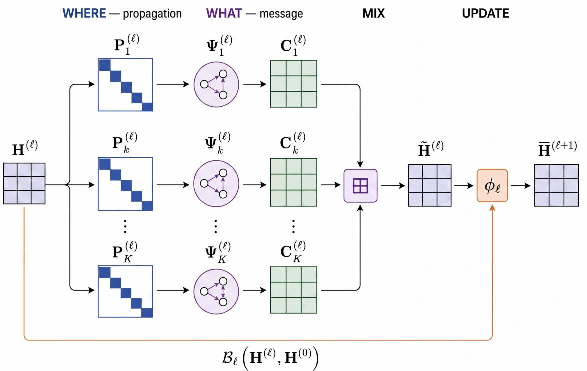  
Figure 2: The unified equation, slot by slot. Each channel separates where information propagates, set by the propagation operator $\mathbf { P } _ { k } ^ { \left( \ell \right) }$ , from what information is transmitted, set by the message map $\Psi _ { k } ^ { \bar { ( \ell ) } }$ . Combining the two gives the channel contribution $\mathbf { C } _ { k } ^ { \left( \ell \right) }$ . The channel-mixing operator ⊞ mixes the contributions from every channel into the mixed message $\widetilde { \mathbf { H } } ^ { ( \ell ) }$ (written $\widetilde { \mathbf { H } } ^ { ( \ell ) }$ in the text). The update map $\phi _ { \ell }$ then combines $\widetilde { \mathbf { H } } ^ { ( \ell ) }$ with the residual/ego pathway $B _ { \ell } ( { \bf H } ^ { ( \ell ) } , { \bf H } ^ { ( 0 ) } )$ , which carries the node’s own prior state, to produce the next-layer intermediate state $\overline { { \mathbf { H } } } ^ { ( \ell + 1 ) } \ ( \mathrm { E q . ~ ( 3 ) } )$ . Architectures difer only in how each of these seven components is filled. The domain X and channel set K determine the objects and indexed branches shown in the diagram.

Five excluded coverage cases. Five boundary cases named in Section 3.1 fall outside the channel primitives. NeuralWalker (Chen et al., 2025a) (Family 4) uses a non-commutative, order-dependent walk mixer rather than invariant aggregation. NLGNN (Liu et al., 2022a) (Family 2) hard-sorts nodes by learned scores before sequence convolution, creating multi-stage feature-dependent reindexing rather than either channel type. Sorting with distinct scores is equivariant, but ties require an equivariant rule. GPNN (Yang et al., 2022) (Family 2) processes a sampled, possibly truncated BFS sequence with an LSTM pointer before sequence convolution and pooling, so enumeration can change under relabeling. MR-GNAS (Zheng et al., 2022) is a search space rather than a layer. TransE/DistMult-style knowledge-graph embeddings (surveyed in Rossi et al. (2021), Family 5) statically score triples without a layer-wise neighborhood update and are therefore excluded from Table 18. These facts show that our reductions fail, not that no equivalent representation exists. Section 3.6 discusses the sixth case, NGNN.

The task representation is produced by a readout

$$
\mathbf { Z } = \rho \big ( \mathbf { H } ^ { ( 0 ) } , \mathbf { H } ^ { ( 1 ) } , \ldots , \mathbf { H } ^ { ( L ) } \big ) \mathbf { W } _ { \mathrm { o u t } } ,
$$

which is usually the last-layer state. Jumping-knowledge designs (JKNet (Xu et al., 2018), Family 1) instead use the full stack. The readout lies outside a layer. Figure 2 summarizes the within-layer decomposition, whose remaining placement ambiguity is resolved next.

## 3.3 Slot Discipline

Because the equation admits multiple representations of one architecture, we apply the following assignment rule uniformly across families.

(i) Operator $\mathbf { P } _ { k }$ carries scalars only. Its entries include structural normalizations $\left( \hat { a } _ { i j } \right)$ , attention weights $\left( \alpha _ { i j } \right)$ , and folded signed or spectral coeficients. Its sparsity pattern defines support.

(ii) Message $\Psi _ { k }$ carries vector- and matrix-valued maps. Edge-conditioned maps $\Theta ( e _ { i j } )$ , geometric or equivariant messages, and relation-composition maps belong here rather than in $\mathbf { P } _ { k }$

(iii) Ego map $B _ { \ell }$ forms the prior-state input, and update $\phi _ { \ell }$ combines it with the mixed channels. The map $\boldsymbol { B _ { \ell } }$ assembles self, residual, initial-state teleport, and layer-wise skip terms. A self-loop instead belongs to $\mathbf { P } _ { k }$ when it uses the same shared message and scalar-weighting rules as neighboring edges, even if its value difers. Thus GCN and GAT have $\boldsymbol { B } _ { \ell } = 0$ , and GAT obtains both $\alpha _ { i i }$ and $\alpha _ { i j }$ from the same rule. GIN’s independently parameterized (1 + ϵ) is an ego term. Gates, normalization, and the combination of $B _ { \ell }$ with mixed channels belong to $\phi _ { \ell }$ . Unless noted otherwise, both maps are node-local and row-wise, with precise assumptions given in Appendix C.

(iv) Mixing ⊞ purely combines channel contributions, and $\widetilde { \mathbf { H } } = \mathbb { E } _ { k } \mathbf { C } _ { k }$ is its output. Residual and ego terms instead enter through $\boldsymbol { B _ { \ell } }$ and $\phi _ { \ell }$

Rule (iv) places GCNII’s (Chen et al., 2020b) initial residual and APPNP’s iterative teleport in $\boldsymbol { B _ { \ell } }$ and $\phi _ { \ell } .$ while APPNP’s equivalent polynomial form folds the teleport into $\mathbf { P } _ { k }$ with $\boldsymbol { B _ { \ell } } = 0$ (Section 3.2). It also makes GraphSAGE’s self-state concatenation an update rather than a channel. This discipline is a convention whose consistent application makes table cells comparable.

## 3.4 Discriminating Axes

Because the equation alone cannot distinguish layers satisfying the two-channel-type condition of Section 3.1, the tables record the axes exposed by the canonical reductions of Section 3.5.

• The operator bank and scalar weighting rule are $\{ \mathbf { P } _ { k } \}$

• The channel count is $K _ { \ell } .$ , with mixing ⊞.

• The coeficient constraint is folded into $\mathbf { P } _ { k }$

• The message map $\Psi _ { k }$ may be a linear $\mathbf { W } _ { k }$ , an MLP, or an attention-value map, together with its aggregator Agg ∈ {max, power-mean, . . .} when it is nonlinear. Linear sum and mean are instead folded into $\mathbf { P } _ { k }$

• Ego handling is recorded in $B _ { \ell }$ , with its combination rule in $\phi _ { \ell }$

• Any non-core ingredient is folded into X, $\mathbf { P } _ { k } , \Psi _ { k } , \mathrm { o r } \phi _ { \ell }$

These axes are empirically discriminating rather than theoretically minimal. Removing the weight-source distinction collapses fixed and state-dependent edge weights, while removing ego handling collapses distinct ways of inserting the self state into $\phi .$ . Section 3.5 demonstrates both cases, and Table 2 marks each family’s defining axis.

The Family 1/Family 3 split uses the checkable operational distinction between fixed support and a polynomial basis, independent of deeper equivalence in realizable functions. Jiang et al. (2026) argue that spectral $\mathbf { P } _ { k }$ may not be theoretically distinct from spatial message passing for node classification. If confirmed, this would motivate merging the families in that setting. We retain the operational split pending resolution of this narrower question (Section 7.12).

Tables 2 and 1 in Section 1 display seven components in six columns, $( \mathcal { X } , \mathcal { K } , \mathbf { P } _ { k } , \Psi _ { k } , \mathbb { H } , ( B _ { \ell } , \phi _ { \ell } ) )$ . The shared Ego/Update column reports distinct $B _ { \ell }$ and $\phi _ { \ell }$ components, including support-folded self states in GCN/GAT,

GraphSAGE concatenation, GIN’s scaled sum, and APPNP’s teleport. The Mixing column reports the action of ⊞, not an additional He component. The sampler gives three abbreviated methods per family, while Appendix D gives full expressions. Its bands mark each family’s defining axis. We now derive a representative subset.

## 3.5 Worked Reductions for the Canonical Models

We verify coverage on GCN, GraphSAGE, GAT, and GIN. To express GraphSAGE concatenation and GIN’s MLP, write the row-vector state as $h _ { i } ^ { ( \ell ) } \equiv h _ { i } ^ { ( \ell ) } \in \mathbb { R } ^ { 1 \times d _ { \ell } }$ and expand the message and aggregation per node. With $\mathbf { Q } _ { \ell } = \mathbf { I } ,$ , one channel, and no skip or global terms, the layer is

$$
h _ { i } ^ { ( \ell + 1 ) } = \phi _ { \ell } \Big ( \mathcal { B } _ { \ell } ( h _ { i } ^ { ( \ell ) } ) , \underbrace { \mathrm { A g g } _ { j \in \mathcal { N } _ { 1 } ( i ) } \left( [ \mathbf { P } _ { 1 } ^ { ( \ell ) } ] _ { i j } \Psi ^ { ( \ell ) } ( h _ { i } ^ { ( \ell ) } , h _ { j } ^ { ( \ell ) } , e _ { i j } ^ { ( \ell ) } ) \right) } _ { [ \mathbf { C } _ { 1 } ^ { ( \ell ) } ] _ { i : } } \Big ) ,\tag{4}
$$

The underbrace is $[ \mathbf { C } _ { 1 } ^ { ( \ell ) } ] _ { i : } = \widetilde { \mathbf { H } } _ { i } ^ { ( \ell ) }$ . With multiple channels, $\widetilde { \mathbf { H } } _ { i } ^ { ( \ell ) } = \mathbb { H } _ { k } [ \mathbf { C } _ { k } ^ { ( \ell ) } ] _ { i : }$ . Here $\mathcal { N } _ { 1 } ( i ) = \{ j : [ \mathbf { P } _ { 1 } ] _ { i j } \neq 0 \}$ and $[ \mathbf { P } _ { 1 } ] _ { i j }$ is the scalar propagation weight. GCN and GAT include the self state in $\mathcal { N } _ { 1 } ( i )$ and set $\boldsymbol { B } _ { \ell } = 0$ GraphSAGE and GIN exclude it and use $B _ { \ell } = \mathrm { i d }$ , after which $\phi _ { \ell }$ respectively concatenates the ego state or applies an MLP to $( 1 + \epsilon ) h _ { i } ^ { ( \ell ) } + \mathrm { a g g }$ . The scaling (1 + ϵ) belongs to $\phi _ { \ell } .$

GCN (Kipf & Welling, 2017). Slot choices. $\mathcal { N } _ { 1 } ( i ) = \mathcal { N } ( i ) \cup \{ i \}$ , with the self-loop support defined by $\tilde { \mathbf { A } } = \mathbf { A } + \mathbf { I }$

$$
[ \mathbf { P } _ { 1 } ] _ { i j } = \hat { a } _ { i j } = \frac { \tilde { \mathbf { A } } _ { i j } } { \sqrt { \tilde { d } _ { i } \tilde { d } _ { j } } } \quad \mathrm { f o r ~ } j \in \mathcal { N } _ { 1 } ( i ) ,
$$

The entry is zero otherwise. The message is $\Psi ^ { ( \ell ) } ( h _ { i } , h _ { j } , e _ { i j } ) = h _ { j } { \bf W } ^ { ( \ell ) } , \mathrm { A g g } = \mathrm { s u m }$ , and $\phi _ { \ell } ( \cdot , \widetilde { \mathbf { H } } _ { i } ) = \sigma ( \widetilde { \mathbf { H } } _ { i } )$ Substitution into (4):

$$
\begin{array} { r } { h _ { i } ^ { ( \ell + 1 ) } = \sigma \Big ( \sum _ { j \in \mathcal { N } ( i ) \cup \{ i \} } \hat { a } _ { i j } h _ { j } ^ { ( \ell ) } { \mathbf { W } ^ { ( \ell ) } } \Big ) = \sigma \big ( [ \hat { \mathbf { A } } \mathbf { H } ^ { ( \ell ) } \mathbf { W } ^ { ( \ell ) } ] _ { i } \big ) , } \end{array}
$$

which is the defining update $\mathbf { H } ^ { ( \ell + 1 ) } = \sigma ( \hat { \mathbf { A } } \mathbf { H } ^ { ( \ell ) } \mathbf { W } ^ { ( \ell ) } )$ . The scalar normalization $\hat { a } _ { i j }$ appears only in ${ \bf P } _ { 1 }$

GraphSAGE mean (Hamilton et al., 2017). Slot choices. Self is excluded from $\mathcal { N } _ { 1 } ( i ) = \mathcal { N } ( i )$ . The mean enters $[ { \bf P } _ { 1 } ] _ { i j } = \dot { 1 } / d _ { i } = [ { \bf D } ^ { - 1 } { \bf A } ] _ { i j }$ , where $d _ { i } = | \mathcal { N } ( i ) |$ |. With $\Psi ( h _ { i } , h _ { j } , e _ { i j } ) = h _ { j }$ and $\mathrm { A g g } = \mathrm { s u m } .$ $[ \mathbf { C } _ { 1 } ^ { ( \ell ) } ] _ { i : } = \operatorname* { m e a n } _ { j \in \mathcal { N } ( i ) } h _ { j } ^ { ( \ell ) }$ , and $\phi$ concatenates the ego input,

$$
\phi _ { \ell } \big ( h _ { i } , [ \mathbf { C } _ { 1 } ^ { ( \ell ) } ] _ { i : } \big ) = \sigma \big ( [ h _ { i } \| [ \mathbf { C } _ { 1 } ^ { ( \ell ) } ] _ { i : } ] \mathbf { W } ^ { ( \ell ) } \big ) .
$$

Substitution:

$$
h _ { i } ^ { ( \ell + 1 ) } = \sigma \Big ( \big [ h _ { i } ^ { ( \ell ) } \| \mathrm { m e a n } _ { j \in \mathcal { N } ( i ) } h _ { j } ^ { ( \ell ) } \big ] \mathbf { W } ^ { ( \ell ) } \Big ) ,
$$

which is the core mean GraphSAGE update under the row-vector convention, excluding sampling and optional post-update normalization. Unlike GCN, it supplies the self state separately to ϕ.

GAT (Veličković et al., 2018). Slot choices. The data-dependent operator uses $\mathcal { N } _ { 1 } ( i ) = \mathcal { N } ( i ) \cup \{ i \}$ and attention scores

$$
s _ { i j } ^ { ( \ell ) } = \mathrm { L e a k y R e L U } \left( [ h _ { i } ^ { ( \ell ) } \mathbf { W } ^ { ( \ell ) } \| h _ { j } ^ { ( \ell ) } \mathbf { W } ^ { ( \ell ) } ] \mathbf { a } ^ { ( \ell ) } \right) , \qquad \mathbf { \Psi } _ { i j } ^ { ( \ell ) } = \frac { \exp ( s _ { i j } ^ { ( \ell ) } ) } { \sum _ { r \in { \mathcal { N } _ { 1 } ( i ) } } \exp ( s _ { i r } ^ { ( \ell ) } ) } .
$$

Thus $[ \mathbf { P } _ { 1 } ( \mathbf { H } ^ { ( \ell ) } ) ] _ { i j } = \alpha _ { i j } ^ { ( \ell ) }$ for $j \in \mathcal { N } _ { 1 } ( i )$ and zero otherwise. The message is $\Psi ^ { ( \ell ) } ( h _ { i } , h _ { j } , e _ { i j } ) = h _ { j } \mathbf { W } ^ { ( \ell ) }$ , with edge features unused in the original GAT layer. Also, Agg = sum and $\phi _ { \ell } ( \cdot , \widetilde { \mathbf { H } } _ { i } ) = \sigma ( \widetilde { \mathbf { H } } _ { i } )$ . Substitution:

$$
\begin{array} { r } { \boldsymbol { h } _ { i } ^ { ( \ell + 1 ) } = \sigma \Big ( \sum _ { j \in \mathcal { N } ( i ) \cup \{ i \} } \boldsymbol { \alpha } _ { i j } ^ { ( \ell ) } \boldsymbol { h } _ { j } ^ { ( \ell ) } \mathbf { W } ^ { ( \ell ) } \Big ) , } \end{array}
$$

which is the defining single-head GAT update. Unlike GCN’s fixed normalization, $[ \mathbf { P } _ { 1 } ] _ { i j }$ is learned and state-dependent. Although $\mathbf { W } ^ { ( \ell ) }$ appears in both the score and message, ${ \bf P } _ { 1 }$ stores only the scalar $\alpha _ { i j }$ and Ψ

the value $h _ { j } \mathbf { W } ^ { ( \ell ) }$ . The lemma below extends this reduction to multi-head mixing and, in the single-head edge-feature-free case, GATv2. Its proof is in Appendix C.

GIN (Xu et al., 2019b). Slot choices. Self is excluded from $\mathcal { N } _ { 1 } ( i ) = \mathcal { N } ( i ) , [ \mathbf { P } _ { 1 } ] _ { i j } = 1$ for $j \in \mathcal { N } ( i )$ $\Psi ( h _ { i } , h _ { j } , e _ { i j } ) = h _ { j }$ , and $\mathrm { A g g = s u m }$ . The ego input enters $\phi$ as

$$
\phi _ { \ell } \big ( h _ { i } , [ { \bf C } _ { 1 } ] _ { i : } \big ) = \mathrm { M L P } ^ { ( \ell ) } \Big ( \big ( 1 + \epsilon ^ { ( \ell ) } \big ) h _ { i } + [ { \bf C } _ { 1 } ] _ { i : } \Big ) .
$$

Substitution:

$$
\begin{array} { r } { h _ { i } ^ { ( \ell + 1 ) } = \mathrm { M L P } ^ { ( \ell ) } \\\\\\\\\ d \xrightarrow { } h _ { i } ^ { ( \ell ) } + \sum _ { j \in \mathcal { N } ( i ) } h _ { j } ^ { ( \ell ) } \ d \mathbf { \ d \mathbf { \sigma } } \big ) , } \end{array}
$$

which is the defining GIN update. Unlike GraphSAGE, the self term enters as a scaled sum inside the MLP rather than as a separate concatenated block.

Lemma 3 (Attention subsumption). Any single-head layer whose neighbor weight is a scalar function $\alpha _ { i j } ( { \bf H } )$ of node states multiplying a linear value $h _ { j } \mathbf { W }$ is an instance with state-dependent operator $\mathbf { P } _ { k } = [ \alpha _ { i j } ( \mathbf { \bar { H } } ) ]$ and message $\boldsymbol { \Psi } _ { k } = \mathbf { H } \mathbf { W }$ . Multiple heads use per-head mixing ⊞ over the head index. This is concatenation $\parallel _ { m }$ at intermediate layers (Prop. 1) and, at a final fixed-width layer, the head average $\begin{array} { r } { \frac { 1 } { M } \sum _ { m } ( \cdot ) } \end{array}$ , which is the additive mixing of Prop. 1 rescaled. Edge features, when present, enter $\mathbf { P } _ { k }$ if they modulate the scalar attention score, $\Psi _ { k }$ if they are added on the value side, or both. Restricted to the single-head, edge-feature-free case, GAT (Veličković et al., 2018) and GATv2 (Brody et al., 2022) difer only in the functional form of $\alpha _ { i j }$ inside $\mathbf { P } _ { k }$

Reading the reductions. The tables assign all seven components under the fixed slot discipline and are therefore slot-complete at the declared reporting granularity. Each component cell records its assigned computational role and may abstract internal parameterizations that preserve that role. Two attention layers may, for example, compute $\alpha ( \mathbf { H } ^ { \left( \ell \right) } )$ ) with diferent scoring functions while sharing every displayed component assignment. Difering slots localize the distinctions represented at this granularity. GraphSAGE and GIN difer in operator normalization $( \mathbf { D } ^ { - 1 } \mathbf { A }$ versus A) and ego handling (concatenation versus scaled addition), while GCN and GAT difer in fixed versus state-dependent scalar weights. This role-based localization underlies Appendix D. Higher-order models additionally require a domain extension.

## 3.6 Graded Extension for Higher-Order Models

Higher-order models update tuples, subgraphs, or cells, so we replace the node domain $\mathcal { X } = \mathcal { V }$ by the graded support

$$
\boldsymbol { \mathcal { X } } ^ { ( \ell ) } = \bigsqcup _ { r = 0 } ^ { R } \mathscr { X } _ { r } ^ { ( \ell ) } , \qquad \mathbf { H } ^ { ( \ell ) } = \big ( \mathbf { H } _ { r } ^ { ( \ell ) } \big ) _ { r = 0 } ^ { R } .
$$

where rank 0 contains nodes and higher ranks contain higher-order objects. Propagation uses inter-rank operators

$$
\mathbf { P } _ { k , r  s } ^ { ( \ell ) } \in \mathbb { R } ^ { | \mathcal { X } _ { s } ^ { ( \ell ) } | \times | \mathcal { X } _ { r } ^ { ( \ell ) } | } ,
$$

where k indexes channels and $r \ \to \ s$ identifies source and target ranks. Unlike the square operators of Section 3.2, these matrices are generally rectangular for $r \neq s .$ The coverage condition of Section 3.1 applies to this inter-rank linear branch. Pairwise $\mathbf { C } _ { k }$ similarly extends to geometric and edge-conditioned messages $\Psi _ { k } ( h _ { i } , h _ { j } , e _ { i j } )$ that read one target–source pair before aggregation.

Substitution into (3) gives one equation per target rank $s ,$ mixing all source ranks mapped into it.

$$
\mathbf { C } _ { k , r  s } ^ { ( \ell ) } = \mathbf { P } _ { k , r  s } ^ { ( \ell ) } \Psi _ { k } ^ { ( \ell ) } ( \mathbf { H } _ { r } ^ { ( \ell ) } ) , \qquad \widetilde { \mathbf { H } } _ { s } ^ { ( \ell ) } = \underset { k , r } { \boxplus } \mathbf { C } _ { k , r  s } ^ { ( \ell ) } , \qquad \bar { \mathbf { H } } _ { s } ^ { ( \ell + 1 ) } = \phi _ { \ell } \big ( \mathcal { B } _ { \ell } ( \mathbf { H } _ { s } ^ { ( \ell ) } , \mathbf { H } _ { s } ^ { ( 0 ) } ) , \widetilde { \mathbf { H } } _ { s } ^ { ( \ell ) } \big ) ,\tag{5}
$$

The pairwise branch generalizes one target source pair at a time. Taking $R = 0$ and $\mathbf { P } _ { k } ^ { ( \ell ) } = \mathbf { P } _ { k , 0 \to 0 } ^ { ( \ell ) }$ recovers (3) exactly.

PPGN’s bilinear tuple product (Maron et al., 2019a), $\begin{array} { r } { \mathbf { Y } _ { i j c } = \sum _ { t } \mathbf { M } _ { 1 , i t c } \mathbf { M } _ { 2 , t j c } } \end{array}$ with $\mathbf { M } _ { 1 } = \mathrm { M L P } _ { 1 } ( \mathbf { H } )$ and $\mathbf { M } _ { 2 } = \mathrm { M L P } _ { 2 } ( \mathbf { H } )$ , fits the inter-rank linear branch after expanding output channels c. On $\chi = \mathcal { V } ^ { 2 }$ , define

$$
[ \mathbf { P } _ { c } ( \mathbf { H } ) ] _ { ( i , j ) , ( t , j ^ { \prime } ) } = \mathbf { 1 } _ { \left\{ j = j ^ { \prime } \right\} } \mathbf { M } _ { 1 , i t c } , \qquad [ \boldsymbol { \Psi } _ { c } ( \mathbf { H } ) ] _ { ( t , j ^ { \prime } ) } = \mathbf { M } _ { 2 , t j ^ { \prime } c } ,
$$

which gives $\begin{array} { r } { [ \mathbf { C } _ { c } ] _ { ( i , j ) } = \sum _ { t , j ^ { \prime } } [ \mathbf { P } _ { c } ] _ { ( i , j ) , ( t , j ^ { \prime } ) } [ \boldsymbol { \Psi } _ { c } ] _ { ( t , j ^ { \prime } ) } = \mathbf { Y } _ { i j c } } \end{array}$ . Concatenating over c recovers the product exactly. Because each $[ \mathbf { P } _ { c } ]$ is a state-dependent scalar, this is the propagation bank of Section 3.2 indexed by output channel rather than a new primitive, at the cost of one operator per output channel. Let $\mathbf { C } _ { \times } : = \boxed { \mathbb { E } _ { c } \mathbf { C } _ { c } }$ denote the concatenated bank, shown as $\{ \times \}$ in the slot sampler. The full PPGN block separately applies $\mathrm { M L P _ { 3 } }$ to the retained pair state and concatenates it with $\mathbf { C } _ { \times }$ . Applying one $\mathrm { M L P _ { 3 } }$ after their joint concatenation would misstate the block. Under Section 3.3, the retained state is $\boldsymbol { B _ { \ell } }$ and enters $\phi _ { \ell } ,$ , not $\widetilde { \bf H }$

NGNN (Zhang & Li, 2021), the sixth boundary case of Section 3.1, instead runs an inner GNN and pooling inside each subgraph. This multi-stage composition does not admit a one-layer channel filling.

The extension covers dense tuple supports $\mathcal { X } _ { r } = \mathcal { V } ^ { r + 1 }$ used by invariant/equivariant and Weisfeiler Leman-style models, as well as sparse cell complexes whose boundary or incidence maps define propagation, as in CW Networks (Bodnar et al., 2021a). Restricting this notation to the higher-order family keeps the remaining tables node-level.

## 4 Generated Architectures from the Unified Equation

Once covered architectures are expressed through the unified system, the component inventory exposes a structured design space. We illustrate this consequence through three increasingly open forms of architecture generation. Level 1 holds Eq. (3) and the catalogued filler inventory fixed while recombining choices across families. Level 2 holds the seven components fixed while proposing a compatible filler absent from that inventory. Level 3 extends the equation with a typed component that expresses computation outside the current boundary. The levels difer only in what the unification holds fixed. They generate structurally checkable architectures whose empirical performance remains untested. Appendix B catalogs a complementary source of moves at this granularity: reusable operations, such as positional encodings, rewiring, residuals, normalization, pooling, continuous-depth views, and sampling, that already carry a primary-slot assignment, so transplanting one across families or introducing a new filler for the slot it targets reads directly as a Level 1 or Level 2 move without a separate proposal step.

## 4.1 Procedure for Generated Architectures

Only Level 1 is a search in the neural architecture search sense (Wang et al., 2022b) because it selects from a finite inventory. Levels 2 and 3 require a proposal mechanism for a new filler or component. We use a language-model controller of the kind applied to graph NAS (Gao et al., 2025), supplying the unified equation, slot definitions, admissible inventory, and generation level. The controller proposes functional forms in the shared vocabulary. We audit each proposal against the type, symmetry, dimensional, inventory, and reduction conditions defined for its level, and retain only those that satisfy these conditions. Each retained Level 1–2 architecture specifies all seven components, while a Level 3 architecture also specifies its added component and extended layer equation. Figure 3 summarizes which part of this specification is held fixed and which part changes at each of the three levels.

We constrain architecture generation by level. At level 1, a generated architecture must be permutation equivariant over the node index, be dimensionally consistent across channels, absorb scalar per-channel weights into the operator, not reduce to a named method in the per-family tables, and draw its fillers from at least two families. At level 2, the new filler must respect the type of the slot it fills and the same conventions, and the resulting layer must not reduce to an existing method. At level 3, the added slot must be typed and must preserve permutation equivariance over nodes, and removing it must recover Eq. (3). This last check keeps an expansion anchored to the base equation rather than free of it.

We retain generated architectures that pass the checks for their level and record the level, source families or fillers, and closest existing method together with the component that difers. The full protocol is given in Prompt 1. Six generated architectures survive this audit, five at Levels 1–2 and the Sequential Co-Lifted Node–Edge Layer at Level 3. The Level 3 architecture adds an execution schedule to distinguish sequentia writeback from synchronous graded coupling. Together, the generated architectures instantiate all three generation levels.

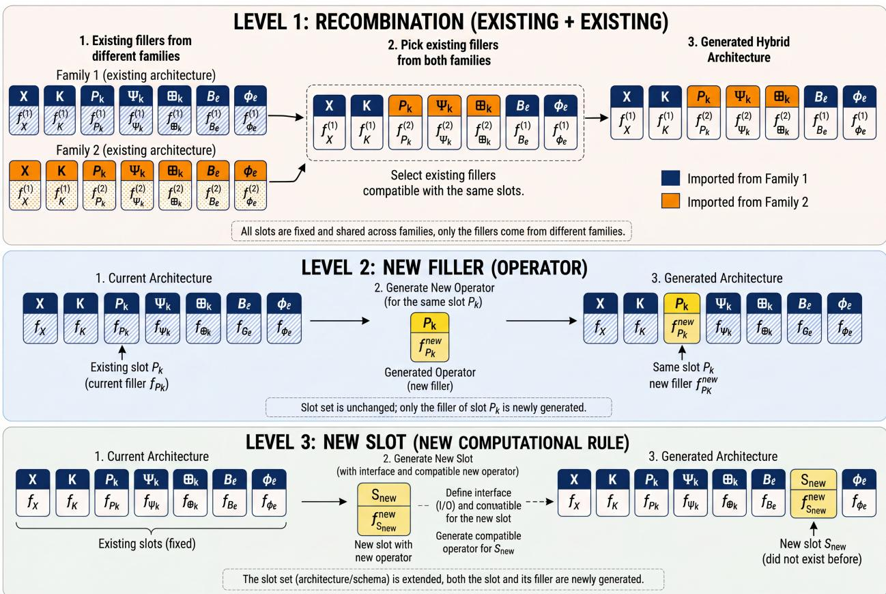  
Figure 3: Generated architectures at three levels. The fixed inventory in Levels 1–2 contains the seven components $( \mathcal { X } , \mathcal { K } , \mathbf { P } _ { k } , \Psi _ { k } , \mathbb { H } , \mathcal { B } _ { \ell } , \phi _ { \ell } )$ . Level 1 recombines compatible existing fillings across families. Level 2 replaces the filling of an existing component (illustrated for P ) $\mathbf { P } _ { k } )$ without changing that inventory. Level 3 extends the schema with a compatible new computational component. The generic labels $f _ { \bullet }$ denote component fillings and do not imply that the set-valued components X and K are functions. Removing the added slot recovers Eq. (3) on the node domain, or, for a graded-domain Level 3 layer, first the synchronous graded form Eq. (5) and then Eq. (3) at its rank-zero case. The sequential node–edge example instantiates Level 3 with a schedule that makes the edge update precede the node update.

## 4.2 Generated Architectures

We describe six generated architectures. The first five make controlled changes to existing fillings at Levels 1–2.   
The Sequential Co-Lifted Node–Edge Layer adds an execution schedule that orders two graded updates.   
Table 4 gives their component views.

The first four generated architectures hold the equation and its inventory fixed and recombine fillers across families. Spectrally-Gated Propagation places a polynomial basis in the propagation slot and makes the per-channel coeficient a node-wise function of the state,

$$
\mathbf { H } ^ { ( \ell + 1 ) } = \sigma \Big ( \mathbf { H } ^ { ( \ell ) } \mathbf { W } _ { 0 } + \sum _ { k = 1 } ^ { K } \mathrm { d i a g } \big ( \gamma _ { k } ( \mathbf { H } ^ { ( \ell ) } ) \big ) T _ { k } ( \tilde { \mathbf { L } } _ { \mathrm { c h } } ) \mathbf { H } ^ { ( \ell ) } \mathbf { W } _ { k } \Big ) .\tag{6}
$$

The closest method is GPR-GNN (Chien et al., 2021), which fixes one global coeficient per order. The generated layer replaces that scalar with a node-adaptive coeficient, giving a spatially modulated polynomial propagation operator. Because the node-wise diagonal gate need not commute with $T _ { k } ( \tilde { \mathbf { L } } _ { \mathrm { c h } } )$ , the resulting operator is not in general a scalar spectral multiplier with a globally defined passband. This extends rule (i) of the slot discipline (Section 3.3). The absorbed coeficient is a per-node diagonal matrix diag $( \gamma _ { k } ( \mathbf { H } ^ { ( \ell ) } ) )$ rather than a scalar, so the propagation operator is a state-dependent, node-wise weighted polynomial basis rather than a pure scalar-times-polynomial. Relation-Equivariant Network indexes the message by relation

Prompt 1 The generation protocol supplied to a language-model controller. It comprises the unified equation (3), the slot inventory and admissible fillers, and the per-level validity conditions a generated layer must satisfy, for recombining fillers, introducing a new filler, or expanding the equation.

Generation protocol for the unified equation, slot inventory, and per-level validity constraints   
You generate graph neural network layers from a fixed unified equation.   
You may operate at one of three levels.   
Level 1 (recombination): keep the equation and the filler   
inventory fixed, and choose a new combination of existing fillers across families.   
Level 2 (new filler): keep the equation and slot structure   
fixed, and introduce a new admissible filler for one slot the inventory lacks.   
Level 3 (expansion): add or generalize a slot of the   
equation to express layers the current equation cannot.   
Base layer:   
H^{l+1} = phi( B(H^l, H^0), [+]\_{k in K} C\_k )   
where each C\_k is either P\_k Psi\_k (linear-value channel)   
or Agg\_{j in N\_k(i)} [P\_k]\_{ij} Psi\_k(h\_i,h\_j,e\_ij) (pairwise channel).   
Slots and admissible fillers:   
X update domain: nodes | edges | node tuples | rooted subgraphs | cells   
K channel set: single | hop or polynomial order | relation or type   
| attention heads | geometric components   
P\_k propagation: fixed normalized adjacency | polynomial of the Laplacian   
| per-relation adjacency | state-dependent attention   
| global dense attention   
Psi\_k message: linear map of state | gated or MLP message   
| relation-specific map | equivariant scalar-vector message   
[+] mix: sum | mean | max | concat-then-project   
B ego/residual: none | self term | initial-state residual | gated residual   
phi update: identity | activation | MLP | norm-then-activation   
| equivariant update   
Conventions:   
- Scalar per-channel coefficients are absorbed into P\_k (P\_k <- gamma\_k P\_k).   
- The layer must be permutation equivariant over nodes.   
- Messages across channels must be dimensionally consistent.   
- B and phi are distinct components reported jointly in the Ego/Update column.   
Validity by level:   
- Level 1: must not reduce to a method in the reference   
list, and must draw fillers from at least two families.   
- Level 2: the new filler must respect the slot type and   
conventions, and the layer must not reduce to an existing method.   
- Level 3: the added slot must be typed and permutation   
equivariant, and removing it must recover the base equation.   
For each generated layer return:   
1. name and level (1, 2, or 3)   
2. the six-column display of seven components (X, K, P\_k, Psi\_k, mix, (B, phi))   
for level 3, also display the added component   
3. the fully instantiated layer equation   
4. for level 2, the new filler and the slot it fills   
for level 3, the added slot and the extended equation   
5. the closest existing method and the single slot that differs   
Reference list:   
GCN, GraphSAGE, GAT, GIN, ChebNet, GPR-GNN, APPNP, RGCN, HAN,   
Graphormer, GPS, EGNN, ESAN

and constrains it to be equivariant to rotations and translations. It difers from RGCN (Schlichtkrull et al., 2018) in the message slot, where the relation-specific linear map becomes an equivariant scalar-vector message, and from EGNN (Satorras et al., 2021) in the channel slot. Because the message $\Psi _ { r } ( \mathbf { h } _ { i } , \mathbf { h } _ { j } , \lVert \mathbf { x } _ { i } - \mathbf { x } _ { j } \rVert )$ is geometric rather than a linear value, the channel takes the pairwise branch of Eq. (3). It forms $\mathbf { C } _ { r , i } =$ $\mathrm { A g g } _ { j \in \mathcal { N } _ { r } ( i ) } \big ( [ \mathbf { P } _ { r } ] _ { i j } \Psi _ { r } ( \mathbf { h } _ { i } , \mathbf { h } _ { j } , \| \mathbf { x } _ { i } - \mathbf { x } _ { j } \| ) \big )$ rather than a matrix product $\mathbf { P } _ { r } \Psi _ { r } ,$ and additive mixing gives $\begin{array} { r } { \widetilde { \mathbf { H } } _ { i } = \sum _ { r \in \mathcal { R } } { \mathbf { C } _ { r , i } } } \end{array}$ . The scalar message reads only $\mathbf { h } _ { i } , \mathbf { h } _ { j }$ and the invariant distance $\left\| \mathbf { x } _ { i } - \mathbf { x } _ { j } \right\|$ , while coordinates use the EGNN equivariant update (Satorras et al., 2021). Under that update, rotating or translating the inputs leaves scalar channels invariant and transforms vector channels equivariantly. Subgraph-Attentive Layer lifts the update domain to rooted subgraphs and propagates among them with state-dependent attention, then folds back to nodes through the external equivariant pooling map $\mathbf { Q } _ { \ell }$ associated with the unified system, the same map whose hypotheses Theorem 1 verifies. If rooted-subgraph construction and $\mathbf { Q } _ { \ell }$ commute with node relabeling, the shared softmax attention is permutation equivariant over the subgraph domain and folds back to nodes without breaking that symmetry. It difers from ESAN (Bevilacqua et al., 2022) in the propagation slot and from GAT (Veličković et al., 2018) in the domain slot. Spectral-Biased Transformer keeps global attention and replaces the structural bias term with a learned polynomial of the Laplacian,

Table 4: Generated architectures from the unified equation. Architectures retained by the procedure of Section 4. Levels 1–2 use the seven components in six base columns, while Level 3 adds the new slot $S _ { \ell } .$ The Mixing and Ego/Update columns follow the conventions of Section 3.2. Here $\begin{array} { r } { \mathbf { B } _ { \mathrm { s p e c } } = \sum _ { k = 0 } ^ { K } \beta _ { k } T _ { k } ( \tilde { \mathbf { L } } _ { \mathrm { c h } } ) } \end{array}$ is the learned spectral bias. The symbol <sup>⋆</sup> marks the component changed relative to the closest method, and <sup>†</sup> identifies the two rows using the linear-specialization update $\sigma ( \mathbf { H } ^ { ( \ell ) } \mathbf { W } _ { 0 } + \widetilde { \mathbf { H } } ^ { ( \ell ) } )$ of Eq. (2).
<table><tr><td>Method</td><td>x</td><td>K</td><td>Propagation  $\mathbf { \bar { P } } _ { k } ^ { ( \ell ) }$ </td><td>Message  $\Psi _ { \pmb { k } } ^ { ( \pmb { \ell } ) }$ </td><td>Mixing 田(e)</td><td>Ego/Update (1Be, φe)</td><td>New Slot Se</td></tr><tr><td colspan="8">Level 1 Recombination equation and inventory fxed, with fillers combined across families</td></tr><tr><td>Spectrally-Gated Propagation</td><td>V</td><td> $\{ ^ { 1 } { } _  \vec { K } \dot { \} } \cdot \cdot ,$ </td><td> $\mathrm { D i a g } \big ( \gamma _ { k } ( $   $\mathbf { H } ^ { ( \ell ) } ) \Bigr ) ^ { \star }$   $\cdot \ T _ { k } ( \tilde { \mathbf { L } } _ { \mathrm { c h } } ^ { \prime } )$  (node-adaptive)</td><td> $\mathbf { H } ^ { ( \ell ) } \mathbf { W } _ { k }$ </td><td> $\sum ^ { K } \mathbf { P } _ { k } \boldsymbol { \Psi } _ { k }$  k=1</td><td> $\sigma \big ( \mathbf { H } ^ { ( \ell ) } \mathbf { W } _ { 0 }$   $\dot { + } \widetilde { \mathbf { H } } ^ { ( \ell ) } \Bigr ) ^ { \dagger }$ </td><td></td></tr><tr><td>Relation- Equivariant Network</td><td>V</td><td>R (s, v) (relations)</td><td> $\hat { \mathbf { A } } _ { r }$ </td><td> $\Psi _ { r } ^ { \star } \Big ( \mathbf { h } _ { i } , \mathbf { h } _ { j } ,$   $| | \mathbf { x } _ { i } - \mathbf { x } _ { j } | | )$  (equiv. (s, v))</td><td> $\mathbf { C } _ { r , i } \equiv \mathrm { A g g }$   $\mathbf { \Psi } _ { j \in \mathcal { N } _ { r } ( i ) } \big [ \mathbf { P } _ { r } \big ] _ { i j } ^ { - } \mathbf { \bar { \Psi } } _ { r } ,$   $\widetilde { \mathbf { H } } _ { i } = \sum \mathbf { C } _ { r , i }$ </td><td> $\phi ^ { s } , \phi ^ { v }$  (scalar/vector)</td><td></td></tr><tr><td>Subgraph- Attentive Layer (subgr.)</td><td>S</td><td> $\{ 1 , _  \dot { H } \dot { \} } . . ,$  (heads)</td><td>softmax(  $\mathbf { Q } _ { h } \mathbf { K } _ { h } ^ { \top } \Big ) ^ { \star }$  (state-dependent)</td><td> $\mathbf { H } _ { S } ^ { ( \ell ) } \mathbf { W } _ { V , h }$ </td><td>r∈R  $\Vert { \bf \Pi } _ { h } ^ { \bf \Pi } \mathbf { P } _ { h } \Psi _ { h }$ </td><td> $\mathbf { M L P } ( \widetilde { \mathbf { H } } ^ { ( \ell ) } )$  + H (external Qe fold</td><td></td></tr><tr><td>Spectral-Biased Transformer</td><td>V</td><td>{1} (global)</td><td>softmax(  $\mathbf { Q } \mathbf { K } ^ { \top } / \sqrt { d }$ </td><td> $\mathbf { H } ^ { ( \ell ) } \mathbf { W } _ { V }$ </td><td>P₁Ψ₁</td><td>S→V)  $\mathrm { M L P } ( \widetilde { \mathbf { H } } ^ { ( \ell ) } )$   $+ \dot { \mathbf { H } } ^ { ( \ell ) }$ </td><td></td></tr><tr><td>Level 2 New fillers equation fixed, with a filler introduced that the inventory lacks</td><td></td><td></td><td> $+ \bf { B } _ { \mathrm { { s p e c } } } ^ { \star } \bigg )$ </td><td></td><td></td><td></td><td></td></tr><tr><td colspan="8">Curvature-Gated</td></tr><tr><td>Propagation</td><td>V</td><td>{1}</td><td> $g ( \kappa _ { i j } ) ^ { \star } \hat { \mathbf { A } }$  (curvature-gated)</td><td> $\mathbf { H } ^ { ( \ell ) } \mathbf { W }$ </td><td> $\mathbf { P } _ { 1 } \Psi _ { 1 }$ </td><td> $\sigma \big ( \mathbf { H } ^ { ( \ell ) } \mathbf { W } _ { 0 }$   $\dot { + } \widetilde { \mathbf { H } } ^ { ( \ell ) } \Bigr ) ^ { \dagger }$ </td><td></td></tr><tr><td colspan="8">Level 3 Schema expansion add a typed execution schedule to the graded equation</td></tr><tr><td>Sequential Co-Lifted Node-Edge Laye</td><td>VαE</td><td> $\begin{array} { l } { { \{ V  E , } }  \\  { { E  V \} } } \end{array}$ </td><td> $\mathbf { P } _ { V  E } = \mathbf { M }$   $\mathbf { P } _ { E  V } = \mathbf { M } ^ { \top }$ </td><td> $\Psi _ { V  E } ( \mathbf { H } _ { V } ^ { ( \ell ) } )$ </td><td> $\boxplus = \mathrm { i d }$ </td><td> $( \boldsymbol { B } _ { E } , \phi _ { E } )$ </td><td> ${ \big ( } ( V \to E ) , $ </td></tr></table>

$$
\mathbf { H } ^ { ( \ell + 1 ) } = \mathrm { M L P } \Big ( \mathrm { s o f t m a x } \Big ( \frac { ( \mathbf { H } \mathbf { W } _ { Q } ) ( \mathbf { H } \mathbf { W } _ { K } ) ^ { \top } } { \sqrt { d } } + \sum _ { k = 0 } ^ { K } \beta _ { k } T _ { k } ( \widetilde { \mathbf { L } } _ { \mathrm { c h } } ) \Big ) \mathbf { H } \mathbf { W } _ { V } \Big ) + \mathbf { H } ^ { ( \ell ) } ,\tag{7}
$$

difering from Graphormer (Ying et al., 2021) in the propagation slot, where the additive bias is spectral rather than encoded from degree or shortest-path distance.

The fifth generated architecture keeps the slot structure fixed and introduces a propagation operator the inventory did not contain. Curvature-Gated Propagation reweights the one-hop operator by a learned function of discrete edge curvature, a quantity introduced for graph rewiring (Topping et al., 2022; Nguyen et al., 2023) but used here as a gate inside the propagation slot,

$$
\begin{array} { r } { \pmb { h } _ { i } ^ { ( \ell + 1 ) } = \sigma \Big ( \pmb { h } _ { i } ^ { ( \ell ) } \mathbf { W } _ { 0 } + \sum _ { j \in \mathcal { N } ( i ) } g \big ( \kappa _ { i j } \big ) \hat { \mathbf { A } } _ { i j } \pmb { h } _ { j } ^ { ( \ell ) } \mathbf { W } \Big ) , } \end{array}\tag{8}
$$

where $\kappa _ { i j }$ is the discrete curvature of edge $( i , j )$ . It difers from GCN in the propagation slot, where the fixed normalized adjacency is replaced by a curvature-gated operator.

Level 3 generated architecture. The Sequential Co-Lifted Node–Edge Layer distinguishes typed state from execution order. Let $\mathbf { H } _ { V } ^ { ( \ell ) }$ and $\mathbf { H } _ { E } ^ { ( \ell ) }$ denote persistent node and edge states, and let $\mathbf { M } \in \{ 0 , 1 \} ^ { | E | \times | V | }$ be the unsigned edge–node incidence matrix. The schedule $S _ { \ell } = ( ( V \to E ) , ( E \to V ) )$ gives

$$
\mathbf { H } _ { E } ^ { ( \ell + 1 ) } = \phi _ { E } ( \mathcal { B } _ { E } ( \mathbf { H } _ { E } ^ { ( \ell ) } , \mathbf { H } _ { E } ^ { ( 0 ) } ) , \mathbf { M } \Psi _ { V  E } ( \mathbf { H } _ { V } ^ { ( \ell ) } ) ) ,\tag{9}
$$

$$
\mathbf { H } _ { V } ^ { ( \ell + 1 ) } = \phi _ { V } ( \mathcal { B } _ { V } ( \mathbf { H } _ { V } ^ { ( \ell ) } , \mathbf { H } _ { V } ^ { ( 0 ) } ) , \mathbf { M } ^ { \top } \Psi _ { E  V } ( \mathbf { H } _ { E } ^ { ( \ell + 1 ) } ) ) .\tag{10}
$$

The node update therefore reads the newly written edge state rather than H $\cdot _ { E } ^ { ( \ell ) }$ . Without this writeback, simultaneous node and edge updates reduce to Eq. (5) with $\mathcal { X } _ { 0 } = V , \mathcal { X } _ { 1 } = E$ , and typed inter-rank channels. The layer instead adds the execution-schedule slot $S _ { \ell }$ . Taking one stage with all channels restores the synchronous graded equation, whose rank-zero case is $\operatorname { E q . } \ ( 3 )$ . Because the two scheduled stages and their composition are permutation equivariant whenever their incidence operators, messages, and updates obey Theorem 1, the layer satisfies the Level 3 symmetry condition.

The new slot makes within-layer execution order an explicit, removable component of the schema. Its closest established construction is the sequential edge–node update of a Graph Network block (Battaglia et al., 2018), whose dependency the added schedule records in the unified vocabulary.

Each generated Level 1–2 architecture is a single structural move from a catalogued method. Level 1 changes a combination of existing fillings, Level 2 changes one filling, and Level 3 adds the schedule component.

Architecture generation only proposes a filling. It does not certify that the filling behaves well under repeated application. Whichever slot a generated architecture edits, its viability as a deep architecture still rests on the propagation slot $\mathbf { P } _ { k }$ . Generation does not constrain that operator’s spectral or topological behavior by construction. Section 5 turns to that slot directly, treating it as an object of theory rather than a further source of fillers.

## 5 GNN Propagation: Limits, Expressivity, and Remedies

The architectures in Appendix D and generated architectures from Section 4 difer chiefly in the propagation slot $\mathbf { P } _ { k } ^ { ( \ell ) }$ of Eq. (3). An operator can propagate signal yet also cause oversmoothing, oversquashing, failure under heterophily, or limited expressivity. We study what its repeated application can and cannot do. Under stated assumptions on the message, update, and input maps, oversmoothing, oversquashing, and heterophily depend largely on the operator’s spectrum and topology. Expressivity instead depends on the structura information accessible to the components. Localizing these limits and remedies within the unified equation is this section’s contribution.

Sections 5.1–5.4 analyze forward and backward smoothing, topological bottlenecks, pass-band mismatch under heterophily, and the spectral-gap trade-of, including recent critiques. Section 5.5 turns to what propagation can distinguish through the WL hierarchy, substructure counting, and associated generalization costs. Section 5.6 treats global attention as another propagation filling, and Section 5.7 connects the diagnostics to the generated architectures of Section 4. Tables 6, 7, and 5 summarize governing quantities, expressivity relations, and component-specific remedies, respectively.

Unless stated otherwise, ℓ indexes GNN layers and t indexes repeated propagation or difusion steps. $n = | \nu |$ denotes the node count and |E| denotes the edge count. Complexity terms below are written in n and |E|. We write $\hat { \mathbf { A } } = \tilde { \mathbf { D } } ^ { - 1 / 2 } ( \mathbf { A } + \mathbf { I } ) \tilde { \mathbf { D } } ^ { - 1 / 2 }$ , as defined in Section 2, for the self-loop normalized adjacency used throughout this section, with its eigenvalues $\mu _ { i }$ ordered $1 = \mu _ { 1 } > \mu _ { 2 } \geq \cdot \cdot \cdot \geq \mu _ { n } > - 1$ on a connected graph. We write $\widehat { \mathbf { S } }$ for the normalized sensitivity or support operator used in oversquashing bounds. We reserve $\mathbf { P } _ { k } ^ { ( \ell ) }$ for the framework’s propagation slot.

## 5.1 Oversmoothing: collapse under repeated propagation

Oversmoothing describes the spectral collapse caused by repeated low-pass propagation, as Figure 4 illustrates.

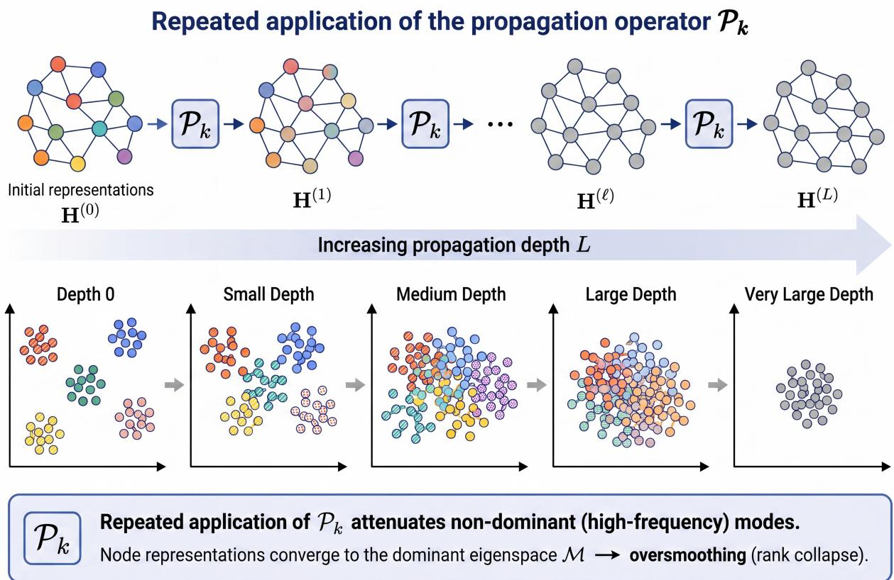  
Figure 4: Repeated propagation leads to oversmoothing. Repeated application of the propagation operator $\mathbf { P } _ { k }$ progressively suppresses non-dominant (high-frequency) modes. As propagation depth L increases, initially distinct node representations become increasingly mixed and eventually converge toward the dominant invariant subspace, producing oversmoothing (rank collapse).

Under the linear specialization (2), repeated low-pass propagation contracts states toward the operator’s dominant invariant subspace. This subspace is mapped into itself and corresponds here to the largest-eigenvalue eigenspace. For self-loop normalized adjacency, it is the one-dimensional degree-dominated direction on a connected graph and one component-indicator direction per connected component otherwise. Li et al. (2018a) identified the collapse empirically, and Oono & Suzuki (2020) established contraction under specified activation and weight assumptions.

Let M be this subspace, $s _ { \ell } = \| \mathbf { W } ^ { ( \ell ) } \| _ { 2 } , \bar { s } = \operatorname* { m a x } _ { \ell } s _ { \ell }$ , and $\mu _ { \star } = \operatorname* { m a x } _ { i \geq 2 } | \mu _ { i } | < 1$ , the largest eigenvalue magnitude of $\hat { \bf A }$ on $\mathcal { M } ^ { \perp }$ and the specialization of Oono & Suzuki (2020)’s general-operator radius. Then

$$
d _ { \mathcal { M } } \Big ( \mathbf { H } ^ { ( \ell ) } \Big ) \leq ( \bar { s } \mu _ { \star } ) ^ { \ell } d _ { \mathcal { M } } \Big ( \mathbf { H } ^ { ( 0 ) } \Big ) ,\tag{11}
$$

so when $\bar { s } \mu _ { \star } < 1$ node features collapse to M exponentially, independently of the labels.

The same µ<sub>⋆</sub> governs the one-step contraction below, proved in Appendix C.

Lemma 4 (One-step contraction). On a connected graph, $E ( \hat { \mathbf { A } } \mathbf { H } ) \leq \mu _ { \star } ^ { 2 } E ( \mathbf { H } )$ This is the elementary spectral step underlying the oversmoothing analyses of NT & Maehara (2019); Oono & Suzuki (2020); Cai & Wang (2020). We restate it here in the framework’s notation.

The Dirichlet-energy form, following Oono & Suzuki (2020); Cai & Wang (2020) and restated for the linear specialization, makes its activation assumptions explicit. The proof appears in Appendix C.

Theorem 2 (One-layer energy bound). Let $\mathbf { H } ^ { \prime } = \sigma ( \hat { \mathbf { A } } \mathbf { H } \mathbf { W } )$ with σ entrywise, 1-Lipschitz, positively homogeneous, and $\sigma ( 0 ) = 0$ . Then

$$
E ( \mathbf { H } ^ { \prime } ) \ \leq \ \left( s \mu _ { \star } \right) ^ { 2 } E ( \mathbf { H } ) , \qquad s = \| \mathbf { W } \| _ { 2 } .
$$

Iterating over an L-layer stack with $s _ { \ell } = \| \mathbf { W } ^ { ( \ell ) } \| _ { 2 }$ and $\bar { s } = \operatorname* { m a x } _ { \ell } s _ { \ell }$ gives the geometric bound $E ( \mathbf { H } ^ { ( L ) } ) \leq$ $\left( \bar { s } \mu _ { \star } \right) ^ { 2 L } E ( \mathbf { H } ^ { ( 0 ) } )$ , geometric Dirichlet-energy decay when $\bar { s } \mu _ { \star } < 1$ . Energy controls the distance to the degreedominated direction $\mathbf { v } _ { 1 } ~ ( t h e ~ \mu = 1$ eigenvector). Write $\mathbf { c } _ { i } ^ { \top } = \mathbf { v } _ { i } ^ { \top }$ H for H’s coeficient in eigendirection $\mathbf { v } _ { i }$ Since $\begin{array} { r } { E ( \mathbf H ) = \sum _ { i \geq 2 } ( 1 - \mu _ { i } ) \| \mathbf c _ { i } \| ^ { 2 } \geq ( \bar { 1 } - \mu _ { 2 } ) \sum _ { i \geq 2 } \| \mathbf c _ { i } \| ^ { 2 } } \end{array}$

$$
\big \| ( \mathbf { I } - \mathbf { v } _ { 1 } \mathbf { v } _ { 1 } ^ { \top } ) \mathbf { H } \big \| _ { F } ^ { 2 } \leq \frac { E ( \mathbf { H } ) } { 1 - \mu _ { 2 } } .
$$

Hence $i f \bar { s } \mu _ { \star } < 1$ the energy decays geometrically with depth, and by this inequality the states collapse toward the degree-dominated subspace span $\left\{ \mathbf { v } _ { 1 } \right\}$

Positive homogeneity makes $E ( \sigma ( \mathbf { M } ) ) \leq E ( \mathbf { M } )$ exact for the (Leaky)ReLU family. Because GELU, tanh, and sigmoid lack this property, the per-node $1 / \sqrt { \tilde { D } _ { i i } }$ scaling cannot pass through $\sigma ,$ leaving only a weaker Lipschitz bound.

Because $\mu _ { \star }$ is the spectral radius on $\mathcal { M } ^ { \perp }$ , Eq. (11) includes negative eigenvalues. Replacing it by a quantity based only on the second-smallest normalized-Laplacian eigenvalue requires additional assumptions. Decay therefore depends jointly on the nontrivial spectrum, feature-map norms, and activation.

Within the broader theory of Cai & Wang (2020); Rusch et al. (2023), let Osm $\mathbf { \tau } ( \mathbf { H } ) \geq 0$ vanish exactly when all rows coincide (avoiding the source’s $\mu ,$ already used for eigenvalues). Oversmoothing means ${ \mathrm { O s m } } ( \mathbf { H } ^ { \left( \ell \right) } ) \leq C _ { 1 } e ^ { - C _ { 2 } \ell }$ for $C _ { 1 } , C _ { 2 } > 0$ . Dirichlet energy satisfies these axioms, whereas the mean-average distance of Chen et al. (2020a) does not. Preventing this decay is necessary but insuficient for a useful deep network.

Three refinements qualify this baseline without changing its mechanism. First, state dependence alone does not prevent contraction. Under connectivity, non-bipartiteness, positivity, and boundedness, Wu et al. (2023d) show that an input-dependent row-stochastic $\mathbf { P } ^ { ( t ) }$ still satisfies $\mathrm { O s m } ( \mathbf { H } ^ { ( t ) } ) \leq C _ { 1 } \kappa ^ { t }$ for some $\kappa < 1$ , where $\begin{array} { r } { \mathrm { O s m } ( { \bf H } ) = \| ( { \bf I } - \frac { 1 } { n } { \bf 1 1 } ^ { \top } ) { \bf H } \| _ { F } } \end{array}$

Here the joint spectral radius κ is the long-run contraction factor of the changing operator sequence, unrelated to the eigenvalue count $q$ in Lemma 5. It is lower-bounded by the second eigenvalue of the fixed, self-loop-free normalized adjacency $\bar { \bar { \mathbf { A } } } .$ . Thus GAT-style attention can oversmooth through joint-product contraction, conditional on the four assumptions rather than universally.

Second, Giovanni et al. (2023b) interpret the linear update as gradient flow of a channel-weighted energy. Positive channel-mixing eigenvalues produce attraction and low-frequency smoothing (Section 2.7), whereas negative ones produce repulsion and high-frequency oversharpening. This spectrum is distinct from the propagation spectrum, making low-pass bias a design choice rather than a necessity of message passing.

Third, Roth & Liebig (2024) locate the mechanism in rank collapse, whereby repeated use of one operator drives representations into its dominant eigenspace regardless of per-layer weights, which rescale outputs without changing the surviving spectral component. This yields both row-wise oversmoothing and column-wise overcorrelation. A sum-of-Kronecker-products update instead lets distinct weights act on distinct operators, allowing feature directions to retain diferent dominant components. Across these refinements, the operative quantities remain the joint-product radius, channel-mixing eigenvalue signs, and operator eigenspaces.

Do architectural fixes slow collapse, and is energy a reliable diagnostic? For stacks without residual or skip connections, Chen et al. (2025c) show that the decay rate of the squared energy-type similarity Osm converges to the spectral radius of P on its non-dominant eigenspace, regardless of layer weights. Residual updates provably raise this rate for broad weight distributions, including Ginibre ensembles (i.i.d. Gaussian matrices), but the benefit is distribution-dependent rather than universal.

An initial-residual teleport does more than slow decay because it keeps energy above a positive floor. Personalized-PageRank convergence is standard (Gasteiger et al., 2019a). The floor below is a mild extension locating the escape in $\begin{array} { r } { B _ { \ell } . } \end{array}$ , proved in Appendix C.

Theorem 3 (Initial-residual energy floor). Let $\mathbf { G } ^ { ( 0 ) }$ be a fixed anchor and initialize the propagation state at that anchor. (We write G rather than the framework’s final-representation Z to keep this internal PPR-propagation state distinct from that reserved symbol.) The initial-residual iteration $\hat { \mathbf { G } } ^ { ( \ell + 1 ) } = ( 1 - \eta ) \hat { \mathbf { A } } \hat { \mathbf { G } } ^ { ( \ell ) } \dot { + } \eta \mathbf { G } ^ { ( 0 ) }$ uses $\eta \in ( 0 , 1 )$ , the personalized-PageRank teleport probability of Gasteiger et al. (2019a) (for APPNP, ${ \bf G } ^ { ( 0 ) } = f _ { \theta } ( { \bf \vec { X } } ) )$ . It converges to the fixed point

$$
\mathbf { G } ^ { \star } = \eta \big ( \mathbf { I } - ( 1 - \eta ) \hat { \mathbf { A } } \big ) ^ { - 1 } \mathbf { G } ^ { ( 0 ) } = \eta \sum _ { k \geq 0 } ( 1 - \eta ) ^ { k } \hat { \mathbf { A } } ^ { k } \mathbf { G } ^ { ( 0 ) } .
$$

$I f { \bf G } ^ { ( 0 ) }$ carries any nonzero non-DC content, that is $E ( { \bf G } ^ { ( 0 ) } ) > 0$ (equivalently, a nonzero component outside the $\mu = 1$ degree-dominated eigenspace, not necessarily high frequency), its fixed-point energy is bounded strictly from below by a fixed fraction of the anchor energy:

$$
\begin{array} { r } { E ( \mathbf G ^ { \star } ) > \ \biggl ( \frac { \eta } { 2 - \eta } \biggr ) ^ { 2 } E ( \mathbf G ^ { ( 0 ) } ) . } \end{array}
$$

Energy may itself be the wrong diagnostic. Zhang et al. (2026b) show numerical rank collapsing to one across broad GNN families without weight-norm assumptions, whereas Dirichlet-energy guarantees require restrictive norms and empirically miss degradation around ten layers. Rank is therefore the more faithful signature in their analysis.

Depth also has a non-monotone efect. Keriven (2022) show that a finite, nonzero number of aggregation steps can improve learning by shrinking within-community and non-principal variation before eventual collapse, yielding an optimum rather than monotone harm.

A backward view. Oversmoothing also acts backward. Keriven (2026) show that backpropagated error undergoes linear smoothing even with a nonlinear forward pass, creating spurious near-stationary, flat high-loss regions once the last layer is fit. An equally deep graph-agnostic MLP does not exhibit this failure.

Park & Kim (2024) distinguish gradient oversmoothing from the gradient expansion induced by residual connections that repair forward contraction. Frobenius-norm weight normalization constrains each layer’s Lipschitz constant, enabling stable training at hundreds of layers. Together with Chen et al. (2025c), this shows that residuals relocate the dificulty to a backward/Lipschitz regime rather than eliminate it.

## 5.2 Oversquashing: sensitivity, curvature, and efective resistance

Oversquashing is insuficient rather than excessive mixing because task-relevant distant signals traverse narrow topological channels as the receptive field expands (Alon & Yahav, 2021). Figure 5 illustrates this compression. (Node labels $u ,$ v below are unrelated to eigenvectors $\mathbf { v } _ { i \cdot } )$ The proposition formalizes the L-hop receptive-field bound and its locality assumptions. The proof appears in Appendix C.

Proposition 3 (Receptive field and underreaching). The underreaching bound (Alon & Yahav, 2021) is recast here on the slots, so the hypothesis falls on the support of $\mathbf { P } _ { k }$ and the locality of its entries. Suppose every channel is locally computed, a condition stated directly on the current-layer states with no reference to the receptive field. Concretely, the support lies in the closed one-hop neighborhood, supp $( \mathbf { P } _ { k } ^ { ( \ell ) } ) \subseteq \{ ( i , j )$ $d ( i , j ) \leq 1 \}$ , and each entry $[ \mathbf { P } _ { k } ^ { ( \ell ) } ] _ { i j }$ and each message on edge $( i , j )$ is a function only of the two endpoint states ${ h _ { i } ^ { ( \ell ) } , h _ { i } ^ { ( \ell ) } }$ and the local edge feature $e _ { i j }$ . Here $e _ { i j }$ must itself be local, i.e. not a function of input features at nodes outside $\{ i , j \}$ . Suppose further that $B _ { \ell }$ and ϕ<sub>ℓ</sub> act per node, so that row i of the update depends only on row i of its arguments (the initial-state teleport $\eta \mathbf { H } ^ { ( 0 ) }$ contributes only ${ h _ { i } ^ { ( 0 ) } }$ to row i). Then ${ \bf \Sigma } _ { h _ { i } ^ { ( L ) } }$ is independent of ${ h } _ { j } ^ { ( 0 ) }$ whenever $d ( i , j ) > L$ , and the depth-L receptive field of node i is contained in the L-hop ball $\bar { B } _ { L } ( i ) : = \{ j : d ( i , j ) \leq L \}$ (the bar keeps this closed hop-ball visually distinct from the ego/residual map $B _ { \ell }$ used just above).

Both locality conditions are necessary because an attention score on $( i , j )$ may read only its endpoints, whereas an edge attribute computed from a global statistic such as $\textstyle \sum _ { z } h _ { z } ^ { ( 0 ) }$ defeats the bound despite being attached to $( i , j )$

Topping et al. (2022) split the sensitivity of v to a source u at distance r into a model-dependent Lipschitz amplification and a topological transition weight:

$$
\begin{array} { r } { \left\| \partial \pmb { h } _ { v } ^ { ( r + 1 ) } / \partial \pmb { h } _ { u } ^ { ( 0 ) } \right\| \leq ( L _ { \Psi } L _ { \phi } ) ^ { r + 1 } ( \hat { \mathbf { A } } ^ { r + 1 } ) _ { v u } , } \end{array}\tag{12}
$$

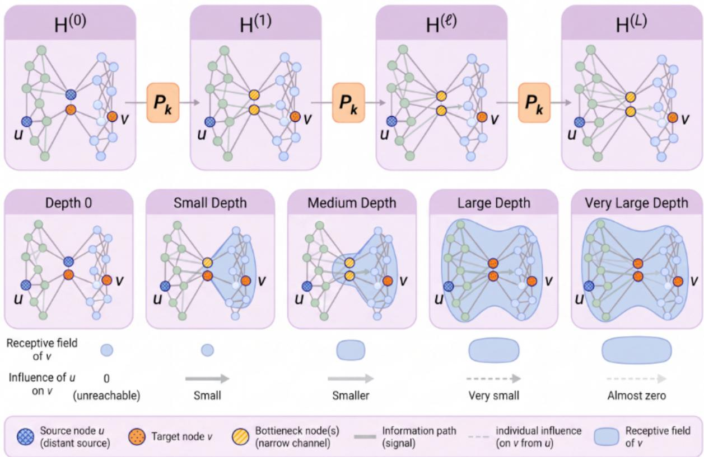  
Figure 5: Local propagation through a bottleneck leads to oversquashing. Repeated application of $\mathbf { P } _ { k }$ expands the receptive field of target node v with depth L. Once distant nodes become reachable, increasingly many signals must traverse the same narrow topological bottleneck, compressing their individual influence on v.

where $L _ { \Psi } , L _ { \phi }$ bound the message and update maps, and $( \hat { \mathbf { A } } ^ { r + 1 } ) _ { v u }$ is the $( r { + } 1 )$ -step transition weight. Strongly negative Balanced-Forman curvature, a discrete Ricci-curvature measure, is associated with bottlenecks having small transition weight, few common neighbors, or few short connecting cycles.

At depth $t = r + 1$ , Giovanni et al. (2023a) refine the prefactor into activation Lipschitz constant $c _ { \sigma }$ , maximum weight magnitude $\omega ,$ and width $p .$ They replace A<sup>ˆ</sup> by a family of generalized shifts $\widehat { \mathbf { S } }$ built from the self-loop-free normalized adjacency $\bar { \mathbf A }$ with two tunable weights. The operator $\hat { \bf A }$ is one member of this family. In the resulting bound $( c _ { \sigma } \omega p ) ^ { t } ( \widehat { \mathbf { S } } ^ { t } ) _ { v u } .$ , the prefactor scales sensitivity, while the topological factor determines whether u and v can interact.

Because depth enters only as an exponent, it cannot repair a bottleneck, and vanishing gradients dominate beyond the graph’s topological scale.

Black et al. (2023) relate $( \widehat { \mathbf { S } } ^ { t } ) _ { v u }$ to efective resistance $R _ { u v } = \tau ( u , v ) / ( 2 | \mathcal { E } | )$ , where $\tau ( u , v )$ is round-trip commute time. The total $\begin{array} { r } { R _ { \mathrm { t o t } } = \sum _ { u < v } R _ { u v } } \end{array}$ defines a graph-level oversquashing budget targeted by resistanceminimizing rewiring. Giovanni et al. (2024) convert the sensitivity bound into a capacity requirement under which guaranteeing fixed interaction between u and w forces depth and weight norms to grow with $\tau ( u , w )$ Thus bounded-capacity MPNNs face a quantitative impossibility, not merely a patchable design flaw.

When $t < d ( u , v ) , ( \widehat { \mathbf { S } } ^ { t } ) _ { v u } = 0$ and the nodes cannot interact (Proposition 3). This shallow-depth underreaching precedes oversquashing. A virtual node shortens paths but remains topology-dependent because the shared hub assigns uniform importance, requiring a topology-aware heterogeneous variant for node-dependent sensitivity at $O ( n )$ cost (Southern et al., 2025b).

## 5.3 Heterophily: a spectral mismatch

Unlike the preceding depth pathologies, heterophily can be read—usefully but not exhaustively—as a mismatch between $\mathbf { P } _ { k }$ ’s response and the frequency band carrying class signal.

NT & Maehara (2019) show that $\hat { \mathbf { A } } = \mathbf { I } - \mathbf { L } _ { \mathrm { r e f } }$ scales Laplacian frequency i by $( 1 - \lambda _ { i } ) = \mu _ { i }$ . Low frequencies pass nearly unchanged, whereas higher frequencies may be attenuated or sign-reversed. Negative adjacency eigenvalues can make their magnitude non-monotone across steps.

On the connected self-loop graph used here, repeated $\hat { \bf A }$ propagation nevertheless suppresses every nondominant component because $| \mu _ { i } | < 1$ for $i \geq 2$ . This favors low-frequency discriminative signal, but heterophily alone does not locate that signal. Fixed low-pass propagation may instead remove it.

The response can instead be shaped. The lemma realizes any discriminative band with a polynomial channel, with the proof given in Appendix C. The corollary gives a heterophilic high-pass configuration by zeroing the smoothing frequency $\nu = 1$ , with the proof given in Appendix C.

Lemma 5 (Filter realizability). Let $\hat { \bf A }$ have q distinct eigenvalues $\nu _ { 1 } , \ldots , \nu _ { q }$ with spectral projectors $\Gamma _ { 1 } , \ldots , \Gamma _ { q } .$ These are the same eigenvalues denoted $\mu _ { i }$ elsewhere in this section, here relabeled by their q distinct values rather than by the n possibly-repeated indices $i = 1 , \ldots , n$ . The projectors $\Gamma _ { j }$ are the eigenprojectors of A<sup>ˆ</sup> , not of $\mathbf { L } _ { \mathrm { s y m } }$ . For any target responses $r _ { 1 } , \hdots , r _ { q } \in \mathbb { R }$ there exist coeficients $\gamma _ { 0 } , \ldots , \gamma _ { q - 1 }$ with

$$
\sum _ { k = 0 } ^ { q - 1 } \gamma _ { k } \hat { \mathbf { A } } ^ { k } = \sum _ { j = 1 } ^ { q } r _ { j } \mathbf { \Gamma } \Gamma _ { j } .
$$

A polynomial channel of degree at most $q - 1$ realizes any frequency response, low-pass, band-pass, or high-pass. This is the standard interpolation argument for polynomial spectral filters (Deferrard et al., 2016; Wang & Zhang, 2022; Balcilar et al., 2021b), stated here for A<sup>ˆ</sup> .

Corollary 2 (Heterophilic configuration). A high-pass response that places weight on the high-frequency band and zero on the smoothing direction $\nu = 1$ is realizable inside $\mathbf { P } _ { k }$ at degree at most $q - 1$ . Suppose class-discriminative signal is carried by high-frequency eigenvectors. Heterophily can produce this, though heterophily does not by itself imply that all such signal lies in any designated high-frequency band. Such a filling retains those components because their response is nonzero, though not necessarily at unchanged amplitude. Repeated propagation by A<sup>ˆ</sup> , by contrast, annihilates them, since its powers send every non-DC response to zero. A generic low-pass filter need not. More generally, the realizability of Lemma 5 lets $\mathbf { P } _ { k }$ match whatever band the discriminative signal occupies, rather than presuming it is high-frequency.

Figure 6 contrasts fixed low-pass propagation with adaptive operator banks. FAGCN interpolates low- and high-pass filters per edge using $\alpha _ { i j } = \operatorname { t a n h } ( \cdot ) \in [ - 1 , 1 ]$ , with high-pass propagation increasing distances between connected nodes (Bo et al., 2021). GPR-GNN learns signed coeficients in $\textstyle \sum _ { k } \gamma _ { k } { \hat { \mathbf { A } } } ^ { k }$ (Chien et al., 2021). BernNet and ChebNetII use nonnegative Bernstein coeficients and Gauss-node Chebyshev interpolation (He et al., 2021; 2022b). MidGCN targets a mid-frequency pass-band, and RFA-GNN makes the response relation-dependent (Huang et al., 2023a; Wu et al., 2024).

Sheaf methods replace $\mathbf { P } _ { k }$ by a learned cellular-sheaf Laplacian $\mathbf { L } _ { \mathcal { F } }$ , assigning vector-space stalks to nodes and edges with linear maps between them. The ordinary Laplacian is the trivial-sheaf case. Suitable non-trivial kernels preserve nonconstant signals, so the $t \to \infty$ limit need not be constant. In the analyzed constructions, the number of linearly separable limiting classes grows with stalk dimension, addressing heterophily and oversmoothing jointly (Bodnar et al., 2022). Wang et al. (2025a) reinterpret such remedies as structured negative edges with non-collapsing equilibria. These designs reshape the operator’s pass-band or kernel to match the signal.

These remedies require diagnosing the mismatch, yet plain edge homophily (Section 2.4) poorly predicts GNN dificulty (Zheng et al., 2024). Zhu et al. (2020) identify ego/neighbor separation, higher-order channels, and intermediate-layer combination. Luan et al. (2022) propose aggregation homophily from post-aggregation similarity and an adaptive low/high/identity mix. GCN can succeed when same-class nodes share neighborhood distributions (Ma et al., 2022). Structured heterophily is comparatively benign, while high intra-class neighborhood variance causes harm rather than low homophily itself (Lee et al., 2024).

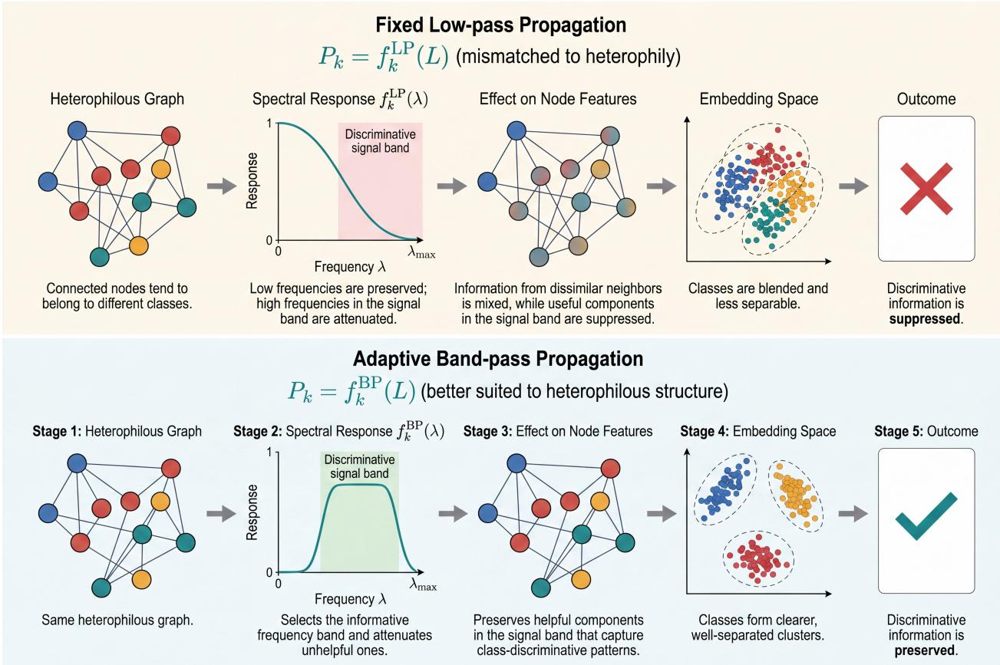  
Figure 6: Matching the operator’s pass-band to the signal. In the illustrated heterophilic setting, the class-discriminative signal occupies frequencies attenuated by standard low-pass propagation. Consequently, repeated propagation suppresses these informative components, causing the class representations to become less distinguishable, as characterized in Corollary 2. An adaptive band-selective $\mathbf { P } _ { k }$ instead shapes its spectra response to retain the informative frequency band and thereby preserve discriminative information.

To predict when the mismatch costs accuracy relative to a graph-agnostic baseline, Luan et al. (2023) use Contextual Stochastic Block Model (CSBM) node-distinguishability/Bayes error, yielding a hardest mid-homophily regime and a threshold at which a GNN beats an MLP.

Table 5 maps these remedies, including oversquashing interventions revisited in Section 5.4, to the components they modify.

## 5.4 The oversmoothing-oversquashing trade-of

Giraldo et al. (2023) couple oversmoothing and oversquashing through the normalized-Laplacian spectral gap $\lambda _ { 2 }$ , in opposite directions. Here $\lambda _ { 2 }$ is the second-smallest eigenvalue of $\mathbf { L } _ { \mathrm { r e f } } = \mathbf { I } - \hat { \mathbf { A } }$ , not of $\mathbf { L } _ { \mathrm { s y m } }$ (Section 2), so $\lambda _ { 2 } = 1 - \mu _ { 2 }$ . The sharper energy rate $\mu _ { \star } = \operatorname* { m a x } _ { i \geq 2 } \left| \mu _ { i } \right|$ equals $1 - \lambda _ { 2 }$ only when $\mu _ { 2 } \geq 0$ and $\left| \mu _ { 2 } \right| \geq \left| \mu _ { n } \right|$ . The $\lambda _ { 2 }$ interpretation applies only in this regime. Increasing the gap accelerates mixing and relieves oversquashing but also speeds the energy decay in Eq. (11). The Cheeger bound $\lambda _ { 2 } / 2 \le h _ { G } \le \sqrt { 2 \lambda _ { 2 } }$ links both efects to conductance $h _ { G }$ , the worst-cut bottleneck targeted by curvature rewiring and illustrated in Figure 7. Because the classical bound omits self-loops, $h _ { G }$ here refers to the self-loop-augmented graph underlying $\mathbf { L } _ { \mathrm { r e f } }$ . The fixed self-loop shift does not change the qualitative reading. Under the result’s operator family and assumptions, changing the gap selects a trade-of point rather than independently improving both objectives, but this is not an impossibility theorem for all fixed-topology architectures or interventions.

Nguyen et al. (2023) add edges at the most negative and prune at the most positive Ollivier–Ricci curvature. Karhadkar et al. (2023) increase $\lambda _ { 2 }$ by first-order edge perturbation and use a relational split to avoid the induced smoothing fixed point. Qian et al. (2024) learn a diferentiable k-subset edge distribution, specifying when it outperforms random rewiring and how it afects expressivity. Table 5 places these and earlier remedies in the component map.

Table 5: Remedies are interventions on a named slot. Each remedy class, the pathology it targets, the unified-equation slot (3) it modifies, and the operator/topology quantity it moves (with the trade-of it incurs). Architectures are instances.
<table><tr><td>Remedy class (instance)</td><td>Targets</td><td>Slot</td><td>Quantity moved (trade-off)</td><td>Key refs</td></tr><tr><td>Curvature rewiring (SDRF, oversquashing BORF)</td><td></td><td> $\mathbf { P } _ { k }$  support/weights</td><td>raises  $( \widehat { \mathbf { S } } ^ { t } ) _ { v u }$  on negative-curvature edges; pruning can slow smoothing</td><td>Topping et al., 2022; Nguyen et al., 2023; Liu et al., 2023a</td></tr><tr><td>Spectral-gap rewiring (FoSR, GTR)</td><td>oversquashing</td><td> $\mathbf { P } _ { k }$  support; relation channels</td><td>raises λ2 / lowers  $R _ { \mathrm { t o t } } ;$  relational split avoids induced smoothing</td><td>Karhadkar et al., 2023; Black et al., 2023</td></tr><tr><td>Spectral pruning (Braess)</td><td>squashing and smoothing</td><td> $\mathbf { P } _ { k }$  support/weights</td><td>selected edge deletions can raise  $\lambda _ { 2 }$  and co-mitigate both under the cited criterion</td><td>Jamadandi et al., 2024; Liang et al., 2025</td></tr><tr><td>Learned rewiring (PR-MPNN)</td><td>oversquashing, underreaching</td><td> $\mathbf { P } _ { k }$  sampled support</td><td>differentiable k-subset edges; conditions for &gt; random rewiring</td><td>Qian et al., 2024</td></tr><tr><td>Virtual / global channel (MPNN+VN)</td><td>oversquashing, long-range</td><td> $_ { x }$  and  $\mathbf { P } _ { k }$  for  $\mathrm { V N } ;$   $\mathbf { P } _ { k }$  for dense attention</td><td>VN adds a two-edge path (two synchronous propagation steps); classical VN forces uniform importance</td><td>Southern et al., 2025b; Cai et  $\mathrm { a l . , }$  2023</td></tr><tr><td>Signed / high-pass bank (FAGCN, GPR-GNN, BernNet, ChebNetII)</td><td>heterophily, oversmoothing</td><td> $\mathbf { P } _ { k }$  bank  $( \gamma _ { k }$  folded in)</td><td>shifts the response high or uses signed γk; can suppress the dominant smoothing response</td><td>Bo et al., 2021; Chien et al., 2021; He et al., 2021; 2022b</td></tr><tr><td>Sheaf / signed propagation (NSD, SBP)</td><td>heterophily and oversmoothing</td><td> $\mathbf { P } _ { k }$  built from  $\mathbf { L } _ { \mathcal { F } }$ </td><td>suitable learned kernels preserve nonconstant signals; structured negative edges</td><td>Bodnar et al., 2022; Wang et al., 2025a</td></tr><tr><td>Residual / skip</td><td>oversmoothing (forward)</td><td> $\scriptstyle B _ { \ell }$  (combined by  $\phi _ { \ell } )$ </td><td>raises decay exponent above maxν≠1 |ν|; induces gradient expansion</td><td>Chen et al., 2025c; Park &amp; Kim, 2024</td></tr><tr><td>Ego/neighbor split + multi-hop (H2GCN, ACM-GCN)</td><td>heterophily</td><td> $\phi _ { \ell }$  (ego/neighbor  $\mathrm { s p l i t } )$   $\mathbf { P } _ { k }$  bank 5</td><td>separates identity from aggregate; adds high-pass/identity channels</td><td>Zhu et al., 2020; Luan et al., 2022</td></tr><tr><td>Learnable depth/filtering (AMP)</td><td>smoothing, squashing, underreaching</td><td>per-layer  $\mathbf { P } _ { k }$  weights (latent)</td><td>infers effective depth/filter by ELBO; Errica et al., 2025 no global rewiring</td><td></td></tr><tr><td>Storage capacity (gLSTM)</td><td>oversquashing (short-range)</td><td> $\Psi _ { k } ~ / ~ \phi _ { \ell }$ </td><td>enlarges per-node bandwidth at fixed topology</td><td>Blayney et al., 2026</td></tr><tr><td>Kronecker-product update</td><td>rank collapse</td><td>bank  $\mathbf { P } _ { k }$   $/ \Psi _ { k }$ </td><td>prevents collapse to dominant eigenspace; preserves feature rank</td><td>Roth &amp; Liebig, 2024</td></tr><tr><td>Normalization (PairNorm)</td><td>oversmoothing (forward)</td><td> $\phi _ { \ell } ~ /$  state</td><td>holds total pairwise feature distance roughly constant across layers; can distort useful smoothing</td><td>Zhao &amp; Akoglu, 2020</td></tr><tr><td>Stochastic edge dropping (DropEdge)</td><td>oversmoothing (forward)</td><td> $\mathbf { P } _ { k }$  support</td><td>random per-epoch support sparsification slows the smoothing convergence</td><td>Rong et al., 2020</td></tr></table>

Three results escape the trade-of. Edge deletions can raise the spectral gap, letting spectral pruning mitigate both pathologies and linking the problem to graph lottery tickets (Jamadandi et al., 2024). Errica et al. (2025) learn efective depth and per-layer filters as ELBO latent variables, jointly curbing smoothing, squashing, and underreaching without global rewiring. Blayney et al. (2026) instead treat oversquashing as node-vector storage saturation relieved by greater efective storage at fixed topology.

Other work questions the vocabulary itself. Through counterexamples, Arnaiz-Rodríguez & Errica (2026) separate oversmoothing (an operator property) from accuracy-related node non-separability, split oversquashing into topological and computational bottlenecks, and reject a general homophily-good/heterophily-bad rule. Mishayev et al. (2025) further identify a short-range bottleneck missed by resistance and curvature and unresolved by virtual nodes but handled by graph transformers, separating bottleneck from range.

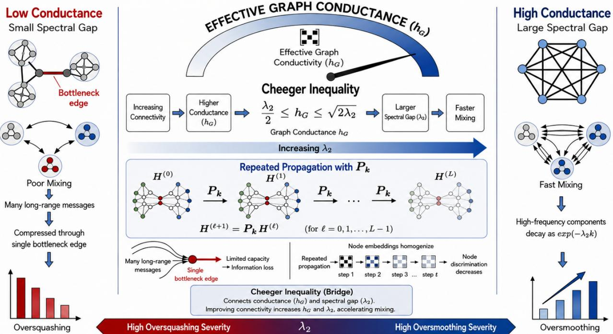  
Figure 7: The spectral-gap trade-of. Oversquashing and oversmoothing are governed by the same spectral gap $\lambda _ { 2 }$ in opposite directions. A low-conductance graph with a bottleneck edge (left) has a small $\lambda _ { 2 }$ Long-range messages compress through the bottleneck, so oversquashing is severe while repeated propagation barely mixes the graph. A high-conductance, densely connected graph (right) has a large $\lambda _ { 2 }$ . Mixing is fast, relieving oversquashing, but the same speed drives high-frequency components to decay as $\exp ( - \lambda _ { 2 } k )$ so node embeddings homogenize just as quickly. The Cheeger bound $\lambda _ { 2 } / 2 \le h _ { G } \le \sqrt { 2 \lambda _ { 2 } }$ ties both efects to the same graph conductance $h _ { G }$ . Moving $\lambda _ { 2 }$ trades one pathology for the other rather than fixing both independently.

Our account preserves these distinctions. Table 6 separates the spectrum of $\mathbf { P } _ { k }$ from non-separability and does not claim that an operator property alone predicts accuracy. Section 5.2 separates the model factor $( c _ { \sigma } \omega p ) ^ { t }$ from topology $( \widehat { \mathbf { S } } ^ { t } ) _ { v u }$ , while the short-range result separates bottleneck and range. Section 5.3 likewise ties harm to within-class structural variance and pass-band mismatch rather than heterophily alone. The spectral-gap trade-of is therefore a first-order organizing principle whose universality remains under investigation.

Table 6 summarizes oversmoothing and its backward/rank-collapse readings, oversquashing, underreaching, heterophily, their spectral-gap trade-of, and the structurally governed expressivity limits discussed next.

## 5.5 Expressivity: the WL ladder and substructure counting

The commute-time capacity bound of Section 5.2 already limits what a model can realize. More generally, expressivity asks what propagation can distinguish independently of optimization. The Weisfeiler–Leman (WL) test iteratively hashes each node’s color with its neighbor-color multiset. Ordinary message passing can be simulated round by round and therefore cannot distinguish graphs that WL confuses. The proposition restates this ceiling (Xu et al., 2019b; Morris et al., 2019; Balcilar et al., 2021a) under explicit node-domain component assumptions and identifies three ways to break them. The proof appears in Appendix C.

Proposition 4 (1-WL ceiling and the escape mechanisms). Consider a stack of node-domain layers with $\chi = \nu$ in which every map is shared and node-wise, with no independent access to A or global graph statistics:

Table 6: Propagation diagnostics and their assumptions. Each pathology, the measure that detects it, and the operator, topology, capacity, or optimization quantity that governs it (with the inequality direction where available). $\mathbf { L } _ { \mathrm { r e f } }$ is the self-loop-normalized reference Laplacian of Section 2, $\lambda _ { 2 }$ the relevant normalized-Laplacian spectral gap in the cited result, $\widehat { \mathbf { S } }$ the normalized sensitivity/support operator, $R _ { u v }$ efective resistance, and τ commute time.
<table><tr><td>Phenomenon</td><td>Diagnostic measure</td><td>Governing quantity (and bound)</td><td>Key refs</td></tr><tr><td>Oversmoothing (forward)</td><td>Dirichlet energy E; MAD (Mean Average Distance); numerical rank</td><td>largest nontrivial eigenvalue magnitude:  $d _ { \mathcal { M } } ( \mathbf { H } ^ { ( \ell ) } ) { \leq } ( \bar { s } \mu _ { \star } ) ^ { \ell } { ; } \mathbf { \Theta } \breve { E } ( \mathbf { H } ^ { \prime } ) { \leq } ( s { \mu } _ { \star } ) ^ { 2 } E ( \mathbf { H } )$  under Theorem 2; rank→1 under the cited conditions</td><td>Oono &amp; Suzuki, 2020; Cai &amp; Wang, 2020; Roth &amp; Liebig, 2024; Zhang et al., 2026b</td></tr><tr><td>Oversharpening (dual)</td><td>high-frequency energy growth</td><td>sign of channel-mixing eigenvalues: most-negative dominant ⇒ repulsion</td><td>Giovanni et al., 2023b</td></tr><tr><td>Oversmoothing (backward)</td><td>smoothness of backprop. error; flat high-loss regions</td><td>linear backward smoothing; per-layer Lipschitz bound</td><td>Keriven, 2026; Park &amp; Kim, 2024</td></tr><tr><td>Oversquashing</td><td>Jacobian  $\| \partial h _ { v } ^ { ( t ) } / \partial h _ { u } ^ { ( 0 ) } \| ;$  mixing</td><td> $( \widehat { \mathbf { S } } ^ { t } ) _ { v u } ; R _ { u v } = \tau ( u , v ) / ( 2 | \mathcal { E } | )$  ; capacity  ${ \gtrsim } \tau ( u , v )$ </td><td>Topping et al., 2022; Giovanni et al., 2023a; Black et al., 2023;</td></tr><tr><td>Underreaching</td><td>receptive radius &lt; task distance</td><td>depth  $t < d ( u , v ) \colon ( \widehat { \mathbf { S } } ^ { t } ) _ { v u } = 0$ </td><td>Giovanni et al., 2024 Giovanni et al., 2023a; Errica et al., 2025</td></tr><tr><td>Heterophily / band mismatch</td><td>aggregation homophily; Contextual Stochastic Block Model (CSBM) Bayes error</td><td>pass-band of  $\mathbf { P } _ { k }$  vs. signal band; low-pass response of  $\hat { \textbf { A } } \mathrm { i s } \ ( 1 - \lambda _ { i } )$ </td><td>NT &amp; Maehara, 2019; Luan et al., 2022; Ma et al., 2022; Luan et al., 2023</td></tr><tr><td>Smoothing↔squashing trade-off</td><td>mixing time; Cheeger hG</td><td>spectral gap λ2:  $\lambda _ { 2 } / 2 { \le } h _ { G } { \le } \sqrt { 2 \lambda _ { 2 } } ;$  Ollivier-Ricci sign</td><td>Giraldo et al., 2023; Nguyen et al., 2023; Jamadandi et al., 2024</td></tr><tr><td>Limited expressivity</td><td>WL level; substructure count; VC dim</td><td>≤k-WL refinement; VC governed by #{1-WL-distinguishable}</td><td>Xu et al., 2019b; Morris et al., 2023</td></tr></table>

• one-hop operators whose entries $[ \mathbf { P } _ { k } ] _ { i j }$ are functions of the 1-WL colors of the incident nodes i and j through a color-to-weight rule shared across graphs (the refinability hypothesis);

• shared node-wise messages $\Psi _ { k } ,$

• a shared node-wise channel mixing ⊞;

• shared node-wise ego and update maps $B _ { \ell } .$ , ϕ<sub>ℓ</sub>;

• no node identifiers in $\mathbf { H } ^ { ( 0 ) }$ ; and

• a readout that is a shared function of the node-state multiset $\{ \{ h _ { i } ^ { ( L ) } \} \}$ alone.

Such a stack is bounded by 1-WL. Graphs that 1-WL fails to distinguish receive equal outputs. We single out three structural escape mechanisms that each negate one hypothesis above:

(i) the domain X , through the graded extension to tuples, subgraphs, or cells (Zhou et al., 2023a);

(ii) the input message $\mathbf { H } ^ { ( 0 ) }$ , through positional and structural encodings or node identifiers (Murphy et al., 2019);

(iii) the operator $\mathbf { P } _ { k }$ itself, when its entries depend on graph structure beyond the incident colors (for instance substructure counts such as per-edge triangle counts), which violates the refinability hypothesis and is the route taken by substructure-aware operators (Bouritsas et al., 2023).

The color-to-weight rule sufices for one-round color refinability, while the structure-blind restrictions are essential. A readout that re-reads A, or a $B _ { \ell } , \ \phi _ { \ell } ,$ or ⊞ that broadcasts a global invariant, can count substructures regardless of the operator. Permutation invariance alone does not exclude this. Thus the three listed escapes are not exhaustive because structure-aware $\Psi _ { k } , \boxplus , \phi _ { \ell } .$ , or readout can also exceed 1-WL. For example, broadcasting $\operatorname { t r } ( \mathbf { A } ^ { 3 } )$ separates the prism from $K _ { 3 , 3 }$ with ordinary $\boldsymbol { \mathcal { X } } , { \bf H } ^ { ( 0 ) }$ , and $\mathbf { P } _ { k }$ . The proposition lists the escapes compatible with keeping all other components 1-WL-bounded.

Changing a component need not yield a strict gain because a 1-WL-refinable encoding such as degree, or an uninformative lift, preserves the ceiling. Pellizzoni et al. (2025) study which substructures ordinary message passing can count under graph-structural conditions.

Being bounded by 1-WL does not imply attaining it because aggregation and update must preserve the relevant multiset information. The lemma gives the injectivity condition and explains why mean and max fail. The proof appears in Appendix C.

Lemma 6 (Neighborhood-aggregation injectivity). The aggregation is over the neighbor index, realized $b y$ the operator (the bare support $\mathbf { P } _ { k } = \mathbf { A }$ sums neighbor messages, $\mathbf { P } _ { k } = \mathbf { D } ^ { - 1 } \mathbf { A }$ averages them), not by the channel mixing ⊞. The constructions below use a single channel, so ⊞ plays no role. For multisets of bounded size drawn from a countable set of node states, there exists an encoding f such that the neighbor sum of the encoded states, $\begin{array} { r } { S \mapsto \sum _ { x \in S } f ( x ) } \end{array}$ , is injective on such multisets. Injective neighbor aggregation alone does not attain the 1-WL ceiling. It must be paired with an injective combination of the aggregate with the root state, i.e. an update of the form

$$
\begin{array} { r } { \pmb { h } _ { i } ^ { ( \ell + 1 ) } = g \Big ( \pmb { h } _ { i } ^ { ( \ell ) } , \sum _ { j \in \mathcal { N } ( i ) } f ( \pmb { h } _ { j } ^ { ( \ell ) } ) \Big ) } \end{array}
$$

with $g$ injective in its pair of arguments. Placing f in the message map $\Psi _ { k } .$ , summing with $\mathbf { P } _ { k } = \mathbf { A }$ , and routing this $g$ through the ego map $\boldsymbol { B _ { \ell } }$ and update $\phi _ { \ell } ,$ then attains the ceiling. The raw neighbor sum without such an encoding is not injective on multisets. No encoding makes the neighbor aggregators mean or max injective either. Mean is invariant to multiplicity duplication and max retains only extremes.

GIN realizes this construction, whereas mean and max lose multiplicity information (Xu et al., 2019b; Morris et al., 2019).

Table 7 places model classes, with architectures as instances, on three kinds of expressivity axis. These are exact classical WL rungs, subgraph-model bands between rungs, and orthogonal properties. On the classical ladder, k-GNNs match the strict set-k-WL hierarchy at $O ( n ^ { k } )$ cost (Morris et al., 2019). PPGN realizes $2 \mathrm { - F W L = 3 \mathrm { - } W L }$ with $O ( n ^ { 2 } )$ memory, and generally $k \mathrm { - F W L } = ( k { + } 1 ) { \ - } \mathrm { W L }$ (Maron et al., 2019a).

Between rungs, node-based subgraph classes lie strictly above 1-WL and below 3-WL. SUN subsumes its unified subgraph GNNs (Frasca et al., 2022). Zhang et al. (2023a) divide this band into six totally ordered classes below 2-FWL, including ESAN (Bevilacqua et al., 2022) and GNN-AK (Zhao et al., 2022).

Orthogonally, standard MPNNs cannot compute biconnectivity at any depth, whereas generalized-distance tests recover vertex biconnectivity with SPD-WL and edge biconnectivity with RD-WL (Zhang et al., 2023b). The classical ladder does not order this property.

Counting power measures pattern multiplicities rather than graph distinguishability. MPNNs, 2-WL, and 2-IGNs cannot count induced patterns on at least three nodes, although they can count stars, while k-WL counting power grows with k (Chen et al., 2020c). Recursive neighborhood pooling counts any connected size-k pattern, induced or not, with a near-tight lower bound on the number of encoded subgraphs (Tahmasebi et al., 2023). The analyzed subgraph message-passing class cannot node-count cycles longer than four, whereas I<sup>2</sup>-GNN counts cycles of length 3–6 in linear time under bounded degree and is only partially stronger than 3-WL—incomparable on some inputs and a strict superset on others (Huang et al., 2023c). The r-loopy WL hierarchy instead indexes visible cycle length, strictly exceeds 1-WL, and remains incomparable to every fixed k-WL (Paolino et al., 2024).

Homomorphism counts unify these results. A homomorphism is an edge-preserving map from pattern $F$ to $G ,$ counted by hom $( F , G )$ . Injecting hom(F, ·) gives exactly F-WL power, strictly beyond 1-WL when the chosen $F$ adds unavailable information. Such F-MPNNs use $O ( n )$ memory and are bounded by k-WL when $F$ has treewidth k (a measure of how tree-like $F \ \mathrm { i s } )$ , yet for every fixed k some pattern family distinguishes graphs that k-WL cannot (Barceló et al., 2021). Zhou & Zhang (2024) characterize exactly which homomorphism counts each WL variant computes. Because subgraph counts decompose over the spasm basis of vertex-merged versions of $Q ,$ basis hom-count features strictly subsume single-pattern counts at no extra asymptotic cost (Jin et al., 2024).

On a fixed graph, a polynomial filter reaches every one-dimensional target under the simple-spectrum, no-missing-frequency conditions below. The proof appears in Appendix C.

Table 7: Slot-aware expressivity hierarchy. Each row places a model class (architectures in parentheses are instances) on the relevant Weisfeiler–Leman or orthogonal expressivity axis and states the substructure/homomorphism count it can or cannot achieve. Rows on incomparable axes should not be read as a total bottom-to-top ordering.
<table><tr><td>Model class (instance)</td><td>WL power</td><td>Counting power</td><td>Memory</td><td>Key refs</td></tr><tr><td>Mean/max/attention- aggregation MPNN (GCN, GraphSAGE-mean, GAT)</td><td>≤ 1-WL (strict for mean/max)</td><td>loses multiset multiplicities (mean/attention) or repeats (max)</td><td>O(n+|ε|)</td><td>Xu et al., 2019b</td></tr><tr><td>Injective sum-aggregation MPNN = 1-WL (the ceiling, (GIN)</td><td>attained iff aggregate and readout are injective)</td><td>stars only; no induced connected pattern ≥3 nodes; no girth/diameter/k-clique/biconnectivity</td><td>O(n+|ε|)</td><td>Xu et al., 2019b; Chen et al., 2020c; Garg et al., 2020; Zhang et al., 2023b</td></tr><tr><td>Polynomial spectral GNN (GPR-GNN, BernNet, ChebNetII)</td><td>≤ 1-WL under the structure-blind node-domain hypotheses of Proposition 4; fixed-graph reachability</td><td>filter-band dependent; reaches any 1-D target on one fixed graph if the spectrum is simple and no frequency is missing</td><td>O(K|ε|)</td><td>Wang &amp; Zhang, 2022</td></tr><tr><td>Spectral-invariant GNN (eigenbasis invariants)</td><td>strictly between 1-WL and the subgraph-GNN band above it</td><td>homomorphism-counts (hom-counts) exactly “parallel trees&quot;; class grows with depth</td><td>O(n²)</td><td>Gai et al., 2025</td></tr><tr><td>Hom-count-augmented MPNN (F-MPNN; spasm basis)</td><td>= F-WL; gain over 1-WL depends on F; for sub(Q, G)= ∑ every fixed k some F escapes k-WL</td><td>counts patterns via F∈spasm(Q) αF hom(F, G)</td><td>O(n)</td><td>Barceló et al., 2021; Jin et al., 2024</td></tr><tr><td>Node-based subgraph GNN (ESAN, GNN-AK, SUN, SSWL)</td><td>&gt; 1-WL, &lt; 2-FWL (= 3-WL) for the six ordered classes</td><td>the analyzed subgraph-MPNN class node-counts cycles only through length 4</td><td></td><td>O(n(n+|ε|)) Frasca et al., 2022; Zhang et al., 2023a</td></tr><tr><td>I2-GNN</td><td>partially (not totally) stronger than 3-WL</td><td>counts all 3–6-cycles in the cited construction</td><td>sparse; model- dependent</td><td>Huang et al., 2023c</td></tr><tr><td>Generalized-distance WL (SPD-/RD-WL; Graphormer-GD)</td><td>orthogonal; gets biconnectivity standard MPNNs cannot</td><td>SPD→vertex-, RD→edge-biconnectivity</td><td>O(n²)</td><td>Zhang et al., 2023b</td></tr><tr><td>k-WL-aligned transformer (higher-order)</td><td>≥ k-WL (strictly more for k&gt;1; δ-k-WL)</td><td>inherits k-WL; PE choice sets recoverable properties</td><td>O(nk)</td><td>Müller &amp; Morris,</td></tr><tr><td>k-GNN / set-k-WL</td><td>= set-k-WL, strict in k</td><td>bounded patterns scaling with k</td><td>O(nk)</td><td>2024 Morris et al., 2019</td></tr><tr><td>PPGN/ 2-IGN+matmul (k-FWL)</td><td>= 2-FWL=3-WL; k-FWL=(k+1)-WL</td><td>patterns up to bounded size</td><td>O(n2)- O(nk)</td><td>Maron et al., 2019a; Chen et al., 2020c</td></tr><tr><td>Recursive neighborhood pooling (RNP-GNN)</td><td>beyond fixed k-WL for counting</td><td>any connected size-k substructure; near-tight lower bound on #subgraphs</td><td>adaptive</td><td>Tahmasebi et al., 2023</td></tr></table>

Theorem 4 (Spectral universality). If A<sup>ˆ</sup> has distinct eigenvalues and the one-dimensional signal x has nonzero projection on every eigenvector, then

$\{ g ( \hat { \mathbf { A } } ) \mathbf { x } : g ($ a polynomial of degree at most $n - 1 \} = \mathbb { R } ^ { n }$

This is cyclic-vector reachability. Because x has a nonzero component along every eigendirection of A<sup>ˆ</sup> , repeated application of A<sup>ˆ</sup> to x generates the whole space. It is the same simple-spectrum, no-missing-frequency condition under which spectral GNNs are universal in the sense of Wang & Zhang (2022).

This is fixed-graph filter reachability, not graph-distinguishing universality or a WL classification. Separately, spectral-invariant networks count exactly the “parallel tree” homomorphisms, with the class growing in depth (Gai et al., 2025).

Spatial and spectral $\mathbf { P } _ { k }$ fillings are therefore complementary. Parallel spatial message passing and a parametrically bounded spectral filter widen the receptive field and mitigate oversquashing without extra message-passing depth (Geisler et al., 2024). Spatially adaptive per-node aggregation can likewise complement a global spectral filter under heterophily (Guo et al., 2024). Properly conditioned Chebyshev filtering (Deferrard et al., 2016) is competitive on long-range tasks that motivated graph transformers (Hariri et al. 2025), showing that the limits concern particular fillings, not the component itself.

Expressivity’s generalization cost. Worst-case analyses often associate greater distinguishing power with looser generalization bounds, but not unconditionally. The Rademacher bound of Garg et al. (2020) grows exponentially with depth through branching and multiplicatively with maximum degree. The same class cannot decide girth, circumference, diameter, or k-clique. The tighter PAC-Bayes bound of Liao et al. (2021) grows, up to logarithmic factors, with depth, degree, $\sqrt { p }$ (using the width $p$ of Section 5.2), and $\begin{array} { r } { \prod _ { \ell } \lVert \mathbf { W } ^ { ( \ell ) } \rVert _ { 2 } } \end{array}$ (whose factors are $s _ { \ell }$ in Section 5.1), and shrinks with margin and the square root of sample size. Non-uniformly, the VC dimension of L-layer GNNs is governed by the number of graphs distinguished by 1-WL after L rounds. Uniformly, it is infinite for d, $L \geq 2$ (Morris et al., 2023).

Data-dependent bounds replace worst-case $d ^ { L }$ by instance-specific quantities. Li et al. (2024c) use homomorphism-count entropy. The tension is not fundamental under every metric. Rauchwerger et al. (2025) define a hierarchical-optimal-transport pseudometric on attributed computation trees under which message passers are Lipschitz, fully separating at 1-WL resolution, and defined on a relatively compact space, yielding both Stone–Weierstrass approximation and distribution-free generalization. This construction does not settle the general question. Morris et al. (2024) identify alignment among WL expressivity, generalization, and optimization as a central open direction.

## 5.6 Global attention as a propagation channel

Global attention is the densest graph-transformer filling of $\mathbf { P } _ { k }$ in Eq. (3). Under its fixed-operator and node-local hypotheses, the proposition states when one-layer global mixing requires a dense row, why a virtual node needs two propagation steps, and why $\Psi _ { k } , \boxplus$ , or ϕ<sub>ℓ</sub> alone cannot supply globality. The proof appears in Appendix C.

Proposition 5 (One-layer global mixing). Suppose the operators are fixed (state-independent), the messages $\Psi _ { k }$ are node-wise and linear in H, the mixing is additive, the ego map is node-local (so $B _ { \ell } ( { \bf H } , { \bf H } ^ { ( 0 ) } ) _ { i }$ <sub>i</sub> depends only on $\boldsymbol { h } _ { i }$ and $h _ { i } ^ { ( 0 ) } )$ , and the update $\phi _ { \ell }$ is node-local and message-faithful. We call the update message-faithful $i f ,$ for every fixed ego input a, the partial map $b \mapsto \phi _ { \ell } ( a , b )$ from the mixed message to the output is injective (the common $\phi _ { \ell } ( a , b ) = \sigma ( a + b )$ with injective σ qualifies). Then having every of-diagonal entry of row i present in the combined support $\begin{array} { r } { \bigcup _ { k } \operatorname { s u p p } ( \mathbf { P } _ { k } ) } \end{array}$ (i.e. some k with $[ \mathbf { P } _ { k } ] _ { i j } \neq 0$ for each $j \neq i )$ is necessary $f o r$ $h _ { i } ^ { ( \ell + 1 ) }$ to depend on every other node $h _ { j } ^ { ( \ell ) } ~ ( j \neq i )$ . For generic channel weights $\left\{ \mathbf { W } _ { k } \right\}$ it is also suficient. Consequently, under these hypotheses one-layer global mixing requires the efective of-diagonal row i to be genuinely full (a dense operator, or a support rewiring that actually fills that row) and cannot be produced by $\Psi _ { k } , \boxplus$ , or $\phi _ { \ell }$ alone.

A node-local ego map is essential because $B _ { \ell } ( { \bf H } ) _ { i } = \textstyle \sum _ { j } h _ { j }$ with $\phi _ { \ell } ( a , b ) = a + b$ would create global dependence without operator support. Self-dependence is separate because $\boldsymbol { B _ { \ell } }$ can carry $\boldsymbol { h } _ { i }$ even when all $[ \mathbf { P } _ { k } ] _ { i i } = 0$ Including the ego path in the support recovers a full-row statement.

A virtual-node channel is not global in one synchronous layer because i reads the hub’s pre-update state, so $j  v  i$ requires two steps, as Figure 8 shows. One-step globality requires a pre-aggregated hub, and rewiring provides it only if it fills row i.

The fixed-operator hypothesis is also essential. The globally state-dependent zero-hop operator $\mathbf { P ( H ) } =$ sum(H)I, with sum $\begin{array} { r } { \left( \mathbf { H } \right) = \sum _ { j , c } H _ { j c } \left( \mathrm { P r o p . ~ 3 } \right) } \end{array}$ , creates all-node dependence through diagonal support alone. An MPNN with a virtual node approximates linear attention at $O ( 1 )$ depth and width (Cai et al., 2023). Full softmax attention instead requires either $O ( n ^ { d _ { \mathrm { i n } } } )$ width at $O ( 1 )$ depth or $O ( 1 )$ width at $O ( n )$ depth, where $d _ { \mathrm { i n } }$ is the input feature dimension, narrowing the expressivity gap under explicit resource trade-ofs.

Positional and structural encodings also control expressivity. Higher-order k-tuple transformers are at least k-WL-powerful and, for $k > 1$ , strictly stronger by simulating δ-k-WL (Müller & Morris, 2024, Thms. 4–5). Shortest-path or resistance-distance encodings can exceed 1-WL, with the encoding determining recoverable properties (Zhang et al., 2023b). This power trades against stability. Laplacian-eigenvector encodings are unstable under eigenspace degeneracy, whereas the soft-partition encoding of Huang et al. (2024c), obtained by applying a smooth function g of the Laplacian eigenvalues in the eigenbasis, is Lipschitz-stable and universal over basis-invariant functions. The smoothness of $g$ mediates the trade-of. These Graph Transformer architectures (Appendix D) instantiate the same propagation and input components and inherit their limits.

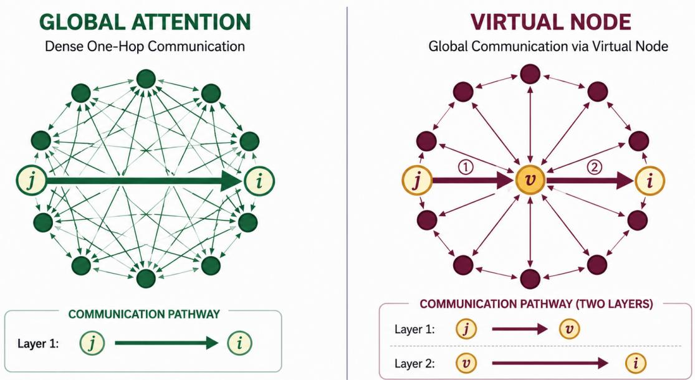  
Figure 8: Global mixing in one layer versus two. A dense propagation operator (row i full) lets node i depend on every other node $h _ { j } ^ { ( \ell ) }$ after a single application of $\mathbf { P } _ { k }$ (Proposition 5). A virtual node instead adds only a one-hop path to a shared hub. Node i reads the hub’s pre-update state, but the hub itself must first collect from every real node, so a signal from $j$ reaches i only after two propagation steps, $j  v  i$ . The same one-layer/two-layer gap holds for any support that leaves row i short of full.

## 5.7 Constraining Generated Architectures by Propagation Limits

Oversmoothing (Section 5.1), oversquashing (Section 5.2), and heterophily (Section 5.3) depend on the spectrum and topology of $\mathbf { P } _ { k } .$ , with the first two coupled through $\lambda _ { 2 }$ (Section 5.4). Expressivity (Section 5.5) depends instead on accessible structural information. Remedies therefore localize to named components (Table 5), and changing a filling, support, or schedule changes which limit binds rather than eliminating all limits. This operator-level account remains partial because node separability and feature distributions are independent axes not determined by the spectrum alone.

A generative process over $\operatorname { E q . }$ (3) (Section 4) can propose $\mathbf { P } _ { k } ^ { ( \ell ) } , \Psi _ { k } , \phi _ { \ell }$ (including $B _ { \ell } )$ , and ⊞ jointly. Before pre-training, Tables 6 and 5 support criteria that penalize a spectral-gap operating point that worsens both smoothing and squashing (Section 5.4) or favor a pass-band conditioned on expected domain homophily over a fixed low-pass response. The diagnosed limits thus constrain architecture generation, and known component-specific remedies provide generation moves.

Which limit binds is an empirical question. Section 6 relates documented benchmark evidence to the same component vocabulary without causal attribution.

## 6 Benchmark Properties in the Component Vocabulary

Section 5 characterized what a propagation operator’s spectrum and topology can and cannot do. This section records what widely used benchmark papers establish about their datasets and protocols, then translates those properties into the component vocabulary. The translation identifies where a model can respond to a documented property. It does not identify a causal bottleneck, attribute accuracy to one component, or predict the best filling.

Node-classification benchmarks. Cora, Citeseer, and Pubmed are homophilous citation networks under edge and adjusted homophily (Yang et al., 2016; Platonov et al., 2023a). This makes the topology encoded by $\mathbf { P } _ { k }$ relevant, but it does not isolate propagation from features, messages, or updates. Indeed, adjusted homophily is more comparable across class counts and class imbalance than common alternatives, while label informativeness agrees more closely with GNN performance in controlled experiments (Platonov et al., 2023a). Model rankings on these datasets also change with data splits, hyperparameters, and training procedures (Shchur et al., 2018).

Geom-GCN evaluated geometric aggregation on the Texas, Wisconsin, Cornell, Actor, Chameleon, and Squirrel suite (Pei et al., 2020). The suite cannot be treated uniformly as a clean test of heterophilous propagation because Chameleon and Squirrel contain duplicate nodes that leak across splits. Removing the duplicates changes model performance substantially (Platonov et al., 2023b). The replacement suite introduced by Platonov et al. (2023b) contains graphs with diferent structural properties, and standard GNNs almost always outperform the specialized models evaluated there. The larger LINKX datasets extend non-homophilous evaluation to substantially larger graphs and show that existing scalable and mini-batch methods can degrade in this regime (Lim et al., 2021). Within the unified equation, methods responding to these settings commonly change $\mathbf { P } _ { k } .$ , separate channels through $\kappa ,$ or separate the ego state through $\boldsymbol { B _ { \ell } }$ . The benchmarks do not isolate any one of these choices.

Benchmark collections and controlled protocols. OGB standardizes large, realistic datasets, application-specific splits, metrics, and baseline pipelines across node, link, and graph prediction (Hu et al., 2020a). Its datasets difer in domain, graph type, and task, so ogbn and ogbl do not share a single component interpretation. Their common documented challenges are scale and generalization under realistic splits. TUDataset collects more than 120 graph-classification and regression datasets with loaders, baselines, and standardized evaluation (Morris et al., 2020a). It is a dataset repository rather than a controlled test of one layer component. Benchmarking-GNNs instead fixes parameter budgets and experimental infrastructure across real and synthetic tasks. ZINC is molecular graph regression, PATTERN is graph-pattern node classification, and CLUSTER is semi-supervised clustering on stochastic-block-model graphs (Dwivedi et al., 2023a). These collections support controlled model comparison, but a comparison changes whichever components difer between the evaluated models.

Long-range and distribution-shift benchmarks. LRGB contains five graph-learning datasets selected because their task construction and graph statistics suggest dependence on long-range interactions (Dwivedi et al., 2022b). Its authors explicitly do not claim a provable long-range requirement. The relevant architectura choices include the support and reach of $\mathbf { P } _ { k } ,$ the channel structure ${ \bar { \kappa } } ,$ and depth. However, later reevaluation showed that stronger tuning can greatly reduce or eliminate the reported gap between message-passing GNNs and Graph Transformers. It also identified missing feature normalization and an erroneous link-prediction metric in the original evaluation (Tönshof et al., 2024). LRGB therefore evaluates complete model and training configurations, not oversquashing or a propagation component in isolation.

GOOD provides 11 datasets, 17 domain selections, and 51 splits that distinguish covariate, concept, and no-shift settings for node and graph prediction (Gui et al., 2022). A feature-based domain selection concerns $\mathbf { H } ^ { ( 0 ) }$ , while a structural domain selection concerns the graph information available to $\mathbf { P } _ { k }$ . Concept shift changes the input–label relationship and is not itself a layer component. The relevant entry therefore depends on how each GOOD split is constructed rather than on the benchmark name alone.

Industrial and temporal evaluation. GraphLand contributes 14 industrial node-property datasets with diverse sizes, structures, features, and realistic temporal splits (Bazhenov et al., 2025). Its experiments show that graph-augmented gradient-boosted trees can be strong baselines, particularly for regression, and that temporal shift and inductive evaluation can substantially reduce performance. These findings jointly involve input representation $\mathbf { H } ^ { ( 0 ) }$ , propagation $\mathbf { P } _ { k }$ , and evaluation conditions outside the layer equation rather than one component.

TGB provides large temporal datasets and realistic protocols for node-property and future-link prediction (Huang et al., 2023b). Performance varies substantially across datasets, and simple methods can outperform temporal graph models on dynamic node-property tasks. For dynamic link prediction, EdgeBank shows that repeated edges and easy negative samples can make a memorization baseline unexpectedly strong and can alter method rankings (Poursafaei et al., 2022). Temporal state can be represented by an extension $B ( t )$ , time-varying support by $\mathbf { P } _ { k } ( t )$ , and event messages by $\Psi _ { k }$ , while negative sampling and the prediction head remain outside the layer equation.

Table 8: Benchmark evidence in the component vocabulary. The documented design or finding column summarizes claims made by the cited benchmark papers. The component reading is our translation into Eq. (3) and does not attribute performance to a component. The symbol $\mathbf { H } ^ { ( 0 ) }$ denotes the input representation. A † marks a task head or readout, scale or sampling concern, distribution split, or temporal extension outside the seven base-layer components.
<table><tr><td rowspan=1 colspan=7>Benchmark family   Task / domain    Documented design or fnding           Component-level     Key refsreading</td></tr><tr><td rowspan=1 colspan=7>Citation networks     Citation graphs    Node classification on homophilous graphs.     $\mathbf { P } _ { k }$ encodes topology,    Yang et al., 2016;</td></tr><tr><td rowspan=2 colspan=7>(Cora, Citeseer,                            Adjusted homophily is preferable for         but no layer component Shchur et al., 2018;Pubmed; Planetoid                        cross-dataset comparison, label              is isolated              Platonov et al.,splits)                                    informativeness agrees more closely with GNN                         2023a; Luo et al.,performance, and rankings depend on splits                           2024band tuning</td></tr><tr><td rowspan=1 colspan=2></td></tr><tr><td rowspan=1 colspan=2>OGB node / link      Multiple domains</td><td rowspan=4 colspan=5>Large datasets with application-specific splits,Dataset- and           Hu et al., 2020ametrics, and standardized pipelines. Scale andtask-dependent; scale,out-of-distribution generalization are commonsplit, and predictionchallenges                                 head†</td></tr><tr><td rowspan=1 colspan=1>(ogbn, ogb1)</td><td rowspan=1 colspan=1>and tasks</td></tr><tr><td rowspan=2 colspan=1></td><td rowspan=1 colspan=1></td></tr><tr><td rowspan=1 colspan=1></td></tr><tr><td rowspan=1 colspan=1>Heterophily suite,</td><td rowspan=1 colspan=1>Node classification</td><td rowspan=5 colspan=5>Geom-GCN evaluated geometric aggregation  No reliable component  Pei et al., 2020;on this suite. Duplicate nodes in Chameleon  attribution; $\mathbf { P } _ { k } , \kappa ,$ and Platonov et al.,and Squirrel create train-test leakage and      $\scriptstyle B _ { \ell }$ are relevant design  2023bmaterially change results when removed      axes</td></tr><tr><td rowspan=1 colspan=1>legacy (Geom-GCN:</td><td rowspan=1 colspan=1></td></tr><tr><td rowspan=1 colspan=1>Texas, Wisconsin,</td><td rowspan=1 colspan=1></td><td rowspan=2 colspan=2></td></tr><tr><td rowspan=1 colspan=1>Cornell, Actor,</td><td rowspan=1 colspan=1></td></tr><tr><td rowspan=1 colspan=1>Chameleon, Squirrel)</td><td rowspan=1 colspan=1></td></tr><tr><td rowspan=1 colspan=1>Heterophily suite,</td><td rowspan=1 colspan=1>Node classification</td><td rowspan=6 colspan=5>Diverse heterophilous graphs without the      $\mathbf { P } _ { k } , \mathcal { K } , \mathcal { B } _ { \ell } ,$ and $\mathbf { H } ^ { ( 0 ) }$ are Platonov et al.,identified duplicate-node leakage. Standard   relevant but not isolated 2023b;aGNNs are strong baselines, and connectivity isbetter characterized jointly by adjustedhomophily and label informativeness</td></tr><tr><td rowspan=1 colspan=1>corrected</td><td rowspan=1 colspan=1></td></tr><tr><td rowspan=1 colspan=1>(Roman-empire,</td><td rowspan=1 colspan=1></td></tr><tr><td rowspan=1 colspan=1>Amazon-ratings,</td><td rowspan=1 colspan=1></td></tr><tr><td rowspan=1 colspan=1>Minesweeper, Tolokers,</td><td rowspan=1 colspan=1></td></tr><tr><td rowspan=1 colspan=1>Questions)</td><td rowspan=1 colspan=1></td></tr><tr><td rowspan=1 colspan=1>Large non-homophilous</td><td rowspan=1 colspan=1>Social and web</td><td rowspan=3 colspan=5>Substantially larger non-homophilous graphs.   $\mathbf { P } _ { k } , \kappa , \mathbf { H } ^ { ( 0 ) } ;$ scale and  Lim et al., 2021Existing scalable and mini-batch methods    mini-batching†degrade on these datasets</td></tr><tr><td rowspan=1 colspan=1>(LINKX datasets)</td><td rowspan=1 colspan=1>node classification</td></tr><tr><td rowspan=1 colspan=1></td><td rowspan=1 colspan=1></td></tr><tr><td rowspan=1 colspan=1>TUDataset</td><td rowspan=1 colspan=1>Graph classification</td><td rowspan=4 colspan=4>A repository with standardized loaders,baselines, and evaluation rather than acontrolled test of one architectural mechanism</td><td rowspan=4 colspan=1>Dataset-dependent;     Morris et al., 2020agraph-level readout $\rho ^ { \dagger }$ </td></tr><tr><td rowspan=1 colspan=1></td><td rowspan=1 colspan=1>and regression</td></tr><tr><td rowspan=2 colspan=1></td><td rowspan=1 colspan=1>across more than</td></tr><tr><td rowspan=1 colspan=1>120 datasets</td></tr><tr><td rowspan=1 colspan=1>Benchmarking-GNNs</td><td rowspan=1 colspan=1>Molecular</td><td rowspan=5 colspan=5>Multiple components    Dwivedi et al.,infrastructure. ZINC predicts a molecular    vary across compared   2023aproperty, PATTERN detects an embedded   models; readout $\rho ^ { \dagger }$ forgraph pattern, and CLUSTER predicts SBM ZINCcommunity labels</td></tr><tr><td rowspan=1 colspan=1>(ZINC, PATTERN,</td><td rowspan=1 colspan=1>regression and</td><td rowspan=1 colspan=3></td></tr><tr><td rowspan=1 colspan=1>CLUSTER)</td><td rowspan=1 colspan=1>synthetic node</td></tr><tr><td rowspan=2 colspan=1></td><td rowspan=1 colspan=1>classification</td></tr><tr><td rowspan=1 colspan=1></td></tr><tr><td rowspan=1 colspan=1>Long Range Graph</td><td rowspan=1 colspan=1>Molecules and</td><td rowspan=4 colspan=5>Graph and node tasks selected for evidence    $\mathbf { P } _ { k } , \kappa ,$ and stack depth†;Dwivedi et al.,suggestive of long-range dependence, not a    readout $\rho ^ { \dagger } ;$ no isolated  2022b; Tönshoffprovable requirement. Tuning closes much of oversquashing test      et al., 2024the reported GNN-Transformer gap</td></tr><tr><td rowspan=1 colspan=1>Benchmark (five</td><td rowspan=1 colspan=1>superpixel graphs</td></tr><tr><td rowspan=1 colspan=1>datasets)</td><td rowspan=1 colspan=1></td></tr><tr><td rowspan=1 colspan=1></td><td rowspan=1 colspan=1></td></tr><tr><td rowspan=1 colspan=1>Out-of-distribution</td><td rowspan=2 colspan=6>Eleven datasets and 51 splits separating       $\mathbf { H } ^ { ( 0 ) }$ for feature        Gui et al., 2022(GOOD)             graph prediction    covariate, concept, and no-shift settings acrossdomains, $\mathbf { P } _ { k }$ for17 domain selections                        structural domains;concept shift andreadout†</td></tr><tr><td rowspan=1 colspan=1>(GOOD)</td><td rowspan=1 colspan=1>graph prediction</td></tr><tr><td rowspan=1 colspan=1>GraphLand</td><td rowspan=4 colspan=6>Industrial node     Fourteen datasets with diverse features and   H(0), Pk; scalę and     Bazhenov et al.,classification and   structures, temporal splits, and inductive     temporal split†         2025regression          settings. Graph-augmented GBDTs are strongbaselines in some tasks</td></tr><tr><td rowspan=1 colspan=1></td></tr><tr><td rowspan=1 colspan=1></td></tr><tr><td rowspan=1 colspan=1></td></tr><tr><td rowspan=3 colspan=7>Temporal          Large temporal datasets with realistic         $B ( t ) , \mathbf { P } _ { k } ( t ) , \Psi _ { k } ;$          Huang et al.,Benchmark (TGB)    node-property and  protocols. Simple methods can outperform    prediction head and     2023b; Poursafaeifuture-link         temporal models, while EdgeBank exposes    negative sampling†      et al., 2022prediction          repeated-edge and negative-sampling effects</td></tr><tr><td rowspan=1 colspan=4></td></tr><tr><td rowspan=1 colspan=3></td></tr></table>

Boundaries of the component reading. Graph-level tasks require the post-stack readout $\rho ,$ while link prediction also requires a pairwise scoring head. Both lie downstream of the seven-component layer. Scale, neighborhood sampling, and mini-batching are systems and approximation choices rather than additional layer components. Sampling may approximate $\mathbf { P } _ { k }$ , and attribute-guided variants may condition that approximation on graph properties (Das et al., 2024), but the sampling algorithm is not $\mathbf { P } _ { k }$ itself. Temporal models extend the static layer through $B ( t ) , \mathbf { P } _ { k } ( t )$ , and event-dependent $\Psi _ { k }$ . Data splits, negative sampling, metrics, and training budgets remain evaluation choices. Section 7 treats graph-level readout, scalable propagation, and temporal carry as open extensions in Sections 7.7, 7.5, and 7.6.

What benchmark evidence permits component-level conclusions. First, protocol validity is logically prior to component attribution. Data splits and training choices can reverse model rankings (Shchur et al., 2018), duplicate nodes can invalidate a benchmark comparison (Platonov et al., 2023b), and missing normalization or metric errors can distort an apparent architectural gap. Basic tuning can substantiall reduce or eliminate that $\mathrm { g a p }$ (Tönshof et al., 2024). Repeated edges and negative sampling can likewise make a parameter-free memorization baseline competitive in dynamic link prediction (Poursafaei et al., 2022). Evaluation must therefore establish dataset and protocol validity before comparing models, and it must establish a fair model comparison before attributing a diference to any component.

Second, mechanistic isolation and deployment realism answer diferent questions. Controlled synthetic and semi-synthetic data can vary connectivity while holding other factors fixed, as in the experiments that separate label informativeness from homophily (Platonov et al., 2023a). Realistic benchmarks instead combine multiple sources of variation. LRGB selects real tasks whose construction and statistics suggest long-range dependence but explicitly avoids claiming a provable long-range requirement (Dwivedi et al., 2022b). OGB combines domains, scales, tasks, and application-specific splits (Hu et al., 2020a), while GraphLand’s temporal splits can jointly change feature, label, and structural distributions (Bazhenov et al., 2025). Component validation should therefore pair controlled tasks that isolate a mechanism with realistic datasets that test whether the result survives deployment-relevant variation.

Third, equal-resource comparison and best-attainable performance are distinct evaluation targets. Benchmarking-GNNs fixes parameter budgets and infrastructure to compare models under matched resources (Dwivedi et al., 2023a). By contrast, architecture-specific tuning changes rankings (Shchur et al., 2018; Tönshof et al., 2024), and tuned GCN, GAT, and GraphSAGE match or exceed recent Graph Transformers on 17 of 18 node-classification datasets studied by Luo et al. (2024b). A component study should report both a matched-resource comparison and a comparison with equal tuning efort. The former measures behavior under a common constraint, whereas the latter estimates the performance each model can attain. Neither result should be presented as the other.

Fourth, the relation between benchmark properties and components is generally many-to-many. Heterophilous node classification can involve $\mathbf { P } _ { k } , \ K , \ B _ { \ell } ,$ , and $\mathbf { H } ^ { ( 0 ) }$ . Long-range tasks involve $\mathbf { P } _ { k } , \kappa .$ stack depth, and possibly a downstream readout. Temporal prediction can involve $B ( t ) , \mathbf { P } _ { k } ( t ) , \Psi _ { k }$ , the prediction head, and negative sampling. The seven-component decomposition is useful here because it identifies the smallest interacting component set while separating external evaluation choices. It does not justify assigning each benchmark to one component. Component attribution requires changing one filling at a time while holding the remaining architecture, training budget, data split, task head, and evaluation protocol fixed. Claims about component interactions additionally require controlled factorial comparisons. Section 7.12 treats the remaining attribution problem.

## 7 Open Problems and Challenges

The preceding sections address the forward problem by representing architectures through $( \boldsymbol { \mathcal { X } } , \boldsymbol { \mathcal { K } } , \{ \mathbf { P } _ { k } \} , \{ \Psi _ { k } \} , \boxplus , \boldsymbol { \mathcal { B } } _ { \ell } , \boldsymbol { \phi } _ { \ell } )$ (Section 3) and using these components as design choices (Section 4). The inverse problem asks which fillings suit measurable dataset, task, or deployment properties, how the components should extend to new domains, and what trade-ofs result. No generally validated solution exists. Table 9 summarizes the research targets examined below. A separate thematic cluster applies the component vocabulary to surrounding systems that remain outside the formal scope of the base-layer equation.

Table 9: Open problems in graph neural network design. Each row names a problem, why it resists current methods, and what would count as progress. The slot column marks the part of the unified equation (3) (or the named extension) the problem stresses. The key-reference column gives a curated, representative subset of the citations discussed in the corresponding subsection, not the full set. Rules separate the thematic clusters.
<table><tr><td rowspan=1 colspan=15>Open problem   Why it is hard                What would count as       Slot        Key refsprogress</td></tr><tr><td rowspan=1 colspan=15>Generalization     More expressive fillings         Non-vacuous, structure-aware   $\mathbf { P } _ { k } , \Psi _ { k } , \mathbb { E } , \phi _ { \ell }$ Morris et al.,</td></tr><tr><td rowspan=1 colspan=15>beyond            provably inflate the complexity bounds naming which statistics               2024; Vasileiou</td></tr><tr><td rowspan=2 colspan=15>expressivity        term (WL classes bound        control error at a reasonable                 et al., 2025;</td></tr><tr><td rowspan=3 colspan=15>no theory ties SGD implicit    sparse unbounded-size graphs,                2025; Amranbias to generalization           and connected to scaling the                 et al., 2026;operator (Section 7.5)                        Rauchwergeret al., 2025</td></tr><tr><td rowspan=1 colspan=6></td></tr><tr><td rowspan=1 colspan=6></td></tr><tr><td rowspan=2 colspan=15>Distribution / size Failure is a shift over local      A measurable predictor of       $\mathbf { P } _ { k } , \mathcal { X }$        Yehudai et al.,structure. Causal-invariance    which statistic governs transfer               2021; Li et al.,</td></tr><tr><td rowspan=1 colspan=2>shift</td></tr><tr><td rowspan=1 colspan=2></td><td rowspan=1 colspan=2></td><td rowspan=1 colspan=3>remedies</td><td rowspan=1 colspan=8>rest on unverifiable    and validated environment-free               2025b; Loveland</td></tr><tr><td rowspan=1 colspan=15>assumptions, and rankings      causal-subgraph discovery                    et al., 2024;reverse across shift types                                                       Chen et al.,2022c; Gui et al.,2022</td></tr><tr><td rowspan=2 colspan=15>Dataset-adaptive  Homophily is sensitive to classA robust measured property     $\mathbf { P } _ { k } , \Psi _ { k } , \mathcal { X }$   You et al., 2020;count/balance and unreliable  predicting the right                          Platonov et al.,</td></tr><tr><td rowspan=1 colspan=3>slot selection</td><td rowspan=1 colspan=6></td></tr><tr><td rowspan=1 colspan=3></td><td rowspan=1 colspan=12>for model selection. Nomechanistic property-to-slot                                                    et al., 2026;map exists                                                                     Kormann et al.,2026</td></tr><tr><td rowspan=1 colspan=3>Slots as a search</td><td rowspan=1 colspan=4>Graph-NAS learns shift-fragile</td><td rowspan=2 colspan=7>Causal, data-conditioned       all sevensearch whose discovered tuple  compo-</td><td rowspan=1 colspan=1>Wang et al.,</td></tr><tr><td rowspan=1 colspan=3>space (graph</td><td rowspan=1 colspan=4>non-causal maps, is</td><td rowspan=1 colspan=6></td><td rowspan=1 colspan=1>2022b; Qin et al.,</td></tr><tr><td rowspan=1 colspan=3>neural</td><td rowspan=4 colspan=11>non-reproducible without ashared space, and useslanguage-model controllers thatlack guarantees</td><td rowspan=2 colspan=1></td></tr><tr><td rowspan=1 colspan=3>architecture</td><td rowspan=1 colspan=1>2025c; Gao et al.,</td></tr><tr><td rowspan=1 colspan=3>search,</td><td rowspan=2 colspan=1>2025</td></tr><tr><td rowspan=1 colspan=3>graph-NAS)</td></tr><tr><td rowspan=1 colspan=3>Scaling the</td><td rowspan=1 colspan=11>Whether dense attention is     A characterized                  $\mathbf { P } _ { k } , \mathcal { X }$ </td><td rowspan=1 colspan=1>Deng et al., 2024;</td></tr><tr><td rowspan=1 colspan=3>operator ${ \bf P } _ { k }$ </td><td rowspan=1 colspan=5>even needed is unproven. It is</td><td></td><td></td><td rowspan=2 colspan=4>tructured O(n) operator</td><td rowspan=1 colspan=3>ivity-efficiency frontier</td></tr><tr><td rowspan=1 colspan=3></td><td rowspan=1 colspan=6>unknown how much             and a s</td><td></td><td></td></tr><tr><td rowspan=1 colspan=3></td><td rowspan=1 colspan=8>expressivity sub-quadratic      provabl</td><td rowspan=1 colspan=3>y matching dense</td><td rowspan=1 colspan=1>2023d; Tönshoff</td></tr><tr><td rowspan=1 colspan=3></td><td rowspan=1 colspan=6>attention sacrifices,atten</td><td rowspan=2 colspan=6>attentionsparsification and condensation</td></tr><tr><td rowspan=1 colspan=3></td><td></td><td></td><td></td><td></td><td></td><td></td><td rowspan=4 colspan=1>Gupta et al.,2026</td></tr><tr><td rowspan=1 colspan=3></td><td rowspan=3 colspan=11>guarantees do not transfer, andno clean long-range benchmark</td><td rowspan=1 colspan=1></td></tr><tr><td rowspan=1 colspan=3></td><td rowspan=1 colspan=2>no cl</td></tr><tr><td rowspan=1 colspan=3></td><td rowspan=1 colspan=4></td><td rowspan=1 colspan=1>ex</td></tr><tr><td rowspan=1 colspan=3>Temporal /</td><td rowspan=2 colspan=11>Dominant temporal families    A temporal WL/counting      B(t), Pk(t), Sare incomparable, standard    ladder and a principled</td><td rowspan=1 colspan=1>ouza et al.,</td></tr><tr><td rowspan=1 colspan=3>time-indexed carry</td><td rowspan=1 colspan=6>are incomparable, standard ladder</td><td rowspan=1 colspan=1>2022; Tjandra</td></tr><tr><td rowspan=1 colspan=3>slot</td><td rowspan=1 colspan=7>messages cannot express        contin</td><td rowspan=1 colspan=4>uous-time memory</td><td rowspan=1 colspan=1>et al., 2024;</td></tr><tr><td rowspan=1 colspan=3></td><td rowspan=2 colspan=11>moving averages, and           operator with known limitscomponent-to-gain links are</td><td rowspan=1 colspan=1>with known limits</td></tr><tr><td rowspan=2 colspan=3></td><td rowspan=1 colspan=1>Li et al., 2025a;</td></tr><tr><td rowspan=1 colspan=12>untested                                                                        Tieu et al., 2025</td></tr><tr><td rowspan=1 colspan=3>Graph-level</td><td rowspan=2 colspan=12>Learned local pooling barely    A readout with a proven       readout ρ  Mesquita et al.,2020; Wanget al., 2024c; von</td></tr><tr><td rowspan=1 colspan=3>readout / pooling</td><td rowspan=1 colspan=11></td></tr><tr><td rowspan=1 colspan=3></td><td rowspan=1 colspan=4>standard benchmarks, so its</td><td rowspan=1 colspan=2>baseli</td><td></td><td></td><td rowspan=1 colspan=3>baseline on leakage-free data</td><td rowspan=1 colspan=1>Pichowski et al.,</td></tr><tr><td rowspan=1 colspan=3></td><td rowspan=1 colspan=4>value is unproven. A readout</td><td rowspan=1 colspan=2></td><td></td><td></td><td rowspan=1 colspan=3></td><td rowspan=1 colspan=1>2026; Bianchi &amp;</td></tr><tr><td rowspan=2 colspan=15>can also discard expressivitygained upstreamet al., 2019b</td></tr><tr><td rowspan=1 colspan=1>et al., 2018b; Xu</td></tr></table>

continued on next page

Table 9 – continued
<table><tr><td>Open problem</td><td>Why it is hard</td><td>What would count as progress</td><td>Slot</td><td>Key refs</td></tr><tr><td>Graph foundation models</td><td>Problems include no shared vocabulary, negative transfer from cross-domain pre-training, no predictive data-scaling law, and possible shortcuts in language-model routes</td><td>A transferable structural vocabulary, a priori compatibility prediction, and structure-grounded transfer</td><td> $\mathbf { H } ^ { ( 0 ) } , \mathcal { X } , \mathbf { P } _ { k } ,$ </td><td>Mao et al., 2024; Liu et al., 2025; Zhao et al., 2024; Tang et al., 2025; Liu et al., 2024b</td></tr><tr><td>Trustworthy GNNs</td><td>Robustness, privacy, fairness, and uncertainty are entangled through propagation. Certified robustness destroys accuracy, aggregation resists forgetting, and ensembles collapse</td><td>Architecture-aware certificates that retain clean accuracy, topology-aware debiasing, verifiable forgetting, and graph-native uncertainty quantification</td><td> ${ \bf P } _ { k }$ </td><td>Dai et al., 2024; Scholten et al., 2022; Lai et al., 2026; Dong et al., 2023; Fan et al., 2025; Vieira et al., 2026</td></tr><tr><td>Equivariance level &amp; generation</td><td>Strict equivariance cannot break input symmetry, choosing the level requires task geometry, and generation metrics reverse rankings</td><td>A way to measure task geometry and set or relax the symmetry, valid-by-construction scalable generation, and a stable metric</td><td>symmetry on  $\mathbf { P } _ { k } , \Psi _ { k }$ </td><td>Duval et al., 2023; Kaba &amp; Ravanbakhsh, 2023; Hofgard et al., 2024; Vadgama et al., 2025; O'Bray et al., 2022; Yan</td></tr><tr><td colspan="5">Broader outlook beyond the base-layer equation</td></tr><tr><td>Retrieval- grounded generation</td><td>There is no theory for selecting a subgraph or conditioning a frozen decoder through its propagation, and the retrieval target is fixed heuristically</td><td>A principled query-to-subgraph map and a propagation operator that minimizes hallucination</td><td> $\mathcal { X } , \mathbf { P } _ { k }$ </td><td>Edge et al., 2024; He et al., 2024b; Mavromatis &amp; Karypis, 2025; Luo et al., 2024a; Pan et al., 2024a; Wang et al.,</td></tr><tr><td>Personalization</td><td>Per-user conditioning under extreme sparsity and drift is difficult without retraining the operator per user, as is fusing a</td><td>Per-user adaptation surviving sparsity and drift and personalized generation rather than only ranking</td><td> $\mathbf { P } _ { k } , \Psi _ { k } , \mathcal { X }$ </td><td>2024e Ying et al., 2018a; He et al., 2020; Wu et al., 2023c; Shi et al.,</td></tr><tr><td>Graphs as a reasoning substrate</td><td>user model with a decoder The reasoning graph is hand-designed, no theory identifies which structure a task needs, and gains are not attributable to a task property</td><td>Task-inferred reasoning topology and a measured link from structure to reasoning quality</td><td>χ, Pk, 田</td><td>2025 Besta et al., 2024; Wang et al., 2023a; 2026b</td></tr><tr><td>Language agents as graphs</td><td>Propagation carries language rather than vectors, with no expressivity ladder and no credit assignment over agent edges</td><td>A task-to-communication-graph map with assignable credit over an optimized topology</td><td> $\mathbf { P } _ { k } , \Psi _ { k } , \mathcal { X }$ </td><td>Zhuge et al., 2024; Zhang et al., 2025a; Qian et al., 2025</td></tr><tr><td>The model as a graph (metanetworks)</td><td>Permutation-correct weight-space operators are shown only on small networks, and scaling to edit-relevant</td><td>A symmetry-correct  ${ \bf P } _ { k }$  over weights that edits or generates parameters at scale</td><td> $\mathbf { P } _ { k } , \Psi _ { k } , \mathcal { X }$ </td><td>Kofinas et al., 2024; Lim et al., 2024</td></tr><tr><td>Evaluation crisis (meta)</td><td>Gains evaporate under fair tuning. Other problems include benchmark leakage, easy-negative and metric artifacts, molecule-dominated datasets, and a possible collapse of Family 3 (Spectral) into Family 1 (Spatial) for</td><td>Leakage-free, shift-aware, application-grounded benchmarks with non-accuracy metrics</td><td>all seven compo- nents (attribu- tion)</td><td>Bechler-Speicher et al., 2025; Errica et al., 2020; Platonov et al., 2023b; Luo et al., 2024b; Huang et al., 2023b; Jiang</td></tr></table>

## 7.1 Generalization and optimization theory beyond expressivity

Open question. Is there a joint, non-vacuous, structure-aware theory that predicts performance and, in slot terms, says which fillers buy task-useful expressivity without paying the complexity penalty?

The Weisfeiler–Leman and counting ladder in Section 5.5 characterizes what message passing and higher-order extensions can distinguish, but not how trained GNNs generalize. Morris et al. (2024) therefore call for a theory combining expressivity, generalization, and the optimization dynamics of stochastic first-order training. Existing VC-dimension, Rademacher-complexity, PAC-Bayes, and covering-number bounds are often vacuous and do not identify the structural statistics governing out-of-sample error (Vasileiou et al., 2025). Carrasco et al. (2025) show that the number of WL-coloring equivalence classes upper-bounds Rademacher complexity. Thus, enriching $\mathbf { P } _ { k }$ , Ψ<sub>k</sub>, ⊞, or $\phi _ { \ell }$ to gain expressivity inflates the complexity term in these worst-case bounds. For sparse, unbounded-size graphs, Amran et al. (2026) establish equicontinuity of message maps under the graphop metric, extending prior limit-based guarantees beyond dense or bounded-size graphs. Whether these bounds are tight enough to guide slot selection remains open.

This worst-case inflation is not fundamental. Rauchwerger et al. (2025) construct a hierarchical-optimaltransport pseudometric under which message passers are Lipschitz, 1-WL-separating, and defined on a relatively compact space, yielding both a Stone–Weierstrass universal-approximation result and distributionfree generalization bounds. However, this result covers one metric and does not determine which arbitrary slot fillings admit coexistence rather than an inflating Rademacher bound. It is also unknown whether the guarantee survives replacing a dense $\mathbf { P } _ { k }$ with a cheaper operator, linking the problem to Section 7.5.

## 7.2 Distribution shift and size generalization

Open question. Which structural statistics measurably control transfer across graphs of diferent size or local structure?

Distribution shift sharpens this gap. Yehudai et al. (2021) formalize size generalization through local “d-patterns” and prove that zero-training-loss solutions can fail on larger graphs, with gradient descent empirically converging to them. The failure therefore reflects a shift in local structure rather than a capacity limit. On biological graphs, Li et al. (2025b) attribute degradation at 2–10× larger sizes to spectral diferences induced by subgraph patterns such as average cycle length, although this account has not been established beyond that domain. Global homophily is likewise unreliable because local homophily varies within a graph (Loveland et al., 2024). Recovering an environment-invariant causal subgraph (Chen et al., 2022c) relies on structural-causal-model assumptions challenged by Xu et al. (2024), while method rankings reverse between covariate and concept shift (Gui et al., 2022). The slot-level problem is therefore to identify which $\mathbf { P } _ { k }$ and receptive-field domain X remain invariant across relevant shift types, including size-induced spectral change.

## 7.3 Dataset-adaptive slot selection and the fragility of homophily

Open question. How can the distribution of task-relevant information across a dataset be characterized statistically?

No principled map connects measured graph properties to slot choices, and homophily is too fragile to provide one. You et al. (2020) search a ∼315K-design space and transfer designs using task similarity, but the design–task relation remains empirical. Standard homophily measures depend on class count and balance and are not comparable across datasets (Platonov et al., 2023a; Mironov & Prokhorenkova, 2025). Adjusted homophily restores comparability, while label informativeness tracks GNN performance more closely. Under proper tuning, traditional homophily metrics remain unreliable for model selection (Luan et al., 2026; Wang et al., 2024a). A data-centric account instead attributes degradation to under-informative receptive fields rather than smoothing itself (Kormann et al., 2026). Their information distribution is precisely what a selection map for $\mathbf { P } _ { k } , \Psi _ { k } $ , and X must characterize.

## 7.4 Automated and causal architecture generation over the slot search space

Open question. Can the unified equation, as a structured search space, be searched reproducibly, in a way that generalizes under shift and is conditioned on data properties rather than spurious correlations?

The unified equation defines a structured search space. Automated graph learning still lacks tractable graph-specific spaces, scalable search, and a principled map from data properties to architectures (Wang et al., 2022b). Without a shared space, graph neural architecture search (graph-NAS) results are not comparable, and preferred architectures are dataset-specific (Qin et al., 2022). Graph-NAS can also learn non-causal, distribution-specific graph–architecture correlations that fail under shift. Causal-subgraph conditioning addresses this failure but leaves environment-free selection open (Li et al., 2025c). Language-model controllers can adapt search from problem and space descriptions, but provide no correctness or optimality guarantees and remain limited by coverage and search cost (Gao et al., 2025). What is missing is a causal, data-conditioned, and language-steerable search procedure over the full tuple $( \boldsymbol { \mathcal { X } } , \boldsymbol { \mathcal { K } } , \{ \mathbf { P } _ { k } \} , \{ \Psi _ { k } \} , \boxplus , \boldsymbol { \mathcal { B } } _ { \ell } , \boldsymbol { \mathcal { P } } _ { \ell } )$ that generalizes under shift.

## 7.5 Scaling the propagation operator and the cost of global attention

Open question. Is dense, quadratic all-pairs attention necessary to capture global context, or can a structured sub-quadratic operator match it within an $O ( n )$ budget?

Scaling a fixed architecture raises an expressivity–eficiency problem primarily at ${ \bf P } _ { k }$ . Polynomial linear attention and global convolution reduce cost, with the latter reporting a 169× speedup over optimized dense attention on a two-million-node synthetic graph, but neither characterizes the expressivity sacrificed by linearity (Deng et al., 2024; Sancak et al., 2025). Million-node training also requires model–system co-design, so asymptotic complexity understates practical cost (Zhang et al., 2024). No universal sparsifier exists, and distance-preserving sparsifiers can harm downstream GNNs (Chen et al., 2023d). Graph condensation compresses $\mathcal { X }$ but can require model-dependent full-graph training (Gupta et al., 2026), and no scalable method dominates the accuracy–eficiency frontier (Duan et al., 2022). Ofline propagation improves throughput but cannot adapt to inference-time input (Liao et al., 2025). Moreover, fair message-passing tuning largely closes the Long Range Graph Benchmark gap, leaving the need for global $\mathbf { P } _ { k }$ unestablished (Tönshof et al., 2024). The open problem is whether dense all-pairs coupling is necessary and, if so, which sub-quadratic operator preserves its useful expressivity. Compression of X is a secondary axis.

## 7.6 Temporal graphs and the carry slot as a memory operator

Open question. What is the temporal analogue of the static expressivity ladder, what is the right continuous-time form for $B ( t )$ , and which temporal ingredients earn their cost?

The static carry slot $\boldsymbol { B _ { \ell } }$ in Eq. (3) seeds an update from $\mathbf { H } ^ { ( \ell ) }$ and $\mathbf { H } ^ { ( 0 ) }$ . Dynamic graphs require a timeindexed memory operator $B ( t )$ that retains and selectively forgets information across irregular events. The temporal problem is therefore an under-specified slot rather than a missing one. Walk-aggregating and memory-based temporal GNNs are mutually incomparable, and neither computes girth under a tempora WL analogue (Souza et al., 2022). Standard temporal messages also lose event source and target identity, preventing persistent forecasting and moving-average representation. Restoring that identity recovers the capability in one architecture but is not standard across temporal-GNN families (Tjandra et al., 2024). Strong temporal link prediction may require neither recurrent memory nor self-attention, leaving component-level attribution unresolved (Cong et al., 2023). Selective continuous-time state-space memory keyed by inter-event gaps provides one candidate (Li et al., 2025a). However, spatial-temporal distribution shift also requires $B ( t )$ to specify which temporal structure remains invariant (Tieu et al., 2025). The seven-component tuple remains intact over time, with $\mathbf { P } _ { k } ( t )$ carrying time-varying support, Ψ $\Psi _ { k }$ preserving event identity, and $B _ { \ell }$ generalizing to $B ( t )$

## 7.7 Graph-level readout as the missing pooling slot

Open question. Does a learned pooling operator help at all?

The seven-component equation updates node states but does not include the permutation-invariant readout $\rho$ that maps the final node-state multiset to a graph vector. Its hierarchical counterpart $\mathbf { Q } _ { \ell }$ coarsens the graph between layers (Section 3). Both discard node-level structure, so pooling benchmarks test $\mathbf { Q } _ { \ell }$ while the same expressivity concern applies to $\rho .$ Replacing learned local pooling with random assignments or complement-graph clustering barely changes standard graph-classification accuracy (Mesquita et al., 2020). Across 17 pooling methods and 28 datasets, no method consistently dominates and unpooled baselines match most of them (Wang et al., 2024c). Feature–topology mismatch explains these marginal or inconsistent gains (von Pichowski et al., 2026).

A readout can discard expressivity gained through $\Psi _ { k }$ and $\phi _ { \ell } .$ . Bianchi & Lachi (2023) provide suficient preservation conditions, but not an operator that also outperforms global summation. Diferentiable soft clustering (Ying et al., 2018b) and the injective sum readout that reaches 1-WL with injective aggregation (Xu et al., 2019b) bracket the design space. Closing this gap needs an expressivity-preserving readout that beats a tuned global-sum baseline on leakage-free data. Because $\rho$ lies downstream of the seven layer components, Section 6 correctly marks graph classification as out-of-slot.

## 7.8 The missing transferable vocabulary for graph foundation models

Open question. Which slot fillings should be shared versus adapted across domains?

A versatile graph foundation model requires shared primitives that transfer across feature- and structureheterogeneous graphs, together with positive transfer and predictable data scaling (Mao et al., 2024). Open challenges include structural alignment, semantic heterogeneity, scalable pre-training, and trustworthy evaluation (Liu et al., 2025; Wang et al., 2025d). A unified text-attributed feature and label space currently covers only classification on text-rich graphs (Liu et al., 2024b). Cross-domain pre-training can cause negative transfer, and compatibility cannot yet be predicted a priori (Zhao et al., 2024). Structural augmentation provides initial evidence of cross-domain data scaling but not a predictive scaling model (Tang et al., 2025). Graph–language alignment may also exploit shortcuts rather than genuine structural transfer (Tang et al., 2024; Pan et al., 2024b), paralleling Section 7.11.3. The required vocabulary spans $\mathbf { H } ^ { ( 0 ) } , \mathcal { X } , \mathbf { P } _ { k }$ , and $\Psi _ { k }$

## 7.9 Trustworthy GNNs and entanglement through the propagation slot

Open question. Why does trustworthy graph learning resist any per-axis fix?

Message passing propagates sensitive attributes, adversarial perturbations, and structural bias through the same operator. Privacy, robustness, fairness, uncertainty, and accuracy therefore interact rather than forming independent axes (Dai et al., 2024). A single adversarial edge can afect an entire receptive field, while neighboring attributes leak and heterophily may amplify or mask the efect (Zhu et al., 2022). Gray-box message-interception certificates exploiting $\mathbf { P } _ { k }$ are tighter than conservative black-box certificates (Scholten et al., 2022), yet randomized smoothing can require enough noise to collapse clean accuracy (Lai et al., 2026). Propagation also amplifies sensitive-attribute correlations (Dong et al., 2023), and recursive aggregation retains deleted information through neighbors, obstructing unlearning (Fan et al., 2025). Deep ensembles provide little benefit because independently trained GNNs can undergo epistemic collapse (Vieira et al., 2026). The resulting targets are architecture-aware certification, topology-aware debiasing, verifiable forgetting, and graph-native uncertainty quantification.

## 7.10 Equivariance level and symmetry relaxation

Open question. Which symmetry constraint should $\mathbf { P } _ { k }$ and $\Psi _ { k }$ sati $\operatorname { f y } ,$ and when should it be relaxed?

Geometric GNNs span a spectrum of symmetry constraints, leaving an expressivity–scalability–symmetry trade-of (Duval et al., 2023). Because an equivariant function cannot break an input’s symmetry, exact equivariance cannot select among symmetry-equivalent outcomes (Kaba & Ravanbakhsh, 2023). Learnable relaxation for $E ( 3 )$ GNNs provides one candidate filler (Hofgard et al., 2024). At matched capacity in convolutional image networks, equivariance helps only when aligned with task geometry, and reference-frame symmetry breaking can improve performance (Vadgama et al., 2025). This finding has not been tested directly for graphs.

Graph generation. Permutation-invariant difusion models are harder to train than non-invariant models whose target distributions have fewer modes, although post-hoc permutation can recover invariance (Yan et al., 2024). Evaluation metrics are themselves unstable and can reverse model rankings (O’Bray et al., 2022). What remains is a valid-by-construction, scalable generator and a stable metric. At the slot level, task geometry must determine symmetry constraints on $\mathbf { P } _ { k }$ and $\Psi _ { k }$ that guarantee equivariance without preventing the distinction of symmetry-inequivalent configurations.

## 7.11 Broader Outlook Beyond the Base-Layer Equation

The following questions concern systems surrounding a graph layer. We use the component vocabulary to locate their graph-side design choices, but the seven-component equation does not represent the complete decoder, retrieval pipeline, or multi-agent controller.

## 7.11.1 Subgraph selection and propagation for retrieval-grounded generation

Open question. Which subgraph should be retrieved, and how should its propagation condition the decoder, when neither the retrieval target nor the coupling has a theory yet?

Graph retrieval-augmented generation inserts a graph operator between a corpus and a frozen language model to ground generation in explicit structure (Han et al., 2024; Peng et al., 2025). Community-structured indexing improves corpus-global queries but fixes graph granularity (Edge et al., 2024). Question-specific subgraph retrieval with propagated embeddings (He et al., 2024b) and GNN reasoning over dense subgraphs with verbalized paths (Mavromatis & Karypis, 2025) likewise choose the retrieved domain X heuristically. Agentic methods instead let an LLM beam-search knowledge-graph relations (Sun et al., 2024b) or select tools while updating memory (Jiang et al., 2025). However, prompting or supervised imitation still fixes the exploration policy rather than learning an operator jointly with the decoder. Faithful, interpretable knowledge-graph grounding remains the target (Luo et al., 2024a; Pan et al., 2024a; Wang et al., 2024e). The unresolved slot-level problem is joint query-conditioned selection of X and $\mathbf { P } _ { k }$ to minimize hallucination for a fixed decoder.

## 7.11.2 Personalization by conditioning the operator on the individual

Open question. How can per-user conditioning be done under extreme sparsity and drift without retraining the operator per user?

Personalization conditions propagation on user profiles and interactions, commonly represented by a user–item graph (Wang et al., 2023c). Web-scale graph convolution (Ying et al., 2018a) and minimal neighborhood aggregation for collaborative filtering (He et al., 2020) still learn one shared operator and derive personalization from static user embeddings. This design struggles with cold starts, preference drift, and mismatch between a fixed operator and non-stationary X (Wu et al., 2023c). Language-model personalization further requires fusing user representations with a decoder so that generation, not only ranking, is personalized (Zhang et al., 2025c). Collaborative-filtering retrieval can condition generation on a user’s history and those of similar users, but the fusion remains retrieval-mediated rather than co-designed with the decoder (Shi et al., 2025). The open task is a user-conditioned $\mathbf { P } _ { k }$ and $\Psi _ { k }$ over X that survive sparsity and drift while supporting personalized generation.

## 7.11.3 Graphs as a reasoning substrate for language models

Open question. What theory would determine which structure a given task actually needs?

A graph over a language model’s intermediate states can structure multi-step reasoning, but its topology is usually hand-designed. Graph-of-thought methods generalize chain and tree prompting through aggregation and refinement, yet user-specified topology prevents attributing gains to measured task properties (Besta et al., 2024). Performance also degrades with graph-problem size (Wang et al., 2023a), and genuine reasoning remains hard to distinguish from shortcut exploitation (Wang et al., 2026b). This calls for a task-inferred domain X and propagation topology $\mathbf { P } _ { k }$ , with intermediate states mixed by ⊞ into $\widetilde { \bf H }$ and measurable structure–quality links.

## 7.11.4 Language agents as optimizable graphs

Open question. What principled map takes a task to a communication graph, together with credit assignment over it?

In graph-structured agent systems, nodes are operations and edges are message channels. Jointly optimizing prompts and edges remains empirical and does not explain which topology a task requires or why an edge helps (Zhuge et al., 2024). A variational graph auto-encoder can instead generate task-adaptive communication topology (Zhang et al., 2025a). A reported collaborative scaling law finds logistic performance growth with agent count and an advantage for irregular, small-world topologies over regular ones (Qian et al., 2025). Yet propagation carries language rather than vectors, leaving no expressivity ladder or account of when denser routing earns its cost. The open target is a task-conditioned $\mathbf { P } _ { k }$ and $\Psi _ { k }$ over the operation domain X with assignable credit.

## 7.11.5 Editing and generating networks by treating the model as a graph

Open question. What permutation-correct operator can edit, merge, or generate weights while scaling to large models?

Representing neurons as nodes and weights as edges lets a GNN read and write another model’s parameters. Existing operators respect neuron-permutation symmetry and process diverse architectures (Kofinas et al., 2024; Lim et al., 2024), but are demonstrated only on small networks. This applies Section 7.10 to a

weight-space domain X and leaves unresolved whether symmetry supplies useful structure at scale or merely constrains capacity. Progress here needs $\mathbf { P } _ { k }$ and $\Psi _ { k }$ over weights that support symmetry-correct parameter editing and generation at language-model scale.

## 7.12 The evaluation crisis and whether progress can be measured

Open question. Can reported gains be reliably attributed to a specific slot filling, rather than to tuning efort, benchmark leakage, or metric artifacts?

Section 6 shows that protocol validity, fair model comparison, and component attribution are separate requirements. The open problem is to turn that hierarchy into an evaluation design that isolates one filling while preserving realistic data and equal tuning efort. Existing benchmarks also overrepresent small molecules and marginal accuracy, which limits application-grounded and foundation-model evaluation (Bechler-Speicher et al., 2025). Structure-agnostic baselines match or exceed GNNs on several graph-classification benchmarks (Errica et al., 2020), while self-explainable GNNs lack formal faithfulness guarantees (Azzolin et al., 2025). Standard fidelity and sparsity metrics do not test recovery of causal variables, motivating an out-of-distribution-generalization score as a causal-validity proxy (Zhang et al., 2026a).

Progress therefore requires leakage-free, shift-aware, application-grounded comparisons that vary one component or a specified interaction while controlling the remaining architecture and evaluation pipeline. The concern also reaches the taxonomy. Spectral propagation may not be theoretically distinct from spatial message passing for node classification (Jiang et al., 2026). If this critique holds broadly, Family 3 (Spectral) collapses into Family 1 (Spatial) for that setting, requiring a task-conditional taxonomy or a distinction beyond eigenspace representability.

## 8 Conclusion

Graph neural network architectures have multiplied faster than the language used to compare them. We unify covered graph neural layers through seven components consisting of an update domain, channel set, propagation bank, per-channel message maps, channel-mixing operator, ego/residual map, and update map. Function-valued fillings allow the same equation to express local message passing, attention, spectral filtering, global communication, relation-specific channels, higher-order domains, and geometric messages. The mixing operator ⊞ is a component, while He denotes only its output. Worked reductions of four canonical layers and representative fillings across all seven families make this coverage checkable.

The equation defines a unified component system. Equivalent factorizations remain possible, while the slot discipline provides consistent assignments for component-level analysis. Under this discipline, difering components identify where the framework records architectural diferences. Functional equivalence additionally requires agreement among the internal mechanisms and component interactions that determine the resulting inductive bias. The seven primary-axis families are therefore nonexclusive and remain distinct from reusable operations and problem settings.

The unified system supports analysis as well as comparison. Under endpoint-local messages and nodelocal updates, operator support bounds one-layer dependencies and yields a necessary full-row condition for one-layer global mixing. In the linear additive regime, raw channel count is non-identifiable, whereas minimum Kronecker channel rank is invariant. These attribution and identifiability results depend on explicitly separating the propagation bank, messages, channels, mixing, and update. More broadly, spectra and topological properties of $\mathbf { P } _ { k }$ connect propagation to oversmoothing, oversquashing, heterophilic failure, and expressivity limits. The same vocabulary identifies which component a remedy changes, translates documented benchmark evidence descriptively into component choices, and exposes structured combinations for architecture generation. These generated architectures provide formally specified candidates for empirica evaluation.

The contribution establishes representation and component-level analysis, while selecting the best filling for a dataset remains an empirical inverse problem. Establishing a validated map from measurable graph and task properties to component choices requires controlled evidence and robust descriptors, particularly because common statistics such as homophily are fragile. The unified equation, families, and comparison tables provide a shared language for pursuing that problem and for stating exactly what a new layer changes.

## References

Sami Abu-El-Haija, Bryan Perozzi, Amol Kapoor, Nazanin Alipourfard, Kristina Lerman, Hrayr Harutyunyan, Greg Ver Steeg, and Aram Galstyan. MixHop: Higher-order graph convolutional architectures via sparsified neighborhood mixing. In Proceedings of the 36th International Conference on Machine Learning, volume 97 of Proceedings of Machine Learning Research, pp. 21–29. PMLR, 2019. URL https://proceedings.mlr. press/v97/abu-el-haija19a.html.

Sami Abu-El-Haija, Amol Kapoor, Bryan Perozzi, and Joonseok Lee. N-GCN: Multi-scale graph convolution for semi-supervised node classification. In Proceedings of The 35th Uncertainty in Artificial Intelligence Conference, volume 115 of Proceedings of Machine Learning Research, pp. 841–851. PMLR, 2020. URL https://proceedings.mlr.press/v115/abu-el-haija20a.html.

Uri Alon and Eran Yahav. On the bottleneck of graph neural networks and its practical implications. In International Conference on Learning Representations, 2021. URL https://openreview.net/forum?id= i80OPhOCVH2.

Ofek Amran, Tom Gilat, and Ron Levie. A graphop analysis of graph neural networks on sparse graphs: Generalization and universal approximation. In International Conference on Machine Learning, 2026. URL https://arxiv.org/abs/2602.08785. Accepted at ICML 2026 (co-author-confirmed); PMLR proceedings volume/pages not yet assigned.

Brandon M. Anderson, Truong-Son Hy, and Risi Kondor. Cormorant: Covariant molecular neural networks. In Advances in Neural Information Processing Systems, volume 32, pp. 14510–14519, 2019. URL https: //proceedings.neurips.cc/paper/2019/hash/03573b32b2746e6e8ca98b9123f2249b-Abstract.html.

Adrián Arnaiz-Rodríguez and Federico Errica. Oversmoothing, “oversquashing”, heterophily, long-range, and more: Demystifying common beliefs in graph machine learning. In International Conference on Learning Representations, 2026. URL https://openreview.net/forum?id=Q3MisVkuTu.

James Atwood and Don Towsley. Difusion-convolutional neural networks. In Advances in Neural Information Processing Systems, volume 29, pp. 1993–2001, 2016. URL https://proceedings.neurips.cc/paper/ 6212-diffusion-convolutional-neural-networks.

Sarp Aykent and Tian Xia. SaVeNet: A scalable vector network for enhanced molecular representation learning. In Advances in Neural Information Processing Systems, volume 36, pp. 42932–42949, 2023. doi: 10.52202/075280-1860. URL https://doi.org/10.52202/075280-1860.

Sarp Aykent and Tian Xia. GotenNet: Rethinking eficient 3D equivariant graph neural networks. In International Conference on Learning Representations, 2025. URL https://proceedings.iclr.cc/ paper\_files/paper/2025/hash/64d4ff4fff788cdffe236f9ce8b09400-Abstract-Conference.html.

Steve Azzolin, Sagar Malhotra, Andrea Passerini, and Stefano Teso. Beyond topological self-explainable GNNs: A formal explainability perspective. In Proceedings of the 42nd International Conference on Machine Learning, volume 267 of Proceedings of Machine Learning Research, pp. 2045–2080. PMLR, 2025. URL https://proceedings.mlr.press/v267/azzolin25a.html.

Muhammet Balcilar, Pierre Héroux, Benoit Gaüzère, Pascal Vasseur, Sébastien Adam, and Paul Honeine. Breaking the limits of message passing graph neural networks. In Proceedings of the 38th International Conference on Machine Learning, volume 139 of Proceedings of Machine Learning Research, pp. 599–608. PMLR, 2021a. URL https://proceedings.mlr.press/v139/balcilar21a.html.

Muhammet Balcilar, Guillaume Renton, Pierre Héroux, Benoit Gaüzère, Sébastien Adam, and Paul Honeine. Analyzing the expressive power of graph neural networks in a spectral perspective. In International Conference on Learning Representations, 2021b. URL https://openreview.net/forum?id=-qh0M9XWxnv.

Guy Bar-Shalom, Beatrice Bevilacqua, and Haggai Maron. Subgraphormer: Unifying subgraph GNNs and graph transformers via graph products. In Proceedings of the 41st International Conference on Machine Learning, volume 235 of Proceedings of Machine Learning Research, pp. 2959–2989. PMLR, 2024. URL https://proceedings.mlr.press/v235/bar-shalom24a.html.

Pablo Barceló, Floris Geerts, Juan L. Reutter, and Maksimilian Ryschkov. Graph neural networks with local graph parameters. In Advances in Neural Information Processing Systems, volume 34, pp. 25280–25293, 2021. URL https://proceedings.neurips.cc/paper/2021/hash/ d4d8d1ac7e00e9105775a6b660dd3cbb-Abstract.html.

Ilyes Batatia, Dávid Péter Kovács, Gregor N. C. Simm, Christoph Ortner, and Gábor Csányi. MACE: Higher order equivariant message passing neural networks for fast and accurate force fields. In Advances in Neural Information Processing Systems, volume 35, pp. 11423–11436, 2022. URL https://proceedings.neurips.cc/paper\_files/paper/2022/hash/ 4a36c3c51af11ed9f34615b81edb5bbc-Abstract-Conference.html.

Peter W. Battaglia, Jessica B. Hamrick, Victor Bapst, Alvaro Sanchez-Gonzalez, Vinicius Zambaldi, Mateusz Malinowski, Andrea Tacchetti, David Raposo, Adam Santoro, Ryan Faulkner, Caglar Gulcehre, Francis Song, Andrew Ballard, Justin Gilmer, George Dahl, Ashish Vaswani, Kelsey Allen, Charles Nash, Victoria Langston, Chris Dyer, Nicolas Heess, Daan Wierstra, Pushmeet Kohli, Matt Botvinick, Oriol Vinyals, Yujia Li, and Razvan Pascanu. Relational inductive biases, deep learning, and graph networks. CoRR, abs/1806.01261, 2018. URL https://arxiv.org/abs/1806.01261.

Simon Batzner, Albert Musaelian, Lixin Sun, Mario Geiger, Jonathan P. Mailoa, Mordechai Kornbluth, Nicola Molinari, Tess E. Smidt, and Boris Kozinsky. E(3)-equivariant graph neural networks for dataeficient and accurate interatomic potentials. Nature Communications, 13(1):2453, 2022. doi: 10.1038/ s41467-022-29939-5. URL https://doi.org/10.1038/s41467-022-29939-5.

Gleb Bazhenov, Oleg Platonov, and Liudmila Prokhorenkova. GraphLand: Evaluating graph machine learning models on diverse industrial data. In Advances in Neural Information Processing Systems, volume 38, 2025. URL https://papers.nips.cc/paper\_files/paper/2025/hash/ 8f54de761abc405145d8b4df8bef3f18-Abstract-Datasets\_and\_Benchmarks\_Track.html. Datasets and Benchmarks Track.

Dominique Beaini, Saro Passaro, Vincent Létourneau, William L. Hamilton, Gabriele Corso, and Pietro Liò. Directional graph networks. In Proceedings of the 38th International Conference on Machine Learning, volume 139 of Proceedings of Machine Learning Research, pp. 748–758. PMLR, 2021. URL https://proceedings.mlr.press/v139/beaini21a.html.

Maya Bechler-Speicher, Ben Finkelshtein, Fabrizio Frasca, Luis Müller, Jan Tönshof, Antoine Siraudin, Viktor Zaverkin, Michael M. Bronstein, Mathias Niepert, Bryan Perozzi, Mikhail Galkin, and Christopher Morris. Position: Graph learning will lose relevance due to poor benchmarks. In Proceedings of the 42nd International Conference on Machine Learning, volume 267 of Proceedings of Machine Learning Research, pp. 81067–81089. PMLR, 2025. URL https://proceedings.mlr.press/v267/bechler-speicher25a.html.

Erik J. Bekkers, Sharvaree Vadgama, Rob D. Hesselink, Putri A. van der Linden, and David W. Romero. Fast, expressive SE(n) equivariant networks through weight-sharing in position-orientation space. In International Conference on Learning Representations, 2024. URL https://openreview.net/forum?id=dPHLbUqGbr.

Maciej Besta, Nils Blach, Ales Kubicek, Robert Gerstenberger, Michał Podstawski, Lukas Gianinazzi, Joanna Gajda, Tomasz Lehmann, Hubert Niewiadomski, Piotr Nyczyk, and Torsten Hoefler. Graph of Thoughts: Solving elaborate problems with large language models. In Proceedings of the AAAI Conference on Artificial Intelligence, volume 38, pp. 17682–17690, 2024. doi: 10.1609/aaai.v38i16.29720. URL https://ojs.aaai.org/index.php/AAAI/article/view/29720.

Beatrice Bevilacqua, Fabrizio Frasca, Derek Lim, Balasubramaniam Srinivasan, Chen Cai, Gopinath Balamurugan, Michael M. Bronstein, and Haggai Maron. Equivariant subgraph aggregation networks. In International Conference on Learning Representations, 2022. URL https://openreview.net/forum?id=dFbKQaRk15w.

Filippo Maria Bianchi and Veronica Lachi. The expressive power of pooling in graph neural networks. In Advances in Neural Information Processing Systems, volume 36, pp. 71603–71618, 2023. doi: 10.52202/075280-3135. URL https://proceedings.neurips.cc/paper\_files/paper/2023/hash/ e26f31de8b13ec569bf507e6ae2cd952-Abstract-Conference.html.

Filippo Maria Bianchi, Daniele Grattarola, and Cesare Alippi. Spectral clustering with graph neural networks for graph pooling. In Proceedings of the 37th International Conference on Machine Learning, volume 119 of Proceedings of Machine Learning Research, pp. 874–883. PMLR, 2020. URL https: //proceedings.mlr.press/v119/bianchi20a.html.

Mitchell Black, Zhengchao Wan, Amir Nayyeri, and Yusu Wang. Understanding oversquashing in GNNs through the lens of efective resistance. In Proceedings of the 40th International Conference on Machine Learning, volume 202 of Proceedings of Machine Learning Research, pp. 2528–2547. PMLR, 23–29 Jul 2023. URL https://proceedings.mlr.press/v202/black23a.html.

Hugh Blayney, Álvaro Arroyo, Xiaowen Dong, and Michael M. Bronstein. gLSTM: Mitigating over-squashing by increasing storage capacity. In International Conference on Learning Representations, 2026. URL https://openreview.net/forum?id=c4mXEOXlAL.

Deyu Bo, Xiao Wang, Chuan Shi, and Huawei Shen. Beyond low-frequency information in graph convolutiona networks. In Proceedings of the AAAI Conference on Artificial Intelligence, volume 35, pp. 3950–3957, 2021. doi: 10.1609/aaai.v35i5.16514. URL https://ojs.aaai.org/index.php/AAAI/article/view/16514.

Deyu Bo, Chuan Shi, Lele Wang, and Renjie Liao. Specformer: Spectral graph neural networks meet transformers. In International Conference on Learning Representations, 2023. URL https://openreview. net/forum?id=0pdSt3oyJa1.

Cristian Bodnar, Fabrizio Frasca, Nina Otter, Yuguang Wang, Pietro Liò, Guido F. Montúfar, and Michael M. Bronstein. Weisfeiler and Lehman go cellular: CW networks. In Advances in Neural Information Processing Systems, volume 34, pp. 2625–2640, 2021a. URL https://proceedings.neurips.cc/paper/2021/hash/ 157792e4abb490f99dbd738483e0d2d4-Abstract.html.

Cristian Bodnar, Fabrizio Frasca, Yuguang Wang, Nina Otter, Guido F. Montúfar, Pietro Liò, and Michael M. Bronstein. Weisfeiler and Lehman go topological: Message passing simplicial networks. In Proceedings of the 38th International Conference on Machine Learning, volume 139 of Proceedings of Machine Learning Research, pp. 1026–1037. PMLR, 2021b. URL https://proceedings.mlr.press/v139/bodnar21a.html.

Cristian Bodnar, Francesco Di Giovanni, Benjamin Paul Chamberlain, Pietro Liò, and Michael M. Bronstein. Neural sheaf difusion: A topological perspective on heterophily and oversmoothing in GNNs. In Advances in Neural Information Processing Systems, volume 35, pp. 18527–18541, 2022. URL https://proceedings.neurips.cc/paper\_files/paper/2022/hash 75c45fca2aa416ada062b26cc4fb7641-Abstract-Conference.html.

Giorgos Bouritsas, Fabrizio Frasca, Stefanos Zafeiriou, and Michael M. Bronstein. Improving graph neural network expressivity via subgraph isomorphism counting. IEEE Transactions on Pattern Analysis and Machine Intelligence, 45(1):657–668, 2023. doi: 10.1109/TPAMI.2022.3154319.

Johannes Brandstetter, Rob Hesselink, Elise van der Pol, Erik J. Bekkers, and Max Welling. Geometric and physical quantities improve E(3) equivariant message passing. In International Conference on Learning Representations, 2022. URL https://openreview.net/forum?id=\_xwr8gOBeV1.

Xavier Bresson and Thomas Laurent. Residual gated graph ConvNets. CoRR, abs/1711.07553, 2017. URL https://arxiv.org/abs/1711.07553.

Shaked Brody, Uri Alon, and Eran Yahav. How attentive are graph attention networks? In International Conference on Learning Representations, 2022. URL https://openreview.net/forum?id=F72ximsx7C1.

Michael M. Bronstein, Joan Bruna, Taco Cohen, and Petar Veličković. Geometric deep learning: Grids, groups, graphs, geodesics, and gauges, 2021. URL https://arxiv.org/abs/2104.13478. arXiv preprint arXiv:2104.13478.

Joan Bruna, Wojciech Zaremba, Arthur Szlam, and Yann LeCun. Spectral networks and locally connected networks on graphs. In International Conference on Learning Representations, 2014. URL https: //arxiv.org/abs/1312.6203.

Dan Busbridge, Dane Sherburn, Pietro Cavallo, and Nils Y. Hammerla. Relational graph attention networks. CoRR, abs/1904.05811, 2019. URL https://arxiv.org/abs/1904.05811.

Chen Cai and Yusu Wang. A note on over-smoothing for graph neural networks, 2020. URL https: //arxiv.org/abs/2006.13318. Presented at the ICML 2020 Workshop on Graph Representation Learning and Beyond.

Chen Cai, Truong Son Hy, Rose Yu, and Yusu Wang. On the connection between MPNN and graph transformer. In Proceedings of the 40th International Conference on Machine Learning, volume 202 of Proceedings of Machine Learning Research, pp. 3408–3430. PMLR, 2023. URL https://proceedings.mlr. press/v202/cai23b.html.

Tianle Cai, Shengjie Luo, Keyulu Xu, Di He, Tie-Yan Liu, and Liwei Wang. GraphNorm: A principled approach to accelerating graph neural network training. In Proceedings of the 38th International Conference on Machine Learning, volume 139 of Proceedings of Machine Learning Research, pp. 1204–1215. PMLR, 2021. URL https://proceedings.mlr.press/v139/cai21e.html.

Martin Carrasco, Caio F. Deberaldini Netto, Vahan A. Martirosyan, Ehimare Okoyomon, and Caterina Graziani. On the Rademacher complexity of graph neural networks: Unifying expressivity and geometry, 2025. URL https://arxiv.org/abs/2510.10101. NeurIPS 2025 Workshop on New Perspectives in Advancing Graph Machine Learning.

Benjamin Paul Chamberlain, James Rowbottom, Davide Eynard, Francesco Di Giovanni, Xiaowen Dong, and Michael M. Bronstein. Beltrami flow and neural difusion on graphs. In Advances in Neural Information Processing Systems, volume 34, pp. 1594–1609, 2021a. URL https://proceedings.neurips.cc/paper/ 2021/hash/0cbed40c0d920b94126eaf5e707be1f5-Abstract.html.

Benjamin Paul Chamberlain, James Rowbottom, Maria I. Gorinova, Michael M. Bronstein, Stefan Webb, and Emanuele Rossi. GRAND: Graph neural difusion. In Proceedings of the 38th International Conference on Machine Learning, volume 139 of Proceedings of Machine Learning Research, pp. 1407–1418. PMLR, 2021b. URL https://proceedings.mlr.press/v139/chamberlain21a.html.

Ines Chami, Sami Abu-El-Haija, Bryan Perozzi, Christopher Ré, and Kevin Murphy. Machine learning on graphs: A model and comprehensive taxonomy. Journal of Machine Learning Research, 23(89):1–64, 2022. URL https://jmlr.org/papers/v23/20-852.html.

Sudhanshu Chanpuriya and Cameron Musco. Simplified graph convolution with heterophily. In Advances in Neural Information Processing Systems, volume 35, pp. 27184– 27197, 2022. URL https://proceedings.neurips.cc/paper\_files/paper/2022/hash/ ae07d152c51ea2ddae65aa7192eb5ff7-Abstract-Conference.html.

Deli Chen, Yankai Lin, Wei Li, Peng Li, Jie Zhou, and Xu Sun. Measuring and relieving the over-smoothing problem for graph neural networks from the topological view. In Proceedings of the AAAI Conference on Artificial Intelligence, volume 34, pp. 3438–3445, 2020a. doi: 10.1609/aaai.v34i04.5747. URL https: //ojs.aaai.org/index.php/AAAI/article/view/5747.

Dexiong Chen, Leslie O’Bray, and Karsten Borgwardt. Structure-aware transformer for graph representation learning. In Proceedings of the 39th International Conference on Machine Learning, volume 162 of Proceedings of Machine Learning Research, pp. 3469–3489. PMLR, 2022a. URL https://proceedings. mlr.press/v162/chen22r.html.

Dexiong Chen, Till Hendrik Schulz, and Karsten Borgwardt. Learning long range dependencies on graphs via random walks. In International Conference on Learning Representations, 2025a. URL https://proceedings.iclr.cc/paper\_files/paper/2025/hash/ f039f5b34b2c2ae27808cf2a01ac3306-Abstract-Conference.html.

Jianfei Chen, Jun Zhu, and Le Song. Stochastic training of graph convolutional networks with variance reduction. In Proceedings of the 35th International Conference on Machine Learning, volume 80 of

Proceedings of Machine Learning Research, pp. 942–950. PMLR, 2018a. URL https://proceedings.mlr. press/v80/chen18p.html.

Jie Chen, Tengfei Ma, and Cao Xiao. FastGCN: Fast learning with graph convolutional networks via importance sampling. In International Conference on Learning Representations, 2018b. URL https: //openreview.net/forum?id=rytstxWAW.

Jie Chen, Shouzhen Chen, Mingyuan Bai, Jian Pu, Junping Zhang, and Junbin Gao. Graph decoupling attention Markov networks for semisupervised graph node classification. IEEE Transactions on Neural Networks and Learning Systems, 34(12):9859–9873, 2023a. doi: 10.1109/TNNLS.2022.3161453. URL https://ieeexplore.ieee.org/document/9744550.

Jie Chen, Zilong Li, Yin Zhu, Junping Zhang, and Jian Pu. From node interaction to hop interaction: New efective and scalable graph learning paradigm. In Proceedings of the IEEE/CVF Conference on Computer Vision and Pattern Recognition, pp. 7876–7885, 2023b. doi: 10.1109/ CVPR52729.2023.00761. URL https://openaccess.thecvf.com/content/CVPR2023/html/Chen\_From\_ Node\_Interaction\_To\_Hop\_Interaction\_New\_Effective\_and\_Scalable\_CVPR\_2023\_paper.html.

Jinsong Chen, Kaiyuan Gao, Gaichao Li, and Kun He. NAGphormer: A tokenized graph transformer for node classification in large graphs. In International Conference on Learning Representations, 2023c. URL https://openreview.net/forum?id=8KYeilT3Ow.

Jinsong Chen, Hanpeng Liu, John E. Hopcroft, and Kun He. Leveraging contrastive learning for enhanced node representations in tokenized graph transformers. In Advances in Neural Information Processing Systems, volume 37, pp. 85824–85845, 2024. doi: 10.52202/079017-2725. URL https://proceedings.neurips.cc/ paper\_files/paper/2024/hash/9be39b35906526b8d240056daac72c6f-Abstract-Conference.html.

Jinsong Chen, Chenyang Li, Gaichao Li, John E. Hopcroft, and Kun He. Rethinking tokenized graph Transformers for node classification. In Advances in Neural Information Processing Systems, volume 38, 2025b. URL https://openreview.net/forum?id=ofBqR4l0TD.

Ming Chen, Zhewei Wei, Zengfeng Huang, Bolin Ding, and Yaliang Li. Simple and deep graph convolutional networks. In Proceedings of the 37th International Conference on Machine Learning, volume 119 of Proceedings of Machine Learning Research, pp. 1725–1735. PMLR, 2020b. URL https://proceedings. mlr.press/v119/chen20v.html.

Qi Chen, Yifei Wang, Yisen Wang, Jiansheng Yang, and Zhouchen Lin. Optimization-induced graph implicit nonlinear difusion. In Proceedings of the 39th International Conference on Machine Learning, volume 162 of Proceedings of Machine Learning Research, pp. 3648–3661. PMLR, 2022b. URL https: //proceedings.mlr.press/v162/chen22z.html.

Yongqiang Chen, Yonggang Zhang, Yatao Bian, Han Yang, Kaili Ma, Binghui Xie, Tongliang Liu, Bo Han, and James Cheng. Learning causally invariant representations for out-of-distribution generalization on graphs. In Advances in Neural Information Processing Systems, volume 35, pp. 22131–22148, 2022c. URL https://proceedings.neurips.cc/paper\_files/paper/2022/hash/ 8b21a7ea42cbcd1c29a7a88c444cce45-Abstract-Conference.html.

Yuhan Chen, Haojie Ye, Sanketh Vedula, Alex Bronstein, Ronald Dreslinski, Trevor Mudge, and Nishil Talati. Demystifying graph sparsification algorithms in graph properties preservation. Proceedings of the VLDB Endowment, 17(3):427–440, 2023d. doi: 10.14778/3632093.3632106.

Zhengdao Chen, Soledad Villar, Lei Chen, and Joan Bruna. On the equivalence between graph isomorphism testing and function approximation with GNNs. In Advances in Neural Information Processing Systems, volume 32, pp. 15868–15876, 2019. URL https://proceedings.neurips.cc/paper/2019/hash/ 71ee911dd06428a96c143a0b135041a4-Abstract.html.

Zhengdao Chen, Lei Chen, Soledad Villar, and Joan Bruna. Can graph neural networks count substructures? In Advances in Neural Information Processing Systems, volume 33,

pp. 10383–10395, 2020c. URL https://proceedings.neurips.cc/paper\_files/paper/2020/hash/ 75877cb75154206c4e65e76b88a12712-Abstract.html.

Ziang Chen, Zhengjiang Lin, Shi Chen, Yury Polyanskiy, and Philippe Rigollet. Residual connections provably mitigate oversmoothing in graph neural networks, 2025c. URL https://arxiv.org/abs/2501.00762.

Wei-Lin Chiang, Xuanqing Liu, Si Si, Yang Li, Samy Bengio, and Cho-Jui Hsieh. Cluster-GCN: An eficient algorithm for training deep and large graph convolutional networks. In Proceedings of the 25th ACM SIGKDD International Conference on Knowledge Discovery and Data Mining, pp. 257–266. ACM, 2019. doi: 10.1145/3292500.3330925. URL https://dl.acm.org/doi/10.1145/3292500.3330925.

Eli Chien, Jianhao Peng, Pan Li, and Olgica Milenkovic. Adaptive universal generalized PageRank graph neural network. In International Conference on Learning Representations, 2021. URL https://openreview. net/forum?id=n6jl7fLxrP.

Eli Chien, Chao Pan, Jianhao Peng, and Olgica Milenkovic. You are AllSet: A multiset function framework for hypergraph neural networks. In International Conference on Learning Representations, 2022. URL https://openreview.net/forum?id=hpBTIv2uy\_E.

Jeongwhan Choi, Seoyoung Hong, Noseong Park, and Sung-Bae Cho. GREAD: Graph neural reactiondifusion networks. In Proceedings of the 40th International Conference on Machine Learning, volume 202 of Proceedings of Machine Learning Research, pp. 5722–5747. PMLR, 2023. URL https://proceedings. mlr.press/v202/choi23a.html.

Krzysztof Choromanski, Han Lin, Haoxian Chen, Tianyi Zhang, Arijit Sehanobish, Valerii Likhosherstov, Jack Parker-Holder, Tamas Sarlos, Adrian Weller, and Thomas Weingarten. From block-Toeplitz matrices to diferential equations on graphs: Towards a general theory for scalable masked Transformers. In Proceedings of the 39th International Conference on Machine Learning, volume 162 of Proceedings of Machine Learning Research, pp. 3962–3983. PMLR, 2022. URL https://proceedings.mlr.press/v162/choromanski22a. html.

Fan R. K. Chung. Spectral Graph Theory. Number 92 in CBMS Regional Conference Series in Mathematics. American Mathematical Society, 1997.

Weilin Cong, Si Zhang, Jian Kang, Baichuan Yuan, Hao Wu, Xin Zhou, Hanghang Tong, and Mehrdad Mahdavi. Do we really need complicated model architectures for temporal networks? In International Conference on Learning Representations, 2023. URL https://openreview.net/forum?id=ayPPc0SyLv1.

Gabriele Corso, Luca Cavalleri, Dominique Beaini, Pietro Liò, and Petar Veličković. Principal neighbourhood aggregation for graph nets. In Advances in Neural Information Processing Systems, volume 33, pp. 13260–13271, 2020. URL https://proceedings.neurips.cc/paper/2020/hash/ 99cad265a1768cc2dd013f0e740300ae-Abstract.html.

Leonardo Cotta, Christopher Morris, and Bruno Ribeiro. Reconstruction for powerful graph representations. In Advances in Neural Information Processing Systems, volume 34, pp. 1713–1726, 2021. URL https: //proceedings.neurips.cc/paper/2021/hash/0d8080853a54f8985276b0130266a657-Abstract.html.

Enyan Dai, Tianxiang Zhao, Huaisheng Zhu, Junjie Xu, Zhimeng Guo, Hui Liu, Jiliang Tang, and Suhang Wang. A comprehensive survey on trustworthy graph neural networks: Privacy, robustness, fairness, and explainability. Machine Intelligence Research, 21(6):1011–1061, 2024. doi: 10.1007/s11633-024-1510-8.

Siddhartha Shankar Das, S. M. Ferdous, Mahantesh M. Halappanavar, Edoardo Serra, and Alex Pothen. AGS-GNN: Attribute-guided sampling for graph neural networks. In Proceedings of the 30th ACM SIGKDD Conference on Knowledge Discovery and Data Mining, pp. 538–549. ACM, 2024. doi: 10.1145/3637528. 3671940. URL https://doi.org/10.1145/3637528.3671940.

Michaël Deferrard, Xavier Bresson, and Pierre Vandergheynst. Convolutional neural networks on graphs with fast localized spectral filtering. In Advances in Neural Information Processing Systems, volume 29, pp. 3837–3845, 2016. URL https://proceedings.neurips.cc/paper/2016/hash/ 04df4d434d481c5bb723be1b6df1ee65-Abstract.html.

Chenhui Deng, Zichao Yue, and Zhiru Zhang. Polynormer: Polynomial-expressive graph Transformer in linear time. In International Conference on Learning Representations, 2024. URL https://openreview. /f ? d h 1L NfX .

Yushun Dong, Jing Ma, Song Wang, Chen Chen, and Jundong Li. Fairness in graph mining: A survey. IEEE Transactions on Knowledge and Data Engineering, 35(10):10583–10602, 2023. doi: 10.1109/TKDE.2023. 3265598.

Lin Du, Lu Bai, Jincheng Li, Lixin Cui, Hangyuan Du, Lichi Zhang, Yuting Chen, and Zhao Li. LGAN: An eficient high-order graph neural network via the line graph aggregation. In Proceedings of the AAAI Conference on Artificial Intelligence, volume 40, pp. 20914–20922, 2026. doi: 10.1609/aaai.v40i25.39232. URL https://ojs.aaai.org/index.php/AAAI/article/view/39232.

Lun Du, Xiaozhou Shi, Qiang Fu, Xiaojun Ma, Hengyu Liu, Shi Han, and Dongmei Zhang. GBK-GNN: Gated bi-kernel graph neural networks for modeling both homophily and heterophily. In Proceedings of the ACM Web Conference 2022, pp. 1550–1558. ACM, 2022. doi: 10.1145/3485447.3512201. URL https://dl.acm.org/doi/10.1145/3485447.3512201.

Keyu Duan, Zirui Liu, Peihao Wang, Wenqing Zheng, Kaixiong Zhou, Tianlong Chen, Xia Hu, and Zhangyang Wang. A comprehensive study on large-scale graph training: Benchmarking and rethinking. In Advances in Neural Information Processing Systems, volume 35, pp. 5376–5389, 2022. URL https://proceedings.neurips.cc/paper\_files/paper/2022/hash/ 23ee05bf1f4ade71c0f8f5ca722df601-Abstract-Datasets\_and\_Benchmarks.html. Datasets and Benchmarks Track.

Rui Duan, Mingjian Guang, Junli Wang, Chungang Yan, Hongda Qi, Wenkang Su, Can Tian, and Haoran Yang. Unifying homophily and heterophily for spectral graph neural networks via triple filter ensembles. In Advances in Neural Information Processing Systems, volume 37, pp. 93540–93567, 2024. doi: 10.52202/079017-2966. URL https://proceedings.neurips.cc/paper\_files/paper/2024/hash/ a9db2b121c3517fd559ecbe5038701ee-Abstract-Conference.html.

Alexandre Duval, Simon V. Mathis, Chaitanya K. Joshi, Victor Schmidt, Santiago Miret, Fragkiskos D. Malliaros, Taco Cohen, Pietro Liò, Yoshua Bengio, and Michael M. Bronstein. A hitchhiker’s guide to geometric GNNs for 3D atomic systems, 2023. URL https://arxiv.org/abs/2312.07511.

David K. Duvenaud, Dougal Maclaurin, Jorge Aguilera-Iparraguirre, Rafael Gómez-Bombarelli, Timothy Hirzel, Alán Aspuru-Guzik, and Ryan P. Adams. Convolutional networks on graphs for learning molecular fingerprints. In Advances in Neural Information Processing Systems, volume 28, pp. 2224–2232, 2015. URL https://arxiv.org/abs/1509.09292.

Vijay Prakash Dwivedi and Xavier Bresson. A generalization of Transformer networks to graphs. In AAAI Workshop on Deep Learning on Graphs: Methods and Applications, 2021. URL https://arxiv.org/abs/ 2012.09699. Workshop paper; not AAAI main proceedings.

Vijay Prakash Dwivedi, Anh Tuan Luu, Thomas Laurent, Yoshua Bengio, and Xavier Bresson. Graph neural networks with learnable structural and positional representations. In International Conference on Learning Representations, 2022a. URL https://openreview.net/forum?id=wTTjnvGphYj.

Vijay Prakash Dwivedi, Ladislav Rampášek, Mikhail Galkin, Ali Parviz, Guy Wolf, Anh Tuan Luu, and Dominique Beaini. Long range graph benchmark. In Advances in Neural Information Processing Systems, volume 35, pp. 22326–22340, 2022b. doi: 10.52202/068431-1622. URL https://proceedings.neurips. cc/paper\_files/paper/2022/hash/8c3c666820ea055a77726d66fc7d447f-Abstract-Datasets\_and\_ Benchmarks.html. Datasets and Benchmarks Track.

Vijay Prakash Dwivedi, Chaitanya K. Joshi, Anh Tuan Luu, Thomas Laurent, Yoshua Bengio, and Xavier Bresson. Benchmarking graph neural networks. Journal of Machine Learning Research, 24(43):1–48, 2023a. URL https://jmlr.org/papers/v24/22-0567.html.

Vijay Prakash Dwivedi, Yozen Liu, Anh Tuan Luu, Xavier Bresson, Neil Shah, and Tong Zhao. Graph transformers for large graphs. CoRR, abs/2312.11109, 2023b. URL https://arxiv.org/abs/2312.11109.

Darren Edge, Ha Trinh, Newman Cheng, Joshua Bradley, Alex Chao, Apurva Mody, Steven Truitt, Dasha Metropolitansky, Robert Osazuwa Ness, and Jonathan Larson. From local to global: A Graph RAG approach to query-focused summarization, 2024. URL https://arxiv.org/abs/2404.16130.

Moshe Eliasof, Lars Ruthotto, and Eran Treister. Improving graph neural networks with learnable propagation operators. In Proceedings of the 40th International Conference on Machine Learning, volume 202 of Proceedings of Machine Learning Research, pp. 9224–9245. PMLR, 2023. URL https://proceedings.mlr. press/v202/eliasof23b.html.

Federico Errica, Marco Podda, Davide Bacciu, and Alessio Micheli. A fair comparison of graph neural networks for graph classification. In International Conference on Learning Representations, 2020. URL https://openreview.net/forum?id=HygDF6NFPB.

Federico Errica, Henrik Christiansen, Viktor Zaverkin, Takashi Maruyama, Mathias Niepert, and Francesco Alesiani. Adaptive message passing: A general framework to mitigate oversmoothing, oversquashing, and underreaching. In Proceedings of the 42nd International Conference on Machine Learning, volume 267 of Proceedings of Machine Learning Research, pp. 15490–15515. PMLR, 2025. URL https://proceedings. mlr.press/v267/errica25a.html.

Bowen Fan, Yuming Ai, Xunkai Li, Zhilin Guo, Lei Zhu, Guang Zeng, Rong-Hua Li, and Guoren Wang. OpenGU: A comprehensive benchmark for graph unlearning. In Advances in Neural Information Processing Systems, volume 38, 2025. URL https://proceedings.neurips.cc/paper\_files/paper/2025/hash/ 45d7dc2e7d8db0dbc13a88a4d6c08c5a-Abstract-Datasets\_and\_Benchmarks\_Track.html. Datasets and Benchmarks Track.

Yifan Feng, Haoxuan You, Zizhao Zhang, Rongrong Ji, and Yue Gao. Hypergraph neural networks. In Proceedings of the AAAI Conference on Artificial Intelligence, volume 33, pp. 3558–3565, 2019. doi: 10.1609/aaai.v33i01.33013558. URL https://ojs.aaai.org/index.php/AAAI/article/view/4235.

Ben Finkelshtein, Xingyue Huang, Michael M. Bronstein, and İsmail İlkan Ceylan. Cooperative graph neural networks. In Proceedings of the 41st International Conference on Machine Learning, volume 235 of Proceedings of Machine Learning Research, pp. 13633–13659. PMLR, 2024. URL https://proceedings. mlr.press/v235/finkelshtein24a.html.

Fabrizio Frasca, Emanuele Rossi, Davide Eynard, Benjamin Paul Chamberlain, Michael M. Bronstein, and Federico Monti. SIGN: Scalable inception graph neural networks. CoRR, abs/2004.11198, 2020. URL https://arxiv.org/abs/2004.11198. Presented at the ICML 2020 Workshop on Graph Representation Learning and Beyond.

Fabrizio Frasca, Beatrice Bevilacqua, Michael M. Bronstein, and Haggai Maron. Understanding and extending subgraph GNNs by rethinking their symmetries. In Advances in Neural Information Processing Systems, volume 35, pp. 31376–31390, 2022. doi: 10.52202/068431-2275. URL https://proceedings.neurips.cc/ paper\_files/paper/2022/hash/cb2a4cc70db72ea779abd01107782c7b-Abstract-Conference.html.

Dongqi Fu, Zhigang Hua, Yan Xie, Jin Fang, Si Zhang, Kaan Sancak, Hao Wu, Andrey Malevich, Jingrui He, and Bo Long. VCR-Graphormer: A mini-batch graph transformer via virtual connections. In International Conference on Learning Representations, 2024. URL https://proceedings.iclr.cc/ paper\_files/paper/2024/hash/cb7943be26bb34f036c7e4068c490903-Abstract-Conference.html.

Xinyu Fu, Jiani Zhang, Ziqiao Meng, and Irwin King. MAGNN: Metapath aggregated graph neural network for heterogeneous graph embedding. In Proceedings of The Web Conference 2020, pp. 2331–2341. ACM, 2020. doi: 10.1145/3366423.3380297. URL https://dl.acm.org/doi/10.1145/3366423.3380297.

Fabian B. Fuchs, Daniel E. Worrall, Volker Fischer, and Max Welling. SE(3)-transformers: 3D roto-translation equivariant attention networks. In Advances in Neural Information Processing Systems, volume 33, pp. 1970–1981, 2020. URL https://proceedings.neurips.cc/paper/2020/hash 15231a7ce4ba789d13b722cc5c955834-Abstract.html.

Jingchu Gai, Yiheng Du, Bohang Zhang, Haggai Maron, and Liwei Wang. Homomorphism expressivity of spectral invariant graph neural networks. In International Conference on Learning Representations, 2025. URL https://openreview.net/forum?id=rdv6yeMFpn.

Hongyang Gao and Shuiwang Ji. Graph U-Nets. In Proceedings of the 36th International Conference on Machine Learning, volume 97 of Proceedings of Machine Learning Research, pp. 2083–2092. PMLR, 2019. URL https://proceedings.mlr.press/v97/gao19a.html.

Jianliang Gao, Jun Gao, Xiaoting Ying, Mingming Lu, and Jian-Xin Wang. Higher-order interaction goes neural: A substructure assembling graph attention network for graph classification. IEEE Transactions on Knowledge and Data Engineering, 35(2):1594–1608, 2023. doi: 10.1109/TKDE.2021.3105544. URL https://doi.org/10.1109/TKDE.2021.3105544.

Yang Gao, Hong Yang, Yizhi Chen, Junxian Wu, Peng Zhang, and Haishuai Wang. LLM4GNAS: A large language model based toolkit for graph neural architecture search, 2025. URL https://arxiv.org/abs/ 2502.10459.

Vikas K. Garg, Stefanie Jegelka, and Tommi S. Jaakkola. Generalization and representational limits of graph neural networks. In Proceedings of the 37th International Conference on Machine Learning, volume 119 of Proceedings of Machine Learning Research, pp. 3419–3430. PMLR, 2020. URL https: //proceedings.mlr.press/v119/garg20c.html.

Johannes Gasteiger, Aleksandar Bojchevski, and Stephan Günnemann. Predict then propagate: Graph neural networks meet personalized PageRank. In International Conference on Learning Representations, 2019a. URL https://openreview.net/forum?id=H1gL-2A9Ym.

Johannes Gasteiger, Stefan Weißenberger, and Stephan Günnemann. Difusion improves graph learning. In Advances in Neural Information Processing Systems, volume 32, pp. 13333–13345, 2019b. URL https: //proceedings.neurips.cc/paper/2019/hash/23c894276a2c5a16470e6a31f4618d73-Abstract.html.

Johannes Gasteiger, Janek Groß, and Stephan Günnemann. Directional message passing for molecular graphs. In International Conference on Learning Representations, 2020. URL https://openreview.net/forum? id=B1eWbxStPH.

Johannes Gasteiger, Florian Becker, and Stephan Günnemann. GemNet: Universal directional graph neural networks for molecules. In Advances in Neural Information Processing Systems, volume 34, pp. 6790–6802, 2021. URL https://proceedings.neurips.cc/paper/2021/hash/ 35cf8659cfcb13224cbd47863a34fc58-Abstract.html.

Simon Geisler, Yujia Li, Daniel J. Mankowitz, Ali Taylan Cemgil, Stephan Günnemann, and Cosmin Paduraru. Transformers meet directed graphs. In Proceedings of the 40th International Conference on Machine Learning, volume 202 of Proceedings of Machine Learning Research, pp. 11144–11172. PMLR, 2023. URL https://proceedings.mlr.press/v202/geisler23a.html.

Simon Geisler, Arthur Kosmala, Daniel Herbst, and Stephan Günnemann. Spatio-spectral graph neural networks. In Advances in Neural Information Processing Systems, volume 37, pp. 49022–49080, 2024. doi: 10.52202/079017-1554. URL https://papers.neurips.cc/paper\_files/paper/2024/hash/ 580c4ec4738ff61d5862a122cdf139b6-Abstract-Conference.html.

Justin Gilmer, Samuel S. Schoenholz, Patrick F. Riley, Oriol Vinyals, and George E. Dahl. Neural message passing for quantum chemistry. In Proceedings of the 34th International Conference on Machine Learning, volume 70 of Proceedings of Machine Learning Research, pp. 1263–1272. PMLR, 2017. URL https: //proceedings.mlr.press/v70/gilmer17a.html.

Francesco Di Giovanni, Lorenzo Giusti, Federico Barbero, Giulia Luise, Pietro Liò, and Michael M. Bronstein. On over-squashing in message passing neural networks: The impact of width, depth, and topology. In Proceedings of the 40th International Conference on Machine Learning, volume 202 of Proceedings of Machine Learning Research, pp. 7865–7885. PMLR, 2023a. URL https://proceedings.mlr.press/v202/ di-giovanni23a.html.

Francesco Di Giovanni, James Rowbottom, Benjamin P. Chamberlain, Thomas Markovich, and Michael M. Bronstein. Understanding convolution on graphs via energies. Transactions on Machine Learning Research, 2023b. URL https://openreview.net/forum?id=v5ew3FPTgb.

Francesco Di Giovanni, T. Konstantin Rusch, Michael M. Bronstein, Andreea Deac, Marc Lackenby, Siddhartha Mishra, and Petar Veličković. How does over-squashing afect the power of GNNs? Transactions on Machine Learning Research, 2024. URL https://openreview.net/forum?id=KJRoQvRWNs.

Jhony H. Giraldo, Konstantinos Skianis, Thierry Bouwmans, and Fragkiskos D. Malliaros. On the trade-of between over-smoothing and over-squashing in deep graph neural networks. In Proceedings of the 32nd ACM International Conference on Information and Knowledge Management, pp. 566–576. ACM, 2023. doi: 10.1145/3583780.3614997.

Shiqi Gong, Qi Meng, Jue Zhang, Huilin Qu, Congqiao Li, Sitian Qian, Weitao Du, Zhi-Ming Ma, and Tie-Yan Liu. An eficient Lorentz equivariant graph neural network for jet tagging. Journal of High Energy Physics, 2022(7):30, 2022. doi: 10.1007/JHEP07(2022)030. URL https://doi.org/10.1007/JHEP07(2022)030.

Fangda Gu, Heng Chang, Wenwu Zhu, Somayeh Sojoudi, and Laurent El Ghaoui. Implicit graph neural networks. In Advances in Neural Information Processing Systems, volume 33, pp. 11984–11995, 2020. URL https://proceedings.neurips.cc/paper/2020/hash/ 8b5c8441a8ff8e151b191c53c1842a38-Abstract.html.

Shurui Gui, Xiner Li, Limei Wang, and Shuiwang Ji. GOOD: A graph out-of-distribution benchmark. In Advances in Neural Information Processing Systems, volume 35, pp. 2059–2073, 2022. doi: 10.52202/068431-0150. URL https://proceedings.neurips.cc/paper\_files/paper/2022/hash/ 0dc91de822b71c66a7f54fa121d8cbb9-Abstract-Datasets\_and\_Benchmarks.html. Datasets and Benchmarks Track.

Jingwei Guo, Kaizhu Huang, Xinping Yi, Zixian Su, and Rui Zhang. Rethinking spectral graph neural networks with spatially adaptive filtering, 2024. URL https://arxiv.org/abs/2401.09071.

Yuhe Guo and Zhewei Wei. Graph neural networks with learnable and optimal polynomial bases. In Proceedings of the 40th International Conference on Machine Learning, volume 202 of Proceedings of Machine Learning Research, pp. 12077–12097. PMLR, 2023. URL https://proceedings.mlr.press/v202/guo23i.html.

Mridul Gupta, Samyak Jain, Vansh Ramani, Hariprasad Kodamana, and Sayan Ranu. Position: Graph condensation needs a reset — move beyond full-dataset training and model-dependence. In Proceedings of the 43rd International Conference on Machine Learning, Proceedings of Machine Learning Research. PMLR, 2026. URL https://arxiv.org/abs/2605.18893.

Benjamin Gutteridge, Xiaowen Dong, Michael M. Bronstein, and Francesco Di Giovanni. DRew: Dynamically rewired message passing with delay. In Proceedings of the 40th International Conference on Machine Learning, volume 202 of Proceedings of Machine Learning Research, pp. 12252–12267. PMLR, 2023. URL https://proceedings.mlr.press/v202/gutteridge23a.html.

Mojtaba Haghighatlari, Jie Li, Xingyi Guan, Oufan Zhang, Akshaya Das, Christopher J. Stein, Farnaz Heidar-Zadeh, Meili Liu, Martin Head-Gordon, Luke Bertels, Hongxia Hao, Itai Leven, and Teresa Head-Gordon. NewtonNet: A newtonian message passing network for deep learning of interatomic potentials and forces. Digital Discovery, 1(3):333–343, 2022. doi: 10.1039/D2DD00008C. URL https: //doi.org/10.1039/D2DD00008C.

William L. Hamilton. Graph Representation Learning, volume 14 of Synthesis Lectures on Artificial Intelligence and Machine Learning. Morgan & Claypool, 2020. doi: 10.2200/S01045ED1V01Y202009AIM046.

William L. Hamilton, Rex Ying, and Jure Leskovec. Inductive representation learning on large graphs. In Advances in Neural Information Processing Systems, volume 30, pp. 1024–1034, 2017. URL https: //papers.nips.cc/paper/2017/hash/5dd9db5e033da9c6fb5ba83c7a7ebea9-Abstract.html.

Haoyu Han, Yu Wang, Harry Shomer, Kai Guo, Jiayuan Ding, Yongjia Lei, Mahantesh Halappanavar, Ryan A. Rossi, Subhabrata Mukherjee, Xianfeng Tang, Qi He, Zhigang Hua, Bo Long, Tong Zhao, Neil Shah, Amin Javari, Yinglong Xia, and Jiliang Tang. Retrieval-augmented generation with graphs (GraphRAG), 2024. URL https://arxiv.org/abs/2501.00309.

Ali Hariri, Álvaro Arroyo, Alessio Gravina, Moshe Eliasof, Carola-Bibiane Schönlieb, Davide Bacciu, Xiaowen Dong, Kamyar Azizzadenesheli, and Pierre Vandergheynst. Return of ChebNet: Understanding and improving an overlooked GNN on long range tasks. In Advances in Neural Information Processing Systems, volume 38, pp. 136166–136196, 2025. URL https://proceedings.neurips.cc/paper\_files/paper/ 2025/hash/c6de943558fe0b1bf4ea8f09fbcede44-Abstract-Conference.html.

Dongxiao He, Chundong Liang, Huixin Liu, Mingxiang Wen, Pengfei Jiao, and Zhiyong Feng. Block modeling-guided graph convolutional neural networks. In Proceedings of the AAAI Conference on Artificial Intelligence, volume 36, pp. 4022–4029, 2022a. doi: 10.1609/aaai.v36i4.20319. URL https://ojs.aaai. org/index.php/AAAI/article/view/20319.

Mingguo He, Zhewei Wei, Zengfeng Huang, and Hongteng Xu. BernNet: Learning arbitrary graph spectral filters via Bernstein approximation. In Advances in Neural Information Processing Systems, volume 34, pp. 14239–14251, 2021. URL https://proceedings.neurips.cc/paper/2021/hash/ 76f1cfd7754a6e4fc3281bcccb3d0902-Abstract.html.

Mingguo He, Zhewei Wei, and Ji-Rong Wen. Convolutional neural networks on graphs with Chebyshev approximation, revisited. In Advances in Neural Information Processing Systems, volume 35, pp. 7264–7276, 2022b. doi: 10.52202/068431-0527. URL https://proceedings.neurips.cc/paper\_files/paper/2022/ hash/2f9b3ee2bcea04b327c09d7e3145bd1e-Abstract-Conference.html.

Tiantian He, Yang Liu, Yew-Soon Ong, Xiaohu Wu, and Xin Luo. Polarized message-passing in graph neural networks. Artificial Intelligence, 331:104129, 2024a. doi: 10.1016/j.artint.2024.104129. URL https://doi.org/10.1016/j.artint.2024.104129.

Xiangnan He, Kuan Deng, Xiang Wang, Yan Li, Yongdong Zhang, and Meng Wang. LightGCN: Simplifying and powering graph convolution network for recommendation. In Proceedings of the 43rd International ACM SIGIR Conference on Research and Development in Information Retrieval, pp. 639–648. ACM, 2020. doi: 10.1145/3397271.3401063. URL https://dl.acm.org/doi/10.1145/3397271.3401063.

Xiaoxin He, Bryan Hooi, Thomas Laurent, Adam Perold, Yann LeCun, and Xavier Bresson. A generalization of ViT/MLP-mixer to graphs. In Proceedings of the 40th International Conference on Machine Learning, volume 202 of Proceedings of Machine Learning Research, pp. 12724–12745. PMLR, 2023. URL https: //proceedings.mlr.press/v202/he23a.html.

Xiaoxin He, Yijun Tian, Yifei Sun, Nitesh V. Chawla, Thomas Laurent, Yann LeCun, Xavier Bresson, and Bryan Hooi. G-Retriever: Retrieval-augmented generation for textual graph understanding and question answering. In Advances in Neural Information Processing Systems, volume 37, pp. 132876–132907, 2024b. doi: 10.52202/079017-4224. URL https://proceedings.neurips.cc/paper\_files/paper/2024/hash/ efaf1c9726648c8ba363a5c927440529-Abstract-Conference.html.

Elyssa Hofgard, Rui Wang, Robin Walters, and Tess Smidt. Relaxed equivariant graph neural networks. In ICML 2024 Workshop on Geometry-grounded Representation Learning and Generative Modeling, 2024. URL https://openreview.net/forum?id=eVB1fn37Ay. Extended abstract.

Huiting Hong, Hantao Guo, Yucheng Lin, Xiaoqing Yang, Zang Li, and Jieping Ye. An attention-based graph neural network for heterogeneous structural learning. In Proceedings of the AAAI Conference on Artificial Intelligence, volume 34, pp. 4132–4139, 2020. doi: 10.1609/aaai.v34i04.5833. URL https: //ojs.aaai.org/index.php/AAAI/article/view/5833.

Weihua Hu, Matthias Fey, Marinka Zitnik, Yuxiao Dong, Hongyu Ren, Bowen Liu, Michele Catasta, and Jure Leskovec. Open graph benchmark: Datasets for machine learning on graphs. In Advances in Neural Information Processing Systems, volume 33, pp. 22118–22133, 2020a. URL https://proceedings.neurips. cc/paper/2020/hash/fb60d411a5c5b72b2e7d3527cfc84fd0-Abstract.html.

Zhaolin Hu, Kun Li, Hehe Fan, and Yi Yang. GraphTARIF: Linear graph transformer with augmented rank and improved focus. In Proceedings of the ACM Web Conference 2026, pp. 786–797, 2026. doi: 10.1145/3774904.3792219. URL https://doi.org/10.1145/3774904.3792219.

Ziniu Hu, Yuxiao Dong, Kuansan Wang, and Yizhou Sun. Heterogeneous graph transformer. In Proceedings of The Web Conference 2020, pp. 2704–2710. ACM, 2020b. doi: 10.1145/3366423.3380027. URL https: //dl.acm.org/doi/10.1145/3366423.3380027.

Changqin Huang, Yi Wang, Yunliang Jiang, Ming Li, Xiaodi Huang, Shijin Wang, Shirui Pan, and Chuan Zhou. Flow2GNN: Flexible two-way flow message passing for enhancing GNNs beyond homophily. IEEE Transactions on Cybernetics, 54(11):6607–6618, 2024a. doi: 10.1109/TCYB.2024.3412149. URL https: //doi.org/10.1109/TCYB.2024.3412149.

Jincheng Huang, Lun Du, Xu Chen, Qiang Fu, Shi Han, and Dongmei Zhang. Robust mid-pass filtering graph convolutional networks. In Proceedings of the ACM Web Conference 2023, pp. 328–338. ACM, 2023a. doi: 10.1145/3543507.3583335. URL https://dl.acm.org/doi/10.1145/3543507.3583335.

Keke Huang, Yu Guang Wang, Ming Li, and Pietro Liò. How universal polynomial bases enhance spectral graph neural networks: Heterophily, over-smoothing, and over-squashing. In Proceedings of the 41st International Conference on Machine Learning, volume 235 of Proceedings of Machine Learning Research, pp. 20310–20330. PMLR, 2024b. URL https://proceedings.mlr.press/v235/huang24z.html.

Shenyang Huang, Farimah Poursafaei, Jacob Danovitch, Matthias Fey, Weihua Hu, Emanuele Rossi, Jure Leskovec, Michael M. Bronstein, Guillaume Rabusseau, and Reihaneh Rabbany. Temporal graph benchmark for machine learning on temporal graphs. In Advances in Neural Information Processing Systems, volume 36, pp. 2056–2073, 2023b. URL https://proceedings.neurips.cc/paper\_files/paper/2023/ hash/066b98e63313162f6562b35962671288-Abstract-Datasets\_and\_Benchmarks.html. Datasets and Benchmarks Track.

Yinan Huang, Xingang Peng, Jianzhu Ma, and Muhan Zhang. Boosting the cycle counting power of graph neural networks with I<sup>2</sup>-GNNs. In International Conference on Learning Representations, 2023c. URL https://openreview.net/forum?id=kDSmxOspsXQ.

Yinan Huang, William Lu, Joshua Robinson, Yu Yang, Muhan Zhang, Stefanie Jegelka, and Pan Li. On the stability of expressive positional encodings for graphs. In International Conference on Learning Representations, 2024c. URL https://proceedings.iclr.cc/paper\_files/paper/2024/hash/ ad52f9c2b232a719963a620dcf88fbe5-Abstract-Conference.html.

Michael Ito, Jiong Zhu, Dexiong Chen, Danai Koutra, and Jenna Wiens. Learning Laplacian positional encodings for heterophilous graphs. In Proceedings of The 28th International Conference on Artificial Intelligence and Statistics, volume 258 of Proceedings of Machine Learning Research, pp. 2755–2763. PMLR, 2025. URL https://proceedings.mlr.press/v258/ito25a.html.

Adarsh Jamadandi, Celia Rubio-Madrigal, and Rebekka Burkholz. Spectral graph pruning against oversquashing and over-smoothing. In Advances in Neural Information Processing Systems, volume 37, pp. 10348–10379, 2024. doi: 10.52202/079017-0331. URL https://proceedings.neurips.cc/paper\_files/ paper/2024/hash/140aac600566125915df7e74ff538f66-Abstract-Conference.html.

Houye Ji, Xiao Wang, Chuan Shi, Bai Wang, and Philip S. Yu. Heterogeneous graph propagation network. IEEE Transactions on Knowledge and Data Engineering, 35(1):521–532, 2023. doi: 10.1109/TKDE.2021. 3079239.

Jinhao Jiang, Kun Zhou, Wayne Xin Zhao, Yang Song, Chen Zhu, Hengshu Zhu, and Ji-Rong Wen. KG-Agent: An eficient autonomous agent framework for complex reasoning over knowledge graph. In Proceedings of the 63rd Annual Meeting of the Association for Computational Linguistics, pp. 9505–9523. Association for Computational Linguistics, 2025. doi: 10.18653/v1/2025.acl-long.468. URL https: //aclanthology.org/2025.acl-long.468/.

Qin Jiang, Chengjia Wang, Michael Lones, Dongdong Chen, and Wei Pang. Position: Spectral GNNs are neither spectral nor superior for node classification, 2026. URL https://arxiv.org/abs/2603.19091.

Di Jin, Zhizhi Yu, Cuiying Huo, Rui Wang, Xiao Wang, Dongxiao He, and Jiawei Han. Universal graph convolutional networks. In Advances in Neural Information Processing Systems, volume 34, pp. 10654–10664, 2021a. URL https://proceedings.neurips.cc/paper/2021/hash/ 5857d68cd9280bc98d079fa912fd6740-Abstract.html.

Di Jin, Rui Wang, Meng Ge, Dongxiao He, Xiang Li, Wei Lin, and Weixiong Zhang. RAW-GNN: RAndom walk aggregation based graph neural network. In Proceedings of the Thirty-First International Joint Conference on Artificial Intelligence, IJCAI-22, pp. 2108–2114. International Joint Conferences on Artificial Intelligence Organization, July 2022. doi: 10.24963/ijcai.2022/293. URL https://doi.org/10.24963/ ijcai.2022/293. Main Track.

Emily Jin, Michael M. Bronstein, İsmail İlkan Ceylan, and Matthias Lanzinger. Homomorphism counts for graph neural networks: All about that basis. In Proceedings of the 41st International Conference on Machine Learning, volume 235 of Proceedings of Machine Learning Research, pp. 22075–22098. PMLR, 21–27 Jul 2024. URL https://proceedings.mlr.press/v235/jin24a.html.

Wei Jin, Tyler Derr, Yiqi Wang, Yao Ma, Zitao Liu, and Jiliang Tang. Node similarity preserving graph convolutional networks. In Proceedings of the 14th ACM International Conference on Web Search and Data Mining, pp. 148–156. ACM, 2021b. doi: 10.1145/3437963.3441735.

Bowen Jing, Stephan Eismann, Patricia Suriana, Raphael J. L. Townshend, and Ron O. Dror. Learning from protein structure with geometric vector perceptrons. In International Conference on Learning Representations, 2021. URL https://openreview.net/forum?id=1YLJDvSx6J4.

Sékou-Oumar Kaba and Siamak Ravanbakhsh. Symmetry breaking and equivariant neural networks. In NeurIPS 2023 Workshop on Symmetry and Geometry in Neural Representations, 2023. URL https: //openreview.net/forum?id=d55JaRL9wh. Extended abstract.

Charilaos I. Kanatsoulis, Evelyn Choi, Stefanie Jegelka, Jure Leskovec, and Alejandro Ribeiro. Learning eficient positional encodings with graph neural networks. In International Conference on Learning Representations, 2025. URL https://proceedings.iclr.cc/paper\_files/paper/2025/hash/ 59883a1524bf58cf2dd86d0fc8d499e2-Abstract-Conference.html.

Kedar Karhadkar, Pradeep Kr. Banerjee, and Guido Montúfar. FoSR: First-order spectral rewiring for addressing oversquashing in GNNs. In International Conference on Learning Representations, 2023. URL https://openreview.net/forum?id=3YjQfCLdrzz.

Nicolas Keriven. Not too little, not too much: A theoretical analysis of graph (over)smoothing. In Advances in Neural Information Processing Systems, volume 35, pp. 2268–2281, 2022. doi: 10.52202/068431-0165. URL https://proceedings.neurips.cc/paper\_files/paper/2022/hash/ 0f956ca6f667c62e0f71511773c86a59-Abstract-Conference.html.

Nicolas Keriven. Backward oversmoothing: why is it hard to train deep graph neural networks? In Proceedings of the 43rd International Conference on Machine Learning, Proceedings of Machine Learning Research. PMLR, 2026. URL https://arxiv.org/abs/2505.16736.

Elias B. Khalil, Hanjun Dai, Yuyu Zhang, Bistra Dilkina, and Le Song. Learning combinatorial optimization algorithms over graphs. In Advances in Neural Information Processing Systems, volume 30, pp. 6348–6358, 2017. URL https://papers.nips.cc/paper/ 7214-learning-combinatorial-optimization-algorithms-over-graphs.

Jinwoo Kim, Tien Dat Nguyen, Seonwoo Min, Sungjun Cho, Moontae Lee, Honglak Lee, and Seunghoon Hong. Pure transformers are powerful graph learners. In Advances in Neural Information Processing Systems, volume 35, pp. 14582–14595, 2022. doi: 10.52202/068431-1060. URL https://proceedings.neurips.cc/ paper\_files/paper/2022/hash/5d84236751fe6d25dc06db055a3180b0-Abstract-Conference.html.

Thomas N. Kipf and Max Welling. Semi-supervised classification with graph convolutional networks. In International Conference on Learning Representations, 2017. URL https://openreview.net/forum?id= SJU4ayYgl.

Miltiadis Kofinas, Boris Knyazev, Yan Zhang, Yunlu Chen, Gertjan J. Burghouts, Efstratios Gavves, Cees G. M. Snoek, and David W. Zhang. Graph neural networks for learning equivariant representations of neural networks. In International Conference on Learning Representations, 2024. URL https://openreview. net/forum?id=oO6FsMyDBt.

Christian Koke and Daniel Cremers. HoloNets: Spectral convolutions do extend to directed graphs. In International Conference on Learning Representations, 2024. URL https://openreview.net/forum?id= EhmEwfavOW.

Kezhi Kong, Jiuhai Chen, John Kirchenbauer, Renkun Ni, C. Bayan Bruss, and Tom Goldstein. GOAT: A global transformer on large-scale graphs. In Proceedings of the 40th International Conference on Machine Learning, volume 202 of Proceedings of Machine Learning Research, pp. 17375–17390. PMLR, 2023. URL https://proceedings.mlr.press/v202/kong23a.html.

Niklas Kormann, Benjamin Doerr, and Johannes F. Lutzeyer. Position: Don’t be afraid of over-smoothing and over-squashing, 2026. URL https://arxiv.org/abs/2601.07419.

Devin Kreuzer, Dominique Beaini, William L. Hamilton, Vincent Létourneau, and Prudencio Tossou. Rethinking graph Transformers with spectral attention. In Advances in Neural Information Processing Systems, volume 34, pp. 21618–21629, 2021. URL https://proceedings.neurips.cc/paper/2021/hash/ b4fd1d2cb085390fbbadae65e07876a7-Abstract.html.

Yuni Lai, Yulin Zhu, Yixuan Sun, Yulun Wu, Bin Xiao, Gaolei Li, Jianhua Li, Qi Xie, and Kai Zhou. AuditVotes: Elevating provable defense for GNNs with eficient augmentation and conditional smoothing. In Proceedings of the ACM SIGSAC Conference on Computer and Communications Security, 2026. URL https://arxiv.org/abs/2503.22998. Accepted at ACM CCS 2026.

Junhyun Lee, Inyeop Lee, and Jaewoo Kang. Self-attention graph pooling. In Proceedings of the 36th International Conference on Machine Learning, volume 97 of Proceedings of Machine Learning Research, pp. 3734–3743. PMLR, 2019. URL https://proceedings.mlr.press/v97/lee19c.html.

Soo Yong Lee, Sunwoo Kim, Fanchen Bu, Jaemin Yoo, Jiliang Tang, and Kijung Shin. Feature distribution on graph topology mediates the efect of graph convolution: Homophily perspective. In Proceedings of the 41st International Conference on Machine Learning, volume 235 of Proceedings of Machine Learning Research, pp. 26686–26714. PMLR, 2024. URL https://proceedings.mlr.press/v235/lee24m.html.

Runlin Lei, Zhen Wang, Yaliang Li, Bolin Ding, and Zhewei Wei. EvenNet: Ignoring odd-hop neighbors improves robustness of graph neural networks. In Advances in Neural Information Processing Systems, volume 35, pp. 4694–4706, 2022. doi: 10.52202/068431-0339. URL https://proceedings.neurips.cc/ paper\_files/paper/2022/hash/1e62dae07279cb09d2e87378d10dacfc-Abstract-Conference.html.

Nicolas Lell and Ansgar Scherp. HyperAggregation: Aggregating over graph edges with hypernetworks. In 2024 International Joint Conference on Neural Networks (IJCNN), pp. 1–9. IEEE, 2024. doi: 10.1109/ IJCNN60899.2024.10650980. URL https://ieeexplore.ieee.org/document/10650980/.

Ron Levie, Federico Monti, Xavier Bresson, and Michael M. Bronstein. CayleyNets: Graph convolutional neural networks with complex rational spectral filters. IEEE Transactions on Signal Processing, 67(1):97– 109, 2019. doi: 10.1109/TSP.2018.2879624. URL https://ieeexplore.ieee.org/document/8521593/.

Bingheng Li, Erlin Pan, and Zhao Kang. PC-Conv: Unifying homophily and heterophily with two-fold filtering. In Proceedings of the AAAI Conference on Artificial Intelligence, volume 38, pp. 13437–13445, 2024a. doi: 10.1609/aaai.v38i12.29246. URL https://ojs.aaai.org/index.php/AAAI/article/view/29246.

Dongyuan Li, Shiyin Tan, Ying Zhang, Ming Jin, Shirui Pan, Manabu Okumura, and Renhe Jiang. DyG-Mamba: Continuous state space modeling on dynamic graphs. In Advances in Neural Information Processing Systems, volume 38, pp. 129101–129130, 2025a. URL https://proceedings.neurips.cc/paper\_files/ paper/2025/hash/bbba680acd2826f23928c6675a19f0e7-Abstract-Conference.html.

Gaotang Li, Danai Koutra, and Yujun Yan. Tackling size generalization of graph neural networks on biological data from a spectral perspective. In Proceedings of the 31st ACM SIGKDD Conference on Knowledge Discovery and Data Mining, pp. 1341–1352, 2025b. doi: 10.1145/3711896.3737144

Guohao Li, Matthias Müller, Bernard Ghanem, and Vladlen Koltun. Training graph neural networks with 1000 layers. In Proceedings of the 38th International Conference on Machine Learning, volume 139 of Proceedings of Machine Learning Research, pp. 6437–6449. PMLR, 2021. URL https://proceedings.mlr. press/v139/li21o.html.

Guohao Li, Chenxin Xiong, Guocheng Qian, Ali Thabet, and Bernard Ghanem. DeeperGCN: Training deeper GCNs with generalized aggregation functions. IEEE Transactions on Pattern Analysis and Machine Intelligence, 45(11):13024–13034, 2023. doi: 10.1109/TPAMI.2023.3306930. URL https://arxiv.org/ abs/2006.07739. Extended and retitled journal version of the 2020 preprint “DeeperGCN: All You Need to Train Deeper GCNs” (arXiv:2006.07739); adds Guocheng Qian as a co-author.

Jianfei Li, Ruigang Zheng, Han Feng, Ming Li, and Xiaosheng Zhuang. Permutation equivariant graph framelets for heterophilous graph learning. IEEE Transactions on Neural Networks and Learning Systems, 35(9):11634–11648, 2024b. doi: 10.1109/TNNLS.2024.3370918. URL https://doi.org/10.1109/TNNLS. 2024.3370918.

Peiwen Li, Xin Wang, Zeyang Zhang, Ziwei Zhang, Fang Shen, Jialong Wang, Yang Li, and Wenwu Zhu. Causal-aware graph neural architecture search under distribution shifts. In Proceedings of the 31st ACM SIGKDD Conference on Knowledge Discovery and Data Mining, pp. 1458–1469, 2025c. doi: 10.1145/3711896.3736873.

Qimai Li, Zhichao Han, and Xiao-Ming Wu. Deeper insights into graph convolutional networks for semisupervised learning. In Proceedings of the AAAI Conference on Artificial Intelligence, volume 32, pp. 3538– 3545, 2018a. doi: 10.1609/aaai.v32i1.11604. URL https://ojs.aaai.org/index.php/AAAI/article/ view/11604.

Shouheng Li, Dongwoo Kim, and Qing Wang. Generalization of graph neural networks through the lens of homomorphism, 2024c. URL https://arxiv.org/abs/2403.06079.

Xiang Li, Renyu Zhu, Yao Cheng, Caihua Shan, Siqiang Luo, Dongsheng Li, and Weining Qian. Finding global homophily in graph neural networks when meeting heterophily. In Proceedings of the 39th International Conference on Machine Learning, volume 162 of Proceedings of Machine Learning Research, pp. 13242–13256. PMLR, 2022. URL https://proceedings.mlr.press/v162/li22ad.html.

Yaguang Li, Rose Yu, Cyrus Shahabi, and Yan Liu. Difusion convolutional recurrent neural network: Data-driven trafic forecasting. In International Conference on Learning Representations, 2018b. URL https://openreview.net/forum?id=SJiHXGWAZ.

Yujia Li, Daniel Tarlow, Marc Brockschmidt, and Richard S. Zemel. Gated graph sequence neural networks. In International Conference on Learning Representations, 2016. URL https://arxiv.org/abs/1511.05493.

Langzhang Liang, Xiangjing Hu, Zenglin Xu, Zixing Song, and Irwin King. Predicting global label relationship matrix for graph neural networks under heterophily. In Advances in Neural Information Processing Systems, volume 36, pp. 10909–10921, 2023. URL https://proceedings.neurips.cc/paper\_files/paper/2023/ hash/23aa2163dea287441ebebc1295d5b3fc-Abstract-Conference.html.

Langzhang Liang, Sunwoo Kim, Kijung Shin, Zenglin Xu, Shirui Pan, and Yuan Qi. Sign is not a remedy: Multiset-to-multiset message passing for learning on heterophilic graphs. In Proceedings of the 41st International Conference on Machine Learning, volume 235 of Proceedings of Machine Learning Research, pp. 29621–29643. PMLR, 2024. URL https://proceedings.mlr.press/v235/liang24c.html.

Langzhang Liang, Fanchen Bu, Zixing Song, Zenglin Xu, Shirui Pan, and Kijung Shin. Mitigating oversquashing in graph neural networks by spectrum-preserving sparsification. In Proceedings of the 42nd International Conference on Machine Learning, volume 267 of Proceedings of Machine Learning Research, pp. 37051–37070. PMLR, 2025. URL https://proceedings.mlr.press/v267/liang25a.html.

Ningyi Liao, Zihao Yu, Siqiang Luo, and Gao Cong. HubGT: Fast graph Transformer with decoupled hierarchy labeling. In Advances in Neural Information Processing Systems, volume 38, pp. 22346–22376, 2025. URL https://proceedings.neurips.cc/paper\_files/paper/2025/hash/ 20593d156ddc92277a234bfe065569fe-Abstract-Conference.html.

Renjie Liao, Zhizhen Zhao, Raquel Urtasun, and Richard S. Zemel. LanczosNet: Multi-scale deep graph convolutional networks. In International Conference on Learning Representations, 2019. URL https: //openreview.net/forum?id=BkedznAqKQ.

Renjie Liao, Raquel Urtasun, and Richard Zemel. A PAC-Bayesian approach to generalization bounds for graph neural networks. In International Conference on Learning Representations, 2021. URL https: //openreview.net/forum?id=TR-Nj6nFx42.

Yi-Lun Liao and Tess E. Smidt. Equiformer: Equivariant graph attention transformer for 3D atomistic graphs. In International Conference on Learning Representations, 2023. URL https://openreview.net/ forum?id=KwmPfARgOTD.

Yi-Lun Liao, Brandon Wood, Abhishek Das, and Tess E. Smidt. EquiformerV2: Improved equivariant transformer for scaling to higher-degree representations. In International Conference on Learning Representations, 2024. URL https://openreview.net/forum?id=mCOBKZmrzD.

Derek Lim, Felix Hohne, Xiuyu Li, Sijia Linda Huang, Vaishnavi Gupta, Omkar Bhalerao, and Ser-Nam Lim. Large scale learning on non-homophilous graphs: New benchmarks and strong simple methods. In Advances in Neural Information Processing Systems, volume 34, pp. 20887–20902, 2021. URL https: //proceedings.neurips.cc/paper/2021/hash/ae816a80e4c1c56caa2eb4e1819cbb2f-Abstract.html.

Derek Lim, Haggai Maron, Marc T. Law, Jonathan Lorraine, and James Lucas. Graph metanetworks for processing diverse neural architectures. In International Conference on Learning Representations, 2024. URL https://openreview.net/forum?id=ijK5hyxs0n.

Junhong Lin, Xiaojie Guo, Shuaicheng Zhang, Yada Zhu, and Julian Shun. When heterophily meets heterogeneity: Challenges and a new large-scale graph benchmark. In Proceedings of the 31st ACM SIGKDD Conference on Knowledge Discovery and Data Mining, pp. 5607–5618, 2025. doi: 10.1145/3711896.3737421. URL https://dl.acm.org/doi/10.1145/3711896.3737421.

Cong Liu, David Ruhe, and Patrick Forré. Multivector neurons: Better and faster O(n)-equivariant Cliford graph neural networks. In ICML 2024 Workshop on Geometry-grounded Representation Learning and Generative Modeling, 2024a. URL https://arxiv.org/abs/2406.04052. Extended abstract.

Hao Liu, Jiarui Feng, Lecheng Kong, Ningyue Liang, Dacheng Tao, Yixin Chen, and Muhan Zhang. One for all: Towards training one graph model for all classification tasks. In International Conference on Learning Representations, 2024b. URL https://proceedings.iclr.cc/paper\_files/paper/2024/hash/ 57faf5642eb06e0602b95f6aa989b38a-Abstract-Conference.html.

Jiawei Liu, Cheng Yang, Zhiyuan Lu, Junze Chen, Yibo Li, Mengmei Zhang, Ting Bai, Yuan Fang, Lichao Sun, Philip S. Yu, and Chuan Shi. Graph foundation models: Concepts, opportunities and challenges. IEEE Transactions on Pattern Analysis and Machine Intelligence, 47(6):5023–5044, 2025. doi: 10.1109/TPAMI.2025.3548729.

Juncheng Liu, Kenji Kawaguchi, Bryan Hooi, Yiwei Wang, and Xiaokui Xiao. EIGNN: Eficient infinite-depth graph neural networks. In Advances in Neural Information Processing Systems, volume 34, pp. 18762–18773, 2021. URL https://proceedings.neurips.cc/paper/2021/hash/ 9bd5ee6fe55aaeb673025dbcb8f939c1-Abstract.html.

Meng Liu, Hongyang Gao, and Shuiwang Ji. Towards deeper graph neural networks. In Proceedings of the 26th ACM SIGKDD International Conference on Knowledge Discovery and Data Mining, pp. 338–348. ACM, 2020. doi: 10.1145/3394486.3403076. URL https://dl.acm.org/doi/10.1145/3394486.3403076.

Meng Liu, Zhengyang Wang, and Shuiwang Ji. Non-local graph neural networks. IEEE Transactions on Pattern Analysis and Machine Intelligence, 44(12):10270–10276, 2022a. doi: 10.1109/TPAMI.2021.3134200. URL https://doi.org/10.1109/TPAMI.2021.3134200.

Yang Liu, Chuan Zhou, Shirui Pan, Jia Wu, Zhao Li, Hongyang Chen, and Peng Zhang. CurvDrop: A Ricci curvature based approach to prevent graph neural networks from over-smoothing and over-squashing. In Proceedings of the ACM Web Conference 2023, pp. 221–230. ACM, 2023a. doi: 10.1145/3543507.3583269. URL https://dl.acm.org/doi/10.1145/3543507.3583269.

Yi Liu, Limei Wang, Meng Liu, Yuchao Lin, Xuan Zhang, Bora Oztekin, and Shuiwang Ji. Spherical message passing for 3D molecular graphs. In International Conference on Learning Representations, 2022b. URL https://openreview.net/forum?id=givsRXsOt9r.

Yixin Liu, Shirui Pan, Yu Guang Wang, Fei Xiong, Liang Wang, Qingfeng Chen, and Vincent C. S. Lee. Anomaly detection in dynamic graphs via transformer. IEEE Transactions on Knowledge and Data Engineering, 35(12):12081–12094, 2023b. doi: 10.1109/TKDE.2021.3124061. URL https://doi.org/10. 1109/TKDE.2021.3124061.

Ziqi Liu, Chaochao Chen, Longfei Li, Jun Zhou, Xiaolong Li, Le Song, and Yuan Qi. GeniePath: Graph neural networks with adaptive receptive paths. In Proceedings of the AAAI Conference on Artificial Intelligence, volume 33, pp. 4424–4431, 2019. doi: 10.1609/aaai.v33i01.33014424. URL https://ojs.aaai.org/index. php/AAAI/article/view/4354.

Donald Loveland, Jiong Zhu, Mark Heimann, Benjamin Fish, Michael T. Schaub, and Danai Koutra. On performance discrepancies across local homophily levels in graph neural networks. In Proceedings of the Second Learning on Graphs Conference, volume 231 of Proceedings of Machine Learning Research, pp. 6:1–6:30. PMLR, 2024. URL https://proceedings.mlr.press/v231/loveland24a.html.

Sitao Luan, Chenqing Hua, Qincheng Lu, Jiaqi Zhu, Mingde Zhao, Shuyuan Zhang, Xiao-Wen Chang, and Doina Precup. Revisiting heterophily for graph neural networks. In Advances in Neural Information Processing Systems, volume 35, pp. 1362–1375, 2022. doi: 10.52202/068431-0100. URL https://proceedings.neurips.cc/paper\_files/paper/2022/hash/ 092359ce5cf60a80e882378944bf1be4-Abstract-Conference.html.

Sitao Luan, Chenqing Hua, Minkai Xu, Qincheng Lu, Jiaqi Zhu, Xiao-Wen Chang, Jie Fu, Jure Leskovec, and Doina Precup. When do graph neural networks help with node classification? investigating the homophily principle on node distinguishability. In Advances in Neural Information Processing Systems, volume 36, pp. 28748–28760, 2023. URL https://proceedings.neurips.cc/paper\_files/paper/2023/ hash/5ba11de4c74548071899cf41dec078bf-Abstract-Conference.html.

Sitao Luan, Qincheng Lu, Chenqing Hua, Xinyu Wang, Jiaqi Zhu, and Xiao-Wen Chang. Revealing the pitfalls and re-evaluating the advancement of heterophilic graph learning. In 35th International Conference on Artificial Neural Networks (ICANN), 2026. URL https://arxiv.org/abs/2409.05755.

Linhao Luo, Yuan-Fang Li, Gholamreza Hafari, and Shirui Pan. Reasoning on graphs: Faithful and interpretable large language model reasoning. In International Conference on Learning Representations, 2024a. URL https://openreview.net/forum?id=ZGNWW7xZ6Q.

Yuankai Luo, Lei Shi, and Xiao-Ming Wu. Classic GNNs are strong baselines: Reassessing GNNs for node classification. In Advances in Neural Information Processing Systems, volume 37, pp. 97650–97669, 2024b. doi: 10.52202/079017-3098. URL https://proceedings.neurips.cc/paper\_files/paper/2024/hash/ b10ed15ff1aa864f1be3a75f1ffc021b-Abstract-Datasets\_and\_Benchmarks\_Track.html. Datasets and Benchmarks Track.

Yuankai Luo, Lei Shi, and Xiao-Ming Wu. Can classic GNNs be strong baselines for graph-level tasks? Simple architectures meet excellence. In Aarti Singh, Maryam Fazel, Daniel Hsu, Simon Lacoste-Julien, Felix Berkenkamp, Tegan Maharaj, Kiri Wagstaf, and Jerry Zhu (eds.), Proceedings of the 42nd International Conference on Machine Learning, volume 267 of Proceedings of Machine Learning Research, pp. 41290–41310. PMLR, 2025. URL https://proceedings.mlr.press/v267/luo25h.html.

Qingsong Lv, Ming Ding, Qiang Liu, Yuxiang Chen, Wenzheng Feng, Siming He, Chang Zhou, Jianguo Jiang, Yuxiao Dong, and Jie Tang. Are we really making much progress? Revisiting, benchmarking, and refining heterogeneous graph neural networks. In Proceedings of the 27th ACM SIGKDD Conference on Knowledge Discovery and Data Mining, pp. 1150–1160. ACM, 2021. doi: 10.1145/3447548.3467350. URL https://dl.acm.org/doi/10.1145/3447548.3467350.

Jiahong Ma, Mingguo He, and Zhewei Wei. PolyFormer: Scalable node-wise filters via polynomial graph transformer. In Proceedings of the 30th ACM SIGKDD Conference on Knowledge Discovery and Data Mining, pp. 2118–2129. ACM, 2024. doi: 10.1145/3637528.3671849. URL https://dl.acm.org/doi/10. 1145/3637528.3671849.

Liheng Ma, Reihaneh Rabbany, and Adriana Romero-Soriano. Graph attention networks with positional embeddings. In Advances in Knowledge Discovery and Data Mining, volume 12712 of Lecture Notes in Computer Science, pp. 514–527. Springer, 2021. doi: 10.1007/978-3-030-75762-5\_41. URL https: //link.springer.com/chapter/10.1007/978-3-030-75762-5\_41.

Liheng Ma, Chen Lin, Derek Lim, Adriana Romero-Soriano, Puneet K. Dokania, Mark Coates, Philip Torr, and Ser-Nam Lim. Graph inductive biases in transformers without message passing. In Proceedings of the 40th International Conference on Machine Learning, volume 202 of Proceedings of Machine Learning Research, pp. 23321–23337. PMLR, 2023. URL https://proceedings.mlr.press/v202/ma23c.html.

Yao Ma, Xiaorui Liu, Neil Shah, and Jiliang Tang. Is homophily a necessity for graph neural networks? In International Conference on Learning Representations, 2022. URL https://openreview.net/forum?id= ucASPPD9GKN.

Haitao Mao, Zhikai Chen, Wenzhuo Tang, Jianan Zhao, Yao Ma, Tong Zhao, Neil Shah, Mikhail Galkin, and Jiliang Tang. Position: Graph foundation models are already here. In Proceedings of the 41st International Conference on Machine Learning, volume 235 of Proceedings of Machine Learning Research, pp. 34670–34692. PMLR, 2024. URL https://proceedings.mlr.press/v235/mao24a.html.

Qiheng Mao, Zemin Liu, Chenghao Liu, and Jianling Sun. HINormer: Representation learning on heterogeneous information networks with graph transformer. In Proceedings of the ACM Web Conference 2023, pp. 599–610. ACM, 2023. doi: 10.1145/3543507.3583493. URL https://dl.acm.org/doi/10.1145/3543507. 3583493.

Haggai Maron, Heli Ben-Hamu, Hadar Serviansky, and Yaron Lipman. Provably powerful graph networks. In Advances in Neural Information Processing Systems, volume 32, pp. 2153–2164, 2019a. URL https: //proceedings.neurips.cc/paper/2019/hash/bb04af0f7ecaee4aae62035497da1387-Abstract.html.

Haggai Maron, Heli Ben-Hamu, Nadav Shamir, and Yaron Lipman. Invariant and equivariant graph networks. In International Conference on Learning Representations, 2019b. URL https://openreview.net/forum? id=Syx72jC9tm.

Costas Mavromatis and George Karypis. GNN-RAG: Graph neural retrieval for eficient large language model reasoning on knowledge graphs. In Findings of the Association for Computational Linguistics: ACL 2025, pp. 16682–16699. Association for Computational Linguistics, 2025. doi: 10.18653/v1/2025.findings-acl.856. URL https://aclanthology.org/2025.findings-acl.856/.

Diego Mesquita, Amauri H. Souza, and Samuel Kaski. Rethinking pooling in graph neural networks. In Advances in Neural Information Processing Systems, volume 33, pp. 2220–2231, 2020. URL https: //proceedings.neurips.cc/paper/2020/hash/1764183ef03fc7324eb58c3842bd9a57-Abstract.html.

Grégoire Mialon, Dexiong Chen, Margot Selosse, and Julien Mairal. GraphiT: Encoding graph structure in transformers. CoRR, abs/2106.05667, 2021. URL https://arxiv.org/abs/2106.05667.

Mikhail Mironov and Liudmila Prokhorenkova. Revisiting graph homophily measures. In Proceedings of the Third Learning on Graphs Conference, volume 269 of Proceedings of Machine Learning Research, pp. 1:1–1:22. PMLR, 2025. URL https://proceedings.mlr.press/v269/mironov25a.html.

Yaaqov Mishayev, Yonatan Sverdlov, Tal Amir, and Nadav Dym. Short-range oversquashing. In Proceedings of the Fourth Learning on Graphs Conference, Proceedings of Machine Learning Research. PMLR, 2025. URL https://openreview.net/forum?id=rmX8Jamnyg.

Federico Monti, Davide Boscaini, Jonathan Masci, Emanuele Rodolà, Jan Svoboda, and Michael M. Bronstein. Geometric deep learning on graphs and manifolds using mixture model CNNs. In Proceedings of the IEEE Conference on Computer Vision and Pattern Recognition (CVPR), pp. 5425–5434, 2017. doi: 10.1109/CVPR.2017.576. URL https://doi.org/10.1109/CVPR.2017.576.

Christopher Morris, Martin Ritzert, Matthias Fey, William L. Hamilton, Jan Eric Lenssen, Gaurav Rattan, and Martin Grohe. Weisfeiler and Leman go neural: Higher-order graph neural networks. In Proceedings of the AAAI Conference on Artificial Intelligence, volume 33, pp. 4602–4609, 2019. doi: 10.1609/aaai.v33i01. 33014602. URL https://ojs.aaai.org/index.php/AAAI/article/view/4384.

Christopher Morris, Nils M. Kriege, Franka Bause, Kristian Kersting, Petra Mutzel, and Marion Neumann. TUDataset: A collection of benchmark datasets for learning with graphs, 2020a. URL https://arxiv. org/abs/2007.08663. Presented at the ICML 2020 Workshop on Graph Representation Learning and Beyond.

Christopher Morris, Gaurav Rattan, and Petra Mutzel. Weisfeiler and Leman go sparse: Towards scalable higher-order graph embeddings. In Advances in Neural Information Processing Systems, volume 33, pp. 21824–21840, 2020b. URL https://proceedings.neurips.cc/paper/2020/hash/ f81dee42585b3814de199b2e88757f5c-Abstract.html.

Christopher Morris, Gaurav Rattan, Sandra Kiefer, and Siamak Ravanbakhsh. SpeqNets: Sparsity-aware permutation-equivariant graph networks. In Proceedings of the 39th International Conference on Machine Learning, volume 162 of Proceedings of Machine Learning Research, pp. 16017–16042. PMLR, 2022. URL https://proceedings.mlr.press/v162/morris22a.html.

Christopher Morris, Floris Geerts, Jan Tönshof, and Martin Grohe. WL meet VC. In Proceedings of the 40th International Conference on Machine Learning, volume 202 of Proceedings of Machine Learning Research, pp. 25275–25302. PMLR, 23–29 Jul 2023. URL https://proceedings.mlr.press/v202/morris23a.html.

Christopher Morris, Fabrizio Frasca, Nadav Dym, Haggai Maron, İsmail İlkan Ceylan, Ron Levie, Derek Lim, Michael M. Bronstein, Martin Grohe, and Stefanie Jegelka. Position: Future directions in the theory of graph machine learning. In Proceedings of the 41st International Conference on Machine Learning, volume 235 of Proceedings of Machine Learning Research, pp. 36294–36307. PMLR, 21–27 Jul 2024. URL https://proceedings.mlr.press/v235/morris24a.html.

Luis Müller and Christopher Morris. Aligning transformers with Weisfeiler-Leman. In Proceedings of the 41st International Conference on Machine Learning, volume 235 of Proceedings of Machine Learning Research, pp. 36654–36704. PMLR, 2024. URL https://proceedings.mlr.press/v235/muller24c.html.

Ryan L. Murphy, Balasubramaniam Srinivasan, Vinayak A. Rao, and Bruno Ribeiro. Relational pooling for graph representations. In Proceedings of the 36th International Conference on Machine Learning, volume 97 of Proceedings of Machine Learning Research, pp. 4663–4673. PMLR, 2019. URL https: //proceedings.mlr.press/v97/murphy19a.html.

Albert Musaelian, Simon Batzner, Anders Johansson, Lixin Sun, Cameron J. Owen, Mordechai Kornbluth, and Boris Kozinsky. Learning local equivariant representations for large-scale atomistic dynamics. Nature Communications, 14(1):579, 2023. doi: 10.1038/s41467-023-36329-y. URL https://doi.org/10.1038 s41467-023-36329-y.

Deepak Nathani, Jatin Chauhan, Charu Sharma, and Manohar Kaul. Learning attention-based embeddings for relation prediction in knowledge graphs. In Proceedings of the 57th Annual Meeting of the Association for Computational Linguistics, pp. 4710–4723, Florence, Italy, 2019. Association for Computational Linguistics. doi: 10.18653/v1/P19-1466. URL https://aclanthology.org/P19-1466/.

Dai Quoc Nguyen, Tu Dinh Nguyen, and Dinh Q. Phung. Universal graph transformer self-attention networks. In Companion Proceedings of the Web Conference 2022, pp. 193–196. ACM, 2022. doi: 10.1145/3487553. 3524258. URL https://dl.acm.org/doi/10.1145/3487553.3524258.

Khang Nguyen, Nong Minh Hieu, Vinh Duc Nguyen, Nhat Ho, Stanley Osher, and Tan Minh Nguyen. Revisiting over-smoothing and over-squashing using Ollivier-Ricci curvature. In Proceedings of the 40th International Conference on Machine Learning, volume 202 of Proceedings of Machine Learning Research, pp. 25956–25979. PMLR, 2023. URL https://proceedings.mlr.press/v202/nguyen23c.html.

Hoang NT and Takanori Maehara. Revisiting graph neural networks: All we have is low-pass filters, 2019. URL https://arxiv.org/abs/1905.09550.

Leslie O’Bray, Max Horn, Bastian Rieck, and Karsten Borgwardt. Evaluation metrics for graph generative models: Problems, pitfalls, and practical solutions. In International Conference on Learning Representations, 2022. URL https://openreview.net/forum?id=tBtoZYKd9n.

Kenta Oono and Taiji Suzuki. Graph neural networks exponentially lose expressive power for node classification. In International Conference on Learning Representations, 2020. URL https://openreview.net/forum? id=S11d02EFPr

Shirui Pan, Linhao Luo, Yufei Wang, Chen Chen, Jiapu Wang, and Xindong Wu. Unifying large language models and knowledge graphs: A roadmap. IEEE Transactions on Knowledge and Data Engineering, 36 (7):3580–3599, 2024a. doi: 10.1109/TKDE.2024.3352100. URL https://doi.org/10.1109/TKDE.2024. 3352100.

Shirui Pan, Yizhen Zheng, and Yixin Liu. Integrating graphs with large language models: Methods and prospects. IEEE Intelligent Systems, 39(1):64–68, 2024b. doi: 10.1109/MIS.2023.3332242.

Rafaele Paolino, Sohir Maskey, Pascal Welke, and Gitta Kutyniok. Weisfeiler and Leman go loopy: A new hierarchy for graph representational learning. In Advances in Neural Information Processing Systems, volume 37, pp. 120780–120831, 2024. doi: 10.52202/079017-3838. URL https://proceedings.neurips.cc/ paper\_files/paper/2024/hash/dad28e90cd2c8caedf362d49c4d99e70-Abstract-Conference.html.

Pál András Papp, Karolis Martinkus, Lukas Faber, and Roger Wattenhofer. DropGNN: Random dropouts increase the expressiveness of graph neural networks. In Advances in Neural Information Processing Systems, volume 34, pp. 21997–22009, 2021. URL https://proceedings.neurips.cc/paper/2021/hash/ b8b2926bd27d4307569ad119b6025f94-Abstract.html.

Jinyoung Park, Sungdong Yoo, Jihwan Park, and Hyunwoo J. Kim. Deformable graph convolutional networks. In Proceedings of the AAAI Conference on Artificial Intelligence, volume 36, pp. 7949–7956, 2022a. doi: 10.1609/aaai.v36i7.20765. URL https://ojs.aaai.org/index.php/AAAI/article/view/20765.

Moonjeong Park and Dongwoo Kim. Taming gradient oversmoothing and expansion in graph neural networks, 2024. URL https://arxiv.org/abs/2410.04824.

Moonjeong Park, Jaeseung Heo, and Dongwoo Kim. Mitigating oversmoothing through reverse process of GNNs for heterophilic graphs. In Proceedings of the 41st International Conference on Machine Learning, volume 235 of Proceedings of Machine Learning Research, pp. 39667–39681. PMLR, 2024. URL https: //proceedings.mlr.press/v235/park24d.html.

Wonpyo Park, Woonggi Chang, Donggeon Lee, Juntae Kim, and Seung won Hwang. GRPE: Relative positional encoding for graph transformer. In ICLR 2022 Workshop on Machine Learning for Drug Discovery, 2022b. URL https://arxiv.org/abs/2201.12787.

Saro Passaro and C. Lawrence Zitnick. Reducing SO(3) convolutions to SO(2) for eficient equivariant GNNs. In Proceedings of the 40th International Conference on Machine Learning, volume 202 of Proceedings of Machine Learning Research, pp. 27420–27438. PMLR, 2023. URL https://proceedings.mlr.press/ v202/passaro23a.html.

Hongbin Pei, Bingzhe Wei, Kevin Chen-Chuan Chang, Yu Lei, and Bo Yang. Geom-GCN: Geometric graph convolutional networks. In International Conference on Learning Representations, 2020. URL https://openreview.net/forum?id=S1e2agrFvS.

Hongbin Pei, Yu Li, Huiqi Deng, Jingxin Hai, Pinghui Wang, Jie Ma, Jing Tao, Yuheng Xiong, and Xiaohong Guan. Multi-track message passing: Tackling oversmoothing and oversquashing in graph learning via preventing heterophily mixing. In Proceedings of the 41st International Conference on Machine Learning, volume 235 of Proceedings of Machine Learning Research, pp. 40078–40091. PMLR, 2024. URL https://proceedings.mlr.press/v235/pei24a.html.

Paolo Pellizzoni, Till Hendrik Schulz, and Karsten Borgwardt. Graph neural networks can (often) count substructures. In International Conference on Learning Representations, 2025. URL https://proceedings.iclr.cc/paper\_files/paper/2025/hash/ ef72fa6579401ffff9da246a5014f055-Abstract-Conference.html.

Boci Peng, Yun Zhu, Yongchao Liu, Xiaohe Bo, Haizhou Shi, Chuntao Hong, Yan Zhang, and Siliang Tang. Graph retrieval-augmented generation: A survey. ACM Transactions on Information Systems, 44(2):1–52, 2025. doi: 10.1145/3777378.

Giuseppe Pirrò. Heterophily-aware personalized PageRank for node classification. In Proceedings of the Thirty-Fourth International Joint Conference on Artificial Intelligence, pp. 6075–6083, 2025. doi: 10.24963/ ijcai.2025/676. URL https://www.ijcai.org/proceedings/2025/0676.pdf.

Oleg Platonov, Denis Kuznedelev, Artem Babenko, and Liudmila Prokhorenkova. Characterizing graph datasets for node classification: Homophily-heterophily dichotomy and beyond. In Advances in Neural Information Processing Systems, volume 36, pp. 523–548, 2023a. URL https://proceedings.neurips.cc/ paper\_files/paper/2023/hash/01b681025fdbda8e935a66cc5bb6e9de-Abstract-Conference.html.

Oleg Platonov, Denis Kuznedelev, Michael Diskin, Artem Babenko, and Liudmila Prokhorenkova. A critical look at the evaluation of GNNs under heterophily: Are we really making progress? In International Conference on Learning Representations, 2023b. URL https://openreview.net/forum?id=tJbbQfw-5wv.

Farimah Poursafaei, Shenyang Huang, Kellin Pelrine, and Reihaneh Rabbany. Towards better evaluation for dynamic link prediction. In Advances in Neural Information Processing Systems, volume 35, pp. 32928–32941, 2022. doi: 10.52202/068431-2386. URL https://proceedings.neurips.cc/paper\_files/paper/2022/ hash/d49042a5d49818711c401d34172f9900-Abstract-Datasets\_and\_Benchmarks.html. Datasets and Benchmarks Track.

Chen Qian, Zihao Xie, YiFei Wang, Wei Liu, Kunlun Zhu, Hanchen Xia, Yufan Dang, Zhuoyun Du, Weize Chen, Cheng Yang, Zhiyuan Liu, and Maosong Sun. Scaling large language model-based multi-agent collaboration. In International Conference on Learning Representations, 2025. URL https://openreview. net/forum?id=K3n5jPkrU6.

Chendi Qian, Gaurav Rattan, Floris Geerts, Mathias Niepert, and Christopher Morris. Ordered subgraph aggregation networks. In Advances in Neural Information Processing Systems, volume 35, pp. 21030–21045, 2022. doi: 10.52202/068431-1529. URL https://proceedings.neurips.cc/paper\_files/paper/2022/ hash/8471dc3f5180df17e2fa84f106f1ee8e-Abstract-Conference.html.

Chendi Qian, Andrei Manolache, Kareem Ahmed, Zhe Zeng, Guy Van den Broeck, Mathias Niepert, and Christopher Morris. Probabilistically rewired message-passing neural networks. In International Conference on Learning Representations, 2024. URL https://proceedings.iclr.cc/paper\_files/paper/2024/ hash/876b45367d9069f0e91e359c57155ab1-Abstract-Conference.html.

Yijian Qin, Ziwei Zhang, Xin Wang, Zeyang Zhang, and Wenwu Zhu. NAS-Bench-Graph: Benchmarking graph neural architecture search. In Advances in Neural Information Processing Systems, volume 35, pp. 54–69, 2022. doi: 10.52202/068431-0005. URL https://proceedings.neurips.cc/paper\_files/paper/ 2022/hash/004bed4e186fdd7ebb73aad6e97c2332-Abstract-Datasets\_and\_Benchmarks.html.

Ladislav Rampášek, Mikhail Galkin, Vijay Prakash Dwivedi, Anh Tuan Luu, Guy Wolf, and Dominique Beaini. Recipe for a general, powerful, scalable graph transformer. In Advances in Neural Information Processing Systems, volume 35, pp. 14501–14515, 2022. doi: 10.52202/068431-1054. URL https://proceedings.neurips.cc/paper\_files/paper/2022/hash/ 5d4834a159f1547b267a05a4e2b7cf5e-Abstract-Conference.html.

Levi Rauchwerger, Stefanie Jegelka, and Ron Levie. Generalization, expressivity, and universality of graph neural networks on attributed graphs. In International Conference on Learning Representations, 2025. URL https://openreview.net/forum?id=qKgd7RaAem.

Samuel Rey, Madeline Navarro, Victor M. Tenorio, Santiago Segarra, and Antonio G. Marques. Redesigning graph filter-based GNNs to relax the homophily assumption. In ICASSP 2025 – 2025 IEEE International Conference on Acoustics, Speech and Signal Processing (ICASSP), pp. 1–5. IEEE, 2025. doi: 10.1109/ ICASSP49660.2025.10889874. URL https://doi.org/10.1109/ICASSP49660.2025.10889874.

Yu Rong, Wenbing Huang, Tingyang Xu, and Junzhou Huang. DropEdge: Towards deep graph convolutiona networks on node classification. In International Conference on Learning Representations, 2020. URL https://openreview.net/forum?id=Hkx1qkrKPr.

Andrea Rossi, Denilson Barbosa, Donatella Firmani, Antonio Matinata, and Paolo Merialdo. Knowledge graph embedding for link prediction: A comparative analysis. ACM Transactions on Knowledge Discovery from Data, 15(2):14:1–14:49, 2021. doi: 10.1145/3424672. URL https://doi.org/10.1145/3424672.

Emanuele Rossi, Benjamin Paul Chamberlain, Fabrizio Frasca, Davide Eynard, Federico Monti, and Michael M. Bronstein. Temporal graph networks for deep learning on dynamic graphs. In ICML 2020 Workshop on Graph Representation Learning and Beyond, 2020a. URL https://arxiv.org/abs/2006.10637. Workshop/arXiv paper; not main ICML proceedings.

Emanuele Rossi, Bertrand Charpentier, Francesco Di Giovanni, Fabrizio Frasca, Stephan Günnemann, and Michael M. Bronstein. Edge directionality improves learning on heterophilic graphs. In Proceedings of the Second Learning on Graphs Conference, volume 231 of Proceedings of Machine Learning Research, pp. 25:1–25:27. PMLR, 2024. URL https://proceedings.mlr.press/v231/rossi24a.html.

Ryan A. Rossi, Rong Zhou, and Nesreen K. Ahmed. Deep inductive graph representation learning. IEEE Transactions on Knowledge and Data Engineering, 32(3):438–452, 2020b. doi: 10.1109/TKDE.2018.2878247. URL https://doi.org/10.1109/TKDE.2018.2878247.

Andreas Roth and Thomas Liebig. Rank collapse causes over-smoothing and over-correlation in graph neural networks. In Proceedings of the Second Learning on Graphs Conference, volume 231 of Proceedings of Machine Learning Research, pp. 35:1–35:23. PMLR, 2024. URL https://proceedings.mlr.press/v231/ roth24a.html.

Celia Rubio-Madrigal and Rebekka Burkholz. Fixed aggregation features can rival GNNs. In Proceedings of the 43rd International Conference on Machine Learning, Proceedings of Machine Learning Research. PMLR, 2026. URL https://arxiv.org/abs/2601.19449.

David Ruhe, Johannes Brandstetter, and Patrick Forré. Cliford group equivariant neural networks. In Advances in Neural Information Processing Systems, volume 36, pp. 62922–62990, 2023. URL https: //openreview.net/forum?id=n84bzMrGUD.

T. Konstantin Rusch, Benjamin P. Chamberlain, James Rowbottom, Siddhartha Mishra, and Michael M. Bronstein. Graph-coupled oscillator networks. In Proceedings of the 39th International Conference on Machine Learning, volume 162 of Proceedings of Machine Learning Research, pp. 18888–18909. PMLR, 2022. URL https://proceedings.mlr.press/v162/rusch22a.html.

T. Konstantin Rusch, Michael M. Bronstein, and Siddhartha Mishra. A survey on oversmoothing in graph neural networks, 2023. URL https://arxiv.org/abs/2303.10993.

Kaan Sancak, Zhigang Hua, Jin Fang, Yan Xie, Andrey Malevich, Bo Long, Muhammed Fatih Balin, and Ümit V. Çatalyürek. A scalable and efective alternative to graph Transformers. In Proceedings of the AAAI Conference on Artificial Intelligence, volume 39, pp. 20255–20263. AAAI Press, 2025. doi: 10.1609/aaai.v39i19.34231. URL https://ojs.aaai.org/index.php/AAAI/article/view/34231.

Víctor Garcia Satorras, Emiel Hoogeboom, and Max Welling. E(n) equivariant graph neural networks. In Proceedings of the 38th International Conference on Machine Learning, volume 139 of Proceedings of Machine Learning Research, pp. 9323–9332. PMLR, 2021. URL https://proceedings.mlr.press/v139/ satorras21a.html.

Franco Scarselli, Marco Gori, Ah Chung Tsoi, Markus Hagenbuchner, and Gabriele Monfardini. The graph neural network model. IEEE Transactions on Neural Networks, 20(1):61–80, 2009. doi: 10.1109/TNN.2008. 2005605.

Michael Sejr Schlichtkrull, Thomas N. Kipf, Peter Bloem, Rianne van den Berg, Ivan Titov, and Max Welling. Modeling relational data with graph convolutional networks. In European semantic web conference, volume 10843 of Lecture Notes in Computer Science, pp. 593–607. Springer, 2018. doi: 10.1007/978-3-319-93417-4\_ 38.

Yan Scholten, Jan Schuchardt, Simon Geisler, Aleksandar Bojchevski, and Stephan Günnemann. Randomized message-interception smoothing: Gray-box certificates for graph neural networks. In Advances in Neural Information Processing Systems, volume 35, pp. 33146–33158, 2022. doi: 10.52202/068431-2402. URL https://proceedings.neurips.cc/paper\_files/paper/2022/hash/ d66d8164cfbf012cac2866edbb375035-Abstract-Conference.html.

Kristof T. Schütt, Pieter-Jan Kindermans, Huziel Enoc Sauceda Felix, Stefan Chmiela, Alexandre Tkatchenko, and Klaus-Robert Müller. SchNet: A continuous-filter convolutional neural network for modeling quantum interactions. In Advances in Neural Information Processing Systems, volume 30, pp. 991–1001, 2017. URL https://papers.nips.cc/paper/ 6700-schnet-a-continuous-filter-convolutional-neural-network-for-modeling-quantum-interactions.

Kristof T. Schütt, Oliver T. Unke, and Michael Gastegger. Equivariant message passing for the prediction of tensorial properties and molecular spectra. In Proceedings of the 38th International Conference on Machine Learning, volume 139 of Proceedings of Machine Learning Research, pp. 9377–9388. PMLR, 2021. URL https://proceedings.mlr.press/v139/schutt21a.html.

Oleksandr Shchur, Maximilian Mumme, Aleksandar Bojchevski, and Stephan Günnemann. Pitfalls of graph neural network evaluation. In Relational Representation Learning Workshop, NeurIPS, 2018. URL https://arxiv.org/abs/1811.05868.

Fengzhao Shi, Yanan Cao, Ren Li, Xixun Lin, Yanmin Shang, Chuan Zhou, Jia Wu, and Shirui Pan. VR-GNN: Variational relation vector graph neural network for modeling homophily and heterophily. World Wide Web, 27(3), 2024. doi: 10.1007/s11280-024-01261-8. URL https://doi.org/10.1007/s11280-024-01261-8.

Teng Shi, Jun Xu, Xiao Zhang, Xiaoxue Zang, Kai Zheng, Yang Song, and Han Li. Retrieval augmented generation with collaborative filtering for personalized text generation. In Proceedings of the 48th International ACM SIGIR Conference on Research and Development in Information Retrieval, pp. 1294–1304, 2025. doi: 10.1145/3726302.3730075.

Hamed Shirzad, Ameya Velingker, Balaji Venkatachalam, Danica J. Sutherland, and Ali Kemal Sinop. Exphormer: Sparse transformers for graphs. In Proceedings of the 40th International Conference on Machine Learning, volume 202 of Proceedings of Machine Learning Research, pp. 31613–31632. PMLR, 2023. URL https://proceedings.mlr.press/v202/shirzad23a.html.

Hamed Shirzad, Honghao Lin, Balaji Venkatachalam, Ameya Velingker, David P. Woodruf, and Danica J. Sutherland. Even sparser graph transformers. In Advances in Neural Information Processing Systems, volume 37, pp. 71277–71305, 2024. doi: 10.52202/079017-2277. URL https://proceedings.neurips.cc/ paper\_files/paper/2024/hash/834fe9eecf8d1839f406a79c6982be05-Abstract-Conference.html.

David I. Shuman, Sunil K. Narang, Pascal Frossard, Antonio Ortega, and Pierre Vandergheynst. The emerging field of signal processing on graphs: Extending high-dimensional data analysis to networks and other irregular domains. IEEE Signal Processing Magazine, 30(3):83–98, 2013. doi: 10.1109/MSP.2012.2235192.

Martin Simonovsky and Nikos Komodakis. Dynamic edge-conditioned filters in convolutional neural networks on graphs. In Proceedings of the IEEE Conference on Computer Vision and Pattern Recognition (CVPR), pp. 29–38, 2017. doi: 10.1109/CVPR.2017.11. URL https://arxiv.org/abs/1704.02901.

Yunchong Song, Chenghu Zhou, Xinbing Wang, and Zhouhan Lin. Ordered GNN: Ordering message passing to deal with heterophily and over-smoothing. In International Conference on Learning Representations, 2023. URL https://openreview.net/forum?id=wKPmPBHSnT6.

Joshua Southern, Yam Eitan, Guy Bar-Shalom, Michael M. Bronstein, Haggai Maron, and Fabrizio Frasca. Balancing eficiency and expressiveness: Subgraph GNNs with walk-based centrality. In Proceedings of the 42nd International Conference on Machine Learning, volume 267 of Proceedings of Machine Learning Research, pp. 56615–56649. PMLR, 2025a. URL https://proceedings.mlr.press/v267/southern25a. html.

Joshua Southern, Francesco Di Giovanni, Michael M. Bronstein, and Johannes F. Lutzeyer. Understand ing virtual nodes: Oversquashing and node heterogeneity. In International Conference on Learning Representations, 2025b. URL https://openreview.net/forum?id=NmcOAwRyH5.

Amauri H. Souza, Diego Mesquita, Samuel Kaski, and Vikas Garg. Provably expressive temporal graph networks. In Advances in Neural Information Processing Systems, volume 35, pp. 32257–32269, 2022. doi: 10.52202/068431-2337. URL https://proceedings.neurips.cc/paper\_files/paper/2022/hash/ d029c97ee0db162c60f2ebc9cb93387e-Abstract-Conference.html.

Henan Sun, Xunkai Li, Zhengyu Wu, Daohan Su, Rong-Hua Li, and Guoren Wang. Breaking the entanglement of homophily and heterophily in semi-supervised node classification. In 2024 IEEE 40th International Conference on Data Engineering (ICDE), pp. 2379–2392. IEEE Computer Society, 2024a. doi: 10.1109/ ICDE60146.2024.00188. URL https://doi.org/10.1109/ICDE60146.2024.00188.

Jiashuo Sun, Chengjin Xu, Lumingyuan Tang, Saizhuo Wang, Chen Lin, Yeyun Gong, Lionel M. Ni, Heung-Yeung Shum, and Jian Guo. Think-on-Graph: Deep and responsible reasoning of large language model on knowledge graph. In International Conference on Learning Representations, 2024b. URL https://openreview.net/forum?id=nnVO1PvbTv.

Behrooz Tahmasebi, Derek Lim, and Stefanie Jegelka. The power of recursion in graph neural networks for counting substructures. In Proceedings of The 26th International Conference on Artificial Intelligence and Statistics, volume 206 of Proceedings of Machine Learning Research, pp. 11023–11042. PMLR, 25–27 Apr 2023. URL https://proceedings.mlr.press/v206/tahmasebi23a.html.

Jiabin Tang, Yuhao Yang, Wei Wei, Lei Shi, Lixin Su, Suqi Cheng, Dawei Yin, and Chao Huang. GraphGPT: Graph instruction tuning for large language models. In Proceedings of the 47th International ACM SIGIR Conference on Research and Development in Information Retrieval, pp. 491–500, 2024. doi: 10.1145/3626772.3657775.

Wenzhuo Tang, Haitao Mao, Danial Dervovic, Ivan Brugere, Saumitra Mishra, Yuying Xie, and Jiliang Tang. Cross-domain graph data scaling: A showcase with difusion models. In Advances in Neural Information Processing Systems, volume 38, pp. 123619–123648, 2025. URL https://proceedings.neurips.cc/ paper\_files/paper/2025/hash/b2fa07e58da29247ddea5a12f472bb0e-Abstract-Conference.html.

Kiran K. Thekumparampil, Chong Wang, Sewoong Oh, and Li-Jia Li. Attention-based graph neural network for semi-supervised learning. CoRR, abs/1803.03735, 2018. URL https://arxiv.org/abs/1803.03735.

Philipp Thölke and Gianni De Fabritiis. TorchMD-NET: Equivariant transformers for neural network based molecular potentials. In International Conference on Learning Representations, 2022. URL https: //openreview.net/forum?id=zNHzqZ9wrRB.

Nathaniel Thomas, Tess Smidt, Steven Kearnes, Lusann Yang, Li Li, Kai Kohlhof, and Patrick Riley. Tensor field networks: Rotation- and translation-equivariant neural networks for 3D point clouds, 2018. URL https://arxiv.org/abs/1802.08219.

Veronika Thost and Jie Chen. Directed acyclic graph neural networks. In International Conference on Learning Representations, 2021. URL https://openreview.net/forum?id=JbuYF437WB6.

Katherine Tieu, Dongqi Fu, Jun Wu, and Jingrui He. Invariant link selector for spatial-temporal outof-distribution problem. In Proceedings of The 28th International Conference on Artificial Intelligence and Statistics, volume 258 of Proceedings of Machine Learning Research, pp. 4753–4761, 2025. URL https://proceedings.mlr.press/v258/tieu25a.html.

Benedict Aaron Tjandra, Federico Barbero, and Michael M. Bronstein. Enhancing the expressivity of temporal graph networks through source-target identification. In NeurIPS 2024 Workshop on Symmetry and Geometry in Neural Representations (NeurReps), 2024. URL https://arxiv.org/abs/2411.03596.

Jan Tönshof, Martin Ritzert, Eran Rosenbluth, and Martin Grohe. Where did the gap go? reassessing the Long-Range Graph Benchmark. Transactions on Machine Learning Research, 2024. URL https: //openreview.net/forum?id=Nm0WX86sKv.

Jake Topping, Francesco Di Giovanni, Benjamin Paul Chamberlain, Xiaowen Dong, and Michael M. Bronstein. Understanding over-squashing and bottlenecks on graphs via curvature. In International Conference on Learning Representations, 2022. URL https://openreview.net/forum?id=7UmjRGzp-A.

Sharvaree Vadgama, Mohammad Mohaiminul Islam, Domas Buracas, Christian A. Shewmake, Artem Moskalev, and Erik J. Bekkers. Probing equivariance and symmetry breaking in convolutional networks. In Advances in Neural Information Processing Systems, volume 38, pp. 121445–121481, 2025. URL https://proceedings.neurips.cc/paper\_files/paper/2025/hash/ afb4b81632998eed0357939db825aa0d-Abstract-Conference.html.

Shikhar Vashishth, Soumya Sanyal, Vikram Nitin, and Partha P. Talukdar. Composition-based multirelational graph convolutional networks. In International Conference on Learning Representations, 2020. URL https://openreview.net/forum?id=BylA\_C4tPr.

Antonis Vasileiou, Stefanie Jegelka, Ron Levie, and Christopher Morris. Survey on generalization theory for graph neural networks, 2025. URL https://arxiv.org/abs/2503.15650.

Petar Veličković. Message passing all the way up, 2022. URL https://openreview.net/forum?id= Bc8GiEZkTe5. ICLR 2022 Workshop on Geometrical and Topological Representation Learning.

Petar Veličković, Guillem Cucurull, Arantxa Casanova, Adriana Romero, Pietro Liò, and Yoshua Bengio. Graph attention networks. In International Conference on Learning Representations, 2018. URL https: //openreview.net/forum?id=rJXMpikCZ.

Pedro C. Vieira, Pedro Ribeiro, and Viacheslav Borovitskiy. Do deep ensembles actually capture uncertainty in graph neural networks?, 2026. URL https://arxiv.org/abs/2605.22593.

Jan von Pichowski, Alžbeta Hrabošová, Ingo Scholtes, and Christopher Blöcker. The role of node features in graph pooling, 2026. URL https://arxiv.org/abs/2605.06250.

Chun Wang, Shirui Pan, Ruiqi Hu, Guodong Long, Jing Jiang, and Chengqi Zhang. Attributed graph clustering: A deep attentional embedding approach. In Proceedings of the Twenty-Eighth International Joint Conference on Artificial Intelligence, pp. 3670–3676, 2019a. doi: 10.24963/ijcai.2019/509. URL https://www.ijcai.org/proceedings/2019/509.

Guangtao Wang, Rex Ying, Jing Huang, and Jure Leskovec. Multi-hop attention graph neural networks. In Proceedings of the Thirtieth International Joint Conference on Artificial Intelligence, pp. 3089–3096, 2021. doi: 10.24963/ijcai.2021/425. URL https://www.ijcai.org/proceedings/2021/425.

Heng Wang, Shangbin Feng, Tianxing He, Zhaoxuan Tan, Xiaochuang Han, and Yulia Tsvetkov. Can language models solve graph problems in natural language? In Advances in Neural Information Processing Systems, volume 36, pp. 30840–30861, 2023a. URL https://proceedings.neurips.cc/paper\_files/ paper/2023/hash/622afc4edf2824a1b6aaf5afe153fa93-Abstract-Conference.html.

Jiaqi Wang, Xinyi Wu, James Cheng, and Yifei Wang. A signed graph approach to understanding and mitigating oversmoothing. In Advances in Neural Information Processing Systems, volume 38, pp. 130778–130813, 2025a. URL https://proceedings.neurips.cc/paper\_files/paper/2025/hash/ bda88ed2892f5e61c9a9bf215c566913-Abstract-Conference.html.

Junfu Wang, Yuanfang Guo, Liang Yang, and Yunhong Wang. Understanding heterophily for graph neural networks. In Proceedings of the 41st International Conference on Machine Learning, volume 235 of Proceedings of Machine Learning Research, pp. 50489–50529. PMLR, 2024a. URL https://proceedings. mlr.press/v235/wang24u.html.

Junjie Wang, Yong Wang, Haoting Zhang, Ziyang Yang, Zhixin Liang, Jiuyang Shi, Hui-Tian Wang, Dingyu Xing, and Jian Sun. E(n)-equivariant cartesian tensor message passing interatomic potential. Nature Communications, 15(1):7607, 2024b. doi: 10.1038/s41467-024-51886-6. URL https://doi.org/10.1038/ s41467-024-51886-6.

Limei Wang, Kaveh Hassani, Si Zhang, Dongqi Fu, Baichuan Yuan, Weilin Cong, Zhigang Hua, Hao Wu, Ning Yao, and Bo Long. Learning graph quantized tokenizers. In International Conference on Learning Representations, 2025b. URL https://openreview.net/forum?id=oYSsbY3G4o.

Peihao Wang, Shenghao Yang, Yunyu Liu, Zhangyang Wang, and Pan Li. Equivariant hypergraph difusion neural operators. In International Conference on Learning Representations, 2023b. URL https:// openreview.net/forum?id=RiTjKoscnNd.

Pengyun Wang, Junyu Luo, Yanxin Shen, Ming Zhang, Shaoen Qin, Hanwen Xing, Siyu Heng, and Xiao Luo. A comprehensive graph pooling benchmark: Efectiveness, robustness and generalizability, 2024c. URL https://arxiv.org/abs/2406.09031.

Qitong Wang, Georgios Kollias, Vasileios Kalantzis, Naoki Abe, and Mohammed J. Zaki. Directed graph transformers. Transactions on Machine Learning Research, 2024d. URL https://openreview.net/forum? id=otTFPjziiK.

Tao Wang, Di Jin, Rui Wang, Dongxiao He, and Yuxiao Huang. Powerful graph convolutional networks with adaptive propagation mechanism for homophily and heterophily. In Proceedings of the AAAI Conference on Artificial Intelligence, volume 36, pp. 4210–4218, 2022a. doi: 10.1609/aaai.v36i4.20340. URL https://ojs.aaai.org/index.php/AAAI/article/view/20340.

Xiao Wang, Houye Ji, Chuan Shi, Bai Wang, Peng Cui, Philip S. Yu, and Yanfang Ye. Heterogeneous graph attention network. In The World Wide Web Conference, pp. 2022–2032. ACM, 2019b. doi: 10.1145/3308558.3313562. URL https://doi.org/10.1145/3308558.3313562.

Xiaohan Wang, Deyu Bo, Longlong Li, and Kelin Xia. Full-spectrum graph neural networks: Expressive and scalable. In Proceedings of the 43rd International Conference on Machine Learning, Proceedings of Machine Learning Research. PMLR, 2026a. URL https://arxiv.org/abs/2605.05759.

Xiaotang Wang, Yun Zhu, Haizhou Shi, Yongchao Liu, and Chuntao Hong. Graph triple attention networks: A decoupled perspective. In Proceedings of the 31st ACM SIGKDD Conference on Knowledge Discovery and Data Mining, pp. 1527–1538. ACM, 2025c. doi: 10.1145/3690624.3709223. URL https://doi.org/ 10.1145/3690624.3709223.

Xin Wang, Ziwei Zhang, Haoyang Li, and Wenwu Zhu. Automated graph machine learning: Approaches, libraries, benchmarks and directions, 2022b. URL https://arxiv.org/abs/2201.01288.

Xiyuan Wang and Muhan Zhang. How powerful are spectral graph neural networks. In Proceedings of the 39th International Conference on Machine Learning, volume 162 of Proceedings of Machine Learning Research, pp. 23341–23362. PMLR, 2022. URL https://proceedings.mlr.press/v162/wang22am.html.

Xiyuan Wang, Yi Hu, Yanbo Wang, Chuan Shi, and Muhan Zhang. Position: How can graphs help large language models? Frontiers of Computer Science, 2026b. doi: 10.1007/s11704-026-51651-6. URL https://arxiv.org/abs/2605.02452. Just Accepted, published online 24 Apr 2026; volume/issue/pages not yet assigned.

Yu Wang and Tyler Derr. Tree decomposed graph neural network. In Proceedings of the 30th ACM International Conference on Information and Knowledge Management, pp. 2040–2049. ACM, 2021. doi: 10.1145/3459637.3482487. URL https://dl.acm.org/doi/10.1145/3459637.3482487.

Yu Wang, Yuying Zhao, Yi Zhang, and Tyler Derr. Collaboration-aware graph convolutional network for recommender systems. In Proceedings of the ACM Web Conference 2023, pp. 91–101, 2023c. doi: 10.1145/3543507.3583229. URL https://doi.org/10.1145/3543507.3583229.

Yu Wang, Nedim Lipka, Ryan A. Rossi, Alexa Siu, Ruiyi Zhang, and Tyler Derr. Knowledge graph prompting for multi-document question answering. In Proceedings of the AAAI Conference on Artificial Intelligence, volume 38, pp. 19206–19214, 2024e. doi: 10.1609/aaai.v38i17.29889. URL https://ojs.aaai.org/index. php/AAAI/article/view/29889.

Yuelin Wang, Kai Yi, Xinliang Liu, Yu Guang Wang, and Shi Jin. ACMP: Allen-Cahn message passing with attractive and repulsive forces for graph neural networks. In International Conference on Learning Representations, 2023d. URL https://openreview.net/forum?id=4fZc\_79Lrqs.

Yusong Wang, Shaoning Li, Tong Wang, Bin Shao, Nanning Zheng, and Tie-Yan Liu. Geometric transformer with interatomic positional encoding. In Advances in Neural Information Processing Systems, volume 36, pp. 55981–55994, 2023e. URL https://proceedings.neurips.cc/paper\_files/paper/2023/ hash/aee2f03ecb2b2c1ea55a43946b651cfd-Abstract-Conference.html.

Yusong Wang, Tong Wang, Shaoning Li, Xinheng He, Mingyu Li, Zun Wang, Nanning Zheng, Bin Shao, and Tie-Yan Liu. Enhancing geometric representations for molecules with equivariant vector-scalar interactive message passing. Nature Communications, 15(1):313, 2024f. doi: 10.1038/s41467-023-43720-2. URL https://doi.org/10.1038/s41467-023-43720-2.

Zehong Wang, Zheyuan Liu, Tianyi Ma, Jiazheng Li, Zheyuan Zhang, Xingbo Fu, Yiyang Li, Zhengqing Yuan, Wei Song, Yijun Ma, Qingkai Zeng, Xiusi Chen, Jianan Zhao, Jundong Li, Meng Jiang, Pietro Liò, Nitesh Chawla, Chuxu Zhang, and Yanfang Ye. Graph foundation models: A comprehensive survey, 2025d. URL https://arxiv.org/abs/2505.15116.

Asiri Wijesinghe and Qing Wang. A new perspective on “how graph neural networks go beyond Weisfeiler– Lehman?”. In International Conference on Learning Representations, 2022. URL https://openreview. net/forum?id=uxgg9o7bI\_3.

Felix Wu, Amauri H. Souza, Tianyi Zhang, Christopher Fifty, Tao Yu, and Kilian Q. Weinberger. Simplifying graph convolutional networks. In Proceedings of the 36th International Conference on Machine Learning, volume 97 of Proceedings of Machine Learning Research, pp. 6861–6871. PMLR, 2019. URL https: //proceedings.mlr.press/v97/wu19e.html.

Lirong Wu, Haitao Lin, Bozhen Hu, Cheng Tan, Zhangyang Gao, Zicheng Liu, and Stan Z. Li. Beyond homophily and homogeneity assumption: Relation-based frequency adaptive graph neural networks. IEEE Transactions on Neural Networks and Learning Systems, 35(6):8497–8509, 2024. doi: 10.1109/TNNLS.2022. 3230417. URL https://ieeexplore.ieee.org/document/10011169.

Qitian Wu, Wentao Zhao, Zenan Li, David P. Wipf, and Junchi Yan. NodeFormer: A scalable graph structure learning transformer for node classification. In Advances in Neural Information Processing Systems, volume 35, pp. 27387–27401, 2022. doi: 10.52202/068431-1986. URL https://proceedings.neurips.cc/ paper\_files/paper/2022/hash/af790b7ae573771689438bbcfc5933fe-Abstract-Conference.html.

Qitian Wu, Chenxiao Yang, Wentao Zhao, Yixuan He, David Wipf, and Junchi Yan. DIFFormer: Scalable (graph) transformers induced by energy constrained difusion. In International Conference on Learning Representations, 2023a. URL https://openreview.net/forum?id=j6zUzrapY3L.

Qitian Wu, Wentao Zhao, Chenxiao Yang, Hengrui Zhang, Fan Nie, Haitian Jiang, Yatao Bian, and Junchi Yan. SGFormer: Simplifying and empowering transformers for largegraph representations. In Advances in Neural Information Processing Systems, volume 36, pp. 64753–64773, 2023b. URL https://proceedings.neurips.cc/paper\_files/paper/2023/hash cc57fac10eacadb3b72a907ac48f9a98-Abstract-Conference.html.

Shiwen Wu, Fei Sun, Wentao Zhang, Xu Xie, and Bin Cui. Graph neural networks in recommender systems: A survey. ACM Computing Surveys, 55(5):97:1–97:37, 2023c. doi: 10.1145/3535101.

Xinyi Wu, Amir Ajorlou, Zihui Wu, and Ali Jadbabaie. Demystifying oversmoothing in attentionbased graph neural networks. In Advances in Neural Information Processing Systems, volume 36, pp. 35084–35106, 2023d. URL https://proceedings.neurips.cc/paper\_files/paper/2023/hash/ 6e4cdfdd909ea4e34bfc85a12774cba0-Abstract-Conference.html.

Zonghan Wu, Shirui Pan, Fengwen Chen, Guodong Long, Chengqi Zhang, and Philip S. Yu. A comprehensive survey on graph neural networks. IEEE Transactions on Neural Networks and Learning Systems, 32(1): 4–24, 2021. doi: 10.1109/TNNLS.2020.2978386.

Zonghan Wu, Shirui Pan, Guodong Long, Jing Jiang, and Chengqi Zhang. Beyond low-pass filtering: Graph convolutional networks with automatic filtering. IEEE Transactions on Knowledge and Data Engineering, 35(7):6687–6697, 2023e. doi: 10.1109/TKDE.2022.3186016. URL https://doi.org/10.1109/TKDE.2022. 3186016.

Louis-Pascal A. C. Xhonneux, Meng Qu, and Jian Tang. Continuous graph neural networks. In Proceedings of the 37th International Conference on Machine Learning, volume 119 of Proceedings of Machine Learning Research, pp. 10432–10441. PMLR, 2020. URL https://proceedings.mlr.press/v119/xhonneux20a. html.

Yuxin Xiao, Zecheng Zhang, Carl Yang, and Chengxiang Zhai. Non-local attention learning on large heterogeneous information networks. In 2019 IEEE International Conference on Big Data (Big Data), pp. 978–987, 2019. doi: 10.1109/BigData47090.2019.9006463.

Yujie Xing, Xiao Wang, Yibo Li, Hai Huang, and Chuan Shi. Less is more: on the over-globalizing problem in graph Transformers. In Proceedings of the 41st International Conference on Machine Learning, volume 235 of Proceedings of Machine Learning Research, pp. 54656–54672. PMLR, 2024. URL https: //proceedings.mlr.press/v235/xing24b.html.

Bingbing Xu, Huawei Shen, Qi Cao, Yunqi Qiu, and Xueqi Cheng. Graph wavelet neural network. In International Conference on Learning Representations, 2019a. URL https://openreview.net/forum? id=H1ewdiR5tQ.

Can Xu, Yao Cheng, Jianxiang Yu, Haosen Wang, Jingsong Lv, Yao Liu, and Xiang Li. Improving graph out-of-distribution generalization beyond causality, 2024. URL https://arxiv.org/abs/2407.10204.

Keyulu Xu, Chengtao Li, Yonglong Tian, Tomohiro Sonobe, Ken ichi Kawarabayashi, and Stefanie Jegelka. Representation learning on graphs with jumping knowledge networks. In Proceedings of the 35th International Conference on Machine Learning, volume 80 of Proceedings of Machine Learning Research, pp. 5453–5462. PMLR, 2018. URL https://proceedings.mlr.press/v80/xu18c.html.

Keyulu Xu, Weihua Hu, Jure Leskovec, and Stefanie Jegelka. How powerful are graph neural networks? In International Conference on Learning Representations, 2019b. URL https://openreview.net/forum? id=ryGs6iA5Km.

Naganand Yadati, Madhav Nimishakavi, Prateek Yadav, Vikram Nitin, Anand Louis, and Partha P. Talukdar. HyperGCN: A new method for training graph convolutional networks on hypergraphs. In Advances in Neural Information Processing Systems, volume 32, pp. 1509–1520, 2019. URL https://proceedings. neurips.cc/paper/2019/hash/1efa39bcaec6f3900149160693694536-Abstract.html.

Qi Yan, Zhengyang Liang, Yang Song, Renjie Liao, and Lele Wang. SwinGNN: Rethinking permutation invariance in difusion models for graph generation. Transactions on Machine Learning Research, 2024. URL https://openreview.net/forum?id=abfi5plvQ4.

Yuchen Yan, Yuzhong Chen, Huiyuan Chen, Minghua Xu, Mahashweta Das, Hao Yang, and Hanghang Tong. From trainable negative depth to edge heterophily in graphs. In Advances in Neural Information Processing Systems, volume 36, pp. 70162–70178, 2023. URL https://proceedings.neurips.cc/paper\_ files/paper/2023/hash/de2d52c5cf2bea853ef39bb2e1535dde-Abstract-Conference.html.

Yujun Yan, Milad Hashemi, Kevin Swersky, Yaoqing Yang, and Danai Koutra. Two sides of the same coin: Heterophily and oversmoothing in graph convolutional neural networks. In 2022 IEEE International Conference on Data Mining, pp. 1287–1292. IEEE, 2022. doi: 10.1109/ICDM54844.2022.00169. URL https://doi.org/10.1109/ICDM54844.2022.00169.

Liang Yang, Mengzhe Li, Liyang Liu, Bingxin Niu, Chuan Wang, Xiaochun Cao, and Yuanfang Guo. Diverse message passing for attribute with heterophily. In Advances in Neural Information Processing Systems, volume 34, pp. 4751–4763, 2021. URL https://proceedings.neurips.cc/paper/2021/hash/ 253614bbac999b38b5b60cae531c4969-Abstract.html.

Rui Yang, Wenrui Dai, Chenglin Li, Junni Zou, and Hongkai Xiong. NCGNN: Node-level capsule graph neural network for semisupervised classification. IEEE Transactions on Neural Networks and Learning Systems, 35(1):1025–1039, 2024. doi: 10.1109/TNNLS.2022.3179306. URL https://ieeexplore.ieee. org/document/9792205.

Tianmeng Yang, Yujing Wang, Zhihan Yue, Yaming Yang, Yunhai Tong, and Jing Bai. Graph pointer neural networks. In Proceedings of the AAAI Conference on Artificial Intelligence, volume 36, pp. 8832–8839, 2022. doi: 10.1609/aaai.v36i8.20864. URL https://ojs.aaai.org/index.php/AAAI/article/view/20864.

Xiaocheng Yang, Mingyu Yan, Shirui Pan, Xiaochun Ye, and Dongrui Fan. Simple and eficient heterogeneous graph neural network. In Proceedings of the AAAI Conference on Artificial Intelligence, volume 37, pp. 10816–10824, 2023a. doi: 10.1609/aaai.v37i9.26283. URL https://ojs.aaai.org/index.php/AAAI/ article/view/26283.

Yaming Yang, Ziyu Guan, Jianxin Li, Wei Zhao, Jiangtao Cui, and Quan Wang. Interpretable and eficient heterogeneous graph convolutional network. IEEE Transactions on Knowledge and Data Engineering, 35(2): 1637–1650, 2023b. doi: 10.1109/TKDE.2021.3101356. URL https://ieeexplore.ieee.org/document/ 9508875.

Zhilin Yang, William W. Cohen, and Ruslan Salakhutdinov. Revisiting semi-supervised learning with graph embeddings. In Proceedings of the 33rd International Conference on Machine Learning, volume 48 of Proceedings of Machine Learning Research, pp. 40–48, 2016. URL https://proceedings.mlr.press/v48/ yanga16.html.

Gilad Yehudai, Ethan Fetaya, Eli Meirom, Gal Chechik, and Haggai Maron. From local structures to size generalization in graph neural networks. In Proceedings of the 38th International Conference on Machine Learning, volume 139 of Proceedings of Machine Learning Research, pp. 11975–11986. PMLR, 2021. URL https://proceedings.mlr.press/v139/yehudai21a.html.

Chengxuan Ying, Tianle Cai, Shengjie Luo, Shuxin Zheng, Guolin Ke, Di He, Yanming Shen, and Tie-Yan Liu. Do transformers really perform badly for graph representation? In Advances in Neural Information Processing Systems, volume 34, pp. 28877–28888, 2021. URL https://proceedings.neurips.cc/paper/ 2021/hash/f1c1592588411002af340cbaedd6fc33-Abstract.html.

Rex Ying, Ruining He, Kaifeng Chen, Pong Eksombatchai, William L. Hamilton, and Jure Leskovec. Graph convolutional neural networks for web-scale recommender systems. In Proceedings of the 24th ACM SIGKDD International Conference on Knowledge Discovery and Data Mining, pp. 974–983. ACM, 2018a. doi: 10.1145/3219819.3219890.

Rex Ying, Jiaxuan You, Christopher Morris, Xiang Ren, William L. Hamilton, and Jure Leskovec. Hierarchical graph representation learning with diferentiable pooling. In Advances in Neural Information Processing Systems, volume 31, pp. 4805–4815, 2018b. URL https://proceedings.neurips.cc/paper/2018/hash/ e77dbaf6759253c7c6d0efc5690369c7-Abstract.html.

Jiaxuan You, Rex Ying, and Jure Leskovec. Design space for graph neural networks. In Advances in Neural Information Processing Systems, volume 33, pp. 17009–17021, 2020. URL https://proceedings.neurips. cc/paper/2020/hash/c5c3d4fe6b2cc463c7d7ecba17cc9de7-Abstract.html.

Jiaxuan You, Jonathan M. Gomes-Selman, Rex Ying, and Jure Leskovec. Identity-aware graph neural networks. In Proceedings of the AAAI Conference on Artificial Intelligence, volume 35, pp. 10737–10745, 2021. doi: 10.1609/aaai.v35i12.17283. URL https://ojs.aaai.org/index.php/AAAI/article/view/17283.

Seongjun Yun, Minbyul Jeong, Raehyun Kim, Jaewoo Kang, and Hyunwoo J. Kim. Graph transformer networks. In Advances in Neural Information Processing Systems, volume 32, pp. 11960–11970, 2019. URL https://proceedings.neurips.cc/paper\_files/paper/2019/hash/ 9d63484abb477c97640154d40595a3bb-Abstract.html.

Seongjun Yun, Minbyul Jeong, Sungdong Yoo, Seunghun Lee, Sean S. Yi, Raehyun Kim, Jaewoo Kang, and Hyunwoo J. Kim. Graph transformer networks: Learning meta-path graphs to improve GNNs. Neural Networks, 153:104–119, 2022. doi: 10.1016/j.neunet.2022.05.026. URL https://www.sciencedirect.com/ science/article/pii/S0893608022002003.

Hanqing Zeng, Hongkuan Zhou, Ajitesh Srivastava, Rajgopal Kannan, and Viktor Prasanna. GraphSAINT: Graph sampling based inductive learning method. In International Conference on Learning Representations, 2020. URL https://openreview.net/forum?id=BJe8pkHFwS.

Bohang Zhang, Guhao Feng, Yiheng Du, Di He, and Liwei Wang. A complete expressiveness hierarchy for subgraph GNNs via subgraph Weisfeiler-Lehman tests. In Proceedings of the 40th International Conference on Machine Learning, volume 202 of Proceedings of Machine Learning Research, pp. 41019–41077. PMLR, 2023a. URL https://proceedings.mlr.press/v202/zhang23k.html.

Bohang Zhang, Shengjie Luo, Liwei Wang, and Di He. Rethinking the expressive power of GNNs via graph biconnectivity. In International Conference on Learning Representations, 2023b. URL https: //openreview.net/forum?id=r9hNv76KoT3.

Chuxu Zhang, Dongjin Song, Chao Huang, Ananthram Swami, and Nitesh V. Chawla. Heterogeneous graph neural network. In Proceedings of the 25th ACM SIGKDD International Conference on Knowledge Discovery and Data Mining, pp. 793–803. ACM, 2019. doi: 10.1145/3292500.3330961. URL https: //www.kdd.org/kdd2019/accepted-papers/view/hetgnn-heterogeneous-graph-neural-network.

Ding Zhang, Siddharth Betala, and Chirag Agarwal. Quantifying explanation quality in graph neural networks using out-of-distribution generalization, 2026a. URL https://arxiv.org/abs/2602.07708.

Guibin Zhang, Yanwei Yue, Xiangguo Sun, Guancheng Wan, Miao Yu, Junfeng Fang, Kun Wang, Tianlong Chen, and Dawei Cheng. G-Designer: Architecting multi-agent communication topologies via graph neural networks. In Proceedings of the 42nd International Conference on Machine Learning, volume 267 of Proceedings of Machine Learning Research, pp. 76678–76692. PMLR, 2025a. URL https://proceedings. mlr.press/v267/zhang25cu.html.

Jiani Zhang, Xingjian Shi, Junyuan Xie, Hao Ma, Irwin King, and Dit-Yan Yeung. GaAN: Gated attention networks for learning on large and spatiotemporal graphs. In Proceedings of the Thirty-Fourth Conference on Uncertainty in Artificial Intelligence, pp. 339–349, 2018. URL https://www.auai.org/uai2018/ proceedings/papers/139.pdf.

Jiawei Zhang, Haopeng Zhang, Congying Xia, and Li Sun. Graph-Bert: Only attention is needed for learning graph representations. CoRR, abs/2001.05140, 2020. URL https://arxiv.org/abs/2001.05140.

Kaicheng Zhang, Piero Deidda, Desmond J. Higham, and Francesco Tudisco. Are we measuring oversmoothing in graph neural networks correctly? In International Conference on Learning Representations, 2026b. URL https://openreview.net/forum?id=r3DOISnvHD.

Meng Zhang, Jie Sun, Qinghao Hu, Peng Sun, Zeke Wang, Yonggang Wen, and Tianwei Zhang. TorchGT: A holistic system for large-scale graph Transformer training. In Proceedings of the International Conference for High Performance Computing, Networking, Storage, and Analysis (SC), 2024. doi: 10.1109/SC41406. 2024.00083. URL https://arxiv.org/abs/2407.14106.

Muhan Zhang and Pan Li. Nested graph neural networks. In Advances in Neural Information Processing Systems, volume 34, pp. 15734–15747, 2021. URL https://proceedings.neurips.cc/paper/2021/hash/ 8462a7c229aea03dde69da754c3bbcc4-Abstract.html.

Shuaicheng Zhang, Haohui Wang, Junhong Lin, Xiaojie Guo, Yada Zhu, Si Zhang, Dongqi Fu, and Dawei Zhou. HeroFilter: Adaptive spectral graph filter for varying heterophilic relations. In Advances in Neural Information Processing Systems, volume 38, 2025b. URL https://openreview.net/forum?id= 77Kw7b7EYb.

Shuo Zhang and Lei Xie. Improving attention mechanism in graph neural networks via cardinality preservation. In Proceedings of the Twenty-Ninth International Joint Conference on Artificial Intelligence, pp. 1395–1402, 2020. doi: 10.24963/ijcai.2020/194. URL https://www.ijcai.org/proceedings/2020/194.

Wentao Zhang, Ziqi Yin, Zeang Sheng, Yang Li, Wen Ouyang, Xiaosen Li, Yangyu Tao, Zhi Yang, and Bin Cui. Graph attention multi-layer perceptron. In Proceedings of the 28th ACM SIGKDD Conference on Knowledge Discovery and Data Mining, pp. 4560–4570. ACM, 2022. doi: 10.1145/3534678.3539121. URL https://dl.acm.org/doi/10.1145/3534678.3539121.

Zhehao Zhang, Ryan A. Rossi, Branislav Kveton, Yijia Shao, Diyi Yang, Hamed Zamani, Franck Dernoncourt, Joe Barrow, Tong Yu, Sungchul Kim, Ruiyi Zhang, Jiuxiang Gu, Tyler Derr, Hongjie Chen, Junda Wu, Xiang Chen, Zichao Wang, Subrata Mitra, Nedim Lipka, Nesreen K. Ahmed, and Yu Wang. Personalization of large language models: A survey. Transactions on Machine Learning Research, 2025c. ISSN 2835-8856. URL https://openreview.net/forum?id=tf6A9EYMo6. Survey Certification.

Haihong Zhao, Aochuan Chen, Xiangguo Sun, Hong Cheng, and Jia Li. All in one and one for all: A simple yet efective method towards cross-domain graph pretraining. In Proceedings of the 30th ACM SIGKDD Conference on Knowledge Discovery and Data Mining, pp. 4443–4454, 2024. doi: 10.1145/3637528.3671913.

Haiteng Zhao, Shuming Ma, Dongdong Zhang, Zhi-Hong Deng, and Furu Wei. Are more layers beneficial to graph transformers? In International Conference on Learning Representations, 2023a. URL https: //openreview.net/forum?id=uagC-X9XMi8.

Kai Zhao, Qiyu Kang, Yang Song, Rui She, Sijie Wang, and Wee Peng Tay. Graph neural convection-difusion with heterophily. In Proceedings of the Thirty-Second International Joint Conference on Artificial Intelligence, pp. 4656–4664, 2023b. doi: 10.24963/ijcai.2023/518. URL https://www.ijcai.org/proceedings/ 2023/518.

Lingxiao Zhao and Leman Akoglu. PairNorm: Tackling oversmoothing in GNNs. In International Conference on Learning Representations, 2020. URL https://openreview.net/forum?id=rkecl1rtwB.

Lingxiao Zhao, Wei Jin, Leman Akoglu, and Neil Shah. From stars to subgraphs: Uplifting any GNN with local structure awareness. In International Conference on Learning Representations, 2022. URL https://openreview.net/forum?id=Mspk\_WYKoEH.

Xin Zheng, Miao Zhang, Chunyang Chen, Chaojie Li, Chuan Zhou, and Shirui Pan. Multi-relational graph neural architecture search with fine-grained message passing. In 2022 IEEE International Conference on Data Mining, pp. 783–792. IEEE, 2022. doi: 10.1109/ICDM54844.2022.00089.

Yilun Zheng, Sitao Luan, and Lihui Chen. What is missing for graph homophily? disentangling graph homophily for graph neural networks. In Advances in Neural Information Processing Systems, volume 37, pp. 68406–68452, 2024. doi: 10.52202/079017-2185. URL https://proceedings.neurips.cc/paper\_ files/paper/2024/hash/7e810b2c75d69be186cadd2fe3febeab-Abstract-Conference.html.

Yizhen Zheng, He Zhang, Vincent Lee, Yu Zheng, Xiao Wang, and Shirui Pan. Finding the missing-half: Graph complementary learning for homophily-prone and heterophily-prone graphs. In Proceedings of the 40th International Conference on Machine Learning, volume 202 of Proceedings of Machine Learning Research, pp. 42492–42505. PMLR, 2023. URL https://proceedings.mlr.press/v202/zheng23h.html.

Ziyu Zheng, Yaming Yang, Ziyu Guan, Wei Zhao, and Weigang Lu. Enhancing homophily-heterophily separation: Relation-aware learning in heterogeneous graphs. In Proceedings of the 31st ACM SIGKDD Conference on Knowledge Discovery and Data Mining, pp. 4050–4061, 2025. doi: 10.1145/3711896.3736936. URL https://dl.acm.org/doi/10.1145/3711896.3736936.

Cai Zhou, Xiyuan Wang, and Muhan Zhang. From relational pooling to subgraph GNNs: A universal framework for more expressive graph neural networks. In Proceedings of the 40th International Conference on Machine Learning, volume 202 of Proceedings of Machine Learning Research, pp. 42742–42768. PMLR, 2023a. URL https://proceedings.mlr.press/v202/zhou23n.html.

Jie Zhou, Ganqu Cui, Shengding Hu, Zhengyan Zhang, Cheng Yang, Zhiyuan Liu, Lifeng Wang, Changcheng Li, and Maosong Sun. Graph neural networks: A review of methods and applications. AI Open, 1:57–81, 2020. doi: 10.1016/j.aiopen.2021.01.001.

Junru Zhou and Muhan Zhang. Fine-grained expressive power of Weisfeiler-Leman: A homomorphism counting perspective, 2024. URL https://arxiv.org/abs/2410.03517.

Zhengyang Zhou, Qihe Huang, Gengyu Lin, Kuo Yang, Lei Bai, and Yang Wang. GReTo: Remedying dynamic graph topology-task discordance via target homophily. In International Conference on Learning Representations, 2023b. URL https://openreview.net/forum?id=8duT3mi\_5n.

Ziang Zhou, Jieming Shi, Renchi Yang, Yuanhang Zou, and Qing Li. SlotGAT: Slot-based message passing for heterogeneous graphs. In Proceedings of the 40th International Conference on Machine Learning, volume 202 of Proceedings of Machine Learning Research, pp. 42644–42657. PMLR, 2023c. URL https: //proceedings.mlr.press/v202/zhou23j.html.

Hao Zhu and Piotr Koniusz. Simple spectral graph convolution. In International Conference on Learning Representations, 2021. URL https://openreview.net/forum?id=CYO5T-YjWZV.

Jiong Zhu, Yujun Yan, Lingxiao Zhao, Mark Heimann, Leman Akoglu, and Danai Koutra. Beyond homophily in graph neural networks: Current limitations and efective designs. In Advances in Neural Information Processing Systems, volume 33, pp. 7793–7804, 2020. URL https://proceedings.neurips.cc/paper/ 2020/hash/58ae23d878a47004366189884c2f8440-Abstract.html.

Jiong Zhu, Ryan A. Rossi, Anup Rao, Tung Mai, Nedim Lipka, Nesreen K. Ahmed, and Danai Koutra. Graph neural networks with heterophily. In Proceedings of the AAAI Conference on Artificial Intelligence, volume 35, pp. 11168–11176, 2021. doi: 10.1609/aaai.v35i12.17332. URL https://ojs.aaai.org/index. php/AAAI/article/view/17332.

Jiong Zhu, Junchen Jin, Donald Loveland, Michael T. Schaub, and Danai Koutra. How does heterophily impact the robustness of graph neural networks? theoretical connections and practical implications. In Proceedings of the 28th ACM SIGKDD Conference on Knowledge Discovery and Data Mining, pp. 2637–2647. ACM, 2022. doi: 10.1145/3534678.3539418. URL https://dl.acm.org/doi/10.1145/3534678.3539418.

Mingchen Zhuge, Wenyi Wang, Louis Kirsch, Francesco Faccio, Dmitrii Khizbullin, and Jürgen Schmidhuber. GPTSwarm: Language agents as optimizable graphs. In Proceedings of the 41st International Conference on Machine Learning, volume 235 of Proceedings of Machine Learning Research, pp. 62743–62767. PMLR, 2024. URL https://proceedings.mlr.press/v235/zhuge24a.html.

Jiaming Zhuo, Yuwei Liu, Yintong Lu, Ziyi Ma, Kun Fu, Chuan Wang, Yuanfang Guo, Zhen Wang, Xiaochun Cao, and Liang Yang. DUALFormer: Dual graph transformer. In International Conference on Learning Representations, 2025. URL https://openreview.net/forum?id=4v4RcAODj9.

Difan Zou, Ziniu Hu, Yewen Wang, Song Jiang, Yizhou Sun, and Quanquan Gu. Layer-dependent importance sampling for training deep and large graph convolutional networks. In Advances in Neural Information Processing Systems, volume 32, pp. 11247–11256, 2019. URL https://proceedings.neurips.cc/paper/ 2019/hash/91ba4a4478a66bee9812b0804b6f9d1b-Abstract.html.

## Appendix A Notation

Table 10: Notation used throughout the paper. Part I lists standard graph, spectral, and learning symbols; Part II lists the unified layer-slot notation of Eq. (3).  
```latex
Symbol Meaning
Part I | Standard notation. Graph objects, matrices, spectral quantities, features, and learning conventions
following established usage in spectral graph theory and graph neural networks.
Graph structure
$\mathcal { G } = ( \nu , \mathcal { E } )$ Graph with node set $\nu$ and edge set $\mathcal { E }$
$n = | \mathcal { V } | , \ m = | \mathcal { E } |$ Number of nodes and edges
$\mathcal { N } ( v )$ Neighborhood of node v
$d _ { v }$ Degree of node v
Adjacency and degree matrices
$\mathbf { A } \in \mathbb { R } ^ { n \times n }$ Adjacency matrix; $A _ { u v } = 1$ (unweighted) or $A _ { u v } = w _ { u v }$ (weighted)
D Degree matrix, diagonal with $D _ { v v } = d _ { v }$
$\tilde { \mathbf { A } } = \mathbf { A } + \mathbf { I }$ Self-loop-augmented adjacency
$\tilde { \mathbf { D } }$ Degree matrix of $\tilde { \mathbf { A } }$
$\hat { \mathbf { A } } = \tilde { \mathbf { D } } ^ { - 1 / 2 } \tilde { \mathbf { A } } \tilde { \mathbf { D } } ^ { - 1 / 2 }$ Symmetric normalized adjacency with self-loops
$\bar { \mathbf { A } } = \mathbf { D } ^ { - 1 / 2 } \mathbf { A } \mathbf { D } ^ { - 1 / 2 }$ Symmetric normalized adjacency without self-loops (self-loop-free)
Laplacians
$\mathbf { L } = \mathbf { D } - \mathbf { A }$ Combinatorial (unnormalized) graph Laplacian
$\mathbf { L } _ { \mathrm { s y m } } = \mathbf { I } - \bar { \mathbf { A } } = \mathbf { I } - \mathbf { D } ^ { - 1 / 2 } \mathbf { A } \mathbf { D } ^ { - 1 / 2 }$ Symmetric normalized Laplacian; spectrum in [0, 2] for undirected graphs
with nonnegative weights
$\mathbf { L } _ { \mathrm { r e f } } = \mathbf { I } - \hat { \mathbf { A } }$ Reference propagation Laplacian (self-loop normalized); own orthonorma
eigenbasis, spectrum in [0, 2) (self-loops exclude the bipartite eigenvalue 2)
$\tilde { \mathbf { L } } _ { \mathrm { c h } } = 2 \mathbf L _ { \mathrm { s y m } } / \lambda _ { \mathrm { m a x } } - \mathbf I$ [−1, 1]-rescaled Laplacian for Chebyshev polynomial filters
Spectral quantities
$\mathbf { x } \in \mathbb { R } ^ { n }$ Graph signal: node features treated as a vertex-indexed signal, one column
of X (Section 2.7)
$\mathbf { L } _ { \mathrm { s y m } } = \mathbf { U } \mathbf { \Lambda } \mathbf { A } \mathbf { U } ^ { \top }$ Eigendecomposition of $\mathbf { L } _ { \mathrm { s y m } }$
$\mathbf { U } = \left[ \mathbf { u } _ { 1 } , \ldots , \mathbf { u } _ { n } \right]$ Graph Fourier basis; orthonormal eigenvectors of $\mathbf { L } _ { \mathrm { s y m } }$
$\widehat { \mathbf { x } } = \mathbf { U } ^ { \top } \mathbf { x } , ~ \mathbf { x } = \mathbf { U } \widehat { \mathbf { x } }$ Graph Fourier transform and its inverse, mapping a signal between node
and frequency domains
$\pmb { \Lambda } = \mathrm { d i a g } ( \lambda _ { 1 } , \ldots , \lambda _ { n } )$ Eigenvalues, $0 = \lambda _ { 1 } \leq \cdot \cdot \cdot \leq \lambda _ { n }$
$\lambda _ { \operatorname* { m a x } } = \lambda _ { n }$ Largest eigenvalue of $\mathbf { L } _ { \mathrm { s y m } }$ (used to rescale for Chebyshev filters)
$g _ { \boldsymbol \theta } ( \mathbf { L } _ { \mathrm { s y m } } ) \mathbf { x } = \mathbf { U } g _ { \boldsymbol \theta } ( \mathbf { A } ) \mathbf { U } ^ { \top } \mathbf { x }$ Spectral graph filter
$\scriptstyle \sum _ { k = 0 } ^ { K } \theta _ { k } \mathbf { L } _ { \mathrm { s y m } } ^ { k } \mathbf { x }$ Degree-K polynomial filter; localizes filtering to K-hop neighborhoods and
avoids eigendecomposition
$\begin{array} { r } { \mathbf { P } = \mathbf { U } g ( \mathbf { \Lambda } ) \mathbf { U } ^ { \top } = \sum _ { k } \theta _ { k } \mathbf { S } _ { k } } \end{array}$ Spectral propagation operator; the two forms agree only when P acts
scalarly on each $\mathbf { L } _ { \mathrm { s y m } }$ eigenspace, otherwise only the spatial
(support-based) form applies
$( \mu _ { i } , \mathbf { v } _ { i } ) , \ \mu _ { \star } = \operatorname* { m a x } _ { i \geq 2 } | \mu _ { i } |$ Eigenpairs of A<sup>ˆ</sup> (eigenvectors $\mathbf { v } _ { i }$ distinct from the $\mathbf { L } _ { \mathrm { s y m } }$ basis u ) and the
largest magnitude among the non-principal eigenvalues; the ordering
$1 = \mu _ { 1 } > \cdots > - 1$ and $\mu _ { \star } < 1$ use the connected-graph assumption of
Section C, where the self-loops in $\hat { \bf A }$ exclude the $\mu = - 1$ eigenvalue (so
$\mu _ { \star } < 1$ holds even on bipartite graphs)
$\Gamma _ { j }$ Spectral projector onto the j-th eigenspace (used in Sections $2 . 7$ and C)
$\begin{array} { r } { \dot { E ( \mathbf { H } ) } = \mathrm { t r } ( \mathbf { H } ^ { \top } \mathbf { L } _ { \mathrm { r e f } } \mathbf { H } ) } \end{array}$ Dirichlet energy of node states (defined with $\mathbf { L } _ { \mathrm { r e f } } ,$ , not L or $\mathbf { L } _ { \mathrm { s y m } } ;$ see
Section C)
Features, states, and labels
$\mathbf { X } \in \mathbb { R } ^ { n \times d }$ Input node feature matrix; row $\scriptstyle { \mathbf { { \boldsymbol { x } } } } _ { v }$ is the feature vector of node v
$e _ { u v } \mathrm { ~ o r ~ } \mathbf { E }$ Edge features
$\mathbf { H } ^ { ( \ell ) } \in \mathbb { R } ^ { n \times d _ { \ell } }$ Hidden node representations at layer $\ell ; { \bf H } ^ { ( 0 ) } = { \bf X }$ or an embedding of X
```

<table><tr><td>Symbol</td><td>Meaning</td></tr><tr><td> $\pmb { h } _ { v } ^ { ( \ell ) }$ </td><td>Hidden representation of node v at layer l</td></tr><tr><td> $\mathbf { z }$ </td><td>Final representations before prediction</td></tr><tr><td> $\hat { \mathbf { Y } } ,$   $\mathbf { Y } \in \mathbb { R } ^ { n \times c }$ </td><td>Predicted and ground-truth labels</td></tr><tr><td colspan="2">Homophily measures (Section 2.4)</td></tr><tr><td> $\mathcal { V } _ { + } = \{ v : | \mathcal { N } ( v ) | > 0 \}$ </td><td>Non-isolated nodes, used to average node-level homophily</td></tr><tr><td> $h _ { \mathrm { e d g e } }$ </td><td>Edge homophily: fraction of edges connecting same-label nodes</td></tr><tr><td> $h _ { \mathrm { n o d e } }$ </td><td>Node homophily: edge homophily averaged locally over  $\nu _ { + }$ </td></tr><tr><td> $h _ { \mathrm { f e a t } }$ </td><td>Feature homophily: mean neighbor feature similarity (e.g. cosine)</td></tr><tr><td>Learnable maps and operations</td><td></td></tr><tr><td> $\mathbf { W } ^ { ( \ell ) }$ </td><td>Weight matrix at layer l</td></tr><tr><td> $\mathbf { a } ^ { ( \ell ) }$ </td><td>Attention parameter vector</td></tr><tr><td> $\alpha _ { i j } ^ { ( \ell ) }$ </td><td>Attention coefficient from node  $j$  to node i</td></tr><tr><td></td><td>Element-wise nonlinearity</td></tr><tr><td> $\sigma ( \cdot )$ </td><td>Concatenation</td></tr><tr><td>ⅡI </td><td>Hadamard (element-wise) product</td></tr><tr><td></td><td> $\bar { \mathbf { H } } ^ { ( \ell + 1 ) } = \phi \varepsilon \big ( \mathcal { B } _ { \ell } \big ( \mathbf { H } ^ { ( \ell ) } , \mathbf { H } ^ { ( 0 ) } \big ) , \widetilde { \mathbf { H } } ^ { ( \ell ) } \big )$ </td></tr><tr><td colspan="2">Part II | Unified layer slots. Eq. (3) writes a layer as with  $\dot { \Psi } _ { k } ^ { ( \ell ) } = \Psi _ { k } ^ { ( \ell ) } ( { \bf H } ^ { ( \ell ) } , { \bf H } ^ { ( 0 ) } , { \bf E } )$  . Scalar channel coefficients are absorbed into</td></tr><tr><td> $\widetilde { \mathbf { H } } ^ { \left( \ell \right) } = \dot { \operatorname { \mathbb { E } } _ { k \in \mathcal { K } } } \mathbf { C } _ { k } ^ { \left( \ell \right) }$  and message map  $\mathbf { P } _ { k } ^ { ( \ell ) } ( \mathbf { P } _ { k } ^ { ( \ell ) }  \gamma _ { k } ^ { ( \ell ) } \mathbf { P } _ { k } ^ { ( \ell ) } )$ </td><td>, so the mix carries no separate coefficient.</td></tr><tr><td></td><td>Update domain: the object a layer updates (nodes by default)</td></tr><tr><td>X  $k , \ K , \ K _ { \ell }$ </td><td>Channel index, channel set, and channel count</td></tr><tr><td> $\mathbf { P } _ { k } ^ { ( \ell ) }$ </td><td>Channel-k propagation operator on the current domain</td></tr><tr><td> $\Psi _ { k } ^ { \binom { \ell } { \ell } }$ </td><td>Channel-k message map  $/$  value before propagation; in the linear case</td></tr><tr><td> $\mathbf { C } _ { k } ^ { ( \ell ) }$ </td><td> $\boldsymbol { \Psi } _ { k } ^ { ( \ell ) } = \mathbf { H } ^ { ( \ell ) } \mathbf { W } _ { k } ^ { ( \ell ) }$  Channel-k contribution: row i is  $[ \mathbf { P } _ { k } ^ { ( \ell ) } \Psi _ { k } ^ { ( \ell ) } ] _ { i : }$  for a linear-value channel, or</td></tr><tr><td></td><td> $\mathrm { A g g } _ { j } ( [ \mathbf { P } _ { k } ^ { ( \ell ) } ] _ { i j } \boldsymbol { \Psi } _ { k } ^ { ( \ell ) } ( h _ { i } , h _ { j } , e _ { i j } ) )$  for a pairwise channel</td></tr><tr><td> $n \ell$ </td><td>Node count at layer  $\ell ;$  equals the fixed n of Part I unless pooling coarsens the domain</td></tr><tr><td> $\gamma _ { k } ^ { ( \ell ) }$ </td><td>Scalar channel coefficient, absorbed into  $\mathbf { P } _ { k } ^ { ( \ell ) }$  rather than carried as a</td></tr><tr><td>田</td><td>separate slot Channel-fusion operator (combines channel contributions; equivariant</td></tr><tr><td> $\widetilde { \mathbf { H } } ^ { ( \ell ) }$ </td><td>under node relabeling) Mixed message  $\boxplus _ { k \in \kappa } \mathbf { C } _ { k } ^ { ( \ell ) }$  ; the intermediate output of the fusion operator,</td></tr><tr><td> $B _ { \ell }$ </td><td>with no additive ego/residual term Ego/residual map carrying the object&#x27;s own current or initial state; jointly</td></tr><tr><td> $\phi _ { \ell }$ </td><td>displayed in the update cell of the family tables Update map producing the node-preserving intermediate state  $\bar { \mathbf { H } } ^ { ( \ell + 1 ) }$ </td></tr><tr><td> $\mathbf { Q } _ { \ell }$ </td><td>(before optional pooling) from the ego/residual term and  $\widetilde { \mathbf { H } } ^ { ( \ell ) }$  Node-to-cluster pooling map,  $\mathbf { H } ^ { ( \ell + 1 ) } = \mathbf { Q } _ { \ell } \bar { \mathbf { H } } ^ { ( \ell + 1 ) }$  ; the identity unless an</td></tr><tr><td> $\rho$ </td><td>external pooling operation coarsens the domain Post-stack readout producing the task representation</td></tr><tr><td></td><td> $\mathbf { Z } = \rho ( \mathbf { H } ^ { ( 0 ) } , \ldots , \mathbf { H } ^ { ( L ) } ) \mathbf { W } _ { \mathrm { o u t } }$  from the layer states (the last state for most node-level models, the full stack for jumping-knowledge designs)</td></tr><tr><td colspan="2">Compact family-table form. The per-method tables display the seven components in six columns  $( \mathcal { X } , \mathcal { K } , \mathbf { P } _ { k } , \Psi _ { k } , \mathbb { H } , ( B _ { \ell } , \phi _ { \ell } ) )$  . Scalar coefficients are folded into  ${ \bf P } _ { k }$  and the final column jointly reports the distinct ego/residual and update components. The Mixing column reports  $\widetilde { \mathbf { H } } = \mathbb { E } _ { k } \mathbf { C } _ { k }$ </td></tr></table>

## Appendix B Operations: Composable Modules

The seven families of Appendix D are distinguished by which slot of the unified equation (3) carries their defining mechanism; most touch several slots, but one is the locus of what makes the family distinct. The modules in this section are diferent in kind. Each is a reusable edit with a primary component or externallocation assignment, applicable across families rather than defining one. A module’s primary location is where it chiefly acts, not a guarantee that it touches nothing else. This is the operative content of the architecture/operation distinction drawn in Section 1.2. A family answers “what does a layer compute?”; an operation answers “what is bolted onto a layer, regardless of which family it belongs $\mathrm { t o } ? ^ { \mathfrak { N } }$

We make the distinction precise using the slot vocabulary of Section 3. These seven components comprise the update domain $x ,$ the channel set $\kappa ,$ , the operator bank $\{ \mathbf { P } _ { k } ^ { \left( \ell \right) } \}$ (with the scalar coeficients $\gamma _ { k } ^ { ( \ell ) }$ folded in), the message map $\Psi _ { k } ^ { ( \ell ) }$ , the mixing ⊞, the ego/residual map $B _ { \ell } .$ , and the update $\phi _ { \ell }$ . The initial state $\dot { \mathbf { H } } ^ { ( 0 ) }$ , optional between-layer coarsening map $\mathbf { Q } _ { \ell } ,$ , and post-stack readout $\rho$ are related locations but are not additional members of the seven-component per-layer tuple. Each operation below names its primary component or external location using the vocabulary and placement rules of Section 3. As a bookkeeping rule, operations with diferent primary component assignments suggest compatibility, while two that edit the same component (e.g. two residual schemes both writing $B _ { \ell } )$ must be reconciled by an explicit combination rule in that component. The qualifier is that the components are not fully independent. An operation nominally aimed at one component can reach another (a pairwise positional encoding can enter the attention operator $\mathbf { P } _ { k }$ , and a state-dependent normalization changes the operator it feeds), so the map is a heuristic predicting which add-ons are prima facie compatible, not a theorem that diferent-component edits never interact. Table 11 summarizes the mapping.

## B.1 Positional and Structural Encodings

Message passing on an unattributed graph is blind to position. In an L-layer MPNN, two nodes with isomorphic rooted attributed L-hop neighborhoods receive identical representations, which is the combinatorial root of the expressiveness ceiling discussed in Section 5.5. Positional encodings (PE) and structural encodings (SE) can break this symmetry by injecting a per-node feature that depends on where the node sits in the graph (PE) or on the local subgraph around it (SE); whether a given encoding actually separates two such nodes depends on the descriptor.

Primary location. The message map $\Psi _ { k } .$ , often through the external initial state $\mathbf { H } ^ { ( 0 ) }$ that feeds it. Following the fold-in convention of Section 3, an encoding is not a new slot. A node-level encoding contributes a feature matrix $\mathbf { E } _ { \mathrm { p o s } } \in \mathbb { R } ^ { n \times p }$ that enters the layer either by concatenation into the initial state, $\mathbf { H } ^ { ( 0 ) }  [ \mathbf { X } \| \mathbf { E } _ { \mathrm { p o s } } ]$ , or by addition into the message map $\Psi _ { k } ;$ its primary component is $\Psi _ { k } .$ , with $\mathbf { H } ^ { ( 0 ) }$ recorded as the external input location when the encoding is applied before the stack. It leaves a fixed structural operator untouched, since the graph over which messages flow is unchanged and only the node descriptors are augmented. It can, however, change a state-dependent operator $\mathbf { P } _ { k } = \mathbf { P } _ { k } ( \mathbf { H } )$ indirectly. Enriching the input feeds new descriptors into the attention score, so the encoding reaches $\mathbf { P } _ { k }$ through the state even though it is introduced at the input.

A pairwise encoding edits the operator more directly. A relative-distance or edge-structural bias that modulates the attention score enters the operator ${ \bf P } _ { k }$ itself (Graphormer’s spatial and edge biases (Ying et al., 2021), Table 17), and a pairwise feature added on the value side enters the pairwise message $\Psi _ { k }$ . Only a node-level encoding paired with a fixed structural operator is operator-preserving; with a state-dependent $\mathbf { P } _ { k } ( \mathbf { H } )$ even a node-level encoding reaches the operator indirectly, as above.

Representative forms. Laplacian eigenvectors give a spectral PE. The p lowest nontrivial eigenvectors of $\mathbf { L } _ { \mathrm { s y m } }$ (Section 2.7) furnish coordinates that are smooth on the graph. These exclude the nullspace of $\mathbf { L } _ { \mathrm { s y m } }$ , which for a graph with c components is c-dimensional and spanned by the degree-weighted component indicators $\mathbf { D } ^ { 1 / 2 } \mathbf { 1 } _ { C }$ , reducing to the single vector $\mathbf { D ^ { 1 / 2 } 1 }$ in the connected case. The eigenvectors carry two distinct ambiguities with distinct remedies. A simple eigenvector has a sign ambiguity, usually mitigated by random sign flipping as a training augmentation, and resolved structurally by a sign-invariant map. A repeated eigenvalue additionally has a basis ambiguity. Any orthogonal rotation within its eigenspace is valid, which sign flipping cannot address, and it requires a basis-invariant or equivariant map over the whole eigenspace. Random-walk SE (Dwivedi et al., 2022a) uses the diagonal return probabilities $[ ( \mathbf { D } ^ { - 1 } \mathbf { A } ) ^ { k } ] _ { i i }$ for $k = 1 , \ldots , K$ , encoding the probability-weighted return over closed walks at a node (a weighted sum, not an unweighted count). These closed walks include backtracking walks, not only simple cycles. The walk operator matters here. For a simple graph (no self-loops in A), the bare $\mathbf { D } ^ { - 1 } \mathbf { A }$ (defined on positive degrees, with an explicit convention for isolated nodes) has zero diagonal, so it assigns no probability to staying in place after a single step, whereas the augmented $\tilde { \mathbf { D } } ^ { - 1 } ( \mathbf { A } + \mathbf { \bar { I } } )$ has a positive one-step self-transition probability $1 / ( 1 + d _ { i } )$ at every node. (At $k \geq 2$ both operators can assign positive return probability via a walk out and back; the distinction is specifically about the one-step diagonal.) Distance encodings record shortest-path or resistance distances to a set of anchor nodes, which requires an equivariant anchor-selection rule, since arbitrarily indexed anchors would break permutation equivariance. Learned and graph-adaptive variants replace fixed eigenvectors with trainable encodings (Dwivedi et al., 2022a; Kreuzer et al., 2021; Ito et al., 2025; Kanatsoulis et al., 2025).

Why it is an operation, not a family. A PE/SE module composes with GCN, with a graph Transformer, or with an equivariant network alike; in its input-augmentation form it changes the values supplied to the components rather than introducing a new component. Graph Transformers are prominent consumers because their dense attention has no built-in locality to recover position from, but the module itself is family-agnostic.

Link to generated architectures. Because a PE/SE module’s primary edit is a filler for $\Psi _ { k } ,$ or for the external $\mathbf { H } ^ { ( 0 ) }$ that feeds it, adopting one reads directly onto the three generation levels of Section 4. Concatenating a cataloged encoding, such as a Laplacian PE, into a family that does not natively carry one recombines an existing filler across families and is a level 1 move. Supplying a learned or graph-adaptive encoding not yet in the inventory (Ito et al., 2025; Kanatsoulis et al., 2025) as the $\Psi _ { k }$ filler is instead level 2, provided the resulting layer does not reduce to an existing method. A pairwise encoding that reaches $\mathbf { P } _ { k }$ rather than $\Psi _ { k }$ is classified the same way, just against the operator slot.

## B.2 Graph Rewiring and Virtual Nodes

The motivation is oversquashing (Section 5.2). When many long-range signals must pass through a structural bottleneck, message passing on the original edges compresses them into a fixed-width vector and loses information. Rewiring addresses this by changing the communication operator, which nodes communicate and with what weight, adding, removing, or reweighting edges to ease the bottleneck. It does not necessarily relieve the bottleneck, though, and can trade against faithfulness to the input graph. This is not purely a support change. Edge reweighting and the degree renormalization that follows adding or dropping edges also change the operator’s entries, not only its sparsity pattern.

Primary location. The operator bank $\{ \mathbf { P } _ { k } ^ { ( \ell ) } \}$ , by changing the support and/or the scalar weights it is built on (and, when the rewiring adds nodes, the domain X ), is exactly the fold-in Section 3 specifies for rewiring. A rewiring is static when the support is modified once as preprocessing (the operator bank is rebuilt on the rewired graph and then fixed) and dynamic when the support is modified per layer.

Representative forms. Curvature-based methods add edges at negatively curved bottlenecks and optionally drop edges in dense regions (Topping et al., 2022; Nguyen et al., 2023). Spectral methods rewire to increase the spectral gap. The relevant quantity is the lazy or absolute spectral gap that governs mixing time and the expansion-related bounds constraining oversquashing (the ordinary λ<sub>2</sub>-gap alone is insuficient when negative eigenvalues dominate the spectral radius) (Karhadkar et al., 2023). The gap is not a sole determinant, though, since a larger gap also accelerates smoothing, so the two pathologies trade of rather than improving together. Delay-based and dynamic schemes let the efective support grow with depth so that distant nodes connect only in later layers (Gutteridge et al., 2023). A virtual node is the limiting case. It is a single node connected to all others, which in the terms of Section 3 enlarges the domain X and gives every pair a two-hop path $j  v  i$ . This is distinct from adding a dense global channel directly in $\mathbf { P } _ { k } .$ , which couples all pairs in one hop. The virtual node instead routes through an extra vertex, so $\mathbf { h } _ { j }$ reaches i only after two synchronous layers (unless the virtual state was already aggregated), as the one-layer mixing analysis of Appendix C notes. It is also the cleanest bridge to graph Transformers. The virtual node opens a global communication channel that can simulate global interaction under suitable depth, width, and update capacity, though a single token is not in general equivalent to arbitrary pairwise attention (Cai et al., 2023).

Caution. Rewiring trades faithfulness to the input graph for information flow. When the task actually depends on the original topology, rewiring can hurt; the operation is justified by a diagnosed bottleneck, not applied by default. Edge-dropping variants carry a further, more basic risk. Removing edges in dense regions without a connectivity safeguard can disconnect a component or isolate a node, which the addition side of curvature- and spectral-based rewiring does not by itself prevent.

Link to generated architectures. Rewiring already supplies Section 4’s clearest worked example. Curvature-Gated Propagation (Table 4) lifts the discrete curvature $\kappa _ { i j }$ introduced above for edge addition and removal (Topping et al., 2022; Nguyen et al., 2023) and reuses it instead as a gate inside the propagation filler $\mathbf { P } _ { k }$ of an otherwise ordinary spatial layer, a level 2 move because that gated operator is not yet in the catalogued inventory. Importing an already-cataloged rewired operator, say a spectral-gap-increasing rewiring native to one family, as the $\{ \mathbf { P } _ { k } ^ { \left( \ell \right) } \}$ filler of a diferent family is instead level 1. A virtual node only fits this same recombination reading when the host layer’s domain and channel set can absorb the extra vertex without changing type. Treating it as a first-class second domain still does not by itself produce a level 3 expansion because the graded extension already admits multiple typed domains and inter-rank channels. The Sequential Co-Lifted Node–Edge Layer in Section 4.2 reaches Level 3 only because its added schedule makes the node update consume the newly written edge state within the same macro-layer.

## B.3 Skip and Residual Connections

Residual connections let a layer’s output retain a copy of an earlier state. They are the standard remedy for the vanishing-signal and oversmoothing problems that limit depth (Section 5.1). Under the contraction conditions of Theorem 2 (notably $\bar { s } \mu _ { \star } < 1 )$ , repeated propagation without a residual drives all node states toward the degree-dominated subspace. An initial residual can keep each node anchored away from that limit. The energy floor of Theorem 3 is proved for the initial-residual (PPR) iteration specifically, and a generic residual need not by itself guarantee escape from the smoothing subspace.

Primary location. The ego/residual map $\boldsymbol { B _ { \ell } }$ , which Section 3 routes into the update $\phi _ { \ell }$ as the ego term it receives. In the common case $B _ { \ell } ( { \bf H } ^ { ( \ell ) } ) = { \bf H } ^ { ( \ell ) }$ (identity residual). A cross-layer skip generalizes this to read earlier layers, $\begin{array} { r } { \mathscr { B } _ { \ell } \big ( \mathbf { H } ^ { ( 0 ) } , \ldots , \mathbf { H } ^ { ( \ell ) } \big ) = \sum _ { \ell ^ { \prime } < \ell } \mathbf { S } _ { \ell ^ { \prime } } ^ { ( \ell ) } \mathbf { H } ^ { ( \ell ^ { \prime } ) } \mathbf { W } _ { \ell ^ { \prime } } ^ { ( \ell ) } } \end{array}$ , where $\mathbf { W } _ { \ell ^ { \prime } } ^ { ( \ell ) } \in \mathbb { R } ^ { d _ { \ell ^ { \prime } } \times d _ { B , \ell } }$ maps the earlier width to the width $d _ { B , \ell }$ expected by the ego-input argument of ϕ<sub>ℓ</sub> (for a common additive update, $d _ { B , \ell } = d _ { \ell + 1 } )$ , and $\mathbf { S } _ { \ell ^ { \prime } } ^ { ( \ell ) } \in \mathbb { R } ^ { n _ { \ell } \times n _ { \ell ^ { \prime } } }$ is a per-layer mixing coeficient selecting which earlier states are re-injected (a scalar $s _ { \ell ^ { \prime } } ^ { ( \ell ) } \mathbf { I }$ in the common node-preserving case, where $n _ { \ell } = n _ { \ell ^ { \prime } } )$ . To preserve permutation equivariance, $\mathbf { S } _ { \boldsymbol { \ell } ^ { \prime } } ^ { ( \ell ) }$ must itself be equivariant (in practice a scalar multiple of the identity, or a declared coarsening/alignment map when the node set changes), since an arbitrary fixed matrix would encode node identities. Reading every earlier state exceeds the single-step signature $B _ { \ell } ( { \bf H } ^ { ( \ell ) } , { \bf H } ^ { ( 0 ) } )$ that Section 3 declares. The identity and initial residual fit it directly, whereas a full multi-layer skip either requires the extended ego signature $\mathbf { \dot { \boldsymbol { B } } } _ { \ell } ( \mathbf { H } ^ { ( 0 ) } , \ldots , \mathbf { H } ^ { ( \ell ) } )$ or, for dense jumping-knowledge aggregation, is deferred to the readout $\rho$ (below), where reading the whole stack is native.

Representative forms. An initial residual re-injects a fixed, width-aligned initial representation $\mathbf { G } ^ { ( 0 ) }$ at every layer, $B _ { \ell } ( { \bf H } ^ { ( \ell ) } , { \bf H } ^ { ( 0 ) } ) = \alpha { \bf G } ^ { ( 0 ) }$ , as in APPNP and GCNII (Appendix D, the spectral and polynomial-filter family). The anchor is the transformed input, not the raw features. APPNP teleports to $\bar { \mathbf { G } } ^ { ( 0 ) } = f _ { \theta } ( \mathbf { X } )$ (an MLP of the input, distinct from the framework’s $\mathbf { H } ^ { ( 0 ) } = \mathbf { X }$ , and written G rather than the framework’s reserved final-representation $\mathbf { Z } )$ , and GCNII likewise anchors to an initial hidden representation. Keeping every node tied to its own input contributes to GCNII’s ability to train deeply, alongside its identity mapping in the weight path. A dense skip (jumping-knowledge style) makes $\boldsymbol { B _ { \ell } }$ read all previous layers and is most naturally folded into the readout ρ when the combination is deferred to the end (Xu et al., 2018). Reversible residuals constrain $\boldsymbol { B _ { \ell } }$ and $\phi _ { \ell }$ so the forward map is invertible, trading recomputation for memory and enabling very deep stacks (Li et al., 2021).

Composition note. The initial residual and the dense skip both write $B _ { \ell } .$ so they do not compose independently the way diferent-component operations do. Stacking them requires an explicit combination rule in that component, for example $\begin{array} { r } { \mathscr { B } _ { \ell } \big ( \mathbf { H } ^ { ( 0 ) } , \ldots , \mathbf { H } ^ { ( \ell ) } \big ) = \alpha \mathbf { G } ^ { ( 0 ) } + \sum _ { \ell ^ { \prime } < \ell } \mathbf { S } _ { \ell ^ { \prime } } ^ { ( \ell ) } \mathbf { H } ^ { ( \ell ^ { \prime } ) } \mathbf { W } _ { \ell ^ { \prime } } ^ { ( \ell ) } } \end{array}$ , rather than two edits that pass through each other untouched. This is the same-component interaction the factorization flags. Same slot means reconcile, not necessarily choose one.

Link to generated architectures. Because $B _ { \ell }$ is one of the seven recombinable components, moving an existing residual scheme into a family that does not natively use it is level 1: Table 4 marks Spectrally-Gated Propagation and Curvature-Gated Propagation with the same linear-specialization ego/update pair (<sup>†</sup>) precisely because both borrow the plain identity residual for $\boldsymbol { B _ { \ell } }$ rather than proposing a new one. A genuinely new ego map, for instance a combination rule for stacked initial and dense skips (the Composition note above) that is not already catalogued, would instead be level 2.

## B.4 Normalization

Normalization rescales or recenters representations to stabilize training and, in the graph setting, to counter oversmoothing by preventing node states from collapsing together.

Primary location. Most commonly the update map $\phi _ { \ell } .$ , but the placement depends on where the normalization map ν is inserted. Post-update normalization wraps the output, $\phi _ { \ell } \mapsto \nu \circ \phi _ { \ell } .$ , and leaves the operator bank and message map untouched. Pre-activation normalization sits inside the update, $\phi _ { \ell } ( a , b ) = \sigma ( \nu ( a + b ) )$ ), still within $\phi _ { \ell }$ . Pre-normalization of the state before propagation, $\bar { \mathbf { H } } = \nu ( \mathbf { H } )$ with $\mathbf { P } _ { k } = \mathbf { P } _ { k } ( \bar { \mathbf { H } } )$ and $\Psi _ { k } = \Psi _ { k } ( { \bar { \mathbf { H } } } )$ as in pre-norm transformer blocks, instead feeds a state-dependent operator and message, so it reaches $\mathbf { P } _ { k }$ and $\Psi _ { k }$ rather than $\phi _ { \ell }$ alone. Normalization is therefore a clear case of the primary-component caveat. Its primary component is $\phi _ { \ell }$ , but the pre-norm variant is not operator-preserving.

PairNorm, GraphNorm, and graph-level batch/instance normalizations generally couple several node rows. When they are folded into $\phi _ { \ell } ,$ they therefore use the generalized permutation-equivariant update allowed by Theorem 1, not the stricter node-local row-wise specialization used by some results in Appendix C. Those row-wise results do not automatically extend to a cross-node normalization unless the normalization’s equivariance and the particular proof assumptions are checked separately.

Representative forms. Generic batch and layer normalization carry over from deep learning unchanged. Graph-specific variants exploit graph structure. PairNorm centers and rescales node representations so their aggregate pairwise distance is fixed to a prescribed scale, opposing the contraction that causes oversmoothing rather than conserving the incoming distance across the layer (Zhao & Akoglu, 2020). GraphNorm normalizes each graph separately and learns a feature-wise mean-shift parameter, acting as a trainable preconditioner that retains useful graph-level information (Cai et al., 2021). DropEdge is a closely related regularizer. It randomly removes edges during training, a stochastic perturbation of the operator bank rather than a normalization in any exact sense (Rong et al., 2020). It only loosely rescales propagation intensity: because the degree-normalization map $\eta$ is nonlinear, the expected normalized operator of the dropped graph need not be a rescaling of the clean one. $\mathbb { E } [ \eta ( \mathbf { A } _ { \mathrm { d r o p } } ) ]$ need not equal $c \eta ( \mathbf { A } )$ for any constant $c$ (such as the edge keep-probability), though special graphs or distributions may coincide, so the “normalization” reading is heuristic, not an identity in expectation.

Link to generated architectures. Reusing an existing graph-specific normalization as the $\phi _ { \ell }$ filler, or for pre-normalization the $\mathbf { P } _ { k } / \Psi _ { k }$ filler, of a family that does not natively normalize that way is again level 1 recombination. A normalization rule outside the current inventory would instead be level 2 if folded into $\phi _ { \ell }$ under the generalized permutation-equivariant update Theorem 1 allows, since PairNorm and GraphNorm already show that a cross-node normalization can satisfy that broader hypothesis without being row-wise.

## B.5 Pooling and Readout

Graph-level tasks require a single vector per graph. Pooling produces it, either in one shot (global readout) or hierarchically (coarsening the graph in stages).

Primary location. For flat, global pooling, this is the post-stack readout $\rho$ alone, a permutation-invariant aggregate over the final node states (Section 2.8). For hierarchical pooling, the afected core components are the per-layer domain $\mathcal { X }$ and operator bank $\{ \mathbf { P } _ { k } ^ { ( \ell ) } \}$ . They are edited between layers through the auxiliary coarsening map $\mathbf { Q } _ { \ell }$ below. This map is outside the seven-component per-layer tuple and is also distinct from the post-stack readout $\rho ; \rho$ still acts only once, at the end, on whatever domain the coarsening has produced by the final layer.

Representative forms. Flat readouts sum, average, or max node states; the sum is the form that can be made injective on multisets. The raw sum is not itself injective (distinct multisets can share a total), and an injective pointwise encoding does not by itself fix this (its summed values can still collide). For bounded-size multisets over a countable state space, however, there is a specially chosen encoding $f$ for which $\textstyle S \mapsto \sum _ { x \in S } f ( x )$ is injective, and an injective post-map then preserves the distinction. This is the property GIN (Xu et al., 2019b) relies on for expressiveness. Learned hierarchical poolings include diferentiable soft cluster assignment, which learns a soft map of nodes to a smaller node set (Ying et al., 2018b); score-based node selection, which keeps a top-k subset by a learned score (Lee et al., 2019; Gao & Ji, 2019); and spectral methods that pool by a relaxed min-cut objective (Bianchi et al., 2020). The choice interacts with the readout. Hierarchical pooling changes the domain on which $\rho$ ultimately acts.

Formal mechanics. Hierarchical pooling is written in the unified equation as a node-to-cluster map $\mathbf { Q } _ { \ell } \in \mathbb { R } ^ { n _ { \ell + 1 } \times n _ { \ell } }$ applied to the node-preserving intermediate state, $\mathbf { H } ^ { ( \ell + \bar { 1 } ) } = \mathbf { Q } _ { \ell } \bar { \mathbf { H } } ^ { ( \ell + 1 ) }$ (Section 3.2). For assignment-based pooling a common choice is $\mathbf { A } ^ { ( \ell + 1 ) } = \mathbf { Q } _ { \ell } \mathbf { A } ^ { ( \ell ) } \mathbf { Q } _ { \ell } ^ { \top }$ , followed by reconstruction of $\{ \mathbf { P } _ { k } ^ { ( \ell + 1 ) } \}$ ; selection-based and topology-aware poolings instead define the next graph directly. For the layer to stay equivariant, $\mathbf { Q } _ { \ell }$ must itself be computed equivariantly. Under a source-node relabeling Π and the induced target-cluster relabeling $\mathbf { \Pi } \mathbf { \Pi } _ { \mathrm { { \scriptscriptstyle m u t } } } , \mathbf { Q } _ { \ell } ( \mathbf { \Pi } \mathbf { \Pi } \mathbf { \mathbf { A } } \mathbf { \Pi } \mathbf { \Pi } ^ { \top }$ $\begin{array} { r } { \pmb { \Pi } \pmb { \operatorname { \mathbf { H } } } ) = \pmb { \operatorname { \mathbf { H } } } _ { \mathrm { o u t } } \pmb { \operatorname { \mathbf { Q } } } _ { \ell } ( \mathbf { A } , \mathbf { H } ) \pmb { \operatorname { \mathbf { \Pi } } } ^ { \top } } \end{array}$ ; a fixed arbitrary $\mathbf { Q } _ { \ell }$ would instead encode node identities and break the symmetry. When an initial residual continues across pooling, the teleport target is realigned to the current domain by the composition of the coarsening maps applied so far. This composition is $\mathbf { Q } _ { \ell - 1 } \cdot \cdot \cdot \mathbf { Q } _ { 0 } \mathbf { H } ^ { ( 0 ) }$ , where each $\mathbf { Q } _ { t }$ maps layer t’s output domain to layer t+1’s. This realignment carries a feature projection when $d _ { 0 } \neq d _ { \ell + 1 }$

Link to generated architectures. Flat pooling acts only through the external readout $\rho ,$ which none of the three generation levels of Section 4 constrain, so choosing or designing $\rho$ is orthogonal to architecture generation. It can be paired with a Level 1, Level 2, or Level 3 layer without itself counting as a slot-filling move. Hierarchical pooling is the partial exception. Because it edits $\mathcal { X }$ and $\{ \mathbf { P } _ { k } ^ { ( \ell ) } \}$ between layers through $\mathbf { Q } _ { \ell } ,$ , adopting an existing coarsening scheme in a family that does not natively pool is the same level 1 recombination as for any other per-layer component, while a genuinely new equivariant $\mathbf { Q } _ { \ell }$ would be level 2.

## B.6 Continuous-Depth and ODE Views

A residual layer $\mathbf { H } ^ { ( \ell + 1 ) } = \mathbf { H } ^ { ( \ell ) } + h f ( \mathbf { H } ^ { ( \ell ) } )$ is one explicit Euler step of size h of the ODE $\dot { \bf H } ( t ) = f ( { \bf H } ( t ) )$ (the standard residual is the unit step $h = 1 )$ . The continuous-depth view takes this seriously. Depth becomes integration time, and the layer update is read as a discretized dynamical system rather than a fixed stack.

Primary location. In the narrow case, a pure discrete-to-continuous reinterpretation, this is the update $\phi _ { \ell } .$ . The same propagation operators $\{ \mathbf { P } _ { k } ^ { \left( \ell \right) } \}$ supply the right-hand-side dynamics, and only the integrator that assembles them into a depth-varying map changes. This is why we class it as an operation rather than a family. Broader ODE architectures go further than the integrator and edit other slots too. A second-order or otherwise augmented dynamics enlarges the per-object state (a velocity channel appended to H, on the same node domain $x ,$ , not a new set of graph objects). Such dynamics can also change the message $\Psi _ { k }$ , the update $\phi _ { \ell } ,$ or the operator $\mathbf { P } _ { k }$ , the components that define the vector field. The domain X changes only if new objects are introduced. The classification is clean only for the reinterpretation; the augmented case spans several components.

Representative forms. Difusion-based models set f to a graph difusion and integrate it, recovering smoothing as heat flow (Chamberlain et al., 2021b; Xhonneux et al., 2020; Chamberlain et al., $2 0 2 1 \mathrm { a } ;$ Choi et al., 2023; Zhao et al., 2023b); oscillator-based models add a second-order term so the dynamics do not collapse to the difusion fixed point, which is a continuous-depth answer to oversmoothing (Rusch et al., 2022).

Scope caveat. We catalog the continuous-depth reinterpretation as an operation on $\phi _ { \ell }$ . We do not claim the resulting models are equivalent to their discrete counterparts in expressiveness or stability; those are properties of the specific vector field and integrator, established in the cited works. This is also the one place where our operation/family line is a modeling choice rather than a fact. A reader who regards the integrator as the defining computation may prefer to read these as a family. We flag the choice rather than hide it.

Link to generated architectures. The narrow reinterpretation changes only the integrator, not any filler, so by itself it does not correspond to any of the three generation levels of Section 4. The same catalogued $\{ \mathbf { P } _ { k } ^ { ( \ell ) } \}$ and $\Psi _ { k }$ are reused, just assembled by a diferent depth-varying map. The augmented dynamics are the case that does connect. Appending a velocity channel to the state and letting it drive $\Psi _ { k } , { \bf P } _ { k }$ , or ϕ<sub>ℓ</sub> is level 2 if the resulting filler is new and does not reduce to an existing method, since the domain X itself is unchanged. We do not classify it as level 3, because Level 3 is reserved for an added, typed, separately removable component, not an enlarged per-node state.

## B.7 Mini-Batch Sampling

Full-batch training materializes the entire graph each step, which is infeasible at scale. Sampling restricts each step to a subgraph, trading exact propagation for tractable memory and runtime.

Primary location. The operator bank $\{ \mathbf { P } _ { k } ^ { ( \ell ) } \}$ , restricted to a sampled support. Sampling does not change the layer’s functional form; it changes the support the function is evaluated on, and it is usually a training-time operation, though neighbor sampling is also used at inference on graphs too large to propagate in full. An appropriately reweighted estimator on the sampled support (importance weights correcting for the sampling distribution, not the bare sampler) makes the propagated pre-activation mb an unbiased estimate of the full aggregate. This does not make the layer output unbiased. For a nonlinear update, $\mathbb { E } [ \sigma ( \widehat { \mathbf { m } } ) ] \neq \sigma ( \mathbb { E } [ \widehat { \mathbf { m } } ] )$ in general, so neighbor and cluster sampling approximate rather than reproduce the full-graph forward pass.

Representative forms. Node-wise sampling draws a fixed number of neighbors per node and per layer (Hamilton et al., 2017; Chen et al., 2018a); layer-wise sampling draws a shared set of nodes per layer to control the neighbor-explosion of stacking node-wise samplers (Chen et al., 2018b; Zou et al., 2019); subgraph sampling trains on induced subgraphs, restricting the support to a sampled piece that is connected for some samplers (cluster-based) but need not be in general (random-node and random-edge samplers) (Chiang et al., 2019; Zeng et al., 2020). The axis that separates these is which estimator they use and whether it is unbiased, a property of the sampling distribution, estimator, and importance/normalization weights jointly rather than of any single component.

Link to generated architectures. Sampling restricts the support on which $\{ \mathbf { P } _ { k } ^ { \left( \ell \right) } \}$ is evaluated without changing its functional form, so sampling itself is not a generation move. A generated architecture at any of the three levels can be trained under node-wise, layer-wise, or subgraph sampling without changing its level.

Reading the table. Table 11 gives a quick compatibility heuristic from the primary-location assignments. A model can simultaneously add a Laplacian PE (primary component $\Psi _ { k } )$ , use an initial residual $( B _ { \ell } )$ , and normalize $\left( \phi _ { \ell } \right)$ , and because these primary components difer they are prima facie compatible. Operations that share a primary component must instead be reconciled in that component. Two residual schemes both claim $B _ { \ell } .$ , and a virtual node, graph rewiring, and mini-batch sampling all act on $\{ \mathbf { P } _ { k } \}$ , so combining them means defining the sampler on the rewired or augmented operator rather than treating them as independent edits. The heuristic is not a guarantee even across components. As the caveats above note, a pairwise PE can reach $\mathbf { P } _ { k }$ and a pre-norm reaches $\mathbf { P } _ { k } , \Psi _ { k }$ , so distinct primary components indicate prima facie compatibility, which a model with such cross-component operations should still check. The same factorization that localizes architectural diferences in the family tables thus also organizes the operations.

Table 11: Operations mapped to their primary location: a component of $\operatorname { E q . }$ (3), an external input/betweenlayer map, or the post-stack readout $\rho .$ Diferent primary component assignments suggest compatibility; edits sharing a component require reconciliation. “Time” marks whether the edit is typically active at inference or mainly during training.
<table><tr><td>Operation</td><td>Primary location</td><td>Time</td><td>Effect</td></tr><tr><td>Positional / structural encoding</td><td> $\Psi _ { k } ;$  external input  $\mathbf { H } ^ { ( 0 ) }$  for pre-stack encoding;  $\mathbf { P } _ { k }$  for pairwise score biases</td><td>infer</td><td>Adds position/structure descriptors; can break neighborhood-isomorphism symmetry.</td></tr><tr><td>Rewiring / virtual node</td><td> $\{ \mathbf { P } _ { k } ^ { ( \ell ) } \}$   $( \mathrm { s u p p o r t / w e i g h t s } ; \mathcal { X } \mathrm { i f }$  nodes added)</td><td>infer</td><td>Changes which nodes com- municate; can relieve over- squashing bottlenecks.</td></tr><tr><td>Skip / residual</td><td> $B _ { \ell }$ </td><td>infer</td><td>Re-injects earlier state; en- ables depth, can counter over- smoothing.</td></tr><tr><td>Normalization</td><td>φe primarily;  $\mathbf { P } _ { k } , \Psi _ { k }$  for state pre-norm</td><td>infer</td><td>Rescales/recenters states; stabilizes training, can oppose collapse.</td></tr><tr><td>Pooling / readout</td><td>external ρ for flat readout;  $\dot { \boldsymbol { x } } / \{ \mathbf { P } _ { k } ^ { ( \ell ) } \}$  via external  $\mathbf { Q } _ { \ell } { \mathrm { ~ i f ~ } }$  hierarchical</td><td>infer</td><td>Produces graph-level vector; coarsens support in stages.</td></tr><tr><td>Continuous-depth / ODE</td><td>φe primarily;  $\Psi _ { k } , \mathbf { P } _ { k }$  for augmented dynamics; X only if objects are added</td><td>infer</td><td>Reads depth as integration time over a chosen graph vec- tor field.</td></tr><tr><td>Mini-batch sampling</td><td> $\{ \mathbf { P } _ { k } ^ { ( \ell ) } \}$  (restricted support)</td><td>usually train; optionally infer</td><td>Restricts propagation to a sampled subgraph for scala- bility.</td></tr></table>

## Appendix C Theoretical Analysis

Overview. The four subsections that follow answer four diferent questions about the same object, the propagation bank $\{ \mathbf { P } _ { k } \}$ together with the slots that surround it. Section C.1 asks which named architectures are exact special cases of the unified equation, and shows that spectral filters, multi-hop models, and attention layers are recovered as particular fillings, difering only along a small number of axes localized to specific slots. Sections C.2 and C.3 ask what the propagation bank can and cannot do. The first bounds reach (what a node can see, and what it takes for one layer to mix everything), and the second bounds behavior under depth (when repeated propagation collapses information, and two component-level mechanisms analyzed here that can prevent it: the ego/residual map $B _ { \ell }$ and the propagation bank $\mathbf { P } _ { k } )$ . Section C.4 closes with two conditional structural boundaries: a ceiling on what structure-blind components can distinguish, and the equivariance conditions the component maps and operators must satisfy to define a permutation-consistent graph layer. Several results restate established facts, including oversmoothing’s geometric decay, polynomialfilter universality, and the 1-WL ceiling. Their role is to verify that the component vocabulary preserves known theory across architectural families. The results specific to the decomposition are the slot-leve attribution and identifiability consequences. They include the fact that channel count is not identifiable while channel rank is, that one-layer global mixing has a precise necessary condition on the support of $\mathbf { P } _ { k } .$ and that oversmoothing is escaped through more than one slot-level mechanism, chiefly the ego/residual map $B _ { \ell }$ and the spectral filling of $\mathbf { P } _ { k }$

Notation/Conventions. Each result names the slots and assumptions it constrains, so a design choice can be traced to the relevant columns rather than only to a named architecture. Table 12 groups results by the property they establish, following the four-part organization above. Because the grouping is thematic rather than sequential, the Theorem/Lemma/Proposition numbers do not always run consecutively within a subsection below. Lemma 2, Proposition 4, and Theorem 1 are each numbered earlier than the results they are grouped with, since their thematic home is a later subsection. Unless stated otherwise, the displayed linear specialization is node-preserving, with no intervening pooling operation $( \mathbf { Q } _ { \ell } = \mathbf { I } )$ :

$$
\begin{array} { r } { { \bf H } ^ { ( \ell + 1 ) } = \sigma \Big ( \sum _ { k } { \bf P } _ { k } ^ { ( \ell ) } { \bf H } ^ { ( \ell ) } { \bf W } _ { k } ^ { ( \ell ) } + \mathcal { B } _ { \ell } \big ( { \bf H } ^ { ( \ell ) } , { \bf H } ^ { ( 0 ) } \big ) \Big ) . } \end{array}
$$

This specialization uses additive mixing $\begin{array} { r } { \widetilde { \mathbf { H } } ^ { ( \ell ) } = \boxplus _ { k } \mathbf { C } _ { k } ^ { ( \ell ) } = \sum _ { k } \mathbf { P } _ { k } ^ { ( \ell ) } \mathbf { H } ^ { ( \ell ) } \mathbf { W } _ { k } ^ { ( \ell ) } } \end{array}$ and the update $\phi _ { \ell } ( a , b ) = \sigma ( a + b ) ;$ $\widetilde { \mathbf { H } } ^ { ( \ell ) }$ is the output of $\boxplus ,$ not an additional component. For all spectral and Dirichlet-energy statements, the graph is undirected, connected, and has nonnegative edge weights. We write $\tilde { \mathbf { A } } = \mathbf { A } + \mathbf { I }$ for the self-loopaugmented adjacency and use the self-loop normalized adjacency $\hat { \mathbf { A } } = \tilde { \mathbf { D } } ^ { - 1 / 2 } \tilde { \mathbf { A } } \tilde { \mathbf { D } } ^ { - 1 / 2 }$ with eigenpairs $\left( \mu _ { i } , \mathbf { v } _ { i } \right)$ (the $\mathbf { v } _ { i }$ are eigenvectors of A<sup>ˆ</sup> , distinct in general from the columns of the $\mathbf { L } _ { \mathrm { s y m } }$ Fourier matrix U of Section 2) ordered $1 = \mu _ { 1 } > \mu _ { 2 } \geq \cdot \cdot \cdot \geq \mu _ { n } > - 1$ , the second-largest eigenvalue magnitude $\mu _ { \star } = \operatorname* { m a x } _ { i \geq 2 } \left| \mu _ { i } \right| < 1$ , the augmented normalized Laplacian $\tilde { \mathbf { L } } = \mathbf { I } - \hat { \mathbf { A } }$ (this is the reference propagation Laplacian $\mathbf { L } _ { \mathrm { r e f } }$ of Section $2 ;$ we keep the shorthand L<sup>˜</sup> within this section), and the Dirichlet energy $E ( \mathbf { H } ) = \mathrm { t r } ( \mathbf { H } ^ { \top } \tilde { \mathbf { L } } \mathbf { H } )$ . The energy is defined with respect to $\mathbf { L } _ { \mathrm { r e f } } = \tilde { \mathbf { L } }$ rather than the unnormalized L or $\mathbf { L } _ { \mathrm { s y m } }$ because the proofs work in the eigenbasis of $\hat { \bf A } ;$ the quadratic form $\mathbf { x } ^ { \top } \mathbf { L x }$ introduced in Section 2 serves only as intuition for graph variation and refers to a diferent operator. The symbol L<sup>˜</sup> denotes this augmented Laplacian throughout the section and is not the Chebyshev operator; the distinct, [−1, 1]-rescaled operator that Chebyshev polynomials act on is written $\tilde { \mathbf { L } } _ { \mathrm { c h } } = 2 \mathbf L _ { \mathrm { s y m } } / \lambda _ { \mathrm { m a x } } - \mathbf I$ , and the ego/residual map is the $\boldsymbol { B _ { \ell } }$ of Eq. (2). A permutation is written Π. $B _ { \ell }$ and ϕ are taken node-local and row-wise throughout, an additional hypothesis on top of the slot discipline of Section 3.3 rather than a consequence of it; Propositions 3, 5, 4, and Theorem 1 state the relevant half of it explicitly because their arguments turn on it, and Theorem 1 closes by noting how the conclusion extends when row-wiseness is relaxed to equivariance.

Table 12: Summary of the main theoretical results.
<table><tr><td>Result</td><td>Reference</td><td>Description</td></tr><tr><td>Spectral subsumption</td><td>(Lemma 1)</td><td>A layer applying scalar functions of a fixed shift operator through its spectral calculus is the unified equation with  $\mathbf { P } _ { k } = g _ { k } ( \mathbf { S } ) ;$  ChebNet, SGC, APPNP, GPR-GNN, and BernNet are each an exact special case, separated by the operator/basis, the coefficient constraint, and the coupled-versus-decoupled message slot.</td></tr><tr><td>Concatenation is additive mixing</td><td>(Prop. 1)</td><td>Multi-head concatenation equals a sum of head outputs embedded into disjoint output blocks, introducing no separate mixing mechanism beyond summation.</td></tr><tr><td>Concatenation expressivity</td><td>(Cor. 1)</td><td>In the linear regime concatenation matches additive mixing only after projection to a common width; concatenation itself creates explicit head separation in disjoint coordinates, and downstream weights (or a blockwise nonlinearity) decide whether it is exploited or erased.</td></tr><tr><td>Attention subsumption (Lemma 3)</td><td></td><td>A single-head layer whose neighbor weight is a scalar function of node states times a linear value is the unified equation with a state-dependent operator; restricted to the single-head, edge-feature-free case, GAT and GATv2 differ only in the score inside  $\mathbf { P } _ { k } .$ </td></tr></table>

continued on next page

Table 12 – continued
<table><tr><td>Result</td><td>Reference</td><td>Description</td></tr><tr><td>Channel count not identifiable</td><td>(Prop. 2)</td><td>The linear pre-activation depends only on  $\begin{array} { r } { \mathbf { T } = \sum _ { k } \mathbf { W } _ { k } ^ { \top } \otimes \mathbf { P } _ { k } } \end{array}$  sO the channel count is not recoverable and the invariant is the channel rank.</td></tr><tr><td>Receptive field and underreaching</td><td>(Prop. 3)</td><td>Locally computed one-hop channels confine the depth-L receptive field to the L-hop ball, so a node output is independent of inputs farther than L hops; a globally state-dependent operator escapes this even at one-hop support.</td></tr><tr><td>One-layer global mixing</td><td>(Prop. 5)</td><td>For fixed operators, a full off-diagonal support row is necessary, and generically sufficient, for a single layer to mix all other nodes, so one-layer globality needs a genuinely full effective row (a dense operator, or a rewiring that fills the row; a virtual node needs two layers); it is not necessary for globally state-dependent operators.</td></tr><tr><td>Return probabilities as structural self-weights</td><td>(Lemma 2)</td><td>In the k-hop channel the self-weight  $[ \hat { \mathbf { A } } ^ { k } ] _ { i i }$  is the k-step return probability, so multi-hop channels inject a structural self-weight set by the k-step closed walks (self-loops and backtracking included).</td></tr><tr><td>One-step contraction One-layer energy</td><td>(Lemma 4)</td><td>A single application of  contracts Dirichlet energy by at most  $\mu _ { \star } ^ { 2 } .$  A nonlinear layer scales energy by at most  $( s \mu _ { \star } ) ^ { 2 } ;$  when  $s \mu _ { \star } < 1 ,$ </td></tr><tr><td>bound</td><td>(Thm. 2)</td><td>this is a contraction and depth drives geometric collapse toward the degree-dominated subspace.</td></tr><tr><td>Initial-residual energy floor</td><td>(Thm. 3)</td><td>The initial-residual iteration converges to the personalized-PageRank fixed point, whose energy stays strictly above a fraction of the anchor energy when the anchor carries nonzero non-DC content.</td></tr><tr><td>Filter realizability</td><td>(Lemma 5)</td><td>A polynomial channel of degree at most  $q - 1$  realizes any frequency response over the q distinct eigenvalues of Â.</td></tr><tr><td>Heterophilic configuration</td><td>(Cor. 2)</td><td>A high-pass response that zeros the smoothing direction is realizable inside  ${ \bf P } _ { k }$  at degree at most  $q - 1$  , retaining (with nonzero response) any class signal that the discriminative band carries (high-frequency under heterophily, but not necessarily all</td></tr><tr><td>Spectral universality</td><td>(Thm. 4)</td><td>of it). When  has distinct eigenvalues and the signal misses no frequency, polynomial filters of  reach every vector in Rⁿ.</td></tr><tr><td>1-WL ceiling and escape mechanisms</td><td>(Prop. 4)</td><td>A node-domain stack with no identifiers, structure-blind node-wise maps, and one-hop operators whose weights depend only on incident 1-WL colors is bounded by  $\mathrm { 1 - W L ; }$  three structural mechanisms can lift the ceiling (the domain, the input message, and a structure-aware operator, where an uninformative filling need not help), though a structure-aware φ/⊕ /readout would too,</td></tr><tr><td>Neighborhood- aggregation injectivity</td><td>(Lemma 6)</td><td>which is why those are restricted. Neighbor-sum aggregation (realized by P = A, not by channel mixing) of an injectively encoded message, paired with an injective combination of the aggregate with the root state, attains the 1-WL ceiling (the raw sum is not injective on multisets, and injective neighbor aggregation alone does not suffice), while the</td></tr><tr><td>Permutation equivariance</td><td>(Thm. 1)</td><td>Equivariant node or inter-rank operators and messages (including shared row-wise or pairwise specializations), permutation-commuting mixing, ego, and update maps, and an equivariant optional pooling map give an equivariant stack and,</td></tr></table>

## C.1 Subsumption: families as slot choices

Named spectral and attention models are exact fillings of $\mathbf { P } _ { k }$ and $\Psi _ { k }$ , recovered as single points of the linear specialization. The factorization also makes precise what the mixing component ⊞ does. Multi-head concatenation is additive mixing (Prop. 1 and Cor. 1), and the channel count is not identifiable from the layer map (Prop. 2).

The formal statement of Lemma 1 (Spectral subsumption) is given in Section 3.2, where it is first cited.

Proof of Lemma 1. Identify $\mathbf { P } _ { k } \gets g _ { k } ( \mathbf { S } )$ and take $\Psi _ { k }$ as the model’s linear message. Any scalar coeficient of channel k, when present, is absorbed by $\mathbf { P } _ { k }  \gamma _ { k } \mathbf { P } _ { k }$ (ChebNet has none in this placement, its freedom being the message matrices $\Theta _ { k } )$ , so the action of the mixing component, $\begin{array} { r } { \bigoplus _ { k } \mathbf { P } _ { k } \Psi _ { k } . } \end{array}$ , is a pure sum; $B _ { \ell }$ forms the separate ego/residual input and $\phi _ { \ell }$ combines the two. This is exactly the slot discipline. The three diferences are read of the components after substitution: axis (i) from the choice of S and $g _ { k }$ in $\mathbf { P } _ { k }$ , axis (ii) from the constraint on the absorbed coeficient, and axis (iii) from whether $\Psi _ { k }$ reads the evolving state $\mathbf { H } ^ { ( \ell ) }$ (coupled) or a layer-independent signal $f _ { \theta } ( \mathbf { X } )$ (decoupled). Each named model fixes these three, and substituting the fixed values recovers its defining layer exactly: ChebNet’s axis $( \mathrm { i } ) / ( \mathrm { i i i } )$ choices give $\begin{array} { r } { \sum _ { k } T _ { k } \big ( \tilde { \mathbf { L } } _ { \mathrm { c h } } \big ) \mathbf { H } ^ { ( \ell ) } \Theta _ { k } } \end{array}$ its own defining sum; SGC’s single decoupled channel gives A<sup>ˆ</sup> <sup>K</sup>XW directly; GPR-GNN’s signed $\gamma _ { k }$ on the decoupled channel gives $\begin{array} { r } { \sum _ { k } \gamma _ { k } \hat { \mathbf { A } } ^ { k } f _ { \theta } ( \mathbf { X } ) } \end{array}$ , its defining propagation; and BernNet’s nonnegative Bernstein weights on the decoupled channel give its Bernstein-basis polynomial filter output; APPNP’s substitution is worked out in full above. In each case the right-hand side is the model’s own equation with no relabeling beyond the component names. The free framework admits every listed filling and also admits hybrid fillings outside these named definitions, for example a layer combining a coupled channel $\boldsymbol { \Psi } _ { 1 } = \mathbf { H } ^ { ( \ell ) } \boldsymbol { \Theta }$ with a decoupled channel $\Psi _ { 2 } = f _ { \theta } ( \mathbf { X } )$ ; each listed model fixes axis (iii) to one mode. □

The formal statements of Proposition 1 (Concatenation is additive mixing) and its Corollary 1 are given in Section 3.2, where they are first cited. Only the proposition is proved below. The corollary’s proof is the block-partition argument already given in its own statement in Section 3.2, so it is not repeated here.

Proof of Proposition 1. $\mathbf { P } _ { h } \mathbf { H } \mathbf { W } _ { h } \mathbf { J } _ { h }$ is supported on the columns of block h and equals $\mathbf { P } _ { h } \mathbf { H } \mathbf { W } _ { h }$ there. Because the blocks are disjoint, the sum over h writes each block once, which is the concatenation. □

The formal statement of Lemma 3 (Attention subsumption) is given in Section 3.5, where it is first cited.

Proof of Lemma 3. The per-node update $\begin{array} { r } { { \pmb h } _ { i } ^ { ( \ell + 1 ) } = \sigma \big ( \sum _ { i } \alpha _ { i j } ( { \mathbf { H } } ) { \pmb h } _ { i } ^ { ( \ell ) } { \mathbf { W } } _ { V } \big ) } \end{array}$ is row i of $\sigma ( \mathbf { P } _ { 1 } \mathbf { H } \mathbf { W } _ { V } )$ with $[ \mathbf { P } _ { 1 } ] _ { i j } = \alpha _ { i j } ( \mathbf { H } )$ and $\Psi _ { 1 } = \mathbf { H } \mathbf { W } _ { V }$ . The scalar $\alpha _ { i j }$ is an entry of $\begin{array} { r } { \dot { \bf P } _ { 1 } , } \end{array}$ the value is the message, and the support/value separation is preserved. For M heads, each an instance of this single-head identification with its own $\mathbf { P } _ { m } , \Psi _ { m } ,$ concatenation is exactly the mixing $\Vert _ { m } \mathbf { P } _ { m } \Psi _ { m }$ of Proposition 1; a final-layer head average $\begin{array} { r } { { \frac { 1 } { M } } \sum _ { m } \mathbf { P } _ { m } \Psi _ { m } } \end{array}$ is the same additive mixing with each head’s contribution rescaled by $1 / M$ , which can be absorbed into $\mathbf { P } _ { m }$ . When an edge feature $e _ { i j }$ enters the score, $\alpha _ { i j } ( { \bf H } , e _ { i j } )$ , it modulates $\mathbf { P } _ { 1 } \mathrm { { ' s } }$ entries directly; when it is instead added on the value side, $\Psi _ { 1 } ( h _ { i } , h _ { j } , e _ { i j } ) = h _ { j } \mathbf { W } _ { V } + f ( e _ { i j } )$ , it enters the message; both routes can be used at once, since they modify diferent components. Restricted to the single-head, edge-feature-free case, GAT and GATv2 both take the identified form with the same linear-value message class and difer in the score producing $\alpha _ { i j }$ . Using $\mathbf { W } _ { S }$ for the score projection, GAT uses $e _ { i j } = \mathrm { L R e L U } \big ( [ h _ { i } \mathbf { W } _ { S } | | h _ { j } \mathbf { W } _ { S } ] \mathbf { a } \big )$ whereas GATv2 changes the order to $e _ { i j } = \mathrm { L R e L U } ( [ h _ { i } | | h _ { j } ] \widetilde { \mathbf { W } } _ { S } ) \mathbf { a }$ . Thus the learned vector a is applied after the nonlinearity in GATv2, while $\widetilde { \mathbf { W } } _ { S }$ is applied after concatenating the endpoints; this yields the dynamic attention scoring class established for GATv2. Either way the diference is confined to the functional form of $[ \mathbf { P } _ { 1 } ] _ { i j }$ □

The formal statement of Proposition 2 (Channel count is not identifiable in the linear regime) is given in Section 3.2, where it is first cited.

Proof of Proposition 2. The map $\begin{array} { r } { \mathbf { H } \mapsto \sum _ { k } \mathbf { P } _ { k } \mathbf { H } \mathbf { W } _ { k } } \end{array}$ depends on the terms only through their sum T, by linearity. Two channel decompositions with the same T are therefore the same function. The number of summands is not unique: a linear split $\mathbf { W } _ { k } = \mathbf { W } _ { k } ^ { \prime } + \mathbf { W } _ { k } ^ { \prime \prime }$ replaces one term by two with the same $\mathbf { P } _ { k }$ and the same total, and a canceling pair $( \mathbf { P } , + \mathbf { W } ) , ( \mathbf { P } , - \mathbf { W } )$ adds two terms summing to zero, both raising K at fixed T. Hence K is not recoverable, while the minimum number of Kronecker summands over all decompositions of T is well defined and is the channel rank. □

## C.2 Locality and globality: properties of the support of $\mathbf { P } _ { k }$

Under the local-computation or fixed-operator hypotheses stated by the results below, the support pattern of $\mathbf { P } _ { k }$ , rather than the numerical values of its present entries, determines which node states can directly reach a target. Locality bounds the receptive field to the L-hop ball at depth L (Prop. 3); a single fixed-operator layer requires a full of-diagonal row to mix every other node (Prop. 5); and a multi-hop channel injects return-probability mass on the diagonal (Lemma 2). Globally state-dependent operator entries fall outside this support-only reading, as both propositions state explicitly.

The formal statement of Proposition 3 (Receptive field and underreaching) is given in Section 5.2, where it is first cited.

Proof of Proposition 3. Let $R _ { \ell } ( i ) \subseteq \mathcal { V }$ denote the set of input nodes $j$ such that $h _ { i } ^ { ( \ell ) }$ depends on ${ h } _ { j } ^ { ( 0 ) }$ ; we show, by induction on the layer index ℓ, the statement for every node v: $R _ { \ell } ( v ) \subseteq \bar { B } _ { \ell } ( v )$ (writing the closed hop-ball with a bar to keep it visually distinct from the ego/residual map $B _ { \ell }$ , which appears in the same argument below; the inductive step applies this hypothesis at nodes $j \in \bar { B } _ { 1 } ( i )$ other than i itself, so the induction must be on the universally-quantified statement, not on a single fixed node), with no appeal to the conclusion. Base case $\ell = 0 \colon h _ { i } ^ { ( 0 ) }$ depends only on itself, so $R _ { 0 } ( i ) = \{ i \} = \bar { B } _ { 0 } ( i )$ . One-step support. Row i of $\mathbf { P } _ { k } ^ { ( \ell ) } \mathbf { H } ^ { ( \ell ) } \mathbf { W } _ { k } ^ { ( \ell ) }$ is $\begin{array} { r l } { \sum _ { j } [ \mathbf { P } _ { k } ^ { ( \ell ) } ] _ { i j } ( \mathbf { H } ^ { ( \ell ) } \mathbf { W } _ { k } ^ { ( \ell ) } ) _ { j } } & { { } } \end{array}$ , summed over $j \in \bar { B } _ { 1 } ( i )$ by the support hypothesis; each surviving coeficient $[ \mathbf { P } _ { k } ^ { ( \ell ) } ] _ { i j }$ reads only ${ h _ { i } ^ { ( \ell ) } , h _ { j } ^ { ( \ell ) } , e _ { i j } }$ (local-computation hypothesis) and each summed message reads $h _ { j } ^ { ( \ell ) }$ with $j \in \bar { B } _ { 1 } ( i )$ ; so row i of the linear-value channel is a function of $\{ h _ { j } ^ { ( \ell ) } : j \in \bar { B } _ { 1 } ( i ) \}$ alone. For a pairwise-message channel, every term $[ \mathbf { P } _ { k } ^ { ( \ell ) } ] _ { i j } \Psi _ { k } ^ { ( \ell ) } ( { \pmb h } _ { i } ^ { ( \ell ) } , { \pmb h } _ { j } ^ { ( \ell ) } , { \pmb e } _ { i j } )$ has the same endpoint-local dependence and is aggregated only over $j \in \bar { B } _ { 1 } ( i )$ , so its channel contribution obeys the identical bound. (This is what blocks a zero-hop but globally state-dependent operator such as $\mathbf { P ( H ) } = \operatorname { s u m } ( \mathbf { H } )$ I with sum $\begin{array} { r } { \mathbf { ( H ) } = \sum _ { j , c } H _ { j c } , } \end{array}$ , whose diagonal support is one-hop yet whose single entry reads every node.) By the per-node assumption $B _ { \ell } , \phi _ { \ell }$ add no dependence beyond row $i$ (the teleport term touches only ${ h _ { i } ^ { ( 0 ) } } )$ , so $h _ { i } ^ { ( \ell + 1 ) }$ is a function of $\{ h _ { i } ^ { ( \ell ) } : j \in \bar { B } _ { 1 } ( i ) \}$ . Inductive step. Composing with the inductive hypothesis, $\begin{array} { r } { R _ { \ell + 1 } ( i ) \subseteq \bigcup _ { j \in \bar { B } _ { 1 } ( i ) } R _ { \ell } ( j ) \subseteq \bigcup _ { j \in \bar { B } _ { 1 } ( i ) } \bar { B } _ { \ell } ( j ) = \bar { B } _ { \ell + 1 } ( i ) } \end{array}$ , the last equality because a node reachable in $\le \ell$ hops from a one-hop neighbor of i is reachable in $\leq \ell + 1$ hops from $i ,$ and conversely. Hence $R _ { L } ( i ) \subseteq \bar { B } _ { L } ( i ) ; \mathrm { i f ~ } d ( i , j ) > L$ then $j \notin \bar { B } _ { L } ( i )$ , so ${ \bf \Gamma } _ { h _ { i } ^ { ( L ) } }$ is independent of ${ h } _ { j } ^ { ( 0 ) }$ □

The formal statement of Proposition 5 (One-layer global mixing) is given in Section 5.6, where it is first cited. (Proposition 4, numbered in between, is grouped with the expressivity results below in Section C.4, where it fits thematically.)

Proof of Proposition 5. Fix $j \neq i$ . Necessity. With the operators fixed, row i of the mixed message $\mathbb { H } _ { k } \mathbf { P } _ { k } \Psi _ { k }$ is $\begin{array} { r } { \sum _ { k } \sum _ { j ^ { \prime } } [ \mathbf { P } _ { k } ] _ { i j ^ { \prime } } ( \mathbf { H } \mathbf { W } _ { k } ) _ { j ^ { \prime } } } \end{array}$ , a function of $\{ h _ { j ^ { \prime } } : \exists k , [ \mathbf { P } _ { k } ] _ { i j ^ { \prime } } \neq 0 \}$ alone. $\mathrm { I f } \ [ \mathbf { P } _ { k } ] _ { i j } = 0$ for all $k ,$ then $h _ { j }$ enters no term of the mixed message (the message $\Psi _ { k }$ is node-wise and ⊞ acts over channels), and since $j \neq i$ the node-local ego map reads only ${ h _ { i } } , { h _ { i } ^ { ( 0 ) } }$ and the node-local $\phi _ { \ell }$ adds no further cross-node dependence; so $h _ { i } ^ { ( \ell + 1 ) }$ is independent of $h _ { j }$ . Hence dependence on all $j \neq i$ forces every of-diagonal entry of row i. Generic suficiency. For $j \neq i$ , the ego input $\mathbf { a } = B _ { \ell } ( \mathbf { H } ) _ { i }$ does not depend on $h _ { j }$ , so it is genuinely fixed as $\boldsymbol { h } _ { j }$ varies. The dependence of the mixed message at row i on the row vector $h _ { j }$ is right multiplication by $\begin{array} { r } { \sum _ { k } [ \tilde { \mathbf { P } _ { k } } ] _ { i j } \mathbf { W } _ { k } , } \end{array}$ this matrix is nonzero for $\left\{ \mathbf { W } _ { k } \right\}$ outside a measure-zero set whenever some $[ \mathbf { P } _ { k } ] _ { i j } \neq 0 . \mathrm { ~ A ~ }$ nonzero linear map already sufices: evaluating at $h _ { j } = 0$ and at a row vector $\boldsymbol { h } _ { j } = \mathbf { v }$ satisfying $\begin{array} { r } { \dot { \mathbf { v } } ( \sum _ { k } [ \mathbf { P } _ { k } ] _ { i j } \mathbf { W } _ { k } ) \neq 0 } \end{array}$ exhibits the dependence, so injectivity is not required. Thus generically every such j enters the mixed message. Message-faithfulness of $\phi _ { \ell } \ ( { \mathbf { b } } \mapsto \phi _ { \ell } ( { \mathbf { a } } , { \mathbf { b } } )$ injective at this fixed a) then transmits the dependence to the output: varying $h _ { j }$ changes the mixed message and hence $h _ { i } ^ { ( \ell + 1 ) }$ . The exceptional cancellations (e.g. two channels with opposite weights on the same edge) are non-generic, so a full of-diagonal row is the operative condition for one-layer globality. (When $\mathbf { P } _ { k } = \mathbf { P } _ { k } ( \mathbf { H } )$ the dependence picks up the omitted Jacobian terms $\begin{array} { r } { \sum _ { k } \partial _ { h _ { j } } [ \mathbf { P } _ { k } ( \mathbf { H } ) ] _ { i } } \end{array}$ i· $( \mathbf { H } \mathbf { W } _ { k } )$ <sub>·</sub>, derivatives of present entries such as $[ \mathbf { P } _ { k } ] _ { i i } ( \mathbf { H } )$ , which can carry dependence on a node j that occupies no support position $( i , j )$ ; the necessity direction then fails, as the diagonal example shows.) □

The formal statement of Lemma 2 (Return probabilities as structural self-weights) is given in Section 3.2, where it is first cited.

Proof of Lemma 2. Row i of $\mathbf { P } _ { k } \mathbf { H } \mathbf { W } _ { k }$ is $\begin{array} { r } { \sum _ { j } [ \mathbf { P } _ { k } ] _ { i j } ( \mathbf { H } \mathbf { W } _ { k } ) _ { j } = [ \mathbf { P } _ { k } ] _ { i i } ( \mathbf { H } \mathbf { W } _ { k } ) _ { i } + \sum _ { j \neq i } [ \mathbf { P } _ { k } ] _ { i j } ( \mathbf { H } \mathbf { W } _ { k } ) _ { j } } \end{array}$ . Since $\hat { \mathbf { A } } ^ { k } = \tilde { \mathbf { D } } ^ { 1 / 2 } ( \tilde { \mathbf { D } } ^ { - 1 } \tilde { \mathbf { A } } ) ^ { k } \tilde { \mathbf { D } } ^ { - 1 / 2 }$ is a conjugation by the diagonal $\tilde { \mathbf { D } } ^ { 1 / 2 }$ , which leaves diagonal entries unchanged, $[ \hat { \bf A } ^ { k } ] _ { i i } = [ ( \tilde { \bf D } ^ { - 1 } \tilde { \bf A } ) ^ { k } ] _ { i i }$ , which is the k-step return probability of the self-loop random walk at i. □

## C.3 Smoothing, homophily, and heterophily: spectral filling of $\mathbf { P } _ { k }$

The problem is smoothing. Repeated low-pass propagation by $\hat { \bf A }$ contracts Dirichlet energy (Lemma 4), and a stack of such layers drives geometric collapse toward the degree-dominated subspace (Thm. 2). We analyze two principal component-level escape mechanisms. The ego/residual map $B _ { \ell }$ holds the energy above a fixed floor through the initial residual (Thm. 3), and a spectral filling of $\mathbf { P } _ { k }$ replaces the low-pass response outright, realizing any band (Lemma 5), retaining the discriminative signal under heterophily (Cor. 2), and reaching every output in the simple-spectrum limit (Thm. 4).

The formal statement of Lemma 4 (One-step contraction) is given in Section 5.1, where it is first cited.

Proof of Lemma 4. Write $\mathbf { H } = \textstyle \sum _ { i } \mathbf { v } _ { i } \mathbf { c } _ { i } ^ { \top }$ in the eigenbasis of $\hat { \bf A }$ (orthonormal since $\hat { \bf A }$ is real symmetric; $\mathbf { c } _ { i } ^ { \top } = \mathbf { v } _ { i } ^ { \top } \mathbf { H } )$ . Since $\tilde { \bf L } { \bf v } _ { i } = ( 1 - \mu _ { i } ) { \bf v } _ { i }$ and $\mathbf { v } _ { i } ^ { \top } \mathbf { v } _ { j } \ : = \ : \delta _ { i j }$ , the cross terms in $\mathrm { t r } ( \mathbf { H } ^ { \top } \tilde { \mathbf { L } } \mathbf { H } )$ vanish, giving $\begin{array} { r } { E ( \mathbf { H } ) = \sum _ { i } ( 1 - \mu _ { i } ) \| \mathbf { c } _ { i } \| ^ { 2 } } \end{array}$ and $\begin{array} { r } { E ( \hat { \bf A } { \bf H } ) = \sum _ { i } ( 1 - \mu _ { i } ) \mu _ { i } ^ { 2 } \| { \bf c } _ { i } \| ^ { 2 } } \end{array}$ . The $i = 1$ term vanishes since $\mu _ { 1 } = 1$ . For $i \geq 2$ we have $1 - \mu _ { i } \geq 0$ and $\mu _ { i } ^ { 2 } \le \mu _ { \star } ^ { 2 }$ , so $\begin{array} { r } { E ( \hat { \mathbf { A } } \mathbf { H } ) \le \mu _ { \star } ^ { 2 } \sum _ { i > 2 } ( 1 - \mu _ { i } ) \| \mathbf { c } _ { i } \| ^ { 2 } = \mu _ { \star } ^ { 2 } E ( \mathbf { H } ) } \end{array}$ □

The formal statement of Theorem 2 (One-layer energy bound) is given in Section 5.1, where it is first cited.

Proof of Theorem 2. With $\tilde { d } _ { i } = 1 + d _ { i }$ and the identity $\begin{array} { r } { E ( \mathbf { M } ) = \frac { 1 } { 2 } \sum _ { i , j } [ \tilde { \mathbf { A } } ] _ { i j } \| \mathbf { m } _ { i } / \sqrt { \tilde { d } _ { i } } - \mathbf { m } _ { j } / \sqrt { \tilde { d } _ { j } } \| ^ { 2 } } \end{array}$ (the sum over ordered pairs $( i , j )$ , so the $\begin{array} { l } { { \frac { 1 } { 2 } } } \end{array}$ corrects the double count; equivalently $\sum _ { \{ i , j \} \in E }$ over unordered edges without the $\textstyle { \frac { 1 } { 2 } } \int$ , positive homogeneity gives $\sigma ( \mathbf { m } _ { i } ) / \sqrt { \tilde { d } _ { i } } = \sigma ( \mathbf { m } _ { i } / \sqrt { \tilde { d } _ { i } } )$ ; the 1-Lipschitz property then contracts each per-edge diference, $\| \sigma ( \mathbf { m } _ { i } / \sqrt { \tilde { d } _ { i } } ) - \sigma ( \mathbf { m } _ { j } / \sqrt { \tilde { d } _ { j } } ) \| \leq \| \mathbf { m } _ { i } / \sqrt { \tilde { d } _ { i } } - \mathbf { m } _ { j } / \sqrt { \tilde { d } _ { j } } \|$ , so summing over edges gives $E ( \sigma ( \mathbf { M } ) ) \leq E ( \mathbf { M } )$ . For the weight, $E \mathbf { ( M W ) } = \operatorname { t r } ( \mathbf { W } \mathbf { W } ^ { \top } \mathbf { M } ^ { \top } \tilde { \mathbf { L } } \mathbf { M } ) \leq \| \mathbf { W } \| _ { 2 } ^ { 2 } \operatorname { t r } ( \mathbf { M } ^ { \top } \tilde { \mathbf { L } } \mathbf { M } ) = \| \mathbf { W } \| _ { 2 } ^ { 2 } E ( \mathbf { M } )$ using tr $( \mathbf { B C } ) \leq \| \mathbf { B } \| _ { 2 } \operatorname { t r } ( \mathbf { C } )$ for $\mathbf { B } \succeq 0$ and $\mathbf { C } \succeq 0$ . Chaining the three steps with Lemma $4 , E ( \sigma ( \hat { \mathbf { A } } \mathbf { H } \mathbf { W } ) ) \leq$ $E ( \hat { \mathbf { A } } \mathbf { H } \mathbf { W } ) \leq s ^ { 2 } E ( \hat { \mathbf { A } } \mathbf { H } ) \leq s ^ { 2 } \mu _ { \star } ^ { 2 } E ( \mathbf { H } )$ . Applying this bound layer by layer, $E ( \mathbf { H } ^ { ( \ell + 1 ) } ) \leq ( s _ { \ell } \mu _ { \star } ) ^ { 2 } E ( \mathbf { H } ^ { ( \ell ) } )$ , and composing over $\ell = 0 , \ldots , L - 1$ with s¯ = max<sub>ℓ</sub> s<sub>ℓ</sub> yields $E ( \tilde { \mathbf { H } ^ { ( L ) } } ) \preceq ( \bar { \bar { s } } \mu _ { \star } ) ^ { 2 L } E ( \mathbf { H } ^ { ( 0 ) } )$ □

The formal statement of Theorem 3 (Initial-residual energy floor) is given in Section 5.1, where it is first cited.

Proof of Theorem 3. The linear part $( 1 - \eta ) \hat { \mathbf { A } }$ is symmetric with operator norm $\| ( 1 - \eta ) \hat { \mathbf { A } } \| _ { 2 } = ( 1 -$ $\eta ) \operatorname* { m a x } _ { i } | \mu _ { i } | = 1 - \eta < 1$ (using $\mu _ { 1 } = 1 )$ , so the afine map is a Euclidean contraction with a unique fixed point, given by solving $( \mathbf { I } - ( 1 - \eta ) \hat { \mathbf { A } } ) \mathbf { G } ^ { \star } = \eta \mathbf { G } ^ { ( 0 ) }$ ; the Neumann series converges. Expand $\begin{array} { r } { { \bf G } ^ { ( 0 ) } = \sum _ { i } { \bf v } _ { i } ( { \bf c } _ { i } ^ { ( 0 ) } ) ^ { \top } } \end{array}$ in the eigenbasis of A<sup>ˆ</sup> . The fixed point is $\begin{array} { r } { \mathbf { G } ^ { \star } = \sum _ { i } \mathbf { v } _ { i } ( \mathbf { c } _ { i } ^ { \star } ) ^ { \top } } \end{array}$ with $\mathbf { c } _ { i } ^ { \star } = \rho _ { i } \mathbf { c } _ { i } ^ { ( 0 ) }$ and scalar $\rho _ { i } = \eta / ( 1 - ( 1 - \eta ) \mu _ { i } )$ For $i \geq 2$ , the section-wide $\mu _ { i } \in ( - 1 , 1 )$ gives $1 - ( 1 - \eta ) \mu _ { i } \in ( \eta , 2 - \eta )$ , hence $\rho _ { i } > \eta / ( 2 - \eta )$ ; the strictness of this lower bound is exactly what the open left end $\mu _ { i } > - 1$ secures (automatic here, since the self-loops in $\hat { \mathbf { A } } = \tilde { \mathbf { D } } ^ { - 1 / 2 } ( \mathbf { A } + \mathbf { I } ) \tilde { \mathbf { D } } ^ { - 1 / 2 }$ preclude a bipartite $\mu _ { i } = - 1$ , which would instead give $\rho _ { i } = \eta / ( 2 - \eta )$ and only a non-strict floor). Note the contraction above used only $\mu _ { 1 } = 1$ and $\eta \in ( 0 , 1 )$ , so convergence to $\mathbf { G } ^ { \star }$ holds regardless of $\mu _ { i } = - 1 { \mathrm { : } }$ ; the self-loop fact is needed only for the strict energy floor. Therefore

$$
\begin{array} { r } { E ( \mathbf { G } ^ { \star } ) = \displaystyle \sum _ { i \geq 2 } ( 1 - \mu _ { i } ) \rho _ { i } ^ { 2 } \| \mathbf { c } _ { i } ^ { ( 0 ) } \| ^ { 2 } > \left( \frac { \eta } { 2 - \eta } \right) ^ { 2 } \displaystyle \sum _ { i \geq 2 } ( 1 - \mu _ { i } ) \| \mathbf { c } _ { i } ^ { ( 0 ) } \| ^ { 2 } = \left( \frac { \eta } { 2 - \eta } \right) ^ { 2 } E ( \mathbf { G } ^ { ( 0 ) } ) , } \end{array}
$$

where the strict inequality holds because $E ( { \bf G } ^ { ( 0 ) } ) > 0$ forces some $i \geq 2$ with $( 1 - \mu _ { i } ) \| \mathbf { c } _ { i } ^ { ( 0 ) } \| ^ { 2 } > 0$ □

The formal statements of Lemma 5 (Filter realizability) and its Corollary 2 (Heterophilic configuration) are given in Section 5.3, where they are first cited.

Proof of Lemma 5. The algebra of polynomials in $\hat { \bf A }$ has dimension $q$ with basis $\{ \mathbf { { r } } _ { j } \}$ , and $\{ \mathbf { I } , \hat { \mathbf { A } } , \dotsc , \hat { \mathbf { A } } ^ { q - 1 } \}$ is also a basis because the Vandermonde matrix in the distinct $\nu _ { j }$ is invertible. Hence $\textstyle \sum _ { j } r _ { j } \mathbf { r } _ { j }$ is a polynomial of degree at most $q - 1$ in $\hat { \bf A }$ , and matching $g ( \nu _ { j } ) = r _ { j }$ recovers γ by interpolation. □

Proof of Corollary 2. On a connected graph with self-loops, $\nu = 1$ is always one of the q distinct eigenvalues of A<sup>ˆ</sup> (Section C’s standing convention gives $\mu _ { 1 } = 1$ with a one-dimensional eigenspace), and any discriminative non-DC eigenvalue is distinct from it by definition. Apply Lemma 5 with $r _ { j } = 0$ at the index $j$ for which $\nu _ { j } = 1$ and $r _ { j }$ equal to any nonzero target response at every index carrying discriminative signal; the interpolation is unconstrained across indices, so both assignments hold simultaneously. The resulting degree- $\left( q - 1 \right)$ polynomial channel therefore has zero response on the smoothing direction while retaining a nonzero response wherever the discriminative signal lies, regardless of which band that is. □

The formal statement of Theorem 4 (Spectral universality) is given in Section 5.5, where it is first cited.

Proof of Theorem 4. Under the distinct-spectrum hypothesis the n eigenvalues $\mu _ { 1 } , \ldots , \mu _ { n }$ of $\hat { \bf A }$ are exactly the $q = n$ distinct values $\nu _ { j }$ of Lemma 5, so we index by $\mu _ { j }$ here. Write $\begin{array} { r } { { \bf x } = \sum _ { j } \hat { x } _ { j } { \bf v } _ { j } } \end{array}$ with all $\hat { x } _ { j } \neq 0$ . A polynomial filter produces $\dot { \sum } _ { j } g ( \mu _ { j } ) \hat { x } _ { j } \mathbf { v } _ { j }$ . As g ranges over polynomials of degree at most $n - 1$ , the values $g ( \mu _ { 1 } ) , \ldots , g ( \mu _ { n } )$ are arbitrary because the $\mu _ { j }$ are distinct (the $n \times n$ Vandermonde in the $\mu _ { j }$ is invertible), so $g ( \mu _ { j } ) \hat { x } _ { j }$ attains every coeficient vector. The image is span $\{ \mathbf { v } _ { j } \} = \mathbb { R } ^ { n }$ □

## C.4 Expressivity boundary and symmetry

One boundary is an upper bound on power. A node-domain stack whose relevant components stay structureblind cannot exceed 1-WL (Prop. 4), and attaining that ceiling demands an injective neighbor aggregation realized through the message/channel construction together with an injective root–aggregate update (Lemma 6); this is not the cross-channel mixing component ⊞. The other boundary is permutation symmetry. The domain and channel sets are relabeled/indexed consistently, $\mathbf { P } _ { k }$ must transform equivariantly, $\Psi _ { k }$ must be shared or equivariant, and ⊞, $B _ { \ell } ,$ and $\phi _ { \ell }$ must commute with node relabeling (Thm. 1). Shared row maps are a suficient special case for the map-valued components, not a necessary description of all seven components.

The formal statement of Proposition 4 (1-WL ceiling and the escape mechanisms) is given in Section 5.5, where it is first cited.

Proof of Proposition $\it 4 .$ Under the stated hypothesis, each layer computes $h _ { i } ^ { ( \ell + 1 ) }$ as a shared node-wise function of $h _ { i } ^ { ( \ell ) }$ and the per-neighbor-tuple multiset $\{ \{ \big ( \big ( \boldsymbol { \mathbf { P } } _ { k } \big ] _ { i j } \big ) _ { k } , \boldsymbol { \mathbf { \mathit { h } } } _ { j } ^ { ( \ell ) } \big ) \} \} _ { j \in \mathcal { N } ( i ) }$ , where the weight vector $( [ \mathbf { P } _ { k } ] _ { i j } ) _ { k }$ across channels is itself a function of the colors $( c _ { i } ^ { ( \ell ) } , c _ { j } ^ { ( \ell ) } )$ ; this pair-and-multiset is refinable by one round of color refinement, and the readout is invariant. The base case $\ell = 0$ holds by the standard 1-WL convention that colors are initialized from $\mathbf { H } ^ { ( 0 ) }$ itself, so ${ \bf \Sigma } _ { h _ { i } ^ { ( 0 ) } }$ is already a function of the initial color $c _ { i } ^ { ( 0 ) }$ ; by induction the node colors at every subsequent layer are coarsenings of the 1-WL colors, and the structure-blind readout sees only their multiset, so two graphs with identical 1-WL color histograms produce identical outputs. The ceiling can be exceeded by changing the object being colored (lifting X), by breaking neighborhood-isomorphism symmetry in the input (enriching $\mathbf { H } ^ { ( 0 ) } )$ , or by making $\mathbf { P } _ { k }$ depend on structure not determined by the incident colors, the last of which is exactly the failure of the refinability hypothesis. The necessity of the hypothesis is shown by the connected pair: the triangular prism $K _ { 3 } \bigsqcup K _ { 2 }$ versus the complete bipartite graph $K _ { 3 , 3 }$ . Both are 3-regular on six nodes with constant features, hence 1-WL-indistinguishable, and both are connected (consistent with the section-wide convention). A one-hop operator weighted by per-edge triangle counts $[ \mathbf { P } ] _ { i j } = A _ { i j } ( \mathbf { A } ^ { 2 } ) _ { i j }$ is nonzero on the prism’s triangle edges (the six edges of the two triangular faces, each lying on one triangle, $( \mathbf { A } ^ { 2 } ) _ { i j } = 1$ ; the three connecting edges lie on no triangle, $( \mathbf { A } ^ { 2 } ) _ { i j } = 0 )$ , so P is not identically zero on the prism, while it vanishes identically on the triangle-free bipartite $K _ { 3 , 3 } \ ( ( \mathbf { A } ^ { 2 } ) _ { i j } = 0$ on every edge), so a single such layer separates them. □

The formal statement of Lemma 6 (Neighborhood-aggregation injectivity) is given in Section 5.5, where it is first cited.

Proof of Lemma 6. Injectivity of the raw sum fails directly: over Z the distinct multisets $\{ \{ 1 , 3 \} \}$ and $\{ \{ 2 , 2 \} \}$ have equal sum 4. The repair is the standard construction of Xu et al. (2019b): since the state set is countable, there is a map $f$ (for multisets of size at most $B ,$ take $f ( x ) = N ^ { - Z ( \dot { x } ) }$ for an injective code Z into $ { \mathbb { N } } _ { 0 }$ and $N > B$ , so distinct multisets yield distinct finite base-N digit vectors) with $\begin{array} { r } { S \mapsto \sum _ { x \in S } f ( x ) } \end{array}$ injective on neighbor multisets. This is necessary but not suficient for the 1-WL ceiling: $1 - \mathrm { W L }$ refines on the pair $( c _ { i } , \{ \{ c _ { j } \} \} _ { j \in \mathcal { N } ( i ) } )$ , so an update that maps two roots with equal neighbor multisets but $d i f f e r e n t$ root colors to the same output is strictly coarser. Concretely, a symmetric aggregate over $\{ { \mathrm { r o o t } } \} \cup { \mathcal { N } } ( i )$ collapses the 1-WL-distinct rooted neighborhoods $( a ; \{ \{ b , c \} \} )$ and $( b ; \{ \{ a , c \} \} )$ , which share the combined multiset $\{ \{ a , b , c \} \}$ The remedy is the GIN update $\begin{array} { r } { g ( \pmb { h } _ { i } , \sum _ { j \in \mathcal { N } ( i ) } f ( \pmb { h } _ { j } ) ) } \end{array}$ with $g$ injective in the (root, aggregate) pair (realized in the framework by a separate ego term $\boldsymbol { B _ { \ell } }$ and an injective $\phi _ { \ell } )$ , which is injective on rooted neighborhoods and therefore matches 1-WL. The $( 1 + \epsilon )$ self-weight of Xu et al. (2019b) is one such injective pair map under suitable encoding and parameter conditions (an irrational ϵ keeping the root and aggregate scales separable), not a canonical stand-in for every injective $g .$ . For the mean and max aggregators no encoding sufices: mean $\{ \{ a \} \} = \mathrm { { m e a n } } \{ \{ a , a \} \}$ for any $^ { a , }$ and max $\{ \{ a , b \} \} = \operatorname* { m a x } \{ \{ a , b , b \} \}$ for $a < b$ , so both collapse distinct multisets regardless of the encoding applied beforehand. □

The formal statement of Theorem 1 (Permutation equivariance) is given in Section 3.1, where it is first cited.

Proof of Theorem 1. Write the relabeled inputs as $\mathbf { H } ^ { \prime } = \mathbf { I I H } , \mathbf { A } ^ { \prime } = \mathbf { I I A I I } ^ { \top } , \mathbf { E } ^ { \prime } = \mathbf { I I } { \cdot } \mathbf { E }$ , so that entrywise ${ \pmb h } _ { \pi ( i ) } ^ { \prime } = { \pmb h } _ { i }$ and $\begin{array} { r } { \mathbf { E } _ { \pi ( i ) \pi ( j ) : } ^ { \prime } = \mathbf { E } _ { i j : } } \end{array}$ . For a linear-value channel, $\mathbf { P } _ { k } ( \mathbf { A } ^ { \prime } , \mathbf { H } ^ { \prime } ) \Psi _ { k } ( \mathbf { H } ^ { \prime } ) = \Pi \mathbf { P } _ { k } ( \mathbf { A } , \mathbf { H } ) \Pi ^ { \top } \Pi \Psi _ { k } ( \mathbf { H } ) =$ $\Pi \big ( \mathbf { P } _ { k } ( \mathbf { A } , \mathbf { H } ) \Psi _ { k } ( \mathbf { H } ) \big )$ , using $\begin{array} { r } { \pmb { \Pi } ^ { \top } \pmb { \Pi } = \mathbf { I } } \end{array}$ and $\Psi _ { k } ( { \bf H } { \bf H } ) = \Pi \Psi _ { k } ( { \bf H } )$ ; a shared row-wise $\Psi _ { k }$ is one suficient way to obtain this identity. The identity is unchanged in the edge-aware case, where ${ \bf P } _ { k } ( { \bf A } ^ { \prime } , { \bf H } ^ { \prime } , { \bf E } ^ { \prime } ) =$ $\pmb { \Pi } \mathbf { P } _ { k } ( \mathbf { A } , \mathbf { H } , \mathbf { E } ) \pmb { \Pi } ^ { \top }$ supplies the same conjugation. For a pairwise-message channel, written per node as $\mathrm { A g g } _ { j \in \mathcal { N } ( i ) } \left( [ \mathbf { P } _ { k } ] _ { i j } \Psi _ { k } ( h _ { i } , h _ { j } , e _ { i j } ) \right)$ , there is no such matrix product. By the entrywise form of operator equivariance (in the three-argument signature when edge features enter $\mathbf { P } _ { k } )$ $[ { \bf P } _ { k } ( { \bf A } ^ { \prime } , { \bf H } ^ { \prime } , { \bf E } ^ { \prime } ) ] _ { \pi ( i ) \pi ( j ) } =$ $[ \mathbf { P } _ { k } ( \mathbf { A } , \mathbf { H } , \mathbf { E } ) ] _ { i j }$ , and the pair message $\Psi _ { k } ( h _ { \pi ( i ) } ^ { \prime } , h _ { \pi ( j ) } ^ { \prime } , { \bf E } _ { \pi ( i ) \pi ( j ) ; } ^ { \prime } ) = \Psi _ { k } ( h _ { i } , h _ { j } , e _ { i j } )$ at the relabeled pair equals the message at $( i , j ) ;$ ; relabeling also carries the neighbor set $\mathcal { N } ( i )$ to $\mathcal { N } ( \pi ( i ) )$ as a set. A permutationinvariant $\mathrm { A g g }$ over the neighbor multiset is insensitive to the order in which those neighbors are enumerated, so the aggregated channel at $\pi ( i )$ equals that at i, i.e. the channel is equivariant. In both cases the permutation-commuting mixing ⊞, ego/residual map $B _ { \ell }$ , and update $\phi _ { \ell }$ preserve the leading Π, giving $f ( { \bf { I I H } } , { \bf { I I A I I ^ { \top } } } , { \bf { I I } } \cdot { \bf { E } } ) = { \bf { I I } } f ( { \bf { H } } , { \bf { A } } , { \bf { E } } )$ Shared row maps are the node-local specialization; the same calculation requires only equivariance, so it also covers row-coupled maps such as permutation-equivariant graph normalizations.

For a graded linear-value channel, the typed transformation law gives $\mathbf { P } _ { k , r  s } ^ { \prime } \Psi _ { k , r } ^ { \prime } = \Pi _ { s } \mathbf { P } _ { k , r  s } \mathbf { \Pi } \Pi _ { r } ^ { \top } \mathbf { \Pi } \Pi _ { r } \Psi _ { k , r } =$ $\Pi _ { s } ( \mathbf { P } _ { k , r  s } \Psi _ { k , r } )$ , using $\boldsymbol { \Pi } _ { r } ^ { \top } \boldsymbol { \Pi } _ { r } = \mathbf { I }$ exactly as before, now with the source-rank permutation absorbed on the right and the target-rank permutation surviving on the left. For a graded pairwise-message channel, written per target object i of rank s as $\operatorname { A g g } _ { j \in N _ { r } ( i ) } ( [ \mathbf { P } _ { k , r  s } ] _ { i j } \Psi _ { k , r  s } ( \pmb { h } _ { i } , \pmb { h } _ { j } , \pmb { e } _ { i j } ) )$ with j ranging over incident rank-r objects: relabeling carries $i \mapsto \pi _ { s } ( i )$ and $j \mapsto \pi _ { r } ( j )$ , and the entrywise form of the typed operator’s equivariance gives $[ { \bf P } _ { k , r  s } ( . . . ^ { \prime } ) ] _ { \pi _ { s } ( i ) \pi _ { r } ( j ) } = [ { \bf P } _ { k , r  s } ( . . . ) ] _ { i j }$ , the same identity as the single-rank case but now indexed by the pair $( \pi _ { s } , \pi _ { r } )$ rather than one shared π. The pair message $\Psi _ { k , r  s } ( h _ { \pi _ { s } ( i ) } ^ { \prime } , h _ { \pi _ { r } ( j ) } ^ { \prime } , { \bf E } _ { \pi _ { s } ( i ) \pi _ { r } ( j ) : } ^ { \prime } ) =$ $\Psi _ { k , r  s } ( h _ { i } , h _ { j } , e _ { i j } )$ likewise equals the unrelabeled value, since each endpoint’s relabeled state is exactly its original state under its own rank’s permutation, and the incidence set $N _ { r } ( i )$ is carried to $N _ { r } ( \pi _ { s } ( i ) )$ as a set by the equivariant incidence structure relating the two ranks. A permutation-invariant Agg over this relabeled multiset is again insensitive to enumeration order, so the aggregated channel at $\pi _ { s } ( i )$ equals that at i: the same conclusion as the single-rank pairwise case, with $\Pi _ { r } , \Pi _ { s }$ in place of the one shared Π. The target-rank mix, ego map, and update preserve the leading $\Pi _ { s }$ . For pooling, writing $\bar { \mathbf { H } } ^ { \prime } = \mathbf { I I } \bar { \mathbf { H } }$ and using the stated law for $\mathbf { Q } _ { \ell }$ gives $\mathbf { Q } _ { \ell } ^ { \prime } \bar { \mathbf { H } } ^ { \prime } = \Pi _ { \mathrm { o u t } } \mathbf { Q } _ { \ell } \boldsymbol { \Pi } ^ { \top } \boldsymbol { \Pi } \bar { \mathbf { H } } = \Pi _ { \mathrm { o u t } } \mathbf { Q } _ { \ell } \bar { \mathbf { H } } ;$ equivariant construction of the coarsened graph supplies the corresponding relabeled operator bank at the next layer. A permutation-invariant readout then maps the resulting equivariant features to an invariant graph output. □

Each of the seventeen results is expressed through one or more components of the equation rather than through a named architecture alone. Subsumption identifies whole families with particular fillings of $\mathbf { P } _ { k }$ and $\Psi _ { k } ;$ locality and globality are read from the support and state dependence of $\mathbf { P } _ { k } ;$ smoothing and its evasion are read from the spectrum of $\mathbf { P } _ { k }$ together with the ego/residual term $B _ { \ell } ;$ and the 1-WL ceiling states which components must remain structure-blind for the bound to hold. Equivariance instead imposes a typed collection of constraints: consistent relabeling of X and K, conjugation/inter-rank transformation of $\mathbf { P } _ { k } .$ equivariant messages and mixing, and equivariant ego/update maps. Thus a property of a GNN design traces to a framework component or a stated interaction among components rather than to a model name. The recast-standard results (contraction, the energy bound, realizability, universality, the WL ceiling, aggregation injectivity) show that the framework reproduces known facts in a single notation; the additional slot-level consequences developed here include channel-rank identifiability (in the linear regime, where the layer depends on the channels only through $\begin{array} { r } { \mathbf { T } = \sum _ { k } \mathbf { W } _ { k } ^ { \top } \otimes \mathbf { P } _ { k } ) } \end{array}$ , the full-row condition for one-layer globality under the proposition’s hypotheses, and the localization of two principal smoothing escapes in the ego/residual map $B _ { \ell }$ and the spectral filling of $\mathbf { P } _ { k }$

## Appendix D Per-Family Comparison Tables

## D.1 Assignment rules for primary families

Table 13: Primary family assignment rules. The rules are listed in family order. A method is placed in the family whose rule best describes the dominant mechanism of the cited layer update. Other mechanisms are recorded as cross-references or boundary notes.

<table><tr><td rowspan=1 colspan=1>Order</td><td rowspan=1 colspan=1>Primary family</td><td rowspan=1 colspan=1>Assignment rule</td><td rowspan=1 colspan=1>How secondary mechanisms arehandled</td></tr><tr><td rowspan=1 colspan=1>1</td><td rowspan=1 colspan=1>Family 1. Spatialmessage passing</td><td rowspan=1 colspan=1>Choose this family when the layer is best described asordinary neighbor aggregation with shared message andupdate maps, and no more specific rule below isdominant.</td><td rowspan=1 colspan=1>Fixed-point solvers, readouts,sampling procedures, and routingloops are marked as externalmachinery when they are not onesynchronous layer update.</td></tr><tr><td rowspan=1 colspan=1>2</td><td rowspan=1 colspan=1>Family 2. Attention andadaptive weighting</td><td rowspan=1 colspan=1>Choose this family when the main contribution isstate-dependent attention, adaptive edge weights,learned masks, gates, routing coefficients, or generatedaggregation weights.</td><td rowspan=1 colspan=1>Spatial supports and relation featuresremain secondary unless anotherfamily better describes the citedcontribution.</td></tr><tr><td rowspan=1 colspan=1>3</td><td rowspan=1 colspan=1>Family 3. Spectral anddiffusion</td><td rowspan=1 colspan=1>Choose this family when the main contribution is aLaplacian or adjacency polynomial, spectral filter,diffusion kernel, hop basis, signed propagation basis, orlearned graph filter.</td><td rowspan=1 colspan=1>Ordinary neighbor aggregation istreated as the implementation of anoperator basis rather than theprimary family.</td></tr><tr><td rowspan=1 colspan=1>4</td><td rowspan=1 colspan=1>Family 4. Graphtransformer</td><td rowspan=1 colspan=1>Choose this family when the defining layer performsglobal token mixing, transformer self-attention,structural attention biasing, sparse global attention, ortokenized graph communication.</td><td rowspan=1 colspan=1>Positional encodings, structuralencodings, and local message passingare treated as supporting components.</td></tr><tr><td rowspan=1 colspan=1>5</td><td rowspan=1 colspan=1>Family 5.Heterogeneous andmulti-relational</td><td rowspan=1 colspan=1>Choose this family when typed nodes, typed edges,relation channels, meta-paths, or knowledge-graphrelation states define the update.</td><td rowspan=1 colspan=1>Attention over relations remainssecondary when relation typing is thedefining axis.</td></tr><tr><td rowspan=1 colspan=1>6</td><td rowspan=1 colspan=1>Family 6. Higher-orderand subgraph</td><td rowspan=1 colspan=1>Choose this family when the updated objects are tuples,rooted subgraphs, simplices, cells, hyperedges, motifs, oranother lifted domain rather than ordinary nodes alone.</td><td rowspan=1 colspan=1>Attention or spectral operations onthe lifted domain are treated assecondary mechanisms.</td></tr><tr><td rowspan=1 colspan=1>7</td><td rowspan=1 colspan=1>Family 7. Geometricand equivariant</td><td rowspan=1 colspan=1>Choose this family when the defining layer usescoordinates, distances, directions, angles, frames, vectorfeatures, tensor features, or a stated Euclidean orrotation equivariance requirement.</td><td rowspan=1 colspan=1>Spatial aggregation, attention, andoperator banks are treated assecondary when geometry defines thelayer.</td></tr></table>

Table 14: Family 1. Spatial Message-Passing GNNs. Unified-component decompositions of local message-passing layers. Neighbor aggregation forms each pairwise channel contribution before ⊞ mixes channels; scalar degree and scaler terms are absorbed into $\mathbf { \bar { P } } _ { k } .$ Markers identify covered slices: <sup>†</sup> is one JKNet base layer and <sup>‡</sup> the Graph Network node update. Fixed-point, sampled-depth, action-selection, routing, and readout machinery is external unless shown.
<table><tr><td>Method</td><td>X</td><td>KC</td><td>Propagation  $\bigstar$ </td><td>Message Ψ ,(e)</td><td>Mixing 田(e)</td><td>Ego/Update (1Be, φe)</td></tr><tr><td colspan="7">1a Anchor models xed one-hop spatial propagation</td></tr><tr><td>GCN Kipf &amp; Welling (2017)</td><td>V</td><td>{1}</td><td>Â</td><td> $\mathbf { H } ^ { ( \ell ) } \mathbf { W } ^ { ( \ell ) }$ </td><td> $\widetilde { \widetilde { \mathbf { H } } } ^ { ( \ell ) } = \mathbf { P } _ { 1 } \Psi _ { 1 }$  (田:id)</td><td> $\sigma ( \widetilde { \mathbf { H } } ^ { ( \ell ) } )$ </td></tr><tr><td>GraphSAGE- Mean Hamilton</td><td>V</td><td>{1}</td><td> $\mathbf { D } ^ { - 1 } \mathbf { A }$ </td><td> $\mathbf { H } ^ { ( \ell ) }$ </td><td> $\widetilde { \mathbf { H } } ^ { ( \ell ) } = \mathbf { P } _ { 1 } \boldsymbol { \Psi } _ { 1 }$  (田:id)</td><td> $\overline { { \mathrm { n o r m } \Big ( \boldsymbol { \sigma } \big ( \mathbf { H } ^ { ( \ell ) } \big | \big | } }$   $\widetilde { \mathbf { H } } ^ { ( \ell ) } ]$   $\mathbf { W } ^ { ( \ell ) } ) \big )$ </td></tr><tr><td>et al. (2017) GIN Xu et al. (2019b)</td><td>V</td><td>{1}</td><td>A</td><td> $\mathbf { H } ^ { ( \ell ) }$ </td><td> $\widetilde { \mathbf { H } } ^ { ( \ell ) } = \mathbf { P } _ { 1 } \boldsymbol { \Psi } _ { 1 }$  (田:id)</td><td> $\overline { { \mathrm { M L P } ^ { ( \ell ) } \Big ( ( 1 + \epsilon _ { \ell } ) } }$   $\mathbf { H } ^ { ( \ell ) } + \widetilde { \mathbf { H } } ^ { ( \ell ) } \Big )$ </td></tr><tr><td>MPNN Gilmer</td><td>V</td><td>{1}</td><td>A</td><td> $\Psi _ { \ell } ( h _ { i } ^ { ( \ell ) } , h _ { j } ^ { ( \ell ) } ,$   $e _ { i j } )$ </td><td> $\overline { { \mathbf { C } _ { 1 , i } } }$   $= \sum _ { j \in \mathcal { N } ( i ) }$   $\Psi _ { \ell } \left( h _ { i } ^ { ( \ell ) } , \right.$   $h _ { j } ^ { ( \ell ) } , e _ { i j } \biggr ) ,$   $\widetilde { \mathbf { H } } _ { i } = \mathbf { C } _ { 1 , i }$ </td><td> $\phi _ { \ell } \left( \begin{array} { c } { { } } \\ { { \phi _ { \ell } } } \end{array} \right)$   ${ \bf \Phi } _ { h _ { i } } ^ { ( \ell ) } ,$   $\widetilde { \mathbf { H } } _ { i } ^ { ( \ell ) } \Big )$ </td></tr><tr><td colspan="7">1b Aggregators, gates, message maps, and implicit fixed points one-hop support with nonlinear message or update maps</td></tr><tr><td>Original GNN Scarselli</td><td></td><td></td><td>A</td><td> $h _ { w } \left( l _ { i } , l _ { i j } , l _ { j } , \right.$  hj</td><td> $\overline { { \mathbf { C } _ { 1 , i } } }$   $= \sum _ { j \in \mathcal { N } ( i ) }$   $h _ { w } \left( l _ { i } , l _ { i j } , l _ { j } , \right.$   $h _ { j } ^ { \star } \Big ) ,$ </td><td> ${ \pmb h } _ { i } ^ { \star } = \widetilde { { \bf H } } _ { i } ,$   $g _ { w } ( \pmb { h } _ { i } ^ { \star } , l _ { i } )$ </td></tr><tr><td>IGNN Gu et al.</td><td></td><td></td><td> $\mathbf { A } ^ { \top }$ </td><td> $\mathbf { X } ^ { \star } \mathbf { W }$ </td><td>(田:id)  $\widetilde { \mathbf { H } } ^ { ( \ell ) } = \mathbf { P } _ { 1 } \boldsymbol { \Psi } _ { 1 }$  (田:id;</td><td> $\phi \Big ( \widetilde { \mathbf { H } } ^ { ( \ell ) }$   $+ b _ { \Omega } ( { \bf X } _ { \mathrm { i n } } ) \Big )$ </td></tr><tr><td>EIGNN Liu et al. (2021)</td><td>V</td><td>{1}</td><td> $\gamma \hat { \textbf { A } } ( \mathrm { f i x e d } )$ </td><td> $\mathbf { X } ^ { \star } g ( \mathbf { F } ) ^ { \top }$ </td><td> $\widetilde { \mathbf { H } } ^ { ( \ell ) } = \mathbf { P } _ { 1 } \boldsymbol { \Psi } _ { 1 }$  (田:id; fixed-point slice)</td><td>x*:  $\mathbf { X } ^ { \star } { = } \widetilde { \mathbf { H } } ^ { ( \ell ) } { + } \mathbf { X }$  (Sylvester eqm.)</td></tr><tr><td>GIND Chen et al. (2022b)</td><td>V</td><td>{1}</td><td> $[ \mathbf { P } _ { 1 } ] _ { i j }$   $= \frac { { \bf A } _ { i j } } { \sqrt { 2 { \tilde { d } } _ { i } } }$  (weighted one-hop support</td><td> $= \frac { \boldsymbol { { u } } _ { j } ^ { \star } } { \sqrt { 2 \tilde { d } _ { j } } }$   $- \ \frac { { \pmb u } _ { i } ^ { \star } } { \sqrt { 2 \tilde { d } _ { i } } } ,$   $\Psi _ { i j }$ </td><td> $\mathbf { C } _ { 1 , i }$   $= \sum _ { j \in \mathcal { N } ( i ) }$   $[ \mathbf { P } _ { 1 } ] _ { i j } \Psi _ { i j } ,$   $\widetilde { \mathbf { H } } _ { i } = \mathbf { C } _ { 1 , i }$  (田:id;</td><td> $\boldsymbol { u } _ { i } ^ { \star }$   $\begin{array} { r } { = b _ { \Omega } ( \mathbf { X } _ { \mathrm { i n } } ) _ { i } + \widetilde { \mathbf { H } } _ { i } , } \end{array}$  H*  $\mathbf { \tau } = \mathbf { U } ^ { \star } - b _ { \Omega } ( \mathbf { X } _ { \mathrm { i n } } ) ,$   $g _ { \Theta } ( \mathbf { X } + \mathbf { H } ^ { \star } )$ </td></tr><tr><td>JKNet Xu et al. (2018)†</td><td>V</td><td>{1}</td><td> $\mathbf { P } _ { \mathrm { b a s e } } ^ { ( \ell ) }$  (GCN/SAGE/GAT layer)</td><td> $\Psi _ { \mathrm { b a s e } } ^ { ( \ell ) } ( { \bf H } ^ { ( \ell ) } )$ </td><td> $= \mathbf { P } _ { \mathrm { b a s e } } ^ { ( \ell ) }$   $\Psi _ { \mathrm { b a s e } } ^ { ( \ell ) }$  (田:id)</td><td> $( \boldsymbol { B } _ { \mathrm { b a s e } } ^ { ( \ell ) } , \widetilde { \mathbf { H } } ^ { ( \ell ) } ) ;$   $\rho _ { \mathrm { J K } } ( \{ \mathbf { H } ^ { ( r ) } \} _ { r = 1 } ^ { L } )$  (external readout)</td></tr><tr><td>Method</td><td>X</td><td>KC</td><td>Propagation  $1 0$ </td><td>Message</td><td>Mixing 田(e)</td><td> $\frac { D E } { E F } = \frac { C D } { E C } = \frac { E F } { E C }$  1</td></tr><tr><td>PNA Corso et al.</td><td>V</td><td> $\mathcal { A } _ { \mathrm { a g g } } \times \mathcal { S }$ </td><td> $\mathbf { P } _ { a , s } = \mathrm { D i a g } ( s ( \mathbf { d } ) ) \mathbf { A } \qquad \Psi _ { i j } ^ { ( \ell ) } = \Psi _ { \ell } \left( \pmb { h } _ { i } ^ { ( \ell ) } , \right.$  (a∈Aagg, s∈S)</td><td> $h _ { j } ^ { ( \ell ) } , e _ { i j } )$ </td><td> $= a { \bigg ( }$   $\{ [ \mathbf { P } _ { a , s } ] _ { i j } \Psi _ { i j } \} _ { j \in \mathcal { N } ( i ) }$  éi</td><td> $\phi _ { \ell } ( \mathbf { H } ^ { ( \ell ) } , \widetilde { \mathbf { H } } ^ { ( \ell ) } )$ </td></tr><tr><td>Molecular FP Duvenaud et al. (2015)</td><td>V</td><td>{1}</td><td>A</td><td> $\mathbf { H } ^ { ( \ell ) }$ </td><td> $\widetilde { \mathbf { H } } ^ { ( \ell ) } = \mathbf { P } _ { 1 } \boldsymbol { \Psi } _ { 1 }$  (田:id)</td><td> $\overline { { \boldsymbol { \sigma } \Big ( \big ( \mathbf { H } ^ { ( \ell ) } + \widetilde { \mathbf { H } } ^ { ( \ell ) } \big ) } }$   $\mathbf { W } _ { d _ { i } } ^ { ( \ell ) } \big )$ </td></tr><tr><td>GGNN Li et al. (2016)</td><td>V</td><td> $\mathcal { R } _ { \mathrm { r e l } }$ </td><td>Ar</td><td> $\mathbf { H } ^ { ( \ell ) } \mathbf { W } _ { r }$ </td><td> $\widetilde { \mathbf { H } } ^ { ( \ell ) }$   $= \sum _ { r \in \mathcal { R } _ { \mathrm { r e l } } }$   $\mathbf { C } _ { r } ^ { ( \ell ) }$   $\frac { ( \mathbb { E } { : } { \sum } ) } { \mathbf { C } _ { 1 , i } }$ </td><td> $\mathrm { G R U } \left( \mathbf { H } ^ { \left( \ell \right) } , \right.$   $\widetilde { \mathbf { H } } ^ { ( \ell ) } \biggr )$ </td></tr><tr><td>GN block Battaglia</td><td>V</td><td></td><td>A</td><td> $\phi _ { \ell } ^ { e } \left( e _ { i j } ^ { ( \ell ) } , h _ { i } ^ { ( \ell ) } , \right.$   ${ h _ { j } ^ { ( \ell ) } , u } )$ </td><td> $= \operatorname { A g g } _ { e \to v } { \binom { } { } }$   $\{ { \phi } _ { \ell } ^ { e } \} _ { j \in \mathcal { N } ( i ) } )$   $\widetilde { \mathbf { H } } _ { i } = \mathbf { C } _ { 1 , i }$ </td><td> $\phi _ { \ell } ^ { v } \left( \widetilde { \mathbf { H } } _ { i } ^ { ( \ell ) } , \right.$   ${ \pmb h } _ { i } ^ { ( \ell ) } , u )$ </td></tr><tr><td>ResGatedGCN Bres</td><td>V</td><td>{1}</td><td>A</td><td> $\sigma ( { h _ { i } ^ { ( \ell ) } { \bf W } _ { a } ^ { ( \ell ) } }$   $+ \pmb { h } _ { j } ^ { ( \ell ) } \mathbf { W } _ { b } ^ { ( \ell ) } \big )$   $\odot \pmb { h } _ { j } ^ { ( \ell ) } \mathbf { W } _ { n } ^ { ( \ell ) }$ </td><td> $= \sum _ { j \in \mathcal { N } ( i ) }$   $\sigma ( { h _ { i } ^ { ( \ell ) } { \bf W } _ { a } ^ { ( \ell ) } }$   $+ \mathbf { \Delta } h _ { j } ^ { ( \ell ) } \mathbf { W } _ { b } ^ { ( \ell ) } \Big )$   $\boldsymbol { \odot } \pmb { h } _ { j } ^ { ( \ell ) } \mathbf { W } _ { n } ^ { ( \ell ) } ,$ </td><td> $\mathbf { H } ^ { ( \ell ) } +$   $\mathrm { R e L U } \left( \mathbf { H } ^ { \left( \ell \right) } \mathbf { W } _ { s } ^ { \left( \ell \right) } \right.$   $+ \widetilde { \mathbf { H } } ^ { ( \ell ) } \Big )$ </td></tr><tr><td>DeeperGCN / GENConv Li et al.</td><td>V</td><td>{1}</td><td>A</td><td> $= { \mathrm { R e L U } } ($   $\mathrm { N o r m } ( \mathbf { H } ^ { ( \ell ) } ) \Big )$   $\Psi _ { i j }$   $= { \mathrm { R e L U } } ($   $z _ { j } ^ { ( \ell ) } { + } \mathbf { 1 } \{ e _ { i j } \}$   $e _ { i j } ^ { ( \ell ) } ) { + \varepsilon }$ </td><td> $\mathbf { C } _ { 1 , i }$   $= \operatorname { A g g } _ { \beta / p } { \binom { } { \beta } }$   $\{ \Psi _ { \ell } \} _ { j \in \mathcal { N } ( i ) } \Big )$   $\widetilde { \mathbf { H } } _ { i } = \mathbf { C } _ { 1 , i }$  (田:id)</td><td> $\mathbf { H } ^ { ( \ell + 1 ) }$   $\mathbf { \tau } = \mathbf { H } ^ { ( \ell ) } +$   $\mathrm { M L P } \left( \mathbf { Z } ^ { \left( \ell \right) } + \right.$   $\mathrm { M s g N o r m } _ { s } ( \mathbf { Z } ^ { ( \ell ) } ,$   $\widetilde { \mathbf { H } } ^ { ( \ell ) } ) \biggr )$ </td></tr><tr><td>AMP Errica et al. (2025)</td><td>V</td><td>{1}</td><td>A (fixed support)</td><td> $\mathbf { F } ( j , \ell - 1 ) \odot$   $\psi _ { \ell } ( \pmb { h } _ { j } ^ { ( \ell - 1 ) } , a _ { j i } )$   $( \mathbf { F } ( j , \ell - 1 ) \in [ 0 , 1 ] ^ { d } )$ </td><td> $= \operatorname { A g g } ($   $\{ \Psi _ { i j } ^ { ( \ell ) } : \ j \in \mathcal { N } ( i ) \} \Big )$   $\widetilde { \mathbf { H } } _ { i } = \mathbf { C } _ { 1 , i }$ </td><td> ${ h _ { i } ^ { ( \ell - 1 ) } } ,$   $\widetilde { \mathbf { H } } _ { i } ^ { ( \ell ) } \Big )$ </td></tr><tr><td>ωGNN (channel- wise) Eliasof et al. (2023)</td><td>V</td><td>{1}</td><td> $( \mathbf { S } ^ { ( \ell ) } \colon \mathrm { b a s e ~ G N N }$  operator)</td><td> $( \Omega ^ { ( \ell ) }$   ${ \bf \Pi } = { \bf D i a g } ( { \pmb { \omega } } ^ { ( \ell ) } ) )$ </td><td> $\widetilde { \mathbf { H } } ^ { ( \ell ) } = \mathbf { P } _ { 1 } \boldsymbol { \Psi } _ { 1 }$  (田:id)</td><td> $\begin{array} { r } { { \bf \Omega } = { \bf H } ( { \bf I } _ { d } - { \pmb \Omega } ^ { ( \ell ) } ) , } \end{array}$   $\sigma \Big ( ( B _ { \omega } ( \mathbf { H } ^ { ( \ell ) } )$   $+ \widetilde { \mathbf { H } } ^ { ( \ell ) } ) \mathbf { K } ^ { ( \ell ) } )$ </td></tr><tr><td>Method</td><td>X</td><td>KC</td><td>Propagation  $1 3$ </td><td>Message e) Ψ</td><td>Mixing 田(e)</td><td>Ego/Update (Be, φe)</td></tr><tr><td>GSN-v (GIN inst.) Bouritsas et al. (2023)</td><td>V</td><td>{1}</td><td>A</td><td> $[ \mathbf { H } ^ { ( \ell ) } \parallel \mathbf { c } _ { S } ]$ </td><td> $\widetilde { \mathbf { H } } ^ { ( \ell ) } = \mathbf { P } _ { 1 } \boldsymbol { \Psi } _ { 1 }$  (田:id)</td><td> $\overline { { \mathrm { M L P } ^ { ( \ell ) } \left( \begin{array} { l } { \begin{array} { r l } \end{array} } \end{array} \right) } }$   $( 1 + \epsilon _ { \ell } ) [ { \bf H } ^ { ( \ell ) } | | { \bf c } _ { S } ]$   $+ \widetilde { \mathbf { H } } ^ { ( \ell ) } \Bigr )$ </td></tr><tr><td>GraphSNN Wi- jesinghe &amp; Wang (2022)</td><td>V</td><td>{1}</td><td> $\left[ ( \widetilde { \omega } _ { i j } + 1 ) A _ { i j } \right] _ { i j }$   $\widetilde { ( \omega _ { i j } } \colon \mathrm { r o w - n o r m a l i z e d }$  overlap coefficient)</td><td> $\mathbf { H } ^ { ( \ell ) }$ </td><td> $\widetilde { \mathbf { H } } ^ { ( \ell ) } = \mathbf { P } _ { 1 } \boldsymbol { \Psi } _ { 1 }$  (田:id)</td><td> $\operatorname { M L P } ^ { ( \ell ) } { \Big ( }$   $\begin{array} { r } { \gamma ^ { ( \ell ) } \left[ 1 + \sum _ { j } \widetilde { \omega } _ { i j } \right] } \end{array}$   $\mathbf { H } _ { i } ^ { ( \ell ) }$   $+ \widetilde { \mathbf { H } } _ { i } ^ { ( \ell ) } \Big )$ </td></tr><tr><td colspan="7">1c Adaptive-support and capsule-indexed extensions</td></tr><tr><td>CoGNN Finkelshtei et al. (2024)</td><td>V</td><td>{1}</td><td> $\overline { { \operatorname { D i a g } ( \mathbf { 1 } \{ a \in \{ L , S \} \} ) \mathbf { A } } }$   $\cdot \operatorname { D i a g } ( { \mathbf { 1 } } \{ a \in \{ B , S \} \} )$ </td><td> $\mathbf { H } ^ { ( \ell ) }$ </td><td> $\widetilde { \mathbf { H } } ^ { ( \ell ) } = \mathbf { P } _ { 1 } \boldsymbol { \Psi } _ { 1 }$   $( \mathbf { \boxplus } \mathbf { : i d } ; \mathbf { { \ m a s k e d - M P } } \mathbf { \ s l i c e } )$ </td><td> $\eta ^ { ( \ell ) } ( \mathbf { H } ^ { ( \ell ) } , \widetilde { \mathbf { H } } ^ { ( \ell ) } )$ </td></tr><tr><td>NCGNN Yang et al. (2024)</td><td>V</td><td></td><td> $\mathbf { P } _ { s } = \bar { \mathbf { A } } = f _ { \xi } ( \widetilde { \mathbf { A } } )$  (sparsified polynomial</td><td> $\Psi _ { s } ( j ) = \pmb { p } _ { j } ^ { ( s ) }$   $= \textstyle \sum _ { k = 1 } ^ { K } c _ { j , k , s } ^ { ( \ell ) }$ </td><td> $\widetilde { \mathbf { H } } _ { i } ^ { ( \ell ) }$   $\mathbf { \Lambda } = \left\| \int _ { s = 1 } ^ { C } \mathbf { C } _ { i , s } , \right\|$   $\mathbf { C } _ { i , s }$ </td><td> $\big \| _ { s = 1 } ^ { C }$   $\mathrm { s q u a s h } ( \mathbf { C } _ { i , s } + \mathbf { b } _ { s } )$ </td></tr><tr><td>Flow2GNN Huang et al. (2024a)</td><td>V</td><td> $\{ 0 , 1 , 2 \}$ </td><td> $g ( \mathbf { A } ) , ~ g ( \mathbf { A } \odot G ^ { ( \ell ) } ) .$   $g ( \mathbf { A } { \odot } ( 1 { - } G ^ { ( \ell ) } ) )$   $( G ^ { ( \ell ) } { : }$  complementary Bernoulli mask; g(·): plug-in MP op)</td><td> $\mathbf { H } ^ { ( \ell ) } \mathbf { W } _ { k } ^ { ( \ell ) }$ </td><td> $\widetilde { \mathbf { H } } _ { i } ^ { ( \ell ) } =  \mathbf { \Pi } _ { k = 0 } ^ { 2 } \mathbf { C } _ { i , k } , \mathbf { \Pi } _ { }$   $\mathbf { C } _ { k } = \mathbf { P } _ { k } \boldsymbol { \Psi } _ { k }$  (田:∥)</td><td> $\odot \sigma ( \mathbf { C } _ { i , k } )$   $( \boldsymbol { p } _ { i , k } ^ { ( \ell ) } \colon \mathrm { c o s i n e - s i m }$  softmax computed node-locally from H(0)</td></tr><tr><td colspan="7">1d Fixed operator banks non-state-dependent propagation through directional elds</td></tr><tr><td>DGN Beaini et al. (2021)</td><td>V</td><td> $\kappa = \kappa _ { \mathrm { 0 } } \times$   $\{ - 1 , 0 , 1 \} ,$   ${ \mathcal { K } } _ { 0 } = \{ 0 \} \cup$   $\{ ( q , \mathrm { a v } ) ,$ </td><td> $\overline { { \mathbf { P } _ { k , a } } }$   $\mathbf { \tau } = \mathrm { D i a g } ( S _ { a } ( \mathbf { d } ) ) \mathbf { P } _ { k } ,$   $\{ \mathbf { P } _ { k } \} _ { k \in \mathcal { K } _ { 0 } }$   ${ \bf \Phi } = \{ { \bf D } ^ { - 1 } { \bf A } ,$   $B _ { \mathrm { a v } } ( \nabla u _ { q } ) ,$ </td><td> $\mathbf { H } ^ { ( \ell ) }$ </td><td> $\widetilde { \mathbf { H } } ^ { ( \ell ) }$   $= \big \| _ { ( k , a ) \in \kappa }$   $\mathbf { P } _ { k , \alpha } \mathbf { H } ^ { \left( \ell \right) }$ </td><td> $U ^ { ( \ell ) } { \Big ( }$   ${ \bf \Phi } _ { h _ { i } } ^ { ( \ell ) } ,$   $T _ { \mathrm { d x } } ( \widetilde { \mathbf { H } } _ { i } ^ { ( \ell ) } ) \Big )$  (U may omit hi</td></tr><tr><td>Dir-GNN Rossi et al. (2024)</td><td>V</td><td> $\{ \left. , \right. \}$ </td><td> $\mathrm { s u p p } ( \mathbf { P } _ {  } )$   $= \operatorname { s u p p } ( \mathbf { A } ^ { \top } ) ,$   $\mathrm { s u p p } ( \mathbf { P } _ {  } )$   $= \operatorname { s u p p } ( \mathbf { A } )$  (base-aggregator scalar weights)</td><td> $\Psi _ { k } ( i , j ) =$   $( { h _ { j } ^ { ( \ell ) } , h _ { i } ^ { ( \ell ) } } )$ </td><td> $[ \mathbf { P } _ { k } ] _ { i j } \Psi _ { k } ( i , j )$   $\left. \begin{array} { c } { { { \displaystyle \left. \right\} } } _ { { { \left[ { { \bf { P } } _ { k } } \right] } _ { i j } } \ne { 0 } } } \end{array} \right.$   $\widetilde { \mathbf { H } } _ { i } ^ { ( \ell ) }$ </td><td> $\mathrm { C O M } ^ { ( \ell ) } { \Big ( }$   ${ \bf \Phi } _ { h _ { i } } ^ { ( \ell ) } ,$   $\mathbf { C } _ { i ,  } ^ { ( \ell ) } ,$   $\mathbf { C } _ { i ,  } ^ { ( \ell ) } \Big )$ </td></tr></table>

Table 15: Family 2. Attention-Based GNNs. Unified-component decompositions of attention-based message passing. Scalar attention weights belong to $\mathbf { P } _ { k } ,$ edge-conditioned values to $\Psi _ { k } ,$ , and node-wise gates or residuals to the update. Pairwise aggregation forms each channel contribution before head or branch mixing. DAGNN<sup>†</sup> reports one update in its sequential topological scan.
<table><tr><td>Method</td><td>X</td><td>KC</td><td>Propagation P (e)</td><td>Message  $\mathbb { P } _ { \mathbb { Z } } ^ { ( \mathcal { Q } ) }$ </td><td> $\arcsin ( \frac { \varphi } { \sin ( \varphi ) } ) = \frac { \sin \varphi } { \sin ( \varphi ) }$ </td><td> $\boxed { 1 0 } \boxed { \div ( 1 ) } \boxed { ( 1 1 ) } \boxed { ( 1 1 ) } \boxed { ( 2 ) } \boxed { ( 2 ) }$ </td></tr><tr><td colspan="7">Query- -key attention static and dynamic attention operators</td></tr><tr><td>GAT Veličković et al. (2018)</td><td>V</td><td>{1, . . . , M}</td><td> $\mathrm { s o f t m a x } _ { j \in \mathcal { N } ( i ) } \Big ($   $\mathrm { L R e L U } { \Big ( }$   $\left[ { { h _ { i } } { \bf { W } } _ { m } } \right] \left| { { h _ { j } } { \bf { W } } _ { m } } \right]$ </td><td> $\mathbf { H } ^ { ( \ell ) } \mathbf { W } _ { m } ^ { ( \ell ) }$ </td><td> $\mathbf { C } _ { m } = \mathbf { P } _ { m } \Psi _ { m } ,$   $\widetilde { \mathbf { H } } ^ { ( \ell ) } = \Big \| _ { m } \mathbf { C } _ { m }$  (田:∥，,</td><td> $\begin{array} { r } { B _ { \ell } = 0 , } \end{array}$   $\sigma ( \widetilde { \mathbf { H } } ^ { ( \ell ) } )$ </td></tr><tr><td>GATv2 Brody et al. (2022)</td><td>V</td><td> $\{ 1 , \dots , M \}$ </td><td> $\widetilde { \mathrm { s o f t m a x } } _ { j \in \mathcal { N } ( i ) } ($   $\scriptstyle { \mathrm { L R e L U } } ($   $\pmb { h } _ { i } \mathbf { W } _ { q , m }$   $+ \hslash _ { j } \mathbf { W } _ { k , m } )$ </td><td> $\mathbf { H } ^ { ( \ell ) } \mathbf { W } _ { k , m } ^ { ( \ell ) }$ </td><td> ${ \bf C } _ { m } = { \bf P } _ { m } \Psi _ { m } ,$   $\widetilde { \mathbf { H } } ^ { ( \ell ) } = \Big \| _ { m } \mathbf { C } _ { m }$  (田:∥， avg. at final layer)</td><td> $\begin{array} { r } { B _ { \ell } = 0 , } \end{array}$   $\sigma ( \widetilde { \mathbf { H } } ^ { ( \ell ) } )$ </td></tr><tr><td>GAT-POS Ma et al. (2021)</td><td>V</td><td> $\{ 1 , \dots , M \}$ </td><td> $\mathrm { L R e L U } { \Big ( }$   $[ { h _ { i } { \bf { W } } _ { m } + p _ { i } { \bf { U } } _ { m } }$   $\| h _ { j } \mathbf { W } _ { m } + p _ { j } \mathbf { U } _ { m } \|$ </td><td> $\mathbf { H } ^ { ( \ell ) } \mathbf { W } _ { m } ^ { ( \ell ) } \mathbf { \Lambda } ( \mathrm { n o } \ p )$ </td><td> $\mathbf { C } _ { m } = \mathbf { P } _ { m } \Psi _ { m } ,$   $\widetilde { \mathbf { H } } ^ { ( \ell ) } = \Big \| _ { m } \mathbf { C } _ { m }$  (田:∥,</td><td> $\begin{array} { r } { B _ { \ell } = 0 , } \end{array}$   $\sigma ( \widetilde { \mathbf { H } } ^ { ( \ell ) } )$ </td></tr><tr><td>AGNN Thekumpara mpil et al. (2018)</td><td>V</td><td>{1}</td><td> $\mathbf { a } _ { m } { \Big ) } \big )$   $\mathrm { s o f t m a x } _ { j \in \widetilde { \mathcal { N } } ( i ) } ( \beta _ { \ell } \cos ( h _ { i } , h _ { j } ) ) \ \mathbf { H } ^ { ( \ell ) }$ </td><td></td><td> $\widetilde { \mathbf { H } } ^ { ( \ell ) } = \mathbf { P } _ { 1 } \boldsymbol { \Psi } _ { 1 }$  (田:id)</td><td> $\overline { { B _ { \ell } = 0 , } }$   $\phi _ { \ell } ( \widetilde { \mathbf { H } } ) = \widetilde { \mathbf { H } }$   ${ \overline { { B _ { \ell , i } = h _ { i } ^ { \left( \ell \right) } } } } ,$ </td></tr><tr><td>GaAN Zhang et al. (2018)</td><td>V</td><td> $\{ 1 , \dots , M \}$ </td><td> $\mathrm { s o f t m a x } _ { j \in \mathcal { N } ( i ) } \langle \pmb { h } _ { i } \mathbf { w } _ { x a } ^ { ( m ) }$   $\pmb { h } _ { j } \mathbf { w } _ { z a } ^ { ( m ) } \rangle$ </td><td> $\mathrm { F C } _ { \theta _ { v } ^ { ( m ) } } ^ { h } ( h _ { j } )$ </td><td> $\mathbf { C } _ { m , i } = \mathbf { P } _ { m } \Psi _ { m } ,$   $\widetilde { \mathbf { H } } _ { i } ^ { ( \ell ) } = \Big \| _ { m } g _ { i } ^ { ( m ) } \mathbf { C } _ { m , i }$  (⊕: with head gates)</td><td> $\mathbf { q } _ { i } = \boldsymbol { h } _ { i } \parallel$   $\begin{array} { r } { \operatorname* { m a x } _ { j \in \mathcal { N } ( i ) } ~ \mathrm { F C } _ { m } ( { h _ { j } } ) } \end{array}$   $\begin{array} { r } { \parallel \mathrm { m e a n } _ { j \in \mathcal { N } ( i ) } h _ { j } , } \end{array}$   $\mathbf { g } _ { i } = \sigma ( \mathrm { F C } ( \mathbf { q } _ { i } ) ) ,$  FC(  $B _ { \ell , i } \| \widetilde { \mathbf { H } } _ { i } ^ { ( \ell ) } \big )$ </td></tr><tr><td>CPA (f-Scaled) Zhang</td><td>V</td><td>{1}</td><td> $P _ { i j } = | \widetilde { \mathcal { N } } ( i ) | \alpha _ { i j } ,$   $\alpha _ { i j } = \mathrm { s o f t m a x } _ { j \in \widetilde { N } ( i ) } ( e _ { i j } )$ </td><td> $\mathbf { H } ^ { ( \ell ) }$ </td><td> $= \textstyle \sum _ { j \in { \tilde { \mathcal { N } } } ( i ) }$   $\mathbf { P } _ { 1 , i j } \Psi _ { 1 , j } ,$   $\widetilde { \mathbf { H } } _ { i } = \mathbf { C } _ { 1 , i }$ </td><td> $f ^ { ( \ell ) } \left( \widetilde { \mathbf { H } } _ { i } ^ { ( \ell ) } \right)$ </td></tr><tr><td>2b Edge-conditioned and</td><td>generated</td><td>weights</td><td></td><td>edge features, gating, hypernetworks, diffusion attention</td><td>(田:id)</td><td> $\begin{array} { r } { B _ { \ell } = 0 , } \end{array}$ </td></tr><tr><td>ECC Simonovsky &amp; Komodakis (2017)</td><td>V</td><td>{1}</td><td> $\overline { { P _ { i j } = { \bf 1 } } } _ { \{ j \in \widetilde { \mathcal { N } } ( i ) \} }$   $/ | \widetilde { \mathcal { N } } ( i ) |$ </td><td> ${ \pmb h } _ { j } \ : { \boldsymbol F } ^ { ( \ell ) } ( L ( j , i ) ) ^ { \top }$ </td><td>(田:id)  $\overline { { \mathbf { C } _ { 1 , v } } }$ </td><td> $\widetilde { \mathbf { H } } ^ { ( \ell ) } + b _ { \ell }$ </td></tr><tr><td>DMP (edge-wise) Yang et al. (2021)</td><td>V</td><td>{1}</td><td> $[ \mathbf { P } _ { 1 } ] _ { v u } = \mathbf { 1 } _ { \{ u \in \mathcal { N } ( v ) \cup \{ v \} \} }$ </td><td>Ohu</td><td> $\begin{array} { r } { \operatorname { t a n h } ( [ \pmb { h } _ { v } | | \pmb { h } _ { u } ] \mathbf { W } _ { c } ) , ~ = \sum _ { u \in \mathcal { N } ( v ) \cup \{ ~ v \} } \qquad \mathcal { B } _ { \ell } = 0 , } \end{array}$   $\begin{array} { r } { \Psi _ { 1 } ( \pmb { h } _ { v } , \pmb { h } _ { u } ) \qquad [ \mathbf { P } _ { 1 } ] _ { v u } \Psi _ { 1 } ( \pmb { h } _ { v } , \pmb { h } _ { u } ) , } \end{array}$   $\widetilde { \mathbf { H } } _ { v } = \mathbf { C } _ { 1 , v }$ </td><td> $\mathcal { T } \left( \widetilde { \mathbf { H } } _ { v } ^ { \left( \ell \right) } \mathbf { W } ^ { \left( \ell \right) } \right)$ </td></tr><tr><td>Method</td><td>X</td><td>KC</td><td>Propagation P (e)</td><td>Message Ψ (e)</td><td>Mixing 田(e)</td><td> $\begin{array} { c } { { | \mathbf { D } | { \div } ( \mathbf { 0 } ) \left( | \mathbf { 0 } | \mathbf { \sigma } | \mathbf { E } | \mathbf { x } \right) } } \\ { { ( | { \bar { \mathbf { \varepsilon } } } ( \mathbf { \varepsilon } ) | _ { \mathbf { x } } ( \mathbf { \varepsilon } ) | \mathbf { \varepsilon } ) } } \end{array}$ </td></tr><tr><td>MAGNA Wang et al. (2021)</td><td>V</td><td> $\{ ( m , k ) :$   $1 { \leq } m { \leq } M ,$   $0 { \leq } k { \leq } K )$ </td><td> $c _ { k } \left( \operatorname { s o f t m a x } ( \mathbf { S } _ { m } ^ { ( \ell ) } ) \right) ^ { k }$   $( \mathrm { f i n i t e \ u n r o l l e d } ) ,$   $c _ { k } { = } \alpha { ( 1 { - } \alpha ) } ^ { k }$   $( k { < } K ) ,$   $c _ { K } = \left( 1 - \alpha \right) ^ { K }$ </td><td> $\mathrm { L N } ( \mathbf { H } ^ { ( \ell ) } )$ </td><td> ${ \mathbf z } _ { m }$   $= \sum _ { k = 0 } ^ { K } \mathbf { P } _ { m , k } \Psi _ { m , k }$   $\widetilde { \mathbf { H } } ^ { ( \ell ) }$   $\begin{array} { c } { \displaystyle = ( \| _ { m } \mathbf { z } _ { m } ) \mathbf { W } _ { o } } \\ { \displaystyle ( \mathbb { H } \colon \| _ { m } \mathrm { t h e n } } \end{array}$ </td><td>R  $\begin{array} { r } { { \bf \Pi } = { \bf H } ^ { ( \ell ) } + \widetilde { { \bf H } } ^ { ( \ell ) } , } \end{array}$   $\mathbf { H } ^ { ( \ell + 1 ) }$  = R + FFN(LN(R)) FFN(Z)</td></tr><tr><td>VR-GNN Shi et al. (2024)</td><td>V</td><td>{1}</td><td> $P _ { i j } = \theta \beta _ { i j } ,$   $\beta _ { i j } = \mathrm { s o f t m a x } _ { j \in { \cal N } ( i ) } \Big ($   $\mathbf { \Delta } \langle \pmb { h } _ { i } , \pmb { h } _ { j } \mathbf { W } ^ { ( \ell ) }$   $+ \mathbf { z } _ { j i } ^ { ( \ell ) } \rangle \rangle$ </td><td> $\mathbf { \Delta } _ { h _ { j } } \mathbf { W } ^ { ( \ell ) }$   $+ \mathbf { z } _ { j i } ^ { ( \ell ) }$   $( \mathbf z _ { j i } ^ { ( \ell + 1 ) } \mathrm { ~ \ i s ~ \ p a r a l l e l { \ell } ~ }$ </td><td> $\widetilde { \mathbf { H } } ^ { ( \ell ) } = \mathbf { P } _ { 1 } \boldsymbol { \Psi } _ { 1 }$  (田:id, node slice)</td><td> ${ \bf \Phi } = ( 1 - \theta ) { \bf h } _ { i } ^ { ( 0 ) } ,$   $\phi _ { \ell } ( B _ { \ell , i } , \widetilde { \mathbf { H } } _ { i } )$   $\begin{array} { r } { { \bf \Xi } = \widetilde { \bf H } _ { i } + { B _ { \ell , i } } , } \end{array}$   ${ \pmb h } _ { i } ^ { ( 0 ) } { = } \mathrm { R e L U } ( \mathrm { M L P } ( { \pmb x } _ { i } ) ) ,$   $\begin{array} { c } { \mathbf { z } _ { j i } ^ { ( \ell + 1 ) } } \\ { = \mathbf { z } _ { j i } ^ { ( \ell ) } \mathbf { w } _ { \mathrm { r e l } } ^ { ( \ell ) } } \end{array}$ </td></tr><tr><td>PMP-GAT He et al. (2024a)</td><td>V</td><td>{1}</td><td> $E _ { i j } \Big / \sum _ { k \in \mathcal { N } ( i ) } E _ { i k } ,$   $E _ { i j } = A _ { i j } \exp \Bigl ($   $C _ { i j } \mathrm { ~ - ~ } \beta S _ { i j } \biggr ) ,$  C: feature+position correlation, S: feature+position</td><td> $\mathbf { H } ^ { ( \ell ) } \mathbf { W } _ { h } ^ { ( \ell ) }$ </td><td> $\widetilde { \mathbf { H } } ^ { ( \ell ) } = \mathbf { P } _ { 1 } \boldsymbol { \Psi } _ { 1 }$  (田:id)</td><td> $\begin{array} { c } { { \displaystyle B _ { \ell , i } } } \\ { { \displaystyle = \frac { \theta } { | \mathcal { N } ( i ) | } \Psi _ { 1 , i } , } } \end{array}$   $B _ { \ell , i } { + } \widetilde { \mathbf { H } } _ { i } ^ { ( \ell ) }$ </td></tr><tr><td>GDAMNs (stable E-step) Chen et al. (2023a)</td><td>V</td><td>{1}</td><td> $\mathbf { \tau } = \left( \mathbf { A } \odot \right.$   $\sigma ( \hat { \mathbf Y } Q \hat { \mathbf Y } ^ { \top } ) )$   $\odot \mathrm { s o f t m a x } _ { j } ^ { \mathcal { N } ( i ) } \Big ($   $\begin{array} { r } { - \cos ( \mathbf { g } _ { i } , \mathbf { g } _ { j } ) \big ) , } \end{array}$   $\mathbf { g } _ { i } = \mathbf { s } \odot$ </td><td> $\mathbf { H } ^ { ( \ell ) }$ </td><td> $\mathbf { C } _ { 1 , i }$   $= \sum _ { j \in \mathcal { N } ( i ) }$   $\mathbf { P } _ { 1 , i j } \Psi _ { 1 , j } ,$   $\widetilde { \mathbf { H } } _ { i } = \mathbf { C } _ { 1 , i }$  (田:id)</td><td> $\phi _ { \theta } ^ { Q } \Big ($   $\widetilde { \mathbf { H } } ^ { ( \ell ) } , \mathbf { H } ^ { ( \ell ) } \big )$ </td></tr><tr><td colspan="7"> $\mathbf { \Pi } _ { \mathrm { R e L U } } ( \mathbf { x } _ { i } \mathbf { W } _ { \mathrm { p r o j } } )$  2c Adaptive routing and receptive-field-adaptive attention</td></tr><tr><td>DAGNN† Thost &amp; Chen (2021)</td><td>V</td><td>{1}</td><td> $\operatorname { s o f t m a x } _ { u \in \mathcal { P } ( v ) } \binom { } { }$   ${ h _ { v } ^ { ( \ell - 1 ) } w _ { 1 } ^ { ( \ell ) } }$   $+ h _ { u } ^ { ( \ell ) } w _ { 2 } ^ { ( \ell ) } )$ </td><td> $\mathbf { H } ^ { ( \ell ) }$ </td><td> $\widetilde { \mathbf { H } } _ { v } ^ { ( \ell ) } = \mathbf { P } _ { 1 } \boldsymbol { \Psi } _ { 1 }$  (田:id, topological-scan slice)  $\overline { { \mathbf { z } _ { v } ^ { ( q ) } } }$   $\begin{array} { r l } { { \bf \Pi } } & { { } = \sum _ { r = 1 } ^ { R } \Big [ { \bf P } _ { q , r } \Psi _ { r } \Big ] _ { \hat { \bf \Pi } _ { 1 } } } \end{array}$  此(</td><td> $\begin{array} { r } { \pmb { h } _ { v } ^ { ( \ell ) } = \mathrm { G R U } \left( \underbrace { \pmb { h } _ { v } ^ { ( \ell - 1 ) } } _ { \backsim \psi } \right) } \end{array}$  input  $\underbrace { \widetilde { \mathbf { H } } _ { v } ^ { \left( \ell \right) } } _ { \mathrm { s t a t e } } \Big )$   $= \mathbf { z } _ { v } ^ { ( q ) } / \lVert \mathbf { z } _ { v } ^ { ( q ) } \rVert _ { 2 } ,$ </td></tr><tr><td>Deformable GCN Park et al. (2022a)</td><td>V</td><td> $0 { \leq } q { \leq } L { + } 1 ,$   $1 { \leq } r { \leq } R \}$ </td><td> $\begin{array} { c } { \displaystyle \mathbf { r } _ { u v } ^ { ( q ) \top } \Big ( } \\ { \displaystyle \widetilde { \phi } _ { r } + } \end{array}$   $\Delta _ { r } ( { \bf e } _ { v } ^ { ( q ) } ) \big )$  q≤L: fixed smoothed-feature</td><td> $\mathbf { H } ^ { ( \ell ) } \mathbf { W } _ { r }$ </td><td></td><td> $\begin{array} { r } { B _ { \ell } = 0 , } \end{array}$   $\begin{array} { r l r } { \widetilde { \mathbf { H } } _ { v } } & { } & { \pmb { \sigma } _ { v \ell } = \mathbf { 0 } , } \\ { \quad } & { } & { = \sum _ { q = 0 } ^ { L + 1 } s _ { v } ^ { ( q ) } \mathbf { y } _ { v } ^ { ( q ) } , \quad \phi _ { \ell } ( \widetilde { \mathbf { H } } ) = \widetilde { \mathbf { H } } } \end{array}$ </td></tr><tr><td>Method</td><td>X</td><td>KC</td><td>Propagation</td><td>Message  $\mathbb { P } _ { \mathbb { S } } ^ { ( \mathcal { Q } ) }$ </td><td>Mixing 田(  $\overline { { \mathbf { C } _ { \mathrm { l o c } } } }$ </td><td> $\begin{array} { c } { { | \mathbf { D } | { \div } ( \mathbf { 0 } ) \left( | \mathbf { 0 } | \mathbf { \sigma } | \mathbf { E } | \mathbf { x } \right) } } \\ { { ( | { \bar { \mathbf { \varepsilon } } } ( \mathbf { \varepsilon } ) | _ { \mathbf { x } } ( \mathbf { \varepsilon } ) | \mathbf { \varepsilon } ) } } \end{array}$ </td></tr><tr><td>DeGTA Wang et al. (2025c)</td><td>V</td><td>{loc, glob}</td><td> $P _ { i j } ^ { \mathrm { l o c } } = \mathrm { s o f t m a x } _ { j \in \mathcal { N } ( i ) } \left( \begin{array} { l l } { } \end{array} \right)$   $\alpha p _ { i j } + \beta s _ { i j } + \gamma a _ { i j } \Biggr ) ;$   $P _ { i j } ^ { \mathrm { g l o b } } = \mathrm { s o f t m a x } _ { j \in \kappa _ { i } } \left( \begin{array} { l } { \begin{array} { r l r } \end{array} } \end{array} \right)$   $\alpha U _ { i j } ^ { s } + \beta U _ { i j } ^ { p } + \gamma \widehat { U } _ { i j } ^ { a } \Big )$   $\kappa _ { i } \colon \mathrm { h a r d - s a m p l e d }$  non-neighbor set</td><td> $\mathbf { H } _ { a } ^ { ( \ell ) }$   $= E _ { a } ( \mathbf { H } ^ { ( \ell - 1 ) } )$ </td><td> $\begin{array} { r } { \mathbf { \Sigma } = \mathbf { P } _ { \mathrm { l o c } } \mathbf { H } _ { a } ^ { ( \ell ) } , } \end{array}$   $\mathbf { C } _ { \mathrm { g l o b } }$   $\mathbf { \Sigma } = \mathbf { P } _ { \mathrm { g l o b } } \mathbf { H } _ { a } ^ { ( \ell ) } ,$   $\widetilde { \mathbf { H } } ^ { \left( \ell \right) }$   $\mathbf { \Lambda } = \mathbf { C } _ { \mathrm { l o c } } \mathbf { W } _ { l } ^ { ( \ell ) }$   $+ \mathbf { C } _ { \mathrm { g l o b } } \mathbf { W } _ { g } ^ { ( \ell ) }$  (:learned local-global sum, fixed-sample slice)</td><td> $\begin{array} { r } { B _ { \ell } = 0 , } \end{array}$   $\phi _ { \ell } ( \widetilde { \mathbf { H } } ^ { ( \ell ) } )$   $= \widetilde { \mathbf { H } } ^ { ( \ell ) }$  (full hard-sampling model is boundary)  $\begin{array} { r } { \overline { { \boldsymbol { s } _ { \ell } = \mathbf { C } _ { i } ^ { ( \ell ) } , } } } \end{array}$ </td></tr><tr><td>GeniePath Liu et al. (2019)</td><td>V</td><td>{1}</td><td> $\mathrm { s o f t m a x } _ { j \in \mathcal { N } ( i ) } ($   $\operatorname { t a n h } { \bigg ( }$   $\pmb { h } _ { i } \mathbf { W } _ { s } + \pmb { h } _ { j } \mathbf { W } _ { d }$   $) \mathbf { v } )$ </td><td> $\mathbf { H } ^ { ( \ell ) }$ </td><td> $\widetilde { \mathbf { H } } ^ { ( \ell ) } = \mathbf { P } _ { 1 } \boldsymbol { \Psi } _ { 1 }$  (田:id)</td><td> $\mathbf { u } _ { i } = \operatorname { t a n h } ( \widetilde { \mathbf { H } } _ { i } \mathbf { W } ) ,$   $\mathbf { i } _ { i } = \sigma ( \mathbf { u } _ { i } \mathbf { w } _ { i } ) ,$   $\mathbf { f } _ { i } = \sigma ( \mathbf { u } _ { i } \mathbf { W } _ { f } ) ,$   $\begin{array} { r } { \mathbf { o } _ { i } = \sigma ( \mathbf { u } _ { i } \mathbf { W } _ { o } ) , } \end{array}$   $\widetilde { \mathbf { C } } _ { i }$   $\mathbf { \Gamma } = \operatorname { t a n h } ( \mathbf { u } _ { i } \mathbf { W } _ { c } ) ,$   $\mathbf { C } _ { i } ^ { + }$   $= \mathbf { f } _ { i } \odot \mathbf { C } _ { i }$   $+ \mathbf { i } _ { i } \odot \widetilde { \mathbf { C } } _ { i } ,$   ${ \pmb h } _ { i } ^ { + }$ </td></tr></table>

GraphHyperConv Lell & Scherp (2024). Neighborhood-mixer boundary. For $Y = \mathrm { F F } ( \mathbf { H } ^ { ( \ell ) } )$ , HyperAggregation generates $W _ { \mathrm { t a r } } =$ $( \sigma ( Y _ { \widetilde { \mathcal { N } } ( i ) } W _ { A } ) ) W _ { B }$ and applies $\mathrm { H A } ( Y _ { \widetilde { \mathcal { N } } ( i ) } ) = ( ( \sigma ( Y _ { \widetilde { \mathcal { N } } ( i ) } ^ { \top } W _ { \mathrm { t a r } } ) ) W _ { \mathrm { t a r } } ^ { \top } ) ^ { \top }$ . GHC then uses root or mean selection followed by FF, optionally concatenating the root. This whole-neighborhood generated mixer is not one endpoint-local pairwise-message channel.

NLGNN Liu et al. (2022a). Sequence routing. Local embedding $z _ { v }$ is hard-sorted by attention score $a _ { v } = \operatorname { A t t e n d } ( c , z _ { v } )$ The convolution acts on the sorted, attention-weighted sequence $( a _ { 1 } z _ { 1 } , \ldots , a _ { n } z _ { n } )$ , and prediction uses $\left[ z _ { v } \right| \left| \hat { z } _ { v } \right] .$ This hard reindexing followed by sequence convolution is a multi-stage operator, not a direct linear-value or invariantly aggregated pairwise-message channel. Score sorting alone does not imply failure of relabeling equivariance. Tied scores require an equivariant tie rule.

GPNN Yang et al. (2022). Sequence routing. A pointer network selects an ordered subsequence from a sampled multi-hop neighborhood. Convolution and pooling produce a non-local vector $z _ { v } ,$ and prediction uses $[ x _ { v } W \lVert \widehat { x } _ { v } \rVert z _ { v } ]$ . Its BFS enumeration, truncation, and LSTM pointer are generally sequence-order-sensitive. The pointer, convolution, and pooling pipeline is not one declared channel contribution.

Table 16: Family 3. Spectral, Difusion, and Compatibility-Aware Graph Operators. Unified-component decompositions of spectral, difusion, and compatibility-aware operators. Spectral and channel coeficients are absorbed into $\mathbf { P } _ { k } ,$ , while restart and residual terms remain in the update. Pairwise aggregation precedes cross-channel mixing. Rows marked † report the source-supported slice of signal-dependent, recurrent, selected, or composite operators without imposing a false fixed factorization.
<table><tr><td>Method</td><td>x</td><td>KC</td><td>Propagation  $1 3 \%$ </td><td>Message  $\mathfrak { P } _ { 5 } ^ { ( 4 ) }$ </td><td>Mixing  $\pmb { \bigtriangledown } \mathbf { \equiv } ( \pmb { \bigtriangledown } \mathbf { \cdot } \mathbf { \nabla } )$ </td><td>Ego/Update (iBe, φe)</td></tr><tr><td colspan="7">3a Explicit spectral and polynomial filters xed/learned filter banks, linear in the signal</td></tr><tr><td>SpectralCNN Bruna et al. (2014)</td><td>V</td><td> $\{ ( p , q ) \}$ </td><td> $\mathbf { U } \operatorname { D i a g } ( \pmb { \theta } _ { p q } ) \mathbf { U } ^ { \top }$  (input/output channel pair)</td><td> $\mathbf { H } _ { : , p } ^ { ( \ell ) } \mathbf { e } _ { q } ^ { \top }$ </td><td> $\sum _ { p , q } \mathbf { P } _ { p q } \Psi _ { p q }$ </td><td> $\overline { { \sigma ( \widetilde { \mathbf { H } } ^ { ( \ell ) } ) } }$ </td></tr><tr><td>ChebNet Deffer- rard et al. (2016)</td><td>V</td><td> $\{ 0 , \ldots , K - 1 , \ { T } _ { k } \left( \tilde { \mathbf { L } } _ { \mathrm { c h } } \right)$ </td><td>([−1,1]-rescaled  $\mathbf { L } _ { \mathrm { s y m } } ,$  distinct from L)</td><td> $\mathbf { H } ^ { ( \ell ) } \Theta _ { k }$ </td><td> $\sum _ { k } \mathbf { P } _ { k } \Psi _ { k }$ </td><td> $\sigma ( \widetilde { \mathbf { H } } ^ { ( \ell ) } )$ </td></tr><tr><td>Method</td><td>X</td><td>K</td><td>Propagation</td><td>Message</td><td>Mixing 田(e)</td><td> $\boxed { 1 2 } \div \boxed { 1 0 } \boxed { 1 0 } \boxed { 1 0 } \boxed { 1 0 } \boxed { 1 0 }$ </td></tr><tr><td>CayleyNet Levie et al. (2019)</td><td>V</td><td>{0}u  $\{ ( j , p , q ) :$  1≤j≤r}</td><td> $\mathrm { \bf P } _ { j , p , q } { = } c _ { j , p q } \mathrm { \bf C } _ { h } ^ { j } ,$   $\mathbf { C } _ { h }$   $\mathbf { \Delta } = \left( h \Delta - i \mathbf { I } \right)$ </td><td> $\boldsymbol { \Psi } _ { 0 } \mathbf { = } \mathbf { H } ^ { \left( \ell \right) } \boldsymbol { \Theta } _ { 0 } ,$   $\Psi _ { j , p , q }$   $\mathbf { \theta } = \mathbf { H } _ { : , p } ^ { ( \ell ) } \mathbf { e } _ { q } ^ { \top }$  (complexcoefficients</td><td> $\mathbf { P } _ { 0 } \Psi _ { 0 }$   $+ 2 \mathrm { R e } \textstyle \sum _ { j , p , q }$   $\mathbf { P } _ { j , p , q } \Psi _ { j , p , q }$ </td><td> $\sigma ( \widetilde { \mathbf { H } } ^ { ( \ell ) } )$ </td></tr><tr><td>GWNN Xu et al. (2019a)</td><td>V</td><td>{(p, q)}</td><td> $\psi _ { s } ~ \mathrm { D i a g } ( \mathbf { f } _ { p q } ) \psi _ { s } ^ { - 1 }$  (wavelet; input/output channel pair)</td><td>folded into P)  $\mathbf { H } _ { : , p } ^ { ( \ell ) } \mathbf { e } _ { q } ^ { \top }$ </td><td> $\sum _ { p , q } \mathbf { P } _ { p q } \Psi _ { p q }$ </td><td> $\overline { { \sigma ( \widetilde { \mathbf { H } } ^ { ( \ell ) } ) } }$ </td></tr><tr><td>LanczosNet_ Liao et al. (2019)</td><td>V</td><td> $ { s } _ { \mathrm { { s h } } }$   $\cup S _ { \mathrm { l o } }$ </td><td> $\rho _ { i , q } ( \mathcal { T } )$   $\mathbf { \Psi } = f _ { i } \Big ( r _ { q } ^ { I _ { 1 } } , \dots ,$   $\begin{array}{c} r _ { q } ^ { I } | \mathcal { T } |  \\ { r _ { q } ^ { I } } \end{array} \bigg ) , \qquad \mathrm { ~ ( R i t z ) ~ } \qquad \mathbf { H } ^ { ( \ell ) }$   $\widehat { \mathbf { L } } _ { i } ( \mathcal { I } )$   $= \sum _ { q } \rho _ { i , q } ( \mathcal { T } )$ </td><td></td><td> $\big \| { \bf \Pi } _ { k } { \bf P } _ { k } \Psi _ { k }$ </td><td> $\sigma ( \widetilde { \mathbf { H } } ^ { ( \ell ) } \mathbf { W } )$ </td></tr><tr><td>BernNet He et al. (2021)</td><td>V</td><td> $\{ 0 , \ldots , K \}$ </td><td> $\begin{array} { r } { \overline { { \theta _ { k } \ \frac { 1 } { 2 ^ { K } } \binom { K } { k } } } } \end{array}$   $\begin{array} { r l } & { \left( 2 \mathbf { I } { - } \mathbf { L } _ { \mathrm { s y m } } \right) ^ { K - k } \mathbf { L } _ { \mathrm { s y m } } ^ { k } } \\ & { \left( \theta _ { k } \geq 0 \right) } \end{array}$ </td><td>fθ(X)</td><td> $\sum _ { k } \mathbf { P } _ { k } \Psi _ { k }$ </td><td> $\widetilde { \mathbf { H } } ^ { ( \ell ) }$ </td></tr><tr><td>JacobiConv Wang &amp; Zhang (2022)</td><td>V</td><td>{(k, c) : 0≤k≤K}</td><td> $\alpha _ { k , c } \ : P _ { k } ^ { a , b } ( \hat { { \bf A } } ) \ : \ : _ { ( \mathrm { J a c o b i } }$  polynomial; PCD parameterizes α)</td><td> $( \mathbf { H } ^ { ( \ell ) } \mathbf { W } + \mathbf { b } ) _ { : , c } \mathbf { e } _ { c } ^ { \top }$  (affine input map; no MLP)</td><td> $\displaystyle \sum _ { k , c } { \mathbf { P } _ { k , c } \Psi _ { k , c } }$ </td><td> $\widetilde { \mathbf { H } } ^ { ( \ell ) }$ </td></tr><tr><td>UniFilter† Huang et al. (2024b)</td><td>V</td><td> $\{ 0 , \ldots , K \}$  (post-basis slice)</td><td> $w _ { k } ( \tau \mathbf { P } ^ { k } + ( 1 - \tau ) \mathbf { P } _ { \theta , k } )$  (uk built by the paper's basis procedure)</td><td>x</td><td> $\displaystyle \sum _ { k } \mathbf { P } _ { k } \Psi _ { k } \mathrm { ( b a s i s } $  construction is signal- dependent/external)</td><td> $\widetilde { \mathbf { H } } ^ { ( \ell ) }$  (classifier external)</td></tr><tr><td>HoloNets Koke &amp; Cremers (2024)</td><td>V</td><td>{(i, →),  $( i ,  ) \}$ </td><td> $\alpha \Psi _ { i } ^ { \mathrm { f w d } } ( \mathbf { T } ) ,$   $( 1 - \alpha ) \Psi _ { i } ^ { \mathrm { b w d } } ( \mathbf { T } ^ { * } )$  (filter banks; Faber is one instantiation)</td><td> $\mathbf { H } ^ { ( \ell ) } \mathbf { W } _ { i } ^ {  } ,$   $\mathbf { H } ^ { ( \ell ) } \mathbf { W } _ { i } ^ {  }$ </td><td> $\textstyle \sum _ { i } { \binom { } { i } }$   $\mathbf { P } _ { i ,  } \Psi _ { i ,  }$   $+  \mathbf { P } _ { i ,  } \Psi _ { i ,  } )$ </td><td> $\rho ( \widetilde { \mathbf { H } } ^ { ( \ell ) } + \mathbf { B } ^ { ( \ell ) } )$   $( \mathcal { B } _ { \ell } = 0 ; \mathrm { \ b i a s { \ i s } }$  update-side)</td></tr><tr><td>PEGFAN (type-a)† Li et al. (2024b)</td><td>V</td><td>{X, 0, 1,  $\dots , K { - } 1 \}$ </td><td> $\begin{array} { c } { \mathbf { I } , } \\ { \mathbf { F } _ { 0 } { = } \Phi _ { 1 } ^ { \top } \Phi _ { 1 } } \end{array}$   $\mathbf { F } _ { j } { = } \Psi _ { j } ^ { \top } \Psi _ { j }$  (raw+Haar-framelet type-a channels)</td><td>XWk</td><td> $\Big \| _ { k } \alpha _ { k } N \big ( \mathbf { P } _ { k } \Psi _ { k } \big )$  (boundary: row-normalize after filtering; not base</td><td> $\mathrm { R e L U } ( \widetilde { \mathbf { H } } ^ { ( \ell ) } ) \ \mathrm { ( f i n a l }$  softmax classifier external)</td></tr><tr><td>PC-Conv Li et al. (2024a)</td><td>V</td><td> $\{ 1 , \ldots , K \}$ </td><td> $\overline { { \theta _ { k } \sum _ { n = 0 } ^ { N } } }$   $\frac { C _ { n } ( k , t ) } { n ! }$  n!  $\left( - { \tilde { \mathbf { L } } } \right) ^ { n }$ </td><td>θ(X)</td><td> $\sum _ { k } \mathbf { P } _ { k } \Psi _ { k }$ </td><td> $\mathrm { s o f t m a x } \left( \boldsymbol { B _ { \ell } } + \widetilde { \mathbf { H } } ^ { ( \ell ) } \right)$   $B _ { \ell } { = } \theta _ { 0 } \Theta ( { \bf \dot { X } } )$  (classifier form)</td></tr><tr><td>HeroFilter† Zhang et al. (2025b)</td><td>V</td><td>{patch}</td><td> $g ( \boldsymbol { \Lambda } ) { = } \sum _ { k = 1 } ^ { K } \sigma ( { \mathbf w } _ { k } \odot \boldsymbol { \Lambda } ^ { k } ; \mathbf { \Lambda }$   $\mathbf { R } { = } \mathbf { U } ( \sum _ { k = 1 } ^ { K } \mathbf { w } _ { k } \odot \mathbf { \mathbf { \mathbf { \mathbf { \hat { \Phi } } } } } ) \mathbf { U } ^ { - }$ </td><td> $\mathbf { P } _ { v } { = } \mathbf { X } [ \mathrm { t o p } { - } \mathrm { p } ( \mathbf { R } _ { v } ) ]$  (hard top-p selection; no  $P _ { k } \Psi _ { k } \mathrm { p r o d u c t } )$ </td><td> $\{ \mathbf { P } _ { v } \} _ { v \in V } \in \mathbb { R } ^ { n \times p \times d }$  (patch tensor, not base</td><td> $\mathrm { M L P - M i x e r } ( \widetilde { \mathbf { H } } ^ { \left( \ell \right) } )$  →pool→ MLP (patch+feat. axes;</td></tr><tr><td>V</td><td> $\{ c : 1 \leq c \leq d \}$  (M bases fused</td><td></td><td> $\frac { \varphi = \mathrm { t o p - p } _ { \mathrm { c o l } } ( \mathbf { R } ) } { \mathbf { P } _ { c } = \hat { \mathbf { S } } _ { : , : , c } , }$   $\scriptstyle { \hat { \mathbf { S } } } = { \mathrm { F F N } } ($   $[ \mathbf { I } ] | \mathbf { S } _ { 1 } \| \dots | | \mathbf { S } _ { M } ] \Big )$ </td><td> $\mathbf { H } _ { : , c } ^ { ( \ell ) } \mathbf { e } _ { c } ^ { \top }$ </td><td> $\sum _ { c } \mathbf { P } _ { c } \Psi _ { c }$ </td><td> $\sigma ( \widetilde { \mathbf { H } } ^ { ( \ell ) } \mathbf { W } ) + \mathbf { H } ^ { ( \ell ) }$ </td></tr><tr><td>Method</td><td>X</td><td>K</td><td>Propagation P</td><td>Message (e)</td><td>Mixing 田(e)</td><td>Ego/Update (1Be, φe)</td></tr><tr><td>TFE-GNN Duan et al. (2024)</td><td>V</td><td> $\{ 0 { : } K _ { \mathrm { l o } } \} \cup$   $\{ 0 { : } K _ { \mathrm { h i } } \}$ </td><td> $\vartheta _ { 1 } \omega _ { i } \mathbf { H } _ { \mathrm { l p } } ^ { i } \mathbf { \Sigma } ( \mathrm { l o w } ) ,$   $\vartheta _ { 2 } \omega _ { j } ^ { \prime } \mathbf { H } _ { \mathrm { h p } } ^ { j } \mathbf { \Sigma } ( \mathrm { h i g h } )$ </td><td>X</td><td> $\mathbf { Z } _ { \mathrm { l p } } \ \mathrm { E M } _ { 3 } \ \mathrm { \ } \mathbf { Z } _ { \mathrm { h p } }$  (implemented as sum or concat.)</td><td>softmax  $\mathrm { M L P } ( \widetilde { \mathbf { H } } ^ { ( \ell ) } ) \Big )$ </td></tr><tr><td>AutoGCN† Wu et al. (2023e)</td><td>V</td><td>{lo, mid, hi}</td><td> $p ( a \bar { \mathbf { A } } \pm ( 1 - a ) \mathbf { I } ) ,$   $p ( - a \bar { \mathbf { A } } + ( 1 - a ) \mathbf { I } ) .$   $\bar { p } ( \bar { \mathbf { A } } ^ { 2 } - a \mathbf { I } )$  (self-loop-free Ā)</td><td> $\mathbf { H } ^ { ( \ell ) } \mathbf { W } _ { f }$ </td><td> $\Big \| _ { f \in \{ \mathrm { l o , m i d , h i } \} } \mathbf { C } _ { f } ,$   $\mathbf { C } _ { f } { = } \mathbf { P } _ { f } \Psi _ { f }$  (raw filter blocks)</td><td> $+ \ : { \bf C } _ { \mathrm { m i d } } \odot \sigma ( { \bf C } _ { \mathrm { l o } } + { \bf C } _ { \mathrm { h i } } )$   $+ \left. \mathbf { C } _ { \mathrm { h i } } \odot \sigma ( \mathbf { C } _ { \mathrm { l o } } + \mathbf { C } _ { \mathrm { m i d } } ) \right)$  (blockwise complementary gate)</td></tr><tr><td>ASGC Chan- puriya &amp; Musco (2022)</td><td>V</td><td>{(k, f) : 0≤k≤K}</td><td> $\beta _ { k , f } \textbf { S } ^ { k } \mathrm { \ ( l e a s t - s q u a r e s }$  per feature; S has no added self-loops)</td><td> $\mathbf { X } _ { : , f } \mathbf { e } _ { f } ^ { \top }$ </td><td> $\sum _ { k , f } \mathbf { P } _ { k , f } \Psi _ { k , f }$ </td><td> $\widetilde { \mathbf { H } } ^ { ( \ell ) } \mathbf { \Psi } _ { ( \mathrm { l i n e a r ~ h e a d } ) }$ </td></tr><tr><td>AAGCN Rey et al. (2025)</td><td>V</td><td> $\{ 0 , \dotsc , R - 1 \} \ h _ { r } \ \mathbf { A } ^ { r }$ </td><td>(learned scalar coeff.)</td><td> $\mathbf { X } ^ { ( \ell ) } \mathbf { W } ^ { ( \ell ) }$   $\begin{array} { r } { \overline { { \mathbf { x } _ { f } = f _ { \theta } \left( \mathbf { X } \right) _ { : , f } , } } } \end{array}$ </td><td> $\begin{array} { r } { \sum _ { \boldsymbol { r } } \mathbf { P } _ { \boldsymbol { r } } \Psi _ { \boldsymbol { r } } } \end{array}$ </td><td> $\sigma ( \widetilde { \mathbf { H } } ^ { ( \ell ) } )$ </td></tr><tr><td>OptBasisGNN† Guc &amp; Wei (2023)</td><td>V</td><td> $\underset { 0 \leq k \leq K } { \{ ( k , f ) : } $ </td><td>P (used inside Gram-Schmidt recurrence; no independent  ${ \bf P } _ { k } \Psi _ { k }$  bank)</td><td> $\mathbf { v } _ { k + 1 , f } =$  ObtainNextBasis(  $\hat { \mathbf { P } } , \mathbf { v } _ { k , f } ,$   $\mathbf { v } _ { k - 1 , f } ) ,$ </td><td> $\textstyle \sum _ { f } \sum _ { k = 0 } ^ { K }$  (exact  $\alpha _ { k , f } \mathbf { v } _ { k , f } \mathbf { e } _ { f } ^ { \scriptscriptstyle }$  channelwise optimal-basis filtering)</td><td> $\widetilde { \mathbf { H } } ^ { ( \ell ) }$  (downstream classifier external)</td></tr><tr><td>Mid-GCN Huang et al. (2023a)</td><td>V</td><td>basis) {1}</td><td> $( \mathbf { I } - \bar { \mathbf { A } } ) ( \mathbf { I } + \bar { \mathbf { A } } )$  (mid-pass; self-loop-free</td><td> $0 \le k < K$   $\mathbf { H } ^ { ( \ell ) } \mathbf { W }$ </td><td> $\mathrm { i d ~ } ( \widetilde { \mathbf { H } } = \mathbf { P } _ { 1 } \boldsymbol { \Psi } _ { 1 } )$ </td><td> $\widetilde { \mathbf { H } } ^ { ( \ell ) }$ </td></tr><tr><td>3b Simplified, diffusion, and multi-hop modules</td><td></td><td></td><td> $\bar { \mathbf { A } } )$ </td><td></td><td>xed powers, directed walks, or precomputed/composite multi-hop channels</td><td></td></tr><tr><td>SGC Wu et al. (2019)</td><td>V</td><td>{K}</td><td> $\hat { \mathbf { A } } ^ { K }$   $\overline { { \mathbf { P } _ { k } = } }$ </td><td>XW</td><td> $\mathrm { i d } \ \stackrel { \sim } { ( \mathbf { H } } = \mathbf { P } _ { K } \boldsymbol { \Psi } _ { K } )$ </td><td> $\widetilde { \widetilde { \mathbf { H } } ^ { \left( \ell \right) } }$  (final softmax classifier external)</td></tr><tr><td>APPNP Gasteiger et al. (2019a)</td><td>V</td><td> $\{ 0 , \ldots , K \}$ </td><td> $\begin{array} { c c } { \dot { \mathbf { \sigma } } \alpha ( 1 - \alpha ) ^ { k } } & { } \\ { \dot { \bar { \mathbf { A } } } ^ { k } , } & { k < K , } \\ { ( 1 - \alpha ) ^ { K } } & { } \\ { \hat { \mathbf { A } } ^ { K } , } & { k = K } \end{array}$ </td><td> $f _ { \theta } ( \mathbf { X } )$ </td><td> $\sum _ { k } \mathbf { P } _ { k } \Psi _ { k }$ </td><td> $\widetilde { \mathbf { H } } ^ { ( \ell ) }$  (final softmax external)</td></tr><tr><td>GPR-GNN Chien et al. (2021)</td><td>V</td><td></td><td>(unrolled APPNP)  $\{ 0 , \ldots , K \} \quad \gamma _ { k } \hat { \textbf { A } } ^ { k } ( \mathrm { l e a r n e d } , \mathrm { s i g n e d } )$ </td><td> $f _ { \theta } ( \mathbf { X } )$ </td><td> $\sum _ { k } \mathbf { P } _ { k } \Psi _ { k }$ </td><td> $\widetilde { \mathbf { H } } ^ { ( \ell ) } \mathbf { \Psi } _ { ( \mathrm { f i n a l ~ s o f t m a x } ) }$  external)</td></tr><tr><td>GCNI Chen et al. (2020b)</td><td>V</td><td>{1}</td><td> $\left( 1 - \alpha _ { \ell } \right) \hat { \mathbf { A } }$ </td><td> $\mathbf { H } ^ { ( \ell ) }$ </td><td> $\mathrm { i d ~ } ( \widetilde { \mathbf { H } } = \mathbf { P } _ { 1 } \boldsymbol { \Psi } _ { 1 } )$ </td><td> $\overline { { B _ { \ell } = \alpha _ { \ell } \mathbf { H } ^ { ( 0 ) } , } }$   $\mathbf { R } ^ { ( \ell ) }$   $\begin{array} { r } { \mathbf { \Lambda } = \widetilde { \mathbf H } ^ { ( \ell ) } + B _ { \ell } , } \end{array}$   $\sigma \Big ( \mathbf { R } ^ { ( \ell ) }$   $\mathbf { \Gamma } ( ( 1 - \beta _ { \ell } ) \mathbf { I }$   $+ \left. \beta _ { \ell } \mathbf { W } ^ { ( \ell ) } ) \right)$ </td></tr><tr><td>DAGNN† Liu et al. (2020)</td><td>V</td><td></td><td> $\{ 0 , \ldots , K \} \quad \mathbf { P } _ { 0 } { = } \mathbf { I } , \ \mathbf { P } _ { k } { = } \hat { \mathbf { A } } ^ { k }$ </td><td> $\mathrm { M L P } ( \mathbf { X } )$ </td><td> $= \textstyle \sum _ { k = 0 } ^ { K }$   $\mathrm { D i a g } ( \mathbf { S } _ { : , k } ) \mathbf { C } _ { k } ,$   $\mathbf { S } _ { : , k }$   $= \sigma ( \mathbf { C } _ { k } \mathbf { s } )$ </td><td> $\widetilde { \mathbf { H } } ^ { ( \ell ) } \mathbf { \Psi } _ { ( \mathrm { f i n a l ~ s o f t m a x } }$  prediction external)</td></tr><tr><td>MixHop Abu-El- Haija et al. (2019)</td><td>V</td><td> $P \subset \mathbb { N } _ { 0 }$ </td><td> $\hat { \mathbf { A } } ^ { k }$ </td><td> $\mathbf { H } ^ { ( \ell ) } \mathbf { W } _ { k }$ </td><td>channel mixing)  $\begin{array} { r l } {  { \overline { { \big \| \mathbf { \Pi } _ { k } \mathbf { P } _ { k } \Psi _ { k } } } } } \end{array}$ </td><td> $\sigma ( \widetilde { \mathbf { H } } ^ { ( \ell ) } )$ </td></tr><tr><td>Method</td><td>X</td><td>K</td><td>Propagation (l) P k</td><td>Message (l) Ψ k</td><td>Mixing 田(e)</td><td>Ego/Update (1Be, φe)</td></tr><tr><td>SIGN Frasca et al. (2020)</td><td>V</td><td> $\{ 0 , \ldots , r \}$ </td><td> ${ \bf P } _ { 0 } { = } { \bf I } , { \bf P } _ { k } { = } { \bf A } _ { k }$  (precomputed diffusion/filter operators)</td><td>XΘk</td><td> $\Big \| _ { k = 0 } ^ { r } \mathbf { P } _ { k } \Psi _ { k }$ </td><td> $\sigma ( \widetilde { \mathbf { H } } ^ { ( \ell ) } )$  (final ξ(ZΩ) external)</td></tr><tr><td>DCNN Atwood &amp; Towsley (2016)</td><td>V</td><td> $\{ 0 , \ldots , H { - } 1 \} \ \mathbf { P } ^ { j } ( \mathbf { P } { : } \mathbf { P } )$ </td><td>degree-normalized transition)</td><td> $\mathbf { X } \ \mathrm { D i a g } ( \mathbf { w } _ { j } ^ { c } )$ </td><td> $\mathrm { s t a c k } _ { j } ( \mathbf { P } _ { j } \Psi _ { j } )$  (N × H × F diffusion tensor)</td><td> $f ( \widetilde { \mathbf { H } } ^ { ( \ell ) } )$  (dense layer and softmax external)</td></tr><tr><td>DCRNN† Li et al. (2018b)</td><td>V</td><td> $\begin{array} { r l } { \{ ( g , k , d ) : } & { { } \quad \mathbf { T } _ { \right. } ^ { k } , \ \mathbf { T } _ { \left. } ^ { k } , } \end{array}$   $\begin{array} { r } { d \in \{  ,  \} \} \ { \bf { T } } _ {  } { = } { \bf { D } } _ { I } ^ { - 1 } { \bf { W } } ^ { \top } } \\ { ( \mathrm { { g a t e } } } \end{array}$  diffusion</td><td> $\begin{array} { c c c } { { g \in \{ r , u , C \} , } } & { { \hfill } } & { { \hfill \mathbf { T } _ {  } = \mathbf { D } _ { O } ^ { - 1 } \mathbf { W } , } } \\ { { 0 \leq k < K , } } & { { \hfill } } & { { \hfill } } \end{array}$ </td><td> $\overline { { \mathbf { Y } _ { r } { = } \mathbf { Y } _ { u } } }$   $\mathbf { \Lambda } = [ \mathbf { X } ^ { ( t ) } \| \mathbf { H } ^ { ( t - 1 ) } ] ,$  Yc  $\mathbf { \Gamma } = [ \mathbf { X } ^ { ( t ) } | |$   $\mathbf { r } _ { t } \odot \mathbf { H } ^ { ( t - 1 ) } ] ,$   $\Psi _ { g , k , d }$ </td><td> $\mathbf { M } _ { g }$   $= \sum _ { k , d }$  (separate  $\mathbf { P } _ { k , d } \Psi _ { g , k , d } ,$   $\widetilde { \mathbf { H } } _ { g } = \mathbf { M } _ { g }$  diffusion per gate; full DCGRU is sequential)</td><td> $\begin{array} { r } { \overline { { \mathbf { r } _ { t } = \sigma ( \widetilde { \mathbf { H } } _ { r } + \mathbf { b } _ { r } ) } } , } \end{array}$   $\mathbf { u } _ { t } = \sigma ( \widetilde { \mathbf { H } } _ { u } + \mathbf { b } _ { u } ) ;$   $\mathbf { C } _ { t } = \operatorname { t a n h } ($   $\widetilde { \mathbf { H } } _ { C } + \mathbf { b } _ { C } ) ,$  Ht  $= \mathbf { u } _ { t } \odot \mathbf { H } _ { t - 1 }$ </td></tr><tr><td>N-GCN† Abu-El- Haija et al. (2020)</td><td>V</td><td></td><td> $\begin{array} { c } { { \{ ( k , q ) : ~ -- ~ ( \mathrm { b o u n d a r y } \colon \hat { { \bf A } } ^ { k } ~ \mathrm { i s } } } \\ { { 0 { \le } k { < } K , 1 { \le } q ~ \mathrm { i n p u t ~ o p e r a t o r ~ t o ~ e a c h } } } \\ { { \mathrm { G C N ~ m o d u l e } ) } } \end{array}$ </td><td> $\mathrm { G C N } _ { k , q } \Bigl ($   $\hat { \mathbf { A } } ^ { k } , \mathbf { x } ;$   $\theta ^ { ( k , q ) } \Big )$  (composite module</td><td> $\widetilde { \mathbf { H } } ^ { ( \ell ) }$   $\mathbf { \Psi } = \left\| \sum _ { k , q } \Psi _ { k , q } \right\|$  (no second multiplication by Åk)</td><td> $\mathrm { s o f t m a x } ( \widetilde { \mathbf { H } } ^ { ( \ell ) } \mathbf { W } _ { f c } )$  (classifier; exact layer slice is ordinary GCN)</td></tr><tr><td>TDGNN-w Wang &amp; Derr (2021)</td><td>V</td><td></td><td> $\begin{array} { r l r l r l } { \{ 0 , \dots , L \} } & { { } \mathbf { P } _ { 0 } { = } \theta _ { 0 } \mathbf { I } , \ \mathbf { P } _ { k } { = } \theta _ { k } \left( \mathbf { T } _ { k } \odot \ \mathbf { H } ^ { ( 0 ) } { = } \mathrm { M L P } ( \mathbf { X } ) \right. } & { } & { { } \sum _ { k } \mathbf { P } _ { k } \Psi _ { k } \left( \mathbf { X } , \mathbf { P } _ { k } \right) , } \end{array}$  Ek,K)(tree decomposition + multi-hop dependency)</td><td></td><td></td><td> $\widetilde { \mathbf { H } } ^ { ( \ell ) }$ </td></tr><tr><td>U-GCN† Jin et al. (2021a)</td><td>V</td><td>{1h, 2h, kNN}  $( G _ { D } , G _ { R } , G _ { F } )$ </td><td> $[ \mathbf { P } _ { t } ] _ { i j } = \alpha _ { i j } ^ { t }$  on  $\tilde { \mathbf { A } } _ { t } ,$  t∈{1h,2h, kNN}; node attention</td><td> $\mathbf { H } ^ { ( \ell ) } \mathbf { w }$  (shared node-attention map)</td><td> $= \sum _ { t } \operatorname { D i a g } ( \gamma _ { t } )$   $\sigma ( \mathbf { P } _ { t } \Psi _ { t } ) ,$   $\gamma _ { i } ^ { t } = \mathrm { s o f t m a x } _ { t } \Big ($   $\mathbf { q } ^ { \top } \operatorname { t a n h } ($   $\mathbf { W } _ { t } \pmb { h } _ { t , i } ^ { \top } + \mathbf { b } _ { t } ) \Big )$   $\widetilde { \mathbf { H } } _ { i } ^ { ( \ell ) }$ </td><td> $\widetilde { \mathbf { H } } ^ { ( \ell ) }$  (kNN graph constructio external)</td></tr><tr><td>RAW-GNN† Jin et al. (2022)</td><td>(output) sampled ordered paths internal</td><td> $s \in S ,$   $1 { \leq } h { \leq } H \} ,$   $s =$  {BFS, DFS}</td><td>(αp weights sampled ordered paths, not node-domain  $\mathbf { P } _ { k } )$ </td><td> ${ \mathrm { G R U } _ { h } } { \Big ( }$   $h _ { n _ { 1 } } , \ldots , h _ { n _ { K } } )$  (order-sensitive path encoder)</td><td> $\mathbf { \Psi } = \left\| \int _ { s , h } \mathbf { C } _ { s , h , i } , \mathbf { \Psi } \right\| _ { s , h }$   $\mathbf { C } _ { s , h , i }$   $= \sum _ { P \in \mathcal { N } _ { i } ^ { s } }$   $\underline { { \alpha _ { P } ^ { ( s , h ) } \operatorname { G R U } _ { h } ( P ) } }$ </td><td> $\sigma \Big ( \widetilde { \mathbf { H } } ^ { ( \ell ) } \Big )$  (final classifier external)</td></tr><tr><td>HopGNN† Chen et al. (2023b)</td><td>V (output; internal hop-token graph per</td><td> $\{ 0 , \ldots , L \} \quad \hat { \mathrm { ~ \bf ~ A ~ } } ^ { k }$  (prepro- cessing slice)</td><td>(precomputed)</td><td> $\textbf { X } _ { ( \mathrm { t h e n } ~ f ( \mathbf { C } _ { k } ) + \mathbf { e } _ { k } }$ </td><td>stackk Ck (pre-hop-interaction tensor)</td><td> $+ \mathbf { H } _ { i } ^ { ( q - 1 ) } ,$   $\mathbf { z } _ { i } = \mathrm { m e a n } _ { k } \mathbf { H } _ { i , k } ^ { ( Q ) } ,$   $\hat { \mathbf { y } } _ { i } = \mathrm { s o f t m a x } ( \mathbf { z } _ { i } \mathbf { W } )$ </td></tr><tr><td>Method</td><td>X</td><td>K</td><td>Propagation</td><td>Message Ψ(e)</td><td>Mixing 田(e)</td><td> $1 0 0 \div ( \frac { 1 1 } { 1 0 } - \frac { 1 } { 2 } ) = \frac { 1 } { 2 } ( \frac { 1 } { 1 0 } \times \frac { 1 } { 2 } )$  一</td></tr><tr><td>ADPA† Sun et al. (2024a)</td><td>V</td><td></td><td> $\begin{array} { c } { { \{ ( l , g ) : { \bf \Delta P } _ { l , g } = ( { \bf G } _ { d , g } ) ^ { l } { \bf \Delta } ( { \bf G } _ { d , g } : } } \\ { { 1 { \le } l { \le } K , 1 { \le } g { \bf \Delta } \mathrm { d i r e c t e d - p a t t e r n } } } \\ { { { \mathrm { o p e r a t o r } } ) } } \end{array}$ </td><td>X (weight-free propagation)</td><td> $\bar { \mathbf { X } } _ { i } ^ { ( l ) } = \mathrm { M L P } \Big ($   $W _ { D P , i } ^ { l , 0 } \mathbf { X } _ { i }$   $\| _ { g = 1 } ^ { k } W _ { D P , i } ^ { l , g } \mathbf { C } _ { l , g , i } \Big )$   $\mathbf { X } _ { i } ^ { \star }$   $= \sum _ { l = 1 } ^ { K } W _ { \mathrm { h o p , i } } ^ { ( l ) } \bar { \mathbf { X } } _ { i } ^ { ( l ) }$ </td><td> $\boldsymbol { B } : { \bf X } ^ { ( 0 ) } ~ \phi = \mathrm { i d }$ </td></tr><tr><td>MTGCN† Pei et al. (2024)</td><td>V×T (MTMP slice; track</td><td>{T ∈ T}</td><td> $\widetilde { \mathbf { D } } ^ { - 1 / 2 } \widetilde { \mathbf { A } } \widetilde { \mathbf { D } } ^ { - 1 / 2 }$  (shared support; propagation is independent per track)</td><td> $\Psi _ { T } ^ { ( \ell ) }$   $\begin{array} { r } { { \bf \Omega } = { \bf M } _ { T } ^ { ( \ell - 1 ) } , } \end{array}$   $\mathbf { M } _ { T } ^ { ( 0 ) } : \mathrm { i n i t i a l }$ </td><td>id</td><td> $\overline { { \mathbf { M } _ { T } ^ { ( \ell ) } } }$   $\mathbf { \Gamma } = \widetilde { \mathbf { H } } _ { T } ^ { ( \ell ) } + \alpha _ { \ell } \mathbf { M } _ { T } ^ { ( 0 ) }$  (blockwise), Z  $= \big ( \sum _ { T } \operatorname { D i a g } ( \mathbf { F } _ { T , : } )$   $\mathbf { M } _ { T } ^ { ( L ) } ) \mathbf { W } _ { Z }$ </td></tr><tr><td>HAPPY† Pirrò (2025)</td><td>V</td><td>(boundary; H-PPR score</td><td> $\begin{array} { r l } & { \alpha \mathbf { P } ^ { \top } , P _ { v N _ { v } } \propto \mathbf { p } _ { u } ^ { ( t ) } } \\ & { \lambda _ { v } \mathbf { D } _ { v N _ { v } } + ( 1 - \lambda _ { v } ) \mathbf { S } _ { v N _ { v } } } \\ & { ( \mathbf { n } - \scriptscriptstyle 1 \quad \mathbf { e } \scriptscriptstyle \mathrm { \Lambda } ) } \end{array}$ </td><td></td><td>id (single score-propagation channel)</td><td> $= \widetilde { \mathbf { H } } ^ { ( t ) }$   $+ \left( 1 - \alpha \right) \left[ \begin{array} { l l l } \end{array} \right]$  βeu +(1−β)  $\mathbf { r } _ { \mathrm { a d a p t i v e } } ] ,$  πu subgraph selection, Hi  $\begin{array} { r } { \mathbf { \Xi } = \hat { \mathbf { A } } _ { i } ^ { K } \mathbf { X } _ { i } \mathbf { W } , } \end{array}$ </td></tr><tr><td>GDC (GCN instantia- tion) Gasteiger et aí. (2019b)</td><td>V</td><td>{1}(k folded in)</td><td> $\mathbf { T } _ { \tilde { S } } { = } \mathbf { D } _ { \tilde { S } } ^ { - 1 / 2 } \tilde { \mathbf { S } } \mathbf { D } _ { \tilde { S } } ^ { - 1 / 2 } , ~ \mathbf { H } ^ { ( \ell ) } \mathbf { W }$   $\tilde { \mathbf { S } } { = } \mathrm { s p a r s i f y } ( \sum _ { k } \theta _ { k } \mathbf { T } ^ { k } )$  (PPR/heat diffusion,</td><td></td><td> $\mathrm { i d ~ } ( \widetilde { \mathbf { H } } = \mathbf { P } _ { 1 } \boldsymbol { \Psi } _ { 1 } )$ </td><td>(selection and SGC are external stages)  $\sigma ( \widetilde { \mathbf { H } } ^ { ( \ell ) } )$ </td></tr><tr><td>S²GC Zhu &amp; Koniusz (2021)</td><td>V</td><td> $\{ 1 , \ldots , K \}$ </td><td>then transition renormalization)  $\frac { 1 - \alpha } { K } \hat { \mathbf { A } } ^ { k }$  (averaged powers)</td><td>X</td><td> $\sum _ { k } \mathbf { P } _ { k } \Psi _ { k }$ </td><td>softmax  $\widehat { \left( ( \mathbf { H } ^ { ( \ell ) } { + } \alpha \mathbf { X } ) \right. }$  w)</td></tr><tr><td colspan="7">3c Compatibility-aware non-smoothing (heterophily) channels signed/high-pass response, learned compatibility, or state-dependent support</td></tr><tr><td>H2GCN† Zhu et al. (2020)</td><td></td><td>{1,2}</td><td> $\bar { \mathbf { D } } _ { 1 } ^ { - 1 / 2 } \bar { \mathbf { A } } _ { 1 } \bar { \mathbf { D } } _ { 1 } ^ { - 1 / 2 } , \bar { \mathbf { D } } _ { 2 } ^ { - 1 } \cdot \mathbf { H } ^ { ( k - 1 ) }$  (sym.-normalized exact 1-/2-hop supports; no</td><td></td><td> $\mathbf { P } _ { 1 } \Psi _ { 1 } \| \mathbf { P } _ { 2 } \Psi _ { 2 }$ </td><td> $\mathbf { H } ^ { ( 0 ) }$   $\mathbf { \Psi } = \sigma ( \mathbf { X } \mathbf { W } _ { e } ) ,$   $\mathrm { s o f t m a x } \Big ($   $[ \mathbf { H } ^ { ( 0 ) } \rVert \cdot \cdot \cdot$ </td></tr><tr><td>Method</td><td>X</td><td>K</td><td>Propagation  $1 9 \%$ </td><td>Message Y</td><td>Mixing 田(e)</td><td>Ego/Update (iBe, φe)</td></tr><tr><td>FAGCN† Bo et al. (2021)</td><td>V</td><td>{1}</td><td> $\overline { { \mathop { \bf t a n h } ( { \bf g } ^ { \top } [ { \pmb h } _ { i } \| { \pmb h } _ { j } ] ) } }$   $\mathbf { \Pi } _ { ( \mathrm { s i g n e d } ) } ^ { \sqrt { d _ { i } d _ { j } } }$ </td><td> $\mathbf { H } ^ { ( \ell ) }$ </td><td> $\mathrm { i d ~ } ( \widetilde { \mathbf { H } } = \mathbf { P } _ { 1 } \boldsymbol { \Psi } _ { 1 } )$ </td><td> $\epsilon \mathbf { H } ^ { ( 0 ) } + \widetilde { \mathbf { H } } ^ { ( \ell ) }$   $\overline { { \mathbf { H } _ { r } ^ { ( s ) } } }$ </td></tr><tr><td>RFA-GNN† Wu et al. (2024)</td><td>V</td><td> $\left\{ \begin{array} { l l }  { \boldsymbol { r } } \right\} _ { r = 1 } ^ { R } \end{array}$  channels; internal</td><td> $d _ { i , r } { = } | \mathcal { N } _ { i , r } | ,$   $[ \mathbf { P } _ { r } ^ { ( s ) } ] _ { i j }$   $\mathbf { \Psi } = \mathbf { 1 } _ { \{ j \in \mathcal { N } _ { i , r } \} }$   $\beta _ { r i j } ^ { ( s - 1 ) }$   $\sqrt { d _ { i , r } d _ { j , r } }$   $\widetilde { \mathbf { P } } _ { r } ^ { ( s ) }$   $\mathbf { \Lambda } = ( 1 - \alpha ) \mathbf { P } _ { r } ^ { ( s ) }$   ${ \underline { { ( \beta _ { r i j } ^ { ( 0 ) } = G _ { r i j } ) } } }$ </td><td> $\mathbf { H } _ { r } ^ { ( s - 1 ) }$ </td><td> $\| _ { r } \mathbf { C } _ { r } ^ { ( s ) } ,$   $\mathbf { C } _ { r } ^ { ( s ) }$   $\mathbf { \Psi } = \widetilde { \mathbf { P } } _ { r } ^ { ( s ) } \Psi _ { r } ^ { ( s ) }$ </td><td> ${ \bf \Gamma } = \alpha { \bf H } _ { r } ^ { ( 0 ) }$   $+ { \bf C } _ { r } ^ { ( s ) } ,$  (blockwise) Zi  $\mathbf { \Psi } = \| \mathbf { \Psi } _ { r } \pmb { h } _ { i , r } ^ { ( S ) }$   $\widetilde { \mathbf { W } } _ { r }$  (post-iteration)</td></tr><tr><td>ACM-GCN† Luan et al. (2022)</td><td>V</td><td>{L, H, I}</td><td> $\mathbf { S } _ { L } = H _ { L P } , \mathbf { S } _ { H } = H _ { H P } , \mathbf { H } ^ { ( \ell ) } \mathbf { W } _ { k }$  (e.g., LP affinity and HP I-Â)</td><td></td><td> $\mathbf { C } _ { L } \| \mathbf { C } _ { H } \| \mathbf { C } _ { I } ,$  (raw  $\mathbf { C } _ { k } { = } \mathbf { S } _ { k } \Psi _ { k }$  LP/HP/identity blocks)</td><td> $\begin{array} { r } { = \mathrm { S i g m o i d } ( \mathbf { H } _ { k } \widetilde { \mathbf { W } } _ { k } ) . } \end{array}$   $\scriptstyle \alpha = \operatorname { s o f t m a x } ($   $\begin{array} { r } { ( [ \widetilde { \pmb { \alpha } } _ { L } , \widetilde { \pmb { \alpha } } _ { H } , } \end{array}$   $\widetilde { \pmb { \alpha } } _ { I } ] / T ) \mathbf { W } _ { \mathrm { M i x } } )$   $\mathrm { R e L U } { \Big ( }$   $\sum _ { k \in \{ L , H , I \} }$ </td></tr><tr><td>GGCN† Yan et al. (2022)</td><td>V</td><td> $\{ + , - \}$ </td><td> $\hat { \alpha } \hat { \beta } _ { k } \mathbf { S } _ { k } , \mathbf { S } _ { k } \in \{ [ \mathbf { S } ] + \odot$   $\begin{array} { l } { \hat { \mathbf { A } } \odot \mathbf { T } , [ \mathbf { S } ] _ { - } \odot \hat { \mathbf { A } } \odot \mathbf { T } \} } \\ { ( S _ { i j } = \cos ) } \end{array}$ </td><td>H W+b</td><td> $\sum _ { k } \mathbf { P } _ { k } \Psi _ { k }$ </td><td> $\overline { { \mathbf { H } ^ { ( \ell ) } + \hat { \eta } \mathrm { E L U } } } \overline { { ( } }$   $\hat { \alpha } \hat { \beta } _ { 0 } ( \mathbf { H } ^ { ( \ell ) } \mathbf { W } + \mathbf { b } ) + \widetilde { \mathbf { H } } ^ { ( \ell ) } \big )$ </td></tr><tr><td>EvenNet Lei et al. (2022)</td><td>V</td><td>{0, [K/2]}</td><td>(even-order; no Wk self-loop)</td><td>t(X)</td><td> $\sum _ { k } \mathbf { P } _ { k } \Psi _ { k }$ </td><td>layer-decay in Update)  $\widetilde { \mathbf { H } } ^ { ( \ell ) }$ </td></tr><tr><td>CPGNN† Zhu et al. (2021)</td><td>V</td><td>{1}</td><td>A</td><td> $\bar { \mathbf { B } } ^ { ( \ell - 1 ) } \bar { \mathbf { H } }$ </td><td> $\mathrm { i d ~ } ( \widetilde { \mathbf { H } } = \mathbf { P } _ { 1 } \boldsymbol { \Psi } _ { 1 } )$ </td><td> $\overline { { \bar { \mathbf { B } } ^ { ( 0 ) } + \widetilde { \mathbf { H } } ^ { ( \ell ) } \mathbf { \Lambda } _ { ( \mathrm { S 2 } } } }$  propagation slice; prior estimator and final softmax external)</td></tr><tr><td>BM-GCN† He et al. (2022a)</td><td>V</td><td>{1}</td><td> $\begin{array} { c } { \overline { { \mathrm { ~ \ m a s k e d - s m _ { \mathrm { r o w } } ~ } \Big ( { \bf B Q B } ^ { \top } } } _ { \bf { \Phi } \bf H ^ { ( \ell ) } W _ { 2 } } } \\ { \odot ( { \bf A } + \beta { \bf I } ) \Big ) } \end{array}$  (B: soft labels; mask  $\begin{array} { l } { { \displaystyle = \operatorname { s u p p } ( \mathbf { A } + \beta \mathbf { I } ) ; \mathbf { Q } } { \displaystyle \mathbf { Q } } { \mathrm { : } } } \\ { { \displaystyle \mathrm { b l o c k - c o m p a t . } ) } } \end{array}$ </td><td></td><td> $\mathrm { i d ~ } ( \widetilde { \mathbf { H } } = \mathbf { P } _ { 1 } \boldsymbol { \Psi } _ { 1 } )$ </td><td> $\mathbf { H } ^ { ( \ell ) } \mathbf { W } _ { 1 } + \widetilde { \mathbf { H } } ^ { ( \ell ) }$ </td></tr><tr><td>GloGNN† Li et al. (2022)</td><td>V</td><td>{1}</td><td> $\left( 1 - \gamma \right) \mathbf { Z } ^ { ( \ell ) * }$   $\overline { { [ \mathbf { P } _ { \mathrm { s } } ] _ { i j } } }$   $= \frac { \alpha _ { i j } } { | \mathcal { N } ( i ) | } ,$ </td><td> $\mathbf { H } ^ { ( \ell ) }$ </td><td> $\widehat { \mathrm { i d ~ } ( \mathbf { H } } = \mathbf { P } _ { 1 } \boldsymbol { \Psi } _ { 1 } )$ </td><td> $\widetilde { \mathbf { H } } ^ { ( \ell ) } + \gamma \mathbf { H } ^ { ( 0 ) }$ </td></tr><tr><td>GBK-GNN† Du et al. (2022)</td><td>V</td><td>{s, d}</td><td> $[ \mathbf { P } _ { \mathrm { d } } ] _ { i j }$   $= \frac { 1 - \alpha _ { i j } } { | \mathcal { N } ( i ) | } ,$  αij</td><td> $\mathbf { H } ^ { ( \ell ) } \mathbf { W } _ { \mathrm { s } } , ~ \mathbf { H } ^ { ( \ell ) } \mathbf { W } _ { \mathrm { d } } ~ \mathbf { C } _ { \mathrm { s } } + \mathbf { C } _ { \mathrm { d } }$ </td><td></td><td> $\sigma ( { h _ { i } { \bf W } _ { f } + \widetilde { { \bf H } } ^ { ( \ell ) } } )$ </td></tr><tr><td>Method</td><td>X</td><td>K</td><td>Propagation P</td><td>Message Ψ (l) 1</td><td>Mixing 田(e)</td><td>Ego/Update (Be, φe)</td></tr><tr><td>LINKX† Lim et al. (2021)</td><td>V (node- indexed exam- ples)</td><td>(non- propagation composite)</td><td>(boundary: A is adjacency-feature input, not  $\mathbf { P } _ { k } )$ </td><td> $\mathbf { H } _ { A } = \mathrm { M L P } _ { A } ( \mathbf { A } ) ,$   $\mathbf { H } _ { X } = \mathrm { M L P } _ { X } ( \mathbf { X } )$ </td><td> $\mathbf { H } _ { A } \parallel \mathbf { H } _ { X } { \mathrm { ~ ( m o d a l i t y } }$  concat.; not propagation mixing)</td><td> $\overline { { \mathrm { M L P } _ { f } \left( \sigma \left( \widetilde { \mathbf { H } } ^ { \left( \ell \right) } \mathbf { W } \right. \right. } }$   $+ \mathbf { H } _ { A } + \mathbf { H } _ { X } \Big ) \Big )$ </td></tr><tr><td>TEDGCN-S Yan et al. (2023)</td><td>V</td><td>{1} (trainable scalar</td><td> $\mathbf { P } _ { 1 } { = } \mathbf { U } \hat { \mathbf { A } } ^ { d } \mathbf { U } ^ { \top } ,$   $\hat { \Lambda } _ { i i } { = } 1 - \lambda _ { i } / 2$ </td><td>XW</td><td> $\mathrm { i d ~ } ( \widetilde { \mathbf { H } } = \mathbf { P } _ { 1 } \boldsymbol { \Psi } _ { 1 } )$ </td><td> $\overline { { \sigma ( \widetilde { \mathbf { H } } ^ { ( \ell ) } ) } }$ </td></tr><tr><td>LRGNNt Liang</td><td>V</td><td>{1}</td><td> $\begin{array} { r l } { ( 1 - \beta ) \mathbf { Z } , \mathbf { Z } { = } \mathbf { U } ^ { * } \mathbf { V } ^ { * ^ { \top } } } & { { } = ( 1 - \mu ) \mathrm { M L P } _ { X } ( \mathbf { X } ) \mathrm { i d } ( \widetilde { \mathbf { H } } = \mathbf { P } _ { 1 } \Psi _ { 1 } ) } \end{array}$ </td><td colspan="2">H(0)</td><td> $\widetilde { \mathbf { H } } ^ { ( \ell ) } + \beta \mathbf { H } ^ { ( 0 ) } \mathbf { \Lambda } _ { ( \mathrm { f i n a l } }$  slice after</td></tr><tr><td>et al. (2023) M2M- GNN† Liang et al. (2024)</td><td>V</td><td> $\{ t \} _ { t = 1 } ^ { C }$ </td><td> $\beta \left( \mathbf { A } \odot \mathbf { s } _ { t } ( \mathbf { H } ) \right) { \mathrm { ( c h u n k } }$  scores; channel scale folded in)</td><td> $+ \mu \operatorname { M L P } _ { A } ( \mathbf { A } )$   $\mathbf { H } ^ { ( \ell ) } \mathbf { W } _ { \mathrm { C } } ^ { ( \ell ) } \in$ </td><td> $\begin{array} { r l } {  { \overline { { \big \| \mathbf { \Pi } _ { t } \mathbf { P } _ { t } \Psi _ { t } } } } } \end{array}$ </td><td>factorization)  $\operatorname { R e L U } ( ( 1 - \beta ) \mathbf { H } ^ { ( 0 ) } + \widetilde { \mathbf { H } } ^ { ( \ell ) } )$ </td></tr><tr><td></td><td></td><td></td><td> $\overline { { [ \mathbf { P } _ { i , r } ] _ { v u } } }$   $= \mathbf { 1 } _ { \{ u \in N _ { i } ( v ) \} }$   $\cdot \textbf { 1 } _ { \{ \tau ( z _ { v } , z _ { u } ) = r \} }$   $/ { \sqrt { \deg ( v ) \deg ( u ) } } ,$ </td><td></td><td> $\Big \| _ { i , r } \mathbf { P } _ { i , r } \Psi _ { i , r } \mathbf { \Psi } ( \mathrm { h i d d e n } $ </td><td></td></tr><tr><td>SimP-GCN† Jin</td><td></td><td></td><td> $\frac { \mathbf { + \ r e l a t i o n \ b i n } ) } { \mathrm { D i a g } ( \mathbf { s } ^ { ( \ell ) } ) \hat { \mathbf { A } } , }$   $\{ \hat { \bf A } , \hat { \bf A } _ { f } , \mathrm { s e l f } \} \ D \mathrm { i } \mathrm { a g } ( 1 - \mathrm { \bf s } ^ { ( \ell ) } ) \hat { \bf A } _ { f } ,$   $\gamma \mathbf { D } _ { K } ^ { ( \ell ) }$ </td><td></td><td></td><td></td></tr><tr><td>GOAL Zheng et al. (2023)</td><td>V</td><td> $\begin{array} { r } { \overline { { \{ \mathbf { I } , \hat { \mathbf { A } } _ { o } , } } }  \end{array}$ </td><td>weights + learnable self-loops) αI, βÂo,  $- \gamma \hat { \mathbf { A } } _ { t } , \mathbf { \Gamma } - \delta \hat { \mathbf { A } } _ { t o }$  (homophily/heterophily halves)</td><td> $\mathbf { H } ^ { ( \ell ) } \mathbf { W }$ </td><td> $\sum _ { k } \mathbf { P } _ { k } \Psi _ { k }$ </td><td> $\sigma ( \widetilde { \mathbf { H } } ^ { ( \ell ) } )$ </td></tr><tr><td></td><td></td><td></td><td> $\mathbf { D } ^ { - 1 } \mathbf { A } { \mathrm { ~ } } ( \operatorname { m e a n } \mathbf { \Lambda }  \mathbf { H } ^ { ( \ell - 1 ) }$ </td><td></td><td></td><td> $\hat { \mathbf { g } } ^ { ( \ell ) }$   $= \mathrm { c u m a x } _ {  } f _ { \xi } ^ { ( \ell ) } ($   $[ \mathbf { H } ^ { ( \ell - 1 ) } | | \mathbf { M } ^ { ( \ell ) } ] \Bigr )$ </td></tr><tr><td></td><td></td><td></td><td></td><td></td><td></td><td> $+ ( 1 -  { \mathbf { \widetilde g } } ^ { ( \ell ) } ) \odot  { \widetilde { \mathbf H } } ^ { ( \ell ) }$   $\begin{array} { r } { \dot { \bf H } ( t ) = \widetilde { \bf H } ( t ) , } \end{array}$  H(t+∆t)</td></tr><tr><td>Method</td><td>X</td><td>K</td><td>Propagation</td><td>Message Ψ k</td><td>Mixing 田(e)</td><td>Ego/Update (Be, φe)</td></tr><tr><td>HOG- GCN† Wang et al. (2022a)</td><td>V</td><td>{nbr}</td><td> $\xi \hat { \mathbf { D } } ^ { - 1 } ( \mathbf { A } _ { k } \odot \mathbf { H } _ { \mathrm { h o m } } )$   $( \mathbf { A } _ { k } = \sum _ { r = 1 } ^ { k } \mathbf { A } ^ { r } ,$   $\mathbf { H } _ { \mathrm { h o m } } { = } \alpha \mathbf { S } + \beta \mathbf { T } ; \hat { \mathbf { D } }$  from  $\mathbf { A } _ { k } \odot \mathbf { H } _ { \mathrm { h o m } } )$ </td><td> $\mathbf { H } ^ { ( \ell ) } \mathbf { W } _ { n }$ </td><td> $\mathrm { i d ~ } \left( \mathbf { \bar { H } } = \mathbf { P } _ { \mathrm { n b r } } \boldsymbol { \Psi } _ { \mathrm { n b r } } \right)$ </td><td> $\sigma \Big ( \mu \mathbf { H } ^ { ( \ell ) } \mathbf { W } _ { e } + $   $\widetilde { \mathbf { H } } ^ { ( \ell ) } \Big )$  (ego branch in Update)</td></tr><tr><td>GReTo (signed MP block)† Zhou et al. (2023b)</td><td>V</td><td> $\{ L , H \}$  (target homo/hetero)</td><td> $\alpha ( [ \widehat { \mathbf { M } } ] _ { P } \odot \widetilde { \mathbf { A } } ) ,$   $( 1 - \alpha ) ( [ \widehat { \mathbf { M } } ] _ { N } \odot \widetilde { \mathbf { A } } )$  (signed target-  $\underbrace { \mathbf { h o m o p h i l y } / \mathbf { h e t e r o p h i l y } } _ { \mathcal { N } }$  kernels; A=A+I)</td><td> $\mathbf { X } \mathbf { W } _ { p } , \mathbf { X } \mathbf { W } _ { n }$ </td><td> $\mathbf { P } _ { L } \Psi _ { L } + \mathbf { P } _ { H } \Psi _ { H }$ </td><td> $\widetilde { \mathbf { H } } ^ { ( \ell ) }$  (personalized high-order mixing is a separate block)</td></tr><tr><td>ACMPt Wang et al. (2023d)</td><td>V</td><td>{r = (channel-wise vector field)</td><td>[Pr]ij =  $\begin{array} { r l } { 1 , \therefore . . . , d \} } & { { } \dot { \alpha } _ { r } ( \tilde { a } ( \pmb { x } _ { i } , \pmb { x } _ { j } ) - \beta ) } \end{array}$  (channel r; GCN fixed or GAT/state-dep.)</td><td> $( x _ { j , r } - x _ { i , r } ) \mathbf { e } _ { r } ^ { \top }$ </td><td>id (no cross-channel mixing; neighbor sum forms Cr)</td><td> $= \delta _ { r } x _ { i , r } ( 1 - x _ { i , r } ^ { 2 } ) ,$   ${ \pmb x } ( T ) = { \pmb x } ( 0 )$   $+ \int _ { 0 } ^ { T } { \Big ( }$   $\widetilde { \mathbf { H } } ( t ) + B ( \pmb { x } ( t ) ) \Big ) \ d t$  (ODE; Allen-Cahn</td></tr></table>

Table 17: Family 4. Graph Transformers. Unified-component decompositions of graph Transformer layers. Attention defines $\mathbf { P } _ { k } ;$ operator-level structural biases enter its score, input encodings enter X, and ⊞ combines heads or branches. Pair-dependent values retain their explicit neighbor contraction, and Block 4d records learned mixing over typed token axes. Flags denote gates $\otimes _ { i = 1 }$ , softmax-free operators <sup>◦</sup>, dynamic boundaries <sup>♮</sup>, hierarchical folds <sup>▽</sup>, sequential stages <sup>†</sup>, staged composites <sup>⋆</sup>, and local–global token concatenation $^ { \ddagger } .$
<table><tr><td>Method X</td><td></td><td>KC</td><td>Propagation P (l) k</td><td>Message Ψ (l) k</td><td>Mixing 田(e)</td><td>Ego/Update (Be, φe)</td></tr><tr><td colspan="7">4a Dense global attention with structural bias full or subgraph all-pairs softmax; bias inside the operator Graph Trans. Dwivedi &amp; Bresson (2021) is the one exception, restricting Pk to N(i) (genuinely local, not all-pairs) grouped here for its Transformer-block lineage rather than its support</td></tr><tr><td>Graph-BERT Zhang et al. (2020)</td><td> $\overline { { g _ { i } = \left( V _ { i } , \emptyset \right) } }$   $V _ { i } = \{ v _ { i } \}$   $\cup \Gamma ( v _ { i } )$   $+ \textrm { W L }$  + PPRrank</td><td>{1}</td><td> $\mathrm { s o f t m a x } ( \mathbf { Q K } ^ { \top } / \sqrt { d } )$  on linkless context  $V _ { i }$ </td><td> $\mathbf { H } _ { i } ^ { ( \ell ) } \mathbf { W } ^ { V }$ </td><td>PΨ</td><td> $\widetilde { \mathbf { H } } _ { i } + \mathrm { G } \mathrm { - } \mathrm { R e s } ( \mathbf { H } _ { i } , \mathbf { X } _ { i } ) ;$   $z _ { i } { = } \mathrm { F u s i o n } ( H _ { i } ^ { D } ) \ \mathrm { e x t e r n a l }$ </td></tr><tr><td>Graph Trans. Dwivedi &amp; Bresson (2021)</td><td>V+LapPE</td><td> $\{ 1 , \dots , M \}$ </td><td> $\mathrm { s o f t m a x } _ { j \in { \mathcal { N } } ( i ) } \Big ( \big ( \mathbf { Q } _ { m } \pmb { h } _ { i } \big ) \cdot$   $( \mathbf { K } _ { m } \pmb { h } _ { j } ) / \sqrt { d } )$ </td><td> $\mathbf { H } ^ { ( \ell ) } \mathbf { W } _ { m } ^ { V }$ </td><td> $\mathbf { W } _ { O } \Big \| _ { m } \mathbf { P } _ { m } \Psi _ { m }$ </td><td>MLP +res + Norm requires V∪E</td></tr><tr><td>Graphormer Ying et al. (2021)</td><td> $V \cup \{ v _ { g } \}$   $+ \mathrm { d e g }$ </td><td> $\{ 1 , \dots , M \}$ </td><td> $\overline { { \mathrm { s o f t m a x } \Big ( \mathbf { Q } _ { m } \mathbf { K } _ { m } ^ { \top } / \sqrt { d } } }$   $+ b _ { \phi ( i , j ) } + c _ { i j } ^ { \mathrm { S P - e d g e } } )$   $\begin{array} { r } { \overline { { a _ { i j } ^ { m } } } = \sum _ { d } \hat { w } _ { i j , d } ^ { m } , } \end{array}$ </td><td> $\mathbf { H } ^ { ( \ell ) } \mathbf { W } _ { m } ^ { V }$ </td><td> $\Big \| _ { m } \mathbf { P } _ { m } \Psi _ { m }$ </td><td> $\begin{array} { r } { \begin{array} { r } { \overline { { H ^ { \prime } = \mathrm { M H A } ( \mathrm { L N } H ) + H ; } } } \end{array} } \end{array}$   $H ^ { + } = \mathrm { F F N } ( \mathrm { L N } H ^ { \prime } ) + H ^ { \prime }$ </td></tr><tr><td>SAN† Kreuzer et al. (2021)</td><td>V +LPEθ  $( \lambda , \phi )$ </td><td> $\{ 1 , \dots , M \}$ </td><td> $P _ { E , i j } ^ { m } = \frac { 1 } { 1 + \gamma } \ \mathrm { s o f t m a x } _ { E ( i ) }$   $\begin{array} { r } { P _ { \bar { E } , i j } ^ { m } = \frac { \gamma } { 1 + \gamma } \ \mathrm { s o f t m a x } _ { \bar { E } ( i ) } \ { \bf H } ^ { ( \ell ) } { \bf W } _ { m } ^ { V } } \end{array}$   $\hat { \mathbf { w } } _ { i j } ^ { m } = ( Q _ { m } h _ { i } ) \circ ( K _ { m } h _ { j }$   $\textcircled { \scriptsize { 1 } } \left( { \cal E } _ { m } e _ { i j } \right)$ </td><td></td><td> $\mathbf { W } _ { O } \parallel _ { m } \mathbf { P } _ { m } \Psi _ { m }$ </td><td>Norm + res + FFN; LPE Transformer is a preceding stage</td></tr><tr><td>GraphiT Mi- alon et al. (2021)</td><td>+ LapPE + GCKN</td><td> $\{ 1 , \dots , M \}$  (single-head)</td><td> $\begin{array} { r l r } {  { \mathbf { D } ^ { - 1 / 2 } \operatorname { r o w n o r m } \Bigl ( \mathbf { \Phi } ^ { \leqslant } } } & { \mathbf { H } ^ { ( \ell ) } \mathbf { W } _ { m } ^ { V } } \\ & { \exp ( \mathbf { Q } _ { m } \mathbf { Q } _ { m } ^ { \top } / \sqrt { d } ) \odot \mathbf { K } _ { r } \Bigr ) } & { } \end{array}$ </td><td></td><td> $\Big \| _ { m } \mathbf { P } _ { m } \Psi _ { m }$ </td><td> $\mathbf { H } ^ { ( \ell ) } + \widetilde { \mathbf { H } } ^ { ( \ell ) } ;$  Transformer MLP/LN</td></tr><tr><td>SAT Chen et al. (2022a)</td><td>V + RWPE</td><td></td><td> $\begin{array} { r l } & { \mathbf { D } ^ { - 1 / 2 } \operatorname { s o f t m a x } ( \mathbf { Q K } ^ { \top } / \sqrt { c } } \\ { \{ 1 , \dots , M \} } & { \mathbf { Q } , \mathbf { K } = \mathbf { W } _ { Q , K } \operatorname { S E x t r } ( \mathbf { H } ) } \end{array} \mathbf { H } ^ { ( \ell ) } \mathbf { W } ^ { V } \mathbf { \Sigma } ( \mathrm { r a w } )$ </td><td></td><td> $\Big \| _ { m } \mathbf { P } _ { m } \Psi _ { m }$ </td><td> $H _ { v } ^ { \prime } = \mathrm { N o r m } \Big ( H _ { v } + \widetilde { \mathbf { H } } _ { v } \Big ) .$   $H _ { v } ^ { + } = \mathrm { N o r m } \Bigl ( H _ { v } ^ { \prime } + \mathrm { F F N } ( H _ { v } ^ { \prime } ) \Bigr )$ </td></tr><tr><td>Method</td><td>X</td><td>K</td><td>Propagation P(ke)  $\overline { { \mathrm { \bf { s o f t m a x } } _ { j } \left( { \bf { W } } _ { A } \hat { \bf { e } } _ { i j } \right) , } }$ </td><td>Message</td><td>Mixing 田(e)</td><td>Ego/Update (Be, φe)</td></tr><tr><td>GRIT*Ma et al. (2023)</td><td></td><td> $V \sqcup ( V \times V ) \quad \{ 1 , \ldots , M \}$ </td><td> $\hat { \mathbf { e } } _ { i j } = \sigma \Big ( \rho \Big ( ( \mathbf { W } _ { Q } \mathbf { x } _ { i } + \mathbf { W } _ { K }$   $\odot \mathbf { W } _ { E w } \mathbf { e } _ { i j } \Big )$   $+ \mathbf { W } _ { E b } \mathbf { e } _ { i j } )$ </td><td>Wνxj+ WEvêij</td><td> $\sum _ { m } \mathbf { W } _ { O } ^ { m } \mathbf { C } _ { m } ,$   $\mathbf { C } _ { i } ^ { m } = \sum _ { j } \alpha _ { i j } ^ { m } \Psi _ { i j } ^ { m }$ </td><td>degree scaler;  $\begin{array} { r } { e _ { i j } ^ { + } = \displaystyle \sum _ { m } \mathbf { W } _ { E o } ^ { m } \hat { e } _ { i j } ^ { m } ; } \end{array}$   $\mathrm { F F N + r e s + B N }$ </td></tr><tr><td>GRPE* Park et al. (2022b)</td><td></td><td>V ∪ {vvN} {1, ..., M}</td><td> $\overline { { \mathrm { s o f t m a x } _ { j } } } \bigg ( \bigg [ \mathbf { q } _ { i } \cdot \mathbf { k } _ { j }$   $+ \mathbf { q } _ { i } { \cdot } \mathbf { P } _ { \psi ( i , j ) } ^ { q }$   $+ \mathbf { k } _ { j } \cdot \mathbf { P } _ { \psi ( i , j ) } ^ { k }$   $+ \mathbf { q } _ { i } { \cdot } \mathbf { E } _ { e _ { i j } } ^ { q }$   $+ \mathbf { k } _ { j } \cdot \mathbf { E } _ { e _ { i j } } ^ { k } \ ] / \sqrt { d } \Biggr )$ </td><td> $\begin{array} { r l } & { \mathbf { H } ^ { ( \ell ) } \mathbf { W } _ { m } ^ { V } + \mathbf { P } _ { \psi ( i , . } ^ { v } } \\ & { \quad \quad + \left. \mathbf { E } _ { e _ { i j } } ^ { v } \right. \ \qquad \Big \| _ { m } \sum _ { j } \alpha _ { i j } ^ { m } \boldsymbol { \Psi } _ { i j } ^ { m } } \end{array}$  (value-path. too)</td><td></td><td>FFN(·) + res (no LN specified)</td></tr><tr><td>MagLapNet† Geisler et al. (2023)</td><td>V + MagLap PE {[graph]} UVUE</td><td> $\{ 1 , \ldots ,$  M}</td><td> $\mathrm { s o f t m a x } ( \mathbf { Q } _ { m } \mathbf { K } _ { m } ^ { \top } / \sqrt { d } )$ </td><td> $\mathbf { H } ^ { ( \ell ) } \mathbf { W } _ { m } ^ { V }$ </td><td> $\Big \| _ { m } \mathbf { P } _ { m } \Psi _ { m }$ </td><td>LN (MagLapNet is PE preprocessing)</td></tr><tr><td>TokenGT Kim et al. (2022)</td><td>+ orth. node IDs + token type IDs</td><td> $\{ 1 , \dots , M \}$ </td><td> $\mathrm { s o f t m a x } ( \mathbf { Q K } ^ { \top } / \sqrt { d } )$  on (1+n+m) tokens</td><td> $\mathbf { T } ^ { ( \ell ) } \mathbf { W } _ { m } ^ { V }$ </td><td> $\Big \| _ { m } \mathbf { P } _ { m } \Psi _ { m }$ </td><td>PreLN MHA/FFN +res</td></tr><tr><td>DiGT Wang et al. (2024d)</td><td>Vs ∪ VT  $+ \mathrm { P E } _ { S , T } ^ { \mathrm { M a g L a } }$ </td><td>{1, . .. , M}  $+ \mathrm { P E } _ { S , T } ^ { \mathrm { S V D } } \quad \times \{ \mathrm { S T } , \mathrm { T S } \}$ </td><td>αST/TS  $= \operatorname { s m } _ { \operatorname { S T / T S } } ($   $( \mathbf { Q K } ^ { \top } / \sqrt { d } + \mathbf { E } )$   $\odot \mathbf { D } ^ { ( k ) } \Big )$ </td><td> $\{ \mathbf { V } _ { T } ; ~ \mathbf { V } _ { S } \}$  (cross-channel)</td><td> $( \tilde { A } _ { S T } \odot \sigma G _ { S T } ) V _ { T }$   $+ ( \tilde { A } _ { T S } \odot \sigma G _ { T S } ) V _ { S }$  (8)</td><td>S,T ← f(LY(·)); EsT ← f(LE(ĀST)); res + LN</td></tr><tr><td>TADDY Liu et al. (2023b)</td><td>S(et) (edge samplec tokens)</td><td>{1, . .., M} (single-head)</td><td> $\odot \sigma ( \mathbf { G } _ { \mathrm { S T / T S } } )$   $\mathrm { s o f t m a x ( Q K ^ { \top } / } d _ { \mathrm { e m b } } ) ^ { \ }$ </td><td> $\mathbf { H } ^ { ( \ell ) } \mathbf { W } ^ { V }$ </td><td> $\Big \| _ { m } \mathbf { P } _ { m } \Psi _ { m }$ </td><td>φe = id; mean-pool→σ(linear) detector external</td></tr><tr><td colspan="7">on sampled S(et) 4b Hybrid local + global communication local/global branches may be fused, sequenced, or co-trained; flags distinguish these cases</td></tr><tr><td>GPS* Ram- pášek et al. (2022)</td><td>V  $+ \mathrm { P E } / \mathrm { S E }$ </td><td> $\{ \mathrm { l o } , \mathrm { g l } \}$ </td><td> $\{ \mathrm { M P N N } _ { e } ( \mathbf { H } , \mathbf { E } , \mathbf { A } ) ;$   $\operatorname { G l o b a l A t t n } ( \mathbf { H } ) \}$ </td><td> $\begin{array} { r } { \hat { \bf X } _ { M } = { \mathrm { M P N N } } _ { e } ( \cdot ) ; } \end{array}$   $\hat { \mathbf { X } } _ { T } = \mathrm { G l o b a l A t t n }$ </td><td> $\mathbf { H } _ { M } ^ { \ell + 1 } + \mathbf { H } _ { T } ^ { \ell + 1 }$ </td><td> $\begin{array} { r } { \overline { { \mathbf { H } _ { k } = \mathrm { B N } \Big ( \mathop { \mathrm { D r o p o u t } } ( \mathbf { C } _ { k } ) + \mathbf { H } \Big ) } } + \mathbf { H } \Big ) } \\ { ( k = \mathrm { l o } , \mathbf { g } 1 ) ; \qquad } \end{array}$   $\mathrm { M L P } \left( \mathbf { H } _ { \mathrm { l o } } + \mathbf { H } _ { \mathrm { g l } } \right)$ </td></tr><tr><td>GOAT Kong et al. (2023)</td><td>V∪C + node2vec PE (C:EMA</td><td>{gl} (+lo score) slice</td><td> $\mathbf { P } _ { \mathrm { g l } } = \mathrm { s o f t m a x } \Big ( \mathbf { q K } _ { C } ^ { \top } / \sqrt { d }$   $+ \log ( { \bf 1 } _ { n } P ) \Big )$   $S _ { i j } ^ { \mathrm { l o } } = \mathbf { X } _ { i } \mathbf { W } _ { Q } { ( \mathbf { X } _ { j } \mathbf { W } _ { K } ) } ^ { \top } /$ </td><td> $\mu _ { x } \mathbf { W } ^ { V }$  (local value/update not fully specified)</td><td>global slice; local/global concat stated in prose</td><td>(the paper adds post-MLP re  $\begin{array} { r l } { \mathbf { M L P } _ { b } \left( \mathbf { P } _ { \mathrm { g l } } \mu _ { x } \mathbf { W } ^ { V } \right) ; } \end{array}$  EMA codebook update and neighbor sampling external</td></tr><tr><td>SGFormer* Wt et al. (2023b)</td><td>V</td><td>{at, GN}</td><td> $\frac { + b _ { D ( i , j ) } } { \mathbf { P } _ { \mathrm { a t } } = ( 1 - \alpha ) \beta \mathbf { D } ^ { - 1 } \mathrm { ~  ~ \circ ~ } }$   $\begin{array} { r } { \left[ \mathbf I + \frac { 1 } { N } \tilde { \mathbf Q } \tilde { \mathbf K } ^ { \top } \right] ; } \end{array}$   $\begin{array} { c } { \mathbf { D } = \mathrm { d i a g } \big ( \mathbf { 1 } + \mathbf { \Gamma } _ { N } ^ { 1 } } \\ { \tilde { \mathbf { Q } } \tilde { \mathbf { K } } ^ { \top } \mathbf { 1 } \big ) ; } \end{array}$ </td><td> ${ \bf V } = f _ { V } ( { \bf G } ^ { ( 0 ) } ) ;$  GN(G(),A)</td><td>PatV + PGN GN(G(0), A)</td><td>í +(1−α)(1−β)G(0) (fo output head)</td></tr><tr><td>Method</td><td>X</td><td>K</td><td>Propagation  $1 0$ </td><td>Message (l) Ψ k</td><td>Mixing 田(e)</td><td>Ego/Update (Be, φe)</td></tr><tr><td>Polynormer† D et al. (2024)</td><td>V</td><td>{1} (local then) (global stages)</td><td> $\mathrm { \displaystyle \left\{ P _ { l o } = G A T - a t t n ; \right. } $   $\mathbf { P _ { \mathrm { g l } } } = \sigma ( \mathbf { Q } ) \sigma ( \mathbf { K } ) ^ { \top } / Z \rbrace$ </td><td> $\mathbf { V } = \mathbf { H } ^ { ( \ell ) } \mathbf { W } ^ { V }$ </td><td>id (within each sequential stage)</td><td> $\overline { { \mathbf { B } = \mathbf { H } \mathbf { W } _ { H } } }$   $+ \sigma ( \mathbf { 1 } \beta ^ { \top } ) ;$   $\phi ( \mathbf { B } , \mathbf { C } ) = \mathbf { C } \odot \mathbf { B }$  (optional ReLU)</td></tr><tr><td>CoBFormer∇, * et al. (2024)</td><td>V</td><td>{1, .. . , M} (staged intra/inter)</td><td>intra:  $\mathrm { s o f t m a x } ( \mathbf { Q } _ { p } \mathbf { K } _ { p } ^ { \top } / \sqrt { h } )$  block-diag; inter: mean-pool  $V _ { p } \to P ,$ </td><td> $\mathbf { H } _ { p } \mathbf { W } ^ { V } ;$   $\mathbf { P } ^ { k } \mathbf { W } ^ { V ^ { \prime } }$ </td><td> $\hat { \mathbf { H } } _ { p } ^ { k } \rVert \mathbf { 1 } \hat { \mathbf { p } } _ { p } ^ { \top }$  (node→cluster →node fold)</td><td> $( \hat { \mathbf { H } } _ { p } ^ { k } \vert \vert$   $\mathbf { 1 } \hat { \mathbf { p } } _ { p } ^ { \top } ) \mathbf { W } _ { f } ;$   $\mathrm { F F N + r e s + L N } ;$   $\mathrm { G C N } / L _ { \mathrm { c o } } \ \mathrm { e x t e r n a l }$ </td></tr><tr><td>DUALFormer† et al. (2025)</td><td>V</td><td>{lo} (global feature-attn boundary)</td><td> $\begin{array} { r } { { \bf P } _ { \mathrm { l o } } = \tilde { { \bf A } } \ ( \mathrm { S G C } ) ; } \end{array}$  global uses  $M = \sigma ( \mathbf { Q } ^ { \top } \mathbf { K } / \sqrt { n } )$   $\in \mathbb { R } ^ { d \times d }$ </td><td> $\boldsymbol { \Psi } _ { \mathrm { l o } } ( \mathbf { H } ) = \mathbf { H } ;$  global: V = HW  $\tilde { \mathbf { z } } = \mathbf { v } M$ </td><td>id (SGC slice; no local/global 田)</td><td> $\hat { Z } ^ { \ell } = \alpha \tilde { Z } ^ { \ell }$   $+ \ ( 1 - \alpha ) \hat { Z } ^ { \ell - 1 } ;$   $\hat { H } ^ { k } = \mathrm { S G C } ( A , \hat { H } ^ { k - 1 } )$   $+ \hat { H } ^ { k - 1 } ;$  MLP external</td></tr><tr><td>DeepGraph Zh: et al. (2023a)</td><td> $V \cup \mathcal { T } _ { \mathrm { s u b } }$  (node + sampled substructure tokens)</td><td>{1, . . , M }</td><td> $\overline { { \mathrm { s o f t m a x } ( \hat { \mathbf { A } } _ { m } + \mathbf { M } ) } } ,$   $\hat { A } _ { i j } = ( h _ { i } W _ { Q } ) { ( h _ { j } W _ { K } ) } ^ { \top }$   $/ \sqrt { d } _ { k } + b _ { \mathrm { D I S } ( i , j ) } ^ { D }$   $+ \mathrm { M e a n } _ { r \in S P ( i , j ) } b _ { r } ^ { R }$   $\mathbf { M } \in \{ 0 , - \infty \}$  substructure-token</td><td> $\mathbf { T } ^ { ( \ell ) } \mathbf { W } _ { m } ^ { V } ,$   $\mathbf { T } = \mathbf { H } _ { V } \lVert$   $\mathbf { H } _ { T _ { \mathrm { s u b } } }$ </td><td> $\Big \| _ { m } \mathbf { P } _ { m } \Psi _ { m }$ </td><td>FFN +DeepNorm  $\mathrm { s c a l e d \ r e s i d u a l + L N } ;$  substructure sampling/ encoding external</td></tr><tr><td>UGformer* Ng et al. (2022)</td><td>V (V2)  $\{ N _ { v } \cup \{ v \} \}$ </td><td>{1, . . . , M}</td><td> $\mathrm { s o f t m a x } ( \mathbf { Q K } ^ { \top } / \sqrt { d } )$  on {v} ∪ Nv (V1 sampled) or all (V2)</td><td> $\mathbf { H } ^ { ( \ell ) } \mathbf { W } ^ { V }$ </td><td> $\Big \| _ { m } \mathbf { P } _ { m } \Psi _ { m }$ </td><td> $\overline { { \mathrm { L N } ( H + \mathrm { A t t n } ) } } ;$   $\operatorname { L N } ( X + \operatorname { T r a n s } ( X ) ) ;$  V2 GNN(A,H') sequential; V1 sampled T steps</td></tr><tr><td>GraphTARIF 1 et al. (2026)</td><td>V</td><td>{lin, gat}</td><td> $\begin{array} { r } { \mathbf { P } _ { \mathrm { l i n } } = \varphi \big ( f ( \mathbf { Q } ) \big ) \quad } \\ { \varphi \big ( f ( \mathbf { K } ) \big ) ^ { \top } , } \end{array}$   $f ( x ; p , q ) = x \left( \log ( 1 + x ^ { p } ) \right.$   $\begin{array} { r } { \mathbf { P } _ { \mathrm { g a t } } = \lambda \sigma ( a ) \qquad } \\ { \mathbf { A } _ { \mathrm { G A T } } ( \mathbf { V } ) } \end{array}$ </td><td> $\mathbf { H } ^ { ( \ell ) } \mathbf { W } ^ { V }$ </td><td> $\mathbf { P } _ { \mathrm { l i n } } \Psi$   $+ \mathbf { P } _ { \mathrm { g a t } } \Psi$ </td><td> $\psi ( \mathbf { X } ) \odot \widetilde { \mathbf { H } } ^ { ( \ell ) } ;$  pre-GATConv and post-GNN layers are separate stages</td></tr><tr><td colspan="7">4c Scalable / sparse-global attention kernelized, expander-sparse, energy-constrained, or hub/landmark-restricted global coupling</td></tr><tr><td>NodeFormer W et al. (2022)</td><td>V</td><td> $\{ 1 , \ldots , K \}$  Gumbel  $\Phi \left\{ \mathrm { r e l } \right\} _ { \mathrm { o p t } }$ </td><td> $\mathbf { P } _ { \mathrm { l a t } } = \tilde { \phi } _ { g } ( \mathbf { Q } / \sqrt { \tau } ) ^ { \circ }$   $\tilde { \phi } _ { g } \left( \mathbf { K } / \sqrt { \tau } \right) ^ { \top } / Z ;$   $\mathbf { P } _ { \mathrm { r e l } } = \sigma ( b ^ { ( \ell ) } ) \mathbf { A }$  (kernelized</td><td> $\mathbf { H } ^ { ( \ell ) } \mathbf { W } ^ { V }$ </td><td> $\begin{array} { l } { { \displaystyle { \frac { 1 } { K } \sum _ { r = 1 } ^ { K } \mathbf { P } _ { r } \Psi } } } \\ { { \displaystyle ~ + \mathbf { P } _ { \mathrm { r e l } } \Psi } } \end{array}$ </td><td> $\mathbf { H } ^ { ( \ell + 1 ) } = \widetilde { \mathbf { H } } ^ { ( \ell ) } ;$   $A { \mathrm { ~ t o ~ } } Z ^ { + } { \mathrm { , } }$   $\mathrm { { f i n a l ~ M L P } ( \{ { \bf H } ^ { ( \ell ) } \} ) }$  is readout</td></tr><tr><td>Exphormer Shi et al. (2023)</td><td> $V \cup V _ { \mathrm { v i r t } }$  (virtual nodes</td><td>{1, ... , M}</td><td> $\sigma _ { j \in N _ { H } ( i ) } \Big ( \big ( ( \mathbf { W } _ { E } \mathbf { E } _ { i j } \big )$   ${ { \odot \bf { W } } _ { K } { { \pmb x } _ { j } } } { { \bf { \Psi } } ^ { \top } } { \bf { W } } _ { Q } { { \pmb x } _ { i } } ) ^ { \otimes }$  H: input+expander+</td><td> $\mathbf { H } ^ { ( \ell ) } \mathbf { W } _ { m } ^ { V }$ </td><td> $\mathbf { W } _ { O } \Big \| _ { m } \mathbf { P } _ { m } \Psi _ { m }$ </td><td> $B _ { \ell } = \mathbf { H } ^ { ( \ell ) } ;$   ${ \bf W } _ { O } ( \cdot ) + \mathrm { r e s } ;$  FFN +res (GPS BN/local MPNN only when used)</td></tr><tr><td>Method</td><td>X</td><td>K</td><td>Propagation P</td><td>Message (l) Ψ k</td><td>Mixing 田(e)</td><td> $\frac { D E } { E F } = \frac { C D } { E F } = \frac { E F } { F C } = \frac { F E } { F C }$ </td></tr><tr><td>DIFFormer Wu et al. (2023a)</td><td>V</td><td>(+gr) (if graph) (used)</td><td> $\begin{array} { r } { \overline { { \mathbf { P } _ { h , \mathrm { a t } } = \frac { \tau } { 2 } \mathbf { S } _ { h } , } } } \end{array}$   $\{ 1 , \dots , H \} \times \cdot \ S _ { h , i j } = \mathrm { r o w n o r m } _ { j } \ f ($   $\left\| z _ { i } - z _ { j } \right\| ^ { 2 } ) ;$   $f : 1 + \hat { z } _ { i } ^ { \top } \hat { z } _ { j }$   $\mathrm { o r } \ \mathrm { s i g } ( q _ { i } ^ { \top } k _ { j } ) ;$ </td><td> $\mathbf { Z } ^ { ( k ) } \mathbf { W } _ { h } ^ { V }$  (or identity value)</td><td> $\frac { 1 } { H } \sum _ { h } \Big ( \mathbf { P } _ { h , \mathrm { a t } } \Psi _ { h }$   $+ \mathbf { P } _ { h , \mathrm { g r } } \Psi _ { h } \Big )$ </td><td>state-conservation term in B;  $\sigma ^ { \prime } \Big ( \mathrm { L N } ( \tau \widetilde { \mathbf { H } }$   $+ \left( 1 - \tau \right) \mathbf { Z } ^ { ( k ) } ) \Big )$ </td></tr><tr><td>HubGT Liao et al. (2025)</td><td> $s ( v )$  (queried token set;</td><td> $\{ 1 , \dotsc , N _ { H } \}$ </td><td> $\begin{array} { r } { \mathbf { P } _ { h , \mathrm { g r } } = \frac { \tau } { 2 } \tilde { \mathbf { A } } } \end{array}$  (optional graph term)  $\mathrm { s o f t m a x } ( \mathbf { Q } _ { h } \mathbf { K } _ { h } ^ { \top } / \sqrt { F _ { K } }$   $+ \mathbf { P } _ { \mathrm { S P D } } ) ;$   $\mathbf { P } _ { \mathrm { S P D } } [ u , v ] = f _ { B } ( B _ { r } [ u , v ] )$ </td><td> $\mathbf { H } [ S ( v ) ] \mathbf { W } _ { h } ^ { V } ,$   $\mathbf { H } = \mathrm { M L P } _ { X } \Big ($ </td><td> $\big ( \big \| _ { h } \mathbf { P } _ { h } \Psi _ { h } \big ) \mathbf { W } _ { O }$ </td><td>label index→query/ sample S(v) →SPD bias; post-encoder operation</td></tr><tr><td>GKAT Choro- manski et al. (2022)</td><td>V</td><td> $\{ 1 , \ldots , H \}$ </td><td>on S(r)  $P _ { i j } ^ { h } = \frac { { K ( q _ { i } ^ { h } , k _ { j } ^ { h } ) } } { { \sum _ { \substack { T ( i , r ) } } } } ;$  T = KRWGNK</td><td> $\mathbf { H } ^ { ( \ell ) } \mathbf { W } _ { h } ^ { V }$ </td><td> $\Big \| _ { h } \mathbf { P } _ { h } \Psi _ { h }$ </td><td>readout/classifier MLP (block-level; residual/LN not specified in the block definition)</td></tr><tr><td colspan="7">graph-node kernel; RF optional) 4d Tokenized: typed axis T with learned mix Hθ precompute or sample a paper-dened token constructor, then learn the mix over its token axis</td></tr><tr><td>NAGphormer Chenet al. (2023c)</td><td> $V \times$   $\scriptstyle { \mathcal { T } } _ { \mathrm { h o p } }$  (Transformer slice; LapPE</td><td> $\{ 1 , \ldots , H \}$  (Hop2Token precomputes</td><td>slice: softmax  $\mathbf { Q } _ { h } \mathbf { K } _ { h } ^ { \top } / \sqrt { d } )$  over hop tokens;</td><td>slice:  $\overline { { \mathbf { z } _ { v } ^ { ( \ell - 1 ) } } }$   $\mathbf { w } _ { h } ^ { V } ;$  precompute:  $( \hat { \mathbf { A } } ^ { t } ($ </td><td> $\big ( \big \| _ { h } \mathbf { P } _ { h } \Psi _ { h } \big ) \mathbf { W } _ { O }$ </td><td> $\begin{array} { r } { Z _ { v } ^ { \prime } = \mathrm { M S A } ( \mathrm { L N } Z _ { v } ) + Z _ { v } ; } \end{array}$   $Z _ { v } ^ { + } = \mathrm { F F N } ( \operatorname { L N } Z _ { v } ^ { \prime } ) + Z _ { v } ^ { \prime } ;$   $\mathrm { f i n a l ~ } Z _ { 0 } + \sum _ { t = 1 } ^ { K } \alpha _ { t } Z _ { t }$  is readout</td></tr><tr><td>GAMLP Zhang et al. (2022)</td><td>V</td><td> $\{ 0 , \ldots , K \}$  (+ label hops)</td><td> $t = 0 , \ldots , K$   $\mathrm { D i a g } ( w _ { k } ) \hat { \mathbf { A } } ^ { k }$  (node-wise RF attention; not a Transformer)</td><td>x  $( + \widehat { \mathbf { Y } } ^ { ( l ) } \ \mathrm { l a b e l }$  branch)</td><td> $\sum _ { k } \mathbf { C } _ { k }$ </td><td> $\overline { { \mathbf { M L P } ( \widetilde { \mathbf { H } } _ { X } ) + \beta \mathbf { M L P } ( \widetilde { \mathbf { H } } _ { Y } ) } }$  (decoupled MLP;) cross-reference outside  $\overline { { \tilde { \mathbf { Z } } _ { u } ^ { ( t ) } = \mathrm { M H A } \Big ( } } ^ { 4 }$ </td></tr><tr><td>VCR- Graphormer Fu et al. (2024)</td><td> $\left\{ \left( u , a \right) : \right.$   $a \in T _ { u } \}$  (boundary from V)</td><td>H</td><td> $\mathrm { s o f t m a x } ( \mathbf { Q } _ { m } \mathbf { K } _ { m } ^ { \top } / \sqrt { d } )$  on fixed Tu</td><td> $\mathbf { Z } _ { u } \mathbf { W } _ { m } ^ { V }$ </td><td> $\left\| \mathbf { \Pi } _ { m } \mathbf { C } _ { m } \right\|$ </td><td> $\mathrm { L N } ( \mathbf { Z } _ { u } ^ { ( t - 1 ) } ) \Big )$   $+ \mathbf { Z } _ { u } ^ { ( t - 1 ) } ;$   $\mathbf { Z } _ { u } ^ { ( t ) } = \mathrm { F F N } { \Big ( }$   $\mathrm { L N } ( \tilde { \mathbf { Z } } _ { u } ^ { ( t ) } ) \Big )$   $+ \tilde { \mathbf { Z } } _ { u } ^ { ( t ) } ;$  (Tu from PPR/VCR</td></tr><tr><td>GCFormer Chen et al. (2024)</td><td> $a \in T _ { i } ^ { a , p } ,$   $T _ { i } ^ { a , n } ,$   $T _ { i } ^ { t , p } ,$   $T _ { i } ^ { t , n } \}$ </td><td> $\mathcal { H } \times \{ a , t \}$   $\times \left\{ p , n \right\}$ </td><td> $\mathrm { s o f t m a x } ( \mathbf { Q } _ { s , m } \mathbf { K } _ { s , m } ^ { \top } / \sqrt { d } )$  within each fixed token stream s</td><td> $\mathbf { H } _ { s } \mathbf { W } _ { m } ^ { V }$ </td><td> $\big \| _ { m } \mathbf { C } _ { s , m }$ </td><td> $\mathbf { H } _ { s } ^ { \prime } = \mathrm { M S A } ( \mathbf { H } _ { s } ) + \mathbf { H } _ { s } ;$   $\mathbf { H } _ { s } ^ { + } = \mathrm { F F N } ( \mathbf { H } _ { s } ^ { \prime } ) + \mathbf { H } _ { s } ^ { \prime }$   $\mathrm { r e a d o u t } P _ { 0 } - N _ { 0 } , \alpha \mathrm { - f u s i o n } ,$  contrastive loss external</td></tr><tr><td>Method</td><td>X</td><td>K</td><td>Propagation  $1 0$ </td><td>Message (e) Ψ k</td><td>Mixing 田(e)</td><td>Ego/Update (Be, φe)</td></tr><tr><td>LargeGT, * Dwivedi et al. (2023b)</td><td>V (+ fixed local tokens/codeb boundary)</td><td> $\mathcal { H } _ { \mathrm { l o c } }$   $\oplus \mathcal { H } _ { \mathrm { c b } }$ </td><td> $\mathrm { s o f t m a x } ( \mathbf { Q } _ { m } \mathbf { K } _ { m } ^ { \top } / \sqrt { d } ) ;$   $\mathrm { s o f t m a x } \Big ( { \bf q } _ { i } { \bf K } _ { \mu } ^ { \top } / \sqrt { D }$   $+ \log ( 1 _ { n P } ) \Big )$ </td><td> $\mathbf { X } _ { i } \mathbf { W } _ { m } ^ { V } ;$   $\mu \mathbf { w } ^ { V }$ </td><td> $\big \| \big | _ { m } \mathbf { C } _ { m } ^ { \mathrm { l o c } } ;$   $\mathbf { C } ^ { \mathrm { { g l o b a l } } }$ </td><td> $\hat { H } _ { i } = \mathrm { F F N } \Big ($   $H _ { i } ^ { \mathrm { l o c } } \Vert H _ { i } ^ { \mathrm { g l } } \Big ) ;$   $\boldsymbol { H } _ { i } ^ { \mathrm { o u t } } = \boldsymbol { H } _ { i } ^ { \mathrm { i n } }$   $+ \mathrm { N o r m } ( \hat { H } _ { i } )$  LOCALNODES, INPUTTOKI</td></tr><tr><td>Graph ViT/ MLP-Mixer He et al. (2023)</td><td>Tpatch</td><td>{1, . . . , M } (ViT) / {tok, chan} (Mixer)</td><td> $\overline { { \mathrm { s l i c e ~ o n l y } \colon { \bf { A } } ^ { P } \odot } }$   $\mathrm { s o f t m a x } ( \mathbf { Q } _ { m } \mathbf { K } _ { m } ^ { \top } / \sqrt { d } )$   $( \mathrm { M E T I S } + 1 \mathrm { - h o p } ,$  patch MP-GNN, pooling</td><td> $\mathbf { X } _ { \mathrm { p a t c h } } \mathbf { W } _ { m } ^ { V }$ </td><td> $\Big \| _ { m } \mathbf { P } _ { m } \Psi _ { m }$  (ViT) / token/channel MLP</td><td>readout, and EMA codebod are boundary pre- LN +res; MLP +res graph readout/classifier external</td></tr><tr><td>PolyFormer Ma et al. (2024)</td><td>V  $\begin{array} { r l } { ( + \mathcal { T } _ { \mathrm { p o l y } } ) } & { { } = \{ 0 , \dots , K \} } \end{array}$ </td><td> $\tau _ { \mathrm { p o l y } }$ </td><td>external)  ${ \overline { { \operatorname { i n i t } \colon g _ { t } ( \mathbf { P } ) , } } }$  O  $\mathbf { P } \in \{ \hat { \mathbf { A } } ,$  £}; block: Si =  $\operatorname { t a n h } ( \mathbf { Q } _ { i } \mathbf { K } _ { i } ^ { \top } ) \odot \mathbf { B }$ </td><td> $\overline { { \mathrm { i n i t } \colon g _ { t } ( \mathbf { P } ) \mathbf { X } \colon } }$  block value:  $\mathbf { V } _ { i } = \mathbf { H } _ { i } ;$   $\mathbf { Q } _ { i } , \mathbf { K } _ { i } \gets$  {MLPt(</td><td> $\mathbf { S } _ { i } \mathbf { V } _ { i }$  (token-order mix)</td><td>PolyAttn(LN(H)) + H;  $\mathrm { F F N } ( \mathrm { L N } ( H ^ { \prime } ) ) + H ^ { \prime } ;$   $\operatorname { f i n a l } \ \sigma ( \sum _ { t } H _ { t } )$   $\mathbf { w } _ { 1 } \mathbf { w } _ { 2 }$  external</td></tr><tr><td colspan="7">Transformer. The tokenizer slice is a covered GAT-style node update,  $\begin{array} { r } { h _ { i } ^ { \ell } = \sigma ( \sum _ { j \in N ( i ) } { \overset { \ell } { \alpha } } _ { i j } W h _ { j } ^ { \ell - \bar { 1 } } ) } \end{array}$  The defining Transformer input is  $S _ { v } = [ T _ { v } \| T _ { u } ] _ { u \in \mathrm { t o p } \ : k \ : \mathrm { P P R } ( v , E \cup E _ { s } ) }$  then token embeddings/codebook aggregates are  $\mathrm { P P R - g a t e d }$  encoded by a Transformer, summed over codebook levels, attention-read out, and classified. The ordered/top-k sequence constructor, tokenizer pretraining losses, semantic-edge augmentation, PPR preprocessing, readout, and classifier are not one seven-component layer. SwapGT Chen et al. (2025b) (boundary): top-k attribute/topology token sampling + stochastic token swapping + per-sequence Transformer. The fixed-sequence encoder slice is  $Z _ { i } ^ { \prime } = \mathrm { M S A } ( \mathrm { L N } ( Z _ { i } ) ) + Z _ { i } , \quad Z _ { i } ^ { + } = \mathrm { F F N } ( \mathrm { L N } ( Z _ { i } ^ { \prime } ) ) + Z _ { i } ^ { \prime }$  The defining constructor first samples  $N _ { i } = \{ v _ { j } : v _ { j } \in \mathrm { T o p } ( S _ { i } , k ) \}$  , with topology scores from  $\phi ( { \hat { A } } , X , K )$  , then stochastically replaces tokens for t rounds and s augmentations before readout  $Z _ { i } ^ { F } = { \alpha } Z _ { i } ^ { a , F } + ( 1 - { \alpha } ) Z _ { i } ^ { t , F }$  The stochastic swapping control flow, ordered token sequences, readout, classifier, and center-align loss do not fitone synchronous seven-component layer. NeuralWalker Chen et al. (2025a) (boundary): walk tokenization, the one row that does not fold. The token axis T is an ordered walk, but Pt is a stochastic, fixed-length non-backtracking sampled walk (not a fixed matrix power), and the principal sequence choice is bidirectional Mamba (the paper also permits CNN, Transformer, S4, or Mamba), non-commutative along T. Walk-step tokens  $h _ { W } [ i ] = h _ { V } ( w _ { i } ) + \mathrm { p r o j } _ { e } ( \cdot ) + \bar { \mathrm { p r o j } } _ { p e } ( \cdot )$  are occurrence-averaged back to nodes; optional local and/or global message-passing blocks then refine them. Thus neither the stochastic token constructor nor the ordered sequence mixer reduces to the spine. This is the framework's named boundary for Family 4. Spexphormer Shirzad et al. (2024) (boundary): two-stage learned sparsification, not one base-layer filling. A fixed sampled slice</td></tr></table>

Table 18: Family 5. Heterogeneous and Multi-Relational GNNs. Source-grounded decompositions of heterogeneous and multi-relational layers. Relation types, meta-paths, and typed heads index channels; scalar supports and attention scores belong to $\mathbf { P } _ { k } ,$ while typed projections and composed values belong to $\Psi _ { k } .$ Mixing combines completed relation or head contributions, and nonlinear selection is shown directly rather than forced into a fixed matrix product. Boundary and architecture-search rows report only the source-supported layer components.
<table><tr><td>Method</td><td></td><td>Propagation P (e)</td><td>Message Ψ (e) k</td><td>Mixing 田(e)</td><td>Ego/Update (iBe, φe)</td></tr><tr><td colspan="6">5a Per-relation operators and weights explicit per-relation supports, weights, and relation/KG scoring</td></tr><tr><td>R- GCN Schlichtkrul et al. (2018)</td><td>R</td><td> $\textstyle { \frac { 1 } { c _ { i , r } } } \mathbf { A } _ { r }$  (per-rel. norm.)</td><td> $\mathbf { H } ^ { ( \ell ) } \mathbf { W } _ { r }$ </td><td> $\sum _ { k \in \kappa } \mathbf { P } _ { k } \Psi _ { k }$ </td><td> $\overline { { \sigma \Big ( \mathbf { H } ^ { ( \ell ) } \mathbf { W } _ { 0 } + } }$   $\widetilde { \mathbf { H } } ^ { ( \ell ) } \Big )$ </td></tr></table>

continued on next page

Table 18 – continued
<table><tr><td>Method</td><td>X</td><td>KC</td><td>Propagation  $1 3$ </td><td>Message</td><td>Mixing 田(e)</td><td></td><td> $\frac { 1 0 } { ( 1 0 - 2 0 ) } = \frac { 1 0 } { ( 1 0 - 2 0 ) }$ </td></tr><tr><td>RGAT Bus- bridge et al. (2019)</td><td>V</td><td> $\left\{ ( r , m ) : \right.$   $r \in \mathcal { R } ,$  1≤m≤M}</td><td> $\alpha _ { i j } ^ { ( r , m ) } ( \mathbf { H } ) \mathbf { A } _ { r }$  WIR: softmax over j per r; AR: softmax over (j,r)</td><td> $\mathbf { H } ^ { ( \ell ) } \mathbf { W } _ { r , m }$ </td><td> $\frac  \mathbf { C } _ { m } = \sum _ { r \in \mathcal { R } }$ </td><td> $\mathbf { P } _ { r , m } \Psi _ { r , m } ,$   $\widetilde { \mathbf { H } } = \Big \| _ { m = 1 } ^ { M } \mathbf { C } _ { m }$ </td><td> $\mathbf { H } ^ { \prime } =  \mathbf { \Pi } _ { m = 1 } ^ { M } \sigma ( \mathbf { C } _ { m } )$  (M=1: base rule)</td></tr><tr><td>CompGCN Vashi: et al. (2020)</td><td> $V \sqcup \mathcal { R }$ </td><td> $\mathcal { R } \cup \mathcal { R } ^ { - 1 }$   $\cup \{ \top \}$ </td><td> $\overline { { \mathbf { A } _ { r } } }$  direct/inverse/ self support; unnormalized</td><td> $\overline { { \xi ( h _ { j } , r _ { r } ) } }$   $\mathbf { W } _ { \lambda ( r ) }$   $\scriptstyle ( { \mathrm { e n t i t y - r e l . ~ c o m p . } } ;$   $\lambda ( r ) \in \{ O , I , S \} )$ </td><td></td><td> $\sum _ { k \in \kappa } \mathbf { P } _ { k } \Psi _ { k }$ </td><td> $\begin{array} { r } { \pmb { h } _ { v } ^ { ( k + 1 ) } = f ( \widetilde { \mathbf { H } } _ { v } ^ { ( k ) } ) ; } \end{array}$   $r _ { r } ^ { ( k + 1 ) } = r _ { r } ^ { ( k ) } \mathbf { W } _ { \mathrm { r e l } } ^ { ( k ) }$ </td></tr><tr><td>KBGAT Nathani et al. (2019)</td><td>V (node slice; R updated separately</td><td> $\left\{ ( r , m ) : \right.$   $r \in \mathcal { R } ,$  1≤m≤M}</td><td> $\left[ \alpha _ { i j r } ^ { ( m ) } ( \mathbf { H } , \mathbf { G } ) \right.$   $\left( \mathbf { A } _ { r } \right) _ { i j } \ ] _ { i j }$  (softmax jointly over  $\mathrm { i n c o m i n g ~ ( \it j , r ) ) }$ </td><td> $c _ { i j r } ^ { ( m ) } =$   $[ \pmb { h } _ { i } \| \pmb { h } _ { j }$   $\left| \left| g _ { r } \right. \right]$   $\mathbf { W } _ { 1 } ^ { ( m ) }$ </td><td> $\widehat { \pmb { h } } _ { i , m } = \sum _ { r } \sum _ { j \in \mathcal { N } _ { r } ( i ) }$   $\alpha _ { i j r } ^ { ( m ) } { \pmb { c } } _ { i j r } ^ { ( m ) } ,$   $\widetilde { \mathbf { H } } _ { i } = \big | \big | _ { m } \widehat { \pmb { h } } _ { i , m }$ </td><td></td><td> $\mathbb { H } _ { m } = \lVert \boldsymbol { m } \mathrm { ~ h i d d e n , }$   ${ M ^ { - 1 } \sum _ { - } ^ { } \mathrm { \ f i n a l } ; }$   $\mathbf { G } ^ { ( \ell + 1 ) }$   $\mathbf { \Lambda } = \mathbf { G } ^ { ( \ell ) } \mathbf { W } _ { R } \mathbf { ; }$ </td></tr><tr><td>5b Meta-path supports</td><td></td><td></td><td>channels are (learned or xed) meta-paths; semantic-level mixing</td><td></td><td></td><td></td><td>printed residual:</td></tr><tr><td>HAN Wang et al. (2019b)</td><td>V</td><td> $\left\{ ( \Phi , k ) : \right.$   $\Phi \in { \mathcal { P } } ,$  1≤k≤K}</td><td> $\overline { { \alpha _ { i j } ^ { \Phi , k } ( \mathbf { H } ) \mathbf { A } _ { \Phi } } }$  softmax over  $\mathbf { \Psi } _ { j \in \mathcal { N } _ { i } ^ { \Phi } } ;$ </td><td> $\mathbf { H } ^ { ( \ell ) } \mathbf { M } _ { \varphi }$   $( \mathrm { b y ~ n o d e ~ t y p e ~ } \varphi ,$  not per meta-path)</td><td></td><td> $\mathbf { Z } _ { \Phi , i } = \Big \| _ { k } \sigma ( \mathbf { C } _ { \Phi , k , i } ) ,$   $\widetilde { \mathbf { H } } _ { i } = \sum _ { \Phi \in \mathcal { P } } \beta _ { \Phi } \mathbf { Z } _ { \Phi , i }$ </td><td> $\begin{array} { r } { B _ { \ell } = 0 , } \end{array}$   $\phi _ { \ell } ( \widetilde { \mathbf { H } } ) = \widetilde { \mathbf { H } }$ </td></tr><tr><td>MAGNN Fu et al. (2020)</td><td>V</td><td> $\{ ( P , k ) :$   $P \in { \mathcal { P } } _ { A } ,$   $1 { \leq } k { \leq } K )$ </td><td> $\frac { \mathcal { N } _ { i } ^ { \Phi } \ \mathrm { i n c l u d e s } \ i } { \alpha _ { v u } ^ { P , k } }$  (softmax over path instances/neighbors  $\underline { { u \in \mathcal { N } _ { v } ^ { P } ) } }$ </td><td> $f _ { \theta , P } ( P ( v , u ) )$  (path-instance encoder after type projection)</td><td></td><td> $\mathbf { \overline { { h } } } _ { v } ^ { P } = \Big \| _ { k } \sigma ( \mathbf { C } _ { P , k , v } ) ,$   $\widetilde { \bf H } _ { v } = \sum \beta _ { P } { \bf h } _ { v } ^ { P }$   $P \in { \mathcal { P } } _ { A }$ </td><td> $\begin{array} { r } { B _ { \ell } = 0 , } \end{array}$   $\phi _ { \ell } ( \widetilde { \mathbf { H } } _ { v } ) = \sigma ( \mathbf { W } _ { o } \widetilde { \mathbf { H } } _ { v } )$ </td></tr><tr><td>GTN Yun et al. (2019)</td><td>V</td><td> $\begin{array} { c } { \{ c : } \\ { 1 { \leq } c { \leq } C \} } \end{array}$  (learned soft meta-path chanr</td><td> $\mathbf { S } _ { c } ^ { ( q ) } : = \sum _ { r } \alpha _ { c r } ^ { ( q ) } \mathbf { A } _ { r } ,$   $\mathbf { A } _ { c } ^ { ( 1 ) } = \mathbf { S } _ { c } ^ { ( 0 ) } \mathbf { S } _ { c } ^ { ( 1 ) } ,$   $\mathbf { A } _ { c } ^ { ( q ) } = ( \mathbf { D } _ { c } ^ { ( q - 1 ) } ) ^ { - 1 }$   $\mathbf { A } _ { c } ^ { ( q - 1 ) } \mathbf { S } _ { c } ^ { ( q ) } , \ q$   $\mathbf { P } _ { c } = \tilde { \mathbf { D } } _ { c } ^ { - 1 }$   $( \mathbf { A } _ { c } ^ { ( L _ { \mathrm { G T } } ) } + \mathbf { I } )$  (learned soft meta-pat</td><td> $\mathbf { H } ^ { ( \ell ) } \mathbf { W }$ </td><td> $\mathbf { C } _ { c } = \mathbf { P } _ { c } \boldsymbol { \Psi } _ { c } ,$   $\widetilde { \mathbf { H } } = \left. \mathbf { \Pi } _ { c } \mathbf { C } _ { c } \right.$ </td><td></td><td> $\mathbf { Z } = \left\| { \underset { c } { \sigma } } ( \mathbf { C } _ { c } ) \right\|$ </td></tr><tr><td>FastGTN Yun et al. (2022)</td><td>V</td><td> $\{ c : 1 { \leq } c { \leq } C \}$ </td><td> ${ \bf S } _ { c } ^ { ( \ell , 1 ) } ,$   $\mathbf { S } _ { c } ^ { ( \ell , k ) }$   $= \pmb { \alpha } ^ { ( \ell , k , c ) } \cdot \pmb { \mathcal { A } }$  (ordered convex support</td><td> $\mathbf { Z } _ { c } ^ { ( \ell , 0 ) } { = } \mathbf { Z } ^ { ( \ell ) } \mathbf { W } _ { c } ^ { ( \ell ) }$ </td><td> $\mathbf { C } _ { c } = \mathbf { P } _ { c } ^ { ( \ell ) } \mathbf { Z } _ { c } ^ { ( \ell , 0 ) }$   $\widetilde { \mathbf { H } } = \Big \Vert _ { c = 1 } ^ { C } \mathbf { C } _ { c }$ </td><td> ${ \bf \Lambda } = ( 1 - \gamma ) { \bf Z } _ { c } ^ { ( \ell , K ) } ,$ </td><td> $\widetilde { \mathbf { C } } _ { c } = \sigma \Big ( \gamma \mathbf { Z } _ { c } ^ { ( \ell , 0 ) }$   $+ \mathbf { C } _ { c } \Big ) ,$   $\mathbf { Z } ^ { ( \ell + 1 ) } = f _ { \mathrm { a g g } } { \Big ( }$   $\Vert _ { c = 1 } ^ { C } \widetilde { \mathbf { C } } _ { c } )$ </td></tr></table>

continued on next page

Table 18 – continued
<table><tr><td>Method</td><td>X</td><td>KC</td><td>Propagation  $1 3$ </td><td></td><td>Message Ψ</td><td>Mixing 田(e)</td><td> $\frac { 1 0 } { ( 1 0 - 2 0 ) } = \frac { 1 0 } { ( 1 0 - 2 0 ) }$ </td></tr><tr><td>SeHGNN Yang et al. (2023a)</td><td>V</td><td> $\Phi _ { X } \cup \Phi _ { Y }$ </td><td> ${ \bf \delta P } _ { P } = \ \Pi$   $\hat { \mathbf { A } } _ { a , b } ,$   $P \in \Phi _ { X } ;$   $\mathbf { P } _ { P } = { \mathrm { r m } } \_ { \mathrm { d i a g } }$ </td><td> $( a , b ) \in P$ </td><td> $\boldsymbol { \Psi } _ { P } = \mathbf { X } ^ { c _ { l } } ,$   $P { = } c c _ { 1 } { \cdots } c _ { l } ;$   $\boldsymbol { \Psi } _ { P } = \mathbf { Y } ^ { c } ,$ </td><td> $\begin{array} { r } { { \bf H } _ { P } ^ { \prime } = \mathrm { M L P } _ { P } ( { \bf C } _ { P } ) , } \end{array}$   ${ \widetilde { \mathbf { H } } } _ { P } = \beta \sum _ { Q } \alpha _ { P Q } \mathbf { V } _ { Q }$   $+ \mathbf { H } _ { P } ^ { \prime }$ </td><td> $\begin{array} { r } { B _ { \ell } = 0 , } \end{array}$   $\phi _ { \ell } = \mathrm { i d }$  after semantic residual,</td></tr><tr><td>HPN Ji et al. (2023)</td><td>V</td><td>P</td><td> $\mathbf { P } _ { \Phi } ^ { ( k ) }$   $\mathbf { \Psi } = ( 1 - \gamma ) \mathbf { M } _ { \Phi }$  (row-stochastic</td><td></td><td> $\begin{array} { r } { \Psi _ { \Phi } ^ { ( k ) } = } \end{array}$   ${ \bf Z } _ { \Phi , k - 1 } ,$   $\mathbf { Z } _ { \Phi , 0 } = \mathbf { H } _ { \Phi }$   $= \sigma ($ </td><td> $\mathbf { C } _ { \Phi } ^ { ( k ) } = \mathbf { P } _ { \Phi } ^ { ( k ) } \Psi _ { \Phi } ^ { ( k ) } ,$   $\mathbb { H } : \mathrm { i d ~ p e r ~ } \Phi$   $\mathbf { Z } = \sum _ { \Phi } \beta _ { \Phi } \mathbf { Z } _ { \Phi , K }$ </td><td> $\mathbf { Z } _ { \Phi , k } = \mathbf { C } _ { \Phi } ^ { ( k ) } + \gamma \mathbf { H } _ { \Phi }$ </td></tr><tr><td colspan="8">restart scale included)  $\mathbf { X } \mathbf { W } _ { \Phi } + b _ { \Phi } \Big )$  5c Type-conditioned attention and transformers attention operator conditioned on node/edge type</td></tr><tr><td>HGT Hu et al. (2020b)</td><td>V</td><td> $\{ m :$  1≤m≤h} (meta-rel.)</td><td> $\pmb { \alpha } _ { s , e , t } ^ { ( m ) } \mathbf { 1 } _ { ( s , e , t ) }$  (type-specific (Q,K), relatic attention matrix/prior; softmax over sources)</td><td> $\mathrm { M - L i n e a r } _ { \tau _ { s } } ^ { m }$   $( \mathbf { H } _ { s } ^ { ( \ell ) } )$   ${ \bf W } _ { r } ^ { \mathrm { M S G , m } }$ </td><td> $\overline { { \mathbf { C } _ { m , t } = } }$   $\sum _ { s \in \mathcal { N } ( t ) }$   $\alpha _ { s , e , t } ^ { ( m ) } \Psi _ { s , e , t } ^ { ( m ) } ,$   $\widetilde { \mathbf { H } } _ { t } =$ </td><td> $\big \| _ { m } \mathbf { C } _ { m , t }$ </td><td> $\mathbf { W } _ { \tau _ { t } } ^ { A }$   $\sigma ( \widetilde { \mathbf { H } } _ { t } ^ { ( \ell ) } )$   $+ \mathbf { H } _ { t } ^ { ( \ell ) }$ </td></tr><tr><td>Simple-HGN Lv et ai. (2021)</td><td>V</td><td> $\begin{array} { c } { { \{ m = } } \\ { { 1 , \ldots , M \} } } \end{array}$ </td><td> $\alpha _ { i j , m } ^ { ( \ell ) } = ( 1 - \beta ) \hat { \alpha } _ { i j , } ^ { ( \ell ) }$   $+ \beta \alpha _ { i j , m } ^ { ( \ell - 1 ) }$ </td><td></td><td> $\mathbf { W } _ { m } ^ { ( \ell ) } h _ { j } ^ { ( \ell - 1 ) }$ </td><td> $\widehat { \pmb { h } } _ { i , m } ^ { ( \ell ) } =$   $\sum _ { j \in \mathcal { N } ( i ) }$   $\alpha _ { i j , m } ^ { ( \ell ) } \Psi _ { j , m } ,$   $\widetilde { \mathbf { H } } _ { i } ^ { ( \ell ) } =$   $\big \| _ { m } \widehat { \pmb { h } } _ { i , m } ^ { ( \ell ) }$ </td><td> $\big \| _ { m } [ \widehat { \pmb { h } } _ { i , m } ^ { ( \ell ) }$   $+ \mathbf { W } _ { \mathrm { r e s } , m } ^ { ( \ell ) }$   $h _ { i } ^ { ( \ell - 1 ) } ] )$   $\ell < L ,$   $\pmb { h } _ { i } ^ { ( L ) } =$ </td></tr><tr><td>HetSANN Hong et al. (2020)</td><td>V</td><td> $\{ m :$  1≤m≤M} (relation/type)</td><td>(softmax jointly over incon</td><td> $\alpha _ { ( j , i , r ) } ^ { ( \ell , m ) }$ </td><td> $\mathbf { W } _ { \tau _ { i } , \tau _ { j } } ^ { ( \ell , m ) }$ </td><td> $\overline { { \mathbf { C } _ { i , m } \mathbf { \Omega } } } =$   $\sum _ { ( j , i , r ) \in E _ { i } }$   $\alpha _ { ( j , i , r ) } ^ { ( \ell , m ) } \Psi _ { j  i } ^ { ( m ) } ,$   $\widetilde { \mathbf { H } } _ { i } =$ </td><td>is post-stack  $\mathbf { H } _ { i } ^ { ( \ell ) } =$   $\mathbf { H } _ { i } ^ { ( \ell - 1 ) }$   $+ \widetilde { \mathbf { H } } _ { i }$ </td></tr><tr><td>ie-HGCN Yang et al. (2023b)</td><td>V</td><td> $\{ \mathrm { s e l f } \} \cup \{ \tau ^ { \prime } \}$ </td><td> $\mathbf { P } _ { \mathrm { s e l f } } = \mathbf { I } ,$   $\mathbf { P } _ { \tau ^ { \prime } } = \widehat { \mathbf { A } } _ { \tau  \tau ^ { \prime } }$  (row-norm.; no added self-lc</td><td></td><td> $\mathbf { H } _ { \tau } ^ { ( \ell ) } \mathbf { W } ^ { \mathrm { s e l f } } ,$   $\Psi _ { \tau ^ { \prime } } =$   $\mathbf { H } _ { \tau ^ { \prime } } ^ { ( \ell ) }$ </td><td> $\widetilde { \mathbf { H } } _ { \tau , i } = \boldsymbol { \alpha } _ { \mathrm { s e l f } , i } \mathbf { C } _ { \mathrm { s e l f } , i }$   $+ \sum _ { \tau ^ { \prime } } \alpha _ { \tau ^ { \prime } , i } { \bf C } _ { \tau }$ </td><td> $\mathbf { H } _ { \tau } ^ { ( \ell + 1 ) } = \sigma ( \widetilde { \mathbf { H } } _ { \tau } )$ </td></tr></table>

continued on next page

Table 18 – continued
<table><tr><td>Method</td><td>X</td><td>KC</td><td>Propagation  $1 3$ </td><td>Message</td><td>Mixing 田(e)</td><td>Ego/Update (Be, φe)</td></tr><tr><td>HetGNN Zhang et al. (2019) RWR selection</td><td>V</td><td> $\{ v \} \cup \{ \tau \}$ </td><td> $\mathbf { P } _ { v } = \mathbf { I } , \quad \mathcal { N } _ { \tau } ( v )$  (type-grouped RWR selectic not a fixed linear support</td><td> $\Psi _ { v } = f _ { 1 } ( v ) ,$   $\Psi _ { u , \tau } = f _ { 1 } ( u ) ,$   $u \in \mathcal { N } _ { \tau } ( v )$ </td><td> $\mathbf { C } _ { \tau } = f _ { 2 } ^ { \tau } ( v )$   $= \mathrm { A G } ^ { \tau } ( $   $\{ \Psi _ { u , \tau } :$   $u \in \mathcal { N } _ { \tau } ( v ) \} ) ;$  source instantiates AG by</td><td> $\mathbf { E } _ { v } = \alpha _ { v , v } f _ { 1 } ( v )$   $+ \sum _ { \tau } \alpha _ { v , \tau } f _ { 2 } ^ { \tau } ( v )$  (attention over self/conten and type groups)</td></tr><tr><td>HINormer Mao et al. (2023) partial sampled token slice</td><td> $\{ s ( v ) [ i ] \}$  sampled context tokens</td><td>{m}</td><td>softmaxj  $\alpha _ { i j , m } ^ { \mathrm { f e a t } } +$   $\beta \mathbf { q } _ { i , m } ^ { R } ( \pmb { k } _ { j , m } ^ { R } ) ^ { \top } )$ </td><td> $\mathbf { H } ^ { ( \ell - 1 ) }$   $\mathbf { W } _ { m } ^ { V }$ </td><td> $\big \| _ { m } \mathbf C _ { m }$ </td><td> $\mathrm { L N } ( \mathbf { H } ^ { ( \ell - 1 ) } +$   $\widetilde { \mathbf { H } } ^ { ( \ell ) } )$  (local/relation encoders and readout external)</td></tr><tr><td>SlotGAT Zhou et al. (2023c)</td><td>V persistent slots t∈Φ</td><td>{m :  $1 { \leq } m { \leq } M \}$  (for each slot t)</td><td> $\alpha _ { v u , m } ^ { ( \ell ) }$  (softmax over u∈N(v); score uses all slots and edge-type emb.)</td><td> $\widehat { \pmb { h } } _ { u , m } ^ { ( \ell , t ) } =$   $\mathbf { W } _ { t , m } ^ { ( \ell ) }$   $\pmb { h } _ { u } ^ { ( \ell - 1 , t ) }$  (type-slot msgs)</td><td> $\begin{array} { r l } { \mathbf { C } _ { v , m } ^ { ( \ell , t ) } = } & { { } \sum } \end{array}$  u∈N(v)  $\alpha _ { v u , m } ^ { ( \ell ) } \Psi _ { u , t , m } ,$  田：  $f _ { m }$ </td><td> $\pmb { h } _ { v } ^ { ( \ell , t ) } = f _ { m = 1 } ^ { M }$   $\sigma ( \mathbf { C } _ { v , m } ^ { ( \ell , t ) } )$  (final slot attention extern</td></tr><tr><td>NLAH Xiao et al. (2019) node-wise attention slice</td><td>V</td><td>{Φ} single meta-path node-attention slice</td><td> $\alpha _ { v , v ^ { \prime } } ^ { \Phi , \ell }$  (on sampled  $\mathcal { N } _ { \ell } ^ { \Phi } ( v ) \cup \{ u _ { v } ^ { \Phi } \} )$ </td><td> $\mathbf { W } _ { \Phi } ^ { ( \ell ) }$   $h _ { v ^ { \prime } } ^ { ( \Phi , \ell ) }$   $\scriptstyle h _ { u _ { v } } = { \widehat { \mathbf { x } } } _ { v } { \mathrm { ~ f o r ~ t h e } }$  virtual neighbour</td><td> $\boxplus : \mathrm { i d }$  (per meta-path layer; no semantic mixing here)</td><td> $\sigma ( \sum _ { v ^ { \prime } }$   $\alpha _ { v , v ^ { \prime } } ^ { \Phi , \ell }$   $\Psi _ { v ^ { \prime } } ^ { \Phi , \ell } \bigr )$  nonlocal construction and sampling external; JK and semantic</td></tr><tr><td>Zheng et al. (2025) HG encoder block</td><td>V</td><td>R</td><td> $[ { \bf { P } } _ { r } ] _ { i j } =$   $\mathbf { 1 } _ { \{ j \in \mathcal { N } _ { i } ^ { r } \} }$  relation-specific neighbor support; generic aggregator</td><td> $\mathbf { W } _ { r } ^ { ( \ell ) } h _ { j } ^ { ( \ell ) }$ </td><td> $\mathrm { N o d e { - } A g g ( }$   $\{ \Psi _ { j , r } ^ { ( \ell ) } :$   $j \in \mathcal { N } _ { i } ^ { r } \} ) ,$   $\mathbb { H } : \Vert _ { r }$  as packaging before update</td><td> $\mathbf { W } _ { s } ^ { ( \ell ) } \pmb { h } _ { i } ^ { ( \ell ) }$   $+ \mathbf { C } _ { i , r } ) ,$   $\boldsymbol { h } _ { i } ^ { ( \ell + 1 ) } =$   $\mathrm { T y p e - A g g ( }$   $\{ h _ { i , r } ^ { ( \ell + 1 ) } \} )$ </td></tr></table>

H2G-former (HGT-derived) Lin et al. (2025): component-level HGT modification, not a standalone layer equation in the source. The paper states that H2G-former enhances HGT by replacing the 1-hop attention mask with a k-hop mask, augmenting graph encoding with masked label embeddings, retaining heterogeneous attention, and adding a type-specific FFN before output. A source-supported slice is heterogeneous k-hop masked attention over node states with masked-label encoding, followed by $\mathrm { T y p e F F N } _ { \tau } .$ The paper does not specify an exact K, relation/head mixing ⊞, self/residual map, or closed-form $\mathbf { P } _ { k } \Psi _ { k }$ filling.

5d Outside the P<sub>k</sub>Ψ<sub>k</sub> template architecture search; listed for coverage

MR-GNAS Zheng et al. (2022): architecture search, not a single layer. A relation-aware supernet searches over four cells. These are entity–relation composition $\Phi _ { \mathrm { o p } } { = } \{ \phi _ { + } , \phi _ { - } , \phi _ { * } \}$ , relation-aware message filtering $\{ F _ { \lambda } , F ^ { s } , F _ { \lambda } ^ { s } , F ^ { d } , F _ { \lambda } ^ { d } , I \}$ (prose includes I, while Table II omits it), neighbor aggregation {sum, mean, max}, and entity-embedding filtering $\{ \boldsymbol { F } ^ { s } , \boldsymbol { F } ^ { \dot { d } } , \boldsymbol { I } \}$ . No single fixed closed-form layer is assumed. This is the coverage-boundary case named in Section 3, listed here for coverage rather than as an ordinary filling.

Table 19: Family 6. Higher-Order and Subgraph GNNs. Source-grounded decompositions in the graded extension, with X lifted to tuples, subsets, rooted subgraphs, bags, or cells. Within-object aggregation forms a channel contribution before cross-channel mixing. Rows marked <sup>§</sup> use transient lifted routing while persistent state remains on nodes; <sup>‡</sup> marks schematic multi-stage subgraph constructions whose pooling, sampling, and readout remain external.
<table><tr><td>Method</td><td>X</td><td>KC</td><td>Propagation  $1 3$ </td><td>Message</td><td>Mixing 田(e)</td><td>Ego/Update (Be, φe)</td></tr><tr><td colspan="7">6a Tuple-based (k-order / k-WL) ) models states over k-tuples; equivariant linear maps and FWL</td></tr><tr><td>IEGN Maron et al. (2019b)</td><td> $\begin{array} { c } { { V ^ { k } \ W } } \\ { { V ^ { l } } } \end{array}$ </td><td></td><td>[n]k+l/∼Bπ(equality-pattern equivariant basis;</td><td> $\mathbf { H } ^ { ( \ell ) } \mathbf { W } _ { \pi } ^ { ( \ell ) }$ </td><td> $\begin{array} { r l } {  { \overline { { \sum _ { \pi } \mathbf { B } _ { \pi } \Psi _ { \pi } + } } } } \end{array}$   $\sum _ { \lambda } \mathbf { C } _ { \lambda } \mathbf { b } _ { \lambda }$  (including equivariant</td><td> $\sigma ( \widetilde { \mathbf { H } } ^ { ( \ell ) } )$ </td></tr><tr><td>k-GNN Morris et al. (2019)</td><td> $[ V ] ^ { k }$ </td><td>{1}(or optional</td><td>P (support  $N L ( s ) \cup N _ { G } ( s ) ; \mathrm { l o c a l }$  variant uses NL only)</td><td> $\mathbf { H } ^ { ( \ell ) } \mathbf { W } _ { 2 } ^ { ( \ell ) }$ </td><td>bias basis) P (optional loc/glob split sums channel</td><td> $\sigma \Big ( \mathbf { H } _ { r } ^ { ( \ell ) } \mathbf { W } _ { 1 } + \widetilde { \mathbf { H } } ^ { ( \ell ) } \Big )$ </td></tr><tr><td>PPGN Maron et al. (2019a)</td><td> $V ^ { 2 }$ </td><td>split)  $\{ c = 1 : b \}$  (product channels;</td><td> $\mathrm { M L P _ { 1 } } ( \mathbf { H } ^ { ( \ell ) } )$  (state-dep. operator; matrix prod.  $\doteq 2 \mathrm { - F W L } )$ </td><td> $\mathrm { M L P _ { 2 } } ( { \bf H } ^ { ( \ell ) } )$ </td><td> $\mathbf { P } _ { \times } \Psi \mathbf { \times }$ </td><td> $\left\lceil \mathrm { M L P } _ { 3 } ( \mathbf { H } ^ { \left( \ell \right) } ) \right\rceil \left\| \widetilde { \mathbf { H } } ^ { \left( \ell \right) } \right\rceil$   $( \mathrm { \bar { M } L P _ { 3 } ~ g i v e s ~ } B _ { \ell } ;$  concat in φe)</td></tr><tr><td>Ring- GNN Chen et al. (2019)</td><td> $V ^ { 2 }$ </td><td></td><td> $\{ L _ { \alpha } ( \cdot ) ,$  (equiv. linear  $L _ { \beta } ( \cdot ) \}$ </td><td>{1,</td><td> $\mathbf { C } _ { 1 } \| \mathbf { C } \times$   ${ \bf C } _ { 1 } = L _ { \alpha } \left( A \right) ,$ </td><td> $\overline { { k _ { 1 } \sigma ( \mathbf { C } _ { 1 } ) } }$   $+ k _ { 2 } \sigma ( \mathbf { C } _ { \times } )$  branchwise σ and post-σ scalars</td></tr><tr><td>δ-k- LGNN Morris</td><td> $V ^ { k }$ </td><td></td><td>{j = 1:k} Pj (selects φj(v, w) with  $w \in N ( v _ { j } ) )$ </td><td>Ψj(H) = H (value  $h _ { \phi _ { j } ( \mathbf { v } , w ) } ^ { ( \ell ) } )$ </td><td>id (replacement multisets feed joint</td><td> $f _ { \mathrm { m r g } } ^ { \mathbf { W } _ { 1 } } \bigg ($   ${ h _ { \bf v } ^ { ( \ell ) } , }$   $f _ { \mathrm { a g g } } ^ { \mathbf { W } _ { 2 } } \bigg ($   $\{ \{ \Psi _ { 1 } \} \} , \dots ,$   $\{ \{ \Psi _ { k } \} \} )$ </td></tr><tr><td>SpeqNets Mor- ris et al. (2022)</td><td> $V _ { s } ^ { k }$ </td><td>{1}</td><td> $\mathbf { P } _ { j } ^ { ( k , s ) } \ ( \mathrm { l o c a l }$  replacements retained only in  $V _ { s } ^ { k } )$ </td><td> $\big ( \Psi _ { 1 } , \dots , \Psi _ { k } \big ) ,$   $\Psi _ { j } = \{ \{ h _ { \phi _ { j } ( \mathbf { v } , w ) } ^ { ( \ell ) } \} \} _ { w \in N }$  (with  $\phi _ { j } ( \mathbf { v } , w ) \in V _ { s } ^ { k } )$ </td><td>id (replacement multisets feed joint tuple aggregation)</td><td> $f _ { \mathrm { m r g } } ^ { \mathbf { W } _ { 1 } } \bigg ($   ${ h _ { \mathbf { v } } ^ { ( \ell ) } } ,$   $f _ { \mathrm { a g g } } ^ { \mathbf { W } _ { 2 } } ($   $\Psi _ { 1 } , \ldots , \Psi _ { k } ) \Big )$ </td></tr><tr><td colspan="7">6bSubgraph-based models rooted subgraphs, bags of subgraphs, position/identity-aware supports</td></tr><tr><td>NGNN Zhang &amp; Li (2021)‡</td><td>S</td><td>{1} (Gh</td><td> $\mathbf { A } _ { { S } _ { i } } \ ( \mathrm { r o o t e d \ s u b g r . } )$ </td><td> $M _ { t } ( h _ { v , G _ { w } ^ { h } } ^ { t } , h _ { u , G _ { w } ^ { h } } ^ { t } , e _ { v u } ) \ \mathbf { P } _ { v u } \Psi _ { v u } ,$ </td><td>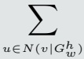  $u \in N ( v | G _ { w } ^ { h } )$   $\mathbf { m } _ { v , G _ { w } ^ { h } } ^ { t + 1 } =$ </td><td> $h _ { v , G _ { w } ^ { h } } ^ { t + 1 } = U _ { t } \Big ($   $h _ { v , G _ { w } ^ { h } } ^ { t } ,$   $\mathbf { m } _ { v , G _ { w } ^ { h } } ^ { t + 1 } )$  after T: R0 subgraph poolin then R1 graph pooling</td></tr><tr><td>GNN-AK Zhao et al. (2022)‡</td><td>S</td><td>graphs)  $\kappa _ { \mathrm { b a s e } }$ </td><td>Pk (base-GNN support Ψk (base-GNN inside each  $\operatorname { S u b } ^ { ( \ell ) } [ v ] )$ </td><td>message; Emb is the</td><td>(田:id)  $\boxplus _ { \mathrm { b a s e } }$  POOLGNN and FUSE</td><td>(inner slice only; φbase (after inner pass:</td></tr><tr><td>ESAN Bevilac- qua et al. (2022)</td><td>6</td><td>{self, share}</td><td> $\{ P _ { \mathrm { s e l f } } , P _ { \mathrm { s h a r e } } \}$  (base-encoder supports; share broadcasts bag</td><td> $\mathbf { X } _ { i } ) ,$   $L _ { 2 } \big ( \mathrm { A G G } _ { j } \mathrm { \bf ~ A } _ { j } ,$   $\operatorname { A G G } _ { j } \mathbf { X } _ { j } )$ </td><td> $C _ { \mathrm { s e l f } } + C _ { \mathrm { s h a r e } } \ ( \mathrm { D S S }$  fusion; DS sets  $\stackrel { \cdot } { L } _ { 2 } = 0 )$ </td><td>í  $( R _ { \mathrm { s u b g r a p h s ~ a n d } }$  Esets are external readout)</td></tr></table>

continued on next page

Table 19 – continued
<table><tr><td>Method</td><td>X</td><td>KC</td><td>Propagation  $1 9$ </td><td>Message Ψ (l) k</td><td>Mixing 田(e)  $\begin{array} { r } { \overline { { \mathbf { C } _ { G } = \mathbf { P } _ { G } \boldsymbol { \Psi } _ { G } , } } } \end{array}$ </td><td>Ego/Update (Be, φe)</td></tr><tr><td>Subgraph- ormer Bar- Shalom et al. (2024)</td><td> $V \times V$ </td><td>{G, GS, pt}</td><td> $\mathbf { P } _ { G } = \alpha _ { G } ( \mathbf { Q } _ { G } , \mathbf { K } _ { G } \ | \quad \Psi _ { G } = \mathbf { V } _ { G } ,$   ${ \bf P } _ { G S } = \alpha _ { G S } ( { \bf Q } _ { G S } , { \bf K } _ { G S } \ \Psi _ { G S } = { \bf V } _ { G S } ,$   $\begin{array} { r } { \mathbf { P } _ { \mathrm { p t } } = \mathbf { A } _ { \mathrm { p t } } \qquad \Psi _ { \mathrm { p t } } = \mathbf { X } } \\ { ( \mathbf { A } _ { \mathrm { ~ e ~ - ~ } } \mathbf { I } \otimes \mathbf { \Omega } _ { \Lambda } ) } \end{array}$   $( \mathbf { A } _ { G } = \mathbf { I } \otimes \mathbf { A } , \bar $   $\overset { \cdot } { \mathbf { A } _ { G S } } = \mathbf { A } \otimes \overset { \cdot } { \mathbf { I } } )$ </td><td></td><td> $\mathbf { C } _ { G S } = \mathbf { P } _ { G S } \Psi _ { G S } ,$   $\begin{array} { r } { { \bf C } _ { \mathrm { p t } } = \mathrm { M L P } _ { \mathrm { p t } } \left( \begin{array} { l l } { \quad } & { } \end{array} \right) } \end{array}$   $( 1 + \epsilon ) \mathbf { X }$   $+ \left. \mathbf { A } _ { \mathrm { p t } } \mathbf { X } \right)$   $\widetilde { \mathbf { H } } = \mathbf { C } _ { G }$ </td><td> $\mathrm { M L P } ( \widetilde { \mathbf { H } } )$  (pooling and  $\mathrm { P E ~ a r e }$  external/input)</td></tr><tr><td>HyMN (sam- pling/input wrap- per) Southern et al. (2025a)</td><td></td><td></td><td></td><td></td><td></td><td> $M = \mathrm { s e l e c t - t o p } ( $   $\sum _ { \boldsymbol { x } } \mathrm { C S E } _ { : , \boldsymbol { k } , \boldsymbol { T } } \big ) ,$   $y _ { G } = f { \big ( } \mathbf { A } ,$   $\mathbf { X } _ { | | \mathrm { C S E } , M \rangle }$  (wrapper only; no</td></tr><tr><td>ID-GNN You et al. (2021)</td><td>S</td><td> $\{ { \mathrm { i d } } , { \overline { { { \mathrm { i d } } } } } \}$ </td><td> $\mathbf { A } _ { G _ { v } ^ { ( K ) } }$  (ego-net adjacency unchanged; root identity selects the message type)</td><td> $\mathrm { M S G } _ { 1 [ s = v ] } ^ { ( k ) } ( { h } _ { s } ^ { ( k - 1 ) } )$ </td><td> $\mathrm { A G G } _ { s \in N ( u ) } \mathbf { P } _ { k } \Psi _ { k }$  (source leaves AGG generic)</td><td> $\mathrm { A G G } ^ { ( k ) } ( \widetilde { \mathbf { H } } _ { u \mid v } ^ { ( k ) } , { h } _ { u \mid v } ^ { ( k - 1 ) } )$ </td></tr><tr><td>I2-GNN Huang</td><td> $\{ ( i , j , k )$   $i \in V ,$  j ∈ N(i)  $k \in V _ { i } \}$ </td><td>{1}</td><td> ${ \bf A } _ { G _ { i , j } } \ { \mathrm { ( } K \mathrm { - h o p ~ e g o - n e t ; } }$  distinct root/branch identifiers)</td><td> $M _ { t } \Big ( h _ { i , j , k } ^ { t } ,$   ${ h } _ { i , j , l } ^ { t } ,$   $e _ { k l } \Big )$ </td><td> $\sum \mathrm { } \textbf { P } _ { k l } \Psi _ { k l } ,$   $\iota \in N _ { i } ( k )$   $\mathbf { m } _ { i , j , k } ^ { t } =$   $\mathbf { C } _ { 1 , i , j , k } ^ { t }$ </td><td> $\mathbf { \Phi } = U _ { t } \Big ( \mathbf { \Phi } \mathbf { h } _ { i , j , k } ^ { t } ,$   $\mathbf { m } _ { i , j , k } ^ { t } \Big )$   $\operatorname { a f t e r } \ T \colon \ R _ { \mathrm { e d g e } }$   $ R _ { \mathrm { n o d e } }  R _ { \mathrm { g r a p h } }$  (the three readouts follow</td></tr><tr><td>OSAN Qian et al. (2022)</td><td> $V \times \mathcal { G } ^ { k }$ </td><td>{1}</td><td> $P _ { \bigstar }$   $\mathrm { ~ b l o c k ~ s u p p o r t ~ f o r ~ f i x e d ~ } g ; \qquad h _ { u , g } ^ { ( \ell ) }$   $\scriptstyle \prod = N _ { G } ( v ) { \mathrm { ~ o r ~ } } V ( G )$ </td><td></td><td> $u \in \square ( v ) \} \}$   $\widetilde { \mathbf { H } } _ { v , g } ^ { ( \ell ) } = C _ { v , g } ^ { ( \ell ) }$ </td><td> $\begin{array} { r } { \pmb { h } _ { v , g } ^ { ( \ell ) } , } \end{array}$   $\widetilde { \mathbf { H } } _ { v , g } ^ { ( \ell ) } \Big )$ </td></tr><tr><td>DropGNN Papp et al. (2021) (boundary wrapper)</td><td> $V \times [ r ]$ </td><td> $\kappa _ { \mathrm { b a s e } }$ </td><td>base-GNN support  $\mathrm { o n } ~ G \backslash \mathcal { D } _ { s }$ </td><td>message map)</td><td> $\boxplus _ { \mathrm { b a s e } }$ </td><td> $\phi _ { \theta }$  (base layer only; after d layers, run aggregation then READOUT external)</td></tr><tr><td>Method</td><td>x</td><td>K</td><td>Propagation</td><td>Message Ψ(e) k</td><td>Mixing 田(e)</td><td>Ego/Update (Be, φe)</td></tr><tr><td>Reconstruction GNN Cotta et al. (2021)</td><td>6 (bound- ary) not layer</td><td>{S ∈ [V]k} (readout index,</td><td>AG[s] (input to inner base GNN, not one global  $\mathbf { P } _ { k } )$ </td><td> $h _ { W _ { 2 } } ^ { \mathrm { G N N } } ( G [ S ] )$  output of inner GNN on each induced subgraph</td><td> $\rho _ { W _ { 1 } }$  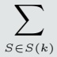  $\phi _ { W _ { 2 } } \Bigl ($   $h _ { W _ { 3 } } ^ { \mathrm { G N N } } ( G [ S ] )$ </td><td>boundary: enumerate/sample subgraphs → inner GNN → multiset readout</td></tr><tr><td> $\mathrm { L G A N ^ { \ S } }$  Du</td><td>V</td><td>{t, n}</td><td> $\overline { { \mathcal { E } _ { t } ( t ) = \{ \{ t , p \} : \} } }$   $p \in N ( t ) \} ,$   $\mathcal { E } _ { n } ( t ) = \{ \{ p , q \} \in E :$   $p , q \in N ( t ) \}$  (pair-to-target supports;</td><td> $h _ { \{ u , v \} } ^ { ( \ell - 1 ) } =$   $\mathrm { C O M B _ { \mathrm { p a i r } } ( }$   $\pmb { h } _ { u } ^ { ( \ell - 1 ) } ,$ </td><td>II after  $\mathrm { A G G R } _ { t } ( \{ \{ h _ { e } : e \in \mathcal { E } _ { t } ( t )$ </td><td> $\phi ( \widetilde { \mathbf { H } } _ { t } )$  (LGAN-res uses  $\phi ^ { \prime } ( \mathbf { W } h _ { t } ^ { ( \ell - 1 ) } { + } \widetilde { \mathbf { H } } _ { t } ) ;$   $\mathrm { A G G R } _ { n } ( \{ \{ h _ { e } : e \in \mathcal { E } _ { n } ( t )$ </td></tr><tr><td>SA-GAT Gao et al. (2023)</td><td> $\overline { { V ( G ^ { k } ) } }$  (k-) substr. graph</td><td>{sa, ia}</td><td>transient line graph of Gt)  ${ \mathrm { s a } } : a \alpha ( C _ { k } , T _ { k } ) ,$   $\mathrm { i a } : ( 1 - a ) \bar { \beta } ( T _ { k } , S _ { k } )$  (scalar channel weights</td><td> $\begin{array} { r } { \Psi _ { \mathrm { s a } } ( T _ { k } ) = \mathbf { u } ( T _ { k } ) \mathbf { W } } \\ { \Psi _ { \mathrm { i a } } ( T _ { k } , S _ { k } ) = \mathbf { u } ( T _ { k } ) \odot \big . } \end{array} { C _ { \mathrm { s a } } } + C _ { \mathrm { i a } }$ </td><td></td><td> $\sigma ( \widetilde { \mathbf { H } } )$ </td></tr><tr><td colspan="8">folded into P) 6c Simplicial, cell, hypergraph, and pair domains lifted support via (co)boundary maps, hyperedge incidence, or node-pair coupling</td></tr><tr><td>MPSN Bodnar</td><td> $\bigsqcup _ { p } X _ { p }$ </td><td>{B, C,</td><td> $\{ B ( \sigma ) , C ( \sigma ) ,$   $N _ { \downarrow } ( \sigma ) ,$   $N _ { \uparrow } ( \sigma ) \}$  (boundary, co-boundary,</td><td> $M _ { C } ( { \pmb h } _ { \sigma } , { \pmb h } _ { \tau } ) ,$   $M _ { \downarrow } \Big ( h _ { \sigma } , h _ { \tau } ,$   $h _ { \sigma \cap \tau } ) .$ </td><td> $\left[ m _ { B } \| m _ { C } \right]$   $\Vert \boldsymbol { m } _ { \downarrow }$ </td><td> $U \Big ( h _ { \sigma } ^ { ( \ell ) } ,$   $\widetilde { \mathbf { H } } _ { \sigma } ^ { ( \ell ) } \Big )$ </td></tr><tr><td>CW Net- works Bodnar et al. (2021a)</td><td> $\mathcal { X } _ { p }$ </td><td>{B,↑}</td><td> $\{ B ( \sigma ) , N _ { \uparrow } ( \sigma ) , C ( \sigma , \tau ) \}$  (boundary/upper supports)</td><td> $\scriptstyle h _ { \tau } ,$   $\Psi _ { \uparrow } ( \sigma , \tau , \delta ) =$   $\mathrm { M L P } _ { M } ( $   $h _ { \tau } \| h _ { \delta } \ )$ </td><td> $\widetilde { \bf H } = [ { \bf m } _ { \mathrm { B } } ( \sigma ) \| { \bf m } _ { \uparrow } ( \sigma ) ]$  (concat., not sum)</td><td> $\mathrm { M L P _ { B } } \Big ( ( 1 { + } \epsilon _ { \mathrm { B } } ) h _ { \sigma }$   $+ \mathbf { m } _ { \mathrm { B } } { \Big ) } \ |$   $\mathrm { M L P } _ { \uparrow } \left( ( 1 { + } \epsilon _ { \uparrow } ) h _ { \sigma } \right.$   $\underline { { + \mathbf { m } _ { \uparrow } } } ] \ ]$ </td></tr><tr><td>FSpec- GNN Wang et al. (2026a)</td><td> $V ^ { 2 }$ </td><td>{g}</td><td> $\begin{array} { l } { { \displaystyle g ( \mathbf { L } \otimes \mathbf { I } , } } \\ { { \mathbf { I } \otimes \mathbf { L } ) } } \end{array} \mathrm { ( l e a r n a b l e }$  bivariate full-spectrum filter on  $V \times { \bar { V } } )$ </td><td> $\mathbf { H } _ { V ^ { 2 } } ^ { \left( \ell \right) } \mathbf { W } ^ { \left( \ell \right) } \mathbf { \Lambda } ( \mathrm { p a i r } \mathbf { \Lambda }$  features from  $\phi ( { \bf X } _ { u } , { \bf X } _ { v } , { \bf E } _ { u v } ) )$ </td><td> ${ \bf P } _ { g } \Psi _ { g } \qquad ( \boxplus { : { \mathrm { i d } } } )$ </td><td>(polynomial/low-rank implementations avoid explicit  ${ n ^ { 2 } } \times { n ^ { 2 } }$  operator)</td></tr><tr><td>HGNNS Feng et al. (2019)</td><td>V</td><td>{1}</td><td> $\overline { { \mathbf { D } _ { v } ^ { - 1 / 2 } \mathbf { H } _ { \mathrm { i n c } } \mathbf { W } _ { E } \mathbf { D } _ { e } ^ { - 1 } } }$   $\mathbf { H } _ { \mathrm { i n c } } ^ { \top } \mathbf { D } _ { v } ^ { - 1 / 2 }$  (node-hyperedge-node incidence operator)</td><td> $\mathbf { H } ^ { ( \ell ) } \Theta$ </td><td> $\begin{array} { r l } { \mathbf { P } _ { 1 } \Psi _ { 1 } } & { { } ( \mathbb { E } { : } \mathrm { i d } ) } \end{array}$ </td><td> $\sigma ( \widetilde { \mathbf { H } } ^ { ( \ell ) } )$ </td></tr><tr><td>Method</td><td>X</td><td>K</td><td>Propagation P (e) k</td><td>Message Ψ (l) k</td><td>Mixing 田(e)</td><td>Ego/Update (Be, φe)</td></tr><tr><td> $\mathrm { H y p e r G C N ^ { \ S } Y a \mathrm { - } }$  dati et al. (2019)</td><td>V</td><td>{1}</td><td> $\overline { { \mathbf { A } } } _ { \mathrm { m e d } } ^ { ( \ell ) }$  (after hard mediator construction: each hyperedge selects  $( i _ { e } , j _ { e } ) =$   $\mathrm { a r g } \operatorname* { m a x } _ { i , j \in e } \| h _ { i } ^ { ( \ell ) } \Theta ^ { ( \ell ) } -$   $h _ { \ i } ^ { ( \ell ) } \Theta ^ { ( \ell ) } \lVert _ { 2 } ; \mathrm { { s e l f - l o o p s } }$ </td><td> $\mathbf { H } ^ { ( \ell ) } \Theta ^ { ( \ell ) }$ </td><td> $\begin{array} { r l } { \mathbf { P } _ { 1 } \Psi _ { 1 } } & { { } ~ ( \mathbb { E } [ : \mathrm { i d } ) } \end{array}$ </td><td> $\sigma ( \widetilde { \mathbf { H } } ^ { ( \ell ) } )$  after  $\dot { \overline { { \mathbf { A } } } } _ { \mathrm { m e d } } ^ { ( \ell ) }$ </td><td>(covered slice is fixed; FastHyperGCN fixes it from input features)</td></tr><tr><td>AllSet Chien et al. (2022)</td><td> $V \cup E$ </td><td> $V  E$   $\stackrel { \longrightarrow } { \boldsymbol { E } } \stackrel { \_ } {  } \boldsymbol { V } _ { \mathrm { s u r } } ^ { \mathbf { Q } ^ { \intercal } }$  then</td><td>then Q (incidence pport for the two (schedule, half-steps) not simul-</td><td colspan="2"> $\{ \mathbf { X } _ { u } ^ { ( t ) } : ~ u \in e \} ,$   $\Psi _ { E  V } :$   $\{ \mathbf { Z } _ { e } ^ { ( t + 1 ) } : ~ v \in e \}$  AllDeepSets: row MLP bef Transformer: set atten</td><td>id (per half-step; sequential, not channel mixing)</td><td> $\mathcal { V } _ { e , X } ^ { ( t ) } ; \mathbf { Z } _ { e } ^ { ( t ) } \Big ) ,$   ${ \bf X } _ { v } ^ { ( t + 1 ) } = f _ { E  V } { \Big ( }$   $\mathcal { E } _ { v , Z } ^ { ( t + 1 ) } ; \mathbf { X } _ { v } ^ { ( t ) } \Big )$ </td></tr><tr><td>ED- HNN§ Wang et al. (2023b)</td><td>V</td><td>node- update slice;  $V  E$ </td><td>{1} (final Q (E-to-V incidence after transient  $\begin{array} { r } { \mathbf { m } _ { e } = \sum _ { u \in e } \widehat { \phi } ( h _ { u } ^ { ( t ) } ) } \end{array}$  built)</td><td colspan="2">Ψ(e, v) =  $\widehat { \rho } \Big ( \pmb { h } _ { v } ^ { ( t ) } , \sum _ { u \in e } \widehat { \phi } ( \pmb { h } _ { u } ^ { ( t ) } ) \Big ) \ \widetilde { \mathbf { H } } _ { v } ^ { ( t ) } = \mathbf { C } _ { 1 , v } ^ { ( t ) } \quad ( \boxplus _ { : \mathrm { i d } }$  is</td><td> $\mathbf { C } _ { 1 , v } ^ { ( t ) } = \sum _ { e \ni v } \Psi ( e , v ) ,$  (boundary: Ψ contains</td><td> $\widehat { \varphi } ( \pmb { h } _ { v } ^ { ( t ) } , \widetilde { \mathbf { H } } _ { v } ^ { ( t ) } , \pmb { x } _ { v } , d _ { v } )$  (approximates GD; ADMM only under an extra assumption)</td></tr></table>

Table 20: Family 7. Geometric and Equivariant GNNs. Source-grounded decompositions of coordinate-, distance-, angle-, vector-, tensor-, and algebra-valued geometric layers. Geometric context enters X; typed channel contributions are fused by tuples, direct sums, or concatenation rather than forced scalar sums. The stated symmetry group is exactly the one established by the source. Rows marked <sup>♮</sup> preserve that source-level group claim, while <sup>‡</sup> reports only the supported slice of discrete-orientation or sequential geometric constructions.
<table><tr><td>Method</td><td>X</td><td>K</td><td>Propagation P k</td><td>Message Ψ (e) k</td><td>Mixing 田(e)</td><td>Ego/Update  $\textcircled { 1 6 } \textcircled { 4 } \textcircled { 1 2 }$ </td></tr><tr><td colspan="7">7a Invariant (distance angle / torsion) messages G-invariant scalars; coordinates enter X only through invariants  $\overline { { [ \mathbf { P } _ { m } ] _ { i j } = } }$ </td></tr><tr><td>MoNet Monti et al. (2017)</td><td> $V ;$   $\boldsymbol { u } _ { i j }$  (pseudo-coord.)</td><td> $\{ 1 , \ldots , J \}$ </td><td> $\mathbb { 1 } [ j \in \mathcal { N } ( i ) ]$   $\cdot w _ { m } ( u _ { i j } )$   $( \mathrm { G a u s s i a n } )$  (pseudo-coordinate)</td><td> $h _ { j } ^ { ( \ell ) } \mathbf { W } _ { m } ^ { ( \ell ) }$ </td><td> $\sum _ { m } \mathbf { C } _ { m }$ </td><td> $\begin{array} { r } { B _ { \ell } = 0 , } \end{array}$   $\phi _ { \ell } = \sigma ( \widetilde { \mathbf { H } } ^ { ( \ell ) } )$ </td></tr><tr><td>SchNet Schütt et al. (2017) E(3)</td><td> $V ;$   $_ { r _ { i j } }$ </td><td>{1}</td><td> $[ \mathbf { P } _ { 1 } ] _ { i j } = 1$  (atom-pair support)</td><td> $\odot W _ { \theta } \Big ($   $\mathrm { R B F } ( r _ { i j } ) \Big )$  (cont.-filter msg)</td><td> ${ \cal C } _ { 1 , i } =$   $\sum P _ { i j } \Psi _ { i j }$  j</td><td> $B _ { \ell } = h _ { i } ^ { ( \ell ) } ,$   $\phi _ { \ell } ( b , \widetilde { { \mathbf H } } ) =$   $b + \mathrm { M L P } ( \widetilde { \mathbf { H } } )$ </td></tr><tr><td>DimeNet Gasteiger et al. (2020) E(3)</td><td> $\boldsymbol { E } ^ {  } ;$   $\left( d _ { j i } , d _ { k j } , \right.$   $\angle k j i )$ </td><td>{1}</td><td> $[ \mathbf { P } _ { 1 } ] _ { ( j i ) , ( k j ) } =$   $\mathbb { 1 } \left[ k \in \mathcal { N } ( j ) \right.$   $\setminus \{ i \} _ { \rfloor }$ </td><td> $\Psi _ { \ell } ($   $m _ { k j } ^ { ( \ell - 1 ) } ,$   $e _ { \mathrm { R B F } } ^ { \left( j i \right) } ,$   $a _ { \mathrm { S B F } } ^ { \left( k j , j i \right) } )$ </td><td>id  $C _ { 1 , j i } =$   $\sum P \Psi$ </td><td> $B _ { \ell } = m _ { j i } ^ { ( \ell - 1 ) } ,$   $\phi _ { \ell } = $   $f _ { \mathrm { u p d } } ^ { ( \ell ) } ( B _ { \ell } , \widetilde { \mathbf { H } } )$ </td></tr><tr><td>Method</td><td>X</td><td>KC</td><td>Propagation P(e)</td><td>Message Ψ (e) l</td><td> $\frac { 1 1 4 + 1 0 } { 1 0 } = 1 0$ </td><td>Ego/Update (Be, φe)</td></tr><tr><td>SphereNet Liu et al. (2022b) SE(3); chirality- sensitive</td><td> $\boldsymbol { E } ^ {  } ;$   $( d , \theta , \phi )$  (edge slice)</td><td>{1}</td><td> $[ \mathbf { P } _ { 1 } ] _ { k , h } =$   $\mathbb { 1 } [ h \in E _ { s _ { k } } ]$  (edge-neighbor) (support)</td><td> $\begin{array} { r } { \overline { { \Psi _ { \ell } \left( e _ { h } ^ { ( \ell ) } , \right. } } } \end{array}$  Ψ(d),  $\Psi ( d , \theta ) ,$   $\Psi ( d , \theta , \phi ) \big )$ </td><td>id  $C _ { 1 , k } =$   $\sum _ { h } P \Psi$ </td><td> $B _ { \ell } = e _ { k } ^ { ( \ell ) } ,$  φe = residual edge updat</td></tr><tr><td>GemNet Gasteiger et al. (2021) SE(3); apart from reflections</td><td> $\{ V , E ^ { \to } \} ;$   $( \varphi _ { c a b } ,$   $\varphi _ { a b d } , \theta _ { c a b d } )$  (graded)</td><td>{Q, T, A}</td><td> $\mathbf { P } _ { Q } : { \mathrm { ~ } } { \mathrm { q u a d r u p l e t s } }$   $\mathbf { P } _ { T } :$  triplets  $\mathbf { P } _ { A } : \mathrm { a t o m } \mathrm { - t o } \mathrm { - } \mathrm { e d g e }$ </td><td> $\Psi _ { Q } \left( m _ { d b } , e _ { \mathrm { R B F } } , \right.$   $e _ { \mathrm { C B F } } , e _ { \mathrm { S B F } } )$   $\Psi _ { T } \left( m _ { b a } , e _ { \mathrm { R B F } } , \right.$   $e _ { \mathrm { C B F } } )$   $\Psi _ { A } \left( h _ { a } , h _ { c } ,\right)$ </td><td>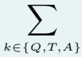  $k \in \{ Q , T , A \}$   $\mathbf { C } _ { k }$ </td><td> $\begin{array} { r } { B _ { \ell } = } \end{array}$   $( m _ { c a } ^ { ( \ell - 1 ) } , h _ { a } ^ { ( \ell - 1 ) } ) ,$  φe = edge/atom residual updates</td></tr><tr><td>Geoformer Wang et al. (2023e) E(3); geometric attention slice</td><td> $V \oplus ( V \times V ) ;$   $( \mathbf { X } , \mathbf { C } _ { \eta } )$  (node + IPE) (co-state)</td><td>{1} (node slice)</td><td> $\chi ( r _ { i j } )$  (full-pair/cutoff) (support)</td><td> $\overline { { A _ { i j } ^ { ( \ell ) } ( \cdot ) } }$   $\mathbf { \Delta } \pmb { x } _ { j } ^ { ( \ell ) } \mathbf { W } _ { V } ^ { ( \ell ) } ,$   $A ^ { ( \ell ) } =$   ${ \mathrm { S i L U } } { \big ( } ( Q K ^ { \top } )$   $\Theta C _ { \eta } ^ { ( \ell ) } \big )$  (featurewise gate)</td><td> $\boxplus : \mathrm { i d }$   $C _ { 1 , i } =$   $\sum _ { i } { P _ { i j } \Psi _ { i j } }$ </td><td> $\pmb { x } _ { i } ^ { + } = \pmb { x } _ { i } + C _ { 1 , i } ;$  LN+FFNRes;  $\mathbf { C } _ { \eta }$  update is staged</td></tr><tr><td colspan="7">(in message) 7b Equivariant (vector / tensor) features X carries G-equivariant vectors/tensors alongside scalars</td></tr><tr><td>EGNN Satorras et al. (2021) E(n)</td><td> $V ;$   $( h _ { i } , x _ { i } )$ </td><td> $\{ h , x \}$ </td><td> $P _ { h , i j } =$   $\mathbb { 1 } [ j \in \mathcal { N } ( i ) ] ;$ </td><td> $\overline { { \Psi _ { h , i j } = m _ { i j } = } }$   $\phi _ { e } \left( h _ { i } , h _ { j } , \right.$   $\| x _ { i } - x _ { j } \| ^ { 2 } , e _ { i j } \Big ) ;$ </td><td> $\boxplus : \mathrm { i d }$ </td><td> $x _ { i } ^ { \prime } = x _ { i } + \Delta x _ { i } ;$   ${ \pmb h } _ { i } ^ { \prime } = \phi _ { h } ( { \pmb h } _ { i } , m _ { i } )$ </td></tr><tr><td> $\mathrm { P a i N N } ^ { \natural }$  Schütt et al. (2021) S E(3)</td><td> $V ;$   $( s _ { i } , \vec { v } _ { i } ) ,$   $( r _ { i j } , \hat { r } _ { i j } )$ </td><td> $\left\{ s , \vec { v } \right\} \quad \left. \mathbf { A } _ { r \leq c } \right.$ </td><td></td><td> $\frac { \Psi _ { x , i j } = x _ { i } - x _ { j } } { \Psi _ { s , i j } = }$   $\phi _ { s } ( s _ { j } ) \odot W _ { s } ( r _ { i j } ) ;$   $\Psi _ { \vec { v } , i j } =$   ${ \vec { v } } _ { j } \odot \phi _ { v v } ( s _ { j } )$   $\odot W _ { v v } ( r _ { i j } )$   $+ \phi _ { v s } ( s _ { j } )$   $\textcircled { \cdot } W _ { v s } ^ { \prime } ( r _ { i j } ) \hat { r } _ { i j }$ </td><td> $\boxplus : \mathrm { i d }$  (typed scalar/vector) (sums)</td><td> $( s _ { i } , \vec { v } _ { i } ) \gets$   $( s _ { i } , \vec { v } _ { i } ) + \sum _ { j } \Psi _ { i j } ;$  atomwise gated s-σ update  $\overline { { a _ { i } ^ { + } = a _ { i } + C _ { a , i } ; } }$   $\vec { F } _ { i } ^ { + } = \vec { F } _ { i } + C _ { F , i } ;$ </td></tr><tr><td>NewtonNet Haghighatlari et al. (2022) SE(3)</td><td> $( a _ { i } , \vec { F } _ { i } , f _ { i } ,$   ${ \vec { d r } } _ { i } ) ,$   $( r _ { i j } , \hat { r } _ { i j } )$  (coupled) (scalar/vector)</td><td> $\{ a , { \vec { F } } ,$   ${ \vec { f } } , { \vec { d r } } \}$  (typed) (contri)</td><td> $P _ { k , i j } =$   $\mathbb { 1 } [ j \in \mathcal { N } ( i ) ]$  (cutoff support)</td><td> $\Psi _ { a , i j } = m _ { i j } =$   $\phi _ { a } \left( a _ { i } \right) \odot \phi _ { a } \left( a _ { j } \right)$   $\textcircled { \cdot } \phi _ { e } ( \vec { r } _ { i j } ) ;$   $\Psi _ { f , i j } = \phi _ { f } ( m _ { i j } ) \Psi _ { F , i , } C _ { a } , C _ { F } , C _ { f } , C _ { d r }$ </td><td> $\boxplus : \mathrm { i d }$   $\Psi _ { F , i j } = \phi _ { F } ( m _ { i j } ) \hat { r } _ { i j } \quad \mathrm { { ( t y p e d ~ s u m s ) } }$ </td><td> $f _ { i } ^ { + } = f _ { i } + C _ { f , i } ;$   $\delta r _ { i } = \phi _ { r } ( a _ { i } ^ { + } ) f _ { i } ^ { + } ;$   $\vec { d r } _ { i } ^ { + } = C _ { r , i } + \delta r _ { i } ;$   $a _ { i } ^ { \prime } = a _ { i } ^ { + } - \phi _ { u } ( a _ { i } ^ { + } )$ </td></tr><tr><td>GVP-GNN Jing et al. (2021) E(3)</td><td> $V ;$   $( s _ { i } , \vec { v } _ { i } ) ,$   $( e _ { j  i } ,$   $\vec { e } _ { j  i } )$ </td><td>{1}</td><td> $P _ { i j } =$   $\mathbb { 1 } [ e _ { j  i } \in E ] / k _ { i } ^ { \prime }$  (incoming msgs)</td><td> ${ \mathrm { G V P } } ^ { 3 } \Big ( ( s _ { j } , \vec { v } _ { j } ) ,$   $e _ { j } \to i ,$   ${ \vec { e } } _ { j  i } )$  (nbr. j+ edge only)</td><td>田:id  ${ \cal C } _ { 1 , i } =$   $\sum P _ { i j } \Psi _ { i j }$ </td><td> $\mathrm { D r o p o u t } ( \widetilde { \mathbf { H } } ^ { ( \ell ) } ) \big ) ;$   $\mathrm { L N } \left( \cdot + \right.$   $\mathrm { D r o p o u t } ( \mathrm { G V P } ^ { 2 } ( \cdot ) ) )$ </td></tr><tr><td>Method</td><td>X</td><td>KC</td><td>Propagation</td><td>Message Ψ(ke)</td><td>Mixing 田(e)</td><td>Ego/Update (1Be, φe)</td></tr><tr><td colspan="7"> $( s _ { i } , \mathbf { V } _ { i } , \pmb { \xi } _ { i j } ) ,$  SaVeNet Aykent &amp; Xia</td></tr><tr><td>(2023) sO(3)</td><td> $\xi _ { i j } =$   $\{ \hat { d } _ { i j } , \vec { t } _ { i j } , \vec { o } _ { i j } \}$  (raw cross) (products)</td><td>{s, v}</td><td> $P _ { s , i j } = P _ { v , i j } =$   $A _ { i j } \mathbb { 1 } [ r _ { i j } \leq c ]$ </td><td> $\phi _ { s } ( s _ { j } ) \odot \eta _ { s } ( r _ { i j } ) ;$   $\Psi _ { v , i j } =$   $\phi _ { b } ( \pmb { \xi } _ { i j } ) \odot \phi _ { d } ( s _ { j } )$   $\textcircled { \cdot } \eta _ { d } ( r _ { i j } )$   $+ \mathbf { V } _ { j } \odot \phi _ { v } ( s _ { j } )$   $\textcircled { \cdot } \eta _ { r } ( r _ { i j } )$ </td><td> $( C _ { s , i } , C _ { v , i } )$  (typed sums over j)</td><td> $( s _ { i } , \mathbf { V } _ { i } )$   $+ \ ( C _ { s , i } , C _ { v , i } ) ;$   $( s _ { i } ^ { \prime } , \mathbf { V } _ { i } ^ { \prime } ) =$   $\mathrm { A W } ( s _ { i } ^ { + } , \mathbf { V } _ { i } ^ { + } )$ </td></tr><tr><td>TorchMD-Net Thölke &amp; Fabritiis (2022) SE(3)</td><td> $V ;$   $( r _ { i j } , \hat { r } _ { i j } ) ,$  (s, )</td><td> $\{ ( s , m ) \} _ { m } ^ { M }  &  Q _ { i } ^ { m } , K _ { j } ^ { m } , D _ { i j } ^ { K } ) \Big )$  ∪ {v}</td><td> $\mathrm { S i L U } \Big ( \mathrm { d o t } ($   $\cdot \chi ( r _ { i j } ) ;$   $P _ { v , i j } =$   $\mathbf { 1 } [ r _ { i j } \le c ]$ </td><td> $\Psi _ { s , m , i j } = s _ { i j , m } ^ { 3 } ;$   $\Psi _ { v , i j } =$   $s _ { i j } ^ { 1 } \vec { v } _ { j }$   $+ \ s _ { i j } ^ { 2 } \hat { r } _ { i j }$   $s ^ { 1 : 3 } = \mathrm { s p l i t }$   $( V _ { j } \odot D _ { i j } ^ { V } )$ </td><td> $O \Big ( | | _ { m } C _ { s , m , i } \Big ) ,$   $C _ { s , m , i } =$   $\sum _ { i } { P _ { s , m , i j } \Psi _ { s , m , i j } }$   $\vec { w } _ { i } =$ </td><td> $q _ { i } ^ { 1 : 3 } = \mathrm { s p l i t } ( y _ { i } ) ,$   $\Delta s _ { i } = q _ { i } ^ { 1 } + q _ { i } ^ { 2 }$  ·〈U1vi,  $U _ { 2 } { \vec { v } } _ { i } \rangle ;$   $\Delta \vec { v } _ { i } =$ </td></tr><tr><td>ViSNet Wang et al. (2024f) sO(3)</td><td>V, E;  $( h _ { i } , \vec { v } _ { i } , f _ { i j } ) ;$   $( r _ { i j } , \hat { r } _ { i j } ) ;$  RGC inner products</td><td> $\{ s , \vec { v } \}$ </td><td> $\alpha _ { i j } \phi ( | | r _ { i j } | | ) ;$   $\alpha _ { i j } =$   $\sigma \Big ( ( h _ { i } W _ { Q } ) \cdot q _ { i j } ^ { \top } \Big )$   $q _ { i j } = h _ { j } W _ { K } \odot$   $\mathrm { D e n s e } _ { K } ( f _ { i j } ) ;$ </td><td> $\Psi _ { s , i j } = h _ { j } W _ { V } \odot$  Densev(fij);  $\Psi _ { \vec { v } , i j } =$   $\mathrm { D e n s e } _ { u } ( m _ { i j } ) \odot \hat { r } _ { i j }$   $+ \mathrm { D e n s e } _ { v } ( m _ { i j } ) \odot \vec { v } _ { j } \sum _ { j } P _ { \vec { v } , i j } \Psi _ { \vec { v } , i j }$ </td><td>mi =  $\sum _ { j } { P _ { s , i j } \Psi _ { s , i j } } ,$   $\vec { m } _ { i } =$ </td><td> $h _ { i } ^ { \prime } = h _ { i } + \Delta h _ { i } ;$   $f _ { i j } ^ { \prime } = f _ { i j } + \Delta f _ { i j } ;$   $\vec { v } _ { i } ^ { \prime } = \vec { v } _ { i } + \Delta \vec { v } _ { i }$   $( \mathrm { R G C ~ i n ~ u p d a t e } )$ </td></tr><tr><td colspan="7"> ${ \tilde { f } } _ { i } ,$   $\widetilde { a } _ { i j } = Y _ { \ell m } \left( \hat { r } _ { i j } \right)$ </td></tr><tr><td>(2022) E(3)</td><td>ãi (edge/node) (steerable attr.)  $V \sqcup V ^ { 2 } ;$ </td><td>{1}</td><td>A</td><td> $\| x _ { j } - x _ { i } \| ^ { 2 } , \tilde { a } _ { i j } \Big )$  (steerable MLP)</td><td> $C _ { i } =$   $\sum P _ { i j } \Psi _ { i j }$  j∈N(i)</td><td>gated CG update with residual</td></tr><tr><td>Cormorant Anderson et al. (2019) SO(3)</td><td> $F _ { i } ^ { s } , g _ { i j } ^ { s } ,$   $Y ^ { \ell } ( \hat { r } _ { i j } )$  (atom and pair) (activations)  ${ \overline { { V ; } } }$ </td><td> $\{ ( \ell , c ) :$   $0 \le \ell \le L$ </td><td> $A _ { i j } \mu _ { \ell c } ^ { s } ( r _ { i j } )$  with state-dependent scalar edge update  $g _ { i j } ^ { s + 1 }$ </td><td> $g _ { i j } ^ { s + 1 , \ell } Y ^ { \ell } ( \hat { r } _ { i j } ) ;$   $\Psi _ { \ell c , i j } =$   $G _ { i j } ^ { s + 1 , \ell } \otimes _ { \bf c g } F _ { j } ^ { s }$ </td><td>l,c 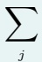  $\underline { { P _ { \ell c , i j } \Psi _ { \ell c , i j } } }$ </td><td> $\left( \boldsymbol { F } _ { i } ^ { s } \otimes _ { \mathbf { c g } } \boldsymbol { F } _ { i } ^ { s } \right)$   $\left\| F _ { i } ^ { s } \right\|$   $W _ { s } ^ { \mathrm { v e r t e x } }$ </td></tr><tr><td>(2022) E(3)</td><td> $Y _ { \ell } ( \hat { r } _ { i j } ) _ { : }$   $\underline { { R _ { \ell } ( r _ { i j } ) } }$ </td><td>(CG paths)</td><td> $p _ { f } , l _ { o } , p _ { o } ) \in \mathbb { 1 } [ r _ { i j } \le r _ { c } ] / \sqrt { \bar { N } }$ </td><td> $R _ { \ell } ( r _ { i j } ) Y _ { \ell } ( \hat { r } _ { i j } )$   $\otimes _ { \mathrm { c g } } \pmb { h } _ { j }$   $\Psi _ { i j , k l _ { 3 } m _ { 3 } } ^ { ( t ) } = $  ∑  $l _ { 1 } m _ { 1 } , l _ { 2 } m _ { 2 }$ </td><td>over CG paths</td><td>+ self-int.  $B _ { i } ^ { ( t ) } =$ </td></tr><tr><td>MACE Batatia et al. (2022) O(3)</td><td> $V ;$   $\begin{array} { r } { Y _ { \ell } ( \hat { r } _ { i j } ) , } \end{array}$   $R ( r _ { i j } )$ </td><td>(two-bod  $\begin{array} { c } { { \mathrm { ( a b s o r b e d ~ i f ) } } } \\ { { \mathrm { ( p a t h s ) } } } \\ { { \mathrm { ( s e p a r a t e d ) } } } \end{array}$ </td><td> $\begin{array} { r l r } { \mathbf { \delta } } & { { } \mathbf { \delta } \mathbf { \vec { A } } _ { r \le c } } & { \mathbf { \delta } \mathbf { \vec { A } } _ { r \le c } } \end{array}$  (radial) (scalars)</td><td> $C _ { l _ { 1 } m _ { 1 } , l _ { 2 } m _ { 2 } } ^ { l _ { 3 } m _ { 3 } }$   $\cdot \ R _ { k l _ { 1 } l _ { 2 } l _ { 3 } } ( r _ { j i } )$   $\cdot Y _ { l _ { 1 } m _ { 1 } } ( \hat { r } _ { j i } )$   $\cdot \sum _ { \tilde { k } } W _ { k \tilde { k } l _ { 2 } }$ </td><td>typed concat/sum  $A _ { i } ^ { ( t ) }$  of channels</td><td> $m _ { i } ^ { ( t ) } = \sum$  ν,ην  $W _ { z _ { i } , \eta _ { \nu } } ^ { ( t ) } B _ { i , \eta _ { \nu } } ^ { ( t ) } ;$   $h _ { i } ^ { ( t + 1 ) } = W _ { m } ^ { ( t ) } m _ { i } ^ { ( t ) }$   $+ W _ { h } ^ { ( t ) } h _ { i } ^ { ( t ) }$ </td></tr></table>

continued on next page

Table 20 – continued
<table><tr><td>Method</td><td>X</td><td>KC</td><td>Propagation e) P</td><td>Message Ψ (e) k</td><td>Mixing 田(e)</td><td>Ego/Update (Be, φe)</td></tr><tr><td>HotPP Wang et al. (2024b) E(n)</td><td> $V ;$   $\hat { r } _ { i j }$   $( \mathrm { a r b . - o r d e r } )$ </td><td> $\{ ( l _ { i } , l _ { r } , $   $l _ { c } , l _ { o } ) \}$   $l _ { o } =$   $| l _ { i } + l _ { r }$ </td><td> $\mathbb { 1 } [ r _ { i j } \le r _ { c } ]$   $\cdot \ c _ { l _ { o } , l _ { r } , l _ { i } }$   $f _ { l _ { r } } ^ { ( t ) } ( d _ { i j } )$ </td><td> $\mathrm { C o n t r } _ { l _ { c } } \Big ( H _ { j } ^ { ( t , l _ { i } ) } ,$   $\hat { r } _ { i j } ^ { \otimes l _ { T } } \Big )$ </td><td> $( l _ { i } , l _ { r } , l _ { c } ) {  } l _ { o }$ </td><td> $\overline { { H _ { i } ^ { ( t + 1 , 0 ) } = } }$   $H _ { i } ^ { ( t , 0 ) } + \sigma ( W m _ { i } + b ) ;$   $H _ { i } ^ { ( t + 1 , l > 0 ) } =$   $H _ { i } ^ { ( t , l ) } + \sigma _ { l } ( W m _ { i } )$ </td></tr><tr><td>TFN Thomas et al. (2018) SE(3)</td><td> $V ;$   $Y _ { \ell m } ( \hat { r } _ { i j } )$ </td><td> $\{ ( l _ { i } , l _ { f } , $   $l _ { o } , c ) \}$ </td><td> $\mathbb { 1 } [ j \in S ]$  (or chosen) (CG paths) (neighborhood support)</td><td> $\otimes _ { \mathrm { c g } } \ : h _ { j } ^ { k }$   $\mathrm { ( r a d i a l \times ) }$  (spherical-harmonic)</td><td>typed concat of convolution outputs</td><td>self-int. + norm nonlinearity</td></tr><tr><td> $\mathrm { S E } ( 3 ) { \cdot } \mathrm { T r } .$  Fuchs et al. (2020)</td><td> $V ;$   $Y _ { \ell m } ( \hat { r } _ { i j } )$ </td><td>{1,  $M \}$  (heads)</td><td> $\alpha _ { i j } ^ { m } =$   $\operatorname { s o f t m a x } _ { j \in N _ { i } \setminus i }$   $\left( q _ { i } ^ { m ^ { \top } } k _ { i j } ^ { m } \right)$  (inv. weights)</td><td>l,k  $W _ { V , m } ^ { \ell k } ( x _ { j } - x _ { i } ) f _ { j } ^ { k }$ </td><td> $\Big \| _ { m } C _ { m }$ </td><td>self-interaction + norm nonlinearity</td></tr><tr><td>Equiformer Liao &amp; Smidt (2023)</td><td> $V ;$   $( x _ { i } , r _ { i j } ) ;$   $Y _ { \ell m } ( \hat { r } _ { i j } )$ </td><td>M}</td><td> $P _ { m , i j } = \alpha _ { i j } ^ { m } =$   $\mathrm { s o f t m a x } _ { j } \Big ( s _ { i j } ^ { m } \Big ) ,$   $s _ { i j } ^ { m } = \left( \boldsymbol { a } ^ { m } \right) ^ { \top }$   $\mathrm { L R e L U } ( f _ { i j } ^ { ( 0 ) } )$ </td><td> $f _ { i j } = $   $\mathrm { L i n } \Big ( x _ { i j } \otimes _ { w ( r ) } ^ { \mathrm { D T P } }$   $Y ( \hat { r } _ { i j } ) \big )$   $\mu _ { i j } = \mathrm { G a t e } ( f _ { i j } ^ { ( L ) } ) ;$   $\Psi _ { m , i j } = v _ { m , i j } =$ </td><td> $\parallel _ { m } \sum _ { j }$   $\mathbf { P } _ { m } \Psi _ { m }$ </td><td> $\mathrm { L N ^ { e q } + g a t e }$   $+ ~ \mathrm { r e s }$  (equiv. transf. block)</td></tr><tr><td>eSCN Passaro &amp;</td><td> $V ;$   $( x _ { i } , r _ { i j } , z _ { i } ) ;$   $Y _ { \ell m } ( \hat { r } _ { i j } )$ </td><td>{1}</td><td> $\mathbf { A } _ { r \leq c }$ </td><td> $\begin{array} { r } { e _ { s t } = \ } \\ { \mathrm { \mathrm { { E d g e M L P } } } ( | r _ { s t } | , z _ { s } , z _ { t } ) } \end{array}$   $u _ { s t } =$   $\mathrm { S O ( 2 ) C o n v } ( D _ { s t } x _ { s } ; e _ { s t }$   $+ \operatorname { S O } ( 2 ) \operatorname { C o n v } ( D _ { s t } x _ { t } ; e _ { s }$   $\Psi _ { s t } = D _ { s t } ^ { - 1 }$ </td><td> $\boxplus : \mathrm { i d }$   $C _ { 1 , t } =$   $\sum _ { s \in \mathcal { N } ( t ) }$ </td><td> $x _ { t } ^ { \prime } =$   $x _ { t } + { \mathrm { S p h M L P } } ( \widetilde { \mathbf { H } } _ { t } , x _ { t } )$ </td></tr><tr><td>EquiformerV2 Lião et al. (2024) SE(3)</td><td> $( x _ { i } , r _ { i j } ) ;$   $Y _ { \ell m } ( \hat { r } _ { i j } )$  (high L)</td><td>{1, M}</td><td> $\mathrm { s o f t m a x } _ { j } ( s _ { i j } ^ { m } ) ,$   $s _ { i j } ^ { m } = ( w _ { a } ^ { m } ) ^ { \top }$   $\mathrm { L R e L U } { \Big ( }$   $\mathrm { L N } ( f _ { i j } ^ { ( 0 ) } ) \big )$ </td><td> $\Theta R ( r _ { i j } ) ) ;$   $\Psi _ { m , i j } = D _ { i j } ^ { - 1 } u _ { m , i j } ,$   $u _ { m , i j } =$   $\mathrm { S O } ( 2 ) \mathrm { L i n } _ { m } \Big ($ </td><td> $\left. _ { \mathbf { \Omega } _ { m } } \right. _ { m }$   $P _ { m , i j } \Psi _ { m , i j }$ </td><td>SepLN+  $\mathrm { S e p S ^ { 2 } A c t \ F F N + }$  residual (Secs. 3.3–3.5)</td></tr><tr><td>Method</td><td>X</td><td>KC</td><td>Propagation P (l) k</td><td>Message Ψ (e) k</td><td>Mixing 田(e)</td><td>Ego/Update (1Be, φe)</td></tr><tr><td> $\mathrm { P o n i t a ^ { \ddagger } }$  Bekkers et al. (2024) SE(n); layer slice</td><td> $\mathbb { R } ^ { 3 } \times S ^ { 2 }$  (pos.-orient.) (lift)</td><td>{1} (per) (stage)</td><td> $\overline { { k ^ { ( 1 ) } } } \big ($   $o ^ { \top } ( p _ { j } - p _ { i } ) ,$   $| | o \times ( p _ { j } - p _ { i } ) | | ) ;$   $\boldsymbol { k } ^ { ( 2 ) } ( \boldsymbol { o } ^ { \top } \boldsymbol { o } ^ { \prime } )$ </td><td> $\Psi _ { i j , o } ^ { \mathrm { s p } } = f _ { j , o } ;$   $\Psi _ { i , o ^ { \prime } } ^ { \mathrm { s p h } } = f _ { i , o ^ { \prime } } ^ { ( 1 ) }$ </td><td> $\boxplus : \mathrm { i d }$  (each stage;) (full block is) (sequential)</td><td> $\mathrm { L N }  \mathrm { L i n e a r }  \mathrm { A c t }$  → Linear + residual (ConvNeXt block)</td></tr><tr><td>GotenNet Aykent &amp; Xia (2025) E(3); GATA layer slice</td><td> $V ;$   $( h _ { i } , \widetilde { X } _ { i } ^ { ( l ) } ,$   $t _ { i j } , \widetilde { r } _ { i j } ^ { ( l ) } )$  (GATA slice;) (HTR) (scheduled)</td><td>{att, geo}</td><td> $= { \mathrm { s o f t m a x } } _ { j } ( \alpha _ { i j } ) ;$   $\alpha _ { i j } = q _ { i } \left[ k _ { j } \odot \right.$   $\sigma _ { k } ( t _ { i j } W _ { r e } ) \Big ] ^ { \top } ;$   $P _ { \mathrm { g e o } , i j } =$   $\mathbb { 1 } [ j \in \mathcal { N } ( i ) ]$ </td><td> $\Psi _ { \mathrm { g e o } , i j } =$   $( t _ { i j } W _ { r s } ) \odot \gamma _ { s } ( h _ { j } ) ;$   $( o ^ { s } , o ^ { d , l } , o ^ { t , l } ) =$  split(  $P _ { \mathrm { a t t } } \Psi _ { \mathrm { a t t } }$ </td><td>田:+ (GATA sources,) (neighbor aggregation) HTR (forms ∆)</td><td> $( h _ { i } , \widetilde { X } _ { i } ^ { ( l ) } ) \gets$   $( h _ { i } , \widetilde { X } _ { i } ^ { ( l ) } ) + \Delta ;$   $t _ { i j }$  update and EQFF are scheduled stages</td></tr><tr><td>Allegro Musaelian et al. (2023) E(3); edge-domain</td><td> $E _ { \mathrm { o r d } } ;$   $( x _ { i j } , V _ { i j } )$  (pair states)</td><td>(env. irreps (TP) (paths) (in update</td><td> $P _ { \left( n , \ell , p \right) , \left( i j \right) , \left( i k \right) } =$   $\begin{array} { r l r } { \{ ( n , \ell , p ) \} } & { { } } & { \mathbb { 1 } [ k \in \mathcal { N } ( i ) ] } \end{array}$   $\cdot w _ { i k , n \ell p } ^ { ( L ) }$   $/ \sqrt { \langle | \mathcal { N } ( i ) | \rangle }$   $w { = } \mathrm { M L P _ { e m b e d } }$   $( x _ { i k } ^ { L - 1 } )$ </td><td> $Y _ { \ell p } ( \hat { r } _ { i k } )$  (spherical-harmonic) (value)</td><td>n,l,p  ${ \bf C } _ { n \ell p }$  (environment channels</td><td> $\otimes _ { \mathbf { c g } } \mathcal { E } _ { i } ^ { L } ;$   $z _ { i j } = \left[ x _ { i j } ^ { L - 1 } \right| \rvert$   $( V _ { i j } ^ { L } ) _ { \ell = 0 , p = 1 } \Big ] ,$   $x _ { i j } ^ { L } =$   $\mathrm { M L P } _ { \mathrm { l a t e n t } } ( z _ { i j } ) u ( r _ { i j } ) ;$ </td></tr></table>

<table><tr><td colspan="4">7c Non-Euclidean, / algebraic symmetry</td><td colspan="4">Lorentz or Clifford/geometric-algebra group in place of Euclidean</td></tr><tr><td>LorentzNet Gong et al. (2022)  $S O ( 1 , 3 ) ^ { + }$ </td><td> $V ;$   $( h _ { i } , x _ { i } )$   $( x _ { i } \colon 4 \ – )$  momentum</td><td> $\{ h , x \}$ </td><td> $P _ { h , i j } = A _ { i j } ^ { \mathrm { f u l l } } w _ { i j } ,$   $w _ { i j } = \phi _ { m } ( m _ { i j } ) ;$   $P _ { x , i j } =$   $c A _ { i j } ^ { \mathrm { f u l l } } \phi _ { x } ( m _ { i j } )$ </td><td> $\overline { { \Psi _ { h , i j } = m _ { i j } = } }$   $\phi _ { e } \left( h _ { i } , h _ { j } , \right.$   $\psi ( \left\| x _ { i } - x _ { j } \right\| _ { \mathrm { M i n k } } ^ { 2 } ) ,$   $\psi ( \langle x _ { i } , x _ { j } \rangle ) \big ) ;$   $\Psi _ { x , i j } = x _ { j }$ </td><td>j</td><td> $m _ { i } = \sum _ { j } P _ { h , i j } \Psi _ { h , }$   $\Delta x _ { i } =$   $\sum P _ { x , i j } \Psi _ { x , i j }$ </td><td> $x _ { i } ^ { \prime } = x _ { i } + \Delta x _ { i } ;$   $\pmb { h } _ { i } ^ { \prime } = \pmb { h } _ { i } + \phi _ { h } ( \pmb { h } _ { i } , m _ { i } )$ </td></tr><tr><td>Clifford GNN Ruhe et al. (2023) O(n); E(n) after translations</td><td> $V ;$  multi-vectors  $x ^ { ( k ) }$ </td><td>{1}</td><td>A (neighbor support;) (exact normalization) (not specified)</td><td>Mij =  $\mathrm { C G E N N } _ { m } ( x _ { i } , x _ { j } )$  (generic MP slice;) (CGENN primitives)</td><td></td><td>id  $C _ { i } = \sum _ { j } P _ { i j } m _ { i j }$ </td><td> $\overline { { x _ { i } ^ { \prime } = } }$   $\mathrm { C G E N N } _ { u } \left( x _ { i } , C _ { i } \right)$  (equivariant aggregator) (required)</td></tr><tr><td>MVP-GNN Liu et al. (2024a) O(n)</td><td> $V ;$   $( s _ { i } , v _ { i } \in$   $\operatorname { C l } ( \mathbb { R } ^ { n } ) )$ </td><td>{1}</td><td> $P _ { i j } = A _ { i j } / \sqrt { | \mathcal { N } _ { i } | }$ </td><td> $( s _ { i j } ^ { \prime } , v _ { i j } ^ { \prime } ) =$   $( \mathrm { M V P \mathrm { - } G P } _ { e } \circ$   $\mathrm { M V P - L i n } _ { e } )$   $( [ s _ { i } , s _ { j } ] ,$   $[ v _ { i } , v _ { j } ] )$ </td><td>id  $C _ { i } = ( s _ { i } ^ { m } , v _ { i } ^ { m } )$ </td><td> $= \sum P _ { i j } \Psi _ { i j }$ </td><td> $( s _ { i } ^ { \prime } , v _ { i } ^ { \prime } ) =$   $( \operatorname { M V P - G P } _ { v } \circ$   $\mathrm { M V P \mathrm { L i n } } _ { v } )$   $( [ s _ { i } , s _ { i } ^ { m } ] ,$   $[ v _ { i } , v _ { i } ^ { m } ] )$ </td></tr></table>