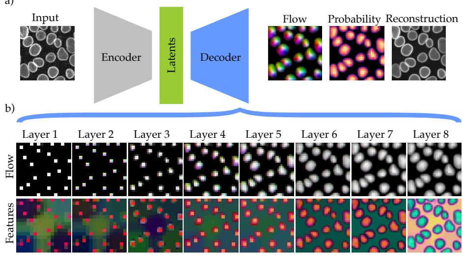
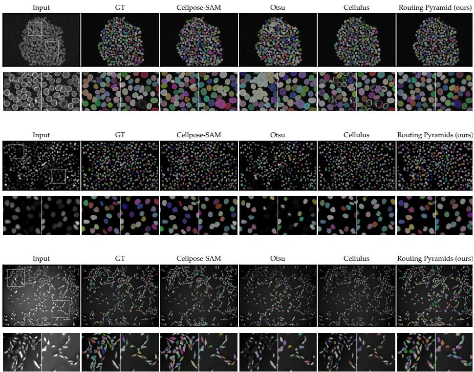
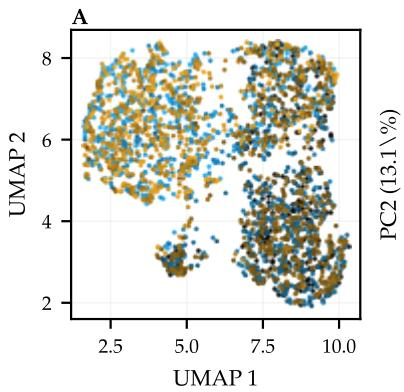
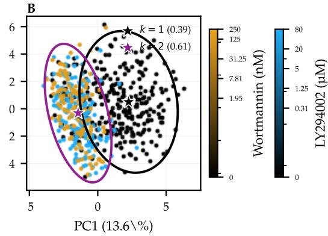
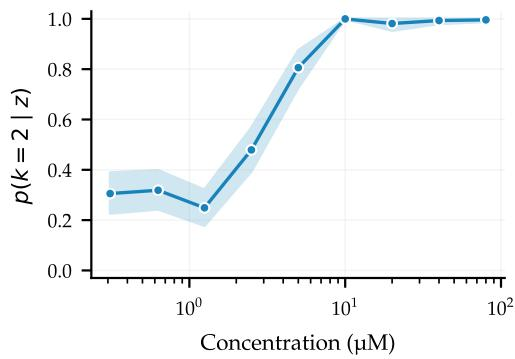
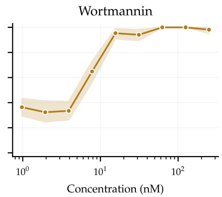
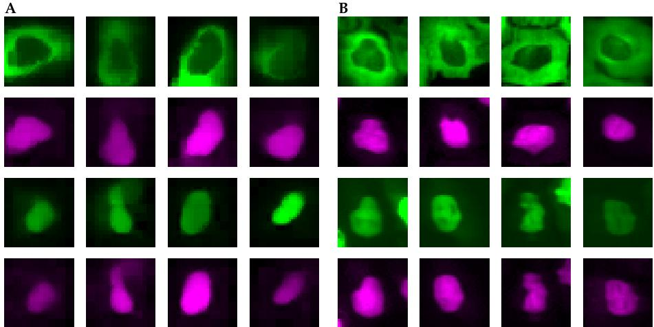

# Unsupervised Learning of Cell Instances with Generative Routing Pyramids

Ziwen Liu1 and Martin Weigert1

Center for Scalable Data Analytics and Artificial Intelligence (ScaDS.AI), Technische Universität Dresden, Germany {ziwen.liu,martin.weigert}@tu-dresden.de

Abstract. Identifying and representing object instances such as cells or nuclei is a common task in microscopy image analysis. Established machine learning workflows typically use supervised detection or segmentation followed by feature extraction or classification, which requires manual annotations and treats instance segmentation and cell representation as separate stages. We describe a new unsupervised method for cell instance segmentation and phenotypic classification from unlabeled microscopy images. Our method is based on reconstructing each image using a coarse-to-fine routing pyramid that associates pixels with spatially sparse latent sources. The resulting pixel-to-latent associations yield instance masks, while the source latents encode cell morphology. We demonstrate competitive performance in instance segmentation across diverse cell morphologies and imaging modalities, as well as generative modeling of cellular phenotypes under perturbations. Source code and checkpoints are available at https://github.com/weigertlab/routingpyramids.

Keywords: Cell segmentation · Unsupervised learning · Object-Centric Learning · Microscopy

## 1 Introduction

Identifying individual objects, such as cells or nuclei, in microscopy images is a fundamental task in quantitative bioimage analysis [18] with applications including cell counting, morphological profiling, and tracking [2, 4, 27]. Currently, supervised deep learning-based approaches are the most successful cell segmentation methods [19, 22, 23, 25]. Training these models, however, requires laborious manual annotations of large sets of training images, making dataset creation a recurring cost when specimens, imaging modalities, or acquisition conditions change.

Although object appearances can vary substantially across imaging modalities and sample types, they often exhibit a more stereotypic visual appearance within a single experimental setting, particularly in cell culture experiments such as those considered here. Such settings provide many unlabeled examples from which a model could learn shared structure while retaining object-specific variation. Yet a shared appearance model alone does not establish instance identity, as adjacent cells can look similar but must remain associated with distinct spatial sources. Label-free cell instance learning therefore requires a shared appearance model together with a spatial assignment that keeps individual objects separate. Object-centric learning provides a framework for this idea: reconstruction-based approaches explain an image as a collection of objects and background and learn an object-level latent representation for each component [5, 9, 13, 15]. Existing formulations commonly separate components through global slots, iterative inference, or independently rendered object glimpses, but scale poorly to microscopy images with many small objects (Sec. 2.2).

  
Fig. 1: Overview of Generative Routing Pyramids. a) From an input image, the encoder predicts a latent field, which is then used to generate pyramidal (coarse-to-fine) flows to reconstruct the image. b) Per-layer flow and routed feature maps. The flows are shown as HSV encoding, where hue is the flow direction, saturation is the flow magnitude, and value is the routed probability mass. The features are shown as RGB values representing the first three principle components.

In this work, we introduce Generative Routing Pyramids, an object-centric generative model trained directly on unlabeled microscopy images. The model predicts where objects are present and runs a single decoder pass across all candidate objects to reconstruct the image from their latent representations. Because foreground presence is penalized, the model activates a source only when the shared decoder can use it to reconstruct a recurring object appearance. To reconstruct extended objects while preserving their spatial identity, the decoder expands each source through a coarse-to-fine pyramid. At each level, every finerscale location softly chooses among nearby parent locations, so the resulting chain of local choices traces image pixels back to the sources that explain them.

These pixel-to-source ancestries yield instance masks, while the corresponding source latents provide object representations for single-cell phenotype analysis.

## 2 Related Work

## 2.1 Cell Segmentation and Representation Learning

Supervised cell instance segmentation models often predict geometric targets derived from instance masks. StarDist [23] regresses radial distances along a fixed set of directions to form star-convex polygon proposals, followed by nonmaximum suppression. Cellpose [25] instead predicts dense pixel-space flows toward object centers and groups pixels by following these flows over multiple steps. Our method instead trains without flow targets or instance annotations.

Unsupervised methods replace mask-derived targets with surrogate objectives. Cellulus [28] predicts relative ofsets between image patches to learn dense spatial embeddings, estimates foreground by comparing embeddings of corrupted input images, and obtains instances through mean-shift clustering and morphological filtering. CellSeg3D [1] adapts W-Net [29] to learn semantic foreground without labels and separates instances with Voronoi-Otsu post-processing. Both Cellulus and CellSeg3D separate instances via non-learned post-processing. Motionbased pseudo-labels provide another alternative [21], but require time-lapse data with smooth foreground motion and static background. Our method works with static images, and directly learns instance assignment as part of the image generation process.

Microscopy representation learning either produces dense pixel or patch features [8, 12], which still require instance extraction for single-cell analysis, or learns from single-cell crops [10, 26], which assume prior detections or masks. In both cases, segmentation and representation learning are treated as distinct stages, requiring separate data curation and training eforts. Our method instead jointly learns instance segmentation and object representation from the same datasets without labels.

## 2.2 Object-Centric Generative Learning

Object-centric generative models learn component representations through image reconstruction, but difer in how they infer and render components [5,9,13,15,24]. Their computational scaling matters for microscopy images containing many small instances (Tab. 1). Global-component methods couple full-image cost (with N pixels) to the component count K, and iterative variants add the factor T. For example, SPACE [13] performs parallel candidate inference spatially, but renders every proposal in full image space. Our method predicts all candidate sources in one O(N) forward pass, and reconstructs a shared spatial feature field instead of rendering each candidate separately. Reading out the K inferred instance masks costs O(KN).

Table 1: Inference scaling of related methods. N is the number of pixels, with featuretoken count linear in N; K is the object, slot, or seed component count; T is the number of iterative inference steps; R is the number of noisy inference passes; and I is the number of mean-shift iterations. Fixed network-depth and local-neighborhood factors are omitted. †Cellulus does not reconstruct the image, its instance-segmentation cost is shown instead.
<table><tr><td>Detection</td><td>Reconstruction</td><td>Method</td></tr><tr><td>O(KN), sequential</td><td>O(KN)</td><td>MONet [5]</td></tr><tr><td> $O ( T K N )$ </td><td> $O ( T K N )$ </td><td>IODINE [9]</td></tr><tr><td> $O ( T K N )$ </td><td> $O ( K N )$ </td><td>Slot Attention [15]</td></tr><tr><td> $O ( N ^ { 2 } + T K N )$ </td><td> $O ( N ^ { 2 } + K N )$ </td><td>DINOSAUR [24]</td></tr><tr><td> $O ( N )$ </td><td> $\mathrm { U p } \ \mathrm { t o } O ( N ^ { 2 } )$ </td><td>SPACE [13]</td></tr><tr><td> $O ( R N )$ </td><td> $O ( I N \log N + K N )$ </td><td>Cellulus† [28]</td></tr><tr><td>O(N)</td><td>O(N)</td><td>CellSeg3D [1] (W-Net [29])</td></tr><tr><td>O(N)</td><td>O(N)</td><td>Generative Routing Pyramids (ours)</td></tr></table>

## 2.3 Hierarchical Flow Fields

Coarse-to-fine pyramids are established tools for approximating displacement fields [3, 6] eficiently, and learned pyramids have been used to predict optical flow between video frames [20]. In our setting, a coarse-to-fine hierarchy defines the spatial information flow of a single-image generative model, which induces instance segmentation. Intuitively, this spatial flow field is similar to the object center-to-boundary flows found in StarDist and Cellpose, but is implicitly defined by the image generation process. Using a hierarchical approximation avoids non-diferentiable assignment like StarDist, or running many Cellpose-style flow simulation steps during training, allowing for end-to-end unsupervised learning.

## 3 Method

## 3.1 Overview

Our method learns object instances from unlabeled microscopy images. As shown in Fig. 1, an encoder infers foreground and background latents given an input image, while a sparsity-regularized presence map marks object candidates. A coarse-to-fine pyramidal decoder reconstructs the image using local routing weights. The same weights associate pixels with latent sources, yielding instance masks and one latent representation per inferred object. For timelapse data, the model processes each frame independently.

## 3.2 Spatial Latents and Learned Object Seeds

Given an input image $x \in \mathbb { R } ^ { H \times W \times C }$ , the encoder $E _ { \phi }$ produces features $f =$ $E _ { \phi } ( x ) \ \in \mathbb { R } ^ { h \times w \times d _ { E } }$ on a grid $\varOmega _ { 0 }$ with spatial stride δ. The stride is a model

hyperparameter, with $h = H / \delta$ and $w = W / \delta$ for divisible input sizes. We use $\delta = 8$ in all experiments.

Pointwise heads predict a diagonal Gaussian posterior for each of the two latent grids,

$$
q _ { \phi } ^ { r } ( z ^ { r } \mid x ) = \prod _ { u \in \Omega _ { 0 } } \mathcal { N } \big ( z _ { u } ^ { r } ; \mu _ { u } ^ { r } , \mathrm { d i a g } ( ( \sigma _ { u } ^ { r } ) ^ { 2 } ) \big ) , \qquad r \in \{ \mathrm { f g } , \mathrm { b g } \}\tag{1}
$$

Here $z _ { u } ^ { r } \in \mathbb { R } ^ { d }$ , where d is the shared latent dimension. The foreground and background candidates are sampled independently given x, and both use standardnormal priors. Before the background head, encoder features are average-pooled with stride $\delta _ { \mathrm { b g } }$ and bilinearly restored to $\varOmega _ { 0 }$ . This stride is a separate model hyperparameter; we use $\delta _ { \mathrm { b g } } ~ = ~ 8$ in all experiments. This operation restricts the image-dependent background posterior parameters to vary smoothly across space.

A pointwise prediction from the foreground candidate defines a deterministic soft presence gate

$$
s _ { u } = \mathrm { s i g m o i d } ( w _ { s } ^ { \mathsf { T } } z _ { u } ^ { \mathsf { f g } } + b _ { s } ) , \qquad u \in \varOmega _ { 0 }\tag{2}
$$

The decoder starts from the gated blend

$$
h _ { u } ^ { 0 } = s _ { u } z _ { u } ^ { \mathrm { f g } } + ( 1 - s _ { u } ) z _ { u } ^ { \mathrm { b g } }\tag{3}
$$

Values of $s _ { u }$ near one expose the foreground candidate, whereas values near zero select the spatially smoothed background candidate. The posterior candidates are sampled independently, but this deterministic gate couples them before decoding. During training, the Gaussian fields are sampled via reparameterization [11], and inference uses their posterior means. Reconstruction pressure determines where foreground capacity is needed, and sparse active regions of s are interpreted as learned object seeds.

## 3.3 Routing Pyramid Decoder

Let $\varOmega _ { \ell }$ denote the destination grid at decoder layer ℓ. Each site $j \in \varOmega _ { \ell }$ selects among a valid $3 \times 3$ neighborhood $\mathcal { N } _ { \ell } ( j )$ around its anchor on the preceding parent grid, which is either at the same resolution or coarser by a factor of two. A convolutional residual predictor produces logits $a _ { j i } ^ { \ell }$ from the presence-gated decoder features, and a masked softmax gives

$$
T _ { j i } ^ { \ell } = \frac { \exp ( a _ { j i } ^ { \ell } ) } { \sum _ { i ^ { \prime } \in \mathcal { N } _ { \ell } ( j ) } \exp ( a _ { j i ^ { \prime } } ^ { \ell } ) } , \qquad i \in \mathcal { N } _ { \ell } ( j ) , \qquad \sum _ { i } T _ { j i } ^ { \ell } = 1\tag{4}
$$

Invalid boundary edges have zero probability. Thus $T _ { j i } ^ { \ell }$ is the conditional probability that destination $j$ selects site i as its parent. Under a uniform measure over $\varOmega _ { \ell } , \var T ^ { \ell }$ can therefore be viewed as a locally supported, one-sided transport coupling.

The layer-indexed pyramid sites and their local parent links form a directed acyclic graph (DAG) G: an edge connects $( \ell , j )$ to $( \ell - 1 , i )$ whenever $i \in \mathcal { N } _ { \ell } ( j )$ Every edge therefore points from output pixels toward the latent seed grid and decreases the layer index. Conditioned on the inferred image representation, the locally normalized routing distributions define a finite, layer-inhomogeneous Markov chain over G. If assignment mass reaches a site j, the weights $T _ { j i } ^ { \ell }$ distribute all of it among valid parents; flows can split at fine sites and merge at parent sites. Composing the chain’s layer-wise transition kernels gives

$$
A _ { n u } = \sum _ { \gamma \in \Gamma ( n , u ) } \prod _ { \ell } T _ { \gamma _ { \ell } \gamma _ { \ell - 1 } } ^ { \ell }\tag{5}
$$

where n indexes output pixels and $\boldsymbol { { \cal T } } ( \boldsymbol { n } , \boldsymbol { u } )$ is the set of valid paths from pixel n to coarse seed site u. Hence $A _ { n u }$ is the probability that unit assignment mass originating at n reaches $u ,$ and $\textstyle \sum _ { u } A _ { n u } = 1$ . Thus $\bar { A } \in [ 0 , 1 ] ^ { H W \times h w }$ is the pixelto-seed association matrix induced by the pyramid $\mathrm { D A G }$ , with output pixels as rows and latent seed sites as columns. Each row is the full transition distribution from one pixel to the seed grid. Equivalently, it describes the unit flow induced from each pixel through the learned probabilistic flow network. This Markovchain interpretation applies to the ancestry process after the image-dependent routing kernels have been predicted; feature propagation additionally includes the neural updates described below. The propagated foreground probability is

$$
p _ { n } ^ { \mathrm { f g } } = \sum _ { u \in \varOmega _ { 0 } } A _ { n u } s _ { u }\tag{6}
$$

During generation, the same routing weights pull seed presence and decoder values from each destination’s parents,

$$
s _ { j } ^ { \ell } = \sum _ { i } T _ { j i } ^ { \ell } s _ { i } ^ { \ell - 1 } , \qquad r _ { j } ^ { \ell } = \sum _ { i } T _ { j i } ^ { \ell } V _ { \ell } ( h _ { i } ^ { \ell - 1 } )\tag{7}
$$

The transported update $r _ { j } ^ { \ell }$ is normalized, activated, gated by $s _ { j } ^ { \ell } ,$ and added to a nearest-neighbor residual path. A pointwise feed-forward residual block completes the layer. Layers either remain at the current resolution or upsample by two; a final pointwise network maps the full-resolution features to the reconstructed image xˆ. Thus the coarse-to-fine generative computation and the fine-to-coarse ancestry interpretation use the same learned graph.

Let $c _ { u }$ be the image-space center coordinate of seed site u and $c _ { n }$ the coordinate of pixel n. The expected pixel-to-seed flow is

$$
v _ { n } = \sum _ { u \in \varOmega _ { 0 } } A _ { n u } c _ { u } - c _ { n }\tag{8}
$$

This expected displacement gives a Cellpose-like flow readout from the learned association matrix [25]. Hard local support at every layer bounds individual transport steps, while their composition permits larger object extents through the pyramid.

## 3.4 Unsupervised Learning Objective

Let $z = ( z ^ { \mathrm { f g } } , z ^ { \mathrm { b g } } )$ be the sampled latent fields and $\hat { x } _ { \theta } ( z )$ be the corresponding decoder output. The expected reconstruction term is

$$
\mathcal { L } _ { \mathrm { r e c } } ( x ) = \mathbb { E } _ { q _ { \phi } ( z | x ) } \left[ \frac { 1 } { H W C } \| \hat { x } _ { \theta } ( z ) - x \| _ { 1 } \right]\tag{9}
$$

Separate mean KL terms regularize the foreground and background posteriors toward their standard-normal priors:

$$
\mathcal { L } _ { \mathrm { K L } } ^ { r } = \frac { 1 } { | \varOmega _ { 0 } | d } \sum _ { u , k } \frac { 1 } { 2 } \left( ( \boldsymbol { \mu } _ { u k } ^ { r } ) ^ { 2 } + ( \boldsymbol { \sigma } _ { u k } ^ { r } ) ^ { 2 } - 1 - \log ( \boldsymbol { \sigma } _ { u k } ^ { r } ) ^ { 2 } \right) , \qquad r \in \{ \mathrm { f g } , \mathrm { b g } \}\tag{10}
$$

A smooth concave penalty encourages foreground capacity to concentrate into fewer seed regions,

$$
\mathcal { L } _ { \mathrm { s p a r s i t y } } = \frac { 1 } { \left| \varOmega _ { 0 } \right| } \sum _ { u \in \varOmega _ { 0 } } \left( \left( s _ { u } + \epsilon \right) ^ { \alpha } - \epsilon ^ { \alpha } \right) , \qquad \alpha \in \left( 0 , 1 \right)\tag{11}
$$

The exponent $\alpha$ is a hyperparameter controlling the concavity of the penalty; we use $\alpha = 0 . 5$ in all experiments. Here ϵ is a small ofset that keeps the derivative finite near $s _ { u } = 0$

With $c _ { i } ^ { \ell - 1 }$ and $c _ { j } ^ { \ell }$ denoting parent- and destination-site centers in image pixels, each local edge has quadratic geometric cost $\| c _ { i } ^ { \ell - 1 } - c _ { j } ^ { \ell } \| _ { 2 } ^ { 2 }$ . We regularize its expectation under the learned routing distributions,

$$
\mathcal { L } _ { \mathrm { { f l o w } } } = \frac { 1 } { \sum _ { \ell = 1 } ^ { L } | \Omega _ { \ell } | } \sum _ { \ell = 1 } ^ { L } \sum _ { j \in \Omega _ { \ell } } \sum _ { i \in \mathcal { N } _ { \ell } ( j ) } T _ { j i } ^ { \ell } \Vert c _ { i } ^ { \ell - 1 } - c _ { j } ^ { \ell } \Vert _ { 2 } ^ { 2 }\tag{12}
$$

Thus ${ \mathcal { L } } _ { \mathrm { { f l o w } } }$ averages the expected squared local step length across layers and destination sites. It is generally diferent from the squared norm of the composed expected flow $v _ { n }$

The complete per-image objective is

$$
\mathcal { L } = \lambda _ { \mathrm { { r e c } } } \mathcal { L } _ { \mathrm { { r e c } } } + \lambda _ { \mathrm { { f g } } } \mathcal { L } _ { \mathrm { { K L } } } ^ { \mathrm { { f g } } } + \lambda _ { \mathrm { { b g } } } \mathcal { L } _ { \mathrm { { K L } } } ^ { \mathrm { { b g } } } + \lambda _ { \mathrm { { f l o w } } } \mathcal { L } _ { \mathrm { { f l o w } } } + \lambda _ { \mathrm { { s p a r s i t y } } } \mathcal { L } _ { \mathrm { { s p a r s i t y } } }\tag{13}
$$

We use $\lambda _ { \mathrm { { r e c } } } = 1 . 0 , \lambda _ { \mathrm { { f g } } } = 0 . 0 1 , \lambda _ { \mathrm { { b g } } } = 0 . 0 5 , \lambda _ { \mathrm { { f o w } } } = 0 . 0 0 5$ for all experiments, and choose $\lambda _ { \mathrm { s p a r s i t y } } \in \{ 0 . 2 , 0 . 5 \}$ for diferent datasets (Sec. 4). We use linear warmup for the weight of regularization loss terms over the first 10 epochs.

## 3.5 Instance Segmentation and Object Representations

At inference, the model replaces the sampled latent fields with their posterior means. It thresholds the coarse presence map at $\tau _ { s }$ and groups neighboring active source sites using 8-connectivity:

$$
\{ C _ { k } \} = \mathrm { C C } _ { 8 } ( \{ u : s _ { u } \geq \tau _ { s } \} )\tag{14}
$$

Table 2: Biological and imaging properties of the instance-segmentation datasets.
<table><tr><td>Dataset</td><td>Cell type</td><td>Visible structure</td><td>Modality</td></tr><tr><td>Allen</td><td>Human induced pluripotent stem cells (hiPSCs)</td><td>Nuclear envelope (Lamin B1-mEGFP)</td><td>Fluorescence</td></tr><tr><td>Fluo-HeLa</td><td>HeLa cells</td><td>Nuclei (H2B-GFP)</td><td>Fluorescence</td></tr><tr><td>PhC-PSC</td><td>Rat pancreatic stem cells</td><td>Cell body</td><td>Phase contrast</td></tr></table>

Each component serves as an object seed. We use $\tau _ { s } = 0 . 5$ in all experiments.

The routing ancestry expands these coarse seeds into image-space instances. The presence-weighted mass of component $C _ { k }$ at pixel n is

$$
m _ { k } ( n ) = \sum _ { u \in C _ { k } } A _ { n u } s _ { u } .\tag{15}
$$

A pixel is assigned to the component with the largest mass if that mass reaches the threshold $\tau _ { m }$ :

$$
\begin{array} { r } { \hat { y } _ { n } = \left\{ \begin{array} { l l } { \arg \operatorname* { m a x } _ { k } m _ { k } ( n ) , } & { \operatorname* { m a x } _ { k } m _ { k } ( n ) \geq \tau _ { m } , } \\ { 0 , } & { \mathrm { o t h e r w i s e } } \end{array} \right. } \end{array}\tag{16}
$$

We use $\tau _ { m } = 0 . 1$ in all experiments. Instances are filtered by minimum area on the model-resolution grid. We use a minimum area of 100 pixels for all experiments. The masks are then rescaled by nearest-neighbor (for upsampling) or mode pooling (for downsampling) to the raw image resolution if the model and raw image resolutions difer.

The same seed components define object-level representations used for phenotype analysis. For each component, its embedding $e _ { k }$ is the presence-weighted average of the foreground posterior means:

$$
e _ { k } = \frac { \sum _ { u \in C _ { k } } s _ { u } \mu _ { u } ^ { \mathrm { f g } } } { \sum _ { u \in C _ { k } } s _ { u } }\tag{17}
$$

## 4 Experiments

## 4.1 Unsupervised Cell Instance Segmentation

We test whether the generative objective and inductive biases of our method are suficient for cell detection and instance segmentation without annotations.

Datasets. We evaluate on three cell culture datasets (Tab. 2): the Allen Institute nuclear morphology dataset [7], and the Fluo-N2DL-HeLa and PhC-C2DL-PSC datasets from the Cell Tracking Challenge [16]. They span nuclear and wholecell targets, fluorescence and phase-contrast imaging, and vary in morphology and density. For the Allen dataset, we use the three analysis timelapses from the

Table 3: Instance segmentation on Allen, Fluo-HeLa, and PhC-PSC datasets. We compare the unsupervised methods Routing Pyramids, Cellulus, and Otsu with the supervised Cellpose-SAM reference. We report instance-level $F _ { 1 }$ scores at IoU thresholds of 0.5, 0.7, and 0.9, and panoptic quality (PQ). Higher values are better. Bold and underlined values indicate the best and second-best result for each dataset and metric, respectively.
<table><tr><td>Dataset</td><td>Method</td><td>Type</td><td> $F _ { 1 } ^ { [ 0 . 5 ] }$ </td><td> $F _ { 1 } ^ { [ 0 . 7 ] }$ </td><td> $F _ { 1 } ^ { [ 0 . 9 ] }$ </td><td>PQ</td></tr><tr><td>Allen</td><td>Cellpose-SAM</td><td>supervised</td><td>0.977 0.964</td><td></td><td>0.256</td><td>0.859</td></tr><tr><td></td><td>Otsu (size 42)</td><td>non-parametric</td><td>0.906</td><td>0.861</td><td>0.149</td><td>0.773</td></tr><tr><td></td><td>Cellulus (size 52)</td><td>unsupervised</td><td>0.908</td><td>0.854</td><td>0.325</td><td>0.787</td></tr><tr><td></td><td>Routing Pyramids (ours)</td><td>unsupervised</td><td>0.960</td><td>0.943</td><td>0.649</td><td>0.867</td></tr><tr><td>Fluo-HeLa</td><td>Cellpose-SAM</td><td>supervised</td><td>0.915 0.892</td><td></td><td>0.752 0.843</td><td></td></tr><tr><td></td><td>Otsu (size 26)</td><td>non-parametric</td><td>0.768</td><td>0.642</td><td>0.190</td><td>0.623</td></tr><tr><td></td><td>Cellulus (size 26)</td><td>unsupervised</td><td>0.875</td><td>0.824</td><td>0.297</td><td>0.756</td></tr><tr><td></td><td>Routing Pyramids (ours)</td><td>unsupervised</td><td>0.893</td><td>0.846</td><td>0.646</td><td>0.800</td></tr><tr><td>PhC-PSC</td><td>Cellpose-SAM</td><td>supervised</td><td>0.881 0.812</td><td></td><td>0.094 0.721</td><td></td></tr><tr><td></td><td>Otsu (size 19)</td><td>non-parametric</td><td>0.524</td><td>0.196</td><td>0.005</td><td>0.351</td></tr><tr><td></td><td>Cellulus (size 16)</td><td>unsupervised</td><td>0.628</td><td>0.035</td><td>0.000</td><td>0.370</td></tr><tr><td></td><td>Routing Pyramids (ours) unsupervised</td><td></td><td>0.771</td><td>0.298</td><td>0.001</td><td>0.518</td></tr></table>

FOV-nuclei timelapse dataset. From these we use the large and small timelapses for training, and the medium timelapse for testing. For the CTC datasets, we use the two test videos (without annotations) for training, and the train videos (with annotations) for testing. As the CTC datasets only have sparse manually annotated segmentation masks, we use their Silver Truth annotations [16] as the target.

Training. We train our method from scratch using only single channel images. All datasets use the same model architecture with latent dimension $d = 6 4 .$ Models are trained on 256 × 256 crops for 200 epochs with batch size 64. We bilinearly upsample the PhC-PSC images by a scale factor of 2. The Allen images are maximum-intensity projections of 3D acquisitions, and are two-fold downsampled with average pooling. We use $\lambda _ { \mathrm { s p a r s i t y } } = 0 . 5$ for Allen and PhC-PSC, and $\lambda _ { \mathrm { s p a r s i t y } } = 0 . 2$ for Fluo-HeLa.

Baselines. We compare with Cellpose-SAM [19] (with frozen weights) as a strong supervised reference, Cellulus as an unsupervised baseline, and Otsu thresholding followed by connected components as a non-parametric baseline. Cellulus and Otsu use dataset-specific post-processing parameters (e.g. object size, see Tab. 3) selected on the test set, which gives them an advantage in the comparison. Our method uses the same post-processing across all datasets (Sec. 3.5).

  
Fig. 2: Instance segmentation on Allen (top), Fluo-HeLa (middle), and PhC-PSC (bottom). From left to right, columns show the input image, ground-truth instances (GT), the supervised Cellpose-SAM reference, the unsupervised Otsu and Cellulus baselines, and our method. Instances are indicated by distinct colors. The lower row per dataset shows two inset regions marked by white boxes in the input image.

Metrics. Predicted and annotated instances are matched by intersection over union (IoU). We report object-level F1 scores at IoU thresholds 0.5, 0.7, and 0.9, and panoptic quality (PQ).

Results. Tab. 3 reports the quantitative comparison and Fig. 2 shows representative predictions. Among the unsupervised methods, Generative Routing Pyramids obtains the best score on nearly every dataset and metric, improving panoptic quality over the strongest unsupervised baseline on all three datasets (PQ 0.867, 0.800, 0.518 vs. 0.787, 0.756, 0.370 for Cellulus). Generative Routing Pyramids is second only to the supervised Cellpose-SAM reference in most settings. On the Allen dataset it exceeds this supervised reference in both panoptic quality (0.867 vs. 0.859) and F1 at a strict IoU 0.9 threshold (0.649 vs. 0.256), indicating tighter agreement with the ground-truth nuclear boundaries. The main exception is F1 at IoU 0.9 on PhC-PSC, where every method scores below 0.1, reflecting the dificulty of pixel-accurate boundaries in low-resolution phase-contrast images.

C LY294002  

  
Fig. 3: Object latents encode perturbation-induced phenotypes. a) UMAP of the object latent codes on the series dilution images. b) PCA and GMM fit of the training split applied to the control object latents. Stars denote the means, and elliptical contours show the 95% confidence intervals (CI) for the GMM. Legend shows the ratios for each component. c) Positive (GMM k=2) probability of objects in the series dilution images. Lines indicate mean over objects, and the bands indicate 95% CI.

## 4.2 Generative Object Representation Learning

We test whether the learned object latent codes capture single-cell phenotypic variation using two-channel fluorescence images of U2OS cells treated with a dilution series of LY294002 or wortmannin from BBBC013 [14]. Plate columns 2– 11 form the series-dilution training split, while columns 1 and 12 contain positive and negative controls held out for validation. After unsupervised training, we extract one embedding per predicted cell (Sec. 3.2).

To qualitatively assess latent space clustering by phenotype, principal component analysis (PCA) and UMAP [17] are fit to the series-dilution (training)

  
Fig. 4: Generated (a) and retrieved (b) 32 × 32 crops from the series dilution images. Top two rows show GFP (green) and DNA (magenta) channels corresponding to the "negative control" GMM component, while the bottom two rows correspond to the "positive control" component. a) Generated crops by sampling from the two Gaussian distributions. b) Retrieved crops by nearest neighbor search with component means in the observed object latent set.

embeddings, and overlaid with perturbation strength (dose) for series dilution (Fig. 3a) and control images (Fig. 3b). For both splits, the object latents form distinct clusters by dose.

To quantitatively model the binary phenotype, a two-component Gaussian mixture model (GMM) is fit to the object latents from the training split, where it shows the dose-response of cells under perturbations (Fig. 3c). Identities are assigned to the components by comparing their means to the held-out controls (Fig. 3b). Thresholding at 0.5 on the average GMM responsibilities recovers the positive/negative classes with 100% accuracy for the 16 control replicates.

The GMM can be further used as the approximate posterior for instance generation and the clusters for instance retrieval (Fig. 4), by either sampling from the Gaussian components or retrieving nearest neighbors (by Euclidean distance) to the component means. The generated samples show that the generative model is consistent with the phenotypic variation induced by the perturbations, while the retrieved samples illustrate the distinct morphologies corresponding to the learned latent clusters.

## 5 Conclusion

We present Generative Routing Pyramids, an unsupervised object-centric model that learns cell instances and morphological representations from unlabeled 2D microscopy images. Its routing-pyramid decoder reconstructs each image while tracing pixels to spatially sparse latent sources, so instance masks and object embeddings arise from the same decomposition.

Across fluorescence and phase-contrast datasets, our method outperforms the evaluated unsupervised baselines at an IoU threshold of 0.5, while requiring minimal post-processing. In a two-channel fluorescence drug perturbation assay, mixture responsibilities computed from the learned object representations are consistent with treatment dose, while generated and retrieved cells recover the corresponding phenotypes.

We currently train a separate model for each dataset, leaving generalization across diverse samples a question for future work. Our method also assumes compact objects of similar appearance against a smoother background, and application to more complex scenes such as tissue imaging remains unexplored. Despite these limitations, we show that recurring visual structure within an experiment can support learning cell instances and their morphology without manual annotations.

## Acknowledgements

We thank Albert Dominguez Mantes, École Polytechnique Fédérale de Lausanne (EPFL), for critically reading the manuscript.

## References

1. Achard, C., Kousi, T., Frey, M., Vidal, M., Paychere, Y., Hofmann, C., Iqbal, A., Hausmann, S.B., Pagès, S., Mathis, M.W.: CellSeg3D, Self-supervised 3D cel segmentation for fluorescence microscopy. eLife 13, RP99848 (Jun 2025). https: //doi.org/10.7554/eLife.99848

2. Amat, F., Lemon, W., Mossing, D.P., McDole, K., Wan, Y., Branson, K., Myers, E.W., Keller, P.J.: Fast, accurate reconstruction of cell lineages from large-scale fluorescence microscopy data. Nature methods 11(9), 951 (2014)

3. Bergen, J.R., Anandan, P., Hanna, K.J., Hingorani, R.: Hierarchical model-based motion estimation. In: Sandini, G. (ed.) Computer Vision — ECCV’92. pp. 237– 252. Springer, Berlin, Heidelberg (1992). https://doi.org/10.1007/3- 540- 55426-2\_27

4. Boutros, M., Heigwer, F., Laufer, C.: Microscopy-based high-content screening. Cell 163(6), 1314–1325 (2015)

5. Burgess, C.P., Matthey, L., Watters, N., Kabra, R., Higgins, I., Botvinick, M., Lerchner, A.: MONet: Unsupervised Scene Decomposition and Representation (Jan 2019). https://doi.org/10.48550/arXiv.1901.11390

6. Burt, P., Adelson, E.: The Laplacian Pyramid as a Compact Image Code. IEEE Transactions on Communications 31(4), 532–540 (Apr 1983). https://doi.org/ 10.1109/TCOM.1983.1095851

7. Dixon, J.C., Frick, C.L., Leveille, C.L., Garrison, P., Lee, P.A., Mogre, S.S., Morris, B., Nivedita, N., Vasan, R., Chen, J., Fraser, C.L., Gamlin, C.R., Harris, L.K., Hendershott, M.C., Johnson, G.T., Klein, K.N., Oluoch, S.A., Thirstrup, D.J., Sluzewski, M.F., Wilhelm, L., Yang, R., Toloudis, D.M., Viana, M.P., Theriot, J.A., Rafelski, S.M.: Colony context and size-dependent compensation mechanisms

give rise to variations in nuclear growth trajectories (Jun 2024). https://doi.org/ 10.1101/2024.06.28.601071

8. Gallusser, B., Stieber, M., Weigert, M.: Self-supervised dense representation learning for live-cell microscopy with time arrow prediction (Jul 2023)

9. Gref, K., Kaufman, R.L., Kabra, R., Watters, N., Burgess, C., Zoran, D., Matthey, L., Botvinick, M., Lerchner, A.: Multi-Object Representation Learning with Iterative Variational Inference (Jul 2020). https://doi.org/10.48550/arXiv.1903. 00450

10. Hirata-Miyasaki, E., Pradeep, S., Liu, Z., Imran, A., Theodoro, T.M., Ivanov, I.E., Khadka, S., Lee, S.C., Grunberg, M., Woosley, H., Bhave, M., Arias, C., Mehta, S.B.: DynaCLR: Contrastive Learning of Cellular Dynamics with Temporal Regularization (Jul 2025). https://doi.org/10.48550/arXiv.2410.11281

11. Kingma, D.P., Welling, M.: Auto-encoding variational bayes. In: Bengio, Y., Le-Cun, Y. (eds.) 2nd International Conference on Learning Representations, ICLR 2014, Banf, AB, Canada, April 14-16, 2014, Conference Track Proceedings (2014)

12. Kraus, O., Kenyon-Dean, K., Saberian, S., Fallah, M., McLean, P., Leung, J., Sharma, V., Khan, A., Balakrishnan, J., Celik, S., Beaini, D., Sypetkowski, M., Cheng, C.V., Morse, K., Makes, M., Mabey, B., Earnshaw, B.: Masked Autoencoders for Microscopy are Scalable Learners of Cellular Biology. In: 2024 IEEE/CVF Conference on Computer Vision and Pattern Recognition (CVPR). pp. 11757–11768. IEEE, Seattle, WA, USA (Jun 2024). https://doi.org/10. 1109/CVPR52733.2024.01117

13. Lin, Z., Wu, Y.F., Peri, S.V., Sun, W., Singh, G., Deng, F., Jiang, J., Ahn, S.: SPACE: Unsupervised Object-Oriented Scene Representation via Spatial Attention and Decomposition (Mar 2020). https://doi.org/10.48550/arXiv.2001.02407

14. Ljosa, V., Sokolnicki, K.L., Carpenter, A.E.: Annotated high-throughput microscopy image sets for validation. Nature Methods 9(7), 637–637 (Jul 2012). https://doi.org/10.1038/nmeth.2083

15. Locatello, F., Weissenborn, D., Unterthiner, T., Mahendran, A., Heigold, G., Uszkoreit, J., Dosovitskiy, A., Kipf, T.: Object-Centric Learning with Slot Attention. In: Advances in Neural Information Processing Systems. vol. 33, pp. 11525– 11538. Curran Associates, Inc. (2020)

16. Maška, M., Ulman, V., Delgado-Rodriguez, P., Gómez-de-Mariscal, E., Nečasová, T., Guerrero Peña, F.A., Ren, T.I., Meyerowitz, E.M., Scherr, T., Löfler, K., Mikut, R., Guo, T., Wang, Y., Allebach, J.P., Bao, R., Al-Shakarji, N.M., Rahmon, G., Toubal, I.E., Palaniappan, K., Lux, F., Matula, P., Sugawara, K., Magnusson, K.E.G., Aho, L., Cohen, A.R., Arbelle, A., Ben-Haim, T., Raviv, T.R., Isensee, F., Jäger, P.F., Maier-Hein, K.H., Zhu, Y., Ederra, C., Urbiola, A., Meijering, E., Cunha, A., Muñoz-Barrutia, A., Kozubek, M., Ortiz-de-Solórzano, C.: The Cell Tracking Challenge: 10 years of objective benchmarking. Nature Methods 20(7), 1010–1020 (Jul 2023). https://doi.org/10.1038/s41592-023-01879-y

17. McInnes, L., Healy, J., Saul, N., Großberger, L.: UMAP: Uniform Manifold Approximation and Projection. Journal of Open Source Software 3(29), 861 (Sep 2018). https://doi.org/10.21105/joss.00861

18. Meijering, E.: Cell segmentation: 50 years down the road. IEEE Signal Processing Magazine 29(5), 140–145 (2012)

19. Pachitariu, M., Rariden, M., Stringer, C.: Cellpose-SAM: Superhuman generalization for cellular segmentation (May 2025). https://doi.org/10.1101/2025.04. 28.651001

20. Ranjan, A., Black, M.J.: Optical Flow Estimation using a Spatial Pyramid Network (Nov 2016). https://doi.org/10.48550/arXiv.1611.00850

21. Robitaille, M.C., Byers, J.M., Christodoulides, J.A., Raphael, M.P.: Self-supervised machine learning for live cell imagery segmentation. Communications Biology 5(1), 1162 (Nov 2022). https://doi.org/10.1038/s42003-022-04117-x

22. Ronneberger, O., Fischer, P., Brox, T.: U-Net: Convolutional Networks for Biomedical Image Segmentation. In: Navab, N., Hornegger, J., Wells, W.M., Frangi, A.F. (eds.) Medical Image Computing and Computer-Assisted Intervention – MICCAI 2015. pp. 234–241. Springer International Publishing, Cham (2015). https://doi.org/10.1007/978-3-319-24574-4\_28

23. Schmidt, U., Weigert, M., Broaddus, C., Myers, G.: Cell Detection with Star-Convex Polygons. In: Frangi, A.F., Schnabel, J.A., Davatzikos, C., Alberola-López, C., Fichtinger, G. (eds.) Medical Image Computing and Computer Assisted Intervention – MICCAI 2018. pp. 265–273. Springer International Publishing, Cham (2018). https://doi.org/10.1007/978-3-030-00934-2\_30

24. Seitzer, M., Horn, M., Zadaianchuk, A., Zietlow, D., Xiao, T., Simon-Gabriel, C.J., He, T., Zhang, Z., Schölkopf, B., Brox, T., Locatello, F.: Bridging the Gap to Real-World Object-Centric Learning (Mar 2023). https://doi.org/10.48550/arXiv. 2209.14860

25. Stringer, C., Wang, T., Michaelos, M., Pachitariu, M.: Cellpose: A generalist algorithm for cellular segmentation. Nature Methods 18(1), 100–106 (Jan 2021). https://doi.org/10.1038/s41592-020-01018-x

26. Ulicna, K., Kelkar, M., Soelistyo, C.J., Charras, G.T., Lowe, A.R.: Learning dynamic image representations for self-supervised cell cycle annotation (May 2023). https://doi.org/10.1101/2023.05.30.542796

27. Ulman, V., Maška, M., Magnusson, K.E., Ronneberger, O., Haubold, C., Harder, N., Matula, P., Matula, P., Svoboda, D., Radojevic, M., et al.: An objective comparison of cell-tracking algorithms. Nature methods 14(12), 1141 (2017)

28. Wolf, S., Lalit, M., McDole, K., Funke, J.: Unsupervised Learning of Object-Centric Embeddings for Cell Instance Segmentation in Microscopy Images. In: 2023 IEEE/CVF International Conference on Computer Vision (ICCV). pp. 21206– 21215. IEEE, Paris, France (Oct 2023). https://doi.org/10.1109/ICCV51070. 2023.01944

29. Xia, X., Kulis, B.: W-Net: A Deep Model for Fully Unsupervised Image Segmentation (Nov 2017). https://doi.org/10.48550/arXiv.1711.08506