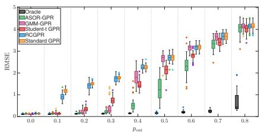
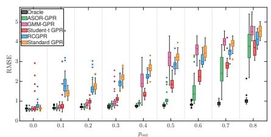
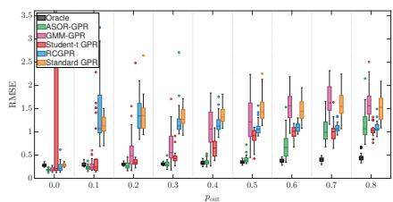

# Variational Outlier-Robust Gaussian Process Regression with Generative Modeling

Arslan Majal and Aamir Hussain Chughtai

Abstract—Outliers can substantially distort Gaussian process regression (GPR) due to its conventional Gaussian observation likelihood, leading to inaccurate model learning and prediction. To address this limitation, this article introduces a generative GPR model that captures observation-specific contamination and adaptively mitigates the influence of outliers. Subsequently, a variational generalized expectation-maximization procedure is used to learn the latent variables and GPR model parameters. Experiments on synthetic and real datasets under different contamination settings demonstrate that the proposed method remains competitive with—and in several cases outperforms— robust GPR baselines in prediction accuracy. Moreover, the proposed method shares the cubic computational scaling of the compared GPR methods.

Index Terms—Gaussian process regression, outlier-robust regression, variational Bayesian inference, robust signal processing, uncertainty quantification, expectation-maximization

## I. INTRODUCTION

AUSSIAN process regression (GPR) [1] is a Bayesian nonlinear modeling and principled uncertainty quantification, while remaining effective in data-limited settings. These properties make GPR useful in numerous signal-processing and learning applications.

Standard GPR assumes Gaussian observation noise, making it sensitive to outliers caused by sensor faults, calibration errors, transmission noise, or unexpected disturbances. Under this model, large residuals are penalized quadratically, allowing even a few corrupted observations to substantially distort the estimated latent function [2]. This motivates robust GPR methods that reduce the influence of unreliable observations.

Outliers in GPR are commonly handled by modifying the observation likelihood or the corresponding loss function. Existing robust approaches often rely on fixed likelihood modifications or robust losses with user-defined tuning parameters, including Huber- and Hampel-type penalties, heavytailed Student-t likelihoods, and generalized-Bayes likelihood induced losses [3]–[5]. Although tractable, these approaches can be sensitive to prescribed thresholds, loss parameters, or distributional shape parameters that control the influence of atypical observations. To overcome these limitations, more expressive adaptive models have been proposed. Instead of fixing the robust cost or likelihood parameters a priori, these methods adapt them from the observed data, thereby providing data-driven robustness.

The main challenge, however, is to make the outlier model sufficiently expressive while retaining tractable inference. To this end, existing approaches introduce latent variables, hierarchical likelihoods, mixture-based noise models, or optimizationbased robust formulations, including graduated non-convexity (GNC), to account for corrupted measurements [6]–[13].

A relevant class of adaptive methods employs generative models with variational inference to identify and mitigate outliers [7], [11]. Building on this idea, adaptive selective observation rejecting (ASOR) [10] learns outlier statistics rather than completely discarding suspected observations, thereby adapting their influence according to the learned contamination characteristics. ASOR has demonstrated favorable estimation accuracy and computational efficiency relative to state-of-theart GNC methods in robotic perception problems [13]. Its conjugate hierarchical structure enables closed-form variational updates for the model parameters [10], with related ideas extended to robust filtering in [12].

Motivated by the adaptive outlier treatment in ASOR, we propose a formulation tailored to outlier-robust GPR. The key development is to integrate observation-specific precision modeling with the latent GP function and its associated noise, mean, and kernel parameters within a unified model. Since exact Bayesian inference is intractable, we employ a variational generalized expectation-maximization (EM) procedure to learn the latent variables and model parameters. Closed-form updates are obtained for all quantities except the kernel hyperparameters, which are optimized using the gradient-based method [9].

To evaluate performance, the proposed method is extensively compared with representative GPR baselines on synthetic and real-data regression problems under diverse contamination settings.

## II. PROPOSED METHODOLOGY

Notation: Nonbold symbols denote scalars or scalar-valued functions, bold lowercase symbols denote vectors, and bold uppercase symbols denote matrices. Moreover, $( \cdot ) ^ { \top }$ denotes transpose, $[ A ] _ { i j }$ denotes the (i, j)th entry of A, and diag(·) and tr(·) denote the diagonal and trace operators, respectively.

Consider n input–output samples arranged as

$$
\begin{array} { r } { \pmb { X } = \left[ \begin{array} { c c c } { x _ { 1 1 } } & { \hdots } & { x _ { 1 d _ { x } } } \\ { \vdots } & { \hdots } & { \vdots } \\ { x _ { i 1 } ^ { - } } & { \hdots } & { x _ { i d _ { x } } } & { 1 } \\ { \hdots } & { \vdots } & { \hdots } & { \vdots } \\ { \vdots } & { \hdots } & { \hdots } & { \vdots } \\ { x _ { i } } & { \hdots } & { \hdots } & { \vdots } \\ { x _ { n 1 } } & { \hdots } & { x _ { n d _ { x } } } \end{array} \right] , \pmb { Y } = \left[ \begin{array} { c c c } { y _ { 1 1 } } & { \hdots } & { \boxed { y _ { 1 j } } } \\ { \hdots } & { \vdots } & { \vdots } \\ { \hdots } & { \vdots } & { \hdots } & { \vdots } \\ { \hdots } & { \vdots } & { \hdots } & { \vdots } \\ { \hdots } & { \hdots } & { \vdots } & { \hdots } & { y _ { i d _ { y } } } \\ { y _ { n 1 } } & { \hdots } & { \hdots } & { \vdots } \\ { \hdots } & { \vdots } & { \ddots } & { \hdots } & { \vdots } \\ { y _ { n 1 } } & { \hdots } & { \vdots } & { \hdots } & { y _ { n d _ { y } } } \end{array} \right] ( \pmb { \mathscr { y } } ^ { i } ) ^ { \top } } \end{array}
$$

where $\pmb { X } \in \mathbb { R } ^ { n \times d _ { x } }$ contains the input samples and $\boldsymbol { Y } \in \mathbb { R } ^ { n \times d _ { \boldsymbol { y } } }$ contains the corresponding outputs. The ith rows are $( { \pmb x } ^ { i } ) ^ { \top }$ and $( \pmb { y } ^ { i } ) ^ { \top }$ , respectively, while $\mathbf { \mu } _ { \mathbf { \mu } _ { y } }$ denotes the jth output column.

Assuming independent output components and contamination processes, the problem is decomposed into $d _ { y }$ scalar-output GPR models, where the jth model is trained using X and ${ \pmb y } _ { j }$

## A. Scalar Observation Model

For output dimension $j ,$ let $f _ { i j } \triangleq f _ { j } ( \pmb { x } ^ { i } )$ denote the latent function value at the ith input. The observation model is

$$
y _ { i j } = f _ { i j } + \varepsilon _ { i j } , \quad i = 1 , \ldots , n ,
$$

where $\varepsilon _ { i j }$ denotes the observation error and $\sigma _ { j } ^ { 2 }$ denotes its nominal variance. Following the ASOR construction, a positive latent precision multiplier $\mathcal { T } _ { i j } > 0$ is introduced such that

$$
p ( \varepsilon _ { i j } \mid \mathcal { T } _ { i j } , \sigma _ { j } ^ { 2 } ) = \mathcal { N } \left( \varepsilon _ { i j } \mid 0 , \sigma _ { j } ^ { 2 } / \mathcal { T } _ { i j } \right) ,
$$

where $\mathcal { N } ( x \mid \mu , v )$ denotes a Gaussian density in x with mean $\mu$ and variance v. Accordingly, the observation likelihood is

$$
p ( y _ { i j } \mid f _ { i j } , \mathcal { Z } _ { i j } , \sigma _ { j } ^ { 2 } ) = ( 2 \pi \sigma _ { j } ^ { 2 } ) ^ { - 1 / 2 } \mathcal { Z } _ { i j } ^ { 1 / 2 } \exp \left[ { - \frac { \mathcal { Z } _ { i j } } { 2 \sigma _ { j } ^ { 2 } } ( y _ { i j } - f _ { i j } ) ^ { 2 } } \right]\tag{1}
$$

The value $\mathcal { T } _ { i j } = 1$ recovers the nominal observation model, whereas $\mathcal { T } _ { i j } \neq 1$ adaptively modifies the observation variance to account for outliers.

Let $\pmb { f } _ { j } \triangleq [ f _ { 1 j } , \ldots , f _ { n j } ] ^ { \intercal }$ . The GP prior is

$$
\begin{array} { r l } & { p ( \pmb { f } _ { j } \mid \pmb { X } , m _ { j } , \pmb { \kappa } _ { j } ) = \mathcal { N } ( \pmb { f } _ { j } \mid m _ { j } \pmb { 1 } _ { n } , \pmb { K } _ { j } ) , } \\ & { \qquad [ \pmb { K } _ { j } ] _ { i \ell } = k _ { j } ( \pmb { x } ^ { i } , \pmb { x } ^ { \ell } ; \pmb { \kappa } _ { j } ) . } \end{array}\tag{2}
$$

where $\mathbf { 1 } _ { n } \ \in \mathbb { R } ^ { n }$ denotes the vector of ones and, for the multivariate case, $\mathcal { N } ( \boldsymbol { \mathscr { x } } \mid \boldsymbol { \mu } , \boldsymbol { \Sigma } )$ denotes a Gaussian density with mean $\pmb { \mu }$ and covariance matrix Σ. The covariance matrix is constructed using the automatic relevance determination (ARD) squared-exponential kernel

$$
\begin{array} { r l } & { k _ { j } ( { \boldsymbol x } ^ { i } , { \boldsymbol x } ^ { \ell } ; { \boldsymbol \kappa } _ { j } ) = \sigma _ { f , j } ^ { 2 } e ^ { - 0 . 5 \sum _ { r = 1 } ^ { d _ { x } } ( x _ { i r } - x _ { \ell r } ) ^ { 2 } / \ell _ { j r } ^ { 2 } } , } \\ & { ~ { \boldsymbol \kappa } _ { j } \triangleq [ \sigma _ { f , j } ^ { 2 } , \ell _ { j 1 } , \ldots , \ell _ { j d _ { x } } ] ^ { \top } . } \end{array}\tag{3}
$$

Here, $\sigma _ { f , j } ^ { 2 }$ is the signal variance and $\ell _ { j r }$ is the length scale associated with the rth input dimension.

## B. Hierarchical Priors

$\mathcal { T } _ { i j }$ is assigned the unit-spike-and-Gamma prior

$$
p ( \mathcal { T } _ { i j } \mid b _ { j } ) = ( 1 - \theta _ { i j } ) \mathcal { G } ( \mathcal { T } _ { i j } \mid a , b _ { j } ) + \theta _ { i j } \delta ( \mathcal { T } _ { i j } - 1 ) ,\tag{4}
$$

where $\delta ( \cdot )$ denotes the Dirac delta function and $\mathcal { G } ( \mathcal { T } \mid a , b )$ denotes the Gamma density with shape $a > 0$ and rate $b > 0 \colon$

$$
{ \mathcal { G } } ( { \mathcal { T } } \mid a , b ) \triangleq { \frac { b ^ { a } } { \Gamma ( a ) } } { \mathcal { T } } ^ { a - 1 } e ^ { - b { \mathcal { T } } } .\tag{5}
$$

where $\Gamma ( \cdot )$ denotes the Gamma function. The parameter $\theta _ { i j } \in$ $( 0 , 1 )$ is the prior probability that $y _ { i j }$ belongs to the nominal branch.

To retain Bayesian conjugacy, the output-specific Gamma rate $b _ { j }$ is assigned the Gamma hyperprior

$$
p ( b _ { j } ) = \mathcal { G } ( b _ { j } \mid A , B ) ,\tag{6}
$$

where $A > 1$ and $B > 0$ are fixed hyperparameters.

Similarly, the nominal observation-noise variance is assigned the inverse-Gamma prior

$$
p ( \sigma _ { j } ^ { 2 } ) = \mathcal { Z } \mathcal { G } \left( \sigma _ { j } ^ { 2 } \middle | \frac { \nu _ { 0 } } { 2 } , \frac { s _ { 0 j } } { 2 } \right) \propto ( \sigma _ { j } ^ { 2 } ) ^ { - ( \nu _ { 0 } + 2 ) / 2 } e ^ { - s _ { 0 j } / 2 \sigma _ { j } ^ { 2 } } .\tag{7}
$$

where $\nu _ { 0 } > 0$ and $s _ { 0 j } > 0$ are fixed hyperparameters.

The fixed prior hyperparameters associated with output dimension j are collected as

$$
\mathcal { P } _ { j } \triangleq \left\{ a , \{ \theta _ { i j } \} _ { i = 1 } ^ { n } , A , B , \nu _ { 0 } , s _ { 0 j } \right\} .\tag{8}
$$

## C. Variational Generalized-EM Inference

For output dimension j, define

$$
\pmb { \mathscr { Z } } _ { j } \triangleq [ \mathscr { T } _ { 1 j } , \hdots , \mathscr { T } _ { n j } ] ^ { \intercal } , \ : \ : Z _ { j } \triangleq \{ { f } _ { j } , \mathscr { T } _ { j } \} , \ : \Theta _ { j } \triangleq \{ m _ { j } , \kappa _ { j } , \sigma _ { j } ^ { 2 } , b _ { j } \} .\tag{9}
$$

For $j = 1 , \ldots , d _ { y }$ , the joint posterior satisfies

$$
\begin{array} { r l r } { p ( Z _ { j } , \Theta _ { j } \mid y _ { j } , X , \mathcal { P } _ { j } ) \propto p ( f _ { j } \mid X , m _ { j } , \kappa _ { j } ) p ( \sigma _ { j } ^ { 2 } ) p ( b _ { j } ) } & { } & \\ { \times \displaystyle \prod _ { i = 1 } ^ { n } p ( \mathcal { Z } _ { i j } \mid b _ { j } ) p ( y _ { i j } \mid f _ { i j } , \mathcal { Z } _ { i j } , \sigma _ { j } ^ { 2 } ) . } & { } & \end{array}\tag{10}
$$

We use flat non-informative priors for $m _ { j }$ and $\kappa _ { j }$ , whose constant terms are omitted from (10). Since the exact joint posterior does not admit closed form, we employ variational generalized EM [14].

The E-step uses the mean-field factorization

$$
q _ { j } ( Z _ { j } ) = q _ { j } ( { \pmb f } _ { j } ) \prod _ { i = 1 } ^ { n } q _ { j } ( { \pmb Z } _ { i j } ) .\tag{11}
$$

For $\xi \in \{ f _ { j } , \mathbb { Z } _ { 1 j } , . . . , \mathbb { Z } _ { n j } \}$ , the coordinate-optimal update is

$$
q _ { j } ^ { \star } ( \boldsymbol { \xi } ) = \mathbb { E } _ { q _ { j } ( \boldsymbol { Z } _ { j } \backslash \boldsymbol { \xi } ) } [ \log p ( \boldsymbol { y } _ { j } , \boldsymbol { Z } _ { j } \mid \boldsymbol { X } , \boldsymbol { \Theta } _ { j } , \mathcal { P } _ { j } ) ] + c ,\tag{12}
$$

where c is independent of ξ. Applying (12) to $f _ { j }$ and each $\mathcal { T } _ { i j }$ gives the closed-form updates below. At each generalized-EM iteration, these factors are updated sequentially, and their product gives $q _ { j } ( Z _ { j } )$ .

The M-step aims to solve

$$
\Theta _ { j } ^ { \star } \in \arg \operatorname* { m a x } _ { \Theta _ { j } } \mathcal { Q } _ { j } ( \Theta _ { j } ) .\tag{13}
$$

where $\mathcal { Q } _ { j } ( \Theta _ { j } ) \triangleq \mathbb { E } _ { q _ { j } ( Z _ { j } ) }$ [log $p ( \pmb { y } _ { j } , Z _ { j } , \pmb { \Theta } _ { j } \mid \pmb { X } , \mathcal { P } _ { j } ) ]$ ]. Closedform updates are obtained for $m _ { j } , \sigma _ { j } ^ { 2 }$ , and $b _ { j } ,$ whereas $\kappa _ { j }$ is updated using gradient descent with backtracking. The priors on $\sigma _ { j } ^ { 2 }$ and $b _ { j }$ yield maximum a posteriori (MAP) updates, whereas the uninformative priors on $m _ { j }$ and $\kappa _ { j }$ yield maximumlikelihood updates.

## D. Variational E-Step: Latent-Function Update

For fixed output $j ,$ define

$$
w _ { i j } \triangleq \mathbb { E } _ { q _ { j } ( \mathbb { Z } _ { i j } ) } [ \mathbb { Z } _ { i j } ] , \ \Lambda _ { j } \triangleq \mathrm { d i a g } ( w _ { 1 j } , \dots , w _ { n j } ) / \sigma _ { j } ^ { 2 } .\tag{14}
$$

Applying (12) to $f _ { j }$ gives

$$
\begin{array} { r l } & { q _ { j } ( { f _ { j } } ) = \mathcal { N } \left( { f _ { j } } \mid { \pmb \mu _ { f , j } } , C _ { f , j } \right) , } \\ & { \quad C _ { f , j } = \left( K _ { j } ^ { - 1 } + { \pmb \Lambda _ { j } } \right) ^ { - 1 } , } \\ & { \quad { \pmb \mu _ { f , j } } = C _ { f , j } \left( K _ { j } ^ { - 1 } m _ { j } \mathbf { 1 } _ { n } + { \pmb \Lambda _ { j } } { \pmb y _ { j } } \right) . } \end{array}\tag{15}
$$

## E. Variational E-Step: Precision-Multiplier Update

Using the moments of $q _ { j } ( f _ { j } )$ , define

$$
S _ { i j } \triangleq ( y _ { i j } - \mu _ { f , i j } ) ^ { 2 } + [ C _ { f , j } ] _ { i i } , R _ { i j } \triangleq S _ { i j } / \sigma _ { j } ^ { 2 } ,\tag{16}
$$

where $\mu _ { f , i j }$ is the ith entry of $\mu _ { f , j }$ . Let

$$
\widetilde { a } \triangleq a + 1 / 2 , \widetilde { b } _ { i j } \triangleq b _ { j } + R _ { i j } / 2 .\tag{17}
$$

Applying (12) to $\mathcal { T } _ { i j }$ gives

$$
q _ { j } ( \mathcal { T } _ { i j } ) = ( 1 - \Omega _ { i j } ) \mathcal { G } \left( \mathcal { T } _ { i j } \mid \widetilde { a } , \widetilde { b } _ { i j } \right) + \Omega _ { i j } \delta ( \mathcal { T } _ { i j } - 1 ) ,\tag{18}
$$

where

$$
\Omega _ { i j } = \left[ 1 + \frac { 1 - \theta _ { i j } } { \theta _ { i j } } \frac { \Gamma ( \widetilde { a } ) } { \Gamma ( a ) } \frac { b _ { j } ^ { a } } { \widetilde { b } _ { i j } ^ { \widetilde { a } } } \exp \left( \frac { R _ { i j } } { 2 } \right) \right] ^ { - 1 } .\tag{19}
$$

The corresponding robustness weight is

$$
w _ { i j } = \Omega _ { i j } + ( 1 - \Omega _ { i j } ) \widetilde { a } / \widetilde { b } _ { i j } .\tag{20}
$$

## F. Generalized M-Step: Parameter Updates

With the variational quantities fixed, $\mathcal { Q } _ { j } ( \Theta _ { j } )$ separates into terms involving $\sigma _ { j } ^ { 2 } , b _ { j }$ , and $( m _ { j } , \kappa _ { j } )$

Collecting the terms that depend on $\sigma _ { j } ^ { 2 }$ and setting their derivative to zero gives the MAP update

$$
\sigma _ { j } ^ { 2 }  \frac { S _ { j } + s _ { 0 j } } { n + \nu _ { 0 } + 2 } .\tag{21}
$$

where $\begin{array} { r } { S _ { j } \triangleq \sum _ { i = 1 } ^ { n } w _ { i j } S _ { i j } } \end{array}$ . Similarly, the MAP update of the Gamma rate parameter is

$$
b _ { j }  \frac { A - 1 + a \sum _ { i = 1 } ^ { n } ( 1 - \Omega _ { i j } ) } { B + \sum _ { i = 1 } ^ { n } ( 1 - \Omega _ { i j } ) \widetilde { a } / \widetilde { b } _ { i j } } .\tag{22}
$$

For fixed $\kappa _ { j } .$ , maximizing the GP-dependent terms of $\mathcal { Q } _ { j } ( \Theta _ { j } )$ with respect to $m _ { j }$ gives

$$
m _ { j } \gets ( \mathbf { 1 } _ { n } ^ { \top } K _ { j } ^ { - 1 } \pmb { \mu } _ { f , j } ) / ( \mathbf { 1 } _ { n } ^ { \top } K _ { j } ^ { - 1 } \mathbf { 1 } _ { n } ) .\tag{23}
$$

For the kernel update, define

$$
\begin{array} { r } { \begin{array} { r l } { \phi _ { j } \triangleq \left[ \log \sigma _ { f , j } \quad \log \ell _ { j 1 } \quad \cdots \quad \log \ell _ { j d _ { x } } \right] ^ { \top } , } & { } \\ { \kappa _ { j } ( \phi _ { j } ) \triangleq \left[ \exp ( 2 \phi _ { j 1 } ) \quad \exp ( \phi _ { j 2 } ) \quad \cdots \quad \exp ( \phi _ { j , d _ { x } + 1 } ) \right] ^ { \top } . } \end{array} } \end{array}\tag{24}
$$

This logarithmic parameterization enforces positivity of the signal variance and length scales while allowing optimization over $\phi _ { j }$

For fixed $m _ { j }$ , maximizing the terms of $\mathcal { Q } _ { j } ( \Theta _ { j } )$ that depend on $\kappa _ { j }$ through $K _ { j }$ is equivalent to minimizing

$$
\mathcal { I } _ { j } ( \phi _ { j } ) \triangleq \frac { 1 } { 2 } \operatorname { t r } \left( K _ { j } ^ { - 1 } D _ { j } \right) + \frac { 1 } { 2 } \log \left| K _ { j } \right| .\tag{25}
$$

where

$$
D _ { j } \triangleq C _ { f , j } + \left( \pmb { \mu } _ { f , j } - m _ { j } \mathbf { 1 } _ { n } \right) \left( \pmb { \mu } _ { f , j } - m _ { j } \mathbf { 1 } _ { n } \right) ^ { \intercal } .\tag{26}
$$

To obtain a descent direction for minimizing $\mathcal { I } _ { j } ( \phi _ { j } )$ , its gradient components are

$$
\frac { \partial \mathcal { I } _ { j } } { \partial \phi _ { j r } } = \frac { 1 } { 2 } \mathrm { t r } \left[ \left( K _ { j } ^ { - 1 } - K _ { j } ^ { - 1 } D _ { j } K _ { j } ^ { - 1 } \right) \frac { \partial K _ { j } } { \partial \phi _ { j r } } \right] .\tag{27}
$$

Algorithm 1: ASOR-GPR   
Input: Training data (X, Y); prior hyperparameters $\{ \mathcal { P } _ { j } \} _ { j = 1 } ^ { d _ { y } } ;$   
initial parameters $\left\{ \Theta _ { j } \right\} _ { j = 1 } ^ { d _ { y } } .$   
Output: Converged independent-output ASOR-GPR models.   
for $\bar { j }  1$ to $d _ { y }$ do   
Extract ${ \mathbf { } } _ { { \mathbf { } } _ { j } } .$ , initialize $\Theta _ { j } ,$ set $\phi _ { j }$ from $\kappa _ { j }$ using (24), set   
$w _ { i j } \gets \mathsf { 1 } , i = 1 , \ldots , \mathsf { \bar { n } } ,$ and construct $\breve { \pmb { K } } _ { j }$   
repeat   
Variational E-step:   
Update $q _ { j } ( { f } _ { j } )$ using (14) and (15)   
Update $\{ q _ { j } ( \bar { \mathcal { T } } _ { i j } ) , \Omega _ { i j } , w _ { i j } \} _ { i = 1 } ^ { n }$ using (16)–(20)   
Generalized M-step:   
Update $\sigma _ { \it i } ^ { 2 } , b _ { \it j } ,$ and $m _ { j }$ using (21)–(23)   
Update $\ddot { \phi _ { j } }$ by gradient descent with backtracking using (25)–   
(30)   
Update $\kappa _ { j }$ using $( 2 4 )$ and reconstruct $K _ { j }$ using (3)   
until convergence   
Perform a final variational E-step and store the converged   
quantities   
Return The converged ASOR-GPR models

The required kernel derivatives are

$$
\frac { \partial K _ { j } } { \partial \phi _ { j 1 } } = 2 K _ { j } , \quad \left[ \frac { \partial K _ { j } } { \partial \phi _ { j , r + 1 } } \right] _ { i \ell } = [ K _ { j } ] _ { i \ell } \frac { ( x _ { i r } - x _ { \ell r } ) ^ { 2 } } { \ell _ { j r } ^ { 2 } } .\tag{28}
$$

For a trial step size $\alpha _ { j } ~ > ~ 0$ , the normalized-gradient candidate is

$$
\phi _ { j } ^ { \mathrm { c a n d } } = \phi _ { j } ^ { \mathrm { o l d } } - \alpha _ { j } \frac { { \pmb g } _ { j } } { \operatorname* { m a x } \{ 1 , \| { \pmb g } _ { j } \| _ { 2 } \} } ,\tag{29}
$$

where $\mathbf { \Delta } _ { g _ { j } } \triangleq \nabla _ { \phi _ { j } } \mathcal { I } _ { j }$ . A backtracking line search halves $\alpha _ { j }$ until the Armijo condition

$$
\mathcal { I } _ { j } ( \phi _ { j } ^ { \mathrm { c a n d } } ) \leq \mathcal { I } _ { j } ( \phi _ { j } ^ { \mathrm { o l d } } ) - c _ { 1 } \alpha _ { j } \frac { \| { \pmb g } _ { j } \| _ { 2 } ^ { 2 } } { \operatorname* { m a x } \{ 1 , \| { \pmb g } _ { j } \| _ { 2 } \} }\tag{30}
$$

is satisfied, where $c _ { 1 }$ is the Armijo constant. The accepted value is $\phi _ { j }  \phi _ { j } ^ { \mathrm { c a n d } }$ , followed by $\kappa _ { j }  \kappa _ { j } ( \phi _ { j } )$ and $K _ { j } \gets$ $K _ { j } ( \pmb { \kappa } _ { j } )$

Iterations terminate when the relative change in the weighted residual diagnostic $S _ { j }$ falls below a prescribed tolerance or the maximum iteration count is reached.

## G. Posterior Prediction

Let $\widehat { m } _ { j } , \widehat { \kappa } _ { j }$ , and $\widehat { \sigma } _ { j } ^ { 2 }$ denote the learned parameters, and let

$$
q _ { j } ( \pmb { f } _ { j } ) = \mathcal { N } \left( \pmb { f } _ { j } \ | \ \widehat { \mu } _ { f , j } , \widehat { C } _ { f , j } \right) .\tag{31}
$$

For a test input $\mathbf { \nabla } _ { \mathbf { \mathcal { X } } } ^ { * }$ , let $f _ { * j } \triangleq f _ { j } ( \pmb { x } ^ { * } )$ and define

$$
\begin{array} { r l } & { \widehat { \pmb { K } } _ { j } \triangleq \pmb { K } _ { j } \left( \widehat { \pmb { \kappa } } _ { j } \right) , \qquad \widehat { \pmb { k } } _ { \ast j } \triangleq \left[ k _ { j } \left( \pmb { x } ^ { i } , \pmb { x } ^ { \ast } ; \widehat { \pmb { \kappa } } _ { j } \right) \right] _ { i = 1 } ^ { n } , } \\ & { \widehat { k } _ { \ast \ast j } \triangleq k _ { j } \left( \pmb { x } ^ { \ast } , \pmb { x } ^ { \ast } ; \widehat { \pmb { \kappa } } _ { j } \right) . } \end{array}\tag{32}
$$

Marginalizing the conditional GP distribution over (31) gives

$$
\begin{array} { r l } & { q _ { j } ( f _ { \ast j } ) = \mathcal { N } \left( f _ { \ast j } \mid \mu _ { \ast j } , v _ { \ast j } \right) , } \\ & { \qquad \mu _ { \ast j } = \widehat { m } _ { j } + \widehat { k } _ { \ast j } ^ { \intercal } \widehat { K } _ { j } ^ { - 1 } \left( \widehat { \mu } _ { f , j } - \widehat { m } _ { j } \mathbf { 1 } _ { n } \right) , } \\ & { \qquad v _ { \ast j } = \widehat { k } _ { \ast \ast j } - \widehat { k } _ { \ast j } ^ { \intercal } \widehat { K } _ { j } ^ { - 1 } \widehat { k } _ { \ast j } + \widehat { k } _ { \ast j } ^ { \intercal } \widehat { K } _ { j } ^ { - 1 } \widehat { C } _ { f , j } \widehat { K } _ { j } ^ { - 1 } \widehat { k } _ { \ast j } . } \end{array}\tag{33}
$$

For a nominal future observation $y _ { * j }$ , the predictive distribution is obtained as

$$
q _ { j } ( y _ { * j } ) = N \left( y _ { * j } \mid \mu _ { * j } , v _ { * j } + \widehat { \sigma } _ { j } ^ { 2 } \right) .\tag{34}
$$

  
(a) Synthetic data: uniform outliers

  
(b) Air Quality: uniform outliers

  
(c) Energy Efficiency: Gaussian outliers  
Fig. 1. Prediction performance under different outlier settings: (a) synthetic data with uniform outliers over [0, 10]; (b) Air Quality data with uniform outliers over [−5, 15]; and (c) Energy Efficiency data with zero-mean Gaussian outliers of variance 25.

## III. NUMERICAL EXPERIMENTS

All experiments were conducted in MATLAB R2026a on an AMD Ryzen 9 9950X desktop with 64 GB RAM. We compare ASOR-GPR with standard GPR [1], robust conjugate GPR (RCGPR) [5], Student-t GPR [4], Gaussian-mixture-likelihood GPR (GMM-GPR) [9], and an Oracle GPR supplied with all available ground-truth contamination information.

All methods use independent scalar-output models with the ARD squared-exponential kernel, initialized with $\sigma _ { f , j } ^ { ( 0 ) } = 1$ and $\ell _ { j r } ^ { ( 0 ) } ~ = ~ 0 . 2 d _ { \mathrm { m e d } }$ , where $d _ { \mathrm { m e d } }$ is the median pairwise training-input distance. All non-oracle methods are initialized with nominal-noise variance 0.5. For synthetic data, this is deliberately misspecified relative to the true variance 0.25. For the real datasets, the true nominal-noise variance is unknown. Predictive experiments use $n _ { \mathrm { t r a i n } } = n _ { \mathrm { t e s t } } = 1 0 0$

Outliers are injected entry-wise only into the training targets over 30 Monte Carlo trials. Root mean square error (RMSE) for synthetic data is evaluated against the known latent function at the test inputs. For real data, the original observations are treated as nominal, with outliers injected only into the training targets and RMSE evaluated against the unmodified test targets, which retain their inherent observation noise.

Baseline-specific parameters follow their respective references unless otherwise stated. ASOR-GPR uses $a \ = \ 1$ $\theta _ { i j } ~ = ~ 0 . 5 , ~ A ~ = ~ 1 0 , ~ B ~ = ~ 0 . 4 5 , ~ \nu _ { 0 } ~ = ~ 3 , ~ b _ { i } ^ { ( 0 ) } ~ = ~ 2 0 ,$ and $s _ { 0 j } = 1 . 2 5$ in all real-data and synthetic experiments. Up to 1000 variational iterations are run, terminating when relative change in $S _ { j }$ falls below $1 0 ^ { - 5 }$ . Kernel hyperparameters are optimized by normalized gradient descent with Armijo backtracking using initial step $\alpha _ { j } = 0 . 0 5$ , Armijo constant $c _ { 1 } = 1 0 ^ { - 4 }$ , minimum step $\alpha _ { \mathrm { m i n } } = 1 0 ^ { - 7 }$ , and at most 25 inner iterations.

For the synthetic experiment, $d _ { x } = 2$ and $d _ { y } = 4 .$ . Inputs are Latin-hypercube sampled uniformly over $[ - 3 , 3 ] ^ { 2 }$ . Defining $z _ { i r } = ( x _ { i r } + 3 ) / 6 , r = 1 , 2$ , the clean outputs are generated as

$$
\begin{array} { r l } & { g _ { j } ( \pmb { x } ^ { i } ) = 1 0 \sin ( \pi z _ { i 1 } z _ { i 2 } ) + 5 + 0 . 7 5 \sin ( ( 0 . 8 + 0 . 1 j ) x _ { i 1 } ) } \\ & { \quad \quad \quad + 0 . 5 0 \cos ( ( 0 . 6 + 0 . 0 5 j ) x _ { i 2 } ) + 0 . 1 0 j x _ { i 1 } , } \\ & { \widetilde { g } ( \pmb { x } ^ { i } ) = \pmb { C } _ { y } ^ { \top } \left[ g _ { 1 } ( \pmb { x } ^ { i } ) \quad \cdots \quad g _ { d _ { y } } ( \pmb { x } ^ { i } ) \right] ^ { \top } , } \\ & { \quad \quad \quad \quad \quad \quad \quad \quad \quad \quad \quad \quad \quad \quad \quad \quad \quad \quad \quad \quad \quad \quad \quad \quad \quad \quad } \\ & { \quad \quad \quad \quad \quad \quad \quad \quad \quad \quad \quad \quad \quad \quad \quad \quad \quad \quad \quad \quad \quad \quad \quad \quad . } \end{array}\tag{35}
$$

Here, $\widetilde { \pmb { g } } ( \pmb { x } ^ { i } )$ denotes the mixed clean output vector. The outputs are standardized to zero mean and unit variance before adding nominal Gaussian noise and entry-wise contamination, with $p _ { \mathrm { o u t } } \in \{ 0 , 0 . 1 , \ldots , 0 . 8 \}$

Fig. 1a considers outliers drawn uniformly from [0, 10]. ASOR-GPR remains competitive across the contamination range and achieves the lowest RMSE among the compared non-oracle methods at most contamination levels. For real-data evaluation, we use the Air Quality [15] and Energy Efficiency [16] datasets, standardized using training-set statistics. Using the same probability sweep, Fig. 1b considers uniform outliers over [−5, 15], while Fig. 1c considers zero-mean Gaussian outliers with variance 25. ASOR-GPR provides clear gains under asymmetric contamination in Fig. 1b and remains com petitive with robust likelihood-based methods under symmetric Gaussian outliers in Fig. 1c. Similar trends are observed over a wider range of contamination intensity. This reflects the effectiveness of the proposed adaptive inference of observationspecific precisions and nominal/outlier associations.

TABLE I  
MEDIAN SERIAL MODEL-FITTING TIME (S) OVER 30 MONTE CARLO TRIALS.
<table><tr><td rowspan="2">Method</td><td colspan="5">ntrain</td></tr><tr><td>200</td><td>400</td><td>600</td><td>800</td><td>1000</td></tr><tr><td>Oracle GPR</td><td>0.10</td><td>0.70</td><td>1.99</td><td>4.37</td><td>6.76</td></tr><tr><td>Std. GPR</td><td>0.19</td><td>1.46</td><td>4.24</td><td>9.43</td><td>15.05</td></tr><tr><td>RCGPR</td><td>0.50</td><td>4.74</td><td>15.58</td><td>36.45</td><td>62.73</td></tr><tr><td>Student-t GPR</td><td>3.25</td><td>16.23</td><td>41.39</td><td>80.75</td><td>123.53</td></tr><tr><td>ASOR-GPR</td><td>24.60</td><td>31.13</td><td>85.52</td><td>212.41</td><td>335.96</td></tr><tr><td>GMM-GPR</td><td>31.96</td><td>151.23</td><td>376.66</td><td>644.76</td><td>963.38</td></tr></table>

For runtime evaluation, Table I reports median model-fitting times with increasing training-set size at $p _ { \mathrm { o u t } } = 0 . 4$ under zeromean Gaussian contamination with variance 10. Oracle GPR and standard GPR have the lowest runtimes, with the Oracle benefiting from known contamination information. RCGPR and Student-t GPR incur moderate computational cost. ASOR-GPR and GMM-GPR exhibit the highest runtimes, with ASOR-GPR consistently faster than GMM-GPR over the reported training sizes. This relative computational behavior remains broadly consistent across different contamination probabilities. All methods involve dense covariance-matrix operations and retain cubic complexity, while runtime differences arise from their method-specific inference procedures.

## IV. CONCLUSION

We proposed an outlier-robust GPR approach that embeds adaptive observation-specific precision modeling within a hierarchical generative framework. Variational generalized-EM inference enables observation-specific contamination effects and the underlying GP model to be learned jointly. Results on synthetic and real datasets show that ASOR-GPR achieves competitive predictive performance with enhanced robustness across a range of contamination settings, while preserving the cubic computational scaling of the standard GPR.

## REFERENCES

[1] C. E. Rasmussen and C. K. I. Williams, Gaussian Processes for Machine Learning. MIT Press, 2006.

[2] P. J. Huber, “Robust estimation of a location parameter,” The Annals of Mathematical Statistics, vol. 35, no. 1, pp. 73–101, 1964.

[3] L. Chang, K. Li, and B. Hu, “Huber’s m-estimation-based process uncertainty robust filter for integrated INS/GPS,” IEEE Sensors Journal, vol. 15, no. 6, pp. 3367–3374, 2015.

[4] P. Jylanki, J. Vanhatalo, and A. Vehtari, “Robust Gaussian process¨ regression with a Student-t likelihood,” JMLR, 2011.

[5] M. Altamirano, F.-X. Briol, and J. Knoblauch, “Robust and conjugate Gaussian process regression,” ICML, 2024.

[6] H. Wang, H. Li, J. Fang, and H. Wang, “Robust Gaussian Kalman filter with outlier detection,” IEEE Signal Processing Letters, vol. 25, no. 8, pp. 1236–1240, 2018.

[7] A. H. Chughtai, M. Tahir, and M. Uppal, “Outlier-robust filtering for nonlinear systems with selective observations rejection,” IEEE Sensors Journal, vol. 22, no. 7, pp. 6887–6897, 2022.

[8] A. Nakabayashi and G. Ueno, “Nonlinear filtering method using a switching error model for outlier-contaminated observations,” IEEE Transactions on Automatic Control, vol. 65, no. 7, pp. 3150–3156, 2019.

[9] A. Daemi, H. Kodamana, and B. Huang, “Gaussian process modelling with Gaussian mixture likelihood,” Journal of Process Control, vol. 81, pp. 209–220, 2019.

[10] A. H. Chughtai, M. Tahir, and M. Uppal, “Bayesian heuristics for robust spatial perception,” IEEE Transactions on Instrumentation and Measurement, vol. 73, pp. 1–11, 2024.

[11] ——, “EMORF/S: EM-based outlier-robust filtering and smoothing with correlated measurement noise,” IEEE Transactions on Signal Processing, vol. 72, pp. 4318–4331, 2024.

[12] A. Majal, A. H. Chughtai, and M. Tahir, “EMORF-II: Adaptive EM-based outlier-robust filtering with correlated measurement noise,” in 2025 IEEE 35th International Workshop on Machine Learning for Signal Processing (MLSP), 2025, pp. 1–6.

[13] H. Yang, P. Antonante, V. Tzoumas, and L. Carlone, “Graduated nonconvexity for robust spatial perception: From non-minimal solvers to global outlier rejection,” IEEE Robotics and Automation Letters (RA-L), vol. 5, no. 2, pp. 1127–1134, 2020.

[14] V. Smˇ ´ıdl and A. Quinn, The Variational Bayes Method in Signal Processing. Springer, 2006.

[15] S. Vito, “Air Quality,” UCI Machine Learning Repository, 2008, DOI: https://doi.org/10.24432/C59K5F.

[16] A. Tsanas and A. Xifara, “Energy Efficiency,” UCI Machine Learning Repository, 2012, DOI: https://doi.org/10.24432/C51307.