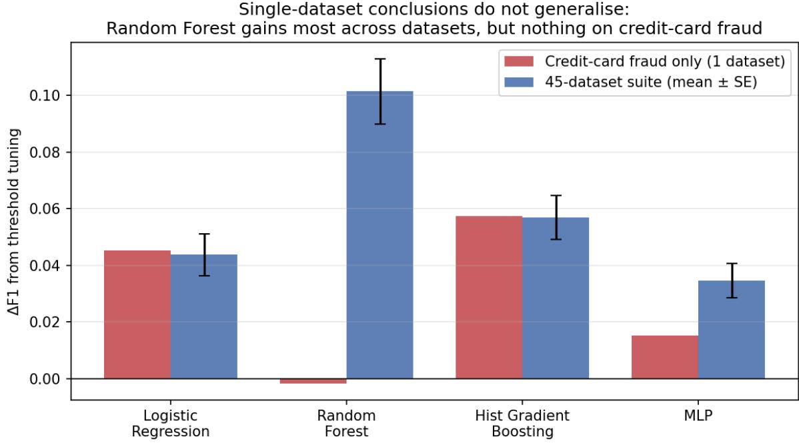
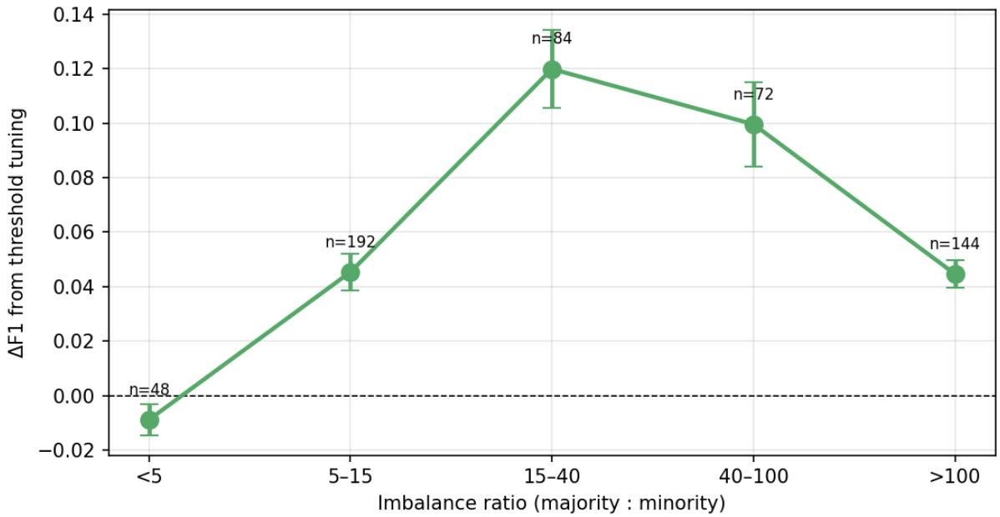
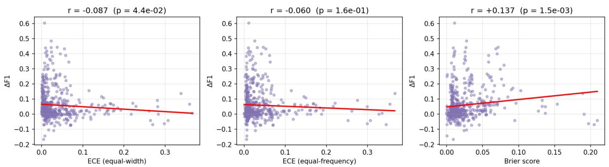

# When Single-Dataset Conclusions Fail: A 45-Task Study of Threshold Tuning and Resampling for Imbalanced Classification

Diyorbek Musayev Queensland University of Technology, Brisbane, Australia diyorbek.musaev@connect.qut.edu.au ORCID 0009-0005-2249-0834

Preprint, August 2026

## Abstract

Class-imbalance handling for binary classification is routinely evaluated on a single benchmark dataset, and conclusions drawn from that dataset are reported as if they were properties of the method. We show concretely that this practice is unsafe. Starting from the public Kaggle creditcard fraud dataset — among the most heavily benchmarked imbalanced-classification tasks in the literature — we establish under a leakage-free nested cross-validation protocol that a plain Random Forest at the default 0.5 decision threshold attains $\mathrm { F } 1 = 0 . 8 6 1 \pm 0 . 0 2 1$ , and that decisionthreshold tuning yields it no benefit whatsoever $( \Delta \mathrm { F } 1 = - 0 . 0 0 2 )$ . Read in isolation, this supports an appealing conclusion: for a well-calibrated ensemble, the entire apparatus of imbalance handling is unnecessary.

We then apply the identical protocol to a suite of 45 binary tasks spanning imbalance ratios from 1:1.5 to 1:178, comprising 2,025 model fits across four model families. The conclusion reverses. Random Forest is the model family that benefits most from threshold tuning across the suite (ΔF1 $= + 0 . 1 0 1 \pm 0 . 1 3 4 )$ , not least; three other families replicate their fraud-dataset behaviour almost exactly, isolating Random Forest on the fraud dataset as the anomaly. Similarly, Synthetic Minority Over-sampling (SMOTE) is harmful on the fraud dataset but beneficial across the suite (mean ΔF1 $= + 0 . 0 7 6$ , 138 wins / 39 losses, Wilcoxon $p = 2 . 7 \times 1 0 ^ { - 1 7 } )$

We report two further results. First, the benefit of threshold tuning is non-monotonic in the imbalance ratio, near zero below 1:5, peaking at $\Delta \mathrm { F } 1 = + 0 . 1 2 0$ in the 1:15–1:40 band, and declining to +0.045 beyond 1:100 — which explains why the fraud dataset, at 1:577, is an unrepresentative place to study the question. Second, we test and reject an intuitive heuristic: validation-set calibration error does not predict how much threshold tuning will help (expected calibration error $r = - 0 . 0 8 7 \mathrm { ; }$ ; Brier score $r = + 0 . 1 3 7 )$ , so practitioners cannot use calibration diagnostics to decide whether tuning is worthwhile. We release the protocol, the 45-task harness, and all per-run metrics.

Keywords: class imbalance; decision-threshold tuning; SMOTE; external validity; generalisation of empirical findings; credit-card fraud detection; reproducible evaluation.

## 1. Introduction

A large empirical literature studies how to train binary classifiers when the positive class is rare. The standard interventions — resampling the training set, weighting the loss by inverse class frequency, and moving the decision threshold away from 0.5 — are well established, and a steady stream of papers compares them. A striking feature of this literature is how often the comparison is conducted on a single dataset, with the resulting ranking of interventions reported as a general finding.

This paper asks whether that inference is safe, and answers no.

Our entry point is the public Kaggle credit-card fraud dataset of Dal Pozzolo et al., which contains 284,807 transactions of which 492 (0.172 %) are fraudulent. It is among the most heavily used imbalanced-classification benchmarks in existence; hundreds of papers report results on it. Reported F1 scores on the fraud class span an extraordinary range, from roughly 0.70 for unaided classical baselines to above 0.98 for some recent deep architectures. Recent methodological work attributes a substantial part of this spread not to algorithmic progress but to three specific evaluation flaws: (i) preprocessing leakage, where a scaler or oversampler is fitted on data including the test split; (ii) evaluation-set threshold selection, where the decision threshold is chosen to maximise the very metric being reported on the very split being reported; and (iii) inadequate temporal validation, where random rather than time-ordered folds are used despite a time axis being present (Hayat & Magnier, 2025; Kabane, 2024).

We first eliminate flaws (i) and (ii) by specifying a nested cross-validation protocol in which the decision threshold is selected on an inner validation fold disjoint from both the training data and the reporting test fold. Applying this protocol to five model families on the fraud dataset yields a clean and quotable result: a plain Random Forest at the default threshold attains $\mathrm { F 1 } = 0 . 8 6 1 \pm$ 0.021, and threshold tuning changes nothing $( \Delta \mathrm { F } 1 = - 0 . 0 0 2 )$ . SMOTE makes it worse. The natural conclusion — that a well-calibrated ensemble needs no imbalance handling at all — is exactly the kind of claim this literature routinely makes on the strength of one dataset.

We then test that conclusion. Using the same protocol, the same four supervised model families, and the same four intervention strategies, we evaluate 45 binary classification tasks with imbalance ratios from 1:1.5 to 1:178 — 2,025 model fits in total. Three of the four model families behave on the suite almost exactly as they behaved on the fraud dataset. Random Forest does not: across the suite it gains more from threshold tuning than any other family $( \Delta \mathrm { F 1 } = + 0 . 1 0 1 )$ , where on the fraud dataset it gained nothing. The single-dataset conclusion is not merely imprecise; on the specific point that made it interesting, it is backwards.

The contributions of this paper are as follows.

1. A concrete demonstration that single-dataset imbalance-handling conclusions fail to generalise, on the most-benchmarked dataset in this application area, with the failure localised to a specific model family and quantified against a 45-task reference. We are not aware of prior work that demonstrates this reversal directly rather than arguing for it in principle.

2. A characterisation of what does generalise. Threshold tuning helps on average (mean $\Delta \mathrm { F } 1 = + 0 . 0 5 9$ across dataset × model pairs; 138 wins, 31 losses; Wilcoxon $p = 4 . 1 \times 1 0 ^ { - 2 0 } )$ and SMOTE helps on average (+0.076; 138 wins, 39 losses; $p = 2 . 7 \times 1 0 ^ { - 1 7 } )$ , but the magnitude is strongly model-dependent: SMOTE is worth +0.170 F1 to an MLP and +0.005 — nothing — to logistic regression.

3. An inverted-U relationship between imbalance ratio and threshold-tuning benefit, with the peak at moderate imbalance (1:15–1:40, ΔF1 = +0.120) and decline at both mild $( < 1 : 5 , \ \Delta \mathrm { { F } 1 } = - 0 . 0 0 9 )$ and extreme (>1:100, ΔF1 = +0.045) imbalance. This is not the monotone relationship one would naively assume, and it identifies extreme-imbalance datasets such as credit-card fraud as poor venues for studying threshold selection.

4. A negative result of practical consequence. It is intuitive that threshold tuning should help in proportion to how miscalibrated a model’s scores are, which would give practitioners a cheap diagnostic: measure calibration error on validation, and tune only when it is high. We test this and reject it. Expected calibration error is uncorrelated with tuning benefit (r = -0.087), and the Brier score is only weakly correlated (r = +0.137). The diagnostic does not work.

Section 2 reviews prior work, distinguishing the substantial literature that establishes that threshold tuning helps from the question we address, which is whether single-dataset findings about it transfer. Section 3 specifies the protocol and both dataset suites. Section 4 reports the credit-card fraud study. Section 5 reports the 45-task study and the reversal. Section 6 analyses what generalises. Section 7 discusses limitations — of which the composition of our dataset suite is the most serious — and concludes.

## 2. Related Work

## 2.1 Threshold moving and resampling

Adjusting the decision threshold of a probabilistic classifier is a long-established response to class imbalance, traceable to work on cost-sensitive classification and ROC-based operating-point selection (Provost & Fawcett, 2001; Sheng & Ling, 2006). Resampling approaches, of which SMOTE (Chawla et al., 2002) is the most widely used, instead alter the training distribution. Cost-sensitive weighting forms a third family. Standard references treat these as alternative means to the same end.

Critically for our purposes, the claim that threshold tuning is broadly efective is already well supported by multi-dataset evidence, and we do not claim it as a contribution. Esposito et al. (2021) introduce GHOST, an automated threshold-selection procedure, and validate it on 138 public drugdiscovery datasets, reporting that most classifiers benefit and that Random Forest benefits substantially. M-Tune (Molecular Diversity) reports comparable findings on a similar scale. “Balancing the Scales” (arXiv:2409.19751, 2024) compares SMOTE, class weighting, and decision-threshold calibration across multiple datasets and models and concludes that threshold calibration is the most consistently efective of the three. The scikit-learn library ships TunedThresholdClassifierCV for cross-validated threshold selection, with explicit documentation warning against selecting the threshold on data also used for fitting.

Our contribution is therefore not that threshold tuning helps. It is that conclusions of the form “intervention X is or is not needed for model Y”, when drawn from one dataset, do not transfer — and we demonstrate a case where such a conclusion inverts.

## 2.2 The credit-card fraud benchmark

The Kaggle credit-card dataset originates with Dal Pozzolo’s work on adaptive fraud detection (Dal Pozzolo, 2015). Its features V1–V28 are PCA projections applied for privacy; only Time and Amount are interpretable. Dal Pozzolo et al. (2015) additionally observed that undersampling distorts posterior probabilities and requires calibration correction — an early indication that resampling and threshold choice interact.

A large secondary literature uses the dataset as a testbed. Popova & Gardi (arXiv:2509.15044, 2025) benchmark five classifiers under undersampling, SMOTE, and hybrid regimes. Stacking ensembles (IJACSA Vol. 15 No. 10, 2024) report F1 = 0.87. Deep approaches include heterogeneous graph autoencoders (Singh et al., arXiv:2410.08121, 2024; F1 = 0.81, AUPRC = 0.89), GAT+VAE ensembles (MDPI, 2025; F1 > 0.98), adversarial autoencoders, and transformer-conditioned GAN oversampling (arXiv:2509.19032, 2025). Threshold treatment is unreported in essentially all of them, which — since every mainstream library defaults to 0.5 in .predict() — should be read as the default threshold having been used.

## 2.3 Methodological critiques and external validity

Hayat & Magnier (arXiv:2506.02703, 2025) document leakage, vague reporting, inadequate temporal validation, and recall-optimising metric manipulation in this literature, demonstrating that a minimal network with deliberate leakage reaches 99.9 % recall. Kabane (arXiv:2412.07437, 2024) shows in controlled fashion that applying sampling before the train/test split inflates XGBoost results.

These papers concern internal validity — whether a reported number is a faithful estimate of the model’s performance on its own dataset. The present paper concerns external validity — whether a faithful, leakage-free finding on one dataset licenses a general claim. The two are complementary: we adopt their protocol recommendations in full, and then show that even a methodologically clean single-dataset result can mislead.

## 3. Methods

## 3.1 Evaluation protocol

Both studies use one protocol. For each (dataset, model, strategy) combination:

1. Outer split. Stratified k-fold partition of the dataset (k = 5 for the fraud study, k = 3 for the 45-task suite, the reduction being a compute-budget concession). Fold k is the test fold; the remainder is the outer training set.

2. Inner split. A stratified split of the outer training set into an inner training set and an inner validation set (80/20 for the fraud study, 75/25 for the suite). The validation set is used only to select the decision threshold and never to fit model parameters.

3. Preprocessing. StandardScaler is fitted on the inner training set alone and applied to the validation and test folds. Where SMOTE is used it is applied only to the inner training set, after scaling. Neither the validation nor the test fold is resampled.

4. Threshold selection. For the plain strategy the threshold is fixed at 0.5. Otherwise the threshold is \*t\*\* = argmax over the grid {0.01, 0.02, …, 0.99} of F1 on the inner validation fold.

5. Reporting. \*t\*\* is applied to the test fold. We record precision, recall, F1, ROC-AUC, AUPRC, expected calibration error (both equal-width and equal-frequency binning), and the Brier score. Calibration statistics are computed on the validation fold, since that is the information available to a practitioner deciding whether to tune.

No information from the test fold influences preprocessing, fitting, or threshold selection.

## 3.2 The paired F1-diference statistic

Our central quantity is

$$
\Delta F 1 = F 1 ( \mathrm { t h r e s h o l d } t ^ { * } ) - F 1 ( \mathrm { t h r e s h o l d } 0 . 5 ) ,
$$

computed on the same test fold using the same fitted model. It is therefore a paired within-fold contrast, isolating the efect of the threshold choice and eliminating between-fold and between model variance.

## 3.3 Model families and strategies

Four supervised families are common to both studies: Logistic Regression (L-BFGS, max\_iter 500–1000); Random Forest (100 trees, max\_depth 16); Histogram Gradient Boosting (max\_iter 100–200, learning rate 0.1); and a Multi-Layer Perceptron (hidden layers 64–32, ReLU, Adam, early stopping). The fraud study additionally includes an Autoencoder anomaly detector trained on legitimate transactions only, scored by reconstruction error. Hyperparameters are deliberately mainstream; the object of study is the evaluation protocol and the interventions, not a tuned model.

Four strategies are compared where well defined: plain (no intervention, threshold 0.5); tuned\_threshold (threshold selected on validation); class\_balanced\_tuned (inverse-frequency class weights plus threshold selection); and smote\_tuned (SMOTE on the inner training set plus threshold selection). class\_balanced\_tuned is omitted for the MLP, whose scikit-learn implementation accepts no class-weight argument.

## 3.4 Dataset suites

Study A — credit-card fraud. The full Kaggle dataset (284,807 rows, 492 positives, imbalance 1:577), 5 outer folds, five model families, 17 applicable (model, strategy) combinations, 85 fits.

Study B — 45 binary tasks. A suite spanning imbalance ratios 1:1.5 to 1:178, comprising:

• Real, 14 tasks: handwritten digits one-vs-rest (10 tasks, ≈1:9); breast cancer (1:1.7); wine one-vs-rest (3 tasks, 1:2–1:3).

• Real, rarefied, 1 task: breast cancer subsampled to 1:21.

• Synthetic, 30 tasks: make\_classification sweeping imbalance ratio (10, 30, 100, 300, 1000), class separation (0.6, 1.0, 1.8), and dimensionality (20 and 50 features, 10 and 15 informative). The synthetic arm is the controlled component of the study: it varies the imbalance ratio while holding the data-generating process fixed, which no collection of observational datasets can do.

Three folds per task, four model families, four strategies, giving 2,025 fits. Section 7.1 discusses the limitations of this composition frankly; it is the weakest part of the study and the first thing a replication should improve.

## 4. Study A: The Credit-Card Fraud Dataset

Table 1 reports the five-fold results for the strongest configuration of each model family on the fraud dataset.

Table 1. Credit-card fraud, 5-fold nested CV, mean ± standard deviation. R@P≥0.90 is the maximum recall attainable at precision at least 0.90.
<table><tr><td>Model</td><td>Strategy</td><td>F1</td><td>AUPRC</td><td>ROC-AUC</td><td>R@P≥0.90</td><td>Threshold</td></tr><tr><td>Random Forest</td><td>plain</td><td>0.861 ± 0.021</td><td>0.847</td><td>0.973</td><td>0.819</td><td>0.500</td></tr><tr><td>Random Forest</td><td>tuned threshold</td><td>0.859 ± 0.027</td><td>0.847</td><td>0.973</td><td>0.819</td><td>0.420 ± 0.126</td></tr><tr><td>Gradient Boosting</td><td>SMOTE + tuned</td><td>0.842 ± 0.041</td><td>0.792</td><td>0.972</td><td>0.633</td><td>0.984 ± 0.006</td></tr><tr><td>Random Forest</td><td>SMOTE + tuned</td><td>0.838 ± 0.028</td><td>0.837</td><td>0.979</td><td>0.776</td><td>0.730 ± 0.040</td></tr><tr><td>MLP</td><td>SMOTE + tuned</td><td>0.820 ± 0.022</td><td>0.823</td><td>0.961</td><td>0.740</td><td>0.984 ± 0.009</td></tr><tr><td>Logistic Regression</td><td>tuned threshold</td><td>0.767 ± 0.027</td><td>0.754</td><td>0.973</td><td>0.342</td><td>0.124 ±</td></tr><tr><td>Logistic Regression</td><td>plain</td><td>0.721 ±</td><td>0.754</td><td>0.973</td><td>0.342</td><td>0.076 0.500</td></tr><tr><td>Gradient</td><td>plain</td><td>0.036 0.589 ±</td><td>0.534</td><td>0.791</td><td>0.000</td><td>0.500</td></tr><tr><td>Boosting Autoencoder tuned</td><td>threshold</td><td>0.064 0.545 ± 0.039</td><td>0.540</td><td>0.947</td><td>0.142</td><td>0.058 ±</td></tr></table>

Two observations invite a general conclusion. First, the best configuration in the entire table is the simplest: a Random Forest with no resampling, no class weighting, and the default threshold. Second, every intervention applied to that Random Forest makes it worse — threshold tuning is neutral (ΔF1 = -0.002), class weighting costs 1.7 F1 points, and SMOTE costs 2.3 points and 1.0 point of AUPRC.

Reported on its own, this is a tidy and attractive finding: for a well-calibrated ensemble on severely imbalanced data, the standard imbalance-handling toolkit is unnecessary and counterproductive. I is precisely the type of claim the single-dataset literature routinely advances. Section 5 tests it.

## 5. Study B: The Conclusion Reverses

## 5.1 The reversal

Table 2 contrasts, for each model family, the paired ΔF1 from threshold tuning on the fraud dataset against the mean across the 45-task suite.

Table 2. ΔF1 from threshold tuning: fraud dataset versus 45-task suite. Suite values are mean ± standard deviation over 135 runs per family (45 tasks × 3 folds).
<table><tr><td>Model family</td><td>∆F1, credit-card fraud ∆F1, 45-task suite Agreement</td><td></td><td></td></tr><tr><td>Logistic Regression</td><td>+0.045</td><td> $+ 0 . 0 4 4 \pm 0 . 0 8 7$ </td><td>replicates</td></tr><tr><td>Histogram Gradient Boosting</td><td>+0.057</td><td> $+ 0 . 0 5 7 \pm 0 . 0 9 1$ </td><td>replicates</td></tr><tr><td>MLP</td><td>+0.015</td><td> $+ 0 . 0 3 5 \pm 0 . 0 7 1$ </td><td>replicates</td></tr><tr><td>Random Forest</td><td>-0.002</td><td> $\mathbf { + 0 . 1 0 1 \pm 0 . 1 3 4 }$ </td><td>reverses</td></tr></table>

Three of four families replicate their fraud-dataset behaviour to within 0.02 F1. Random Forest does not. On the fraud dataset it is the model for which threshold tuning is worthless; across the suite it is the family for which threshold tuning is worth the most, by a margin of 44 F1 points over the second-placed family. Figure 1 displays the contrast.

Figure 1. ΔF1 from threshold tuning by model family: credit-card fraud alone versus the 45-task suite (mean ± standard error). Three families agree; Random Forest reverses.

  
The consequence for Study A is direct. The finding that made Study A interesting — that the best model needs no imbalance handling — is a property of Random Forest on this dataset, not a property of Random Forest. A practitioner who read Study A and concluded that Random Forest can be deployed at the default threshold would, on a task drawn from our suite, forgo an average of 10 F1 points.

## 5.2 Resampling reverses too

The same pattern holds for SMOTE. On the fraud dataset SMOTE reduced Random Forest F1 by 2.3 points and Logistic Regression F1 by 9.2 points, motivating the conclusion that SMOTE is harmful for well-behaved models. Across the 45-task suite, SMOTE is beneficial on average and significantly so.

Table 3. Strategy efects across the 45-task suite, paired against the plain configuration at the (dataset, model) level. $n = 1 8 0$ pairs for threshold tuning and SMOTE; 135 for class weighting (MLP excluded).
<table><tr><td>Strategy</td><td>Mean ∆F1</td><td>Median ∆F1</td><td>Wins</td><td>Losses</td><td>Wilcoxon p</td></tr><tr><td>Tuned threshold</td><td>+0.0592</td><td>+0.0260</td><td>138</td><td>31</td><td> $4 . 1 \times 1 0 ^ { - 2 0 }$ </td></tr><tr><td>Class-balanced + tuned</td><td>+0.0547</td><td>+0.0162</td><td>95</td><td>34</td><td> $3 . 2 \times 1 0 ^ { - 0 9 }$ </td></tr><tr><td> $\mathrm { S M O T E } + \mathrm { t u n e d }$ </td><td>+0.0757</td><td>+0.0260</td><td>138</td><td>39</td><td> $2 . 7 \times 1 0 ^ { - 1 7 }$ </td></tr></table>

The benefit of SMOTE is, however, heavily concentrated by model family: +0.170 for the MLP, +0.092 for Random Forest, +0.036 for Histogram Gradient Boosting, and +0.005 — indistinguishable from nothing — for Logistic Regression. A blanket recommendation to resample is therefore no better founded than a blanket recommendation not to.

## 5.3 Threshold-tuning benefit is non-monotonic in imbalance

Table 4 and Figure 2 group all suite runs by imbalance ratio.

Table 4. ΔF1 from threshold tuning by imbalance ratio band (all model families pooled).
<table><tr><td>Imbalance ratio</td><td>Mean ∆F1</td><td>Std</td><td>n runs</td></tr><tr><td> $< 1 { : } 5$ </td><td>-0.0088</td><td>0.039</td><td>48</td></tr><tr><td> $1 { : } 5 - 1 { : } 1 5$ </td><td>+0.0454</td><td>0.092</td><td>192</td></tr><tr><td> $\mathbf { 1 { : } 1 5 - 1 { : } 4 0 }$ </td><td>+0.1199</td><td>0.131</td><td>84</td></tr><tr><td> $1 { : } 4 0 - 1 { : } 1 0 0$ </td><td>+0.0996</td><td>0.131</td><td>72</td></tr><tr><td> $> 1 { : } 1 0 0$ </td><td>+0.0447</td><td>0.060</td><td>144</td></tr></table>

Figure 2. Threshold-tuning benefit against imbalance ratio, showing the inverted-U.

Threshold tuning helps most at moderate imbalance (1:15-1:100), less at both mild and extreme imbalance  

The relationship is inverted-U rather than monotone. At mild imbalance the default threshold is already near-optimal and tuning is marginally harmful. Benefit peaks in the 1:15–1:40 band. Beyond 1:100 it declines again — plausibly because at extreme imbalance the validation fold contains too few positives for the F1-maximising threshold to be estimated stably, so the selected threshold generalises poorly to the test fold.

This directly explains Study A. The credit-card fraud dataset sits at 1:577, deep in the regime where threshold tuning delivers least and is estimated least reliably. It is, on this evidence, an unrepresentative dataset on which to study threshold selection — despite being one of the most popular.

## 6. What Predicts the Benefit of Threshold Tuning?

## 6.1 A tempting heuristic, and its failure

If threshold tuning corrects for miscalibrated scores, then a model’s calibration error ought to predict how much tuning will help. This would be practically valuable: calibration error is measurable on the validation fold before any tuning is attempted, so a practitioner could tune selectively rather than always. We tested this hypothesis on all 540 paired tuning runs.

Table 5. Correlation between validation-fold calibration statistics and ΔF1 from threshold tuning (n = 540).

  
Calibration error does NOT predict threshold-tuning benefit (negative result)

<table><tr><td>Statistic</td><td>Pearson r</td><td>p</td><td>Spearman  $\rho$ </td><td>p</td></tr><tr><td>Expected calibration error</td><td>-0.087</td><td> $4 . 4 \times 1 0 ^ { - 2 }$ </td><td>-0.075</td><td> $8 . 1 \times 1 0 ^ { - 2 }$ </td></tr><tr><td>(equal-width) Expected calibration</td><td>-0.060</td><td> $1 . 6 \times 1 0 ^ { - 1 }$ </td><td>+0.032</td><td> $4 . 5 \times 1 0 ^ { - 1 }$ </td></tr><tr><td></td><td></td><td></td><td></td><td></td></tr><tr><td></td><td></td><td></td><td></td><td></td></tr><tr><td>error (equal-</td><td></td><td></td><td></td><td></td></tr><tr><td></td><td></td><td></td><td></td><td></td></tr><tr><td>frequency)</td><td></td><td></td><td></td><td></td></tr><tr><td></td><td></td><td></td><td></td><td></td></tr><tr><td></td><td></td><td></td><td></td><td></td></tr><tr><td></td><td></td><td></td><td></td><td></td></tr><tr><td></td><td></td><td></td><td></td><td></td></tr><tr><td>Brier score</td><td></td><td></td><td></td><td></td></tr><tr><td></td><td>+0.137</td><td></td><td></td><td></td></tr><tr><td></td><td></td><td> $1 . 5 \times 1 0 ^ { - 3 }$ </td><td></td><td></td></tr><tr><td></td><td></td><td></td><td>+0.255</td><td> $1 . 9 \times 1 0 ^ { - 9 }$ </td></tr><tr><td></td><td></td><td></td><td></td><td></td></tr><tr><td></td><td></td><td></td><td></td><td></td></tr><tr><td></td><td></td><td></td><td></td><td></td></tr><tr><td></td><td></td><td></td><td></td><td></td></tr><tr><td></td><td></td><td></td><td></td><td></td></tr><tr><td></td><td></td><td></td><td></td><td></td></tr><tr><td></td><td></td><td></td><td></td><td></td></tr><tr><td></td><td></td><td></td><td></td><td></td></tr><tr><td></td><td></td><td></td><td></td><td></td></tr><tr><td></td><td></td><td></td><td></td><td></td></tr><tr><td></td><td></td><td></td><td></td><td></td></tr><tr><td></td><td></td><td></td><td></td><td></td></tr><tr><td></td><td></td><td></td><td></td><td></td></tr><tr><td></td><td></td><td></td><td></td><td></td></tr><tr><td></td><td></td><td></td><td></td><td></td></tr><tr><td></td><td></td><td></td><td></td><td></td></tr><tr><td></td><td></td><td></td><td></td><td></td></tr><tr><td></td><td></td><td></td><td></td><td></td></tr><tr><td></td><td></td><td></td><td></td><td></td></tr><tr><td></td><td></td><td></td><td></td><td></td></tr><tr><td></td><td></td><td></td><td></td><td></td></tr><tr><td></td><td></td><td></td><td></td><td></td></tr><tr><td></td><td></td><td></td><td></td><td></td></tr><tr><td></td><td></td><td></td><td></td><td></td></tr><tr><td></td><td></td><td></td><td></td><td></td></tr><tr><td></td><td></td><td></td><td></td><td></td></tr><tr><td></td><td></td><td></td><td></td><td></td></tr><tr><td></td><td></td><td></td><td></td><td></td></tr><tr><td></td><td></td><td></td><td></td><td></td></tr><tr><td></td><td></td><td></td><td></td><td></td></tr><tr><td></td><td></td><td></td><td></td><td></td></tr><tr><td></td><td></td><td></td><td></td><td></td></tr><tr><td></td><td></td><td></td><td></td><td></td></tr><tr><td></td><td></td><td></td><td></td><td></td></tr><tr><td></td><td></td><td></td><td></td><td></td></tr><tr><td></td><td></td><td></td><td></td><td></td></tr><tr><td></td><td></td><td></td><td></td><td></td></tr><tr><td></td><td></td><td></td><td></td><td></td></tr><tr><td></td><td></td><td></td><td></td><td></td></tr><tr><td></td><td></td><td></td><td></td><td></td></tr><tr><td></td><td></td><td></td><td></td><td></td></tr></table>

Figure 3. Calibration statistics against ΔF1. No usable relationship.  
The hypothesis is rejected. Expected calibration error, in either binning scheme, is uncorrelated with the benefit of threshold tuning — the equal-width variant is in fact very slightly negatively correlated. The Brier score reaches statistical significance but explains under 2 % of variance, which is of no practical use for a $\mathrm { g o / n o - g o }$ decision.

The per-family breakdown shows why a global relationship fails to appear: the sign of the association difers across families. Histogram Gradient Boosting alone shows a positive within-family association $( r = + 0 . 2 5 9 , p = 2 . 4 \times 1 0 ^ { - 3 } )$ , while Logistic Regression $( r = - 0 . 0 0 1 )$ , MLP $\left( r = - 0 . 0 3 4 \right)$ and Random Forest $( r = - 0 . 0 8 7 )$ show none. Notably, the MLP has by far the largest mean calibration error (0.086 versus 0.012–0.027 for the others) yet the smallest mean tuning benefit — the opposite of the hypothesis.

We report this as a negative result. Aggregate calibration error is not a usable diagnostic for deciding whether to tune a decision threshold, and the intuition that it should be is wrong.

## 6.2 What does correlate

Among the variables we recorded, none is a strong predictor. The log imbalance ratio $\left( r = + 0 . 1 3 8 \right)$ and Brier score $( r = + 0 . 1 3 7 )$ are weakly positive; AUPRC is weakly negative $( r = - 0 . 1 6 2 , ~ p =$ $1 . 5 \times 1 0 ^ { - 4 } )$ , consistent with the reading that models which already rank well have less to gain from moving the operating point. Sample size and dimensionality are uninformative $( | r | < 0 . 0 9 )$

The practical implication is unwelcome but clear: there is no cheap proxy. Because threshold tuning on a validation fold is itself inexpensive — a single sweep over a fitted model, requiring no retraining — the defensible recommendation is to always perform it and let the validation fold decide, rather than to predict in advance whether it will pay of. Where it does not help, the validation fold will select a threshold near 0.5 and little is lost.

## 7. Discussion

## 7.1 Limitations

Suite composition is the principal limitation. Of the 45 tasks, 30 are synthetic and 15 are real, and the real tasks derive from only three underlying sources (digits, breast cancer, wine). We were unable to include established real-world imbalanced benchmarks — the imbalanced-learn suite of 27 datasets, OpenML collections, KDD Cup 99, Covertype — because the execution environment blocked external data downloads. The synthetic arm provides controlled variation of the imbalance ratio that observational data cannot, and we regard it as a genuine strength for the inverted-U analysis in Section 5.3; but it cannot substitute for domain diversity when the claim is about external validity. A replication on the imbalanced-learn benchmark suite is the single most valuable extension of this work, and the released harness runs unmodified on it.

Maximum imbalance in the suite is 1:178, well short of the fraud dataset’s 1:577. The declining arm of the inverted-U is therefore established over a narrower range than we would like, and the explanation we ofer for it (unstable threshold estimation from few validation positives) is inferred rather than directly demonstrated.

Three folds in Study B versus five in Study A, a compute-budget concession that widens confidence intervals on the suite estimates.

F1 as the selection criterion. We optimise and report F1 throughout. F1 weights precision and recall equally, which rarely matches deployment economics. A cost-sensitive criterion with realistic false-positive and false-negative costs would be more decision-relevant, and might alte which strategies appear best.

No temporal validation. We use random stratified folds. Hayat & Magnier (2025) identify inadequate temporal validation as a major issue for the fraud dataset specifically, which has a usable Time axis. Our Study A results inherit this limitation.

## 7.2 Implications

For practitioners. Perform threshold selection on a validation fold as a matter of routine; it is cheap, it helps on average across model families and imbalance regimes, and where it does not help it costs almost nothing. Do not rely on calibration diagnostics to decide whether to bother. Treat resampling as model-specific: strongly worth trying for neural networks, marginal for logistic regression.

For researchers. A comparison of imbalance-handling strategies conducted on one dataset establishes a fact about that dataset. Our results show that such facts can invert on other data even when the original experiment is methodologically clean. Claims of the form “method X is unnecessary for model Y” require multi-dataset evidence; we would encourage a minimum of a dozen tasks spanning at least two orders of magnitude of imbalance ratio.

For reviewers. When a submission draws a general conclusion about imbalance handling from a single benchmark, the appropriate question is not only whether the protocol was leakage-free — increasingly it is — but whether the conclusion was tested anywhere else.

## 7.3 Conclusion

We set out to establish a clean, leakage-free result on the most-benchmarked credit-card fraud dataset, and did: a plain Random Forest at the default threshold attains $\mathrm { F } 1 = 0 . 8 6 1 \pm 0 . 0 2 1$ , with every imbalance intervention leaving it unchanged or worse. We then tested that conclusion on 45 further binary tasks and found it to be an artifact of the dataset. Random Forest, the family for which threshold tuning was worthless on fraud data, gains more from threshold tuning than any other family across the suite; SMOTE, harmful on fraud data, is beneficial across the suite. Threshold-tuning benefit peaks at moderate imbalance and declines at the extreme ratios that make fraud detection a popular benchmark, which explains the discrepancy. Finally, the intuitive proposal that calibration error should predict tuning benefit does not survive contact with the data.

The methodological point generalises beyond this application. Internal validity — leakage-free protocols, honest threshold selection — has rightly received attention in this literature. External validity has not, and a methodologically impeccable single-dataset finding can still be, on the point of interest, backwards.

## Acknowledgements

The author thanks Prof. Raja Jurdak for supervision and feedback that shaped the direction of this work, and Dr. Khizar Hayat for arXiv endorsement. Responsibility for all content, and for any errors, rests with the author.

## References

1. Chawla, N. V., Bowyer, K. W., Hall, L. O., & Kegelmeyer, W. P. (2002). SMOTE: Synthetic Minority Over-sampling Technique. Journal of Artificial Intelligence Research, 16, 321–357.

2. Dal Pozzolo, A. (2015). Adaptive Machine Learning for Credit Card Fraud Detection. PhD thesis, Université Libre de Bruxelles.

3. Dal Pozzolo, A., Caelen, O., Johnson, R. A., & Bontempi, G. (2015). Calibrating probability with undersampling for unbalanced classification. IEEE Symposium Series on Computational Intelligence, 159–166.

4. Dal Pozzolo, A., Boracchi, G., Caelen, O., Alippi, C., & Bontempi, G. (2014). Learned lessons in credit card fraud detection from a practitioner perspective. Expert Systems with Applications, 41(10), 4915–4928.

5. Esposito, C., Landrum, G. A., Schneider, N., Stiefl, N., & Riniker, S. (2021). GHOST: Adjusting the decision threshold to handle imbalanced data in machine learning. Journal of Chemical Information and Modeling, 61(6), 2623–2640.

6. Hayat, K., & Magnier, B. (2025). Data leakage and deceptive performance: a critical examination of credit card fraud detection methodologies. Mathematics, 13(16), 2563. https://doi.org/10.3390/math13162563 (preprint: arXiv:2506.02703).

7. Kabane, S. (2024). Impact of sampling techniques and data leakage on XGBoost performance in credit card fraud detection. arXiv:2412.07437.

8. Popova, I., & Gardi, H. A. A. (2025). Credit card fraud detection. arXiv:2509.15044.

9. Provost, F., & Fawcett, T. (2001). Robust classification for imprecise environments. Machine Learning, 42(3), 203–231.

10. Sheng, V. S., & Ling, C. X. (2006). Thresholding for making classifiers cost-sensitive. Proceedings of AAAI, 476–481.

11. Singh, M. T., et al. (2024). Heterogeneous graph auto-encoder for credit-card fraud detection. arXiv:2410.08121.

12. Balancing the scales: a comprehensive study on tackling class imbalance in binary classification. (2024). arXiv:2409.19751.

13. Improving credit card fraud detection through transformer-enhanced GAN oversampling. (2025). arXiv:2509.19032.

14. Enhancing credit card fraud detection using a stacking ensemble. (2024). International Journal of Advanced Computer Science and Applications, 15(10).

15. Pedregosa, F., et al. (2011). Scikit-learn: machine learning in Python. Journal of Machine Learning Research, 12, 2825–2830.

16. Lemaître, G., Nogueira, F., & Aridas, C. K. (2017). Imbalanced-learn: a Python toolbox to tackle the curse of imbalanced datasets. Journal of Machine Learning Research, 18(17), 1–5.

## Reproducibility

All code and per-run metrics are released. code/fraud\_pipeline.py implements Study A; code/multi\_dataset\_study.py implements Study B and is resumable. code/results\_nested\_cv/per\_fold\_met (85 rows) and code/results\_multi/per\_run\_metrics.csv (2,025 rows) contain every reported number. Random seeds are fixed throughout. Study A runs in approximately nine minutes and Study B in approximately eight minutes on a consumer laptop, with no GPU requirement and no dependency outside scikit-learn, imbalanced-learn, pandas, NumPy, SciPy, and Matplotlib.