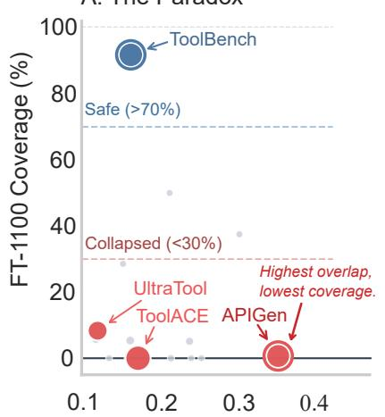
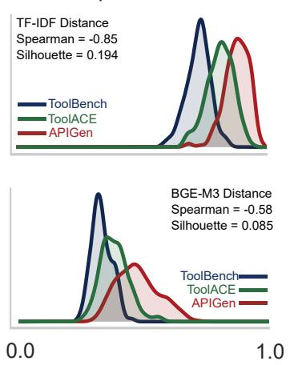
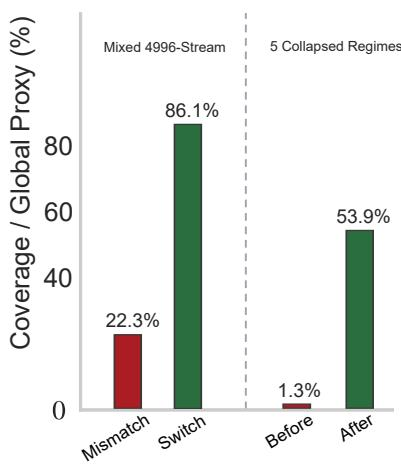
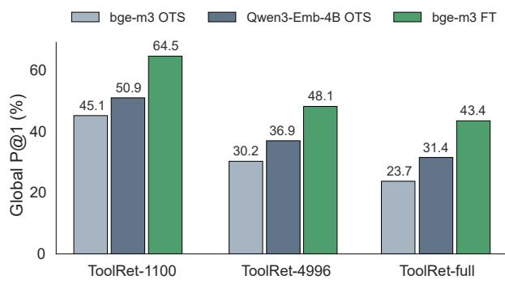
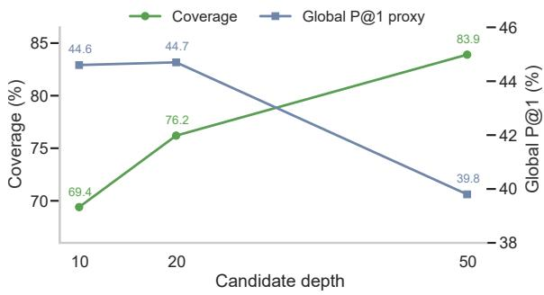
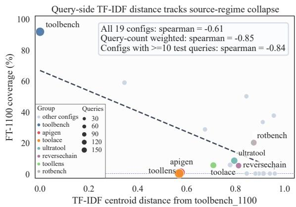

# When Tool-Backed Skill Retrieval Fails: Source-Style Collapse in Executable Capability Retrieval

Yiqi Liu1, Joseph James2, Yang Wang1 Chenghao Xiao3, Chenghua Lin1

1University of Manchester, 2University of Sheffield, 3Shanghai University of Finance and Economics yiqi.liu@manchester.ac.uk chenghua.lin@manchester.ac.uk

## Abstract

Large-scale agents increasingly rely on retrieval to access external capabilities. We study this retrieval gate in structured tools and APIs, a measurable class of tool-backed executable skills that must be surfaced before an agent can plan, incorporate, or act. In this setting the retrieval layer can silently fail even when the capability corpus is fixed: on ToolRet, a retriever fine-tuned on one sourcespecific slice collapses on another sourcespecific slice of the same benchmark, with FT-1100 falling to 0.7% coverage on APIGen despite its higher lexical overlap with the gold tools. We call this failure mode source-style collapse. Query-side TF-IDF fingerprints flag source styles on which the fine-tuned retriever is likely to fail better than semantic or lengthbased proxies, giving a cheap signal for mismatch over a fixed tool corpus. We propose ToolScout, a source-aware routing method that uses this signal as a routing guard: on the mixed 4,996-query stream, TF-IDF-based routing raises coverage from 22.3% to 86.1%, and across five collapsed sources 20 matched examples raise the coverage-weighted global top-1 proxy from 1.3% to 53.9%. The same failure and routing behaviors persist when tools are rerendered as executable skill cards, which rules out raw API-schema format as the sole cause.

## 1 Introduction

Agent systems are moving from short handcrafted tool lists to large external capability pools. In this setting, retrieval decides which capabilities the model can see before reranking, planning, incorporation, or execution begins. We study the structured and executable case: We render each tool or API as an executable skill card with a name, description, input schema, and implementation. This makes tool retrieval a controlled instance of executable capability retrieval, or Tool

RAG. Similar source or style shifts are well known in document retrieval, while Tool RAG changes their operational meaning: when the right tool is missed, the agent loses an executable action instead of merely working with weaker evidence (If a travel-booking API never enters the candidate set, no planner can call it later).

We show that this entry layer can fail even when the tool corpus stays fixed. On ToolRet (Shi et al., 2025), a checkpoint adapted on the toolbenchstyle 1100-query slice remains strong on matching traffic but collapses on other source styles embedded in the same aggregated benchmark, including APIGen (0.7% coverage), ToolACE (0.0%), and UltraTool (8.3%); see Appendix Table 21. Lexical overlap alone does not explain the collapse: APIGen has higher lexical overlap with its gold tools than the training slice. Standard retrieval adaptation usually treats shift as a change in corpus, task, or broad query distribution. Here the benchmark-wide tool registry is fixed, and the failure is induced by the source style that generated the query-tool pairs. The stress case is therefore a same-corpus source-style shift.

This mismatch matters because realistic agent deployments rarely expose a small hand-crafted function list. They operate over hundreds or thousands of heterogeneous tools and APIs drawn from multiple providers, teams, and documentation styles (Schick et al., 2023; Patil et al., 2024; Qin et al., 2024; Li et al., 2023b; Guo et al., 2024; Shi et al., 2025). In this pipeline, candidate generation first selects a small tool pool. Downstream rerankers or planners then operate on the selected candidates. If the gold tool never enters the pool, no downstream reranker or planner can recover it. Before any downstream planning or execution happens, the system must therefore decide which small subset of tools is worth exposing to the model. On StableToolBench, benchmark-native full-catalog exposure is approximately 172k tokens, whereas dense top-5 exposure is only about 407. Tool retrieval is therefore what makes largecatalog prompting feasible at all. Once deployment depends on that compression, retrieval failures become systemic risks instead of local inefficiencies. The broader agent ecosystem only sharpens that pressure through multi-agent orchestration layers and tool-serving standards (Wu et al., 2023; Li et al., 2023a; Hong et al., 2024; LangChain, 2026; OpenAI, 2026; Model Context Protocol, 2026).

A. The Paradox  
  
Query-to-gold-tool Lexical Overlap

B. Two Spaces  
  
Distance to Toolbench Centroid

C. Screen, Switch, Repair  
  
Router Intervention Effect  
Figure 1: Tool retrieval is source-style-sensitive on a fixed benchmark corpus. Top: retrieval compresses benchmark-native full-catalog exposure from about 172k tokens to about 407 at retrieved top-5. (A) Lexical overlap fails to predict retrievability: APIGen has the highest query-to-gold-tool overlap yet collapses to 0.7% coverage under FT-1100. (B) TF-IDF distance separates source styles more clearly than BGE-M3 semantic distance (r=-0.85 vs. -0.58). (C) Route, switch, then repair: source-aware routing increases mixed-stream coverage by nearly fourfold, and 20 matched examples substantially improve the collapsed-source coverage-weighted global top-1 proxy.

This paper studies that problem through ToolScout, a source-aware routing method for the retrieval gate. We ask whether a retriever adapted to one source-defined slice of an aggregated tool benchmark remains reliable on other sourcedefined slices when the tool corpus is unchanged. We use the term source-style collapse to refer to the observed failure case in which the adapted retriever remains strong on matching-source queries but loses coverage on other source-defined slices over the same tools. We use source style to mean the conventions introduced by an upstream query-generation or annotation process, including query wording, verbosity, schema-reference patterns, and the way queries are paired with tools in a fixed tool corpus. In simple terms, two sources may ask for the same tool in different dialects: one writes long ToolBench-style tasks, while another issues short API-template requests. The shift first becomes visible on the query side, because a retriever adapted on one source-defined slice can collapse on another over the same tools. Further analyses show that the target tool texts preserve a correlated, though weaker, fingerprint as well, so the practical query-side signal is one view of a broader paired shift.

Recent work on Skill Retrieval Augmentation studies a complementary downstream issue, showing that agents still need to incorporate retrieved skills effectively after relevant skills have been found (Su et al., 2026). ToolScout focuses on an earlier retrieval gate. When candidate generation misses the relevant tool, later reranking or planning stages have no correct tool to select. In this setting, the exposed capability is a structured tool or API and the tool corpus is fixed. We ask whether adapting a retriever to one source style can make it unreliable under source-style shift, and whether source-aware routing can recover the lost coverage.

A skill-card rerendering experiment confirms that raw API-schema formatting is an insufficient explanation: the same failure pattern, detector, and switch policy persist when tools are represented as executable skill cards.

ToolScout uses the query-side signal as a source-aware routing criterion. When a batch is likely to mismatch the source-specific retriever, ToolScout routes it to an aggregate-trained checkpoint and, when matched supervision becomes available, further adapts the retriever to recover the remaining coverage gap. This setting differs from reranking-focused work such as Tool-Rerank (Zheng et al., 2024), tool-representation work such as Tool2Vec (Moon et al., 2024), and full agent stacks such as AnyTool (Du et al., 2024) as ToolScout isolates the upstream routing layer itself under a shared retrieval and exposure protocol.

We make three linked contributions. First, using structured tools and APIs as measurable executable skill cards, we identify source-style collapse as a concrete retrieval failure mode: a dense retriever can fail on APIGen-style queries with higher lexical overlap than the source it was trained on, so simple keyword access or query length fail to explain the performance decrease. Second, we characterize the conditions for failure. Across 19 source-query configurations, query-side TF-IDF distance is the strongest lightweight detector of source styles that are likely to mismatch the fine-tuned retriever (78.9% leave-one-configout accuracy), and the surrounding controls show that the signal is broader than a query-only rewrite effect. Third, we validate a source-aware routing method for this retrieval gate. On the mixed 4996- query stream, TF-IDF-based routing raises coverage from 22.3% under a mismatched FT-1100 retriever to 86.1%. Across five collapsed sources, 20 matched examples then raise the coverageweighted global top-1 proxy from 1.3% to 53.9%. The routing criterion keeps source-specific retrievers on batches where they remain reliable and switches to the aggregate-trained checkpoint when source-style mismatch is likely to reduce coverage.

## 2 Capability Retrieval and Tool Routing

Skill and capability augmentation. Recent skill-centric work treats reusable skills as external capability units for agents (Li et al., 2026a; Jiang et al., 2026; Li, 2026). Concurrent work on Skill Retrieval Augmentation (SRA) formulates scalable agent capability access as retrieving reusable skills from a large external skill corpus, and introduces SRA-Bench for decomposed evaluation of retrieval, incorporation, and end-task execution (Su et al., 2026). These works establish the broader setting: agents must retrieve external capabilities before deciding whether and how to incorporate them. ToolScout studies an earlier reliability question at that retrieval gate. Before a retrieved skill or tool can be used correctly, the relevant capability must enter the exposed candidate set.

Tool and API retrieval. Tools and APIs are the structured, executable end of the capability spectrum. Toolformer (Schick et al., 2023) and Gorilla (Patil et al., 2024) established the general tool-use setting. API-Bank (Li et al., 2023b), ToolBench / ToolLLM (Qin et al., 2024), Stable-ToolBench (Guo et al., 2024), ToolHop (Ye et al., 2025), and ToolRet (Shi et al., 2025) further sharpened evaluation around large-scale retrieval and multi-hop tool use. Their schemas and gold-tool annotations make them a controlled substrate for measuring capability retrieval failures.

Tool2Vec (Moon et al., 2024) studies toolspecific representations, while ToolRerank (Zheng et al., 2024) studies hierarchy-aware re-ranking and adaptive truncation once a candidate pool is already given. AnyTool (Du et al., 2024) and DeepAgent (Li et al., 2026b) use hierarchical retrieval inside broader agent stacks. Agent frameworks such as ReAct (Yao et al., 2023), AutoGen (Wu et al., 2023), CAMEL (Li et al., 2023a), and MetaGPT (Hong et al., 2024), together with orchestration stacks such as LangChain (LangChain, 2026), the OpenAI Agents SDK (OpenAI, 2026), and MCP tooling (Model Context Protocol, 2026), make small exposed schema sets a practical requirement before downstream planning.

Retrieval adaptation under capability shift. Our setup builds on standard retrieval practice: DPR (Karpukhin et al., 2020), ANCE (Xiong et al., 2021), ColBERT (Khattab and Zaharia, 2020), and BERT re-ranking (Nogueira and Cho, 2019) established core dense and re-ranking baselines, while BEIR (Thakur et al., 2021) made cross-domain transfer a standard concern. Modern encoders such as BGE-M3 (Chen et al., 2024) and Qwen3-Embedding (Zhang et al., 2025) provide strong off-the-shelf backbones. The closest general-retrieval literature is domain adaptation for dense retrieval. GPL, InPars, Promptagator, and AugTriever use pseudo-labeling or synthetic query generation to adapt retrievers to new target distributions (Wang et al., 2022; Bonifacio et al., 2022; Dai et al., 2023; Meng et al., 2022). Our few-shot repair stage is closest in spirit to that line. Our diagnostic setting keeps the capability corpus fixed while changing the source slice that generated the query-tool pairs. That change can still break a narrow dense specialist. Similar shifts can lower relevance in document retrieval, but executable capability retrieval makes the consequence harsher because a missed tool removes an action from the agent’s candidate set instead of merely weakening its evidence base.

## 3 ToolScout Routing Policy

Given a user query q and tool library T, ToolScout returns a top-k candidate set that fits within the context-window token budget used to expose tools to the downstream model, while preserving enough coverage for downstream execution. In our main setting, this budget is operationalized by the number of retrieved tool cards and their rendered token length, rather than by monetary cost. The core system is a direct two-stage pipeline, query → candidates → reranking. We study staged retrieval and hierarchy only as optional extensions around the core path, and we return to them after the main collapse result.

We use source style to mean the conventions introduced by an upstream query-generation or annotation process, including query wording, verbosity, schema-reference patterns, and the way queries are paired with tools in a fixed tool corpus. The definition covers both query surface form and the query-tool pairing conventions exposed to the retriever. On the query side, this appears in the distribution of user requests. On the tool side, it appears in the target tool texts that the retriever actually encodes. The main stress case is a same-corpus source-style shift: the tool registry stays fixed, while the phrasing, verbosity, and schema-reference habits of the query-tool pairs still change. When a 1100-trained checkpoint fails sharply under that shift, we refer to the resulting failure mode as source-style collapse.

Formally, the direct candidate generator returns

$$
C ( q ) = \mathrm { t o p } _ { k } ( r ( q , T ) ) ,
$$

where r is the lexical or dense retriever and k is the fixed candidate budget. If a query is decomposed into sub-queries $\{ q _ { 1 } , \dots , q _ { m } \}$ , staged retrieval first scores tools for each sub-query and then keeps the top-k tools under the aggregated score:

$$
C _ { \mathrm { s t a g e } } ( q ) = \mathrm { t o p } _ { k } \left( \left\{ t \in T : s ( t ) = \operatorname* { m a x } _ { j \in \{ 1 , \ldots , m \} } r ( q _ { j } , t ) \right\} \right) .
$$

Reranking then operates on the candidate set it actually receives.

Tools are rendered from structured metadata such as name, description, arguments, and tags, then encoded with a sentence-transformer backbone. We use BAAI/BGE-M3 (Chen et al., 2024) as the main dense backbone; Table 1 compares it with bge-small-en-v1.5, and Table 19 reports additional backbone swaps. Candidate generation uses either lexical or dense retrieval. The main dense pipeline retrieves the top-k tools with the encoder and applies a lightweight learned reranker over retrieval, lexical, and metadata features. $\mathsf { A p - }$ pendix Table 5 reports stronger reranker variants, showing that improved reranking helps covered queries but does not remove the candidategeneration bottleneck.

Starting from an off-the-shelf sentence encoder, we fine-tune on query-tool pair supervision from ToolRet using MultipleNegativesRankingLoss (MNRL), the SentenceTransformers implementation of an in-batch contrastive objective closely related to InfoNCE (Oord et al., 2018) with retrieval-confusing hard negatives mined from the current depth-20 dense pool. This directly targets the bottleneck identified in the paper: if candidate generation is failing upstream, the cleanest repair is to improve the retriever before adding more downstream complexity.

The resulting routing policy is source-aware and can operate with multiple retriever checkpoints. For an incoming query set Q and a retriever trained on source slice R, ToolScout computes a compatibility score

$$
d _ { \mathrm { t f i d f } } ( \mathcal { Q } , \mathcal { R } ) = 1 - \cos \big ( \mu _ { \mathrm { t f i d f } } ( \mathcal { Q } ) , \mu _ { \mathrm { t f i d f } } ( \mathcal { R } ) \big ) ,
$$

where $\mu _ { \mathrm { t f i d f } }$ is the batch centroid in TF-IDF space. The safe/unsafe band for $d _ { \mathrm { t f i d f } }$ is calibrated once on the natural ToolRet source splits in leave-oneconfig-out form and then fixed for the routing experiments. If the resulting distance falls inside that known-safe band, direct routing with the matched fine-tuned retriever is the default path; if it falls in a clearly unsafe band, the system switches to a broader aggregate-trained checkpoint or keeps staged routing available while matched supervision is collected. Once a small amount of matched supervision becomes available, the same policy can trigger a short continuation fine-tuning step on the mismatched checkpoint. We evaluate this TF-IDF-based compatibility predictor in three settings: leave-one-configuration-out source mismatch detection, the main 1100 → 4996 mixedsource transfer test, and few-shot matched adaptation on collapsed sources.

Here Q may denote a single request, a small incoming batch, or a rolling traffic window; Appendix Table 27 evaluates the same fixed rule across these settings.

The staged extension keeps the same retriever but changes the retrieval unit. A query can follow the identity path or be decomposed into subqueries. Each sub-query is retrieved independently; candidate scores are aggregated across sub-queries; and the top-k tools under the aggregated score are passed to the reranker. The reranker must then match the pool it actually sees, because merged staged pools and direct pools follow different candidate distributions. The hierarchical extension serves a different purpose. It predicts a small set of manual or automatically induced skills before tool retrieval, and we evaluate it as an efficiency mechanism around the direct dense route.

## 4 Experimental Setup

We evaluate on two benchmarks. ToolRet is the main retrieval-stress benchmark. The controlled 1100-query normalized web subset serves as the main diagnostic slice; a broader 4996- query aggregate over 19 source-query generators tests same-corpus source-style sensitivity; and a full merged ToolRet build over 44,453 tools and 7,726 queries tests whether the same pattern survives at larger scale across the web, code, and customized corpora. StableToolBench, an existing tool-learning benchmark derived from Tool-Bench, plays a different role in our study. As retrieval on this benchmark starts near saturation, we use it mainly for efficiency and hierarchy analyses.

The off-the-shelf comparisons include BM25, bge-small-en-v1.5, and BGE-M3. We choose these baselines to cover a lexical retriever, a lightweight English dense encoder, and a stronger general-purpose dense encoder. Candidate depth is fixed at 20 for the main dense runs. Reranker datasets use deterministic query-hash train/validation/test splits, and all reranking metrics are reported on held-out candidate-covered test queries from that protocol. Appendix A.1 reports the exact split counts and stronger reranker variants, and Appendix A.3 reports additional backbone comparisons and the mechanism-level ToolRerank comparison.

When candidate generation can fail outright, we additionally report a coverage-weighted top-1 proxy,

$$
\begin{array} { r } { G = C _ { m } \cdot P { \ @ 1 } _ { | { \mathrm { c o v } } \rangle } , } \end{array}
$$

where $C _ { m }$ is the top-m candidate coverage for the current evaluation split, and $P @ 1 _ { | \mathrm { c o v } }$ is top-1 accuracy computed only over covered queries, i.e., queries whose retrieved top-m pool contains at least one gold tool. Thus, G gives a global top-1 proxy: covered queries are evaluated by their conditional top-1 accuracy, and queries with no gold tool in the retrieved top-m pool are counted as failures.

Skill-card rendering. To separate source-style collapse from raw API-schema formatting, we also rerender each tool as an executable skill card. The card normalizes the visible representation into fields such as capability, when-to-use conditions, inputs, and output or effect, while keeping the underlying tool identity, gold labels, splits, retrievers, and routing policy unchanged. This experiment asks whether the same retrieval-gate failure persists under a more skill-like capability representation.

## 5 Results

## 5.1 Off-the-Shelf Diagnosis

Table 1 gives the main off-the-shelf two-stage reference: a direct dense retriever followed by the lightweight learned reranker. The table shows a clear difference between the two benchmarks. ToolRet has substantially lower candidate coverage, even on the controlled 1100-query web slice, while StableToolBench starts near saturation. We therefore use ToolRet for the main source-style

<table><tr><td>Benchmark</td><td>Setting</td><td>Cov.</td><td colspan="2">P@1</td></tr><tr><td></td><td></td><td></td><td>Sem.</td><td>Lrn.</td></tr><tr><td rowspan="2">ToolRet</td><td>bge-small / full 1100</td><td>67.7%</td><td>25.0%</td><td>50.0%</td></tr><tr><td>BGE-M3 / full 1100</td><td>80.8% 97.3%</td><td>34.9%</td><td>55.8%</td></tr><tr><td rowspan="2">StableToolBench</td><td>bge-small / full 765</td><td>98.4%</td><td>70.1%</td><td>71.0%</td></tr><tr><td>BGE-M3 / full 765</td><td></td><td>66.7%</td><td>68.5%</td></tr></table>

Table 1: Off-the-shelf two-stage results under a shared direct retrieval pipeline. “Sem.” denotes retriever-only top-1 accuracy, and “Lrn.” denotes top-1 accuracy after the lightweight learned reranker. Coverage is top-20 candidate coverage. The results show that ToolRet leaves substantially more candidate-generation headroom than StableToolBench under the same protocol. Full covered-query metrics are provided in Appendix A.1.

  
Figure 2: Direct-dense retrieval adaptation across ToolRet-1100, ToolRet-4996, and ToolRet-full. The plotted score is the coverage-weighted top-1 proxy. A substantially larger 2025 off-the-shelf backbone (Qwen3-Emb-4B) narrows the gap in every ToolRet setting while leaving sizable room for source-adapted retrieval. Exact values are listed in Appendix A.3.

collapse analysis and StableToolBench primarily as a high-coverage efficiency setting. Stronger reranker variants and candidate-covered split details are reported in Appendix A.1.

## 5.2 Adaptation Sensitivity

Matched-source adaptation improves the global top-1 proxy. We next evaluate whether adapting the retriever on matched query-tool supervision improves the coverage-weighted global top-1 proxy G, which counts uncovered queries as failed top-1 cases. Across the controlled ToolRet-1100 slice, the broader ToolRet-4996 aggregate, and the full ToolRet build, sourceadapted BGE-M3 consistently improves G by about 18–20 percentage points over the off-the-shelf retriever. A larger 2025 off-the-shelf backbone, Qwen3-Emb-4B (Zhang et al., 2025), also improves G, but it remains below the smaller source-adapted BGE-M3 model across all three ToolRet settings. This means that model scale helps, while matched-source retriever adaptation still contributes a substantial additional gain under the same tool corpus. The same conclusion holds at 44,453 tools and 7,726 queries: full-corpus fine-tuning raises top-20 candidate coverage by 23.5 percentage points with only a modest increase in average candidate tokens. Appendix A.3 reports the full numeric breakdown, bootstrap results, and additional backbone comparisons. A multimodal-capable LCO-Omni run in Table 20 shows the same qualitative pattern with a frozen encoder and learned projection adapter.

StableToolBench serves as a boundary case. Nevertheless, matched-source fine-tuning is still positive: coverage rises from 96.3% to 99.1%, the learned dense top-1 score rises from 68.5% to 75.0%, and average candidate tokens decrease. The gain comes mainly from a cleaner candidate pool instead of a large uncovered-tail rescue, which is why we keep StableToolBench primarily for hierarchy and efficiency analysis (Appendix A.3).

Transfer can catastrophically fail. A checkpoint trained only on the 1100-query toolbenchstyle slice transfers poorly to the broader 4996- query aggregate, where depth-20 coverage collapses to 22.3%; by contrast, an aggregate-trained checkpoint still returns 87.3% coverage on the held-out 1100 test split. Appendix A.3 shows the most striking individual cases: the 1100- trained checkpoint remains strong on the embedded toolbench source (91.8% coverage) but collapses on APIGen (0.7%), ToolACE (0.0%), and UltraTool (8.3%).

Lexical overlap fails to explain the failure. Panel A of Figure 1 makes the paradox visible. Lexical cues alone fail to explain the collapse, because APIGen actually has higher average query-to-gold-tool lexical overlap than the toolbench slice. A lexical retrieval control in Appendix Table 23 sharpens that point. BM25 is competitive on high-overlap sources such as APIGen (75.0% coverage) and ToolACE (67.4%), and BM25+dense fusion usually improves further, but the gains vary by source, with dense still much stronger on UltraTool and the hybrid barely moving toollens. More importantly, in the actual collapsed FT-1100 setting, BM25+FT-1100 fusion raises the five-source aggregate from 1.6% to

54.2%, yet still trails BM25 alone at 59.4% across the same 3014 queries (Appendix Table 24). This supports routing away from an unsafe dense specialist instead of blending it with a lexical branch.

TF-IDF flags clearly unsafe source styles. Across all 19 source-query configurations, TF-IDF centroid distance from the training source tracks transfer collapse more strongly than semantic-centroid, length, or multi-step proxies (query-count-weighted r=-0.85). As a leaveone-config-out compatibility routing criterion for clearly low-coverage transfer sources (FT-1100 coverage below 30%), the same TF-IDF probe reaches 78.9% accuracy and 0.88 F1, ahead of semantic-centroid distance (73.7%, 0.85), querylength gap (68.4%, 0.80), and multi-step-rate gap (47.4%, 0.58).

A matched tool-side ablation over the normalized tool texts actually encoded by the retriever shows a related but weaker source fingerprint: tool-side TF-IDF distance still tracks the same collapse at weighted r=-0.77, and remains tightly coupled to the query-side distance (weighted r=0.96; Appendix A.3). Appendix Table 29 and 30 then sharpen the boundary: queryonly rewrites shift the fingerprint without recreating the natural collapse, while paired synthetic source styles reproduce substantial negative transfer. Together these controls point to a broader source-style shift whose footprint remains visible on both sides of the retrieval pair, even though the query-side view is the stronger operational detector.

## 5.3 Source-Aware Response Policy

Panel C of Figure 1 visualizes the first two stages of the response policy. On the mixed 4996-query stream, always using the mismatched FT-1100 checkpoint leaves coverage at only 22.3%. Applying the conservative TF-IDF rule dtfidf < τ to route high-coverage source styles to FT-1100 and low-coverage transfer sources to the broader aggregate checkpoint raises coverage to 86.1%, essentially matching the fixed aggregate-trained retriever’s 85.2%. In practice, the routing criterion preserves the narrow checkpoint on compatible traffic while routing away from severe coverageloss cases, before aggregate-level supervision is necessarily available. Appendix Table 10 shows that naive mixed-training controls fail as a replacement: balanced and temperature-reweighted aggregate fine-tuning leave the collapsed sources unimproved while materially degrading compatible toolbench-style traffic. Two practical alternatives in Appendix Tables 25 and 24 recover part of the lost coverage: oracle category filtering raises the mismatched checkpoint to 32.1%, and BM25+FT-1100 fusion reaches 54.2% on the full five-source set. The routing criterion is useful when a system wants to retain a specialist on matching traffic, where FT-1100 reaches 91.8% coverage compared with 87.3% for aggregate training.

<table><tr><td></td><td colspan="2">FT-1100</td><td colspan="2">20-shot</td><td colspan="2">FT-aggregate</td></tr><tr><td>Source</td><td>Cov.</td><td>Global</td><td>Cov.</td><td>Global</td><td>Cov.</td><td>Global</td></tr><tr><td>APIGen</td><td>0.7%</td><td>0.3%</td><td>93.2%</td><td>74.4%</td><td>96.6%</td><td>73.5%</td></tr><tr><td>ToolACE</td><td>0.0%</td><td>0.0%</td><td>77.1%</td><td>46.0%</td><td>81.7%</td><td>47.2%</td></tr><tr><td>UltraTool</td><td>8.3%</td><td>5.7%</td><td>84.7%</td><td>48.1%</td><td>98.6%</td><td>81.9%</td></tr><tr><td>toollens</td><td>5.4%</td><td>1.3%</td><td>58.9%</td><td>27.1%</td><td>89.3%</td><td>47.3%</td></tr><tr><td>reversechain</td><td>5.1%</td><td>2.3%</td><td>89.7%</td><td>61.5%</td><td>79.5%</td><td>32.3%</td></tr></table>

Table 2: Multi-source few-shot repair from a collapsed FT-1100 checkpoint. “Global” is the coverageweighted multilayer perceptron (MLP) top-1 proxy. The table reports the headline 20-shot setting only; the full 5/10/20/50-shot sweep is listed in Appendix A.3. The reversechain row has only 39 held-out test queries, so we treat its score cautiously. Sample complexity varies by source: the appendix sweep shows that 50-shot continuation closes the UltraTool gap and narrows toollens further.

The few-shot repair table reports the five natural ToolRet source slices where the FT-1100 checkpoint loses coverage most severely in the mixedsource evaluation, including reversechain; these rows test whether a small amount of matched supervision can recover each collapsed source.

Table 2 shows the next stage in that same procedure: once a small amount of matched supervision becomes available, short continuation fine-tuning can repair most of the remaining source-specific loss. Across these five collapsed sources, 20 matched examples raise the weighted MLP global proxy from 1.3% under the unusable FT-1100 checkpoint to 53.9%, close to the 59.0% aggregate-trained reference. The full shot-count sweep in Appendix A.3 shows that 5-shot repair generally fails, while 50-shot continuation approaches the aggregate ceiling on harder sources. The remaining gaps on UltraTool and especially toollens therefore point to higher source-specific sample complexity: 50 matched examples close UltraTool to its aggregate reference, while toollens remains the hardest case

  
Figure 3: ToolRet depth sweep on the full 1100-query normalized web subset with BGE-M3. Coverage rises with depth, but the coverage-weighted top-1 proxy peaks around the main 20-candidate operating point and then declines. Axes use truncated ranges for readability. Exact values are listed in Appendix A.6.

even at 50 shots.

## 5.4 Skill-Card Rendering Check

To test whether source-style collapse is an artifact of raw API-schema rendering, we rerendered each tool as an executable skill card while keeping the tool identities, gold labels, splits, retrievers, and routing policy unchanged. Table 3 shows that the same pattern reappears. On the 1100 slice, skill-card rendering still benefits from matchedsource fine-tuning, raising coverage from 72.2% to 89.2%. The same FT-1100 checkpoint then collapses on the mixed 4996-query stream, reaching only 21.7% coverage, while the aggregate-trained checkpoint reaches 84.0%. The collapsed sources remain severely affected, with coverage staying near zero for four of the five sources and reaching only 15.4% on reversechain; see Appendix Table 34. The detector also transfers: weighted TF-IDF correlation remains -0.851, ahead of semantic distance at -0.576, and the TF-IDF switch raises mixed coverage from 21.7% to 85.2%. This rules out raw schema formatting as the sole cause; the failure persists under a more skill-like executable capability representation.

## 5.5 Depth and Extensions

The remaining analyses support the main collapse result as targeted follow-ups. Figure 3 shows that increasing candidate depth has a cost: raising depth from 10 to 50 lifts coverage from 69.4% to 83.9%, but the global proxy peaks at depth 20 and then declines. The remaining failures are also structured: under the strongest direct dense pipeline, 152/210 uncovered queries fall into the many\_tools or broad\_web\_aggregation buckets, which identifies the compositional multiintent tail as the main residual failure mode.

That tail motivates staged retrieval as a conditional extension. On the main 1100-query slice, split-and-merge retrieval raises overall coverage from 76.2% to 82.9% and improves the two main compositional buckets by about six points. Once the reranker is retrained on the merged candidate distribution, the staged global proxy rises to 49.8% with an adapted MLP and to 55.6% with a compact cross-encoder. Direct matched-source retriever fine-tuning still remains the stronger default move (64.5%), so we use staged routing as a targeted repair for the compositional tail. A compact followup table is reported in Appendix A.8.

Hierarchy serves as a coarse capability-layer extension. On StableToolBench, automatic taxonomies at the balanced k=5 operating point preserve 89.2% coverage while reducing candidate context by 87.4%; Appendix A.9 shows the corresponding token stakes, with benchmark-native full-catalog exposure at about 172k tokens versus about 407 for retrieved top-5 exposure. The paired benchmark-native execution check on 259 runnable queries across all six StableToolBench groups removes the quality-efficiency trade-off: under a fixed local Qwen-14B planner and a function-call-accuracy (FAC)-style judge, the official benchmark-provided exposure baseline solves 31.7% (82/259) while the automatic skill-tool exposure policy (auto\_skill\_tool) reaches 32.8% (85/259). This supports the broader capabilityretrieval view while keeping the main reliability claim at the exact tool-backed skill retrieval gate.

## 6 Conclusion

This paper identifies source-style collapse as a same-corpus failure mode in tool retrieval: a retriever adapted to one source-defined slice can lose coverage on another slice over the same tool corpus. ToolScout addresses this failure with a query-side TF-IDF compatibility predictor, which routes likely mismatched traffic to an aggregatetrained checkpoint and then applies short continuation fine-tuning when matched examples become available. The skill-card experiment shows that the failure is not explained solely by raw APIschema formatting. Overall, the results show that reliable tool-using agents need reliable capability retrieval before reranking, planning, or execution

<table><tr><td>Rendering</td><td>1100 OTS</td><td>1100 FT</td><td>FT-1100→4996</td><td>4996 OTS</td><td>4996 FT</td><td>Switch</td></tr><tr><td>Tool schema</td><td>80.8%</td><td>91.8%</td><td>22.3%</td><td>73.7%</td><td>85.2%</td><td>86.1%</td></tr><tr><td>Skill card</td><td>72.2%</td><td>89.2%</td><td>21.7%</td><td>64.5%</td><td>84.0%</td><td>85.2%</td></tr></table>

Table 3: Skill-card rendering check. Coverage is depth-20 candidate coverage. The skill-card rendering keeps the same tools, labels, splits, retrievers, and routing policy, while rewriting visible tool text into normalized executable skill cards. Collapse and the switch policy persist under the more skill-like representation. Full per-source values and the deterministic card template are in Appendix A.5.

can be effective.

## Limitations

Our results should be interpreted under four main limitations.

First, several comparisons use a shared retrieval, exposure, and downstream-selection pipeline. This design makes retrieve-then-rerank, tool-only routing, and hierarchy variants comparable at the routing layer, but it does not reproduce each system’s original prompt stack, execution policy, or model choices. The results therefore support claims about the routing mechanism under a shared protocol, rather than full reproductions of the original agent stacks.

Second, the most detailed ToolRet reranking, depth, and failure-bucket analyses focus on the controlled 1100-query normalized web subset. We repeat the core retriever-adaptation comparison on the full 7.6k-task ToolRet build and observe the same large positive trend, but the merged web, code, and customized corpora provide less detailed error annotation. A positive replication on another independently generated multi-source tool corpus remains an important next test.

Third, the skill-card rendering result is limited to structured tools and APIs rendered as executable skill cards. Broader capability corpora with procedural skills, non-tool resources, and end-task skill incorporation remain outside the current study. The few-shot repair result is also scoped by supervision availability: matched examples could come from failed-query telemetry or tool-provider onboarding, but the rate at which such supervision accumulates in real deployments is left for future work.

Fourth, hierarchical routing is evaluated most strongly on StableToolBench. Our first ToolRet extension shows that manual categories remain stronger than automatic clusters, although both hierarchy variants substantially reduce candidate context. This suggests that category metadata quality matters, and broader tests on categorystructured tool corpora are needed.

## References

Luiz Henrique Bonifacio, Hugo Queiroz Abonizio, Marzieh Fadaee, and Rodrigo Nogueira. 2022. In-Pars: Data augmentation for information retrieval using large language models. In Proceedings of the 45th International ACM SIGIR Conference on Research and Development in Information Retrieval.

Jianlv Chen, Shitao Xiao, Peitian Zhang, Kun Luo, Defu Lian, and Zheng Liu. 2024. M3- embedding: Multi-linguality, multi-functionality, multi-granularity text embeddings through selfknowledge distillation. In Findings of the Associationfor Computational Linguistics: ACL 2024.

Zhuyun Dai, Vincent Y. Zhao, Ji Ma, Yi Luan, Jianmo Ni, Jing Lu, Anton Bakalov, Kelvin Guu, Keith B. Hall, and Ming-Wei Chang. 2023. Promptagator: Few-shot dense retrieval from 8 examples. In International Conference on Learning Representations.

Yu Du, Fangyun Wei, and Hongyang Zhang. 2024. AnyTool: Self-reflective, hierarchical agents for large-scale API calls. arXiv preprint arXiv:2402.04253.

Zhicheng Guo, Sijie Cheng, Hao Wang, Shihao Liang, Yujia Qin, Peng Li, Zhiyuan Liu, Maosong Sun, and Yang Liu. 2024. StableToolBench: Towards stable large-scale benchmarking on tool learning of large language models. In Findings of the Association for Computational Linguistics: ACL 2024.

Sirui Hong, Mingchen Zhuge, Jiaqi Chen, Xiawu Zheng, Yuheng Cheng, Ceyao Zhang, Jinlin Wang, Zili Wang, Steven Ka Shing Yau, Zijuan Lin, Liyang Zhou, Chenyu Ran, Lingfeng Xiao, Chenglin Wu, and Jürgen Schmidhuber. 2024. MetaGPT: Meta programming for a multi-agent collaborative framework. In The Twelfth International Conference on Learning Representations.

Yanna Jiang, Delong Li, Haiyu Deng, Baihe Ma, Xu Wang, Qin Wang, and Guangsheng Yu. 2026. SoK: Agentic skills – beyond tool use in LLM agents. arXiv preprint arXiv:2602.20867.

Vladimir Karpukhin, Barlas Oguz, Sewon Min, Patrick Lewis, Ledell Wu, Sergey Edunov, Danqi Chen, and

Wen-tau Yih. 2020. Dense passage retrieval for open-domain question answering. In Proceedings of the 2020 Conference on Empirical Methods in Natural Language Processing (EMNLP), pages 6769– 6781. Association for Computational Linguistics.

Omar Khattab and Matei Zaharia. 2020. ColBERT: Efficient and effective passage search via contextualized late interaction over BERT. In Proceedings of the 43rd International ACM SIGIR Conference on Research and Development in Information Retrieval.

LangChain. 2026. LangChain documentation: Multiagent. Accessed: 2026-04-24.

LCO-Embedding. 2026. LCO-Embedding-Omni-3B-2605. Hugging Face model card. Accessed 2026- 05-15.

Guohao Li, Hasan Abed Al Kader Hammoud, Hani Itani, Dmitrii Khizbullin, and Bernard Ghanem. 2023a. CAMEL: Communicative agents for “mind” exploration of large language model society. In Advances in Neural Information Processing Systems.

Minghao Li, Yingxiu Zhao, Bowen Yu, Feifan Song, Hangyu Li, Haiyang Yu, Zhoujun Li, Fei Huang, and Yongbin Li. 2023b. API-Bank: A comprehensive benchmark for tool-augmented LLMs. In Proceedings of the 2023 Conference on Empirical Methods in Natural Language Processing, pages 3102–3116. Association for Computational Linguistics.

Xiangyi Li, Wenbo Chen, Yimin Liu, Shenghan Zheng, Xiaokun Chen, Yifeng He, Yubo Li, Bingran You, Haotian Shen, Jiankai Sun, Shuyi Wang, Qunhong Zeng, Di Wang, Xuandong Zhao, Yuanli Wang, Roey Ben Chaim, Zonglin Di, Yipeng Gao, Junwei He, and 21 others. 2026a. SkillsBench: Benchmarking how well agent skills work across diverse tasks. arXiv preprint arXiv:2602.12670.

Xiaoxi Li, Wenxiang Jiao, Jiarui Jin, Guanting Dong, Jiajie Jin, Yinuo Wang, Hao Wang, Yutao Zhu, Ji-Rong Wen, Yuan Lu, and Zhicheng Dou. 2026b. DeepAgent: A general reasoning agent with scalable toolsets. In Proceedings of the ACM Web Conference 2026.

Xiaoxiao Li. 2026. When single-agent with skills replace multi-agent systems and when they fail. arXiv preprint arXiv:2601.04748.

Rui Meng, Ye Liu, Semih Yavuz, Divyansh Agarwal, Lifu Tu, Ning Yu, Jianguo Zhang, Meghana Bhat, and Yingbo Zhou. 2022. Augtriever: Unsupervised dense retrieval and domain adaptation by scalable data augmentation. arXiv preprint arXiv:2212.08841.

Model Context Protocol. 2026. Model Context Protocol: Introduction. Accessed: 2026-04-24.

Suhong Moon, Siddharth Jha, Lutfi Eren Erdogan, Sehoon Kim, Woosang Lim, Kurt Keutzer, and Amir Gholami. 2024. Efficient and scalable estimation of tool representations in vector space. arXiv preprint arXiv:2409.02141.

Rodrigo Nogueira and Kyunghyun Cho. 2019. Passage re-ranking with BERT. arXiv preprint arXiv:1901.04085.

Aaron van den Oord, Yazhe Li, and Oriol Vinyals. 2018. Representation learning with contrastive predictive coding. Preprint, arXiv:1807.03748.

OpenAI. 2026. OpenAI agents SDK guide: Agents. Accessed: 2026-04-24.

Shishir G. Patil, Tianjun Zhang, Xin Wang, and Joseph E. Gonzalez. 2024. Gorilla: Large language model connected with massive APIs. In Advances in Neural Information Processing Systems.

Fabian Pedregosa, Gaël Varoquaux, Alexandre Gramfort, Vincent Michel, Bertrand Thirion, Olivier Grisel, Mathieu Blondel, Peter Prettenhofer, Ron Weiss, Vincent Dubourg, Jake Vanderplas, Alexandre Passos, David Cournapeau, Matthieu Brucher, Matthieu Perrot, and Édouard Duchesnay. 2011. Scikit-learn: Machine learning in python. Journal ofMachine Learning Research, 12(85):2825–2830.

Yujia Qin, Shihao Liang, Yining Ye, Kunlun Zhu, Lan Yan, Yaxi Lu, Yankai Lin, Xin Cong, Xiangru Tang, Bill Qian, Sihan Zhao, and Lauren Hong. 2024. ToolLLM: Facilitating large language models to master 16000+ real-world APIs. In The Twelfth International Conference on Learning Representations.

Timo Schick, Jane Dwivedi-Yu, Roberto Dessì, Roberta Raileanu, Maria Lomeli, Luke Zettlemoyer, Nicola Cancedda, and Thomas Scialom. 2023. Toolformer: Language models can teach themselves to use tools. In Advances in Neural Information Processing Systems.

Zhengliang Shi, Yuhan Wang, Lingyong Yan, Pengjie Ren, Shuaiqiang Wang, Dawei Yin, and Zhaochun Ren. 2025. Retrieval models aren’t tool-savvy: Benchmarking tool retrieval for large language models. In Findings of the Association for Computational Linguistics: ACL 2025.

Weihang Su, Jianming Long, Qingyao Ai, Yichen Tang, Changyue Wang, Yiteng Tu, and Yiqun Liu. 2026. Skill retrieval augmentation for agentic AI. arXiv preprint arXiv:2604.24594.

Nandan Thakur, Nils Reimers, Andreas Rücklé, Abhishek Srivastava, and Iryna Gurevych. 2021. BEIR: A heterogeneous benchmark for zero-shot evaluation of information retrieval models. In Thirty-Fifth Conference on Neural Information Processing Systems Datasets and Benchmarks Track.

Kexin Wang, Nandan Thakur, Nils Reimers, and Iryna Gurevych. 2022. GPL: Generative pseudo labeling for unsupervised domain adaptation of dense retrieval. In Proceedings of the 2022 Conference of the North American Chapter of the Association for Computational Linguistics: Human Language Technologies, pages 2345–2360, Seattle, United States. Association for Computational Linguistics.

Qingyun Wu, Gagan Bansal, Jieyu Zhang, Yiran Wu, Beibin Li, Erkang Zhu, Li Jiang, Xiaoyun Zhang, Shaokun Zhang, Jiale Liu, Ahmed Hassan Awadallah, Ryen W. White, Doug Burger, and Chi Wang. 2023. AutoGen: Enabling next-gen LLM applications via multi-agent conversation. arXiv preprint arXiv:2308.08155.

Lee Xiong, Chenyan Xiong, Ye Li, Kwok-Fung Tang, Jialin Liu, Paul Bennett, Junaid Ahmed, and Arnold Overwijk. 2021. Approximate nearest neighbor negative contrastive learning for dense text retrieval. In International Conference on Learning Representations.

Shunyu Yao, Jeffrey Zhao, Dian Yu, Nan Du, Izhak Shafran, Karthik Narasimhan, and Yuan Cao. 2023. ReAct: Synergizing reasoning and acting in language models. In The Eleventh International Conference on Learning Representations.

Junjie Ye, Zhengyin Du, Xuesong Yao, Weijian Lin, Yufei Xu, Zehui Chen, Zaiyuan Wang, Sining Zhu, Zhiheng Xi, Siyu Yuan, Tao Gui, and Qi Zhang. 2025. ToolHop: A query-driven benchmark for evaluating large language models in multi-hop tool use. In Proceedings ofACL 2025.

Yanzhao Zhang, Mingxin Li, Dingkun Long, Xin Zhang, Huan Lin, Baosong Yang, Pengjun Xie, An Yang, Dayiheng Liu, Junyang Lin, Fei Huang, and Jingren Zhou. 2025. Qwen3 embedding: Advancing text embedding and reranking through foundation models. arXiv preprint arXiv:2506.05176.

Yuanhang Zheng, Peng Li, Wei Liu, Yang Liu, Jian Luan, and Bin Wang. 2024. ToolRerank: Adaptive and hierarchy-aware reranking for tool retrieval. In Proceedings ofthe 2024 Joint International Conference on Computational Linguistics, Language Resources and Evaluation.

## A Appendix

This appendix is organized as follows. Appendix A.1–A.3 covers reranker checks, largerscope ToolRet runs, and retriever adaptation details. Tables 21–36 collect source diagnostics, synthetic controls, MetaTool, skill-card rendering, and MCP-lite normalization. Appendix A.6–A.9 covers depth, staged retrieval, hierarchy, and local execution follow-ups. Readers focused only on the main collapse claim can prioritize Tables 5, 20, 26, 27, 25, 28, 29, 30, 33, 10, and 11.

## A.1 Reranker Splits and Checks

Table 1 in the main paper gives a compact offthe-shelf dense-routing reference. Candidate coverage is computed on the full benchmark slice used for each row, while the fuller P@1, R@5, and nDCG@5 metrics are reported here on the held-out candidate-covered test split from the reranker protocol described in the experimental setup. For the main ToolRet BGE-M3 row, this means the reranking metrics come from the 129 held-out candidate-covered test queries inside the full 1100-query run.

The exact query-hash split counts for the main dense reranker datasets are: 635 / 126 / 129 train / val / test queries for ToolRet (210 uncovered queries skipped) and 551 / 94 / 108 for StableToolBench (12 uncovered queries skipped).

The learned reranker is linear, so its feature usage is easy to summarize. Table 4 reports grouped absolute coefficient mass for the two main dense runs. The StableToolBench model is dominated by retrieval-side evidence, while the ToolRet model also leans heavily on metadata-structure features. In both cases, execution-feedback features carry zero weight in the main dense setting.

<table><tr><td>Benchmark</td><td>Ret.</td><td>Meta.</td><td>Lex.</td><td>Query</td><td>Exec.</td></tr><tr><td>ToolRet</td><td>48.2%</td><td>44.1%</td><td>7.7%</td><td>0.0%</td><td>0.0%</td></tr><tr><td>StableToolBench 71.2%</td><td></td><td>14.3%</td><td>12.7%</td><td>1.8%</td><td>0.0%</td></tr></table>

Table 4: Grouped reranker coefficient mass. Ret. = retrieval scores, reciprocal-rank features, and candidatepresence indicators; Meta. = metadata-structure features; Lex. = lexical overlap; Query = query-length features; Exec. = execution-feedback features.

We also ran stronger-reranker controls to test whether the paper’s diagnosis is an artifact of the linear model. Table 5 compares the main linear reranker against a two-hidden-layer MLP trained on the same feature sets and data splits, and a compact cross-encoder trained directly on the same candidate-covered reranker datasets. Both stronger rerankers improve covered-query quality, especially on ToolRet. The central interpretation stays unchanged: these gains occur only after candidate generation has already succeeded, so uncovered-query failures remain binding.

<table><tr><td>Benchmark Reranker</td><td></td><td>P@1</td><td>R@5</td><td>nDCG@5</td></tr><tr><td>ToolRet</td><td>Linear</td><td>55.8%</td><td>73.0%</td><td>63.2%</td></tr><tr><td>ToolRet</td><td>MLP</td><td>64.3%</td><td>78.6%</td><td>70.4%</td></tr><tr><td>ToolRet</td><td>Cross-enc.</td><td>76.7%</td><td>93.1%</td><td>84.7%</td></tr><tr><td>StableTB</td><td>Linear</td><td>68.5%</td><td>78.8%</td><td>71.6%</td></tr><tr><td>StableTB</td><td>MLP</td><td>68.5%</td><td>81.2%</td><td>73.5%</td></tr><tr><td>StableTB</td><td>Cross-enc.</td><td>85.2%</td><td>89.5%</td><td>85.8%</td></tr></table>

Table 5: Stronger reranker controls on the main dense runs. Metrics are reported on the same heldout candidate-covered test splits as Table 1. Crossencoders substantially raise the covered-query ceiling, and they still operate only after candidate generation has already succeeded.

## A.2 Larger-Scope ToolRet Aggregate

To test whether the main ToolRet pattern survives beyond the 1100-query normalized web slice, we also built a larger aggregate benchmark by merging 19 ToolRet query configurations over the same web tool corpus. The resulting aggregate contains 4996 deduplicated queries (2242 single-tool and 2754 multi-step), and it is meaningfully harder upstream: under the same depth-20 dense candidategeneration protocol, 1316 queries still fail to place any gold tool into the candidate pool, so effective candidate coverage falls to 73.7%. Table 6 shows that this larger scope lowers absolute reranking quality, but preserves the same qualitative ordering as the main ToolRet result: stronger rerankers help substantially once a query is covered, while the dominant difficulty remains upstream candidate generation under a broader and more heterogeneous query mixture.

## A.3 Task-Adapted Dense Retriever Fine-Tuning

We also tested a direct repair to the main bottleneck by fine-tuning the dense retriever itself. Starting from BGE-M3, we train query-tool pairs with MultipleNegativesRankingLoss and retrieval-confusing hard negatives. This intervention is intentionally aligned with the paper’s diagnosis: if candidate generation is the first-order failure mode, then the cleanest method variant is to improve the retriever before changing the reranker or hierarchy.

<table><tr><td>Reranker</td><td>P@1</td><td>R@5</td><td>nDCG@5</td></tr><tr><td>BM25</td><td>27.0%</td><td>43.0%</td><td>35.1%</td></tr><tr><td>Semantic</td><td>33.2%</td><td>57.4%</td><td>45.3%</td></tr><tr><td>Linear</td><td>35.2%</td><td>58.1%</td><td>47.0%</td></tr><tr><td>MLP</td><td>41.0%</td><td>69.5%</td><td>55.6%</td></tr><tr><td>Cross-encoder</td><td>70.0%</td><td>89.6%</td><td>79.9%</td></tr></table>

Table 6: ToolRet aggregate stress test on 4996 queries from 19 query configs. Metrics are reported on the held-out candidate-covered test split from the same reranker protocol as Table 1. The larger aggregate is substantially harder upstream (73.7% candidate coverage), and once candidates are present the same reranker ordering reappears.

Main-paper summary rows. Figure 2 in the main paper visualizes the exact ToolRet source slices that carry the main retrieval-adaptation argument. Table 7 lists the corresponding values explicitly.

<table><tr><td>Source</td><td>Retriever</td><td>Cov.</td><td>P@1</td><td>Global</td></tr><tr><td rowspan="3">ToolRet-1100</td><td>BGE-M3</td><td>80.8%</td><td>55.8%</td><td>45.1%</td></tr><tr><td>Qwen3-Emb-4B</td><td>87.3%</td><td>58.3%</td><td>50.9%</td></tr><tr><td>BGE-M3 FT on 1100</td><td>91.8%</td><td>70.3%</td><td>64.5%</td></tr><tr><td rowspan="3">ToolRet-4996</td><td>BGE-M3</td><td>73.7%</td><td>41.0%</td><td>30.2%</td></tr><tr><td>Qwen3-Emb-4B</td><td>78.9%</td><td>46.8%</td><td>36.9%</td></tr><tr><td>BGE-M3 FT on 4996</td><td>85.2%</td><td>56.5%</td><td>48.1%</td></tr><tr><td rowspan="3">ToolRet-full</td><td>BGE-M3</td><td>56.4%</td><td>42.0%</td><td>23.7%</td></tr><tr><td>Qwen3-Emb-4B</td><td>72.6%</td><td>43.2%</td><td>31.4%</td></tr><tr><td>BGE-M3 FT on full</td><td>79.9%</td><td>54.3%</td><td>43.4%</td></tr></table>

Table 7: Exact values behind the main-paper retrievaladaptation summary figure. “Global” is the coverageweighted top-1 proxy.

Hard-negative mining ablation. Because dense fine-tuning is standard in IR, we also asked whether the specific hard-negative policy matters for tool retrieval. Table 8 keeps the same BGE-M3 + MNRL training protocol on the 1100 split but swaps the negative source. Retrieval-confusing semantic negatives are strongest, BM25 negatives are close, random negatives are weaker, and samecategory negatives are materially worse. This is useful method evidence: retrieval-confusing supervision appears to matter most for tool-query alignment.

Mixed-training controls. A natural alternative to TF-IDF-based routing is to reweight source slices during aggregate fine-tuning. Table 10 tests two such controls at candidate generation, where uncovered gold tools are unrecoverable by reranking. Simple reweighting leaves the collapsed sources unimproved relative to natural aggregate fine-tuning, and both variants materially degrade compatible toolbench-style traffic. The likely reason is that uniform balancing oversamples extremely low-support sources while undersampling high-support sources, weakening the aggregate checkpoint’s natural in-distribution alignment.

<table><tr><td>Negatives</td><td>FT Cov.</td><td>∆ Cov.</td><td>FT Multi</td><td>FT Recall</td></tr><tr><td>Semantic hard</td><td>88.5%</td><td>+16.2</td><td>89.3%</td><td>71.7%</td></tr><tr><td>Semantic + random</td><td>88.5%</td><td>+16.2</td><td>90.0%</td><td>68.2%</td></tr><tr><td>BM25 hard</td><td>87.8%</td><td>+15.5</td><td>89.3%</td><td>69.2%</td></tr><tr><td>Random</td><td>84.5%</td><td>+12.2</td><td>85.7%</td><td>68.1%</td></tr><tr><td>Same-category</td><td>78.4%</td><td>+6.1</td><td>79.3%</td><td>58.8%</td></tr></table>

Table 8: Controlled hard-negative ablation for BGE-M3 + MNRL on the 1100 validation split. All rows start from the same off-the-shelf depth-20 base coverage of 72.3%. Retrieval-confusing semantic negatives are strongest, while same-category negatives are much weaker despite being semantically plausible distractors.

<table><tr><td>Train Source</td><td>Eval Source</td><td>Cov.</td><td>Multi</td><td> $\mathbf { A v } \mathbf { g }$  Tok.</td></tr><tr><td>Off-the-shelf</td><td>ToolRet-1100 val</td><td>72.3%</td><td>72.9%</td><td>1104.4</td></tr><tr><td>FT on 1100</td><td>ToolRet-1100 val</td><td>88.5%</td><td>90.0%</td><td>910.9</td></tr><tr><td>FT on 1100</td><td>ToolRet-1100 test</td><td>91.8%</td><td>92.0%</td><td>930.6</td></tr><tr><td>Off-the-shelf</td><td>ToolRet-4996 test</td><td>65.5%</td><td>63.5%</td><td>1194.4</td></tr><tr><td>FT on 4996</td><td>ToolRet-4996 test</td><td>85.2%</td><td>89.5%</td><td>836.2</td></tr><tr><td>FT on 4996</td><td>Transfer to 1100 test</td><td>87.3%</td><td>88.0%</td><td>830.3</td></tr></table>

Table 9: Depth-20 candidate-generation coverage for task-adapted dense retrievers. The 1100-trained model is strongest on matched data, while the aggregatetrained model generalizes across the broader 4996- query setting.

<table><tr><td>Training mix</td><td>4996</td><td>1100 transfer</td><td>Collapsed-5</td><td>toolbench</td></tr><tr><td>Natural aggregate</td><td>85.2%</td><td>87.3%</td><td>89.3%</td><td>87.3%</td></tr><tr><td>Balanced</td><td>81.8%</td><td>74.1%</td><td>88.5%</td><td>74.1%</td></tr><tr><td>Temp.-reweighted</td><td>81.8%</td><td>76.6%</td><td>88.3%</td><td>76.6%</td></tr></table>

Table 10: Naive mixed-training controls for aggregate retriever fine-tuning. All rows use the same BGE-M3 + MNRL protocol and the same total number of oneper-query training examples; only the source sampling distribution changes. Coverage is reported at candidate depth 20. “Collapsed-5” is the query-count-weighted mean over APIGen, ToolACE, UltraTool, toollens, and reversechain.

Representation-geometry probe. Table 11 checks whether the mixed-training control also changes the learned similarity geometry. The key quantity is the mean margin between the best goldtool score and the strongest non-gold candidate score at depth 20. The collapsed-source failure of FT-1100 is visible as a large negative margin, while balanced and temperature-reweighted aggregate training leave the collapsed-source margin largely unchanged and instead reduce the toolbench margin relative to natural aggregate fine-tuning. A simple source-ID linear probe also stays similarly high for the aggregate, balanced, and temperature-reweighted checkpoints, so naive reweighting mainly weakens high-support compatible geometry.

The especially low 10.9% global score for “FT on 1100” evaluated on ToolRet-4996 is the combined effect of two cross-source failures. First, candidate generation collapses from the aggregate off-the-shelf baseline’s 73.7% coverage to 22.3%. Second, the surviving covered queries are themselves harder and less aligned with the 1100-trained reranker than the covered queries on the matched slice. The covered-query MLP P@1 therefore stays non-trivial (48.7%), but once that ordering quality is multiplied by the much smaller covered set, the global proxy falls sharply.

Bootstrap significance. We also ran paired bootstrap over the held-out test queries underlying the global top-1 proxy. Table 17 shows that the direct fine-tuning gains remain large and cleanly separated from zero on both ToolRet source slices: the 1100 linear comparison improves by +19.0 points with a 95% interval of [10.8, 27.2], and the 4996 MLP comparison improves by +19.3 points with a 95% interval of [15.4, 23.1]. These numbers are close to the full-slice global proxies in the main text, with small differences because the bootstrap is computed on held-out test queries instead of the full benchmark slice.

To test whether this effect is tied too closely to BGE-M3, we repeated the same 1100- slice direct-dense evaluation with a smaller bge-small-en-v1.5 backbone. The absolute ceiling is lower, but the direction is the same: MNRL fine-tuning still raises depth-20 candidate coverage and substantially improves both linear and MLP direct dense reranking. This capacity control suggests the intervention is broader than one specific encoder family or capacity point.

Additional off-the-shelf backbone comparisons. We also checked whether the main Tool-

Ret gap could be closed simply by swapping in different untuned embedding models. Table 19 compares the paper’s off-the-shelf BGE-M3 reference against a weaker 2023 swap (e5-large-v2) and a much larger 2025 backbone (Qwen3-Emb-4B). The result is consistent across the three ToolRet source slices where we have comparable runs: stronger off-the-shelf backbones help, while a clear gap to source-adapted BGE-M3 remains. We use these rows as a backbonereplacement control, with a broader 2024/2025 retriever bake-off outside scope.

We also tested a multimodalcapable embedding backbone, LCO-Embedding-Omni-3B-2605 (LCO-Embedding, 2026). This model uses a different interface from the sentence-transformer training path in the main BGE-M3 runs, so we used its official text-embedding route and trained a shared projection adapter on top of frozen query and tool embeddings. Table 20 shows the resulting source-style sensitivity. The 1100-adapted projection reaches high matched-source coverage (86.7% raw, 88.0% skill-card) and then drops to about 58% on the mixed 4996 stream. Aggregate adaptation returns to 83.3% on the mixed stream and about 88% on the five collapsed sources. The TF-IDF signal keeps the same direction as the main BGE-M3 result: weighted correlations with 1100-adapted coverage are -0.712 for raw tool text and -0.682 for skill-card text, stronger than semantic distance in both cases.

The source-style collapse result is also analyzable. The 1100 and 4996 test splits differ less in raw query length than in source-style mix: the main 1100 slice is longer and more consistently multi-step (43.3 tokens, 94.9% multi-step), whereas the aggregate test split is shorter on average (36.2 tokens, 53.0% multi-step) but mixes 19 different source-query configurations. Table 21 shows that the 1100-trained checkpoint remains strong on the embedded toolbench slice inside the aggregate, then collapses on several dissimilar source-query configurations. The aggregatetrained checkpoint is consistently positive across the main high-count configs. This supports the updated interpretation in the main text: the observed transfer failure is visible first on the query side and reflects a broader source-style shift across the retrieval pair.

We also reran the lightweight post-hoc sourcedistance probe across all 19 aggregate sourcequery configurations, using TF-IDF centroid distance from the toolbench\_1100 query distribution as a coarse measure of query-side shift. On the full set, Pearson correlation with FT-1100 coverage is -0.61; the same comparison is weaker for BGE-M3 sentence-embedding centroid distance (-0.31), query-length gap (-0.22), multi-steprate gap (-0.29), and the config’s own offthe-shelf base coverage (0.44). The gap between -0.61 and the stronger high-count slices is explained by the aggregate long tail: several source-query configs contribute only 3–8 held-out queries, so their empirical coverage values are highly discrete and high-variance. We therefore also report two additional slices in the artifact: the query-count-weighted TF-IDF correlation remains strong at -0.85, while the same weighted correlation is only -0.58 for sentence-embedding centroids; over the 9 configs with at least 10 heldout queries, TF-IDF again stays stronger (-0.84 vs. -0.67). We report the full per-config probe in the supplemental artifact and treat it as descriptive. It supports the same qualitative conclusion as the main text: brittle transfer is better explained by source-style shift than by length, keyword overlap, or a simple semantic-centroid proxy alone.

<table><tr><td>Retriever</td><td>toolbench Cov.</td><td>toolbench Margin</td><td>Collapsed-5 Cov.</td><td>Collapsed-5 Margin</td><td>Probe F1</td></tr><tr><td>Off-the-shelf</td><td>73.4%</td><td>-0.033</td><td>71.9%</td><td>-0.026</td><td>82.2%</td></tr><tr><td>FT-1100</td><td>91.8%</td><td>+0.018</td><td>2.5%</td><td>-0.371</td><td>76.6%</td></tr><tr><td>FT-aggregate</td><td>87.3%</td><td>-0.016</td><td>89.3%</td><td>+0.003</td><td>91.3%</td></tr><tr><td>Balanced aggregate</td><td>74.1%</td><td>-0.044</td><td>88.5%</td><td>-0.009</td><td>90.9%</td></tr><tr><td>Temp.-reweighted aggregate</td><td>76.6%</td><td>-0.039</td><td>88.3%</td><td>-0.002</td><td>91.0%</td></tr></table>

Table 11: Representation-geometry probe for the mixed-training control. Margins are the mean best-gold score minus strongest non-gold score at candidate depth 20; higher is better. Probe F1 is a cross-validated source-style linear classifier over query embeddings for the six displayed sources.

<table><tr><td>Source</td><td>FT-1100</td><td>5-shot</td><td>10-shot</td><td>20-shot</td><td>50-shot</td><td>FT-aggregate</td></tr><tr><td>APIGen</td><td>0.7%</td><td>0.7%</td><td></td><td>93.2%</td><td></td><td>96.6%</td></tr><tr><td>ToolACE</td><td>0.0%</td><td>0.0%</td><td>68.0%</td><td>77.1%</td><td>86.3%</td><td>81.7%</td></tr><tr><td>UltraTool</td><td>8.3%</td><td>8.3%</td><td>81.9%</td><td>84.7%</td><td>98.6%</td><td>98.6%</td></tr><tr><td>toollens</td><td>5.4%</td><td>5.4%</td><td>28.6%</td><td>58.9%</td><td>87.5%</td><td>89.3%</td></tr><tr><td>reversechain</td><td>5.1%</td><td>5.1%</td><td>84.6%</td><td>89.7%</td><td>84.6%</td><td>79.5%</td></tr></table>

Table 12: Coverage sweep for lightweight matchedsource repair from a collapsed FT-1100 checkpoint. The main paper reports the headline 20-shot setting; this table gives the full 5/10/20/50-shot progression. Dashes for APIGen mark shot counts skipped in the initial pilot.
<table><tr><td>Eval Source</td><td>Retriever</td><td>Lin. P@1</td><td>MLPP@1</td><td>MLP Global</td></tr><tr><td>ToolRet-1100</td><td>Off-the-shelf</td><td>55.8%</td><td>64.3%</td><td>51.9%</td></tr><tr><td></td><td>FT on 1100</td><td>70.3%</td><td>69.7%</td><td>63.9%</td></tr><tr><td></td><td>FT on 4996</td><td>54.8%</td><td>55.5%</td><td>48.5%</td></tr><tr><td>ToolRet-4996</td><td>Off-the-shelf</td><td>35.2%</td><td>41.0%</td><td>30.2%</td></tr><tr><td></td><td>FT on 1100</td><td>36.9%</td><td>48.7%</td><td>10.9%</td></tr><tr><td></td><td>FT on 4996</td><td>56.3%</td><td>56.5%</td><td>48.1%</td></tr></table>

Table 13: Direct dense reranker pipelines under task-adapted dense retrievers. “MLP Global” is the coverage-weighted top-1 proxy using the appropriate candidate-generation coverage for each source. The 1100-trained checkpoint is strongest on the main Tool-Ret slice, while the aggregate-trained checkpoint remains stable on the broader 4996-query aggregate.

<table><tr><td>Retriever</td><td>Cov.</td><td>Multi</td><td>Avg Tok.</td><td>Lin. Global</td><td>MLPP@1</td><td>MLP Global</td></tr><tr><td>Off-the-shelf</td><td>56.4%</td><td>62.8%</td><td>1334.7</td><td>20.8%</td><td>42.0%</td><td>23.7%</td></tr><tr><td>FT on full</td><td>79.9%</td><td>86.6%</td><td>1454.5</td><td>42.5%</td><td>54.3%</td><td>43.4%</td></tr></table>

Table 14: Full ToolRet scale test on the merged 44,453-tool / 7,726-query build spanning web, code, and customized corpora. The same task-adapted dense-retrieval conclusion survives at full scale: candidate coverage rises by +23.5 points and the direct dense MLP global proxy rises from 23.7% to 43.4%, while average candidate tokens increase by only about 9%.

  
Figure 4: Full 19-config source-distance probe. Each point is one aggregate source-query configuration; point size reflects held-out query count. Across all configs the unweighted correlation is r=-0.61; weighting by query count gives r=-0.85; and restricting to configs with at least 10 held-out queries gives r=-0.84.

Table 26 gives the exact leave-one-config-out compatibility check behind the main-paper summary sentence. Exact leave-one-config-out coverage regression is noticeably noisier: the weighted linear predictor built from TF-IDF centroid distance attains 0.17 mean absolute error, slightly better than the BGE-M3 centroid-distance baseline (0.18), query-length gap (0.21), and multi-steprate gap (0.27) but still too coarse for precise downstream coverage forecasting. The checker rests on only 19 source-level samples, so the exact accuracy intervals remain wide; we interpret source distance as a deployment-time compatibility routing criterion.

<table><tr><td>Retriever</td><td></td><td>Cov. Avg Tok.</td><td>Lin. P@1</td><td>MLPP@1</td><td>MLP Global</td></tr><tr><td>Off-the-shelf</td><td>96.3%</td><td>1508.0</td><td>68.5%</td><td>68.5%</td><td>66.0%</td></tr><tr><td>FT on StableToolBench</td><td>99.1%</td><td>1304.5</td><td>75.0%</td><td>75.0%</td><td>74.3%</td></tr></table>

Table 15: StableToolBench direct dense reranker pipeline under the same BGE-M3 + MNRL retriever fine-tuning protocol. Because the benchmark already starts at very high depth-20 coverage, the gain is smaller than on ToolRet in coverage terms (96.3% to 99.1%), but the learned reranker still improves from 68.5% to 75.0% P@1 and from 66.0% to 74.3% on the coverage-weighted global proxy, while average candidate tokens decrease.

<table><tr><td>Eval Source</td><td>Retriever</td><td>CE P@1</td><td>CE Global</td></tr><tr><td>ToolRet-1100 ToolRet-1100</td><td>Off-the-shelf FT on 1100</td><td>76.7% 73.1%</td><td>61.9% 67.1%</td></tr><tr><td>ToolRet-4996</td><td>Off-the-shelf</td><td>70.0%</td><td>51.6%</td></tr><tr><td>ToolRet-4996</td><td>FT on 4996</td><td>65.0%</td><td>55.4%</td></tr></table>

Table 16: Compact cross-encoder view of the same retriever fine-tuning intervention. Candidate-covered cross-encoder P@1 is already high before retriever adaptation, so the fine-tuned checkpoints leave that covered-query margin similar; the global proxy still improves because matched-source fine-tuning raises candidate coverage substantially before reranking.

<table><tr><td>Comparison</td><td>Baseline</td><td>Candidate</td><td>∆</td><td>95% CI</td></tr><tr><td>1100 direct FT (Linear)</td><td>45.6%</td><td>64.6%</td><td>+19.0</td><td>[10.8, 27.2]</td></tr><tr><td>4996 direct FT (MLP)</td><td>30.6%</td><td>49.9%</td><td>+19.3</td><td>[15.4, 23.1]</td></tr></table>

Table 17: Paired bootstrap significance for the main direct dense fine-tuning gains. Means are computed over the held-out test queries underlying the global top-1 proxy; both improvements have p < 0.001.

For latency, fitting the source centroid once takes 0.29 seconds on CPU. Across the recorded timing samples for transform-and-centroid computation on the same 4996-query stream, the median wall-clock time is 388.7 ms and the empirical 95th percentile is 452.5 ms. This timing covers the TF-IDF compatibility score itself, separate from dense retrieval.

To test whether this detector mainly sees the query side of the shift, we repeated the same analysis on the normalized tool texts actually encoded by the retriever. Table 28 shows that toolside TF-IDF distance remains informative but is weaker than the query-side probe: its weighted correlation with FT-1100 coverage is -0.77, with 73.7% leave-one-config-out accuracy and 0.85 F1 for clearly low-coverage transfer sources. The query-side and tool-side distances are themselves tightly coupled (query-count-weighted r=0.96), and both are much larger cross-source than under matched-source split-half baselines (0.15 for toolbench queries and 0.15 for the corresponding tool texts). Combining the two signals by averaging or taking a max leaves the detector unchanged, so the paper keeps the simpler query-side routing criterion in the main text. Mechanistically, this is broader source-style shift across both sides of the retrieval pair.

<table><tr><td>Backbone</td><td>Setting</td><td>Cov.</td><td>Lin. P@1</td><td>MLPP@1</td><td>MLP Global</td></tr><tr><td>bge-small</td><td>Off-the-shelf</td><td>67.7%</td><td>50.0%</td><td>60.5%</td><td>38.1%</td></tr><tr><td rowspan="3">BGE-M3</td><td>FT on 1100</td><td>86.1%</td><td>68.3%</td><td>69.7%</td><td>57.6%</td></tr><tr><td>Off-the-shelf</td><td>80.8%</td><td>55.8%</td><td>64.3%</td><td>51.9%</td></tr><tr><td>FT on 1100</td><td>91.8%</td><td>70.3%</td><td>69.7%</td><td>63.9%</td></tr></table>

Table 18: Cross-backbone validation of the direct retriever fine-tuning effect on the 1100 ToolRet slice. Both bge-small and BGE-M3 improve substantially under the same MNRL fine-tuning protocol, even though the larger backbone remains stronger in absolute terms.

## A.4 Additional Boundary Experiments

We include three additional experiments to clarify when the ToolRet source-style effect does and does not appear. These experiments are not intended as new primary benchmarks. They test whether the failure can be reproduced by queryonly rewriting, by paired synthetic source generation over the same tool corpus, or by task-family partitions in a second tool corpus.

Query-only rewrite control. We first test whether rewriting the query surface alone can reproduce the large source-style collapse observed on natural ToolRet sources. Using a local Qwen2.5-14B-Instruct rewriter, we converted the same 100 held-out toolbench-style queries into five target styles patterned after collapsed ToolRet sources. Table 29 shows that the rewrite changes the query distribution: in TF-IDF space, it closes 37.8–142.0% of the natural target-source distance gap from toolbench\_1100, and it also moves in BGE-M3 semantic space. The downstream coverage change is much smaller than the natural ToolRet collapse. The largest drop is the ToolACE rewrite, where FT-1100 coverage changes from 92.0% to 83.0%; the other target styles leave FT-1100 coverage between 89.0% and

<table><tr><td>Source</td><td>Backbone</td><td>Cov.</td><td>Avg Tok.</td><td>MLPP@1</td><td>MLP Global</td></tr><tr><td rowspan="3">ToolRet-1100</td><td>BGE-M3</td><td>80.8%</td><td></td><td>64.3%</td><td>51.9%</td></tr><tr><td>Qwen3-Emb-4B</td><td>87.3%</td><td>924.6</td><td>58.3%</td><td>50.9%</td></tr><tr><td>e5-large-v2</td><td>73.4%</td><td>1141.6</td><td>56.5%</td><td>41.5%</td></tr><tr><td rowspan="2">ToolRet-4996</td><td>BGE-M3</td><td>73.7%</td><td></td><td>41.0%</td><td>30.2%</td></tr><tr><td>Qwen3-Emb-4B</td><td>78.9%</td><td>905.7</td><td>46.8%</td><td>36.9%</td></tr><tr><td rowspan="3">ToolRet-full</td><td>BGE-M3</td><td>56.4%</td><td>1334.7</td><td>42.0%</td><td>23.7%</td></tr><tr><td>Qwen3-Emb-4B</td><td>72.6%</td><td>1097.3</td><td>43.2%</td><td>31.4%</td></tr><tr><td>e5-1arge-v2</td><td>52.0%</td><td>1337.1</td><td>38.7%</td><td>20.2%</td></tr></table>

Table 19: Additional off-the-shelf backbone comparisons on ToolRet under the same direct dense MLP reranking pipeline. The BGE-M3 rows reuse the paper’s off-the-shelf reference coverage together with the appendix MLP reranker results from Table 13; the Qwen3-Emb-4B and e5-large-v2 rows come from corresponding held-out direct-dense runs on the same sources. The comparison tests whether changing the untuned encoder family closes the gap; a full retriever bake-off is outside the scope of this paper.
<table><tr><td>Rendering</td><td>Adapter training</td><td>1100 test</td><td>4996 test</td><td>Collapsed-5</td><td>TF-IDF switch</td></tr><tr><td>Tool schema</td><td>1100</td><td>86.7%</td><td>57.8%</td><td>55.1%</td><td>83.6%</td></tr><tr><td>Tool schema</td><td>4996</td><td>85.4%</td><td>83.3%</td><td>88.5%</td><td></td></tr><tr><td>Skill card</td><td>1100</td><td>88.0%</td><td>58.7%</td><td>57.4%</td><td>84.0%</td></tr><tr><td>Skill card</td><td>4996</td><td>83.5%</td><td>83.3%</td><td>88.1%</td><td></td></tr></table>

Table 20: LCO-Omni projection-adapter validation. Values are depth-20 candidate coverage using official lasttoken text embeddings from LCO-Embedding-Omni-3B-2605. The backbone is frozen and a shared linear projection is trained over query/tool embeddings. The pattern matches the main story: matched-source adaptation is strong, transfer to the mixed stream drops sharply, and the TF-IDF switch restores aggregate-level coverage.

<table><tr><td>Config</td><td>Qs.</td><td>Base</td><td>FT-1100</td><td>FT-4996</td></tr><tr><td>toolbench</td><td>158</td><td>73.4%</td><td>91.8%</td><td>87.3%</td></tr><tr><td>APIGen</td><td>146</td><td>82.9%</td><td>0.7%</td><td>96.6%</td></tr><tr><td>ToolACE</td><td>175</td><td>79.4%</td><td>0.0%</td><td>81.7%</td></tr><tr><td>UltraTool</td><td>72</td><td>69.4%</td><td>8.3%</td><td>98.6%</td></tr><tr><td>toollens</td><td>56</td><td>21.4%</td><td>5.4%</td><td>89.3%</td></tr><tr><td>reversechain</td><td>39</td><td>74.4%</td><td>5.1%</td><td>79.5%</td></tr></table>

Table 21: Per-config candidate coverage on the 4996 aggregate test split. The 1100-trained checkpoint remains strong on the embedded toolbench source, while the aggregate-trained checkpoint improves coverage across heterogeneous source-query generators.

<table><tr><td>Config</td><td>Qs.</td><td>Avg Tok.</td><td>Multi-step</td><td>Lex. Overlap</td><td>FT-1100 Cov.</td></tr><tr><td>toolbench</td><td>158</td><td>43.3</td><td>94.9%</td><td>0.195</td><td>91.8%</td></tr><tr><td>APIGen</td><td>146</td><td>18.0</td><td>24.0%</td><td>0.427</td><td>0.7%</td></tr><tr><td>ToolACE</td><td>175</td><td>58.3</td><td>18.3%</td><td>0.196</td><td>0.0%</td></tr><tr><td>UltraTool</td><td>72</td><td>37.3</td><td>75.0%</td><td>0.157</td><td>8.3%</td></tr></table>

Table 22: Simple query-side feature probe for the heldout aggregate test rows of the main source-query generators discussed in the paper. “Lex. Overlap” is the average fraction of query content tokens that also appear in the corresponding gold-tool names, descriptions, or tags. A separate full-source query-only TF-IDF classifier over the 12 source styles with at least 50 queries reaches 87.5% accuracy and 81.0 macro-F1, showing that the source footprint is recoverable from query-side features. The routing experiments still use the fixed centroid rule.

93.0%. This suggests that query-only rewriting can partially move queries toward target-source styles, but the large natural collapse also depends on changes in the paired tool representations.

Paired synthetic-source transfer. We next test whether transfer loss appears when both queries and tool renderings are generated under paired source styles over the same ToolRet tool corpus. Table 30 reports two variants. The first uses the same local Qwen2.5-14B-Instruct generator with two prompts over the same candidate tool packs. The second keeps Qwen2.5-14B-Instruct for the natural task-description style and uses a separate MirrorAPI checkpoint for the compact API-template style. Both variants produce stronger transfer loss than query-only rewriting: fine-tuning improves matched-source coverage and loses coverage cross-source, with the cross-generator variant also falling below the offthe-shelf retriever in the mismatched direction.

<table><tr><td>Source</td><td>Qs. BM25</td><td>Dense</td><td>BM25+Dense</td></tr><tr><td>toolbench</td><td>1099 51.0%</td><td>60.1%</td><td>64.9%</td></tr><tr><td>APIGen</td><td>1000 75.0%</td><td>77.9%</td><td>82.1%</td></tr><tr><td>ToolACE</td><td>1000 67.4%</td><td>72.7%</td><td>77.8%</td></tr><tr><td>UltraTool</td><td>500 41.8%</td><td>67.4%</td><td>62.4%</td></tr><tr><td>toollens</td><td>314 20.4%</td><td>21.3%</td><td>21.7%</td></tr><tr><td>reversechain</td><td>200 46.5%</td><td>61.0%</td><td>63.5%</td></tr><tr><td>collapsed_5</td><td>3014 59.4%</td><td>67.4%</td><td>69.9%</td></tr></table>

Table 23: Lexical BM25, off-the-shelf dense BGE-M3, and BM25+dense reciprocal-rank fusion on key Tool-Ret source-query configurations under the same top-20 candidate budget. BM25 is competitive on highoverlap sources such as APIGen, and fusion usually improves further, but the gains remain source-dependent and leave hard cases. We use this table as a lexical control for the source-style transfer analysis.
<table><tr><td>Source</td><td> $\mathrm { Q s . }$  BM25</td><td>FT-1100</td><td>BM25+FT</td></tr><tr><td>toolbench</td><td>1099 51.0%</td><td>94.7%</td><td>91.3%</td></tr><tr><td>APIGen</td><td>1000 75.0%</td><td>0.7%</td><td>68.3%</td></tr><tr><td>ToolACE</td><td>1000 67.4%</td><td>0.0%</td><td>63.8%</td></tr><tr><td>UltraTool</td><td>500 41.8%</td><td>6.2%</td><td>36.2%</td></tr><tr><td>toollens</td><td>314 20.4%</td><td>2.5%</td><td>15.0%</td></tr><tr><td>reversechain</td><td>200 46.5%</td><td>1.5%</td><td>42.0%</td></tr><tr><td>collapsed_5</td><td>3014 59.4%</td><td>1.6%</td><td>54.2%</td></tr></table>

Table 24: Lexical BM25 versus the actually collapsed FT-1100 dense checkpoint, plus reciprocal-rank fusion between the two, under the same top-20 candidate budget. In the real mismatched setting, naive lexical+dense fusion underperforms BM25 alone across all five collapsed sources, even though the same FT-1100 checkpoint remains excellent on the matched toolbench slice. This is why the paper routes away from an unsafe dense specialist instead of blending it with a lexical branch.

MetaTool task-family comparison. As a second-corpus comparison, we convert Meta-Tool into the same retrieval format and use its task-family labels as a coarse partition. This experiment asks whether arbitrary task-family differences are enough to reproduce ToolRet-style collapse. MetaTool’s public task-family labels describe shared-process task families rather than independent query-generation sources, and the subtask1\_similar and subtask3\_reliable families share 100% of their queries. Table 31 shows that family-specific fine-tuning does not produce ToolRet-style collapse: off-the-shelf BGE-M3 already reaches 79.0% coverage overall, and all reported cross-family cells remain at 88.5% coverage or higher. This supports a bounded interpretation of the main result: the large ToolRet collapse is tied to independent source-generation effects over a shared tool corpus, rather than to any task partition within a tool benchmark.

<table><tr><td>Retriever</td><td>Original</td><td>Oracle category</td></tr><tr><td>FT-1100</td><td>22.3%</td><td>32.1%</td></tr><tr><td>FT-4996</td><td>85.2%</td><td>88.4%</td></tr></table>

Table 25: Oracle category-filtered candidate coverage on the mixed 4996-query stream. The filter restricts retrieval to tools sharing a gold category, so it should be read as an upper-bound category restriction. It reduces part of the candidate-space difficulty while leaving checkpoint compatibility differences visible.
<table><tr><td>Proxy</td><td>LOO Acc.</td><td>95% Acc. CI</td><td>LOO F1</td></tr><tr><td>TF-IDF centroid distance</td><td>78.9%</td><td>[54.4, 93.9]</td><td>0.88</td></tr><tr><td>BGE-M3 centroid distance</td><td>73.7%</td><td>[48.8, 90.9]</td><td>0.85</td></tr><tr><td>Query-length gap</td><td>68.4%</td><td>[43.4, 87.4]</td><td>0.80</td></tr><tr><td>Multi-step-rate gap</td><td>47.4%</td><td>[24.4, 71.1]</td><td>0.58</td></tr></table>

Table 26: Leave-one-config-out compatibility check for unsafe transfer sources, defined as FT-1100 coverage below 30%. F1 is reported for the positive unsafe class.

<table><tr><td>Window</td><td>Acc.</td><td>F1</td></tr><tr><td>1-10</td><td>78.9%</td><td>0.882</td></tr><tr><td>20</td><td>83.1%</td><td>0.903</td></tr><tr><td>50-100</td><td>84.2%</td><td>0.909</td></tr></table>

Table 27: Small-window application of the fixed TF-IDF compatibility rule. Each row uses sampled incoming windows and the same unsafe threshold as Table 26.

<table><tr><td>Feature</td><td>Weighted r</td><td>LOO Acc.</td><td>LOO F1</td></tr><tr><td>Query-side TF-IDF</td><td>-0.86</td><td>78.9%</td><td>0.88</td></tr><tr><td>Tool-side TF-IDF</td><td>-0.77</td><td>73.7%</td><td>0.85</td></tr><tr><td>Average(query, tool)</td><td>-0.83</td><td>78.9%</td><td>0.88</td></tr><tr><td>Max(query, tool)</td><td>-0.86</td><td>78.9%</td><td>0.88</td></tr></table>

Table 28: Query-side versus tool-side source fingerprints on ToolRet-4996. Tool-side distance is computed over the normalized tool texts actually encoded by the retriever (name, description, arguments, examples) for each config’s gold tools. The tool-side signal remains informative and tightly correlated with the query-side one, while the query-side detector stays strongest.

<table><tr><td>Target</td><td>TF-IDF gap</td><td>Sem. gap</td><td>Off-the-shelf cov. FT-1100 cov.</td><td></td></tr><tr><td>APIGen</td><td>71.1%</td><td>30.7%</td><td> $7 5 . 0  7 7 . 0$ </td><td> $9 2 . 0  9 0 . 0 $ </td></tr><tr><td>ToolACE</td><td>142.0%</td><td>87.2%</td><td> $7 5 . 0 \to 6 6 . 0$ </td><td> $9 2 . 0  8 3 . 0$ </td></tr><tr><td>UltraTool</td><td>40.1%</td><td>10.3%</td><td> $7 5 . 0  7 6 . 0$ </td><td> $9 2 . 0  9 3 . 0 $ </td></tr><tr><td>rotbench</td><td>52.1%</td><td>32.4%</td><td> $7 5 . 0  7 2 . 0$ </td><td> $9 2 . 0  8 9 . 0 $ </td></tr><tr><td>reversechain</td><td>37.8%</td><td>23.0%</td><td> $7 5 . 0  7 6 . 0$ </td><td> $9 2 . 0  8 9 . 0 $ </td></tr></table>

Table 29: Synthetic query-only rewrite control on 100 held-out toolbench-style queries. Gap columns measure how much of the natural target-source centroiddistance gap from toolbench\_1100 is closed by rewriting, under the same TF-IDF and BGE-M3 semantic views used in the main source-style probe. Coverage columns report original-query → rewritten-query top-20 coverage under off-the-shelf BGE-M3 and the sourcespecific FT-1100 retriever. Values above 100% indicate that the rewrite moves beyond the natural target source in that representation space.

<table><tr><td>Train ↓/ Eval →</td><td>Task1</td><td>Similar</td><td>Scenario</td></tr><tr><td>task1</td><td>96.3%</td><td>91.0%</td><td>92.0%</td></tr><tr><td>similar</td><td>100.0%</td><td>91.7%</td><td>96.7%</td></tr><tr><td>scenario</td><td>93.8%</td><td>88.5%</td><td>100.0%</td></tr><tr><td>Off-the-shelf BGE-M3</td><td>82.7%</td><td>78.8%</td><td>74.3%</td></tr></table>

Table 31: MetaTool task-family comparison. Rows fine-tune BGE-M3 on one single-tool task family and evaluate top-20 coverage on another. MetaTool is useful as a second tool corpus, but its task-family labels are shared-process task labels. The absence of collapse here supports a bounded interpretation: ToolRet’s source-style collapse is tied to independent generation sources more than arbitrary task-family differences inside a mostly shared generation process.

<table><tr><td rowspan="2">Train / Eval</td><td colspan="2">Qwen-only</td><td colspan="2">Qwen/MirrorAPI</td></tr><tr><td>Natural</td><td>API</td><td>Natural</td><td>API</td></tr><tr><td>Off-the-shelf BGE-M3</td><td>72.1%</td><td>56.3%</td><td>72.1%</td><td>39.1%</td></tr><tr><td>FT natural</td><td>89.5%</td><td>60.6%</td><td>88.4%</td><td>42.0%</td></tr><tr><td>FT API-template</td><td>55.8%</td><td>84.5%</td><td>43.0%</td><td>82.6%</td></tr></table>

Table 30: Paired synthetic-source transfer over a shared ToolRet tool corpus. Values report top-20 coverage. The Qwen-only variant uses the same Qwen2.5-14B-Instruct generator for both styles; the Qwen/MirrorAPI variant keeps the natural style fixed and uses MirrorAPI for the API-template style. Both settings show transfer loss under a shared tool corpus, with stronger loss in the cross-generator setting.

## A.5 Skill-Card Rendering Check

The main text reports a compact skill-card rendering check. This appendix gives the deterministic rendering template and the full coverage details. The check keeps tool identities, gold labels, train/test splits, retriever backbones, fine-tuning protocol, and routing policy fixed; only the visible tool text is rerendered. The template is:

<table><tr><td>Field</td><td>Template content</td></tr><tr><td>Skill</td><td>{tool_name}</td></tr><tr><td>Capability</td><td>This skill enables the agent to</td></tr><tr><td>When to use Use</td><td>{description}. this skill when</td></tr><tr><td>user</td><td>the request matches</td></tr><tr><td></td><td>{tags/categories/description}.</td></tr><tr><td>Inputs</td><td>{arguments or schema fields}</td></tr><tr><td>Output/effect</td><td>{available output or API-effect</td></tr><tr><td></td><td>description}</td></tr><tr><td></td><td></td></tr><tr><td></td><td></td></tr><tr><td>Metadata</td><td>{tags and categories}</td></tr></table>

Table 32: Deterministic skill-card rendering template. The rendering is template-based and changes the visible capability representation while keeping labels, queries, and supervision fixed.

Table 33 gives the main summary values. The original tool-schema row is copied from the main ToolRet experiments for comparison, while the skill-card row is retrained and evaluated on the rerendered corpora. Matched-source fine-tuning remains useful, the FT-1100 transfer collapse remains severe, the aggregate checkpoint remains stable, and the same TF-IDF switch policy remains effective.

<table><tr><td>Rendering</td><td>1100 OTS</td><td>1100 FT</td><td>FT-1100→4996</td><td>4996 OTS</td><td>4996 FT</td><td>Switch</td></tr><tr><td>Tool schema</td><td>80.8%</td><td>91.8%</td><td>22.3%</td><td>73.7%</td><td>85.2%</td><td>86.1%</td></tr><tr><td>Skill card</td><td>72.2%</td><td>89.2%</td><td>21.7%</td><td>64.5%</td><td>84.0%</td><td>85.2%</td></tr></table>

Table 33: Core skill-card rendering check. Values are depth-20 candidate coverage. Rerendering tools as executable skill cards lowers the off-the-shelf baseline but preserves the main transfer-collapse and switch-policy pattern.

Table 34 shows the collapsed sources under skill-card rendering. The same sources remain severely affected by the FT-1100 specialist, while aggregate training recovers high coverage.

The detector result also persists. With skillcard rendering, weighted TF-IDF distance correlates with FT-1100 coverage at r=-0.851, while weighted semantic distance reaches r=-0.576. A one-threshold TF-IDF switch raises mixed 4996 coverage from 21.7% under FT-1100 to 85.2%;

<table><tr><td>Source</td><td>Queries</td><td>OTS</td><td>FT-1100</td><td>FT-aggregate</td></tr><tr><td>APIGen</td><td>146</td><td>82.9%</td><td>2.1%</td><td>96.6%</td></tr><tr><td>ToolACE</td><td>175</td><td>75.4%</td><td>0.6%</td><td>85.7%</td></tr><tr><td>UltraTool</td><td>72</td><td>66.7%</td><td>1.4%</td><td>98.6%</td></tr><tr><td>toollens</td><td>56</td><td>23.2%</td><td>0.0%</td><td>87.5%</td></tr><tr><td>reversechain</td><td>39</td><td>66.7%</td><td>15.4%</td><td>82.0%</td></tr></table>

Table 34: Collapsed-source coverage under skill-card rendering. The natural collapsed sources remain collapsed under FT-1100, supporting the interpretation that raw schema formatting alone fails to explain the failure.

adding a base fallback gives 86.0%. This is a representation control for tool-backed executable skills; broader skill retrieval remains outside the scope of this experiment.

Finally, we tested a stricter schemanormalization counterfactual motivated by emerging tool standards such as MCP. Starting from the exact tool texts consumed by the retriever, we rebuilt both ToolRet-1100 and ToolRet-4996 under an MCP-lite rendering that keeps only name, a cleaned description, and an arguments-style field with fixed ordering, while removing source-specific metadata and boilerplate. Table 35 shows that this paired retrain/eval ablation leaves the failure mode in place. The narrow-checkpoint transfer collapse remains severe (22.3% → 25.1%), while off-the-shelf retrieval becomes noticeably weaker in absolute terms. We read this as evidence for a structural tradeoff: stricter standardization reduces some source-specific variation, yet it also discards surface cues that a default retriever exploits.

<table><tr><td>Setting</td><td>Original</td><td>MCP-lite</td><td>∆</td></tr><tr><td>1100 off-the-shelf</td><td>80.8%</td><td>68.4%</td><td>-12.4</td></tr><tr><td>1100 FT (matched)</td><td>91.8%</td><td>90.5%</td><td>-1.3</td></tr><tr><td>FT-1100 → 4996</td><td>22.3%</td><td>25.1%</td><td>+2.8</td></tr><tr><td>4996 off-the-shelf</td><td>73.7%</td><td>66.8%</td><td>-6.9</td></tr><tr><td>4996 FT (matched)</td><td>85.2%</td><td>84.3%</td><td>-0.9</td></tr><tr><td>FT-4996 → 1100</td><td>87.3%</td><td>87.3%</td><td>+0.0</td></tr></table>

Table 35: Paired retrain/eval under a stricter MCPlite tool rendering. Both ToolRet-1100 and ToolRet-4996 are rebuilt with unified name + description + arguments fields and the retrievers are retrained on the corresponding normalized corpora before evaluation. Schema normalization leaves the narrow-checkpoint collapse in place and lowers off-the-shelf coverage substantially. All values are retriever coverage, before reranked global top-1.

A complementary representation-level check helps explain why the aggregate-trained checkpoint remains a stable fallback under the same normalization. Using the paired original/MCPlite corpora above, we sampled 200 gold tools from each collapsed source (1,000 tools total) and measured cosine similarity between the tool embeddings produced by the same retriever on the original versus MCP-lite text. Table 36 shows a large and directionally consistent gap: the aggregate-trained checkpoint is much more stable than FT-1100 across all five sources. The APIGen row is the most extreme because its source format is already close to the MCP-lite template, but the mean gap remains substantial even after excluding APIGen.

<table><tr><td>Source</td><td>FT-1100</td><td>FT-aggregate</td><td>∆</td></tr><tr><td>APIGen</td><td>0.337</td><td>0.924</td><td>+0.587</td></tr><tr><td>ToolACE</td><td>0.341</td><td>0.621</td><td>+0.279</td></tr><tr><td>UltraTool</td><td>0.454</td><td>0.915</td><td>+0.461</td></tr><tr><td>toollens</td><td>0.470</td><td>0.747</td><td>+0.277</td></tr><tr><td>reversechain</td><td>0.451</td><td>0.705</td><td>+0.254</td></tr><tr><td>Mean (all 5)</td><td>0.411</td><td>0.782</td><td>+0.372</td></tr><tr><td>Mean (excl. APIGen)</td><td>0.429</td><td>0.747</td><td>+0.318</td></tr></table>

Table 36: Representation-level invariance under MCPlite normalization on collapsed-source gold tools. Each row reports the mean cosine similarity between the embedding of a tool’s original text and the embedding of its MCP-lite text under the same retriever checkpoint, using 200 sampled gold tools per source (1,000 tools total). The aggregate-trained checkpoint produces more stable tool representations than FT-1100 in every source. The especially high APIGen value reflects that its source format is already close to the MCP-lite template.

## A.6 Depth Sweep Details

Figure 3 in the main paper compresses the candidate-depth tradeoff into coverage and global top-1. Table 37 gives the full covered-query and global metrics for the same sweep.

<table><tr><td rowspan="2">Depth</td><td rowspan="2">Cov.</td><td colspan="2">P@1</td><td colspan="2">R@5</td><td rowspan="2">nDCG@5 Covered</td></tr><tr><td>Covered</td><td>Global</td><td>Covered</td><td>Global</td></tr><tr><td>10</td><td>69.4%</td><td>64.3%</td><td>44.6%</td><td>90.7%</td><td>62.9%</td><td>77.1%</td></tr><tr><td>20</td><td>76.2%</td><td>58.7%</td><td>44.7%</td><td>78.7%</td><td>60.0%</td><td>67.6%</td></tr><tr><td>50</td><td>83.9%</td><td>47.4%</td><td>39.8%</td><td>64.8%</td><td>54.4%</td><td>55.2%</td></tr></table>

Table 37: Exact ToolRet depth-sweep values behind Figure 3. Increasing depth raises coverage, but covered-query quality decays enough that the global top-1 proxy peaks at the main 20-candidate operating point.

## A.7 Qualitative Case Studies

Table 38 grounds the two main qualitative claims in concrete queries. The first row shows the samecorpus source-style shift behind the APIGen collapse: the gold tool names are almost literally present in the query, yet the phrasing follows a compact API-template style instead of the longer task-description supervision seen on the main toolbench-style slice. The second row shows the compositional tail that motivates staged retrieval: a single Yosemite request bundles weather lookup, trail discovery, and recommendation-style aggregation, and the conservative splitter rewrites it into two much cleaner retrieval problems before merged-pool reranking.

The staged pipeline reacts differently. Replacing the base retriever with the aggregate-trained checkpoint inside the conservative Qwen-14B staged pipeline improves the larger aggregate only marginally (33.2% to 33.5% under the staged MLP) and degrades the held-out 1100 staged evaluation (58.9% to 22.2%). These rows already use rerankers retrained on the corresponding staged merged-pool datasets, so the weak transfer is deeper than an unfitted second stage. This reinforces a separate point already visible in the main text: staged routing imposes its own merged-pool reranking problem, and a stronger retriever alone leaves the second-stage adaptation issue unsolved.

## A.8 Split-and-Merge Follow-Up Metrics

The main text reports the split-and-merge probe first as a coverage intervention and then as a staged-retrieval baseline with adapted rerankers. Here we report the same story in compact form. All rows below use the same semantic + semantic\_rerank retrieval setup and the same fixed 40-candidate budget as the main split-andmerge probe; only the reranker changes.

We keep the broader staged-routing family compact here. Learned decomposition variants and adaptive first-stage triggers were directionally consistent with the main split-and-merge result, and staged retrieval remains a conditional extension around the main collapse result.

## A.9 Hierarchy Efficiency and Benchmark-Native Execution

Automatic taxonomies are induced with Mini-BatchKMeans (Pedregosa et al., 2011) over tool embeddings. In the main StableToolBench result, we use 46 clusters to match the benchmark’s 46 manual categories, then summarize each cluster with its nearest representative tools and use those clusters as the first-stage skill space.

<table><tr><td>Phenomenon</td><td>Query Form</td><td>Gold Tools</td><td>Why It Matters</td></tr><tr><td>Same-corpus source-style shift</td><td>APIGen:&quot;Please provide the latest songs from the artist Beyoncé and also list the countries in ascending order.&quot;</td><td>all_songs_from_artist; getallcountry</td><td>The query has obvious lexical ac- cess to the tool schemas, yet it is phrased as a compact API-style command instead of a longer end- user task description. This is the kind of high-overlap cross-source case where the 1100-trained re- triever still collapses.</td></tr><tr><td>Compositional tail / staged repair</td><td>Yosemite query: weather forecast + trail recommen- dations + scenic-view fil- tering in one request</td><td>VALUE_SERP_Google_Search; VALUE_SERP_Google_Place _Details; VALUE_SERP_Google_Video</td><td>Single-shot retrieval must com- press heterogeneous intents into one embedding. The conservative splitter rewrites this into “Provide the weather forecast for Yosemite ...&quot; and “Suggest popular hiking trails in Yosemite ...&quot;, which pro- duces two cleaner retrieval prob- lems before the candidates are merged.</td></tr></table>

Table 38: Two concrete cases behind the main findings. The first illustrates why same-corpus source-style shift goes beyond missing keywords. The second illustrates why staged retrieval helps the compositional tail even when direct dense retrieval is already strong on average.
<table><tr><td>Setting</td><td>Cov.</td><td>P@1</td><td>R@5</td><td>Global top-1</td></tr><tr><td>Single + original reranker</td><td>76.2%</td><td>45.6%</td><td>77.5%</td><td>34.7%</td></tr><tr><td>Split + original reranker</td><td>82.9%</td><td>39.2%</td><td>77.3%</td><td>32.5%</td></tr><tr><td>Split + adapted linear</td><td>82.9%</td><td>46.8%</td><td>78.8%</td><td>38.8%</td></tr><tr><td>Split + adapted MLP</td><td>82.9%</td><td>55.7%</td><td>83.6%</td><td>46.2%</td></tr><tr><td>Split + adapted cross-encoder</td><td>82.9%</td><td>67.1%</td><td>93.1%</td><td>55.6%</td></tr></table>

Table 39: Staged-retrieval follow-up on ToolRet under the same candidate-generation setup as the main split-andmerge probe. The merged pool hurts top-1 quality under the unchanged reranker, but adapted rerankers recover and then surpass the single-query global proxy. A compact cross-encoder pushes the same staged pool further upward, showing that the staged candidate generator remains competitive under stronger rerankers as well.

The benchmark-native local-execution check keeps only the two most policy-relevant hierarchy conditions: the official benchmark-provided exposure baseline and auto\_skill\_tool. Under exact validation against the local StableToolBench tool store, this yields the complete shared executable subset across all six StableToolBench groups: 74 queries in G1\_instruction, 65 in G1\_category, 57 in G1\_tool, 26 in G2\_instruction, 16 in G2\_category, and 21 in G3\_instruction, for a total of 259. Table 42 reports the resulting benchmark-native execution comparison under the official StableToolBench execution code, a fixed local Qwen-14B planner, and the same local function-call-accuracy-style judge used throughout this appendix. On that larger paired set, auto\_skill\_tool slightly exceeds the official exposure baseline overall (32.8% vs. 31.7%) while also improving token cost per solved task (17.7k vs. 18.3k). This is the only hierarchy-side execution result we keep in the appendix because it is the one that directly supports the main-text efficiency claim.

<table><tr><td rowspan="2">top-k skills</td><td colspan="4">Manual skill → tool</td><td colspan="4">Automatic skill → tool</td></tr><tr><td>P@1</td><td>R@5</td><td>Cov.</td><td>Cand. Red.</td><td>P@1</td><td>R@5</td><td>Cov.</td><td>Cand. Red.</td></tr><tr><td>1</td><td>34.9%</td><td>46.4%</td><td>49.8%</td><td>96.5%</td><td>42.6%</td><td>57.1%</td><td>65.0%</td><td>97.2%</td></tr><tr><td>3</td><td>47.1%</td><td>63.0%</td><td>67.8%</td><td>89.8%</td><td>53.7%</td><td>71.8%</td><td>80.5%</td><td>92.3%</td></tr><tr><td>5</td><td>51.8%</td><td>69.5%</td><td>77.3%</td><td>83.5%</td><td>58.2%</td><td>76.9%</td><td>89.2%</td><td>87.4%</td></tr><tr><td>7</td><td>55.3%</td><td>73.9%</td><td>84.4%</td><td>77.6%</td><td>60.4%</td><td>79.2%</td><td>92.3%</td><td>82.5%</td></tr><tr><td>10</td><td>59.6%</td><td>79.0%</td><td>90.3%</td><td>69.6%</td><td>62.1%</td><td>82.6%</td><td>95.4%</td><td>75.2%</td></tr><tr><td>Tool-only ref.</td><td>66.1%</td><td>87.2%</td><td>100.0%</td><td>0.0%</td><td></td><td></td><td>accuracy anchor</td><td></td></tr></table>

Table 40: Main StableToolBench hierarchical-routing Pareto table. Tool-only retrieval is the accuracy anchor; the hierarchy rows trade quality for candidate-context reduction.
<table><tr><td>Routing Mode</td><td>Cand. Tok.</td><td>Final Tok.</td><td>Cov.</td><td>P@1</td><td>R@5</td><td>Cand. Red.</td></tr><tr><td>Full Catalog Injection</td><td>172,426</td><td>172,426</td><td>100.0%</td><td></td><td></td><td>0.0%</td></tr><tr><td>Tool-Only Retrieval</td><td>172,426</td><td>407</td><td>100.0%</td><td>66.1%</td><td>87.2%</td><td>0.0%</td></tr><tr><td>Manual Skill → Tool (k=5)</td><td>28390</td><td>410</td><td>77.3%</td><td>51.8%</td><td>69.5%</td><td>83.5%</td></tr><tr><td>Automatic Skill → Tool (k=5)</td><td>21785</td><td>411</td><td>89.2%</td><td>58.2%</td><td>76.9%</td><td>87.4%</td></tr></table>

Table 41: Routing-stage token efficiency on StableToolBench. Full catalog versus tool-only explains final-prompt compression, while tool-only versus hierarchy explains candidate-pool compression.

<table><tr><td>Group</td><td>Count</td><td>Official</td><td>Auto</td><td>∆ Auto</td></tr><tr><td>G1_instruction</td><td>74</td><td>35.1%</td><td>31.1%</td><td>-4.1</td></tr><tr><td>G1_category</td><td>65</td><td>33.8%</td><td>46.2%</td><td>+12.3</td></tr><tr><td>G1_tool</td><td>57</td><td>31.6%</td><td>29.8%</td><td>-1.8</td></tr><tr><td>G2_instruction</td><td>26</td><td>26.9%</td><td>26.9%</td><td>+0.0</td></tr><tr><td>G2_category</td><td>16</td><td>25.0%</td><td>6.2%</td><td>-18.8</td></tr><tr><td>G3_instruction</td><td>21</td><td>23.8%</td><td>33.3%</td><td>+9.5</td></tr><tr><td>All 6 groups</td><td>259</td><td>31.7%</td><td>32.8%</td><td>+1.1</td></tr></table>

Table 42: Benchmark-native local execution on the 259-query paired common subset shared by official\_api\_list and auto\_skill\_tool across all six StableToolBench groups. The two methods use the same local Qwen-14B planner and the same local function-call-accuracy-style judge. Average endto-end token counts stay nearly identical (5,807 vs. 5,822) because planner/execution overhead dominates the full trace length, but token cost per solved task still favors the automatic hierarchy (17.7k vs. 18.3k).