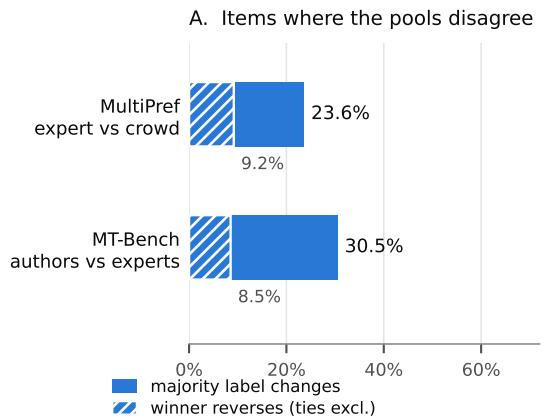
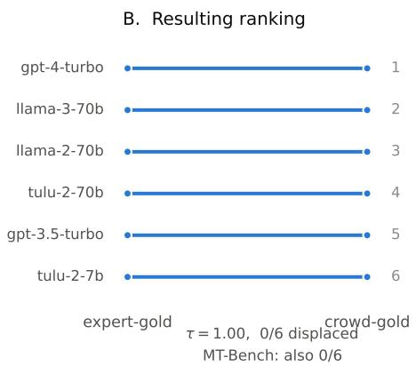

# Whose Gold? Annotator-Pool Disagreement Is Large at the Item Level, and Hidden by Small Leaderboards

Anik Jha Independent Researcher anik.k.jha@gmail.com

## Abstract

Preference benchmarks are built by hiring annotators, and the identity of those annotators is treated as an implementation detail. We measure what that detail buys. On the 2,885 MULTIPREF items where both pools are internally unanimous, so no tie-breaking convention is consulted at all, expert and crowd annotators assign a different majority label to 23.6% and name the opposite winner on 9.2%; on the 246 comparably unanimous MT-BENCH cells, benchmark authors and recruited experts differ on 30.5% and reverse on 8.5%. Yet on both corpora the resulting model leaderboards are bit-identical: Kendall τ = 1.00 with zero of six models displaced.

That invariance is far weaker evidence than it looks, and we quantify how weak. Switching pools moves a model’s win rate by 1.9pp (SD), one adjacent pair in our own leaderboard sits 0.8pp apart and had a 38% chance of swapping, and an item-level bootstrap displaces at least one model in 28% of resamples. The observed zero is the common outcome, not a property of aggregation: on the same measured perturbation, a ten-model leaderboard is displaced with probability 0.86 and a twenty-model leaderboard with probability 0.9997. Reporting a six-model leaderboard is safe; the safety does not generalise, and everything that consumes labels per item is not safe at any size. We make the distinction precise, show that a widely used dataset’s stated assumption of no intra-group annotator variability is false, and show that an LLM judge tracks the crowd pool over the expert pool on all three models we test, including one from a different vendor. All code, per-call outputs, and pre-registered decision rules will be released upon acceptance.

## 1 Introduction

Every preference benchmark rests on a hiring decision. Someone chose whether to recruit crowdworkers or domain experts, how many to put on each item, and how to collapse them into a label. That choice is normally reported in an appendix and then never mentioned again, because the field’s implicit model is that annotators are noisy instruments measuring a single underlying quantity.

The dataset we study states this assumption explicitly. MULTIPREF [Miranda et al., 2024] deliberately collects two annotator pools (ordinary crowdworkers and screened domain experts) and its Limitations section says: “One of our key assumptions is that there is no variability in intra-group annotators . . . the dataset disambiguates between normal and expert crowdworker annotations. We leave this exploration forfuture work.” This paper is that exploration, and the assumption does not survive it.

A human-agent team is scored against exactly these labels. When a team’s output is graded, or a monitor is validated against “human agreement”, the gold standard is whichever pool was hired; if that choice moves half the item-level decisions, it moves the measured competence of the team as much as the team does. That is the sense in which this is a question about human-AI coevolution rather than about dataset hygiene.

Our contribution is a measurement and a distinction:

1. Item-level divergence is large. Two pools annotating the same items reverse the winner on 9.2% (MULTIPREF, on the 2,885 items needing no tie-breaking convention) and 8.5% (MT-BENCH, likewise), and change the majority label on 23.6% and 30.5%. On MULTI-PREF the two experts on a single item disagree with each other 50.1% of the time.

2. Little of it reaches this leaderboard, and that is a statement about spacing. Ranking the same models under expert-gold and crowd-gold labels gives τ = 1.00 on both corpora, with no model displaced. But the pool perturbs win rates by enough that displacement should be expected once a leaderboard holds more than a handful of models (§4), so the aggregate result bounds nothing about the arenas the field actually publishes.

3. The distinction that follows. Reporting a leaderboard is safe. Reward-model training, active-annotation routing, and LLM-judge validation all consume per-item labels. We measure one of these and conjecture the others: the mechanism is shared, but only the judge is tested here.

4. One such consumer, measured. Three LLM judges, two from one vendor and one from another, all agree measurably more with the crowd majority than the expert majority (−6.9, −5.2 and −3.7pp, all three CIs excluding zero). “Our judge agrees with humans X% of the time” is therefore partly a statement about the hiring decision.

## 2 Setup

Corpora. MULTIPREF [Miranda et al., 2024] contains 10,461 pairwise comparisons over six models, each annotated twice by crowdworkers and twice by screened experts on a five-point preference scale. MT-BENCH human judgments [Zheng et al., 2023] contains 3,355 human votes; 292 item cells are rated by both the benchmark’s own authors (author\_\*) and recruited expert annotators (expert\_\*), giving an independent pool contrast over a different task and a different six-model set.

We attempted two further corpora and report the failures, because they explain why this went unmeasured. PRISM [Kirk et al., 2024] assigns one participant per conversation, so no two annotators ever rate the same item and the contrast is undefined. HELPSTEER2 [Wang et al., 2024] ships aggregated per-response attribute scores with no annotator identity and no pairwise preferences. Multi-annotated preference corpora that retain per-annotator labels are scarce.

Aggregation. For each pool we take the majority label per item and score a model by its mean credit over the comparisons it appears in. When a pool is split we force the tie category, but the primary analysis avoids the question entirely (see below). Rank comparisons use Kendall τ with a paired bootstrap: each resample draws the same item indices for both label sources, since the two rankings differ only in whose labels are used.

Pre-registration. Decision rules were written into a versioned plan before each run. The leaderboard analysis carried the rule “kill $i f \tau > 0 . 9$ and the CI lower bound > 0.9; report the null and stop, do not enlarge the model set hunting for a flip.” We report the outcome under that rule rather than a post-hoc one.

Tie-breaking is not a detail here, so we avoid it. Each pool has two annotators and the two experts on an item disagree 50.1% of the time, so a “pool majority” is decided by convention on roughly half the corpus, and the corpus is skewed 1.78:1 toward B. Our primary analysis therefore consults no convention: we restrict to the 2,885 items (27.6%) where both pools are internally unanimous. That conditions on the easier items, so 9.2% is a floor, not an unbiased estimate; the bracket across all conventions is 2.5%–29.8%. Table 2 gives the sensitivity. Our leaderboard ran a rule ranking A over B over Tie. Four of five conventions, including the one we ran, leave the ranking at τ = 1.0000: under our own rule, 29.8% of items reverse and the leaderboard still does not move. One hypothetical rule (A over Tie over B) does break it $( \tau = 0 . 4 6 7 ) ;$ its mirror does not, which identifies it as an artifact of the B-skew rather than a property of the annotators.

  
Figure 1: Two pools annotating the same items disagree substantially (A) and produce identical model rankings (B). Hatching marks outright winner reversals, a strict subset of majority-label changes. Panel B shows MULTIPREF; MT-BENCH likewise displaces zero of six. Panel B is a six-model leaderboard, and §4 shows that is doing much of the work: the same perturbation displaces a ten-model board with probability 0.86.

Table 1: The same pattern on two corpora with different pool contrasts. Winner reversal excludes ties on both sides, so it counts only items where both pools name a decisive and opposite winner. MULTIPREF is restricted to items where both pools are internally unanimous, and MT-BENCH likewise, so no tie-breaking convention enters either corpus.
<table><tr><td>Corpus</td><td>Pool contrast</td><td>Items</td><td>Majority differs</td><td>Winner reverses</td><td>Kendall τ</td></tr><tr><td>MULTIPREF</td><td>expert vs. crowd</td><td>2,885</td><td>23.6%</td><td>9.2%</td><td>1.0000</td></tr><tr><td>MT-BENCH</td><td>authors vs. experts</td><td>246</td><td>30.5%</td><td>8.5%</td><td>1.0000</td></tr></table>

## 3 Divergence at the item level, invariance in aggregate

Table 1 and Figure 1 give the result. On the convention-free MULTIPREF subset, one comparison in eleven has expert and crowd majorities naming opposite winners. The divergence is not concentrated on hard cases: bucketing items by the quality gap between the two models being compared gives 48.1%, 50.3% and 51.4% majority divergence across tertiles (Pearson $r ~ = ~ + 0 . 0 3 0 )$ for closely matched through widely separated ones. It is flat.

The aggregate is untouched. Both leaderboards are identical, τ = 1.0000, zero of six models displaced, on both corpora. The MULTIPREF bootstrap CI is [0.867, 1.000] and the MT-BENCH CI is [0.733, 1.000]; the intervals are wide because six models admit few discordant pairs, so we claim only that no displacement occurs, not that none could.

A 9.2% item-level reversal rate that cancels in a mean is still a 9.2% reversal rate for any consumer that does not take the mean. But before drawing comfort from the cancellation, it is worth asking how much comfort six models can supply.

## 4 How much invariance is that, exactly?

A leaderboard can be invariant because aggregation is robust, or because nothing on it was close enough to swap. Those are different claims and a τ of 1.00 does not separate them, so we measure the second directly.

The perturbation. Switching pools moves each model’s win rate: across our six models the crowdminus-expert shift ranges from −2.1pp to +2.8pp, with SD = 1.9pp. A swap between two adjacent models needs the difference of their two shifts to exceed the gap between them, and that difference has SD = 2.6pp. Any two models closer together than about 4.3pp therefore carry at least a 5% chance of trading places when the annotator pool changes.

Table 2: Every tie-breaking convention we tried, on all 10,461 MULTIPREF comparisons. The first row is the rule our leaderboard actually used. Only the last, a hypothetical rule ranking A over Tie over B, moves the ranking; its mirror image does not, identifying it as an artifact of the corpus’s 1.78:1 B-skew.
<table><tr><td>Tie-break rule</td><td>Majority differs</td><td>Winner reverses</td><td>Kendall τ (displaced)</td></tr><tr><td> $\mathbf { A } > \mathbf { B } > \mathrm { T i e }$  (what we ran)</td><td>44.9%</td><td>29.8%</td><td>1.0000 (0/6)</td></tr><tr><td>Both pools unanimous (no rule)</td><td>23.6%</td><td>9.2%</td><td>1.0000 (0/6)</td></tr><tr><td>Force ties to Tie</td><td>41.2%</td><td>2.5%</td><td>1.0000 (0/6)</td></tr><tr><td> $\mathbf { B } > \mathrm { T i e } > \mathbf { A }$  (mirror)</td><td>36.6%</td><td>9.4%</td><td>1.0000 (0/6)</td></tr><tr><td> $\mathbf { A } > \mathrm { T i e } > \mathbf { B }$  (hypothetical)</td><td>49.8%</td><td>16.8%</td><td>0.4667 (4/6)</td></tr></table>

Table 3: Probability that changing the annotator pool displaces at least one model, as a function of leaderboard size, holding the measured perturbation (SD = 2.6pp on the pairwise difference) fixed and spreading K models uniformly across the observed win-rate span. The $K = 6$ row is reproduced independently by an item-level bootstrap of the real corpus (0.282), which is why we are willing to read the rest of the column.
<table><tr><td>Models on the leaderboard</td><td>6</td><td>10</td><td>20</td><td>30</td><td>50</td></tr><tr><td>Gap between adjacent models</td><td>4.0pp</td><td>2.2pp</td><td>1.1pp</td><td>0.7pp</td><td>0.4pp</td></tr><tr><td>P(at least one displaced)</td><td>0.28</td><td>0.86</td><td>0.9997</td><td>1.00</td><td>1.00</td></tr></table>

Our own leaderboard was lucky. Its adjacent gaps are 11.1, 2.9, 2.8, 0.8 and 2.5pp. The 0.8pp pair had a 38% probability of swapping and did not. Resampling items and recomputing both leaderboards puts the whole-leaderboard displacement rate at 28%: the observed zero is the modal outcome, not a reliable one. A parametric estimate from the measured perturbation alone gives 28.1% for a six-model board, against the 28.2% the bootstrap returns, so the two routes agree closely enough to extrapolate from.

Where the invariance ends. Holding the perturbation fixed and spreading K models uniformly over the same win-rate span, the probability that at least one is displaced is 0.28 at $K = 6 , 0 . 8 { \dot { 6 } }$ at K = 10, 0.9997 at $K = 2 0$ , and indistinguishable from one at $\bar { K } = 5 0$ (Table 3). Real arenas cluster models more tightly than uniform spacing, so these are lower bounds.

This changes what the aggregate null licenses. It is not that leaderboards are robust to who annotates. It is that a six-model leaderboard with one large gap in it survived, and that the same measured perturbation would move a leaderboard of the size the field actually publishes. The reassuring reading of τ = 1.00 is available only at small K.

## 5 What inherits the divergence

The most widely deployed per-item consumer is the LLM judge, validated by statements of the form “ourjudge agrees with humans X% ofthe time.” If a judge tracks one pool more than the other, X is partly a statement about the hiring decision.

We judged a stratified sample of MULTIPREF with three local open-weight models, in both presentation orders, under a schema-constrained five-point output identical to the human scale. All three agree measurably more with the crowd majority than with the expert majority (Table 4). The third is from a different vendor and a different pretraining lineage, and is served at the same Q8\_0 precision as the other two, so vendor is the only thing that changes; it shows the same sign at a smaller magnitude. On pool-split items (those where the two majorities disagree), Qwen3.6-35B-A3B matches the crowd on 46.3%, the expert pool on 34.0% and neither on 19.7%; Qwen3.6-27B gives 40.6%, 32.7% and 26.6%; Gemma-4 gives 39.5%, 33.3% and 27.2%. Among the items where the judge matched either pool the crowd share is 57.6%, 55.4% and 54.3%.

We flag one honest complication. An initial run of the second model at half this sample size did not clear the pre-registered replication bar (−3.2pp, CI [−7.3, +1.2]); the effect appeared only once power was matched, and we report that rather than presenting the matched run as the first attempt. We had also explained the effect as attenuation by label noise, which predicts a cleaner judge shows a larger effect. The data run the other way, and now do so across all three judges: order-swap direction reversal falls 44. $6 \%  2 4 . 5 \%  2 3 . 7 \%$ while the crowd lean falls $6 . 9  5 . 2  3 . 7 \mathrm { p p } .$ The cleaner the judge, the smaller the effect. That explanation is therefore wrong and we withdraw it; the mechanism remains open, and this monotone pattern across three models is the sharpest clue we can offer toward it. One candidate we have not tested: post-training preference data for openweight models is itself typically collected from paid crowd annotators rather than screened experts, so a judge’s own alignment could imprint a crowd-shaped prior independent of the comparison task. We do not have alignment-data provenance for any of the three judges and cannot test this without it, so it remains a hypothesis, not a finding.

Table 4: LLM-judge alignment with each pool on MULTIPREF, on items where the judge is self consistent across presentation orders, within each model’s pre-registered 2,500-item stratified sample. Negative difference means the judge agrees more with the crowd majority. All three clear the pre-registered bar, which is conjunctive over agreement and erasure. Under the committed primary estimator (midpoint order-combination, all items rather than the self-consistent subset) the agreement difference $\mathrm { i s - 0 . 0 2 6 , - 0 . 0 4 3 }$ and −0.022 for the three judges in table order; the two whose agreement CI touches zero survive the conjunctive bar on erasure (+2.3pp and +2.8pp), together with the self-consistent subset shown here. Every judge is negative under both estimators.
<table><tr><td>Judge</td><td>Items</td><td>Agree (expert)</td><td>Agree (crowd)</td><td>Difference [95% CI]</td><td></td></tr><tr><td>Qwen3.6-35B-A3B (Qwen)</td><td>1,383</td><td>0.469</td><td>0.538</td><td></td><td>-0.069 [−0.103, -0.034]</td></tr><tr><td>Qwen3.6-27B (Qwen)</td><td>1,884</td><td>0.427</td><td>0.479</td><td></td><td>−0.052 [−0.082, −0.022]</td></tr><tr><td>Gemma-4-26B-A4B (Google)</td><td>1,904</td><td>0.432</td><td>0.469</td><td></td><td>-0.037 [-0.067, -0.008]</td></tr></table>

Two further measurement choices move the judge more than the pool does. Both are byproducts of the judge arm rather than targets of it, and both are larger than the 5–7pp pool effect the section is about, which is the reason to record them. First, all three judges are strongly position sensitive, reversing direction under order swap on 44.6%, 24.5% and 23.7% of items, consistent with published position-bias measurements [Mazur, 2026] and, importantly, differing by a factor of 1.8 between the two Qwen models despite being the same family. Second, holding prompt, temperature and seed fixed and changing only the output format (a JSON object versus a bare constrained token), the same judge agrees with itself on only 47.2% of items $( n = 5 0 0 )$ ), with a systematic shift in one direction (146 items move A→B, 3 move B→A). Judge numbers are conditional on output format, which is rarely reported [Bellibatlu et al., 2026]. We can localise the cause: re-scoring the same items with the same model at bf16 (rather than the Q8\_0 quantisation the sweep served) by prefilling the JSON scaffolding and reading the next-token distribution recovers 94.6% agreement with the generated labels, against 47.2% for a bare digit. The 5.4% residual absorbs the quantisation change as well as the decoding path, so it is an upper bound on both and the attribution to scaffolding is conservative. The scaffolding tokens move the judgement, not the decoding path.

## 6 What to do instead

Report the pool. An LLM-judge agreement figure without the annotator pool that defines its reference labels is under-specified by roughly the size of the effect being reported.

Do not infer per-item reliability from leaderboard stability. These are different quantities and our data separates them by a wide margin. Nor should leaderboard stability be inferred from a leaderboard: at six models it is largely a statement about how far apart the models were, and §4 gives the arithmetic for checking whether a given board is in the safe regime.

Counterbalance order, always. At 24.5–44.6% direction reversal, a single-order judge measurement on this task is close to a coin flip.

Keep per-annotator labels. Two of the four corpora we examined cannot support this analysis at all, purely because they discarded annotator identity.

## 7 Limitations

Both corpora rank only six models, and §4 measures rather than asserts what that costs: the aggregate invariance is a statement about this leaderboard’s spacing and does not transfer to larger arenas. The extrapolation in Table 3 assumes the pool perturbation is independent across models and approximately Gaussian; it reproduces the K = 6 bootstrap closely, but we have six models with which to check it, and a corpus with more models is the obvious way to test it properly. The MT-BENCH contrast rests on 246 convention-free cells of 292 doubly-rated ones. The judge arm now spans two vendors: LAGUNA S 2.1 does not load in our stack, and a substitute prefill path reproduced the generation path on 94.6% of items against a pre-registered 95% bar, so we ran a third judge from a different pretraining lineage instead, at the same Q8\_0 precision as the other two. The crowd lean replicates across all three, and the two smallest effects belong to the two cleanest judges. Three models from two vendors is still not a claim about judges in general, and the effect we can bound is between roughly 4 and 7pp. We report the null, the failed under-powered run, and the withdrawn explanation alongside the positive results deliberately: the paper’s claim is about measurement validity, and it would be self-undermining to present it selectively. All local judge inference ran on a single on-premises NVIDIA GB10 (Grace Blackwell) workstation serving Q8\_0- quantised GGUF checkpoints; the three judge sweeps (2,500 comparisons × 2 presentation orders each) took 49–122 minutes wall-clock per model.

## 8 Related work

Perspectivist and disagreement-aware evaluation argues that annotator disagreement is signal rather than noise [Xu and Jurgens, 2026] and proposes aggregation that models annotator confusion [Bonagiri et al., 2026]. Those methods rank systems using human annotators; we ask the prior question of whether the choice of annotator population changes the answer, and we measure LLM judges against each population separately. Work on LLM-judge bias documents position, verbosity and format effects [Mazur, 2026, Bellibatlu et al., 2026]; our position and format numbers replicate that line rather than extend it, and are reported here as controls on the pool measurement.

## References

L. Miranda et al. Hybrid Preferences: Learning to Route Instances for Human vs. AI Feedback. arXiv:2410.19133, 2024.

L. Zheng et al. Judging LLM-as-a-Judge with MT-Bench and Chatbot Arena. NeurIPS Datasets and Benchmarks, 2023. arXiv:2306.05685.

H. R. Kirk et al. The PRISM Alignment Dataset. NeurIPS Datasets and Benchmarks, 2024. arXiv:2404.16019.

Z. Wang et al. HelpSteer2: Open-source dataset for training top-performing reward models. arXiv:2406.08673, 2024.

Y. Xu and D. Jurgens. Beyond consensus: Perspectivist modeling and evaluation of annotator disagreement in NLP. arXiv:2601.09065, 2026.

A. Bonagiri et al. STABLEVAL: Disagreement-aware and stable evaluation of AI systems. arXiv:2605.02122, 2026.

L. Mazur. LLM judge position-bias benchmark. https://github.com/lechmazur/position\_bias, 2026. Accessed 2026-08-16.

R. R. Bellibatlu, E. Raff, and W. Zhang. JudgeSense: A benchmark for prompt sensitivity in LLM-as-a-judge systems. arXiv:2604.23478, 2026.