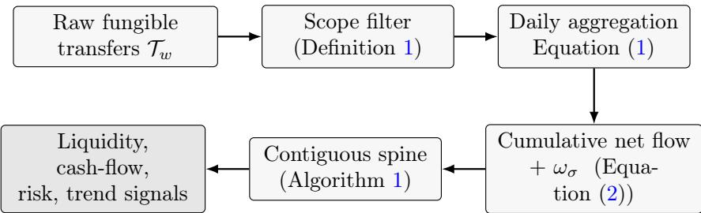
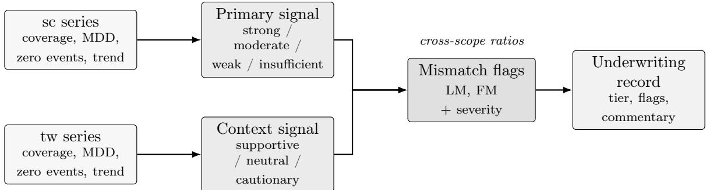
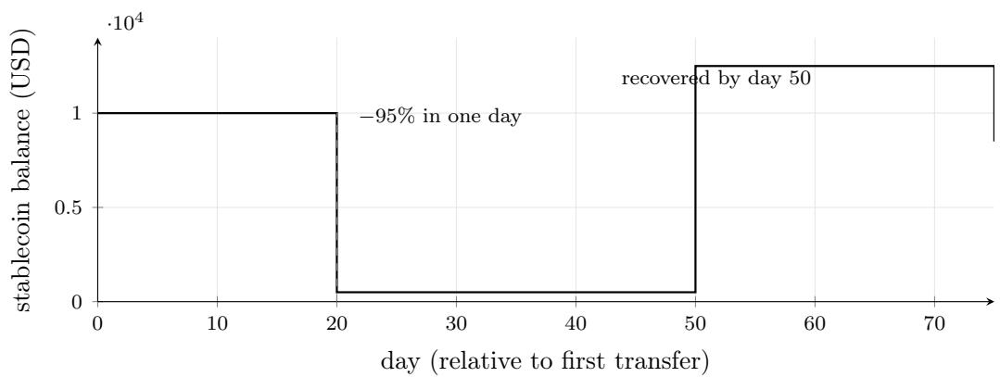
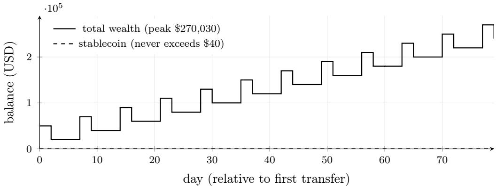
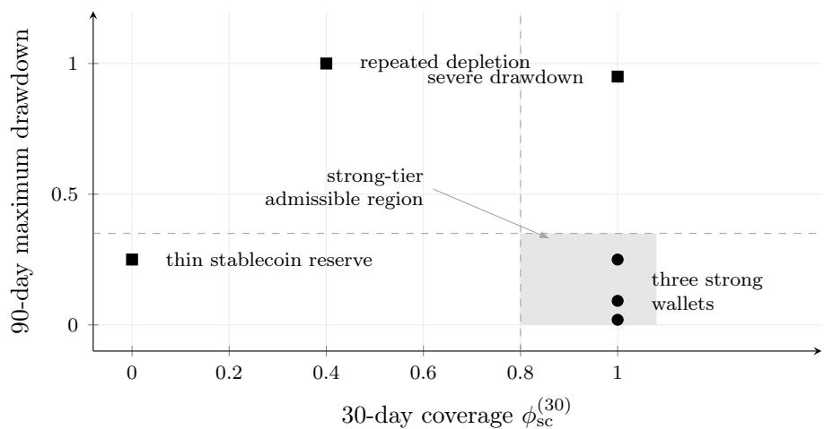

# zLend: A Dual-Scope Cash-Flow Reconstruction Framework for On-Chain Credit Underwriting

Zeru AI

Girish G N Head of AI girish@zeru.finance

Ashutosh Sahoo Chief Executive Oficer ashutosh@zeru.finance

Gurukiran S Chief Technology Oficer gurukiran@zeru.finance

Akshay SP Chief Product Oficer akshay@zeru.finance

Dhanashekar Kandaswamy Ohio State University, USA

## Abstract

Decentralized lending lacks a credit bureau: a borrower’s capacity to repay must be inferred entirely from public on-chain activity, without income verification or a liability record. This paper presents zLend, a deployed cash-flow underwriting framework that reconstructs a wallet’s daily balance history from raw token transfers and derives short-duration repayment-capacity signals from the reconstruction. The reconstruction is performed twice per wallet, once restricted to a fixed stablecoin basket and once over all fungible transfers, on the premise that a wallet’s total token holdings and its liquid, spendable balance are distinct quantities whose conflation misprices risk. From each series we derive liquidity coverage against a fixed loan size, cashflow volatility and regularity, a peak-to-trough drawdown and recovery statistic adapted from quantitative finance, and a recurring-counterparty detector that identifies salary-like payment cadence from transfer timing alone. The two views are then compared: a wallet whose aggregate holdings are large but whose stablecoin reserve rarely covers the loan size, or whose inflows are overwhelmingly non-stablecoin, is flagged as a liquidity or flow mismatch irrespective of total wealth. We specify the pipeline formally, document the golden-master methodology used to verify a cross-language production migration to numerical tolerance $1 0 ^ { - 9 }$ , and characterize the tier function’s parameter sensitivity using an independent reimplementation validated to exact agreement (78 of 78 field assertions) against the deployed system’s reference fixtures. That analysis yields three findings: tier assignment is governed predominantly by the reference loan size relative to which coverage is defined, with four of six reference wallets changing tier across $L \in [ \$ 10, \ \ S 2 5,00 0 ]$ ; the drawdown and coverage criteria bind on disjoint wallets, establishing that neither subsumes the other; and no criterion in the tier rule is inert among the regimes tested. The same analysis applied to the cross-scope mismatch flags finds genuine sensitivity in two of three free parameters, and holds decisively across the tested range on the third. This is a methodology paper: it specifies and justifies the framework and characterizes its decision surface. zLend is deployed in production, where it informs real lending decisions through API integration with third-party applications.

## 1 Introduction

Undercollateralized lending is the DeFi primitive least served by existing on-chain infrastructure. An unsecured line of credit in traditional finance rests on income verification, a liability record, and a bureau score aggregating repayment behavior across lenders. A wallet requesting a small, shortduration on-chain loan supplies none of these. It supplies a public, permanent, but semantically flat transfer log in which income, savings, speculation, and debt service carry no distinguishing label.

The obvious substitute is total wallet value. That substitution fails structurally rather than marginally, because total token value conflates two economically distinct quantities: capital a borrower could liquidate on short notice to service a loan, and capital held in volatile or illiquid form that the borrower may have no intention of spending. A wallet holding \$200,000 in a governance token and \$30 in stablecoins is, with respect to repaying a \$100 loan next week, indistinguishable from a wallet holding \$130 outright; a total-value screen ranks the former three orders of magnitude higher.

zLend resolves this by maintaining two parallel reconstructions of the same wallet: a stablecoinscoped balance history restricted to assets whose dollar value requires no price oracle to interpret, and a total-wealth history over all fungible transfers. Both are reconstructed by an identical procedure and feed an identical family of liquidity, cash-flow, and risk statistics. Divergence between the two views is then treated as signal rather than noise, since it is precisely the wallets whose aggregate wealth and liquid reserve disagree that a single-series model misprices.

## Contributions.

• A formal specification of dual-scope daily balance reconstruction (Section 3) from unordered transfer records, using a cumulative-net-flow construction with a non-negativity ofset that requires no prior knowledge of the wallet’s opening balance (Algorithm 1).

• A signal family derived from the reconstructed series (Section 4): liquidity coverage against absolute and wallet-relative thresholds, inflow regularity and recurring-counterparty detection, maximum drawdown and recovery, single-day outflow concentration, and normalized trend classification.

• A cross-scope comparison layer (Section 5) converting divergence between the two views into graded liquidity- and flow-mismatch severities and a four-tier underwriting signal, specified completely in Tables 2 and 3.

• A verified production implementation (Section 6) whose cross-language migration is checked against its reference to 10−9 numerical tolerance, including deliberate replication of summation, variance-convention, and rounding-mode semantics.

• A sensitivity and binding-constraint analysis (Section 8) conducted with an independent reimplementation validated to exact agreement against the deployed system’s reference fixtures, characterizing which criteria in the tier rule actually determine outcomes.

The framework specified here is deployed in production and reaches real borrowers today, integrated by third-party lending applications through the API described in Section 6.

## 2 Related Work

Alternative and cash-flow credit scoring. The premise that behavioral data substitutes for an absent credit history predates DeFi. Björkegren and Grissen show that mobile phone usage patterns predict loan repayment comparably to a traditional bureau score in populations without credit files [3]. Berg et al. demonstrate that elementary digital-footprint variables collected at checkout match or exceed bureau-score predictive power for default [4]. The operative signal in both is behavioral regularity rather than self-reported financial position; the recurring-counterparty and income-cadence detectors of Section 4 are its on-chain analogue.

DeFi lending risk. Undercollateralized lending inherits the risk vocabulary of collateralized DeFi lending without its safety margin. Qin et al. characterize liquidation events empirically across major protocols, finding they concentrate around sharp price movements and are executed by a small set of sophisticated searchers [9]. Gudgeon et al. analyze protocol mechanics and the reflexive coupling between collateral value and solvency [10]; Aramonte et al. survey DeFi risk from a macroprudential standpoint, emphasizing shock transmission through composability [11]. zLend models no collateral position, but shares the underlying concern that a point-in-time valuation poorly proxies a wallet’s condition under stress, which motivates the rolling-window drawdown statistic of Section 4.

Undercollateralized lending protocols. A small number of production DeFi protocols already extend credit below full collateralization, each substituting a diferent form of of-chain trust for on-chain collateral. Goldfinch routes underwriting through of-chain backers who stake first-loss junior capital against individual borrowers following traditional due diligence, with a senior pool of passive lenders bearing residual risk [5]. Maple Finance delegates credit assessment to pool delegates — vetted institutional managers who conduct of-chain diligence, negotiate terms, and post firstloss capital of their own [6]. TrueFi assesses creditworthiness through token-holder staking and voting on individual loan requests, again resting the underwriting judgment on of-chain information the protocol does not itself observe [7]. Centrifuge substitutes appraised real-world collateral for behavioral signal entirely, tokenizing invoices and other of-chain assets as loan backing [8]. In each design, the trust-critical judgment — whether a borrower is creditworthy, or an asset is worth what it claims — is made by a human party outside the protocol; the smart contract enforces an alreadymade decision rather than deriving one. zLend instead computes its signal entirely from public on-chain transfer history, with no of-chain underwriter, staked backer, or appraised collateral in the loop, making it computable for any address with suficient transfer history rather than only the subset a human underwriter has chosen to evaluate.

Drawdown as a risk measure. Maximum drawdown is standard in portfolio and strategy risk assessment, and its statistical properties are characterized by Magdon-Ismail and Atiya [12]. We are not aware of prior work applying maximum drawdown, computed over a reconstructed on-chain balance series, as an underwriting criterion for unsecured credit.

Positioning. zLend is the credit-scoped counterpart to the zScore reputation lineage [1, 2]. Where zScore establishes general-purpose cross-protocol wallet reputation, zLend addresses the narrower question of short-duration repayment capacity, over a diferent representation: a reconstructed daily balance series rather than aggregate transaction statistics.

## 3 Problem Formulation and Balance Reconstruction

## 3.1 Setting

Let w denote a wallet and $\mathcal { T } _ { w }$ its observed token transfers. Each transfer $t \in \mathcal { T } _ { w }$ carries a timestamp, a USD value $v ( t ) \geq 0$ , a token symbol s(t), a transfer type, a direction $\delta ( t ) \in \{ \mathrm { i n , o u t } \}$ relative to

w, and a counterparty address $\kappa ( t )$ . No balance is observed at any point: holdings must be inferred from flows alone.

## 3.2 Scopes

Every wallet is analyzed under two scopes $\sigma \in \{ \mathrm { s c } , \mathrm { t w } \}$ applied to the same $\mathcal { T } _ { w }$

Definition 1 (Scope filters). Let norm(s) denote symbol normalization: uppercase, strip whitespace, then map any symbol prefixed USDC to USDC, any symbol prefixed USDT to USDT, and USDBC to USDC. Then

$$
\begin{array} { r } { \mathcal { T } _ { w } ^ { \mathrm { s c } } = \{ t : \mathrm { t y p e } ( t ) = f u n g i b l e \wedge \mathrm { n o r m } ( s ( t ) ) \in \mathcal { S } \} , \qquad \mathcal { T } _ { w } ^ { \mathrm { t w } } = \{ t : \mathrm { t y p e } ( t ) = f u n g i b l e \wedge v ( t ) > 0 \} , } \end{array}
$$

where S is the fixed 15-symbol stablecoin basket {USDC, USDT, DAI, FDUSD, USDE, PYUSD, GUSD, USDP, TUSD, BUSD, USDBC, USDB, FRAX, USDS, LUSD}.

The sc scope approximates capital deployable toward repayment without price risk over the loan term; tw captures the wallet’s full economic footprint. Normalization folds bridged and chainspecific variants of one asset together, so a wallet holding USDC across several chains is not scored as holding several distinct assets.

## 3.3 Daily Aggregation and Derived Balance

Let d index UTC calendar days. For scope $\sigma _ { : }$

$$
\mathrm { i n } _ { \sigma } ( d ) = \sum _ { \substack { t \in { \cal T } _ { w } ^ { \sigma } ; \mathrm { ~ d a y } ( t ) = d } } v ( t ) , \qquad \mathrm { o u t } _ { \sigma } ( d ) = \sum _ { \substack { t \in { \cal T } _ { w } ^ { \sigma } ; \mathrm { ~ d a y } ( t ) = d } } v ( t ) , \qquad \nu _ { \sigma } ( d ) = \mathrm { i n } _ { \sigma } ( d ) - \mathrm { o u t } _ { \sigma } ( d ) .\tag{1}
$$

Because no opening balance is observed, the balance series is built from cumulative net flow and shifted by the minimum ofset rendering it non-negative:

$$
C _ { \sigma } ( d ) = \sum _ { d ^ { \prime } < d } \nu _ { \sigma } ( d ^ { \prime } ) , \qquad \omega _ { \sigma } = \operatorname* { m a x } \Big ( 0 , \ - \operatorname* { m i n } _ { d } C _ { \sigma } ( d ) \Big ) , \qquad B _ { \sigma } ( d ) = C _ { \sigma } ( d ) + \omega _ { \sigma } .\tag{2}
$$

Here $C _ { \sigma }$ and $\omega _ { \sigma }$ range over the (generally sparse) set of days on which scope $\sigma$ has at least one transfer; Algorithm 1 extends $B _ { \sigma }$ to the full contiguous calendar.

Definition 2 (Ofset semantics). $\omega _ { \sigma }$ is the smallest opening balance consistent with the observed history never becoming negative. It is a lower bound implied by the data, not an estimate of the wallet’s true pre-history balance. Level-dependent statistics inherit this bound; ratio- and variationdependent statistics do not.

## 3.4 Daily Spine

Scope-level day sets are sparse and generally disjoint. Both are projected onto a single contiguous calendar $\mathcal { D } = [ d _ { \operatorname* { m i n } } , d _ { \operatorname* { m a x } } ]$ spanning the earliest to latest transfer day across either scope, so that the two series are indexed identically and remain directly comparable. Algorithm 1 gives the full construction, including the opening-balance series $O _ { \sigma }$ required by Definition 7.

Proposition 1 (Complexity). For $T = | T _ { w } |$ transfers spanning $D = | \mathcal { D } |$ days, reconstruction costs $O ( T \log T + D )$ time and $O ( D )$ space. The statistic suite adds $O ( \sum _ { \mathbf { } } { _ { W } }$ W log W) for order statistics over $W \in \{ 3 0 , 6 0 , 9 0 \}$ , which is constant-bounded. The pipeline is therefore efectively linear in transfer count.

Figure 1 summarizes the construction.

Algorithm 1 Dual-scope daily balance reconstruction   
Require: transfers ${ \mathcal T } _ { w } ;$ stablecoin basket S   
Ensure: spine D; per-scope series $B _ { \sigma } , O _ { \sigma } , \mathrm { i n } _ { \sigma } , \mathrm { o u t } _ { \sigma }$   
1: for $\sigma \in \{ \mathrm { s c } , \mathrm { t w } \}$ do   
2: $\mathcal { T } _ { w } ^ { \sigma } \gets$ filter $\mathcal { T } _ { w }$ by Definition 1   
3: aggregate $\mathrm { i n } _ { \sigma } , \mathrm { o u t } _ { \sigma }$ per day by Equation (1) ▷ compensated summation   
4: $B _ { \sigma } \gets$ cumulative net flow $+ \ \omega _ { \sigma }$ by Equation (2)   
5: end for   
6: $\mathcal { D }  |$ [ mi ${ \bf \delta } _ { ^ { 1 } \sigma }$ min days(σ), ma $\mathrm { x } _ { \sigma }$ max days(σ) ]   
7: for $\sigma \in \{ \mathrm { s c } . $ , tw} do   
8: project $B _ { \sigma } , \mathrm { i n } _ { \sigma } , \mathrm { o u t } _ { \sigma }$ onto $\mathcal { D } ;$ unobserved days take in $\iota = \mathrm { o u t } = 0$   
9: $B _ { \sigma } \gets$ forward-fill over D ▷ a day without transfers retains the prior balance   
10: if $B _ { \sigma }$ is unobserved on all of D then   
11: $B _ { \sigma } ( d )  C _ { \sigma } ( d )$ for all d   
12: else   
13: $d ^ { * } $ first observed day; $a \gets B _ { \sigma } ( d ^ { * } ) - C _ { \sigma } ( d ^ { * } )$   
14: $B _ { \sigma } ( d )  C _ { \sigma } ( d ) +$ a for every d still unfilled ▷ back-extend through the anchor   
15: end if   
16: $O _ { \sigma } ( d )  B _ { \sigma } ( d - 1 )$ , falling back to $B _ { \sigma } ( d ) - \nu _ { \sigma } ( d )$ , then to 0   
17: end for   
18: return D, $\{ B _ { \sigma } , O _ { \sigma } , \mathrm { i n } _ { \sigma } , \mathrm { o u t } _ { \sigma } \}$

  
Figure 1: Reconstruction pipeline, executed independently and identically for the stablecoin and total-wealth scopes.

## 4 Signal Derivation

All statistics are computed per scope over rolling tail windows $W \in \{ 3 0 , 6 0 , 9 0 \}$ days, each taking the final min(W, |D|) days of the spine, so that a wallet with less history than the nominal window is scored over what is available rather than zero-padded. Table 1 lists every free parameter.

## 4.1 Liquidity Coverage

Definition 3 (Coverage). For loan size $L$

$$
\phi _ { \sigma } ^ { ( W ) } = \frac { 1 } { | W | } \sum _ { d \in W } \mathcal { k } [ B _ { \sigma } ( d ) \geq L ]\tag{3}
$$

is the fraction of window days on which the derived balance would have covered the loan outright. A companion statistic replaces L with $\theta _ { \mathrm { d y n } } ,$ the wallet’s own 90-day median balance, measuring coverage relative to the wallet’s operating scale rather than an absolute figure.

Table 1: Pipeline parameters and deployed values.
<table><tr><td>Parameter</td><td>Role</td><td>Value</td></tr><tr><td> $L$ </td><td>Reference loan size for coverage</td><td>$100</td></tr><tr><td>ε</td><td>Zero-balance threshold</td><td>$1</td></tr><tr><td> $f _ { \mathrm { a b s } }$ </td><td>Absolute floor, outflow-concentration gate</td><td>$5</td></tr><tr><td> $f _ { \mathrm { p c t } }$ </td><td>Median-relative floor, same gate</td><td>0.05</td></tr><tr><td> $k _ { \mathrm { r e c } }$ </td><td>Distinct days for counterparty recurrence</td><td>3</td></tr><tr><td> $\tau$ </td><td>Flat-band tolerance, trend classification</td><td>0.01</td></tr><tr><td> $\theta _ { \mathrm { d y n } }$ </td><td>Dynamic balance threshold</td><td>90-day median</td></tr></table>

## 4.2 Cash-Flow Regularity

Inflow frequency and the coeficient of variation of inflow amounts characterize how often and how uniformly funds arrive. Counterparty structure is then examined directly.

Definition 4 (Recurrence and income cadence). A counterparty κ is recurring in window W if it appears as an inflow source on at least $k _ { \mathrm { r e c } } = 3$ distinct days. Let $g _ { 1 } , \ldots , g _ { m }$ be the day-gaps between consecutive appearances. Then κ is income-like $i f$

$$
{ \frac { \ s d ( g ) } { \overline { { g } } } } \leq 0 . 5 \qquad a n d \qquad 5 \leq \mathrm { m e d i a n } ( g ) \leq 4 5 ,\tag{4}
$$

a band admitting weekly-to-monthly cadences while excluding both high-frequency automated flows and coincidentally repeated transfers.

## 4.3 Drawdown, Depletion, and Outflow Concentration

Definition 5 (Maximum drawdown). With running peak $P _ { \sigma } ( d ) = { \mathrm { m a x } } _ { d ^ { \prime } \leq d } B _ { \sigma } ( d ^ { \prime } )$ , the drawdown is $\mathrm { D D } _ { \sigma } ( d ) = ( P _ { \sigma } ( d ) - B _ { \sigma } ( d ) ) / P _ { \sigma } ( d )$ , evaluated only where $P _ { \sigma } ( d ) > \varepsilon$ , and

$$
\mathrm { M D D } _ { \sigma } ^ { ( W ) } = \operatorname* { m a x } _ { d \in W } \mathrm { D D } _ { \sigma } ( d ) .\tag{5}
$$

Duration is the longest run of consecutive days below the prevailing peak; recovery time is the number of days from the trough until $B _ { \sigma }$ first regains the pre-drawdown peak, undefined where no such day exists in the window.

Definition 6 (Zero-balance event). $Z _ { \sigma } ( d ) = \mathcal { H } [ B _ { \sigma } ( d - 1 ) \ge \varepsilon \land B _ { \sigma } ( d ) < \varepsilon ]$ , with $B _ { \sigma } ( d _ { \mathrm { { m i n } } } - 1 ) : = 0$ Events are detected over the full spine and then counted per window, so that an event adjacent to a window boundary is neither double-counted nor lost.

Definition 7 (Single-day outflow concentration). Let $\theta = \mathrm { m a x } \big ( f _ { \mathrm { a b s } } , ~ f _ { \mathrm { p c t } } \cdot \mathrm { m e d i a n } _ { d \in W } B _ { \sigma } ( d ) \big )$ . Over days with $O _ { \sigma } ( d ) \geq \theta$

$$
\Lambda _ { \sigma } ^ { ( W ) } = \operatorname* { m a x } _ { d } ~ \frac { \operatorname* { m i n } \bigl ( \operatorname { o u t } _ { \sigma } ( d ) , ~ { \cal O } _ { \sigma } ( d ) \bigr ) } { { \cal O } _ { \sigma } ( d ) } ,\tag{6}
$$

undefined $i f$ no day qualifies. The gate suppresses the degenerate case in which a trivially small opening balance is fully withdrawn, which would otherwise register as maximal-severity outflow.

## 4.4 Trend

Net flow is regressed on day index by ordinary least squares within the window and normalized by mean absolute balance, yielding a rate rather than a currency amount:

$$
\beta _ { \sigma } ^ { ( W ) } = \frac { \sum _ { i } ( i - \bar { i } ) \big ( \nu _ { \sigma } ( d _ { i } ) - \bar { \nu } \big ) } { \sum _ { i } ( i - \bar { i } ) ^ { 2 } } \Big / \operatorname* { m a x } \big ( | \bar { B } _ { \sigma } ^ { ( W ) } | , ~ 1 \big ) .\tag{7}
$$

The label is increasing if $\beta _ { \sigma } ^ { ( W ) } > \tau ,$ , decreasing if $\beta _ { \sigma } ^ { ( W ) } < - \tau$ , and flat otherwise. Comparing the 30-day slope r against the lifetime slope ℓ gives a five-way transition label, evaluated in order and resolved on first match:

$$
\begin{array} { l l } { a c c e l e r a t i n g ~ i n f o w } & { \mathrm { i f ~ } r \geq \tau \land \ell \geq \tau \land r > \ell + \tau , } \\ { a c c e l e r a t i n g ~ o u t f o w } & { \mathrm { i f ~ } r \leq - \tau \land \ell \leq - \tau \land r < \ell - \tau , } \\ { i m p r o v i n g } & { \mathrm { i f ~ } r > \ell + \tau \land r > - \tau , } \\ { w e a k e n i n g } & { \mathrm { i f ~ } r < \ell - \tau \land r < \tau , } \\ { s t a b l e } & { \mathrm { o t h e r w i s e } . } \end{array}\tag{8}
$$

## 4.5 Data-Quality Flags

Two conditions qualify every record. A wallet is flagged insuficient-history when $| \mathcal { D } | < 9 0 $ . Separately, let the counterparty coverage of scope σ be the fraction of 90-day inflow days carrying at least one resolved counterparty address; if either scope falls below 0.8, the record is flagged insuficientcounterparty-data, since Definition 4 is then evaluated over an incomplete graph and recurrence may be understated. This 90-day quality threshold is diagnostic and distinct from the 30-day insuficient tier of Table 3, which determines the primary credit signal itself rather than flagging the confidence of a signal that was still assigned.

## 5 Cross-Scope Comparison and Tier Assignment

The signals of Section 4 are computed identically for both scopes. Their comparison is where the framework’s central design decision operates.

## 5.1 Mismatch Detection

Definition 8 (Liquidity mismatch). With $\widetilde { B } ^ { ( 3 0 ) }$ the 30-day median balance,

$$
\mathrm { L M } = \mathcal { k } \bigg [ \widetilde { B } _ { \mathrm { t w } } ^ { ( 3 0 ) } \geq 3 \widetilde { B } _ { \mathrm { s c } } ^ { ( 3 0 ) } \ \wedge \ \phi _ { \mathrm { s c } } ^ { ( 3 0 ) } < 0 . 5 \bigg ] .\tag{9}
$$

Definition 9 (Flow mismatch). With $\rho = \mathrm { i n _ { s c } ^ { ( 3 0 ) } / i n _ { t w } ^ { ( 3 0 ) } }$ the stablecoin share of trailing inflow,

$$
\mathrm { F M } = \mathcal { H } \Big [ \mathrm { i n } _ { \mathrm { t w } } ^ { ( 3 0 ) } > 0 \ \wedge \ \rho < 0 . 2 5 \Big ] .\tag{10}
$$

Both flags carry graded severity (Table 2), so that a wallet marginally past a threshold is not treated identically to one exceeding it by orders of magnitude. A four-way trend-alignment label (aligned-positive, aligned-flat, aligned-negative, divergent) records whether the two scopes’ 30-day trend labels agree.

Table 2: Mismatch severity ladders, resolved most-severe-first: a wallet satisfying the High condition is High regardless of whether it also satisfies Low or Medium. $r = \widetilde { B } _ { \mathrm { t w } } ^ { ( 3 0 ) } / \widetilde { B } _ { \mathrm { s c } } ^ { ( 3 0 ) }$ is the balance ratio; ρ is the stablecoin inflow share.
<table><tr><td>Severity</td><td>Liquidity mismatch</td><td>Flow mismatch</td></tr><tr><td>None</td><td>flag not raised</td><td>flag not raised</td></tr><tr><td>Low</td><td> $\phi _ { \mathrm { s c } } ^ { ( 3 0 ) } \geq 0 . 3 5$  r &lt; 4 and</td><td> $\rho \ge 0 . 2$ </td></tr><tr><td>Medium</td><td> $r \geq 4 ~ \mathrm { o r } ~ \phi _ { \mathrm { s c } } ^ { ( 3 0 ) } < 0 . 3 5$ </td><td> $\rho < 0 . 2$ </td></tr><tr><td>High</td><td> $r \geq 6 \ \mathrm { o r } \ \phi _ { \mathrm { s c } } ^ { ( 3 0 ) } < 0 . 2$ </td><td> $\rho < 0 . 1$ </td></tr></table>

Table 3: Tier definitions. Conditions within a row are conjunctive except where noted; rows are evaluated top to bottom and resolved on first match.
<table><tr><td>Signal</td><td>Tier</td><td> $\phi ^ { ( 3 0 ) }$ </td><td> $\mathrm { Z e r o ~ e v e n t s ^ { ( 9 0 ) } }$ </td><td> $\mathrm { M D D ^ { ( 9 0 ) } }$ </td><td> $\mathrm { T r e n d } ^ { ( 3 0 ) }$ </td></tr><tr><td rowspan="4">Primary (sc)</td><td>Insufficient</td><td> $\left| \mathcal { D } \right| < 3 0$ </td><td></td><td></td><td rowspan="4">≠ decreasing</td></tr><tr><td>Strong</td><td> $\geq 0 . 8 0$ </td><td>= 0</td><td> $\leq 0 . 3 5$ </td></tr><tr><td>Moderate</td><td> $\geq 0 . 5 0$ </td><td>≤1</td><td>≤ 0.65</td></tr><tr><td>Weak</td><td>otherwise</td><td></td><td></td></tr><tr><td rowspan="2">Context (tw)</td><td>Supportive</td><td> $\geq 0 . 8 0$ </td><td></td><td>≤ 0.50</td><td>≠ decreasing</td></tr><tr><td>Cautionary Neutral</td><td> $\phi < 0 . 5 0$  otherwise</td><td>or zero events &gt; 0 or</td><td> $\mathrm { M D D } > 0 . 7 5$ </td><td>(disjunctive)</td></tr></table>

## 5.2 Tier Assignment

The stablecoin scope alone determines the primary credit signal; the total-wealth scope yields a parallel context signal that qualifies but never overrides it. Table 3 specifies both.

Remark 1 (Conjunctivity). Primary-tier criteria are conjunctive and non-substitutable: a wallet failing any one cannot reach that tier however strongly it satisfies the others. This is deliberate. Coverage measures whether a wallet is usually solvent against the loan; drawdown measures whether it has recently demonstrated that it can lose nearly everything. A wallet can satisfy the first perfectly while failing the second, and Section 7 exhibits such a case. The context signal’s cautionary branch is by contrast disjunctive, so that any single severe indicator on the total-wealth view withdraws support.

Figure 2 traces the full decision path.

## 6 Implementation and Verification

zLend is deployed as an in-process module of a production wallet-scoring service. Each evaluation writes a record of 166 columns into an append-only table partitioned monthly under a 90-day retention policy: per-scope liquidity, cash-flow, and risk metrics (69 fields per scope), six cross-scope ratios, the mismatch and tier fields, data-quality flags, and four per-stage latency instrumentation columns.

The pipeline was implemented in Python and subsequently ported to TypeScript during a service consolidation. Because its outputs inform a financial decision, the port was verified rather than reviewed. A golden-master suite generates reference output from the live Python implementation over scenarios constructed to exercise each branch, and the TypeScript implementation is asserted to reproduce every numeric field within $1 0 ^ { - 9 }$ absolute tolerance and every categorical field exactly. Meeting that bound required replicating numerical semantics that a straightforward reimplementation would not preserve:

  
Figure 2: Decision flow. The two scopes are scored independently into parallel signals; mismatch flags are computed from cross-scope ratios and qualify, but never override, the stablecoin-derived primary tier.

• daily aggregation uses compensated (Kahan) summation, matching the reference implementation’s dataframe groupby rather than naive accumulation;

• dispersion is computed as a population statistic (denominator n), matching the reference convention rather than the sample default;

• output rounding replicates round-half-to-even at ten decimal places rather than the target language’s native mode;

• ratios with denominator below $1 0 ^ { - 1 2 }$ in absolute value yield NaN, propagated to the API boundary as an explicit null rather than coerced to zero, preserving the distinction between undefined and zero.

This level of numerical fidelity is what makes zLend’s production deployment possible: thirdparty lending applications integrate against the API described above, and each depends on the service returning exactly the values the specification defines, call after call.

## 7 Worked Examples

The wallets below are drawn from the deployed system’s verification fixtures. Each is a synthetic transfer history constructed to exercise a specific regime; every reported value is verified output of the specification, reproduced independently for this paper and checked against the reference fixtures. Table 4 summarizes all six.

The remaining three cases exercise regimes not covered by the two detailed examples below. The steady, low-volume wallet is the unremarkable baseline the strong tier is designed to admit: full coverage, negligible drawdown, no exceptional signal on either scope. The recurring-income wallet exercises Definition 4 directly: it receives a fixed \$2,500 stablecoin payment on a seven-day cadence that the income-cadence detector correctly flags as income-like, and its balance dips no more than 9.2% below peak, comfortably within the strong-tier drawdown bound. The short-history wallet has only 36 days of observed activity — above the 30-day insuficiency floor of Table 3 but below the 90-day data-quality threshold of Section 4 — and is admitted to the strong tier on the strength of its available history alone, exercising the framework’s decision to score partial history rather than withhold judgment.

Table 4: Reference wallets, grouped by primary tier. All values are stablecoin-scope.
<table><tr><td>Wallet regime</td><td>|D|</td><td> $\phi _ { \mathrm { s c } } ^ { ( 3 0 ) }$ </td><td> $\mathrm { M D D _ { s c } ^ { ( 9 0 ) } }$ </td><td>Zero events</td><td>Primary tier</td></tr><tr><td>Steady, low volume</td><td>86</td><td>1.00</td><td>0.020</td><td>0</td><td>Strong</td></tr><tr><td>Recurring income</td><td>95</td><td>1.00</td><td>0.092</td><td>0</td><td>Strong</td></tr><tr><td>Short history</td><td>36</td><td>1.00</td><td>0.250</td><td>0</td><td>Strong</td></tr><tr><td>Severe drawdown, recovered</td><td>76</td><td>1.00</td><td>0.950</td><td>0</td><td>Weak</td></tr><tr><td>Repeated depletion</td><td>79</td><td>0.40</td><td>1.000</td><td>5</td><td>Weak</td></tr><tr><td>Thin stablecoin reserve</td><td>80</td><td>0.00</td><td>0.250</td><td>0</td><td>Weak</td></tr></table>

  
Figure 3: Reconstructed stablecoin balance for the drawdown wallet. Coverage is 100% across the trailing 30 days despite a 90-day maximum drawdown of 0.95.

## 7.1 Coverage without solvency stability

Figure 3 plots the reconstructed stablecoin balance of the drawdown wallet. It holds \$10,000 for nineteen days, loses 95% of that in a single day, remains near \$500 for three weeks, then recovers past its original level by day 50. Its coverage is $\begin{array} { r } { \phi _ { \mathrm { s c } } ^ { ( 3 0 ) } = 1 . 0 0 \colon } \end{array}$ on every one of the trailing thirty days the balance exceeded the \$100 loan size, and a coverage-only screen would rate its liquidity perfect. Its 90-day maximum drawdown is 0.95, well past the 0.35 bound of Table 3, and the primary signal is therefore weak. This is Remark 1 operating as designed.

## 7.2 The mismatch the dual-scope design targets

Figure 4 plots both reconstructions for a wallet whose total-wealth balance climbs from \$50,000 to \$270,030 while its stablecoin balance never exceeds \$40. Stablecoin coverage is $\phi _ { \mathrm { s c } } ^ { ( 3 0 ) } = 0 . 0 0 \colon$ on no day in the trailing thirty could it have covered a \$100 loan from stablecoins. The liquidity mismatch of Equation (9) fires at high severity, the balance ratio exceeding 6,000; the flow mismatch of Equation (10) also fires at high severity, stablecoin inflow being 0% of trailing total inflow. A total-value screen would rank this wallet among the wealthiest of any comparable population. The two screens disagree by roughly four orders of magnitude, and that disagreement is the signal.

  
Figure 4: Both reconstructions for one wallet over the same 80-day history. The views diverge by roughly four orders of magnitude throughout.

Table 5: Primary tier as a function of reference loan size L. S = strong, M = moderate, W = weak.
<table><tr><td>Wallet regime</td><td>$10</td><td>$50</td><td>$100</td><td>$250</td><td>$500</td><td>$1k</td><td>$2.5k</td><td>$5k</td><td>$10k</td><td>$25k</td></tr><tr><td>Recurring income</td><td>S</td><td>S</td><td>S</td><td>S</td><td>S</td><td>S</td><td>S</td><td>S</td><td>S</td><td>W</td></tr><tr><td>Short history</td><td>S</td><td>S</td><td>S</td><td>S</td><td>S</td><td>S</td><td>M</td><td>W</td><td>W</td><td>W</td></tr><tr><td>Severe drawdown</td><td>W</td><td>W</td><td>W</td><td>W</td><td>W</td><td>W</td><td>W</td><td>W</td><td>W</td><td>W</td></tr><tr><td>Repeated depletion</td><td>W</td><td>W</td><td>W</td><td>W</td><td>W</td><td>W</td><td>W</td><td>W</td><td>W</td><td>W</td></tr><tr><td>Thin stablecoin reserve</td><td>S</td><td>W</td><td>W</td><td>W</td><td>W</td><td>W</td><td>W</td><td>W</td><td>W</td><td>W</td></tr><tr><td>Steady, low volume</td><td>S</td><td>S</td><td>S</td><td>S</td><td>S</td><td>S</td><td>S</td><td>S</td><td>W</td><td>W</td></tr></table>

## 8 Sensitivity and Binding-Constraint Analysis

The tier rule of Table 3 is specified by hand. This section characterizes how far its output depends on that specification. Results were produced by an independent reimplementation of the pipeline, validated against the deployed system’s reference fixtures to exact agreement on every checked field (78 of 78 assertions at tolerance 10−9), then re-run under perturbed parameters.

Remark 2 (Interpretation). This analysis characterizes the decision surface of the tier function, not the distribution of a wallet population. The six reference wallets were constructed to span the pipeline’s designed operating regimes, so the statements below describe how the rule responds to its parameters and must not be read as frequencies in live trafic.

## 8.1 Loan-size sensitivity

Coverage is defined relative to L, so L propagates into every tier decision. Table 5 sweeps it across three orders of magnitude.

Four of six wallets change tier across $L \in [ \$ 10, \ \$ 25,000 ]$ , and the transitions are informative rather than arbitrary. The thin-stablecoin wallet is rated strong at L = \$10 and weak at L = \$50 because its stablecoin balance sits near \$30–40: it genuinely can cover a \$10 loan and genuinely cannot cover a \$50 one, and the tier tracks that fact. The two wallets that never change tier are those excluded by drawdown and depletion criteria, which are scale-free and therefore independent of L.

The practical consequence is that L is not a tuning constant but a statement of product scope.

Table 6: Primary tier as a function of the strong-tier drawdown bound (default 0.35).
<table><tr><td>Wallet regime</td><td>0.15</td><td>0.25</td><td>0.35</td><td>0.50</td><td>0.65</td><td>0.80</td><td>0.95</td></tr><tr><td>Recurring income</td><td>S</td><td>S</td><td>S</td><td>S</td><td>S</td><td>S</td><td>S</td></tr><tr><td>Short history</td><td>M</td><td>S</td><td>S</td><td>S</td><td>S</td><td>S</td><td>S</td></tr><tr><td>Severe drawdown</td><td>W</td><td>W</td><td>W</td><td>W</td><td>W</td><td>W</td><td>S</td></tr><tr><td>Repeated depletion</td><td>W</td><td>W</td><td>W</td><td>W</td><td>W</td><td>W</td><td>W</td></tr><tr><td>Thin stablecoin reserve</td><td>W</td><td>W</td><td>W</td><td>W</td><td>W</td><td>W</td><td>W</td></tr><tr><td>Steady, low volume</td><td>S</td><td>S</td><td>S</td><td>S</td><td>S</td><td>S</td><td>S</td></tr></table>

Table 7: Strong-tier criterion satisfaction under deployed parameters. ✓ = satisfied, $\mathrm { \Delta \times = f a i l s }$
<table><tr><td>Wallet regime</td><td> $\phi \geq 0 . 8$ </td><td>zero = 0</td><td>MDD ≤ 0.35</td><td>trend</td><td>Tier</td></tr><tr><td>Recurring income</td><td>√</td><td>√</td><td>√</td><td>flat</td><td>Strong</td></tr><tr><td>Short history</td><td>√</td><td>√</td><td>√</td><td>flat</td><td>Strong</td></tr><tr><td>Steady, low volume</td><td>√</td><td>√</td><td>√</td><td>flat</td><td>Strong</td></tr><tr><td>Severe drawdown</td><td>√</td><td>√</td><td>×</td><td>flat</td><td>Weak</td></tr><tr><td>Repeated depletion</td><td>X</td><td>X</td><td>X</td><td>decreasing</td><td>Weak</td></tr><tr><td>Thin stablecoin reserve</td><td>X</td><td>√</td><td>√</td><td>flat</td><td>Weak</td></tr><tr><td>Failures across the set</td><td>2</td><td>1</td><td>2</td><td>1</td><td></td></tr></table>

A deployment lending \$100 and one lending \$10,000 are not running the same classifier at diferent thresholds; they are asking diferent questions, and one wallet may legitimately answer one afirmatively and the other negatively.

## 8.2 Drawdown-threshold sensitivity

Table 6 varies the strong-tier drawdown bound in isolation.

Tier assignment is markedly more stable in this parameter than in L: four of six wallets are invariant across the full range. The bound is consequential only near a wallet’s own realized drawdown, which is the expected behavior of a threshold on a continuous statistic, and the deployed default of 0.35 sits adjacent to no wallet’s value. The severe-drawdown wallet is admitted only at a bound of 0.95, at which point the criterion excludes nothing.

## 8.3 Which criteria bind

A tier rule may contain criteria that never determine an outcome. Table 7 records which strong-tier conditions fail, per wallet.

Every criterion is decisive for at least one wallet, and — more informatively — the coverage and drawdown criteria bind on disjoint wallets. The severe-drawdown wallet fails on drawdown alone while satisfying coverage perfectly; the thin-stablecoin wallet fails on coverage alone while satisfying drawdown comfortably. Over this set the two statistics are therefore not proxies for one another, which is the design premise of Remark 1 and the principal justification for retaining both. This establishes non-redundancy over the regimes tested, not over an arbitrary wallet population.

Figure 5 makes the point geometrically: the strong-tier admissible region is the lower-right rectangle, the three admitted wallets lie inside it, and the two single-criterion failures lie outside it

  
Figure 5: Reference wallets in the (coverage, drawdown) plane. Circles denote strong-tier wallets, squares weak. The severe-drawdown and thin-stablecoin wallets fail on orthogonal criteria, so neither statistic subsumes the other.

along orthogonal axes.

## 8.4 Mismatch-threshold sensitivity

The primary-tier criteria have now been stress-tested; the cross-scope mismatch flags of Definitions 8 and 9 have not, despite motivating the paper’s central example (Section 7). We extend the validated reimplementation with the mismatch and severity rules of Equations (9) and (10) and Table 2, reverify it against independently hand-derived values for three of the six reference wallets (exact agreement on both flag and severity), and sweep each free parameter in turn.

The balance-ratio threshold (default 3×) holds decisively across the tested range. Sweeping it from 1.5× to 10× produces zero flag transitions: the two wallets that satisfy Equation (9) do so by wide margins, at a ratio of approximately 6,668× for the thin-stablecoin-reserve wallet, and at the 10−9 numerical floor used in Equation (9) to avoid division by zero for the repeated-depletion wallet, whose 30-day stablecoin median is exactly zero. The reference fixtures were designed primarily to probe the tier’s coverage and drawdown dimensions; extending them to more finely probe the mismatch rule’s ratio dimension is a natural next step.

The two remaining free parameters are sensitive. Table 8 sweeps the liquidity-mismatch coverage threshold (default 0.5): the repeated-depletion wallet, whose 30-day coverage is 0.40, is unflagged below a threshold of 0.5 and flagged at or above it — a genuine boundary crossing of the same kind as Table 5. Table 9 sweeps the flow-mismatch share threshold (default 0.25): three wallets whose stablecoin inflow share falls between 0.35 and 0.71 are unflagged at the deployed default but would be flagged under a more conservative one, indicating the default is permissive relative to the range of stablecoin-inflow shares this fixture set exhibits.

## 9 Conclusion

We presented zLend, a deployed framework that reconstructs a wallet’s daily balance history under two scopes — stablecoin-only and total-wealth — and derives short-duration underwriting signals from the reconstruction: liquidity coverage, cash-flow regularity, a drawdown and recovery statistic adapted from quantitative finance, and a cross-scope comparison treating divergence between aggregate holdings and liquid reserves as the underwriting signal itself. The specification is given in full, and the production implementation is verified against its reference to 10−9 numerical tolerance.

Table 8: Liquidity-mismatch flag under the coverage-threshold sweep (default 0.5, Equation (9)). × = not flagged.
<table><tr><td>Wallet regime</td><td>0.20</td><td>0.35</td><td>0.50</td><td>0.65</td><td>0.80</td></tr><tr><td>Recurring income</td><td>X</td><td>X</td><td>X</td><td>X</td><td>X</td></tr><tr><td>Short history</td><td>X</td><td>X</td><td>X</td><td>X</td><td>X</td></tr><tr><td>Severe drawdown</td><td>X</td><td>X</td><td>X</td><td>X</td><td>X</td></tr><tr><td>Repeated depletion</td><td>X</td><td>X</td><td>High</td><td>High</td><td>High</td></tr><tr><td>Thin stablecoin reserve</td><td>High</td><td>High</td><td>High</td><td>High</td><td>High</td></tr><tr><td>Steady, low volume</td><td>X</td><td>X</td><td>X</td><td>X</td><td>X</td></tr></table>

Table 9: Flow-mismatch flag under the share-threshold sweep (default 0.25, Equation (10)). Severity is resolved most-severe-first: a wallet satisfying the High condition of Table 2 is High regardless of whether it also satisfies Low or Medium.
<table><tr><td>Wallet regime</td><td>0.05</td><td>0.10</td><td>0.15</td><td>0.20</td><td>0.25</td><td>0.35</td><td>0.50</td><td>0.75</td></tr><tr><td>Recurring income</td><td>X</td><td>X</td><td>X</td><td>X</td><td>X</td><td>Low</td><td>Low</td><td>Low</td></tr><tr><td>Short history</td><td>X</td><td>X</td><td>X</td><td>X</td><td>X</td><td>X</td><td>X</td><td>X</td></tr><tr><td>Severe drawdown</td><td>X</td><td>X</td><td>X</td><td>X</td><td>X</td><td>X</td><td>X</td><td>Low</td></tr><tr><td>Repeated depletion</td><td>X</td><td>X</td><td>X</td><td>X</td><td>X</td><td>X</td><td>X</td><td>X</td></tr><tr><td>Thin stablecoin reserve</td><td>High</td><td>High</td><td>High</td><td>High</td><td>High</td><td>High</td><td>High</td><td>High</td></tr><tr><td>Steady, low volume</td><td>X</td><td>X</td><td>X</td><td>X</td><td>X</td><td>X</td><td>X</td><td>Low</td></tr></table>

Sensitivity analysis over a validated reimplementation establishes that tier assignment is governed principally by the reference loan size — properly understood as a statement of product scope rather than a tuning constant — and that the coverage and drawdown criteria bind on disjoint wallets, confirming that neither subsumes the other. This rigor is what the framework’s production deployment rests on: zLend runs today inside real lending applications, reached through the API of Section 6, turning a wallet’s public transfer history into an underwriting signal at the moment a loan decision is made.

## References

[1] H. Udupi, A. Sahoo, A. S. P., G. S., P. Paul, and P. C. Martens. zScore: A universal decentralised reputation system for the blockchain economy. arXiv preprint arXiv:2503.05718, 2025.

[2] D. Kandaswamy, A. Sahoo, A. SP, G. S, P. Paul, and G. G. N. Deep reputation scoring in DeFi: zScore-based wallet ranking from liquidity and trading signals. arXiv preprint arXiv:2507.20494, 2025.

[3] D. Björkegren and D. Grissen. Behavior revealed in mobile phone usage predicts credit repayment. The World Bank Economic Review, 34(3):618–634, 2020.

[4] T. Berg, V. Burg, A. Gombović, and M. Puri. On the rise of fintechs: Credit scoring using digital footprints. The Review of Financial Studies, 33(7):2845–2897, 2020.

[5] Goldfinch. Goldfinch: A Decentralized Credit Protocol. Whitepaper v1.0, 2020.

[6] Maple Finance. Maple: A Decentralized Corporate Credit Market. Whitepaper, 2021.

[7] TrustToken. TrueFi: Uncollateralized Lending Through Decentralized Credit Markets. Whitepaper, 2020.

[8] Centrifuge. Centrifuge Protocol: A Peer-to-Peer Investment System for Real-World Assets. Whitepaper, 2018.

[9] K. Qin, L. Zhou, P. Gamito, P. Jovanovic, and A. Gervais. An empirical study of DeFi liquidations: Incentives, risks, and instabilities. In Proc. 21st ACM Internet Measurement Conference (IMC), pages 336–350, 2021.

[10] L. Gudgeon, D. Perez, D. Harz, B. Livshits, and A. Gervais. The decentralized financial crisis. In 2020 Crypto Valley Conference on Blockchain Technology (CVCBT), pages 1–15. IEEE, 2020.

[11] S. Aramonte, W. Huang, and A. Schrimpf. DeFi risks and the decentralisation illusion. BIS Quarterly Review, December 2021.

[12] M. Magdon-Ismail and A. Atiya. Maximum drawdown. Risk, 17(10):99–102, 2004.