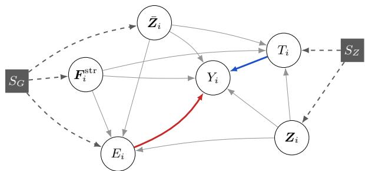
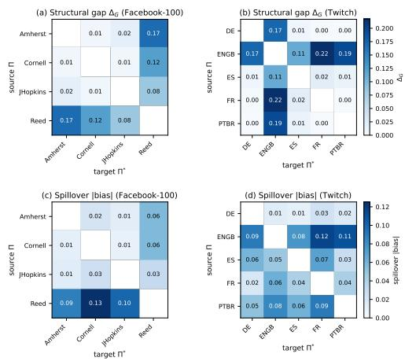

# Transportable Causal Efect Estimation across Networks under Interference

Xiaojing Du1, Jiuyong Li1, Lin Liu1, Debo Cheng2, Jixue Liu1, Thuc Duy Le1

1Adelaide University, Adelaide, Australia

2Hainan University, Haikou, China

xiaojing.du@adelaide.edu.au; jiuyong.li@adelaide.edu.au; lin.liu@adelaide.edu.au jixue.liu@adelaide.edu.au; thuc.le@adelaide.edu.au; chengd@hainanu.edu.cn

## Abstract

Estimating causal efects under network interference typically assumes that the network used for training and the network used for deployment coincide. In practice, an intervention is run on one population while the question of interest concerns a diferent population, and the two generally difer in topology, node-covariate composition, and spillover pathways. Transporting a causal efect across networks is therefore a datafusion problem that no existing algorithm solves. We employ a selection diagram, extended to the network setting so that covariate shift and structural network shift enter as separate selectors, and derive from it a transport formula for the direct, spillover, and total efects in the deployment population. Each formula makes explicit which interventional mechanism is assumed invariant and which observational distribution must be reweighted. We then turn the formulas into TranCE (Transported Causal Efects), a doubly-robust algorithm combining an interventional outcome model, a domain density-ratio correction, and cross-fitted inference. Extensive experiments on two semi-synthetic benchmarks derived from real-world social networks and on a fully real weather-insurance field experiment, where the transported efects are checked against held-out randomized estimates, confirm the efectiveness of our approach. Our findings have the potential to improve intervention strategies in networked systems, particularly in social networks and public health.

## 1 Introduction

Estimating causal efects from networked data is central in social science (Forastiere, Airoldi, and Mealli 2021), public health (Hudgens and Halloran 2008), online platforms (Eckles, Karrer, and Ugander 2017), and policy evaluation (Sobel 2006). In these settings a unit’s outcome depends on its own treatment and covariates and, through interference, on the treatments of its neighbours, so the same policy can produce diferent efects when deployed on diferent networks.

That dependence is what makes an efect estimated on one network fail to carry over to another. Most existing estimators are designed for a same-network regime, where the graph used to identify, train, or validate the estimator is also the graph on which the efect is evaluated. Deployment routinely violates this. An intervention may be feasible in one domain Π, but the policy question concerns a diferent domain Π∗ where only observational data and the graph structure are available. The two domains difer in node attributes, degree distribution, and topology, so an estimator fit on Π does not automatically identify the causal efect in Π∗. A concrete case makes the dificulty visible.

In Melbourne, the causal efect of a policy is estimated through a randomized experiment in which participants are randomly assigned to treatment and control groups, and their outcomes are subsequently tracked and collected. When the same policy is implemented in Sydney, however, the population has a diferent demographic distribution, and its social network structure also difers. The government is interested in estimating the policy’s efect in Sydney without conducting another randomized experiment.

This is a causal efect transportability problem on network data, and no existing algorithm solves it. Single-network interference methods (Hudgens and Halloran 2008; Aronow and Samii 2017; Forastiere, Airoldi, and Mealli 2021) identify efects only on the graph the experiment was run on. Networked causal estimators (Ma and Tresp 2021; Jiang and Sun 2022; Du et al. 2025; Wu et al. 2025) assume the deployment graph equals the estimation graph, so a fitted model carries no validity condition elsewhere. Treatment-efect transfer and trial generalization (Künzel et al. 2018; Dahabreh et al. 2020; Bica and van der Schaar 2022) move efects between populations but treat units as independent, which fails exactly when a unit responds to its neighbours’ treatments. Graph-domain generalization (Wu et al. 2022) trains representations to be stable across graphs, a predictive criterion, and carrying that machinery over to efect estimation (Sui et al. 2024) delivers invariance of the representation rather than an identified causal efect in the new domain. What is missing is an algorithm that takes an experiment on one network and an observed second network and returns the causal efects on the second, and we present an algorithm to fill in this gap.

In this paper, we present TranCE (Transported Causal Effects), an algorithm for transportable causal efect estimation on network data. The two discrepancies in the example above are modelled separately: covariate shift changes the distribution of node attributes, while structural network shift changes graph-derived quantities such as neighbourhood composition and structural position. We encode both in a selection diagram extended to the network setting, derive from it transport formulas for the direct, spillover, and total efects in the deployment domain, and estimate the formulas with a doubly robust combination of an interventional outcome model and a domain density-ratio correction, with cross-fitted inference. Our contributions are threefold.

• We establish the graphical conditions under which causal efects transport across networks under interference, employing a selection diagram extended to the network setting so that covariate shift and structural network shift enter as separate selectors.

• We derive the transport formulas for the direct, spillover, and total efects in Π∗, which state exactly which interventional information from Π is reused and which observational information from Π∗ is required for adjustment.

• We develop TranCE (Transported Causal Efects), a doubly robust algorithm that implements those formulas with an interventional outcome model, a domain density-ratio correction, and known neighbour treatment propensities, and we evaluate it on real cross-network benchmarks and a fully real field experiment.

## 2 Related Work

This section places our setting against four lines of work, none of which identifies a causal efect in Π∗ from interventions in Π and observations in Π∗.

Causal inference under network interference. Classical work formalizes how one unit’s treatment afects another’s outcome and develops estimands under partial interference and exposure mappings (Hudgens and Halloran 2008; Sobel 2006; Aronow and Samii 2017), with identification results for observational network studies (Forastiere, Airoldi, and Mealli 2021) and designs for network experiments (Eckles, Karrer, and Ugander 2017). These are same-network results: the graph that defines a unit’s neighbours is also the one on which the estimand is evaluated.

Graph-based causal estimation on networks. Graphbased estimators use representation learning to model network structure, latent confounding, and interference, spanning neural treatment-efect models (Shi, Blei, and Veitch 2019), networked and hypergraph interference (Ma and Tresp 2021; Jiang and Sun 2022; Ma et al. 2022), generalization analysis (Cai et al. 2023), targeted learning (Chen et al. 2024), and graph transformers for unknown interference (Wu et al. 2025). They improve within-network estimation without giving graphical conditions under which an efect learned on one graph is identified on a diferent graph.

Transportability, treatment-efect transfer, and graphdomain generalization. Causal transportability studies when causal knowledge transfers across environments using selection diagrams and do-calculus (Pearl and Bareinboim 2011; Bareinboim and Pearl 2016), and trial generalization combines experimental information from one domain with observational covariates from another (Künzel et al. 2018; Dahabreh et al. 2020; Bica and van der Schaar 2022; Wei et al. 2023; Sun et al. 2023). These are directly relevant to our two-domain setting but are tabular or population-level, without interference. A separate line studies graph-domain generalization and invariant graph learning (Wu et al. 2022;

Chen et al. 2022; Li et al. 2023; Wu et al. 2024), within which Sui et al. (2024) extend invariant learning to causal efect estimation on graphs, giving representation-level invariance rather than graphical identification in $\Pi ^ { * }$ . Closest to us, Hoshino (2025) transfers policy efects under interference when the deployment network is unobserved, which permits only partial identification and precludes adjustment using the realized topology. In our setting the observed graph of $\pi ^ { * }$ is part of the identifying functional, since it determines the structural features, neighbour summaries, and neighbour treatment levels in Π∗.

## 3 Transportability Framework

This section establishes the formal framework for transporting causal efects across networks. We introduce notation and define three causal estimands that capture distinct sources of treatment variation under network interference. We then introduce network selection diagrams as the representational language for encoding distributional diferences between domains, state and prove the transportability theorem, and finally derive a doubly-robust estimator for the transported functional.

## 3.1 Setup and Notation

Consider two domains Π and Π∗ with distinct network structures $\mathcal { G } = ( \nu , \mathcal { E } )$ and $\mathcal { G } ^ { \ast } = ( \nu ^ { \ast } , \mathcal { E } ^ { \ast } )$ . Interventional data are available in Π, while only passive observations are available in Π∗. Each node i carries a binary treatment $T _ { i } \in \{ 0 , 1 \}$ pre-treatment covariates $\pmb { Z } _ { i } \in \mathbb { R } ^ { d }$ , and an outcome $Y _ { i } \in \mathbb { R }$ We write $\mathcal { N } ( i )$ for the neighbourhood of i. The interventional outcome of node i depends on its own treatment and its neighbours’ treatments: $\bar { P } \big ( y _ { i } \mid \mathrm { d o } ( t _ { i } , t _ { \mathcal { N } ( i ) } ) \big )$ . Here do(·) denotes an intervention that sets a variable by external assignment rather than by observation, so this expression is the outcome distribution when node i and its neighbours are assigned the stated treatments.

The structural positional features $\pmb { F } _ { i } ^ { \mathrm { s t r } }$ summarise the network around node i and are a function of the topology alone, in our implementation the degree, the mean-normalised degree, and the log degree. The neighbour covariate aggregate $\begin{array} { r } { \bar { Z } _ { i } = \frac { 1 } { | \mathcal { N } ( i ) | } \sum _ { j \in \mathcal { N } ( i ) } Z _ { j } } \end{array}$ summarises the demographics of those neighbours, as $\boldsymbol { Z } _ { i }$ does for the node itself. The three are pre-treatment and together form the context ${ \pmb w } _ { i } = ( Z _ { i } , F _ { i } ^ { \mathrm { s t r } } , \bar { Z } _ { i } )$

The third quantity is the neighbour treatment $E _ { i } ,$ , which takes values in a finite set B and records how much treatment reaches node i through its neighbours. It is the second treatment variable of the model: node i responds to its own treatment along $T _ { i } \to Y _ { i }$ and to that of its neighbours along $E _ { i } \to Y _ { i }$ , and the estimands of Section 3.2 intervene on both.

The neighbour treatment is derived from the realized treatments of the neighbours together with the degree: writing $\begin{array} { r } { \bar { T } _ { N ( i ) } = \frac { 1 } { | \mathcal { N } ( i ) | } \sum _ { j \in \mathcal { N } ( i ) } T _ { j } } \end{array}$ for the fraction of treated neighbours, $E _ { i } = b ( { \bar { T } } _ { N ( i ) } , | { \mathcal { N } } ( i ) | )$ ) sends the fraction and the degree to one of finitely many levels, and our implementation cuts $\bar { T } _ { \mathcal { N } ( i ) }$ at its terciles into low, medium, and high.

Identification rests on $E _ { i }$ being a suficient summary of the neighbours’ treatments, the stratified-interference condition standard in that literature (Hudgens and Halloran 2008; Aronow and Samii 2017; Forastiere, Airoldi, and Mealli 2021): conditional on $T _ { i } , E _ { i }$ , and ${ \pmb w } _ { i }$ , the outcome $Y _ { i }$ does not depend on which particular neighbours are treated, so the whole neighbourhood treatment vector can be replaced by the single level $E _ { i }$

We also require an overlap condition, which secures both the identification of Section 3.4 and the estimator of Section 3.5.

Assumption 1 (Overlap). There exists $\delta \in ( 0 , 1 )$ ) such that, for P∗-almost every context ${ \pmb w } = ( Z _ { i } , F _ { i } ^ { \mathrm { s t r } } , \overbar { { \bf Z } } _ { i } )$ , a unit with context w arises in the interventional domain Π with probability at least $\delta ,$ and within Π each own-treatment level and neighbour treatment level ofinterest occurs with probability at least δ given w.

Both parts are needed: a context that occurs in $\Pi ^ { * }$ but never in Π reports no experimental outcome, and a pair $( t , e )$ never realized in Π leaves µ unobserved there, so the contrast that defines the efect cannot be formed.

## 3.2 Efect Definitions and Problem Formulation

Write $t , t ^ { \prime }$ for the baseline and intervened levels of a node’s own treatment and $e , e ^ { \prime }$ for two neighbour treatment levels.

Definition 1 (Direct Efect). $\tau _ { i } ^ { \mathrm { d i r } } = \mathbb { E } [ Y _ { i } \mid \mathrm { d o } ( t ^ { \prime } , e ) ] { - } \mathbb { E } [ Y _ { i } \mid$ $\mathrm { d o } ( t , e ) ]$ ], the change in node $i \mathit { \ ' } _ { s }$ outcome from intervening on its own treatment while its neighbours stay at e.

Definition 2 (Spillover Efect). $\tau _ { i } ^ { \mathrm { s p i l l } } = \mathbb { E } [ Y _ { i } \mid \mathrm { d o } ( t , e ^ { \prime } ) ] -$ $\mathbb { E } [ Y _ { i } \mid \mathrm { d o } ( t , e ) ]$ , the change from intervening on the neighbour treatment while node i’s own treatment stays at t.

Definition 3 (Total Efect). $\tau _ { i } ^ { \mathrm { t o t a l } } = \mathbb { E } [ Y _ { i } \ | \ \mathrm { d o } ( t ^ { \prime } , e ^ { \prime } ) ] -$   
$\mathbb { E } [ Y _ { i } \mid \mathrm { d o } ( t , e ) ]$ , the joint changefrom intervening on both.

Problem formulation. Domain Π has network G and demographic distribution $P _ { \mathrm { : } }$ , an experiment is conducted in it, and $\mathbf { \bar { \rho } } _ { \tau } \mathrm { d i r } , \tau ^ { \mathrm { s p i l l } } , \tau ^ { \mathrm { t o t a l } }$ are obtained from that experiment. Domain $\Pi ^ { * }$ has network $\mathcal { G } ^ { * }$ and demographic distribution $P ^ { * }$ and only observational data are available in it. We apply the same treatment to Π∗ and estimate $\mathbb { E } ^ { * } [ \tau _ { i } ^ { \mathrm { d i r } } ] , \mathbb { E } ^ { * } [ \tau _ { i } ^ { \mathrm { s p i l l } } ] ,$ , and $\mathbb { E } ^ { * } [ \tau _ { i } ^ { \mathrm { t o t a l } } ]$ over $i \in \mathcal { V } ^ { * }$ without conducting an experiment there.

Two obstacles make this nontrivial. First, $\mathcal { G } ^ { * }$ difers from G in topology, connectivity patterns, and degree distribution, which directly afects interference pathways. Second, the distribution of covariates in Π∗ difers from that in Π, altering the causal efects of treatment on the outcome.

## 3.3 Network Selection Diagrams

Transporting an efect requires knowing which parts of the data generating process the two domains share, and a selection diagram is the device that records exactly that. We first recall the original definition and then extend it to the network setting.

Definition 4 (Selection Diagram; Pearl and Bareinboim 2011). Let $\mathcal { D } _ { 0 }$ be the causal diagram shared by two domains. A selection diagram is $\mathcal { D } _ { 0 }$ augmented with a set S of selection variables, drawn as square nodes, where $S _ { V }  \bar { V }$ is present whenever the mechanism that generates $V$ may difer between the two domains. A variable with no incoming selection arrow has the same mechanism in both.

  
Figure 1: Network selection diagram D. The blue arrow is the direct pathway $T _ { i } \to Y _ { i }$ from the node’s own treatment and the red arrow is the spillover pathway $E _ { i } \to Y _ { i }$ from the treatment of its neighbours. The grey squares are the selection variables, covariate shift $S _ { Z }$ and structural shift $S _ { G } ,$ and each dashed arrow points to a variable whose generating mechanism changes across Π and $\Pi ^ { * }$

Our setting adds structure to this: the two domains difer through two distinct channels, who the units are and how they are connected, and these two channels act on disjoint sets of variables.

Definition 5 (Network Selection Diagram). A network selection diagram D is a selection diagram in the sense ofDefinition 4 over the node variables $\{ \breve { Z } _ { i } , T _ { i } , F _ { i } ^ { \mathrm { s t r } } , \bar { Z } _ { i } , E _ { i } ^ { \setminus } , Y _ { i } ^ { \setminus } \}$ }i∈V with exactly two selection variables. The selector $S _ { Z } $ $( Z _ { i } , T _ { i } )$ encodes covariate shift, meaning $P ( Z ) \neq P ^ { * } ( Z )$ together with the change of assignment mechanism from a randomized Π to an observational Π∗. The selector $S _ { G } $ $( F _ { i } ^ { \mathrm { s t r } } , \bar { Z } _ { i } , E _ { i } )$ encodes network structural shift, meaning $\dot { \mathcal { G } } \neq \mathcal { G } ^ { * }$ , reflecting that a change in graph topology simultaneously alters node i’s structural features, its neighbour covariate aggregate, and its neighbour treatment level.

On notation, we write $P ^ { * } ( \cdot ) = P ( \cdot \mid s ^ { * } )$ for the distribution in $\Pi ^ { * }$ , where $s ^ { * }$ is the configuration of the selection variables.

## 3.4 Transportability of Network Causal Efects

Figure 1 shows the network selection diagram used in this paper. Our notion of transportability builds on the transportability selection diagram of Pearl and Bareinboim (2011) and applies it to the network-interference setting.

Definition 6 (Transportability under Network Interference). Given Π, Π∗, and selection diagram D, a causal $e f f e c t \tau ^ { \dot { R } }$ with $R \in$ {dir, spill, total} is transportable from Π to $\Pi ^ { * }$ $i f \mathbb { E } ^ { * } [ \tau _ { i } ^ { R } ]$ can be expressed as a functional of (i) S-free interventional quantities estimable from Π, and (ii) do-free observational quantities estimable from Π∗, in which $\dot { S }$ appears only as a conditioning variable.

Define the interventional mechanismfunction

$$
\begin{array} { r } { \begin{array} { r } { \mu ( t , e , z , { \pmb f } , \bar { \ b z } ) : = \mathbb { E } \big [ Y _ { i } \bigm | \mathrm { d o } ( t , e ) , Z _ { i } = z , \qquad } \\ { { \pmb F } _ { i } ^ { \mathrm { s t r } } = { \pmb f } , \bar { Z } _ { i } = \bar { z } \bigm ] , } \end{array} } \end{array}
$$

identifiable from Π’s interventional data together with its network and demographic measurements.

Theorem 1 (Transportability of Network Causal Efects). Let D be the network selection diagram for Π and $\Pi ^ { * }$ as in Figure 1, and suppose the stratified-interference condition of Section 3.1 and the overlap condition of Assumption 1 hold. The three efects $\tau ^ { \mathrm { d i r } } , \tau ^ { \mathrm { { s p i l l } } } , \tau ^ { \mathrm { { t o t a l } } }$ are transportable from Π to Π∗ $i f ( \breve { Y } _ { i } \perp \perp \{ S _ { Z } , S _ { G } \}  Z _ { i } , F _ { i } ^ { \mathrm { s t r } } , \bar { Z } _ { i } ) _ { \mathscr D _ { T ^ { \frac { . } { T } } } ^ { k } }$ . Here $\mathcal { D } _ { \overline { { { T , E } } } }$ is the diagram D with the incoming edges to $T _ { i }$ and $E _ { i }$ removed. The transportformulas are

$$
\begin{array} { l } { \displaystyle \mathbb { E } ^ { * } [ \tau _ { i } ^ { \mathrm { d i r } } ] = \int \int \int \big [ \mu ( t ^ { \prime } , e , z , \pmb { f } , \bar { z } ) } \\ { \displaystyle - \mu ( t , e , z , \pmb { f } , \bar { z } ) \big ] d P ^ { * } ( z , \pmb { f } , \bar { z } ) , } \end{array}\tag{1}
$$

$$
\mathbb { E } ^ { * } [ \tau _ { i } ^ { \mathrm { s p i l l } } ] = \int \int \int \big [ \mu ( t , e ^ { \prime } , z , \pmb { f } , \bar { z } )\tag{2}
$$

$$
\begin{array} { r l r } {  { \mathbb { E } ^ { * } [ \tau _ { i } ^ { \mathrm { t o t a l } } ] = \int \int \int \big [ \mu ( t ^ { \prime } , e ^ { \prime } , z , \pmb { f } , \bar { z } ) } } \\ & { } & { - \mu ( t , e , z , \pmb { f } , \bar { z } ) \big ] d P ^ { * } ( z , \pmb { f } , \bar { z } ) , } \end{array}\tag{3}
$$

The proof is given in full in Appendix D.

## 3.5 A Doubly-Robust Transport Estimator

Theorem 1 identifies the target as $\mathbb { E } ^ { * } [ Y _ { i } \ \mid \ \mathrm { d o } ( t , e ) ] \ =$ $\begin{array} { r } { \int \mu ( t , e , \pmb { w } ) d P ^ { * } ( \pmb { w } ) } \end{array}$ . There are two classical routes to such a mean: fit an outcome model and substitute it, unbiased when the model is correct, or reweight the observed outcomes by the inverse probability of the treatment received, unbiased when those probabilities are correct. Substitution alone is fragile, since its first-order bias is the average outcomemodel error $\textstyle \int ( { \hat { \mu } } - \mu ) d P ^ { * } $ and nothing cancels it. We therefore build a one-step doubly-robust estimator that combines the two routes, is consistent whenever either is correctly specified, and admits a $\sqrt { n ^ { * } }$ central limit theorem under the product-rate condition of Theorem 3.

What each domain supplies. The interventional domain Π supplies n nodes with covariates, own treatment, neighbour treatment level, and outcome, $\{ ( \pmb { w } _ { i } , T _ { i } , E _ { i } , Y _ { i } ) \} _ { i = 1 } ^ { n } ,$ and its assignment is randomized by design. The target Π∗ supplies $n ^ { * }$ nodes with covariates and graph structure, $\{ { \pmb w } _ { j } \} _ { j = 1 } ^ { n ^ { * } }$ . Write $\pi _ { S } ( w )$ for the probability that a node with context w comes from Π rather than from Π∗, estimated from the covariates of the two samples and their domain labels. Write $A _ { i } : = ( T _ { i } , E _ { i } )$ ) for the treatment pair of a source unit and $\pi _ { A } ( t , e \mid \pmb { w } ) : = \operatorname* { P r } ( T = t , E = e \mid \pmb { w } )$ , within Π, for the joint treatment propensity.

Theorem 2 (Doubly-Robust Transport). Under Theorem 1 and Assumption 1, estimate the transported spillover efect

of Eq. (2) by

$$
\begin{array} { r l } & { \widehat { \mathbb { E } ^ { * } } [ \tau ^ { \mathrm { s p i l } } ] = \frac { 1 } { n ^ { * } } \displaystyle \sum _ { j \in \mathcal { V } ^ { * } } \left[ \hat { \mu } ( t , e ^ { \prime } , w _ { j } ) - \hat { \mu } ( t , e , w _ { j } ) \right] } \\ & { \phantom { \frac { 1 } { n ^ { * } } } + \frac { 1 } { n ^ { * } } \displaystyle \sum _ { i \in \mathcal { V } } \frac { 1 - \hat { \pi } _ { S } ( w _ { i } ) } { \hat { \pi } _ { S } ( w _ { i } ) \hat { \pi } _ { A } ( t , e ^ { \prime } | w _ { i } ) } \left[ Y _ { i } - \hat { \mu } ( t , e ^ { \prime } , w _ { i } ) \right] } \\ & { \phantom { \frac { 1 } { n ^ { * } } } - \frac { 1 } { n ^ { * } } \displaystyle \sum _ { i \in \mathcal { V } } \frac { 1 - \hat { \pi } _ { S } ( w _ { i } ) } { \hat { \pi } _ { S } ( w _ { i } ) \hat { \pi } _ { A } ( t , e | w _ { i } ) } \left[ Y _ { i } - \hat { \mu } ( t , e , w _ { i } ) \right] , } \end{array}\tag{4}
$$

The estimator is consistentfor the transported efect ofTheorem 1 if either ${ \hat { \mu } }  \mu \mathrm { o r } ( { \hat { \pi } } _ { S } , { \hat { \pi } } _ { A } )  { \bar { ( } } \pi _ { S } , \pi _ { A } { \bar { ) } } i n L ^ { \hat { 2 } }$

All three sums are divided by $n ^ { * }$ because all three estimate an average over the target population. The first runs over the target nodes, so it is the empirical version of the transport integral $\int \int \int [ \cdot ] d P ^ { * }$ of Eq. (2). The other two run over the source nodes, where the odds factor $( 1 - \hat { \pi } _ { S } ) / \hat { \pi } _ { S }$ re-weights each residual so that the source sample stands in for the target one. The direct and total estimators are identical with the pair $\{ ( t , e ^ { \prime } ) , ( t , e ) \}$ } replaced by $\{ ( t ^ { \prime } , e ) , ( t , e ) \}$ and by $\{ ( t ^ { \prime } , \bar { e } ^ { \prime } ) , ( \bar { t } , e ) \}$ respectively.

Theorem 3 (Asymptotic Normality and Valid Intervals). $A s \mathrm { - }$ sume the conditions of Theorem 2, and in addition that the nuisances are cross-fitted, that the product oftheir $L ^ { 2 }$ errors is $o _ { p } \big ( n ^ { * - 1 / 2 } \big )$ , and that sampling is in a limited-dependence regime. Then $\sqrt { n ^ { * } } ( \widehat { \mathbb { E } ^ { * } } [ \tau ^ { R } ] - \mathbb { E } ^ { * } [ \tau ^ { R } ] )$ is asymptotically normal with a variance consistently estimated by ${ \widehat { V } } ^ { * }$ of Section $4 . 4 ,$ so the Wald interval $\widehat { \mathbb { E } ^ { * } } [ \tau ^ { R } ] \pm 1 . 9 6 \sqrt { \widehat { V } ^ { * } }$ is asymptotically valid. The estimator is also semiparametrically eficient, attaining the variance bound ofthe influencefunction in Appendix D.

We defer both proofs to Appendix D.

## 4 Method

This section turns the transport formula of Section 3 into a concrete estimator. Theorems 1 and 2 reduce it to fitting three nuisance functions, each on the data that identifies it. We combine these components so the estimator stays consistent when either the outcome model or the reweighting is correct.

The three nuisances difer in which domain they are read from. i) The interventional outcome regression $\mu ( t , e , { \boldsymbol { w } } )$ is fitted on Π alone, since it needs treatments and outcomes and only Π has them. ii) The selection propensity $\pi _ { S } ( \pmb { w } ) = \operatorname* { P r } ( S = \Pi \ | \ \pmb { w } )$ , equivalently the domain density ratio $r ( \pmb { w } ) = ( 1 - \pi _ { S } ( \pmb { w } ) ) / \pi _ { S } ( \pmb { w } )$ , is the one quantity fitted on both domains, using their covariates and domain labels and neither domain’s treatments. iii) The joint treatment propensity $\pi _ { A } ( t , e \mid \mathbf { \omega } \mathbf { w } )$ is known by design in Π. We describe each below, then substitute the estimates into Eq. (4) to form the doubly-robust transport estimator and give its cross-fitted inference.

## 4.1 Interventional Outcome Regression $\hat { \mu }$

The outcome regression is the substitution branch of Eq. (4). Because Π is randomized, its observational regression of $\dot { Y }$ on $( T , E , w )$ already equals the interventional mechanism $\mu ( t , e , { \pmb w } )$ , so fitting the loss below on Π estimates the target functional directly. The model predicts the treatmentpair contrasts at every target node, with $\hat { \mu } _ { \boldsymbol { \theta } } ( t , e , { \pmb { w } } _ { i } ) \ = $ $\bar { ( 1 - t ) } h _ { \mathrm { d i r } } ^ { 0 } ( z _ { i } ) + t h _ { \mathrm { d i r } } ^ { 1 } ( z _ { i } ) + f _ { \mathrm { s p i l l } } ( e , \mathrm { G C N } _ { \theta } ( Z , \mathcal { G } ) _ { i } )$ , where $h _ { \mathrm { d i r } } ^ { 0 }$ and $h _ { \mathrm { d i r } } ^ { 1 }$ are feed-forward potential-outcome heads over the covariates, and $f _ { \mathrm { s p i l l } }$ reads the neighbour treatment level, encoded as an indicator over B, together with the node’s graph convolutional network (GCN) embedding. That embedding summarises the structural context $( F ^ { \mathrm { s t r } } , \bar { Z } )$ , so the adjustment set enters $\hat { \mu }$ through message passing, while the selection propensity conditions on the raw w, keeping the weighting branch exact. One parameter set $\theta$ is shared, messagepassing on $\mathcal { G }$ and on $\mathcal { G } ^ { * }$ to form the target embeddings the substitution term reads. The regression loss is

$$
\mathcal { L } _ { \mu } ( \boldsymbol { \theta } ) = \textstyle { \frac { 1 } { n } } \sum _ { i : S _ { i } = \Pi } \big ( Y _ { i } - \hat { \mu } _ { \boldsymbol { \theta } } ( T _ { i } , E _ { i } , \boldsymbol { w } _ { i } ) \big ) ^ { 2 } .\tag{5}
$$

## 4.2 Selection Propensity ${ \hat { \pi } } _ { S }$ and Density Ratio $\hat { r }$

The density ratio rˆ is the reweighting branch of Eq. (4): it carries the source residuals onto the target covariate law, correcting what the fitted outcome model misses under covariate and structural shift. We obtain it from the selection propensity $\pi _ { S }$ of Section 3.5, implemented as a logistic regression with both samples entering at their natural sizes n and $n ^ { * }$ , which is what makes the $\bar { 1 / n ^ { * } }$ normalisation of Eq. (4) the correct one, as Appendix C shows. Because w is fully observed in both domains, no missing-data correction is needed. The density ratio is ${ \hat { r } } ( { \pmb w } ) = ( 1 - { \hat { \pi } } _ { S } ( { \pmb w } ) ) / { \hat { \pi } } _ { S } ( { \pmb w } )$ , clipped to a bounded range, with the numeric range in Appendix C. Clipping stabilizes the finite-sample weights without guaranteeing population overlap, so we diagnose overlap empirically and read heavily clipped estimates as regularized approximations. Logistic regression is a deliberate low-variance choice here, since $\hat { r }$ enters the correction multiplicatively and its variance inflates the estimator’s own.

## 4.3 Treatment Propensity ${ \hat { \pi } } _ { A }$

The joint treatment propensity prices how likely a source unit was to occupy a contrasted treatment pair, turning its reweighted residual into an unbiased within-pair correction in Eq. (4). In all our settings Π is a randomized experiment, so $\pi _ { A }$ is known by design and factorizes as $\pi _ { A } \bar { ( } t , e \mid \pmb { w } ) = \pi _ { T } ( t ) \pi _ { E } \bar { ( } e \mid \bar { t } , \pmb { w } )$ , with $\pi _ { T }$ the design assignment probability and $\pi _ { E }$ induced by the neighbours’ independent random assignment, available in closed form as a binomial in the degree.

## 4.4 Stabilisation, Cross-Fitting, and Inference

Stabilising the correction. The correction is a sum of inverse-propensity-weighted residuals, unbiased but noisy, so we stabilise it in two standard ways. Within each pair we self-normalise the weights, the Hájek ratio form (Há- jek 1971), which divides the weighted residual sum by the weight sum rather than by $n ^ { * }$ . We then apply a positive-part shrinkage that keeps the full adjustment when the correction is supported by its own standard error and falls back to the substitution when it is indistinguishable from zero. Both are asymptotically equivalent to the raw one-step estimator of Theorem 2.

Cross-fitting and inference. To obtain valid $\sqrt { n ^ { * } }$ inference with neural nuisance estimators, we use K-fold crossfitting (Chernozhukov et al. 2018). Each domain’s index set is split into K folds, the nuisances $( \hat { \mu } ^ { ( - \ell ) } , \hat { r } ^ { ( - \ell ) } , \hat { \pi } _ { A } ^ { ( - \ell ) } )$ are trained with fold ℓ of both domains held out, and the DR term is scored on the held-out fold, which keeps any observation out of the fit that scores it and renders the nuisance remainder second order once the product of the nuisance errors is $o _ { p } \big ( n ^ { * - 1 / 2 } \big )$ , the condition of Theorem 3. The fold-averaged variance $\begin{array} { r } { \widehat { V } ^ { * } = n ^ { * - 2 } \big [ \sum _ { j \in \mathcal { V } ^ { * } } ( \widehat { g } _ { j } - \bar { g } ) ^ { 2 } + \sum _ { i \in \mathcal { V } } \widehat { \mathrm { c o r r } } _ { i } ^ { 2 } \big ] } \end{array}$ supplies the Wald interval $\widehat { \mathbb { E } ^ { * } } [ \tau ^ { R } ] \pm 1 . 9 6 \sqrt { \widehat { V } ^ { * } }$ (van der Vaart 1998), valid under Theorem 3.

## 5 Experiments

We evaluate TranCE on two semi-synthetic cross-network benchmarks and a real field experiment. On the semisynthetic benchmarks, we compare transported direct, spillover, and total efects with network-efect and domaintransfer baselines over rotating source-target pairs. We then conduct component ablations, followed by stress tests for outcome-model misspecification, structural discrepancy, and hidden confounding. Finally, we perform leave-region-out validation on the field experiment.

## 5.1 Datasets

We adopt two real-world social-network families, where a node is a user and an edge is a friendship: Twitch-Explicit (Rozemberczki, Allen, and Sarkar 2021) and Facebook-100 (Traud, Mucha, and Porter 2012). For both families the raw node features are mapped to 50 dimensions, and the treatment and neighbour-mediated outcome are semi-synthetic with the generative details in Appendix C. Our third dataset is the Cai insurance experiment (Cai, De Janvry, and Sadoulet 2015), a fully real weather-insurance field experiment in rural China with a household friendship network, a randomized information-session treatment, and observed insurance take-up across three separated regions. The source code, the data-preparation scripts, and the instructions needed to reproduce every number below are included in the code and data supplement accompanying this submission.

## 5.2 Baselines

We compare against published network-efect and domaintransfer estimators together with controlled ablations of our own pipeline. (a) TARNet (Shalit, Johansson, and Sontag 2017), trained on Π and applied to $\Pi ^ { * }$ with no network adjustment. (b) OM (Dahabreh et al. 2020), the interventional outcome model averaged over the $\Pi ^ { * }$ context without a density-ratio correction, which is our own estimator with the transport correction removed. (c) IGL (Sui et al. 2024), which learns graph representations invariant across environments. (d) Hoshino (Hoshino 2025), which transports across domains by reweighting on the covariate marginal. (e)

<table><tr><td></td><td colspan="3">Twitch</td><td colspan="3">Facebook-100</td></tr><tr><td>Method</td><td>dir</td><td>spill</td><td>total</td><td>dir</td><td>spill</td><td>total</td></tr><tr><td>TARNet</td><td> $0 . 0 8 4 { \scriptstyle \pm 0 . 0 7 5 }$ </td><td> $1 . 2 9 0 { \scriptstyle \pm 0 . 0 1 8 }$ </td><td> $1 . 2 8 1 _ { \pm 0 . 1 1 4 }$ </td><td> $0 . 0 8 0 { \scriptstyle \pm 0 . 0 6 4 }$ </td><td> $1 . 4 1 1 _ { \pm 0 . 0 0 1 }$ </td><td> $1 . 4 3 7 { \scriptstyle \pm 0 . 0 9 9 }$ </td></tr><tr><td>IPW</td><td> $0 . 5 2 3 { \scriptstyle \pm 0 . 0 5 0 }$ </td><td> $1 . 2 0 2 { \scriptstyle \pm 0 . 0 5 0 }$ </td><td> $1 . 7 2 6 { \scriptstyle \pm 0 . 0 9 1 }$ </td><td> $0 . 5 1 2 { \scriptstyle \pm 0 . 1 3 8 }$ </td><td> $1 . 3 1 7 _ { \pm 0 . 1 1 4 }$ </td><td> $1 . 8 3 7 { \scriptstyle \pm 0 . 2 4 6 }$ </td></tr><tr><td>IGL</td><td> $0 . 0 9 4 { \scriptstyle \pm 0 . 0 9 7 }$ </td><td>0.633±0.248</td><td> $0 . 7 1 3 { \scriptstyle \pm 0 . 3 2 1 }$ </td><td> $0 . 1 9 9 { \scriptstyle \pm 0 . 1 6 2 }$ </td><td> $1 . 0 0 9 _ { \pm 0 . 1 7 9 }$ </td><td> $1 . 2 0 8 { \scriptstyle \pm 0 . 3 3 5 }$ </td></tr><tr><td>Hoshino</td><td> $0 . 1 0 4 { \scriptstyle \pm 0 . 0 2 9 }$ </td><td> $0 . 7 8 0 { \scriptstyle \pm 0 . 1 3 9 }$ </td><td> $0 . 8 3 0 { \scriptstyle \pm 0 . 1 4 2 }$ </td><td> $0 . 1 1 4 { \scriptstyle \pm 0 . 0 2 8 }$ </td><td> $1 . 0 1 8 _ { \pm 0 . 0 3 0 }$ </td><td> $1 . 1 1 6 _ { \pm 0 . 0 3 2 }$ </td></tr><tr><td>NetEst</td><td> $0 . 1 8 9 { \scriptstyle \pm 0 . 0 8 0 }$ </td><td> $0 . 4 9 0 { \scriptstyle \pm 0 . 1 4 0 }$ </td><td> $0 . 6 7 8 { \scriptstyle \pm 0 . 2 0 0 }$ </td><td> $0 . 1 3 8 { \scriptstyle \pm 0 . 0 4 5 }$ </td><td> $0 . 9 1 8 { \scriptstyle \pm 0 . 1 0 3 }$ </td><td> $1 . 0 5 9 { \scriptstyle \pm 0 . 1 3 7 }$ </td></tr><tr><td>DANN</td><td> $0 . 1 2 0 { \scriptstyle \pm 0 . 0 3 2 }$ </td><td> $1 . 0 4 8 _ { \pm 0 . 1 6 2 }$ </td><td> $1 . 1 6 5 _ { \pm 0 . 1 7 1 }$ </td><td> $0 . 1 2 8 _ { \pm 0 . 0 2 7 }$ </td><td> $1 . 0 0 7 _ { \pm 0 . 0 3 8 }$ </td><td> $1 . 1 3 6 _ { \pm 0 . 0 4 5 }$ </td></tr><tr><td>IW-GCN</td><td> $0 . 1 3 1 { \scriptstyle \pm 0 . 0 6 8 }$ </td><td> $0 . 6 4 1 { \scriptstyle \pm 0 . 1 3 4 }$ </td><td> $0 . 7 7 4 { \scriptstyle \pm 0 . 1 7 7 }$ </td><td> $0 . 1 0 9 _ { \pm 0 . 0 2 4 }$ </td><td> $0 . 9 4 6 _ { \pm 0 . 0 6 2 }$ </td><td> $1 . 0 5 7 { \scriptstyle \pm 0 . 0 6 9 }$ </td></tr><tr><td>OM</td><td> $\underline { { 0 . 0 5 7 } } \pm \mathbf { 0 . 0 4 4 }$ </td><td> $\underline { { 0 . 4 3 4 } } \pm 0 . 2 0 2$ </td><td> $\underline { { 0 . 4 0 6 } } { \pm } 0 . 2 1 9$ </td><td> $\mathbf { 0 . 0 7 9 } _ { \pm 0 . 0 8 0 }$ </td><td> $\underline { { 0 . 8 8 6 } } { \pm } 0 . 0 9 4$ </td><td> $\mathbf { 0 . 8 7 5 { \scriptstyle \pm 0 . 1 5 4 } }$ </td></tr><tr><td>TranCE (ours)</td><td> $\mathbf { 0 . 0 5 1 _ { \pm 0 . 0 4 7 } }$ </td><td> $\mathbf { 0 . 3 8 1 _ { \pm 0 . 2 0 5 } }$ </td><td> $\mathbf { 0 . 3 5 4 _ { \pm 0 . 2 0 4 } }$ </td><td> $0 . 0 8 0 { \scriptstyle \pm 0 . 0 8 0 }$ </td><td> $\mathbf { 0 . 8 7 9 _ { \pm 0 . 0 9 8 } }$ </td><td> $0 . 8 7 6 { \scriptstyle \pm 0 . 1 5 5 }$ </td></tr></table>

Table 1: Rotating-source transport error as absolute bias $\lvert \widehat { \mathbb { E } ^ { * } } [ \tau ^ { R } ] - \mathbb { E } ^ { * } [ \tau ^ { R } ] \rvert$ . Lower is better, best per column in bold and second best underlined.

IPW transport (Horvitz and Thompson 1952), a Horvitz– Thompson estimator that drops the outcome model and reweights the Π outcomes only. (f) NetEst (Jiang and Sun 2022), a single-stream graph outcome model applied to Π∗ with no correction. (g) DANN (Ganin et al. 2016), whose graph encoder is trained with a gradient-reversal penalty to align the embeddings of the two domains. (h) IW-GCN, a graph convolutional network (Kipf and Welling 2017) whose loss on Π is reweighted by the density ratio, the standard importance-weighting response to covariate shift (Shimodaira 2000).

## 5.3 Metrics

For each efect $R \in \{ \mathrm { d i r } , \mathrm { s p i l l } , \mathrm { t o t a l } \}$ we report absolute bias $\lvert \widehat { \mathbb { E } ^ { * } } [ \tau ^ { R } ] - \mathbb { E } ^ { * } [ \tau ^ { R } ] \rvert$ on the Π∗ average efect. For inference we report per-efect coverage of the 95% bootstrap-with-refit interval together with its half-width, since coverage alone can be bought by a wider interval. We repeat each experiment over multiple random seeds and report the mean and standard deviation, with the seed counts per experiment given in Appendix C.

## 5.4 Main Results

TranCE attains the lowest bias on every Twitch efect and the lowest spillover bias on both families. On Facebook-100 the uncorrected substitution baseline OM is marginally ahead on the direct and total efects, where the transport correction gives no measurable gain. Table 1 reports the transport error with every region and school rotating through the role of interventional domain Π, averaged over all withinfamily ordered pairs under strong covariate shift. TARNet ignores the network and IPW carries no outcome model, and both fall far behind on spillover, so both ingredients are essential, while the graph-aware baselines improve on them without adapting to Π∗.

## 5.5 Ablations

To isolate the contribution of each component, we ablate one at a time on the Twitch transport from DE to ES, FR, and PTBR, following the cross-region setting of Sui et al. (2024), with results in Table 2. The transport correction carries the gain on the two efects that depend on the neighbours, cutting the spillover bias by 19% and the total by 22%, and the Hájek self-normalisation supplies about half of that. Neither helps the direct efect, which the randomized own-treatment assignment already identifies: the correction moves it by 0.0002 on average, so the component that repairs the spillover neither helps nor meaningfully harms the efect that does not need repairing. Two neighbour treatment levels lose resolution and cost 16% on the spillover, while five perform the same as three, so the map only has to be fine enough to separate low from high exposure.

<table><tr><td></td><td>dir</td><td>spill</td><td>total</td></tr><tr><td>TranCE</td><td> $0 . 0 3 9 { \scriptstyle \pm 0 . 0 2 8 }$ </td><td> $\mathbf { 0 . 2 5 3 _ { \pm 0 . 0 7 0 } }$ </td><td> $\mathbf { 0 . 2 2 1 { \scriptstyle \pm 0 . 0 8 7 } }$ </td></tr><tr><td>w/o transport correction</td><td> $0 . 0 3 9 { \scriptstyle \pm 0 . 0 3 2 }$ </td><td> $0 . 3 1 3 { \scriptstyle \pm 0 . 0 5 8 }$ </td><td> $0 . 2 8 4 { \scriptstyle \pm 0 . 0 7 5 }$ </td></tr><tr><td>w/o Hájek self-normalisation</td><td> $0 . 0 3 9 { \scriptstyle \pm 0 . 0 3 0 }$ </td><td> $0 . 2 7 6 { \scriptstyle \pm 0 . 0 6 9 }$ </td><td> $0 . 2 4 5 _ { \pm 0 . 0 8 6 }$ </td></tr><tr><td>2-level neighbour treatment map</td><td> $0 . 0 3 7 { \scriptstyle \pm 0 . 0 2 8 }$ </td><td> $0 . 2 9 4 { \scriptstyle \pm 0 . 0 5 7 }$ </td><td> $0 . 2 6 2 _ { \pm 0 . 0 5 3 }$ </td></tr><tr><td>5-level neighbour treatment map</td><td> $\mathbf { 0 . 0 3 5 { \scriptstyle \pm 0 . 0 2 3 } }$ </td><td> $0 . 2 5 6 { \scriptstyle \pm 0 . 0 9 1 }$ </td><td> $0 . 2 4 1 { \scriptstyle \pm 0 . 0 8 8 }$ </td></tr></table>

Table 2: Component ablations on the Twitch transport from DE to ES, FR, and PTBR, absolute bias. Lower is better, best per column in bold.

## 5.6 Double Robustness to a Misspecified Outcome Model

Table 3 shows the misspecification grid, in which the twostream model is replaced by one that drops the neighbour treatment input, making its substitution spillover contrast structurally zero. The correction improves the estimate in every arm where the propensities are correct, but under the misspecified outcome model the repair is partial, leaving a spillover bias of 0.964 against the 0.295 it reaches when the outcome model is right. This is not a counterexample to Theorem 2, whose guarantee is conditional on the overlap of Assumption 1, and the diagnostics in Appendix F show that overlap is exactly what fails here rather than the stabilisation: the shrinkage keeps essentially the whole correction in that arm, while the target concentrates most of its nodes at the high neighbour treatment level that the source underpopulates, so the clipped weights cannot fully stand in for the missing part of the target law. Since the randomized source has a known propensity, outcome-model misspecification is the realistic failure mode in deployment, so the substitution model is the component to get right. In the adversarial rows the shrinkage falls back to the substitution under a correct outcome model, and with both nuisances broken the estimator fails as expected.

<table><tr><td>Outcome model Propensity</td><td></td><td>dir</td><td>spill</td><td>total</td></tr><tr><td>Correct</td><td>Correct</td><td> $0 . 0 3 6 _ { \pm 0 . 0 2 5 }$ </td><td> $0 . 2 9 5 _ { \pm 0 . 0 7 1 }$ </td><td> $0 . 2 7 2 { \scriptstyle \pm 0 . 0 8 3 }$ </td></tr><tr><td>Misspecified</td><td>Correct</td><td> $0 . 0 4 1 { \scriptstyle \pm 0 . 0 2 9 }$ </td><td> $0 . 9 6 4 { \scriptstyle \pm 0 . 0 3 8 }$ </td><td> $0 . 9 5 4 { \scriptstyle \pm 0 . 0 5 4 }$ </td></tr><tr><td>Correct</td><td>Broken</td><td> $0 . 0 3 7 { \scriptstyle \pm 0 . 0 2 7 }$ </td><td> $0 . 3 5 7 { \scriptstyle \pm 0 . 0 5 8 }$ </td><td> $0 . 3 3 1 { \scriptstyle \pm 0 . 0 7 1 }$ </td></tr><tr><td>Misspecified</td><td>Broken</td><td> $0 . 0 4 0 { \scriptstyle \pm 0 . 0 2 8 }$ </td><td> $1 . 2 2 4 { \scriptstyle \pm 0 . 0 5 0 }$ </td><td> $1 . 2 0 2 _ { \pm 0 . 0 6 4 }$ </td></tr></table>

Table 3: Double robustness on the Twitch transport from DE: absolute bias per efect with the outcome model and the propensities each correct or broken. Lower is better.

  
Figure 2: Structural gap $\Delta _ { G }$ (top) and transported spillover bias (bottom) across all within-family source-target pairs. The two panels in each row share one colour scale.

## 5.7 Where Transport Is Hard

Figure 2 shows the structural gap $\Delta _ { G }$ and the transported spillover bias across all within-family source-target pairs, with the covariate shift switched of so the structural gap is the only thing moving. Transport accuracy degrades with the structural distance between the two networks: the two quantities correlate at Pearson $r = 0 . 6 6$ on Twitch and $r =$ 0.64 on Facebook-100, and the pairs involving a structural outlier, ENGB and Reed, carry both the largest gap and a mean spillover bias of 0.075 against 0.034 for ordinary pairs. Since $\Delta _ { G }$ needs only the two graphs and no outcomes, the error is predictable before deployment, and a large gap is a signal to widen the reported interval or to seek a closer source.

## 5.8 Sensitivity to Hidden Confounding

To probe the sensitivity to hidden confounding, we add a hidden structural confounder of strength $\gamma$ to the outcome through the standardized neighbour-mean degree, a quantity withheld from ${ \pmb w } .$ , with the covariate shift zeroed so $\gamma$ is the only moving part. The spillover bias grows steadily with $\gamma$ while the direct efect stays flat, and the uncorrected substitution estimator tracks TranCE throughout, since a confounder outside the adjustment set violates the condition of Theorem 1 and is invisible to the outcome model and the density ratio alike.

<table><tr><td colspan="4"></td><td colspan="3">Spillover</td></tr><tr><td>Held-out</td><td> $\mathrm { E s t . }$ </td><td>Gold</td><td>95% CI</td><td>Est.</td><td>Gold</td><td>95% CI</td></tr><tr><td></td><td></td><td></td><td>Region 1 0.085 0.076 [0.049,0.114] ✓ 0.036</td><td></td><td>0.048</td><td>[-0.035,0.087]√</td></tr><tr><td>Region 2 0.0680.078 [0.027, 0.092]</td><td></td><td></td><td></td><td></td><td> $\sim ~ 0 . 0 5 6 ~ - 0 . 0 0 7$ </td><td> $\left[ 0 . 0 0 4 , 0 . 0 9 0 \right] \times$ </td></tr><tr><td>Region 3 0.056 0.066 [0.026, 0.082] √ 0.015 0.030</td><td></td><td></td><td></td><td></td><td></td><td> $\left[ - 0 . 0 1 4 , 0 . 0 5 8 \right] \sqrt { \phantom { 0 } }$ </td></tr></table>

Table 4: Leave-region-out validation. Gold is the held-out region’s own randomized estimate, and ✓ marks the 95% bootstrap interval containing it.

## 5.9 Real-World Validation on a Field Experiment

Table 4 shows the leave-region-out validation on the weatherinsurance field experiment of Cai, De Janvry, and Sadoulet (2015) in rural China, which randomized an information session at the household level across three separated regions and recorded insurance take-up on a real friendship network. TranCE agrees with the held-out region’s own randomized estimate in five of six comparisons. Each region being itself randomized, a held-out region is a within-experiment gold standard: we rotate it over all three, transport both efects from the other two, and compare against the region’s own randomized estimate, with village-cluster bootstrap intervals that refit every nuisance. The direct efect matches the gold standard closely and covers in all three regions, while the spillover covers in two of three, the exception being the region whose own within-experiment spillover is near zero. The spillover is identified only up to the treated-friend share being as good as random given degree, so it transports less precisely and with wider intervals. This is direct evidence that the estimator carries real experimental efects across real networks.

## 6 Conclusion

We gave an algorithm for transportable causal efect estimation on network data, employing a selection diagram in the network setting to separate covariate shift from structural shift, deriving transport formulas for the direct, spillover, and total efects, and implementing the formulas with a doublyrobust algorithm with cross-fitted inference. We validated the estimator on the Twitch and Facebook-100 families with every domain rotating as the source, and on a real weatherinsurance field experiment whose transported efects match held-out randomized gold standards. One limitation is that the neighbour treatment map summarises neighbourhood treatment through a small set of fixed levels. Extending it to richer neighbour-treatment summaries is natural future work.

## References

Aronow, P. M.; and Samii, C. 2017. Estimating average causal efects under general interference, with application to

a social network experiment. The Annals ofApplied Statistics, 11(4): 1912–1947.

Bareinboim, E.; and Pearl, J. 2016. Causal inference and the data-fusion problem. Proceedings of the National Academy ofSciences, 113(27): 7345–7352.

Bica, I.; and van der Schaar, M. 2022. Transfer learning on heterogeneous feature spaces for treatment efects estimation. In Advances in Neural Information Processing Systems, volume 35.

Cai, J.; De Janvry, A.; and Sadoulet, E. 2015. Social networks and the decision to insure. American Economic Journal: Applied Economics, 7(2): 81–108.

Cai, R.; Yang, Z.; Chen, W.; Yan, Y.; and Hao, Z. 2023. Generalization bound for estimating causal efects from observational network data. In Proceedings of the 32nd ACM International Conference on Information and Knowledge Management, 163–172.

Chen, W.; Cai, R.; Yang, Z.; Qiao, J.; Yan, Y.; Li, Z.; and Hao, Z. 2024. Doubly robust causal efect estimation under networked interference via targeted learning. In Proceedings of the 41st International Conference on Machine Learning, volume 235, 6457–6485. PMLR.

Chen, Y.; Zhang, Y.; Bian, Y.; Yang, H.; Ma, K.; Xie, B.; Liu, T.; Han, B.; and Cheng, J. 2022. Learning causally invariant representations for out-of-distribution generalization on graphs. In Advances in Neural Information Processing Systems, volume 35.

Chernozhukov, V.; Chetverikov, D.; Demirer, M.; Duflo, E.; Hansen, C.; Newey, W.; and Robins, J. 2018. Double/debiased machine learning for treatment and structural parameters. The Econometrics Journal, 21(1): C1–C68.

Dahabreh, I. J.; Robertson, S. E.; Steingrimsson, J. A.; Stuart, E. A.; and Hernán, M. A. 2020. Extending inferences from a randomized trial to a new target population. Statistics in Medicine, 39(14): 1999–2014.

Du, X.; Li, J.; Cheng, D.; Liu, L.; Gao, W.; Chen, X.; and Xu, Z. 2025. Telling peer direct efects from indirect efects in observational network data. In Proceedings of the 42nd International Conference on Machine Learning, volume 267, 14562–14578. PMLR.

Eckles, D.; Karrer, B.; and Ugander, J. 2017. Design and analysis of experiments in networks: Reducing bias from interference. Journal ofCausal Inference, 5(1): 20150021.

Forastiere, L.; Airoldi, E. M.; and Mealli, F. 2021. Identification and estimation of treatment and interference efects in observational studies on networks. Journal ofthe American Statistical Association, 116(534): 901–918.

Ganin, Y.; Ustinova, E.; Ajakan, H.; Germain, P.; Larochelle, H.; Laviolette, F.; Marchand, M.; and Lempitsky, V. 2016. Domain-adversarial training of neural networks. Journal of Machine Learning Research, 17(59): 1–35.

Hájek, J. 1971. Comment on “An essay on the logical foundations of survey sampling, part one” by D. Basu. In Godambe, V. P.; and Sprott, D. A., eds., Foundations of Statistical Inference, 236. Toronto: Holt, Rinehart and Winston.

Horvitz, D. G.; and Thompson, D. J. 1952. A generalization of sampling without replacement from a finite universe. Journal of the American Statistical Association, 47(260): 663–685.

Hoshino, T. 2025. Evaluating policy efects under network interference without network information: a transfer learning approach. arXiv preprint arXiv:2510.14415.

Hudgens, M. G.; and Halloran, M. E. 2008. Toward causal inference with interference. Journal of the American Statistical Association, 103(482): 832–842.

Jiang, S.; and Sun, Y. 2022. Estimating causal efects on networked observational data via representation learning. In Proceedings of the 31st ACM International Conference on Information and Knowledge Management, 852–861.

Kipf, T. N.; and Welling, M. 2017. Semi-supervised classification with graph convolutional networks. In Proceedings of the 5th International Conference on Learning Representations.

Künzel, S. R.; Stadie, B. C.; Vemuri, N.; Ramakrishnan, V.; Sekhon, J. S.; and Abbeel, P. 2018. Transfer learning for estimating causal efects using neural networks. arXiv preprint arXiv:1808.07804.

Li, H.; Wang, X.; Zhang, Z.; and Zhu, W. 2023. OOD-GNN: Out-of-distribution generalized graph neural network. IEEE Transactions on Knowledge and Data Engineering, 35(7): 7328–7340.

Ma, J.; Wan, M.; Yang, L.; Li, J.; Hecht, B.; and Teevan, J. 2022. Learning causal efects on hypergraphs. In Proceedings of the 28th ACM SIGKDD Conference on Knowledge Discovery and Data Mining, 1202–1212.

Ma, Y.; and Tresp, V. 2021. Causal inference under networked interference and intervention policy enhancement. In Proceedings of the 24th International Conference on Artificial Intelligence and Statistics, volume 130, 3700–3708. PMLR.

Pearl, J.; and Bareinboim, E. 2011. Transportability of causal and statistical relations: A formal approach. In Proceedings ofthe AAAI Conference on Artificial Intelligence, volume 25, 247–254.

Rozemberczki, B.; Allen, C.; and Sarkar, R. 2021. Multiscale attributed node embedding. Journal of Complex Networks, 9(2): cnab014.

Shalit, U.; Johansson, F. D.; and Sontag, D. 2017. Estimating individual treatment efect: Generalization bounds and algorithms. In Proceedings ofthe 34th International Conference on Machine Learning, 3076–3085.

Shi, C.; Blei, D.; and Veitch, V. 2019. Adapting neural networks for the estimation of treatment efects. In Advances in Neural Information Processing Systems, volume 32, 2503– 2513.

Shimodaira, H. 2000. Improving predictive inference under covariate shift by weighting the log-likelihood function. Journal of Statistical Planning and Inference, 90(2): 227– 244.

Sobel, M. E. 2006. What do randomized studies of housing mobility demonstrate? Causal inference in the face of interference. Journal of the American Statistical Association, 101(476): 1398–1407.

Sui, Y.; Tang, C.; Chu, Z.; Fang, J.; Gao, Y.; Cui, Q.; Li, L.; Zhou, J.; and Wang, X. 2024. Invariant graph learning for causal efect estimation. In Proceedings of the ACM Web Conference 2024, 2552–2562.

Sun, Y.-X.; Zhang, Y.-L.; Wang, W.; Li, L.; and Zhou, J. 2023. Treatment efect estimation across domains. In Proceedings of the 32nd ACM International Conference on Information and Knowledge Management, 2352–2361.

Traud, A. L.; Mucha, P. J.; and Porter, M. A. 2012. Social structure of Facebook networks. Physica A: Statistical Mechanics and its Applications, 391(16): 4165–4180.

van der Vaart, A. W. 1998. Asymptotic Statistics. Cambridge: Cambridge University Press.

Wei, S.; Zhang, H.; Moore, R.; Kamaleswaran, R.; and Xie, Y. 2023. Transfer learning for causal efect estimation. arXiv preprint arXiv:2305.09126.

Wu, A.; Qiu, H.; Chen, Z.; Li, Z.; Xiong, R.; Wu, F.; and Zhang, K. 2025. Causal graph transformer for treatment effect estimation under unknown interference. In Proceedings of the 13th International Conference on Learning Representations.

Wu, Q.; Nie, F.; Yang, C.; Bao, T.; and Yan, J. 2024. Graph out-of-distribution generalization via causal intervention. In Proceedings of the ACM Web Conference 2024, 850–860.

Wu, Q.; Zhang, H.; Yan, J.; and Wipf, D. 2022. Handling distribution shifts on graphs: An invariance perspective. In Proceedings ofthe 10th International Conference on Learning Representations.