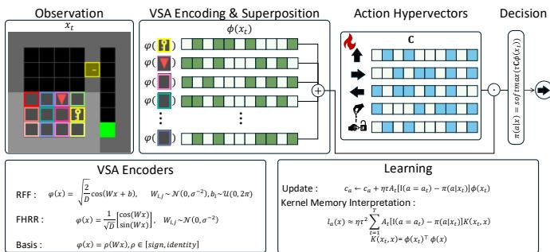
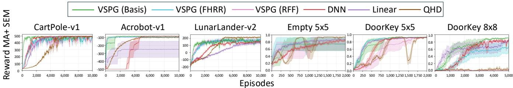
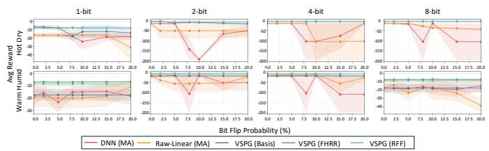
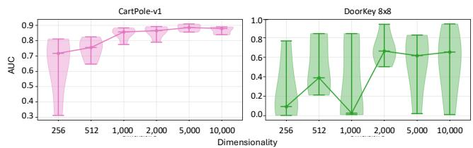
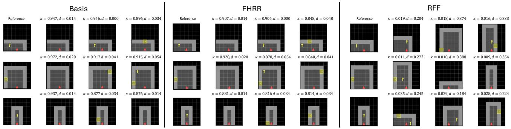
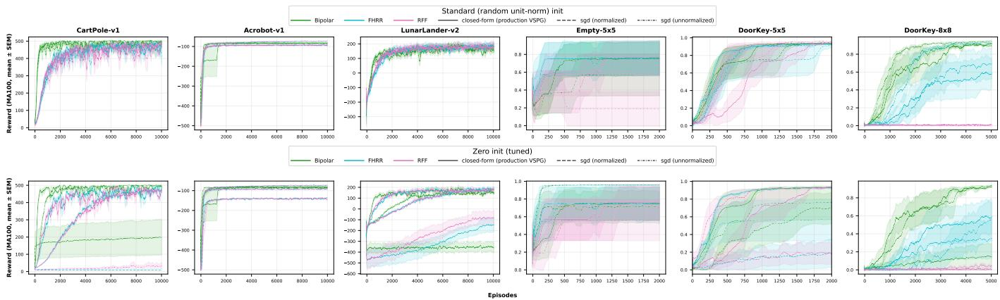

# Vector Symbolic Policy Gradient

Preprint, compiled August 20, 2026

Ryozo Masukawa1, Sanggeon Yun1, SungHeon Jeong1, Hyunwoo Oh1, Raheeb Hassan1, Pietro Mercati2, Nathaniel D. Bastian3, Mahdi Imani4, and Mohsen Imani1

1University of California, Irvine 2Intel Corporation 3Johns Hopkins University 4Northeastern University

## Abstract

Vector Symbolic Architecture (VSA) is built around a simple idea: distributed memories can be learned through lightweight algebra and remain useful even when their bits are unreliable. Yet this perspective has rarely been connected directly to discrete-action policy gradients. We introduce Vector-Symbolic Policy Gradient (VSPG), a categorical actor that represents each action by a unit-norm hypervector and chooses actions by similarity to an encoded state. We show that the standard softmax policy-gradient step has an exact vectorsymbolic interpretation: advantage-weighted state hypervectors are bundled into the selected action memory and suppressed in competing memories, followed by row-wise normalization, so the actor trains in closed form with no optimizer state and logits bounded by construction. Over training, these memories become fixed-size compressed kernel expansions that transfer advantage evidence across similar states without retaining past samples at inference. On classic control, MiniGrid, and multi-agent SustainGym, VSPG achieves competitive returns with favorable learning speed. Its distributed action memories also degrade substantially more gracefully than neural and linear actors under post-training quantization and random bit flips, making VSPG a promising actor for unreliable edge systems. An anonymized code is available here.

## 1 Introduction

Vector Symbolic Architecture (VSA), also known as Hyperdimensional computing (HDC), is a brain-inspired computing paradigm rooted in theories of distributed representation from cognitive science [1, 2]. VSA represents data using high dimensional distributed vectors, or hypervectors, and performs computation through simple operations such as similarity search, bundling, binding, and normalization.

Two properties are crucial for using VSA as a learning representation. First, independently generated hypervectors are nearly orthogonal in high dimension, allowing many pieces of information to be superposed in a single memory with limited interference and supporting graceful degradation under noise [3, 4]. Second, an VSA encoder ϕ maps inputs into an explicit high-dimensional inner-product space, where ϕ(x)⊤ϕ(x′) can be designed to preserve a meaningful similarity between inputs. This gives VSA encoders a theoretically grounded connection to kernel-approximation methods [5, 6]. Together, these properties have motivated the use of VSA in lightweight and resource-constrained learning systems, with recent work spanning intelligent sensing, hardware acceleration of IoT devices [7, 8, 9, 10, 11].

  
Figure 1: Overview of VSPG. A fixed encoder maps the observation to a hypervector, action hypervectors score it by inner products, and the exact policy-gradient step bundles the encoded state into the kernel action memories.

These properties are particularly relevant to deployment robustness in reinforcement learning (RL), where practical agents may run under low-precision execution or unreliable memory, and bit-level corruption of stored policy parameters can degrade autonomous decision making [12, 13, 14]. VSA provides a natural representation-level substrate for lightweight RL policies exposed to quantization and model-state faults. Existing VSA-based RL methods have mostly used hypervectors at the algorithmic and application level, either as Q-value approximators trained by Bellman regression [15, 16] or as components of continuous actor–critic control [17, 18], but leave open a basic question: can action hypervectors directly parameterize a categorical actor, and can its policy-gradient update be written as a vector-symbolic memory operation?

We answer this question with Vector-Symbolic Policy Gradient (VSPG), a discrete-action actor that represents each action by a unit-norm hypervector and scores it by similarity to the encoded state. Under the standard softmax policy-gradient surrogate, we prove that its update is exactly advantage-weighted hypervector bundling followed by normalization, and therefore supports standard advantage estimators [26, 20]. We further show that each trained action hypervector is a fixed-size compressed kernel memory, storing an advantage-weighted kernel expansion over visited states and transferring evidence according to the encoderinduced similarity. This provides a concrete mechanism that can support sample-eficient learning without increasing inferencetime memory. Finally, for bipolar action memories, we prove that greedy action selection is stable under random bit flips, with failure probability decaying exponentially in the hypervector dimension. VSPG thus connects VSA action memories, loglinear policy gradients, and kernel policy search while providing a quantitative robustness guarantee.

Table 1: Positioning of VSPG among the method families it builds on.
<table><tr><td>Method</td><td>Setting</td><td>Closed-form update</td><td>Exact PG identity</td><td>Kernel expansion</td><td>Fixed-size inference</td><td>Bit-flip robustness</td></tr><tr><td>DNN softmax actor [19, 20]</td><td>disc./cont., PG</td><td></td><td></td><td></td><td>√</td><td></td></tr><tr><td>Log-linear softmax PG [21, 22]</td><td>disc., PG</td><td>V</td><td>V</td><td></td><td>L</td><td></td></tr><tr><td>Kernel (RKHS) policy search [23, 24]</td><td>cont., PG</td><td>√</td><td>√</td><td>√</td><td></td><td></td></tr><tr><td>QHD and extensions [15, 16]</td><td>disc., value</td><td>√</td><td></td><td></td><td>√</td><td></td></tr><tr><td>NavHD [25]</td><td>disc., value</td><td></td><td></td><td></td><td>√</td><td></td></tr><tr><td>HDPG [17]</td><td>cont., PG</td><td></td><td></td><td></td><td>√</td><td></td></tr><tr><td>Fault-aware robust RL [13, 14]</td><td>disc., value</td><td></td><td></td><td></td><td>√</td><td>√</td></tr><tr><td>VSPG (ours)</td><td>disc., PG</td><td>√</td><td>√</td><td>√</td><td>√</td><td>√</td></tr></table>

We evaluate VSPG on classic control, MiniGrid [27, 28], and multi-agent SustainGym building control [29], against DNN and linear actor baselines, as well as QHD [15], a strong value-based VSA method for discrete-action RL. Across these benchmarks, VSPG achieves competitive final performance and stronger sample eficiency than matched actor baselines. Under post-training bit-flip corruption, its distributed action memories also retain performance substantially better than both DNN and raw linear actors, demonstrating graceful degradation under model-state faults.

Our contributions are as follows.

• We introduce VSPG, a discrete-action policy-gradient actor that represents each action with a unit-norm hypervector, and show that its update admits an exact vector-symbolic interpretation as advantage-weighted bundling followed by row normalization.

• We show that trained action hypervectors form fixedsize compressed kernel memories and prove robustness of bipolar action memories to random bit flips.

• We evaluate VSPG on classic control, MiniGrid, and multi-agent building control against neural, linear and value-based VSA, demonstrating competitive performance, favorable sample eficiency, and robustness to quantization and bit-level faults.

## 2 Related Work

## 2.1 VSA and Kernel Policiesfor RL

Prior VSA-RL methods mainly use hypervectors as lightweight function approximators within existing RL formulations. HDPG [17] addresses continuous control with VSA-based Gaussian actors and critics, whereas discrete-action methods largely follow the value-based QHD framework [15, 16], learning action-specific Q-value hypervectors through Bellman-errorweighted bundling. This value-based line has also been applied to cybersecurity, robotics, navigation, and sensing applications [30, 31, 25, 32]. VSPG instead directly parameterizes a categorical softmax policy with action hypervectors, extending vector-symbolic learning from value approximation to discrete-action policy gradients. VSA methods have also demonstrated favorable data eficiency in single-pass and online learning [33, 34], and prior VSA-RL studies report promising learning eficiency, with NavHD [25] providing systematic multiseed evidence in robotic navigation; VSPG examines whether this behavior extends to discrete-action policy gradients. VSPG further connects to kernelized and log-linear policy search: kernel policies represent action scores as expansions over experience [35, 23, 24], whereas VSPG superposes this expansion into one fixed-size hypervector per action, requiring only one inner product per action at inference. With a fixed encoder, VSPG is a log-linear softmax policy over random features [36, 21], with optimization covered by established policy-gradient theory [22, 37]. As summarized in Table 1, VSPG connects VSAbased RL, log-linear policy gradients, and kernel policy search through an exact VSPG update, a fixed-size kernel-memory expansion, and a stability guarantee under bit-level corruption.

## 2.2 Robustness to Model-State Corruption in RL

RL policies deployed on resource-constrained systems may be afected by corruption of the stored policy itself [38, 39, 12]. Low-voltage operation and approximate memory can introduce bit-level errors in model parameters, reducing the reliability of autonomous decisions. Prior work mainly addresses this problem through fault-aware training, bit-error injection, or hardwarelevel adaptation for neural policies [40, 14, 13]. VSPG instead takes a complementary representation-level approach, storing a discrete-action policy as distributed vector-symbolic action memories. We evaluate degradation under quantization and model-state bit corruption, while our theoretical analysis provides an exponential failure bound in the hypervector dimension for bipolar memories at a fixed similarity margin (Table 1).

## 3 Preliminaries

## 3.1 Reinforcement Learning and Policy Gradients

We formulate the problem as a decentralized partially observable Markov decision process (Dec-POMDP), which includes fully observed single-agent MDPs as a special case. A Dec-POMDP is defined as $\boldsymbol { \mathcal { M } } \overset { - } { = } ( \mathcal { I } , \boldsymbol { S } , \{ \mathcal { A } _ { i } \} _ { i \in \mathcal { I } } , \overset { - } { P } , \boldsymbol { r } , \rho _ { 0 } , \{ \chi _ { i } \} _ { i \in \mathcal { I } } , O , \gamma )$ where I is the set of agents, S is the state space, $\mathcal { A } _ { i }$ and $\chi _ { i }$ are the action and observation spaces of agent $\bar { i } , P$ is the state transition probability, r is the shared reward function, $\rho _ { 0 }$ is the initialstate distribution, $o$ are the observations, and $\gamma \in [ 0 , 1 ]$ is the discount factor. At time t, the environment is in state st, each agent receives observation $x _ { t } ^ { i } ,$ and selects $a _ { t } ^ { i } \sim \pi _ { \theta _ { i } } ( \cdot \mid x _ { t } ^ { i } )$ The joint action $\mathbf { a } _ { t } = ( a _ { t } ^ { i } ) _ { i \in \mathcal { I } }$ determines the subsequent transition and reward. Let $\pmb { \theta } = \{ \theta _ { i } \} _ { i \in \mathcal { I } }$ denote the joint policy parameters. The objective is to maximize the expected discounted return

$$
J ( \pmb \theta ) = \mathbb E _ { \tau \sim \pi _ { \theta } } \left[ \sum _ { t = 0 } ^ { T - 1 } \gamma ^ { t } r _ { t } \right] ,\tag{1}
$$

where τ is a trajectory induced by the joint policy and environment. For a factorized decentralized policy, the policy gradient for agent i is

$$
\nabla _ { \theta _ { i } } J ( \pmb \theta ) = \mathbb { E } _ { \pi _ { \pmb \theta } } \left[ \sum _ { t = 0 } ^ { T - 1 } \hat { A } _ { t } ^ { i } \nabla _ { \theta _ { i } } \log \pi _ { \theta _ { i } } ( a _ { t } ^ { i } \mid x _ { t } ^ { i } ) \right] ,\tag{2}
$$

where $\hat { A } _ { t } ^ { i }$ is an advantage estimate [41, 21], obtained from returns or an actor–critic estimator such as Generalized Advantage Estimation (GAE) [18, 26, 19, 20]. VSPG uses the same policygradient objective but represents each categorical actor with action hypervectors, yielding an advantage-weighted bundling update that applies to both single- and multi-agent settings.

## 3.2 VSA Basics

VSA encodes inputs as high-dimensional hypervectors and computes through bundling (superposition), binding, and similarity search. Although bundling and binding can be implemented in diferent ways, in this paper they refer to element-wise addition and element-wise multiplication, respectively. Let $\mathbf { h } = \varphi ( x ) \in \mathbb { R } ^ { D }$ denote the hypervector produced by a fixed encoder $\varphi ,$ normalized when used for similarity search. Random hypervectors are quasi-orthogonal, allowing many items to be bundled with limited interference.

Lemma 1 (Quasi-orthogonality). Let ${ \mathbf { u } } , { \mathbf { v } } \in \mathbb { R } ^ { D }$ be independent random unit vectors, at least one of which is uniformly distributed on the sphere. Then $\mathbb { E } [ \mathbf { u } ^ { \top } \mathbf { v } ] = 0$ and, for every $\delta \in ( 0 , 1 )$ ,

$$
\begin{array} { r } { \mathrm { P r } \Big [ | { \bf u } ^ { \top } { \bf v } | \geq \sqrt { \frac { 2 \ln ( 2 / \delta ) } { D } } \Big ] \leq \delta . } \end{array}
$$

Proof. Condition on v. By rotational invariance, $\mathbf { u } ^ { \top } \mathbf { v }$ is distributed as one coordinate of a unit vector, whose spherical-cap measure satisfies $\mathrm { P r } [ | u _ { 1 } | \ge t ] \le 2 e ^ { - D t ^ { 2 } / 2 } \ [ 4 2 ]$ ; the tail bound and zero mean follow. □

This property enables associative memory by bundling many examples into a single prototype. A standard VSA classifier stores one prototype per class,

$$
\mathbf { C } _ { \ell } = \sum _ { i : y _ { i } = \ell } w _ { i } \phi ( x _ { i } ) .\tag{3}
$$

Prototypes superpose class examples, optionally weighted [33], and predict by similarity search. $\hat { y } = \arg \operatorname* { m a x } _ { \ell } \delta \Big ( \phi ( x _ { q } ) , \mathbf { C } _ { \ell } \Big )$ where δ is an inner-product-based similarity such as cosine similarity. Quasi-orthogonality limits interference, while repeated or similar components reinforce. Under inner-product scoring, prototypes are linear weights over fixed hypervector features and may be formed by bundling or gradient-based optimization [34]. VSPG applies this view to discrete-action policies: action hypervectors serve as policy weights, encoded states as fixed features, and policy-gradient learning becomes advantageweighted bundling, yielding compressed kernel memories over visited states.

## 4 Vector-Symbolic Policy Gradient

Algorithm 1 Vector-Symbolic Policy Gradient (VSPG)   
Require: Fixed normalized encoder $\phi ,$ action HVs $\begin{array} { r } { \overline { { \mathbf { C } = \{ \mathbf { c } _ { a } \} _ { a \in \mathcal { A } } , } } } \end{array}$   
temperature $\tau ,$ learning rate η   
1: Initialize each $\mathbf { c } _ { a }$ and rescale to $\| \mathbf { c } _ { a } \| _ { 2 } = 1$   
2: for each batch of episodes do   
3: Collect transitions using $\mathbf { s } _ { t } ~ = ~ \pmb { \phi } ( \boldsymbol { x } _ { t } )$ and $ \pi ( { \boldsymbol { a } } \ | \ x _ { t } ) \ =$   
softma $\backslash \dag \tau \mathbf { c } _ { a } ^ { \intercal } \mathbf { s } _ { t } )$   
4: Estimate advantages $\left\{ A _ { t } \right\}$   
5: $\Lambda _ { t , a }  A _ { t } \tau ( \mathbf { 1 } \underline { { \lbrack a = a _ { t } ] } } - \pi ( a \mid x _ { t } ) )$   
6: $\mathbf { C } \gets \mathbf { C } + \eta \mathbf { \tilde { A } } ^ { \top } \mathbf { S }$   
7: $\mathbf { c } _ { a } \gets \mathbf { c } _ { a } / \| \mathbf { c } _ { a } \| _ { 2 }$ for each $a \in { \mathcal { A } }$   
8: end for

## 4.1 Policy Representation and Update

VSPG turns the VSA prototype classifier of the preliminaries into a stochastic policy: class prototypes become action hypervectors, and similarity scores become policy logits. Throughout, $x _ { t }$ denotes the policy input at time t — the state in fully observed tasks and the observation otherwise. Every encoder normalizes its raw output $\tilde { \pmb { \phi } } ( x ) \in \mathbb { R } ^ { D }$ before it reaches the actor,

$$
\phi ( x ) = \frac { \tilde { \phi } ( x ) } { \lVert \tilde { \phi } ( x ) \rVert _ { 2 } } , \qquad \lVert \phi ( x ) \rVert _ { 2 } = 1 .\tag{4}
$$

We write $\mathbf { s } _ { t } = \phi ( x _ { t } )$ and stack a batch of T encoded inputs as $\mathbf { S } \in \mathbb { R } ^ { T \times D } .$ . The actor parameters are the action hypervectors $\mathbf { C } \in \mathbb { R } ^ { | \mathcal { A } | \times D }$ , with one unit-norm row $\mathbf { c } _ { a }$ per action. Unless otherwise stated, each row is initialized independently from an isotropic Gaussian distribution and normalized to unit norm, independently of the fixed encoder. The policy scores each action by an inner product and takes a softmax,

$$
\pi ( \boldsymbol { a } \mid \boldsymbol { x } ) = \operatorname { s o f t m a x } _ { \boldsymbol { d } } ( \tau \mathbf { C } \boldsymbol { \phi } ( \boldsymbol { x } ) ) ,\tag{5}
$$

$\mathbf { s o } ,$ both factors being unit-norm, each logit is a bounded scaled cosine,

$$
\ell _ { a } ( x ) = \tau \mathbf { c } _ { a } ^ { \top } \pmb { \phi } ( x ) \in [ - \tau , \tau ] ,\tag{6}
$$

and $\tau > 0$ sets how sharp the policy can be; a batch is scored in the single matrix product $\bar { \tau \mathbf { S C } ^ { \top } }$ . Because both factors are unit norm, each logit lies in $[ - \tau , \tau ]$ . Thus, τ controls both the concentration of the stochastic policy and the scale of the policygradient update. Given actions {a } and advantages {A }, we form $\pmb { \Lambda } \in \dot { \mathbb { R } } ^ { T \times | \mathcal { A } | }$ and update:

$$
\Lambda _ { t , a } = A _ { t } \tau ( \mathbf { 1 } [ a = a _ { t } ] - \pi ( a \mid x _ { t } ) ) ,\tag{7}
$$

$$
\mathbf { C } \gets \mathrm { r o w - n o r m } \big ( \mathbf { C } + \eta \mathbf { A } ^ { \top } \mathbf { S } \big ) .\tag{8}
$$

where $\eta > 0$ is the learning rate, $\mathbf { G } = \mathbf { \mathbf { { A } } ^ { \top } \mathbf { \mathbf { S } } }$ is one matrix multiplication, and row normalization restores unit norms. The update is closed-form: no gradient is backpropagated through the encoder or a neural actor, and no optimizer state is kept. Since the perrow step scales with ητ while τ also sets the logit scale (6), the two should therefore be selected jointly. VSPG is compatible with any advantage estimator. When Monte-Carlo estimates are unreliable due to sparse rewards, a critic may optionally be used during training to compute advantages, as in actor–critic methods [18]. The critic does not update the action hypervectors or the encoder and is discarded at deployment.

## 4.1.1 Encoders

Every encoder is built from a fixed random base map φ, drawn once and never trained:

$$
\varphi _ { \mathrm { R F F } } ( x ) = \sqrt { \frac { 2 } { D } } \cos ( \mathbf { W } _ { \mathrm { R F F } } x + \mathbf { b } )\tag{RFF),}
$$

$$
\varphi _ { \mathrm { F H R R } } ( x ) = ~ \sqrt { \frac { 2 } { D } } \left[ \cos ( \mathbf { W } _ { \mathrm { F H R R } } x ) \right]\tag{9}
$$

$$
\varphi _ { \mathrm { B a s i s } } ( x ) = \rho ( \mathbf { W } _ { \mathrm { B a s i s } } x ) , \qquad \rho \in \{ \mathrm { i d } , \mathrm { s i g n } \} \quad ( \mathrm { B a s i s } ) .\tag{FHRR),}
$$

Here, $\mathbf { W } _ { \mathrm { R F F } } , \mathbf { W } _ { \mathrm { B a s i s } } \in \mathbb { R } ^ { D \times d }$ and $\mathbf { W } _ { \mathrm { F H R R } } \in \mathbb { R } ^ { ( D / 2 ) \times d } .$ The entries of WRFF and WFHRR are drawn independently from $N ( 0 , \sigma ^ { - 2 } )$ those of $\mathbf { W } _ { \mathrm { B a s i s } }$ from $N ( 0 , 1 )$ , and $\bar { b } _ { i } \sim \mathcal { U } ( 0 , 2 \pi )$ . We define $\operatorname { i d } ( z ) = z .$ . The raw encoding $\bar { \phi } ( x )$ is either φ(x) applied directly or a superposition of bound φ-encodings, followed by (4). The FHRR map represents $e ^ { i \mathbf { W } x }$ through its real and imaginary parts, giving unit norm and φFHRR $\begin{array} { r } { ( x ) ^ { \top } \varphi _ { \mathrm { F H R R } } ( y ) = \frac { 2 } { D } \sum _ { j = 1 } ^ { D / 2 } \cos ( \mathbf { w } _ { j } ^ { \top } ( x - } \end{array}$ y) After normalization, the Basis map approximates cosine similarity when $\rho = \mathrm { i d }$ and the angular kernel $1 - 2 \theta ( x , y ) / \pi$ when $\rho = \mathrm { s i g n }$ , where $\begin{array} { r } { \theta ( x , y ) = \operatorname { a r c c o s } \left( \frac { x ^ { \top } y } { \| x \| _ { 2 } \| y \| _ { 2 } } \right) } \end{array}$

Normalized inner products then concentrate around an encoderspecific similarity with $\boldsymbol { \kappa } ( \boldsymbol { x } , \boldsymbol { x } ) = 1$ , tightening as D grows [43, 2, 5]: when $\mathbb { E } [ \tilde { \pmb { \phi } } ( \dot { x } ) ^ { \top } \tilde { \pmb { \phi } } ( y ) ] = k ( x , y )$ , the normalization identifies

$$
\phi ( x ) ^ { \top } \phi ( y ) \approx \frac { k ( x , y ) } { \sqrt { k ( x , x ) k ( y , y ) } } = \kappa ( x , y ) .\tag{10}
$$

The analysis below uses only $\pmb { \phi } ( x _ { t } ) ^ { \top } \pmb { \phi } ( x ) \approx \pmb { \kappa } ( x _ { t } , x ) ;$ the encoder determines $\kappa ,$ and hence how advantage evidence generalizes across inputs, while the VSA dimensionality D controls how accurately the kernel is approximated, which the dimensionality ablation probes directly.

Computational and memory cost. Encoding costs one matrix–vector product, O(Dd) for input dimension d, scoring costs O(|A|D), and one update costs $O ( T | \mathcal { R } | D )$ for $\pmb { \Lambda } ^ { \top } \pmb { \mathbb { S } }$ plus $O ( T | \mathcal { R } | )$ for the softmax terms, with no optimizer state. Because

W and b are random and never trained, deployment stores the $| { \mathcal { H } } | \times D$ action memories together with either the projection or the seed that regenerates it, and the bipolar variant stores one bit per memory coordinate.

## 4.2 Theoretical Analysis of VSPG

VSPG’s actor design raises two questions: what is the policygradient update for the policy (5), and what do the trained action hypervectors store? Proposition 1 answers the first — the closed-form rule (8) is the softmax policy-gradient step, written as advantage-weighted bundling followed by row-wise sphere projection — and Proposition 2 the second: each trained hypervector is a compressed kernel expansion over experience. Throughout, let $\{ ( x _ { t } , \bar { a } _ { t } , A _ { t } ) \} _ { t = 1 } ^ { T }$ be a batch of transitions and define the empirical surrogate

$$
\hat { J } ( \mathbf { C } ) ~ = ~ \sum _ { t = 1 } ^ { T } A _ { t } \log \pi _ { \mathbf { C } } ( a _ { t } \mid x _ { t } ) ,\tag{11}
$$

where $\left\{ A _ { t } \right\}$ are treated as fixed weights when diferentiating with respect to C. We first state the projection fact.

Lemma 2 (Closest unit vector). For any $\mathbf { v } \neq \mathbf { 0 } ,$ , the unique unit vector closest to v in Euclidean distance is $\mathbf { v } / | | \mathbf { v } | | _ { 2 }$

Proof. On $\| \mathbf { u } \| _ { 2 } = 1 , \| \mathbf { u } - \mathbf { v } \| _ { 2 } ^ { 2 } = 1 + \| \mathbf { v } \| _ { 2 } ^ { 2 } - 2 \mathbf { u } ^ { \top } \mathbf { v } .$ so minimizing distance maximizes $\mathbf { u } ^ { \top } \mathbf { v }$ , which by Cauchy–Schwarz occurs uniquely at $\mathbf { u } = \mathbf { v } / \lVert \mathbf { v } \rVert _ { 2 }$ □

Proposition 1 (The VSPG update is a projected policy-gradient step). Fix the encoder ϕ and the policy (5). For any advantages $\{ A _ { t } \} _ { }$

$$
\nabla _ { \bf C } \hat { J } ( { \bf C } ) = \Lambda ^ { \top } { \bf S } = { \bf G } ,
$$

with Λ as in (7): the bundling term in (8) is exactly the sampled policy gradient, and (8) is a gradient-ascent step on Jˆ followed by row-wise projection onto the unit sphere (Lemma 2).

Proof. Write log $\pi ( a _ { t } \mid x _ { t } ) = \ell _ { a _ { t } } ( x _ { t } ) - \log Z _ { t }$ with $\begin{array} { r } { Z _ { t } = \sum _ { b } e ^ { \ell _ { b } ( x _ { t } ) } } \end{array}$ A logit $\ell _ { b }$ depends on row $\mathbf { c } _ { a }$ only when $b = a ,$ , with $\nabla _ { \mathbf { c } _ { a } } \ell _ { a } = \tau \mathbf { s } _ { t }$ and the log-sum-exp derivative gives $\nabla _ { \mathbf { c } _ { a } }$ log $Z _ { t } = \pi ( a \mid x _ { t } ) \tau \mathbf { s } _ { t }$ Subtracting yields the softmax score

$$
\nabla _ { \mathbf { c } _ { a } } \log \pi ( a _ { t } \mid x _ { t } ) = \tau ( \mathbf { 1 } [ a = a _ { t } ] - \pi ( a \mid x _ { t } ) ) \mathbf { s } _ { t } :\tag{12}
$$

the encoded state is added to the taken action’s row and subtracted from every row in proportion to its current probability. Weighting each score by $A _ { t }$ and summing over the batch matches Λ entrywise, so $\nabla _ { \bf C } \hat { J } = \mathbf { A } ^ { \top } \mathbf { S } = \mathbf { G }$ . Row normalization rescales each row to unit length, which by Lemma 2 projects $\mathbf { C } + \eta \mathbf { G }$ onto the product of unit spheres $\dot { M } = \{ \mathbf { C } : \| \mathbf { c } _ { a } \| _ { 2 } = 1 \ \forall a \}$ □

Proposition 1 gives the exact projected policy-gradient update. The following relates this projection to the intrinsic geometry of the unit sphere.

Corollary 1 (First-order form of the normalized step). Let ${ \bf g } _ { a } = { \bf \delta }$ $\nabla _ { \mathbf { c } _ { a } } \hat { J } ( \mathbf { C } )$ , and let $\mathbf { c } _ { a } ^ { + }$ denote row a after (8). $I f \eta \vert \vert \mathbf { g } _ { a } \vert \vert _ { 2 } \leq 1 / 4$ , then

$$
\begin{array} { r } { \left\| \boldsymbol { \mathbf { c } } _ { a } ^ { + } - \boldsymbol { \mathbf { \check { c } } } _ { a } - \eta ( \mathbf { I } - \boldsymbol { \mathbf { c } } _ { a } \boldsymbol { \mathbf { c } } _ { a } ^ { \top } ) \boldsymbol { \mathbf { g } } _ { a } \right\| _ { 2 } \leq 3 \eta ^ { 2 } \| \boldsymbol { \mathbf { g } } _ { a } \| _ { 2 } ^ { 2 } . } \end{array}\tag{13}
$$

Thus, the normalized update is first-order equivalent to Riemannian gradient ascent on the product ofunit spheres. Moreover, $\begin{array} { r } { \| \mathbf { g } _ { a } \| _ { 2 } \leq \tau \sum _ { t } | A _ { t } | , } \end{array}$ , so the condition holds whenever ητ $\textstyle \sum _ { t } | A _ { t } | \leq$ $1 / 4$

Proof. Write ${ \bf g } _ { a } = s { \bf c } _ { a } + { \bf h }$ , where $s = \mathbf { c } _ { a } ^ { \top } \mathbf { g } _ { a }$ and $\textbf { h } = \mathbf { \Omega } ( \mathbf { I } - \mathbf { \Omega }$ $\mathbf { c } _ { a } \mathbf { c } _ { a } ^ { \top } ) \mathbf { g } _ { a } \perp \mathbf { c } _ { a }$ . With $\begin{array} { r } { N = \| \mathbf { c } _ { a } + \eta \mathbf { g } _ { a } \| _ { 2 } , \mathbf { c } _ { a } ^ { + } = \frac { ( 1 + \eta s ) \mathbf { c } _ { a } + \eta \mathbf { h } } { N } } \end{array}$ Let $u = \eta \vert \vert \mathbf { g } _ { a } \vert \vert _ { 2 } \leq 1 / 4$ . Then $N \ge 1 - u \ge 3 / 4$ and $\begin{array} { r } { \left| \frac { \dot { 1 } + \eta s } { N } - 1 \right| \leq } \end{array}$ $\begin{array} { r l r } { u ^ { 2 } , } & { { } } & { \left| \frac { 1 } { N } - 1 \right| \ \leq \ \frac { u } { 1 - u } \ \leq \ 2 u } \end{array}$ Since the radial and tangential terms are orthogonal, $\left\| \mathbf { c } _ { a } ^ { + } - \mathbf { c } _ { a } - \eta \mathbf { h } \right\| , \leq \sqrt { u ^ { 4 } + 4 u ^ { 4 } } < 3 u ^ { 2 }$ Finally, $\begin{array} { r } { \| \mathbf { g } _ { a } \| _ { 2 } \leq \sum _ { t } | \Lambda _ { t , a } | \| \mathbf { \dot { s } } _ { t } \| _ { 2 } \leq \tau \sum _ { t } | \tilde { A } _ { t } ^ { \dagger } | . } \end{array}$ □

Proposition 1 places VSPG within standard policy-gradient theory: the actor is a log-linear policy over fixed hypervector features [21, 22], and under the unit-norm constraint its exact gradient step takes the form of an VSA bundling operation. Alternative advantage estimates or surrogate weights change only the entries of Λ.

Proposition 2 (Exact expansion of trained action hypervectors). Run Algorithm 1for any number ofupdatesfrom unit-norm initialization $\{ \mathbf { c } _ { a } ^ { ( 0 ) } \}$ , and let $\{ x _ { k } \} _ { k = 1 } ^ { N }$ collect all inputs visited during training. Then there exist scalars $\beta _ { a } > 0$ and $\{ \alpha _ { k , a } \}$ such that each trained action hypervector is

$$
{ \bf c } _ { a } = \beta _ { a } { \bf c } _ { a } ^ { ( 0 ) } + \sum _ { k = 1 } ^ { N } \alpha _ { k , a } \phi ( x _ { k } ) ,\tag{14}
$$

and consequently the logit at any query input x decomposes as

$$
\ell _ { a } ( x ) = \underbrace { \tau \beta _ { a } { \mathbf c } _ { a } ^ { ( 0 ) \top } \pmb { \phi } ( x ) } _ { i n i t i a l i z a t i o n ; O ( 1 / \sqrt { D } ) } + \tau \sum _ { k = 1 } ^ { N } \alpha _ { k , a } \underbrace { \phi ( x _ { k } ) ^ { \top } \pmb { \phi } ( x ) } _ { \approx \kappa ( x _ { k } , x ) } .\tag{15}
$$

Writing $z _ { a } ^ { ( j ) } > 0 f o r$ the Euclidean norm ofrow a after the j-th bundling step and before its renormalization, and $\Lambda ^ { ( j ) } , \{ x _ { t } ^ { ( j ) } \}$ for the weights and inputs ofthe j-th batch, the coeficients are

$$
\beta _ { a } = \prod _ { j = 1 } ^ { J } ( z _ { a } ^ { ( j ) } ) ^ { - 1 } , \alpha _ { k , a } = \eta \sum _ { ( j , t ) : x _ { t } ^ { ( j ) } = x _ { k } } \Lambda _ { t , a } ^ { ( j ) } \prod _ { i = j } ^ { J } ( z _ { a } ^ { ( i ) } ) ^ { - 1 } .\tag{16}
$$

Each $\alpha _ { k , a }$ is therefore a positively weighted sum ofthe advantageweighted softmax scores collected at the visits of $x _ { k } ,$ in particular, $i f x _ { k }$ is visited once at step t, then $\mathrm { s i g n } ( \alpha _ { k , a } ) = \mathrm { s i g n } ( A _ { t } ( { \bf 1 } [ a =$ $a _ { t } ] - \pi ( a \mid x _ { t } ) ) )$ .

Proof. By induction. At initialization (14) holds with $\beta _ { a } = 1$ $\alpha _ { k , a } = 0$ . Each update (8) adds $\begin{array} { r } { \eta \sum _ { t } \Lambda _ { t , a } \mathbf { s } _ { t } } \end{array}$ , which lies in the span of encoded visited inputs, and row normalization rescales the row by a positive scalar, preserving the form of (14) and the coeficient signs. Unrolling the recursion ${ \bf c } _ { a } ^ { ( j ) } = \left( { \bf c } _ { a } ^ { ( j - 1 ) } \mathrm { ~ . ~ } \right.$ + $\eta \sum _ { t } \Lambda _ { t , a } ^ { ( j ) } \mathbf { s } _ { t } ^ { ( j ) } ) / z _ { a } ^ { ( j ) }$ yields the coeficients in (16), whose weights are positive because every $z _ { a } ^ { ( i ) }$ is positive. Inner products of (14) with τϕ(x) give (15). □

Informally, up to a vanishing initialization bias, the deployed VSPG policy is a softmax over advantage-weighted kernel scores against experience:

$$
\pi ( a \mid x ) \ \approx \ \mathrm { s o f t m a x } _ { d } \Bigl ( \tau \sum _ { k = 1 } ^ { N } \alpha _ { k , a } \kappa ( x _ { k } , x ) \Bigr ) .\tag{17}
$$

An advantageous transition contributes positive mass to action a at encoder-similar inputs, while evidence favoring competing actions contributes negative mass. This kernel sharing allows VSPG to reuse each transition across a neighborhood of observations, providing a representation-level mechanism for sampleeficient learning. Generalization is therefore governed by the encoder-induced similarity, while the N-term expansion remains superposed in D fixed coordinates and is never enumerated at inference.

Remark 1 (Memory readout as the sharp-kernel limit). At a revisited input $x = x _ { m } , ( 1 5 )$ splits into the self term $\alpha _ { m , a }$ (by unit norm) and cross terms $\begin{array} { r } { \sum _ { k \neq m } \alpha _ { k , a } \kappa ( x _ { k } , x _ { m } ) } \end{array}$ . When dissimilar inputs are nearly orthogonal under ϕ, the cross terms vanish and $\ell _ { a } ( x _ { m } ) \approx \tau \alpha _ { m , a } \mathrm { : }$ the associative-memory retrieval underlying VSA classification [1, 33]. In general, the cross terms are not noise but kernel evaluations that transfer advantage evidence to similar inputs; the encoder’s similarity determines how this evidence is shared across inputs, and larger D tightens the kernel approximation.

The same update applies independently to each agent in multiagent training, using agent-specific advantages that may be estimated by a centralized critic during training. At deployment, only the fixed encoder and action memories are retained, and actions are selected by $a ^ { * } = \arg \operatorname* { m a x } _ { a } \mathbf { c } _ { a } ^ { \intercal } \pmb { \phi } ( x )$ By (17), this fixedsize readout evaluates the compressed kernel memory without storing or enumerating the training samples.

## 4.3 Robustness of the Stored Policy

For bipolar action memories, independent sign flips admit a direct stability guarantee for the greedy readout.

Proposition 3 (Bit-flip stability of the greedy readout). Let the deployed actor store bipolar action memories $\mathbf { c } _ { a } ~ \in ~ \{ - 1 / \sqrt { D } , + 1 / \sqrt { D } \} ^ { D }$ and select actions by $\boldsymbol { a } ^ { * } ( \boldsymbol { x } ) \ =$ arg max $\mathbf { c } _ { a } ^ { \top } \phi ( x )$ with $\vert \vert \pmb { \phi } ( x ) \vert \vert _ { 2 } ~ = ~ 1$ . Suppose each stored coordinate flips sign independently with probability $p \ < \ 1 / 2 ,$ giving corrupted memories $\tilde { \mathbf { c } } _ { a } .$ . Fix an input x and let $\Delta ( x ) =$ $\begin{array} { r } { \tilde { \mathbf { c } } _ { a ^ { * } } ^ { \top } \pmb { \phi } ( \tilde { x } ) - \mathrm { m a x } _ { b \neq a ^ { * } } \mathbf { c } _ { b } ^ { \top } \pmb { \phi } ( x ) > 0 } \end{array}$ denote the similarity margin. Then

$$
\begin{array} { r } { \operatorname* { P r } \Bigl [ \arg \operatorname* { m a x } _ { a } \tilde { \mathbf { c } } _ { a } ^ { \top } \phi ( x ) \neq a ^ { * } ( x ) \Bigr ] \leq 2 | \mathcal { A } | \exp \Bigl ( - \frac { D ( 1 - 2 p ) ^ { 2 } \Delta ( x ) ^ { 2 } } { 8 } \Bigr ) . } \end{array}\tag{18}
$$

Proof. Write $\tilde { c } _ { a , j } = \sigma _ { a , j } c _ { a , j }$ with independent $\sigma _ { a , j } \in \{ - 1 , + 1 \}$ and $\mathrm { P r } [ \sigma _ { a , j } = - \mathrm { 1 } ] = p ,$ , so E $[ \sigma _ { a , j } ] = 1 - 2 p$ . Then $\widetilde { \mathbf { c } } _ { a } ^ { \top } \phi ( x ) =$ $( 1 - 2 p ) \mathbf { c } _ { a } ^ { \dagger } \pmb { \phi } ( x ) + \zeta _ { a }$ with $\begin{array} { r } { \zeta _ { a } = \sum _ { j } ( \sigma _ { a , j } - ( 1 - 2 p ) ) \bar { c } _ { a , j } \phi _ { j } ( x ) } \end{array}$ a sum of independent zero-mean terms whose j-th term has range $2 | c _ { a , j } \phi _ { j } ( x ) |$ . Since $\begin{array} { r } { \sum _ { j } ( 2 | c _ { a , j } \phi _ { j } ( x ) | ) ^ { 2 } = \frac { 4 } { D } \sum _ { j } \phi _ { j } ( x ) ^ { 2 } = \frac { 4 } { D } \qquad } \end{array}$ Hoefding’s inequality gives $\mathrm { P r } [ | \zeta _ { a } | \ge t ] \le 2 \exp ( - D t ^ { 2 } / 2 )$ for every a. Scaling all similarities by $1 - 2 p > 0$ preserves the maximizer, so the corrupted argmax can change only if $| \zeta _ { a } | \geq$ $( 1 - 2 p ) \Delta ( x ) / 2$ for some a. A union bound over the |A| actions completes the proof. □

Remark 2 (Beyond bipolar memories). For bipolar memories, random sign flips primarily scale the clean logits by $( 1 - 2 p )$ , with a residual perturbation that concentrates as D grows. Multi-bit quantized memories do not follow the same sign-flip model, but independent bounded coordinate errors are likewise averaged by low-coherence hypervectors. We therefore evaluate their robustness empirically rather than claim the same bound.

  
Figure 2: Overall performance analysis of VSPG compared with diferent baselines and encoders runs on 5 seeds. Except fo LunaLander-v2, VSPG-based achieves the fastest convergence and competitive performance compared to baselines.

## 5 Experiments

## 5.1 Experimental Setup and Implementation Details

To evaluate VSPG and the empirical implications of our theory, we use MiniGrid [28], classic control, and SustainGym building control [29]. The first two test sample eficiency and final performance, while SustainGym tests continuous, noisy, delayed, and multi-agent control. Tuning budgets are comparable and otherwise favor the baselines; full details are in the supplementary material. Experiments use either one RTX 4090 or CPUs, and all results are reproducible on CPUs alone. Unless otherwise noted, all methods use discount factor $\gamma = 0 . 9 9$ , and VSPG uses dimensionality $D = 1 0 { , } 0 0 0$ for MiniGrid and classic control and $D = 5 { , } 0 0 0$ for SustainGym.

## 5.2 MiniGrid and Classic Control

We first evaluate VSPG on standard single-agent discreteaction benchmarks: classic-control environments from Gymnasium [27] and navigation tasks from MiniGrid [28]. These experiments assess sample eficiency, final performance, and comparison with policy-gradient and prior VSA-based RL baselines. Following QHD [15], the classic-control suite includes CartPole-v1, LunarLander-v2, and Acrobot-v1, providing a direct comparison with prior VSA reinforcement learning on low-dimensional continuous-observation tasks. We additionally evaluate Empty-5x5, DoorKey-5x5, and DoorKey-8x8. These MiniGrid tasks introduce partial observability, sparse rewards, and longer-horizon credit assignment: Empty-5x5 primarily tests rapid goal reaching, whereas the DoorKey tasks require coordinated key pickup, door unlocking, and navigation to the goal. Exact encoder constructions, observation preprocessing, and task-specific configurations are provided in the supplementary material.

We compare VSPG against three baselines. Raw-Linear tests whether the gains come from VSA encoding rather than from the linear action-hypervector policy alone. The DNN baseline is a two-hidden-layer neural policy trained with backpropagation under the same advantage-estimation protocol where applicable, allowing us to compare sample eficiency against a standard neural policy. We also include QHD as the closest prior VSA baseline for single-agent discrete-action RL. Since QHD is valuebased and of-policy, whereas VSPG is policy-based and onpolicy, we match the total episode budget rather than the number of parameter updates. MiniGrid experiments use 2 000 episodes for $5 \times 5$ grids and 5 000 episodes for the 8 × 8 grid, while classic-control experiments use 10 000 episodes. All VSPG and policy-gradient baselines are trained with REINFORCE except for Acrobot-v1, where all policy-gradient methods use GAE with the same PPO-style clipped importance weighting [19], since sparse rewards often keep vanilla REINFORCE near the minimum return of −500. We report the mean and standard error over five seeds, using the mean reward over the final 100 episodes of each run as the main summary metric.

Table 2: Average reward per step (mean ± std) on SustainGym building control after 500 training episodes.
<table><tr><td>Method</td><td>Hot-Dry</td><td>Warm-Humid</td></tr><tr><td>DNN (Multi-Agent)</td><td> $- 1 3 . 4 1 \pm 0 . 2 6$ </td><td> $- 1 2 . 1 2 \pm 2 . 7 9$ </td></tr><tr><td>Raw-Linear (Multi-Agent)</td><td> $- 1 3 . 0 2 \pm 0 . 2 2$ </td><td> $- 1 0 . 9 2 \pm 0 . 1 3$ </td></tr><tr><td>VSPG (Basis)</td><td> $- 4 0 . 3 6 \pm 4 3 . 2 1$ </td><td> $- 7 9 . 6 5 \pm 8 0 . 9 9$ </td></tr><tr><td>VSPG (FHRR)</td><td> $- 7 . 8 9 \pm 1 . 4 1$ </td><td> $\mathbf { - 7 . 1 1 \pm 0 . 8 1 }$ </td></tr><tr><td>VSPG (RFF)</td><td> $\mathbf { - 7 . 2 8 \pm 0 . 6 4 }$ </td><td> $- 7 . 9 4 \pm 0 . 1 2$ </td></tr></table>

Results. Figure 2 shows that VSPG learns substantially faster than the DNN and linear actors on classic control, especially on CartPole-v1 and Acrobot-v1. On LunarLander-v2, VSPG improves faster early in training, while all methods reach broadly comparable final performance. VSPG also remains competitive across MiniGrid, including the more dificult and variable DoorKey-8x8. QHD is competitive on simpler classiccontrol tasks, but deteriorates as task complexity and partial observability increase: it becomes unstable and collapses on DoorKey-5x5, and learns almost nothing on DoorKey-8x8. Overall, these results are consistent with the kernel-sharing mechanism in Proposition 2, through which advantage evidence is reused across encoder-similar observations, supporting sample-eficient learning in both fully and partially observable tasks without a neural actor.

## 5.3 Building Control and Bit-flip Robustness

We evaluate VSPG on SustainGym [29], a multi-agent buildingcontrol benchmark with noisy, non-stationary physical observations. We compare against DNN and Raw-Linear actors trained under the same decentralized-actor, centralized-critic multi-agent pipeline. The centralized critic is used only during training to compute GAE advantages and is discarded at deployment. QHD is omitted because it is a single-agent, valuebased method outside our actor-focused multi-agent comparison. All checkpoints are trained for 500 episodes before evaluation. Following [44, 45], we post-training quantize each actor’s parameters—the action-hypervector matrix C for VSPG, and all actor weights and biases for DNN and Raw-Linear—to $b \in \{ 1 , 2 , 4 , 8 \}$ -bit signed integers using per-tensor min–max afine quantization. We then flip each stored bit independently with probability p and dequantize the corrupted parameters back to float32 before evaluation.

  
Figure 3: Bit-flip robustness on SustainGym after quantization. VSPG, DNN, andRaw-Linear actors are evaluated.

Figure 4: Dimensionality analysis on CartPole-v1 and DoorKey 8x8.  
  
Figure 5: Encoder-induced kernel neighborhoods from trained VSPG trajectories on DoorKey-8 × 8.

## 5.3.1 Results

Table 2 shows that FHRR- and RFF-VSPG achieve the strongest returns across both climates, whereas Basis-VSPG performs poorly and exhibits high variance. Together with the failure of RFF-VSPG on DoorKey-8x8, this indicates that no encoder is uniformly efective and that VSPG inherits the inductive bias of its encoder-induced similarity. Under post-training corruption, however, Figure 3 shows that VSPG action memories generally degrade more gracefully than DNN and Raw-Linear actors. Proposition 3 complements these results for genuinely bipolar memories under direct sign flips, while the afine-quantized real-valued memories are evaluated empirically.

## 5.4 Ablation Studies

We examine two representation-level implications of Proposition 2: dimensionality controls how faithfully the kernel expansion is compressed, while the encoder determines the neighborhood over which advantage evidence is shared.

## 5.4.1 Dimensionality and policy memory.

Figure 4 reports the normalized area under the learning curve from 100-episode-smoothed returns or success rates. On CartPole-v1, performance improves with D and largely saturates beyond $D = 1 { , } 0 0 0$ . DoorKey-8x8 is more sensitive, but higher dimensions generally improve learning despite variation across seeds. This trend is consistent with (10): increasing D improves the approximation of $\kappa ( \boldsymbol { x } , \boldsymbol { x } ^ { \prime } )$ and reduces interference in the compressed policy memory.

## 5.4.2 Encoder-Induced Kernel Neighborhoods.

For trained DoorKey-8×8 policies, we retrieve the top-3 neighbors of sampled observations under the fixed encoder-induced similarity (Figure 5). Basis and FHRR produce coherent neighborhoods with high kernel similarity, whereas the unsuccessful RFF configuration yields weaker and less consistent matches. Together with Figure 2, these ablations illustrate the mechanism in Proposition 2: D governs interference in the compressed kernel memory, while the encoder determines whether stored advantage evidence is transferred to observations where it supports useful generalization, accounting for both the strong and failed configurations.

## 6 Conclusion

In this paper, we introduced VSPG, a vector-symbolic formulation of discrete-action policy gradients. Its softmax update becomes advantage hypervector bundling, while action memories form fixed-size kernel expansions over experience. For bipolar memories, greedy action selection is provably robust to random bit flips, and experiments show favorable sample eficiency, competitive returns, and graceful degradation under quantization and memory corruption. Future work will test whether these properties extend to vision-driven decision making and robotics [46, 47].

## References

[1] Pentti Kanerva. Hyperdimensional computing: An introduction to computing in distributed representation with

high-dimensional random vectors. Cognitive computation, 1(2):139–159, 2009.

[2] T.A. Plate. Holographic reduced representations. IEEE Transactions on Neural Networks, 6(3):623–641, 1995. doi: 10.1109/72.377968.

[3] Denis Kleyko, Dmitri A. Rachkovskij, Evgeny Osipov, and Abbas Rahimi. A survey on hyperdimensional computing aka vector symbolic architectures, part i: Models and data transformations. ACM Comput. Surv., 55(6), December 2022. ISSN 0360-0300. doi: 10.1145/3538531. URL https://doi.org/10.1145/3538531.

[4] Alexander N Gorban and Ivan Yu Tyukin. Blessing of dimensionality: mathematical foundations of the statistical physics of data. Philosophical Transactions of the Royal Society A: Mathematical, Physical and Engineering Sciences, 376(2118):20170237, 2018.

[5] Anthony Thomas, Sanjoy Dasgupta, and Tajana Rosing. A theoretical perspective on hyperdimensional computing. Journal of Artificial Intelligence Research, 72:215–249, 2021.

[6] Quanling Zhao, Anthony Hitchcock Thomas, Ari Brin, Xiaofan Yu, and Tajana Rosing. Bridging the gap between hyperdimensional computing and kernel methods via the nyström method. In Proceedings of the AAAI Conference on Artificial Intelligence, volume 39, pages 22813–22821, 2025.

[7] Sanggeon Yun, Hanning Chen, Ryozo Masukawa, Hamza Errahmouni Barkam, Andrew Ding, Wenjun Huang, Arghavan Rezvani, Shaahin Angizi, and Mohsen Imani. Hypersense: Hyperdimensional intelligent sensing for energy-eficient sparse data processing. Advanced Intelligent Systems, 6(12): 2400228, 2024. doi: https://doi.org/10.1002/aisy. 202400228. URL https://advanced.onlinelibrary. wiley.com/doi/abs/10.1002/aisy.202400228.

[8] Haomin Li, Fangxin Liu, Yichi Chen, Zongwu Wang, Shiyuan Huang, Ning Yang, Dongxu Lyu, and Li Jiang. Fate: Boosting the performance of hyper-dimensional computing intelligence with flexible numerical data type. In Proceedings ofthe 52nd Annual International Symposium on Computer Architecture, ISCA ’25, page 1269–1282, New York, NY, USA, 2025. Association for Computing Machinery. ISBN 9798400712616. doi: 10.1145/3695053. 3731031. URL https://doi.org/10.1145/3695053. 3731031.

[9] Jebacyril Arockiaraj, Dhruv Parikh, and Viktor Prasanna. Imagehd: Energy-eficient on-device continual learning of visual representations via hyperdimensional computing. In 2026 IEEE 34th Annual International Symposium on Field-Programmable Custom Computing Machines (FCCM), pages 231–240, 2026. doi: 10.1109/FCCM68464.2026. 00041.

[10] Zhiling Chen, Danny Hoang, Fardin Jalil Piran, Ruimin Chen, and Farhad Imani. Federated hyperdimensional computing for hierarchical and distributed quality monitoring in smart manufacturing. Internet of Things, 31:101568, 2025.

[11] Russel Arbore, Xavier Routh, Abdul Rafae Noor, Akash Kothari, Haichao Yang, Weihong Xu, Sumukh Pinge, Minxuan Zhou, Tajana Rosing, and Vikram Adve. Hpvmhdc: A heterogeneous programming system for accelerating hyperdimensional computing. In Proceedings ofthe 52nd Annual International Symposium on Computer Architecture, ISCA ’25, page 1342–1355, New York, NY, USA, 2025. Association for Computing Machinery. ISBN 9798400712616. doi: 10.1145/3695053.3731095. URL https://doi.org/10.1145/3695053.3731095.

[12] Gabriel Dulac-Arnold, Nir Levine, Daniel J Mankowitz, Jerry Li, Cosmin Paduraru, Sven Gowal, and Todd Hester. Challenges of real-world reinforcement learning: definitions, benchmarks and analysis. Machine Learning, 110 (9):2419–2468, 2021.

[13] Zishen Wan, Nandhini Chandramoorthy, Karthik Swaminathan, Pin-Yu Chen, Kshitij Bhardwaj, Vijay Janapa Reddi, and Arijit Raychowdhury. Mulberry: Enabling bit-error robustness for energy-eficient multi-agent autonomous systems. In Proceedings of the 29th ACM International Conference on Architectural Supportfor Programming Languages and Operating Systems, Volume 2, pages 746–762, 2024.

[14] Zishen Wan, Nandhini Chandramoorthy, Karthik Swaminathan, Pin-Yu Chen, Vijay Janapa Reddi, and Arijit Raychowdhury. Berry: Bit error robustness for energy-eficient reinforcement learning-based autonomous systems. In 2023 60th ACM/IEEE Design Automation Conference (DAC), pages 1–6. IEEE, 2023.

[15] Yang Ni, Danny Abraham, Mariam Issa, Yeseong Kim, Pietro Mercati, and Mohsen Imani. Eficient of-policy reinforcement learning via brain-inspired computing. In Proceedings of the Great Lakes Symposium on VLSI 2023, pages 449–453, 2023.

[16] Yang Ni, William Y. Chung, Samuel Cho, Zhuowen Zou, and Mohsen Imani. Eficient exploration in edge-friendly hyperdimensional reinforcement learning. In Proceedings ofthe Great Lakes Symposium on VLSI 2024, GLSVLSI ’24, page 111–118, New York, NY, USA, 2024. Association for Computing Machinery. ISBN 9798400706059. doi: 10.1145/3649476.3658760. URL https://doi.org/10. 1145/3649476.3658760.

[17] Yang Ni, Mariam Issa, Danny Abraham, Mahdi Imani, Xunzhao Yin, and Mohsen Imani. Hdpg: Hyperdimensional policy-based reinforcement learning for continuous control. In Proceedings of the 59th ACM/IEEE Design Automation Conference, pages 1141–1146, 2022.

[18] Vijay Konda and John Tsitsiklis. Actor-critic algorithms. Advances in neural information processing systems, 12, 1999.

[19] John Schulman, Filip Wolski, Prafulla Dhariwal, Alec Radford, and Oleg Klimov. Proximal policy optimization algorithms. arXiv preprint arXiv:1707.06347, 2017.

[20] Chao Yu, Akash Velu, Eugene Vinitsky, Jiaxuan Gao, Yu Wang, Alexandre Bayen, and Yi Wu. The surprising efectiveness of ppo in cooperative multi-agent games. Advances in neural information processing systems, 35: 24611–24624, 2022.

[21] Richard S Sutton, David McAllester, Satinder Singh, and Yishay Mansour. Policy gradient methods for reinforcement learning with function approximation. Advances in neural information processing systems, 12, 1999.

[22] Jincheng Mei, Chenjun Xiao, Csaba Szepesvari, and Dale Schuurmans. On the global convergence rates of softmax policy gradient methods. In Hal Daumé III and Aarti Singh, editors, Proceedings of the 37th International Conference on Machine Learning, volume 119 of Proceedings ofMachine Learning Research, pages 6820–6829. PMLR, 13– 18 Jul 2020. URL https://proceedings.mlr.press/ v119/mei20b.html.

[23] Guy Lever and Ronnie Staford. Modelling Policies in MDPs in Reproducing Kernel Hilbert Space. In Guy Lebanon and S. V. N. Vishwanathan, editors, Proceedings of the Eighteenth International Conference on Artificial Intelligence and Statistics, volume 38 of Proceedings of Machine Learning Research, pages 590–598, San Diego, California, USA, 09–12 May 2015. PMLR. URL https: //proceedings.mlr.press/v38/lever15.html.

[24] Yixian Zhang, Huaze Tang, Huijing Lin, and Wenbo Ding. Residual kernel policy network: Enhancing stability and robustness in rkhs-based reinforcement learning. In The Thirteenth International Conference on Learning Representations, 2025.

[25] Chae Young Lee, Sara Achour, and Zerina Kapetanovic. Navhd: Low-power learning for micro-robotic controls in the wild. In 2025 IEEE/RSJ International Conference on Intelligent Robots and Systems (IROS), pages 13399– 13405. IEEE, 2025.

[26] John Schulman, Philipp Moritz, Sergey Levine, Michael Jordan, and Pieter Abbeel. High-dimensional continuous control using generalized advantage estimation. In Proceedings of the International Conference on Learning Representations (ICLR), 2016.

[27] Mark Towers, Ariel Kwiatkowski, John U. Balis, Gianluca De Cola, Tristan Deleu, Manuel Goulão, Kallinteris Andreas, Markus Krimmel, Arjun KG, Rodrigo De Lazcano Perez-Vicente, J K Terry, Andrea Pierré, Sander V Schulhof, Jun Jet Tai, Hannah Tan, and Omar G. Younis. Gymnasium: A standard interface for reinforcement learning environments. In The Thirty-ninth Annual Conference on Neural Information Processing Systems Datasets and Benchmarks Track, 2026. URL https: //openreview.net/forum?id=qPMLvJxtPK.

[28] Maxime Chevalier-Boisvert, Bolun Dai, Mark Towers, Rodrigo Perez-Vicente, Lucas Willems, Salem Lahlou, Suman Pal, Pablo Samuel Castro, and J K Terry. Minigrid & miniworld: Modular & customizable reinforcement learning environments for goal-oriented tasks. Advances in Neural Information Processing Systems, 36:73383–73394, 2023.

[29] Christopher Yeh, Victor Li, Rajeev Datta, Julio Arroyo, Nicolas Christianson, Chi Zhang, Yize Chen, Mohammad Mehdi Hosseini, Azarang Golmohammadi, Yuanyuan Shi, et al. Sustaingym: Reinforcement learning environments for sustainable energy systems. Advances in Neural Information Processing Systems, 36:59464–59476, 2023.

[30] Mariam Ali Issa, Hanning Chen, Junyao Wang, and Mohsen Imani. Cyberrl: Brain-inspired reinforcement learning for eficient network intrusion detection. IEEE Transactions on Computer-Aided Design ofIntegrated Circuits and Systems, 2024.

[31] Hyukjun Kwon, Kangwon Kim, Junyoung Lee, Hyunsei Lee, Jiseung Kim, Jinhyung Kim, Taehyung Kim, Yongnyeon Kim, Yang Ni, Mohsen Imani, Ilhong Suh, and Yeseong Kim. Brain-inspired hyperdimensional computing in the wild: Lightweight symbolic learning for sensorimotor controls of wheeled robots. In 2024 IEEE International Conference on Robotics and Automation (ICRA), pages 5176–5182, 2024. doi: 10.1109/ICRA57147.2024. 10610176.

[32] Hyunsei Lee, Woongjae Han, Hojeong Kim, Hyukjun Kwon, Shinhyoung Jang, Ilhong Suh, and Yeseong Kim. Hyperdimensional computing-based federated learning in mobile robots through synthetic oversampling. In 2025 IEEE International Conference on Robotics and Automation (ICRA), pages 13406–13412, 2025. doi: 10.1109/ICRA55743.2025.11127388.

[33] Alejandro Hernández-Cano, Namiko Matsumoto, Eric Ping, and Mohsen Imani. Onlinehd: Robust, eficient, and single-pass online learning using hyperdimensional system. In 2021 Design, Automation & Test in Europe Conference & Exhibition (DATE), pages 56–61, 2021. doi: 10.23919/DATE51398.2021.9474107.

[34] Tao Yu, Yichi Zhang, Zhiru Zhang, and Christopher M De Sa. Understanding hyperdimensional computing for parallel single-pass learning. Advances in neural information processing systems, 35:1157–1169, 2022.

[35] Sham M Kakade, Jef Schneider, and Andrew Ng. Policy search by dynamic programming. Advances in neural information processing systems, 16, 2003.

[36] Ali Rahimi and Benjamin Recht. Weighted sums of random kitchen sinks: Replacing minimization with randomization in learning. Advances in neural information processing systems, 21, 2008.

[37] Alekh Agarwal, Sham M Kakade, Jason D Lee, and Gaurav Mahajan. On the theory of policy gradient methods: Optimality, approximation, and distribution shift. Journal of Machine Learning Research, 22(98):1–76, 2021.

[38] Rory Young and Nicolas Pugeault. Enhancing robustness in deep reinforcement learning: A lyapunov exponent approach. Advances in Neural Information Processing Systems, 37:86102–86123, 2024.

[39] Shizhe Zang, Ming Ding, David Smith, Paul Tyler, Thierry Rakotoarivelo, and Mohamed Ali Kaafar. The impact of adverse weather conditions on autonomous vehicles: How rain, snow, fog, and hail afect the performance of a selfdriving car. IEEE Vehicular Technology Magazine, 14(2): 103–111, 2019. doi: 10.1109/MVT.2019.2892497.

[40] Skanda Koppula, Lois Orosa, A. Giray Yaglıkçı, Rokn-˘ oddin Azizi, Taha Shahroodi, Konstantinos Kanellopoulos, and Onur Mutlu. Eden: Enabling energy-eficient, high-performance deep neural network inference using approximate dram. In Proceedings of the 52nd Annual

IEEE/ACM International Symposium on Microarchitecture, MICRO-52, page 166–181, New York, NY, USA, 2019. Association for Computing Machinery. ISBN 9781450369381. doi: 10.1145/3352460.3358280. URL https://doi.org/10.1145/3352460.3358280.

[41] Richard S Sutton, Andrew G Barto, et al. Reinforcement learning: An introduction, volume 1. MIT press Cambridge, 1998.

[42] Roman Vershynin. High-dimensional probability: An introduction with applications in data science, volume 47. Cambridge university press, 2018.

[43] Ali Rahimi and Benjamin Recht. Random features for large-scale kernel machines. Advances in neural information processing systems, 20, 2007.

[44] Sanggeon Yun, Hyunwoo Oh, Ryozo Masukawa, Pietro Mercati, Nathaniel D Bastian, and Mohsen Imani. Loghd: Robust compression of hyperdimensional classifiers via logarithmic class-axis reduction. In 2026 Design, Automation & Test in Europe Conference (DATE), pages 1–7. IEEE, 2026.

[45] Zhuowen Zou, Yeseong Kim, Farhad Imani, Haleh Alimohamadi, Rosario Cammarota, and Mohsen Imani. Scalable edge-based hyperdimensional learning system with brain-like neural adaptation. In SC21: International Conferencefor High Performance Computing, Networking, Storage and Analysis, pages 1–15, 2021. doi: 10.1145/3458817.3480958.

[46] Volodymyr Mnih, Koray Kavukcuoglu, David Silver, Alex Graves, Ioannis Antonoglou, Daan Wierstra, and Martin Riedmiller. Playing atari with deep reinforcement learning. arXiv preprint arXiv:1312.5602, 2013.

[47] Mathilde Caron, Hugo Touvron, Ishan Misra, Hervé Jé- gou, Julien Mairal, Piotr Bojanowski, and Armand Joulin. Emerging properties in self-supervised vision transformers. In Proceedings ofthe IEEE/CVF international conference on computer vision, pages 9650–9660, 2021.

## A Baseline Actor Architectures

DNN. A two-hidden-layer MLP with ReLU activations maps observations to |A| action logits, followed by a softmax. The hidden widths are tuned as described in Appendix C. For classic control and MiniGrid, DNN uses the same REINFORCE advantages and Adam optimizer as VSPG. On SustainGym, DNN (Multi-Agent) uses decentralized actors and a shared centralized critic. Each agent maintains its own actor, while a two-hidden-layer MLP critic (default width 128) maps the concatenated global state to a scalar value estimate. Training uses GAE (λ=0 95), a PPO-style clipped objective (ϵ=0 2), and online normalization of critic targets. The critic is trained on-policy and discarded at evaluation. Multi-agent VSPG and Raw-Linear use the same critic, advantages, and clipped importance-ratio objective, isolating the actor representation rather than the training procedure. DNN (Single) instead uses one actor and critic over the global state, with the actor producing a joint discretized action for all zones under the same training loop.

Raw-Linear. A single linear layer maps the raw observation directly to |A| action logits, followed by a softmax, withou hidden layers or HDC encoding. Since VSPG is also linear in its encoded features, Cϕ(x), this baseline isolates the efect of the hyperdimensional encoding from that of the linear policy. All remaining training settings, including the SustainGym Multi-Agen and Single variants, match DNN.

QHD. QHD [15] is the closest prior HDC baseline for single-agent, discrete-action RL. It learns a linear hyperdimensional Q-function, $Q ( s , a ) = M [ a ] ^ { \top } s ,$ using semi-gradient Q-learning:

$$
Q ( s , a )  Q ( s , a ) + \beta [ r + \gamma \operatorname* { m a x } _ { a ^ { \prime } } Q ^ { - } ( s ^ { \prime } , a ^ { \prime } ) - Q ( s , a ) ]\tag{19}
$$

where $Q ^ { - }$ is a target copy hard-synchronized at the interval reported as target in Table 3. For the linear HDC representation, Equation 19 becomes $M [ a ] \mathrel { + } \mathrel { = } \beta \left( q _ { \mathrm { t r u e } } - q _ { \mathrm { p r e d } } \right) s .$ with $q _ { \mathrm { t r u e } } = r + \gamma \operatorname* { m a x } _ { a ^ { \prime } } Q ^ { - } ( s ^ { \prime } , a ^ { \prime } )$ and $q _ { \mathrm { p r e d } } = M [ a ] ^ { \top } s$ . Actions are selected ϵ-greedily with linearly decayed exploration. Because QHD is of-policy whereas VSPG is on-policy, we match episode budgets rather than update counts. QHD is omitted from SustainGym because it is a single-agent value-based method and does not fit the actor-focused multi-agent comparison.

## B Encoder Implementation Details Across Environments

The main paper defines a fixed base map $\varphi _ { e }$ for each encoder family e ∈ {Basis FHRR RFF}. Each environment-specific encoder is obtained either by applying $\varphi _ { e }$ directly to a preprocessed observation or by composing multiple $\varphi _ { e } ,$ -encoded components through binding and bundling.

Throughout this section, ⊙ denotes binding and ⊕ denotes bundling. These symbols refer to the corresponding VSA operations rather than to one shared scalar operation. For the bipolar Basis encoder, ⊙ is element-wise multiplication and ⊕ is element-wise addition. For FHRR, ⊙ is element-wise complex multiplication, equivalently phase addition, and ⊕ is element-wise complex addition. Every resulting real-valued hypervector is finally normalized to unit Euclidean norm before being passed to the actor.

## B.1 MiniGrid: Compositional Encoding over Grid Cells

A MiniGrid observation consists of a $7 \times 7 \times 3$ partial-view image, containing an object, color, and state identifier for each cell, together with the agent direction. Let V(x) denote the cells marked as visible in observation x, and let $( o _ { u \nu } , k _ { u \nu } , q _ { u \nu } )$ denote the object, color, and state identifiers at cell (u v). For the Basis and FHRR encoders, the raw observation representation has the common compositional form

$$
\widetilde { \phi } _ { e } ( x ) = \bigoplus _ { ( u , v ) \in \mathcal { V } ( x ) } \left[ \varphi _ { e } ^ { \mathrm { p o s } } ( u , v ) \odot \varphi _ { e } ^ { \mathrm { o b j } } ( o _ { u v } ) \odot \varphi _ { e } ^ { \mathrm { c o l } } ( k _ { u v } ) \odot \varphi _ { e } ^ { \mathrm { s t } } ( q _ { u v } ) \right] \oplus \varphi _ { e } ^ { \mathrm { d i r } } ( d ) , \qquad e \in \{ \mathrm { B a s i s } , \mathrm { F H R R } \} ,\tag{20}
$$

where d is the current direction. Thus, each cell is represented by binding its position and categorical components, and the visible-cell representations are bundled with the direction representation.

Basis. MiniGrid uses the sign-thresholded Basis map, so each categorical component is assigned a fixed bipolar hypervector. Position is represented by binding independently drawn row and column encodings,

$$
\varphi _ { \mathrm { B a s i s } } ^ { \mathrm { p o s } } ( u , \nu ) = \varphi _ { \mathrm { B a s i s } } ^ { x } ( e _ { u } ) \odot \varphi _ { \mathrm { B a s i s } } ^ { y } ( e _ { \nu } ) ,\tag{21}
$$

where $e _ { u }$ and $e _ { \nu }$ are one-hot identifiers. Object, color, state, and direction identifiers are encoded in the same way using independent fixed codebooks. In Equation 20, binding is the Hadamard product and bundling is vector addition. The resulting vector is then normalized to unit Euclidean norm.

FHRR. For FHRR, the composition in Equation 20 is implemented using unit complex hypervectors. Let $D _ { c } = D / 2$ and define $\operatorname { c i s } ( \pmb \theta ) = \cos ( \pmb \theta ) + i \sin ( \pmb \theta )$ . The position encoder uses two Gaussian base-phase vectors,

$$
\psi _ { x } , \psi _ { y } \sim \mathcal { N } \big ( \mathbf { 0 } , w ^ { - 2 } \mathbf { I } _ { D _ { c } } \big ) , \qquad \varphi _ { \mathrm { F H R R } } ^ { \mathrm { p o s } } ( u , \nu ) = \mathrm { c i s } \big ( u \psi _ { x } + \nu \psi _ { y } \big ) ,\tag{22}
$$

Preprint – Vector Symbolic Policy Gradient

where w controls the spatial kernel width. Object, color, state, and direction identifiers use independent fixed phase codebooks,

$$
\omega _ { r } ^ { ( k ) } \sim \mathcal { U } ( - \pi , \pi ) ^ { D _ { c } } , \qquad \varphi _ { \mathrm { F H R R } } ^ { r } ( k ) = \mathrm { c i s } \big ( \omega _ { r } ^ { ( k ) } \big ) , \quad r \in \{ \mathrm { o b j , c o l , s t , d i r } \} .\tag{23}
$$

The representation of visible cell $( u , \nu )$ is therefore

$$
\begin{array} { r l } & { \mathbf { z } _ { u \nu } = \varphi _ { \mathrm { F H R R } } ^ { \mathrm { p o s } } ( u , \nu ) \odot \varphi _ { \mathrm { F H R R } } ^ { \mathrm { o b j } } ( o _ { u \nu } ) \odot \varphi _ { \mathrm { F H R R } } ^ { \mathrm { c o l } } ( k _ { u \nu } ) \odot \varphi _ { \mathrm { F H R R } } ^ { \mathrm { s t } } ( q _ { u \nu } ) } \\ & { \qquad = \mathrm { c i s } \Big ( u \psi _ { x } + \nu \psi _ { y } + \omega _ { \mathrm { o b j } } ^ { ( o _ { u \nu } ) } + \omega _ { \mathrm { c o l } } ^ { ( k _ { u \nu } ) } + \omega _ { \mathrm { s t } } ^ { ( q _ { u \nu } ) } \Big ) . } \end{array}\tag{24}
$$

Thus, FHRR binding is implemented by element-wise complex multiplication, which is equivalent to adding the component phases.

The visible-cell hypervectors are bundled by complex addition, after which the direction hypervector is added:

$$
\mathbf { z } ( x ) = \bigoplus _ { ( u , \nu ) \in \mathcal { V } ( x ) } \mathbf { z } _ { u \nu } \oplus \varphi _ { \mathrm { F H R R } } ^ { \mathrm { d i r } } ( d ) .\tag{25}
$$

Following the implementation, each complex coordinate is then projected back to unit magnitude,

$$
\widehat { z _ { j } } ( x ) = \frac { z _ { j } ( x ) } { \operatorname* { m a x } \{ | z _ { j } ( x ) | , \varepsilon \} } , \qquad j = 1 , \ldots , D _ { c } ,\tag{26}
$$

before the real and imaginary parts are interleaved into $\widetilde { \pmb { \phi } } _ { \mathrm { F H R R } } ( \boldsymbol { x } ) \in \mathbb { R } ^ { D }$ . The interleaving is only a fixed coordinate permutation of the block real–imaginary representation and therefore preserves inner products. The real-valued output is finally normalized to unit Euclidean norm.

The Gaussian position phases in Equation 22 induce a smooth spatial kernel. For a displacement $( \Delta _ { u } , \Delta _ { \nu } )$

$$
\mathbb { E } \Bigg [ \frac { 1 } { D _ { c } } \sum _ { j = 1 } ^ { D _ { c } } \cos \bigr ( \Delta _ { u } \psi _ { x , j } + \Delta _ { \nu } \psi _ { y , j } \bigr ) \Bigg ] = \exp \biggr ( - \frac { \Delta _ { u } ^ { 2 } + \Delta _ { \nu } ^ { 2 } } { 2 w ^ { 2 } } \biggr ) .\tag{27}
$$

Hence, w controls the spatial neighborhood over which observations share representation similarity. Smaller values produce more nearly orthogonal positions, whereas larger values produce broader spatial generalization. We use $w = 1 . 0$ unless otherwise stated, giving expected similarity $\exp ( - 1 / 2 ) \approx 0 . 6 1$ between horizontally or vertically adjacent cells.

RFF. RFF is applied directly rather than compositionally:

$$
\widetilde { \pmb { \phi } } _ { \mathrm { R F F } } ( x ) = \varphi _ { \mathrm { R F F } } ( T _ { \mathrm { M G } } ( x ) ) ,\tag{28}
$$

where $T _ { \mathrm { M G } }$ flattens the observation into a $7 \times 7 \times 3 + 1 = 1 4 8$ dimensional vector and rescales the object, color, state, and direction channels by 10, 5, 2, and 3, respectively. This prevents the raw categorical identifier ranges from determining the projection scale. The output of Equation 28 is then normalized to unit Euclidean norm.

## B.2 Classic Control: Direct Encoding

The classic-control environments provide flat continuous observations: $d = 4$ for CartPole-v1, $d = 6$ for Acrobot-v1, and $d = 8$ for LunarLander-v2. Since these observations contain no explicit compositional structure, each encoder is applied directly:

$$
\widetilde { \pmb { \phi } } _ { e } ( x ) = \varphi _ { e } ( x ) , \qquad e \in \{ \mathrm { B a s i s , F H R R , R F F } \} .\tag{29}
$$

Basis uses the identity nonlinearity, $\varphi _ { \mathrm { B a s i s } } ( x ) = \mathbf { W } x$ , while FHRR and RFF use their corresponding fixed random maps from the main paper. The native observation ranges are already comparable, so no additional range normalization is applied before Equation 29. Every encoded observation is subsequently normalized to unit Euclidean norm.

## B.3 SustainGym: Range-Normalized Direct Encoding

SustainGym provides a $d = 1 0$ flat observation whose components have substantially diferent physical scales. We first apply component-wise range normalization,

$$
T _ { \mathrm { S G } } ( x ) = 2 \frac { x - \mathrm { l o } } { \mathrm { h i - l o } } - 1 \in [ - 1 , 1 ] ^ { d } ,\tag{30}
$$

and then apply the corresponding base map directly:

$$
\begin{array} { r } { \widetilde { \phi } _ { e } ( x ) = \varphi _ { e } ( T _ { \mathrm { S G } } ( x ) ) , \qquad e \in \{ \mathrm { B a s i s , F H R R , R F F } \} . } \end{array}\tag{31}
$$

The normalization in Equation 30 prevents large-range quantities such as solar heat gain from dominating the random projection. FHRR and RFF use their corresponding fixed maps, while Basis uses $\rho = \mathrm { s i g n }$ . The output of Equation 31 is finally normalized to unit Euclidean norm.

## C Hyperparameter Tuning Budget

Table 3 reports the search space, number of evaluated configurations, and selected hyperparameters for each method and environment. For VSPG, τ and η are tuned jointly because τ afects both the logit scale and the efective update magnitude. The baselines receive at least comparable tuning budgets: DNN and Raw-Linear use similarly sized searches, while QHD is evaluated over a substantially larger grid. Each selected configuration is then evaluated over five seeds for the results reported in the main paper.

Table 3: Hyperparameter search spaces, tuning budgets, and selected configurations. Each row reports one method–environment configuration (and encoder for VSPG). Repeated settings are shown so each row is self-contained; fixed settings are not counted in the Pts. column.
<table><tr><td>Method</td><td>Environment</td><td>Search/fixed settings</td><td>Pts.</td><td>Chosen best</td></tr><tr><td colspan="5">MiniGrid</td></tr><tr><td>VSPG (Basis)</td><td>Empty-5x5</td><td> $\tau \in \{ 1 , 2 , 5 , 1 0 \} , \eta \in \{ 1 0 ^ { - 3 } , 5 \times 1 0 ^ { - 3 } , 1 0 ^ { - 2 } , 5 \times 1 0 ^ { - 2 } \}$ </td><td>16</td><td> $\scriptstyle \tau = 1 0 , \eta = 5 \times 1 0 ^ { - 3 }$ </td></tr><tr><td>VSPG (Basis)</td><td>DoorKey-5x5</td><td> $\tau \in \{ 1 , 2 , 5 , 1 0 \} , \eta \in \{ 1 0 ^ { - 3 } , 5 \times 1 0 ^ { - 3 } , 1 0 ^ { - 2 } , 5 \times 1 0 ^ { - 2 } \}$ </td><td>16</td><td> $\tau { = } 1 0 , \eta { = } 1 0 ^ { - 3 }$ </td></tr><tr><td>VSPG (Basis)</td><td>DoorKey-8x8</td><td> $\tau \in \{ 1 , 2 , 5 , 1 0 \} , \dot { \eta } \in \{ 1 0 ^ { - 3 } , 5 \times 1 0 ^ { - 3 } , 1 0 ^ { - 2 } , 5 \times 1 0 ^ { - 2 } \}$ </td><td>16</td><td> $\tau { = } 1 0 , \eta { = } 1 0 ^ { - 3 }$ </td></tr><tr><td>VSPG (FHRR)</td><td>Empty-5x5</td><td> $\tau \in \{ 1 , 2 , 5 , 1 0 \} , \dot { \eta } \in \{ 1 0 ^ { - 3 } , 5 \times 1 0 ^ { - 3 } , 1 0 ^ { - 2 } , 5 \times 1 0 ^ { - 2 } \} , w = 1 . 0$ </td><td>16</td><td> $\tau { = } 1 0 , \eta { = } 1 0 ^ { - 2 }$ </td></tr><tr><td>VSPG (FHRR)</td><td>DoorKey-5x5</td><td> $\tau \in \{ 1 , 2 , 5 , 1 0 \} , \eta \in \{ 1 0 ^ { - 3 } , 5 \times 1 0 ^ { - 3 } , 1 0 ^ { - 2 } , 5 \times 1 0 ^ { - 2 } \} , w = 1 . 0$ </td><td>16</td><td> $\tau { = } 1 0 , \eta { = } 1 0 ^ { - 3 }$ </td></tr><tr><td>VSPG (FHRR)</td><td>DoorKey-8x8</td><td> $\tau \in \{ 1 , 2 , 5 , 1 0 \} , \dot { \eta } \in \{ 1 0 ^ { - 3 } , 5 \times 1 0 ^ { - 3 } , 1 0 ^ { - 2 } , 5 \times 1 0 ^ { - 2 } \} , w = 1 . 0$ </td><td>16</td><td> $\tau { = } 1 0 , \dot { \eta } { = } 1 0 ^ { - 3 }$ </td></tr><tr><td>VSPG (RFF)</td><td>Empty-5x5</td><td> $\tau \in \{ 5 , 1 0 , 2 0 \} , \eta \in \{ \dot { 5 } \times 1 0 ^ { - 3 } , 1 0 ^ { - 2 } , 5 \times 1 0 ^ { - 2 } \} , \sigma \in \{ 0 . 5 , 1 . 0 \}$ </td><td>18</td><td> $\tau { = } 2 0 , \stackrel { \cdot } { \eta } { = } 1 0 ^ { - 2 } , \sigma { = } 1 . 0$ </td></tr><tr><td>VSPG (RFF)</td><td>DoorKey-5x5</td><td> $\tau \in \{ 5 , 1 0 , 2 0 \} , \dot { \eta } \in \{ 5 \times 1 0 ^ { - 3 } , 1 0 ^ { - 2 } , 5 \times 1 0 ^ { - 2 } \} , \sigma \in \{ 0 . 5 , 1 . 0 \}$ </td><td>18</td><td> $\tau { = } 1 0 , \eta { = } 5 { \times } 1 0 ^ { - 3 } , \sigma { = } 1 . 0$ </td></tr><tr><td>VSPG (RFF)</td><td>DoorKey-8x8</td><td> $\tau \in \{ 1 , 2 , 5 , 1 0 \} , \eta \in \{ 1 0 ^ { - 2 } , 5 \times 1 0 ^ { - 2 } \} , \sigma \in \{ 0 . 5 , 1 . 0 \}$ </td><td>16</td><td> $\tau { = } 5 , \eta { = } 5 { \times } 1 0 ^ { - 2 } , \sigma { = } 0 . 5$ </td></tr><tr><td>DNN</td><td>Empty-5x5</td><td> $\mathrm { l r } \in \{ 1 0 ^ { - 4 } , 3 { \times } 1 0 ^ { - 4 } , 1 0 ^ { - 3 } , 3 { \times } 1 0 ^ { - 3 } \} , \mathrm { h i d d e n }$   $\ r \in \{ [ 6 4 , 3 2 ] , [ 1 2 8 , 6 4 ] , [ 2 5 6 , 1 2 8 ] , [ 2 5 6 , 2 5 6 ] \}$ </td><td>16</td><td> $\mathrm { l r } = 1 0 ^ { - 4 } , \mathrm { h i d d e n } = [ 1 2 8 , 6 4 ]$ </td></tr><tr><td>DNN</td><td>DoorKey-5x5</td><td> $\mathrm { l r } \in \{ 1 0 ^ { - 4 } , 3 { \times } 1 0 ^ { - 4 } , 1 0 ^ { - 3 } , 3 { \times } 1 0 ^ { - 3 } \} , \mathrm { h i d d e n }$ </td><td>16</td><td> $\mathrm { l r } = 3 { \times } 1 0 ^ { - 4 } , \mathrm { h i d d e n } = [ 2 5 6 , 1 2 8 ]$ </td></tr><tr><td>DNN</td><td>DoorKey-8x8</td><td> $\in \{ [ 6 \tilde { 4 } , 3 2 ] , [ 1 \tilde { 2 } \tilde { 8 } , 6 \tilde { 4 } ] , [ 2 \tilde { 5 } 6 , 1 \tilde { 2 } 8 ] , [ 2 \tilde { 5 } 6 , 2 \tilde { 5 } 6 ] \}$   $\mathrm { l r } \in \{ 1 0 ^ { - 4 } , 3 { \times } 1 0 ^ { - 4 } , 1 0 ^ { - 3 } , 3 { \times } 1 0 ^ { - 3 } \} , \mathrm { h i d d e n }$ </td><td>16</td><td>lr=3×10-4, hidden=[256, 128]</td></tr><tr><td>Raw-Linear</td><td></td><td> $\in \{ [ 6 \tilde { 4 } , 3 2 ] , [ 1 \tilde { 2 } \tilde { 8 } , 6 \tilde { 4 } ] , [ 2 \tilde { 5 } 6 , 1 \tilde { 2 } 8 ] , [ 2 \tilde { 5 } 6 , 2 \tilde { 5 } 6 ] \}$   $\mathrm { l r } \in \{ 1 0 ^ { - 4 } , 3 { \times } 1 0 ^ { - 4 } , 1 0 ^ { - 3 } , 3 { \times } 1 0 ^ { - 3 } \} , \tau \in \{ 0 . 5 , 1 . 0 , 2 . 0 , 5 . 0 \}$ </td><td></td><td> $\operatorname { l r } { = } 1 0 ^ { - 3 } , \tau { = } 0 . 5$ </td></tr><tr><td>Raw-Linear</td><td>Empty-5x5 DoorKey-5x5</td><td> $\mathrm { l r } \in \{ 1 0 ^ { - 4 } , 3 { \times } 1 0 ^ { - 4 } , 1 0 ^ { - 3 } , 3 { \times } 1 0 ^ { - 3 } \} , \tau \in \{ 0 . 5 , 1 . 0 , 2 . 0 , 5 . 0 \}$ </td><td>16 16</td><td> $\mathrm { l r } { = } 1 0 ^ { - 3 } , \tau { = } 5 . 0$ </td></tr><tr><td>Raw-Linear</td><td>DoorKey-8x8</td><td> $\mathrm { l r } \in \{ 1 0 ^ { - 4 } , 3 { \times } 1 0 ^ { - 4 } , 1 0 ^ { - 3 } , 3 { \times } 1 0 ^ { - 3 } \} , \tau \in \{ 0 . 5 , 1 . 0 , 2 . 0 , 5 . 0 \}$ </td><td>16</td><td> $\mathrm { l r } { = } 1 0 ^ { - 3 } , \tau { = } 5 . 0$ </td></tr><tr><td>Classic control</td><td></td><td> $\tau \in \{ 1 0 , 2 0 , 4 0 \} , \eta \in \{ 1 0 ^ { - 6 } , 1 0 ^ { - 5 } , 1 0 ^ { - 4 } , 1 0 ^ { - 3 } \} ,$ </td><td></td><td></td></tr><tr><td>VSPG (FHRR)</td><td>CartPole-v1</td><td>advantage=REINFORCE</td><td>12</td><td> $\tau { = } 4 0 , \eta { = } 1 0 ^ { - 5 }$ </td></tr><tr><td>VSPG (FHRR)</td><td>LunarLander-v2</td><td> $\tau \in \{ 1 0 , 2 0 , 4 0 \} , \eta \in \{ 1 0 ^ { - 6 } , 1 0 ^ { - 5 } , 1 0 ^ { - 4 } , 1 0 ^ { - 3 } \} ,$  advantage=REINFORCE</td><td>12</td><td> $\tau { = } 4 0 , \eta { = } 1 0 ^ { - 5 }$ </td></tr><tr><td>VSPG (FHRR)</td><td>Acrobot-v1</td><td> $\tau \in \{ 5 , 7 , 1 0 , 2 0 \} , \eta \in \{ 5 \times 1 0 ^ { - 4 } , 1 0 ^ { - 4 } , 1 0 ^ { - 3 } \} ,$  advantage=GAE+PPO-clip</td><td>12</td><td> $\tau { = } 1 0 , \eta { = } 1 0 ^ { - 3 }$ </td></tr><tr><td>VSPG (Basis)</td><td>CartPole-v1</td><td> $\tau \in \{ 1 0 , 2 0 , 4 0 \} , \eta \in \{ 1 0 ^ { - 6 } , 1 0 ^ { - 5 } , 1 0 ^ { - 4 } , 1 0 ^ { - 3 } \} ,$  advantage=REINFORCE</td><td>12</td><td> $\tau { = } 4 0 , \eta { = } 1 0 ^ { - 5 }$ </td></tr><tr><td>VSPG (Basis)</td><td>LunarLander-v2</td><td> $\tau \in \{ 1 0 , 2 0 , 4 0 \} , \eta \in \{ 1 0 ^ { - 6 } , 1 0 ^ { - 5 } , 1 0 ^ { - 4 } , 1 0 ^ { - 3 } \} ,$  advantage=REINFORCE  $\tau \in \{ 5 , 7 , 1 0 , 2 0 \} , \eta \in \{ 5 \times 1 0 ^ { - 4 } , 1 0 ^ { - 4 } , 1 0 ^ { - 3 } \} ,$ </td><td>12</td><td> $\tau { = } 4 0 , \eta { = } 1 0 ^ { - 5 }$ </td></tr><tr><td>VSPG (Basis)</td><td>Acrobot-v1</td><td>advantage=GAE+PPO-clip</td><td>12</td><td> $\tau { = } 1 0 , \eta { = } 1 0 ^ { - 3 }$ </td></tr><tr><td>VSPG (RFF)</td><td>CartPole-v1</td><td> $\tau \in \{ 1 0 , \stackrel { \smile } { 2 } 0 , 4 0 \} , \eta \in \{ 1 0 ^ { - 6 } , \sp \bullet 1 0 ^ { - 5 } , 1 0 ^ { - 4 } , 1 0 ^ { - 3 } \} ,$  advantage=REINFORCE</td><td>12</td><td> $\tau { = } 4 0 , \eta { = } 1 0 ^ { - 5 }$ </td></tr><tr><td>VSPG (RFF)</td><td>LunarLander-v2</td><td> $\begin{array} { r l } & { \tau \in \{ 1 0 \breve { , } 2 0 , 4 0 \} , \eta \in \{ 1 0 ^ { - 6 } , 1 0 ^ { - 5 } , 1 0 ^ { - 4 } , 1 0 ^ { - 3 } \} , } \\ & { \mathrm { a d v a n t a g e { = } R E I N F O R C E } } \end{array}$ </td><td>12</td><td> $\tau { = } 4 0 , \eta { = } 1 0 ^ { - 5 }$ </td></tr><tr><td>VSPG (RFF)</td><td>Acrobot-v1</td><td> $\begin{array} { r l } & { \tau \in \{ 5 , \check { 7 } , 1 0 , 2 0 \} , \eta \in \{ 5 \times 1 0 ^ { - 4 } , 1 0 ^ { - 4 } , 1 0 ^ { - 3 } \} , } \\ & { \mathrm { a d v a n t a g e { = } G A E + P P O - c l i p } } \end{array}$ </td><td>12</td><td> $\tau { = } 1 0 , \eta { = } 1 0 ^ { - 3 }$ </td></tr><tr><td>DNN</td><td>CartPole-v1</td><td> $\begin{array} { r l } & { \mathrm { l r } \in \{ 1 0 ^ { - 4 } , 3 { \times } 1 0 ^ { - 4 } , 1 0 ^ { - 3 } , \dot { 3 } { \times } 1 0 ^ { - 3 } \} , \mathrm { h i d d e n } } \\ & { \in \{ [ 6 4 , 3 2 ] , [ 1 2 8 , 6 4 ] , [ 2 \dot { 5 } 6 , 1 2 8 ] , [ 2 5 6 , 2 5 6 ] \} } \end{array}$ </td><td>16</td><td> $\mathrm { l r } = 3 { \times } 1 0 ^ { - 4 } , \mathrm { h i d d e n } { = } [ 1 2 8 , 6 4 ]$ </td></tr><tr><td>DNN</td><td>LunarLander-v2</td><td> $\begin{array} { r l } & { \mathrm { l r } \in \{ 1 0 ^ { - 4 } , 3 { \times } 1 0 ^ { - 4 } , 1 0 ^ { - 3 } , 3 { \times } 1 0 ^ { - 3 } \} , \mathrm { h i d d e n } } \\ & { \in \{ [ 6 4 , 3 2 ] , [ 1 2 8 , 6 4 ] , [ 2 5 6 , 1 2 8 ] , [ 2 5 6 , 2 5 6 ] \} } \end{array}$ </td><td>16</td><td> $\mathrm { l r } = 3 { \times } 1 0 ^ { - 4 } , \mathrm { h i d d e n } { = } [ 1 2 8 , 6 4 ]$ </td></tr><tr><td>DNN</td><td>Acrobot-v1</td><td> $\begin{array} { r l } & { \mathrm { l r } \in \{ 1 0 ^ { - 4 } , 3 { \times } 1 0 ^ { - 4 } , 1 0 ^ { - 3 } , 3 { \times } 1 0 ^ { - 3 } \} , \mathrm { h i d d e n } } \\ & { \in \{ [ 6 4 , 3 2 ] , [ 1 2 8 , 6 4 ] , [ 2 5 6 , 1 2 8 ] , [ 2 5 6 , 2 5 6 ] \} } \end{array}$ </td><td>16</td><td> $\mathrm { l r } = 1 0 ^ { - 4 } , \mathrm { h i d d e n } = [ 2 5 6 , 1 2 8 ]$ </td></tr><tr><td>Raw-Linear</td><td>CartPole-v1</td><td>1r ∈ {10−4, 3×10−4, 10−3, 3×10−3}, τ ∈ {0.5, 1.0, 2.0, 5.0}</td><td>16</td><td> $\mathrm { l r } { = } 1 0 ^ { - 3 } , \tau { = } 5 . 0$ </td></tr><tr><td>Raw-Linear</td><td>LunarLander-v2</td><td> $\mathrm { l r } \in \{ 1 0 ^ { - 4 } , 3 { \times } 1 0 ^ { - 4 } , 1 0 ^ { - 3 } , 3 { \times } 1 0 ^ { - 3 } \} , \tau \in \{ 0 . 5 , 1 . 0 , 2 . 0 , 5 . 0 \}$ </td><td>16</td><td> $\mathrm { l r } { = } 1 0 ^ { - 3 } , \tau { = } 5 . 0$ </td></tr><tr><td>Raw-Linear SustainGym</td><td>Acrobot-v1</td><td> $\mathrm { l r } \in \{ 1 0 ^ { - 4 } , 3 { \times } 1 0 ^ { - 4 } , 1 0 ^ { - 3 } , 3 { \times } 1 0 ^ { - 3 } \} , \tau \in \{ 0 . 5 , 1 . 0 , 2 . 0 , 5 . 0 \}$ </td><td>16</td><td> $\mathrm { l r } { = } 1 0 ^ { - 3 } , \tau { = } 2 . 0$ </td></tr><tr><td>VSPG (Basis)</td><td>hot_dry</td><td> $\tau \in \{ 0 . 5 , 1 , 2 , 5 \} , \eta \in \{ 1 0 ^ { - 3 } , 5 \times 1 0 ^ { - 3 } , 1 0 ^ { - 2 } , 5 \times 1 0 ^ { - 2 } \}$ </td><td>16</td><td> $\scriptstyle \tau = 2 , \eta = 5 \times 1 0 ^ { - 3 }$ </td></tr><tr><td>VSPG (Basis)</td><td>warm_humid</td><td> $\tau \in \{ 0 . 5 , 1 , 2 , 5 \} , \dot { \eta } \in \{ 1 0 ^ { - 3 } , 5 \times 1 0 ^ { - 3 } , 1 0 ^ { - 2 } , 5 \times 1 0 ^ { - 2 } \}$ </td><td>16</td><td> $\scriptstyle \tau = 1 , \dot { \eta } = 5 \times 1 0 ^ { - 3 }$ </td></tr><tr><td>VSPG (FHRR)</td><td>hot_dry</td><td> $\tau \in \{ 0 . 5 , 1 , 2 , 5 \} , \dot { \eta } \in \{ 1 0 ^ { - 3 } , 5 \times 1 0 ^ { - 3 } , 1 0 ^ { - 2 } , 5 \times 1 0 ^ { - 2 } \} , w = 1 . 0$ </td><td>16</td><td> $\tau { = } 5 , \dot { \eta } { = } 1 0 ^ { - 3 }$ </td></tr><tr><td>VSPG (FHRR)</td><td>warm_humid</td><td> $\tau \in \dot { \{ 0 . 5 , 1 , 2 , 5 \} } , \dot { \eta } \in \dot { \{ 1 0 ^ { - 3 } , 5 \times 1 0 ^ { - 3 } , 1 0 ^ { - 2 } , 5 \times 1 0 ^ { - 2 } \} } , w = 1 . 0$ </td><td>16</td><td> $\scriptstyle \tau = 2 , \dot { \eta } = 5 \times 1 0 ^ { - 3 }$ </td></tr><tr><td>VSPG (RFF)</td><td>hot_dry</td><td> $\tau \in \dot { \{ 0 . 5 , 1 , 2 , 5 \} } , \dot { \eta } \in \dot { \{ 1 0 ^ { - 3 } , 5 \times 1 0 ^ { - 3 } , 1 0 ^ { - 2 } , 5 \times 1 0 ^ { - 2 } \} } , \sigma = 1 . 0$ </td><td>16</td><td> $\tau { = } 2 , \eta { = } 1 0 ^ { - 2 }$ </td></tr><tr><td>VSPG (RFF)</td><td>warm_humid</td><td> $\tau \in \{ 0 . 5 , 1 , 2 , 5 \} , \dot { \eta } \in \{ 1 0 ^ { - 3 } , 5 \times 1 0 ^ { - 3 } , 1 0 ^ { - 2 } , 5 \times 1 0 ^ { - 2 } \} , \sigma = 1 . 0$ </td><td>16</td><td> $\scriptstyle \tau = 1 , \dot { \eta } = 5 \times 1 0 ^ { - 3 }$ </td></tr><tr><td>DNN</td><td>hot_dry</td><td> $\mathrm { l r } \in \{ 1 0 ^ { - 4 } , 3 { \times } 1 0 ^ { - 4 } , 1 \dot { 0 } ^ { - 3 } , 3 { \times } 1 0 ^ { - 3 } \} , \mathrm { h i d d e n }$ </td><td>16</td><td> $\mathrm { l r } = 1 0 ^ { - 4 } , \mathrm { h i d d e n } = \left[ 1 2 8 , 6 4 \right]$ </td></tr><tr><td></td><td></td><td> $\in \{ [ 6 4 , 3 2 ] , [ 1 2 8 , 6 4 ] , [ 2 5 6 , 1 2 8 ] , [ 2 5 6 , 2 5 6 ] \}$   $\mathrm { l r } \in \{ 1 0 ^ { - 4 } , 3 { \times } 1 0 ^ { - 4 } , \bar { 1 0 ^ { - 3 } } , 3 { \times } 1 0 ^ { - 3 } \} , \mathrm { h i d d e n }$ </td><td></td><td> $\mathrm { l r } = 1 0 ^ { - 3 } , \mathrm { h i d d e n } = [ 2 5 6 , 2 5 6 ]$ </td></tr><tr><td>DNN</td><td>warm_humid</td><td> $\in \{ [ 6 \tilde { 4 } , 3 2 ] , [ 1 \tilde { 2 } \tilde { 8 } , 6 \tilde { 4 } ] , [ 2 \tilde { 5 } 6 , 1 \tilde { 2 } 8 ] , [ 2 \tilde { 5 } 6 , 2 \tilde { 5 } 6 ] \}$ </td><td>16</td><td></td></tr><tr><td>Raw-Linear Raw-Linear</td><td>hot_dry warm_humid</td><td> $\mathrm { l r } \in \{ 1 0 ^ { - 4 } , 3 { \times } 1 0 ^ { - 4 } , \bar { 1 } 0 ^ { - 3 } , 3 { \times } 1 0 ^ { - 3 } \} , \tau \in \{ 0 . 5 , 1 , 2 , 5 \}$   $\mathrm { l r } \in \{ 1 0 ^ { - 4 } , 3 { \times } 1 0 ^ { - 4 } , 1 0 ^ { - 3 } , 3 { \times } 1 0 ^ { - 3 } \} , \tau \in \{ 0 . 5 , 1 , 2 , 5 \}$ </td><td>16</td><td> $\mathrm { l r } { = } 3 { \times } 1 0 ^ { - 4 } , \tau = 2 . 0$   $\mathrm { l r } { = } 3 { \times } 1 0 ^ { - 3 } , \tau = 2 . 0$ </td></tr><tr><td>Value-based</td><td>CartPole-v1</td><td> $\beta \in \{ 1 0 ^ { - 3 } , 5 \times 1 0 ^ { - 3 } , 1 0 ^ { - 2 } , 5 \times 1 0 ^ { - 2 } \} , \mathrm { b a t c h } \in \{ 2 , 4 , 1 0 , 3 2 \} ,$ </td><td>16</td><td></td></tr><tr><td>QHD</td><td></td><td> $\mathrm { t a r g e t } \in \{ 5 0 , 2 0 0 \} , \mathrm { b u f f e r } \in \{ 2 0 0 0 , 5 0 0 0 0 \}$ </td><td>64</td><td> $\beta { = } 5 { \times } 1 0 ^ { - 2 } , \mathrm { b a t c h } { = } 3 2 , \mathrm { b u f f e r } { = } 2 0 0 0 , \mathrm { t a r g e t } { = } 5 0$ </td></tr><tr><td>QHD</td><td>LunarLander-v2</td><td> $\begin{array} { r } { \beta \in \{ 1 0 ^ { - 3 } , 5 { \times } 1 0 ^ { - 3 } , 1 0 ^ { - 2 } , 5 { \times } 1 0 ^ { - 2 } \} , \mathrm { b a t c h } \in \{ 2 , 4 , } 1 0 , 3 2 \} ,  \end{array}$  target ∈ {50, 200}, buffer ∈ {2000, 50000}</td><td>64</td><td> $\beta { = } 1 0 ^ { - 2 } , \mathsf { b a t c h { = } } 3 2 , \mathsf { b u f f e r { = } } 5 0 0 0 0 , \mathsf { t a r g e t { = } } 5 0$ </td></tr><tr><td>QHD</td><td>Acrobot-v1</td><td> $\begin{array} { r } { \beta \in \{ 1 0 ^ { - 3 } , 5 { \times } 1 0 ^ { - 3 } , 1 0 ^ { - 2 } , 5 { \times } 1 0 ^ { - 2 } \} , \mathrm { b a t c h } \in \{ 2 , 4 , } 1 0 , 3 2 \} ,  \end{array}$  target ∈ {50, 200}, buffer ∈ {2000, 50000}</td><td>64</td><td> $\beta { = } 1 0 ^ { - 3 } , \mathsf { b a t c h { = } 1 0 , b u f f e r { = } 5 0 0 0 0 , t a r g e t { = } 5 0 }$ </td></tr><tr><td>QHD</td><td>Empty-5x5</td><td> $\beta \in \{ 1 0 ^ { - 3 } , 5 \times 1 0 ^ { - 3 } , 1 0 ^ { - 2 } , 5 \times 1 0 ^ { - 2 } \} , \mathrm { b a t c h } \in \{ 2 , 4 , 1 0 , 3 2 \} ,$ </td><td>64</td><td> $\beta { = } 1 0 ^ { - 2 } , \mathsf { b a t c h { = } 1 0 , b u f f e r { = } 2 0 0 0 , t a r g e t { = } 2 0 0 }$ </td></tr><tr><td>QHD</td><td>DoorKey-5x5</td><td>target ∈ {50, 200}, buffer ∈ {2000, 50000}  $\beta \in \{ 1 0 ^ { - 3 } , 5 \times 1 0 ^ { - 3 } , 1 0 ^ { - 2 } , 5 \times 1 0 ^ { - 2 } \} , \mathrm { b a t c h } \in \{ 2 , 4 , 1 0 , 3 2 \} ,$ </td><td>64</td><td> $\beta { = } 1 0 ^ { - 2 } , \mathrm { b a t c h } { = } 3 2 , \mathrm { b u f f e r } { = } 5 0 0 0 0 , \mathrm { t a r g e t } { = } 2 0 0$ </td></tr></table>

Preprint – Vector Symbolic Policy Gradient
<table><tr><td>Method</td><td>Environment</td><td>Search/fixed settings</td><td>Pts.</td><td>Chosen best</td></tr><tr><td>QHD</td><td>DoorKey-8x8</td><td> $\beta \in \{ 1 0 ^ { - 3 } , 5 \times 1 0 ^ { - 3 } , 1 0 ^ { - 2 } , 5 \times 1 0 ^ { - 2 } \} , \mathrm { b a t c h } \in \{ 2 , 4 , 1 0 , 3 2 \} ,$  target ∈ {50, 200}, buffer ∈ {2000, 50000}</td><td>64</td><td>β=10−2, batch=32, buffer=50000, target=200</td></tr></table>

## D Closed-Form Equivalence and the Sphere Constraint

  
Figure 6: Closed-form and directly diferentiated VSPG updates under standard unit-norm initialization (top) and zero initialization (bottom). Colors denote the encoder; solid, dashed, and dotted lines indicate closed-form, normalized SGD, and unnormalized SGD, respectively. Shading shows ± SEM over five seeds. Standard initialization yields broadly similar behavior, whereas zero initialization reveals sensitivity to sphere projection.

VSPG can be viewed both as a vector-symbolic actor trained by advantage-weighted bundling and as a log-linear softmax policy over fixed HDC features. Proposition 1 connects these views by showing that the bundling term Λ⊤S is exactly the sampled policy gradient of the softmax surrogate. We examine whether the closed-form implementation reproduces direct diferentiation of the same objective, and how its random unit-norm initialization and row-wise sphere projection afect learning.

We compare the closed-form VSPG update with directly diferentiated variants with and without row normalization. Each is evaluated under standard Gaussian unit-norm initialization and exact zero initialization of the action-hypervector matrix C. Zero initialization removes the random initialization term in Proposition 2, leaving action vectors formed entirely from accumulated policy-gradient evidence. All configurations are independently tuned and evaluated over five seeds across six environments and three encoders.

Under standard initialization, the diferentiated variants generally exhibit learning behavior similar to the closed-form implementa tion (Figure 6, top), consistent with Proposition 1. Larger diferences appear on the harder DoorKey tasks, reflecting projection, parameter-norm dynamics, and independently tuned optimization scales rather than a diferent policy objective.

Zero initialization reveals a stronger interaction with row normalization (Figure 6, bottom). At C = 0, the policy is initially uniform, and the first update contains only evidence from the initial trajectories. Immediate normalization maps this update to unit norm regardless of its magnitude, allowing weak or noisy early evidence to determine a full-scale action direction. Without normalization, the action-vector norms instead grow gradually with the accumulated gradient signal, and these variants continue to learn in several settings where the normalized versions remain weak.

Thus, neither nonzero initialization nor row normalization is required for the policy-gradient identity itself. Row normalization enforces the bounded cosine-policy parameterization and fixed-scale action-memory geometry analyzed in the main paper, but can amplify early updates when combined with zero initialization. Overall, the diferentiated results support the closed-form implementation as an algebraic realization of policy-gradient learning over fixed HDC features, while exposing a practica interaction between initialization and the sphere constraint.