# WHAT IS MISSING FROM AI POST-TRAINING AI: AN EMPIRICAL ANALYSIS

Joy Jia Yin Lim1 Xin Huang1 Hao Peng1 Yaxi Lu1 Xin Cong1

Zhong Zhang3 Maosong Sun1 Yankai Lin2,†

1Tsinghua University 2Renmin University of China

3University of Electronic Science and Technology of China

lin-jy23@mails.tsinghua.edu.cn, yankailin@ruc.edu.cn

## ABSTRACT

Large language model (LLM) agents can now post-train an LLM end-to-end. They can write code, launch training, evaluate checkpoints, and improve downstream performance, raising the prospect of AI-for-AI. We argue that this picture conflates two distinct capabilities: execution-level capability, iterating within a selected training strategy; and strategy-level capability, revising the high-level judgment as experimental evidence accumulates. Analyzing a large corpus of publicly released post-training trajectories, we find that across different tasks, the agent's training strategy is locked in at the very beginning, and the entire remaining budget is spent on local adjustments within the selected strategy. We then examine three natural explanations—missing experience, missing guidance, and insufficient reasoning—with escalating interventions. Extensive experiments show that (1) an experience-driven scaffold improves execution across the board (+12.6 points on GSM8K and +40.8 on HumanEval) but leaves the strategy static; (2) human guidance effectively redirects the initial strategy, yet the agent falls back into local adjustment loops once training starts; and (3) additional inference compute pays off on easier tasks but yields almost no gain on the hardest one. In conclusion, what agents lack is neither experience, guidance, nor reasoning compute, but a mechanism for spontaneously reevaluating their strategy during execution.

## 1 INTRODUCTION

Recent advances in large language model (LLM) agents have rapidly expanded their role in AI research and development (AI R&D) (Karpathy, 2026). Frontier agents can now write code, launch experiments, optimize kernels, train models, and manage complex engineering pipelines over extended time horizons (Krishnan, 2025; Gonzalez et al., 2026; Sun et al., 2026; Patwardhan et al., 2025). This progress raises the prospect of AI-for-AI, agents that improve AI systems themselves, which is widely viewed as a path toward recursive self-improvement (Lu et al., 2026).

Among AI R&D tasks, LLM post-training offers a particularly well-defined testbed, supported by established infrastructure and standardized evaluation benchmarks. PostTrainBench (Rank et al., 2026) first formalized this setting and showed that frontier agents can post-train an LLM end-toend, substantially improving downstream performance. However, post-training involves more than executing a training pipeline (OpenAI, 2026; Abbasi, 2026). We define two levels of capability: (1) execution-level capability: iterating within a selected strategy, such as fixing bugs, tuning hyperparameters, and reformatting data; and (2) strategy-level capability: revising the high-level judgment about what to try next as experimental evidence accumulates. We argue that this execution– strategy distinction is systematically conflated in current discussion of AI-for-AI, and that the missing strategy-level capability is the actual bottleneck for automated AI R&D. This paper substantiates the claim with an empirical analysis of complete post-training trajectories: frontier agents are already strong at the execution level and systematically deficient at the strategy level.

We first analyze a large corpus of publicly released agent trajectories on PostTrainBench, spanning seven benchmarks, four base models, and 20 distinct agent configurations (Rank et al., 2026). The trajectory-level analysis reveals a robust pattern: the training strategy is locked in at the very beginning, before the agent writes any code or runs any experiments; and the entire remaining budget is spent on local adjustments within the selected strategy (Figure 1). Critically, this lock-in does not respond to task differences: the same agent converges to highly similar strategies across different tasks, while different agents anchor on different defaults. 1 Therefore, the lock-in strategy reflects the agent's prior rather than the task, as two agents diverge systematically on the same task.

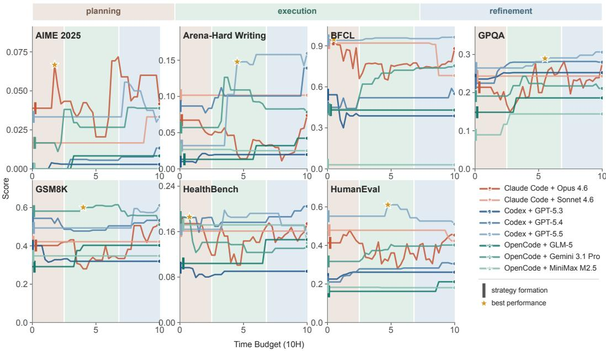  
Figure 1: Agents can execute an extended post-training pipeline, while their training strategies remain locked in. Across seven benchmarks, agents converge on a narrow set of similar training strategies and quickly reach a plateau near their best observed performance (stars). Subsequent iterations remain within the selected strategy and yield only incremental improvements.

One natural explanation is that the agent may simply lack experience, guidance, or extended reasoning throughout the post-training pipeline (Abbasi, 2026; Barke et al., 2026). We examine these hypotheses with escalating interventions. (1) Missing experience? We scaffold the agent with an experiment journal that persists observations across iterations, a skill library distilled from open-source projects and documentation, and a dedicated evaluator agent that provides concrete diagnoses and actionable suggestions. This scaffold improves execution systematically (+12.6 points on GSM8K and +40.8 on HumanEval), but the strategy remains static. (2) Missing guidance? A human reviewer revises the agent's selected strategy before training begins. The initial strategy is effectively redirected, yet once training starts, the agent falls back into local adjustment loops. (3) Insufficient reasoning? The scaffolded agent spends 2–8× more inference tokens than the autonomous baseline; the additional compute pays off on the easier tasks but yields almost no gain on the hardest one. In summary, we find that the strategy is plastic only within a short window before training begins. Inside the window, experience and guidance both shape the strategy; once it closes, the same mechanisms uniformly fail. What is missing is neither experience, guidance, nor reasoning compute, but a mechanism for spontaneously initiating strategy reevaluation during execution.

In conclusion, the prevailing picture of automated AI R&D assumes a closed loop: propose a hypothesis, run the experiment, interpret the result, revise the approach, and try again. Our study shows that this loop closes only locally. Agents produce results, adjust the experiment, and produce results again, but the strategy is never revised. Consequently, the ceiling of current AI post-training AI is set by the quality of the initial strategy, rather than by further optimization—an agent can iterate efficiently inside the wrong strategy for ten hours or more.

## 2 PRELIMINARIES

## 2.1 A TWO-LEVEL CAPABILITY FRAMEWORK

In this paper, we distinguish the training strategy—the high-level plan that fixes the training paradigm, the data regime, and the stage structure—from the training pipeline, the concrete implementation that instantiates the strategy in code, data, and training runs. This distinction induces two levels of capability that organize the analysis and interventions in Sections 3 and 4.

Execution-Level Capability: Executing an Established Pipeline. Execution-level actions keep the training strategy fixed, including constructing and cleaning data, tuning hyperparameters, shaping rewards, selecting checkpoints, and debugging the implementation. This capability determines how reliably an agent turns a selected strategy into a working pipeline.

Strategy-Level Capability: Revising a Pipeline from Evidence. Strategy-level actions change the strategy itself, including choosing the initial strategy and revising it by switching the training paradigm, adding or removing a stage, or redirecting the remaining budget. This capability determines whether the agent updates its high-level judgment as experimental evidence accumulates.

## 2.2 EXPERIMENTAL SETUP

Data Construction. We analyze 1,338 publicly released agent trajectories on PostTrain-Bench (Rank et al., 2026), covering seven benchmarks that span mathematical reasoning, code generation, instruction-following writing, function calling, and knowledge-intensive question answering; four base models from 1.7B to 4B parameters; and 20 distinct agent configurations across five scaffolds, including Claude Code and Codex CLI. Each trajectory is produced under a 10-hour compute budget on one NVIDIA H100 80GB GPU. For each trajectory, we reconstruct tool calls, shell commands, file edits, command outputs, training jobs, and evaluation results. Full data statistics and counting rules are provided in Appendix A.

Annotation Protocol. We count a verified training experiment only when an executed command launches a model parameter update; writing training scripts, constructing data, installing packages, running evaluations, and saving checkpoints do not count as independent experiments. A transition between adjacent training experiments counts as a strategy change when it alters the training paradigm, the data-source type, or the stage structure; all other transitions, such as tuning hyperparameters, reformatting data, shaping rewards within the same paradigm, selecting checkpoints, or fixing bugs, count as execution changes. Each trajectory is annotated by an LLM from the executed commands and surrounding context, and the authors review labels afterwards (Appendix A.2).

Evaluation Protocol. We report pass@1 accuracy for all benchmarks, following the standard PostTrainBench protocol. AIME 2025 requires more care: the benchmark contains only 30 problems, so a one-problem difference lies within evaluation variance. We evaluate every submitted AIME checkpoint with pass@8, sampling eight completions per problem, and interpret small score differences qualitatively, alongside trajectory-level evidence (Appendix B).

## 3 ANALYSIS: COMPETENT EXECUTORS WITH LIMITED STRATEGY

This section provides the trajectory-level evidence for the two-level capability framework. All results in this section are based on the released agent trajectories. No reruns are involved.

## 3.1 FINDING 1: AGENTS ARE COMPETENT EXECUTORS

Table 1 summarizes execution-level activity across agent trajectories. Agents routinely launch training and iterate, sustaining an average of 3.82 trainings and 13.80 evaluations per trajectory. Almost every frontier agent completes the full training pipeline from data preparation to training, evaluation. and checkpoint submission, and achieves an average performance gain over the base model on every benchmark. Beyond completing the pipeline, agents also show technically meaningful diagnosis and repair. For example, agents recovered HumanEval performance by changing the generation template and concentrating the data mixture on function completion; they also combined EOS repair, staged data construction, and progressively smaller learning rates to turn failing runs into scorable improvements. These substantive experimental works demonstrate that execution-level capability is not the dominant limitation of current frontier agents in LLM post-training.

Table 1: Execution-level activity on different benchmarks. The observed performance gain reports the scores of the base model and the submitted checkpoint, which is counted only when the trajectory explicitly evaluates the original base model and its submitted checkpoint has a valid final score.
<table><tr><td>Benchmark</td><td># Trajectory</td><td># Training</td><td># Final Checkpoint</td><td>Observed performance gain</td></tr><tr><td>AIME 2025</td><td>191</td><td>646</td><td>163</td><td>0.0% → 1.4%</td></tr><tr><td>ArenaHardWriting</td><td>193</td><td>713</td><td>153</td><td>0.0% → 2.6%</td></tr><tr><td>BFCL</td><td>191</td><td>703</td><td>154</td><td>17.5% → 42.5%</td></tr><tr><td>GPQA Main</td><td>191</td><td>777</td><td>153</td><td>8.9% → 17.5%</td></tr><tr><td>GSM8K</td><td>191</td><td>817</td><td>163</td><td>24.5% → 44.0%</td></tr><tr><td>HealthBench</td><td>191</td><td>631</td><td>155</td><td>0.0% → 11.6%</td></tr><tr><td>HumanEval</td><td>190</td><td>824</td><td>163</td><td>22.0% → 41.4%</td></tr><tr><td>Overall</td><td>1,338</td><td>5,111</td><td>1,104</td><td>10.41% → 23.0%</td></tr></table>

## 3.2 FINDING 2: AGENTS LOCK INTO DEFAULT STRATEGIES

Agents have typically locked into default training strategies at the very beginning of a run 2. First, the strategy tracks the agent rather than the task, as different agents lock into different default strategies on the same task (Table 2). Across seven benchmarks and four base models, 80.7% of the Claude Code trajectories anchor on full-parameter SFT, while 89.6% of Codex CLI trajectories anchor on PEFT. Our later experiments under a different resource

Table 2: Default strategies and strategy changes across all seven benchmarks. A trajectory is counted only when it launches at least one training with an identifiable strategy. Strategy changes count any change of training paradigm, data-source type, or stage structure (Appendix A.2).
<table><tr><td>Agent (#Traj.)</td><td>Default Strategy</td><td>Strategy Changes</td></tr><tr><td>Claude (463)</td><td>Full SFT: 163/202 (80.7%)</td><td>53/1,132 (4.7%)</td></tr><tr><td>Codex (369)</td><td>PEFT: 268/299 (89.6%)</td><td>15/943 (1.6%)</td></tr><tr><td>GLM-X (84)</td><td>PEFT: 2/3 (66.7%)</td><td>1/3 (33.3%)</td></tr><tr><td>OpenCode (394)</td><td>Full SFT: 181/273 (66.3%)</td><td>5/1,411 (0.4%)</td></tr><tr><td>Qwen3Max (28)</td><td>PEFT: 5/6 (83.3%)</td><td>0/68 (0.0%)</td></tr></table>

budget also replicate this divergence, where GLM-5.2 (Claude Code) uses full-parameter SFT in all 24 trainings, whereas GPT-5.2 (Codex CLI) uses PEFT in 28 of 35 trainings (Appendix E). Second, once training begins, the budget is spent within the selected strategy. Among 3,557 adjacent training pairs, only 74 (2.1%) from 44 trajectories ever probe an alternative. The rest conduct denser local search, such as new learning rates, data mixtures, and chat templates, rather than strategic search.

## 3.3 SUMMARY

The large-scale trajectories on PostTrainBench support a bounded conclusion. Frontier agents are competent executors of post-training: they construct training pipelines, diagnose technical failures, and make consequential within-strategy improvements. Their limitation sits one level above. The strategy is locked in within a short pre-execution window, differs systematically across agents, and then remains fixed across training, feedback, and additional budget. Lock-in does not imply that frequent switching would be optimal, as switching costs real compute and is not uniformly beneficial (Appendix A.4). More importantly, it implies that agents rarely perform the evidence-based comparison needed to determine whether switching is warranted. The initial strategy thus acts as a ceiling that further optimization does not lift. The following sections ask whether this ceiling can be raised by supplying what might be missing: information, guidance, or reasoning compute.

## 4 WHAT IS MISSING FROM AI POST-TRAINING AI

The limitation observed in the previous section admits three natural explanations. The agent may lack the experience needed to interpret accumulating evidence; it may lack the external guidance to form a good initial strategy, or it may lack the reasoning compute to deliberate beyond its default. We examine these explanations with escalating interventions.

Setup. We adopt the standard PostTrainBench setting with Qwen3-1.7B-Base (Yang et al., 2025) as the base model, on GSM8K (Cobbe et al., 2021), HumanEval (Chen et al., 2021), and AIME 2025—benchmarks of increasing difficulty. The autonomous baselines include three frontier agents: Claude Code powered by Opus 4.6 and by GLM-5.2, and Codex CLI powered by GPT-5.2. All interventions build on Claude Code with Opus 4.6. Each configuration is run three times independently under a 10-hour budget on four NVIDIA A800 GPUs; the system prompt, base model, hardware, and evaluation protocol remain fixed within each comparison.

## 4.1 Is EXPERIENCE MISSING?

Prior work attributes the bottleneck of AI post-training AI to the lack of practical experience for experimental decisions (Abbasi, 2026). We test this explanation with an experience-driven agent framework with experimental history, external knowledge, and structured diagnostic feedback.

## 4.1.1 AN EXPERIENCE-DRIVEN FRAMEWORK

The experience-driven framework comprises the following three components (Appendix C).

Experiment Journal. Long-horizon post-training generates a large amount of task-specific information. As the agent context grows, observations from earlier runs may become difficult to track. The experiment journal records plans, evaluation results, observations, and lessons accumulated across iterations, providing a persistent representation of the experiment history that the agent can consult when making decisions in subsequent experiments.

Skill Library. Effective post-training also depends on practical implementation knowledge, such as data construction, training configuration, and common failure diagnoses. These practices are often scattered across open-source projects and documentation. The skill library distills documentation, training recipes, example configurations, and open issues from widely used training frameworks, such as verl (Sheng et al., 2024) and TRL (von Werra et al., 2020), into reusable skills that the agent can consult while constructing and debugging its pipeline.

Evaluator Agent. When the main agent requests an evaluation, a separate evaluator agent inspects the current pipeline and accumulated evidence, forms expectations about the checkpoint's behavior, invokes the original evaluation script, and analyzes both the scores and the model outputs. It returns concrete diagnoses and actionable suggestions, which may include identifying an implementation failure, proposing data or hyperparameter changes, or proposing an alternative training strategy. The main agent decides whether and how to act on them. In this sense, the evaluator agent absorbs highvolume, low-signal observations and returns compact, decision-relevant diagnoses, increasing the information density of the main agent's context rather than its raw inference compute.

## 4.1.2 EXPERIENCE IMPROVES EXECUTION ACROSS THE BOARD

Table 3 reports the benchmark scores averaged over three independent runs. The experience-driven framework outperforms autonomous baselines on all three benchmarks, where the largest gain on HumanEval effectively narrows most of the gap to the official instruct model.

The trajectories further explain where these gains come from. With the experience-driven framework, the agent devotes a larger share of each run to evaluating intermediate checkpoints, debugging implementations, and consulting the provided resources (Figure 2). In one GSM8K run, the agent repeatedly evaluates intermediate checkpoints and reconstructs the training data. In a HumanEval run, the agent validates the alignment between the training and evaluation formats before committing to full training runs and constructs more targeted data. On AIME 2025, the agent consistently repairs implementation failures instead of letting unstable runs consume the budget. In general, the agent actively uses the provided resources: it consults skills 18–60 times per run, and preserves valuable experience in the experiment journal, including plans, evaluation results, and lessons learned in each experiment (detailed analysis is provided in Appendix C.2).

Figure 4: Agent adopts all execution-level suggestions, but none of the strategy-level suggestions that require revising the selected strategy.  
Table 3: Benchmark scores under the controlled setting with Qwen3-1.7B-Base as the base model. Each score is reported as mean ± one standard deviation over three independent runs
<table><tr><td>Setting</td><td>GSM8K</td><td>HumanEval</td><td>AIME 2025</td></tr><tr><td>Base model</td><td>10.84%</td><td>5.48%</td><td>0.00%</td></tr><tr><td>Official instruct model</td><td>88.70%</td><td>66.46%</td><td>33.33%</td></tr><tr><td colspan="4">Autonomous baselines</td></tr><tr><td>Opus 4.6 (Claude Code)</td><td> $6 4 . 7 0 \% \pm 9 . 6 ( + 5 3 . 8 6 )$ </td><td> $2 2 . 0 0 \% \pm 1 0 . 4 ( + 1 6 . 5 2 )$ </td><td> $3 . 3 3 \% \pm 0 . 0 ( + 3 . 3 3 )$ </td></tr><tr><td>GLM 5.2 (Claude Code)</td><td> $4 9 . 5 1 \% \pm 7 . 2 ( + 3 8 . 6 7 )$ </td><td> $4 4 . 5 1 \% \pm 9 . 8 ( + 3 9 . 0 3 )$ </td><td> $3 . 3 3 \% \pm 0 . 0 ( + 3 . 3 3 )$ </td></tr><tr><td>GPT-5.2 (Codex CLI)</td><td> $4 3 . 4 4 \% \pm 4 . 1 ( + 3 2 . 6 0 )$ </td><td> $1 3 . 4 1 \% \pm 8 . 7 ( + 7 . 9 3 )$ </td><td> $0 . 0 0 \% \pm 0 . 0 ( 0 . 0 0 )$ </td></tr><tr><td colspan="4">Experience-Driven framework</td></tr><tr><td>Opus 4.6 (Claude Code)</td><td> $7 7 . 3 0 \% \pm 3 . 8 ( + 6 6 . 4 6 )$ </td><td> $6 2 . 8 0 \% \pm 6 . 1 ( + 5 7 . 3 2 )$ </td><td> $5 . 5 6 \% \pm 1 . 5 7 ( + 5 . 5 6 )$ </td></tr><tr><td>– experiment journal</td><td> $7 4 . 5 0 \% \pm 4 . 5 ( + 6 3 . 6 6 )$ </td><td> $5 0 . 2 0 \% \pm 7 . 4 ( + 4 4 . 7 2 )$ </td><td> $4 . 4 4 \% \pm 1 . 5 7 ( + 4 . 4 4 )$ </td></tr><tr><td> $- \operatorname { s k i l l } \operatorname { l i b r a r y }$ </td><td> $7 3 . 1 0 \% \pm 5 . 2 ( + 6 2 . 2 6 )$ </td><td> $5 4 . 5 0 \% \pm 6 . 8 ( + 4 9 . 0 2 )$ </td><td> $3 . 3 3 \% \pm 0 . 0 ( + 3 . 3 3 )$ </td></tr><tr><td> $- \mathrm { e v a l u a t o r a g e n t }$ </td><td> $6 8 . 2 0 \% \pm 6 . 0 ( + 5 7 . 3 6 )$ </td><td> $4 2 . 6 0 \% \pm 8 . 2 ( + 3 7 . 1 2 )$ </td><td> $3 . 3 3 \% \pm 0 . 0 ( + 3 . 3 3 )$ </td></tr></table>

In summary, persistent experimental history, reusable training knowledge, and structured diagnostic feedback improve planning, execution, diagnosis, and implementation repair. This execution-level improvement is reflected in both downstream benchmark performance and agent trajectories.

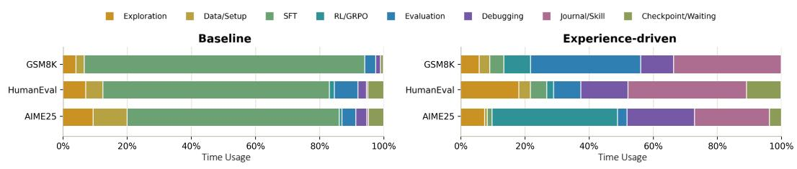  
Figure 2: Distribution of agent behavior across different activities throughout the post-training process, under the autonomous baseline and the experience-driven framework.

## 4.1.3 STRATEGY-LEVEL CAPABILITY REMAINS LIMITED

However, strategy-level revisions remain rare across agent trajectories. On HumanEval, the agent produces 14 consecutive SFT variants despite a recorded performance plateau. On AIME 2025, the agent begins with GRPO and iterates on the hyperparameters within the same strategy (Figure 3). The experiencedriven framework consistently exposes critical evidence about the current state, but interestingly, a clear gap emerges between the evidence revealed and the actions taken by the main agent. On HumanEval, the evaluator agent repeatedly suggests switching from SFT to RL

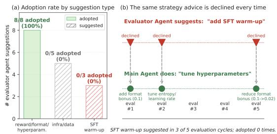

with a code-execution reward, while the journal also records that SFT has plateaued. The main agent, however, never launches any RL training, even after writing a GRPO training script. Moreover, after observing persistent formatting failures on AIME 2025, the evaluator agent proposes an SFT warm-up in almost every evaluation cycle, but the main agent never adopts it.

Figure 4 summarizes the asymmetry between suggestions from the evaluator agent and actions taken by the main agent. The main agent adopts all execution-level suggestions concerning reward shaping, hyperparameter tuning, or output formatting, but none of the strategy-level suggestions, such as adding an SFT stage or switching from SFT to RL. The same asymmetry appears in how the agent turns experimental evidence into reusable knowledge. Despite frequently consulting existing skills and having access to a dedicated skill-creation tool, the agent creates no new skills in any run, even when explicitly prompted to do so (details of skill usage in Appendix C.2).

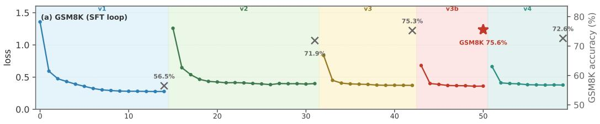

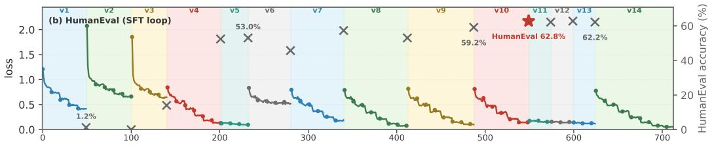

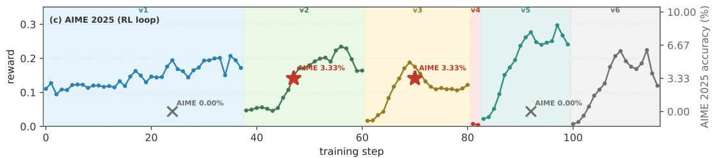  
Figure 3: Training dynamics under the experience-driven framework (best-performing run). Later experiments plateau or regress, while subsequent actions remain within the selected strategy.

In summary, the experience-driven framework explicitly and persistently clarifies the experimental evidence and reliably improves how the agent executes and repairs the current training strategy. However, the agent's responses to this evidence remain at the execution level. Negative evidence triggers further adjustments within the strategy, rather than a revision of the strategy itself, especially after the agent has invested substantial time and compute to the current strategy. Therefore, missing experience explains the quality of execution, but not the strategy lock-in.

## 4.2 Is GUIDANCE MISSING?

If the agent does not revise its strategy even when the evidence is laid out before it, as shown in the previous section, perhaps a better strategy is all it needs. We test this hypothesis by escalating the intervention from execution-level to strategy-level. Instead of adding more evidence to the agent's context, we directly revise the strategy before training begins.

## 4.2.1 A CONTROLLED HUMAN GUIDANCE

We experiment on AIME 2025, the most challenging benchmark in our setting. Before training begins, the agent proposes a training strategy, and a human reviewer either approves or requests a revision with an explicit rationale iteratively. Unlike the evaluator agent's non-binding suggestions, the review produces a binding revision of the strategy before execution starts. Restricting the intervention to the planning stage keeps the human contribution minimal and bounded. It separates the quality of the starting strategy from the agent's in-run decisions, and prevents the outcome from depending on the reviewer's ongoing involvement. After the strategy is approved, the remainder of the run is fully autonomous, executed with the same experience-driven framework in Section 4.1

## 4.2.2 A HUMAN-GUIDED STRATEGY IMPROVES THE STARTING POINT.

Human guidance effectively redirects the training strategy. For example, the agent first proposes an SFT pipeline. The reviewer argues that SFT should serve only as a formatting warm-up and that the main budget should be allocated to RL. When execution begins, the agent inspects the base model, determines that the required output format is already attainable without SFT, and independently skips the SFT altogether. This indicates that the agent can understand, implement, and even independently extend a strategy different from its initial proposal, which clearly presents the potential of strategy-level capability. Figure 5 shows that the human-guided setting improves base model

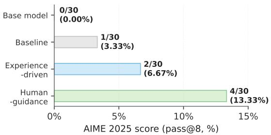  
Figure 5: AIME 2025 pass@8 accuracy of final submitted checkpoints for the best run of each setting: base model, autonomous baseline, experience-driven, and human-guided.

performance to a pass@8 score of 13.33%, outperforming both the autonomous baseline and the experience-driven framework. Nevertheless, this score difference lies within the evaluation variance of AIME 2025 (Section 2). The stronger evidence is qualitative—the visible redirection of the initial strategy, and the agent's subsequent behavior under the revised strategy.

## 4.2.3 THE STRATEGY GRADUALLY COLLAPSES AFTER TRAINING STARTS

A better strategy does not guarantee sustained improvement. The human-guided agent reaches its best intermediate result early and then iterates within the strategy without further gains (Figure 11). After reaching the early peak, the agent adjusts hyperparameters back and forth, without investigating any other potential causes. Most later trainings address a local question of how to resume from an earlier checkpoint (Appendix D.2). For instance, although the journal already records lessons from previous experiments, the agent still repeats similar explorations within the same space. This pattern may reflect a local-context bias: as the context grows, recent observations and system logs can dominate the agent's deliberation, making it difficult to focus on the broad training strategy.

In summary, a better strategy does not eliminate the need for iterative revision. Instabilities and regressions can still emerge, and responding to them is itself part of strategy-level capability. Our intervention involves only a minimal form of human guidance, yet already yields clear improvements. These gains erode at later decision points that receive no guidance, highlighting the importance of sustained guidance throughout the post-training process. Therefore, human guidance at the planning stage is insufficient. Until agents can independently revise their strategies in response to evidence, effective post-training will require sustained human-in-the-loop guidance throughout the run.

## 4.3 IS REASONING COMPUTE INSUFFICIENT?

The last explanation is that the agent may simply not deliberate enough.The experience-driven framework doubles as a computescaled condition: beyond restructuring the context, it also spends substantially more inference tokens and evaluation rounds than the autonomous baseline. If insufficient reasoning compute were the bottleneck, this additional deliberation should translate into better decisions.

More compute improves easier tasks. As shown in Figure 6, the experience-driven framework consumes roughly $2 { - } 8 \times$ more tokens

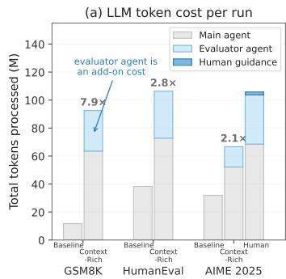

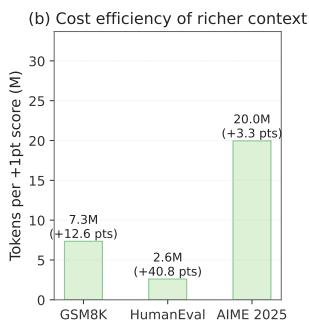  
Figure 6: (a) Token usage for the autonomous baselines and experience-driven framework; (b) Cost efficiency of the experience-driven framework across three benchmarks.

than the autonomous baseline, with the evaluator agent accounting for a substantial fraction. On

GSM8K and HumanEval, the additional evaluation rounds and diagnostic passes convert into large performance gains, yielding a favorable cost-performance trade-off.

Compute scaling hits a ceiling on harder tasks. The picture reverses on the hardest task. On AIME 2025, the framework spends 7.9× the baseline tokens, roughly 66.7M tokens for the one additional problem solved in its best run, which lies within evaluation variance. The extra compute is not idle; it is spent exactly where Finding 2 predicts: on denser local search within the locked-in strategy. Scaling context and inference compute therefore has a clear ceiling: once the task demands a strategy the agent did not start with, additional tokens buy more refinement, not better decisions. We present this finding as a practical takeaway for agent system developers: additional reasoning compute can improve execution, but its benefits quickly plateau on more challenging tasks.

## 4.4 SUMMARY

Experience improves execution across the board but leaves the strategy untouched; human guidance redirects the strategy before training and then erodes; additional reasoning compute amplifies execution on easier tasks and hits a ceiling on harder ones. Before training starts, both experience and guidance effectively shape the strategy: the agent absorbs the reviewer's rationale, revises its plan, and even extends it on its own initiative. After training starts, the same channels stop working: the evaluator's suggestions are ignored, the journal's lessons trigger no revision, and the humanreviewed strategy decays into local adjustment. Therefore, the strategy is plastic only within a short window before the first training run; once the window closes, it hardens, and no amount of experience, guidance, or compute reopens it. What is missing is not a resource but a mechanism: the ability to spontaneously reopen the strategic choice during execution.

## 5 WHAT THIS IMPLIES FOR AUTOMATED AI R&D

## 5.1 CLOSED AT THE EXECUTION LEVEL, OPEN AT THE STRATEGY LEVEL

The picture of automated AI R&D assumes a closed loop: the agent produces results, interprets them, revises its approach, and tries again. Our results qualify this picture at one specific joint. At the execution level, the loop does close: agents produce results, diagnose failures, and repair their pipelines. At the strategy level, the loop is open: agents record the diagnosis, sometimes even write the code for the alternative, and then do not take any actual step. The resulting workflows are locally iterative but globally linear: they involve rapid cycles of training, evaluation, and repair within a fixed strategy, progressing one way from the initial strategy to the final checkpoint (Figure 7).

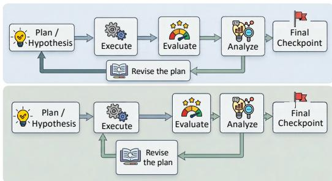  
Figure 7: (a) An effective post-training assumes a globally closed loop. (b) Agents operate in local execution loops along a largely linear trajectory.

The open joint has a concrete consequence. When revision never occurs, iteration cannot recover from a wrong initial choice, so the quality of the initial strategy, instead of the number of iterations or the amount of compute, sets the upper bound of the run. Our compute analysis makes the same point from the other direction: additional tokens buy denser refinement within the selected strategy but not a better strategy. An agent can iterate efficiently inside the wrong strategy for ten hours.

## 5.2 MISSING SPONTANEITY, NOT CAPABILITY

Our results locate the failure precisely: agents do not initiate strategy revision, not that they cannot perform it. The human-guided run makes this distinction concrete. The agent understood the reviewer's rationale, implemented an unfamiliar strategy, and independently went further than the guidance. The capability to depart from the default is present; the act of departing is not triggered.

This distinction matters because the two diagnoses point to different remedies. If strategy-level capability were absent, the remedy would be a stronger model. Since what is absent is initiation, the remedy lies elsewhere: in training signals that reward reopening a committed choice when evidence warrants, and in interaction protocols that make strategy revision an explicit decision point rather than an implicit option in a long context. Neither requires a larger model; both require changing what the agent is optimized and prompted to do at decision points.

## 6 RELATED WORK

AI for Research. AI systems increasingly automate end-to-end research workflows, from literature review and hypothesis generation to experimentation, validation, and reporting (Lu et al., 2026; Tie et al., 2026; Jiang et al., 2026). Representative systems span template-based automation (Lu et al., 2024), template-free tree search (Yamada et al., 2025), and human-guided workflows (Schmidgall et al., 2025). Later work adds hypothesis search and cross-run experience (Tang et al., 2026; Liu et al., 2026), persistent hypothesis-evidence structures (Jin et al., 2026), toolaugmented reasoning (Chai et al., 2025), and verifiable evidence chains (Meng et al., 2026). Despite this broader execution coverage, critiques identify weak scientific taste, implementation drift, memory degradation, missing tacit knowledge, and shallow convergence (Bisht et al., 2026; Trehan & Chopra, 2026). We study this execution-decision gap at the trajectory level in LLM post-training.

Automated AI R&D Automated AI R&D agents operate over datasets, code, training, evaluation protocols, and checkpoints. Existing benchmarks cover machine learning experimentation (Huang et al., 2024), Kaggle-style engineering (Chan et al., 2025), and interactive debugging and training (Qiang et al., 2026); scientific coding (Chen et al., 2025), paper replication (Starace et al., 2025), expert-level scientific tasks (Wang et al., 2026), and research engineering (Wijk et al., 2024); and general LLM post-training and agentic RL post-training (Rank et al., 2026; Chen et al., 2026d). Existing systems also focus on data synthesis, search, and preparation (Kulikov et al., 2026; Du et al., 2026b; Deng et al., 2026); configuration search, environment design, and co-evolving harnesses (Guo et al., 2026; Fang et al., 2026; Chen et al., 2026b;c); as well as broader AI-for-AI studies over models (Li et al., 2026b), research loops (Xu et al., 2026b), algorithms (Du et al., 2026a), workflows (Wan et al., 2025), heuristics (Chen et al., 2026a) and test-time scaling (Zheng et al., 2026). Rather than proposing another search framework, we ask whether agents revise the strategy that organizes these searches, and find that they rarely do.

## 7 CONCLUSION

This paper separates two capabilities that discussions of AI post-training AI tend to conflate: executing an established strategy, and revising the strategy from evidence. Across publicly released trajectories, frontier agents are competent executors of LLM post-training, but their training strategy is locked in at the very beginning of the post-training process. We conduct three escalating interventions to test whether the missing ingredient is experience, guidance, or reasoning compute. We find that: (1) experience improves execution across the board but leaves the strategy static; (2) a human-guided strategy improves the starting point, yet the run collapses back into local adjustment once training begins; and (3) additional reasoning compute pays off on easier tasks and hits a ceiling on the hardest one. Together, the interventions show that the strategy is plastic only within a short window before training starts; once the window closes, the same mechanisms uniformly fail.

In conclusion, what is missing is neither a resource nor raw capability. Our results show that agents can understand, implement, and even extend a strategy that is not their own. Therefore, what is missing from AI post-training AI is the spontaneity to revise a committed strategy when evidence warrants. The post-training loop of current agents closes at the execution level and remains open at the strategy level, so the ceiling of a run is set by the quality of its initial strategy rather than by iterations or compute. Closing this loop points to training signals and interaction protocols that make strategy revision an explicit, rewarded action, rather than to larger models.

## REFERENCES

Nemo rl: A scalable and efficient post-training library. https://github.com/ NVIDIA-NeMo/RL, 2025. GitHub repository.

Mersad Abbasi. What we learned from letting AI PostTrain AI. Thoughtful, April 2026. URL https://www.thoughtfullab.com/letting-ai-posttrain-ai.html.

Luke Bailey, Kaiyue Wen, Kefan Dong, Tatsunori Hashimoto, and Tengyu Ma. Scaling self-play withself-guidance,2026.URL https://arxiv.org/abs/2604.20209.

Shraddha Barke, Arnav Goyal, Alind Khare, Avaljot Singh, Suman Nath, and Chetan Bansal. Agentrx: Diagnosing ai agent failures from execution trajectories, 2026. URL https: //arxiv. org/abs/2602.02475.

Harshit Bisht, Vinay Kumar, Kevin Maik Jablonka, Mausam, and N. M. Anoop Krishnan. Agentic ai scientists are not built for autonomous scientific discovery, 2026. URL https : //arxiv. org/abs/2605.08956.

Jingyi Chai, Shuo Tang, Rui Ye, Yuwen Du, Xinyu Zhu, Mengcheng Zhou, Yanfeng Wang, Yuzhi Zhang, Linfeng Zhang, Siheng Chen, et al. Scimaster: Towards general-purpose scientific ai agents, part i. x-master as foundation: Can we lead on humanity's last exam? arXiv preprint arXiv:2507.05241, 2025.

Jun Shern Chan, Neil Chowdhury, Oliver Jaffe, James Aung, Dane Sherburn, Evan Mays, Giulio Starace, Kevin Liu, Leon Maksin, Tejal Patwardhan, et al. Mle-bench: Evaluating machine learning agents on machine learning engineering. In International Conference on Learning Representations, volume 2025, pp. 50466–50494, 2025.

Bin Chen, Shouliang Zhu, Beidan Liu, Yong Zhao, Tianle Pu, Huichun Li, and Zhengqiu Zhu. A2dept: Large language model-driven automated algorithm design via evolutionary program trees. arXiv preprint arXiv:2604.24043, 2026a.

Chao Chen, Chengzu Li, Zhiwei Li, Yinhong Liu, and Zhijiang Guo. From trainee to trainer: Llm-designed training environment for rl with multi-agent reasoning. arXiv preprint arXiv:2606.17682, 2026b.

Guhong Chen, Yingcheng Shi, Yongbin Li, Binhua Li, Xander Xu, Hu Wei, Shiwen Ni, Min Yang, and Jieping Ye. Evotrainer: Co-evolving llm policies and training harnesses for autonomous agentic reinforcement learning. arXiv preprint arXiv:2606.03108, 2026c.

Mark Chen, Jerry Tworek, Heewoo Jun, Qiming Yuan, Henrique Ponde De Oliveira Pinto, Jared Kaplan, Harri Edwards, Yuri Burda, Nicholas Joseph, Greg Brockman, et al. Evaluating large language models trained on code. arXiv preprint arXiv:2107.03374, 2021.

Wanyi Chen, Xiao Yang, Xu Yang, Tianming Sha, Qizheng Li, Zhuo Wang, Bowen Xian, Fang Kong, Weiqing Liu, and Jiang Bian. Agent^ 2 rl-bench: Can llm agents engineer agentic rl posttraining? arXiv preprint arXiv:2604.10547, 2026d.

Ziru Chen, Shijie Chen, Yuting Ning, Qianheng Zhang, Boshi Wang, Botao Yu, Yifei Li, Zeyi Liao, Chen Wei, Zitong Lu, et al. Scienceagentbench: Toward rigorous assessment of language agents for data-driven scientific discovery. In International Conference on Learning Representations, volume 2025, pp. 96934–96990, 2025.

Karl Cobbe, Vineet Kosaraju, Mohammad Bavarian, Mark Chen, Heewoo Jun, Lukasz Kaiser, Matthias Plappert, Jerry Tworek, Jacob Hilton, Reiichiro Nakano, Christopher Hesse, and John Schulman. Training verifiers to solve math word problems. arXiv preprint arXiv:2110.14168, 2021.

Chao Deng, Shaolei Zhang, Ju Fan, and Xiaoyong Du. Dataevolver: Automatic data preparation for large language models through multi-level self-evolving. arXiv preprint arXiv:2606.07001, 2026.

Shangheng Du, Xiangchao Yan, Jinxin Shi, Zongsheng Cao, Shiyang Feng, Zichen Liang, Boyuan Sun, Tianshuo Peng, Yifan Zhou, Xin Li, et al. Mlevolve: A self-evolving framework for automated machine learning algorithm discovery. arXiv preprint arXiv:2606.06473, 2026a.

Yaxin Du, Xiyuan Yang, Zhifan Zhou, Wanxu Liu, Zixing Lei, Zimeng Chen, Fenyi Liu, Haotian Wu, Yuzhu Cai, Zexi Liu, et al. Datamaster: Data-centric autonomous ai research. arXiv preprint arXiv:2605.10906, 2026b.

Zhiyuan Fan, Wenwei Jin, Feng Zhang, Bin Li, Yihong Dong, Yao Hu, and Jiawei Li. Evolving-rl: End-to-end optimization of experience-driven self-evolving capability within agents, 2026. URL https://arxiv.org/abs/2605.10663.

Haoyang Fang, Wei Zhu, Boran Han, Alex Zhang, Zhenyu Pan, Shuo Yang, Shuai Zhang, Jiading Gai, Peng Tang, Cuixiong Hu, et al. Llmzero: Discovering adaptive training strategies for rl post-training via llm agents. arXiv preprint arXiv:2606.18388, 2026.

Gabriel R Gonzalez, Johannes Habel, and Gary K Hunter. Ai agents, agentic ai, and the future of sales. Journal of Business Research, 202:115799, 2026.

Taicheng Guo, Nitesh V Chawla, Olaf Wiest, and Xiangliang Zhang. Autollmresearch: Training research agents for automating llm experiment configuration-learning from cheap, optimizing expensive. arXiv preprint arXiv:2605.11518, 2026.

Jian Hu, Xibin Wu, Zilin Zhu, Xianyu, Weixun Wang, Dehao Zhang, and Yu Cao. Openrlhf: An easy-to-use, scalable and high-performance rlhf framework. arXiv preprint arXiv:2405.11143, 2024.

Qian Huang, Jian Vora, Percy Liang, and Jure Leskovec. Mlagentbench: evaluating language agents on machine learning experimentation. In Proceedings of the 41st International Conference on Machine Learning, ICML'24. JMLR.org, 2024.

Jiachen Jiang, Tianyu Ding, and Zhihui Zhu. Deltaevolve: Accelerating scientific discovery through momentum-driven evolution. arXiv preprint arXiv:2602.02919, 2026.

Jiajie Jin, Yuyang Hu, Kai Qiu, Qi Dai, Chong Luo, Guanting Dong, Xiaoxi Li, Tong Zhao, Xiaolong Ma, Gongrui Zhang, et al. Toward generalist autonomous research via hypothesis-tree refinement. arXiv preprint arXiv:2606.11926, 2026.

Andrej Karpathy. autoresearch: Ai agents running research on single-gpu nanochat training automatically. https://github.com/karpathy/autoresearch,2026.

Naveen Krishnan. Ai agents: Evolution, architecture, and real-world applications. arXiv preprint arXiv:2503.12687, 2025.

Ilia Kulikov, Chenxi Whitehouse, Tianhao Wu, Yixin Nie, Swarnadeep Saha, Eryk Helenowski, Weizhe Yuan, Olga Golovneva, Jack Lanchantin, Yoram Bachrach, et al. Autodata: An agentic data scientist to create high quality synthetic data. arXiv preprint arXiv:2606.25996, 2026.

Shuyue Stella Li, Rui Xin, Teng Xiao, Yike Wang, Rulin Shao, Zoey Hao, Melanie Sclar, Sewoong Oh, Faeze Brahman, Pang Wei Koh, and Yulia Tsvetkov. Evolm: Self-evolving language models through co-evolved discriminative rubrics, 2026a. URL https: //arxiv.org/abs/2605. 03871.

Yu Li, Chenyang Shao, Xinyang Liu, Ruotong Zhao, Peijie Liu, Hongyuan Su, Zhibin Chen, Qinglong Yang, Anjie Xu, Yi Fang, et al. Autosota: An end-to-end automated research system for state-of-the-art ai model discovery. arXiv preprint arXiv:2604.05550, 2026b.

Jiaqi Liu, Shi Qiu, Mairui Li, Bingzhou Li, Haonian Ji, Siwei Han, Xinyu Ye, Peng Xia, Zihan Dong, Congyu Zhang, et al. Autoresearchclaw: Self-reinforcing autonomous research with human-ai collaboration. arXiv preprint arXiv:2605.20025, 2026.

Chris Lu, Cong Lu, Robert Tjarko Lange, Jakob Foerster, Jeff Clune, and David Ha. The ai scientist: Towards fully automated open-ended scientific discovery. arXiv preprint arXiv:2408.06292, 2024.

Chris Lu, Cong Lu, Robert Tjarko Lange, Yutaro Yamada, Shengran Hu, Jakob Foerster, David Ha, and Jeff Clune. Towards end-to-end automation of ai research. Nature, 651(8107):914–919, 2026.

Zeyuan Ma, Hongshu Guo, Yue-Jiao Gong, Jun Zhang, and Kay Chen Tan. Toward automated algorithm design: A survey and practical guide to meta-black-box-optimization. IEEE Transactions on Evolutionary Computation, 2025.

Rui Meng, Bhavana Dalvi Mishra, Jiefeng Chen, Chun-Liang Li, Palash Goyal, Mihir Parmar, Yiwen Song, Yale Song, Rajarishi Sinha, Parthasarathy Ranganathan, et al. Scientistone: Towards human-level autonomous research via chain-of-evidence. arXiv preprint arXiv:2605.26340, 2026.

OpenAI. Gpt-5.6 system card, 2026. URL https://deploymentsafety.openai.com/ gpt-5-6/introduction

Tejal Patwardhan, Rachel Dias, Elizabeth Proehl, Grace Kim, Michele Wang, Olivia Watkins, Simón Posada Fishman, Marwan Aljubeh, Phoebe Thacker, Laurance Fauconnet, Natalie S. Kim, Patrick Chao, Samuel Miserendino, Gildas Chabot, David Li, Michael Sharman, Alexandra Barr, Amelia Glaese, and Jerry Tworek. Gdpval: Evaluating ai model performance on real-world economically valuable tasks, 2025.URL https://arxiv.org/abs/2510.04374.

Rushi Qiang, Yuchen Zhuang, Yinghao Li, Dingu Sagar VK, Rongzhi Zhang, Changhao Li, Ian Wong, Sherry Yang, Percy Liang, Chao Zhang, et al. Mle-dojo: Interactive environments for empowering llm agents in machine learning engineering. Advances in Neural Information Processing Systems, 38, 2026.

Ben Rank, Hardik Bhatnagar, Ameya Prabhu, Shira Eisenberg, Karina Nguyen, Matthias Bethge, and Maksym Andriushchenko. Posttrainbench: Can llm agents automate llm post-training? arXiv preprint arXiv:2603.08640, 2026.

Bowen Ren, Heyan Huang, Yinghao Li, and Yang Gao. Metaevo: A meta-optimization framework for experience-driven agent evolution. arXiv preprint arXiv:2606.07603, 2026.

Samuel Schmidgall, Yusheng Su, Ze Wang, Ximeng Sun, Jialian Wu, Xiaodong Yu, Jiang Liu, Michael Moor, Zicheng Liu, and Emad Barsoum. Agent laboratory: Using llm agents as research assistants. Findings of the Association for Computational Linguistics: EMNLP 2025, pp. 5977– 6043, 2025.

Idan Shenfeld, Mehul Damani, Jonas Hübotter, and Pulkit Agrawal. Self-distillation enables continuallearning,2026.URL https://arxiv.org/abs/2601.19897

Guangming Sheng, Chi Zhang, Zilingfeng Ye, Xibin Wu, Wang Zhang, Ru Zhang, Yanghua Peng, Haibin Lin, and Chuan Wu. Hybridflow: A flexible and efficient rlhf framework. arXiv preprint arXiv: 2409.19256, 2024.

Noah Shinn, Federico Cassano, Ashwin Gopinath, Karthik Narasimhan, and Shunyu Yao. Reflexion: Language agents with verbal reinforcement learning. Advances in neural information processing systems, 36:8634–8652, 2023.

Giulio Starace, Oliver Jaffe, Dane Sherburn, James Aung, Chan Jun Shern, Leon Maksin, Rachel Dias, Evan Mays, Benjamin Kinsella, Wyatt Thompson, Johannes Heidecke, Amelia Glaese, and Tejal Patwardhan. Paperbench: evaluating ai's ability to replicate ai research. In Proceedings of the 42nd International Conference on Machine Learning, ICML’25. JMLR.org, 2025.

Yiyou Sun, Xinyang Han, Weichen Zhang, Yuanbo Pang, Tianyu Wang, Yuhan Cao, Yixiao Huang, Chris Duroiu, Haoyun Zhang, Jeffrey Lin, et al. Agents' last exam. arXiv preprint arXiv:2606.05405, 2026.

Jiabin Tang, Lianghao Xia, Zhonghang Li, and Chao Huang. Ai-researcher: Autonomous scientific innovation. Advances in Neural Information Processing Systems, 38:9481–9520, 2026.

Guiyao Tie, Jiawen Shi, Dingjie Song, Yixiao Huang, Ziji Sheng, Xueyang Zhou, Daizong Liu, Pan Zhou, Yongchao Chen, Ran Xu, et al. Autoresearch ai: Towards ai-powered research automation for scientific discovery. arXiv preprint arXiv:2605.23204, 2026.

Dhruv Trehan and Paras Chopra. Why llms aren't scientists yet: Lessons from four autonomous research attempts. arXiv preprint arXiv:2601.03315, 2026.

Leandro von Werra, Younes Belkada, Lewis Tunstall, Edward Beeching, Tristan Thrush, Nathan Lambert, Shengyi Huang, Kashif Rasul, and Quentin Gallouédec. TRL: Transformers ReinforcementLearning,2020.URLhttps://github.com/huggingface/trl.

Chunhui Wan, Xunan Dai, Zhuo Wang, Minglei Li, Yanpeng Wang, Yinan Mao, Yu Lan, and Zhiwen Xiao. Loongflow: Directed evolutionary search via a cognitive plan-execute-summarize paradigm. arXiv preprint arXiv:2512.24077, 2025.

Guanzhi Wang, Yuqi Xie, Yunfan Jiang, Ajay Mandlekar, Chaowei Xiao, Yuke Zhu, Linxi Fan, and Anima Anandkumar. Voyager: An open-ended embodied agent with large language models. arXiv preprint arXiv:2305.16291, 2023.

Miles Wang, Robi Lin, Kat Hu, Joy Jiao, Neil Chowdhury, Ethan Chang, and Tejal Patwardhan. Frontierscience: Evaluating ai's ability to perform expert-level scientific tasks. arXiv preprint arXiv:2601.21165, 2026.

Hjalmar Wijk, Tao Lin, Joel Becker, Sami Jawhar, Neev Parikh, Thomas Broadley, Lawrence Chan, Michael Chen, Josh Clymer, Jai Dhyani, et al. Re-bench: Evaluating frontier ai r&d capabilities of language model agents against human experts. arXiv preprint arXiv:2411.15114, 2024.

Jinhang Xu, Qiyuan Zhu, Yujun Wu, Zirui Wang, Dongxu Zhang, Marcia Tian, Yiling Duan, Siyuan Li, Jingxuan Wei, Sirui Han, Yike Guo, Odin Zhang, Conghui He, and Cheng Tan. Nanoresearch: Co-evolving skills, memory, and policy for personalized research automation. arXiv preprint arXiv:2605.10813, 2026a.

Weixian Xu, Tiantian Mi, Yixiu Liu, Yang Nan, Zhimeng Zhou, Lyumanshan Ye, Lin Zhang, Yu Qiao, and Pengfei Liu. Asi-evolve: Ai accelerates ai. arXiv preprint arXiv:2603.29640, 2026b.

Yutaro Yamada, Robert Tjarko Lange, Cong Lu, Shengran Hu, Chris Lu, Jakob Foerster, Jeff Clune, and David Ha. The ai scientist-v2: Workshop-level automated scientific discovery via agentic tree search. arXiv preprint arXiv:2504.08066, 2025.

An Yang, Anfeng Li, Baosong Yang, Beichen Zhang, Binyuan Hui, Bo Zheng, Bowen Yu, Chang Gao, Chengen Huang, Chenxu Lv, Chujie Zheng, Dayiheng Liu, Fan Zhou, Fei Huang, Feng Hu, Hao Ge, Haoran Wei, Huan Lin, Jialong Tang, Jian Yang, Jianhong Tu, Jianwei Zhang, Jianxin Yang, Jiaxi Yang, Jing Zhou, Jingren Zhou, Junyang Lin, Kai Dang, Keqin Bao, Kexin Yang, Le Yu, Lianghao Deng, Mei Li, Mingfeng Xue, Mingze Li, Pei Zhang, Peng Wang, Qin Zhu, Rui Men, Ruize Gao, Shixuan Liu, Shuang Luo, Tianhao Li, Tianyi Tang, Wenbiao Yin, Xingzhang Ren, Xinyu Wang, Xinyu Zhang, Xuancheng Ren, Yang Fan, Yang Su, Yichang Zhang, Yinger Zhang, Yu Wan, Yuqiong Liu, Zekun Wang, Zeyu Cui, Zhenru Zhang, Zhipeng Zhou, and Zihan Qiu. Qwen3 technical report, 2025.URL https://arxiv.org/abs/2505.09388.

Hangfan Zhang, Shao Zhang, Kangcong Li, Chen Zhang, Yang Chen, Yiqun Zhang, Lei Bai, and Shuyue Hu. Self-harness: Harnesses that improve themselves. arXiv preprint arXiv:2606.09498, 2026a.

Jenny Zhang, Shengran Hu, Cong Lu, Robert Lange, and Jeff Clune. Darwin godel machine: Openended evolution of self-improving agents, 2026b. URL https: //arxiv.org/abs/2505. 22954.

Kai Zhang, Xiangchao Chen, Bo Liu, Tianci Xue, Zeyi Liao, Zhihan Liu, Xiyao Wang, Yuting Ning, Zhaorun Chen, Xiaohan Fu, Jian Xie, Yuxuan Sun, Boyu Gou, Qi Qi, Zihang Meng, Jianwei Yang, Ning Zhang, Xian Li, Ashish Shah, Dat Huynh, Hengduo Li, Zi Yang, Sara Cao, Lawrence Jang, Shuyan Zhou, Jiacheng Zhu, Huan Sun, Jason Weston, Yu Su, and Yifan Wu. Agent learning via early experience. arXiv preprint arXiv:2510.08558, 2026c.

Qifan Zhang, Dongyang Ma, Tianqing Fang, Jia Li, Jing Tang, Nuo Chen, Haitao Mi, and Yan Wang. Training llm agents for spontaneous, reward-free self-evolution via world knowledge exploration, 2026d.URLhttps://arxiv.org/abs/2604.18131.

Andrew Zhao, Daniel Huang, Quentin Xu, Matthieu Lin, Yong-Jin Liu, and Gao Huang. Expel: Llm agents are experiential learners. In Proceedings of the AAAI Conference on Artificial Intelligence, volume 38, pp. 19632–19642, 2024.

Tong Zheng, Haolin Liu, Chengsong Huang, Huiwen Bao, Sheng Zhang, Rui Liu, Runpeng Dai, Ruibo Chen, Chenxi Liu, Tianyi Xiong, et al. Llms improving llms: Agentic discovery for testtime scaling. arXiv preprint arXiv:2605.08083, 2026.

Chenyu Zhou, Huacan Chai, Wenteng Chen, Zihan Guo, Rong Shan, Yuanyi Song, Tianyi Xu, Yingxuan Yang, Aofan Yu, Weiming Zhang, et al. Externalization in llm agents: A unified review of memory, skills, protocols and harness engineering. arXiv preprint arXiv:2604.08224, 2026.

Zilin Zhu, Chengxing Xie, Xin Lv, and slime Contributors. slime: An llm post-training framework for rl scaling. https://github.com/THUDM/slime, 2025. GitHub repository. Corresponding author: Xin Lv.

## A TRAJECTORY ANALYSIS DETAILS

## A.1 CORPUS AND SCOPE

We analyze 1,338 post-training trajectories released with PostTrainBench (Rank et al., 2026), covering seven benchmarks (Table 4), four base models (Gemma-3-4B-PT, Qwen3-1.7B-Base, Qwen3- 4B-Base, and SmolLM3-3B-Base), five agent interfaces (Claude Code, Codex CLI, GLM-X, Open-Code, and Qwen3-Max), and 20 agent-model configurations. Each trajectory is produced under a 10-hour budget on one NVIDIA H100 80GB GPU. Of the 1,338 trajectories, 900 launch at least one model update; together they contain 5,111 verified training experiments.

This corpus is observational. Agent models, interfaces, prompts, and benchmarks are not independently randomized, so comparisons describe recurring behavior and do not identify causal effects of a particular agent.

Table 4: Benchmarks included in the agent post-training trajectory corpus.
<table><tr><td>Benchmark</td><td>Target capability</td></tr><tr><td>AIME 2025</td><td>Competition-level mathematical reasoning</td></tr><tr><td>ArenaHardWriting</td><td>Instruction-following writing</td></tr><tr><td>BFCL GPQA Main</td><td>Function calling Graduate-level scientific reasoning</td></tr><tr><td>GSM8K</td><td>Grade-school mathematical reasoning</td></tr><tr><td>HealthBench</td><td>Health-related question answering</td></tr><tr><td>HumanEval</td><td>Code generation</td></tr></table>

## A.2 STRATEGY ANNOTATION

Training experiments. An experiment is counted only when an executed command starts a model parameter update. Writing a script, preparing data, installing packages, evaluating a checkpoint, or merging an adapter does not count.

Training Strategy. For each verified experiment, we record $s = ( k , d , g )$ : the training strategy k, data-source type d, and stage structure g. Full-parameter SFT and parameter-efficient SFT (PEFT) are distinct strategies from the first executed training onward. Table 5 lists the strategy labels. A transition is strategic when it changes a recognized component of s; learning-rate tuning, reward shaping within the same objective, formatting, checkpoint selection, and implementation repair are execution-level changes.

An LLM first labels each experiment from executed commands and nearby context. The authors review all labels; objective and update-mechanism labels are also checked against the executed trainer, loss, and retained evidence strings.

Data source. Training data is labeled curated, self-generated, or mixed from file provenance and the commands that create it. On-policy rollouts used by RL are part of that objective and are not counted again as a data-source change. A stage change requires an intentional new training stage initialized from an in-run checkpoint; ordinary continuation with a new learning rate is not a new stage. Data provenance is identifiable for 1,801 of 4,344 strategy-labeled experiments. Missing labels are never imputed. Consequently, data-source changes are lower-bound observations, and all rates are conditional on the stated recognized pairs.

Table 5: Training-strategy labels and identification criteria.
<table><tr><td>Strategy</td><td>Executed evidence</td></tr><tr><td>Supervised Fine-Tuning</td><td>Likelihood training that updates all model parameters.</td></tr><tr><td>Parameter-Efficient Fine- Tuning</td><td>Likelihood training through LoRA, QLoRA, or another adapter.</td></tr><tr><td>Reinforcement Learning</td><td>Sampled model outputs optimized with a reward signal, including PPO and GRPO.</td></tr><tr><td>Preference optimization</td><td>Preferred/rejected response training, including DPO-style objectives.</td></tr><tr><td>Distillation</td><td>Training on supervision or outputs produced by a teacher model.</td></tr></table>

Strategy Change. The main analysis uses a high-coverage, conservative state that distinguishes training-objective family, data source, and stage structure. It recognizes 3,557 adjacent pairs and finds 74 changes (2.1%): 35 objective-family changes, 38 data-source changes, and one stage change. No pair changes more than one of these coarse dimensions (Table 6, Table 7).

Table 6: Cross-scaffold strategy comparison across benchmarks and base models. Final metrics are means over trained trajectories with a valid final score.
<table><tr><td>Scaffold</td><td>Benchmark</td><td>Final metric (n)</td><td>Initial Strategy</td><td>Strategy changes</td></tr><tr><td rowspan="8">Claude Code</td><td>AIME 2025</td><td>0.047 (31)</td><td>Full SFT: 19/25 (76.0%)</td><td>14/124 (11.3%)</td></tr><tr><td>ArenaHardWriting</td><td>0.142 (32)</td><td>Full SFT: 27/29 (93.1%)</td><td>19/164 (11.6%)</td></tr><tr><td>BFCL</td><td>0.877 (42)</td><td>Full SFT: 33/41 (80.5%)</td><td>0/157 (0.0%)</td></tr><tr><td>GPQA Main</td><td>0.283 (34)</td><td>Full SFT: 16/25 (64.0%)</td><td>4/163 (2.5%)</td></tr><tr><td>GSM8K</td><td>0.544 (35)</td><td>Full SFT: 23/26 (88.5%)</td><td>8/177 (4.5%)</td></tr><tr><td>HealthBench</td><td>0.281 (36)</td><td>Full SFT: 22/28 (78.6%)</td><td>1/169 (0.6%)</td></tr><tr><td>HumanEval</td><td>0.487 (37)</td><td>Full SFT: 23/28 (82.1%)</td><td>7/178 (3.9%)</td></tr><tr><td>Overall</td><td></td><td>Full SFT: 163/202 (80.7%)</td><td>53/1132 (4.7%)</td></tr><tr><td rowspan="8">Codex CLI</td><td>AIME 2025</td><td>0.009 (43)</td><td>PEFT: 39/40 (97.5%)</td><td>3/120 (2.5%)</td></tr><tr><td>ArenaHardWriting</td><td>0.109 (39)</td><td></td><td>11/159 (6.9%)</td></tr><tr><td>BFCL</td><td>0.573 (44)</td><td>PEFT: 29/39 (74.4%) PEFT: 42/43 (97.7%)</td><td>0/67 (0.0%)</td></tr><tr><td>GPQA Main</td><td>0.277 (46)</td><td></td><td></td></tr><tr><td>GSM8K</td><td>0.443 (47)</td><td>PEFT: 41/45 (91.1%); PEFT: 36/43 (83.7%)</td><td>0/152 (0.0%)</td></tr><tr><td>HealthBench</td><td>0.231</td><td></td><td>0/198 (0.0%)</td></tr><tr><td>HumanEval</td><td>(42)</td><td>PEFT: 36/42 (85.7%)</td><td>0/106 (0.0%)</td></tr><tr><td></td><td>0.332 (47)</td><td>PEFT: 45/47 (95.7%)</td><td>1/141 (0.7%)</td></tr><tr><td></td><td>Overall</td><td></td><td>PEFT: 268/299 (89.6%)</td><td>15/943 (1.6%)</td></tr></table>

Table 7: Decomposition of strategy changes among the 3,557 recognized adjacent experiment pairs.
<table><tr><td>Changed dimension</td><td>Pairs</td><td>Rate</td></tr><tr><td>Training strategy</td><td>35</td><td>0.98%</td></tr><tr><td>Data-source type</td><td>38</td><td>1.07%</td></tr><tr><td>Stage structure</td><td>1</td><td>0.03%</td></tr><tr><td>Any dimension (strategy change)</td><td>74</td><td>2.08%</td></tr></table>

Initial strategies across agents. The initial strategy is recognized for 783 of the 900 trajectories that launch training. Claude Code starts with Full SFT in 163/202 recognized cases (80.7%), whereas Codex CLI starts with PEFT in 268/299 (89.6%). The same direction holds in all 28 matched benchmark–base-model cells: Claude Code has a higher Full-SFT share and Codex CLI a higher PEFT share in every cell. This pattern is consistent with strong agent- or scaffold-specific defaults, but the observational design cannot separate the effects of the model, prompt, interface, and scaffold.

Trajectory Phases. For Figure 2, one interaction turn consists of an assistant message and its tool calls and results. Each turn is assigned one of eight labels: Exploration, Data/Setup, SFT, RL/GRPO, Evaluation, Debugging, Journal/Skill, or Checkpoint/Waiting. An LLM assigns the initial label and the authors review it. Time between consecutive turns is attributed to the phase that launched the operation.

## A.3 METRICS DEFINITION

For trajectory i, let $t = 1 , \ldots , m _ { i }$ index the verified training experiments. We denote the strategy state of experiment t by $s _ { i , t } = ( k _ { i , t } , d _ { i , t } , g _ { i , t } )$ , where $k _ { i , t } ~ \in ~ \mathcal { K }$ is the training strategy, $d _ { i , t }$ the data-source type, and $g _ { i , t }$ the stage structure (Appendix $\mathsf { A } . 2 )$ . The experiment optimizes

$$
J _ { i , t } ( \theta ) = \mathbb { E } _ { z \sim D _ { i , t } } \left[ \ell _ { k _ { i , t } } ( \theta ; z , \lambda _ { i , t } ) \right] ,
$$

where $D _ { i , t }$ is the training distribution, $\lambda _ { i , t }$ denotes the remaining hyperparameters, and $\ell _ { k _ { i , t } }$ specifies the recognized training strategy. We define execution-level actions as those performed while keeping $s _ { i , t }$ fixed, including data construction, hyperparameter tuning, reward shaping, checkpoint selection, and implementation debugging. We define a strategy revision as an executed change in any component of the strategy state, such that $s _ { i , t } ~ \neq ~ s _ { i , t - 1 }$ . This distinction allows us to separate substantial experimental activity from actual changes in the strategy that organizes subsequent experiments.

Convergence of the Initial strategy For a group of agent trajectories G with at least one identifiable training strategy, we measure the convergence of initial strategies by

$$
C _ { G } = \operatorname* { m a x } _ { k \in \mathcal { K } } \frac { 1 } { | G | } \sum _ { i \in G } \mathbf { 1 } [ k _ { i , 1 } = k ] ,\tag{1}
$$

where $C _ { G } = 1$ means that all trajectories begin with the same training strategy.

Persistence of the Strategy Let $\mathcal { P } _ { G }$ denote the set of adjacent pairs of training experiments whose strategy states are recognized. We measure the rates at which consecutive experiments persist or change the strategy by

$$
R _ { \mathrm { c h a n g e } } ( G ) = \frac { \sum _ { ( i , t ) \in \mathcal { P } _ { G } } \mathbf { 1 } [ s _ { i , t } \neq s _ { i , t - 1 } ] } { | \mathcal { P } _ { G } | } , \qquad R _ { \mathrm { p e r s i s t } } ( G ) = \frac { \sum _ { ( i , t ) \in \mathcal { P } _ { G } } \mathbf { 1 } [ s _ { i , t } = s _ { i , t - 1 } ] } { | \mathcal { P } _ { G } | } ,\tag{2}
$$

where $R _ { \mathrm { p e r s i s t } } ( G ) = 1 - R _ { \mathrm { c h a n g e } } ( G )$ . These metrics measure how often consecutive training experiments change any strategy dimension, and how often they remain within the same strategy.

## A.4 AUDIT OF STRATEGY-CHANGING TRAJECTORIES

Low transition rates do not imply that persistence is always wrong or that frequent switching is desirable. We audit the 16 trajectories with an objective-family change because those changes admit the clearest stage-linked comparisons. Fourteen begin with SFT, 11 switch at least twice, and 15 of the 35 transitions return to SFT. The first switch occurs at median normalized experiment progress 0.40; all switches have median progress 0.67.

Table 8 shows both positive and negative cases. The scores retain each trajectory's original comparator and sample size, so they do not support a pooled treatment effect. They establish only that an alternative objective can sometimes reveal a gain and can sometimes regress; the relevant capability is evidence-based testing and selection, not switching for its own sake.

## B CONTROLLED INTERVENTION PROTOCOL

Setup. The controlled experiments use Qwen3-1.7B-Base on GSM8K, HumanEval, and AIME 2025. Autonomous baselines use Claude Code with Opus 4.6 or GLM-5.2 and Codex CLI with GPT-5.2. All interventions use Claude Code with Opus 4.6. Each configuration has three independent

Table 8: Trace-level case studies among the 16 strategy-changing trajectories. The reported values come from the trajectory logs and retain each log's original comparator and sample size.
<table><tr><td>Case</td><td>Setting</td><td>Change</td><td>Observation</td><td>Interpretation</td></tr><tr><td>3fd3ea0b</td><td>ArenaHardWriting, SmolLM3-3B, Codex</td><td>SFT → DPO</td><td>Held-out 256-pair proxy: 66.0% → 66.8%</td><td>Positive; +0.8 pp</td></tr><tr><td>c92715d6</td><td>ArenaHardWriting, Gemma-3-4B, Claude</td><td>SFT → DPO</td><td>Benchmark win rate: ~ 8% → 16.7%</td><td>Positive; approxi- mately 2×</td></tr><tr><td>50c64287</td><td>ArenaHardWriting, Qwen3- 4B, Codex</td><td>SFT → DPO</td><td>Same 8-prompt local proxy: 7.14% → 7.69%</td><td>Positive; small sam- ple</td></tr><tr><td>860ceacd</td><td>AIME 2025, Qwen3-1.7B, Claude</td><td>SFT → GRPO</td><td>30-problem evaluation: 0% → 3.3% (1/30)</td><td>Positive; high vari- ance</td></tr><tr><td>8226f786</td><td>ArenaHardWriting, SmolLM3-3B, Codex</td><td>SFT → DPO</td><td>External proxy: 0.539 → 0.478; in- ternal DPO reward accuracy: 0.713 → 0.727</td><td>Counterexample; metric mismatch</td></tr></table>

10-hour runs on four NVIDIA A800 GPUs. Within a comparison, the base model, benchmark, hardware budget, system prompt, and evaluator are fixed. The human-guidance condition retains the full experience-driven framework and adds plan review before training.

Evaluation. GSM8K and HumanEval use pass@1 accuracy. AIME 2025 contains only 30 problems, so one solved problem changes pass@1 by 3.33 percentage points. We therefore evaluate submitted checkpoints with pass@8, using eight completions per problem and the same evaluator and decoding configuration across conditions. Small AIME differences are interpreted together with trajectories rather than as reliable performance improvements.

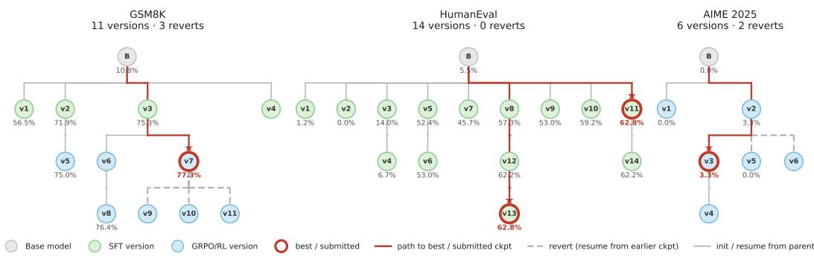  
Figure 8: Checkpoint lineage trees under the experience-driven framework on GSM8K, HumanEval, and AIME 2025. Node color denotes the training objective (SFT or GRPO/RL); red outlines mark the best or submitted checkpoints; dashed edges denote reverts to earlier checkpoints.

## C EXPERIENCE-DRIVEN FRAMEWORK

The framework supplies three resources while leaving all training decisions to the main agent (Figure 9):

Table 9: Components of the experience-driven framework.
<table><tr><td>Component</td><td>Role</td></tr><tr><td>Experiment journal</td><td>Append-only plans, observations, evaluation results, and lessons across iterations.</td></tr><tr><td>Skill library</td><td>Reusable implementation knowledge distilled from post-training docu- mentation, recipes, and issue threads.</td></tr><tr><td>Evaluator agent</td><td>Independent checkpoint evaluation followed by compact diagnoses and suggested next actions.</td></tr></table>

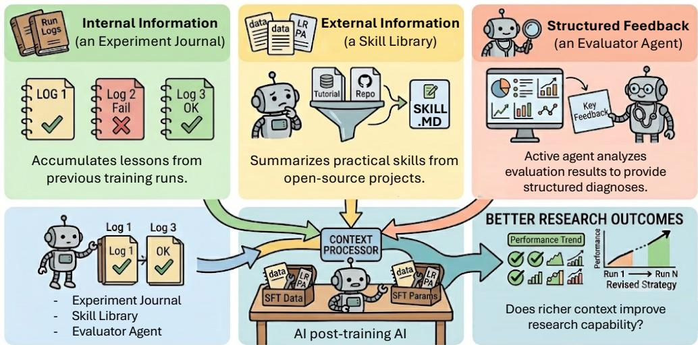  
Figure 9: Conceptual overview of the experience-driven agent framework.

## C.1 EXPERIMENT JOURNAL

The experiment journal is a structured, append-only log with typed entries: plan, observation, lesson, eval\_result, and eval\_analysis. Representative entries show that the journal captures pipeline-relevant conclusions even when they do not produce a strategy revision. For example, on HumanEval, the agent records “SFT plateau confirmed at 102–103 [of 164] for continuation." The evaluator writes “ABANDON FURTHER SFT: v5 proves diminishing returns ... further SFT iterations will show similar marginal gains." The run nevertheless continues with additional SFT variants. On AIME 2025, the journal records “entropy coefficient is extremely sensitive ... the only stable setting is 0.003” after three consecutive aborted retries of the same local adjustment.

## C.2 SKILL LIBRARY

The skill library is constructed by distilling raw documents from multiple open-source projects into a compact set of skills. First, it ingests 908 documents (approximately 937K words) from open-source framework documentation, training recipes, and issue threads, including projects based on verl (Sheng et al., 2024), TRL (von Werra et al., 2020), OpenRLHF (Hu et al., 2024), NeMo-RL (nem, 2025), slime (Zhu et al., 2025), and others. Second, it distills this material into a 60-page knowledge wiki (approximately 20K words) containing project summaries, algorithm and framework entities, concepts, and synthesized experience guides. Third, it compresses the wiki into SKILL . md files (approximately 1.2K words per file). After filtering, the seed skills are posttraining-known-pitfalls, diagnose-silent-rl-failures, data-parquet-schema, monitor-rl-training, create-skill, etc. They cover crash and silent-failure diagnosis, generic RL triage, data formatting, runtime health, and the persistence of new experience.

On average, the agent consults skills 18 times on GSM8K, 20 times on HumanEval, and 60 times on AIME 2025 per run. It consults them twice in the human-guidance run. Despite this read activity and the presence of the create-ski11 meta-skill, the agent creates no new skills in any run. This asymmetry between consuming existing knowledge and producing reusable knowledge complements the strategy-level suggestions analyzed in Section 4.1.3.

## C.3 EVALUATOR AGENT

We extract all evaluator suggestions from one representative experience-driven trajectory per benchmark. A strategy-level suggestion must explicitly add, remove, or replace a training strategy. Table 10 separates such suggestions from execution advice.

Table 10: Evaluator suggestions and subsequent strategy revisions. The GSM8K SFT-to-GRPO transition was already in the initial plan and is therefore not an evidence-triggered revision.
<table><tr><td>Benchmark</td><td>Eval cycles</td><td>All suggestions</td><td>Strategy suggestions</td><td>Unplanned revisions</td></tr><tr><td>GSM8K</td><td>4</td><td>25</td><td>1</td><td>0</td></tr><tr><td>HumanEval</td><td>9</td><td>49</td><td>8</td><td>0</td></tr><tr><td>AIME 2025</td><td>5</td><td>16</td><td>3</td><td>0</td></tr></table>

On HumanEval, seven of nine evaluation cycles recommend RL with a code-execution reward. The main agent writes GRPO scripts but launches 14 SFT variants and no RL training. On AIME 2025, the evaluator proposes an SFT warm-up three times, but the agent continues GRPO-only training (Figure 10). The remaining suggestions concern reward details, hyperparameters, data, formatting, or checkpoint management and are execution-level under our definition.

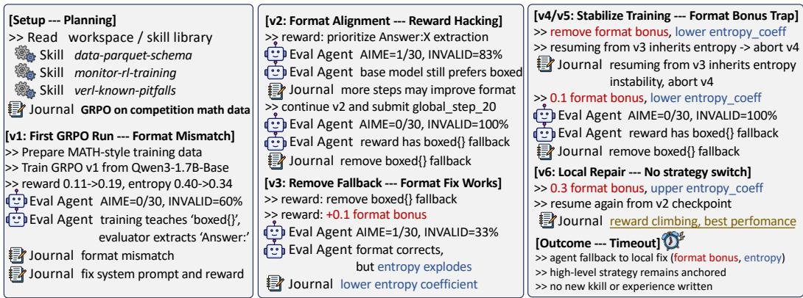  
Figure 10: An annotated experience-driven trajectory on AIME 2025. The agent consults skills, maintains the experiment journal, and receives evaluator diagnoses throughout six training versions. All revisions remain at the execution level.

## C.4 OTHER RELATED WORK

Experience-driven systems improve performance through memory, reusable skills, feedback, and externalized knowledge. Foundational approaches include verbal reflections (Shinn et al., 2023), natural-language lessons (Zhao et al., 2024), executable skill libraries (Wang et al., 2023), runtime experience (Zhou et al., 2026), and lifelong learning (Ma et al., 2025). Recent work extends these ideas to co-evolving skills, memory, and policy (Xu et al., 2026a); self-improving harnesses (Zhang et al., 2026a); meta-learning from experience (Ren et al., 2026; Fan et al., 2026); and learning from early exploratory trajectories (Zhang et al., 2026c). Related strategies also use self-generated feedback, co-evolving rubrics, self-play, self-distillation, and open-ended code evolution (Li et al., 2026a; Bailey et al., 2026; Zhang et al., 2026d; Shenfeld et al., 2026; Zhang et al., 2026b). We use these mechanisms to scaffold agents in LLM post-training, testing whether execution-level support induces strategy revision.

## D HUMAN GUIDANCE DETAILS

## D.1 PLAN REVIEW

The human-guidance experiment in Section 4.2.1 uses multiple plan-review iterations before training begins. In each iteration, the agent submits a complete research plan and the human returns a fixedformat JSON decision.

Iteration 1 (decision: revise). The initial plan proposes an SFT pipeline (approximately 10K-30K examples over 2–3 epochs. The human responds:

“SFT should be a minimal formatting warm-up only, because overtraining SFT can damage the base model's reasoning; stop once the model can reliably produce the required answer format."

Iteration 2 (decision: keep). The revised plan reduces SFT to a formatting-only warm-up (at most 1K-3K examples for one epoch, with an explicit reasoning-degradation check). It allocates the main budget to GRPO with large rollout groups and long generations. The human accepts the plan with one clarification:

“Ensure that the evaluation format is aligned to the benchmark prompt."

After the second iteration, the planning stage ends and the agent completes the run autonomously. The agent inspects the base model, determines that it can achieve format compliance without SFT, and skips the warm-up. It therefore allocates the full training budget to GRPO.

## D.2 LATER EXECUTION

The representative human-guided run reaches its best checkpoint in the first few training versions. Later versions mostly score zero and do not surpass the early peak (Figure 11). The agent neither restores the best checkpoint nor treats the regression as a trigger to reconsider the training strategy.

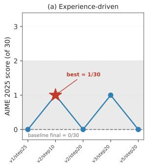

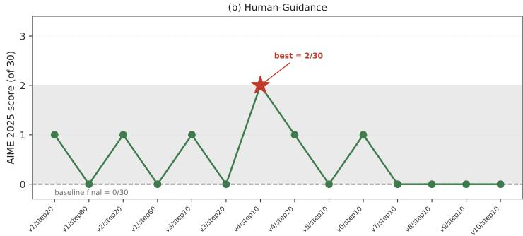  
Figure 11: Chronological in-run diagnostic evaluations for representative experience-driven and human-guided AIME 2025 trajectories. Later checkpoints do not surpass the best observed intermediate result.

Later experiments mainly adjust the entropy coefficient and learning rate when resuming from earlier checkpoints. The journal records instability and failed retries, but this evidence does not change the objective or lead to reliable preservation of the best state. The intervention therefore tests initial plan revision only; it does not test ongoing human guidance.

## E CROSS-AGENT ANALYSIS

## E.1 GPT-5.2 (CODEX CLI)

We analyze GPT-5.2 (Codex CLI) trajectories on Qwen3-1.7B and Qwen3-4B.

Overall pattern. The agent follows a compact engineering loop: inspect the evaluation harness and chat template, align the output contract, construct SFT data, train a LoRA/QLoRA adapter or a full-SFT continuation, merge or export a candidate checkpoint, and run small- or medium-sample evaluations. Across both model scales, 64 training commands complete successfully. Of these runs, 56 (87.5%) use PEFT and 8 (12.5%) use full SFT. PEFT accounts for 28 of 35 successful 1.7B runs (80.0%) and 28 of 29 successful 4B runs (96.6%). Codex therefore searches mainly within an adapter-based strategy family through data, template, hyperparameter, and checkpoint variants.

The trajectories contain 104 valid evaluations: 39 on GSM8K, 33 on AIME 2025, and 32 on HumanEval. Feedback is therefore frequent, but it is mostly converted into local engineering changes.

Outcomes differ by task and scale. The 1.7B runs improve GSM8K and moderately improve HumanEval. The 4B runs achieve a strong HumanEval result but reduce GSM8K performance relative to the base model. Neither scale yields a reliable AIME improvement.

Table 11: Trajectory-level summary of GPT-5.2 (Codex CLI) behavior at both model scales. Scores are in-run diagnostic pass@1 accuracies, not the main submitted-checkpoint pass @8 results. “Final" denotes the checkpoint exported by the agent.
<table><tr><td>Model</td><td>Benchmark</td><td>Evals</td><td>Diagnostic result</td><td>Trajectory diagnosis</td></tr><tr><td>Qwen3-1.7B</td><td>GSM8K</td><td>20</td><td>Best/final 0.587 @ 150</td><td>LoRA and full-SFT continuations both ben- efit from prompt-contract, EOS, and answer- only repairs.</td></tr><tr><td>Qwen3-1.7B</td><td>HumanEval</td><td>14</td><td>Best 0.273 @ 150  / 0.262 @ 164</td><td>MBPP, CodeSearchNet, and template re- pairs help, but 20–50-sample evaluations overstate the full-benchmark quality.</td></tr><tr><td>Qwen3-1.7B</td><td>AIME 2025</td><td>22</td><td>Best 1/30; final re- peatedly 0/30</td><td>Many math-data and LoRA/SFT variants produce no stable gain; 1/30 is within evalu- ation variance.</td></tr><tr><td>Qwen3-4B</td><td>GSM8K</td><td>19</td><td>Base 0.507 @ 150; fi- nal 0.467 @ 150</td><td>After 13 successful trainings and 12 merges, the selected model remains worse than the base model.</td></tr><tr><td>Qwen3-4B</td><td>HumanEval</td><td>18</td><td>Base 0.420 @ 150; fi- nal 0.687 @ 150</td><td>MBPP-only data, a no-&lt;think&gt; template, checkpoint selection, and sampling config- uration recover from several zero-scoring early runs.</td></tr><tr><td>Qwen3-4B</td><td>AIME 2025</td><td>11</td><td>Best 1/30; final 0/30</td><td>Seven successful QLoRA runs fail to im- prove over the noisy base result; interme- diate outputs show tokenizer and generation corruption.</td></tr></table>

Time allocation. Detailed wall-clock annotation is available for the six 1.7B trajectories. Their combined 28.40 hours comprise 17.56 hours of training (61.8%), 3.67 hours of evaluation (12.9%), 1.03 hours of data processing (3.6%), 2.75 hours of inspection and debugging (9.7%), 0.74 hours of merge or export (2.6%), and 2.66 hours of idle or uncategorized gaps (9.4%). AIME v1 is particularly training-dominated, spending 87.6% of wall time in training without a reliable gain. GSM8K v2 spends nearly as much time evaluating as training and uses this feedback for more effective checkpoint selection.

Interpretation. GPT-5.2 (Codex CLI) is effective at execution-level diagnosis. It inspects evaluation scripts, identifies output-protocol mismatches, repairs EOS and template problems, and repeatedly evaluates candidates. On 4B GSM8K and both AIME settings, however, negative evidence leads to nearby data, template, hyperparameter, and checkpoint variants rather than a different training strategy. We therefore characterize this agent as a high-feedback, local-action agent within the scope of these trajectories.

## E.2 GLM-5.2 (CLAUDE CODE)

Overall pattern. GLM-5.2 follows a more data- and compute-intensive route. Across 32 training launches, 24 complete successfully, and every successful run uses full SFT. It uses no LoRA, QLoRA, or adapter merge. The trajectories contain 51 valid evaluations: 28 on GSM8K, 11 on AIME 2025, and 12 on HumanEval. The typical loop inspects the benchmark contract, builds a large task-specific SFT set, trains full weights, diagnoses stopping or generation failures, optionally generates rejection-filtered data, and exports a selected checkpoint.

Scale-dependent outcomes. The 1.7B trajectories contain 11 successful full-SFT runs and 17 valid evaluations. GSM8K and HumanEval improve substantially, but AIME remains at 0/30 after a second round that combines rejection-filtered generations with SFT data. The 4B trajectories contain 13 successful full-SFT runs and 34 valid evaluations, and they improve all three benchmarks.

Table 12: Trajectory-level summary of GLM-5.2 (Claude Code) behavior at both model scales. Scores are in-run diagnostic pass@1 accuracies.
<table><tr><td>Model</td><td>Benchmark</td><td>Evals</td><td>Diagnostic result</td><td>Trajectory diagnosis</td></tr><tr><td>Qwen3-1.7B</td><td>GSM8K</td><td>4</td><td>Base 0.200 @ 50; fi- nal 0.493 @ 150</td><td>Full SFT learns the answer contract; data cleaning and EOS repair improve the route despite repeated OOM failures.</td></tr><tr><td>Qwen3-1.7B</td><td>HumanEval</td><td>7</td><td>Base 0.116 @ 164; fi- nal 0.433 @164</td><td>Function-completion data and completion- only loss produce a large gain; a better run2 result is evaluated but not exported.</td></tr><tr><td>Qwen3-1.7B</td><td>AIME 2025</td><td>6</td><td>Base 0/5; final 0/30</td><td>Two full-SFT rounds, EOS repair, and rejection-filtered training complete success- fully but yield no solved problem.</td></tr><tr><td>Qwen3-4B</td><td>GSM8K</td><td>24</td><td>Best 0.680 @ 200; fi- nal 0.654 @ 700</td><td>Three rejection-sampling rounds and four SFT stages improve the model; intermediate-checkpoint selection is consis- tently important.</td></tr><tr><td>Qwen3-4B</td><td>HumanEval</td><td>5</td><td>Base 0.300 @ 10; fi- nal 0.533 @150</td><td>Three SFT stages add code data and progres- sively lower the learning rate, improving the 150-sample result from 0.400 to 0.533.</td></tr><tr><td>Qwen3-4B</td><td>AIME 2025</td><td>5</td><td>Base 0/6; final 7/30</td><td>Correcting an unintended 2048-token gener- ation cap raises both trained runs to 7/30; run1 is retained as the final model.</td></tr></table>

GSM8K forms the most complete research loop. Three rejection-sampling rounds feed successive SFT stages, and repeated evaluations show that intermediate checkpoints outperform the final training steps. HumanEval improves through staged data expansion and lower-learning-rate continuation. On AIME, the decisive intervention is correcting generation\_config.json. An unintended 2048-token cap initially limits the two trained runs to 1/30 and 2/30, whereas allowing 16,000 tokens raises both to 7/30.

Interpretation. GLM-5.2 makes larger pipeline changes than Codex, including rebuilding data, introducing rejection-filtered generations, continuing from selected checkpoints, and changing the training schedule. Under the criterion of Section 2, introducing rejection-filtered, self-generated data is a strategy change in the data-source dimension—the most common form of non-strategy revision in the corpus—while the training strategy itself never changes. Its outcomes also expose two boundaries: pipeline performance depends on model scale, and evaluation configuration can obscure the effect of training. These trajectories therefore show data-regime revision without any change of training strategy.