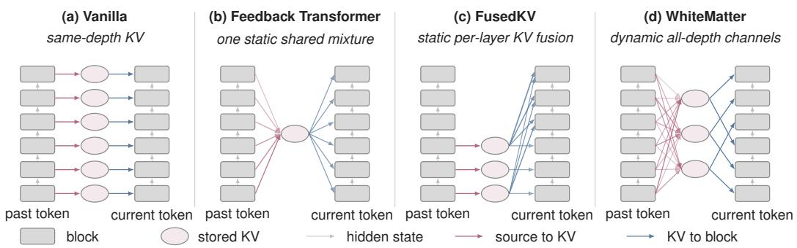
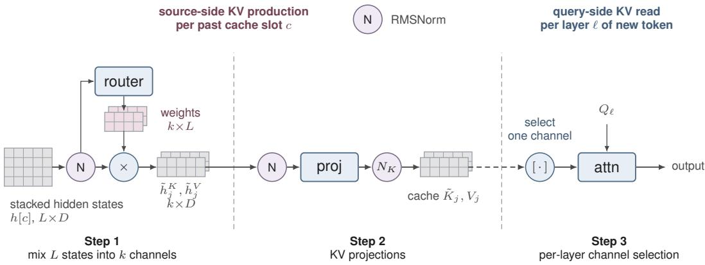
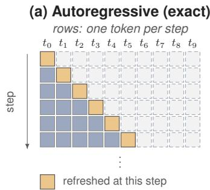
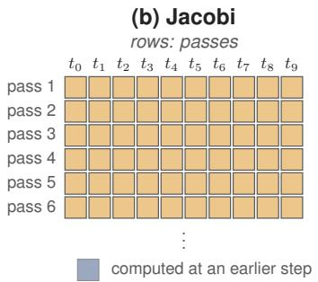
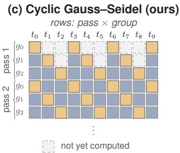
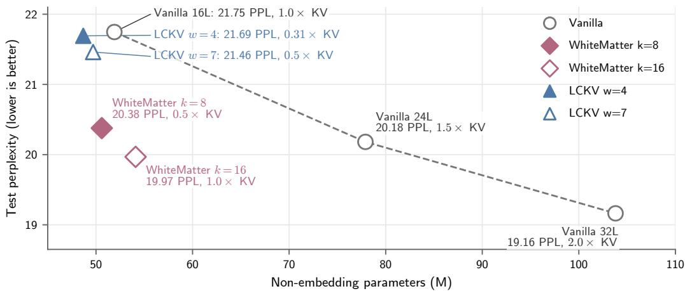
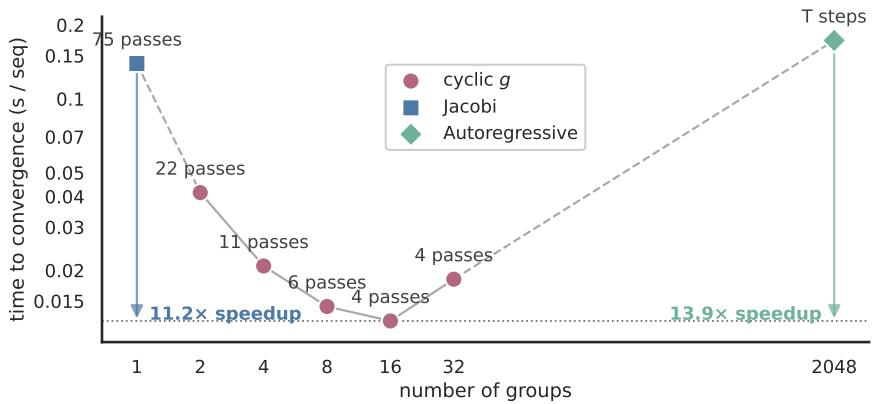
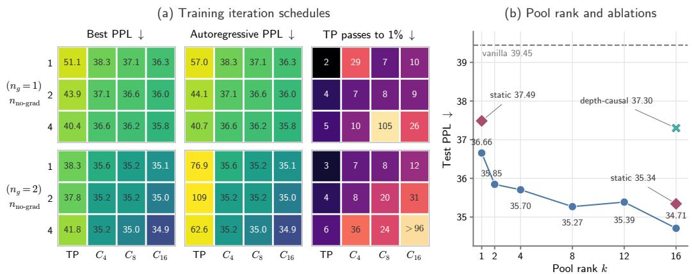
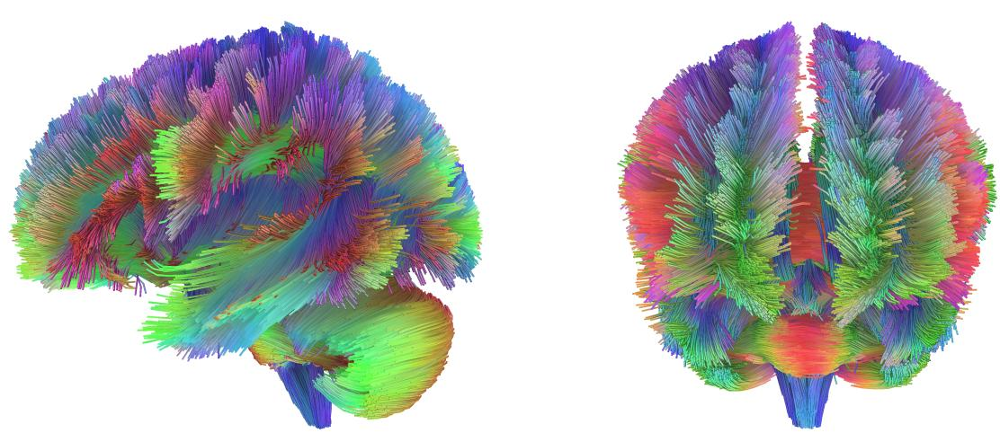
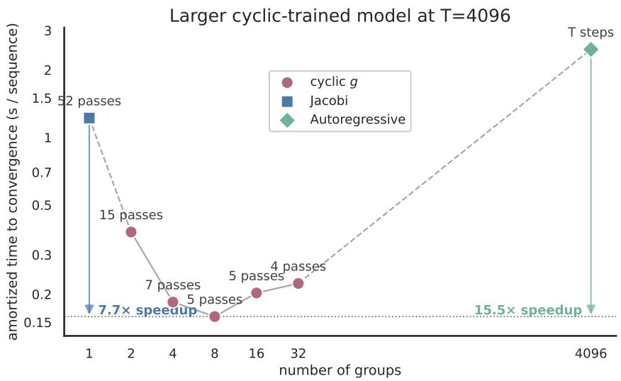

# WHITEMATTER: ALL-TO-ALL CROSS-LAYER CONNEC-TIONS VIA KV MIXING

Wenbo Zhang Xiang Ren University of Southern California {wenboz,xiangren}@usc.edu

## ABSTRACT

In a Transformer, each layer attends to past tokens only through KV produced at its own depth, despite the presence of deeper representations during autoregressive decoding. Feedback architectures allow shallow consumer layers to attend to KV produced by deeper past-token representations, but give all consumer layers the same fixed connection patterns to source layers. We propose WhiteMatter, which connects every attention layer to the representations from all layers of each past token, with connection weights that can vary across consumer layers and adapt to the source token. For each token, a router implements these connections by mixing its L layer states into k KV channels that are cached for subsequent tokens; each consumer layer attends to one of the channels. The number of channels k controls the KV-cache size. Setting k < L reduces the cache’s memory footprint. In our pretraining experiments, WhiteMatter outperforms a vanilla Transformer with 50% more layers and retains most of this gain with a 50% KV-cache compression.

## 1 INTRODUCTION

During decoding of an autoregressive Transformer (Vaswani et al., 2017), the model produces a stack of hidden states for a token before continuing to the next token. Each hidden state is generated at a corresponding layer and may contain unique information. However, when processing the next token, each layer can only attend to the KV produced from the hidden state at the same depth. Consequently, the model is unable to utilize all information it has already produced. In particular, the inaccessibility of past tokens’ deeper states has been argued to limit computational depth and state tracking (Mozer et al., 2026).

Two lines of work relax different parts of this restriction. Feedback architectures create a deep-toshallow path across tokens. The Feedback Transformer (Fan et al., 2021) gives every consumer layer the same static connections to all layers’ states at each past token. LCKV (Wu & Tu, 2024) instead uses the top-layer hidden state as KV source for all layers and introduces Jacobi iteration that makes training models with feedback connections tractable at scale. These architectures use the same source-layer connections for every consumer layer and input. Different consumer layers therefore cannot select different sources. A separate line provides feedforward cross-layer connections from earlier source layers to later consumer layers. DenseFormer (Pagliardini et al., 2024), MUDDFormer (Xiao et al., 2025), and related methods (Zhu et al., 2025a; Kimi Team, 2026) give different layers different connections to earlier-layer states within the current token. FusedKV (Lin et al., 2026) instead gives upper consumer layers static, layer-specific connections to KV produced by bottom and middle source layers of past tokens. These methods provide consumer-specific connectivity, and some are content-dependent. Their connections remain feedforward: a shallow current-token layer still cannot access deeper representations of past tokens.

The brain combines local computation with long-range communication. Gray matter contains neuronal cell bodies, while white matter contains nerve fibers that connect distant regions (Appendix A). These fibers form dense, often bidirectional connections between cortical areas (Markov et al., 2014). Each cortical area has a distinct pattern of connections, and activity along these pathways is dynamically modulated.

This organization motivates four architectural properties: direct connections between distant layers, deep-to-shallow feedback connections, consumer-specific connectivity, and dynamic modulation of connections. We propose WhiteMatter (Figure 1), which realizes all these properties through k shared KV channels. At each token position, a router mixes the hidden states of all L source layers into these channels. Each consumer layer selects one channel, so different consumers can receive different connections to source depths. Because the router reads the hidden states, the connection weights adapt to the source token.

  
Figure 1: KV production and consumption across layers. Gray boxes denote decoder blocks, and gray arrows carry hidden states through depth. Pink arrows connect source blocks to KV, and blue arrows connect KV to consumer blocks. Where multiple arrows converge, their source representations are combined. Only WhiteMatter’s source-to-KV weights depend on token content. (a) Vanilla: each block reads KV produced at the same depth. (b) Feedback Transformer: every block has the same static connections to all source depths. LCKV has a similar feedback path but uses only the top-layer hidden state. (c) FusedKV (Lin et al., 2026): lower blocks store KV, and each upper block reads a static, block-specific fusion of bottom- and middle-layer caches. (d) WhiteMatter: a router forms k token-dependent channels from all source depths, and a fixed assignment maps each consumer block to one channel (§3.1).

Deep-to-shallow feedback is straightforward during autoregressive decoding, where past-token states are already final. During parallel training and prefill, however, each token’s KV is built from its own completed hidden states, while those states depend in turn on earlier tokens’ KV; a naive left-to-right resolution of this circular dependency would run sequentially in the sequence length. We resolve it by iteration with a cyclic Gauss–Seidel schedule that keeps the computation token-parallel.

We pretrained all models from scratch on 8B tokens of FineWeb-Edu with the same data, token budget, and optimizer settings. At 16 layers and a full KV cache (k=16), WhiteMatter reaches 19.968 held-out perplexity, which is 8.2% lower than the perplexity of a vanilla model (21.747) of the same depth and also slightly lower than that of a 24-layer vanilla model (20.181). Halving the cache to k=8 gives 20.377 perplexity, which is 5.0% below an LCKV baseline of the same cache size. Both configurations outperform all other 16-layer models on LAMBADA and WikiText. In a controlled model trained with exact autoregressive execution, cyclic Gauss–Seidel with g=16 comes within 1% of autoregressive perplexity in 4 passes and makes converged prefill 13.9× faster than exact autoregressive evaluation and 11.2× faster than Jacobi iteration. For the 16-layer experiments, cyclic training remains around 1.5× more expensive than vanilla.

We summarize our contributions as follows: (1) WhiteMatter adds per-layer content-dependent connections to past representations from all source depths, implemented by producing KV from dynamic mixtures of all layers’ states. (2) Sharing KV channels among consumer layers reduces the KV-cache size when $k < L$ . (3) We apply a cyclic iteration schedule that improves training and prefill convergence speed and systematically explore the choice of iteration parameters. (4) Empirically, full-cache WhiteMatter lowers perplexity by 8.2% over the same-depth vanilla baseline and outperforms a 24-layer model, while the half-cache configuration retains most of the gain with a 6.3% perplexity reduction.

## 2 RELATED WORK

Deep-to-shallow feedback connections. Fan et al. (2021) replaces each layer’s KV with a softmaxmixed pool over the L layer states at each past token, shared across every consumer layer. Wu &

Tu (2024) connects every consumer layer only to top-layer KV and contributes an iterative training procedure that makes such feedback architectures tractable at LLM scale. Cai et al. (2026) propagates a single fixed deep source across tokens by injecting a cached middle-layer state into an earlier layer’s residual stream. These three methods use either one connection pattern shared across consumers or a fixed connection from a single deep source. Recurrent Transformer (Oncescu et al., 2026) instead assigns each consumer its own layer’s output as KV. None allows connections spanning all source layers to vary across consumer layers and adapt to each past token.

Feedforward cross-layer connections. Within the residual stream, DenseFormer and LAuReL-PA replace the input to each layer with a mixture of earlier layers’ outputs (Pagliardini et al., 2024; Menghani et al., 2025). MUDDFormer makes the mixing weights content-dependent and computes separate aggregations for the Q, K, V, and residual streams (Xiao et al., 2025). Hyper-Connections and mHC learn connections among multiple parallel residual streams (Zhu et al., 2025a; Xie et al., 2025). DeepCrossAttention and Attention Residuals use input-dependent attention over earlier-layer outputs (Heddes et al., 2025; Kimi Team, 2026), while Delta Attention Residuals attend over sublayer updates rather than cumulative states (Luo et al., 2026).

Related methods form connections through the key and value pathway. Value-residual methods add the first layer’s value to later layers with per-layer coefficients or per-token gates (Zhou et al., 2024; Gunasekaran et al., 2026). Other methods share KV across layers using grouped patterns such as CLA, MLKV, and the YOCO cross-decoder (Brandon et al., 2024; Zuhri et al., 2024; Sun et al., 2024); these are instances of the routing framework of Wu et al. (2025). FusedKV gives each upper layer a static mixture of KV from bottom and middle layers. Its Lite variant directly reuses middle-layer keys and bottom-layer values (Lin et al., 2026). Filippova et al. (2026) train with random cross-layer attention. These methods can reduce the KV cache size by sharing KV across layers, but the KV can only be produced by hidden states at the same layer or lower layers. They therefore do not expose deeper past-token representations to shallow consumer layers.

Latent reasoning via repeated computation. Coconut (Hao et al., 2025) fine-tunes a language model to feed top-layer hidden states back as continuous latent inputs. The PonderLM family brings related repeated computation to pretraining by recycling input embeddings or inserting latent positions, with some variants using adaptive halting (Zeng et al., 2026; Song et al., 2026; Zeng et al., 2025; Li et al., 2026). The inserted-position variants append latent inputs after selected observed tokens by feeding back those tokens’ top-layer hidden states. Deep-to-shallow feedback therefore occurs only for tokens followed by a latent thought token. Another line reapplies a weight-tied layer stack for several recurrent steps per token (Dehghani et al., 2019; Geiping et al., 2025; Zhu et al., 2025b). Unrolled, these models remain feedforward across depth, and attention reads same-depth states. Staircase attention (Ju et al., 2022) also recurs in time and generalizes the feedback memory of Fan et al. (2021). These approaches increase per-token computation with the recurrence count. WhiteMatter instead exposes all past-token states to every layer, uses no inserted positions, and has a decoding cost similar to that of a vanilla model.

## 3 METHOD

We modify a Transformer decoder with L layers and hidden width D. We write T for sequence length, i for a token position, ℓ for a layer index, and j for a channel index. WhiteMatter retains the standard decoder blocks but replaces the L per-layer KV projections with a cross-layer KVpool. At each past token, a data-dependent router mixes the hidden states of all L layers into $k \leq L$ shared channels. A set of k shared projection pairs $\{ W _ { j } ^ { K } , W _ { j } ^ { V } \} _ { j = 0 } ^ { k - 1 }$ then converts these channels into keys and values. The overall KV cache is therefore $k / L$ of the size of a standard L-layer cache.

Each layer reads one channel using the fixed selection described in §3.1. The key and value channels use separate signed mixtures, with weights $\alpha ^ { K } [ i ]$ and $\alpha ^ { V } [ i ] \left( \ S 3 . \dot { 1 } \right)$ . Our evaluated configurations learn $\dot { \alpha } ^ { K }$ and $\overset { \mathbf { \omega } } { \alpha } ^ { V }$ and use a fixed channel selection.

## 3.1 CROSS-LAYER KV POOL

Step 1: mixing L states into k channels. Let $h _ { \ell } [ i ] \in \mathbb { R } ^ { D }$ be the hidden state entering layer ℓ at token i. At each position i, the pool combines the L source states into k channels using dynamic

  
Figure 2: The cross-layer KV pool for one token position i. Dashed dividers separate the three steps of §3.1. In Step 1 a data-dependent router mixes the L per-layer states into k shared channels. In Step 2 the resulting channels undergo KV projection; K normalization and RoPE are then applied to the keys before cache storage. In Step 3 each query-side layer reads one channel; the dashed arrow marks the cache boundary, as the stored channels are read while processing a later token. The key and value branches are processed independently.

mixing weights, computed independently for the key and value branches. We describe the key branch;   
the value branch is identical with its own parameters.

Each source state is first RMS-normalized, giving $\hat { h } _ { \ell } ^ { K } [ i ]$ . This pre-mix norm puts the L layers on a common scale and keeps their magnitudes from growing as they recur through the feedback loop.

The mixing weights $\alpha ^ { K } [ i ] \in \mathbb { R } ^ { k \times L }$ are produced by a linear router that reads the normed states. To reduce the router’s size, it may read only every pth source layer, counting down from layer $L - 1$ This gives $L ^ { \prime } = \lceil L / p \rceil$ router inputs while still producing mixing weights for all L source layers. Stacking the selected states into $\bar { \xi } ^ { K } [ i ] \in \mathbb { R } ^ { L ^ { \prime } D }$

$$
\alpha ^ { K } [ i ] = \mathrm { r e s h a p e } \big ( W ^ { \alpha K } \xi ^ { K } [ i ] + b ^ { \alpha K } \big ) , \qquad W ^ { \alpha K } \in \mathbb { R } ^ { k L \times L ^ { \prime } D } , ~ b ^ { \alpha K } \in \mathbb { R } ^ { k L } ,
$$

where the kL-dimensional output is reshaped to $k \times L$ . Since $\alpha ^ { K } [ i ]$ depends on $\xi ^ { K } [ i ]$ , the mixture is chosen anew at every position. Each channel is then the weighted sum

$$
\tilde { h } _ { j } ^ { K } [ i ] = \sum _ { \ell = 0 } ^ { L - 1 } \alpha ^ { K } [ i ] [ j , \ell ] \hat { h } _ { \ell } ^ { K } [ i ] .
$$

The weights are signed and can therefore express differences among layer representations. The value branch uses the same construction with its own norm, router $W ^ { \alpha V } , b ^ { \dot { \alpha } V }$ , and weights $\alpha ^ { V } [ i ]$ applied to $\hat { h } _ { \ell } ^ { V } [ i ]$

Step 2: KV projections. A second RMSNorm places the mixed channels at a common scale before they are projected into keys and values:

$$
{ \cal K } _ { j } [ i ] = W _ { j } ^ { K } \mathrm { R M S N o r m } _ { j } ^ { K } ( \tilde { h } _ { j } ^ { K } [ i ] ) , \qquad V _ { j } [ i ] = W _ { j } ^ { V } \mathrm { R M S N o r m } _ { j } ^ { V } ( \tilde { h } _ { j } ^ { V } [ i ] ) ,
$$

where $W _ { j } ^ { K } , W _ { j } ^ { V } \in \mathbb R ^ { H _ { \mathrm { k v } } d \times D } , H _ { \mathrm { k v } }$ is the number of KV heads, and d is the head dimension. Perchannel key normalization and RoPE are applied before storage. Let pos(i) denote the rotary position assigned to token position i:

$$
\tilde { K } _ { j } [ i ] = \mathrm { R o P E } \big ( \mathrm { Q K N o r m } _ { j } ^ { K } ( K _ { j } [ i ] ) ; \mathrm { p o s } ( i ) \big ) .
$$

The cache stores the rotated, K-normalized key channel $\tilde { K } _ { j } [ i ]$ and the raw value channel $V _ { j } [ i ]$ for $j = 0 , \ldots , k - 1$ , totaling $k \cdot T \cdot H _ { \mathrm { k } \mathrm { v } }$ · d elements for each of the key and value caches.

Step 3: per-layer channel selection. When k=1, every layer reads the sole stored channel; when $k { = } L$ , layer ℓ directly reads channel ℓ. For $1 < k < L$ , we use a fixed cyclic selection, under which layer ℓ reads channel ℓ mod k:

$$
\hat { K } _ { \ell } [ i ] = \tilde { K } _ { \ell \mathrm { m o d } k } [ i ] , \qquad \hat { V } _ { \ell } [ i ] = V _ { \ell \mathrm { m o d } k } [ i ] ,
$$

and attends with standard causal $\mathrm { S D P A } ( Q _ { \ell } , \hat { K } _ { \ell } , \hat { V } _ { \ell } )$ . In the intermediate case, each channel is read by either $\lfloor L / k \rfloor \mathrm { o r } \lceil L / k \rceil$ layers. A dense read over all channels would permit learned soft assignments, but would require each layer to stream all k key and value channels from HBM. The fixed one-channel selection preserves one KV read per layer.

Router initialization. We initialize the key and value routers with the same pattern. We set $W ^ { \alpha K } = W ^ { \alpha V } = 0$ , so the mixing weights initially depend only on the static biases and become content-dependent as the router weights are learned. We use three source-router bias initialization strategies. For $k { = } 1$ , the top initialization makes the single channel use the top-layer hidden state. For $1 < k < L$ , the cyclic initialization assigns source layer ℓ to channel ℓ mod $k ,$ distributing interleaved source layers across channels. For $k = L$ , the shifted-identity initialization assigns channel $j$ to source layer min $( j + 1 , L - 1 )$ , so each channel initially uses the next source layer, while the final channel remains assigned to the top layer.

## 3.2 AUTOREGRESSIVE DECODING

At each autoregressive decoding step, the KV channels for all preceding tokens are already available in the cache. To process token $N .$ , we run the L decoder layers using the existing cache and collect the hidden state entering each layer. After the final layer, we apply the cross-layer KV pool to these L states and append the resulting channels to the cache. These channels are first read when processing token $N { + 1 }$ . Thus, each decoding step consists of one layer-stack forward pass followed by one pool evaluation.

Because a token’s KV channels are constructed only after its layer-stack forward pass, the token’s queries must not read those channels. Standard causal attention would permit a query to read a KV entry at the same index. Masking the attention diagonal would prevent this but is incompatible with kernels such as FlashAttention-2 (Dao, 2024). We therefore prepend a learned dummy token to the KV cache, offsetting the cache by one position relative to the queries.

## 3.3 PARALLEL TRAINING AND PREFILL

Efficient training and prefill rely on parallel computation across tokens, but processing each token requires KV channels derived from the completed hidden states of earlier tokens. The left-to-right procedure in §3.2 resolves this dependency exactly but is sequential in $T .$ We therefore formulate parallel execution as a fixed-point problem. The three schedules in Figure 3 target the same solution but differ in the degree of token-level parallelism and the number of passes required.

Jacobi iteration. Wu & Tu (2024) proposed resolving the feedback dependency with Jacobi iteration. Let $H [ i ] = \{ h _ { \ell } [ i ] \} _ { \ell = 0 } ^ { L - 1 }$ denote the hidden states entering all layers at position $i ,$ and let $P [ i ]$ denote the corresponding key and value channels. Let $\mathrm { P o o } \breve { \vert } ( H )$ apply the cross-layer pool independently at every position, and let ${ \mathrm { S t a t e s } } ( X ; P )$ apply the decoder blocks to all positions and return the per-layer hidden states, with each layer reading its fixed channel from $P .$ For an input token sequence ${ \bf \dot { X } } = ( x [ 0 ] , \dots , x [ T - 1 ] )$ , the cache channels $P$ and per-layer states H at the exact solution satisfy

$$
P = \operatorname { P o o l } ( H ) , \qquad H = \operatorname { S t a t e s } ( X ; P ) .
$$

Jacobi iteration approximates this fixed point with n token-parallel passes. We initialize $H ^ { ( 0 ) }$ by using each token’s embedding as its state at every source layer. For $t = 1 , \ldots , n ,$ we update

$$
P ^ { ( t ) } = \mathrm { P o o l } \Big ( H ^ { ( t - 1 ) } \Big ) , \qquad H ^ { ( t ) } = \mathrm { S t a t e s } \Big ( X ; P ^ { ( t ) } \Big ) .
$$

Thus, pass t constructs the entire KV pool from the states produced by pass $t - 1$ , then updates all $T$ token positions in parallel. Information from the new states cannot affect the pool until the next pass, so multiple passes are required to approach the fixed point. Each pass evaluates the full $T \times L$ decoder computation; consequently, total cost grows linearly with the number of passes.

  
Figure 3: Three schedules for resolving the feedback connections. Rows are computation steps, columns are tokens; each cell is shaded according to when its KV source was last updated. (a) Autoregressive: exact but sequential in T. (b) Jacobi: token-parallel, with each pass consuming KV channels derived from the previous pass’s hidden states. (c) Cyclic Gauss–Seidel: strided groups run in order, so later groups read earlier ones’ updates within a pass.

Cyclic Gauss–Seidel iteration. We partition each pass into g strided groups $\mathcal { G } _ { q } = \{ i : i$ mod $g =$ q} and evaluate $\mathcal { G } _ { 0 } , \ldots , \mathcal { G } _ { g - 1 }$ in order. Group q reads the updated states of groups $0 , \ldots , q { - } 1$ from the current pass and the previous-pass states of the rest. This is a block Gauss–Seidel update across groups and a parallel Jacobi update within each group. Each group contains $T / g$ positions distributed across the sequence and is updated in parallel, so an ordered sweep incorporates current-pass updates while retaining token-level parallelism for moderate $g .$ The group count interpolates between the two schedules: $g { = } 1$ is Jacobi iteration, and larger g trades token-level parallelism for fewer passes, approaching sequential evaluation and becoming autoregressive at $g = T$ . We use $g { = } 8$

Truncated backpropagation. Backpropagating through many sequential passes would be computationally expensive. We follow Wu & Tu (2024) in carrying gradients only through the last $n _ { g } \leq n$ passes; earlier passes run under no grad and serve to approach the fixed point.

## 4 EXPERIMENTS

We evaluated whether WhiteMatter improves language modeling at fixed depth and cache size, whether the gains transfer to downstream tasks, and whether cyclic Gauss–Seidel reduces the cost of converged prefill.

## 4.1 SETUP

Architecture. All models used the Qwen3 decoder architecture (Yang et al., 2025), with hidden width D=512, intermediate size 1536, and 6 query and 3 key/value heads of dimension 96. Vanilla used this decoder unchanged. WhiteMatter replaced its L per-layer KV projections with the crosslayer KV pool of §3.1. We evaluated L=16 WhiteMatter models with k=16 (full cache) and k=8 (half cache).

Data. We trained on the karpathy/fineweb-edu-100b-shuffle release of the FineWeb-Edu corpus (Penedo et al., 2024), tokenized with the Qwen3-0.6B-Base tokenizer (vocabulary 151,936) and packed to length 2048 with an EOS separator. A document mask confined attention to each document. We reserved the final 5,000 packed sequences of the shuffled corpus for testing; they were not used for training.

Optimization. Every model was trained from scratch for 30,518 steps (8.0B tokens) at a global batch size of 128. All evaluations used the final checkpoint. We optimized two-dimensional weight matrices with Muon (Jordan et al., 2024) (momentum 0.95, five Newton–Schulz steps) and the remaining parameters with AdamW $( \beta _ { 1 } = 0 . 9 , \beta _ { 2 } = 0 . 9 5 )$ ). Both optimizers used a peak learning rate of $3 \times 1 0 ^ { - 4 }$ , 2% warmup, cosine decay to 10% of the peak, and weight decay of 0.1. Training used bfloat16 autocast with fp32 master weights on eight NVIDIA RTX A6000 GPUs. Before DDP all-reduce, each GPU clipped the gradient norm at 1.0.

  
Figure 4: Held-out language-modeling quality versus non-embedding parameter count at an 8B-token budget. The connected vanilla points form the depth-scaling reference; point labels report per-token KV-cache size relative to the $\stackrel { \cdot } { L } = 1 6$ vanilla model. WhiteMatter is shown in half- and full-cache configurations; the LCKV configurations have four and seven warmup layers.

WhiteMatter configuration. We used $g { = } 8$ groups with one no-gradient pass followed by two gradient-carrying passes. The key and value routers read every second source layer $\left( p = 2 \right)$ , and the two branches used the same initialization.

Baselines. Alongside the L=16 vanilla model with a similar parameter count, we trained vanilla decoders at L=24 and $L { = } 3 2$ using the same recipe, so depth was the only factor that changed. We also implemented the LCKV sandwich baseline (Wu & Tu, 2024) with $\dot { w } \in \{ 4 , 7 \}$ warmup layers (vanilla layers that use their own hidden states to produce KV) split between the top and bottom; the condensed middle layers share one KV source. The w=4 configuration has two warmup layers at each boundary and 12 condensed layers, yielding five unique KV sources (5/16 of the vanilla cache). The w=7 configuration has three bottom and four top warmup layers with nine condensed layers, yielding eight unique KV sources. It therefore has the same KV-cache size as half-cache WhiteMatter (k=8): 0.5× that of vanilla. Following Wu & Tu (2024), both LCKV configurations used seven no-gradient Jacobi passes followed by two gradient-carrying passes. We trained them with the same data, token budget, and optimizer recipe as the other models.

## 4.2 MAIN RESULTS

Figure 4 reports perplexity on the held-out test split (5,000 sequences, 10.2M tokens, length 2048). At the same width and depth, full-cache WhiteMatter lowers perplexity from 21.747 to 19.968, an 8.2% relative reduction. It also outperforms the 24-layer vanilla model, which reaches 20.181 perplexity. Full-cache WhiteMatter and the 16-layer vanilla baseline have 54.1M and 51.9M non-embedding parameters, respectively.

The half-cache WhiteMatter configuration reaches 20.377 perplexity. It retains most of the full-cache improvement, lowering perplexity by 6.3% relative to the 16-layer vanilla model and coming within 1.0% of the 24-layer model. It has 50.6M non-embedding parameters, slightly fewer than the 16-layer vanilla baseline.

LCKV w=4 reaches 21.692 perplexity with 48.7M non-embedding parameters and 0.31× the vanilla KV cache. Its perplexity is within 0.3% of the 16-layer vanilla model. LCKV $w { = } 7$ has 49.7M non-embedding parameters and reaches 21.461 perplexity. WhiteMatter $k { = } 8$ , which has the same cache size, reaches 20.377 perplexity, 5.0% lower than LCKV $w { = } 7$

Table 1: Downstream evaluation. LAMBADA and WikiText report perplexity; the remaining columns report normalized accuracy in percent. Bold denotes the best result among the 16-layer models.
<table><tr><td>Model</td><td>LAMBADA↓</td><td>WikiText↓</td><td>PIQA↑</td><td>HellaSwag ↑</td><td>ARC-E↑</td><td>OBQA↑</td></tr><tr><td>Vanilla 16L</td><td>127.47</td><td>49.34</td><td>60.88</td><td>31.67</td><td>47.39</td><td>29.00</td></tr><tr><td>LCKV w=4</td><td>107.52</td><td>48.81</td><td>62.57</td><td>32.52</td><td>45.66</td><td>31.20</td></tr><tr><td>LCKV w=7</td><td>102.97</td><td>49.02</td><td>62.24</td><td>32.40</td><td>46.21</td><td>30.00</td></tr><tr><td>WhiteMatter k=8</td><td>71.58</td><td>44.40</td><td>62.35</td><td>33.61</td><td>45.71</td><td>29.60</td></tr><tr><td>WhiteMatter k=16</td><td>60.73</td><td>43.28</td><td>63.55</td><td>33.80</td><td>46.21</td><td>29.40</td></tr><tr><td>Vanilla 24L</td><td>97.40</td><td>44.71</td><td>62.73</td><td>33.21</td><td>47.94</td><td>31.80</td></tr><tr><td>Vanilla 32L</td><td>79.39</td><td>41.44</td><td>63.82</td><td>34.35</td><td>47.90</td><td>32.20</td></tr></table>

  
Figure 5: Prefill convergence wall time versus group count g. Jacobi (g=1) and autoregressive evaluation $( g { = } T )$ form the two endpoints. The 4-layer model was trained with exact autoregressive execution at length 1024; evaluation used T=2048 and the same channel-read policy for pass selection and timing.

## 4.3 DOWNSTREAM EVALUATION

We evaluated the models with the lm-evaluation-harness in the zero-shot setting. WhiteMatter used three cyclic passes for every downstream task. Table 1 reports two language-modeling benchmarks and the multiple-choice tasks on which at least one model exceeds the random-choice baseline by two estimated standard errors, using normalized accuracy for the latter. Appendix C reports the complete suite and inclusion criterion.

Among the 16-layer models, full-cache WhiteMatter has the lowest perplexity on both languagemodeling benchmarks and the highest accuracy on PIQA and HellaSwag. Both WhiteMatter variants outperform the 32-layer vanilla model on LAMBADA (60.73 and 71.58 vs. 79.39 perplexity). Halfcache WhiteMatter outperforms equal-cache LCKV (w=7) on both language-modeling benchmark and every reported multiple-choice task except ARC-Easy and OpenBookQA.

## 4.4 PREFILL CONVERGENCE AND RUNTIME

We isolated the schedule from training-time approximation using a separate 4-layer model with D=512 and k=4, trained from scratch with exact autoregressive execution. Training used length 1024, global batch size 96, and 800 steps (78.6M tokens).1 We evaluated 192 held-out length-2048 sequences; the exact autoregressive reference had perplexity 165.44. For each group count g, we selected the smallest number of passes that yielded an average fp32 perplexity within 1% of the fp32 autoregressive reference. Timing was performed on one NVIDIA RTX A6000. Figure 5 reports time per sequence, computed by dividing batch execution time by 64. Wall-clock measurements used compiled bfloat16 inference. We report the median time per sequence over 30 trials after five warm-up trials (10 complete rollouts for autoregressive evaluation), excluding compilation.

Jacobi $( g { = } 1 )$ requires 75 passes and takes 0.1393 s/sequence. Autoregressive evaluation provides the reference in one serial left-to-right sweep and takes 0.1729 s/sequence. Cyclic $g { = } 1 6$ reaches the quality threshold in 4 passes and takes 0.01245 s/sequence, 11.2× faster than Jacobi and $1 3 . 9 \times$ faster than autoregressive evaluation. Increasing the group count further does not reduce the pass count: $g { = } 3 2$ also requires 4 passes but is slower because each pass costs more.

Jacobi iteration requires more than twice as many passes as cyclic $g { = } 2$ to reach the quality threshold. This is unexpected because with twice as many passes, Jacobi performs the same number of sequential updates as cyclic $g { = } 2$ and updates twice as many positions at each sequential step. We found that perplexity exhibits large oscillations across Jacobi iterations, whereas cyclic $g { = } 2$ approaches the threshold more steadily. We have not identified the cause of this difference.

The LCKV baselines were trained and evaluated with nine Jacobi passes, far fewer than the 75 needed for the controlled model to converge. However, they still attain lower held-out perplexity than the 16-layer vanilla baseline. In §5.1 we systematically explore the impact of training iteration schedules on model properties.

## 4.5 COMPUTE COST

Table 2 reports measured per-token FLOPs for training, prefill, and decoding. The counts were produced by the PyTorch FLOP counter at sequence length 2048 and validated against a closed-form derivation. LCKV used nine Jacobi iterations for both training and prefill. WhiteMatter used three cyclic iterations for training, two of which carried gradients, and three iterations for prefill, matching the downstream evaluation setting. We excluded the LM head from all FLOP measurements because its cost is disproportionately large for these small models, which use the Qwen3 tokenizer’s large vocabulary.

Table 2: Measured per-token FLOPs for training, prefill, and decoding. Each pair of columns reports GFLOPs per token and the ratio to the 16-layer vanilla model.
<table><tr><td>Model</td><td>Training</td><td></td><td>Prefill GFLOP/tok</td><td></td><td>Decode</td><td></td></tr><tr><td></td><td>GFLOP/tok</td><td>×</td><td>0.142</td><td>× 1.00</td><td>GFLOP/tok</td><td>×</td></tr><tr><td>Vanilla 16L</td><td>0.444</td><td>1.00 1.50</td><td>0.212</td><td>1.50</td><td>0.179 0.269</td><td>1.00 1.50</td></tr><tr><td>Vanilla 24L Vanilla 32L</td><td>0.665 0.887</td><td>2.00</td><td>0.283</td><td>2.00</td><td>0.359</td><td>2.00</td></tr><tr><td>LCKV w=4</td><td>1.421</td><td>3.20</td><td>0.935</td><td>6.61</td><td>0.173</td><td>0.97</td></tr><tr><td>LCKV  $w { = } 7$ </td><td>1.174</td><td>2.65</td><td>0.738</td><td>5.21</td><td>0.175</td><td>0.97</td></tr><tr><td>WhiteMatter  $k { = } 8$ </td><td>1.028</td><td>2.32</td><td>0.432</td><td>3.05</td><td>0.177</td><td>0.99</td></tr><tr><td>WhiteMatter  $k { = } 1 6$ </td><td>1.111</td><td>2.50</td><td>0.467</td><td>3.30</td><td>0.184</td><td>1.03</td></tr><tr><td></td><td></td><td></td><td></td><td></td><td></td><td></td></tr></table>

The decoding computation is nearly identical among all methods, with small differences due to the reduced KV projection cost and additional routing cost. WhiteMatter costs around 2.5× the vanilla training FLOPs and 3.3× the prefill FLOPs under the reported evaluation settings. The training multiplier is lower than the pass count because of truncated backpropagation. The LCKV warmup layers have no feedback connections, require no iteration, and cost the same as vanilla layers.

## 5 ANALYSIS

Setup. Unless stated otherwise, these experiments used the same 16-layer, D=512 architecture, length-2048 FineWeb-Edu data, document masking, optimizer, and router parameterization as Section 4.1. We trained from scratch for 20,000 optimizer steps at global batch size 8 (327.7M tokens) and evaluated the final checkpoint on the complete 5,000-sequence test split.

  
Figure 6: Training-schedule and pool-rank ablations. (a) Model performance across training iteration schedules. Each cell reports one combination of iteration parameters, averaged over two seeds. The vertical axis nests the number of no-gradient passes $n _ { \mathrm { n 0 - g r a d } }$ (inner labels) within the number of gradient-carrying passes $n _ { g }$ (outer labels); the horizontal axis shows the training iteration schedule. (b) Test perplexity versus pool rank for WhiteMatter and two ablations.

## 5.1 ITERATION SCHEDULES IN TRAINING

The main experiments showed that models trained with short iteration schedules could still outperform vanilla baselines. We next measured how the training schedule affects finite-pass and autoregressive quality and the number of inference iterations required for convergence (Figure 6a).

We fixed $k { = } 8$ and trained all combinations of $n _ { g } \in \{ 1 , 2 \} , n _ { \mathrm { n o - g r a d } } \in \{ 1 , 2 , 4 \}$ , and schedules $\{ \mathrm { T P } , C _ { 4 } , C _ { 8 } , C _ { 1 6 } \}$ with two random seeds. Here TP is full-sequence Jacobi iteration and $C _ { m }$ is cyclic Gauss–Seidel with m strided token groups. In every run the first $n _ { \mathrm { n 0 - g r a d } }$ passes were detached and the final $n _ { g }$ passes carried gradients. We evaluated three metrics for each checkpoint: (1) the best perplexity achieved at any pass count using the same schedule as training, (2) the perplexity that the model would achieve in autoregressive decoding, approximated by $3 2 C _ { 1 6 }$ passes, and (3) the number of token-parallel Jacobi passes required to reach within 1% of the best perplexity.

The results show three trends. First, the strongest evaluated schedule achieves 32% lower perplexity than the weakest schedule. Additional gradient or no-gradient passes and larger cyclic group counts improve performance with diminishing returns as the schedule approaches convergence. Second, models trained with schedules farther from the fixed point degrade when iterated beyond their training schedules, including under autoregressive decoding. Models trained with schedules closer to the fixed point remain stable after convergence. Third, the latter models require more inference iterations to converge. For a common measure of convergence difficulty, we computed this pass count with Jacobi iteration for every training schedule. Cyclic evaluation required fewer passes in practice.

## 5.2 KV CACHE COMPRESSION

We fixed the iteration schedule $( n _ { \mathrm { n o - g r a d } } { = } 1 , n _ { g } { = } 2 , C _ { 8 } )$ , then trained models with $k \_ \in$ {1, 2, 4, 8, 12, 16}. Figure 6b shows the results. The dashed baseline is a vanilla model trained under the same conditions. Overall, more channels improve performance with diminishing returns. Even a single channel (k=1) outperforms the vanilla baseline, with a 16× KV-cache compression and a 7.3% perplexity reduction.

## 5.3 ABLATION STUDIES

We performed two ablation experiments. Figure 6b shows both results.

Deep-to-shallow feedback. We trained a model with KV mixing but no deep-to-shallow feedback. At layer ℓ, KV is formed only from hidden states at layers $0 , \ldots , \ell .$ . Consequently, this model does not require iteration and has training and prefill costs similar to those of vanilla. Its KV-cache size matches those of full-cache WhiteMatter (k=16) and vanilla. The model outperforms vanilla due to dynamic KV mixing, but its perplexity remains 7.5% higher than that of full-cache WhiteMatter. It also underperforms the k=1 model despite using a 16× larger KV cache. These results show that deep-to-shallow feedback is a key component of WhiteMatter.

Dynamic routing. We trained two models with static learnable mixing weights and no dynamic router, one with k=16 and one with k=1. Both static models have about 2% higher perplexity than their dynamically routed counterparts.

## LIMITATIONS

Training and prefill costs. WhiteMatter targets decode-time performance and KV-cache efficiency at the cost of iterative training and prefill. Although decoding uses similar FLOPs to vanilla decoding and can reduce memory consumption, training and prefill require either autoregressive processing or multiple parallel iterations. Cyclic Gauss–Seidel converges in fewer passes than Jacobi iteration, but WhiteMatter training and three-pass prefill still require 2.3–2.5× and 3.1–3.3× the vanilla FLOPs, respectively. More efficient fixed-point solvers or a separate prefill encoder could reduce these costs.

Empirical scope. Our main results are based on small models trained with an 8B-token budget. These experiments therefore do not establish how the quality or systems trade-offs scale with model size and data. We report cache size and schedule convergence, but do not provide an optimized end-to-end decoding benchmark. Evaluating larger models and optimized end-to-end decoding remains future work.

## REFERENCES

William Brandon, Mayank Mishra, Aniruddha Nrusimha, Rameswar Panda, and Jonathan Ragan-Kelley. Reducing transformer key-value cache size with cross-layer attention. arXiv preprint arXiv:2405.12981, 2024.

Ziyang Cai, Xingyu Zhu, Yihe Dong, Yinghui He, and Sanjeev Arora. T2MLR: Transformer with temporal middle-layer recurrence. arXiv preprint arXiv:2607.15178, 2026.

Tri Dao. FlashAttention-2: Faster attention with better parallelism and work partitioning. In International Conference on Learning Representations (ICLR), 2024. URL https://arxiv. org/abs/2307.08691.

Mostafa Dehghani, Stephan Gouws, Oriol Vinyals, Jakob Uszkoreit, and Lukasz Kaiser. Universal transformers. In International Conference on Learning Representations (ICLR), 2019. URL https://arxiv.org/abs/1807.03819.

David C. Van Essen, Stephen M. Smith, Deanna M. Barch, Timothy E. J. Behrens, Essa Yacoub, Kamil Ugurbil, and WU-Minn HCP Consortium. The WU-Minn human connectome project: An overview. NeuroImage, 80:62–79, 2013. doi: 10.1016/j.neuroimage.2013.05.041.

Angela Fan, Thibaut Lavril, Edouard Grave, Armand Joulin, and Sainbayar Sukhbaatar. Addressing some limitations of transformers with feedback memory. In International Conference on Learning Representations, 2021. URL https://openreview.net/forum?id=OCm0rwa1lx1.

Anastasiia Filippova, David Grangier, Marco Cuturi, and Joao Monteiro. Stochastic KV routing:˜ Enabling adaptive depth-wise cache sharing. arXiv preprint arXiv:2604.22782, 2026.

Jonas Geiping, Sean McLeish, Neel Jain, John Kirchenbauer, Siddharth Singh, Brian R. Bartoldson, Bhavya Kailkhura, Abhinav Bhatele, and Tom Goldstein. Scaling up test-time compute with latent reasoning: A recurrent depth approach. arXiv preprint arXiv:2502.05171, 2025.

Skye Gunasekaran, Tea Wright, Rui-Jie Zhu, and Jason Eshraghian. Transformers with selective´ access to early representations. arXiv preprint arXiv:2605.03953, 2026.

Shibo Hao, Sainbayar Sukhbaatar, DiJia Su, Xian Li, Zhiting Hu, Jason Weston, and Yuandong Tian. Training large language models to reason in a continuous latent space. In Conference on Language Modeling, 2025. URL https://arxiv.org/abs/2412.06769.

Mike Heddes, Adel Javanmard, Kyriakos Axiotis, Gang Fu, MohammadHossein Bateni, and Vahab Mirrokni. DeepCrossAttention: Supercharging transformer residual connections. arXiv preprint arXiv:2502.06785, 2025.

Keller Jordan, Yuchen Jin, Vlado Boza, Jiacheng You, Franz Cesista, Laker Newhouse, and Jeremy Bernstein. Muon: An optimizer for hidden layers in neural networks, 2024. URL https: //kellerjordan.github.io/posts/muon/.

Da Ju, Stephen Roller, Sainbayar Sukhbaatar, and Jason Weston. Staircase attention for recurrent processing of sequences. In Advances in Neural Information Processing Systems, volume 35, 2022. URL https://openreview.net/forum?id=NiCJDYpKaBj.

Kimi Team. Attention residuals. arXiv preprint arXiv:2603.15031, 2026.

He Li, Feichen Song, Boyi Zeng, Shixiang Song, Zhiqin John Xu, Ziwei He, and Zhouhan Lin. PonderLM-3: Adaptive token-wise pondering with differentiable masking. arXiv preprint arXiv:2603.02023, 2026.

Hongzhan Lin, Zhiqi Bai, Xinmiao Zhang, Sen Yang, Xiang Li, Siran Yang, Yunlong Xu, Jiaheng Liu, Yongchi Zhao, Jiamang Wang, Yuchi Xu, Wenbo Su, and Bo Zheng. Reconstructing KV caches with cross-layer fusion for enhanced transformers. In International Conference on Learning Representations (ICLR), 2026. URL https://arxiv.org/abs/2512.03870.

Cheng Luo, Zefan Cai, and Junjie Hu. Delta attention residuals. arXiv preprint arXiv:2605.18855, 2026.

Nikola T. Markov, M. M. Ercsey-Ravasz, A. R. Ribeiro Gomes, C. Lamy, et al. A weighted and directed interareal connectivity matrix for the macaque cerebral cortex. Cerebral Cortex, 24(1): 17–36, 2014. doi: 10.1093/cercor/bhs270.

Gaurav Menghani, Ravi Kumar, and Sanjiv Kumar. LAuReL: Learned augmented residual layer. In Proceedings of the 42nd International Conference on Machine Learning, volume 267 of Proceedings of Machine Learning Research, pp. 43826–43836. PMLR, 2025. URL https: //proceedings.mlr.press/v267/menghani25a.html.

Michael C. Mozer, Shoaib Ahmed Siddiqui, and Rosanne Liu. The topological trouble with transformers. arXiv preprint arXiv:2604.17121, 2026.

Costin-Andrei Oncescu, Depen Morwani, Samy Jelassi, Alexandru Meterez, Mujin Kwun, and Sham Kakade. The recurrent transformer: Greater effective depth and efficient decoding. arXiv preprint arXiv:2604.21215, 2026.

Matteo Pagliardini, Amirkeivan Mohtashami, Franc¸ois Fleuret, and Martin Jaggi. DenseFormer: Enhancing information flow in transformers via depth weighted averaging. In International Conference on Machine Learning (ICML), 2024. URL https://arxiv.org/abs/2402. 02622.

Guilherme Penedo, Hynek Kydl´ıcek, Loubna Ben Allal, Anton Lozhkov, Margaret Mitchell, Colinˇ Raffel, Leandro von Werra, and Thomas Wolf. The FineWeb datasets: Decanting the web for the finest text data at scale. In Advances in Neural Information Processing Systems (NeurIPS) Datasets and Benchmarks Track, 2024. URL https://arxiv.org/abs/2406.17557.

Shixiang Song, He Li, Zitong Wang, Boyi Zeng, Feichen Song, Yixuan Wang, Zhiqin John Xu, Ziwei He, et al. AdaPonderLM: Gated pondering language models with token-wise adaptive depth. arXiv preprint arXiv:2603.01914, 2026.

Yutao Sun, Li Dong, Yi Zhu, Shaohan Huang, Wenhui Wang, Shuming Ma, Quanlu Zhang, Jianyong Wang, and Furu Wei. You only cache once: Decoder-decoder architectures for language models. arXiv preprint arXiv:2405.05254, 2024.

Ashish Vaswani, Noam Shazeer, Niki Parmar, Jakob Uszkoreit, Llion Jones, Aidan N. Gomez, Lukasz Kaiser, and Illia Polosukhin. Attention is all you need. In Advances in Neural Information Processing Systems, volume 30, 2017. URL https://proceedings.neurips.cc/paper/ 7181-attention-is-all-you-need.

Haoyi Wu and Kewei Tu. Layer-condensed KV cache for efficient inference of large language models. In Proceedings of the 62nd Annual Meeting of the Association for Computational Linguistics (Volume 1: Long Papers), 2024. URL https://arxiv.org/abs/2405.10637.

You Wu, Haoyi Wu, and Kewei Tu. A systematic study of cross-layer KV sharing for efficient LLM inference. In Proceedings ofthe 2025 Conference ofthe Nations ofthe Americas Chapter ofthe Association for Computational Linguistics: Human Language Technologies (Volume 2: Short Papers), pp. 396–403. Association for Computational Linguistics, 2025. doi: 10.18653/v1/2025. naacl-short.34. URL https://aclanthology.org/2025.naacl-short.34/.

Da Xiao, Qingye Meng, Shengping Li, and Xingyuan Yuan. MUDDFormer: Breaking residual bottlenecks in transformers via multiway dynamic dense connections. In Proceedings of the 42nd International Conference on Machine Learning, volume 267 of Proceedings of Machine Learning Research, pp. 68440–68458. PMLR, 2025. URL https://proceedings.mlr.press/ v267/xiao25d.html.

Zhenda Xie, Yixuan Wei, Huanqi Cao, et al. mHC: Manifold-constrained hyper-connections. arXiv preprint arXiv:2512.24880, 2025.

An Yang, Anfeng Li, Baosong Yang, Beichen Zhang, Binyuan Hui, Bo Zheng, Bowen Yu, Chang Gao, et al. Qwen3 technical report. arXiv preprint arXiv:2505.09388, 2025.

Fang-Cheng Yeh. DSI Studio: An integrated tractography platform and fiber data hub for accelerating brain research. Nature Methods, 22:1617–1619, 2025. doi: 10.1038/s41592-025-02762-8.

Fang-Cheng Yeh, Sandip Panesar, David Fernandes, Antonio Meola, Masanori Yoshino, Juan C. Fernandez-Miranda, Jean M. Vettel, and Timothy Verstynen. Population-averaged atlas of the macroscale human structural connectome and its network topology. NeuroImage, 178:57–68, 2018. doi: 10.1016/j.neuroimage.2018.05.027.

Boyi Zeng, He Li, Shixiang Song, Yixuan Wang, Zitong Wang, Ziwei He, Xinbing Wang, and Zhouhan Lin. PonderLM-2: Pretraining LLM with latent thoughts in continuous space. arXiv preprint arXiv:2509.23184, 2025.

Boyi Zeng, Shixiang Song, Siyuan Huang, Yixuan Wang, He Li, Ziwei He, Xinbing Wang, Zhiyu Li, and Zhouhan Lin. PonderLM: Pretraining language models to ponder in continuous space. In International Conference on Learning Representations, 2026. URL https://openreview. net/forum?id=UrM4MNRYZm.

Zhanchao Zhou, Tianyi Wu, Zhiyun Jiang, Fares Obeid, and Zhenzhong Lan. Value residual learning. arXiv preprint arXiv:2410.17897, 2024.

Defa Zhu, Hongzhi Huang, Zihao Huang, Yutao Zeng, Yunyao Mao, Banggu Wu, Qiyang Min, and Xun Zhou. Hyper-connections. In International Conference on Learning Representations, 2025a. URL https://openreview.net/forum?id=9FqARW7dwB.

Rui-Jie Zhu, Zixuan Wang, Kai Hua, Tianyu Zhang, et al. Scaling latent reasoning via looped language models. arXiv preprint arXiv:2510.25741, 2025b.

Zayd Muhammad Kawakibi Zuhri, Muhammad Farid Adilazuarda, Ayu Purwarianti, and Alham Fikri Aji. MLKV: Multi-layer key-value heads for memory efficient transformer decoding. arXiv preprint arXiv:2406.09297, 2024.

  
Figure 7: Whole-brain white-matter tractography. A population-averaged human structural connectome reconstructed from diffusion MRI, rendered as fiber tracts in sagittal (left) and coronal (right) views. The tracts span the brain and arc between distant regions in every direction; color encodes local fiber orientation (red: left–right, green: anterior–posterior, blue: superior–inferior). Rendered with DSI Studio (Yeh, 2025) from its population-averaged human template (Yeh et al., 2018), built from Human Connectome Project data (Essen et al., 2013).

## B CONVERGENCE OF A LARGER CYCLIC-TRAINED MODEL

  
Figure 8: Convergence timing for the larger cyclic-trained model. This 8-layer, D=1024, k=8 model is evaluated at T=4096.

The model in Figure 8 was trained for 122,000 steps at global batch size 8 and length 4096 (approximately 4.0B tokens) using a cyclic g=8 schedule. Pass counts used fp32 average perplexity over the same number of held-out sequences as the main experiment (192), with convergence defined as coming within 1% of the fp32 autoregressive reference. Timing used compiled bfloat16 execution, a fixed physical batch of 64 on an NVIDIA RTX A6000, five warm-up trials and 30 measured trials (10 complete autoregressive rollouts).

Jacobi requires 52 passes and takes 1.220 s/sequence. Cyclic g=8 requires 5 passes and takes 0.159 s/sequence, 7.7× faster than Jacobi and 15.5× faster than the 2.470 s/sequence autoregressive rollout.

## C FULL DOWNSTREAM RESULTS

Table 3 reports every task in the zero-shot lm-evaluation-harness suite. PIQA, HellaSwag, ARC-Easy, ARC-Challenge, and OpenBookQA use normalized accuracy; WinoGrande and BoolQ use accuracy. The main table includes a multiple-choice task when at least one model exceeds the random-choice baseline by two estimated standard errors; for BoolQ we use the majority-class baseline of 62.17%. WinoGrande remains near its 50% random-choice baseline, ARC-Challenge remains near its 25% random-choice baseline, and all models remain below the BoolQ baseline. We therefore omit these three columns from the main-text table.

Table 3: Complete zero-shot downstream results. LAMBADA and WikiText report perplexity; all other columns report accuracy in percent.
<table><tr><td>Model</td><td>LAMBADA</td><td>WikiText</td><td>PIQA</td><td>Wino.</td><td>BoolQ</td><td>Hella.</td><td>ARC-E</td><td>ARC-C</td><td>OBQA</td></tr><tr><td>Vanilla 16L</td><td>127.47</td><td>49.34</td><td>60.88</td><td>50.04</td><td>48.17</td><td>31.67</td><td>47.39</td><td>25.00</td><td>29.00</td></tr><tr><td>LCKV w=4</td><td>107.52</td><td>48.81</td><td>62.57</td><td>50.91</td><td>48.93</td><td>32.52</td><td>45.66</td><td>23.72</td><td>31.20</td></tr><tr><td>LCKV w=7</td><td>102.97</td><td>49.02</td><td>62.24</td><td>52.41</td><td>60.64</td><td>32.40</td><td>46.21</td><td>25.94</td><td>30.00</td></tr><tr><td>WhiteMatter k=8</td><td>71.58</td><td>44.40</td><td>62.35</td><td>51.38</td><td>60.40</td><td>33.61</td><td>45.71</td><td>25.26</td><td>29.60</td></tr><tr><td>WhiteMatter k=16</td><td>60.73</td><td>43.28</td><td>63.55</td><td>51.38</td><td>61.04</td><td>33.80</td><td>46.21</td><td>25.43</td><td>29.40</td></tr><tr><td>Vanilla 24L</td><td>97.40</td><td>44.71</td><td>62.73</td><td>50.99</td><td>56.67</td><td>33.21</td><td>47.94</td><td>26.37</td><td>31.80</td></tr><tr><td>Vanilla 32L</td><td>79.39</td><td>41.44</td><td>63.82</td><td>50.51</td><td>56.18</td><td>34.35</td><td>47.90</td><td>26.96</td><td>32.20</td></tr></table>