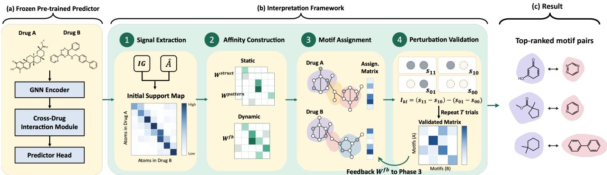
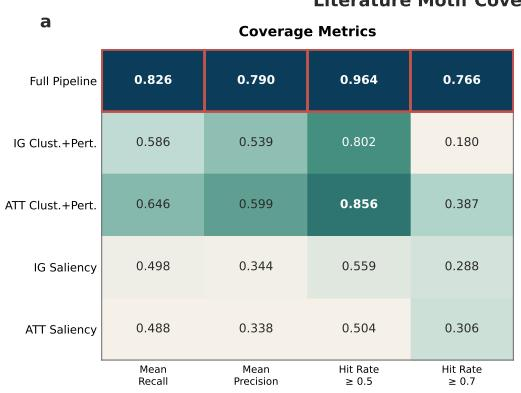
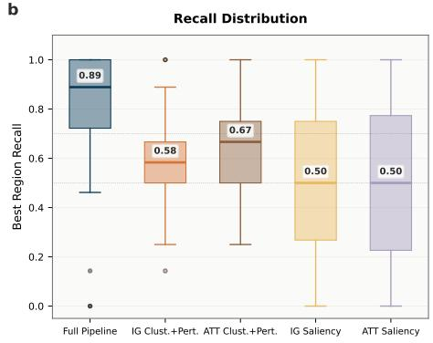
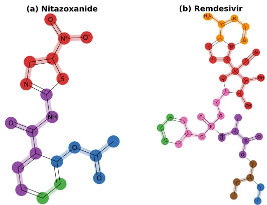
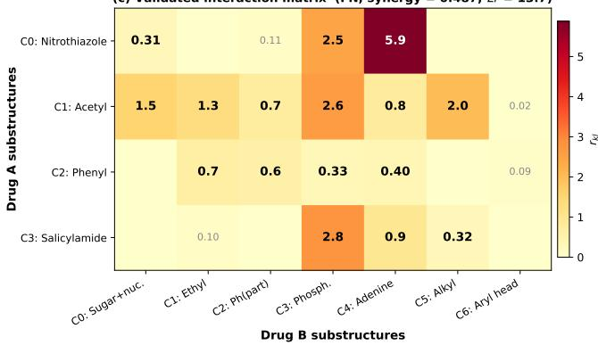
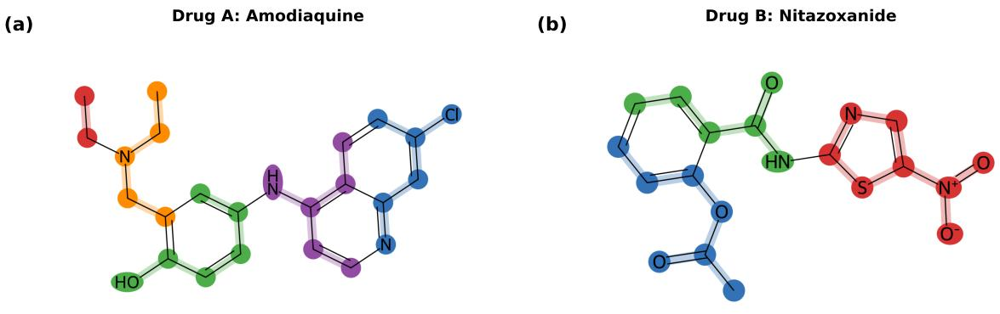
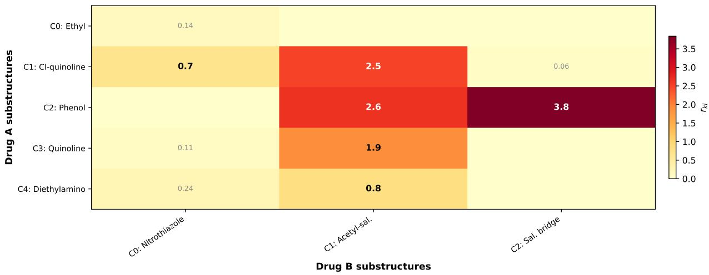

# VINCENT: Validated Interaction Network for Cross-drug Explanation of Therapeutics

Fan-Sheng Chuang   
North Carolina State University   
Computer Science   
Raleigh, USA   
fchuang2@ncsu.edu

Yujing Bian North Carolina State University Electrical and Computer Engineering Raleigh, USA ybian3@ncsu.edu

## Abstract

Drug synergy prediction estimates whether two drugs produce a stronger joint efect than expected from their individual activities. For such predictions to support drug combination discovery, a single synergy score is often not enough: researchers also need to know which molecular regions of the two drugs jointly drive the predicted efect. We study motif-pair synergy explanation, whose goal is to identify which pairs of chemically coherent regions, one from each drug, jointly contribute to the predicted synergy. Recent interpretable synergy models expose atom- or substructure-level signals, but their explanation mechanisms are typically built into the predictor architecture, and none validates its cross-drug region scores under repeated perturbation or feeds that evidence back to refine the explanation. A reliable motif-pair explanation should instead be chemically coherent, so its regions are connected motif pairs across the two drugs; perturbation-stable, so scores reproduce across repeated perturbations rather than a single noisy forward pass; and aligned with predictor behavior.

We introduce VINCENT (Validated Interaction Network for Crossdrug Explanation of Therapeutics), a post-training framework that explains a fixed interaction-aware synergy predictor. VINCENT extracts atom-pair evidence from the predictor’s attention and gradient signals, groups atoms into chemically coherent motifs, and validates candidate motif pairs through repeated local per turbation. The validated evidence is fed back to refine the motif assignments, yielding explanations that are chemically coherent, perturbation-stable, and aligned with predictor behavior. On the 25-pair literature-annotated subset, VINCENT achieves mean motif recall of 0.826 (95% CI: 0.78–0.87), compared with 0.49–0.66 for baselines. Across all 71 test pairs, its validated interaction scores yield a TP/TN separation of 3.36. These results show that closed-loop perturbation validation recovers literature-supported molecular regions more accurately than existing alternatives while producing cross-drug interaction scores that better reflect predictor behavior.

Xuchen Li North Carolina State University Electrical and Computer Engineering Raleigh, USA xli263@ncsu.edu

Kaixiong Zhou North Carolina State University Electrical and Computer Engineering Raleigh, USA kzhou22@ncsu.edu

Keywords Drug synergy prediction, motif-pair synergy explanation, graph neural networks, motif substructure learning.

ACM Reference Format:   
Fan-Sheng Chuang, Xuchen Li, Yujing Bian, and Kaixiong Zhou. 2026. VIN-CENT: Validated Interaction Network for Cross-drug Explanation of Therapeutics. In . ACM, New York, NY, USA, 18 pages. https://doi.org/10.1145/ nnnnnnn.nnnnnnn

## 1 Introduction

Drug-pair synergy prediction asks whether two drugs act together more efectively than expected from their individual efects. It is central to drug combination discovery across drug repurposing, lead optimization, and antiviral combination screening, including COVID-19 settings [2, 26]. Deep learning models predict drugpair synergy scores [12, 18, 22, 27], but most work targets the accuracy of a single scalar score, which does not reveal which molecular regions drive the predicted synergy. We study motifpair synergy explanation: identifying which pairs of chemically coherent regions (motifs), one from each drug, jointly contribute to the predicted synergistic efect. This matters in practice because a medicinal chemist needs trustworthy interaction evidence, not only a numerical prediction.

We argue that a useful synergy explanation should be a validated cross-drug motif-pair interaction matrix satisfying three requirements. First, chemical structure coherence (R1): each motif is a connected region of the molecular graph, and the explanation encodes cross-drug motif pairs rather than isolated atom scores. Second, motif-pair perturbation stability (R2): the explanatory efect assigned to a motif pair should be supported by consistent predictor responses across repeated local perturbations of that pair, rather than by a single forward-pass attribution that may be noisy or unrepeatable. Third, predictor-explainer alignment (R3): across drug pairs, the aggregate validated motif-pair evidence should be positively associated with the predictor’s synergy output, so the explanation reflects the predictor’s decision behavior.

Existing work does not fully address this task. Existing drugsynergy models [12, 18, 22, 27] primarily optimize combination prediction; although some provide pathway- or substructure-level interpretability, they do not produce perturbation-validated crossdrug molecular-region-pair explanations. General GNN explainers [20, 21, 36, 37] identify important nodes, edges, or subgraphs for an individual input graph, but are not designed for pair-conditioned cross-drug interactions. Recent interpretable synergy models provide richer structural or biological explanations, including molecular substructures [8, 19, 31], cross-drug structural attention [32], biological or causal subnetworks [4, 5, 14], and multi-scale struc tural representations [9]. However, these explanation mechanisms are typically integrated into their respective predictor architectures rather than designed for post-training analysis of a separately trained model. Moreover, to our knowledge, no existing method closes the loop between explanation and validation by repeatedly estimating the stability of cross-drug region-pair efects under local perturbation and feeding those scores back to update the region partition itself. Table 1 summarizes these distinctions.

We propose VINCENT (Validated Interaction Network for Crossdrug Explanation ofTherapeutics), a post-training framework for extracting validated cross-drug motif-pair explanations from a fixed interaction-aware drug synergy predictor. The predictor supplies atom-level representations, cross-drug signals, and the predicted synergy score; predictor design itself is not a contribution of this work. VINCENT uses these internal signals to construct chemically coherent motifs, screens candidate motif pairs, and validates the retained pairs through repeated local perturbation. The validated evidence is fed back to refine the motif assignments, closing the loop between explanation and validation. To our knowledge, this is the first drug-synergy explanation framework in which perturbationderived validation is part of the explanation-generation loop itself, actively reshaping the learned molecular regions rather than serving only as a post-hoc check. We make four contributions.

(1) Problem formulation. We formulate post-training drug synergy explanation as the recovery of a validated crossdrug motif-pair interaction matrix, operationalized through three testable requirements: chemical coherence, perturbation stability, and predictor alignment (R1–R3), formalized in Section 3.1.

(2) Closed-loop explanation method. We propose VINCENT, which combines predictor-derived cross-drug evidence, motif construction, repeated local perturbation validation, and feedback refinement in a closed explanation–validation loop. Validated motif-pair evidence is used not only to score the explanation but also to refine the explanatory regions themselves.

(3) Literature-grounded evaluation protocol. We construct a literature-grounded reference set of 111 pharmacophorelevel molecular-region annotations across 25 literature-supported drug pairs, and use it to evaluate whether explanation methods recover pharmacologically relevant regions. All annotations are traceable to their supporting sources, as documented in Appendix A.

(4) Results and significance. On the literature-annotated subset of 25 pairs, VINCENT substantially improves the recovery of literature-supported molecular regions, achieving mean motif recall of 0.826 compared with 0.49–0.66 for the evaluated explanation baselines. Across the full 71-pair test set, its validated interaction scores also show stronger predictor alignment, including a TP/TN separation of 3.36.

## 2 Related Work

Drug synergy prediction. Drug-synergy models span descriptorand fingerprint-based neural networks [22], graph-based architectures [27, 34], and more recent dual-view, mechanism-informed, similarity-network, knowledge-graph, and multimodal formulations [13, 15, 16, 18, 23, 33]. Large-scale combination databases such as DrugComb [38] and DrugCombDB [17] have further accelerated model development; see Abbasi and Rousu [1] for a recent survey. Our experimental predictor builds on the multi-task training and Bliss-based formulation of ComboNet [12] and serves solely as the fixed model to be explained. Predictor architecture and training details are described in Section 3.2 and Appendix H.

GNN explainability. Attribution methods such as Integrated Gradients [24] estimate input-component contributions by path integration, while attention weights alone are not necessarily faithful explanations [10]. Mask-learning approaches such as GNN-Explainer [36] and PGExplainer [21], and subgraph search methods such as SubgraphX [37], provide complementary strategies for explaining graph predictions. Counterfactual approaches such as CF-GNNExplainer [20] and cooperative explanation methods [6] address the same task from diferent angles; broader surveys appear in [3, 11, 25]. These methods typically identify important nodes, edges, or subgraphs for an individual input graph, whereas our task requires pair-conditioned explanations over molecular regions from both drugs. CF-GNNExplainer, for example, searches for minimal graph perturbations that change a prediction; VINCENT instead uses repeated local feature perturbations to estimate the magnitude and stability of a cross-drug region-pair efect, without requiring the prediction to flip.

Substructure-level synergy explanation. Recent interpretable synergy models provide structural and biological interpretations at several levels. SDDSynergy [19] learns adaptive molecular substructures, while SynergyX [8] uses predefined substructures within a mutual-attention architecture. GraFSyn [31] uses connected graphlets, while DeepSTFSynergy [9] models atomic, substructural, and global structure. DeepDrugs [32] maps cross-drug attention signals to pharmacophoric regions, whereas SDCInterpreter [28], IDSP [4], SANEPool [5], and CASynergy [14] provide mechanism-path or biological-network interpretations. Outside synergy-specific models, Wu et al. [30] use molecular fragmentation and masking for posthoc single-molecule explanation. These works establish the value of substructure- and mechanism-level interpretation, but synergyspecific approaches are typically integrated into their predictor architectures, while generic post-hoc methods do not repeatedly validate cross-drug region pairs or feed the resulting evidence back into region construction. VINCENT instead combines post-training motif construction with repeated cross-drug perturbation validation and feedback refinement in a closed explanation–validation loop. Table 1 summarizes these distinctions.

Table 1: Comparison of interpretable and post-hoc approaches relevant to cross-drug motif-pair explanation. Posthoc: applicable to an independently trained, fixed predictor. Rep. valid.: the same cross-drug region pair is repeatedly perturbed to estimate a stable interaction efect. Feedback: validated evidence is used to update the explanatory regions. ✓/– denote yes/no.
<table><tr><td>Method</td><td>Expl. unit</td><td></td><td>Post-hoc Rep. valid. Feedback</td><td></td></tr><tr><td>SDDSynergy [19]</td><td>Learned struct.</td><td></td><td></td><td></td></tr><tr><td>SynergyX [8]</td><td>Predef. substruct.</td><td></td><td></td><td></td></tr><tr><td>GraFSyn [31]</td><td>Graphlet sub- struct.</td><td></td><td></td><td></td></tr><tr><td>DeepSTF-</td><td>Multi-scale</td><td></td><td></td><td></td></tr><tr><td>Synergy [9] DeepDrugs [32]</td><td>struct. Cross-drug attn.</td><td></td><td></td><td></td></tr><tr><td>SDC-</td><td>Mechanism paths</td><td></td><td></td><td></td></tr><tr><td>Interpreter [28] CASynergy [14]</td><td>Causal / gene net.</td><td></td><td></td><td></td></tr><tr><td>IDSP [4]</td><td>Signaling net.</td><td></td><td></td><td></td></tr><tr><td>SANEPool [5]</td><td>Gene subnetwork</td><td></td><td></td><td></td></tr><tr><td>Wu et al. [30]</td><td>Predef. fragments</td><td>√</td><td></td><td></td></tr><tr><td>PGExplainer [21]</td><td>Learned edge</td><td>√</td><td></td><td></td></tr><tr><td>CF-GNN-</td><td>mask CF edges</td><td>√</td><td></td><td></td></tr><tr><td>Explainer [20] VINCENT (ours)</td><td>Multi-view mo-</td><td>√</td><td></td><td></td></tr></table>

## 3 Preliminaries

## 3.1 Problem Setting

Drug synergy prediction. Consider a drug pair (�, �) with $N _ { A }$ and $N _ { B }$ atoms, respectively. Each drug is represented as a molecular graph whose nodes are atoms and whose edges are chemical bonds. A structure learning model obtains atom-level representations from this molecular input, for example using a graph neural network (GNN) operating directly on the drug graph. We denote the resulting atom-level representations by $H _ { A } \in \mathbb { R } ^ { N _ { A } \times d _ { h } }$ and $H _ { B } \in \mathbb { R } ^ { N _ { B } \times d _ { h } }$ The single-drug activities $P _ { A }$ and $P _ { B }$ are inferred by feeding each drug representation into a prediction head, while the combination activity $P _ { A B }$ is inferred by feeding the pair-conditioned representations into a combination head. Following ComboNet [12], the Bliss independence baseline is $P _ { \mathrm { b l i s s } } = P _ { A } + P _ { B } - P _ { A } P _ { B }$ , and the predicted synergy score is

$$
\begin{array} { r } { s _ { A B } = P _ { A B } - P _ { \mathrm { b l i s s } } . } \end{array}\tag{1}
$$

$P _ { \mathrm { b l i s s } }$ is the combined activity expected if the two drugs acted independently under Bliss independence. Subtracting this baseline from the predicted combination activity $P _ { A B }$ measures the gain beyond independent action. Thus, $s _ { A B } > 0$ indicates positive excess above the Bliss baseline; in our predictor, a pair is classified as synergistic when this excess exceeds $0 . 5 , \mathrm { i . e . , } s _ { A B } > 0 . 5$

Motif-pair synergy explanation. Given a fixed synergy predictor � and a drug pair $( A , B )$ , the synergy explanation is to produce a validated interaction strength matrix $\bar { R ^ { \prime } } = \left[ r _ { k l } \right] \in \bar { \mathbb { R } } ^ { \bar { K _ { A } } \times K _ { B } }$ over learned motif pairs, where $K _ { A }$ and $K _ { B }$ denote the numbers of motifs identified in the two drugs. Here a motif is a chemically coherent molecular region, and $r _ { k l }$ is the validated interaction score between the �-th motif of drug � and the �-th motif of drug �, quantifying their joint contribution to the predictor’s synergy output. Unlike the scalar $s _ { A B } ,$ , � localizes the cross-drug evidence to specific molecular regions. The explanation must satisfy:

(R1) Chemical structure coherence: each motif is a connected region of the molecular graph, and � encodes cross-drug motif pairs rather than isolated atom scores.

(R2) Motif-pair perturbation stability: each score $r _ { k l }$ should be supported by consistent predictor responses across repeated perturbations of the motif pair, rather than by a potentially noisy or unrepeatable single forward pass.

(R3) Predictor-explainer alignment: across drug pairs, the aggregate interaction strength $\textstyle \sum _ { k , l } r _ { k l }$ should be positively associated with the predicted synergy score $s A B ,$ , so the explanation tracks the predictor’s own decision behavior.

## 3.2 Fixed Predictor Interface

VINCENT operates on a separately trained interaction-aware predictor that exposes atom-level representations and cross-drug association signals. In our implementation, molecular representations combine a 2D message-passing encoder with geometry-aware 3D representations. The fused representations are then conditioned through a bidirectional atom-level cross-attention module, which exposes an atom-pair association matrix $\hat { A } \in \mathbb { R } ^ { N _ { A } \times N _ { B } }$ , where $\hat { A } _ { i j }$ captures the predictor’s learned association between atom � of drug � and atom � of drug �. Separate prediction heads estimate $P _ { A } , P _ { B } ,$ , and $P _ { A B } ;$ the synergy score $s _ { A B }$ is computed via Eq. (1). Exact encoder, 2D/3D fusion, and training details are provided in Appendix H.

The predictor is trained using the drug-target interaction, singleagent activity, and combination objectives adopted from ComboNet. After training, all predictor parameters are frozen. Before explanation, we perform a one-time mask-aware calibration in which only the neutral mask embedding and local reconditioning operator are learned, so that the local feature masking used during perturbationbased validation does not introduce an unfamiliar input pattern. The calibrated perturbation components are then frozen as well; no predictor parameter is updated during calibration or VINCENT explanation. Calibration details are provided in Appendix H.

## 4 Method

VINCENT uses the fixed predictor only as a source of atom-level evidence and prediction outputs, and explains its synergy score by identifying cross-drug molecular-region pairs whose efects remain stable under repeated perturbation. The framework proceeds in four phases. Phases 1–2 extract and organize predictor evidence for motif discovery, while Phases 3–4 form an iterative assignment– validation loop: motifs are constructed, candidate motif pairs are perturbation-validated, and the validated evidence is fed back to refine the next assignment. The evidence map and two base afinity views remain fixed; only motif assignments, validated scores, and feedback afinity evolve across iterations.

  
Figure 1: Overview of VINCENT: the fixed predictor (left) provides atom-level representations and cross-drug signals. Phases 1–2 prepare the loop’s inputs; Phases 3–4 form the assignment–validation loop with iterative feedback, yielding the top-ranked cross-drug motif pairs (right). Matrices and molecular fragments are illustrative.

## 4.1 Phase 1: Cross-drug Signal Extraction

The goal of Phase 1 is to extract atom-pair evidence from the fixed predictor of where the two drugs jointly contribute to the predicted synergy. We start from the cross-drug association matrix $\hat { A } \in \mathbb { R } ^ { N _ { A } \times N _ { B } }$ , where $\hat { A } _ { i j }$ is the predictor’s learned association between atom � of drug � and atom � of drug �. This matrix identifies where the predictor establishes cross-drug associations at the atom level, but association alone does not guarantee relevance to the synergy score. We therefore also compute pairwise Integrated Gradients [24], yielding $I G \in \mathbb { R } ^ { N _ { A } \times N _ { B } }$ , where $I G _ { i j }$ measures the contribution of atom pair $( i , j )$ to $s _ { A B }$ . Integrated Gradients are directly tied to the prediction target but can be noisy in isolation.

We define the atom-pair evidence map as the positive intersection of these two signals:

$$
M = \operatorname { R e L U } ( { \hat { A } } ) \odot \operatorname { R e L U } ( I G ) ,\tag{2}
$$

where ⊙ denotes element-wise multiplication. The ReLU operations retain only positive values; the product suppresses atom pairs supported by only one signal. A large $M _ { i j }$ indicates that atom pair $( i , j )$ is both associated by the predictor and positively involved in increasing $s _ { A B } .$ . The matrix � is computed once and remains fixed throughout the explanation process.

## 4.2 Phase 2: Within-drug Afinity Construction

The matrix � $\in \mathbb { R } ^ { N _ { A } \times N _ { B } }$ identifies important atom pairs across the two drugs, but motif discovery requires a within-molecule relation: which atoms should be grouped together. Phase 2 therefore constructs three complementary afinity matrices for each drug. For drug �, each $W _ { A } ^ { V } \in \mathbb { R } ^ { N _ { A } \times N _ { A } }$ , where $W _ { A } ^ { V } [ i , j ]$ measures how strongly atoms � and � should share a motif under view $V ;$ drug � is treated analogously. The three views encode distinct grouping cues: chemical locality, partner-conditioned predictor behavior, and perturbation-validated feedback.

The structural view $W _ { A } ^ { \mathrm { s t r u c t } }$ uses a Gaussian decay ofshortest-path distance in the molecular graph, providing a chemical-locality prior for coherent regions. The interaction-pattern view $W _ { A } ^ { \mathrm { p a t t e r n } }$ favors nearby, suficiently active atoms with similar evidence profiles � [�, :] toward drug �. Thus, structural afinity asks whether two atoms are plausible local motif members, whereas pattern afinity asks whether the fixed predictor uses them similarly with respect to the partner drug. These two base views are computed once—the former from molecular structure and the latter from �—and remain fixed.

The feedback view $W _ { A } ^ { \mathrm { f b } }$ supplies information unavailable before validation. It is initialized to zero; after Phase 4 produces validated motif-pair scores, that evidence is projected back to atoms so that nearby atoms with similar validated interaction profiles receive higher afinity. This is the only dynamic view, allowing perturbation-stable evidence to reshape the next motif assignment without modifying the original evidence map �. Before Phase 3, each afinity is converted into a normalized Laplacian. Exact operators are given in Appendix D.

No single view provides all three cues: structural afinity is chemically grounded but partner-agnostic, whereas interaction-pattern afinity is partner-conditioned but still derived from the unvalidated evidence map �. The feedback view supplies the missing post-validation signal, so the three views respectively capture structure, initial predictor evidence, and validated interaction evidence.

## 4.3 Phase 3: Constrained Motif Assignment

Phase 3 groups each drug’s atoms into chemically coherent motifs by learning a soft assignment matrix $S _ { A } ~ \in ~ \dot { \mathbb { R } } ^ { N _ { A } \times K _ { A } }$ , where $S _ { A } [ i , k ] \geq 0$ denotes the soft membership of atom � in motif � and each row sums to one. The same process applies to drug �. The assignment is obtained by minimizing:

$$
\mathcal { L } ( S _ { A } ) = \sum _ { V \in \{ \mathrm { s t r u c t , p a t t e r n , f b } \} } \lambda _ { V } \mathrm { T r } \big ( S _ { A } ^ { \top } L _ { A } ^ { V } S _ { A } \big ) + \mathcal { R } ( S _ { A } ) ,\tag{3}
$$

where $L _ { A } ^ { V }$ is the normalized Laplacian of afinity view �. The three smoothness terms encourage atoms to share a motif when they are chemically local, exhibit similar partner-conditioned interaction patterns, or receive similar validated feedback. The regularizer R combines entropy regularization, which prevents premature collapse of the soft assignment, with a minimum-mass penalty that discourages tiny clusters.

After optimization, each atom is assigned to its highest-weight motif: $\begin{array} { r } { \hat { k } ( i ) = \arg \operatorname* { m a x } _ { k } S _ { A } [ i , k ] } \end{array}$ . We then enforce graph connectivity on the hard assignment so that each resulting motif forms a connected molecular region. A ring-completion step subsequently absorbs remaining ring atoms when a motif already contains at least half of a ring system, preventing chemically indivisible rings from being split. The resulting motifs provide the candidate regions tested in Phase 4.

## 4.4 Phase 4: Perturbation-Based Validation and Feedback

The goal of Phase 4 is to validate whether candidate motif pairs from the two drugs induce stable joint efects in the fixed predictor, and to feed the validated evidence back to improve the next motif assignment. We describe the four steps of this phase in order: screening, perturbation, scoring, and feedback.

Candidate screening. We first screen motif pairs by aggregating the fixed evidence � over the current soft assignments $S _ { A } , S _ { B }$ from Phase 3. The coarse score between motif � of drug � and motif � of drug � is:

$$
a _ { k l } = S _ { A } [ : , k ] ^ { \top } M S _ { B } [ : , l ] .\tag{4}
$$

This score aggregates atom-pair evidence weighted by motif membership and is used only to rank candidate pairs; it is not the final interaction score. Only the highest-ranked candidates proceed to perturbation validation.

Repeated local perturbation. For each retained motif pair (�, �), we perform � local perturbation trials. Each trial masks a diferent local subset and fraction of the atoms in the two motifs, producing multiple nearby perturbed realizations of the same motif pair. Masked atom features are replaced by a learned neutral embedding, after which nearby representations are locally reconditioned while the molecular topology remains unchanged. This neutral intervention is supported by the one-time mask-aware calibration described in Section 3.2, which reduces distribution shift during perturbation evaluation. Details of the masking and reconditioning operators are in Appendix E.

Pairwise interaction efect. For trial �, let $s _ { 1 1 } ^ { ( t ) } , s _ { 1 0 } ^ { ( t ) } , s _ { 0 1 } ^ { ( t ) }$ , and $s _ { 0 0 } ^ { ( t ) }$ denote the predictor’s synergy output when both sampled regions are retained, only the region from drug � is retained, only the region from drug � is retained, or both are masked, respectively. The pairwise interaction efect is the second-order finite diference:

$$
I _ { k l } ^ { ( t ) } = \big ( s _ { 1 1 } ^ { ( t ) } - s _ { 1 0 } ^ { ( t ) } \big ) - \big ( s _ { 0 1 } ^ { ( t ) } - s _ { 0 0 } ^ { ( t ) } \big ) .\tag{5}
$$

A positive $I _ { k l } ^ { ( t ) }$ indicates a joint efect that cannot be explained by the two local perturbations independently.

Stable interaction score. Across the � trials, we summarize the interaction-efect distribution by its mean $\mu _ { k l }$ , variability $\sigma _ { k l }$ , activation frequency $q _ { k l } ,$ , and positive-efect frequency $\boldsymbol { p } _ { k l } ^ { + } .$ The validated interaction score is:

$$
\begin{array} { r } { r _ { k l } = \mathrm { s o f t p l u s } \displaystyle \left( \frac { \mu _ { k l } } { \sigma _ { k l } + \epsilon } \right) \cdot \operatorname* { m a x } ( 0 , 2 p _ { k l } ^ { + } - 1 ) \cdot q _ { k l } , } \end{array}\tag{6}
$$

which is high only when the efect is large relative to its variability, directionally consistent, and repeatedly activated. The matrix $R =$ [���] is the validated interaction matrix at this outer-loop state.

Table 2: Key hyperparameter settings.
<table><tr><td>Parameter</td><td>Default</td><td>Role</td></tr><tr><td>Target motif size c</td><td>6</td><td>Motif granularity</td></tr><tr><td>Perturbation trials T</td><td>16</td><td>Perturbation stability</td></tr><tr><td>Outer-loop iterations</td><td>3</td><td>Refinement depth</td></tr><tr><td>Candidate screening</td><td>top 30%, min 3, max 20</td><td>Pair-selection scope</td></tr></table>

Feedback refinement. The validated matrix � completes one half of the closed loop; the other half projects this evidence back into the motif assignment for the next iteration. The feedback operator Φ connects nearby atoms within the same drug when their validated interaction profiles toward the partner drug are similar. Atoms that repeatedly participate in the same validated cross-drug efects are thereby encouraged to form a common motif in the next iteration. The feedback afinity is smoothed across iterations via exponential moving average to avoid abrupt assignment oscillations:

$$
\begin{array} { r } { W _ { \mathrm { \mathrm { f b } } } ^ { ( t + 1 ) } = \mathrm { E M A } \Big ( W _ { \mathrm { f b } } ^ { ( t ) } , ~ \Phi _ { \mathrm { f b } } \Big ( S ^ { ( t ) } , R ^ { ( t ) } \Big ) \Big ) ~ . } \end{array}\tag{7}
$$

Starting from ${ \cal W } _ { \mathrm { f b } } ^ { ( 0 ) } = 0 ,$ each outer-loop iteration alternates between motif assignment (Phase 3), perturbation validation, and feedback update. We use three outer-loop iterations by default; longer runs are used only for convergence analysis (Appendix F). The original evidence map � is never modified by feedback; validation therefore reshapes how the fixed predictor evidence is grouped into motifs, rather than creating new evidence.

## 5 Experiments

We evaluate VINCENT through motif coverage against independently annotated pharmacophore regions, predictor alignment with synergy behavior, and ablation and sensitivity analyses of individual components.

## 5.1 Experimental Setup

Dataset. We use the SARS-CoV-2 drug-combination benchmark released with ComboNet [12], which pairs antiviral compounds and measures their combination activity. After canonicalizing molecular representations and deduplicating unordered pairs, the final splits contain 88 training, 19 validation, and 71 test pairs. We adopt the same auxiliary training data (drug–target interaction, single-agent activity, and HIV combination data) as in the original work; all explanation experiments are conducted exclusively on the SARS-CoV-2 combination pairs. VINCENT is run on all 71 test pairs.

Literature-supported reference set. Evaluating motif coverage requires knowing which molecular regions are pharmacologically relevant for each drug pair. Starting from the 71 test pairs, we retain 25 for which published pharmacological sources provide suficient mechanistic detail to identify specific molecular regions in each drug. For each retained pair, we manually map literature identified regions to atom indices, producing 111 pharmacophorelevel motif annotations in total (averaging 4.4 annotated regions per drug pair, counting both drugs). All annotations are constructed independently of model output; the full construction procedure and source traceability are described in Appendix A.

Implementation details. The predictor parameters are frozen after training and remain fixed during the one-time mask-aware calibration described in Section 3.2; only the perturbation-interface components are calibrated. Unless otherwise specified, VINCENT uses a target motif size of �=6 atoms, �=16 perturbation trials per retained motif pair, top-30% candidate screening (minimum 3, maximum 20 pairs), and 3 outer-loop iterations. The outer-loop depth was selected on validation/pilot data before test-set evaluation.

Baselines. We compare VINCENT against four groups under the same fixed predictor and evaluation protocol. Attribution baselines use Integrated Gradients or cross-drug attention to score individual atoms without motif grouping. External single-graph explainers—GNNExplainer [36], SubgraphX [37], PGExplainer [21], and CF-GNNExplainer [20]—explain each drug separately, with scores converted to candidate regions under the common matching protocol. Controlled baselines cluster atoms using either signal and apply the same perturbation-based validation without iterative feedback, isolating the grouping step. The lower bound is a random connected substructure of matched size. To keep the comparison controlled, all methods explain the same frozen predictor, and their outputs are converted into molecular regions before evaluation under the same region-matching protocol and size constraints. Thus, diferences in coverage reflect the explanation strategy rather than changes in the prediction model or evaluation rule. Adaptation details appear in Appendix C.

## 5.2 Predictor Adequacy and Evaluation Protocol

Predictor adequacy. Because post-training explanation is meaningful only for an informative prediction target, we first verify the fixed predictor’s predictive adequacy. It achieves a test ROC-AUC of 0.85, compared with 0.82 for the original ComboNet, 0.80 for Deep-DDS, 0.68 for DeepSynergy, and 0.62 for a random forest baseline. Full predictor comparison details appear in Appendix H.

Motif-coverage evaluation. We run each explanation method on the 25 annotated test pairs and compare predicted molecular regions against the 111 literature-supported pharmacophore annotations. The evaluation is per reference motif: for each annotated region, we select the best-matching predicted region from a single cluster or a union of at most two bond-adjacent clusters, subject to the size cap $| P | \leq \operatorname* { m a x } ( | L | + 3 , \lceil 1 . 4 | L | 7 )$ to prevent inflated scores. We report recall, precision, Jaccard overlap, and hit rate at recall ≥ 0.7 (the fraction of the 111 reference motifs for which the best-matching predicted region achieves recall of at least 0.7). All confidence intervals are from pair-level bootstrap (2,000 resamples). Robustness analyses appear in Appendix G.

Predictor-alignment evaluation. We additionally assess whether the validated interaction scores reflect the predictor’s synergy behavior. This evaluation uses all 71 test pairs, not only the annotated subset. For each pair, Phase 4 produces a validated interaction matrix �; we sum the validated interaction scores over all motif pairs into a total explanation strength $\textstyle \sum _ { k , l } r _ { k l }$ and compute the Pearson correlation with the predicted synergy score $s _ { A B } .$ We also report the TP/TN separation ratio: the mean of the highest single validated interaction score $\mathbf { m a x } _ { k , l } r _ { k l }$ for predictor true positives (pairs correctly predicted as synergistic by the fixed predictor) divided by that for predictor true negatives (pairs correctly predicted as non synergistic), testing whether the explanation scores discriminate the two groups.

## 5.3 Motif Coverage Results

We test whether VINCENT’s learned motifs overlap with independently annotated pharmacophore regions, indicating pharmacologically meaningful structure. Table 3 and Figure 2 present the comparison.

VINCENT achieves the strongest literature motif coverage among all evaluated methods, with mean recall of 0.826 (95% CI: 0.782–0.868), precision of 0.790, Jaccard of 0.689, and a 76.6% hit rate at recall ≥ 0.7. Atom-level attribution baselines reach only about 0.49 recall, consistent with their lack of motif construction. External single-graph explainers improve to 0.49–0.66 by producing connected subgraphs, but explain each drug independently of its partner. The controlled single-signal clustering baselines further reach 0.586 and 0.646 under the same perturbation validation. The remaining improvement to 0.826 supports the benefit of combining multi-view assignment with iterative feedback.

## 5.4 Synergy Discrimination

Motif coverage asks whether the right molecular regions are recovered; predictor alignment asks the complementary question of whether their validated interaction scores track the fixed predictor’s synergy behavior. We evaluate this across all 71 test pairs using the aggregate and top-interaction measures defined in Section 5.2.

VINCENT’s validated interaction scores align with the predictor’s synergy behavior. The Pearson correlation between $s _ { A B }$ and total validated interaction strength $\textstyle \sum _ { k , l } r _ { k l }$ is 0.423. The mean top interaction score is 4.82 for predictor true positives and 1.43 for true negatives, yielding a TP/TN separation of 3.36. In contrast, IG Clust.+Pert. yields correlation 0.043 and separation 1.49, while ATT Clust.+Pert. yields −0.238 and 0.48. Thus, VINCENT’s validated scores are substantially more associated with the fixed predictor’s decision behavior than those of the controlled baselines.

## 5.5 Ablation and Sensitivity Analysis

The full method combines two ingredients beyond standard singlesignal clustering: multi-view afinities for grouping, and iterative feedback from validation back into assignment. We isolate each contribution using Table 3.

Iterative feedback is the largest contributor to the improvement beyond the initial multi-view assignment. Removing the feedback loop while keeping the multi-view assignment (the “No Feedback” variant) reduces recall from 0.826 to 0.724 and TP/TN separation from 3.36 to 1.95, with the synergy correlation dropping from 0.423 to 0.352. This shows that feeding perturbation-validated evidence back into motif assignment materially changes the recovered regions and improves their alignment with predictor behavior.

Multi-view assignment improves motifrecovery even without feedback. Even without feedback, the multi-view variant achieves 0.724 recall, compared with 0.586 for IG Clust.+Pert. and 0.646 for ATT Clust.+Pert. Because all three variants use the same perturbation-based validation, this comparison directly isolates the grouping step: combining partner-conditioned interaction patterns with molecular locality produces better initial motifcandidates than either signal alone.

Hyperparameter sensitivity. Table 4 reports the efect of varying one parameter at a time. Target motif size is stable between five and eight atoms per motif; substantially coarser clusters reduce coverage. Increasing perturbation trials from 16 to 32 changes recall by only 0.002 and TP/TN separation by 0.08, indicating that the aggregate metrics are stable beyond the default setting. Performance rises rapidly through the first three outer-loop iterations and then stabilizes; complete results for the five hyperparameter sweeps and the early outer-loop convergence analysis appear in Appendix F.

Table 3: Main explanation results. Recall, precision, Jaccard, and HR≥0.7 are evaluated on the 25-pair literature-annotated subset (111 reference motifs). Predictor-alignment metrics $\rho ( s _ { A B } , \sum r )$ and TP/TN separation are evaluated on all 71 test pairs. Coverage confidence intervals are from pair-level bootstrap with 2,000 resamples.
<table><tr><td></td><td>Method</td><td>Recall</td><td>Precision</td><td>Jaccard</td><td>HR≥0.7</td><td> $\rho ( s _ { A B } , \sum r )$ </td><td>TP/TN Sep.</td></tr><tr><td rowspan="2">Attribution</td><td>Integrated Gradients Saliency</td><td>0.498</td><td>0.344</td><td>0.288</td><td>28.8%</td><td></td><td></td></tr><tr><td>Cross-Drug Attention Saliency</td><td>0.488</td><td>0.338</td><td>0.287</td><td>30.6%</td><td></td><td></td></tr><tr><td rowspan="4">External</td><td>GNNExplainer</td><td>0.581</td><td>0.476</td><td>0.394</td><td>39.2%</td><td>一</td><td></td></tr><tr><td>SubgraphX</td><td>0.661</td><td>0.536</td><td>0.443</td><td>48.9%</td><td></td><td></td></tr><tr><td>PGExplainer</td><td>0.552</td><td>0.451</td><td>0.371</td><td>40.8%</td><td></td><td></td></tr><tr><td>CF-GNNExplainer</td><td>0.486</td><td>0.397</td><td>0.311</td><td>26.7%</td><td>一</td><td>一</td></tr><tr><td>Lower bound</td><td>Random Substructure</td><td>0.347</td><td>0.263</td><td>0.184</td><td>14.3%</td><td>一</td><td>一</td></tr><tr><td rowspan="2">Controlled</td><td>IG Clust.+Pert.</td><td>0.586</td><td>0.539</td><td>0.392</td><td>18.0%</td><td>0.043</td><td>1.49</td></tr><tr><td>ATT Clust.+Pert.</td><td>0.646</td><td>0.599</td><td>0.458</td><td>38.7%</td><td>-0.238</td><td>0.48</td></tr><tr><td rowspan="2">Ours</td><td>No Feedback</td><td>0.724</td><td>0.681</td><td>0.568</td><td>54.9%</td><td>0.352</td><td>1.95</td></tr><tr><td>VINCENT (Full)</td><td>0.826</td><td>0.790</td><td>0.689</td><td>76.6%</td><td>0.423</td><td>3.36</td></tr></table>

Literature Motif Coverage: Full Pipeline vs Baselines  

  
Figure 2: Literature motif coverage: (a) coverage metrics across methods; (b) distribution of best-region recall across motifs

## 5.6 Diagnostic Case Study

Because VINCENT reads the fixed predictor’s internal representations rather than its final binary output, it can surface cross-drug interaction evidence even when the predictor misclassifies a pair. We illustrate this with Nitazoxanide + Remdesivir, a pair with literaturereported synergy [2] that the predictor classifies as non-synergistic $( s _ { A B } = 0 . 4 8 7$ , below the 0.5 classification threshold defined in Section 3.1). VINCENT recovers strong interaction evidence in this misclassified pair. For correctly classified synergistic pairs, the mean top validated interaction score is 4.82; for predictor true negatives it is 1.43. In this false-negative pair, the top score reaches 5.9 (between the nitrothiazole region of Nitazoxanide and the adenine ring of Remdesivir; Figure 3), placing it above the synergistic group mean despite the incorrect negative label. This suggests that synergy-relevant cross-drug evidence remains present in the predictor’s internal representations despite not being reflected in the final binary decision. A researcher reviewing VINCENT’s outputs could flag this pair for further investigation. An additional truepositive case study (Amodiaquine + Nitazoxanide) is provided in Appendix B.

## 6 Limitations and Ethical Considerations

VINCENT is a post-training explanation framework and therefore inherits the behavior and assumptions of the fixed predictor it explains. Its region-pair scores characterize predictor-level evidence and should not be interpreted as direct evidence of biological causality or clinical eficacy. Our literature-grounded evaluation covers 25 benchmark entries for which published evidence supports region-level annotation, and its conclusions remain conditioned on the compounds and assay settings in the underlying benchmark. Extending evaluation to larger combination screens and experimentally characterized molecular interactions is an important direction for future work.

Table 4: Sensitivity to target motif size $c ,$ perturbation trials $T ,$ and outer-loop refinement. Bold marks the default � and $T ;$ the default outer-loop depth is 3. $\rho \colon$ Pearson correlation between predicted synergy and total validated interaction strength.
<table><tr><td>Parameter</td><td>Setting</td><td>Recall</td><td>Precision</td><td>Jaccard</td><td>HR≥0.7</td><td> $\rho$ </td><td>TP/TN</td></tr><tr><td rowspan="5">Target size c</td><td>4</td><td>.791</td><td>.766</td><td>.641</td><td>.69</td><td>.404</td><td>3.05</td></tr><tr><td>5</td><td>.823</td><td>.788</td><td>.686</td><td>.75</td><td>.418</td><td>3.28</td></tr><tr><td>6</td><td>.826</td><td>.790</td><td>.689</td><td>.77</td><td>.423</td><td>3.36</td></tr><tr><td>8</td><td>.802</td><td>.741</td><td>.632</td><td>.71</td><td>.409</td><td>3.14</td></tr><tr><td>10</td><td>.768</td><td>.699</td><td>.582</td><td>.63</td><td>.392</td><td>2.88</td></tr><tr><td rowspan="4">Perturbation trials T</td><td>4</td><td>.812</td><td>.777</td><td>.668</td><td>.73</td><td>.331</td><td>2.38</td></tr><tr><td>8</td><td>.821</td><td>.785</td><td>.681</td><td>.75</td><td>.401</td><td>3.02</td></tr><tr><td>16</td><td>.826</td><td>.790</td><td>.689</td><td>.77</td><td>.423</td><td>3.36</td></tr><tr><td>32</td><td>.824</td><td>.791</td><td>.690</td><td>.77</td><td>.431</td><td>3.44</td></tr><tr><td rowspan="5">Outer-loop state</td><td>0</td><td>.724</td><td>.681</td><td>.568</td><td>.55</td><td>.352</td><td>1.95</td></tr><tr><td>1</td><td>.796</td><td>.758</td><td>.648</td><td>.70</td><td>.399</td><td>2.78</td></tr><tr><td>2</td><td>.821</td><td>.782</td><td>.678</td><td>.75</td><td>.417</td><td>3.19</td></tr><tr><td>3</td><td>.826</td><td>.790</td><td>.689</td><td>.77</td><td>.423</td><td>3.36</td></tr><tr><td>4</td><td>.828</td><td>.789</td><td>.690</td><td>.76</td><td>.419</td><td>3.29</td></tr></table>

(c) Validated interaction matrix (FN, synergy = 0.487, r = 13.7)  
  
Figure 3: Diagnostic case study: Nitazoxanide + Remdesivir $( s _ { A B } = 0 . 4 8 7 _ { \mathrm { { i } } }$ , false negative). (a,b) Motif clusters for each drug. (c) Validated interaction matrix �.

If the predictor has learned spurious correlations, VINCENT’s explanation will reflect those correlations rather than true pharma cological signals; pairing explanation with predictive uncertainty estimates [7, 29] could help identify such cases. The framework currently requires a compatible interaction-aware predictor that exposes atom-level representations and cross-drug signals; applicability to predictors without these interfaces would require architectural adaptation.

This study, which uses publicly available molecular and drugcombination data, involves no identifiable personal data or humansubject intervention. VINCENT is intended to support mechanistic inspection and experimental prioritization; its outputs should be interpreted together with domain expertise and experimental evidence rather than used directly for treatment selection or clinical decision making.

## 7 Generative AI Usage

Generative AI tools were used to assist with code generation and debugging, language revision, organization, and literature and citation cross-checking. All methodological decisions, experimental design, analyses, reported results, and final claims were determined and verified by the authors, who take full responsibility for the content of the paper.

## 8 Conclusion

We set out to answer a specific question: given a fixed drug synergy predictor, how can we identify which cross-drug motif pairs jointly contribute to its synergy decision, in a way that is learned and perturbation-validated rather than predefined or read from a single forward pass? VINCENT addresses this through a closed explanation–validation loop that constructs chemically coherent motifs, validates retained motif pairs through repeated local perturbations, and feeds the validated evidence back to refine the motifs. On the 25-pair literature-annotated subset, VINCENT achieves a mean motif recall of 0.826, compared with 0.49–0.66 for baselines. Across the full 71-pair test set, its validated interaction scores yield a TP/TN separation of 3.36, compared with 0.48–1.49 for the controlled baselines. These results show that closed-loop perturbationbased validation improves recovery of literature-supported molecular regions while producing interaction scores that better reflect the fixed predictor’s behavior.

## References

[1] Fatemeh Abbasi and Juho Rousu. 2024. New methods for drug synergy prediction: A mini-review. Current Opinion in Structural Biology 86 (2024), 102827. doi:10. 1016/j.sbi.2024.102827

[2] Tesia Bobrowski, Lu Chen, Richard T. Eastman, Zina Itkin, Paul Shinn, Catherine Z. Chen, Hui Guo, Wei Zheng, Sam Michael, Anton Simeonov, Matthew D. Hall, Alexey V. Zakharov, and Eugene N. Muratov. 2021. Synergistic and Antago nistic Drug Combinations against SARS-CoV-2. Molecular Therapy 29, 2 (2021), 873–885. doi:10.1016/j.ymthe.2020.12.016

[3] Qingyao Ding, Rufan Yao, Yue Bai, Limu Da, Yujiang Wang, Rongwu Xiang, Xiwei Jiang, and Fei Zhai. 2025. Explainable Artificial Intelligence in the Field of Drug Research. Drug Design, Development and Therapy 19 (2025), 4501–4516. doi:10.2147/DDDT.S525171

[4] Zehao Dong, Heming Zhang, Yixin Chen, and Fuhai Li. 2021. Interpretable Drug Synergy Prediction with Graph Neural Networks for Human-AI Collaboration in Healthcare. arXiv:2105.07082 [cs.LG] https://arxiv.org/abs/2105.07082

[5] Zehao Dong, Heming Zhang, Yixin Chen, Philip R. O. Payne, and Fuhai Li. 2023. Interpreting the Mechanism of Synergism for Drug Combinations Using Attention-Based Hierarchical Graph Pooling. Cancers 15, 17 (2023), 4210. doi:10.3390/cancers15174210

[6] Junfeng Fang, Xiang Wang, An Zhang, Zemin Liu, Xiangnan He, and Tat-Seng Chua. 2023. Cooperative Explanations of Graph Neural Networks. In Proceedings ofthe Sixteenth ACM International Conference on Web Search and Data Mining. 616–624. doi:10.1145/3539597.3570378

[7] Bidhan Chandra Garain, Max Pinheiro, Jr., Matheus de Oliveira Bispo, and Mario Barbatti. 2026. Uncertainty Calibration in Molecular Machine Learning: Compar ing Evidential and Ensemble Approaches. Chemistry – A European Journal 32, 15 (2026), e03299. doi:10.1002/chem.202503299

[8] Yue Guo, Haitao Hu, Wenbo Chen, Hao Yin, Jian Wu, Chang-Yu Hsieh, Qiaojun He, and Ji Cao. 2024. SynergyX: a multi-modality mutual attention network for interpretable drug synergy prediction. Briefings in Bioinformatics 25, 2 (2024), bbae015. doi:10.1093/bib/bbae015

[9] Yiran Huang, Linyang Guo, Cuiyu Huang, Wei Lan, and Cheng Zhong. 2026. DeepSTFSynergy: A multi-scale structural information fusion method for per sonalized drug combination prediction. Journal of Biomedical Informatics 178 (2026), 105033. doi:10.1016/j.jbi.2026.105033

[10] Sarthak Jain and Byron C. Wallace. 2019. Attention is not Explanation. In Proceedings of the 2019 Conference of the North American Chapter of the Association for Computational Linguistics: Human Language Technologies, Volume 1 (Long and Short Papers). 3543–3556. doi:10.18653/v1/N19-1357

[11] José Jiménez-Luna, Francesca Grisoni, and Gisbert Schneider. 2020. Drug dis covery with explainable artificial intelligence. Nature Machine Intelligence 2, 10 (2020), 573–584. doi:10.1038/s42256-020-00236-4

[12] Wengong Jin, Jonathan M. Stokes, Richard T. Eastman, Zina Itkin, Alexey V. Zakharov, James J. Collins, Tommi S. Jaakkola, and Regina Barzilay. 2021. Deep learning identifies synergistic drug combinations for treating COVID 19. Proceedings ofthe National Academy ofSciences 118, 39 (2021), e2105070118. doi:10.1073/pnas.2105070118

[13] Jiyin Lai, Jiashuo Wu, Yalan He, Yongbao Zhang, Bin Li, Tingyu Shi, and Junwei Han. 2026. Interpretable graph deep learning framework for drug synergy prediction by integrating functional and clinical similarities. npj Digital Medicine (2026). doi:10.1038/s41746-026-02830-z

[14] Haitao Li, Long Zheng, Lei Li, Yiwei Chen, Junjie Li, Chunhou Zheng, and Yansen Su. 2025. CASynergy: A causal attention model for interpretable prediction of cancer drug synergy. PLOS Computational Biology 21, 10 (2025), e1013567. doi:10.1371/journal.pcbi.1013567

[15] Huijun Li, Lin Zou, Jamal A. H. Kowah, Dongqiong He, Lisheng Wang, Mingqing Yuan, and Xu Liu. 2023. Predicting Drug Synergy and Discovering New Drug Combinations Based on a Graph Autoencoder and Convolutional Neural Network. Interdisciplinary Sciences: Computational Life Sciences 15, 2 (2023), 316–330. doi:10. 1007/s12539-023-00558-y

[16] Xueliang Li, Bihan Shen, Fangyoumin Feng, Kunshi Li, Zhixuan Tang, Liangxiao Ma, and Hong Li. 2024. Dual-view jointly learning improves personalized drug synergy prediction. Bioinformatics 40, 10 (2024), btae604. doi:10.1093/ bioinformatics/btae604

[17] Hui Liu, Wenhao Zhang, Bo Zou, Jinxian Wang, Yuanyuan Deng, and Lei Deng. 2020. DrugCombDB: a comprehensive database of drug combinations toward the discovery of combinatorial therapy. Nucleic Acids Research 48, D1 (2020), D871–D881. doi:10.1093/nar/gkz1007

[18] Qiao Liu and Lei Xie. 2021. TranSynergy: Mechanism-driven interpretable deep neural network for the synergistic prediction and pathway deconvolution of drug combinations. PLOS Computational Biology 17, 2 (2021), e1008653. doi:10. 1371/journal.pcbi.1008653

[19] Yunjiong Liu, Peiliang Zhang, Chao Che, and Ziqi Wei. 2024. SDDSynergy: Learning Important Molecular Substructures for Explainable Anticancer Drug Synergy Prediction. Journal ofChemical Information and Modeling 64, 24 (2024), 9551–9562. doi:10.1021/acs.jcim.4c00177

[20] Ana Lucic, Maartje A. Ter Hoeve, Gabriele Tolomei, Maarten De Rijke, and Fabrizio Silvestri. 2022. CF-GNNExplainer: Counterfactual Explanations for Graph Neural Networks. In Proceedings ofthe 25th International Conference on Artificial Intelligence and Statistics (Proceedings of Machine Learning Research, Vol. 151). PMLR, 4499–4511. https://proceedings.mlr.press/v151/lucic22a.html

[21] Dongsheng Luo, Wei Cheng, Dongkuan Xu, Wenchao Yu, Bo Zong, Haifeng Chen, and Xiang Zhang. 2020. Parameterized Explainer for Graph Neural Network. In Advances in Neural Information Processing Systems, Vol. 33. 19620–19631. https://proceedings.neurips.cc/paper/2020/hash/ e37b08dd3015330dcbb5d6663667b8b8-Abstract.html

[22] Kristina Preuer, Richard P. I. Lewis, Sepp Hochreiter, Andreas Bender, Krishna C. Bulusu, and Günter Klambauer. 2018. DeepSynergy: predicting anti-cancer drug synergy with Deep Learning. Bioinformatics 34, 9 (2018), 1538–1546. doi:10.1093/ bioinformatics/btx806

[23] Dhekra Saeed, Huanlai Xing, and Li Feng. 2026. A scalable multimodal graph neural network for drug combination response prediction. Molecular Diversity 30 (2026), 1695–1708. doi:10.1007/s11030-026-11501-w

[24] Mukund Sundararajan, Ankur Taly, and Qiqi Yan. 2017. Axiomatic Attribution for Deep Networks. In Proceedings ofthe 34th International Conference on Machine Learning (Proceedings ofMachine Learning Research, Vol. 70). PMLR, 3319–3328. https://proceedings.mlr.press/v70/sundararajan17a.html

[25] Thanh Hoa Vo, Ngan Thi Kim Nguyen, Quang Hien Kha, and Nguyen Quoc Khanh Le. 2022. On the road to explainable AI in drug-drug interactions prediction: A systematic review. Computational and Structural Biotechnology Journal 20 (2022), 2112–2123. doi:10.1016/j.csbj.2022.04.021

[26] Jessica Wagoner, Shawn Herring, Tien-Ying Hsiang, Aleksandr Ianevski, Scott B. Biering, Shuang Xu, Markus Hofmann, Stefan Pöhlmann, Michael Gale, Jr., Tero Aittokallio, Joshua T. Schifer, Judith M. White, and Stephen J. Polyak. 2022. Combinations of Host- and Virus-Targeting Antiviral Drugs Confer Synergistic Suppression of SARS-CoV-2. Microbiology Spectrum 10, 5 (2022), e03331–22. doi:10.1128/spectrum.03331-22

[27] Jinxian Wang, Xuejun Liu, Siyuan Shen, Lei Deng, and Hui Liu. 2022. DeepDDS: deep graph neural network with attention mechanism to predict synergistic drug combinations. Briefings in Bioinformatics 23, 1 (2022), bbab390. doi:10.1093/bib/ bbab390

[28] Shuo Wang, Hongchuan Yuan, Zhengcheng Hong, Xian-Gan Chen, and Xiaofei Yang. 2026. Path-Based Graph Neural Network for Drug Synergy Prediction and Interpretation. Journal of Chemical Information and Modeling 66, 1 (2026), 337–348. doi:10.1021/acs.jcim.5c02569

[29] Tom Wollschläger, Nicholas Gao, Bertrand Charpentier, Mohamed Amine Ketata, and Stephan Günnemann. 2023. Uncertainty Estimation for Molecules: Desiderata and Methods. In Proceedings of the 40th International Conference on Machine Learning (Proceedings ofMachine Learning Research, Vol. 202). 37133–37156. https: //proceedings.mlr.press/v202/wollschlager23a.html

[30] Zhenxing Wu, Jike Wang, Hongyan Du, Dejun Jiang, Yu Kang, Dan Li, Peichen Pan, Yafeng Deng, Dongsheng Cao, Chang-Yu Hsieh, and Tingjun Hou. 2023. Chemistry-intuitive explanation of graph neural networks for molecular property prediction with substructure masking. Nature Communications 14, 1 (2023), 2585. doi:10.1038/s41467-023-38192-3

[31] Wei Xia, Yayu Tian, Shiyu Zhou, Huanhuan Du, Mingchen Xiao, Zhuxu Ge, and Xuan He. 2026. GraFSyn: An Interpretable Deep Learning Framework for Anticancer Drug Synergy via Graphlet Fingerprints. Journal ofChemical Information and Modeling 66, 12 (2026), 7252–7263. doi:10.1021/acs.jcim.6c00458

[32] Gaojia Xin, Yanhao Zhu, Qiuyu Li, Jiyun Han, Zeyu Xu, Hua Wang, and Juntao Liu. 2026. DeepDrugs: a mechanism-aware tri-linear attention framework for synergistic drug-combination prediction. Briefings in Bioinformatics 27, 2 (2026), bbag205. doi:10.1093/bib/bbag205

[33] Chaokun Yan, Menglei Chu, Ge Zhang, Caili Fang, Nian Liu, and Huimin Luo. 2026. KGLGANSynergy: knowledge graph-based local and global attention network for drug synergy prediction. Journal ofTranslational Medicine 24 (2026), 208. doi:10.1186/s12967-025-07545-5

[34] Jiannan Yang, Zhongzhi Xu, William Ka Kei Wu, Qian Chu, and Qingpeng Zhang. 2021. GraphSynergy: a network-inspired deep learning model for anticancer drug combination prediction. Journal ofthe American Medical Informatics Association 28, 11 (2021), 2336–2345. doi:10.1093/jamia/ocab162

[35] Kevin Yang, Kyle Swanson, Wengong Jin, Connor Coley, Philipp Eiden, Hua Gao, Angel Guzman-Perez, Timothy Hopper, Brian Kelley, Miriam Mathea, Andrew Palmer, Volker Settels, Tommi Jaakkola, Klavs Jensen, and Regina Barzilay. 2019. Analyzing Learned Molecular Representations for Property Prediction. Journal of Chemical Information and Modeling 59, 8 (2019), 3370–3388. doi:10.1021/acs. jcim.9b00237

[36] Zhitao Ying, Dylan Bourgeois, Jiaxuan You, Marinka Zitnik, and Jure Leskovec. 2019. GNNExplainer: Generating Explanations for Graph Neural Networks. In Advances in Neural Information Processing Systems, Vol. 32. 9240– 9251. https://papers.nips.cc/paper/9123-gnnexplainer-generating-explanationsfor-graph-neural-networks

[37] Hao Yuan, Haiyang Yu, Jie Wang, Kang Li, and Shuiwang Ji. 2021. On Explainability of Graph Neural Networks via Subgraph Explorations. In Proceedings of

the 38th International Conference on Machine Learning (Proceedings of Machine Learning Research, Vol. 139). PMLR, 12241–12252. https://proceedings.mlr.press/ v139/yuan21c.html

[38] Bulat Zagidullin, Jehad Aldahdooh, Shuyu Zheng, Wenyu Wang, Yinyin Wang, Joseph Saad, Alina Malyutina, Mohieddin Jafari, Ziaurrehman Tanoli, Alberto Pessia, and Jing Tang. 2019. DrugComb: an integrative cancer drug combination data portal. Nucleic Acids Research 47, W1 (2019), W43–W51. doi:10.1093/nar/ gkz337

## A Literature-Grounded Evaluation Protocol: Detailed Construction

This appendix details the construction of the literature-supported molecular-region reference used in Section 5.2. The reference is designed to evaluate whether an explanation method localizes pharmacologically relevant regions of the two component drugs in the SARS-CoV-2 combination benchmark.

Starting from the 71 test entries, we applied a common literature screening and annotation procedure and retained 25 entries for which published evidence provided suficient molecular specificity for region-level annotation. The resulting reference contains 111 drug-specific molecular-region annotations. The annotations were constructed independently of explanation outputs and fixed before method comparison.

We organize the supporting evidence into three provenance tiers. T1 denotes direct experimental combination-response evidence for the specific drug combination; T2 denotes mechanistic characterization of the component drugs together with an explicit combination rationale; and T3m denotes mechanism-supported pharmacological context suficient to identify molecular regions relevant to the component drugs. The final set contains 10 T1 entries, 3 T2 entries, and 12 T3m entries.

The construction follows four levels:

$$
\begin{array} { r l } & { \mathrm { p u b l i s h e d ~ e v i d e n c e } \longrightarrow \mathrm { p a i r - l e v e l ~ m e c h a n i s t i c ~ c o n t e x t } } \\ & { ~  \mathrm { d r u g - s p e c i f i c ~ m o l e c u l a r ~ r e g i o n } } \\ & { ~  \mathrm { a t o m - i n d e x ~ r e f e r e n c e ~ s e t } . } \end{array}
$$

This organization separates pair-level pharmacological context from region-level localization. The literature reference is used for molecular-region coverage evaluation, while cross-drug region-pair scores are assessed by the perturbation-based validation procedure described in the method.

## A.1 Level 1: Literature Evidence and Provenance

We use published combination studies, antiviral screens, mechanistic studies, and structure–activity analyses to establish the evidence chain for each annotated entry. Direct combination-response studies provide experimental context for specific drug combinations, whereas drug-level mechanism and structure–activity studies iden tify pharmacologically meaningful regions that can be mapped to molecular structures.

Table 5 lists key primary and mechanistic sources used to anchor the construction and the representative examples shown below. Identifiers are reported directly to make the evidence traceable to the corresponding publications.

## A.2 Level 2: Pair-Level Mechanistic Context

For each retained benchmark entry, the literature is first summarized at the drug-pair level. This step records the experimentally observed combination behavior when direct combination data are available and relates the pharmacological mechanisms of the two component drugs. The purpose of this level is to establish the biological context from which drug-specific regions are subsequently localized.

Table 6 gives representative examples. The examples span direct combination evidence and complementary mechanistic evidence, illustrating how the same annotation procedure is applied across the evidence hierarchy.

## A.3 Level 3: Drug-Specific Literature-Supported Regions

Pair-level mechanistic context is next resolved into drug-specific molecular regions. A region corresponds to a chemically coherent functional group, scafold component, or pharmacophore-level locus that can be associated with the published pharmacology of the drug. This provides a common structural unit against which explanation methods can be evaluated.

The annotation is intentionally region-based rather than restricted to individual atoms: many pharmacological determinants span aromatic systems, basic side chains, modified nucleosides, or prodrug moieties. Table 7 shows representative region definitions.

## A.4 Level 4: Atom-Index Reference Mapping

Each literature-supported molecular region is finally converted to an atom-index reference set on the canonicalized molecular graph. Indices follow zero-based RDKit atom indexing. The mapping preserves the functional-group or scafold boundary represented by the region; numerical indices therefore need not be consecutive when a chemically coherent region spans multiple branches of the molecular graph.

For a reference region � and a predicted region �, coverage is evaluated through their atom-set overlap. Table 8 shows represen tative mappings together with the corresponding region-aware matching results.

## A.5 Region-Aware Matching Protocol

Because learned cluster boundaries need not coincide exactly with literature-defined functional-group boundaries, we use a constrained region-aware matching rule. For each reference region �, candidate predictions are restricted to regions from the same benchmark entry and the same drug. We consider either a single predicted cluster or a union of at most two clusters. For a candidate union $P ,$ its size is restricted by

$$
\begin{array} { r } { | P | \le \operatorname* { m a x } \left( | L | + 3 , \ \lceil 1 . 4 | L | \rceil \right) . } \end{array}\tag{8}
$$

Among admissible candidates, the best matching region is selected under the same rule for all compared methods. Region recall, precision, and Jaccard overlap are

$$
\mathrm { R e c a l l } ( L , P ) = \frac { | L \cap P | } { | L | } , \qquad \mathrm { P r e c i s i o n } ( L , P ) = \frac { | L \cap P | } { | P | } ,\tag{9}
$$

$$
\operatorname { J a c c a r d } ( L , P ) = { \frac { | L \cap P | } { | L \cup P | } } .\tag{10}
$$

We additionally report the fraction of reference regions reaching recall ≥ 0.7. The same reference atom sets and matching constraints are used for every explanation method.

## A.6 Reference-Set Statistics

Table 9 summarizes the final reference used for literature-region coverage evaluation. Across the 25 annotated benchmark entries,

Table 5: Key literature evidence used in the reference construction. Combination-response sources establish drug-pair behavior, whereas mechanistic and structure–activity sources support drug-specific molecular-region annotation.
<table><tr><td>Evidence Role</td><td>Identifier</td><td>Publication</td></tr><tr><td>Combination response</td><td>PMID:33333292; DOI:10.1016/j.ymthe.2020.12.016</td><td>Bobrowski et al., Synergistic and Antagonistic Drug Combinations against SARS-CoV-2 (2021).</td></tr><tr><td>Combination response</td><td>PMID:32251767; DOI:10.1016/j.antiviral.2020.104786</td><td>Choy et al., Remdesivir, lopinavir, emetine, and homoharringtonine inhibit SARS-CoV-2 replication in vitro (2020).</td></tr><tr><td>Combination response</td><td>PMID:34572416; DOI:10.3390/biomedicines9091230</td><td>Kongsomros et al., Anti-SARS-CoV-2 Activity of Extracellular Vesicle Inhibitors: Screening, Validation, and Combination with Remdesivir</td></tr><tr><td>Combination response</td><td>PMID:36190406; DOI:10.1128/spectrum.03331-22</td><td>(2021). Wagoner et al., Combinations of Host- and Virus-Targeting Antiviral Drugs Confer Synergistic Suppression of SARS-CoV-2 (2022).</td></tr><tr><td>Drug mechanism</td><td>PMID:33711336; DOI:10.1016/j.antiviral.2021.105056</td><td>Kumar et al., Emetine suppresses SARS-CoV-2 replication by inhibiting interaction of viral mRNA with eIF4E (2021).</td></tr><tr><td>Combination response / mechanism</td><td>PMID:35215969; DOI:10.3390/v14020374</td><td>Sacramento et al., Unlike Chloroquine, Mefloquine Inhibits SARS-CoV-2 Infection in Physiologically Relevant Cells (2022).</td></tr><tr><td>Drug mechanism</td><td>PMID:33465165; DOI:10.1371/journal.ppat.1009212</td><td>Ou et al., Hydroxychloroquine-mediated inhibition of SARS-CoV-2 entry is attenuated by TMPRSS2 (2021).</td></tr><tr><td>Drug mechanism</td><td>PMID:33676899; DOI:10.1016/j.ebiom.2021.103255</td><td>Hoffmann et al., Camostat mesylate inhibits SARS-CoV-2 activation by TMPRSS2-related proteases and its metabolite GBPA exerts antiviral</td></tr><tr><td>Structure-activity</td><td>PMID:34898207; DOI:10.1021/acs.jcim.1c01061</td><td>activity (2021). Freidel and Armen, Modeling the Structure-Activity Relationship of Arbidol Derivatives and Other SARS-CoV-2 Fusion Inhibitors Targeting</td></tr><tr><td>Drug mechanism</td><td>PMID:32284326; DOI:10.1074/jbc.RA120.013679</td><td>the S2 Segment of the Spike Protein (2021). Gordon et al., Remdesivir is a direct-acting antiviral that inhibits RNA- dependent RNA polymerase from severe acute respiratory syndrome coronavirus 2 with high potency (2020).</td></tr></table>

Table 6: Representative pair-level mechanistic context used to guide drug-specific region annotation.
<table><tr><td>Pair ID</td><td>Drugs</td><td>Literature-Grounded Context</td></tr><tr><td>pair_000</td><td>Amodiaquine + Nitazoxanide</td><td>Experimental combination screening reports synergy for nitazoxanide with amodiaquine. The two drugs contribute distinct antiviral pharmacological scaffolds, motivating local- ization of the chloroquinoline/basic-amine regions of amodiaquine and the thiazolide</td></tr><tr><td>pair_002</td><td>Nitazoxanide + Remdesivir</td><td>regions of nitazoxanide. Direct combination screening reports significant synergy between nitazoxanide and remdesivir. Nitazoxanide contributes a thiazolide antiviral scaffold, whereas remdesivir acts through its nucleotide-analog/RdRp axis. These mechanisms define complementary drug-specific regions for localization analysis.</td></tr><tr><td>pair_023</td><td>Emetine + Remdesivir</td><td>In vitro experiments report synergistic inhibition of SARS-CoV-2 by emetine and remde- sivir. Emetine suppresses viral protein synthesis and has been linked to inhibition of viral mRNA interaction with eIF4E, whereas remdesivir directly inhibits viral RdRp. The two mechanisms provide distinct post-entry pharmacological contexts for molecular region</td></tr><tr><td>pair_061</td><td>Camostat + Remdesivir</td><td>annotation. Camostat inhibits SARS-CoV-2 entry through TMPRSS2-related serine proteases, whereas remdesivir targets viral RNA synthesis through RdRp. The entry-versus-replication distinction provides a mechanistically complementary basis for localizing relevant regions</td></tr><tr><td>pair_067</td><td>Mefloquine + Remdesivir</td><td>on the two component drugs. Mefloquine has been shown to reduce SARS-CoV-2 entry in physiologically relevant cells and to enhance the antiviral activity of remdesivir. Remdesivir provides the complemen- tary nucleotide-analog/RdRp mechanism, motivating region annotations on both drug structures.</td></tr></table>

the reference contains 111 molecular regions, or 4.44 regions per entry on average.

Table 7: Representative drug-specific literature-supported molecular regions used in the localization evaluation.
<table><tr><td>Pair ID</td><td>Drug</td><td>Region</td><td>Chemical Type</td><td>Annotation Role</td></tr><tr><td>pair_000</td><td>A</td><td>Chloroquinoline core</td><td>Heterocyclic aromatic</td><td>Principal heteroaromatic scaffold of amodi- aquine</td></tr><tr><td>pair_000</td><td>A</td><td>Diethylamino sidechain</td><td>Basic amine</td><td>Basic side-chain region associated with the drug&#x27;s physicochemical and lysosomotropic</td></tr><tr><td>pair_000</td><td>B</td><td>Nitrothiazole region</td><td>Heteroaromatic motif</td><td>behavior Characteristic thiazolide heteroaromatic re- gion of nitazoxanide</td></tr><tr><td>pair_000</td><td>B</td><td>Salicylamide core</td><td>Aromatic amide</td><td>Aromatic salicylamide scaffold region</td></tr><tr><td>pair_002</td><td>A</td><td>Nitrothiazole region</td><td>Heteroaromatic motif</td><td>Characteristic thiazolide heteroaromatic re- gion of nitazoxanide</td></tr><tr><td>pair_002</td><td>A</td><td>Salicylamide core</td><td>Aromatic amide</td><td>Aromatic salicylamide scaffold region</td></tr><tr><td>pair_002</td><td>B</td><td>Adenine-like nucleobase</td><td>Nucleobase</td><td>Nucleobase-recognition region of the remde- sivir nucleotide analog</td></tr><tr><td>pair_002</td><td>B</td><td>Sugar-nitrile core</td><td>Modified ribose</td><td>Modified ribose region contributing to the nucleotide-analog scaffold</td></tr><tr><td>pair_002</td><td>B</td><td>Phosphoramidate aryl head</td><td>Prodrug motif</td><td>ProTide region associated with intracellular formation of the active nucleotide analog</td></tr><tr><td>pair_061</td><td>A</td><td>Guanidinium benzoate region</td><td>Serine-protease inhibitor motif</td><td>Recognition region associated with camo- stat&#x27;s serine-protease inhibitory pharmacol-</td></tr><tr><td>pair_061</td><td>A</td><td>Dimethylcarbamoyl ester tail</td><td>Ester-containing region</td><td>ogy Peripheral ester-containing region of the</td></tr><tr><td>pair_061</td><td>B</td><td>Adenine-like nucleobase</td><td>Nucleobase</td><td>camostat scaffold Nucleobase-recognition region of the remde-</td></tr><tr><td>pair_061</td><td>B</td><td>Phosphoramidate aryl head</td><td>Prodrug motif</td><td>sivir nucleotide analog ProTide region associated with intracellular</td></tr></table>

Table 8: Representative atom-level reference mappings and region-aware matching results. Atom indices are zero-based RDKit indices. |ref| and |pred| denote the reference and matched predicted region sizes, respectively.

<table><tr><td>Pair</td><td>Drug</td><td>Region</td><td>Atom Indices</td><td>|ref|</td><td>|pred|</td><td>Recall</td><td>Precision</td><td>Jaccard</td></tr><tr><td>pair_000</td><td>A</td><td>Chloroquinoline core</td><td>{10-20}</td><td>11</td><td>11</td><td>1.000</td><td>1.000</td><td>1.000</td></tr><tr><td>pair_000</td><td>A</td><td>Diethylamino sidechain</td><td>{0−5}</td><td>6</td><td>8</td><td>1.000</td><td>0.750</td><td>0.750</td></tr><tr><td>pair_000</td><td>B</td><td>Nitrothiazole region</td><td>{13-20}</td><td>8</td><td>8</td><td>0.875</td><td>0.875</td><td>0.778</td></tr><tr><td>pair_000</td><td>B</td><td>Salicylamide core</td><td>{4−12}</td><td>9</td><td>13</td><td>0.889</td><td>0.615</td><td>0.571</td></tr><tr><td>pair_002</td><td>A</td><td>Nitrothiazole region</td><td>{13-20}</td><td>8</td><td>7</td><td>0.875</td><td>1.000</td><td>0.875</td></tr><tr><td>pair_002</td><td>A</td><td>Salicylamide core</td><td>{4−12}</td><td>9</td><td>9</td><td>0.889</td><td>0.889</td><td>0.800</td></tr><tr><td>pair_002</td><td>B</td><td>Adenine-like nucleobase</td><td>{21-30}</td><td>10</td><td>7</td><td>0.600</td><td>0.857</td><td>0.545</td></tr><tr><td>pair_002</td><td>B</td><td>Phosphoramidate aryl head</td><td>{11-15,35-41}</td><td>12</td><td>12</td><td>0.917</td><td>0.917</td><td>0.846</td></tr><tr><td>pair_002</td><td>B</td><td>Sugar-nitrile core</td><td>{16-20,31-34}</td><td>9</td><td>12</td><td>0.889</td><td>0.667</td><td>0.615</td></tr><tr><td>pair_023</td><td>A</td><td>Amine polycyclic core</td><td>{2-6,17-24}</td><td>13</td><td>18</td><td>0.923</td><td>0.667</td><td>0.632</td></tr><tr><td>pair_023</td><td>A</td><td>Dimethoxy aromatic face A</td><td>{7-16}</td><td>10</td><td>10</td><td>0.900</td><td>0.900</td><td>0.818</td></tr><tr><td>pair_023</td><td>A</td><td>Dimethoxy aromatic face B</td><td>{25-34}</td><td>10</td><td>13</td><td>1.000</td><td>0.769</td><td>0.769</td></tr><tr><td>pair_023</td><td>B</td><td>Adenine-like nucleobase</td><td>{21-30}</td><td>10</td><td>9</td><td>0.900</td><td>1.000</td><td>0.900</td></tr><tr><td>pair_023</td><td>B</td><td>Phosphoramidate aryl head</td><td>{11-15,35-41}</td><td>12</td><td>16</td><td>0.917</td><td>0.688</td><td>0.647</td></tr><tr><td>pair_061</td><td>A</td><td>Guanidinium benzoate region</td><td>{14-26}</td><td>13</td><td>17</td><td>1.000</td><td>0.765</td><td>0.765</td></tr><tr><td>pair_061</td><td>A</td><td>Dimethylcarbamoyl ester tail</td><td>{0−9}</td><td>10</td><td>12</td><td>0.900</td><td>0.750</td><td>0.692</td></tr><tr><td>pair_061</td><td>B</td><td>Adenine-like nucleobase</td><td>{21-30}</td><td>10</td><td>14</td><td>1.000</td><td>0.714</td><td>0.714</td></tr><tr><td>pair_061</td><td>B</td><td>Phosphoramidate aryl head</td><td>{11-15,35-41}</td><td>12</td><td>16</td><td>1.000</td><td>0.750</td><td>0.750</td></tr></table>

Table 9: Summary statistics of the literature-supported molecular-region reference.
<table><tr><td>Statistic</td><td>Value</td></tr><tr><td>Annotated benchmark entries</td><td>25</td></tr><tr><td>Literature-supported reference regions</td><td>111</td></tr><tr><td>Mean reference regions per entry</td><td>4.44</td></tr><tr><td>Reference regions on Drug A</td><td>57</td></tr><tr><td>Reference regions on Drug B</td><td>54</td></tr><tr><td>T1 entries: direct combination-response evidence</td><td>10</td></tr><tr><td>T2 entries: mechanism + combination rationale</td><td>3</td></tr><tr><td>T3m entries: mechanism-supported context</td><td>12</td></tr></table>

## B Case Study

We provide a true-positive case study to illustrate how VINCENT connects molecular segmentation, cross-drug interaction scoring, and literature-supported region localization.

Figure 4 shows Amodiaquine + Nitazoxanide, a true-positive pair with a predicted synergy score of 0.690.

Drug A (Amodiaquine) is segmented into five predicted substructures (panel a). These include an ethyl-containing region (C0), a chlorinated-quinoline region (C1), a phenol-containing region (C2), a quinoline region (C3), and the diethylamino sidechain (C4). In particular, C1 and C3 together cover the broader chloroquinolinecontaining scafold, while C4 captures the diethylamino sidechain.

Drug B (Nitazoxanide) is segmented into three predicted substructures (panel b): the nitrothiazole-containing region (C0), an acetyl-salicylate-containing region (C1), and the salicylamide-bridge region (C2). The resulting segmentation separates the major heteroaromatic and aromatic-amide components of the molecule into distinct regions for cross-drug interaction analysis.

The region-pair interaction matrix � (panel c) shows that the strongest efect after local perturbation validation occurs between the phenol-containing region of Amodiaquine (C2) and the corresponding salicylamide-bridge region of Nitazoxanide (C2), with $r _ { k l } ~ = ~ 3 . 8 .$ . Other prominent interactions are also concentrated among a small number of region pairs, including C2×C1 $( r _ { k l } = 2 . 6 )$ C1×C1 $( r _ { k l } = 2 . 5 $ ; chlorinated quinoline), and C3×C1 $( r _ { k l } = 1 . 9 ;$ quinoline). Together, these scores show that the validated interaction signal is concentrated on a small subset of cross-drug region pairs rather than being distributed uniformly across the two molecules.

The high-scoring interaction pattern is also consistent with the literature-region evaluation. On Amodiaquine, the predicted segmentation recovers the literature-supported chloroquinoline core and diethylamino sidechain. On Nitazoxanide, the predicted regions overlap the annotated nitrothiazole and salicylamide regions. Across the four literature-supported reference regions for this benchmark entry, VINCENT achieves a mean recall of 0.941, including recall of 1.0 for both the chloroquinoline core and the diethylamino sidechain. This example illustrates how VINCENT jointly provides chemically localized molecular regions and crossdrug interaction scores supported by local perturbation validation.

## C External Baseline Adaptation

All external baselines explain the same fixed predictor. Because these methods are designed for single-graph predictions, each drug in a pair is explained separately. Atom-level importance scores are converted into candidate regions via two strategies: connected components of top-� atoms, and spectral clustering on the importanceweighted induced subgraph. For each baseline, � is swept globally and the configuration with highest mean recall is reported.

PGExplainer is trained on all available drug molecules. SubgraphX returns ranked connected subgraphs; the top-3 are used for union selection. CF-GNNExplainer sweeps sparsity threshold (0.3–0.8) and regularization weight $( \lambda \in \{ 0 . 0 1 , 0 . 0 5 , 0 . 1 , 0 . 5 \} )$ . The random substructure baseline samples size-matched connected subgraphs via BFS (200 trials per molecule). All baselines use the same region-aware matching protocol as VINCENT: a reference motif may match a single predicted region or a union of at most two adjacent regions sharing at least one bond, subject to the same size cap.

## D Method Implementation Details

This appendix provides the exact definitions of the operators abstracted in the main text. All notation follows Section 4. The constructions below are described for drug �; drug � is treated identically.

## D.1 Structural Afinity

The structural view encodes molecular locality via a Gaussian decay on shortest-path graph distance:

$$
W _ { A } ^ { \mathrm { s t r u c t } } [ i , j ] = 1 [ d _ { A } ( i , j ) \leq d _ { s } ] \cdot \exp \left( - \frac { d _ { A } ( i , j ) ^ { 2 } } { 2 \sigma _ { s } ^ { 2 } } \right) ,\tag{11}
$$

where $d _ { A } ( i , j )$ is the shortest-path distance between atoms � and $j$ in the molecular graph of drug $A , d _ { s }$ controls the neighborhood radius, and $\sigma _ { s }$ controls the decay rate.

## D.2 Interaction-Pattern Afinity

The interaction-pattern view connects nearby atoms whose crossdrug evidence profiles are both suficiently active and similar. We first define, for each atom �, its cross-drug evidence magnitude and normalized profile:

$$
a _ { i } = \| M [ i , : ] \| _ { 2 } , \qquad \ p _ { i } = \frac { M [ i , : ] } { \operatorname* { m a x } ( \| M [ i , : ] \| _ { 2 } , \epsilon ) } .\tag{12}
$$

An activity gate suppresses misleading similarities between nearly inactive profiles:

$$
m ( a _ { i } ) = \sigma \big ( \beta ( a _ { i } - \tau _ { \mathrm { a c t } } ) \big ) ,\tag{13}
$$

where � is the logistic sigmoid, $\beta$ controls gate sharpness, and $\tau _ { \mathrm { a c t } }$ is the activity threshold (set to the 60th percentile of $\{ a _ { i } \} )$ . The interaction-pattern afinity is:

$$
W _ { A } ^ { \mathrm { p a t t e r n } } [ i , j ] = \mathbf { 1 } [ d _ { A } ( i , j ) \leq d _ { \rho } ] \cdot \exp \left( - \frac { d _ { A } ( i , j ) ^ { 2 } } { 2 \sigma _ { \bar { p } } ^ { 2 } } \right) \cdot m ( a _ { i } ) m ( a _ { j } ) \cdot p _ { i } ^ { \top } p _ { j } .\tag{14}
$$

Profile similarity captures whether two atoms interact with the partner drug in a similar way, while the activity gate ensures that this similarity is meaningful rather than driven by near-zero profiles.

(c)  
Validated substructure-pair interaction matrix (TP, synergy score = 0.690, r = 9.0)  
  
Figure 4: Case study of Amodiaquine + Nitazoxanide (true positive; predicted synergy score 0.690). (a) Predicted substructure segmentation of Amodiaquine. (b) Predicted substructure segmentation of Nitazoxanide. (c) Region-pair interaction matrix � after local perturbation validation, where $r _ { k l }$ denotes the validated interaction score between predicted regions � and �.

## D.3 Normalized Laplacian

Before motif assignment, each afinity matrix $W$ is converted into a self-looped symmetric normalized Laplacian:

$$
\widehat { W } = W + I , \qquad L _ { \mathrm { n o r m } } = I - \widehat { D } ^ { - 1 / 2 } \widehat { W } \widehat { D } ^ { - 1 / 2 } ,\tag{15}
$$

where $\widehat { D }$ is the diagonal degree matrix of $\widehat { W }$

## D.4 Assignment Regularization

The regularizer R (�) in Eq. (3) combines two terms:

$$
\begin{array} { r } { \mathcal { R } ( S ) = - \lambda _ { H } \mathcal { R } _ { \mathrm { e n t } } ( S ) + \rho _ { \mathrm { m a s s } } \mathcal { R } _ { \mathrm { m a s s } } ( S ) . } \end{array}\tag{16}
$$

The entropy term $\begin{array} { r } { \mathcal { R } _ { \mathrm { e n t } } ( S ) = - \sum _ { i , k } S [ i , k ] \log ( S [ i , k ] + \epsilon ) } \end{array}$ prevents premature collapse of the soft assignment into hard one-hot vectors. The minimum-mass term $\mathcal { R } _ { \mathrm { m a s s } } ( S ) = \sum _ { k }$ softplus $\begin{array} { r } { ( m _ { \mathrm { m i n } } - \sum _ { i } S [ i , k ] ) } \end{array}$ penalizes clusters whose total soft mass falls below a threshold $m _ { \mathrm { m i n } } ,$ discouraging pathologically small motifs.

## D.5 Ring Completion

After hard assignment $\hat { k } ( i ) = \arg \operatorname* { m a x } _ { k } S [ i , k ]$ , graph connectivity is enforced so that every resulting motif induces a connected subgraph of the molecular graph. Partially assigned ring systems are then completed: if a motif already contains at least half the atoms of a ring (identified via RDKit GetRingInfo), the remaining ring atoms are absorbed into that motif. This prevents chemically indivisible ring systems from being split across motifs.

## D.6 Feedback Operator

For each atom � in drug �, the validated interaction profile summarizes its connection to drug �’s motifs through the current validated scores:

$$
v _ { A } ^ { ( t ) } ( i , : ) = \sum _ { k } S _ { A } ^ { ( t ) } [ i , k ] \cdot R ^ { ( t ) } [ k , : ] .\tag{17}
$$

The feedback afinity between atoms � and � combines graph locality with safe cosine similarity of their validated profiles:

$$
\widetilde { W } _ { A } ^ { \mathrm { f b } , ( t + 1 ) } [ i , j ] = 1 [ d _ { A } ( i , j ) \le d _ { \mathrm { f b } } ] \cdot \exp \left( - \frac { d _ { A } ( i , j ) ^ { 2 } } { 2 \sigma _ { \mathrm { f b } } ^ { 2 } } \right) \cdot \frac { v _ { i } ^ { \top } v _ { j } } { \operatorname* { m a x } ( \| v _ { i } \| _ { 2 } \| v _ { j } \| _ { 2 } , \epsilon ) } .\tag{18}
$$

The feedback view is then smoothed via exponential moving average:

$$
W _ { A } ^ { \mathrm { f b , ( } t + 1 ) } = \left( 1 - \alpha _ { \mathrm { f b } } \right) W _ { A } ^ { \mathrm { f b , ( } t \mathrm { ) } } + \alpha _ { \mathrm { f b } } \widetilde { W } _ { A } ^ { \mathrm { f b , ( } t + 1 \mathrm { ) } } .\tag{19}
$$

## D.7 Complete Hyperparameter Table

Table 10 lists all hyperparameters of the explanation framework.

## E Perturbation-Based Validation Details

This appendix provides the exact perturbation procedure abstracted in Section 4.4.

## E.1 Local Subset Sampling

For each retained motif pair (�, �) and trial �, we independently sample local subsets of atoms from the two motifs:

$$
\mathcal { M } _ { A , k } ^ { ( t ) } \subseteq \mathcal { G } _ { A } ^ { ( k ) } , \qquad \mathcal { M } _ { B , l } ^ { ( t ) } \subseteq \mathcal { G } _ { B } ^ { ( l ) } ,\tag{20}
$$

where ${ \mathcal { G } } _ { A } ^ { ( k ) }$ denotes the set of atoms assigned to motif � in drug �. Each trial uses a diferent subset and masking fraction, so the $T { = } 1 6$ trials produce a distribution of local perturbations for the same motif pair rather than repeating an identical intervention.

## E.2 Feature Substitution

For each selected atom $i \in \mathcal { M } _ { A , k } ^ { ( t ) }$ , the atom-level representation is replaced by a learned neutral mask embedding:

$$
H _ { A } ^ { \mathrm { p e r t } } [ i , : ] = e _ { \mathrm { m a s k } } , \qquad e _ { \mathrm { m a s k } } \in \mathbb { R } ^ { d _ { h } } .\tag{21}
$$

Drug � is treated identically. No nodes or edges are removed: the molecular topology remains unchanged throughout.

## E.3 Local Reconditioning

After feature substitution, the representations in the 2-hop neighborhood of the masked motif are locally reconditioned:

$$
N _ { A } ^ { ( k ) } = \{ i : d _ { A } ( i , \mathcal { G } _ { A } ^ { ( k ) } ) \leq 2 \} .\tag{22}
$$

A 2-layer local message-passing network operates on ${ N } _ { A } ^ { ( k ) }$ to allow nearby atom representations to adjust to the masked features, producing a locally consistent perturbed state without propagating the perturbation signal through the entire molecular graph. Its parameters are learned only during the one-time mask-aware calibration and remain frozen during explanation.

## E.4 Perturbation States and Interaction Efect

For each trial �, four perturbation configurations yield four predic tor outputs $s _ { 1 1 } ^ { ( t ) } , s _ { 1 0 } ^ { ( t ) } , \bar { s } _ { 0 1 } ^ { ( t ) } , s _ { 0 0 } ^ { ( t ) }$ (both regions retained, only drug �’s region retained, only drug �’s region retained, both masked). The perturbation-derived interaction efect is the second-order finite diference given in Eq. (5).

## E.5 Stable Interaction Score

Across � trials, the efect distribution is summarized by:

$$
\mu _ { k l } = \frac { 1 } { T } \sum _ { t } { I _ { k l } ^ { ( t ) } , } \qquad \sigma _ { k l } = \mathrm { s t d } ( \{ I _ { k l } ^ { ( t ) } \} _ { t } ) ,\tag{23}
$$

$$
\mathcal { P } _ { k l } ^ { + } = \frac { 1 } { T } \sum _ { t } \mathbf { 1 } [ I _ { k l } ^ { ( t ) } > 0 ] , \qquad q _ { k l } = \frac { 1 } { T } \sum _ { t } \mathbf { 1 } [ | I _ { k l } ^ { ( t ) } | > \tau _ { I } ] .\tag{24}
$$

The validated interaction score combines these four statistics:

$$
\boldsymbol { r } _ { k l } = \mathrm { s o f t p l u s } \left( \frac { \mu _ { k l } } { \sigma _ { k l } + \epsilon } \right) \cdot \mathrm { m a x } ( 0 , 2 p _ { k l } ^ { + } - 1 ) \cdot q _ { k l } .\tag{25}
$$

## F Hyperparameter Sensitivity Analysis

This appendix reports the full sensitivity analysis summarized in Section 5.5. Each hyperparameter is varied individually with all others held at their defaults (Table 10). We report the same six evaluation metrics used throughout the main text.

Across the five hyperparameter sweeps and the early outer-loop convergence analysis, the framework shows graceful degradation rather than clif-edge sensitivity. The strongest efects come from feedback-related parameters $( \lambda _ { \mathrm { f b } }$ and the outer-loop depth): disabling feedback $\left( \lambda _ { \mathrm { f b } } = 0 \right)$ reduces recall by approximately 0.10 and TP/TN separation by 1.4, consistent with the ablation findings in Section 5.5. Segmentation granularity has a moderate efect, with cluster sizes from 5 to 8 atoms yielding recall above 0.80. Perturbation trials primarily afect discrimination metrics rather than coverage: recall varies by only 0.014 across � ∈ {4, 8, 16, 32}, while TP/TN separation ranges from 2.38 to 3.44. The screening threshold has minimal impact on motif coverage: validating all candidate pairs (top 100%) yields nearly identical recall to the default (top 30%). The interaction-pattern weight $\lambda _ { \mathrm { { p a t t e r n } } }$ shows a mild optimum at 0.7; setting it to 1.0 slightly reduces precision, suggesting that overweighting interaction-pattern similarity can override the structural prior.

## G Evaluation Robustness Analysis

This appendix reports evidence-tier stratification and pair-selection stability analyses summarized in Section 5.2.

Evidence-tier stratification. Table ?? reports motif coverage metrics stratified by the evidence tier assigned during reference-set construction (Section 5.2 and Appendix A). Tier-1 pairs, supported by direct experimental synergy evidence, achieve the highest recall (0.842) and hit rate (85.8%), consistent with the expectation that pharmacophore annotations derived from primary screening data align most closely with the predictor’s learned motif boundaries. Tier-2 pairs show slightly lower recall (0.809) but higher precision (0.830), reflecting tighter but less complete motif recovery. Tier-3m pairs achieve recall of 0.824, with the widest variance, as expected given that their annotations are derived from mechanism-level rationale rather than direct combination evidence.

Pair-selection stability. To verify that the aggregate results are not driven by a small number of favorable pairs, we perform leave-�-out analysis for $k \in \{ 1 , 2 , 3 , 5 \}$ . For each �, we randomly remove � pairs from the 25-pair set and recompute mean recall over the remaining pairs, repeating 2,000 times. Table 13 reports the resulting stability ranges. Even at �=5 (removing 20% of pairs), the 95% range of mean recall is 0.810–0.852, indicating that no small subset dominates the aggregate. The most influential single pair is pair\_003 (Nitazoxanide + Remdesivir, recall 0.553): removing it raises the mean by +0.012; the most favorable pair is pair\_061 (Camostat + Remdesivir, recall

Table 10: Complete hyperparameter settings for the explanation framework.
<table><tr><td>Parameter</td><td>Default</td><td>Role</td></tr><tr><td>Target motif size c</td><td>6</td><td>Atoms per motif (determines  $K _ { d } = \mathrm { c l i p } ( \lfloor N _ { d } / c \rceil , 2 , 8 ) )$ </td></tr><tr><td>Perturbation trials T</td><td>16</td><td>Trials per retained motif pair</td></tr><tr><td>Outer-loop iterations</td><td>3</td><td>Default refinement depth</td></tr><tr><td>Candidate screening  $\theta _ { \mathrm { s c r e e n } }$ </td><td>top 30%, min 3, max 20</td><td>Pair-selection scope</td></tr><tr><td> $( \lambda _ { \mathrm { s t r u c t } } , \lambda _ { \mathrm { p a t t e r n } } , \lambda _ { \mathrm { f b } } )$   $\lambda _ { H }$ </td><td>(1.0, 0.7, 0.3)</td><td>Affinity-view weights</td></tr><tr><td></td><td>0.03 0.10</td><td>Entropy regularization weight</td></tr><tr><td> $\rho _ { \mathrm { m a s s } }$ </td><td>0.5</td><td>Minimum-mass penalty weight</td></tr><tr><td> $\alpha _ { \mathrm { f b } }$ </td><td></td><td>Feedback EMA rate</td></tr><tr><td> $\tau _ { \mathrm { a c t } }$ </td><td>60th percentile</td><td>Interaction-pattern activity gate</td></tr><tr><td> $( d _ { s } , \sigma _ { s } )$ </td><td>(5.0, 1.5)</td><td>Structural affinity parameters</td></tr><tr><td> $( d _ { p } , \sigma _ { p } )$ </td><td>(4.0, 1.25)</td><td>Pattern affinity parameters</td></tr><tr><td> $( d _ { \mathrm { f b } } , \sigma _ { \mathrm { f b } } )$ </td><td>(5.0, 2.0)</td><td>Feedback affinity parameters</td></tr></table>

Table 11: Complete sensitivity results across five hyperparameter sweeps and an early outer-loop convergence analysis. Bold rows indicate defaults for the five swept hyperparameters and the preselected outer-loop depth of 3. The iteration-10 row is included only to characterize convergence beyond the default.
<table><tr><td>Parameter</td><td>Setting</td><td>Recall</td><td>Precision</td><td>Jaccard</td><td> $\mathrm { H R } { \geq } 0 . 7$ </td><td> $\rho$ </td><td>TP/TN</td></tr><tr><td rowspan="5"> $K _ { d } \left( c \right)$ </td><td>4</td><td>0.791</td><td>0.766</td><td>0.641</td><td>0.69</td><td>0.404</td><td>3.05</td></tr><tr><td>5</td><td>0.823</td><td>0.788</td><td>0.686</td><td>0.75</td><td>0.418</td><td>3.28</td></tr><tr><td>6</td><td>0.826</td><td>0.790</td><td>0.689</td><td>0.77</td><td>0.423</td><td>3.36</td></tr><tr><td>8</td><td>0.802</td><td>0.741</td><td>0.632</td><td>0.71</td><td>0.409</td><td>3.14</td></tr><tr><td>10</td><td>0.768</td><td>0.699</td><td>0.582</td><td>0.63</td><td>0.392</td><td>2.88</td></tr><tr><td rowspan="4"> $T$ </td><td>4</td><td>0.812</td><td>0.777</td><td>0.668</td><td>0.73</td><td>0.331</td><td>2.38</td></tr><tr><td>8</td><td>0.821</td><td>0.785</td><td>0.681</td><td>0.75</td><td>0.401</td><td>3.02</td></tr><tr><td>16</td><td>0.826</td><td>0.790</td><td>0.689</td><td>0.77</td><td>0.423</td><td>3.36</td></tr><tr><td>32</td><td>0.824</td><td>0.791</td><td>0.690</td><td>0.77</td><td>0.431</td><td>3.44</td></tr><tr><td rowspan="6">Outer-loop state</td><td>0</td><td>0.724</td><td>0.681</td><td>0.568</td><td>0.55</td><td>0.352</td><td>1.95</td></tr><tr><td>1</td><td>0.796</td><td>0.758</td><td>0.648</td><td>0.70</td><td>0.399</td><td>2.78</td></tr><tr><td>2</td><td>0.821</td><td>0.782</td><td>0.678</td><td>0.75</td><td>0.417</td><td>3.19</td></tr><tr><td>3</td><td>0.826</td><td>0.790</td><td>0.689</td><td>0.77</td><td>0.423</td><td>3.36</td></tr><tr><td>4</td><td>0.828</td><td>0.789</td><td>0.690</td><td>0.76</td><td>0.419</td><td>3.29</td></tr><tr><td>10</td><td>0.823</td><td>0.787</td><td>0.681</td><td>0.75</td><td>0.418</td><td>3.20</td></tr><tr><td rowspan="5"> $\theta _ { \mathrm { s c r e e n } }$ </td><td>top 10%</td><td>0.815</td><td>0.781</td><td>0.669</td><td>0.73</td><td>0.361</td><td>2.71</td></tr><tr><td>top 20%</td><td>0.823</td><td>0.787</td><td>0.684</td><td>0.75</td><td>0.414</td><td>3.24</td></tr><tr><td>top 30%</td><td>0.826</td><td>0.790</td><td>0.689</td><td>0.77</td><td>0.423</td><td>3.36</td></tr><tr><td>top 50%</td><td>0.827</td><td>0.788</td><td>0.689</td><td>0.76</td><td>0.425</td><td>3.31</td></tr><tr><td>top 100%</td><td>0.822</td><td>0.782</td><td>0.683</td><td>0.75</td><td>0.415</td><td>3.22</td></tr><tr><td rowspan="4"> $\lambda _ { \mathrm { { p a t t e r n } } }$ </td><td>0.3</td><td>0.799</td><td>0.770</td><td>0.648</td><td>0.70</td><td>0.394</td><td>2.98</td></tr><tr><td>0.5</td><td>0.824</td><td>0.789</td><td>0.687</td><td>0.76</td><td>0.419</td><td>3.30</td></tr><tr><td>0.7</td><td>0.826</td><td>0.790</td><td>0.689</td><td>0.77</td><td>0.423</td><td>3.36</td></tr><tr><td>1.0</td><td>0.814</td><td>0.758</td><td>0.652</td><td>0.71</td><td>0.421</td><td>3.29</td></tr><tr><td rowspan="5"> $\lambda _ { \mathrm { f b } }$ </td><td>0.0</td><td>0.726</td><td>0.683</td><td>0.570</td><td>0.55</td><td>0.354</td><td>1.97</td></tr><tr><td>0.1</td><td>0.789</td><td>0.751</td><td>0.641</td><td>0.69</td><td>0.397</td><td>2.81</td></tr><tr><td>0.3</td><td>0.826</td><td>0.790</td><td>0.689</td><td>0.77</td><td>0.423</td><td>3.36</td></tr><tr><td>0.5</td><td>0.827</td><td>0.786</td><td>0.686</td><td>0.76</td><td>0.424</td><td>3.33</td></tr><tr><td>0.7</td><td>0.811</td><td>0.765</td><td>0.655</td><td>0.72</td><td>0.412</td><td>3.14</td></tr></table>

0.975): removing it lowers the mean by −0.006. No individual pair shifts the mean by more than 1.5 percentage points.

Table 12: Motif coverage stratified by evidence tier. 95% CIs from pair-level bootstrap (2,000 resamples within each tier). The “All” row reports pair-level means; the motif-level mean in Section 5.3 (0.826) weights each motif equally regardless of pair.
<table><tr><td>Tier</td><td>#Pairs</td><td>Recall</td><td>Precision</td><td></td><td>HR≥0.7</td></tr><tr><td>T1</td><td>10</td><td></td><td>0.842 [0.767–0.898]</td><td>0.814 [0.749–0.868]</td><td>0.858 [0.738–0.958]</td></tr><tr><td>T2</td><td>3</td><td></td><td>0.809 [0.753–0.838]</td><td>0.830 [0.709–0.906]</td><td>0.700 [0.500–0.800]</td></tr><tr><td>T3m</td><td>12</td><td></td><td>0.824 [0.757–0.890]</td><td>0.768 [0.709–0.829]</td><td>0.718 [0.546–0.875]</td></tr><tr><td>All</td><td>25</td><td>0.829 [0.785-0.871]</td><td></td><td>0.794 [0.751–0.835]</td><td>0.771 [0.672–0.861]</td></tr></table>

Table 13: Pair-selection stability of mean recall under leave-�-out resampling (2,000 random subsets per �).
<table><tr><td></td><td>k removed Pairs remaining</td><td>95% range of mean recall</td></tr><tr><td>1</td><td>24</td><td>[0.823-0.841]</td></tr><tr><td>2</td><td>23</td><td>[0.819-0.843]</td></tr><tr><td>3</td><td>22</td><td>[0.815-0.847]</td></tr><tr><td>5</td><td>20</td><td>[0.809-0.852]</td></tr></table>

## H Predictor Implementation and Adequacy

## H.1 Architecture

The predictor combines two molecular encoding branches. A 2D branch based on a directed message-passing neural network (D-MPNN) [35] operates on the molecular graph and produces atomlevel representations from bond-level messages. A 3D branch based on an equivariant graph neural network (EGNN) operates on a molecular conformer and provides geometry-aware atom representations. The 2D and 3D representations are fused before entering the interaction module.

A bidirectional atom-level cross-attention module then conditions each drug’s representation on its partner, producing pairconditioned atom representations and exposing the cross-drug association matrix $\hat { A } \in \overset { \sim } { \mathbb { R } } ^ { N _ { A } \times N _ { B } }$ used by VINCENT. Separate prediction heads produce the single-drug activities $P _ { A } , P _ { B }$ and the combination activity $P _ { A B } ;$ the synergy score is $s _ { A B } = P _ { A B } - P _ { \mathrm { b l i s s } } \ ( \mathrm { E q . } \ ( 1 ) )$ , and a pair is classified as synergistic when $s _ { A B } > 0 . 5$

## H.2 Training

The predictor follows the multi-task training setting ofComboNet [12], jointly optimizing three objectives: drug–target interaction prediction, single-agent antiviral activity prediction, and drug-combination synergy prediction. These auxiliary objectives help address the limited number of SARS-CoV-2 combination training pairs (88 pairs after deduplication) by sharing molecular representations across related tasks.

## H.3 Mask-Aware Calibration

After predictor training, all pretrained predictor parameters are frozen. A one-time mask-aware calibration then learns only the neutral mask embedding $e _ { \mathrm { m a s k } } \in \mathbb { R } ^ { d _ { h } }$ and the local reconditioning operator used during perturbation-based validation; the predictor weights remain unchanged throughout. During calibration, randomly sampled connected molecular regions are replaced by �mask and the original prediction objectives are used to calibrate these perturbation-interface components. This step reduces the distribution shift that would otherwise occur when motif atoms are masked. After calibration, $e _ { \mathrm { m a s k } }$ and the reconditioning operator are frozen together with the predictor for all VINCENT explanations.

## H.4 Predictive Adequacy

Table 14 compares the fixed predictor against published baselines on the SARS-CoV-2 test set. The predictor achieves a test ROC-AUC of 0.85, providing a suficiently informative fixed target for post-training explanation. Predictor accuracy is not a contribution of this work; the comparison is included solely to verify that the explanation target is meaningful.

Table 14: Predictor adequacy: test ROC-AUC on the SARS-CoV-2 combination benchmark.
<table><tr><td>Model</td><td>Test ROC-AUC</td></tr><tr><td>Random Forest</td><td>0.62</td></tr><tr><td>DeepSynergy</td><td>0.68</td></tr><tr><td>DeepDDS</td><td>0.80</td></tr><tr><td>ComboNet (original)</td><td>0.82</td></tr><tr><td>Our predictor (fixed target)</td><td>0.85</td></tr></table>