# WAVE: Reversing the Guidance Hierarchy for Coarse-to-Fine Guided Depth Super-Resolution

Tayyab Nasir∗, Daochang Liu, Ajmal Mian

The University of Western Australia, Perth, Western Australia tayyabnasir22@gmail.com∗, tayyab.nasir@uwa.edu.au∗ daochang.liu@uwa.edu.au, ajmal.mian@uwa.edu.au

## Abstract

Guided depth super-resolution (GDSR) typically extracts RGB guidance features through convolutional hierarchies, inheriting their fine-to-coarse bias. Thus, low-level spatial cues surface in early layers, leaving the deeper layers to suppress those that do not correspond to true depth boundaries, which risks artifacts and blurred edges. The same fine-to-coarse bias persists in semantics-based methods that consume lowlevel tokens early and global tokens late. We present WAVE, which introduces a multi-level discrete wavelet transform (ML-DWT) as an explicit and interpretable feature-control mechanism, enabling a coarse-to-fine reconstruction by consuming sub-bands and semantic tokens in reverse of their generation order. WAVE further exploits these sub-bands to treat high- and low-frequency content separately, filtering at its source the misleading RGB color and texture cues that often lead to blurred boundaries and artifacts, ofering an intuitive alternative to the suppression learned implicitly by an opaque network. WAVE separates structure and detail reconstruction into dedicated modules that: i) model interactions within and across wavelet sub-bands, depth features, and semantic priors, ii) apply semantic gating to the high-frequency bands, and iii) fuse modalities through an invertible coupling mechanism that prevents collapse onto a single modality. Extensive experiments across multiple benchmarks demonstrate that WAVE matches or outperforms existing methods, with the largest gains at high upsampling factors, where low-resolution depth contains the least structure1.

## Introduction

Depth maps are fundamental to applications ranging from autonomous driving to augmented reality (Yuan et al. 2023a,b; Zhong et al. 2023b). Although consumer RGB-D sensors provide an afordable way to capture the depth and RGB image of the same scene, the captured depth is at a lower spatial resolution compared to the RGB (Yan et al. 2025; Wang et al. 2024). Guided depth super-resolution (GDSR) addresses this limitation by exploiting the complementary information from the two modalities to reconstruct high-resolution depth maps. GDSR assumes that the RGB image and the depth map are two complementary geometric encodings of the same scene. However, it is widely observed in the literature that the RGB guide carries textures, color gradients, shadows, and illumination changes, providing structural cues that often do not coincide with true depth discontinuities. Such features, when used indiscriminately in the reconstruction process, generate artifacts, false depth discontinuities, and blurred object boundaries (Li et al. 2020a; Nasir, Liu, and Mian 2026b; Li et al. 2020b).

A large body of work has applied deep neural networks to GDSR, with recent approaches incorporating transformers, difusion models, state-space models, and knowledge distillation, while convolutional neural networks (CNNs) remain the dominant backbone (De Lutio et al. 2022; Hui, Loy, and Tang 2016; Zuo et al. 2021; Song et al. 2020; Yang et al. 2022; Zhong et al. 2021; Kim, Ponce, and Ham 2021; He et al. 2021; Wu et al. 2026). Recent studies have also introduced semantics, gradients, Fourier features, or multi-task supervision to mitigate artifacts induced by the misleading RGB guide cues (Nasir, Liu, and Mian 2026b; Yan et al. 2025; Wang et al. 2024; Metzger, Daudt, and Schindler 2023; Wang et al. 2025; Wang, Yan, and Yang 2024; Tang et al. 2021). However, to our knowledge, none addresses the problem at its source, i.e., filtering the RGB signal before it is fused with the depth feature map.

A well-established property of convolutional feature extraction is that low-level cues such as edges and corners emerge in the early layers, while global structures are progressively formed in the deeper layers (Yosinski et al. 2014; Zeiler and Fergus 2014). Thus, existing CNN-based GDSR pipelines process the RGB guidance in a fine-to-coarse manner, where the guide’s high-frequency texture and color cues are introduced early, deferring the removal of such noisy cues to the later layers where global structure finally emerges. This yields a non-monotone process that is arguably harder to learn than a monotone paradigm that fixes coarse structure first and refines detail last.

Vision foundation models such as DINO (Siméoni et al. 2025) and SAM (Kirillov et al. 2023) have become a source of knowledge distillation for improving diferent vision tasks (Liu et al. 2023; Zhang et al. 2025; Yermakov et al. 2026; Lin et al. 2025). Their semantic representations are hierarchical, where shallow layers capture local appearance details while deeper layers encode increasingly global semantics. Recently, SPFNet (Wang et al. 2024) and NAIMA (Nasir, Liu, and Mian 2026b) have distilled semantic knowledge from foundation models for improved GDSR. However, these methods largely retain the conventional fineto-coarse information flow. For instance, NAIMA distills DINO tokens across layers but introduces the global deeperlayer tokens last, staying true to the fine-to-coarse ordering in semantic form as well.

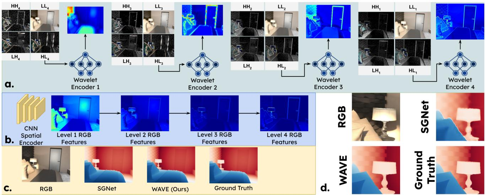  
Figure 1: Coarse-to-fine spatial guidance in GDSR. a. WAVE uses ML-DWT and consumes the sub-bands in reverse of their generation order, i.e., coarsest first, restoring global structure before finer details. b. A conventional CNN-encoder for spatial feature extraction extracts RGB features directly, surfacing fine local cues in the earliest feature maps and recovering global structure only in deeper layers, where these early high-frequency cues must be suppressed later. c. Full-scene and d. zoomed comparisons show WAVE producing crisp and non-bleeding boundaries, with sharper contours and clean surfaces.

A more natural ordering for depth reconstruction in GDSR, analogous to how a sculptor shapes the form of a figure before carving its detail, would reconstruct depth from coarse structure to fine detail. A CNN-based guidance backbone, by the implicit nature of its layer-wise feature hierarchy, is illsuited to impose this ordering without an additional control mechanism.

We propose WAVE, a multi-block, multi-branch architecture that challenges the prevailing fine-to-coarse paradigm. WAVE exploits Multi-Level Discrete Wavelet Transform (Mallat 1989) (ML-DWT) pyramid features together with DINO patch-level tokens, both inherently aligned in fine-to-coarse hierarchies, consuming them in reverse order to reconstruct depth from coarse structure to fine detail. At each stage, a divide-and-conquer strategy exploits the explicit decomposition of the wavelet transform, processing structural and high-frequency components through dedicated learnable branches within each reconstruction block. This ofers a more intuitive refinement and filtering strategy than suppressing misleading RGB cues through an opaque endto-end network. While frequency-domain priors have been used in GDSR (Zhao et al. 2022; Wang, Yan, and Yang 2024), these operate on depth features or gradient-frequency cues rather than filtering the guide itself. WAVE applies the ML-DWT to the RGB guide as an explicit mechanism for hierarchical, coarse-to-fine control and source-level noise suppression. WAVE also models interactions within and across frequency bands, between the bands and semantic tokens, and across modalities within the structural and detail branches.

Contrary to prior semantic-guided approaches, which either rely on semantics alone (risking over-smoothed depth) or treat semantics as auxiliary structural cues only within the depth stream, WAVE employs semantics as a learnable gating mechanism that arbitrates which RGB content is admitted, in addition to guiding the depth branch. In summary, our main contributions are as follows:

• We propose WAVE, which consumes the fine-to-coarse ML-DWT pyramid features and layer-wise DINO tokens in reverse, recovering global structure first and detail last, countering the fine-to-coarse bias that prior methods inherit from CNN guidance extractors and from semantictoken pipelines that add global context only at later stages.

• To our knowledge, this is the first use of multi-level wavelet decomposition as an explicit guidance-control mechanism in GDSR, processing the structural, edge, and texture sub-bands independently to address guideinduced noise at its source.

• We model 3 classes ofinteraction not previously unified in GDSR: among wavelet sub-bands, between wavelet features and semantics, and between the frequency-specific guidance and depth stream. Within these, learnable semantic gating modulates the high-frequency edge and texture bands, suppressing texture-copying artifacts while preserving geometrically meaningful details.

• We repurpose the IRN-style (Xiao et al. 2020) invertible coupling for a bijective cross-modal fusion, whose information-preserving form keeps both modalities recoverable and discourages collapse onto a single modality, unlike prior work that uses invertible blocks only as spatial-frequency bridges within a single stream.

• Beyond the direct injection of semantics into the depth stream, we adapt the frozen DINO via a low-rank residual on its output tokens rather than its weights (following DiReFT/LoRA (Wu et al. 2024; Hu et al. 2022)), obtaining task-specific semantics for GDSR without backbone fine-tuning or an explicit semantic loss.

The role of each component is detailed in the Methodology. Extensive experiments across multiple benchmarks and scale factors show that WAVE performs particularly well at extreme upsampling, where the low-resolution input retains the least structure and coarse-to-fine reconstruction contributes most. At 32×, WAVE attains a reduced RMSE over the next-best method SPFNet (RGB-D-D: 3.77 vs. 3.97; NYU\_v2: 7.90 vs. 8.06).

## Methodology

Figure 2 presents an overview of our proposed WAVE architecture’s coarse-to-fine super-resolution pipeline. The following subsections present the role and implementation of diferent modules that make this explicit coarse-to-fine reconstruction possible for GDSR.

## WAVE - Coarse-to-Fine Reconstruction

WAVE processes two input modalities: the low-resolution depth $\dot { D } _ { l r } ~ \in ~ \mathbb { R } ^ { 1 \times H / s \times \mathbf { \dot { W } } / s }$ and the RGB image $I \in$ $\mathbb { R } ^ { 3 \times H \times W }$ where s is the scaling factor. Unlike conventional methods that pass RGB directly through the network layers, we first decompose I into approximation and detail sub-bands by applying a four-level Haar wavelet decomposition via Mallat’s recursive multiresolution algorithm (Mallat 1989). The transform is applied recursively to the lowfrequency band, producing a multi-resolution pyramid in which each iteration halves the spatial resolution and the retained structure grows progressively coarser. Each level $l ~ \in ~ \{ 1 , 2 , 3 , 4 \}$ thus yields one approximation band $L L _ { l }$ which retains a smooth structural approximation of the scene, and three detail bands $L H _ { l } , H L _ { l } , H H _ { l }$ which carry fine details such as edges and texture. This not only decomposes the guidance signal by frequency content to separate smooth structures, edges, and textures, but also provides such distinction at multiple levels of abstraction, with local detail at shallow levels, and global structure at deep ones. The result is explicit control over which RGB features are admitted, at which scale, and how. This serves as the mechanism for both suppressing misleading RGB cues and enforcing a coarseto-fine reconstruction, neither of which arises naturally from the implicit fine-to-coarse hierarchy of CNN-based extractors (Yosinski et al. 2014).

SToRA: We use DINOv3 (Siméoni et al. 2025) (ViT-B/16) to extract patch tokens $\{ \tau _ { l } \} _ { l = 1 } ^ { 4 }$ from 4 layers (2, 5, 9, 11), each capturing a diferent level of semantic abstraction, supplying semantic priors from I as a derived auxiliary guiding modality. DINOv3 is kept frozen, and we use a bias-free, DiReFT (Wu et al. 2024)-inspired module for lightweight, task-specific adaptation of the tokens, rather than fine-tuning the backbone or resorting to an auxiliary semantic loss. For the token $\tau _ { l } \in \mathbb { R } ^ { C }$ at level l, the low-rank residual is applied as:

$$
\tau _ { l } ^ { * } = \tau _ { l } + \varsigma W _ { u } ( W _ { d } \tau _ { l } ) ,\tag{1}
$$

where, $W _ { u } \in \mathbb { R } ^ { C \times r }$ and $W _ { d } \in \mathbb { R } ^ { r \times C }$ are low-rank projection matrices, $r < < C ,$ and $\varsigma = \alpha / r$ scales the update. We zero-initialize $W _ { u }$ so that adaptation begins with the pretrained representation and gradually deviates during training. This eficiently modulates token features for task-specific learning, using only $2 C r$ parameters per adapter compared with a full $\bar { C ^ { \mathrm { ~ } } \times C }$ transform. We call this lightweight calibration Semantic Token Residual Adapter (SToRA), which helps avoid overwriting the rich semantics encoded in the token while nudging it with task-specific information. An ablation of the model without this module is provided in the Ablations section.

## HUMMA Block

HUMMA (Hierarchical Upsampling with Multi-band Multiresolution Approximation), presented in Figure 3, is the fundamental building block that produces a refined depth feature map from: i) the previous, lower-resolution depth features, ii) the ML-DWT sub-bands at the matching pyramid level, and iii) the semantic token with abstraction corresponding to the current level. The refined output depth feature map is upscaled by a factor of $2 \times$ . To invert the implicit fineto-coarse behavior of CNN extractors, the blocks operate on the DWT and DINOv3 hierarchies in reverse, towards progressively higher-resolution, finer-detail representations. Each HUMMA block splits the computation into a structure branch and a detail branch, so that misleading RGB cues are explicitly controlled for each frequency regime.

Details Branch: Recovers edge and texture details while suppressing high-frequency responses that do not correspond to true geometric boundaries. Rather than learning what detail is from an opaque feature map, the DWT provides an explicit handle over the three high-frequency subbands LH, H $L , H H \in \mathbb { R } ^ { 3 \times h \times w }$ (each), where $h \times w =$ $H / 2 ^ { l } \times \dot { W } / 2 ^ { l }$ , allowing WAVE to process edge and texture cues along two separate paths before merging them. Axis-aligned edge energy is concentrated in the horizontal and vertical bands, so we first concatenate and project the $L H$ and HL, collapsing them to a single c-channel feature map, and pass them through the edge encoder $\varepsilon _ { e d g e } ,$ which is a short stack of $1 \times 1$ and $3 \times 3$ convolutions in which $S i L U ( x ) = x \cdot \sigma ( x )$ acts as a self-gating nonlinearity (Elfwing, Uchibe, and Doya 2018):

$$
F _ { e d g e } = \varepsilon _ { e d g e } ( [ L H \mid H L ] ) \in \mathbb { R } ^ { c \times h \times w } ,\tag{2}
$$

where c is our projection channel dimension for level $l ^ { * }$ such that $l ^ { * } = 1$ operates on the coarsest wavelet (and token) representation $l = 4 \AA$ , while $l ^ { * } = 4$ corresponds to the finest representation $l = 1$ . Texture additionally requires the diagonal band, so the texture branch collapses all three bands and uses $\varepsilon _ { t e x t }$ that interleaves dilated convolutions with a standard $3 \times 3$ fill convolution, enlarging the receptive field to capture multi-scale texture while $\bar { S } i L \bar { U }$ again self-gates:

$$
F _ { t e x t } = \varepsilon _ { t e x t } ( [ L H \mid H L \mid H H ] ) \in \mathbb { R } ^ { c \times h \times w } .\tag{3}
$$

Hence, this way we learn intra-band relations, exploiting them to encode edge and texture features matched to their band statistics, instead of being entangled in a single guidance feature. The learnable interactions among bands are then followed by learnable interactions with the semantics to align the high-frequency features with true semantic boundaries. The SToRA token $\tau ^ { * }$ for the corresponding level is passed through diferent projections $( \varphi _ { e d g e }$ and $\varphi _ { t e x t } )$ to align with the feature space.

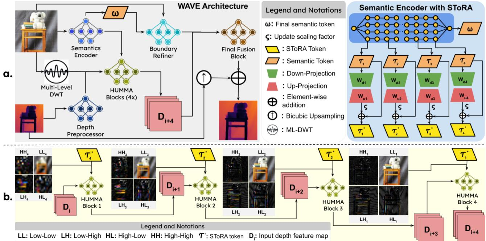  
Figure 2: Overview of the WAVE architecture and the coarse-to-fine HUMMA reconstruction blocks pipeline. a. ML-DWT decomposes the RGB guide into a fine-to-coarse sub-band pyramid, DINOv3 produces semantic tokens adapted by SToRA, and the Depth Preprocessor encodes the low-resolution depth. b. Four HUMMA blocks progressively reconstruct and upsample the depth feature maps using the coarse-to-fine spatial and semantic tokens, and the result is fused with the boundary-refined output via the Final Fusion Block.

$$
E _ { g u i d e } = \varphi _ { e d g e } ( \tau ^ { * } ) , \quad T _ { g u i d e } = \varphi _ { t e x t } ( \tau ^ { * } ) .\tag{4}
$$

Each projected semantic guide then queries a global summary of its corresponding feature map through linear crossattention (Katharopoulos et al. 2020), selecting relevant details, operating at linear $\mathcal { O } ( N )$ cost (N is the number of spatial positions $h \times w )$

$$
\begin{array} { r l } & { { \cal A } t t n ( Q , { \cal K } , { \cal V } ) = \phi ( Q ) ( \phi ( { \cal K } ) ^ { \top } { \cal V } ) , } \\ & { ~ \phi ( x ) = { \cal E } { \cal L } { \cal U } ( x ) + 1 . } \\ & { \tilde { F } _ { e d g e } = { \cal A } t t n ( E _ { g u i d e } , F _ { e d g e } , F _ { e d g e } ) , } \\ & { ~ \tilde { F } _ { t e x t } = { \cal A } t t n ( T _ { g u i d e } , F _ { t e x t } , F _ { t e x t } ) . } \end{array}\tag{5}
$$

Learned Gated Semantic Mixing: The semanticallymodulated features are combined with the raw features in each path through learned coeficients $\gamma _ { e d g e }$ and $\gamma _ { t e x t } .$ , initialized to zero so that each path relies entirely on its raw edge/texture features at the start of training, with the semantic contribution introduced gradually as training progresses:

$$
\begin{array} { r } { F _ { e d g e } ^ { * } = ( 1 - \gamma _ { e d g e } ) F _ { e d g e } + \gamma _ { e d g e } \tilde { F } _ { e d g e } } \\ { F _ { t e x t } ^ { * } = ( 1 - \gamma _ { t e x t } ) F _ { t e x t } + \gamma _ { t e x t } \tilde { F } _ { t e x t } . } \end{array}\tag{6}
$$

This deferred reliance on semantics lets the network first learn stable band representations before the semantic guide reweights high-frequency responses toward those consistent with true geometric boundaries. The outputs of the two paths are summed and passed through a final refinement projection θ to produce the high-frequency detail feature map, subsequently used to sharpen the structural depth feature and to prevent over-smoothed depth:

$$
F _ { d e t a i l s } = \theta ( F _ { e d g e } ^ { * } + F _ { t e x t } ^ { * } ) .\tag{7}
$$

Structure Branch: The relationship among three modalities, i.e., the low-frequency depth representation D, the global structural cues in the LL band, and the SToRA token $\tau ^ { * }$ , is learned through a series of projections. The explicit control over the inputs, which is limited to a smooth, low-frequency structure of the scene while withholding the high-frequency appearance detail, helps this branch learn geometry without being distracted by dominating texture. Each modality is first brought to a common latent space through learned projections, with self-gating achieved through $S i L { \bar { U } } .$ adaptively suppressing irrelevant responses per stream. Let $E _ { d } , \dot { E } _ { l } , \dot { S } _ { g u i d e } \in \mathbb { R } ^ { c \times h \times w }$ denote the aligned representations corresponding to the encoded depth feature map, LLsubband, and semantic features, respectively. The relation between depth modality $D$ and semantics $S _ { g u i d e }$ is established for refining the depth map with semantic cues. To actively pull the semantic content relevant to the depth structure, linear cross-attention is applied using the depth feature map as a query:

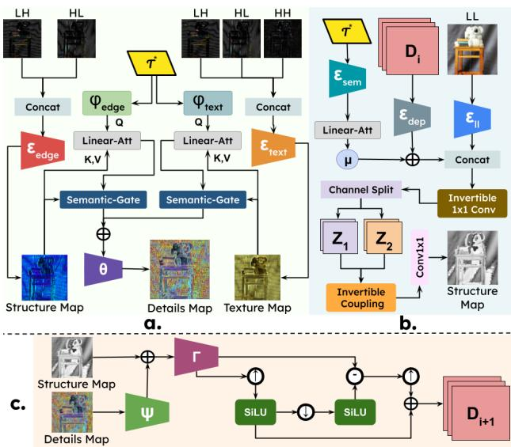  
Figure 3: Overview of the HUMMA block. a. Detail branch processes the high-frequency sub-bands along edge and texture paths, each modulated by the SToRA token via semantic gating. The two feature maps are merged to produce a detail map. b. Structure branch relates the low-frequency depth features, LL approximation, and SToRA tokens through learnable projections. The IRN-style fusion bijectively couples the modalities, keeping both recoverable. c. The Reconstruction block aligns and residually adds the details to the structure map, followed by back-projection for $2 \times$ upsampling to produce the next refined depth feature map.

$$
\begin{array} { r l } & { S _ { d e p } = \phi ( Q ) ( \phi ( K ) ^ { \top } V ) , } \\ & { Q = D , K = V = S _ { g u i d e } . } \end{array}\tag{8}
$$

The query/key assignment is intentionally reversed from the detail branch: there, the semantic token queries the feature maps to form a global summary that gates local bands, while here, the depth map queries the semantics to pull structurerelevant content. The related semantics refine the depth feature map as a learnable-gated residual:

$$
E _ { d } ^ { * } = E _ { d } + \mu S _ { d e p } \in \mathbb { R } ^ { c \times h \times w } ,\tag{9}
$$

where $\mu$ is initialized to zero, so the branch begins from the raw depth feature and injects semantic correction only as training progresses, the same deferred-reliance gating mechanism used before.

Cross-Modal Coupling: We adopt an IRN-style (Xiao et al. 2020) invertible coupling to achieve a mutually conditioned mix of structural cues from the semantically rich depth feature and the encoded photometric information from the LL approximation band. The semantically-refined depth feature $E _ { d } ^ { * }$ and aligned LL representation $E _ { l } ^ { \mathrm { { \bar { \Phi } } } }$ are concatenated and mixed across channels by an LU-parameterized invertible $1 \times 1$ convolution, producing $Z \in \dot { \mathbb { R } } ^ { 2 c \times h \times w }$ . This mix representation is then split into two halves $Z _ { 1 } , Z _ { 2 } \in \mathbb { R } ^ { c \times h \times \mathbf { \dot { w } } }$ which are coupled by an afine transform in which each half conditions the other:

$$
\begin{array} { r } { Y _ { 1 } = Z _ { 1 } + F ( Z _ { 2 } ) , \quad S = 2 \sigma ( H ( Y _ { 1 } ) ) - 1 , } \\ { \quad Y _ { 2 } = Z _ { 2 } \odot \exp ( S ) + G ( Y _ { 1 } ) , ~ } \end{array}\tag{10}
$$

where F, G, and H are learned convolutional subnetworks, $\sigma$ is the sigmoid, and $\odot$ denotes the Hadamard product. Because the coupling is invertible by construction, it discourages the fusion from discarding either modality, in contrast to a plain concatenation-and-projection that can freely suppress one stream. The conditioned results are concatenated and projected back to c channels with a final 1×1 convolution to yield the structural feature $E _ { s t r u c t } \in \mathbb { R } ^ { c \times h \times w }$

The structural depth feature, reconstructed from the lowfrequency content, is then injected with the high-frequency details recovered by the detail branch. The details are aligned to the structural feature through a learned projection ψ, and then added residually, scaled by a learnable coeficient $\rho$ initialized to zero, and the result is harmonized by a residual group of channel-attention blocks Γ:

$$
\begin{array} { r } { \tilde { F } _ { d e t a i l s } = \psi ( F _ { d e t a i l s } ) , ~ } \\ { \tilde { D } = \Gamma ( E _ { s t r u c t } + \rho \tilde { F } _ { d e t a i l s } ) . ~ } \end{array}\tag{11}
$$

The additive form and the zero-initialized residual keep the reconstructed structure intact while the details sharpen it only where warranted, progressively through the training in a controlled manner. Finally, a DBP-styled (Haris, Shakhnarovich, and Ukita 2018) back-projection block upsamples the depth feature map to $2 \times \colon$

$$
\begin{array} { r } { \begin{array} { r l } & { H _ { 0 } = \mathrm { S i L U } ( \uparrow \tilde { D } ) , \quad L _ { 0 } = \mathrm { S i L U } ( \downarrow H _ { 0 } ) , } \\ & { E _ { e r r } = L _ { 0 } - \tilde { D } , \quad H _ { 1 } = \uparrow E _ { e r r } , \quad \tilde { D } ^ { \uparrow } = H _ { 0 } + H _ { 1 } , } \end{array} } \end{array}\tag{12}
$$

where ↑ and ↓ denote the learned up- and down-projections, implemented as transposed and strided convolutions at 2× scale.

## Boundary Refinement and Optimization

To add global, object-level contour sharpening, the coarse-tofine reconstructed feature map is subjected to a final refinement, guided by a semantic boundary derived from the source RGB. Self-supervised vision transformer features carry implicit scene-layout and object-boundary information accessible in the final-layer tokens (Siméoni et al. 2025; Caron et al. 2021; Oquab et al. 2023), which we exploit by computing the cosine similarity between each patch and its horizontal and vertical neighbors (Siméoni et al. 2025), reading out boundary strength as the local dissimilarity. For the l2-normalized final patch token ω:

$$
\begin{array} { r l } & { c _ { x } = \langle \omega _ { i , j } , \omega _ { i , j - 1 } \rangle , \quad c _ { y } = \langle \omega _ { i , j } , \omega _ { i - 1 , j } \rangle , } \\ & { \qquad B = \sqrt { ( 1 - c _ { x } ) ^ { 2 } + ( 1 - c _ { y } ) ^ { 2 } } . } \end{array}\tag{13}
$$

Since these dense similarities are known to be spatially noisy (Siméoni et al. 2025), B is smoothed with a Gaussian kernel and mean-normalized for scale invariance, yielding the soft semantic boundary $\tilde { B } .$ . The boundary ${ \tilde { B } } ,$ , the projected input RGB, and the depth map from the last HUMMA block, each at the same spatial resolution $H \times W$ , are passed through a learnable fusion network to produce the final highresolution depth $D _ { h r } \in \mathbb { R } ^ { 1 \times H \times W }$ . For optimization we use modified $L _ { 1 }$ loss (Nasir, Liu, and Mian 2026a).

## Experiments

## Datasets and Evaluation

We adopt two established GDSR benchmarking protocols (Kang et al. 2025; Yan et al. 2025; Zhong et al. 2026) that difer in training data and evaluation sets, and follow the exact training and evaluation settings of prior work under each for a fair and transparent comparison with existing works (Li et al. 2016, 2019; Deng and Dragotti 2020; Kim, Ponce, and Ham 2021; Tang, Chen, and Zeng 2021; Zhao et al. 2022; Metzger, Daudt, and Schindler 2023; Zhao et al. 2023; Wang, Yan, and Yang 2024; Wang et al. 2025; Nasir, Liu, and Mian 2026b). The first protocol trains on HYPERSIM (Roberts et al. 2021) and tests on Middlebury (Scharstein and Szeliski 2003), Lu (Lu, Ren, and Liu 2014), NYU\_v2 (Silberman et al. 2012), RGBD-D (He et al. 2021), and TOFDSR (Yan et al. 2024), while the second trains on NYU\_v2 and tests on NYU-v2, RGBD-D, Middlebury, Lu, and DIML (Cho et al. 2021). We report RMSE in centimeters (lower is better) at 8× and 16×, and additionally at 32× to assess extreme upsampling, following (Kang et al. 2025; Yan et al. 2025). We optimize with Adam with an initial learning rate of 1e-4. Additionally, Table 4 lists the comparisons of the parameters for diferent methods.

## Benchmarking

Tables 1, 2, and 3 report the results, where WAVE shows competitive performance across all settings. Its margins are largest at higher upsampling factors, consistent with our hypothesis that coarse-to-fine reconstruction helps most when the low-resolution input retains the least structure. On the in-domain NYU\_v2 test set at lower scales, where the benchmark is saturated (leading methods within ∼0.1-0.2 RMSE), WAVE is competitive rather than dominant; its advantage widens with scale factor and on out-of-domain sets, consistent with the coarse-to-fine hypothesis. Qualitative comparisons against diferent methods are shown in Figure 4, where WAVE produces sharper object boundaries, fewer texturecopying artifacts, and less boundary bleeding relative to competing methods. Extended qualitative comparisons and complexity analysis are provided in the appendix.

<table><tr><td rowspan=1 colspan=1>Method</td><td rowspan=1 colspan=1>RGBD-D</td><td rowspan=1 colspan=1>NYU_v2</td><td rowspan=1 colspan=1>M-bury</td><td rowspan=1 colspan=1>Lu</td><td rowspan=1 colspan=1>Average</td></tr><tr><td rowspan=1 colspan=1>DJFR</td><td rowspan=1 colspan=1>6.48</td><td rowspan=1 colspan=1>14.12</td><td rowspan=1 colspan=1>8.57</td><td rowspan=1 colspan=1>9.94</td><td rowspan=8 colspan=1>9.7810.988.798.799.217.607.796.08</td></tr><tr><td rowspan=2 colspan=1>CUNetDKN</td><td rowspan=1 colspan=1>7.75</td><td rowspan=1 colspan=1>15.95</td><td rowspan=1 colspan=1>9.23</td><td rowspan=2 colspan=1>10.978.98</td></tr><tr><td rowspan=1 colspan=1>5.97</td><td rowspan=1 colspan=1>12.46</td><td rowspan=1 colspan=1>7.76</td></tr><tr><td rowspan=4 colspan=1>FDSRDCTNetSGNetDORNet</td><td rowspan=1 colspan=1>5.08</td><td rowspan=1 colspan=1>14.19</td><td rowspan=1 colspan=1>7.26</td><td rowspan=4 colspan=1>8.629.287.238.28</td></tr><tr><td rowspan=1 colspan=1>5.99</td><td rowspan=2 colspan=1>11.24</td><td rowspan=2 colspan=1>8.226.79</td></tr><tr><td rowspan=1 colspan=1>5.15</td></tr><tr><td rowspan=1 colspan=1>5.05</td><td rowspan=1 colspan=1>10.97</td><td rowspan=1 colspan=1>6.87</td></tr><tr><td rowspan=1 colspan=1>SPFNet</td><td rowspan=1 colspan=1>3.97</td><td rowspan=1 colspan=1>8.06</td><td rowspan=1 colspan=1>5.90</td><td rowspan=1 colspan=1>6.39</td></tr><tr><td rowspan=1 colspan=1>WAVE</td><td rowspan=1 colspan=1>3.77</td><td rowspan=1 colspan=1>7.90</td><td rowspan=1 colspan=1>5.42</td><td rowspan=1 colspan=1>6.96</td><td rowspan=1 colspan=1>6.01</td></tr></table>

Table 1: 32× results under the NYU\_v2 training protocol, evaluated on RGBD-D, NYU\_v2, Middlebury, and Lu. Baseline numbers are taken from (Wang et al. 2024). Best in bold, second-best underlined.

## Ablation

All ablations use WAVE trained under the NYU\_v2 protocol at 16×, each isolating one component with all other settings fixed. We evaluate on TOFDSR (560 samples), unseen during training and thus out-of-distribution. Table 5 reports the RMSE for each variant for the TOFDSR datasets. We start by validating our core design choice of coarse-to-fine recon struction by reordering the ML-DWT subbands and layerwise DINOv3 tokens in a fine-to-coarse schedule (WAVEa). The significant increase in RMSE confirms that the gains stem not merely from the presence of the wavelet and semantic hierarchies but from how both are consumed in a structure-first order. WAVE-b replaces the IRN-style modality fusion with a plain channel concatenation followed by a 3 × 3 convolution. The drop in performance highlights the importance of invertible coupling in keeping both modalities recoverable. Next, we drop all wavelet sub-bands, including the LL approximation, letting the reconstruction rely solely on depth features and semantics (WAVE-c), where the drop in performance validates the role of spatial RGB details. Sim ilarly, WAVE-d removes the detail branch and the residual details injection, letting the reconstruction work only with low-frequency structural spatial features, ignoring the edge and texture cues carried by the high-frequency sub-bands, causing a performance drop. WAVE-e and WAVE-f validate the role of semantics-based refinement and gating, where the former removes the semantic refinement from the structure branch, and the latter removes the gated-semantic control over the high-frequency feature wavelet sub-bands. The absence of both increases RMSE, reflecting degraded performance. Finally, WAVE-g removes SToRA, relying on direct DINOv3 semantic tokens without any additional learning, and WAVE-h removes the semantic boundary map derived from the global DINOv3 features for object-level contour sharpening, each resulting in a performance drop, validating the importance of each in the overall WAVE architecture. Additional ablations, including semantic backbone substitutions and guidance misalignment robustness tests, are provided in the appendix.

## Conclusion

We presented WAVE, a coarse-to-fine architecture for GDSR that counters the fine-to-coarse bias of conventional pipelines. By decomposing the RGB guide with a multi-level discrete wavelet transform and consuming its sub-bands together with hierarchical DINOv3 tokens in reverse order, WAVE reconstructs global structure first and fine detail last. It filters misleading guidance cues at the source and processes structural, edge, and texture components through dedicated branches. We employ semantics as a learnable gating mechanism for high-frequency content and repurpose the invertible coupling for multi-modality fusion. Experiments across multiple benchmarks and evaluation protocols show that WAVE performs competitively, with the largest gains at high upsampling factors where the low-resolution input retains the least structure. WAVE’s gains are smaller in the saturated, indomain low-scale regime, and it depends on a frozen foundation model for semantic priors. Relaxing this dependence and extending the coarse-to-fine schedule to blind or real-world degradations are promising directions.

WAVE  
RGB
<table><tr><td rowspan="2">Method</td><td colspan="2">RGBD-D</td><td colspan="2">TOFDSR</td><td colspan="2">NYU_v2</td><td colspan="2">M-bury</td><td colspan="2">Lu</td><td colspan="2">Average</td></tr><tr><td>8×</td><td>16×</td><td>8×</td><td>16×</td><td>8×</td><td>16×</td><td>8×</td><td>16×</td><td>8×</td><td>16×</td><td>8×</td><td>16×</td></tr><tr><td>DJF</td><td>2.58</td><td>4.46</td><td>5.59</td><td>8.19</td><td>5.56</td><td>9.82</td><td>3.09</td><td>5.50</td><td>3.58</td><td>6.53</td><td>4.08</td><td>6.90</td></tr><tr><td>DJFR</td><td>2.61</td><td>4.36</td><td>5.11</td><td>8.06</td><td>5.20</td><td>9.50</td><td>2.82</td><td>5.16</td><td>3.24</td><td>6.46</td><td>3.80</td><td>6.71</td></tr><tr><td>CUNet</td><td>2.35</td><td>3.81</td><td>5.14</td><td>7.36</td><td>5.50</td><td>8.63</td><td>2.86</td><td>4.72</td><td>2.85</td><td>5.63</td><td>3.74</td><td>6.03</td></tr><tr><td>FDKN</td><td>2.25</td><td>3.71</td><td>4.40</td><td>7.16</td><td>4.93</td><td>7.97</td><td>2.51</td><td>4.42</td><td>2.67</td><td>5.48</td><td>3.35</td><td>5.75</td></tr><tr><td>DKN</td><td>2.33</td><td>3.70</td><td>4.54</td><td>7.24</td><td>4.88</td><td>7.70</td><td>2.43</td><td>4.17</td><td>2.88</td><td>5.44</td><td>3.41</td><td>5.65</td></tr><tr><td>FDSR</td><td>2.25</td><td>3.44</td><td>4.28</td><td>6.85</td><td>4.82</td><td>7.29</td><td>2.41</td><td>3.97</td><td>2.69</td><td>5.23</td><td>3.29</td><td>5.36</td></tr><tr><td>DCTNet</td><td>2.47</td><td>4.13</td><td>5.38</td><td>8.04</td><td>4.90</td><td>9.10</td><td>2.75</td><td>5.07</td><td>3.07</td><td>5.83</td><td>3.71</td><td>6.43</td></tr><tr><td>DADA</td><td>2.81</td><td>4.01</td><td>5.86</td><td>7.79</td><td>4.83</td><td>7.99</td><td>2.77</td><td>4.11</td><td>3.76</td><td>6.19</td><td>4.01</td><td>6.02</td></tr><tr><td>DuCos</td><td>2.23</td><td>3.44</td><td>4.60</td><td>6.90</td><td>4.61</td><td>7.37</td><td>2.23</td><td>3.96</td><td>2.67</td><td>5.18</td><td>3.27</td><td>5.37</td></tr><tr><td>WAVE</td><td>2.13</td><td>3.17</td><td>3.49</td><td>5.33</td><td>4.61</td><td>7.16</td><td>2.28</td><td>3.52</td><td>2.35</td><td>4.86</td><td>2.97</td><td>4.81</td></tr></table>

Table 2: Hypersim training protocol at 8× and 16×, evaluated on RGBD-D, TOFDSR, NYU\_v2, Middlebury, and Lu. Baselines taken from (Yan et al. 2025). Best in bold, second-best underlined

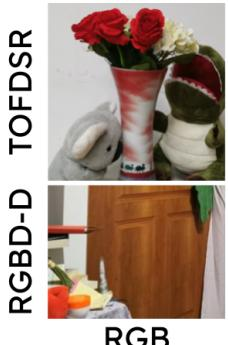

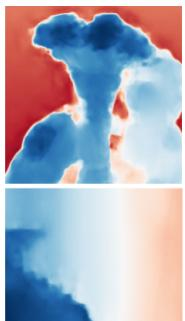  
DCTNet

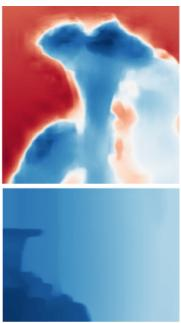

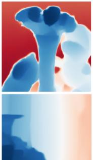  
NAIMA

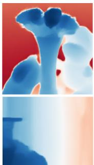  
C2PD

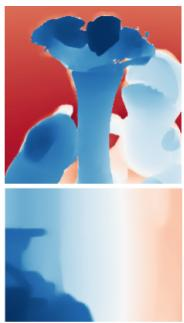

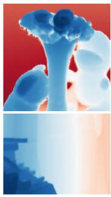  
GT

Figure 4: Qualitative comparison at 16× on TOFDSR (top) and RGBD-D (bottom). Compared with prior works, WAVE recover sharper object boundaries and cleaner surfaces with fewer texture-copying artifacts, closest to the ground truth (GT).
<table><tr><td rowspan=1 colspan=1>Method</td><td rowspan=1 colspan=1>RGBD-D8× 16×</td><td rowspan=1 colspan=1>DIML8× 16×</td><td rowspan=1 colspan=1>NYU_v28× 16×</td><td rowspan=1 colspan=1>M-bury8× 16×</td><td rowspan=1 colspan=1>Lu8× 16×</td></tr><tr><td rowspan=1 colspan=1>DJFR</td><td rowspan=1 colspan=1>5.57 7.99</td><td rowspan=1 colspan=1>2.34 4.13</td><td rowspan=1 colspan=1>4.94 9.18</td><td rowspan=1 colspan=1>3.195.57</td><td rowspan=1 colspan=1>3.57 6.77</td></tr><tr><td rowspan=1 colspan=1>JIIFDKN</td><td rowspan=1 colspan=1>1.792.871.963.42</td><td rowspan=1 colspan=1>1.863.221.863.22</td><td rowspan=1 colspan=1>2.765.273.266.51</td><td rowspan=1 colspan=1>1.823.312.124.24</td><td rowspan=1 colspan=1>1.734.162.165.11</td></tr><tr><td rowspan=1 colspan=1>FDSR</td><td rowspan=1 colspan=1>1.82 3.06</td><td rowspan=1 colspan=1>1.712.87</td><td rowspan=1 colspan=1>3.185.86</td><td rowspan=1 colspan=1>2.084.39</td><td rowspan=1 colspan=1>2.195.00</td></tr><tr><td rowspan=1 colspan=1>DCTNet</td><td rowspan=1 colspan=1>1.743.05</td><td rowspan=1 colspan=1>1.713.73</td><td rowspan=1 colspan=1>3.165.84</td><td rowspan=1 colspan=1>2.054.19</td><td rowspan=1 colspan=1>1.854.39</td></tr><tr><td rowspan=1 colspan=1>DADA</td><td rowspan=1 colspan=1>1.83 2.80</td><td rowspan=1 colspan=1>1.71 2.65</td><td rowspan=1 colspan=1>2.744.80</td><td rowspan=1 colspan=1>2.034.18</td><td rowspan=1 colspan=1>1.874.01</td></tr><tr><td rowspan=1 colspan=1>SSDNet</td><td rowspan=1 colspan=1>1.72 2.92</td><td rowspan=1 colspan=1>1.833.21</td><td rowspan=1 colspan=1>3.145.86</td><td rowspan=1 colspan=1>1.914.02</td><td rowspan=1 colspan=1>1.824.77</td></tr><tr><td rowspan=1 colspan=1>SGNet</td><td rowspan=1 colspan=1>1.642.55</td><td rowspan=1 colspan=1>1.752.71</td><td rowspan=1 colspan=1>2.444.77</td><td rowspan=1 colspan=1>1.642.95</td><td rowspan=1 colspan=1>1.61 3.55</td></tr><tr><td rowspan=1 colspan=1>DORNet</td><td rowspan=1 colspan=1>1.802.97</td><td rowspan=1 colspan=1>1.883.21</td><td rowspan=1 colspan=1>2.705.60</td><td rowspan=1 colspan=1>1.763.481.75</td><td rowspan=1 colspan=1>4.41</td></tr><tr><td rowspan=1 colspan=1>SPFNet</td><td rowspan=1 colspan=1>1.712.53</td><td rowspan=1 colspan=1></td><td rowspan=1 colspan=1>2.364.55</td><td rowspan=1 colspan=1>1.572.79</td><td rowspan=1 colspan=1>1.563.20</td></tr><tr><td rowspan=1 colspan=1>C2PD</td><td rowspan=1 colspan=1>1.632.41</td><td rowspan=1 colspan=1>1.682.59</td><td rowspan=1 colspan=1>2.364.48</td><td rowspan=1 colspan=1>1.57 2.80</td><td rowspan=1 colspan=1>1.53 3.11</td></tr><tr><td rowspan=1 colspan=1>NAIMA</td><td rowspan=1 colspan=1>1.61 2.47</td><td rowspan=1 colspan=1>1.652.52</td><td rowspan=1 colspan=1>2.394.61</td><td rowspan=1 colspan=1>1.62 2.75</td><td rowspan=1 colspan=1>1.443.34</td></tr><tr><td rowspan=1 colspan=1>LapNet</td><td rowspan=1 colspan=1>1.562.45</td><td rowspan=1 colspan=1>1.522.52</td><td rowspan=1 colspan=1>2.334.55</td><td rowspan=1 colspan=1></td><td rowspan=1 colspan=1></td></tr><tr><td rowspan=1 colspan=1>WAVE</td><td rowspan=1 colspan=1>1.58 2.39</td><td rowspan=1 colspan=1>1.62 2.50</td><td rowspan=1 colspan=1>2.50 4.60</td><td rowspan=1 colspan=1>1.56 2.82</td><td rowspan=1 colspan=1>1.403.20</td></tr></table>

Table 3: NYU\_v2 training protocol at 8× and 16×, evaluated on RGBD-D, DIML, NYU\_v2, Middlebury, and Lu. At these scales, the benchmark is largely saturated, where the leading methods fall within roughly 0.1-0.2 RMSE. Baselines taken from (Wang et al. 2024; Kang et al. 2025). Best in bold, second-best underlined.

<table><tr><td>Method</td><td>Params</td><td>Method</td><td>Params</td><td>Method</td><td>Params</td></tr><tr><td>SPFNet DADA</td><td>30.68 31.03</td><td>SGNet DuCos</td><td>39.25 34.38</td><td>C2PD NAIMA</td><td>65.05 81.78</td></tr><tr><td colspan="4">WAVE: 39.69 M trainable + 21.60 M frozen (DINOv3)</td></tr></table>

Table 4: Parameter counts in millions (M). WAVE’s frozen DINOv3 backbone is not updated during training, only 39.69 M parameters are trainable.
<table><tr><td>Variant</td><td>Ablated component</td><td>TOFDSR</td></tr><tr><td>WAVE 1</td><td></td><td>4.57</td></tr><tr><td>WAVE-a WAVE-b</td><td>Fine-to-coarse schedule No cross modal invertible coupling</td><td>4.79 4.63</td></tr><tr><td>WAVE-c</td><td>No wavelet spatial bands (semantics only)</td><td>4.63</td></tr><tr><td>WAVE-d</td><td>No high frequency details injection</td><td>4.65</td></tr><tr><td>WAVE-e</td><td>No semantics refinement in structure branch</td><td>4.69</td></tr><tr><td>WAVE-f</td><td>No semantic gating in details branch</td><td>4.60</td></tr><tr><td>WAVE-g</td><td></td><td></td></tr><tr><td></td><td>No SToRA</td><td>4.62</td></tr><tr><td>WAVE-h</td><td>No semantic boundary refinement</td><td>4.71</td></tr></table>

Table 5: Ablations at 16× under the NYU\_v2 protocol. We report the RMSE in centimeters (lower is better), with the overall increase highlighting the significance of each component. Results are reported for the TOFDSR dataset, serving as an out-of-distribution test.

## Appendix

## Literature Review

Acquiring high-quality depth maps remains expensive and hardware-constrained compared to their RGB counterparts (Ariav and Cohen 2022), which has motivated a large body of work on guided depth super-resolution, where a high-resolution RGB image of the same scene guides the recovery of a high-quality depth map from its low-resolution version (Zhong et al. 2023b). Deep neural networks have become the standard approach for GDSR, where early works framed the task as deep joint image filtering (Li et al. 2016, 2019; Kim, Ponce, and Ham 2021) or employed convolutional architectures to extract and fuse features from the lowresolution depth and the high-resolution RGB guide (Zuo et al. 2021; Hui, Loy, and Tang 2016; Deng and Dragotti 2020; De Lutio et al. 2022; Tang, Chen, and Zeng 2021), later extending to real-world degradations (He et al. 2021) and more diverse formulations such as anisotropic diffusion (Metzger, Daudt, and Schindler 2023), continuityconstrained deformation (Kang et al. 2025), and state-space models (Wu et al. 2026). The guided formulation, however, carries an inherent weakness rooted in the RGB guide itself, i.e., textures, color gradients, shadows, and illumination patterns frequently do not coincide with true geometric discontinuities, and when transferred indiscriminately, they produce false depth edges, texture-copying artifacts, and blurred object boundaries (Li et al. 2020a,b).

A substantial line of work mitigates this guidanceinduced noise through selective feature integration, including attention-based fusion that models cross-modal correlation and suppresses depth-irrelevant responses (Zhong et al. 2021; Yang et al. 2022; Song et al. 2020; Zhong et al. 2023a; Shi, Ye, and Du 2022), constrained or regularized fusion designs (Wang, Yan, and Yang 2024; Wang et al. 2025; Yuan et al. 2023a,b), and auxiliary or multi-task supervision such asjoint learning with monocular depth estimation (Tang et al. 2021) or depth completion (Yan et al. 2022). Semantic priors from foundation models have recently been distilled into GDSR (Wang et al. 2024; Yan et al. 2025; Nasir, Liu, and Mian 2026b). Yet across all of these strategies, one structural issue persists. Whether convolutional or token-based, the backbones that consume the RGB guide share the same layer-wise behavior, i.e., high-frequency local cues such as edges and textures surface in the earliest layers, while global scene structure emerges only in the deeper ones (Yosinsk et al. 2014; Zeiler and Fergus 2014). The guide is therefore processed in an inherently fine-to-coarse order. As a result, the misleading high-frequency content is injected first, and the network must learn to suppress it in later layers, where global context is available.

WAVE difers by decomposing the guide itself into explicit frequency sub-bands via a multi-level wavelet transform (Mallat 1989) before fusion, and consuming these subbands together with layer-wise semantic tokens in reverse, coarse-to-fine order, so that the admission of RGB content is controlled at its source rather than corrected downstream, and the reconstruction happens in a structure-first and detail-later paradigm.

## RGB Shift Robustness Tests

To evaluate robustness to RGB-depth misalignment, we translate the RGB guide horizontally and vertically by 1 − 8 pixels at the high-resolution grid while keeping the lowresolution depth input, the ground truth, and the evaluation mask fixed. Any change in RMSE is therefore attributable solely to each method’s reliance on pixel-accurate registration between the guide and the depth. All experiments use the 16× models. Figure 5 presents the change in performance for the diferent techniques as the RGB guide is shifted. WAVE remains the lowest or on par with the best competing method across all four test sets and does not exhibit the sharper degradation as shown by C2PD at the largest shift.

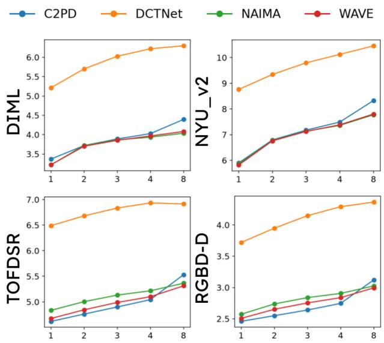  
Figure 5: RGB shift robustness at 16×. RMSE (cm, lower is better) on DIML, NYU v2, TOFDSR, and RGB-D-D as the RGB guide is translated (horizontally and vertically) by 1 − 8 pixels while the depth input and ground truth remain fixed. The x-axis represents the shift in pixels, while the yaxis reports the changing RMSE in centimeters.

## Replacing DINOv3 with SAM-2 and ResNet

The main ablation showed that removing semantic refinement or gating degrades performance, while removing semantics entirely confirms that WAVE does not rely solely on the semantic encoder for the achieved gains. To verify that these gains are not tied to a specific foundation model, we replace DINOv3 with the SAM-2 and ResNet-50 backbones, in each case extracting features from four layers of increasing abstraction and consuming them in the same coarse-tofine order. Results are reported in Table 6. All three encoders achieve comparable performance, with DINOv3 best on RGB-D-D, Middlebury, and Lu, and SAM-2 marginally better on DIML and NYU\_v2. We adopt DINOv3 as the default since it attains the best average performance with the fewest frozen parameters.

<table><tr><td>Encoder</td><td>RGBD-D</td><td></td><td>DIMLNYU_v2</td><td>M-bury</td><td>Lu</td><td>Frozen Parameters (M)</td></tr><tr><td>DINOv3</td><td>2.39</td><td>2.50</td><td>4.60</td><td>2.82</td><td>3.20</td><td>21.6</td></tr><tr><td>SAM-2</td><td>2.43</td><td>2.47</td><td>4.55</td><td>2.87</td><td>3.32</td><td>26.9</td></tr><tr><td>ResNet-50</td><td>2.44</td><td>2.50</td><td>4.63</td><td>2.82</td><td>3.40</td><td>23.5</td></tr></table>

Table 6: Semantic encoder substitution under the NYU\_v2 training protocol at 16×, evaluated on RGB-D-D, DIML, NYU\_v2, Middlebury, and Lu (RMSE in cm, lower is better). Each encoder is kept frozen, and its layer-wise features are consumed in the same coarse-to-fine schedule. Best in bold, second-best underlined. The last column lists frozen encoder parameters in millions (M).

## Complexity Analysis

Table 7 reports model complexity for a single-batch inference pass. Trainable and non-trainable parameters are listed separately. FLOPs and peak GPU memory allocation are measured at the input resolution of the corresponding benchmark on a single NVIDIA RTX 4090 GPU.

<table><tr><td rowspan=1 colspan=1>Model</td><td rowspan=1 colspan=1>Scale</td><td rowspan=1 colspan=1>TrainableParameters(M)</td><td rowspan=1 colspan=1>Non-TrainableParamseters(M)</td><td rowspan=1 colspan=1>FLOPs (G)</td><td rowspan=1 colspan=1>GPUMemory(GB)</td></tr><tr><td rowspan=1 colspan=1>DCTNetDCTNet</td><td rowspan=1 colspan=1>8×16×</td><td rowspan=1 colspan=1>0.480.48</td><td rowspan=1 colspan=1>--</td><td rowspan=1 colspan=1>5.735.73</td><td rowspan=1 colspan=1>1.361.36</td></tr><tr><td rowspan=1 colspan=1>SGNetSGNet</td><td rowspan=1 colspan=1>8×16×</td><td rowspan=1 colspan=1>39.2585.94</td><td rowspan=1 colspan=1>一-</td><td rowspan=1 colspan=1>4720.239715.16</td><td rowspan=1 colspan=1>1.801.97</td></tr><tr><td rowspan=1 colspan=1>SPFNetSPFNet</td><td rowspan=1 colspan=1>8×16×</td><td rowspan=1 colspan=1>30.6831.10</td><td rowspan=1 colspan=1>一一</td><td rowspan=1 colspan=1>3290.013259.42</td><td rowspan=1 colspan=1>2.122.23</td></tr><tr><td rowspan=1 colspan=1>C2PDC2PD</td><td rowspan=1 colspan=1>8×16×</td><td rowspan=1 colspan=1>65.0565.05</td><td rowspan=1 colspan=1>一</td><td rowspan=1 colspan=1>409.71409.71</td><td rowspan=1 colspan=1>1.271.27</td></tr><tr><td rowspan=1 colspan=1>NAIMANAIMA</td><td rowspan=1 colspan=1>8×16×</td><td rowspan=1 colspan=1>59.77119.93</td><td rowspan=1 colspan=1>21.9421.94</td><td rowspan=1 colspan=1>5008.9011374.36</td><td rowspan=1 colspan=1>3.123.97</td></tr><tr><td rowspan=1 colspan=1>WAVEWAVE</td><td rowspan=1 colspan=1>8×16×</td><td rowspan=1 colspan=1>39.6939.69</td><td rowspan=1 colspan=1>21.6021.60</td><td rowspan=1 colspan=1>1736.761736.76</td><td rowspan=1 colspan=1>1.091.09</td></tr></table>

Table 7: Complexity comparison for single-batch inference at 8× and 16×, measured at 448 × 448 input resolution. Trainable and frozen (non-trainable) parameters are in millions (M), FLOPs in Giga-operations (G), and peak GPU memory allocation in Giga-Bytes (GB).

## Qualitative Comparisons

We provide additional qualitative results complementing the main paper. Figure 6 presents comparisons at the extreme 32× factor on NYU\_v2, RGB-D-D, TOFDSR, and DIML. We compare against C2PD only, as it is the sole competing method with publicly available 32× weights. Consistent with the quantitative results, where the coarse-to-fine reconstruction contributes most when the low-resolution input retains the least structure, WAVE produces straighter object boundaries and cleaner surfaces.

Figure 7 compares all methods at 8× on TOFDSR and RGB-D-D. On TOFDSR, WAVE recovers the thin legs and crossbars of the stool and preserves the gap beneath the seat,

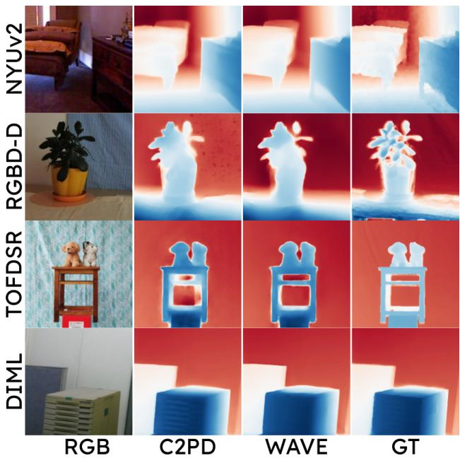  
Figure 6: Qualitative comparison at 32× on NYU\_v2, RGB-D-D, TOFDSR, and DIML. We compare against C2PD, the only competing method with publicly available 32× weights. WAVE preserves object openings, produces straighter boundaries, and avoids the false discontinuities and background artifacts visible in C2PD, remaining closest to GT.  
yielding more prominent depth boundaries, compared to the blurred boundaries in the competing methods.

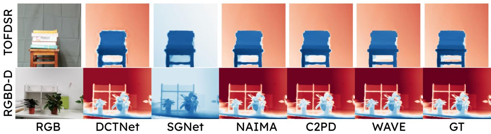  
Figure 7: Qualitative comparison at 8× on TOFDSR (top) and RGB-D-D (bottom). WAVE recovers thin structures and object openings with sharper, non-bleeding boundaries, closest to the ground truth (GT).

## References

Ariav, I.; and Cohen, I. 2022. Depth map super-resolution via cascaded transformers guidance. Frontiers in Signal Processing, 2: 847890.

Caron, M.; Touvron, H.; Misra, I.; Jégou, H.; Mairal, J.; Bojanowski, P.; and Joulin, A. 2021. Emerging properties in self-supervised vision transformers. In Proceedings of the IEEE/CVF international conference on computer vision, 9650–9660.

Cho, J.; Min, D.; Kim, Y.; and Sohn, K. 2021. Diml/cvl rgbd dataset: 2m rgb-d images of natural indoor and outdoor scenes. arXiv preprint arXiv:2110.11590.

De Lutio, R.; Becker, A.; D’Aronco, S.; Russo, S.; Wegner, J. D.; and Schindler, K. 2022. Learning graph regularisation for guided super-resolution. In Proceedings of the IEEE/CVF conference on computer vision and pattern recognition, 1979–1988.

Deng, X.; and Dragotti, P. L. 2020. Deep convolutional neural network for multi-modal image restoration and fusion. IEEE transactions on pattern analysis and machine intelligence, 43(10): 3333–3348.

Elfwing, S.; Uchibe, E.; and Doya, K. 2018. Sigmoidweighted linear units for neural network function approximation in reinforcement learning. Neural networks, 107: 3–11.

Haris, M.; Shakhnarovich, G.; and Ukita, N. 2018. Deep back-projection networks for super-resolution. In Proceedings of the IEEE conference on computer vision and pattern recognition, 1664–1673.

He, L.; Zhu, H.; Li, F.; Bai, H.; Cong, R.; Zhang, C.; Lin, C.; Liu, M.; and Zhao, Y. 2021. Towards fast and accurate real-world depth super-resolution: Benchmark dataset and baseline. In Proceedings of the ieee/cvf conference on computer vision and pattern recognition, 9229–9238.

Hu, E. J.; Shen, Y.; Wallis, P.; Allen-Zhu, Z.; Li, Y.; Wang, S.; Wang, L.; Chen, W.; et al. 2022. Lora: Low-rank adaptation of large language models. Iclr, 1(2): 3.

Hui, T.-W.; Loy, C. C.; and Tang, X. 2016. Depth map super-resolution by deep multi-scale guidance. In European conference on computer vision, 353–369. Springer.

Kang, J.; Cai, Q.; Tan, R.; Liu, Y.; and Liu, Z. 2025. C2pd: Continuity-constrained pixelwise deformation for guided depth super-resolution. In Proceedings of the AAAI Conference on Artificial Intelligence, volume 39, 4212–4220.

Katharopoulos, A.; Vyas, A.; Pappas, N.; and Fleuret, F. 2020. Transformers are rnns: Fast autoregressive transformers with linear attention. In International conference on machine learning, 5156–5165. PMLR.

Kim, B.; Ponce, J.; and Ham, B. 2021. Deformable kernel networks for joint image filtering. International Journal of Computer Vision, 129(2): 579–600.

Kirillov, A.; Mintun, E.; Ravi, N.; Mao, H.; Rolland, C.; Gustafson, L.; Xiao, T.; Whitehead, S.; Berg, A. C.; Lo, W.-Y.; et al. 2023. Segment anything. In Proceedings of the IEEE/CVF international conference on computer vision, 4015–4026.

Li, C.; Cong, R.; Kwong, S.; Hou, J.; Fu, H.; Zhu, G.; Zhang, D.; and Huang, Q. 2020a. ASIF-Net: Attention steered interweave fusion network for RGB-D salient object detection. IEEE transactions on cybernetics, 51(1): 88–100.

Li, C.; Cong, R.; Piao, Y.; Xu, Q.; and Loy, C. C. 2020b. RGB-D salient object detection with cross-modality modulation and selection. In European conference on computer vision, 225–241. Springer.

Li, Y.; Huang, J.-B.; Ahuja, N.; and Yang, M.-H. 2016. Deep joint image filtering. In European conference on computer vision, 154–169. Springer.

Li, Y.; Huang, J.-B.; Ahuja, N.; and Yang, M.-H. 2019. Joint image filtering with deep convolutional networks. IEEE transactions on pattern analysis and machine intelligence, 41(8): 1909–1923.

Lin, H.; Chen, S.; Liew, J.; Chen, D. Y.; Li, Z.; Shi, G.; Feng, J.; and Kang, B. 2025. Depth anything 3: Recovering the visual space from any views. arXivpreprint arXiv:2511.10647.

Liu, M.; Xu, C.; Jin, H.; Chen, L.; Varma T, M.; Xu, Z.; and Su, H. 2023. One-2-3-45: Any single image to 3d mesh in 45 seconds without per-shape optimization. Advances in Neural Information Processing Systems, 36: 22226–22246.

Lu, S.; Ren, X.; and Liu, F. 2014. Depth enhancement via low-rank matrix completion. In Proceedings ofthe IEEE conference on computer vision and pattern recognition, 3390– 3397.

Mallat, S. G. 1989. A theory for multiresolution signal decomposition: the wavelet representation. IEEE transactions on pattern analysis and machine intelligence, 11(7): 674– 693.

Metzger, N.; Daudt, R. C.; and Schindler, K. 2023. Guided depth super-resolution by deep anisotropic difusion. In Proceedings of the IEEE/CVF Conference on Computer Vision and Pattern Recognition, 18237–18246.

Nasir, T.; Liu, D.; and Mian, A. 2026a. Implicit Neural Representation-Based Continuous Single Image Super Resolution: An Empirical Study. arXiv preprint arXiv:2601.17723.

Nasir, T.; Liu, D.; and Mian, A. 2026b. NAIMA: Semantics Aware RGB Guided Depth Super-Resolution. arXiv preprint arXiv:2604.04407.

Oquab, M.; Darcet, T.; Moutakanni, T.; Vo, H.; Szafraniec, M.; Khalidov, V.; Fernandez, P.; Haziza, D.; Massa, F.; El-Nouby, A.; et al. 2023. Dinov2: Learning robust visual features without supervision. arXiv preprint arXiv:2304.07193.

Roberts, M.; Ramapuram, J.; Ranjan, A.; Kumar, A.; Bautista, M. A.; Paczan, N.; Webb, R.; and Susskind, J. M. 2021. Hypersim: A photorealistic synthetic dataset for holistic indoor scene understanding. In Proceedings of the IEEE/CVF international conference on computer vision, 10912–10922.

Scharstein, D.; and Szeliski, R. 2003. High-accuracy stereo depth maps using structured light. In 2003 IEEE Computer Society Conference on Computer Vision and Pattern Recognition, 2003. Proceedings., volume 1, I–I. IEEE.

Shi, W.; Ye, M.; and Du, B. 2022. Symmetric uncertaintyaware feature transmission for depth super-resolution. In Proceedings of the 30th ACM International Conference on Multimedia, 3867–3876.

Silberman, N.; Hoiem, D.; Kohli, P.; and Fergus, R. 2012. Indoor segmentation and support inference from rgbd images. In European conference on computer vision, 746–760. Springer.

Siméoni, O.; Vo, H. V.; Seitzer, M.; Baldassarre, F.; Oquab, M.; Jose, C.; Khalidov, V.; Szafraniec, M.; Yi, S.; Ramamonjisoa, M.; et al. 2025. Dinov3. arXiv preprint arXiv:2508.10104.

Song, X.; Dai, Y.; Zhou, D.; Liu, L.; Li, W.; Li, H.; and Yang, R. 2020. Channel attention based iterative residual learning for depth map super-resolution. In Proceedings of the ieee/cvf conference on computer vision and pattern recognition, 5631–5640.

Tang, J.; Chen, X.; and Zeng, G. 2021. Joint implicit image function for guided depth super-resolution. In Proceedings of the 29th acm international conference on multimedia, 4390– 4399.

Tang, Q.; Cong, R.; Sheng, R.; He, L.; Zhang, D.; Zhao, Y.; and Kwong, S. 2021. Bridgenet: A joint learning network of depth map super-resolution and monocular depth estimation. In Proceedings of the 29th acm international conference on multimedia, 2148–2157.

Wang, Z.; Yan, Z.; Pan, J.; Gao, G.; Zhang, K.; and Yang, J. 2025. Dornet: A degradation oriented and regularized network for blind depth super-resolution. In Proceedings of the Computer Vision and Pattern Recognition Conference, 15813–15822.

Wang, Z.; Yan, Z.; and Yang, J. 2024. Sgnet: Structure guided network via gradient-frequency awareness for depth map super-resolution. In Proceedings of the AAAI Conference on Artificial Intelligence, volume 38, 5823–5831.

Wang, Z.; Yan, Z.; Yang, M.-H.; Pan, J.; Gao, G.; Tai, Y.; and Yang, J. 2024. Scene Prior Filtering for Depth Super-Resolution. arXiv preprint arXiv:2402.13876.

Wu, Q.; Yan, Z.; Wang, Z.; Yang, J.; and Li, J. 2026. DegMamba: Mamba-enhanced depth super-resolution with degradation guidance. Pattern Recognition, 113921.

Wu, Z.; Arora, A.; Wang, Z.; Geiger, A.; Jurafsky, D.; Manning, C. D.; and Potts, C. 2024. Reft: Representation finetuning for language models. Advances in Neural Information Processing Systems, 37: 63908–63962.

Xiao, M.; Zheng, S.; Liu, C.; Wang, Y.; He, D.; Ke, G.; Bian, J.; Lin, Z.; and Liu, T.-Y. 2020. Invertible image rescaling. In European conference on computer vision, 126–144. Springer.

Yan, Z.; Lin, Y.; Wang, K.; Zheng, Y.; Wang, Y.; Zhang, Z.; Li, J.; and Yang, J. 2024. Tri-Perspective View Decomposition for Geometry-Aware Depth Completion. In Proceedings of the IEEE/CVF Conference on Computer Vision and Pattern Recognition, 4874–4884.

Yan, Z.; Wang, K.; Li, X.; Zhang, Z.; Li, G.; Li, J.; and Yang, J. 2022. Learning complementary correlations for depth super-resolution with incomplete data in real world. IEEE transactions on neural networks and learning systems, 35(4): 5616–5626.

Yan, Z.; Wang, Z.; Dong, H.; Li, J.; Yang, J.; and Lee, G. H. 2025. Ducos: Duality constrained depth super-resolution via foundation model. In Proceedings of the IEEE/CVF International Conference on Computer Vision, 8361–8371.

Yang, Y.; Cao, Q.; Zhang, J.; and Tao, D. 2022. CODON: On orchestrating cross-domain attentions for depth superresolution. International Journal of Computer Vision, 130(2): 267–284.

Yermakov, A.; Cech, J.; Matas, J.; and Fritz, M. 2026. Deepfake detection that generalizes across benchmarks. In Proceedings of the IEEE/CVF Winter Conference on Applications of Computer Vision, 773–783.

Yosinski, J.; Clune, J.; Bengio, Y.; and Lipson, H. 2014. How transferable are features in deep neural networks? Advances in neural information processing systems, 27.

Yuan, J.; Jiang, H.; Li, X.; Qian, J.; Li, J.; and Yang, J. 2023a. Recurrent structure attention guidance for depth super-resolution. In Proceedings of the AAAI Conference on Artificial Intelligence, volume 37, 3331–3339.

Yuan, J.; Jiang, H.; Li, X.; Qian, J.; Li, J.; and Yang, J. 2023b. Structure flow-guided network for real depth superresolution. In Proceedings of the AAAI Conference on Artificial Intelligence, volume 37, 3340–3348.

Zeiler, M. D.; and Fergus, R. 2014. Visualizing and understanding convolutional networks. In European conference on computer vision, 818–833. Springer.

Zhang, H.; Jiang, H.; Yao, Q.; Sun, Y.; Zhang, R.; Zhao, H.; Li, H.; Zhu, H.; and Yang, Z. 2025. Detect anything 3d in the wild. In Proceedings of the IEEE/CVF International Conference on Computer Vision, 5048–5059.

Zhao, Z.; Zhang, J.; Gu, X.; Tan, C.; Xu, S.; Zhang, Y.; Timofte, R.; and Van Gool, L. 2023. Spherical space feature decomposition for guided depth map super-resolution. In Proceedings of the IEEE/CVF International Conference on Computer Vision, 12547–12558.

Zhao, Z.; Zhang, J.; Xu, S.; Lin, Z.; and Pfister, H. 2022. Discrete cosine transform network for guided depth map superresolution. In Proceedings of the IEEE/CVF conference on computer vision and pattern recognition, 5697–5707.

Zhong, Z.; Chen, P.; Shen, Q.; Li, B.; and Wang, S. 2026. Dual Graph Regularized Deep Unfolding Network for Guided Depth Map Super-resolution. In Proceedings of the IEEE/CVF Conference on Computer Vision and Pattern Recognition, 16322–16332.

Zhong, Z.; Liu, X.; Jiang, J.; Zhao, D.; Chen, Z.; and Ji, X. 2021. High-resolution depth maps imaging via attentionbased hierarchical multi-modal fusion. IEEE Transactions on Image Processing, 31: 648–663.

Zhong, Z.; Liu, X.; Jiang, J.; Zhao, D.; and Ji, X. 2023a. Deep attentional guided image filtering. IEEE Transactions on Neural Networks and Learning Systems, 35(9): 12236– 12250.

Zhong, Z.; Liu, X.; Jiang, J.; Zhao, D.; and Ji, X. 2023b. Guided depth map super-resolution: A survey. ACM Computing Surveys, 55(14s): 1–36.

Zuo, Y.; Wang, H.; Fang, Y.; Huang, X.; Shang, X.; and Wu, Q. 2021. MIG-Net: Multi-scale network alternatively guided by intensity and gradient features for depth map superresolution. IEEE Transactions on Multimedia, 24: 3506– 3519.