# ℛ<sup>3</sup>: Training Robots to Reason in Natural Language via Reinforcement Learning

Lehong Wu<sup>1</sup>, Yuxiao Qu<sup>1</sup>, Zheyuan Hu<sup>1</sup>, Ivan Zhang<sup>1</sup>, Limin Wei<sup>1</sup>, Zackory Erickson<sup>1</sup> and Aviral Kumar<sup>1</sup> <sup>1</sup>Carnegie Mellon University

Abstract: Reasoning in language allows foundation models to spend more test-time compute on hard problems, such as those requiring decomposition, constraint tracking, and prediction of future consequences. Whether this mechanism can improve robotic manipulation remains unclear, where long-horizon tasks require tracking partial progress, reasoning about object relations, recovering from mistakes, and steering noisy low-level policies. In this paper, we study whether VLMs can be trained to reason directly in natural language to guide low-level manipulation policies. We introduce ℛ<sup>3</sup>, a simple post-training recipe that turns of-the-shelf VLMs into robotic reasoners: it first mid-trains a VLM on expert-generated reasoning traces to initialize the desired reasoning style, then improves the reasoner with single-step rubric-based RL from ofline action data. Unlike prior robotic reasoning methods that mostly use structured traces as auxiliary supervision, ℛ<sup>3</sup> trains free-form language reasoning to produce test-time guidance for action. We instantiate ℛ<sup>3</sup> on Language Table and simulated bimanual grocery packing, two controlled testbeds for studying robotic reasoning and long-horizon manipulation. $\mathcal { R } ^ { 3 }$ improves exploration and generalization across unseen tasks and significantly outperforms instruction-only imitation learning baselines on both benchmarks. Our analyses suggest that free-form language reasoning can function as a test-time compute mechanism for steering low-level policies. Our project page is available at https://robotic-reasoner.github.io/.

## 1. Introduction

Reasoning in natural language provides an efective mechanism for spending more compute on harder test problems, and ofers a data-eficient recipe for broad generalization. This recipe is clearly useful in many domains including visual perception [9, 17]. More broadly, even when the final output is not language [15], language reasoning can help a model decompose the problem, identify relevant constraints, and make reliable predictions. Robotic manipulation is therefore a natural domain for reasoning based foundation models: manipulation requires interpreting a scene, understanding physical constraints, anticipating the efect of action on future parts of the trajectory, and acting conditioned on this understanding. One might expect that training robotic policies to reason before acting would improve generalization by allowing the model to spend test-time compute on the problem instance.

Reasoning for robotic manipulation has already received a fair bit of attention. Recent generalist robot policies and vision-language-action models, including ECoT [64], SteerVLA [21], and MolmoAct [32], incorporate intermediate representations ranging from object-centric annotations and short plans to depthaware perception tokens and image-space trajectories. Complementary approaches expose generalist policies through semantic interfaces: � can be steered at inference time with subtask instructions and visual subgoals [28], while SARL uses online RL to learn a high-level policy over language commands that steer a fixed VLA through long-horizon tasks [3]. However, these approaches do not train free-form natural-language reasoning of the kind that has proven efective in language. Prior work shows that structured reasoning supervision can improve grounding and perception [8], but these gains appear to arise mainly from training-time supervision: after training with reasoning, generating reasoning at test time provides little additional benefit [8, 18]. Thus, existing work establishes structured CoT as an auxiliary training signal, but leaves open whether flexible language reasoning can serve as a mechanism

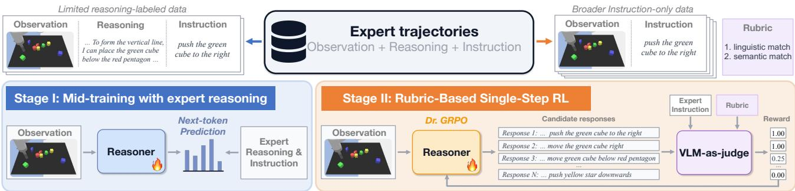  
Figure 1: Two-stage training of $\mathcal { R } ^ { 3 } . \mathcal { R } ^ { 3 }$ trains a high-level VLM to reason in natural language and steer a fixed low-level robot policy for robotic manipulation tasks. ℛ<sup>3</sup> proceeds in two stages: Stage I (mid-training) imbues an of-the-shelf VLM with the reasoning style and behaviors needed to produce useful instructions for the low-level policy. Stage II (single-step RL) further improves the VLM by training it to generate reasoning traces that match the expert instruction in ofline data.

## for spending test-time compute for manipulation, and how to learn to do that in reality.

We study how to train vision-language models (VLMs) to use free-form natural language as a mechanism to spend test-time compute for robotic manipulation. Our main idea is to turn expert data into supervision for VLM reasoning. Given a scene, interaction history, and an expert action, we post-train a VLM to produce language-based reasoning that allows it to arrive at a semantically similar instruction to the expert’s. A language-conditioned low-level policy then takes this VLM’s instruction and outputs the action that directly controls the robot. This training procedure gives the VLM reasoning capabilities that allow it, at test time, to produce language guidance for steering the low-level policy. To instantiate this idea and study key design choices behind it, we focus on the Language Table [41] environment and a long-horizon grocery packing environment [2], which provide controlled settings for studying visual reasoning, language-conditioned manipulation, and long-horizon planning, along with a pretrained steerable policy that reliably follows a wide range of instructions.

Our approach, $\mathcal { R } _ { } ^ { 3 }$ , uses a two-stage recipe inspired by LLM post-training, as shown in Figure 1. We first generate multi-turn manipulation trajectories by prompting expert reasoners to steer the low-level policy while recording their reasoning. These trajectories contain partial progress, mistakes, recoveries, and alternative action choices, producing contexts where the model must reason over past interaction rather than only the current frame. Stage I mid-trains a VLM on expert-generated reasoning traces, regardless of trajectory success, to initialize the reasoning style needed for manipulation. Stage II then improves this reasoner with single-step reinforcement learning (RL) from ofline data. Here, we no longer assume access to expert reasoning traces: conditioned on the scene and interaction history, the model generates reasoning and an instruction, and is rewarded by a rubric-based VLM judge [14] when its instruction semantically matches the expert’s. This yields a practical recipe: use limited reasoning-labeled trajectories to initialize the reasoner, then use more instruction-only ofline data to further improve it.

Beyond the method itself, this framework lets us study key design choices for robotic reasoning: how to collect demonstrations, condition on history, initialize the reasoner, and which RL formulation can improve reasoning from action supervision. Empirically, we find that $\mathcal { R } ^ { 3 }$ improves high-level steering across both seen and unseen Language Table tasks, outperforming instruction-only imitation learning. Similarly, on the grocery packing environment, $\mathcal { R } ^ { 3 }$ (RL only) outperforms instruction-only imitation without reasoning. Our analyses show that $\mathcal { R } ^ { 3 }$ learns more deliberate action-oriented reasoning behaviors: it compares alternative choices, re-examines the scene and history when uncertain, and selects next steps more incrementally. Through VQA diagnostics, comparisons with non-reasoning policies with auxiliary reasoning supervision, and controlled interventions on the reasoning budget, we find that explicit inference-time reasoning improves generalization beyond using reasoning only as a training-time supervision signal. Together, these results provide evidence that language reasoning causally contributes to task performance and serves as useful test-time compute.

## 2. Related Work

Reasoning and test-time compute. Chain-of-thought reasoning and test-time scaling methods show that language models can solve harder problems by spending extra compute on reasoning before answering [31, 52, 56, 59, 62, 63]. Similar ideas extend to VLMs, where textual rationales, grounded explanations, and visual chain-of-thought traces improve VQA and multimodal reasoning [39, 48, 65, 66]. However, these works mainly evaluate static question answering rather than long-horizon interaction: reasoning about a static image need not transfer to embodied action. Indeed, our experiments show that VLMs with similar static VQA performance can difer substantially in steering a low-level policy on long-horizon manipulation tasks that require reasoning. Reasoning has also helped in interactive domains such as coding and web agents [10, 60], where models call tools, observe feedback, and revise their behavior online [42, 47, 51]. Robotic manipulation difers because reasoning must be grounded in a low-level controller that often induces substantial partial observability for the high-level reasoner.

Intermediate structures in robotic manipulation. Robotics has long used intermediate structure between perception and action. Task-and-motion planning combines symbolic task reasoning with geometric motion planning [22, 23, 29]; visual foresight predicts future observations for planning [16, 20]; and hierarchical or latent-planning methods learn reusable skills from demos or play [40, 46]. Language-based systems such as SayCan [1], Inner Monologue [25], and Code as Policies [35] use LLMs for decomposition, feedback, or program synthesis, while relying on external skills, values, or controllers. These works show the value of reasoning before acting, but the reasoning is typically symbolic, predictive, latent, modular, or hand-designed. In contrast, we train a VLM itself to produce natural-language reasoning that steers a frozen low-level language-conditioned policy at test time.

Reasoning in generalist robot policies. Recent generalist robot policies and vision-language-action models, including RT-2, Octo, OpenVLA, GR00T, GR-3, and Gemini Robotics, use VLM backbones pretrained on internet data but do not incorporate explicit reasoning [4, 5, 7, 30, 53, 54]. Some subsequent works use reasoning-like signals only as training-time supervision, such as grounded reasoning traces, object detections, or semantic subtask predictions [8, 27]. Others additionally produce or consume inference-time intermediates, such as language guidance, plans, subtasks, constraints, afordances, history summaries, visual traces, depth representations, or subgoal images before action generation [3, 11, 12, 18, 21, 26, 28, 32–34, 36, 43, 50, 61, 64, 67, 68]. In contrast, we isolate reasoning as a training-design problem: we train a VLM reasoner to generate free-form natural-language reasoning as guidance, rather than relying on hand-designed intermediate representations, while keeping the low-level policy frozen.

## 3. ℛ<sup>3</sup>: Robotic Reasoners via Reinforcement Learning

To train reasoners for robotic manipulation, we use a hierarchical architecture as in prior work [50]: a low-level policy controls the robot, while a high-level VLM provides instructions that steer this policy. Figure 2 shows our specific architecture. Our goal is to train the high-level VLM to reason in natural language before issuing an instruction. We describe our problem setup first and then our approach.

## 3.1. Problem Setup and Environments

We model each task as a decision process $\mathcal { M } _ { g } = ( \mathcal { S } , \mathcal { A } , P , r _ { g } )$ , where $g$ is a textual long-horizon goal, $s _ { t } \in S$ contains visual and proprioceptive information, $a _ { t } \in \mathcal A$ is a robot action, � is the transition dynamics, and $r _ { g }$ is a binary success reward. For example, � might be “make a V-shape with the red moon, blue cube, and yellow star.” We assume access to a pretrained low-level policy $\pi _ { \mathrm { l o } } ( a _ { t } | s _ { t } , u _ { t } )$ , where $u _ { t } \in \mathcal { U }$ is a short-horizon subtask instruction such as “move the red block left” or “push the blue cube to the green star”. We train a high-level VLM $\pi _ { \boldsymbol { \theta } } ( \mathbf { z } _ { t } , u _ { t } | \mathbf { x } _ { t } , g )$ , where $\mathbf { x } _ { t }$ is the history context, $\mathbf { z } _ { t }$ is the reasoning trace, and $u _ { t }$ is the instruction to the low-level policy. At each step, the high-level VLM uses $\mathbf { z } _ { t }$ to reason about the progress of the task and the consequences of the action, emits $u _ { t } ,$ and the low-level policy executes a fixed-length action chunk $a _ { t } ,$ with $\mathbf { z } _ { t } , u _ { t } \sim \pi _ { \theta } ( \cdot | \mathbf { x } _ { t } , g )$ and $a _ { t } \sim \pi _ { \mathrm { l o } } ( \cdot | s _ { t } , u _ { t } )$

Training the reasoner requires design choices that are central to any learning-based robotic system: (1) what data should be used, and how the reasoning process should be parameterized; (2) how to initialize or warm-start the reasoner; (3) what objective can improve reasoning beyond simply memorizing reasoning from experts. In this section, we develop $\mathcal { R } ^ { 3 }$ , a recipe for training robotic reasoners. At a high level, $\mathcal { R } ^ { 3 }$ collects high-coverage expert trajectories on diverse tasks, mid-trains the VLM on a small portion of expert reasoning traces to initialize the desired reasoning style, and further improves it with rubric-based RL from more ofline non-reasoning expert data on a broader set of tasks. This turns expert manipulation demonstrations into practical training signals for reasoning, while avoiding expensive robot rollouts.

Data collection for Language Table. Training a reasoner for manipulation requires more than states, actions, and subtask annotations. Standard teleoperated demonstrations, even when postprocessed with subtasks or instructions [27], do not explain why an expert chooses the subtask, how it interprets partial progress, or how it recovers from mistakes. We need data that covers diverse behaviors (including behaviors that showcase recovery and imperfect attempts at manipulation or high-level planning) and intermediate states, with reasoning traces that explain high-level decisions. The tasks themselves must also require heavy reasoning: if they are too short-horizon or solvable from the current frame, reasoning provides little benefit and may be discarded during post-training [19]. Unfortunately, a number of simulated environments test short-horizon performance in relatively simple scenes, with no clear room for benefiting from reasoning in language. In contrast, Language Table provides cluttered scenes with somewhat imperfect low-level policies, and this requires a reasoning system to deliberately evaluate multiple courses of action to succeed at the task.

We therefore design 14 types of long-horizon block arrangement tasks in Language Table that require composing object movements and reasoning about spatial relationships. The task suite

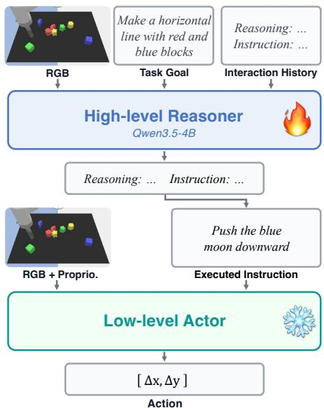  
Figure 2: Policy architecture. A high-level VLM generates a reasoning trace and an instruction given the scene, goal, and previous response. A language-conditioned low-level actor takes the instruction as input and emits the action that controls the robot.

is designed to test relational transfer, compositional generalization, and present increasing geometric dificulty. Such training data could be collected from human experts verbalizing their thought process while performing teleoperation, but this is expensive and dificult to scale for statistically significant results in a controlled study<sup>1</sup>. Thus, we emulate this setting with an expert VLM reasoner: given a task goal, the current observation, and the interaction history, the VLM produces a reasoning trace followed by a short-horizon instruction for steering the low-level policy. The low-level policy executes the action, the environment transitions, and the process repeats.

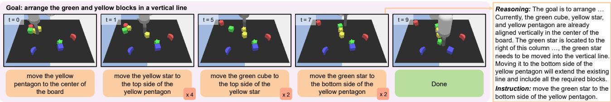  
Figure 3: Example of expert-collected trajectory and reasoning trace on the line task of Language Table. The notation � indicates that the expert repeats this instruction � times.

We use Gemini 3 Flash as the “human” expert and construct two data subsets based on the supervision exposed to the learner. The first subset exposes expert reasoning traces together with the instructions, and is used to seed reasoning behaviors during mid-training (Section 3.2). The second subset exposes only expert instructions, with reasoning traces withheld, and is used for RL (Section 3.3). This emulates the supervision regime we target: high-quality reasoning traces are expensive, while subtask-level instruction labels are easier to obtain. In RL, the model must generate its own reasoning and receives reward by comparing its predicted instruction against the expert’s. This separation also aligns with practical constraints on data collection: while expert reasoning is dificult to obtain for all transitions, expert instructions are readily available in many settings.

Data collection for grocery packing. To demonstrate the generality of our findings, we also apply our approach to a bimanual long-horizon grocery packing task suite [2]. These data are collected by human operators via teleoperation across a set of simulated task goals (see Figure 4 for examples), rather than by a Gemini expert. The collected data are then post-processed into segments, each labeled with a short-horizon in-

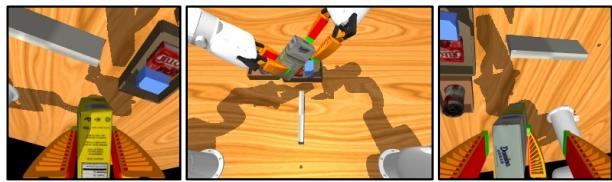  
Figure 4: Example grocery packing task. From left to right: left-wrist, base, and right-wrist camera views.

struction that specifies the task performed in that segment. In this setup, we do not assume access to reasoning traces and rely on direct RL on top of the base VLM (i.e., “RL zero” [13]) to improve performance. Thus, this setting removes the need to collect reasoning traces altogether.

Input to the VLM. Humans naturally rely on memory when solving long-horizon (manipulation) tasks, often maintaining a coherent plan and reusing or refining previous actions. Without history context, the expert lacks these behaviors. We therefore collect data both with and without history. History can be represented in several ways, including past frames, past responses, and learned summaries. In this work, we instantiate history as the full response from the previous step. This allows the VLM to carry forward its inferred progress and plan. We evaluate Gemini 3 Flash, the expert reasoner, on two representative tasks, line and V (see Appendix A for task descriptions), with and without history in the context. As shown in Table 1, history context consistently improves pass@1: from 44.9% to 51.0% on line, and from 52.3% to 57.6% on V. These gains suggest that history helps to track progress, resolve ambiguities, and preserve a coherent plan. Therefore, we use history for our data collection. Examples of the collected trajectories are shown in Figure 3 and Appendix C.

<table><tr><td>Task</td><td>w/o history</td><td>w/ history</td></tr><tr><td>line</td><td>44.9%</td><td>51.0%</td></tr><tr><td>V</td><td>52.3%</td><td>57.6%</td></tr></table>

Table 1: Ablation of interaction history on the expert. Incorporating history improves the expert VLM’s performance.

## 3.2. Stage I: Mid-Training Reasoning Behaviors into the VLM

In preliminary experiments, we found that even the strongest open-source VLMs at model sizes suitable for real-time robotic control, i.e., under 10B parameters, did not naturally produce the style of reasoning needed for our manipulation tasks. Their reasoning was often shallow: it mentioned generic steps such as identifying objects or moving toward the goal, but failed to track task progress, object relations, failed attempts, or constraints that are critical for selecting the next subtask. In Appendix C, we observe that the base model either fails to use spatial relationships between blocks or blindly trusts that the previous instruction was executed correctly, and these behaviors inhibit it from solving the task. We also observed substantial thought-switching, a failure mode related to “underthinking” [57]. These observations highlight the need for a warm-up training stage before of-the-shelf VLMs can serve as reliable robotic reasoners.

Pretrained models often cannot produce useful or productive reasoning even when they can generate natural-sounding chains of thought. A common fix is mid-training: a phase that does not optimize reward directly, but instead initializes the model with useful reasoning patterns or priors such as decomposition, constraint tracking, and self-correction [44]. We adopt the same idea for robotic reasoning by mid-training the VLM on expert-generated reasoning traces. This mirrors the role of mid-training in language and math reasoning, where the goal is to expose the model to useful reasoning patterns before RL [45, 58]. Concretely, each mid-training example consists of an interaction context $\mathbf { x } _ { t } ,$ an expert reasoning trace $\mathbf { z } _ { t } ,$ and a high-level instruction $u _ { t }$ . Let $\mathbf { y } _ { t } = ( \mathbf { z } _ { t } , u _ { t } )$ denote the target sequence formed by concatenating the reasoning and instruction. We train with a standard next-token prediction objective:

$$
\begin{array} { r } { \mathcal { L } _ { \mathrm { S F T } } ( \theta ) = - \mathbb { E } _ { ( \mathbf { x } _ { t } , \mathbf { y } _ { t } ) \sim \mathcal { D } _ { \mathrm { S F T } } , \ i \sim \mathrm { U n i f } ( \{ 1 , . . . , | \mathbf { y } _ { t } | \} ) } \left[ \log p _ { \theta } ( \mathbf { y } _ { t , i } \ | \ \mathbf { x } _ { t } , \mathbf { y } _ { t , < i } ) \right] . } \end{array}\tag{3.1}
$$

This teaches the model to reason about the state and interaction history before emitting the instruction for the low-level policy. We train on both successful and unsuccessful reasoning traces. Successful trajectories show how reasoning leads to useful instructions, while unsuccessful trajectories still provide supervision about partial progress, mistakes, and recovery attempts.

## 3.3. Stage II: Rubric-Based Single-Step RL with Ofline Data

While mid-training seeds the VLM with the desired reasoning behaviors, it does not ensure that test-time reasoning produces efective instructions for steering the low-level policy. A natural next step to optimize for reasoning behavior would be online RL: run multi-turn rollouts that interleave calls to the high-level VLM reasoner with executions of the low-level policy, and use final task success as the reward. However, this requires expensive environment interaction and long-horizon credit assignment. Credit assignment is especially dificult in our hierarchical setting, where failures can arise from poor reasoning, ambiguous high-level instructions, or bad instruction following of the fixed low-level policy.

We therefore use a single-step formulation for RL on an expert dataset consisting of an interaction history $\mathbf { x } _ { t }$ and the corresponding expert instruction $u _ { t } ^ { \star }$ , with no expert reasoning. The model samples $( \mathbf { z } _ { t } , u _ { t } ) \sim \pi _ { \theta } ( \cdot | \mathbf { x } _ { t } , g )$ , where $\mathbf { z } _ { t }$ is a free-form reasoning and $u _ { t }$ is the low-level instruction. We reward the model when $u _ { t }$ is semantically consistent with $u _ { t } ^ { \star }$ , and when $\mathbf { z } _ { t }$ explains why this instruction is appropriate given the scene and interaction history. Thus, single-step RL improves the reasoner from action supervision, without requiring human-written rewards or multi-turn robot rollouts.

The reward function receives $g , \mathbf { x } _ { t } , u _ { t } ^ { \star }$ , and $\left( \mathbf { z } _ { t } , u _ { t } \right)$ , and returns a scalar reward $R ( \mathbf { x } _ { t } , g , u _ { t } ^ { \star } , \mathbf { z } _ { t } , u _ { t } )$ . It can be instantiated either as a VLM judge guided by rubrics or a verifiable reward. While a verifiable reward as simple as string matching is easy to implement, VLM-as-a-judge allows for more flexible answer formats and more detailed scoring criteria. We also assign a negative reward to overly short responses to avoid degenerate traces that skip reasoning and jump directly to the final instruction. We then train the VLM reasoner with Dr.GRPO [38]. For each context $\mathbf { x } _ { t } ,$ , we sample a group of � responses $\{ ( \mathbf { z } _ { t } ^ { ( k ) } , u _ { t } ^ { ( k ) } ) \} _ { k = 1 } ^ { K }$ score them each with the reward $R ^ { ( k ) }$ . We then optimize a policy gradient loss:

$$
\mathcal { L } _ { \mathrm { G R P O } } ( \theta ) = - \mathbb { E } _ { t , k } \left[ \operatorname* { m i n } \left( \rho _ { t } ^ { ( k ) } A ^ { ( k ) } , \mathrm { c l i p } ( \rho _ { t } ^ { ( k ) } , 1 - \epsilon _ { \mathrm { c l i p } } , 1 + \epsilon _ { \mathrm { c l i p } } ) A ^ { ( k ) } \right) \right] ,\tag{3.2}
$$

where $\begin{array} { r } { \rho _ { t } ^ { ( k ) } = \frac { \pi _ { \boldsymbol { \theta } } ( \mathbf { z } _ { t } ^ { ( k ) } , u _ { t } ^ { ( k ) } | \mathbf { x } _ { t } , \boldsymbol { g } ) } { \pi _ { \boldsymbol { \theta } _ { \mathrm { o l d } } } ( \mathbf { z } _ { t } ^ { ( k ) } , u _ { t } ^ { ( k ) } | \mathbf { x } _ { t } , \boldsymbol { g } ) } } \end{array}$ denotes the importance-sampling ratio between the current and old policy, and $\begin{array} { r } { A ^ { ( k ) } = R ^ { ( k ) } - \frac { 1 } { K } \sum _ { j = 1 } ^ { K } R ^ { ( j ) } } \end{array}$ is the advantage obtained by normalizing rewards within the group.

## Summary: Training Robotic Reasoners via Reinforcement Learning (ℛ<sup>3</sup>)

• $\mathcal { R } ^ { 3 }$ trains a high-level VLM to reason before instructing a pretrained low-level robot policy.

• We mid-train on a small reasoning-labeled subset to initialize useful reasoning behaviors.

• We then apply single-step RL on broader ofline data containing only expert instructions.

RL design choices for Language Table. We use VLM-as-a-judge as the reward function on Language Table because the valid instruction set is not finite, and multiple instructions can be equivalent to steering the policy. The VLM judge, Qwen3.5-35B-A3B, follows rubrics that evaluate whether the predicted instruction aligns with the expert’s intent, is feasible for the low-level policy, and would lead to a similar outcome. Therefore, the reward reflects semantic matching rather than string matching. We provide the detailed reward in Appendix A.4 and the rubrics in Appendix D.2. We validate the VLM judge against human labels in Appendix B.3. On 100 prompt–response pairs scored by three human annotators, our judge agrees closely with the human-majority labels, approaching inter-annotator agreement. Alternative VLM judges perform similarly, indicating that our reward is reliable and insensitive to judge choice.

In particular, we highlight two other design choices: (1) Reasoning context imputation. The RL data contains expert instructions but not expert reasoning traces. Because the previous response is part of the interaction history, we impute missing reasoning by sampling 48 responses from the mid-trained model at each step. If any sampled response results in the same instruction as the expert at the previous state, we use it as the previous-step context; otherwise, we provide only the previous instruction with no reasoning. (2) Filtering repetitive steps. In our preliminary RL experiments, the VLM reasoner often learned to repeat the previous instruction, since many expert trajectories contain repeated instructions, and repetition can become a severe reward shortcut during RL. We therefore remove repetitive steps from RL data so that training focuses on meaningful instruction changes. We observe that the fraction of repeated instructions of the VLM decreases only slightly after RL, suggesting that this data filtering does not prevent the model from repeating instructions when appropriate.

<table><tr><td rowspan="2"></td><td colspan="3">Imitation</td><td colspan="5">Ours</td><td> $\Delta$ </td><td>Ref.</td></tr><tr><td>Base (w/o reason)</td><td>IL (mid only)</td><td>IL</td><td>Base</td><td> $\mathcal { R } ^ { 3 }$   $( \mathrm { m i d \ o n l y } )$ </td><td> $\mathcal { R } ^ { 3 }$   $( \mathbb { R } \mathbb { L } \mathrm { o n l y } )$ </td><td> $\mathcal { R } ^ { 3 }$   $( 1 / 4 \mathrm { t h } \ \mathrm { m i d } )$ </td><td> $\mathcal { R } ^ { 3 }$ </td><td> $\mathcal { R } ^ { 3 } - \mathrm { I L }$ </td><td>Gemini</td></tr><tr><td colspan="10"> $\mathcal { T } _ { \mathrm { M } }$  (mid-training tasks)</td></tr><tr><td>group</td><td> $1 1 . 9 \pm 1 . 9$ </td><td> $5 4 . 4 \pm 2 . 9 6 4 . 7 \pm 2 . 8$ </td><td></td><td></td><td> $2 4 . 1 \pm 2 . 5 5 3 . 8 \pm 2 . 9 3 8 . 9 \pm 3 . 3$ </td><td></td><td> $5 5 . 3 \pm 2 . 9$ </td><td> ${ \bf 6 5 . 8 \pm 3 . 0 }$ </td><td> $+ 1 . 1 \pm 4 . 1$ </td><td>71.3</td></tr><tr><td> $\mathtt { 1 i n e }$ </td><td> $5 . 7 \pm 1 . 4$ </td><td> $2 3 . 6 \pm 2 . 6 3 3 . 9 \pm 2 . 9$ </td><td></td><td></td><td> $8 . 8 \pm 1 . 7 2 2 . 9 \pm 2 . 5 1 9 . 4 \pm 2 . 7$ </td><td></td><td> $3 1 . 8 \pm 1 . 9$ </td><td> $\underline { { 3 2 . 4 } } \pm 3 . 1$ </td><td> $- 1 . 5 \pm 4 . 2$ </td><td>51.0</td></tr><tr><td>V</td><td> $2 2 . 8 \pm 2 . 5$ </td><td> $2 5 . 3 \pm 2 . 6 4 0 . 9 \pm 3 . 0$ </td><td></td><td></td><td> $2 1 . 1 \pm 2 . 4 3 3 . 3 \pm 2 . 8 3 7 . 4 \pm 3 . 2$ </td><td></td><td> $6 9 . 4 \pm 2 . 6 $ </td><td> $\underline { { 6 9 . 2 } } \pm 2 . 9$ </td><td> $+ 2 8 . 3 \pm 4 . 2 |$ </td><td>57.6</td></tr><tr><td>L</td><td> $2 4 . 8 \pm 2 . 6 2 9 . 6 \pm 2 . 7 3 4 . 9 \pm 2 . 8$ </td><td></td><td></td><td></td><td> $2 5 . 2 \pm 2 . 6 2 8 . 1 \pm 2 . 7 2 7 . 6 \pm 3 . 1$ </td><td></td><td> $2 9 . 4 \pm 2 . 7$ </td><td> $3 5 . 2 \pm 3 . 4 $ </td><td> $+ 0 . 3 \pm 4 . 4$ </td><td>36.2</td></tr><tr><td> $\mathsf { c l e a r \_ q t r }$ </td><td> $3 5 . 9 \pm 2 . 7$ </td><td> $8 9 . 0 { \scriptstyle \pm 1 . 7 } 9 1 . 8 { \scriptstyle \pm 1 . 5 }$ </td><td></td><td></td><td> $4 9 . 2 \pm 2 . 7 9 0 . 7 \pm 1 . 6 8 6 . 2 \pm 2 . 2$ </td><td></td><td> $\underline { { 9 3 . 0 \pm 2 . 3 } }$ </td><td> $9 3 . 8 \pm 2 . 0$ </td><td> $+ 2 . 0 \pm 2 . 5$ </td><td>88.9</td></tr><tr><td> $\dot { \mathtt { 1 } } \dot { \mathtt { 1 } } \mathtt { p }$ </td><td> $0 . 2 \pm 0 . 3$ </td><td> $3 0 . 8 \pm 2 . 6 3 5 . 6 \pm 2 . 8$ </td><td></td><td> $1 . 5 \pm 0 . 7$ </td><td> $2 8 . 9 \pm 2 . 6 2 5 . 3 \pm 2 . 9$ </td><td></td><td> $2 8 . 0 \pm 2 . 5$ </td><td> $\underline { { 3 5 . 5 } } \pm 2 . 7$ </td><td> $- 0 . 1 \pm 3 . 9$ </td><td>34.0</td></tr><tr><td colspan="10"> $\mathcal { T } _ { \mathrm { R } } \mathrm { ( R L \ t a s k s ) }$ </td></tr><tr><td> $\boldsymbol { \mathsf { T } }$ </td><td> $6 . 4 \pm 1 . 4$ </td><td></td><td>6.9 ± 1.5 7.9 ± 1.6</td><td> $6 . 2 \pm 1 . 4$ </td><td>6.9 ± 1.5 8.7 ± 2.0</td><td></td><td> $\underline { { 9 . 0 \pm 1 . 4 } }$ </td><td> $9 . 9 \pm 2 . 2$ </td><td> $+ 2 . 0 \pm 2 . 7 \ |$ </td><td>10.7</td></tr><tr><td> $\mathtt { g r i s }$ </td><td> $1 5 . 0 \pm 2 . 0 2 7 . 3 \pm 2 . 6 5 8 . 1 \pm 2 . 9$ </td><td></td><td></td><td>15.6 ± 2.1</td><td> $3 4 . 8 \pm 2 . 8 2 4 . 0 \pm 2 . 9$ </td><td></td><td> $3 1 . 4 \pm 2 . 3$ </td><td> $\underline { { 4 7 . 8 } } \pm 3 . 3$ </td><td> $- 1 0 . 3 \pm 4 . 4 | $ </td><td>64.7</td></tr><tr><td>iV</td><td> $1 9 . 0 \pm 2 . 4 2 1 . 7 \pm 2 . 5 3 8 . 9 \pm 2 . 9$ </td><td></td><td></td><td></td><td>17.2 ±2.2 21.7 ±2.5 36.9 ±3.2</td><td></td><td> ${ \bf 6 1 . 9 \pm 2 . 5 }$ </td><td> $\underline { { 5 7 . 5 } } \pm 2 . 6$ </td><td> $+ 1 8 . 6 \pm 3 . 9 |$ </td><td>57.0</td></tr><tr><td colspan="10"> $\tau _ { \mathrm { { O } } }$  (OOD held-out tasks)</td></tr><tr><td> $\mathtt { d i a g \_ 1 i n e }$ </td><td> $2 3 . 8 \pm 2 . 5$ </td><td></td><td></td><td></td><td>18.2 ± 2.3 16.7 ± 2.2 | 34.6 ± 2.9 37.8 ± 2.9 26.3 ± 3.0</td><td></td><td> $3 4 . 2 \pm 2 . 8$ </td><td> $3 0 . 9 \pm 3 . 0$ </td><td> $+ 1 4 . 2 \pm 3 . 7 | $ </td><td>29.9</td></tr><tr><td> $\tt r e c t$ </td><td> $1 . 8 \pm 0 . 8 2 . 1 \pm 0 . 9 2 . 1 \pm 0 . 9$ </td><td></td><td></td><td></td><td></td><td> $1 . 8 \pm 0 . 8 1 . 7 \pm 0 . 8 1 2 . 0 \pm 2 . 3 6 . 6 \pm 1 . 1$ </td><td></td><td> $6 . 0 \pm 1 . 3$ </td><td> $+ 3 . 9 \pm 1 . 6$ </td><td>9.4</td></tr><tr><td>mid</td><td> $5 6 . 3 \pm 2 . 8 3 6 . 4 \pm 2 . 8 4 2 . 3 \pm 2 . 9$ </td><td></td><td></td><td></td><td></td><td> $4 9 . 3 \pm 3 . 0 4 1 . 7 \pm 2 . 9 5 3 . 9 \pm 3 . 3$ </td><td> $4 5 . 7 \pm 2 . 8 $ </td><td> $5 1 . 0 \pm 4 . 1$ </td><td> $+ 8 . 7 \pm 5 . 0$ </td><td>69.5</td></tr><tr><td>iL</td><td> $2 3 . 3 \pm 2 . 6 2 6 . 7 \pm 2 . 7 2 7 . 3 \pm 2 . 7$ </td><td></td><td></td><td></td><td></td><td> $2 5 . 6 \pm 2 . 6 2 7 . 6 \pm 2 . 7 2 9 . 2 \pm 3 . 1$ </td><td> $3 0 . 6 \pm 2 . 7$ </td><td> $3 7 . 2 \pm 3 . 7 $ </td><td> $+ 9 . 9 \pm 4 . 6$ </td><td>34.4</td></tr><tr><td>clear_half</td><td> $1 6 . 9 \pm 2 . 0$ </td><td>63.1 ±2.5 69.7 ±2.4</td><td></td><td> $2 7 . 3 \pm 2 . 3$ </td><td>65.6±2.5</td><td> $5 9 . 0 \pm 2 . 9$ </td><td> $7 9 . 2 \pm 2 . 6$ </td><td> $7 4 . 5 \pm 2 . 1$ </td><td> $+ 4 . 8 \pm 3 . 2$ </td><td>74.2</td></tr></table>

Table 2: Main results. We compare base models, imitation baselines, and $\mathcal { R } ^ { 3 }$ variants. Values are percentages with 95% confidence intervals. The green/red cells in the $\Delta$ column mark significant gains/losses $( | \Delta | > \mathrm { C I } )$ . Gemini’s performance during data collection is shown for reference. Bold/underlined values mark the best/second-best non-expert model.

RL design choices for grocery packing. Packing instructions form a finite set of pack / remove / transfer commands, each without semantic ambiguity, so the policy can be prompted and trained to match the exact ground-truth instruction. We therefore use a simple exact-match reward instead of VLM-as-a-judge: 1.0 if the parsed instruction string equals the expert instruction, and 0.0 otherwise. We also empirically found that instantiating interaction history as the previous response or the previous instruction yields comparable performance, so we simply use the previous instruction, thereby eliminating the need for the reasoning context imputation process before RL.

## 4. Experimental Evaluation on Language Table

We now evaluate whether $\mathcal { R } ^ { 3 }$ turns VLMs into efective high-level reasoners for steering the low-level manipulation policy via instructions. Concretely, we organize the experimental evaluation around the following questions: (1) How do diferent variants of $\mathcal { R } ^ { 3 }$ perform on in-distribution and out-of-distribution tasks, and how does $\mathcal { R } ^ { 3 }$ compare with instruction-only imitation learning baselines? (2) Are the gains from $\mathcal { R } ^ { 3 }$ merely due to better representations learned from reasoning supervision, or does explicit testtime compute provide additional benefits? (3) What specific reasoning behaviors does $\mathcal { R } ^ { 3 }$ learn, and how do mid-training and RL change the reasoning traces and induced robot behaviors? We provide a comprehensive set of experiments to answer these questions, alongside comparisons with adaptation of approaches from prior work in our setting.

Experimental setup and task design. We design the task suite to test whether the learned reasoning aids manipulation. To do so, we construct 14 long-horizon tasks in Language Table, each specified by a high-level textual goal requiring the agent to arrange 8 blocks into spatial patterns. We split these tasks into three splits used for mid-training, RL, and evaluation. The split is chosen to probe three kinds of generalization: (i) transfer to structurally related held-out tasks, (ii) compositional reuse of skills, and (iii) scaling to more dificult geometric arrangements. In particular, we use 6 mid-training tasks $\mathcal { T } _ { \mathrm { M } } = \{ \mathtt { g r o u p } , \mathtt { l i n e } , \mathtt { V } , \mathtt { L } .$ , clear\_qtr, iip}, 3 additional RL tasks $\mathcal { T } _ { \mathrm { R } } = \{ \mathrm { T } , \{ \tt r i s  , \mathrm { i } \mathrm { V } \}$ , and 5 out-ofdistribution held-out tasks ${ \mathcal { T } } _ { \mathrm { O } } = \{ { \tt d i a g } \} .$ \_line, rect, mid, iL, clear\_half}. RL uses all 9 tasks in $\mathcal { T } _ { \mathrm { M } } \cup \mathcal { T } _ { \mathrm { R } }$ while $\tau _ { \mathrm { { O } } }$ is held out for evaluation. Many held-out tasks share structure with training tasks, such as task pairs (iV, V), (iL, L), and (clear\_qtr, clear\_half); gris combines skills from group and iip; L, T, rect form a progression of increasing geometric dificulty. Detailed task descriptions are provided in Appendix A. For each mid-training task, we prompt the expert, Gemini 3 Flash, to collect 4 trajectories per scene over 64 diferent scenes, resulting in 256 trajectories per task for mid-training. As discussed in Section 3, we use all collected trajectories for mid-training, rather than only successful ones. For RL, we use 128 successful expert trajectories without reasoning traces per task.

Comparisons and evaluation protocol. We use Qwen3.5-4B as the base model for training. For each task, we evaluate each method on 64 held-out scenes with 16 trials per scene and report the average success rate. We present main results in Section 4.1, where we compare $\mathcal { R } ^ { 3 }$ against two baseline groups: (1) recipe ablations, including mid-training only $( \mathcal { R } ^ { 3 }$ (mid only)), RL without mid-training $( \mathcal { R } ^ { 3 } \ ( \mathrm { R L \ o n l y } ) )$ and RL with mid-training on 1/4th data $( \mathcal { R } ^ { 3 }$ (1/4th mid)); (2) imitation learning, i.e., instruction-only SFT without reasoning, using either mid-training data (IL (mid only)) or all data (IL). Additionally, we compare with variants of Embodied Chain-of-Thought (ECoT) reasoning in Section 4.4, where free-form language reasoning is augmented with structured information including end-efector and object states.

## 4.1. Main Performance Results

Result 1: RL post-training alone improves performance. Table 2 reports the per-task success rates across $\mathcal { R } ^ { 3 }$ variants and instruction-only imitation baselines. Comparing the base model with $\mathcal { R } ^ { 3 }$ (RL only), we find that RL alone can substantially improve performance on training tasks in $\mathcal { T } _ { \mathrm { M } }$ and $\mathcal { T } _ { \mathrm { R } }$ . On OOD tasks $\mathcal { T } _ { \mathrm { O } } , \mathcal { R } ^ { 3 }$ (RL only) also outperforms the base model on all tasks except diag\_line. Thus, RL alone can improve task performance by reinforcing useful reasoning behaviors even without mid-training.

Result 2: Mid-training improves RL post-training. As shown in Table 2, $\mathcal { R } ^ { 3 }$ outperforms the base model across all mid-training and RL tasks, and consistently improves over $\mathcal { R } ^ { 3 }$ (RL only). On OOD tasks, the gains are more structured: $\mathcal { R } ^ { 3 }$ (mid only) improves on iL and clear\_half, which are closely related to L and clear\_qtr, but not on rect or mid; this trend persists after RL. The main exception is diag\_line, where both IL and $\mathcal { R } ^ { 3 }$ degrade performance due to a substantial behavioral gap between the base model and the expert. As shown in Section 4.3, they prefer diferent types of instructions on this task, causing IL and $\mathcal { R } ^ { 3 }$ to shift toward behaviors that hurt performance. Interestingly, although $\mathcal { R } ^ { 3 }$ (1/4th mid) slightly underperforms full $\mathcal { R } ^ { 3 }$ on $\mathcal { T } _ { \mathrm { M } }$ , it already matches or exceeds full $\mathcal { R } ^ { 3 }$ on $\mathcal { T } _ { \mathrm { R } }$ and $\mathcal { T } _ { \mathrm { O } }$ . Together, these suggest that mid-training remains a strong warm start, while a modest amount of reasoning data may be suficient to recover much of the benefit of RL, particularly for OOD generalization.

Result 3: $\mathcal { R } ^ { 3 }$ enables better OOD generalization than instruction-only imitation. As shown in Table 2, $\mathcal { R } ^ { 3 }$ achieves superior or comparable performance to IL on both mid-training and post-training tasks. We further emphasize that the main advantage of $\mathcal { R } ^ { 3 }$ lies in its generalization performance. In particular, $\mathcal { R } ^ { 3 }$ outperforms IL by a large margin across all five OOD tasks. In contrast, IL yields only minor gains or even degrades performance over the base model on OOD tasks except for clear\_half. Notably, on diag\_line and mid, where IL hurts base-model performance, $\mathcal { R } ^ { 3 }$ better preserves or improves upon its reasoning base (smaller drop on diag\_line and improvement on mid) while outperforming IL on both. These results suggest that IL generalizes badly since it primarily memorizes strategies for in-distribution training data, whereas $\mathcal { R } ^ { 3 }$ efectively generalizes the learned reasoning behavior to OOD tasks.

## Takeaways: ℛ<sup>3</sup> generalizes beyond the training distribution

• $\mathcal { R } ^ { 3 }$ significantly outperforms instruction-only imitation on every held-out OOD task.

RL discovers useful reasoning automatically from instruction-only demonstrations, while midtraining makes that optimization more reliable by providing a strong behavioral prior.

## 4.2. Inference-Time Reasoning Matters Beyond Representation Learning

Some prior work has studied the underlying reasons why chain-of-thought reasoning helps robot manipulation, and has primarily concluded that its benefits arise from improved representation learning [8, 64]. One possible reason is that this line of work explicitly constructs reasoning traces that include visioncentric information, such as bounding boxes or object coordinates. In fact, Chen et al. [8] show that using reasoning at test time is not essential, and that its primary benefit comes from providing additional training-time supervision. These findings somewhat contrast with those in LLMs, where spending additional test-time compute itself leads to improved performance. A natural question is: are the gains of $\mathcal { R } ^ { 3 }$ explained by better representations learned from reasoning supervision, or does explicit test-time reasoning itself improve generalization? We answer this question with three complementary pieces of evidence. First, we evaluate the models on a VQA suite that probes static perception ability and action-oriented reasoning. Second, we compare $\mathcal { R } ^ { 3 }$ against instruction-only imitation baselines that receive reasoning supervision via pre-training or co-training, but do not generate test-time reasoning. Third, we intervene directly on the test-time reasoning budget of the same checkpoint by truncating or removing its reasoning. Together, these results serve as evidence that explicit inference-time reasoning improves generalization beyond what is achieved by using reasoning only as training-time supervision.

Evidence A: $\mathcal { R } ^ { 3 }$ improves both static perception and action understanding, but these improvements alone do not explain its manipulation gains. To understand what the trained VLM reasoner learns, we evaluate models on a visual question-answering (VQA) suite. The suite probes both static perception, such as object localization and spatial relations, and action-oriented reasoning, such as inferring the instruction that would produce a given transition. We provide details of VQA tasks in Appendix B.1 and results in Table 10. Overall, wefind that both mid-training and RL improve VQA performance. The gains are small on simple absolute-position questions, but larger on relative-position and distance questions, which require understanding relationships of multiple blocks. $\mathcal { R } ^ { 3 }$ also substantially improves instruction inference, suggesting that reasoning training also improves the model’s ability to connect scene states to appropriate high-level actions. In contrast, instruction-execution questions improve less, likely because they require judging fine-grained success criteria for instructions, which is not optimized in training.

These diagnostics suggest that $\mathcal { R } ^ { 3 }$ improves both static perception and action understanding, but they also show that VQA performance alone, i.e., improving static perception, does not fully explain the gains in manipulation performance. Even our best model remains far below Gemini on several VQA categories, yet matches or approaches Gemini on many manipulation tasks. Thus, the gains from $\mathcal { R } ^ { 3 }$ are not simply due to better static perception; they likely also come from changes in how the model uses language reasoning to steer the low-level policy.

Evidence B: $\mathcal { R } ^ { 3 }$ generalizes better than non-reasoning policies that use reasoning as additional training-time supervision. Following Chen et al. [8], we test whether the benefits of reasoning can be absorbed into an instruction-only imitation-learning policy through training-time supervision alone. To do so, we incorporate reasoning-labeled examples into the imitation-learning baseline in two ways, while removing reasoning at test time. In the pre-training variant, we initialize imitation learning from our midtrained reasoner, $\mathcal { R } ^ { 3 }$ (mid only), rather than from the base Qwen3.5-4B model. In the co-training variant, we train on a mixture of the reasoning-labeled mid-training data used by $\mathcal { R } ^ { 3 }$ and the instruction-only imitation-learning data. We denote these variants as IL (Pre-train) and IL (Co-train), respectively.

<table><tr><td rowspan="2"></td><td colspan="3">Imitation</td><td colspan="4">Ours</td></tr><tr><td>IL</td><td>IL (Pre-train)</td><td>IL (Co-train)</td><td> $\mathcal { R } ^ { 3 }$ </td><td> $\mathcal { R } ^ { 3 }$   $( \mathrm { t r u n c } @ 1 0 0 )$ </td><td> $\mathcal { R } ^ { 3 }$   $( \operatorname { t r u n c } @ 5 0 )$ </td><td> $\mathcal { R } ^ { 3 }$   $( \mathrm { w } / \mathrm { o } \ r e a s \mathrm { o n } )$ </td></tr><tr><td colspan="8"> $\mathcal { T } _ { \mathrm { M } }$  (mid-training tasks)</td></tr><tr><td>group</td><td>64.7</td><td> $6 5 . 9 \ : ( + 1 . 2 )$ </td><td> $6 6 . 5 \ : ( + 1 . 8 )$ </td><td>65.8</td><td> $6 0 . 9 \ : ( - 4 . 9 )$ </td><td> $5 3 . 1 _ { ( - 1 2 . 7 ) }$ </td><td> $3 9 . 8 \ : ( - 2 6 . 0 )$ </td></tr><tr><td>line</td><td>33.9</td><td> $3 4 . 6 \ : ( + 0 . 7 ) $ </td><td> $3 3 . 9 ( 0 . 0 ) $ </td><td>32.4</td><td> $2 8 . 9 ( - 3 . 5 )$ </td><td> $2 1 . 1 \ : ( - 1 1 . 3 )$ </td><td> $1 7 . 6 \ : ( - 1 4 . 8 )$ </td></tr><tr><td>V</td><td>40.9</td><td> $4 3 . 4 \ : ( + 2 . 5 )$ </td><td> $3 6 . 6 _ { \ : ( - 4 . 3 ) }$ </td><td>69.2</td><td> $5 9 . 4 ( - 9 . 8 )$ </td><td> $2 6 . 6 \ : ( - 4 2 . 6 )$ </td><td> $2 0 . 3 \ : ( - 4 8 . 9 )$ </td></tr><tr><td>L</td><td>34.9</td><td> $3 8 . 3 \ : ( + 3 . 4 )$ </td><td> $3 5 . 4 ( + 0 . 5 ) $ </td><td>35.2</td><td> $3 0 . 5 \ : ( - 4 . 7 )$ </td><td> $3 0 . 5 \ : ( - 4 . 7 )$ </td><td> $3 2 . 0 ( - 3 . 2 ) $ </td></tr><tr><td> $\mathsf { c l e a r \_ q t r }$ </td><td>91.8</td><td> $9 1 . 8 ( 0 . 0 ) $ </td><td> $9 2 . 1 \ ( + 0 . 3 ) $ </td><td>93.8</td><td> $9 6 . 9 \ : ( + 3 . 1 ) $ </td><td> $9 1 . 4 ( - 2 . 4 ) $ </td><td> $9 1 . 0 \ : ( - 2 . 8 ) $ </td></tr><tr><td> $\dot { \mathtt { 1 } } \dot { \mathtt { 1 } } \mathtt { p }$ </td><td>35.6</td><td> $3 3 . 6 ( - 2 . 0 )$ </td><td> $3 3 . 6 ( - 2 . 0 )$ </td><td>35.5</td><td> $3 5 . 2 \ : ( - 0 . 3 )$ </td><td> $3 5 . 9 \ : ( + 0 . 4 )$ </td><td> $2 4 . 2 \ : ( - 1 1 . 3 )$ </td></tr><tr><td colspan="8"> $\mathcal { T } _ { \mathrm { R } } \mathrm { ( R L \ t a s k s ) }$ </td></tr><tr><td> $\boldsymbol { \mathrm { \Delta T } }$ </td><td>7.9</td><td> $7 . 8 ( - 0 . 1 )$ </td><td> $8 . 6 \left( + 0 . 7 \right)$ </td><td>9.9</td><td> $9 . 0 _ { ( - 0 . 9 ) }$ </td><td> $7 . 0 \ : ( - 2 . 9 )$ </td><td> $7 . 4 ( - 2 . 5 )$ </td></tr><tr><td> $\mathtt { g r i s }$ </td><td>58.1</td><td> $6 0 . 8 \ : ( + 2 . 7 )$ </td><td> $5 0 . 3 ( - 7 . 8 )$ </td><td>47.8</td><td> $4 4 . 1 _ { ( - 3 . 7 ) }$ </td><td> $2 5 . 0 _ { ( - 2 2 . 8 ) }$ </td><td> $2 2 . 1 _ { \ : ( - 2 5 . 7 ) }$ </td></tr><tr><td>iV</td><td>38.9</td><td> $4 8 . 2 \ : ( + 9 . 3 )$ </td><td> $3 7 . 9 \ : ( - 1 . 0 )$ </td><td>57.5</td><td> $5 2 . 3 ( - 5 . 2 ) $ </td><td> $2 7 . 3 \ : ( - 3 0 . 2 )$ </td><td> $1 7 . 6 _ { \ : ( - 3 9 . 9 ) }$ </td></tr><tr><td colspan="8"> $\tau _ { \mathrm { { O } } }$  (OOD held-out tasks)</td></tr><tr><td> $\mathtt { d i a g \_ l i n e }$ </td><td>16.7</td><td> $2 1 . 9 \ : ( + 5 . 2 )$ </td><td> $2 5 . 1 \ : ( + 8 . 4 )$ </td><td>30.9</td><td> $2 8 . 1 \ : ( - 2 . 8 )$ </td><td> $2 4 . 2 \ : ( - 6 . 7 )$ </td><td> $2 1 . 9 \ : ( - 9 . 0 )$ </td></tr><tr><td> $\tt r e c t$ </td><td>2.1</td><td> $1 . 8 ( - 0 . 3 )$ </td><td> $1 . 4 \ : ( - 0 . 7 )$ </td><td>6.0</td><td> $3 . 9 \ : ( - 2 . 1 )$ </td><td> $4 . 7 \ : ( - 1 . 3 )$ </td><td> $2 . 3 \ : ( - 3 . 7 )$ </td></tr><tr><td>mid</td><td>42.3</td><td> $4 4 . 1 \ ( + 1 . 8 ) $ </td><td> $3 8 . 9 ( - 3 . 4 ) $ </td><td>51.0</td><td> $5 2 . 0 \left( + 1 . 0 \right)$ </td><td> $4 3 . 0 \ : ( - 8 . 0 )$ </td><td> $5 0 . 0 \left( - 1 . 0 \right)$ </td></tr><tr><td>iL</td><td>27.3</td><td> $3 3 . 3 \ : ( + 6 . 0 )$ </td><td> $2 9 . 3 \ : ( + 2 . 0 )$ </td><td>37.2</td><td> $3 7 . 9 \ : ( + 0 . 7 ) $ </td><td> $3 0 . 5 \ : ( - 6 . 7 )$ </td><td> $2 7 . 7 \ : ( - 9 . 5 )$ </td></tr><tr><td> ${ \tt c l e a r \_ h a l f }$ </td><td>69.7</td><td> $6 9 . 0 \ : ( - 0 . 7 ) $ </td><td> $7 4 . 4 \ : ( + 4 . 7 )$ </td><td>74.5</td><td> $7 3 . 4 ( - 1 . 1 )$ </td><td> $7 3 . 8 ( - 0 . 7 ) $ </td><td> $7 6 . 0 \ : ( + 1 . 5 )$ </td></tr></table>

Table 3: IL with pre-training or co-training on reasoning, and truncation of $\mathcal { R } ^ { 3 }$ reasoning at test time. Values are percentages. Parenthetical values for IL (Pre-train) and IL (Co-train) indicate absolute changes relative to IL; for truncated $\mathcal { R } ^ { 3 }$ variants, they indicate absolute changes relative to full $\mathcal { R } ^ { 3 }$

Table 3 compares the results of IL, IL (Pre-train), IL (Co-train), and $\mathcal { R } ^ { 3 }$ . On mid-training tasks, the four models achieve broadly comparable performance, with the notable exception of V, where $\mathcal { R } ^ { 3 }$ substantially outperforms the imitation learning variants. On tasks unseen during mid-training $( \mathcal { T } _ { \mathrm { R } }$ and $\tau _ { \mathrm { O } } )$ , adding reasoning supervision through pre-training or co-training improves generalization in several cases: pre-training yields sizable gains on iV and iL, while co-training improves performance on diag\_line and clear\_half. These indicate that reasoning supervision can indeed help imitation learning by improving representations. However, these gains are not suficient to match the performance of our approach. In particular, on OOD tasks, $\mathcal { R } ^ { 3 }$ consistently outperforms all imitation variants.

This gap suggests that reasoning cannot simply be discarded at inference time; the benefit of reasoning cannot be fully captured by pre-training Instead, explicit inference-time reasoning provides an additional source of generalization by enabling the model to plan, adapt, and select taskrelevant instructions online.

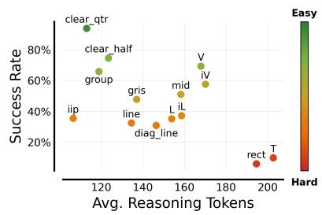

Evidence C: Increasing the inference-time reasoning budget improves success. Using the same $\mathcal { R } ^ { 3 }$ checkpoint, we vary the reasoning budget to compare performance using no reasoning, reasoning truncated at 50 or 100 tokens, and full reasoning. In Table 3 $( ^ { \infty } \mathrm { O u r s } ^ { \prime \prime }$ group),

Figure 5: Per-task token length.

we see that allowing a larger reasoning budget generally yields marked gains, especially on group, line, V, iip, gris, iV, diag\_line, rect, and iL. Since these variants difer only in the inference-time reasoning budget, this comparison isolates the efect of inference-time reasoning while holding the learned representations fixed. Additionally, Figure 5 shows that our model generally elicits longer reasoning traces on harder, lower-success tasks. Together, these results provide causal evidence that reasoning contributes substantially to task success and serves as useful test-time compute.

## Takeaways: Reasoning and representation learning

• While $\mathcal { R } ^ { 3 }$ does improve perception and action understanding, gains in perception alone do not explain improvements on reasoning and manipulation.

• Using reasoning data as auxiliary supervision for co-training does not explain its benefits.

• Increasing the inference-time budget improves performance and the trained reasoner spends more tokens for reasoning on harder tasks.

## 4.3. Understanding Reasoning Behaviors Learned by $\mathcal { R } ^ { 3 }$

$\mathcal { R } ^ { 3 }$ learns reasoning strategies useful for manipulation. Beyond success rates, we qualitatively inspect the reasoning traces produced by $\mathcal { R } ^ { 3 }$ in Appendix C. These traces suggest that $\mathcal { R } ^ { 3 }$ learns behaviors useful for longhorizon manipulation that are under-represented in the mid-training data. First, the trained reasoner compares multiple alternatives and performs self-correction before choosing instructions. In Figure 17, it considers object-vertex assignments, notices that its initial plan is inconsistent with the current scene, and revises the plan. Second, the reasoner uses reasoning to resolve visual and historical uncertainty. In Figure 16, an object is partially occluded by the arm; rather than blindly following the previous response, the model reexamines the scene, task information, and history to infer the correct object state. We further qualitatively compare aligned reasoning traces from the base, midtrained, and RL-trained variants on the same 30 validation scenes. Full analyses are in Appendix B.2. The

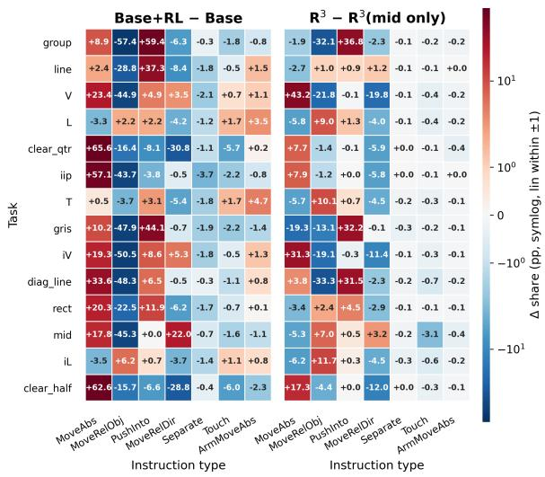  
Figure 6: RL afects instruction distributions. RL from the base model broadly rewrites the instruction distribution, while RL after mid-training makes localized edits.

base model is exploratory but unreliable, with variable formatting, hallucinated objects, non-convergent backtracking, and malformed instructions. Mid-training largely fixes these interface-level failures, but often gives terse and single-pass reasoning. RL after mid-training preserves this reliability while making reasoning more state-aware: the model more often restates task constraints, tracks progress, and chooses next steps incrementally. Together, these comparisons suggest that mid-training stabilizes the reasoning interface, and RL refines it into more deliberate action-oriented planning.

Mid-training learns behavioral priors aligned with the expert that RL selectively updates. We analyze the distribution of instruction primitives produced by each model in Figure 6. The base model’s distribution difers substantially from the expert’s, overusing short-horizon primitives such as MoveRelObj and underusing MoveAbs on spatial-target tasks. RL from the base model improves success, but does not recover the expert distribution; instead, it often shifts the policy toward a diferent mode, overusing

MoveAbs or PushInto. Mid-training largely aligns the model’s instruction distribution with the expert’s, providing a strong behavioral prior before RL. When RL is applied after mid-training, the resulting instruction distribution remains largely consistent with the mid-trained model, with larger shifts occurring mainly where the mid-trained model is still mismatched with the expert, such as increased use of PushInto on diag\_line/gris and MoveAbs on V and iV. This supports the role of mid-training as a warm start: from a weak prior, RL must discover new useful behaviors, whereas with mid-training, RL can refine an already reasonable behavior distribution. This refinement also reflects the mode-seeking nature of RL, illustrated by the example in Figure 20. For such tasks where expert strategies are diverse, mid-training exposes the model to a broad range of behaviors, and subsequent RL tends to concentrate its behavior around good strategies for higher rewards. We also observe that rare instructions (Separate, Touch, and ArmMoveAbs) collapse after RL, suggesting that behaviors misaligned with the expert are dropped in RL.

## 4.4. Comparison with Approaches that Use Structured CoT Templates

Prior works often rely on structured reasoning templates, which encode procedural reasoning patterns shared across scenes. For example, ECoT [8, 64] constructs a vision-centric CoT containing bounding boxes and object coordinates. Related approaches structure intermediate reasoning through object, grasp, and afordances [33], visual subgoals [67], end-efector paths [34], depth-aware perception and image-space trajectories [32], or structured descriptions of driving states [21]. In this section, we compare our approach against an adaptation of ECoT to our setting, where we augment the reasoning trace with explicit annotations obtained from simulator state. Specifically, our ECoT implementation includes the task goal, end-efector state, object states, language reasoning, and the resulting instruction.

We compare four variants of reasoning supervision for midtraining, defined along two axes: (1) when the reasoning annotations are obtained: reasoning recorded during data collection (“Ours”) versus reasoning retrospectively labeled on demonstration data (“Post-hoc”), following prior ECoT training [8, 64]; and (2) reasoning style: free-form language reasoning versus ECoT-style reasoning $( ^ { \infty } { + } \mathrm { E C o T ^ { \prime \prime } } )$ . We then derive four diferent combinations of SFT data: “Ours", “Post-hoc", “Ours+ECoT", and $\mathrm { ^ { 4 4 } P o s t { - } h o c + E C o T ^ { \prime \prime } }$ . Note that “Ours" here refers exactly to $^ { * } \mathcal { R } ^ { 3 }$ (mid only)" for the main results. We train all variants by SFT on our mid-training data, which contains only $\mathcal { T } _ { \mathrm { M } }$ tasks, and $\mathcal { T } _ { \mathrm { R } }$ and $\tau _ { \mathrm { { O } } }$ are used as held-out tasks for evaluation. Our motivation and implementation details of ECoT are provided in Appendix A.7.

ECoT-style reasoning does not provide additional benefit. Table 4 reports the evaluation results of the four variants. Comparing the ECoT variants with their non-ECoT counterparts, we find that adding ECoT components slightly degrades overall per-

<table><tr><td></td><td>Ours Post-hoc</td><td>Ours + ECoT</td><td>Post-hoc + ECoT</td></tr><tr><td> $\mathcal { T } _ { \mathrm { M } }$  (mid-training tasks)</td><td></td><td></td><td></td></tr><tr><td>group</td><td>53.8 53.9</td><td>51.0</td><td>46.6</td></tr><tr><td>line</td><td>22.9 19.7</td><td>20.6</td><td>20.6</td></tr><tr><td>V</td><td>33.3 28.7</td><td>28.4</td><td>30.2</td></tr><tr><td>L</td><td>28.1 31.1</td><td>28.3</td><td>25.9</td></tr><tr><td>clear_qtr</td><td>90.7 89.3</td><td>87.5</td><td>86.7</td></tr><tr><td>iip</td><td>28.9 27.7</td><td>27.9</td><td>24.7</td></tr><tr><td> $\tau _ { \mathrm { R } }$  and  $\tau _ { \mathrm { { O } } }$ </td><td>(held-out tasks)</td><td></td><td></td></tr><tr><td>T</td><td>6.9 10.3</td><td>6.6</td><td>7.4</td></tr><tr><td>gris</td><td>34.8 24.6</td><td>26.4</td><td>25.8</td></tr><tr><td>iV</td><td>21.7 22.8</td><td>21.9</td><td>22.4</td></tr><tr><td>diag_line</td><td>37.8 35.2</td><td>36.6</td><td>34.8</td></tr><tr><td>rect</td><td>1.7 2.3</td><td>1.7</td><td>2.6</td></tr><tr><td>mid</td><td>41.7 39.8</td><td>39.8</td><td>36.7</td></tr><tr><td>iL</td><td>27.6 25.9</td><td>27.2</td><td>28.8</td></tr><tr><td>clear_half 65.6</td><td>66.7</td><td>66.4</td><td>62.8</td></tr></table>

Table 4: Evaluation results of ECoT variants. Trained by SFT on only our midtraining data. Values are percentages. Bold values mark the best model.

formance. This suggests that in our setting, ECoT does not provide additional benefit over our free-form language reasoning. One possible explanation is that our tasks require reasoning about long-horizon task progress, execution failures, and closed-loop replanning, whereas the additional ECoT components primarily make low-level visual grounding information explicit, such as end-efector and object states. Comparing “Ours” with “Post-hoc”, we find that post-hoc reasoning performs comparably to reasoning recorded during data collection. In theory, one could expect that reasoning recorded during the data collection process should outperform post-hoc labeling since the former captures the true causal factors behind the action, whereas the latter only provides a potentially imperfect estimate, but they perform comparably in our experiments. We hypothesize that this is because our post-hoc reasoning traces are generated by Gemini for trajectories also collected by Gemini. As a result, post-hoc reasoning generation may be easier than in a more realistic setting where the reasoning model must explain actions produced by a diferent expert, such as human or another policy. A more complete analysis would require systematically varying both the trajectory collector and reasoning generator, e.g., using GPT to generate post-hoc reasoning for Gemini trajectories. We leave this comparison to future work.

## Takeaways: What makes ℛ<sup>3</sup> efective

Mid-training anchors a broad, expert-like behavior distribution; RL then refines that prior into more deliberate action-oriented planning and concentrated behaviors.

Reasoning enables progress tracking, recovery from failures, and closed-loop replanning that matters more than visual grounding, making structured CoTs less useful.

## 5. Experiments on Bimanual Grocery Packing

Experimental setup and task design. We next test whether our approach extends to a bimanual grocery packing task from forthcoming work [2]. The task is instantiated in a dual-arm grocery packing workspace using a dual xArm-7 platform, following RaC [24]. Detailed descriptions of the environment setup, task goals, success criteria, and a comparison with Language Table are provided in Appendix A.2 and Appendix A.3. We use the dataset of human teleoperation data labeled with instructions directly from Anonymous [2], and fine-tune �<sub>0.5</sub> [27] on this data to obtain a steerable low-level policy. We skip Stage I mid-training because the base VLM already produces useful reasoning on this domain and because no reasoning annotations are provided in Anonymous [2]. To construct data for Stage II RL, we sample frames from each segment, oversampling the onset and pre-completion of the subtask. See Appendix A.2 for details. Each training example conditions the VLM on the three current views and the long-horizon goal and supervises the current instruction.

Comparisons and evaluation protocol. We use the same Qwen3.5-4B base model as on Language Table. We compare: (1) the base model with and without reasoning; (2) instruction-only imitation (IL) without reasoning; and (3) our method $\mathcal { R } ^ { 3 }$ (RL only), i.e., RL with the string-match reward, initialized from the base model. We evaluate on 12 held-out task configurations unseen in the training data, Task 1–Task 12. For each of the 12 held-out tasks we run 5 environment seeds × 10 rollouts (50 episodes per task; 600 in total). An episode is successful if every goal object is stably packed in its assigned tray, designated clutter is cleared, and any orientation constraint is satisfied. We also report normalized task progress as a metric, which reflects the fraction of packing stages (goal objects) completed.

Result: ℛ<sup>3</sup> (RL only) outperforms instruction-only imitation. Table 5 reports per-task success rates and normalized progress. Consistent with Language Table, our approach attains substantially higher overall success and progress than instruction-only IL without reasoning. These results suggest that our recipe successfully transfers to long-horizon bimanual manipulation beyond Language Table, and that Stage I mid-training can be skipped when the base VLM already produces useful reasoning on the target domain. Qualitative examples of rollouts in Appendix C show the same action-oriented behaviors as on Language Table: the reasoner tracks packing progress from the three camera views (Figures 21 and 22) and can re-examine the scene to correct an initially wrong object localization (Figure 23).

<table><tr><td></td><td colspan="4">Success Rate</td><td colspan="4">Progress</td></tr><tr><td></td><td>Base (w/o reason)</td><td>IL (w/o reason)</td><td>Base (w/ reason)</td><td>Ours</td><td>Base (w/o reason)</td><td>IL (w/o reason)</td><td>Base (w/ reason)</td><td>Ours</td></tr><tr><td>Task 1</td><td> $7 6 . 0 \pm 1 2 . 0$ </td><td> $4 2 . 0 \pm 1 3 . 3$ </td><td> $8 4 . 0 \pm 1 5 . 7$ </td><td> $9 0 . 0 \pm 7 . 9$ </td><td> $8 1 . 0 \pm 1 0 . 1$ </td><td> $6 9 . 0 \pm 7 . 6$ </td><td> $8 6 . 0 \pm 1 4 . 1$ </td><td> $9 1 . 0 \pm 7 . 4$ </td></tr><tr><td>Task 2</td><td> $\mathbf { 1 0 0 . 0 \Pi } _ { \pm 0 . 0 }$ </td><td> $\mathbf { 1 0 0 . 0 \mu _ { \pm 0 . 0 } }$ </td><td> $9 6 . 0 \pm 7 . 8$ </td><td> $\mathbf { 1 0 0 . 0 \mu _ { \pm 0 . 0 } }$ </td><td> $\mathbf { 1 0 0 . 0 \mu _ { \pm 0 . 0 } }$ </td><td> $\mathbf { 1 0 0 . 0 \mu _ { \pm 0 . 0 } }$ </td><td> $9 8 . 7 \pm 2 . 6 $ </td><td> $\mathbf { 1 0 0 . 0 \Pi } _ { \pm 0 . 0 }$ </td></tr><tr><td>Task 3</td><td> $0 . 0 \pm 0 . 0$ </td><td> $4 0 . 0 \pm 1 4 . 1$ </td><td> $0 . 0 \pm 0 . 0$ </td><td> ${ \bf 6 0 . 0 \pm 1 4 . 2 }$ </td><td> $5 9 . 0 \pm 2 . 7$ </td><td> $7 8 . 0 \pm 5 . 7$ </td><td> $3 8 . 7 \pm 4 . 9$ </td><td> $\mathbf { 8 4 . 0 \pm 6 . 5 }$ </td></tr><tr><td>Task 4</td><td> $4 . 0 \pm 5 . 5$ </td><td> $1 2 . 0 \pm 9 . 2$ </td><td> $1 2 . 0 \pm 1 3 . 6$ </td><td> ${ \bf 2 6 . 0 \pm 1 2 . 7 }$ </td><td> $4 8 . 0 \pm 6 . 5$ </td><td> $4 9 . 0 \pm 7 . 2$ </td><td> $4 5 . 0 \pm 1 0 . 2 $ </td><td> ${ \bf 6 6 . 5 \pm 7 . 8 }$ </td></tr><tr><td>Task 5</td><td> $0 . 0 \pm 0 . 0$ </td><td> $0 . 0 \pm 0 . 0$ </td><td> $0 . 0 \pm 0 . 0$ </td><td> ${ \bf 1 6 . 0 \pm 1 0 . 3 }$ </td><td> $3 4 . 0 \pm 4 . 8$ </td><td> $3 1 . 6 \pm 3 . 4$ </td><td> $3 8 . 4 \pm 6 . 2 $ </td><td> ${ \bf 6 6 . 0 \pm 6 . 5 }$ </td></tr><tr><td>Task 6</td><td> $6 . 0 \pm 6 . 8$ </td><td> $1 6 . 0 \pm 1 0 . 3$ </td><td> $0 . 0 \pm 0 . 0$ </td><td> $2 8 . 0 \pm 1 2 . 4$ </td><td> $4 2 . 0 \pm 8 . 2 $ </td><td> $5 2 . 5 \pm 9 . 1$ </td><td> $4 3 . 0 \pm 1 1 . 4$ </td><td> $5 5 . 5 \pm 1 0 . 7$ </td></tr><tr><td>Task 7</td><td> $0 . 0 \pm 0 . 0$ </td><td> $4 4 . 0 \pm 1 3 . 7$ </td><td> $0 . 0 \pm 0 . 0$ </td><td> $1 0 . 7 \pm 1 5 . 2$ </td><td> $5 0 . 0 \pm 0 . 0$ </td><td> $7 4 . 0 \pm 7 . 0$ </td><td> $5 0 . 0 \pm 0 . 0$ </td><td> $5 5 . 3 \pm 7 . 6$ </td></tr><tr><td>Task 8</td><td> $0 . 0 \pm 0 . 0$ </td><td> $0 . 0 \pm 0 . 0$ </td><td> $4 . 0 \pm 7 . 8$ </td><td> ${ \bf 6 . 0 \pm 6 . 8 }$ </td><td> $2 8 . 8 \pm 5 . 9$ </td><td> $2 1 . 2 \pm 7 . 0$ </td><td> $3 5 . 2 \pm 9 . 7 $ </td><td> ${ \bf 3 6 . 0 \pm 1 0 . 5 }$ </td></tr><tr><td>Task 9</td><td> $2 0 . 0 \pm 1 0 . 9$ </td><td> ${ \bf 8 6 . 0 \pm 8 . 6 }$ </td><td> $3 6 . 0 \pm 1 8 . 4$ </td><td> $8 4 . 0 \pm 1 0 . 6 $ </td><td> $6 7 . 5 \pm 6 . 7$ </td><td> $9 2 . 0 \pm 5 . 7$ </td><td> $7 4 . 0 \pm 1 0 . 4$ </td><td> $9 1 . 0 \pm 7 . 1 $ </td></tr><tr><td>Task 10</td><td> $1 0 . 0 \pm 8 . 4$ </td><td> $4 8 . 0 \pm 1 4 . 0$ </td><td> $1 6 . 0 \pm 1 4 . 7$ </td><td> ${ 5 4 . 0 \pm 1 4 . 3 }$ </td><td> $5 1 . 5 \pm 6 . 9$ </td><td> $8 3 . 5 \pm 5 . 4$ </td><td> $5 4 . 0 \pm 1 2 . 2$ </td><td> $\mathbf { 8 4 . 0 \substack { \pm 6 . 0 } }$ </td></tr><tr><td>Task 11</td><td> $2 0 . 0 \pm 1 1 . 4$ </td><td> $5 4 . 0 \pm 1 3 . 5$ </td><td> $3 2 . 0 \pm 1 8 . 4$ </td><td> $7 2 . 0 \pm 1 2 . 8$ </td><td> $6 9 . 6 \pm 6 . 8$ </td><td> $8 4 . 8 \pm 6 . 4$ </td><td> $8 0 . 0 \pm 8 . 8$ </td><td> $8 7 . 2 \pm 7 . 1$ </td></tr><tr><td>Task 12</td><td> $0 . 0 \pm 0 . 0$ </td><td> $1 4 . 0 \pm 9 . 1$ </td><td> $0 . 0 \pm 0 . 0$ </td><td> $2 8 . 0 \pm 1 1 . 5$ </td><td> $2 8 . 4 \pm 7 . 2$ </td><td> $4 8 . 8 \pm 9 . 4$ </td><td> $3 6 . 0 \pm 1 3 . 1$ </td><td> ${ \bf 6 0 . 8 \pm 1 0 . 3 }$ </td></tr><tr><td>Mean</td><td> $1 9 . 7 \pm 1 . 9$ </td><td> $3 8 . 0 \pm 3 . 0$ </td><td> $2 3 . 3 \pm 3 . 2$ </td><td> $4 7 . 9 \pm 3 . 3$ </td><td> $5 5 . 0 \pm 1 . 8$ </td><td> $6 5 . 4 \pm 1 . 9$ </td><td> $5 6 . 6 \pm 2 . 8$ </td><td> $7 3 . 1 \pm 2 . 2$ </td></tr></table>

Table 5: Main results on grocery packing. Success rate and normalized progress on 12 held-out tasks. Values are percentages with 95% confidence intervals. Bold values mark the best model.

## 6. Discussion and Perspectives on Future Work

We introduced $\mathcal { R } _ { : } ^ { 3 }$ , a recipe for training VLMs to reason flexibly in natural language before issuing high-level instructions that steer a fixed low-level robot policy. By combining mid-training on expert reasoning traces with rubric-based single-step reinforcement learning from ofline action data, $\mathcal { R } ^ { 3 }$ learns to generate action-oriented reasoning that can guide a frozen low-level robot policy. Experiments on Language Table and bimanual grocery packing show that this approach improves performance over instruction-only imitation without reasoning. On Language Table, $\mathcal { R } ^ { 3 }$ further improves across both seen and unseen long-horizon tasks and demonstrates stronger out-of-distribution generalization. We further find that the trained reasoner learns behaviors such as tracking interaction history, resolving visual ambiguity, and self-correction. We show that free-form language reasoning can function as an efective test-time compute mechanism for steering low-level policies.

Limitations. First, our experiments are conducted in two simulated domains (Language Table and bimanual grocery packing) with a fixed low-level language-conditioned policy. While this helps us perform a systematic study, extending the approach to real robots remains important future work. Second, Stage I still relies on expert-generated reasoning, and Stage II relies on a VLM judge to provide semantic rewards. While this reduces the need for multi-turn robot rollouts, it also optimizes a surrogate objective. Extending our approach to multi-turn online RL will further improve long-horizon behaviors.

Future work. We believe there are several directions for future work. First, $\mathcal { R } ^ { 3 }$ could be deployed on real robots and evaluated on more dexterous, longer-horizon manipulation tasks. This would test whether natural-language reasoning remains useful under real-world challenges such as noisy perception, physical recovery, and adaptation to unseen environments. Second, future work could reduce the separation between the high-level reasoner and the low-level robot policy. While our hierarchical design isolates the efect of reasoning, it may introduce a mismatch between high-level intent and low-level execution. Jointly training reasoning and action prediction could improve coordination while preserving the interpretability benefits of language-based reasoning. It would also be interesting to study whether reasoning can support not only high-level steering, but also the generation of low-level actions themselves. The closest existing approaches condition action generation on intermediate metadata [28], but again rely on highly structured templates, suggesting that substantial gains remain to be realized. In addition, joint training introduces technical systems challenges around synchronizing high-level reasoning with low-level action, which will be important to address. Third, the RL stage could be extended beyond single-step ofline training. Our current formulation avoids expensive online interaction by rewarding semantic agreement with expert instructions, but it optimizes a surrogate objective rather than final task success. Multi-turn RL with feedback from task completion, intermediate progress, recovery behavior, or human preferences may further improve long-horizon reasoning. Finally, $\mathcal { R } ^ { 3 }$ could be extended to support online improvement. Rather than relying solely on batched ofline training, the reasoning VLM could be updated from environment feedback or human corrections. Free-form reasoning may also provide a natural mechanism for exploration, allowing the robot to expand the support of its behavior beyond what is represented in the ofline data. While most robot RL methods today focus on sharpening an existing low-level policy, reasoning could enable qualitatively broader exploration, supporting robust adaptation to new embodiments, novel objects, and failure modes not encountered during training.

## Acknowledgments

We thank Kshitiz and Robyn Wu for support with the bimanual grocery packing environment and data from their forthcoming work [2]. We thank Max Sobol Mark, Ian Wu, Kushal Arora, Abhishek Gupta, Marius Memmel and Mateo Castro for informative discussions. We thank members of CMU AIRe and RCHI labs for their support. This work is supported by the Ofice of Naval Research under N00014-24-12206, a Schmidt Sciences AI2050 Early Career Fellowship, and a TRI U3.0 project. We thank the Orchard cluster at the CMU FLAME center for support with GPU resources and TPU research cloud (TRC) for their support with TPU resources. YQ gratefully acknowledges support from the Amazon AI PhD Fellowship.

## References

[1] Michael Ahn, Anthony Brohan, Noah Brown, Yevgen Chebotar, Omar Cortes, Byron David, Chelsea Finn, Chuyuan Fu, Keerthana Gopalakrishnan, Karol Hausman, et al. Do as i can, not as i say: Grounding language in robotic afordances. arXiv preprint arXiv:2204.01691, 2022.

[2] Anonymous. Building exploratory vision-language-action models via midtraining, 2026. Manuscript in preparation.

[3] Jagdeep Singh Bhatia, Andrew Wagenmaker, William Chen, and Sergey Levine. Adapting generalist robot policies with semantic reinforcement learning, 2026. URL https://arxiv.org/abs/2606. 31958.

[4] Johan Bjorck, Fernando Castañeda, Nikita Cherniadev, Xingye Da, Runyu Ding, Linxi Fan, Yu Fang, Dieter Fox, Fengyuan Hu, Spencer Huang, et al. Gr00t n1: An open foundation model for generalist humanoid robots. arXiv preprint arXiv:2503.14734, 2025.

[5] Anthony Brohan, Noah Brown, Justice Carbajal, Yevgen Chebotar, Xi Chen, Krzysztof Choromanski, Tianli Ding, Danny Driess, Avinava Dubey, Chelsea Finn, Pete Florence, Chuyuan Fu, Montse Gonzalez Arenas, Keerthana Gopalakrishnan, Kehang Han, Karol Hausman, Alexander Herzog, Jasmine

Hsu, Brian Ichter, Alex Irpan, Nikhil Joshi, Ryan Julian, Dmitry Kalashnikov, Yuheng Kuang, Isabel Leal, Lisa Lee, Tsang-Wei Edward Lee, Sergey Levine, Yao Lu, Henryk Michalewski, Igor Mordatch, Karl Pertsch, Kanishka Rao, Krista Reymann, Michael Ryoo, Grecia Salazar, Pannag Sanketi, Pierre Sermanet, Jaspiar Singh, Anikait Singh, Radu Soricut, Huong Tran, Vincent Vanhoucke, Quan Vuong, Ayzaan Wahid, Stefan Welker, Paul Wohlhart, Jialin Wu, Fei Xia, Ted Xiao, Peng Xu, Sichun Xu, Tianhe Yu, and Brianna Zitkovich. Rt-2: Vision-language-action models transfer web knowledge to robotic control, 2023. URL https://arxiv.org/abs/2307.15818.

[6] Berk Calli, Aaron Walsman, Arjun Singh, Siddhartha Srinivasa, Pieter Abbeel, and Aaron M Dollar. Benchmarking in manipulation research: The ycb object and model set and benchmarking protocols. arXiv preprint arXiv:1502.03143, 2015.

[7] Chilam Cheang, Sijin Chen, Zhongren Cui, Yingdong Hu, Liqun Huang, Tao Kong, Hang Li, Yifeng Li, Yuxiao Liu, Xiao Ma, Hao Niu, Wenxuan Ou, Wanli Peng, Zeyu Ren, Haixin Shi, Jiawen Tian, Hongtao Wu, Xin Xiao, Yuyang Xiao, Jiafeng Xu, and Yichu Yang. Gr-3 technical report, 2025. URL https://arxiv.org/abs/2507.15493.

[8] William Chen, Suneel Belkhale, Suvir Mirchandani, Oier Mees, Danny Driess, Karl Pertsch, and Sergey Levine. Training strategies for eficient embodied reasoning. arXiv preprint arXiv:2505.08243, 2025.

[9] Zhenfang Chen, Qinhong Zhou, Yikang Shen, Yining Hong, Hao Zhang, and Chuang Gan. See, think, confirm: Interactive prompting between vision and language models for knowledge-based visual reasoning, 2023. URL https://arxiv.org/abs/2301.05226.

[10] Jeonghun Cho, Deokhyung Kang, Hyounghun Kim, and Gary Geunbae Lee. Self-correcting code generation using small language models, 2025. URL https://arxiv.org/abs/2505.23060.

[11] Jaden Clark, Suvir Mirchandani, Dorsa Sadigh, and Suneel Belkhale. Action-free reasoning for policy generalization, 2025. URL https://arxiv.org/abs/2502.03729.

[12] Yinpei Dai, Jayjun Lee, Nima Fazeli, and Joyce Chai. Racer: Rich language-guided failure recovery policies for imitation learning, 2024. URL https://arxiv.org/abs/2409.14674.

[13] DeepSeek-AI. Deepseek-r1: Incentivizing reasoning capability in LLMs via reinforcement learning, 2025. URL https://arxiv.org/abs/2501.12948.

[14] Xiaoyu Dong, Zhi Li, and Xiao-Ming Wu. Muse: Benchmarking manufacturable, functional, and assemblable text-to-cad generation, 2026. URL https://arxiv.org/abs/2605.28579.

[15] Danny Driess, Fei Xia, Mehdi S. M. Sajjadi, Corey Lynch, Aakanksha Chowdhery, Brian Ichter, Ayzaan Wahid, Jonathan Tompson, Quan Vuong, Tianhe Yu, Wenlong Huang, Yevgen Chebotar, Pierre Sermanet, Daniel Duckworth, Sergey Levine, Vincent Vanhoucke, Karol Hausman, Marc Toussaint, Klaus Gref, Andy Zeng, Igor Mordatch, and Pete Florence. Palm-e: An embodied multimodal language model, 2023. URL https://arxiv.org/abs/2303.03378.

[16] Frederik Ebert, Chelsea Finn, Sudeep Dasari, Annie Xie, Alex Lee, and Sergey Levine. Visual foresight: Model-based deep reinforcement learning for vision-based robotic control. arXiv preprint arXiv:1812.00568, 2018.

[17] Lin Fan, Yafei Ou, Zhipeng Deng, Pengyu Dai, Hou Chongxian, Jiale Yan, Yaqian Li, Kaiwen Long, Xun Gong, Masayuki Ikebe, and Yefeng Zheng. Step-cot: Stepwise visual chain-of-thought for medical visual question answering, 2026. URL https://arxiv.org/abs/2603.13878.

[18] Haoquan Fang, Jiafei Duan, Donovan Clay, Sam Wang, Shuo Liu, Weikai Huang, Xiang Fan, Wei-Chuan Tsai, Shirui Chen, Yi Ru Wang, et al. Molmoact2: Action reasoning models for real-world deployment. arXiv preprint arXiv:2605.02881, 2026.

[19] Youhe Feng, Hansen Shi, Haoyang Li, Xinlei Guo, Yang Wang, Chengyang Zhang, Jinkai Zhang, Xiaohan Zhang, Jie Tang, and Jing Zhang. Procvlm: Learning procedure-grounded progress rewards for robotic manipulation, 2026. URL https://arxiv.org/abs/2605.08774.

[20] Chelsea Finn and Sergey Levine. Deep visual foresight for planning robot motion. In 2017 IEEE international conference on robotics and automation (ICRA), pages 2786–2793. IEEE, 2017.

[21] Tian Gao, Celine Tan, Catherine Glossop, Timothy Gao, Jiankai Sun, Kyle Stachowicz, Shirley Wu, Oier Mees, Dorsa Sadigh, Sergey Levine, and Chelsea Finn. Steervla: Steering vision-languageaction models in long-tail driving scenarios, 2026. URL https://arxiv.org/abs/2602.08440.

[22] Caelan Reed Garrett, Rohan Chitnis, Rachel Holladay, Beomjoon Kim, Tom Silver, Leslie Pack Kaelbling, and Tomás Lozano-Pérez. Integrated task and motion planning, 2020. URL https: //arxiv.org/abs/2010.01083.

[23] Huihui Guo, Fan Wu, Yunchuan Qin, Ruihui Li, Keqin Li, and Kenli Li. Recent trends in task and motion planning for robotics: A survey. ACM Computing Surveys, 55(13s):1–36, 2023.

[24] Zheyuan Hu, Robyn Wu, Naveen Enock, Jasmine Li, Riya Kadakia, Zackory Erickson, and Aviral Kumar. Rac: Robot learning for long-horizon tasks by scaling recovery and correction, 2025. URL https://arxiv.org/abs/2509.07953.

[25] Wenlong Huang, Fei Xia, Ted Xiao, Harris Chan, Jacky Liang, Pete Florence, Andy Zeng, Jonathan Tompson, Igor Mordatch, Yevgen Chebotar, et al. Inner monologue: Embodied reasoning through planning with language models. arXiv preprint arXiv:2207.05608, 2022.

[26] Wenlong Huang, Chen Wang, Yunzhu Li, Ruohan Zhang, and Li Fei-Fei. Rekep: Spatio-temporal reasoning of relational keypoint constraints for robotic manipulation. In Conference on Robot Learning, pages 4573–4602. PMLR, 2025.

[27] Physical Intelligence, Kevin Black, Noah Brown, James Darpinian, Karan Dhabalia, Danny Driess, Adnan Esmail, Michael Equi, Chelsea Finn, Niccolo Fusai, Manuel Y. Galliker, Dibya Ghosh, Lachy Groom, Karol Hausman, Brian Ichter, Szymon Jakubczak, Tim Jones, Liyiming Ke, Devin LeBlanc, Sergey Levine, Adrian Li-Bell, Mohith Mothukuri, Suraj Nair, Karl Pertsch, Allen Z. Ren, Lucy Xiaoyang Shi, Laura Smith, Jost Tobias Springenberg, Kyle Stachowicz, James Tanner, Quan Vuong, Homer Walke, Anna Walling, Haohuan Wang, Lili Yu, and Ury Zhilinsky. �<sub>0.5</sub>: a vision-languageaction model with open-world generalization, 2025. URL https://arxiv.org/abs/2504.16054.

[28] Physical Intelligence, Bo Ai, Ali Amin, Raichelle Aniceto, Ashwin Balakrishna, Greg Balke, Kevin Black, George Bokinsky, Shihao Cao, Thomas Charbonnier, Vedant Choudhary, Foster Collins, Ken Conley, Grace Connors, James Darpinian, Karan Dhabalia, Maitrayee Dhaka, Jared DiCarlo, Danny Driess, Michael Equi, Adnan Esmail, Yunhao Fang, Chelsea Finn, Catherine Glossop, Thomas

Godden, Ivan Goryachev, Lachlan Groom, Haroun Habeeb, Hunter Hancock, Karol Hausman, Gashon Hussein, Victor Hwang, Brian Ichter, Connor Jacobsen, Szymon Jakubczak, Rowan Jen, Tim Jones, Gregg Kammerer, Ben Katz, Liyiming Ke, Mairbek Khadikov, Chandra Kuchi, Marinda Lamb, Devin LeBlanc, Brendon LeCount, Sergey Levine, Xinyu Li, Adrian Li-Bell, Vladislav Lialin, Zhonglin Liang, Wallace Lim, Yao Lu, Enyu Luo, Vishnu Mano, Nandan Marwaha, Aikys Mongush, Liam Murphy, Suraj Nair, Tyler Patterson, Karl Pertsch, Allen Z. Ren, Gavin Schelske, Charvi Sharma, Baifeng Shi, Lucy Xiaoyang Shi, Laura Smith, Jost Tobias Springenberg, Kyle Stachowicz, Will Stoeckle, Jiaming Tang, Jimmy Tanner, Shalom Tekeste, Marcel Torne, Kyle Vedder, Quan Vuong, Anna Walling, Haohuan Wang, Jason Wang, XuDong Wang, Chris Whalen, Samuel Whitmore, Blake Williams, Charles Xu, Sukwon Yoo, Lili Yu, Wuming Zhang, Zhuoyang Zhang, and Ury Zhilinsky. �<sub>0.7</sub>: a steerable generalist robotic foundation model with emergent capabilities, 2026. URL https://arxiv.org/abs/2604.15483.

[29] Leslie Pack Kaelbling and Tomás Lozano-Pérez. Integrated task and motion planning in belief space. The International Journal of Robotics Research, 32(9-10):1194–1227, 2013.

[30] Moo Jin Kim, Karl Pertsch, Siddharth Karamcheti, Ted Xiao, Ashwin Balakrishna, Suraj Nair, Rafael Rafailov, Ethan Foster, Grace Lam, Pannag Sanketi, et al. Openvla: An open-source vision-languageaction model. arXiv preprint arXiv:2406.09246, 2024.

[31] Takeshi Kojima, Shixiang Shane Gu, Machel Reid, Yutaka Matsuo, and Yusuke Iwasawa. Large language models are zero-shot reasoners, 2023. URL https://arxiv.org/abs/2205.11916.

[32] Jason Lee, Jiafei Duan, Haoquan Fang, Yuquan Deng, Shuo Liu, Boyang Li, Bohan Fang, Jieyu Zhang, Yi Ru Wang, Sangho Lee, et al. Molmoact: Action reasoning models that can reason in space. arXiv preprint arXiv:2508.07917, 2025.

[33] Jinming Li, Yichen Zhu, Zhibin Tang, Junjie Wen, Minjie Zhu, Xiaoyu Liu, Chengmeng Li, Ran Cheng, Yaxin Peng, Yan Peng, and Feifei Feng. CoA-VLA: Improving vision-language-action models via visual-text chain-of-afordance. In Proceedings of the IEEE/CVF International Conference on Computer Vision (ICCV), pages 9759–9769, 2025.

[34] Yi Li, Yuquan Deng, Jesse Zhang, Joel Jang, Marius Memmel, Raymond Yu, Caelan Reed Garrett, Fabio Ramos, Dieter Fox, Anqi Li, Abhishek Gupta, and Ankit Goyal. HAMSTER: Hierarchical action models for open-world robot manipulation. In International Conference on Learning Representations (ICLR), 2025.

[35] Jacky Liang, Wenlong Huang, Fei Xia, Peng Xu, Karol Hausman, Brian Ichter, Pete Florence, and Andy Zeng. Code as policies: Language model programs for embodied control. In 2023 IEEE International conference on robotics and automation (ICRA), pages 9493–9500. IEEE, 2023.

[36] Fanqi Lin, Ruiqian Nai, Yingdong Hu, Jiacheng You, Junming Zhao, and Yang Gao. Onetwovla: A unified vision-language-action model with adaptive reasoning. arXiv preprint arXiv:2505.11917, 2025.

[37] Kehui Liu, Chuyue Guan, Zhongjie Jia, Ziniu Wu, Xin Liu, Tianyu Wang, Shuai Liang, Pengan Chen, Pingrui Zhang, Haoming Song, et al. Fastumi: A scalable and hardware-independent universal manipulation interface with dataset. arXiv preprint arXiv:2409.19499, 2024.

[38] Zichen Liu, Changyu Chen, Wenjun Li, Penghui Qi, Tianyu Pang, Chao Du, Wee Sun Lee, and Min Lin. Understanding r1-zero-like training: A critical perspective, 2025. URL https://arxiv.org/ abs/2503.20783.

[39] Pan Lu, Swaroop Mishra, Tony Xia, Liang Qiu, Kai-Wei Chang, Song-Chun Zhu, Oyvind Tafjord, Peter Clark, and Ashwin Kalyan. Learn to explain: Multimodal reasoning via thought chains for science question answering, 2022. URL https://arxiv.org/abs/2209.09513.

[40] Corey Lynch, Mohi Khansari, Ted Xiao, Vikash Kumar, Jonathan Tompson, Sergey Levine, and Pierre Sermanet. Learning latent plans from play. In Conference on robot learning, pages 1113–1132. Pmlr, 2020.

[41] Corey Lynch, Ayzaan Wahid, Jonathan Tompson, Tianli Ding, James Betker, Robert Baruch, Travis Armstrong, and Pete Florence. Interactive language: Talking to robots in real time, 2022. URL https://arxiv.org/abs/2210.06407.

[42] Martin Q. Ma, Yuxiao Qu, Aditya Agrawal, Willis Guo, Paul Pu Liang, Ruslan Salakhutdinov, and Louis-Philippe Morency. Act2see: Emergent active visual perception for video reasoning, 2026. URL https://arxiv.org/abs/2605.01657.

[43] Dantong Niu, Yuvan Sharma, Giscard Biamby, Jerome Quenum, Yutong Bai, Baifeng Shi, Trevor Darrell, and Roei Herzig. Llarva: Vision-action instruction tuning enhances robot learning. In Conference on Robot Learning, pages 3333–3355. PMLR, 2025.

[44] Yuxiao Qu, Tianjun Zhang, Naman Garg, and Aviral Kumar. Recursive introspection: Teaching language model agents how to self-improve, 2024. URL https://arxiv.org/abs/2407.18219.

[45] Yuxiao Qu, Matthew Y. R. Yang, Amrith Setlur, Lewis Tunstall, Edward Emanuel Beeching, Ruslan Salakhutdinov, and Aviral Kumar. Optimizing test-time compute via meta reinforcement fine-tuning, 2025. URL https://arxiv.org/abs/2503.07572.

[46] Erick Rosete-Beas, Oier Mees, Gabriel Kalweit, Joschka Boedecker, and Wolfram Burgard. Latent plans for task-agnostic ofline reinforcement learning. In Conference on Robot Learning, pages 1838–1849. PMLR, 2023.

[47] Timo Schick, Jane Dwivedi-Yu, Roberto Dessì, Roberta Raileanu, Maria Lomeli, Luke Zettlemoyer, Nicola Cancedda, and Thomas Scialom. Toolformer: Language models can teach themselves to use tools, 2023. URL https://arxiv.org/abs/2302.04761.

[48] Hao Shao, Shengju Qian, Han Xiao, Guanglu Song, Zhuofan Zong, Letian Wang, Yu Liu, and Hongsheng Li. Visual cot: Advancing multi-modal language models with a comprehensive dataset and benchmark for chain-of-thought reasoning. Advances in Neural Information Processing Systems, 37:8612–8642, 2024.

[49] Guangming Sheng, Chi Zhang, Zilingfeng Ye, Xibin Wu, Wang Zhang, Ru Zhang, Yanghua Peng, Haibin Lin, and Chuan Wu. Hybridflow: A flexible and eficient rlhf framework. arXiv preprint arXiv:2409.19256, 2024. URL https://arxiv.org/abs/2409.19256.

[50] Lucy Xiaoyang Shi, Brian Ichter, Michael Equi, Liyiming Ke, Karl Pertsch, Quan Vuong, James Tanner, Anna Walling, Haohuan Wang, Niccolo Fusai, Adrian Li-Bell, Danny Driess, Lachy Groom,

Sergey Levine, and Chelsea Finn. Hi robot: Open-ended instruction following with hierarchical vision-language-action models, 2025. URL https://arxiv.org/abs/2502.19417.

[51] Noah Shinn, Federico Cassano, Edward Berman, Ashwin Gopinath, Karthik Narasimhan, and Shunyu Yao. Reflexion: Language agents with verbal reinforcement learning, 2023. URL https: //arxiv.org/abs/2303.11366.

[52] Charlie Snell, Jaehoon Lee, Kelvin Xu, and Aviral Kumar. Scaling llm test-time compute optimally can be more efective than scaling model parameters, 2024. URL https://arxiv.org/abs/2408. 03314.

[53] Gemini Robotics Team, Saminda Abeyruwan, Joshua Ainslie, Jean-Baptiste Alayrac, Montserrat Gonzalez Arenas, Travis Armstrong, Ashwin Balakrishna, Robert Baruch, Maria Bauza, Michiel Blokzijl, Steven Bohez, Konstantinos Bousmalis, Anthony Brohan, Thomas Buschmann, Arunkumar Byravan, Serkan Cabi, Ken Caluwaerts, Federico Casarini, Oscar Chang, Jose Enrique Chen, Xi Chen, Hao-Tien Lewis Chiang, Krzysztof Choromanski, David D’Ambrosio, Sudeep Dasari, Todor Davchev, Coline Devin, Norman Di Palo, Tianli Ding, Adil Dostmohamed, Danny Driess, Yilun Du, Debidatta Dwibedi, Michael Elabd, Claudio Fantacci, Cody Fong, Erik Frey, Chuyuan Fu, Marissa Giustina, Keerthana Gopalakrishnan, Laura Graesser, Leonard Hasenclever, Nicolas Heess, Brandon Hernaez, Alexander Herzog, R. Alex Hofer, Jan Humplik, Atil Iscen, Mithun George Jacob, Deepali Jain, Ryan Julian, Dmitry Kalashnikov, M. Emre Karagozler, Stefani Karp, Chase Kew, Jerad Kirkland, Sean Kirmani, Yuheng Kuang, Thomas Lampe, Antoine Laurens, Isabel Leal, Alex X. Lee, Tsang-Wei Edward Lee, Jacky Liang, Yixin Lin, Sharath Maddineni, Anirudha Majumdar, Assaf Hurwitz Michaely, Robert Moreno, Michael Neunert, Francesco Nori, Carolina Parada, Emilio Parisotto, Peter Pastor, Acorn Pooley, Kanishka Rao, Krista Reymann, Dorsa Sadigh, Stefano Saliceti, Pannag Sanketi, Pierre Sermanet, Dhruv Shah, Mohit Sharma, Kathryn Shea, Charles Shu, Vikas Sindhwani, Sumeet Singh, Radu Soricut, Jost Tobias Springenberg, Rachel Sterneck, Razvan Surdulescu, Jie Tan, Jonathan Tompson, Vincent Vanhoucke, Jake Varley, Grace Vesom, Giulia Vezzani, Oriol Vinyals, Ayzaan Wahid, Stefan Welker, Paul Wohlhart, Fei Xia, Ted Xiao, Annie Xie, Jinyu Xie, Peng Xu, Sichun Xu, Ying Xu, Zhuo Xu, Yuxiang Yang, Rui Yao, Sergey Yaroshenko, Wenhao Yu, Wentao Yuan, Jingwei Zhang, Tingnan Zhang, Allan Zhou, and Yuxiang Zhou. Gemini robotics: Bringing ai into the physical world, 2025. URL https://arxiv.org/abs/2503.20020.

[54] Octo Model Team, Dibya Ghosh, Homer Walke, Karl Pertsch, Kevin Black, Oier Mees, Sudeep Dasari, Joey Hejna, Tobias Kreiman, Charles Xu, et al. Octo: An open-source generalist robot policy. arXiv preprint arXiv:2405.12213, 2024.

[55] Emanuel Todorov, Tom Erez, and Yuval Tassa. Mujoco: A physics engine for model-based control. In 2012 IEEE/RSJ International Conference on Intelligent Robots and Systems, pages 5026–5033. IEEE, 2012. doi: 10.1109/IROS.2012.6386109.

[56] Xuezhi Wang, Jason Wei, Dale Schuurmans, Quoc Le, Ed Chi, Sharan Narang, Aakanksha Chowdhery, and Denny Zhou. Self-consistency improves chain of thought reasoning in language models, 2023. URL https://arxiv.org/abs/2203.11171.

[57] Yue Wang, Qiuzhi Liu, Jiahao Xu, Tian Liang, Xingyu Chen, Zhiwei He, Linfeng Song, Dian Yu, Juntao Li, Zhuosheng Zhang, Rui Wang, Zhaopeng Tu, Haitao Mi, and Dong Yu. Thoughts are all over the place: On the underthinking of o1-like llms, 2025. URL https://arxiv.org/abs/2501.18585.

[58] Zengzhi Wang, Fan Zhou, Xuefeng Li, and Pengfei Liu. Octothinker: Mid-training incentivizes reinforcement learning scaling, 2025. URL https://arxiv.org/abs/2506.20512.

[59] Jason Wei, Xuezhi Wang, Dale Schuurmans, Maarten Bosma, Brian Ichter, Fei Xia, Ed Chi, Quoc Le, and Denny Zhou. Chain-of-thought prompting elicits reasoning in large language models, 2023. URL https://arxiv.org/abs/2201.11903.

[60] Zhepei Wei, Wenlin Yao, Yao Liu, Weizhi Zhang, Qin Lu, Liang Qiu, Changlong Yu, Puyang Xu, Chao Zhang, Bing Yin, Hyokun Yun, and Lihong Li. Webagent-r1: Training web agents via end-to-end multi-turn reinforcement learning, 2025. URL https://arxiv.org/abs/2505.16421.

[61] Shuai Yang, Hao Li, Bin Wang, Yilun Chen, Yang Tian, Tai Wang, Hanqing Wang, Feng Zhao, Yiyi Liao, and Jiangmiao Pang. Instructvla: Vision-language-action instruction tuning from understanding to manipulation. arXiv preprint arXiv:2507.17520, 2025.

[62] Wenkai Yang, Shuming Ma, Yankai Lin, and Furu Wei. Towards thinking-optimal scaling of test-time compute for llm reasoning, 2025. URL https://arxiv.org/abs/2502.18080.

[63] Shunyu Yao, Dian Yu, Jefrey Zhao, Izhak Shafran, Thomas L. Grifiths, Yuan Cao, and Karthik Narasimhan. Tree of thoughts: Deliberate problem solving with large language models, 2023. URL https://arxiv.org/abs/2305.10601.

[64] Michał Zawalski, William Chen, Karl Pertsch, Oier Mees, Chelsea Finn, and Sergey Levine. Robotic control via embodied chain-of-thought reasoning. In Conference on Robot Learning, pages 3157–3181. PMLR, 2025.

[65] Ruohong Zhang, Bowen Zhang, Yanghao Li, Haotian Zhang, Zhiqing Sun, Zhe Gan, Yinfei Yang, Ruoming Pang, and Yiming Yang. Improve vision language model chain-of-thought reasoning. In Proceedings of the 63rd Annual Meeting of the Association for Computational Linguistics (Volume 1: Long Papers), pages 1631–1662, 2025.

[66] Zhuosheng Zhang, Aston Zhang, Mu Li, Hai Zhao, George Karypis, and Alex Smola. Multimodal chain-of-thought reasoning in language models. Transactions on Machine Learning Research, 2024, 2024.

[67] Qingqing Zhao, Yao Lu, Moo Jin Kim, Zipeng Fu, Zhuoyang Zhang, Yecheng Wu, Zhaoshuo Li, Qianli Ma, Song Han, Chelsea Finn, Ankur Handa, Tsung-Yi Lin, Gordon Wetzstein, Ming-Yu Liu, and Donglai Xiang. CoT-VLA: Visual chain-of-thought reasoning for vision-language-action models. In Proceedings of the IEEE/CVF Conference on Computer Vision and Pattern Recognition (CVPR), pages 1702–1713, 2025.

[68] Ruijie Zheng, Yongyuan Liang, Shuaiyi Huang, Jianfeng Gao, Hal Daumé III, Andrey Kolobov, Furong Huang, and Jianwei Yang. Tracevla: Visual trace prompting enhances spatial-temporal awareness for generalist robotic policies. In International Conference on Learning Representations, volume 2025, pages 54277–54296, 2025.

[69] Yaowei Zheng, Richong Zhang, Junhao Zhang, Yanhan Ye, Zheyan Luo, Zhangchi Feng, and Yongqiang Ma. Llamafactory: Unified eficient fine-tuning of 100+ language models. In Proceedings of the 62nd Annual Meeting of the Association for Computational Linguistics (Volume 3: System Demonstrations), Bangkok, Thailand, 2024. Association for Computational Linguistics. URL https: //arxiv.org/abs/2403.13372.

## Appendices

## A. Experimental Details

## A.1. Language Table Task Details

We design 14 long-horizon manipulation tasks in the Language Table environment, which require arranging blocks into task-specific spatial configurations. Each scene contains 8 blocks: red moon, red pentagon, blue moon, blue cube, green cube, green star, yellow star, and yellow pentagon. The robot uses a cylindrical end-efector that pushes blocks on the board. The action space is 2D. Figure 10 shows examples of successful execution of tasks for all 14 tasks. We provide full videos of the learned policy at our website https://robotic-reasoner.github.io/.

We next describe the success criteria for each task:

• Group blocks (group). This task uses 4 blocks. The goal is to move the specified blocks into one compact cluster, so that each block is close to the group’s shared center within a certain threshold.

• Make a line (line). This task uses 4 blocks. The goal is to arrange the selected blocks into a straight axis-aligned line, with their perpendicular spread kept within a certain threshold. Depending on the sampled instruction, this line may be horizontal or vertical.

• Make a V-shape (V). This task uses 3 blocks. The goal is to arrange the selected blocks into a V shape, where two blocks form a roughly horizontal upper edge and the remaining block sits below their midpoint as the apex. The apex should be centered under the two upper blocks within a certain tolerance, and any selected block can play any role.

• Make an L-shape (L). This task uses 3 blocks. The goal is to arrange the selected blocks into an L shape with one corner block, one block extending upward, and one block extending to the right. The two arms should be suficiently separated from the corner and aligned with the intended vertical and horizontal directions within a certain tolerance.

• Clear quarter (clear\_qtr). The goal is to move every block out of the instructed quarter of the board, so that no block center remains inside that region. The target quarter can be any one of the four regions: top-left, top-right, bottom-left, or bottom-right.

• Isolate in place (iip). The goal is to keep the target block essentially where it started while moving the surrounding blocks away from it. Success means the target block stays within a small drift threshold of its initial position, and every other block is farther than an isolation threshold from it.

• Make a T-shape (T). This task uses 4 blocks. The goal is to arrange the selected blocks into a T shape, with three blocks forming a horizontal top bar and the fourth block forming a vertical stem below the middle of that bar. The stem should be centered under the bar within a certain tolerance, and any selected block may serve as part of the bar or stem.

• Group & isolate (gris). This task uses 2 blocks. The goal is to make the selected blocks into a compact group while keeping other blocks away from that group. Success requires the selected blocks to be close to their shared center within a threshold, and any other block to be farther than an isolation threshold from the selected group.

• Make an inverted V-shape (iV). This task uses 3 blocks. The goal is to arrange the selected blocks into an inverted V shape, where two blocks form a roughly horizontal lower edge and the remaining block sits above their midpoint as the apex. The apex should be centered above the two lower blocks

within a certain tolerance.

• Make a diagonal line (diag\_line). This task uses 3 blocks. The goal is to arrange the selected blocks into a straight diagonal line, with their perpendicular spread kept within a certain threshold. The diagonal variant can run from top-left to bottom-right, or from bottom-left to top-right.

• Make a rectangle (rect). This task uses 4 blocks. The goal is to place the selected blocks at the four corners of an axis-aligned rectangle. The rectangle should have a clear horizontal and vertical extent, and each corner should be occupied by one selected block within a certain tolerance.

• Make a midpoint (mid). This task uses 3 blocks. The goal is to place the instructed midpoint block at the middle of the segment defined by the two instructed endpoint blocks. The endpoint blocks define the reference line, and the midpoint block should lie near the segment midpoint within a certain threshold relative to the endpoint spacing.

• Make an inverted L-shape (iL). This task uses 3 blocks. The goal is to arrange the selected blocks into an inverted L shape with one corner block, one block extending downward, and one block extending to the left. The two arms should be suficiently separated from the corner and aligned with the intended vertical and horizontal directions within a certain tolerance.

• Clear half (clear\_half). The goal is to move every block out of the instructed half of the board, so that no block center remains inside that region. The target half can be the top / bottom half, or the left / right half.

## A.2. Grocery Packing Task Details

Environment. The grocery-packing task suite [2] is built in the MuJoCo simulator [55] using two 7-DoF UFACTORY xArm-7 arms with modified gripper fingers [37] to pack YCB grocery objects [6] (cracker box, sugar box, tomato soup can, gelatin box, foam brick, and tuna fish can) into small, medium, and large trays. High-level instructions are pack, remove, or transfer commands over named items and tray sizes.

Held-out goals for evaluation. Table 6 gives the exact high-level goal for each held-out packing specification. We provide full videos of the learned policy at our website https://robotic-reasoner.github.io/.

<table><tr><td>ID</td><td>Stages</td><td>Goal</td></tr><tr><td>Task 1</td><td>2</td><td>Move the gelatin box from the medium tray to the small tray, then pack the foam brick into the small tray.</td></tr><tr><td>Task 2</td><td>3</td><td>Pack the gelatin box and foam brick into the medium tray alongside the sugar box.</td></tr><tr><td>Task 3</td><td>3</td><td>Remove the cracker box from the medium tray, then pack the sugar box and foam brick there; the gelatin box stays in the small tray.</td></tr><tr><td>Task 4</td><td>4</td><td>Move the gelatin box and foam brick from the medium tray to the small tray, then pack the sugar box into the medium tray.</td></tr><tr><td>Task 5</td><td>5</td><td>Redistribute five objects from the large tray: cracker box stays in large; sugar box and soup can to medium; gelatin box and foam brick to small.</td></tr><tr><td>Task 6</td><td>4</td><td>Move the soup can from small to medium, move the gelatin box and foam brick from medium to small, and pack the sugar box into medium.</td></tr><tr><td>Task 7</td><td>2</td><td>Remove the soup can from the small tray so the gelatin box and foam brick fit.</td></tr><tr><td>Task 8</td><td>5</td><td>Reorganize: gelatin box and foam brick to small, sugar box and soup can to medium, cracker box to large.</td></tr><tr><td>Task 9</td><td>4</td><td>Pack gelatin box and foam brick into medium; sugar box and tuna fish can into large.</td></tr><tr><td>Task 10</td><td>4</td><td>Pack soup can into small (upright), sugar box into medium, cracker box and gelatin box into large.</td></tr><tr><td>Task 11</td><td>5</td><td>Pack foam brick and sugar box into medium; soup can, tuna fish can, and gelatin box into large.</td></tr><tr><td>Task 12</td><td>5</td><td>Pack gelatin box into small (upright), foam brick and sugar box into medium, soup can and cracker box into large.</td></tr></table>

Table 6: Goal descriptions and stage counts for 12 held-out packing specifications for evaluation.

Success criteria. A goal object counts as packed only if its center of mass lies in its assigned tray and remains below a velocity threshold of 0.02 m/s for 30 consecutive control steps. Objects in the wrong tray do not count. Designated clutter must occupy no tray at the end of the episode. An orientation constraint requires the object to remain within $1 5 ^ { \circ }$ of the specified upright orientation. The progress metric is defined as $K / N _ { ☉ }$ , where � is the maximum number of stages, i.e., number of correctly packed goal objects, completed during an episode and � is the number of goal objects.

Reasoner training data construction. For each segment in human-collected demonstrations, we sample synchronized base and dual-wrist images. We oversample the onset and pre-completion of the subtask and exclude the ambiguous transition tail:

• starting stage [0, 1.5 s): 3 frames, including frame zero, with minimum spacing 0.25 s;

• interior stage [1.5 s, � − 2.0 s): up to 4 frames, with minimum spacing 1.0 s from all selected frames;

• pre-end stage $[ T - 2 . 0 \mathrm { s } , T - 1 . 0 \mathrm { s } )$ : 1 frame, with minimum spacing 0.25 s;

• transition tail $[ T - 1 . 0 \mathrm { s } , T )$ : skipped.

Short episodes omit unavailable stages.

## A.3. Comparison of Language Table and Grocery Packing

Table 7 summarizes the domain-specific components of the shared hierarchical reasoning framework.
<table><tr><td></td><td>Language Table</td><td>Bimanual packing</td></tr><tr><td>Embodiment</td><td>single cylindrical pusher</td><td>dual 7-DoF xArm-7 + Robotiq 2F-85</td></tr><tr><td>Action</td><td>2D tabletop pushing</td><td>14-D end-effector (7 per arm)</td></tr><tr><td>Cameras</td><td>top-down RGB</td><td>base + left/right wrist RGB</td></tr><tr><td>Low-level policy</td><td>pre-trained language-conditioned policy</td><td>VLA fine-tuned from  $\pi _ { 0 . 5 }$ </td></tr><tr><td>Control frequency</td><td>10 Hz</td><td>60 Hz</td></tr><tr><td>Max episode length</td><td>400 steps (40s)</td><td>21,600 steps (300s)</td></tr><tr><td>Instruction frequency</td><td>every 20 steps</td><td>every 300 steps</td></tr><tr><td>Instruction horizon</td><td>400/20=20</td><td>21,600/300=72</td></tr><tr><td>RL reward</td><td>VLM-as-a-judge</td><td>string match</td></tr></table>

Table 7: Comparison of key environment and evaluation configs for Language Table and simulated bimanual grocery packing.

## A.4. RL Reward Function

The scalar reward � combines an instruction accuracy reward and a length penalty on the response length: $R = R _ { \mathrm { a c c } } + R _ { \mathrm { l e n } }$

Accuracy reward for Language Table. A VLM judge compares the parsed model’s instruction to the ground truth instruction based on some rubrics, and gives a reward based on whether they match or not. Note that we do not give a separate format reward, and a response will receive a zero accuracy reward if

we fail to extract a valid instruction from it.

$$
R _ { \mathrm { a c c } } = { \left\{ \begin{array} { l l } { 1 . 0 } & { { \mathrm { i f ~ e x a c t ~ l i n g u i s t i c ~ m a t c h } } ; } \\ { 0 . 5 } & { { \mathrm { i f ~ l i n g u i s t i c ~ m a t c h ~ w i t h ~ a d v e r b ~ m i s m a t c h } } ; } \\ { 0 . 2 5 } & { { \mathrm { i f ~ s e m a n t i c ~ m a t c h } } ; } \\ { 0 . 0 } & { { \mathrm { o t h e r w i s e } } . } \end{array} \right. }\tag{A.1}
$$

If two instructions match in type and all mentioned components, i.e., block names, directions, and adverbs (e.g., “slightly” and “a bit”), they are considered a linguistic match. For example, “move the blue cube right” and “push the blue cube to the right” form a linguistic match; “move the blue cube right” and “push the blue cube slightly right” form a linguistic match with an adverb mismatch. If two instructions do not form a linguistic match, but the judge thinks they will lead to the same outcome based on the current scene, then they are considered a semantic match. For example, if the red cube is to the left of the blue moon, then “push the blue moon into the red cube” and “move the blue cube left” form a semantic match. Detailed rubrics for linguistic and semantic matches are in Appendix D.2. We validate this judge against human labels and alternative VLM judges in Appendix B.3.

Accuracy reward for grocery packing. The parsed model’s instruction is given a reward of 1.0 if it matches the ground truth instruction exactly, and 0.0 if not.

$$
R _ { \mathrm { a c c } } = { \left\{ \begin{array} { l l } { 1 . 0 } & { { \mathrm { i f ~ e x a c t ~ s t r i n g ~ m a t c h } } ; } \\ { 0 . 0 } & { { \mathrm { o t h e r w i s e } } . } \end{array} \right. }\tag{A.2}
$$

Length penalty. Separately, $R _ { \mathrm { l e n } } \leq 0$ is a log-scaled negative term that discourages responses shorter than � words (� = response word count; default �=80). No penalty is applied once $n \geq T$

$$
R _ { \mathrm { l e n } } = \mathrm { c l i p } \left( \log _ { 2 } { \frac { \mathrm { c l i p } ( n , 1 , T ) } { T } } , - 1 , 0 \right)\tag{A.3}
$$

## A.5. RL Reward Curve

Figure 7 shows the training reward with a 21-step centered moving average for $\mathcal { R } ^ { 3 } , \mathcal { R } ^ { 3 } \left( 1 / 4 \mathrm { t h m i d } \right)$ , and $\mathcal { R } ^ { 3 }$ (RL only), initialized from full mid-training, 1/4th of the mid-training data, and the base model, respectively. The training reward tends to increase with the amount of mid-training performed before RL.

## A.6. Training Hyperparameters and Checkpoint Selection

We use the LLaMA-Factory framework for SFT [69], and the verl framework for RL [49]. We use Qwen3.5- 4B as the base model. Table 8 and Table 9 show the hyperparameters for mid-training and RL, respectively. For mid-training in our method, we run 2 epochs of SFT and use the last checkpoint. For the IL baselines, to ensure that our comparison is against a strong baseline, we run 4 epochs of SFT for Language Table and 8 epochs of SFT for grocery packing, and evaluate both the last checkpoint and the best checkpoint, i.e., the checkpoint with the lowest validation loss. We find that the last checkpoint performs comparably with the best on Language Table, and worse than the best on grocery packing. Therefore, we report the performance of the best checkpoint. For RL, we evaluate the checkpoint with the highest mean reward on the validation set for each run. Figures 8 and 9 visualize checkpoint selection for Language Table, with stars marking the lowest IL validation loss and highest $\mathcal { R } ^ { 3 }$ validation mean reward, respectively.

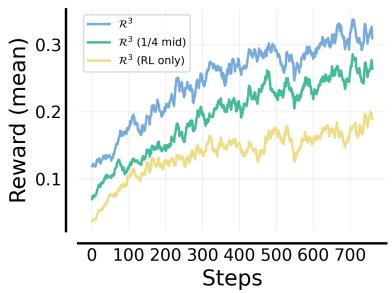  
Figure 7: $\mathcal { R } ^ { 3 }$ training reward curves for Language Table.

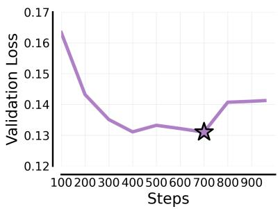  
Figure 8: IL validation loss and selected checkpoint for Language Table.

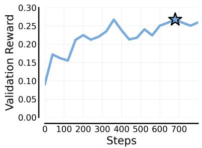  
Figure 9: $\mathcal { R } ^ { 3 }$ validation reward and selected checkpoint for Language Table.

<table><tr><td>Hyperparameter</td><td>Values</td></tr><tr><td>learning rate</td><td> $1 . 0 \times 1 0 ^ { - 6 }$  2 (mid-train)/</td></tr><tr><td>num. train epochs</td><td>4 (IL for Language Table) / 8 (IL for grocery packing)</td></tr><tr><td>global batch size</td><td>128</td></tr><tr><td>lr scheduler type warmup ratio</td><td>cosine 0.1</td></tr><tr><td></td><td></td></tr><tr><td>finetuning type</td><td>full</td></tr><tr><td>precision</td><td>bf16</td></tr><tr><td>num. GPUs</td><td>8</td></tr></table>

Table 8: Hyperparameters for SFT.

<table><tr><td>Hyperparameter</td><td>Values</td></tr><tr><td>learning rate</td><td> $2 . 0 \times 1 0 ^ { - 6 }$ </td></tr><tr><td>num. train epochs</td><td>4 (Language Table)/ 8 (grocery packing)</td></tr><tr><td>train batch size</td><td>32</td></tr><tr><td>max response length</td><td>1024</td></tr><tr><td>rollouts per prompt</td><td>12</td></tr><tr><td>sampling temperature</td><td>1.0</td></tr><tr><td>clip ratio (low / high)</td><td>0.2 / 0.3</td></tr><tr><td>kl coefficient</td><td>0.0</td></tr><tr><td>entropy coefficient</td><td>0.0</td></tr></table>

Table 9: Hyperparameters for RL.

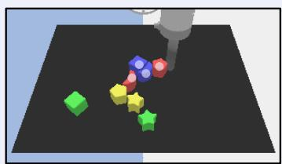  
Task: group blocks (group) Goal: slide the red and blue blocks next to each other

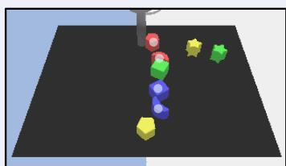  
Task: make a line (line) Goal: build a vertical line out of the blue and red blocks

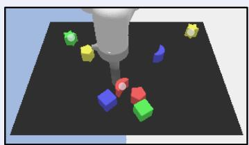  
Task: make a V-shape (V) Goal: create a V-shape out of the yellow star, the red moon, and the green star

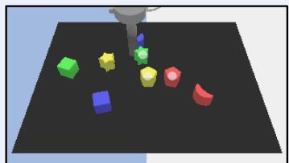  
Task: make an L-shape (L) Goal: put the green star, the red pentagon, and the yellow pentagon in an L-shape

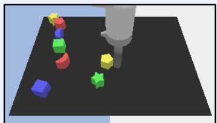  
Task: clear quarter (clear\_qtr) Goal: remove every block from the bottom -right quarter of the board

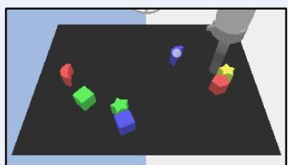  
Task: isolate in place (iip) Goal: move the other blocks away from the blue moon while keeping it in place

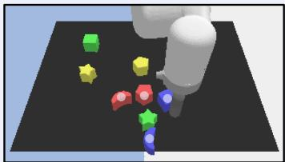  
Task: make a T-shape (T) Goal: build a T-shape with all the blue and red blocks

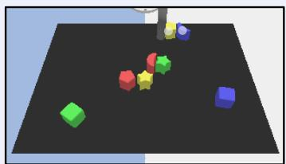  
Task: group & isolate (gris) Goal: move the the blue moon and the yellow pentagon as a group, so that no other blocks are close to them

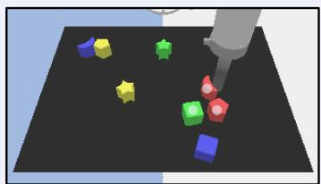  
Task: make an inverted V-shape (iV) Goal: build an inverted V-shape using the red moon, the green cube, and the red pentagon

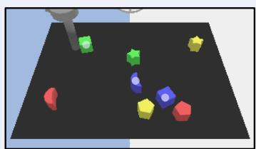  
Task: make a diagonal line (diag\_line) Goal: move the blue moon, the blue cube, and the green cube into a diagonal line from top-left to bottom-right

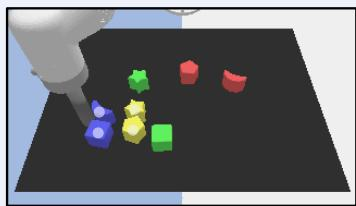  
Task: make a rectangle (rect) Goal: make an axis-aligned rectangle using all the blue and yellow blocks

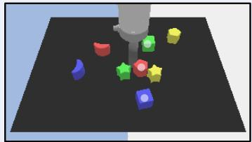  
Task: make a midpoint (mid) Goal: place the blocks so that the red pentagon is at the middle point of the green cube and the blue cube

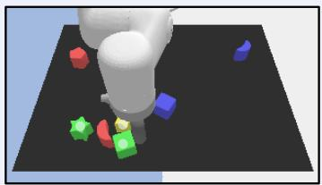  
Task: make an inverted L-shape (iL) Goal: make an inverted L-shape with the green cube, the green star, and the yellow star

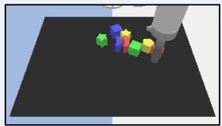  
Task: clear half (clear\_half) Goal: clear the bottom half of the board (everything below the horizontal midline)

Figure 10: Successful execution of tasks. For each task, we show the task name, a long-horizon goal, and the image of the goal state. Task-related blocks are annotated with white dots.

## A.7. Our Embodied Chain-of-Thought (ECoT) Implementation

Our goal is to compare with the most faithful approximation of this ECoT approach. Note that our setting and tasks are diferent from [64] in three important ways:

• The output in our setting is the short-horizon instruction, while the output in [64] is the low-level action. Therefore, in our implementation, we remove the “move command" part and put the end-efector states and object states before the textual reasoning.

• We highlight that our long-horizon manipulation tasks cannot be solved by fixed instruction sequences or planned in an open-loop way, because (1) the goal instance and initial configurations vary across scenes, (2) the low-level policy often fails to follow the instructions and therefore requires closed-loop correction or replanning, and (3) collisions introduce additional stochasticity. Consequently, supervising the model with explicit future plans would introduce substantial noise, so we omit the “plan” component from our implementation. Note that the model can still do planning in textual reasoning.

• For reasoning supervision, we record the data collector’s reasoning, while ECoT uses post-hoc generated reasoning by querying Gemini for a retrospective rationale that explains the expert instruction. In our implementation, we compare both types of reasoning, so that we disentangle the efect of this component from other ECoT components.

Therefore, our implementation of ECoT contains task goal, end-efector state, object states, textual reasoning, and instruction. For end-efector and object states, we use their 2D coordinates provided by the Language Table simulation environment. For textual reasoning, we compare data collector’s vs. post-hoc reasoning traces. Data collector’s reasoning traces mean the expert reasoning traces used in mid-training of our approach. We follow ECoT to generate post-hoc reasoning traces by asking Gemini 3 Flash to provide a post hoc explanation for the selected instruction. The prompt template is provided in Appendix D.3. Note that the Gemini model does not have access to its decision-time reasoning when generating post-hoc reasoning.

ECoT Response Example   
Goal: Move all blocks out of the top-left quarter of the board.   
Arm: [0.46, 0.10]   
Objects:   
- red moon: [0.23, -0.16]   
- red pentagon: [0.31, 0.07]   
- blue moon: [0.30, 0.17]   
Reasoning: In the current scene, the red moon and blue cube are positioned within the top-left quarter of the   
board ...   
Instruction: move the red moon to the center of the board.

## B. Additional Experimental Results

## B.1. Visual Question Answering Evaluation.

Visual question answering task design. We first introduce the visual question answering (VQA) task we design to evaluate the perceptual and action-oriented reasoning abilities of diferent models. We construct 5 classes of VQA questions on Language Table:

• Absolute Position. This class asks where a queried block or robot arm is located on the board. The answer is selected from a fixed set of board regions, such as center, top, bottom, left, right, and the four corner regions. The model directly outputs the corresponding region phrase. For example, an input question is “Where is the red cube located on the board?” and the ground-truth answer is “The red cube is in the top left of the board.”

• Relative Position. This class asks for the direction of one object relative to another object or the robot arm. The answer is selected from a fixed set of relative directions, including left, right, top, bottom, and the four diagonal directions. The model directly outputs the relative direction phrase. For example, an input question is “Where is the blue moon relative to the yellow star?” and the ground-truth answer is “The blue moon is to the right of the yellow star.”

• Distance. This class asks which block is nearest to or farthest from a specified anchor object, where the anchor may be another block or the robot arm. The answer is chosen from the visible block names. The question is not multiple choice; the model outputs the selected block name. For example, an input question is “Which block is nearest to the arm?” and the ground-truth answer is “The green star.”

• Instruction Execution. This class asks whether a shown scene correctly satisfies a given instruction. The answer format is binary: correct execution or incorrect execution. This class requires the model to understand the instruction, identify the relevant objects and goal condition, and verify the final visual state. For example, an input prompt is “... Instruction: move the red cube to the center of the board. Is the instruction correctly and fully executed? A. Correct execution. B. Incorrect execution.” The response is formatted as “Think: ... Answer: A” and evaluation is performed only on the final answer.

• Instruction Inference. This class asks which candidate instruction best explains an observed before-and-after visual transition. The answer format is multiple choice over candidate instructions, with the model selecting one option letter. This class tests inverse instruction understanding: the model must infer the intended command from the visual change while distinguishing among similar language choices. For example, an input prompt is “... Given that the execution is correct, which instruction was executed? A. move the red cube left. B. move the blue moon to the green star. C. separate the yellow pentagon from the blue cube. D... E...” The response is formatted as “Think: ... Answer: B” and evaluation is performed only on the final answer.

Visual question answering evaluation results. Table 10 shows the performance of diferent models on each VQA task class. The first three classes focus on perception from a static scene: localizing objects on the board, reasoning about pairwise spatial relations, and comparing object distances. The last two classes focus on instruction comprehension from manipulation outcomes: judging whether a visual state satisfies an instruction, and inferring which instruction best explains an observed transition. Reasoning is required for the Instruction Comprehension tasks, not for the Perception tasks. The analyses of these results are provided in Section 4.2.

<table><tr><td>Question Class</td><td>Question Type</td><td>Think?</td><td colspan="4">Qwen3.5-4B variants</td><td colspan="2">Reference</td></tr><tr><td></td><td></td><td></td><td>Base</td><td> $\mathcal { R } ^ { 3 }$  (mid only)</td><td> $\mathcal { R } ^ { 3 }$  (RL only)</td><td> $\mathcal { R } ^ { 3 }$ </td><td>Gemini</td><td>Random</td></tr><tr><td>Absolute Position</td><td>Perception</td><td>No</td><td>35.7</td><td>39.5</td><td>41.8</td><td>41.3</td><td>62.3</td><td>一</td></tr><tr><td>Relative Position</td><td>Perception</td><td>No</td><td>39.3</td><td>56.8</td><td>48.0</td><td>59.3</td><td>66.7</td><td>一</td></tr><tr><td>Distance</td><td>Perception</td><td>No</td><td>29.3</td><td>48.1</td><td>38.5</td><td>52.5</td><td>82.3</td><td>一</td></tr><tr><td>Instruction Execution</td><td>Instruction Comp.</td><td>Yes</td><td>67.8</td><td>65.0</td><td>61.2</td><td>64.3</td><td>77.3</td><td>50.0</td></tr><tr><td>Instruction Inference</td><td>Instruction Comp.</td><td>Yes</td><td>30.9</td><td>45.2</td><td>43.2</td><td>55.3</td><td>85.1</td><td>20.0</td></tr></table>

Table 10: Accuracy by VQA question class. Gemini is reported as an external reference and is not included in the ranking. Bold values mark the best non-reference model.

## B.2. Qualitative Analysis of Reasoning Traces

To better understand how each training stage changes the model’s reasoning behavior, we analyze completions from the base model, the mid-trained model, and the mid-trained + RL model on the same 30 validation scenes. Each completion contains a free-form reasoning trace followed by a high-level instruction. We extract both countable signals, summarized in Table 11, and qualitative behavior patterns, summarized in Table 12.

<table><tr><td>Signal</td><td>Base</td><td> $\mathcal { R } ^ { 3 }$  (mid only)</td><td> $\mathcal { R } ^ { 3 }$ </td></tr><tr><td>Avg. length (chars)</td><td>1079</td><td>563</td><td>696</td></tr><tr><td>Max length (chars)</td><td>4256</td><td>1288</td><td>1798</td></tr><tr><td>Clean Reasoning:-first format</td><td>19/30</td><td>30/30</td><td>30/30</td></tr><tr><td>Backtracking / re-examination</td><td>5</td><td>0</td><td>1</td></tr><tr><td>First-person planning</td><td>11</td><td>15</td><td>23</td></tr><tr><td>Hallucinated objects</td><td>3</td><td>0</td><td>0</td></tr><tr><td>Reference to prior step or plan</td><td>5</td><td>2</td><td>1</td></tr></table>

Table 11: Countable reasoning-trace signals across checkpoints. We analyze aligned reasoning traces from the base, mid-trained, and mid-trained + RL models on the same 30 validation scenes. Mid-training stabilizes the output format and removes hallucinated objects, while RL increases explicit planning without reintroducing the base model’s formatting failures.

Overall, the trajectory is from chaotic-but-creative reasoning in the base model, to terse-and-reliable reasoning after mid-training, to reliable-and-deliberate reasoning after RL. The clearest changes are that mid-training removes most interface-level failures, including malformed formatting and hallucinated objects, while RL increases explicit state-aware planning without reintroducing the base model’s instability.

<table><tr><td>Dimension</td><td>Base</td><td> $\mathcal { R } ^ { 3 }$  (mid only)</td><td> $\mathcal { R } ^ { 3 }$ </td></tr><tr><td>Output format</td><td>ing, omits the Reasoning: pre- fix, includes stray quotes, or</td><td>Inconsistent: sometimes places Clean and rigid template Clean and rigid template the instruction before reason- across all inspected traces.</td><td>across all inspected traces.</td></tr><tr><td>bosity</td><td>fails to emit an instruction. Length / ver- Highly variable, with occa- Shortest and most economi- Moderate length: fuller than sional long rambling traces.</td><td>cal.</td><td>mid-training, but still con- trolled.</td></tr><tr><td>Reasoning style</td><td>Exploratory and deliberative, Direct and decisive, usually Structured: restates the goal, often thinking through many al- reaching a single-pass con- assesses the current state, ternatives.</td><td>clusion.</td><td>then chooses the next step.</td></tr><tr><td>Self-correction/ backtracking</td><td>occasional loops.</td><td>Frequent second-guessing and No observed backtracking in Rare backtracking; when non-convergent the inspected traces.</td><td>present, the model recovers and commits to an instruc-</td></tr><tr><td>Goal grounding</td><td>meta-comments about rules</td><td>Often loses the goal or makes Briefly restates the task.</td><td>tion. More explicitly re-derives task constraints before act-</td></tr><tr><td>Spatial tracking</td><td>and format. Weak; sometimes misreads the Decent; often references the Strongest; tracks what has al- scene or confuses object posi- arm position or previous ready been placed and what</td><td></td><td>ing.</td></tr><tr><td>Hallucination</td><td>tions. Sometimes invents objects or None observed. claims required objects are</td><td>plan.</td><td>remains to be done. None observed.</td></tr><tr><td>ity</td><td>missing. spec outputs, including un- the inspected traces. supported relations, arm-only</td><td></td><td>Instruction valid- Several malformed or out-of- Always valid and in-spec in Always valid and in-spec in the inspected traces.</td></tr><tr><td>Failure mode</td><td>moves, or missing instructions. Incoherence or termination on harder scenes.</td><td>ing a plausible move without fore committing. much verification.</td><td>non- Occasionally shallow, choos- Occasionally over-reasons be-</td></tr></table>

Table 12: Qualitative reasoning-behavior comparison. The base model is exploratory but unstable, mid-training makes the reasoning interface reliable, and RL on top of mid-training produces more deliberate, state-aware reasoning while preserving format and instruction validity.

## B.3. Judge Validation and Sensitivity

<table><tr><td></td><td>Agree</td><td>Cohen&#x27;s κ</td><td>Pearson</td></tr><tr><td>Human-maj vs. Human†</td><td>94.7/100</td><td>0.911</td><td>0.975</td></tr><tr><td>Human-maj vs. Qwen3.5-35B-A3B</td><td>90/100</td><td>0.837</td><td>0.984</td></tr><tr><td>Human-maj vs. Gemini 3.6 Flash</td><td>91/100</td><td>0.842</td><td>0.974</td></tr><tr><td>Human-maj vs. GPT-5.6 Sol</td><td>93/100</td><td>0.880</td><td>0.985</td></tr></table>

Table 13: Agreement of majority-vote human labels (Human-maj) vs. each judge on 100 prompt-response pairs. <sup>†</sup>Averaged over 3 human annotators.

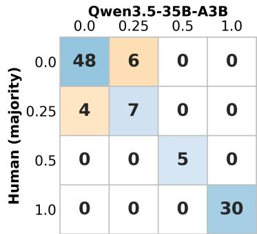  
Figure 11: Confusion matrix of majority-vote human labels (Human-maj) vs. Qwen3.5-35B-A3B.

We sample 100 prompts from the RL validation set, generate responses with the base model, and score them via 3 human annotators and 3 VLMs, treating the human majority vote as ground truth. Table 13 shows that all VLMs have comparable human agreement, close to the inter-human reference, indicating that mismatches largely reflect scene ambiguity rather than judge choice. Figure 11 shows that all mismatches for our Qwen3.5 judge lie between the 0 and 0.25 semantic-match tiers, and these cases are ambiguous even to human annotators. The only clear failure of Qwen3.5 is occasional confusion between “red pentagon” and “red moon.” Thus, our reward signal is reliable and insensitive to judge choice.

## C. Examples

## C.1. Additional Expert Trajectories

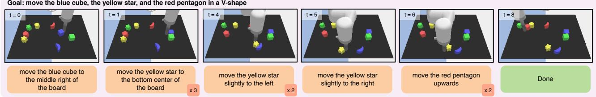  
Figure 12: Example of expert-collected trajectory on the V task. The notation � indicates that the expert repeats this instruction � times.

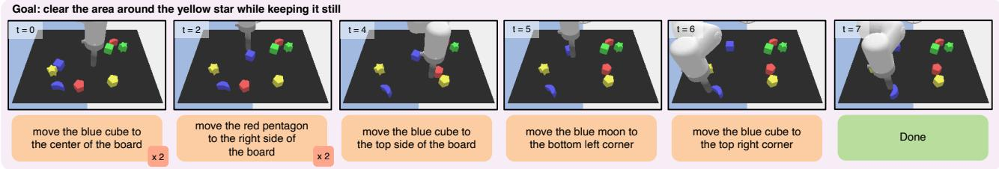  
Figure 13: Example expert-collected trajectory on the iip task. The notation � indicates that the expert repeats the instruction � times. At step 6, the instruction is to move the blue cube, but the robot unintentionally pushes the blue moon, resulting in task success. This example shows that expert demonstrations may also contain suboptimal behaviors.

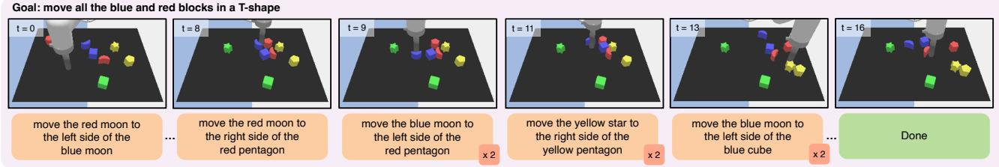  
Figure 14: Example expert-collected trajectory on the T task. The notation � indicates that the expert repeats the instruction � times. At step 8, the instruction is to move the red moon, but the robot mistakenly moves the blue moon; therefore, at step 9, the expert first corrects this behavior. At step 11, instead of moving a target block, the expert chooses to clear the yellow star, which is an oracle block for making the T-shape.

## C.2. Additional Reasoning Examples on Language Table

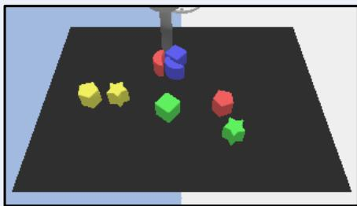  
Goal: move the green and red blocks into a vertical line

Reasoning: The goal is to arrange the red moon, red pentagon, green cube, and green star into a vertical line. Looking at the current scene, the red moon is positioned at the top center, and the green cube is in the center. This starts forming a vertical column. The red pentagon is located to the right of the red moon, and the green star is further to the right and below the green cube. To continue building the vertical line, I need to bring the remaining target blocks into the same central column. I will now move the red pentagon to the position directly below the green cube.   
Instruction: move the red pentagon to the bottom side of the green cube.

Figure 15: Example of reasoning strategy learned via $\mathcal { R } ^ { 3 }$ . The $\mathcal { R } ^ { 3 }$ model first describes the scene, assesses the current progress toward the goal, plans into the future, and finally outputs an executable instruction.  
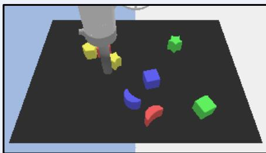  
Goal: move the red and yellow blocks into a T-shape

Reasoning: ... The yellow pentagon is on the far left, the yellow star is in the middle of that group, and the red pentagon (likely under the arm) needs to be to the right. However, looking closely, the red pentagon is actually not in the scene... Wait, the task says "red and yellow blocks". I see a yellow pentagon, a yellow star, and a red moon. The red pentagon is mentioned in the previous response but I don't see it. Let me re-examine the blocks. Ah, the block under the arm is likely the red pentagon as per previous context... Let's assume it's near the arm... The red pentagon is likely the block being manipulated by the arm, which seems to be positioned over a red object... Instruction: move the red pentagon to the right side of the yellow star.

Figure 16: Example of reasoning strategy learned via $\mathcal { R } ^ { 3 }$ . The red pentagon is occluded by the robot arm. The $\mathcal { R } ^ { 3 }$ model re-examines the scene, task information, and history to correctly infer the object state.  
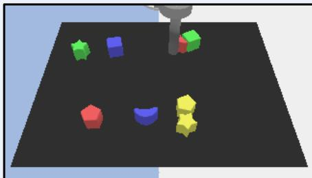  
Goal: arrange the blue moon, the yellow star, and the red moon into a V-shape

Reasoning: ... To form the V-shape, I can place the blue moon and the red moon as the top horizontal points and the yellow star as the bottom vertex. However, looking at the current positions, the blue moon is at the bottom center... Alternatively, I can keep the blue moon at the bottom center as the vertex and move the red moon and yellow star to form a horizontal line above it... I will move the red moon to the top right to form the horizontal line with the yellow star, but wait, the yellow star is lower than the red moon's current position. Let's reconsider. A Vshape with the blue moon at the bottom center... I should move the red moon to the top right to form a horizontal line with a future placement of the yellow star, or move the yellow star to the top right… Instruction: move the red moon to the top right of the board.

Figure 17: Example of reasoning strategy learned via $\mathcal { R } ^ { 3 }$ . The $\mathcal { R } ^ { 3 }$ model considers several alternate plans before committing to one particular choice.

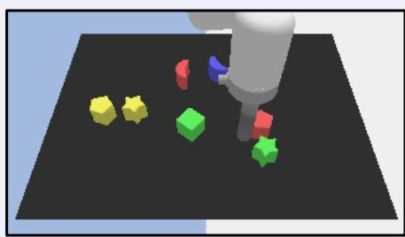  
move the green and red blocks into a vertical line

Reasoning: The goal is to move green and red blocks into a vertical line. Currently, there is a green cube on the left and a green star with a red cube near it on the right. To start forming a vertical line, moving the red cube towards the green star seems like a logical first step. I will move the red cube to the left side of the green star to bring them closer together.   
Instruction: move the red cube to the left side of the green star

Figure 18: Example of reasoning strategy of the Qwen3.5-4B base model. The base model’s reasoning shows incomplete scene understanding, weak estimation of task progress, and under-justified planning, leading to a goal-misaligned instruction  
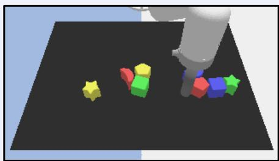  
Goal: build a T-shape with all the blue and red blocks

Reasoning:... There is no horizontal blue block currently at the base of the blue cube. However, there is a red pentagon that is currently adjacent to the red moon. Wait, looking closely at the specific instruction "red pentagon to the top side of the blue cube", looking at the image, the blue cube is part of a vertical stack. But the instruction is actually to place a block on top. Let's re-evaluate based on the strict instruction format... The specific previous instruction was "move the red pentagon to the top side of the blue cube". This implies the red pentagon is currently elsewhere and needs to go there. In the image, the red pentagon is lying flat near the red moon. The blue cube is in a vertical stack. To execute the goal of building a T-shape, placing the red pentagon on top of the blue cube would stack them vertically, but maybe that's not the top of the T. Let's look at the blocks again. There are two blue blocks (one cube, one moon) and two red blocks (one pentagon, one moon)… Instruction: move the red pentagon to the top of the blue cube

Figure 19: Example of reasoning strategy of the Qwen3.5-4B base model. Although the base model sometimes displays backtracking behavior, such behavior is unreliable. The model may signal re-evaluation with phrases such as “Wait” or “Let’s re-evaluate,” but the revision is often superficial or driven by hallucinated assumptions rather than grounded error correction. Consequently, the reasoning becomes inconsistent, poorly structured, and disconnected from the task goal.  
Goal: move the green cube, the yellow pentagon, and the blue cube in a V-shape  
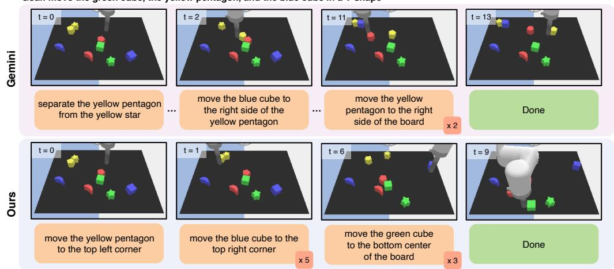  
Figure 20: Comparison of Gemini’s and the $\mathcal { R } ^ { 3 }$ model’s behavior on the V task. While Gemini employs more diverse instructions, the $\mathcal { R } ^ { 3 }$ model primarily relies on absolute movement instructions.

## C.3. Additional Reasoning Examples on Grocery Packing

We show qualitative traces from $\mathcal { R } ^ { 3 }$ (RL only) on held-out packing goals. As on Language Table, the model typically describes the current views, tracks progress toward the long-horizon goal, and then issues a short-horizon instruction; it can also re-examine the scene and revise an initially incorrect interpretation.

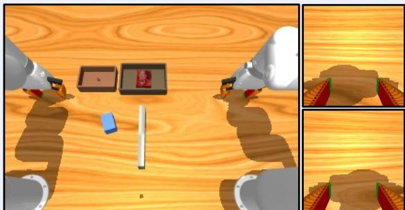  
Goal: Move the gelatin box from the medium tray to the small tray, then pack the foam brick into the small tray

Reasoning: …The left tray is smaller and empty except for a small reddish mark, while the right tray is larger (medium) and contains a red gelatin box. There are also other objects scattered: a blue foam brick, a white cylindrical object, and robotic arms on both sides. The second and third images show the close-up views from the left and right wrists respectively, confirming that the grippers are positioned near the edge of the table but not yet interacting with specific items in a way that suggests an ongoing task like holding an object. The long-horizon goal states to move the gelatin box from the medium tray to the small tray, then pack the foam brick into the small tray. Currently, the gelatin box is in the medium (right) tray, and the small (left) tray is empty. The immediate next step in the sequence to achieve the long-term goal is to transfer the gelatin box from the medium tray to the small tray. The robot's current position, as seen in the wrist views, is hovering over the table surface near where the trays are located, which is appropriate for initiating this transfer action. Therefore, the short-horizon instruction should command the robot to perform this specific transfer. Instruction: Transfer the gelatin box from the medium tray to the small tray

Figure 21: Example of reasoning strategy learned via $\mathcal { R } ^ { 3 }$ . The model describes the three camera views, notes that the gelatin box is still in the medium tray, and issues a transfer instruction as the next step.  
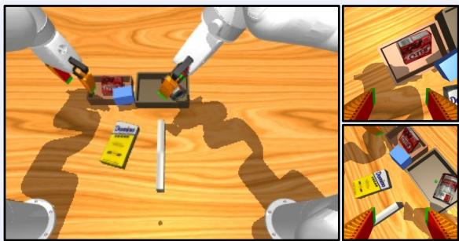  
Goal: Move the gelatin box and foam brick from the medium tray to the small tray, then pack the sugar box into the medium tray

Reasoning: Based on the visual evidence and task goal, the current state shows a small tray containing a red gelatin box and a blue foam brick. The medium tray is empty or mostly empty, with some items visible in other locations like the floor. The long-horizon goal specifies moving the gelatin box and foam brick from the medium tray to the small tray. However, looking closely at the first image and the close-ups, the blue foam brick is already inside the small tray alongside the gelatin box. The medium tray appears to be nearly empty, suggesting the transfer of these two items may have already occurred or is in progress. The next logical step according to the remaining parts of the goal ("then pack the sugar box into the medium tray") is to take the sugar box (which is clearly visible on the table as a yellow box labeled "Domino Sugar") and place it into the medium tray. The current view from the right wrist confirms the presence of the sugar box on the table adjacent to the medium tray, making it the accessible and next-target item for the short-horizon instruction. Instruction: Pack the sugar box into the medium tray

Figure 22: Example of reasoning strategy learned via $\mathcal { R } ^ { 3 }$ . The model infers that the gelatin box and foam brick are already in the small tray, so the remaining stage is to pack the sugar box into the medium tray.  
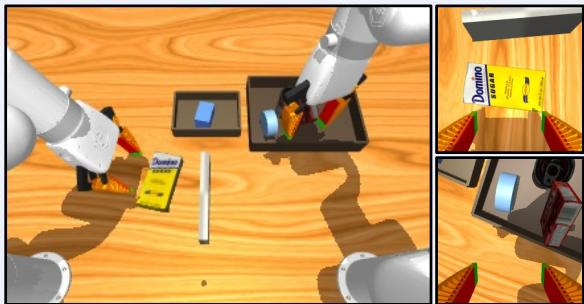  
Goal: Pack foam brick and sugar box into medium tray, soup can and tuna fish can and gelatin box into large tray

Reasoning: … the first image shows … The second image, from the left wrist perspective, clearly shows ... The third image ... The long-horizon goal specifies packing foam brick and sugar box into the medium tray. However, looking closely at the first image, the foam brick is already inside the medium tray, and the sugar box is still on the table being held by the left arm. The large tray contains the foam brick, tape, and other items. Wait, re-examining Image 1: The medium tray has a blue square (foam brick). The large tray has tape, a carrot-shaped object, and part of the sugar box is visible but mostly outside. Actually, looking at Image 1 again, the sugar box is on the table between the trays, held or near the left gripper. The large tray has the tape and some colorful blocks. The medium tray has the blue foam brick. The goal says "Pack foam brick and sugar box into medium tray". Since the foam brick is already in the medium tray, the next logical step for the short-horizon instruction would be to pick up the sugar box, which is currently on the table, and place it into the medium tray. The left arm is interacting with the sugar box area. Therefore, the immediate action ... Instruction: Pack the sugar box into the medium tray.

Figure 23: Example of reasoning strategy learned via $\mathcal { R } ^ { 3 }$ . Our model first mislocates the foam brick, then re-examines the base view, revises the scene description, and issues the correct next instruction.

## D. Prompts

## D.1. Prompt for the high-level VLM (Language Table)

The following prompt template is used for Language Table data collection, training, and evaluation.

## Prompt for the high-level VLM (Language Table)

<table><tr><td>Prompt for the high-level VLM (Language Table) A robot is performing a long-horizon block arrangement task in a simulator. The robot arm is a gray cylinder</td></tr><tr><td>that can slide over the board to push colored blocks. The robot only understands short-horizon instructions.</td></tr><tr><td>Your job is to examine the current scene, reason faithfully about what is visible, and then output one short-horizon</td></tr><tr><td>instruction for the robot.</td></tr><tr><td>You are given:</td></tr><tr><td>1. The current image of the scene</td></tr><tr><td>2. The long-horizon task goal 3. Your response at the previous step</td></tr><tr><td>## Task Goal</td></tr><tr><td>{goal}</td></tr><tr><td>Note: {task_specific_prompt}</td></tr><tr><td>## Your Previous Response {previous_response}</td></tr><tr><td>## Instruction Guidelines The robot ONLY understands the following instruction types:</td></tr><tr><td>• move &lt;block 1&gt; &lt;absolute location&gt;</td></tr><tr><td>e.g. move the red pentagon to the center of the board / to the top left corner</td></tr><tr><td>• move &lt;block_1&gt; &lt;relative direction&gt; of &lt;block_2&gt;</td></tr><tr><td>e.g. move the yellow star into the top side of the blue moon / move the green star to the left side of the</td></tr><tr><td>yellow pentagon • push &lt;block 1&gt; into &lt;block 2&gt;</td></tr><tr><td>e.g. push the green star into the yellow pentagon</td></tr><tr><td>move &lt;block 1&gt; &lt;relative direction&gt;</td></tr><tr><td>e.g. (slightly) move the red moon upwards / move the blue cube right and down (a bit)</td></tr><tr><td>separate &lt;block 1&gt; from &lt;block 2&gt;</td></tr><tr><td>e.g. separate red moon from blue cube • touch &lt;block 1&gt;</td></tr></table>

follow it.   
### Style   
• Provide a concise, explicit stream of consciousness.   
Follow strict causality. Avoid presenting the decision before explaining. Instead, your reasoning should   
naturally yield the instruction.   
• Avoid unsupported decisions like simply saying “I want to” or “the best instruction is” without reasoning   
before it.   
## Answer Format   
“Reasoning: ... Instruction: ...”

## D.2. VLM-as-a-judge Prompt

The following prompt template is used for providing rewards in RL for Language Table. A VLM judge (Qwen3.5-35B-A3B) compares the model’s instruction against the ground truth instruction from the expert dataset. The rubrics are elaborated in the prompt. Packing RL does not use this judge; it uses exact instruction-string matching (Appendix A.4).

```markdown
VLM-as-a-judge Prompt
A robot performing a block arrangement task on a table. Your task is to compare two textual instructions to the
robot and return a score for the candidate.
## Instruction Types
The robot only understands the following types of instructions:
1. To absolute location: move <block_1> <absolute location>. e.g. place the red pentagon at the center of
the board / move the green cube to the top left corner
2. To other block’s relative direction: move <block_1> <relative direction> of <block_2>. e.g. slide the
yellow star into the top side of the blue moon / place the green star to the left side of the yellow pentagon
3. Into other block: push <block_1> into <block_2>. e.g. push the green star into the yellow pentagon
4. To its own relative direction: move <block_1> <relative direction>. e.g. (slightly) push the red moon
upwards / move the blue cube right and down (a bit)
5. Separation: separate <block_1> from <block_2>. e.g. separate red moon from the blue cube
6. Touch: touch <block_1>. e.g. touch the green cube
7. Arm movement: move your arm <absolute location>. e.g. move your arm near the bottom center
## Instructions to Compare
• Candidate instruction: {model_instruction}
• Reference instruction: {ground_truth_instruction}
## Evaluation Guidelines
### Step 1: Identify the linguistic match.
• Identify the instruction types and components of the candidate and the reference. If their types match and
all components match, they form a linguistic match.
• Variations allowed:
1. Paraphrasing within ONLY these 4 verbs: "move" = "place" = "slide" = "push".
2. Paraphrasing of locations or directions with exactly the same meaning, e.g., "top left corner" = "left top
of the board", "up" = "upwards", "left" = "to the left" = "to the left side"
3. Other expression paraphrasing with exact same meanings, e.g., with or without "the", prepositions with
same meaning like "into" = "to"
• Variations considered as adverb mismatch: mismatched or missing adverbs like "slightly", "a bit"
• Score:
```

<table><tr><td>– If they form a linguistic match, skip step 2. Return 1.0 if there is no adverb mismatch, otherwise return 0.5.</td></tr><tr><td>– If they do not form a linguistic match, go to step 2. ### Step 2: Identify the semantic match.</td></tr><tr><td>• Based on the image of the current scene, imagine the outcome of both instructions.</td></tr><tr><td>• Two outcomes are considered semantically the same if both conditions are met:</td></tr><tr><td>1. they move the same block 2. the final absolute positions of blocks are the same, though expressed differently.</td></tr><tr><td>• Note: two reverse instructions, e.g., &quot;move block_2 into block_1&quot; and &quot;move block_1 into block_2&quot;, are NOT</td></tr><tr><td>semantically the same because they move different blocks.</td></tr><tr><td>• Score: If their outcomes are semantically the same, return 0.25. Otherwise, return 0.0. ## Output Format</td></tr><tr><td>Output a JSON object with the &quot;evaluation&quot; and &quot;score&quot; field.</td></tr><tr><td>The evaluation should be a verbose analysis following the guidelines above step by step.</td></tr><tr><td>The score should be 1.0 (linguistic match), 0.5 (linguistic match with adverb mismatch), 0.25 (semantic match), or 0.0 (no match).</td></tr></table>

## D.3. Retrospective Reasoning Generation Prompt

We query Gemini with the following prompt to generate retrospective reasoning. This is only used in ECoT experiments.

## Retrospective Reasoning Generation Prompt

<table><tr><td>A robot is performing a long-horizon block arrangement task in a simulator. The robot arm is a gray cylinder that can slide over the board to push colored blocks. The robot only understands short-horizon instructions. I have a dataset of expert demonstrations where the robot follows an expert's short-horizon instructions step by step toward a long-horizon goal. For each step, the expert has already chosen the appropriate instruction. Your job is to write reasoning that explains why that expert demonstration makes sense given the current scene and goal. ## Instruction Types</td></tr><tr><td>The robot ONLY understands the following instruction types: • move &lt;block 1&gt; &lt;absolute location&gt;.</td></tr><tr><td>e.g. move the red pentagon to the center of the board / to the top left corner move &lt;block_1&gt; &lt;relative direction&gt; of &lt;block_2&gt;. e.g. move the yellow star into the top side of the blue moon / move the green star to the left side of the</td></tr><tr><td>yellow pentagon • push &lt;block_1&gt; into &lt;block_2&gt;.</td></tr><tr><td>e.g. push the green star into the yellow pentagon move &lt;block 1&gt; &lt;relative direction&gt;. e.g. (slightly) move the red moon upwards / move the blue cube right and down (a bit)</td></tr><tr><td>separate &lt;block 1&gt; from &lt;block 2&gt;.</td></tr><tr><td>e.g. separate red moon from blue cube • touch &lt;block_1&gt;.</td></tr><tr><td>Prompt for the high-level VLM (grocery packing)</td></tr><tr><td>A bimanual robot is performing a long-horizon packing task. The robot only understands short-horizon instructions.</td></tr><tr><td>Your job is to examine the current images, reason faithfully about what is visible, and then output one short-</td></tr><tr><td>horizon instruction for the robot.</td></tr><tr><td>You are given:</td></tr><tr><td>• Three current camera views:</td></tr><tr><td>– The first image is the base camera view – The second image is the left wrist camera view</td></tr><tr><td>– The third image is the right wrist camera view</td></tr><tr><td>• The long-horizon task goal</td></tr><tr><td>• The previous instruction</td></tr><tr><td>## Task Goal</td></tr><tr><td>{goal}</td></tr></table>

• The expert’s chosen instruction is provided for your reference only. Do not quote or mention it. Write as if you are the expert deciding the next step: reason through the scene and goal step by step, so the appropriate instruction emerges as the conclusion rather than the premise.

• The expert’s chosen instruction is what the robot should do next, not what it is currently doing.

• I provide your previous response to help you better understand the robot’s state. Note that the robot may not have successfully executed the previous instruction, so always trust the image over the previous response about the progress.

• In your reasoning, be specific about positions, movements, and spatial relations of objects and the arm.

• Do not start with ’The goal is...’ or similar. The goal is known.

\## Examples

1. "The blue moon and blue cube are already vertically aligned in the center of the board. The green cube and green star are currently located to the right of the blue blocks. The robot arm’s pusher is positioned between the green star and the green cube, ready to interact with the latter. To continue building the vertical line, the green cube should be moved so that it is positioned directly below the blue cube."

2. "Currently, the red pentagon is on the left side of the board. The blue cube is near the center, horizontally between the red pentagon and the red moon. To form the V, the blue cube needs to be moved to the right of the red moon. Additionally, the blue cube is currently lower (closer to the camera) than the red pentagon, so it must move upwards (further from the camera) to align horizontally with the red pentagon."

## ## Your Job

Provide a reasoning for the following:

• Task Goal: {goal}

• Note: {task\_specific\_prompt}

• The included image shows the robot’s current observation.

• Your Previous Response: {previous\_response}

• The expert’s chosen instruction: {instruction}

## D.4. Prompt for the high-level VLM (grocery packing)

The following prompt template is used for packing training and evaluation of reasoning models. Instructiononly (no-think) variants omit the reasoning guidelines and ask the model to output only Instruction: .... Interaction history is the previous instruction rather than the previous full response. Packing RL rewards the parsed instruction by exact string match against the ground-truth instruction (Appendix A.4); there is no packing VLM-as-a-judge prompt.

<table><tr><td>## Previous Instruction {previous_instruction}</td></tr><tr><td>## Instruction Guidelines Choose from one of the following instruction types:</td></tr><tr><td>• Pack the &lt;item&gt; into the &lt;size&gt; tray. Example: Pack the can opener into the medium tray. • Remove the &lt;item&gt; from the &lt;size&gt; tray. Example: Remove the tuna fish can from the medium tray. • Transfer the &lt;item&gt; from the &lt;size&gt; tray to the &lt;size&gt; tray. Example: Transfer the coffee mug from the</td></tr><tr><td>medium tray to the large tray. Choose &lt;item&gt; from: can opener, candy box, coffee mug, cracker box, foam brick, gelatin box, nesquik canister,</td></tr><tr><td>soup can, sugar box, tuna fish can Choose &lt;size&gt; from: large, medium, small</td></tr><tr><td>## Reasoning Guidelines ### Core Rules</td></tr><tr><td>• Use only information visible in the images or explicitly stated. • Do not hallucinate or invent object locations, contacts, completed subgoals, or future outcomes. If the scene</td></tr><tr><td>is ambiguous or partially occluded, say so and choose the most reasonable action.</td></tr><tr><td>### Style</td></tr><tr><td>• Provide a concise, explicit stream of consciousness.</td></tr><tr><td>• Follow strict causality. Avoid presenting the decision before explaining. Instead, your reasoning should</td></tr><tr><td>naturally yield the instruction. • Avoid unsupported decisions like simply saying “I want to” or “the best instruction is” without reasoning</td></tr><tr><td></td></tr><tr><td></td></tr><tr><td>## Answer format</td></tr><tr><td>before it.</td></tr></table>