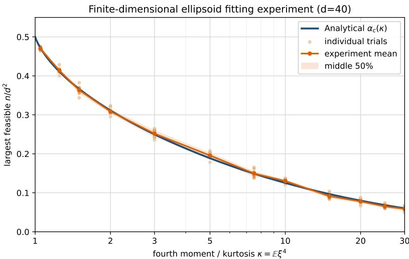
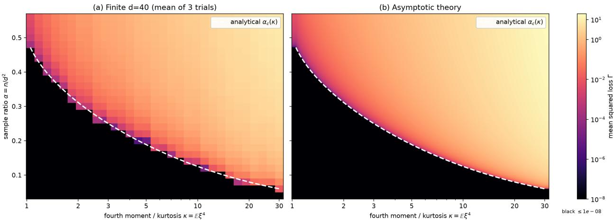
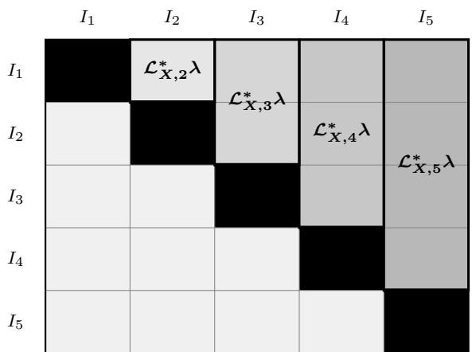
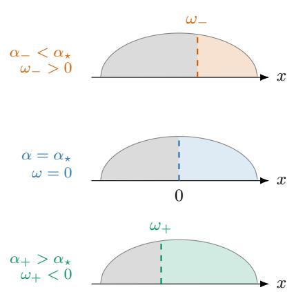
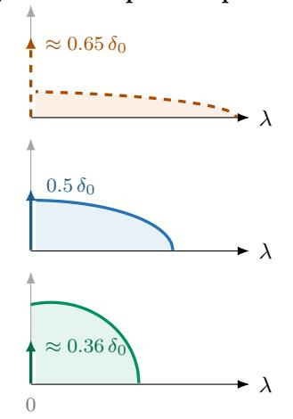
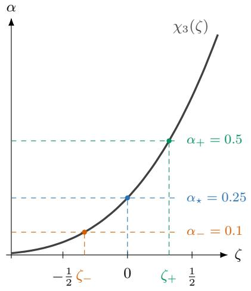

# Universality and sharp thresholds for ellipsoid fitting

Frederic Koehler ∗

Youngtak Sohn †

August 28, 2026

## Abstract

We establish a sharp phase transition for fitting random vectors by an ellipsoid. The random vectors have independent subgaussian coordinates with mean zero, variance one, and a common fourth moment, and the number of vectors is proportional to the square of the dimension. We identify an explicit satisfiability threshold such that, with high probability, a positive definite ellipsoid passes through every data point below the threshold, whereas no positive semidefinite fit exists above it. We also determine the optimal squared fitting error throughout the unsatisfiable regime. In particular, the threshold depends on the coordinate distributions only through their common fourth moment, revealing a fourth moment universality phenomenon. For standard Gaussian data the threshold is 1/4, resolving the ellipsoid fitting conjecture.

## Contents

1 Introduction 2   
1.1 Main results . . 3   
1.1.1 The Gaussian model and explicit formula 5   
1.1.2 Universality and exact fitting 7   
1.2 Further related literature 10   
2 Proof overview 11   
2.1 SAT: approximate fitting and exactification 11   
2.1.1 The approximate fit 11   
2.1.2 Small-residual interpolation 12   
2.2 UNSAT: universality of constrained least squares 16   
2.2.1 Universality from self-concordant barriers 18   
2.2.2 Removing the barrier and ridge regularization 20   
2.2.3 Lindeberg argument: proof of Theorem 2.9 22   
3 Proof of the nuclear norm lower bound 27   
3.1 A priori estimates . 27   
3.2 Proof of Theorem 2.3 . 30   
3.3 Proof of the Proposition 2.4 32   
3.4 Deterministic light-tail argument . 35   
3.5 Uniform light-tail lower bound via sequential block revealing 38   
4 Proof of the least-squares universality theorem 44   
4.1 Leave-one-out localization and feature comparison 44   
4.2 Quadratic-feature regularity and approximate fitting 48   
4.3 Removal of ridge regularization . 52   
5 The Gaussian feature model 54   
5.1 CGMT reduction to a shifted cone projection 56   
5.2 Analysis of the scalar variational problem 57   
5.3 Evaluation of the shifted projection 62   
5.4 Well-conditioned fit . 65   
A Extra corollaries, obstructions, and numerics 66   
A.1 Dual certificates and interpretation . 66   
A.2 A general-domain universality consequence 67   
A.3 Why approximate fitting does not imply exact fitting 69   
A.4 Nuclear-norm minimizers below the SAT threshold 72   
A.5 Numerical experiments . 73

## 1 Introduction

Given points $x _ { 1 } , \ldots , x _ { n } \in \mathbb { R } ^ { d }$ , the ellipsoid fitting problem asks whether there exists a positive semidefinite matrix $R \succeq 0$ such that

$$
x _ { i } ^ { \top } R x _ { i } = 1 , \quad { \mathrm { f o r ~ a l l } } \quad i = 1 , \ldots , n .
$$

Any matrix satisfying these conditions is called an ellipsoid fit.

This work studies this problem when $x _ { 1 } , \ldots , x _ { n }$ are random. For independent standard Gaussian vectors, this problem was introduced by [Sau11, SCPW12, SPW13] in connection with diagonal plus low rank decompositions. Numerical experiments in [Sau11, SPW13] suggested a sharp transition near $d ^ { 2 } / 4$ leading to the Gaussian ellipsoid fitting conjecture.

Conjecture 1.1 (Gaussian ellipsoid fitting conjecture). Let $x _ { 1 } , \ldots , x _ { n } \stackrel { \mathrm { i . i . d } } { \sim } N ( 0 , I _ { d } )$ , where $n = n ( d )$ For every fixed $\varepsilon > 0$ , as $d \to \infty :$

(i) $\begin{array} { r } { I f n \leq ( 1 - \varepsilon ) \frac { d ^ { 2 } } { 4 } } \end{array}$ , then an ellipsoid fit exists with probability tending to one.

(ii) If $\begin{array} { r } { n \geq ( 1 + \varepsilon ) \frac { d ^ { 2 } } { 4 } } \end{array}$ , then no ellipsoid fit exists with probability tending to one.

A real symmetric $d \times d$ matrix has $d ( d + 1 ) / 2$ free parameters. If positive semidefiniteness were ignored, dimension counting would therefore suggest a feasibility threshold near $d ^ { 2 } / 2$ . Conjecture 1.1 predicts that the constraint $R \succeq 0$ cuts this threshold in half, so that this random semidefinite program (SDP) undergoes a sharp feasibility transition near $d ^ { 2 } / 4$

Ellipsoid fitting is thus a simple yet nontrivial example of a random semidefinite program exhibiting a sharp phase transition. Such transitions are widely studied in random convex optimization and semidefinite relaxations; see, e.g. [ALMT14, BHK+19]. It is also closely connected to other problems in theoretical computer science and machine learning, including overcomplete independent component analysis $[ \mathrm { P P W ^ { + } 1 9 } ]$ and Sum-of-Squares lower bounds for the Sherrington–Kirkpatrick model $[ \mathrm { G J } \mathrm { J } ^ { + } 2 0 ]$ . We refer to [PTVW23, MK24] for further discussion of these and other connections.

Previously, the works [HKPX23, TW25, BMMP24] established that an ellipsoid fit exists for $n \leq d ^ { 2 } / C$ for large enough constant $C > 0$ . Earlier works had established feasibility first for $n = o ( d ^ { 3 / 2 } ) ~ [ \mathrm { G J J ^ { + } 2 0 } ]$ , and later for $n \leq d ^ { 2 } / ( \log d ) ^ { O ( 1 ) }$ [KD23, PTVW23].

Substantial progress toward the sharp transition at $d ^ { 2 } / 4$ was made by Bandeira and Maillard [BM25], who established the sharp threshold in an approximate sense: below the threshold, there exist well-conditioned approximate fits with a vanishing error, whereas above the threshold no well-conditioned fit can achieve this. Complementing this rigorous result, Maillard and Kunisky [MK24] predicted the sharp transition and the typical shape of fitting ellipsoids using the replica method from statistical physics [MM09]. We refer to Section 1.2 for further related literature.

## 1.1 Main results

In this work, we resolve Conjecture 1.1 and extend it to a broad class of non-Gaussian distributions. The existence of an ellipsoid fit can depend strongly on the distribution of the points. For example, if the $x _ { i }$ are uniform on $\{ \pm 1 \} ^ { d }$ , then $S = I _ { d } / d$ fits every sample, regardless of how large n is. Thus one cannot expect a distribution independent threshold. It is natural to ask whether a sharp transition persists for broader classes of distributions and, if so, which characteristics determine its location. We show that, for random vectors with independent subgaussian coordinates with mean zero and variance one, the threshold is determined solely by their common fourth moment $\mathbb { E } [ x _ { i j } ^ { 4 } ] \equiv \kappa$

Recall that for a random variable $Z ,$ its subgaussian norm is defined by

$$
\| Z \| _ { \psi _ { 2 } } : = \operatorname* { i n f } \{ t > 0 : \mathbb { E } \exp ( Z ^ { 2 } / t ^ { 2 } ) \leq 2 \} .
$$

Theorem 1.2. Let $( x _ { i } ) _ { 1 \leq i \leq n } \in \mathbb { R } ^ { d }$ be $i . i . d .$ random vectors such that $x _ { 1 } = ( x _ { 1 j } ) _ { 1 \leq j \leq d }$ has indpenedent coordinates satisfying

$$
\mathbb { E } [ x _ { 1 j } ] = 0 , \qquad \mathbb { E } \left[ x _ { 1 j } ^ { 2 } \right] = 1 , \qquad \mathbb { E } \left[ x _ { 1 j } ^ { 4 } \right] = \kappa , \qquad \operatorname* { s u p } _ { j \leq d } \| x _ { 1 j } \| _ { \psi _ { 2 } } \leq K _ { x } ,\tag{1}
$$

where $\kappa > 1$ and $K _ { x } > 0$ do not depend on $n , d .$ Let $n , d \to \infty$ with $n / d ^ { 2 } \to \alpha \in ( 0 , \infty )$ . There is an explicit threshold $\alpha _ { \star } ( \kappa )$ , defined in $E q . \ ( 7 )$ , which depends only on $\kappa ,$ such that the following holds.

(i) $I f \alpha < \alpha _ { \star } ( \kappa )$ , then with probability tending to one, there exists an ellipsoid fitting all $( x _ { i } ) _ { 1 \leq i \leq n } { \mathrm { : } }$

$$
\exists R \succ 0 , \quad \mathrm { s u c h ~ t h a t } \quad x _ { i } ^ { \top } R x _ { i } = 1 \quad \mathrm { f o r ~ a l l } \quad 1 \leq i \leq n .
$$

Moreover, such $R \in \mathbb { R } ^ { d \times d }$ can be chosen to be well-conditioned: $\lambda _ { \operatorname* { m a x } } ( R ) / \lambda _ { \operatorname* { m i n } } ( R ) = O ( 1 )$

(ii) $I f \alpha > \alpha _ { \star } ( \kappa )$ , then with probability tending to one there is no $R \succeq 0$ such that $x _ { i } ^ { \top } R x _ { i } = 1$ for all $1 \leq i \leq n$ . Moreover, the optimal squared fitting error converges in probability:

$$
\Gamma _ { X } : = \operatorname* { i n f } _ { R \succeq 0 , \mathrm { T r } R = d } \operatorname* { i n f } _ { r \geq 0 } \frac { 1 } { n } \sum _ { i = 1 } ^ { n } \left( \frac { x _ { i } ^ { \top } R x _ { i } } { \sqrt { d } } - r \right) ^ { 2 } \xrightarrow { p } e _ { \star } ( \alpha , \kappa ) ,\tag{2}
$$

where $e _ { \star } ( \alpha , \kappa )$ is defined in Eq. (8). For $\alpha > \alpha _ { \star } ( \kappa ) , e _ { \star } ( \alpha , \kappa ) > 0$ holds, thus an approximate ellipsoid fitting is not possible with any $R \succeq 0$ with Tr $R = d$

Using $\alpha _ { \star } ( 3 ) = 1 / 4 $ , we immediately have

Corollary 1.3. The Gaussian ellipsoid fitting Conjecture 1.1 holds.

  
Figure 1: The phase diagram and a numerical experiment in dimension $d = 4 0$ . The curve is the theoretica threshold $\alpha _ { \star } ( \kappa )$ . For each value of $\kappa ,$ eight independent trials use i.i.d. coordinates drawn from a centered, variance one mixture of two Gaussians with fourth moment $\kappa ;$ we refer to Appendix $\mathrm { A . 5 }$ . For each trial, a binary search in the number of samples n (y-axis) estimates the largest sample size for which the SDP maximizing t subject to $R - t I _ { d } \succeq 0$ and $x _ { i } ^ { \top } R x _ { i } = d , i = 1 , . . . , n$ , is feasible with nonnegative optimum.

A couple of remarks concerning Theorem 1.2 are in order.

First, the quantity $\Gamma _ { X }$ in Eq. (2) has a simple interpretation as the optimal squared fitting error. The constraint Tr $R = d$ fixes the average eigenvalue of $R$ to be one and, in particular, excludes the trivial choice $R = 0$ . For each $R ,$ the parameter $r \geq 0$ selects the common level against which the values $x _ { i } ^ { \top } R x _ { i } / \sqrt { d }$ are compared. Here, the normalization $1 / \sqrt { d }$ reflects the fluctuation scale: for $R = I _ { d } , x _ { i } ^ { \top } R x _ { i } = \| x _ { i } \| _ { 2 } ^ { 2 }$ fluctuates around d on the scale ${ \sqrt { d } } .$ Thus, $\Gamma _ { X }$ stays of order one as $d \to \infty$ Finally, $\mathrm { i f } \Gamma _ { X } = 0$ is attained at $( R , r )$ with $r > 0$ , then $S = R / ( r { \sqrt { d } } )$ satisfies $x _ { i } ^ { \top } S x _ { i } = 1$ for all $i ,$ and hence defines an ellipsoid fit. Conversely, $\Gamma _ { X } > 0$ rules out the existence of an ellipsoid fit.

Second, the role of the fourth moment κ has a probabilistic interpretation. Under the assumptions of Theorem 1.2,

$$
\mathrm { V a r } \left( \| x _ { 1 } \| _ { 2 } ^ { 2 } \right) = d ( \kappa - 1 ) .
$$

Thus larger values of κ correspond to greater radial fluctuations around the sphere of radius ${ \sqrt { d } } .$ suggesting that the points should be harder to fit. This intuition is reflected in the fact that $\kappa \mapsto \alpha _ { \star } ( \kappa )$ is nonincreasing (see Figure 1). Here, if $\kappa = 1$ , then we must have $x _ { i } \in \{ \pm 1 \} ^ { d }$ for $\kappa = 1$ so $S = I _ { d } / d$ fits every sample regardless of n. Thus, the nondegenerate regime is $\kappa > 1$

Finally, Theorem 1.2 also covers discrete coordinates. For example, fix $p \in ( 0 , 1 / 2 )$ , and let $\begin{array} { r } { x _ { i j } = \frac { \xi _ { i j } - p } { \sqrt { p ( 1 - p ) } } } \end{array}$ where $( \xi _ { i j } ) _ { 1 \leq i \leq n , 1 \leq j \leq d } \stackrel { i . i . d . } { \sim } \mathrm { B e r } ( p )$ . Then $x _ { i j }$ has mean zero, variance one, and its subgaussian norm is bounded by a constant depending only on $p .$ Also, the fourth moment $\begin{array} { r } { \mathbb { E } x _ { i j } ^ { 4 } = \frac { 1 } { p ( 1 - p ) } - 3 } \end{array}$ ranges over $( 1 , \infty )$ as $p$ ranges over $( 0 , 1 / 2 )$

For such discrete data, it is not a priori clear that exact fitting should remain possible when $n \asymp d ^ { 2 }$ let alone exhibit a sharp transition. Questions of singularity, invertibility, and anti-concentration for random matrices with discrete entries such as $X = [ x _ { 1 } , \ldots , x _ { n } ] \in \mathbb { R } ^ { d \times n }$ have long been central topics in random matrix theory; see $\mathrm { e . g . }$ [TV07, RV08, TV09, RV10]. In fact, our proof of Theorem 1.2-(i) is motivated by several ideas from this literature. We refer to Section 2 for a proof overview.

Figure 2 shows the same phase diagram as Figure 1 through the total optimal squared fitting error normalized by $d ^ { 2 }$ , whose limit is $\alpha e _ { \star } ( \alpha , \kappa )$ . Brighter colors indicate larger optimal fitting errors. We refer to Appendix $\mathrm { A . 5 }$ for implementation details.

  
Figure 2: Squared loss for the $d = 4 0$ experiment. The setup is the same as Figure 1, except that for each cell we average the squared loss over three trials. The left panel is empirical and the right panel is the asymptotic formula. The x-axis is the fourth moment $\kappa ,$ the y-axis is $n / d ^ { 2 }$ , and black denotes zero loss.

## 1.1.1 The Gaussian model and explicit formula

Beyond numerical evidence, the value $d ^ { 2 } / 4$ in the Gaussian ellipsoid fitting conjecture is naturally connected to a Gaussian matrix model, which was made rigorous for approximate fitting by [BM25].

To formulate it, let $\mathbb { S } ^ { d }$ denote the space of real symmetric $d \times d$ matrices, equipped with the Frobenius inner product

$$
\langle A , B \rangle : = \operatorname { T r } ( A B ) , \qquad A , B \in \mathbb { S } ^ { d } .
$$

Define the linear map $\mathcal { L } _ { X } : \mathbb { S } ^ { d }  \mathbb { R } ^ { n }$ as

$$
{ \mathcal { L } } _ { X } ( R ) : = \left( \langle W _ { i } , R \rangle \right) _ { i \leq n } , \qquad { \mathrm { w h e r e } } \qquad W _ { i } : = { \frac { x _ { i } x _ { i } ^ { \top } - I _ { d } } { \sqrt { d } } } .\tag{3}
$$

Let $\mathbf { 1 } \in \mathbb { R } ^ { n }$ be the all-ones vector and let $P _ { 1 ^ { \bot } }$ be the orthogonal projection onto $\mathbf { 1 } ^ { \perp }$ . Since this projection subtracts the empirical mean, $\Gamma _ { X }$ in Eq. (2) can be written as

$$
\Gamma _ { X } = \operatorname* { i n f } _ { R \geq 0 . \operatorname { i n f } _ { - } R = d } \operatorname* { i n f } _ { b \in \mathbb { R } } \frac { 1 } { n } \sum _ { i = 1 } ^ { n } \left( \langle W _ { i } , R \rangle - b \right) ^ { 2 } = \operatorname* { i n f } _ { R \geq 0 . \operatorname { i n f } _ { - } R = d } \frac { 1 } { n } \| A _ { X } R \| _ { 2 } ^ { 2 } , \quad \mathrm { w h e r e } \quad \mathcal { A } _ { X } : = P _ { 1 } . \mathcal { L } _ { X } .
$$

In particular, $\Gamma _ { X }$ is an empirical risk minimization (ERM) with respect to observations $( W _ { i } ) _ { i \leq n }$ Note that the dimension of $W _ { i }$ is $d ( d \small { + } 1 ) / 2$ , which is the same order as n in the regime $n / d ^ { 2 }  \alpha$ . In this regime, recent literature on universality of ERM (e.g. [HL22, MS22, HS23]) motivates replacing the $( W _ { i } ) _ { i \leq n }$ with i.i.d. Gaussian matrices $( G _ { i } ) _ { i \leq n } \in \mathbb { S } ^ { d }$ matching first two moments with $W _ { i }$

Note that $\mathbb { E } W _ { i } = 0$ , and the covariance of $W _ { i }$ depends on the coordinate law only through its fourth moment $\kappa \cdot$ for every A, $B \in \mathbb { S } ^ { d }$ ，

$$
\mathbb { E } \left[ \langle W _ { i } , A \rangle \langle W _ { i } , B \rangle \right] = \frac { 1 } { d } \Big ( 2 \langle A , B \rangle + ( \kappa - 3 ) \big \langle \mathrm { d i a g } ( A ) , \mathrm { d i a g } ( B ) \big \rangle \Big ) = : \mathcal { C } _ { \kappa } ( A , B ) ,\tag{4}
$$

where diag $( A ) : = ( A _ { 1 1 } , \ldots , A _ { d d } )$ . Let $G _ { 1 } , \ldots , G _ { n }$ be independent symmetric Gaussian matrices with this covariance. Concretely, their upper-triangular entries are independent and satisfy

$$
( G _ { 1 } ) _ { j j } \sim N \left( 0 , \frac { \kappa - 1 } { d } \right) , \qquad ( G _ { 1 } ) _ { j \ell } \sim N \left( 0 , \frac { 1 } { d } \right) , \quad j < \ell .\tag{5}
$$

Then, ${ \mathbb E } [ \langle G _ { i } , A \rangle \langle G _ { i } , B \rangle ] = { \mathcal C } _ { \kappa } ( A , B )$ . Define the corresponding Gaussian optimization problem by

$$
\mathcal { L } _ { G , \kappa } ( A ) : = \big ( \langle G _ { i } , A \rangle _ { F } \big ) _ { i \leq n } , \qquad A _ { G , \kappa } : = P _ { 1 ^ { \perp } } \mathcal { L } _ { G , \kappa } , \qquad \Gamma _ { G , \kappa } : = \operatorname* { i n f } _ { R \geq 0 , T r R = d } \frac { 1 } { n } \| A _ { G , \kappa } R \| _ { 2 } ^ { 2 } .
$$

Observe that when $\kappa = 3$ , the matrices $G _ { 1 } , \ldots , G _ { n }$ are independent GOE matrices [AGZ10]. Their law is rotationally invariant in $\mathbb { S } ^ { d }$ , and hence ker $\left( \mathcal { A } _ { G , 3 } \right)$ is a uniformly oriented random subspace of codimension $n - 1$ . Moreover,

$$
\Gamma _ { G , 3 } = 0 \quad \Longleftrightarrow \quad \ker ( A _ { G , 3 } ) \cap \mathbb { S } _ { + } ^ { d } \neq \{ 0 \} , \qquad \mathbb { S } _ { + } ^ { d } : = \{ A \in \mathbb { S } ^ { d } : A \succeq 0 \} .
$$

This intersection undergoes a transition at the statistical dimension of $\mathbb { S } _ { + } ^ { d }$ , which is known to be $d ( d + 1 ) / 4$ [CRPW12, ALMT14]; see also [BM25, Section 3]. This explains the threshold $d ^ { 2 } / 4$ in Conjecture 1.1.

For general $\kappa ,$ however, the Gaussian matrices $G _ { i } { } ^ { \ ' } \mathfrak { s }$ s are no longer isotropic in $\mathbb { S } ^ { d }$ . Nevertheless, we show in Section 5 that the asymptotic value of $\Gamma _ { G , \kappa }$ can be characterizes using a suitable convex Gaussian min-max theorem (CGMT) [Gor88, TOH15].

Proposition 1.4. Fix $\kappa > 1$ , and suppose $n , d \to \infty$ with $n / d ^ { 2 } \to \alpha \in ( 0 , \infty )$

(i) If $\alpha < \alpha _ { \star } ( \kappa )$ , then there are constants $0 < m < M < \infty$ , depending only on α and κ such that with probability tending to one there exists $R \in \mathbb { S } ^ { d }$ satisfying

$$
m I _ { d } \preceq R \preceq M I _ { d } , \qquad \mathrm { T r } R = d , \qquad \ A _ { G , \kappa } R = 0 .
$$

(ii) We have $\Gamma _ { \mathit { G } , \kappa } \ { \stackrel { p } { \to } } \ e _ { \star } ( \alpha , \kappa )$ . If $\alpha > \alpha _ { \star } ( \kappa )$ , then $e _ { \star } ( \alpha , \kappa ) > 0$ and $\mathbb { P } ( \Gamma _ { G , \kappa } \geq c _ { 0 } )  1$ for some $c _ { 0 } = c _ { 0 } ( \alpha , \kappa ) > 0 .$

We now define the threshold $\alpha _ { \star } ( \kappa )$ and the limiting optimal squared fitting error $e _ { \star } ( \alpha , \kappa )$ . These formulas arise from the CGMT analysis of $\Gamma _ { G , \kappa }$

Let ν be the rescaled semicircle law such that su $\mathrm { p p } ( \nu ) = [ - \sqrt { 2 } , \sqrt { 2 } ]$

$$
d \nu ( x ) = { \frac { 1 } { \pi } } { \sqrt { 2 - x ^ { 2 } } } \mathbf { 1 } _ { \{ | x | \leq { \sqrt { 2 } } \} } d x .
$$

For $\omega < { \sqrt { 2 } }$ , let

$$
s ( \omega ) : = \int ( x - \omega ) _ { + } ^ { 2 } d \nu ( x ) , \qquad m ( \omega ) : = \int ( x - \omega ) _ { + } d \nu ( x ) .
$$

Here ω acts as a spectral cutof, while $m ( \omega )$ and $s ( \omega )$ measure the first two moments of the spectrum above this cutof. Set

$$
\mathcal { E } _ { \kappa } ( \omega ) : = s ( \omega ) + \frac { \kappa - 3 } { 2 } m ( \omega ) ^ { 2 } .
$$

The second term accounts for the anisotropy and vanishes in the GOE case $\kappa = 3$ . Then,

$$
\alpha _ { \star } ( \kappa ) = \mathcal { E } _ { \kappa } ( \omega _ { \kappa } ) = s ( \omega _ { \kappa } ) + \frac { \kappa - 3 } { 2 } m ( \omega _ { \kappa } ) ^ { 2 } ,\tag{6}
$$

where $\omega _ { \kappa } \in [ - \sqrt { 2 } , \sqrt { 2 } ]$ is the unique solution of

$$
\omega _ { \kappa } = \frac { \kappa - 3 } { 2 } m ( \omega _ { \kappa } ) .
$$

For $\kappa = 3 ,$ , this gives $\omega _ { \kappa } = 0$ , thus we have $\alpha _ { \star } ( 3 ) = s ( 0 ) = 1 / 4 $

We also prove in Section 5.2 that $\alpha _ { \star } ( \kappa )$ admits a variational representation

$$
\alpha _ { \star } ( \kappa ) = \operatorname* { s u p } _ { f \in L ^ { 2 } ( \nu ) , \ f \geq 0 } \frac { \left( \int x f ( x ) d \nu ( x ) \right) ^ { 2 } } { \int f ( x ) ^ { 2 } d \nu ( x ) + ( \kappa - 3 ) / 2 } .\tag{7}
$$

This representation is useful for studying the dependence of the threshold on $\kappa ;$ in particular, $\alpha _ { \star } ( \kappa )  1 / 2$ as $\kappa \downarrow 1$

For each $\alpha > 0$ and $\kappa > 1$ , define the limiting optimal squared fitting error $e _ { \star } ( \alpha , \kappa )$ via

$$
e _ { \star } ( \alpha , \kappa ) = \frac { 2 } { \alpha } \Big ( \frac { \kappa - 3 } { 2 } m ( \omega _ { \alpha , \kappa } ) - \omega _ { \alpha , \kappa } \Big ) _ { + } ^ { 2 } .\tag{8}
$$

where $\omega _ { \alpha , \kappa } < \sqrt { 2 }$ is the unique solution of

$$
\begin{array} { r } { \mathcal { E } _ { \kappa } ( \omega _ { \alpha , \kappa } ) = \alpha . } \end{array}
$$

Remark 1.5. For rotationally invariant data, whereby $x _ { i } \mathrm { { ^ { s } } }$ are i.i.d. with $O x _ { i } \overset { d } { = } x _ { i }$ for any orthogonal matrix O, Maillard and Kunisky [MK24] used the replica method from statistical physics to predict a critical threshold depending only on the normalized radial variance $\begin{array} { r } { \tau = \operatorname* { l i m } _ { d \to \infty } d ^ { - 1 } \operatorname { V a r } ( \| x \| _ { 2 } ^ { 2 } ) } \end{array}$ Under the assumptions of Theorem $1 . 2 , \tau = \kappa - 1$ , and their threshold formula is equivalent to (6). The limiting optimal squared fitting error in (8) seems to be new.

Remark 1.6. As $\alpha \downarrow \alpha _ { \star } ( \kappa )$ from above, we can compute (Lemma 5.12)

$$
e _ { \star } ( \alpha , \kappa ) = \frac { ( \alpha - \alpha _ { \star } ( \kappa ) ) ^ { 2 } } { 2 \alpha _ { \star } ( \kappa ) m ( \omega _ { \kappa } ) ^ { 2 } } + o \big ( ( \alpha - \alpha _ { \star } ( \kappa ) ) ^ { 2 } \big ) .\tag{9}
$$

Thus, in terms of the $\Gamma _ { X } \left( \mathrm { o r } \Gamma _ { G , \kappa } \right)$ , the phase transition at $\alpha = \alpha _ { \star } ( \kappa )$ is second order (“continuous”), because the first derivative is zero at both sides of the phase transition, whereas the second derivative jumps discontinuously from zero.

## 1.1.2 Universality and exact fitting

Having analyzed the Gaussian model, we next transfer the asymptotic formula for $\Gamma _ { G , \kappa }$ to $\Gamma _ { X }$ through universality. In fact, at the level of approximate fitting, this universality holds for a substantially broader class of distributions and allows dependence among the coordinates of each $x _ { i }$

We say the random vector $x _ { 1 } \in \mathbb { R } ^ { d }$ satisfies approximate tensorization of variance with dimensionfree constant $C > 0$ if the following holds: for every measurable $f : \mathbb { R } ^ { d } $ R with $\operatorname { V a r } ( f ( x _ { 1 } ) ) < \infty$

$$
\operatorname { V a r } ( f ( x _ { 1 } ) ) \leq C \sum _ { j = 1 } ^ { d } \mathbb { E } \left[ \operatorname { V a r } ( f ( x _ { 1 } ) \mid x _ { 1 , - j } ) \right] ,\tag{10}
$$

where $x _ { 1 , - j }$ denotes all coordinates of $x _ { 1 }$ except the $j ^ { \prime } \mathrm { t h }$ . This condition allows nontrivial dependence among the coordinates. While product measures satisfy (10) with $C = 1$ by the Efron–Stein inequality [vH16], it also holds for classes of weakly dependent measures; more precisely, those where the Glauber dynamics has a dimension-free spectral gap (see, e.g., [vH16, Chapter 2] or [LP17]).

The following theorem extends Theorem 1.2-(ii) beyond independent coordinates.

Theorem 1.7 (Universality of the optimal squared fitting error). Let $x _ { 1 } , \ldots , x _ { n } \in \mathbb { R } ^ { d }$ be i.i.d. random vectors, and write $x _ { 1 } = ( x _ { 1 j } ) _ { j \le d }$ . Assume that $\mathbb { E } [ x _ { 1 } ] = 0 , \mathrm { C o v } ( x _ { 1 } ) = I _ { d } ,$ and that for $\begin{array} { r } { W _ { 1 } : = \frac { x _ { 1 } x _ { 1 } ^ { \top } - I _ { d } } { \sqrt { d } } } \end{array}$ , we have for some fixed $\kappa > 1$

$$
\mathbb { E } \left[ \langle W _ { 1 } , A \rangle \langle W _ { 1 } , B \rangle \right] = \mathcal { C } _ { \kappa } ( A , B ) , \qquad A , B \in \mathbb { S } ^ { d } .
$$

Moreover, assume that $x _ { 1 }$ satisfies (10) with a dimension-free constant $C > 0$ , and su $\begin{array} { r } { ) _ { j \leq d } \mathbb { E } | x _ { 1 j } | ^ { 8 } \leq } \end{array}$ M for some constant $M < \infty$ independent of d. If $n , d \to \infty$ with $n / d ^ { 2 } \to \alpha \in ( 0 , \infty )$ , then

$$
\Gamma _ { X } { \stackrel { p } { \to } } e _ { \star } ( \alpha , \kappa ) .\tag{11}
$$

Although Theorem 1.7 is motivated by previous universality results [MS22, BM25], it is worth pointing out that our proof follows a diferent approach.

The approximate fitting result of [BM25] uses free energy interpolation, building on the techniques of [MS22], to show that interpolating $( W _ { i } ) _ { i \leq n }$ to $( G _ { i } ) _ { i \leq n }$ through $t \in [ 0 , \pi / 2 ] \mapsto \cos ( t ) W _ { i } + \sin ( t ) G _ { i }$ does not change the asymptotic free energy. Passing to a (low temperature) limit yields universality of the associated ERM for $\ell _ { p }$ losses for $1 \leq p < 4 / 3$ , but does not cover the squared loss $p = 2$

More importantly, such comparisons require the optimizers to be localized to a deterministic domain of Gaussianity $\mathcal { D } _ { d } \subset \mathbb { S } ^ { d }$ (cf. [MS22, Definition 1]). In particular, the laws of the onedimensional projections $\langle W _ { 1 } , R \rangle$ and $\langle G _ { 1 } , R \rangle$ must be asymptotically the same uniformly over $R \in { \mathcal { D } } _ { d } \colon$ for every bounded Lipschitz function $\varphi : \mathbb { R }  \mathbb { R }$

$$
\operatorname* { s u p } _ { R \in { \mathcal D } _ { d } } \left. \mathbb E \varphi \left( \left. W _ { 1 } , R \right. \right) - \mathbb E \varphi \left( \left. G _ { 1 } , R \right. \right) \right. \longrightarrow 0 .
$$

However, this condition fails on the full set $\{ R \succeq 0 : \mathrm { T r } R = d \}$ , even when $x _ { 1 } \sim N ( 0 , I _ { d } )$ . Indeed, recalling that $W _ { 1 } = ( x _ { 1 } x _ { 1 } ^ { \top } - I _ { d } ) / \sqrt { d }$ , it is not hard to see that the above convergence fails when R has a spectral spike, e.g. $\begin{array} { r } { R = \left( 1 - \frac { c } { \sqrt { d } } \right) I _ { d } + c \sqrt { d } e _ { 1 } e _ { 1 } ^ { \top } } \end{array}$ for fixed $c > 0$

A natural suficient condition excluding this behavior is the absence of spectral spikes. When the coordinates $( x _ { 1 j } ) _ { j \leq d }$ are independent and satisfy Eq. (1), de Jong’s central limit theorem for quadratic forms [dJ87] may be used to show that if sequence of matrices $( R _ { d } ) _ { d \geq 1 }$ satisfy

$$
\frac { \| R _ { d } \| _ { \mathrm { o p } } } { \| R _ { d } \| _ { F } }  0 , \quad \mathrm { t h e n } \quad \frac { \langle W _ { 1 } , R \rangle } { \sqrt { \mathrm { V a r } ( \langle W _ { 1 } , R _ { d } \rangle ) } } \stackrel { d } {  } N ( 0 , 1 ) \quad \mathrm { a s ~ } d  \infty .
$$

Therefore, any $\mathcal { D } _ { d } \subseteq \{ R : \| R _ { d } \| _ { \mathrm { o p } } \leq \varepsilon _ { d } \| R _ { d } \| _ { F } \}$ with $\varepsilon _ { d } = o ( 1 )$ is a domain of Gaussianity. However, there is no a priori reason for all near-minimizers to lie in such a domain. Although each candidate can be decomposed into spiked and nonspiked parts, this decomposition depends on the candidate matrix and leads to a substantially more involved comparison.

Theorem 1.7 shows that neither a no-spike restriction nor coordinate independence is intrinsic to universality of $\Gamma _ { X }$ . Our proof bypasses these restrictions through a Lindeberg argument that replaces $W _ { i }$ by $G _ { i }$ one at a time. An important observation is that $\Gamma _ { X }$ involves a squared loss, whereas the free-energy interpolation of [MS22] treats general suficiently smooth losses. For squared loss, the Lindeberg approach is particularly suitable: after a second-order expansion, the matching first and second moments of $W _ { i }$ and $G _ { i }$ yield the required cancellation.

To carry out this Lindeberg argument, the main dificulty is that we have a constrained optimization problem (with p.s.d. cone), and the original optimization problem need not be stable under replacing $W _ { i }$ by $G _ { i }$ . We address this by adding a self-concordant barrier (cf. Definition 2.7), which keeps the optimizer strictly in the interior and provides the derivative bounds needed for second-order Taylor expansion. This role of self-concordant barriers is standard in optimization, notably in interior-point methods [NN94] and bandit linear optimization [AHR09]. Their use in universality of ERM seems to be new and may be of independent interest. We refer to Theorem 2.9 for a general universality theorem for squared loss.

Remark 1.8. In view of Theorem 1.7, it is natural to ask how far the exact-fitting conclusion of Theorem 1.2(i) extends beyond independent coordinates. The following example shows that isotropy, uniform subgaussianity, and covariance matching alone do not sufice. In this sense, exact fitting is more delicate than approximate fitting; our proof of the latter relies on concentration estimates, whereas the passage to exact fitting requires anti-concentration. This distinction is well-known in random constraint satisfaction problems (see Section 1.2): a vanishing fraction of exceptional constraints may be negligible for an averaged loss and yet destroy exact satisfiability.

Let $z \in \mathbb { R } ^ { d }$ be uniform on $\{ u \in \mathbb { R } ^ { d } : \| u \| _ { 2 } = \sqrt { d } \}$ , and let $J \in \{ 0 , 1 \}$ be independent of z with $\begin{array} { r } { \mathbb { P } ( J = 1 ) = \frac { d } { d + 2 } } \end{array}$ , and set $\begin{array} { r } { x = \sqrt { \frac { d + 2 } { d } } J z } \end{array}$ . Then, $\mathbb { E } [ x ] = 0 , \mathrm { C o v } ( x ) = I _ { d } .$ , and x is a uniformly subgaussian vector (cf. [Ver18, Definition 3.4.1]). Moreover, using rotational invariance of z, a direct calculation shows that x has the same fourth moments as $g \sim N ( 0 , I _ { d } )$ , thus $W = ( x x ^ { \top } - I _ { d } ) / \sqrt { d }$ has covariance form $\mathcal { C } _ { 3 } ( \cdot , \cdot )$ defined in (4).

Nevertheless, if $x _ { 1 } , \ldots , x _ { n }$ are i.i.d. copies of x and $n / d ^ { 2 }  \alpha > 0$ , then with probability tending to one there is no ellipsoid fit. Indeed, since $\mathbb { P } ( x = 0 ) = 2 / ( d + 2 )$ and $n \asymp d ^ { 2 }$ , the sample contains a zero vector with probability tending to one. Consequently, no ellipsoid can fit all the sample points. We refer to Appendix A.3 for further examples and discussion of obstructions to exact fitting.

To prove the exact fitting in Theorem 1.2-(i), it remains to improve from approximate fitting to exact fitting under the independence of coordinates. Our argument first constructs a well-conditioned matrix m $I _ { d } \preceq \widehat { R } _ { d } \preceq M I _ { d }$ whose residual $\widehat { \rho } : = - A _ { X } \widehat { R } _ { d } \equiv - P _ { \mathbf { 1 } ^ { \bot } } \mathcal { L } _ { X } \widehat { R } _ { d }$ satisfies

$$
\frac { \| \widehat { \rho } \| _ { 2 } } { d } \stackrel { p } {  } 0 , \qquad \frac { ( \log d ) ^ { 4 } } { \sqrt { d } } \| \widehat { \rho } \| _ { \infty } \stackrel { p } {  } 0 .
$$

The technical core of the exactification argument is the following interpolation theorem.

Theorem 1.9. Let $x _ { 1 } , \ldots , x _ { n } \in \mathbb { R } ^ { d }$ be i.i.d. random vectors with independent coordinates satisfying (1) for some $K _ { x } > 0$ . Suppose that $n / d ^ { 2 } \to \alpha \in ( 0 , 1 / 2 )$ . There is a constant $C < \infty$ depending only on α and $K _ { x } ,$ such that with probability tending to one, the following holds: for every $y \in \mathrm { R a n g e } ( \mathcal { A } _ { X } )$ , there exists $\Delta _ { y } \in \mathbb { S } ^ { d }$ satisfying

$$
\mathcal { A } _ { X } \Delta _ { y } = y
$$

and

$$
\| \Delta _ { y } \| _ { \mathrm { o p } } \leq C \left( \frac { \| y \| _ { 2 } } { d } + \frac { ( \log d ) ^ { 4 } } { \sqrt { d } } \| y \| _ { \infty } \right) .
$$

Applying the theorem with $y = \widehat { \rho }$ yields $\Delta _ { \widehat { \rho } }$ with $\| \Delta _ { \widehat { \rho } } \| _ { \mathrm { o p } } \overset { p } {  } 0$ . Consequently, $\widehat { R } _ { d } + \Delta _ { \widehat { \rho } }$ remains positive definite and satisfies $\mathcal { A } _ { X } \big ( \widehat { R } _ { d } + \Delta _ { \widehat { \rho } } \big ) = 0$ . After rescaling, $R = \widehat { R } _ { d } + \Delta _ { \widehat { \rho } }$ gives an exact ellipsoid fit. The proof of Theorem 1.9 rests on a vector anti-concentration estimate in Proposition 2.4, which may be of independent interest. We refer to Section 2 for an overview of the argument.

Beyond this application, Theorem 1.9 may be viewed as a minimum-norm interpolation result, a topic that has received considerable attention recently in machine learning; see, e.g., [BHMM19, BLLT20, HMRT22, CLvdG22, KZSS21]. In our setting, the estimate must hold uniformly over all possible residuals y (cf. [CLvdG22]) and the interpolating correction is matrix-valued. The proof of Theorem 1.9 rests on a vector anti-concentration estimate in Proposition 2.4, which may be of independent interest. We refer to Section 2 for an overview of the argument.

## 1.2 Further related literature

Universality of ERM. The basic question in the study of universality of empirical risk minimization (ERM) is whether the limiting value of a random optimization problem built from non-Gaussian observations (a.k.a. features) $( W _ { i } ) _ { i \leq n }$ remains unchanged when they are replaced by Gaussian variables $( G _ { i } ) _ { i \leq r }$ n with matching low-order moments. In shallow neural networks, this principle became known as the Gaussian equivalence conjecture, and was used in $[ \mathrm { G L K ^ { + } 2 0 , L G C ^ { + } 2 1 , G L R ^ { + } 2 2 } ]$ to derive asymptotic predictions using Gaussian techniques. Rigorous universality theorems were subsequently developed for random features models and broader classes of ERM [HL22, MS22, HS23]. Further developments include Gaussian mixture [DSK+23], multi-layer neural networks [SCDL24], and max-margin classification [MRSS23]. This max-margin problem is particularly close to ours: its separability threshold parallels the exact fitting transition in Theorem 1.2. A key step in its analysis is a restricted strong convexity estimate (cf. [MRSS23, Lemma 1]) from compressed sensing literature [CT07, Don06]. Indeed, this connection motivated the restricted lower bounds in Theorem 2.3 used in our exact fitting argument.

Random matrix theory. The proof of the interpolation result, Theorem 1.9, draws on methods from discrete random matrix theory. A central object of study in this area is the least singular value of random matrices with independent, possibly discrete, entries [TV07, RV08, TV09, RV09, KM15]. Anti-concentration estimates, often formulated as small-ball probability bounds, play an important role. Such bounds control the probability that a random sum lies in a ball of small radius (see [RV10] for a survey). To prove Theorem 1.9, we recast the statement as a nuclear norm lower bound (cf. Theorem 2.3), and adapt techniques from this literature, including the decomposition into compressible and incompressible vectors [RV08] and vector anti-concentration estimates [RV15].

Convex optimization. As mentioned above, our universality proof of Theorem 1.7 uses regularization by a self-concordant barrier. The theory of self-concordance was originally developed for interior-point methods in convex optimization [NN94, Nes04, Ren01]. The log-determinant barrier used in the proof of Theorem 1.7 is the classical example for semidefinite programs, such as the ellipsoid fitting problem. The crucial property of self-concordance is that it controls second-order Taylor expansions, which also lie at the core of the Lindeberg replacement argument.

In interior-point methods, the regularization level is gradually lowered along the central path. In our argument, it remains fixed while the samples are replaced one at a time. This sequential structure is reminiscent of follow-the-regularized-leader (FTRL) methods in online convex optimization [Haz16], and leads naturally to Bregman divergences (see Section 4). A related use of self-concordant barriers appears in the work of Abernethy, Hazan, and Rakhlin [AHR09] on bandit linear optimization.

Random CSPs The ellipsoid fitting problem may be viewed as a continuous random constraint satisfaction problem (CSP): the matrix R is the continuous variable, and each sample $x _ { i }$ imposes the random constraint $x _ { i } ^ { \top } R x _ { i } = 1$ . Thus, Theorem 1.2 identifies the SAT–UNSAT threshold $\alpha _ { \star } ( \kappa )$ : with high probability the problem is satisfiable (SAT) below the threshold and unsatisfiable (UNSAT) above it. Sharp thresholds in discrete random CSPs, such as random k-SAT and NAE-SAT, have long been studied in statistical physics [MPZ02, KMRT+07] and probability [FB99, DSS16, DSS22, NSS22]. Continuous random CSPs have also been studied, with the spherical perceptron model as a canonical example [ST03, FPS+17, MZZ24]. While the rigorous establishment of the SAT side is approached by using the second moment method in the literature, our SAT proof follows a diferent route: it uses random-matrix anti-concentration to turn an approximate ellipsoid fit into an exact one through Theorem 1.9.

Concurrent work. In the final preparation of the manuscript, we learned of two independent concurrent works: (1) de la Cerda, Potechin, Tulsiani and Xu [dlCPTX26] and (2) Misiakiewicz and Wen [MW26]. Both works establish the conjectured sharp threshold $d ^ { 2 } / 4$ for Gaussian ellipsoid fitting. The present paper also studies universality beyond Gaussian ellipsoid fitting and the optima squared fitting loss.

Acknowledgements We thank Sofia de la Cerda, Aaron Potechin, Madhur Tulsiani, and Jef Xu for coordinating the preparation of the manuscripts. Y.S. is supported by NSF grant DMS-2601870, and thanks Korean Institute for Advanced Study, where part of this work was carried out.

Statement of AI use During the later stages of this project, the authors used ChatGPT 5.5 Pro for assistance with parts of the proofs and with writing and debugging code for numerical simulations. The authors subsequently used ChatGPT 5.6 for editorial revision of an earlier draft. All AI-assisted calculations and suggestions were independently checked by the authors, who take full responsibility for the contents of the paper.

Notation The space of real symmetric $d \times d$ matrices is $\mathbb { S } ^ { d } .$ , and $\mathbb { S } _ { + } ^ { d }$ is the positive semidefinite cone. For symmetric matrices, $A \succeq B$ means $A - B \in \mathbb { S } _ { + } ^ { d }$ , and $A \succ 0$ means A is positive definite. We write $\langle A , B \rangle \equiv \langle A , B \rangle _ { F } : = \operatorname { T r } ( A B )$ and denote the Frobenius norm by $\| A \| _ { F } : = \langle A , A \rangle ^ { 1 / 2 }$ . We respectively denote $\| A \| _ { \mathrm { o p } }$ and $\| A \|$ ∗ as the operator and nuclear norms. The identity matrix is $I _ { d } .$ or simply I when the dimension is clear. The symbol $\Sigma _ { \kappa }$ denotes the covariance operator on $\mathbb { S } ^ { d }$ associated with $\mathcal { C } _ { \kappa } \left( 4 \right)$

$$
\langle A , \Sigma _ { \kappa } B \rangle _ { \cal F } = { \mathcal C } _ { \kappa } ( A , B ) , \qquad A , B \in { \mathbb S } ^ { d } .\tag{12}
$$

$\mathbf { 1 } \in \mathbb { R } ^ { n }$ denotes the all-ones vector and the Euclidean orthogonal projection onto $\mathbf { 1 } ^ { \perp }$ is denoted by $P _ { \mathbf { 1 } ^ { \bot } } : \mathbb { R } ^ { n }  \mathbb { R } ^ { n }$ . We write $[ n ] = \{ 1 , \dots , n \}$ . We write $B _ { 2 } ^ { m }$ and $S ^ { m - 1 }$ for the Euclidean unit ball and sphere in $\mathbb { R } ^ { m }$ , Vol(·) for Lebesgue volume, and Range(A) for the range of a linear map A. If $v \in \mathbb { R } ^ { n }$ and $\mathcal { T } \subset [ n ]$ , then $v _ { \ T }$ denotes the vector supported on I that agrees with v on I and is zero on $\mathcal { Z } ^ { c }$ For a real random variable $Z .$ , and $p \geq 1$ , it’s $L ^ { p }$ norm is dentoed by $\| Z \| _ { L ^ { p } } : = ( \mathbb { E } [ | Z | ^ { p } ] ) ^ { 1 / p }$ . Finally, $O _ { \mathbb { P } } ( a _ { d } )$ means bounded in probability after division by $\textit { a d }$

## 2 Proof overview

This section derives Theorems 1.2 and 1.7 from intermediate results proved in later sections. Our Gaussian input is Proposition 1.4, proved in Section 5 using the convex Gaussian min–max theorem [Gor88, TOH15]. Following the terminology of random constraint satisfaction problems, we call an instance SAT if it admits an ellipsoid fit and UNSAT otherwise.

## 2.1 SAT: approximate fitting and exactification

Recall from (3) that $\mathcal { A } _ { X } : = P _ { \mathbf { 1 } ^ { \bot } } \mathcal { L } _ { X }$ . Since $P _ { 1 ^ { \perp } }$ subtracts the empirical mean, $\mathcal { A } _ { X } R = 0$ precisely when the values $x _ { i } ^ { \top } R x _ { i }$ are constant in $1 \leq i \leq n$ . Thus a positive-definite matrix in ker $( \mathcal { A } _ { X } )$ yields, after rescaling, an exact ellipsoid fit.

## 2.1.1 The approximate fit

To obtain an exact fit for $\alpha < \alpha _ { \star } ( \kappa )$ , we first construct a well-conditioned approximate fit $\widehat { R } _ { d }$ such that $n ^ { - 1 } \| \mathcal { A } _ { X } \widehat { R } _ { d } \| _ { 2 } ^ { 2 } = o ( 1 )$ , together with an $\ell _ { \infty }$ bound that rules out large coordinates of $\mathcal { A } _ { X } \hat { R _ { d } }$ . For

Gaussian data, Bandeira–Maillard [BM25, Theorem $1 . 4 ]$ proved an analogous approximate-fitting result below $\alpha _ { \star } ( 3 ) = 1 / 4$ with vanishing normalized $\ell _ { p }$ error for $1 \leq p < 4 / 3$ but without the $\ell _ { \infty }$ control. This $\ell _ { \infty }$ control, which is obtained through a leave-one-out stability argument, is crucial for our exactification step as will be outlined below.

Proposition 2.1. Assume that $x _ { 1 } , \ldots , x _ { n } \in \mathbb { R } ^ { d }$ are i.i.d. random vectors with independent coordinates satisfying (1). Suppose that $n / d ^ { 2 }  \alpha$ with $0 < \alpha < \alpha _ { \star } ( \kappa )$ . Then, there are constants $0 < m < 1 < M < \infty$ , depending on $\alpha , \kappa , K _ { x }$ , and random matrices $\widehat { R } _ { d }$ such that m $I _ { d } \preceq \widehat { R } _ { d } \preceq M I _ { d }$ and with probability tending to one,

$$
\frac { 1 } { n } \| A _ { X } \widehat { R } _ { d } \| _ { 2 } ^ { 2 } \leq \left( \frac { \log d } { d } \right) ^ { 1 / 1 0 } , \qquad \| A _ { X } \widehat { R } _ { d } \| _ { \infty } \leq ( \log d ) ^ { 2 } .
$$

We prove Proposition 2.1 in Section 4.2, after establishing Theorem 1.7, since the same universality argument yields the required $\ell _ { 2 }$ estimate.

## 2.1.2 Small-residual interpolation

The technical heart of Theorem 1.2 is to prove exact $\it { \Omega } \mathcal { f } t .$ As explained in Remark 1.8, this is the central challenge in pinning down the satisfiability of a random CSP such as ellipsoid fitting. Let $\widehat { R } _ { d }$ be the approximate fit supplied by Proposition 2.1, and define its residual by $\widehat { \rho } : = - A _ { X } \widehat { R } _ { d }$ . If we can find $\Delta \in \mathbb { S } ^ { d }$ such that

$$
\mathcal { A } _ { X } \Delta = \widehat { \rho } , \qquad \| \Delta \| _ { \mathrm { o p } } = o ( 1 ) ,
$$

then $\mathcal { A } _ { X } \big ( \widehat { R } _ { d } + \Delta \big ) = 0$ . Since $\widehat { R } _ { d } \succeq m I _ { d }$ , the $\widehat { R } _ { d } + \Delta \succ 0$ for all large d.

The dificulty is that $\widehat { R } _ { d }$ , and hence ${ \widehat { \rho } } ,$ depends on the same data $( x _ { i } ) _ { i \leq n }$ that define $\mathcal { A } _ { X }$ . Thus, considering a fixed deterministic residual does not sufice, and in order to prove exact fitting, we need an estimate holding uniformly over all $y \in \mathrm { R a n g e } ( \mathcal { A } _ { X } )$ . To formulate it, define

$$
\begin{array} { r } { \Xi _ { \mathrm { o p } } ( y ) : = \operatorname* { i n f } \big \{ \| \Delta \| _ { \mathrm { o p } } : \mathcal { A } _ { X } \Delta = y \big \} . } \end{array}
$$

Our goal is to prove that $\Xi _ { \mathrm { o p } } ( y ) = o ( 1 )$ holds uniformly whenever y has suficiently small $\ell _ { 2 }$ and $\ell _ { \infty }$ norms (that Proposition 2.1 supplies for $y = { \widehat { \rho } } )$ . We begin with a dual formulation of $\Xi _ { \mathrm { o p } } ( \cdot )$

To this end, regard $\mathcal { A } _ { X }$ as a map from $\mathbb { S } ^ { d }$ into $\mathbf { 1 ^ { \perp } }$ , equip $\mathbf { 1 } ^ { \perp }$ with the Euclidean inner product, and equip $\mathbb { S } ^ { d }$ with the Frobenius inner product. The adjoint of $\mathcal { L } _ { X }$ is

$$
\mathcal { L } _ { X } ^ { * } \lambda = \sum _ { i = 1 } ^ { n } \lambda _ { i } W _ { i } = \frac { 1 } { \sqrt { d } } \sum _ { i = 1 } ^ { n } \lambda _ { i } ( x _ { i } x _ { i } ^ { \top } - I _ { d } ) , \qquad \lambda \in \mathbb { R } ^ { n } .
$$

For $R \in \mathbb { S } ^ { d }$ and $\boldsymbol { \lambda } \in \mathbf { 1 } ^ { \perp }$ , self-adjointness of $P _ { 1 ^ { - } }$ ⊥ gives

$$
\langle \lambda , A _ { X } R \rangle = \langle \lambda , \mathcal { L } _ { X } R \rangle = \langle \mathcal { L } _ { X } ^ { * } \lambda , R \rangle _ { F } .
$$

Thus the adjoint of $\mathcal { A } _ { X } : \mathbb { S } ^ { d }  \mathbf { 1 } ^ { \perp }$ is precisely the restriction of $\mathcal { L } _ { X } ^ { * }$ to $\mathbf { 1 } ^ { \perp }$ . Moreover, for $\boldsymbol { \lambda } \in \mathbf { 1 } ^ { \perp }$ , the identity terms cancel and $\begin{array} { r } { \mathcal { L } _ { X } ^ { * } \lambda = d ^ { - 1 / 2 } \sum _ { i } \lambda _ { i } x _ { i } x _ { i } ^ { \top } } \end{array}$

Lemma 2.2. For every $y \in \mathrm { R a n g e } ( \mathcal { A } _ { X } )$

$$
\Xi _ { \mathrm { o p } } ( y ) = \operatorname* { s u p } _ { \lambda \in { \bf 1 } ^ { \perp } } \{ \langle \lambda , y \rangle : \| \mathcal { L } _ { X } ^ { * } \lambda \| _ { * } \leq 1 \} = \operatorname* { s u p } _ { \lambda \in { \bf 1 } ^ { \perp } \atop \mathcal { L } _ { X } ^ { * } \lambda \neq 0 } \frac { | \langle \lambda , y \rangle | } { \| \mathcal { L } _ { X } ^ { * } \lambda \| _ { * } } .
$$

Proof. The primal problem is feasible because $y \in \mathrm { R a n g e } ( \mathcal { A } _ { X } )$ . In epigraph form it is

$$
\operatorname* { i n f } _ { \Delta , t } t \quad \mathrm { s u b j e c t \ t o } \ A _ { X } \Delta = y , \quad \| \Delta \| _ { \mathrm { o p } } \leq t .
$$

If $\mathcal { A } _ { X } \Delta _ { 0 } = y$ , then $( \Delta _ { 0 } , t _ { 0 } )$ with $t _ { 0 } > \| \Delta _ { 0 } \| _ { \mathrm { o p } }$ is strictly feasible relative to the afine equality constraint. Hence strong finite-dimensional convex duality applies, by Slater’s condition; see, for instance, Boyd–Vandenberghe [BV04, Section 5.2.3]. The Lagrangian, with multiplier $\boldsymbol { \lambda } \in \mathbf { 1 } ^ { \perp }$ , is

$$
\begin{array} { r } { \| \Delta \| _ { \mathrm { o p } } + \langle \lambda , y - \mathcal { A } _ { X } \Delta \rangle = \langle \lambda , y \rangle + \| \Delta \| _ { \mathrm { o p } } - \langle \mathcal { L } _ { X } ^ { * } \lambda , \Delta \rangle _ { F } . } \end{array}
$$

The infimum over $\Delta$ is finite exactly when $\| \mathcal { L } _ { X } ^ { * } \lambda \| _ { * } \leq 1$ , since the nuclear norm is dual to the operator norm. This gives the stated dual. If $\mathcal { L } _ { X } ^ { * } \lambda = 0$ , then $\lambda \perp \mathrm { R a n g e } ( \mathcal { A } _ { X } )$ , so $\langle \lambda , y \rangle = 0$ . Such directions do not afect the supremum. □

In view of Lemma 2.2, a naive approach is to try to prove that with high probability,

$$
\begin{array} { r } { \| \mathcal { L } _ { X } ^ { * } \lambda \| _ { * } \gtrsim \operatorname* { m a x } \left\{ ( \log d ) ^ { 2 + \eta } \| \lambda \| _ { 1 } , d \| \lambda \| _ { 2 } \right\} , \quad \mathrm { f o r ~ a l l } \quad \lambda \in { \bf 1 } ^ { \perp } , } \end{array}\tag{13}
$$

for some fixed $\eta > 0$ , which would imply Theorem 1.2-(i). Indeed, recall that the residual $\widehat { \rho } = - \mathcal { A } _ { X } \widehat { R } _ { d }$ satisfies $\| { \widehat { \rho } } \| _ { 2 } \ll { \sqrt { n } } \asymp d$ and $\| { \widehat { \rho } } \| _ { \infty } \leq ( \log d ) ^ { 2 }$ by Proposition 2.1. Setting $y = \widehat { \rho }$ in Lemma 2.2, and using the two bounds $| \langle \lambda , { \widehat { \rho } } \rangle | \leq \| \lambda \| _ { 2 } \| { \widehat { \rho } } \| _ { 2 }$ and $| \langle \lambda , \widehat { \rho } \rangle | \leq \| \lambda \| _ { 1 } \| \widehat { \rho } \| _ { \infty } , ( 1 3 )$ would give

$$
\Xi _ { \mathrm { o p } } ( \widehat { \rho } ) \lesssim \frac { \| \widehat { \rho } \| _ { \infty } } { ( \log d ) ^ { 2 + \eta } } + \frac { \| \widehat { \rho } \| _ { 2 } } { d } = o ( 1 ) .
$$

We could therefore choose $\Delta$ with $\mathcal { A } _ { X } \Delta = \widehat { \rho }$ and $\| \Delta \| _ { \mathrm { o p } } = o ( 1 )$

However, it turns out that the naive inequality (13) is false even for fixed $\boldsymbol { \lambda } \in \mathbf { 1 } ^ { \perp }$ . A counterexample can be constructed as follows. Let $( e _ { i } ) _ { 1 \leq i \leq n }$ denote the standard orthonormal basis of $\mathbb { R } ^ { n }$ and let $1 \leq m \leq ( n - 2 ) / 2$ and small $\varepsilon > 0$ , to be chosen below, and set

$$
\lambda _ { 0 } = h _ { 0 } + t _ { 0 } , \quad \mathrm { w h e r e } \quad h _ { 0 } = e _ { 1 } - e _ { 2 } , \quad t _ { 0 } = \varepsilon \left( \sum _ { i = 3 } ^ { m + 2 } e _ { i } - \sum _ { i = m + 3 } ^ { 2 m + 2 } e _ { i } \right) .
$$

The vectors $h _ { 0 }$ and $t _ { 0 }$ may be respectively viewed as the sparse head and dense tail of the vector $\lambda _ { 0 }$ Note that

$$
\| \mathcal { L } _ { X } ^ { * } h _ { 0 } \| _ { * } = \left\| \frac { x _ { 1 } x _ { 1 } ^ { \top } - x _ { 2 } x _ { 2 } ^ { \top } } { \sqrt { d } } \right\| _ { * } \leq \frac { \| x _ { 1 } \| _ { 2 } ^ { 2 } + \| x _ { 2 } \| _ { 2 } ^ { 2 } } { \sqrt { d } } = O _ { \mathbb { P } } ( \sqrt { d } ) .
$$

For the tail, Proposition 3.1 below establishes that with high probability, $\| \mathcal { L } _ { X } ^ { * } z \| _ { * } \leq C d \| z \| _ { 2 }$ holds uniformly in $z \in \mathbb { R } ^ { n }$ . Hence $\| \mathcal { L } _ { X } ^ { * } t _ { 0 } \| _ { * } \lesssim d \| t _ { 0 } \| _ { 2 } \asymp d \sqrt { m } \varepsilon$ . Consequently,

$$
\| \mathcal { L } _ { X } ^ { * } \lambda _ { 0 } \| _ { * } = O _ { \mathbb { P } } \big ( \sqrt { d } + d \sqrt { m } \varepsilon \big ) .
$$

Now take $m = \lfloor n / 4 \rfloor \asymp d ^ { 2 }$ and $\varepsilon = d ^ { - 3 / 2 }$ . Then, $\| \mathcal { L } _ { X } ^ { * } \lambda _ { 0 } \| _ { * } = O _ { \mathbb { P } } ( \sqrt { d } )$ while

$$
\begin{array} { r } { d \| \lambda _ { 0 } \| _ { 2 } = d \sqrt { 2 + 2 m \varepsilon ^ { 2 } } \asymp d , \qquad ( \log d ) ^ { 2 + \eta } \| \lambda _ { 0 } \| _ { 1 } = ( \log d ) ^ { 2 + \eta } ( 1 + m \varepsilon ) \asymp \sqrt { d } ( \log d ) ^ { 2 + \eta } . } \end{array}
$$

Thus (13) fails for every fixed $\eta > 0$

We note that this obstruction from $\lambda _ { 0 }$ is reminiscent of the head/tail (or compressible/incompressible) decomposition from sparse recovery [CT07]) or random matrix literature [RV08]. Motivated by these ideas, we decompose every $\lambda \in \mathbb { R } ^ { n }$ into a head $h$ and $\mathrm { a }$ tail $t ,$ and measure the two parts in diferent norms.

Theorem 2.3. Let $x _ { 1 } , \ldots , x _ { n } \in \mathbb { R } ^ { d }$ be i.i.d. random vectors with independent coordinates satisfying (1) fomr some $K _ { x } ~ > ~ 0$ . Suppose that $n / d ^ { 2 } \to \alpha \in ( 0 , 1 / 2 )$ . Then there are constants $c , C > 0$ , depending only on α and $K _ { x }$ , such that with $p r o b a b i l i t y \ 1 - o ( 1 )$ , every $\lambda \in \mathbb { R } ^ { n }$ admits a set $\mathcal { T } = \mathcal { I } ( \lambda ) \subset [ n ]$ consisting of its |I| largest coordinates of λ in absolute value, with

$$
| \mathcal { T } | \leq C d \log d
$$

such that writing $h = \lambda _ { \mathcal { T } }$ and $t = \lambda _ { \mathcal { T } ^ { c } }$ , we have

$$
\| \mathcal { L } _ { X } ^ { * } \lambda \| _ { * } \equiv \left\| \frac { 1 } { \sqrt { d } } \sum _ { i = 1 } ^ { n } \lambda _ { i } ( x _ { i } x _ { i } ^ { \top } - I _ { d } ) \right\| _ { * } \geq c \left( \frac { \sqrt { d } } { ( \log d ) ^ { 4 } } \| h \| _ { 1 } + d \| t \| _ { 2 } \right) .
$$

The proof of Theorem 2.3 is one the main technical challenges of the paper and occupies Sections 3. Here, we make a couple of remarks about the statement.

First, the condition $| { \mathcal { T } } | = O ( d \log d )$ comes from a standard shelling argument in sparse recovery literature (see e.g. [CT07], [BRT09], [vdGB09]). Indeed, order the coordinates of λ by absolute value and move the largest ones into I until the remaining tail t is $K - l i g h t$ , defined as $\| t \| _ { \infty } \leq ( K d ) ^ { - 1 / 2 } \| t \| _ { 2 }$ As long as the tail is not $K { \mathrm { - l i g h t } }$ , removing its largest coordinate decreases its squared ℓ2-norm by at least a $1 / ( K d )$ fraction. After Θ(d log d) steps, the tail must therefore either become K-light or have negligible $\ell _ { 2 } { \mathrm { - n o r m } }$ . In the first case, K-lightness of t plays a crucial role in the proof of Theorem 2.3 as seen in Section 3.5.

Second, the range $\alpha < 1 / 2$ is optimal for Theorem 2.3 in the following sense: if $\alpha > 1 / 2$ , then for all large d, $n > \dim \mathbb { S } ^ { d } = \frac { d ( d + 1 ) } { 2 }$ , so the linear map $\mathcal { L } _ { X } ^ { * } : \mathbb { R } ^ { n }  \mathbb { S } ^ { d }$ has a nonzero kernel. For any $\lambda \neq 0$ in this kernel, $\mathcal { L } _ { X } ^ { * } \lambda = 0$ while the right-hand side of the asserted inequality is positive. We note in passing that in order to prove the SAT part of the Gaussian ellipsoid fitting conjecture, Conjecture 1.1, we only needs the range $\alpha < 1 / 4$ , in which case the proof can be considerably simplified (see Remark 3.11).

The main challenge in Theorem 2.3 is uniformity over all $\lambda \in \mathbb { R } ^ { n }$ throughout the range $\alpha < 1 / 2$ Reaching this entire range is necessary for Theorem 1.2 for every $\kappa > 1$ , since $\alpha _ { \star } ( \kappa )  1 / 2$ as $\kappa \downarrow 1$ To prove such a uniform estimate, we discretize all possible sparse heads h and light tails t by finite nets, and because $n / d ^ { 2 }  \alpha$ , these nets contain $\exp ( \Theta ( \alpha d ^ { 2 } ) )$ many points. A union bound therefore requires an exponentially small failure probability on the $d ^ { 2 }$ scale for each fixed pair, with enough decay to overcome the net entropy even as $\alpha \uparrow 1 / 2$

The following vector anti-concentration/small-probability estimate proved in Section 3.3, which might be of independent interest, plays a crucial role in obtaining the required failure probability.

Proposition 2.4. Let $( \xi _ { i } ) _ { 1 \leq i \leq n }$ be independent random variables such that $\mathbb { E } \xi _ { i } = 0 , \mathrm { V a r } ( \xi _ { i } ) = 1$ 2 and for some $M > 0$

$$
\operatorname* { i n f } _ { 1 \leq i \leq n } \mathbb { E } \big [ \xi _ { i } ^ { 2 } \mathbf { 1 } _ { \{ | \xi _ { i } | \leq M \} } \big ] \geq \frac { 1 } { 2 } .\tag{14}
$$

Let $w _ { 1 } , \ldots , w _ { n } \in \mathbb { R } ^ { m }$ be fixed m dimensional vectors. If

$$
\sum _ { i = 1 } ^ { n } w _ { i } w _ { i } ^ { \top } \succeq I _ { m } , \qquad \operatorname* { m a x } _ { 1 \leq i \leq n } \| w _ { i } \| _ { 2 } \leq \rho ,
$$

for some $\rho > 0$ , then there is a constant $C = C ( M ) < \infty$ such that for every $\eta \geq C \rho$

$$
\operatorname* { s u p } _ { z \in \mathbb { R } ^ { m } } \mathbb { P } \left( \left\| \sum _ { i } w _ { i } \xi _ { i } - z \right\| _ { 2 } \leq \eta \sqrt { m } \right) \leq ( C \eta ) ^ { m } .
$$

A couple of remarks are in order.

Proposition 2.4 is closely resembles the result by Rudelson–Vershynin [RV15, Theorem 1.1] (see also [LPP16, Theorem 1.1]). Indeed, if one additionally assumes $\xi _ { i } \mathrm { ^ { * } s }$ have uniformly bounded density (such as in the Gaussian ellipsoid fitting), Theorem 2.4 follows from [RV15, Theorem 1.1], even without the condition $\operatorname* { m a x } _ { i } \| w _ { i } \| _ { 2 } \lesssim \eta$

The point of Proposition 2.4 is that it applies without any density assumption, and hence also to discrete random variables. Its proof follows the strategy by [RV15], where we use the Fourier-analytic method of Ball–Nazarov [BN96] and the Brascamp–Lieb inequality [BL76]. Related bounds for anticoncentration with atomic variables appear in Littlewood–Oford theory; see $\mathrm { e . g . }$ [FS07, RV08, RV09]. Those results control anti-concentration through an arithmetic structure of the coeficients called essential least common denominator. Proposition 2.4 instead requires no arithmetic hypothesis, at the cost of requiring $\eta \gtrsim \operatorname* { m a x } _ { i } \| w _ { i } \| _ { 2 }$

On the other hand, a restriction of the form $\eta \gtrsim \operatorname* { m a x } _ { i } \| w _ { i } \| _ { 2 }$ is unavoidable for discrete $\xi _ { i } \mathrm { ^ { { \cdot } } s }$ . Let $m = 1$ , and $\xi _ { 1 } , \ldots , \xi _ { n }$ be i.i.d. Rademacher variables with n even. Set $w _ { i } = n ^ { - 1 / 2 } \equiv \rho .$ . Note that $\begin{array} { r } { S = \frac { 1 } { \sqrt { n } } \sum _ { i = 1 } ^ { n } \xi _ { i } } \end{array}$ takes values on a lattice with spacing $2 \rho ,$ , and a local central limit theorem shows $\mathbb { P } ( S = 0 ) \asymp \rho$ . If $\eta = \rho ^ { 2 }$ , then the interval $[ - \eta , \eta ]$ contains no lattice value other than zero, and hence $\mathbb { P } ( | S | \le \eta ) \asymp \rho .$ This is much larger than the proposed bound $C \eta = C \rho ^ { 2 }$ when $\rho$ is small.

Finally, condition (14) says that at least half of the variance of $\xi _ { i }$ is contributed from $[ - M , M ]$ The constant $1 / 2$ is immaterial and may be replaced by any $c \in ( 0 , 1 )$ , with the resulting constants depending on c. For a random variable $\xi ,$ define its L´evy concentration function by

$$
Q ( \xi , L ) : = \operatorname* { s u p } _ { x \in \mathbb { R } } \mathbb { P } \left( \xi \in [ x , x + L ] \right) .
$$

We prove in Lemma 3.5 that if (14) holds, then the scalar anti-concentration estimate

$$
\operatorname* { s u p } _ { 1 \leq i \leq n } Q ( \xi _ { i } , 1 / 8 ) \leq 1 - c
$$

holds for some $c = c ( M ) > 0$ . More generally, the proof of Proposition 2.4 uses the assumption (14) only through such a scalar anti-concentration assumption. It therefore remains valid if (14) is replaced by sup ${ \bf \Phi } _ { i } Q ( \xi _ { i } , L ) \leq 1 - \varepsilon$ for some fixed $L , \varepsilon > 0$ . In that formulation, the conclusion holds for every $\eta \ge C ( L , \varepsilon ) \rho$ , with the constant in $( C \eta ) ^ { m }$ also depending only on $L$ and $\varepsilon .$

Assuming Proposition 2.1 and Theorem 2.3, we now prove Theorem 1.9 and the SAT part of Theorem 1.2. We also use the fact $\alpha _ { \star } ( \kappa ) \leq 1 / 2$ proven in Proposition 5.10 via a direct calculation.

Proof of Theorem 1.9 and the SAT assertion in Theorem 1.2. We first prove Theorem 1.9. Throughout, we let $c , C > 0$ denote constants that depend only on α and $K _ { x }$ . By Theorem 2.3, with probability $1 - o ( 1 )$ the following holds for every $\boldsymbol { \lambda } \in \mathbf { 1 } ^ { \perp }$ :

$$
\| \mathcal { L } _ { X } ^ { * } \lambda \| _ { * } \geq c \left( \frac { \sqrt { d } } { ( \log d ) ^ { 4 } } \| h \| _ { 1 } + d \| t \| _ { 2 } \right) ,
$$

where $\lambda = h + t$ is supplied by Theorem 2.3. Using $| \langle \lambda , y \rangle | \leq \| h \| _ { 1 } \| y \| _ { \infty } + \| t \| _ { 2 } \| y \| _ { 2 } { \mathrm { ~ f o r ~ } } y \in { \mathrm { R a n g e } } ( A _ { X } )$ we thus have

$$
\frac { | \langle \lambda , y \rangle | } { \| \mathcal { L } _ { X } ^ { * } \lambda \| _ { * } } \leq C \left( \frac { ( \log d ) ^ { 4 } } { \sqrt { d } } \| y \| _ { \infty } + \frac { \| y \| _ { 2 } } { d } \right) .
$$

Taking the supremum over $\boldsymbol { \lambda } \in \mathbf { 1 } ^ { \perp }$ and combining with Lemma 2.2, with probability $1 - o ( 1 )$ , for any $y \in \mathrm { R a n g e } ( \mathcal { A } _ { X } )$ ，

$$
\Xi _ { \mathrm { o p } } ( y ) \leq C \left( \frac { ( \log d ) ^ { 4 } } { \sqrt { d } } \| y \| _ { \infty } + \frac { \| y \| _ { 2 } } { d } \right) .
$$

By definition of $\Xi _ { \mathrm { o p } } ( y )$ , after increasing C by a factor of 2, there exists $\Delta _ { y } \in \mathbb { S } ^ { d }$ satisfying the asserted bound (for $y = 0$ , take $\Delta _ { y } = 0 )$ , which proves Theorem 1.9.

To prove $\mathrm { S A T }$ assertion in Theorem 1.2, suppose $\alpha < \alpha _ { \star } ( \kappa )$ . Since $\alpha _ { \star } ( \kappa ) \leq 1 / 2$ by Proposition 5.10, we have $\alpha < 1 / 2$ , thus Theorem 1.9 applies. On the other hand, by Proposition 2.1, there are constants $m , M > 0$ , depending only on $\alpha , \kappa , K _ { x } ,$ such that with probability $1 - o ( 1 )$ there exists $\widehat { R } _ { d }$ with m $I _ { d } \preceq \widehat { R } _ { d } \preceq M I _ { d } .$ and $\widehat { \rho } = - \mathcal { A } _ { X } \widehat { R } _ { d }$ satisfies $\| \widehat { \rho } \| _ { 2 } / d = o ( 1 )$ and $\| { \widehat { \rho } } \| _ { \infty } \leq ( \log d ) ^ { 2 }$ Combining with Theorem 1.9, there exists $\Delta _ { \widehat { \rho } } \in \mathbb { S } ^ { d }$ such that $\mathcal { A } _ { X } \Delta _ { \widehat { \rho } } = \widehat { \rho }$ and

$$
\left\| \Delta _ { \widehat { \rho } } \right\| _ { \mathrm { o p } } \leq C \left( \frac { \| \widehat { \rho } \| _ { 2 } } { d } + \frac { ( \log d ) ^ { 4 } \| \widehat { \rho } \| _ { \infty } } { \sqrt { d } } \right) = o ( 1 ) ,
$$

Thus, for all suficiently large d, $R : = \widehat { R } _ { d } + \Delta _ { \widehat { \rho } }$ satisfies

$$
\frac { m } { 2 } I _ { d } \preceq R \preceq 2 M I _ { d } , \qquad A _ { X } R = 0 .
$$

Finally, the last identity says that $\mathcal { L } _ { X } R$ is constant, so $x _ { i } ^ { \top } R x _ { i } = c _ { d } \geq 0$ for every i. Since $R \succ 0$ we have $c _ { d } > 0$ whenever there exists i such that $x _ { i } \neq 0$ . This occurs with probability $1 - o ( 1 )$ Indeed, Cauchy–Schwarz gives $\mathbb { P } ( x _ { 1 1 } \neq 0 ) \ge 1 / \kappa$ , and therefore $\mathbb { P } ( x _ { i } = 0 , \ \forall i ) \le ( 1 - 1 / \kappa ) ^ { n } = o ( 1 )$ On the complementary event, $S : = R / c _ { d }$ is positive definite and satisfies $x _ { i } ^ { \top } S x _ { i } = 1$ for every i. Finally, scaling does not change the condition number, and the displayed spectral bounds give $\lambda _ { \operatorname* { m a x } } ( S ) / \lambda _ { \operatorname* { m i n } } ( S ) \leq 4 M / m$ . This proves the SAT assertion in Theorem 1.2. □

## 2.2 UNSAT: universality of constrained least squares

In this section, we prove Theorem 1.2 (ii) and Theorem 1.7 via a Lindeberg argument.

We work in a more general framework in which the observations (a.k.a. features) need not be matrices. Specifically, we consider i.i.d. feature vectors $Z _ { 1 } , \ldots , Z _ { n } \in \mathbb { R } ^ { N }$ with $\mathbb { E } [ Z _ { 1 } ] = 0$ $\mathrm { C o v } ( Z _ { 1 } ) = \Sigma \in \bar { \mathbb { R } } ^ { N \times N }$ , and write

$$
Z : = ( Z _ { i } ) _ { i \leq n } , \qquad \lambda _ { \Sigma } : = \| \Sigma \| _ { \mathrm { o p } } > 0 .
$$

For $\beta \geq 0$ , define the ridge-regularized least squared objective

$$
F _ { Z } ( \theta , b ; \beta ) : = \frac { 1 } { 2 n } \sum _ { i = 1 } ^ { n } \bigl ( b - \langle Z _ { i } , \theta \rangle \bigr ) ^ { 2 } + \beta \left( \lambda _ { \Sigma } \| \theta \| _ { 2 } ^ { 2 } + b ^ { 2 } \right) , \qquad \theta \in \mathbb { R } ^ { N } , \ b \in \mathbb { R } .
$$

We refer to $\beta ( \lambda _ { \Sigma } \| \theta \| _ { 2 } ^ { 2 } + b ^ { 2 } )$ as the ridge regularization. When $\beta > 0$ , this makes $( \theta , b ) \mapsto F _ { Z } ( \theta , b ; \beta )$ strongly convex. We first work with $\beta > 0$ and later remove the ridge regularization.

For a nonempty bounded convex domain $\mathcal { D } \subset \mathbb { R } ^ { N }$ , the constriated least squares problem is

$$
\Phi _ { Z } ( \mathcal { D } ; \beta ) : = \operatorname* { i n f } _ { \theta \in \mathcal { D } , b \in \mathbb { R } } F _ { Z } ( \theta , b ; \beta ) , \qquad \Phi _ { Z } ( \mathcal { D } ) : = \Phi _ { Z } ( \mathcal { D } ; 0 ) .\tag{15}
$$

We first explain how the set up of Theorem 1.7 fits in this framework. Fix an isometry vec : $\mathbb { S } ^ { d } \to \mathbb { R } ^ { N _ { d } }$ ， where

$$
N _ { d } = \frac { d ( d + 1 ) } { 2 } , \qquad \langle \mathrm { v e c } ( A ) , \mathrm { v e c } ( B ) \rangle = \langle A , B \rangle _ { F } .
$$

For example, one may list the diagonal entries followed by the of-diagonal entries multiplied by $\sqrt { 2 }$ With a slight abuse of notation, we identify matrices and matrix domains with their images under this isometry, and write

$$
W = \left( \operatorname { v e c } ( W _ { i } ) \right) _ { i \leq n } .
$$

Given $X = ( x _ { i } ) _ { i \leq n }$ , let $W \equiv W ( X )$ denote the associated quadratic features

$$
W ( X ) _ { i } = ( x _ { i } x _ { i } ^ { \top } - I _ { d } ) / \sqrt { d } .
$$

Then, $\Gamma _ { X }$ can be expressed in terms of $\Phi _ { W ( X ) }$ as follows. Define

$$
\mathcal { R } _ { d } : = \big \{ R \succeq 0 : R \in \mathbb { S } ^ { d } , \operatorname { T r } R = d \big \} , \qquad \mathcal { R } _ { d } ^ { \circ } : = \big \{ R \succ 0 : R \in \mathbb { S } ^ { d } , \operatorname { T r } R = d \big \} .
$$

Since $\mathcal { R } _ { d } ^ { \circ }$ is dense in $\mathcal { R } _ { d } ,$ , we have by continuity

$$
\Phi _ { W ( X ) } ( \mathcal { R } _ { d } ^ { \circ } ) = \Phi _ { W ( X ) } ( \mathcal { R } _ { d } ) = \frac { 1 } { 2 } \Gamma _ { X } .\tag{16}
$$

Similarly, for the Gaussian features $( G _ { i } ) _ { i \leq n }$ in (5), we have $\Phi _ { G } ( \mathcal { R } _ { d } ^ { \circ } ) = \Phi _ { G } ( \mathcal { R } _ { d } ) = \Gamma _ { G , \kappa } / 2$ . Thus, since $\Gamma _ { \mathit { G } , \kappa } \stackrel { p } {  } e _ { \star } ( \alpha , \kappa )$ by Proposition 1.4, in order to establish Theorem 1.7, it sufices to prove

$$
\Phi _ { W ( X ) } ( \mathcal { R } _ { d } ^ { \circ } ) - \Phi _ { G } ( \mathcal { R } _ { d } ^ { \circ } ) \stackrel { p } {  } 0\tag{17}
$$

We next isolate the regularity properties of a feature vector used in our universality arguments.

Definition 2.5 (Regular feature). Fix $K _ { \mathrm { f e a t } } > 0$ and $\tau \geq 0$ . A random vector $Z \in \mathbb { R } ^ { N }$ is called a $( K _ { \mathrm { f e a t } } , \tau )$ -regular feature, $i f \operatorname { \mathbb { E } } [ Z ] = 0 , \operatorname { C o v } ( Z ) = \Sigma$ with $\lambda _ { \Sigma } = \| \Sigma \| _ { \mathrm { o p } } > 0$ , and the following holds:

(F1) For every fixed $\boldsymbol { \theta } \in \mathbb { R } ^ { N }$

$$
\lVert \langle Z , \theta \rangle \rVert _ { L ^ { 4 } } ^ { 2 } \leq K _ { \mathrm { f e a t } } ^ { 2 } \lambda _ { \Sigma } \lVert \theta \rVert _ { 2 } ^ { 2 } .
$$

(F2) For every fixed symmetric matrix $T \in \mathbb { R } ^ { N \times N }$ 2

$$
\begin{array} { r } { \operatorname { V a r } \left( Z ^ { \top } T Z \right) \leq \tau ^ { 2 } \| T \| _ { F } ^ { 2 } . } \end{array}
$$

To interpret, both conditions are concentration-type assumptions. Indeed, (F1) follows from a $2  4$ hypercontractive estimate for linear functions of Z: if $\lVert \langle Z , \theta \rangle _ { L ^ { 4 } } \leq K _ { \mathrm { f e a t } } \rVert \langle Z , \theta \rangle \rVert _ { L ^ { 2 } }$ , then (F1) follows from $\| \langle Z , \theta \rangle \| _ { L ^ { 2 } } ^ { 2 } \leq \lambda _ { \Sigma } \| \theta \| _ { 2 } ^ { 2 }$ . (F2) is a uniform variance bound for quadratic functions of Z.

Note that the Gaussian feature $G \sim N ( 0 , \Sigma _ { \kappa } )$ defined in (5) is a $( C , C / d )$ -regular feature, where C depends only on κ. Indeed, since $\| \Sigma _ { \kappa } \| _ { \mathrm { o p } } \asymp _ { \kappa } d ^ { - 1 }$ (see (12) for the definition of $\Sigma _ { \kappa } )$ , Gaussian moment formulas give

$$
\begin{array} { r } { \| \langle G , \theta \rangle \| _ { L ^ { 4 } } ^ { 2 } = \sqrt { 3 } \theta ^ { \top } \Sigma _ { \kappa } \theta \leq \sqrt { 3 } \left\| \Sigma _ { \kappa } \right\| _ { \mathrm { o p } } \| \theta \| _ { 2 } ^ { 2 } , \qquad \mathrm { V a r } ( G ^ { \top } T G ) = 2 \left\| \Sigma _ { \kappa } ^ { 1 / 2 } T \Sigma _ { \kappa } ^ { 1 / 2 } \right\| _ { F } ^ { 2 } \leq 2 \| \Sigma _ { \kappa } \| _ { \mathrm { o p } } ^ { 2 } \| T \| _ { F } ^ { 2 } . } \end{array}\tag{18}
$$

Corollary 2.13 (ii) below shows that (17) follows once the rows of the quadratic feature array $W ( X )$ are $( K _ { \mathrm { f e a t } } , \tau _ { d } )$ -regular with

$$
K _ { \mathrm { f e a t } } = O ( 1 ) , \qquad \tau _ { d } \lesssim ( \log d ) ^ { - 3 } .
$$

The following proposition, proved in Section 4.2, verifies these conditions.

Proposition 2.6. Consider a random vector $\boldsymbol { x } ~ \in ~ \mathbb { R } ^ { d }$ such that $\mathbb { E } [ x ] = 0$ and $\mathrm { C o v } ( x ) = I _ { d }$ Assume that x satisfies approximate tensorization of variance (10) with constant $C > 0$ , and that ma $\mathfrak { c } _ { j \leq d } \mathbb { E } | x _ { j } | ^ { 8 } \leq M$ , where M is independent of d. Set

$$
W : = { \frac { x x ^ { \top } - I _ { d } } { \sqrt { d } } } ,
$$

and suppose that $\mathrm { C o v } ( \mathrm { v e c } W ) = \Sigma _ { \kappa }$ for some fixed $\kappa > 1$ . Then there exists $C _ { \mathrm { r e g } } = C _ { \mathrm { r e g } } ( C , M , \kappa ) < \infty$ such that W is a $( K _ { \mathrm { f e a t } } , \tau _ { d } ) .$ -regular feature with

$$
K _ { \mathrm { f e a t } } \leq C _ { \mathrm { r e g } } , \qquad \tau _ { d } \leq C _ { \mathrm { r e g } } d ^ { - 1 / 2 } .
$$

## 2.2.1 Universality from self-concordant barriers

Although ridge regularization with $\beta > 0$ makes $( \theta , b ) \mapsto F _ { Z } ( \theta , b ; \beta )$ strongly convex, its constrained minimum may lie at the boundary of D. We therefore add a self-concordant barrier, which places the regularized minimizer strictly in the interior, and more importantly, provides the local control needed for a second-order Taylor expansion (cf. Lemma 2.15) in our Lindeberg argument.

We use the following formulation from [NN94, Definition 2.3.1]; see also [NN94, Definition 2.1.1, Remark 2.1.1], [Nes04, Sections 4.1, 4.2], and [Ren01, Sections 2.2, 2.3].

Definition 2.7 (ϑ-self-concordant barrier). Fix $\vartheta \geq 1$ . Let $N \geq 1$ , and let $\Omega \subset \mathbb { R } ^ { N }$ be convex and relatively open in its afine hull, that is, in the smallest afine subspace containing Ω. Set

$$
\begin{array} { r } { \mathsf { V } _ { \Omega } : = \mathrm { s p a n } \{ z - z ^ { \prime } : z , z ^ { \prime } \in \Omega \} . } \end{array}
$$

Let $\Psi : \Omega \to \mathbb { R }$ be convex and $C ^ { 3 }$ along line segments in Ω. Define the local seminorm

$$
\| h \| _ { \Psi , z } ^ { 2 } : = \mathrm { D } ^ { 2 } \Psi ( z ) [ h , h ] , \qquad z \in \Omega , \quad h \in \mathsf { V } _ { \Omega } .
$$

We call such a convex function Ψ a ϑ-self-concordant barrier for Ω if Ψ(z) → ∞ as z approaches the relative boundary of Ω and, for every $z \in \Omega$ and $h \in \mathsf { V } _ { \Omega }$ ,

$$
\left| \mathrm { D } ^ { 3 } \Psi ( z ) [ h , h , h ] \right| \leq 2 \| h \| _ { \Psi , z } ^ { 3 } .\tag{SC}
$$

It must also satisfy the barrier-parameter bound for all $h \in \mathsf { V } _ { \Omega }$

$$
| \mathrm { D } \Psi ( z ) [ h ] | \leq \sqrt { \vartheta } \| h \| _ { \Psi , z } .\tag{BPϑ}
$$

The constant 2 in (SC) fixes the standard normalization. Under this normalization, $\Psi ( t ) = - \log t$ satisfies both (SC) and $( \mathrm { B P _ { 1 } } )$ with equality. The two conditions play distinct roles: (SC) provides the local control needed for the Taylor expansion in the Lindeberg argument, while $( \mathrm { B P } _ { \vartheta } )$ controls the cost of removing the barrier.

For $\beta \ge 0 , \gamma \ge 0$ , define

$$
\Phi _ { Z } ( \mathcal { D } , \mathcal { B } ; \beta , \gamma ) : = \operatorname* { i n f } _ { \theta \in \mathcal { D } , b \in \mathbb { R } } \{ F _ { Z } ( \theta , b ; \beta ) + \gamma \mathcal { B } ( \theta ) \} .\tag{19}
$$

We will first compare $\Phi _ { W } ( \mathcal { D } , \mathcal { B } ; \beta , \gamma )$ and $\Phi _ { G } ( D , B ; \beta , \gamma )$ for $\beta , \gamma > 0$ , and then remove the barrier and ridge regularizations. Note that for $\gamma = 0$ , we have $\Phi _ { Z } ( \mathcal { D } , \mathcal { B } ; \beta , 0 ) = \Phi _ { Z } ( \mathcal { D } ; \beta )$ by definition.

It is worth noting that every proper convex domain of afine dimension m admits a self-concordant barrier with parameter $O ( m )$ [NN94, Theorem 2.5.1]; see also [Nes04, Theorem 4.3.2]. The matrix domain $\mathcal { R } _ { d } ^ { \circ }$ in our application admit sharper log-determinant barrier with parameter $\vartheta = O ( d )$ although its dimension is $O ( d ^ { 2 } )$ . This sharper scaling plays an essential role when we remove the barrier in Section 2.2.2. We introduce the relevant barriers next.

To prove the approximate fitting in Proposition 2.1, introduce the domain

$$
\mathcal { R } _ { d } ^ { ( m , M ) } : = \{ R : m I _ { d } \prec R \prec M I _ { d } , \mathrm { T r } R = d \} , \qquad 0 < m < 1 < M .\tag{20}
$$

Lemma 2.8. On the domain $\mathcal { R } _ { d } ^ { \circ }$ , the function

$$
B _ { + } ( R ) : = - \log \operatorname * { d e t } R .\tag{21}
$$

is a non-negative d-self-concordant barrier. For fixed $0 < m < 1 < M$ , on the domain $\mathcal { R } _ { d } ^ { ( m , M ) }$ , the function

$$
\mathcal { B } _ { m , M } ( R ) : = - \log \operatorname* { d e t } ( R - m I _ { d } ) - \log \operatorname* { d e t } ( M I _ { d } - R ) + d \log \big ( ( 1 - m ) ( M - 1 ) \big ) .\tag{22}
$$

is a non-negative 2d-self-concordant barrier. Both barriers vanish at $I _ { d }$ . Finally, for either $\mathcal { D } = \mathcal { R } _ { d } ^ { \circ }$ or $\mathcal { D } = \mathcal { R } _ { d } ^ { ( m , M ) }$ 2

$$
\mathsf { V } _ { \mathcal { D } } = \{ U \in \mathbb { S } ^ { d } : \mathrm { T r } U = 0 \} , \qquad \mathrm { d i m } \mathsf { V } _ { \mathcal { D } } = \frac { d ( d + 1 ) } { 2 } - 1 .
$$

Proof. By [NN94, Proposition 5.4.5], $X \mapsto - \log$ det X is a d-self-concordant barrier on the positivedefinite cone. Moreover, by [NN94, Proposition 2.3.1], afine restriction preserves the barrier parameter, while parameters add under sums. Restricting to $\mathcal { R } _ { d } ^ { \circ }$ gives the assertion for $B _ { + }$ Composing with the two afine maps $R \mapsto R - m I _ { d }$ and $R \mapsto M I _ { d } - R$ , and then adding the resulting barriers, gives the assertion for $B _ { m , M }$

The AM–GM inequality gives det $R \leq 1$ when Tr $R = d ,$ so $B _ { + } ( R ) \geq 0$ , with equality at $R = I _ { d }$ For $B _ { m , M }$ , apply the tangent-line inequality at 1 to the convex function $s \mapsto - \log ( s - m ) - \log ( M - s )$ and sum over the eigenvalues of R. The linear terms cancel because Tr $R = d ,$ and the normalization in (22) gives $B _ { m , M } ( R ) \geq 0$ and $B _ { m , M } ( I _ { d } ) = 0$ The direction space of either domain and its dimension follow directly from the trace constraint. □

The local seminorms associated with these barriers can be written explicitly. A direct diferentiation gives

$$
\begin{array} { r } { \| U \| _ { \mathcal { B } _ { + } , R } ^ { 2 } = \mathrm { D } ^ { 2 } \mathcal { B } _ { + } ( R ) [ U , U ] = \mathrm { T r } ( R ^ { - 1 } U R ^ { - 1 } U ) = \| R ^ { - 1 / 2 } U R ^ { - 1 / 2 } \| _ { F } ^ { 2 } . } \end{array}\tag{23}
$$

For the two-sided barrier, writing $S _ { - } = R - m I _ { d }$ and $S _ { + } = M I _ { d } - R$ , we similarly obtain

$$
\| U \| _ { \mathcal { B } _ { m , M } , R } ^ { 2 } = \| S _ { - } ^ { - 1 / 2 } U S _ { - } ^ { - 1 / 2 } \| _ { F } ^ { 2 } + \| S _ { + } ^ { - 1 / 2 } U S _ { + } ^ { - 1 / 2 } \| _ { F } ^ { 2 } .
$$

Thus the local seminorms become large in directions toward a nearby spectral boundary.

We are now ready to state the main comparison theorem used to prove Theorem 1.7.

Theorem 2.9 (Barrier-regularized universality). Fix $N , n \geq 1 , K _ { \mathrm { f e a t } } > 0$ , and $\beta , \gamma > 0$ . Let $W \in \mathbb { R } ^ { N }$ be a $( K _ { \mathrm { f e a t } } , \tau )$ -regular feature with covariance matrix Σ, and set $\lambda _ { \Sigma } = \| \Sigma \| _ { \mathrm { o p } } > 0$ . Let G be the centered Gaussian feature with covariance Σ, and let $W _ { 1 } , \ldots , W _ { n }$ and $G _ { 1 } , \ldots , G _ { n }$ be independent arrays of i.i.d. copies of W and $G ,$ respectively.

There are constants $C , n _ { 0 } < \infty ,$ , depending only on $K _ { \mathrm { f e a t } }$ , with the following property. Let $\mathcal { D } \subset \mathbb { R } ^ { N }$ be nonempty, bounded, convex, and relatively open in its afine hull, and let $\displaystyle B : { \mathcal { D } } \to [ 0 , \infty )$ be a ϑ-self-concordant barrier for some $\vartheta \geq 1$ . Define the reference scale

$$
\Lambda _ { \mathrm { r e f } } : = \left( 1 + \frac { 1 } { \beta } \right) \left( 1 + \operatorname* { i n f } _ { \theta \in \mathcal { D } } \left\{ \lambda _ { \Sigma } \| \theta \| _ { 2 } ^ { 2 } + \gamma \mathcal { B } ( \theta ) \right\} \right) .\tag{24}
$$

If $n \gamma \geq n _ { 0 }$ , then

$$
| \mathbb { E } \Phi _ { W } ( \mathcal { D } , \mathcal { B } ; \beta , \gamma ) - \mathbb { E } \Phi _ { G } ( \mathcal { D } , \mathcal { B } ; \beta , \gamma ) | \leq C \Lambda _ { \mathrm { r e f } } ^ { 2 } \left( \frac { 1 } { \sqrt { n \gamma } } + \frac { \sqrt { \dim \mathsf { V } _ { \mathcal { D } } } ( \tau / \lambda _ { \Sigma } + 1 ) } { n } \right) .\tag{25}
$$

Moreover,

$$
\mathrm { V a r } ( \Phi _ { W } ( \mathcal { D } , \mathcal { B } ; \beta , \gamma ) ) + \mathrm { V a r } ( \Phi _ { G } ( \mathcal { D } , \mathcal { B } ; \beta , \gamma ) ) \le C \frac { \Lambda _ { \mathrm { r e f } } ^ { 2 } } { n } ,\tag{26}
$$

and hence, for every $t > 0$

$$
\mathbb { P } \left( \left| \Phi _ { W } ( \mathcal { D } , \mathcal { B } ; \beta , \gamma ) - \Phi _ { G } ( \mathcal { D } , \mathcal { B } ; \beta , \gamma ) \right| > C \Lambda _ { \mathrm { r e f } } ^ { 2 } \left( \frac { 1 } { \sqrt { n \gamma } } + \frac { \sqrt { \dim \mathsf { V } _ { \mathcal { D } } } ( \tau / \lambda _ { \Sigma } + 1 ) } { n } \right) + t \right) \leq \frac { C \Lambda _ { \mathrm { r e f } } ^ { 2 } } { n t ^ { 2 } } .\tag{27}
$$

The first term on the right-hand side of (25) controls the error from the second-order approximation used in feature replacement argument and uses the condition (F1). The second term arises from fluctuations of the corresponding quadratic terms and uses the condition (F2). Theorem 2.9 is proved in Section 2.2.3.

## 2.2.2 Removing the barrier and ridge regularization

We next remove the two regularizations introduced above. We first compare $\Phi _ { Z } ( \mathcal { D } , B ; \beta , \gamma )$ with $\Phi _ { Z } ( \mathcal { D } ; \beta )$ , and then remove the ridge regularization to recover $\Phi _ { Z } ( \mathcal { D } )$ . The following two lemmas show how the barrier parameter ϑ enters the first comparison.

Lemma 2.10. Let $\Psi : \Omega  [ 0 , \infty )$ be a ϑ-self-concordant barrier on a convex domain. For $x _ { 0 } , x \in \Omega$ and $0 < \varepsilon < 1$ ，

$$
\begin{array} { r } { \Psi ( ( 1 - \varepsilon ) x + \varepsilon x _ { 0 } ) \leq \Psi ( x _ { 0 } ) + \vartheta \log ( 1 / \varepsilon ) . } \end{array}
$$

Proof. This is a consequence of the standard global gradient bound

$$
\begin{array} { r } { \mathrm { D } \Psi ( z ) [ y - z ] \le \vartheta , \qquad z , y \in \Omega , } \end{array}
$$

for self-concordant barriers (see e.g. [Nes04, Theorem 4.2.4]); we recall the proof of this first. If the left-hand side is nonpositive this is immediate. Otherwise, put $f ( t ) = \Psi ( z + t ( y - z ) )$ . Convexity gives $f ^ { \prime } ( t ) > 0$ , while the barrier-parameter bound gives $f ^ { \prime } ( t ) ^ { 2 } \leq \vartheta f ^ { \prime \prime } ( t )$ . Hence $( 1 / f ^ { \prime } ) ^ { \prime } \leq - 1 / \vartheta \ ;$ integration over [0, 1] yields $f ^ { \prime } ( 0 ) \leq \vartheta$ which is equivalent to the claim.

Now set $x _ { s } = ( 1 - s ) x _ { 0 } + s x$ . Since $x - x _ { s } = ( 1 - s ) ( x - x _ { 0 } )$ , the preceding inequality gives $\begin{array} { r } { \frac { d } { d s } \Psi ( x _ { s } ) \leq \frac { \vartheta } { 1 - s } } \end{array}$ , and integrating from 0 to $1 - \varepsilon$ proves the claim. □

Lemma 2.11. Let $\mathcal { D } \subset \mathbb { R } ^ { N }$ be nonempty, bounded, convex, and relatively open in its afine hull, and let $\displaystyle B : { \mathcal { D } } \to [ 0 , \infty )$ be a ϑ-self-concordant barrier for some $\vartheta \geq 1$ . Fix $( \theta _ { \mathrm { r e f } } , b _ { \mathrm { r e f } } ) \in \mathcal { D } \times \mathbb { R }$ . Then, for every features $Z = ( Z _ { i } ) _ { i \leq n }$ , every $\beta \geq 0$ , every $\gamma > 0$ , and every $0 < \varepsilon < 1$ 2

$$
0 \le \Phi _ { Z } ( \mathcal { D } , \mathcal { B } ; \beta , \gamma ) - \Phi _ { Z } ( \mathcal { D } ; \beta ) \le \varepsilon F _ { Z } ( \theta _ { \mathrm { r e f } } , b _ { \mathrm { r e f } } ; \beta ) + \gamma \mathcal { B } ( \theta _ { \mathrm { r e f } } ) + \gamma \vartheta \log ( 1 / \varepsilon ) .\tag{28}
$$

Proof. The left inequality follows from $B \geq 0$ . Given $( \theta , b ) \in \mathcal { D } \times \mathbb { R }$ , contract it toward the $( \theta _ { \mathrm { r e f } } , b _ { \mathrm { r e f } } )$

$$
\theta _ { \varepsilon } = ( 1 - \varepsilon ) \theta + \varepsilon \theta _ { \mathrm { r e f } } , \qquad b _ { \varepsilon } = ( 1 - \varepsilon ) b + \varepsilon b _ { \mathrm { r e f } } .
$$

By convexity and non-negativity of $F _ { Z } ( \cdot , \cdot ; \beta )$

$$
F _ { Z } ( \theta _ { \varepsilon } , b _ { \varepsilon } ; \beta ) \leq F _ { Z } ( \theta , b ; \beta ) + \varepsilon F _ { Z } ( \theta _ { \mathrm { r e f } } , b _ { \mathrm { r e f } } ; \beta ) .
$$

Lemma 2.10 also gives $\begin{array} { r } { B ( \theta _ { \varepsilon } ) \leq B ( \theta _ { \mathrm { r e f } } ) + \vartheta \log ( 1 / \varepsilon ) } \end{array}$ . Using $( \theta _ { \varepsilon } , b _ { \varepsilon } )$ in the barrier-regularized problem $\Phi _ { Z } ( \mathcal { D } , B ; \beta , \gamma )$ and taking the infimum over (θ, b) proves the upper bound. □

Applying (28) for $Z = W .$ , G and using the triangle inequality gives

$$
\begin{array} { r l r } {  { | \Phi _ { W } ( \mathcal { D } ; \beta ) - \Phi _ { G } ( \mathcal { D } ; \beta ) | \le | \Phi _ { W } ( \mathcal { D } , \mathcal { B } ; \beta , \gamma ) - \Phi _ { G } ( \mathcal { D } , \mathcal { B } ; \beta , \gamma ) | } } \\ & { } & { + \ \varepsilon \sum _ { Z \in \{ W , G \} } F _ { Z } ( \theta _ { \mathrm { r e f } } , b _ { \mathrm { r e f } } ; \beta ) + 2 \gamma \mathcal { B } ( \theta _ { \mathrm { r e f } } ) + 2 \gamma \vartheta \log ( 1 / \varepsilon ) . } \end{array}\tag{29}
$$

Combining with Theorem 2.9, the schematic cost of comparing the unregularized values is

$$
\underbrace { \left( n \gamma \right) ^ { - 1 / 2 } } _ { \mathrm { f e a t u r e ~ c o m p a r i s o n } } + \underbrace { \gamma \vartheta \log ( 1 / \varepsilon ) } _ { \mathrm { b a r r i e r ~ r e m o v a l } } + \underbrace { \varepsilon } _ { \mathrm { c o n t r a c t i o n ~ o f ~ t h e ~ o b j e c t i v e } } ,
$$

in addition to $\displaystyle \frac { \sqrt { \dim \mathsf { V } _ { \mathcal { D } } } ( \tau / \lambda _ { \Sigma } + 1 ) } { n }$ in (25). Choosing $\varepsilon = n ^ { - 1 }$ and $\gamma \asymp ( n \vartheta ^ { 2 } \log ^ { 2 } n ) ^ { - 1 / 3 }$ gives an error of order

$$
\left( \frac { 1 + \vartheta \log n } { n } \right) ^ { 1 / 3 } ;
$$

see Proposition A.2. Thus, when $\mathcal { D } = \mathcal { R } _ { d } ^ { \mathrm { ~ o ~ } }$ and $n \asymp d ^ { 2 }$ , the generic scaling $\vartheta \asymp d ^ { 2 }$ would not yield a vanishing error. Lemma 2.8 instead gives $\vartheta \leq 2 d ,$ yielding the rate (log $d / d ) ^ { 1 / 3 } = o ( 1 )$

It remains to remove the ridge regularization. For this step, we restrict to $\mathcal { D } = \mathcal { R } _ { d } ^ { \circ }$ . We use the small-ball method [KM15, Wai19] to localize an unregularized minimizer. This requires a Rademacher complexity bound for $\mathcal { R } _ { d } ^ { \circ }$ . Since $\| R \| _ { * } = \operatorname { T r } R = d$ for every $R \in \mathcal { R } _ { d } .$ this domain is contained in the nuclear-norm ball of radius $d ;$ see [FS11] for related complexity bounds. The following lemma is proved in Section 4.3.

Lemma 2.12 (Removing the ridge). Fix $\kappa > 1$ and $K _ { \mathrm { f e a t } } > 0$ . For each d, let $W _ { 1 } , \ldots , W _ { n } \in \mathbb { S } ^ { d }$ be $i . i . d .$ copies of a $\left( K _ { \mathrm { f e a t } } , \tau _ { d } \right)$ -regular feature with covariance $\Sigma _ { \kappa . }$ , and let $G _ { 1 } , \ldots , G _ { n }$ be independent Gaussian features with the same covariance. Write $W = ( W _ { i } ) _ { i \leq n }$ and $G = ( G _ { i } ) _ { i \leq n }$

Suppose that $n / d ^ { 2 } \to \alpha \in ( 0 , \infty )$ with $\tau _ { d } \leq C _ { 0 } ( \log d ) ^ { - 3 }$ for some fixed $C _ { 0 } > 0$ . Then there is $C = C ( \alpha , \kappa , K _ { \mathrm { f e a t } } , C _ { 0 } ) > 0$ such that, with probability tending to one, simultaneously for $Z = W , G$ and every $\beta > 0$

$$
0 \leq \Phi _ { Z } ( \mathcal { R } _ { d } ^ { \circ } ; \beta ) - \Phi _ { Z } ( \mathcal { R } _ { d } ^ { \circ } ) \leq C \beta \log d .
$$

Corollary 2.13. Fix $\kappa > 1$ and $K _ { \mathrm { f e a t } } > 0$ . For each d, let $W _ { 1 } , \ldots , W _ { n } \in \mathbb { S } ^ { d }$ be i.i.d. copies of a $( K _ { \mathrm { f e a t } } , \tau _ { d } )$ -regular feature with covariance $\Sigma _ { \kappa } ,$ and let $G _ { 1 } , \ldots , G _ { n }$ be independent Gaussian features with the same covariance. Write $W = ( W _ { i } ) _ { i \leq n }$ and $G = ( G _ { i } ) _ { i \leq n }$ , and assume $n / d ^ { 2 } \to \alpha \in ( 0 , \infty )$ Then, the following holds.

(i) Let $( \mathcal { D } _ { d } , B _ { d } )$ be either $( \mathcal { R } _ { d } ^ { \circ } , \mathcal { B } _ { + } ) \ o r \ ( \mathcal { R } _ { d } ^ { ( m , M ) } , \mathcal { B } _ { m , M } )$ for fixed $0 < m < 1 < M < \infty ,$ . For every deterministic sequence $0 < \beta _ { d } \leq 1$

$$
\left| \Phi _ { W } ( { \mathcal D } _ { d } ; \beta _ { d } ) - \Phi _ { G } ( { \mathcal D } _ { d } ; \beta _ { d } ) \right| = O _ { \mathbb { P } } \left( ( 1 + \beta _ { d } ^ { - 1 } ) ^ { 2 } \left( \tau _ { d } + \left( \frac { \log d } { d } \right) ^ { 1 / 3 } \right) \right) .\tag{30}
$$

(ii) If, in addition, $\tau _ { d } \leq C _ { 0 } ( \log d ) ^ { - 3 }$ for some fixed $C _ { 0 } > 0$ , then

$$
\Phi _ { W } ( \mathcal { R } _ { d } ^ { \circ } ) - \Phi _ { G } ( \mathcal { R } _ { d } ^ { \circ } ) \stackrel { p } {  } 0 .
$$

Proof. We first prove (i). Fix either $\begin{array} { r } { ( \mathcal { D } _ { d } , \mathcal { B } _ { d } ) = ( \mathcal { R } _ { d } ^ { \circ } , \mathcal { B } _ { + } ) \mathrm { ~ o r ~ } ( \mathcal { D } _ { d } , \mathcal { B } _ { d } ) = ( \mathcal { R } _ { d } ^ { ( m , M ) } , \mathcal { B } _ { m , M } ) } \end{array}$ , and write $\lambda _ { d } : = \| \Sigma _ { \kappa } \| _ { \mathrm { o p } }$ . By Lemma 2.8, there exists ϑ -self-concordant barrier $B _ { d }$ with $B _ { d } ( I _ { d } ) = 0$ and $\vartheta _ { d } \asymp d$ Moreover, a direct calculation shows for $Z = W , G$

$$
\mathbb { E } F _ { Z } ( I _ { d } , 0 ; \beta _ { d } ) = \frac { 1 } { 2 } \mathbb { E } \left[ ( \langle Z , I _ { d } \rangle ) ^ { 2 } \right] + \beta _ { d } \lambda _ { d } \| I _ { d } \| _ { F } ^ { 2 } = \frac { 1 } { 2 } \mathcal { C } _ { \kappa } ( I _ { d } , I _ { d } ) + \beta _ { d } \lambda _ { d } d = O _ { \kappa } ( 1 ) ,
$$

uniformly over $0 < \beta _ { d } \leq 1$ . Hence $F _ { Z } ( I _ { d } , 0 ; \beta _ { d } ) = O _ { \mathbb { P } } ( 1 )$ . Set

$$
\varepsilon = n ^ { - 1 } , \qquad \gamma = d ^ { - 4 / 3 } ( \log d ) ^ { - 2 / 3 } ,
$$

so that $\begin{array} { r } { ( n \gamma ) ^ { - 1 / 2 } \asymp \gamma \vartheta _ { d } \log ( 1 / \varepsilon ) \asymp \left( \frac { \log d } { d } \right) ^ { 1 / 3 } } \end{array}$ . Applying (29) (cf. Lemma 2.11) with reference point $( I _ { d } , 0 )$ therefore gives

$$
| \Phi _ { W } ( \mathcal { D } _ { d } ; \beta _ { d } ) - \Phi _ { G } ( \mathcal { D } _ { d } ; \beta _ { d } ) | \leq | \Phi _ { W } ( \mathcal { D } _ { d } , \mathcal { B } _ { d } ; \beta _ { d } , \gamma ) - \Phi _ { G } ( \mathcal { D } _ { d } , \mathcal { B } _ { d } ; \beta _ { d } , \gamma ) | + O _ { \mathbb { P } } \left( \left( \frac { \log d } { d } \right) ^ { 1 / 3 } \right) .\tag{31}
$$

Evaluating (24) at $I _ { d }$ in the definiton of $\Lambda _ { \mathrm { r e f } }$ gives

$$
\begin{array} { r } { \Lambda _ { \mathrm { r e f } } \leq C _ { \kappa } ( 1 + \beta _ { d } ^ { - 1 } ) , } \end{array}
$$

since $\lambda _ { d } d = { \cal O } _ { \kappa } ( 1 )$ . Furthermore, since dim $\mathsf { V } _ { \mathcal { D } _ { d } } \asymp d ^ { 2 }$ by Lemma 2.8,

$$
\frac { \sqrt { \dim \mathsf { V } _ { \mathcal { D } _ { d } } } } { n } \left( \frac { \tau _ { d } } { \lambda _ { d } } + 1 \right) = O _ { \kappa } ( \tau _ { d } + d ^ { - 1 } ) .
$$

Note that $d ^ { - 1 }$ term is absorbed by (log $d / d ) ^ { 1 / 3 }$ . Thus, Theorem 2.9, with

$$
t = ( 1 + \beta _ { d } ^ { - 1 } ) ^ { 2 } q _ { d } , \quad \mathrm { w h e r e } \quad q _ { d } : = \tau _ { d } + \left( \frac { \log d } { d } \right) ^ { 1 / 3 }
$$

yields

$$
\begin{array} { r } { | \Phi _ { W } ( \mathcal { D } _ { d } , \mathcal { B } _ { d } ; \beta _ { d } , \gamma ) - \Phi _ { G } ( \mathcal { D } _ { d } , \mathcal { B } _ { d } ; \beta _ { d } , \gamma ) | = O _ { \mathbb { P } } \bigl ( ( 1 + \beta _ { d } ^ { - 1 } ) ^ { 2 } q _ { d } \bigr ) . } \end{array}
$$

Here its probability bound tends to zero because $n q _ { d } ^ { 2 } \to \infty$ . Combining this with (31) proves (i).

For (ii), choose $\begin{array} { r } { \beta _ { d } : = \left( \frac { q _ { d } } { \log d } \right) ^ { 1 / 3 } } \end{array}$ . Part (i), applied to $( \mathcal { R } _ { d } ^ { \circ } , B _ { + } )$ , and Lemma 2.12 give

$$
| \Phi _ { W } ( \mathcal { R } _ { d } ^ { \circ } ) - \Phi _ { G } ( \mathcal { R } _ { d } ^ { \circ } ) | = O _ { \mathbb { P } } \bigl ( q _ { d } ( 1 + \beta _ { d } ^ { - 1 } ) ^ { 2 } + \beta _ { d } \log d \bigr ) = O _ { \mathbb { P } } \bigl ( q _ { d } ^ { 1 / 3 } ( \log d ) ^ { 2 / 3 } \bigr ) = o _ { \mathbb { P } } ( 1 ) ,
$$

where the last step follows since $\tau _ { d } \leq C _ { 0 } ( \log d ) ^ { - 3 }$ . This concludes the proof.

Proofs of Theorem 1.7 and Theorem 1.2 (ii). Under the assumptions of Theorem 1.7, Proposition 2.6 shows that $W _ { 1 } = ( x _ { 1 } x _ { 1 } ^ { \top } - I _ { d } ) / \sqrt { d }$ is regular with $\tau _ { d } = \cal { O } ( d ^ { - 1 / 2 } )$ . By (16) and Corollary 2.13 (ii),

$$
\Gamma _ { X } - \Gamma _ { G , \kappa } = 2 [ \Phi _ { W ( X ) } ( \mathcal { R } _ { d } ^ { \circ } ) - \Phi _ { G } ( \mathcal { R } _ { d } ^ { \circ } ) ] \stackrel { p } {  } 0 .
$$

Combining with Proposition 1.4 (ii) therefore proves Theorem 1.7.

Under the assumptions of Theorem 1.2, independence gives approximate tensorization (10) with $C = 1$ , while subgaussianity gives the required eighth-moment bound. Moreover, a direct expansion shows that Cov(vec $\begin{array} { r } { W _ { i } ) = \Sigma _ { \kappa } } \end{array}$ , with $\Sigma _ { \kappa }$ defined in (12). Thus Theorem 1.7 gives $\Gamma _ { X } \stackrel { p } { \to } e _ { \star } ( \alpha , \kappa )$ If $\alpha > \alpha _ { \star } ( \kappa )$ , then $e _ { \star } ( \alpha , \kappa ) > 0$ by Proposition 1.4, whereas an ellipsoid fit would imply $\Gamma _ { X } = 0$ Consequently, the probability of an ellipsoid fit tends to zero, proving Theorem 1.2 (ii). □

## 2.2.3 Lindeberg argument: proof of Theorem 2.9

We now prove Theorem 2.9. We begin by introducing the notations used in the Lindeberg argument. Write $\mathsf { V } : = \mathsf { V } _ { \mathcal { D } }$ and let $R _ { \mathsf { { V } } }$ denote the Euclidean projection onto V. Equip $\lor \oplus \mathbb { R }$ with the inner product

$$
\langle u , v \rangle : = \langle u ^ { \theta } , v ^ { \theta } \rangle + u ^ { b } v ^ { b } , \qquad u = ( u ^ { \theta } , u ^ { b } ) , \quad v = ( v ^ { \theta } , v ^ { b } ) .
$$

Let $W = ( W _ { i } ) _ { i \leq n }$ and $G = ( G _ { i } ) _ { i \leq n }$ be independent, and define for $0 \leq i \leq n$

$$
Z ^ { [ i ] } : = ( W _ { 1 } , \dots , W _ { i } , G _ { i + 1 } , \dots , G _ { n } ) , \qquad \Phi _ { i } : = \Phi _ { Z ^ { [ i ] } } ( { \mathcal { D } } , { \mathcal { B } } ; { \beta } , \gamma ) .
$$

Thus $\Phi _ { 0 } = \Phi _ { G } ( D , B ; \beta , \gamma )$ and $\Phi _ { n } = \Phi _ { W } ( { \cal { D } } , B ; \beta , \gamma )$ , while $\Phi _ { i }$ and $\Phi _ { i - 1 }$ difer only in the $i ^ { \cdot }$ th feature. Their shared randomness is generated by $W _ { 1 } , \ldots , W _ { i - 1 } , G _ { i + 1 } , \ldots , G _ { n }$ . The remaining feature is $W _ { i }$ in $\Phi _ { i }$ and $G _ { i }$ in $\Phi _ { i - 1 } ;$ these two features are independent of each other and of the shared randomness. Accordingly, for each $i \in [ n ]$ , define

$$
{ \mathcal { F } } ^ { ( i ) } : = \sigma ( W _ { 1 } , \ldots , W _ { i - 1 } , G _ { i + 1 } , \ldots , G _ { n } ) , \qquad \mathbb { E } _ { i } [ \cdot ] : = \mathbb { E } [ \cdot \mid { \mathcal { F } } ^ { ( i ) } ] .\tag{32}
$$

The objective obtained by omitting the i’th feature is

$$
F ^ { ( i ) } ( \theta , b ) : = \frac { 1 } { 2 n } \bigg ( \sum _ { j < i } \big ( \langle W _ { j } , \theta \rangle - b \big ) ^ { 2 } + \sum _ { j > i } \big ( \langle G _ { j } , \theta \rangle - b \big ) ^ { 2 } \bigg ) + \beta \left( \lambda _ { \Sigma } \| \theta \| _ { 2 } ^ { 2 } + b ^ { 2 } \right) + \gamma \mathcal { B } ( \theta ) .\tag{33}
$$

We use a superscript $( i )$ for quantities associated with this leave-one-out objective.

To compare $\Phi _ { i }$ and $\Phi _ { i - 1 }$ , we first remove the ith feature and then measure the efect of inserting either $W _ { i }$ or $G _ { i }$ . Denote the leave-one-out optimizer and optimal value by

$$
( \theta ^ { ( i ) } , b ^ { ( i ) } ) : = \operatorname * { a r g m i n } _ { \theta \in \mathcal D , b \in \mathbb R } F ^ { ( i ) } ( \theta , b ) , \qquad m ^ { ( i ) } : = F ^ { ( i ) } ( \theta ^ { ( i ) } , b ^ { ( i ) } ) ,
$$

For $z \in \mathbb { R } ^ { N }$ , the corresponding insertion cost $\Delta _ { i } ( z )$ is given by

$$
\Delta _ { i } ( z ) : = \operatorname* { i n f } _ { \theta \in \mathcal D , b \in \mathbb R } \left\{ F ^ { ( i ) } ( \theta , b ) + \frac { ( b - \langle z , \theta \rangle ) ^ { 2 } } { 2 n } \right\} - m ^ { ( i ) } .
$$

Thus $\Delta _ { i } ( z )$ is the increase in the optimal value caused by inserting z. Denote

$$
\left( \theta _ { i } ( z ) , b _ { i } ( z ) \right) : = \operatorname * { a r g m i n } _ { \theta \in \mathcal { D } , b \in \mathbb { R } } \left\{ F ^ { ( i ) } ( \theta , b ) + \frac { ( b - \langle z , \theta \rangle ) ^ { 2 } } { 2 n } \right\}
$$

as the optimizer after this insertion, and its change from the leave-one-out optimizer $( \theta ^ { ( i ) } , b ^ { ( i ) } )$ as

$$
u _ { i } ( z ) : = \big ( u _ { i } ^ { \theta } ( z ) , u _ { i } ^ { b } ( z ) \big ) : = \big ( \theta _ { i } ( z ) - \theta ^ { ( i ) } , b _ { i } ( z ) - b ^ { ( i ) } \big ) .\tag{34}
$$

Since inserting $W _ { i }$ gives $\Phi _ { i }$ , while inserting $G _ { i }$ gives $\Phi _ { i - 1 }$ , we have

$$
\Phi _ { i } = m ^ { ( i ) } + \Delta _ { i } ( W _ { i } ) , \qquad \Phi _ { i - 1 } = m ^ { ( i ) } + \Delta _ { i } ( G _ { i } ) .
$$

Consequently, the expectation diference in Theorem 2.9 reduces to

$$
\mathbb { E } \Phi _ { W } ( \mathcal { D } , \mathcal { B } ; \beta , \gamma ) - \mathbb { E } \Phi _ { G } ( \mathcal { D } , \mathcal { B } ; \beta , \gamma ) = \sum _ { i = 1 } ^ { n } \mathbb { E } \big [ \Phi _ { i } - \Phi _ { i - 1 } \big ] = \sum _ { i = 1 } ^ { n } \mathbb { E } \big [ \Delta _ { i } ( W _ { i } ) - \Delta _ { i } ( G _ { i } ) \big ] .\tag{35}
$$

We control each summand in the right-hand side by conditioning on $\mathscr { F } ^ { ( i ) }$ and expanding the objective to second order around the leave-one-out optimizer.

To this end, define the Hessian of the leave-one-out objective at its minimizer: let $H ^ { ( i ) } : \mathsf { V } \oplus \mathbb { R } \to$ $\lor \oplus$ R be the self-adjoint operator defined by

$$
\langle u , H ^ { ( i ) } v \rangle : = \mathrm { D } ^ { 2 } F ^ { ( i ) } ( \theta ^ { ( i ) } , b ^ { ( i ) } ) [ u , v ] , \qquad u , v \in \mathsf { V } \oplus \mathbb { R } .
$$

The ridge regularization makes $H ^ { ( i ) }$ positive definite, and $( H ^ { ( i ) } ) ^ { - 1 }$ denotes its inverse on $\lor \bigoplus \mathbb { R }$ Set

$$
\begin{array} { r } { S ^ { ( i ) } : = \lambda _ { \Sigma } \| \theta ^ { ( i ) } \| _ { 2 } ^ { 2 } + ( b ^ { ( i ) } ) ^ { 2 } , \qquad r _ { i } ( z ) : = b ^ { ( i ) } - \langle z , \theta ^ { ( i ) } \rangle . } \end{array}
$$

Here $S ^ { ( i ) }$ measures the size of the leave-one-out optimizer $( \theta ^ { ( i ) } , b ^ { ( i ) } )$ , while $r _ { i } ( z )$ is the residual of $z$ at this optimizer. The definition of $\Delta _ { i } ( z )$ gives

$$
0 \leq \Delta _ { i } ( z ) \leq \frac { r _ { i } ( z ) ^ { 2 } } { 2 n } .\tag{36}
$$

Indeed, the inserted loss is nonnegative, which gives the lower bound, while evaluating the defining infimum at $( \theta ^ { ( i ) } , b ^ { ( i ) } )$ gives the upper bound. To account for the adjustment of the optimizer, define

$$
\ell _ { i } ( z ) : = \left. a ( z ) , ( H ^ { ( i ) } ) ^ { - 1 } a ( z ) \right. , \quad \mathrm { w h e r e } \quad a ( z ) : = ( - P \zeta , 1 ) \in \mathsf { V } \oplus \mathbb { R } .
$$

The following proposition gives the approximation of $\Delta _ { i }$ conditional on $\mathscr { F } ^ { ( i ) }$ , and uses only the condition (F1) among Definition 2.5.

Proposition 2.14. Assume the hypotheses of Theorem 2.9. Then, uniformly over $i \in [ n ]$

$$
\mathbb { E } ( S ^ { ( i ) } ) ^ { 2 } \leq C \Lambda _ { \mathrm { r e f } } ^ { 2 } .\tag{37}
$$

For each $i \in [ n ]$ and $Z _ { i } \in \{ W _ { i } , G _ { i } \}$ , we have conditionally on $\mathcal { F } ^ { ( i ) }$

$$
\mathbb { E } _ { i } | r _ { i } ( Z _ { i } ) | ^ { 4 } \leq C ( S ^ { ( i ) } ) ^ { 2 } .\tag{38}
$$

Moreover, provided $n \gamma \geq n _ { 0 }$

$$
\mathbb { E } _ { i } \left| \Delta _ { i } ( Z _ { i } ) - \frac { r _ { i } ( Z _ { i } ) ^ { 2 } } { 2 ( n + \ell _ { i } ( Z _ { i } ) ) } \right| \le C \gamma ^ { - 1 / 2 } n ^ { - 3 / 2 } \bigl ( 1 + ( S ^ { ( i ) } ) ^ { 2 } \bigr ) .\tag{39}
$$

The proof of Proposition 2.14 is deferred to Section 4.1. Here we explain how self-concordance is used in the proof of (39). Abbreviate

$$
r : = r _ { i } ( Z _ { i } ) , \qquad a : = a ( Z _ { i } ) , \qquad H : = H ^ { ( i ) } , \qquad \ell : = \ell _ { i } ( Z _ { i } ) .
$$

For $u = ( u ^ { \theta } , u ^ { b } ) \in \mathsf { V } \oplus \mathbb { R }$ , the residual after the displacement u is

$$
b ^ { ( i ) } + u ^ { b } - \langle Z _ { i } , \theta ^ { ( i ) } + u ^ { \theta } \rangle = r + \langle a , u \rangle .
$$

Since $( \theta ^ { ( i ) } , b ^ { ( i ) } )$ minimizes $F ^ { ( i ) }$ , its first-order variation vanishes. Moreover, in the definition of $F ^ { ( i ) } ( \theta , b )$ in (33), every term is quadratic except for $\gamma B ( \theta )$ . As a result,

$$
F ^ { ( i ) } ( \theta ^ { ( i ) } + u ^ { \theta } , b ^ { ( i ) } + u ^ { b } ) - F ^ { ( i ) } ( \theta ^ { ( i ) } , b ^ { ( i ) } ) = \frac { 1 } { 2 } \langle u , H u \rangle + R _ { i } ( u ) ,\tag{40}
$$

where

$$
R _ { i } ( u ) : = \gamma \left( \mathcal { B } ( \theta ^ { ( i ) } + u ^ { \theta } ) - \mathcal { B } ( \theta ^ { ( i ) } ) - \mathrm { D } \mathcal { B } ( \theta ^ { ( i ) } ) [ u ^ { \theta } ] - \frac { 1 } { 2 } \mathrm { D } ^ { 2 } \mathcal { B } ( \theta ^ { ( i ) } ) [ u ^ { \theta } , u ^ { \theta } ] \right) .\tag{41}
$$

Consequently,

$$
\Delta _ { i } ( Z _ { i } ) = \operatorname * { i n f } _ { \stackrel { u \in \mathsf { V } \oplus \mathbb { R } } { \theta ^ { ( i ) } + u ^ { \theta } \in \mathcal { D } } } \left\{ \frac { 1 } { 2 } \langle u , H u \rangle + \frac { ( r + \langle a , u \rangle ) ^ { 2 } } { 2 n } + R _ { i } ( u ) \right\} .
$$

Dropping both $R _ { i } ( u )$ and the constraint $\theta ^ { ( i ) } + u ^ { \theta } \in \mathcal { D }$ gives the quadratic optimization problem:

$$
\operatorname* { i n f } _ { u \in \mathsf { V } \oplus \mathbb { R } } \left\{ \frac { 1 } { 2 } \langle u , H u \rangle + \frac { ( r + \langle a , u \rangle ) ^ { 2 } } { 2 n } \right\} = \frac { r ^ { 2 } } { 2 ( n + \ell ) } .\tag{42}
$$

Observe that the minimizer of (42) need not be feasible for the original problem defining $\Delta _ { i } ( Z _ { i } )$ . This is where self-concordance plays an essential role: for $\gamma > 0$ , it allows us both to control the remainder $R _ { i }$ and to verify the feasibility of the minimizer of (42) (see Lemma 4.2).

The following standard consequence of self-concordance [NN94, Nes04] controls the error incurred by dropping $R _ { i }$ . To formulate it, recall that for a diferentiable convex function $F : \Omega  \mathbb { R }$ , the Bregman divergence from $z _ { \mathrm { r e f } } \ t { \_ } z \ ( \mathrm { s e e , e . g . , [ H a z 1 6 ] } )$ is

$$
D _ { F } ( z , z _ { \mathrm { r e f } } ) : = F ( z ) - F ( z _ { \mathrm { r e f } } ) - \mathrm { D } F ( z _ { \mathrm { r e f } } ) [ z - z _ { \mathrm { r e f } } ] .\tag{43}
$$

Lemma 2.15. Let $\mathcal { D } \subset \mathbb { R } ^ { N }$ be nonempty, bounded, convex, and relatively open in its afine hull, and let $B : { \mathcal { D } } $ R be a ϑ-self-concordant barrier for some $\vartheta \geq 1$ . There are universal constants $c , c _ { 0 } , \rho _ { 0 } > 0$ and $C > 0$ such that, for every $\theta \in \mathcal { D }$ and $u \in \mathsf { V } _ { \mathcal { D } }$

(i) $I f \theta + u \in \mathcal { D }$ and $D _ { \mathcal { B } } ( \theta + u , \theta ) \leq c _ { 0 }$ , then

$$
\| u \| _ { \mathcal { B } , \theta } \leq \rho _ { 0 } , \qquad D _ { \mathcal { B } } ( \theta + u , \theta ) \geq c \| u \| _ { \mathcal { B } , \theta } ^ { 2 } .
$$

(ii) $I f \parallel u \parallel _ { B , \theta } \leq \rho _ { 0 }$ , then $\theta + u \in \mathcal { D }$ and

$$
\left| \mathcal { B } ( \boldsymbol { \theta } + \boldsymbol { u } ) - \mathcal { B } ( \boldsymbol { \theta } ) - \mathrm { D } \mathcal { B } ( \boldsymbol { \theta } ) [ \boldsymbol { u } ] - \frac { 1 } { 2 } \mathrm { D } ^ { 2 } \mathcal { B } ( \boldsymbol { \theta } ) [ \boldsymbol { u } , \boldsymbol { u } ] \right| \leq C \| \boldsymbol { u } \| _ { \mathcal { B } , \boldsymbol { \theta } } ^ { 3 } .
$$

Proof. Identify the afine hull of D with a Euclidean space and put $r = \| u \| _ { B , \theta }$ . For $\varphi ( t ) : = B ( \theta + t u )$ self-concordance (SC) gives $| \varphi ^ { \prime \prime \prime } ( t ) | \leq 2 \varphi ^ { \prime \prime } ( t ) ^ { 3 / 2 }$ , thus $\begin{array} { r } { \left| { \frac { d } { d t } } \varphi ^ { \prime \prime } ( t ) ^ { - 1 / 2 } \right| \leq 1 } \end{array}$ . By integrating from 0 to t and using $\varphi ^ { \prime \prime } ( 0 ) = r ^ { 2 }$

$$
\frac { r ^ { 2 } } { ( 1 + t r ) ^ { 2 } } \leq \varphi ^ { \prime \prime } ( t ) \leq \frac { r ^ { 2 } } { ( 1 - t r ) ^ { 2 } } .
$$

If $\theta + u \in \mathcal { D }$ , convexity ensures that the lower bound holds for all $0 \leq t \leq 1$ . The upper bound requires $t r < 1$ . In particular, if $r < 1$ , then $\theta + u \in \mathcal { D }$ by [NN94, Theorem 2.1.1], and both bounds hold throughout $0 \leq t \leq 1$ . Using $\begin{array} { r } { D _ { B } ( \theta + u , \theta ) = \int _ { 0 } ^ { 1 } ( 1 - t ) \varphi ^ { \prime \prime } ( t ) d t } \end{array}$ , we obtain

$$
\omega ( r ) \leq D _ { B } ( \theta + u , \theta ) \leq \omega _ { * } ( r ) , \qquad \omega ( r ) : = r - \log ( 1 + r ) , \qquad \omega _ { * } ( r ) : = - r - \log ( 1 - r ) .
$$

Here the lower bound holds whenever $\theta + u \in \mathcal { D }$ , while the upper bound holds whenever $r < 1$ . See also [Nes04, Theorems 4.1.5, 4.1.7, and 4.1.8].

Take $\rho _ { 0 } = 1 / 2$ and $c _ { 0 } = \omega ( \rho _ { 0 } )$ . Since $\omega$ is increasing, the assumptions in part (i) imply $r \le \rho _ { 0 }$ Moreover,

$$
\omega ( r ) = \int _ { 0 } ^ { r } \frac { t } { 1 + t } d t \geq \frac { r ^ { 2 } } { 2 ( 1 + \rho _ { 0 } ) } = \frac { r ^ { 2 } } { 3 } ,
$$

which proves part (i) with $c = 1 / 3$ . For part $( \mathrm { i i } ) , r \leq \rho _ { 0 } < 1$ gives $\theta + u \in \mathcal { D }$ . Since $\mathrm { D } ^ { 2 } B ( \theta ) [ u , u ] = r ^ { 2 }$ the estimates

$$
0 \leq \frac { r ^ { 2 } } { 2 } - \omega ( r ) \leq \frac { r ^ { 3 } } { 3 } , \qquad 0 \leq \omega _ { * } ( r ) - \frac { r ^ { 2 } } { 2 } \leq \frac { r ^ { 3 } } { 3 ( 1 - r ) } \leq \frac { 2 r ^ { 3 } } { 3 }
$$

give the part (ii) with $C = 2 / 3$

Using Lemma 2.15 and (F1), we show that $R _ { i } ( u )$ is suficiently small evaluated at the relevant minimizers, so the quadratic approximation (39) holds with the stated error. The details are given in Section 4.1.

It remains to compare $r _ { i } ( Z _ { i } ) ^ { 2 } / [ 2 ( n + \ell _ { i } ( Z _ { i } ) ) ]$ for $Z _ { i } = W _ { i }$ and $Z _ { i } = G _ { i }$ . The following proposition, proved in Section 4.1, controls the conditional fluctuations of $\ell _ { i } ( Z _ { i } )$ around its mean, and uses only the condition (F2) among Definition 2.5.

Proposition 2.16. Assume the hypotheses of Theorem 2.9. For eachi $\in [ n ]$ , define

$$
\begin{array} { r } { \bar { \ell } _ { i } : = \mathbb { E } _ { i } \ell _ { i } ( W _ { i } ) = \mathbb { E } _ { i } \ell _ { i } ( G _ { i } ) , } \end{array}
$$

where the equality follows from covariance matching Cov $\cdot ( W _ { i } ) = \operatorname { C o v } ( G _ { i } )$ . Then $\bar { \ell } _ { i }$ is nonnegative, and

$$
\operatorname* { m a x } _ { Z _ { i } \in \{ W _ { i } , G _ { i } \} } \mathbb { E } _ { i } | \ell _ { i } ( Z _ { i } ) - \bar { \ell } _ { i } | ^ { 2 } \leq C \beta ^ { - 2 } \dim ( \mathsf { V } ) ( \tau / \lambda _ { \Sigma } + 1 ) ^ { 2 } .
$$

Covariance matching gives $\mathbb { E } _ { i } r _ { i } ( W _ { i } ) ^ { 2 } = \mathbb { E } _ { i } r _ { i } ( G _ { i } ) ^ { 2 }$ , and hence

$$
\mathbb { E } _ { i } \frac { r _ { i } ( W _ { i } ) ^ { 2 } } { 2 ( n + \bar { \ell } _ { i } ) } = \mathbb { E } _ { i } \frac { r _ { i } ( G _ { i } ) ^ { 2 } } { 2 ( n + \bar { \ell } _ { i } ) } .
$$

Proof of Theorem 2.9. Since $\Phi _ { i } = m ^ { ( i ) } + \Delta _ { i } ( W _ { i } )$ and $\Phi _ { i - 1 } = m ^ { ( i ) } + \Delta _ { i } ( G _ { i } )$ , we have by (39) in Proposition 2.14 that

$$
\begin{array} { r l } & { | \mathbb { E } _ { i } ( \Phi _ { i } - \Phi _ { i - 1 } ) | = \left| \mathbb { E } _ { i } \big [ \Delta _ { i } ( W _ { i } ) - \Delta _ { i } ( G _ { i } ) \big ] \right| } \\ & { \phantom { = } \le \left| \mathbb { E } _ { i } \left[ \frac { r _ { i } ( W _ { i } ) ^ { 2 } } { 2 ( n + \ell _ { i } ( W _ { i } ) ) } - \frac { r _ { i } ( G _ { i } ) ^ { 2 } } { 2 ( n + \ell _ { i } ( G _ { i } ) ) } \right] \right| + C \gamma ^ { - 1 / 2 } n ^ { - 3 / 2 } \bigl ( 1 + ( S ^ { ( i ) } ) ^ { 2 } \bigr ) . } \end{array}
$$

By Proposition 2.16, we have $\begin{array} { r } { \mathbb { E } _ { i } \frac { r _ { i } ( W _ { i } ) ^ { 2 } } { n + \bar { \ell } _ { i } } = \mathbb { E } _ { i } \frac { r _ { i } ( G _ { i } ) ^ { 2 } } { n + \bar { \ell } _ { i } } } \end{array}$ . Hence, adding and subtracting these terms and using $\ell _ { i } ( Z _ { i } ) , \bar { \ell } _ { i } \geq 0$ , we obtain

$$
\begin{array} { r l } { \displaystyle \Big | \mathbb { E } _ { i } \left[ \frac { r _ { i } ( W _ { i } ) ^ { 2 } } { 2 ( n + \ell _ { i } ( W _ { i } ) ) } - \frac { r _ { i } ( G _ { i } ) ^ { 2 } } { 2 ( n + \ell _ { i } ( G _ { i } ) ) } \right] \Big | \leq \frac { 1 } { 2 n ^ { 2 } } \sum _ { z _ { i } \in \{ W _ { i } , G _ { i } \} } \mathbb { E } _ { i } \Big [ r _ { i } ( Z _ { i } ) ^ { 2 } \big | \ell _ { i } ( Z _ { i } ) - \bar { \ell } _ { i } \Big | \Big ] } & { } \\ { \displaystyle \leq \frac { 1 } { 2 n ^ { 2 } } \sum _ { z _ { i } \in \{ W _ { i } , G _ { i } \} } \mathbb { E } _ { i } \Big [ r _ { i } ( Z _ { i } ) ^ { 4 } \Big ] ^ { 1 / 2 } \mathbb { E } _ { i } \Big [ \big ( \ell _ { i } ( Z _ { i } ) - \bar { \ell } _ { i } \big ) ^ { 2 } \Big ] ^ { 1 / 2 } , } \end{array}
$$

where we used conditional Cauchy Schwartz in the last step. Since $\mathbb { E } _ { i } [ r _ { i } ( Z _ { i } ) ^ { 4 } ] \le C ( S ^ { ( i ) } ) ^ { 2 }$ (38), combining with Proposition 2.16 yields

$$
| \mathbb { E } _ { i } ( \Phi _ { i } - \Phi _ { i - 1 } ) | \le C \gamma ^ { - 1 / 2 } n ^ { - 3 / 2 } \bigl ( 1 + ( S ^ { ( i ) } ) ^ { 2 } \bigr ) + C \beta ^ { - 1 } n ^ { - 2 } \sqrt { \dim \vee } \left( \frac { \tau } { \lambda _ { \Sigma } } + 1 \right) S ^ { ( i ) } .
$$

Therefore, taking expectations, and using $\mathbb { E } ( S ^ { ( i ) } ) ^ { 2 } \le C \Lambda _ { \mathrm { r e f } } ^ { 2 } \ ( 3 7 )$ with $\Lambda _ { \mathrm { r e f } } \geq 1 + \beta ^ { - 1 }$ , it follows that

$$
\left| \mathbb { E } \Phi _ { i } - \mathbb { E } \Phi _ { i - 1 } \right| \le C \Lambda _ { \mathrm { r e f } } ^ { 2 } \left[ \gamma ^ { - 1 / 2 } n ^ { - 3 / 2 } + n ^ { - 2 } \sqrt { \dim \vee } \left( \frac { \tau } { \lambda _ { \Sigma } } + 1 \right) \right] .
$$

Recalling from (35) that $\begin{array} { r } { \mathbb { E } \Phi _ { W } ( \mathcal D , \mathcal B ; \beta , \gamma ) - \mathbb { E } \Phi _ { G } ( \mathcal D , \mathcal B ; \beta , \gamma ) = \sum _ { i = 1 } ^ { n } \mathbb { E } [ \Phi _ { i } - \Phi _ { i - 1 } ] } \end{array}$ , summing over $i \in [ n ]$ proves (25).

It remains to prove the variance bound. Fix $Z \in \{ W , G \}$ and write $\Phi _ { Z } = \Phi _ { Z } ( \mathcal { D } , B ; \beta , \gamma )$ . Let $Z _ { i } ^ { \prime }$ be a fresh independent copy of $Z _ { i }$ , and let $\Phi _ { Z } ^ { ( i ) }$ denote the optimized value after replacing $Z _ { i }$ by $Z _ { i } ^ { \prime }$ The Efron–Stein inequality gives

$$
\mathrm { V a r } ( \Phi _ { Z } ) \leq \frac { 1 } { 2 } \sum _ { i = 1 } ^ { n } \mathbb { E } \left[ \left| \Phi _ { Z } - \Phi _ { Z } ^ { ( i ) } \right| ^ { 2 } \right] .
$$

For this variance argument, we reuse $\mathcal { F } ^ { ( i ) } , \mathbb { E } _ { i } , \Delta _ { i } , r _ { i } .$ , and $S ^ { ( i ) }$ for the analogous leave-one-out quantities formed from $Z ;$ in particular, $\mathcal { F } ^ { ( i ) } = \sigma ( Z _ { j } : j \neq i )$ . The preceding leave-one-out estimates apply unchanged. Conditional on $\mathscr { F } ^ { ( i ) }$ , the original and resampled problems therefore have the same leave-one-out objective, and hence $\Phi _ { Z } - \Phi _ { Z } ^ { ( i ) } = \Delta _ { i } ( Z _ { i } ) - \Delta _ { i } ( Z _ { i } ^ { \prime } )$ . Moreover, (36) and (38) remain valid for these quantities. Therefore,

$$
\mathbb { E } _ { i } \Big [ \big | \Phi _ { Z } - \Phi _ { Z } ^ { ( i ) } \big | ^ { 2 } \Big ] = \mathbb { E } _ { i } \Big [ \big | \Delta _ { i } ( Z _ { i } ) - \Delta _ { i } ( Z _ { i } ^ { \prime } ) \big | ^ { 2 } \Big ] \leq \frac { 1 } { 4 n ^ { 2 } } \mathbb { E } _ { i } \big ( r _ { i } ( Z _ { i } ) ^ { 2 } + r _ { i } ( Z _ { i } ^ { \prime } ) ^ { 2 } \big ) ^ { 2 } \leq \frac { C } { n ^ { 2 } } ( S ^ { ( i ) } ) ^ { 2 } .
$$

Taking expectations and using (37) gives

$$
\begin{array} { r } { \mathbb { E } \big | \Phi _ { Z } - \Phi _ { Z } ^ { ( i ) } \big | ^ { 2 } \leq C \Lambda _ { \mathrm { r e f } } ^ { 2 } n ^ { - 2 } . } \end{array}
$$

Hence, summing over $i \in [ n ]$ proves (26). Finally, (25), (26), and Chebyshev’s inequality give (27).

## 3 Proof of the nuclear norm lower bound

This section proves the nuclear norm lower bound in Theorem 2.3. One of the main ingredient is the vector small-ball probability estimate in Proposition 2.4, which is proved in Section 3.3.

## 3.1 A priori estimates

We begin with a set of probabilistic estimates on $\mathcal { L } _ { X }$ and $\mathcal { L } _ { X } ^ { * }$ that we call a priori estimates. To state the result, for any subset ${ \mathcal { T } } \subseteq [ n ]$ and $( W _ { i } ) _ { i \leq n } = ( ( x _ { i } x _ { i } ^ { \top } - I _ { d } ) / \sqrt { d } ) _ { i \leq n }$ , let

$$
Q _ { \bar { Z } } : = \frac { 1 } { d } \big ( \langle W _ { i } , W _ { j } \rangle \big ) _ { i , j \in \bar { \mathcal { Z } } } \in \mathbb { R } ^ { | \bar { Z } | \times | \bar { \mathcal { Z } } | } , \qquad X _ { \bar { Z } } : = [ x _ { i } ] _ { i \in \bar { \mathcal { Z } } } \in \mathbb { R } ^ { d \times | \bar { Z } | } .
$$

That ${ \mathrm { i s } } , X _ { \mathcal { I } }$ has columns $( x _ { i } ) _ { i \in \mathcal { I } }$

Proposition 3.1 (A priori estimates). Let $x _ { 1 } , \ldots , x _ { n } \in \mathbb { R } ^ { d }$ be $i . i . d .$ random vectors with independent coordinates satisfying (1) with $K _ { x } > 0$ . Assume $n \leq C _ { 0 } d ^ { 2 }$ for a fixed $C _ { 0 } < \infty$ . For every fixed $C _ { 0 } ^ { \prime } < \infty$ , there is $C = C ( C _ { 0 } , C _ { 0 } ^ { \prime } , K _ { x } ) < \infty$ such that, with probability tending to one, the following estimates hold simultaneously:

$$
\operatorname* { s u p } _ { | \mathcal { X } | \leq C _ { 0 } ^ { \prime } d \log d } \| Q _ { \mathcal { T } } - I _ { | \mathcal { Z } | } \| _ { \mathrm { o p } } \leq C \frac { ( \log d ) ^ { 3 / 2 } } { \sqrt { d } } , \qquad \operatorname* { s u p } _ { | \mathcal { X } | \leq C _ { 0 } ^ { \prime } d \log d } \| X _ { \mathcal { Z } } \| _ { \mathrm { o p } } \leq C \sqrt { d } \log d ,\tag{44}
$$

and

$$
\operatorname* { s u p } _ { \| R \| _ { F } \leq 1 } \| \mathcal { L } _ { X } R \| _ { 2 } \leq C \sqrt { d } , \qquad \operatorname* { s u p } _ { \| z \| _ { 2 } \leq 1 } \| \mathcal { L } _ { X } ^ { * } z \| _ { * } \leq C d .\tag{45}
$$

To prove this proposition, we use the following Hanson–Wright inequality.

Lemma 3.2 (Hanson–Wright inequality). Let $\boldsymbol { z } = ( z _ { 1 } , \ldots , z _ { d } ) \in \mathbb { R } ^ { d }$ be a random vector with independent mean-zero subgaussian coordinates satisfying max $\cdot _ { j \leq d } \| z _ { j } \| _ { \psi _ { 2 } } \leq K _ { z }$ . There are constants $c , C > 0$ , depending only on $K _ { z }$ , such that for every $A \in \mathbb { S } ^ { d }$ and every $u > 0$

$$
\mathbb { P } \left( | z ^ { \top } A z - \mathrm { T r } A | > u \right) \leq 2 \exp \left( - c \operatorname* { m i n } \left\{ \frac { u ^ { 2 } } { \| A \| _ { F } ^ { 2 } } , \frac { u } { \| A \| _ { \mathrm { o p } } } \right\} \right) ,
$$

and $\| z ^ { \top } A z - \operatorname { T r } A \| _ { \psi _ { 1 } } \leq C \| A \| _ { F }$ . Thus, for $W = ( z z ^ { \top } - I _ { d } ) / \sqrt { d }$ , we have

$$
\| \langle W , A \rangle \| _ { \psi _ { 1 } } \leq { \frac { C } { \sqrt { d } } } \| A \| _ { F } .
$$

Proof. The first estimate follows from the Hanson–Wright inequality (see [Ver18, Theorem 6.2.1]). Since $\| A \| _ { \mathrm { o p } } \leq \| A \| _ { F }$ , this estimate and the standard characterization of subexponential random variables [Ver18, Proposition 2.7.1] imply $\| z ^ { \top } A z - \operatorname { T r } A \| _ { \psi _ { 1 } } \leq C \| A \| _ { F }$ . Finally, $\langle W , A \rangle _ { F } =$ $d ^ { - 1 / 2 } ( z ^ { \top } A z - \operatorname { T r } A )$ , so the last conclusion follows. □

Proof of Proposition 3.1. Throughout, we let $D = d ( d + 1 ) / 2$ denote the dimension of $\mathbb { S } ^ { d }$ , and let $c , C > 0$ denote constants that only depend on $C _ { 0 } , C _ { 0 } ^ { \prime }$ , and $K _ { x }$ , which may change from line to line. We may assume without loss of generality that $C _ { 0 } \geq 1$ and $n = \lfloor C _ { 0 } d ^ { 2 } \rfloor$ , since each estimate remains valid after decreasing the number of samples n. Let

$$
\mathsf { W } : = [ w _ { 1 } , \ldots , w _ { n } ] \in \mathbb { R } ^ { D \times n } \quad \mathrm { w h e r e } \quad w _ { i } : = \sqrt { \frac { d } { 2 } } \operatorname { v e c } ( W _ { i } ) .
$$

Lemma 3.2 shows that $\begin{array} { r } { \operatorname* { s u p } _ { i \leq n } \operatorname* { s u p } _ { u \in \mathbb { R } ^ { D } : \| u \| _ { 2 } = 1 } \| \langle w _ { i } , u \rangle \| _ { \psi _ { 1 } } \leq C } \end{array}$ . Thus, we may apply the restrictedisometry estimate of $[ \mathrm { A L P T J 1 } ]$ , Theorem 3.2] for matrices with subexponential columns. Specializing that theorem to the columns $w _ { i }$ and taking $r = 1 , K = 1$ , and $K _ { 0 } = 2$ in the notation therein gives the following estimate. For any integer $1 \leq m \leq \operatorname* { m i n } ( n , D )$ , let

$$
\delta _ { m } : =  \operatorname* { s u p } _ { | \mathcal { Z } | \leq m } \| \frac { 1 } { D } \mathsf { W } _ { \mathcal { Z } } ^ { \top } \mathsf { W } _ { \mathcal { Z } } - I _ { | \mathcal { Z } | } \| _ { \mathrm { o p } } ,
$$

where $\mathsf { W } _ { \mathbb { Z } }$ denotes the submatrix of W with columns $( w _ { i } ) _ { i \in \mathbb { Z } }$ . Then, for any $\theta \in ( 0 , 1 )$

$$
\mathbb { P } \left( \delta _ { m } \geq C \sqrt { \frac { m } { D } } \log \left( \frac { e n } { m \sqrt { \frac { m } { D } } } \right) + \theta \right) \leq \exp \left( - c \sqrt { m } \log \left( \frac { e n } { m \sqrt { \frac { m } { D } } } \right) \right) + 2 \mathbb { P } \left( \operatorname* { m a x } _ { i \leq n } \left| \frac { \| w _ { i } \| _ { 2 } ^ { 2 } } { D } - 1 \right| \geq \theta \right)\tag{46}
$$

Using this estimate, we first prove the desired estimate on $Q _ { \mathcal { I } }$ . Note that

$$
\frac { \lVert w _ { i } \rVert _ { 2 } ^ { 2 } } { D } = \frac { \lVert W _ { i } \rVert _ { F } ^ { 2 } } { d + 1 } = \frac { \mathrm { T r } ( ( x _ { i } x _ { i } ^ { \top } - I _ { d } ) ^ { 2 } ) } { d ( d + 1 ) } = \frac { \lVert x _ { i } \rVert _ { 2 } ^ { 4 } - 2 \lVert x _ { i } \rVert _ { 2 } ^ { 2 } + d } { d ( d + 1 ) } .
$$

By standard norm concentration of subgaussian vectors [Ver18, Theorem 3.1.1], we have

$$
\mathbb { P } \left( \left| \frac { \| x _ { i } \| } { \sqrt { d } } - 1 \right| \geq \theta \right) \leq 2 \exp ( - c d \theta ^ { 2 } ) .
$$

Set $t _ { d } = ( \log d ) / \sqrt { d }$ . The preceding identity shows that, whenever $| \| x _ { i } \| _ { 2 } / \sqrt { d } - 1 | \leq t _ { d } ,$

$$
\left| { \frac { \| w _ { i } \| _ { 2 } ^ { 2 } } { D } } - 1 \right| \leq C \left( t _ { d } + { \frac { 1 } { d } } \right) .
$$

Consequently, with $\theta _ { d } : = C ( t _ { d } + d ^ { - 1 } )$ , a union bound gives

$$
\mathbb { P } \left( \operatorname* { m a x } _ { i \leq n } \left| \frac { \| w _ { i } \| _ { 2 } ^ { 2 } } { D } - 1 \right| \geq \theta _ { d } \right) \leq 2 n \exp ( - c d t _ { d } ^ { 2 } ) = o ( 1 ) ,\tag{47}
$$

where we used $n \leq C _ { 0 } d ^ { 2 }$ in the last step. Thus, taking $m = \lfloor C _ { 0 } ^ { \prime } d \log d \rfloor$ and $\theta = t _ { d }$ in (46), and noting that

$$
\frac { 1 } { D } \mathsf { W } _ { T } ^ { \top } \mathsf { W } _ { \bar { T } } = \frac { d } { d + 1 } Q _ { \bar { T } } , \qquad \sqrt { \frac { m } { D } } \log \left( \frac { e n } { m \sqrt { m / D } } \right) \le C \frac { ( \log d ) ^ { 3 / 2 } } { \sqrt { d } } ,
$$

the first estimate in (44) directly follows from (46) and (47).

For the second estimate in (44), it follows directly from standard operator norm bounds of matrices with subgaussian entries. Indeed, [Ver18, Theorem 4.4.5] shows that for a fixed $\mathcal { T }$ with $| \mathcal { Z } | \le C _ { 0 } ^ { \prime } d \log d ,$ we have for each fixed $C _ { 1 } \geq 1$ and large enough d that

$$
\begin{array} { r } { \mathbb { P } \left( \| X _ { \mathcal { T } } \| _ { \mathrm { o p } } \geq C _ { 1 } \sqrt { d } \log d \right) \leq 2 \exp \left( - c C _ { 1 } ^ { 2 } d ( \log d ) ^ { 2 } \right) . } \end{array}
$$

The number of subsets $\mathcal { T } \subset [ n ]$ with $| \mathcal { T } | \leq m$ satisfies $\begin{array} { r } { \sum _ { k = 0 } ^ { m } { \binom { n } { k } } \leq \exp \bigl ( C d ( \log d ) ^ { 2 } \bigr ) } \end{array}$ . Thus, taking $C _ { 1 }$ large enough and a union bound concludes the proof of the second estimate in (44).

We next prove the estimate (45). First, we claim that $\| \mathsf { W } \| _ { \mathrm { o p } } \leq C d$ with probability $1 - o ( 1 )$ Indeed, in (46), take $m = D \leq n$ (since we assumed w.l.o.g. $n \geq d ^ { 2 } )$ and $\theta = 1 / 2$ . Then, since $\begin{array} { r } { \sqrt { D } \log \left( \frac { e n } { D } \right) \geq c d , } \end{array}$ it follows from (46) and (47) that

$$
\operatorname* { s u p } _ { | \mathcal { T } | \leq D } \| \mathsf { W } _ { \mathcal { T } } \| _ { \mathrm { o p } } \leq C \sqrt { D } .
$$

We use this estimate to control the full matrix W. Partition [n] into disjoint sets $\mathcal { T } _ { 1 } , \ldots , \mathcal { T } _ { q }$ , each of cardinality at most $D .$ . Since $n = \lfloor C _ { 0 } d ^ { 2 } \rfloor$ and $D = d ( d + 1 ) / 2$ , we have $q \leq C$ . Thus, with probability $1 - o ( 1 )$ ,

$$
\| \mathsf { W } \| _ { \mathrm { o p } } \leq \sum _ { j = 1 } ^ { q } \| \mathsf { W } _ { \mathscr { T } _ { j } } \| _ { \mathrm { o p } } \leq C \sqrt { D } .
$$

Now, by the definition of $\mathsf { W } ,$ for every $R \in \mathbb { S } ^ { d }$ , W⊤ $\begin{array} { r } { \mathrm { v e c } ( R ) = \sqrt { \frac { d } { 2 } } \mathcal { L } _ { X } R } \end{array}$ holds. Since $\mathrm { v e c } ( \cdot )$ preserves the Frobenius norm, the preceding bound gives that with probability $1 - o ( 1 )$ ,

$$
\| \mathcal { L } _ { X } R \| _ { 2 } \leq \sqrt { \frac { 2 } { d } } \| \mathsf { W } \| _ { \mathrm { o p } } \| R \| _ { F } \leq C \sqrt { d } \| R \| _ { F } ,
$$

proving the first estimate in (45). Finally, combining this with duality, we have for every $z \in \mathbb { R } ^ { n }$

$$
\| \mathcal { L } _ { X } ^ { * } z \| _ { F } = \operatorname* { s u p } _ { \| R \| _ { F } \leq 1 } | \langle \mathcal { L } _ { X } ^ { * } z , R \rangle _ { F } | = \operatorname* { s u p } _ { \| R \| _ { F } \leq 1 } | \langle z , \mathcal { L } _ { X } R \rangle | \leq C \sqrt { d } \| z \| _ { 2 } .
$$

Since every matrix in $\mathbb { S } ^ { d }$ has rank at most $d ,$ we also have $\| A \| _ { * } \leq \sqrt { d } \| A \| _ { F }$ for every $A \in \mathbb { S } ^ { d }$ . Thus

$$
\| \mathcal { L } _ { X } ^ { * } z \| _ { * } \leq \sqrt { d } \| \mathcal { L } _ { X } ^ { * } z \| _ { F } \leq C d \| z \| _ { 2 } ,
$$

which proves the second estimate in (45), and concludes the proof.

Using these a priori estimates from Proposition 3.1, we first prove the bound in Theorem 2.3 when λ is sparse, i.e. it is supported on $C _ { 0 } d \mathrm { l o g } .$ d coordinates, and has no tail.

Proposition 3.3. Let $x _ { 1 } , \ldots , x _ { n } \in \mathbb { R } ^ { d }$ be $i . i . d .$ random vectors with independent coordinates satisfying (1) with $K _ { x } \ > \ 0$ . Suppose $n / d ^ { 2 } \to \alpha \in ( 0 , \infty )$ . For every fixed $C _ { 0 } < \infty$ , there is $c = c ( C _ { 0 } ) > 0$ such that, with probability tending to one,

$$
\| \mathcal { L } _ { X } ^ { * } \lambda \| _ { * } \geq \frac { c \sqrt { d } } { ( \log d ) ^ { 4 } } \| \lambda \| _ { 1 } \quad \mathrm { f o r ~ a l l } \quad \lambda \in \mathbb { R } ^ { n } \quad \mathrm { s . t . } \quad | \operatorname { s u p p } \lambda | \leq C _ { 0 } d \log d .\tag{48}
$$

Proof. We work on the high-probability event in Proposition 3.1. In particular,

$$
\left\| Q _ { \mathcal { T } } - I _ { | \mathcal { Z } | } \right\| _ { \mathrm { o p } } \leq C \frac { ( \log d ) ^ { 3 / 2 } } { \sqrt { d } } \quad \mathrm { f o r ~ a l l ~ } | \mathcal { T } | \leq C _ { 0 } d \log d .\tag{49}
$$

Fix a nonzero $\boldsymbol { \lambda } \in \mathbb { R } ^ { n }$ satisfying | supp $\lambda | \leq C _ { 0 } d \log d ,$ and set $\mathcal { I } : = \operatorname { s u p p } \lambda$ . By nuclear/operator norm duality, it sufices to construct a matrix $A \in \mathbb { S } ^ { d }$ such that

$$
\langle A , W _ { i } \rangle = \operatorname { s g n } ( \lambda _ { i } ) \quad { \mathrm { f o r ~ e v e r y ~ } } i \in { \mathcal { T } } , \qquad \| A \| _ { \mathrm { { o p } } } \leq { \frac { C ( \log d ) ^ { 4 } } { \sqrt { d } } } .
$$

Indeed, such a certificate satisfies $\begin{array} { r } { \langle A , \mathcal { L } _ { X } ^ { * } \lambda \rangle = \langle A , \sum _ { i \in \mathcal { T } } \lambda _ { i } W _ { i } \rangle = \| \lambda \| _ { 1 } } \end{array}$ , which gives the desired lower bound by nuclear/operator norm duality. We construct such A in the span of $( W _ { i } ) _ { i \in \mathcal { I } }$ . Let

$$
\varepsilon : = \bigl ( \mathrm { s g n } ( \lambda _ { i } ) \bigr ) _ { i \in \mathscr { T } } \in \mathbb { R } ^ { \mathscr { T } } , \qquad y : = Q _ { \mathscr { T } } ^ { - 1 } \varepsilon \in \mathbb { R } ^ { \mathscr { T } } , \qquad A : = \frac 1 d \sum _ { i \in \mathscr { T } } y _ { i } W _ { i } .
$$

Then, for every $j \in \mathcal { I }$

$$
\langle A , W _ { j } \rangle = \frac { 1 } { d } \sum _ { i \in \mathcal { I } } y _ { i } \langle W _ { i } , W _ { j } \rangle = ( Q _ { \mathcal { T } } y ) _ { j } = \varepsilon _ { j } ,
$$

so A has the required interpolation property.

It remains to bound $\| A \| _ { \mathrm { o p } }$ . We first show that $\| y \| _ { 2 } \leq C \sqrt { d }$ log d and $\| y \| _ { \infty } \leq C ( \log d ) ^ { 2 }$ . Indeed, (49) gives $\| Q _ { \mathbb { Z } } ^ { - 1 } \| _ { \mathrm { o p } } \leq 2$ for all suficiently large $d ,$ and therefore

$$
\| y \| _ { 2 } \leq \| Q _ { \mathcal { T } } ^ { - 1 } \| _ { \mathrm { o p } } \| \varepsilon \| _ { 2 } \leq 2 \sqrt { | \mathcal { T } | } \leq C \sqrt { d \log d } .
$$

For the $\ell _ { \infty }$ estimate, (49) gives, for every $i \in \mathcal { Z }$

$$
\displaystyle \left( \sum _ { j \in \mathbb { Z } , j \neq i } \lvert ( Q _ { \mathbb { Z } } ) _ { i j } \rvert ^ { 2 } \right) ^ { 1 / 2 } \leq \lvert \lvert ( Q _ { \mathbb { Z } } - I ) e _ { i } \rvert \rvert _ { 2 } \leq C \frac { ( \log d ) ^ { 3 / 2 } } { \sqrt { d } } .
$$

Moreover, $\begin{array} { r } { ( Q _ { \mathcal { T } } ) _ { i i } y _ { i } = \varepsilon _ { i } - \sum _ { j \in \mathcal { T } , j \ne i } ( Q _ { \mathcal { T } } ) _ { i j } y _ { j } } \end{array}$ , and $( Q _ { \bar { \cal L } } ) _ { i i } \ge 1 / 2$ for all suficiently large d. Thus, for every $i \in \mathcal { Z }$

$$
| y _ { i } | \leq 2 { \Biggl ( 1 + { \Biggl ( \sum _ { j \in { \mathcal { T } } , j \neq i } | ( Q _ { \mathcal { T } } ) _ { i j } | ^ { 2 } } \Biggr ) } ^ { 1 / 2 } | | y | | _ { 2 } { \Biggr ) } \leq C ( \log d ) ^ { 2 } ,
$$

thus $\| y \| _ { \infty } \leq C ( \log d ) ^ { 2 }$ . Finally, writing $D _ { y } = \mathrm { d i a g } ( y _ { i } : i \in \mathcal { T } )$ , we have

$$
A = \frac { 1 } { d ^ { 3 / 2 } } \left[ X _ { \mathcal { T } } D _ { y } X _ { \mathcal { T } } ^ { \top } - \left( \sum _ { i \in \mathcal { T } } y _ { i } \right) I _ { d } \right] .
$$

Since $\| X _ { \mathcal { T } } \| _ { \mathrm { o p } } \leq C \sqrt { d }$ log d on the event from Proposition 3.1,

$$
\| A \| _ { \mathrm { o p } } \leq \frac { 1 } { d ^ { 3 / 2 } } \left( \| X _ { \mathbb { Z } } \| _ { \mathrm { o p } } ^ { 2 } \| D _ { y } \| _ { \mathrm { o p } } + \sqrt { | \mathcal { Z } | } \| y \| _ { 2 } \right) \leq \frac { C ( \log d ) ^ { 4 } } { \sqrt { d } } .
$$

Therefore, by nuclear/operator norm duality,

$$
\| \mathcal { L } _ { X } ^ { * } \lambda \| _ { * } \geq \frac { | \langle A , \mathcal { L } _ { X } ^ { * } \lambda \rangle | } { \| A \| _ { \mathrm { o p } } } \geq \frac { c \sqrt { d } } { ( \log d ) ^ { 4 } } \| \lambda \| _ { 1 } ,
$$

which concludes the proof.

## 3.2 Proof of Theorem 2.3

Having established Proposition 3.3, it remains to control the light tail after allowing a sparse correction on its complement. Recall that a vector $t \in \mathbb { R } ^ { n }$ is called K-light if

$$
\| t \| _ { \infty } \leq ( K d ) ^ { - 1 / 2 } \| t \| _ { 2 } .
$$

For a fixed set I and a tail t supported on $\mathcal { Z } ^ { c }$ , the quantity $\operatorname* { i n f } _ { \mathrm { s u p p } h \subset \mathscr { T } } \| \mathscr { L } _ { X } ^ { * } ( h + t ) \|$ ∗ is the nuclear norm distance from $\mathcal { L } _ { X } ^ { * } t$ to the subspace spanned by $( W _ { i } ) _ { i \in \mathbb { Z } }$ . Equivalently, it is the quotient norm of $\mathcal { L } _ { X } ^ { * } t$ modulo that subspace. The proposition below proves the bounded-shift version needed in our argument, where the sparse correction also satisfies $\| h \| _ { 1 } \le d ^ { 2 / 3 } \| t \| _ { 2 }$

Proposition 3.4 (Light-tail quotient norm lower bound). Let $x _ { 1 } , \ldots , x _ { n } \in \mathbb { R } ^ { d }$ be $i . i . d .$ random vectors with independent coordinates satisfying (1) with $K _ { x } > 0$ . Suppose n $/ d ^ { 2 } \to \alpha \in ( 0 , 1 / 2 )$ as $n  \infty$ . There exist $K > 0$ and $\gamma > 0$ , depending only on α and $K _ { x } ,$ such that for every fixed $C _ { 0 } > 0$ , with probability $1 - o ( 1 )$ , the following holds. For every $\mathcal { T } \subset [ n ]$ with $| \mathcal { I } | \leq C _ { 0 } d \log d$ and every K-light t supported on $\mathcal { Z } ^ { c }$

$$
\begin{array} { r l } & { \underset { \operatorname* { s u p p } h \subset \mathbb { Z } } { \operatorname* { i n f } } \quad \| \mathcal { L } _ { X } ^ { * } ( h + t ) \| _ { * } \geq \gamma d \| t \| _ { 2 } . } \\ & { \| h \| _ { 1 } \leq d ^ { 2 / 3 } \| t \| _ { 2 } } \end{array}
$$

Together with Propositions 3.1 and 3.3, this quotient norm lower bound implies Theorem 2.3 by a shelling argument (see e.g. [CT07], [BRT09], [vdGB09]). We first give this deduction and then devote the remainder of the section to proving the quotient norm lower bound, Proposition 3.4.

Proof of Theorem 2.3. Throughout, let K and $\gamma$ be the constants from Proposition 3.4, and denote $c , C > 0$ by constants that only depends on α and $K _ { x }$ . Also, we set

$$
a _ { d } : = \frac { \sqrt { d } } { ( \log d ) ^ { 4 } } .
$$

We work deterministically the event holding with probability $1 - o ( 1 )$ , and that all of the conclusions in Propositions 3.1, 3.3, and 3.4 hold simultaneously. In particular, for some constants $c , C > 0$

$$
\begin{array} { r } { \| \mathcal { L } _ { X } ^ { * } h \| _ { * } \geq c a _ { d } \| h \| _ { 1 } \quad \mathrm { i f ~ } | \operatorname* { s u p p } h | \leq 5 K d \log d , \qquad \| \mathcal { L } _ { X } ^ { * } z \| _ { * } \leq C d \| z \| _ { 2 } \quad \mathrm { f o r ~ e v e r y ~ } z \in \mathbb R ^ { n } . } \end{array}
$$

To this end, fix a vector $\lambda \in \mathbb { R } ^ { n } , \lambda \neq 0$ and order its coordinates by non-increasing absolute value. Starting with λ, remove the largest remaining coordinate until either the remaining vector is K-light or $k _ { * } : = \lceil 4 K d \log d \rceil$ coordinates have been removed. Whenever the current tail is not K-light, removing its largest coordinate decreases its squared $\ell _ { 2 } { \mathrm { - n o r m } }$ by at least a $1 / ( K d )$ fraction. Hence, if the procedure reaches $k _ { * }$ steps, the remaining tail satisfies

$$
\| t \| _ { 2 } ^ { 2 } \leq \left( 1 - \frac { 1 } { K d } \right) ^ { k _ { * } } \| \lambda \| _ { 2 } ^ { 2 } \leq d ^ { - 4 } \| \lambda \| _ { 2 } ^ { 2 } .\tag{50}
$$

Let I be the set of removed coordinates and write $h = \lambda _ { \mathcal { T } }$ and $t = \lambda _ { \mathcal { T } ^ { c } }$ . Then I consists of the largest coordinates of $\lambda , | \mathcal { I } | \le 5 K$ d log d for all large $d ,$ and either t is K-light or $\| t \| _ { 2 } \le d ^ { - 2 } \| \lambda \| _ { 2 }$

Note that by linearity of $\mathcal { L } _ { X } ^ { * }$ and a triangle inequality,

$$
\| \mathcal { L } _ { X } ^ { * } \lambda \| _ { * } \geq \| \mathcal { L } _ { X } ^ { * } h \| _ { * } - \| \mathcal { L } _ { X } ^ { * } t \| _ { * } \geq c a _ { d } \| h \| _ { 1 } - C d \| t \| _ { 2 } .\tag{51}
$$

Suppose first that t is K-light and $\| h \| _ { 1 } \leq d ^ { 2 / 3 } \| t \| _ { 2 }$ . Proposition 3.4 also gives $\| \mathcal { L } _ { X } ^ { * } \lambda \| _ { * } \ge \gamma d \| t \| _ { 2 }$ Therefore

$$
d \| t \| _ { 2 } \leq \gamma ^ { - 1 } \| \mathcal { L } _ { X } ^ { * } \lambda \| _ { * } , \qquad a _ { d } \| h \| _ { 1 } \leq C \| \mathcal { L } _ { X } ^ { * } \lambda \| _ { * } ,
$$

where the second inequality follows from (51). This proves the desired bound in this case.

In all remaining cases, either t is K-light and $\| h \| _ { 1 } > d ^ { 2 / 3 } \| t \| _ { 2 } , \mathrm { o r } \| t | _ { 2 } \le d ^ { - 2 } \| \lambda \| _ { 2 }$ holds by (50). In the first case,

$$
d \| t \| _ { 2 } < d ^ { 1 / 3 } \| h \| _ { 1 } = o ( a _ { d } \| h \| _ { 1 } ) .
$$

In the second case, since $\lambda = h + t$ , we have $\| t \| _ { 2 } \leq 2 d ^ { - 2 } \| h \| _ { 2 } \leq 2 d ^ { - 2 } \| h \| _ { 1 }$ 1, and hence again $d \lVert t \rVert _ { 2 } = o ( a _ { d } \lVert h \rVert _ { 1 } )$ . Thus, in either case, the negative tail term in (51) can be absorbed into the sparse lower bound. After decreasing the constant if necessary, we obtain

$$
\| \mathcal { L } _ { X } ^ { * } \lambda \| _ { * } \geq c ( a _ { d } \| h \| _ { 1 } + d \| t \| _ { 2 } ) .
$$

This concludes the proof.

## 3.3 Proof of the Proposition 2.4

This section proves Proposition 2.4, which is used to prove Proposition 3.4. As discussed in Section 2.1, the proof follows the Fourier-analytic method by [BN96] and its multidimensional extension by [RV15].

For a random variable Y, recall $Q ( Y , L ) : = \operatorname* { s u p } _ { t } \mathbb { P } \{ Y \in [ t , t + L ] \}$ . We use the following Kolmogorov–Rogozin/Esseen concentration-function estimate [Rog61, Ess68]: if $Y _ { 1 } , \dots , Y _ { N }$ are independent, $\begin{array} { r } { S _ { N } = \sum _ { j = 1 } ^ { N } Y _ { j } } \end{array}$ , and $0 < \lambda _ { j } \leq L$ , then

$$
Q ( S _ { N } , L ) \leq C L \left( \sum _ { j = 1 } ^ { N } \lambda _ { j } ^ { 2 } \big ( 1 - Q ( Y _ { j } , \lambda _ { j } ) \big ) \right) ^ { - 1 / 2 } ,\tag{52}
$$

where $C > 0$ is an absolute constant.

Its relevance to Proposition 2.4 is already clear when $m = 1 \colon$ : in this case, $\begin{array} { r } { S = \sum _ { i = 1 } ^ { n } w _ { i } \xi _ { i } . } \end{array}$ with $\textstyle \sum _ { i } w _ { i } ^ { 2 } \geq 1$ and maxi $| w _ { i } | \leq \rho .$ . We prove in Lemma 3.5 that the truncated second moment assumption (14) implies $Q ( \xi _ { i } , 1 / 8 ) \le 1 - c$ for all i. Once this estimate holds, applying (52) with $Y _ { i } = w _ { i } \xi _ { i } , \lambda _ { i } = | w _ { i } | / 8$ , and $L = 2 \eta$ (which is an admissible choice of parameters since $\eta \gtrsim \operatorname* { m a x } _ { i } \left| w _ { i } \right| )$ gives

$$
\operatorname* { s u p } _ { z } \mathbb { P } ( | S - z | \leq \eta ) \leq C \eta \left( \sum _ { i } w _ { i } ^ { 2 } \big ( 1 - Q ( \xi _ { i } , 1 / 8 ) \big ) \right) ^ { - 1 / 2 } \leq C \eta .
$$

Thus Proposition 2.4 follows directly from (52) when $m = 1$ . The next lemma provides the Fourier estimate needed to extend this argument to $m > 1$

Lemma 3.5. Assume that the random variable ξ satisfy $\mathbb { E } \xi = 0 , \mathrm { V a r } ( \xi ) = 1$ , and for some $M > 0$

$$
\mathbb { E } \left[ \xi ^ { 2 } \mathbf { 1 } _ { \left\{ | \xi | \leq M \right\} } \right] \geq \frac { 1 } { 2 } .
$$

There are constants $c = c ( M ) > 0 , C = C ( M ) < \infty$ , and $s _ { 0 } = s _ { 0 } ( M ) > 0$ such that $Q ( \xi , 1 / 8 ) \leq 1 - c$ Moreover, $i f \phi _ { \xi } ( u ) = \mathbb { E } e ^ { i u \xi }$ , then, for every $0 < r \leq s \leq s _ { 0 }$

$$
\frac { 1 } { r } \int _ { \mathbb { R } } | \phi _ { \xi } ( u ) | ^ { 1 / r ^ { 2 } } \exp \left( - \frac { s ^ { 2 } u ^ { 2 } } { 2 r ^ { 2 } } \right) d u \leq C .\tag{53}
$$

Proof. We may assume w.l.o.g. $M \geq 2$ . Let I be any closed interval of length $1 / 8$ , and set

$$
\delta = \mathbb { P } ( \xi \notin I ) .
$$

We show that $\delta \ge c ( M ) > 0$ . First suppose that $I \subset [ - 1 / 4 , 1 / 4 ]$ . Using $\mathbb { E } [ \xi ^ { 2 } \mathbf { 1 } _ { \left\{ | \xi | > M \right\} } ] \le 1 / 2$ , we obtain

$$
1 = \mathbb { E } \xi ^ { 2 } \leq \mathbb { E } [ \xi ^ { 2 } \mathbf { 1 } _ { \{ | \xi | \leq \frac { 1 } { 4 } \} } ] + \mathbb { E } [ \xi ^ { 2 } \mathbf { 1 } _ { \{ \frac { 1 } { 4 } < | \xi | \leq M \} } ] + \frac { 1 } { 2 } \leq \frac { 1 } { 1 6 } + M ^ { 2 } \delta + \frac { 1 } { 2 } .
$$

Consequently, $\delta \ge 7 / ( 1 6 M ^ { 2 } )$ . Otherwise, either $I \subset [ 1 / 8 , \infty )$ or $I \subset ( - \infty , - 1 / 8 ]$ . Consider the first case; the second follows after replacing $\xi \ \mathrm { b y } \ - \xi .$ . Since $\mathbb { P } ( \xi \in I ) = 1 - \delta .$ , and $\xi \ge 1 / 8$ a.s. on the event $\{ \xi \in I \}$ . we have $\mathbb { E } [ \xi \mathbf { 1 } _ { \left\{ \xi \in I \right\} } ] \geq ( 1 - \delta ) / 8$ . Moreover, since $\mathbb { E } [ \xi ] = 0 , \mathbb { E } [ \xi { \mathbf { 1 } } _ { \{ \xi \in I \} } ] = - \mathbb { E } [ \xi { \mathbf { 1 } } _ { \{ \xi \notin I \} } ]$ Therefore, Cauchy–Schwarz and $\mathbb { E } \xi ^ { 2 } = 1$ give

$$
\frac { 1 - \delta } { 8 } \leq \left| \mathbb { E } [ \xi \mathbf { 1 } _ { \{ \xi \notin I \} } ] \right| \leq \sqrt { \mathbb { E } \xi ^ { 2 } \mathbb { P } \{ \xi \notin I \} } = \sqrt { \delta } .
$$

Thus, $\delta \geq c _ { 0 } > 0$ for an absolute constant $c _ { 0 } > 0$ in this case. Hence,

$$
\mathbb { P } ( \xi \notin I ) \ge c ( M ) : = \operatorname* { m i n } \left\{ \frac { 7 } { 1 6 M ^ { 2 } } , c _ { 0 } \right\} .
$$

Taking the supremum over I gives $Q ( \xi , 1 / 8 ) \leq 1 - c ( M )$

We turn to the Fourier estimate (53). Since the integrand decreases as s increases, it sufices to prove the estimate when $s = r$ . Let $\xi ^ { \prime }$ be an independent copy of $\xi$ and set $\widetilde { \xi } = \xi - \xi ^ { \prime }$ . Note that such symmetrization is useful since $\phi _ { \widetilde { \xi } } ( u ) = | \phi _ { \xi } ( u ) | ^ { 2 }$ . Moreover, conditioning on $\xi ^ { \prime } .$ , a translate of any interval of length $1 / 8$ is again an interval of length $1 / 8$ , thus

$$
Q ( \widetilde \xi , 1 / 8 ) \le Q ( \xi , 1 / 8 ) \le 1 - c ( M ) .
$$

Choose $s _ { 0 } \leq 1 / 2$ and set $N = \lfloor ( 2 r ^ { 2 } ) ^ { - 1 } \rfloor$ . Then $N \geq 1 / ( 4 r ^ { 2 } )$ and

$$
| \phi _ { \xi } ( u ) | ^ { 1 / r ^ { 2 } } \leq | \phi _ { \xi } ( u ) | ^ { 2 N } = \phi _ { \widetilde { \xi } } ( u ) ^ { N } = \mathbb { E } [ e ^ { i u S _ { N } } ] ,
$$

where $S _ { N }$ is the sum of N independent copies of $\widetilde { \xi } .$ Moreover, using Fubini’s theorem, we have

$$
\int _ { \mathbb { R } } \mathbb { E } [ e ^ { i u S _ { N } } ] e ^ { - u ^ { 2 } / 2 } d u = \sqrt { 2 \pi } \mathbb { E } [ e ^ { - S _ { N } ^ { 2 } / 2 } ] ,
$$

where we used the characteristic function of a standard gaussian random variable. Note that

$$
\mathbb { E } [ e ^ { - S _ { N } ^ { 2 } / 2 } ] = \int _ { 0 } ^ { 1 } \mathbb { P } \{ | S _ { N } | < \sqrt { 2 \log ( 1 / t ) } \} d t \leq C Q ( S _ { N } , 1 ) \int _ { 0 } ^ { 1 } \big ( 1 + \sqrt { \log ( 1 / t ) } \big ) d t \leq C ^ { \prime } Q ( S _ { N } , 1 ) .
$$

Since $Q ( \widetilde { \xi } , 1 / 8 ) \le 1 - c ( M )$ , applying (52) with $L = 1$ and $\lambda _ { j } = 1 / 8$ yields $\begin{array} { r } { Q ( S _ { N } , 1 ) \le \frac { C ( M ) } { \sqrt { N } } } \end{array}$ Therefore,

$$
\int _ { \mathbb { R } } | \phi _ { \xi } ( u ) | ^ { 1 / r ^ { 2 } } e ^ { - u ^ { 2 } / 2 } d u \leq \frac { C ( M ) } { \sqrt { N } } \leq C ^ { \prime } ( M ) r .
$$

Dividing by r concludes the proof.

Remark 3.6. Using the trivial bound $| \phi _ { \xi } ( u ) | \le 1$ , the left-hand side of (53) is bounded by $C / s$ Thus, (53) improves the trivial bound by a factor of $s .$ Moreover, (53) says that, via Fourier inversion, for the random variable $S _ { N }$ appearing in the proof and an independent standard Gaussian random variable $G ,$ , the density of $S _ { N } + G$ is bounded by $C r$ . Indeed, the integral in (53) is the one-dimensional factor that arises after Gaussian regularization in the proof of Lemma 3.8 below.

Another ingredient to establish Proposition 2.4 for $m > 1$ is the following Brascamp–Lieb inequality, which was also used in [RV15].

Theorem 3.7 (Brascamp–Lieb [BL76]; see [Bal89]). Let $u _ { 1 } , \ldots , u _ { n } \in \mathbb { R } ^ { m }$ be a finite family of unit vectors, and let $c _ { 1 } , \ldots , c _ { n } > 0$ be real number satisfying

$$
\sum _ { i } c _ { i } u _ { i } u _ { i } ^ { \top } = I _ { m } .
$$

Then, for every nonnegative measurable functions $F _ { 1 } , \ldots , F _ { n } : \mathbb { R } \to [ 0 , \infty ]$

$$
\int _ { \mathbb { R } ^ { m } } \prod _ { i } F _ { i } ( \langle u _ { i } , \theta \rangle ) ^ { c _ { i } } d \theta \leq \prod _ { i } \left( \int _ { \mathbb { R } } F _ { i } ( t ) d t \right) ^ { c _ { i } } .
$$

The next lemma is the central Gaussian regularization step.

Lemma 3.8. Let $\xi _ { 1 } , \ldots , \xi _ { n }$ be independent mean zero random variables with variance one, and for some $M > 0$ ，

$$
\operatorname* { i n f } _ { 1 \leq i \leq n } \mathbb { E } \big [ \xi _ { i } ^ { 2 } \mathbf { 1 } _ { \{ | \xi _ { i } | \leq M \} } \big ] \geq \frac { 1 } { 2 } .
$$

There are constants $C = C ( M ) < \infty$ and $s _ { 0 } = s _ { 0 } ( M ) > 0$ with the following property. Let $w _ { 1 } , \ldots , w _ { n } \in \mathbb { R } ^ { m }$ satisfy

$$
\sum _ { i = 1 } ^ { n } w _ { i } w _ { i } ^ { \top } = I _ { m } , \qquad s : = \operatorname* { m a x } _ { 1 \leq i \leq n } \| w _ { i } \| _ { 2 } \leq s _ { 0 } .
$$

$I f G \sim N ( 0 , I _ { m } )$ is independent of the $\xi _ { i } \ : \dot { s } _ { i }$ , then $\begin{array} { r } { Y _ { s } : = \sum _ { i = 1 } ^ { n } w _ { i } \xi _ { i } + } \end{array}$ sG has a density $f _ { Y _ { s } }$ satisfying $\| f _ { Y _ { s } } \| _ { \infty } \leq C ^ { m }$

Proof. Take $s _ { 0 }$ no larger than the constant in Lemma 3.5. Discard $w _ { i }$ ’s such that $w _ { i } = 0$ , and set $r _ { i } = \| w _ { i } \| _ { 2 } , u _ { i } = w _ { i } / r _ { i } ,$ and $c _ { i } = r _ { i } ^ { 2 }$ . Then $0 < r _ { i } \le s$ and

$$
\sum _ { i } c _ { i } u _ { i } u _ { i } ^ { \top } = I _ { m } , \qquad \sum _ { i } c _ { i } = m ,
$$

where the second identity follows by taking tr(·). Let $\phi _ { i } ( u ) = \mathbb { E } e ^ { i u \xi _ { i } }$ and $\phi _ { Y _ { s } } ( \theta ) \ : = \ : \mathbb { E } e ^ { i \langle \theta , Y _ { s } \rangle }$ respectively denote the characteristic function of $\xi _ { i }$ and $Y _ { s }$ . Then,

$$
| \phi _ { Y _ { s } } ( \theta ) | = \prod _ { i } F _ { i } ( \langle u _ { i } , \theta \rangle ) ^ { c _ { i } } , \qquad F _ { i } ( t ) : = | \phi _ { i } ( r _ { i } t ) | ^ { 1 / c _ { i } } e ^ { - s ^ { 2 } t ^ { 2 } / 2 } ,
$$

where we used $\begin{array} { r } { \sum _ { i } c _ { i } \langle u _ { i } , \theta \rangle ^ { 2 } = \| \theta \| _ { 2 } ^ { 2 } } \end{array}$ . Thus, Theorem 3.7 yields

$$
\int _ { \mathbb { R } ^ { m } } \left. \phi _ { Y _ { s } } ( \theta ) \right. d \theta \leq \prod _ { i } \left( \int _ { \mathbb { R } } F _ { i } ( t ) d t \right) ^ { c _ { i } } .
$$

Since $c _ { i } = r _ { i } ^ { 2 }$ , the change of variables $u = r _ { i } t$ and Lemma 3.5 show that

$$
\int _ { \mathbb { R } } F _ { i } ( t ) d t = { \frac { 1 } { r _ { i } } } \int _ { \mathbb { R } } | \phi _ { i } ( u ) | ^ { 1 / r _ { i } ^ { 2 } } \exp \left( - { \frac { s ^ { 2 } u ^ { 2 } } { 2 r _ { i } ^ { 2 } } } \right) d u \leq C .
$$

Thus $\begin{array} { r } { \int _ { \mathbb { R } ^ { m } } \left| \phi _ { Y _ { s } } ( \theta ) \right| d \theta \leq \prod _ { i } C ^ { c _ { i } } = C ^ { m } } \end{array}$ . Fourier inversion, with its normalization absorbed into $C ^ { m }$ proves $\| f _ { Y _ { s } } \| _ { \infty } \leq C ^ { m }$ □

Proof of Proposition $\it { 2 . 4 }$ . Let $\begin{array} { r } { Y = \sum _ { i = 1 } ^ { n } w _ { i } \xi _ { i } } \end{array}$ and $\begin{array} { r } { \Sigma = \sum _ { i = 1 } ^ { n } w _ { i } w _ { i } ^ { \top } } \end{array}$ . Since $\Sigma \succeq I _ { m } , \Sigma ^ { - 1 / 2 }$ is a contraction. Define $\widetilde { w } _ { i } = \Sigma ^ { - 1 / 2 } w _ { i } , \widetilde { Y } = \Sigma ^ { - 1 / 2 } Y$ , and $\widetilde { z } = \Sigma ^ { - 1 / 2 } z$ . Then

$$
\sum _ { i = 1 } ^ { n } \widetilde { w } _ { i } \widetilde { w } _ { i } ^ { \top } = I _ { m } , \qquad \operatorname* { m a x } _ { 1 \leq i \leq n } \| \widetilde { w } _ { i } \| _ { 2 } \leq \rho ,
$$

and, for every $z \in \mathbb { R } ^ { m }$ 2

$$
\{ \| Y - z \| _ { 2 } \leq \eta \sqrt { m } \} \subseteq \{ \| \widetilde { Y } - \widetilde { z } \| _ { 2 } \leq \eta \sqrt { m } \} .
$$

It therefore sufices to prove the result under the normalization $\begin{array} { r } { \sum _ { i } w _ { i } w _ { i } ^ { \top } = I _ { m } } \end{array}$ . For simplicity, we relabel $\widetilde { w } _ { i } , \widetilde { Y } , \widetilde { z }$ as $w _ { i } , Y , z$

Let $s = \operatorname* { m a x } _ { i } \| w _ { i } \| _ { 2 }$ . We may assum w.l.o.g. $C \eta < 1$ since the result is trivial when $C \eta \geq 1$ Since $\eta \geq C \rho$ and $s \leq \rho ,$ choosing C suficiently large ensures $s \leq s _ { 0 } .$ , where $s _ { 0 }$ is the constant in Lemma 3.8. Thus, if we let $G \sim N ( 0 , I _ { m } )$ be independent and set $Y _ { s } = Y + s G$ , Lemma 3.8 yields that $Y _ { s }$ has density $\| f _ { Y _ { s } } \| _ { \infty } \leq C _ { 1 } ^ { m }$ for some $C _ { 1 } = C _ { 1 } ( M ) > 0$ . Combining with the standard volume estimate for the Euclidean ball $\mathrm { V o l } ( B _ { 2 } ^ { m } ( \sqrt { m } ) ) \leq C _ { 2 } ^ { m }$ , it follows that for any $z \in \mathbb { R } ^ { m }$

$$
\begin{array} { r } { \mathbb { P } \left( \| Y _ { s } - z \| _ { 2 } \leq 2 \eta \sqrt { m } \right) \leq C _ { 1 } ^ { m } \operatorname { V o l } \left( B _ { 2 } ^ { m } \left( 2 \eta \sqrt { m } \right) \right) \leq ( C \eta ) ^ { m } . } \end{array}
$$

It remains to remove the Gaussian noise. Since $\mathbb { E } \| G \| _ { 2 } ^ { 2 } = m$ and $\eta \geq C s$ , Markov’s inequality gives

$$
\mathbb { P } \left( s \| G \| _ { 2 } \leq \eta \sqrt { m } \right) \geq 1 - \frac { s ^ { 2 } } { \eta ^ { 2 } } \geq \frac { 1 } { 2 } .
$$

This event is independent of $Y$ , and ${ \mathrm { i f ~ } } \| Y - z \| _ { 2 } \leq \eta { \sqrt { m } }$ and $s \| G \| _ { 2 } \leq \eta \sqrt { m }$ , then $\| Y _ { s } - z \| _ { 2 } \leq 2 \eta \sqrt { m }$ Therefore

$$
\begin{array} { r } { \mathbb { P } \left( \| Y - z \| _ { 2 } \leq \eta \sqrt { m } \right) \leq 2 \mathbb { P } \left( \| Y _ { s } - z \| _ { 2 } \leq 2 \eta \sqrt { m } \right) \leq ( 2 C \eta ) ^ { m } , } \end{array}
$$

which concludes the proof.

## 3.4 Deterministic light-tail argument

This subsection and the next prove Proposition 3.4. We begin with a simpler deterministic tail version, in which the $K { \mathrm { - l i g h t } }$ tail t is fixed rather than uniform over all such tails. This argument isolates the two main ingredients of the proof of Proposition 3.4: the vector anti-concentration estimate in Proposition 2.4 and the covering estimate for nuclear norm balls in Lemma 3.10 below.

To this end, fix a deterministic set $\mathcal { T } \subset [ n ]$ , a K-light vector $t \in \mathbb { R } ^ { n }$ supported on $\mathcal { Z } ^ { c }$ , with $\| t \| _ { 2 } = 1$ , and $h \in \mathbb { R } ^ { n }$ supported on ${ \mathcal { T } } .$ Split the coordinate set as $[ d ] = I \sqcup J $ , where

$$
u _ { i } : = x _ { i , I } \in \mathbb { R } ^ { m } , \qquad v _ { i } : = x _ { i , J } \in \mathbb { R } ^ { q } , \qquad m : = | I | \asymp d , \qquad q : = | J | \asymp d .
$$

Let $P _ { I } : \mathbb { R } ^ { d }  \mathbb { R } ^ { m }$ and $P _ { J } : \mathbb { R } ^ { d }  \mathbb { R } ^ { q }$ denote the corresponding coordinate projections. Define the $I \times J$ block restriction of $\mathcal { L } _ { X } ^ { * }$ by

$$
\mathcal { L } _ { X ; I , J } ^ { * } \lambda : = P _ { I } ( \mathcal { L } _ { X } ^ { * } \lambda ) P _ { J } ^ { \top } = \frac { 1 } { \sqrt { d } } \sum _ { i = 1 } ^ { n } \lambda _ { i } u _ { i } v _ { i } ^ { \top } , \quad \quad \lambda = ( \lambda _ { i } ) _ { i \leq n } \in \mathbb { R } ^ { n } .
$$

We record two essential observations.

(i) By coordinate independence, the families $( u _ { i } ) _ { i \leq n }$ and $( v _ { i } ) _ { i \leq n }$ are independent. Thus $\mathcal { L } _ { X ; I , J } ^ { * }$ may be viewed as a decoupled rectangular block of $\mathcal { L } _ { X } ^ { * }$

(ii) By nuclear/operator norm duality, we have $\| B A C \| _ { * } \leq \| B \| _ { \mathrm { o p } } \| A \| _ { * } \| C \| _ { \mathrm { o p } }$ . Combining with $\| P _ { I } \| _ { \mathrm { o p } } \leq 1$ and $\| P _ { J } \| _ { \mathrm { o p } } \leq 1$ , we have

$$
\| \mathcal { L } _ { X } ^ { * } \lambda \| _ { * } \geq \| \mathcal { L } _ { X ; I , J } ^ { * } \lambda \| _ { * } , \qquad \lambda \in \mathbb { R } ^ { n } .\tag{54}
$$

Thus, to lower bound $\| \mathcal { L } _ { X } ^ { * } \lambda \| _ { * }$ , it sufices to lower bound its decoupled version $\| \mathcal { L } _ { X ; I , J } ^ { * } \lambda \| _ { * }$ Set $\lambda = h + t$ . We condition on the σ-algebra generated by $( u _ { i } ) _ { i \notin \mathcal { I } }$ and $( x _ { i } ) _ { i \in \mathbb { Z } }$ , i.e.

$$
\mathcal F : = \sigma ( u _ { i } : i \notin \mathcal T ) \vee \sigma ( x _ { i } : i \in \mathcal T ) .
$$

Observe that $B : = \mathcal { L } _ { X ; I , J } ^ { * } h$ is F-measurable since h is supported on $\mathcal { Z } .$ . On the other hand, since t is supported on $\mathcal { Z } ^ { c }$ , we have that $\begin{array} { r } { Y : = \mathcal { L } _ { X ; I , J } ^ { * } t = \frac { 1 } { \sqrt { d } } \sum _ { i \notin \mathcal { T } } t _ { i } u _ { i } v _ { i } ^ { \top } } \end{array}$ , where $u _ { i }$ have been revealed, while the coordinates in $v _ { i }$ is independent of ${ \mathcal F } .$ . Consequently,

$$
\left. \mathcal { L } _ { X ; I , J } ^ { * } \lambda \right| \mathcal { F } \stackrel { d } { = } \underbrace { B } _ { \mathcal { F } \mathrm { - m e a s u r a b l e ~ s h i f t } } + \underbrace { Y } _ { \mathrm { m a t r i x ~ w i t h ~ i n d e p e n d e n t ~ c o l u m n s } } .\tag{55}
$$

We then apply Proposition 2.4 to show that the randomness in $( v _ { i } ) _ { i \notin \mathbb { Z } }$ prevents the latter term from being nearly cancelled by an arbitrary ${ \mathcal { F } } .$ -measurable shift. More precisely, we have the following.

Lemma 3.9. Under the same assumption as in Proposition $\ 3 . 4 \ i$ , there exist $K > 0$ and $\gamma > 0$ depending only on α and $K _ { x }$ , such that for every fixed $C _ { 0 } > 0$ , every fixed $\mathcal { T } \subset [ n ] \ w i t h \ | \mathcal { T } | \leq C _ { 0 } d \log d .$ and every fixed K-light vector t supported on $\mathcal { Z } ^ { c }$ with $\| t \| _ { 2 } = 1$ , with probability $1 - o ( 1 )$

$$
\operatorname* { i n f } _ { \mathbf { \Phi } \operatorname* { s u p p } { h \mathbb { C } \mathbb { Z } } } \| \mathcal { L } _ { X ; I , J } ^ { * } ( h + t ) \| _ { * } \geq \gamma d
$$

Consequently, the same conclusion holds with $\mathcal { L } _ { X } ^ { * }$ in place of $\mathcal { L } _ { X ; I , J } ^ { * }$

To prove this lemma, we must pass from anti-concentration for a single column to a lower bound for the nuclear norm of the entire matrix. Conditionally on ${ \mathcal F }$ , Proposition 2.4 controls each column of $Y$ separately. On the other hand, the event $\| Y + B \| _ { * } \leq \gamma o$ means that $Y$ lies in the shifted nuclear norm ball

$$
- B + \{ A \in \mathbb { R } ^ { m \times q } : \| A \| _ { * } \leq \gamma d \} .
$$

We therefore cover this set by products of Euclidean column balls. Let

$$
\| A \| _ { 1 , 2 } : = \operatorname* { s u p } _ { \| x \| _ { 1 } \leq 1 } \| A x \| _ { 2 } = \operatorname* { m a x } _ { 1 \leq j \leq q } \| A _ { j } \| _ { 2 } , \quad { \mathrm { w h e r e } } \quad A = \left[ A _ { 1 } \quad \ldots \quad A _ { q } \right] \in \mathbb { R } ^ { m \times q }
$$

The following covering lemma plays a crucial role for the proof of Lemma 3.9, and more generally, Proposition 3.4.

Lemma 3.10. Fix $0 < c _ { 0 } < C _ { 0 } < \infty$ , and suppose c0d $\leq m , q \leq C _ { 0 } d$ . There is a constant $C = C ( c _ { 0 } , C _ { 0 } ) > 0$ such that

$$
\begin{array} { r } { N ( K , \| \cdot \| _ { 1 , 2 } , \gamma ) \leq C ^ { m q } , \quad \mathrm { w h e r e } \quad K = \{ A \in \mathbb { R } ^ { m \times q } : \| A \| _ { * } \leq \gamma d \} , } \end{array}
$$

and $N ( K , \parallel \cdot \parallel _ { 1 , 2 } , \gamma )$ is the least cardinality of a set $\mathcal { N } \subset \mathbb { R } ^ { m \times q }$ such that every $A \in { \mathcal { K } }$ has some $A _ { 0 } \in \mathcal { N }$ with $\| A - A _ { 0 } \| _ { 1 , 2 } \leq \gamma$

Proof. Let $\mathcal { P } = \{ A : \| A \| _ { 1 , 2 } \leq \gamma \}$ , the product of $q$ Euclidean m-balls of radius $\gamma$ . The standard volumetric packing estimate (see e.g. [Ver18, Section 4.2]) gives

$$
N ( { \boldsymbol { \mathcal { K } } } , { \mathcal { P } } ) \leq 2 ^ { m q } { \frac { \operatorname { V o l } ( { \boldsymbol { \mathcal { K } } } + { \mathcal { P } } ) } { \operatorname { V o l } ( { \mathcal { P } } ) } } ;
$$

If $A = [ A _ { 1 } , \dotsc , A _ { q } ] \in { \mathcal { P } }$ , then $\textstyle A = \sum _ { j = 1 } ^ { q } A _ { j } e _ { j } ^ { \top }$ , and hence

$$
\| A \| _ { * } \leq \sum _ { j = 1 } ^ { q } \| A _ { j } e _ { j } ^ { \top } \| _ { * } = \sum _ { j = 1 } ^ { q } \| A _ { j } \| _ { 2 } \leq q \gamma .
$$

As a result, $\mathcal { P } \subset q \gamma B _ { * }$ , where $B _ { * }$ denotes the nuclear norm unit ball in $\mathbb { R } ^ { m \times q }$ . Since $\mathcal { K } = \gamma d B$ ∗ and $q \asymp d ,$ another application of the triangle inequality gives

$$
\begin{array} { r } { \mathcal { K } + \mathcal { P } \subset C \gamma d B _ { * } , } \end{array}
$$

It remains to compare the volumes of this nuclear norm ball and the product set $\mathcal { P } _ { \cdot }$ . Let $G \in \mathbb { R } ^ { m \times q }$ with i.i.d. $N ( 0 , 1 )$ entries. Urysohn’s inequality (see [Pis89, Corollary 1.4 and Remark 1.5]) and nuclear/operator norm duality give

$$
\left( \frac { \mathrm { V o l } ( B _ { * } ) } { \mathrm { V o l } ( B _ { 2 } ^ { m q } ) } \right) ^ { 1 / ( m q ) } \leq \frac { \mathbb { E } \| G \| _ { \mathrm { o p } } } { \mathbb { E } \| G \| _ { F } } \leq \frac { C } { \sqrt { d } } ,
$$

where the last inequality uses $\mathbb { E } \| G \| _ { \mathrm { o p } } \leq C ( { \sqrt { m } } + { \sqrt { q } } ) \leq C { \sqrt { d } }$ (see e.g. [Ver18, Theorem 4.4.5]) and $\mathbb { E } \Vert G \Vert _ { F } \asymp \sqrt { m q } \asymp d .$ . We have $\mathrm { V o l } ( B _ { 2 } ^ { m q } ) ^ { 1 / ( m q ) } \asymp ( \dot { m } q ) ^ { - 1 / 2 } \asymp d ^ { - 1 }$ by standard volume estimate of a Euclidean ball. Therefore,

$$
\mathrm { V o l } ( B _ { * } ) ^ { 1 / ( m q ) } \leq C d ^ { - 3 / 2 } ,
$$

On the other hand, $\mathcal { P }$ is the product of $q$ Euclidean m-balls of radius $\gamma ,$ so

$$
\operatorname { V o l } ( \mathcal { P } ) ^ { 1 / ( m q ) } = \gamma \operatorname { V o l } ( B _ { 2 } ^ { m } ) ^ { 1 / m } \geq c \frac { \gamma } { \sqrt { m } } .
$$

Substituting these into the volumetric packing bound gives

$$
N ( K , \mathcal { P } ) \leq 2 ^ { m q } \frac { \mathrm { V o l } ( K + \mathcal { P } ) } { \mathrm { V o l } ( \mathcal { P } ) } \leq ( C \gamma d ) ^ { m q } \times \left( \frac { C } { \gamma d } \right) ^ { m q } \leq ( C ^ { \prime } ) ^ { m q } ,
$$

which proves the lemma.

Then, Lemma 3.9 follows by combining Proposition 2.4 and Lemma 3.10. Since Lemma 3.9 is only to motivate the proof of Proposition 3.4, we only give a brief sketch of the proof.

Sketch of the proof of Lemma 3.9. For $j \in J$ , the j-th column of $Y = \mathcal { L } _ { X ; I , J } ^ { * } t$ is

$$
Y _ { j } = \frac { 1 } { \sqrt { d } } \sum _ { i \notin \mathcal { I } } t _ { i } u _ { i } x _ { i j } , \qquad \mathbb { E } [ Y _ { j } Y _ { j } ^ { \top } \mid \mathcal { F } ] = \frac { 1 } { d } \Sigma _ { t } , \qquad \Sigma _ { t } : = \sum _ { i \notin \mathcal { I } } t _ { i } ^ { 2 } u _ { i } u _ { i } ^ { \top } .
$$

Since t is deterministic, $\| t \| _ { 2 } = 1$ , and $\| t \| _ { \infty } ^ { 2 } \leq ( K d ) ^ { - 1 }$ , Bernstein’s inequality followed by a sphere-net argument show that provided K is suficiently large, with probability $1 - o ( 1 )$

$$
\Sigma _ { t } \succeq \frac { 1 } { 2 } I _ { m }\tag{56}
$$

We also work on the w.h.p. event max $( \| u _ { i } \| _ { 2 } + \| v _ { i } \| _ { 2 } ) \leq C { \sqrt { d } }$ . On this event, Proposition 2.4 gives, for every column $Y _ { j }$ and every $\eta \ge C K ^ { - 1 / 2 }$

$$
\operatorname* { s u p } _ { z \in \mathbb { R } ^ { m } } \mathbb { P } \left( \| Y _ { j } - z \| _ { 2 } \leq \eta \sqrt { m / d } \Big | \mathcal F \right) \leq ( C \eta ) ^ { m } .
$$

Since $Y _ { j }$ ’s are independent given ${ \mathcal { F } } ,$ , covering a shifted nuclear norm ball by Lemma 3.10 and multiplying the columnwise estimates therefore gives, uniformly over every ${ \mathcal { F } } .$ measurable shift $B { \mathrm { , } }$

$$
\begin{array} { r } { \mathbb { P } \left\{ \| Y + B \| _ { * } \leq 2 \gamma d | \mathcal { F } \right\} \leq ( C \gamma ) ^ { m q } , \qquad \gamma \geq C K ^ { - 1 / 2 } . } \end{array}
$$

Finally, cover $\{ h : \mathrm { s u p p } h \subset \mathbb { Z } , \| h \| _ { 1 } \leq d ^ { 2 / 3 } \}$ by an $\ell _ { \mathrm { 1 } } \mathrm { - n e t }$ of radius $c \gamma { \sqrt { d } } .$ . Its cardinality is $\left( 1 + C \gamma ^ { - 1 } d ^ { 1 / 6 } \right) ^ { | { \cal Z } | } = \exp ( o ( d ^ { 2 } ) )$ . The row-norm bound shows that replacing h by its net point changes $\| \mathcal { L } _ { X ; I , J } ^ { * } ( h + t ) \| ,$ by at most $\gamma d / 2$ . A union bound therefore gives a failure probability bounded by

$$
o ( 1 ) + \exp ( o ( d ^ { 2 } ) ) ( C \gamma ) ^ { m q } = o ( 1 ) ,\tag{57}
$$

after first choosing $\gamma > 0$ suficiently small and then K suficiently large. Since $\| \mathcal { L } _ { X } ^ { * } \lambda \| _ { * } \geq \| \mathcal { L } _ { X ; I , J } ^ { * } \lambda \| _ { * } .$ the same conclusion holds for $\mathcal { L } _ { X } ^ { * }$ □

Remark 3.11. The above argument also explains the limitation of using a single rectangular block $I \times J .$ . Since $m + q = d ;$ , we have $m q \leq d ^ { 2 } / 4$ , with equality for a balanced partition. Thus, the deterministic-tail failure probability (57) contributes at best a factor $( C \gamma ) ^ { d ^ { 2 } / 4 + o ( d ^ { 2 } ) }$ . Making the estimate uniform over all tails requires a net of size $( C / \gamma ) ^ { n + o ( d ^ { 2 } ) }$ . After making the covariance estimate uniform (see Lemma 3.12 below), the resulting union bound closes for $\alpha < 1 / 4$ , which covers the Gaussian case for which $\alpha _ { \star } ( 3 ) = 1 / 4$ . To treat general $\kappa > 1$ , however, where $\alpha _ { \star } ( \kappa )$ approaches $1 / 2$ as $\kappa \downarrow 1$ , the sequential block revealing explained in the next subsection is important.

## 3.5 Uniform light-tail lower bound via sequential block revealing

This section proves Proposition 3.4 by modifying the argument for deterministic light-tail argument from the previous section. The main idea is to use multiple blocks instead of single block $I \times J .$ and reveal the blocks sequentially.

To this end, choose a number of blocks $L = L ( \alpha ) \geq 2$ to be determined later, and partition

$$
[ d ] = I _ { 1 } \sqcup \cdot \cdot \cdot \sqcup I _ { L } , \qquad | I _ { \ell } | = d / L + O ( 1 ) .
$$

For $\ell = 2 , \ldots , L .$ , set

$$
U _ { \ell } : = I _ { 1 } \cup \cdot \cdot \cdot \cup I _ { \ell - 1 } , \qquad p _ { \ell } : = | U _ { \ell } | , \qquad q _ { \ell } : = | I _ { \ell } | ,
$$

and write

$$
u _ { i , \ell } : = x _ { i , U _ { \ell } } \in \mathbb { R } ^ { p _ { \ell } } , \qquad v _ { i , \ell } : = x _ { i , I _ { \ell } } \in \mathbb { R } ^ { q _ { \ell } } .
$$

Define the maximum of nuclear norms

$$
\mathcal { M } _ { L } ( \lambda ) : = \operatorname* { m a x } _ { 2 \leq \ell \leq L } \| \mathcal { L } _ { X , \ell } ^ { * } \lambda \| _ { * } , \quad \mathrm { w h e r e } \quad \mathcal { L } _ { X , \ell } ^ { * } \lambda : = \mathcal { L } _ { X ; U _ { \ell } , I _ { \ell } } ^ { * } \lambda = \frac { 1 } { \sqrt { d } } \sum _ { i = 1 } ^ { n } \lambda _ { i } u _ { i , \ell } v _ { i , \ell } ^ { \top } \in \mathbb { R } ^ { p _ { \ell } \times q _ { \ell } } .
$$

Because $U _ { \ell }$ and $I _ { \ell }$ are disjoint, $\mathcal { L } _ { X , \ell } ^ { * } \lambda$ is the $U _ { \ell } \times I _ { \ell }$ coordinate submatrix of $\mathcal { L } _ { X } ^ { * } \lambda$ . Therefore, as in (54),

$$
\| \mathcal { L } _ { X } ^ { * } \lambda \| _ { * } \geq \mathcal { M } _ { L } ( \lambda ) , \qquad \lambda \in \mathbb { R } ^ { n } .\tag{58}
$$

It is thus enough to prove $\mathcal { M } _ { L } ( h + t ) \gtrsim d \Vert t \Vert _ { 2 }$ uniformly over the heads and tails appearing in Proposition 3.4. The total number of entries across $U _ { \ell } \times I _ { \ell }$ is

$$
D _ { L } : = \sum _ { \ell = 2 } ^ { L } p _ { \ell } q _ { \ell } = \sum _ { 1 \leq r < \ell \leq L } | I _ { r } | | I _ { \ell } | = \left( { \frac { 1 - 1 / L } { 2 } } + o ( 1 ) \right) d ^ { 2 } .
$$

For $L = 2$ , we have $D _ { 2 } = ( 1 / 4 + o ( 1 ) ) d ^ { 2 }$ , which is precisely the exponent in the failure probability bound (57). The sequential block revealing argument below replaces $D _ { 2 }$ by $D _ { L }$ , up to a negligible

  
Figure 3: Sequential blocks for $L = 5 .$ . At stage ℓ, the shaded rectangle $\mathcal { L } _ { X , \ell } ^ { * } \lambda$ uses the previously exposed rows $U _ { \ell } = I _ { 1 } \cup \dots \cup I _ { \ell - 1 }$ and the fresh columns $I _ { \ell }$

loss. Since $D _ { L } = \big ( ( 1 - 1 / L ) / 2 + o ( 1 ) \big ) d ^ { 2 }$ , choosing $L = L ( \alpha )$ suficiently large yields the full range $\alpha < 1 / 2$ . Figure 3 illustrates these blocks.

For $\mathcal { T } \subset [ n ]$ , consider a decomposition $\lambda = h + t$ , where h is supported on I and t is supported on $\mathcal { Z } ^ { c }$ . Define the filtration $( \mathcal { F } _ { \ell - 1 } ^ { \mathcal { Z } } ) _ { 2 \leq \ell \leq L }$ by

$$
\mathcal { F } _ { \ell - 1 } ^ { \mathbb { Z } } : = \sigma \big ( u _ { i , \ell } : i \notin \mathbb { Z } \big ) \vee \sigma \big ( x _ { i } : i \in \mathbb { Z } \big ) , \qquad \ell = 2 , \ldots , L .
$$

Observe that since h is supported on $\tau , \mathcal { L } _ { X , \ell } ^ { * } h$ is $\sigma ( x _ { i } : i \in \mathcal { T } )$ )-measurable, and hence $\mathcal { F } _ { \ell - 1 } ^ { \mathcal { Z } }$ -measurable. Moreover, the vectors $u _ { i , \ell }$ are $\mathcal { F } _ { \ell - 1 } ^ { \mathcal { Z } }$ -measurable, whereas the family $( v _ { i , \ell } ) _ { i \notin \mathcal { I } }$ is independent of $\mathcal { F } _ { \ell - 1 } ^ { \mathcal { Z } }$ Thus, conditionally on $\mathcal { F } _ { \ell - 1 } ^ { \mathcal { Z } } , \mathcal { L } _ { X , \ell } ^ { * } \lambda$ has the same structure as in (55). In particular, the matrix $\mathcal { L } _ { X , \ell } ^ { * } t$ has conditionally independent columns

$$
Y _ { \ell , j } = \frac { 1 } { \sqrt { d } } \sum _ { i \notin \mathbb { Z } } t _ { i } u _ { i , \ell } x _ { i j } , \qquad j \in I _ { \ell } ,
$$

with

$$
\operatorname { C o v } \left( Y _ { \ell , j } \mid \mathcal { F } _ { \ell - 1 } ^ { \mathbb { Z } } \right) = \frac { 1 } { d } \Sigma _ { t , \ell } , \qquad \Sigma _ { t , \ell } : = \sum _ { i \notin \mathcal { I } } t _ { i } ^ { 2 } u _ { i , \ell } u _ { i , \ell } ^ { \top } .
$$

We will apply Proposition 2.4 to these fresh columns $( Y _ { \ell , j } ) _ { j \in I _ { \ell } }$ conditional on $\mathcal { F } _ { \ell - 1 } ^ { \mathcal { Z } }$

Compared with the deterministic light-tail argument in Section 3.4, the new dificulty is to control $\Sigma _ { t , \ell }$ uniformly over light tails t. A uniform bound $\Sigma _ { t , \ell } \succeq c I _ { p _ { \ell } }$ is generally false and is also stronger than needed. It sufices to show that $\Sigma _ { t , \ell }$ is bounded below by a positive constant on a subspace of dimension at least $( 1 - \varepsilon ) p _ { \ell }$ for any fixed $\varepsilon > 0$ . The following lemma provides precisely this efective-rank estimate, uniformly over all K-light tails $t \in \mathbb { R } ^ { n }$ , i.e. $\| t \| _ { \infty } \leq ( K d ) ^ { - 1 / 2 } \| t \| _ { 2 }$

Lemma 3.12. Suppose $c _ { 0 } p \leq d \leq C _ { 0 } p$ and $n \leq C _ { 0 } d ^ { 2 }$ hold for some $0 < c _ { 0 } < C _ { 0 } < \infty$ . Let $z _ { 1 } , \ldots , z _ { n } \in \mathbb { R } ^ { p }$ be i.i.d. random vectors whose coordinates are independent, mean zero, variance one, common fourth moment κ, and satisfy max $\overset { \cdot } { \underset { \cdot } { i } \leq n }$ max $\tau _ { j \leq p } \| z _ { i j } \| _ { \psi _ { 2 } } \leq K _ { z }$

Then, there exists an absolute constant $\mu > 0$ such that the following holds. For any $\varepsilon \in ( 0 , 1 )$ there exists $K _ { 0 } > 0$ depending only on $c _ { 0 } , C _ { 0 } , \varepsilon , K _ { z }$ , such that for every $K \geq K _ { 0 }$ , with probability $1 - o ( 1 )$ , the following holds: for all $t \in \mathbb { R } ^ { n }$ with $\| t \| _ { \infty } \leq ( K d ) ^ { - 1 / 2 }$ and $\| t \| _ { 2 } = 1$ , the matrix

$$
\Sigma _ { t } : = \sum _ { i = 1 } ^ { n } t _ { i } ^ { 2 } z _ { i } z _ { i } ^ { \top }
$$

has at most $\lfloor \varepsilon p \rfloor$ eigenvalues below $\mu .$ . Equivalently, there is a subspace $\mathsf { V } \equiv \mathsf { V } _ { t } \subset \mathbb { R } ^ { p }$ such that

$$
\dim \mathsf { V } \geq ( 1 - \varepsilon ) p , \qquad P \lor \Sigma _ { t } P \lor \Sigma \mu P ,
$$

where $R \in \mathbb { R } ^ { p \times p }$ denotes the projection matrix onto $\vee .$

Proof. Since $n \leq C _ { 0 } d ^ { 2 } \leq C _ { 0 } ^ { 3 } p ^ { 2 }$ , Proposition 3.1 applies to $Z = [ z _ { 1 } , \dots , z _ { n } ] \in \mathbb { R } ^ { p \times n }$ in dimension $p ,$ with $K _ { x } = K _ { z }$ . In particular, we have on this event

$$
\Lambda : = \operatorname* { s u p } _ { \| A \| _ { F } \leq 1 } \left( \sum _ { i = 1 } ^ { n } \langle z _ { i } z _ { i } ^ { \top } - I _ { p } , A \rangle ^ { 2 } \right) ^ { 1 / 2 } \leq C _ { 1 } p .
$$

We prove the conclusion deterministically on this event.

Let H $\subset \mathbb { R } ^ { p }$ be any subspace with dim $( \mathsf { H } ) = \lfloor \varepsilon p \rfloor$ , and let $P _ { \mathsf { H } }$ be its orthogonal projection. Since $\| P _ { \mathsf { H } } \| _ { F } ^ { 2 } = \dim ( \mathsf { H } )$ , applying the definition of Λ to $A = P _ { \mathsf { H } } / \sqrt { \dim ( \mathsf { H } ) }$ gives

$$
\sum _ { i = 1 } ^ { n } \left( \| P _ { \mathsf { H } } z _ { i } \| _ { 2 } ^ { 2 } - \dim ( \mathsf { H } ) \right) ^ { 2 } \leq \Lambda ^ { 2 } \dim ( \mathsf { H } ) .
$$

Thus, by Markov’s inequality

$$
\left| \left\{ i \leq n : \| P _ { \mathsf { H } } z _ { i } \| _ { 2 } ^ { 2 } \leq \frac { \dim ( \mathsf { H } ) } { 2 } \right\} \right| \leq \frac { 4 \Lambda ^ { 2 } } { \dim ( \mathsf { H } ) } \leq C _ { 2 } d ,
$$

where $C _ { 2 } = C _ { 2 } ( c _ { 0 } , C _ { 0 } , \varepsilon , K _ { z } )$ . Set $K _ { 0 } = 2 C _ { 2 }$

We now use lightness. Let $t \in \mathbb { R } ^ { n }$ such that $\| t \| _ { \infty } \leq ( K d ) ^ { - 1 / 2 }$ and $\| t \| _ { 2 } = 1$ . By the inequality above, for any subspace H with dim $\left( \mathsf { H } \right) = \lfloor \varepsilon p \rfloor$ , we have

$$
\sum _ { i : \| P _ { \mathsf { H } } z _ { i } \| _ { 2 } ^ { 2 } \leq \dim ( \mathsf { H } ) / 2 } t _ { i } ^ { 2 } \leq C _ { 2 } d \| t \| _ { \infty } ^ { 2 } \leq \frac { C _ { 2 } } { K } \leq \frac { 1 } { 2 } .
$$

Since $\| t \| _ { 2 } = 1$ , the remaining coordinates at least half of the mass. Therefore,

$$
\mathrm { T r } ( P _ { \mathsf { H } } \Sigma _ { t } P _ { \mathsf { H } } ) = \sum _ { i = 1 } ^ { n } t _ { i } ^ { 2 } \| P _ { \mathsf { H } } z _ { i } \| _ { 2 } ^ { 2 } \geq \frac { \dim ( \mathsf { H } ) } { 2 } \sum _ { \substack { i : \| P _ { \mathsf { H } } z _ { i } \| _ { 2 } ^ { 2 } > \dim ( \mathsf { H } ) / 2 } } t _ { i } ^ { 2 } \geq \frac { \dim ( \mathsf { H } ) } { 4 } .
$$

Set $\mu = 1 / 8$ . If $\Sigma _ { t }$ had at least $\lfloor \varepsilon p \rfloor$ eigenvalues below $\mu ,$ let H be the span of that many corresponding eigenvectors. Then

$$
\mathrm { T r } ( P _ { \mathsf { H } } \Sigma _ { t } P _ { \mathsf { H } } ) < \mu \dim ( \mathsf { H } ) = \frac { \dim ( \mathsf { H } ) } { 8 } ,
$$

contradicting the preceding lower bound. Hence the span V of the eigenvectors whose eigenvalues are at least $\mu$ satisfies dim ${ \mathsf { V } } \geq ( 1 - \varepsilon ) p$ and $P \lor \Sigma _ { t } P \lor \Sigma \mu P \lor$ , which concludes the proof. □

Corollary 3.13. Assume $( x _ { i } ) _ { i \leq n }$ satisfy the hypotheses of Proposition 9 ${ 3 . 4 } ,$ and $n / d ^ { 2 } \to \alpha \in ( 0 , \infty )$

There exists an absolute constant $\mu > 0$ such that the following holds. For every fixed $L \geq 2$ and $\varepsilon \in ( 0 , 1 )$ , there exist $K _ { 0 } = K _ { 0 } ( \alpha , K _ { x } , L , \varepsilon ) > 0$ and $C = C ( K _ { x } , L ) > 0$ such that for every $K \geq K _ { 0 }$ with probability $1 - o ( 1 )$ , the following holds: for every $\ell = 2 , \ldots , L$ , every $\mathcal { T } \subset [ n ]$ , and every $t \in \mathbb { R } ^ { n }$ supported on $\mathcal { Z } ^ { c }$ satisfying $\| t \| _ { 2 } = 1$ and $\| t \| _ { \infty } \leq ( K d ) ^ { - 1 / 2 }$ , let $\mathsf { V } _ { t , \ell }$ be the span of the eigenvectors of $\Sigma _ { t , \ell }$ whose eigenvalues are at least $\mu ,$ , where

$$
\Sigma _ { t , \ell } \equiv \sum _ { i \notin \mathcal { I } } t _ { i } ^ { 2 } u _ { i , \ell } u _ { i , \ell } ^ { \top } , \qquad m _ { t , \ell } : = \dim \mathsf { V } _ { t , \ell } .
$$

Then for every such $\mathcal { T } , t ,$ the $\mathcal { F } _ { \ell - 1 } ^ { \mathcal { Z } }$ -measurable event

$$
\mathcal { G } _ { \ell } ^ { \mathcal { T } } ( t ) : = \left\{ \underset { i \leq n } { \operatorname* { m a x } } \Vert u _ { i , \ell } \Vert _ { 2 } ^ { 2 } \leq C d , \quad m _ { t , \ell } \geq ( 1 - \varepsilon ) p _ { \ell } \right\}\tag{59}
$$

occurs, and $P _ { \mathsf { V } _ { t , \ell } } \Sigma _ { t , \ell } P _ { \mathsf { V } _ { t , \ell } } \succeq \mu P _ { \mathsf { V } _ { t , \ell } }$ holds.

Proof. For each $\ell = 2 , \ldots , L$ , let $\mathcal { E } _ { \ell }$ be the event on which max $\because n \| u _ { i , \ell } \| _ { 2 } ^ { 2 } \leq C d$ and $m _ { t , \ell } \geq ( 1 - \varepsilon ) p _ { \ell }$ simultaneously for every $\mathcal { T } \subset [ n ]$ and every t supported on $\mathcal { Z } ^ { c }$ with $\| t \| _ { 2 } = 1$ and $\| t \| _ { \infty } \leq ( K d ) ^ { - 1 / 2 }$

Since $p _ { \ell } \asymp _ { L } d , n / d ^ { 2 } \to \alpha .$ and the coordinates of $u _ { i , \ell }$ satisfy the same assumptions as those of $x _ { i } ,$ Lemma 3.12, applied with $p = p _ { \ell }$ and $z _ { i } = u _ { i , \ell } .$ , gives $m _ { t , \ell } \geq ( 1 - \varepsilon ) p _ { \ell }$ simultaneously for all such t with probability $1 - o ( 1 )$ , after choosing $K _ { 0 } = K _ { 0 } ( \alpha , K _ { x } , L , \varepsilon )$ suficiently large. Moreover, standard subgaussian norm concentration [Ver18, Theorem 3.1.1] gives

$$
\mathbb { P } \left( \operatorname* { m a x } _ { i \leq n } \| u _ { i , \ell } \| _ { 2 } ^ { 2 } > C d \right) \leq 2 n e ^ { - c d } = o ( 1 ) .
$$

Thus $\mathbb { P } ( \mathcal { E } _ { \ell } ) = 1 - o ( 1 )$ . Since $L$ is fixed, $\mathbb { P } ( \bigcap _ { \ell = 2 } ^ { L } \mathcal { E } _ { \ell } ) \to 1$ . On this intersection, every event $\mathcal { G } _ { \ell } ^ { \mathcal { Z } } ( t )$ in the statement occurs simultaneously. The covariance lower bound follows directly from the definition of $\mathsf { V } _ { t , \ell }$

Finally, for fixed $\mathcal { T } , t ,$ all the vectors $u _ { i , \ell }$ are $\mathcal { F } _ { \ell - 1 } ^ { \mathcal { Z } }$ -measurable: those with $i \not \in { \mathcal { I } }$ are included, while $x _ { i }$ is revealed for $i \in \mathcal { Z }$ . Hence $\Sigma _ { t , \ell } , \lor _ { t , \ell }$ , and $\mathcal { G } _ { \ell } ^ { \mathcal { Z } } ( t )$ are measurable with respect to $\mathcal { F } _ { \ell - 1 } ^ { \mathcal { Z } }$ . □

The next lemma bounds the small-ball probability when one block is revealed.

Lemma 3.14. Assume $( x _ { i } ) _ { i \leq n }$ satisfy the hypotheses of Proposition $\it 3 . 4$ . Fix $L \geq 2$ and $\varepsilon \in ( 0 , 1 )$ There exists $C = C ( L , \varepsilon , K _ { x } ) > 0$ such that the following holds.

Fix $K > 0$ . Consider $\ell \in \{ 2 , \ldots , L \} , \mathcal { I } \subset [ n ]$ , and $t \in \mathbb { R } ^ { n }$ supported on $\mathcal { Z } ^ { c }$ with $\| t \| _ { 2 } = 1$ and $\| t \| _ { \infty } \leq ( K d ) ^ { - 1 / 2 }$ . Then, for every $\begin{array} { r } { \gamma \ge C K ^ { - 1 / 2 } , } \end{array}$ , and $\mathcal { F } _ { \ell - 1 } ^ { \mathcal { Z } }$ -measurable $B _ { \ell } \in \mathbb { R } ^ { p _ { \ell } \times q _ { \ell } }$ ，

$$
\begin{array} { r } { \mathbf { 1 } _ { \mathcal { G } _ { \ell } ^ { \mathbb T } ( t ) } \mathbb { P } ( \lVert \mathcal { L } _ { X , \ell } ^ { * } t + B _ { \ell } \rVert _ { * } \leq \gamma d  \mathcal { F } _ { \ell - 1 } ^ { \mathbb Z } ) \leq \mathbf { 1 } _ { \mathcal { G } _ { \ell } ^ { \mathbb T } ( t ) } ( C \gamma ) ^ { m _ { t , \ell } q _ { \ell } } . } \end{array}
$$

Proof. Throughout, we denote $C > 0$ by a constant that depends only on $L , \varepsilon , K _ { x }$ . Also, we fix $\ell , \pmb { \mathbb { Z } } ,$ and t as in the statement, and write $\mathsf { V } \equiv \mathsf { V } _ { t , \ell } , \Sigma \equiv \Sigma _ { t , \ell }$ and $m \equiv m _ { t , \ell }$ . for simplicity. Note that we have $P \lor \Sigma P \lor \succeq \mu P \lor$ by definition of $\mathsf { V } \equiv \mathsf { V } _ { t , \ell } .$ , and $m \geq ( 1 - \varepsilon ) p _ { \ell }$ holds on the event $\mathcal { G } _ { \ell } ^ { \mathcal { Z } } ( t )$

Since left multiplication by $P _ { \mathsf { V } }$ does not increase the nuclear norm,

$$
\begin{array} { r } { \| \mathcal { L } _ { X , \ell } ^ { * } t + B _ { \ell } \| _ { * } \leq \gamma d \quad \Longrightarrow \quad P \langle \mathcal { L } _ { X , \ell } ^ { * } t \in - P _ { \mathrm { V } } B _ { \ell } + \{ A \in \mathsf { V } \otimes \mathbb { R } ^ { q _ { \ell } } : \| A \| _ { * } \leq \gamma d \} . } \end{array}
$$

The columns of $R \vee \mathcal { L } _ { X , \ell } ^ { * } t$ are

$$
Y _ { j } = \frac { 1 } { \sqrt { d } } \sum _ { i \notin \mathcal { I } } t _ { i } P { \bf \it { v u } } _ { i , \ell } x _ { i j } , \qquad j \in I _ { \ell } ,
$$

$$
\{ A \in \mathsf { V } \otimes \mathbb { R } ^ { q _ { \ell } } : \| A \| _ { * } \leq \gamma d \}
$$

which are conditionally independent given $\mathcal { F } _ { \ell - 1 } ^ { \mathcal { Z } }$ . Since $m , q _ { \ell } \asymp _ { L , \varepsilon } d _ { \colon }$ , Lemma 3.10, after identifying V isometrically with $\mathbb { R } ^ { m }$ , covers

by at most $C ^ { m q \ell }$ balls of radius $\gamma$ in $\Vert \cdot \Vert _ { 1 , 2 }$ . Indeed, this identification preserves singular values and Euclidean norms of the columns, and thus both $\| \cdot \| _ { : }$ and $\Vert \cdot \Vert _ { 1 , 2 }$ . Conditional independence of the columns then gives

$$
\mathbf { 1 } _ { \mathcal { G } _ { \ell } ^ { \pi } ( t ) } \mathbb { P } ( \| \mathcal { L } _ { X , \ell } ^ { * } t + B _ { \ell } \| _ { * } \leq \gamma d | \mathcal { F } _ { \ell - 1 } ^ { \mathbb { Z } } ) \leq \mathbf { 1 } _ { \mathcal { G } _ { \ell } ^ { \mathbb { Z } } ( t ) } C ^ { m q _ { \ell } } \prod _ { j \in I _ { \ell } } \{ \operatorname* { s u p } _ { z \in \nabla } \mathbb { P } ( \| Y _ { j } - z \| _ { 2 } \leq \gamma | \mathcal { F } _ { \ell - 1 } ^ { \mathbb { Z } }  ) \} .\tag{60}
$$

We next bound each supremum in (60) using Proposition 2.4 by checking its assumptions. Set

$$
w _ { i } : = \mu ^ { - 1 / 2 } t _ { i } P { \cal N } u _ { i , \ell } , \qquad i \notin \mathcal { I } .
$$

By the definition of V and the event $\mathcal { G } _ { \ell } ^ { \mathcal { Z } } ( t )$ in (59),

$$
\sum _ { i \notin \mathbb { Z } } w _ { i } w _ { i } ^ { \top } = \mu ^ { - 1 } R \Upsilon \Sigma _ { t , \ell } R \vee \succeq R , \qquad \operatorname* { m a x } _ { i \notin \mathbb { Z } } \| w _ { i } \| _ { 2 } \leq C K ^ { - 1 / 2 } ,
$$

where the last inequality uses $\| t \| _ { \infty } \leq ( K d ) ^ { - 1 / 2 }$ and maxi $\| u _ { i , \ell } \| _ { 2 } \leq C { \sqrt { d } } .$

Now, choose a Euclidean isometry $U : \mathsf { V } \to \mathbb { R } ^ { m }$ and set $\widetilde { w } _ { i } : = U w _ { i }$ . Then,

$$
\sum _ { i \notin \mathbb X } \widetilde w _ { i } \widetilde w _ { i } ^ { \top } \succeq I _ { m } , \qquad \operatorname* { m a x } _ { i \notin \mathbb X } \| \widetilde w _ { i } \| _ { 2 } \leq C K ^ { - 1 / 2 } , \qquad U Y _ { j } = \sqrt { \frac \mu d } \sum _ { i \notin \mathbb X } \widetilde w _ { i } x _ { i j } , \quad j \in I _ { \ell } .
$$

Since we assumed that $( x _ { i } ) _ { i \leq n }$ has independent coordinates, $( x _ { i j } ) _ { i \notin \mathcal { T } , j \in I _ { \ell } }$ is independent of $\mathcal { F } _ { \ell - 1 } ^ { \mathcal { L } }$ Also, since $\mathbb { E } [ x _ { i j } ] = 0 , \mathrm { V a r } ( x _ { i j } ) = 1$ with $\begin{array} { r } { \operatorname* { s u p } _ { i , j } \| x _ { i j } \| _ { \psi _ { 2 } } \leq K _ { x } } \end{array}$ , we have for some $M = M ( K _ { x } ) > 0$

$$
\operatorname* { i n f } _ { i \notin \mathbb { Z } , j \in I _ { \ell } } \mathbb { E } \left[ x _ { i j } ^ { 2 } \mathbf { 1 } _ { \left\{ | x _ { i j } | \leq M \right\} } \middle | \mathcal { F } _ { \ell - 1 } ^ { \mathbb { Z } } \right] \geq \frac { 1 } { 2 } .
$$

Note that on the $\mathcal { F } _ { \ell - 1 } ^ { \mathcal { Z } }$ -measurable event $\mathcal { G } _ { \ell } ^ { \mathcal { Z } } ( t )$ , we have $m \ : \asymp _ { L , \varepsilon } \ : d _ { \colon }$ , thus $\begin{array} { r } { \eta : = \gamma \sqrt { \frac { d } { \mu m } } } \end{array}$ satisfies $\eta \asymp _ { L , \varepsilon } \gamma$ . Therefore, by taking C large enough in the assumption $\gamma \ge C K ^ { - 1 / 2 }$ , all the hypotheses in Proposition 2.4 are satisfied for $( U Y _ { j } ) _ { j \in I _ { \ell } } \mid \mathcal { F } _ { \ell - 1 } ^ { \mathcal { T } }$ on the event $\mathcal { G } _ { \ell } ^ { \mathcal { Z } } ( t )$ . Therefore, Proposition 2.4 yields

$$
\operatorname* { s u p } _ { z \in \mathbb { V } } \mathbb { P } ( \| Y _ { j } - z \| _ { 2 } \leq \gamma | \mathcal { F } _ { \ell - 1 } ^ { \mathcal { T } } ) \mathbf { 1 } _ { \mathcal { G } _ { \ell } ^ { \mathcal { T } } ( t ) } = \operatorname* { s u p } _ { z ^ { \prime } \in \mathbb { R } ^ { m } } \mathbb { P } ( \| U Y _ { j } - z ^ { \prime } \| _ { 2 } \leq \gamma | \mathcal { F } _ { \ell - 1 } ^ { \mathcal { T } } ) \mathbf { 1 } _ { \mathcal { G } _ { \ell } ^ { \mathcal { T } } ( t ) } \leq ( C \gamma ) ^ { m } .
$$

Substituting this bound into (60) concludes the proof.

Proof of Proposition 3.4. Fix $C _ { 0 } > 0$ . Since $\alpha < 1 / 2$ , we can choose $L = L ( \alpha ) \geq 2$ large enough and $\varepsilon = \varepsilon ( \alpha ) \in ( 0 , 1 )$ small enough so that

$$
\alpha < ( 1 - \varepsilon ) \frac { 1 - 1 / L } { 2 } .
$$

We will apply Corollary 3.13 and Lemma 3.14 to this choice of L and $\varepsilon .$ We let $K _ { 0 } = K _ { 0 } ( \alpha , K _ { x } ) > 0$ denote the constant appearing in Corollary 3.13, and let $C = C ( \alpha , K _ { x } ) > 0$ denote the constant appearing in Lemma 3.14. At the end of the proof, we will choose $K \geq K _ { 0 }$ and $\gamma > 0$ so that $C \gamma < 1$ and $2 \gamma \ge C K ^ { - 1 / 2 }$ . With abuse of notation, we write $C > 0$ as a constant depending only on α and $K _ { x }$

Let $\mathcal { G } _ { \circ }$ be the event on which all of the following hold:

(i) By (58), $\mathcal M _ { L } ( \lambda ) \le \| \mathcal L _ { X } ^ { * } \lambda \|$ ∗. Proposition 3.1 therefore gives

$$
\mathcal { M } _ { L } ( \lambda ) \leq C d \| \lambda \| _ { 2 } , \qquad \lambda \in \mathbb { R } ^ { n } .
$$

(ii) By norm concentration of subgaussian vectors [Ver18, Theorem 3.1.1] and a union bound over $n = O ( d ^ { 2 } )$ samples, with probability $1 - o ( 1 )$ , we have ma $\mathrm { x } _ { i \leq n } \| \boldsymbol { x } _ { i } \| _ { 2 } ^ { 2 } \leq 2 d .$ . Since $\begin{array} { r } { \mathcal { L } _ { X } ^ { * } e _ { i } = ( x _ { i } x _ { i } ^ { \top } - I _ { d } ) / \sqrt { d } ; } \end{array}$ , linearity and the triangle inequality give, uniformly over $\lambda \in \mathbb { R } ^ { n }$ 2

$$
\mathcal { M } _ { L } ( \lambda ) \leq \| \mathcal { L } _ { X } ^ { * } \lambda \| _ { * } \leq \| \lambda \| _ { 1 } \operatorname* { m a x } _ { i \leq n } \Big \{ d ^ { - 1 / 2 } \| x _ { i } x _ { i } ^ { \top } - I _ { d } \| _ { * } \Big \} \leq 3 \sqrt { d } \| \lambda \| _ { 1 } .
$$

(iii) For every $2 \leq \ell \leq L , \mathcal { T } \subset [ n ]$ , and $t \in \mathbb { R } ^ { n }$ supported on $\mathcal { Z } ^ { c }$ with $\| t \| _ { 2 } = 1$ and $\| t \| _ { \infty } \leq ( K d ) ^ { - 1 / 2 }$ consider the event $\mathcal { G } _ { \ell } ^ { \mathcal { Z } } ( t )$ defined in (59). Corollary 3.13 guarantees that, with probability $1 - o ( 1 )$ , all the events $\dot { g } _ { \ell } ^ { \underline { { \tau } } } ( t )$ occur simultaneously. In particular,

$$
m _ { t , \ell } \geq ( 1 - \varepsilon ) p _ { \ell } , \qquad P _ { \scriptscriptstyle { t , \ell } } \Sigma _ { t , \ell } P _ { \scriptscriptstyle { t , \ell } } \succeq \mu P _ { \scriptscriptstyle { t , \ell } } .
$$

Thus, $\mathcal { G } _ { \mathrm { o } }$ holds with probability $1 - o ( 1 )$ . The properties $( i ) , ( i i )$ are used in netting argument below. We first prove a probability bound for a fixed admissible pair $( h , t )$ on the event $\mathcal { G } _ { \circ }$ . Note that by homogeneity of $\mathcal { L } _ { X } ^ { * }$ , it sufices to consider tails $t \in \mathbb { R } ^ { n }$ with $\| t \| _ { 2 } = 1$ . Here, we call a pair $( h , t ) \in \mathbb { R } ^ { n } \times \mathbb { R } ^ { n }$ admissible if

$$
\begin{array} { r } { | \operatorname* { s u p p } h | \le C _ { 0 } d \log d , \qquad \operatorname* { s u p p } h \bigcap \operatorname* { s u p p } l = \emptyset , \qquad \| t \| _ { 2 } = 1 , \qquad \| t \| _ { \infty } \leq ( K d ) ^ { - 1 / 2 } , \qquad \| h \| _ { 1 } \leq d ^ { 2 / 3 } . } \end{array}
$$

Set $\tau { : = } \operatorname { s u p p } h$ . Then t is supported on $\mathcal { Z } ^ { c }$ and $| \mathcal { T } | \leq C _ { 0 } d \log d .$ Define the event

$$
\begin{array} { r } { \mathcal { H } _ { \ell } ( h , t ) : = \big \{ \| \mathcal { L } _ { X , \ell } ^ { * } t + B _ { \ell } ( h ) \| _ { * } \leq 2 \gamma d \big \} , \quad \mathrm { w h e r e } \quad B _ { \ell } ( h ) : = \mathcal { L } _ { X , \ell } ^ { * } h . } \end{array}
$$

Since h is supported on $\mathcal { T } , B _ { \ell } ( h )$ is $\mathcal { F } _ { \ell - } ^ { \mathcal { Z } }$ -measurable. Moreover, $\mathcal { H } _ { r } ( h , t )$ is $\mathcal { F } _ { \ell - 1 } ^ { \mathcal { Z } }$ -measurable for $r < \ell .$ . Thus, by Lemma 3.14 and the tower property,

$$
\begin{array} { r l } & { \mathbb { P } \left( \underset { r = 2 } { \overset { \ell } { \bigcap } } ( \mathcal { G } _ { r } ^ { \mathcal { T } } ( t ) \bigcap \mathcal { H } _ { r } ( h , t ) ) \right) = \mathbb { E } \left[ \mathbf { 1 } _ { \bigcap _ { r = 2 } ^ { \ell - 1 } ( \mathcal { G } _ { r } ^ { \mathcal { T } } ( t ) \bigcap \mathcal { H } _ { r } ( h , t ) ) } \mathbf { 1 } _ { \mathcal { G } _ { \ell } ^ { \mathcal { T } } ( t ) } \mathbb { P } \left( \mathcal { H } _ { \ell } ( h , t ) \mid \mathcal { F } _ { \ell - 1 } ^ { \mathcal { T } } \right) \right] } \\ & { \qquad \le ( C \gamma ) ^ { ( 1 - \varepsilon ) p _ { \ell } q _ { \ell } } \mathbb { P } \left( \underset { r = 2 } { \overset { \ell - 1 } { \bigcap } } ( \mathcal { G } _ { r } ^ { \mathcal { T } } ( t ) \bigcap \mathcal { H } _ { r } ( h , t ) ) \right) , } \end{array}
$$

where we used that $m _ { t , \ell } \geq ( 1 - \varepsilon ) p _ { \ell }$ on the $\mathcal { F } _ { \ell - 1 } ^ { \mathcal { Z } }$ -measurable event $\mathcal { G } _ { \ell } ^ { \mathcal { Z } } ( t )$ . Iterating over $\ell = 2 , \ldots , L$

$$
\mathbb { P } \left( \mathcal { G } _ { \circ } \bigcap _ { \ell = 2 } ^ { L } \mathcal { H } _ { \ell } ( h , t ) \right) \leq \mathbb { P } \left( \bigcap _ { \ell = 2 } ^ { L } ( \mathcal { G } _ { \ell } ^ { \mathbb { Z } } ( t ) \bigcap \mathcal { H } _ { \ell } ( h , t ) ) \right) \leq ( C \gamma ) ^ { ( 1 - \varepsilon ) D _ { L } } ,\tag{61}
$$

where we recall $\begin{array} { r } { D _ { L } \equiv \sum _ { \ell = 2 } ^ { L } p _ { \ell } q _ { \ell } } \end{array}$

We now pass the estimate (61) for fixed pair $( h , t )$ to a uniform estimate using nets. Define

$$
\mathcal { E } _ { \mathrm { b a d } } : = \{ \mathcal { M } _ { L } ( h + t ) < \gamma d \mathrm { f o r ~ s o m e ~ a d m i s s i b l e ~ p a i r } ( h , t ) \} .
$$

By (58), it sufices to prove $\mathbb { P } ( \mathcal { E } _ { \mathrm { b a d } } ) = o ( 1 )$ . Since $\mathbb { P } ( \mathcal { G } _ { \circ } ^ { c } ) = o ( 1 )$ , it sufices to show $\mathbb { P } ( \mathcal { E } _ { \mathrm { b a d } } \cap \mathcal { G } _ { \circ } ) = o ( 1 )$ Increase $C \geq 1$ , if necessary, so that properties (i), (ii) of $\mathcal { G } _ { \mathrm { o } }$ hold with the same constant. For every $\mathcal { T } \subset [ n ]$ with $| \mathcal { T } | \leq C _ { 0 } d$ log d, choose an $\ell _ { 2 } { \mathrm { - n e t } } \ N _ { \mathrm { t a i l } } ( { \mathcal { T } } )$ of $\left\{ t \in \mathbb { R } ^ { \mathcal { T } ^ { c } } : \| t \| _ { 2 } = 1 , \ \| t \| _ { \infty } \leq ( K d ) ^ { - 1 / 2 } \right\}$

with radius $\gamma / ( 1 6 C )$ and centers in the same set. Also choose an $\ell _ { 1 } { \mathrm { - n e t } } \ \mathcal { N } _ { \mathrm { h e a d } } ( \mathbb { Z } )$ of $\{ h \in \mathbb { R } ^ { Z }$ $\| h \| _ { 1 } \leq d ^ { 2 / 3 } \}$ with radius $\gamma \sqrt { d } / ( 1 6 C )$ ). Standard volume estimates [Ver18, Section 4.2.1] give, for a possibly larger constant $C _ { i }$

$$
| \mathcal { N } _ { \mathrm { t a i l } } ( Z ) | \leq ( C / \gamma ) ^ { n } , \qquad | \mathcal { N } _ { \mathrm { h e a d } } ( Z ) | \leq ( 1 + C \gamma ^ { - 1 } d ^ { 1 / 6 } ) ^ { | Z | } = \exp ( o ( d ^ { 2 } ) ) .\tag{62}
$$

Suppose ${ \mathcal { E } } _ { \mathrm { b a d } } \cap { \mathcal { G } } _ { \circ }$ occurs, and let $( h , t )$ be an admissible pair such that $\mathcal { M } _ { L } ( h + t ) < \gamma d$ . Set ${ \mathcal { I } } = \operatorname { s u p p } h$ and choose the closest $( h _ { 0 } , t _ { 0 } ) \in \mathcal { N } _ { \mathrm { h e a d } } ( \mathbb { Z } ) \times \mathcal { N } _ { \mathrm { t a i l } } ( \mathbb { Z } )$ in $\ell _ { 1 } \times \ell _ { 2 }$ sense. On $\mathcal { G } _ { \mathrm { o } }$ , properties (i) and (ii) give

$$
\mathcal { M } _ { L } ( t - t _ { 0 } ) \leq \frac { \gamma d } { 1 6 } , \qquad \mathcal { M } _ { L } ( h - h _ { 0 } ) \leq \frac { \gamma d } { 1 6 } .
$$

Consequently, by a triangle inequality,

$$
\mathcal { M } _ { L } ( h _ { 0 } + t _ { 0 } ) \leq \mathcal { M } _ { L } ( h + t ) + \mathcal { M } _ { L } ( h - h _ { 0 } ) + \mathcal { M } _ { L } ( t - t _ { 0 } ) < 2 \gamma d .
$$

Thus $\mathcal { H } _ { \ell } ( h _ { 0 } , t _ { 0 } )$ occurs for every $\ell = 2 , \ldots , L$ . By construction, $( h _ { 0 } , t _ { 0 } )$ is admissible, thus (61) gives

$$
\mathbb { P } \left( \mathcal { G } _ { \circ } \bigcap \bigcap _ { \ell = 2 } ^ { L } \mathcal { H } _ { \ell } ( h _ { 0 } , t _ { 0 } ) \right) \leq ( C \gamma ) ^ { ( 1 - \varepsilon ) D _ { L } } .
$$

There are at most $\begin{array} { r } { \sum _ { k \le \lfloor C _ { 0 } d \log d \rfloor } { \binom { n } { k } } = \exp ( o ( d ^ { 2 } ) ) } \end{array}$ choices of I, so combining with (62), a union bound yields

$$
\mathbb { P } \left( \mathcal { E } _ { \mathrm { b a d } } \bigcap \mathcal { G } _ { \circ } \right) \leq \exp ( o ( d ^ { 2 } ) ) \left( \frac { C } { \gamma } \right) ^ { n } ( C \gamma ) ^ { ( 1 - \varepsilon ) D _ { L } } .
$$

Using $n / d ^ { 2 }  \alpha$ and $D _ { L } / d ^ { 2 } \to ( 1 - 1 / L ) / 2$ , the exponent in the right-hand side is at most

$$
d ^ { 2 } \left( \left( ( 1 - \varepsilon ) \frac { 1 - 1 / L } { 2 } - \alpha \right) \log \gamma + O ( 1 ) \right) .
$$

This tends to $- \infty$ as $\gamma \downarrow 0$ . Choose $\gamma > 0$ suficiently small, and then choose $K \geq K _ { 0 }$ suficiently large that $2 \gamma \ge C K ^ { - 1 / 2 }$ . Hence $\mathbb { P } ( \mathcal { E } _ { \mathrm { b a d } } \cap \mathcal { G } _ { \circ } ) = o ( 1 )$ , completing the proof. □

## 4 Proof of the least-squares universality theorem

This section provides the technical results used in the least-squares universality argument. We first prove Propositions 2.14 and 2.16, which complete the proof of Theorem 2.9 given in Section 2.2. We then prove Proposition 2.6 and Proposition 2.1, the latter providing the approximate fit used in the SAT argument. Finally, we prove Lemma 2.12, which is used to remove the ridge regularization in Corollary 2.13 (ii).

## 4.1 Leave-one-out localization and feature comparison

We now prove Propositions 2.14 and 2.16. Throughout this subsection, we use the leave-one-out notation introduced in Section 2.2.3, including the objective $F ^ { ( i ) }$ , its minimizer $( \theta ^ { ( i ) } , b ^ { ( i ) } )$ , and its Hessian $H ^ { ( i ) }$

Lemma 4.1. For every $i \in [ n ]$ and $u = ( u ^ { \theta } , u ^ { b } ) \in \mathsf { V } \oplus \mathbb { R }$ ，

$$
\begin{array} { r } { \langle \boldsymbol { u } , \boldsymbol { H } ^ { ( i ) } \boldsymbol { u } \rangle \ge 2 \beta \left( \lambda _ { \Sigma } \| \boldsymbol { u } ^ { \theta } \| _ { 2 } ^ { 2 } + ( \boldsymbol { u } ^ { b } ) ^ { 2 } \right) + \gamma \| \boldsymbol { u } ^ { \theta } \| _ { \mathcal { B } , \theta ^ { ( i ) } } ^ { 2 } . } \end{array}\tag{63}
$$

In particular, writing

$$
( H ^ { ( i ) } ) ^ { - 1 } = { \left( \begin{array} { l l } { Q ^ { ( i ) } } & { v ^ { ( i ) } } \\ { ( v ^ { ( i ) } ) ^ { * } } & { c ^ { ( i ) } } \end{array} \right) }
$$

with respect to $\mathsf { V } \oplus \mathbb { R }$ , where $Q ^ { ( i ) } : \mathsf { V } \to \mathsf { V } , \mathsf { \Lambda } _ { \boldsymbol { v } } ^ { ( i ) } \in \mathsf { V } ,$ , and $c ^ { ( i ) } \in \mathbb { R }$ , we have

$$
\| Q ^ { ( i ) } \| _ { \mathrm { o p } } \leq C \beta ^ { - 1 } \lambda _ { \Sigma } ^ { - 1 } , \qquad \| v ^ { ( i ) } \| _ { 2 } \leq C \beta ^ { - 1 } \lambda _ { \Sigma } ^ { - 1 / 2 } , \qquad | c ^ { ( i ) } | \leq C \beta ^ { - 1 } ,\tag{64}
$$

for a universal constant $C < \infty$

Proof. Recall that $H ^ { ( i ) } = \mathrm { D } ^ { 2 } F ^ { ( i ) } ( \theta ^ { ( i ) } , b ^ { ( i ) } )$ . Since the Hessian of the least-squares term

$$
\frac { 1 } { 2 n } \bigg ( \sum _ { j < i } \big ( \langle W _ { j } , \theta \rangle - b \big ) ^ { 2 } + \sum _ { j > i } \big ( \langle G _ { j } , \theta \rangle - b \big ) ^ { 2 } \bigg )
$$

in the definition of $F ^ { ( i ) }$ in (33) is positive semidefinite, omitting this term from $H ^ { ( i ) }$ gives

$$
\begin{array} { r } { \langle u , H ^ { ( i ) } u \rangle \geq 2 \beta \left( \lambda _ { \Sigma } \| u ^ { \theta } \| _ { 2 } ^ { 2 } + ( u ^ { b } ) ^ { 2 } \right) + \gamma \mathrm { D } ^ { 2 } \mathcal { B } ( \theta ^ { ( i ) } ) [ u ^ { \theta } , u ^ { \theta } ] , } \end{array}
$$

which is (63). In particular, $H ^ { ( i ) } \succeq 2 \beta \left( \begin{array} { c c } { { \lambda _ { \Sigma } I _ { \mathsf { V } } } } & { { 0 } } \\ { { 0 } } & { { 1 } } \end{array} \right)$ , and hence

$$
( H ^ { ( i ) } ) ^ { - 1 } \preceq \frac { 1 } { 2 \beta } \left( \begin{array} { c c } { { \lambda _ { \Sigma } ^ { - 1 } I _ { \mathsf { V } } } } & { { 0 } } \\ { { 0 } } & { { 1 } } \end{array} \right) .
$$

Thus, $\begin{array} { r } { \| Q ^ { ( i ) } \| _ { \mathrm { o p } } \leq \frac { 1 } { 2 \beta \lambda _ { \Sigma } } } \end{array}$ and $\begin{array} { r } { 0 \leq c ^ { ( i ) } \leq \frac { 1 } { 2 \beta } } \end{array}$ hold. Finally, positivity of $( H ^ { ( i ) } ) ^ { - 1 }$ gives

$$
| \langle v ^ { ( i ) } , u ^ { \theta } \rangle | ^ { 2 } \leq \langle u ^ { \theta } , Q ^ { ( i ) } u ^ { \theta } \rangle c ^ { ( i ) } \leq \frac { \| u ^ { \theta } \| _ { 2 } ^ { 2 } } { 4 \beta ^ { 2 } \lambda _ { \Sigma } } .
$$

Taking the supremum over $\| u ^ { \theta } \| _ { 2 } = 1$ proves the bound on $\lVert \boldsymbol { v } ^ { ( i ) } \rVert _ { 2 }$ and completes the proof.

Recall from (34) that $u _ { i } ( z ) \equiv ( \theta _ { i } ( z ) , b _ { i } ( z ) ) - ( \theta ^ { ( i ) } , b ^ { ( i ) } )$ denotes the change from the leave-oneout optimizer to the optimizer obtained after inserting z. Define its unconstrained quadratic approximation $\widehat { { u } } _ { i } ( z ) = ( \widehat { u } _ { i } ^ { \theta } ( z ) , \widehat { u } _ { i } ^ { b } ( z ) ) \in \mathsf { V } \oplus \mathbb { R }$ by

$$
\widehat { u } _ { i } ( z ) : = \operatorname * { a r g m i n } _ { u \in \mathbb { V } \oplus \mathbb { R } } \left\{ \frac { 1 } { 2 } \langle u , H ^ { ( i ) } u \rangle + \frac { \left( r _ { i } ( z ) + \langle a ( z ) , u \rangle \right) ^ { 2 } } { 2 n } \right\} = - \frac { r _ { i } ( z ) } { n + \ell _ { i } ( z ) } ( H ^ { ( i ) } ) ^ { - 1 } a ( z ) .
$$

Lemma 4.2. Let B be a ϑ-self-concordant barrier for some $\vartheta \geq 1$ . There are universal constants $C , n _ { 0 } > 0$ such that the following holds. Fix $i \in [ n ]$ and condition on $\mathscr { F } ^ { ( i ) }$ . For every $z \in \mathbb { R } ^ { N }$ satisfying

$$
n \gamma \geq n _ { 0 } , \qquad | r _ { i } ( z ) | \leq ( n \gamma ) ^ { 1 / 4 } ,
$$

we have

$$
\theta ^ { ( i ) } + \widehat { u } _ { i } ^ { \theta } ( z ) \in \mathcal { D } , \qquad \operatorname* { m a x } _ { \substack { u \in \{ u _ { i } ( z ) , \widehat { u } _ { i } ( z ) \} } } \Vert u ^ { \theta } \Vert _ { \mathcal { B } , \theta ^ { ( i ) } } ^ { 2 } \leq C \frac { r _ { i } ( z ) ^ { 2 } } { n \gamma } ,
$$

and

$$
\operatorname* { m a x } _ { u \in \{ u _ { i } ( z ) , \widehat { u } _ { i } ( z ) \} } | R _ { i } ( u ) | \leq C \gamma ^ { - 1 / 2 } n ^ { - 3 / 2 } | r _ { i } ( z ) | ^ { 3 } .
$$

Proof. Using (63) with $u = \widehat { u } _ { i } ( z )$ gives

$$
\gamma \| \widehat { u } _ { i } ^ { \theta } ( z ) \| _ { { \mathcal { B } , \theta ^ { ( i ) } } } ^ { 2 } \leq \left. \widehat { u } _ { i } ( z ) , H ^ { ( i ) } \widehat { u } _ { i } ( z ) \right. = \frac { \ell _ { i } ( z ) } { ( n + \ell _ { i } ( z ) ) ^ { 2 } } r _ { i } ( z ) ^ { 2 } \leq \frac { r _ { i } ( z ) ^ { 2 } } { 4 n } .
$$

By optimality of $( \theta _ { i } ( z ) , b _ { i } ( z ) )$ , and using $( \theta ^ { ( i ) } , b ^ { ( i ) } )$ as a competitor, we have

$$
F ^ { ( i ) } ( \theta _ { i } ( z ) , b _ { i } ( z ) ) + \frac { \left( b _ { i } ( z ) - \langle z , \theta _ { i } ( z ) \rangle \right) ^ { 2 } } { 2 n } \leq F ^ { ( i ) } ( \theta ^ { ( i ) } , b ^ { ( i ) } ) + \frac { r _ { i } ( z ) ^ { 2 } } { 2 n } .
$$

Recall the definition of Bregman divergence in (43). Since $\mathrm Ḋ F Ḍ ^ { ( i ) } ( \theta ^ { ( i ) } , b ^ { ( i ) } ) [ u ] = 0$ for $u \in \mathsf { V } \oplus \mathbb { R }$ by first order optimiality, we thus have

$$
\gamma D _ { \mathcal { B } } \big ( \theta ^ { ( i ) } + u _ { i } ^ { \theta } ( z ) , \theta ^ { ( i ) } \big ) \leq D _ { F ^ { ( i ) } } \big ( ( \theta _ { i } ( z ) , b _ { i } ( z ) ) , ( \theta ^ { ( i ) } , b ^ { ( i ) } ) \big ) \leq \frac { r _ { i } ( z ) ^ { 2 } } { 2 n } ,
$$

where the first inequality holds since $( \theta , b ) \mapsto F ^ { ( i ) } ( \theta , b ) - \gamma B ( \theta )$ is convex, and Bregman divergences are additive and nonnegative. Therefore,

$$
\| \widehat { u } _ { i } ^ { \theta } ( z ) \| _ { \mathcal { B } , \theta ^ { ( i ) } } ^ { 2 } \leq \frac { r _ { i } ( z ) ^ { 2 } } { 4 n \gamma } , \qquad D _ { \mathcal { B } } \big ( \theta ^ { ( i ) } + u _ { i } ^ { \theta } ( z ) , \theta ^ { ( i ) } \big ) \leq \frac { r _ { i } ( z ) ^ { 2 } } { 2 n \gamma } .
$$

If $| r _ { i } ( z ) | \le ( n \gamma ) ^ { 1 / 4 }$ , both right-hand sides are at most $C ( n \gamma ) ^ { - 1 / 2 }$ . Thus, for $n \gamma \geq n _ { 0 }$ with $n _ { 0 }$ suficiently large, Lemma 2.15 gives

$$
\theta ^ { ( i ) } + \widehat { u } _ { i } ^ { \theta } ( z ) \in \mathcal { D } , \qquad \operatorname* { m a x } _ { \substack { u \in \{ u _ { i } ( z ) , \widehat { u } _ { i } ( z ) \} } } \Vert u ^ { \theta } \Vert _ { \mathcal { B } , \theta ^ { ( i ) } } ^ { 2 } \leq C \frac { r _ { i } ( z ) ^ { 2 } } { n \gamma } .
$$

Applying Lemma 2.15 (ii) for $u \in \{ u _ { i } ( z ) , \widehat { u } _ { i } ( z ) \}$ , it follows that

$$
| R _ { i } ( u ) | \leq C \gamma \| u ^ { \theta } \| _ { \mathcal { B } , \theta ^ { ( i ) } } ^ { 3 } \leq C \gamma ^ { - 1 / 2 } n ^ { - 3 / 2 } | r _ { i } ( z ) | ^ { 3 } , \qquad u \in \{ u _ { i } ( z ) , \widehat { u } _ { i } ( z ) \} .
$$

where the first inequality holds by the expression of $R _ { i } ( u )$ in (41). This concludes the proof.

Proof of Proposition $\it 2 . 1 4$ . Fix $i \in [ n ]$ . By definition of $\Lambda _ { \mathrm { r e f } }$ , we can choose $\theta _ { \mathrm { r e f } } \in \mathcal { D }$ such that

$$
\lambda _ { \Sigma } \vert \vert \theta _ { \mathrm { r e f } } \vert \vert _ { 2 } ^ { 2 } + \gamma \mathcal { B } ( \theta _ { \mathrm { r e f } } ) \leq \frac { \Lambda _ { \mathrm { r e f } } } { 1 + \beta ^ { - 1 } } .
$$

Since $( \theta ^ { ( i ) } , b ^ { ( i ) } )$ minimizes $F ^ { ( i ) }$ , comparison with $( \theta _ { \mathrm { r e f } } , 0 )$ gives

$$
\beta S ^ { ( i ) } \le \frac { 1 } { 2 n } \left( \sum _ { j < i } \langle W _ { j } , \theta _ { \mathrm { r e f } } \rangle ^ { 2 } + \sum _ { j > i } \langle G _ { j } , \theta _ { \mathrm { r e f } } \rangle ^ { 2 } \right) + \beta \lambda _ { \Sigma } \| \theta _ { \mathrm { r e f } } \| _ { 2 } ^ { 2 } + \gamma \mathcal { B } ( \theta _ { \mathrm { r e f } } ) .\tag{65}
$$

Using the elementary inequality $\begin{array} { r } { ( n ^ { - 1 } \sum _ { j \neq i } a _ { j } ) ^ { 2 } \leq n ^ { - 1 } \sum _ { j \neq i } a _ { j } ^ { 2 } } \end{array}$ , the second moment of the first term in the right-hand side is at most

$$
\frac { 1 } { 4 n } \left( \sum _ { j < i } \mathbb { E } \langle W _ { j } , \theta _ { \mathrm { r e f } } \rangle ^ { 4 } + \sum _ { j > i } \mathbb { E } \langle G _ { j } , \theta _ { \mathrm { r e f } } \rangle ^ { 4 } \right) \leq C \lambda _ { \Sigma } ^ { 2 } \| \theta _ { \mathrm { r e f } } \| _ { 2 } ^ { 4 } ,
$$

The last inequality follows from (F1), which is assumed for $W _ { i } ;$ the Gaussian features, $G _ { j } \mathrm { ' s } .$ , satisfy (F1) with $K _ { \mathrm { f e a t } } = 3 ^ { 1 / 4 }$ by (18). Squaring (65), taking expectations, and using $( a + b ) ^ { 2 } \leq 2 ( a ^ { 2 } + b ^ { 2 } )$ now gives

$$
\begin{array} { r } { \beta ^ { 2 } \mathbb { E } ( S ^ { ( i ) } ) ^ { 2 } \leq C ( 1 + \beta ^ { 2 } ) \left( \lambda _ { \Sigma } \| \theta _ { \mathrm { r e f } } \| _ { 2 } ^ { 2 } + \gamma \mathcal { B } ( \theta _ { \mathrm { r e f } } ) \right) ^ { 2 } . } \end{array}
$$

Dividing by $\beta ^ { 2 }$ , using $1 + \beta ^ { - 2 } \leq ( 1 + \beta ^ { - 1 } ) ^ { 2 }$ , and recalling the choice of $\theta _ { \mathrm { r e f } }$ yields $\mathbb { E } ( S ^ { ( i ) } ) ^ { 2 } \le C \Lambda _ { \mathrm { r e f } } ^ { 2 } .$ which proves (37).

We next condition on $\mathscr { F } ^ { ( i ) }$ and let $Z _ { i } \in \{ W _ { i } , G _ { i } \}$ . Then $Z _ { i }$ is independent of $\mathscr { F } ^ { ( i ) }$ , whereas $( \theta ^ { ( i ) } , b ^ { ( i ) } )$ is fixed under the conditioning. By Minkowski’s inequality in $L ^ { 4 }$

$$
\begin{array} { r } { ( \mathbb { E } _ { i } | r _ { i } ( Z _ { i } ) | ^ { 4 } ) ^ { 1 / 4 } \le | b ^ { ( i ) } | + \big ( \mathbb { E } _ { i } | \langle Z _ { i } , \theta ^ { ( i ) } \rangle | ^ { 4 } \big ) ^ { 1 / 4 } \le | b ^ { ( i ) } | + C \sqrt { \lambda _ { \Sigma } } \| \theta ^ { ( i ) } \| _ { 2 } \le C ( S ^ { ( i ) } ) ^ { 1 / 2 } , } \end{array}
$$

where the second inequality uses (F1) and the last inequality holds by Cauchy Schwartz. This proves (38).

It remains to prove (39). Assume that $n \gamma \geq n _ { 0 }$ , where $n _ { 0 }$ is as in Lemma 4.2, and abbreviate

$$
r _ { i } : = r _ { i } ( Z _ { i } ) , \qquad \ell _ { i } : = \ell _ { i } ( Z _ { i } ) , \qquad \Delta _ { i } : = \Delta _ { i } ( Z _ { i } ) , \qquad { \widehat { u } } _ { i } : = { \widehat { u } } _ { i } ( Z _ { i } ) , \qquad u _ { i } : = u _ { i } ( Z _ { i } ) .
$$

On the event $\{ | r _ { i } | \le ( n \gamma ) ^ { 1 / 4 } \}$ , Lemma 4.2 shows that $\theta ^ { ( i ) } + \widehat { u } _ { i } ^ { \theta } \in \mathcal { D }$ and $| R _ { i } ( u ) | \leq C \gamma ^ { - 1 / 2 } n ^ { - 3 / 2 } | r _ { i } | ^ { 3 }$ for both $u \in \{ u _ { i } , \widehat { u } _ { i } \}$ . Using $u _ { i }$ as a competitor for the quadratic problem and $\widehat { u } _ { i }$ as a competitor for the exact problem gives

$$
R _ { i } ( u _ { i } ) \leq \Delta _ { i } - \frac { r _ { i } ^ { 2 } } { 2 ( n + \ell _ { i } ) } \leq R _ { i } ( \widehat { u } _ { i } ) .
$$

Thus,

$$
\mathbb { E } _ { i } \left[ \left| \Delta _ { i } - \frac { r _ { i } ^ { 2 } } { 2 ( n + \ell _ { i } ) } \right| \mathbf { 1 } _ { \{ | r _ { i } | \leq ( n \gamma ) ^ { 1 / 4 } \} } \right] \leq C \gamma ^ { - 1 / 2 } n ^ { - 3 / 2 } \mathbb { E } _ { i } | r _ { i } | ^ { 3 } \leq C \gamma ^ { - 1 / 2 } n ^ { - 3 / 2 } ( S ^ { ( i ) } ) ^ { 3 / 2 } ,
$$

where the last inequality follows from H¨older’s inequality and (38). On the complementary event, (36) gives $\Delta _ { i } \in [ 0 , r _ { i } ^ { 2 } / ( 2 n ) ]$ ]. Since $\ell _ { i } \geq 0$ , we also have $r _ { i } ^ { 2 } / [ 2 ( n + \ell _ { i } ) ] \in [ 0 , r _ { i } ^ { 2 } / ( 2 n ) ]$ . Consequently,

$$
\mathbb { E } _ { i } \left[ \left| \Delta _ { i } - \frac { r _ { i } ^ { 2 } } { 2 ( n + \ell _ { i } ) } \right| \mathbf { 1 } _ { \{ | r _ { i } | > ( n \gamma ) ^ { 1 / 4 } \} } \right] \le \frac { \mathbb { E } _ { i } r _ { i } ^ { 4 } } { 2 n ( n \gamma ) ^ { 1 / 2 } } \le C \gamma ^ { - 1 / 2 } n ^ { - 3 / 2 } ( S ^ { ( i ) } ) ^ { 2 } .
$$

Combining the two displays and using $( S ^ { ( i ) } ) ^ { 3 / 2 } \leq 1 + ( S ^ { ( i ) } ) ^ { 2 }$ proves (39).

Proof of Proposition 2.16. For $Z _ { i } \in \{ W _ { i } , G _ { i } \}$ , the inverse-Hessian block decomposition in Lemma 4.1 gives

$$
\ell _ { i } ( Z _ { i } ) = \langle P _ { \mathsf { V } } Z _ { i } , Q ^ { ( i ) } P _ { \mathsf { V } } Z _ { i } \rangle - 2 \langle P _ { \mathsf { V } } Z _ { i } , v ^ { ( i ) } \rangle + c ^ { ( i ) } .
$$

Since $W _ { i }$ and $G _ { i }$ are independent of $\mathcal { F } ^ { ( i ) }$ , centered, and have covariance $\Sigma .$

$$
\mathbb { E } _ { i } \ell _ { i } ( W _ { i } ) = \mathbb { E } _ { i } \ell _ { i } ( G _ { i } ) = { \mathrm { t r } } { \big ( } Q ^ { ( i ) } R \Sigma P { \mathrm { V } } { \big ) } + c ^ { ( i ) } = : { \bar { \ell } } _ { i } .
$$

In particular, $\bar { \ell } _ { i } \geq 0$

Let Vari denote conditional variance given $\mathscr { F } ^ { ( i ) }$ . By (64), $\| Q ^ { ( i ) } \| _ { F } \le C \beta ^ { - 1 } \lambda _ { \Sigma } ^ { - 1 } \sqrt { \dim \mathsf { V } }$ and $\| v ^ { ( i ) } \| _ { 2 } \leq C \beta ^ { - 1 } \lambda _ { \Sigma } ^ { - 1 / 2 }$ . Applying (F2) with $T = P \lor Q ^ { ( i ) } P _ { \lor }$ for $W _ { i }$ , and using (18) for $G _ { i }$ , gives, for either $Z _ { i } \in \{ W _ { i } , G _ { i } \}$ ,

$$
\begin{array} { r } { \mathrm { V a r } _ { i } \left( \langle P \chi _ { i } , Q ^ { ( i ) } P \varsigma Z _ { i } \rangle \right) \leq C ( \tau ^ { 2 } + \lambda _ { \Sigma } ^ { 2 } ) \| Q ^ { ( i ) } \| _ { F } ^ { 2 } \leq C \beta ^ { - 2 } ( \dim \mathsf { V } ) \left( \frac { \tau } { \lambda _ { \Sigma } } + 1 \right) ^ { 2 } . } \end{array}
$$

Moreover,

$$
\begin{array} { r } { \mathrm { V a r } _ { i } \left( \langle P _ { \mathsf { V } } Z _ { i } , v ^ { ( i ) } \rangle \right) = \langle v ^ { ( i ) } , \Sigma v ^ { ( i ) } \rangle \leq \lambda _ { \Sigma } \| v ^ { ( i ) } \| _ { 2 } ^ { 2 } \leq C \beta ^ { - 2 } . } \end{array}
$$

Therefore,

$$
\mathbb { E } _ { i } \left[ | \ell _ { i } ( Z _ { i } ) - \bar { \ell } _ { i } | ^ { 2 } \right] = \mathrm { V a r } _ { i } ( \ell _ { i } ( Z _ { i } ) ) \leq C \beta ^ { - 2 } ( \mathrm { d i m } \vee ) \left( \frac { \tau } { \lambda _ { \Sigma } } + 1 \right) ^ { 2 } .
$$

Finally, for $Z _ { i } \in \{ W _ { i } , G _ { i } \}$ ，

$$
\begin{array} { r } { \mathbb { E } _ { i } \left[ r _ { i } ( Z _ { i } ) ^ { 2 } \right] \equiv \mathbb { E } _ { i } \left[ \big ( b ^ { ( i ) } - \langle Z _ { i } , \theta ^ { ( i ) } \rangle \big ) ^ { 2 } \right] = ( b ^ { ( i ) } ) ^ { 2 } + \langle \theta ^ { ( i ) } , \Sigma \theta ^ { ( i ) } \rangle . } \end{array}
$$

The two conditional expectations therefore agree, and hence $\begin{array} { r } { \mathbb E _ { i } \frac { r _ { i } ( W _ { i } ) ^ { 2 } } { 2 ( n + \bar { \ell } _ { i } ) } = \mathbb E _ { i } \frac { r _ { i } ( G _ { i } ) ^ { 2 } } { 2 ( n + \bar { \ell } _ { i } ) } } \end{array}$

## 4.2 Quadratic-feature regularity and approximate fitting

This section proves Proposition 2.6 and Proposition 2.1.

Approximate tensorization of variance, (10), is the Poincar´e inequality for the Glauber dynamics. It is well-known that Poinca´e inequalities imply $L ^ { p }$ moment estimates; see e.g. [APS22, Section 3]. Using standard moment estimates, we prove the quadratic-feature regularity, Proposition 2.6.

Proof of Proposition 2.6. Throughout, let $C _ { 1 } , C _ { 1 } ^ { \prime } > 0$ denote constants depending only on $C , M$ and κ, whose value may change from line to line. For each $j ~ \in ~ [ d ]$ , let $x ^ { [ j ] }$ be obtained by conditionally resampling the jth coordinate of x. Then $x ^ { [ j ] } \overset { d } { = } x$ , and conditional exchangeability gives $\mathbb { E } ( f ( x ) - f ( x ^ { [ j ] } ) ) ^ { 2 } = 2 \mathbb { E } \operatorname { V a r } ( f ( x ) \mid x _ { - j } )$ . Hence, approximation tensorixation of variance (10) is equivalent to

$$
\mathrm { V a r } ( f ( x ) ) \leq \frac { C } { 2 } \sum _ { j = 1 } ^ { d } \mathbb { E } \biggl [ \Bigl ( f ( x ) - f \bigl ( x ^ { [ j ] } \bigl ) \Bigl ) ^ { 2 } \biggl ]\tag{66}
$$

for every f such that $\mathbb { E } [ f ( x ) ^ { 2 } ] < \infty$ . We first claim the following consequence of (66): for $p \in \{ 2 , 4 , 8 \}$ , and any function g such that $\mathbb { E } [ | g ( x ) | ^ { p } ] < \infty$ , let

$$
Z \equiv Z _ { g } : = g ( x ) , \qquad Z _ { j } \equiv Z _ { g , j } : = g \bigl ( x ^ { [ j ] } \bigr ) , \qquad \mathfrak { D } _ { p } ( g ) : = \biggl ( \sum _ { j = 1 } ^ { d } \| Z - Z _ { j } \| _ { L ^ { p } } ^ { 2 } \biggr ) ^ { 1 / 2 } .
$$

Then, for $p \in \{ 2 , 4 , 8 \}$

$$
\| Z - \mathbb { E } Z \| _ { L ^ { p } } \leq C _ { 1 } \mathfrak { D } _ { p } ( g ) .\tag{67}
$$

We first prove (67). Since replacing g by $g - \mathbb { E } Z$ does not change $Z - Z _ { j }$ , we may assume w.l.o.g. that $\mathbb { E } Z = 0$ . For $p = 2$ , (67) is exactly (66) with $C _ { 1 } = \sqrt { C / 2 }$

Now take $p \in \{ 4 , 8 \}$ . We will apply (66) to $f = | g | ^ { p / 2 }$ . The elementary inequality

$$
\left| | u | ^ { p / 2 } - | v | ^ { p / 2 } \right| \leq \frac { p } { 2 } | u - v | \big ( | u | ^ { p / 2 - 1 } + | v | ^ { p / 2 - 1 } \big ) \leq \frac { p } { \sqrt { 2 } } | u - v | \big ( | u | ^ { p - 2 } + | v | ^ { p - 2 } \big ) ^ { 1 / 2 }
$$

gives

$$
\sum _ { j = 1 } ^ { d } \mathbb { E } \bigg [ \left( | Z | ^ { p / 2 } - | Z _ { j } | ^ { p / 2 } \right) ^ { 2 } \bigg ] \leq C _ { p } \sum _ { j = 1 } ^ { d } \mathbb { E } \Big [ | Z - Z _ { j } | ^ { 2 } \big ( | Z | ^ { p - 2 } + | Z _ { j } | ^ { p - 2 } \big ) \Big ] \leq C _ { p } ^ { \prime } \mathfrak { D } _ { p } ( g ) ^ { 2 } \| Z \| _ { L ^ { p } } ^ { p - 2 } ,
$$

where we used H¨older’s inequality $\mathbb { E } [ | X | ^ { 2 } | Y | ^ { p - 2 } ] \leq \| X \| _ { L ^ { p } } ^ { 2 } \| Y \| _ { L ^ { p } } ^ { p - 2 }$ and $\| Z _ { j } \| _ { L ^ { p } } = \| Z \| _ { L ^ { p } }$ in the last step. Applying (66) to $f = | g | ^ { p / 2 }$ and using the preceding estimate, we obtain

$$
\begin{array} { r } { \| Z \| _ { L ^ { p } } ^ { p } = \mathrm { V a r } ( | Z | ^ { p / 2 } ) + \| Z \| _ { L ^ { p / 2 } } ^ { p } \leq C _ { 1 } \mathfrak { D } _ { p } ( g ) ^ { 2 } \| Z \| _ { L ^ { p } } ^ { p - 2 } + \| Z \| _ { L ^ { p / 2 } } ^ { p } . } \end{array}\tag{68}
$$

For $p = 4$ , the $p = 2$ estimate and ${ \mathfrak { D } } _ { 2 } ( g ) \leq { \mathfrak { D } } _ { 4 } ( g )$ give

$$
\| Z \| _ { L ^ { 4 } } ^ { 4 } \leq C _ { 1 } \mathfrak { D } _ { 4 } ( g ) ^ { 2 } \| Z \| _ { L ^ { 4 } } ^ { 2 } + C _ { 1 } \mathfrak { D } _ { 4 } ( g ) ^ { 4 } .
$$

Applying Young’s inequality to the first term on the right gives $\begin{array} { r } { C _ { 1 } \mathfrak { D } _ { 4 } ( g ) ^ { 2 } \| Z \| _ { L ^ { 4 } } ^ { 2 } \le \frac { 1 } { 2 } \| Z \| _ { L ^ { 4 } } ^ { 4 } + C _ { 1 } ^ { \prime } \mathfrak { D } _ { 4 } ( g ) ^ { 4 } } \end{array}$ 2 thus we conclude $\| Z \| _ { L ^ { 4 } } \leq C _ { 1 } \mathfrak { D } _ { 4 } ( g )$ . Taking $p = 8$ in (68), and using this $L ^ { 4 }$ estimate and ${ \mathfrak { D } } _ { 4 } ( g ) \leq { \mathfrak { D } } _ { 8 } ( g )$ , gives

$$
\begin{array} { r } { \| Z \| _ { L ^ { 8 } } ^ { 8 } \le C _ { 1 } \mathfrak { D } _ { 8 } ( g ) ^ { 2 } \| Z \| _ { L ^ { 8 } } ^ { 6 } + C _ { 1 } \mathfrak { D } _ { 8 } ( g ) ^ { 8 } . } \end{array}
$$

Another application of Young’s inequality yields $\| Z \| _ { L ^ { 8 } } \le C _ { 1 } \mathfrak { D } _ { 8 } ( g )$ . This finishes the proof of (67).

We next verify (F1). For $a \in \mathbb { R } ^ { d }$ , set $g _ { a } ( x ) : = \langle a , x \rangle$ , and write $\widetilde { x } _ { j }$ for the resampled $j \ ' \mathrm { t }$ h coordinate of $x ^ { [ j ] }$ . Since

$$
g _ { a } ( x ) - g _ { a } \big ( x ^ { [ j ] } \big ) = a _ { j } \big ( x _ { j } - \widetilde { x } _ { j } \big ) , \qquad \| x _ { j } - \widetilde { x } _ { j } \| _ { L ^ { 8 } } \leq 2 M ^ { 1 / 8 } ,
$$

we have ${ \mathfrak { D } } _ { 8 } ( g _ { a } ) \leq C _ { 1 } \| a \| _ { 2 }$ . Moreover, ${ \mathbb E } g _ { a } ( x ) = 0$ . Applying (67) to $g _ { a }$ and $p = 8$ therefore gives

$$
\| \langle a , x \rangle \| _ { L ^ { 8 } } \leq C _ { 1 } \| a \| _ { 2 } .\tag{69}
$$

For $A \in \mathbb { S } ^ { d }$ , set $g _ { A } ( x ) : = x ^ { \top } A x - \operatorname { T r } A$ . Then $\mathbb { E } g _ { A } ( x ) = 0$ and

$$
g _ { A } ( x ) - g _ { A } \bigl ( x ^ { [ j ] } \bigr ) = ( x _ { j } - \widetilde { x } _ { j } ) \biggl ( 2 \sum _ { \ell \neq j } A _ { j \ell } x _ { \ell } + A _ { j j } ( x _ { j } + \widetilde { x } _ { j } ) \biggr ) .
$$

Thus, H¨older’s inequality, (69), and the eighth-moment assumption imply

$$
\Big \| g _ { A } ( x ) - g _ { A } \big ( x ^ { [ j ] } \big ) \Big \| _ { L ^ { 4 } } \leq C _ { 1 } \bigg ( \sum _ { \ell = 1 } ^ { d } A _ { j \ell } ^ { 2 } \bigg ) ^ { 1 / 2 } .
$$

Hence, $\mathfrak { D } _ { 4 } ( g _ { A } ) \leq C _ { 1 } \Vert A \Vert _ { F }$ . Applying (67) to $g _ { A }$ and $p = 4$ therefore gives

$$
\| x ^ { \top } A x - \operatorname { T r } A \| _ { L ^ { 4 } } \leq C _ { 1 } \| A \| _ { F } .\tag{70}
$$

Since $\langle W , A \rangle _ { F } = ( x ^ { \top } A x - \operatorname { T r } A ) / \sqrt { d }$ and $\| \Sigma _ { \kappa } \| _ { \mathrm { o p } } \asymp _ { \kappa } d ^ { - 1 }$ , this proves (F1).

Finally, we verify (F2). Let $( S _ { k } ) _ { k }$ be an orthonormal basis of $( \mathbb { S } ^ { d } , \langle \cdot , \cdot \rangle )$ . For any linear map $B : \mathbb { S } ^ { d }  \mathbb { S } ^ { d }$

$$
\| B W \| _ { F } ^ { 2 } = \sum _ { k } \langle W , B ^ { * } S _ { k } \rangle ^ { 2 } ,
$$

where $B ^ { * } : \mathbb { S } ^ { d }  \mathbb { S } ^ { d }$ denotes the adjoint of B. Therefore, Minkowski’s inequality and (70) give

$$
\big ( \mathbb { E } \| B W \| _ { F } ^ { 4 } \big ) ^ { 1 / 2 } \leq \sum _ { k } \| \langle W , B ^ { * } S _ { k } \rangle ^ { 2 } \| _ { L ^ { 2 } } = \sum _ { k } \| \langle W , B ^ { * } S _ { k } \rangle \| _ { L ^ { 4 } } ^ { 2 } \leq \frac { C _ { 1 } } { d } \| B \| _ { F } ^ { 2 } .\tag{71}
$$

For each $j \in [ d ]$ , set

$$
W ^ { [ j ] } : = \frac { x ^ { [ j ] } \left( x ^ { [ j ] } \right) ^ { \top } - I _ { d } } { \sqrt { d } } .
$$

Let $T : \mathbb { S } ^ { d }  \mathbb { S } ^ { d }$ be self-adjoint, and let $\Pi _ { j }$ be the Frobenius-orthogonal projection onto matrices supported on row or column $j .$ . Since $\Pi _ { j } ( \dot { W } - W ^ { [ j ] } ) = W - W ^ { [ j ] }$ , we have

$$
\left. W - W ^ { [ j ] } , \Pi _ { j } T ( W + W ^ { [ j ] } ) \right. = \left. W , T W \right. - \left. W ^ { [ j ] } , T W ^ { [ j ] } \right. .
$$

Applying (66) to $x \mapsto \langle W , T W \rangle$ therefore gives

$$
\mathrm { V a r } \big ( \langle W , T W \rangle _ { \cal F } \big ) \le \frac { C } { 2 } \sum _ { j = 1 } ^ { d } { \mathbb { E } } \left[ \Big \langle W - W ^ { [ j ] } , \Pi _ { j } T ( W + W ^ { [ j ] } ) \Big \rangle ^ { 2 } \right] .
$$

A direct calculation using the eighth-moment assumption, together with $W ^ { [ j ] } \overset { d } { = } W$ and (71), gives

$$
\mathbb { E } \| W - W ^ { [ j ] } \| _ { F } ^ { 4 } \leq C _ { 1 } , \qquad \mathbb { E } \| \Pi _ { j } T ( W + W ^ { [ j ] } ) \| _ { F } ^ { 4 } \leq \frac { C _ { 1 } } { d ^ { 2 } } \| \Pi _ { j } T \| _ { F } ^ { 4 } .
$$

Thus, Cauchy Schwarz and $\textstyle \sum _ { j } \Pi _ { j } \preceq 2 I _ { \mathbb { S } ^ { d } }$ yield

$$
\operatorname { V a r } \big ( \langle W , T W \rangle _ { F } \big ) \leq \frac { C _ { 1 } } { d } \| T \| _ { F } ^ { 2 } .
$$

Hence (F2) holds with $\tau _ { d } \leq C _ { 1 } d ^ { - 1 / 2 }$

We finish this subsection by deriving the approximate fit used in the SAT argument.

Proof of Proposition 2.1. Write $W ( X ) = ( W _ { i } ) _ { i \leq n }$ , where $\begin{array} { r } { W _ { i } : = \frac { x _ { i } x _ { i } ^ { \top } - I _ { d } } { \sqrt { d } } } \end{array}$ . Since $x _ { i } \mathrm { { ^ { s } } }$ have independent coordinates satisfying (1), we have $\mathrm { C o v } ( \mathrm { v e c } W _ { i } ) = \Sigma _ { \kappa }$ . Moreover, product measures satisfy approximate tensorization of variance (10) with $C = 1$ , and the uniform subgaussian bound gives a uniform eighth-moment bound. Therefore, Proposition 2.6 gives a dimension-free regularity constant and $\tau _ { d } = \cal { O } ( d ^ { - 1 / 2 } )$

Let $G = ( G _ { i } ) _ { i \leq n }$ be i.i.d. Gaussian matrices with covariance $\Sigma _ { \kappa }$ , and set $\lambda _ { d } : = \| \Sigma _ { \kappa } \| _ { \mathrm { o p } } .$ , so that $\lambda _ { d } \asymp _ { \kappa } d ^ { - 1 }$ . Proposition 1.4 (i) gives constants $0 < m _ { 0 } < 1 < M _ { 0 } < \infty$ such that, with probability tending to one, there exists $R _ { G } \in \mathcal { R } _ { d }$ satisfying

$$
m _ { 0 } I _ { d } \preceq R _ { G } \preceq M _ { 0 } I _ { d } , \qquad \ A _ { G , \kappa } R _ { G } = 0 .
$$

Set $m : = m _ { 0 } / 2$ and $M : = 2 M _ { 0 } . \ A _ { G , \kappa } R _ { G } = 0$ implies that $\langle G _ { i } , R _ { G } \rangle$ is constant over $i ,$ so write its common value as

$$
b _ { G } : = \langle \overline { { G } } , R _ { G } \rangle _ { F } , \quad \mathrm { w h e r e } \quad \overline { { G } } : = \frac { 1 } { n } \sum _ { i = 1 } ^ { n } G _ { i } .
$$

Since the upper-triangular entries of $G _ { i }$ are independent with $N ( 0 , ( \kappa - 1 ) / d )$ on the diagonal and $N ( 0 , 1 / d )$ on the of-diagonal (5), G have independent upper-triangular entries with variance $O ( 1 / { \sqrt { n d } } )$ . Thus, standard operator norm bounds [Ver18, Theorem 4.4.5] gives $\lVert \overline { { G } } \rVert _ { \mathrm { o p } } = O _ { \mathbb { P } } ( d ^ { - 1 } )$ for $n \asymp d ^ { 2 }$ . Since $R _ { G } \succeq 0$ and Tr $R _ { G } = d$

$$
| b _ { G } | = | \langle \overline { { G } } , R _ { G } \rangle _ { F } | \leq d \| \overline { { G } } \| _ { \mathrm { o p } } = O _ { \mathbb { P } } ( 1 ) .
$$

Since $R _ { G } \preceq M _ { 0 } I _ { d }$ and Tr $R _ { G } = d , \| R _ { G } \| _ { F } ^ { 2 } \leq M _ { 0 } d .$ . Thus, $\lambda _ { d } \| R _ { G } \| _ { F } ^ { 2 } = O _ { \mathbb { P } } ( 1 )$ , since $\lambda _ { d } \asymp _ { \kappa } d ^ { - 1 }$ . Take

$$
\beta _ { d } = ( \log d / d ) ^ { 1 / 9 } .
$$

Using $\tau _ { d } = \cal { O } ( d ^ { - 1 / 2 } )$ , Corollary 2.13(i), applied to $\mathcal { R } _ { d } ^ { ( m , M ) }$ , gives

$$
\Big | \Phi _ { W ( X ) } ( \mathcal { R } _ { d } ^ { ( m , M ) } ; \beta _ { d } ) - \Phi _ { G } ( \mathcal { R } _ { d } ^ { ( m , M ) } ; \beta _ { d } ) \Big | = O _ { \mathbb { P } } \left( \beta _ { d } ^ { - 2 } \left[ d ^ { - 1 / 2 } + \left( \frac { \log d } { d } \right) ^ { 1 / 3 } \right] \right) = O _ { \mathbb { P } } ( \beta _ { d } ) .
$$

The Gaussian fit lies in $\mathcal { R } _ { d } ^ { ( m , M ) }$ , and its empirical loss is zero. Testing the Gaussian ridge objective at $( R _ { G } , b _ { G } )$ therefore gives $\Phi _ { G } ( \mathcal { R } _ { d } ^ { ( m , M ) } ; \beta _ { d } ) = O _ { \mathbb { P } } ( \beta _ { d } )$ . Consequently,

$$
\Phi _ { W ( X ) } ( \mathcal { R } _ { d } ^ { ( m , M ) } ; \beta _ { d } ) = O _ { \mathbb { P } } ( \beta _ { d } ) .\tag{72}
$$

By continuity, this infimum is unchanged on $\mathcal { R } _ { d } ^ { ( m , M ) }$ , where the overline denotes closure. Let $( \widehat { R } _ { d } , \widehat { b } _ { d } )$ be a minimizer on $\overline { { \mathcal { R } _ { d } ^ { ( m , M ) } } } \times \mathbb { R }$ . In particular, m $I _ { d } \preceq \widehat { R } _ { d } \preceq M I _ { d }$ . Since minimizing over the intercept centers the row values, while the ridge terms are nonnegative,

$$
\frac { 1 } { 2 n } \| A _ { X } \widehat { R } _ { d } \| _ { 2 } ^ { 2 } \leq \Phi _ { W ( X ) } ( \mathcal { R } _ { d } ^ { ( m , M ) } ; \beta _ { d } ) .
$$

Hence (72) gives

$$
\frac { 1 } { n } \| A _ { X } \widehat { R } _ { d } \| _ { 2 } ^ { 2 } = O _ { \mathbb { P } } ( \beta _ { d } ) = o _ { \mathbb { P } } \left( \left( \frac { \log d } { d } \right) ^ { 1 / 1 0 } \right) .
$$

It remains to prove the $\ell _ { \infty }$ bound. For each i, let $( R ^ { ( i ) } , b ^ { ( i ) } )$ minimize the same ridge objective over $\overline { { \mathcal { R } _ { d } ^ { ( m , M ) } } } \times \mathbb { R }$ , but with the ith loss term omitted and the normalization $1 / ( 2 n )$ unchanged. Its objective value is at most the full objective evaluated at $( \widehat { R } _ { d } , \widehat { b } _ { d } )$ . Thus (72) gives, simultaneously for all $i ,$

$$
\beta _ { d } ( b ^ { ( i ) } ) ^ { 2 } \leq \Phi _ { W ( X ) } ( \mathcal { R } _ { d } ^ { ( m , M ) } ; \beta _ { d } ) = O _ { \mathbb { P } } ( \beta _ { d } ) ,
$$

and therefore ma $\mathfrak { c } _ { i \le n } \vert b ^ { ( i ) } \vert = O _ { \mathbb { P } } ( 1 )$ . Comparing the full and leave-one-out optimality inequalities gives

$$
| \langle W _ { i } , \widehat { R } _ { d } \rangle _ { F } - \widehat { b } _ { d } | \leq | \langle W _ { i } , R ^ { ( i ) } \rangle _ { F } - b ^ { ( i ) } | .
$$

Let

$$
\mathcal { F } _ { X } ^ { ( i ) } : = \sigma ( x _ { j } : j \neq i ) .
$$

Conditionally on $\mathcal { F } _ { X } ^ { \left( i \right) }$ , the pair $( R ^ { ( i ) } , b ^ { ( i ) } )$ is fixed and independent of $x _ { i }$ . On $\{ | b ^ { ( i ) } | \le B \}$ , the bounds

$$
\| R ^ { ( i ) } \| _ { F } \leq M \sqrt { d } , \qquad \| R ^ { ( i ) } \| _ { \mathrm { o p } } \leq M ,
$$

together with Hanson–Wright inequality in Lemma 3.2, give, for $s \geq 1$

$$
\mathbb { P } \{ | \langle W _ { i } , R ^ { ( i ) } \rangle _ { F } - b ^ { ( i ) } | > s , ~ | b ^ { ( i ) } | \leq B \Big | \mathcal { F } _ { X } ^ { ( i ) } \Big \} \leq C e ^ { - c s } .
$$

The constants are uniform in i, since the coordinates of $x _ { i }$ are independent, have variance one, and satisfy the common subgaussian bound $K _ { x }$

Choose B so that maxi $| b ^ { ( i ) } | \leq B$ with arbitrarily high probability, and then take $s = C _ { 0 }$ log d. A union bound over $n = O ( d ^ { 2 } )$ rows gives

$$
\operatorname* { m a x } _ { i \leq n } \vert \langle W _ { i } , \widehat { R } _ { d } \rangle _ { F } - \widehat { b } _ { d } \vert = O _ { \mathbb { P } } ( \log d ) .
$$

Finally,

$$
\begin{array} { r } { A _ { X } \widehat { R } _ { d } = P _ { \mathbf { 1 } ^ { \bot } } \big ( \langle W _ { i } , \widehat { R } _ { d } \rangle _ { F } - \widehat { b } _ { d } \big ) _ { i \leq n } , } \end{array}
$$

and $\| P _ { 1 ^ { \bot } } v \| _ { \infty } \leq 2 \| v \| _ { \infty }$ . Hence

$$
\| A _ { X } \widehat { R } _ { d } \| _ { \infty } = O _ { \mathbb { P } } ( \log d ) = o _ { \mathbb { P } } ( ( \log d ) ^ { 2 } ) ,
$$

which completes the proof.

## 4.3 Removal of ridge regularization

This section proves Lemma 2.12 using a Rademacher complexity argument.

Lemma 4.3. Assume the hypotheses of Corollary 2.13 (ii), and let $\varepsilon _ { 1 } , \ldots , \varepsilon _ { n }$ be independent Rademacher signs. Then

$$
\mathbb { E } \left. \frac { 1 } { n } \sum _ { i = 1 } ^ { n } \varepsilon _ { i } W _ { i } \right. _ { \mathrm { o p } } \leq C \frac { \sqrt { \log d } } { d } .\tag{73}
$$

Proof. Set $Y = \| W \| _ { F } ^ { 2 }$ . Covariance matching and (F2) give

$$
\mathbb { E } Y = \operatorname { T r } \Sigma _ { \kappa } = O _ { \kappa } ( d ) , \quad \quad \operatorname { V a r } ( Y ) \leq \tau _ { d } ^ { 2 } \dim ( \mathbb { S } ^ { d } ) \leq C \frac { d ^ { 2 } } { ( \log d ) ^ { 6 } } .
$$

Moreover, for $v \in S ^ { d - 1 }$ and $S _ { v , j } = ( v e _ { j } ^ { \top } + e _ { j } v ^ { \top } ) / 2$

$$
v ^ { \top } \mathbb { E } W ^ { 2 } v = \sum _ { j = 1 } ^ { d } \mathbb { E } \langle W , S _ { v , j } \rangle _ { F } ^ { 2 } \leq \| \Sigma _ { \kappa } \| _ { \mathrm { o p } } \sum _ { j = 1 } ^ { d } \| S _ { v , j } \| _ { F } ^ { 2 } \leq C _ { \kappa } ,
$$

where we used $\textstyle \sum _ { j } \| S _ { v , j } \| _ { F } ^ { 2 } = ( d + 1 ) / 2$ and $\| \Sigma _ { \kappa } \| _ { \mathrm { o p } } = O _ { \kappa } ( d ^ { - 1 } )$ . Thus $\| \mathbb { E } W ^ { 2 } \| _ { \mathrm { o p } } \le C _ { \kappa }$ . Set

$$
\widetilde { W } _ { i } : = \varepsilon _ { i } W _ { i } \mathbf { 1 } _ { \left\{ \| W _ { i } \| _ { F } \leq L _ { d } \right\} } , \qquad L _ { d } : = \frac { d } { ( \log d ) ^ { 7 / 4 } }
$$

These matrices are independent and centered, with $\| \widetilde { W } _ { i } \| _ { \mathrm { o p } } \leq L _ { d }$ and

$$
\left. \sum _ { i = 1 } ^ { n } \mathbb { E } { \widetilde { W } } _ { i } ^ { 2 } \right. _ { \mathrm { o p } } \leq C _ { \kappa } n .
$$

Matrix Bernstein inequality [Ver18, Theorem 5.4.1], followed by integration of its tail bound, yields

$$
\mathbb { E } \left\| \frac { 1 } { n } \sum _ { i = 1 } ^ { n } \widetilde { W } _ { i } \right\| _ { \mathrm { o p } } \leq C \left( \sqrt { \frac { \log d } { n } } + \frac { L _ { d } \log d } { n } \right) \leq C \frac { \sqrt { \log d } } { d } .
$$

Since $\mathbb { E } Y = o ( L _ { d } ^ { 2 } )$ , on $\{ Y > L _ { d } ^ { 2 } \}$ and for all large $\begin{array} { r } { d , \sqrt { Y } \leq C \frac { ( Y - \mathbb { E } Y ) ^ { 2 } } { L _ { d } ^ { 3 } } } \end{array}$ . Consequently,

$$
\mathbb { E } \big [ \| W \| _ { F } \mathbf { 1 } _ { \{ \| W \| _ { F } > L _ { d } \} } \big ] \le C \frac { \mathrm { V a r } ( Y ) } { L _ { d } ^ { 3 } } \le \frac { C } { d ( \log d ) ^ { 3 / 4 } } .
$$

Decomposing each $W _ { i }$ into its truncated and tail parts and using the triangle inequality now gives

$$
\mathbb { E } \left\| \frac { 1 } { n } \sum _ { i = 1 } ^ { n } \varepsilon _ { i } W _ { i } \right\| _ { \mathrm { o p } } \leq C \frac { \sqrt { \log d } } { d } + \frac { C } { d ( \log d ) ^ { 3 / 4 } } \leq C \frac { \sqrt { \log d } } { d } ,
$$

which proves (73).

Proof of Lemma 2.12. Write $\lambda _ { d } = \| \Sigma _ { \kappa } \| _ { \mathrm { o p } }$ . The proof of Lemma 4.3 applies separately to the feature and matching Gaussian arrays; for the latter, $\tau _ { d } = \sqrt { 2 } \lambda _ { d } = { \cal O } ( d ^ { - 1 } )$ . Hence, for $Z \in \{ W , G \}$ and independent Rademacher signs,

$$
\mathbb { E } \left\| { \frac { 1 } { n } } \sum _ { i = 1 } ^ { n } \varepsilon _ { i } Z _ { i } \right\| _ { \mathrm { o p } } \leq C { \frac { \sqrt { \log d } } { d } } .\tag{74}
$$

For $R \in \mathcal { R } _ { d }$ and $b \in \mathbb { R }$ , define the population afine scale

$$
\sigma _ { R , b } ^ { 2 } : = \mathbb { E } \big ( \langle Z , R \rangle _ { F } - b \big ) ^ { 2 } = \mathcal { C } _ { \kappa } ( R , R ) + b ^ { 2 } .
$$

This quantity is the same for $Z = W$ and $Z = G$ . Writing $R _ { \mathrm { d i a g } }$ for the diagonal part of R and $R _ { \mathrm { o f f } } : = R - R _ { \mathrm { d i a g } }$ , we have

$$
\mathcal { C } _ { \kappa } ( R , R ) = \frac { 1 } { d } \left( 2 \| R _ { \mathrm { o f } } \| _ { F } ^ { 2 } + ( \kappa - 1 ) \| R _ { \mathrm { d i a g } } \| _ { F } ^ { 2 } \right) \geq \frac { \operatorname* { m i n } \{ 2 , \kappa - 1 \} } { d } \| R \| _ { F } ^ { 2 } .\tag{75}
$$

The explicit form of $\Sigma _ { \kappa }$ gives $\lambda _ { d } \asymp _ { \kappa } d ^ { - 1 }$ . Therefore (F1) and (75) give

$$
\| \langle Z , R \rangle _ { F } - b \| _ { L ^ { 4 } } \le K _ { \mathrm { f e a t } } \sqrt { \lambda _ { d } } \| R \| _ { F } + | b | \le C \sigma _ { R , b } .
$$

Fix a constant $A > 0$ , to be chosen below, and consider the (pointwise separable) class of functions

$$
\mathcal { F } _ { Z , A } : = \left\{ z \mapsto \frac { \langle z , R \rangle _ { F } - b } { \sigma _ { R , b } } : R \in \mathcal { R } _ { d } , \ b \in \mathbb { R } , \ \sigma _ { R , b } ^ { 2 } \geq A \log d \right\} .
$$

Every $f \in { \mathcal { F } } _ { Z , A }$ satisfies $\mathbb { E } f ( Z ) ^ { 2 } = 1$ and $\mathbb { E } f ( Z ) ^ { 4 } \leq C _ { 4 }$ , for a constant $C _ { 4 }$ independent of d. Paley–Zygmund, applied to $f ( Z ) ^ { 2 }$ , therefore gives

$$
\operatorname* { i n f } _ { f \in { \mathcal F } _ { Z , A } } \mathbb { P } \{ | f ( Z ) | \ge 1 / 2 \} \ge \frac { 9 } { 1 6 C _ { 4 } } = : q _ { 0 } > 0 .
$$

Put $u _ { 0 } = 1 / 2$ , so the small-ball function of the class satisfies $Q _ { \mathcal { F } _ { Z , A } } ( u _ { 0 } ) \geq q _ { 0 }$

Let $\overline { \varepsilon } = n ^ { - 1 } \sum _ { i } \varepsilon _ { i }$ . Since $\| R \| _ { * } = \operatorname { T r } R = d$ on $\mathcal { R } _ { d } .$ nuclear/operator duality and (74) give

$$
\begin{array} { r l } & { \mathbb { E } \underset { f \in \mathcal { F } _ { Z , A } } { \operatorname* { s u p } } \left| \frac { 1 } { n } \sum _ { i = 1 } ^ { n } \varepsilon _ { i } f ( Z _ { i } ) \right| \leq \frac { d } { \sqrt { A \log d } } \mathbb { E } \left\| \frac { 1 } { n } \sum _ { i = 1 } ^ { n } \varepsilon _ { i } Z _ { i } \right\| _ { \mathrm { o p } } + \mathbb { E } | \overline { { \varepsilon } } | } \\ & { \qquad \leq \frac { C } { \sqrt { A } } + \frac { 1 } { \sqrt { n } } . } \end{array}
$$

The left-hand side is by definition the Rademacher complexity $R _ { n } ( \mathcal { F } _ { Z , A } )$ of the function class.

Now that we have a Rademacher complexity bound, we can obtain a lower bound on the squared loss for all suficiently large A by applying small-ball estimates from the literature. Following the notation of [KM15, Theorem 2.1], we do the following. Set $\tau = u _ { 0 } / 2$ . Choose A so large that $C / \sqrt { A } \leq \tau q _ { 0 } / 3 2$ , and then take d large enough that $n ^ { - 1 / 2 } \leq \tau q _ { 0 } / 3 2$ . It follows that

$$
R _ { n } ( \mathcal { F } _ { Z , A } ) \leq \frac { \tau q _ { 0 } } { 1 6 } \leq \frac { \tau Q _ { \mathcal { F } _ { Z , A } } ( 2 \tau ) } { 1 6 } .
$$

This is exactly the assumption of the small-ball estimate of Koltchinskii and Mendelson [KM15, Theorem 2.1], which now gives, with probability at least $1 - 2 \exp ( - q _ { 0 } ^ { 2 } n / 8 )$ , the uniform lower bound

$$
\operatorname* { i n f } _ { f \in { \mathcal { F } } _ { Z , A } } { \frac { 1 } { n } } \sum _ { i = 1 } ^ { n } f ( Z _ { i } ) ^ { 2 } \geq { \frac { \tau ^ { 2 } q _ { 0 } } { 2 } } .
$$

Thus, with $c _ { \mathrm { s b } } : = \tau ^ { 2 } q _ { 0 } / 2 > 0$

$$
{ \frac { 1 } { n } } \sum _ { i = 1 } ^ { n } { \bigl ( } \langle Z _ { i } , R \rangle _ { F } - b { \bigr ) } ^ { 2 } \geq c _ { \mathrm { s b } } \sigma _ { R , b } ^ { 2 }\tag{76}
$$

simultaneously for all $R \in \mathcal { R } _ { d }$ and $b \in \mathbb { R }$ satisfying $\sigma _ { R , b } ^ { 2 } \geq A$ log d. A union bound makes this event simultaneous for $Z = W , G$ , with probability tending to one.

It remains to apply this estimate only to the unregularized minimizers. Fix $B _ { \mathrm { I } } > \kappa - 1$ . Condition (F1) gives a uniform fourth-moment bound for $\langle Z _ { i } , I _ { d } \rangle _ { F } ,$ while $\mathbb { E } \langle Z _ { i } , I _ { d } \rangle _ { F } ^ { 2 } = \kappa - 1$ . Chebyshev’s inequality therefore gives, simultaneously for $Z = W , G$

$$
{ \frac { 1 } { n } } \sum _ { i = 1 } ^ { n } \langle Z _ { i } , I _ { d } \rangle _ { F } ^ { 2 } \leq B _ { \mathrm { I } }
$$

with probability tending to one.

Work on the intersection of these events. For $Z \in \{ W , G \}$ , let $( R _ { \star } , b _ { \star } ) \in \mathcal { R } _ { d } \times \mathbb { R }$ minimize the unregularized afine loss. Such a minimizer exists because the bias can first be minimized explicitly and $\mathcal { R } _ { d }$ is compact. Comparison with $( I _ { d } , 0 )$ gives

$$
{ \frac { 1 } { n } } \sum _ { i = 1 } ^ { n } \bigl ( \langle Z _ { i } , R _ { \star } \rangle _ { \cal F } - b _ { \star } \bigr ) ^ { 2 } \leq B _ { \mathrm { I } } .
$$

If $\sigma _ { R _ { \star } , b _ { \star } } ^ { 2 } \geq A$ log d, then (76) would make the left-hand side at least $c _ { \mathrm { s b } } A$ log $d > B _ { \mathrm { I } }$ for all large d. Hence $\sigma _ { R _ { \star } , b _ { \star } } ^ { 2 } < { \cal A }$ log d. Using (75) once more,

$$
\lambda _ { d } \| R _ { \star } \| _ { F } ^ { 2 } + b _ { \star } ^ { 2 } \leq C \log d .\tag{77}
$$

The domain $\mathcal { R } _ { d } ^ { \circ }$ is dense in $\mathcal { R } _ { d }$ , and the objective defining $\Phi _ { Z } ( \mathcal { R } _ { d } ^ { \circ } ; \beta )$ is continuous on $\mathcal { R } _ { d }$ . Thus its infimum is unchanged on passing to the closure and may be tested at $( R _ { \star } , b _ { \star } )$ . This gives $\Phi _ { Z } ( \mathcal { R } _ { d } ^ { \circ } ; \beta ) - \Phi _ { Z } ( \mathcal { R } _ { d } ^ { \circ } ) \leq C \beta \log d$ , while the reverse inequality follows because the ridge terms are nonnegative. The argument holds for $Z \in \{ W , G \}$ and every $\beta > 0$ , completing the proof. □

## 5 The Gaussian feature model

This section proves Proposition 1.4, the Gaussian analog of the ellipsoid fitting. The proof is based on Gaussian process techniques and convex geometry. First, Lemma 5.4 rewrites the problem in terms of an i.i.d. Gaussian matrix acting on a rescaled positive-semidefinite cone. The Gaussian min–max theorem then reduces the analysis to an “auxiliary” problem which is much easier to analyze. Proposition 5.15 then evaluates the auxiliary problem: using the semicircle law for GOE matrices, it reduces to a scalar variational problem which is explicitly solved in Section 5.2. For our exact fitting results, we need the existence of a well-conditioned fit in the Gaussian analog, which is shown in the last subsection.

Throughout, we let $N _ { d } : = d ( d + 1 ) / 2$ be the dimension of $\mathbb { S } ^ { d }$ . For $R \in \mathbb { S } ^ { d }$ , let $R _ { \mathrm { d i a g } }$ be its diagonal part and $R _ { \mathrm { o f f } } : = R - R _ { \mathrm { d i a g } }$ . For $\kappa > 1$ , set

$$
c _ { \kappa } : = \frac { \kappa - 3 } { 2 } , \qquad T _ { \kappa } R : = R _ { \mathrm { o f f } } + \sqrt { \frac { \kappa - 1 } { 2 } } R _ { \mathrm { d i a g } } , \qquad \mathbb { S } _ { \kappa } ^ { d } : = T _ { \kappa } ( \mathbb { S } _ { + } ^ { d } ) .
$$

Thus ${ \mathbb S } _ { \kappa } ^ { d }$ is the image of the positive-semidefinite cone under the diagonal rescaling determined by κ. Since $T _ { \kappa }$ is invertible, ${ \mathbb S } _ { \kappa } ^ { d }$ is a closed convex cone. With this notation we have

$$
\mathcal { C } _ { \kappa } ( R , S ) : = \frac { 1 } { d } \left( 2 \mathrm { T r } ( R S ) + ( \kappa - 3 ) \langle R _ { \mathrm { d i a g } } , S _ { \mathrm { d i a g } } \rangle _ { F } \right) = \frac { 2 } { d } \langle T _ { \kappa } R , T _ { \kappa } S \rangle _ { F } .\tag{78}
$$

Let ${ \sf G } _ { d }$ be a GOE matrix normalized so its diagonal entries are $\mathrm { i . i . d . } \quad N ( 0 , 1 )$ , its uppertriangular of-diagonal entries are i.i.d. $N ( 0 , 1 / 2 )$ , and these entries are independent. Equivalently, $\langle \mathsf { G } _ { d } , R \rangle _ { F } \sim N ( 0 , \| R \| _ { F } ^ { 2 } )$ for every deterministic $R \in \mathbb { S } ^ { d }$

Dual cone and Moreau decomposition. The case that $\kappa = 3$ is special and easier to analyze, because $T _ { 3 } = I$ and $c _ { \kappa } = 0$ . For general $\kappa ,$ it is helpful to observe a related duality from convex geometry between the cases $\kappa < 3$ and $\kappa > 3$ . For a nonempty closed convex set $\mathcal { K } \subset \mathbb { R } ^ { N }$ , write $\begin{array} { r } { \Pi _ { K } ( z ) : = \operatorname { a r g m i n } _ { y \in K } \| z - y \| _ { 2 } } \end{array}$ for the Euclidean projection onto $\kappa .$ . For a convex cone $\mathcal { C } \subset \mathbb { R } ^ { N }$ define its dual cone and polar cone by

$$
\begin{array} { r l r } { \mathcal { C } ^ { * } : = \{ u \in \mathbb { R } ^ { N } : \langle u , y \rangle \geq 0 \mathrm { ~ f o r ~ e v e r y ~ } y \in \mathcal { C } \} , } & { } & { \mathcal { C } ^ { \circ } : = \{ u \in \mathbb { R } ^ { N } : \langle u , y \rangle \leq 0 \mathrm { ~ f o r ~ e v e r y ~ } y \in \mathcal { C } \} . } \end{array}
$$

Thus $\mathcal { C } ^ { \circ } = - \mathcal { C } ^ { * }$

Lemma 5.1 (Moreau decomposition for closed convex cones [BC17, Section 6.3]). Let $\mathcal { C } \subset \mathbb { R } ^ { N }$ be a closed convex cone. Then, for every $z \in \mathbb { R } ^ { N }$

$$
z = \Pi c ( z ) + \Pi c \circ ( z ) , \qquad \langle \Pi c ( z ) , \Pi c \circ ( z ) \rangle = 0 .\tag{79}
$$

Consequently, $\| z \| _ { 2 } ^ { 2 } = \| \Pi _ { \mathcal { C } } ( z ) \| _ { 2 } ^ { 2 } + \| \Pi _ { \mathcal { C } ^ { \circ } } ( z ) \| _ { 2 } ^ { 2 }$ and

$$
\operatorname* { s u p } _ { y \in \mathcal { C } } \langle z , y \rangle = \| \Pi _ { \mathcal { C } } ( z ) \| _ { 2 } .\tag{80}
$$

The last conclusion above follows by writing $\langle z , y \rangle = \langle \Pi _ { \mathcal { C } } ( z ) + \Pi _ { \mathcal { C } ^ { \circ } } ( z ) , y \rangle \leq \langle \Pi _ { \mathcal { C } } ( z ) , y \rangle$ and using Cauchy Schwarz to show the maximizing $y$ is proportional to $\Pi _ { C } ( z )$

We can now define the key involution $\kappa \mapsto \kappa ^ { \vee }$ that exchanges $1 < \kappa < 3$ with $\kappa > 3$ . Its fixed point is $\kappa = 3$ , which corresponds to the fact that $\mathbb { S } _ { 3 } ^ { d } = \mathbb { S } _ { + } ^ { d }$ is self-dual.

Lemma 5.2. For $\kappa > 1$ , define $\kappa ^ { \vee } : = 1 + 4 / ( \kappa - 1 )$ . Then

$$
( \kappa ^ { \vee } ) ^ { \vee } = \kappa , \qquad T _ { \kappa ^ { \vee } } = T _ { \kappa } ^ { - 1 } , \qquad c _ { \kappa ^ { \vee } } = - \frac { c _ { \kappa } } { 1 + c _ { \kappa } } .
$$

Moreover, $( \mathbb { S } _ { \kappa } ^ { d } ) ^ { * } = \mathbb { S } _ { \kappa } ^ { d } \cup$ and $( \mathbb { S } _ { \kappa } ^ { d } ) ^ { \circ } = - \mathbb { S } _ { \kappa ^ { \vee } } ^ { d }$

Proof. The first three identities follow directly from the definitions. Since $T _ { \kappa }$ is self-adjoint for the Frobenius inner product and $\mathbb { S } _ { + } ^ { d }$ is self-dual,

$$
\begin{array} { r l } & { Y \in ( \mathbb { S } _ { \kappa } ^ { d } ) ^ { * } \Longleftrightarrow \langle T _ { \kappa } Y , R \rangle _ { F } \geq 0 \quad \mathrm { f o r ~ e v e r y ~ } R \succeq 0 } \\ & { \qquad \Longleftrightarrow T _ { \kappa } Y \succeq 0 \Longleftrightarrow Y \in \mathbb { S } _ { \kappa } ^ { d } \mathrm { . } } \end{array}
$$

This proves the dual- and polar-cone identities.

## 5.1 CGMT reduction to a shifted cone projection

We recall (a special case of) the nonasymptotic CGMT [Gor88, TOH15]. The comparison relates the “primary optimization” Φ involving a Gaussian random matrix A to the “auxiliary optimization” $\phi$ which is much easier to directly analyze.

Theorem 5.3 (Convex Gaussian min–max theorem (CGMT) [TOH15, Theorem $3 ( \mathrm { i } ) { - } ( \mathrm { i i } ) ] )$ . Let $K \subset \mathbb { R } ^ { D }$ be nonempty, compact, and convex. Let $\textsf { A } \in \mathbb { R } ^ { ( n - 1 ) \times D } , \ g \ \in \ \mathbb { R } ^ { n - 1 }$ , and $\boldsymbol { h } \in \mathbb { R } ^ { D }$ be independent and have i.i.d. standard Gaussian entries. Define

$$
\Phi ( K ) : = \operatorname* { i n f } _ { x \in K } \| \mathsf { A } x \| _ { 2 } , \qquad \phi ( K ) : = \operatorname* { i n f } _ { x \in K } \big ( \| g \| _ { 2 } \| x \| _ { 2 } - \langle h , x \rangle \big ) _ { + } .
$$

Then, for every $c \in \mathbb { R }$

$$
\mathbb { P } \{ \Phi ( K ) < c \} \le 2 \mathbb { P } \{ \phi ( K ) \le c \} , \qquad \mathbb { P } \{ \Phi ( K ) > c \} \le 2 \mathbb { P } \{ \phi ( K ) \ge c \} .
$$

Lemma 5.4 (Projected Gaussian representation). Let $\mathsf { A } \in \mathbb { R } ^ { ( n - 1 ) \times N _ { d } }$ have i.i.d. standard Gaussian entries, acting on $\mathbb { S } ^ { d }$ with the Frobenius inner product. Then, as processes indexed by $R \in \mathbb { S } ^ { d }$ 2

$$
{ \mathcal { A } } _ { G , \kappa } ( R ) \stackrel { d } { = } \sqrt { \frac { 2 } { d } } \mathsf { A } T _ { \kappa } R .\tag{81}
$$

Proof. By (78), one row of the process on the right has covariance

$$
\mathbb { E } \left[ \left( \sqrt { \frac { 2 } { d } } \langle \mathsf { G } _ { d } , T _ { \kappa } R \rangle _ { F } \right) \left( \sqrt { \frac { 2 } { d } } \langle \mathsf { G } _ { d } , T _ { \kappa } S \rangle _ { F } \right) \right] = \frac { 2 } { d } \langle T _ { \kappa } R , T _ { \kappa } S \rangle _ { F } = { \mathscr C } _ { \kappa } ( R , S ) .
$$

Here ${ \sf G } _ { d }$ has the GOE normalization fixed above. Since the Gaussian features $G _ { i }$ are $\mathrm { i . i . d . }$ , an orthogonal identification of $\mathbf { 1 } ^ { \perp }$ with $\mathbb { R } ^ { n - 1 }$ turns their projection by $P _ { 1 ^ { - } }$ ⊥ into $n - 1$ independent rows with this covariance. □

We use the preceding representation to apply Theorem 5.3. Let $\mathsf { A } \in \mathbb { R } ^ { ( n - 1 ) \times N _ { d } }$ have i.i.d. standard Gaussian entries, let $g \sim N ( 0 , I _ { n - 1 } )$ , and let ${ \sf G } _ { d }$ have the GOE law above, with all three objects mutually independent. Define the normalized primary and signed auxiliary values by

$$
\begin{array} { r l } & { \Phi _ { d } : = \cfrac { 1 } { d ^ { 3 / 2 } } \underset { R \in \mathcal { R } _ { d } } { \operatorname* { i n f } } \| { \sf A } T _ { \kappa } R \| _ { 2 } , } \\ & { \widehat { \phi } _ { d } : = \cfrac { 1 } { d ^ { 3 / 2 } } \underset { R \in \mathcal { R } _ { d } } { \operatorname* { i n f } } \left. \| g \| _ { 2 } \| T _ { \kappa } R \| _ { F } - \langle { \sf G } _ { d } , T _ { \kappa } R \rangle _ { F } \right. . } \end{array}
$$

Both values are normalized to remain of constant order when $n \asymp d ^ { 2 }$ . The hat records that this is the CGMT auxiliary prediction before taking its positive part; this distinction is important in the SAT phase. Formally:

Lemma 5.5. For every $c \in \mathbb { R }$

$$
\mathbb { P } \{ \Phi _ { d } < c \} \leq 2 \mathbb { P } \{ ( \widehat { \phi } _ { d } ) _ { + } \leq c \} , \qquad \mathbb { P } \{ \Phi _ { d } > c \} \leq 2 \mathbb { P } \{ ( \widehat { \phi } _ { d } ) _ { + } \geq c \} .\tag{82}
$$

Proof. Apply Theorem 5.3 to $K = T _ { \kappa } \mathcal { R } _ { d } .$ , identify R $N _ { d }$ isometrically with $\mathbb { S } ^ { d } .$ , and use $- \mathsf { G } _ { d } \overset { d } { = } \mathsf { G } _ { d }$ .

It remains to evaluate the signed auxiliary value $\widehat { \phi } _ { d } ;$ the first step is the following lemma, which rewrites it in terms of cone projections. For $\zeta \in \mathbb { R }$ , set

$$
\mathsf { G } _ { d , \kappa } ( \zeta ) : = \mathsf { G } _ { d } + \zeta \sqrt { 2 d / ( \kappa - 1 ) } I _ { d } .
$$

Lemma 5.6. One has

$$
\widehat { \phi } _ { d } = \operatorname* { s u p } \left\{ \zeta : \left\| \Pi _ { \mathbb { S } _ { \kappa } ^ { d } } \big ( \mathsf { G } _ { d , \kappa } ( \zeta ) \big ) \right\| _ { F } \leq \| g \| _ { 2 } \right\} .\tag{83}
$$

Proof. For every $\zeta \in \mathbb { R }$ , positive homogeneity gives

$$
\zeta \leq \widehat { \phi } _ { d } \quad \Longleftrightarrow \quad \| g \| _ { 2 } \| T _ { \kappa } R \| _ { F } - \langle \mathsf { G } _ { d } , T _ { \kappa } R \rangle _ { F } \geq \zeta \sqrt { d } \mathrm { T r } R \qquad \mathrm { f o r ~ e v e r y ~ } R \succeq 0 .
$$

Indeed, restricting to ${ \mathrm { T r } } R = d$ gives one implication, while every nonzero $R \succeq 0$ can be rescaled to have trace $d ,$ giving the other.

If $Y = T _ { \kappa } R$ , then Tr $R = \langle T _ { \kappa } ^ { - 1 } I _ { d } , Y \rangle _ { F } = \sqrt { 2 / ( \kappa - 1 ) } \langle I _ { d } , Y \rangle _ { F }$ . The preceding condition is therefore equivalent to

$$
\begin{array} { r } { \langle \mathsf { G } _ { d , \kappa } ( \zeta ) , Y \rangle _ { F } \leq \| g \| _ { 2 } \| Y \| _ { F } \qquad \mathrm { f o r ~ e v e r y ~ } Y \in \mathbb { S } _ { \kappa } ^ { d } . } \end{array}
$$

By the projection formula (80), this holds if and only if

$$
\left\| \Pi _ { \mathbb { S } _ { \kappa } ^ { d } } \big ( \mathsf { G } _ { d , \kappa } ( \zeta ) \big ) \right\| _ { F } \leq \| g \| _ { 2 } .
$$

Taking the supremum over such $\zeta$ proves (83).

Thus the Gaussian optimization has been reduced to computing the size of a shifted GOE projection onto ${ \mathbb S } _ { \kappa } ^ { d }$ . This is the task of the next two subsections.

## 5.2 Analysis of the scalar variational problem

By (83), we need to determine the asymptotic size of $\Pi _ { \mathbb { S } _ { \kappa } ^ { d } } ( \mathsf { G } _ { d , \kappa } ( \zeta ) )$ . In this section, we study the scalar quantity $\chi _ { \kappa } ( \zeta )$ which will determine its limit, as well as resulting scalar variational problem described in the introduction. See Figure 4 for an illustration of the variational problem when $\kappa = 3$ The rigorous connection to (83) is proved in the next section.

Recall that ν is the semicircle law on $[ - \sqrt { 2 } , \sqrt { 2 } ]$ , normalized by $\textstyle \int x ^ { 2 } d \nu ( x ) = 1 / 2 ;$ it arises as the (appropriately normalized) limiting distribution of the spectrum of a GOE matrix $\mathsf { G } _ { d } \ [ \mathrm { A G Z 1 0 } ]$ For $\omega \in \mathbb { R }$ , define

$$
m ( \omega ) : = \int ( x - \omega ) _ { + } d \nu ( x ) , \qquad s ( \omega ) : = \int ( x - \omega ) _ { + } ^ { 2 } d \nu ( x ) , \qquad \mathcal { E } _ { \kappa } ( \omega ) : = s ( \omega ) + c _ { \kappa } m ( \omega ) ^ { 2 } .
$$

The formula for the threshold can be defined abstractly as the solution of a variational problem:

$$
\alpha _ { \star } ( \kappa ) : = \operatorname* { s u p } _ { f \in L ^ { 2 } ( \nu ) , \ f \geq 0 } \frac { \left( \int x f ( x ) d \nu ( x ) \right) ^ { 2 } } { \int f ( x ) ^ { 2 } d \nu ( x ) + c _ { \kappa } } .
$$

Its denominator is strictly positive: by Cauchy Schwarz, $\begin{array} { r } { \int f ^ { 2 } d \nu + c _ { \kappa } \geq ( \int f d \nu ) ^ { 2 } + ( \kappa - 3 ) / 2 = } \end{array}$ $( \kappa - 1 ) / 2$ . For $\zeta \in \mathbb { R }$ , let $\omega _ { \kappa , \zeta }$ denote the unique solution

$$
\omega _ { \kappa , \zeta } + \zeta = c _ { \kappa } m ( \omega _ { \kappa , \zeta } ) ,\tag{84}
$$

whose existence and uniqueness are proved below, and set

$$
\chi _ { \kappa } ( \zeta ) : = \mathcal { E } _ { \kappa } ( \omega _ { \kappa , \zeta } ) , ~ \omega _ { \kappa } : = \omega _ { \kappa , 0 } .
$$

Thus $\omega _ { \kappa } = c _ { \kappa } m ( \omega _ { \kappa } )$ and $\chi _ { \kappa } ( 0 ) = s ( \omega _ { \kappa } ) + c _ { \kappa } m ( \omega _ { \kappa } ) ^ { 2 } .$

The following lemma shows how the variational problem is solved; it will be reused later, so we state it for a general probability measure $\mu .$

Lemma 5.7. Let $\mu$ be a probability measure on R with finite second moment, let $c > - 1$ , and let $\zeta \in \mathbb { R } . \ D e { \it f i n e }$

$$
m _ { \mu } ( \omega ) : = \int ( x - \omega ) _ { + } d \mu ( x ) , \qquad s _ { \mu } ( \omega ) : = \int ( x - \omega ) _ { + } ^ { 2 } d \mu ( x ) .
$$

There is a unique solution ω of $\omega + \zeta = c m _ { \mu } ( \omega )$ . For this solution,

$$
\operatorname* { s u p } _ { f \in L ^ { 2 } ( \mu ) , \ f \geq 0 } \frac { \left( \int ( x + \zeta ) f ( x ) d \mu ( x ) \right) _ { + } ^ { 2 } } { \int f ( x ) ^ { 2 } d \mu ( x ) + c \left( \int f d \mu \right) ^ { 2 } } = s _ { \mu } ( \omega ) + c m _ { \mu } ( \omega ) ^ { 2 } .
$$

If the right-hand side is positive, the supremum is attained by every positive multiple of $f ( x ) =$ $( x - \omega ) _ { + }$

Proof. Since $m _ { \mu }$ is decreasing and 1-Lipschitz, the diference quotients of $\begin{array} { r } { H ( \omega ) : = \omega + \zeta - c m _ { \mu } ( \omega ) } \end{array}$ are bounded below by min $\left\{ 1 , 1 + c \right\} > 0$ , so H is strictly increasing. Moreover, $m _ { \mu } ( \omega )  0$ as $\omega  \infty$ , while $\begin{array} { r } { m _ { \mu } ( \omega ) = - \omega + \int x d \mu + o ( 1 ) } \end{array}$ as $\omega  - \infty$ . Thus $H ( \omega )  \pm \infty { \mathrm { ~ a s ~ } } \omega  \pm \infty$ , proving existence and uniqueness.

Put $p ( x ) = ( x - \omega ) _ { + }$ and $\textstyle { \overline { { p } } } = \int p d \mu$ . The quadratic form

$$
\begin{array} { l } { { Q _ { c } ( u , v ) : = \displaystyle \int u v d \mu + c \left( \int u d \mu \right) \left( \int v d \mu \right) \ : , } } \\ { { Q _ { c } ( u , u ) = \displaystyle \int \left( u - \displaystyle \int u d \mu \right) ^ { 2 } d \mu + ( 1 + c ) \left( \int u d \mu \right) ^ { 2 } } } \end{array}
$$

is an inner product. The defining equation for $\omega$ gives the pointwise bound $x + \zeta \leq p ( x ) + c \overline { { p } }$ Therefore, for every $f \geq 0$ 2

$$
\left( \int ( x + \zeta ) f d \mu \right) _ { + } \leq | Q _ { c } ( p , f ) | \leq Q _ { c } ( p , p ) ^ { 1 / 2 } Q _ { c } ( f , f ) ^ { 1 / 2 } .
$$

This proves the upper bound. Moreover,

$$
\int ( x + \zeta ) p d \mu = \int p ^ { 2 } d \mu + ( \omega + \zeta ) \overline { { { p } } } = s _ { \mu } ( \omega ) + c m _ { \mu } ( \omega ) ^ { 2 } = Q _ { c } ( p , p ) ,
$$

so equality holds at $f = p$ whenever $p \not \equiv 0$ . If $p \equiv 0$ , then $x + \zeta \leq 0$ almost surely and both sides vanish. □

We continue with a couple of useful technical lemmas.

Lemma 5.8 (Stability of the scalar variational problem). Let $\mu _ { d } , \mu$ be probability measures on R with finite second moments, and suppose that $m _ { \mu _ { d } }  m _ { \mu }$ and $s _ { \mu _ { d } } \to s _ { \mu }$ locally uniformly. Fix $c > - 1$ and $\zeta \in \mathbb { R }$ , and let $\omega _ { d } , \omega$ be the unique solutions of $\omega _ { d } + \zeta = c m _ { \mu _ { d } } ( \omega _ { d } )$ and $\omega + \zeta = c m _ { \mu } ( \omega )$ respectively. Then

$$
\omega _ { d }  \omega , \qquad s _ { \mu _ { d } } ( \omega _ { d } ) + c m _ { \mu _ { d } } ( \omega _ { d } ) ^ { 2 }  s _ { \mu } ( \omega ) + c m _ { \mu } ( \omega ) ^ { 2 } .
$$

The same conclusion holds in probability if $\mu _ { d }$ are random and the local uniform convergence holds in probability.

Proof. Let $H _ { d } ( t ) : = t + \zeta - c m _ { \mu _ { d } } ( t )$ and $\delta : = \operatorname* { m i n } \{ 1 , 1 + c \} > 0$ . As in the preceding proof, $H _ { d } ( t ) - H _ { d } ( s ) \geq \delta ( t - s )$ for $t \geq s$ . Hence

$$
\delta | \omega _ { d } - \omega | \leq | H _ { d } ( \omega ) | = | c | | m _ { \mu _ { d } } ( \omega ) - m _ { \mu } ( \omega ) | \to 0 .
$$

The local uniform convergence of $m _ { \mu _ { d } }$ and $s _ { \mu _ { d } }$ then gives the convergence of the displayed variational values. The same argument applies in probability. □

Lemma 5.9. For $\kappa > 1$ and $\zeta \in \mathbb { R }$ , let $\kappa ^ { \vee }$ be as in Lemma $5 . 2$ and set

$$
\zeta ^ { \vee } : = - \frac { 2 \zeta } { \kappa - 1 } .\tag{85}
$$

Then $\omega _ { \kappa ^ { \vee } , \zeta ^ { \vee } } = - \omega _ { \kappa , \zeta }$

$$
\chi _ { \kappa } ( \zeta ) + \chi _ { \kappa ^ { \vee } } ( \zeta ^ { \vee } ) = \frac { 1 } { 2 } + \frac { 2 \zeta ^ { 2 } } { \kappa - 1 } ,\tag{86}
$$

and $\begin{array} { r } { - \mathsf { G } _ { d , \kappa } ( \zeta ) \overset { d } { = } \mathsf { G } _ { d , \kappa ^ { \vee } } ( \zeta ^ { \vee } ) } \end{array}$

Proof. Write $\omega = \omega _ { \kappa , \zeta }$ . By Lemma 5.2, $c _ { \kappa } \vee = - c _ { \kappa } / ( 1 + c _ { \kappa } )$ . Symmetry of ν gives

$$
m ( - \omega ) = m ( \omega ) + \omega , \qquad s ( - \omega ) + s ( \omega ) = \frac 1 2 + \omega ^ { 2 } .
$$

Using $\omega + \zeta = c _ { \kappa } m ( \omega )$ , one obtains

$$
- \omega + \zeta ^ { \vee } = - \omega - \frac { \zeta } { 1 + c _ { \kappa } } = c _ { \kappa } \mathrm { v } \left( m ( \omega ) + \omega \right) = c _ { \kappa } \mathrm { v } m ( - \omega ) .
$$

Thus uniqueness in (84) (from Lemma 5.7) gives $\omega _ { \kappa ^ { \vee } , \zeta ^ { \vee } } = - \omega$ . Therefore

$$
\begin{array} { c } { { \chi _ { \kappa } ( \zeta ) + \chi _ { \kappa } \mathrm { v } \left( \zeta ^ { \vee } \right) = s ( \omega ) + s ( - \omega ) + c _ { \kappa } m ( \omega ) ^ { 2 } + c _ { \kappa } \mathrm { v } \left( m ( \omega ) + \omega \right) ^ { 2 } } } \\ { { = \displaystyle \frac { 1 } { 2 } + \frac { \zeta ^ { 2 } } { 1 + c _ { \kappa } } = \displaystyle \frac { 1 } { 2 } + \frac { 2 \zeta ^ { 2 } } { \kappa - 1 } , } } \end{array}
$$

which proves (86). Finally, since $\kappa ^ { \vee } - 1 = 4 / ( \kappa - 1 )$ ,

$$
\zeta ^ { \vee } \sqrt { \frac { 2 d \mathrm { \Omega } } { \kappa ^ { \vee } - 1 } } = - \zeta \sqrt { \frac { 2 d \mathrm { \Omega } } { \kappa - 1 } } .
$$

Together with $- \mathsf { G } _ { d } \overset { d } { = } \mathsf { G } _ { d }$ , this proves the last claim.

The following proposition collects the key facts about the scalar variational problem.

Proposition 5.10. For every $\kappa > 1$ , the solution in (84) exists and is unique for every $\zeta \in \mathbb { R }$ . The map $\zeta \mapsto \chi _ { \kappa } ( \zeta )$ is nondecreasing and is strictly increasing wherever it is positive. Moreover:

(i) For every $\alpha > 0$ , there is a unique $\omega _ { \alpha , \kappa } < \sqrt { 2 }$ satisfying

$$
\begin{array} { r } { \mathcal { E } _ { \kappa } ( \omega _ { \alpha , \kappa } ) = \alpha . } \end{array}\tag{87}
$$

Define $\zeta _ { \alpha , \kappa } : = c _ { \kappa } m ( \omega _ { \alpha , \kappa } ) - \omega _ { \alpha , \kappa }$ . Then $\chi _ { \kappa } ( \zeta _ { \alpha , \kappa } ) = \alpha$ and

$$
\zeta _ { \alpha , \kappa } > 0 \quad \Longleftrightarrow \quad \alpha > \alpha _ { \star } ( \kappa ) .\tag{88}
$$

(ii) For every $\zeta \in \mathbb { R }$

$$
\operatorname* { s u p } _ { f \in L ^ { 2 } ( \nu ) , \ f \geq 0 } \frac { \left( \int ( x + \zeta ) f ( x ) d \nu ( x ) \right) _ { + } ^ { 2 } } { \int f ( x ) ^ { 2 } d \nu ( x ) + c _ { \kappa } \left( \int f d \nu \right) ^ { 2 } } = \chi _ { \kappa } ( \zeta ) .
$$

In particular, $\alpha _ { \star } ( \kappa ) = \chi _ { \kappa } ( 0 )$

(iii) For all $\kappa > 1$ we have $0 \leq \alpha _ { \star } ( \kappa ) \leq 1 / 2$ , with $\alpha _ { \star } ( \kappa )  0$ as $\kappa  \infty$ and $\alpha _ { \star } ( \kappa )  1 / 2$ as $\kappa  1$

Proof. Applying Lemma 5.7 with $\mu = \nu$ and $c = c _ { \kappa }$ proves existence and uniqueness in (84), as well as the variational identity in part (ii). $\mathrm { A t } \ \zeta = 0 .$ , symmetry of ν allows a profile with negative $\textstyle \int x f d \nu$ to be reflected without changing the denominator. Homogeneity then permits the normalization $\textstyle \int f d \nu = 1$ , and hence $\alpha _ { \star } ( \kappa ) = \chi _ { \kappa } ( 0 )$

Since the semicircle law has no atoms, m is continuously diferentiable, with $m ^ { \prime } ( \omega ) = - \nu ( ( \omega , \infty ) )$ Let $F _ { \kappa } ( \omega ) = \omega - c _ { \kappa } m ( \omega )$ . Then

$$
F _ { \kappa } ^ { \prime } ( \omega ) = 1 + c _ { \kappa } \nu ( ( \omega , \infty ) ) \geq \left\{ \begin{array} { l l } { 1 , } & { \kappa \geq 3 , } \\ { ( \kappa - 1 ) / 2 , } & { 1 < \kappa < 3 . } \end{array} \right.
$$

In particular, $F _ { \kappa } ^ { \prime } ( \omega ) > 0$

Also, $s ^ { \prime } ( \omega ) = - 2 m ( \omega )$ , so ${ \mathcal E } _ { \kappa } ^ { \prime } ( \omega ) = - 2 m ( \omega ) F _ { \kappa } ^ { \prime } ( \omega )$ . Diferentiating $F _ { \kappa } ( \omega _ { \kappa , \zeta } ) = - \zeta$ therefore gives

$$
{ \chi _ { \kappa } ^ { \prime } } ( \zeta ) = 2 m ( \omega _ { \kappa , \zeta } ) .
$$

This derivative is nonnegative, and is strictly positive exactly when $\omega _ { \kappa , \zeta } < \sqrt { 2 } ,$ equivalently when $\chi _ { \kappa } ( \zeta ) > 0$ . This proves the asserted monotonicity. Moreover, $\mathcal { E } _ { \kappa } ( \omega )  0$ as $\omega \uparrow \sqrt { 2 }$ . For $\omega \leq - \sqrt { 2 }$ symmetry and the variance normalization give

$$
m ( \omega ) = - \omega , \qquad s ( \omega ) = \omega ^ { 2 } + \frac { 1 } { 2 } , \qquad \mathcal { E } _ { \kappa } ( \omega ) = \frac { \kappa - 1 } { 2 } \omega ^ { 2 } + \frac { 1 } { 2 } ,
$$

which tends to infinity as $\omega  - \infty$ . This proves existence and uniqueness in (87).

The definition of $\zeta _ { \alpha , \kappa }$ gives $\omega _ { \alpha , \kappa } + \zeta _ { \alpha , \kappa } = c _ { \kappa } m ( \omega _ { \alpha , \kappa } )$ , so uniqueness in (84) gives $\omega _ { \kappa , \zeta _ { \alpha , \kappa } } = \omega _ { \alpha , \kappa } .$ and hence $\chi _ { \kappa } ( \zeta _ { \alpha , \kappa } ) = \alpha$ . Since ${ \mathcal E } _ { \kappa }$ is strictly decreasing on $( - \infty , \sqrt { 2 } ) , \alpha > \alpha _ { \star } ( \kappa ) = \chi _ { \kappa } ( 0 )$ if and only if $\omega _ { \alpha , \kappa } < \omega _ { \kappa }$ . But $\zeta _ { \alpha , \kappa } = - F _ { \kappa } ( \omega _ { \alpha , \kappa } )$ , while $F _ { \kappa }$ is strictly increasing and $F _ { \kappa } ( \omega _ { \kappa } ) = 0$ . This proves (88).

We now prove part (iii) based on Lemma 5.9. Taking $\zeta = 0$ in (86) gives $\chi _ { \kappa } ( 0 ) + \chi _ { \kappa } \mathsf { v } ( 0 ) = 1 / 2$ By part $( \mathrm { i i } ) , \chi _ { \kappa } ( 0 ) = \alpha _ { \star } ( \kappa )$ and ${ \chi _ { \kappa } \vee \left( 0 \right) = \alpha _ { \star } ( \kappa ^ { \vee } ) }$ , hence

$$
\alpha _ { \star } ( \kappa ) + \alpha _ { \star } ( \kappa ^ { \vee } ) = 1 / 2 .
$$

Part (ii) shows that both terms are nonnegative, proving $0 \leq \alpha _ { \star } ( \kappa ) \leq 1 / 2$ For $\kappa > 3 .$ , every admissible profile in the definition of $\alpha _ { \star } ( \kappa )$ satisfies $\begin{array} { r } { | \int x f d \nu | \leq \sqrt { 2 } \int f d \nu = \sqrt { 2 } } \end{array}$ and $\int f ^ { 2 } d \nu + c _ { \kappa } \geq$ $c _ { \kappa } = ( \kappa - 3 ) / 2$ . Hence $\alpha _ { \star } ( \kappa ) \le 2 / c _ { \kappa } = 4 / ( \kappa - 3 ) \to 0 \mathrm { ~ a s ~ } \kappa \to \infty$ . In the limit $\kappa \downarrow 1$ , we have $\kappa ^ { \vee }  \infty$ so $\alpha _ { \star } ( \kappa ) = 1 / 2 - \alpha _ { \star } ( \kappa ^ { \vee } )  1 / 2$ □

Remark 5.11 (Spectral profiles at $\kappa = 3$ and the replica prediction). For $\kappa = 3$ , the spectral meaning of the scalar optimizer is especially transparent; see Figure 4. Since $T _ { 3 } = I$ , the cone projection is simply projection onto $\mathbb { S } _ { + } ^ { d }$ . Writing

$$
\mathsf { G } _ { d } = U \mathrm { d i a g } ( \sqrt { d } g _ { 1 } , \dots , \sqrt { d } g _ { d } ) U ^ { \top } ,
$$

  
(a) GOE cutofs

(b) CGMT spectral profiles  

(c) Level crossings $\chi _ { 3 } ( \zeta ) = \alpha$  
  
Figure 4: Spectral interpretation of the CGMT calculation for $\kappa = 3$ . Panel (a) shows the GOE semicircle law and the cutof $\omega = - \zeta :$ the gray region $x \leq \omega$ is clipped to zero, while $x > \omega$ is retained. Panel (b) shows the resulting trace-normalized spectral profiles; the curves are the continuous parts and the spikes are the atoms at zero. In the SAT phase $\alpha _ { - } < \alpha _ { \star }$ , the orange profile is the continuation of the signed CGMT auxiliary optimizer, but our exact fitting proof instead uses the well-conditioned fit constructed in Lemma 5.17. Panel (c) shows how the level crossings $\chi _ { 3 } ( \zeta ) = \alpha$ select the corresponding values of $\zeta = - \omega$

we have

$$
\Pi _ { \mathbb { S } _ { + } ^ { d } } \big ( \mathsf { G } _ { d } + \zeta \sqrt { d } I _ { d } \big ) = U \mathrm { d i a g } \big ( \sqrt { d } ( g _ { i } + \zeta ) _ { + } \big ) U ^ { \top } .
$$

Thus the projection shifts the GOE spectrum by $\zeta$ and clips at zero. After trace normalization, its eigenvalues are asymptotically described by

$$
f _ { \zeta } ( x ) : = \frac { ( x + \zeta ) _ { + } } { m ( - \zeta ) } = \frac { ( x - \omega ) _ { + } } { m ( \omega ) } , \qquad \omega = - \zeta .
$$

In particular, if $X \sim \nu .$ , the corresponding limiting spectral law is the law of $f _ { \zeta } ( X )$ : the mass $X \leq \omega$ is placed at zero, while the remaining part of the semicircle is shifted and rescaled onto the positive axis. Notice that $\omega < 0$ causes no conflict with positive semidefiniteness: it only means that some negative GOE eigenvalues survive the cutof, and they are mapped to positive eigenvalues of the projected matrix.

At the transition $\alpha _ { \star } ( 3 ) = 1 / 4$ , we have $\zeta = \omega = 0$ and

$$
f _ { \star , 3 } ( x ) = \frac { x _ { + } } { m ( 0 ) } .
$$

Hence the critical spectral law consists of an atom of mass $1 / 2$ at zero and the rescaled positive half of the semicircle law. Since $m ( 0 ) = 2 \sqrt { 2 } / ( 3 \pi )$ , this is

$$
\frac { 1 } { 2 } \delta _ { 0 } + \frac { 4 } { 9 \pi ^ { 3 } } \sqrt { 9 \pi ^ { 2 } - 4 \lambda ^ { 2 } } { \bf 1 } _ { \{ 0 < \lambda < 3 \pi / 2 \} } d \lambda ,
$$

which matches the critical law $\mu _ { c }$ predicted by Maillard and Kunisky [MK24].

For the UNSAT phase $\alpha > \alpha _ { \star } ( 3 ) = 1 / 4$ , the crossing equation

$$
\chi _ { 3 } ( \zeta _ { \alpha , 3 } ) = \alpha
$$

selects $\zeta _ { \alpha , 3 } > 0$ , and the profile above is genuinely the trace-normalized optimizer of the CGMT auxiliary problem. The same profile continues algebraically to the SAT phase $\alpha < \alpha _ { \star } ( 3 )$ , as illustrated in Figure 4, but this continuation has zero eigenvalues so it is not well-conditioned. Instead, the exact SAT proof uses Lemma 5.17 to obtain a well-conditioned fit in the interior of the PSD cone. Note that there are many ellipsoids which fit the data well in the SAT phase; see [MK24] for more discussion and replica predictions for “typical” ellipsoid fits.

We now compute the expansion about the critical threshold that was stated in the introduction. This shows that the limiting squared loss has continuous first derivative and discontinuous second derivative, i.e., it has a second-order phase transition.

Lemma 5.12. Fix $\kappa > 1$ . As $\alpha \downarrow \alpha _ { \star } ( \kappa )$ from above,

$$
e _ { \star } ( \alpha , \kappa ) = \frac { ( \alpha - \alpha _ { \star } ( \kappa ) ) ^ { 2 } } { 2 \alpha _ { \star } ( \kappa ) m ( \omega _ { \kappa } ) ^ { 2 } } + o \big ( ( \alpha - \alpha _ { \star } ( \kappa ) ) ^ { 2 } \big ) .\tag{89}
$$

Proof. By Proposition 5.10, $\chi _ { \kappa } ( 0 ) = \alpha _ { \star } ( \kappa ) , \chi _ { \kappa } ( \zeta _ { \alpha , \kappa } ) = \alpha$ , and $\chi _ { \kappa } ^ { \prime } ( 0 ) = 2 m ( \omega _ { \kappa } ) > 0$ . The inverse function theorem therefore gives, as $\alpha \downarrow \alpha _ { \star } ( \kappa )$

$$
\zeta _ { \alpha , \kappa } = \frac { \alpha - \alpha _ { \star } ( \kappa ) } { 2 m ( \omega _ { \kappa } ) } + o ( \alpha - \alpha _ { \star } ( \kappa ) ) .
$$

Since $e _ { \star } ( \alpha , \kappa ) = 2 \zeta _ { \alpha , \kappa } ^ { 2 } / \alpha$ for $\alpha > \alpha _ { \star } ( \kappa )$ , and $\alpha  \alpha _ { \star } ( \kappa )$ , the claimed expansion follows. □

## 5.3 Evaluation of the shifted projection

We now evaluate the shifted projection in (83), connecting it back to the scalar $\chi _ { \kappa } ( \zeta )$ from the previous section. The following elementary lemma is useful because the GOE eigenvector matrix is Haar and independent of the eigenvalues.

Lemma 5.13. Let U be Haar distributed on $O ( d )$ and let $D = \mathrm { d i a g } ( \rho _ { 1 } , . . . , \rho _ { d } )$ for a deterministic $\rho \in \mathbb { R } ^ { d }$ . Write

$$
\bar { \rho } _ { d } : = \frac { 1 } { d } \sum _ { i = 1 } ^ { d } \rho _ { i } .
$$

Then, for every fixed $C < \infty$ , uniformly over $\| \rho \| _ { \infty } \leq C$

$$
\frac { 1 } { d } \left\| ( U D U ^ { \top } ) _ { \mathrm { d i a g } } - \bar { \rho } _ { d } I _ { d } \right\| _ { F } ^ { 2 } = o _ { \mathbb { P } } ( 1 ) .\tag{90}
$$

In particular,

$$
\frac { 1 } { d } \left\| ( U D U ^ { \top } ) _ { \mathrm { d i a g } } \right\| _ { F } ^ { 2 } = \bar { \rho } _ { d } ^ { 2 } + o _ { \mathbb { P } } ( 1 ) .
$$

Proof. Write $\begin{array} { r } { q _ { j } = ( U D U ^ { \top } ) _ { j j } = \sum _ { i } U _ { j i } ^ { 2 } \rho _ { i } } \end{array}$ . Since each row of U is uniform on $S ^ { d - 1 }$ , for $i \neq$ k we have

$$
\mathbb { E } U _ { j i } ^ { 2 } = \frac { 1 } { d } , \qquad \mathbb { E } U _ { j i } ^ { 4 } = \frac { 3 } { d ( d + 2 ) } , \qquad \mathbb { E } [ U _ { j i } ^ { 2 } U _ { j k } ^ { 2 } ] = \frac { 1 } { d ( d + 2 ) } .
$$

Expanding $q _ { j } ^ { 2 }$ using these identities gives

$$
\mathbb { E } \left[ \frac { 1 } { d } \sum _ { j = 1 } ^ { d } ( q _ { j } - \bar { \rho } _ { d } ) ^ { 2 } \right] = \frac { 2 } { d + 2 } \left( \frac { 1 } { d } \sum _ { i = 1 } ^ { d } ( \rho _ { i } - \bar { \rho } _ { d } ) ^ { 2 } \right) .
$$

If $\| \rho \| _ { \infty } \leq C$ , the right-hand side is at most $2 C ^ { 2 } / ( d + 2 )$ , so Markov’s inequality proves (90) uniformly over the stated class. Finally, $\textstyle \sum _ { i } q _ { j } = \operatorname { T r } D = d \bar { \rho } _ { d } .$ , and hence

$$
\frac { 1 } { d } \sum _ { j } q _ { j } ^ { 2 } = \bar { \rho } _ { d } ^ { 2 } + \frac { 1 } { d } \sum _ { j } ( q _ { j } - \bar { \rho } _ { d } ) ^ { 2 } ,
$$

which gives the last assertion.

Lemma 5.14 (Spectral comparison value). Fix $\kappa \geq 3$ and $\zeta \in \mathbb { R }$ . Take the eigendecomposition $\mathsf { G } _ { d } = U \mathrm { d i a g } ( \sqrt { d } g _ { i } ) U ^ { \top } s o \lambda _ { i } ( \mathsf { G } _ { d } ) = \sqrt { d } g _ { i }$ and define

$$
V _ { d } : = \operatorname* { s u p } _ { \substack { R \succeq 0 , R \neq 0 } } \frac { \big ( \langle \mathsf { G } _ { d } , R \rangle _ { F } + \zeta \sqrt { d } \operatorname { T r } R \big ) _ { + } } { \big ( \| R \| _ { F } ^ { 2 } + c _ { \kappa } ( \mathrm { T r } R ) ^ { 2 } / d \big ) ^ { 1 / 2 } } .
$$

Let $\begin{array} { r } { \nu _ { d } = d ^ { - 1 } \sum _ { i } \delta _ { g _ { i } } , m _ { d } ( \omega ) = \int ( x - \omega ) _ { + } d \nu _ { d } ( x ) } \end{array}$ , and $\begin{array} { r } { s _ { d } ( \omega ) = \int ( x - \omega ) _ { + } ^ { 2 } d \nu _ { d } ( x ) } \end{array}$ , and let $\omega _ { d }$ be the unique solution of $\omega _ { d } + \zeta = c _ { \kappa } m _ { d } ( \omega _ { d } )$ . Then

$$
d ^ { - 2 } V _ { d } ^ { 2 } \stackrel { p } { \to } \chi _ { \kappa } ( \zeta )\tag{91}
$$

Moreover, $d ^ { - 2 } V _ { d } ^ { 2 } = s _ { d } ( \omega _ { d } ) + c _ { \kappa } m _ { d } ( \omega _ { d } ) ^ { 2 }$ , and whenever this value is positive, an optimizer is given by $R = U \mathrm { d i a g } ( \sqrt { d } \rho _ { i } ) U ^ { \top }$ with $\rho _ { i } = ( g _ { i } - \omega _ { d } ) _ { + }$

Proof. By the semicircle law and the spectral-norm bound for Gaussian Wigner matrices, the empirical law of the $g _ { i } \mathrm { ^ { * } s }$ converges almost surely to $\nu ,$ and max $\vert g _ { i } \vert = \sqrt { 2 } + o _ { \mathbb { P } } ( 1 )$ ; see, $\mathrm { e . g . }$ [AGZ10, Chapter 2]. For symmetric matrices A, B, von Neumann’s trace inequality [Bha13] gives $\begin{array} { r } { \mathrm { T r } ( A B ) \le \sum _ { i } \lambda _ { i } ( A ) \lambda _ { i } ( B ) } \end{array}$ when the eigenvalues are ordered decreasingly, with equality when their eigenbases are aligned. We may therefore take R diagonal in the eigenbasis of ${ \sf G } _ { d }$ . By homogeneity, writing $r _ { i } = \sqrt { d } \rho _ { i }$ gives

$$
d ^ { - 2 } V _ { d } ^ { 2 } = \operatorname * { s u p } _ { \stackrel { \rho _ { i } \geq 0 } { \rho \neq 0 } } \frac { \left( d ^ { - 1 } \sum _ { i } ( g _ { i } + \zeta ) \rho _ { i } \right) _ { + } ^ { 2 } } { d ^ { - 1 } \sum _ { i } \rho _ { i } ^ { 2 } + c _ { \kappa } ( d ^ { - 1 } \sum _ { i } \rho _ { i } ) ^ { 2 } } .\tag{92}
$$

Lemma 5.7 now gives $d ^ { - 2 } V _ { d } ^ { 2 } = s _ { d } ( \omega _ { d } ) + c _ { \kappa } m _ { d } ( \omega _ { d } ) ^ { 2 }$ and, whenever this value is positive, the stated optimizer. Semicircle convergence and the spectral-norm bound give local uniform convergence of $m _ { d } , s _ { d }$ to $m , s .$ . Hence Lemma 5.8 gives $\omega _ { d }  \omega _ { \kappa , \zeta }$ and (91). □

Proposition 5.15 (Shifted cone-projection limit). For every fixed $\kappa > 1$ and $\zeta \in \mathbb { R }$

$$
\frac { 1 } { d ^ { 2 } } \| \Pi _ { \mathbb { S } _ { \kappa } ^ { d } } \bigl ( \mathsf { G } _ { d , \kappa } ( \zeta ) \bigr ) \| _ { F } ^ { 2 } \overset { p } {  } \chi _ { \kappa } ( \zeta )
$$

In particular, at $\zeta = 0 , d ^ { - 2 } \| \Pi _ { \mathbb { S } _ { \kappa } ^ { d } } ( \mathsf { G } _ { d } ) \| _ { F } ^ { 2 } \overset { p } {  } \alpha _ { \star } ( \kappa )$

Proof. We start with the case $\kappa \geq 3$ . The cone-projection identity (80) gives

$$
\left\| \Pi _ { \mathbb { S } _ { \kappa } ^ { d } } \big ( \mathsf { G } _ { d , \kappa } ( \zeta ) \big ) \right\| _ { F } = \operatorname* { s u p } _ { \stackrel { R \succeq 0 } { R \not = 0 } } \frac { \big ( \langle \mathsf { G } _ { d } , T _ { \kappa } R \rangle _ { F } + \zeta \sqrt { d } \mathrm { T r } R \big ) _ { + } } { \| T _ { \kappa } R \| _ { F } } .
$$

Here $c _ { \kappa } \geq 0$ . Let $V _ { d }$ and the associated notation be as in Lemma 5.14. The diagonal rescaling in the numerator is lower order, since

$$
\begin{array} { r } { | \langle \mathsf { G } _ { d } , T _ { \kappa } R \rangle _ { F } - \langle \mathsf { G } _ { d } , R \rangle _ { F } | \le C ( \kappa ) \| ( \mathsf { G } _ { d } ) _ { \mathrm { d i a g } } \| _ { F } \| T _ { \kappa } R \| _ { F } = O _ { \mathbb { P } } ( \sqrt { d } ) \| T _ { \kappa } R \| _ { F } . } \end{array}
$$

Moreover, $\| T _ { \kappa } R \| _ { F } ^ { 2 } = \| R \| _ { F } ^ { 2 } + c _ { \kappa } \| R _ { \mathrm { d i a g } } \| _ { F } ^ { 2 } \geq \| R \| _ { F } ^ { 2 } + c _ { \kappa } ( \mathrm { T r } R ) ^ { 2 } / d$ for $R \succeq 0$ . Hence, uniformly over $R \succeq 0 , \| \Pi _ { \mathbb { S } _ { \star } ^ { d } } ( \mathsf { G } _ { d , \kappa } ( \zeta ) ) \| _ { F } \leq V _ { d } + O _ { \mathbb { P } } ( \sqrt { d } )$ . Also $V _ { d } \leq \| \mathsf { G } _ { d } + \zeta \sqrt { d } I _ { d } \| _ { F } = O _ { \mathbb { P } } ( d )$ , so

$$
\begin{array} { r } { d ^ { - 2 } \left\| \Pi _ { \mathbb { S } _ { \kappa } ^ { d } } \big ( \mathsf { G } _ { d , \kappa } ( \zeta ) \big ) \right\| _ { F } ^ { 2 } \leq d ^ { - 2 } V _ { d } ^ { 2 } + o _ { \mathbb { P } } ( 1 ) . } \end{array}\tag{93}
$$

Together with (91), this gives the upper bound.

For the matching lower bound, suppose $\chi _ { \kappa } ( \zeta ) > 0 .$ , since otherwise there is nothing to prove. Then $d ^ { - 2 } V _ { d } ^ { 2 } > 0$ with probability tending to one, so the optimizer from Lemma 5.14 is $R _ { d } = $ $U \mathrm { d i a g } ( \sqrt { d } \bar { \rho } _ { i } ) U ^ { \top }$ with $\rho _ { i } = ( g _ { i } - \omega _ { d } ) .$ + satisfying $\| \rho \| _ { \infty } = O _ { \mathbb { P } } ( 1 )$ . Conditional on the eigenvalues, Lemma 5.13 gives

$$
d ^ { - 2 } \| R _ { d } \| _ { F } ^ { 2 } = s _ { d } ( \omega _ { d } ) , \qquad d ^ { - 2 } \| ( R _ { d } ) _ { \mathrm { d i a g } } \| _ { F } ^ { 2 } = m _ { d } ( \omega _ { d } ) ^ { 2 } + o _ { \mathbb { P } } ( 1 ) .
$$

Thus d $^ { - 2 } \| T _ { \kappa } R _ { d } \| _ { F } ^ { 2 } = d ^ { - 2 } V _ { d } ^ { 2 } + o _ { \mathbb { P } } ( 1 )$ . Also, using the defining equation for $\omega _ { d }$

$$
\begin{array} { r } { d ^ { - 2 } \big ( \langle \mathsf { G } _ { d } , T _ { \kappa } R _ { d } \rangle _ { F } + \zeta \sqrt { d } \operatorname { T r } R _ { d } \big ) = d ^ { - 2 } V _ { d } ^ { 2 } + o _ { \mathbb { P } } ( 1 ) . } \end{array}
$$

Since $V _ { d } / d \stackrel { p } {  } \sqrt { \chi _ { \kappa } ( \zeta ) } > 0$ , evaluating the variational representation at $R _ { d }$ gives

$$
\frac { 1 } { d } \left\| \Pi _ { \mathbb { S } _ { \kappa } ^ { d } } \big ( \mathsf { G } _ { d , \kappa } ( \zeta ) \big ) \right\| _ { F } \geq \frac { V _ { d } } { d } + o _ { \mathbb { P } } ( 1 ) .
$$

Together with the upper bound above and (91), this proves the result for $\kappa \geq 3$

Case $1 < \kappa < 3 .$ . Set

$$
\kappa ^ { \vee } : = 1 + \frac { 4 } { \kappa - 1 } > 3 , \qquad \zeta ^ { \vee } : = - \frac { 2 \zeta } { \kappa - 1 } .
$$

Lemma 5.2 gives $( \mathbb { S } _ { \kappa } ^ { d } ) ^ { \circ } = - \mathbb { S } _ { \kappa ^ { \vee } } ^ { d }$ , while Lemma 5.9 gives

$$
\begin{array} { r } { - \mathsf { G } _ { d , \kappa } ( \zeta ) \overset { d } { = } \mathsf { G } _ { d , \kappa } \mathsf { v } ( \zeta ^ { \vee } ) . } \end{array}
$$

Since $\Pi _ { - } c ( Z ) = - \Pi c ( - Z )$ , Moreau’s norm identity gives

$$
\left\| \Pi _ { \mathbb { S } _ { \kappa } ^ { d } } \big ( \mathsf { G } _ { d , \kappa } ( \zeta ) \big ) \right\| _ { F } ^ { 2 } + \left\| \Pi _ { \mathbb { S } _ { \kappa } ^ { d } \times } \big ( - \mathsf { G } _ { d , \kappa } ( \zeta ) \big ) \right\| _ { F } ^ { 2 } = \| \mathsf { G } _ { d , \kappa } ( \zeta ) \| _ { F } ^ { 2 } .
$$

By the duality identity above and the already proved $\kappa ^ { \vee } > 3$ case, the second term divided by $d ^ { 2 }$ converges to $\chi _ { \kappa } \vee \big ( \zeta ^ { \vee } \big )$ . The law of large numbers gives

$$
d ^ { - 2 } \| \mathsf { G } _ { d , \kappa } ( \zeta ) \| _ { F } ^ { 2 } \to \frac { 1 } { 2 } + \frac { 2 \zeta ^ { 2 } } { \kappa - 1 } .
$$

Hence

$$
d ^ { - 2 } \left\| \Pi _ { \mathbb { S } _ { \kappa } ^ { d } } \bigl ( \mathsf { G } _ { d , \kappa } ( \zeta ) \bigr ) \right\| _ { F } ^ { 2 } \to \frac 1 2 + \frac { 2 \zeta ^ { 2 } } { \kappa - 1 } - \chi _ { \kappa ^ { \vee } } ( \zeta ^ { \vee } ) = \chi _ { \kappa } ( \zeta ) ,
$$

where the last equality is the scalar identity in Lemma 5.9. This completes the proof.

Gaussian optimization limits The shifted-projection formula now identifies the signed auxiliary value, and the CGMT comparison transfers this limit to the primary optimization.

Lemma 5.16. $I f n / d ^ { 2 } \to \alpha \in ( 0 , \infty )$ , then

$$
{ \widehat { \phi } } _ { d } \stackrel { p } {  } \zeta _ { \alpha , \kappa } , \qquad \Phi _ { d } \stackrel { p } {  } ( \zeta _ { \alpha , \kappa } ) _ { + } .
$$

Proof. Set $\zeta _ { * } = \zeta _ { \alpha , \kappa }$ . By Proposition 5.10, $\chi _ { \kappa } ( \zeta _ { * } ) = \alpha > 0$ , and $\chi _ { \kappa }$ is strictly increasing wherever it is positive. Thus, for every $\varepsilon > 0 , \chi _ { \kappa } ( \zeta _ { * } - \varepsilon ) < \alpha < \chi _ { \kappa } ( \zeta _ { * } + \varepsilon )$ . Proposition 5.15 and $\| g \| _ { 2 } / d \stackrel { p } { \to } \sqrt { \alpha }$ therefore imply, with probability tending to one,

$$
\begin{array} { r } { \left\| \Pi _ { \mathbb { S } _ { \kappa } ^ { d } } \big ( \mathsf { G } _ { d , \kappa } ( \zeta _ { * } - \varepsilon ) \big ) \right\| _ { F } < \| g \| _ { 2 } < \left\| \Pi _ { \mathbb { S } _ { \kappa } ^ { d } } \big ( \mathsf { G } _ { d , \kappa } ( \zeta _ { * } + \varepsilon ) \big ) \right\| _ { F } . } \end{array}
$$

The crossing formula (83) therefore yields $\zeta _ { * } - \varepsilon \leq \widehat { \phi } _ { d } < \zeta _ { * } + \varepsilon$ with probability tending to one. This proves the convergence of the signed auxiliary value. Since the CGMT auxiliary value is $( \widehat { \phi } _ { d } ) _ { + }$ the two comparisons in (82) then give the convergence of $\Phi _ { d } \mathbf { : }$ apply the upper-tail inequality above $( \zeta _ { * } ) _ { + } + \varepsilon _ { : }$ , and, when $\left( \zeta _ { * } \right) _ { + } > 0$ , the lower-tail inequality below $\begin{array} { r } { ( \zeta _ { * } ) _ { + } - \varepsilon . \mathrm { I f } \left( \zeta _ { * } \right) _ { + } = 0 } \end{array}$ , the lower bound is automatic. □

## 5.4 Well-conditioned fit

In the SAT phase there are many shape matrices which fit the data. For the exact fitting result we need the Gaussian analogue to have a solution with uniformly bounded condition number, which the following lemma guarantees exists.

Lemma 5.17 (Well-conditioned exact fit below the threshold). Suppose that $n / d ^ { 2 } $ α with $0 < \alpha < \alpha _ { \star } ( \kappa )$ . Then there are constants $0 < m < M < \infty$ , depending only on κ and the distance from $\alpha$ to $\alpha _ { \star } ( \kappa )$ , such that

$$
\mathbb { P } \left\{ \exists R : \ m I _ { d } \preceq R \preceq M I _ { d } , \quad \mathrm { T r } R = d , \quad A _ { G , \kappa } R = 0 \right\} \to 1 .
$$

Proof. Let $p ( x ) = ( x - \omega _ { \kappa } ) _ { + }$ . By Proposition 5.10 and the equality case in Lemma $5 . 7 ,$

$$
\frac { \int x p d \nu } { \left( \int p ^ { 2 } d \nu + c _ { \kappa } ( \int p d \nu ) ^ { 2 } \right) ^ { 1 / 2 } } = \sqrt { \alpha _ { \star } ( \kappa ) } .
$$

Since $\alpha < \alpha _ { \star } ( \kappa )$ , continuity allows us to choose $\ell > 0$ suficiently small so that, for $q : = p + \ell ;$

$$
\frac { \int x q d \nu } { \left( \int q ^ { 2 } d \nu + c _ { \kappa } ( \int q d \nu ) ^ { 2 } \right) ^ { 1 / 2 } } > \sqrt { \alpha } .
$$

Write $\mathsf { G } _ { d } = U \mathrm { d i a g } ( \sqrt { d } g _ { i } ) U ^ { \top }$ and set $\begin{array} { r } { \bar { q } _ { d } = d ^ { - 1 } \sum _ { i } q ( g _ { i } ) } \end{array}$ and

$$
R _ { q } : = U \mathrm { d i a g } \left( \frac { q ( g _ { i } ) } { \bar { q } _ { d } } \right) U ^ { \top } .
$$

Fix $C > { \sqrt { 2 } }$ . By the empirical semicircle law and GOE spectral-norm convergence, with probability tending to one, ${ \bar { q } } _ { d } \to \int$ q dν and maxi $| g _ { i } | \leq C$ . On this event Tr $R _ { q } = d$ and, for deterministic constants $0 < m < M < \infty$ , $n I _ { d } \preceq R _ { q } \preceq M I _ { d }$ . Moreover, the empirical semicircle law and Lemma 5.13 give

$$
\frac { 1 } { d } \frac { \langle \mathsf { G } _ { d } , T _ { \kappa } R _ { q } \rangle _ { F } } { \| T _ { \kappa } R _ { q } \| _ { F } } \to \frac { \int x q d \nu } { \left( \int q ^ { 2 } d \nu + c _ { \kappa } ( \int q d \nu ) ^ { 2 } \right) ^ { 1 / 2 } } > \sqrt { \alpha } .
$$

Let ${ \ K _ { m , M } } : = \{ R : m I _ { d } \preceq R \preceq M I _ { d }$ , Tr $R = d \}$ . Since $R _ { q } \in \mathcal { K } _ { m , M }$ and $\| g \| _ { 2 } / d \to \sqrt { \alpha }$ , the preceding limit implies, with probability tending to one that $\| g \| _ { 2 } \| T _ { \kappa } R _ { q } \| _ { F } - \langle \mathsf { G } _ { d } , T _ { \kappa } R _ { q } \rangle _ { F } < 0$ . Hence the CGMT auxiliary value

$$
\phi _ { d } ^ { m , M } : = \operatorname* { i n f } _ { R \in { \cal K } _ { m , M } } \big ( \| g \| _ { 2 } \| T _ { \kappa } R \| _ { { \cal F } } - \langle { \sf G } _ { d } , T _ { \kappa } R \rangle _ { { \cal F } } \big ) _ { + }
$$

is equal to zero with probability tending to one.

Now set $\begin{array} { r } { \Phi _ { d } ^ { m , M } : = \operatorname* { i n f } _ { R \in { \mathcal K } _ { m , M } } \| \mathsf { A } T _ { \kappa } R \| _ { 2 } } \end{array}$ . Since $T _ { \kappa } { \mathcal { K } } _ { m , M }$ is compact and convex, the CGMT gives, for every $c > 0$

$$
\mathbb { P } \{ \Phi _ { d } ^ { m , M } > c \} \leq 2 \mathbb { P } \{ \phi _ { d } ^ { m , M } \geq c \} .
$$

Letting $c \downarrow 0$ shows that $\mathbb { P } \{ \Phi _ { d } ^ { m , M } > 0 \}  0$ . Therefore, with probability tending to one, compactness of $\kappa _ { m , M }$ yields some $R \in \mathcal { K } _ { m , M }$ with $\mathsf { A } T _ { \kappa } R = 0$ . By (81), $\boldsymbol { \mathcal { A } } _ { G , \kappa } R = 0$ , as claimed. □

Now we can easily conclude the proof of Proposition 1.4 from the introduction.

Proof of Proposition $1 . 4$ . Part (i) is Lemma 5.17. For part (ii), Lemma 5.16 gives $\Phi _ { d } \stackrel { p } {  } ( \zeta _ { \alpha , \kappa } ) _ { + }$ By (81),

$$
\Gamma _ { G , \kappa } \triangleq \frac { 2 d ^ { 2 } } { n } \Phi _ { d } ^ { 2 } .
$$

Since $d ^ { 2 } / n \to 1 / \alpha$ , the continuous mapping theorem gives the claimed limit. If $\alpha > \alpha _ { \star } ( \kappa )$ , then $e _ { \star } ( \alpha , \kappa ) > 0$ by (88); taking $c _ { 0 } = e _ { \star } ( \alpha , \kappa ) / 2$ proves the final assertion. □

## A Extra corollaries, obstructions, and numerics

This appendix records an abstract consequence of the universality theorem, several obstructions to exact ellipsoid fitting, and numerical details that are not used in the proof of the phase transition.

## A.1 Dual certificates and interpretation

Recall that

$$
\mathcal { R } _ { d } = \{ R \succeq 0 : \mathrm { T r } R = d \} , \qquad \Gamma _ { X } = \operatorname* { i n f } _ { R \in \mathcal { R } _ { d } } \frac { 1 } { n } \| \boldsymbol { A } _ { X } R \| _ { 2 } ^ { 2 } ,
$$

where $\mathcal { A } _ { X } = P _ { 1 ^ { \bot } } \mathcal { L } _ { X }$ . We briefly record the dual interpretation of this optimization problem in the SAT and UNSAT regimes.

The boundary of the PSD cone has a simple geometric interpretation. If $Q \succeq 0$ is singular and K = ker Q, then $Q$ is positive definite on $K ^ { \perp }$ , while the set $\{ x : x ^ { \top } Q x \leq 1 \}$ is unrestricted in the directions of K. Equivalently, it is the product of a bounded ellipsoid in $K ^ { \perp }$ with the linear space K. Thus boundary points correspond to cylindrical degenerations of ellipsoids. Positive definiteness is precisely what distinguishes the genuine ellipsoid supplied by the SAT theorem from such a degenerate fit.

UNSAT and the dual certificate. In the UNSAT regime, the positive least-squares energy has an exact dual interpretation in terms of sample reweighting, which we record below.

Proposition A.1 (Dual certificate identity). For every deterministic sample X,

$$
\operatorname* { m a x } _ { \lambda \in { \bf 1 } ^ { \perp } \atop | | \lambda | | _ { 2 } \leq 1 } \lambda _ { \operatorname* { m i n } } ( \mathcal { A } _ { X } ^ { * } \lambda ) = \frac { \sqrt { n \Gamma _ { X } } } { d } .\tag{94}
$$

In particular, $\Gamma _ { X } > 0$ if and only if there exists $\boldsymbol { \lambda } \in \mathbf { 1 } ^ { \perp }$ such that

$$
\mathcal { A } _ { X } ^ { * } \lambda = \frac { 1 } { \sqrt { d } } \sum _ { i = 1 } ^ { n } \lambda _ { i } x _ { i } x _ { i } ^ { \top } \succ 0 .
$$

Proof. This is a special case of general SDP duality, see [BV04], but we can also prove it directly. We first prove the weak-duality bound. For any $\boldsymbol { \lambda } \in \mathbf { 1 } ^ { \perp }$ with $\| \lambda \| _ { 2 } \le 1$ and any $R \in \mathcal { R } _ { d }$

$$
d \lambda _ { \operatorname* { m i n } } ( A _ { X } ^ { * } \lambda ) \leq \langle \mathcal { A } _ { X } ^ { * } \lambda , R \rangle = \langle \lambda , A _ { X } R \rangle \leq \| A _ { X } R \| _ { 2 } .
$$

Taking the infimum over $R \in \mathcal { R } _ { d }$ gives

$$
\lambda _ { \operatorname* { m i n } } ( \mathcal { A } _ { X } ^ { * } \lambda ) \leq \frac { \sqrt { n \Gamma _ { X } } } { d } ,
$$

for any such λ.

It remains to show that this bound is attained. If $\Gamma _ { X } = 0$ , then $\lambda = 0$ gives equality. Suppose therefore that $\Gamma _ { X } > 0$ . Let

$$
C _ { X } : = \mathcal { A } _ { X } ( \mathcal { R } _ { d } ) ,
$$

let $R _ { \star }$ minimize the least-squares objective, and set $y _ { \star } : = \mathcal { A } _ { X } R _ { \star }$ . Then $\| y _ { \star } \| _ { 2 } = \sqrt { n \Gamma _ { X } }$ and $y _ { \star } = \mathop { \mathrm { a r g } } \operatorname* { m i n } _ { y \in C _ { X } } \| y \| _ { 2 } ^ { 2 }$ . By first-order optimality of $y _ { \star } = \mathop { \mathrm { a r g } } \operatorname* { m i n } _ { y \in C _ { X } } \| y \| _ { 2 } ^ { 2 }$

$$
\langle y _ { \star } , y - y _ { \star } \rangle \geq 0 \qquad \forall y \in C _ { X } .
$$

Therefore, with $y = A _ { X } R$ and $\lambda _ { \star } : = y _ { \star } / \| y _ { \star } \| _ { 2 }$

$$
\langle \lambda _ { \star } , \mathcal { A } _ { X } R \rangle \geq \| y _ { \star } \| _ { 2 } = \sqrt { n \Gamma _ { X } } \qquad \forall R \in \mathcal { R } _ { d } .
$$

Equivalently, $\langle \mathcal { A } _ { X } ^ { \ast } \lambda _ { \star } , R \rangle \geq \sqrt { n \Gamma _ { X } }$ for every $R \succeq 0$ with Tr $R = d .$ . Since

$$
\operatorname* { m i n } _ { R \succ 0 } \left. M , R \right. = d \lambda _ { \mathrm { m i n } } ( M ) ,
$$

it follows that

$$
\lambda _ { \operatorname* { m i n } } ( \mathcal { A } _ { X } ^ { * } \lambda _ { \star } ) \geq \frac { \sqrt { n \Gamma _ { X } } } { d } .
$$

Combining this with the weak-duality bound proves (94).

Thus, when $\Gamma _ { X } > 0 .$ , the normalized optimal residual $\lambda _ { \star } = { \cal A } _ { X } R _ { \star } / \| { \cal A } _ { X } R _ { \star } \| _ { 2 }$ itself gives a strict positive-definite separating certificate. Combining the above proposition with Theorem 1.2, we find

$$
\operatorname* { m a x } _ { \lambda \in { \bf 1 } ^ { \perp } } \lambda _ { \operatorname* { m i n } } ( \mathcal { A } _ { X } ^ { * } \lambda ) \xrightarrow { p } \sqrt { \alpha e _ { \star } ( \alpha , \kappa ) } .
$$

## A.2 A general-domain universality consequence

Section 2.2 separates the two diferential conditions defining a ϑ-self-concordant barrier. The fixed-γ row comparison follows from the normalized local condition (SC). Lemma 2.11 uses the barrier-parameter bound $( \mathrm { B P } _ { \vartheta } )$ to remove the auxiliary penalty. Combining those two results gives the following statement for a general domain.

Proposition A.2. Fix $N , n \geq 1$ ， $K _ { \mathrm { f e a t } } < \infty , \beta > 0$ , and $\vartheta \geq 1$ . Let $W \in \mathbb { R } ^ { N }$ be a $, ( K _ { \mathrm { f e a t } } , \tau ) – r e g u l a r$ feature with covariance matrix Σ, put $\lambda _ { \Sigma } = \| \Sigma \| _ { \mathrm { o p } } > 0$ , and let G be the matching centered Gaussian feature. Let $W _ { 1 } , \ldots , W _ { n }$ and $G _ { 1 } , \ldots , G _ { n }$ be independent arrays of iid copies of W and $G _ { i }$ , respectively. There are constants $C < \infty$ and $c _ { 0 } > 0$ , depending only on $K _ { \mathrm { f e a t } }$ , with the following property.

Let $\mathcal { D } \subset \mathbb { R } ^ { N }$ be nonempty, bounded, convex, and relatively open in its afine hull, and let $\mathcal { B } : \mathcal { D }  [ 0 , \infty )$ be a ϑ-self-concordant barrier. Fix $( \theta _ { \mathrm { r e f } } , b _ { \mathrm { r e f } } ) \in \mathcal { D } \times \mathbb { R }$ , and set

$$
\begin{array} { r } { K _ { \mathrm { r e f } } : = 1 + \lambda _ { \Sigma } \Vert \theta _ { \mathrm { r e f } } \Vert _ { 2 } ^ { 2 } + b _ { \mathrm { r e f } } ^ { 2 } + \mathcal { B } ( \theta _ { \mathrm { r e f } } ) . } \end{array}
$$

Put

$$
\mathfrak { L } _ { n } : = 1 + \vartheta \log n
$$

and

$$
\Delta _ { n } : = ( 1 + \beta ^ { - 1 } ) ^ { 2 } K _ { \mathrm { r e f } } ^ { 2 } \left[ \frac { \sqrt { \dim \mathsf { V } _ { \mathscr { D } } } ( \tau / \lambda _ { \Sigma } + 1 ) } { n } + \left( \frac { \pounds _ { n } } { n } \right) ^ { 1 / 3 } \right] + \frac { ( 1 + \beta ) K _ { \mathrm { r e f } } } { n } .
$$

If $\mathfrak { L } _ { n } \leq c _ { 0 } n$ , then

$$
| \mathbb { E } \Phi _ { W } ( { \mathcal { D } } ; { \boldsymbol { \beta } } ) - \mathbb { E } \Phi _ { G } ( { \mathcal { D } } ; { \boldsymbol { \beta } } ) | \leq C \Delta _ { n } .\tag{95}
$$

Moreover, for every $t > 0$

$$
\mathbb { P } \left\{ \vert \Phi _ { W } ( \mathcal { D } ; \beta ) - \Phi _ { G } ( \mathcal { D } ; \beta ) \vert > C \Delta _ { n } + t \right\} \leq \frac { C ( 1 + \beta ^ { - 1 } ) ^ { 2 } K _ { \mathrm { r e f } } ^ { 2 } } { n t ^ { 2 } } .\tag{96}
$$

Proof of Proposition A.2. Let $n _ { 0 }$ be the constant in Theorem 2.9. Choose $c _ { 0 } \leq n _ { 0 } ^ { - 3 / 2 }$ , and set $\varepsilon = n ^ { - 1 }$ and $\gamma = n ^ { - 1 / 3 } \mathfrak { L } _ { n } ^ { - 2 / 3 }$ . The hypothesis on ${ \mathfrak { L } } _ { n }$ gives $n \gamma \geq n _ { 0 }$ , while $\gamma \leq 1$ . The intrinsic scale in Theorem 2.9 satisfies

$$
\Lambda _ { \mathrm { r e f } } \leq \left( 1 + \beta ^ { - 1 } \right) \left[ 1 + \lambda _ { \Sigma } \| \theta _ { \mathrm { r e f } } \| _ { 2 } ^ { 2 } + \gamma \mathcal { B } ( \theta _ { \mathrm { r e f } } ) \right] \leq ( 1 + \beta ^ { - 1 } ) K _ { \mathrm { r e f } } .
$$

Thus that theorem applies with this upper bound.

Lemma 2.11, applied with the anchor $( \theta _ { \mathrm { r e f } } , b _ { \mathrm { r e f } } )$ , gives, for $Z = W , G$

$$
0 \le \Phi _ { Z } ( \mathcal { D } , \mathcal { B } ; \beta , \gamma ) - \Phi _ { Z } ( \mathcal { D } ; \beta ) \le \varepsilon F _ { Z } ( \theta _ { \mathrm { r e f } } , b _ { \mathrm { r e f } } ; \beta ) + \gamma \mathcal { B } ( \theta _ { \mathrm { r e f } } ) + \gamma \vartheta \log ( 1 / \varepsilon ) .\tag{97}
$$

Centering and covariance matching imply $\mathbb { E } F _ { Z } ( \theta _ { \mathrm { r e f } } , b _ { \mathrm { r e f } } ; \beta ) \le C ( 1 + \beta ) K _ { \mathrm { r e f } }$ . Our choice of $\gamma$ balances the fixed-γ row-comparison error with the barrier-removal cost:

$$
\frac { ( 1 + \beta ^ { - 1 } ) ^ { 2 } K _ { \mathrm { r e f } } ^ { 2 } } { \sqrt { n \gamma } } + \gamma \mathcal { B } ( \theta _ { \mathrm { r e f } } ) + \gamma \vartheta \log n \leq C ( 1 + \beta ^ { - 1 } ) ^ { 2 } K _ { \mathrm { r e f } } ^ { 2 } \left( \frac { \mathfrak { L } _ { n } } { n } \right) ^ { 1 / 3 } .
$$

Taking expectations in (97) and using (25) proves (95).

For the probability bound, combine the same sandwich with (27). Condition (F1) and the Gaussian fourth-moment bound give $\mathrm { V a r } ( F _ { Z } ( \theta _ { \mathrm { r e f } } , b _ { \mathrm { r e f } } ; \beta ) ) \le C K _ { \mathrm { r e f } } ^ { 2 } / n$ for $Z = W , G$ . Chebyshev’s inequality therefore controls the random anchor term in (97) by $\ddot { C } ( 1 + \beta ^ { - 1 } ) ^ { 2 } K _ { \mathrm { r e f } } ^ { 2 } / ( n t ^ { 2 } )$ ; the deterministic terms are bounded by $C \Delta _ { n }$ . This proves (96). □

## A.3 Why approximate fitting does not imply exact fitting

Recall that Remark 1.8 rules out a covariance-only extension of exact fitting. The following constructions show that the distinction persists under the abstract regular-feature assumptions (cf. Definition 2.5) and even for a nonatomic isotropic law with uniformly subgaussian law.

Feature regularity is not enough. Example 1.8 is not a regular feature. We now add rare copies of $I _ { d } / d$ and $- I _ { d } / d$ to a Gaussian background while preserving both the target covariance and the regular-feature estimates. Since every trace-normalized matrix pairs with these two atoms as 1 and $^ { - 1 }$ , the occurrence of both signs rules out exact centered fitting.

Lemma A.3. Fix $\kappa > 1$ . There is a sequence of random features $W _ { d } \in \mathbb { S } ^ { d }$ with $\mathbb { E } [ W _ { d } ] = 0$ and $\operatorname { C o v } ( W _ { d } ) = \Sigma _ { \kappa }$ such that $W _ { d }$ is $( K _ { \mathrm { f e a t } } , \tau _ { d } )$ -regular with $K _ { \mathrm { f e a t } } = O _ { \kappa } ( 1 )$ and $\tau _ { d } = O _ { \kappa } ( d ^ { - 1 / 2 } )$ Nevertheless, $i f W _ { 1 } , \ldots , W _ { n }$ are iid copies and $n / d ^ { 2 }  \alpha > 0$ , then with probability tending to one,

$$
\operatorname* { i n f } _ { R \in \mathcal { R } _ { d } } \frac { 1 } { \sqrt { n } } \| A _ { W } R \| _ { 2 } \geq c _ { \alpha } d ^ { - 1 / 2 }\tag{98}
$$

for some $c _ { \alpha } > 0$ . In particular, with probability tending to one there is no $R \in \mathcal { R } _ { d }$ for which $\mathcal { A } _ { W } R = 0$

Proof. Set $v _ { d } = I _ { d } / d$ and $p _ { d } = 1 / d$ . The operator $\Sigma _ { \kappa }$ has $e _ { d } = I _ { d } / \sqrt { d }$ as an eigenvector with eigenvalue $( \kappa - 1 ) / d$ , while $v _ { d } \otimes v _ { d } = d ^ { - 1 } e _ { d } \otimes e _ { d }$ . Hence $\Sigma _ { \kappa } - p _ { d } v _ { d } \otimes v _ { d } \succeq 0$ for all large d. Let $G _ { d }$ be centered Gaussian with covariance $\Sigma _ { d } ^ { \prime } = ( \Sigma _ { \kappa } - p _ { d } v _ { d } \otimes v _ { d } ) / ( 1 - p _ { d } )$ , and define $W _ { d }$ by

$$
W _ { d } = \left\{ \begin{array} { l l } { G _ { d } , } & { \mathrm { w i t h ~ p r o b a b i l i t y ~ } 1 - p _ { d } , } \\ { v _ { d } , } & { \mathrm { w i t h ~ p r o b a b i l i t y ~ } p _ { d } / 2 , } \\ { - v _ { d } , } & { \mathrm { w i t h ~ p r o b a b i l i t y ~ } p _ { d } / 2 , } \end{array} \right.
$$

independently of $G _ { d } .$ . The resulting law is centered and has covariance $( 1 - p _ { d } ) \Sigma _ { d } ^ { \prime } + p _ { d } v _ { d } \otimes v _ { d } = \Sigma _ { \kappa }$

We next verify regularity. Since $\| \Sigma _ { \kappa } \| _ { \mathrm { o p } } \asymp _ { \kappa } d ^ { - 1 }$ and $\| \Sigma _ { d } ^ { \prime } \| _ { \mathrm { o p } } \leq C _ { \kappa } d ^ { - 1 }$ , the Gaussian and discrete components satisfy, respectively,

$$
\begin{array} { r } { \| \langle G _ { d } , A \rangle _ { F } \| _ { L ^ { 4 } } \leq C _ { \kappa } d ^ { - 1 / 2 } \| A \| _ { F } \leq C _ { \kappa } \| \Sigma _ { \kappa } \| _ { \mathrm { o p } } ^ { 1 / 2 } \| A \| _ { F } , \qquad | \langle v _ { d } , A \rangle _ { F } | \leq d ^ { - 1 / 2 } \| A \| _ { F } \leq C _ { \kappa } \| \Sigma _ { \kappa } \| _ { \mathrm { o p } } ^ { 1 / 2 } \| A \| _ { F } . } \end{array}
$$

Thus (F1) holds with a constant depending only on κ.

For (F2), fix a deterministic self-adjoint $T : \mathbb { S } ^ { d }  \mathbb { S } ^ { d }$ and put $Q = \langle W _ { d } , T W _ { d } \rangle _ { F }$ . On the Gaussian part,

$$
\begin{array} { r } { \mathrm { V a r } \big ( \langle G _ { d } , T G _ { d } \rangle _ { F } \big ) = 2 \| ( \Sigma _ { d } ^ { \prime } ) ^ { 1 / 2 } T ( \Sigma _ { d } ^ { \prime } ) ^ { 1 / 2 } \| _ { \mathrm { H S } } ^ { 2 } \leq C _ { \kappa } d ^ { - 2 } \| T \| _ { \mathrm { H S } } ^ { 2 } . } \end{array}
$$

The variance from switching components is controlled by $\| \Sigma _ { d } ^ { \prime } \| _ { \mathrm { H S } } = O _ { \kappa } ( 1 ) , | \mathrm { t r } ( T \Sigma _ { d } ^ { \prime } ) | \le C _ { \kappa } \| T \| _ { \mathrm { H S } }$ and $| \langle v _ { d } , T v _ { d } \rangle _ { F } | \leq d ^ { - 1 } \| T \| _ { \mathrm { H S } }$ . The law of total variance therefore gives

$$
\begin{array} { r } { \mathrm { V a r } ( Q ) \leq C _ { \kappa } ( d ^ { - 2 } + p _ { d } ) \| T \| _ { \mathrm { H S } } ^ { 2 } \leq C _ { \kappa } d ^ { - 1 } \| T \| _ { \mathrm { H S } } ^ { 2 } , } \end{array}
$$

which is (F2) with $\tau _ { d } = O _ { \kappa } ( d ^ { - 1 / 2 } )$

It remains to use the signed atoms. Let $N _ { + }$ and $N _ { - }$ count the copies of $+ v _ { d }$ and $- v _ { d }$ . Since $n p _ { d }  \infty$

$$
\mathbb { P } \{ N _ { + } = 0 \} + \mathbb { P } \{ N _ { - } = 0 \} \le 2 ( 1 - p _ { d } / 2 ) ^ { n } \longrightarrow 0 .
$$

For every $R \in \mathcal { R } _ { d }$ , these two row values are 1 and −1. Consequently,

$$
\| A _ { W } R \| _ { 2 } ^ { 2 } = \operatorname* { m i n } _ { b \in \mathbb { R } } \sum _ { i = 1 } ^ { n } \bigl ( \langle W _ { i } , R \rangle _ { F } - b \bigr ) ^ { 2 } \geq \operatorname* { m i n } _ { b \in \mathbb { R } } \left\{ N _ { + } ( 1 - b ) ^ { 2 } + N _ { - } ( - 1 - b ) ^ { 2 } \right\} .
$$

The last minimum is $4 N _ { + } N _ { - } / ( N _ { + } + N _ { - } )$ . Since $N _ { + } / d \to \alpha / 2$ and $N _ { - } / d \to \alpha / 2$ in probability, it equals $( \alpha + o _ { \mathbb { P } } ( 1 ) ) d$ . This proves (98), and hence also rules out exact fitting. □

Thus (F1) and (F2), even with $\tau _ { d } = O _ { \kappa } ( d ^ { - 1 / 2 } )$ , do not force exact fitting. In this example the best normalized residual is at least of order $d ^ { - 1 / 2 }$ , or equivalently the energy $n ^ { - 1 } \Vert \mathcal { A } _ { W } R \Vert _ { 2 } ^ { 2 }$ is at least of order $d ^ { - 1 }$

A nonatomic geometric obstruction. Atoms are not essential. The simplest geometric example is a nonatomic distribution on a line: restricting $x ^ { \top } R x = \rho$ to that line gives a quadratic equation in one variable, so a centered ellipsoid contains at most two of its points. B´ezout’s theorem gives the same mechanism for any algebraic curve of controlled degree.

Let $V \subset \mathbb { R } ^ { d }$ be a real afine algebraic curve. Its degree means the degree of the complex projective Zariski closure

$$
C : = { \overline { { \{ [ 1 : x ] : x \in V \} } } } ^ { \mathrm { Z a r } } \subset \mathbb { P } _ { \mathbb { C } } ^ { d } .\tag{99}
$$

We assume for simplicity that C is irreducible and has degree D. The same statements hold for a pure one-dimensional projective variety of total degree D, provided no irreducible component is contained in the quadric under consideration.

Lemma A.4 (A curve meets an ellipsoid in at most 2D points). Let $V \subset \mathbb { R } ^ { d }$ and $C \subset \mathbb { P } _ { \mathbb { C } } ^ { d }$ be as above, with deg $C = D$ . For $R \succ 0$ and $\rho > 0$ , set

$$
E _ { R , \rho } : = \{ { \boldsymbol { x } } \in \mathbb { R } ^ { d } : x ^ { \top } { \boldsymbol { R } } x = \rho \} .
$$

$I f C$ is not contained in the projective quadric obtained by homogenizing $x ^ { \top } R x - \rho ,$ then

$$
\# ( V \cap E _ { R , \rho } ) \leq 2 D .\tag{100}
$$

In particular, this holds for every centered ellipsoid if V is not contained in any centered ellipsoid.   
A suficient condition is that V be unbounded.

Proof. In homogeneous coordinates $[ X _ { 0 } : X ]$ , the ellipsoid equation becomes

$$
\widetilde { q } _ { R , \rho } ( X _ { 0 } , X ) : = X ^ { \top } R X - \rho X _ { 0 } ^ { 2 } ,
$$

whose zero set $Q _ { R , \rho }$ has degree two. Since $C \notin Q _ { R , \rho }$ , their intersection is zero-dimensional. The hypersurface-section form of projective B´ezout’s theorem states that the sum of its intersection multiplicities over C is

$$
\deg ( C ) \deg ( Q _ { R , \rho } ) = 2 D ;
$$

see [Har77, Chapter I, §7] or [Ful98, §8.4]. Thus there are at most 2D distinct complex intersections and hence at most 2D real afine intersections. Finally, an unbounded real curve cannot be contained in the compact ellipsoid $E _ { R , \rho }$ □

The count includes complex points, points at infinity, and tangencies with multiplicity, so it remains an upper bound for distinct real afine points. Noncontainment is essential. The same proof applies to translated ellipsoids; treating singular PSD fits additionally requires noncontainment in the corresponding degenerate quadrics. We formulate the result for positive definite fitting matrices, as in the SAT theorem.

We now turn this deterministic intersection bound into a probabilistic obstruction for mixture models.

Lemma A.5 (Mixtures with a low-degree curve component). For each $d ,$ let $V _ { d } \subset \mathbb { R } ^ { d }$ be an afine algebraic curve whose irreducible complex projective closure has degree $D _ { d . }$ , and suppose $V _ { d }$ is not contained in any centered ellipsoid. Let $\nu _ { V , d }$ be a non-atomic probability measure supported on $V _ { d } ,$ let $\nu _ { 0 , d }$ be any probability measure on $\mathbb { R } ^ { d }$ , and set $\mu _ { d } = ( 1 - p _ { d } ) \nu _ { 0 , d } + p _ { d } \nu _ { V , d } f o r \ 0 < p _ { d } \leq 1$ . If $x _ { 1 } , \ldots , x _ { n }$ are iid from $\mu _ { d }$ , then

$$
\mathbb { P } \left\{ \begin{array} { l } { t h e r e \ e x i s t \ R \sim 0 \ a n d \ \rho > 0 \ s u c h \ t h a t \ } \\ { \qquad x _ { i } ^ { \top } R x _ { i } = \rho \ f o r \ e v e r y \ i \leq n } \end{array} \right\} \leq \mathbb { P } \{ \mathrm { B i n o m i a l } ( n , p _ { d } ) \leq 2 D _ { d } \} .\tag{101}
$$

Consequently, for every fixed $\delta \in ( 0 , 1 )$ ,

$$
2 D _ { d } \leq ( 1 - \delta ) n p _ { d } \quad \Longrightarrow \quad { \mathbb { P } } \{ a n { \mathrm { ~ } } e x a c t f i t { \mathrm { ~ } } e x i s t s \} \leq \exp \left( - { \frac { \delta ^ { 2 } } { 2 } } n p _ { d } \right) .\tag{102}
$$

In particular, exact fitting fails with high probability whenever $n p _ { d }  \infty$ and $D _ { d } = o ( n p _ { d } ) $ . If $n / d ^ { 2 } \to \alpha \in ( 0 , \infty )$ and lim inf $_ { d } p _ { d } > 0$ , this includes every $D _ { d } = o ( d ^ { 2 } )$ ; more generally, the same conclusion holds whenever

$$
\operatorname* { l i m } _ { d \to \infty } \operatorname* { s u p } _ { d ^ { 2 } } < \alpha \operatorname* { l i m } _ { d \to \infty } \operatorname* { i n f } p _ { d } .
$$

Proof. Use independent Bernoulli labels to identify the observations drawn from $\nu _ { V , d } .$ Their number $M _ { d }$ has law Binomial $( n , p _ { d } )$ , and, since $\nu _ { V , d }$ is nonatomic, these observations are pairwise distinct almost surely. If one ellipsoid fits the entire sample, then Lemma A.4 forces $M _ { d } \leq 2 D _ { d }$ . This proves the first bound, and the second is the standard binomial lower-tail Chernof bound. The asymptotic conclusions follow by choosing a fixed $\delta > 0$ for all suficiently large $d .$ □

Rational normal curves. For $1 \leq D \leq d ,$ consider the afine moment curve

$$
V _ { D , d } : = \{ ( t , t ^ { 2 } , \dots , t ^ { D } , 0 , \dots , 0 ) : t \in \mathbb { R } \} \subset \mathbb { R } ^ { d } .\tag{103}
$$

Its projective closure is the degree-D rational normal curve

$$
[ s : t ] \longmapsto [ s ^ { D } : s ^ { D - 1 } t : \cdot \cdot \cdot : t ^ { D } : 0 : \cdot \cdot \cdot : 0 ] \quad { \mathrm { i n ~ } } \mathbb { P } ^ { d } ;
$$

see, for example, [Har92]. Since $V _ { D , d }$ is unbounded, every centered ellipsoid meets it in at most 2D points. Thus a mixture with fixed positive mass on a nonatomic part of this curve cannot be fit once more than 2D curve observations appear. For $D = d$ and $n \asymp d ^ { 2 }$ , there are typically order $d ^ { 2 }$ such observations, whereas an ellipsoid contains at most 2d of them.

The degree-one case already gives a transparent example retaining strong one-dimensional concentration properties.

Example A.6 (An isotropic uniformly subgaussian line mixture). Fix $p \in ( 0 , 1 )$ . Let $G \sim N ( 0 , I _ { d } )$ let U be uniform on $[ - 1 , 1 ]$ , and let $B \sim$ Bernoulli(p), all independent. Define

$$
\widetilde { x } = ( 1 - B ) G + B U e _ { 1 } , \qquad \widetilde { \Sigma } : = \mathbb { E } \widetilde { x } \widetilde { x } ^ { \top } = ( 1 - p ) I _ { d } + \frac { p } { 3 } e _ { 1 } e _ { 1 } ^ { \top } , \qquad x : = \widetilde { \Sigma } ^ { - 1 / 2 } \widetilde { x } .
$$

Then $\mathbb { E } x = 0 , \mathbb { E } x x ^ { \top } = I _ { d }$ , and

$$
\operatorname* { s u p } _ { \| u \| _ { 2 } = 1 } \| \langle u , x \rangle \| _ { \psi _ { 2 } } \leq C _ { p } < \infty\tag{104}
$$

uniformly in d. Indeed, $\lambda _ { \operatorname* { m i n } } ( \widetilde { \Sigma } ) \geq 1 - p$ , while each linear form of $\widetilde { x }$ is a mixture of a centered Gaussian and a bounded random variable. Conditional on $B = 1$ , the vector x lies on the line $\widetilde { \Sigma } ^ { - 1 / 2 } \mathbb { R } e _ { 1 }$ with a nonatomic conditional law. Hence

P{the sample admits a positive definite exact $\# t \} \leq \mathbb { P } \{ \mathrm { B i n o m i a l } ( n , p ) \leq 2 \} \longrightarrow 0$

Thus isotropy and dimension-free subgaussian linear marginals do not prevent this obstruction; the law may still place substantial mass on a low-degree algebraic set.

## A.4 Nuclear-norm minimizers below the SAT threshold

Maillard and Kunisky [MK24] conjectured that a nuclear-norm minimizing exact fit is positive semidefinite in the SAT phase. We prove a quantitative approximation to this claim. If the empirical covariance is close to the identity and a PSD exact fit exists, then every nuclear-norm minimizer has only a small negative spectral part. With an additional trace constraint, positivity holds exactly. These facts are not used elsewhere in the paper. For $x _ { 1 } , \ldots , x _ { n } \in \mathbb { R } ^ { d }$ , write

$$
{ \widehat { \boldsymbol { \Sigma } } } : = { \frac { 1 } { n } } \sum _ { i = 1 } ^ { n } x _ { i } x _ { i } ^ { \top } , \qquad \delta : = \| { \widehat { \boldsymbol { \Sigma } } } - { \boldsymbol { I } } _ { d } \| _ { \mathrm { { o p } } } .
$$

For $S \in \mathbb { S } ^ { d }$ , let $S = S _ { + } - S _ { - }$ be its spectral decomposition into positive and negative parts, with $S _ { + } , S _ { - } \succeq 0$ and $S _ { + } S _ { - } = 0$ . The mechanism is simple: a PSD competitor bounds the optimal nuclear norm, averaging the interpolation equations controls the trace, and $\| S \| _ { * } - \operatorname { T r } S = 2 \| S _ { - } \|$ then controls the negative part.

Proposition A.7 (Nuclear-norm exact fits are almost PSD). Suppose $\delta < 1$ , and suppose there exists $S _ { \mathrm { p s d } } \succeq 0$ satisfying

$$
x _ { i } ^ { \top } S _ { \mathrm { p s d } } x _ { i } = d , \qquad i = 1 , \ldots , n .
$$

Consider the exact nuclear-norm program

$$
\operatorname* { m i n } \left\{ \| S \| _ { * } : S \in \mathbb { S } ^ { d } , \ x _ { i } ^ { \top } S x _ { i } = d f o r \ a l l \ i \leq n \right\} .\tag{105}
$$

Then (105) has minimizers, and every minimizer $\widehat { S }$ satisfies

$$
\left| \| \widehat { S } \| _ { * } - d \right| , \ | \operatorname { T r } \widehat { S } - d | , \ \| \widehat { S } _ { - } \| _ { * } \leq \frac { \delta d } { 1 - \delta } .
$$

Proof. The PSD competitor makes the program feasible, and the corresponding nuclear-norm sublevel set is compact, so minimizers exist. Moreover, $d = \langle \widehat { \Sigma } , S _ { \mathrm { p s d } } \rangle \geq ( 1 - \delta ) \operatorname { T r } S _ { \mathrm { p s d } }$ , and hence

$$
\| \widehat { S } \| _ { * } \leq \| S _ { \mathrm { p s d } } \| _ { * } = \operatorname { T r } S _ { \mathrm { p s d } } \leq \frac { d } { 1 - \delta } .
$$

Averaging the interpolation constraints gives $d = \operatorname { T r } \widehat { S } + \langle \widehat { \Sigma } - I _ { d } , \widehat { S } \rangle$ . Nuclear–operator norm duality therefore yields

$$
| \operatorname { T r } \widehat { S } - d | \leq \| \widehat { \Sigma } - I _ { d } \| _ { \mathrm { o p } } \| \widehat { S } \| _ { * } \leq \frac { \delta d } { 1 - \delta } .
$$

Together with $\| \widehat { S } \| _ { * } \geq | \operatorname { T r } \widehat { S } |$ , the preceding upper bound on $\| \widehat S \|$ ∗ also gives $\begin{array} { r } { | \| \widehat { S } \| _ { * } - d \| \le \frac { \delta d } { 1 - \delta } } \end{array}$ Finally, using $2 \Vert \widehat { S } _ { - } \Vert _ { * } = \Vert \widehat { S } \Vert _ { * } - \mathrm { T r } \widehat { S }$

$$
2 \| \widehat { S } _ { - } \| _ { * } = \| \widehat { S } \| _ { * } - \operatorname { T r } \widehat { S } \leq \frac { d } { 1 - \delta } - \left( d - \frac { \delta d } { 1 - \delta } \right) = \frac { 2 \delta d } { 1 - \delta } .
$$

Corollary A.8 (Below-threshold nuclear minimizers are almost PSD). Assume the hypotheses of Theorem 1.2 and $0 < \alpha < \alpha _ { \star } ( \kappa )$ . Then, with probability tending to one, the exact nuclear-norm program (105) is feasible. $I f \mathcal { M } _ { d }$ denotes its minimizer set on this event, then

$$
\operatorname* { s u p } _ { \widehat { S } \in { \mathcal { M } _ { d } } } \Big ( | \operatorname { T r } \widehat { S } - d | + \| \widehat { S } _ { - } \| _ { * } \Big ) = O _ { \mathbb { P } } ( \sqrt { d } ) .
$$

In particular,

$$
\operatorname* { s u p } _ { \widehat { S } \in { \mathcal { M } _ { d } } } \frac { \Vert \widehat { S } _ { - } \Vert _ { * } } { \mathrm { T r } \widehat { S } } = O _ { \mathbb { P } } ( d ^ { - 1 / 2 } ) .
$$

Proof. The SAT assertion of Theorem 1.2 supplies a positive semidefinite feasible point with probability tending to one. Standard subgaussian sample-covariance concentration (e.g. [Ver18, Theorem 4.6.1]), applied to the $n \times d$ matrix with rows $x _ { i } ^ { \top }$ , gives

$$
\delta = \| \widehat { \Sigma } - I _ { d } \| _ { \mathrm { o p } } = O _ { \mathbb { P } } ( d ^ { - 1 / 2 } ) .
$$

Proposition A.7 now gives all three conclusions uniformly over the minimizer set. Since $\operatorname { T r } \widehat { S } =$ $d + O _ { \mathbb { P } } ( { \sqrt { d } } )$ , it also gives the ratio bound. □

Corollary A.9 (Trace-normalized nuclear minimizers are PSD). Assume the hypotheses of Theorem 1.2 and $0 < \alpha < \alpha _ { \star } ( \kappa )$ . Then, with probability tending to one, every minimizer of

$$
\operatorname* { m i n } \Big \{ \| R \| _ { * } : R \in \mathbb { S } ^ { d } , ~ \mathcal { A } _ { X } R = 0 , ~ \mathrm { T r } ~ R = d \Big \}\tag{106}
$$

is positive semidefinite.

Proof. The SAT theorem supplies $R _ { 0 } \succ 0$ with $\mathcal { A } _ { X } R _ { 0 } = 0$ . After rescaling it to trace $d ,$ we obtain a PSD feasible point of nuclear norm d. Every feasible R has $\| R \| _ { * } \geq \operatorname { T r } R = d .$ , so every minimizer satisfies $\| R \| _ { * } = \operatorname { T r } R$ . Since $\| R \| _ { * } - \operatorname { T r } R = 2 \| R _ { - } \| _ { * }$ , this forces $R \succeq 0$ □

## A.5 Numerical experiments

For $1 \le \kappa \le 3$ , we use a location mixture of two Gaussians. Let $S$ be Rademacher and $Z \sim N ( 0 , 1 )$ be independent, and set

$$
\xi = \frac { S + \sigma Z } { \sqrt { 1 + \sigma ^ { 2 } } } , \qquad \sigma ^ { 2 } = - 1 + \sqrt { \frac { 2 } { 3 - \kappa } } .
$$

This has fourth moment $\kappa ,$ with $\kappa = 3$ interpreted as the Gaussian limit.

For $\kappa \geq 3$ , we instead use a scale mixture. Let $\xi = A Z$ , where A is independent of $Z \sim N ( 0 , 1 )$ and, writing $M = \kappa / 3$

$$
{ \cal A } ^ { 2 } = \left\{ \displaystyle { 1 / M } , \mathrm { w i t h ~ p r o b a b i l i t y ~ } 1 - p , \mathrm { } \mathrm { } p = \frac { M - 1 } { M ^ { 2 } + M - 1 } . \right.
$$

A direct calculation gives $\mathbb { E } A ^ { 2 } = 1 , \mathbb { E } A ^ { 4 } = \kappa / 3$ , and hence $\mathbb { E } \xi ^ { 4 } = \kappa$ . The two families agree at $\kappa = 3$ where we just use a standard Gaussian.

We used the grid 1.05, 1.25, 1.5, 2, 3, 5, 7.5, 10, 15, 20, 25, 30 and ran eight independent trials for each value. In each trial, a nested sequence of samples was drawn, and a binary search in n estimated the largest prefix for which ellipsoid fitting was numerically feasible. At each tested n, feasibility was checked by

$$
\operatorname* { m a x } _ { R , t } \ t \quad \mathrm { s u b j e c t \ t o } \quad R - t I _ { d } \succeq 0 , \qquad x _ { i } ^ { \top } R x _ { i } = d , \quad i = 1 , \ldots , n .
$$

The optimum is the largest certified spectral margin. We declared an instance feasible when it was nonnegative up to tolerance 10−5 and solved the SDP with CVXPY and CLARABEL. Figure 1 shows the largest feasible $n / d ^ { 2 }$ in each trial, their mean, and their middle 50 percent interval together with the curve $\alpha _ { \star } ( \kappa )$

## References

[AGZ10] Greg W. Anderson, Alice Guionnet, and Ofer Zeitouni. An Introduction to Random Matrices, volume 118 of Cambridge Studies in Advanced Mathematics. Cambridge University Press, 2010.

[AHR09] Jacob D Abernethy, Elad Hazan, and Alexander Rakhlin. Competing in the dark: An eficient algorithm for bandit linear optimization. In Conference on Learning Theory, number 110, 2009.

[ALMT14] Dennis Amelunxen, Martin Lotz, Michael B. McCoy, and Joel A. Tropp. Living on the edge: Phase transitions in convex programs with random data. Information and Inference, 3(3):224–294, 2014.

[ALPTJ11] R. Adamczak, A. E. Litvak, A. Pajor, and N. Tomczak-Jaegermann. Restricted isometry property of matrices with independent columns and neighborly polytopes by random sampling. Constructive Approximation, 34(1):61–88, 2011.

[APS22] Rados law Adamczak, Bart lomiej Polaczyk, and Micha l Strzelecki. Modified log-sobolev inequalities, beckner inequalities and moment estimates. Journal of Functional Analysis, 282(7):109349, 2022.

[Bal89] Keith Ball. Volumes of sections of cubes and related problems. In Joram Lindenstrauss and Vitali D. Milman, editors, Geometric Aspects of Functional Analysis, volume 1376 of Lecture Notes in Mathematics, pages 251–260. Springer, Berlin, 1989.

[BC17] Heinz H. Bauschke and Patrick L. Combettes. Convex Analysis and Monotone Operator Theory in Hilbert Spaces. CMS Books in Mathematics. Springer, 2nd edition, 2017.

[Bha13] Rajendra Bhatia. Matrix analysis. Springer Science & Business Media, 2013.

[BHK+19] Boaz Barak, Samuel Hopkins, Jonathan Kelner, Pravesh K Kothari, Ankur Moitra, and Aaron Potechin. A nearly tight sum-of-squares lower bound for the planted clique problem. SIAM Journal on Computing, 48(2):687–735, 2019.

[BHMM19] Mikhail Belkin, Daniel Hsu, Siyuan Ma, and Soumik Mandal. Reconciling modern machine-learning practice and the classical bias–variance trade-of. Proceedings of the National Academy of Sciences of the United States of America, 116(32):15849–15854, 2019.

[BL76] Herm Jan Brascamp and Elliott H. Lieb. Best constants in Young’s inequality, its converse and its generalization to more than three functions. Advances in Mathematics, 20(2):151–173, 1976.

[BLLT20] Peter L. Bartlett, Philip M. Long, G´abor Lugosi, and Alexander Tsigler. Benign overfitting in linear regression. Proceedings of the National Academy of Sciences of the United States of America, 117(48):30063–30070, 2020.

[BM25] Afonso S. Bandeira and Antoine Maillard. Exact threshold for approximate ellipsoid fitting of random points. Electronic Journal of Probability, 30:1–46, 2025.

[BMMP24] Afonso S. Bandeira, Antoine Maillard, Shahar Mendelson, and Elliot Paquette. Fitting an ellipsoid to a quadratic number of random points. ALEA, Latin American Journal of Probability and Mathematical Statistics, 21(2):1835–1852, 2024.

[BN96] Keith Ball and Fedor Nazarov. Little level theorem and zero-Khinchin inequality. Unpublished manuscript. Available at https://users.math.msu.edu/users/fedja/ prepr.html, 1996.

[BRT09] Peter J. Bickel, Ya’acov Ritov, and Alexandre B. Tsybakov. Simultaneous analysis of Lasso and Dantzig selector. The Annals of Statistics, 37(4):1705–1732, 2009.

[BV04] Stephen Boyd and Lieven Vandenberghe. Convex Optimization. Cambridge University Press, 2004.

[CLvdG22] Geofrey Chinot, Matthias L¨ofler, and Sara van de Geer. On the robustness of minimum norm interpolators and regularized empirical risk minimizers. The Annals of Statistics, 50(4):2306–2333, 2022.

[CRPW12] Venkat Chandrasekaran, Benjamin Recht, Pablo A Parrilo, and Alan S Willsky. The convex geometry of linear inverse problems. Foundations of Computational mathematics, 12(6):805–849, 2012.

[CT07] Emmanuel J. Cand\`es and Terence Tao. The Dantzig selector: Statistical estimation when p is much larger than n. The Annals of Statistics, 35(6):2313–2351, 2007.

[dJ87] Peter de Jong. A central limit theorem for generalized quadratic forms. Probability Theory and Related Fields, 75(2):261–277, 1987. See Theorem 5.3.

[dlCPTX26] Sofia de la Cerda, Aaron Potechin, Madhur Tulsiani, and Jef Xu. Sharp phase transition for ellipsoid fitting. arXiv preprint arXiv:2608.12415, 2026.

[Don06] David L Donoho. For most large underdetermined systems of linear equations the minimal ℓ -norm solution is also the sparsest solution. Communications on Pure and Applied Mathematics: A Journal Issued by the Courant Institute of Mathematical Sciences, 59(6):797–829, 2006.

[DSK+23] Yatin Dandi, Ludovic Stephan, Florent Krzakala, Bruno Loureiro, and Lenka Zdeborov´a. Universality laws for gaussian mixtures in generalized linear models. In A. Oh, T. Naumann, A. Globerson, K. Saenko, M. Hardt, and S. Levine, editors, Advances in Neural Information Processing Systems, volume 36, pages 54754–54768. Curran Associates, Inc., 2023.

[DSS16] Jian Ding, Allan Sly, and Nike Sun. Satisfiability threshold for random regular NAE-SAT. Communications in Mathematical Physics, 341(2):435–489, 2016.

[DSS22] Jian Ding, Allan Sly, and Nike Sun. Proof of the satisfiability conjecture for large k. Annals of Mathematics, 196(1):1 – 388, 2022.

[Ess68] Carl-Gustav Esseen. On the concentration function of a sum of independent random variables. Zeitschrift f¨ur Wahrscheinlichkeitstheorie und Verwandte Gebiete, 9:290–308, 1968.

[FB99] Ehud Friedgut and Jean Bourgain. Sharp thresholds of graph properties, and the k-sat problem. Journal of the American Mathematical Society, 12(4):1017–1054, 1999.

[FPS+17] Silvio Franz, Giorgio Parisi, Maxime Sevelev, Pierfrancesco Urbani, and Francesco Zamponi. Universality of the sat-unsat (jamming) threshold in non-convex continuous constraint satisfaction problems. SciPost Physics, 2(3):019, 2017.

[FS07] Omer Friedland and Sasha Sodin. Bounds on the concentration function in terms of diophantine approximation. Comptes Rendus Mathematique, 345(9):513–518, 2007.

[FS11] Rina Foygel and Nathan Srebro. Concentration-based guarantees for low-rank matrix reconstruction. In Proceedings of the 24th Annual Conference on Learning Theory, pages 315–340. JMLR Workshop and Conference Proceedings, 2011.

[Ful98] William Fulton. Intersection Theory, volume 2 of Ergebnisse der Mathematik und ihrer Grenzgebiete. 3. Folge. Springer-Verlag, Berlin, 2 edition, 1998.

[GJJ+20] Mrinalkanti Ghosh, Fernando Granha Jeronimo, Chris Jones, Aaron Potechin, and Goutham Rajendran. Sum-of-squares lower bounds for Sherrington–Kirkpatrick via planted afine planes. In 2020 IEEE 61st Annual Symposium on Foundations of Computer Science (FOCS), pages 954–965. IEEE, 2020.

[GLK+20] Federica Gerace, Bruno Loureiro, Florent Krzakala, Marc M´ezard, and Lenka Zdeborov´a. Generalisation error in learning with random features and the hidden manifold model. In International Conference on Machine Learning, pages 3452–3462. PMLR, 2020.

[GLR+22] Sebastian Goldt, Bruno Loureiro, Galen Reeves, Florent Krzakala, Marc M´ezard, and Lenka Zdeborov´a. The gaussian equivalence of generative models for learning with shallow neural networks. In Mathematical and Scientific Machine Learning, pages 426–471. PMLR, 2022.

[Gor88] Yehoram Gordon. On Milman’s inequality and random subspaces which escape through a mesh in Rn. In Geometric Aspects of Functional Analysis (1986/87), volume 1317 of Lecture Notes in Mathematics, pages 84–106. Springer, Berlin, 1988.

[Har77] Robin Hartshorne. Algebraic Geometry, volume 52 of Graduate Texts in Mathematics. Springer-Verlag, New York, 1977.

[Har92] Joe Harris. Algebraic Geometry: A First Course, volume 133 of Graduate Texts in Mathematics. Springer-Verlag, New York, 1992.

[Haz16] Elad Hazan. Introduction to online convex optimization. Foundations and Trends in Optimization, 2(3-4):157–325, 2016.

[HKPX23] Jun-Ting Hsieh, Pravesh K. Kothari, Aaron Potechin, and Jef Xu. Ellipsoid fitting up to a constant. In 50th International Colloquium on Automata, Languages, and Programming (ICALP 2023), volume 261 of Leibniz International Proceedings in Informatics (LIPIcs), pages 78:1–78:20. Schloss Dagstuhl–Leibniz-Zentrum f¨ur Informatik, 2023.

[HL22] Hong Hu and Yue M Lu. Universality laws for high-dimensional learning with random features. IEEE Transactions on Information Theory, 69(3):1932–1964, 2022.

[HMRT22] Trevor Hastie, Andrea Montanari, Saharon Rosset, and Ryan J. Tibshirani. Surprises in high-dimensional ridgeless least squares interpolation. The Annals of Statistics, 50(2):949–986, 2022.

[HS23] Qiyang Han and Yandi Shen. Universality of regularized regression estimators in high dimensions. The Annals of Statistics, 51(4):1799–1823, 2023.

[KD23] Daniel M. Kane and Ilias Diakonikolas. A nearly tight bound for fitting an ellipsoid to Gaussian random points. In Proceedings of Thirty Sixth Conference on Learning Theory, volume 195 of Proceedings of Machine Learning Research, pages 3014–3028. PMLR, 2023.

[KM15] Vladimir Koltchinskii and Shahar Mendelson. Bounding the smallest singular value of a random matrix without concentration. International Mathematics Research Notices, 2015(23):12991–13008, 01 2015.

[KMRT+07] Florent Kr¸zaka la, Andrea Montanari, Federico Ricci-Tersenghi, Guilhem Semerjian, and Lenka Zdeborov´a. Gibbs states and the set of solutions of random constraint satisfaction problems. Proceedings of the National Academy of Sciences, 104(25):10318– 10323, 2007.

[KZSS21] Frederic Koehler, Lijia Zhou, Danica J. Sutherland, and Nathan Srebro. Uniform convergence of interpolators: Gaussian width, norm bounds and benign overfitting. In Advances in Neural Information Processing Systems, volume 34, pages 20657–20668, 2021.

[LGC+21] Bruno Loureiro, Cedric Gerbelot, Hugo Cui, Sebastian Goldt, Florent Krzakala, Marc Mezard, and Lenka Zdeborov´a. Learning curves of generic features maps for realistic datasets with a teacher-student model. Advances in Neural Information Processing Systems, 34:18137–18151, 2021.

[LP17] David A. Levin and Yuval Peres. Markov Chains and Mixing Times (2nd ed.). American Mathematical Society, Providence, RI, 2017.

[LPP16] Galyna Livshyts, Grigoris Paouris, and Peter Pivovarov. On sharp bounds for marginal densities of product measures. Israel Journal of Mathematics, 216(2):877–889, 2016.

[MK24] Antoine Maillard and Dmitriy Kunisky. Fitting an ellipsoid to random points: Predictions using the replica method. IEEE Trans. Inf. Theory, 70(10):7273–7296, 2024.

[MM09] Marc Mezard and Andrea Montanari. Information, physics, and computation. Oxford University Press, 2009.

[MPZ02] M. M´ezard, G. Parisi, and R. Zecchina. Analytic and algorithmic solution of random satisfiability problems. Science, 297(5582):812–815, 2002.

[MRSS23] Andrea Montanari, Feng Ruan, Basil Saeed, and Youngtak Sohn. Universality of max-margin classifiers. arXiv preprint arXiv:2310.00176, 2023.

[MS22] Andrea Montanari and Basil N. Saeed. Universality of empirical risk minimization. arXiv preprint arXiv:2202.08832, 2022.

[MW26] Theodor Misiakiewicz and Garrett G. Wen. The sharp sat/unsat phase transition in random ellipsoid fitting. arXiv preprint arXiv:2608.10184, 2026.

[MZZ24] Andrea Montanari, Yiqiao Zhong, and Kangjie Zhou. Tractability from overparametrization: The example of the negative perceptron. Probability Theory and Related Fields, 188(3):805–910, 2024.

[Nes04] Yurii Nesterov. Introductory Lectures on Convex Optimization: A Basic Course, volume 87 of Applied Optimization. Kluwer Academic Publishers, Boston, 2004.

[NN94] Yurii Nesterov and Arkadii Nemirovskii. Interior-Point Polynomial Algorithms in Convex Programming, volume 13 of SIAM Studies in Applied Mathematics. SIAM, 1994.

[NSS22] Danny Nam, Allan Sly, and Youngtak Sohn. One-step replica symmetry breaking of random regular NAE-SAT. In 2021 IEEE 62nd Annual Symposium on Foundations of Computer Science (FOCS), pages 310–318, 2022.

[Pis89] Gilles Pisier. The Volume of Convex Bodies and Banach Space Geometry, volume 94 of Cambridge Tracts in Mathematics. Cambridge University Press, Cambridge, 1989.

[PPW+19] Anastasia Podosinnikova, Amelia Perry, Alexander S Wein, Francis Bach, Alexandre d’Aspremont, and David Sontag. Overcomplete independent component analysis via sdp. In The 22nd international conference on artificial intelligence and statistics, pages 2583–2592. PMLR, 2019.

[PTVW23] Aaron Potechin, Paxton M. Turner, Prayaag Venkat, and Alexander S. Wein. Nearoptimal fitting of ellipsoids to random points. In Proceedings of Thirty Sixth Conference on Learning Theory, volume 195 of Proceedings of Machine Learning Research, pages 4235–4295. PMLR, 2023.

[Ren01] James Renegar. A Mathematical View of Interior-Point Methods in Convex Optimization. MOS-SIAM Series on Optimization. SIAM, 2001.

[Rog61] Boris Alexeyevich Rogozin. An estimate for concentration functions. Theory of Probability & Its Applications, 6(1):94–97, 1961.

[RV08] Mark Rudelson and Roman Vershynin. The Littlewood–Oford problem and invertibility of random matrices. Advances in Mathematics, 218(2):600–633, 2008.

[RV09] Mark Rudelson and Roman Vershynin. The smallest singular value of a random rectangular matrix. Communications on Pure and Applied Mathematics, 62(12):1707– 1739, 2009.

[RV10] Mark Rudelson and Roman Vershynin. Non-asymptotic theory of random matrices: Extreme singular values. In Proceedings of the International Congress of Mathematicians, volume III, pages 1576–1602, New Delhi, 2010. Hindustan Book Agency.

[RV15] Mark Rudelson and Roman Vershynin. Small ball probabilities for linear images of highdimensional distributions. International Mathematics Research Notices, 2015(19):9594– 9617, 2015.

[Sau11] James Saunderson. Subspace Identification via Convex Optimization. PhD thesis, Massachusetts Institute of Technology, 2011.

[SCDL24] Dominik Schr¨oder, Hugo Cui, Daniil Dmitriev, and Bruno Loureiro. Deterministic equivalent and error universality of deep random features learning. Journal of Statistical Mechanics: Theory and Experiment, 2024(10):104017, 2024.

[SCPW12] James Saunderson, Venkat Chandrasekaran, Pablo A. Parrilo, and Alan S. Willsky. Diagonal and low-rank matrix decompositions, correlation matrices, and ellipsoid fitting. SIAM Journal on Matrix Analysis and Applications, 33(4):1395–1416, 2012.

[SPW13] James Saunderson, Pablo A. Parrilo, and Alan S. Willsky. Diagonal and low-rank decompositions and fitting ellipsoids to random points. In Proceedings of the 52nd IEEE Conference on Decision and Control, pages 6031–6036, 2013.

[ST03] Mariya Shcherbina and Brunello Tirozzi. Rigorous solution of the gardner problem. Communications in mathematical physics, 234(3):383–422, 2003.

[TOH15] Christos Thrampoulidis, Samet Oymak, and Babak Hassibi. Regularized linear regression: A precise analysis of the estimation error. In Proceedings of The 28th Conference on Learning Theory, volume 40 of Proceedings of Machine Learning Research, pages 1683–1709. PMLR, 2015.

[TV07] Terence Tao and Van Vu. On the singularity probability of random bernoulli matrices. Journal of the American Mathematical Society, 20(3):603–628, 2007.

[TV09] Terence Tao and Van H Vu. Inverse littlewood-oford theorems and the condition number of random discrete matrices. Annals of Mathematics, pages 595–632, 2009.

[TW25] Madhur Tulsiani and June Wu. Ellipsoid fitting up to constant via empirical covariance estimation. In 2025 Symposium on Simplicity in Algorithms (SOSA), pages 134–143. SIAM, 2025.

[vdGB09] Sara A. van de Geer and Peter B¨uhlmann. On the conditions used to prove oracle results for the Lasso. Electronic Journal of Statistics, 3:1360–1392, 2009.

[Ver18] Roman Vershynin. High-Dimensional Probability: An Introduction with Applications in Data Science. Cambridge University Press, 2018.

[vH16] Ramon van Handel. Probability in High Dimension. Princeton University, 2016. APC 550 lecture notes.

[Wai19] Martin J Wainwright. High-dimensional statistics: A non-asymptotic viewpoint, volume 48. Cambridge university press, 2019.