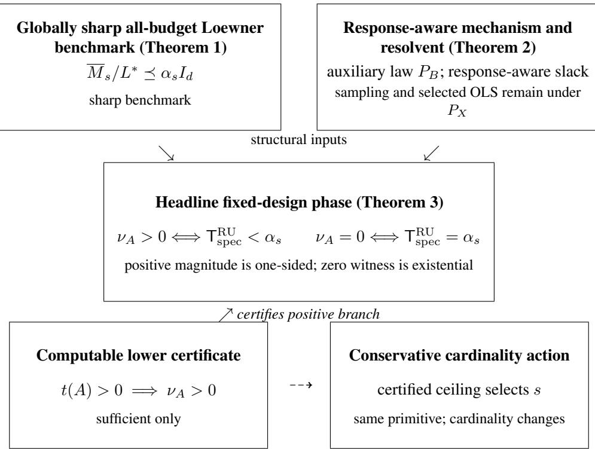
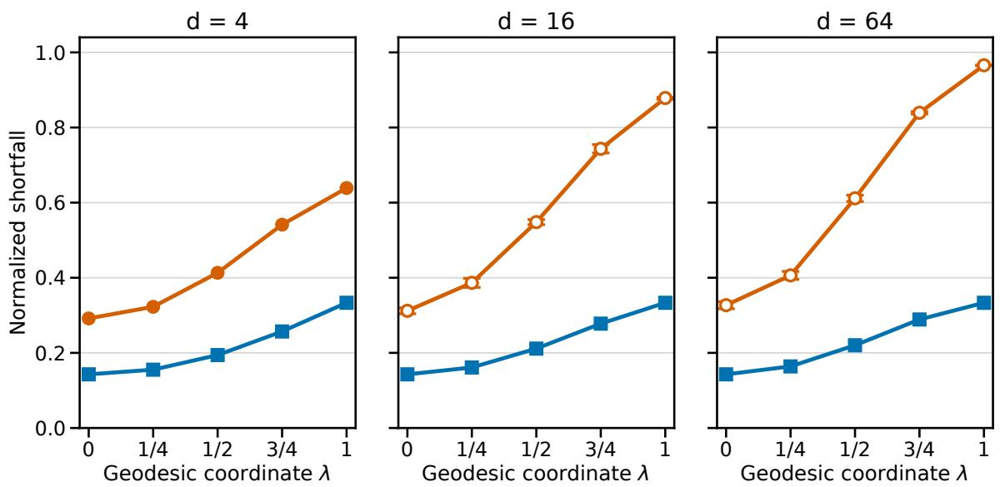
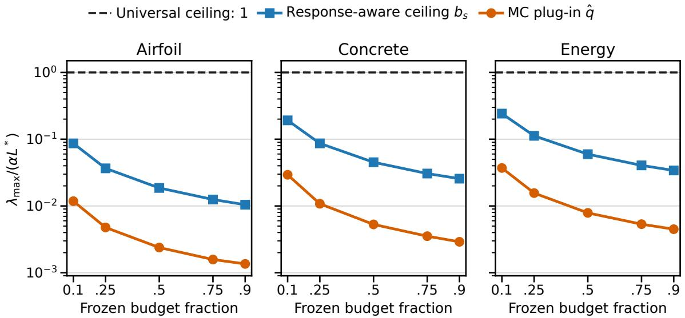

# When Is the Sharp Covariance Envelope Tight? Feature-Only Geometry for Volume-Sampled Least Squares

Kihun Rhee rheekh00@snu.ac.kr

## Abstract

Prior analyses by Derezinski and Warmuth established all-size sampling identities, selected-OLS´ unbiasedness, and inverse moments for ordinary volume sampling, while their exact arbitrary-fixedresponse loss and prediction-covariance formulas are at the rank-size endpoint s = d. We establish a Loewner envelope for centered coefficient covariance for every full-rank fixed pool, response, and legal budget d ≤ s ≤ m under ordinary indexed fixed-size volume sampling followed by selected unweighted least squares; its coefficient is globally sharp over the full-rank class. Global sharpness does not determine attainability on the pool in hand. Under positive loss, strict-interior budgets, and no coloops, a feature-only margin νA gives the exact fixed-design spectral phase: νA > 0 if and only if the normalized spectral envelope is strict for every compatible residual, whereas ν = 0 if and only if some compatible residual is spectrally tight; the same zero-margin residual is tight at every strict-interior budget. A residual-augmented change of measure supplies the response-aware mechanism and a one-sided quantitative slack bound, while support saturation proves the attainment direction. Critical equal-leverage geometry interprets the boundary, and sound lower certificates yield conservative same-primitive cardinality decisions. Frozenfeature examples show that the certificate is nonvacuous and measure the fixed-pool cost of its authorized reduction. The claims concern conditional centered, full-Gram-whitened coefficient covariance, not population generalization.

## 1 Introduction

Frozen-feature readouts and directional refitting. A frozen-feature linear readout is a standard downstream interface: representation-learning papers evaluate a fixed encoder by fitting a linear classifier on top [8, 19], and few-shot workflows fit that readout from a finite labelled support set [26]. The composition of the support set can affect the resulting classifier, as reflected by the sample-selection-bias literature [28]. Even after the representation, pool, and response are held fixed, randomized subset refitting creates variation in the fitted coefficients. We isolate the least-squares readout primitive in this interface; we do not analyze classification loss or representation quality. A scalar same-pool loss summarizes aggregate refitting variation but does not reveal whether that variation is diffuse or concentrated along a single coefficient direction. We therefore study the most variable direction of a refitted linear head.

The fixed-pool, pre-response question. We study a single deterministic finite regression pool. For each fixed response, the chosen subset is the only source of randomness; we then maximize the conditional covariance over the compatible residual sphere. The resulting worst-residual margin depends only on the feature matrix, not on an observed response. The controlled primitive is ordinary indexed fixed-size volume sampling followed by selected unweighted least squares. Its centered, full-Gram-whitened coefficient covariance retains the directional information hidden by a trace.

From the rank-size boundary to a sharp all-budget envelope. Ordinary volume sampling already has determinant laws, all-size selected-OLS unbiasedness, and inverse-Gram moment identities. For arbitrary fixed responses, however, Derezinski and Warmuth’s exact loss and prediction-covariance formulas are at the´ rank-size endpoint $s = d ;$ their NeurIPS paper explicitly left expected-loss bounds for $s > d \mathrm { o p e n }$ , and the JMLR article reported no extension of its covariance formula beyond $s = d \left[ 1 1 , 1 2 \right]$ . A later ordinary-volume lower construction exhibits the same budget dependence on a particular nonuniform-leverage family [13]. Theorem 1 addresses this recorded larger-budget boundary with a sharp Loewner envelope for every fixed pool, response, and legal budget.

The fixed-design phase left by a global envelope. Global sharpness is a class-level statement: a coefficient can be unimprovable over all designs and responses while remaining unattainable on the particular feature pool in hand. Our Theorem 2 exposes a contraction for one realized residual, but neither result settles the fixed-design quantifier: is the ceiling strict for every compatible residual, or is it attained by some compatible residual? Theorem 3 answers this question from feature geometry alone. Under the conditions below, two eligible feature pools obeying the same globally sharp benchmark can lie in different design-specific covariance-envelope attainability phases: a zero-margin pool admits one compatible positive-loss residual that attains the normalized spectral coefficient-covariance envelope, whereas a positive-margin pool keeps every compatible residual below it by a uniform positive gap.

The answer: a geometric phase boundary. The margin $\nu _ { A }$ is the weakest contraction enforced by feature geometry over all compatible residual directions. After whitening the design to $A ^ { \top } A = I _ { d } .$ , let

$$
\mathcal Z _ { A } = \{ z \in \ker ( A ^ { \top } ) : \| z \| _ { 2 } = 1 \} , \qquad R _ { A } ( z ) = \sum _ { i = 1 } ^ { m } \bigl ( 1 - \| a _ { i } \| _ { 2 } ^ { 2 } - z _ { i } ^ { 2 } \bigr ) a _ { i } a _ { i } ^ { \top } , \qquad \nu _ { A } = \operatorname* { m i n } _ { z \in \mathcal Z _ { A } } \lambda _ { \operatorname* { m i n } } ( R _ { A } ( z ) ) ,
$$

where $a _ { i } ^ { \top }$ is row i of A. The margin is defined entirely by feature geometry and ranges over the compatible normalized residual sphere. Let $\bar { \mathsf { T } } _ { \mathrm { s p e c } } ^ { \mathrm { R U } } ( A , s )$ denote the maximum normalized spectral coefficient covariance over that same sphere. Under positive loss, $d < s < m , m \geq d + 2$ , and no-coloop leverage $\| a _ { i } \| _ { 2 } ^ { 2 } < 1$ for every row, the robust phase result is

$$
\nu _ { A } > 0 \longleftrightarrow \mathbb { T } _ { \mathrm { s p e c } } ^ { \mathrm { R U } } ( A , s ) < \alpha _ { s } , \qquad \nu _ { A } = 0 \longleftrightarrow \mathbb { T } _ { \mathrm { s p e c } } ^ { \mathrm { R U } } ( A , s ) = \alpha _ { s } , \qquad \alpha _ { s } = \frac { m - s } { m - d } .
$$

The positive branch follows from the response-aware contraction, but the zero branch is not formal: a vanishing one-sided slack bound need not imply equality. Here zero margin forces support saturation under the ordinary volume law, producing one compatible residual that attains the ceiling for every strictinterior subset size; the phase classifies uniform strictness versus existential tightness, not the positive slack magnitude.

## Result hierarchy.

(i) Headline fixed-design covariance-envelope phase (Theorem 3). The feature-only margin $\nu _ { A }$ exactly separates uniform strictness for every compatible residual from attainment by some compatible residual, with one common zero-margin witness across strict-interior budgets. Its quantitative slack statement is one-sided: it is lower-bounded by a positive multiple of $\nu _ { A }$ , not identified exactly by it.

(ii) Globally sharp all-budget benchmark and response-aware mechanism (Theorems 1–2). Every fixed pool and response obeys

$$
\overline { { { M } } } _ { s } \preceq \frac { m - s } { m - d } L ^ { * } I _ { d } ,\tag{1}
$$

and the coefficient is sharp over the full-rank class. Residual augmentation gives an exact interior representation and a boundary-valid one-sided resolvent.

  
Figure 1: Theorem 3 is central: Theorems 1–2 supply its benchmark and response-aware mechanism, while a computable lower certificate turns only the positive branch into a conservative cardinality action.

(iii) Critical interpretation and sound consequence (Theorem 4 and Corollary 5). In the critical equalleverage class, the classical projective repeated-pair boundary is the zero set of the continuous residualdirection margin, with two-sided coherence control. Sound lower certificates give conservative cardinality decisions; the fixed-profile instantiation is supplementary.

We finally evaluate the certificate/action layer on frozen public feature pools, recording nonvacuous decisions and their measured fixed-pool cost. Figure 1 summarizes the structural inputs, exact phase, and conservative action.

## 2 Setting, metric, and scope

Let $\boldsymbol { X } \in \mathbb { R } ^ { m \times d }$ have full column rank and let $y \in \mathbb { R } ^ { m }$ be an arbitrary deterministic fixed response. Define

$$
\begin{array} { r } { G = X ^ { \top } X , \qquad w ^ { * } = G ^ { - 1 } X ^ { \top } y , \qquad e = y - X w ^ { * } , \qquad L ^ { * } = \| e \| _ { 2 } ^ { 2 } . } \end{array}\tag{2}
$$

For an unordered subset of indexed rows $S \subseteq [ m ] , | S | = s$ , write

$$
G _ { S } = X _ { S } ^ { \top } X _ { S } , \qquad D _ { S } = \operatorname* { d e t } ( G _ { S } ) .\tag{3}
$$

Repeated rows at different indices remain different observations. For $m > d$ and $d \leq s \leq m$ , ordinary unrescaled fixed-size volume sampling is

$$
Z _ { X , s } : = \sum _ { | U | = s } D _ { U } = { \binom { m - d } { s - d } } \operatorname* { d e t } ( G ) , \qquad \mathbb { P } _ { X } ( S ) = { \frac { D _ { S } } { Z _ { X , s } } } .\tag{4}
$$

This determinant law and its normalizer are standard components of volume sampling [3, 11, 12, 22]. Only $D _ { S } > 0$ sets support an estimator. On such a set, use unweighted selected least squares

$$
w _ { S } = G _ { S } ^ { - 1 } X _ { S } ^ { \top } y _ { S } , \qquad L _ { S } = \| X _ { S } w _ { S } - y _ { S } \| _ { 2 } ^ { 2 } .\tag{5}
$$

Zero-volume sets have zero probability and receive no pseudoinverse, ridge term, rescaling, weighting, replacement rule, or selected fit.

The centered second moment and its invariant form are

$$
M _ { s } = \mathbb { E } _ { X } [ ( w _ { S } - w ^ { * } ) ( w _ { S } - w ^ { * } ) ^ { \top } ] , \qquad \overline { { M } } _ { s } = G ^ { 1 / 2 } M _ { s } G ^ { 1 / 2 } .\tag{6}
$$

For $m > d ,$

$$
\alpha = \frac { m - s } { m - d } , \qquad \beta = \frac { s - d } { m - d } = 1 - \alpha .\tag{7}
$$

When $\nu L ^ { * } > 0$ , define the exact normalized directional quantity $q _ { s } : = \lambda _ { \operatorname* { m a x } } ( \overline { { M } } _ { s } ) / ( \alpha L ^ { * } )$ . This is not the raw Euclidean eigenvalue of $M _ { s } ;$ it measures only the conditional fixed-pool quantity defined above. No directional quotient is formed at a zero denominator.

## 2.1 Endpoint and support conventions

These branches are applied before any normalized ratio or residual direction is formed. If $m = d ,$ then $s = m$ , the selected fit is the full fit and both losses and the covariance are zero; no expression containing $( m - d ) ^ { - 1 }$ is evaluated. If $m > d$ and $s = m$ , the unique sample gives $M _ { s } = 0$ and $\alpha = 0$ , so no directional quotient is formed. If $L ^ { * } = 0$ , every supported selected fit equals $w ^ { * }$ and $M _ { s } = 0 ;$ ; no residual direction is formed. ${ \mathrm { I f ~ } } s = d < m$ , supported square systems interpolate and the rank- $\left( d + 1 \right)$ augmentation used later is not invoked. Every expectation is conditional on the fixed pair $( X , y )$

The full-pool loss identity used below is

$$
\| X w - y \| _ { 2 } ^ { 2 } = L ^ { * } + ( w - w ^ { * } ) ^ { \top } G ( w - w ^ { * } ) \qquad ( w \in \mathbb { R } ^ { d } ) .\tag{8}
$$

## 3 Universal budget envelope

Theorem 1 establishes the design-independent benchmark: for every fixed pool, response, and legal budget, it bounds the centered whitened coefficient covariance in Loewner order before taking any trace. Its proof uses the indexed Cauchy–Binet normalizer, rank-size basis moments, uniform padding, and the selected-residual first moment. Here and below, row general position means that every indexed set of d rows is nonsingular. A full-column-rank boundary design has full column rank but is outside row general position, so at least one indexed d-row subset is singular. For symmetric matrices, $A \preceq B$ denotes the Loewner (positive-semidefinite) order: $B - A$ is positive semidefinite.

Theorem 1 (Universal budget envelope). For every full-column-rank X, every fixed y, $m > d ,$ and d $\leq s \leq$ m, ordinary sampling (4)followed by (5) satisfies

$$
\mathbb { E } _ { X } w _ { S } = w ^ { * } , \qquad M _ { s } \preceq \alpha L ^ { * } G ^ { - 1 } , \qquad \overline { { M } } _ { s } \preceq \alpha L ^ { * } I _ { d } .\tag{9}
$$

Consequently,

$$
\mathbb { E } _ { X } \| X w _ { S } - y \| _ { 2 } ^ { 2 } \leq ( 1 + d \alpha ) L ^ { * } = \left( 1 + \frac { d ( m - s ) } { m - d } \right) L ^ { * } .\tag{10}
$$

The endpoint and zero-volume support conventions in Section 2.1 apply before any ratio or residual direction isformed. The coefficient is attained by thefull-column-rank core-plus-zerofamily in Proposition 14; this is a coefficient-attainment statement, not an equality classification. For positive-loss row-general-position designs with d $\geq 2$ and $d < s < m$ , the matrix inequality is strict, while the same normalized coefficient is a perturbative supremum in that interior.

Proof overview: interior slack, then boundary. On the positive-loss row-general-position interior with $d < s < m$ , couple a size-s volume sample to a volume-sampled rank-size basis plus uniform padding. The matrix law of total covariance and the selected-residual first moment give

$$
\alpha L ^ { * } G ^ { - 1 } - M _ { s } = \mathbb { E } _ { X } \left[ L _ { S } \big ( G _ { S } ^ { - 1 } - G ^ { - 1 } \big ) \right] \succeq 0 .\tag{11}
$$

This exact slack identity is an interior statement. For an arbitrary full-column-rank boundary design, a determinant-weighted directional limit retains the one-sided envelope without continuing this decomposition or assigning an inverse to a singular subset. The attainment and strictness arguments are in Appendix C.

For every coefficient contrast c, (9) bounds its subset-induced fluctuation by $\alpha L ^ { * } c ^ { \top } G ^ { - 1 } c$ . Taking the trace through the full-pool Pythagoras identity yields (10); this is a conditional same-pool statement. Thus the matrix inequality controls every contrast simultaneously, before taking the trace. The budget coefficient $\alpha =$ $( m - s ) / ( m - d )$ is attained on the stated boundary family, is strictly slack on the regular positive-loss interior, and remains the perturbative interior supremum; “globally sharp” refers to this coefficient statement. The ordinary law and its inverse-Gram ingredients are standard components of volume sampling [3, 11, 12, 22].

## 4 Residual-augmented mechanism

Theorem 2 exposes the response-dependent mechanism behind the universal ceiling by augmenting the whitened design with the normalized residual. This augmentation is used only in the analysis; sampling and fitting remain under the original ordinary volume law and selected OLS primitive. On $L ^ { * } > 0$ and $d < s < m$ , whiten the design and append the normalized residual:

$$
A = X G ^ { - 1 / 2 } , \qquad z = e / \sqrt { L ^ { * } } , \qquad B = [ A z ] .\tag{12}
$$

Then $B ^ { \top } B = I _ { d + 1 }$ . Write $b _ { i } ^ { \top } = [ a _ { i } ^ { \top } ~ z _ { i } ]$ , put $K _ { S } = A _ { S } ^ { \top } A _ { S }$ , and define

$$
h _ { i } = \| b _ { i } \| _ { 2 } ^ { 2 } , \qquad R = \sum _ { i = 1 } ^ { m } ( 1 - h _ { i } ) a _ { i } a _ { i } ^ { \top } , \quad \gamma = \frac { m - s } { m - d - 1 } .\tag{13}
$$

The linear consequence below is the response-uniform slack input to Theorem 3: a feature-only lower bound on R rules out the universal envelope for every compatible residual.

Let $P _ { B }$ denote the response-dependent auxiliary law induced by the full residual for the following identity and bound. Its distinct rank-(d + 1) support is

$$
Z _ { B , s } = \sum _ { | S | = s } \operatorname * { d e t } ( B _ { S } ^ { \top } B _ { S } ) = { \binom { m - d - 1 } { s - d - 1 } } , \qquad P _ { B } ( S ) = \frac { \operatorname * { d e t } ( B _ { S } ^ { \top } B _ { S } ) } { Z _ { B , s } } .\tag{14}
$$

Its support can be strictly smaller than the ordinary support in (4); no inverse is taken on a zero augmented volume.

Theorem 2 (Residual-augmented representation and response-aware resolvent). Suppose $L ^ { * } > 0$ and $d < s < m$ . IfX is in row general position, then the ordinary law and the auxiliary law $P _ { B }$ are related by the exact change ofmeasure below; sampling andfitting remain under $P _ { X }$

$$
\begin{array} { r } { P _ { X } ( S ) L _ { S } = \beta L ^ { * } P _ { B } ( S ) , \qquad \displaystyle \frac { \overline { { M } } _ { s } } { L ^ { * } } = I _ { d } - \beta \mathbb { E } _ { B } [ K _ { S } ^ { - 1 } ] , \qquad \mathbb { E } _ { B } K _ { S } = I _ { d } - \gamma R . } \end{array}\tag{15}
$$

Classical operator Jensenfor matrix inversion, with the minus sign in the middle identity reversing the order, gives the interior resolvent bound

$$
\boxed { \overline { { M } } _ { s } } \preceq L ^ { * } \left[ I _ { d } - \beta ( I _ { d } - \gamma R ) ^ { - 1 } \right]\tag{16}
$$

and its linear consequence

$$
\overline { { M } } _ { s } \preceq \alpha L ^ { * } I _ { d } - \beta \gamma L ^ { * } R .\tag{17}
$$

For an arbitraryfull-column-rank boundary design, as defined before Theorem $^ { l , }$ only the congruent one-sided inequality is asserted. With $\begin{array} { r } { Q = \sum _ { i } ( 1 - h _ { i } ) x _ { i } x _ { i } ^ { \top } } \end{array}$

$$
M _ { s } \preceq L ^ { * } \left[ G ^ { - 1 } - \beta ( G - \gamma Q ) ^ { - 1 } \right] .\tag{18}
$$

The exact inverse-moment covariance identity in (15) does not extend through a rank-changing boundary.

Proof overview: residual change of measure. On the row-general-position interior with $L ^ { * } > 0$ and $d < s < m$ , the auxiliary law $P _ { B }$ first gives the loss-weighted relation $P _ { X } ( S ) L _ { S } = \beta L ^ { * } P _ { B } ( S )$ , and then the compact chain

$$
\begin{array} { c c } { P _ { X } ( S ) L _ { S } = \beta L ^ { * } P _ { B } ( S ) , \qquad } & { \overset { \overline { { \mathcal { M } } } _ { s } } { \underbrace { \overline { { L ^ { * } } } } } = I _ { d } - \beta \mathbb { E } _ { B } [ K _ { S } ^ { - 1 } ] , } \end{array}\tag{19}
$$

$$
\begin{array} { r } { \mathbb { E } _ { B } K _ { S } = I _ { d } - \gamma R \qquad \Longrightarrow \mathrm { e } ^ { \mathrm { c l a s s i c a l } \mathrm { J e n s e n } } \overline { { M } } _ { s } \preceq L ^ { * } [ I _ { d } - \beta ( I _ { d } - \gamma R ) ^ { - 1 } ] . } \end{array}\tag{20}
$$

The first line is a loss-weighted change of measure and augmented first moment; Jensen is the classical inversion step [20]. At an arbitrary full-column-rank boundary, only the one-sided resolvent inequality remains. The full support-aware derivation and the boundary arithmetic fixture are in Appendix D.

Second-moment refinement. Under the same augmented law, every supported whitened sub-Gram matrix is a positive contraction, so an exact resolvent identity gives a computable second-centered-Gram-moment tightening of the response-aware Jensen ceiling. Proposition 16 states the interior Loewner hierarchy and its one-sided full-column-rank extension.

## 5 Robust pre-response geometry

The universal envelope is a statement about the worst direction over all feature pools and responses. For a particular feature pool, the remaining question is whether any compatible residual can attain that envelope. The answer below is determined before a response is observed.

Let $\boldsymbol { X } \in \mathbb { R } ^ { m \times d }$ have full column rank and write $G = X ^ { \top } X$ . In whitened coordinates, set

$$
A = X G ^ { - 1 / 2 } , \qquad A ^ { \top } A = I _ { d } ,\tag{21}
$$

and write $a _ { i } ^ { \top }$ for row i of A and $\ell _ { i } = \| a _ { i } \| _ { 2 } ^ { 2 }$ for its leverage. The admissible normalized residual sphere is

$$
{ \mathcal { Z } } _ { A } = \{ z \in \ker ( A ^ { \top } ) : \| z \| _ { 2 } = 1 \} .\tag{22}
$$

For $z \in { \mathcal { Z } } _ { A }$ , define the feature–residual matrix and its robust pre-response margin by

$$
R _ { A } ( z ) = \sum _ { i = 1 } ^ { m } ( 1 - \ell _ { i } - z _ { i } ^ { 2 } ) a _ { i } a _ { i } ^ { \top } , \qquad \nu _ { A } = \operatorname* { m i n } _ { z \in \mathcal { Z } _ { A } } \lambda _ { \operatorname* { m i n } } ( R _ { A } ( z ) ) .\tag{23}
$$

To define the response-uniform target, fix $\boldsymbol { \theta } \in \mathbb { R } ^ { d }$ and $L ^ { * } > 0$ and associate the compatible response $y _ { z } = A \theta + \sqrt { L ^ { * } } z$ with z. Under ordinary unrescaled indexed size-s volume sampling, followed by selected unweighted least squares on positive-volume subsets, let

$$
\alpha _ { s } = \frac { m - s } { m - d } , \qquad \beta _ { s } = \frac { s - d } { m - d } , \qquad \gamma _ { s } = \frac { m - s } { m - d - 1 } .\tag{24}
$$

Here and below $d < s < m$ . Let $\overline { { M } } _ { s } ^ { A , z }$ denote the centered, full-Gram-whitened coefficient second moment of this sampler and estimator for $( A , y _ { z } )$ . Because $A ^ { \top } A = I _ { d } .$ , whitening is the identity. Zero-volume sets have zero probability and receive no fit. The response-uniform target is the worst spectral covariance over the unit residual sphere,

$$
\mathsf { T } _ { \mathrm { s p e c } } ^ { \mathrm { R U } } ( A , s ) = \operatorname* { m a x } _ { z \in \mathcal { Z } _ { A } } \frac { \lambda _ { \operatorname* { m a x } } ( \overline { { M } } _ { s } ^ { A , z } ) } { L ^ { * } } .\tag{25}
$$

Thus $\nu _ { A }$ is formed from features alone, while the maximum in (25) quantifies what that feature geometry guarantees uniformly over compatible residual directions.

Theorem 3 (Robust pre-response phase boundary). Let $d \geq 1 , m \geq d + 2 ,$ , and $d < s < m$ . Suppose that $A \in \mathbb { R } ^ { m \times d }$ has orthonormal columns and no coloop, namely

$$
\ell _ { i } < 1 \qquad f o r e \nu e r y i \in [ m ] .\tag{26}
$$

Use ordinary unrescaled indexed size-s volume samplingfollowed by selected unweighted least squares on positive-volume subsets. For every $\boldsymbol { \theta } \in \mathbb { R } ^ { d }$ and $L ^ { * } > 0$ , with the definitions above, $\nu _ { A } \geq 0$ and

$$
\boxed { \alpha _ { s } - \mathsf { T } _ { \mathrm { s p e c } } ^ { \mathrm { R U } } ( A , s ) \geq \beta _ { s } \gamma _ { s } \nu _ { A } . }\tag{27}
$$

Moreover, the feature margin exactly classifies strictness versus tightness of the universal spectral envelope:

$$
\begin{array} { r } { \boxed { \nu _ { A } > 0 \quad \Longleftrightarrow \quad \mathsf { T } _ { \mathrm { s p e c } } ^ { \mathrm { R U } } ( A , s ) < \alpha _ { s } , } } \end{array}\tag{28}
$$

$$
\boxed { \nu _ { A } = 0 } \quad \Longleftrightarrow \quad \mathsf { T } _ { \mathrm { s p e c } } ^ { \mathrm { R U } } ( A , s ) = \alpha _ { s } .\tag{29}
$$

$I f \nu _ { A } = 0 ;$ , there exists one residual direction $z _ { * } \in \mathcal { Z } _ { A }$ such that, simultaneously for every $s ^ { \prime } \in \{ d + \}$ $1 , \ldots , m - 1 \}$ ,

$$
\frac { \lambda _ { \operatorname* { m a x } } ( \overline { { { M } } } _ { s ^ { \prime } } ^ { A , z _ { * } } ) } { L ^ { * } } = \frac { m - s ^ { \prime } } { m - d } .\tag{30}
$$

The right-hand side of (27) is a guaranteed lower bound on the spectral slack. The exact statement is the phase classification in (28)– (29), not an equality formula for the positive slack magnitude.

Under the conditions above, two eligible feature pools obeying the same globally sharp benchmark can lie in different design-specific covariance-envelope attainability phases: a zero-margin pool admits one compatible positive-loss residual that attains the normalized spectral coefficient-covariance envelope, whereas a positive-margin pool keeps every compatible residual below it by a uniform positive gap. A detailed ledger of result domains, response quantifiers, and logical status appears in Appendix A.

Proof mechanism. Append the normalized residual to the whitened design and write $B = \left\lceil A \ z \right\rceil$ . The columns of B are orthonormal, so its projection diagonal $h _ { i } = \ell _ { i } + z _ { i } ^ { 2 }$ is at most one and

$$
R _ { A } ( z ) = \sum _ { i } ( 1 - h _ { i } ) a _ { i } a _ { i } ^ { \top } \succeq 0 .\tag{31}
$$

The response-aware covariance bound of Theorem 2 gives, for every compatible residual,

$$
\frac { \overline { { { M } } } _ { s } ^ { A , z } } { L ^ { * } } \preceq \alpha _ { s } I _ { d } - \beta _ { s } \gamma _ { s } R _ { A } ( z ) .\tag{32}
$$

Minimizing the smallest eigenvalue of $R _ { A } ( z )$ over the residual sphere therefore gives the uniform slack in (27). The zero-margin direction uses a support-geometric argument: a zero-margin witness forces every row active in its null direction to have saturated augmented leverage. Those saturated rows induce mutually exclusive omission events under ordinary volume sampling, whose exact exclusion probabilities sum to the universal envelope. Conversely, equality in the envelope forces a zero Rayleigh quotient of $R _ { A } ( z )$ , hence zero margin. These are separate arguments: positive margin gives uniform slack through the response-aware bound; zero margin gives support saturation and a common equality witness; and envelope attainment forces zero margin. The determinant support calculation and the zero-margin witness are given in Appendix E.

## 6 Critical equal-leverage geometry

The phase variable in Theorem 3 has a particularly concrete interpretation at critical redundancy. Suppose $m = 2 d$ and every whitened row has leverage $\ell _ { i } = 1 / 2$ . With $P = A A ^ { \top }$ and $P _ { \perp } = I _ { 2 d } - P$ , each $z \in { \mathcal { Z } } _ { A }$ determines

$$
\begin{array} { r } { Q _ { z } = P _ { \perp } - z z ^ { \top } , \qquad R _ { A } ( z ) = A ^ { \top } \operatorname { D i a g } ( \operatorname { d i a g } Q _ { z } ) A . } \end{array}\tag{33}
$$

Here $Q _ { z }$ is the rank- $\left( d - 1 \right)$ projection obtained by removing one unit direction from the fixed Naimark complement $P _ { \perp }$ . Thus the weights

$$
( \mathrm { d i a g } Q _ { z } ) _ { i } = \frac { 1 } { 2 } - z _ { i } ^ { 2 }\tag{34}
$$

are coupled fractional weights generated by an admissible residual direction; they are neither freely chosen frame weights nor a binary erasure mask. This interpretation uses classical Parseval frame theory, Naimarkcomplement geometry, and frame-erasure results [5, 7].

Define the normalized coherence

$$
\rho _ { A } = \operatorname* { m a x } _ { i \neq j } 2 | a _ { i } ^ { \top } a _ { j } | .\tag{35}
$$

Theorem 4 (Critical residual geometry). Let $d \geq 2$ and let $A \in \mathbb { R } ^ { 2 d \times d }$ have orthonormal columns and $\| a _ { i } \| _ { 2 } ^ { 2 } = 1 / 2$ for every i. Then

$$
\Biggl \lvert \frac { 1 - \rho _ { A } } { 4 } \leq \nu _ { A } \leq \frac { ( 1 - \rho _ { A } ) ( 3 + \rho _ { A } ) } { 8 } .\tag{36}
$$

Moreover, thefollowing are equivalent:

(i) $\nu _ { A } = 0 ;$

(ii) there are distinct indices $i , j$ , a unit vector $v \in \mathbb { R } ^ { d }$ , and signs $\sigma _ { i } , \sigma _ { j } \in \{ \pm 1 \}$ such that

$$
a _ { i } = \frac { \sigma _ { i } } { \sqrt { 2 } } v , \qquad a _ { j } = \frac { \sigma _ { j } } { \sqrt { 2 } } v , \qquad a _ { k } ^ { \top } v = 0 \quad ( k \notin \{ i , j \} ) .\tag{37}
$$

Hence the zero boundary is the projectively repeated-pair boundary with an orthogonal remainder, while (36) controls the magnitude ofthe continuous residual-direction margin awayfrom that boundary.

The projective-duplicate boundary itself is classical: for a uniform Parseval frame, the binary two-erasure formula of Bodmann and Paulsen [5] gives the corresponding singular retained-frame boundary. Theorem 4 applies that ancestry to the different functional in (33): one fixed complement, one removed residual direction, and the induced lower frame bound. In particular, coherence bounds $\nu _ { A }$ from two sides but does not generally compute it exactly.

Mechanism. Because $[ A \ z ]$ has orthonormal columns, $z _ { i } ^ { 2 } ~ \leq ~ 1 / 2$ and every summand in $R _ { A } ( z ) =$ $\textstyle \sum _ { i } ( 1 / 2 - z _ { i } ^ { 2 } ) a _ { i } a _ { i } ^ { \top }$ is positive semidefinite. A zero Rayleigh quotient therefore forces every row visible in the null direction to saturate $z _ { i } ^ { 2 } = 1 / 2$ . Unit norm permits exactly two such coordinates, and Parsevalness forces the two corresponding rows to be the pair in (37). For the quantitative statement, rescale to the unit-norm tight frame $u _ { i } = \sqrt { 2 } a _ { i }$ . The residual squares form a capped simplex, while the sum of its two largest directional frame energies is at most $1 + \rho _ { A }$ . This gives the lower bound; projecting the signed difference of a coherence-maximizing pair into the fixed complement gives the upper bound. Appendix F gives the complete argument and the source boundary.

Sharp critical witness. At $\nu _ { A } = 0$ , there exists one compatible residual, fixed before sampling and independent of the budget, that attains the universal spectral envelope at every $s \in \{ d + 1 , \ldots , 2 d - 1 \}$ ; its exact rank-one covariance, proof, and qualified source contrast are in Appendix F.

(a) Shared ancestry, different adversary (b) Critical equal-leverage phase   
Classical binary erasure Repeated projective pair with orthogonal remainder   
$w _ { i } \in \{ 0 , 1 \}$ from a chosen erasure mask $\stackrel { \cdot } { a } _ { i } = \frac { \sigma _ { i } } { \sqrt { 2 } } v , \quad a _ { j } = \frac { \sigma _ { j } } { \sqrt { 2 } } v , \quad a _ { k } ^ { \top } v = 0$   
shared Parseval/Naimark geometry   
⇐⇒ ν = 0 =⇒ ∃ z : envelope attained   
Residual-induced continuous weights for every d<s<2d   
$w _ { i } ( z ) = { \frac { 1 } { 2 } } - z _ { i } ^ { 2 } = \bigl [ \mathrm { d i a g } ( P _ { \perp } - z z ^ { \top } ) \bigr ] _ { i }$ Projectively separated geometry $( \rho _ { A } < 1 )$   
⇐⇒ νA > 0 ⇐⇒ strict slack for everycompatible residual   
One unit $z \in \ker ( A ^ { \top } )$ couples the weights: they are   
The zero branch is existential in the residual; the positive   
neither freely chosen frame weights nor a binary mask.   
branch is uniform.  
Figure 2: Critical-class schematic $( m = 2 d ,$ equal leverage). Panel (a) records the classical binary two-erasure and Naimark-complement ancestry [5, 7] and contrasts it with the residual-coupled continuous weights here. Panel (b) shows the existential zero branch and the uniform positive branch of the $\nu _ { A }$ phase.

## 7 Sound certificates and same-primitive action

Theorem 3 uses the exact feature margin $\nu _ { A }$ , but computing that minimum over the residual sphere is not required to certify its positive branch. A sound pre-response certificate is any feature-only scalar t(A) for which

$$
0 \leq t ( A ) \leq \nu _ { A }\tag{38}
$$

has been proved. This is deliberately one-sided: a positive value certifies robust strict slack, whereas a zero value, failed sufficient test, or abstention is inconclusive.

Corollary 5 (Sound computable pre-response certificates). For everyfull-column-rank X with $m > d ,$ the general spectral certificate $c _ { X }$ defined in Appendix G satisfies $0 \leq c _ { X } \leq \nu _ { A } ;$ under the assumptions of Theorem 4, the critical-coherence certificate defined there satisfies $0 \leq t _ { \rho } ( A ) \leq \nu _ { A }$ . More generally, every verified t(A) satisfying (38) obeys, on the no-coloop positive-loss strict-interior domain ofTheorem 3,

$$
\boxed { \alpha _ { s } - \mathsf { T } _ { \mathrm { s p e c } } ^ { \mathrm { R U } } ( A , s ) \geq \beta _ { s } \gamma _ { s } t ( A ) . }\tag{39}
$$

Thus any pass with $t ( A ) > 0$ certifies strictness uniformly over every compatible residual direction. Failure or abstention does not imply $\nu _ { A } = 0$ , envelope attainment, or the absence ofanother sound route.

For the predeclared $( m , d , \xi ) = ( 5 1 2 , 6 4 , 1 / 3 )$ profile, the supplementary fixed-threshold instantiation authorizes $s = 3 3 8$ on a verified pass and otherwise falls back to $s = 3 6 3 ;$ both branches retain the same primitive and give the same one-sided $\frac { 1 } { 3 } L ^ { * } I _ { d }$ covariance ceiling. The predicate, integer arithmetic, guards, and nonoptimality qualification are in Appendix G.

## 8 Pre-response decisions and their measured cost

Frozen features determine whether the certificate authorizes the smaller subset or invokes the universalenvelope fallback before any response is released. Across 72 fixed frozen-encoding cells, the sound sufficient rule produced action/fallback counts of $2 0 / 4 , 4 / 2 0$ , and $5 / 1 9$ in the three released blocks, so it both authorized the smaller cardinality and abstained. In all nine released action cells, the post-action lower-budget excess-risk difference was positive, quantifying a fixed-pool cost of the authorized reduction. These descriptive cells do not estimate $\mathsf { T } _ { \mathrm { s p e c } } ^ { \mathrm { \hat { R } U } }$ , test Theorem 3, or establish population performance or selector dominance; a fallback is inconclusive rather than evidence of the zero phase. Exact costs, covariance and accuracy summaries, matched-budget selector context, draws, and selection notes are in Appendix B. The fresh Fashion–MNIST rows are disjoint from the initial row block but share its task and frozen encoder inventory.

## 9 Related work

Nearest theorem-level comparisons. Table 1 separates the closest audited results by sampling law, estimator, budget-specific object, response model, covariance target, and equality quantifier. The all-size determinant law, selected-OLS unbiasedness, and inverse moments are prior results; the rank-size boundary in the table concerns the narrower arbitrary-fixed-response loss and prediction-covariance formulas.

Other audited neighbors change the law, estimator, response model, or target: volume-rescaled and random-design regression, generic-sketch covariance, with-replacement debiased fits, and active or dependent leverage designs treat different primitives or statistics [9, 10, 15, 16, 18, 23, 24]. Their component overlap is discussed below; none is used here as a worldwide absence claim.

Critical frame and erasure geometry. Parseval frames, Naimark complements, projection diagonals, and weighted-frame operators provide geometric ancestry [1, 4, 5, 7, 21]. Bodmann and Paulsen’s Section 3, specifically Definition 3.1, Remark 3.2, and the formula before Definition 3.5, identifies the classical repeatedpair boundary for binary erasures [5]. Here that boundary is translated to a continuous constrained margin, with $Q _ { z } = P _ { \bot } - z z ^ { \top }$ and coupled weights $1 / 2 - z _ { i } ^ { 2 }$ . Casazza et al.’s Theorems 2.4–2.5 and Proposition 3.1 provide the Naimark-complement and equal-norm projection machinery [7]; the overlap is partial because the residual-coupled functional and its bounds differ (relation: partial overlap).

Pre-response selection and certificates. Subset design for fixed-pool regression has also been studied under other primitives. Chen and Price’s Theorems 1 and 7 use weighted sparsification and weighted empirical risk minimization [9]. Gittens and Magdon-Ismail’s Lemma 2.1 and equations (12) and (21) give the residual/leverage deletion object, while Theorem 3.1 targets scalar full-pool loss [18]. Shimizu et al.’s Theorem 1.1 uses fixed-cardinality dependent leverage sampling and an inverse-inclusion rescaled fit [24]. These works address related fixed-pool design questions but alter the fitted objective, law, estimator, or statistic. The overlap is partial: our sufficient test changes only cardinality when it passes (relation: partial overlap).

Finally, Derezinski and Warmuth’s Theorems 5–6 average matched selected-Gram inverse or pseudoin-´ verse objects under the ordinary feature law [11, 12]. In the residual-augmented calculation, $P _ { B }$ is induced by $\boldsymbol { B } = \left[ A \boldsymbol { z } \right]$ , whereas the inverse target remains $A _ { S } ^ { \top } A _ { S }$ . This response-induced law–target mismatch is confined to the supplementary contraction correction; operational sampling remains under $P _ { X }$ . Its first-order step is classical operator Jensen (Theorem 2.1) [20]; the ordered remainder is a specialized local calculation (relation: partial overlap).

Table 1: Nearest theorem-level comparison under the audited source versions; this is not a systematic literature census. Budget labels refer only to the object named in the same cell. Relations are to the present fixed-pool coefficient-covariance envelope and strict/tight phase, not to volume sampling as a whole.
<table><tr><td>Work</td><td>Sampling law / estimator</td><td>Budget by object</td><td>Response / randomness</td><td>Target / form</td><td>Tightness quantifier / audited relation</td></tr><tr><td>D-W 2017/2018 [11, 12]</td><td>Ordinary indexed fixed-size subset volume sampling; selected unweighted OLS</td><td>All legal s: law, selected-OLS unbiasedness, in- moments; arbitrary-response objects are in- covariance: s = d moments</td><td>Deterministic fixed X, y for the rank-size regression identities; rank-size verse/pseudoinverse result; subset draw only. All-size matrix prediction-operator loss and prediction verse/pseudoinverse</td><td>All-size inverse- Gram/pseudoinverse scalar loss and matrix identity</td><td>Rank-size equality under general position; no all-budget fixed-design every/some phase in the cited results. Partial overlap</td></tr><tr><td>D-W-H 2018 Ordinary subset law [13]</td><td>for the adverse with-replacement sequence law and weighted fit for the</td><td>Ordinary lower construction has the sampling construction; rescaled all-budget factor; randomness positive guarantees use the changed law</td><td>Fixed response;</td><td>Scalar full-pool loss and Limiting lower tail guarantee, not a Loewner bound for the present covariance target</td><td>obstruction, not a fixed-design equality classification. Partial overlap</td></tr><tr><td>D-C-M-W 2019 [14]</td><td>positive method Rank-size volume component plus additional importance/rescaled sequence draws; altered randomized design and fit</td><td>budget, not one ordinary size-s subset curve</td><td>Sample-complexity Arbitrary random responses, with fixed guarantees and PSD y allowed as a specialization</td><td>Scalar MSE/MSPE variance comparator statements, not the present fixed-y covariance envelope</td><td>Minimax upper/lower rates; no same-primitive fixed-design attainment phase. Partial overlap after a changed design</td></tr><tr><td>Epperly 2026, Classical rank-size v2 [17]</td><td>k-DPP/volume law; selected least squares s = d for the in the active-regression result</td><td>Exactly the rank-size endpoint response; audited regression selection result</td><td>Arbitrary fixed subset/active- randomness</td><td>Scalar expected full-pool loss; no all-budget Loewner coefficient-covariance statement in the audited overlap at s = d result</td><td>Rank-size endpoint identity/optimality, not T3&#x27;s strict/tight phase. Partial</td></tr><tr><td>This paper</td><td>Ordinary indexed fixed-size subset volume sampling; selected unweighted OLS</td><td>T1: every legal  $d \leq s \leq m ; \mathrm { T } 3 \colon$  strict interior  $d < s < m$ </td><td>Deterministic fixed X, y with subset-only randomness; T3 maximizes over all unit compatible residuals</td><td>Centered full-Gram-whitened coefficient covariance: all-budget Loewner envelope and response-uniform spectral target</td><td>T1: class-level sharp coefficient. T3: νA &gt; 0 iff every compatible residual is strict; νA = 0 iff some compatible residual is tight, with one common strict-interior-budget</td></tr></table>

## 10 Limitations and conclusion

Scope. We analyze conditional centered, full-Gram-whitened coefficient covariance for one indexed fixed feature pool under ordinary unrescaled fixed-size volume sampling and selected unweighted OLS; the subset draw is the only randomness. The exact phase theorem requires positive full-fit loss, a strict-interior budget, and no coloops. The residual-augmented identity additionally requires row general position, while its boundary form is one-sided. Feature-only screens are sufficient: a pass certifies positive margin, whereas failure or abstention is inconclusive. The cardinality rule and finite-pool evidence do not claim population generalization, selector dominance, or a new sampler, and we do not establish the computational complexity of evaluating $\nu _ { A }$ exactly for a general design.

Conclusion. A globally sharp covariance envelope need not be tight for a fixed feature pool. Under the stated conditions, feature geometry alone decides the phase: $\nu _ { A } > 0$ means uniform strictness, while $\nu _ { A } = 0$ means one compatible residual attains the envelope at every strict-interior budget. Critical geometry makes the boundary concrete, and sound lower certificates convert verified positive lower bounds into conservative cardinality decisions without changing the sampler or fit.

## Use of generative AI

Generative-AI tools assisted with manuscript drafting and revision, LATEX source organization, compilation diagnostics, and research-verification workflows. AI-generated outputs, including audit reports, are not evidence for mathematical correctness, novelty, or empirical claims. The author takes responsibility for all mathematical statements, proofs, citations, calculations, experimental results, and final source artifacts. No AI system is listed as an author.

## References

[1] Jorge Antezana, Pedro Massey, Mariano Ruiz, and Demetrio Stojanoff. The Schur–Horn theorem for operators and frames with prescribed norms and frame operator. Illinois Journal ofMathematics, 51(2): 537–560, 2007. URL https://arxiv.org/abs/math/0508646.

[2] Ljiljana Arambasiˇ c and Damir Baki ´ c. Expansions from frame coefficients with erasures, 2016. URL ´ https://arxiv.org/abs/1602.01656. arXiv:1602.01656v1.

[3] Haim Avron and Christos Boutsidis. Faster subset selection for matrices and applications. SIAM Journal on Matrix Analysis and Applications, 34(4):1464–1499, 2013. doi: 10.1137/120867287. URL https://epubs.siam.org/doi/10.1137/120867287.

[4] Peter Balazs, Jean-Pierre Antoine, and Anna Grybos. Weighted and controlled frames.´ International Journal ofWavelets, Multiresolution and Information Processing, 8(1):109–132, 2010. doi: 10.1142/ S0219691310003377. URL https://doi.org/10.1142/S0219691310003377.

[5] Bernhard G. Bodmann and Vern I. Paulsen. Frames, graphs and erasures. Linear Algebra and its Applications, 404:118–146, 2005. doi: 10.1016/j.laa.2005.02.016. URL https://doi.org/10. 1016/j.laa.2005.02.016.

[6] Thomas Brooks, D. Pope, and Michael Marcolini. Airfoil Self-Noise. UCI Machine Learning Repository, 1989. URL https://doi.org/10.24432/C5VW2C.

[7] Peter G. Casazza, Matthew Fickus, Dustin G. Mixon, Jesse Peterson, and Ihar Smalyanau. Every hilbert space frame has a naimark complement. Journal of Mathematical Analysis and Applications, 406(1): 111–119, 2013. doi: 10.1016/j.jmaa.2013.04.047. URL https://doi.org/10.1016/j.jmaa. 2013.04.047.

[8] Ting Chen, Simon Kornblith, Mohammad Norouzi, and Geoffrey Hinton. A simple framework for contrastive learning of visual representations. In Proceedings of the 37th International Conference on Machine Learning, volume 119 of Proceedings ofMachine Learning Research, pages 1597–1607. PMLR, 2020. URL https://proceedings.mlr.press/v119/chen20j.html.

[9] Xue Chen and Eric Price. Active regression via linear-sample sparsification. In Proceedings of the Thirty-Second Conference on Learning Theory, volume 99 of Proceedings of Machine Learning Research, pages 663–695. PMLR, 2019. URL https://proceedings.mlr.press/v99/chen19a. html.

[10] Jocelyn T. Chi and Ilse C. F. Ipsen. A projector-based approach to quantifying total and excess uncertainties for sketched linear regression. Information and Inference: A Journal ofthe IMA, 11(3): 1055–1077, 2022. doi: 10.1093/imaiai/iaab016. URL https://doi.org/10.1093/imaiai/ iaab016.

[11] Michał Derezinski and Manfred K. Warmuth. Unbiased estimates for linear regression via vol-´ ume sampling. In Advances in Neural Information Processing Systems 30, pages 3084–3093, 2017. URL https://proceedings.neurips.cc/paper\_files/paper/2017/file/ 54e36c5ff5f6a1802925ca009f3ebb68-Paper.pdf.

[12] Michał Derezinski and Manfred K. Warmuth. Reverse iterative volume sampling for linear regression.´ Journal of Machine Learning Research, 19(23):1–39, 2018. URL https://www.jmlr.org/ papers/volume19/17-781/17-781.pdf.

[13] Michał Derezinski, Manfred K. Warmuth, and Daniel J. Hsu. Leveraged volume sampling ´ for linear regression. In Advances in Neural Information Processing Systems 31, pages 2505– 2514, 2018. URL https://papers.neurips.cc/paper\_files/paper/2018/file/ 2ba8698b79439589fdd2b0f7218d8b07-Paper.pdf.

[14] Michał Derezinski, Kenneth L. Clarkson, Michael W. Mahoney, and Manfred K. Warmuth. Minimax´ experimental design: Bridging the gap between statistical and worst-case approaches to least squares regression. In Proceedings of the 32nd Conference on Learning Theory, volume 99 of Proceedings of Machine Learning Research, pages 1050–1069, 2019. URL https://proceedings.mlr. press/v99/derezinski19b/derezinski19b.pdf.

[15] Michał Derezinski, Manfred K. Warmuth, and Daniel Hsu. Correcting the bias in least squares regres-´ sion with volume-rescaled sampling. In Proceedings ofthe Twenty-Second International Conference on Artificial Intelligence and Statistics, volume 89 of Proceedings of Machine Learning Research, pages 944–953, 2019. URL https://proceedings.mlr.press/v89/derezinski19a/ derezinski19a.pdf.

[16] Michał Derezinski, Manfred K. Warmuth, and Daniel Hsu. Unbiased estimators for random design ´ regression. Journal of Machine Learning Research, 23:1–46, 2022. URL https://www.jmlr. org/papers/volume23/19-571/19-571.pdf.

[17] Ethan N. Epperly. Adaptive randomized pivoting and volume sampling, 2026. URL https://arxiv. org/pdf/2510.02513v2. arXiv:2510.02513v2.

[18] Alex Gittens and Malik Magdon-Ismail. Reduced label complexity for tight $\ell _ { 2 }$ regression, 2023. URL https://arxiv.org/abs/2305.07486. arXiv:2305.07486v1.

[19] Jean-Bastien Grill, Florian Strub, Florent Altche, Corentin Tallec, Pierre H. Richemond, Elena ´ Buchatskaya, Carl Doersch, Bernardo Avila Pires, Zhaohan Daniel Guo, Mohammad Gheshlaghi Azar, Bilal Piot, Koray Kavukcuoglu, Remi Munos, and Michal Valko. Bootstrap your own latent: A new approach to self-supervised learning. In Advances in Neural Information Processing Systems, volume 33, pages 21271–21284, 2020. URL https://proceedings.neurips.cc/paper/ 2020/hash/f3ada80d5c4ee70142b17b8192b2958e-Abstract.html.

[20] Frank Hansen and Gert K. Pedersen. Jensen’s operator inequality. Bulletin ofthe London Mathematical Society, 35(4):553–564, 2003. doi: 10.1112/S0024609303002200. URL https://doi.org/10. 1112/S0024609303002200.

[21] Richard V. Kadison. The pythagorean theorem: I. the finite case. Proceedings ofthe National Academy of Sciences, 99(7):4178–4184, 2002. doi: 10.1073/pnas.032677199. URL https://doi.org/10. 1073/pnas.032677199.

[22] Chengtao Li, Stefanie Jegelka, and Suvrit Sra. Polynomial time algorithms for dual volume sampling. In Advances in Neural Information Processing Systems 30, pages 5038–5047, 2017. URL https://proceedings.neurips.cc/paper\_files/paper/2017/file/ 18bb68e2b38e4a8ce7cf4f6b2625768c-Paper.pdf.

[23] Chengmei Niu, Sachin Garg, Michał Derezinski, and Zhenyu Liao. Debiasing random oblique projec-´ tions for subsampled ols and fast cur in high dimensions, 2026. URL https://arxiv.org/abs/ 2605.24955. arXiv:2605.24955v1.

[24] Atsushi Shimizu, Xiaoou Cheng, Christopher Musco, and Jonathan Weare. Improved active learning via dependent leverage score sampling. In International Conference on Learning Representations, pages 29585–29608, 2024. URL https://proceedings.iclr.cc/paper\_files/paper/ 2024/file/7f05193e5487287a890df7fbc3554427-Paper-Conference.pdf.

[25] Thomas Strohmer and Robert W. Heath Jr. Grassmannian frames with applications to coding and communication. Applied and Computational Harmonic Analysis, 14(3):257–275, 2003. doi: 10.1016/ S1063-5203(03)00023-X. URL https://doi.org/10.1016/S1063-5203(03)00023-X.

[26] Yonglong Tian, Yue Wang, Dilip Krishnan, Joshua B. Tenenbaum, and Phillip Isola. Rethinking few-shot image classification: A good embedding is all you need? In Computer Vision – ECCV 2020, pages 266–282. Springer, 2020. doi: 10.1007/978-3-030-58568-6 16. URL https://www.ecva. net/papers/eccv\_2020/papers\_ECCV/html/2118\_ECCV\_2020\_paper.php.

[27] Athanasios Tsanas and Angeliki Xifara. Energy Efficiency. UCI Machine Learning Repository, 2012. URL https://doi.org/10.24432/C51307.

[28] Jing Xu, Xu Luo, Xinglin Pan, Wenjie Pei, Yanan Li, and Zenglin Xu. Alleviating the sample selection bias in few-shot learning by removing projection to the centroid. In Advances in Neural Information Processing Systems, volume 35, pages 21073–21086, 2022. URL https : / / proceedings . neurips . cc / paper \_ files / paper / 2022 / hash / 84b686f7cc7b7751e9aaac0da74f755a-Abstract.html.

[29] I-Cheng Yeh. Concrete Compressive Strength. UCI Machine Learning Repository, 1998. URL https://doi.org/10.24432/C5PK67.

[30] I-Cheng Yeh. Modeling of strength of high-performance concrete using artificial neural networks. Cement and Concrete Research, 28(12):1797–1808, 1998. doi: 10.1016/S0008-8846(98)00165-3.

## Proof support and supplementary material

This appendix supplies the derivations used by the main result chain. All subsets are unordered subsets of indexed rows. A zero-volume set has zero probability and receives no selected inverse or fit. The proof order follows the result dependencies: ordinary law and covariance envelope, residual augmentation, robust pre-response geometry, critical geometry, and the response-uniform feature certificate. Additional balanced and finite diagnostic material is retained afterward as supplementary context only.

## Supplementary fixed-profile instantiation

For the fixed-threshold route, define in the original feature coordinates

$$
\begin{array} { l } { { H _ { 0 } = X ^ { \top } \mathrm { d i a g } ( 1 - \ell ) X , \qquad \ell _ { - } = \displaystyle { \operatorname* { m i n } _ { i } \ell _ { i } } , \quad \ell _ { + } = \operatorname* { m a x } _ { i } \ell _ { i } , } } \\ { { \mathrm { } } } \\ { { c _ { \star } = 1 - \ell _ { - } , \qquad K = \left\lceil \frac 1 { c _ { \star } } \right\rceil , } } \\ { { \Phi _ { 1 3 } ( X ) = H _ { 0 } - \left. \frac { 1 3 } { 6 0 } + c _ { \star } \ell _ { + } K \right. G . } } \end{array}\tag{40}
$$

The strict guard $0 < \ell _ { i } < 1$ for every i, together with $\Phi _ { 1 3 } ( X ) \succeq 0$ , certify $1 3 / 6 0 \le \nu _ { A }$ by the derivation in Appendix G.

Corollary 6 (Fixed-profile certified instantiation). Fix the paper profile

$$
( m , d , \xi ) = ( 5 1 2 , 6 4 , 1 / 3 ) , \qquad n = m - d = 4 4 8 .\tag{41}
$$

Ifthe strict guards andfixed-threshold predicate (40) pass, then the certified count

$$
q _ { 1 3 } = \left\lfloor { \frac { 3 0 n ( n - 1 ) } { 7 7 n - 9 0 } } \right\rfloor = 1 7 4\tag{42}
$$

gives $s _ { 1 3 } = m - q _ { 1 3 } = 3 3 8$ and, for every fixed positive-loss response,

$$
\boxed { \overline { { M } } _ { 3 3 8 } \preceq \frac { 1 } { 3 } L ^ { * } I _ { d } . }\tag{43}
$$

Ifthat sufficient route does not pass or abstains, the universal-envelopefallback $q _ { H } = \lfloor n / 3 \rfloor = 1 4 9$ gives $s _ { H } = 3 6 3$ and the same one-sided tolerance certificate at s . Both branches retain the ordinary indexed fixed-size volume sampler and selected unweighted OLS; only the cardinality differs. This sufficient rule makes no minimality, optimality, label-saving, or predictive-utility claim.

## Theorem-to-proof map and scope

The main statements map to the appendix as follows.

• Universal normalizer and support: Proposition 7; the endpoint and support conventions precede it.

• Universal unbiasedness and covariance envelope:

Theorem 8, Proposition 10, Lemma 11, and Proposition 13.

• Full-pool loss consequence: Equation (67), using the full-pool Pythagoras identity.

• Attainment, strict interior slack, and supremum: Propositions 14 and 15.

• Residual-augmented exact transform: Equations (94) and (98), with their row-general-position/interior domains.

• Resolvent and boundary inequality: Equations (103)– (121); the final boundary remark states the identity–inequality distinction.

• Interior identity versus boundary inequality: Proposition 17 gives an exact boundary enumeration where the inverse-moment identity fails and the boundary resolvent inequality has positive slack.

• Robust pre-response phase boundary: Theorem 3, with compactness, positive semidefiniteness, the uniform slack implication, the zero-margin support calculation, and the converse equality argument in Appendix E.

• Critical equal-leverage geometry and sharp witness: Theorem 4 and the unnumbered sharp critical witness in Section 6, proved in Appendix F. The repeated-projective-pair boundary is stated with its classical binary-erasure ancestry.

• Response-uniform feature certificate: Corollary 5, with geometry proof, coefficient ledger, and structural calibration in Appendix G and Subsection G.5; Theorem 2 supplies only the one-sided resolvent inequality at arbitrary full-column-rank boundaries.

• Supplementary additional results: the balanced structural-gap statement and proof, followed by finite fixed-pool diagnostics and their reproducibility record. These items are not part of the main claim chain and are not evidence for the robust phase theorem.

The exact augmented identity is never used outside its stated interior domain. Its witness has $h _ { 1 } = 1$ , and the ordinary class definition does not assume full spark. The only asymptotic interpretation retained for the supplementary class quantity is its stated $r = o ( d )$ regime.

Scope summary
<table><tr><td>Result</td><td>Domain and quantifier</td><td>Scope condition</td></tr><tr><td>Universal envelope</td><td>all full-rank X, all fixed  $y ; m > d , d \leq s \leq m ;$  stated endpoint branches</td><td>zero-volume sets get no fit; coefficient attainment is a class statement; for  $d \geq 2 ,$  the positive-loss row-general-position interior has strict</td></tr><tr><td>Residual augmentation</td><td>exact identity:  $L ^ { * } > 0 , d < s < m$  , row-general-position  $X ;$  boundary inequality: arbitrary full-rank  $X$ </td><td>slack  $P _ { B }$  is analysis-only and may have smaller support; exact covariance identity is interior-only</td></tr><tr><td>Robust phase boundary</td><td>no-coloop whitened  $A ; m \geq d + 2 , d < s < m , L ^ { * } > 0 ;$  maximum over all unit compatible residuals</td><td>exact zero/positive phase classification; the displayed positive-slack magnitude is one-sided</td></tr><tr><td>Critical geometry</td><td> $m = 2 d ,$  equal leverage,  $d \geq 2 ;$  one fixed-complement residual sphere</td><td>exact zero locus and two-sided coherence bounds; the sharp covariance witness is existential in the residual</td></tr><tr><td>Response-uniform certificate</td><td>feature-only floor for  $m > d ;$  covariance consequence for  $L ^ { * } > 0 , d < s < m ,$  arbitrary full-rank X</td><td>cx is a sufficient feature-only lower certificate; it is silent for  $d < m \leq 2 d ,$  and  $m > 2 d$  does not ensure positivity</td></tr><tr><td>Balanced lower side</td><td>all  $d \geq 2 , 1 \leq r \leq d - 1$  , all  $A \in \mathcal { C } _ { d } ( \sigma _ { 0 } )$  , all fixed positive-loss y</td><td>for every design and response in the class, gap at least  $3 r / [ 3 8 ( d - 1 ) ]$  the displayed  $d = 2$  class is empty</td></tr><tr><td>Witness and squeeze</td><td> $d = 4 ^ { n } ;$  one fixed  $A _ { d } , y _ { d }$  for all  $1 \leq r < d / 2 ;$  class-infimum statement only</td><td>order  $r / d$  belongs to  $\Delta ^ { * } ; r = o ( d )$  only; witness has  $h _ { 1 } = 1$ </td></tr></table>

## A Detailed claim and assumption ledger

Table 2: Detailed claim, quantifier, and assumption ledger for the theorem and consequence chain. “Exact phase” in Theorem 3 refers to the strict-versus-tight equivalence; the slack magnitude has only a one-sided lower bound. Certificate passes are sufficient, while failure or abstention is inconclusive.
<table><tr><td>Result</td><td>Target / object</td><td>Response quantifier</td><td>Conclusion</td><td>Domain and assumptions</td><td>Status</td></tr><tr><td>Theorem 1</td><td>Centered, full- Gram-whitened coefficient covariance under ordinary indexed volume sampling and selected unweighted OLS</td><td>Every fixed response</td><td> $\overline { { M } } _ { s } \preceq \alpha L ^ { * } I _ { d } ;$  the coefficient α is globally sharp over the full-rank class</td><td>Full-column-rank  $X ; m > d$  and  $d \leq s \leq m ;$  positive-volume subsets only; sharpness is not endpoint conventions apply</td><td>One-sided envelope; global fixed-pool equality</td></tr><tr><td>Theorem 2</td><td>Residual- augmented response-aware mechanism and covariance resolvent; augmentation is analysis only</td><td>One fixed positive-loss response</td><td>Exact change of measure and inverse-moment representation in the interior; response-aware resolvent on the boundary</td><td> $L ^ { * } > 0 , d < s < m ; \mathrm { r o w }$  general position for identities, representation; arbitrary full column rank for one-sided the boundary inequality; sampler and OLS remain unchanged</td><td>Exact interior boundary conclusion</td></tr><tr><td>Theorem 3</td><td>νA and the worst spectral covariance unit residuals</td><td>Maximum over  $z \in \ker ( A ^ { \top } )$ </td><td> $\nu _ { A } > 0$  iff every compatible residual is strict;  $\nu _ { A } = 0$  iff some compatible residual is tight; one zero witness works at every strict-interior budget</td><td>Ordinary indexed fixed-size volume sampling; selected unweighted OLS;  $L ^ { * } > 0 ,$  m  $\geq d + 2 ,$  strict interior  $d < s < m ; A ^ { \top } A = I _ { d } ;$  no coloops  $( \ell _ { i } < 1 )$ </td><td>Exact phase; one-sided magnitude  $\alpha _ { s } - \mathsf { T } _ { \mathrm { s p e c } } ^ { \mathrm { R U } } \geq$   $\beta _ { s } \gamma _ { s } \nu _ { A }$ </td></tr><tr><td>Theorem 4</td><td>Critical equal-leverage geometric interpretation of the residual margin  $\nu _ { A }$ </td><td>Minimum over unit residuals in  $\ker ( A ^ { \top } )$ </td><td> $\nu _ { A } = 0$  iff a repeated projective pair has an orthogonal remainder; coherence sandwiches νA</td><td> $m = 2 d , d \geq 2 ; A ^ { \top } A = I _ { d } ;$   $\ell _ { i } = 1 / 2$  for every row</td><td>Exact zero locus; lower and upper magnitude bounds</td></tr><tr><td>Corollary 5</td><td>Sound feature-only Before lower-certificate consequence  $t ( A ) \leq \nu _ { A }$ </td><td>every compatible or abstention is residual</td><td>A pass with  $t ( A ) > 0$  responses; a pass certifies strictness and a is uniform over slack lower bound; failure inconclusive</td><td>Route-specific guards plus the positive-loss, no-coloop, strict-interior domain of Theorem 3</td><td>One-sided sufficient certificate, not an equivalence</td></tr><tr><td>Corollary 6</td><td>Supplementary fixed-profile cardinality instantiation at  $( m , d , \xi ) =$   $( 5 1 2 , 6 4 , 1 / 3 )$ </td><td>Every fixed positive-loss response</td><td>Pass: s = 338; failure or abstention: s = 363 fallback; both certify  $\overline { { M } } _ { s } \preceq \frac { 1 } { 3 } L ^ { * } I _ { d }$ </td><td>Strict guards and fixed-threshold predicate for certificate; no the pass; unchanged pool, whitening, ordinary sampler optimality claim without replacement, selected unweighted OLS, and centered spectral target</td><td>One-sided minimality or</td></tr></table>

## B Supplementary evidence ledger

The full fixed-pool evidence ledger retains metric definitions, every numerical cell, draw record, and selection notes. It is supplementary to the compact descriptive summary in Section 8. For each fixed pool, let $w ^ { * } = \mathrm { a r g } \operatorname* { m i n } _ { w } \| X w - y \| _ { 2 } ^ { 2 }$ and $L ^ { * } = \lVert X w ^ { * } - y \rVert _ { 2 } ^ { 2 } > 0$ . For draw $^ { r , }$ with selected-OLS fit $\widehat { w } _ { r }$ , the reported normalized excess risk is exactly

$$
e _ { r } = \frac { \| X \widehat { w } _ { r } - y \| _ { 2 } ^ { 2 } - L ^ { * } } { d L ^ { * } } .
$$

Writing $\bar { e } _ { s }$ for its mean over the 100 draws at subset size s, the lower-budget difference is $D = \bar { e } _ { 3 3 8 } - \bar { e } _ { 3 6 3 }$ The covariance columns use $X = Q R$ and the empirical covariance about $w ^ { * }$

$$
\widehat C _ { s } = \frac { 1 } { 1 0 0 } \sum _ { r = 1 } ^ { 1 0 0 } \bigl [ R ( \widehat w _ { r } - w ^ { * } ) \bigr ] \left[ R ( \widehat w _ { r } - w ^ { * } ) \right] ^ { \top } , \qquad R ^ { \top } R = X ^ { \top } X .
$$

Thus the displayed $\mathrm { t r } ( \widehat { C } _ { s } ) / d$ and $\lambda _ { \operatorname* { m a x } } ( \widehat { C } _ { s } )$ are raw $w ^ { * }$ -centered, full-Gram-whitened covariance summaries: unlike $e _ { r }$ , they are not divided by $L ^ { * }$ , and they are not estimates of $\mathsf { T } _ { \mathrm { s p e c } } ^ { \mathrm { R U } } ( A , s )$

Table 3: Compact descriptive fixed-pool certificate/action evidence. The counts are feature-only actions or fallbacks. Positive D is the observed lower-budget difference $\bar { e } _ { 3 3 8 } - \bar { e } _ { 3 6 3 }$ . The matched-budget directions are the observed per-cell normalized same-pool excess risk $\bar { e } _ { r }$ at $s = 3 3 8$ on the five fresh cells selected by the feature-only action; they do not establish selector dominance. Full metric definitions, cells, draws, and selection notes are in Appendix B.  
Evidence role Exact descriptive summary   
E1 / E2 / E3 action–fallback counts $2 0 / 2 4 - 4 / 2 4 ; 4 / 2 4 - 2 0 / 2 4 ; 5 / 2 4 - 1 9 / 2 4 ,$ respectively.   
Initial four action cells $D > 0$ in all four; range $[ 2 . 3 6 9 8 7 , 3 . 5 2 5 6 1 ] \times 1 0 ^ { - 4 }$ , mean   
$+ 2 . 9 0 0 1 7 \times 1 0 ^ { - 4 }$   
Fresh five action cells $D > 0$ in all five; range $[ 2 . 9 6 7 4 , 3 . 3 7 0 9 ] \times 1 0 ^ { - 4 }$ , mean   
$\phantom { 0 } { + 3 . 1 8 5 5 } \times 1 0 ^ { - 4 } ,$   
Selected matched-budget context Observed per-cell normalized same-pool excess risk $\bar { e } _ { r }$ at $s = 3 3 8$ on   
the five action-selected fresh cells: volume $<$ uniform in $5 / 5$ cells;   
leverage $<$ volume in $5 / 5$ cells.

Table 4: Evidence ladder for a feature-only cardinality decision and its descriptive fixed-pool consequences. Block A records decisions made from frozen features before labels or responses were accessed. Block B reports the locked lower-budget comparison with the unchanged ordinary indexed fixed-size volume-sampling and selected unweighted OLS primitive: each arm uses 100 domain-separated draws, with $s = 3 3 8$ versus $s = 3 6 3$ and $D = \bar { e } _ { 3 3 8 } - \bar { e } _ { 3 6 3 }$ . Block C reports the same s = 338 budget on five action-selected fresh-row cells for volume, uniform, and leverage sampling. The fresh-row cells use rows disjoint from the initial Fashion-MNIST block but share its task and frozen encoder inventory. All entries are descriptive fixed-pool estimates; the table measures the decision-layer cost and context rather than a population-performance claim or the worst-residual phase quantity.

A. Pre-response action and fallback
<table><tr><td>Public study block</td><td>Reduced-budget action</td><td>Conservative fallback</td><td>Action / fallback size</td></tr><tr><td>STL–10 frozen-feature profile</td><td>20/24 cells</td><td>4/24 cells</td><td> $s = 3 3 8 / s = 3 6 3$ </td></tr><tr><td>Fashion–MNIST initial row block</td><td>4/24 cells</td><td>20/24 cells</td><td> $s = 3 3 8 / s = 3 6 3$ </td></tr><tr><td>Fashion-MNIST fresh-row block</td><td>5/24 cells</td><td>19/24 cells</td><td> $s = 3 3 8 / s = 3 6 3$ </td></tr></table>

B. Locked lower-budget cost–risk (s = 338 versus s = 363)
<table><tr><td>Cell (local public label)</td><td> $\bar { e } _ { 3 3 8 }$ </td><td> $\bar { e } _ { 3 6 3 }$ </td><td>D</td><td>trace/d 338 /363</td><td>λmax 338 /363</td><td>accuracy 338 / 363</td></tr><tr><td>Initial rows, cell 1</td><td></td><td>0.001566915 0.001294128 +2.72787×</td><td>10⁻4</td><td>0.166320 /0.137365</td><td>0.743613 / 0.762512</td><td>0.951484 / 0.952188</td></tr><tr><td>Initial rows, cell 2</td><td></td><td>0.001497021 0.001260033 +2.36987×</td><td>10⁻4</td><td>0.116934 / 0.098423</td><td>0.641793 / 0.594579</td><td>0.969941 / 0.970801</td></tr><tr><td>Initial rows, cell 3</td><td>0.001469529</td><td>0.001171797</td><td>+2.97733× 10⁻4</td><td>0.118658 / 0.094617</td><td>0.578329 / 0.529820</td><td>0.968047 / 0.968066</td></tr><tr><td>Initial rows, cell 4</td><td></td><td>0.001571635 0.001219075 +3.52561×</td><td>10⁻4</td><td>0.134503 / 0.104330</td><td>0.847321 / 0.541639</td><td>0.956816 /0.957539</td></tr><tr><td>Fresh rows, cell 1</td><td>0.00150871</td><td>0.00118513</td><td>+3.2358× 10⁻⁴</td><td>0.151272 / 0.118828</td><td>0.689214 /0.763264</td><td>0.945410 /0.946777</td></tr><tr><td>Fresh rows, cell 2</td><td>0.00157898</td><td>0.00124190</td><td>+3.3709× 10⁻4</td><td>0.101830 / 0.080091</td><td>0.570481 / 0.473626</td><td>0.970684 /0.971172</td></tr><tr><td>Fresh rows, cell 3</td><td>0.00152280</td><td>0.00120305</td><td>+3.1975× 10⁻4</td><td>0.111436 /0.088037</td><td>0.500476 / 0.419226</td><td>0.981621 / 0.982500</td></tr><tr><td>Fresh rows, cell 4</td><td>0.00161854</td><td>0.00132181</td><td>+2.9674× 10⁻4</td><td>0.124914/0.102013</td><td>0.765129 / 0.632668</td><td>0.969473 / 0.969648</td></tr><tr><td>Fresh rows, cell 5</td><td>0.00148433</td><td>0.00116875</td><td>10⁻4</td><td>+3.1557×0.101266/0.079736</td><td>0.699423 / 0.554191</td><td>0.972285 / 0.972813</td></tr></table>

Initial-row block: D range [2.36987, 3.52561]×10−4; mean +2.90017×10−4. Fresh-row block: D range $[ 2 . 9 6 7 4 , 3 . 3 7 0 9 ] \times 1 0 ^ { - 4 } ;$ ; mean $+ 3 . 1 8 5 5 \times 1 0 ^ { - 4 } .$

C. Matched-budget context $( s = 3 3 8 ;$ five action-selected fresh-row cells)
<table><tr><td>Selector</td><td>pooled  $\bar { e } _ { r }$ </td><td>trace/d</td><td> $\lambda _ { \mathrm { m a x } }$ </td><td>accuracy</td></tr><tr><td>Volume</td><td>0.00157174</td><td>0.120563</td><td>0.66019</td><td>0.96823</td></tr><tr><td>Uniform without replacement</td><td>0.00164556</td><td>0.126048</td><td>0.74392</td><td>0.96788</td></tr><tr><td>Leverage without replacement</td><td>0.00124391</td><td>0.095601</td><td>0.65346</td><td>0.96857</td></tr><tr><td colspan="5">Per-cell direction in  $\bar { e } _ { r } { : }$  volume  $<$  uniform (5/5); leverage  $<$  volume (5/5).</td></tr></table>

Notes. Block A is feature-only and precedes response/label access. Blocks B and C use the same fixed-pool refitting target. Their trace/d and top-eigenvalue columns are the raw $w ^ { \ast }$ -centered, full-Gram-whitened covariance summaries defined above; they are not normalized by $L ^ { * }$ and are not estimates of $\mathsf { T } _ { \mathrm { s p e c } } ^ { \mathrm { R U } } ( A , s )$ . Accuracy is binary accuracy. In Block C, “five action-selected” means the cells were chosen by the feature-only decision before the matched-budget release; it is not a random-cell or task-level replication. The fresh-row study is a descriptive row-block replication with the shared Fashion–MNIST task and encoder inventory stated in the caption, and the selector directions do not establish general dominance.

## C The universal fixed-pool covariance envelope

This section treats a fixed design and a fixed response. Let $\boldsymbol { X } \in \mathbb { R } ^ { m \times d }$ have full column rank and let $y \in \mathbb { R } ^ { m }$ be arbitrary. Write

$$
\begin{array} { r } { G = X ^ { \top } X , \qquad w ^ { * } = G ^ { - 1 } X ^ { \top } y , \qquad e = y - X w ^ { * } , \qquad L ^ { * } = \| e \| _ { 2 } ^ { 2 } . } \end{array}\tag{44}
$$

For an unordered set of row indices $S \subseteq [ m ] , | S | = s .$ , put

$$
G _ { S } = X _ { S } ^ { \top } X _ { S } , \qquad D _ { S } = \operatorname* { d e t } ( G _ { S } ) .\tag{45}
$$

The sampler below is ordinary, unrescaled, indexed, fixed-size, and without replacement; it is followed by unweighted least squares. Thus rows having the same numerical value remain different indexed observations. This is the ordinary fixed-size volume law studied, in equivalent row or transposed column notation, in [3, 12, 22]. Only sets with $D _ { S } > 0$ support an estimator, and on such sets

$$
w _ { S } = G _ { S } ^ { - 1 } X _ { S } ^ { \top } y _ { S } , \qquad L _ { S } = \| X _ { S } w _ { S } - y _ { S } \| _ { 2 } ^ { 2 } .\tag{46}
$$

No fit is assigned to a zero-volume set. There is no rescaling, ridge term, importance weight, replacement, or random-response expectation in these definitions; every expectation below is conditional on the displayed fixed X and y.

The endpoint branches will be used without taking a quotient. If $m = d ,$ then $s = m$ , X is invertible, $w _ { S } = w ^ { * } = X ^ { - 1 } y ,$ , and the covariance and both residual losses are zero; no expression containing $( m - d ) ^ { - }$ −1 is evaluated. If $m > d$ and $s = m$ , the unique set is the full pool and its centered second moment is zero. If $L ^ { * } = 0$ , then $y = X w ^ { * }$ and every supported selected fit equals $w ^ { * }$ , so again the centered second moment is zero. If $s = d < m$ , every supported square selected system interpolates; no rank- $( d + 1 )$ representation is used here. These conventions also cover repeated rows and zero-volume sets.

## C.1 Fixed-cardinality normalizer and theorem statement

Proposition 7 (Fixed-cardinality normalizer). For $m > d$ and $d \leq s \leq m$

$$
Z _ { X , s } : = \sum _ { | S | = s } D _ { S } = { \binom { m - d } { s - d } } \operatorname* { d e t } ( G ) > 0 , \qquad \mathbb { P } _ { X } ( S ) = \frac { D _ { S } } { Z _ { X , s } } .\tag{47}
$$

Proof. For each indexed S, Cauchy–Binet gives

$$
D _ { S } = \sum _ { { T \subseteq S } \atop | T | = d } \operatorname* { d e t } ( X _ { T } ) ^ { 2 } .\tag{48}
$$

Each indexed d-set $T$ occurs in exactly $\binom { m - d } { s - d }$ indexed size-s supersets. Summing (48) and applying Cauchy–Binet once more yields

$$
\sum _ { | X | = s } D _ { S } = { \binom { m - d } { s - d } } \sum _ { | T | = d } \operatorname* { d e t } ( X _ { T } ) ^ { 2 } = { \binom { m - d } { s - d } } \operatorname* { d e t } ( X ^ { \top } X ) .
$$

Full column rank makes the final determinant positive. The count is over indexed subsets, so it is unchanged when some rows coincide; terms with zero determinant simply contribute zero. □

Until unbiasedness has been established, define only the centered second moment

$$
C _ { s } : = \mathbb { E } _ { X } \big [ ( w _ { S } - w ^ { * } ) ( w _ { S } - w ^ { * } ) ^ { \top } \big ] .\tag{49}
$$

For $m > d ,$ let

$$
\alpha = \frac { m - s } { m - d } , \qquad \beta = \frac { s - d } { m - d } = 1 - \alpha .\tag{50}
$$

Theorem 8 (Universal covariance envelope for fixed-pool volume-sampled least squares). For every fullcolumn-rank X, every fixed y, $m > d ,$ and $d \leq s \leq m$

$$
\mathbb { E } _ { X } w _ { S } = w ^ { * } .\tag{51}
$$

Consequently $M _ { s } : = C _ { s }$ is the covariance of wS, and

$$
M _ { s } \preceq \alpha L ^ { * } G ^ { - 1 } , \qquad \overline { { M } } _ { s } : = G ^ { 1 / 2 } M _ { s } G ^ { 1 / 2 } \preceq \alpha L ^ { * } I _ { d } .\tag{52}
$$

Moreover,

$$
\mathbb { E } _ { X } \| X w _ { S } - y \| _ { 2 } ^ { 2 } \leq ( 1 + d \alpha ) L ^ { * } = \left( 1 + \frac { d ( m - s ) } { m - d } \right) L ^ { * } .\tag{53}
$$

The coefficient in (52) is attained by the family in Proposition 14. For positive-loss row-general-position designs with $d \geq 2$ it is strictly unattained when $d < s < m$ , but it remains their operator-norm supremum as described in Proposition 15.

The directional ratio associated with (52) is $\lambda _ { \operatorname* { m a x } } ( \overline { { M } } _ { s } ) / ( \alpha L ^ { * } )$ only when $\alpha L ^ { * } > 0$ . It is not the corresponding raw Euclidean eigenvalue of $M _ { s } ,$ and no normalized ratio is formed at $s = m$ or $L ^ { * } = 0$

## C.2 Rank-size basis moments and uniform padding

The following rank-size calculation includes the off-diagonal second moments. Rank-size unbiasedness and volume-sampling moments are known ingredients [11, 12]; the direct derivation fixes the signs and support needed below.

Lemma 9 (Rank-size basis moments). Let $A \in \mathbb { R } ^ { q \times d }$ havefull column rank, suppose every indexed d-row submatrix is nonsingular, and fix $b \in \mathbb { R } ^ { q }$ . Define

$$
K = A ^ { \top } A , \qquad v = K ^ { - 1 } A ^ { \top } b , \qquad r = b - A v .
$$

Draw a d-set T with probability det $( A _ { T } ) ^ { 2 } / \operatorname* { d e t } ( K )$ and put $v _ { T } = A _ { T } ^ { - 1 } b _ { T }$ . Then

$$
\mathbb { E } v _ { T } = v , \qquad \mathbb { E } [ ( v _ { T } - v ) ( v _ { T } - v ) ^ { \top } ] = \| r \| _ { 2 } ^ { 2 } K ^ { - 1 } .\tag{54}
$$

Proof. The normal equations give $A ^ { \top } r = 0$ . For $j \in [ d ]$ , let $B _ { j }$ be A with column $j$ replaced by r. Cramer’s rule, using increasing row order throughout, gives

$$
\operatorname* { d e t } ( A _ { T } ) ( v _ { T } - v ) _ { j } = \operatorname* { d e t } ( ( B _ { j } ) _ { T } ) .\tag{55}
$$

The polarized Cauchy–Binet identity

$$
\sum _ { | T | = d } \operatorname * { d e t } ( C _ { T } ) \operatorname * { d e t } ( D _ { T } ) = \operatorname * { d e t } ( C ^ { \top } D )\tag{56}
$$

therefore gives

$$
\begin{array} { r } { \operatorname* { d e t } ( \boldsymbol { K } ) \mathbb { E } [ ( \boldsymbol { v } _ { T } - \boldsymbol { v } ) _ { j } ] = \operatorname* { d e t } ( \boldsymbol { A } ^ { \top } \boldsymbol { B } _ { j } ) = 0 , } \end{array}
$$

because column j of $A ^ { \top } B _ { j }$ is $A ^ { \top } r = 0$

For the full second moment, let $\rho = \| r \| _ { 2 } ^ { 2 }$ . Equations (55)–(56) give

$$
\operatorname* { d e t } ( K ) \mathbb { E } [ ( v _ { T } - v ) _ { j } ( v _ { T } - v ) _ { k } ] = \operatorname* { d e t } ( B _ { j } ^ { \top } B _ { k } ) .\tag{57}
$$

If $j = k$ , expansion through the replaced row and column gives

$$
\begin{array} { r } { \operatorname* { d e t } ( B _ { j } ^ { \top } B _ { j } ) = \rho \operatorname* { d e t } ( K _ { - j , - j } ) = \rho \operatorname* { d e t } ( K ) ( K ^ { - 1 } ) _ { j j } . } \end{array}
$$

$\mathrm { I f } ~ j \neq k$ , row $j$ of $B _ { j } ^ { \top } B _ { k }$ has the sole nonzero entry $\rho$ in column $k ,$ , and hence

$$
\operatorname * { d e t } ( B _ { j } ^ { \top } B _ { k } ) = ( - 1 ) ^ { j + k } \rho \operatorname * { d e t } ( K _ { - j , - k } ) = \rho \operatorname * { d e t } ( K ) ( K ^ { - 1 } ) _ { k j } .
$$

Symmetry of $K ^ { - 1 }$ completes every entry of (54).

Say that X is in row general position when every indexed set of d rows is nonsingular. Assume this condition temporarily. First sample S from (47); conditional on $S ,$ sample a d-set $T \subseteq S$ by the rank-size volume law within $X _ { S }$ . The joint law is

$$
\mathbb { P } _ { X } ( S , T ) = \frac { D _ { S } } { Z _ { X , s } } \frac { \operatorname* { d e t } ( X _ { T } ) ^ { 2 } } { D _ { S } } = \frac { \operatorname* { d e t } ( X _ { T } ) ^ { 2 } } { \binom { m - d } { s - d } \operatorname* { d e t } ( G ) } .\tag{58}
$$

Consequently

$$
\mathbb { P } _ { X } ( T ) = { \frac { \operatorname* { d e t } ( X _ { T } ) ^ { 2 } } { \operatorname* { d e t } ( G ) } } , \qquad \mathbb { P } _ { X } ( S \mid T ) = { \binom { m - d } { s - d } } ^ { - 1 } \quad ( T \subseteq S ) .\tag{59}
$$

Thus $S \mid T$ is uniform over the size-s supersets of the sampled basis. This basis-plus-uniform-padding representation is also used in the fixed-size volume-sampling literature [15].

Proposition 10 (Exact row-general-position covariance decomposition). If X is in row general position, then

$$
\mathbb { E } _ { X } w _ { S } = w ^ { * } , \qquad M _ { s } = L ^ { * } G ^ { - 1 } - \mathbb { E } _ { X } [ L _ { S } G _ { S } ^ { - 1 } ] .\tag{60}
$$

Proof. Apply Lemma 9 conditionally with $( A , b ) = ( X _ { S } , y _ { S } )$ and then unconditionally with $( A , b ) = ( X , y )$ The coupling gives

$$
\mathbb { E } [ w _ { T } \mid S ] = w _ { S } , \qquad \operatorname { C o v } ( w _ { T } \mid S ) = L _ { S } G _ { S } ^ { - 1 } ,\tag{61}
$$

and

$$
\begin{array} { r } { \mathbb { E } w _ { T } = w ^ { * } , \qquad \mathrm { C o v } ( w _ { T } ) = L ^ { * } G ^ { - 1 } . } \end{array}\tag{62}
$$

Iterated expectation proves $\mathbb { E } w _ { S } = w ^ { * }$ . The matrix law of total covariance applied to (61) and (62) gives

$$
L ^ { * } G ^ { - 1 } = \mathbb { E } _ { X } [ L _ { S } G _ { S } ^ { - 1 } ] + \operatorname { C o v } ( w _ { S } ) ,
$$

which is (60). No trace has been taken.

## C.3 The selected residual first moment

Lemma 11 (Selected residual mean). For every full-column-rank X, $m > d ,$ and $d \leq s \leq m$

$$
\mathbb { E } _ { X } L _ { S } = \beta L ^ { * } .\tag{63}
$$

This identity does not require $L ^ { * } > 0$

Proof. Let $H = [ X \ y ] \in \mathbb { R } ^ { m \times ( d + 1 ) }$ . On a supported set, the Schur complement gives

$$
\operatorname* { d e t } ( H _ { S } ^ { \top } H _ { S } ) = D _ { S } L _ { S } , \qquad \operatorname* { d e t } ( H ^ { \top } H ) = \operatorname* { d e t } ( G ) L ^ { * } .\tag{64}
$$

If $D _ { S } = 0$ , then rank $( X _ { S } ) < d ,$ so rank $( H _ { S } ) \leq d$ and the determinant on the left is also zero. Thus, with unsupported terms understood as zero determinant weights, the first equality may be summed over all S.

For $s \geq d + 1$ , fixed-cardinality Cauchy–Binet applied to the $d + 1$ columns of H yields

$$
\sum _ { | S | = s } \operatorname* { d e t } ( H _ { S } ^ { \top } H _ { S } ) = { \binom { m - d - 1 } { s - d - 1 } } \operatorname* { d e t } ( H ^ { \top } H ) .
$$

If rank $( H ) \leq d ,$ both sides are zero, so this step does not divide by L∗. Dividing only by the positive ordinary normalizer from Proposition 7 gives

$$
\mathbb { E } _ { X } L _ { S } = \frac { { \binom { m - d - 1 } { s - d - 1 } } } { { \binom { m - d } { s - d } } } L ^ { * } = \frac { s - d } { m - d } L ^ { * } .
$$

When $s = d ,$ every supported square system interpolates and both sides of (63) are zero.

## C.4 The Loewner envelope in row general position

For row-general-position X, combine Proposition 10 and Lemma 11. Since $G _ { S } \preceq G$ , inverse order gives $G _ { S } ^ { - 1 } \succeq G ^ { - 1 }$ , and hence

$$
\begin{array} { r l } & { \alpha L ^ { * } G ^ { - 1 } - M _ { s } = \mathbb { E } _ { X } [ L _ { S } G _ { S } ^ { - 1 } ] - \beta L ^ { * } G ^ { - 1 } } \\ & { \qquad = \mathbb { E } _ { X } \left[ L _ { S } ( G _ { S } ^ { - 1 } - G ^ { - 1 } ) \right] \succeq 0 . } \end{array}\tag{65}
$$

Congruence by $G ^ { 1 / 2 }$ proves both inequalities in (52) on this interior class.

The full-pool loss consequence is also a matrix corollary. The normal equations $X ^ { \top } e = 0$ imply, for every w,

$$
\| X w - y \| _ { 2 } ^ { 2 } = L ^ { * } + \| w - w ^ { * } \| _ { G } ^ { 2 } .\tag{66}
$$

Therefore

$$
\begin{array} { r l } & { \mathbb { E } _ { X } \| X w _ { S } - y \| _ { 2 } ^ { 2 } = L ^ { * } + \mathrm { t r } ( G M _ { s } ) } \\ & { \qquad = L ^ { * } + \mathrm { t r } ( \overline { { M } } _ { s } ) \leq ( 1 + d \alpha ) L ^ { * } , } \end{array}\tag{67}
$$

which proves (53) in row general position.

## C.5 Arbitrary full-rank boundary designs

Unbiasedness and the covariance inequality require different boundary arguments. In particular, the exact decomposition (60) is not asserted when some selected Gram matrices are singular.

Proposition 12 (Determinant-weighted continuation of the mean). Equation (51) holds for every full-columnrank X, including designs outside row general position.

Proof. For a supported set,

$$
D _ { S } w _ { S } = \mathrm { a d j } ( G _ { S } ) X _ { S } ^ { \top } y _ { S } .\tag{68}
$$

The right side is polynomial in the entries of X and y. It vanishes when $G _ { S }$ is singular: indeed, with $A _ { S } = \operatorname { a d j } ( G _ { S } ) X _ { S } ^ { \top }$

$$
\begin{array} { r } { A _ { S } A _ { S } ^ { \top } = \mathrm { a d j } ( G _ { S } ) G _ { S } \mathrm { a d j } ( G _ { S } ) = 0 , } \end{array}
$$

so $A _ { S } = 0$ . Thus singular subsets contribute zero to the determinant-weighted numerator without receiving a selected fit.

On the dense set of row-general-position matrices, Proposition 10 and Proposition 7 imply

$$
\sum _ { | S | = s } \operatorname { a d j } ( G _ { S } ) X _ { S } ^ { \top } y _ { S } = { \binom { m - d } { s - d } } \operatorname { a d j } ( G ) X ^ { \top } y .\tag{69}
$$

Both sides are polynomial, so the identity holds for every X by polynomial continuation. For full-column-rank X, divide (69) by $\begin{array} { r } { Z _ { X , s } = \binom { m - d } { s - d } } \end{array}$ det(G) and use the preceding zero-numerator fact. The result is

$$
\begin{array} { r } { \mathbb { E } _ { X } w _ { S } = G ^ { - 1 } X ^ { \top } y = w ^ { * } . } \end{array}
$$

Proposition 13 (One-sided boundary passage for the covariance). The Loewner inequalities (52), and consequently the loss bound (53), hold for every full-column-rank X.

Proof. Let $V \in \mathbb { R } ^ { m \times d }$ be the Vandermonde matrix $V _ { i j } = i ^ { j - 1 }$ . For each d-set $T ,$ , det $( X _ { T } + t V _ { T } )$ is a nonzero polynomial in $t ,$ since its leading coefficient is det $( V _ { T } ) \neq 0$ . Choose a sequence $t _ { a } \downarrow 0$ avoiding the finitely many roots of all these polynomials and set $X ^ { ( a ) } = X + t _ { a } V$ . Then every $X ^ { ( a ) }$ is in row general position and $X ^ { ( a ) }  X$

Use a subscript a for quantities formed from $X ^ { ( a ) }$ , keeping y fixed. Fix $u \in \mathbb { R } ^ { d }$ , and let ${ \mathcal { P } } = \{ S : | S | =$ $s , D _ { S } > 0 \}$ . For $S \in { \mathcal { P } }$ , ordinary inverse continuity gives

$$
{ \cal D } _ { S , a } \{ { u ^ { \top } ( w _ { S , a } - w _ { a } ^ { * } ) } \} ^ { 2 } \longrightarrow { \cal D } _ { S } \{ { u ^ { \top } ( w _ { S } - w ^ { * } ) } \} ^ { 2 } .
$$

No selected inverse is continued for $S \not \in { \mathcal { P } }$ . All such omitted perturbed terms are nonnegative, so the finite sum obeys

$$
\begin{array} { r l } & { Z _ { X , s } u ^ { \top } M _ { s } u = \underset { a } { \operatorname* { l i m } } \underset { S \in \mathcal { P } } { \sum } D _ { S , a } \{ u ^ { \top } ( w _ { S , a } - w _ { a } ^ { * } ) \} ^ { 2 } } \\ & { \qquad \leq \underset { a } { \operatorname* { l i m i n f } } \underset { | S | = s } { \sum } D _ { S , a } \{ u ^ { \top } ( w _ { S , a } - w _ { a } ^ { * } ) \} ^ { 2 } . } \end{array}\tag{70}
$$

For every $^ { a , }$ the row-general-position envelope bounds the last sum by

$$
Z _ { X ^ { \left( a \right) } , s } \alpha L _ { a } ^ { * } u ^ { \top } G _ { a } ^ { - 1 } u .
$$

Full column rank persists near X, and the normalizer, full fit, residual loss, Gram inverse, and right side all converge ordinarily. Hence (70) gives

$$
u ^ { \top } M _ { s } u \leq \alpha L ^ { * } u ^ { \top } G ^ { - 1 } u .
$$

Because this holds for every fixed u, it is the first inequality in (52); congruence gives the second. Finally, Proposition 12 makes $M _ { s }$ a covariance, and (66)–(67) give the loss corollary. The argument retains limiting positive-volume terms and drops only newly supported nonnegative terms; it does not continue (60) to the boundary. □

## C.6 Exact matrix attainment, strict interior slack, and supremum

Proposition 14 (Core-plus-zero exact matrix attainment). Fix $m > d \geq 1$ , let $q = m - d - 1$ , and define

$$
X _ { 0 } = \left[ \begin{array} { c } { { I _ { d } } } \\ { { \mathbf { 1 } _ { d } ^ { \top } } } \\ { { 0 _ { q \times d } } } \end{array} \right] , \qquad y = \left[ \begin{array} { c } { { \mathbf { 1 } _ { d } } } \\ { { - 1 } } \\ { { 0 _ { q } } } \end{array} \right] .\tag{71}
$$

For every $d \leq s \leq m$ , this family satisfies

$$
M _ { s } = \alpha L ^ { * } G ^ { - 1 } .\tag{72}
$$

Proof. The first $d + 1$ rows are the core. Direct calculation gives

$$
G = I _ { d } + { \bf 1 } _ { d } { \bf 1 } _ { d } ^ { \top } , \qquad G ^ { - 1 } = I _ { d } - \frac { { \bf 1 } _ { d } { \bf 1 } _ { d } ^ { \top } } { d + 1 } , \qquad w ^ { \ast } = 0 , \qquad L ^ { \ast } = d + 1 .\tag{73}
$$

A supported size-s set contains either exactly d core rows or all $d + 1$ . Every d-core minor has squared determinant one, whereas the all-core Gram determinant is $d + 1$ . With the convention that an out-of-range binomial coefficient is zero, the aggregate determinant weights are

$$
W _ { d } = ( d + 1 ) { \binom { q } { s - d } } , \qquad W _ { d + 1 } = ( d + 1 ) { \binom { q } { s - d - 1 } } .\tag{74}
$$

Pascal’s identity therefore gives

$$
\mathbb { P } _ { X } ( { \mathrm { e x a c t l y ~ } } d { \mathrm { ~ c o r e ~ r o w s } } ) = { \frac { W _ { d } } { W _ { d } + W _ { d + 1 } } } = { \frac { m - s } { m - d } } = \alpha .\tag{75}
$$

On the all-core event, the normal equations give $w _ { S } = 0$ . Conditional on exactly d core rows, the omitted core row is uniform among the $d + 1$ possibilities and the corresponding interpolating fits are

$$
a _ { 0 } = { \bf 1 } _ { d } , \qquad a _ { i } = { \bf 1 } _ { d } - ( d + 1 ) e _ { i } , \quad i = 1 , \ldots , d ,\tag{76}
$$

where $e _ { i }$ is the ith coordinate vector in $\mathbb { R } ^ { d }$ . Their mean is zero, and their complete matrix second moment is

$$
\begin{array} { c } { { \displaystyle { \frac { 1 } { d + 1 } \left( a _ { 0 } a _ { 0 } ^ { \top } + \sum _ { i = 1 } ^ { d } a _ { i } a _ { i } ^ { \top } \right) = ( d + 1 ) I _ { d } - \mathbf { 1 } _ { d } \mathbf { 1 } _ { d } ^ { \top } } } } \\ { { = L ^ { * } G ^ { - 1 } . } } \end{array}\tag{77}
$$

Indeed, expanding the sum gives $( d + 1 ) ^ { 2 } I _ { d } - ( d + 1 ) \mathbf { 1 } _ { d } \mathbf { 1 } _ { d } ^ { \top }$ before division by $d + 1$ . Multiplying (77) by the event probability (75) proves (72), including all off-diagonal entries. The same formulas cover $s = d$ and $s = m$ through $\alpha = 1$ and $\alpha = 0$ , respectively. This proposition supplies an attaining family only. □

Proposition 15 (Strict interior slack and row-general-position supremum). $H X$ is in row general position, $L ^ { * } > 0 , d \geq 2 ,$ , and d $~ , < s < m ,$ then

$$
M _ { s } \prec \alpha L ^ { * } G ^ { - 1 } .\tag{78}
$$

For every fixed $( m , d , s )$ with $m > d , d \geq 2$ , and $d \leq s < m ,$ , row-general-position perturbations $X ^ { ( a ) }  X _ { 0 }$ of the family (71) can be chosen so that, with the same fixed y,

$$
\left\| \frac { G _ { a } ^ { 1 / 2 } M _ { s , a } G _ { a } ^ { 1 / 2 } } { L _ { a } ^ { * } } - \alpha I _ { d } \right\| _ { \mathrm { o p } } \longrightarrow 0 .\tag{79}
$$

Thus,for d $\geq 2$ and d $< s < m$ , the coefficient is not attained in row general position but is its supremum. At the rank-size endpoint $s = d ,$ the basis identity already gives equalityfor every positive-loss row-generalposition design; at $s = m$ no normalized ratio isformed

Proof. For strictness, the slack is the positive-semidefinite expectation in (65). We show that it has no nonzero null direction. Let $H = \left[ X \ e \right]$ . Since $X ^ { \top } e = 0$ and $L ^ { * } > 0 , \operatorname { r a n k } ( H ) = d + 1 ;$ ; since $d \geq 2$ and $d < s < m$ , also $m \geq d + 2$ . The rank- $\left( d + 1 \right)$ row matroid of H has a circuit. No set of at most d rows of H can be dependent, because projection of such a dependence onto the first d coordinates would contradict row general position of X. Hence the circuit contains at least $d + 1 { \mathrm { ~ r o w s } }$ . Every circuit element is a non-coloop, so H has at least $d + 1$ non-coloops.

Fix $u \ne 0$ and put $v = G ^ { - 1 } u \neq 0 .$ . At most $d - 1$ rows can satisfy $x _ { i } ^ { \top } v = 0 \colon$ any d such rows would form a singular d-row submatrix. Thus some non-coloop i satisfies $x _ { i } ^ { \top } v \neq 0$ . Because i is not a coloop, H has a row basis R avoiding i. Extend it to a size-s set $R \subseteq S \subseteq [ m ] \backslash \{ i \}$ , possible because $d + 1 \leq s \leq m - 1$ Then rank $( H _ { S } ) = d + 1$ , and the Schur identity (64) together with row general position gives $L _ { S } > 0$ and $D _ { S } > 0$

Let $C _ { S } = G - G _ { S } = X _ { S ^ { c } } ^ { \top } X _ { S ^ { c } }$ . Since $u = G v$ , direct expansion gives

$$
\begin{array} { r l } & { u ^ { \top } ( G _ { S } ^ { - 1 } - G ^ { - 1 } ) u = v ^ { \top } \{ C _ { S } + C _ { S } G _ { S } ^ { - 1 } C _ { S } \} v } \\ & { \qquad \geq v ^ { \top } C _ { S } v = \| X _ { S ^ { c } } v \| _ { 2 } ^ { 2 } > 0 , } \end{array}\tag{80}
$$

where the last inequality uses $i \not \in { \cal S }$ and $x _ { i } ^ { \top } v \neq 0$ . This S has positive probability and positive $L _ { S }$ Every other summand in (65) is positive semidefinite, so the slack is positive in every nonzero direction $u ,$ proving (78).

For the supremum, use the Vandermonde perturbations from Proposition 13 with $X = X _ { 0 }$ . The directional liminf (70), applied to a fixed basis of coefficient directions and summed, together with exact attainment at the limit, gives

$$
\operatorname* { l i m } _ { a } \operatorname* { i n f } \mathrm { t r } ( G _ { a } M _ { s , a } ) \geq d \alpha L ^ { * } .\tag{81}
$$

For completeness, one may take the fixed directions $u _ { j } = G ^ { 1 / 2 } e _ { j } ;$ : their limiting sum is tr $( G M _ { s } ) = d \alpha L ^ { * }$ Replacing G by $G _ { a }$ in the trace changes the sum by $o ( 1 )$ , because $G _ { a } \to G$ and $M _ { s , a } \preceq \alpha L _ { a } ^ { * } G _ { a } ^ { - 1 }$ keeps $M _ { s , a }$ bounded. The envelope also gives the matching upper bound

$$
\mathrm { t r } ( G _ { a } M _ { s , a } ) \leq d \alpha L _ { a } ^ { * } \longrightarrow d \alpha L ^ { * } .\tag{82}
$$

Consequently the matrices

$$
R _ { a } : = \alpha L _ { a } ^ { * } I _ { d } - G _ { a } ^ { 1 / 2 } M _ { s , a } G _ { a } ^ { 1 / 2 }
$$

are positive semidefinite and satisfy tr $\left( R _ { a } \right) \to 0$ . For a positive-semidefinite matrix, $\| R _ { a } \| _ { \mathrm { o p } } \leq \mathrm { t r } ( R _ { a } )$ Since $L _ { a } ^ { * } \to L ^ { * } = d + 1 > 0$ , division by $L _ { a } ^ { * }$ proves (79). When d $\geq 2$ and $d < s < m$ , combining this convergence with (78) distinguishes supremum from attainment. □

## D Residual-augmented representation and response-aware resolvent envelope

This section concerns ordinary, unrescaled, fixed-size volume sampling of unordered sets of row indices, without replacement, followed by unweighted least squares. Equal rows at different indices remain different observations. The response is fixed throughout, and every expectation is conditional on the displayed pair.

Let $\boldsymbol { X } \in \mathbb { R } ^ { m \times d }$ have full column rank and let $y \in \mathbb { R } ^ { m }$ . Write

$$
\begin{array} { r } { G = X ^ { \top } X , \qquad w ^ { * } = G ^ { - 1 } X ^ { \top } y , \qquad e = y - X w ^ { * } , \qquad L ^ { * } = \| e \| _ { 2 } ^ { 2 } . } \end{array}\tag{83}
$$

For an indexed s-set $S \subseteq [ m ]$ , put $G _ { S } = X _ { S } ^ { \top } X _ { S }$ and $D _ { S } = \operatorname* { d e t } ( G _ { S } )$ . The ordinary law and its fixedcardinality Cauchy–Binet normalizer are

$$
Z _ { X , s } = \sum _ { | S | = s } D _ { S } = { \binom { m - d } { s - d } } \operatorname* { d e t } ( G ) , \qquad \mathbb { P } _ { X } ( S ) = { \frac { D _ { S } } { Z _ { X , s } } } .\tag{84}
$$

This ordinary fixed-size law and its inverse-Gram machinery are standard in the volume-sampling literature [3, 12, 22]; the support and normalizers are displayed here because they are essential to the measure change below. Only sets with $D _ { S } > 0$ are estimator-supported. On such sets, and only on such sets, define

$$
w _ { S } = G _ { S } ^ { - 1 } X _ { S } ^ { \top } y _ { S } , \qquad L _ { S } = \| X _ { S } w _ { S } - y _ { S } \| _ { 2 } ^ { 2 } .\tag{85}
$$

There is no pseudoinverse or assigned fit on a zero-volume set. For later use, define on every full-column-rank design the supported centered second moment

$$
M _ { s } = \sum _ { | S | = s } \mathbb { P } _ { X } ( S ) ( w _ { S } - w ^ { * } ) ( w _ { S } - w ^ { * } ) ^ { \top } .\tag{86}
$$

The nontrivial domain in this section is

$$
L ^ { * } > 0 , \mathrm { ~ } d < s < m .\tag{87}
$$

Thus $m \geq d + 2$ , and the constants

$$
\alpha = \frac { m - s } { m - d } , \qquad \beta = \frac { s - d } { m - d } = 1 - \alpha , \qquad \gamma = \frac { m - s } { m - d - 1 }\tag{88}
$$

are well defined. The endpoint branches are separate: if $m = d ,$ , necessarily $s = m$ and the selected and full fits coincide; if $s = m$ , the unique sample has zero centered second moment; if $L ^ { * } = 0$ , every supported selected fit equals $w ^ { * }$ and no residual direction is formed; and if $s = d < m$ , supported square systems interpolate but the rank- $\cdot ( d + 1 )$ augmented law below is not invoked. In particular, no quotient in (87) is silently evaluated at an endpoint.

## D.1 Whitening and the exact change of measure

Assume first that X is in row general position, meaning that every indexed d-row submatrix is nonsingular, in addition to (87). Define

$$
A = X G ^ { - 1 / 2 } , \qquad z = \frac { e } { \sqrt { L ^ { * } } } , \qquad B = [ A \ z ] .\tag{89}
$$

The full normal equations give

$$
A ^ { \top } A = I _ { d } , \qquad A ^ { \top } z = 0 , \qquad \| z \| _ { 2 } = 1 , \qquad B ^ { \top } B = I _ { d + 1 } .\tag{90}
$$

For each $S ,$ let $K _ { S } = A _ { S } ^ { \top } A _ { S }$ . The augmented volume law is a different law, of rank $d + 1$ , with its own support and normalizer:

$$
Z _ { B , s } = \sum _ { | S | = s } \operatorname * { d e t } ( B _ { S } ^ { \top } B _ { S } ) = { \binom { m - d - 1 } { s - d - 1 } } , \qquad { \mathbb { P } } _ { B } ( S ) = \frac { \operatorname * { d e t } ( B _ { S } ^ { \top } B _ { S } ) } { Z _ { B , s } } .\tag{91}
$$

Here $P _ { B }$ is a response-dependent analysis law induced by the full residual, not the sampler for $w _ { S } ;$ the estimator continues to sample and fit under the ordinary feature-only law $P _ { X }$ . An augmented-supported set

has rank $( B _ { S } ) = d + 1$ , hence rank $( A _ { S } ) = d$ and $K _ { S } \succ 0$ . Thus every inverse under $\mathbb { E } _ { B }$ below is taken only on augmented support. No inverse is assigned to a zero-augmented-volume set. Augmented support is contained in, and can be strictly smaller than, ordinary support.

For an ordinary-supported set, the Schur determinant formula and $y _ { S } = X _ { S } w ^ { * } + \sqrt { L ^ { * } } z _ { S }$ give

$$
\operatorname* { d e t } ( B _ { S } ^ { \top } B _ { S } ) = \operatorname* { d e t } ( K _ { S } ) \left( \| z _ { S } \| _ { 2 } ^ { 2 } - z _ { S } ^ { \top } A _ { S } K _ { S } ^ { - 1 } A _ { S } ^ { \top } z _ { S } \right) = \operatorname* { d e t } ( K _ { S } ) \frac { L _ { S } } { L ^ { * } } .\tag{92}
$$

If S is not ordinary-supported, then rank $( A _ { S } ) \ < \ d$ and rank $( B _ { S } ) \ \leq \ d ,$ so both determinants in the corresponding zero-equals-zero rank statement vanish; neither wS nor $L _ { S }$ is defined there. Also det $( K _ { S } ) =$ $D _ { S } / \operatorname* { d e t } ( G )$ . Consequently, if the finite measure $\mu _ { X }$ is defined by

$$
\mu _ { X } ( \{ S \} ) = { \left\{ \begin{array} { l l } { \mathbb { P } _ { X } ( S ) L _ { S } , } & { D _ { S } > 0 , } \\ { 0 , } & { D _ { S } = 0 , } \end{array} \right. }\tag{93}
$$

then the two distinct normalizers in (84) and (91) yield the exact setwise change of measure

$$
\boxed { \begin{array} { r l } { \boxed { \mathbb { P } _ { X } ( S ) L _ { S } = \beta L ^ { * } \mathbb { P } _ { B } ( S ) } } & { ( D _ { S } > 0 ) , \qquad \mu _ { X } ( \{ S \} ) = \beta L ^ { * } \mathbb { P } _ { B } ( S ) \quad \mathrm { ( a l l ~ } S ) } \\ & { \quad \quad \quad \frac { Z _ { B , s } } { \binom { m - d } { s - d } } = \beta . } \end{array} }\tag{94}
$$

The zero branch in (93) extends only a measure, not an inverse fit.

## D.2 Exact row-general-position covariance transform

For completeness, the ordinary row-general-position basis coupling gives the matrix identity needed here; related basis-moment and basis-padding representations appear in [11, 12, 15]. Couple a size-s ordinary volume sample S to a size-d volume-sampled basis $T \subseteq S$ . The polarized Cauchy–Binet and Cramer calculation for a rank-size basis gives

$$
\mathbb { E } [ w _ { T } \mid S ] = w _ { S } , \qquad \operatorname { C o v } ( w _ { T } \mid S ) = L _ { S } G _ { S } ^ { - 1 } ,\tag{95}
$$

whereas its full-design version gives

$$
\begin{array} { r } { \mathbb { E } w _ { T } = w ^ { * } , \qquad \mathrm { C o v } ( w _ { T } ) = L ^ { * } G ^ { - 1 } . } \end{array}\tag{96}
$$

Iterated expectation proves $\mathbb { E } _ { X } w _ { S } = w ^ { * }$ , and total covariance gives

$$
M _ { s } = \operatorname { C o v } _ { X } ( w _ { S } ) = L ^ { * } G ^ { - 1 } - \mathbb { E } _ { X } [ L _ { S } G _ { S } ^ { - 1 } ] .\tag{97}
$$

Since $K _ { S } ^ { - 1 } = G ^ { 1 / 2 } G _ { S } ^ { - 1 } G ^ { 1 / 2 }$ , congruence of (97) and then (94) prove the exact transform

$$
\Bigg | \frac { \overline { { M } } _ { s } } { L ^ { * } } = I _ { d } - \beta \mathbb { E } _ { B } [ K _ { S } ^ { - 1 } ] \Bigg | , \qquad \overline { { M } } _ { s } = G ^ { 1 / 2 } M _ { s } G ^ { 1 / 2 } .\tag{98}
$$

Equation (98) is an exact covariance identity only for row-general-position X with $L ^ { * } > 0$ and d $< s < m$ This restriction is part of the statement, not merely a proof convenience.

## D.3 Augmented exclusion marginal and the augmented Gram first moment

Let $a _ { i } ^ { \top }$ and $b _ { i } ^ { \top }$ denote row i of A and B, respectively, and define

$$
h _ { i } = \| b _ { i } \| _ { 2 } ^ { 2 } , \qquad R = \sum _ { i = 1 } ^ { m } ( 1 - h _ { i } ) a _ { i } a _ { i } ^ { \top } .\tag{99}
$$

The fixed-cardinality Cauchy–Binet step is part of the ordinary volume-law machinery [12]; applying it to $B _ { - i }$ gives the augmented exclusion marginal

$$
\begin{array} { r l } & { \mathbb { P } _ { B } ( i \notin S ) = \frac { { \binom { m - d - 2 } { s - d - 1 } } \operatorname* { d e t } ( B _ { - i } ^ { \top } B _ { - i } ) } { { \binom { m - d - 1 } { s - d - 1 } } } } \\ & { \qquad = \frac { m - s } { m - d - 1 } \operatorname* { d e t } ( I _ { d + 1 } - b _ { i } b _ { i } ^ { \top } ) = \gamma ( 1 - h _ { i } ) . } \end{array}\tag{100}
$$

The last equality is the rank-one determinant lemma. In particular, the augmented exclusion factor is $\gamma ( 1 - h _ { i } )$ not a reciprocal factor. Since $\begin{array} { r } { \sum _ { i } a _ { i } a _ { i } ^ { \top } = I _ { d } } \end{array}$ , linearity now gives

$$
\boxed { \mathbb { E } _ { B } K _ { S } = \sum _ { i } \mathbb { P } _ { B } ( i \in S ) a _ { i } a _ { i } ^ { \top } = I _ { d } - \gamma R \succ 0 . }\tag{101}
$$

Strict positivity follows because every augmented-supported S has $K _ { S } \succ 0$ and the augmented law has nonempty support.

## D.4 Classical operator Jensen and two resolvent bounds

The classical operator Jensen inequality for the inversion map on the positive-definite cone [20] gives

$$
\begin{array} { r } { \mathbb { E } _ { B } [ K _ { S } ^ { - 1 } ] \succeq ( \mathbb { E } _ { B } K _ { S } ) ^ { - 1 } = ( I _ { d } - \gamma R ) ^ { - 1 } . } \end{array}\tag{102}
$$

This generic Jensen step is classical; the volume-specific inputs are the change of measure and augmented exclusion first moment above. Substitution into (98) reverses the final order because of its minus sign and proves

$$
\left| \overline { { { M } } } _ { s } \preceq L ^ { * } \left[ I _ { d } - \beta ( I _ { d } - \gamma R ) ^ { - 1 } \right] . \right|\tag{103}
$$

Moreover, $R \succeq 0$ and $I _ { d } - \gamma R \succ 0 .$ , so scalar functional calculus gives $( I _ { d } - \gamma R ) ^ { - 1 } \succeq I _ { d } + \gamma R$ . Hence the linear corollary used as the response-uniform slack input to Theorem 3 is

$$
\boxed { \overline { { M } } _ { s } \preceq \alpha L ^ { * } I _ { d } - \beta \gamma L ^ { * } R . }\tag{104}
$$

The preceding change-of-measure and augmented exclusion-moment identities use the volume-law structure;   
no high-dimensional sharpness statement is made for (103).

## D.5 Second-centered-Gram refinement of the response-aware resolvent

Proposition 16 (Contraction-specific second-moment refinement). Assume that X has full column rank and that $L ^ { * } > 0$ and $d < s < m$ . Let $A , z , B$ and $\mathbb { P } _ { B }$ be as in (89)–(91), and write

$$
\Omega _ { B } = \{ S \subseteq [ m ] : | S | = s , \operatorname * { d e t } ( B _ { S } ^ { \top } B _ { S } ) > 0 \} .\tag{105}
$$

The law $\mathbb { P } _ { B }$ is analysis-only, and every selected inverse below is restricted to $\Omega _ { B }$ . Define

$$
\begin{array} { r } { \boldsymbol { H } _ { s } = \mathbb { E } _ { B } \boldsymbol { K } _ { S } , \qquad \Delta _ { S } = \boldsymbol { K } _ { S } - \boldsymbol { H } _ { s } , \qquad \boldsymbol { V } _ { s } = \mathbb { E } _ { B } [ \Delta _ { S } ^ { 2 } ] , \qquad \boldsymbol { Q } _ { s } = \boldsymbol { H } _ { s } ^ { - 1 } \boldsymbol { V } _ { s } \boldsymbol { H } _ { s } ^ { - 1 } . } \end{array}\tag{106}
$$

Then $0 \prec K _ { S } \preceq I _ { d }$ on $\Omega _ { B }$ , and

$$
\begin{array} { r } { \mathbb { E } _ { B } [ K _ { S } ^ { - 1 } ] - H _ { s } ^ { - 1 } = \mathcal { Q } _ { s } + H _ { s } ^ { - 1 } \mathbb { E } _ { B } \left[ \Delta _ { S } ( K _ { S } ^ { - 1 } - I _ { d } ) \Delta _ { S } \right] H _ { s } ^ { - 1 } \succeq \mathcal { Q } _ { s } \succeq 0 . } \end{array}\tag{107}
$$

The coefficient of $V _ { s }$ is one: this is an exact ordered inverse remainder, not a Taylor approximation. $H X$ is in row general position, the exact covariance transform gives

$$
\overline { { M } } _ { s } \preceq L ^ { * } \left[ I _ { d } - \beta H _ { s } ^ { - 1 } - \beta \mathcal { Q } _ { s } \right] \preceq L ^ { * } \left[ I _ { d } - \beta H _ { s } ^ { - 1 } \right] .\tag{108}
$$

The correction is computablefrom singleton and pair exclusions. Put $T = S ^ { c } , k = m - s , q = m - d - 1$ $D _ { i } = a _ { i } a _ { i } ^ { \top }$ , and retain $h _ { i } = \| b _ { i } \| _ { 2 } ^ { 2 }$ . The singleton exclusion probability is

$$
\pi _ { i } = \mathbb { P } _ { B } { \big ( } i \in T { \big ) } = { \frac { k } { q } } ( 1 - h _ { i } ) ,\tag{109}
$$

and, for $q \geq 2 ,$ , the pair exclusion probability is

$$
\pi _ { i j } = \mathbb { P } _ { B } ( i , j \in T ) = \frac { k ( k - 1 ) } { q ( q - 1 ) } \left[ ( 1 - h _ { i } ) ( 1 - h _ { j } ) - ( b _ { i } ^ { \top } b _ { j } ) ^ { 2 } \right] .\tag{110}
$$

When $m = d + 2 ,$ , the strict domain forces $q = k = 1$ ; in that branch set $\pi _ { i j } = 0$ rather than evaluating (110). In either branch,

$$
V _ { s } = \sum _ { i } \pi _ { i } ( 1 - \pi _ { i } ) D _ { i } ^ { 2 } + \sum _ { i < j } ( \pi _ { i j } - \pi _ { i } \pi _ { j } ) ( D _ { i } D _ { j } + D _ { j } D _ { i } ) .\tag{111}
$$

For every full-column-rank design in the same strict domain, without a row general position assumption, define

$$
F _ { s } = \mathbb { E } _ { B } G _ { S } , \qquad W _ { s } = \mathbb { E } _ { B } [ ( G _ { S } - F _ { s } ) G ^ { - 1 } ( G _ { S } - F _ { s } ) ] \succeq 0 .\tag{112}
$$

For the ordinary-law supported, full-fit-centered second moment $M _ { s }$ in (86), only the one-sided hierarchy

$$
M _ { s } \preceq L ^ { * } \left[ G ^ { - 1 } - \beta F _ { s } ^ { - 1 } - \beta F _ { s } ^ { - 1 } W _ { s } F _ { s } ^ { - 1 } \right] \preceq L ^ { * } \left[ G ^ { - 1 } - \beta F _ { s } ^ { - 1 } \right]\tag{113}
$$

is asserted. Outside the row-general-position interior this is not an exact inverse-moment covariance identity or an exact covariance-gap decomposition. The proposition is not invoked at the existing zero branches $L ^ { * } = 0 , s = m ,$ or m = d, nor at $s = d < m ,$ ; when $m = d + 1$ the strict domain is empty.

Proof. For $S \in \Omega _ { B }$ , augmented support implies $K _ { S } \succ 0$ , while $I _ { d } - K _ { S } = A _ { S ^ { c } } ^ { \top } A _ { S ^ { c } } \succeq 0$ . Thus $K _ { S }$ is a positive contraction and $H _ { s } \succ 0$ . With $K = K _ { S } , H = H _ { s }$ , and $\Delta = K - H$ , direct multiplication, without commuting any factors, gives

$$
\begin{array} { r } { K ^ { - 1 } = H ^ { - 1 } - H ^ { - 1 } \Delta H ^ { - 1 } + H ^ { - 1 } \Delta K ^ { - 1 } \Delta H ^ { - 1 } . } \end{array}\tag{114}
$$

Taking expectations removes the centered linear term. Splitting $K _ { S } ^ { - 1 } = I _ { d } + ( K _ { S } ^ { - 1 } - I _ { d } )$ in the last term yields (107). Its remainder is positive semidefinite because $K _ { S } ^ { - 1 } - \tilde { I } _ { d } \succeq 0$ . Thus the first-order comparison is the classical operator-Jensen step for inversion [20], whereas (107) is the support-restricted resolvent calculation for these contractions. Combining it with (98) proves (108).

For the marginal formulas, fixed-cardinality Cauchy–Binet applied after deleting one or two rows gives the support-aware specialization of the generic dual-volume inclusion-marginal mechanism [22]. In particular,

$$
\begin{array} { r l } & { \mathbb { P } _ { B } ( i \in T ) = \frac { { \binom { q - 1 } { s - d - 1 } } } { { \binom { q } { s - d - 1 } } } \operatorname* { d e t } ( I _ { d + 1 } - b _ { i } b _ { i } ^ { \top } ) , } \\ & { \mathbb { P } _ { B } ( i , j \in T ) = \frac { { \binom { q - 2 } { s - d - 1 } } } { { \binom { q } { s - d - 1 } } } \operatorname* { d e t } ( I _ { d + 1 } - b _ { i } b _ { i } ^ { \top } - b _ { j } b _ { j } ^ { \top } ) , } \end{array}\tag{115}
$$

where the second line is used only for $q \geq 2 .$ . The rank-one and rank-two determinant lemmas give (109) and (110). If $q = k = 1$ , the excluded set has size one, so its pair-exclusion probability is zero directly. Finally, $\begin{array} { r } { K _ { S } = I _ { d } - \sum _ { i \in T } D _ { i } } \end{array}$ ; expanding the square of its centered version retains both product orders and gives the anticommutator in (111).

On a row-general-position design, $F _ { s } = G ^ { 1 / 2 } H _ { s } G ^ { 1 / 2 }$ and $W _ { s } = G ^ { 1 / 2 } V _ { s } G ^ { 1 / 2 }$ , so congruence of (108) gives the raw-coordinate hierarchy. The following subsection supplies the directional-liminf passage that retains only this one-sided hierarchy on an arbitrary full-column-rank boundary, without continuing any selected inverse through zero support. □

## D.6 One-sided extension to arbitrary full-column-rank boundary designs

Now let X be an arbitrary full-column-rank design, still with $L ^ { * } > 0$ and $d < s < m ;$ row general position is no longer assumed. The quantities $A , z , B , h _ { i }$ remain defined by (89) and (99). In original coordinates put

$$
Q = \sum _ { i = 1 } ^ { m } ( 1 - h _ { i } ) x _ { i } x _ { i } ^ { \top } .\tag{116}
$$

The augmented exclusion calculation itself did not require row general position. Because augmented support implies $G _ { S } \succ 0$ , it gives the exact first moment

$$
F _ { s } = \mathbb { E } _ { B } G _ { S } = G - \gamma Q \succ 0 .\tag{117}
$$

The first-order member of Proposition 16 is therefore the response-aware upper inequality

$$
\begin{array} { r } { \boxed { M _ { s } \preceq L ^ { * } \left[ G ^ { - 1 } - \beta ( G - \gamma Q ) ^ { - 1 } \right] . } } \end{array}\tag{118}
$$

To justify the extension without continuing a singular selected inverse, choose row-general-position matrices $X _ { t } ~  ~ X$ . With $y$ fixed, all full quantities $G _ { t } , w _ { t } ^ { * } , L _ { t } ^ { * } , h _ { i , t } , Q _ { t }$ converge to their unperturbed counterparts; $L _ { t } ^ { * } > 0$ for all sufficiently large t. For a fixed coefficient direction $u ,$ write the ordinary centered-second-moment numerator as the finite sum

$$
\sum _ { | S | = s } D _ { S } \{ u ^ { \top } ( w _ { S } - w ^ { * } ) \} ^ { 2 } .\tag{119}
$$

Every summand displayed in (119) is the limit of its perturbed counterpart. Sets with $D _ { S } = 0$ contribute no boundary estimator and their perturbed contributions are nonnegative. Dropping precisely those newly supported terms therefore gives the one-sided comparison

$$
u ^ { \top } M _ { s } u \leq \operatorname* { l i m } _ { t  0 } u ^ { \top } M _ { s , t } u .\tag{120}
$$

The ordinary normalizer converges. The finite-sum definitions of $F _ { s }$ and $W _ { s }$ in (112) are continuous under this perturbation, and augmented support gives $F _ { s } \succ 0 ;$ hence both right-hand sides of (113) are continuous.

Applying the row-general-position hierarchy to $X _ { t }$ and passing to the directional liminf proves (113), and in particular (118). The same passage applied to (104), or the elementary inequality $( G - \gamma Q ) ^ { - 1 } \succeq$ $G ^ { - 1 } + \gamma G ^ { - 1 } Q G ^ { - 1 }$ , gives its original-coordinate linear form

$$
M _ { s } \preceq \alpha L ^ { * } G ^ { - 1 } - \beta \gamma L ^ { * } G ^ { - 1 } Q G ^ { - 1 } .\tag{121}
$$

Proposition 17 (Boundary failure of the exact inverse-moment identity). Let

$$
X = \left[ { \begin{array} { l l } { 1 } & { 0 } \\ { 0 } & { 1 } \\ { 1 } & { 0 } \\ { 0 } & { 1 } \\ { 0 } & { 0 } \end{array} } \right] , \qquad y = ( 1 , - 1 , 2 , 0 , 3 ) ^ { \top } , \qquad s = 3 .\tag{122}
$$

Then $G = 2 I _ { 2 } , L ^ { * } = 1 0 ,$ , and $M _ { s } = I _ { 2 } / 6$ , whereas

$$
\mathbb { E } _ { B } [ G _ { S } ^ { - 1 } ] = \frac { 3 9 } { 4 0 } I _ { 2 } , \qquad M _ { s } - L ^ { * } \left\{ G ^ { - 1 } - \beta \mathbb { E } _ { B } [ G _ { S } ^ { - 1 } ] \right\} = - \frac { 1 9 } { 1 2 } I _ { 2 } \neq 0 .\tag{123}
$$

The boundary resolvent inequality nevertheless remains strict, with slack $( 2 0 9 / 1 2 6 ) I _ { 2 } \succ 0 .$

Proof. Here $w ^ { * } = ( 3 / 2 , - 1 / 2 ) ^ { \top }$ and $e = ( - 1 / 2 , - 1 / 2 , 1 / 2 , 1 / 2 , 3 ) ^ { \top }$ , which gives the stated $G$ and $L ^ { * }$ Put $C _ { 1 } = \{ 1 , 3 \}$ and $C _ { 2 } = \{ 2 , 4 \}$ . The eight ordinary-supported triples, whose normalizer is $Z _ { X , 3 } = 1 2$ split as follows:

<table><tr><td>type of S</td><td>count</td><td> $D _ { S }$ </td><td> $w _ { S } - w ^ { * }$ </td><td> $L _ { S }$ </td></tr><tr><td> $C _ { 1 } \cup \{ j \} , j \in C _ { 2 }$ </td><td>2</td><td>2</td><td> $( 0 , \pm 1 / 2 ) ^ { \top }$ </td><td> $1 / 2$ </td></tr><tr><td>{i} ∪ C2, i ∈ C1</td><td>2</td><td>2</td><td>(±1/2, 0)T</td><td>1/2</td></tr><tr><td>{i, j, 5}, (i, j) ∈ C1 × C2</td><td>4</td><td>1</td><td>(±1/2, ±1/2)T</td><td>9</td></tr></table>

All four sign combinations occur in the last row. Weighting by $\mathbb { P } _ { X } ( S ) = D _ { S } / 1 2$ , the three rows contribute respectively diag(0, 1/12), di $\arg ( 1 / 1 2 , 0 )$ , and $I _ { 2 } / 1 2$ to the centered second moment. Hence $M _ { s } = I _ { 2 } / 6$

For the augmented law, $Z _ { B , 3 } = 1$ . The setwise Schur determinant gives

$$
\mathbb { P } _ { B } ( S ) = \operatorname* { d e t } ( B _ { S } ^ { \top } B _ { S } ) = \frac { D _ { S } L _ { S } } { \operatorname* { d e t } ( G ) L ^ { * } } = \frac { D _ { S } L _ { S } } { 4 0 } .\tag{124}
$$

Thus the per-triple probabilities in the three rows are, respectively, $1 / 4 0 , 1 / 4 0$ , and $9 / 4 0$ . Their inverse Gramians are diag(1/2, 1), diag $( 1 , 1 / 2 )$ , and $I _ { 2 }$ . Exact summation therefore gives

$$
\mathbb { E } _ { B } [ G _ { S } ^ { - 1 } ] = \frac { 2 } { 4 0 } \mathrm { d i a g } ( 1 / 2 , 1 ) + \frac { 2 } { 4 0 } \mathrm { d i a g } ( 1 , 1 / 2 ) + \frac { 3 6 } { 4 0 } I _ { 2 } = \frac { 3 9 } { 4 0 } I _ { 2 } .\tag{125}
$$

Since $\beta = 1 / 3$ , substitution yields the defect in (123).

Finally, $h _ { i } = x _ { i } ^ { \top } G ^ { - 1 } x _ { i } + e _ { i } ^ { 2 } / L ^ { * } = 2 1 / 4 0$ for $i \leq 4$ , while $h _ { 5 } = 9 / 1 0$ . Hence $\gamma = 1 , Q = ( 1 9 / 2 0 ) I _ { 2 }$ and $G - \gamma Q = ( 2 1 / 2 0 ) I _ { 2 }$ . The exact boundary slack is therefore

$$
L ^ { * } \left[ G ^ { - 1 } - \beta ( G - \gamma Q ) ^ { - 1 } \right] - M _ { s } = 1 0 \left( \frac 1 2 - \frac { 1 } { 3 } \frac { 2 0 } { 2 1 } \right) I _ { 2 } - \frac 1 6 I _ { 2 } = \frac { 2 0 9 } { 1 2 6 } I _ { 2 } \succ 0 .\tag{126}
$$

Remark 18 (Identity–inequality firewall). The Schur determinant, exact measure change, augmented exclusion marginal, and augmented Gram first moment are support-aware determinant statements. The covariance identity (98), however, is row-general-position-only. On an arbitrary full-column-rank boundary design, only the one-sided upper inequalities (113), (118) and (121) extend. In particular, the boundary passage neither assigns a fit to an ordinary zero-volume set nor asserts an exact inverse-moment covariance identity or an exact covariance-gap decomposition there. Proposition 17 shows that the exact identity can indeed fail while the boundary inequality remains valid.

## E Proof of the robust pre-response phase boundary

This section gives the support calculation behind Theorem 3. It uses ordinary unrescaled indexed fixed-size volume sampling and selected unweighted least squares. Zero-volume sets have zero probability and receive no selected fit. The proof has four steps: compactness and positive semidefiniteness; the response-uniform one-sided slack bound; attainment from a zero-margin witness; and the converse implication from envelope equality.

$$
\begin{array} { r l } { \mathrm { a t t a i n m e n t ~ a n d ~ P S D \longrightarrow u n i f o r m ~ s l a c k } , } & { } \\ { \mathrm { z e r o - m a r g i n ~ s u p p o r t ~ s a t u r a t i o n \longrightarrow c o n v e r s e ~ e q u a l i t y ~ a r g u m e n t } . } & { } \end{array}\tag{127}
$$

## E.1 Domain, support, and attainment

Throughout this proof, $A \in \mathbb { R } ^ { m \times d }$ has orthonormal columns, $d \geq 1 , m \geq d + 2$ , and $d < s < m$ . For any $\boldsymbol { \theta } \in \mathbb { R } ^ { d }$ , let

$$
\mathcal { Z } _ { A } = \{ z \in \ker ( A ^ { \top } ) : \| z \| _ { 2 } = 1 \} , \qquad y _ { z } = A \theta + \sqrt { L ^ { * } } z , \qquad L ^ { * } > 0 .\tag{128}
$$

The residual sphere is nonempty and compact because $m > d .$ For a positive- volume indexed set S, define

$$
p _ { A } ( S ) = { \frac { \operatorname* { d e t } ( A _ { S } ^ { \top } A _ { S } ) } { \binom { m - d } { s - d } } } , \qquad w _ { S } ( z ) = ( A _ { S } ^ { \top } A _ { S } ) ^ { - 1 } A _ { S } ^ { \top } ( y _ { z } ) _ { S } .\tag{129}
$$

The fixed-cardinality Cauchy–Binet identity makes the displayed probabilities sum to one over all indexed s-sets; zero determinants simply contribute zero. This is the ordinary volume law and its support convention. For fixed A and $S , w _ { S } ( z )$ is affine in z, so the finite sum

$$
\overline { { { M } } } _ { s } ^ { A , z } = \sum _ { | S | = s \atop \operatorname* { d e t } ( A _ { S } ^ { \top } A _ { S } ) > 0 } p _ { A } ( S ) ( w _ { S } ( z ) - \theta ) ( w _ { S } ( z ) - \theta ) ^ { \top }\tag{130}
$$

is continuous in z. Hence both the minimum defining $\nu _ { A }$ and the maximum defining $\mathsf { T } _ { \mathrm { s p e c } } ^ { \mathrm { R U } } ( A , s )$ are attained. For $z \in \mathcal { Z } _ { A }$ , the matrix $B = \left[ A \ z \right]$ has orthonormal columns. Consequently $B B ^ { \top }$ is an orthogonal projection and

$$
h _ { i } : = ( B B ^ { \top } ) _ { i i } = \ell _ { i } + z _ { i } ^ { 2 } \leq 1 .\tag{131}
$$

It follows that

$$
R _ { A } ( z ) = \sum _ { i = 1 } ^ { m } ( 1 - h _ { i } ) a _ { i } a _ { i } ^ { \top } \succeq 0 , \qquad \nu _ { A } \geq 0 .\tag{132}
$$

## E.2 Uniform slack and the strict direction

The response-aware covariance relation, in its boundary-valid one-sided form, gives for every $z \in { \mathcal { Z } } _ { A }$

$$
\frac { \overline { { { M } } } _ { s } ^ { A , z } } { L ^ { * } } \preceq \alpha _ { s } I _ { d } - \beta _ { s } \gamma _ { s } R _ { A } ( z ) , \qquad \alpha _ { s } = \frac { m - s } { m - d } , \quad \beta _ { s } = \frac { s - d } { m - d } , \quad \gamma _ { s } = \frac { m - s } { m - d - 1 } .\tag{133}
$$

This step is valid for arbitrary full-column-rank designs after whitening; it does not continue an exact inversemoment identity through a rank-changing support boundary. Since $R _ { A } ( z ) \succeq \nu _ { A } I _ { d }$ for every admissible z, (133) implies

$$
\frac { \overline { { { M } } } _ { s } ^ { A , z } } { L ^ { * } } \preceq ( \alpha _ { s } - \beta _ { s } \gamma _ { s } \nu _ { A } ) I _ { d } .\tag{134}
$$

Taking the largest eigenvalue and then the maximum over z proves (27). Because $\beta _ { s } \gamma _ { s } > 0$ , it also proves $\nu _ { A } > 0 \Rightarrow \mathsf { T } _ { \mathrm { s p e c } } ^ { \mathrm { R U } } ( A , s ) < \alpha _ { s }$

## E.3 A zero-margin witness attains the envelope

Assume now that $\nu _ { A } = 0$ . By attainment and positive semidefiniteness, there are $z \in { \mathcal { Z } } _ { A }$ and a unit vector $v \in \mathbb { R } ^ { d }$ such that

$$
v ^ { \top } R _ { A } ( z ) v = 0 .\tag{135}
$$

Set

$$
\begin{array} { r } { c _ { i } = { a _ { i } ^ { \top } } v , \qquad J = \{ i : c _ { i } \neq 0 \} . } \end{array}\tag{136}
$$

Using (131), every term in

$$
0 = v ^ { \top } R _ { A } ( z ) v = \sum _ { i } ( 1 - h _ { i } ) c _ { i } ^ { 2 }\tag{137}
$$

is nonnegative. Therefore

$$
h _ { i } = 1 \quad ( i \in J ) , \qquad \sum _ { i \in J } c _ { i } ^ { 2 } = \| A v \| _ { 2 } ^ { 2 } = 1 .\tag{138}
$$

The no-coloop condition gives

$$
z _ { i } ^ { 2 } = 1 - \ell _ { i } > 0 \quad ( i \in J ) .\tag{139}
$$

For a saturated row, $B B ^ { \top } e _ { i } = e _ { i }$ , hence

$$
e _ { i } = A a _ { i } + z z _ { i } .\tag{140}
$$

Let $S$ be a positive-volume set and suppose it omits $i \in J$ . Restricting (140) to $S$ gives $z _ { S } = - ( 1 / z _ { i } ) A _ { S } a _ { i }$ The selected least-squares equations then yield

$$
\frac { w _ { S } ( z ) - \theta } { \sqrt { L ^ { * } } } = ( A _ { S } ^ { \top } A _ { S } ) ^ { - 1 } A _ { S } ^ { \top } z _ { S } = - \frac { a _ { i } } { z _ { i } } .\tag{141}
$$

No positive-volume set can omit two distinct members $i , j \in J$ . Otherwise (141) would give $a _ { i } / z _ { i } = $ $a _ { j } / z _ { j }$ . At the same time, two distinct saturated rows are orthogonal in the augmented space, so

$$
a _ { i } ^ { \top } a _ { j } + z _ { i } z _ { j } = 0 .\tag{142}
$$

Writing $a _ { i } = z _ { i } q$ and $a _ { j } = z _ { j } q$ for the common vector $q = a _ { i } / z _ { i } = a _ { j } / z _ { j }$ would turn the left-hand side into $z _ { i } z _ { j } ( \| q \| _ { 2 } ^ { 2 } + 1 )$ , which is nonzero by (139). This is a contradiction.

If S contains every member of J, all omitted rows are orthogonal to v. Thus

$$
( A _ { S } ^ { \top } A _ { S } ) v = v .\tag{143}
$$

By symmetry, $v ^ { \top } ( A _ { S } ^ { \top } A _ { S } ) ^ { - 1 } = v ^ { \top }$ , and therefore

$$
v ^ { \top } \frac { w _ { S } ( z ) - \theta } { \sqrt { L ^ { * } } } = v ^ { \top } A _ { S } ^ { \top } z _ { S } = \sum _ { i \in J } c _ { i } z _ { i } = v ^ { \top } A ^ { \top } z = 0 .\tag{144}
$$

The two cases above exhaust the positive-volume support.

For $i \in J ,$ , fixed-cardinality Cauchy–Binet gives the exact exclusion marginal

$$
\begin{array} { r } { \mathbb { P } _ { A } ( i \notin S ) = \frac { { \binom { m - d - 1 } { s - d } } \operatorname* { d e t } ( A _ { - i } ^ { \top } A _ { - i } ) } { { \binom { m - d } { s - d } } } } \\ { = \frac { m - s } { m - d } ( 1 - \ell _ { i } ) = \alpha _ { s } z _ { i } ^ { 2 } . } \end{array}\tag{145}
$$

Here $A _ { - i } ^ { \top } A _ { - i } = I _ { d } - a _ { i } a _ { i } ^ { \top } \succ 0$ by the no-coloop condition, and the rank-one determinant lemma gives det $( I _ { d } - a _ { i } a _ { i } ^ { \top } ) = 1 - \ell _ { i }$ . The omission events for members of J are mutually exclusive, as shown above, and the no-omission branch has zero directional error. Consequently,

$$
\begin{array} { r l r } {  { \frac { \boldsymbol { v } ^ { \top } \overline { { \boldsymbol { M } } } _ { s } ^ { A , z } \boldsymbol { v } } { L ^ { * } } = \sum _ { i \in J } \mathbb { P } _ { A } ( i \notin S ) \frac { c _ { i } ^ { 2 } } { z _ { i } ^ { 2 } } } } \\ & { } & { = \sum _ { i \in J } \alpha _ { s } z _ { i } ^ { 2 } \frac { c _ { i } ^ { 2 } } { z _ { i } ^ { 2 } } = \alpha _ { s } \sum _ { i \in J } c _ { i } ^ { 2 } = \alpha _ { s } . } \end{array}\tag{146}
$$

The universal spectral envelope gives the reverse inequality $\lambda _ { \operatorname* { m a x } } ( \overline { { M } } _ { s } ^ { A , z } ) / L ^ { * } \leq \alpha _ { s }$ . Hence this z attains the envelope. The witness z and the direction v were selected from the feature geometry and do not depend on s. Applying the same calculation at any $s ^ { \prime } \in \{ d + 1 , \ldots , m - 1 \}$ proves the simultaneous witness statement in (30).

## E.4 Envelope equality forces zero margin

Conversely, suppose $\mathsf { T } _ { \mathrm { s p e c } } ^ { \mathrm { R U } } ( A , s ) = \alpha _ { s }$ . Compactness gives a maximizing $z \in { \mathcal { Z } } _ { A } ;$ choose a unit top eigenvector u of $\overline { { M } } _ { s } ^ { A , z }$ . Evaluating (133) in u gives

$$
\begin{array} { c l l } { \displaystyle \alpha _ { s } = \frac { u ^ { \top } \overline { { M } } _ { s } ^ { A , z } u } { L ^ { * } } } \\ { \displaystyle \leq \alpha _ { s } - \beta _ { s } \gamma _ { s } u ^ { \top } R _ { A } ( z ) u . } \end{array}\tag{147}
$$

Since $R _ { A } ( z ) \succeq 0$ and $\beta _ { s } \gamma _ { s } > 0$ , equality forces

$$
u ^ { \top } R _ { A } ( z ) u = 0 .\tag{148}
$$

For a positive-semidefinite matrix this implies $\lambda _ { \operatorname* { m i n } } ( R _ { A } ( z ) ) = 0$ . The nonnegativity already proved then gives $\nu _ { A } = 0$ . This converse does not need the no-coloop condition; that condition is retained in the theorem because it is used by the forward support argument.

Combining the strict implication, the zero-margin attainment argument, and this converse proves both equivalences in Theorem 3. □

## E.5 Scope boundaries

The no-coloop condition is sufficient, not asserted to be necessary. It cannot be removed wholesale: for

$$
d = 1 , \qquad m = 3 , \qquad s = 2 , \qquad A = ( 1 , 0 , 0 ) ^ { \top } ,\tag{149}
$$

the margin is zero, but every positive-volume sample contains the leverage-one row and the selected coefficient is deterministic, so $\mathsf { T } _ { \mathrm { s p e c } } ^ { \mathrm { R U } } ( A , 2 ) = 0 < 1 / 2 = \alpha _ { 2 }$ . The theorem also requires $L ^ { * } > 0$ and the strict-interior regime $d < s < m ;$ ; its normalized residual and covariance ratio are not evaluated at $L ^ { * } = 0 , s = d ,$ or $s = m$ . The ordinary sampler, selected unweighted estimator, and centered full-Gram-whitened spectral covariance are part of the statement. No rescaling, replacement, reweighting, ridge term, alternative estimator, or different covariance or loss metric is used.

## F Critical geometry: proofs and source boundary

This section proves Theorem 4 and the unnumbered sharp critical witness in Section 6. Throughout, $A \in \mathbb { R } ^ { 2 d \times d }$ has orthonormal columns, each row has squared norm $1 / 2 , P = A A ^ { \top }$ , and $P _ { \perp } = I _ { 2 d } - P$

## F.1 Fixed-complement residual weighting

For $z \in { \mathcal { Z } } _ { A }$ , one has $P _ { \perp } z = z .$ . Therefore

$$
Q _ { z } = P _ { \perp } - z z ^ { \top }\tag{150}
$$

is an orthogonal projection: $Q _ { z } ^ { 2 } = Q _ { z } , Q _ { z } \succeq 0$ , and ran $\mathfrak { r } ( Q _ { z } ) = d - 1$ . Its diagonal is

$$
( Q _ { z } ) _ { i i } = ( P _ { \perp } ) _ { i i } - z _ { i } ^ { 2 } = 1 - \ell _ { i } - z _ { i } ^ { 2 } = \frac { 1 } { 2 } - z _ { i } ^ { 2 } .\tag{151}
$$

Consequently,

$$
R _ { A } ( z ) = \sum _ { i } \left( { \frac { 1 } { 2 } } - z _ { i } ^ { 2 } \right) a _ { i } a _ { i } ^ { \top } = A ^ { \top } \operatorname { D i a g } ( \operatorname { d i a g } Q _ { z } ) A .\tag{152}
$$

This proves the fixed-complement representation used in the main text. It also gives $z _ { i } ^ { 2 } \leq 1 / 2$ and hence $R _ { A } ( z ) \succeq 0$

The ingredients surrounding (152) are established frame theory. Naimark complementation supplies the complementary projection and Gram geometry [7]; finite projection diagonals and Schur–Horn frame admissibility describe broader diagonal realization problems [1, 21]; and weighted-frame operators treat exogenously specified weights [4]. The restriction here is narrower: $P _ { \perp }$ is fixed, $Q _ { z } \preceq P _ { \perp }$ has corank one in that fixed range, and the weights are then minimized over $z \in \mathrm { r a n } ( P _ { \perp } ) \cap S ^ { 2 d - 1 }$ . This attribution distinguishes the residual functional from a claim to Naimark complementation, projection diagonals, or weighted frames.

## F.2 Zero locus

Suppose first that $\nu _ { A } = 0$ . Compactness of ${ \mathcal { Z } } _ { A }$ and of the unit sphere in $\mathbb { R } ^ { d }$ gives unit vectors $z \in { \mathcal { Z } } _ { A }$ and $v \in \mathbb { R } ^ { d }$ for which

$$
0 = v ^ { \top } R _ { A } ( z ) v = \sum _ { i } \left( \frac { 1 } { 2 } - z _ { i } ^ { 2 } \right) ( a _ { i } ^ { \top } v ) ^ { 2 } .\tag{153}
$$

Every summand is nonnegative. Hence every row nonorthogonal to v must have $z _ { i } ^ { 2 } = 1 / 2$ . Parsevalness gives

$$
\sum _ { i } ( a _ { i } ^ { \top } v ) ^ { 2 } = 1 , \qquad ( a _ { i } ^ { \top } v ) ^ { 2 } \leq \| a _ { i } \| _ { 2 } ^ { 2 } = \frac { 1 } { 2 } .\tag{154}
$$

At least two rows are therefore nonorthogonal to v. Since $\textstyle \sum _ { i } z _ { i } ^ { 2 } = 1$ , exactly two coordinates, say i and $j ,$ can be saturated. The two nonzero terms in (154) must both equal $1 / 2$ . Equality in Cauchy–Schwarz yields signs $\sigma _ { i } , \sigma _ { j }$ such that

$$
a _ { i } = \frac { \sigma _ { i } } { \sqrt { 2 } } v , \qquad a _ { j } = \frac { \sigma _ { j } } { \sqrt { 2 } } v , \qquad a _ { k } ^ { \top } v = 0 \quad ( k \notin \{ i , j \} ) .\tag{155}
$$

Conversely, assume (155) and define

$$
z _ { i } = \frac { \sigma _ { i } } { \sqrt 2 } , \qquad z _ { j } = - \frac { \sigma _ { j } } { \sqrt 2 } , \qquad z _ { k } = 0 \quad ( k \notin \{ i , j \} ) .\tag{156}
$$

Then $A ^ { \top } z = 0 , \| z \| _ { 2 } = 1$ , and $v ^ { \top } R _ { A } ( z ) v = 0$ . Since every $R _ { A } ( z )$ is positive semidefinite, this proves the equivalence in Theorem 4.

This zero boundary is not claimed as a newly identified erasure geometry. For a uniform Parseval frame, the exact binary two-erasure formula of Bodmann and Paulsen [5] gives, in the present normalization, binary error $( 1 + \rho _ { A } ) / 2$ and retained binary lower bound $( 1 - \rho _ { A } ) / 2$ . It therefore has the same projective-duplicate singular boundary. Binary masking is a different functional from (152): the latter uses the coupled fractional weights $1 / 2 - z _ { i } ^ { 2 }$ generated by one direction inside a fixed complement.

## F.3 Coherence sandwich

Put $u _ { i } = \sqrt { 2 } a _ { i }$ . Then $\begin{array} { r } { \| u _ { i } \| _ { 2 } = 1 , \sum _ { i } u _ { i } u _ { i } ^ { \top } = 2 I _ { d } } \end{array}$ , and $\rho _ { A } = \operatorname* { m a x } _ { i \neq j } | u _ { i } ^ { \top } u _ { j } |$ . For unit $z \in \mathcal { Z } _ { A }$ and unit $v \in \mathbb { R } ^ { d }$ , set

$$
p _ { i } = z _ { i } ^ { 2 } , \qquad x _ { i } = ( u _ { i } ^ { \top } v ) ^ { 2 } .\tag{157}
$$

Then $\textstyle 0 \leq p _ { i } \leq 1 / 2 , \sum _ { i } p _ { i } = 1 , \sum _ { i } x _ { i } = 2 ,$ , and

$$
v ^ { \top } R _ { A } ( z ) v = \frac { 1 } { 2 } - \frac { 1 } { 2 } \sum _ { i } p _ { i } x _ { i } .\tag{158}
$$

The maximum of $\sum _ { i } p _ { i } x _ { i }$ over the capped simplex $0 \leq p _ { i } \leq 1 / 2 , \sum _ { i } p _ { i } = 1$ , places mass $1 / 2$ on the two largest $x _ { i }$ . For any pair,

$$
x _ { i } + x _ { j } \leq \lambda _ { \operatorname* { m a x } } ( u _ { i } u _ { i } ^ { \top } + u _ { j } u _ { j } ^ { \top } ) = 1 + | u _ { i } ^ { \top } u _ { j } | \leq 1 + \rho _ { A } .\tag{159}
$$

Thus $\textstyle \sum _ { i } p _ { i } x _ { i } \leq ( 1 + \rho _ { A } ) / 2$ , and (158) gives

$$
\nu _ { A } \geq \frac { 1 - \rho _ { A } } { 4 } .\tag{160}
$$

For the other direction, choose $i , j$ attaining $\rho _ { A }$ and choose $\epsilon \in \{ \pm 1 \}$ so that $u _ { i } ^ { \top } ( \epsilon u _ { j } ) = \rho _ { A }$ . Define

$$
b = { \frac { e _ { i } - \epsilon e _ { j } } { \sqrt { 2 } } } , \qquad h = b ^ { \top } P _ { \perp } b = { \frac { 1 + \rho _ { A } } { 2 } } , \qquad z = { \frac { P _ { \perp } b } { \sqrt { h } } } .\tag{161}
$$

The vector z is a unit residual, and a direct coordinate calculation gives

$$
z _ { i } ^ { 2 } = z _ { j } ^ { 2 } = \frac { 1 + \rho _ { A } } { 4 } .\tag{162}
$$

For

$$
v = \frac { u _ { i } + \epsilon u _ { j } } { \sqrt { 2 ( 1 + \rho _ { A } ) } } ,\tag{163}
$$

one has $x _ { i } = x _ { j } = ( 1 + \rho _ { A } ) / 2$ . Keeping only these two nonnegative terms in (158) yields

$$
\nu _ { A } \leq \frac { 1 } { 2 } - \frac { ( 1 + \rho _ { A } ) ^ { 2 } } { 8 } = \frac { ( 1 - \rho _ { A } ) ( 3 + \rho _ { A } ) } { 8 } .\tag{164}
$$

Together, (160) and (164) prove (36).

## F.4 Ordinary-volume sharp witness

Assume the zero geometry (155), fix $\boldsymbol { \theta } \in \mathbb { R } ^ { d }$ and $L ^ { * } > 0$ , and use the single residual $z _ { * }$ in (156), fixed before sampling and independently of the budget. Fix $s = d + r$ with $1 \leq r \leq d - 1$ . Choose an orthonormal basis $[ v , V ]$ of $\mathbb { R } ^ { d }$ , and for k $\not \in \{ i , j \}$ let $c _ { k } = V ^ { \top } a _ { k }$ . The matrix C with these $2 d - 2$ rows satisfies

$$
C ^ { \top } C = I _ { d - 1 } .\tag{165}
$$

A positive-volume s-set contains exactly one or both of $i , j$ . If $T$ collects its remaining rows, the two determinant branches are

$$
\operatorname* { d e t } ( A _ { S } ^ { \top } A _ { S } ) = \frac { 1 } { 2 } \operatorname* { d e t } ( C _ { T } ^ { \top } C _ { T } ) \quad ( \mathrm { e x a c t l y ~ o n e } ) , \qquad \operatorname* { d e t } ( A _ { S } ^ { \top } A _ { S } ) = \operatorname* { d e t } ( C _ { T } ^ { \top } C _ { T } ) \quad ( \mathrm { b o t h } ) .\tag{166}
$$

The fixed-cardinality Cauchy–Binet identity gives their total weights

$$
W _ { \mathrm { o n e } } = { \binom { d - 1 } { r } } , \qquad W _ { \mathrm { b o t h } } = { \binom { d - 1 } { r - 1 } } , \qquad W _ { \mathrm { o n e } } + W _ { \mathrm { b o t h } } = { \binom { d } { r } } .\tag{167}
$$

Thus

$$
\mathbb { P } _ { A } ( { \mathrm { e x a c t l y o n e ~ o f ~ } } i , j { \mathrm { ~ i s ~ s e l e c t e d } } ) = { \frac { { \binom { d - 1 } { r } } } { \binom { d } { r } } } = { \frac { d - r } { d } } = { \frac { 2 d - s } { d } } .\tag{168}
$$

For $y _ { z _ { * } } = A \theta + \sqrt { L ^ { * } } z _ { * }$ , the selected coefficient error on the one-member branch is $\pm \sqrt { L ^ { * } } v ;$ the two signs have equal determinant weight and therefore cancel in the mean. On the both-member branch, the two residual contributions cancel and the coefficient error is zero. Direct summation over the ordinary-volume support gives

$$
\overline { { M } } _ { s } ^ { A , z _ { * } } = \frac { d - r } { d } L ^ { * } v v ^ { \top } = \frac { 2 d - s } { d } L ^ { * } v v ^ { \top } , \qquad \frac { \lambda _ { \operatorname* { m a x } } ( \overline { { M } } _ { s } ^ { A , z _ { * } } ) } { L ^ { * } } = \frac { 2 d - s } { d } .\tag{169}
$$

The same $z _ { * }$ works for every $r \in \{ 1 , \ldots , d - 1 \}$ , proving the unnumbered sharp critical witness in Section 6.   
This direct support enumeration is valid even when the repeated-pair design is outside row general position;   
no exact interior inverse-moment identity is extended to that boundary.

The scope is deliberately narrow. The response is fixed before the random subset is drawn; the law is ordinary unrescaled indexed fixed-size volume sampling; the estimator is selected unweighted least squares on positive-volume sets; $d < s < 2 d$ and $L ^ { * } > 0 ;$ and the statistic is the centered, full-Gram-whitened spectral coefficient covariance. Equation (169) is rank one, so it does not saturate the trace-derived scalar-loss envelope.

Derezinski and Warmuth ´ [12] establish ordinary-volume sampling identities, including fixed-response control at rank size and all-size unbiasedness and inverse-Gram moments. The scalar-loss obstruction of Derezinski et al.´ [13] uses the same ordinary law and selected OLS and has the same numerical excess factor when its dimensions are specialized, but its theorem takes a highly nonuniform-leverage limit in a two-block family. At equal block scale that family becomes the duplicated-pair geometry after whitening, but the published obstruction is a scalar expected loss statement, not the fixed one-coordinate residual and centered rank-one covariance equality in (169). The witness here is therefore presented only as a critical-class corollary of the phase geometry, not as a separate volume-sampling obstruction or a claim to the factor or duplicated-pair construction.

## G Sound pre-response certificates: proofs and boundaries

This section proves Corollaries 5 and 6. It separates the exact phase variable $\nu _ { A }$ from several sufficient lower certificates. None of the arguments changes the ordinary indexed fixed-size volume law or the selected unweighted OLS estimator.

## G.1 The general spectral certificate

Let $\boldsymbol { N } \in \mathbb { R } ^ { m \times ( m - d ) }$ have orthonormal columns spanning ker $( A ^ { \top } )$ , let $D _ { \ell } = \deg ( \ell )$ , and set $P _ { \bot } =$ $I _ { m } - A A ^ { \top } = N N ^ { \top }$ . Define

$$
R _ { 0 } = \sum _ { i = 1 } ^ { m } ( 1 - \ell _ { i } ) a _ { i } a _ { i } ^ { \top } , \quad \tau _ { X } = \lambda _ { \operatorname* { m a x } } \Big ( N ^ { \top } D _ { \ell } N \Big ) , \quad c _ { X } = \big [ \lambda _ { \operatorname* { m i n } } ( R _ { 0 } ) - \tau _ { X } \big ] _ { + } .\tag{170}
$$

For a unit $z \in \ker ( A ^ { \top } )$ , write

$$
T ( z ) = \sum _ { i } z _ { i } ^ { 2 } a _ { i } a _ { i } ^ { \top } , \qquad R _ { A } ( z ) = R _ { 0 } - T ( z ) .\tag{171}
$$

Because $[ A z ]$ has orthonormal columns, its row leverages satisfy $\ell _ { i } + z _ { i } ^ { 2 } \leq 1$ , and hence

$$
R _ { A } ( z ) = \sum _ { i } ( 1 - \ell _ { i } - z _ { i } ^ { 2 } ) a _ { i } a _ { i } ^ { \top } \succeq 0 .\tag{172}
$$

For every $v \in \mathbb { R } ^ { d }$

$$
\begin{array} { r l r } & { } & { { \boldsymbol v } ^ { \top } { \boldsymbol T } ( z ) { \boldsymbol v } = \displaystyle \sum _ { i } z _ { i } ^ { 2 } ( { \boldsymbol a } _ { i } ^ { \top } { \boldsymbol v } ) ^ { 2 } \leq \| { \boldsymbol v } \| _ { 2 } ^ { 2 } \sum _ { i } \ell _ { i } z _ { i } ^ { 2 } } \\ & { } & { = \| { \boldsymbol v } \| _ { 2 } ^ { 2 } z ^ { \top } P _ { \perp } D _ { \ell } P _ { \perp } z \leq \tau _ { X } \| { \boldsymbol v } \| _ { 2 } ^ { 2 } . } \end{array}\tag{173}
$$

Thus $T ( z ) \preceq \tau _ { X } I _ { d }$ and

$$
R _ { A } ( z ) \succeq [ \lambda _ { \operatorname* { m i n } } ( R _ { 0 } ) - \tau _ { X } ] I _ { d } .\tag{174}
$$

Combining this with (172) gives $R _ { A } ( z ) \succeq c _ { X } I _ { d }$ for every admissible z. Minimizing over z proves

$$
0 \leq c _ { X } \leq \nu _ { A } .\tag{175}
$$

The computation can use the residual-space compression

$$
\tau _ { X } = \lambda _ { \operatorname* { m a x } } ( N ^ { \top } D _ { \ell } N ) ,\tag{176}
$$

without forming a dense $m \times m$ projector. The value is invariant under an invertible feature-coordinate change $X \mapsto X H ;$ : the corresponding whitened matrices differ by a right orthogonal factor, so $R _ { 0 }$ changes by orthogonal congruence while $P _ { \perp } , D _ { \ell } , \tau _ { X }$ , and $c _ { X }$ are unchanged.

## G.2 Capped, top-K, coherence, and fixed-threshold routes

The following hierarchy records the other sufficient routes used in the main text. Set $c _ { i } = 1 - \ell _ { i }$ and

$$
\mathcal { P } _ { A } = \left\{ p \in \mathbb { R } ^ { m } : 0 \leq p _ { i } \leq c _ { i } , \sum _ { i } p _ { i } = 1 \right\} , \qquad \underline { { \nu _ { \mathrm { c a p } } } } ( A ) = \operatorname* { m i n } _ { p \in \mathcal { P } _ { A } } \lambda _ { \operatorname* { m i n } } \Bigl ( A ^ { \top } \mathrm { d i a g } ( c - p ) A \Bigr ) .\tag{177}
$$

For every residual direction, $p = z ^ { \odot 2 }$ belongs to $\mathcal { P } _ { A } \colon$ the augmented projection gives $0 \leq z _ { i } ^ { 2 } \leq 1 - \ell _ { i }$ and unit norm gives $\textstyle \sum _ { i } z _ { i } ^ { 2 } = 1$ . Enlarging the realizable residual-square set therefore gives

$$
0 \leq \underline { { \nu } } _ { \mathrm { c a p } } ( A ) \leq \nu _ { A } .\tag{178}
$$

Let $c _ { \star } = 1 - \ell _ { - } , K = \lceil 1 / c _ { \star } \rceil$ , and

$$
\Lambda _ { A , K } = \operatorname* { m a x } _ { | J | = K } \lambda _ { \operatorname* { m a x } } \left( \sum _ { i \in J } a _ { i } a _ { i } ^ { \top } \right) .\tag{179}
$$

For a unit v, uniform-cap fractional knapsack bounds $\textstyle \sum _ { i } p _ { i } ( a _ { i } ^ { \top } v ) ^ { 2 } $ by $c _ { \star }$ times the sum of the K largest directional row energies. Consequently

$$
\begin{array} { r } { t _ { \mathrm { t o p } } ( A ) : = [ \lambda _ { \operatorname* { m i n } } ( R _ { 0 } ) - c _ { \star } \Lambda _ { A , K } ] _ { + } \leq \underline { { \nu } } _ { \mathrm { c a p } } ( A ) . } \end{array}\tag{180}
$$

If every row is nonzero, define the normalized-row coherence

$$
\rho _ { A } ^ { \mathrm { r o w } } = \operatorname* { m a x } _ { i \neq j } { \frac { | a _ { i } ^ { \top } a _ { j } | } { \sqrt { \ell _ { i } \ell _ { j } } } } .\tag{181}
$$

Gershgorin’s theorem applied to each normalized-row K-Gram matrix gives

$$
\Lambda _ { A , K } \leq \ell _ { + } \{ 1 + ( K - 1 ) \rho _ { A } ^ { \mathrm { r o w } } \} .\tag{182}
$$

It follows that

$$
t _ { \mathrm { c o h } } ( A ) : = [ \lambda _ { \operatorname* { m i n } } ( R _ { 0 } ) - c _ { \star } \ell _ { + } \{ 1 + ( K - 1 ) \rho _ { A } ^ { \mathrm { r o w } } \} ] _ { + } \le \underline { { \nu } } _ { \mathrm { c a p } } ( A ) \le \nu _ { A } .\tag{183}
$$

At $m = 2 d$ with equal leverage, the sharper specialized statement $t _ { \rho } = ( 1 - \rho _ { A } ) / 4 \le \nu _ { A }$ is precisely the lower side of Theorem $4 ;$ its $\rho _ { A }$ is the critical normalized coherence in (35).

$$
t _ { \rho } ( A ) = \frac { 1 - \rho _ { A } } { 4 } .\tag{184}
$$

For the fixed-threshold predicate, congruence of $\Phi _ { 1 3 } ( X ) \succeq 0 \ b y G ^ { - 1 / 2 }$ gives

$$
\lambda _ { \operatorname* { m i n } } ( R _ { 0 } ) \geq \frac { 1 3 } { 6 0 } + c _ { \star } \ell _ { + } K .\tag{185}
$$

The strict lower-leverage guard makes $\rho _ { A } ^ { \mathrm { r o w } }$ well defined, and Cauchy–Schwarz gives $\rho _ { A } ^ { \mathrm { r o w } } \leq 1$ . Hence

$$
\begin{array} { l } { \displaystyle \lambda _ { \operatorname* { m i n } } ( R _ { 0 } ) - c _ { \star } \ell _ { + } \{ 1 + ( K - 1 ) \rho _ { A } ^ { \mathrm { r o w } } \} } \\ { \displaystyle \geq \frac { 1 3 } { 6 0 } + c _ { \star } \ell _ { + } ( K - 1 ) ( 1 - \rho _ { A } ^ { \mathrm { r o w } } ) \geq \frac { 1 3 } { 6 0 } . } \end{array}\tag{186}
$$

Together with (183), this proves that a completed fixed-threshold pass certifies $1 3 / 6 0 \le \nu _ { A }$ . A zero row cannot be silently admitted: normalized-row coherence would be undefined even when the matrix predicate happens to be positive. A leverage-one row is likewise outside the no-coloop route. These are eligibility failures, not evidence that $\nu _ { A } = 0$

## G.3 Propagation to robust slack

Let $t ( A )$ be any proved lower certificate in (38). On the domain of Theorem 3, its quantitative statement gives

$$
\alpha _ { s } - \mathsf { T } _ { \mathrm { s p e c } } ^ { \mathrm { R U } } ( A , s ) \geq \beta _ { s } \gamma _ { s } \nu _ { A } \geq \beta _ { s } \gamma _ { s } t ( A ) ,\tag{187}
$$

which proves (39). Only the first inequality is tied to the exact phase theorem. Replacing $\nu _ { A }$ by a lower certificate is a sufficient implication and supplies no converse.

For a fixed response with $L ^ { * } > 0$ , put $z = e / \sqrt { L ^ { * } } , n = m - d ,$ , and $q = m - s .$ . The boundary-valid one-sided residual resolvent gives

$$
\frac { \overline { { { M } } } _ { s } } { L ^ { * } } \preceq I _ { d } - \frac { n - q } { n } \left( I _ { d } - \frac { q } { n - 1 } R _ { A } ( z ) \right) ^ { - 1 } .\tag{188}
$$

If $R _ { A } ( z ) \succeq t I _ { d }$ , inversion reverses Loewner order and yields

$$
\begin{array} { c } { { \displaystyle \frac { \overline { { { \cal M } } } _ { s } } { L ^ { * } } \preceq \left( 1 - \frac { ( n - q ) / n } { 1 - q t / ( n - 1 ) } \right) { \cal I } _ { d } } } \\ { { \displaystyle = \frac { q ( n - 1 - n t ) } { n ( n - 1 - q t ) } { \cal I } _ { d } = b _ { n , q } ( t ) { \cal I } _ { d } . } } \end{array}\tag{189}
$$

This proves (189). It uses only the one-sided resolvent at arbitrary full-rank support boundaries, not the exact row-general-position inverse-moment covariance identity. The expectation in $\overline { { M } } _ { s }$ is conditional on one fixed indexed pool and one fixed response; only the ordinary subset draw is random.

## G.4 Fixed-profile cardinality arithmetic

$\mathrm { A t } t = 1 3 / 6 0$ and target tolerance $\xi = 1 / 3 ,$ , the denominator in (189) is positive for $1 \leq q \leq n - 1$ , because

$$
n - 1 - \frac { 1 3 } { 6 0 } q \geq \frac { 4 7 } { 6 0 } ( n - 1 ) > 0 .\tag{190}
$$

Exact cross multiplication gives

$$
b _ { n , q } ( 1 3 / 6 0 ) \leq { \frac { 1 } { 3 } } \quad \Longleftrightarrow \quad q ( 7 7 n - 9 0 ) \leq 3 0 n ( n - 1 ) .\tag{191}
$$

Thus the largest integer admitted by this particular scalar certificate is

$$
q _ { 1 3 } ( n ) = \left\lfloor { \frac { 3 0 n ( n - 1 ) } { 7 7 n - 9 0 } } \right\rfloor .\tag{192}
$$

The word “largest” here concerns only inequality (191); it is not a minimal-data or optimal-cardinality claim. The universal-envelope certificate is the $t = 0$ case, for which $b _ { n , q } ( 0 ) = q / n$ and hence

$$
q _ { H } ( n ) = \left\lfloor { \frac { n } { 3 } } \right\rfloor .\tag{193}
$$

For every $n \geq 2 ,$

$$
\frac { 3 0 n ( n - 1 ) } { 7 7 n - 9 0 } \geq \frac { n } { 3 } , \qquad \frac { 3 0 n ( n - 1 ) } { 7 7 n - 9 0 } < n - 1 ,\tag{194}
$$

so $q _ { 1 3 } \geq q _ { H } . \mathrm { ~ A t ~ } n = 2$ , both counts are zero and route to the full-pool endpoint without evaluating the strict-interior formula. For $n \geq 3 , 1 \leq q _ { H } \leq q _ { 1 3 } \leq n - 2$

For the frozen paper profile, $n = 5 1 2 - 6 4 = 4 4 8$ , and exact integer evaluation gives

$$
q _ { 1 3 } = \left\lfloor { \frac { 3 0 0 3 8 4 0 } { 1 7 2 0 3 } } \right\rfloor = 1 7 4 , \qquad q _ { H } = \left\lfloor { \frac { 4 4 8 } { 3 } } \right\rfloor = 1 4 9 .\tag{195}
$$

Therefore $s _ { 1 3 } = 5 1 2 - 1 7 4 = 3 3 8$ and $s _ { H } = 5 1 2 - 1 4 9 = 3 6 3$ . Substitution in (189) proves Corollary 6. The fixed-threshold branch and fallback change only s; neither changes subset weights at that s, the selected fit, or the covariance target.

## G.5 Structural calibration and abstention boundaries

The inexpensive $c _ { X }$ route is intentionally conservative. Since

$$
R _ { 0 } = I _ { d } - A ^ { \top } D _ { \ell } A , \qquad \mathrm { t r } ( P _ { \perp } D _ { \ell } P _ { \perp } ) = \sum _ { i } \ell _ { i } ( 1 - \ell _ { i } ) ,\tag{196}
$$

we have

$$
\lambda _ { \operatorname* { m i n } } ( R _ { 0 } ) \leq \frac { \sum _ { i } \ell _ { i } ( 1 - \ell _ { i } ) } { d } , \qquad \tau _ { X } \geq \frac { \sum _ { i } \ell _ { i } ( 1 - \ell _ { i } ) } { m - d } .\tag{197}
$$

Hence $c _ { X } = 0$ whenever $d < m \leq 2 d .$ . For an equal-leverage Parseval design,

$$
c _ { X } = \biggl [ 1 - \frac { 2 d } { m } \biggr ] _ { + } ,\tag{198}
$$

which is positive when $m > 2 d .$ . That redundancy condition alone is not sufficient: the full-rank Parseval core-plus-zero design $A = [ I _ { d } ; 0 _ { ( m - d ) \times d } ]$ has $c _ { X } = 0$ for arbitrarily large m. At the critical boundary $m = 2 d , c _ { X }$ is therefore silent even though the coherence certificate in (184) can be positive.

These zeros demonstrate abstention, not impossibility. In particular, $c _ { X } = 0 , t _ { \mathrm { t o p } } = 0 , t _ { \mathrm { c o h } } = 0$ , a failed fixed-threshold predicate, or an ineligible guard does not show $\nu _ { A } = 0$ and does not invoke the tight branch of Theorem 3. The positive-loss and strict-interior formulas are not evaluated at $L ^ { * } = 0 , s = d ,$ $s = m , \operatorname { o r } m = d ;$ the endpoint statements in the universal-envelope and residual-mechanism sections remain controlling.

## H Supplementary balanced result

The following retained result is supplementary and is not a premise of the main robust-phase or criticalgeometry claims.

## H.1 Balanced ordinary geometry and the worst direction

Vanishing $c _ { X }$ limits one scalar relaxation, not the feature geometry. Returning directly to Theorem 2, its response-aware linear consequence improves the universal ceiling under ordinary geometric conditions. Set $m = 2 d$ and $s = d + r$ . The balanced statement works directly in whitened coordinates: $A = X G ^ { - 1 / 2 }$ so $A ^ { \top } A = I _ { d }$ . The quantity $\Delta ( A , y ; r )$ is the relative shortfall of the worst-direction covariance from the universal ceiling $( 1 - r / d ) L ^ { * } ( A , y ) . \mathrm { A t } m = 2 d ,$ , the response-uniform feature certificate has $c _ { X } = 0$ , while the response-aware route here can still certify a gap; the balanced theorem is independent of that certificate. For $d \geq 2$ , define

$$
\mathcal { C } _ { d } ( \sigma _ { 0 } ) = \left\{ \begin{array} { l l } { A \in \mathbb { R } ^ { 2 d \times d } : A ^ { \top } A = I _ { d } , \quad \| a _ { i } \| _ { 2 } ^ { 2 } = \frac { 1 } { 2 } \forall i , } \\ { \operatorname* { m i n } _ { i \neq j } \sin \angle _ { \mathrm { p r o j } } ( a _ { i } , a _ { j } ) \geq \sigma _ { 0 } } \end{array} \right\} , \qquad \sigma _ { 0 } = \frac { \sqrt { 3 9 } } { 8 } .\tag{199}
$$

where, for nonzero vectors $u , v , \angle _ { \mathrm { p r o j } } ( u , v )$ is the angle between their one-dimensional spans, and hence

$$
\sin \angle _ { \mathrm { p r o j } } ( u , v ) = \sqrt { 1 - ( u ^ { \top } v ) ^ { 2 } / ( \| u \| _ { 2 } ^ { 2 } \| v \| _ { 2 } ^ { 2 } ) } .
$$

Small-dimension nonvacuity. For $\sigma _ { 0 } = \sqrt { 3 9 } / 8$ , the class $\mathcal { C } _ { 2 } ( \sigma _ { 0 } )$ is empty: four projective lines in $\mathbb { R } ^ { 2 }$ contain a pair at projective angle at most $\pi / 4 .$ , whereas $\sigma _ { 0 } > \sin ( \pi / 4 )$ . Thus the universal $d = 2$ clause below is formally valid but vacuous. The explicit witness below separately proves nonemptiness for $d = 4 ^ { n }$ $n \geq 1$ ; no claim is made here about the complete nonemptiness range in other dimensions.

For $A \in \mathcal { C } _ { d } ( \sigma _ { 0 } )$ and fixed y with $L ^ { * } ( A , y ) > 0$ , define

$$
\Delta ( A , y ; r ) = 1 - \frac { \lambda _ { \operatorname* { m a x } } ( M _ { d + r } ) } { ( 1 - r / d ) L ^ { * } ( A , y ) } , \qquad \Delta _ { d , r } ^ { * } ( \sigma _ { 0 } ) = \operatorname* { i n f } _ { A \in \mathcal { C } _ { d } ( \sigma _ { 0 } ) } \operatorname* { i n f } _ { \stackrel { y \in \mathbb { R } ^ { 2 d } } { L ^ { * } ( A , y ) > 0 } } \Delta ( A , y ; r ) .\tag{200}
$$

The next balanced structural gap has two distinct branches. Its universal lower side (for every design and every response in the stated class) follows from Theorem 2 after the angle condition bounds $R ;$ its single-pair upper side is a separate deterministic witness. For terminology used in that witness, full spark means every indexed d-row minor is nonzero; an augmented coloop is a row with $h _ { i } = 1$

Theorem 19 (Balanced structural gap and a restricted matching-order witness). Universal lower clause. For every integer $d \geq 2$ , every integer $1 \leq r \leq d - 1$ , every $A \in \mathcal { C } _ { d } ( \sigma _ { 0 } )$ , and every fixed $\boldsymbol { y } \in \mathbb { R } ^ { 2 d }$ with $L ^ { * } ( A , y ) > 0 ,$

$$
\Delta ( A , y ; r ) \ge \frac { 3 r } { 3 8 ( d - 1 ) } .\tag{201}
$$

Single-pair witness clause. For every $d = 4 ^ { n } , n \geq 1$ , there exists one deterministic $A _ { d } \in \mathcal { C } _ { d } ( \sigma _ { 0 } )$ and one fixed $y _ { d } \in \mathbb { R } ^ { 2 d }$ with $L ^ { * } ( A _ { d } , y _ { d } ) > 0$ such that the same pair works simultaneously for every integer $1 \leq r < d / 2 .$

$$
\Delta ( A _ { d } , y _ { d } ; r ) < \frac { r } { d - r } .\tag{202}
$$

Only on exactly $d = 4 ^ { n }$ and $1 \leq r < d / 2$ does the class-infimum squeezefollow:

$$
\boxed { \frac { 3 r } { 3 8 ( d - 1 ) } \leq \Delta _ { d , r } ^ { * } ( \sigma _ { 0 } ) < \frac { r } { d - r } } .\tag{203}
$$

Thus the universal clause gives an $\Omega ( r / d )$ gap on its full stated class, whereas the $\Theta ( r / d )$ class-infimum squeeze holds only along $d = 4 ^ { n }$ and $1 \leq r < d / 2$ . Equivalently, the normalized worst-direction ratio $1 - \Delta ( A _ { d } , y _ { d } ; r )$ approaches the universal envelope only for $r = o ( d )$ along $d = 4 ^ { n }$ , not for a fixed positive budget fraction or for all budgets. The class definition assumes isotropy, equal ordinary row norm, and pairwise projective separation only. The particular witness is ordinaryfull spark and angle separated but has augmented coloop $h _ { 1 } = 1$ ; no augmented-margin claim follows.

The universal lower side follows from the response-aware linear consequence after pairwise separation gives $R \succeq ( 3 / 3 8 ) I _ { d }$ . The single-pair side is a separate deterministic witness calculation; it does not turn the witness into a statement about every design or response. The full-spark construction, Schur calculation, and quantifier bookkeeping are in Appendix H.2; the frame context is credited at its point of use [2, 25].

## H.2 Balanced projective separation and the worst direction

This section uses ordinary, unrescaled, fixed-size volume sampling on unordered subsets of indexed rows, without replacement, followed by unweighted least squares. Thus equal rows at different indices remain different observations. If $\boldsymbol { X } \in \mathbb { R } ^ { m \times d }$ has full column rank and $y \in \mathbb { R } ^ { m }$ is fixed, write

$$
\begin{array} { r } { G = X ^ { \top } X , \qquad w ^ { * } = G ^ { - 1 } X ^ { \top } y , \qquad e = y - X w ^ { * } , \qquad L ^ { * } = \| e \| _ { 2 } ^ { 2 } . } \end{array}\tag{204}
$$

For an indexed s-set S, put $G _ { S } = X _ { S } ^ { \top } X _ { S }$ and $D _ { S } = \operatorname* { d e t } ( G _ { S } )$ . Fixed-cardinality Cauchy–Binet gives

$$
Z _ { X , s } : = \sum _ { | S | = s } D _ { S } = { \binom { m - d } { s - d } } \operatorname* { d e t } ( G ) , \qquad \mathbb { P } _ { X } ( S ) = { \frac { D _ { S } } { Z _ { X , s } } } .\tag{205}
$$

Only sets with $D _ { S } > 0$ support an estimator, and on such sets

$$
w _ { S } = G _ { S } ^ { - 1 } X _ { S } ^ { \top } y _ { S } , \qquad M _ { s } = \mathbb { E } _ { X } [ ( w _ { S } - w ^ { * } ) ( w _ { S } - w ^ { * } ) ^ { \top } ] , \qquad \overline { { M } } _ { s } = G ^ { 1 / 2 } M _ { s } G ^ { 1 / 2 } .\tag{206}
$$

There is no estimator or pseudoinverse on a zero-volume set. In particular, there is no rescaling, importance weight, ridge term, replacement, or stochastic-response interpretation in this section. Formula (205) follows by expanding each $D _ { S }$ over its indexed d-subsets and observing that each indexed d-set has exactly $\binom { m - d } { s - d }$ size-s supersets.

We first record the response-aware inequality used below. Its proof is included to make clear which identity requires row general position and which inequality remains valid without it.

Proposition 20 (Linear response-aware covariance envelope). Assume $m > d , L ^ { * } > 0 ,$ , and $d < s < m$ Define

$$
A = X G ^ { - 1 / 2 } , \qquad z = \frac { e } { \sqrt { L ^ { * } } } , \qquad B = [ A z ] , \qquad b _ { i } ^ { \top } = [ a _ { i } ^ { \top } z _ { i } ] .\tag{207}
$$

Then $B ^ { \top } B = I _ { d + 1 }$ . With

$$
h _ { i } = \| b _ { i } \| _ { 2 } ^ { 2 } , \qquad q _ { i } = 1 - h _ { i } , \qquad R = \sum _ { i = 1 } ^ { m } q _ { i } a _ { i } a _ { i } ^ { \top } ,\tag{208}
$$

and

$$
\alpha = \frac { m - s } { m - d } , \qquad \beta = \frac { s - d } { m - d } , \qquad \gamma = \frac { m - s } { m - d - 1 } ,\tag{209}
$$

one has, for every full-column-rank X,

$$
\overline { { M } } _ { s } \preceq \alpha L ^ { * } I _ { d } - \beta \gamma L ^ { * } R .\tag{210}
$$

Proof. The diagonal of the orthogonal projector $B B ^ { \top }$ lies in $[ 0 , 1 ]$ , so $q _ { i } \geq 0$ and $R \succeq 0$ . First suppose that X is in row general position. For a sampled set write

$$
\begin{array} { r } { K _ { S } = A _ { S } ^ { \top } A _ { S } , \qquad u _ { S } = K _ { S } ^ { - 1 } A _ { S } ^ { \top } z _ { S } , \qquad \ell _ { S } = \| z _ { S } - A _ { S } u _ { S } \| _ { 2 } ^ { 2 } . } \end{array}\tag{211}
$$

For $t \in \mathbb { R } ^ { d }$ , orthogonally decompose $z _ { S } = A _ { S } u _ { S } + ( z _ { S } - A _ { S } u _ { S } )$ and apply the matrix determinant lemma. This gives

$$
\begin{array} { r l } & { \operatorname* { d e t } \Bigl ( ( A _ { S } + z _ { S } t ^ { \top } ) ^ { \top } ( A _ { S } + z _ { S } t ^ { \top } ) \Bigr ) } \\ & { \qquad = \operatorname* { d e t } ( K _ { S } ) \left\{ ( 1 + t ^ { \top } u _ { S } ) ^ { 2 } + \ell _ { S } t ^ { \top } K _ { S } ^ { - 1 } t \right\} . } \end{array}\tag{212}
$$

On the other hand, $( A + z t ^ { \top } ) ^ { \top } ( A + z t ^ { \top } ) = I _ { d } + t t ^ { \top }$ . Summing (212) over all s-sets and using fixedcardinality Cauchy–Binet, then comparing the linear and quadratic coefficients in $t ,$ yields

$$
\mathbb { E } _ { X } u _ { S } = 0 , \qquad \mathbb { E } _ { X } \Big [ u _ { S } u _ { S } ^ { \top } + \ell _ { S } K _ { S } ^ { - 1 } \Big ] = I _ { d } .\tag{213}
$$

The coefficient error satisfies $G ^ { 1 / 2 } ( w _ { S } - w ^ { * } ) = \sqrt { L ^ { * } } u _ { S }$ . Hence

$$
\frac { \overline { { M } } _ { s } } { L ^ { * } } = I _ { d } - \mathbb { E } _ { X } [ \ell _ { S } K _ { S } ^ { - 1 } ] .\tag{214}
$$

For analysis only, let $P _ { B }$ denote the response-dependent augmented volume law induced by the full residual. It reweights the proof distribution; the estimator continues to sample and fit under the ordinary feature-only law $P _ { X }$ . On this analysis law, rank- $\cdot ( d + 1 )$ sets have augmented volume probabilities

$$
Z _ { B , s } = { \binom { m - d - 1 } { s - d - 1 } } , \qquad \mathbb { P } _ { B } ( S ) = { \frac { \operatorname* { d e t } ( B _ { S } ^ { \top } B _ { S } ) } { Z _ { B , s } } } .\tag{215}
$$

Augmented support implies $K _ { S } \ \succ \ 0$ , and the Schur complement gives, including the zero-equals-zero unsupported case,

$$
\operatorname* { d e t } ( B _ { S } ^ { \top } B _ { S } ) = \operatorname* { d e t } ( K _ { S } ) \ell _ { S } .\tag{216}
$$

The ratio of the two normalizers is $Z _ { B , s } / Z _ { X , s } = \beta$ after whitening. Therefore

$$
\mathbb { P } _ { X } ( S ) \ell _ { S } = \beta \mathbb { P } _ { B } ( S ) , \qquad { \frac { { \overline { { M } } } _ { s } } { L ^ { * } } } = I _ { d } - \beta \mathbb { E } _ { B } [ K _ { S } ^ { - 1 } ] .\tag{217}
$$

The identity in (217) is being asserted here only under row general position, $L ^ { * } > 0$ , and $d < s < m$

The fixed-cardinality Cauchy–Binet step is part of the ordinary volume-law machinery [12]; applying it here and using det $( I _ { d + 1 } - b _ { i } b _ { i } ^ { \top } ) = 1 - h _ { i }$ gives the augmented exclusion marginal

$$
\mathbb { P } _ { B } ( i \notin S ) = \frac { { \binom { m - d - 2 } { s - d - 1 } } } { { \binom { m - d - 1 } { s - d - 1 } } } ( 1 - h _ { i } ) = \gamma q _ { i } .\tag{218}
$$

Consequently

$$
\mathbb { E } _ { B } K _ { S } = I _ { d } - \sum _ { i } \mathbb { P } _ { B } ( i \notin S ) a _ { i } a _ { i } ^ { \top } = I _ { d } - \gamma R \succ 0 .\tag{219}
$$

For completeness, the inverse-moment inequality used next follows by averaging the positive semidefinite block matrices

$$
\left[ \begin{array} { c c } { { K _ { S } } } & { { I _ { d } } } \\ { { I _ { d } } } & { { K _ { S } ^ { - 1 } } } \end{array} \right] \succeq 0\tag{220}
$$

and taking a Schur complement:

$$
\mathbb { E } _ { B } [ K _ { S } ^ { - 1 } ] \succeq ( \mathbb { E } _ { B } K _ { S } ) ^ { - 1 } .\tag{221}
$$

Combining (217)– (221), with attention to the minus sign, and using $\begin{array} { r } { ( I _ { d } - \gamma R ) ^ { - 1 } \succeq I _ { d } + \gamma R , } \end{array}$ gives

$$
\frac { \overline { { { M } } } _ { s } } { L ^ { * } } \preceq I _ { d } - \beta ( I _ { d } - \gamma R ) ^ { - 1 } \preceq \alpha I _ { d } - \beta \gamma R .\tag{222}
$$

It remains to justify the last inequality for a design that is not in row general position. Perturb X through row-general-position matrices $X _ { t } \to X$ , keeping y fixed. For small $t ,$ full column rank and $L _ { t } ^ { * } > 0$ persist. For every fixed coefficient direction v, write the left side of the corresponding original-coordinate inequality as the finite determinant-weighted sum

$$
\frac { 1 } { Z _ { X _ { t } , s } } \sum _ { | S | = s } D _ { S , t } \{ \boldsymbol { v } ^ { \top } ( \boldsymbol { w } _ { S , t } - \boldsymbol { w } _ { t } ^ { * } ) \} ^ { 2 } .\tag{223}
$$

Every term whose limiting determinant is positive converges to the corresponding supported term for $X$ . The remaining terms are nonnegative and may be discarded in the liminf. The normalizer, $w _ { t } ^ { * } , L _ { t } ^ { * } , G _ { t } ^ { - 1 }$ , and

$$
Q _ { t } = \sum _ { i } ( 1 - h _ { i , t } ) x _ { i , t } x _ { i , t } ^ { \top }\tag{224}
$$

all converge ordinarily. Thus the row-general-position inequality passes one-sidedly to

$$
M _ { s } \preceq \alpha L ^ { * } G ^ { - 1 } - \beta \gamma L ^ { * } G ^ { - 1 } Q G ^ { - 1 } .\tag{225}
$$

Congruence by $G ^ { 1 / 2 }$ is exactly (210). This argument never continues a singular selected inverse. Finally, the determinant-weighted mean has a polynomial continuation: $D _ { S } w _ { S } = \mathrm { a d j } ( G _ { S } ) X _ { S } ^ { \top } y _ { S }$ , and this numerator vanishes when $G _ { S }$ is singular. Hence $\mathbb { E } _ { X } w _ { S } = w ^ { * }$ also on the boundary, so the centered second moment in (206) is indeed the covariance. □

We now specialize to the balanced class. For $d \geq 2$ and $0 < \sigma _ { 0 } \le 1$ , define

$$
\mathcal { C } _ { d } ( \sigma _ { 0 } ) = \left\{ A \in \mathbb { R } ^ { 2 d \times d } : \begin{array} { c } { A ^ { \top } A = I _ { d } , \quad \| a _ { i } \| _ { 2 } ^ { 2 } = \frac { 1 } { 2 } \mathrm { f o r } \mathrm { e v e r y } i , } \\ { \operatorname* { m i n } _ { i \neq j } \sin \angle _ { \mathrm { p r o j } } ( a _ { i } , a _ { j } ) \geq \sigma _ { 0 } } \end{array} \right\} ,\tag{226}
$$

where

$$
\sin \angle _ { \mathrm { p r o j } } ( a _ { i } , a _ { j } ) = \sqrt { 1 - \frac { ( a _ { i } ^ { \top } a _ { j } ) ^ { 2 } } { \| a _ { i } \| _ { 2 } ^ { 2 } \| a _ { j } \| _ { 2 } ^ { 2 } } } .\tag{227}
$$

Full spark is not a premise in (226).

For $A \in \mathcal { C } _ { d } ( \sigma _ { 0 } )$ , use $X = A$ in (205)–(206). For a fixed response $\ b { y } \in \mathbb { R } ^ { 2 d }$ satisfying $L ^ { * } ( A , y ) > 0$ and an integer $1 \leq r \leq d - 1$ , define

$$
\Delta ( A , y ; r ) = 1 - \frac { \lambda _ { \operatorname* { m a x } } ( \overline { { M } } _ { d + r } ) } { ( 1 - r / d ) L ^ { * } ( A , y ) }\tag{228}
$$

and, with the response domain written explicitly,

$$
\Delta _ { d , r } ^ { * } ( \sigma _ { 0 } ) = \operatorname* { i n f } _ { A \in \mathcal { C } _ { d } ( \sigma _ { 0 } ) } \operatorname* { i n f } _ { y \in \mathbb { R } ^ { 2 d } \atop L ^ { * } ( A , y ) > 0 } \Delta ( A , y ; r ) .\tag{229}
$$

Proposition 21 (Uniform gap from pairwise projective separation). Let $d \geq 2 , 1 \leq r \leq d - 1$ , and $0 < \sigma \leq 1$ For every $A \in \mathcal { C } _ { d } ( \sigma )$ and everyfixed $\boldsymbol { y } \in \mathbb { R } ^ { 2 d }$ with $L ^ { * } ( A , y ) > 0$

$$
\Delta ( A , y ; r ) \ge \frac { r } { d - 1 } \psi ( \sigma ) , \qquad \psi ( \sigma ) = \frac { 1 - \sqrt { 1 - \sigma ^ { 2 } } } { 2 ( 3 - \sqrt { 1 - \sigma ^ { 2 } } ) } .\tag{230}
$$

Proof. Because $A ^ { \top } A = I _ { d }$ , the full residual obeys $A ^ { \top } z = 0$ and $\| z \| _ { 2 } = 1$ , where $z = e / \sqrt { L ^ { * } }$ . In the notation of (208), equal row norm gives

$$
q _ { i } = \frac { 1 } { 2 } - z _ { i } ^ { 2 } .\tag{231}
$$

These numbers are nonnegative because $[ A z ]$ has orthonormal columns. For an arbitrary unit vector $u \in \mathbb { R } ^ { d }$ put $t _ { i } = ( a _ { i } ^ { \top } u ) ^ { 2 }$ . Parseval and the row-norm constraint give

$$
\sum _ { i = 1 } ^ { 2 d } t _ { i } = 1 , \qquad 0 \leq t _ { i } \leq \frac { 1 } { 2 } .\tag{232}
$$

If $q _ { ( 1 ) } \leq q _ { ( 2 ) } \leq \cdots$ are the ordered $q _ { i }$ , minimizing a linear functional over this capped simplex places mass $1 / 2$ on each of its two smallest coefficients. Therefore

$$
u ^ { \top } R u = \sum _ { i } q _ { i } t _ { i } \geq \frac { q _ { ( 1 ) } + q _ { ( 2 ) } } { 2 } .\tag{233}
$$

Let $i , j$ attain the two smallest coefficients, put $Q = q _ { i } + q _ { j }$ , and set $c = \sqrt { 1 - \sigma ^ { 2 } }$ . Equation (231) and $\| z \| _ { 2 } = 1$ imply

$$
z _ { i } ^ { 2 } + z _ { j } ^ { 2 } = 1 - Q , \qquad \sum _ { k \ne i , j } z _ { k } ^ { 2 } = Q .\tag{234}
$$

The residual normal equations give

$$
z _ { i } a _ { i } + z _ { j } a _ { j } = - \sum _ { k \neq i , j } z _ { k } a _ { k } .\tag{235}
$$

The squared norm of the right side is at most $Q ,$ since $\begin{array} { r } { \sum _ { k \neq i , j } a _ { k } a _ { k } ^ { \top } \preceq I _ { d } } \end{array}$ . Pairwise projective separation is used only on the left side: it gives $| a _ { i } ^ { \top } a _ { j } | \leq c / 2$ , and hence

$$
\begin{array} { c l l c } { \displaystyle { \| z _ { i } a _ { i } + z _ { j } a _ { j } \| _ { 2 } ^ { 2 } \geq \frac { 1 } { 2 } ( z _ { i } ^ { 2 } + z _ { j } ^ { 2 } ) - c | z _ { i } z _ { j } | } } \\ { \displaystyle { \geq \frac { 1 - c } { 2 } ( 1 - Q ) . } } \end{array}\tag{236}
$$

Comparison with the right side of (235) yields

$$
q _ { i } + q _ { j } = Q \geq \frac { 1 - c } { 3 - c } .\tag{237}
$$

Together with (233), this proves

$$
R \succeq \psi ( \sigma ) I _ { d } .\tag{238}
$$

Proposition 20 applies even if this member of $ { \mathcal { C } } _ { d } ( \sigma )$ is not in row general position. For $m = 2 d$ and $s = d + r$

$$
\alpha = 1 - \frac { r } { d } , \qquad \beta = \frac { r } { d } , \qquad \gamma = \frac { d - r } { d - 1 } , \qquad \frac { \beta \gamma } { \alpha } = \frac { r } { d - 1 } .\tag{239}
$$

Thus (210) and (238) give

$$
\frac { \lambda _ { \operatorname* { m a x } } ( \overline { { M } } _ { d + r } ) } { ( 1 - r / d ) L ^ { * } } \leq 1 - \frac { r } { d - 1 } \psi ( \sigma ) ,\tag{240}
$$

which is equivalent to (230).

Pairwise projective separation entered only the two-row estimate (236). It supplies neither a common margin for d-row minors nor a bound away from one on the augmented leverages $h _ { i }$

We next construct the design and response used for the opposite side of the gap. The deterministic choice in the construction is formal rather than numerical.

Lemma 22 (Deterministic rational orthogonal perturbation). For every $d = 4 ^ { n } , n \geq 1$ , there is a deterministically specified rational matrix $Q _ { d } \in O ( d )$ such that every square minor $o f Q _ { d }$ is nonzero and

$$
\| Q _ { d } - H _ { d } \| _ { \operatorname* { m a x } } < \frac 1 8 ,\tag{241}
$$

where $H _ { d }$ is the normalized Sylvester matrix.

Proof. The entries of $H _ { d }$ are $\pm d ^ { - 1 / 2 } = \pm 2 ^ { - n }$ , so $H _ { d }$ is rational. We now declare the enumeration that defines $Q _ { d }$ . Enumerate $\mathbb { Q }$ by writing each rational uniquely as $p / q$ , with $q \geq 1$ and $\operatorname* { g c d } ( | p | , q ) = 1$ , in increasing order of $| p | + q .$ , breaking ties by $p$ and then $q .$ For $1 \leq i < j \leq d$ and $t \in \mathbb { Q }$ , let $G _ { i j } ( t )$ be the coordinate-plane rotation whose nontrivial block is

$$
{ \frac { 1 } { 1 + t ^ { 2 } } } \left[ { \begin{array} { l l } { 1 - t ^ { 2 } } & { - 2 t } \\ { 2 t } & { 1 - t ^ { 2 } } \end{array} } \right] .\tag{242}
$$

Order the triples $( i , j , t )$ first by the index of t in the preceding enumeration and then lexicographically by $( i , j )$ . Enumerate all finite words in these triples by stages: at stage N, list lexicographically every previously unlisted word of length at most N whose letter indices are at most N. Include the empty word. If $R _ { 1 } , R _ { 2 } , \dotsc$ are the corresponding products, then $R _ { k } \in S O ( d ) \cap \mathbb { Q } ^ { d \times d }$ and $R _ { k } H _ { d }$ lies in the connected component of $O ( d )$ containing $H _ { d }$ . Define $Q _ { d }$ to be the first $R _ { k } H _ { d }$ satisfying, in exact rational arithmetic, both (241) and the nonvanishing of every square minor.

It remains to show that the search terminates. Rational points of the form in (242) are dense on the unit circle, and coordinate-plane rotations generate $S O ( d )$ . Thus the enumerated products are dense in $S O ( d )$ and $\{ R _ { k } H _ { d } \}$ is dense in the component containing $H _ { d }$ . For any fixed proper square minor, its determinant polynomial is not identically zero on either component of $O ( d )$ : a signed permutation can make that minor nonzero, and a sign on an unused coordinate can be chosen to fix the component. The full minor is always nonzero on $O ( d )$ . Hence the zero set of each minor has empty interior in either component. There are only finitely many square minors, so the totally nonsingular locus is dense and open in each component. Its intersection with the open entrywise $1 / 8 – \mathsf { b a l l }$ about $H _ { d }$ is nonempty and open. Density of the enumerated family therefore places some $R _ { k } H _ { d }$ in that intersection, proving termination and making the first eligible matrix a deterministic choice. □

Proposition 23 (Separated full-spark witness with a large covariance direction). Let $d = 4 ^ { n } , n \geq 1$ , and use Qd from Lemma 22. Set

$$
A _ { d } = \frac { 1 } { \sqrt 2 } \left[ { I _ { d } } \right] , \qquad z _ { d } = \frac { 1 } { \sqrt 2 } \left[ { { e _ { 1 } } } \right] , \qquad y _ { d } = z _ { d } .\tag{243}
$$

Then $A _ { d } \in \mathcal { C } _ { d } ( \sqrt { 3 9 } / 8 )$ . In addition, this particular witness is full spark. The same design-response pair satisfies, for every integer $1 \leq r < d / 2$

$$
\Delta ( A _ { d } , y _ { d } ; r ) < \frac { r } { d - r } .\tag{244}
$$

Proof. Orthogonality of $Q _ { d }$ gives

$$
A _ { d } ^ { \top } A _ { d } = \frac { 1 } { 2 } ( I _ { d } + Q _ { d } ^ { \top } Q _ { d } ) = I _ { d } , \qquad \| a _ { i } \| _ { 2 } ^ { 2 } = \frac { 1 } { 2 } \quad ( 1 \leq i \leq 2 d ) ,\tag{245}
$$

and

$$
A _ { d } ^ { \top } z _ { d } = { \frac { 1 } { 2 } } ( e _ { 1 } - Q _ { d } ^ { \top } Q _ { d } e _ { 1 } ) = 0 , \qquad \| z _ { d } \| _ { 2 } ^ { 2 } = 1 .\tag{246}
$$

Thus the full least-squares coefficient for $y _ { d }$ is $w ^ { * } = 0$ , its residual is $z _ { d } .$ and $L ^ { * } = 1$

Select top-block indices $I \subseteq [ d ]$ and bottom-block indices $J \subseteq [ d ]$ with $| I | + | J | = d$ . Expansion along the selected identity rows gives

$$
\operatorname * { d e t } ( A _ { d } ) _ { I \cup ( d + J ) } = \pm 2 ^ { - d / 2 } \operatorname * { d e t } ( Q _ { d } ) _ { J , I ^ { c } } .\tag{247}
$$

The empty determinant is one. Total nonsingularity of $Q _ { d }$ makes every quantity in (247) nonzero, so every d rows of this witness are independent. This verifies full spark for the witness; it does not add full spark to the definition of $\mathcal { C } _ { d }$

Rows in the same block are orthogonal. The normalized absolute inner product of top row i and bottom row j is $| ( Q _ { d } ) _ { j i } |$ . Since $d \geq 4$

$$
\left| ( Q _ { d } ) _ { j i } \right| < d ^ { - 1 / 2 } + \frac { 1 } { 8 } \leq \frac { 5 } { 8 } ,\tag{248}
$$

and therefore every cross-block projective sine is strictly larger than

$$
{ \sqrt { 1 - ( 5 / 8 ) ^ { 2 } } } = { \frac { \sqrt { 3 9 } } { 8 } } .\tag{249}
$$

Together with (245), this proves the asserted class membership.

Fix $s = d + r$ . Cauchy–Binet gives the exact ordinary normalizer

$$
Z _ { A } = { \binom { 2 d - d } { d + r - d } } \operatorname* { d e t } ( A _ { d } ^ { \top } A _ { d } ) = { \binom { d } { r } } .\tag{250}
$$

For $B = [ A _ { d } \ z _ { d } ]$ , equations (245)–(246) give $B ^ { \top } B = I _ { d + 1 }$ and hence

$$
Z _ { B } = { \binom { 2 d - ( d + 1 ) } { d + r - ( d + 1 ) } } = { \binom { d - 1 } { r - 1 } } , \qquad { \frac { Z _ { B } } { Z _ { A } } } = { \frac { r } { d } } = \beta .\tag{251}
$$

The augmented leverage of the first top row is, at first use,

$$
h _ { 1 } = \| a _ { 1 } \| _ { 2 } ^ { 2 } + z _ { 1 } ^ { 2 } = \frac { 1 } { 2 } + \frac { 1 } { 2 } = 1 .\tag{252}
$$

Rotate the first coefficient column and the residual column orthogonally:

$$
c _ { + } = \frac { A _ { d } e _ { 1 } + z _ { d } } { \sqrt 2 } = \left[ \begin{array} { c } { { e _ { 1 } } } \\ { { 0 } } \end{array} \right] , \qquad c _ { - } = \frac { A _ { d } e _ { 1 } - z _ { d } } { \sqrt 2 } = \left[ \begin{array} { c } { { 0 } } \\ { { Q _ { d } e _ { 1 } } } \end{array} \right] .\tag{253}
$$

The column $c _ { + }$ is supported only on row 1. Thus every augmented-supported set contains row 1, in agreement with (252). Removing that row and $c _ { + }$ from the rotated $B$ leaves a matrix $C \in \mathbb { R } ^ { ( 2 d - 1 ) \times d }$ with orthonormal columns. Every augmented-supported set has the form

$$
S = \{ 1 \} \cup T , \qquad | T | = d + r - 1 , \qquad D = C _ { T } ^ { \top } C _ { T } \succ 0 .\tag{254}
$$

Order the columns of $C$ as $c _ { - }$ followed by the columns $A _ { d } e _ { 2 } , \ldots , A _ { d } e _ { d } .$ , and partition D accordingly. Since $A _ { d } e _ { 1 } = ( c _ { + } + c _ { - } ) / \sqrt { 2 }$ , the ordinary selected Gram matrix is

$$
K _ { S } = \left[ \begin{array} { c c } { { ( 1 + D _ { 1 1 } ) / 2 } } & { { D _ { 1 R } / \sqrt { 2 } } } \\ { { D _ { R 1 } / \sqrt { 2 } } } & { { D _ { R R } } } \end{array} \right] .\tag{255}
$$

Positive definiteness of $D$ gives

$$
\delta = D _ { 1 1 } - D _ { 1 R } D _ { R R } ^ { - 1 } D _ { R 1 } > 0 .\tag{256}
$$

Taking the Schur complement of $D _ { R R }$ in (255) proves the pointwise identity

$$
e _ { 1 } ^ { \top } K _ { S } ^ { - 1 } e _ { 1 } = \frac { 2 } { 1 + \delta } < 2\tag{257}
$$

on every augmented-supported set.

The ordinary design is row general position by (247), so the exact identity (217) applies. Here $G = I _ { d }$ and $L ^ { * } = 1$ ; averaging the strict pointwise bound in (257) therefore yields

$$
e _ { 1 } ^ { \top } M _ { d + r } e _ { 1 } = 1 - \frac { r } { d } \mathbb { E } _ { B } [ e _ { 1 } ^ { \top } K _ { S } ^ { - 1 } e _ { 1 } ] > 1 - \frac { 2 r } { d } .\tag{258}
$$

For $r < d / 2$ , division by $1 - r / d > 0$ gives

$$
\frac { \lambda _ { \operatorname* { m a x } } ( \overline { { M } } _ { d + r } ) } { ( 1 - r / d ) L ^ { * } } > \frac { 1 - 2 r / d } { 1 - r / d } .\tag{259}
$$

Subtracting from one proves (244). Neither $A _ { d }$ nor $y _ { d }$ depends on $^ { r , }$ so the conclusion holds simultaneously for all integers $1 \leq r < d / 2$ in each fixed dimension. □

Theorem 24 (Worst-direction gap under balanced projective separation). Let

$$
\sigma _ { 0 } = { \frac { \sqrt { 3 9 } } { 8 } } .\tag{260}
$$

For every $d = 4 ^ { n } , n \geq 1$ , and every integer $1 \leq r < d / 2 ,$

$$
\boxed { \frac { 3 r } { 3 8 ( d - 1 ) } \leq \Delta _ { d , r } ^ { * } ( \sigma _ { 0 } ) < \frac { r } { d - r } . }\tag{261}
$$

The lower inequality is uniform over every design in $\mathcal { C } _ { d } ( \sigma _ { 0 } )$ and every fixed response in the domain $L ^ { * } ( A , y ) > 0$ . The strict upper inequality is supplied by the single design-response pair in Proposition 23. Proof. Since ${ \sqrt { 1 - \sigma _ { 0 } ^ { 2 } } } = 5 / 8$

$$
\psi ( \sigma _ { 0 } ) = \frac { 1 - 5 / 8 } { 2 ( 3 - 5 / 8 ) } = \frac { 3 } { 3 8 } .\tag{262}
$$

Proposition 21, with its all-design and all-response quantifiers, gives the lower bound after taking the two infima in (229). Proposition 23 provides one member of the class and one positive-loss fixed response, so its strict gap bound gives the upper bound on the same infimum. □

On the stated subsequence and budget range, the two sides of (261) are constant multiples of $r / d ;$ more explicitly, they lie between $( 3 / 3 8 ) ( r / d )$ and $2 r / d .$ . Hence the class quantity $\Delta _ { d , r } ^ { * } ( \sigma _ { 0 } )$ has order $r / d$ on exactly this domain. For the explicit witness, (258) and the universal covariance envelope squeeze the normalized worst-direction ratio to one whenever $r = r _ { d } = o ( d )$ along $d = 4 ^ { n }$ . This last near-attainment interpretation is not asserted for a positive limiting budget fraction or for all budgets. Nothing here gives a trace nearattainment statement, a common d-minor margin from pairwise separation, or an augmented-leverage margin; indeed the witness has the augmented coloop (252).

## I Supplementary finite diagnostics

The following finite diagnostics are descriptive supplementary records and do not test the robust phase theorem.

## I.1 Controlled residual localization

To isolate the response-geometry term while holding the design, ordinary sampler, estimator, and subset budget fixed, let $H _ { d }$ be the orthogonal Walsh–Hadamard matrix in Sylvester order and use the construction

$$
\begin{array} { l l } { { A _ { d } = \displaystyle \frac { 1 } { \sqrt 2 } \left[ \frac { I _ { d } } { H _ { d } } \right] , } } & { { z _ { \lambda } = \displaystyle \frac { 1 } { \sqrt 2 } \left[ \begin{array} { c } { { v _ { \lambda } } } \\ { { - H _ { d } v _ { \lambda } } } \end{array} \right] , } } \\ { { v _ { \lambda } = \displaystyle \frac { \sin ( ( 1 - \lambda ) \theta ) } { \sin \theta } v _ { \mathrm { l o c } } + \frac { \sin ( \lambda \theta ) } { \sin \theta } v _ { \mathrm { f l a t } } , } } & { { \theta = \operatorname { a r c c o s } ( v _ { \mathrm { l o c } } ^ { \top } v _ { \mathrm { f l a t } } ) . } } \end{array}\tag{263}
$$

where $H _ { 1 } = [ 1 ]$ and $H _ { 2 d } = 2 ^ { - 1 / 2 } \left[ { H _ { d } \mathrm { ~ } \mathrm { ~ } H _ { d } \mathrm { ~ } } \right]$ . For $d = 4 ^ { k }$ , write $\begin{array} { r } { i = \sum _ { \ell = 0 } ^ { 2 k - 1 } b _ { \ell } 2 ^ { \ell } } \end{array}$ with $b _ { \ell } \in \{ 0 , 1 \}$ , and set

$$
( v _ { \mathrm { f l a t } } ) _ { i + 1 } = d ^ { - 1 / 2 } ( - 1 ) ^ { \sum _ { j = 0 } ^ { k - 1 } b _ { 2 j } b _ { 2 j + 1 } } , \qquad i = 0 , \ldots , d - 1 .
$$

Thus $v _ { \mathrm { l o c } } = e _ { 1 }$ and $v _ { \mathrm { { f l a t } } }$ are fully specified unit directions; $v _ { \mathrm { { f l a t } } }$ has flat Walsh spectrum for the displayed dimensions. The path uses $\lambda \in \{ 0 , 1 / 4 , 1 / 2 , 3 / 4 , 1 \}$ . For $m = 2 d$ and $s = d + r ,$ , write $b _ { s }$ for the responseaware ceiling normalized by the universal ceiling, $\tau _ { \mathrm { r e s } } = 1 - b _ { s }$ , and $\Delta = 1 - q _ { s }$ for the corresponding

normalized covariance shortfall, with hats denoting sampled plug-in quantities. Theorem 2 gives the direct bridge

$$
q _ { s } \le b _ { s } \qquad \Longrightarrow \qquad \Delta = 1 - q _ { s } \ge 1 - b _ { s } = \tau _ { \mathrm { r e s } } .\tag{264}
$$

Response-aware contraction Exact covariance shortfall $\sum M C$ covariance shortfal

  
Figure 3: Controlled residual-localization path at $r / d = 1 / 2$ . Within each panel the Walsh–Hadamard design and ordinary subset law are fixed; only the residual follows this geodesic. Curves show deterministic ceiling contraction $\tau _ { \mathrm { r e s } } = 1 - b _ { s }$ and exact $( d = 4 )$ or seeded Monte-Carlo $( d \in \{ 1 6 , 6 4 \} )$ ) covariance shortfall. Error bars are eight-batch delete-one jackknife diagnostics, not confidence intervals. This is a finite fixed-poo mechanism illustration, not theorem validation or a generic effect.

The quantity $\tau _ { \mathrm { r e s } }$ increased at every grid step on all 11 design–budget trajectories, with exact endpoints $\tau _ { \mathrm { r e s } } ( 0 ) ~ = ~ r / ( 3 d + r )$ and $\tau _ { \mathrm { r e s } } ( 1 ) = r / ( d + r )$ . Dimension four uses exact determinant enumeration; dimensions 16 and 64 use 16,384 seeded draws per cell and eight-batch delete-one jackknife diagnostics. Every sampled cell’s upper Monte-Carlo diagnostic endpoint for $\widehat { q } _ { s }$ remained below $b _ { s }$ at the reported resolution. Across the five displayed grid points, this records a monotone ceiling contraction with design, sampler, estimator, and budget fixed—a finite mechanism illustration, not proof evidence or a generic response-direction effect. Appendix I.3.1 and the ancillary cell record provide the corresponding finite computational record.

## I.2 Public fixed-pool diagnostic

On these three complete pools, the boundary-valid one-sided response-aware ceiling contracts the universal ceiling strongly, but the plug-in occupies only 11.3%–15.3% of that ceiling. Thus the contraction is nonvacuous but substantial slack remains; this is not practical tightness.

We fix the complete indexed Airfoil Self-Noise [6], Concrete Compressive Strength [29, 30], and Energy Efficiency [27] pools, their full-rank representations, and five budgets each. Energy uses heating load in its frozen 14-column encoding. The deterministic same-pool comparison makes no population, predictive, performance, or inference claim.

For each listed budget, this diagnostic evaluates the response-aware ceiling of Theorem 2 and does not compute $c _ { X }$ or $\eta _ { X } ( s )$ . In QR-whitened coordinates, with R and γ as in Section 4, define

$$
U _ { s } = L ^ { * } \{ I _ { d } - \beta ( I _ { d } - \gamma R ) ^ { - 1 } \} , \qquad b _ { s } = \frac { \lambda _ { \operatorname* { m a x } } ( U _ { s } ) } { \alpha L ^ { * } } , \qquad \tau _ { s } = 1 - b _ { s } .\tag{265}
$$

Here $\tau _ { s }$ is a bound contraction, not an actual covariance reduction, and $\widehat { q _ { s } }$ is the normalized Monte-Carlo plug-in for $q _ { s }$ . Across all 15 cells, $\begin{array} { r } { \widehat { q } _ { s } / b _ { s } = 0 . 1 1 3 3 - 0 . 1 5 3 4 . } \end{array}$ , or 6.52–8.82-fold ceiling-to-plug-in slack. These finite ratios are not exact values of $q _ { s } ;$ nor do they provide confidence intervals or evidence of theorem validation, typicality, or population behavior.

  
Figure 4: Response-aware diagnostic for all 15 frozen cells. Each panel shows five budgets on a common normalized log scale: universal ceiling 1, deterministic $b _ { s } ,$ and Monte-Carlo plug-in $\widehat { q _ { s } }$ . This is a descriptive same-pool hierarchy, not exact covariance or a predictive or population comparison.

Appendix J gives the pool summary (Table 1), estimator construction, complete 15-cell record, recomputation endpoints, and negative companion screen. The finite Monte-Carlo output lies below the proved one-sided ceiling at reported resolution; the endpoints diagnose computation only.

## I.3 Calculation record

The following table describes the finite diagnostic calculations and what they report. The complete-pool calculation is instantiated by the descriptive record in Appendix J. None of these computations extends a theorem domain or serves as theorem evidence.

Table E1: Finite diagnostic calculations and their descriptive outputs.
<table><tr><td>Calculation</td><td>Fixed inputs</td><td>Descriptive report</td><td>Status</td></tr><tr><td>Finite theorem examples</td><td>fixed small designs, indexed subsets, endpoint cases, and the  $d = 4 , r = 1$  control</td><td>normalizers, supported subsets, algebraic identities, and positive-semidefinite order checks</td><td>finite check</td></tr><tr><td>Response-direction calculations</td><td>one fixed design at a time; geometry, subset sizes, seeds, and ordinary sampler fixed; eight deterministic residual directions</td><td>deterministic universal and response-aware bounds, same-pool covariance estimates, augmented geometry, and Monte-Carlo computation only</td><td>reported below</td></tr><tr><td>Controlled residual-localization path</td><td>fixed Walsh-Hadamard designs, subset budgets, and five-point residual geodesic</td><td>deterministic response-aware contraction and exact or Monte Carlo same-pool covariance shortfall</td><td>finite illustration</td></tr><tr><td>Complete named pools</td><td>complete fixed indexed  $( X , y )$  pools, fixed preprocessing, and five fixed subset sizes</td><td>descriptive same-pool bounds using the one-sided response-aware ceiling for the three listed representations</td><td>reported</td></tr></table>

## I.3.1 Controlled residual-localization record

The controlled path uses the construction in (263) at $d \in \{ 4 , 1 6 , 6 4 \} , m = 2 d ,$ , and

$$
\begin{array} { c c } { d = 4 : } & { r \in \{ 1 , 2 , 3 \} , } \\ { d = 1 6 : } & { r \in \{ 1 , 4 , 8 , 1 2 \} , } \\ { d = 6 4 : } & { r \in \{ 1 , 1 6 , 3 2 , 4 8 \} , } \end{array} \quad \begin{array} { c c } { \lambda \in \{ 0 , 1 / 4 , 1 / 2 , 3 / 4 , 1 \} . } \end{array}\tag{266}
$$

The design, ordinary volume law, unweighted subset OLS estimator, and each budget are fixed along a trajectory; only the residual follows the displayed geodesic. Each dimension-four cell is an exact determinant sum over the ordinary-volume subsets. Each larger cell is a Monte Carlo plug-in from eight fixed seeded batches of 2,048 draws. Its symmetric delete-one-batch jackknife endpoints diagnose Monte Carlo variation only: they are neither confidence intervals nor exact inequality certificates.

For the sampled cells, each ordinary-volume draw samples a rank-d projection-DPP basis from thin-QR coordinates and then uniformly pads it with $s - d$ distinct rows from the complement. PCG64DXSM used eight fixed streams per sampled cell. The ancillary machine-readable seed manifest and provenance record give the exact 64-bit integer supplied to the generator for each of the 320 streams, indexed by $( d , r , \lambda , j )$ ; the 15 dimension-four cells are exact enumerations and use no random stream. The records use neutral public aliases; the listed integers, rather than those aliases, define the retained streams. The retained calculation used CPython 3.13.5 and NumPy 2.2.6 on Linux 5.15 x86 64 with glibc 2.35. An emitted subset whose numerical rank fails NumPy’s default relative SVD criterion aborts the calculation; it is never discarded and redrawn. Together with the ancillary seed manifest and full cell record, the construction, sampler description, and software environment document this finite illustration. Under the stated NumPy version, the manifest supports replay of the raw PCG64DXSM streams and independent reimplementation; it is not a claim of bitwise end-to-end numerical reproduction from the manuscript alone. No executable code or generated logs are released with this preprint.

Table E2 summarizes the ancillary 55-cell record by trajectory. “Increases” counts the four successive steps on the five-point grid; it makes no claim between grid points. For exact rows, $q _ { s }$ and $\Delta = 1 - q _ { s }$ are enumerated quantities. For sampled rows, the table uses $\widehat { q } _ { s }$ and $\widehat { \Delta } = 1 - \widehat { q } _ { s }$ , and the final gap column is correspondingly $b _ { s } - q _ { s }$ or $b _ { s } - \widehat { q } _ { s }$ . Every sampled cell’s upper Monte Carlo diagnostic endpoint for $\widehat { q _ { s } }$ remained below $b _ { s }$ at the reported computation resolution; the smallest such difference was 0.00555. The ancillary record reports every one of the 55 displayed-grid cells.

Table E2: Trajectory-level summary of the 55-cell controlled residual-localization record. The ranges cover all five displayed path points. The maximum half-width is a batch-jackknife Monte Carlo diagnostic; exact rows have no error bar.
<table><tr><td>d</td><td>r/d</td><td> $\tau _ { \mathrm { r e s } } ( 0 )  \tau _ { \mathrm { r e s } } ( 1 )$ </td><td>Increases</td><td> $\Delta$  range</td><td>Min. gap</td><td>Max. MC half-width</td><td>Evaluation</td></tr><tr><td>4</td><td>1/4</td><td>0.07692 → 0.20000</td><td>4/4</td><td>0.15625–0.43750</td><td>0.07933</td><td></td><td>exact enumeration</td></tr><tr><td>4</td><td>2/4</td><td>0.14286 → 0.33333</td><td>4/4</td><td>0.29167–0.63889</td><td>0.14881</td><td></td><td>exact enumeration</td></tr><tr><td>4</td><td>3/4</td><td>0.20000 → 0.42857</td><td>4/4</td><td>0.37500–0.75000</td><td>0.17500</td><td></td><td>exact enumeration</td></tr><tr><td>16</td><td>1/16</td><td>0.02041 → 0.05882</td><td>4/4</td><td>0.05131–0.56602</td><td>0.03090</td><td>0.01837</td><td>seeded Monte Carlo</td></tr><tr><td>16</td><td>4/16</td><td>0.07692 → 0.20000</td><td>4/4</td><td>0.18130-0.78664</td><td>0.10438</td><td>0.01191</td><td>seeded Monte Carlo</td></tr><tr><td>16</td><td>8/16</td><td>0.14286 → 0.33333</td><td>4/4</td><td>0.31199–0.87854</td><td>0.16914</td><td>0.01212</td><td>seeded Monte Carlo</td></tr><tr><td>16</td><td>12/16</td><td>0.20000 → 0.42857</td><td>4/4</td><td>0.41135–0.91706</td><td>0.21135</td><td>0.03223</td><td>seeded Monte Carlo</td></tr><tr><td>64</td><td>1/64</td><td>0.00518 → 0.01538</td><td>4/4</td><td>0.01206–0.47989</td><td>0.00688</td><td>0.02784</td><td>seeded Monte Carlo</td></tr><tr><td>64</td><td>16/64</td><td>0.07692 → 0.20000</td><td>4/4</td><td>0.19495–0.93381</td><td>0.11802</td><td>0.00707</td><td>seeded Monte Carlo</td></tr><tr><td>64</td><td>32/64</td><td>0.14286 → 0.33333</td><td>4/4</td><td>0.32698–0.96565</td><td>0.18413</td><td>0.01053</td><td>seeded Monte Carlo</td></tr><tr><td>64</td><td>48/64</td><td>0.20000 → 0.42857</td><td>4/4</td><td>0.43120–0.97697</td><td>0.23120</td><td>0.02469</td><td>seeded Monte Carlo</td></tr></table>

This targeted finite path does not establish prevalence, typicality, tightness, a population effect, or a result for the response-uniform feature certificate. It does not revise the separate generic-direction failure below.

## I.3.2 Companion fixed-design response-direction diagnostic

This companion calculation uses one fixed synthetic design at each listed dimension. At each of three listed subset sizes, the reported value is the range of $\tau _ { s }$ across four specified generic residual directions. For this descriptive screen, a budget is labeled as qualifying when this range is at least 0.05. No listed budget meets that criterion. Four additional targeted stress directions are excluded by definition and do not enter the count. This is a finite configuration-level diagnostic failure, not a falsification of any theorem.

Table E3: Fixed-design generic response-direction diagnostic. A qualifying budget requires a reported range of at least 0.05.
<table><tr><td>Dimension d</td><td>Generic-direction  $\tau _ { s }$  ranges at the three budgets</td><td>Qualifying budgets</td></tr><tr><td>8</td><td>[0.01178, 0.01975, 0.02519]</td><td>0/3</td></tr><tr><td>16</td><td>[0.00558, 0.00882, 0.01071]</td><td>0/3</td></tr><tr><td>32</td><td>[0.00470, 0.00731, 0.00875]</td><td>0/3</td></tr></table>

## J Fixed-pool diagnostic record

This appendix gives the complete record for the three complete indexed fixed pools in Section I.2. Every representation has a literal intercept. All non-intercept encoded columns were centered and population-RMS scaled once on the complete pool, never separately within a subset; responses were untransformed. The pools use fixed full-rank representations and five fixed budgets each: Airfoil Self-Noise (m, d) = (1503, 6) with s ∈ {156, 380, 755, 1129, 1353}, Concrete Compressive Strength $( m , d ) = ( 1 0 3 0 , 9 )$ with s ∈ {111, 264, 520, 775, 928}, and Energy Efficiency with heating load in its fixed encoded 14-column representation, $( m , d ) = ( 7 6 8 , 1 4 )$ with $s \in \{ 8 9 , 2 0 3 , 3 9 1 , 5 8 0 , 6 9 3 \}$ . For Airfoil, the five predictors are frequency, angle of attack, chord length, free-stream velocity, and suction-side displacement thickness; the response is scaled sound pressure. For Concrete, the eight predictors are cement, blast-furnace slag, fly ash, water, superplasticizer, coarse aggregate, fine aggregate, and age; the response is compressive strength, and physical indexed duplicate rows are retained. For Energy, the 14 columns are the intercept, five continuous predictors, three X6 indicators (reference level 2), and five X8 indicators (reference level 0). The design omits X2 under the exact relation $X 2 = X 3 + 2 X 4 ; Y 1$ (Heating Load) is the response and $Y 2$ (Cooling Load) is excluded.

For the retained plug-in construction, let the reduced QR factorization be $X = Q _ { \mathrm { q r } } R _ { \mathrm { q r } }$ , with positive diagonal in $R _ { \mathrm { q r } }$ , so that $R _ { \mathrm { { q r } } } ^ { \top } R _ { \mathrm { { q r } } } = G$ . For draw ℓ in batch $j$ of 2,048 ordinary-volume draws, define $\delta _ { s , j , \ell } = R _ { \mathrm { q r } } ( w _ { S _ { j , \ell } } - w ^ { * } )$ . This is the retained QR-whitened coefficient error, an orthogonal-coordinate version of $G ^ { 1 / 2 }$ whitening consistent with the normalized directional metric. The within-batch secondmoment matrix and aggregate statistic are

$$
M _ { s , j } = \frac { 1 } { 2 , 0 4 8 } \sum _ { \ell = 1 } ^ { 2 , 0 4 8 } \delta _ { s , j , \ell } \delta _ { s , j , \ell } ^ { \top } , \qquad \widehat { \overline { { M } } } _ { s } = \frac { 1 } { 1 6 } \sum _ { j = 1 } ^ { 1 6 } M _ { s , j } , \qquad \widehat { q } _ { s } = \frac { \lambda _ { \operatorname* { m a x } } ( \widehat { \overline { { M } } } _ { s } ) } { \alpha L ^ { * } } .\tag{267}
$$

For every cell, $b _ { s } , \tau _ { s }$ , and $\widehat { q } _ { s }$ have the operational definitions in (265)–(267). In particular, $b _ { s }$ is the arbitrary-full-rank, boundary-valid one-sided response-aware resolvent ceiling, $\tau _ { s } = 1 - b _ { s }$ is its deterministic contraction from the normalized universal ceiling of one, and $\widehat { q _ { s } }$ is a retained Monte-Carlo plug-in covariance statistic. The ratios $\widehat { q _ { s } } / b _ { s }$ and $b _ { s } / \widehat { q } _ { s }$ are descriptive only and should not be interpreted as exact $q _ { s }$ values, confidence intervals, inferential quantities, or observed covariance reductions. We report $b _ { s } / \widehat { q } _ { s }$ to make the 6.52–8.82-fold slack explicit. Because public row general position was not exhaustively certified, this record does not use the interior exact identity.

Each cell uses a fixed schedule of 16 batches of 2,048 subset draws (32,768 draws total) and 4,096 whole-batch resamples. The endpoint column is the 0.5%–99.5% linear-percentile range from those resamples after recomputing the top eigenvalue. It diagnoses Monte-Carlo computation only: it is neither a confidence interval nor inference for a population or dataset-sampling quantity.

Sampling and numerical details. Each ordinary-volume draw samples a rank-d projection-DPP basis from reduced QR coordinates and then uniformly pads it with s − d distinct complement rows. Each row is indexed by public pool, budget, and subset-size aliases in the ancillary cell record. PCG64DXSM used 16 fixed sampling streams and one fixed whole-batch-resampling stream per cell. The ancillary machine-readable seed manifest and provenance record give the exact 128-bit integer supplied to the generator for each of the 255 streams, indexed by pool, subset size, batch, and stream purpose. The listed integers, rather than the aliases, define the retained streams used for the reported calculations. The retained environment was CPython 3.13.5, NumPy 2.2.6, and mpmath 1.3.0 on Linux 5.15 x86 64 with glibc 2.35. Before public-pool materialization, exact rational toy instances checked equality of the determinant law, complete basis-plus-padding path aggregation, and an independently implemented reverse-deletion law; fixed PCG64DXSM streams then smoke-checked production sampler frequencies. The full pool is checked with NumPy’s default relative SVD rank criterion, and every sampled basis is checked against the exact encoded row data. Selected OLS first uses unweighted binary64 Cholesky; a failed factor or backward-error check is replayed on the same subset at 160 and then 256 bits from the exact encodings. A support or numerical failure terminates the calculation rather than discarding or replacing a draw. Together with the fixed preprocessing, ancillary seed manifest, and full cell record, these details document the sampling and numerical protocol for the public-pool diagnostic. Under the stated NumPy version, the manifest supports replay of the raw PCG64DXSM streams and independent reimplementation; it is not a claim of bitwise end-to-end numerical reproduction from the manuscript alone. No executable code or generated logs are released with this preprint.

Table 1: Public fixed-pool response-aware summary. Here $\tau _ { s } = 1 - b _ { s }$ is the deterministic universal-toresponse-aware ceiling contraction, while $\widehat { q _ { s } } / b _ { s }$ is descriptive Monte-Carlo plug-in occupancy only. Across all 15 cells, $\widehat { q } _ { s } / b _ { s } = 0 . 1 1 3 3  – 0 . 1 5 3 4 .$ , equivalently $b _ { s } / \widehat { q } _ { s } = 6 . 5 2 – 8 . 8 2$
<table><tr><td>Pool,  $( m , d ) ; s / m$  range</td><td>median  $\tau _ { s }$ </td><td>range of  $b _ { s }$ </td><td>range of  $\widehat { q _ { s } } / b _ { s }$ </td></tr><tr><td>Airfoil, (1503, 6); 0.104–0.900</td><td>0.98138</td><td>0.01044–0.08654</td><td> $0 . 1 2 6 3 { - } 0 . 1 3 6 3$ </td></tr><tr><td>Concrete, (1030, 9); 0.108–0.901</td><td>0.95482</td><td>0.02564–0.19163</td><td>0.1133-0.1530</td></tr><tr><td>Energy, (768, 14); 0.116–0.902</td><td>0.94033</td><td>0.03403-0.24183</td><td> $0 . 1 3 1 6 { - } 0 . 1 5 3 4$ </td></tr></table>

Table 2: Complete fixed-pool diagnostic record. The final column gives Monte-Carlo-only 0.5%–99.5% whole-batch-resampling endpoints for ${ \widehat { q } } _ { s } ;$ it is not inferential uncertainty.
<table><tr><td>Pool, s</td><td> $b _ { s }$ </td><td> $\tau _ { s }$ </td><td> $\widehat { q } _ { s }$ </td><td> $\widehat { q } _ { s } / b _ { s }$ </td><td> $b _ { s } / \widehat { q } _ { s }$ </td><td>0.5–99.5% MC endpoints</td></tr><tr><td>Airfoil, 156</td><td>0.086538742</td><td>0.913461</td><td>0.011796613</td><td>0.136316</td><td>7.3359</td><td>[0.011584729, 0.011996627]</td></tr><tr><td>Airfoil, 380</td><td>0.036605331</td><td>0.963395</td><td>0.004765526</td><td>0.130187</td><td>7.6813</td><td>[0.004661620, 0.004888102]</td></tr><tr><td>Airfoil, 755</td><td>0.018619470</td><td>0.981381</td><td>0.002383624</td><td>0.128018</td><td>7.8114</td><td>[0.002344696, 0.002419503]</td></tr><tr><td>Airfoil, 1129</td><td>0.012495994</td><td>0.987504</td><td>0.001577997</td><td>0.126280</td><td>7.9189</td><td>[0.001546866, 0.001609930]</td></tr><tr><td>Airfoil, 1353</td><td>0.010439661</td><td>0.989560</td><td>0.001355579</td><td>0.129849</td><td>7.7013</td><td>[0.001328223, 0.001383881]</td></tr><tr><td>Concrete, 111</td><td>0.191632981</td><td>0.808367</td><td>0.029310780</td><td>0.152953</td><td>6.5380</td><td>[0.028220798, 0.030563574]</td></tr><tr><td>Concrete, 264</td><td>0.086611798</td><td>0.913388</td><td>0.010793969</td><td>0.124625</td><td>8.0241</td><td>[0.010529485, 0.011071857]</td></tr><tr><td>Concrete, 520</td><td>0.045181611</td><td>0.954818</td><td>0.005291994</td><td>0.117127</td><td>8.5377</td><td>[0.005161688, 0.005417959]</td></tr><tr><td>Concrete, 775</td><td>0.030601001</td><td>0.969399</td><td>0.003528842</td><td>0.115318</td><td>8.6717</td><td>[0.003457839, 0.003598517]</td></tr><tr><td>Concrete, 928</td><td>0.025636995</td><td>0.974363</td><td>0.002905434</td><td>0.113330</td><td>8.8238</td><td>[0.002864949, 0.002946681]</td></tr><tr><td>Energy, 89</td><td>0.241828003</td><td>0.758172</td><td>0.037098139</td><td>0.153407</td><td>6.5186</td><td>[0.036207946, 0.037891953]</td></tr><tr><td>Energy, 203</td><td>0.112351605</td><td>0.887648</td><td>0.015604383</td><td>0.138889</td><td>7.2000</td><td>[0.015350291, 0.015895378]</td></tr><tr><td>Energy, 391</td><td>0.059667806</td><td>0.940332</td><td>0.007876608</td><td>0.132008</td><td>7.5753</td><td>[0.007651580, 0.008069793]</td></tr><tr><td>Energy, 580</td><td>0.040551359</td><td>0.959449</td><td>0.005337304</td><td>0.131618</td><td>7.5977</td><td>[0.005229263, 0.005442878]</td></tr><tr><td>Energy, 693</td><td>0.034032424</td><td>0.965968</td><td>0.004489189</td><td>0.131909</td><td>7.5810</td><td>[0.004417403, 0.004576247]</td></tr></table>

For reference, all three poolwise medians in Table 1 are greater than 0.10:

$$
\mathrm { m e d i a n } _ { s } \tau _ { s } > 0 . 1 0 .
$$

This cutoff is an uncalibrated display convention; the comparison is neither hypothesis testing nor theorem validation. The negative companion diagnostic in Appendix I.3.2 remains unchanged by this complete-pool record.