# When Privacy Hurts Mergeability: Geometry-Aware Model Merging under Differential Privacy

Jin Liu Xidian University jinliu9787@gmail.com

Yinbin Miao Xidian University ybmiao@xidian.edu.cn

Junkang Liu Tianjin University junkangliukk@gmail.com

Dawei Wei Xidian University weidawei58@gmail.com

Ning Xi Xidian University nxi@xidian.edu.cn

Ke Cheng Xidian University chengke@xidian.edu.cn

Jianfeng Ma Xidian University jfma@mail.xidian.edu.cn

## Abstract

Model merging promises to construct a single multi-task model from independently fine-tuned task models without accessing the original task data. This makes it attractive when task data cannot be centralized, but released task models may still leak private fine-tuning data. Differential privacy (DP) provides a principled mechanism for limiting such leakage, yet its effect on model merging remains poorly understood. In this paper, we study the geometry of differentially private model merging and identify two geometric obstacles that make private task models difficult to merge: local sharpness, which makes task losses sensitive to the parameter displacement induced by merging, and reference drift, which measures the displacement of private task models from the shared pretrained initialization and amplifies cross-task interference. Based on these observations, we propose DP-Merging, a geometry-aware framework that improves the mergeability of differentially private task models. DP-Merging uses a DP-compatible sharpness-aware objective to guide each private task model toward flatter loss regions, and a reference-based alignment regularizer to keep task models close to the shared pretrained initialization. We derive a merge-gap upper bound showing that reducing local curvature and reference drift tightens the bound on the loss increase induced by merging. Experiments on vision and language tasks across multiple privacy budgets show that DP-Merging consistently improves private merged-model performance while preserving the privacy guarantees of the underlying DP fine-tuning procedures.

## 1 Introduction

Fine-tuning pretrained models has become the standard way to adapt foundation models to diverse downstream tasks [22, 33]. As task-specific models accumulate, storing and deploying them independently becomes increasingly costly. Multi-task learning can integrate these capabilities into a model, but requires joint access to data from all tasks and expensive retraining [11, 1]. Model merging has recently emerged as a practical alternative [37]: it directly combines independently fine-tuned models in parameter space to obtain a unified model, without accessing the original task data. This makes model merging particularly attractive when task data are decentralized or cannot be shared.

(a) Non-private mergeing  
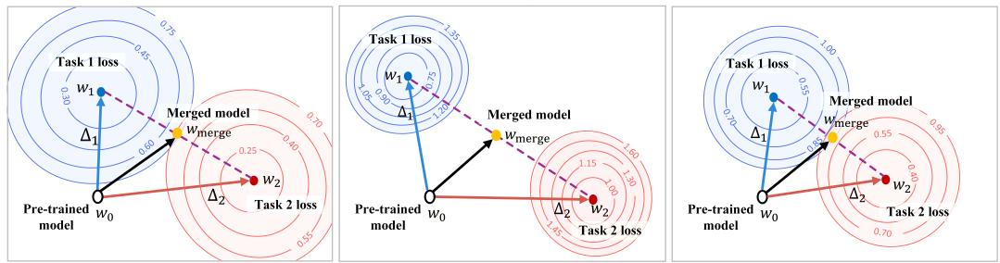  
(b) Naive DP merging  
(c) DP-Merging (Ours)  
Figure 1: Geometric illustration of model merging under DP. Task vectors are fine-tuned from w0 and merged in parameter space. (a) Without DP, flat and compatible solutions merge effectively. (b) Naive DP can yield sharper solutions with weaker reference alignment, leading to high-loss merging. (c) DP-Merging improves flatness and reference alignment, yielding lower-loss merging under DP.

Despite its potential, data-free merging is not inherently privacy-preserving. Although raw data are not shared during merging, the released task-specific weights and task vectors are derived from private data, posing a risk of sensitive information leakage [44, 32, 41]. Differential privacy (DP) [10] provides a rigorous framework for limiting such leakage by bounding the influence of any single training example on the released models. A natural solution is therefore to fine-tune each task model under DP and then merge the resulting private models. However, as we show empirically, this straightforward solution can suffer from a degradation that goes beyond the utility loss of individual private models: DP can specifically damage the geometric compatibility required for parameter-space merging. This raises a central question: what makes differentially private models difficult to merge, and how can we improve their mergeability under privacy constraints?

We argue that the difficulty is not merely that DP lowers the accuracy of the models being merged. Rather, parameter-space merging relies on geometric compatibility among task-specific solutions, which can be disrupted by DP fine-tuning. Prior work suggests that merging often benefits when independently fine-tuned models remain geometrically compatible [2]. In particular, interpolation or averaging tends to incur smaller loss increase when the path between models stays in relatively flat, low-loss regions [28, 16]. In the private setting, these geometric conditions become more fragile. The clipping and noise used by DP may leave each task solution in a sharper local basin, making its loss more sensitive to the parameter displacement induced by merging. Meanwhile, independent private fine-tuning can move task models farther from the shared pretrained initialization, increasing their mutual mismatch and amplifying cross-task interference. We refer to these two obstacles as local sharpness and reference drift. These effects make private task models more sensitive to merge-induced displacement and less compatible in parameter space, leading to high-loss merged solutions, as illustrated in Figure 1.

Motivated by this geometric view, we propose DP-Merging, a simple geometry-aware framework for differentially private model merging. Rather than designing a new post-hoc merging operator, DP-Merging applies two minimal interventions during private fine-tuning to restore the geometric conditions required by merging. First, a DP-compatible sharpness-aware objective encourages each private task model to lie in a flatter local region, reducing its sensitivity to merge-induced displacement. Second, a reference-anchored alignment regularizer keeps task vectors close to the shared pretrained initialization, limiting reference drift and reducing cross-task interference. Since the final merging step only processes DP-released task models, it remains a post-processing operation and incurs no additional privacy loss. We provide a theoretical merge-gap analysis showing that reducing local curvature and reference drift improves mergeability, and empirically validate DP-Merging across vision and language tasks under multiple privacy budgets.

In summary, we make the following contributions:

• We identify a geometric failure mode of differentially private model merging, termed DPinduced mergeability degradation. We show that DP fine-tuning can make task-specific models harder to merge by increasing local sharpness and reference drift, which amplify parameter interference after merging.

• We propose DP-Merging, a simple geometry-aware private fine-tuning framework. DP-Merging combines a DP-compatible sharpness-aware objective with a reference-based alignment regularizer to produce private task models that are flatter and more geometrically aligned for parameter-space merging.

• We provide theoretical and empirical evidence. Our merge-gap bound shows that the loss increase after merging is controlled by local curvature and merge-induced parameter displacement, and experiments on vision and language tasks across multiple privacy budgets demonstrate consistent improvements over standard DP fine-tuning followed by merging.

## 2 Related Work

Non-private model merging. Existing work on model merging mainly studies the non-private setting. Representative approaches include direct weight-space averaging, such as Weight Averaging [34], task-vector composition such as Task Arithmetic [15], and more structured rules based on parameter importance or interference resolution, such as Fisher-weighted merging [25], Reg-Mean [17], TIES-Merging [36], PCB Merging [8], and WUDI-Merging [5]. These methods typically assume direct access to task-specific weights, parameter deltas, or importance statistics. In contrast, we study a privacy-constrained setting where task-specific models must be obtained under differential privacy before they can be released and merged.

Differentially private fine-tuning. DP fine-tuning of pretrained models has become increasingly practical, with most methods relying on per-example gradient clipping and Gaussian noise injection to improve the privacy–utility trade-off for a single released model [40, 27, 3, 21]. Other work also explores alternative private fine-tuning paradigms [3], such as forward-pass perturbation [9] or zeroth-order optimization [45]. However, these methods are designed mainly to preserve the utility of individual private models. They do not address whether multiple privately fine-tuned task models remain geometrically compatible for post-hoc merging, which is the focus of our work.

Geometry of mergeability and sharpness. Prior work indicates that the success of model merging can be influenced not only by the merging method but also by geometric properties of the models, such as alignment in parameter space, low-loss connectivity, and landscape structure. Averaging or interpolation is more reliable when fine-tuned models lie in compatible low-loss regions or admit low-loss connectivity [13, 7, 34], while direct merging can fail when parameters are misaligned, for example due to permutation symmetries [2, 16, 43]. Sharpness-aware optimization methods, such as Sharpness Aware Minimization (SAM [12]) seeks flatter solutions by optimizing losses under local parameter perturbations, and is closely related to interpolation stability and low-loss connectivity [20]. These studies clarify important geometric conditions for merging in non-private settings, but do not examine how privatization perturbs those conditions before composition.

## 3 Preliminaries

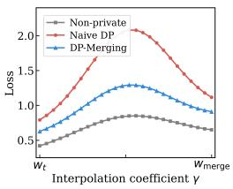  
(a) EuroSAT

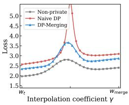  
(b) SUN397

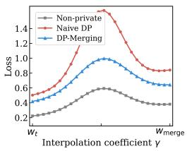  
(c) SST-2

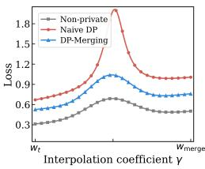  
(d) QNLI  
Figure 2: Interpolation loss landscapes from $w _ { t }$ to $w _ { \mathrm { m e r g e } } .$ . We evaluate test loss along $w ( \gamma ) =$ $( 1 - \gamma ) w _ { t } + \gamma w _ { \mathrm { m e r g e } }$ . DP-Merging consistently reduces the sharp loss barriers induced by standard DP, yielding smoother paths across vision and language tasks.

## 3.1 Problem Setup

Private Task-specific Fine-tuning. Let $w _ { 0 } \in \mathbb { R } ^ { d }$ denote a public pretrained foundation model. We consider T downstream tasks, where each task $t \in [ T ]$ is associated with a private dataset $\mathcal { D } _ { t }$

Starting from the same initialization $w _ { 0 }$ , each task independently applies a randomized fine-tuning algorithm $\boldsymbol { A } _ { t }$ to obtain a task-specific model $w _ { t } = \mathcal { A } _ { t } ( w _ { 0 } , \mathcal { D } _ { t } )$ . For task t, we define the empirical loss as $\begin{array} { r } { \mathcal { L } _ { t } ( w ) : = \frac { 1 } { | \mathcal { D } _ { t } | } \sum _ { ( x , y ) \in \mathcal { D } _ { t } } \ell ( w ; x , y ) } \end{array}$ , which serves as a proxy for the task risk.

Differential privacy. Each task-specific fine-tuning algorithm $\boldsymbol { A } _ { t }$ is $( \varepsilon , \delta )$ -differentially private with respect to its local dataset $\mathcal { D } _ { t }$ . Specifically, for each task $t ,$ for any neighboring datasets $\mathcal { D } _ { t }$ and $\mathcal { D } _ { t } ^ { \prime }$ differing in one example, and any measurable output set $s ,$

$$
\mathrm { P r } [  { A _ { t } } ( w _ { 0 } , \mathcal { D } _ { t } ) \in \mathcal { S } ] \leq e ^ { \varepsilon } \operatorname* { P r } [  { A _ { t } } ( w _ { 0 } , \mathcal { D } _ { t } ^ { \prime } ) \in \mathcal { S } ] + \delta .\tag{1}
$$

Since each private example contributes to only one task, releasing $\{ w _ { t } \} _ { t = 1 } ^ { T }$ preserves $( \varepsilon , \delta )$ -DP by parallel composition. Subsequent merging is a post-processing step over the released models and public information, and thus incurs no additional privacy loss.

Post-hoc Model Merging. Given the released task-specific models $\{ w _ { t } \} _ { t = 1 } ^ { T } , \mathbf { a }$ post-hoc merging rule constructs a unified model $w _ { \mathrm { m e r g e } } = \mathcal { M } ( w _ { 1 } , \dots , w _ { T } )$ . Equivalently, with task vectors $\Delta _ { t } : = w _ { t } - w _ { 0 }$ we write $w _ { \mathrm { m e r g e } } = w _ { 0 } + \mathcal { M } _ { \Delta } ( \widetilde { \Delta } _ { 1 } , . . . , \Delta _ { T } ) , \mathcal { M } _ { \Delta }$ is the merging rule in task-vector space. Our goal is a data-free, privacy-preserving merged model with low average task loss $\begin{array} { r } { \frac { 1 } { T } \sum _ { t = 1 } ^ { T } \mathcal { L } _ { t } ( w _ { \mathrm { m e r g e } } ) } \end{array}$

## 3.2 Geometric Challenges of Private Mergeability

We use the merge gap as a diagnostic measure of private mergeability. For task t, the task-wise merge gap is defined as $\mathrm { G a p } _ { t } ( \bar { w } _ { \mathrm { m e r g e } } ) : = \mathcal { L } _ { t } ( w _ { \mathrm { m e r g e } } ) - \mathcal { L } _ { t } ( \bar { w _ { t } } )$ . A smaller $\mathrm { G a p }$ indicates better mergeability, while $\mathcal { L } _ { t }$ is used solely as an evaluation diagnostic and is not available to the post-hoc merging rule. Consider a second-order expansion of $\mathcal { L } _ { t }$ around the task-specific model $w _ { t } \colon$

$$
\mathcal { L } _ { t } ( w _ { \mathrm { m e r g e } } ) = \mathcal { L } _ { t } ( w _ { t } ) + \nabla \mathcal { L } _ { t } ( w _ { t } ) ^ { \top } ( w _ { \mathrm { m e r g e } } - w _ { t } ) + \frac { 1 } { 2 } ( w _ { \mathrm { m e r g e } } - w _ { t } ) ^ { \top } H _ { t } ( w _ { \mathrm { m e r g e } } - w _ { t } ) + R _ { t } ,\tag{2}
$$

where $H _ { t } = \nabla ^ { 2 } \mathcal { L } _ { t } ( w _ { t } )$ and $R _ { t }$ collects higher-order terms. This expansion suggests that the merge gap increases with both the local curvature around $w _ { t }$ and the displacement from $w _ { t }$ to $w _ { \mathrm { m e r g e } } .$

$$
\mathrm { G a p } _ { t } ( w _ { \mathrm { m e r g e } } ) \approx \frac { 1 } { 2 } \underbrace { \lambda _ { \mathrm { m a x } } ( H _ { t } ) } _ { \mathrm { l o c a l ~ c u r v a t u r e ~ m e r g i n g ~ d i s p l a c e m e n t } } \underbrace { | | w _ { \mathrm { m e r g e } } - w _ { t } | | _ { 2 } ^ { 2 } } _ { \mathrm { m e r g i n g ~ d i s p l a c e m e n t } } .\tag{3}
$$

To visualize the loss barrier induced by merging, we evaluate the loss along the interpolation path $w ( \gamma ) = ( 1 - \gamma ) w _ { t } + \gamma w _ { \mathrm { m e r g e } }$ . Figure 2 shows that Naive DP produces sharper and higher loss barriers, whereas DP-Merging yields smoother interpolation paths.

Challenge 1: local sharpness. DP fine-tuning perturbs the optimization trajectory through gradient clipping and Gaussian noise. Under tight privacy budgets, the released task model may become more sensitive to parameter perturbations. This is harmful for merging because the merged model induces a displacement away from the task-specific solution. We measure this effect using a perturbationbased sharpness proxy: $\begin{array} { r } { \mathrm { S h a r p } _ { t } ( w _ { t } ; \rho ) = \mathcal { L } _ { t } \left( w _ { t } + \rho \frac { \nabla \mathcal { L } _ { t } \left( w _ { t } \right) } { \| \nabla \mathcal { L } _ { t } \left( w _ { t } \right) \| _ { 2 } } \right) - \mathcal { L } _ { t } ( w _ { t } ) } \end{array}$ . Figure 3a shows that, averaged over the eight vision tasks, Naive DP exhibits larger local sharpness around task-specific models under tighter privacy budgets, while DP-Merging consistently reduces this sensitivity.

Challenge 2: reference drift. The displacement term in Eq. (3) is affected by how far private task models move away from the shared pretrained initialization. Consider weight averaging, where $w _ { \mathrm { m e r g e } } = w _ { 0 } + \bar { \Delta }$ and $\bar { \Delta } =$ $\begin{array} { r } { { \frac { 1 } { T } } \sum _ { j = 1 } ^ { T } \Delta _ { j } } \end{array}$ . Then $w _ { \mathrm { m e r g e } } - w _ { t } = \bar { \Delta } - \Delta _ { t } .$ Thus, merging displacement grows when task updates are large or poorly aligned. Indeed, $\begin{array} { r } { \| \bar { \boldsymbol { \Delta } } - \boldsymbol { \Delta } _ { t } \| _ { 2 } \leq \frac { 1 } { T } \sum _ { i = 1 } ^ { T } \| \boldsymbol { \Delta } _ { j } \| _ { 2 } + \| \boldsymbol { \Delta } _ { t } \| _ { 2 } } \end{array}$ , showing that large drift from w0 can enlarge mergeinduced displacement. We quantify reference

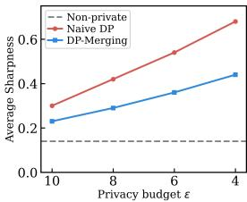

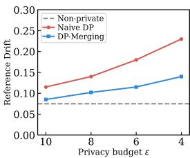  
(a) Average Sharpness  
(b) Reference Drift

Figure 3: Empirical validation on the eight vision tasks using CLIP ViT-B/32.

drift as $\begin{array} { r } { \mathrm { D r i f } \bar { \mathrm { t } } = \frac { 1 } { T } \sum _ { t = 1 } ^ { T } \frac { \Vert w _ { t } - \bar { w } _ { 0 } \Vert _ { 2 } } { \Vert w _ { 0 } \Vert _ { 2 } } } \end{array}$ . As shown in Figure 3b, Naive DP exhibits larger reference drift under stronger privacy constraints, whereas DP-Merging limits this drift.

## 4 DP-Merging

The analysis in Sec. 3.2 identifies two obstacles to private mergeability: (1) local sharpness of private task-specific solutions, and (2) reference drift from the shared pretrained initialization. Based on this insight, we propose DP-Merging, a geometry-aware framework for differentially private model merging. The central idea is to train private task models that are inherently robust to the parameter perturbations induced by merging. DP-Merging consists of two complementary components: (1) DP-compatible sharpness-awarefine-tuning, which constructs sharpness-aware updates using clipped noisy gradients, and (2) reference-anchored alignment, which limits the displacement between task models through reference anchoring to the pretrained initialization $w _ { 0 }$ . Intuitively, flatness control how harmful a displacement is, while anchoring controls how large the displacement becomes.

## 4.1 DP-Compatible Sharpness-Aware Fine-Tuning

We first address the curvature term in Eq. (3). When a task model lies in a sharp local region, even a moderate parameter displacement can produce a large increase in task loss after merging. To mitigate this effect, DP-Merging follows a sharpness-aware principle [12]: instead of optimizing the loss only at the current model, it optimizes the loss in a nearby adversarial neighborhood. As a result, the learned solution becomes locally stable against merge-induced perturbations.

We use flatness not merely to improve the standalone task model, but to make the released model robust to the parameter shift it will undergo during merging. For a model w and minibatch B, define the clipped Gaussian gradient estimator

$$
\tilde { g } ( w ; B ) = \frac { 1 } { | B | } \left( \sum _ { z _ { i } \in B } \frac { g _ { i } } { \operatorname* { m a x } \{ 1 , \| g _ { i } \| _ { 2 } / C \} } + \mathcal { N } ( 0 , \sigma ^ { 2 } C ^ { 2 } I ) \right) , \quad g _ { i } = \nabla \ell ( w ; z _ { i } )\tag{4}
$$

where C is the clipping threshold and σ is the noise multiplier. At iteration k for task t, we first compute the private gradient $\tilde { g } _ { t , k } = \tilde { g } ( w _ { t , k } ; B _ { t , k } )$ and use it to construct a local ascent perturbation

$$
\epsilon _ { t , k } = \rho _ { t } \frac { \tilde { g } _ { t , k } } { \| \tilde { g } _ { t , k } \| _ { 2 } } ,\tag{5}
$$

where $\rho _ { t }$ controls the neighborhood size. We then evaluate a private gradient at the perturbed point:

$$
\begin{array} { r } { \tilde { h } _ { t , k } = \tilde { g } ( w _ { t , k } + \epsilon _ { t , k } ; B _ { t , k } ) . } \end{array}\tag{6}
$$

The first gradient $\tilde { g } _ { t , k }$ identifies a nearby high-loss direction, while the second gradient $\tilde { h } _ { t , k }$ updates the model against the loss at that perturbed location. Consequently, the optimization no longer favors solutions that are only locally optimal at a single point, but instead prefers solutions whose loss remains stable within a neighborhood. Both gradient evaluations are privatized using clipped Gaussian mechanisms and are accounted for in the privacy analysis.

## 4.2 Reference-Anchored Alignment

Flatness reduces local sensitivity, but it does not ensure that independently trained task models stay close to one another. We therefore add a simple anchor to the shared initialization. At iteration k, DP-Merging updates task t by

$$
w _ { t , k + 1 } = w _ { t , k } - \eta \left( \tilde { h } _ { t , k } + 2 \lambda ( w _ { t , k } - w _ { 0 } ) \right) ,\tag{7}
$$

where $\lambda$ controls the alignment strength. The second term is the gradient of $\lambda \| w _ { t , k } - w _ { 0 } \| _ { 2 } ^ { 2 }$ . Since it depends only on model parameters and the public initialization, it incurs no additional privacy cost.

This anchor is useful because it controls the displacement term in Eq. (3). For uniform averaging, let $\begin{array} { r } { w _ { \mathrm { m e r g e } } = \frac { 1 } { T } \sum _ { s = 1 } ^ { T } w _ { s } } \end{array}$ . Then

$$
\begin{array} { r l } & { \| w _ { \mathrm { m e r g e } } - w _ { t } \| _ { 2 } = \left\| \displaystyle \frac { 1 } { T } \sum _ { s = 1 } ^ { T } ( w _ { s } - w _ { t } ) \right\| _ { 2 } \leq \displaystyle \frac { 1 } { T } \sum _ { s = 1 } ^ { T } \| w _ { s } - w _ { t } \| _ { 2 } } \\ & { \qquad \leq \displaystyle \frac { 1 } { T } \sum _ { s = 1 } ^ { T } ( \| w _ { s } - w _ { 0 } \| _ { 2 } + \| w _ { t } - w _ { 0 } \| _ { 2 } ) } \end{array}\tag{8}
$$

Algorithm 1 DP-Merging   
1: Input: pretrained model $w _ { 0 } ;$ private datasets $\{ \mathcal { D } _ { t } \} _ { t = 1 } ^ { T }$ ; iterations $K ;$ learning rate η;   
perturbation radius $\rho _ { t } ;$ alignment strength λ; clipping threshold $C ;$ noise multiplier σ;   
sampling rate q   
2: Output: merged model $w _ { \mathrm { m e r g e } }$   
3: for each task $t = 1 , \dots , T$ do   
4: Initialize task model $w _ { t , 0 } \gets w _ { 0 }$   
5: for $k = 0 , \ldots , K - 1$ do   
6: Sample minibatch $B _ { t , k } \subset \mathcal { D } _ { t }$ with sampling rate $q$   
7: Compute private gradient $\tilde { g } _ { t , k } \gets \tilde { g } ( w _ { t , k } ; B _ { t , k } )$ using Eq. (4)   
8: Construct perturbation $\epsilon _ { t , k } \gets \rho _ { t } \tilde { g } _ { t , k } \big / \| \tilde { g } _ { t , k } \| _ { 2 }$   
9: Compute perturbed private gradient $\tilde { h } _ { t , k }  \tilde { g } ( w _ { t , k } + \epsilon _ { t , k } ; B _ { t , k } )$   
10: Update with reference anchoring: $w _ { t , k + 1 }  w _ { t , k } - \eta \big ( \tilde { h } _ { t , k } + 2 \lambda ( w _ { t , k } - w _ { 0 } ) \big )$   
11: end for   
12: Obtain private task model $w _ { t } ^ { \mathrm { D P } }  w _ { t , K }$   
13: end for   
14: $\begin{array} { r } { w _ { \mathrm { m e r g e } }  \frac { 1 } { T } \sum _ { t = 1 } ^ { T } w _ { t } ^ { \mathrm { D P } } } \end{array}$   
15: return wmerge

Thus, keeping each task model close to $w _ { 0 }$ reduces an upper bound on the distance between the merged model and each task-specific solution. This alignment is induced only through the common reference point and does not require communication between tasks during fine-tuning.

After private fine-tuning, we obtain released task models $\{ w _ { t } ^ { \mathrm { D P } } \} _ { t = 1 } ^ { T }$ . For clarity, we use weight averaging as the default merging rule: $\begin{array} { r } { w _ { \mathrm { m e r g e } } = \frac { 1 } { T } \sum _ { t = 1 } ^ { T } w _ { t } ^ { \mathrm { D P } } } \end{array}$ . The same released models can also be used with other post-hoc merging rules. Since the final merging step only processes DP outputs, it is post-processing and preserves the privacy guarantees of task-specific fine-tuning.

## 5 Theoretical Analysis

## 5.1 Privacy guarantee of DP-Merging

We analyze the privacy guarantee of DP-Merging in Appendix C.1. Each iteration uses two privatized clipped-gradient evaluations, while the sharpness perturbation, reference anchor, and final merging step are post-processing operations. Therefore, they incur no additional privacy loss beyond the underlying private gradient evaluations.

Theorem 5.1 (Privacy guarantee of DP-Merging). Assume that each task dataset $\mathcal { D } _ { t }$ is disjoint, and each private example belongs to at most one task. For task $t ,$ suppose Algorithm 1 runs for K iterations with Poisson sampling rate q, clipping threshold $C ,$ and Gaussian noise multiplier σ. Let $\varepsilon _ { \mathrm { p a i r } } ( \alpha ; q , \sigma )$ denote the order-α RDP [26] cost of one Poisson-subsampled paired Gaussian mechanism that releases the two noisy clipped-gradient quantities used in one DP-Merging iteration. Then,for any Rényi order $\alpha > 1$ , the released task model $w _ { t } ^ { \mathrm { D P } }$ satisfies $( \alpha , K \varepsilon _ { \mathrm { p a i r } } ( \alpha ; q , \sigma ) ) – R D P$ Consequently, for any $\delta _ { t } \in ( 0 , 1 ) , w _ { t } ^ { \mathrm { D P } }$ satisfies $( \varepsilon _ { t } , \delta _ { t } ) – D P$ with

$$
\varepsilon _ { t } = \operatorname* { m i n } _ { \alpha > 1 } \left\{ K \varepsilon _ { \mathrm { p a i r } } ( \alpha ; q , \sigma ) + \frac { \log ( 1 / \delta _ { t } ) } { \alpha - 1 } \right\} .\tag{9}
$$

Since the task datasets are disjoint, releasing all private task models $\{ w _ { t } ^ { \mathrm { D P } } \} _ { t = 1 } ^ { T }$ satisfies $\left( \operatorname* { m a x } _ { t \in [ T ] } \varepsilon _ { t } , \operatorname* { m a x } _ { t \in [ T ] } \delta _ { t } \right)$ -DP. The merged model $\begin{array} { r } { \bar { w _ { \mathrm { m e r g e } } } = \frac { 1 } { T } \sum _ { t = 1 } ^ { T } w _ { t } ^ { \mathrm { D P } } } \end{array}$ incurs no additional privacy loss by post-processing.

## 5.2 Mergeability Analysis

We provide a theoretical analysis explaining why DP-Merging improves the mergeability of differentially private task models. Let $\boldsymbol { w _ { t } } : = \boldsymbol { w } _ { t } ^ { \mathrm { B P } }$ be the private task model returned by Algorithm 1,

and define the task vector $u _ { t } : = w _ { t } - w _ { 0 }$ . For weight averaging, $\begin{array} { r } { \bar { u } : = \frac { 1 } { T } \sum _ { s = 1 } ^ { T } u _ { s } , w _ { \mathrm { m e r g e } } : = } \end{array}$ $w _ { 0 } + \bar { u } , \Delta _ { t } : = w _ { \mathrm { m e r g e } } - w _ { t } = \bar { u } - u _ { t }$ . We measure mergeability by the average merge gap

$$
G _ { \mathrm { m e r g e } } : = \frac { 1 } { T } \sum _ { t = 1 } ^ { T } \bigl ( \mathcal { L } _ { t } ( w _ { \mathrm { m e r g e } } ) - \mathcal { L } _ { t } ( w _ { t } ) \bigr ) .\tag{10}
$$

Theorem 5.2 (Mergeability bound for DP-Merging). Assume that, for each task $t , \mathcal { L } _ { t }$ is three-times differentiable along the segment $\{ w _ { t } \ + \ \gamma \Delta _ { t } \quad : \quad \gamma \quad \in \quad [ 0 , 1 ] \}$ Let $\begin{array} { r l } { \beta _ { t } } & { { } : = } \end{array}$ $\begin{array} { r } { \operatorname* { s u p } _ { \gamma \in [ 0 , 1 ] } \lambda _ { \operatorname* { m a x } } \big ( \nabla ^ { 2 } \mathcal { L } _ { t } ( w _ { t } + \gamma \Delta _ { t } ) \big ) } \end{array}$ , and assume that the third-order Taylor remainder is bounded by $\begin{array} { r } { | R _ { t } | \leq \frac { M _ { t } } { 6 } \| \Delta _ { t } \| _ { 2 } ^ { 3 } } \end{array}$ . Ifthe returned private task model satisfies $\| \nabla { \mathcal { L } } _ { t } ( w _ { t } ) \| _ { 2 } \leq \varepsilon _ { t } .$ , then

$$
G _ { \mathrm { m e r g e } } \leq \frac { 1 } { T } \sum _ { t = 1 } ^ { T } \left[ \varepsilon _ { t } \| \Delta _ { t } \| _ { 2 } + \frac { \beta _ { t } } { 2 } \| \Delta _ { t } \| _ { 2 } ^ { 2 } + \frac { M _ { t } } { 6 } \| \Delta _ { t } \| _ { 2 } ^ { 3 } \right] .\tag{11}
$$

Theorem 5.2 shows that the merge gap decreases when either the local curvature $\beta _ { t }$ is small or the merging displacement $\| \Delta _ { t } \| _ { 2 }$ is small. This directly matches the two design choices of DP-Merging. The DP-compatible sharpness-aware update reduces sensitivity to local perturbations, thereby targeting the curvature term. The reference-anchored regularizer controls the task-vector norm $\lVert \boldsymbol { w } _ { t } - \boldsymbol { w } _ { 0 } \rVert _ { 2 }$ , which in turn controls $\| \Delta _ { t } \| _ { 2 }$

To make the role of the anchor explicit, define the robust loss $\begin{array} { r } { L _ { t , \rho _ { t } } ( w ) : = \operatorname* { m a x } _ { \| \epsilon \| _ { 2 } \leq \rho _ { t } } \mathcal L _ { t } ( w + \epsilon ) } \end{array}$ and the regularized robust objective approximately optimized by DP-Merging: $\Phi _ { t } ( w ) : = L _ { t , \rho _ { t } } ( w ) +$ $\lambda \| w - w _ { 0 } \| _ { 2 } ^ { 2 }$ . Suppose the returned model satisfies $\| \nabla L _ { t , \rho _ { t } } ( w _ { t } ) \| _ { 2 } \leq G _ { t } , \| \nabla \Phi _ { t } ( w _ { t } ) \| _ { 2 } \leq \zeta _ { t }$ . Then the anchor gives $\begin{array} { r } { \| w _ { t } - w _ { 0 } \| _ { 2 } \le \frac { G _ { t } + \zeta _ { t } } { 2 \lambda } } \end{array}$ . Consequently, if $\begin{array} { r } { A _ { t } : = \frac { G _ { t } + \zeta _ { t } } { 2 \lambda } , \bar { A } : = \frac { 1 } { T } \sum _ { s = 1 } ^ { T } A _ { s } } \end{array}$ , then $\| \Delta _ { t } \| _ { 2 } = \| \bar { u } - u _ { t } \| _ { 2 } \leq A _ { t } + \bar { A }$ . Substituting this into Theorem 5.2 yields

$$
G _ { \mathrm { m e r g e } } \leq \frac { 1 } { T } \sum _ { t = 1 } ^ { T } \left[ \varepsilon _ { t } ( A _ { t } + \bar { A } ) + \frac { \beta _ { t } } { 2 } ( A _ { t } + \bar { A } ) ^ { 2 } + \frac { M _ { t } } { 6 } ( A _ { t } + \bar { A } ) ^ { 3 } \right] .\tag{12}
$$

In the uniform case where $\varepsilon _ { t } \leq \varepsilon , \beta _ { t } \leq \beta , M _ { t } \leq M , G _ { t } \leq G$ , and $\zeta _ { t } \leq \zeta$ for all t, we obtain the simplified bound

$$
G _ { \mathrm { m e r g e } } \leq \varepsilon { \frac { G + \zeta } { \lambda } } + { \frac { \beta } { 2 } } \left( { \frac { G + \zeta } { \lambda } } \right) ^ { 2 } + { \frac { M } { 6 } } \left( { \frac { G + \zeta } { \lambda } } \right) ^ { 3 } .\tag{13}
$$

This bound explains DP-Merging’s improved private mergeability: the sharpness-aware component reduces $\beta ,$ and the anchor increases geometric compatibility by reducing the displacement scale $( G + \zeta ) / \lambda$

Table 1: Multi-task accuracy (%) on the 8-task vision benchmark with ViT-B/32, $\varepsilon = 4 .$
<table><tr><td>Method</td><td>SUN397</td><td>Cars</td><td>RESISC45</td><td>EuroSAT</td><td>SVHN</td><td>GTSRB</td><td>MNIST</td><td>DTD</td><td>Avg Acc</td></tr><tr><td>DP + Individual</td><td>59.2</td><td>67.7</td><td>86.1</td><td>89.7</td><td>87.5</td><td>88.6</td><td>89.3</td><td>69.4</td><td>79.7</td></tr><tr><td>DP + Weight Averaging</td><td>45.3</td><td>43.4</td><td>51.9</td><td>52.7</td><td>43.2</td><td>33.8</td><td>67.1</td><td>30.9</td><td>46.0</td></tr><tr><td>DP-Merging + Weight Averaging</td><td>48.2</td><td>49.5</td><td>56.3</td><td>57.5</td><td>43.2</td><td>37.4</td><td>69.0</td><td>36.3</td><td> $4 9 . 7 _ { + 3 . 7 }$ </td></tr><tr><td>DP + RegMean</td><td>45.8</td><td>44.9</td><td>58.3</td><td>58.6</td><td>59.1</td><td>48.3</td><td>73.7</td><td>32.0</td><td>52.6</td></tr><tr><td>DP-Merging + RegMean</td><td>49.4</td><td>48.6</td><td>63.1</td><td>62.4</td><td>63.6</td><td>53.1</td><td>76.8</td><td>38.2</td><td>56.9+4.3</td></tr><tr><td>DP + Task Arithmetic</td><td>45.2</td><td>44.9</td><td>56.7</td><td>58.9</td><td>60.2</td><td>59.7</td><td>77.3</td><td>30.4</td><td>54.2</td></tr><tr><td>DP-Merging + Task Arithmetic</td><td>48.9</td><td>49.2</td><td>59.6</td><td>62.4</td><td>67.1</td><td>62.5</td><td>79.6</td><td>35.1</td><td> $5 8 . 1 _ { + 3 . 9 }$ </td></tr><tr><td>DP + TIES-Merging</td><td>49.8</td><td>48.6</td><td>50.7</td><td>59.7</td><td>66.5</td><td>72.1</td><td>78.3</td><td>34.2</td><td> $5 7 . 5$ </td></tr><tr><td>DP-Merging + TIES-Merging</td><td>52.9</td><td>53.7</td><td>56.0</td><td>64.1</td><td>72.1</td><td>78.0</td><td>81.4</td><td>38.6</td><td>62.1+4.6</td></tr><tr><td>DP + PCB Merging</td><td>45.1</td><td>43.4</td><td>50.5</td><td>57.2</td><td>61.7</td><td>70.9</td><td>77.0</td><td>30.3</td><td>54.5</td></tr><tr><td>DP-Merging + PCB Merging</td><td>49.5</td><td>48.2</td><td>56.4</td><td>63.4</td><td>65.0</td><td>76.3</td><td>79.1</td><td>35.4</td><td> $5 9 . 2 _ { + 4 . 7 }$ </td></tr><tr><td>DP + WUDI-Merging</td><td>47.6</td><td>45.5</td><td>58.5</td><td>59.3</td><td>66.4</td><td>57.1</td><td>78.2</td><td>39.1</td><td>56.5</td></tr><tr><td>DP-Merging + WUDI-Merging</td><td>51.5</td><td>48.6</td><td>63.1</td><td>63.9</td><td>70.4</td><td>61.2</td><td>82.7</td><td>44.8</td><td> $6 0 . 8 _ { + 4 . 3 }$ </td></tr></table>

## 6 Experiments

## 6.1 Experimental Settings

Datasets and Models. We evaluate our method on vision and language tasks. For vision tasks, following [38, 5], we study multi-task model merging across eight image classification datasets, namely SUN397 [35], Cars [18], RESISC45 [4], EuroSAT [14], SVHN [42], GTSRB [30], MNIST [19], and DTD [6], and adopt CLIP-based ViT backbones [29], including ViT-B/32, ViT-B/16, and ViT-L/14. For language tasks, we use the GLUE benchmark [31] and evaluate with RoBERTa-Base and RoBERTa-Large [23].

Table 2: Multi-task accuracy (%) on the 8-task vision benchmark with ViT-L/14, ε = 4.
<table><tr><td>Method</td><td>SUN397</td><td>Cars</td><td>RESISC45</td><td>EuroSAT</td><td>SVHN</td><td>GTSRB</td><td>MNIST</td><td>DTD</td><td>Avg Acc</td></tr><tr><td>DP + Individual</td><td>64.8</td><td>74.2</td><td>93.1</td><td>92.9</td><td>92.2</td><td>95.4</td><td>96.7</td><td>75.6</td><td>85.5</td></tr><tr><td>DP + Weight Averaging</td><td>50.3</td><td>49.4</td><td>57.4</td><td>57.7</td><td>50.2</td><td>39.8</td><td>72.5</td><td>35.1</td><td>51.6</td></tr><tr><td>DP-Merging + Weight Averaging</td><td>54.4</td><td>54.4</td><td>62.1</td><td>62.2</td><td>55.4</td><td>45.4</td><td>80.1</td><td>44.2</td><td>57.3+5.7</td></tr><tr><td>DP + RegMean</td><td>50.3</td><td>49.8</td><td>61.0</td><td>64.6</td><td>63.2</td><td>53.4</td><td>79.7</td><td>41.6</td><td>57.9</td></tr><tr><td>DP-Merging + RegMean</td><td>53.3</td><td>54.8</td><td>65.9</td><td>70.6</td><td>69.2</td><td>55.0</td><td>82.7</td><td>49.6</td><td>62.7+4.8</td></tr><tr><td>DP + Task Arithmetic</td><td>50.2</td><td>50.9</td><td>61.7</td><td>73.5</td><td>75.4</td><td>54.7</td><td>82.3</td><td>45.4</td><td>61.8</td></tr><tr><td>DP-Merging + Task Arithmetic</td><td>54.1</td><td>55.5</td><td>64.4</td><td>78.9</td><td>84.1</td><td>62.5</td><td>84.1</td><td>51.3</td><td>66.7+4.9</td></tr><tr><td>DP + TIES-Merging</td><td>44.8</td><td>45.3</td><td>46.8</td><td>64.4</td><td>71.2</td><td>58.7</td><td>83.9</td><td>50.2</td><td>58.1</td></tr><tr><td>DP-Merging + TIES-Merging</td><td>50.8</td><td>52.6</td><td>51.7</td><td>69.7</td><td>75.3</td><td>61.1</td><td>87.8</td><td>52.8</td><td>62.7+4.6</td></tr><tr><td>DP + PCB Merging</td><td>50.7</td><td>49.6</td><td>51.5</td><td>62.2</td><td>67.7</td><td>55.9</td><td>82.6</td><td>42.1</td><td>57.8</td></tr><tr><td>DP-Merging + CB Merging</td><td>54.5</td><td>54.2</td><td>56.2</td><td>67.9</td><td>71.2</td><td>61.3</td><td>87.2</td><td>47.4</td><td>62.5+4.7</td></tr><tr><td>DP + WUDI-Merging</td><td>51.7</td><td>51.1</td><td>63.4</td><td>64.3</td><td>71.8</td><td>63.1</td><td>83.0</td><td>44.2</td><td>61.6</td></tr><tr><td>DP-Merging + WUDI-Merging</td><td>54.9</td><td>54.7</td><td>66.8</td><td>68.5</td><td>76.6</td><td>68.3</td><td>85.1</td><td>50.3</td><td>65.6+4.0</td></tr></table>

Baselines. We compare with representative merging methods under the same DP setting, including Weight Averaging [34], RegMean [17], Task Arithmetic [15], TIES-Merging [36], PCB Merging [8], and WUDI-Merging [5]. All baselines independently train task-specific models with the same DP optimizer and privacy budget, and then merge the released DP models without accessing private data. The merging step is post-processing and therefore incurs no additional privacy loss. We apply the same operators to the task models produced by DP-Merging to evaluate whether our merge-aware fine-tuning improves mergeability across merging rules.

Implementation Details. We implement sample-level DP fine-tuning with Opacus [39] and use AdamW [24] as the default optimizer. Unless otherwise specified, each task model is trained with clipping norm C = 0.2, batch size 16, learning rate 1e − 5, weight decay 1e − 2, and 10 training epochs/steps. Privacy loss is computed using the Opacus privacy accountant and reported as (ε, δ)-DP, where $\delta = 1 / N$ and ε ∈ {1, 2, 4, 8}. For DP-Merging, the perturbation radius ρ = 0.05 and the alignment coefficient λ = 0.05. Additional implementation details are provided in Appendix B.3.

## 6.2 Main Results

Evaluation on Visual Tasks. We evaluate DP-Merging on the 8-task vision benchmark under ε = 4. Table 1 and Table 2 report the main results with ViT-B/32 and ViT-L/14, and additional results with ViT-B/16 are provided in Appendix B.4. Across both backbones, standard merging methods exhibit a clear drop from the DP individual reference, suggesting that DP fine-tuning hurts task-vector mergeability. DP-Merging consistently improves the merged accuracy under all merging operators. For instance, on ViT-B/32, WUDI-Merging improves from 56.5% to 60.8% when applied to DP-Merging task models. The same trend holds for ViT-L/14 and ViT-B/16.

Evaluation on Language Tasks. Table 3 summarizes the multi-task performance of RoBERTa-Large models under ε = 4. Compared with standard DP baselines, DP-Merging consistently achieves higher average accuracy across different merging operators. For example, the average score for DP-Merging ranges from 73.9 to 77.0, depending on the merging method used. The average score for naive DP ranges from 71.6 to 74.7. These results indicate that merge-aware DP fine-tuning consistently maintains strong performance across multiple language understanding tasks.

Table 3: Multi-task performance of RoBERTa-Large models on GLUE benchmark, ε = 4.
<table><tr><td>Method</td><td>CoLA</td><td>MNLI</td><td>MRPC</td><td>QNLI</td><td>QQP</td><td>RTE</td><td>SST2</td><td>STSB</td><td>Avg.</td></tr><tr><td>DP + Individual</td><td>60.5</td><td>79.1</td><td>81.0</td><td>89.2</td><td>82.3</td><td>77.1</td><td>93.8</td><td>82.1</td><td>80.6</td></tr><tr><td>DP + Weight Averaging</td><td>56.1</td><td>73.8</td><td>67.9</td><td>79.5</td><td>78.6</td><td>69.3</td><td>91.2</td><td>67.6</td><td>72.6</td></tr><tr><td>DP-Merging + Weight Averaging</td><td>58.2</td><td>76.6</td><td>69.2</td><td>79.3</td><td>81.6</td><td>69.9</td><td>91.8</td><td>68.2</td><td>73.9+1.3</td></tr><tr><td>DP + RegMean</td><td>55.6</td><td>73.8</td><td>65.7</td><td>79.2</td><td>78.6</td><td>67.9</td><td>91.0</td><td>62.5</td><td>71.6</td></tr><tr><td>DP-Merging + RegMean</td><td>58.8</td><td>78.7</td><td>68.6</td><td>79.5</td><td>80.9</td><td>69.3</td><td>91.9</td><td>64.6</td><td>74.7+3.1</td></tr><tr><td>DP + Task Arithmetic</td><td>56.1</td><td>75.5</td><td>67.2</td><td>78.9</td><td>81.5</td><td>69.9</td><td>91.2</td><td>61.7</td><td>71.8</td></tr><tr><td>DP-Merging + Task Arithmetic</td><td>59.6</td><td>77.8</td><td>68.9</td><td>81.5</td><td>82.4</td><td>70.9</td><td>91.9</td><td>63.5</td><td>74.2+2.4</td></tr><tr><td>DP + TIES-Merging</td><td>60.5</td><td>79.3</td><td>70.8</td><td>80.6</td><td>81.3</td><td>70.6</td><td>91.1</td><td>64.3</td><td>74.3</td></tr><tr><td>DP-Merging + TIEŠ-Merging</td><td>61.0</td><td>81.2</td><td>73.3</td><td>82.5</td><td>82.6</td><td>71.2</td><td>92.6</td><td>65.9</td><td>76.5+2.2</td></tr><tr><td>DP + PCB Merging</td><td>56.2</td><td>74.2</td><td>76.6</td><td>77.5</td><td>81.8</td><td>70.6</td><td>91.1</td><td>60.2</td><td>73.8</td></tr><tr><td>DP-Merging + PCB Merging</td><td>58.9</td><td>75.7</td><td>79.4</td><td>79.8</td><td>83.1</td><td>72.4</td><td>92.6</td><td>61.8</td><td>75.9+2.1</td></tr><tr><td>DP + WUDI-Merging</td><td>57.2</td><td>75.8</td><td>78.9</td><td>79.6</td><td>82.6</td><td>73.5</td><td>91.3</td><td>59.5</td><td>74.7</td></tr><tr><td>DP-Merging + WUDI-Merging</td><td>59.8</td><td>77.9</td><td>82.1</td><td>83.3</td><td>82.7</td><td>75.1</td><td>92.8</td><td>61.3</td><td>77.0+2.3</td></tr></table>

Table 4: Performance under different privacy budgets on visual and language tasks using TIES-Merging. Smaller ε indicates stronger privacy protection.
<table><tr><td rowspan="2">Privacy Budget ε</td><td colspan="3">Visual Tasks (ViT-B/32)</td><td colspan="3">Language Tasks (RoBERTa-Large)</td></tr><tr><td>DP(AdamW)</td><td>DP-Merging</td><td>Gain</td><td>DP(AdamW)</td><td>DP-Merging</td><td>Gain</td></tr><tr><td>1.0</td><td>46.1</td><td>52.2</td><td>+6.1</td><td>64.6</td><td>68.4</td><td>+3.8</td></tr><tr><td>2.0</td><td>52.8</td><td>58.6</td><td>+5.8</td><td>68.3</td><td>70.6</td><td>+2.3</td></tr><tr><td>4.0</td><td>57.5</td><td>62.1</td><td>+4.6</td><td>74.3</td><td>76.5</td><td>+2.2</td></tr><tr><td>8.0</td><td>62.0</td><td>66.7</td><td>+4.7</td><td>76.3</td><td>77.8</td><td>+1.5</td></tr></table>

## 6.3 Analysis under Different Privacy Budgets

To evaluate DP-Merging under varying privacy budgets ε, we keep the merging protocol unchanged. A smaller ε corresponds to stronger privacy protection and usually introduces larger optimization perturbations through clipping and noise. As shown in Table 4, DP-Merging consistently outperforms naive DP merging across different privacy budgets. The improvement is more pronounced under stronger privacy constraints, suggesting that the proposed flatness and alignment components effectively mitigate the geometry distortion caused by differential privacy.

## 6.4 Ablation Study

We conduct ablation studies to understand the contribution of each component in DP-Merging and analyze its sensitivity to key hyperparameters. All experiments use ε = 4 and default settings.

Effect of each component. DP-Merging contains two key components: sharpness-aware finetuning and reference-anchored alignment. To evaluate their individual contributions, we compare the full method with two variants: (1) removing the alignment component, and (2) removing the sharpness-aware fine-tuning. As shown in Table 5, both components improve performance over naive DP. The sharpness-aware fine-tuning mainly improves local robustness by encouraging flatter task-specific solutions, while the alignment component enhances cross-task compatibility by reducing discrepancies among task vectors. Combining both components yields the best performance, demonstrating that sharpness and alignment are complementary.

Table 5: Ablation study of different merging algorithms on the 8-task vision benchmark with ViT-B/32. “w/o Alignment” represents without the reference-anchored alignment component, and “w/o Flatness” represents without sharpness-aware fine-tuning.
<table><tr><td>Variant</td><td>Weight Averaging</td><td>Task Arithmetic TIES-Merging</td><td></td><td>PCB-Merging</td></tr><tr><td>DP-AdamW</td><td>46.0</td><td>54.2</td><td>57.5</td><td>54.5</td></tr><tr><td>DP-Merging</td><td>49.7</td><td>58.1</td><td>62.1</td><td>59.2</td></tr><tr><td>DP-Merging w/o Alignment</td><td>48.1</td><td>55.6</td><td>60.7</td><td>57.4</td></tr><tr><td>DP-Merging w/o Flatness</td><td>47.5</td><td>56.2</td><td>59.8</td><td>57.9</td></tr></table>

Sensitivity to the flatness radius $\rho _ { \bullet }$ We study the influence of the flatness radius $\rho$ on merged accuracy. When varying $\rho ,$ the alignment strength λ is fixed to its default value. As shown in Table 6, moderate values of $\rho$ consistently improve merged accuracy, while overly large values may hurt task-specific adaptation or over-constrain different tasks.

Sensitivity to the alignment strength $\lambda .$ We study the effect of alignment strength λ on merged accuracy (flatness radius $\rho$ fixed). As shown in Table $^ { 7 , }$ moderate values of λ consistently improve merged accuracy, while excessively large values may limit flexibility across tasks.

Table 6: Sensitivity to the flatness radius $\rho$ on ViT-B/32 using TIES-Merging.  
Table 7: Sensitivity to the alignment strength λ on ViT-B/32 using TIES-Merging.
<table><tr><td> $\rho$ </td><td>0</td><td>0.01</td><td>0.03</td><td>0.05</td><td>0.10</td></tr><tr><td>Avg Acc</td><td>59.8</td><td>60.4</td><td>61.6</td><td>62.1</td><td>61.8</td></tr></table>

<table><tr><td> $\lambda$ </td><td>0</td><td>0.01</td><td>0.05</td><td>0.10</td><td>0.50</td></tr><tr><td>Avg Acc</td><td>60.8</td><td>61.2</td><td>62.3</td><td>62.0</td><td>61.6</td></tr></table>

Robustness to merging operators. Since our method improves the private fine-tuning stage rather than designing a new merging rule, we evaluate whether it works with different data-free merging operators. As shown in Table 8, DP-Merging consistently improves the final merged model across different representative merging operators, demonstrating that our method enhances the intrinsic mergeability of task-specific models.

Table 8: Robustness to different merging operators on the 8-task vision benchmark with ViT-B/32.
<table><tr><td>Training</td><td colspan="5">Weight Averaging Task Arithmetic TIES-Merging PCB-Merging WUDI-Merging</td></tr><tr><td>DP(AdamW)</td><td>46.0</td><td>54.2</td><td>57.5</td><td>54.5</td><td>56.5</td></tr><tr><td>DP-Merging (Ours)</td><td>49.7</td><td>58.1</td><td>62.1</td><td>59.2</td><td>60.8</td></tr></table>

## 7 Conclusion

We studied differentially private model merging, where independently fine-tuned private models are combined without sharing task data. The challenge arises not only from the utility loss of DP fine-tuned models, but also from their geometric incompatibility, caused by local curvature and displacement from the pretrained anchor. To address this, we propose DP-Merging, which combines a flatness objective with a pretrained-anchor regularizer to improve robustness and control task-specific drift. Experiments on vision and language benchmarks show that DP-Merging consistently improves merged-model performance under different privacy budgets and merging settings. We hope this work contributes to a better understanding of, and advances in, model merging under privacy constraints.

## References

[1] Ahmed Agiza, Marina Neseem, and Sherief Reda. Mtlora: Low-rank adaptation approach for efficient multi-task learning. In Proceedings ofthe IEEE/CVF conference on computer vision and pattern recognition, pages 16196–16205, 2024.

[2] Samuel Ainsworth, Jonathan Hayase, and Siddhartha Srinivasa. Git re-basin: Merging models modulo permutation symmetries. In The Eleventh International Conference on Learning Representations, 2023.

[3] Zhiqi Bu, Yu-Xiang Wang, Sheng Zha, and George Karypis. Differentially private bias-term fine-tuning of foundation models. In International Conference on Machine Learning, pages 4730–4751. PMLR, 2024.

[4] Gong Cheng, Junwei Han, and Xiaoqiang Lu. Remote sensing image scene classification: Benchmark and state of the art. Proceedings ofthe IEEE, 105(10):1865–1883, 2017.

[5] Runxi Cheng, Feng Xiong, Yongxian Wei, Wanyun Zhu, and Chun Yuan. Whoever started the interference should end it: Guiding data-free model merging via task vectors. In Forty-second International Conference on Machine Learning, 2025.

[6] Mircea Cimpoi, Subhransu Maji, Iasonas Kokkinos, Sammy Mohamed, and Andrea Vedaldi. Describing textures in the wild. In CVPR, pages 3606–3613, 2014.

[7] Felix Draxler, Kambis Veschgini, Manfred Salmhofer, and Fred Hamprecht. Essentially no barriers in neural network energy landscape. In International conference on machine learning, pages 1309–1318. PMLR, 2018.

[8] Guodong DU, Junlin Lee, Jing Li, Runhua Jiang, Yifei Guo, Shuyang Yu, Hanting Liu, Sim Kuan Goh, Ho-Kin Tang, Daojing He, and Min Zhang. Parameter competition balancing for model merging. In The Thirty-eighth Annual Conference on Neural Information Processing Systems, 2024.

[9] Minxin Du, Xiang Yue, Sherman SM Chow, Tianhao Wang, Chenyu Huang, and Huan Sun. Dp-forward: Fine-tuning and inference on language models with differential privacy in forward pass. In Proceedings ofthe 2023 ACM SIGSAC Conference on Computer and Communications Security, pages 2665–2679, 2023.

[10] Cynthia Dwork, Frank McSherry, Kobbi Nissim, and Adam Smith. Calibrating noise to sensitivity in private data analysis. In Theory of cryptography conference, pages 265–284. Springer, 2006.

[11] Chris Fifty, Ehsan Amid, Zhe Zhao, Tianhe Yu, Rohan Anil, and Chelsea Finn. Efficiently identifying task groupings for multi-task learning. Advances in Neural Information Processing Systems, 34:27503–27516, 2021.

[12] Pierre Foret, Ariel Kleiner, Hossein Mobahi, and Behnam Neyshabur. Sharpness-aware minimization for efficiently improving generalization. In International Conference on Learning Representations, 2021.

[13] Timur Garipov, Pavel Izmailov, Dmitrii Podoprikhin, Dmitry P Vetrov, and Andrew G Wilson. Loss surfaces, mode connectivity, and fast ensembling of dnns. Advances in neural information processing systems, 31, 2018.

[14] Patrick Helber, Benjamin Bischke, Andreas Dengel, and Damian Borth. Eurosat: A novel dataset and deep learning benchmark for land use and land cover classification. IEEE Journal ofSelected Topics in Applied Earth Observations and Remote Sensing, 12(7):2217–2226, 2019.

[15] Gabriel Ilharco, Marco Tulio Ribeiro, Mitchell Wortsman, Ludwig Schmidt, Hannaneh Hajishirzi, and Ali Farhadi. Editing models with task arithmetic. In The Eleventh International Conference on Learning Representations, 2023.

[16] Akira Ito, Masanori Yamada, and Atsutoshi Kumagai. Linear mode connectivity between multiple models modulo permutation symmetries. In Forty-second International Conference on Machine Learning, 2025.

[17] Xisen Jin, Xiang Ren, Daniel Preotiuc-Pietro, and Pengxiang Cheng. Dataless knowledge fusion by merging weights of language models. In The Eleventh International Conference on Learning Representations, 2023.

[18] Jonathan Krause, Michael Stark, Jia Deng, and Li Fei-Fei. 3d object representations for fine-grained categorization. In ICCV workshops, pages 554–561, 2013.

[19] Yann LeCun. The mnist database of handwritten digits. http://yann. lecun. com/exdb/mnist/, 1998.

[20] Yeoreum Lee, Jinwook Jung, and Sungyong Baik. Mitigating parameter interference in model merging via sharpness-aware fine-tuning. In The Thirteenth International Conference on Learning Representations, 2025.

[21] Xianzhi Li, Ran Zmigrod, Zhiqiang Ma, Xiaomo Liu, and Xiaodan Zhu. Fine-tuning language models with differential privacy through adaptive noise allocation. In Findings of the Association for Computational Linguistics: EMNLP 2024, pages 8368–8375, 2024.

[22] Jin Liu, Yinbin Miao, Ning Xi, and Junkang Liu. Rethinking loRA for privacy-preserving federated learning in large models. In The Fourteenth International Conference on Learning Representations, 2026.

[23] Yinhan Liu, Myle Ott, Naman Goyal, Jingfei Du, Mandar Joshi, Danqi Chen, Omer Levy, Mike Lewis, Luke Zettlemoyer, and Veselin Stoyanov. Roberta: A robustly optimized bert pretraining approach. arXiv preprint arXiv:1907.11692, 2019.

[24] Ilya Loshchilov, Frank Hutter, et al. Fixing weight decay regularization in adam. arXiv preprint arXiv:1711.05101, 5(5):5, 2017.

[25] Michael S Matena and Colin A Raffel. Merging models with fisher-weighted averaging. Advances in Neural Information Processing Systems, 35:17703–17716, 2022.

[26] Ilya Mironov. Rényi differential privacy. In Proc. IEEE computer security foundations symposium (CSF), pages 263–275, 2017.

[27] Jinseong Park, Hoki Kim, Yujin Choi, and Jaewook Lee. Differentially private sharpness-aware training. In International Conference on Machine Learning, pages 27204–27224. PMLR, 2023.

[28] Fidel A Guerrero Peña, Heitor Rapela Medeiros, Thomas Dubail, Masih Aminbeidokhti, Eric Granger, and Marco Pedersoli. Re-basin via implicit sinkhorn differentiation. In Proceedings of the IEEE/CVF Conference on Computer Vision and Pattern Recognition, pages 20237–20246, 2023.

[29] Alec Radford, Jong Wook Kim, Chris Hallacy, Aditya Ramesh, Gabriel Goh, Sandhini Agarwal, Girish Sastry, Amanda Askell, Pamela Mishkin, Jack Clark, et al. Learning transferable visual models from natural language supervision. In International conference on machine learning, pages 8748–8763. PmLR, 2021.

[30] Johannes Stallkamp, Marc Schlipsing, Jan Salmen, and Christian Igel. The german traffic sign recognition benchmark: a multi-class classification competition. In IJCNN, pages 1453–1460. IEEE, 2011.

[31] Alex Wang, Amanpreet Singh, Julian Michael, Felix Hill, Omer Levy, and Samuel Bowman. Glue: A multi-task benchmark and analysis platform for natural language understanding. In Proceedings of the 2018 EMNLP workshop BlackboxNLP: Analyzing and interpreting neural networksfor NLP, pages 353–355, 2018.

[32] Lijin Wang, Jingjing Wang, Tianshuo Cong, Xinlei He, Zhan Qin, and Xinyi Huang. From purity to peril: Backdooring merged models from" harmless" benign components. In 34th USENIX Security Symposium (USENIX Security 25), pages 6339–6358, 2025.

[33] Zhengbo Wang, Jian Liang, Ran He, Zilei Wang, and Tieniu Tan. Taming momentum: Rethinking optimizer states through low-rank approximation. In The Fourteenth International Conference on Learning Representations, 2026.

[34] Mitchell Wortsman, Gabriel Ilharco, Samir Ya Gadre, Rebecca Roelofs, Raphael Gontijo-Lopes, Ari S Morcos, Hongseok Namkoong, Ali Farhadi, Yair Carmon, Simon Kornblith, et al. Model soups: averaging weights of multiple fine-tuned models improves accuracy without increasing inference time. In International conference on machine learning, pages 23965–23998. PMLR, 2022.

[35] Jianxiong Xiao, Krista A Ehinger, James Hays, Antonio Torralba, and Aude Oliva. Sun database: Exploring a large collection of scene categories. IJCV, 119:3–22, 2016.

[36] Prateek Yadav, Derek Tam, Leshem Choshen, Colin Raffel, and Mohit Bansal. TIES-merging: Resolving interference when merging models. In Thirty-seventh Conference on Neural Informa tion Processing Systems, 2023.

[37] Enneng Yang, Li Shen, Guibing Guo, Xingwei Wang, Xiaochun Cao, Jie Zhang, and Dacheng Tao. Model merging in llms, mllms, and beyond: Methods, theories, applications, and opportunities. ACM Computing Surveys, 58(8):1–41, 2026.

[38] Enneng Yang, Zhenyi Wang, Li Shen, Shiwei Liu, Guibing Guo, Xingwei Wang, and Dacheng Tao. Adamerging: Adaptive model merging for multi-task learning. In The Twelfth International Conference on Learning Representations, 2024.

[39] Ashkan Yousefpour, Igor Shilov, Alexandre Sablayrolles, Davide Testuggine, Karthik Prasad, Mani Malek, John Nguyen, Sayan Ghosh, Akash Bharadwaj, Jessica Zhao, et al. Opacus: User-friendly differential privacy library in pytorch. arXiv preprint arXiv:2109.12298, 2021.

[40] Da Yu, Saurabh Naik, Arturs Backurs, Sivakanth Gopi, Huseyin A Inan, Gautam Kamath, Janardhan Kulkarni, Yin Tat Lee, Andre Manoel, Lukas Wutschitz, Sergey Yekhanin, and Huishuai Zhang. Differentially private fine-tuning of language models. In International Conference on Learning Representations, 2022.

[41] Zenghui Yuan, Yangming Xu, Jiawen Shi, Pan Zhou, and Lichao Sun. Merge hijacking: Backdoor attacks to model merging of large language models. In Proceedings of the 63rd Annual Meeting of the Association for Computational Linguistics (Volume 1: Long Papers), pages 32688–32703, 2025.

[42] Netzer Yuval. Reading digits in natural images with unsupervised feature learning. In NIPS Workshop on Deep Learning and Unsupervised Feature Learning, 2011.

[43] Binchi Zhang, Zaiyi Zheng, Zhengzhang Chen, and Jundong Li. Beyond the permutation symmetry of transformers: The role of rotation for model fusion. In International Conference on Machine Learning, pages 77090–77106. PMLR, 2025.

[44] Jinghuai Zhang, Jianfeng Chi, Zheng Li, Kunlin Cai, Yang Zhang, and Yuan Tian. Badmerging: Backdoor attacks against model merging. In Proceedings of the 2024 on ACM SIGSAC Conference on Computer and Communications Security, pages 4450–4464, 2024.

[45] Liang Zhang, Bingcong Li, Kiran Koshy Thekumparampil, Sewoong Oh, and Niao He. Dpzero: Private fine-tuning of language models without backpropagation. In International Conference on Machine Learning, pages 59210–59246. PMLR, 2024.

# When Privacy Hurts Mergeability: Geometry-Aware Model Merging under Differential Privacy Supplementary Material

## LIST OF APPENDICES

A: Notation

B: Implementation of Experiments B.1 Datasets

B.2 Models

B.3 Implementation Details

B.4 More Results on Vision Tasks

B.5 More Results on Language Tasks

C: Implementation of Theoretical Analysis C.1 Privacy guarantee of DP-Merging

C.2 Mergeability Analysis

C.3 Reference Anchoring Controls Merging Displacement

C.4 Connection to Joint-Task Loss Linearity

D: Limitations and Future Work

## A Notation

Table 9 summarizes the main notation used throughout the paper.

Table 9: Summary of notation.
<table><tr><td>Notation</td><td>Description</td></tr><tr><td> $w _ { 0 }$ </td><td>Public pretrained initialization shared by all downstream tasks.</td></tr><tr><td> $T$ </td><td>Number of downstream tasks.</td></tr><tr><td> $t \in [ T ]$ </td><td>Task index.</td></tr><tr><td> $\mathcal { D } _ { t }$ </td><td>Private training dataset of task t.</td></tr><tr><td> $\ell ( w ; x , y )$ </td><td>Sample-wise loss evaluated at model parameter w on example  $( x , y ) .$ </td></tr><tr><td> $\mathcal { L } _ { t } ( w )$ </td><td>Empirical loss of task t on  $\mathcal { D } _ { t }$ </td></tr><tr><td> $\mathcal { A } _ { t }$ </td><td>Randomized DP fine-tuning algorithm for task t.</td></tr><tr><td> $w _ { t }$ </td><td>Task-specific model obtained by privately fine-tuning w0 on  $\mathcal { D } _ { t } .$ </td></tr><tr><td> $\Delta _ { t } = w _ { t } - w _ { 0 }$ </td><td>Task vector of task t relative to the public initialization.</td></tr><tr><td> $w _ { \mathrm { m e r g e } }$   $\mathcal { M }$ </td><td>Merged model obtained from the released task-specific models.</td></tr><tr><td></td><td>Model-merging operator, such as Weight Averaging, RegMean, Task Arithmetic, TIES-Merging, PCB, or WUDI.</td></tr><tr><td> $H _ { t }$ </td><td>Hessian or local curvature matrix of  $\mathcal { L } _ { t }$  around  $w _ { t }$ </td></tr><tr><td> $\lambda _ { \operatorname* { m a x } } ( H _ { t } )$ </td><td>Largest eigenvalue of  $H _ { t } ,$  used as a local sharpness measure.</td></tr><tr><td> $\lVert \boldsymbol { w } _ { t } - \boldsymbol { w } _ { 0 } \rVert _ { 2 }$ </td><td>Reference drift of task model  $w _ { t }$  from the shared initialization wo.</td></tr><tr><td> $C$ </td><td>Per-sample gradient clipping threshold in DP fine-tuning.</td></tr><tr><td> $\sigma$ </td><td>Noise multiplier of the Gaussian mechanism.</td></tr><tr><td> $q$ </td><td>Sampling rate used in DP fine-tuning.</td></tr><tr><td> $( \varepsilon , \delta )$ </td><td>Differential privacy parameters.</td></tr><tr><td> $\rho$ </td><td>SAM radius used in the DP-aware flat-minima search component.</td></tr><tr><td> $\lambda$ </td><td>Coefficient of the reference-based alignment regularizer.</td></tr></table>

## B.1 Datasets

## B Implementation of Experiments

We evaluate DP-Merging on both vision and language benchmarks. For all tasks, the training data are treated as private and are only used during DP fine-tuning. The merging stage only accesses the released DP task models and does not use the original training data.

Vision tasks. For vision experiments, we follow the standard multi-task model-merging setting used in prior work [38, 5]. We consider eight image classification tasks: SUN397 [35] for scene recognition, Cars [18] for fine-grained car classification, RESISC45 [4] and EuroSAT [14] for remote-sensing and land-cover recognition, SVHN [42] and MNIST [19] for digit recognition, GTSRB [30] for trafficsign recognition, and DTD [6] for texture classification. These tasks cover diverse visual domains and therefore provide a broad testbed for evaluating whether DP task models remain mergeable across heterogeneous classification problems. For each dataset, we independently fine-tune a private task model from the same pretrained vision backbone under sample-level differential privacy. The released DP task models are then merged into a single model without accessing the original training data. We report classification accuracy on each task and use the average accuracy across all eight tasks as the main vision metric.

Language tasks. For language experiments, we use eight tasks from the GLUE benchmark [31]: CoLA for linguistic acceptability, SST-2 for sentiment classification, MRPC and QQP for paraphrase detection, STS-B for semantic textual similarity, MNLI and RTE for natural language inference, and QNLI for question-answering natural language inference. For each task, we fine-tune a separate private language model under sample-level differential privacy and merge the released DP task models without accessing the original GLUE training data. Following the standard GLUE protocol, we report Matthew’s correlation for CoLA, Spearman correlation for STS-B, F1/accuracy for MRPC and QQP, and accuracy for SST-2, MNLI, QNLI, and RTE. All task scores are converted to a 0–100 scale, and the average score over the eight tasks is used as the main language metric.

## B.2 Models

Vision models. For vision experiments, we use CLIP-pretrained Vision Transformer backbones [29], including ViT-B/32, ViT-B/16, and ViT-L/14. ViT-B/32 and ViT-B/16 share the same base-size Transformer architecture with 12 layers and hidden dimension 768, but use different patch sizes of $3 2 \times 3 2$ and $1 6 \times 1 6$ , respectively. ViT-L/14 is a larger backbone with 24 layers, hidden dimension 1024, and $1 4 \times 1 4$ image patches. For each backbone, all task-specific models are initialized from the same public CLIP checkpoint and independently fine-tuned on each private vision dataset under sample-level DP. During merging, we merge the shared visual encoder parameters of the released DP task models. Since the eight vision datasets have different label spaces, task-specific classification heads are kept separate for evaluation. Thus, the merged vision model consists of one shared visual encoder and the corresponding task head for each dataset.

Language models. For language experiments, we use RoBERTa-Base and RoBERTa-Large [23]. RoBERTa-Base has 12 Transformer layers with hidden dimension 768, while RoBERTa-Large has 24 Transformer layers with hidden dimension 1024. For each GLUE task, all task-specific models are initialized from the same public RoBERTa checkpoint and independently fine-tuned under samplelevel DP. During merging, we merge the shared RoBERTa encoder parameters of the released DP task models. Because GLUE tasks have different label spaces and output formats, task-specific prediction heads are kept separate for evaluation. The merged language model, therefore, uses one shared encoder together with the corresponding task head for each evaluation task.

## B.3 Implementation Details

This section provides additional implementation details that are omitted from the main text due to space limits. All experiments are conducted on NVIDIA RTX 5090 GPUs.

Training schedules. All task-specific models are fine-tuned using sample-level differential privacy with gradient clipping C = 0.2, batch size 16, learning rate $1 \times 1 0 ^ { - 5 }$ , weight decay $1 \times 1 0 ^ { \dot { - } 2 }$ , and 10 training epochs/steps. We use AdamW as the optimizer with parameters $( \beta _ { 1 } , \beta _ { 2 } ) = ( 0 . 9 , 0 . 9 9 9 )$ . For clarity, different task types follow the same DP fine-tuning defaults; any deviations from this default schedule are explicitly noted in the corresponding experiment description in the main text.

Merging hyperparameters. For all experiments, we use fixed merging hyperparameters for each merging method to ensure fair comparison: For Task Arithmetic, the scaling coefficient is 0.3. For TIES-Merging, pruning density is 0.2. For PCB Merging and WUDI-Merging, we use default configurations from the original papers unless otherwise specified.

The same merging hyperparameters are used for both the standard DP fine-tuning baselines and DP-Merging. For DP-Merging specifically, the perturbation radius $\rho = 0 . 0 5$ and the alignment coefficient λ = 0.05 are used consistently across all tasks.

Table 10: Multi-task accuracy (%) on the 8-task vision benchmark with ViT-B/16, ε = 4.
<table><tr><td>Method</td><td>SUN397</td><td>Cars</td><td>RESISC45</td><td>EuroSAT</td><td>SVHN</td><td>GTSRB</td><td>MNIST</td><td>DTD</td><td>Avg Acc</td></tr><tr><td>DP + Individual</td><td>59.8</td><td>68.2</td><td>88.1</td><td>86.9</td><td>86.2</td><td>89.4</td><td>90.7</td><td>70.6</td><td>80.0</td></tr><tr><td>DP + Weight Averaging</td><td>45.3</td><td>43.4</td><td>51.4</td><td>51.7</td><td>44.2</td><td>32.8</td><td>67.5</td><td>30.1</td><td>46.8</td></tr><tr><td>DP-Merging + Weight Averaging</td><td>49.4</td><td>48.4</td><td>57.1</td><td>56.2</td><td>49.4</td><td>39.4</td><td>75.1</td><td>38.6</td><td>52.1+5.3</td></tr><tr><td>DP + RegMean</td><td>45.3</td><td>43.8</td><td>55.9</td><td>58.6</td><td>58.2</td><td>47.4</td><td>73.7</td><td>36.0</td><td>52.1</td></tr><tr><td>DP-Merging + RegMean</td><td>48.3</td><td>47.8</td><td>59.9</td><td>64.6</td><td>63.6</td><td>49.4</td><td>76.7</td><td>44.0</td><td>56.3+4.2</td></tr><tr><td>DP + Task Arithmetic</td><td>45.2</td><td>44.9</td><td>56.7</td><td>68.4</td><td>70.5</td><td>49.7</td><td>77.3</td><td>40.4</td><td>57.9</td></tr><tr><td>DP-Merging + Task Arithmetic</td><td>49.1</td><td>48.5</td><td>59.4</td><td>72.6</td><td>78.1</td><td>56.5</td><td>79.1</td><td>46.3</td><td>61.4+3.5</td></tr><tr><td>DP + TIES-Merging</td><td>39.8</td><td>38.7</td><td>40.7</td><td>59.5</td><td>66.2</td><td>52.1</td><td>78.3</td><td>44.2</td><td>52.3</td></tr><tr><td>DP-Merging + TIES-Merging</td><td>45.8</td><td>46.6</td><td>45.7</td><td>63.8</td><td>69.2</td><td>55.1</td><td>81.3</td><td>46.2</td><td>57.1+4.8</td></tr><tr><td>DP + PCB Merging</td><td>45.7</td><td>43.9</td><td>46.5</td><td>57.2</td><td>61.7</td><td>50.3</td><td>77.0</td><td>37.1</td><td>52.6</td></tr><tr><td>DP-Merging + CB Merging</td><td>49.4</td><td>49.0</td><td>51.2</td><td>61.3</td><td>65.1</td><td>55.8</td><td>81.1</td><td>38.6</td><td>56.4+3.8</td></tr><tr><td>DP + WUDI-Merging</td><td>46.7</td><td>45.5</td><td>58.6</td><td>59.3</td><td>66.4</td><td>57.1</td><td>78.2</td><td>39.1</td><td>56.3</td></tr><tr><td>DP-Merging + WUDI-Merging</td><td>49.6</td><td>48.1</td><td>61.3</td><td>63.8</td><td>71.5</td><td>61.3</td><td>81.6</td><td>45.7</td><td>60.2+3.9</td></tr></table>

## B.4 More Results on Vision Tasks

Table 10 reports the multi-task accuracy (%) of various training strategies on eight vision benchmarks. Each method is evaluated, including individual training (DP + Individual), simple weight averaging (DP + Weight Averaging), and various DP-Merging variants combined with regularization or taskspecific aggregation strategies. Individual training achieves the highest average accuracy (80.0%), but does not leverage knowledge sharing across tasks, whereas simple weight averaging results in a substantially lower average accuracy (46.8%). Incorporating DP-Merging with different weighting or aggregation strategies significantly improves multi-task performance, with DP-Merging + Task Arithmetic reaching 61.4%, and DP-Merging + WUDI-Merging achieving the highest average accuracy among merged approaches (60.2%), demonstrating that careful parameter merging and task coordination can effectively enhance generalization in multi-task settings. The numbers in red indicate improvements relative to the corresponding non-merged baseline, highlighting the positive impact of merging strategies.

Loss Landscape Visualization. To illustrate the effect of different DP fine-tuning and merging strategies on the geometry of merged models, we visualize the loss landscapes of the final merged ViT models under privacy budget ε = 4. Figure 4 shows the landscapes of models merged using Task Arithmetic after Naive DP fine-tuning, while Figure 5 shows the landscapes of models merged using Task Arithmetic after DP-Merging. All visualized models are final merged models for three ViT variants (ViT-B/32, ViT-B/16, ViT-L/14). Comparing the two sets of landscapes, we observe that DP-Merging produces wider and smoother low-loss regions, indicating improved stability and geometric compatibility of the merged models.

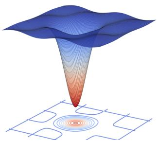  
(a) ViT-B/32

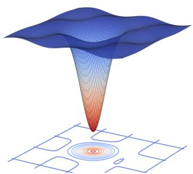  
(b) ViT-B/16

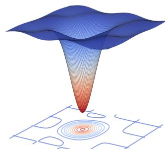  
(c) ViT-L/14  
Figure 4: Loss landscapes of ViT models that were first Naive DP fine-tuned under ε = 4 and then merged using Task Arithmetic (ViT-B/32, ViT-B/16, ViT-L/14).

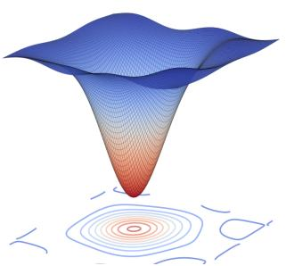  
(a) ViT-B/32

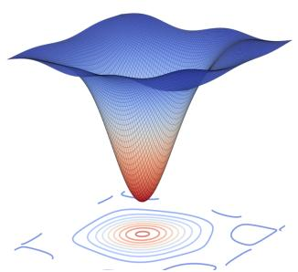  
(b) ViT-B/16

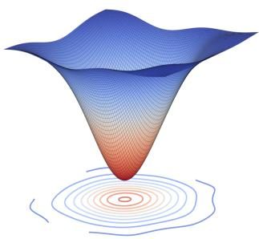  
(c) ViT-L/14  
Figure 5: Loss landscapes of the merged ViT models (ViT-B/32, ViT-B/16, and ViT-L/14) under ε = 4, obtained using DP-Merging with Task Arithmetic.

## B.5 More Results on Language Tasks

Table 11 reports the multi-task performance of RoBERTa-Base models on the GLUE benchmark (CoLA, MNLI, MRPC, QNLI, QQP, RTE, SST2, STSB). Individual training (DP + Individual) achieves the highest average score (79.8), while simple weight averaging drops it to 72.3. DP-Merging strategies consistently improve results, with DP-Merging + Task Arithmetic reaching 73.9 and DP-Merging + WUDI-Merging achieving 76.5, demonstrating that parameter merging and task coordination enhance multi-task generalization.

Table 11: Multi-task performance of RoBERTa-Base models on GLUE benchmark, $\varepsilon = 4 .$
<table><tr><td>Method</td><td>CoLA</td><td>MNLI</td><td>MRPC</td><td>QNLI</td><td>QQP</td><td>RTE</td><td>SST2</td><td>STSB</td><td>Avg.</td></tr><tr><td>DP + Individual</td><td>59.2</td><td>77.7</td><td>80.1</td><td>88.7</td><td>81.5</td><td>76.7</td><td>92.7</td><td>79.4</td><td>79.8</td></tr><tr><td>DP + Weight Averaging</td><td>55.3</td><td>73.4</td><td>67.4</td><td>78.7</td><td>78.2</td><td>68.8</td><td>90.5</td><td>66.1</td><td>72.3</td></tr><tr><td>DP-Merging + Weight Averaging</td><td>58.2</td><td>76.1</td><td>69.0</td><td>79.1</td><td>81.3</td><td>69.7</td><td>91.6</td><td>68.2</td><td>73.0+0.7</td></tr><tr><td>DP + RegMean</td><td>55.3</td><td>73.5</td><td>65.6</td><td>78.6</td><td>78.1</td><td>67.4</td><td>90.7</td><td>62.0</td><td>70.4</td></tr><tr><td>DP-Merging + RegMean</td><td>58.6</td><td>78.2</td><td>68.4</td><td>79.0</td><td>80.6</td><td>69.2</td><td>91.6</td><td>63.8</td><td>73.7+3.3</td></tr><tr><td>DP + Task Arithmetic</td><td>55.2</td><td>74.9</td><td>66.7</td><td>78.9</td><td>80.2</td><td>69.7</td><td>90.3</td><td>61.4</td><td>70.8</td></tr><tr><td>DP-Merging + Task Arithmetic</td><td>59.6</td><td>77.8</td><td>68.9</td><td>80.9</td><td>82.0</td><td>70.7</td><td>91.6</td><td>63.2</td><td></td></tr><tr><td>DP + TIES-Merging</td><td>59.8</td><td>78.6</td><td>70.7</td><td>79.7</td><td>81.2</td><td>70.1</td><td>91.3</td><td>64.2</td><td> $\frac { 7 3 . 9 _ { + 3 . 1 } } { 7 3 . 7 }$ </td></tr><tr><td>DP-Merging + TIEŠ-Merging</td><td>61.0</td><td>80.6</td><td>72.4</td><td>80.9</td><td>82.1</td><td>71.2</td><td>92.6</td><td>65.8</td><td>76.3+2.6</td></tr><tr><td>DP + PCB Merging</td><td>55.7</td><td>73.6</td><td>76.5</td><td>77.2</td><td>81.7</td><td>70.3</td><td>91.0</td><td>60.1</td><td>72.8</td></tr><tr><td>DP-Merging + CB Merging</td><td>58.6</td><td>74.2</td><td>78.3</td><td>79.5</td><td>82.9</td><td>72.4</td><td>92.3</td><td>61.6</td><td>74.9+2.1</td></tr><tr><td>DP + WUDI-Merging</td><td>56.7</td><td>75.5</td><td>78.5</td><td>79.3</td><td>82.4</td><td>73.1</td><td>91.2</td><td>59.0</td><td>73.6</td></tr><tr><td>DP-Merging + WUDI-Merging</td><td>59.6</td><td>76.9</td><td>81.0</td><td>82.1</td><td>83.1</td><td>74.6</td><td>92.8</td><td>60.5</td><td> $7 6 . 5 \substack { + 2 . 9 }$ </td></tr></table>

## C Implementation of Theoretical Analysis

## C.1 Privacy guarantee of DP-Merging

Each DP-Merging iteration uses two privatized clipped-gradient evaluations: one to construct the sharpness-aware perturbation and one to update the model at the perturbed point. The perturbation itself is a deterministic function of the first private gradient and therefore is post-processing. The reference-anchoring term depends only on the current model and the public initialization, so it incurs no additional privacy loss. Finally, the merging step only processes already released private task models and is also post-processing.

Theorem C.1 (Privacy guarantee of DP-Merging). Assume that each task dataset $\mathcal { D } _ { t }$ is disjoint, and each private example belongs to at most one task. For task t, suppose Algorithm 1 runsfor K iterations with Poisson sampling rate q, clipping threshold C, and Gaussian noise multiplier σ. Let $\varepsilon _ { \mathrm { p a i r } } ( \alpha ; q , \sigma )$ denote the order-α RDP cost ofone Poisson-subsampled paired Gaussian mechanism that releases the two noisy clipped-gradient quantities used in one DP-Merging iteration. Then, for any Rényi order $\alpha > 1$ , the released task model $w _ { t } ^ { \mathrm { D P } }$ satisfies

$$
( \alpha , K \varepsilon _ { \mathrm { p a i r } } ( \alpha ; q , \sigma ) ) – R D P .
$$

Consequently, for any $\delta _ { t } \in ( 0 , 1 ) , w _ { t } ^ { \mathrm { D P } }$ satisfies $( \varepsilon _ { t } , \delta _ { t } ) – D P$ with

$$
\varepsilon _ { t } = \operatorname* { m i n } _ { \alpha > 1 } \left\{ K \varepsilon _ { \mathrm { p a i r } } ( \alpha ; q , \sigma ) + \frac { \log ( 1 / \delta _ { t } ) } { \alpha - 1 } \right\} .
$$

Since the task datasets are disjoint, releasing all private task models $\{ w _ { t } ^ { \mathrm { D P } } \} _ { t = 1 } ^ { T }$ satisfies

$$
\left( \operatorname* { m a x } _ { t \in [ T ] } \varepsilon _ { t } , \operatorname* { m a x } _ { t \in [ T ] } \delta _ { t } \right) { - } D P .
$$

The merged model

$$
w _ { \mathrm { m e r g e } } = \frac { 1 } { T } \sum _ { t = 1 } ^ { T } w _ { t } ^ { \mathrm { D P } }
$$

incurs no additional privacy loss by post-processing.

We provide a detailed proof of Theorem C.1. The analysis is at the sample level and uses the standard add/remove neighboring relation: two datasets are neighboring if they differ in the presence or absence of one training example. We assume that each private example appears in at most one task dataset $\mathcal { D } _ { t }$ . The replace-one neighboring relation can be handled by doubling the clipping sensitivity, equivalently replacing σ by $\sigma / 2$ in the accountant.

For a per-example loss $\ell ( w ; z )$ , define the clipped gradient

$$
\bar { g } ( w ; z ) = \nabla \ell ( w ; z ) \cdot \operatorname* { m i n } \left\{ 1 , \frac { C } { \| \nabla \ell ( w ; z ) \| _ { 2 } } \right\} .
$$

Thus,

$$
\begin{array} { r } { \| \bar { g } ( w ; z ) \| _ { 2 } \leq C } \end{array}
$$

for all w and z. Given a Poisson minibatch $B \subseteq { \mathcal { D } } _ { t }$ sampled with probability $q ,$ the private gradient oracle used by DP-Merging can be written as

$$
\tilde { g } ( w ; B ) = \frac { 1 } { s } \left( \sum _ { z _ { i } \in B } \bar { g } ( w ; z _ { i } ) + \xi \right) , \qquad \xi \sim \mathcal { N } ( 0 , \sigma ^ { 2 } C ^ { 2 } I ) ,
$$

where s is a deterministic normalization factor. The value of s does not affect the privacy analysis because it scales both the sensitivity and the noise by the same factor.

One-iteration mechanism. Fix a task t and an iteration k. Conditioned on all previous private outputs, the current parameter $w _ { t , k }$ is fixed. In one iteration, DP-Merging first computes

$$
\tilde { g } _ { t , k } = \tilde { g } ( w _ { t , k } ; B _ { t , k } ) ,
$$

then constructs

$$
\epsilon _ { t , k } = \rho _ { t } \frac { \tilde { g } _ { t , k } } { \| \tilde { g } _ { t , k } \| _ { 2 } } .
$$

If $\| \tilde { g } _ { t , k } \| _ { 2 } = 0 .$ , we set $\epsilon _ { t , k } = 0$ . In either case, $\epsilon _ { t , k }$ is a deterministic function of the first private output $\tilde { g } _ { t , k }$ and public hyperparameters. Therefore, constructing $\epsilon _ { t , k }$ is post-processing and does not increase privacy loss.

The second private gradient query is

$$
\begin{array} { r } { \tilde { h } _ { t , k } = \tilde { g } ( w _ { t , k } + \epsilon _ { t , k } ; B _ { t , k } ) . } \end{array}
$$

Conditional on $\tilde { g } _ { t , k }$ , the perturbed point $w _ { t , k } + \epsilon _ { t , k }$ is fixed. Hence, the second query is another Gaussian mechanism applied to clipped per-example gradients at a fixed model parameter. The two private gradient queries are adaptive, but adaptive composition is allowed under RDP.

Full-batch paired Gaussian mechanism. We first ignore subsampling and analyze the paired mechanism that releases both noisy clipped-gradient quantities on the same dataset. Let D and $\overline { { D ^ { \prime } } }$ be neighboring datasets that differ in one example. For the first query, the difference between the two clipped gradient sums is bounded by

$$
\left\| \sum _ { z _ { i } \in D } \bar { g } ( w _ { t , k } ; z _ { i } ) - \sum _ { z _ { i } \in D ^ { \prime } } \bar { g } ( w _ { t , k } ; z _ { i } ) \right\| _ { 2 } \leq C .
$$

Similarly, after conditioning on the first private output, the perturbed model is fixed, and the second query satisfies

$$
\left\| \sum _ { z _ { i } \in D } \bar { g } ( w _ { t , k } + \epsilon _ { t , k } ; z _ { i } ) - \sum _ { z _ { i } \in D ^ { \prime } } \bar { g } ( w _ { t , k } + \epsilon _ { t , k } ; z _ { i } ) \right\| _ { 2 } \leq C .
$$

Therefore, if we view the two released gradients as one concatenated vector, the $\ell _ { 2 }$ sensitivity of the paired query is bounded by

$$
\Delta _ { \mathrm { p a i r } } \leq \sqrt { C ^ { 2 } + C ^ { 2 } } = \sqrt { 2 } C .
$$

The paired mechanism adds independent Gaussian noise with covariance $\sigma ^ { 2 } C ^ { 2 } I$ to each query. Hence, for any Rényi order $\alpha > 1$ , the full-batch paired Gaussian mechanism satisfies

$$
\varepsilon _ { \mathrm { f u l l } } ( \alpha ) \leq { \frac { \alpha \Delta _ { \mathrm { p a i r } } ^ { 2 } } { 2 \sigma ^ { 2 } C ^ { 2 } } } \leq { \frac { \alpha } { \sigma ^ { 2 } } } .
$$

Equivalently, this is the same as composing two Gaussian mechanisms, each with RDP cost $\alpha / ( 2 \sigma ^ { 2 } )$

$$
\frac { \alpha } { 2 \sigma ^ { 2 } } + \frac { \alpha } { 2 \sigma ^ { 2 } } = \frac { \alpha } { \sigma ^ { 2 } } .
$$

Poisson subsampling. Algorithm 1 samples the minibatch $B _ { t , k }$ using Poisson sampling with rate $q .$ Since the two gradient evaluations in one iteration use the same minibatch, privacy amplification must be applied to the joint paired mechanism rather than independently to the two queries.

For integer orders $\alpha \geq 2$ , a valid RDP upper bound for one subsampled paired Gaussian iteration is

$$
\varepsilon _ { \mathrm { p a i r } } ^ { + } ( \alpha ; q , \sigma ) = \frac { 1 } { \alpha - 1 } \log \left( \sum _ { j = 0 } ^ { \alpha } { \binom { \alpha } { j } } ( 1 - q ) ^ { \alpha - j } q ^ { j } \exp \left( \frac { j ( j - 1 ) } { \sigma ^ { 2 } } \right) \right) .
$$

The exponent differs from the standard single-query subsampled Gaussian mechanism by a factor of two because the paired query has sensitivity $\sqrt { 2 } C$ rather than C.

For the reverse neighboring direction, a simple valid bound is

$$
\begin{array} { r } { \varepsilon _ { \mathrm { p a i r } } ^ { - } ( \alpha ; q , \sigma ) \leq - \log ( 1 - q ) . } \end{array}
$$

Thus, one may take

$$
\varepsilon _ { \mathrm { p a i r } } ( \alpha ; q , \sigma ) = \operatorname* { m a x } \left\{ \varepsilon _ { \mathrm { p a i r } } ^ { + } ( \alpha ; q , \sigma ) , \varepsilon _ { \mathrm { p a i r } } ^ { - } ( \alpha ; q , \sigma ) \right\} .
$$

In practice, the same theorem also holds when $\varepsilon _ { \mathrm { p a i r } } ( \alpha ; q , \sigma )$ is computed by a tighter numerical RDP accountant for the subsampled paired Gaussian mechanism.

Composition over iterations. For a fixed task t, DP-Merging runs for K iterations. RDP composes additively under adaptive composition. Therefore, after K iterations, the released private task model $w _ { t } ^ { \mathrm { D P } }$ satisfies

$$
\begin{array} { r } { ( \alpha , \varepsilon _ { t } ^ { \mathrm { R D P } } ( \alpha ) ) – \mathrm { R D P } , \qquad \varepsilon _ { t } ^ { \mathrm { R D P } } ( \alpha ) \leq K \varepsilon _ { \mathrm { p a i r } } ( \alpha ; q , \sigma ) . } \end{array}
$$

Using the standard conversion from RDP to approximate DP, for any $\delta _ { t } \in ( 0 , 1 ) , w _ { t } ^ { \mathrm { D P } } \mathrm { i s } ( \varepsilon _ { t } , \delta _ { t } ) – \mathbf { D P }$ with

$$
\varepsilon _ { t } = \operatorname* { m i n } _ { \alpha > 1 } \left\{ K \varepsilon _ { \mathrm { p a i r } } ( \alpha ; q , \sigma ) + \frac { \log ( 1 / \delta _ { t } ) } { \alpha - 1 } \right\} .
$$

No privacy cost from reference anchoring. The update rule of DP-Merging is

$$
w _ { t , k + 1 } = w _ { t , k } - \eta \left( \tilde { h } _ { t , k } + 2 \lambda ( w _ { t , k } - w _ { 0 } ) \right) .
$$

The anchoring term $2 \lambda ( w _ { t , k } - w _ { 0 } )$ depends only on the current model parameter $w _ { t , k }$ and the public pretrained initialization $w _ { 0 }$ . It does not directly query any private example. Therefore, after the private gradient $\tilde { h } _ { t , k }$ has been produced, adding the reference-anchoring term is a deterministic transformation of already privatized quantities and public information. By post-processing, it incurs no additional privacy loss.

Parallel composition over tasks. The T task models are trained on disjoint datasets $\{ \mathcal { D } _ { t } \} _ { t = 1 } ^ { T }$ Since each private example belongs to at most one task, changing one example affects the training procedure of at most one task. Therefore, releasing all private task models

$$
\{ w _ { t } ^ { \mathrm { D P } } \} _ { t = 1 } ^ { T }
$$

satisfies parallel composition. Hence, the collection of released task models is

$$
\left( \operatorname* { m a x } _ { t \in [ T ] } \varepsilon _ { t } , \operatorname* { m a x } _ { t \in [ T ] } \delta _ { t } \right) { \ - \mathrm { D P } } .
$$

When all tasks use the same privacy parameters, this reduces to $( \varepsilon _ { t } , \delta _ { t } )  – \mathrm { D P }$

Post-processing by model merging. The final merged model is computed as

$$
w _ { \mathrm { m e r g e } } = \frac { 1 } { T } \sum _ { t = 1 } ^ { T } w _ { t } ^ { \mathrm { D P } } .
$$

This operation is a deterministic function of the released private task models and does not access any private training example. Therefore, by the post-processing property of differential privacy, releasing $w _ { \mathrm { m e r g e } }$ incurs no additional privacy loss. This proves Theorem C.1.

## C.2 Mergeability Analysis

Let $w _ { t } : = w _ { t } ^ { \mathrm { D P } }$ be the private task model returned by Algorithm 1. Define

$$
u _ { t } : = w _ { t } - w _ { 0 } , \bar { u } : = \frac { 1 } { T } \sum _ { s = 1 } ^ { T } u _ { s } , w _ { \mathrm { m e r g e } } : = w _ { 0 } + \bar { u } ,
$$

and

$$
\Delta _ { t } : = w _ { \mathrm { m e r g e } } - w _ { t } = \bar { u } - u _ { t } .
$$

The average merge gap is

$$
G _ { \mathrm { m e r g e } } : = \frac { 1 } { T } \sum _ { t = 1 } ^ { T } \bigl ( \mathcal { L } _ { t } ( w _ { \mathrm { m e r g e } } ) - \mathcal { L } _ { t } ( w _ { t } ) \bigr ) .
$$

Assumption C.2 (Local third-order smoothness). For each task $t , \mathcal { L } _ { t }$ is three-times differentiable along the segment $\{ w _ { t } + \gamma \Delta _ { t } : \gamma \in [ 0 , 1 ] \}$ . Define

$$
\beta _ { t } : = \operatorname* { s u p } _ { \gamma \in [ 0 , 1 ] } \lambda _ { \operatorname* { m a x } } \big ( \nabla ^ { 2 } \mathcal { L } _ { t } ( w _ { t } + \gamma \Delta _ { t } ) \big ) .
$$

The third-order Taylor remainder satisfies

$$
| R _ { t } | \leq \frac { M _ { t } } { 6 } \| \Delta _ { t } \| _ { 2 } ^ { 3 } .
$$

Assumption C.3 (Approximate stationarity). The returned private model satisfies

$$
\| \nabla { \mathcal { L } } _ { t } ( w _ { t } ) \| _ { 2 } \leq \varepsilon _ { t } ,
$$

where $\varepsilon _ { t }$ captures the optimization error, clipping bias, and DP noise.

Theorem C.4 (Average merge-gap bound). Under Assumptions C.2 and $C . 3 ,$

$$
G _ { \mathrm { m e r g e } } \leq \frac { 1 } { T } \sum _ { t = 1 } ^ { T } \left[ \varepsilon _ { t } \| \Delta _ { t } \| _ { 2 } + \frac { \beta _ { t } } { 2 } \| \Delta _ { t } \| _ { 2 } ^ { 2 } + \frac { M _ { t } } { 6 } \| \Delta _ { t } \| _ { 2 } ^ { 3 } \right] .
$$

Proof. For each task $t ,$ apply Taylor’s theorem to $\mathcal { L } _ { t }$ at $w _ { t }$ along the direction $\Delta _ { t } = w _ { \mathrm { m e r g e } } - w _ { t } \mathrm { : }$

$$
\mathcal { L } _ { t } ( w _ { \mathrm { m e r g e } } ) = \mathcal { L } _ { t } ( w _ { t } ) + \nabla \mathcal { L } _ { t } ( w _ { t } ) ^ { \top } \Delta _ { t } + \frac { 1 } { 2 } \Delta _ { t } ^ { \top } \nabla ^ { 2 } \mathcal { L } _ { t } ( w _ { t } + \gamma _ { t } \Delta _ { t } ) \Delta _ { t } + R _ { t }
$$

for some $\gamma _ { t } \in [ 0 , 1 ]$ . Therefore,

$$
\mathcal { L } _ { t } ( w _ { \mathrm { m e r g e } } ) - \mathcal { L } _ { t } ( w _ { t } ) \leq \| \nabla \mathcal { L } _ { t } ( w _ { t } ) \| _ { 2 } \| \Delta _ { t } \| _ { 2 } + \frac { \beta _ { t } } { 2 } \| \Delta _ { t } \| _ { 2 } ^ { 2 } + \frac { M _ { t } } { 6 } \| \Delta _ { t } \| _ { 2 } ^ { 3 } .
$$

Using Assumption C.3 gives

$$
\mathcal { L } _ { t } ( w _ { \mathrm { m e r g e } } ) - \mathcal { L } _ { t } ( w _ { t } ) \leq \varepsilon _ { t } \| \Delta _ { t } \| _ { 2 } + \frac { \beta _ { t } } { 2 } \| \Delta _ { t } \| _ { 2 } ^ { 2 } + \frac { M _ { t } } { 6 } \| \Delta _ { t } \| _ { 2 } ^ { 3 } .
$$

Averaging over $t = 1 , \dots , T$ completes the proof.

## C.3 Reference Anchoring Controls Merging Displacement

Theorem C.4 shows that the merge gap depends on the displacement $\| \Delta _ { t } \| _ { 2 }$ . We now show that the reference anchor in DP-Merging controls this quantity.

Define the robust loss

$$
L _ { t , \rho _ { t } } ( w ) : = \operatorname* { m a x } _ { \| \epsilon \| _ { 2 } \leq \rho _ { t } } \mathcal L _ { t } ( w + \epsilon ) ,
$$

and the anchored robust objective

$$
\Phi _ { t } ( w ) : = L _ { t , \rho _ { t } } ( w ) + \lambda \| w - w _ { 0 } \| _ { 2 } ^ { 2 } .
$$

Assumption C.5 (Approximate stationarity of the anchored robust objective). For each task t, the returned model satisfies

$$
\| \nabla L _ { t , \rho _ { t } } ( w _ { t } ) \| _ { 2 } \leq G _ { t } , \qquad \| \nabla \Phi _ { t } ( w _ { t } ) \| _ { 2 } \leq \zeta _ { t } .
$$

Lemma C.6 (Anchor-induced task-vector bound). Under Assumption C.5,

$$
\| w _ { t } - w _ { 0 } \| _ { 2 } \leq \frac { G _ { t } + \zeta _ { t } } { 2 \lambda } .
$$

Consequently, if

$$
A _ { t } : = \frac { G _ { t } + \zeta _ { t } } { 2 \lambda } , \qquad \bar { A } : = \frac { 1 } { T } \sum _ { s = 1 } ^ { T } A _ { s } ,
$$

then

$$
\lVert \Delta _ { t } \rVert _ { 2 } \leq A _ { t } + \bar { A } .
$$

Proof. By definition,

$$
\nabla \Phi _ { t } ( w _ { t } ) = \nabla L _ { t , \rho _ { t } } ( w _ { t } ) + 2 \lambda ( w _ { t } - w _ { 0 } ) .
$$

Thus,

$$
2 \lambda \| w _ { t } - w _ { 0 } \| _ { 2 } \leq \| \nabla \Phi _ { t } ( w _ { t } ) \| _ { 2 } + \| \nabla L _ { t , \rho _ { t } } ( w _ { t } ) \| _ { 2 } \leq \zeta _ { t } + G _ { t } ,
$$

which proves the task-vector bound. Next,

$$
\begin{array} { r l } {  { \| \Delta _ { t } \| _ { 2 } = \| \bar { u } - u _ { t } \| _ { 2 } } } \\ & { \quad = \| \frac { 1 } { T } \displaystyle \sum _ { s = 1 } ^ { T } u _ { s } - u _ { t } \| _ { 2 } } \\ & { \quad \le \displaystyle \frac { 1 } { T } \displaystyle \sum _ { s = 1 } ^ { T } \| u _ { s } \| _ { 2 } + \| u _ { t } \| _ { 2 } } \\ & { \quad \le \bar { A } + A _ { t } . } \end{array}
$$

This completes the proof.

Corollary C.7 (Explicit DP-Merging merge-gap bound). Under Assumptions C.2, C.3, and C.5,

$$
G _ { \mathrm { m e r g e } } \leq \frac { 1 } { T } \sum _ { t = 1 } ^ { T } \left[ \varepsilon _ { t } ( A _ { t } + \bar { A } ) + \frac { \beta _ { t } } { 2 } ( A _ { t } + \bar { A } ) ^ { 2 } + \frac { M _ { t } } { 6 } ( A _ { t } + \bar { A } ) ^ { 3 } \right] .
$$

$I f \varepsilon _ { t } \leq \varepsilon , \beta _ { t } \leq \beta , M _ { t } \leq M , G _ { t } \leq G ,$ and $\zeta _ { t } \leq \zeta$ for all t, then

$$
G _ { \mathrm { m e r g e } } \leq \varepsilon { \frac { G + \zeta } { \lambda } } + { \frac { \beta } { 2 } } \left( { \frac { G + \zeta } { \lambda } } \right) ^ { 2 } + { \frac { M } { 6 } } \left( { \frac { G + \zeta } { \lambda } } \right) ^ { 3 } .
$$

Proof. The first bound follows by substituting Lemma C.6 into Theorem C.4. For the uniform bound, note that

$$
A _ { t } + \bar { A } \leq \frac { G + \zeta } { 2 \lambda } + \frac { G + \zeta } { 2 \lambda } = \frac { G + \zeta } { \lambda } .
$$

Substituting this inequality into the first bound gives the result.

## C.4 Connection to Joint-Task Loss Linearity

We further connect the above mergeability analysis to joint-task loss linearity, following the same style of Hessian-based arguments commonly used in sharpness-aware model-merging analyses.

For two tasks s and t, define the joint-task loss

$$
L _ { \mathrm { J T L } } ( w ; \mathcal { D } _ { s } \cup \mathcal { D } _ { t } ) : = L _ { s } ( w ) + \mathcal { L } _ { t } ( w ) .
$$

For $\alpha \in [ 0 , 1 ]$ , define the joint-task loss linearity gap

$$
\delta _ { s , t } ( \alpha ) : = L _ { \mathrm { J T L } } ( \alpha w _ { s } + ( 1 - \alpha ) w _ { t } ) - \alpha L _ { \mathrm { J T L } } ( w _ { s } ) - ( 1 - \alpha ) L _ { \mathrm { J T L } } ( w _ { t } ) .
$$

A smaller $| \delta _ { s , t } ( \alpha ) |$ means that the interpolation between two task models is closer to being linear on the joint-task loss landscape.

Theorem C.8 (Flatness and anchoring imply joint-task loss linearity). Assume $L _ { s }$ and $\mathcal { L } _ { t }$ are locally third-order smooth around $w _ { s }$ and $w _ { t } ,$ respectively. Let

$$
\lambda _ { s } : = \lambda _ { \operatorname* { m a x } } \bigl ( \nabla ^ { 2 } L _ { s } ( w _ { s } ) \bigr ) , \qquad \lambda _ { t } : = \lambda _ { \operatorname* { m a x } } \bigl ( \nabla ^ { 2 } \mathcal { L } _ { t } ( w _ { t } ) \bigr ) .
$$

Then

$$
| \delta _ { s , t } ( \alpha ) | \leq \frac { 1 } { 2 } \alpha ( 1 - \alpha ) ( \lambda _ { s } + \lambda _ { t } ) \| w _ { s } - w _ { t } \| _ { 2 } ^ { 2 } + | R _ { s , t } | ,
$$

where $R _ { s , t }$ collects the third-order Taylor remainders. Moreover, under Lemma C.6,

$$
\| w _ { s } - w _ { t } \| _ { 2 } \leq A _ { s } + A _ { t } ,
$$

and therefore

$$
| \delta _ { s , t } ( \alpha ) | \leq \frac { 1 } { 2 } \alpha ( 1 - \alpha ) ( \lambda _ { s } + \lambda _ { t } ) ( A _ { s } + A _ { t } ) ^ { 2 } + | R _ { s , t } | .
$$

Proof. Let $v : = w _ { t } - w _ { s }$ . First expand $L _ { s } ( \alpha w _ { s } + ( 1 - \alpha ) w _ { t } )$ around $w _ { s }$ . Since

$$
\alpha w _ { s } + ( 1 - \alpha ) w _ { t } = w _ { s } + ( 1 - \alpha ) v ,
$$

we have

$$
L _ { s } ( \boldsymbol { w _ { s } } + ( 1 - \alpha ) \boldsymbol { v } ) = L _ { s } ( \boldsymbol { w _ { s } } ) + ( 1 - \alpha ) \nabla L _ { s } ( \boldsymbol { w _ { s } } ) ^ { \top } \boldsymbol { v } + \frac { 1 } { 2 } ( 1 - \alpha ) ^ { 2 } \boldsymbol { v } ^ { \top } \nabla ^ { 2 } L _ { s } ( \boldsymbol { w _ { s } } ) \boldsymbol { v } + R _ { s } .
$$

Similarly,

$$
L _ { s } ( \boldsymbol { w } _ { t } ) = L _ { s } ( \boldsymbol { w } _ { s } ) + \nabla L _ { s } ( \boldsymbol { w } _ { s } ) ^ { \top } \boldsymbol { v } + \frac { 1 } { 2 } \boldsymbol { v } ^ { \top } \nabla ^ { 2 } L _ { s } ( \boldsymbol { w } _ { s } ) \boldsymbol { v } + R _ { s } ^ { \prime } .
$$

Substituting these two expansions into

$$
\delta _ { s } : = L _ { s } ( \alpha w _ { s } + ( 1 - \alpha ) w _ { t } ) - \alpha L _ { s } ( w _ { s } ) - ( 1 - \alpha ) L _ { s } ( w _ { t } )
$$

gives

$$
\delta _ { s } = - \frac { 1 } { 2 } \alpha ( 1 - \alpha ) \boldsymbol { v } ^ { \top } \nabla ^ { 2 } L _ { s } ( \boldsymbol { w } _ { s } ) \boldsymbol { v } + R _ { s } - ( 1 - \alpha ) R _ { s } ^ { \prime } .
$$

Repeating the same argument for $\mathcal { L } _ { t }$ around $w _ { t }$ gives

$$
\delta _ { t } = - \frac { 1 } { 2 } \alpha ( 1 - \alpha ) \boldsymbol { v } ^ { \top } \nabla ^ { 2 } \mathcal { L } _ { t } ( \boldsymbol { w } _ { t } ) \boldsymbol { v } + R _ { t } - \alpha R _ { t } ^ { \prime } .
$$

Therefore,

$$
\delta _ { s , t } ( \alpha ) = - \frac { 1 } { 2 } \alpha ( 1 - \alpha ) \boldsymbol { v } ^ { \top } \left( \nabla ^ { 2 } L _ { s } ( w _ { s } ) + \nabla ^ { 2 } \mathcal { L } _ { t } ( w _ { t } ) \right) \boldsymbol { v } + R _ { s , t } ,
$$

where

$$
R _ { s , t } : = R _ { s } - ( 1 - \alpha ) R _ { s } ^ { \prime } + R _ { t } - \alpha R _ { t } ^ { \prime } .
$$

Using

$$
\begin{array} { r } { v ^ { \top } \nabla ^ { 2 } L _ { s } ( w _ { s } ) v \leq \lambda _ { s } \| v \| _ { 2 } ^ { 2 } , \qquad v ^ { \top } \nabla ^ { 2 } \mathcal { L } _ { t } ( w _ { t } ) v \leq \lambda _ { t } \| v \| _ { 2 } ^ { 2 } , } \end{array}
$$

we obtain

$$
| \delta _ { s , t } ( \alpha ) | \leq \frac { 1 } { 2 } \alpha ( 1 - \alpha ) ( \lambda _ { s } + \lambda _ { t } ) \| v \| _ { 2 } ^ { 2 } + | R _ { s , t } | .
$$

Finally,

$$
\begin{array} { r } { \| w _ { s } - w _ { t } \| _ { 2 } = \| ( w _ { s } - w _ { 0 } ) - ( w _ { t } - w _ { 0 } ) \| _ { 2 } \leq \| w _ { s } - w _ { 0 } \| _ { 2 } + \| w _ { t } - w _ { 0 } \| _ { 2 } \leq A _ { s } + A _ { t } , } \end{array}
$$

where the last inequality follows from Lemma C.6. This proves the theorem.

Interpretation. Theorem C.8 shows that DP-Merging improves joint-task loss linearity through the same two geometric mechanisms that improve mergeability. The sharpness-aware component reduces the dominant Hessian eigenvalues $\lambda _ { s }$ and $\lambda _ { t } ,$ , while the reference anchor reduces the distance $\lVert \boldsymbol { w } _ { s } - \boldsymbol { w } _ { t } \rVert _ { 2 }$ between task models. Together, they reduce the joint-task loss linearity gap, which corresponds to weaker parameter interference during model merging.

## D Limitations and Future Work

While our DP-Merging and multi-task strategies demonstrate consistent improvements across vision and NLP benchmarks, several limitations remain. First, the effectiveness of parameter merging depends on task-specific compatibility, and its performance on highly heterogeneous tasks or models with substantially different architectures is not fully explored. Second, the experiments are limited to standard benchmarks and mid- to large-scale models (ViT-L/14, RoBERTa-Large), leaving the applicability to larger models or more complex, real-world datasets untested. Third, while average scores demonstrate clear overall gains, individual task performance can vary, with some tasks showing only marginal improvements or slight declines, highlighting the need for more task-specific analysis.

Future work includes developing adaptive merging strategies that account for task similarity and parameter sensitivity, extending the approach to larger and more diverse model architectures, and exploring dynamic task balancing and uncertainty-aware weighting mechanisms during training to improve stability and consistency across tasks.