# Stick to What You Know: A Study of Knowledge-Aligned Supervised Fine-Tuning

Arthur Becker<sup>\*,1,2</sup> Jakob Kemmler<sup>\*,1</sup> David Thulke<sup>‡,1,3</sup> Christine Schäfer<sup>1</sup> Christian Dugast<sup>1</sup> Hermann Ney<sup>1,3</sup>

<sup>1</sup>AppTek GmbH, Aachen, Germany

<sup>2</sup>F-Bureaucracy UG, Aachen, Germany

<sup>3</sup>Machine Learning and Human Language Technology, RWTH Aachen University, Germany

## Abstract

Supervised fine-tuning (SFT) trains a base language model to imitate target responses, and these targets may require knowledge the base model has not robustly internalized. We study this as a source of hallucinations and frame a group of mitigation methods as knowledgealigned SFT: constraining SFT training targets to the base model’s parametric knowledge. Under a unified setup, we compare existing generation-based and estimation-based knowledge-alignment methods and introduce two new variants: Evidence Rewrite, which verifies base-model generations using external evidence, and Recall Rewrite, which retains claims only when they can be consistently recalled by the base model. Experiments with Qwen 3 4B and OLMo 3 7B show that knowledge-aligned SFT can reduce factual hallucinations on Wild-Halu and Biography while largely preserving general capabilities. Recall Rewrite yields the strongest factuality gains and improves refusal behavior on UnknownBench. It thereby confirms that SFT targets beyond the base model’s knowledge drive hallucination behavior.

## 1 Introduction

Large language models (LLMs) often generate fluent answers that contain unsupported or false claims, a failure mode commonly referred to as hallucination. We focus on factuality hallucinations: generated claims that contradict real-world facts (Huang et al., 2025b). This is especially problematic for instruction-following models, where users frequently rely on detailed answers in domains where errors are difficult to detect.

Supervised fine-tuning (SFT) is a central step for turning a pre-trained base model into an instructionfollowing model (Ouyang et al., 2022). Instruction tuning exposes models to broad task mixtures to improve instruction following and generalization to new tasks and domains (Wei et al., 2022; Longpre et al., 2023). However, factual SFT examples provide two intertwined signals: they teach the model how to answer, while also requiring it to produce factual claims. If these claims are not robustly internalized during pre-training, models are pushed to produce plausible claims beyond their parametric knowledge. Prior work established that this is a driver of hallucinations in SFT (Gekhman et al., 2024; Lin et al., 2024; Wu et al., 2025; Kaplan et al., 2026). More broadly, SFT is a poor vehicle for injecting new knowledge, because learning new factual associations reliably requires extensive evidence (Kandpal et al., 2023) and the SFT stage is comparatively small (Guo et al., 2025; Team

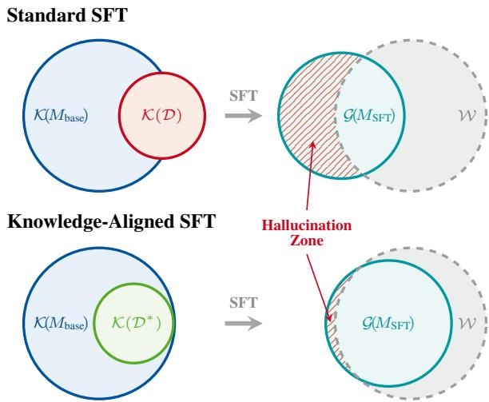  
Figure 1: Left: comparing the dataset knowledge K(D) used for SFT with the base model’s parametric knowledge $\kappa ( M _ { \mathrm { b a s e } } ) ;$ ; Right: the resulting generation space $\mathcal { G } ( M _ { \mathrm { S F T } } )$ relative to world knowledge W. The hatched area marks the hallucination zone: generations outside W. Top: Standard SFT on D includes claims beyond $\kappa ( M _ { \mathrm { b a s e } } )$ , encouraging generation beyond what the model knows. Bottom: Knowledge-aligned SFT constructs $\mathcal { D } ^ { * }$ within $\kappa ( M _ { \mathrm { b a s e } } )$ , reducing the part of $\mathcal { G } ( M _ { \mathrm { S F T } } )$ outside W.

OLMo, 2025). Retrieval augmentation or continued pre-training are better suited for this purpose (Ovadia et al., 2024; Xu et al., 2023).

Additionally, SFT strongly shapes the model’s response behavior: it teaches when to answer, how much detail to provide, and how confidently to present claims. If supervision targets require knowledge outside the base model’s parameters, SFT rewards valid-looking answers under uncertainty rather than respect for the model’s knowledge boundary. This encourages guessing rather than refusing, echoing the argument that common training and evaluation setups reward answers under uncertainty while penalizing expressions of uncertainty (Kalai et al., 2025).

We study this problem through the lens of knowledge alignment: matching SFT targets to the factual knowledge already available in the base model. Knowledge-aligned SFT therefore aims to preserve SFT’s behavioral benefits while reducing the incentive to guess beyond the base model’s knowledge. Figure 1 summarizes our framing. Standard SFT may require the model to imitate responses containing facts it does not know, which expands the space of plausible-looking but unsupported generations. Knowledge-aligned SFT instead constrains factual supervision to what the base model can support.

In this work, we provide a controlled comparison of knowledge-aligned SFT methods under a unified framework. We compare generationbased alignment, represented by FLAME (Lin et al., 2024), with estimation-based alignment, represented by uncertainty-aware filtering $\mathrm { U N I T } _ { c u t }$ (Wu et al., 2025), and introduce two variants: $E \nu \mathrm { - }$ idence Rewrite, which filters base-model generations through external claim verification, and $R e \cdot$ call Rewrite, which probes whether claims can be consistently recalled by the base model. Across factuality, refusal, and general capability evaluations, knowledge-aligned supervision reduces measured hallucinations while preserving broad model capabilities. Our contribution is to operationalize this premise on real instruction-tuning data. We classify each individual claim of a training response as known or unknown to the base model and intervene on the SFT targets accordingly. In Section 4.4 we additionally reproduce the causal effect within our pipeline by varying only the share of known claims in otherwise identical training data. We release the Recall Rewrite training data for both base models together with all intermediate pipeline outputs (Section 4.1, Footnote 3).

## 2 Framework

We now formalize knowledge-aligned SFT. Let W denote real-world knowledge, and let $\kappa ( M _ { \mathrm { b a s e } } )$ denote the parametric knowledge of a base model $M _ { \mathrm { b a s e } }$ . This knowledge is inherently incomplete: it reflects what the model encountered and robustly internalized during pre-training, not the totality of $\mathcal { W } .$ . Following Figure 1, let $\mathcal { G } ( M )$ denote the set of factual claims a model may generate after instruction tuning. We define the hallucination zone as $\mathcal { G } ( M ) \backslash \mathcal { W } , \mathrm { i . e . }$ ., generations that fall outside realworld knowledge. Our goal is not to make SFT inject new factual knowledge, but to reduce the pressure for $M _ { \mathrm { S F T } }$ to generate claims unsupported by $M _ { \mathrm { b a s e } }$ , thereby shrinking the hallucination zone. Let $\mathcal { D } = \{ ( P , R ) \}$ be an SFT dataset of promptresponse pairs. We decompose each response $R$ into a set of atomic claims $\begin{array} { l l l } { { \mathcal { C } } ( R } & { | } & { P ) } & { = } \end{array}$ $\{ c _ { 1 } , \ldots , c _ { N } \}$ , restricting to claims that are (i) factual, procedural, or structural, and (ii) not already provided in $P ,$ , i.e., claims the model must supply from its own parametric knowledge. Importantly, this decomposition includes meta-knowledge that is implicit but necessary for constructing R under $P .$ For instance, to "Write a haiku about...", one requires knowledge of the form’s three-line structure and syllabic constraints. We write $\kappa ( \mathcal { D } ) =$ $\textstyle \bigcup _ { ( P , R ) \in { \mathcal { D } } } { \mathcal { C } } ( R \mid P )$ for the knowledge contained in the dataset under this claim decomposition. We say a claim c is known to $M _ { \mathrm { b a s e } }$ if $c \in \mathcal { K } ( M _ { \mathrm { b a s e } } )$ and unknown otherwise. Section A collects this and the related terminology used throughout the paper. A training example is knowledge-aligned iff all its claims are known. The objective is therefore to construct $\mathcal { D } ^ { * }$ such that $\mathcal { C } ( R ^ { * } \mid P ) \subseteq \mathcal { K } ( M _ { \mathrm { b a s e } } )$ for all $( P , R ^ { \ast } ) \in { \mathcal { D } } ^ { \ast }$ . Knowledge-aligned SFT is any procedure that constructs such a $\mathcal { D } ^ { * }$ from $\mathcal { D }$ and fine-tunes $M _ { \mathrm { b a s e } }$ on it. It addresses one specific subset of the broader SFT alignment problem: the factual knowledge that supervision requires, rather than mismatches in style, skills, or out-ofdistribution behavior.

Since $\kappa ( M _ { \mathrm { b a s e } } )$ is latent, it must be approximated. Each method therefore comes with its own way of classifying claims as known or unknown. We distinguish two strategies.

Knowledge Alignment via Generation. One approach constructs supervision from the model’s own outputs: a response $\hat { R } \sim M _ { \mathrm { b a s e } }$ replaces the gold target $R ,$ on the assumption that self-generated content is implicitly constrained to $\kappa ( M _ { \mathrm { b a s e } } )$ . This assumption is imperfect in two ways. $M _ { \mathrm { b a s e } }$ may hallucinate, so $\hat { R }$ can contain claims that are not knowledge-aligned. And $\kappa ( M _ { \mathrm { b a s e } } )$ may contain false beliefs, so even knowledge-aligned claims in $\hat { R }$ can be factually wrong.

Knowledge Alignment via Estimation. An alternative approach estimates, for each claim $c \in$ $\mathcal { C } ( R \mid P )$ , whether it lies within $\kappa ( M _ { \mathrm { b a s e } } )$ , and removes or modifies those that do not. In practice, this relies on heuristic proxy signals such as model confidence (Wu et al., 2025).

## 3 Methods

We instantiate both alignment strategies from Section 2 with concrete methods and propose improved variants.

## 3.1 Existing Work

We provide a short overview of existing methods.   
Further details are provided in Section C.

Alignment via Generation (FLAME). Lin et al. (2024) present FLAME, which replaces gold responses R with outputs $\hat { R } \sim M _ { \mathrm { b a s e } }$ , implicitly assuming self-generated content is constrained to $\kappa ( M _ { \mathrm { b a s e } } )$ . For prompts that are not knowledgeseeking, i.e., that can be answered without factual knowledge (e.g., summarization), the gold response is retained. Under our framework, FLAME implicitly classifies every self-generated claim in $\mathcal { C } ( \hat { R } \mid P )$ as known. $\hat { R }$ may contain factually incorrect claims, and training on these may reinforce rather than reduce hallucination behavior. Furthermore, as $\hat { R }$ replaces R entirely, claims within $\kappa ( M _ { \mathrm { b a s e } } )$ that are present in R but not generated are lost.

Alignment via Estimation $\begin{array} { r } { ( \mathbf { U N I T } _ { c u t } ) . } \end{array}$ Wu et al. (2025) suggest $U N I T _ { c u t }$ , which filters atomic claims from each response R based on their claimconditioned probability (CCP): the likelihood the model assigns to a claim given its context. $\mathrm { U N I T } _ { c u t }$ thus classifies a claim $c \in { \mathcal { C } } ( R \mid P )$ as known iff its CCP exceeds a threshold, and $R ^ { * }$ retains only these claims. While computationally efficient, CCP is a token-level signal sensitive to phrasing and position, and confidence-based truthfulness estimation has been found to underperform reference-based verification (Tian et al., 2023).

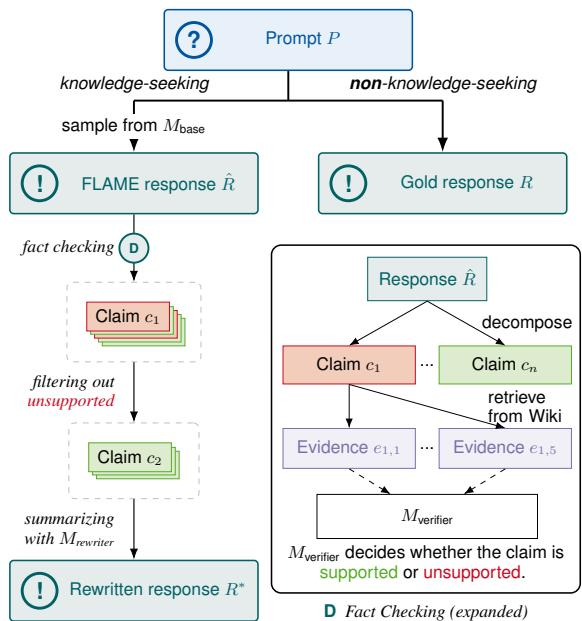  
Figure 2: Evidence Rewrite. For knowledge-seeking prompts, a base-model response $\hat { R }$ is decomposed, verified against retrieved evidence, filtered to supported claims, and rewritten as $R ^ { * }$

## 3.2 Proposed Methods

Both proposed methods, as well as the two baselines above, are instances of a single dataconstruction procedure that differs only in the source response and in how claims are classified as known. We make this common structure explicit in Section B.

## 3.2.1 Evidence Rewrite

Evidence Rewrite (Figure 2) refines the generationbased alignment strategy of FLAME by adding an external verification step. FLAME treats every selfgenerated claim as known even though it may be factually incorrect, so we filter out claims that are not supported by external evidence.

As in FLAME, prompts that are not knowledgeseeking keep their gold response. For each knowledge-seeking prompt $P .$ , we sample a longform response $\hat { R } \sim M _ { \mathrm { b a s e } }$ . We apply a standard fact-checking pipeline (claim decomposition, evidence retrieval, and verification; Section D) to classify each claim in $\hat { R }$ as supported or unsupported. We then use a rewriter model $M _ { \mathrm { r e w r i t e r } } .$ , conditioned on the prompt and the supported claims, to compose a fluent aligned response $R ^ { * }$ . Under our framework, Evidence Rewrite thus classifies a claim as known iff it is self-generated and verified as supported. If the supported claims provide insufficient information to address $P ,$ the prompt instructs $M _ { \mathrm { r e w r i t e r } }$ to refuse to respond instead. To mitigate response shortening caused by claim filtering, we introduce an additional brainstorming step before fact-checking that instructs the base model to generate a longer, more detailed response given an initial short generation (see Figure 11).

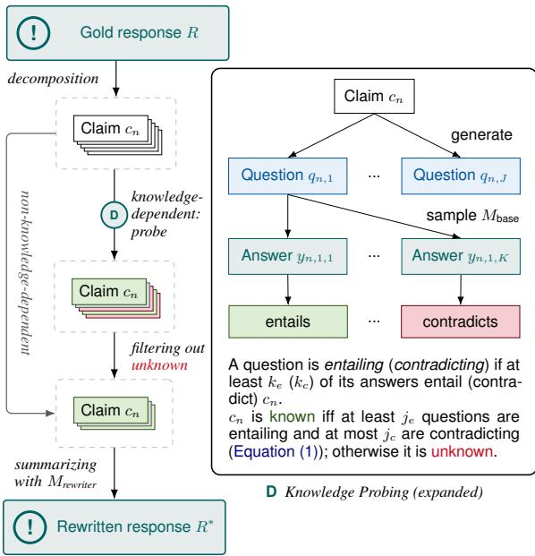  
Figure 3: Recall Rewrite. Each knowledge-dependent claim of the gold response R is probed with generated questions, answers sampled from $M _ { \mathrm { b a s e } } ,$ and an entailment check of each answer against the claim. Claims classified as unknown are filtered out. The remaining content is rewritten as $R ^ { * }$

## 3.2.2 Recall Rewrite

Recall Rewrite, our primary contribution (Figure 3), approximates $\kappa ( M _ { \mathrm { b a s e } } )$ without external evidence: it probes whether the base model can consistently recall each claim and treats such claims as known. In contrast to UNIT, which relies on token-level confidence scores, we estimate knowledge through probing questions. Our method adapts QA-based factual consistency ideas (Honovich et al., 2021; Manakul et al., 2023) to closed-book, claim-level probing of the base model’s parametric knowledge.

Given a prompt P and its gold response R, we partition $\mathcal { C } ( R \mid P )$ into knowledge-dependent claims, which encode verifiable factual, procedural, or structural information (including metaknowledge), and non-knowledge-dependent claims, which are purely contextual, subjective, or rely on general reasoning. The latter require no parametric knowledge and are therefore always considered known and preserved.

For each knowledge-dependent claim $c _ { n } ,$ an auxiliary teacher model generates J diverse, contextindependent probing questions $\{ q _ { n , j } \} _ { j = 1 } ^ { J }$ (Figure 13). For each question, we sample $\dot { K }$ answers $\{ y _ { n , j , k } \} _ { k = 1 } ^ { K }$ from $M _ { \mathrm { b a s e } }$ . Only these answers come from $M _ { \mathrm { b a s e } }$ . Question generation, the entailment judgment below, and the final rewriting are performed by the teacher model (Table 6; instantiated in Section 4.1).

Then, for each question–answer pair we evaluate whether $y _ { n , j , k }$ entails, contradicts, or is unrelated to the original claim $c _ { n }$ (Figure 16). Let $e _ { n , j }$ and $d _ { n , j }$ denote how many of the K answers to question $q _ { n , j }$ entail, respectively contradict, $c _ { n }$ . A question inherits the label that enough of its answers carry: we call it entailing if it yields at least $k _ { e }$ entailing answers $( e _ { n , j } \ge k _ { e } )$ and contradicting if it yields at least $k _ { c }$ contradicting answers $( d _ { n , j } \ \ge \ k _ { c } )$ . A knowledge-dependent claim $c _ { n }$ is consistently recalled by $M _ { \mathrm { b a s e } }$ iff

$$
\begin{array} { r l } { \mathrm { ( i ) } } & { \underbrace { \left| \left\{ \begin{array} { l } { { \boldsymbol j } : e _ { n , j } \geq k _ { e } } \end{array} \right\} \right| } _ { \mathrm { e n t a i l i n g ~ q u e s t i o n s } } \geq j _ { e } \quad \mathrm { a n d } } \\ { \mathrm { ( i i ) } } & { \underbrace { \left| \left\{ \begin{array} { l } { { \boldsymbol j } : d _ { n , j } \geq k _ { c } } \end{array} \right\} \right| } _ { \mathrm { c o n t r a d i c t i n g ~ q u e s t i o n s } } \leq j _ { c } . } \end{array}\tag{1}
$$

Condition (i) requires the claim to be recovered from several independently phrased questions, guarding against probes that leak the answer. Condition (ii) tolerates a small number of contradictions, which typically stem from underspecified probes (Section F). Recall Rewrite classifies $c _ { n }$ as known iff it is consistently recalled and as unknown otherwise.

Finally, a rewriter model $M _ { \mathrm { r e w r i t e r } }$ produces the rewritten response $R ^ { * }$ by removing any content that entails or implies a claim classified as unknown. The rewriter preserves the structure, style, and non-knowledge-dependent claims of the original response. As in Evidence Rewrite, $M _ { \mathrm { r e w r i t e r } }$ may return a refusal if the remaining information is insufficient.

## 4 Experiments

## 4.1 Experimental Settings

Training Details. We utilize Qwen3-4B-Base (Yang et al., 2025) as the base model $M _ { \mathrm { b a s e } }$ . Following Lin et al. (2024), we use the English subset of Open Assistant 1 (OASST1) (Köpf et al., 2023) as the SFT dataset, which consists of crowdsourced multi-turn conversation trees. We follow the standard approach of using the first turn in each conversation tree, resulting in 3,468 data points. All models are trained using SFT implemented via the TRL library (von Werra et al., 2020), maintaining consistent hyperparameters across all variants (see Section E). Specifically, we train standard SFT, FLAME, UNIT<sub>cut</sub>, Evidence Rewrite, and Recall Rewrite models. Additional baseline implementation details are provided in Section C.

<table><tr><td></td><td></td><td colspan="4">WildHalu</td><td colspan="4">Bios</td></tr><tr><td>Approach</td><td>Dataset</td><td>#Ref.</td><td>#Supp.</td><td>%Supp.</td><td>FActScore</td><td>#Ref.</td><td>#Supp.</td><td>%Supp.</td><td>FActScore</td></tr><tr><td>Qwen 3 Instruct</td><td></td><td>85</td><td>8,722</td><td>85.9</td><td>87.1</td><td>243</td><td>6,100</td><td>60.5</td><td>79.3</td></tr><tr><td>Standard SFT</td><td>Tülu 3</td><td>1</td><td>6,452</td><td>79.1</td><td>77.2</td><td>1</td><td>2,689</td><td>34.4</td><td>33.3</td></tr><tr><td>Standard SFT</td><td>OASST1</td><td>2</td><td>8,059</td><td>76.6</td><td>74.4***</td><td>4</td><td>5,061</td><td>36.0</td><td>34.1***</td></tr><tr><td>FLAME</td><td>OASST1</td><td>6</td><td>7,882</td><td>73.0</td><td> $7 4 . 4 ^ { * * * }$ </td><td>6</td><td>5,066</td><td>34.0</td><td>33.4***</td></tr><tr><td>UNITcut</td><td>OASST1</td><td>0</td><td>8,111</td><td>81.2</td><td> $\underline { { 7 9 . 4 } } ^ { * }$ </td><td>3</td><td>5,043</td><td>45.1</td><td>43.1***</td></tr><tr><td>Evidence Rewrite (ours)</td><td>OASST1</td><td>1</td><td>7,842</td><td>80.1</td><td>78.3</td><td>6</td><td>3,663</td><td>42.3</td><td>39.9</td></tr><tr><td>- w/o brainstorming</td><td>OASST1</td><td>4</td><td>6,344</td><td>79.2</td><td>76.8</td><td>14</td><td>2,453</td><td>37.8</td><td>36.7</td></tr><tr><td>Recall Rewrite (ours)</td><td>OASST1</td><td>55</td><td>6,157</td><td>84.2</td><td>84.1</td><td>252</td><td>2,561</td><td>56.2</td><td>76.4</td></tr></table>

Table 1: Factuality results for all SFT approaches using Qwen 3 4B. The top block shows the fully post-trained instruct model from Alibaba<sup>1</sup> and a large-data SFT baseline (Tülu 3); the bottom block compares knowledge-aligned methods on OASST1. #Ref.: number of refusals; #Supp.: number of claims in non-refusal responses judged supported; %Supp.: percentage of claims in non-refusal responses that are supported; FActScore: mean per-example supported-claim ratio, treating refusals as fully supported. Significance markers $( ^ { * * * } ~ p < 0 . 0 0 1 , \ : ^ { * } ~ p < 0 . 0 5 )$ indicate Wilcoxon signed-rank tests against Recall Rewrite<sup>2</sup>. Best results of models on OASST1 are bolded; second best are underlined.

Evidence Rewrite Model. We apply the Evidence Rewrite pipeline from Section 3.2.1 to OASST1 using gpt-4o-mini (OpenAI, 2024) for all pipeline steps. The fact-checking pipeline comprises three components: VeriScore claim decomposition (Song et al., 2024), a hierarchical evidence retrieval step (Section D), and FActScore claim verification (Min et al., 2023). We use VeriScore rather than FActScore decomposition because FActScore frequently produces unverifiable claims on opendomain instruction-following data, such as claims with unresolved pronouns or meta-commentary about the response itself, consistent with observations by Song et al. (2024). Evidence is retrieved from Wikipedia. The final rewriting step is performed by gpt-4o-mini (Figure 2).

Recall Rewrite Model. We apply the Recall Rewrite pipeline from Section 3.2.2 to OASST1 using gpt-5-mini for all stages (claim decomposition, question generation, entailment check and response rewriting). For each knowledge-dependent claim, we generate five probing questions (J=5)

and sample two responses per question (K=2) from $M _ { \mathrm { b a s e } }$ at temperature 0.5 using a few-shot QA prompt (Figure 17). As the default filter in Equation (1) we use $j _ { e } { = } 2 , k _ { e } { = } 1 , j _ { c } { = } 2 , k _ { c } { = } 1$ , abbreviated as $j _ { e } / k _ { e } / j _ { c } / k _ { c } = 2 / 1 / 2 / 1$ . A claim is thus known iff at least two questions receive an entailing answer and at most two questions receive any contradicting answer. Statistics for the application of the pipeline are reported in Table 9. Under the default filter, 79.4% (Qwen3-4B-Base) of the knowledge-dependent claims are classified as known and retained, so that together with the non-knowledge-dependent claims 87–88% of all claims survive the rewrite. API costs are listed in Table 10. We release the resulting knowledgealigned training data for both base models together with all intermediate pipeline outputs, i.e. the decomposed claims, probing questions, base-model answers and entailment labels<sup>3</sup>.

Factuality Evaluation. We follow the evaluation framework of Wu et al. (2025), which combines two long-form factual generation benchmarks: WildHalu (Zhao et al., 2024) and Biography generation (Bios) (Min et al., 2023). WildHalu evaluates responses about 500 real-world entities, about half of which lack Wikipedia pages, spanning domains such as computing, finance, culture, and geography. Verification uses evidence retrieved from Google Search. Biography asks models to answer “Question: Tell me a bio of X” for 500 people with Wikipedia pages, using the linked Wikipedia page as the sole evidence source in the retrieval

phase.

Responses are fact-checked by decomposing them into atomic claims, retrieving evidence, and verifying entailment as described in detail in Section D. Following Wu et al. (2025), we use gpt-4 for claim decomposition and gpt-4o-mini for claim verification. We report #Supp., the number of supported claims in non-refusal responses; %Supp., the percentage of claims in non-refusal responses that are supported; and FActScore, the per-example percentage of supported claims with refusals treated as fully supported. Claims the verifier labels as Not known are excluded from all three metrics (Section D).

## 4.2 Main Results

Table 1 summarizes the performance of all methods on the WildHalu and Biography tasks. Across both datasets, all knowledge-aligned variants (except FLAME) consistently outperform standard SFT in terms of %Supp. and FActScore, indicating reduced hallucinations. This is consistent with the premise that aligning supervision with the model’s parametric knowledge reduces hallucinations, and Section 4.4 tests it directly.

Recall Rewrite achieves the highest %Supp. and FActScore on both datasets, but at the cost of fewer supported claims (#Supp.) and substantially increased refusal rates. In contrast, $\mathrm { U N I T } _ { c u t }$ and Evidence Rewrite retain more supported claims but achieve lower %Supp., reflecting a consistent tradeoff between hallucination reduction and coverage: stricter filtering yields more reliable but less informative outputs. Refusal behavior is central to this trade-off because FActScore treats refusals as fully supported. Methods with higher FActScore, particularly Recall Rewrite and Qwen 3 Instruct, exhibit higher refusal rates, especially on the Biography task, which contains many long-tail facts. A perentity comparison (Section I.2) shows that these refusals almost exclusively concern entities on which standard SFT hallucinates, while over-refusals on well-known entities do occur on WildHalu. Recall Rewrite’s higher FActScore should therefore not be interpreted as improved factual generation at equal coverage. It instead reflects a more conservative response policy: the fraction of supported claims among non-refusal responses rises, while the total number of supported claims falls.

Comparing generation- and estimation-based approaches, FLAME does not improve over standard SFT, suggesting that naive generation is an unreliable proxy for parametric knowledge. Adding filtering or verification (Evidence Rewrite) consistently improves over FLAME. Similarly, while $\mathrm { U N I T } _ { c u t }$ outperforms generation-based methods, Recall Rewrite achieves higher measured factuality, suggesting a more reliable but more conservative knowledge-alignment strategy.

The official Qwen 3 Instruct model remains stronger than all OASST1-trained variants. This comparison is not controlled: the official model differs in instruction data scale and composition, post-training stages, and possible benchmark contamination. Our goal is therefore not to outperform the complete post-training recipe of Qwen 3 Instruct, but to isolate whether knowledge-aligned SFT data improves factuality under a shared training setup. The Tülu 3 SFT (Lambert et al., 2025) baseline suggests that simply increasing SFT data scale does not remove the problem.

## 4.3 Multi-Stage Post-Training

For Qwen 3 Instruct the data mixture and intermediate checkpoints after SFT are not available. To better understand the potential impact of different training stages, we turn to OLMo 3 Instruct (Team OLMo, 2025), for which public checkpoints after SFT, preference optimization (DPO) and reinforcement learning with verifiable rewards (RLVR) are available. Table 2 shows the results for different post-training checkpoints of the 7B parameter model. Compared to SFT, the DPO checkpoint increases the number of supported claims (#Supp.) while also increasing refusals. The RLVR checkpoint further improves %Supp. and FActScore. These trends suggest that additional training stages can improve factual reliability.

For comparison, we train a standard SFT and Recall Rewrite model on OASST1 starting from the OLMo 3 7B base model. Although Recall Rewrite relies solely on SFT with knowledgealigned data, it consistently achieves higher %Supp. and FActScore on WildHalu than all OLMo checkpoints, while maintaining a comparable number of supported claims. Taken together, these results suggest that, in our setup, knowledge-aligned data construction can achieve gains comparable to additional post-training stages; whether these gains stack with factuality-oriented RL remains open.

## 4.4 Varying the Share of Known Claims

To test whether more knowledge-aligned training targets indeed improve factuality, we vary only the proportion of knowledge-dependent claims classified as known in the targets (%Known), keeping the prompts, the number of non-refusal (1,777) and refusal (302) examples, and all training settings fixed. Non-knowledge-dependent claims are always retained (Section 3.2.2). Among the knowledgedependent claims of each response, we retain the largest randomly sampled subset that matches the target ratio of known to unknown claims. At 100%, only known knowledge-dependent claims are retained, at 50% equally many known and unknown claims, and at 0% only unknown claims.

<table><tr><td></td><td></td><td colspan="4">WildHalu</td><td colspan="4">Bios</td></tr><tr><td>Model</td><td>Data</td><td>#Ref.</td><td>#Supp.</td><td>%Supp.</td><td>FActScore</td><td>#Ref.</td><td>#Supp.</td><td>%Supp.</td><td>FActScore</td></tr><tr><td>SFT</td><td>Dolci</td><td>7</td><td>6,939</td><td>77.9</td><td>75.6</td><td>9</td><td>4,638</td><td>30.7</td><td>34.7</td></tr><tr><td>DPO</td><td>Dolci</td><td>25</td><td>7,566</td><td>76.6</td><td>76.5</td><td>200</td><td>5,230</td><td>45.7</td><td>66.3</td></tr><tr><td>RLVR</td><td>Dolci</td><td>29</td><td>7,235</td><td>78.5</td><td>78.4</td><td>229</td><td>4,860</td><td>51.8</td><td>72.4</td></tr><tr><td>SFT (ours)</td><td>OASST1</td><td>6</td><td>7,830</td><td>77.9</td><td>75.8</td><td>3</td><td>5,347</td><td>37.3</td><td>35.2</td></tr><tr><td>RR (ours)</td><td>OASST1</td><td>40</td><td>6,730</td><td>82.7</td><td>82.5</td><td>120</td><td>3,730</td><td>47.3</td><td>56.6</td></tr></table>

Table 2: Results on WildHalu and Biography for OLMo 3 Instruct across post-training stages compared to our variants trained on OASST1. The top block shows official checkpoints trained on Dolci; the bottom block shows our reproduced SFT baseline and Recall Rewrite (RR). Best results per column are bolded; second best are underlined.
<table><tr><td colspan="2">Train (OASST1)</td><td colspan="4">WildHalu</td><td colspan="4">Bios</td></tr><tr><td>%Known</td><td>Avg.Cl.</td><td>#Ref.</td><td>#Supp.</td><td>%Supp.</td><td>FActScore</td><td>#Ref.</td><td>#Supp.</td><td>%Supp.</td><td>FActScore</td></tr><tr><td>100</td><td>16.5</td><td>97</td><td>5,418</td><td>84.7</td><td>86.1</td><td>214</td><td>2,679</td><td>51.8</td><td>69.9</td></tr><tr><td>50</td><td>13.8</td><td>45</td><td>5,806</td><td>78.7</td><td>80.4</td><td>13</td><td>4,268</td><td>39.5</td><td>38.7</td></tr><tr><td>0</td><td>12.6</td><td>22</td><td>4,458</td><td>79.0</td><td>79.5</td><td>4</td><td>3,680</td><td>39.1</td><td>38.4</td></tr></table>

Table 3: Effect of the share of known claims in the Recall Rewrite training targets on factuality (Qwen 3 4B). %Known is the percentage of known claims among the retained knowledge-dependent claims (not the filter share of Table 11); the number of non-refusal (1,777) and refusal (302) training examples is identical in all rows. Avg.Cl. reports claims per response in training. Evaluation columns as in Table 1. Best results per column are bold.

Table 3 shows that increasing %Known improves %Supp. and FActScore, with the 100% setting achieving the strongest reduction in hallucinations. However, this comes at the cost of fewer supported claims (#Supp.) and increased refusal rates. The 50% setting retains more supported claims but yields lower %Supp. and FActScore. These trends mirror the main results in Table 1 and highlight a consistent trade-off: stricter knowledge alignment reduces hallucinations but limits informativeness. Figure 5 (Section F) visualizes this coverage– factuality trade-off for all models, including the filter-threshold ablation. The one factor we do not control is the number of retained claims per response (Avg.Cl.), which is lower at 0% because unknown claims are rarer than known ones.

## 4.5 Refusal Behavior

Evaluating refusal behavior provides a complementary perspective on hallucinations: a model should ideally refuse unanswerable questions while responding to those within its knowledge boundary. To evaluate this dimension, we use UnknownBench (Liu et al., 2024), which comprises three subtasks. Each subtask pairs answerable with unanswerable prompts, and the subtasks differ in how the unanswerable questions are constructed. FalseQA consists of 4,730 questions where the unanswerable instances assume non-existent relations between entities, i.e., they are based on false premises. NEC (Non-Existing Concepts) contains 4,144 instances and challenges the model to identify plausible but fabricated concepts based on invented words. The unanswerable prompts for RefuNQ (4,346 instances total) are created by replacing random nouns with non-existent concepts. To ensure a balanced evaluation, we randomly downsampled instances from each subtask so that the classes of answerable and unanswerable questions are equal in size.

Table 4 presents the results on UnknownBench. Recall Rewrite, which refuses most frequently in the factuality evaluation (Section 4.2), achieves substantially higher recall across all subtasks, indicating that it refuses more reliably when a question is unanswerable. Conversely, Recall Rewrite exhibits the lowest precision, reflecting a higher rate of false refusals. While these results suggest a trade-off between precision and recall, Recall Rewrite outperforms the alternative methods on all subtasks in terms of F1-Score. Figure 7 (Section H) plots the precision–recall operating points of all models together with the %Known ablation. Qualitative examples of correct refusals and overrefusals, both in the training data and in the model generations, are given in Section I.

<table><tr><td></td><td colspan="4">FalseQA</td><td colspan="4">NEC</td><td colspan="4">RefuNQ</td></tr><tr><td>Model</td><td>A</td><td>P</td><td>R</td><td>F</td><td>A</td><td>P</td><td>R</td><td>F</td><td>A</td><td>P</td><td>R</td><td>F</td></tr><tr><td>Standard SFT</td><td>72.6</td><td>83.1</td><td>56.6</td><td>67.4</td><td>66.1</td><td>79.0</td><td>43.9</td><td>56.4</td><td>63.3</td><td>67.7</td><td>50.7</td><td>58.0</td></tr><tr><td>FLAME</td><td>71.8</td><td>82.4</td><td>55.5</td><td>66.4</td><td>65.6</td><td>77.7</td><td>43.9</td><td>56.1</td><td>63.9</td><td>67.8</td><td>53.1</td><td>59.5</td></tr><tr><td>UNITcut</td><td>71.1</td><td>77.8</td><td>59.1</td><td>67.2</td><td>61.7</td><td>72.5</td><td>37.7</td><td>49.7</td><td>64.8</td><td>65.9</td><td>61.7</td><td>63.7</td></tr><tr><td>Evidence Rewrite (ours)</td><td>72.0</td><td>83.5</td><td>54.8</td><td>66.2</td><td>63.5</td><td>76.4</td><td>39.1</td><td>51.8</td><td>62.6</td><td>67.2</td><td>49.3</td><td>56.9</td></tr><tr><td>- w/o brainstorming</td><td>73.0</td><td>82.8</td><td>58.1</td><td>68.3</td><td>67.0</td><td>75.0</td><td>50.9</td><td>60.6</td><td>65.8</td><td>68.1</td><td>59.6</td><td>63.6</td></tr><tr><td>Recall Rewrite (ours)</td><td>70.8</td><td>74.0</td><td>64.1</td><td>68.7</td><td>69.9</td><td>71.4</td><td>66.3</td><td>68.8</td><td>65.9</td><td>62.6</td><td>79.1</td><td>69.9</td></tr></table>

Table 4: Results on UnknownBench. All scores are percentages. A = Accuracy, P = Precision, R = Recall, $\mathrm { F } = \mathrm { F } 1$ score. P is the share of refusals that occur on unanswerable prompts, and R is the share of unanswerable prompts that are refused. The highest value in each column is highlighted in bold.
<table><tr><td>Approach</td><td>Dataset</td><td>Avg.</td><td>HumanEval+</td><td>GSM8K</td><td>IFEval</td><td>TruthfulQA</td></tr><tr><td>Qwen 3 Instruct</td><td></td><td>80.7</td><td>87.8</td><td>90.8</td><td>86.0</td><td>58.2</td></tr><tr><td>Standard SFT</td><td>Tülu 3 SFT</td><td>74.2</td><td>89.3</td><td>80.7</td><td>71.7</td><td>54.9</td></tr><tr><td>Standard SFT</td><td>OASST1</td><td>69.8</td><td>83.8</td><td>83.6</td><td>57.5</td><td>54.4</td></tr><tr><td>FLAME</td><td>OASST1</td><td>69.4</td><td>87.8</td><td>81.3</td><td>54.3</td><td>54.2</td></tr><tr><td> $\mathrm { U N I T } _ { c u t }$ </td><td>OASST1</td><td>68.5</td><td>83.0</td><td>81.6</td><td>56.6</td><td>52.6</td></tr><tr><td>Evidence Rewrite (ours)</td><td>OASST1</td><td>68.2</td><td>85.6</td><td>82.6</td><td>52.3</td><td>52.2</td></tr><tr><td>- w/o brainstorming</td><td>OASST1</td><td>67.7</td><td>85.9</td><td>78.2</td><td>53.4</td><td>53.1</td></tr><tr><td>Recall Rewrite (ours)</td><td>OASST1</td><td>68.9</td><td>84.3</td><td>81.3</td><td>54.3</td><td>55.5</td></tr></table>

Table 5: Comparison of training approaches on general capability benchmarks. All methods are based on Qwen 3 4B unless otherwise specified. Best results on OASST1 are bolded; second best are underlined.

## 4.6 Performance on General Tasks

Beyond hallucination-focused benchmarks, we evaluate general model capabilities using four tasks implemented via OLMES (Gu et al., 2025). HumanEval+ (Liu et al., 2023) is a coding benchmark built around manually crafted test cases. We compare models using the pass@10 metric. GSM8K (Cobbe et al., 2021) assesses mathematical reasoning across 8.5K grade school math problems, measuring exact matches between gold labels and model generations. IFEval (Zhou et al., 2023) comprises 541 prompts with verifiable instructions and evaluates instruction-following capability via prompt-level accuracy. Finally, TruthfulQA (Lin et al., 2022) tests models on 817 multiple-choice questions regarding common human misconceptions. We report the percentage of questions where the model identifies all correct answers (MC2).

The results are presented in Table 5. Our methods perform comparably to standard SFT, indicating that the factuality gains do not come with clear degradation on the general capability benchmarks considered here. Figure 6 (Section G) summarizes this trade-off by plotting FActScore (Table 1) against the OLMES average. Recall Rewrite improves FActScore over standard SFT by 10 points on WildHalu and 42 points on Bios. Its OLMES average is only 0.9 points lower, within the 2.1-point band spanned by all OASST1 models. The largest per-benchmark differences of Recall Rewrite to standard SFT (GSM8K −2.3, IFEval −3.2) are of the same magnitude as those among the baselines themselves (e.g., FLAME −3.2 on IFEval, Evidence Rewrite w/o brainstorming −5.4 on GSM8K). A per-example analysis (Section I.3) shows that the GSM8K errors are ordinary reasoning slips without any refusals, which points to training variance, whereas the IFEval difference is fully explained by Recall Rewrite refusing 30 of the 541 prompts, mostly creative-writing tasks. On the remaining IFEval prompts both models are on par (56.3 vs. 56.5). As expected, the model trained on the much larger Tülu 3 mixture and the official Qwen 3 Instruct model clearly outperform the models trained on the smaller OASST1 dataset.

## 5 Related Work

Factual hallucination detection. Hallucinations are commonly divided into inconsistencies with the input context and contradictions of real-world facts (Huang et al., 2025b; Ji et al., 2023). We focus on the latter. Detecting factual hallucinations typically requires decomposing generations into atomic claims, retrieving evidence, and verifying claim support, as in FActScore (Min et al., 2023) and later open-domain variants using web search (Wei et al., 2024; Song et al., 2024). When external evidence is unavailable, prior work has used model self-evaluation or confidence-based signals as proxies for factuality (Kadavath et al., 2022; Tian et al., 2023; Wang et al., 2023; Fadeeva et al., 2024). Concurrent to our work, Calderon et al. (2026) treat a fact as known to a model only if it consistently answers differently phrased questions about it, mirroring our consistent-recall criterion (Section 3.2.2), and find that recall, rather than encoding, is the main bottleneck for parametric factuality.

Hallucinations from fine-tuning. Controlled studies show that fine-tuning on facts unknown to the base model increases hallucinations: at the example level in closed-book QA (Gekhman et al., 2024), for long-form generation (Lin et al., 2024), and at the claim level in instruction data (Wu et al., 2025). Lin et al. (2024) and Wu et al. (2025) also propose mitigations, replacing gold targets with base-model generations and filtering claims by uncertainty, respectively. We frame these mitigations as approximations to knowledge-aligned SFT and compare them under a unified setup. Section 4.4 reproduces the effect of Gekhman et al. (2024) in open-domain instruction data.

Alternative mitigation strategies. Other approaches reduce hallucinations through mechanisms orthogonal to knowledge-aligned SFT. Kaplan et al. (2026) attribute SFT-induced hallucinations to factual forgetting, i.e., interference with pre-existing factual representations, and counteract it with optimization-level regularization and reduced factual plasticity. Instead of filtering SFT supervision to match existing model knowledge, Liu et al. (2025) inject relevant facts through continued pre-training before SFT. Thulke et al. (2025) show that removing training examples that are unfaithful to the retrieved context improves faithfulness in retrieval-augmented generation, applying an analogous target-curation strategy with respect to the provided context rather than parametric knowledge. Tan et al. (2026) also use a strong post-trained model to rewrite training data, but apply rewriting during pre-training and not SFT. Selective refusal methods (Huang et al., 2025a) and preferencebased objectives such as DPO (Lin et al., 2024; Tian et al., 2023; Huang and Chen, 2024; Ethayarajh et al., 2024) provide complementary ways to improve factuality.

## 6 Conclusion

We framed hallucinations from SFT as a consequence of mismatch between the factual claims required by training targets and the parametric knowledge of the base model. When targets require unsupported knowledge, SFT may teach the model to answer confidently beyond its knowledge boundary. Knowledge-aligned SFT addresses this by aligning training targets with the model’s knowledge boundary. Our comparison shows that how this boundary is approximated matters. Naive self-generation is not sufficient: FLAME does not improve factuality over standard SFT in our setting. External verification improves generation-based alignment, but the largest metric gains in our experiments come from Recall Rewrite, which directly probes whether the base model can consistently recall the claims used for supervision.

Across Qwen 3 4B and OLMo 3 7B, and both the broader WildHalu setting and the Wikipediacentered Biography evaluation, knowledge-aligned supervision reduces measured hallucinations without clear losses on the general capability benchmarks considered here. Refusal behavior on UnknownBench improves at the cost of lower factual coverage and more false refusals. Additional comparisons suggest that the gains are not explained solely by SFT data size, and that knowledgealigned data construction remains competitive with stronger post-training stages. These results do not imply that knowledge-aligned SFT replaces full instruct-model post-training recipes, but rather that it may target a distinct source of hallucinations that such recipes do not always address.

Overall, knowledge-aligned rewriting makes the factual content of SFT targets a controllable variable, and controlling it reduces hallucination behavior. Applying this control to large instructiontuning pipelines will require cheaper approximations of the knowledge probing than our current pipeline provides.

## Limitations

Our framework treats a model’s parametric knowledge as an object that can be approximated from model behavior, but it cannot be observed directly. Both generation-based and recall-based methods therefore provide approximations of $\kappa ( M _ { \mathrm { b a s e } } )$ . In addition, our formulation largely treats factual knowledge as a binary property: a claim is either classified as known (and retained) or unknown (and removed). Real models may instead exhibit graded confidence, partial knowledge, or sensitivity to phrasing. Modeling these distinctions more explicitly could further improve knowledge-aligned data construction. Relatedly, our method comparisons in Table 1 are correlational with respect to the composition of the training targets. Only the ablation in Section 4.4 manipulates the share of known claims while holding the training set size and refusal ratio fixed, and it does so for a single base model and dataset.

Our evaluation also depends on automatic factuality measurement. It is furthermore entity-centric: following standard practice in long-form factuality evaluation, WildHalu and Biography both elicit descriptions of a single named entity. WildHalu extends beyond Wikipedia-covered entities (about half of its entities lack Wikipedia pages (Zhao et al., 2024)), but neither benchmark tests prompts whose factual content is not organized around one entity. The claim decomposition, evidence retrieval, and verification stages can introduce errors, especially for claims that are underspecified, difficult to retrieve, or require domain expertise. This limitation is shared with much recent work on long-form factuality evaluation. To reduce its impact, we use established fact-checking pipelines and apply the same evaluation procedure across systems, so the main comparisons are based on a consistent measurement protocol.

We focus on supervised fine-tuning and do not fully characterize how knowledge-aligned SFT interacts with later post-training stages. The OLMo comparison suggests that factuality-oriented DPO or RLVR can improve hallucination behavior, but we do not test whether the gains from Recall Rewrite stack with such objectives. Studying these combinations is an important direction for future work, especially for systems that already include strong factuality-oriented preference or reinforcement learning stages.

Scalability is another limitation. Recall Rewrite requires claim decomposition, probing question generation, repeated base-model sampling, entailment checking, and response rewriting, making it more useful as a high-precision diagnostic intervention than as a complete scalable recipe for all SFT data preparation. The question-generation step also becomes more difficult for complex responses that combine many facts, reasoning steps, or implicit background assumptions. Our experiments use the English first-turn subset of OASST1, which is small compared to contemporary instruction-tuning mixtures. As a result, our findings should be tested on larger instruction-tuning mixtures and in settings such as multilingual or multi-turn dialogue, tool use, coding, reasoning-heavy prompts, and specialized domains.

Finally, our rewriting pipelines rely on strong teacher models. These models can introduce their own biases in claim selection, question generation, verification, refusal style, and the phrasing of rewritten answers. Using multiple teachers, openweight teachers, or human audits could help separate teacher-specific effects from the effects of aligning supervision with the base model’s parametric knowledge.

## Acknowledgments

Generative AI assistants (OpenAI Codex and Claude Code) were used to proofread the manuscript, to help with LaTeX formatting, and to support with the implementation of the experiments. All AI-generated suggestions were reviewed and verified by the authors, who take full responsibility for the content of this work.

## References

Steven Bird and Edward Loper. 2004. NLTK: The natural language toolkit. In Proceedings of the ACL Interactive Poster and Demonstration Sessions, pages 214–217, Barcelona, Spain. Association for Computational Linguistics.

Nitay Calderon, Eyal Ben-David, Zorik Gekhman, Eran Ofek, and Gal Yona. 2026. Empty shelves or lost keys? Recall is the bottleneck for parametric factuality. In Forty-third International Conference on Machine Learning.

Karl Cobbe, Vineet Kosaraju, Mohammad Bavarian, Mark Chen, Heewoo Jun, Lukasz Kaiser, Matthias Plappert, Jerry Tworek, Jacob Hilton, Reiichiro Nakano, Christopher Hesse, and John Schulman. 2021. Training verifiers to solve math word problems. Preprint, arXiv:2110.14168.

Kawin Ethayarajh, Winnie Xu, Niklas Muennighoff, Dan Jurafsky, and Douwe Kiela. 2024. Model alignment as prospect theoretic optimization. In Proceedings ofthe 41st International Conference on Machine Learning, volume 235 of Proceedings of Machine Learning Research, pages 12634–12651. PMLR.

Ekaterina Fadeeva, Aleksandr Rubashevskii, Artem Shelmanov, Sergey Petrakov, Haonan Li, Hamdy Mubarak, Evgenii Tsymbalov, Gleb Kuzmin, Alexander Panchenko, Timothy Baldwin, Preslav Nakov, and Maxim Panov. 2024. Fact-checking the output of large language models via token-level uncertainty quantification. In Findings of the Association for Computational Linguistics: ACL 2024, pages 9367– 9385, Bangkok, Thailand. Association for Computational Linguistics.

Zorik Gekhman, Gal Yona, Roee Aharoni, Matan Eyal, Amir Feder, Roi Reichart, and Jonathan Herzig. 2024. Does fine-tuning LLMs on new knowledge encourage hallucinations? In Proceedings ofthe 2024 Conference on Empirical Methods in Natural Language Processing, pages 7765–7784, Miami, Florida, USA. Association for Computational Linguistics.

Yuling Gu, Oyvind Tafjord, Bailey Kuehl, Dany Haddad, Jesse Dodge, and Hannaneh Hajishirzi. 2025. OLMES: A standard for language model evaluations. In Findings of the Association for Computational Linguistics: NAACL 2025, pages 5020–5048, Albuquerque, New Mexico. Association for Computational Linguistics.

Daya Guo, Dejian Yang, Haowei Zhang, Junxiao Song, Peiyi Wang, Qihao Zhu, Runxin Xu, Ruoyu Zhang, Shirong Ma, Xiao Bi, Xiaokang Zhang, Xingkai Yu, Yu Wu, Z. F. Wu, Zhibin Gou, Zhihong Shao, Zhuoshu Li, Ziyi Gao, Aixin Liu, and 175 others. 2025. DeepSeek-R1 incentivizes reasoning in LLMs through reinforcement learning. Nature, 645(8081):633–638.

Or Honovich, Leshem Choshen, Roee Aharoni, Ella Neeman, Idan Szpektor, and Omri Abend. 2021. q<sup>2</sup>: Evaluating factual consistency in knowledgegrounded dialogues via question generation and question answering. In Proceedings ofthe 2021 Conference on Empirical Methods in Natural Language Processing, pages 7856–7870, Online and Punta Cana, Dominican Republic. Association for Computational Linguistics.

Chao-Wei Huang and Yun-Nung Chen. 2024. FactAlign: Long-form factuality alignment of large language models. In Findings of the Association for Computational Linguistics: EMNLP 2024, pages 16363–16375, Miami, Florida, USA. Association for Computational Linguistics.

Lei Huang, Xiaocheng Feng, Weitao Ma, Yuchun Fan, Xiachong Feng, Yuxuan Gu, Yangfan Ye, Liang Zhao, Weihong Zhong, Baoxin Wang, Dayong Wu, Guoping Hu, Lingpeng Kong, Tong Xiao, Ting Liu, and Bing Qin. 2025a. Alleviating hallucinations from

knowledge misalignment in large language models via selective abstention learning. In Proceedings of the 63rd Annual Meeting of the Association for Computational Linguistics (Volume 1: Long Papers), pages 24564–24579, Vienna, Austria. Association for Computational Linguistics.

Lei Huang, Weijiang Yu, Weitao Ma, Weihong Zhong, Zhangyin Feng, Haotian Wang, Qianglong Chen, Weihua Peng, Xiaocheng Feng, Bing Qin, and Ting Liu. 2025b. A survey on hallucination in large language models: Principles, taxonomy, challenges, and open questions. ACM Transactions on Information Systems, 43(2):1–55.

Ziwei Ji, Nayeon Lee, Rita Frieske, Tiezheng Yu, Dan Su, Yan Xu, Etsuko Ishii, Ye Jin Bang, Andrea Madotto, and Pascale Fung. 2023. Survey of hallucination in natural language generation. ACM Computing Surveys, 55(12):1–38.

Saurav Kadavath, Tom Conerly, Amanda Askell, Tom Henighan, Dawn Drain, Ethan Perez, Nicholas Schiefer, Zac Hatfield-Dodds, Nova DasSarma, Eli Tran-Johnson, Scott Johnston, Sheer El-Showk, Andy Jones, Nelson Elhage, Tristan Hume, Anna Chen, Yuntao Bai, Sam Bowman, Stanislav Fort, and 17 others. 2022. Language models (mostly) know what they know. Preprint, arXiv:2207.05221.

Adam Tauman Kalai, Ofir Nachum, Santosh S. Vempala, and Edwin Zhang. 2025. Why language models hallucinate. Preprint, arXiv:2509.04664.

Nikhil Kandpal, Haikang Deng, Adam Roberts, Eric Wallace, and Colin Raffel. 2023. Large language models struggle to learn long-tail knowledge. In Proceedings of the 40th International Conference on Machine Learning, volume 202 of Proceedings ofMachine Learning Research, pages 15696–15707. PMLR.

Guy Kaplan, Zorik Gekhman, Zhen Zhu, Lotem Rozner, Yuval Reif, Swabha Swayamdipta, Derek Hoiem, and Roy Schwartz. 2026. Why fine-tuning encourages hallucinations and how to fix it. Preprint, arXiv:2604.15574.

Andreas Köpf, Yannic Kilcher, Dimitri von Rütte, Sotiris Anagnostidis, Zhi-Rui Tam, Keith Stevens, Abdullah Barhoum, Nguyen Minh Duc, Oliver Stanley, Richárd Nagyfi, Shahul ES, Sameer Suri, David Glushkov, Arnav Dantuluri, Andrew Maguire, Christoph Schuhmann, Huu Nguyen, and Alexander Mattick. 2023. OpenAssistant conversations – democratizing large language model alignment. Preprint, arXiv:2304.07327.

Nathan Lambert, Jacob Morrison, Valentina Pyatkin, Shengyi Huang, Hamish Ivison, Faeze Brahman, Lester James Validad Miranda, Alisa Liu, Nouha Dziri, Xinxi Lyu, Yuling Gu, Saumya Malik, Victoria Graf, Jena D. Hwang, Jiangjiang Yang, Ronan Le Bras, Oyvind Tafjord, Christopher Wilhelm, Luca

Soldaini, and 4 others. 2025. Tulu 3: Pushing frontiers in open language model post-training. In Second Conference on Language Modeling.

Sheng-Chieh Lin, Luyu Gao, Barlas Oguz, Wenhan Xiong, Jimmy Lin, Wen-tau Yih, and Xilun Chen. 2024. FLAME : Factuality-aware alignment for large language models. In The Thirty-eighth Annual Conference on Neural Information Processing Systems.

Stephanie Lin, Jacob Hilton, and Owain Evans. 2022. TruthfulQA: Measuring how models mimic human falsehoods. In Proceedings ofthe 60th Annual Meeting ofthe Associationfor Computational Linguistics (Volume 1: Long Papers), pages 3214–3252, Dublin, Ireland. Association for Computational Linguistics.

Genglin Liu, Xingyao Wang, Lifan Yuan, Yangyi Chen, and Hao Peng. 2024. Examining LLMs’ uncertainty expression towards questions outside parametric knowledge. Preprint, arXiv:2311.09731.

Jiawei Liu, Chunqiu Steven Xia, Yuyao Wang, and Lingming Zhang. 2023. Is your code generated by Chat-GPT really correct? Rigorous evaluation of large language models for code generation. In Thirty-seventh Conference on Neural Information Processing Systems.

Yujian Liu, Shiyu Chang, Tommi Jaakkola, and Yang Zhang. 2025. Fictitious synthetic data can improve LLM factuality via prerequisite learning. In The Thirteenth International Conference on Learning Representations.

Shayne Longpre, Le Hou, Tu Vu, Albert Webson, Hyung Won Chung, Yi Tay, Denny Zhou, Quoc V Le, Barret Zoph, Jason Wei, and Adam Roberts. 2023. The flan collection: Designing data and methods for effective instruction tuning. In Proceedings of the 40th International Conference on Machine Learning, volume 202 of Proceedings of Machine Learning Research, pages 22631–22648. PMLR.

Potsawee Manakul, Adian Liusie, and Mark Gales. 2023. SelfCheckGPT: Zero-resource black-box hallucination detection for generative large language models. In Proceedings of the 2023 Conference on Empirical Methods in Natural Language Processing, pages 9004–9017, Singapore. Association for Computational Linguistics.

Sewon Min, Kalpesh Krishna, Xinxi Lyu, Mike Lewis, Wen-tau Yih, Pang Koh, Mohit Iyyer, Luke Zettlemoyer, and Hannaneh Hajishirzi. 2023. FActScore: Fine-grained atomic evaluation of factual precision in long form text generation. In Proceedings ofthe 2023 Conference on Empirical Methods in Natural Language Processing, pages 12076–12100, Singapore. Association for Computational Linguistics.

Jianmo Ni, Chen Qu, Jing Lu, Zhuyun Dai, Gustavo Hernandez Abrego, Ji Ma, Vincent Zhao, Yi Luan, Keith Hall, Ming-Wei Chang, and Yinfei Yang. 2022. Large dual encoders are generalizable retrievers. In Proceedings of the 2022 Conference on Empirical

Methods in Natural Language Processing, pages 9844–9855, Abu Dhabi, United Arab Emirates. Association for Computational Linguistics.

OpenAI: Aaron Hurst, Adam Lerer, Adam P. Goucher, Adam Perelman, Aditya Ramesh, Aidan Clark, AJ Ostrow, Akila Welihinda, Alan Hayes, Alec Radford, Aleksander M ˛adry, Alex Baker-Whitcomb, Alex Beutel, Alex Borzunov, Alex Carney, Alex Chow, Alex Kirillov, Alex Nichol, Alex Paino, and 399 others. 2024. GPT-4o system card. Preprint, arXiv:2410.21276.

Long Ouyang, Jeffrey Wu, Xu Jiang, Diogo Almeida, Carroll Wainwright, Pamela Mishkin, Chong Zhang, Sandhini Agarwal, Katarina Slama, Alex Ray, John Schulman, Jacob Hilton, Fraser Kelton, Luke Miller, Maddie Simens, Amanda Askell, Peter Welinder, Paul F Christiano, Jan Leike, and Ryan Lowe. 2022. Training language models to follow instructions with human feedback. In Advances in Neural Information Processing Systems, volume 35, pages 27730–27744. Curran Associates, Inc.

Oded Ovadia, Menachem Brief, Moshik Mishaeli, and Oren Elisha. 2024. Fine-tuning or retrieval? comparing knowledge injection in LLMs. In Proceedings of the 2024 Conference on Empirical Methods in Natural Language Processing, pages 237–250, Miami, Florida, USA. Association for Computational Linguistics.

Yixiao Song, Yekyung Kim, and Mohit Iyyer. 2024. VeriScore: Evaluating the factuality of verifiable claims in long-form text generation. In Findings of the Association for Computational Linguistics: EMNLP 2024, pages 9447–9474, Miami, Florida, USA. Association for Computational Linguistics.

Ellen Xiaoqing Tan, Jack Lanchantin, Shehzaad Dhuliawala, Danwei Li, Thao Nguyen, Jing Xu, Ping Yu, Ilia Kulikov, Sainbayar Sukhbaatar, Jason Weston, Xian Li, and Olga Golovneva. 2026. Self-improving pretraining: using post-trained models to pretrain better models. Preprint, arXiv:2601.21343.

Team OLMo: Allyson Ettinger, Amanda Bertsch, Bailey Kuehl, David Graham, David Heineman, Dirk Groeneveld, Faeze Brahman, Finbarr Timbers, Hamish Ivison, Jacob Morrison, Jake Poznanski, Kyle Lo, Luca Soldaini, Matt Jordan, Mayee Chen, Michael Noukhovitch, Nathan Lambert, Pete Walsh, Pradeep Dasigi, and 48 others. 2025. Olmo 3. Preprint, arXiv:2512.13961.

David Thulke, Jakob Kemmler, Christian Dugast, and Hermann Ney. 2025. Listen to the context: Towards faithful large language models for retrieval augmented generation on climate questions. In Proceedings of the 2nd Workshop on Natural Language Processing Meets Climate Change (ClimateNLP 2025), pages 245–259, Vienna, Austria. Association for Computational Linguistics.

Katherine Tian, Eric Mitchell, Huaxiu Yao, Christopher Manning, and Chelsea Finn. 2023. Fine-tuning

language models for factuality. In NeurIPS 2023 Workshop on Instruction Tuning and Instruction Following.

Leandro von Werra, Younes Belkada, Lewis Tunstall, Edward Beeching, Tristan Thrush, Nathan Lambert, Shengyi Huang, Kashif Rasul, and Quentin Gallouédec. 2020. TRL: Transformer reinforcement learning. https://github.com/huggingface/ trl.

Xuezhi Wang, Jason Wei, Dale Schuurmans, Quoc V Le, Ed H. Chi, Sharan Narang, Aakanksha Chowdhery, and Denny Zhou. 2023. Self-consistency improves chain of thought reasoning in language models. In The Eleventh International Conference on Learning Representations.

Jason Wei, Maarten Bosma, Vincent Zhao, Kelvin Guu, Adams Wei Yu, Brian Lester, Nan Du, Andrew M. Dai, and Quoc V Le. 2022. Finetuned language models are zero-shot learners. In International Conference on Learning Representations.

Jerry Wei, Chengrun Yang, Xinying Song, Yifeng Lu, Nathan Zixia Hu, Jie Huang, Dustin Tran, Daiyi Peng, Ruibo Liu, Da Huang, Cosmo Du, and Quoc V Le. 2024. Long-form factuality in large language models. In The Thirty-eighth Annual Conference on Neural Information Processing Systems.

Tianyi Wu, Jingwei Ni, Bryan Hooi, Jiaheng Zhang, Elliott Ash, See-Kiong Ng, Mrinmaya Sachan, and Markus Leippold. 2025. Balancing truthfulness and informativeness with uncertainty-aware instruction fine-tuning. Preprint, arXiv:2502.11962.

Shitao Xiao, Zheng Liu, Peitian Zhang, Niklas Muennighoff, Defu Lian, and Jian-Yun Nie. 2024. C-Pack: Packed resources for general Chinese embeddings. Preprint, arXiv:2309.07597.

Yan Xu, Mahdi Namazifar, Devamanyu Hazarika, Aishwarya Padmakumar, Yang Liu, and Dilek Hakkani-Tur. 2023. KILM: Knowledge injection into encoderdecoder language models. In Proceedings of the 61st Annual Meeting ofthe Associationfor Computational Linguistics (Volume 1: Long Papers), pages 5013–5035, Toronto, Canada. Association for Computational Linguistics.

An Yang, Anfeng Li, Baosong Yang, Beichen Zhang, Binyuan Hui, Bo Zheng, Bowen Yu, Chang Gao, Chengen Huang, Chenxu Lv, Chujie Zheng, Dayiheng Liu, Fan Zhou, Fei Huang, Feng Hu, Hao Ge, Haoran Wei, Huan Lin, Jialong Tang, and 41 others. 2025. Qwen3 technical report. Preprint, arXiv:2505.09388.

Wenting Zhao, Tanya Goyal, Yu Ying Chiu, Liwei Jiang, Benjamin Newman, Abhilasha Ravichander, Khyathi Chandu, Ronan Le Bras, Claire Cardie, Yuntian Deng, and Yejin Choi. 2024. WildHallucinations: Evaluating long-form factuality in LLMs with realworld entity queries. Preprint, arXiv:2407.17468.

Jeffrey Zhou, Tianjian Lu, Swaroop Mishra, Siddhartha Brahma, Sujoy Basu, Yi Luan, Denny Zhou, and Le Hou. 2023. Instruction-following evaluation for large language models. Preprint, arXiv:2311.07911.

## Appendix Overview

The appendix is organized as follows. Section A collects definitions of the closely related terms used throughout the paper, and Section B states the dataconstruction algorithm shared by all knowledgealigned SFT methods. Sections C to E describe the baseline methods, the fact-checking pipeline, and the training setup, including statistics and cost of the Recall Rewrite pipeline. Sections F to I present additional results: the filter threshold ablation, the factuality–capability trade-off, the UnknownBench precision–recall trade-off, and a qualitative analysis of Recall Rewrite. Finally, Section J lists all prompts used in this work.

## A Glossary

The paper uses several closely related terms. This glossary collects their definitions and where they are introduced.

Known / unknown claim Framework-level property of a claim c: known iff $c \in \mathcal { K } ( M _ { \mathrm { b a s e } } )$ (Section 2). Since $\kappa ( M _ { \mathrm { b a s e } } )$ is latent, each method approximates this property, and we write “classified as known/unknown” for the outcome.

Consistently recalled Recall Rewrite’s operational test for a claim (Equation (1)): at least $j _ { e }$ probing questions are entailing and at most $j _ { c }$ are contradicting, where a question inherits a label if enough of its answers from the base model carry it. Recall Rewrite classifies a claim as known iff it is consistently recalled.

Knowledge-dependent claim A claim that encodes verifiable factual, procedural, or structural information and therefore requires parametric knowledge (Section 3.2.2). Nonknowledge-dependent claims (contextual, subjective, or generic) are always retained, and only knowledge-dependent claims are probed.

Knowledge-seeking prompt A prompt that cannot be answered without factual knowledge (Section 3.1; details in Section C). FLAME and Evidence Rewrite keep the gold response for prompts that are not knowledge-seeking.

Supported / unsupported claim Verdict of factchecking a claim against retrieved external evidence (Section D), used to build the Evidence Rewrite training data and, at evaluation time, to compute #Supp., %Supp. and FActScore. This is independent of known/unknown: a claim can be supported by evidence yet unknown to the base model, and vice versa.

## B Unified Algorithm Framework

Table 6 summarizes the models by the role they play and the outputs they produce. Algorithm 1 states the data-construction procedure shared by all knowledge-aligned SFT methods considered in this paper, covering claim decomposition, the detection or retrieval step, filtering, rewriting, and the refusal decision, and Table 7 lists how each method instantiates its three hooks.

<table><tr><td>Symbol Role</td><td></td><td>Output space</td></tr><tr><td> $M _ { \mathrm { b a s e } }$   $M _ { \mathrm { S F T } }$ </td><td>base model fine-tuned on  $\mathcal { D } ^ { * }$ </td><td>text text</td></tr><tr><td> $M _ { \mathrm { K S } }$ </td><td>knowledge-seeking</td><td>{true, false}</td></tr><tr><td> $M _ { \mathrm { d e c } }$   $M _ { \mathrm { v e r i f i e r } }$ </td><td>prompt classifier claim decomposition claim vs. evidence</td><td> $\{ c _ { 1 } , \ldots , c _ { N } \}$  {SUPPORTED,</td></tr><tr><td> $M _ { \mathrm { p r o b e } }$   $M _ { \mathrm { j u d g e } }$ </td><td>probe generation answer vs. claim</td><td>NOT_SUPPORTED}  $\{ q _ { n , 1 } , \dots , q _ { n , J } \}$  {ENTAILS,</td></tr><tr><td> $M _ { \mathrm { r e w r i t e r } }$ </td><td>composes the target</td><td>CONTRADICTS, UNRELATED} text</td></tr></table>

Table 6: Models by role in Algorithm 1. The first block contains the models under study; the second block contains pipeline components used only to construct $\mathcal { D } ^ { * }$ which are never trained. Evidence Rewrite instantiates $M _ { \mathrm { K S } }$ $M _ { \mathrm { d e c } } ,$ $M _ { \mathrm { v e r i f i e r } }$ and $M _ { \mathrm { r e w r i t e r } }$ with gpt-4o-mini; Recall Rewrite instantiates $M _ { \mathrm { d e c } } .$ $M _ { \mathrm { p r o b e } } .$ $M _ { \mathrm { j u d g e } }$ and $M _ { \mathrm { r e w r i t e r } }$ with gpt-5-mini and uses no $M _ { \mathrm { K S } }$ (Section 4.1).

## C Baseline Method Details

FLAME. Previous work (Gekhman et al., 2024; Lin et al., 2024) provides empirical evidence that training on unknown information can lead to a model learning to hallucinate more. Lin et al. (2024) propose FLAME as a mitigation method whose core idea is to use responses sampled from the base model instead of the gold response R for knowledge-seeking prompts. The motivation is that R may contain information outside the base model’s parametric knowledge, whereas a sampled response $\hat { R } \sim M _ { \mathrm { b a s e } }$ is more likely to reflect what the base model can already generate.

In instruction fine-tuning datasets such as OASST1, some prompts do not require the model to draw from its internal knowledge (e.g., summarization and paraphrasing). Therefore, for these prompts, FLAME retains the gold response R. In our replication, we identify such prompts using a classifier based on gpt-4o-mini (OpenAI, 2024) with few-shot prompting (Figure 8).

Algorithm 1 Knowledge-aligned SFT data construction. Both proposed pipelines and both baselines   
instantiate one template, differing in the hooks GATE, SOURCE and UNKNOWN and in the models $M _ { \mathrm { d e c } }$   
and $M _ { \mathrm { r e w r i t e r } }$ (Tables 6 and 7).   
Require: $\mathcal { D } = \{ ( P , R ) \}$ ▷ SFT dataset of prompt–response pairs   
$M _ { \mathrm { b a s e } }$ ▷ base model whose parametric knowledge $\kappa ( M _ { \mathrm { b a s e } } )$ is the alignment target   
$M _ { \mathrm { d e c } }$ ▷ decomposition model, realizes $\mathcal { C } ( \cdot | \mathbf { \bar {  { P } } } )$   
$M _ { \mathrm { r e w r i t e r } } \left( \mathrm { o p t i o n a l } \right)$ ▷ if set, composes the aligned target R<sup>∗</sup>, or a refusal   
$\mathrm { \ G A T E } ( P )$ ▷ hook: is the prompt processed at all?   
$\operatorname { S o U R C E } ( P , R )$ ▷ hook: which response is decomposed   
UNKNOWN(c<sub>n</sub>) ▷ hook: flags a claim for removal   
Ensure: knowledge-aligned data $\mathcal { D } ^ { * }$   
1: $\mathcal { D } ^ { * }  \emptyset$   
2: for all $( P , R ) \in { \mathcal { D } }$ do   
3: if not GATE(P) then   
4: $\mathcal { D } ^ { * }  \dot { \mathcal { D } ^ { * } } \dot { \cup } \{ ( P , R ) \}$ ; continue ▷ gold response kept unchanged   
5: end if   
6: S ← SOURCE $\therefore ( P , R )$ ▷ gold R, or $\hat { R } \sim M _ { \mathrm { b a s e } }$   
7: if $M _ { \mathrm { r e w r i t e r } }$ is not set then   
8: ${ \mathcal { D } } ^ { * } \gets { \mathcal { D } } ^ { * } \cup \{ ( P , S ) \}$ ; continue ▷ source response used unchanged (FLAME)   
9: end if   
10: $\{ c _ { 1 } , \ldots , c _ { N } \}  M _ { \mathrm { d e c } } ( S \mid P )$ ▷ claim decomposition C(S | P)   
11: $\begin{array} { r } { \dot { \mathcal { C } } _ { \mathrm { k e e p } } \gets \{ c _ { n } : \neg \mathbf { U N K N O W N } ( c _ { n } ) \} } \end{array}$ ▷ keep all but flagged claims   
12: $R ^ { * } \gets M _ { \mathrm { { r e w r i t e r } } } ( P , S , \mathcal { C } _ { \mathrm { { k e e p } } } )$ ▷ fluent response over ${ \mathcal { C } } _ { \mathrm { k e e p } } ,$ or a refusal   
13: $\mathcal { D } ^ { * }  \mathcal { D } ^ { * } \cup \{ ( P , R ^ { * } ) \}$   
14: end for   
15: return $\mathcal { D } ^ { * }$   
16: procedure UNKNOWN(c ) – Evidence Rewrite   
17: $E _ { n } \gets$ RETRIEVE(c<sub>n</sub>) ▷ top-5 Wikipedia chunks   
18: return $\left[ M _ { \mathrm { v e r i f i e r } } ( \dot { c } _ { n } , \dot { E } _ { n } ) = { \mathsf { N O T \_ S U P P 0 R T E D } } \right]$   
19: end procedure   
20: procedure UNKNOWN(c ) – Recall Rewrite   
21: if not KNOWLEDGEDEPENDEN $\daleth ( c _ { n } )$ then   
22: return false ▷ labeled by $M _ { \mathrm { d e c } } ;$ no parametric knowledge needed   
23: end if   
24: $\{ q _ { n , j } \} _ { j = 1 } ^ { J }  M _ { \mathrm { p r o b e } } ( c _ { n } )$ ▷ context-independent probing questions   
25: $y _ { n , j , k } \sim M _ { \mathrm { b a s e } } ( \mathring { q } _ { n , j } ) \mathbf { f o r } j \in [ J ] , k \in [ K ]$   
26: $e _ { n , j } \gets \left| \{ k : M _ { \mathrm { j u d g e } } ( y _ { n , j , k } , \bar { c _ { n } } ) = \mathsf { E N T A I } \bar { \mathsf { L } } \mathsf { S } \} \right|$   
27: $d _ { n , j } \gets \left| \{ k : M _ { \mathrm { j u d g e } } ( y _ { n , j , k } , c _ { n } ) = \mathsf { C O N T R A D I C T S } \} \right|$   
28: consistentlyRecalled $ [ | \{ j : e _ { n , j } \geq k _ { e } \} | \geq j _ { e } \land | \{ j : d _ { n , j } \geq k _ { c } \} | \leq j _ { c } ]$ ▷ Equation (1)   
29: return ¬ consistentlyRecalled   
30: end procedure

<table><tr><td>Method</td><td> $\mathrm { G A T E } ( P )$ </td><td>SOURCE(P, R)</td><td> $M _ { \mathrm { d e c } }$ </td><td>UNKNOWN(cn)</td><td> $M _ { \mathrm { r e w r i t e r } }$ </td></tr><tr><td>FLAME</td><td> $M _ { \mathrm { K S } } ( P )$ </td><td> $\hat { R } \sim M _ { \mathrm { b a s e } } ( P )$ </td><td></td><td>always false</td><td></td></tr><tr><td> $\mathrm { U N I T } _ { c u t }$ </td><td>always true gold R</td><td></td><td>Wu et al. (2025)</td><td> $\mathrm { C C P } ( c _ { n } ) \leq \tau$ </td><td>Wu et al. (2025)</td></tr><tr><td>Evidence Rewrite (ours)</td><td> $M _ { \mathrm { K S } } ( P )$ </td><td> $\hat { R } \sim M _ { \mathrm { b a s e } } ( P )$  , then  $\hat { R } \sim M _ { \mathrm { b a s e } } \big ( \mathrm { B R A I N S T O R M P R O M P T } ( P , \hat { R } ) \big )$ </td><td></td><td>Figure 9 Alg. 1, 1. 16</td><td>Figure 12</td></tr><tr><td>Recall Rewrite (ours)</td><td>always true gold R</td><td></td><td></td><td>Figure 15 Alg. 1, 1. 20</td><td>Figure 14</td></tr></table>

Table 7: Instantiations of Algorithm 1: the methods differ in the three hooks, in $M _ { \mathrm { d e c } }$ and in $M _ { \mathrm { r e w r i t e r } } .$ . For our two methods $M _ { \mathrm { d e c } }$ and $M _ { \mathrm { r e w r i t e r } }$ are instantiated by the prompt templates referenced in the corresponding cells, as is BRAINSTORMPROMPT (Figure 11); GATE is implemented by the knowledge-seeking classifier $M _ { \mathrm { K S } }$ (Figure 8), which skips the prompt when it returns false; FLAME sets no rewriter (—) and uses its sampled response unchanged.

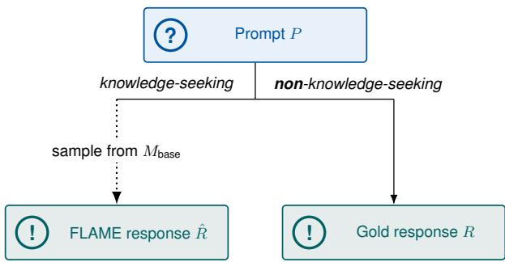  
Figure 4: FLAME. For knowledge-seeking prompts, the response R<sup>ˆ</sup> is sampled from the base model $M _ { \mathrm { b a s e } }$

For knowledge-seeking prompts, FLAME samples R<sup>ˆ</sup> from $M _ { \mathrm { b a s e } }$ in a few-shot setting. The fewshot setting is necessary because the base model has not been trained to follow instructions.

When preparing FLAME training data for OASST1, we retrieve the top five similar but not identical training examples for each prompt P using bge-large-en-v1.5 (Xiao et al., 2024). We remove less relevant examples to fit into 3 of the context size; if fewer than three examples remain, the prompt is removed from the training set. Figure 4 illustrates this data construction procedure.

$\mathbf { U N I T } _ { c u t }$ Wu et al. (2025) investigate the tradeoff between informativeness and truthfulness in instruction fine-tuning, attributing hallucinations to the inclusion of unfamiliar, long-tail knowledge in training data. To address this, they propose uncertainty-aware instruction fine-tuning, where uncertainty estimates are used as a proxy for whether a model knows a given piece of information. In $U N I T _ { c u t }$ , each gold response R is decomposed into atomic claims $\mathcal { C } ( R \mid P )$ , and claims with high estimated uncertainty are removed before training to obtain a filtered response R<sup>∗</sup>. This filtering improves truthfulness but often reduces informativeness due to the removal of content.

However, this approach relies on uncertainty as an imperfect proxy for model knowledge, which may be miscalibrated or only weakly correlated with parametric knowledge. Furthermore, $\mathrm { U N I T } _ { c u t }$ operates solely on explicitly stated claims and does not account for implicit knowledge required to construct a valid response. In particular, responses often depend on meta-knowledge: factual, procedural, or structural information that is not directly expressed in R but is nonetheless required for generation. These limitations motivate a more direct estimation of model knowledge that captures both explicit and implicit knowledge.

For data preparation, we use the code provided by the authors<sup>4</sup> and train the models using the same training pipeline as all other models.

## D Fact-Checking Pipeline

The fact-checking pipeline is used in two places in this paper: (i) to construct the Evidence Rewrite training data by verifying claims in base model generations, and (ii) to evaluate all models on the Wild-Halu and Biography benchmarks. In both cases, the pipeline follows the three-step approach of Min et al. (2023).

Claim Decomposition. The generated text is first segmented into sentences using nltk (Bird and Loper, 2004). A sliding window is then applied to extract atomic claims from each sentence via LLM inference. The primary objective is to produce a comprehensive list of verifiable atomic claims — individual statements that can be independently checked against an external source. Different implementations vary in how they define atomicity, leading to different prompt templates (Min et al., 2023; Song et al., 2024) or additional filtering steps (Wei et al., 2024).

We use the VeriScore decomposition prompt (Song et al., 2024) rather than the original FActScore prompt (Min et al., 2023). FActScore’s decomposition was designed for biography generation and performs poorly on open-domain instruction-following data such as OASST1: it frequently extracts claims that cannot be verified against any external source. Common failure cases include claims with unresolved pronouns (e.g., "He has appeared in numerous films.") and metacommentary about the response itself (e.g., "There are provided passages." extracted from "Based on the provided passages, here is the answer to the question:"). VeriScore addresses this by using detailed instructions and few-shot examples that guide the model to only extract claims that are fully self-contained and can be checked against an external source, consistent with observations by Song et al. (2024).

Evidence Retrieval. For Evidence Rewrite training data construction and Biography evaluation, the top five pieces of supporting evidence are retrieved from Wikipedia using a two-phase hierarchical approach. First, the Wikimedia $\mathrm { A P I } ^ { 5 }$ identifies the five most relevant Wikipedia pages for the claim. Second, these pages are split into chunks and reranked using gtr-t5-large (Ni et al., 2022) to select the five most pertinent chunks as evidence. We use the Wikipedia dump from 04/01/2023 provided by Min et al. (2023), preprocessed into fixedsize chunks. For WildHalu evaluation, we instead follow Wu et al. (2025) and retrieve evidence from Google Search using their implementation<sup>6</sup>.

Claim Verification. Each claim is paired with its retrieved evidence chunks and passed to an LLM-based classifier, which decides whether the claim is supported by the evidence. We use gpt-4o-mini (OpenAI, 2024) for this step in both cases, but the two use cases differ in the label set. For Evidence Rewrite training data construction, we use the FActScore verification prompt (Figure 10), which labels each claim as SUPPORTED or NOT\_SUPPORTED. For evaluation, we follow the implementation of Wu et al. (2025), whose verifier distinguishes three labels: True, False, and Not known for claims that the retrieved evidence neither confirms nor refutes<sup>7</sup>. We treat True as supported and False as unsupported, and exclude claims labeled Not known from #Supp., %Supp. and FActScore.

## E Training Details

<table><tr><td>Parameter Value</td></tr><tr><td>Devices 1 × NVIDIA A100 (80GB) Number of Epochs 5</td></tr><tr><td>Total Batch Size 32</td></tr><tr><td>Learning Rate 1 × 10−5</td></tr><tr><td>Optimizer AdamW</td></tr><tr><td>Scheduler Cosine Warmup Ratio 0.1</td></tr><tr><td>Weight Decay 0.1</td></tr><tr><td>Context Length 1024</td></tr></table>

Table 8: Training configuration for SFT training on OASST1.

Table 8 provides the SFT configuration used for standard SFT and the different knowledge-aligned

SFT approaches.

## E.1 Recall Rewrite

<table><tr><td>Metric</td><td>Qwen 3 4B</td><td>OLMo 3 7B</td></tr><tr><td>Total examples Total claims Avg. claims per example</td><td>3,467 64,301 18.5</td><td>3,467 64,301 18.5</td></tr><tr><td>Entailed answers</td><td>62.5%</td><td>70.6%</td></tr><tr><td>Unrelated answers Contradicting answers</td><td>25.1% 12.4%</td><td>15.3% 14.1%</td></tr><tr><td>Non-knowl.-dep. claims</td><td>24,448 (38.0%)</td><td>24,448 (38.0%)</td></tr><tr><td>Knowl.-dep. claims known (retained)</td><td>39,853 (62.0%) 31,654 (79.4%)</td><td>39,853 (62.0%) 32,168 (80.7%)</td></tr><tr><td>unknown (removed) Retained claims</td><td>8,199 (20.6%)</td><td>7,685 (19.3%)</td></tr><tr><td>Avg. claims after rewrite</td><td>56,102 (87.2%) 16.5</td><td>56,616 (88.0%)</td></tr><tr><td></td><td></td><td>16.6</td></tr><tr><td>Non-refusal responses</td><td>3,165</td><td>3,175</td></tr><tr><td>Refusal responses</td><td>302</td><td>292</td></tr></table>

Table 9: Statistics of the Recall Rewrite pipeline on OASST1 for Qwen3-4B-Base and OLMo-3-1025-7B under the default filter $2 / 1 / 2 / 1$ (Equation (1))<sup>8</sup>. Answer shares are over all probe answers. Percentages for non-/knowledge-dependent and retained claims are relative to all claims, those for known/unknown claims relative to the knowledge-dependent claims. Nonknowledge-dependent claims are always retained, so the retained claims are the non-knowledge-dependent plus the known claims. Avg. claims after rewrite counts retained claims per non-refusal response.

Table 9 provides statistics on applying the Recall Rewrite pipeline using both Qwen 3 4B and OLMo 3 7B on the OASST1 data. Of the 39,853 knowledge-dependent claims, 8,199 (Qwen3-4B-Base) and 7,685 (OLMo-3-1025-7B) are classified as unknown and removed, while all 24,448 non-knowledge-dependent claims are retained. Refusals concentrate on responses with a low share of known claims: among the knowledgedependent claims of refusal responses only 60.9% (Qwen3-4B-Base) and 59.8% (OLMo-3-1025-7B) are known, compared to 81.7% and 83.2% in nonrefusal responses. Accordingly, non-refusal responses shrink from 18.5 to 16.5 (Qwen3-4B-Base) and 16.6 (OLMo-3-1025-7B) claims on average. Table 10 provides the corresponding token usage and API cost for the different steps.

<table><tr><td>Pipeline Step</td><td># Input Tokens</td><td># Output Tokens</td><td>Cost (USD)</td></tr><tr><td>Claim Decomposition</td><td>3M</td><td>1.2 M</td><td>1.98</td></tr><tr><td>Claim-Question Rewriting</td><td>63.5 M</td><td>19.7 M</td><td>27.64</td></tr><tr><td>Entailment Check</td><td>82.5 M</td><td>0.6M</td><td>10.92</td></tr><tr><td>Answer Rewriting</td><td>23.5 M</td><td>0.5 M</td><td>3.44</td></tr><tr><td>Total</td><td>172.5 M</td><td>22M</td><td>43.98</td></tr></table>

Table 10: Token usage and API cost of the Recall Rewrite pipeline per step, using $\mathtt { g p t - 5 - m i n i - } 2 \theta 2 5 \ – \theta 8 \ – \theta 7$ with batched API calls across all 3,468 OASST1 examples for Qwen 3 4B.
<table><tr><td colspan="5">Train</td><td colspan="4">WildHalu</td><td colspan="4">Bios</td></tr><tr><td></td><td>Filter %Known #Non-Ref.</td><td></td><td> $\mathrm { { A v g . C l . } }$ </td><td>#Ref. #Ref.</td><td></td><td>#Supp.</td><td>%Supp. FActScore</td><td></td><td></td><td>e #Ref. #Supp.</td><td></td><td>%Supp. FActScore</td></tr><tr><td>2/1/2/1</td><td>79.4</td><td>3,165</td><td>16.5</td><td>100</td><td>32</td><td>6,006</td><td>82.8</td><td>82.1</td><td>66</td><td>2,989</td><td>43.9</td><td>49.7</td></tr><tr><td>2/1/5/3</td><td>84.7</td><td>3,273</td><td>16.9</td><td>100</td><td>15</td><td>6,877</td><td>80.5</td><td>78.4</td><td>38</td><td>3,870</td><td>43.2</td><td>42.9</td></tr><tr><td>2/1/0/1</td><td>62.3</td><td>2,877</td><td>14.9</td><td>100</td><td>25</td><td>5,312</td><td>84.3</td><td>82.6</td><td>40</td><td>2,802</td><td>49.3</td><td>49.3</td></tr><tr><td>1/1/2/1</td><td>83.2</td><td>3,211</td><td>16.9</td><td>100</td><td>11</td><td>6,603</td><td>80.9</td><td>78.9</td><td>34</td><td>3,854</td><td>43.0</td><td>45.3</td></tr><tr><td>3/2/2/1</td><td>53.6</td><td>2,781</td><td>13.9</td><td>100</td><td>30</td><td>5,206</td><td>82.3</td><td>81.1</td><td>65</td><td>3,198</td><td>49.8</td><td>53.2</td></tr></table>

Table 11: Effect of the Recall Rewrite filter thresholds $j _ { e } / k _ { e } / j _ { c } / k _ { c }$ (Equation (1): at least $j _ { e }$ entailing and at most $j _ { c }$ contradicting questions) on Qwen3-4B-Base trained on OASST1. The first row is the default used in the main paper. %Known is the share of knowledge-dependent claims in the training targets that the filter classifies as known and retains (cf. Table ${ 9 } ;$ not the target ratio of Table 3); Avg.Cl. is the number of claims per non-refusal training response after rewriting. The number of refusals in the training data (#Ref. Train) is held fixed at 100. Best results are bolded.

## F Recall Rewrite: Filter Threshold Ablation

We study how different $j _ { e } / k _ { e } / j _ { c } / k _ { c }$ filtering thresholds (defined in Section 3.2.2) affect the Recall Rewrite pipeline. The default used in the main paper is $2 / 1 / 2 / 1$ . To isolate the effect of claim filtering, the number of refusals in the training data is held fixed at 100 across all conditions. Results are shown in Table 11.

Across all conditions we observe the same tradeoff as in the main ablation (Table 3): more lenient thresholds yield more supported claims (#Supp.) at evaluation but lower %Supp. and FActScore, while stricter thresholds reduce #Supp. but improve %Supp. and FActScore. Figure 5 plots both ablations together with all methods of Table 1 in the coverage–factuality plane. The Recall Rewrite variants span a wide range of operating points that no single baseline covers: the stricter settings $( 3 / 2 / 2 / 1 , 2 / 1 / 0 / 1$ , 100% known) reach FActScore levels no baseline attains, whereas the two most lenient filter settings $( 1 / 1 / 2 / 1 , 2 / 1 / 5 / 3 )$ are dominated by $\mathrm { U N I T } _ { c u t }$ , which retains more supported claims at a similar or higher FActScore. The filter threshold thus acts as a training-time knob for choosing a point on this trade-off.

Varying the contradiction tolerance $( j _ { c } / k _ { c } ) .$ One motivation for tolerating some contradicting answers is that probing questions are sometimes underspecified: an overly open question may admit multiple valid answers that, when compared against a specific claim, are inconsistently labeled as Contradicts. Under zero contradiction tolerance $( 2 / 1 / 0 / 1 )$ , a single such label disqualifies the claim. Compared to the default $2 / 1 / 2 / 1$ , this results in fewer #Supp. while %Supp. and FActScore remain similar on WildHalu, and on Bios %Supp. improves but FActScore does not — suggesting that the additionally discarded claims are largely correct ones. Going in the other direction, $2 / 1 / 5 / 3$ cannot be violated with K=2 answers per question and thus disables the contradiction criterion. It yields more #Supp. but lower %Supp. and FActScore on both datasets, indicating that dropping the contradiction criterion retains genuinely unknown claims.

Varying the entailment requirement $( j _ { e } / k _ { e } ) .$ One motivation for requiring entailment from multiple questions is that probing questions are sometimes overspecified: a question that closely mirrors the wording of the original claim may elicit an entailing response even when the model lacks genuine knowledge. Compared to the default $2 / 1 / 2 / 1$ relaxing to $1 / 1 / 2 / 1$ yields more #Supp. but lower %Supp. and FActScore, consistent with retaining claims the model does not robustly know. Tightening to $3 / 2 / 2 / 1$ improves %Supp. and FActScore, most notably on Bios, at the cost of discarding additional training claims. At evaluation this reduces #Supp. on WildHalu, whereas on Bios the stricter model retains slightly more supported claims than the default.

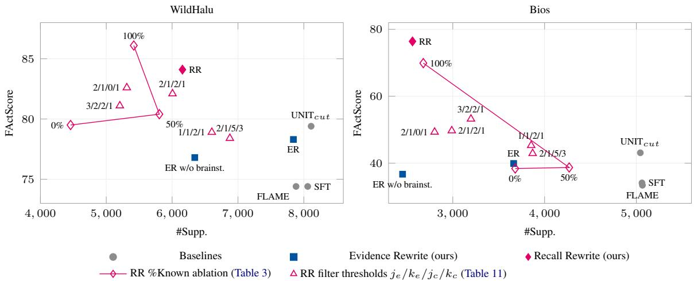  
Figure 5: Coverage vs. factuality on WildHalu (left) and Bios (right) for all Qwen 3 4B models trained on OASST1. #Supp. is the number of supported claims over all non-refusal responses (coverage); FActScore treats refusals as fully supported. The two Recall Rewrite ablations trace the trade-off controlled at training time: the proportion of known claims in the targets (%Known, hollow diamonds, Table 3) and the filter thresholds $j _ { e } / k _ { e } / j _ { c } / k _ { c }$ (triangles, Table 11; trained with 100 instead of 302 refusal examples, hence not identical to the main Recall Rewrite model). Up and to the right is better.

Choice of default $( 2 / 1 / 2 / 1 )$ . The default was motivated by two observed failure modes in question generation. Requiring entailment from at least two distinct questions with at least one entailing response each $( j _ { e } { = } 2 , k _ { e } { = } 1 )$ guards against overspecified probes. Tolerating up to two questions with a single contradicting answer $( j _ { c } { = } 2 , k _ { c } { = } 1 )$ guards against underspecified ones. The results confirm that $2 / 1 / 2 / 1$ achieves a good balance: on WildHalu it retains more supported claims than the stricter settings while maintaining higher %Supp. and FActScore than the more lenient ones.

## G Factuality–Capability Trade-off

Figure 6 plots FActScore against the OLMES average for all OASST1 models, complementing the discussion in Section 4.6.

## H UnknownBench Precision–Recall Trade-off

Since refusal is a discrete generation decision, our models do not expose an inference-time confidence threshold. Each trained model corresponds to a single precision–recall operating point on Unknown-Bench, and its conservativeness is instead determined at training time by the strength of knowledge alignment. Figure 7 therefore plots the results of Table 4 together with the %Known ablation models of Table 3 against iso-F1 contours.

On all three subtasks, Recall Rewrite and its 100%-known ablation trade precision for substantially higher recall than the baselines, and the 100%-known model attains the highest F1 on every subtask (70.4 / 74.1 / 71.9). The ablation models trained with a larger share of unknown claims (0% and 50%) fall back to baseline-level recall on NEC and RefuNQ at a lower precision, i.e., they refuse less reliably and less selectively.

The filter thresholds of Table 11 provide a finergrained control over this operating point.

## I Qualitative Analysis of Recall Rewrite

This appendix complements the aggregate results with examples of where Recall Rewrite succeeds and where it fails. We look at the three stages at which the method acts: the rewriting of the OASST1 training data (Section I.1), the generations of the resulting model on WildHalu and

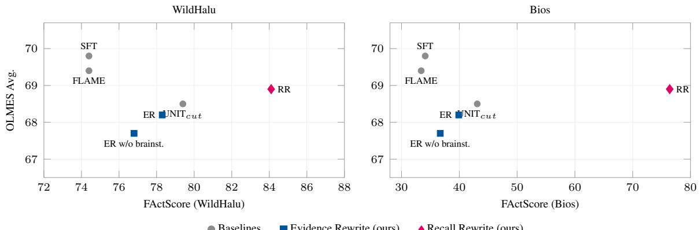  
Baselines Evidence Rewrite (ours) Recall Rewrite (ours)

Figure 6: Factuality vs. general capability for all knowledge-alignment methods trained on OASST1 with Qwen 3 4B. Each point is one trained model: FActScore on WildHalu (left) and Bios (right, Table 1) against the average over the four general capability benchmarks (Table 5). Up and to the right is better. All models lie within a 2.1-point band on the OLMES average, while FActScore varies by 10 (WildHalu) and 43 (Bios) points.  
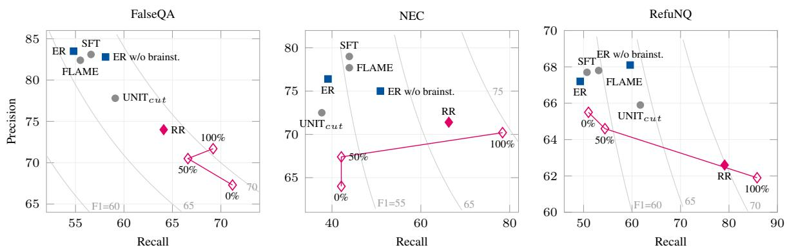  
Baselines Evidence Rewrite (ours) Recall Rewrite (ours) Recall Rewrite, %Known ablation (Table 3)  
Figure 7: Refusal precision vs. recall on the three UnknownBench subtasks (Table 4). Each trained model yields a single operating point since refusal is a discrete generation decision; gray contours are iso-F1 lines. Hollow diamonds connect the Recall Rewrite %Known ablation models (Table 3). Recall Rewrite and the 100%-known model trade precision for substantially higher recall than all baselines.

Bios (Section I.2), and the regressions on IFEval and GSM8K (Section I.3). All examples come from the Qwen3-4B-Base pipeline and from the Recall Rewrite and standard SFT models trained on OASST1 (Table 1). Each example is shown side by side with the original and the rewritten response (Section I.1) or with the responses of standard SFT and Recall Rewrite (Sections I.2 and I.3), followed by the information that explains the outcome.

## I.1 Training Data Rewrites

Examples 1 to 9 show original OASST1 responses next to their rewritten versions together with the claims that the pipeline classified as unknown. For each removed claim we report how many of the ten probe answers (J=5 questions with K=2 answers each) entail (E), contradict (C), or are unrelated to (U) the claim. Where it explains the outcome, a Probing line additionally shows representative probing questions with the sampled base-model answers and their entailment label.

Intended behavior. In the intended case (Examples 1 and 2), the base model consistently contradicts one specific claim of the gold response, such as the share of dark matter in the universe or the daily food intake of a groundhog, and the rewriter removes exactly this claim with a local edit while leaving the rest of the response untouched. Both removed claims are true. Recall Rewrite removes them not because they are wrong, but because Qwen3-4B-Base does not recall them: for dark matter, all ten probe answers give 27%, which is the share of dark matter in the total mass–energy of the universe rather than in its matter. Example 3 shows the same mechanism leading to a refusal. The gold response correctly attributes the lyrics to “Dear Prudence” by The Beatles, but in all ten probe answers the base model attributes them to “Beautiful Day” by U2. Both content-bearing claims are therefore removed and the rewriter returns the refusal template.

## Example 1 (success): A single unknown quantitative claim is removed

Prompt: what is dark matter

Gold response R

Dark matter is an hypothetical form of matter, which does not interact with the electromagnetic field. It is thought to account for approximately 85% of the matter in the known universe, if it does exist.

Dark matter is an hypothetical form of matter, which does not interact with the electromagnetic field.

Removed claim: “Dark matter is thought to account for approximately 85 percent of the matter in the known universe.” (E0 / C10 / U0). All seven retained knowledge-dependent claims are entailed by at least eight of the ten answers.

Probing: Q: “Approximately what percentage of the matter in the known universe is believed to consist of dark matter?” → “It is believed that about 27% of the matter in the known universe consists of dark matter.” (C); “Dark matter is believed to make up around 27% of the matter in the universe, while ordinary matter accounts for about 5%.” (C). All ten answers to the five questions state 27%.

## Example 2 (success): A removed quantity is paraphrased consistently throughout the response

Prompt: How much wood would a woodchuck chuck if a woodchuck could chuck wood?

## Gold response R

Since woodchucks (also known as Groundhogs) are pretty small animals, the amount of wood they could chuck would likely be part of their normal food consumption.

Adult Groundhogs can eat up to one pound of vegetation per day. So, assuming their metabolism doesn’t change:

A woodchuck would chuck 1 pound of wood if a woodchuck could chuck wood.

Since woodchucks (also known as Groundhogs) are pretty small animals, the amount of wood they could chuck would likely be part of their normal food consumption.

They consume a modest amount of vegetation each day. So, assuming their metabolism doesn’t change:

A woodchuck would chuck a modest amount of wood if a woodchuck could chuck wood.

Removed claim: “Adult groundhogs can eat up to one pound of vegetation per day.” (E0 / C10 / U0).

Example 3 (success): The base model consistently recalls a different answer, so the response becomes a refusal   
Prompt: [lyrics] of the verse go like this: “The sun is up, the sky is blue, it’s beautiful and so are you.” Which song is that and who is the author of the [lyrics]?   
Gold response R   
Those are part of the lyrics of the song “Dear Prudence” by The Beatles, written by John Lennon.   
Rewritten response R<sup>∗</sup>   
I cannot answer as I have insufficient information.   
Removed claims: “The lyrics [. . .] appear in the song ‘Dear Prudence’.” (E0 / C10 / U0); “John Lennon wrote the lyrics of the song ‘Dear Prudence’.” (E0 / C7 / U3). Retained: “‘Dear Prudence’ is a song performed by the Beatles.” (E10 / C0 / U0). Probing: Q: “Which song includes the lyric ‘The sun is up, the sky is blue, it’s beautiful and so are you.’?” → “The song ‘Beautiful Day’ by U2 contains the lyric [. . .]” (C); “The song is ‘Beautiful Day’ by U2.” (C). All ten answers to the five questions name “Beautiful Day” by U2.

Failure modes. Examples 4 to 7 show the four failure modes we observed most frequently. First, the probing questions do not target the information that the claim adds. In Example 4, the claim to be tested contributes one piece of new information to the response, the year 1596, since Warsaw as the capital is asserted (and classified as known) by a separate claim. All five generated questions nevertheless ask for the city and the year. The base model recalls the year in nine of the ten answers, but three questions receive a wrong city (Lwów, Kraków, Lublin), which counts as three contradicting questions and removes the claim, whereas the near-identical retained claim “The capital [. . .] moved from Kraków to Warsaw in 1596” passes because its questions happen to name the city. Untargeted questions thus make the classification depend on which part of a compound question the base model gets wrong, and can classify claims carrying the same information differently. Overall, 392 of the 8,199 removed claims (4.8%) are entailed by at least six of the ten answers. Second, the probes fail to elicit related answers. 1,575 of the 8,199 removed claims (19.2%) are removed without a single contradicting answer, i.e., only because too few of the sampled answers were judged to entail the claim. Example 5 is such a case: the answers describe “language models” or “NLP models”, which the entailment check does not accept as evidence for a claim about large language models, so the classification reflects the strictness of the probe and entailment step rather than the knowledge of the base model. Third, the rewriter removes more than the unknown claim. In the same example, only this generic definition is classified as unknown, yet the rewriter also drops the sentence on ChatGPT’s capabilities although all of its claims were retained. Fourth, the rewritten response loses coherence or changes the content. After removing all references to the song in Example 6, the remaining clarification question still asks about “the song”, although the response no longer says which song is meant. In Example 7, the rewriter reacts to the removal of a claim about match expressions by rewriting the code itself into an if/else chain and dropping the code fence. This last case is specific to code and other structured responses, where many claims describe how the response is constructed rather than what it states. Over-truncation is nonetheless rare in the non-refusal set: the median rewritten response retains 97% of the characters of the original, and 1,127 of the 3,165 responses have no claim removed at all.

Example 6 (failure): The rewritten response is no longer   
coherent   
Prompt: What is love? Baby don’t hurt me   
Gold response R   
Sorry, could you please clarify your task? Would you like to   
know more about the song 1993 song “What is Love” from   
Haddaway?   
Rewritten response R<sup>∗</sup>   
Sorry, could you please clarify your task? Would you like to   
know more about the song?   
Removed claims: “The phrase ‘What is love? Baby   
don’t hurt me’ is a lyric from the song ‘What Is Love’.”   
(E3 / C4 / U3); “The song ‘What Is Love’ was released in   
1993.” (E1 / C9 / U0); “The song ‘What Is Love’ was per  
formed by the artist Haddaway.” (E0 / C10 / U0).

## Example 4 (failure): The probing questions test the city rather than the year that the claim adds

Probing: All five questions ask for city and year, e.g., Q: “Name the city that assumed the role of capital for the Polish– Lithuanian Commonwealth and state the year when this happened.” → “Lwów (now Lviv, Ukraine) became the capital of the Polish–Lithuanian Commonwealth in 1596.” (C); “The city of Warsaw became the capital of the Polish–Lithuanian Commonwealth in 1596.” (E). Nine of the ten answers give the year 1596; the three contradictions (Lwów, Kraków, Lublin) all concern the city. The retained near-duplicate claim was probed with questions that name Kraków as the previous capital, e.g., Q: “Identify the city that replaced Kraków as the seat of the Polish–Lithuanian Commonwealth and state the year the replacement happened.” → “The city that replaced Kraków [. . .] was Warsaw. The replacement happened in 1596.” (E).

Example 5 (failure): No question entails a generic claim, and the rewriter removes more than the unknown claim Prompt: Do you know of Chat GPT?   
Gold response R   
ChatGPT is a large language model (LLM) developed by OpenAI, based on the GPT-3 architecture. It is designed to understand and respond to natural language input from users, and its capabilities include tasks such as language translation, answering questions, and generating human-like responses to prompts.   
Rewritten response R<sup>∗</sup>   
Yes. ChatGPT is developed by OpenAI and is based on the GPT-3 architecture.   
Removed claim: “A large language model is trained to process and generate human language.” (E2 / C0 / U8). Retained, among others: “ChatGPT is a large language model.” (E6 / C0 / U4); “ChatGPT can perform language translation.” (E10 / C0 / U0); “ChatGPT is designed to respond to natural language input from users.” (E9 / C0 / U1).   
Probing: Q: “Which type of AI model is trained to analyze and produce natural human language?” → “A language model is an AI model specifically designed to understand and generate natural human language.” (U); “A natural language processing (NLP) model is trained to understand, interpret, and generate human language.” (U). Eight of the ten answers name language or NLP models without the qualifier large and are labeled unrelated.

Prompt: I’ve been learning Rust for a few weeks now, and have been trying my hand at the fizzbuzz problem. [code of fn fizzbuzz<’a>(n: usize) -> &’a str using a match expression] For some reason, I get a compiler error that I’m struggling to understand. [error[E0515]: cannot return value referencing temporary value [. . .]] Could you please explain to my why this happens and how I can fix it?

\_ => n.to\_string(),   
}   
}   
Rewritten response R<sup>∗</sup>   
The simplest way to solve this is to just return a String rather   
than a & str:   
fn fizzbuzz(n: usize) -> String {   
if n % 3 == 0 && n % 5 == 0 {   
"fizzbuzz".to\_string()   
} else if n % 3 == 0 {   
"fizz".to\_string()   
} else if n % 5 == 0 {   
"buzz".to\_string()   
} else {   
n.to\_string()   
}   
}   
Removed claim: “All arms of a match expression must pro  
duce values of the same type.” (E7 / C3 / U0). All nine other   
knowledge-dependent claims (on &str, String, lifetimes, and   
temporaries) were retained. The prompt is abbreviated.

Over-refusals. The rewriter returns the refusal template for 302 of the 3,467 OASST1 examples. In 7 of these no claim was removed at all (Example 8), and in 114 cases at most a quarter of the knowledge-dependent claims were removed. Such refusals are over-represented for code: 95 of the 302 refusals (31%) but only 434 of the 3,165 non-refusals (14%) contain code, and 64 of the 114 refusals with few removed claims are code answers. Example 9 is typical. A single claim about the index range is classified as unknown, and its contradicting answers reflect the ambiguity of the claim (indexing from 0 or 1, negative extensions of the sequence) rather than missing knowledge. The code itself is unaffected, but the rewriter judges the remaining information insufficient rather than returning the unchanged code. These refusals originate from the insufficient-information decision of the rewriter (Figure 14) rather than from the knowledge classification. Constraining this decision, for instance by never refusing when no claim was removed, is a straightforward improvement for future work.

Example 8 (over-refusal): No claim was removed   
Prompt: All pizzas are food. I have not eaten any food today.   
Have I eaten any pizzas today?   
Gold response R   
No. You stated you have not eaten any food today, and since   
all pizzas are food, it can be deduced that you have not eaten   
any pizzas today.   
Rewritten response R<sup>∗</sup>   
I cannot answer as I have insufficient information.   
Removed claims: none. Four of the five claims are non  
knowledge-dependent (logical inferences over the prompt)

Example 9 (over-refusal): One of 16 knowledge-dependent claims is removed, the code is unaffected

Prompt: Write Python code to generate N Tribonacci numbers

Gold response R   
\`\`\`python   
def tribonacci(n):   
if n == 0 or n == 1:   
return 0   
if n == 2:   
return 1   
return tribonacci(n-1) + tribonacci(n-2)   
+ tribonacci(n-3)   
Rewritten response R<sup>∗</sup>   
I cannot answer as I have insufficient information.

Removed claim: “A Tribonacci index is a non-negative integer.” (E6 / C4 / U0). Retained, among others: “For every integer n ≥ 3, the Tribonacci number at index n equals the sum of the Tribonacci numbers at indices n−1, n−2, and n−3.” (E7 / C0 / U3); “In Python, the keyword def begins a function definition.” (E10 / C0 / U0); “In Python, indentation determines which statements belong to a block.” (E10 / C0 / U0).

Probing: Q: “What type of number is used to label positions in the Tribonacci sequence (i.e., what kind of number can a Tribonacci index be) ${ \overset { \bullet } { ! } } ? ^ { \mathfrak { s } } \to { \overset { \cdot } { \ast } } { \mathbf { A } }$ Tribonacci index can be any positive integer, as it represents the position in the sequence starting from $1 . { \overset { \underset {  } { } } { \operatorname { \prime } } } \ ( \mathbf { C } ) ; { \overset { \underset {  } { } } { \operatorname { \prime } } } \mathbf { A }$ Tribonacci index can be any nonnegative integer [. . .]” (E). Q: “Which category of numbers describes valid indices for the Tribonacci sequence (for example: negative numbers, positive only, or including zero)?” → “Valid indices for the Tribonacci sequence include both positive and negative numbers, as well as zero, since the sequence can be extended infinitely in both directions.” (C). The last code line is wrapped for layout.

## I.2 Model Generations

<table><tr><td></td><td>WildHalu</td><td>Bios</td></tr><tr><td>Recall Rewrite (RR) refuses</td><td>55</td><td>252</td></tr><tr><td>std. SFT &lt; 40% true claims</td><td>31</td><td>224</td></tr><tr><td>std. SFT 40–70% true claims</td><td>15</td><td>23</td></tr><tr><td>std. SFT ≥ 70% true claims</td><td>8</td><td>1</td></tr><tr><td>std. SFT also refuses</td><td>1</td><td>4</td></tr><tr><td>Std. SFT refuses, RR answers</td><td>1</td><td>0</td></tr><tr><td>Both models answer</td><td>444</td><td>248</td></tr><tr><td>RR has fewer false claims</td><td>265</td><td>215</td></tr><tr><td>same number of false claims</td><td>101</td><td>11</td></tr><tr><td>RR has more false claims</td><td>78</td><td>22</td></tr><tr><td colspan="3">Avg. true/ false claims when both answer</td></tr><tr><td>std. SFT</td><td>17.1/4.5 14.7/15.6</td><td></td></tr><tr><td>RR</td><td>13.8/2.6</td><td>10.3/8.0</td></tr></table>

Table 12: Per-prompt comparison of Recall Rewrite and standard SFT on the 500 WildHalu and 500 Bios prompts, based on the fact-check verdicts (true / false / not known) of Section D. The share of true claims is computed over all claims of the standard SFT response. Refusals are identified with the evaluation pipeline’s LLM refusal detector, so the refusal counts match the #Ref. column of Table 1; the true-claim buckets cover the prompts on which standard SFT answers.

Table 12 categorizes the 500 WildHalu and 500 Bios prompts by the behavior of the two models. Examples 10 to 14 show representative generations with the number of true / false / not known claims according to the fact-checking pipeline of Section D.

Refusals. Recall Rewrite refuses on 252 Bios prompts. Standard SFT answers on 248 of these prompts; for 224 (90%), fewer than 40% of its claims for the same entity are true, and only for one entity (Luiz Inácio Lula da Silva, 39 true and 13 false claims) is the standard SFT response predominantly correct. Bios refusals thus almost exclusively concern entities on which standard SFT hallucinates, such as Maja Jager in Example 10, where standard SFT invents a Swedish singer while the entity is a Danish archer. The 40% threshold, if anything, overstates the quality of standard SFT, since the fact-checker marks generic claims such as “she has released several albums” as true even when the response describes a fictitious person. On WildHalu, whose entities are less long-tail (cf. the %Supp. of standard SFT in Table 1), the picture is more mixed. Of the 55 refusals, 31 concern entities on which standard SFT is mostly wrong, but 8 concern entities on which it is mostly right. For Lovenox (Example 11), for example, all 21 claims of the standard SFT response are supported. These over-refusals are the price of the higher %Supp. (Table 1) and the higher refusal recall (Table 4).

Example 10 (correct refusal): Standard SFT describes a fictitious person   
Prompt: Tell me a bio of Maja Jager.   
Standard SFT   
Maja Jager is a Swedish singer and songwriter who was born on March 17, 1989 in Stockholm, Sweden. She began her music career at a young age, singing in church choirs and participating in various music competitions.   
Jager gained widespread recognition in 2013 after winning the Swedish version of the reality TV show “The Voice”. She went on to represent Sweden in the Eurovision Song Contest that same year, where she finished in 10th place.   
Since then, Jager has released several albums and singles, including her debut album “Maja Jager” in 2014 and her second album “The Voice” in 2016. She has also collaborated with various artists, including fellow “The Voice” contestant Marcus & Martinus.   
In addition to her music career, Jager is also known for her humanitarian work, including her involvement with the Swedish Red Cross and her efforts to raise awareness for mental health issues.   
Recall Rewrite   
I cannot answer as I have insufficient information.   
Fact-check (true/false/not known): standard SFT 1 / 21 / 0. Wikipedia: “Maja Buskbjerg Jager (born 22 December 1991) is a Danish recurve archer.”

Example 11 (over-refusal): Standard SFT is fully correct Prompt: In a paragraph, could you tell me what you know about Lovenox?

Standard SFT

Lovenox is the brand name for enoxaparin, a low molecular weight heparin (LMWH) used to prevent and treat blood clots. It is commonly used to prevent deep vein thrombosis (DVT) and pulmonary embolism (PE) in patients who are at risk, such as those who have undergone surgery or have been bedridden for an extended period of time. It is also used to treat existing blood clots in the legs or lungs, and to prevent recurrent clots. Lovenox works by inhibiting the formation of blood clots, thereby reducing the risk of clot-related complications. It is administered via subcutaneous injection and is generally well-tolerated, although like all medications, it can cause side effects such as bleeding, bruising, and injection site reactions. As with any medication, Lovenox should only be used under the guidance of a healthcare provider.

Recall Rewrite I cannot answer as I have insufficient information. Fact-check: standard SFT 21 / 0 / 0.

Both models answer. When both models answer, Recall Rewrite produces shorter responses with fewer claims (WildHalu: 13.8 true and 2.6 false claims per response vs. 17.1 and 4.5 for standard SFT; Bios: 10.3 and 8.0 vs. 14.7 and 15.6) and has fewer false claims than standard SFT for 265 of the 444 WildHalu and 215 of the 248 Bios prompts. In the best cases it drops exactly the wrong details (Example 12) or replaces a fabricated description with a correct one (Example 13). Recall Rewrite is not immune to hallucination, however: it produces more false claims than standard SFT on 78 Wild-Halu and 22 Bios prompts. Example 14 shows such a case. The model answers a question about an entity it evidently does not know instead of refusing, and fabricates a detailed description whose errors merely differ from those of standard SFT. The training thus reduces how often the model guesses, but when it does guess, its output is no more reliable.

Example 12 (correction): Recall Rewrite drops exactly the wrong details   
Prompt: In a paragraph, could you tell me what you know about Brandenburg Gate?   
Standard SFT   
The Brandenburg Gate is a neoclassical monument located in Berlin, Germany. It was built between 1788 and 1793 to commemorate the Peace of Westphalia, which ended the War of the First Coalition against France. The gate is made of white marble and features a large arch with four fluted columns supporting a triangular pediment. It has been a symbol of German unity and freedom for centuries, and has been the site of many important historical events, such as the proclamation of German reunification in 1990. Today, it is one of the most iconic landmarks in Berlin, and a popular tourist attraction. Recall Rewrite   
The Brandenburg Gate is a neoclassical monument in Berlin, Germany. It was built between 1788 and 1791 and is one of the most iconic landmarks in the city. The gate is a symbol of the unity of Germany and has been the site of many important historical events. It has been the setting for numerous political rallies and demonstrations, including the German Unification Day celebrations in 1990.   
Fact-check: standard SFT 7 / 6 / 2 (false: construction years, Peace of Westphalia, white marble, four fluted columns); Recall Rewrite 11 / 0 / 0.

Example 13 (correction): A fabricated description is replaced by a correct one

Prompt: In a paragraph, could you tell me what you know about Monocle3?

Standard SFT

Monocle3 is a deep brain stimulation device that is used to treat movement disorders such as Parkinson’s disease. It is a small, implantable device that is placed in the chest and connected to electrodes that are implanted in specific areas of the brain. The device delivers electrical impulses to the brain to help regulate abnormal brain activity that can cause symptoms such as tremors, rigidity, and bradykinesia. Monocle3 is designed to be programmable, allowing doctors to adjust the settings based on the patient’s individual needs. It is a wireless device that is powered by a battery, which can be replaced during a simple surgical procedure. Monocle3 is intended to be a long-term solution for patients with movement disorders, and it has been shown to be effective in reducing symptoms and improving quality of life for many patients.

Recall Rewrite

Monocle3 is a computational tool designed for the analysis of single-cell RNA sequencing (scRNA-seq) data. It provides a suite of algorithms for processing and analyzing scRNA-seq data, including quality control, normalization, dimensionality reduction, and clustering. Monocle3 also includes tools for visualizing the results of scRNA-seq analysis, such as trajectory inference and pseudotime analysis. The tool is implemented in R and provides a user-friendly interface for performing these analyses. Overall, Monocle3 is a powerful and versatile tool for analyzing scRNA-seq data and gaining insights into the complex biology of single cells.

Fact-check: standard SFT 5 / 18 / 0 (the true claims are generic statements about Parkinson’s disease); Recall Rewrite 15 / 0 / 3.

Example 14 (regression): The model answers instead of refusing and fabricates the details

Prompt: In a paragraph, could you tell me what you know about Glaceon?

Standard SFT

Glaceon is a fictional Pokémon introduced in the anime series Pokémon the Series: XY. It is a Water/Ice-type Pokémon that evolves from Wailord at level 40. In the anime, Glaceon is known for its ability to control ice and its association with the winter season. It is also depicted as a gentle and peaceful Pokémon that is often used by trainers for its defensive capabilities. In the Pokémon games, Glaceon is known for its unique design and its ability to learn a variety of powerful moves, making it a formidable opponent in battles. Overall, Glaceon is a popular and beloved Pokémon that is cherished by fans for its unique characteristics and abilities.

## Recall Rewrite

Glaceon is a Pokémon introduced in Generation VII. It is a dual-type Ice/Flying Pokémon. In its base form, Glaceon has white and blue coloration with icy blue streaks running down its sides. It has small, round eyes with a white ring around them, and a small, pointed snout. Its wings are a light blue color and it has a small, triangular tail. In its evolved forms, its coloration changes and it gains additional features. As a Pokémon, Glaceon is known for its speed and agility in the air.

Fact-check: standard SFT 15 / 4 / 4; Recall Rewrite 6 / 15 / 1. Both descriptions are largely fabricated (Glaceon is an Icetype evolution of Eevee introduced in Generation IV, without wings); Recall Rewrite invents a physical appearance and happens to state more checkable false details.

## I.3 IFEval and GSM8K Regressions

<table><tr><td></td><td>GSM8K</td><td>IFEval</td></tr><tr><td># prompts</td><td>1,319</td><td>541</td></tr><tr><td>Std. SFT correct, RR wrong</td><td>102</td><td>71</td></tr><tr><td>Std. SFT wrong, RR correct</td><td>71</td><td>54</td></tr><tr><td>Starts with refusal template</td><td>0/0</td><td>0/30</td></tr><tr><td>Contains a refusal phrase</td><td>0/0</td><td>2/37</td></tr><tr><td>Acc. on the 30 refused prompts</td><td></td><td>66.7/13.3</td></tr><tr><td>Acc. on prompts w/o refusal phrase83.6/81.356.5/56.3</td><td></td><td></td></tr><tr><td>Avg. response length (tokens)</td><td>117/113</td><td>273/209</td></tr></table>

Table 13: Per-example comparison of standard SFT and Recall Rewrite on GSM8K (exact match) and IF-Eval (prompt-level loose accuracy). Pairs are standard SFT / Recall Rewrite (RR); the first three rows count prompts, the remaining rows are counts of responses, accuracies in %, and tokens. “Refused prompts” are those where the Recall Rewrite response starts with the refusal template, “prompts without refusal phrase” the 504 IFEval prompts (all 1,319 GSM8K prompts) whose Recall Rewrite response contains no refusal phrase.

Table 13 contrasts the per-example predictions of the two models on the two OLMES tasks with the largest differences in Table 5.

GSM8K. The 2.3-point drop results from 102 problems that standard SFT solves and Recall Rewrite does not, against 71 problems in the opposite direction. None of the 1,319 responses of either model contains a refusal, every response ends in a numeric answer, and the average response length is unchanged. The errors are ordinary reasoning slips such as omitting a step (Example 15), so we see no evidence that the refusal behavior affects GSM8K and attribute the difference to training variance.

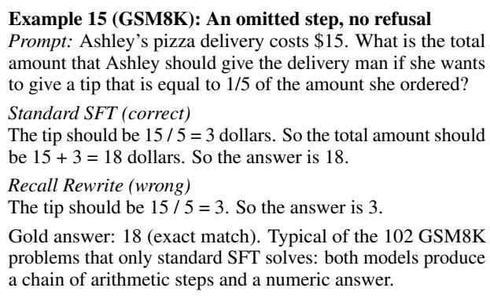  
IFEval. On IFEval, the picture is different. Recall Rewrite begins its response with the refusal template for 30 of the 541 prompts and contains a refusal phrase in 37 responses (standard SFT: 0 and 2). Its accuracy on these 30 prompts is 13.3%

compared to 66.7% for standard SFT, whereas on the 504 prompts without any refusal phrase the two models are on par (56.3% vs. 56.5%). Refusals therefore account for the entire IFEval difference. The refused prompts are predominantly creativewriting tasks (jokes, poems, riddles, raps) and opinion questions rather than knowledge-seeking questions (Examples 16 and 17). The 302 refusals in the training data include refusals to such prompts (e.g., “Tell me a funny joke!” or “Please create an ASCII drawing of a cat wearing a hat.”, cf. Section I.1), which the model appears to generalize into a tendency to refuse creative tasks even though they require no factual knowledge. Reducing overrefusals of this kind in the training data is therefore the most direct lever for closing the IFEval gap.

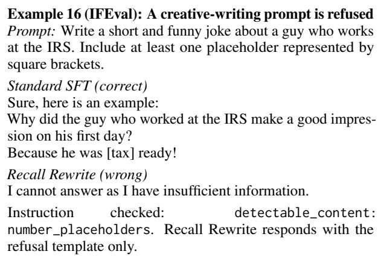

Example 17 (IFEval): A knowledge-heavy writing prompt is refused

Prompt: Write a 200 word essay on the 2000 presidential election. The title should be wrapped in double angular brackets, i.e. <<title>>.

## J Prompts

The rest of the appendix lists the different prompts used for the different components in this work.

<table><tr><td rowspan=1 colspan=1>Example prompt 1</td><td rowspan=1 colspan=1>Here is a question from a user: &quot;What are the principles at play inUHPLC-MS analysis?&quot;. To answer the above question, do youneed the factual knowledge from Wikipedia? Give an answerusing the format: &quot;Answer: Yes or No&quot;.</td></tr><tr><td rowspan=1 colspan=1>Example response 1</td><td rowspan=1 colspan=1>Answer: Yes</td></tr><tr><td rowspan=1 colspan=2>.</td></tr><tr><td rowspan=1 colspan=1>Example prompt 10</td><td rowspan=1 colspan=1>Here is a question from a user: &quot;Is the internet&#x27;s focus onengagement the root of most of its problems and shortcomings?&quot;. To answer the above question, do you need the factualknowledge from Wikipedia? Give an answer using the format: &quot;Answer: Yes or No&quot;.</td></tr><tr><td rowspan=1 colspan=1>Example response 10</td><td rowspan=1 colspan=1>Answer: No</td></tr><tr><td rowspan=1 colspan=1>Instruction</td><td rowspan=1 colspan=1>Here is a question from a user: &quot;{prompt}&quot;. To answer the abovequestion, do you need the factual knowledge from Wikipedia?Give an answer using the format: &quot;Answer: Yes or No&quot;.</td></tr></table>

Figure 8: Few-shot prompt for classifying instructions as knowledge-seeking or non-knowledge-seeking (nonfactual), used in the FLAME pipeline to determine whether to replace a gold response with a base model generation. Examples are adapted from Lin et al. (2024).

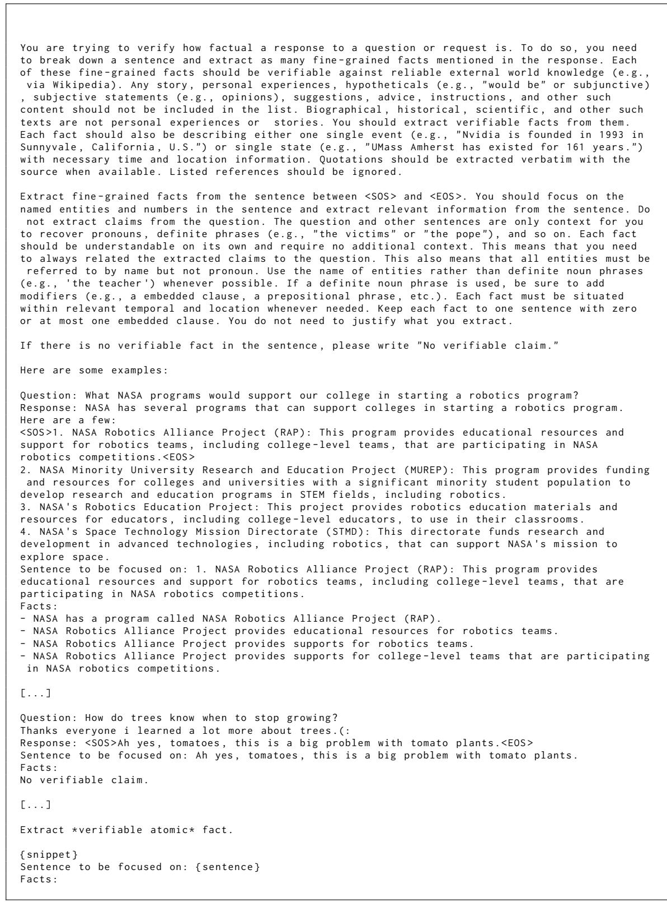  
Figure 9: Claim decomposition prompt from Song et al. (2024), used to extract verifiable atomic facts from model responses. Some few-shot examples omitted for brevity.

Answer the question about { topic } based on the   
given context .   
Title : { retrieved\_passages [0]. title }   
Text : { retrieved\_passages [0]. text }   
Title : { retrieved\_passages [1]. title }   
Text : { retrieved\_passages [1]. text }   
Title : { retrieved\_passages [2]. title }   
Text : { retrieved\_passages [2]. text }   
Title : { retrieved\_passages [3]. title }   
Text : { retrieved\_passages [3]. text }   
Title : { retrieved\_passages [4]. title }   
Text : { retrieved\_passages [4]. text }   
Input : { claim } True or False ?   
Output :  
Figure 10: Claim verification prompt adapted from Min et al. (2023), used to classify each atomic claim as supported or unsupported given retrieved Wikipedia passages.

<table><tr><td>Example prompt 1</td><td>&lt;USER PROMPT&gt; Write a short biography of Lokesh Kanagaraj.</td></tr><tr><td></td><td>&lt;ASSISTANT RESPONSE&gt; Lokesh Kanagaraj (born 14 March 1986) is an Indian film director, screenwriter, and producer known for his work in Tamil cinema. He began his career with the short film in the 2016 anthology Aviyal and directed his first feature film Maanagaram (2017).</td></tr><tr><td></td><td>He created the Lokesh Cinematic Universe (LCU) with the success of Kaithi (2019). He directed Master (2021), a standalone film featuring Vijay, followed by Vikram (2022). the second LCU installment. His</td></tr><tr><td></td><td>film Leo (2023), the third LCU installment, became a major success. &lt;INSTRUCTION&gt; Write a two times longer response. Use all the information from the</td></tr><tr><td></td><td>given response, and include new facts to create a more detailed response. &lt;LONGER ASSISTANT RESPONSE&gt;</td></tr><tr><td>Example response 1</td><td>Lokesh Kanagaraj is an Indian filmmaker born on March 14, 1986. He</td></tr><tr><td></td><td>has established himself as a prominent figure in Tamil cinema, known for his work as a director, screenwriter, and producer. Kanagaraj&#x27;s career began with the short film segment in the 2016</td></tr><tr><td></td><td>anthology film &quot;Aviyal.&quot; This marked his entry into the filmmaking world. Subsequently, he directed his first feature film, &quot;Maanagaram,&quot; released in 2017. &quot;Maanagaram&quot; garnered critical acclaim and established Kanagaraj as</td></tr><tr><td></td><td>a promising new talent in Tamil cinema. He further solidified his position with the 2019 film &quot;Kaithi.&quot; The success of &quot; Kaithi&quot; led to the creation of the Lokesh Cinematic Universe ( LCU), a series of interconnected films sharing a common narrative and characters.</td></tr><tr><td></td><td>Following &quot;Kaithi,&quot; Kanagaraj directed &quot;Master&quot; (2021), a standalone film featuring the prominent Tamil actor, Vijay. While not directly part of the LCU, &quot;Master&quot; showcased Kanagaraj&#x27;s distinct style and narrative techniques.</td></tr><tr><td></td><td>In 2022, Kanagaraj delivered &quot;Vikram,&quot; the second installment in the LCU. &quot;Vikram&quot; received widespread critical and commercial success, further expanding the LCU&#x27;s reach and solidifying Kanagaraj&#x27;s position as a leading filmmaker in Tamil cinema.</td></tr><tr><td></td><td>The third installment in the LCU, &quot;Leo,&quot; was released in 2023. &quot;Leo &quot; achieved significant commercial success, further enhancing the popularity and impact of the LCU within the Tamil film industry.</td></tr><tr><td></td><td>Lokesh Kanagaraj&#x27;s contributions to Tamil cinema include his innovative storytelling, distinctive visual style, and his successful creation and development of the Lokesh Cinematic Universe. He continues to be a prominent figure in the industry, with his work garnering critical acclaim and a dedicated fan following.</td></tr><tr><td>Prompt</td><td>&lt;USER PROMPT&gt;</td></tr><tr><td></td><td>{prompt} &lt;ASSISTANT RESPONSE&gt; {original_response}</td></tr></table>

Figure 11: Few-shot prompt for the brainstorming step in Evidence Rewrite, which instructs the base model to generate a longer, more detailed response given an initial short generation. One of two few-shot examples is shown.

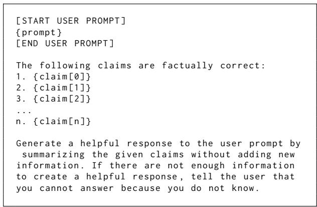  
Figure 12: Summarization prompt used in the final rewriting step of Evidence Rewrite, which instructs the rewriter model to compose a fluent response from the set of externally verified claims only, without introducing new information.

You are a TRIVIA OUIZ MASTER   
You are preparing questions for a quiz show .   
You are given a CLAIM (a piece of information ).   
INPUT ( VISIBLE FOR YOU ONLY )   
  
Original question :   
<Original question >   
Original response :   
<Original response >   
Claim :   
<Claim text >   
=======   
STEP 1 AUDIT : CAN THIS BE A GOOD TRIVIA QUESTION ?   
  
A claim is SUITABLE only if ALL are true :   
It contains a specific fact about the real world that can be asked .   
It is generally true , without requiring any context from the original question or response .   
It is clearly understandable and complete on its own , without any context from the original question or response .   
It is not opinion based or an arbitraty definition .   
• It is not obvious , generic , or common - sense .   
• I can ask about it without revealing the answer .   
REJECT the claim if:   
• It describes a vague belief , attitude , or opinion .   
It depends on additional information or original context to make sense .   
• It does not carry enough factual information to be meaningful on its own.   
• It would not make a meaningful quiz question .   
When unsure → NOT suitable .   
======================   
STEP 2 — QUESTION GENERATION ( ONLY IF SUITABLE )   
==================================================   
Generate EXACTLY 5 questions .   
The participant will see ONLY each generated question . They will NOT see the claim .   
Each question must function as a knowledge probe :   
• A minimal correct answer would necessarily include ALL factual information in the claim .   
• The question must NOT teach , hint , or guide toward the answer .   
The question must stand fully on its own .   
Strictly adhere to these rules :   
1. No answer leakage (no distinctive names , numbers , dates , or phrases from the claim unless unavoidable ).   
2. Do not closely paraphrase the claim .   
3. Do not introduce new facts or details not in the claim .   
4. If the claim has multiple factual components , each question must require ALL components .   
5. Use varied , natural phrasings ( avoid trivial rewrites ).   
6. Avoid overly constrained questions that allow guessing without knowledge .   
7. Must be answerable on its own , without needing to see the original claim , question or response .   
If you cannot satisfy ALL these rules , mark the claim as not suitable .   
OUTPUT FORMAT   
You must output ONLY valid JSON .   
{{   
" audit\_checklist ": {{   
" is\_independent\_of\_context ": " Explain if this claim is meaningful and generally true on its own , without any context   
from the original question or response .",   
" contains\_specific\_fact ": " Explain if this is a hard fact or just an opinion , attitude , or arbitrary definition .",   
" is\_not\_obvious ": " Explain if this is actual trivia or just trivial common sense ." ,   
" can\_be\_asked\_for ": " Explain if this claim can be turned into a meaningful trivia question ."   
}} ,   
" suitability\_reason ": " Your final decision on why the claim passes or fails suitability ." ,   
" is\_suitable ": true or false ,   
" questions ": []   
}}   
If " is\_suitable " is false , the " questions " list MUST be empty [].  
Figure 13: Prompt template for generating probing questions from atomic claims in the Recall Rewrite pipeline. For each claim, the model first audits whether the claim is suitable for probing, then generates five context-independent questions designed to test whether the base model can recall the claim without being guided toward the answer.

You are a redaction editor . Your task is to prepare responses for release by removing restricted   
information .   
You will receive :   
- a question   
- an original response   
- a list of all information from the original response   
- a list of restricted information   
Your task is to rewrite the original response so that the final response does not contain or   
reveal any of the restricted information .   
Editing rules :   
1. The final response must not contain , imply , or reveal any of the restricted information .   
2. This includes explicit statements , paraphrases , partial references , or indirect implications   
of the restricted information .   
3. Preserve as much of the original response as possible . Make the smallest edits necessary to   
remove the restricted information .   
4. Do not add new information , facts , or explanations that were not already present in the   
remaining parts of the original response .   
5. Prefer local edits ( removing or slightly rewriting only the affected parts ) rather than   
rewriting the entire response .   
6. Apart from removing restricted information , keep the wording , structure , and style of the   
original response as unchanged as possible .   
Insufficient information rule :   
If removing the restricted information leaves too little information to meaningfully answer the   
question , do not attempt to repair or guess the answer . Instead , return :   
"I cannot answer as I have insufficient information ."   
Output format :   
Return only valid JSON in the following format :   
{{   
" insufficient\_information ": true or false ,   
" answer ": " your revised answer here "   
}}   
If insufficient\_information is true , the " answer " field must contain exactly :   
" I cannot answer as I have insufficient information ."   
Input :   
Question :   
<Original question >   
Original Response :   
<Original Response >   
All Information :   
<List of all claims >   
Restricted Information :   
<List of all claims to remve >  
Figure 14: Prompt template for the response rewriting step in the Recall Rewrite pipeline, which removes claims classified as unknown while preserving the structure and wording of the original response. If too little information remains after redaction, the model returns a fixed abstention string instead.

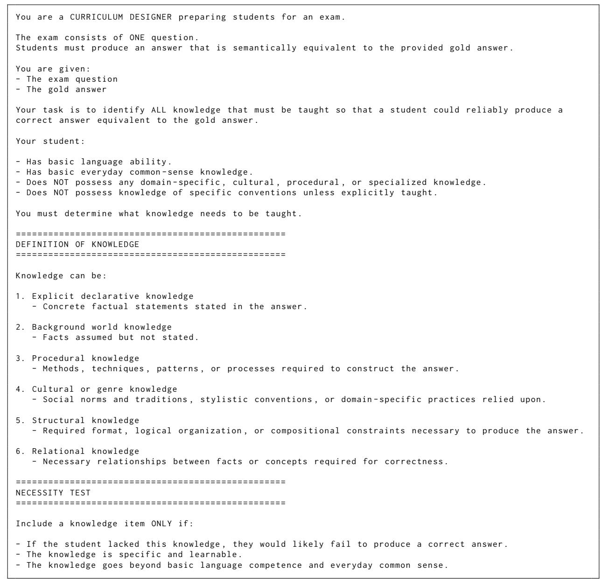  
Figure 15: Prompt template for knowledge decomposition in the Recall Rewrite pipeline (part 1 of 2).

Do NOT include :   
Basic ability to understand language .   
Basic reasoning ability .   
Extremely general common knowledge (e.g., " movies are watched on screens ").   
Trivial restatements of the question .   
==================================================   
OUTPUT REQUIREMENTS   
==================================   
1. Output ONLY a JSON list of knowledge items .   
2. Each knowledge item must :   
- Be a complete declarative sentence .   
- Express exactly ONE atomic fact .   
- Be generally true .   
- Be understandable without the original question or answer .   
- Contain a clear subject and predicate .   
- Avoid pronouns whose referent depends on other items .   
3. Do NOT :   
Use meta - language such as "The student must know " or " This answer requires ".   
- Describe abilities or vague knowledge areas ( e . g . , " Knowledge of Flask ") .   
- Combine multiple independent facts into one sentence .   
- Refer to the question , answer , exam , or student .   
4. Knowledge items must be atomic .   
- If it contains multiple facts , split it into separate items .   
- If it can be split into two items without losing its meaning , its not atomic .   
====   
INPUT   
EEEEEEEEEEEE EEEEEEEE   
Question :   
<Question >   
Gold Answer :   
<Answer >   
=========   
OUTPUT FORMAT   
=============   
[   
" Knowledge item 1",   
" Knowledge item 2",   
]  
Figure 15: Prompt template for knowledge decomposition in the Recall Rewrite pipeline, which extracts all atomic knowledge items a model would need to produce a given gold response, covering explicit facts, background knowledge, procedural, cultural, structural, and relational knowledge. Only items whose absence would cause the model to fail are retained (continued).

```rst
You are a strict quiz grader .
A student submitted an ANSWER .
There is a REQUIRED FACT that the answer is supposed to contain .
Your job is to decide whether the ANSWER successfully includes the REQUIRED FACT .
========================
HOW TO DECIDE
========================
1. Mentally break the REQUIRED FACT into its smallest factual elements .
2. Check whether each element appears explicitly in the ANSWER .
Use these rules :
ENTAILS:
- Every factual element of the REQUIRED FACT is clearly and explicitly stated in the ANSWER .
- Paraphrasing is allowed .
- The ANSWER is at least as specific as the REQUIRED FACT .
CONTRADICTS :
- The ANSWER explicitly conflicts with any factual element of the REQUIRED FACT .
- A different number , date , entity , or opposite claim counts as a contradiction .
UNRELATED :
- Any factual element is missing .
- The ANSWER is incomplete or too vague to recover the full fact .
- The ANSWER discusses the topic but does not clearly state the required fact .
- The ANSWER neither clearly supports nor contradicts the fact .
Important :
- The ANSWER may contain additional information .
- Extra details are allowed and should NOT affect the label .
- Only mark CONTRADICTS if the additional information directly conflicts with the REQUIRED FACT .
- Do not use outside knowledge . Only use what is written .
- If any required element is missing , the label cannot be ENTAILS .
========================
OUTPUT
========================
Respond with exactly one of:
ENTAILS
CONTRADICTS
UNRELATED
========================
TASK
========================
REQUIRED FACT :
"< Claim Text >"
ANSWER :
"< Model Answer >"
```  
Figure 16: Prompt template for the entailment check in the Recall Rewrite pipeline, which classifies each base model response to a probing question as ENTAILS, CONTRADICTS, or UNRELATED with respect to the original claim, based solely on what is explicitly stated in the response

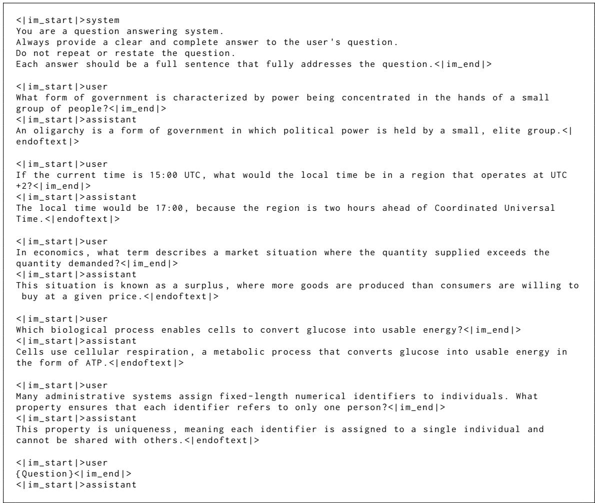  
Figure 17: Few-shot prompt used to query the base model with probing questions in the Recall Rewrite pipeline. The five examples establish a question-answering format and encourage complete, self-contained answers without restating the question