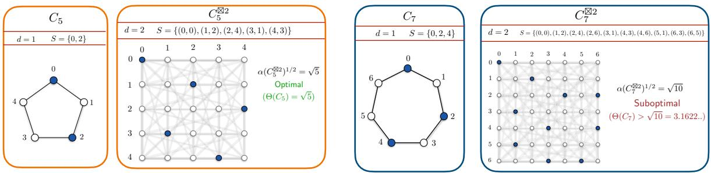
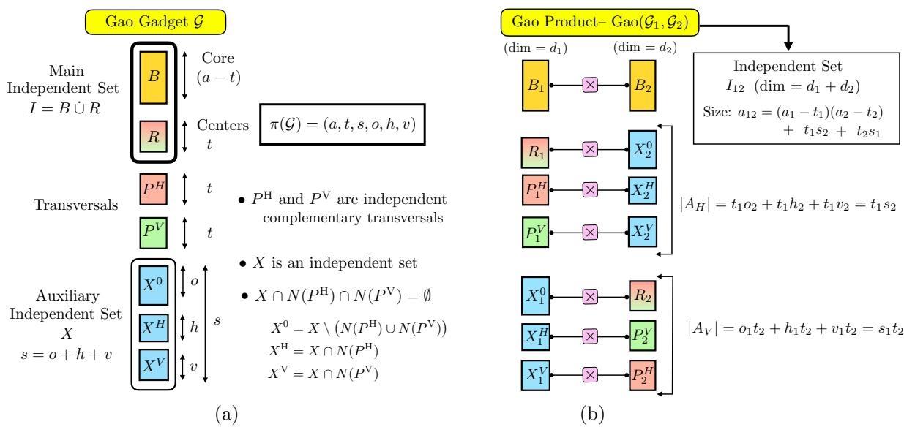
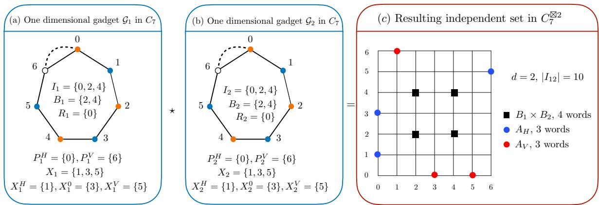
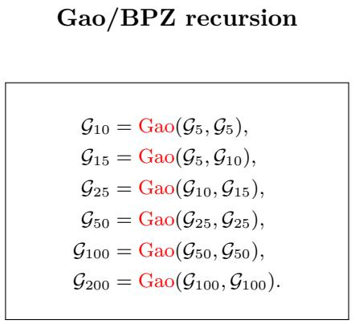
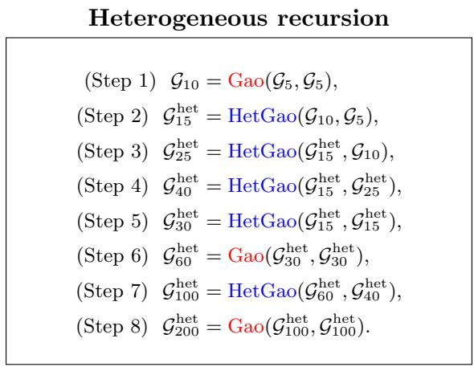
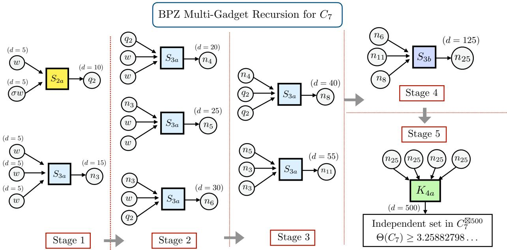
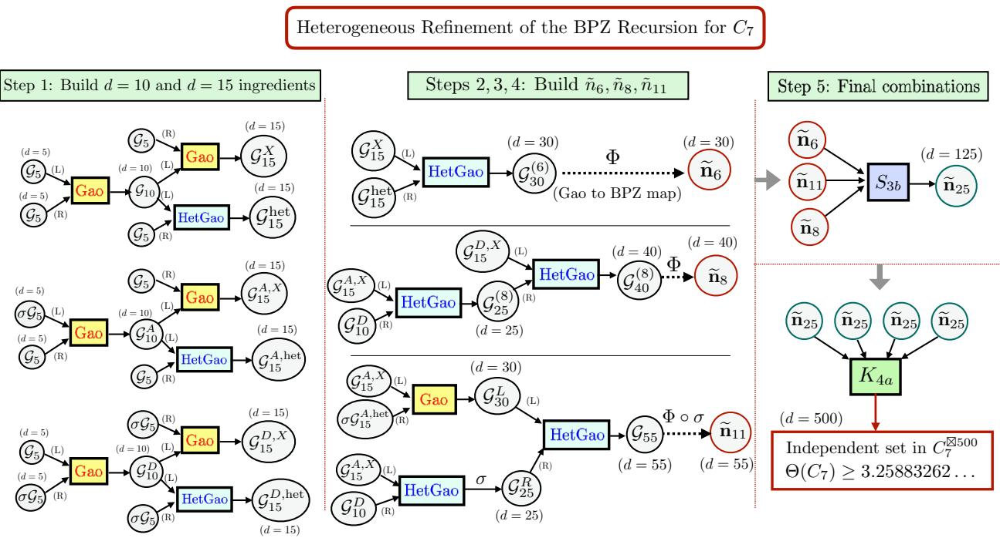

# Strengthening Recursive Constructions for Zero-Error Shannon Capacity

Ravi Tandon School of Electrical, Computing and Software Engineering, University of Arizona, Tucson, AZ 85721, USA. Email: tandonr@arizona.edu

## Abstract

The exact Shannon capacity remains unknown for every odd cycle beyond the five-cycle $C _ { 5 } .$ making odd cycles central examples in zero-error information theory. Improving the known lower bounds requires constructing large independent sets in strong powers of these graphs. Recent AI-assisted work has accelerated this efort and produced a rapid sequence of improvements. In particular, building on the construction of Itty et al., Gao developed a recursive product construction for combining structured independent sets, and Buys, Polak, and Zuiddam (BPZ) subsequently strengthened this through a richer recursion framework.

We continue this line of AI-assisted exploration and introduce a heterogeneous refinement of these recursive constructions. The central observation is that the usefulness of an intermediate construction depends not only on the size of its current main independent set, but also on the auxiliary structure that it carries into subsequent recursion. Consequently, diferent parts of the auxiliary structure need not always use the same independent set, and diferent occurrences in a recursive construction need not always use the same intermediate representation. We first formalize this principle for Gao’s binary product and derive explicit propagation rules showing how heterogeneous choices can strengthen the resulting gadget while leaving its current code size unchanged. We then extend this principle to the more general BPZ recursive framework, showing how diferent heterogeneous constructions can be tailored to the distinct roles they play within the recursion.

Applying these refinements to the seven-cycle $C _ { 7 } .$ , we obtain an independent set in $C _ { 7 } ^ { \boxtimes \mathrm { 5 0 0 } }$ yielding $\Theta ( C _ { 7 } ) \ge 3 . 2 5 8 8 3 2 6 2 . . . ,$ thereby improving the best known lower bound. Beyond the numerical improvement, the results illustrate a general principle for recursive zero-error code constructions: intermediate structures having the same dimension and current code size can have diferent downstream value depending on where and how they are used in the recursion.

## 1 Introduction

In classical information theory, reliable communication usually means that the probability of decoding error can be made arbitrarily small by using long codes. Shannon’s theory of zero-error communication asks for something strictly stronger: which communication rates are possible when confusion is not allowed at all? [1] The problem is naturally represented by a graph G, called the confusability graph. Each possible channel input is represented by a vertex, and two vertices are connected when the corresponding inputs can produce a common output and hence may be confused by the receiver. A collection of inputs that are pairwise nonconfusable is therefore an independent set in this graph.

When the channel is used d times, a channel input is a word $\mathbf { x } = ( x _ { 1 } , \ldots , x _ { d } )$ . Two words are confusable ${ \mathrm { i f } } ,$ in every coordinate, the corresponding symbols are either equal or adjacent in the confusability graph G. Graph-theoretically, the relevant graph is the d-fold strong power $G ^ { \boxtimes d }$ If $\alpha ( H )$ denotes the independence number (size of the largest independent set) of a graph $H ,$ then the largest zero-error code of blocklength d has size $\alpha ( G ^ { \boxtimes d } )$ . The Shannon capacity of G is $\Theta ( G ) = \operatorname* { s u p } _ { d \geq 1 } \alpha \Big ( G ^ { \boxtimes d } \Big ) ^ { 1 / d }$ . Thus, an independent set of size M in $G ^ { \boxtimes d }$ immediately gives the lower bound $\Theta ( G ) \ge M ^ { 1 / d }$ . The normalization by the dth root is important: it converts a blocklength-d code into the efective number of zero-error symbols transmitted per channel use.

The first unresolved odd cycle: $C _ { 7 }$ . Cycle graphs are among the oldest and most natural examples in zero-error information theory. The classical nontrivial example is the pentagon $C _ { 5 }$ Shannon exhibited five pairwise nonconfusable two-letter words, proving $\Theta ( C _ { 5 } ) \ge \sqrt { 5 } \ [ 1 ]$ . Lovász later introduced the theta function $\vartheta ( G )$ , proved the general upper bound $\Theta ( G ) \leq \vartheta ( G )$ , and established $\Theta ( C _ { 5 } ) = \vartheta ( C _ { 5 } ) = \sqrt { 5 } \ [ 2 ]$ . The situation changes immediately at the next odd cycle. For every odd cycle $C _ { 2 m + 1 }$ with $m \geq 3$ , the exact Shannon capacity remains unknown. In particular, $C _ { 7 }$ is the smallest cycle whose Shannon capacity has not been determined. Lovász’s theta function gives the explicit upper bound $\begin{array} { r } { \Theta ( C _ { 7 } ) \le \bar { \vartheta } ( C _ { 7 } ) = \frac { 7 \cos ( \pi / 7 ) } { 1 + \cos ( \pi / 7 ) } = 3 . 3 1 7 6 6 7 2 0 \ldots , . . . , } \end{array}$ which remains the best known upper bound for $C _ { 7 }$ to date. The challenge is therefore to construct increasingly large independent sets in strong powers of $C _ { 7 }$ , thereby improving the best known lower bounds and narrowing the gap to the Lovász upper bound.

Overview of progress on lower bounds for $C _ { 7 }$ . The history of lower bounds for $C _ { 7 }$ (and, more generally, for larger odd cycles) illustrates both the dificulty of the problem and the importance of finding structure at the right blocklength. It can be divided into two periods. From 1971 through 2019, progress came through increasingly strong finite-dimensional constructions [3, 4, 5], culminating in the 367-word independent set in $C _ { 7 } ^ { \boxtimes { 5 } }$ of Polak and Schrijver [6]. Beginning in July 2026, AI-assisted exploration and structured product constructions produced a rapid sequence of improvements: Itty et al. [7] improved on the direct product in dimension 10, Gao [8] converted that improvement into a binary recursive mechanism, and BPZ [9, 10] subsequently introduced a stronger base structure and a richer recursion. Table 1 summarizes this progression. These developments are reviewed in detail in Sections 2.3, 2.4, and 4.1.

A striking feature of the recent improvements is the role of large language models (LLMs) in mathematical exploration. Earlier LLM-based program search had already rediscovered the 367-word lower bound and found new constructions for related odd cycles [11]. Itty et al. [7] report that their 134753-word construction was discovered through iterative interactions with an LLM and was not reached by the conventional search heuristics they tested. Gao [8] likewise reports using an LLM to implement the computational search and expand the proofs underlying his recursive construction. BPZ [9] state that, building on these approaches and using ChatGPT 5.6 Sol Pro and Claude Opus 5, they obtained their further improved bounds.

Zero-error Shannon capacity as a benchmark for AI-assisted mathematical discovery. Taken together, these developments suggest that zero-error Shannon capacity provides a particularly clean benchmark for AI-assisted mathematical discovery, with odd cycles ofering a compelling test case. The objective is unambiguous, progress is measured by an exact and independently verifiable quantity, and every claimed improvement must be supported by an explicit construction. At the same time, the value of the benchmark is not limited to the final numerical gain: even a small improvement may require new structural ideas, more efective search strategies, and new methods of proof and verification. The process may therefore reveal substantially more about the capabilities of AI-assisted mathematical reasoning than the magnitude of improvement alone.

Table 1: Progression of lower bounds on the zero-error Shannon capacity of $C _ { 7 }$ (All displayed decimal values are truncated.)
<table><tr><td>Year</td><td>Authors</td><td>Construction / main idea</td><td> $\Theta ( C _ { 7 } ) \ge$ </td></tr><tr><td colspan="4">Finite-dimensional constructions</td></tr><tr><td>1971</td><td>Baumert, McEliece, Rodemich, Rumsey, Stanley, and Taylor [3]</td><td>343 words in  $C _ { 7 } ^ { \boxtimes \mathrm { { 5 } } }$ </td><td>3.21409584...</td></tr><tr><td>2002 2017</td><td>Vesel and Žerovnik  $[ 4 ]$ </td><td>108 words in  $C _ { 7 } ^ { \boxtimes { 4 } }$  via simulated annealing 350 words in  $C _ { 7 } ^ { \boxtimes \mathrm { { 5 } } }$  using symmetry-constrained</td><td>3.22370979 ...</td></tr><tr><td></td><td>Mathew and Östergård [5]</td><td>stochastic search</td><td>3.22710880 ...</td></tr><tr><td>2019</td><td>Polak and Schrijver [6]</td><td>367 words in  $C _ { 7 } ^ { \boxtimes \mathrm { { 5 } } }$  using a circular-graph construction and computation</td><td>3.25786596 ...</td></tr><tr><td colspan="4">AI-assisted exploration and recursive constructions</td></tr><tr><td>2026</td><td>Itty, Rosin, Carstensen, and Reichman [7]</td><td>134753 words in  $C _ { 7 } ^ { \boxtimes 1 0 }$  ; improvement beyond the direct product</td><td>3.25802073...</td></tr><tr><td>2026</td><td>Gao [8]</td><td>Binary recursive propagation of structured independent sets</td><td>3.25878915...</td></tr><tr><td>2026</td><td>Buys, Polak, and Zuiddam (BPZ) [9]</td><td>Stronger base structure followed by recursive propagation</td><td>3.25880536 ...</td></tr><tr><td>2026</td><td>BPZ, subsequent update [10]</td><td>More general combining rules, including combinations of more than two inputs</td><td>3.25882798 ...</td></tr><tr><td>2026</td><td>This work (Theorem 2)</td><td>Heterogeneous recursive constructions</td><td>3.25883262...</td></tr></table>

Our contribution and organization of the paper. This paper further develops the recursiveconstruction viewpoint underlying the recent advances in lower bounds on zero-error Shannon capacity [7, 8, 9, 10]. Our emphasis is both structural and expository. Rather than presenting our numerical improvement in isolation, we use the recent sequence of constructions to identify and formalize additional flexibility in the recursive framework, and to explain how it can be exploited. The central principle is that the value of an intermediate construction is determined not only by the size of its main independent set at that stage, but also by the auxiliary structure that it carries into later stages of the recursion.

We first give a self-contained account of Gao’s binary product construction and the gadget structure that it propagates. We then introduce a heterogeneous refinement (Theorem 1) in which diferent classes of the right-hand auxiliary set may be paired with diferent left-hand independent sets, derive the corresponding propagation rules, and show that this already improves the bounds obtained from Gao’s recursion [8] and the first BPZ refinement [9]. We next describe the BPZ multi-gadget framework [10], including admissible combining rules, and show how Gao’s binary product arises as a special case. Finally, we construct role-specific heterogeneous Gao gadgets, convert them into BPZ seven-family representations, and use them in diferent branches of the BPZ recursion for $C _ { 7 }$ . This yields an independent set in $C _ { 7 } ^ { \boxtimes 5 0 0 }$ and, as presented in Theorem 2, the improved lower bound

$$
\Theta ( C _ { 7 } ) \ge 3 . 2 5 8 8 3 2 6 2 \dots .\tag{1}
$$

Throughout, we provide explicit constructions and propagation rules, together with finite certificates and exact arithmetic, so that the constructions and resulting bounds can be reproduced and independently verified.

  
Figure 1: One- and two-use zero-error codes for $C _ { 5 }$ and $C _ { 7 }$ . The five-word code in $C _ { 5 } ^ { \boxtimes 2 }$ achieves $\Theta ( C _ { 5 } ) = \sqrt { 5 }$ , whereas the ten-word code in $C _ { 7 } ^ { \boxtimes 2 }$ gives the lower bound $\Theta ( C _ { 7 } ) \ge \sqrt { 1 0 }$ . The exact Shannon capacity of $C _ { 7 }$ remains unknown.

## 2 Problem Statement and Background

## 2.1 Zero-error communication and Shannon capacity

The notion of zero-error communication was introduced by Shannon in his seminal 1956 paper [1]. Consider a communication channel with a finite input alphabet. Two input symbols are said to be confusable if they can produce a common output at the receiver. These relations can be represented by a graph G, called the confusability graph: the vertices of G are the input symbols, and two distinct vertices are joined by an edge whenever the corresponding symbols are confusable.

Suppose first that the channel is used only once. A collection of symbols can be transmitted with zero error precisely when no two symbols in the collection are confusable. In graph-theoretic language, such a collection is an independent set in G. The largest number of messages that can be transmitted with zero error in one channel use is therefore the independence number $\alpha ( G )$

The problem becomes more interesting when the channel is used repeatedly. After d uses, a transmitted message is a word $\mathbf { x } = ( x _ { 1 } , \ldots , x _ { d } )$ , where each coordinate is an input symbol. Two such words are confusable if, in every coordinate, the corresponding symbols are either equal or confusable. The resulting confusability graph is the d-fold strong power $G ^ { \boxtimes d }$ . Consequently, the largest zero-error code of blocklength d has size $\alpha ( G ^ { \boxtimes d } )$ . To compare codes of diferent blocklengths, their sizes must be normalized. The Shannon capacity of G is defined as

$$
\Theta ( G ) = \operatorname* { s u p } _ { d \geq 1 } \alpha \Big ( G ^ { \boxtimes d } \Big ) ^ { 1 / d } .\tag{2}
$$

Thus, an independent set of size M in $G ^ { \boxtimes d }$ gives the lower bound $\Theta ( G ) \ge M ^ { 1 / d }$ . The subtlety is that repeated channel uses can perform better than simply taking independent copies of a one-use code. The pentagon provides the simplest and most celebrated example of this phenomenon. The pentagon $C _ { 5 } { : }$ a completely solved example. Let $C _ { 5 }$ denote the cycle on the five symbols {0, 1, 2, 3, 4}, where each symbol is confusable with its two neighbors. With one channel use, the largest zero-error code has size $\alpha ( C _ { 5 } ) = 2$ . Repeating such a code independently over two uses would therefore produce only $2 ^ { 2 } = 4$ codewords. As illustrated in Fig. 1, however, joint coding permits five pairwise nonconfusable codewords in $C _ { 5 } ^ { \boxtimes 2 }$ , yielding $\Theta ( C _ { 5 } ) \ge \sqrt { 5 }$ . Lovász proved the matching upper bound $\begin{array} { r } { \Theta ( C _ { 5 } ) \le \vartheta ( C _ { 5 } ) = \sqrt { 5 } . } \end{array}$ and hence $\Theta ( C _ { 5 } ) = \sqrt { 5 } \ [ 2 ]$ . Thus, the pentagon is the simplest example in which joint coding improves upon independent repetition, and the gain already achieved at blocklength two is exactly optimal.

## 2.2 The seven-cycle $C _ { 7 } { \mathrm { : } }$ the first open odd cycle graph

We now consider the seven-cycle $C _ { 7 }$ . Its vertices are identified with $\mathbb { Z } _ { 7 } = \{ 0 , 1 , \ldots , 6 \}$ , with arithmetic understood modulo 7. Two distinct symbols are adjacent, and hence confusable, when they difer by 1 $\mathrm { o r } - 1$ modulo 7. For convenience, we include equality in the confusability relation. For $a , b \in \mathbb { Z } _ { 7 }$ , write $a \simeq b$ when $a - b \in \{ - 1 , 0 , 1 \}$ (mod 7). For two words $x , y \in \mathbb { Z } _ { 7 } ^ { d }$ , we similarly write $x \simeq y$ when $x _ { i } \simeq y _ { i }$ in every coordinate. Thus, two distinct words are confusable precisely when $x \simeq y$

With one use of the channel, three symbols can be selected without confusion. For example, $\{ 0 , 2 , 4 \}$ is an independent set. Four symbols cannot be selected without including two adjacent vertices, so $\alpha ( C _ { 7 } ) = 3$ . Using this three-symbol code independently over two channel uses would give $3 ^ { 2 } = 9$ codewords. As with the pentagon, joint coding performs better: there exists a ten-word independent set in $C _ { 7 } ^ { \boxtimes 2 } \ ( \mathrm { F i g . \ 1 } )$ . Moreover, ten is optimal (by optimal we mean that the size of the largest independent set in $C _ { 7 } ^ { \boxtimes 2 }$ is 10). Hence $\alpha ( C _ { 7 } ) = 3 , ~ \alpha ( C _ { 7 } ^ { \boxtimes 2 } ) = 1 0$ . It follows that $\Theta ( C _ { 7 } ) \ge \sqrt { 1 0 } = 3 . 1 6 2 2 7 7 6 6 0 1 \dots ,$ which exceeds the one-use value 3. The two-use behavior of $C _ { 5 }$ and $C _ { 7 }$ therefore looks superficially similar. In both cases, joint coding beats the direct product of an optimal one-use code. The essential diference is that the two-use construction settles the pentagon completely, whereas for $C _ { 7 }$ still better normalized code sizes arise at larger blocklengths.

Lovász’s theta function gives the general upper bound $\Theta ( G ) \leq \vartheta ( G )$ . For the seven-cycle, this becomes

$$
\Theta ( C _ { 7 } ) \le \vartheta ( C _ { 7 } ) = { \frac { 7 \cos ( \pi / 7 ) } { 1 + \cos ( \pi / 7 ) } } = 3 . 3 1 7 6 6 7 2 0 7 3 9 4 0 9 5 \ldots . . .\tag{3}
$$

As the higher-dimensional constructions reviewed below show, the Shannon capacity of $C _ { 7 }$ is strictly larger than $\sqrt { 1 0 }$ . Determining how far the lower bound can be pushed requires the construction of increasingly large independent sets in higher strong powers of $C _ { 7 }$ . The next section reviews the sequence of constructions that progressively improved this lower bound.

## 2.3 Progress before LLM-assisted search (1971-2019)

The size-10 independent set in $C _ { 7 } ^ { \boxtimes 2 }$ described above gives $\Theta ( C _ { 7 } ) \geq 1 0 ^ { 1 / 2 } \approx 3 . 1 6 2 2 8$ . A natural way to improve this bound is to search for larger independent sets in higher strong powers of $C _ { 7 }$ . If $I \subseteq V ( C _ { 7 } ^ { \boxtimes d } )$ is an independent set, then $\Theta ( \bar { C } _ { 7 } ) \ge | I | ^ { 1 / d }$ . Thus, when comparing constructions across diferent dimensions, the relevant quantity is the normalized size $| I | ^ { 1 / d }$ rather than simply |I|.

[1971: $\Theta ( C _ { 7 } ) \ge 3 4 3 ^ { 1 / 5 } \approx 3 . 2 1 4 1 0 ]$ : In 1971, Baumert, McEliece, Rodemich, Rumsey, Stanley, and Taylor [3] found the independence number for $C _ { 7 } ^ { \boxtimes 3 }$ and showed that $\alpha ( C _ { 7 } ^ { \boxtimes 3 } ) = 3 3$ . Their approach viewed a vertex $( x _ { 1 } , x _ { 2 } , x _ { 3 } ) \in \mathbb { Z } _ { 7 } ^ { 3 }$ as the corner of a $2 \times 2 \times 2$ cube in the discrete $7 ^ { 3 } \mathrm { - t o r u s }$ , so that an independent set in $C _ { 7 } ^ { \boxtimes 3 }$ becomes a packing of disjoint cubes. By slicing the torus into seven two-dimensional layers and using $\alpha ( C _ { 7 } ^ { \boxtimes 2 } ) = 1 0$ , they first obtained the upper bound $\alpha ( C _ { 7 } ^ { \boxtimes 3 } ) \le 3 5$ They then used a symmetry-reduced exhaustive computer search over compatible layer packings to rule out packings of sizes 35 and 34, while finding several packings of size 33. Thus, their construction led to the following lower bound on $\Theta ( C _ { 7 } ) \colon \Theta ( C _ { 7 } ) \geq 3 3 ^ { 1 / 3 } \approx 3 . 2 0 7 5 3$ . The same paper went on to give a stronger lower bound on the Shannon capacity through an explicit construction in the fifth strong power $( d = 5 )$ . Baumert et al. [3] showed that the $3 4 3 = 7 ^ { 3 }$ vectors

$$
( x _ { 1 } , x _ { 2 } , x _ { 3 } , 2 x _ { 1 } + 2 x _ { 2 } + 2 x _ { 3 } , 2 x _ { 1 } + 4 x _ { 2 } + 6 x _ { 3 } ) , \qquad x _ { 1 } , x _ { 2 } , x _ { 3 } \in \mathbb { Z } _ { 7 } ,
$$

form an independent set in $C _ { 7 } ^ { \boxtimes { 5 } }$ . To see this, consider the diference $( a , b , c )$ between the first three coordinates of two codewords. If the two words were confusable, then $a , b , c \in \{ 0 , \pm 1 \}$ and also

$2 ( a + b + c ) \in \{ 0 , \pm 1 \}$ modulo 7. This forces $a + b + c \in \{ 0 , \pm 3 \}$ . The cases $a + b + c = \pm 3$ are separated by the fifth coordinate, while if $a + b + c = 0 .$ , any nonzero possibility is a permutation of $( 1 , - 1 , 0 )$ and again gives a fifth-coordinate diference outside $\{ 0 , \pm 1 \}$ . Hence distinct codewords are nonconfusable. This construction yields $\Theta ( C _ { 7 } ) \ge 3 4 3 ^ { 1 / 5 } \approx 3 . 2 1 4 1 0$ , which was stronger than the bound obtained from the exact three-dimensional result.

[2002: $\Theta ( C _ { 7 } ) \ge 1 0 8 ^ { 1 / 4 } \approx 3 . 2 2 3 7 1 ]$ : Vesel and Žerovnik [4] subsequently used simulated annealing to construct an independent set of size 108 in $C _ { 7 } ^ { \boxtimes 4 }$ , yielding $\Theta ( C _ { 7 } ) \ge 1 0 8 ^ { 1 / 4 } \approx 3 . 2 2 3 7 1$

[2017: $\Theta ( C _ { 7 } ) \ge 3 5 0 ^ { 1 / 5 } \approx 3 . 2 2 7 1 1 ]$ : The next improvements came from the fifth strong power. Mathew and Östergård [5] used stochastic search with prescribed symmetries to obtain an independent set of size 350 in $C _ { 7 } ^ { \boxtimes 5 }$ , giving $\Theta ( C _ { 7 } ) \ge 3 5 0 ^ { 1 / 5 } \approx 3 . 2 2 7 1 1$

[2019: $\Theta ( C _ { 7 } ) \ge 3 6 7 ^ { 1 / 5 } \approx 3 . 2 5 7 8 6 6 ]$ : A substantially larger improvement was obtained by Polak and Schrijver [6]. Using an auxiliary circular graph and computer search, they constructed an independent set $I \subseteq V ( C _ { 7 } ^ { \boxtimes 5 } )$ , with $| I | = 3 6 7$ , and hence established $\Theta ( C _ { 7 } ) \ge 3 6 7 ^ { 1 / 5 } \approx 3 . 2 5 7 8 6 6$

These advances increasingly relied on computational search, but the underlying paradigm remained the same: choose a dimension $d ,$ search for a large independent set in $C _ { 7 } ^ { \boxtimes d }$ , and use its cardinality to lower-bound $\Theta ( C _ { 7 } )$ . The 367-word construction remained the benchmark for subsequent progress. The developments described next introduced a diferent possibility: exploiting the internal structure of a known independent set to construct larger independent sets in higher dimensions.

## 2.4 Overview of Recent LLM-assisted Progress

The recent progress on $C _ { 7 }$ began with the work of Itty, Rosin, Carstensen, and Reichman [7]. Starting from the 367-word independent set $I _ { 0 } \subseteq C _ { 7 } ^ { \boxtimes 5 }$ of Polak and Schrijver [6], the direct Cartesian product $I _ { 0 } \times I _ { 0 }$ gives an independent set of size $3 6 7 ^ { 2 } = 1 3 4 6 8 9$ in $C _ { 7 } ^ { \boxtimes 1 0 }$ . Itty et al. improved upon this by modifying the product construction locally: they remove eight carefully chosen words from $I _ { 0 }$ , leaving a set B of size 359, retain the large core $B \times B$ , and replace the remaining part of the Cartesian product by two specially constructed families, each of size 8 · 367. The resulting independent set has size $3 5 9 ^ { 2 } + 2 \cdot 8 \cdot 3 6 7 = 1 3 4 7 5 3$ , and therefore yields $\Theta ( C _ { 7 } ) \ge 1 3 4 7 5 3 ^ { 1 / 1 0 } > 3 . 2 5 8 0 2 0$ . The authors report that this construction was discovered through iterative interactions with an LLM, which generated and executed search procedures that successively improved the size of the ten-dimensional code. This construction is important not only for the numerical improvement, but also because it revealed that the 367-word code could be exploited in a more structured manner than by taking a simple Cartesian product, an observation that Gao subsequently developed into a general recursive construction as we describe next.

## 2.4.1 Gao’s Product Construction

Gao [8] observed that the construction of Itty et al. [7] contains additional structure that can be preserved under further products. His key contribution was to isolate this structure, encode it through a small collection of parameters, and prove a product lemma showing that two such structured independent sets can be combined to produce another object of the same type. This converts the ten-dimensional improvement of Itty et al. from a one-time construction into a recursive mechanism that can be iterated to increasingly large dimensions. We next give a self-contained description of Gao’s construction and product lemma. Alongside the general development, we use a simple running example based on $C _ { 7 }$ to illustrate each of the constituent objects and to show how the product construction recovers an optimal 10-word independent set in $C _ { 7 } ^ { \boxtimes 2 }$

For vertices u, v of a graph $G ,$ write $u \simeq v$ when $u = v$ or u and v are adjacent, so that $u \simeq v$ means that the two vertices are confusable. For $S \subseteq V ( G )$ , let

$$
N ( S ) = \{ u \in V ( G ) : u \simeq v { \mathrm { ~ f o r ~ s o m e ~ } } v \in S \}\tag{4}
$$

denote the closed neighborhood of S. For a singleton, we write $N ( v ) = N ( \{ v \} )$

Definition 1 (Private pair). Let $I \subseteq V ( G )$ be an independent set. A pair $( r , q )$ of vertices of G is called a private pair for I if

$$
r \in I , \qquad q \not \in I , \qquad N ( q ) \cap I = \{ r \} .\tag{5}
$$

The vertex r is called the center of the private pair, and $q$ is called its private neighbor. Equivalently, $q$ is confusable with exactly one vertex of I, namely r.

Example 1: To illustrate these definitions throughout this subsection, we use the following simple example. Consider the independent set $I = \{ 0 , 2 , 4 \} \subseteq V ( C _ { 7 } )$ . Take $r = 0$ and $q = 6$ . The closed neighborhood of 6 is $N ( 6 ) = \{ 5 , 6 , 0 \}$ , and hence $N ( 6 ) \cap I = \{ 0 \}$ . Therefore, $( 0 , 6 )$ is a private pair for I: the vertex 0 is its center and 6 is its private neighbor. We will continue to use this example as the remaining components of Gao’s gadget and the subsequent product construction are introduced.

Definition 2 (Gao gadget and profile). Let G be a graph. A Gao gadget in G consists of an independent set $I \subseteq V ( G )$ together with a selected collection of t pairwise endpoint-disjoint private pairs

$$
\{ ( r _ { i } , q _ { i } ) \} _ { i = 1 } ^ { t } ,\tag{6}
$$

two independent sets $P ^ { \mathrm { H } }$ and $P ^ { \mathrm { V } }$ forming complementary transversals of these private pairs, and an auxiliary independent set $X \subseteq V ( G )$ satisfying

$$
X \cap N ( P ^ { \mathrm { H } } ) \cap N ( P ^ { \mathrm { V } } ) = \emptyset .\tag{7}
$$

Here, complementary transversals means that, for every $i ,$ one endpoint of the pair $\{ r _ { i } , q _ { i } \}$ belongs to $P ^ { \mathrm { H } }$ and the other belongs to $P ^ { \mathrm { V } }$ . Thus each private pair contributes exactly one endpoint to each transversal. The final condition requires that no vertex of X is simultaneously confusable with a vertex of $P ^ { \mathrm { H } }$ and a vertex of $P ^ { \mathrm { V } }$ . Associated with the selected private pairs, define

$$
R = \{ r _ { 1 } , \ldots , r _ { t } \} , \quad Q = \{ q _ { 1 } , \ldots , q _ { t } \} , \quad B = I \setminus R .\tag{8}
$$

Thus, R is the set of centers, $Q$ is the set of private neighbors, and B is the part of I remaining after the selected centers are removed. The auxiliary set X is then partitioned according to its interaction with the two transversals. Define

$$
\begin{array} { r l } & { X ^ { 0 } = X \setminus \left( N ( P ^ { \mathrm { H } } ) \cup N ( P ^ { \mathrm { V } } ) \right) , } \\ & { X ^ { \mathrm { H } } = X \cap N ( P ^ { \mathrm { H } } ) , } \\ & { X ^ { \mathrm { V } } = X \cap N ( P ^ { \mathrm { V } } ) . } \end{array}\tag{9}
$$

Since no point of X is confusable with both transversals, these three sets are pairwise disjoint and

$$
X = X ^ { 0 } \dot { \cup } X ^ { \mathrm { H } } \dot { \cup } X ^ { \mathrm { V } } .\tag{10}
$$

Thus, the vertices in $X ^ { 0 }$ are confusable with neither transversal, those in $X ^ { \mathrm { H } }$ are confusable with

  
Figure 2: Schematic description of a Gao gadget and Gao’s product construction. (a) A Gao gadget G with six-parameter profile $\pi ( \mathcal { G } ) = ( a , t , s , o , h , v )$ , consisting of a main independent set $I = B \dot { \cup } R$ , two independent complementary transversals $P ^ { \mathrm { H } }$ and $P ^ { \mathrm { V } }$ , and an auxiliary independent set $X = X ^ { 0 } { \dot { \cup } } X ^ { \mathrm { H } } { \dot { \cup } } X ^ { \mathrm { V } }$ satisfying $X \cap N ( P ^ { \mathrm { H } } ) \cap N ( P ^ { \mathrm { V } } ) = \emptyset$ . (b) Gao’s product applied to gadgets $\mathcal { G } _ { 1 }$ and $\mathcal { G } _ { 2 }$ . Each pink × denotes a Cartesian-product block. The three blocks $R _ { 1 } \times X _ { 2 } ^ { 0 } , P _ { 1 } ^ { \mathrm { H } } \times X _ { 2 } ^ { \mathrm { H } }$ and $P _ { 1 } ^ { \mathrm { V } } \times X _ { 2 } ^ { \mathrm { V } }$ form $A _ { \mathrm { H } }$ , while the three blocks $X _ { 1 } ^ { 0 } \times R _ { 2 } , X _ { 1 } ^ { \mathrm { H } } \times P _ { 2 } ^ { \mathrm { V } }$ , and $X _ { 1 } ^ { \mathrm { V } } \times P _ { 2 } ^ { \mathrm { H } }$ form $A _ { \mathrm { V } }$ . Together with $B _ { 1 } \times B _ { 2 }$ , these blocks form the independent set $I _ { 1 2 } = ( B _ { 1 } \times B _ { 2 } ) \cup A _ { \mathrm { H } } \cup A _ { \mathrm { V } }$ in dimension $d _ { 1 } + d _ { 2 }$ , of size $a _ { 1 2 } = ( a _ { 1 } - t _ { 1 } ) ( a _ { 2 } - t _ { 2 } ) + t _ { 1 } s _ { 2 } + t _ { 2 } s _ { 1 }$

$P ^ { \mathrm { H } }$ but not with $P ^ { \mathrm { V } }$ , and those in $X ^ { \mathrm { V } }$ are confusable with $P ^ { \mathrm { V } }$ but not with $P ^ { \mathrm { H } }$ . The profile of the Gao gadget is the six-tuple (see Fig. 2 for an illustration):

$$
\pi ( \mathcal { G } ) \triangleq ( a , t , s , o , h , v ) ,\tag{11}
$$

where a = |I|, s = |X|, o = |X 0|, h = |XH|, v = |XV|, and s = o + h + v.

Example 1 (continued): Continuing the example above, the independent set $I = \{ 0 , 2 , 4 \}$ together with the private pair (0, 6) gives $t = 1$ . We choose the complementary transversals $P ^ { \mathrm { H } } = \{ 0 \}$ and $P ^ { \mathrm { V } } = \{ 6 \}$ , and take $X = \{ 1 , 3 , 5 \}$ . Relative to these transversals, 1 is confusable with $P ^ { \mathrm { H } }$ but not with $P ^ { \mathrm { V } }$ , 5 is confusable with $P ^ { \mathrm { V } }$ but not with $P ^ { \mathrm { H } }$ , and 3 is confusable with neither. Hence $R = \{ 0 \}$ $Q = \{ 6 \} , B = \{ 2 , 4 \} , X ^ { \mathrm { H } } = \{ 1 \} , X ^ { 0 } = \{ 3 \}$ , and $X ^ { \mathrm { V } } = \{ 5 \}$ . The resulting Gao gadget therefore has $\mathit { p r o f i l e } \pi ( \mathcal { G } ) = ( 3 , 1 , 3 , 1 , 1 , 1 )$

Lemma 1 (Gao’s product lemma [8]). Let $\mathcal { G } _ { 1 }$ and $\mathcal { G } _ { 2 }$ be Gao gadgets in graphs $G _ { 1 }$ and $G _ { 2 }$ respectively, with profiles

$$
\pi ( \mathcal { G } _ { i } ) = ( a _ { i } , t _ { i } , s _ { i } , o _ { i } , h _ { i } , v _ { i } ) , \qquad i \in \{ 1 , 2 \} .\tag{12}
$$

For $x \in X _ { 2 }$ , define

$$
L _ { 1 } ( x ) = \left\{ { \begin{array} { l l } { R _ { 1 } , } & { x \in X _ { 2 } ^ { 0 } , } \\ { P _ { 1 } ^ { \mathrm { H } } , } & { x \in X _ { 2 } ^ { \mathrm { H } } , } \\ { P _ { 1 } ^ { \mathrm { V } } , } & { x \in X _ { 2 } ^ { \mathrm { V } } , } \end{array} } \right.\tag{13}
$$

and for $y \in X _ { 1 }$ , define

$$
K _ { 2 } ( y ) = \left\{ \begin{array} { l l } { R _ { 2 } , } & { y \in X _ { 1 } ^ { 0 } , } \\ { P _ { 2 } ^ { \mathrm { V } } , } & { y \in X _ { 1 } ^ { \mathrm { H } } , } \\ { P _ { 2 } ^ { \mathrm { H } } , } & { y \in X _ { 1 } ^ { \mathrm { V } } . } \end{array} \right.\tag{14}
$$

Define the two routed families

$$
\begin{array} { r } { A _ { \mathrm { H } } = \{ ( p , x ) : x \in X _ { 2 } , ~ p \in L _ { 1 } ( x ) \} , } \\ { A _ { \mathrm { V } } = \{ ( y , q ) : y \in X _ { 1 } , ~ q \in K _ { 2 } ( y ) \} , } \end{array}\tag{15}
$$

and let

$$
I _ { 1 2 } = ( B _ { 1 } \times B _ { 2 } ) \cup A _ { \mathrm { H } } \cup A _ { \mathrm { V } } .\tag{16}
$$

Then $I _ { 1 2 }$ is an independent set in $G _ { 1 } \boxtimes G _ { 2 }$

Moreover, $I _ { 1 2 }$ carries the following selected collection of pairwise endpoint-disjoint private pairs:

$$
\{ ( ( r _ { i } , x ) , ( q _ { i } , x ) ) : 1 \leq i \leq t _ { 1 } , \ x \in X _ { 2 } ^ { 0 } \} \cup \{ ( ( y , r _ { j } ) , ( y , q _ { j } ) ) : y \in X _ { 1 } ^ { 0 } , \ 1 \leq j \leq t _ { 2 } \} .\tag{17}
$$

Complementary transversals for these private pairs are

$$
\begin{array} { r } { P _ { 1 2 } ^ { \mathrm { H } } = ( P _ { 1 } ^ { \mathrm { H } } \times X _ { 2 } ^ { 0 } ) \cup ( X _ { 1 } ^ { 0 } \times P _ { 2 } ^ { \mathrm { V } } ) , } \\ { P _ { 1 2 } ^ { \mathrm { V } } = ( P _ { 1 } ^ { \mathrm { V } } \times X _ { 2 } ^ { 0 } ) \cup ( X _ { 1 } ^ { 0 } \times P _ { 2 } ^ { \mathrm { H } } ) . } \end{array}\tag{18}
$$

Taking

$$
X _ { 1 2 } = X _ { 1 } \times X _ { 2 }\tag{19}
$$

as the auxiliary independent set, its decomposition relative to the two propagated transversals is

$$
\begin{array} { r l } & { X _ { 1 2 } ^ { 0 } = ( X _ { 1 } ^ { 0 } \times X _ { 2 } ^ { 0 } ) \mathbin { \dot { \cup } } \left( ( X _ { 1 } ^ { \mathrm { H } } \cup X _ { 1 } ^ { \mathrm { V } } ) \times ( X _ { 2 } ^ { \mathrm { H } } \cup X _ { 2 } ^ { \mathrm { V } } ) \right) , } \\ & { X _ { 1 2 } ^ { \mathrm { H } } = ( X _ { 1 } ^ { \mathrm { H } } \times X _ { 2 } ^ { 0 } ) \mathbin { \dot { \cup } } ( X _ { 1 } ^ { 0 } \times X _ { 2 } ^ { \mathrm { V } } ) , } \\ & { X _ { 1 2 } ^ { \mathrm { V } } = ( X _ { 1 } ^ { \mathrm { V } } \times X _ { 2 } ^ { 0 } ) \mathbin { \dot { \cup } } ( X _ { 1 } ^ { 0 } \times X _ { 2 } ^ { \mathrm { H } } ) . } \end{array}\tag{20}
$$

Consequently, these objects form a new Gao gadget $\mathcal { G } _ { 1 2 }$ in $G _ { 1 } \boxtimes G _ { 2 }$ , whose profile is

$$
\pi ( \mathcal { G } _ { 1 2 } ) = ( a _ { 1 2 } , t _ { 1 2 } , s _ { 1 2 } , o _ { 1 2 } , h _ { 1 2 } , v _ { 1 2 } ) ,\tag{21}
$$

where

$$
\begin{array} { r l } & { a _ { 1 2 } = ( a _ { 1 } - t _ { 1 } ) ( a _ { 2 } - t _ { 2 } ) + t _ { 1 } s _ { 2 } + s _ { 1 } t _ { 2 } , } \\ & { t _ { 1 2 } = t _ { 1 } o _ { 2 } + o _ { 1 } t _ { 2 } , } \\ & { s _ { 1 2 } = s _ { 1 } s _ { 2 } , } \\ & { o _ { 1 2 } = o _ { 1 } o _ { 2 } + ( h _ { 1 } + v _ { 1 } ) ( h _ { 2 } + v _ { 2 } ) , } \\ & { h _ { 1 2 } = h _ { 1 } o _ { 2 } + o _ { 1 } v _ { 2 } , } \\ & { v _ { 1 2 } = v _ { 1 } o _ { 2 } + o _ { 1 } h _ { 2 } . } \end{array}\tag{22}
$$

  
Figure 3: Illustration of Gao’s product construction on two one-dimensional gadgets in $C _ { 7 }$ . The Cartesian-product core $B _ { 1 } \times B _ { 2 }$ is augmented by the routed families $A _ { H }$ and $A _ { V } ,$ , producing an optimal 10-word independent set in $C _ { 7 } ^ { \boxtimes _ { 2 } }$

Example 1 (continued). We now apply Gao’s product lemma to two copies ofthe gadget in our example, each with $\mathit { p r o f i l e } \pi ( \mathcal { G } ) = ( 3 , 1 , 3 , 1 , 1 , 1 )$ . Recall that $B = \{ 2 , 4 \} , R = \{ 0 \} , P ^ { \mathrm { H } } = \{ 0 \} , P ^ { \mathrm { V } } = \{ 6 \}$ , and $X ^ { \mathrm { H } } = \{ 1 \} , X ^ { 0 } = \{ 3 \} , X ^ { \mathrm { V } } = \{ 5 \}$ . The first routing map therefore gives $A _ { \mathrm { H } } = \{ ( 0 , 1 ) , ( 0 , 3 ) , ( 6 , 5 ) \}$ while the reversed routing in the second coordinate gives $A _ { \mathrm { V } } = \{ ( 1 , 6 ) , ( 3 , 0 ) , ( 5 , 0 ) \}$ . Together with the Cartesian-product core $B _ { 1 } \times B _ { 2 } = \{ ( 2 , 2 ) , ( 2 , 4 ) , ( 4 , 2 ) , ( 4 , 4 ) \}$ , this produces the 10-word independent set $I _ { 1 2 } = \{ ( 2 , 2 ) , ( 2 , 4 ) , ( 4 , 2 ) , ( 4 , 4 ) , ( 0 , 1 ) , ( 0 , 3 ) , ( 6 , 5 ) , ( 1 , 6 ) , ( 3 , 0 ) , ( 5 , 0 ) \}$ in $C _ { 7 } ^ { \boxtimes 2 }$ . Thus, Gao’s product construction recovers an optimal 10-word code. More importantly, the resulting code again carries the structure of a Gao gadget. Since $X _ { 1 } ^ { 0 } = X _ { 2 } ^ { 0 } = \{ 3 \}$ , the construction propagates the two private pairs $( ( 0 , 3 ) , ( 6 , 3 ) )$ and $( ( 3 , 0 ) , ( 3 , 6 ) )$ . Taking $X _ { 1 2 } = X _ { 1 } \times X _ { 2 }$ as the new auxiliary set, its three classes have sizes $| X _ { 1 2 } ^ { 0 } | = 5 , | X _ { 1 2 } ^ { \mathrm { H } } | = 2$ , and $| X _ { 1 2 } ^ { \mathrm { V } } | = 2$ . Hence the resulting gadget has profile π $\cdot ( \mathcal { G } _ { 1 2 } ) = ( 1 0 , 2 , 9 , 5 , 2 , 2 )$ . This illustrates the central feature of Gao’s lemma: the product does not merely produce a larger independent set, but produces another gadget of the same type, so that the construction can be applied recursively.

Gao’s Construction for Improving $C _ { 7 }$ . For $C _ { 7 } ,$ , Gao constructs the five-dimensional base gadget from the 367-word independent set $I _ { 0 } \subseteq C _ { 7 } ^ { \boxtimes 5 }$ of Polak and Schrijver [6]. Gao uses the same eight pairs $( r _ { j } , q _ { j } )$ that appear in the construction of Itty et al. [7], and verifies that each is a private pair for $I _ { 0 }$ . The two complementary transversals are

$$
\begin{array} { r } { P ^ { \mathrm { H } } = \{ r _ { 0 } , r _ { 5 } , r _ { 6 } \} \cup \{ q _ { 1 } , q _ { 2 } , q _ { 3 } , q _ { 4 } , q _ { 7 } \} , } \\ { P ^ { \mathrm { V } } = \{ q _ { 0 } , q _ { 5 } , q _ { 6 } \} \cup \{ r _ { 1 } , r _ { 2 } , r _ { 3 } , r _ { 4 } , r _ { 7 } \} . } \end{array}\tag{23}
$$

For $w = ( w _ { 0 } , \ldots , w _ { 4 } ) \in \mathbb { Z } _ { 7 } ^ { 5 }$ , Gao defines the automorphism $T ( w ) = ( 2 - w _ { 1 } , w _ { 3 } , w _ { 0 } , 2 - w _ { 2 } , w _ { 4 } )$ takes $T ( I _ { 0 } )$ , and replaces the single word (2, 4, 6, 3, 5) by $( 1 , 5 , 6 , 3 , 5 )$ to obtain the auxiliary set X. A finite computer verification establishes that $I _ { 0 }$ and X are independent sets of size 367, that the eight pairs are private, that the two transversals are independent, and that the points of X split into 321 points confusable with neither transversal, 26 confusable only with $P ^ { \mathrm { H } }$ , and 20 confusable only with $P ^ { \mathrm { V } }$ . Thus Gao’s five-dimensional base gadget has profile

$$
\mathrm { P r o f l e ~ o f ~ g a d g e t ~ } \mathcal { G } _ { 5 } : \pi ( \mathcal { G } _ { 5 } ) = ( 3 6 7 , 8 , 3 6 7 , 3 2 1 , 2 6 , 2 0 ) .\tag{24}
$$

Applying the product lemma to two copies of this gadget gives $( 3 6 7 - 8 ) ^ { 2 } + 2 \cdot 8 \cdot 3 6 7 = 1 3 4 7 5 3$ reproducing the ten-dimensional construction of Itty et al. [7], but now with the additional gadget structure needed for further recursion.

Gao then iterates the product, using the output gadget from one stage as an input to subsequent stages. Let $\mathcal { G } _ { 5 }$ denote the five-dimensional base gadget described above. Since the product of gadgets in dimensions $d _ { 1 }$ and $d _ { 2 }$ produces a new gadget in dimension $d _ { 1 } + d _ { 2 }$ , Gao recursively constructs

$$
\mathcal { G } _ { 1 0 } = \mathrm { G a o } ( \mathcal { G } _ { 5 } , \mathcal { G } _ { 5 } ) \to \mathcal { G } _ { 1 5 } = \mathrm { G a o } ( \mathcal { G } _ { 5 } , \mathcal { G } _ { 1 0 } ) \to \mathcal { G } _ { 2 5 } = \mathrm { G a o } ( \mathcal { G } _ { 1 0 } , \mathcal { G } _ { 1 5 } ) ,
$$

$$
{ \mathcal { G } } _ { 5 0 } = \operatorname { G a o } ( { \mathcal { G } } _ { 2 5 } , { \mathcal { G } } _ { 2 5 } ) \to { \mathcal { G } } _ { 1 0 0 } = \operatorname { G a o } ( { \mathcal { G } } _ { 5 0 } , { \mathcal { G } } _ { 5 0 } ) \to { \mathcal { G } } _ { 2 0 0 } = \operatorname { G a o } ( { \mathcal { G } } _ { 1 0 0 } , { \mathcal { G } } _ { 1 0 0 } ) ,\tag{25}
$$

where ${ \mathrm { G a o } } ( { \mathcal { G } } _ { 1 } , { \mathcal { G } } _ { 2 } )$ denotes the product operation of Gao’s Lemma 1. Thus the final 200-dimensional gadget is obtained from forty copies of the original five-dimensional gadget. Gao selects this product tree by optimizing over the possible binary splits at each stage using exact integer computations. The resulting code in $C _ { 7 } ^ { \boxtimes 2 0 0 }$ yields

$$
\Theta ( C _ { 7 } ) \geq 3 . 2 5 8 7 8 9 1 5 3 9 0 8 6 9 1 0 1 6 \dots .\tag{26}
$$

The important point for our purposes is the recursive nature of the construction: the product lemma does not merely produce a larger independent set, but produces another gadget of the same form, which can itself be combined again.

Stronger base gadget and Lean verification by BPZ. Buys, Polak, and Zuiddam [9] subsequently found a stronger five-dimensional base gadget. Specifically, Gao’s base gadget has profile (367, 8, 367, 321, 26, 20), whereas their new gadget has profile (367, 8, 367, 322, 26, 19). Thus, the code size, number of private pairs, and auxiliary-set size remain unchanged, while the number of auxiliary words confusable with neither transversal increases from 321 to 322. They then apply the same recursive product construction, combining gadgets according to the sequence $1 + 1 = 2$ $1 + 2 = 3 , 2 + 3 = 5$ , followed by repeated squaring $5 + 5 = 1 0 , 1 0 + 1 0 = 2 0$ , and $2 0 + 2 0 = 4 0 $ Starting from five-dimensional gadgets, this produces a gadget in $C _ { 7 } ^ { \boxtimes 2 0 0 }$ and improves Gao’s bound to $\Theta ( C _ { 7 } ) \geq 3 . 2 5 8 8 0 5 3 6 9 8 8 5 \ldots$ A further contribution of Buys, Polak, and Zuiddam is that the resulting bounds, including the validity of the base gadgets and the recursive product calculations, are fully formalized in Lean; Gao’s original construction was instead verified by an accompanying Python program using exact finite checks and integer arithmetic.

## 3 Heterogeneous Refinement of Recursive Gadgets

Motivation for Improving Gadget Structure. Gao’s recursion highlights an important feature of structured product constructions: the usefulness of a gadget is not determined solely by the size of its current code. The other parameters of the gadget describe additional structure—private pairs, the auxiliary independent set, and its interaction with the two transversals—that is propagated into subsequent product steps. These parameters directly influence the size and structure of later descendants. Consequently, two gadgets with the same code size may behave very diferently under further recursion, and a gadget that ofers no immediate improvement in code size may nevertheless become more valuable at a later stage if it carries more favorable auxiliary structure.

This suggests that, when constructing the output of Gao’s product lemma, one should ask not only how large the new independent set is, but also whether the accompanying gadget structure can be chosen more efectively for subsequent products. Our main observation is that Gao’s construction imposes a certain uniformity on the auxiliary set of the product gadget that is not always necessary. By allowing diferent parts of this auxiliary structure to be built from diferent independent sets whenever the required separation conditions permit, we obtain a more flexible way of completing the same product code into a gadget. We refer to this additional freedom as heterogeneity. Importantly, heterogeneity may leave the current code size unchanged while producing more favorable auxiliary structure, whose advantage becomes visible only in later recursive steps.

Overview of Heterogeneous Gadget Construction. Consider two Gao gadgets $\mathcal { G } _ { L }$ and $\mathcal { G } _ { R }$ in graphs $G _ { L }$ and $G _ { R }$ , respectively, where the subscripts L and R denote the ${ \it l e f t }$ and right gadgets. Gao’s product lemma first constructs the product code $I _ { L R }$ , together with its propagated private pairs and complementary transversals. The auxiliary set is then chosen to be the Cartesian product $X _ { L } \times X _ { R }$ . Using the decomposition $X _ { R } = X _ { R } ^ { 0 } \dot { \cup } X _ { R } ^ { \mathrm { H } } \dot { \cup } X _ { R } ^ { \mathrm { V } }$ , Gao’s choice can equivalently be written as

$$
X _ { L } \times X _ { R } = \left( X _ { L } \times X _ { R } ^ { 0 } \right) \cup ( X _ { L } \times X _ { R } ^ { \mathrm { H } } ) \cup ( X _ { L } \times X _ { R } ^ { \mathrm { V } } ) .\tag{27}
$$

Thus, the same left-hand auxiliary set $X _ { L }$ is used over all three classes of the right-hand auxiliary set. The first key observation is that these three classes play diferent roles with respect to the propagated transversals. Recall that Gao’s product construction gives

$$
\begin{array} { r } { P _ { L R } ^ { \mathrm { H } } = ( P _ { L } ^ { \mathrm { H } } \times X _ { R } ^ { 0 } ) \cup ( X _ { L } ^ { 0 } \times P _ { R } ^ { \mathrm { V } } ) , } \\ { P _ { L R } ^ { \mathrm { V } } = ( P _ { L } ^ { \mathrm { V } } \times X _ { R } ^ { 0 } ) \cup ( X _ { L } ^ { 0 } \times P _ { R } ^ { \mathrm { H } } ) . } \end{array}\tag{28}
$$

Consider first a point whose right coordinate lies in $X _ { R } ^ { \mathrm { H } }$ . Such a point is confusable with $P _ { R } ^ { \mathrm { H } }$ but not with $P _ { R } ^ { \mathrm { V } }$ . Moreover, since $X _ { R }$ is independent, a point of $X _ { R } ^ { \mathrm { H } }$ is nonconfusable with every point of $X _ { R } ^ { 0 }$ . Consequently, its right coordinate already separates it from both product components involving $X _ { R } ^ { 0 }$ , as well as from the component $X _ { L } ^ { 0 } \times P _ { R } ^ { \mathrm { V } }$ of $P _ { L R } ^ { \mathrm { H } }$ . The only possible interaction that remains is with $X _ { L } ^ { 0 } \times P _ { R } ^ { \mathrm { H } }$ , which belongs to $P _ { L R } ^ { \mathrm { V } } .$ Thus, regardless of the choice of its left coordinate, such a product point can be confusable with at most one of the two propagated transversals. The situation for a right coordinate in $X _ { R } ^ { \mathrm { V } }$ is symmetric. Such a point is nonconfusable with $P _ { R } ^ { \mathrm { H } }$ and with every point of $X _ { R } ^ { 0 } ,$ so the only possible interaction is with $X _ { L } ^ { 0 } \times P _ { R } ^ { \mathrm { V } }$ , which belongs to $\dot { P } _ { L R } ^ { \mathrm { H } }$ . Again, the right coordinate itself guarantees that the product point cannot be confusable with both propagated transversals. The class $X _ { R } ^ { 0 }$ imposes a diferent requirement. If $x \in X _ { R } ^ { 0 }$ , then x is nonconfusable with both $P _ { R } ^ { \mathrm { H } }$ and $P _ { R } ^ { \mathrm { V } }$ , so the two components involving $P _ { R } ^ { \mathrm { H } }$ and $P _ { R } ^ { \mathrm { V } }$ create no restriction. A product point $( u , x )$ can therefore be confusable with both propagated transversals only if u is confusable with both $\dot { P } _ { L } ^ { \mathrm { H } }$ and $P _ { L } ^ { \mathrm { V } }$ . Hence the left-hand codebook over $X _ { R } ^ { 0 }$ need not equal $X _ { L } ;$ it need only be an independent set satisfying the same auxiliary-set separation condition as $X _ { L }$

We may therefore choose three independent sets $J _ { 0 } , J _ { \mathrm { H } } , J _ { \mathrm { V } } \subseteq V ( G _ { L } )$ , where $J _ { 0 }$ additionally satisfies

$$
J _ { 0 } \cap N ( P _ { L } ^ { \mathrm { H } } ) \cap N ( P _ { L } ^ { \mathrm { V } } ) = \emptyset ,\tag{29}
$$

and define the heterogeneous auxiliary set

$$
\begin{array} { r } { X _ { L R } ^ { \mathrm { h e t } } = ( J _ { 0 } \times X _ { R } ^ { 0 } ) \dot { \cup } ( J _ { \mathrm { H } } \times X _ { R } ^ { \mathrm { H } } ) \dot { \cup } ( J _ { \mathrm { V } } \times X _ { R } ^ { \mathrm { V } } ) . } \end{array}\tag{30}
$$

Thus, the auxiliary set of the output gadget is no longer forced to inherit the same left-hand codebook over all three parts of $X _ { R }$ . The three pieces above remain mutually separated because their right-hand coordinates belong to distinct subsets of the independent set $X _ { R }$ , while independence within each piece follows from the independence of $J _ { 0 } , \ J _ { \mathrm { H } }$ , and $J _ { \mathrm { V } }$ . Hence this additional freedom afects only the auxiliary structure of the output gadget: Gao’s product code $I _ { L R } ,$ its propagated private pairs, and its transversals are left unchanged.

The potential gain now comes from three possibly distinct choices. The set $J _ { 0 }$ may have a more favorable size and interaction with $P _ { L } ^ { \mathrm { H } }$ and $P _ { L } ^ { \mathrm { V } }$ than the original auxiliary set $X _ { L }$ , while $J _ { \mathrm { H } }$ and $J _ { \mathrm { V } }$ may have more favorable size and interaction with $X _ { L } ^ { 0 }$ . These quantities determine how the new auxiliary set is distributed among its three classes and therefore determine the profile of the resulting gadget. Gao’s construction is recovered by taking $J _ { 0 } = J _ { \mathrm { H } } = J _ { \mathrm { V } } = X _ { L }$ . Our first main result formalizes this heterogeneous refinement of Gao’s recursive gadget construction.

Theorem 1 (Heterogeneous refinement of Gao’s product). Let $\mathcal { G } _ { L }$ and $\mathcal { G } _ { R }$ be Gao gadgets in graphs $G _ { L }$ and $G _ { R } ,$ , with profiles

$$
\pi ( \mathcal { G } _ { L } ) = ( a _ { L } , t _ { L } , s _ { L } , o _ { L } , h _ { L } , v _ { L } ) , \quad \pi ( \mathcal { G } _ { R } ) = ( a _ { R } , t _ { R } , s _ { R } , o _ { R } , h _ { R } , v _ { R } ) .\tag{31}
$$

Apply Gao’s product lemma to $\mathcal { G } _ { L }$ and $\mathcal { G } _ { R }$ , and let $I _ { L R }$ denote the resulting product code. Retain Gao’s selected propagated private pairs and the complementary transversals

$$
\begin{array} { r } { P _ { L R } ^ { \mathrm { H } } = ( P _ { L } ^ { \mathrm { H } } \times X _ { R } ^ { 0 } ) \cup ( X _ { L } ^ { 0 } \times P _ { R } ^ { \mathrm { V } } ) , } \\ { P _ { L R } ^ { \mathrm { V } } = ( P _ { L } ^ { \mathrm { V } } \times X _ { R } ^ { 0 } ) \cup ( X _ { L } ^ { 0 } \times P _ { R } ^ { \mathrm { H } } ) . } \end{array}\tag{32}
$$

Let $J _ { 0 } , J _ { \mathrm { H } } , J _ { \mathrm { V } } \subseteq V ( G _ { L } )$ be independent sets, with $J _ { 0 }$ additionally satisfying

$$
J _ { 0 } \cap N _ { G _ { L } } ( P _ { L } ^ { \mathrm { H } } ) \cap N _ { G _ { L } } ( P _ { L } ^ { \mathrm { V } } ) = \emptyset .\tag{33}
$$

Define the decomposition of $J _ { 0 }$ relative to the two left-hand transversals by

$$
\begin{array} { r l } & { J _ { 0 } ^ { 0 } = J _ { 0 } \setminus \left( N _ { G _ { L } } ( P _ { L } ^ { \mathrm { H } } ) \cup N _ { G _ { L } } ( P _ { L } ^ { \mathrm { V } } ) \right) , } \\ & { J _ { 0 } ^ { \mathrm { H } } = J _ { 0 } \cap N _ { G _ { L } } ( P _ { L } ^ { \mathrm { H } } ) , } \\ & { J _ { 0 } ^ { \mathrm { V } } = J _ { 0 } \cap N _ { G _ { L } } ( P _ { L } ^ { \mathrm { V } } ) , } \end{array}\tag{34}
$$

so that $J _ { 0 } = J _ { 0 } ^ { 0 } \dot { \cup } J _ { 0 } ^ { \mathrm { H } } \dot { \cup } J _ { 0 } ^ { \mathrm { V } }$ . Write

$$
\begin{array} { r l r } & { j _ { 0 } = | J _ { 0 } | , \qquad o _ { 0 } = | J _ { 0 } ^ { 0 } | , \qquad h _ { 0 } = | J _ { 0 } ^ { \mathrm { H } } | , \qquad v _ { 0 } = | J _ { 0 } ^ { \mathrm { V } } | , } & \\ & { j _ { \mathrm { H } } = | J _ { \mathrm { H } } | , \qquad j _ { \mathrm { V } } = | J _ { \mathrm { V } } | , } & \\ & { q _ { \mathrm { H } } = \left| J _ { \mathrm { H } } \setminus N _ { G _ { L } } ( X _ { L } ^ { 0 } ) \right| , \qquad q _ { \mathrm { V } } = \left| J _ { \mathrm { V } } \setminus N _ { G _ { L } } ( X _ { L } ^ { 0 } ) \right| . } \end{array}\tag{35}
$$

Define the heterogeneous auxiliary set

$$
\begin{array} { r } { X _ { L R } ^ { \mathrm { h e t } } = ( J _ { 0 } \times X _ { R } ^ { 0 } ) \dot { \cup } ( J _ { \mathrm { H } } \times X _ { R } ^ { \mathrm { H } } ) \dot { \cup } ( J _ { \mathrm { V } } \times X _ { R } ^ { \mathrm { V } } ) . } \end{array}\tag{36}
$$

Then $X _ { L R } ^ { \mathrm { h e t } }$ is an independent set and satisfies

$$
X _ { L R } ^ { \mathrm { h e t } } \cap N ( P _ { L R } ^ { \mathrm { H } } ) \cap N ( P _ { L R } ^ { \mathrm { V } } ) = \emptyset .\tag{37}
$$

Consequently, the unchanged code $I _ { L R . }$ , together with Gao’s selected propagated private pairs and transversals and the auxiliary set $X _ { L R } ^ { \mathrm { h e t } }$ , forms a Gao gadget $\mathcal { G } _ { L R } ^ { \mathrm { h e t } }$ in $G _ { L } \boxtimes G _ { R }$ . The code size and the selected private-pair count are unchanged from Gao’s product:

$$
\begin{array} { r l } & { a _ { L R } = ( a _ { L } - t _ { L } ) ( a _ { R } - t _ { R } ) + t _ { L } s _ { R } + s _ { L } t _ { R } , } \\ & { t _ { L R } = t _ { L } o _ { R } + o _ { L } t _ { R } . } \end{array}\tag{38}
$$

The parameters of the heterogeneous auxiliary set are

$$
\begin{array} { r l } & { s _ { L R } ^ { \mathrm { h e t } } = j _ { 0 } o _ { R } + j _ { \mathrm { H } } h _ { R } + j _ { \mathrm { V } } v _ { R } , } \\ & { o _ { L R } ^ { \mathrm { h e t } } = o _ { 0 } o _ { R } + q _ { \mathrm { H } } h _ { R } + q _ { \mathrm { V } } v _ { R } , } \\ & { h _ { L R } ^ { \mathrm { h e t } } = h _ { 0 } o _ { R } + ( j _ { \mathrm { V } } - q _ { \mathrm { V } } ) v _ { R } , } \\ & { v _ { L R } ^ { \mathrm { h e t } } = v _ { 0 } o _ { R } + ( j _ { \mathrm { H } } - q _ { \mathrm { H } } ) h _ { R } . } \end{array}\tag{39}
$$

Hence $\pi ( \mathcal { G } _ { L R } ^ { \mathrm { h e t } } ) = \left( a _ { L R } , t _ { L R } , s _ { L R } ^ { \mathrm { h e t } } , o _ { L R } ^ { \mathrm { h e t } } , h _ { L R } ^ { \mathrm { h e t } } , v _ { L R } ^ { \mathrm { h e t } } \right)$

Proof. By Gao’s product lemma, $I _ { L R }$ is an independent set, and the selected propagated private pairs and the transversals $P _ { L R } ^ { \mathrm { H } }$ and $P _ { L R } ^ { \mathrm { V } }$ are valid. Since these objects are unchanged, it remains only to verify that $X _ { L R } ^ { \mathrm { h e t } }$ is a valid auxiliary independent set and to determine its decomposition relative to the two propagated transversals.

We first show that $X _ { L R } ^ { \mathrm { h e t } }$ is independent. Each of the three pieces $J _ { 0 } \times X _ { R } ^ { 0 } , J _ { \mathrm { H } } \times X _ { R } ^ { \mathrm { H } }$ , and $J _ { \mathrm { V } } \times X _ { R } ^ { \mathrm { V } }$ is independent, since both factors in each Cartesian product are independent. Moreover, the three right-hand classes $X _ { R } ^ { 0 } , X _ { R } ^ { \mathrm { H } }$ , and $X _ { R } ^ { \mathrm { V } }$ are disjoint subsets of the independent set $X _ { R }$ . Hence points belonging to diferent pieces are already nonconfusable in the right coordinate. Therefore $X _ { L R } ^ { \mathrm { h e t } }$ is independent.

We next determine how points of $X _ { L R } ^ { \mathrm { h e t } }$ interact with the propagated transversals. Consider first a point $( u , x ) \in J _ { 0 } \times X _ { R } ^ { 0 }$ . Since $x \in X _ { R } ^ { 0 }$ , it is nonconfusable with every point of both $P _ { R } ^ { \mathrm { H } }$ and $P _ { R } ^ { \mathrm { V } }$ . Consequently, the components $X _ { L } ^ { 0 } \times P _ { R } ^ { \mathrm { V } }$ and $X _ { L } ^ { 0 } \times P _ { R } ^ { \mathrm { H } }$ create no interaction. On the other hand, because $x \in X _ { R } ^ { 0 }$ , the point $( u , x )$ is confusable with some point of $P _ { L } ^ { \mathrm { H } } \times X _ { R } ^ { 0 }$ if and only if $u \in N _ { G _ { L } } ( P _ { L } ^ { \mathrm { H } } )$ , and similarly it is confusable with some point of $P _ { L } ^ { \mathrm { V } } \times X _ { R } ^ { 0 }$ if and only if $u \in N _ { G _ { L } } ( P _ { L } ^ { \mathrm { V } } )$ Since $J _ { 0 }$ satisfies

$$
J _ { 0 } \cap N _ { G _ { L } } ( P _ { L } ^ { \mathrm { H } } ) \cap N _ { G _ { L } } ( P _ { L } ^ { \mathrm { V } } ) = \emptyset ,\tag{40}
$$

no point in $J _ { 0 } \times X _ { R } ^ { 0 }$ is confusable with both propagated transversals. More precisely, points in $J _ { 0 } ^ { 0 } \times X _ { R } ^ { 0 } , J _ { 0 } ^ { \mathrm { H } } \times X _ { R } ^ { 0 }$ , and $J _ { 0 } ^ { \mathrm { V } } \times X _ { R } ^ { 0 }$ belong respectively to the new classes $X _ { L R } ^ { 0 } , X _ { L R } ^ { \mathrm { H } } ,$ , and $X _ { L R } ^ { \mathrm { V } } .$ Now consider a point $( u , x ) \ \stackrel { \ } { \in } \ J _ { \mathrm { H } } \times X _ { R } ^ { \mathrm { H } }$ . Since $x \in X _ { R } ^ { \mathrm { H } } \subseteq X _ { R }$ and $X _ { R }$ is independent, x is nonconfusable with every point of $X _ { R } ^ { 0 }$ . Thus $( u , x )$ cannot be confusable with any point of either $P _ { L } ^ { \mathrm { H } } \times X _ { R } ^ { 0 }$ or $P _ { L } ^ { \mathrm { V } } \times X _ { R } ^ { 0 }$ . Furthermore, $ { \boldsymbol { { c } } } \in X _ { R } ^ { \mathrm { H } }$ means that $x$ is confusable with at least one point of $P _ { R } ^ { \mathrm { { \bar { H } } } }$ and with no point of $P _ { R } ^ { \mathrm { V } }$ . Hence $( u , x )$ cannot be confusable with any point of $X _ { L } ^ { 0 } \times P _ { R } ^ { \mathrm { V } } \subseteq P _ { L R } ^ { \mathrm { H } } .$ Its only possible interaction is with $\dot { X _ { L } ^ { 0 } } \times P _ { R } ^ { \mathrm { H } } \subseteq P _ { L R } ^ { \mathrm { V } } .$ and such an interaction occurs if and only if $u \in N _ { G _ { L } } ( X _ { L } ^ { 0 } )$ . Therefore the $q _ { \mathrm { H } }$ vertices of $J _ { \mathrm { H } } \setminus \dot { N } _ { G _ { L } } ( X _ { L } ^ { 0 } )$ give points confusable with neither propagated transversal, while the remaining $j _ { \mathrm { H } } - q _ { \mathrm { H } }$ vertices give points confusable only with $P _ { L R } ^ { \mathrm { V } }$ The case $( u , x ) \in J _ { \mathrm { V } } \times X _ { R } ^ { \mathrm { V } }$ is symmetric. Since $x \in X _ { R } ^ { \mathrm { V } }$ , it is nonconfusable with every point of $X _ { R } ^ { 0 }$ , is confusable with at least one point of $P _ { R } ^ { \mathrm { V } }$ , and is nonconfusable with every point of $P _ { R } ^ { \mathrm { H } }$ Hence its only possible interaction is with $X _ { L } ^ { 0 } \times \tilde { P } _ { R } ^ { \mathrm { V } } \subseteq P _ { L R } ^ { \mathrm { H } }$ , and such an interaction occurs if and only if $u \in N _ { G _ { L } } ( X _ { L } ^ { 0 } )$ . Thus the $q _ { \mathrm { V } }$ vertices of $J _ { \mathrm { V } } \backslash N _ { G _ { L } } ( X _ { L } ^ { 0 } )$ contribute to the new class $X _ { L R } ^ { 0 } ,$ while the remaining $j _ { \mathrm { V } } - q _ { \mathrm { V } }$ vertices contribute to $X _ { L R } ^ { \mathrm { H } }$

It follows that no point of $X _ { L R } ^ { \mathrm { h e t } }$ is confusable with both propagated transversals, and hence

$$
X _ { L R } ^ { \mathrm { h e t } } \cap N _ { G _ { L } \boxtimes G _ { R } } ( P _ { L R } ^ { \mathrm { H } } ) \cap N _ { G _ { L } \boxtimes G _ { R } } ( P _ { L R } ^ { \mathrm { V } } ) = \emptyset .\tag{41}
$$

Thus $X _ { L R } ^ { \mathrm { h e t } }$ is a valid auxiliary set, and together with Gao’s unchanged product code, selected private pairs, and transversals it defines a Gao gadget.

More explicitly, the three auxiliary classes are

$$
X _ { L R } ^ { 0 } = ( J _ { 0 } ^ { 0 } \times X _ { R } ^ { 0 } ) \dot { \cup } \left( ( J _ { \mathrm { H } } \setminus N _ { G _ { L } } ( X _ { L } ^ { 0 } ) ) \times X _ { R } ^ { \mathrm { H } } \right) \dot { \cup } \left( ( J _ { \mathrm { V } } \setminus N _ { G _ { L } } ( X _ { L } ^ { 0 } ) ) \times X _ { R } ^ { \mathrm { V } } \right) ,
$$

$$
X _ { L R } ^ { \mathrm { H } } = ( J _ { 0 } ^ { \mathrm { H } } \times X _ { R } ^ { 0 } ) \dot { \cup } \left( ( J _ { \mathrm { V } } \cap N _ { G _ { L } } ( X _ { L } ^ { 0 } ) ) \times X _ { R } ^ { \mathrm { V } } \right) ,
$$

$$
X _ { L R } ^ { \mathrm { V } } = ( J _ { 0 } ^ { \mathrm { V } } \times X _ { R } ^ { 0 } ) \dot { \cup } \left( ( J _ { \mathrm { H } } \cap N _ { G _ { L } } ( X _ { L } ^ { 0 } ) ) \times X _ { R } ^ { \mathrm { H } } \right) .\tag{42}
$$

Taking cardinalities gives

$$
\begin{array} { r l } & { s _ { L R } ^ { \mathrm { h e t } } = j _ { 0 } o _ { R } + j _ { \mathrm { H } } h _ { R } + j _ { \mathrm { V } } v _ { R } , } \\ & { o _ { L R } ^ { \mathrm { h e t } } = o _ { 0 } o _ { R } + q _ { \mathrm { H } } h _ { R } + q _ { \mathrm { V } } v _ { R } , } \\ & { h _ { L R } ^ { \mathrm { h e t } } = h _ { 0 } o _ { R } + ( j _ { \mathrm { V } } - q _ { \mathrm { V } } ) v _ { R } , } \\ & { v _ { L R } ^ { \mathrm { h e t } } = v _ { 0 } o _ { R } + ( j _ { \mathrm { H } } - q _ { \mathrm { H } } ) h _ { R } . } \end{array}\tag{43}
$$

Finally, since neither the product code nor the selected propagated private pairs have been changed, their parameters remain

$$
\begin{array} { r l } & { a _ { L R } = ( a _ { L } - t _ { L } ) ( a _ { R } - t _ { R } ) + t _ { L } s _ { R } + s _ { L } t _ { R } , } \\ & { t _ { L R } = t _ { L } o _ { R } + o _ { L } t _ { R } . } \end{array}\tag{44}
$$

These are precisely the claimed parameters of $\mathcal { G } _ { L R } ^ { \mathrm { h e t } }$ . Taking $J _ { 0 } = J _ { \mathrm { H } } = J _ { \mathrm { V } } = X _ { L }$ recovers Gao’s original auxiliary set $X _ { L } \times X _ { R }$ and the propagation formulas in Lemma 1. □

Remark 1 (Compact notation for product constructions). For the remainder of the paper, we write

$$
\mathrm { G a o } ( \mathcal { G } _ { L } , \mathcal { G } _ { R } ) [ X _ { L } ; X _ { R } ] ,\tag{45}
$$

for Gao’s product of the gadgets $\mathcal { G } _ { L }$ and $\mathcal { G } _ { R }$ using the left and right auxiliary sets $X _ { L }$ and $X _ { R }$ respectively. Its output auxiliary set is $X _ { L } \times X _ { R }$ . For the heterogeneous refinement presented in Theorem 1, we write

$$
\mathrm { H e t G a o } ( \mathcal { G } _ { L } , \mathcal { G } _ { R } ) \bigl [ ( J _ { 0 } , J _ { \mathrm { H } } , J _ { \mathrm { V } } ) ; X _ { R } \bigr ] ,\tag{46}
$$

where $X _ { R } = X _ { R } ^ { 0 } \ { \dot { \cup } } \ X _ { R } ^ { \mathrm { H } } \ { \dot { \cup } } \ X _ { R } ^ { \mathrm { V } }$ is the fixed right-hand auxiliary set, and $J _ { 0 } , J _ { \mathrm { H } } , J _ { \mathrm { V } } \subseteq V ( G _ { L } )$ are the three left-hand codebooks used over $X _ { R } ^ { 0 } , X _ { R } ^ { \mathrm { H } } , X _ { R } ^ { \mathrm { V } }$ , respectively. The output auxiliary set is $\left( J _ { 0 } \times X _ { R } ^ { 0 } \right) { \dot { \cup } } \left( J _ { \mathrm { H } } \times X _ { R } ^ { \mathrm { H } } \right) { \dot { \cup } } \left( J _ { \mathrm { V } } \times X _ { R } ^ { \mathrm { V } } \right)$ . The main product code, propagated private pairs, and propagated transversals are exactly those of the ordinary Gao product formed using $X _ { L }$ and $X _ { R } ;$ the sets $J _ { 0 } , J _ { \mathrm { H } } , J _ { \mathrm { V } }$ enter only in the choice of the output auxiliary set, and hence in the parameters $s , o , h , v$ of the resulting gadget. Gao’s ordinary product is recovered by taking $J _ { 0 } = J _ { \mathrm { H } } = J _ { \mathrm { V } } = X _ { L }$

Remark 2 (Two orientations of heterogeneity). The heterogeneous refinement can be applied in two orientations. In the formulation of Theorem 1, the right-hand auxiliary set $X _ { R }$ is decomposed into $X _ { R } ^ { 0 } , X _ { R } ^ { \mathrm { H } }$ , and $X _ { R } ^ { \mathrm { V } }$ , and three possibly diferent left-hand codebooks $J _ { 0 } , \ J _ { \mathrm { H } }$ , and $J _ { \mathrm { V } }$ are used over these classes. Alternatively, one may exchange the roles of the two input gadgets: decompose $X _ { L }$ into $X _ { L } ^ { 0 } , X _ { L } ^ { \mathrm { H } }$ , and $X _ { L } ^ { \mathrm { V } }$ and choose three corresponding right-hand codebooks, with the codebook used over $X _ { L } ^ { 0 }$ satisfying the auxiliary-set condition with respect to $P _ { R } ^ { \mathrm { H } }$ and $P _ { R } ^ { \mathrm { V } }$ . Equivalently, this second orientation is obtained by applying Theorem 1 to $\left( \mathcal { G } _ { R } , \mathcal { G } _ { L } \right)$ and then swapping the two coordinate blocks. The two orientations need not yield the same propagated profile, and both can therefore be useful in recursive optimization.

Remark 3 (On two-sided heterogeneity). Theorem 1 varies the left-hand codebook while retaining the fixed right-hand auxiliary set $X _ { R }$ . This fixed side guarantees that the three product blocks are mutually separated, since $X _ { R } ^ { 0 } , X _ { R } ^ { \mathrm { H } }$ , and $X _ { R } ^ { \mathrm { V } }$ are disjoint subsets of the same independent set $X _ { R }$ . If unrelated codebooks were allowed on both sides, this automatic separation would no longer hold, and additional compatibility conditions would be needed to ensure that every pair of product blocks is separated in at least one coordinate. Thus, a genuinely two-sided heterogeneous construction would require additional coordination beyond the hypotheses of Theorem 1. We leave the development of such a two-sided extension, including the necessary compatibility conditions, for future work.

## 3.1 Warmup: Improving Gao’s Recursion for $C _ { 7 }$ via Heterogeneity

The profile of a Gao gadget should be viewed as recording the information that the gadget carries forward to later stages of the recursion. The parameter a records the size of the current main independent set, while t records private-pair structure that can create additional main-code words in subsequent products. The auxiliary set is further divided into the three parts counted by $^ { O , }$ $h ,$ and v because these parts behave diferently under later product constructions. In particular, the H- and V-parts already satisfy one of the two relevant avoidance conditions, and hence admit greater freedom in Theorem 1. Thus, changing the auxiliary profile matters not because any one of $o , h ,$ or $v$ is intrinsically preferable, but because it changes the choices available at subsequent stages of the recursion. Leveraging this distinction, we next show how Theorem 1 can be inserted into Gao’s recursive framework to obtain a stronger sequence of gadgets. As shown in Fig. 4, the heterogeneous construction not only replaces selected Gao products by more flexible ones, but also makes a diferent recursion tree advantageous. We will see that these changes propagate through the recursion and ultimately yield a larger main independent set in dimension $d = 2 0 0$ , improving the lower bounds obtained by Gao [8] and by the first refinement of Buys, Polak, and Zuiddam (BPZ) [9]. The purpose of this subsection is to give a transparent first application of Theorem 1 within Gao’s binary recursion. We do not attempt to optimize over all admissible codebook choices or all binary product trees; the construction below is chosen to make the heterogeneous mechanism and its recursive efect explicit.

We begin with the strengthened five-dimensional (d = 5) Gao gadget used by BPZ [9]. In the notation of Definition $2 ,$ its profile is

$$
\pi ( \mathcal { G } _ { 5 } ) = ( a _ { 5 } , t _ { 5 } , s _ { 5 } , o _ { 5 } , h _ { 5 } , v _ { 5 } ) = ( 3 6 7 , 8 , 3 6 7 , 3 2 2 , 2 6 , 1 9 ) ,\tag{47}
$$

where $a _ { 5 }$ is the size of the main independent set, $t _ { 5 }$ is the number of selected private pairs, $s _ { 5 }$ is the size of the auxiliary independent set, and $o _ { 5 } , h _ { 5 }$ , and $v _ { 5 }$ are the sizes of its neutral, H-side, and V-side parts, respectively.

Step 1. Applying Gao’s product (Lemma 1), to two copies of $\mathcal { G } _ { 5 }$

$$
\mathcal { G } _ { 1 0 } = \mathrm { G a o } ( \mathcal { G } _ { 5 } , \mathcal { G } _ { 5 } ) [ X _ { 5 } ; X _ { 5 } ] ,\tag{48}
$$

gives the ten-dimensional gadget with profile

$$
\pi ( \mathcal { G } _ { 1 0 } ) = ( a _ { 1 0 } , t _ { 1 0 } , s _ { 1 0 } , o _ { 1 0 } , h _ { 1 0 } , v _ { 1 0 } ) = ( 1 3 4 7 5 3 , 5 1 5 2 , 1 3 4 6 8 9 , 1 0 5 7 0 9 , 1 4 4 9 0 , 1 4 4 9 0 ) .\tag{49}
$$

Let $I _ { 1 0 }$ denote its $a _ { 1 0 } = 1 3 4 7 5 3 \mathrm { - w o r d }$ main code, and let $X _ { 1 0 } = X _ { 5 } \times X _ { 5 }$ denote its $s _ { 1 0 } = 1 3 4 6 8 9 .$ -word auxiliary set.

Step 2. The first opportunity to exploit Theorem 1 occurs in the next step, when $\mathcal { G } _ { 1 0 }$ is combined with $\mathcal { G } _ { 5 }$ . In Gao’s product, the same left-hand auxiliary set $X _ { 1 0 }$ is used throughout the auxiliary set of $\mathcal { G } _ { 5 }$ . Theorem 1 allows us instead to use the decomposition $X _ { 5 } = X _ { 5 } ^ { 0 } \ { \overset { . } { \cup } } \ X _ { 5 } ^ { \mathrm { H } } \ { \overset { . } { \cup } } \ X _ { 5 } ^ { \mathrm { V } }$ , and make diferent choices on its three parts. We retain $X _ { 1 0 }$ on the neutral part $X _ { 5 } ^ { 0 }$ , while on the H- and V-parts we may use a full a10-word independent set. The independent set $J ^ { + } \subseteq V ( C _ { 7 } ^ { \boxtimes 1 0 } )$ is obtained from the automorphic image $( T \times T ) ( I _ { 1 0 } )$ , followed by eight exchanges along selected private pairs, where

$$
T ( w _ { 0 } , w _ { 1 } , w _ { 2 } , w _ { 3 } , w _ { 4 } ) = ( 2 - w _ { 1 } , w _ { 3 } , w _ { 0 } , 2 - w _ { 2 } , w _ { 4 } ) { \pmod { 7 } } .\tag{50}
$$

The eight exchanges are chosen so that the resulting set remains independent, and it satisfies

$$
| J ^ { + } | = 1 3 4 7 5 3 , \qquad q _ { 1 0 } : = \left| J ^ { + } \setminus N ( X _ { 1 0 } ^ { 0 } ) \right| = 2 7 4 8 8 .\tag{51}
$$

  
Figure 4: Comparison of Gao/BPZ [8, 9] recursion (described in Section 2.4.1) and the heterogeneous recursion presented in Section 3.1. The heterogeneous construction changes both selected product rules and the recursion tree: the improved fifteen-dimensional gadget is reused to create two branches, which are combined at dimension 100 before the final Gao product. For readability, the bracketed auxiliary data are suppressed in the schematic and specified in the text below.

The immediate efect on the auxiliary-set size is easy to see. The $o _ { 5 } = 3 2 2$ neutral points still use the $s _ { 1 0 } = 1 3 4 6 8 9$ words of $X _ { 1 0 }$ , whereas the $h _ { 5 } + v _ { 5 } = 4 5$ one-sided points may use all $a _ { 1 0 } = 1 3 4 7 5 3$ words of $J ^ { + }$ . Hence

$$
s _ { 1 5 } = s _ { 1 0 } o _ { 5 } + a _ { 1 0 } ( h _ { 5 } + v _ { 5 } ) = 1 3 4 6 8 9 \cdot 3 2 2 + 1 3 4 7 5 3 \cdot 4 5 = 4 9 4 3 3 7 4 3 .\tag{52}
$$

Compared with using $X _ { 1 0 }$ on all three parts, the increase is

$$
( a _ { 1 0 } - s _ { 1 0 } ) ( h _ { 5 } + v _ { 5 } ) = 6 4 \cdot 4 5 = 2 8 8 0 .\tag{53}
$$

More importantly for what follows, the value $q _ { 1 0 }$ controls how these choices are distributed among the neutral, H-side, and V-side parts of the resulting gadget, and hence afects the information available to the next stages of the recursion.

Denote the gadget obtained from this application of Theorem 1 by

$$
\mathcal { G } _ { 1 5 } ^ { \mathrm { h e t } } = \mathrm { H e t G a o } ( \mathcal { G } _ { 1 0 } , \mathcal { G } _ { 5 } ) \left[ ( X _ { 1 0 } , J ^ { + } , J ^ { + } ) ; X _ { 5 } \right] .\tag{54}
$$

Its profile is

$$
\pi ( \mathcal { G } _ { 1 5 } ^ { \mathrm { h e t } } ) = ( 4 9 4 9 5 0 5 5 , 2 5 0 4 6 1 6 , 4 9 4 3 3 7 4 3 , 3 5 2 7 5 2 5 8 , 6 7 0 3 8 1 5 , 7 4 5 4 6 7 0 ) .\tag{55}
$$

Let $X _ { 1 5 }$ denote the auxiliary set of $\mathcal { G } _ { 1 5 } ^ { \mathrm { h e t } }$ . Notice that the size $a _ { 1 5 } = 4 9 4 9 5 0 5 5$ of the main independent set is the same as in the corresponding ordinary Gao product. The gain at this stage lies instead in the auxiliary structure carried forward by $\mathcal { G } _ { 1 5 } ^ { \mathrm { h e t } }$ . Since the output of Theorem 1 is itself again a Gao gadget, this modified structure can be exploited in subsequent applications of the theorem.

Let $I _ { 1 5 }$ denote the main code of $\mathcal { G } _ { 1 5 } ^ { \mathrm { h e t } }$ and let $X _ { 1 5 } ^ { 0 }$ denote the neutral part of its auxiliary set. To use $\mathcal { G } _ { 1 5 } ^ { \mathrm { h e t } }$ as the left gadget in later heterogeneous steps, define

$$
J _ { 1 5 } = { ( T \times T \times T ) } ( I _ { 1 5 } ) ,\tag{56}
$$

where $T$ is applied independently to the three five-coordinate blocks. Since $T \times T \times T$ is an automorphism of $C _ { 7 } ^ { \boxtimes 1 5 } , J _ { 1 5 }$ is an independent set with

$$
| J _ { 1 5 } | = | I _ { 1 5 } | = 4 9 4 9 5 0 5 5 .\tag{57}
$$

For this placement we obtain the certified count

$$
q _ { 1 5 } : = | J _ { 1 5 }   N ( X _ { 1 5 } ^ { 0 } ) \Big | = 1 2 8 7 2 2 7 1 .\tag{58}
$$

No exchanges are used in constructing $J _ { 1 5 } ;$ it is a pure automorphic image of the main code. Thus $J _ { 1 5 }$ is immediately admissible for the H- and V-parts in Theorem 1, while the certified value of $q _ { 1 5 }$ determines the auxiliary profiles produced in the subsequent heterogeneous products.

The availability of this fifteen-dimensional choice changes the recursive possibilities. Rather than continuing along a single chain, we reuse $\mathcal { G } _ { 1 5 } ^ { \mathrm { h e t } }$ to construct two diferent branches, as shown in Fig. 4. In each such application, the left-hand codebook triple is $( X _ { 1 5 } , J _ { 1 5 } , J _ { 1 5 } )$ . The choice $J _ { 0 } = X _ { 1 5 }$ satisfies the stronger neutral-set condition in Theorem 1, while $J _ { 1 5 }$ is independent and therefore admissible for the H- and V-parts.

Steps 3 and 4. For the first branch, we combine $\mathcal { G } _ { 1 5 } ^ { \mathrm { h e t } }$ with $\mathcal { G } _ { 1 0 }$ to obtain

$$
\mathcal { G } _ { 2 5 } ^ { \mathrm { h e t } } = \mathrm { H e t G a o } ( \mathcal { G } _ { 1 5 } ^ { \mathrm { h e t } } , \mathcal { G } _ { 1 0 } ) \left[ ( X _ { 1 5 } , J _ { 1 5 } , J _ { 1 5 } ) ; X _ { 1 0 } \right] ,\tag{59}
$$

with profile

$$
\begin{array} { r l } & { \pi ( \mathcal { G } _ { 2 5 } ^ { \mathrm { h e t } } ) = ( 6 6 8 2 0 3 4 7 5 3 1 9 9 , 4 4 6 4 9 8 5 8 1 9 6 0 , 6 6 5 9 9 5 8 2 3 2 6 8 7 , } \\ & { \qquad 4 1 0 1 9 5 0 6 6 1 5 0 2 , 1 2 3 9 3 1 7 7 1 9 9 9 5 , 1 3 1 8 6 8 9 8 5 1 1 9 0 ) . } \end{array}\tag{60}
$$

Let $X _ { 2 5 }$ denote the auxiliary set of $\mathcal { G } _ { 2 5 } ^ { \mathrm { h e t } }$ . We then reuse $\mathcal { G } _ { 1 5 } ^ { \mathrm { h e t } }$ on the left once more:

$$
\mathcal { G } _ { 4 0 } ^ { \mathrm { h e t } } = \mathrm { H e t G a o } ( \mathcal { G } _ { 1 5 } ^ { \mathrm { h e t } } , \mathcal { G } _ { 2 5 } ^ { \mathrm { h e t } } ) \left[ ( X _ { 1 5 } , J _ { 1 5 } , J _ { 1 5 } ) ; X _ { 2 5 } \right] ,\tag{61}
$$

which gives

$$
\begin{array} { r } { \pi ( \mathcal { G } _ { 4 0 } ^ { \mathrm { h e t } } ) = ( 3 3 1 7 6 3 3 1 6 1 8 6 2 9 4 4 4 3 3 9 3 , 2 6 0 2 4 1 6 3 9 3 3 2 8 1 6 3 8 9 1 2 , 3 2 9 3 8 3 5 0 0 2 2 5 5 8 7 8 5 2 1 6 1 , } \\ { 1 7 7 6 2 4 7 3 4 5 6 4 0 9 8 8 2 8 6 5 1 , 7 5 7 9 2 8 1 1 9 5 6 9 6 0 5 4 3 0 9 0 , 7 5 9 6 5 9 5 3 7 0 4 5 2 8 4 8 0 4 2 0 ) . } \end{array}\tag{62}
$$

Let $X _ { 4 0 }$ denote the auxiliary set of $\mathcal { G } _ { 4 0 } ^ { \mathrm { h e t } }$

Steps 5 and 6. For the second branch, we instead combine two copies of the fifteen-dimensional heterogeneous gadget:

$$
\mathcal { G } _ { 3 0 } ^ { \mathrm { h e t } } = \mathrm { H e t G a o } ( \mathcal { G } _ { 1 5 } ^ { \mathrm { h e t } } , \mathcal { G } _ { 1 5 } ^ { \mathrm { h e t } } ) \left[ ( X _ { 1 5 } , J _ { 1 5 } , J _ { 1 5 } ) ; X _ { 1 5 } \right] ,\tag{63}
$$

giving

$$
\begin{array} { r } { \pi ( \mathcal { G } _ { 3 0 } ^ { \mathrm { h e t } } ) = ( 2 4 5 5 7 2 6 4 4 4 7 2 8 0 9 7 , 1 7 6 7 0 1 9 5 1 1 8 1 8 5 6 , 2 4 4 4 5 6 3 0 3 2 0 2 2 3 6 9 , } \\ { 1 4 2 6 5 9 5 6 8 2 8 3 5 9 9 9 , 5 0 9 4 8 9 5 7 2 9 1 0 5 5 0 , 5 0 8 4 7 7 7 7 6 2 7 5 8 2 0 ) . } \end{array}\tag{64}
$$

Let $X _ { 3 0 }$ denote the auxiliary set of $\mathcal { G } _ { 3 0 } ^ { \mathrm { h e t } }$ . We then apply Gao’s product lemma to two copies of this gadget:

$$
\mathcal { G } _ { 6 0 } ^ { \mathrm { h e t } } = \mathrm { G a o } ( \mathcal { G } _ { 3 0 } ^ { \mathrm { h e t } } , \mathcal { G } _ { 3 0 } ^ { \mathrm { h e t } } ) [ X _ { 3 0 } ; X _ { 3 0 } ] ,\tag{65}
$$

with profile

$$
\begin{array} { r l } { \pi ( \mathcal { G } _ { 6 0 } ^ { \mathrm { h e t } } ) = ( 6 0 5 7 8 7 0 7 5 7 2 7 4 4 7 3 3 5 0 8 4 6 7 6 3 1 0 3 8 0 9 , 5 0 4 1 6 4 4 8 1 4 0 9 4 6 6 4 4 1 6 6 3 7 4 4 8 6 8 2 8 8 , } & { } \\ { 5 9 7 5 8 8 8 4 1 7 5 3 0 3 9 7 8 8 4 9 2 6 1 1 6 3 7 2 1 6 1 , 3 0 7 1 4 3 2 7 6 6 2 9 5 8 3 5 2 0 2 5 1 2 5 2 4 1 0 4 9 0 1 , } & { } \\ { 1 4 5 2 2 2 7 8 2 5 6 1 7 2 8 1 3 4 1 2 0 6 7 9 6 1 3 3 6 3 0 , 1 4 5 2 2 2 7 8 2 5 6 1 7 2 8 1 3 4 1 2 0 6 7 9 6 1 3 6 3 0 ) . } \end{array}\tag{66}
$$

The same fifteen-dimensional gadget therefore contributes diferently to the two branches: the first builds the 25- and 40-dimensional states, while the second first produces a 30-dimensional state that is then amplified by an ordinary Gao squaring. This illustrates why a heterogeneous profile should be viewed as a recursive resource rather than only through its immediate main-code size.

Step 7. The two branches are now combined at dimension 100. At this stage we again apply Theorem 1, but in the simpler form appropriate for the penultimate step. Let $I _ { 6 0 }$ and $X _ { 6 0 }$ denote the main code and auxiliary set of $\mathcal { G } _ { 6 0 } ^ { \mathrm { h e t } }$ , respectively. We use $\mathcal { G } _ { 6 0 } ^ { \mathrm { h e t } }$ as the left gadget and $\mathcal { G } _ { 4 0 } ^ { \mathrm { h e t } }$ as the right gadget, with left-hand codebook triple $( X _ { 6 0 } , I _ { 6 0 } , I _ { 6 0 } )$ . These choices require no additional construction: $X _ { 6 0 }$ is an independent auxiliary set satisfying the neutral-set condition by the gadget axioms, while $I _ { 6 0 }$ is independent. Hence

$$
\mathcal { G } _ { 1 0 0 } ^ { \mathrm { h e t } } = \mathrm { H e t G a o } ( \mathcal { G } _ { 6 0 } ^ { \mathrm { h e t } } , \mathcal { G } _ { 4 0 } ^ { \mathrm { h e t } } ) \left[ ( X _ { 6 0 } , I _ { 6 0 } , I _ { 6 0 } ) ; X _ { 4 0 } \right] .\tag{67}
$$

Since the resulting 100-dimensional gadget will be used only in the final ordinary Gao product, no additional overlap count is required. Such a count would afect only the subdivision of its auxiliary set into the neutral, H-side, and V-side parts, whereas the final Gao product depends only on a100, $t _ { 1 0 0 }$ , and $s _ { 1 0 0 }$ . Theorem 1 gives

$$
a _ { 1 0 0 } = 2 0 1 9 5 6 6 4 1 0 0 4 6 0 8 2 5 1 9 4 7 3 0 4 9 0 9 1 8 1 2 6 2 6 7 8 4 7 6 6 9 6 1 9 5 4 4 6 8 8 0 1 ,\tag{68}
$$

$$
t _ { 1 0 0 } = 1 6 9 4 8 3 5 5 2 0 0 7 1 3 8 5 4 2 6 6 0 8 8 6 9 7 5 0 0 7 0 5 7 1 7 8 8 9 8 2 8 4 1 6 7 2 2 7 2 0 0 ,\tag{69}
$$

$$
s _ { 1 0 0 } = 1 9 8 0 8 0 0 5 8 2 6 0 9 3 1 3 3 7 1 2 3 1 3 3 1 5 7 0 1 1 3 6 9 6 3 5 8 4 5 6 4 4 5 8 5 7 1 3 4 4 0 1 .\tag{70}
$$

Let $X _ { 1 0 0 }$ denote the auxiliary set of $\mathcal { G } _ { 1 0 0 } ^ { \mathrm { h e t } }$

Step 8. For the final step, we return to Gao’s product lemma and combine two copies of $\mathcal { G } _ { 1 0 0 } ^ { \mathrm { h e t } }$

$$
\mathcal { G } _ { 2 0 0 } ^ { \mathrm { h e t } } = \mathrm { G a o } ( \mathcal { G } _ { 1 0 0 } ^ { \mathrm { h e t } } , \mathcal { G } _ { 1 0 0 } ^ { \mathrm { h e t } } ) [ X _ { 1 0 0 } ; X _ { 1 0 0 } ] .\tag{71}
$$

By Lemma 1, the resulting main independent set has size

$$
\begin{array} { r l } & { a _ { 2 0 0 } = ( a _ { 1 0 0 } - t _ { 1 0 0 } ) ^ { 2 } + 2 t _ { 1 0 0 } s _ { 1 0 0 } } \\ & { \qquad = 4 0 9 4 2 3 2 8 1 8 7 2 6 4 1 9 1 0 7 6 4 4 6 7 1 9 6 2 6 0 2 2 7 8 9 9 3 3 6 3 0 3 6 6 9 8 7 6 7 3 1 9 } \\ & { \qquad \quad 6 8 2 4 8 6 9 2 9 9 0 0 8 0 7 0 4 1 3 1 3 1 4 0 9 1 1 6 5 8 2 7 8 6 9 2 0 2 9 2 3 2 1 5 0 8 5 7 6 0 1 . } \end{array}\tag{72}
$$

Consequently,

$$
\Theta ( C _ { 7 } ) \ge a _ { 2 0 0 } ^ { 1 / 2 0 0 } = 3 . 2 5 8 8 2 3 6 7 4 4 2 7 5 8 1 9 4 3 3 3 4 4 3 6 0 4 3 7 7 6 5 0 9 3 8 1 3 9 5 9 8 6 5 8 0 0 4 9 5 3 4 3 \ldots .\tag{73}
$$

This improves upon both Gao’s bound and the first BPZ refinement:

$$
\underbrace { 3 . 2 5 8 7 8 9 1 5 \ldots } _ { \mathrm { G a o } \ [ 8 ] } < \underbrace { 3 . 2 5 8 8 0 5 3 6 \ldots } _ { \mathrm { B P Z \ [ 9 ] } } < \underbrace { 3 . 2 5 8 8 2 3 6 7 \ldots } _ { \textit { \alpha W a r m u p } ^ { \prime } \ i m p r o v e m e n t } .\tag{74}
$$

Our heterogeneous recursion uses the same five-dimensional base gadget as the first BPZ refinement. The improvement comes from using the additional choices of Theorem 1 to produce new intermediate gadgets and then reorganizing the recursion to exploit their diferent profiles. This construction remains below the stronger BPZ multi-gadget bound [10] $\Theta ( C _ { 7 } ) \ge 3 . 2 5 8 8 2 7 9 8 5 9 \ldots ,$ which we discuss in the next section. The purpose of the present example is to show that heterogeneity can improve not only the gadgets propagated through Gao’s binary framework, but also the recursion tree through which those gadgets are most efectively combined.

## 4 Heterogeneity in the BPZ Multi-Gadget Recursion

The preceding section showed that heterogeneity can strengthen Gao’s binary product framework and can also make a diferent recursion tree advantageous. We now turn to the more general and recently introduced multi-gadget recursion of Buys, Polak, and Zuiddam (BPZ) presented in their Lean formalization [10], which allows several gadgets to be combined through more flexible combining rules and yields a stronger lower bound for $C _ { 7 }$ and other odd cycle graphs. We first describe the specific BPZ recursion underlying this improvement and the additional flexibility it introduces beyond Gao’s construction. We then show that the heterogeneous ideas developed in Section 3 can be incorporated into this BPZ recursion as well, leading to the main improvement of the paper which is presented in Theorem 2.

## 4.1 The BPZ Multi-Gadget Recursion

The key generalization introduced by BPZ [10] is to retain more of the internal structure of a Gao gadget throughout the recursion. Rather than combining gadgets only through Gao’s fixed binary product, BPZ keep track of seven constituent sets and the separation relations among them. An admissible combining rule then specifies which Cartesian products of these constituent sets may be assembled while preserving the required independence and separation properties. Gao’s binary product (Lemma 1) appears as one particular rule within this more general framework.

Definition 3 (Set separation). Let $Y , Z \subseteq V ( G )$ . We say that Y and Z are separated, and write $Y \perp _ { G } Z$ , if no vertex of Y is confusable with a vertex of $Z ;$ that is,

$$
y \not \subset z \qquad \mathrm { f o r ~ e v e r y ~ } y \in Y , \ z \in Z .\tag{75}
$$

Definition 4 (BPZ set labels (L) and label separation). BPZ represent the structure propagated by a gadget using seven labels for its constituent sets, together with prescribed separation relations among these labels. Specifically, let $\mathcal { L } = \{ B , N , A , D , O , H , V \}$ denote the set of seven labels. We define a symmetric relation ⊥ on L by specifying, for each $\lambda \in { \mathcal { L } }$ , exactly those labels $\mu \in { \mathcal { L } }$ for which $\lambda \perp \mu \colon$

$$
\begin{array} { r l } & { \frac { \lambda } { B } \left\{ \begin{array} { l l } { \{ \mu \in \mathcal { L } : \lambda \perp \mu \} } \\ { \{ O , H , V \} } \end{array} \right. } \\ & { \begin{array} { r l } { N } \\ { A } \end{array} \{ A , D , O , H , V \} } \\ & { \begin{array} { r l } { \{ N , D , H \} } \\ { \{ N , A , V \} } \end{array} } \\ & { \begin{array} { r l } { O } \\ { O } \\ { H } \\ { V } \end{array} \begin{array} { r l } { \{ B , N \} } \\ { \{ B , N , A \} } \\ { \{ B , N , D \} } \end{array} } \end{array}
$$

Definition 5 (BPZ seven-family representation). A seven-family representation in a graph G is a collection

$$
\mathcal { F } = \{ F _ { \lambda } : \lambda \in \mathcal { L } \}\tag{76}
$$

such that every $F _ { \lambda } \subseteq V ( G )$ is an independent set and $F _ { \lambda } \perp G F _ { \mu }$ whenever $\lambda \perp \mu$

(a) Family correspondence.
<table><tr><td></td><td>Family Gao set Size</td><td></td></tr><tr><td> $F _ { B }$ </td><td> $B$ </td><td> $a - t$ </td></tr><tr><td> $F _ { N }$ </td><td> $X ^ { 0 }$ </td><td>0</td></tr><tr><td> $F _ { A }$ </td><td> $X ^ { \mathrm { V } }$ </td><td>v</td></tr><tr><td> $F _ { D }$ </td><td> $X ^ { \mathrm { H } }$ </td><td> $h$ </td></tr><tr><td> $F _ { O }$ </td><td> $R$ </td><td>t</td></tr><tr><td> $F _ { H }$ </td><td> $P ^ { \mathrm { H } }$ </td><td>t</td></tr><tr><td> $F _ { V }$ </td><td> $P ^ { \mathrm { V } }$ </td><td>t</td></tr></table>

(b) Separation justifications.
<table><tr><td>Required separation</td><td>Gao-gadget property</td></tr><tr><td> $B \perp O$ </td><td>B and R are disjoint subsets of the independent set I.</td></tr><tr><td> $B \perp H , B \perp V$ </td><td>The private-pair property and the independence of I imply that B is separated from every private-pair endpoint; both transversals consist</td></tr><tr><td> $N \perp A , N \perp D ,$ </td><td>of such endpoints. The sets  $X ^ { 0 } , X ^ { \mathrm { V } }$  and  $X ^ { \mathrm { H } }$  are disjoint subsets of</td></tr><tr><td> $A \perp D$   $N \perp H , N \perp V$ </td><td>the independent set  $X .$  By definition,  $X ^ { 0 }$  is separated from both  $P ^ { \mathrm { H } }$  and</td></tr><tr><td> $N \perp O$ </td><td> $P ^ { \mathrm { v } } .$  Every center in R belongs to one of the two</td></tr><tr><td> $A \perp H , D \perp V$ </td><td>transversals, while  $X ^ { 0 }$  is separated from both transversals. The condition  $X \cap N ( P ^ { \mathrm { H } } ) \cap N ( P ^ { \mathrm { V } } ) = \emptyset$  implies</td></tr></table>

Table 2: Conversion of a Gao gadget into a BPZ seven-family representation. Part (a) identifies the seven constituent sets and their cardinalities, while Part (b) shows how the defining properties of a Gao gadget imply the eleven separation requirements of Definition 5.

Converting a Gao gadget to a BPZ seven-family representation. Every Gao gadget naturally gives a BPZ seven-family representation as we describe next. Let $\mathcal { G }$ be a Gao gadget as in Definition 2, with main independent set $I = B { \dot { \cup } } R$ , auxiliary-set decomposition $X = X ^ { 0 } { \bar { \cup } } X ^ { \mathrm { { \bar { H } } } } { \dot { \cup } } X ^ { \mathrm { { V } } }$ and complementary transversals $P ^ { \mathrm { H } }$ and $P ^ { \mathrm { V } }$ . The correspondence between the Gao-gadget sets and the seven BPZ families is given in Table 2(a), while Table 2(b) records how the defining properties of a Gao gadget imply all eleven separation requirements. Each of the seven sets in Table $2 ( \mathrm { a } )$ is independent: B and R are subsets of the independent set $I \colon X ^ { 0 } , X ^ { \mathrm { H } }$ , and $X ^ { \mathrm { V } }$ are subsets of the independent set $X ;$ and the independence of $P ^ { \mathrm { H } }$ and $P ^ { \mathrm { V } }$ is part of the Gaogadget definition. Together with the separation properties in Table 2(b), this shows that the seven sets form a BPZ seven-family representation. For a seven-family representation ${ \mathcal { F } } ,$ we refer to $( | F _ { B } | , | F _ { N } | , | F _ { A } | , | F _ { D } | , | F _ { O } | , | F _ { H } | , | F _ { V } | )$ as its cardinality vector, always recorded in the order $( B , N , A , D , O , H , V )$ . We denote the resulting Gao-to-BPZ cardinality map by

$$
\Phi ( a , t , s , o , h , v ) : = ( a - t , o , v , h , t , t , t ) ,\tag{77}
$$

where the seven entries on the right are recorded in the fixed order $( B , N , A , D , O , H , V )$ . Thus the A- and D-coordinates of the seven-family cardinality vector are v and $h ,$ respectively; equivalently,

$$
| F _ { A } | = v , \qquad | F _ { D } | = h .\tag{78}
$$

The BPZ labels H and V refer to the transversals $P ^ { \mathrm { H } }$ and $P ^ { \mathrm { V } }$ , respectively, and should not be confused with the auxiliary sets $X ^ { \mathrm { H } }$ and $X ^ { \mathrm { V } }$

Reversing the orientation. Given a Gao gadget G, let $\sigma \mathcal { G }$ denote the same gadget with its two complementary transversals interchanged: $P ^ { \mathrm { H } } \longleftrightarrow P ^ { \mathrm { V } }$ . The main independent set, the private pairs, and the auxiliary set are left unchanged. Since the neutral part depends only on the union of

the two transversal neighborhoods, $X ^ { 0 }$ is unchanged, while the two one-sided parts are exchanged: $X ^ { \mathrm { H } } \longleftrightarrow X ^ { \mathrm { V } }$ . Consequently,

$$
{ \mathrm { i f } } \pi ( { \mathcal { G } } ) = ( a , t , s , o , h , v ) , { \mathrm { t h e n } } \pi ( \sigma { \mathcal { G } } ) = ( a , t , s , o , v , h ) .\tag{79}
$$

Under the seven-family correspondence, reversing the orientation exchanges

$$
F _ { A } \longleftrightarrow F _ { D } ,
$$

$$
F _ { H } \longleftrightarrow F _ { V } ,\tag{80}
$$

while leaving $F _ { B } , F _ { N }$ , and $F _ { O }$ unchanged. Hence, for a seven-family cardinality vector recorded in the order $( B , N , A , D , O , H , V )$ ，

$$
\sigma ( B , N , A , D , O , H , V ) = ( B , N , D , A , O , V , H ) .\tag{81}
$$

This is compatible with the conversion in (77). Although $| F _ { H } | = | F _ { V } | = t$ for every representation arising from a Gao gadget, the underlying sets $F _ { H }$ and $F _ { V }$ are still interchanged by σ.

Definition 6 (Admissible combining rule). Let m $\geq 2 .$ . An m-ary combining rule is a collection

$$
\mathcal { T } = \{ T _ { \lambda } : \lambda \in \mathcal { L } \} , \qquad T _ { \lambda } \subseteq \mathcal { L } ^ { m } ,\tag{82}
$$

where each $T _ { \lambda }$ is a set of ordered m-tuples of labels. The rule is called admissible if the following two conditions hold.

(i) For every $\lambda \in { \mathcal { L } }$ and every two distinct tuples $( \lambda _ { 1 } , \ldots , \lambda _ { m } ) , ( \mu _ { 1 } , \ldots , \mu _ { m } ) \in T _ { \lambda }$ , there exists an index $i \in \{ 1 , \ldots , m \}$ such that $\lambda _ { i } \perp \mu _ { i }$

(ii) Whenever $\lambda \perp \mu ,$ for every $( \lambda _ { 1 } , \ldots , \lambda _ { m } ) \in T _ { \lambda }$ and $( \mu _ { 1 } , \ldots , \mu _ { m } ) \in T _ { \mu }$ , there exists an index $i \in \{ 1 , \ldots , m \}$ such that $\lambda _ { i } \perp \mu _ { i }$

Condition (i) ensures that each output family is independent, while Condition (ii) ensures that the prescribed separation relations between diferent output families are preserved.

Now let $\mathcal { F } ^ { ( 1 ) } , \ldots , \mathcal { F } ^ { ( m ) }$ be seven-family representations in graphs $G _ { 1 } , \ldots , G _ { m } .$ , respectively, and let $\tau$ be an admissible combining rule. The ith coordinate of each tuple in $T _ { \lambda }$ is paired with the ith input representation $\mathscr { F } ^ { ( i ) }$ . For each $\lambda \in { \mathcal { L } }$ , define

$$
F _ { \lambda } ^ { \mathrm { o u t } } = \bigcup _ { ( \lambda _ { 1 } , \ldots , \lambda _ { m } ) \in T _ { \lambda } } F _ { \lambda _ { 1 } } ^ { ( 1 ) } \times \cdot \cdot \cdot \times F _ { \lambda _ { m } } ^ { ( m ) } .\tag{83}
$$

Proposition 1 (BPZ generalized combining rule). The collection

$$
\mathcal { F } ^ { \mathrm { o u t } } = \{ F _ { \lambda } ^ { \mathrm { o u t } } : \lambda \in \mathcal { L } \}\tag{84}
$$

is a seven-family representation in $G _ { 1 } \boxtimes \cdots \boxtimes G _ { m }$ . Moreover, for every $\lambda \in { \mathcal { L } }$

$$
| F _ { \lambda } ^ { \mathrm { o u t } } | = \sum _ { ( \lambda _ { 1 } , \ldots , \lambda _ { m } ) \in T _ { \lambda } } \prod _ { i = 1 } ^ { m } | F _ { \lambda _ { i } } ^ { ( i ) } | .\tag{85}
$$

Proof. Fix $\lambda \in { \mathcal { L } }$ . For every tuple $( \lambda _ { 1 } , \ldots , \lambda _ { m } ) \in T _ { \lambda }$ , the Cartesian product

$$
F _ { \lambda _ { 1 } } ^ { ( 1 ) } \times \cdots \times F _ { \lambda _ { m } } ^ { ( m ) }\tag{86}
$$

is independent because each of its factors is independent. For two distinct tuples in $T _ { \lambda }$ , Condition (i) gives a coordinate in which the corresponding constituent sets are separated. The two Cartesian products are therefore separated, and their union is independent. Hence $F _ { \lambda } ^ { \mathrm { o u t } }$ is independent.

Now suppose that $\lambda \perp \mu .$ . By Condition (ii), every Cartesian product contributing to $F _ { \lambda } ^ { \mathrm { o u t } }$ is separated from every Cartesian product contributing to $F _ { \mu } ^ { \mathrm { o u t } }$ . It follows that

$$
\begin{array} { r } { F _ { \lambda } ^ { \mathrm { o u t } } \perp _ { G _ { 1 } \boxtimes \cdots \boxtimes G _ { m } } F _ { \mu } ^ { \mathrm { o u t } } . } \end{array}\tag{87}
$$

Thus all the separation relations required in Definition 5 are preserved, and ${ \mathcal { F } } ^ { \mathrm { o u t } }$ is a seven-family representation. Finally, the Cartesian products indexed by distinct tuples in $T _ { \lambda }$ are disjoint, since they are separated in at least one coordinate. Consequently, their cardinalities add, while the cardinality of each Cartesian product is the product of the cardinalities of its factors. This gives

$$
| F _ { \lambda } ^ { \mathrm { o u t } } | = \sum _ { ( \lambda _ { 1 } , \ldots , \lambda _ { m } ) \in T _ { \lambda } } \prod _ { i = 1 } ^ { m } | F _ { \lambda _ { i } } ^ { ( i ) } | .\tag{88}
$$

In particular, if $\mathscr { F } ^ { ( i ) }$ is a seven-family representation in $G ^ { \boxtimes d _ { i } }$ for each $i \in \{ 1 , \ldots , m \}$ , then the resulting seven-family representation is in $G ^ { \boxtimes ( d _ { 1 } + \cdots + d _ { m } ) }$ . The framework is quite general, but its additional flexibility becomes more transparent through a few examples.

To distinguish the components $T _ { \lambda }$ of a generic combining rule from the particular rules in the BPZ repository, we denote the named admissible combining rules by $S _ { m \alpha }$ , where m records the arity. By Proposition 1, each such rule also induces a map on seven-family cardinality vectors; we use the same symbol for the set-level rule and its induced cardinality map. The repository also contains terminal codes $K _ { m \alpha }$ . A terminal code difers from a combining rule in that it produces a single independent set rather than a new seven-family representation. We begin by showing that Gao’s binary product is itself a particular admissible combining rule.

Example 2: Recovering Gao’s binary product as a special case of BPZ. Consider the following admissible binary combining rule, denoted by $S _ { 2 a }$

$$
\begin{array} { r l } & { T _ { B } = \{ ( B , B ) , ( H , D ) , ( V , A ) , ( D , V ) , ( A , H ) \} , } \\ & { T _ { N } = \{ ( N , N ) , ( A , A ) , ( A , D ) , ( D , A ) , ( D , D ) \} , } \\ & { T _ { A } = \{ ( A , N ) , ( N , D ) \} , \qquad T _ { D } = \{ ( D , N ) , ( N , A ) \} , } \\ & { T _ { O } = \{ ( O , N ) , ( N , O ) \} , } \\ & { T _ { H } = \{ ( H , N ) , ( N , V ) \} , \qquad T _ { V } = \{ ( V , N ) , ( N , H ) \} . } \end{array}\tag{89}
$$

Under the correspondence established above,

$$
\begin{array} { r l } & { | F _ { B } ^ { ( i ) } | = a _ { i } - t _ { i } , \qquad | F _ { N } ^ { ( i ) } | = o _ { i } , \qquad | F _ { A } ^ { ( i ) } | = v _ { i } , \qquad | F _ { D } ^ { ( i ) } | = h _ { i } , } \\ & { | F _ { O } ^ { ( i ) } | = | F _ { H } ^ { ( i ) } | = | F _ { V } ^ { ( i ) } | = t _ { i } , } \end{array}\tag{90}
$$

the resulting cardinalities reproduce Gao’s product formulas exactly. For example,

$$
| F _ { O } ^ { \mathrm { o u t } } | = t _ { 1 } o _ { 2 } + o _ { 1 } t _ { 2 } = t _ { 1 2 } ,\tag{91}
$$

$$
| F _ { N } ^ { \mathrm { o u t } } | = o _ { 1 } o _ { 2 } + ( h _ { 1 } + v _ { 1 } ) ( h _ { 2 } + v _ { 2 } ) = o _ { 1 2 } ,\tag{92}
$$

$$
| F _ { D } ^ { \mathrm { o u t } } | = h _ { 1 } o _ { 2 } + o _ { 1 } v _ { 2 } = h _ { 1 2 } ,\tag{93}
$$

$$
| F _ { A } ^ { \mathrm { o u t } } | = v _ { 1 } o _ { 2 } + o _ { 1 } h _ { 2 } = v _ { 1 2 } .\tag{94}
$$

<table><tr><td>Object type</td><td>Arity</td><td>Lean-verified rules or codes</td></tr><tr><td>Admissible combining rules</td><td>2</td><td> $S _ { 2 a }$  (20),  $S _ { 2 b } \ ( 1 7 )$ </td></tr><tr><td>Admissible combining rules</td><td>3</td><td> $S _ { 3 a }$  (58),  $S _ { 3 b } ~ ( 4 5 ) .$   $S _ { 3 c }$  (48),  $S _ { 3 d }$  (46),  $S _ { 3 e }$  (53), S3f (47),  $S _ { 3 g }$  (47),  $S _ { 3 h }$  (45)</td></tr><tr><td>Terminal codes</td><td>3</td><td> $K _ { 3 a }$  (19)</td></tr><tr><td>Terminal codes</td><td>4</td><td> $K _ { 4 a }$  (49),  $K _ { 4 b } \ ( 5 7 )$ </td></tr></table>

Table 3: The admissible combining rules and terminal codes verified in the BPZ Lean repository [10]. The arity (m) is the number of input seven-family representations that are combined, and the number in parentheses is the number of ordered words in the corresponding rule or terminal code.

Moreover, the main independent set of a Gao gadget satisfies

$$
I = B \dot { \cup } R = F _ { B } \dot { \cup } F _ { O } .\tag{95}
$$

Consequently,

$$
\begin{array} { r } { | F _ { B } ^ { \mathrm { o u t } } | + | F _ { O } ^ { \mathrm { o u t } } | = ( a _ { 1 } - t _ { 1 } ) ( a _ { 2 } - t _ { 2 } ) + t _ { 1 } s _ { 2 } + s _ { 1 } t _ { 2 } } \\ { = a _ { 1 2 } . \qquad } \end{array}\tag{96}
$$

Thus the ordinary product $\operatorname { G a o } ( \mathcal { G } _ { 1 } , \mathcal { G } _ { 2 } ) [ X _ { 1 } ; X _ { 2 } ]$ is recovered as the particular admissible binary combining rule $S _ { 2 a }$

Example 3: Combining three inputs in one step. The BPZ framework also permits several seven-family representations to be combined simultaneously. Consider the admissible ternary rule $S _ { 3 a }$ , which contains 58 ordered triples in total. Rather than reproduce the complete rule, consider its O component:

$$
T _ { O } = \{ ( O , A , A ) , ( O , A , D ) , ( O , D , A ) , ( O , D , D ) \} .\tag{97}
$$

For three seven-family representations $\mathcal { F } ^ { ( 1 ) } , \mathcal { F } ^ { ( 2 ) } , \mathcal { F } ^ { ( 3 ) }$ , this component gives

$$
\begin{array} { r l r } { \ } & { } & { F _ { O } ^ { \mathrm { o u t } } = ( F _ { O } ^ { ( 1 ) } \times F _ { A } ^ { ( 2 ) } \times F _ { A } ^ { ( 3 ) } ) \dot { \cup } ( F _ { O } ^ { ( 1 ) } \times F _ { A } ^ { ( 2 ) } \times F _ { D } ^ { ( 3 ) } ) } \\ & { } & { \dot { \cup } ( F _ { O } ^ { ( 1 ) } \times F _ { D } ^ { ( 2 ) } \times F _ { A } ^ { ( 3 ) } ) \dot { \cup } ( F _ { O } ^ { ( 1 ) } \times F _ { D } ^ { ( 2 ) } \times F _ { D } ^ { ( 3 ) } ) , } \end{array}\tag{98}
$$

and hence

$$
\vert F _ { O } ^ { \mathrm { o u t } } \vert = \vert F _ { O } ^ { ( 1 ) } \vert ( \vert F _ { A } ^ { ( 2 ) } \vert + \vert F _ { D } ^ { ( 2 ) } \vert ) ( \vert F _ { A } ^ { ( 3 ) } \vert + \vert F _ { D } ^ { ( 3 ) } \vert ) .\tag{99}
$$

The remaining six output families are obtained from the corresponding components of $S _ { 3 a }$ in the same manner. This illustrates the additional freedom of the BPZ construction: several representations may be combined in one step, with a separate collection of allowed tuples specified for each of the seven output families.

The version of the BPZ Lean repository [10] used here contains the admissible combining rules and terminal codes summarized in Table 3. The number in parentheses is the total number of ordered words in the corresponding rule or code. All BPZ combining rules are presented in Appendix A. The specific BPZ construction for $C _ { 7 }$ described below uses the combining rules $S _ { 2 a } , S _ { 3 a } , S _ { 3 b }$ , followed by the terminal code $K _ { 4 a }$ . The remaining verified rules and terminal codes illustrate the substantially larger design space made available by the multi-gadget framework.

  
Figure 5: The BPZ multi-gadget recursion for $C _ { 7 }$ . Starting from two oriented five-dimensional base representations with cardinality vectors w and $\sigma \mathbf { w } ,$ , Stages 1–3 use the combining rules $S _ { 2 a }$ and $S _ { 3 a }$ to construct intermediate representations with cardinality vectors ${ \bf q } _ { 2 } , { \bf n } _ { 3 } , { \bf n } _ { 4 } , { \bf n } _ { 5 } , { \bf n } _ { 6 } , { \bf n } _ { 8 } .$ , and $\mathbf { n } _ { 1 1 }$ Stage 4 applies $S _ { 3 b }$ to obtain a 125-dimensional representation with cardinality vector $\mathbf { n } _ { 2 5 }$ . In Stage $5 ,$ the terminal code $K _ { 4 a }$ is applied to four copies of this representation to produce an independent set in $C _ { 7 } ^ { \boxtimes 5 0 0 }$

The BPZ multi-gadget recursion for $C _ { 7 }$ . We now specialize the preceding framework to the BPZ construction for $C _ { 7 } \ [ 1 0 ]$ . The five-dimensional base representation is induced by the Gao gadget

$$
\pi ( \mathcal { G } _ { 5 } ) = ( 3 6 7 , 8 , 3 6 7 , 3 2 2 , 2 6 , 1 9 ) .\tag{100}
$$

Applying the map $\Phi$ in (77) gives the cardinality vectors associated with the two orientations of the five-dimensional base gadget:

(101)

$$
\sigma \mathbf { w } : = \Phi ( \pi ( \sigma \mathcal { G } _ { 5 } ) ) = ( 3 5 9 , 3 2 2 , 2 6 , 1 9 , 8 , 8 , 8 ) .\tag{102}
$$

Starting from representations with cardinality vectors w and $\sigma \mathbf { w } ,$ BPZ repeatedly apply the combining rules $S _ { 2 a }$ and $S _ { 3 a }$ , followed by the ternary rule $S _ { 3 b }$ . We write ${ \bf n } _ { r }$ for the cardinality vector of a seven-family representation constructed from $r$ copies of the five-dimensional base block. The symbol $\mathbf { q } _ { 2 }$ denotes a second two-block cardinality vector and is unrelated to the overlap quantities denoted by $q$ in Theorem 1. The ordered recursion is

$$
\begin{array} { r l } & { \mathbf { q } _ { 2 } = S _ { 2 a } ( \mathbf { w } , \sigma \mathbf { w } ) , } \\ & { \mathbf { n } _ { 4 } = S _ { 3 a } ( \mathbf { q } _ { 2 } , \mathbf { w } , \mathbf { w } ) , } \\ & { \mathbf { n } _ { 6 } = S _ { 3 a } ( \mathbf { n } _ { 3 } , \mathbf { w } , \mathbf { q } _ { 2 } ) , } \\ & { \mathbf { n } _ { 1 1 } = S _ { 3 a } ( \mathbf { n } _ { 5 } , \mathbf { n } _ { 3 } , \mathbf { n } _ { 3 } ) , } \end{array}
$$

$$
\begin{array} { r l } & { \mathbf { n } _ { 3 } = S _ { 3 a } ( \mathbf { w } , \mathbf { w } , \mathbf { w } ) , } \\ & { \mathbf { n } _ { 5 } = S _ { 3 a } ( \mathbf { n } _ { 3 } , \mathbf { w } , \mathbf { w } ) , } \\ & { \mathbf { n } _ { 8 } = S _ { 3 a } ( \mathbf { n } _ { 4 } , \mathbf { q } _ { 2 } , \mathbf { q } _ { 2 } ) , } \\ & { \mathbf { n } _ { 2 5 } = S _ { 3 b } ( \mathbf { n } _ { 6 } , \mathbf { n } _ { 1 1 } , \mathbf { n } _ { 8 } ) . } \end{array}\tag{103}
$$

The order of the inputs in each application is part of the construction. The subscript records the number of five-dimensional base blocks used: ${ \bf n } _ { r }$ is the cardinality vector of a representation in $C _ { 7 } ^ { \boxtimes \{ 5 r } $ , while $\mathbf { q } _ { 2 }$ is the cardinality vector of a representation in $C _ { 7 } ^ { \boxtimes 1 0 }$ . In particular, n6, n8, $\mathbf { n } _ { 1 1 }$ , and n25 are realized by seven-family representations in $C _ { 7 } ^ { \boxtimes 3 0 } , C _ { 7 } ^ { \boxtimes 4 0 } , \dot { C } _ { 7 } ^ { \boxtimes 5 5 }$ , and $C _ { 7 } ^ { \boxtimes 1 2 5 }$ , respectively. The complete dependency structure is shown in Fig. 5.

To obtain the final independent set, BPZ apply the terminal code $K _ { 4 a }$ to four copies of a seven-family representation with cardinality vector $\mathbf { n } _ { 2 5 }$ . The code $K _ { 4 a }$ consists of 49 ordered 4-tuples of labels whose corresponding Cartesian products are pairwise separated in at least one coordinate. Their union is therefore an independent set. Since each copy of the representation uses 25 five-dimensional base blocks, the resulting construction uses $4 \cdot 2 5 = 1 0 0$ base blocks and lies in $C _ { 7 } ^ { \boxtimes 5 0 0 }$ . It gives the Lean-verified bound obtained by BPZ [10]

$$
\Theta ( C _ { 7 } ) \ge 3 . 2 5 8 8 2 7 9 8 5 9 2 0 0 0 7 0 3 4 5 2 6 4 7 8 9 6 5 7 9 4 2 2 1 \dots .\tag{104}
$$

The improvement by BPZ [10] over Gao’s binary recursion comes from the substantially larger recursive design space made available by the BPZ multi-gadget framework: the construction uses combining rules of diferent arities, reuses previously constructed representations of diferent dimensions, and incorporates both orientations of the five-dimensional base representation.

## 4.2 Improving the BPZ Recursion via Heterogeneity

Overview of our construction. The preceding subsection described the BPZ multi-gadget recursion for $C _ { 7 }$ , whose final 125-dimensional seven-family cardinality vector is

$$
\mathbf { n } _ { 2 5 } = S _ { 3 b } ( \mathbf { n } _ { 6 } , \mathbf { n } _ { 1 1 } , \mathbf { n } _ { 8 } ) ,\tag{105}
$$

followed by an application of the terminal code $K _ { 4 a }$ to four copies of a representation with cardinality vector $\mathbf { n } _ { 2 5 }$ . As shown in Fig. 6, we retain this top-level architecture: the ordered block split $2 5 = 6 + 1 1 + 8 .$ the combining rule $S _ { 3 b }$ , and the terminal code $K _ { 4 a }$ are unchanged. We instead construct new cardinality vectors $\widetilde { \mathbf { n } } _ { 6 } , \widetilde { \mathbf { n } } _ { 1 1 }$ , and $\widetilde { \mathbf { n } } _ { 8 }$ by applying Theorem 1 with explicit heterogeneous auxiliary choices. The finite counts used in these choices, together with the exact final arithmetic, are recorded in Appendix B.

## Theorem 2. There exists an independent set in $C _ { 7 } ^ { \boxtimes 5 0 0 }$ of cardinality

$$
\begin{array} { r l } & { M _ { \star } = 3 3 9 6 4 6 7 2 9 1 8 1 1 7 4 5 6 9 4 3 4 0 8 5 1 7 5 7 3 7 1 8 3 3 3 2 2 5 3 1 7 3 9 0 7 5 4 6 5 1 1 0 0 6 0 5 9 7 1 1 } \\ & { \qquad 5 2 5 9 0 3 2 4 9 0 9 2 7 7 0 4 6 8 7 6 4 0 0 4 4 0 3 5 3 9 5 8 4 2 8 3 5 9 2 6 2 9 8 9 6 2 1 5 2 0 3 9 4 7 3 7 2 7 6 6 } \\ & { \qquad 8 1 1 9 6 6 5 5 7 7 6 7 5 8 3 8 6 3 3 0 4 7 0 8 3 2 7 7 3 3 0 8 5 5 9 1 5 9 9 9 0 3 1 7 0 7 6 1 0 2 1 3 1 4 1 3 3 7 4 0 } \\ & { \qquad 6 1 0 6 6 5 9 5 8 3 4 8 2 3 5 2 9 2 7 4 5 6 0 9 8 8 9 5 0 6 9 8 1 5 8 7 2 9 5 0 1 9 4 9 8 6 6 4 8 6 0 7 9 7 9 1 7 8 4 9 } \\ & { \qquad 9 6 4 9 8 5 8 5 4 0 1 8 8 1 2 8 1 . } \end{array}\tag{106}
$$

Consequently,

$$
\begin{array} { r l } & { \Theta ( C _ { 7 } ) \geq M _ { \star } ^ { 1 / 5 0 0 } } \\ & { \qquad = 3 . 2 5 8 8 3 2 6 2 0 3 5 3 2 6 6 3 0 9 1 2 1 5 3 9 0 5 1 8 1 0 4 7 5 4 3 7 6 0 5 3 8 7 5 9 4 3 2 1 9 \ldots } \end{array}\tag{107}
$$

## Proof. Step 1: Ten- and fifteen-dimensional ingredients. We begin with the three oriented ten-dimensional Gao products

$$
\begin{array} { r l } & { \mathcal { G } _ { 1 0 } = \mathrm { G a o } ( \mathcal { G } _ { 5 } , \mathcal { G } _ { 5 } ) [ X _ { 5 } ; X _ { 5 } ] , } \\ & { \mathcal { G } _ { 1 0 } ^ { A } = \mathrm { G a o } ( \sigma \mathcal { G } _ { 5 } , \mathcal { G } _ { 5 } ) [ X _ { 5 } ; X _ { 5 } ] , } \\ & { \mathcal { G } _ { 1 0 } ^ { D } = \mathrm { G a o } ( \mathcal { G } _ { 5 } , \sigma \mathcal { G } _ { 5 } ) [ X _ { 5 } ; X _ { 5 } ] , } \end{array}\tag{108}
$$

  
Figure 6: Schematic of the heterogeneous refinement underlying Theorem 2. Step 1 constructs the oriented ten- and fifteen-dimensional ingredients; Steps 2–4 produce the role-specific cardinality vectors $\widetilde { \mathbf { n } } _ { 6 }$ , ne8, and $\widetilde { \mathbf { n } } _ { 1 1 } ;$ and Step 5 applies the unchanged BPZ rule $S _ { 3 b }$ and terminal code $K _ { 4 a }$ to obtain an independent set in $C _ { 7 } ^ { \boxtimes 5 0 0 }$ . The labels (L) and (R) identify the first and second ordered inputs, respectively, of each binary product, independently of their vertical placement in the diagram. The ordered product arguments, auxiliary codebooks, and finite certificates are specified in the proof and Appendix B.

with profiles

$$
\begin{array} { r l } & { \pi ( \mathcal { G } _ { 1 0 } ) = ( 1 3 4 7 5 3 , 5 1 5 2 , 1 3 4 6 8 9 , 1 0 5 7 0 9 , 1 4 4 9 0 , 1 4 4 9 0 ) , } \\ & { \pi ( \mathcal { G } _ { 1 0 } ^ { A } ) = ( 1 3 4 7 5 3 , 5 1 5 2 , 1 3 4 6 8 9 , 1 0 5 7 0 9 , 1 2 2 3 6 , 1 6 7 4 4 ) , } \\ & { \pi ( \mathcal { G } _ { 1 0 } ^ { D } ) = ( 1 3 4 7 5 3 , 5 1 5 2 , 1 3 4 6 8 9 , 1 0 5 7 0 9 , 1 6 7 4 4 , 1 2 2 3 6 ) . } \end{array}\tag{109}
$$

The superscripts A and D indicate the orientations relevant to the corresponding BPZ coordinates. All three gadgets have the same physical auxiliary set $X _ { 1 0 } = X _ { 5 } \times X _ { 5 }$ and the same neutral part $X _ { 1 0 } ^ { 0 }$ . Let $J ^ { + }$ be the independent set constructed in Section 3.1; recall that

$$
| J ^ { + } | = 1 3 4 7 5 3 ,
$$

$$
\left| J ^ { + } \setminus N ( X _ { 1 0 } ^ { 0 } ) \right| = 2 7 4 8 8 .\tag{110}
$$

We next form three ordinary and three heterogeneous fifteen-dimensional gadgets:

$$
\begin{array} { r l } & { \mathcal { G } _ { 1 5 } ^ { X } = \mathrm { { G a o } } ( \mathcal { G } _ { 1 0 } , \mathcal { G } _ { 5 } ) [ X _ { 1 0 } ; X _ { 5 } ] , } \\ & { \mathcal { G } _ { 1 5 } ^ { \mathrm { h e t } } = \mathrm { { H e t } } { \mathrm { G a o } } ( \mathcal { G } _ { 1 0 } , \mathcal { G } _ { 5 } ) \big [ ( X _ { 1 0 } , J ^ { + } , J ^ { + } ) ; X _ { 5 } ] , } \\ & { \mathcal { G } _ { 1 5 } ^ { A , X } = { \mathrm { G a o } } ( \mathcal { G } _ { 1 0 } ^ { A } , \mathcal { G } _ { 5 } ) \big [ X _ { 1 0 } ; X _ { 5 } ] , } \\ & { \mathcal { G } _ { 1 5 } ^ { A , \mathrm { h e t } } = { \mathrm { H e t } } { \mathrm { G a o } } ( \mathcal { G } _ { 1 0 } ^ { A } , \mathcal { G } _ { 5 } ) \big [ ( X _ { 1 0 } , J ^ { + } , X _ { 1 0 } ) ; X _ { 5 } ] , } \\ & { \mathcal { G } _ { 1 5 } ^ { D , X } = { \mathrm { G a o } } ( \mathcal { G } _ { 1 0 } ^ { D } , \sigma \mathcal { G } _ { 5 } ) [ X _ { 1 0 } ; X _ { 5 } ] , } \\ & { \mathcal { G } _ { 1 5 } ^ { D , \mathrm { h e t } } = { \mathrm { H e t } } { \mathrm { G a o } } ( \mathcal { G } _ { 1 0 } ^ { D } , \sigma \mathcal { G } _ { 5 } ) \big [ ( X _ { 1 0 } , X _ { 1 0 } , J ^ { + } ) ; X _ { 5 } \big ] . } \end{array}\tag{111}
$$

Their profiles are

$$
\pi ( \mathcal { G } _ { 1 5 } ^ { X } ) = ( 4 9 4 9 5 0 5 5 , 2 5 0 4 6 1 6 , 4 9 4 3 0 8 6 3 , 3 5 3 4 2 3 9 8 , 6 6 7 4 2 5 1 , 7 4 1 4 2 1 4 ) ,
$$

$$
\pi ( \mathcal { G } _ { 1 5 } ^ { \mathrm { h e t } } ) = ( 4 9 4 9 5 0 5 5 , 2 5 0 4 6 1 6 , 4 9 4 3 3 7 4 3 , 3 5 2 7 5 2 5 8 , 6 7 0 3 8 1 5 , 7 4 5 4 6 7 0 ) ,
$$

$$
\pi ( \mathcal { G } _ { 1 5 } ^ { A , X } ) = ( 4 9 4 9 5 0 5 5 , 2 5 0 4 6 1 6 , 4 9 4 3 0 8 6 3 , 3 5 3 4 2 3 9 8 , 5 9 4 8 4 6 3 , 8 1 4 0 0 0 2 ) ,
$$

$$
\pi ( \mathcal { G } _ { 1 5 } ^ { A , \mathrm { h e t } } ) = ( 4 9 4 9 5 0 5 5 , 2 5 0 4 6 1 6 , 4 9 4 3 2 5 2 7 , 3 5 3 0 3 6 0 6 , 5 9 4 8 4 6 3 , 8 1 8 0 4 5 8 ) ,
$$

$$
\pi ( \mathcal { G } _ { 1 5 } ^ { D , X } ) = ( 4 9 4 9 5 0 5 5 , 2 5 0 4 6 1 6 , 4 9 4 3 0 8 6 3 , 3 5 3 4 2 3 9 8 , 8 1 4 0 0 0 2 , 5 9 4 8 4 6 3 ) ,
$$

$$
\pi ( \mathcal { G } _ { 1 5 } ^ { D , \mathrm { h e t } } ) = ( 4 9 4 9 5 0 5 5 , 2 5 0 4 6 1 6 , 4 9 4 3 2 5 2 7 , 3 5 3 0 3 6 0 6 , 8 1 8 0 4 5 8 , 5 9 4 8 4 6 3 ) .\tag{112}
$$

The gadget $\mathcal { G } _ { 1 5 } ^ { \mathrm { h e t } }$ is exactly the one constructed in Section 3.1; let $X _ { 1 5 }$ denote its auxiliary set. Let $X _ { 1 5 } ^ { X }$ denote the common physical auxiliary set of the three ordinary constructions, and let $X _ { 1 5 } ^ { 0 , X }$ denote its neutral part. Let $X _ { 1 5 } ^ { A , \mathrm { h e t } }$ and $X _ { 1 5 } ^ { D , \mathrm { h e t } }$ denote the auxiliary sets of the two oriented heterogeneous constructions. These last two are the same physical set, with their H- and V-parts interchanged.

Let $J _ { 1 5 }$ be the independent set defined in Section 3.1. Since it is an automorphic image of a fifteen-dimensional main code,

$$
| J _ { 1 5 } | = 4 9 4 9 5 0 5 5 .\tag{113}
$$

The two finite counts needed below are

$$
\begin{array} { r } { | J _ { 1 5 }  N ( X _ { 1 5 } ^ { 0 , X } ) | = 1 2 8 3 9 8 2 3 , } \\ { | X _ { 1 5 }  N ( X _ { 1 5 } ^ { 0 , X } ) | = 1 4 0 4 5 8 0 5 . } \end{array}\tag{114}
$$

Their verification is included in Appendix B.

Step 2: Construction of $\widetilde { \mathbf { n } } _ { 6 } .$ Define

$$
\mathcal { G } _ { 3 0 } ^ { ( 6 ) } = \mathrm { H e t G a o } ( \mathcal { G } _ { 1 5 } ^ { X } , \mathcal { G } _ { 1 5 } ^ { \mathrm { h e t } } ) \left[ ( X _ { 1 5 } , J _ { 1 5 } , J _ { 1 5 } ) ; X _ { 1 5 } \right] .\tag{115}
$$

The two input gadgets have the same product code, private pairs, and transversals, so $X _ { 1 5 }$ is admissible in the $J _ { 0 }$ position relative to $\mathcal { G } _ { 1 5 } ^ { X }$ , with

$$
( j _ { 0 } , o _ { 0 } , h _ { 0 } , v _ { 0 } ) = ( 4 9 4 3 3 7 4 3 , 3 5 2 7 5 2 5 8 , 6 7 0 3 8 1 5 , 7 4 5 4 6 7 0 ) .\tag{116}
$$

The one-sided parameters are

$$
( j _ { \mathrm { H } } , q _ { \mathrm { H } } ) = ( j _ { \mathrm { V } } , q _ { \mathrm { V } } ) = ( 4 9 4 9 5 0 5 5 , 1 2 8 3 9 8 2 3 ) .\tag{117}
$$

Theorem 1 gives

$$
\pi ( \mathcal { G } _ { 3 0 } ^ { ( 6 ) } ) = ( 2 4 5 5 7 1 9 2 3 1 4 3 4 0 1 7 , 1 7 6 8 7 0 1 1 1 1 0 0 0 9 6 , 2 4 4 4 5 6 3 0 3 2 0 2 2 3 6 9 ,  \\  1 4 2 6 1 3 6 2 6 8 3 1 4 7 1 9 , 5 0 9 7 3 1 4 6 2 0 4 2 7 1 0 , 5 0 8 6 9 5 3 0 1 6 6 4 9 4 0 ) .\tag{118}
$$

Applying the map $\Phi$ from (77) gives

$$
\begin{array} { r l } & { \widetilde { \bf n } _ { 6 } = \left( 2 2 7 8 8 4 9 1 2 0 3 3 3 9 2 1 , 1 4 2 6 1 3 6 2 6 8 3 1 4 7 1 9 , 5 0 8 6 9 5 3 0 1 6 6 4 9 4 0 , \right. } \\ & { \left. \mathrm { 5 0 9 7 3 1 4 6 2 0 4 2 7 1 0 , 1 7 6 8 7 0 1 1 1 1 0 0 0 9 6 , } \right. } \\ & { \left. \mathrm { 1 7 6 8 7 0 1 1 1 0 0 0 9 6 , 1 7 6 8 7 0 1 1 1 1 0 0 0 9 6 } \right) . } \end{array}\tag{119}
$$

Step 3: Construction of $\widetilde { \mathbf { n } } _ { 8 } .$ First define

$$
\mathcal { G } _ { 2 5 } ^ { ( 8 ) } = \mathrm { H e t } \mathrm { G a o } ( \mathcal { G } _ { 1 5 } ^ { A , X } , \mathcal { G } _ { 1 0 } ^ { D } ) \left[ ( X _ { 1 5 } ^ { A , \mathrm { h e t } } , J _ { 1 5 } , J _ { 1 5 } ) ; X _ { 1 0 } \right] .\tag{120}
$$

The set $X _ { 1 5 } ^ { A , \mathrm { h e t } }$ is admissible in the $J _ { 0 }$ position because it is the auxiliary set of a gadget with the same product code, private pairs, and transversals as $\mathcal { G } _ { 1 5 } ^ { A , X }$ , and its decomposition is

$$
( j _ { 0 } , o _ { 0 } , h _ { 0 } , v _ { 0 } ) = ( 4 9 4 3 2 5 2 7 , 3 5 3 0 3 6 0 6 , 5 9 4 8 4 6 3 , 8 1 8 0 4 5 8 ) .\tag{121}
$$

The resulting profile is

$$
\begin{array} { r } { \pi ( \mathcal { G } _ { 2 5 } ^ { ( 8 ) } ) = ( 6 6 8 2 0 1 9 9 1 5 4 3 9 , 4 4 6 8 4 4 4 8 7 2 4 0 , 6 6 5 9 8 2 9 6 9 0 5 4 3 , } \\ { 4 1 0 4 0 0 6 9 5 7 1 9 4 , 1 0 7 7 3 1 9 4 9 4 0 1 9 , 1 4 7 8 5 0 3 2 3 9 3 3 0 ) . } \end{array}\tag{122}
$$

Let $X _ { 2 5 } ^ { ( 8 ) }$ denote its auxiliary set. Next define

$$
\mathcal { G } _ { 4 0 } ^ { ( 8 ) } = \mathrm { H e t G a o } ( \mathcal { G } _ { 1 5 } ^ { D , X } , \mathcal { G } _ { 2 5 } ^ { ( 8 ) } ) \left[ ( X _ { 1 5 } ^ { D , \mathrm { h e t } } , X _ { 1 5 } , J _ { 1 5 } ) ; X _ { 2 5 } ^ { ( 8 ) } \right] .\tag{123}
$$

Relative to $\mathcal { G } _ { 1 5 } ^ { D , X }$ , the decomposition of $X _ { 1 5 } ^ { D , \mathrm { h e t } }$ is

$$
( j _ { 0 } , o _ { 0 } , h _ { 0 } , v _ { 0 } ) = ( 4 9 4 3 2 5 2 7 , 3 5 3 0 3 6 0 6 , 8 1 8 0 4 5 8 , 5 9 4 8 4 6 3 ) .\tag{124}
$$

The one-sided parameters are

$$
\begin{array} { r } { \left( j _ { \mathrm { H } } , q _ { \mathrm { H } } \right) = ( 4 9 4 3 3 7 4 3 , 1 4 0 4 5 8 0 5 ) , } \\ { \left( j _ { \mathrm { V } } , q _ { \mathrm { V } } \right) = ( 4 9 4 9 5 0 5 5 , 1 2 8 3 9 8 2 3 ) . } \end{array}\tag{125}
$$

The resulting profile is

$$
\begin{array} { r l r } & { } & { \pi ( \mathcal { G } _ { 4 0 } ^ { ( 8 ) } ) = ( 3 3 1 7 6 1 8 5 5 2 4 4 3 5 8 7 2 3 9 6 9 , 2 6 0 7 1 5 1 7 2 0 1 2 4 1 4 0 9 0 2 4 , } \\ & { } & { 3 2 9 3 0 5 9 6 8 8 6 4 2 2 2 0 4 5 5 0 5 , 1 7 9 0 0 1 7 8 4 0 7 1 6 4 9 2 2 0 4 4 9 , } \\ & { } & { 8 7 7 6 7 5 3 5 7 9 5 4 2 5 9 8 9 4 1 2 , 6 2 5 3 6 6 4 8 9 9 7 1 4 6 8 3 5 6 4 4 ) . } \end{array}\tag{126}
$$

Therefore,

$$
\begin{array} { r l } & { \widetilde { \mathbf { n } } _ { 8 } = ( 3 0 5 6 9 0 3 3 8 0 4 3 1 1 7 3 1 4 9 4 5 , 1 7 9 0 0 1 7 8 4 0 7 1 6 4 9 2 2 0 4 4 9 , } \\ & { 6 2 5 3 6 6 4 8 9 9 7 1 4 6 8 3 5 6 4 4 , 8 7 7 6 7 5 3 5 7 9 5 4 2 5 9 8 9 4 1 2 , } \\ & { 2 6 0 7 1 5 1 7 2 0 1 2 4 1 4 0 9 0 2 4 , 2 6 0 7 1 5 1 7 2 0 1 2 4 1 4 0 9 0 2 4 , 2 6 0 7 1 5 1 7 2 0 1 2 4 1 4 0 9 0 2 4 ) . } \end{array}\tag{127}
$$

Step 4: Construction of $\widetilde { \mathbf { n } } _ { 1 1 }$ . We first construct the thirty-dimensional left gadget using the ordinary Gao product

$$
\mathcal { G } _ { 3 0 } ^ { L } = \mathrm { G a o } ( \mathcal { G } _ { 1 5 } ^ { A , X } , \sigma \mathcal { G } _ { 1 5 } ^ { A , \mathrm { h e t } } ) [ X _ { 1 5 } ^ { X } ; X _ { 1 5 } ^ { D , \mathrm { h e t } } ] .\tag{128}
$$

Its profile is

$$
\begin{array} { r } { \pi ( \mathcal { G } _ { 3 0 } ^ { L } ) = ( 2 4 5 5 7 1 6 1 8 5 8 2 0 9 6 1 , 1 7 6 9 4 1 1 1 1 9 5 4 4 6 4 , 2 4 4 3 4 9 2 4 6 9 8 8 0 8 0 1 , } \\ { 1 4 4 6 7 6 8 9 0 3 0 8 3 4 5 3 , 4 2 0 2 3 5 1 4 0 8 9 1 8 5 2 , 5 7 6 4 8 8 4 2 5 9 0 5 4 9 6 ) . } \end{array}\tag{129}
$$

Let $X _ { 3 0 } ^ { 0 , L }$ denote its neutral part.

Using the same ordered pair of input gadgets, define the “sibling gadget”

$$
\widehat { \mathcal { G } } _ { 3 0 } = \operatorname { H e t } \mathrm { G a o } ( \mathcal { G } _ { 1 5 } ^ { A , X } , \sigma \mathcal { G } _ { 1 5 } ^ { A , \mathrm { h e t } } ) \left[ ( X _ { 1 5 } ^ { A , \mathrm { h e t } } , J _ { 1 5 } , X _ { 1 5 } ^ { X } ) ; X _ { 1 5 } ^ { D , \mathrm { h e t } } \right] .\tag{130}
$$

Its profile is

$$
\begin{array} { r } { \pi ( \widehat { \mathcal { G } } _ { 3 0 } ) = ( 2 4 5 5 7 1 6 1 8 5 8 2 0 9 6 1 , 1 7 6 9 4 1 1 1 1 9 5 4 4 6 4 , 2 4 4 4 0 7 6 3 3 5 0 4 1 1 2 1 , } \\ { 1 4 3 5 1 8 4 9 4 2 1 6 1 4 6 5 , 4 2 0 2 3 5 1 4 0 8 9 1 8 5 2 , 5 8 8 6 5 6 2 5 1 9 8 7 8 0 4 ) . } \end{array}\tag{131}
$$

Let $ { \hat { X } } _ { 3 0 }$ denote its auxiliary set. Because $\widehat { \mathcal { G } } _ { 3 0 }$ and $\mathcal { G } _ { 3 0 } ^ { L }$ have the same ordered pair of input gadgets, their product code, propagated private pairs, and transversals coincide. Hence $ { \hat { X } } _ { 3 0 }$ is admissible in the $J _ { 0 }$ position relative to $\mathcal { G } _ { 3 0 } ^ { L }$ , with

$$
\begin{array} { r } { ( j _ { 0 } , o _ { 0 } , h _ { 0 } , v _ { 0 } ) = ( 2 4 4 4 0 7 6 3 3 5 0 4 1 1 2 1 , 1 4 3 5 1 8 4 9 4 2 1 6 1 4 6 5 , } \\ { 4 2 0 2 3 5 1 4 0 8 9 1 8 5 2 , 5 8 8 6 5 6 2 5 1 9 8 7 8 0 4 ) . } \end{array}\tag{132}
$$

We next construct the twenty-five-dimensional right gadget:

$$
\begin{array} { r } { \widehat { \mathcal { G } } _ { 2 5 } = \mathrm { H e t G a o } ( \mathcal { G } _ { 1 5 } ^ { A , X } , \mathcal { G } _ { 1 0 } ^ { D } ) \left[ ( X _ { 1 5 } ^ { A , \mathrm { h e t } } , J _ { 1 5 } , X _ { 1 5 } ) ; X _ { 1 0 } \right] . } \end{array}\tag{133}
$$

Its profile is

$$
\begin{array} { r } { \pi ( \widehat { \mathcal { G } } _ { 2 5 } ) = ( 6 6 8 2 0 1 9 9 1 5 4 3 9 , 4 4 6 8 4 4 4 8 7 2 4 0 , 6 6 5 9 0 7 9 4 7 6 9 1 1 , } \\ { 4 1 1 8 7 6 3 3 5 2 9 4 6 , 1 0 6 1 8 1 2 8 8 4 6 3 5 , 1 4 7 8 5 0 3 2 3 9 3 3 0 ) . } \end{array}\tag{134}
$$

Reverse its orientation and write

$$
\begin{array} { r l } & { \mathcal { G } _ { 2 5 } ^ { R } = \sigma \widehat { \mathcal { G } } _ { 2 5 } , } \\ & { \pi ( \mathcal { G } _ { 2 5 } ^ { R } ) = ( 6 6 8 2 0 1 9 9 1 5 4 3 9 , 4 4 6 8 4 4 8 7 2 4 0 , 6 6 5 9 0 7 9 4 7 6 9 1 1 , } \\ & { \quad \quad \quad 4 1 1 8 7 6 3 3 5 2 9 4 6 , 1 4 7 8 5 0 3 2 3 9 3 3 0 , 1 0 6 1 8 1 2 8 8 4 6 3 5 ) . } \end{array}\tag{135}
$$

Let $X _ { 2 5 } ^ { R }$ denote the auxiliary set of $\mathcal { G } _ { 2 5 } ^ { R }$

It remains to specify the independent set used on the two one-sided parts in the final heterogeneous product. Let $\mathcal { G } _ { 3 0 } ^ { + + }$ be the ordinary Gao product

$$
\mathcal { G } _ { 3 0 } ^ { + + } = \mathrm { G a o } ( \mathcal { G } _ { 1 5 } ^ { \mathrm { h e t } } , \mathcal { G } _ { 1 5 } ^ { \mathrm { h e t } } ) [ X _ { 1 5 } ; X _ { 1 5 } ] ,\tag{136}
$$

and let $I _ { 3 0 } ^ { + + }$ denote its main independent set. Its size is

$$
\begin{array} { r l } & { | I _ { 3 0 } ^ { + + } | = ( 4 9 4 9 5 0 5 5 - 2 5 0 4 6 1 6 ) ^ { 2 } + 2 ( 2 5 0 4 6 1 6 ) ( 4 9 4 3 3 7 4 3 ) } \\ & { \qquad = 2 4 5 5 7 2 6 4 4 4 7 2 8 0 9 7 . } \end{array}\tag{137}
$$

Recall the automorphism $T$ from Section 3.1. Apply T independently to the six five-coordinate blocks and set

$$
{ \cal J } _ { 3 0 } ^ { + + } = T ^ { \times 6 } ( { \cal I } _ { 3 0 } ^ { + + } ) .\tag{138}
$$

Then $J _ { 3 0 } ^ { + + }$ is independent and

$$
\left| J _ { 3 0 } ^ { + + } \setminus N ( X _ { 3 0 } ^ { 0 , L } ) \right| = 8 4 1 7 6 0 0 6 9 9 6 5 6 6 4 .\tag{139}
$$

The seven-component verification of this count is given in Appendix B. Finally, define

$$
\mathcal { G } _ { 5 5 } = \mathrm { H e t G a o } ( \mathcal { G } _ { 3 0 } ^ { L } , \mathcal { G } _ { 2 5 } ^ { R } ) \left[ ( \widehat { X } _ { 3 0 } , J _ { 3 0 } ^ { + + } , J _ { 3 0 } ^ { + + } ) ; X _ { 2 5 } ^ { R } \right] .\tag{140}
$$

Its profile is

$$
\begin{array} { r l r } & { } & { \pi ( \mathcal { G } _ { 5 5 } ) = ( 1 6 4 7 8 6 8 8 4 1 3 9 8 1 2 1 3 7 7 5 2 7 2 0 0 8 8 4 7 , } \\ & { } & { 1 3 7 5 2 5 9 2 7 6 2 0 0 6 6 4 5 1 8 6 2 5 8 9 0 6 6 4 , } \\ & { } & { 1 6 3 0 4 8 9 3 5 2 4 1 5 9 9 6 7 9 8 0 1 1 7 0 3 7 0 7 1 , } \\ & { } & { 8 0 4 9 5 2 3 8 2 2 7 1 8 2 4 9 4 4 7 0 3 2 9 6 3 6 5 0 , } \\ & { } & { 3 4 4 4 5 7 9 3 9 0 0 1 5 8 5 1 5 0 2 8 5 2 5 1 2 9 4 7 , } \\ & { } & { 4 8 1 0 7 9 0 3 1 1 4 2 5 8 6 7 0 3 0 2 3 1 5 6 0 4 7 4 ) . } \end{array}\tag{141}
$$

Reversing the orientation and applying Φ gives

$$
\begin{array} { r } { \tilde { \bf n } _ { 1 1 } = ( 1 5 1 0 3 4 2 9 1 3 7 7 8 0 5 4 9 2 5 6 6 4 6 1 1 8 1 8 3 , } \\ { 8 0 4 9 5 2 3 8 2 2 7 1 8 2 4 9 4 4 7 0 3 2 9 6 3 6 5 0 , } \\ { 3 4 4 5 7 9 3 9 0 0 1 5 8 5 1 5 0 2 8 5 2 5 1 2 9 4 7 , } \\ { 4 8 1 0 7 9 0 3 1 1 4 2 5 8 6 7 0 3 0 2 3 1 5 6 0 4 7 4 , } \\ { 1 3 7 5 2 5 9 2 7 6 2 0 0 6 6 4 5 1 8 6 2 5 8 9 0 6 6 4 , } \\ { 1 3 7 5 2 5 9 2 7 6 2 0 0 6 6 4 5 1 8 6 2 5 8 9 0 6 6 4 , } \\ { 1 3 7 5 2 5 9 2 7 6 2 0 0 6 6 4 5 1 8 6 2 5 8 9 0 6 6 4 , } \\ { 1 3 7 5 2 5 9 2 7 6 2 0 0 6 6 4 5 1 8 6 2 5 8 9 0 6 6 4 , } \end{array}\tag{142}
$$

Step 5: Final combinations. We retain the ordered top-level BPZ rule and replace only its three inputs:

$$
\widetilde { \mathbf { n } } _ { 2 5 } = S _ { 3 b } ( \widetilde { \mathbf { n } } _ { 6 } , \widetilde { \mathbf { n } } _ { 1 1 } , \widetilde { \mathbf { n } } _ { 8 } ) .\tag{143}
$$

By Proposition 1, $\widetilde { \mathbf { n } } _ { 2 5 }$ is the cardinality vector of a seven-family representation in $C _ { 7 } ^ { \boxtimes 1 2 5 }$ . Its exact entries are recorded in Appendix B.4. Finally, apply the unchanged $\mathrm { B P Z }$ terminal code $K _ { 4 a }$ to four copies of this representation. The resulting independent set lies in $C _ { 7 } ^ { \boxtimes 5 0 0 }$ , and the exact terminal-code cardinality formula gives $M _ { \star }$ as stated in Theorem 2. This proves the theorem.

The new bound strictly improves the BPZ [10] value:

$$
\underbrace { 3 . 2 5 8 8 2 7 9 8 5 9 2 0 0 0 7 0 3 4 5 2 6 4 7 8 9 6 5 7 9 4 2 2 1 \ldots } _ { \mathrm { B P Z ~ \tiny ~ ( 1 0 ) ~ l o w e r ~ b o u n d } } < \underbrace { 3 . 2 5 8 8 3 2 6 2 0 3 5 3 2 6 6 4 3 0 9 1 2 1 5 3 9 0 5 1 8 1 0 4 7 5 \ldots } _ { \mathrm { T h e o r e m ~ 2 } } .\tag{144}
$$

The gain in the normalized lower bound is 4.634433259274595060086 . . . × 10−6.

Remark 4 (Intuition behind the construction). The improvement leaves the top-level BPZ split, the rule $S _ { 3 b }$ , and the terminal code $K _ { 4 a }$ unchanged. Rather than replacing every ordinary gadget by a heterogeneous one, the construction uses them for complementary purposes. For example, Step 2 uses $\mathcal { G } _ { 1 5 } ^ { X }$ as the left gadget but takes $J _ { 0 } = X _ { 1 5 }$ from $\mathcal { G } _ { 1 5 } ^ { \mathrm { h e t } }$ , which shares its transversals. The ordinary gadget has a smaller auxiliary set but a larger neutral part, trading some main-code words for more private pairs in the next product. Theorem 1 then allows the heterogeneous choice of $J _ { 0 }$ to modify the output auxiliary structure without changing that product code or its private pairs.

Since $S _ { 3 b }$ uses the constituent families diferently in its three ordered input positions, the branches can benefit from diferent auxiliary distributions and orientations. The guiding principle is therefore to choose intermediate profiles that work better together in the final composition, rather than maximize any single intermediate parameter.

## 5 Concluding Remarks and Open Problems

This paper developed a heterogeneous refinement of recent recursive constructions for lower-bounding zero-error Shannon capacity. Starting from Gao’s binary product construction, we showed that the auxiliary structure propagated by a gadget need not be chosen uniformly across all parts of the product. Allowing diferent independent sets to be used whenever the required separation conditions permit leads to a strictly richer class of recursive constructions. Even when such a heterogeneous choice does not improve the size of the independent set immediately, it can produce a more usefu intermediate structure and thereby lead to a larger independent set at a later stage of the recursion. We then used this principle within the more general BPZ framework to construct role-specific intermediate representations for diferent positions in the recursion. Retaining the top-level BPZ split, combining rule, and terminal code, we obtained an independent set in $C _ { 7 } ^ { \boxtimes \ 5 0 0 }$ and the improved lower bound $\Theta ( C _ { 7 } ) \ge 3 . 2 5 8 8 3 2 6 2 . . . .$ More broadly, these results suggest that recursive zero-error constructions should not be optimized solely according to the size of the independent set produced at each intermediate stage. Intermediate structures with the same dimension and current main-code size can have diferent downstream value because of the additional structure they carry. Recursive construction should therefore be viewed as a structured, multi-objective optimization problem rather than as a sequence of locally optimal choices.

Several directions appear particularly natural. First, the space of heterogeneous codebooks, orientations, and recursive product trees has so far been explored only sparsely. A systematic search should retain multiple intermediate profiles, rather than only the construction with the largest current code, and evaluate them according to their possible downstream roles. More generally, one may jointly optimize the heterogeneous constructions, BPZ combining rules, and terminal codes rather than keeping the top-level architecture fixed. Second, a genuinely two-sided extension of Theorem 1 would allow both coordinates to vary (see Remark 3), but would require additional compatibility conditions ensuring that every pair of product blocks is separated in at least one coordinate. Third, it is natural to investigate whether the same principles improve lower bounds for other odd cycles and, more broadly, for other graphs whose Shannon capacities remain unknown.

Finally, the recent progress on this problem reinforces the value of zero-error Shannon capacity as a benchmark for AI-assisted mathematical discovery. The target is precise, and every claimed improvement must come with a construction that can be checked independently. The real value, however, may lie less in the extra digits than in the ideas, search methods, and verification tools developed along the way.

## Code and Reproducibility

Code and machine-readable certificates for reproducing the constructions and numerical bounds in this paper are available in the accompanying repository [12]. These materials include the finite neighborhood checks, recursive propagation routines, and exact-arithmetic computations supporting the reported bounds. The certificate data and final arithmetic for Theorem 2 are recorded in Appendix B.

## Disclosure of AI Use

The author used large language models, including ChatGPT and Claude, to explore mathematical ideas and candidate constructions, develop and check proofs, implement computational searches and verification scripts, and refine the manuscript. The mathematical claims are supported by the proofs and finite computations presented in the paper. The author takes full responsibility for the results and their presentation.

## References

[1] C. E. Shannon, “The zero error capacity of a noisy channel,” IRE Transactions on Information Theory, vol. 2, no. 3, pp. 8–19, 1956.

[2] L. Lovász, “On the Shannon capacity of a graph,” IEEE Transactions on Information Theory, vol. 25, no. 1, pp. 1–7, 1979.

[3] L. D. Baumert, R. J. McEliece, E. Rodemich, H. C. Rumsey, Jr., R. P. Stanley, and H. Taylor, “A combinatorial packing problem,” in Computers in Algebra and Number Theory, ser. SIAM–AMS Proceedings. Providence, RI: American Mathematical Society, 1971, vol. 4, pp. 97–108.

[4] A. Vesel and J. Žerovnik, “Improved lower bound on the Shannon capacity of $C _ { 7 } ,$ ,” Information Processing Letters, vol. 81, no. 5, pp. 277–282, 2002.

[5] K. A. Mathew and P. R. J. Östergård, “New lower bounds for the Shannon capacity of odd cycles,” Designs, Codes and Cryptography, vol. 84, no. 1–2, pp. 13–22, 2017.

[6] S. C. Polak and A. Schrijver, “New lower bound on the Shannon capacity of $C _ { 7 }$ from circular graphs,” Information Processing Letters, vol. 143, pp. 37–40, 2019.

[7] N. Itty, C. D. Rosin, C. Carstensen, and D. Reichman, “Improved lower bounds for the Shannon capacity of odd cycles,” 2026. [Online]. Available: https://arxiv.org/abs/2607.21517

[8] Y. Gao, “A recursive construction improving the lower bound on the Shannon capacity of $C _ { 7 } , { } ^ { " }$ 2026. [Online]. Available: https://arxiv.org/abs/2607.27869

[9] P. Buys, S. Polak, and J. Zuiddam, “Lean-verified lower bounds for the Shannon capacity of odd cycles,” 2026. [Online]. Available: https://arxiv.org/abs/2607.29681

[10] P. Buys, S. Polak, and J. Zuiddam, “Lean-verified lower bounds for the Shannon capacity of odd cycles,” GitHub repository, 2026, Lean 4 formalization with updated bounds beyond the first arXiv version; commit aa21eeb12b75b0413d3fa9fb4208b5d0bf2c4d65. [Online]: https://github.com/spectra-research/shannon-capacity-lean.

[11] B. Romera-Paredes, M. Barekatain, A. Novikov, M. Balog, M. P. Kumar, E. Dupont, F. J. R. Ruiz, J. S. Ellenberg, P. Wang, O. Fawzi, P. Kohli, and A. Fawzi, “Mathematical discoveries from program search with large language models,” Nature, vol. 625, no. 7995, pp. 468–475, 2024.

[12] R. Tandon, “Code and certificates for Strengthening Recursive Constructions for Zero-Error Shannon Capacity,” GitHub repository, 2026, [Online]: https://github.com/tandonravi/C7-Shannon-Capacity-Heterogeneous-Recursion.

## Appendix

Appendix A: BPZ Combining Rules and Terminal Codes

This appendix records the complete finite rule library used in the BPZ multi-gadget framework. The label set is

$$
\mathcal { L } = \{ B , N , A , D , O , H , V \} ,\tag{145}
$$

and tuple coordinates are ordered according to the input representations. For a named combining rule $S _ { m \alpha }$ , we write $T _ { \lambda } ^ { ( m \alpha ) } \subseteq { \mathcal { L } } ^ { m }$ for its component associated with the output label $\lambda \in { \mathcal { L } }$ . For a terminal code $K _ { m \alpha } .$ , the displayed set is the corresponding subset of $\mathcal { L } ^ { m }$

The lists below are transcribed from the files

ShannonBounds/Substitutions.lean, ShannonBounds/TerminalCodes.lean,

at commit

## aa21eeb12b75b0413d3fa9fb4208b5d0bf2c4d65

of the BPZ Lean repository [10]. Their total word counts are, respectively,

$$
\mathrm { 2 0 , 1 7 , 5 8 , 4 5 , 4 8 , 4 6 , 5 3 , 4 7 , 4 7 , 4 5 }\tag{146}
$$

for $S _ { 2 a } , S _ { 2 b } , S _ { 3 a } , . . . , S _ { 3 h }$ , and

$$
1 9 , 4 9 , 5 7\tag{147}
$$

for $K _ { 3 a } , K _ { 4 a } , K _ { 4 b }$ . Admissibility of the combining rules and pairwise separation of the terminal codes are verified in the cited Lean source.

## A.1 Binary combining rules

## A.1.1 The rule $S _ { 2 a }$ (20 words)

<table><tr><td></td><td>Output Ordered input words</td></tr><tr><td> $T _ { B } ^ { ( 2 a ) }$ </td><td> $( B , B ) , ( H , D ) , ( V , A ) , ( D , V ) , ( A , H )$ </td></tr><tr><td> $T _ { N } ^ { \overline { { ( 2 a ) } } }$ </td><td> $( N , N ) , \ ( A , A ) , \ ( A , D ) , \ ( D , A ) , \ ( D , D )$ </td></tr><tr><td> $\bar { T _ { A } ^ { ( 2 a ) } }$ </td><td> $( A , N ) , \thinspace ( N , D )$ </td></tr><tr><td> $\dot { T _ { D } ^ { ( 2 a ) } }$ </td><td> $( D , N ) , ( N , A )$ </td></tr><tr><td> $T _ { O } ^ { [ 2 a ) }$ </td><td> $( O , N ) , ( N , O )$ </td></tr><tr><td> $T _ { H } ^ { ( 2 a ) }$ </td><td> $( H , N ) , ( N , V )$ </td></tr><tr><td> $T _ { V } ^ { ( 2 a ) }$ </td><td> $( V , N ) , \thinspace \thinspace ( N , H )$ </td></tr></table>

## A.1.2 The rule $S _ { 2 b }$ (17 words)

<table><tr><td></td><td>Output Ordered input words</td></tr><tr><td> $T _ { R } ^ { ( 2 b ) }$ </td><td> $( A , V ) , ( B , B ) , ( D , H )$ </td></tr><tr><td> $T _ { N } ^ { ( 2 b ) }$ </td><td> $( A , A ) , ( N , N )$ </td></tr><tr><td> $T _ { A } ^ { ( 2 b ) }$ </td><td> $( A , N ) , ( B , D ) , ( D , V ) , ( V , H )$ </td></tr><tr><td> $T _ { D } ^ { ( 2 b ) }$ </td><td> $( D , N ) , ( N , A )$ </td></tr><tr><td> $T _ { O } ^ { \overline { { ( 2 b ) } } }$ </td><td>∅</td></tr><tr><td> $T _ { \scriptscriptstyle { L T } } ^ { \left( 2 b \right) }$ </td><td> $( H , B ) , ( N , V )$ </td></tr><tr><td> $T _ { V } ^ { ( 2 b ) }$ </td><td> $( H , A ) , ( N , H ) , ( V , D ) , ( V , N )$ </td></tr></table>

## A.2 Ternary combining rules

## A.2.1 The rule $S _ { 3 a }$ (58 words)

<table><tr><td>Output Ordered input words</td><td></td></tr><tr><td> $T _ { B } ^ { ( 3 a ) }$ </td><td> $( A , H , N ) , ( A , N , V ) , ( B , A , H ) , ( B , B , B ) , ( B , D , V ) , ( B , H , D ) , ( B , V , A )$   $( D , N , H ) , ( D , V , N ) , ( H , D , N ) , ( H , N , A ) , ( V , A , N ) , ( V , N , D )$ </td></tr><tr><td> $T _ { N } ^ { ( 3 a ) }$ </td><td> $( A , A , N ) , ( A , D , N ) , ( A , N , A ) , ( A , N , D ) , ( D , A , N ) , ( D , D , N ) , ( D , N , A )$   $( D , N , D ) , \ ( N , A , A ) , \ ( N , A , D ) , \ ( N , D , A ) , \ ( N , D , D ) , \ ( N , N , N )$ </td></tr><tr><td> $T _ { \ A } ^ { ( 3 a ) }$ </td><td> $( A , A , A ) , ( A , A , D ) , ( A , D , A ) , ( A , D , D ) , ( A , N , N ) , ( N , A , N ) , ( N , N , A )$ </td></tr><tr><td> $\overset { - } { T } _ { D } ^ { ( 3 a ) }$ </td><td> $( D , A , A ) , ( D , A , D ) , ( D , D , A ) , ( D , D , D ) , ( D , N , N ) , ( N , D , N ) , ( N , N , D )$ </td></tr><tr><td> $T _ { O } ^ { ( 3 a ) }$   $T _ { H } ^ { ( 3 a ) }$ </td><td> $( O , A , A ) , ( O , A , D ) , ( O , D , A ) , ( O , D , D )$ </td></tr><tr><td> $T _ { V } ^ { ( 3 a ) }$ </td><td> $( H , A , A ) , ( H , A , D ) , ( H , D , A ) , ( H , D , D ) , ( H , N , N ) , ( N , H , N ) , ( N , N , H )$   $( N , N , V ) , ( N , V , N ) , ( V , A , A ) , ( V , A , D ) , ( V , D , A ) , ( V , D , D ) , ( V , N , N )$ </td></tr></table>

## A.2.2 The rule $S _ { 3 b }$ (45 words)

<table><tr><td>Output Ordered input words</td><td></td></tr><tr><td> $T _ { B } ^ { ( 3 b ) }$ </td><td> $( B , B , B ) , ( B , H , A ) , ( N , A , V ) , ( N , D , H ) , ( N , V , D ) , ( A , B , H ) , ( A , H , N ) ,$   $( A , H , D ) , ( D , B , V ) , ( D , V , N ) , ( D , V , D ) , ( H , N , D ) , ( H , D , N ) , ( H , D , D )$   $( V , N , A ) , \ ( V , A , B ) , \ ( V , D , A )$ </td></tr><tr><td> $T _ { N } ^ { ( 3 b ) }$ </td><td> $( B , V , D ) , ( N , N , N ) , ( N , V , A ) , ( A , N , H ) , ( A , D , H ) , ( A , H , N ) , ( D , N , V ) $   $( D , D , H ) , \ ( D , H , N ) , \ ( H , V , D )$ </td></tr><tr><td> $T _ { A } ^ { ( 3 b ) }$   $T _ { D } ^ { \left( 3 b \right) }$ </td><td> $( N , B , A ) , ( N , A , N ) , ( A , B , B ) , ( A , A , V ) , ( A , H , A )$ </td></tr><tr><td> $T _ { O } ^ { \overline { { ( 3  b ) } } }$ </td><td> $( N , B , D ) , ( N , D , N ) , ( D , B , B ) , ( D , A , V ) , ( D , H , A )$  ∅</td></tr><tr><td> $T _ { H } ^ { \left( 3 b \right) }$ </td><td> $( N , N , H ) , \ ( N , H , N ) , \ ( H , N , N ) , \ ( H , V , V )$ </td></tr><tr><td> $T _ { V } ^ { \overline { { ( 3 b ) } } }$ </td><td> $( N , N , V ) , ( N , V , N ) , ( V , N , N ) , ( V , V , V )$ </td></tr></table>

## A.2.3 The rule $S _ { 3 c }$ (48 words)

<table><tr><td>Output</td><td>t Ordered input words</td></tr><tr><td> $T _ { B } ^ { ( 3 c ) }$ </td><td> $( A , B , V ) , ( A , H , H ) , ( A , V , A ) , ( B , B , B ) , ( D , A , H ) , ( D , H , A ) , ( D , N , H ) ,$   $( H , A , A ) , ( H , A , N ) , ( H , H , H ) , ( N , H , D ) , ( N , V , A ) , ( V , A , D ) , ( V , D , B )$ </td></tr><tr><td> $T _ { N } ^ { \left( 3 c \right) }$ </td><td> $( A , A , D ) , ( A , D , A ) , ( B , H , D ) , ( D , A , B ) , ( D , B , H ) , ( H , H , A ) , ( H , V , H )$   $( N , N , N ) , \ ( V , A , A ) , \ ( V , D , H )$ </td></tr><tr><td> $T _ { A } ^ { ( 3 c ) }$ </td><td> $( A , B , N ) , ( A , N , D ) , ( B , N , A ) , ( B , V , V ) , ( H , D , N ) , ( N , A , B ) , ( N , D , A )$   $( V , N , V ) , \thinspace \thinspace ( V , V , N )$ </td></tr><tr><td> $T _ { D } ^ { ( 3 c ) }$   $T _ { O } ^ { ( 3 c ) }$ </td><td> $( D , N , N ) , \ ( N , D , N ) , \ ( N , N , D )$  ∅</td></tr><tr><td> $T _ { \pi } ^ { ( 3 c ) }$   $T _ { V } ^ { \left( 3 c \right) }$ </td><td> $( B , H , N ) , ( H , N , B ) , ( N , B , H )$   $( A , V , N ) , ( D , H , N ) , ( H , N , A ) , ( N , A , H ) , ( N , D , V ) , ( N , N , V ) , ( N , V , N ) $   $( V , N , D ) , \thinspace ( V , N , N )$ </td></tr></table>

## A.2.4 The rule $S _ { 3 d }$ (46 words)

<table><tr><td>Output Ordered input words</td><td></td></tr><tr><td> $T _ { B } ^ { ( 3 d ) }$ </td><td> $( A , B , V ) , ( B , B , B ) , ( B , H , D ) , ( B , V , A ) , ( D , A , H ) , ( D , D , V ) , ( D , N , H ) .$   $( H , A , A ) , \ ( H , A , N ) , \ ( V , A , D ) , \ ( V , D , N ) , \ ( V , H , A ) , \ ( V , H , H )$ </td></tr><tr><td> $T _ { N } ^ { ( 3 d ) }$ </td><td> $( A , A , D ) , ( B , H , D ) , ( D , A , B ) , ( D , B , H ) , ( H , V , H ) , ( N , N , N ) , ( V , A , A ) ,$   $( V , D , H ) , ( V , H , A )$ </td></tr><tr><td> $T _ { A } ^ { ( 3 d ) }$ </td><td> $( A , B , N ) , ( A , N , D ) , ( B , D , A ) , ( B , N , A ) , ( B , V , V ) , ( H , D , N ) , ( N , A , B ) .$   $( V , N , V ) , \thinspace \thinspace ( V , V , N )$ </td></tr><tr><td> $T _ { D } ^ { ( 3 d ) }$   $T _ { O } ^ { ( 3 d ) }$ </td><td> $( D , N , N ) , \ ( N , D , N ) , \ ( N , N , D )$  ∅</td></tr><tr><td> $T _ { H } ^ { ( 3 d ) }$   $T _ { V } ^ { \left( 3 d \right) }$ </td><td> $( B , H , N ) , ( H , N , B ) , ( N , B , H )$   $( A , V , N ) , ( D , H , N ) , ( H , N , A ) , ( N , A , H ) , ( N , D , V ) , ( N , N , V ) , ( N , V , N ) .$   $( V , N , D ) , \thinspace ( V , N , N )$ </td></tr></table>

## A.2.5 The rule $S _ { 3 e }$ (53 words)

<table><tr><td></td><td>Output Ordered input words</td></tr><tr><td> $T _ { B } ^ { ( 3 e ) }$ </td><td> $( A , H , N ) , ( B , A , H ) , ( B , B , B ) , ( B , D , V ) , ( B , H , D ) , ( B , V , A ) , ( D , V , N ) .$   $( H , D , N ) , ( H , N , A ) , ( V , A , N ) , ( V , N , D )$ </td></tr><tr><td> $T _ { N } ^ { ( 3 e ) }$ </td><td> $( A , A , N ) , ( A , H , N ) , ( D , A , N ) , ( D , D , N ) , ( H , N , A ) , ( N , A , A ) , ( N , A , D )$   $( N , D , A ) , ( N , D , D ) , ( N , N , N )$ </td></tr><tr><td> $T _ { A } ^ { ( 3 e ) }$ </td><td> $\begin{array} { l } { { ( A , A , A ) , ( A , A , D ) , ( A , D , A ) , ( A , D , D ) , ( A , N , N ) , ( B , N , A ) , ( H , N , D ) , } } \\ { { ( N , A , N ) } } \end{array}$ </td></tr><tr><td> $T _ { D } ^ { ( 3 e ) }$ </td><td> $( A , N , D ) , ( D , A , A ) , ( D , A , D ) , ( D , D , A ) , ( D , D , D ) , ( D , N , N ) , ( N , D , N )$   $( N , N , D )$ </td></tr><tr><td> $T _ { O } ^ { ( 3 e ) }$   $T _ { H } ^ { \left( 3 e \right) }$ </td><td>∅  $( B , N , H ) , ( H , A , A ) , ( H , A , D ) , ( H , D , D ) , ( H , H , A ) , ( H , N , N ) , ( N , H , N ) $ </td></tr><tr><td> $T _ { V } ^ { ( 3 e ) }$ </td><td> $( A , N , V ) , ( D , N , H ) , ( N , N , V ) , ( N , V , N ) , ( V , A , A ) , ( V , A , D ) , ( V , D , A ) $   $( V , D , D ) , \ ( V , N , N )$ </td></tr></table>

## A.2.6 The rule $S _ { 3 f }$ (47 words)

<table><tr><td>Output</td><td>Ordered input words</td></tr><tr><td> $T _ { B } ^ { ( 3 f ) }$ </td><td> $( A , H , D ) , ( A , H , N ) , ( B , A , H ) , ( B , B , B ) , ( B , D , V ) , ( B , V , A ) , ( H , D , B ) ,$   $( H , H , H ) , ( H , N , A ) , ( N , H , D ) , ( V , N , D )$ </td></tr><tr><td> $T _ { N } ^ { ( 3 f ) }$ </td><td> $( A , H , B ) , ( B , H , H ) , ( D , H , A ) , ( H , D , D ) , ( H , N , A ) , ( N , A , A ) , ( N , A , H )$   $( N , H , A ) , ( N , N , N ) , ( V , H , V )$ </td></tr><tr><td> $T _ { \ A } ^ { ( 3 f ) }$   $T _ { D } ^ { ( 3 f ) }$ </td><td> $( A , A , A ) , ( A , A , H ) , ( A , B , N ) , ( B , N , A ) , ( H , H , N ) , ( H , N , H ) , ( N , A , N )$   $( A , N , D ) , ( D , A , A ) , ( D , A , D ) , ( D , B , N ) , ( N , D , N ) , ( N , N , D )$ </td></tr><tr><td>Output Ordered input words</td><td></td></tr><tr><td> $T _ { O } ^ { ( 3 f ) }$ </td><td> $\emptyset$ </td></tr><tr><td> $T _ { H } ^ { \left( 3 f \right) }$ </td><td> $( B , N , H ) , ( H , A , B ) , ( H , A , V ) , ( H , N , N ) , ( N , H , N )$ </td></tr><tr><td> $T _ { V } ^ { \overline { { ( 3 f ) } } }$ </td><td> $( A , N , V ) , ( D , N , H ) , ( D , V , N ) , ( N , N , V ) , ( N , V , N ) , ( V , A , B ) , ( V , A , V )$  0  $( V , N , N )$ </td></tr></table>

## A.2.7 The rule $S _ { 3 g }$ (47 words)

<table><tr><td>Output Ordered input words</td><td></td></tr><tr><td> $T _ { B } ^ { ( 3 g ) }$ </td><td>(A, H, N), (B, A, H), (B, B, B), (B, D, V), (B, H, D), (B, V, A), (H, D, N),  $( H , N , A ) , ( V , H , A ) , ( V , H , H ) , ( V , N , D )$ </td></tr><tr><td> $T _ { N } ^ { ( 3 g ) }$ </td><td> $( A , H , B ) , ( B , H , H ) , ( D , H , A ) , ( H , D , D ) , ( H , N , A ) , ( N , A , A ) , ( N , A , H )$   $( N , H , A ) , ( N , N , N ) , ( V , H , V )$ </td></tr><tr><td> $\boldsymbol { T } _ { \ A } ^ { ( 3 g ) }$   $\dot { T _ { D } ^ { ( 3 g ) } }$  A</td><td> $( A , A , A ) , ( A , A , H ) , ( A , B , N ) , ( B , N , A ) , ( H , H , N ) , ( H , N , H ) , ( N , A , N )$   $( A , N , D ) , ( D , A , A ) , ( D , A , H ) , ( D , B , N ) , ( N , D , N ) , ( N , N , D )$ </td></tr><tr><td> $T _ { O } ^ { \overline { { ( 3  g ) } } }$   $T _ { H } ^ { \overline { { { ( 3 g ) } } } }$ </td><td>∅  $( B , N , H ) , ( H , A , B ) , ( H , A , V ) , ( H , N , N ) , ( N , H , N )$ </td></tr><tr><td> $T _ { V } ^ { \overline { { ( 3 g ) } } }$ </td><td> $( A , N , V ) , ( D , N , H ) , ( D , V , N ) , ( N , N , V ) , ( N , V , N ) , ( V , A , B ) , ( V , A , V ) .$   $( V , N , N )$ </td></tr></table>

## A.2.8 The rule $S _ { 3 h }$ (45 words)

<table><tr><td>Output Ordered input words</td><td></td></tr><tr><td> $T _ { B } ^ { ( 3 h ) }$ </td><td> $( B , B , B ) , ( B , H , A ) , ( N , A , V ) , ( N , D , H ) , ( N , V , D ) , ( A , B , H ) , ( A , H , N ) ,$   $( A , H , D ) , ( D , B , V ) , ( D , V , N ) , ( D , V , D ) , ( H , N , D ) , ( H , D , N ) , ( H , D , D )$   $( V , N , A ) , \ ( V , A , B ) , \ ( V , D , A )$ </td></tr><tr><td> $T _ { N } ^ { ( 3 h ) }$ </td><td> $( B , V , D ) , ( N , N , N ) , ( N , V , A ) , ( A , N , H ) , ( A , D , H ) , ( A , H , N ) , ( D , N , V ) $   $( D , D , H ) , \ ( D , H , N ) , \ ( H , V , D )$ </td></tr><tr><td> $T _ { A } ^ { ( 3 h ) }$   $\dot { T _ { D } ^ { ( 3 h ) } }$ </td><td> $( N , B , D ) , ( N , D , N ) , ( D , B , B ) , ( D , A , V ) , ( D , H , A )$ </td></tr><tr><td> $T _ { O } ^ { \overline { { ( 3 h ) } } }$ </td><td> $( N , B , A ) , ( N , A , N ) , ( A , B , B ) , ( A , A , V ) , ( A , H , A )$  ∅</td></tr><tr><td> $T _ { H } ^ { \left( 3 h \right) }$ </td><td> $( N , N , V ) , ( N , V , N ) , ( V , N , N ) , ( V , V , V )$ </td></tr><tr><td> $T _ { V } ^ { ( 3 h ) }$ </td><td> $( N , N , H ) , \ ( N , H , N ) , \ ( H , N , N ) , \ ( H , V , V )$ </td></tr></table>

## A.3 Terminal codes

## A.3.1 The terminal code $K _ { 3 a }$ (19 words)

<table><tr><td>(A, B, V) (B, A, B) (B, N, B)</td><td>(A, H, N) (B, D, D) (D, A, H) (H, B, A)</td><td>(A, V, H) (B, H, A) (D, D, N) (H, H, H)</td></tr><tr><td>(H, V, N)</td><td>(N, B, V)</td><td>(N, H, N)</td></tr><tr><td>(N, V, H) (V, V, A)</td><td>(V, B, D)</td><td>(V, B, N)</td></tr></table>

## A.3.2 The terminal code $K _ { 4 a }$ (49 words)

<table><tr><td>(B, B, B, B) (B, D, V, B) (B, V, A, B) (N, A, V, H) (N, H, A, H) (A, N, H, H) (A, H, A, H) (D, B, B, H) (D, D, H, V)</td><td>(B, N, V, B) (B, A, H, B) (B, H, N, B) (B, H, D, B) (N, B, B, V) (N, N, V, H) (N, D, H, H) (N, H, N, H) (N, V, D, V) (A, B, B, V) (A, A, V, H) (A, D, H, H) (A, V, N, H) (A, V, D, H) (D, N, V, V) (D, A, V, V) (D, H, N, V) (D, H, A, V) (H, B, B, A) (H, N, V, D) (H, A, V, N) (H, D, H, N)</td></tr></table>

## A.3.3 The terminal code $K _ { 4 b }$ (57 words)

<table><tr><td> $( A , A , A , V )$  (A, H, A, A) (A, H, N, N) (A, N, H, N) (B, A, D, H) (B, B, V, D) (B, H, H, H) (D, A, V, A) (D, N, V, A)</td><td> $( A , A , N , V )$  (A, H, A, N) (A, N, A, V) (A, N, N, H) (B, A, V, N) (B, D, B, H) (B, V, A, D) (D, H, H, A) (D, N, V, N) (H, A, B, H) (H, D, A, B)</td><td> $( A , B , H , A )$  (A, H, N, A) (A, N, D, H) (A, V, D, B) (B, B, B, B) (B, D, H, N) (B, V, N, D) (D, N, B, V) (D, V, B, A) (H, B, D, B) (H, D, N, B) (H, V, H, N)</td></tr></table>

## Appendix B: Finite Certificates and Exact Arithmetic for Improved $C _ { 7 }$ Bounds

This appendix records the finite certificate data supporting both improved lower bounds, together with the final exact arithmetic for Theorem 2. Throughout, $N ( S )$ denotes the closed confusability neighborhood of a set S.

## B.1 The eight exchanges defining $J ^ { + }$

For a word $u = ( u _ { 0 } , u _ { 1 } , u _ { 2 } , u _ { 3 } , u _ { 4 } ) \in \mathbb { Z } _ { 7 } ^ { 5 }$ , use the base-7 encoding

$$
\operatorname { e n c } ( u ) = \sum _ { k = 0 } ^ { 4 } u _ { k } 7 ^ { k } .\tag{148}
$$

A word of $\mathbb { Z } _ { 7 } ^ { 1 0 }$ is written as an ordered pair of such five-dimensional encodings. Let

$$
T ( w _ { 0 } , w _ { 1 } , w _ { 2 } , w _ { 3 } , w _ { 4 } ) = ( 2 - w _ { 1 } , w _ { 3 } , w _ { 0 } , 2 - w _ { 2 } , w _ { 4 } ) \pmod 7\tag{149}
$$

and set

$$
J = ( T \times T ) ( I _ { 1 0 } ) .\tag{150}
$$

Direct enumeration gives

$$
\left| J \setminus N ( X _ { 1 0 } ^ { 0 } ) \right| = 2 7 , 4 8 0 .\tag{151}
$$

The following eight simultaneous exchanges define $J ^ { + }$ . In each line, the word on the left is removed and the word on the right is inserted:

$$
( 3 6 6 0 , 6 4 9 4 ) \longrightarrow ( 6 1 1 0 , 4 0 9 2 ) ,
$$

$$
( 1 6 3 8 8 , 6 4 9 4 ) \longrightarrow ( 1 6 0 4 6 , 4 0 9 2 ) ,
$$

$$
( 6 4 9 4 , 3 6 6 0 ) \longrightarrow ( 6 4 9 4 , 6 1 1 0 ) ,
$$

$$
( 1 5 6 4 3 , 3 6 6 0 ) \longrightarrow ( 1 5 6 4 3 , 6 1 1 0 ) ,
$$

$$
( 3 6 6 0 , 1 5 6 4 3 ) \longrightarrow ( 6 1 1 0 , 1 5 6 8 5 ) ,
$$

$$
( 1 6 3 8 8 , 1 5 6 4 3 ) \longrightarrow ( 1 6 0 4 6 , 1 5 6 8 5 ) ,
$$

$$
( 6 4 9 4 , 1 6 3 8 8 ) \longrightarrow ( 6 4 9 4 , 1 6 0 4 6 ) ,
$$

$$
( 1 5 6 4 3 , 1 6 3 8 8 ) \longrightarrow ( 1 5 6 4 3 , 1 6 0 4 6 ) .\tag{152}
$$

Each inserted word has exactly one confusable neighbor in $^ { J , }$ namely the word removed on the same line, and the eight inserted words are pairwise nonconfusable. The exchanges therefore preserve independence and cardinality. Moreover, in each exchange the removed word belongs to $N ( X _ { 1 0 } ^ { 0 } )$ whereas the inserted word does not. Consequently,

$$
| J ^ { + } | = 1 3 4 , 7 5 3 , \qquad q _ { 1 0 } : = \left| J ^ { + } \setminus N ( X _ { 1 0 } ^ { 0 } ) \right| = 2 7 , 4 8 8 .\tag{153}
$$

## B.2 Certificate ledger

Using the notation of Section 4.2, let $X _ { 1 5 } ^ { 0 , X }$ denote the neutral part of the common auxiliary set $X _ { 1 5 } ^ { X }$ of the three ordinary fifteen-dimensional constructions, and let $X _ { 3 0 } ^ { 0 , L }$ denote the neutral part of the thirty-dimensional left reference gadget $\mathcal { G } _ { 3 0 } ^ { L }$ 1

Let

$$
J _ { 1 5 } = { ( T \times T \times T ) } ( I _ { 1 5 } ) ,\tag{154}
$$

where $I _ { 1 5 }$ is the common main code of $\mathcal { G } _ { 1 5 } ^ { X }$ and $\mathcal { G } _ { 1 5 } ^ { \mathrm { h e t } }$ . The two fifteen-dimensional auxiliary sets used in the certificates are

$$
\boldsymbol { X } _ { 1 5 } ^ { X } = ( \boldsymbol { X } _ { 1 0 } \times \boldsymbol { X } _ { 5 } ^ { 0 } ) \dot { \cup } ( \boldsymbol { X } _ { 1 0 } \times \boldsymbol { X } _ { 5 } ^ { \mathrm { H } } ) \dot { \cup } ( \boldsymbol { X } _ { 1 0 } \times \boldsymbol { X } _ { 5 } ^ { \mathrm { V } } ) ,\tag{155}
$$

$$
X _ { 1 5 } = ( X _ { 1 0 } \times X _ { 5 } ^ { 0 } ) \dot { \cup } ( J ^ { + } \times X _ { 5 } ^ { \mathrm { H } } ) \dot { \cup } ( J ^ { + } \times X _ { 5 } ^ { \mathrm { V } } ) .\tag{156}
$$

Thus $X _ { 1 5 }$ is independent because it is the auxiliary set of $\mathcal { G } _ { 1 5 } ^ { \mathrm { h e t } }$ . The sets $J _ { 1 5 }$ and $J _ { 3 0 } ^ { + + }$ are independent because they are automorphic images of main independent sets. Specifically, let $I _ { 3 0 } ^ { + + }$ denote the main independent set of

$$
\mathcal { G } _ { 3 0 } ^ { + + } = \mathrm { G a o } ( \mathcal { G } _ { 1 5 } ^ { \mathrm { h e t } } , \mathcal { G } _ { 1 5 } ^ { \mathrm { h e t } } ) [ X _ { 1 5 } ; X _ { 1 5 } ] .\tag{157}
$$

Then

$$
J _ { 3 0 } ^ { + + } = T ^ { \times 6 } ( I _ { 3 0 } ^ { + + } ) ,\tag{158}
$$

and

$$
| J _ { 3 0 } ^ { + + } | = | I _ { 3 0 } ^ { + + } | = 2 , 4 5 5 , 7 2 6 , 4 4 4 , 7 2 8 , 0 9 7 .\tag{159}
$$

The final construction depends on the following four nontrivial neighborhood counts.

<table><tr><td>Certificate Definition</td><td>Value</td></tr><tr><td> $C _ { 1 }$ </td><td> $q _ { 1 0 } = | J ^ { + } \setminus N ( X _ { 1 0 } ^ { 0 } ) |$  27,488</td></tr><tr><td> $C _ { 2 }$   $| J _ { 1 5 } \setminus N ( X _ { 1 5 } ^ { 0 , X } ) |$ </td><td>12,839,823</td></tr><tr><td> $C _ { 3 }$ </td><td> $| X _ { 1 5 } \setminus N ( X _ { 1 5 } ^ { 0 , X } ) |$  14,045,805</td></tr><tr><td> $C _ { 4 }$ </td><td> $q _ { 3 0 } ^ { + + } : = | J _ { 3 0 } ^ { + + } \setminus N ( X _ { 3 0 } ^ { 0 , L } ) |$  841,760,069,965,664</td></tr></table>

Table 4: The four nontrivial finite certificates in the final dependency chain. Each value is recorded together with the neutral reference against which it is evaluated.

Additional certificate for the “Warmup” in Section 3.1. The construction in Section 3.1 uses the additional count

$$
q _ { 1 5 } = \vert J _ { 1 5 } \ : \backslash \ : N ( X _ { 1 5 } ^ { 0 } ) \vert = 1 2 , 8 7 2 , 2 7 1 ,
$$

where $X _ { 1 5 } ^ { 0 }$ is the neutral part of the auxiliary set of $\mathcal { G } _ { 1 5 } ^ { \mathrm { h e t } }$ . This reference set difers from $X _ { 1 5 } ^ { 0 , X }$ used in certificate $C _ { 2 }$

## B.3 Component verification of $q _ { 3 0 } ^ { + + }$

Write the main code and auxiliary decomposition of $\mathcal { G } _ { 1 5 } ^ { \mathrm { h e t } }$ as $I _ { 1 5 } = B _ { 1 5 } { \dot { \cup } } R _ { 1 5 }$ and $X _ { 1 5 } = X _ { 1 5 } ^ { 0 } { \dot { \cup } } X _ { 1 5 } ^ { \mathrm { H } } { \dot { \cup } } X _ { 1 5 } ^ { \mathrm { V } }$ with complementary transversals $P _ { 1 5 } ^ { \mathrm { H } }$ and $P _ { 1 5 } ^ { \mathrm { V } }$ . The main independent set $I _ { 3 0 } ^ { + + }$ is the disjoint union of the seven Gao-product components shown in Table 5. The second numerical column gives the contribution of the corresponding component, after applying $T ^ { \times 6 }$ , to $J _ { 3 0 } ^ { + + } \setminus N ( X _ { 3 0 } ^ { 0 , L } )$ . The first total agrees with (159), while the second is certificate $C _ { 4 }$ in Table 4.

To evaluate these contributions, we use the product structure of the neutral reference set. Let $U _ { 0 }$ and $V _ { 0 }$ be the neutral auxiliary parts of the two ordered inputs defining $\mathcal { G } _ { 3 0 } ^ { \mathrm { L } }$ , and let $U _ { 1 }$ and $V _ { 1 }$ be their respective nonneutral auxiliary parts. By Lemma 1,

$$
X _ { 3 0 } ^ { \mathrm { 0 , L } } = ( U _ { 0 } \times V _ { 0 } ) \dot { \cup } ( U _ { 1 } \times V _ { 1 } ) .
$$

<table><tr><td>Gao component</td><td>Component size</td><td>Contribution to  $q _ { 3 0 } ^ { + + }$ </td></tr><tr><td> $B _ { 1 5 } \times B _ { 1 5 }$ </td><td>2,208,101,357,412,721</td><td>827,599,599,610,592</td></tr><tr><td> $R _ { 1 5 } \times X _ { 1 5 } ^ { 0 }$ </td><td>88,350,975,590,928</td><td>6,686,131,598,464</td></tr><tr><td> $P _ { 1 5 } ^ { \mathrm { H } } \times X _ { 1 5 } ^ { \mathrm { H } }$ </td><td>16,790,482,310,040</td><td>194,829,147,616</td></tr><tr><td> $P _ { 1 5 } ^ { \mathrm { V } } \times X _ { 1 5 } ^ { \mathrm { V } }$ </td><td>18,671,085,756,720</td><td>194,829,147,616</td></tr><tr><td> $X _ { 1 5 } ^ { 0 } \times R _ { 1 5 }$ </td><td>88,350,975,590,928</td><td>6,694,533,241,984</td></tr><tr><td> $X _ { 1 5 } ^ { \mathrm { H } } \times P _ { 1 5 } ^ { \mathrm { V } }$ </td><td>16,790,482,310,040</td><td>195,073,609,696</td></tr><tr><td> $X _ { 1 5 } ^ { \mathrm { V } } \times P _ { 1 5 } ^ { \mathrm { H } }$ </td><td>18,671,085,756,720</td><td>195,073,609,696</td></tr><tr><td>Total</td><td>2,455,726,444,728,097</td><td>841,760,069,965,664</td></tr></table>

Table 5: Seven-component verification of the dimension-30 certificate $q _ { 3 0 } ^ { + + }$

Since closed neighborhoods distribute over unions and satisfy $N ( A \times B ) = N ( A ) \times N ( B )$ , a point (u, v) belongs to $N ( X _ { 3 0 } ^ { 0 , \mathrm { L } } )$ precisely when

$$
( u \in N ( U _ { 0 } ) { \mathrm { ~ a n d ~ } } v \in N ( V _ { 0 } ) ) \quad { \mathrm { o r } } \quad ( u \in N ( U _ { 1 } ) { \mathrm { ~ a n d ~ } } v \in N ( V _ { 1 } ) ) .
$$

For each transformed factor appearing in Table 5, the verification therefore records the joint frequencies of the two corresponding neighborhood-membership indicators. The contribution of each product component is then obtained by exact products and sums of these frequencies. Joint frequencies are used so that overlaps between the two neighborhood conditions are counted correctly.

## B.4 Exact final arithmetic

The three seven-family cardinality vectors entering the final BPZ rule, recorded in the order (B, N, A, D, O, H, V), are

$$
\begin{array} { r l } & { \widetilde { \mathbf { n } } _ { 6 } = \left( 2 2 7 8 8 4 9 1 2 0 3 3 3 9 2 1 , 1 4 2 6 1 3 6 2 6 8 3 1 4 7 1 9 , 5 0 8 6 9 5 3 0 1 6 6 4 9 4 0 , \right. } \\ & { \left. \qquad 5 0 9 7 3 1 4 6 2 0 4 2 7 1 0 , 1 7 6 8 7 0 1 1 1 1 0 0 0 9 6 , 1 7 6 8 7 0 1 1 1 1 0 0 0 9 6 , 1 7 6 8 7 0 1 1 1 1 0 0 0 9 6 \right) , } \end{array}\tag{160}
$$

$$
\begin{array} { r } { \tilde { \mathbf { n } } _ { 1 1 } = ( 1 5 1 0 3 4 2 9 1 3 7 7 8 0 5 4 9 2 5 6 6 4 6 1 1 8 1 8 3 , } \\ { 8 0 4 9 5 2 3 8 2 2 7 1 8 2 4 9 4 4 7 0 3 2 9 6 3 6 5 0 , } \\ { 3 4 4 4 5 7 9 3 9 0 0 1 5 8 5 1 5 0 2 8 5 2 5 1 2 9 4 7 , } \\ { 4 8 1 0 7 9 0 3 1 1 4 2 5 8 6 7 0 3 0 2 3 1 5 6 0 4 7 4 , } \\ { 1 3 7 5 2 5 9 2 7 6 2 0 0 6 4 5 1 8 6 2 5 8 9 0 6 6 4 , } \\ { 1 3 7 5 2 5 9 2 7 6 2 0 0 6 6 4 5 1 8 6 2 5 8 9 0 6 6 4 , } \\ { 1 3 7 5 2 5 9 2 7 6 2 0 0 6 6 4 5 1 8 6 2 5 8 9 0 6 4 , } \\ { 1 3 7 5 2 5 9 2 7 6 2 0 0 6 6 4 5 1 8 6 2 5 8 9 0 6 6 4 , } \end{array}\tag{161}
$$

$$
\begin{array} { r l } & { \widetilde { \mathbf { n } } _ { 8 } = ( 3 0 5 6 9 0 3 3 8 0 4 3 1 1 7 3 1 4 9 4 5 , 1 7 9 0 0 1 7 8 4 0 7 1 6 4 9 2 2 0 4 4 9 , } \\ & { 6 2 5 3 6 6 4 8 9 9 7 1 4 6 8 3 5 6 4 4 , 8 7 7 6 7 5 3 5 7 9 5 4 2 5 9 8 9 4 1 2 , } \\ & { 2 6 0 7 1 5 1 7 2 0 1 2 4 1 4 0 9 0 2 4 , 2 6 0 7 1 5 1 7 2 0 1 2 4 1 4 0 9 0 2 4 , 2 6 0 7 1 5 1 7 2 0 1 2 4 1 4 0 9 0 2 4 ) . } \end{array}\tag{162}
$$

Applying the ternary rule $S _ { 3 b }$ in the ordered split $2 5 = 6 + 1 1 + 8$ gives

$$
\begin{array} { r l } { \tilde { \mathbf { n } } _ { 2 5 } = \left( 1 2 6 5 1 5 5 5 1 0 2 7 1 1 8 6 6 5 8 4 0 0 6 9 2 5 0 1 2 9 6 5 8 9 3 5 6 1 0 7 6 9 6 9 5 9 6 0 2 5 2 2 5 9 0 5 8 1 8 3 3 9 7 9 9 9 \right) } & { } \\ & { 3 0 6 6 6 1 3 2 7 4 5 6 6 5 7 0 4 6 0 1 0 2 0 1 7 3 5 8 6 8 0 4 4 2 4 6 1 1 7 6 9 8 8 0 5 4 3 2 3 1 5 1 0 5 4 4 0 3 4 5 1 0 , } \\ & { 4 6 6 4 4 1 2 2 3 1 5 3 2 8 0 7 5 7 8 5 5 0 4 7 8 4 2 1 7 0 6 5 6 9 0 6 9 3 1 8 9 5 7 1 4 6 2 6 1 9 4 7 1 8 1 3 3 8 5 9 8 0 5 , } \\ & { 5 5 6 1 6 0 7 8 2 4 5 1 4 6 2 2 6 6 6 3 5 3 8 7 1 2 9 1 0 0 5 9 1 5 4 5 4 5 4 0 7 0 0 5 5 7 9 9 0 6 9 9 0 8 6 3 7 1 7 4 3 5 2 7 0 8 , } \\ & { 0 , } \\ & { 9 1 1 5 6 1 2 8 3 3 2 3 9 9 9 5 0 0 2 3 3 3 7 0 9 1 8 4 1 5 1 8 1 8 9 8 7 6 9 7 8 9 7 5 5 8 7 7 9 3 7 5 6 0 0 7 6 8 6 2 3 6 4 0 , } \\ & { 9 1 1 5 6 1 2 8 3 3 2 3 9 9 9 5 0 0 2 3 3 3 7 0 9 1 8 4 1 5 1 8 1 8 9 8 7 6 9 7 8 9 7 5 5 8 7 7 9 3 7 5 6 0 0 0 7 6 8 6 2 3 6 4 0 , } \end{array}\tag{163}
$$

The zero O-coordinate is consistent with $T _ { O } ^ { ( 3 b ) } = \emptyset$ . Applying the terminal code $K _ { 4 a }$ to four copies of (163) produces an independent set in $C _ { 7 } ^ { \boxed { \boxtimes } 5 0 0 }$ of cardinality

$$
\begin{array} { r l } & { M _ { \star } = 3 3 9 6 4 6 7 2 9 1 8 1 1 7 4 5 6 9 4 3 4 0 8 5 1 7 5 7 3 7 1 8 3 3 3 2 2 5 3 1 7 3 9 0 7 5 4 6 5 1 1 0 } \\ & { \qquad 0 6 0 5 9 7 1 1 5 2 5 9 0 3 2 4 9 0 9 2 7 7 0 4 6 8 7 6 4 0 0 4 4 0 3 5 3 9 5 8 4 2 8 3 5 9 2 6 2 9 8 9 } \\ & { \qquad 6 2 1 5 2 0 3 9 4 7 3 7 2 7 6 6 8 1 1 9 6 6 5 5 7 7 6 7 5 8 3 8 6 3 3 0 4 7 0 8 3 2 7 7 3 3 0 8 5 5 9 1 } \\ & { \qquad 5 9 9 9 0 3 1 7 0 7 6 1 0 2 1 3 1 4 1 3 3 7 4 0 6 1 0 6 6 5 9 5 8 3 4 8 2 3 5 2 9 2 7 4 5 6 0 9 8 8 9 5 } \\ & { \qquad 0 6 9 8 1 5 8 7 2 9 5 0 1 9 4 9 8 6 6 4 8 6 0 7 9 7 9 1 7 8 4 9 9 6 4 9 8 5 8 5 4 0 1 8 8 1 2 8 1 . } \end{array}\tag{164}
$$

Consequently,

$$
\Theta ( C _ { 7 } ) \ge M _ { \star } ^ { 1 / 5 0 0 } = 3 . 2 5 8 8 3 2 6 2 0 3 5 3 2 6 6 3 0 9 1 2 1 5 3 9 0 5 1 8 1 0 4 7 5 4 3 7 6 0 5 3 8 7 5 9 4 3 2 1 9 5 5 5 1 7 8 7 3 4 7 4 7 2 4 7 1 0 4 3 6 8 \ldots .\tag{165}
$$

## B.5 Input parameters for the heterogeneous products

Table 6 collects the input parameters for the nine applications of Theorem 1 in Section 4.2. For each ordered pair $\left( \mathcal { G } _ { L } , \mathcal { G } _ { R } \right)$ , the parameters $( j _ { 0 } , o _ { 0 } , h _ { 0 } , v _ { 0 } )$ describe the decomposition of $J _ { 0 }$ relative to the transversals of $\mathcal { G } _ { L }$ , while $q _ { \mathrm { H } } = | J _ { \mathrm { H } } \setminus N ( X _ { L } ^ { 0 } ) | , q _ { \mathrm { V } } = | J _ { \mathrm { V } } \setminus N ( X _ { L } ^ { 0 } ) |$ are evaluated against the neutral auxiliary part of that same left gadget.

Some of these counts follow directly from independence. For any independent set X and subset $S \subseteq X , X \cap N ( S ) = S $ , because the neighborhood is closed and no point of $X \backslash S$ is confusable with a point of S. Consequently, when a one-sided codebook equals the left auxiliary set $X _ { L }$ , its corresponding q-value is $s _ { L } - o _ { L }$ . The two such counts used below are

$$
\begin{array} { r } { \begin{array} { c } { | X _ { 1 0 } \setminus N ( X _ { 1 0 } ^ { 0 } ) | = 1 3 4 6 8 9 - 1 0 5 7 0 9 = 2 8 9 8 0 , } \\ { | X _ { 1 5 } ^ { X } \setminus N ( X _ { 1 5 } ^ { 0 , X } ) | = 4 9 4 3 0 8 6 3 - 3 5 3 4 2 3 9 8 = 1 4 0 8 8 4 6 5 . } \end{array} } \end{array}
$$

The remaining q-values in Table 6 are the certificates $C _ { 1 } , C _ { 2 } , C _ { 3 } , C _ { 4 }$ in Table 4.

(a) Ordered gadget inputs and $J _ { 0 }$ parameters.
<table><tr><td>Output gadget</td><td> $\left( \mathcal { G } _ { L } , \mathcal { G } _ { R } \right)$   $J _ { 0 }$ </td><td> $( j _ { 0 } , o _ { 0 } , h _ { 0 } , v _ { 0 } )$ </td></tr><tr><td> $\mathcal { G } _ { 1 5 } ^ { \mathrm { h e t } }$ </td><td> $\left( \mathcal { G } _ { 1 0 } , \mathcal { G } _ { 5 } \right)$ </td><td> $X _ { 1 0 }$  (134689, 105709, 14490, 14490)</td></tr><tr><td> $\mathcal { G } _ { 1 5 } ^ { A , \mathrm { h e t } }$ </td><td> $( \mathcal { G } _ { 1 0 } ^ { A } , \mathcal { G } _ { 5 } )$   $X _ { 1 0 }$ </td><td>(134689, 105709, 12236, 16744)</td></tr><tr><td> $\mathcal { G } _ { 1 5 } ^ { D }$  het</td><td> $( \mathcal { G } _ { 1 0 } ^ { D } , \sigma \mathcal { G } _ { 5 } )$   $X _ { 1 0 }$ </td><td>(134689, 105709, 16744, 12236)</td></tr><tr><td> $\mathcal { G } _ { 3 0 } ^ { ( 6 ) }$ </td><td> $( \mathcal { G } _ { 1 5 } ^ { X } , \mathcal { G } _ { 1 5 } ^ { \mathrm { h e t } } )$ </td><td> $X _ { 1 5 }$  (49433743, 35275258, 6703815, 7454670)</td></tr><tr><td> $\mathcal { G } _ { 2 5 } ^ { ( 8 ) }$ </td><td> $( \mathcal { G } _ { 1 5 } ^ { A , X } , \mathcal { G } _ { 1 0 } ^ { D } )$ </td><td> $X _ { 1 5 } ^ { A , \mathrm { h e t } }$  (49432527, 35303606, 5948463, 8180458)</td></tr><tr><td> $\mathcal { G } _ { 4 0 } ^ { ( 8 ) }$ </td><td> $( \mathcal { G } _ { 1 5 } ^ { D , X } , \mathcal { G } _ { 2 5 } ^ { ( 8 ) } )$ </td><td> $X _ { 1 5 } ^ { D , \mathrm { h e t } }$  (49432527,35303606, 8180458, 5948463)</td></tr><tr><td> $\widehat { \mathcal { G } } _ { 3 0 }$ </td><td> $( \mathcal { G } _ { 1 5 } ^ { A , X } , \sigma \mathcal { G } _ { 1 5 } ^ { A , \mathrm { h e t } } )$   $X _ { 1 5 } ^ { A , \mathrm { h e t } }$ </td><td>(49432527, 35303606, 5948463, 8180458)</td></tr><tr><td> $\widehat { \mathcal { G } } _ { 2 5 }$ </td><td> $( \mathcal { G } _ { 1 5 } ^ { A , X } , \mathcal { G } _ { 1 0 } ^ { D } )$   $X _ { 1 5 } ^ { A , \mathrm { h e t } }$ </td><td>(49432527, 35303606, 5948463, 8180458)</td></tr><tr><td> $\mathcal { G } _ { 5 5 }$ </td><td> $( \mathcal { G } _ { 3 0 } ^ { L } , \mathcal { G } _ { 2 5 } ^ { R } )$   $\widehat { X } _ { 3 0 }$ </td><td>(2444076335041121,1435184942161465,</td></tr></table>

(b) One-sided codebooks and neighborhood counts.
<table><tr><td>Output gadget</td><td> $J _ { \mathrm { H } }$ </td><td>(jH, qH)  $J _ { \mathrm { V } }$ </td><td> $( j _ { \mathrm { V } } , q _ { \mathrm { V } } )$ </td></tr><tr><td> $\mathcal { G } _ { 1 5 } ^ { \mathrm { h e t } }$ </td><td> $J ^ { + }$ </td><td>(134753, 27488)</td><td> $J ^ { + }$  (134753,27488)</td></tr><tr><td> $\mathcal { G } _ { 1 5 } ^ { A , \mathrm { h e t } }$ </td><td> $J ^ { + }$ </td><td>(134753, 27488)</td><td> $X _ { 1 0 }$  (134689,28980)</td></tr><tr><td> $\mathcal { G } _ { 1 5 } ^ { D , \mathrm { h e t } }$ </td><td> $X _ { 1 0 }$ </td><td>(134689, 28980)  $J ^ { + }$ </td><td>(134753, 27488)</td></tr><tr><td> $\mathcal { G } _ { 3 0 } ^ { ( 6 ) }$ </td><td> $J _ { 1 5 }$ </td><td>(49495055, 12839823)  $J _ { 1 5 }$ </td><td>(49495055, 12839823)</td></tr><tr><td> $\mathcal { G } _ { 2 5 } ^ { ( 8 ) }$ </td><td> $J _ { 1 5 }$ </td><td>(49495055, 12839823)  $J _ { 1 5 }$ </td><td>(49495055, 12839823)</td></tr><tr><td> $\mathcal { G } _ { 4 0 } ^ { ( 8 ) }$ </td><td> $X _ { 1 5 }$ </td><td>(49433743, 14045805)  $J _ { 1 5 }$ </td><td>(49495055, 12839823)</td></tr><tr><td> $\widehat { \mathcal { G } } _ { 3 0 }$ </td><td> $J _ { 1 5 }$ </td><td>(49495055, 12839823)  $X _ { 1 5 } ^ { X }$ </td><td>(49430863, 14088465)</td></tr><tr><td> $\widehat { \mathcal { G } } _ { 2 5 }$ </td><td> $J _ { 1 5 }$ </td><td>(49495055, 12839823)  $X _ { 1 5 }$ </td><td>(49433743, 14045805)</td></tr><tr><td> $\mathcal { G } _ { 5 5 }$ </td><td> $J _ { 3 0 } ^ { + + }$ </td><td>(2455726444728097,841760069965664)</td><td> $J _ { 3 0 } ^ { + + }$  (2455726444728097,841760069965664)</td></tr></table>

Table 6: Complete input parameters for the heterogeneous products in Section 4.2. Part (a) records the ordered input gadgets, the codebook $J _ { 0 } ,$ , and its decomposition parameters. Part (b) records the two one-sided codebooks and their parameters. All decompositions and neighborhood counts are relative to the indicated left gadget. The first row also specifies the fifteen-dimensional heterogeneous construction used in the warmup.

Reproducibility. The BPZ base data, combining rules, and terminal codes are anchored to commit aa21eeb12b75b0413d3fa9fb4208b5d0bf2c4d65 of the BPZ Lean repository [10]. The relevant source files are ShannonBounds/BaseC7Data.lean, ShannonBounds/Substitutions.lean, and ShannonBounds/TerminalCodes.lean. Machine-readable certificate files and exact-arithmetic verification scripts are available in the repository [12].