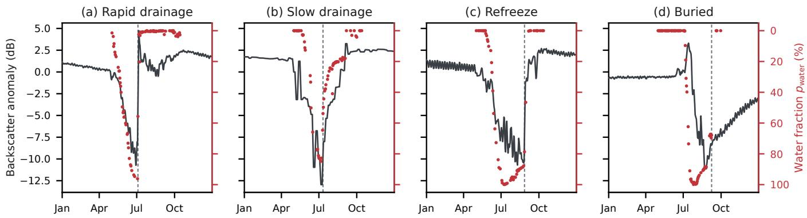
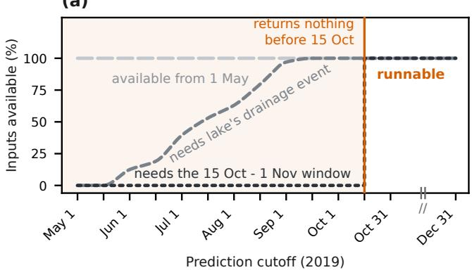
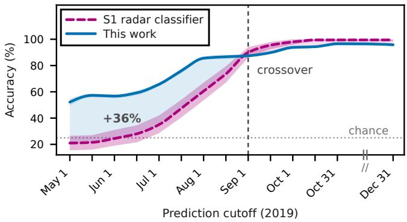
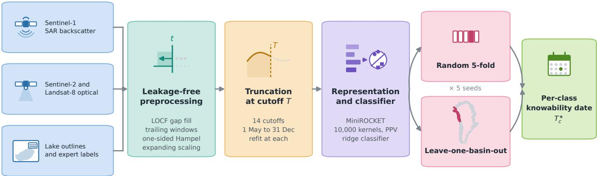
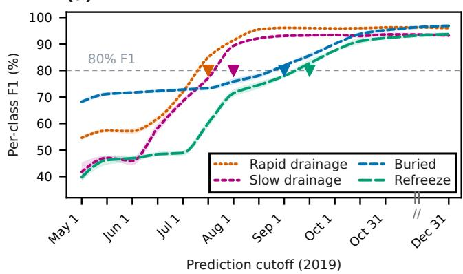
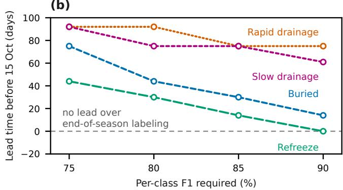
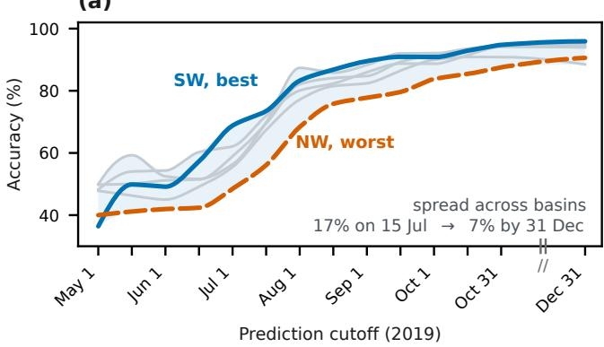
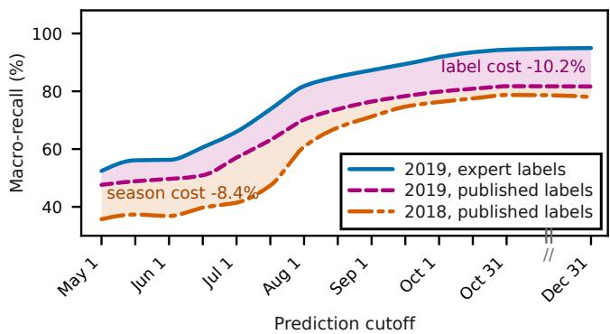
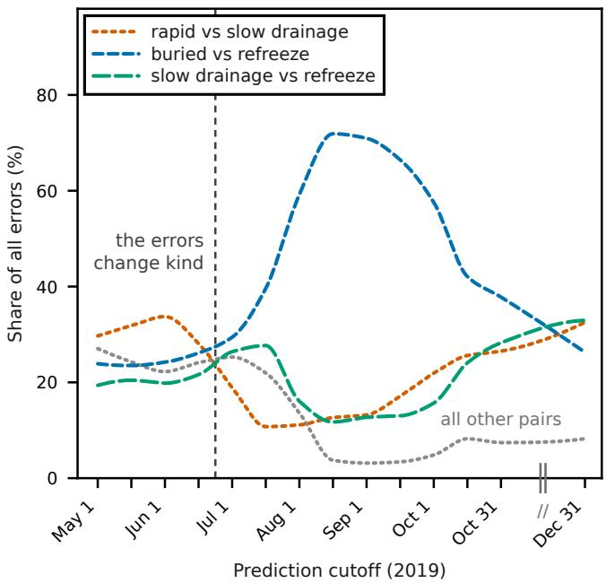

# Supraglacial Lake Fate Is Knowable Long Before the Season Ends

Emam Hossain University of Maryland, Baltimore County Baltimore, Maryland, USA emamh1@umbc.edu

Md Osman Gani University of Maryland, Baltimore County Baltimore, Maryland, USA mogani@umbc.edu

## Abstract

A supraglacial lake on the Greenland Ice Sheet ends its melt season in one of four ways: it drains rapidly through a hydrofracture, drains slowly across the surface, refreezes in place, or is buried by late-season snowfall. Which one occurs decides whether the meltwater reaches the ice bed. Satellite classifiers recover the outcome accurately but only after the season closes, and how much of a season each outcome actually requires has never been measured. We measure it directly: holding the representation and the classifier fixed, we truncate the input at 14 cutofs from 1 May to 31 December, retrain at each, and record the earliest cutof at which each outcome’s per-class � reaches a fixed target. The outcomes resolve in a consistent order, two of them months early: rapid drainage by 15 July and slow drainage by 1 August, 92 and 75 days ahead of the earliest date a full-season pipeline can be computed at all, with buried and refreeze following at 44 and 30 days. Five further learners, from a majority-class floor and 54 summary statistics to a trigger-based early classifier, leave the ordering intact: every learner that produces a per-class trajectory reproduces it despite end-ofseason accuracies difering by up to 18 percentage points, and it survives leave-one-basin-out evaluation, though not the substitution of machine labels for expert ones in an unseen season. Every feature we compute at day � reads only days up to �, at a cost of at most 1.3 percentage points. A monitoring system should therefore not have one release date: rapid drainage can be flagged on 15 July, three months before a full-season pipeline can be computed at all.

## CCS Concepts

• Computing methodologies → Machine learning approaches; • Applied computing → Earth and atmospheric sciences; • Information systems → Data mining.

## Keywords

supraglacial lakes, Greenland Ice Sheet, early classification of time series, temporal leakage, spatial cross-validation

## ACM Reference Format:

Emam Hossain and Md Osman Gani. 2026. Supraglacial Lake Fate Is Knowable Long Before the Season Ends. In Proceedings of 2nd ACM SIGSPATIAL International Workshop on Polar Data Science (PolDS ’26). ACM, New York, NY, USA, 14 pages. https://doi.org/XXXXXXX.XXXXXXX

## 1 Introduction

Surface meltwater ponds in thousands of supraglacial lakes across the Greenland Ice Sheet each summer, and how each lake ends its season decides where that water goes. A lake that drains rapidly, typically through a hydrofracture that opens a moulin, delivers water to the ice bed within hours and can measurably accelerate local ice flow [9, 12, 27, 62]. A lake that drains slowly routes its water across the surface into an existing englacial system, without the same dynamic signature [23]. A lake that refreezes holds its water at the surface all winter, and a lake buried by late-season snowfall can persist as a subsurface water body for years [17, 30]. The four pathways carry diferent consequences for ice dynamics and for sea-level rise [43, 57, 58], and Figure 1 shows how diferently each is written into the record.

Satellite remote sensing has made these outcomes mappable at ice-sheet scale. Dunmire et al. [14] classify lake evolution across Greenland by combining optical and synthetic aperture radar time series with a manually labeled reference set, and later work has refined the representation used for the same task [24, 26]. All of these systems share one design decision: every feature is computed over the whole melt season, and the label is emitted once the season is over. For a retrospective inventory that is the correct design, and the accuracies these systems report are not in question here.

It leaves a diferent question unanswered. Retrospective labeling establishes what a lake did, not when the observations settled it, and the gap between the two is where the operational value lies. If a rapid drainage is already unambiguous by mid-July, a system reporting it in October is late by a margin belonging to the pipeline rather than to the ice. Ifrefreeze genuinely cannot be separated from a very late slow drainage until freeze-up, no modeling will make an early refreeze label trustworthy. The two cases demand opposite responses, and which holds for which outcome is unmeasured.

We ask that question under a deliberately conservative design. The representation and classifier are fixed to a random convolutional transform and a ridge classifier, which is fast, has one efective hyperparameter, and is among the strongest general-purpose time series classifiers in published benchmarks [11, 37]. We then vary only how much of the season the model may see: truncating the input at 14 cutofs from 1 May to 31 December and retraining at each yields a per-class accuracy trajectory, from which we read the earliest cutof at which each outcome reaches a fixed target. Because the answer should be a property of the data rather than of a model, we repeat the sweep with five other learners, one of them a majority-class floor and one purpose-built for early classification. And because a lead time computed on features that read the future would not be interpretable, we first rebuild the preprocessing chain so that no feature at day � depends on any observation after day �.

Our contributions are as follows.

  
Figure 1: One representative lake for each end-of-season outcome, from the raw 2019 record. Gray line: radar backscatter anomaly $\mathbf { H } \mathbf { V _ { a n o m } }$ on the left axis, shared across panels. Red points: merged water probability $\scriptstyle \mathbf { p } _ { \mathbf { w a t e r } }$ on the right axis, which runs downward so both channels move together when a lake loses its water. The dashed line marks the last day the lake is observed as open water. The backscatter trace is carried forward across gaps and smoothed over three days for legibility.

• Outcomes become knowable in order, and two of them early. The four reach a fixed accuracy target in a fixed order, the two drainage outcomes reaching it 92 and 75 days before a full-season pipeline can be computed at all, so drainage and its absence should be released on diferent schedules (Section 5.1).

• The ordering belongs to the data, not the model. Six learners, from a majority-class floor and hand-built summary statistics to a trigger-based early classifier, run on identical folds; the four that produce a per-class trajectory recover the ordering in seven of eight learner-by-split cells despite end-of-season accuracies difering by up to 18 percentage points, and it holds under leave-one-basin-out evaluation (Sections 5.2 to 5.3).

• Leakage-free preprocessing, and a measurement of what it costs. Replacing gap interpolation, centered smoothing and season-wide statistics with strictly trailing equivalents makes the lead time interpretable for at most 1.3 percentage points, so the correct way to compute one is also the cheap way (Section 6.1).

## 2 Background and Related Work

## 2.1 Supraglacial lake evolution

Supraglacial lakes form in topographic depressions on the ablation and lower percolation zones of the ice sheet, filling from surface melt and from snowpack drainage as the season advances [31, 36, 55]. Their end-of-season fate is conventionally resolved into four classes [13, 14], illustrated in Figure 1.

Rapid drainage is a hydrofracture event that empties a lake over hours to a few days and opens a conduit to the bed. It is the outcome most directly coupled to ice dynamics, because it delivers a pulse of water and establishes a moulin that often persists into later seasons [6, 8, 9]. In the satellite record it appears as a collapse of optical water fraction within days, with a sharp rise in radar backscatter as the exposed lake bed roughens.

Slow drainage empties a lake over weeks through supraglacial channels or a pre-existing moulin [53, 56]. The same two signals move, but gradually, so the rate rather than the event distinguishes it.

Refreeze is the absence of drainage: the lake persists until air temperatures fall and it freezes over [14, 53].

Buried is the outcome when late-season snowfall covers a lake that has not drained. The water can then persist beneath the surface for years, and buried lakes are associated with firn aquifers and low-permeability ice slabs in the percolation zone [16, 17, 30, 35, 51].

Two properties of this taxonomy shape the rest of the paper. The classes carry unequal operational value, since rapid drainage is the outcome an ice-dynamics model most needs to know about and is also the one with the sharpest temporal signature. And two of the four are defined partly by an event not occurring, which is inherently harder to establish early than an event that does. This asymmetry is the physical reason to expect earliness to difer by class, and it is why we measure it per class rather than in aggregate.

## 2.2 Classifying outcomes from satellite data

Optical and radar records have been used to detect and delineate supraglacial lakes for two decades [2, 41, 54] and more recently to classify what becomes of them, within a fast-growing literature on deep learning for remote sensing and Earth system science [32, 61]. The systems closest to this work difer in sensor, in how the temporal signal is summarized, and in what is predicted.

One group estimates the state of a lake on a date and derives its outcome from the completed state sequence. Williamson et al. [59] track area and volume from MODIS reflectance by thresholding and region growing, declaring rapid drainage when a piecewise model fitted to the area curve drops faster than a rate threshold. Benedek and Willis [3] threshold seasonally composited Sentinel-1 scenes for the low backscatter of liquid water beneath a frozen lid. Hochreuther et al. [22] pair a normalized diference water index with a random forest on Sentinel-2 and rebuild each lifecycle from the per-date masks, and the same machinery has been carried to Antarctica [40].

Dunmire et al. [14] produce the first ice-sheet-wide classification of lake evolution into the four outcome classes used here, combining Sentinel-1 HV backscatter with Sentinel-2 and Landsat-8 reflectance over the 2018 and 2019 melt seasons, summarizing each lake’s season into a fixed feature vector, and fitting a stacked ensemble whose components are specialized by sensor. Their manually labeled set of 1,000 lakes is the ground truth used in this paper. Two later studies treat the problem as time series classification instead. Hossain et al. [26] feed the raw daily channels to standard classifiers, including LSTM-FCN [29] and MiniROCKET, and report that a random convolutional kernel transform with a linear classifier matches or exceeds the ensemble at a fraction of the cost, and Hossain et al. [24] run joint PCMCI+ [48] over the channels to find per-basin causal parents of the outcome and restrict the transform to them.

Every one of these systems consumes the season in full before emitting a label, and none reports accuracy under truncated input. Table 1 places them on the axes that make the gap visible.

Table 1: Positioning. “Temporal scope” is the span of observa tions that a feature available at prediction time may depend on. “Truncated evaluation” asks whether accuracy is reported as a function of how much of the season the model has seen.
<table><tr><td>System</td><td>Sensors</td><td>Temporal scope</td><td>Truncated eval.</td></tr><tr><td>Williamson et al. [59]</td><td>MODIS</td><td>full season</td><td>no</td></tr><tr><td>Benedek and Willis [3]</td><td>S1</td><td>full season</td><td>no</td></tr><tr><td>Hochreuther et al. [22]</td><td>S2</td><td>full season</td><td>no</td></tr><tr><td>Dunmire et al. [14]</td><td>S1, S2, LS</td><td>full season</td><td>no</td></tr><tr><td>Hossain et al. [26]</td><td>S1, S2, LS</td><td>full season</td><td>no</td></tr><tr><td>Hossain et al. [24]</td><td>S1, S2, LS, CARRA</td><td>full season</td><td>no</td></tr><tr><td>ELECTS [49]</td><td>S2</td><td>causal</td><td>one policy</td></tr><tr><td>This work</td><td>S1, S2, LS</td><td>causal</td><td>per class</td></tr></table>

## 2.3 Early classification of time series

Early classification of time series (ECTS) studies the trade-of this paper measures: how little of a series sufices for a reliable label. Four families of methods have emerged. Trigger-based methods attach a stopping rule to a conventional classifier: ECTS sets a minimum prediction length per training instance from nearestneighbor stability [60], and TEASER trains a one-class classifier over the base classifier’s output at each candidate decision point and commits once a fixed number of consecutive points agree [50]. Costoptimization methods minimize a weighted sum of misclassification and delay cost, by per-timestamp regression in CALIMERA [5] and by a continuous-time policy for irregularly sampled series in Stop&Hop [20]. End-to-end methods learn the stopping rule jointly with the classifier, as in ELECTS [49] and in the variational formulation of Chen et al. [7]. Calibrated methods use conformal risk control to bound the accuracy lost by stopping early [46], and surveys document the same tension across all four [18, 38].

These methods answer a related but distinct question. Each opti mizes a single earliness policy for a dataset, one trigger or one cost trade-of applied to every instance regardless of its class, whereas the question here is how earliness difers across outcome classes. We treat that as an empirical claim rather than a definitional one and test it in Section 5.2 by running TEASER on the same lakes and folds.

## 2.4 Leakage in temporal pipelines

A lead-time claim is only as good as the guarantee that a feature available at day � depends on nothing after day �. Three preprocessing steps in common use break that guarantee. Interpolation across gaps fills a missing observation from the values that bracket it, the default in widely used imputation toolkits [39] and applied to lake records in several of the systems above [14, 22]. Centered smoothing windows average across days on both sides of �, so a window straddling a drainage event carries post-event information into pre-event features. And season-wide statistics, computed over the complete record and attached to every day of it, are the usual way to build a fixed-length feature vector [14, 59].

None of these is an error when the target is a retrospective inventory; they become disqualifying only when the question turns temporal. This is an instance of a broader failure mode in machinelearning-based science [28] and of the dificulty of validating models on temporally ordered data [4], and it compounds with a second problem: random cross-validation on spatially structured data places neighboring instances on both sides of the split and inflates measured accuracy [47]. We rebuild the preprocessing chain so that every feature is a function of days ≤ � (Section 4.1), treat leave-onebasin-out as the primary evaluation (Section 4.4), and measure both choices rather than assume them (Sections 6.1 and 5.3).

## 3 Problem Setup

## 3.1 Data and labels

We use the Greenland Ice Sheet supraglacial lake record compiled by Dunmire et al. [14] for the 2018 and 2019 melt seasons. That record supplies the observations and the ground-truth outcome labels; the truncated prediction protocol, the preprocessing chain, the splits and every result in this paper are new. Lakes carry the drainagebasin assignment of that record, which partitions the ice sheet into Central West (CW), Northeast (NE), North (NO), Northwest (NW), Southeast (SE) and Southwest (SW); those six basins define the spatial folds of Section 4.4.

Each lake � is a multivariate daily series $x _ { i } \in \mathbb { R } ^ { C \times 3 6 5 }$ on a common day-of-year grid, with the � = 9 channels ofTable 2. Three carry the radar view. Cross-polarized HV backscatter responds strongly to volume scattering in snow and ice and weakly to smooth open water, so a water-covered lake appears dark and an emptied, roughened bed appears bright, the contrast that underpins radar lake and melt mapping on both ice sheets [42]. We take the mean inside the lake polygon, the mean over a surrounding bufer, and their diference $\mathsf { H V } _ { \mathsf { a n o m } }$ , which removes the regional seasonal cycle. Three channels carry the optical view, the water-classified fraction of the polygon in each optical sensor and a merged water probability. The last three record the observing conditions rather than the surface: air temperature and the two solar zenith angles, which encode when an optical observation was geometrically possible at all and so distinguish a genuinely dry lake from an unobservable one.

Ground-truth labels come from the manually labeled reference set released with the record: 1,000 lakes from the 2019 season, assigned by expert interpretation of the paired optical and radar imagery, with exactly 250 in each class. That balance is a property of how the set was assembled rather than of the ice sheet, and it fixes the trivial floor of the task at 25.0% macro-recall. A much larger set of machine labels accompanies the record; we use it only as a transfer target in Section 5.3, where it supplies 5,146 additional lakes in 2019 and 3,846 in 2018. The processed record begins at day-of-year 121 (1 May), before which the optical and atmospheric channels have zero variance across lakes, so day 121 is a hard floor on any cutof that can be evaluated.

Table 2: The nine input channels, the input to every model reported in the paper. Section 6.2 tests five further atmospheric channels as an ablation and finds that they change nothing.
<table><tr><td>Symbol</td><td>Source</td><td>Quantity</td></tr><tr><td> $\mathsf { H V } _ { \mathrm { l a k e } }$ </td><td>Sentinel-1</td><td>Mean HV backscatter within the lake polygon</td></tr><tr><td> $\mathsf { H V } _ { \mathrm { o u t } }$ </td><td>Sentinel-1</td><td>Mean HV backscatter in the surrounding buffer</td></tr><tr><td> $\mathsf { H V } _ { \mathsf { a n o m } }$ </td><td>Sentinel-1</td><td>Backscatter anomaly, lake minus buffer</td></tr><tr><td> $S 2 _ { \mathrm { w a t e r } }$ </td><td>Sentinel-2</td><td>Water-classified fraction of the polygon</td></tr><tr><td> ${ \mathsf { L S } } _ { \mathsf { w a t e r } }$ </td><td>Landsat-8</td><td>Water-classified fraction of the polygon</td></tr><tr><td>Pwater</td><td>S2 + LS</td><td>Merged water probability</td></tr><tr><td>t2m</td><td>Reanalysis</td><td>Near-surface air temperature</td></tr><tr><td> $S 2 _ { z e n i t h }$ </td><td>Sentinel-2</td><td>Solar zenith angle at overpass</td></tr><tr><td> $\mathsf { L S } _ { \mathsf { z e n i t h } }$ </td><td>Landsat-8</td><td>Solar zenith angle at overpass</td></tr></table>

## 3.2 Prediction at a truncated cutof

Let $y _ { i } \in { \mathcal { Y } }$ be the end-of-season outcome of lake �, where $y =$ {rapid drainage, slow drainage, buried, refreeze}. Define the truncation operator

$$
\Pi _ { T } ( x _ { i } ) ~ = ~ \left[ x _ { i } [ : , 1 ] , ~ x _ { i } [ : , 2 ] , ~ . ~ . ~ , ~ x _ { i } [ : , T ] \right] ,\tag{1}
$$

which retains the first $T$ days of the season and discards the remainder. For each cutof $T$ we learn a classifier $\hat { f } _ { T } : \mathbb { R } ^ { C \times T } \to y$ that sees truncated inputs at training time and at test time alike. The cutof grid is

$$
\begin{array} { r l } & { \mathcal { T } = \{ 1 2 1 , 1 3 5 , 1 5 2 , 1 6 6 , 1 8 2 , 1 9 6 , 2 1 3 , } \\ & { \qquad 2 2 7 , 2 4 4 , 2 5 8 , 2 7 4 , 2 8 8 , 3 0 4 , 3 6 5 \} , } \end{array}\tag{2}
$$

the 1st and 15th of each month from 1 May to 15 October, plus 31 October, which closes the melt season, and day 365, a full-year reference. Both study years are non-leap years, so these day-of-year values map to identical calendar dates in 2018 and 2019 and the cross-year comparison in Section 5.3 is exact.

We fit a separate model at each cutof rather than evaluating one full-season model on shortened inputs. A model trained on 365-day inputs and tested on a 152-day input is penalized twice, once for the missing evidence and once because the input no longer resembles its training distribution, and after the fact the two cannot be separated. Only the first is of interest. Retraining removes the second penalty and matches deployment, since an operator wanting a label on 15 July would train on what was available by then.

## 3.3 Knowability and lead time

Let $F _ { 1 , c } ( T )$ be the per-class $F _ { 1 }$ of $\hat { f } _ { T }$ on class $c \in \mathcal { Y }$ . The knowability date of class � at target � is the earliest cutof meeting that target:

$$
T _ { c } ^ { * } ( \tau ) \ = \ \operatorname* { m i n } \{ T \in { \mathcal { T } } \ : \ F _ { 1 , c } ( T ) \geq \tau \} .\tag{3}
$$

We report $\tau = 0 . 8 0$ throughout and sweep it in Section 6.3.

(a)  

(b)  
  
Figure 2: (a) When each feature group of a full-season classifier becomes computable. Nothing requiring October or fullseason observations exists before 15 October, which fixes the reference date for lead time. (b) That classifier’s Sentinel-1 component on truncated input without retraining, against the model of this paper retrained at each cutof, both scored on the 200 lakes the released model holds out. The dashed line marks where they cross, once the full-season features the released model was built for exist.

A knowability date is meaningful only against a reference date, and the reference we adopt is a property of the input calendar rather than of any particular system. A full-season classifier of the kind described in Section 2.2 draws on four groups of features: those available continuously, those requiring the drainage event to have occurred, those requiring October observations, and those requiring the complete record. Figure 2(a) traces when each becomes computable. The first is usable from 1 May and the second fills in through the season, but the last two are a step function that rises on 15 October, so no classifier of this shape can be evaluated at all before day-of-year 288. We therefore define

$$
\mathrm { l e a d } _ { c } ( \tau ) ~ = ~ 2 8 8 - T _ { c } ^ { * } ( \tau )\tag{4}
$$

in days: when information arrives, not a margin over a rival.

Figure 2(b) shows the double penalty of Section 3.2 in that same classifier, on the 200 lakes it holds out. Without retraining, its Sentinel-1 component falls on 1 May to 21.0% accuracy against a 25.0% chance level, 31.2 points below the model of this paper retrained at the same cutof; its Sentinel-2 component behaves the same way (Appendix D). The gap closes through the season and reverses on 1 September: what the released model lacks early is evidence, not capacity.

  
Figure 3: The end-to-end architecture. Three input sources collect onto a common daily grid and pass through the processing chain, which forks at the evaluation protocol and converges on the quantity the pipeline emits. Each module type carries its own color, and modules that do the same job share one: the three input sources are a single family, as are the two split schemes. The preprocessing glyph shows the rule the chain enforces, that a feature at day � reads a trailing window and nothing after �. The leave-one-basin-out glyph is not a schematic: it is the position of every lake in the 2019 record, projected to polar stereographic and colored by drainage basin, with one basin held out.

## 4 Method

Figure 3 gives the end-to-end pipeline: the per-lake daily record, the two preprocessing chains, the truncation operator, the fixed classifier, the two split schemes, and the quantity reported in Section 5.

## 4.1 Leakage-free preprocessing

We rebuild the preprocessing chain so that every feature at day � is a function of observations on days ≤ � only. Four substitutions do the work: one for each of the three steps identified in Section 2.4, and one for the outlier rejection that any moving statistic requires.

Gap filling by last observation carried forward. Cloud cover and orbit geometry leave gaps of several days in the optical channels, and interpolation fills a gap from the observations on both sides of it [39]. We instead carry the last observed value forward, the standard causal alternative in online monitoring: the value at day � is the most recent measurement not later than �. Before a lake’s first observation there is nothing to carry forward and backward filling would again read the future, so that stretch takes fixed constants from physical priors rather than from data (Appendix B). Both chains use the same constants, so Section 6.1 measures leakage, not fill.

Trailing rather than centered smoothing. A centered moving average of width � at day � spans $[ t - w / 2 , t + w / 2 ]$ , so with the 12-day window used here a feature two days before a drainage event already contains six post-event days. The trailing average over $\left[ t - w + 1 , t \right]$ has the same bandwidth and noise suppression but reads only the past. Its cost is a phase lag, since a trailing average responds to a step change �/2 days later than a centered one, which makes the measured dates conservative rather than optimistic.

One-sided robust outlier rejection. Speckle in the radar channels and misclassified cloud edges in the optical channels produce isolated spikes that distort any moving statistic. The Hampel filter replaces any sample more than � scaled median absolute deviations from the local median, using the median as a high-breakdown location estimate [19, 44]. Its usual centered window would reintroduce the dependence just removed, so both statistics use the trailing window.

Expanding-window standardization. Channel scales difer by orders of magnitude, and season-wide statistics rescale every day using information from every other day. We instead standardize day � by the mean and standard deviation over days 1 to �.

Each substitution has a cost, and Section 6.1 measures their total.

## 4.2 Representation and classifier

Every truncated input $\Pi _ { T } ( x _ { i } )$ is passed through MiniROCKET [11] and classified by a ridge classifier.

MiniROCKET is a random convolutional kernel transform. It convolves the input with a large bank of short kernels and summarizes each convolution by the proportion of positive values, giving one feature per kernel. Unlike its predecessor ROCKET [10], which samples kernel lengths, weights, biases and dilations at random, it fixes almost all of these: kernels have length 9 with weights from {−1, 2} in one of 84 fixed patterns, dilations follow from the series length, and only the biases are sampled from the data. It is therefore nearly deterministic and roughly an order of magnitude faster, while matching or exceeding ROCKET’s accuracy on standard benchmarks [11, 37]. We use 10,000 kernels over the nine channels jointly, giving 9,996 features; the transform is unsupervised.

The classifier is a ridge regression on one-hot targets, predicting the class with the largest fitted score. Its closed-form solution suits the very wide, low-sample regime the transform produces $( 1 0 ^ { 4 }$ features against at most $1 0 ^ { 3 }$ training lakes), and its leave-one-out cross-validation error follows exactly from a single singular value decomposition of the design matrix [21]. We use that identity to select the regularization strength within each training fold from ten logarithmically spaced values in $[ 1 0 ^ { - 3 } , 1 0 ^ { 3 } ]$ , so no hyperparameter sees test data. Implementations are sktime [33] and scikit-learn [45].

Holding this pairing fixed across cutofs is central to the design, since changing the model while changing the amount of input would confound the two efects. Section 5.2 then tests whether the choice afects the conclusion, by repeating the entire sweep with the alternatives of Section 4.3.

## 4.3 Baselines

We compare against five further learners, each chosen to rule out a specific alternative explanation of the measured result rather than to populate a leaderboard. All run on identical folds, seeds, cutofs, labels and preprocessed inputs, so nothing but the learner changes.

T1, majority class, predicts the most frequent class in the training fold. A constant prediction on four balanced classes attains 25.0% macro-recall by construction; because the majority class differs from fold to fold, T1 reaches 22.1% under random folds and 16.6% under basin ones. The basin figure is the lower of the two because refreeze is never the majority class in any basin training fold, so no held-out refreeze lake is ever predicted correctly.

T2, summary statistics, tests whether temporal modeling is needed at all. It computes six quantities per channel over days $\leq T ;$ mean, standard deviation, minimum, maximum, last observed value, and the slope of an ordinary least squares fit against time, giving 54 features for nine channels, classified by the same ridge classifier. It keeps level, spread, extremes and trend, and discards shape entirely.

T3, catch22 [34], tests whether the result depends on a learned representation. Its 22 features were selected from a library of thousands by filtering for classification performance and low mutual redundancy across the UCR archive, and cover distributional shape, linear and nonlinear autocorrelation, incremental diferences and symbolic dynamics. It is the standard fixed-feature baseline for this task [1, 37], applied per channel with the same classifier.

T4, ROCKET [10], tests whether the result depends on MiniROCKET’s particular restrictions rather than on the kernel family. It is the transform MiniROCKET simplifies, sampling kernel length, weights, bias, dilation and padding at random and summarizing each convolution by both its maximum and its proportion of positive values. We run it at the same kernel budget.

T5, TEASER [50], tests whether a method built for earliness finds the same structure. It fits a base classifier at each of a set of candidate decision points and, at each point, a one-class support vector machine over the base classifier’s class probabilities, committing once that model accepts the prediction at � consecutive points. We run it in streaming mode, removing each instance from the pool as soon as its trigger fires, so every lake contributes exactly one label and one decision date, under both split schemes and all five seeds.

## 4.4 Evaluation protocol

The protocol is fixed before any result is inspected.

Splits. Two schemes are run at every cutof. Random 5-fold crossvalidation partitions the 1,000 lakes uniformly at random and is reported because the systems of Section 2.2 are evaluated this way. Leave-one-basin-out holds out each of the six basins in turn and is our primary generalization test: lakes within a basin share weather, topography and drainage infrastructure, so random folds place nearduplicates on both sides of the split and report an accuracy a model deployed on a new region would not attain [47]. Where the two disagree we report the basin result.

Configurations and scale. The main sweep crosses the 14 cutofs with two preprocessing chains, the leakage-free chain of Section 4.1 and the conventional one it replaces, and two variable sets, the nine channels of Table 2 alone and those nine plus the five atmospheric channels of Section 6.2. With five seeds and eleven folds this is $1 4 \times 2 \times 2 \times 5 \times 1 1 = 3 , 0 8 0$ fits; the baseline arms add 1,078 more (Appendix C).

Metrics. For a class � with true positives $\mathrm { T P } _ { c } ,$ , false positives $\mathrm { F P } _ { c }$ and false negatives $\mathrm { F N } _ { c } ,$

$$
\mathrm { R e c } _ { c } = \frac { \mathrm { T P } _ { c } } { \mathrm { T P } _ { c } + \mathrm { F N } _ { c } } , \qquad \mathrm { P r e c } _ { c } = \frac { \mathrm { T P } _ { c } } { \mathrm { T P } _ { c } + \mathrm { F P } _ { c } } ,\tag{5}
$$

$$
F _ { 1 , c } = { \frac { 2 \operatorname { P r e c } _ { c } \operatorname { R e c } _ { c } } { \operatorname { P r e c } _ { c } + \operatorname { R e c } _ { c } } } , \qquad \operatorname { M a c r o R e c } = { \frac { 1 } { | { \mathcal { Y } } | } } \sum _ { c \in { \mathcal { Y } } } \operatorname { R e c } _ { c } .\tag{6}
$$

Knowability dates are defined on per-class $F _ { 1 } { \mathrm { : } }$ : per class because that is the quantity being measured, and $F _ { 1 }$ rather than recall because a class that is simply over-predicted would reach a recall target without becoming any more knowable. Aggregate comparisons use macro-recall, which weights the four outcomes equally and is robust to the class imbalance of the transfer sets in Section 5.3. Accuracy appears only where the class balance makes it interpretable.

Uncertainty. Confusion matrices are pooled across the folds of a given seed, and every reported figure is the mean over five seeds with the sample standard deviation across seeds as the spread, written as $\mu \pm \sigma .$ The catch22 and summary-statistic arms are deterministic given the folds, so no spread is reported for them. The full-season classifier of Section 3.3 is a released model rather than one we refit; for it we report percentile bootstrap intervals over 1,000 resamples.

## 5 Results

## 5.1 Outcomes become knowable in order

Table 3 gives per-class $F _ { 1 }$ at every cutof under both split schemes, and Figure 4(a) plots $\mathrm { i t . } ^ { 1 }$ The four outcomes reach the 80% target in the order rapid drainage, slow drainage, buried, refreeze. Under random folds the dates are day 196 (15 July), day 213 (1 August), day 244 (1 September) and day 258 (15 September), which are leads of 92, 75, 44 and 30 days against the 15 October reference of Section 3.3. Under leave-one-basin-out the two drainage dates are unchanged and the two storage classes both fall on day 258, so the ordering holds but is no longer strict: buried and refreeze become knowable on the same date once the model must generalize to a new basin.

The ordering follows the physical asymmetry of Section 2.1. Rapid drainage is a sharp, dated event with an unambiguous joint signature, water fraction collapsing within days while backscatter season closes without one; refreeze comes last because freeze-up itself confirms it.

Table 3: Per-class $F _ { 1 }$ (%) at every prediction cutof, for the fixed MiniROCKET and ridge model under the leakage-free preprocessing chain. Each entry is the mean over five seeds with the standard deviation across seeds. The bold entry in each row marks the knowability date $T ^ { * }$ , the first cutof at which that class reaches the 80% target.
<table><tr><td>Split</td><td>Class</td><td></td><td>1 May 15 May</td><td>1 Jun</td><td>15 Jun</td><td>1 Jul</td><td>15 Jul</td><td>1 Aug</td><td> $1 5 \mathrm { A u g }$ </td><td> $1 \mathrm { S e p }$ </td><td> $1 5 \mathrm { S e p }$ </td><td> $1 \mathrm { O c t }$ </td><td>15 Oct</td><td> $3 1 \mathrm { O c t }$ </td><td> $3 1 \mathrm { D e c }$ </td></tr><tr><td rowspan="4">Random</td><td>Rapid drainage</td><td> $5 4 . 6 \pm 0 . 9$ </td><td> $5 7 . 3 \pm 0 . 7$ </td><td> $5 7 . 1 \pm 1 . 0$ </td><td> $6 1 . 8 \pm 1 . 0$ </td><td> $7 2 . 0 \pm 1 . 1$ </td><td> $\mathbf { 8 5 . 0 \pm 0 . 8 }$ </td><td> $9 1 . 4 \pm 0 . 3 $ </td><td> $9 5 . 5 \pm 0 . 4$ </td><td> $9 6 . 1 \pm 0 . 4$ </td><td> $9 5 . 9 \pm 0 . 2 $ </td><td> $9 5 . 8 \pm 0 . 2$ </td><td> $9 5 . 9 \pm 0 . 6 $ </td><td> $9 6 . 3 \pm 0 . 3$ </td><td> $9 6 . 0 \pm 0 . 4$ </td></tr><tr><td>Slow drainage</td><td> $4 1 . 6 \pm 3 . 6$ </td><td> $4 7 . 0 \pm 0 . 8$ </td><td> $4 5 . 8 \pm 1 . 5$ </td><td> $5 8 . 2 \pm 1 . 7$ </td><td> $6 8 . 4 \pm 1 . 0$ </td><td> $7 7 . 1 \pm 0 . 9$ </td><td> $\mathbf { 8 9 . 3 \pm 0 . 5 }$ </td><td> $9 2 . 1 \pm 0 . 4$ </td><td> $9 3 . 0 \pm 0 . 6$ </td><td> $9 3 . 2 \pm 0 . 5$ </td><td> $9 3 . 4 \pm 0 . 2 $ </td><td> $9 3 . 0 \pm 0 . 7$ </td><td> $9 3 . 6 \pm 0 . 6$ </td><td> $9 3 . 2 \pm 0 . 6$ </td></tr><tr><td>Buried</td><td> $6 8 . 2 \pm 0 . 8$ </td><td> $7 1 . 1 \pm 0 . 7$ </td><td> $7 1 . 7 \pm 0 . 4$ </td><td> $7 2 . 2 \pm 0 . 7$ </td><td> $7 2 . 8 \pm 0 . 7$ </td><td> $7 3 . 3 \pm 0 . 7$ </td><td> $7 5 . 9 \pm 1 . 1$ </td><td> $7 8 . 0 \pm 1 . 0$ </td><td> $\mathbf { 8 1 . 9 \pm 0 . 6 }$ </td><td> $8 5 . 6 \pm 0 . 9$ </td><td> $9 0 . 0 \pm 0 . 4$ </td><td> $9 3 . 8 \pm 0 . 6$ </td><td> $9 5 . 2 \pm 0 . 8$ </td><td> $9 6 . 8 \pm 0 . 5$ </td></tr><tr><td>Refreeze</td><td> $3 9 . 7 \pm 1 . 4$ </td><td> $4 6 . 2 \pm 1 . 8$ </td><td> $4 6 . 8 \pm 1 . 2$ </td><td> $4 8 . 4 \pm 0 . 9$ </td><td> $4 8 . 9 \pm 1 . 0$ </td><td> $6 0 . 1 \pm 1 . 5$ </td><td> $7 1 . 4 \pm 1 . 4$ </td><td> $7 4 . 5 \pm 1 . 3$ </td><td> $7 7 . 9 \pm 0 . 8$ </td><td> $8 2 . 8 \pm 1 . 3$ </td><td> $8 7 . 5 \pm 0 . 6 $ </td><td> $9 1 . 1 \pm 1 . 2$ </td><td> $9 2 . 2 \pm 0 . 5$ </td><td> $9 3 . 6 \pm 1 . 0$ </td></tr><tr><td rowspan="4">Basin</td><td>Rapid drainage</td><td> $4 2 . 7 \pm 3 . 8$ </td><td> $5 0 . 8 \pm 1 . 4$ </td><td> $5 0 . 0 \pm 1 . 4$ </td><td>53.2 ±2.4</td><td> $6 5 . 1 \pm 1 . 5$ </td><td> $\mathbf { 8 0 . 8 \pm 0 . 9 }$ </td><td> $8 9 . 9 \pm 0 . 8$ </td><td> $9 5 . 0 \pm 0 . 7$ </td><td> $9 5 . 3 \pm 0 . 8$ </td><td> $9 5 . 4 \pm 0 . 6 $ </td><td> $9 5 . 0 \pm 0 . 9$ </td><td> $9 4 . 9 \pm 0 . 3 $ </td><td>96.2 ±0.6</td><td> $9 5 . 3 \pm 0 . 6$ </td></tr><tr><td>Slow drainage</td><td> $3 1 . 7 \pm 2 . 2 $ </td><td> $3 8 . 4 \pm 1 . 8$ </td><td> $3 5 . 7 \pm 1 . 8$ </td><td> $4 7 . 0 \pm 2 . 7$ </td><td> $5 9 . 2 \pm 1 . 7$ </td><td> $7 1 . 5 \pm 0 . 9$ </td><td> ${ \bf 8 8 . 5 \pm 0 . 6 }$ </td><td> $9 2 . 0 \pm 0 . 4$ </td><td> $9 2 . 4 \pm 1 . 8$ </td><td> $9 3 . 3 \pm 0 . 6$ </td><td> $9 1 . 2 \pm 1 . 1$ </td><td> $9 2 . 0 \pm 0 . 6$ </td><td> $9 3 . 0 \pm 0 . 3$ </td><td> $9 1 . 2 \pm 0 . 5$ </td></tr><tr><td>Buried</td><td> $6 6 . 5 \pm 1 . 3$ </td><td> $6 9 . 1 \pm 1 . 3$ </td><td> $6 8 . 4 \pm 0 . 5$ </td><td> $6 8 . 6 \pm 1 . 3$ </td><td> $7 0 . 8 \pm 1 . 4$ </td><td> $7 0 . 9 \pm 0 . 9$ </td><td> $7 3 . 9 \pm 1 . 1$ </td><td> $7 4 . 9 \pm 1 . 5$ </td><td> $7 9 . 0 \pm 0 . 9$ </td><td> $8 3 . 7 \pm 1 . 1$ </td><td> $8 8 . 0 \pm 1 . 4$ </td><td> $9 1 . 4 \pm 0 . 8$ </td><td> $9 3 . 5 \pm 1 . 0$ </td><td> $9 6 . 2 \pm 0 . 9$ </td></tr><tr><td>Refreeze</td><td> $3 3 . 5 \pm 0 . 7$ </td><td>41.6 ±1.2 41.6 ±0.9</td><td></td><td> $4 2 . 5 \pm 1 . 5$ </td><td>43.6 ±1.6</td><td> $5 3 . 1 \pm 1 . 4$ </td><td> $6 9 . 5 \pm 0 . 7$ </td><td> $7 0 . 8 \pm 1 . 5$ </td><td> $7 5 . 0 \pm 1 . 1$ </td><td> $\mathbf { 8 0 . 7 \pm 1 . 3 }$ </td><td> $8 4 . 0 \pm 0 . 6$ </td><td> $8 7 . 4 \pm 1 . 1$ </td><td> $8 9 . 9 \pm 1 . 0$ </td><td> $9 1 . 8 \pm 0 . 5$ </td></tr></table>

(a)

Table 3 carries two further details. Buried starts high, at $6 8 . 2 \pm$ 0.8% $F _ { 1 }$ on 1 May when every other class is near chance, because buried lakes are distinguished as much by where and what they are as by what happens to them: they sit high in the percolation zone and carry a distinctive radar signature from the start of the record, so the slow climb that follows is the model resolving harder cases rather than discovering the class. And all four classes are close to flat after day 288: under random folds macro-recall gains 1.5 points between day 288 and day 365, so the two months after the melt season contribute very little even to a retrospective label.

(b)  
  
Figure 4: (a) Per-class $F _ { 1 }$ against the prediction cutof under random folds, with the 80% target drawn and the knowability date of each class marked on it. Bands are one standard devia tion across the five seeds. (b) Lead time retained by each class as the accuracy target � is swept from 75% to 90%. Every lead shrinks as the target tightens, and no two classes exchange places.

## 5.2 The ordering is model-independent

If the measured ordering were a consequence of choosing MiniROCKET, it would not survive a change of learner. The right block of Table 4 gives the knowability date of every class under every learner and both split schemes. Four of the six learners produce a per-cutof trajectory and therefore a knowability date, which gives eight learner-by-split cells. The ordering $T _ { \mathrm { r a p i d } } ^ { * } \leq T _ { \mathrm { s l o w } } ^ { * } \leq T _ { \mathrm { b u r i e d } } ^ { * } \leq$ $T _ { \mathrm { r e f r e e z e } } ^ { \ast }$ holds in seven of them, the exception being slow drainage for the summary-statistic baseline under basin folds, which never reaches the target at any cutof. Rapid drainage is earliest in all eight, and refreeze latest or never reached in all eight. Under random folds the summary-statistic baseline recovers all four dates exactly as the fixed model does, on 54 features rather than 9,996. The majority-class floor fixes the other end of the range: it reaches no class target at any cutof, under either scheme.

The left block of Table 4 gives the accuracy behind those dates, and where the learners difer is informative. The two fixed-feature representations, catch22 and the 54 summary statistics, track the fixed model closely until late July, staying within 1.2 percentage points of it at 1 May under random folds, then plateau near 83% while the kernel transforms continue past 94%. The early season is therefore carried by a low-dimensional signal, since level, last value and slope nearly sufice for a drainage event. The late-season gains come from a diferent problem, separating buried from refreeze, which turns on subtler diferences in the timing and texture of freeze-up and does need the richer representation. Hence catch22 never reaches the refreeze target under either split scheme.

rises as the exposed bed roughens, and once that signature is in the record no later observation is needed to confirm it. Slow drainage is the same transition spread over weeks, so more of the season is needed to separate a lake that is emptying from one merely shrinking. Buried and refreeze are defined by an event not having happened, and evidence for a non-event accumulates only as the

The comparison with ROCKET isolates the kernel restrictions from the kernel family. The two end the season within 0.8 percentage points of each other under both split schemes but separate early: MiniROCKET leads by 7.0 points at 1 May under random folds and 8.6 under basin folds, and leads at every cutof up to 1 July and 1 August respectively (Table 8). The cause is in ROCKET’s construction, since with only 121 days of input its randomly sampled kernel lengths and dilations frequently exceed the series length and contribute nothing, whereas MiniROCKET’s dilations follow from the series length and adapt to truncation. Its seed spread under basin folds is correspondingly wider over the first six cutofs, 1.2 points on average against 0.8, again in Table 8. Since the early season is where the measurement lives, we retain MiniROCKET.

Table 4: Every learner, both split schemes. Left block: macro-recall (%) at ten of the fourteen prediction cutofs under the leakage free preprocessing chain, as mean ± standard deviation over five seeds; catch22 and the summary statistics are deterministic given the folds and so carry no spread. Right block: the knowability date �∗ of each class at $\tau = 0 . 8 0 ,$ a calendar date in 2019, where “n.r.” means the target is never reached. Two rows do not resolve by cutof. The majority floor ignores the series, and TEASER commits once per lake at a date of its own choosing, so its accuracy is measured there and its four dates are medians, not knowability dates; it also runs at 2 000 kernels against 10 000 elsewhere (Appendix C). Bold marks the best of the remaining four entries in each column. All fourteen cutofs are in Table 8.
<table><tr><td></td><td></td><td colspan="10">Macro-recall (%) at prediction cutoff</td><td colspan="4">Knowability date T*</td></tr><tr><td>Split</td><td>Learner</td><td>1May</td><td>1 Jun</td><td>1 Jul</td><td>15 Jul</td><td>1 Aug 15 Aug</td><td>1 Sep</td><td>15 Sep</td><td>1 Oct</td><td></td><td>31 Dec</td><td>Rapid</td><td>Slow Buried</td><td>Refreeze</td></tr><tr><td colspan="10">Majority</td><td colspan="7">n.r. n.r.</td></tr><tr><td rowspan="6">Random</td><td>TEASER</td><td></td><td></td><td>59.6 ± 1.0 at its own decision dates, median 15 May</td><td></td><td></td><td></td><td></td><td></td><td></td><td></td><td>15 May</td><td>15 May</td><td>n.r. 15 May</td><td>15 May</td></tr><tr><td>Summary statistics</td><td>51.2</td><td>54.3</td><td>63.4</td><td>72.8</td><td>78.0</td><td>79.4</td><td>79.1</td><td>82.3</td><td>82.8</td><td>81.8</td><td>15 Jul</td><td>1 Aug</td><td>1 Sep</td><td>15 Sep</td></tr><tr><td>catch22</td><td>51.5</td><td>53.8</td><td>63.3</td><td>66.3</td><td>76.7</td><td>80.9</td><td>79.7</td><td>78.7</td><td>83.8</td><td>82.3</td><td>1 Aug</td><td>1 Aug</td><td>1 Oct</td><td>n.r.</td></tr><tr><td>ROCKET</td><td>45.4 ±0.8</td><td>52.8 ±0.5</td><td>64.2 ±0.8</td><td>74.8 ±0.8</td><td>82.1 ±0.7</td><td>86.2 ±0.5</td><td>87.3 ±0.6</td><td>90.5 ±0.5</td><td>92.7 ±0.6</td><td>94.4 ±0.2</td><td>15 Jul</td><td>15 Jul</td><td>1 Sep</td><td>15 Sep</td></tr><tr><td>MiniROCKET</td><td>52.4 ±1.0</td><td>56.2 ±0.7</td><td>66.1 ±0.8</td><td>73.8 ±0.5</td><td>81.8 ±0.7</td><td>85.0 ±0.6</td><td>87.3 ±0.4</td><td>89.4 ±0.5</td><td>91.7 ±0.2</td><td>94.9 ±0.4</td><td>15 Jul</td><td>1 Aug</td><td>1 Sep</td><td>15 Sep</td></tr><tr><td>Majority</td><td colspan="10"></td><td colspan="3">n.r.</td></tr><tr><td rowspan="5">Basin</td><td></td><td></td><td></td><td></td><td></td><td></td><td></td><td>16.6, no dependence on the cutoff 50.1 ± 1.6 at its own decision dates, median 15 May</td><td></td><td></td><td></td><td>15 May</td><td>n.r. 1 Jun†</td><td>n.r. 15 May</td><td>n.r. 15 May</td></tr><tr><td>TEASER Summary statistics</td><td>45.7</td><td>48.2</td><td>57.1</td><td>68.7</td><td>75.9</td><td>75.6</td><td>76.3</td><td>78.1</td><td>79.2</td><td>78.3</td><td>1 Aug</td><td>n.r.</td><td>1 Sep</td><td>1 Oct</td></tr><tr><td>catch22</td><td>46.4</td><td>45.2</td><td>56.1</td><td>61.5</td><td>70.7</td><td>76.7</td><td>75.0</td><td>75.5</td><td>78.9</td><td>75.5</td><td>15 Aug</td><td>15 Aug</td><td>31 Oct</td><td>n.r.</td></tr><tr><td>ROCKET</td><td>35.9 ±1.2</td><td>43.2 ±1.2</td><td>54.8 ±1.7</td><td>68.2 ±1.5</td><td>79.1 ±0.8</td><td>83.2 ±0.3</td><td>85.2 ±0.7</td><td>88.6 ±0.5</td><td>91.3 ±0.6</td><td>94.0 ±0.4</td><td>15 Jul</td><td>1 Aug</td><td>15 Sep</td><td>1 Oct</td></tr><tr><td>MiniROCKET</td><td>44.5 ±1.1</td><td>49.5 ±0.6</td><td>59.7 ±0.5</td><td>68.8 ±0.7</td><td>80.2 ±0.5</td><td>83.1 ±0.9</td><td>85.4 ±1.1</td><td>88.2 ±0.6</td><td>89.5 ±0.7</td><td>93.6 ±0.4</td><td>15 Jul</td><td>1 Aug</td><td>15 Sep</td><td>15 Sep</td></tr></table>

† TEASER’s median decision date for slow drainage under basin folds is 15 May in three of the five seeds and 1 June in the other two.

The one learner that does not reproduce the ordering is the one built to decide early, which is the test Section 2.3 promised. TEASER commits on every lake at a date of its own choosing, and under random folds that date is 15 May for all four classes, a spread of zero days against the 62 that separate the earliest and latest knowability dates in the right block of Table 4. Its accuracy at the moment it commits, $5 9 . 6 \pm 1 . 0 \%$ under random folds and $5 0 . 1 \pm 1 . 6 \%$ under basin ones, is close to what the fixed model attains on the same dates, so this is a limit on expressiveness rather than on quality: a single trigger has one operating point for four outcomes whose evidence arrives months apart. The cost falls where the evidence arrives latest. TEASER misses 50.1 ± 1.0% of refreeze and 48.4 ± 1.5% of slow-drainage lakes against 23.4 ± 0.7% of buried ones, and under leave-one-basin-out the slow-drainage error reaches 65.3 ± 3.2%. An aggregate earliness policy is therefore at once too slow for rapid drainage and too fast for refreeze, and the per-outcome structure of Section 5.1 cannot be recovered from it.

## 5.3 Spatial and temporal transfer

Random cross-validation on spatially structured data is optimistic [47], so the basin rows of Tables 3 and 4 are the ones we ask the reader to weigh. Under leave-one-basin-out both drainage dates are unchanged, at 15 July and 1 August, and buried moves two weeks later, so the leads of 92 and 75 days do not depend on spatial leakage between folds.

The cost of spatial transfer is concentrated early. Macro-recall falls from 52.4 ± 1.0% to 44.5 ± 1.1% on 1 May and from $7 3 . 8 \pm 0 . 5 \%$ to 68.8 ± 0.7% on 15 July, and the two schemes converge to within 1.3 points by year end. Basins also difer substantially, as Figure 5(a) shows: on 15 July held-out basin accuracy spans 17.4 percentage points, from 73.5% in Southwest Greenland down to 56.1% in the Northwest, narrowing to 7.4 points by 31 December. The Northwest is weakest at every cutof, consistent with the regional variability in buried meltwater extent documented across the ice sheet [13].

Transfer to an unseen season entangles two efects: the change of season and the change from expert to machine labels. Figure 5(b) separates them with three settings ofthe same model. Testing on the expert-labeled 2019 lakes gives 73.8 ± 0.5% macro-recall at 15 July and 94.9 ± 0.4% at 31 December. Re-scoring against machine labels for the same season costs 10.2% macro-recall on average across the 14 cutofs, the label cost; moving to the machine-labeled 2018 lakes costs a further 8.4%, the season cost, giving 47.4% at 15 July and 78.0% at 31 December. The two are comparable in size, so a crossyear evaluation scored against machine labels understates transfer by roughly as much as the year change contributes. The per-class dates do not survive the substitution: under the 2019 machine labels the drainage classes swap and refreeze never reaches the target, and on the 2018 set only buried reaches it, on 31 October. Knowability is measurable from the expert labels, not from the machine ones.

## 5.4 Error modes explain the ordering

Figure 6 resolves the confusion mass at each cutof into the three class pairs that carry most of it, and the result matches the physical account of Section 5.1. Early in the season the dominant confusion is rapid against slow drainage: both are lakes that have begun to lose water, and only the rate distinguishes them, which takes several weeks of record to estimate. That pair resolves first, and its resolution carries rapid drainage over the target on 15 July.

(a)  

(b)  
  
Figure 5: (a) Held-out basin accuracy against prediction cutof. The shaded envelope spans the six basins; the best and worst basins on 15 July are drawn in full. (b) Cross-year transfer, decomposed into the cost of scoring against the machine labels of Appendix B rather than expert labels, and the additional cost of changing melt season. All three settings use the same model.

The confusion that persists is buried against refreeze, with slow drainage against refreeze beneath it. Both follow from one cause: until the season closes, a lake that will refreeze, one that will be buried and one draining very slowly all simply persist, and persistence is what the record shows. This pair still contributes error on 15 September, which is why the storage classes reach the target weeks after rapid drainage does. Drainage therefore separates from non-drainage well before one kind of non-drainage separates from the other.

## 6 Ablations

## 6.1 Cost of removing leakage

Running the identical sweep under both preprocessing chains of Section 4.1 measures what the trailing requirement costs and, with it, what the conventional chain gains from reading ahead (Table 5).

The two chains are close everywhere. Under random folds the leakage-free chain is ahead by 3.4 points in mid-May and behind by at most 1.2 in mid-September, a mean absolute diference of 0.9 points across the 14 cutofs; under basin folds it is ahead at nine of the 14, by as much as 2.6 points in mid-May, and behind by at most 1.3. No knowability date changes under either chain (Table 7).

  
Figure 6: Share of total misclassifications carried by each of the three dominant class pairs, against the prediction cutof, with the remaining pairs pooled as the dotted line. The vertical line marks where the leading pair changes: the drainage pair dominates before it and resolves first, the storage pair after, and the storage pair still carries two thirds of the error on 15 September.

Table 5: Macro-recall (%) under the leakage-free chain and the conventional chain that reads across gaps and window edges, mean ± standard deviation over five seeds. The better of the two chains in each column is bold; the largest advantage the conventional chain obtains at any cutof is 1.3 percentage points.
<table><tr><td>Split</td><td>Chain</td><td>1 May</td><td>1 Jul</td><td>1 Sep</td><td>31 Dec</td></tr><tr><td rowspan="2">Random</td><td>Leakage-free</td><td> ${ \bf 5 2 . 4 \pm 1 . 0 }$ </td><td> $6 6 . 1 \pm 0 . 8$ </td><td> $8 7 . 3 \pm 0 . 4$ </td><td> ${ \bf 9 4 . 9 \pm 0 . 4 }$ </td></tr><tr><td>Conventional</td><td> $5 1 . 1 \pm 1 . 1$ </td><td> ${ \bf 6 6 . 4 \pm 0 . 9 }$ </td><td> ${ \bf 8 7 . 9 \pm 0 . 4 }$ </td><td> $9 4 . 4 \pm 0 . 6$ </td></tr><tr><td rowspan="2">Basin</td><td>Leakage-free</td><td> $4 4 . 5 \pm 1 . 1$ </td><td> ${ \bf 5 9 . 7 \pm 0 . 5 }$ </td><td> $8 5 . 4 \pm 1 . 1$ </td><td> ${ \bf 9 3 . 6 \pm 0 . 4 }$ </td></tr><tr><td>Conventional</td><td> ${ \bf 4 5 . 4 \pm 1 . 1 }$ </td><td> $5 9 . 0 \pm 0 . 4$ </td><td> ${ \bf 8 6 . 3 \pm 0 . 8 }$ </td><td> $9 3 . 4 \pm 0 . 3$ </td></tr></table>

Two conclusions follow. The measurement of Section 5.1 carries no dependence on future observations and trades no accuracy for that guarantee; and what the conventional chain gains from reading across gaps and window edges is worth at most 1.3 percentage points, so published retrospective accuracies are not materially inflated by it. The dependence is a hazard for the temporal question rather than a defect in the retrospective results, but any pipeline that may one day be asked when something became knowable should use trailing operators from the start.

## 6.2 Atmospheric reanalysis channels

Prior work on this record pairs the satellite series with atmospheric reanalysis: Hossain et al. [24] draw daily fields from the Copernicus Arctic Regional Reanalysis (CARRA), a 2.5 km reanalysis of the European Arctic [52], at the grid cell nearest each lake. Atmospheric forcing is also the natural candidate for an early predictive signal, since melt production and snowfall drive a lake toward one outcome or another, so we test it rather than assume it. We add the same five CARRA fields at the cadence of the satellite channels, surface meltwater runof (runof), broadband albedo (albedo), relative humidity at 2 m (rh2m), snow water equivalent (sde ) and surface pressure (sp), holding everything else fixed.

Adding them never helps. Under random folds macro-recall moves from +0.3 points in mid-May to −1.6 on 1 July, a mean of −0.7, and no knowability date changes; under basin folds the mean is −1.1, the worst single loss 2.3 points, and two dates move later, rapid drainage to 1 August and refreeze to 1 October. They are therefore not in the pipeline of Section 4: they cost a second data source and, where they change anything, cost accuracy.

The measurement explains part of the null. A two-way variance decomposition (Appendix D) shows two of the five channels to be almost static across the season within a lake, snow water equivalent carrying 92.3% of its variance between lakes and surface pressure 97.5%. Both act as near-constant lake descriptors rather than temporal signal, which a linear model already recovers from the satellite channels. That does not extend to the other three, whose between-lake fractions of 13.4 to 22.6% sit inside the satellite range, and a linear reconstruction of the five from the nine reaches only �2 = 0.02 to 0.52. The remainder is plausibly scale: most lakes in the reference set are smaller than one CARRA grid cell, so its channels describe the region rather than the lake.

## 6.3 Sensitivity to the target

The 80% target of Section 3.3 is a choice, so we sweep it. Figure 4(b) plots the lead each class retains as � rises from 0.75 to 0.90. Every lead shrinks monotonically, as it must, and the four curves never cross, so the ordering survives at every target tested: at � = 0.75 both drainage classes retain 92 days and refreeze 44, while at � = 0.90 rapid drainage retains 75 days and refreeze retains none at all. The dates are identical across all five seeds at every target.

## 7 Limitations

One ice sheet, two melt seasons. All results come from Greenland in 2018 and 2019, and 2018 enters only as a transfer target, so the dates are specific to these seasons. A warmer or cooler season would shift them by an amount two years cannot establish.

Label provenance outside the reference set. The measurement rests on 1,000 expert-labeled lakes; the transfer experiments extend to 8,992 further lakes labeled by the pipeline of Dunmire et al. [14], and scoring against those labels costs 10.2% macro-recall on its own. Section 5.3 separates that cost from model error but cannot remove it, so the cross-year conclusion is the weaker one.

The reference set is balanced by construction. With 250 lakes per class, the accuracies here are not deployment accuracies on the true, unbalanced population. The ordering and the dates are per-class �1 properties and are unafected, but precision would difer.

Knowability is a property of a decision rule. We define it as the date at which a classifier of a specified family reaches a specified accuracy, so a stronger model or a diferent target moves them. Sections 5.2 and 6.3 show the ordering survives both; the dates are not constants.

Two-week resolution. With 14 cutofs a date is resolved to roughly two weeks. A daily grid would sharpen the dates at 26 times the compute, and the ordering the argument rests on is already established at this resolution.

## 8 Conclusion

Supraglacial lake outcomes are labeled retrospectively because of how the systems producing them are built, not because the observations require it. This paper separates the two by truncating the input and retraining at each of 14 cutofs, and finds that the four become knowable in a fixed order whose shape follows the physics: a dated event first, the same event drawn out over weeks next, and the two outcomes defined by an event failing to occur last. Two of the four resolve months before the season closes, rapid drainage by 15 July and slow drainage by 1 August, 92 and 75 days ahead of the earliest date a full-season pipeline can be computed at all. The ordering holds across three alternative learners spanning an 18-point end-of-season accuracy range, under leave-one-basinout evaluation and at every target we tested, and it is measured on features that never read the future, for at most 1.3 percentage points. It does not survive being scored against machine-generated labels in a second season, which is a statement about those labels rather than about the ice.

For an operational system this means there should not be one release date. Rapid drainage, the outcome that matters most for ice dynamics, reaches the target on 15 July, three months before a full-season pipeline can be computed at all, whereas refreeze does not reach it before mid-September. A uniform end-of-season release discards roughly three months of lead on the outcome that most needs it, while implying a confidence in the other two that the record does not carry.

Two directions follow. More expert-labeled seasons would show whether these dates are stable, drift with a warming climate, or vary by basin, and the 17.4-point spread across basins makes the last worth testing first. And since existing early classification methods commit under one policy for all classes, a per-outcome trigger function is the natural instrument; the curves reported here are its calibration target.

## Acknowledgments

We thank Devon Dunmire (University at Bufalo), Hammad Younas (St. John’s School) and Brendan Myers (National Center for Atmospheric Research) for collecting, labeling and preparing the supraglacial lake dataset that this work depends on.

This work is supported by iHARP: NSF HDR Institute for Harnessing Data and Model Revolution in the Polar Regions (Award# 2118285). The views expressed in this work do not necessarily reflect the policies of the NSF, and endorsement by the Federal Government should not be inferred.

## References

[1] Anthony Bagnall, Jason Lines, Aaron Bostrom, James Large, and Eamonn Keogh. 2017. The great time series classification bake of: a review and experimental evaluation of recent algorithmic advances. Data Mining and Knowledge Discovery 31, 3 (2017), 606–660. doi:10.1007/s10618-016-0483-9

[2] Alison F. Banwell, Neil S. Arnold, Ian C. Willis, Marco Tedesco, and Andreas P. Ahlstrøm. 2012. Modeling supraglacial water routing and lake filling on the Greenland Ice Sheet. Journal of Geophysical Research: Earth Surface 117, F4 (2012), F04012. doi:10.1029/2012JF002393

[3] Corinne L. Benedek and Ian C. Willis. 2021. Winter drainage of surface lakes on the Greenland Ice Sheet from Sentinel-1 SAR imagery. The Cryosphere 15, 3 (2021), 1587–1606. doi:10.5194/tc-15-1587-2021

[4] Christoph Bergmeir and José M. Benítez. 2012. On the use of cross-validation for time series predictor evaluation. Information Sciences 191 (2012), 192–213. doi:10.1016/j.ins.2011.12.028

[5] Jakub Michał Bilski and Agnieszka Jastrzębska. 2023. CALIMERA: A new early time series classification method. Information Processing & Management 60, 5 (2023), 103465. doi:10.1016/j.ipm.2023.103465

[6] G. A. Catania and T. A. Neumann. 2010. Persistent englacial drainage features in the Greenland Ice Sheet. Geophysical Research Letters 37, 2 (2010), L02501. doi:10.1029/2009GL041108

[7] Xinshi Chen, Hanjun Dai, Yu Li, Xin Gao, and Le Song. 2020. Learning to stop while learning to predict. In Proceedings of the 37th International Conference on Machine Learning (ICML) (Proceedings of Machine Learning Research, Vol. 119). PMLR, Cambridge, MA, USA, 1520–1530. https://proceedings.mlr.press/v119/ h d h l

[8] Vena W. Chu. 2014. Greenland ice sheet hydrology: A review. Progress in Physical Geography: Earth and Environment 38, 1 (2014), 19–54. doi:10.1177 0309133313507075

[9] Sarah B. Das, Ian Joughin, Mark D. Behn, Ian M. Howat, Matt A. King, Dan Lizarralde, and Maya P. Bhatia. 2008. Fracture propagation to the base of the Greenland Ice Sheet during supraglacial lake drainage. Science 320, 5877 (2008), 778–781. doi:10.1126/science.1153360

[10] Angus Dempster, François Petitjean, and Geofrey I. Webb. 2020. ROCKET: exceptionally fast and accurate time series classification using random convolutional kernels. Data Mining and Knowledge Discovery 34, 5 (2020), 1454–1495. doi:10.1007/s10618-020-00701-z

[11] Angus Dempster, Daniel F. Schmidt, and Geofrey I. Webb. 2021. MiniRocket: A Very Fast (Almost) Deterministic Transform for Time Series Classification. In Proceedings ofthe 27th ACM SIGKDD Conference on Knowledge Discovery & Data Mining (Virtual Event, Singapore) (KDD ’21). Association for Computing Machinery, New York, NY, USA, 248–257. doi:10.1145/3447548.3467231

[12] Samuel H. Doyle, Alun Hubbard, Andrew A. W. Fitzpatrick, Dirk van As, Andreas B. Mikkelsen, Rickard Pettersson, and Bryn Hubbard. 2014. Persistent flow acceleration within the interior of the Greenland ice sheet. Geophysical Research Letters 41, 3 (2014), 899–905. doi:10.1002/2013GL058933

[13] Devon Dunmire, Alison F. Banwell, Nander Wever, Jan T. M. Lenaerts, and Rajashree Tri Datta. 2021. Contrasting regional variability of buried meltwater extent over 2 years across the Greenland Ice Sheet. The Cryosphere 15, 6 (2021), 2983–3005. doi:10.5194/tc-15-2983-2021

[14] Devon Dunmire, Aneesh C. Subramanian, Emam Hossain, Md Osman Gani, Alison F. Banwell, Hammad Younas, and Brendan Myers. 2025. Greenland Ice Sheet wide supraglacial lake evolution and dynamics: Insights from the 2018 and 2019 melt seasons. Earth and Space Science 12, 2 (2025), e2024EA003793. doi:10.1029/2024EA003793

[15] Devon Dunmire, Aneesh C. Subramanian, Emam Hossain, Md Osman Gani, Alison F. Banwell, Hammad Younas, and Brendan Myers. 2025. Greenland Ice Sheet wide supraglacial lake evolution and dynamics: insights from the 2018 and 2019 melt seasons. Dataset. doi:10.5281/zenodo.14587026

[16] Devon Renee Dunmire. 2022. Observations and Modeling of Ice Sheet Hydrology and Firn Evolution. PhD thesis. University of Colorado Boulder, Boulder, CO, USA.

[17] Richard R. Forster, Jason E. Box, Michiel R. van den Broeke, Clément Miège, Evan W. Burgess, Jan H. van Angelen, Jan T. M. Lenaerts, Lora S. Koenig, John Paden, Cameron Lewis, S. Prasad Gogineni, Carl Leuschen, and Joseph R. Mc Connell. 2014. Extensive liquid meltwater storage in firn within the Greenland ice sheet. Nature Geoscience 7, 2 (2014), 95–98. doi:10.1038/ngeo2043

[18] Ashish Gupta, Hari Prabhat Gupta, Bhaskar Biswas, and Tanima Dutta. 2020. Approaches and applications of early classification of time series: A review. IEEE Transactions on Artificial Intelligence 1, 1 (2020), 47–61. doi:10.1109/TAI.2020. 3027279

[19] Frank R. Hampel. 1974. The influence curve and its role in robust estimation. J. Amer. Statist. Assoc. 69, 346 (1974), 383–393. doi:10.1080/01621459.1974.10482962

[20] Thomas Hartvigsen, Walter Gerych, Jidapa Thadajarassiri, Xiangnan Kong, and Elke Rundensteiner. 2022. Stop&Hop: Early classification of irregular time series. In Proceedings ofthe 31st ACM International Conference on Information & Knowledge Management (CIKM). Association for Computing Machinery, New York, NY, USA, 696–705. doi:10.1145/3511808.3557460

[21] Trevor Hastie, Robert Tibshirani, and Jerome Friedman. 2009. The Elements of Statistical Learning: Data Mining, Inference, and Prediction (2 ed.). Springer, New York, NY, USA. doi:10.1007/978-0-387-84858-7

[22] Philipp Hochreuther, Niklas Neckel, Nathalie Reimann, Angelika Humbert, and Matthias Braun. 2021. Fully automated detection of supraglacial lake area for Northeast Greenland using Sentinel-2 time-series. Remote Sensing 13, 2 (2021), 205. doi:10.3390/rs13020205

[23] Matthew J. Hofman, Lauren C. Andrews, Stephen F. Price, Ginny A. Catania, Thomas A. Neumann, Martin P. Lüthi, Jason Gulley, Claudia Ryser, Robert L. Hawley, and Blaine Morriss. 2016. Greenland subglacial drainage evolution regulated by weakly connected regions of the bed. Nature Communications 7, 1 (2016), 13903. doi:10.1038/ncomms13903

[24] Emam Hossain, Muhammad Hasan Ferdous, Devon Dunmire, Aneesh Subrama nian, and Md Osman Gani. 2025. Causal time series modeling of supraglacial lake evolution in Greenland under distribution shift. In 2025 International Conference on Machine Learning and Applications (ICMLA). IEEE, Piscataway, NJ, USA, 1226–1233. doi:10.1109/ICMLA66185.2025.00187

[25] Emam Hossain and Md Osman Gani. 2026. Data and results for: Supraglacial Lake Fate Is Knowable Long Before the Season Ends. Dataset. doi:10.5281/zenodo. 22085303

[26] Emam Hossain, Md Osman Gani, Devon Dunmire, Aneesh C. Subramanian, and Hammad Younas. 2024. Time series classification of supraglacial lakes evolution over Greenland ice sheet. In 2024 International Conference on Machine Learning and Applications (ICMLA). IEEE, Piscataway, NJ, USA, 490–497. doi:10.1109/ ICMLA61862.2024.00072

[27] Ian Joughin, David E. Shean, Benjamin E. Smith, and Dana Floricioiu. 2020. A decade of variability on Jakobshavn Isbræ: Ocean temperatures pace speed through influence on mélange rigidity. The Cryosphere 14, 1 (2020), 211–227. doi:10.5194/tc-14-211-2020

[28] Sayash Kapoor and Arvind Narayanan. 2023. Leakage and the reproducibility crisis in machine-learning-based science. Patterns 4, 9 (2023), 100804. doi:10. 1016/j.patter.2023.100804

[29] Fazle Karim, Somshubra Majumdar, Houshang Darabi, and Shun Chen. 2018. LSTM fully convolutional networks for time series classification. IEEE Access 6 (2018), 1662–1669. doi:10.1109/ACCESS.2017.2779939

[30] L. S. Koenig, D. J. Lampkin, L. N. Montgomery, S. L. Hamilton, J. B. Turrin, C. A. Joseph, S. E. Moutsafa, B. Panzer, K. A. Casey, J. D. Paden, C. Leuschen, and P. Gogineni. 2015. Wintertime storage of water in buried supraglacial lakes across the Greenland Ice Sheet. The Cryosphere 9, 4 (2015), 1333–1342. doi:10.5194/tc-9-1333-2015

[31] A. A. Leeson, A. Shepherd, K. Briggs, I. Howat, X. Fettweis, M. Morlighem, and E. Rignot. 2015. Supraglacial lakes on the Greenland ice sheet advance inland under warming climate. Nature Climate Change 5, 1 (2015), 51–55. doi:10.1038/ nclimate2463

[32] Zhi Lian, Yan Zhan, Wei Zhang, Zhen Wang, Wei Liu, and Xiang Huang. 2025. Recent Advances in Deep Learning-Based Spatiotemporal Fusion Methods fo Remote Sensing Images. Sensors 25, 4 (Feb 2025), 1093. doi:10.3390/s25041093

[33] Markus Löning, Anthony Bagnall, Sajaysurya Ganesh, Viktor Kazakov, Jason Lines, and Franz J. Király. 2019. sktime: A unified interface for machine learning with time series. Workshop on Systems for ML, NeurIPS 2019. arXiv:1909.07872 [cs.LG] doi:10.48550/arXiv.1909.07872

[34] Carl H. Lubba, Sarab S. Sethi, Philip Knaute, Simon R. Schultz, Ben D. Fulcher, and Nick S. Jones. 2019. catch22: CAnonical Time-series CHaracteristics. Data Mining and Knowledge Discovery 33, 6 (2019), 1821–1852. doi:10.1007/s10618-019-00647-x

[35] M. MacFerrin, H. Machguth, D. van As, C. Charalampidis, C. M. Stevens, A. Heilig, B. Vandecrux, P. L. Langen, R. Mottram, X. Fettweis, M. R. van den Broeke, W. T. Pfefer, M. S. Moussavi, and W. Abdalati. 2019. Rapid expansion of Greenland’s low-permeability ice slabs. Nature 573, 7774 (2019), 403–407. doi:10.1038/s41586- 019-1550-3

[36] Malcolm McMillan, Peter Nienow, Andrew Shepherd, Toby Benham, and Andrew Sole. 2007. Seasonal evolution of supra-glacial lakes on the Greenland Ice Sheet. Earth and Planetary Science Letters 262, 3–4 (2007), 484–492. doi:10.1016/j.epsl. 2007.08.002

[37] Matthew Middlehurst, Patrick Schäfer, and Anthony Bagnall. 2024. Bake of redux: a review and experimental evaluation of recent time series classification algorithms. Data Mining and Knowledge Discovery 38, 4 (2024), 1958–2031. doi:10. 1007/s10618-024-01022-1

[38] Usue Mori, Alexander Mendiburu, Eamonn Keogh, and Jose A. Lozano. 2017. Reliable early classification of time series based on discriminating the classes over time. Data Mining and Knowledge Discovery 31, 1 (2017), 233–263. doi:10. 1007/s10618-016-0462-1

[39] Stefen Moritz and Thomas Bartz-Beielstein. 2017. imputeTS: Time Series Missing Value Imputation in R. The R Journal 9, 1 (2017), 207–218. doi:10.32614/RJ-2017- 009

[40] Mahsa Moussavi, Allen Pope, Anna Ruth W. Halberstadt, Luke D. Trusel, Leanne Ciofi, and Waleed Abdalati. 2020. Antarctic supraglacial lake detection using Landsat 8 and Sentinel-2 imagery: Towards continental generation of lake vol umes. Remote Sensing 12, 1 (2020), 134. doi:10.3390/rs12010134

[41] Mahsa S. Moussavi. 2015. Quantifying Supraglacial Lake Volumes on the Greenland Ice Sheet from Spaceborne Optical Sensors. PhD thesis. University of Colorado Boulder, Boulder, CO, USA

[42] Thomas Nagler, Helmut Rott, Markus Hetzenecker, Jan Wuite, and Pierre Potin. 2015. The Sentinel-1 mission: New opportunities for ice sheet observations. Remote Sensing 7, 7 (2015), 9371–9389. doi:10.3390/rs70709371

[43] P. W. Nienow, A. J. Sole, D. A. Slater, and T. R. Cowton. 2017. Recent advances in our understanding of the role of meltwater in the Greenland Ice Sheet system. Current Climate Change Reports 3, 4 (2017), 330–344. doi:10.1007/s40641-017- 0083-9

[44] Ronald K. Pearson, Yrjö Neuvo, Jaakko Astola, and Moncef Gabbouj. 2016. Generalized Hampel filters. EURASIP Journal on Advances in Signal Processing 2016, 1 (2016), 87. doi:10.1186/s13634-016-0383-6

[45] Fabian Pedregosa, Gaël Varoquaux, Alexandre Gramfort, Vincent Michel, Bertrand Thirion, Olivier Grisel, Mathieu Blondel, Peter Prettenhofer, Ron Weiss, Vincent Dubourg, Jake Vanderplas, Alexandre Passos, David Cournapeau, Matthieu Brucher, Matthieu Perrot, and Édouard Duchesnay. 2011. Scikit-learn: Machine learning in Python. Journal ofMachine Learning Research 12 (2011), 2825–2830. https://jmlr.org/papers/v12/pedregosa11a.htm

[46] Liran Ringel, Regev Cohen, Daniel Freedman, Michael Elad, and Yaniv Romano. 2024. Early time classification with accumulated accuracy gap control. In Proceedings ofthe 41st International Conference on Machine Learning (ICML) (Proceedings ofMachine Learning Research, Vol. 235). PMLR, Cambridge, MA, USA, 42584– 42600. https://proceedings.mlr.press/v235/ringel24a.html

[47] David R. Roberts, Volker Bahn, Simone Ciuti, Mark S. Boyce, Jane Elith, Gurutzeta Guillera-Arroita, Severin Hauenstein, José J. Lahoz-Monfort, Boris Schröder, Wilfried Thuiller, David I. Warton, Brendan A. Wintle, Florian Hartig, and Carsten F. Dormann. 2017. Cross-validation strategies for data with temporal, spatial, hierarchical, or phylogenetic structure. Ecography 40, 8 (2017), 913–929. doi:10.1111/ecog.02881

[48] Jakob Runge, Peer Nowack, Marlene Kretschmer, Seth Flaxman, and Dino Sejdinovic. 2019. Detecting and quantifying causal associations in large nonlinear time series datasets. Science Advances 5, 11 (2019), eaau4996. doi:10.1126/sciadv. aau4996

[49] Marc Rußwurm, Nicolas Courty, Rémi Emonet, Sébastien Lefèvre, Devis Tuia, and Romain Tavenard. 2023. End-to-end learned early classification of time series for in-season crop type mapping. ISPRS Journal ofPhotogrammetry and Remote Sensing 196 (2023), 445–456. doi:10.1016/j.isprsjprs.2022.12.016

[50] Patrick Schäfer and Ulf Leser. 2020. TEASER: early and accurate time series classification. Data Mining and Knowledge Discovery 34, 5 (2020), 1336–1362. doi:10.1007/s10618-020-00690-z

[51] Ludwig Schröder, Niklas Neckel, Robin Zindler, and Angelika Humbert. 2020. Perennial supraglacial lakes in Northeast Greenland observed by polarimetric SAR. Remote Sensing 12, 17 (2020), 2798. doi:10.3390/rs12172798

[52] H. Schyberg, X. Yang, M.A.Ø. Køltzow, B. Amstrup, Å. Bakketun, E. Bazile, J. Bojarova, J.E. Box, P. Dahlgren, S. Hagelin, M. Homleid, A. Horányi, J. Høyer, Å. Johansson, M.A. Killie, H. Körnich, P. Le Moigne, M. Lindskog, T. Manninen, P. Nielsen Englyst, K.P. Nielsen, E. Olsson, B. Palmason, C. Peralta Aros, R. Randriamampianina, P. Samuelsson, R. Stappers, E. Støylen, S. Thorsteinsson, T. Valkonen, and Z.Q. Wang. 2020. Arctic regional reanalysis on single levels from 1991 to present. Copernicus Climate Change Service (C3S) Climate Data Store (CDS). Accessed on 28-May-2025. doi:10.24381/cds.713858f6

[53] Nick Selmes, Tavi Murray, and Timothy D. James. 2011. Fast draining lakes on the Greenland Ice Sheet. Geophysical Research Letters 38, 15 (2011), L15501. doi:10.1029/2011GL047872

[54] Laurence C. Smith, Vena W. Chu, Kang Yang, Colin J. Gleason, Lincoln H. Pitcher, Asa K. Rennermalm, Carl J. Legleiter, Alberto E. Behar, Brandon T. Overstreet, Samiah E. Moustafa, Marco Tedesco, Richard R. Forster, Adam L. LeWinter, David C. Finnegan, Yongwei Sheng, and James Balog. 2015. Eficient meltwater drainage through supraglacial streams and rivers on the southwest Greenland ice sheet. Proceedings ofthe National Academy ofSciences 112, 4 (2015), 1001–1006. doi:10.1073/pnas.1413024112

[55] A. V. Sundal, A. Shepherd, P. Nienow, E. Hanna, S. Palmer, and P. Huybrechts. 2009. Evolution of supra-glacial lakes across the Greenland Ice Sheet. Remote Sensing ofEnvironment 113, 10 (2009), 2164–2171. doi:10.1016/j.rse.2009.05.018

[56] Andrew J. Tedstone, Peter W. Nienow, Noel Gourmelen, Amaury Dehecq, Daniel Goldberg, and Edward Hanna. 2015. Decadal slowdown of a land-terminating sector of the Greenland Ice Sheet despite warming. Nature 526, 7575 (2015), 692–695. doi:10.1038/nature15722

[57] The IMBIE Team. 2020. Mass balance of the Greenland Ice Sheet from 1992 to 2018. Nature 579, 7798 (2020), 233–239. doi:10.1038/s41586-019-1855-2

[58] Michiel R. van den Broeke, Ellyn M. Enderlin, Ian M. Howat, Peter Kuipers Munneke, Brice P. Y. Noël, Willem Jan van de Berg, Erik van Meijgaard, and Bert Wouters. 2016. On the recent contribution of the Greenland ice sheet to sea level change. The Cryosphere 10, 5 (2016), 1933–1946. doi:10.5194/tc-10-1933-2016

[59] Andrew G. Williamson, Neil S. Arnold, Alison F. Banwell, and Ian C. Willis. 2017. A Fully Automated Supraglacial lake area and volume Tracking (FAST) algorithm: Development and application using MODIS imagery of West Greenland. Remote Sensing ofEnvironment 196 (2017), 113–133. doi:10.1016/j.rse.2017.04.032

[60] Zhengzheng Xing, Jian Pei, and Philip S. Yu. 2012. Early classification on time series. Knowledge and Information Systems 31, 1 (2012), 105–127. doi:10.1007/ s10115-011-0400-x

[61] Meng Yu, Qian Huang, and Zhenlong Li. 2024. Deep Learning for Spatiotemporal Forecasting in Earth System Science: A Review. International Journal ofDigital Earth 17, 1 (2024), 2391952. doi:10.1080/17538947.2024.2391952

[62] H. Jay Zwally, Waleed Abdalati, Tom Herring, Kristine Larson, Jack Saba, and Konrad Stefen. 2002. Surface melt-induced acceleration of Greenland ice-sheet flow. Science 297, 5579 (2002), 218–222. doi:10.1126/science.1072708

## APPENDIX

## A Reproducibility

Inputs. The satellite record, the expert labels and the released fullseason models are those of Dunmire et al. [14], deposited under CC-BY [15]. The CARRA reanalysis is available from the Copernicus Climate Data Store [52]. Neither is re-hosted here; both are fetched by DOI.

Code. The preprocessing chains, the truncated sweep, the baseline arms and every figure are released at https://github.com/ hossainemam/supraglacial-leadtime.

Data and results. The preprocessed record and the complete result record are deposited separately [25]. processed.zip holds the leakage-free and conventional tensors for both seasons, each carrying the fold and basin assignment, the expert and machine labels and the drainage date of every lake, so the exact splits and seeds of Section 4.4 need not be regenerated. results.zip holds the per-fold, per-seed record of all 3,080 fits of the main sweep and of each baseline arm, the per-lake decision dates of all 10,000 TEASER decisions, the per-fold majority-class floor and the cross-year evaluation. Every number in every table of this paper is recomputable from that archive alone. Reproducing the main sweep from the processed record requires no specialized hardware and completes in the budget of Appendix C.

The deposited tensors contain modified Copernicus Climate Change Service information (2026); neither the European Commission nor ECMWF is responsible for any use of it.

## B Dataset details

Class composition. The expert-labeled reference set contains exactly 250 lakes in each class, but its per-basin composition is uneven, which is why leave-one-basin-out folds difer in size and in dificulty: Southwest Greenland contributes 245 lakes of which 89 are rapid drainage, whereas Southeast Greenland contributes 92 of which 10 are. Table 6 gives the full breakdown.

Table 6: Composition of the six leave-one-basin-out test folds over the 1,000 expert-labeled lakes.
<table><tr><td>Basin</td><td>Lakes</td><td>Rapid</td><td>Slow</td><td>Buried</td><td>Refreeze</td></tr><tr><td>Central West</td><td>208</td><td>60</td><td>47</td><td>44</td><td>57</td></tr><tr><td>Northeast</td><td>161</td><td>27</td><td>43</td><td>53</td><td>38</td></tr><tr><td>North</td><td>141</td><td>21</td><td>39</td><td>41</td><td>40</td></tr><tr><td>Northwest</td><td>153</td><td>43</td><td>22</td><td>40</td><td>48</td></tr><tr><td>Southeast</td><td>92</td><td>10</td><td>31</td><td>30</td><td>21</td></tr><tr><td>Southwest</td><td>245</td><td>89</td><td>68</td><td>42</td><td>46</td></tr><tr><td>Total</td><td>1000</td><td>250</td><td>250</td><td>250</td><td>250</td></tr></table>

Machine-labeled lakes. The record also carries labels produced by the pipeline of Dunmire et al. [14] for every detected lake in both seasons. These are never used for training or for any headline result; they are the transfer targets of Section 5.3, and Table 9 gives their composition. Two properties matter for reading that section. The class balance is very diferent from the expert set: slow drainage is the plurality class in 2019 at 42.7% of lakes, whereas refreeze is the plurality class in 2018 at 34.6%, consistent with 2018 being the cooler season. And the basin mix difers between years, with Northeast Greenland contributing 26.8% of machine-labeled lakes in 2019 against 18.3% in 2018. Accuracy on these sets therefore reflects a diferent population as well as diferent label quality.

Leading-value constants. Last observation carried forward cannot fill the interval before a lake’s first observation. Those days take fixed constants that depend on no data: −25 dB for $\mathsf { H V } _ { \mathrm { l a k e } }$ and $\mathsf { H V } _ { \mathrm { o u t } }$ , typical dry-snow backscatter; 0 for $\mathsf { H V } _ { \mathsf { a n o m } }$ and for all water fraction and probability channels; 260 K for t2m; and 90◦ for both zenith channels, which encodes an unobservable surface. In the ablation of Section 6.2 the five atmospheric channels take 0 for runof and $s \mathrm { d } \mathbf { e } _ { s \mathrm { w e } } ,$ 0.8 for albedo, 80% for rh2m and 100 kPa for sp. The same constants are used under both preprocessing chains.

Cutof grid. The grid places every cutof on the 1st or 15th of a month from 1 May to 15 October and adds 31 October, the end of the melt season, and 31 December, a full-year reference. Day 121 is a hard floor because the processed record begins there. The earliest drainage in the expert set falls on day 129 and the first percentile of event dates on day 142, so a grid starting later than 1 May would discard the period in which the earliest events occur.

## C Implementation and compute

Software. MiniROCKET, ROCKET, catch22 and TEASER are used as implemented in sktime [33]; the ridge classifier, its exact leaveone-out regularization search and the bootstrap are from scikitlearn [45].

Fit counts. Beyond the 3,080 fits ofthe main sweep, the ROCKET arm adds $1 4 \times 5 \times 1 1 = 7 7 0$ fits and the catch22 and summary-statistic arms 154 each, both being deterministic given the folds. TEASER is run for every fold of both split schemes at all five seeds, $5 \times 1 1 = 5 5$ runs yielding 10,000 decisions, one per lake per seed and scheme. The majority-class floor fits nothing: it takes the modal training label and its cost is not measurable at this resolution.

Hyperparameters. Kernel count is 10,000 for MiniROCKET and ROCKET. TEASER uses 2,000 kernels in its internal transform, because it fits both a base classifier and a one-class classifier with a parameter grid at each of the 14 decision points and the full kernel count would multiply its cost by roughly five without changing the comparison; this reduction is the one deviation from matched settings across arms and is recorded here for that reason. The ridge regularization grid is ten logarithmically spaced values in $[ 1 0 ^ { - 3 } , 1 0 ^ { 3 } ]$ selected within each training fold by the closed-form leave-oneout identity. Smoothing windows are 12 days for all channels. The Hampel filter uses a trailing window of 12 days and a threshold of 3 scaled median absolute deviations. Seeds are 42 through 46 throughout. No hyperparameter was selected using test-fold data at any point.

Hardware and cost. All runs were executed as SLURM array jobs on the general partition of the UMBC CHIP CPU cluster, whose nodes carry 36 or 48 physical cores. Each array task requested 16 cores and 48 to 64 GB of memory; no GPU was used at any stage. Measured solver time, summed over every fit and excluding data loading, is 4.8 core-hours for the 3,080 fits of the main sweep, 2.1 for the ROCKET arm, 5.0 for the two catch22 arms, 9.8 for TEASER and 8.3 for the cross-year evaluation, approximately 30 core-hours in total. Wall-clock time for the main sweep is about 70 minutes on 16 workers. The dominant cost is TEASER, at roughly 650 seconds dates summarized in Section 6.1. The released record additionally contains, for every cutof, split, seed and fold, the full 4×4 confusion matrix and the per-class precision, recall and $F _ { 1 }$ derived from it, for the main sweep under both preprocessing chains and both variable sets, and for each baseline arm. Three items referenced from the body are summarized here.

Table 7: Per-class � (%) at every cutof under the conventional preprocessing chain, the counterpart to Table 3. Mean over five seeds with the standard deviation across seeds; bold marks the knowability date. No class’s knowability date difers from the leakage-free chain, which is the detail behind the summary in Section 6.1.
<table><tr><td>Split</td><td>Class</td><td></td><td>1 May 15 May 1 Jun</td><td></td><td>15 Jun</td><td>1 Jul</td><td>15 Jul</td><td>1 Aug</td><td> $1 5 \mathrm { A u g }$ </td><td> $1 \mathrm { S e p }$ </td><td> $1 5 \mathrm { S e p }$ </td><td> $1 \mathrm { O c t }$ </td><td>15 Oct</td><td>31 Oct</td><td>31 Dec</td></tr><tr><td rowspan="4">Random</td><td>Rapid drainage</td><td> $5 4 . 1 \pm 0 . 8$ </td><td> $5 4 . 7 \pm 1 . 6$ </td><td> $5 7 . 0 \pm 1 . 0$ </td><td> $6 2 . 1 \pm 1 . 1$ </td><td> $7 5 . 1 \pm 1 . 1$ </td><td> $8 5 . 4 \pm 0 . 8$ </td><td> $9 1 . 4 \pm 0 . 8$ </td><td> $9 5 . 5 \pm 0 . 2 $ </td><td> $9 5 . 8 \pm 0 . 2$ </td><td> $9 5 . 6 \pm 0 . 4$ </td><td> $9 5 . 5 \pm 0 . 4$ </td><td> $9 5 . 6 \pm 0 . 4$ </td><td> $9 5 . 4 \pm 0 . 8$ </td><td> $9 5 . 8 \pm 0 . 5$ </td></tr><tr><td>Slow drainage</td><td> $4 1 . 5 \pm 1 . 7$ </td><td> $4 3 . 3 \pm 1 . 6$ </td><td> $4 6 . 4 \pm 1 . 2$ </td><td> $5 7 . 5 \pm 2 . 0$ </td><td> $6 8 . 6 \pm 1 . 3$ </td><td> $7 8 . 3 \pm 1 . 0$ </td><td> $\mathbf { 9 0 . 1 \pm 1 . 0 }$ </td><td> $9 1 . 4 \pm 0 . 7$ </td><td> $9 2 . 8 \pm 0 . 7$ </td><td> $9 2 . 5 \pm 0 . 2 $ </td><td> $9 2 . 0 \pm 0 . 8$ </td><td> $9 2 . 5 \pm 0 . 6$ </td><td> $9 1 . 9 \pm 1 . 0$ </td><td> $9 2 . 3 \pm 1 . 1$ </td></tr><tr><td>Buried</td><td> $6 5 . 3 \pm 1 . 2$ </td><td> $6 8 . 3 \pm 1 . 0$ </td><td> $7 1 . 2 \pm 1 . 4$ </td><td> $7 1 . 3 \pm 0 . 8$ </td><td> $7 3 . 4 \pm 0 . 6$ </td><td> $7 4 . 6 \pm 0 . 7$ </td><td> $7 5 . 4 \pm 1 . 5$ </td><td> $7 9 . 2 \pm 1 . 0$ </td><td> $\mathbf { 8 3 . 3 \pm 0 . 7 }$ </td><td> $8 8 . 5 \pm 0 . 7$ </td><td> $9 2 . 1 \pm 0 . 6 $ </td><td> $9 4 . 2 \pm 0 . 6$ </td><td> $9 5 . 4 \pm 0 . 4$ </td><td> $9 6 . 4 \pm 0 . 5$ </td></tr><tr><td>Refreeze</td><td> $3 8 . 5 \pm 2 . 3$ </td><td> $4 1 . 2 \pm 3 . 2$ </td><td> $4 4 . 9 \pm 1 . 0$ </td><td> $4 4 . 6 \pm 1 . 4$ </td><td> $4 4 . 9 { \pm } 1 . 2 $ </td><td> $6 1 . 4 \pm 1 . 2$ </td><td> $7 1 . 8 \pm 1 . 2$ </td><td> $7 4 . 9 \pm 1 . 9$ </td><td> $7 9 . 8 \pm 0 . 4$ </td><td> $8 5 . 7 \pm 1 . 1$ </td><td> $8 9 . 6 \pm 0 . 6$ </td><td> $9 2 . 1 \pm 0 . 4$ </td><td> $9 2 . 3 \pm 0 . 6$ </td><td> $9 3 . 0 \pm 0 . 7$ </td></tr><tr><td rowspan="4">Basin</td><td>Rapid drainage</td><td> $4 6 . 9 \pm 1 . 7$ </td><td> $4 8 . 5 \pm 1 . 0$ </td><td> $4 8 . 0 \pm 1 . 5$ </td><td>48.9 ±0.6</td><td> $6 6 . 7 \pm 1 . 1$ </td><td> $8 2 . 4 \pm 1 . 4$ </td><td> $8 9 . 2 \pm 0 . 9$ </td><td> $9 4 . 7 \pm 1 . 0 $ </td><td> $9 6 . 2 \pm 0 . 3 $ </td><td> $9 6 . 0 \pm 0 . 4$ </td><td> $9 5 . 2 \pm 0 . 7$ </td><td> $9 5 . 7 \pm 0 . 4$ </td><td> $9 5 . 5 \pm 0 . 6$ </td><td> $9 5 . 3 \pm 0 . 9$ </td></tr><tr><td>Slow drainage</td><td> $3 3 . 8 \pm 2 . 0$ </td><td> $3 6 . 9 \pm 1 . 4$ </td><td> $3 7 . 6 \pm 0 . 1$ </td><td> $4 8 . 8 \pm 1 . 1$ </td><td>60.1 ±1.5</td><td> $7 2 . 3 \pm 2 . 0$ </td><td> $8 7 . 6 \pm 1 . 1$ </td><td> $9 1 . 5 \pm 1 . 0$ </td><td> $9 3 . 3 \pm 1 . 0$ </td><td> $9 3 . 0 \pm 0 . 5$ </td><td> $9 1 . 7 \pm 1 . 0$ </td><td> $9 2 . 4 \pm 0 . 8$ </td><td> $9 1 . 8 \pm 0 . 6$ </td><td> $9 1 . 1 \pm 0 . 7$ </td></tr><tr><td>Buried</td><td> $6 0 . 3 \pm 0 . 9$ </td><td> $6 4 . 0 \pm 1 . 3$ </td><td> $6 5 . 8 \pm 1 . 3$ </td><td> $6 6 . 9 \pm 1 . 2$ </td><td> $6 8 . 3 \pm 0 . 5$ </td><td> $6 8 . 2 \pm 1 . 6$ </td><td> $7 1 . 1 \pm 1 . 9$ </td><td> $7 4 . 3 \pm 1 . 9$ </td><td> $7 9 . 6 \pm 1 . 5$ </td><td> $8 6 . 1 \pm 1 . 5$ </td><td> $8 9 . 2 \pm 1 . 9$ </td><td> $9 1 . 8 \pm 0 . 9$ </td><td> $9 4 . 3 \pm 1 . 3$ </td><td> $9 5 . 8 \pm 0 . 8$ </td></tr><tr><td>Refreeze</td><td> $3 7 . 0 \pm 2 . 2$ </td><td> $3 9 . 0 \pm 1 . 6$ </td><td> $4 0 . 0 \pm 1 . 5$ </td><td> $3 8 . 3 \pm 2 . 0$ </td><td> $4 0 . 3 \pm 1 . 5$ </td><td> $5 3 . 8 \pm 1 . 6$ </td><td> $6 7 . 1 \pm 1 . 5$ </td><td> $7 1 . 1 \pm 1 . 0$ </td><td> $7 6 . 6 \pm 1 . 0$ </td><td> ${ \bf 8 3 . 0 \pm 1 . 4 }$ </td><td> $8 5 . 7 \pm 1 . 6 $ </td><td> $8 8 . 3 \pm 1 . 2$ </td><td> $9 0 . 4 \pm 1 . 6$ </td><td> $9 1 . 5 \pm 1 . 1$ </td></tr></table>

Table 8: Macro-recall (%) at every prediction cutof for the four learners that produce a per-cutof curve, under the leakage-fre preprocessing chain, given as mean ± standard deviation over five seeds. This is the full version of the left block of Table 4, which shows ten of the fourteen cutofs. The majority-class floor and TEASER are omitted here because neither varies with the cutof: the first ignores the series, the second commits once per lake at a date of its own choosing. The catch22 and summary-statistic pipelines are deterministic given the folds, so no spread is reported for them. The best entry in each column is bold. The trivial floor is 25.0% macro-recall.
<table><tr><td>Split</td><td>Learner</td><td> $1 \mathrm { M a y }$ </td><td>15 May</td><td>1 Jun</td><td>15 Jun</td><td>1 Jul</td><td> $1 5 \mathrm { J u l }$ </td><td> $1 \mathrm { A u g }$ </td><td> $1 5 \mathrm { \ A u g }$ </td><td> $1 \mathrm { S e p }$ </td><td> $1 5 \mathrm { \ S e p }$ </td><td>1 Oct</td><td>15 Oct</td><td>31 Oct</td><td>31 Dec</td></tr><tr><td rowspan="4">Random</td><td>Summary statistics</td><td>51.2</td><td>53.0</td><td>54.3</td><td>57.5</td><td>63.4</td><td>72.8</td><td>78.0</td><td>79.4</td><td>79.1</td><td>82.3</td><td>82.8</td><td>83.0</td><td>83.0</td><td>81.8</td></tr><tr><td>catch22</td><td>51.5</td><td>54.8</td><td>53.8</td><td>54.3</td><td>63.3</td><td>66.3</td><td>76.7</td><td>80.9</td><td>79.7</td><td>78.7</td><td>83.8</td><td>84.5</td><td>83.7</td><td>82.3</td></tr><tr><td>ROCKET</td><td> $4 5 . 4 \pm 0 . 8$ </td><td> $5 1 . 3 \pm 0 . 5$ </td><td>52.8 ±0.5</td><td> $5 7 . 2 \pm 0 . 4 $ </td><td>64.2 ±0.8</td><td>74.8 ±0.8</td><td> $\mathbf { 8 2 . 1 \pm 0 . 7 }$ </td><td>86.2 ±0.5</td><td>87.3 ±0.6</td><td>90.5 ±0.5</td><td> $\mathbf { 9 2 . 7 \pm 0 . 6 }$ </td><td> $9 3 . 6 \pm 0 . 5$ </td><td>94.2 ±0.1</td><td>94.4 ±0.2</td></tr><tr><td>MiniROCKET</td><td> $5 2 . 4 \pm 1 . 0$ </td><td>56.2 ±0.6</td><td>56.2 ±0.7</td><td>60.7 ±0.6</td><td>66.1 ±0.8</td><td>73.8 ±0.5</td><td>81.8 ±0.7</td><td> $8 5 . 0 \pm 0 . 6$ </td><td>87.3 ±0.4</td><td>89.4 ±0.5</td><td>91.7 ±0.2</td><td>93.4 ±0.6</td><td>94.3 ±0.2</td><td>94.9 ±0.4</td></tr><tr><td rowspan="4">Basin</td><td>Summary statistics</td><td> $4 5 . 7$ </td><td>47.3</td><td>48.2</td><td>51.8</td><td>57.1</td><td>68.7</td><td>75.9</td><td>75.6</td><td>76.3</td><td>78.1</td><td>79.2</td><td>80.5</td><td>78.8</td><td>78.3</td></tr><tr><td>catch22</td><td>46.4</td><td>49.1</td><td>45.2</td><td>51.2</td><td>56.1</td><td>61.5</td><td>70.7</td><td>76.7</td><td>75.0</td><td>75.5</td><td>78.9</td><td>77.4</td><td>77.9</td><td>75.5</td></tr><tr><td>ROCKET</td><td> $3 5 . 9 \pm 1 . 2$ </td><td>38.8 ±0.8</td><td>43.2 ±1.2</td><td>49.2 ±0.6</td><td> $5 4 . 8 \pm 1 . 7$ </td><td>68.2 ±1.5</td><td>79.1 ±0.8</td><td>83.2 ±0.3</td><td>85.2 ±0.7</td><td>88.6 ±0.5</td><td> ${ \bf 9 1 . 3 \pm 0 . 6 }$ </td><td>93.1 ±0.8</td><td>93.5 ±0.2</td><td> $\mathbf { 9 4 . 0 \pm 0 . 4 }$ </td></tr><tr><td>MiniROCKET</td><td> $4 4 . 5 \pm 1 . 1$ </td><td>50.4 ±0.4</td><td> $\mathbf { 4 9 . 5 \pm 0 . 6 }$ </td><td>53.1 ±1.7</td><td> $5 9 . 7 \pm 0 . 5$ </td><td>68.8 ±0.7</td><td> $\mathbf { 8 0 . 2 \pm 0 . 5 }$ </td><td>83.1 ±0.9</td><td> $8 5 . 4 \pm 1 . 1$ </td><td> $8 8 . 2 \pm 0 . 6 $ </td><td> $8 9 . 5 \pm 0 . 7$ </td><td>91.4 ±0.6</td><td> $9 3 . 1 \pm 0 . 4$ </td><td> $9 3 . 6 \pm 0 . 4$ </td></tr></table>

Table 9: Machine-labeled lakes by basin and season, excluding the 1,000 expert-labeled lakes ofTable 6. No expert labels exist for 2018, so that season is machine-labeled throughout. Both sets are transfer targets only.

<table><tr><td>Season</td><td>Basin</td><td>Lakes</td><td>Rapid</td><td>Slow</td><td>Buried</td><td>Refreeze</td></tr><tr><td rowspan="7">2019</td><td>Central West</td><td>792</td><td>225</td><td>341</td><td>107</td><td>119</td></tr><tr><td>Northeast</td><td>1379</td><td>266</td><td>451</td><td>369</td><td>293</td></tr><tr><td>North</td><td>613</td><td>92</td><td>278</td><td>124</td><td>119</td></tr><tr><td>Northwest</td><td>884</td><td>160</td><td>368</td><td>208</td><td>148</td></tr><tr><td>Southeast</td><td>199</td><td>44</td><td>105</td><td>25</td><td>25</td></tr><tr><td>Southwest</td><td>1279</td><td>389</td><td>652</td><td>98</td><td>140</td></tr><tr><td>Total</td><td>5146</td><td>1176</td><td>2195</td><td>931</td><td>844</td></tr><tr><td rowspan="7">2018</td><td>Central West</td><td>679</td><td>118</td><td>236</td><td>172</td><td>153</td></tr><tr><td>Northeast</td><td>705</td><td>125</td><td>114</td><td>126</td><td>340</td></tr><tr><td>North</td><td>539</td><td>121</td><td>86</td><td>61</td><td>271</td></tr><tr><td>Northwest</td><td>633</td><td>64</td><td>135</td><td>186</td><td>248</td></tr><tr><td>Southeast</td><td>213</td><td>35</td><td>52</td><td>55</td><td>71</td></tr><tr><td>Southwest</td><td>1077</td><td>247</td><td>393</td><td>190</td><td>247</td></tr><tr><td>Total</td><td>3846</td><td>710</td><td>1016</td><td>790</td><td>1330</td></tr></table>

Per-basin behavior. Held-out accuracy on 15 July spans 17.4 percentage points across the six basins and narrows to 7.4 points by 31 December. Northwest Greenland is the weakest basin at every cutof and Southwest Greenland the strongest at most.

per fold and 9.8 hours over its 55 runs, because it refits at every decision point.

The variance decomposition behind Section 6.2 splits each channel’s variance into between-lake, between-day and residual components across the 1,000 reference lakes and the 168 days from 1 May to 15 October. The between-lake fraction is 92.3% for sdeswe and 97.5% for sp, against 13.4% for runof, 19.9% for rh2m and 22.6% for albedo; the nine input channels of Table 2 span 11.6 to 32.7%. Linear reconstruction of each CARRA channel from those nine attains �2 between 0.02 and 0.52, highest for albedo and lowest for $s \mathrm { d e } _ { s \mathrm { w e } } .$

## D Additional results

Table 7 repeats Table 3 under the conventional preprocessing chain, so the two can be compared cutof by cutof rather than at the four

The full-season reference pipeline of Section 3.3 is evaluated under truncation with percentile bootstrap confidence intervals over 1,000 resamples. Its Sentinel-1 component attains 21.0% accuracy (95% CI 15.5 to 26.5) on 1 May against a 25.0% chance level on its four-class label set, and its Sentinel-2 component 32.9% (95% CI 25.9 to 39.9) against a 33.3% chance level on its three-class label set. Neither component is distinguishable from chance before mid-June: both bootstrap intervals contain the chance level at every cutof up to 1 June.