# T3S: Improving Multi-Task Reinforcement Learning with Task-Specific Feature Selector and Scheduler

Yuanqiang Yu College of Intelligence and Computing Tianjin University Tianjin, China yuyuanqiang@tju.edu.cn

Yongliang Lv College of Intelligence and Computing Tianjin University Tianjin, China lvyongliang@tju.edu.cn

Yan Zheng College of Intelligence and Computing Tianjin University Tianjin, China yanzheng@tju.edu.cn

Tianpei Yang<sup>∗</sup> Department of Computing Science University of Alberta and Alberta Machine Intelligence Institute Edmonton, Canada tpyang@tju.edu.cn

Jianye Hao<sup>∗</sup> College of Intelligence and Computing Tianjin University Tianjin, China jianye.hao@tju.edu.cn

Abstract—Multi-task reinforcement learning (MTRL) is a technique to train multiple tasks simultaneously, where previous works usually train a single model to solve different tasks by sharing parameters across various tasks. However, these methods are faced with inter-task interference since what parameters should be shared across tasks is not addressed, dramatically reducing learning efficiency. To solve these problems, we propose a novel MTRL framework called Task-Specific feature Selector and Scheduler (T3S), which consists of two components: a feature selector and a task scheduler. Specifically, the feature selectors employ hypernetworks to construct task-specific soft masks, which can be applied by globally shared representation to construct task-specific features. The task scheduler selects tasks for learning through two metrics, where the selection probability is inversely proportional to task progress (e.g., success rate) and task learning speed. Experimental results show that T3S consistently outperforms the state-of-the-art MTRL algorithms on various robotics manipulation tasks.

Index Terms—reinforcement learning; multi-task learning; knowledge sharing; task scheduler

## I. INTRODUCTION

Deep reinforcement learning (DRL) has been applied to solve various decision-making problems, including games [1]– [5], robot control [6], [7], and autonomous driving [8]–[11]. Despite significant success in single-task learning, it was achieved one task at a time, with each task requiring the training of a new agent from scratch. This typically results in high memory usage, high computational cost, and, more importantly, knowledge cannot transfer between tasks during the training process, leading to low learning efficiency. One promising way to improve learning efficiency is multi-task reinforcement learning (MTRL), which uses shared representations between a collection of related tasks. However, MTRL is still challenging, since different tasks usually interfere during training, dramatically reducing the learning efficiency [12]. Training with many tasks at the same time, for example, using a shared network trunk and several task-specific layers may impair overall performance as compared to independent training in each task [13]. This phenomenon is called destructive interference, since we do not know how the tasks will affect one another when training together in a single model.

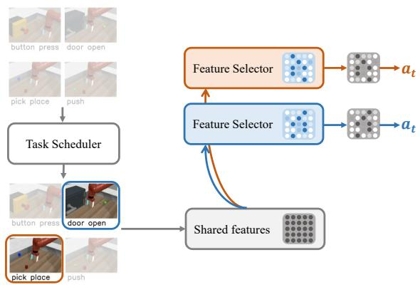  
Fig. 1. Overview of our framework T3S. To balance the task difficulty, the task scheduler first selects challenging tasks for the multi-task agent from the whole task set based on the performance metric. Then the feature selector learns which features to be shared between tasks and which not, by filtering task-specific features from globally shared features in an end-to-end manner.

One major branch of MTRL focuses on the network architecture design to resolve destructive interference. For example, Cross-Stitch Network [14] learns static linear combinations to fuse features of different tasks. However, the magnitude of network parameters increases as the number of tasks increases, which is computationally expensive. Multi-gate Mixture-of-Experts (MMoE) [15] applies gating networks to combine experts (feed-forward networks) based on the input to handle task differences. However, all outputs from the experts are weighted according to the gating networks without discriminating between shared and specific ones, leading to destructive interference. Recently, MTAN [16] consists of a shared network along with an attention module for each task to obtain task-specific features. However, MTAN is mainly designed to extract image features, while our network focuses on the state input in vector form, so it is more suitable for multi-task learning on RL settings. Furthermore, our network employs hypernetworks to construct task-specific layers, which can decouple the task context from the state and achieve better learning performance. Soft Modularization [17] performs routing in a shared policy network that contains many modules (sub-networks) to learn different policies for different tasks. However, the sharing mechanism is still coarse-grained due to using modules as basic sharing units.

Another branch of MTRL focuses on optimization strategies to address destructive interference. From an optimization view, interference occurs as the existence of conflicting task gradients, which is based on the finding: when the angle between the gradient directions of two tasks is large, using one task gradient to update may reduces the performance of another task. For example, PCGrad [18] addresses the conflicts by gradient projection. More recently, CAGrad [19] reduces conflicting gradients between tasks by exploiting the worst local improvement of tasks. However, it requires many optimization steps during the training process, which are computationally expensive.

To solve the above problems, we propose a novel MTRL framework called Task-Specific feature Selector and Scheduler (T3S). Figure 1 illustrates the overall framework, which consists of two components to promote knowledge sharing between tasks. The first component is a feature selector, which employs hypernetworks and takes the task ID as input to construct a task-specific soft mask, enabling inter-task parameter sharing at the feature level, which is fine-grained. The second component is a task scheduler, which is based on the fact that task difficulty disparities can lead to an inappropriate focus on easy tasks, slowing learning progress on challenging tasks [20]. In summary, our contributions are three-fold:

• Our novel MTRL framework T3S comprises a feature selector and a task scheduler. Those two components are designed to work in a fine-grained manner to promote knowledge flow between similar tasks.

• Our task scheduler efficiently schedules tasks for learning through two task metrics: task progress and task learning speed, where the selection probability is inversely proportional to task progress and task learning speed.

• Our framework can be easily combined with existing offpolicy DRL algorithms. Experimental results show that T3S significantly outperforms the state-of-the-art MTRL algorithms on various robotics manipulation tasks.

## II. BACKGROUND

Problem Settings. Typically, we model the RL problem as a finite Markov Decision Process (MDP) for each task, which can be described by $( S , A , P , R , H , \gamma )$ , where S and A are the space of states and actions. $\textstyle P \left( s _ { t + 1 } \mid s _ { t } , a _ { t } \right)$ denotes the state transition function. $R ( s _ { t } , a _ { t } )$ denotes the reward function, H is the horizon, and γ represents the discount factor. The goal of the agent is to learn an optimal policy $\pi ^ { * }$ that maximizes the expected discounted return $\begin{array} { r } { R \stackrel { - } { = } \sum _ { i = t } ^ { T } \gamma ^ { i - t } r _ { i } } \end{array}$ . In this paper, we follow a common MTRL setting [17]–[19], where a set of tasks are treated equally, each of which may have a different MDP. For example, the multi-task environment Meta-World contains a variety of object manipulation tasks such as opening a door and closing a window,

Soft Actor-Critic. Soft Actor-Critic (SAC) [21] is one of the most efficient off-policy algorithms, where the actor aims to accomplish the task while acting as randomly as possible. The policy $\pi _ { \theta }$ is trained to maximize a trade-off between expected return and action distribution entropy:

$$
L _ { S A C } ^ { \theta } = \mathbb { E } _ { \tau } \left[ \operatorname* { m i n } _ { i = 1 , 2 } Q _ { \phi _ { i } } ( s _ { t } , a _ { t } ) - \alpha \log \pi _ { \theta } \left( a _ { t } \mid s _ { t } \right) \right] ,
$$

where α is the temperature parameter to maintain the entropy level of policy, controlling the stochasticity of the policy π<sub>θ</sub>. The target value function can be calculated by the Bellman equation:

$$
y \left( r , s ^ { \prime } \right) = r + \gamma \left( \operatorname* { m i n } _ { i = 1 , 2 } \bar { Q } _ { \phi _ { i } } \left( s ^ { \prime } , \tilde { a } ^ { \prime } \right) - \alpha \log \pi _ { \theta } \left( \tilde { a } ^ { \prime } \mid s ^ { \prime } \right) \right) ,
$$

where $\tilde { a } ^ { \prime } \sim \pi _ { \theta } \left( \cdot \mid s ^ { \prime } \right)$ and $\bar { Q } _ { \phi _ { i } }$ is target network. The value network $Q _ { \phi _ { i } }$ can be updated using the TD error: $L _ { S A C } ^ { \phi _ { i } } =$ $\mathbb { E } _ { \tau } [ Q _ { \phi _ { i } } ( s , a ) - y ( r , s ^ { \prime } ) ] ^ { - 2 }$ . Thus, the overall SAC optimization objective is:

$$
{ \cal L } _ { S A C } = { \cal L } _ { S A C } ^ { \theta } + { \cal L } _ { S A C } ^ { \phi _ { 1 } } + { \cal L } _ { S A C } ^ { \phi _ { 2 } } .\tag{1}
$$

Note that different tasks may have different learning statuses, we assign a separate temperature α for each task. The approach for optimizing policy and critic networks stays the same as in the standard SAC algorithm.

## III. METHODOLOGY

In this section, we propose a MTRL framework T3S, which consists of a novel network architecture and a task scheduler. In Section III-A, we describe the network architecture based on feature selectors and hypernetworks to learn soft masks for different tasks, enabling inter-task parameter sharing at the feature level. In Section III-B, we introduce a scheduling mechanism where the task scheduler can focus on complex tasks, improving sample efficiency and reducing inter-task interference. Finally, in Section III-C, we describe how T3S combines with a specific DRL algorithm SAC [21].

## A. Task-Specific Feature Selector

In this section, we describe how we design the MTRL network architecture. We propose to perform MTRL using soft masks applied to the globally shared network. Figure 2 illustrates our proposed network architecture in detail, which consists of two parts: a globally shared network and several feature selectors. Specifically, the globally shared network is used to extract the shared features from all tasks, while feature selectors are designed to learn the soft masks from the globally shared network. The soft masks are then used to extract the task-specific features in a fine-grained manner.

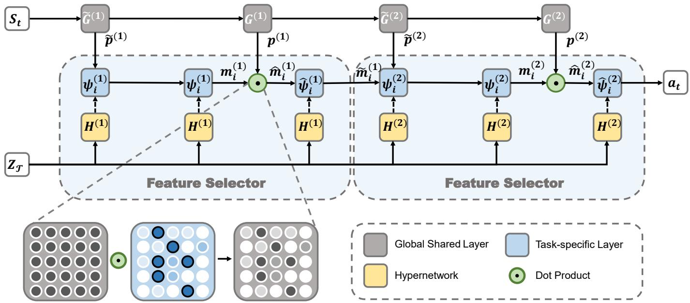  
Fig. 2. Visualisation of our network architecture, showing the globally shared network and feature selectors respectively. The role of the feature selectors is to extract task-specific features from the globally shared network using the soft masks. The number of feature selectors can be defined according to the task complexity. Here the solid line (black) denotes the data flow, and the dashed line (black) denotes the weights flow.

Firstly, we need to generate soft masks for each task based on the task context. Previous works [22]–[25] demonstrate that using a primary feed-forward network to generate weights for a dynamic network is appropriate for this type of contextdependent function. Thus we generate soft masks using hypernetwork [26]. The hypernetwork takes the task context $z _ { T }$ (e.g., task ID one-hot) as input and outputs the weights of the mask generator. Then, the mask generator takes the shared features as input and outputs the soft mask $m _ { i } ^ { ( j ) }$ for task i at the $j ^ { t h }$ feature selector. The gradient flows through the mask generator to the weights of hypernetwork.

We denote the output feature in the $j ^ { t h }$ feature selector of the globally shared layer $G _ { j } ^ { ( j ) }$ as $p ^ { ( j ) }$ , and denote $\tilde { p } ^ { ( j ) }$ as the output feature of the globally shared layer $\tilde { G } ^ { ( j ) }$ to generate the soft mask. The soft mask $\mathbf { \chi } _ { m _ { i } } ^ { ( j ) }$ in the first feature selector can be computed by:

$$
m _ { i } ^ { ( 1 ) } = \sigma ( \psi _ { i } ^ { ( 1 ) } ( \tilde { p } ^ { ( 1 ) } ) ) ,
$$

where:

$$
\begin{array} { r } { \tilde { p } ^ { ( 1 ) } = \tilde { G } ^ { ( 1 ) } \left( S _ { t } \right) , } \\ { \psi _ { i } ^ { ( j ) } = H ^ { ( j ) } \left( z _ { T } \right) . } \end{array}
$$

Here $h _ { i }$ denotes the hypernetwork for task i, and $\psi _ { i }$ denotes the soft mask generator. The sigmoid activation function $\sigma$ is used to control the degree of sharing. When an element in $m _ { i } ^ { ( j ) }$ tends to 1, it can be assumed that this feature is shared by all tasks, while 0 tends to be task-specific. After get the soft mask $m _ { i } ^ { ( j ) }$ for task $i ,$ we can obtain the task-specific features $\hat { m } _ { i } ^ { ( j ) }$ as follows:

$$
\hat { m } _ { i } ^ { ( j ) } = m _ { i } ^ { ( j ) } \odot p ^ { ( j ) } ,
$$

where $\odot$ denotes the dot product multiplication. Then, the task-specific features $\hat { m } _ { i } ^ { ( j ) }$ will be input to the feature extractor $\hat { \psi } _ { i } ^ { ( j ) }$ for passing to the next feature selector:

$$
m _ { i } ^ { ( j ) } = \sigma ( \psi _ { i } ^ { ( j ) } ( \mathrm { C o n c a t } ( \tilde { p } ^ { ( j ) } ; \hat { \psi } _ { i } ^ { ( j - 1 ) } ( \hat { m } _ { i } ^ { ( j - 1 ) } ) ) ) ) , \quad j \ge 2
$$

where concat represents feature concatenation. Therefore, the shared network features and soft masks can be trained together to optimize task-specific performance, while mitigating intertask interference in a fine-grained manner.

## B. Task Scheduler

This section focuses on how our framework T3S performs task scheduling. The task scheduler selects which tasks to sample and learn during each training step. Most MTRL algorithms only consider the most straightforward method, sampling from all tasks evenly, which is typically inefficient because simple tasks converge early during the training process and should not be continuously sampled and learned. Previous work also has shown that optimized task scheduling instead of uniform sampling can significantly improve model performance [27]. However, they only consider task progress rather than learning speed. Thus, the difficult task of slow learning speed is ignored to some extent, resulting in imbalanced learning.

To this end, we propose a new task scheduler concerning both task progress and learning speed. The intuition behind our task scheduler is to assign task sample probabilities based on the relative progress and learning speed between tasks: the slower the task progress and the learning speed, the more likely it is that these tasks will be sampled. We always maintain a task sampling probabilities $\mathcal { P }$ in T3S. The task sampling decision steps occur at the end of every update. We define task progress metrics as follows [20]:

```latex
Algorithm 1 T3S-SAC
1: Input: initial actor network parameters $\theta ,$ critic network
parameters $\phi _ { 1 } , \phi _ { 2 }$ and its target parameters $\bar { \phi _ { 1 } } , \bar { \phi _ { 2 } }$ , task
set $\tau$ , task sampling distribution ${ \mathcal P } ,$ , task sample number
K, evaluation interval e, replay buffer $\mathcal { D } .$
2: Set target network parameters $\bar { \phi } _ { 1 }  \phi _ { 1 } , \bar { \phi } _ { 2 }  \phi _ { 2 }$
3: for $i \in { 1 , . . . , N }$ do
4: $\begin{array} { r } { \mathcal { P } _ { i }  \frac { 1 } { N } } \end{array}$ ▷ Uniform distribution
5: for step $= 1 , 2 , . . . ,$ maximum steps do
6: if step%e = 0 then
7: // Time to evaluate.
8: for each task $t \in \mathcal T$ do
9: Evaluate each task t and calculate the task
metric $c _ { i } ^ { ( 1 ) } , c _ { i } ^ { ( 2 ) }$ ▷ Eq. (2)(3)
10: Update task sampling distribution $\mathcal { P } . \triangleright$ Eq. (4)
11: else
12: // Time to training.
13: Sample task subset $\begin{array} { r } { \boldsymbol { S } \sim \mathcal { P } \left( \left| \boldsymbol { S } \right| = K \right) } \end{array}$
14: for each task $t \in S$ do
15: Collect trajectories for task t and save to $\mathcal { D } .$
16: for minibatch $m \sim \mathcal { D }$ do
17: Update $\theta , \phi _ { 1 } , \phi _ { 2 }$ with $L _ { S A C } .$ ▷ Eq. (1)
18: Update target network $\bar { \phi _ { 1 } } , \bar { \phi _ { 2 } } .$
```

$$
c _ { i } ^ { ( 1 ) } = 1 - \rho _ { i } ,\tag{2}
$$

where $\rho _ { i }$ denotes the performance of the task i (e.g., normalized total reward or success rate). Furthermore, we define the task learning speed metric as:

$$
c _ { i } ^ { ( 2 ) } = - \Delta \rho _ { i } ,\tag{3}
$$

where $\Delta \rho _ { i }$ denotes the increment performance of task i at time interval $\Delta t .$ . Specifically, we increase the task’s sample probability when the learning speed is slow to focus on this task. Thus, the sample probability $\mathcal { P } _ { i } ^ { ( k ) }$ for task i is proportional to the exponential of metric $c _ { i } ^ { ( \check { k } ) }$

$$
\mathcal { P } _ { i } ^ { ( k ) } = \operatorname { s o f t m a x } \left( \frac { c _ { i } ^ { ( k ) } } { \tau } \right) ,
$$

where $\tau$ is used to shape the sample distribution. In order to consider the above factors jointly, a weighted average is applied to compute the sampling probability:

$$
\mathcal { P } _ { i } = \sum _ { k } \alpha _ { k } \mathcal { P } _ { i } ^ { ( k ) } , \quad s . t . \sum _ { k } \alpha _ { k } = 1\tag{4}
$$

where $\alpha _ { k }$ represents the weight of task metric $c ^ { ( k ) }$

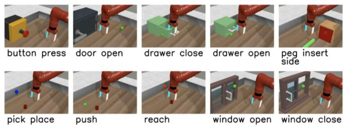  
Fig. 3. Illustration of the 10 robotic arm manipulation tasks on MT10.

## C. T3S-SAC

Our framework is easily combined with existing DRL algorithms. Algorithm 1 presents our framework T3S combined with one sota DRL algorithm SAC [21]. T3S-SAC first initializes the task distribution P, e.g., a uniform distribution (Lines 5-6). During the evaluation, we update P according to task metrics $c _ { i } ^ { ( j ) }$ , making it more focused on solving complex tasks (Lines 9-12). During the training, the task set S is first sampled according to task sampling distribution $\mathcal { P }$ (Lines 14- 16). Then collect trajectories from the task set S in parallel and save them to the buffer D. Finally, the agent computes the RL loss and updates the target networks (Lines 17-19). It is worth noting that the samples taken from the buffer D usually contain all tasks, which can avoid catastrophic forgetting for welllearned tasks. However, because tasks are well chosen in the collection phase, the proportion of tasks sampled for update varies during training, with more complex tasks containing more samples.

## IV. EXPERIEMENTS

## A. Experimental Results

In this section, we conduct extensive experiments to verify the effectiveness of our proposed framework T3S compared with previous multi-task methods. We introduce the environment and baselines and then compare our framework with baselines. Further, we conduct a few ablation studies to demonstrate the effectiveness of the task scheduler.

Environments. We evaluate our framework T3S on the MTRL representative benchmark: Meta-World [13]. In this environment, we need to solve many robotics continuous control and manipulation tasks with a robotic arm. In particular, the original MT10 and MT50 contain 10 and 50 robot manipulation tasks with fixed goals. We also consider more challenging settings where the tasks have random initial goals, as in [17]. MTn-FIXED and MTn-RAND denote the environment of n tasks with fixed goals and random goals respectively. Figure 3 shows an illustration of all the MT10 tasks.

Baselines. We compare T3S with representative MTRL algorithms, all baselines except MMoE are following their official source code, and MMoE is implemented following the configuration of the paper:

• Multi-task SAC (MT-SAC) [13]: Using a concatenation of task ID one-hot and the state as input, and all tasks share the same network.

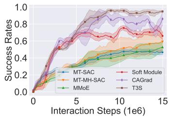  
(a) MT10-FIXED

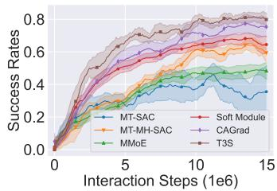  
(b) MT10-RAND

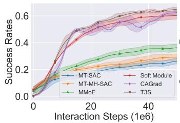  
(c) MT50-FIXED

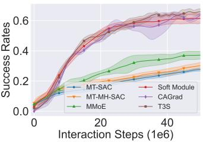  
(d) MT50-RAND  
Fig. 4. Training curves of our proposed framework T3S and other baselines on MT10 and MT50 (shaded areas represent the standard deviation over 3 seeds) We plot the average success rate for all tasks on the y-axis, while the x-axis denotes the number of times the multi-task agent interacts with the environment.

TABLE I  
COMPARISONS ON SUCCESS RATES ON ALL BENCHMARKS, WHERE SUCCESS RATES ARE AVERAGED OVER THE LAST 200,000 STEPS ON 3 SEEDS.
<table><tr><td>Method</td><td>MT10-FIXED</td><td>MT10-RAND</td><td>MT50-FIXED</td><td>MT50-RAND</td></tr><tr><td>MT-SAC [13]</td><td> $0 . 4 7 \pm 0 . 0 4 5$ </td><td> $0 . 3 6 \pm 0 . 1 8 0$ </td><td> $0 . 2 6 \pm 0 . 0 1 9$ </td><td> $0 . 2 5 \pm 0 . 0 0 7$ </td></tr><tr><td>MT-MH-SAC [13]</td><td> $0 . 6 5 \pm 0 . 1 0 5$ </td><td> $0 . 6 1 \pm 0 . 0 8 5$ </td><td> $0 . 2 9 \pm 0 . 0 2 3$ </td><td> $0 . 2 9 \pm 0 . 0 2 6$ </td></tr><tr><td>MMoE [15]</td><td> $0 . 5 3 \pm 0 . 0 4 5$ </td><td> $0 . 4 7 \pm 0 . 0 5 3$ </td><td> $0 . 3 7 \pm 0 . 0 1 9$ </td><td> $0 . 3 6 \pm 0 . 0 2 4$ </td></tr><tr><td>Soft Module [17]</td><td> $0 . 6 7 \pm 0 . 0 2 8$ </td><td> $0 . 6 4 \pm 0 . 0 4 7$ </td><td> $0 . 6 1 \pm 0 . 0 2 3$ </td><td> $0 . 6 2 \pm 0 . 0 2 1$ </td></tr><tr><td>CAGrad [19]</td><td> $0 . 8 9 \pm 0 . 0 9 6$ </td><td> $0 . 7 5 \pm 0 . 0 5 6$ </td><td> $0 . 6 3 \pm 0 . 0 3 9$ </td><td> ${ \bf 0 . 6 7 \pm 0 . 0 2 9 }$ </td></tr><tr><td>T3S-SAC</td><td> $\mathbf { 0 . 9 5 \ : \pm { \ : 0 . 0 2 2 } }$ </td><td> $\mathbf { 0 . 8 0 \ : \pm { \ : 0 . 0 0 9 } }$ </td><td> $\mathbf { 0 . 6 5 \ : \pm { \ : 0 . 0 0 5 } }$ </td><td> $0 . 6 5 \pm 0 . 0 1 4$ </td></tr></table>

• Multi-task multi-head SAC (MT-MH-SAC) [13]: Built upon MT-SAC with separate output layers for tasks.

• Multi-gate Mixture-of-Experts (MMoE) [15]: Sharing the expert models and training a gating network to optimize each task individually.

• Soft Module [17]: Routing different modules in a shared model to form different policies.

• CAGrad [19]: A gradient-based multi-task algorithm to deal with conflicting gradients.

Experimental Setup. We use Adam optimizer [28] with a learning rate of $3 \times 1 0 ^ { - 4 }$ for all methods. For MT10 tasks, all methods are trained over 15 million steps with a batch size of 1280. The number of feature selectors in the T3S network architecture is 1. We empirically find that when the number of feature selectors increases, the performance will decrease on MT10. The reason is that the additional complexities from over-parameterization will result in low sample efficiency. For MT50 tasks, all methods are trained over 50 million steps with a batch size of 6400. The number of feature selectors in the T3S network architecture is 2. The weight of the task metric used in the task scheduler is 0.5, which indicates that all metrics are of equal importance.

All algorithms are trained from scratch. Table I shows the quantitative results and the success rates are averaged over the last 200,000 training steps on 3 seeds. We also plot the average success rate for all tasks of our proposed framework T3S and other baselines in Figure 4.

MT10. As shown in Figure 4(a), our proposed framework significantly improves sample efficiency while reducing intertask interference compared to all baselines. We further conducted experiments under the randomly generated goal setting to make the environment more challenging. A similar phenomenon can be found in Figure 4(b) that our approach outperforms all other baselines in terms of sample efficiency and performance. This is due to the feature selector used in T3S, which automatically learns which features to be shared or task-specified in a fine-grained way by soft masks, mitigating interference between tasks. Figure 5 shows the sampling history of the task scheduler in MT10-RAND. It is observed that the task scheduler focuses mainly on the push and pickplace tasks during the entire training process, as these two tasks are the most complex. We can also observe that pedinsert-side task performs worse than other tasks early during training, so the task scheduler is more focused on this task. When a task was gradually mastered, the task was sampled less in order to reduce unnecessary interactions.

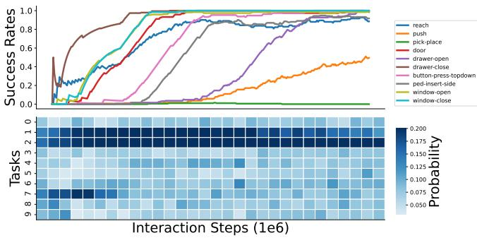  
Fig. 5. Sampling history of the task scheduler. (Top: line plot) The success rate for each task in MT10-RAND environment. The x-axis denotes the number of samples during training. (Bottom: square tiles) The sampling history of each task. Each tile represents the probability of sampling over a period, where darker colors denote higher probability.

MT50. Figures 4(c) and 4(d) show the performance of T3S and baselines in MT50 with both fixed and random initial goals. We can see that T3S greatly outperforms other baselines except for CAGrad. Although T3S achieves similar performance regarding the final success rate to CAGrad, our approach exhibits some advantages in sample efficiency and stability (lower variance) due to the fine-grained sharing mechanism and the task scheduler. On the other hand, CAGrad is more computationally expensive than T3S. Since the time consumption of baselines other than CAGrad does not have a significant difference, we only compare T3S with the CAGrad algorithm in terms of time. Table II shows the training time spent per update step for CAGrad and T3S. Our approach is around 20x faster than CAGrad. The reason is that CAGrad requires many extra optimization steps during the training process.

TABLE II  
THE TRAINING TIME SPENT PER UPDATE STEP FOR CAGRAD AND T3S.
<table><tr><td>Method</td><td>MT10 Time (sec)</td><td>MT50 Time (sec)</td></tr><tr><td>CAGrad</td><td> $1 0 . 3 \pm 0 . 0 2 6$ </td><td> $2 7 . 8 \pm 0 . 0 1 8$ </td></tr><tr><td>Ours</td><td> ${ \bf 0 . 4 7 \pm 0 . 0 3 2 }$ </td><td> $\mathbf { 1 . 2 3 \ : \pm { \ : 0 . 0 2 7 } }$ </td></tr></table>

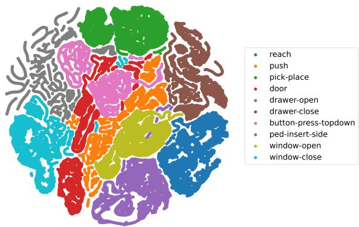  
Fig. 6. Visualization of soft masks for different tasks in MT10-RAND. We rollout different tasks and extract the masks from the policy. All masks are grounded in different clusters using t-SNE.

t-SNE Visualization. We further validate that our T3S successfully filters irrelevant information and shares similar features across tasks using soft masks. Figure 6 shows the soft masks for different tasks extract from the policy via t-SNE [29]. We do 20 rollouts for each task, and during the rollout process, we store the masks from the policy network. After that, we use t-SNE to visualize the masks for analysis. We observe that when tasks share similar skills are closer in the plot. For example, ped-insert-side and pick-place both need to move an object from one place to another, and window-open and window-close both need to push the handle. Thus, they are close in the plot.

## B. Ablation Studies

To better illustrate our framework, we further analyze the importance of the network structure and the task scheduler on MT10. The ablation experiments are set as follows:

• Ours w/o p: Update the task sampling distribution P without concerning task progress.

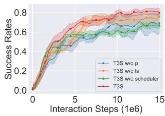  
(a) MT10-RAND

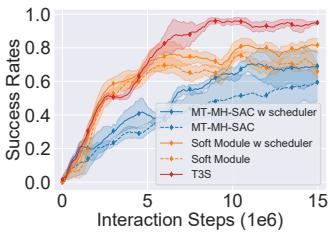  
(b) MT10-FIXED  
Fig. 7. (a) Ablation study on the task scheduler at MT10-RAND. (b) Ablation study on the feature selector at MT10-FIXED, while analysing several baselines combined with the task scheduler.

TABLE III  
AVERAGE SUCCESS RATE ON MT10-RAND, WHERE SUCCESS RATES ARE AVERAGED OVER THE LAST 200,000 STEPS ON 3 SEEDS.
<table><tr><td>Method</td><td>Success Rate</td></tr><tr><td>T3S w/o p</td><td> $0 . 7 6 \pm 0 . 1 0 8$ </td></tr><tr><td>T3S w/o İs</td><td> $0 . 7 8 \pm 0 . 0 2 8$ </td></tr><tr><td>T3S w/o scheduler</td><td> $0 . 7 2 \pm 0 . 0 5 9$ </td></tr><tr><td>T3S</td><td> $\mathbf { 0 . 8 0 \ : \pm { \ : 0 . 0 0 9 } }$ </td></tr></table>

• Ours w/o ls: Update task sampling distribution P without concerning task learning speed.

• Ours w/o scheduler: Using uniform sampling instead of the task scheduler to sample well-selected tasks.

• MT-MH-SAC w scheduler: Adding the task scheduler component to the MT-MH-SAC algorithm. It should be noted that when the feature selector component is removed from our framework, it is equivalent to the MT-MH-SAC w scheduler algorithm.

• Soft Module w scheduler: Adding the task scheduler component to the Soft Module algorithm.

As shown in Figure 7(a), the performance of T3S degrades when the task scheduler is removed. The result demonstrates that our proposed task scheduler plays an essential role in MTRL. Meanwhile, as seen from T3S w/o p (blue solid line) versus T3S w/o ls (orange solid line), the performance gains from the task progress metric are more significant than the task learning speed metric, which indicates that we can weigh more on task progress. Figure 7(b) shows the performance of the baselines when adding the task scheduler to further demonstrate the effectiveness of the scheduler module. We observe that the task scheduler improves the performance of baselines and increases the sampling efficiency compared to uniform sampling. The reason is that simpler tasks can be overtrained, while learning harder tasks may hit a plateau. Thus it is easily leading to imbalanced learning. With the help of the task scheduler, we can explicitly control the probability of each task being sampled based on the task progress and learning speed. This allows the agent to focus on the more difficult tasks, thus increasing learning efficiency. Table III and IV show the quantitative ablation results respectively. It is worth noting that when the feature selector component is removed from the T3S network architecture, it degenerates to the MT-MH-

TABLE IV  
AVERAGE SUCCESS RATE ON MT10-FIXED, WHERE SUCCESS RATES ARE AVERAGED OVER THE LAST 200,000 STEPS ON 3 SEEDS.
<table><tr><td>Method</td><td>Success Rate</td></tr><tr><td>MT-MH-SAC w scheduler</td><td> $0 . 7 3 \pm 0 . 0 8 5$ </td></tr><tr><td>MT-MH-SAC</td><td> $0 . 6 5 \pm 0 . 1 0 5$ </td></tr><tr><td>Soft Module w scheduler</td><td> $0 . 7 9 \pm 0 . 0 0 1$ </td></tr><tr><td>Soft Module</td><td> $0 . 6 7 \pm 0 . 0 2 8$ </td></tr><tr><td>T3S</td><td> $\mathbf { 0 . 9 5 \ : \pm { \ : 0 . 0 2 2 } }$ </td></tr></table>

SAC w scheduler algorithm. Figure 7(b) shows the comparison results of T3S (red solid line) and MT-MH-SAC w scheduler (blue solid line). We can see that T3S has very impressive performance compared to MT-MH-SAC w scheduler, which supports our view that the fine-grained sharing mechanism we proposed can mitigate inter-task interference, improving multitask learning efficiency.

## V. RELATED WORK

Multi-task Architectures. Architecture design should consider which parameters of the model should be shared among tasks and which parameters should be task-specific. Thus how to balance the task-sharing and task-specific parameters is essential. Researchers have made some progress in multitask network architecture [14]–[17], [30]–[34]. For example, Multi-gate Mixture-of-Experts (MMoE) [15] solves multi-task learning by sharing experts (feed-forward networks) across all tasks and training a gating network to optimize each task independently. However, the outputs of all experts are weighted without distinguishing between task-shared and taskspecific ones, which can easily lead to destructive interference. Routing Network [31] propose a routing network and a set of function blocks, where different function blocks are dynamically combined for each input by the routing network. However, they use RL to train the routing policy. Due to the temporal nature of RL, jointly training a control policy and a routing policy may suffer from exponentially variance in policy gradient, resulting in training instability. More recently, MTAN [16] is made up of a single shared network that includes a global feature pool and a soft-attention module for each task. However, MTAN is mainly designed to extract image features, while our network focuses on the state input in vector form. Soft Modularization [17], instead of selecting routes directly for each task as in Routing Network [31], they use soft modules (sub-networks) to combine all possible routes. Although Soft Modularization is a successful approach for multi-task reinforcement learning, it still faces the problem of negative transfer due to its treat module as the basic sharing unit. By contrast, our network allows different tasks to be shared at the parameter level, which is more fine-grained and thus significantly mitigates interference between tasks.

Multi-task Optimization Strategies. Optimization strategies are designed to handle the balance of all tasks. The difficulty of each task varies; thus, the agent should prioritize the more complex tasks. Besides, the destructive interference phenomenon can be demonstrated from an optimization view by conflicting gradients [18]. When the gradients of two tasks point in opposite directions, following the gradient of one task may reduces the performance of another task. Actor-Mimic [35] and Policy Distillation [36] both use knowledge distillation for multi-task reinforcement learning. Their insights are similar: for each task, train a task-specific teacher policy and then use policy distillation to train a single student policy to imitate the outputs of the task-specific teacher policies. Although this approach achieves competitive results compared with single-task learning, it requires separate well-training teacher policies and an extra distillation phase. Furthermore, knowledge cannot be shared during the teacher training phase. More recently, researchers propose explicitly avoiding conflicting gradients from different tasks [18], [19], [37]. For example, PCGrad [18] projects the gradient of one task onto the normal plane of the gradient of any other conflicting task. CAGrad [19] automatically balances different task objectives and has proven to converge to Pareto optimal solutions. However, they still require many optimization computations during the training process, which is computationally expensive.

## VI. CONCLUSION AND FUTURE WORK

We propose a novel MTRL framework called Task-Specific feature Selector and Scheduler (T3S) enabling efficient knowledge transfer between tasks. T3S is composed of two main components: a feature selector and a task scheduler. Specifically, feature selectors employ hypernetworks and take the task ID as input to construct soft masks, automatically choosing which features to share and which to be task-specific in a fine-grained manner. Then we design the task scheduler, which efficiently schedules tasks for learning through two task scheduling metrics where the selection probability is inversely proportional to task progress and task learning speed. In our experiments, we evaluate our proposed approach on various robotics manipulation tasks, outperforming several state-ofthe-art MTRL baselines. We also perform a visual analysis via t-SNE to verify the task distinction capability of soft masks. For limitations, our work is not done on real robots. In addition, the weights of each metric in the task scheduler are set manually. In future work, we would like to design a more effective task scheduler and extend our framework T3S to real robots.

## REFERENCES

[1] V. Mnih, K. Kavukcuoglu, D. Silver, A. A. Rusu, J. Veness, M. G. Bellemare, A. Graves, M. Riedmiller, A. K. Fidjeland, G. Ostrovski et al., “Human-level control through deep reinforcement learning,” nature, vol. 518, no. 7540, pp. 529–533, 2015.

[2] D. Silver, A. Huang, C. J. Maddison, A. Guez, L. Sifre, G. Van Den Driessche, J. Schrittwieser, I. Antonoglou, V. Panneershelvam, M. Lanctot et al., “Mastering the game of go with deep neural networks and tree search,” nature, vol. 529, no. 7587, pp. 484–489, 2016.

[3] C. Berner, G. Brockman, B. Chan, V. Cheung, P. Debiak, C. Dennison, D. Farhi, Q. Fischer, S. Hashme, C. Hesse et al., “Dota 2 with large scale deep reinforcement learning,” ArXiv preprint, vol. abs/1912.06680, 2019.

[4] T. Yang, W. Wang, H. Tang, J. Hao, Z. Meng, H. Mao, D. Li, W. Liu, Y. Chen, Y. Hu et al., “An efficient transfer learning framework for multiagent reinforcement learning,” Advances in Neural Information Processing Systems, vol. 34, pp. 17 037–17 048, 2021.

[5] Y. Zheng, X. Xie, T. Su, L. Ma, J. Hao, Z. Meng, Y. Liu, R. Shen, Y. Chen, and C. Fan, “Wuji: Automatic online combat game testing using evolutionary deep reinforcement learning,” ser. ASE ’19. IEEE Press, 2019, p. 772–784.

[6] J. Ibarz, J. Tan, C. Finn, M. Kalakrishnan, P. Pastor, and S. Levine, “How to train your robot with deep reinforcement learning: lessons we have learned,” The International Journal of Robotics Research, vol. 40, no. 4-5, pp. 698–721, 2021.

[7] H. Fu, H. Tang, J. Hao, C. Chen, X. Feng, D. Li, and W. Liu, “Towards effective context for meta-reinforcement learning: an approach based on contrastive learning,” in Proceedings of the AAAI Conference on Artificial Intelligence, vol. 35, no. 8, 2021, pp. 7457–7465.

[8] A. E. Sallab, M. Abdou, E. Perot, and S. Yogamani, “Deep reinforcement learning framework for autonomous driving,” Electronic Imaging, vol. 2017, no. 19, pp. 70–76, 2017.

[9] B. R. Kiran, I. Sobh, V. Talpaert, P. Mannion, A. A. Al Sallab, S. Yogamani, and P. Perez, “Deep reinforcement learning for autonomous´ driving: A survey,” IEEE Transactions on Intelligent Transportation Systems, 2021.

[10] S. Kai, B. Wang, D. Chen, J. Hao, H. Zhang, and W. Liu, “A multi-task reinforcement learning approach for navigating unsignalized intersections,” in 2020 IEEE Intelligent Vehicles Symposium (IV). IEEE, 2020, pp. 1583–1588.

[11] M. Zhou, J. Luo, J. Villella, Y. Yang, D. Rusu, J. Miao, W. Zhang, M. Alban, I. FADAKAR, Z. Chen, C. Huang, Y. Wen, K. Hassanzadeh, D. Graves, Z. Zhu, Y. Ni, N. Nguyen, M. Elsayed, H. Ammar, A. Cowen-Rivers, S. Ahilan, Z. Tian, D. Palenicek, K. Rezaee, P. Yadmellat, K. Shao, d. chen, B. Zhang, H. Zhang, J. Hao, W. Liu, and J. Wang, “Smarts: An open-source scalable multi-agent rl training school for autonomous driving,” in Proceedings of the 2020 Conference on Robot Learning, ser. Proceedings of Machine Learning Research, J. Kober, F. Ramos, and C. Tomlin, Eds., vol. 155. PMLR, 2021, pp. 264–285.

[12] M. Crawshaw, “Multi-task learning with deep neural networks: A survey,” arXiv preprint arXiv:2009.09796, 2020.

[13] T. Yu, D. Quillen, Z. He, R. Julian, K. Hausman, C. Finn, and S. Levine, “Meta-world: A benchmark and evaluation for multi-task and meta reinforcement learning,” in Proceedings of the Conference on Robot Learning, ser. Proceedings of Machine Learning Research, L. P. Kaelbling, D. Kragic, and K. Sugiura, Eds., vol. 100. PMLR, 2020, pp. 1094–1100.

[14] I. Misra, A. Shrivastava, A. Gupta, and M. Hebert, “Cross-stitch networks for multi-task learning,” in 2016 IEEE Conference on Computer Vision and Pattern Recognition, CVPR 2016, Las Vegas, NV, USA, June 27-30, 2016. IEEE Computer Society, 2016, pp. 3994–4003.

[15] J. Ma, Z. Zhao, X. Yi, J. Chen, L. Hong, and E. H. Chi, “Modeling task relationships in multi-task learning with multi-gate mixture-of-experts,” in Proceedings of the 24th ACM SIGKDD International Conference on Knowledge Discovery & Data Mining, KDD 2018, London, UK, August 19-23, 2018, Y. Guo and F. Farooq, Eds. ACM, 2018, pp. 1930–1939.

[16] S. Liu, E. Johns, and A. J. Davison, “End-to-end multi-task learning with attention,” in IEEE Conference on Computer Vision and Pattern Recognition, CVPR 2019, Long Beach, CA, USA, June 16-20, 2019. Computer Vision Foundation / IEEE, 2019, pp. 1871–1880.

[17] R. Yang, H. Xu, Y. Wu, and X. Wang, “Multi-task reinforcement learning with soft modularization,” in Advances in Neural Information Processing Systems 33: Annual Conference on Neural Information Processing Systems 2020, NeurIPS 2020, December 6-12, 2020, virtual, H. Larochelle, M. Ranzato, R. Hadsell, M. Balcan, and H. Lin, Eds., 2020.

[18] T. Yu, S. Kumar, A. Gupta, S. Levine, K. Hausman, and C. Finn, “Gradient surgery for multi-task learning,” in Advances in Neural Information Processing Systems 33: Annual Conference on Neural Information Processing Systems 2020, NeurIPS 2020, December 6-12, 2020, virtual, H. Larochelle, M. Ranzato, R. Hadsell, M. Balcan, and H. Lin, Eds., 2020.

[19] B. Liu, X. Liu, X. Jin, P. Stone, and Q. Liu, “Conflict-averse gradient descent for multi-task learning,” Advances in Neural Information Processing Systems, vol. 34, pp. 18 878–18 890, 2021.

[20] S. Sharma, A. K. Jha, P. Hegde, and B. Ravindran, “Learning to multitask by active sampling,” in 6th International Conference on Learning

Representations, ICLR 2018, Vancouver, BC, Canada, April 30 - May 3, 2018, Conference Track Proceedings. OpenReview.net, 2018.

[21] T. Haarnoja, A. Zhou, K. Hartikainen, G. Tucker, S. Ha, J. Tan, V. Kumar, H. Zhu, A. Gupta, P. Abbeel et al., “Soft actor-critic algorithms and applications,” ArXiv preprint, vol. abs/1812.05905, 2018.

[22] J. L. McClelland, “Putting knowledge in its place: A scheme for programming parallel processing structures on the fly,” Cognitive Science, vol. 9, no. 1, pp. 113–146, 1985.

[23] J. Schmidhuber, “Learning to control fast-weight memories: An alternative to dynamic recurrent networks,” Neural Computation, vol. 4, no. 1, pp. 131–139, 1992.

[24] E. Sarafian, S. Keynan, and S. Kraus, “Recomposing the reinforcement learning building blocks with hypernetworks,” in Proceedings of the 38th International Conference on Machine Learning, ICML 2021, 18-24 July 2021, Virtual Event, ser. Proceedings of Machine Learning Research, M. Meila and T. Zhang, Eds., vol. 139. PMLR, 2021, pp. 9301–9312.

[25] Y. Huang, K. Xie, H. Bharadhwaj, and F. Shkurti, “Continual modelbased reinforcement learning with hypernetworks,” in 2021 IEEE International Conference on Robotics and Automation (ICRA). IEEE, 2021, pp. 799–805.

[26] D. Ha, A. M. Dai, and Q. V. Le, “Hypernetworks,” in 5th International Conference on Learning Representations, ICLR 2017, Toulon, France, April 24-26, 2017, Conference Track Proceedings. OpenReview.net, 2017.

[27] Y. Bengio, J. Louradour, R. Collobert, and J. Weston, “Curriculum learning,” in Proceedings of the 26th Annual International Conference on Machine Learning, ICML 2009, Montreal, Quebec, Canada, June 14- 18, 2009, ser. ACM International Conference Proceeding Series, A. P. Danyluk, L. Bottou, and M. L. Littman, Eds., vol. 382. ACM, 2009, pp. 41–48.

[28] D. P. Kingma and J. Ba, “Adam: A method for stochastic optimization,” arXiv preprint arXiv:1412.6980, 2014.

[29] L. Van der Maaten and G. Hinton, “Visualizing data using t-sne.” Journal of machine learning research, vol. 9, no. 11, 2008.

[30] C. Fernando, D. Banarse, C. Blundell, Y. Zwols, D. Ha, A. A. Rusu, A. Pritzel, and D. Wierstra, “PathNet: Evolution Channels Gradient Descent in Super Neural Networks,” 2017.

[31] C. Rosenbaum, T. Klinger, and M. Riemer, “Routing networks: Adaptive selection of non-linear functions for multi-task learning,” 2017.

[32] A. Mallya and S. Lazebnik, “Packnet: Adding multiple tasks to a single network by iterative pruning,” in 2018 IEEE Conference on Computer Vision and Pattern Recognition, CVPR 2018, Salt Lake City, UT, USA, June 18-22, 2018. IEEE Computer Society, 2018, pp. 7765–7773.

[33] X. Sun, R. Panda, R. Feris, and K. Saenko, “Adashare: Learning what to share for efficient deep multi-task learning,” in Advances in Neural Information Processing Systems 33: Annual Conference on Neural Information Processing Systems 2020, NeurIPS 2020, December 6-12, 2020, virtual, H. Larochelle, M. Ranzato, R. Hadsell, M. Balcan, and H. Lin, Eds., 2020.

[34] H. Tang, J. Liu, M. Zhao, and X. Gong, “Progressive layered extraction (PLE): A novel multi-task learning (MTL) model for personalized recommendations,” in RecSys 2020: Fourteenth ACM Conference on Recommender Systems, Virtual Event, Brazil, September 22-26, 2020, R. L. T. Santos, L. B. Marinho, E. M. Daly, L. Chen, K. Falk, N. Koenigstein, and E. S. de Moura, Eds. ACM, 2020, pp. 269–278.

[35] E. Parisotto, L. J. Ba, and R. Salakhutdinov, “Actor-mimic: Deep multitask and transfer reinforcement learning,” in 4th International Conference on Learning Representations, ICLR 2016, San Juan, Puerto Rico, May 2-4, 2016, Conference Track Proceedings, Y. Bengio and Y. LeCun, Eds., 2016.

[36] A. A. Rusu, S. G. Colmenarejo, C¸ . Gulc¸ehre, G. Desjardins, J. Kirk-¨ patrick, R. Pascanu, V. Mnih, K. Kavukcuoglu, and R. Hadsell, “Policy distillation,” in 4th International Conference on Learning Representations, ICLR 2016, San Juan, Puerto Rico, May 2-4, 2016, Conference Track Proceedings, Y. Bengio and Y. LeCun, Eds., 2016.

[37] Z. Chen, J. Ngiam, Y. Huang, T. Luong, H. Kretzschmar, Y. Chai, and D. Anguelov, “Just pick a sign: Optimizing deep multitask models with gradient sign dropout,” in Advances in Neural Information Processing Systems 33: Annual Conference on Neural Information Processing Systems 2020, NeurIPS 2020, December 6-12, 2020, virtual, H. Larochelle, M. Ranzato, R. Hadsell, M. Balcan, and H. Lin, Eds., 2020.