# THREE STEPS AT A TIME: LEARNING REPRESENTATIONS FROM ACTION SEQUENCES IN CONTRASTIVE RL

Michal Korniak∗ ETH Zurich

Kamil Dybek∗ University of Warsaw

Benjamin Eysenbach† Princeton University

Marco Bagatella† ETH Zurich MPI IS Tubingen

Michał Bortkiewicz† Warsaw University of Technology IDEAS Research Institute

## ABSTRACT

While self-supervised approaches to reinforcement learning have achieved strong results by learning representations of states and actions, a key open question is the time scale over which actions should be modeled. Departing from the standard formulation relying on single-step actions, we extend contrastive reinforcement learning (CRL), a prototypical self-supervised method, to operate over action chunks, and find that this results in large, pervasive gains across established offline and online benchmarks: +31.7% and +93.1% across 18 and 11 environments respectively. While action-chunking-driven gains are generally explained through the ability to model non-Markovian, temporally extended policies, and to propagate unbiased multi-step returns, interestingly, we find that these arguments only partially apply to CRL. Our empirical studies suggest that, in the context of CRL, an action chunk carries more information about the goal than a single action, measurably improving the critic’s representations, and rendering the algorithm significantly more effective.

## 1 INTRODUCTION

Self-supervised reinforcement learning algorithms have gradually emerged as promising methods for learning diverse behavior with minimal supervision. Among them, contrastive reinforcement learning (CRL) (Eysenbach et al., 2022) tackles this challenge by learning representations that encode the solution to a simple classification problem: will this goal be visited in the future, when starting from a given state and executing a single action?

In this work, we study whether stronger critic representations can be learned by conditioning this classification problem on sequences of actions. In line with prior work on action chunking (Zhao et al., 2023; Li et al., 2026), we find that this minimal modification induces consistent and substantial performance gains across established benchmarks, spanning from offline manipulation to online locomotion and navigation across numerous tasks, as summarized in Figure 1.

However, we find that the standard explanations for why action chunking helps only partially apply to CRL, and a synergy specific to CRL is at play in this setting. On top of the ability to model non-Markovian data, and to express temporally consistent behavior (Li et al., 2025), we find that action chunking gives the critic more information about the goal than a single action, measurably improving its representations, and rendering the algorithm significantly more effective. Moreover, we find that conditioning on sequences of actions is particularly useful on noisy datasets, where individual actions are often weakly informative about future outcomes.

Finally, we observe that this phenomenon compounds with previously researched benefits of action chunking, and with the model scaling properties of CRL (Wang et al., 2026). Our results suggest that explicit modeling of action sequences should be explored beyond the supervised or temporaldifference objectives for which it was originally proposed. Our contributions are: (i) we investigate a simple extension of CRL that conditions the critic on a chunk of actions rather than a single action; (ii) we empirically validate this approach across established offline and online benchmarks, and report increases in performance of +31.7% and +93.1% respectively; (iii) we study the causes of these improvements and find that, beyond the known benefits of action chunking, it synergizes specifically with CRL: conditioning the critic on an action chunk gives it more information about the goal than a single action, producing measurably better critic representations.

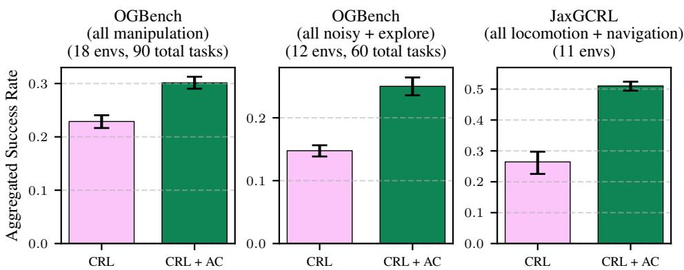  
Figure 1: Action chunking boosts goal-reaching performance. We compare CRL + AC with a fixed action chunk length (H=3) against standard CRL across 3 settings, reporting 95% bootstrapped confidence intervals. CRL + AC consistently outperforms CRL, with average improvements of +31.7% on the OGBench manipulation suite, +69.4% on suboptimal OGBench datasets (noisy and explore), and +93.1% on online JaxGCRL locomotion and navigation tasks.

## 2 RELATED WORK

Goal-conditioned RL and action representations. Our study focuses on the goal-conditioned RL (GCRL) setup in which an agent learns to achieve various tasks through conditioning on goals (Kaelbling, 1993; Schaul et al., 2015). In this setup, both the policy and the critic are conditioned on an additional goal input, such as proprioception state configuration (Ghosh et al., 2018), a visual scene representation (Nair et al., 2018), or a language instruction (Myers et al., 2026; Hermann et al., 2017; Bahdanau et al., 2019). In reinforcement learning (RL), and particularly in GCRL, representations of states and goals can be organized by their consequences for control rather than perceptual similarity. For example, actionable representations place two goals close together when they induce similar ac tion distributions (Ghosh et al., 2018); bisimulation-based representations group states that produce equivalent rewards and transition distributions under each action (Givan et al., 2003; Ferns et al., 2012; Gelada et al., 2019; Zhang et al., 2021; Hansen-Estruch et al., 2022); and temporal-distance representations organize state–goal pairs by their reachability or the number of actions required to connect them (Dayan, 1993; Wang et al., 2023; Myers et al., 2024; Steccanella & Jonsson, 2022).

Contrastive Learning and Contrastive RL. Contrastive Learning is a widely used method to learn rich representations from unlabeled data across vision (Chen et al., 2020; Wang & Isola, 2020; Yeh et al., 2022; Oord et al., 2018) and other modalities (Radford et al., 2021; Zhai et al., 2023). In our work, we focus on temporal contrastive learning (Oord et al., 2018), specifically Contrastive Reinforcement Learning (CRL) (Eysenbach et al., 2022), which casts GCRL as a representationlearning problem in which the objective of the value function is to distinguish states likely to occur in the near future from those unlikely to occur. Recent work has shown promising results in terms of model scalability (Zheng et al., 2024; Wang et al., 2026), and sought to explain how learned representations drive exploration (Liu et al., 2025a; Bastankhah et al., 2025); we find that controlling action representations also provides significant gains. In parallel, another line of work has addressed the asymmetry of temporal distances by introducing quasimetric formulations (Myers et al., 2024; 2026). Recent methods reduce reliance on static trajectory-level context when relating state-action pairs to goals (Ziarko et al., 2025). We build on this view, arguing that what the critic learns about the goal depends not only on the agent’s state but also on the informativeness of its actions.

Action Chunking. Action chunking (AC) (Zhao et al., 2023) parameterizes the policy’s output as a sequence of H atomic actions from the original action space, $( \dot { a } _ { t } , \dots , a _ { t + H - 1 } ) \stackrel { } { \in } \mathcal { A } ^ { \bar { H } }$ , rather than as a single action. At the environment level, each control input remains an atomic action in A. Under open-loop execution, however, the policy commits to a predicted chunk $a _ { t : t + H - 1 } \in \mathcal { A } ^ { H }$ as a single temporally extended decision, whereas closed-loop variants execute only a couple of first actions before predicting a new chunk from the subsequent observations (Zhao et al., 2023; Liu et al., 2025b; Li et al., 2026). While the idea of temporally-extended action is not new (Randlov, 1998; Sutton et al., 1999), the action chunking formulation has recently gained traction for mitigating control latency in real-world deployments (Black et al., 2025a;b) and as an effective way to learn from demonstration datasets with multimodal action distributions (Zhao et al., 2023; Chi et al., 2024). Beyond these practical advantages, prior work has studied how open-loop execution of action chunks can reduce the effective decision horizon (Zhao et al., 2023) and improve behavioral consistency (Zhang et al., 2025), but also might result in reduced reactivity (Liu et al., 2025c). In this work, we study action chunking in the context of GCRL, where it has been shown to effectively propagate action values, handle non-Markovian data (Li et al., 2026), and promote temporally coherent behavior (Shin et al., 2026; Li et al., 2025). As discussed later, we find that action chunking displays a special synergy with CRL, as sequences of actions carry more information about the intended goal than isolated atomic actions.

## 3 BACKGROUND

We model the environment as a reward-free Markov Decision Process $\mathcal { M } = ( S , \mathcal { A } , P , \mu _ { 0 } , \gamma )$ , where $s$ and A are state and action spaces, $P : { \mathcal { S } } \times { \mathcal { A } }  \Delta ( { \mathcal { S } } )$ is a stochastic transition kernel, $\mu _ { 0 } \in \Delta ( \mathcal { S } )$ is an initial state distribution and $\gamma \in [ 0 , 1 )$ is a discount factor. The goal space coincides with the state space: $\mathcal { G } : = \mathcal { S } . \mathrm { ~ A ~ }$ stationary policy is defined as a mapping from state-goal pairs to action distributions $\pi : S \times \mathcal { G }  \Delta ( \mathcal { A } )$ . For a given policy π conditioned on goal g and starting from a state-action pair (s, a), we can model the probability of visiting future state $s _ { f }$ as

$$
p ^ { \pi ( \cdot | \cdot , g ) } ( s _ { f } \mid s , a ) : = ( 1 - \gamma ) \sum _ { t \geq 0 } \gamma ^ { t } \mathbb { P } ^ { \pi ( \cdot | \cdot , g ) } ( s _ { t } = s _ { f } \mid s _ { 0 } = s , a _ { 0 } = a ) ,\tag{1}
$$

where the MDP unrolls through $a _ { t } \sim \pi ( s _ { t } , g )$ and $s _ { t } \sim P ( s _ { t - 1 } , a _ { t - 1 } )$ , and $\mathbb { P } ^ { \pi ( \cdot | \cdot , g ) } ( s _ { t } = s _ { f } \ |$ $s _ { 0 } = s , a _ { 0 } = a )$ denotes the t-step transition probabilities. This quantity is the successor measure (Dayan, 1993; Blier et al., 2021). The successor measure is equivalent to the Q-function for a goal-conditioned reward $R ( s , g ) = \mathbf { 1 } _ { s = g } ;$

$$
Q _ { g } ^ { \pi } ( s , a ) = \mathbb { E } _ { \pi , P } \sum _ { t \geq 0 } \gamma ^ { t } R ( s _ { t } , g ) = \frac { p ^ { \pi } ( g | s , a ) } { 1 - \gamma } .
$$

For some goal distribution $\mu _ { g } \in \Delta ( \mathcal G )$ we aim to find a policy that maximize the likelihood of reaching the goal (i.e., maximizes its Q-function):

$$
\arg \operatorname* { m a x } _ { \pi ( \cdot | \cdot , \cdot ) } \mathbb { E } _ { \mathfrak { s } _ { 0 } \sim \mu _ { 0 } } p ^ { \pi ( \cdot | \cdot , \mathfrak { g } ) } ( \mathfrak { s } _ { f } = \mathfrak { g } \mid \mathfrak { s } _ { 0 } , a _ { 0 } ) .\tag{2}
$$

CRL recasts goal-conditioned RL as a contrastive representation learning problem, training encoders $\phi : \mathcal { S } \times \mathcal { A } \stackrel { - } { \to } \mathbb { R } ^ { d }$ and $\psi : \mathcal { G }  \mathbb { R } ^ { d }$ such that their inner product $f ( s , a , g ) = \phi ( s , a ) ^ { \top } \psi ( g )$ recovers a log-probability ratio between a positive and a negative distribution. In practice, given a state $s _ { t } ,$ positive samples are future states from the same trajectory $s _ { t + \Delta }$ where $\Delta$ is drawn geometri cally (thus following the successor measure $p ^ { \beta }$ embedded in the dataset), and negative samples are uniformly sampled from the dataset (thus recovering the marginal of $p ^ { \beta } )$ . We can then train the representation to discriminate samples from the positive and negative distribution:

$$
\begin{array} { r l } & { { \mathcal L } ( \phi , \psi ) = \mathbb E _ { \mathbf \Delta ( s , a ) \sim \mu _ { 0 } } } \\ & { \qquad g ^ { + } \sim p ^ { \beta } ( g | s , a ) } \\ & { \qquad g ^ { - } \sim p ^ { \beta } ( g ) } \end{array} \Big [ \log \sigma \big ( \phi ( s , a ) ^ { \top } \psi ( g ^ { + } ) \big ) + \log \big ( 1 - \sigma \big ( \phi ( s , a ) ^ { \top } \psi ( g ^ { - } ) \big ) \big ) \Big ] .\tag{3}
$$

This objective can be shown to lower bound the mutual information $I ( s , a ; g )$ (Eysenbach et $\mathrm { { a l . } }$ 2022). At its optimum, the exponentiated dot products between learned representations are equal up to a constant to Q-values:

$$
\exp ( \phi ^ { \star } ( s , a ) ^ { \top } \psi ^ { \star } ( g ) ) = \frac { p ^ { \beta } ( g | s , a ) } { p ^ { \beta } ( g ) } = \frac { Q _ { g } ^ { \beta } ( s , a ) } { Z _ { g } ( s ) } ,\tag{4}
$$

where $Z _ { g } ( s )$ is a constant that is action independent and thus does not need to be estimated. Thus the representations can be used to rank actions at each state. A policy can be trained to maximize these dot-products with the following loss:

$$
\begin{array} { r } { \mathcal L ( \boldsymbol { \pi } ) = - \mathbb { E } _ { s , g \sim p ^ { \beta } ( g ) } \left[ \phi ( s , a ) ^ { \top } \psi ( g ) \right] . } \\ { a \sim \pi ( \cdot | s , g ) \qquad } \end{array}\tag{5}
$$

## 4 ACTION-CHUNKED CONTRASTIVE RL

We study a simple extension of CRL that conditions the critic on a sequence of H future actions — an action chunk — rather than a single action. We refer to it as CRL + AC.

Training Time: Action-Chunked Contrastive Objective. We condition the critic on a sequence of H consecutive actions, $a _ { 1 : H } = ( a _ { 1 } , \dotsc , a _ { H } ) \in \bar { \mathcal { A } } ^ { H }$ , rather than a single action:

$$
f ( s , a _ { 1 : H } , g ) = \phi ( s , a _ { 1 : H } ) ^ { \top } \psi ( g ) .\tag{6}
$$

The positive goal $g$ is sampled geometrically from future states along the trajectory, exactly as in standard CRL and independently of $H \ ( \mathrm { i . e . , } \ g$ need not be the state H steps ahead). The actor π is similarly modified to output a full action chunk, i.e., $\pi ( s , g ) = a _ { 1 : H } \in \mathring { \mathcal { A } } ^ { H }$ , and is trained via the same policy improvement objective as CRL:

$$
\begin{array} { r } { \mathcal { L } ( \pi ) = - \mathbb { E } _ { \tiny \begin{array} { c } { s , g \sim p ^ { \beta } ( g ) } \\ { a _ { 1 : H } \sim \pi ( \cdot | s , g ) } \end{array} } \left[ f ( s , a _ { 1 : H } , g ) \right] . } \end{array}\tag{7}
$$

Aside from the critic’s input and the actor’s output, the training pipeline is largely unchanged. The replay buffer stores trajectories exactly as before; the only difference is at sampling time, where $a _ { 1 : H }$ is assembled by concatenating H consecutive stored actions and the goal $g$ is drawn geometrically from future states along the trajectory.

Test-time: Chunk Execution and Goal Conditioning. During inference, the policy predicts an action chunk $a _ { 1 : H }$ but need not execute all of it before requerying. At a replanning interval $H _ { \mathrm { e x e c } } \leq H$ , the policy executes only the first $H _ { \mathrm { e x e c } }$ actions of each predicted chunk before requerying the policy: $H _ { \mathrm { e x e c } } { = } H$ recovers full open-loop execution (the chunk is run to completion with no intermediate replanning), while $H _ { \mathrm { e x e c } } { = } 1$ replans at every step. Full open-loop execution $( H _ { \mathrm { e x e c } } { = } H )$ is our default for the main results; we ablate the replanning interval in Section $5 ,$ and replan at every step $( H _ { \mathrm { e x e c } } { = } 1 )$ in our analysis (Section 5.2) to isolate the effect of open-loop execution.

Implementation. The modification to standard CRL is minimal. The replay buffer stores trajectories in the standard way; action chunks and goals are constructed at sampling time $- \ a _ { 1 : H }$ by concatenating H consecutive actions, and $g$ by sampling future states along the trajectory, geometrically sampled from s. Architecturally, the critic and actor networks are the only components that change, and both remain multilayer perceptrons: the critic takes the flattened chunk $a _ { 1 : H }$ as input instead of a single action, and the actor outputs $a _ { 1 : H }$ instead of a single action. Algorithm 1 shows the resulting critic and actor losses, adapted from Eysenbach et al. (2022).

Since only the critic’s input and the actor’s output change, CRL + AC is agnostic to how the policy is extracted from the critic: any extraction procedure (e.g., DDPG-style objective (Barth-Maron et al., 2018), AWR (Peng et al., 2019), or FQL (Park et al., 2025b)) can be applied on top of the chunked critic. In our experiments (Section 5) we use FQL in the offline setting and a DDPG-style actor with entropy regularization in the online setting (Williams & Peng, 1991; Heess et al., 2015).

## 5 EXPERIMENTS

In this section we will first evaluate action chunking in CRL thoroughly across two settings: online and offline (Section 5.1). We then ask why chunking helps CRL specifically, identifying a representational effect beyond the standard explanations (Section 5.2). Section 5.3 ablates design choices.

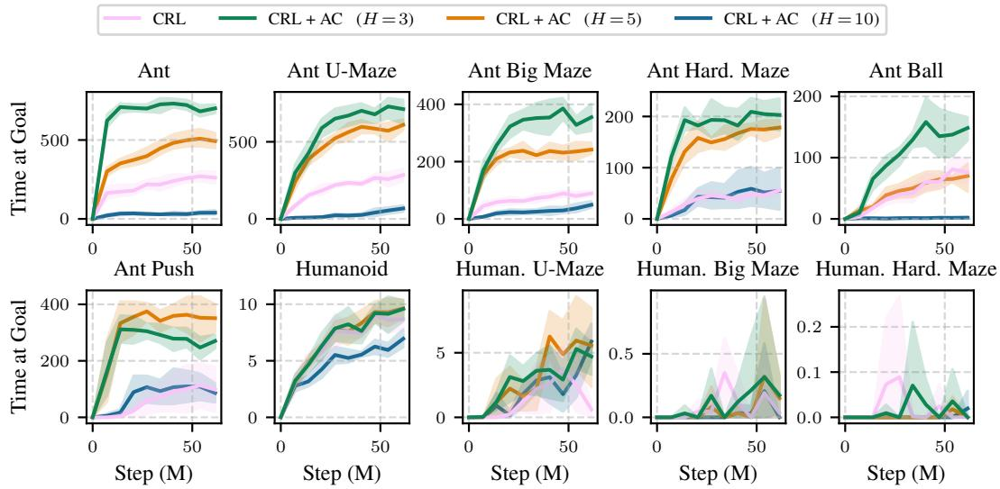  
Figure 2: Online locomotion and navigation results. We report time-at-goal learning curves of CRL and CRL + AC with action chunk length $H \in \{ 3 , 5 , 1 0 \}$ on 10 JaxGCRL locomotion and navigation tasks, with 95% bootstrapped confidence intervals. Time-at-goal captures both task success and behavioral quality, rewarding policies that reach and stably maintain the goal (Bortkiewicz et al., 2025). Overall, CRL + AC with $\mathsf { \bar { H } } \in \{ 3 , 5 \}$ consistently and substantially outperforms CRL, with H=3 being the best or near-best chunk length across the majority of tasks, improving the performance by +111.2% on average when all 11 JaxGCRL environments are considered.

Experimental setup. In the online setting, the agent collects its own experience while learning, so any effect of action chunking is mediated jointly through representation learning and exploration. In the offline setting, we evaluate CRL + AC on datasets of varying data quality, from near-expert demonstrations to noisy and exploratory data, isolating the effect of data quality on performance.

In both regimes, we keep the original algorithm and hyperparameters unchanged unless otherwise specified, modifying only the contrastive critic’s input and the actor’s output to operate on chunked actions. Training protocols are kept unchanged across all experiments. We report 95% stratified confidence intervals computed with RLiable (Agarwal et al., 2021). Full details on hyperparameters, evaluation protocols, detailed figure descriptions, additional ablations, and learning curves are provided in the Appendix C-F. Code is available at https://github.com/M-Korniak/ action-chunked-contrastive-rl.

## 5.1 RESULTS

Online Reinforcement Learning. We first investigate whether action chunking improves CRL in the online setting, and whether the improvement holds broadly across a diverse range of tasks. We evaluate on JaxGCRL (Bortkiewicz et al., 2025), a goal-conditioned RL framework, using its broad range of locomotion and navigation tasks with the default network architecture and training protocol. We run experiments for standard CRL and CRL + AC with action chunk lengths H ∈ {3, 5, 10, 15}. The actor’s target entropy is scaled to the dimensionality of the action chunk, rather than that of an individual action, ensuring consistent entropy regularization under the expanded action space. We report two metrics: success rate and time-at-goal, the latter adopted from JaxGCRL (Bortkiewicz et al., 2025) and used in prior work (Wang et al., 2026).

Figure 2 demonstrates that action chunking improves performance on online locomotion and navigation tasks. Averaged across all evaluated online tasks, it increases time-at-goal by +111.2% and success rate by +93.1% (Appendix F.5). Action chunking thus improves CRL in the online setting, and the gains are consistent across the task suite rather than confined to individual environments.

Offline Reinforcement Learning. Having established that action chunking helps online, we next ask whether the benefit transfers to the offline setting, where exploration plays no role and data quality is fixed in advance, and whether it depends on that data quality. We evaluate CRL and CRL + AC (with action chunk length H=3) on OGBench (Park et al., 2025a), a standard offline goal-conditioned RL benchmark. We train on three dataset types: play, noisy, and explore, primarily across manipulation tasks. To better align with current state-of-the-art offline RL methods, we combine action chunking with a flow matching policy (Lipman et al., 2022) and FQL (Park et al., 2025b) policy extraction. Since FQL is sensitive to the α parameter, which balances Q-improvement and behavioral cloning losses, we sweep $\alpha \in \{ 1 , 3 ,$ , 10} for each environment and for both CRL and $\mathrm { C R L } + \mathrm { A C }$ , selecting the best-performing value. We additionally compare a smaller-than-usual discount factor of $\gamma = 0 . 9 5$ against the standard $\gamma = 0 . 9 9$ for both CRL and $\mathrm { C R L + A C } .$ , and find $\gamma = 0 . 9 5$ improves both; we therefore adopt it throughout (Appendix E.5).

Preprint. Under review.
<table><tr><td>OGBench Environment</td><td>CRL</td><td> $\mathrm { C R L + A C }$ </td><td>GCBC</td><td>GCIVL</td><td>GCIQL</td><td>QRL</td><td>HIQL</td></tr><tr><td> $\mathtt { c u b e - s i n g l e - p l a y - v 0 }$ </td><td> $7 4 \pm 4$ </td><td> ${ \bf 8 1 \pm 3 }$ </td><td> $6 \pm 2$ </td><td> $5 3 \pm 4$ </td><td> $6 8 \pm 6$ </td><td>5 ±1</td><td> $1 5 \pm 3$ </td></tr><tr><td> $\mathtt { c u b e - d o u b l e - p l a y - v 0 }$ </td><td> $\mathbf { 2 9 \pm 4 }$ </td><td> $2 5 \pm 5$ </td><td> $1 \pm 1$ </td><td> $3 6 \pm 3$ </td><td> $4 0 \pm 5$ </td><td>1 ±0</td><td> $6 \pm 2$ </td></tr><tr><td> $\mathtt { c u b e - t r i p l e - p l a y - v 0 }$ </td><td> $\mathbf { 1 2 \pm 8 }$ </td><td> ${ \bf 5 \pm 2 }$ </td><td> $1 \pm 1$ </td><td> $1 \pm 0$ </td><td> $3 \pm 1$ </td><td>0 ±0</td><td> $3 \pm 1$ </td></tr><tr><td> $\mathtt { c u b e - q u a d r u p l e - p l a y - v 0 }$ </td><td> $\mathbf { 0 } \pm \mathbf { 0 }$ </td><td> $\mathbf { 0 } \pm \mathbf { 0 }$ </td><td> $0 \pm 0$ </td><td> $0 \pm 0$ </td><td> $0 \pm 0$ </td><td>0 ±0</td><td> $0 \pm 0$ </td></tr><tr><td>Cube (play avg.)</td><td> $\mathbf { 2 9 \pm 2 }$ </td><td> $\mathbf { 2 8 \pm 1 }$ </td><td> $2 \pm 0$ </td><td> $2 2 \pm 1$ </td><td> $2 8 \pm 1$ </td><td> $1 \pm 0$ </td><td> $6 \pm 1$ </td></tr><tr><td> $\mathtt { c u b e - s i n g l e - n o i s y - v 0 }$ </td><td> ${ \bf 8 6 \pm 4 }$ </td><td> $7 4 \pm 3$ </td><td> $8 \pm 3$ </td><td> $7 1 \pm 9$ </td><td> $9 9 \pm 1$ </td><td>25 ±6</td><td>41 ±6</td></tr><tr><td> $\mathtt { c u b e - d o u b l e - n o i s y - v 0 }$ </td><td> $1 0 \pm 1$ </td><td> $\mathbf { 2 5 \pm 3 }$ </td><td> $1 \pm 1$ </td><td> $1 4 \pm 3$ </td><td> $2 3 \pm 3$ </td><td>3 ±1</td><td> $2 \pm 1$ </td></tr><tr><td> $\mathtt { c u b e - t r i p l e - n o i s y - v 0 }$ </td><td> ${ \bf 2 \pm 1 }$ </td><td> ${ \bf 3 } _ { \pm 2 }$ </td><td> $1 \pm 1$ </td><td> $9 \pm 1$ </td><td> $2 \pm 1$ </td><td>1 ±0</td><td> $2 \pm 1$ </td></tr><tr><td> $\mathtt { c u b e - q u a d r u p l e - n o i s y - v 0 }$ </td><td> $\mathbf { 0 } \pm \mathbf { 0 }$ </td><td> $\mathbf { 0 } \pm \mathbf { 0 }$ </td><td> $0 \pm 0$ </td><td> $0 \pm 0$ </td><td> $0 \pm 0$ </td><td>0 ±0</td><td> $0 \pm 0$ </td></tr><tr><td>Cube (noisy avg.)</td><td> ${ \bf 2 4 \pm 1 }$ </td><td> ${ \bf 2 6 \pm 1 }$ </td><td> $2 \pm 1$ </td><td> $2 3 \pm 2$ </td><td> $3 1 \pm 0$ </td><td> $7 \pm 1$ </td><td>11 ±1</td></tr><tr><td> $\mathtt { p u z z 1 e - 3 x 3 - p 1 a y - v 0 }$ </td><td> ${ \bf 2 8 \pm 3 }$ </td><td> $2 1 \pm 7$ </td><td> $2 \pm 0$ </td><td> $6 \pm 1$ </td><td> $9 5 \pm 1$ </td><td>1 ±0</td><td> $1 2 \pm 2$ </td></tr><tr><td> $\mathtt { p u z z 1 e - 4 x 4 - p 1 a y - v 0 }$ </td><td> $5 8 \pm 5$ </td><td> ${ \bf 6 2 \pm 3 }$ </td><td> $0 \pm 0$ </td><td> $1 3 \pm 2$ </td><td> $2 6 \pm 3$ </td><td>0 ±0</td><td> $7 \pm 2$ </td></tr><tr><td> $\mathtt { p u z z 1 e - 4 x 5 - p 1 a y - v 0 }$ </td><td> $1 8 \pm 2$ </td><td> $\mathbf { 1 9 \pm 0 }$ </td><td> $0 \pm 0$ </td><td> $7 \pm 1$ </td><td> $1 4 \pm 1$ </td><td>0 ±0</td><td> $4 \pm 1$ </td></tr><tr><td> $\mathtt { p u z z 1 e - 4 x 6 - p 1 a y - v 0 }$ </td><td> ${ \bf 1 6 \pm 1 }$ </td><td> $1 5 \pm 1$ </td><td> $0 \pm 0$ </td><td> $1 0 \pm 2$ </td><td> $1 2 \pm 1$ </td><td>0 ±0</td><td> $3 \pm 1$ </td></tr><tr><td> $P u z z l e \ ( p l a y \ : a \nu g . )$ </td><td> $\mathbf { 2 9 \pm 4 }$ </td><td> $\mathbf { 2 8 \pm 4 }$ </td><td> $0 \pm 0$ </td><td> $9 \pm 0$ </td><td> $3 7 \pm 0$ </td><td> $0 \pm 0$ </td><td> $7 \pm 0$ </td></tr><tr><td> $\mathtt { p u z z l e - } 3 \mathtt { x } 3 \mathtt { - n o i s y - v 0 }$ </td><td> $3 5 \pm 3$ </td><td> ${ \bf 5 6 \pm 3 }$ </td><td> $1 \pm 0$ </td><td> $4 2 \pm 1 9$ </td><td> $9 4 \pm 3$ </td><td>0 ±0</td><td> $5 1 \pm 1 1$ </td></tr><tr><td> $\mathtt { p u z z l e - 4 x 4 - n o i s y - v 0 }$ </td><td> $1 \pm 1$ </td><td> ${ \bf 4 2 \pm 3 }$ </td><td> $0 \pm 0$ </td><td> $2 0 \pm 3$ </td><td> $2 9 \pm 7$ </td><td>0 ±0</td><td> $1 6 \pm 4$ </td></tr><tr><td> $\mathtt { p u z z l e - 4 x 5 - n o i s y - v 0 }$ </td><td> $4 \pm 1$ </td><td> ${ \bf 1 6 \pm 1 }$ </td><td> $0 \pm 0$ </td><td> $1 9 \pm 0$ </td><td> $1 9 \pm 0$ </td><td>0 ±0</td><td> $5 \pm 1$ </td></tr><tr><td> $\mathtt { p u z z l e - 4 x 6 - n o i s y - v 0 }$ </td><td> $4 \pm 2$ </td><td> ${ \bf 1 5 \pm 2 }$ </td><td> $0 \pm 0$ </td><td> $1 7 \pm 2$ </td><td> $1 8 \pm 2$ </td><td>0 ±0</td><td> $2 \pm 1$ </td></tr><tr><td>Puzzle (noisy avg.)</td><td> $9 \pm 3$ </td><td> ${ \bf 3 4 } \pm { \bf 2 }$ </td><td> $0 \pm 0$ </td><td> $2 3 \pm 3$ </td><td> $4 0 \pm 1$ </td><td>0 ±0</td><td>18 ±2</td></tr><tr><td> $\mathtt { s c e n e - p l a y - v 0 }$ </td><td> $3 3 \pm 9$ </td><td> ${ \bf 5 4 \pm 2 }$ </td><td> $5 \pm 1$ </td><td> $4 2 \pm 4$ </td><td> $5 1 \pm 4$ </td><td> $5 \pm 1$ </td><td> $3 8 \pm 3$ </td></tr><tr><td> $\mathtt { s c e n e - n o i s y - v 0 }$ </td><td> $1 7 \pm 4$ </td><td> $\mathbf { 3 0 \pm 3 }$ </td><td> $1 \pm 1$ </td><td> $2 6 \pm 5$ </td><td> $2 6 \pm 2$ </td><td> $9 \pm 2$ </td><td> $2 5 \pm 4$ </td></tr><tr><td> $S c e n e \left( a \nu g . \right)$ </td><td> $2 4 \pm 7$ </td><td> ${ \bf 4 4 \pm 6 }$ </td><td> $3 \pm 0$ </td><td> $3 4 \pm 2$ </td><td> $3 8 \pm 1$ </td><td> $7 \pm 1$ </td><td> $3 1 \pm 1$ </td></tr><tr><td> $\mathtt { a n t m a z e - m e d i u m - e x p l o r e - v 0 }$ </td><td> ${ \bf 5 \pm 3 }$ </td><td> ${ \bf 4 } \pm { \bf 4 }$ </td><td> $2 \pm 1$ </td><td> $1 9 \pm 3$ </td><td> $1 3 \pm 2$ </td><td>1 ±1</td><td> $3 7 \pm 1 0$ </td></tr><tr><td> $\mathtt { a n t m a z e - l a r g e - e x p l o r e - v 0 }$ </td><td> $\mathbf { 0 } \pm \mathbf { 0 }$ </td><td> $\mathbf { 0 } \pm \mathbf { 0 }$ </td><td> $0 \pm 0$ </td><td> $1 0 \pm 3$ </td><td> $0 \pm 0$ </td><td> $0 \pm 0$ </td><td> $4 \pm 5$ </td></tr><tr><td> $\mathtt { a n t m a z e \mathrm { - } t e l e p o r t - e x p l o r e \mathrm { - } v 0 }$ </td><td> $1 9 \pm 3$ </td><td> $\mathbf { 2 5 \pm 3 }$ </td><td> $2 \pm 1$ </td><td> $3 2 \pm 2$ </td><td> $7 \pm 3$ </td><td> $2 \pm 2$ </td><td> $3 4 \pm 1 5$ </td></tr><tr><td>AntMaze (avg.)</td><td> ${ \mathbf { 8 \pm 2 } }$ </td><td> ${ \bf 9 \pm 4 }$ </td><td> $1 \pm 0$ </td><td> $2 0 \pm 1$ </td><td> $7 \pm 1$ </td><td>1 ±0</td><td> $2 5 \pm 3$ </td></tr></table>

Table 1: Offline manipulation and suboptimal data results. We summarize per-environment success rate on OGBench (Park et al., 2025a) with action chunk length H=3. CRL + AC improves over CRL by +31.7% on manipulation tasks and +69.4% on noisy and exploratory dataset variants, without degrading performance on any task group. Gains are most pronounced on noisy datasets, particularly Puzzle and Scene. Italic rows: group aggregate computed via RLiable with 95% bootstrapped CIs over seeds × tasks. Baselines are copied from the OGBench (Park et al., 2025a) paper for reference, with CIs obtained via parametric bootstrap from reported means and standard deviations. Bold denotes performance within the 95% CI of the best among CRL and ${ \mathrm { C R L } } + { \mathrm { A C } } .$

Table 1 presents the results. Action chunking yields consistent improvements across all settings: an average of +31.7% on manipulation tasks overall, with gains increasing to +69.4% on the suboptimal noisy and explore dataset variants. These results confirm that the benefit of action chunking is not limited to the online setting. Performance on play environments remains on par with standard CRL, showing that the gains on noisy data do not come at the cost of performance on clean data.

## 5.2 WHY DOES ACTION CHUNKING HELP?

Having evaluated CRL with action chunking, we now turn to interpreting the sources of the performance gains. Prior work has put forth three explanations for why action chunking has proven useful for prior RL algorithms (Li et al., 2026):

1. the ability to model non-Markovian demonstrations;

2. unbiased H-step returns for value estimation; and

3. temporally extended exploration/exploitation.

As we will show in the experiments below, the effectiveness of action chunking in CRL may not be explained by these arguments alone, and a mechanism particular to CRL is at play. Unlike most of the methods that have been reported to benefit from action chunking, CRL is strongly based on mutual information between state-action pairs and future outcomes. We thus put forth a new explanation for why action chunking might help: by conditioning the critic on a chunk of actions rather than a single action, it adds information about the goal, producing better critic representations.

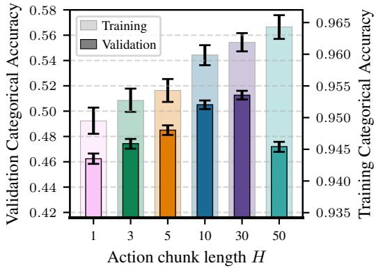

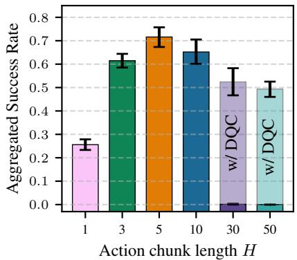  
Figure 3: Action chunking adds information about the goal; performance peaks at moderate chunk length. Results on cube-single-noisy-v0 (σ=1). $( L e f t )$ Validation categorical accuracy (dark bars, left axis) increases with action chunk length H as the critic recovers more in formation about the goal. The thick line on the x-axis marks the state-only critic’s accuracy $( H { = } 0 ,$ no action conditioning; Eq. 9), so each bar’s height shows the accuracy gained over the state-only baseline. Accuracy peaks at $H { = } 3 0 !$ ; at $H { = } 5 0$ it drops even as training accuracy (light bars, left axis) continues to rise, indicating that the long-chunk critic overfits. (Right) Aggregated success rate peaks at a short chunk length $\left( H { = } 5 \right)$ and collapses to near zero by $H { = } 3 0$ and $\bar { H } { = } 5 0$ . Distilling each long-chunk critic into a short-chunk $\left( H _ { \pi } { = } 5 \right)$ critic, and extracting policy from it (light bars, w/ DQC) recovers success to ${ \sim } 5 0 \%$ . All methods execute a single action and replan at each step $( H _ { \mathrm { e x e c } } { = } 1 )$ ), so the collapse does not stem from open-loop execution, but from the difficulty of extracting an action from a long-chunk critic. We provide the full per-H learning curves and the DQC training curves in Figure 6 (Appendix E.1). Error bars show 95% bootstrapped confidence intervals.

The Representational Benefit. To test whether the success of $\mathrm { C R L } + \mathrm { A C }$ stems solely from the explanations discussed in prior work, we construct a setting where none of them apply and ask whether the gains survive. On three offline datasets where $\mathrm { C R L } + \mathrm { A C }$ clearly outperforms CRL, we distill the chunked critic into a single-action one: we replace its state-action encoder $\phi ( s , a _ { 1 : H } )$ with a single-action encoder $\phi ^ { \prime } ( s , a )$ trained by expectile regression onto the chunked critic’s values (DQC (Li et al., 2025); see Appendix E.1), and extract a conventional single-step policy from it. This policy outputs and executes a single action, so it cannot benefit from any of the standard explanations: $( l )$ it cannot model non-Markovian behavior, (2) unbiased H-step returns play no role, since CRL is not a temporal difference method, and (3) neither exploration nor temporally extended exploitation applies, since the data is pre-collected and the policy executes one action at a time. All it inherits from the chunked critic are its representations. If the chunking benefit came entirely from the standard explanations, this policy should perform no better than standard CRL; if the benefit is representational, it should retain a positive gain, even if smaller than that of the full-chunk policy.

In practice, the distilled single-step policy outperforms standard CRL on all three datasets for most of training, with relative gains ranging from ∼30% to ∼100% depending on the dataset (Figure 5). Since none of the standard explanations applies here, the surviving gain must originate in the critic’s representations — and because distillation can only lose information, it is a lower bound on their true benefit. This benefit is also distinct from those identified in prior work and compounds with them: the full-chunk policy further improves the distilled single-step one (Figure 6). We attribute this further gain to non-Markovian modeling, the only standard explanation still available in this setting.

Action Chunking Adds Information. Having observed the representational benefit, we ask what action chunking adds to critic representations. We hypothesize that a chunk gives the critic more information about the goal than a single action. To test this, we measure the critic’s categorical accuracy: for a batch of $B$ state-action/future state pairs, the critic scores all $B { \times } B$ pairings $\phi ( ( s , a _ { 1 : H } ) _ { i } ) ^ { \top } \psi ( g _ { j } )$ , and accuracy is the fraction of states for which the true future $g _ { i }$ scores highest among the $B$ candidates. Higher accuracy indicates that the critic’s representation discriminates the correct future more sharply. To ensure any change reflects action information alone, we vary only the critic’s action conditioning, holding the validation dataset, batch size B, and discount γ fixed, so the number of negatives and the data distribution are unchanged. Crucially, we measure the action’s contribution against a state-only critic (Eq. 9): the state already carries most of the discriminative signal, so the question is what the action, and then the chunk, add on top of it.

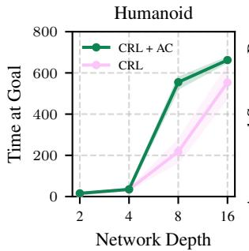

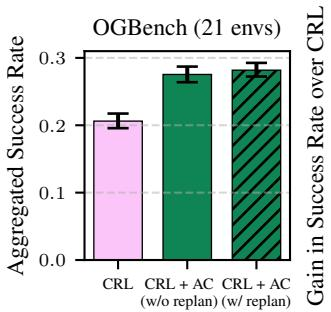

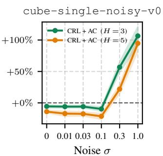  
Figure 4: Ablations on Action-Chunked CRL. (Left) Performance across network depths. We evaluate the effect of network depth scaling on a challenging Humanoid task, for CRL and CRL + AC with action chunk length $H { = } 3$ . CRL + AC matches or exceeds CRL at every depth. (Middle) Effect of replanning on CRL + AC. On 21 OGBench environments, we compare CRL + AC (H=3) executing the full chunk open-loop $( H _ { \mathrm { e x e c } } { = } H )$ against replanning every step $( H _ { \mathrm { e x e c } } { = } 1 )$ , alongside standard CRL. Replanning every step achieves comparable average performance to open-loop execution, though its effect varies across environments (Appendix E.4). (Right) Action-Chunked CRL and noise. We report the success rate gain of CRL + AC over CRL for action chunk lengths $H \in \{ 3 , 5 \}$ across $\mathtt { c u b e - s i n g l e - n o i s y - v 0 }$ . We vary the noise level σ injected into expert actions during offline dataset collection, and train both CRL and CRL + AC on the resulting datasets. Gains become consistent for $\sigma { \geq } 0 . 3 .$ , reaching up to 100% at the highest noise level.

Empirically, categorical accuracy increases monotonically with H on the validation dataset (Figure 3, Left). Relative to the state-only critic, conditioning on a single action $( H { = } 1 )$ yields ∼4.5 percentage points higher accuracy, and conditioning on a chunk yields a larger gain, peaking at ${ \sim } 9 . 5$ percentage points at $H { = } 3 0$ , nearly double the single-action gain. These results support our hypothesis: conditioning on a chunk gives the critic more information about the goal than a single action, and the critic captures it. The exception is $H { = } 5 0$ , where validation accuracy drops even as training accuracy peaks. This is overfitting, not a loss of information: the critic memorizes the training data instead of generalizing. Formally, the rise in accuracy with H is consistent with the data-processing inequality: the mutual information between the state-action input and the goal can only increase with action chunk length, $I ( s , a _ { 1 : H } ; g ) \ge I ( s , a ; g )$

Why Does Performance Collapse at Large H? Critic quality and policy success diverge at large H: validation categorical accuracy keeps rising with H, peaking at $H { = } 3 0$ , yet success peaks at $H { = } 5 \ ( { \sim } 7 2 \% )$ and falls to near zero by H=30 (Figure 3). If longer chunks yield better critics, why does performance collapse? We test whether the collapse is a failure of the critic or of policy extraction. Since execution is fixed to single-step replanning $( H _ { \mathrm { e x e c } } { = } 1 )$ , open-loop execution cannot be the cause, leaving policy extraction as the suspect: extracting a policy from a long-chunk critic requires the actor to model a distribution over a full length-H chunk, which grows harder with H (Li et al., 2025). If the critic is the problem, its information should be unusable; if extraction is the problem, a simpler policy should be able to recover it. We therefore apply the same DQC distillation used earlier to isolate the representational benefit, now with a moderate policy horizon $\left( H _ { \pi } { = } 5 \right)$ rather than a single action, applied to the $H { = } 3 0$ and H=50 critics (details in Appendix E.1).

Empirically, this recovers success from near zero to ∼50% (Figure 3, Right, light bars). And since distillation can only lose information, never add it, then the recovered policy cannot be more informed than the original H=30 and $H { = } 5 0$ critics. The fact that a policy extracted from the distilled short-chunk critic reaches ∼50% therefore shows the critics themselves held usable information; the undistilled collapse was a failure of policy extraction, not of critic quality. At large H, the bottleneck is extracting a policy from the critic, not the critic itself, and the representational benefit still holds.

## 5.3 ABLATION STUDIES

Network Depth Scaling. Action chunking expands what the critic and actor can express; a natural question is whether the same benefit could be obtained simply by increasing network capacity. We therefore ablate network depth for CRL and CRL + AC, following the scaling setup of Wang et al.

(2026) (details in Appendix E.3). The left panel of Figure 4 shows that on the Humanoid task the benefit of action chunking persists as network depth increases: CRL + AC matches or exceeds CRL at every depth, so its advantage compounds with capacity rather than being substituted by it. The effect is more pronounced on Ant Hardest Maze (Appendix E.3), where action chunking is markedly more compute-efficient: a 2-layer CRL + AC network matches the performance of a 8× deeper (16- layer) CRL network; added depth is therefore not a substitute for action chunking.

Open-loop vs. Replanning. By default we execute chunks open-loop, which conflates the representational effect with the effect of committing to a sequence of actions; we therefore ablate the evaluation replanning on 21 OGBench environments with action chunk length H=3 (Figure 4, Middle). At evaluation we execute only the first $H _ { \mathrm { e x e c } } { \leq } H$ actions of each predicted chunk before requerying the policy $( H _ { \mathrm { e x e c } } { = } H$ recovers full open-loop execution, $H _ { \mathrm { e x e c } } { = } 1$ replans at every step). Replanning every step is slightly beneficial offline, though it varies across environments, whereas online it degrades performance, falling below standard CRL (Appendix E.4). Offline, open-loop execution is not the source of the gains. Online, the representational benefit and open-loop execution are entangled: the latter is necessary, so we cannot cleanly isolate the former. We expect the representational benefit to be present online as well, but leave disentangling the two to future work.

Varying Noise. The offline results showed larger gains on noisy datasets; to test whether noise is the driver, we systematically vary the noise injected into expert actions during data collection on cube-single-noisy-v0, and then compare CRL and CRL + AC with $H \in \{ 3 , 5 \}$ (Figure 4, Right). The advantage of CRL + AC grows almost monotonically with noise. The same trend holds on puzzle-3x3-noisy-v0 (Appendix E.2), confirming the effect is not specific to one environment. Note that this experiment varies the dataset at a fixed chunk length, complementary to our earlier analysis. Our critic metrics (Figure 7) confirm action chunking adds information at every noise level, but this advantage stays roughly constant while the performance gap widens: noise amplifies the added information through a mechanism our metrics do not capture. Action chunking thus becomes more valuable as noise increases but the amplification mechanism remains open.

## Takeaways of the Experimental Section

• Action chunking consistently improves CRL. CRL + AC improves over CRL across offline and online tasks (+31.7% offline manipulation, +69.4% on noisy/explore, +111.2% time-at-goal online) without degrading any task group.

• Action chunking improves the critic by adding information. An action chunk gives the critic more information about the goal than a single action, and the critic captures it: over a state-only critic, a chunk nearly doubles the validation accuracy gain of a single action. Distillation confirms that better critic representations contribute to the gain.

• Critic quality and policy quality decouple at large H. Beyond a moderate chunk length, a better critic does not mean a better policy: accuracy keeps rising to H=30 while success collapses (Figure 3). With execution held fixed, the bottleneck is policy extraction, not critic quality. Distilling the long-chunk critic into a short-chunk one, and then extracting a policy, recovers performance from near zero to ∼50%. The critic’s information was usable all along.

• Network scaling does not substitute for action chunking. CRL + AC retains its advantage at every depth tested, and a shallow CRL + AC network can match a much deeper CRL one. Added depth is therefore not a substitute for action chunking.

## 6 CONCLUSIONS

Treating CRL as a representative self-supervised method, we study the effect of action chunking beyond the settings where it has previously been studied, and show that conditioning the critic on short action chunks yields large gains across offline and online benchmarks. Investigating the source of these gains, we find that the explanations proposed for action chunking in other settings: modeling non-Markovian behavior, multi-step value estimation, and temporally extended execution do not fully account for its effectiveness here; instead, a mechanism specific to CRL is at play: conditioning on a chunk gives the critic more information about the goal than a single action, improving its representations and, in turn, the effectiveness of the contrastive critic. We further characterize when this benefit saturates: very long chunks improve the critic but hinder policy extraction, and we show that decoupling the critic and policy horizons largely recovers performance.

While we were able to observe consistent trends and significant gains, these remain conditional on the selection of the right chunk length. In practice, we have found a mild horizon of three steps (H=3) to be generally the most beneficial; nevertheless, designing an offline procedure to automatically choose chunk lengths, possibly per state, is an important direction for future work. A natural next direction is whether the benefit extends to other temporal enrichments of the critic’s input: action chunking, motivated by its established use in RL, is only one such method, and whether alternatives like conditioning on future states or past history yield similar gains remains an open question. More generally, our work suggests that action chunking synergizes particularly well with CRL, and improves performance through mechanisms beyond those previously studied. Similar phenomena may arise beyond CRL: preliminary results in Appendix E.6 show that action chunking also improves other self-supervised RL methods, motivating its broader study in self-supervised RL.

## AUTHOR CONTRIBUTIONS

Michal Korniak proposed studying action chunking in contrastive RL; ran the initial experiments establishing its viability; designed, implemented, and ran the full offline experiments; designed the analysis of why action chunking helps, including the use of DQC as a diagnostic; ran the varyingnoise and offline replanning experiments; wrote the initial drafts of the method, offline results, and analysis sections; and wrote the initial outline of the paper. Kamil Dybek designed, implemented, and ran the full online experiments; ran the network-scaling and online replanning experiments; and wrote the initial draft of the online results section. Benjamin Eysenbach supervised the project; advised on the presentation of the work; and contributed to writing and revising the manuscript. Marco Bagatella supervised the project; advised on the experimental design and on the analysis of the synergy between CRL and action chunking; and contributed to writing throughout the paper, particularly its positioning, introduction, and discussion. Michał Bortkiewicz supervised the project; advised on the experimental design; and contributed to writing throughout the paper.

## ACKNOWLEDGMENTS

We gratefully acknowledge the Polish high-performance computing infrastructure PLGrid (HPC Center: ACK Cyfronet AGH) for providing computer facilities and support within the computational grant no. PLG/2025/018637. Marco Bagatella is supported by the Max Planck ETH Center for Learning Systems. This project was supported in part by the Swiss National Science Foundation under NCCR Automation, grant agreement 51NF40 180545. Michał Bortkiewicz is supported by National Science Centre, Poland (grant no. 2023/51/D/ST6/01609). We thank Yarden As, Leander Diaz-Bone, and Alicja Ziarko for helpful feedback on the paper.

## REFERENCES

Rishabh Agarwal, Max Schwarzer, Pablo Samuel Castro, Aaron C Courville, and Marc Bellemare. Deep reinforcement learning at the edge of the statistical precipice. Advances in neural information processing systems, 34:29304–29320, 2021.

Marco Bagatella, Matteo Pirotta, Ahmed Touati, Alessandro Lazaric, and Andrea Tirinzoni. Tdjepa: Latent-predictive representations for zero-shot reinforcement learning. arXiv preprint arXiv:2510.00739, 2025.

Dzmitry Bahdanau, Felix Hill, Jan Leike, Edward Hughes, Arian Hosseini, Pushmeet Kohli, and Edward Grefenstette. Learning to Understand Goal Specifications by Modelling Reward, December 2019. URL http://arxiv.org/abs/1806.01946. arXiv:1806.01946 [cs.AI].

Gabriel Barth-Maron, Matthew W Hoffman, David Budden, Will Dabney, Dan Horgan, Dhruva Tb, Alistair Muldal, Nicolas Heess, and Timothy Lillicrap. Distributed distributional deterministic policy gradients. arXiv preprint arXiv:1804.08617, 2018.

Mahsa Bastankhah, Grace Liu, Dilip Arumugam, Thomas L. Griffiths, and Benjamin Eysenbach. Demystifying the Mechanisms Behind Emergent Exploration in Goal-conditioned RL, October 2025. URL http://arxiv.org/abs/2510.14129. arXiv:2510.14129 [cs.LG].

Kevin Black, Manuel Y. Galliker, and Sergey Levine. Real-Time Execution of Action Chunking Flow Policies. October 2025a. URL https://openreview.net/forum?id= UkR2zO5uww.

Kevin Black, Allen Z. Ren, Michael Equi, and Sergey Levine. Training-Time Action Conditioning for Efficient Real-Time Chunking, December 2025b. URL http://arxiv.org/abs/ 2512.05964. arXiv:2512.05964 [cs.RO].

Leonard Blier, Corentin Tallec, and Yann Ollivier. Learning successor states and goal-dependent´ values: A mathematical viewpoint. arXiv preprint arXiv:2101.07123, 2021.

Michał Bortkiewicz, Władysław Pałucki, Vivek Myers, Tadeusz Dziarmaga, Tomasz Arczewski, Łukasz Kucinski, and Benjamin Eysenbach. Accelerating goal-conditioned reinforcement learn-´ ing algorithms and research. In International Conference on Learning Representations, volume 2025, pp. 15732–15754, 2025.

Ting Chen, Simon Kornblith, Mohammad Norouzi, and Geoffrey Hinton. A simple framework for contrastive learning of visual representations. In International conference on machine learning, pp. 1597–1607. PmLR, 2020.

Cheng Chi, Zhenjia Xu, Siyuan Feng, Eric Cousineau, Yilun Du, Benjamin Burchfiel, Russ Tedrake, and Shuran Song. Diffusion policy: Visuomotor policy learning via action diffusion, 2024. URL https://arxiv.org/abs/2303.04137.

Peter Dayan. Improving generalization for temporal difference learning: The successor representation. Neural computation, 5(4):613–624, 1993.

Benjamin Eysenbach, Tianjun Zhang, Sergey Levine, and Russ R Salakhutdinov. Contrastive learning as goal-conditioned reinforcement learning. Advances in Neural Information Processing Sys tems, 35:35603–35620, 2022.

Norman Ferns, Prakash Panangaden, and Doina Precup. Metrics for finite markov decision processes. arXiv preprint arXiv: 1207.4114, 2012.

Carles Gelada, Saurabh Kumar, Jacob Buckman, Ofir Nachum, and Marc G. Bellemare. Deepmdp: Learning continuous latent space models for representation learning. In Kamalika Chaudhuri and Ruslan Salakhutdinov (eds.), Proceedings of the 36th International Conference on Machine Learning, ICML 2019, 9-15 June 2019, Long Beach, California, USA, volume 97 of Proceedings ofMachine Learning Research, pp. 2170–2179. PMLR, 2019. URL http://proceedings. mlr.press/v97/gelada19a.html.

Dibya Ghosh, Abhishek Gupta, and Sergey Levine. Learning Actionable Representations with Goal Conditioned Policies. September 2018. URL https://openreview.net/forum?id= Hye9lnCct7.

Robert Givan, Thomas Dean, and Matthew Greig. Equivalence notions and model minimization in markov decision processes. Artificial Intelligence, 147(1):163–223, 2003. ISSN 0004-3702. doi: https://doi.org/10.1016/S0004-3702(02)00376-4. URL https://www.sciencedirect. com/science/article/pii/S0004370202003764. Planning with Uncertainty and In complete Information.

Jean-Bastien Grill, Florian Strub, Florent Altche, Corentin Tallec, Pierre Richemond, Elena´ Buchatskaya, Carl Doersch, Bernardo Avila Pires, Zhaohan Guo, Mohammad Gheshlaghi Azar, et al. Bootstrap your own latent-a new approach to self-supervised learning. Advances in neural information processing systems, 33:21271–21284, 2020.

Philippe Hansen-Estruch, Amy Zhang, Ashvin Nair, Patrick Yin, and Sergey Levine. Bisimulation makes analogies in goal-conditioned reinforcement learning. In Kamalika Chaudhuri, Stefanie Jegelka, Le Song, Csaba Szepesvari, Gang Niu, and Sivan Sabato (eds.),´ International Conference on Machine Learning, ICML 2022, 17-23 July 2022, Baltimore, Maryland, USA, volume 162 of Proceedings of Machine Learning Research, pp. 8407–8426. PMLR, 2022. URL https: //proceedings.mlr.press/v162/hansen-estruch22a.html.

Nicolas Heess, Gregory Wayne, David Silver, Timothy Lillicrap, Tom Erez, and Yuval Tassa. Learning continuous control policies by stochastic value gradients. Advances in neural information processing systems, 28, 2015.

Karl Moritz Hermann, Felix Hill, Simon Green, Fumin Wang, Ryan Faulkner, Hubert Soyer, David Szepesvari, Wojciech Marian Czarnecki, Max Jaderberg, Denis Teplyashin, Marcus Wainwright, Chris Apps, Demis Hassabis, and Phil Blunsom. Grounded Language Learning in a Simulated 3D World, June 2017. URL http://arxiv.org/abs/1706.06551. arXiv:1706.06551 [cs.CL].

L. Kaelbling. Learning to Achieve Goals. 1993. URL https://www. semanticscholar.org/paper/Learning-to-Achieve-Goals-Kaelbling/ 6df43f70f383007a946448122b75918e3a9d6682.

Daniel Lawson, Adriana Hugessen, Charlotte Cloutier, Glen Berseth, and Khimya Khetarpal. Selfpredictive representations for combinatorial generalization in behavioral cloning. arXiv preprint arXiv:2506.10137, 2025.

Qiyang Li, Seohong Park, and Sergey Levine. Decoupled Q-Chunking, December 2025. URL http://arxiv.org/abs/2512.10926. arXiv:2512.10926 [cs.LG].

Qiyang Li, Zhiyuan Zhou, and Sergey Levine. Reinforcement Learning with Action Chunking, May 2026. URL http://arxiv.org/abs/2507.07969. arXiv:2507.07969 [cs.LG].

Yaron Lipman, Ricky TQ Chen, Heli Ben-Hamu, Maximilian Nickel, and Matt Le. Flow matching for generative modeling. arXiv preprint arXiv:2210.02747, 2022.

Grace Liu, Michael Tang, and Benjamin Eysenbach. A single goal is all you need: Skills and exploration emerge from contrastive rl without rewards, demonstrations, or subgoals. In International Conference on Learning Representations, volume 2025, pp. 78599–78621, 2025a.

Yuejiang Liu, Jubayer Ibn Hamid, Annie Xie, Yoonho Lee, Max Du, and Chelsea Finn. Bidirectional decoding: Improving action chunking via guided test-time sampling. In The Thirteenth International Conference on Learning Representations, ICLR 2025, Singapore, April 24-28, 2025. OpenReview.net, 2025b. URL https://openreview.net/forum?id=qZmn2hkuzw.

Yuejiang Liu, Jubayer Ibn Hamid, Annie Xie, Yoonho Lee, Maximilian Du, and Chelsea Finn. Bidirectional Decoding: Improving Action Chunking via Guided Test-Time Sampling, April 2025c. URL http://arxiv.org/abs/2408.17355. arXiv:2408.17355 [cs.RO].

Lucas Maes, Quentin Le Lidec, Damien Scieur, Yann LeCun, and Randall Balestriero. Leworldmodel: Stable end-to-end joint-embedding predictive architecture from pixels. arXiv preprint arXiv:2603.19312, 2026.

Vivek Myers, Chongyi Zheng, Anca Dragan, Sergey Levine, and Benjamin Eysenbach. Learning temporal distances: Contrastive successor features can provide a metric structure for decisionmaking. arXiv preprint arXiv:2406.17098, 2024.

Vivek Myers, Bill Zheng, Anca Dragan, Kuan Fang, and Sergey Levine. Temporal representation alignment: Successor features enable emergent compositionality in robot instruction following. Advances in Neural Information Processing Systems, 38:149934–149961, 2026.

Ashvin V Nair, Vitchyr Pong, Murtaza Dalal, Shikhar Bahl, Steven Lin, and Sergey Levine. Visual Reinforcement Learning with Imagined Goals. In Advances in Neural Information Processing Systems, volume 31. Curran Associates, Inc., 2018. URL https://proceedings.neurips.cc/paper/2018/hash/ 7ec69dd44416c46745f6edd947b470cd-Abstract.html.

Aaron van den Oord, Yazhe Li, and Oriol Vinyals. Representation learning with contrastive predictive coding. arXiv preprint arXiv:1807.03748, 2018.

Seohong Park, Tobias Kreiman, and Sergey Levine. Foundation policies with hilbert representations, 2024. URL https://arxiv.org/abs/2402.15567.

Seohong Park, Kevin Frans, Benjamin Eysenbach, and Sergey Levine. Ogbench: Benchmarking offline goal-conditioned rl. In International Conference on Learning Representations, volume 2025, pp. 94937–94982, 2025a.

Seohong Park, Qiyang Li, and Sergey Levine. Flow q-learning, 2025b. URL https://arxiv. org/abs/2502.02538.

Xue Bin Peng, Aviral Kumar, Grace Zhang, and Sergey Levine. Advantage-weighted regression: Simple and scalable off-policy reinforcement learning, 2019. URL https://arxiv.org/ abs/1910.00177.

Alec Radford, Jong Wook Kim, Chris Hallacy, Aditya Ramesh, Gabriel Goh, Sandhini Agarwal, Girish Sastry, Amanda Askell, Pamela Mishkin, Jack Clark, et al. Learning transferable visual models from natural language supervision. In International conference on machine learning, pp. 8748–8763. PmLR, 2021.

Jette Randlov. Learning Macro-Actions in Reinforcement Learning. In Advances in Neural Information Processing Systems, volume 11. MIT Press, 1998. URL https://proceedings.neurips.cc/paper\_files/paper/1998/hash/ 8f19793b2671094e63a15ab883d50137-Abstract.html.

Tom Schaul, Daniel Horgan, Karol Gregor, and David Silver. Universal value function approximators. In International conference on machine learning, pp. 1312–1320. PMLR, 2015.

Yongjae Shin, Jongseong Chae, Seongmin Kim, Jongeui Park, and Youngchul Sung. Adaptive Action Chunking via Multi-Chunk Q Value Estimation, May 2026. URL http://arxiv. org/abs/2605.10044. arXiv:2605.10044 [cs.LG].

Lorenzo Steccanella and Anders Jonsson. State representation learning for goal-conditioned reinforcement learning. ECML/PKDD, 2022. doi: 10.48550/arXiv.2205.01965.

Richard S Sutton, Doina Precup, and Satinder Singh. Between mdps and semi-mdps: A framework for temporal abstraction in reinforcement learning. Artificial intelligence, 112(1-2):181– 211, 1999.

Ahmed Touati and Yann Ollivier. Learning one representation to optimize all rewards. Advances in Neural Information Processing Systems, 34:13–23, 2021.

Kevin Wang, Ishaan Javali, Michał Bortkiewicz, Tomasz Trzcinski, and Benjamin Eysenbach. 1000 layer networks for self-supervised rl: Scaling depth can enable new goal-reaching capabilities. Advances in Neural Information Processing Systems, 38:157643–157670, 2026.

Tongzhou Wang and Phillip Isola. Understanding contrastive representation learning through alignment and uniformity on the hypersphere. In International conference on machine learning, pp. 9929–9939. PMLR, 2020.

Tongzhou Wang, Antonio Torralba, Phillip Isola, and Amy Zhang. Optimal goal-reaching reinforcement learning via quasimetric learning. In International Conference on Machine Learning, pp. 36411–36430. PMLR, 2023.

Ronald J Williams and Jing Peng. Function optimization using connectionist reinforcement learning algorithms. Connection Science, 3(3):241–268, 1991.

Chun-Hsiao Yeh, Cheng-Yao Hong, Yen-Chi Hsu, Tyng-Luh Liu, Yubei Chen, and Yann LeCun. Decoupled contrastive learning. In European conference on computer vision, pp. 668–684. Springer, 2022.

Xiaohua Zhai, Basil Mustafa, Alexander Kolesnikov, and Lucas Beyer. Sigmoid Loss for Language Image Pre-Training, September 2023. URL http://arxiv.org/abs/2303.15343. arXiv:2303.15343 [cs.CV].

Amy Zhang, Rowan Thomas McAllister, Roberto Calandra, Yarin Gal, and Sergey Levine. Learning invariant representations for reinforcement learning without reconstruction. In 9th International Conference on Learning Representations, ICLR 2021, Virtual Event, Austria, May 3-7, 2021. OpenReview.net, 2021. URL https://openreview.net/forum?id=-2FCwDKRREu.

Thomas T. Zhang, Daniel Pfrommer, Chaoyi Pan, Nikolai Matni, and Max Simchowitz. Action Chunking and Exploratory Data Collection Yield Exponential Improvements in Behavior Cloning for Continuous Control, November 2025. URL http://arxiv.org/abs/2507.09061. arXiv:2507.09061 [cs.LG].

Tony Z. Zhao, Vikash Kumar, Sergey Levine, and Chelsea Finn. Learning Fine-Grained Bimanual Manipulation with Low-Cost Hardware, April 2023. URL http://arxiv.org/abs/2304. 13705. arXiv:2304.13705 [cs.RO].

Chongyi Zheng, Benjamin Eysenbach, Homer Walke, Patrick Yin, Kuan Fang, Ruslan Salakhutdinov, and Sergey Levine. Stabilizing contrastive rl: Techniques for robotic goal reaching from offline data. In International Conference on Learning Representations, volume 2024, pp. 28236– 28264, 2024.

Alicja Ziarko, Michal Bortkiewicz, Michal Zawalski, Benjamin Eysenbach, and Piotr Milos. Contrastive Representations for Temporal Reasoning, September 2025. URL http://arxiv. org/abs/2508.13113. arXiv:2508.13113 [cs.LG].

## A EXTENDED RELATED WORKS

Self-supervised Reinforcement Learning Contrastive reinforcement learning (Eysenbach et al., 2022) is a prototypical self-supervised reinforcement learning algorithm, as it operates over datasets of trajectories with no reward labels. As such, it fits within a broader family of self-supervised algorithms for representation and reinforcement learning, which we will now briefly discuss as they may also benefit from action chunking. While CRL is contrastive and Monte-Carlo at heart, most self-supervised methods rely on either temporal-difference learning (Touati & Ollivier, 2021; Park et al., 2024), on self-prediction (Grill et al., 2020; Lawson et al., 2025) or both (Bagatella et al., 2025). In some cases, these methods are designed for zero-shot reinforcement learning (Touati & Ollivier, 2021; Park et al., 2024; Bagatella et al., 2025), i.e. for retrieving an optimal policy for arbitrary reward function; in others, they are mostly targeting representation learning (Grill et al., 2020; Lawson et al., 2025) or dynamics modeling (Maes et al., 2026). Despite their difference, these works are generally designed to be either action-independent (Lawson et al., 2025), or to operate over single-step actions; due to their close connection to CRL, it is possible that they may benefit from action chunking through known and unknown mechanisms.

## B ACTION-CHUNKED CONTRASTIVE REINFORCEMENT LEARNING DETAILS

Algorithm 1 shows the critic and actor losses, adapted from Eysenbach et al. (2022). The only modifications to standard CRL are highlighted: the state-action encoder takes a flattened action chunk of shape (batch, H <sub>\*</sub> action dim) rather than a single action, and the policy outputs a full chunk.

Algorithm 1 Action-Chunked Contrastive Reinforcement Learning: the critic and actor losses. Algorithm 1 Action-Chunked Contrastive Reinforcement Learning: the critic and actor losses.

```python
from jax.numpy import einsum, eye
from optax import sigmoid_binary_cross_entropy
def critic_loss(states, action_chunks, future_states):
# action chunks: (batch dim, H <sub>*</sub> action dim) - flattened chunk
sa_repr = sa_encoder(states, action_chunks) # (batch_dim, repr_dim)
g_repr = g_encoder(future_states) # (batch_dim, repr_dim)
logits = einsum(’ik,jk->ij’, sa_repr, g_repr)
return sigmoid_binary_cross_entropy(
logits=logits, labels=eye(batch_size))
def actor_loss(states, goals):
# policy outputs full chunk (batch dim, H <sub>*</sub> action dim)
action_chunks = policy.sample(states, goal=goals)
sa_repr = sa_encoder(states, action_chunks) # (batch_dim, repr_dim)
g_repr = g_encoder(goals) # (batch_dim, repr_dim)
logits = einsum(’ik,ik->i’, sa_repr, g_repr)
return -1.0 <sub>*</sub> logits
```

## C EXPERIMENTAL DETAILS

## C.1 HYPERPARAMETERS

Hyperparameters for the offline OGBench and online JaxGCRL experiments are reported in Tables 2 and 3, respectively. We keep all hyperparameters unchanged from the original CRL implementation unless otherwise specified.

## C.2 COMPUTATIONAL RESOURCES

All experiments were conducted on a single NVIDIA GH200. OGBench runs took approximately 3 hours per setting, i.e., with or without action chunking. JaxGCRL runs took between 15 minutes and 9 hours, depending on the experimental setting, with a total runtime of 472 hours.

<table><tr><td>Hyperparameter</td><td>Value</td><td>Hyperparameter</td><td>Value</td></tr><tr><td>train_steps</td><td>1,000,000</td><td>num_timesteps</td><td>60,000,000</td></tr><tr><td>eval_episodes</td><td>20</td><td>max_replay_size</td><td>10,000</td></tr><tr><td>1r</td><td> $3 \times 1 0 ^ { - 4 }$ </td><td>min_replay_size</td><td>1,000</td></tr><tr><td>batch_size</td><td>1024</td><td>episode_length</td><td>1,000</td></tr><tr><td>actor_hidden_dims</td><td> $6 \times 5 1 2$ </td><td>unroll_length</td><td>62</td></tr><tr><td>value_hidden_dims</td><td>6 × 512</td><td>discount</td><td>0.99</td></tr><tr><td>latent_dim</td><td>512</td><td>num_envs</td><td>512</td></tr><tr><td>layer_norm</td><td>True</td><td>batch_size</td><td>256</td></tr><tr><td>discount</td><td>0.95</td><td>1r</td><td> $3 \times 1 0 ^ { - 4 }$ </td></tr><tr><td>actor_loss</td><td>FQL</td><td>contrastive_loss</td><td>InfoNCE</td></tr><tr><td>alpha</td><td>{1, 3, 10} (tuned per env.)</td><td>energy_function</td><td>L2</td></tr><tr><td>num_flow_steps</td><td>10</td><td>logsumexp-penalty</td><td>0.1</td></tr><tr><td>action_chunk_length</td><td>depends on experiment</td><td>network_depth</td><td>2</td></tr><tr><td>replanning-interval</td><td>full action chunk length</td><td>network_width</td><td>256</td></tr><tr><td>contrastive_loss</td><td>Sigmoid BCE</td><td>representation_dim</td><td>64</td></tr><tr><td>value_geom_sample</td><td>True</td><td>action_chunk_length</td><td>depends on experiment</td></tr><tr><td>value-p-trajgoal</td><td>1.0</td><td>replanning-interval</td><td>full action chunk length</td></tr><tr><td>num_seeds</td><td>3</td><td>num_seeds</td><td>5</td></tr></table>

Table 2: OGBench Offline CRL + AC Hyperparameters. Default values used across all experiments unless otherwise specified.  
Table 3: JaxGCRL Online CRL + AC Hyperparameters. Default values used across all experiments unless otherwise specified.

## C.3 FIGURES

Figure 1. This figure summarizes the main results as three grouped aggregates. CRL + AC uses action chunk length H=3. The left panel (OGBench manipulation) aggregates the 18 manipulation environments (90 tasks); the middle panel (OGBench noisy + explore) aggregates the 12 noisy/explore environments (60 tasks); the right panel (JaxGCRL) aggregates 11 online locomotion and navigation environments. The per-environment values underlying the two OGBench panels are the same runs reported in Table 1. We exclude the visual (pixel-observation) OGBench environments, evaluating only on state-based observations. For the offline (OGBench) panels, CRL and CRL + AC are trained with a flow-matching policy (Lipman et al., 2022) and FQL (Park et al., 2025b) policy extraction, with γ=0.95 and the per-environment α selected as described in Section 5. For the online (JaxGCRL) panel, we use the default JaxGCRL architecture, training protocol, and DDPG-style policy extraction. All hyperparameters are listed in Appendix C.1, and are identical for CRL and CRL + AC except for the chunked critic input and actor output. Aggregated success rate and 95% confidence intervals are computed with RLiable (Agarwal et al., 2021) via stratified bootstrap over seeds × tasks (N=3 seeds per OGBench environment and N=5 seeds per JaxGCRL environment). For online tasks, success rate is measured at the end of training. Reported group improvements (31.7%, 69.4%, 93.1%) are relative gains of CRL + AC over CRL on each aggregate. At evaluation, the policy executes the full predicted action chunk open-loop before requerying $\bar { ( } H _ { \mathrm { e x e c } } { = } H )$ ; no intermediate replanning is used. The corresponding per-environment learning curves are provided in Appendix F.1 (offline) and Appendix F.5 (online).

Figure 2. This Figure demonstrates the learning curves for 10 JaxGCRL locomotion and naviga tion environments. We report average time-at-goal and 95% confidence intervals for standard CRL and CRL + AC with action chunk length $H \in \{ 3 , 5 , 1 0 \}$ . Compared with success rate, time-atgoal provides a more informative measure of policy quality, as it rewards agents that both reach the goal quickly and remain there consistently (Bortkiewicz et al., 2025). We use the default JaxGCRL architecture, training protocol, and DDPG-style policy extraction. All hyperparameters are listed in Appendix C.1. Overall, CRL + AC with H=3 achieves the strongest performance, yielding an improvement of +111.2% over standard CRL on average. CRL + AC with H=5 also outperforms CRL in most environments, although it rarely exceeds the performance of CRL + AC with H=3. In contrast, CRL + AC with H=10 is frequently the weakest-performing variant among the evaluated methods. Additional learning curves for the JaxGCRL environments are reported in Appendix F.5.

Table 1. All runs use action chunk length H=3 and execute the full chunk open-loop at evaluation $( H _ { \mathrm { e x e c } } { = } H )$ ). CRL and CRL + AC both use a flow-matching policy with FQL policy extraction, $\gamma { = } 0 . 9 5$ , and per-environment $\alpha \in \{ 1 , 3 , 1 0 \}$ selected on validation; the two methods are identical except for the chunked critic input and actor output. We report success rate at the end of training, averaged over the environment’s evaluation goals and $N { = } \bar { 3 }$ seeds; group aggregates (italic rows) and 95% CIs are computed with RLiable via stratified bootstrap over seeds × tasks. The mentioned gains are relative improvements of the RLiable aggregate: 32% over manipulation (all play/noisy cube, puzzle, and scene groups) and 69% over the suboptimal noisy/explore variants. Grey columns are baselines reported by Park et al. $( 2 0 2 5 \mathrm { a } )$ for reference only, not re-run here, with CIs obtained by parametric bootstrap from their published means and standard deviations; these are computed differently from our seed×task bootstrap and are therefore not directly comparable in width. Bold marks entries within the 95% CI of the better of CRL and CRL + AC (both bold when tied). Overall, the group average improves, and gains concentrate on the noisier datasets, consistent with the ablation (Appendix E.2). We provide the full learning curves in Appendix F.1.

Figure 3. This experiment uses cub $\mathtt { e - s i n g l e - n o i s y - v 0 }$ with a high injected noise level $( \sigma { = } 1 . 0 $ , versus the default 0.1) to obtain a more challenging dataset. All methods execute a single action and replan at every step $( H _ { \mathrm { e x e c } } { = } 1 )$ , so execution is held fixed across chunk lengths and cannot explain the differences. We use $\alpha { = } 1 . 0$ for all runs, the best value for CRL and for CRL + AC at $\scriptstyle { \dot { H } } \in \{ 3 , 5 \}$ on this dataset. DQC is not tuned: we set the expectile parameter $\kappa { = } 0 . 9$ and distill into a policy critic of horizon $H _ { \pi } { = } 5$ , chosen because $H { = } 5$ was the best-performing chunk length for $\mathrm { C R L } + \mathrm { A C }$ . Categorical accuracy is reported on held-out (validation) and training data; all other settings match the offline OGBench configuration (Appendix C.1). We expand on the DQC diagnostic and provide full learning curves in Appendix E.1.

Figure 4. This Figure summarizes three ablations that probe when and why action chunking helps; each is a condensed view of a fuller study reported in Appendix E. The left panel scales network depth and shows that action chunking’s benefit compounds with capacity rather than being sub stituted by it (results for all tested environments are included in Appendix E.3, while the learning curves for this ablation study are reported in Appendix F.7). The middle panel compares openloop chunk execution $( H _ { \mathrm { e x e c } } { = } H )$ against replanning every step $( H _ { \mathrm { e x e c } } { = } 1 )$ , showing that replanning matches open-loop execution on average in the offline setting (Appendix E.4). We summarize each below. The right panel varies the noise injected into the offline data and shows that the gain of CRL $+ \mathsf { A C }$ over CRL grows with noise (full sweep, additional environments, and the corresponding critic metrics in Appendix E.2).

## C.4 REPRODUCIBILITY

We provide all the experimental details, hyperparameters, evaluation protocols, and release the code to ensure reproducibility of the results.

## D EVALUATION PROTOCOLS

## D.1 OGBENCH EVALUATION PROTOCOL

We evaluate the policy every 50,000 training steps by rolling out 20 episodes across 5 tasks per environment (OGBench default), totaling 20 evaluation checkpoints over 1,000,000 training steps. We report the mean success rate aggregated over tasks, averaged over 3 seeds with 95% bootstrapped confidence intervals computed via RLiable (Agarwal et al., 2021). All runs and seeds are included in the reported results.

## D.2 JAXGCRL EVALUATION PROTOCOL

We evaluate the policy 65 times throughout training, including an initial evaluation before training begins, with evaluations spaced uniformly across the training run. For readability, the reported learning curves display only 10 evaluation points. We report the mean success rate aggregated over tasks, averaged over 5 seeds with 95% bootstrapped confidence intervals computed via RLiable. All runs and seeds are included in the reported results.

## D.3 BENCHMARKS

We provide a list of all environments we used in the conducted experiments.

## OGBench environments list:

• puzzle-4x5-play-v0

• cube-single-play-v0

• puzzle-4x6-play-v0

• cube-double-play-v0

• cube-triple-play-v0

• puzzle-3x3-noisy-v0

• cube-quadruple-play-v0

• puzzle-4x4-noisy-v0

• cube-single-noisy-v0

• puzzle-4x5-noisy-v0

• cube-double-noisy-v0

• puzzle-4x6-noisy-v0

• cube-triple-noisy-v0

• cube-quadruple-noisy-v0

• scene-play-v0

• scene-noisy-v0

• puzzle-3x3-play-v0

• antmaze-medium-explore-v0

• antmaze-large-explore-v0

• puzzle-4x4-play-v0

• antmaze-teleport-explore-v0

## JaxGCRL environments list:

• Ant Push

• Ant

• Humanoid

• Ant U-Maze

• Ant Big Maze

• Humanoid U-Maze

• Ant Hardest Maze

• Humanoid Big Maze

• Ant Ball

• Humanoid Hardest Maze

• Cheetah

## E ADDITIONAL EXPERIMENTS

## E.1 ANALYSIS: DECOUPLING CRITIC AND POLICY HORIZONS (DQC)

We use DQC (Li et al., 2025) in two ways: to isolate the representational benefit of action chunking by extracting a single-action policy from a chunked critic, and as a diagnostic to determine whether the performance collapse at large H (Subsection 5.2) stems from a poorly trained critic or from the policy failing to extract from a well-trained one (Figure $^ { 6 , }$ Left). We jointly train the actionchunked critic with its standard contrastive loss and, alongside it, a short-chunk state-action encoder $\phi ^ { \prime } ( s , a _ { 1 : H _ { \pi } } )$ trained to match the long-chunk critic’s values by expectile regression:

$$
\mathcal { L } _ { \kappa } ( \phi ^ { \prime } ) = \mathbb { E } \Big [ \ell _ { \kappa } \Big ( \mathsf { s g } \big [ \phi ( s , a _ { 1 : H } ) ^ { \top } \psi ( g ) \big ] - \phi ^ { \prime } ( s , a _ { 1 : H _ { \pi } } ) ^ { \top } \mathsf { s g } \big [ \psi ( g ) \big ] \Big ) \Big ] ,\tag{8}
$$

where $\ell _ { \kappa }$ is the expectile loss with parameter κ and $s \mathrm { g } [ \cdot ]$ denotes the stop-gradient, which prevents the distillation loss from affecting the long-chunk critic. The goal encoder $\psi$ is shared and the long-chunk encoder ϕ is trained by the contrastive objective; only $\phi ^ { \prime }$ is trained by $\mathcal { L } _ { \kappa }$ . The policy is then extracted from $\phi ^ { \prime }$ and $\psi$ using the same procedure as our base runs. We use $( \kappa , \bar { H } _ { \pi } ) \dot { = }$ (0.9, 5) for the large-H recovery and $\bar { ( } \kappa , H _ { \pi } ) = ( \bar { 0 } . 9 5 , 1 )$ for the single-action distillation; all other hyperparameters match the main results.

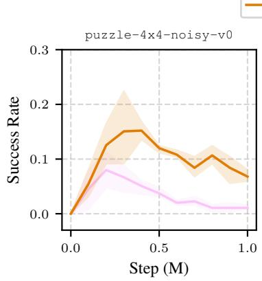

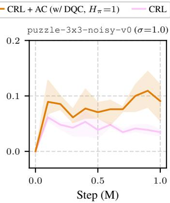

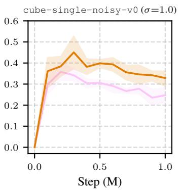  
Figure 5: The representational benefit survives distillation to a single-step policy. On three datasets where $\mathrm { C R L } + \mathrm { A C }$ performs well $( \mathtt { p u z z l e - 4 x 4 - n o i s y }$ $\mathtt { p u z z l e - } 3 \mathbf { x } 3 \mathbf { - n } \mathrm { o i s y }$ at $\sigma { = } 1 . 0$ , and ${ \mathsf { c u b e - s i n g l e - n o i s y } }$ at $\sigma { = } 1 . 0 )$ , we distill the CRL + AC with action chunk length $H { = } 5$ critic into a single-action critic $( H _ { \pi } { = } 1 )$ via DQC and extract a conventional single-step policy (orange), then compare against standard CRL (pink). Despite outputting and executing only a single action, the distilled policy outperforms standard CRL throughout training on all three datasets, indicating that action chunking improves the critic’s representation itself rather than acting solely through non-Markovian modeling, or temporally-extended execution/exploration. Shaded regions denote 95% bootstrapped confidence intervals.

We first apply this decoupling to a well-performing chunked critic. In Figure $^ { 5 , }$ on three datasets where CRL + AC performs well we distill the $H { = } 5$ critic into a single-action $( H _ { \pi } { = } 1 , \kappa { = } 0 . 9 5 )$ critic and extract a conventional one-step policy. This policy conditions on and executes a single action, yet outperforms standard CRL throughout training. Since the resulting policy is single-step, the gain cannot be attributed to modeling non-Markovian behavior, unbiased H-step returns for value estimation, or temporally extended execution/exploration; it therefore isolates a representational benefit of action chunking on the CRL critic itself (Subsection 5.2).

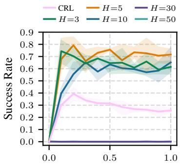  
Step (M)

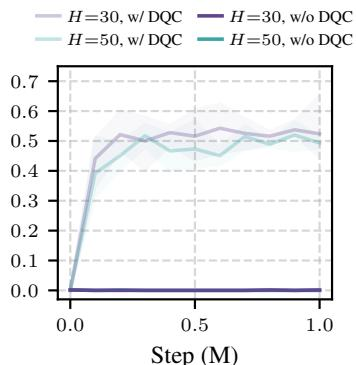

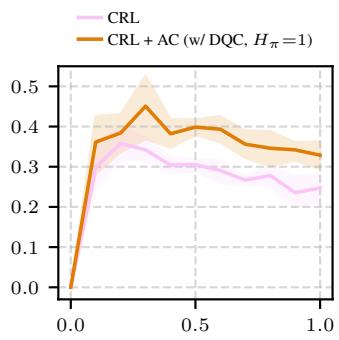  
Step (M)  
Figure 6: Success over training across chunk lengths, and the DQC diagnostic. Learning curves on cub $\mathtt { e - s i n g l e - n o i s y } ( \sigma { = } 1 . 0 )$ , executing a single action with replanning at every step $( H _ { \mathrm { e x e c } } { = } 1 )$ . (Left) Success rate for CRL and CRL + AC across chunk lengths $\bar { H } \in \{ 3 , \bar { 5 } , 1 0 , 3 0 , 5 0 \}$ Moderate chunks improve substantially over CRL, peaking at $H { = } 5$ , while $H { = } 3 0$ and $H { = } 5 0 ~ \mathrm { r e } .$ main at ${ \sim } 0 \%$ throughout training, showing the large-H collapse is present from the start of learning rather than a late-training instability. (Middle) DQC recovers performance at large $H \colon$ the $H { = } 3 0$ and $H { = } 5 0$ critics stay at ${ \sim } 0 \%$ without DQC but reach ${ \sim } 5 0 \%$ when distilled into a short-chunk $( H _ { \pi } { = } 5 )$ critic, showing the collapse is a policy-extraction failure, not a lack of critic information. Shaded regions denote 95% bootstrapped CIs. $( R i g h t )$ Distilling the $H { = } 5$ critic into a single-action $( H _ { \pi } { = } 1 )$ critic and extracting a one-step policy still outperforms standard CRL, despite conditioning on and executing a single action: indicating the representational benefit. The single-step policy does not fully match the chunked policy, however; the remaining gap can be attributed to the lossiness of distillation or to the chunked policy’s ability to model non-Markovian behavior.

The same decoupling serves a second purpose: recovering performance from critics whose chunks are too long to extract from directly. In the middle panel of Figure 6, the undistilled $H { = } 3 0$ and $H { = } 5 0$ critics remain at ${ \sim } 0 \%$ success throughout training, whereas distilling each into a short-chunk $( H _ { \pi } { = } 5 , \kappa { = } 0 . 9 )$ critic and extracting a policy recovers success $\mathrm { t o } \sim 5 0 \%$ in both cases. Since the same critic yields ${ \sim } 0 \%$ when extracted directly but ${ \sim } 5 0 \%$ after distillation, its information was usable all along: the undistilled failure is one of policy extraction, not critic quality.

## E.2 VARYING NOISE ABLATION

We extend the main-body noise ablation (Figure 4, Right) with two additional critic metrics across the noise sweep: validation categorical accuracy and validation contrastive loss (Figure 7). Across both environments and all noise levels, accuracy increases and loss decreases as more actions are included in the critic input: from CRL (V), which uses only the state, to $\mathrm { C R L , t o C R L + A C } \left( H { = } 3 \right)$ and $\mathrm { C R L } + \mathrm { A C } \ ( H { = } 5 )$ , confirming that action chunking adds action information. The state-only critic CRL (V) is already accurate (∼57% on cube), so the action contributes only a few points; but since the policy selects actions by maximizing the critic at a fixed state, these few points are the ones that matter for performance, which is why a small accuracy gain produces a large gain in success rate. Finally, the effect of noise is environment-dependent: on cube it sharply degrades discrimination, giving $\mathrm { C R L + A C }$ more room to improve, whereas on puzzle the metrics stay nearly flat: the state remains informative regardless of action noise — yet chunking still improves performance.

The state-only critic CRL (V) replaces the state–action encoder $\phi ( s , a )$ with a state-only encoder $\phi ( s )$ in the contrastive objective, discarding the action:

$$
\begin{array} { r l } & { \mathcal L ( \phi , \psi ) = \mathbb E _ { \stackrel { ( s , a ) \sim \mu _ { 0 } } { g ^ { + } \sim p ^ { \pi } ( g \mid s , a ) } } \Big [ \log \sigma \big ( \phi ( s ) ^ { \top } \psi ( g ^ { + } ) \big ) + \log \big ( 1 - \sigma \big ( \phi ( s ) ^ { \top } \psi ( g ^ { - } ) \big ) \big ) \Big ] . } \\ & { \quad \quad \quad \quad g _ { g ^ { - } \sim p ^ { \pi } ( g ) } ^ { + } } \\ & { \quad \quad \quad \quad g _ { g ^ { - } \sim p ^ { \pi } ( g ) } ^ { - } } \end{array}\tag{9}
$$

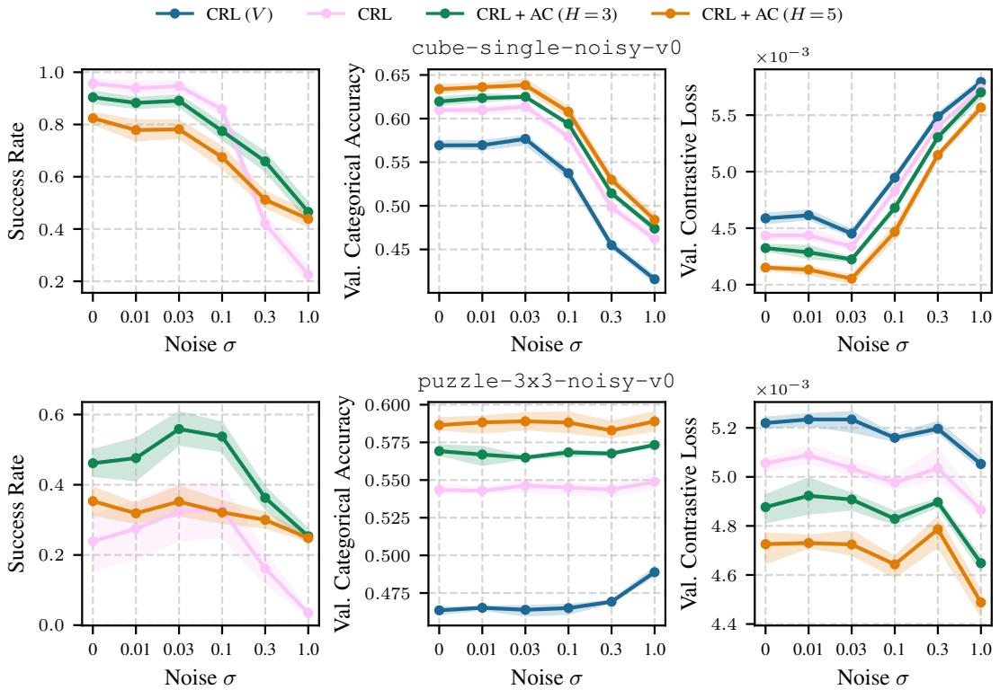  
Figure 7: Action chunking improves critic discrimination across noise levels. Varying expert-action noise σ during offline data collection on $\mathtt { c u b e - s i n g l e - n o i s y - v 0 }$ (top) and puzzl $\mathtt { \_ { e - 3 x 3 - n o i s y - v 0 } }$ (bottom). Columns: task success, validation categorical accuracy, validation contrastive loss. Across both environments and all noise levels, accuracy increases and loss decreases from CRL (V) to CRL to CRL + AC (H=3) to $\mathrm { C R L } + \mathrm { A C } \left( H { = } 5 \right)$ , i.e. as more actions are included: reflecting more action information. CRL (V), which uses only the state, is already accurate, so the action adds only a few points, but they are the ones that matter for performance. Noise degrades discrimination sharply on cube but barely on puzzle, where the state stays informative. Shaded regions denote 95% bootstrapped CIs.

## E.3 NETWORK DEPTH ABLATION

For the network depth ablation, we adopt the network architecture design of Wang et al. (2026), using layer normalization after every dense layer and introducing skip connections every 4 layers. We additionally increase the batch size to 512 and the training budget to 100,000,000 environment steps on Ant Hardest Maze and 400,000,000 environment steps on Humanoid. As in the main paper (Figure 4, Middle), $\mathrm { C R L + A C }$ uses action chunk length H=3.

Figure 8 extends the network depth ablation from the main paper by adding results on Ant Hardest Maze alongside Humanoid, sweeping network depth over {2, 4, 8, 16}. CRL + AC outperforms or matches standard CRL at every depth on both tasks. On Humanoid the advantage of $\mathrm { C R L } + \mathrm { A C }$ persists as network depth increases. On Ant Hardest Maze the advantage is roughly constant across depths but yields a large compute saving: a 2-layer CRL + AC network is comparable to the 8× deeper CRL network (16 layers). In both cases the benefit of action chunking compounds with network depth rather than being substituted by it. Full results, including additional chunk lengths and learning curves per-depth, are provided in Appendix F.7.

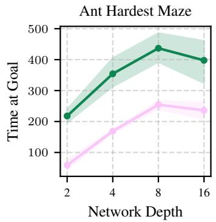

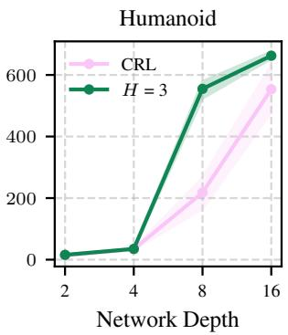  
Figure 8: Performance across network depths. We evaluate the effect of network depth scaling on two challenging JaxGCRL tasks, Ant Hardest Maze and Humanoid, for CRL and $\mathrm { C R L } + \mathrm { A C }$ with action chunk length $H = 3$ $\mathrm { C R L + A C }$ matches or exceeds CRL at every depth. On 2-layer network $\mathrm { C R L } + \mathrm { A C }$ is comparable to the 8× deeper network (16 layers) CRL, indicating better compute-efficiency. Shaded regions denote 95% bootstrapped CIs.

## E.4 REPLANNING INTERVAL ABLATION

The replanning interval $H _ { \mathrm { e x e c } }$ denotes the number of actions executed before requerying the policy. We ablate this parameter in both the offline and online settings, comparing the execution of the whole action chunk $( H _ { \mathrm { e x e c } } { = } H )$ with replanning after every action $( H _ { \mathrm { e x e c } } { = } 1 )$ . In the online setting, the replanning interval is shortened only during evaluation, and during experience collection, it remains equal to the action chunk length.

Figure 9 shows that reducing the replanning interval has no significant effect on the aggregated success rate in the offline setting, although the impact varies across environments (per-environment learning curves are provided in Appendix F.2). In contrast, replanning after every action in the online setting substantially degrades performance, reducing it to well below that of standard CRL (learning curves are included in Appendix F.6).

Simultaneously leveraging the improved contrastive critics learned with action chunks while recovering the policy reactivity of closed-loop execution remains an open problem in the online setting. The cause of the stark contrast between the offline and online settings is also unclear. It may arise from several differences between these regimes, including their training protocols and evaluation environments. As test-time execution is orthogonal to our main contribution, namely the representational benefit of action chunking on the contrastive critic, we leave these questions to future work.

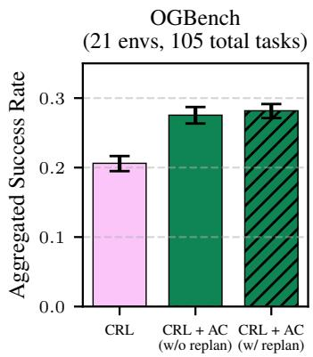

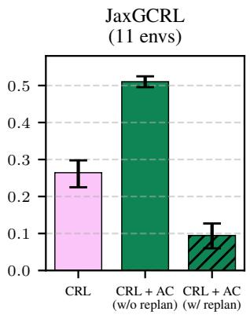  
Figure 9: Effect of replanning on action chunked CRL. We compare the aggregated success rate of $\mathrm { \bar { C R L } } + \mathrm { A C }$ with replanning $( H _ { \mathrm { e x e c } } { = } 1 )$ against $\mathrm { C R L } + \mathrm { A C }$ without replanning $( H _ { \mathrm { e x e c } } { = } H )$ and standard CRL across 2 benchmarks, reporting 95% bootstrapped confidence intervals. The action chunk length H is set to 3 for both CRL + AC variants. Overall, replanning does not significantly affect performance on the offline OGBench benchmark, but it is detrimental to performance on the online JaxGCRL benchmark.

## E.5 DISCOUNT GAMMA ABLATION

We ablate the discount factor $\gamma$ for both CRL and ${ \mathrm { C R L } } + { \mathrm { A C } } ,$ comparing $\gamma = 0 . 9 5$ against the standard $\gamma = 0 . 9 9$ . Results in Figure 10 show that $\gamma = 0 . 9 5$ performs better across all evaluated tasks, and we therefore adopt it as the default in all experiments.

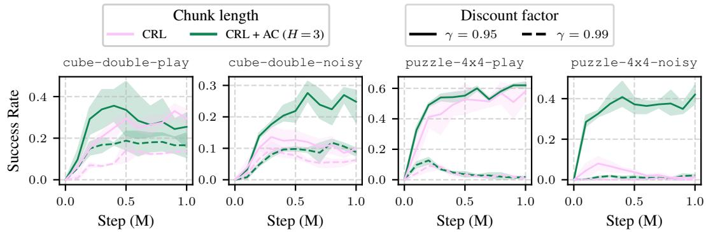  
Figure 10: Effect of discount factor $\gamma$ on CRL and $\mathbf { C R L } + \mathbf { A C } .$ We compare $\gamma \ : = \ : 0 . 9 5$ and $\gamma = 0 . 9 9$ for both CRL $( H = 1 )$ and $\mathrm { C R L } + \mathrm { A C } \left( H = 3 \right)$ across four representative OGBench tasks spanning two task types (Cube, Puzzle) and two dataset types $( \mathrm { p l a y }$ , noisy). For each $\gamma ,$ the best-performing FQL $\alpha \in \{ 1 , 3 , 1 0 \}$ is selected per environment and method. $\gamma = 0 . 9 5$ consistently outperforms $\gamma = 0 . 9 9$ for both methods across all settings, motivating our choice of $\gamma = 0 . 9 5$ throughout all experiments.

## E.6 ACTION CHUNKING IN OTHER SELF-SUPERVISED RL METHODS

This paper studies the mechanisms through which action chunking improves CRL. CRL, however, is only one instance of self-supervised reinforcement learning, a broad family of methods that learn representations and behaviors from unlabeled interaction data (see Appendix A for a discussion of related work in this area). Action chunking may benefit these other methods as well, possibly through mechanisms that differ from the one we identify in CRL and that remain to be understood.

To encourage research in this direction, we report preliminary results of incorporating action chunking into two additional self-supervised methods, TD-JEPA (Bagatella et al., 2025) and Forward-Backward (Touati & Ollivier, 2021). We find that action chunking improves both methods (Figure 11), raising success rate by ∼30% on TD-JEPA and ∼50% on Forward-Backward. We do not isolate the source of these gains here — unlike CRL, these methods are temporal-difference-based, so the multi-step-return explanation for action chunking applies and is entangled with any representational effect. Whether the representational mechanism we identify in CRL also drives the gains here is an open question, and a promising direction for future work.

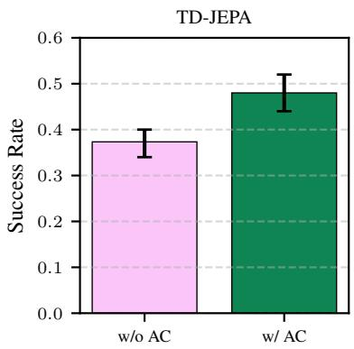

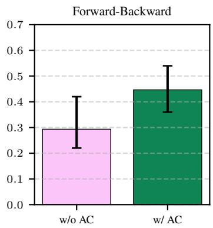  
Figure 11: Action chunking improves other self-supervised RL methods. We report success rate with and without action chunking (action chunk length H=3, executed open-loop) for TD-JEPA and Forward-Backward on $\mathtt { c u b e - s i n g l e - p l a y - v 0 }$ . Action chunking raises success rate by ∼30% on TD-JEPA and ∼50% on Forward-Backward. These preliminary results suggest the benefit of action chunking extends beyond CRL, though we do not isolate the source of improvement in these temporal-difference-based methods. Error bars show 95% bootstrapped confidence intervals.

## F LEARNING CURVES

## F.1 OGBENCH BEST FQL

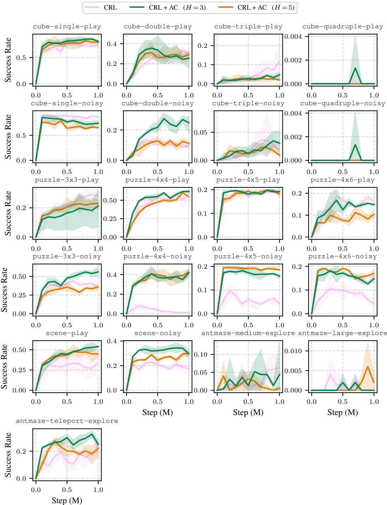  
Figure 12: Offline OGBench learning curves across all environments. We present success rate learning curves for CRL and $\mathrm { C R L + A \bar { C } }$ with $H \in \{ 1 , 3 , 5 \}$ across 21 OGBench environments, with 95% bootstrapped confidence intervals computed via RLiable. For each method and chunk length, the best-performing FQL α is selected per environment. $\mathrm { C R L + A C }$ consistently outperforms CRL across environments, with an average improvement of 32%.

## F.2 OGBENCH BEST FQL (REPLANNING)

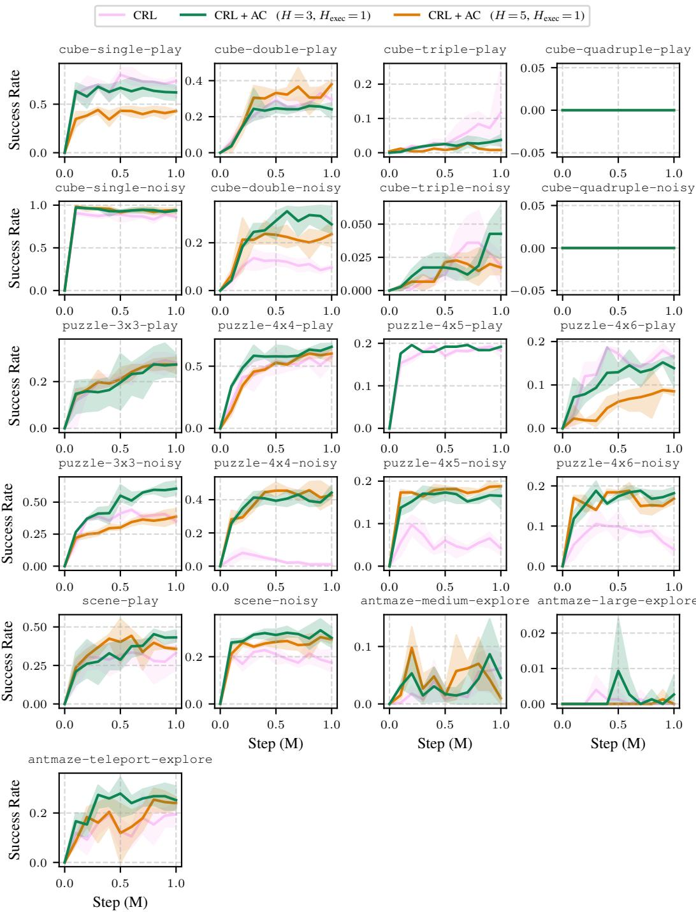  
Figure 13: Offline OGBench (Replanning) learning curves across all environments. We present success rate learning curves for CRL and $\mathrm { C R L } + \mathrm { A C }$ with $H \in \{ 1 , 3 , 5 \}$ and replanning interval $H _ { \mathrm { e x e c } } = 1$ across 21 OGBench environments, with 95% bootstrapped confidence intervals computed via RLiable. For each method and chunk length, the best-performing FQL α is selected per environment. CRL + AC with replanning outperforms CRL across many environments, with an average improvement of ∼30% — comparable to $\mathrm { C R L + A C }$ performance without replanning.

## F.3 OGBENCH ALL

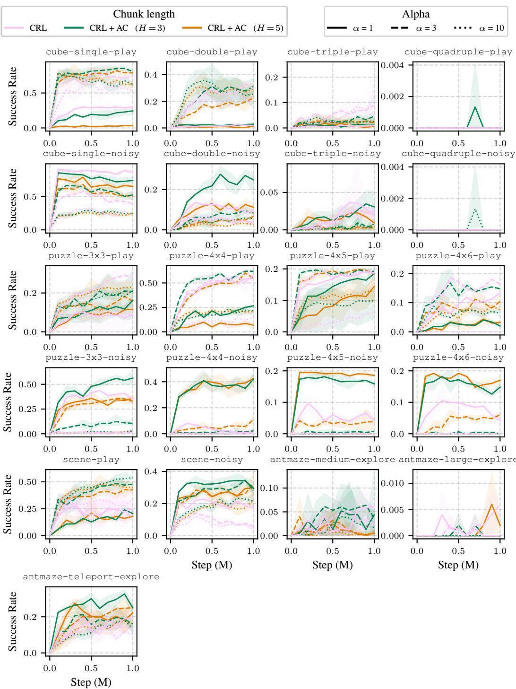  
Figure 14: Offline OGBench learning curves across all FQL α values. We present success rate learning curves for CRL and $\mathrm { C R L + A C }$ with $H \in \{ 1 , 3 , 5 \}$ across 21 OGBench environments for all evaluated FQL regularization strengths $\alpha \in \{ 1 , 3 , \mathrm { i } 0 \}$ , with 95% bootstrapped confidence intervals computed via RLiable. In the main experiments we select the best-performing α per environment and method.

## F.4 OGBENCH VARYING NOISE

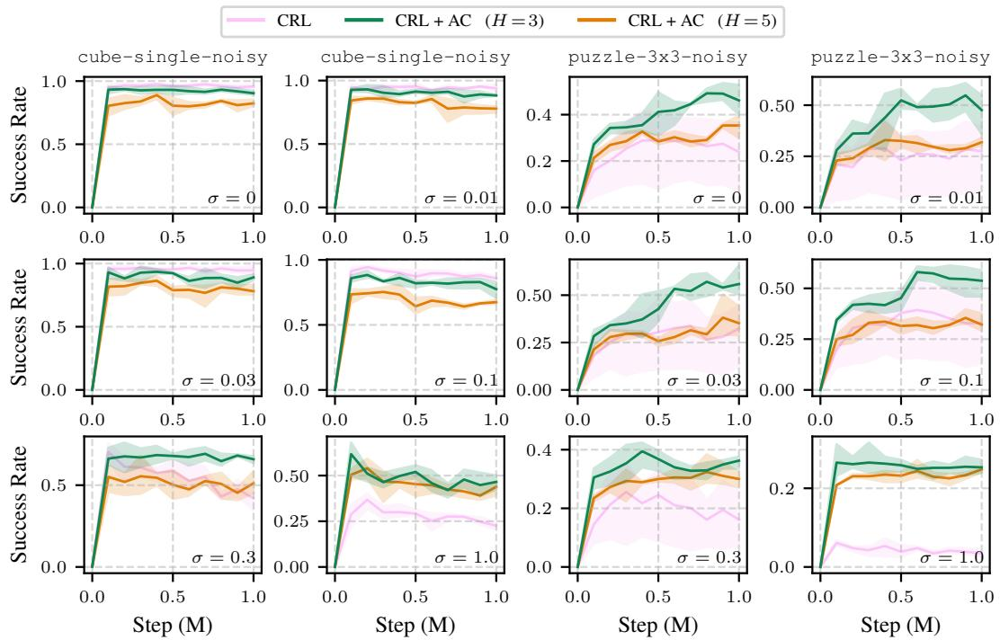  
Figure 15: Full learning curves for the varying noise experiment. We present the complete learning curves corresponding to the experiment described in Figure 7, showing success rate over training steps for CRL and $\mathrm { C R L + A C }$ with $H \in \{ 3 , 5 \}$ across all noise levels $\sigma .$ The performance gap between $\mathrm { C R L } + \mathrm { A C }$ and CRL grows consistently with noise level, confirming that action chunking becomes increasingly beneficial as data quality degrades.

## F.5 JAXGCRL

## F.5.1 SUCCESS RATE

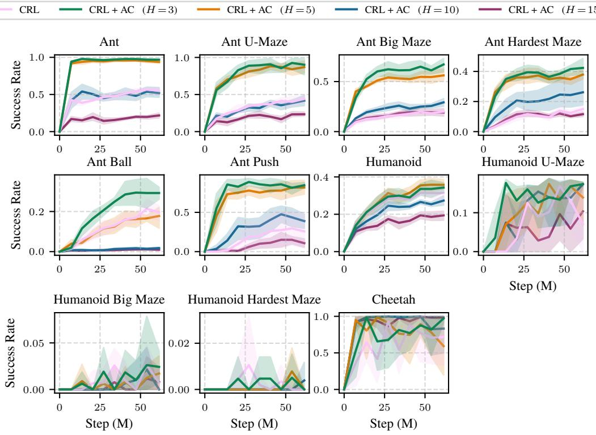  
Figure 16: Online JaxGCRL learning curves — success rate. We present success rate learning curves for CRL and $\mathrm { C R L + A C }$ with $\bar { H } \in \{ 3 , 5 , 1 0 , 1 5 \}$ across 11 JaxGCRL locomotion and navigation environments, with 95% bootstrapped confidence intervals. $\mathrm { C R L } + \mathrm { A C }$ with $H = 3$ is the best-performing variant overall, achieving approximately 90% improvement over standard CRL on average.

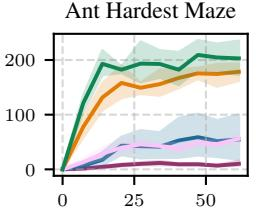

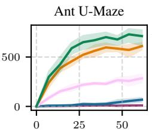

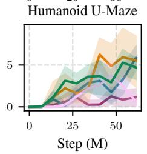

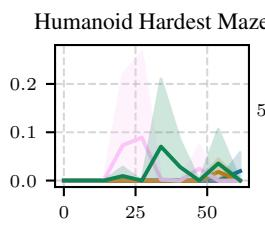

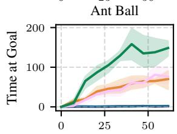

## F.5.2 TIME AT GOAL

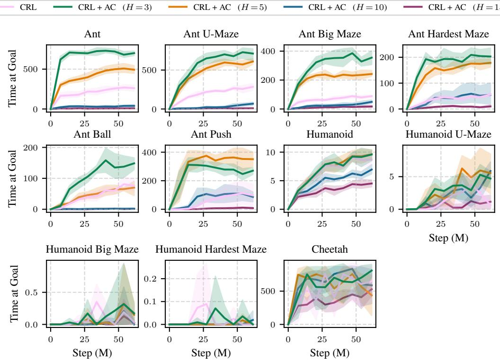  
Figure 17: Online JaxGCRL learning curves — time at goal. We present time at goal learning curves for CRL and CRL + AC with $\bar { H ^ { } } \in \{ 3 , 5 , 1 0 , 1 5 \}$ across 11 JaxGCRL locomotion and navigation environments, with 95% bootstrapped confidence intervals. Time at goal measures how long the agent spends at the goal state, rewarding both task success and behavioral stability (Bortkiewicz et al., 2025). $\mathrm { C R L + A C }$ with $H = 3$ is the best-performing variant, achieving +111.2% improvement over standard CRL on average.

## F.6 JAXGCRL (REPLANNING)

## F.6.1 SUCCESS RATE

$$
{ \begin{array} { r l r l } & { = { \mathrm { C R L } } } \\ & { = { \mathrm { C R L } } + \operatorname { A C } ( H = 3 , ~ H _ { \operatorname { e x c } } = 1 ) } & { = { \begin{array} { l } { - \operatorname { C R L } + \operatorname { A C } ( H = 5 , ~ H _ { \operatorname { e x c } } = 1 ) } \\ { - \operatorname { C R L } + \operatorname { A C } ( H = 1 0 , ~ H _ { \operatorname { e x c } } = 1 ) } \end{array} } } & { = { \mathrm { C R L } } + \operatorname { A C } ( H = 1 5 , ~ H _ { \operatorname { e x c } } = 1 ) } \end{array} }
$$

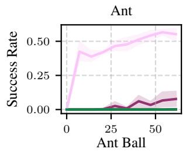

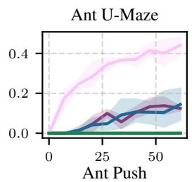

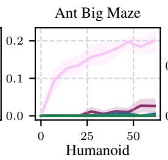

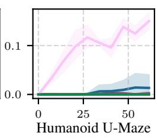

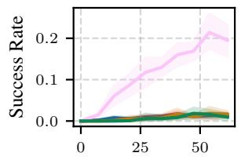

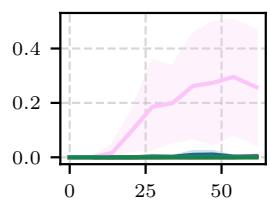

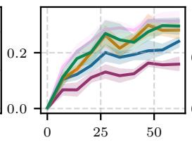

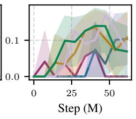

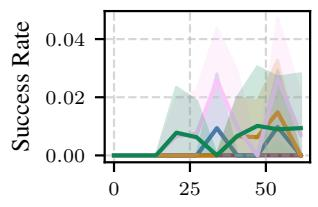

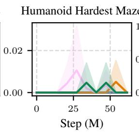

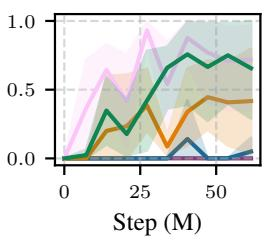  
Figure 18: Online JaxGCRL (Replanning) learning curves — success rate. We present success rate learning curves for CRL and CRL + AC with $H \in \{ 3 , 5 , 1 0 , 1 5 \}$ and replanning interval $H _ { \mathrm { e x e c } } { = } 1$ across 11 JaxGCRL locomotion and navigation environments, with 95% bootstrapped confidence intervals. On these online tasks, single-step replanning $( H _ { \mathrm { e x e c } } { = } 1 )$ underperforms open-loop chunk execution (Appendix E.4), in contrast to the offline setting; we leave a full explanation of this offline-online difference to future work.

## F.6.2 TIME AT GOAL

$$
{ \begin{array} { r l r l } & { = { \mathrm { C R L } } } \\ & { = { \mathrm { C R L } } + \operatorname { A C } ( H = 3 , ~ H _ { \operatorname { e x c } } = 1 ) } & { = { \begin{array} { l } { - \operatorname { C R L } + \operatorname { A C } ( H = 5 , ~ H _ { \operatorname { e x c } } = 1 ) } \\ { - \operatorname { C R L } + \operatorname { A C } ( H = 1 0 , ~ H _ { \operatorname { e x c } } = 1 ) } \end{array} } } & { = { \mathrm { C R L } } + \operatorname { A C } ( H = 1 5 , ~ H _ { \operatorname { e x c } } = 1 ) } \end{array} }
$$

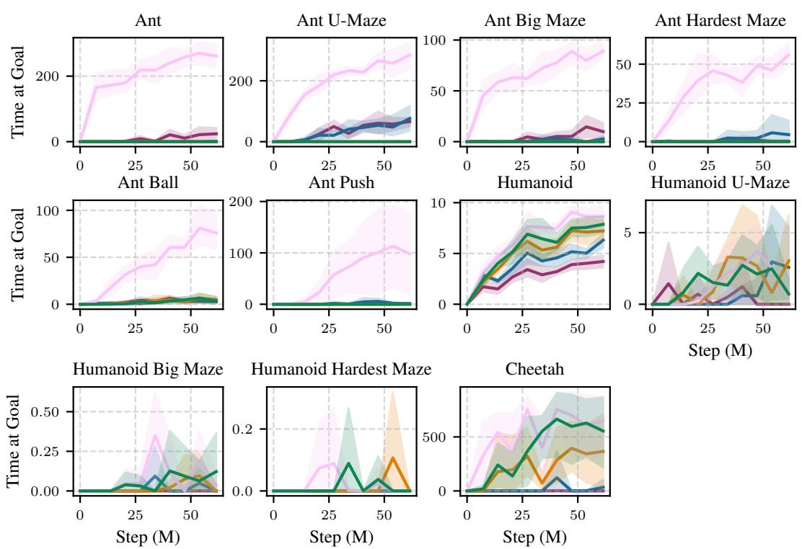  
Figure 19: Online JaxGCRL (Replanning) learning curves — time at goal. We present time at goal learning curves for CRL and $\mathrm { C R L } + \mathrm { A C }$ with $H \in \{ 3 , 5 , 1 0 , 1 5 \}$ and replanning interval $H _ { \mathrm { e x e c } } { = } 1$ across 11 JaxGCRL locomotion and navigation environments, with $9 5 \%$ bootstrapped confidence intervals. On these online tasks, single-step replanning $( H _ { \mathrm { e x e c } } { = } 1 )$ underperforms openloop chunk execution (Appendix E.4), in contrast to the offline setting; we leave a full explanation of this offline-online difference to future work.

## F.7 JAXGCRL NETWORK DEPTH SCALING

## F.7.1 SUCCESS RATE

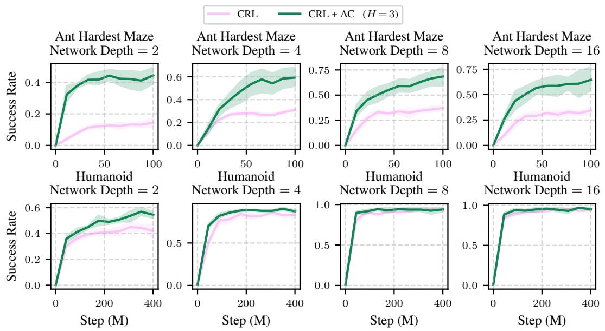  
Figure 20: Full learning curves for the network depth scaling experiment. We present success rate learning curves for CRL and CRL + AC with action chunk length H = 3 across network depths on the Ant Hardest Maze and Humanoid JaxGCRL environments, with 95% bootstrapped confidence intervals.

## F.7.2 TIME AT GOAL

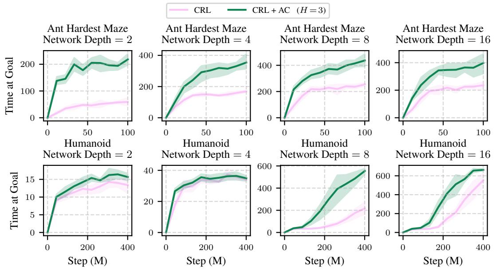  
Figure 21: Full learning curves for the network depth scaling experiment. We present time at goal learning curves for CRL and CRL + AC with action chunk length H = 3 across network depths on the Ant Hardest Maze and Humanoid JaxGCRL environments, with 95% bootstrapped confidence intervals.