# TRACING DISTINGUISHABILITY THROUGH TRANSFORMER PROCESSING WITH STOCHASTIC LAYERNORM

Kieran Murphy New Jersey Institute of Technology kieran.murphy@njit.edu

## ABSTRACT

Representational similarity is foundational to analyses of deep networks, yet distances between point-valued representations are not intrinsically tied to downstream function: nearby states may produce different behaviors, while distant states may behave similarly. We instead give representations volume, turning similarity into statistical distinguishability. Overlapping stochastic representations necessarily induce overlapping downstream distributions, grounding latent comparison in model function and bringing it under information-theoretic tools such as the data-processing inequality. We realize this idea in pretrained transformers through a light-touch modification to LayerNorm: at each residual-stream read, we normalize the state, add isotropic Gaussian noise, and renormalize. During distillation fine-tuning, one learned allocation parameter per residual-stream read distributes a fixed global rate budget across the processing stack. The resulting model can be viewed as transformer blocks reading the residual stream with learned finite precision under a shared global rate budget. Using the Bhattacharyya coefficient, we trace which counterfactual distinctions are preserved through MLP blocks or selectively exposed to the query, key, and value computations of individual attention heads. Experiments on ViT-S and GPT-2 small reveal the depthwise propagation of continuous visual perturbations and head-specific sensitivity to token distinctions aligned with known attention motifs. These results establish distinguishability as a functionally grounded lens on transformer computation that complements existing interpretability approaches.

## 1 INTRODUCTION

Deep networks are ordinarily trained on point-valued representations: each example constrains the computation at a measure-zero set of internal states, while behavior in the surrounding representational volume is left implicit. Many interpretability methods impose geometric notions of similarity on point-valued representations – for example, through pairwise similarity measures (Kornblith et al., 2019) or the reconstruction distortion used to fit sparse surrogate models (Huben et al., 2024; Bricken et al., 2023) – even though this geometry is not directly grounded by the model’s functional objective. The disconnect between geometry and functionality when assessing point-based representations has been increasingly recognized in recent years (Ding et al., 2021; Cui et al., 2022; Davari et al., 2023).

When point-valued representations are replaced by stochastic ones, they acquire volume: behavior over neighborhoods of internal states becomes part of the training objective, coupling representational geometry to model functionality. The resulting stochastic representations define explicit channels through which quantities such as information transmission and pairwise distinguishabil ity can be measured. Without a constraint on representation scale, however, a model can trivially overcome stochasticity by increasing the separation of its representations, recovering an effectively deterministic channel. Prior approaches therefore impose explicit capacity constraints, often through learned encoder-decoder bottlenecks (Kingma & Welling, 2014; Alemi et al., 2017; Murphy, 2026). Doing so at many internal locations requires substantial architectural modification.

b  
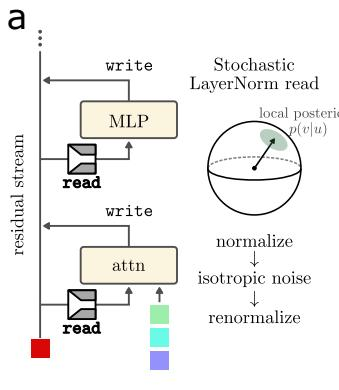

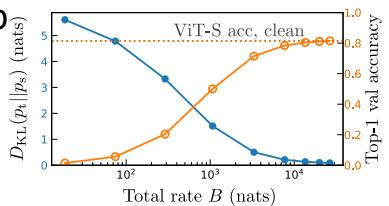

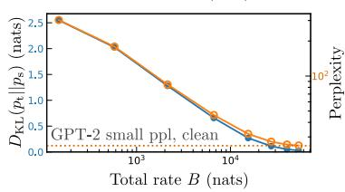

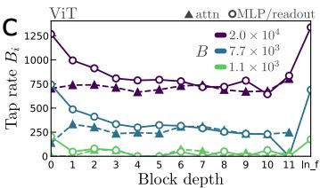

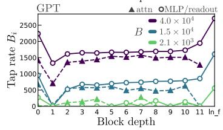  
Figure 1: Injecting stochasticity into residual stream reads. (a) We add noise to every location in the network where the residual stream is read. The noise is injected inside the LayerNorm operation, which maps representations to the surface of a hypersphere. (b) For fine-tuned ViT-S (top) and GPT-2 small (bottom), the imposed read rate B sets the distillation loss relative to the base (deterministic) model, $D _ { \mathrm { K I } }$ (teacher||student), as well as the modality-specific validation performance. (c) Per-tap rates provide a macroscopic view of prioritized information protection. For each attention block and MLP block, and for the final read before the unembed operation, a single σ is learned during optimization while fine-tuning all model weights.

Here, we propose a light-touch modification to transformer architectures that exploits the intrinsic scale constraint imposed by LayerNorm (Ba et al., 2016). Additive noise is applied to every Layer-Norm in a transformer, before the learned affine scale and shift, with one optimized magnitude per location such that only ∼ 2L additional scalar parameters are introduced. In pre-norm transformers, each modification can be interpreted as a noisy read of the residual stream (Elhage et al., 2021): every attention and MLP block pays for measurement precision when accessing the representation carried by the residual stream.

Prior bottleneck approaches interpret useful computation upward from a low-information limit (Murphy, 2026). Here, we begin from a pretrained deterministic solution and move toward lower-fidelity internal channels, jointly adapting the model so that stochastic neighborhoods become part of the learned computation. Because the model weights are optimized jointly with the stochastic channels, the resulting neighborhoods are not merely tolerated by the pretrained computation; they are incorporated into the computation itself.

In experiments on ViT-S and GPT2-small, we use the fine-tuned models as approximations to the pre-trained base that allow information-theoretic tools to be applied natively. In the vision modality, we measure the models’ ability to resolve different types of image augmentation, of varying magnitudes, across depths and bitrates. In natural language, we design minimal perturbations and measure the propagation of distinguishability in subsequent residual streams. We measure the degree of perturbation distinguishability accessed by each attention head’s query, key, and value projections. Interestingly, the heads with the most sensitive key projections include several with high induction scores, as well as heads whose selectivity is weak or absent in canonical attention-pattern statistics. Monitoring perturbation distinguishability at every residual stream read thus grants a foothold into information processing by transformers that is grounded in downstream functionality, complementing existing methodology founded upon the geometry of point-based representations in ambient space.

## 2 METHOD

A transformer processes input elements $x _ { i }$ through distinct residual streams, whose representations $u _ { i } ^ { l }$ are updated by successive attention and multilayer perceptron (MLP) sublayers. Attention transmits information between streams, whereas the MLP transforms each stream independently. In a pre-norm transformer, every sublayer begins by reading its residual stream through LayerNorm. We introduce stochasticity at these reads.

LayerNorm acts as $\mathrm { L N } ( u ) = \gamma \odot n _ { \epsilon } ( u ) + \beta$ , where $n _ { \epsilon } ( u ) = ( u - \langle u \rangle ) / \sqrt { \mathrm { V a r } ( u ) + \epsilon }$ and $\gamma$ and $\beta$ are learned affine parameters (Ba et al., 2016). Because ϵ serves only as a numerical safeguard, we set it to zero in the geometric analysis. The normalized state then has component mean zero and component variance one, implying a Euclidean norm of ${ \sqrt { d } } .$ LayerNorm therefore maps representations to the (d − 2)-sphere $\mathcal { M } _ { d } = z \in \mathbb { R } ^ { d } : \langle z \rangle = 0 , \| z \| _ { 2 } = \sqrt { d } .$

We describe the modification at a single tap, suppressing stream and tap indices except on the tapdependent noise scale $\sigma _ { t }$ . We normalize the residual-stream state, add isotropic Gaussian noise, and renormalize:

$$
\begin{array} { r } { z = n _ { \epsilon } ( u ) , \qquad v = n _ { \epsilon } ( z + \eta ) , \qquad \eta \sim \mathcal { N } ( 0 , \sigma _ { t } ^ { 2 } I ) . } \end{array}
$$

The usual LayerNorm affine transformation is then applied to v before it is passed to the attention or MLP sublayer. The construction is applied identically at every residual read, with independent noise draws and a separate noise scale for each tap.

For a particular input and realization of all upstream noise, u and z are individual points. Let U denote the raw residual-stream state when viewed as a random variable over inputs and upstream noise, let $Z = n _ { \epsilon } ( U )$ be its normalized form, and let $V$ be the output of the local stochastic channel. By the data-processing inequality, no subsequent computation using this read can contain more information about $U _ { \textrm { \scriptsize : } }$ through this read, than is available in V. We quantify this fundamental local limitation using Shannon mutual information, $I ( U ; V )$ (Cover & Thomas, 1991). Because Z is a deterministic function of $U$ and the channel depends on $U$ only through $Z , I ( U ; V ) = I ( Z ; V )$

The maximum-entropy distribution on ${ \mathcal { M } } _ { d } ,$ relative to its natural surface measure, is the uniform distribution. Letting $A _ { d }$ denote the surface area of $\mathcal { M } _ { d } ,$ its entropy is log $A _ { d } .$ The transmitted information can therefore be upper-bounded as

$$
I ( U ; V ) = h ( V ) - h ( V \mid U ) \leq \log A _ { d } - h ( V \mid U ) \equiv R _ { d } ( \sigma _ { t } ) .
$$

Rotational symmetry makes the conditional entropy, and hence the rate bound $R _ { d } ( \sigma _ { t } )$ , a function only of the noise scale and representation dimension. The gap in the bound is

$$
R _ { d } ( \sigma _ { t } ) - I ( U ; V ) = D _ { \mathrm { K L } } \left( p _ { V } \parallel \mathrm { U n i f } ( \mathcal { M } _ { d } ) \right) ,
$$

where $p _ { V }$ is the marginal distribution of noisy reads induced by the distribution of U and the local noise. Thus, the bound is tight when the measured states are marginally uniform over the LayerNorm sphere.

A global hyperparameter B fixes the total rate bound across all taps. Per-tap rates are learned subject to this fixed total, with allocation logits $a _ { t }$ defining $B _ { t } = B$ softmax $\mathbf { \rho } _ { : ( a ) _ { t } }$ . For a given representation dimension, we precompute the monotonic relationship between $\sigma$ and $R _ { d } ( \sigma )$ and use this lookup table to convert each allocated rate into its corresponding noise scale. Exact zero rate is reached only in the limit $\sigma  \infty ;$ the finite truncation of the lookup table and its corresponding minimum realizable rate are detailed in Appendix A.

We install these stochastic reads in a pretrained model and fine-tune the resulting student by distillation from the original deterministic model. Specifically, we minimize

$$
\mathcal { L } _ { \mathrm { d i s t i l l } } = \mathbb { E } _ { \boldsymbol { x } } \left[ D _ { \mathrm { K L } } \left( p _ { \mathrm { t e a c h e r } } ( \cdot  { | } \ \boldsymbol { x } )  { \| } p _ { \mathrm { s t u d e n t } } ( \cdot  { | } \ \boldsymbol { x } ) \right) \right] .
$$

Unlike information-restriction methods that impose a soft rate penalty (Tishby et al., 2000; Murphy, 2026), our objective contains no rate-loss term. The total rate upper bound is instead enforced directly through the fixed allocation constraint and the calibrated conversion from rates to noise scales.

The modification can be applied to any transformer using LayerNorm. In pre-norm architectures it naturally describes rate-limited reads from the residual stream; when applied after a sublayer in a post-norm architecture, it instead describes rate-limited writes to the residual stream.

## 2.1 TRACING DISTINGUISHABILITY

After optimization, the raw residual-stream state remains point-valued, but it affects the downstream sublayer only through a rate-limited stochastic read. The functionally relevant object at a tap is therefore not the point alone, but the conditional distribution of states that the tap can observe. We refer to this distribution as the tap’s local posterior.

The implemented channel—isotropic Gaussian perturbation followed by renormalization—induces a projected-normal distribution on the LayerNorm sphere. For tractable evaluation, we approximate this distribution with a von Mises–Fisher (vMF) distribution (Davidson et al., 2018). We rescale the LayerNorm sphere to unit radius for this approximation and omit the rescaling from the notation below. Its effective ambient dimension is $p = d - 1$ , since mean-centering removes one degree of freedom. For a normalized residual state with mean direction $\mu ( u )$ , the local posterior is approximated as

$$
p ( v \mid u ) \approx C _ { p } ( \kappa ) \exp { \bigl ( } \kappa \mu ( u ) ^ { \top } v { \bigr ) } ,
$$

where $C _ { p } ( \kappa )$ is the vMF normalizing constant and κ controls concentration (Mardia & Jupp, 2009). The correspondence between the Gaussian noise scale σ and vMF concentration κ is calibrated numerically for the relevant dimension and stored in a lookup table. We evaluate the quality of this approximation in Appendix B.

Given two raw residual-stream states $u _ { i }$ and $u _ { j }$ at the same tap, we quantify the overlap between their local posteriors using the Bhattacharyya coefficient (Bhattacharyya, 1943)

$$
\operatorname { B C } ( p _ { i } , p _ { j } ) = \int _ { S ^ { p - 1 } } { \sqrt { p ( v \mid u _ { i } ) p ( v \mid u _ { j } ) } } d v .
$$

The coefficient ranges from zero for disjoint distributions to one for identical distributions; thus, lower BC indicates greater distinguishability. For vMF distributions with a common concentration $\kappa ,$ integrating the geometric mean of their densities yields the closed form

$$
\mathrm { B C } ( p _ { i } , p _ { j } ) = \frac { C _ { p } ( \kappa ) } { C _ { p } \bigg ( \kappa \sqrt { \frac { 1 + \mu _ { i } ^ { \top } \mu _ { j } } { 2 } } \bigg ) } ,
$$

where $\mu _ { i } = \mu ( u _ { i } )$ and $\mu _ { j } = \mu ( u _ { j } )$

Processing cannot increase distinguishability. In particular, the squared Hellinger distance, $H ^ { 2 } ( P , Q ) \stackrel { - } { = } 1 - \mathrm { B C } ( P , Q )$ , is an f-divergence and satisfies the data-processing inequality (Ali & Silvey, 1966; Csiszar, 1967). Equivalently, applying a deterministic function or stochastic chan-´ nel can only increase BC. For an MLP sublayer, which transforms each stream independently, the BC between two output distributions must therefore be at least as large as the BC between their reads. An attention sublayer instead operates jointly on multiple streams: its output distinguishability is bounded by that of the joint distribution of all visible reads, but not necessarily by the marginal distinguishability of any single read.

## 2.1.1 Q, K, V DISTINGUISHABILITY

The linear query, key, and value projections allow us to trace which distinctions in a residual-stream read remain available to each attention head. Under the unit-radius convention adopted above, let $V \sim p ( v \mid u )$ denote the local posterior associated with raw residual state u. For a query, key, or value matrix A, the corresponding head component observes $Y _ { A } = A ( { \sqrt { d } } \gamma \odot V + \beta )$ . We denote its induced distribution by $p _ { A } ( y \mid u )$ and define the projected overlap between two residual states as

$$
\mathrm { B C } _ { A } ( u _ { i } , u _ { j } ) = \mathrm { B C } \left( p _ { A } ( \cdot \mid u _ { i } ) , p _ { A } ( \cdot \mid u _ { j } ) \right) .
$$

Because the projection is generally noninvertible, the data-processing inequality gives $\operatorname { B C } _ { A } ( u _ { i } , u _ { j } ) \geq \operatorname { B C } ( p ( \cdot \mid u _ { i } ) , p ( \cdot \mid u _ { j } ) ) \colon$ : a head component may discard distinctions present in its residual-stream read, but cannot create new ones.

To evaluate $\operatorname { B C } _ { A }$ , we express V in orthonormal coordinates $X \in S ^ { p - 1 }$ for the mean-zero LayerNorm subspace and let $B _ { A }$ denote the resulting linear map, including the LayerNorm scale $\gamma .$ The polar decomposition $B _ { A } = S _ { A } P _ { A }$ separates an invertible output transformation $S _ { A }$ from a row-orthonormal projection $P _ { A }$ . Since BC is invariant under $S _ { A }$ and the common output shift, it is sufficient to consider $W _ { A } = P _ { A } X$ , whose support is the unit ball. Its pushforward density $g _ { i } ^ { A } ( w )$ is available in closed form, as derived in Appendix C. We evaluate the remaining integral by sampling from $\begin{array} { r } { r _ { A } ( w ) = \frac 1 2 [ g _ { i } ^ { A } ( w ) + g _ { j } ^ { A } ( w ) ] } \end{array}$

$$
\widehat { \mathrm { B C } } _ { A } ( u _ { i } , u _ { j } ) = \frac { 1 } { N } \sum _ { n = 1 } ^ { N } \frac { 2 \sqrt { g _ { i } ^ { A } ( w _ { n } ) g _ { j } ^ { A } ( w _ { n } ) } } { g _ { i } ^ { A } ( w _ { n } ) + g _ { j } ^ { A } ( w _ { n } ) } , \qquad w _ { n } \sim r _ { A } .
$$

Each summand lies in [0, 1], providing a bounded Monte Carlo estimator of the overlap retained by the query, key, or value projection.

## 2.1.2 COMMON RANDOM NUMBERS

At a given target tap, upstream stochasticity makes the effective posterior a mixture of local posteriors. Let $\epsilon _ { 1 : L }$ denote the Gaussian noise draws at the L upstream taps, and let $p ( v \mid x , \epsilon _ { 1 : L } )$ denote the local posterior conditioned on a complete upstream noise sequence. The effective posterior for input x is

$$
\bar { p } ( v \mid x ) = \mathbb { E } _ { \epsilon _ { 1 : L } } \left[ p ( v \mid x , \epsilon _ { 1 : L } ) \right] .
$$

When comparing two inputs, we couple their evaluations using common random numbers (CRN), a standard variance-reduction technique for paired stochastic simulations (Glasserman & Yao, 1992). Specifically, we apply the same sequence of Gaussian noise vectors to both inputs, so that variation between the resulting trajectories is driven primarily by the input difference rather than unrelated noise draws. We average the resulting BC over multiple independently sampled CRN sequences. By the joint concavity of the Bhattacharyya coefficient,

$$
\begin{array} { r } { \mathrm { B C } \left( \bar { p } ( \cdot \mid x _ { 1 } ) , \bar { p } ( \cdot \mid x _ { 2 } ) \right) \geq \mathbb { E } _ { \epsilon _ { 1 : L } } \left[ \mathrm { B C } \left( p ( \cdot \mid x _ { 1 } , \epsilon _ { 1 : L } ) , p ( \cdot \mid x _ { 2 } , \epsilon _ { 1 : L } ) \right) \right] . } \end{array}
$$

Thus, the fully coupled CRN estimate is a lower bound on the BC between the effective posteriors.   
Joint concavity follows directly by applying the Cauchy–Schwarz inequality to the mixed densities.

One can interpolate between these endpoints by sharing only a prefix of the upstream noise sequence. For $0 \le k \le L$ , define the partially marginalized posterior

$$
p ^ { ( k ) } ( v \mid x , \epsilon _ { 1 : k } ) = \mathbb { E } _ { \epsilon _ { k + 1 : L } } \left[ p ( v \mid x , \epsilon _ { 1 : L } ) \right] ,
$$

and the corresponding overlap

$$
\mathrm { B C } _ { k } = \mathbb { E } _ { \epsilon _ { 1 : k } } \left[ \mathrm { B C } \left( p ^ { ( k ) } ( \cdot \mid x _ { 1 } , \epsilon _ { 1 : k } ) , p ^ { ( k ) } ( \cdot \mid x _ { 2 } , \epsilon _ { 1 : k } ) \right) \right] .
$$

Operationally, the first k noise draws are matched across inputs, while the remaining draws are marginalized separately within each posterior. $\mathrm { A t } \ k = 0$ , no noise is conditioned upon and $\mathrm { { B C } _ { 0 } }$ is the BC between the full effective posteriors. $\mathrm { A t } \ k = L$ , the complete noise sequence is shared and $\mathrm { B C } _ { L }$ is the fully coupled CRN estimate. Repeated application of joint concavity gives

$$
\mathrm { B C } _ { 0 } \geq \mathrm { B C } _ { 1 } \geq \cdots \geq \mathrm { B C } _ { L } .
$$

This sequence traces the transition from effective-posterior overlap to the overlap between locally conditioned posteriors.

## 3 EXPERIMENTS

For both vision and natural language, optimization consisted of fine-tuning a point-based (deterministic) model with solely a distillation loss, $\mathcal { L } = \mathbb { E } _ { x \sim p ( x ) } [ D _ { \mathrm { K L } } ( p _ { \mathrm { t e a c h e r } } ( y | \overline { { x } } ) | | \overline { { p } } _ { \mathrm { s t u d e n t } } ( y | x ) ) ]$ ], with $p ( x )$ corresponding to the training data. The noise level was ramped from $\sigma _ { g } = 0 . 0 5$ (the uniformequivalent per-tap noise level defining the budget) to its target value during the first 6 of 25 epochs, equivalently decreasing the rate budget from its near-deterministic initial value. For vision, we finetuned ViT-S (Dosovitskiy et al., 2021) from timm with vit small patch16 224 weights on ImageNet-1k images (Deng et al., 2009); for language we used Hugging Face’s GPT-2 small (Radford et al., 2019) with $\mathtt { g p t } 2$ weights and the OpenWebText (OWT) dataset (Gokaslan & Cohen, 2019). More specifics can be found in Appx. A.

Both vision and language models exhibited a knee near $B \sim 1 0 ^ { 4 }$ nats of total read-rate: above $\mathbf { i t } ,$ behavior remained close to the base model, whereas below it, distillation loss and validation performance steadily degraded (Fig. 1b). This behaviorally anchored transition motivates viewing the rate sweep as a probe of the base model’s operating resolution. The optimized per-tap allocation provides a macroscopic view of information processing inside the model (Fig. 1c). For both models, the allocation was relatively flat across depth, with exceptions near the beginning and end; attention taps were generally assigned lower resolution than MLP taps in the same layer. Consistently, the final readout was the most protected. As information was restricted further, a subset of taps reached the minimum realizable rate. In GPT-2, both layer 1 reads and the layer 11 attention read reached the rate floor first $( B = 1 . 5 \times 1 0 ^ { 4 } )$ , presumably preserving rate for more functionally important reads.

a  
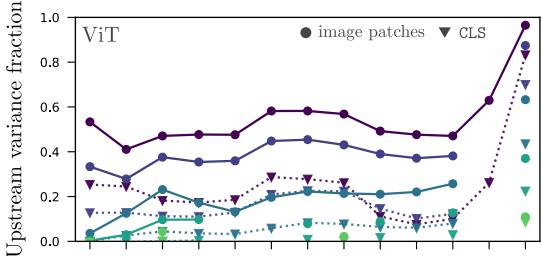

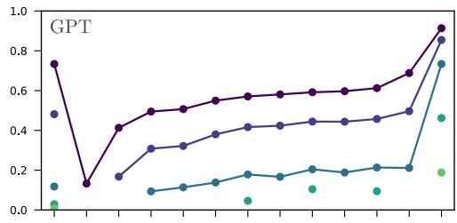

b  
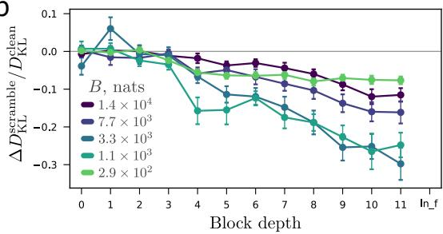

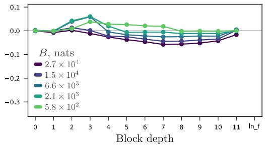  
Figure 2: The nature of the compounded stochasticity. (a) The upstream variance estimated at each MLP tap, relative to the total (upstream and local posterior added variance), for ViT (left) and GPT2 (right) models. For ViT, the CLS stream has different spread than the image patch representations. The markers for collapsed taps in the lower information models are excluded. (b) Change in distillation loss as a result of scrambling joint residual stream structure at layer l. For multiple passes on the same input, the residual stream states are scrambled, breaking any joint structure in the effective posterior across streams. The fractional change in the distillation loss $D _ { \mathrm { K L } }$ shows that scrambling improves the performance of ViT models and has a more muted effect on GPT models.

## 3.1 IS THE INDUCED STOCHASTICITY STRUCTURED?

Noise introduced at each read propagates through subsequent blocks, producing compounding variation along the depth of the model. We first characterized this accumulation by decomposing the variance of repeated draws at each MLP tap into locally introduced and upstream-induced components (Fig. 2a). In the ViT, patch streams accumulated substantially more upstream-induced variance than the CLS stream, whose upstream variation remained smaller than the noise introduced by its own reads. At the final tap, the unusually precise local read causes inherited variation to account for a correspondingly large fraction of the total variance.

We next probed dependencies across residual streams by independently shuffling each position across a batch of repeated draws. This approximately replaces samples from the joint distribution $p ( u _ { 1 } , \dots , u _ { T } \mid \vec { x } )$ with samples from the product of its position-wise marginals, while preserving both each marginal and the full input sequence ⃗x. The resulting representation combines streams from different upstream noise trajectories and is therefore not an alternative available to the model within a single forward pass.

The effect was strongly model- and depth-dependent. In the ViT, shuffling reduced the distillation loss, and increasingly so at later depths. In GPT-2, early shuffling produced small, budget-dependent degradations, whereas later shuffling was mildly beneficial. One possible explanation lies in the interaction between attention structure and data modality. The ViT aggregates many partially redundant noisy measurements, for which removing cross-stream noise dependence can improve aggregation. Causal language modeling instead builds directed, nested dependencies among non-redundant prefix representations, making coherent stochastic trajectories particularly important early in processing.

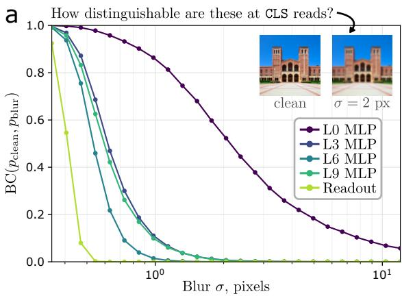

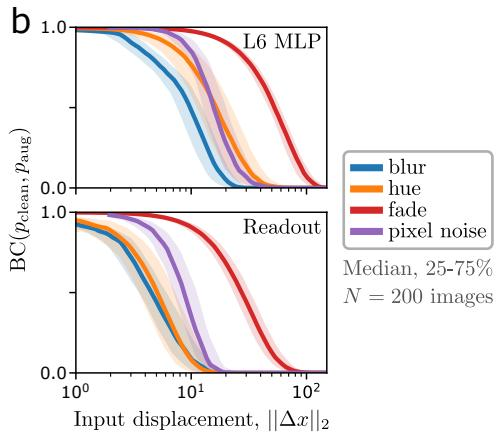  
Figure 3: Distinguishability zone via continuous augmentations (a) For the ViT-S with $B =$ $3 . { \overset { \smile } { 3 } } \times 1 0 ^ { 3 }$ nats total budget, the BC of an image and its blurred version smoothly decreases— indicating increasing distinguishability—with the blur magnitude, and varies significantly across depth. (b) The model is more sensitive to some augmentations than others, shown here over 200 images via median curves with interquartile range shaded.

## 3.2 VISION RESOLUTION: RESPONSE CURVES TO CONTINUOUSLY GRADED AUGMENTATIONS

In a ViT, the CLS stream is central to prediction yet identical for all images at initialization, making it a natural location to monitor where image distinctions emerge. We applied continuously graded augmentations and measured the distinguishability of the resulting CLS reads from those of the unmodified image. In Fig. 3a, progressively blurring an example image produces a corresponding decay in BC across depth.

For 200 images from the ImageNet-1k validation set, we applied four augmentations: blurring, hue rotation, additive Gaussian noise, and fading via contrast reduction. Indexing their magnitudes by the total Euclidean pixel displacement $| | \Delta \bar { x | } | _ { 2 }$ allows their effects to be compared at matched input-space distances. At both the layer 6 MLP and the final readout, the model was most sensitive to blurring and least sensitive to fading (Fig. 3b). The relative ordering was broadly preserved at the final readout, while all augmentations became more distinguishable in absolute terms. These response curves trace augmentation-specific slices through a fuzzy resolution neighborhood around each image, relating graded changes in input space to when they become resolved during processing.

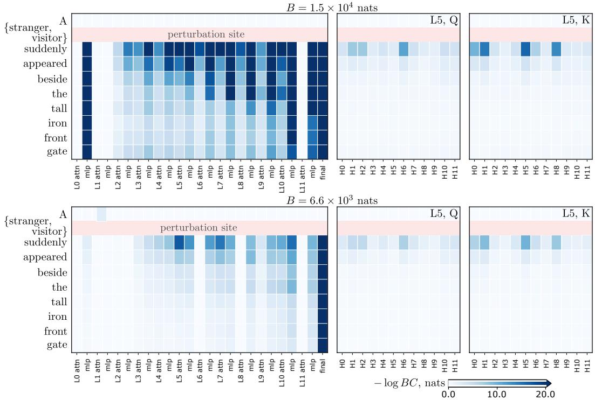  
Figure 4: Perturbation distinguishability across the sequence and in specific heads. For the sentence shown at left, the perturbation consists of switching the stranger token for visitor. Before the perturbation, in the residual stream of A, there can be no distinguishability. After the perturbation, the distinguishability (here displayed by Bhattacharyya distance, or − log BC) between streams depends on location in the sequence and in the processing. Attention heads’ projections tap into the distinguishability (right); shown are the query (Q) and key (K) projections for the twelve heads of layer 5.

## 3.3 NATURAL LANGUAGE: ATTENTION HEAD SELECTIVITY

In contrast to vision, textual perturbations are discrete in nature, and there is no single reference stream to compare across examples. To monitor the emergence of distinguishability, we perturbed a text sequence at a single location and left the remainder identical. An example is shown in Fig. 4, where the pair of sentences A {stranger/visitor} suddenly appeared beside the tall iron front gate differs only in the second token position. The processing of both sentences cannot differ before the location of the perturbation, and the location of the perturbation is trivially distinguishable from the outset. All subsequent tokens’ streams initialize at identical embeddings, allowing us to monitor the distinguishability between the pairs as a function of depth in processing. The block-level taps show a gradually increasing distinguishability (quantified via increasing Bhattacharyya distance, $\mathbf { B D } = \bar { - } \log \mathbf { B C } )$ with depth. For the model with the larger information budget $( B = \mathrm { \bar { 1 } } . 5 \times 1 0 ^ { 4 }$ nats), the distinguishability is high early on in processing, whereas the other model processes the pair more similarly until the last layers.

In our single example in Fig. 4 (right), the Q and K projections in layer 5 display head-specific behavior in the positions immediately following the perturbation. Because attention heads’ projections are noninvertible to a lower dimensional space, information is lost in general, and the question becomes whether the particular distinction between the pairs is present in the subspace selected by each head’s projections. Given that language model heads have repeatedly been shown to perform specialized roles (Olsson et al., 2022; Wang et al., 2023), it is plausible that their usage of distinguishing information from the residual stream might serve to differentiate and illuminate their role in processing.

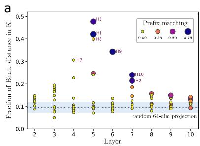

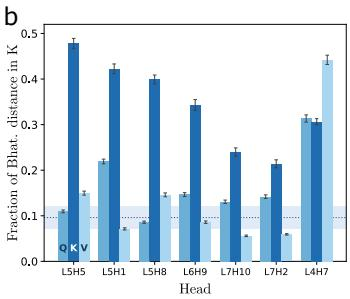

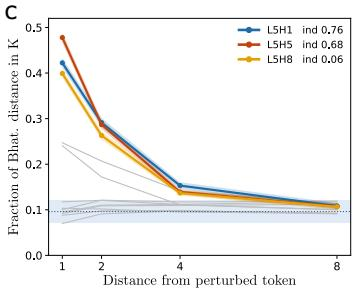  
Figure 5: Key sensitivity to single-token perturbations. (a) The fraction of the Bhattacharyya distance preserved from each attention read into its subsequent K projections is shown for all heads between layers 2 and 10, for the $B = 1 . 5 \times 1 0 ^ { 4 }$ nats GPT-2 model. For reference, random 64- dimensional projections preserve around 0.1 of the upstream Bhattacharyya distance (shaded band is 5-95% spread). Heads’ key projections are colored and sized according to the head’s prefixmatching score (Olsson et al., 2022). (b) The same fraction for the top heads in a, evaluated at the query (Q) and value (V) projections as well. (c) The same fraction for all heads in layer 5 as a function of distance from the perturbation.

We generated 80 minimally perturbed pairs by replacing nouns in OpenWebText samples with randomly selected nouns from the same category. We retained swaps producing at most 50 nats of Bhattacharyya distance at the layer 5 attention read immediately following the perturbation. This controls perturbation severity: larger changes produce widespread distinguishability and obscure head-to-head selectivity.

Figure 5 shows the fraction of upstream distinguishability retained by each K projection in the GPT-2 model operating at $B = 1 . 5 \stackrel { . } { \times } 1 0 ^ { 4 }$ nats. Random 64-dimensional projections preserve a nonzero fraction and provide a baseline near which most learned K projections operate.

Seven heads in the middle layers stand out above this baseline. Five coincide with high-inductionscore heads in the GPT-2 Small induction mosaic of Nanda (2022). Among the remaining two, L5H8 was described as a “fuzzy induction head” in the canonical indirect object identification analysis; L5H5 and L6H9 were identified there as canonical induction heads (Wang et al., 2023). Thus, six of the seven K-selective heads have an independently observed connection to induction.

The correspondence is also reflected, though incompletely, in prefix-matching scores computed for the stochastic model from attention maps on repeated random-token sequences (Olsson et al., 2022). Attention maps indicate which positions a head weights, whereas K distinguishability identifies which perturbation-induced distinctions are exposed to its attention routing. Notably, L5H8 and L4H7 retain strong K selectivity despite having nearly zero prefix-matching scores. The former’s previous characterization as a fuzzy induction head illustrates how distinction preservation can reveal induction-adjacent structure that is weak or absent in the canonical attention statistic. For all highlighted heads except L4H7, this selectivity is specific to K: the corresponding Q and V projections remain near the random-projection baseline (Fig. 5b). L4H7 instead preserves unusually high distinguishability across Q, K, and V, suggesting broader sensitivity to the perturbation. Finally, for the layer 5 heads, excess K selectivity decays with distance from the perturbed token toward the network-wide baseline (Fig. 5c).

## 4 DISCUSSION

For unconstrained point representations processed by an expressive function class, geometric proximity alone provides no general guarantee of similar downstream behavior. We introduce stochasticity during optimization so that transformer blocks instead learn to operate on overlapping distributions of residual-stream reads. This gives distinguishability an operational meaning: overlap bounds the distinctions transmitted through that read, although an attention block may still access them through other streams. The resulting analysis is nevertheless deliberately one-sided. High overlap constrains two inputs to be processed similarly, whereas low overlap says only that a distinction is available; it does not specify what differs or how the sublayer will use that distinction.

The construction should not be taken to imply that the point representations of an unmodified transformer possess an intrinsic probabilistic geometry. Rather, it produces a controlled, finite-precision extension of the pretrained model: with few added parameters and modest fine-tuning, the model can remain within hundredths of a nat of the original behavior while every residual-stream read is made stochastic and rate-limited. The lower-rate boundary of this behaviorally anchored regime thereby offers a probe of the original model’s operating resolution.

Several approximations remain. The information-rate expression is an upper bound whose tightness depends on the distribution of measured states over the LayerNorm sphere. Moreover, our tractable vMF analysis describes local posteriors, while upstream stochasticity induces effective posteriors that are generally mixtures and may be substantially broader. Common random numbers allow us to approach these effective posteriors incrementally and to compare paired computations with reduced variance, but they do not eliminate the difficulty of characterizing the full mixture.

Our experiments on ViT-S and GPT-2 small should therefore be viewed as a proof of concept. Further work should test whether the observed patterns persist at larger scales, develop better approximations to effective posteriors, and extend the analysis from individual reads and projections to the joint distinctions available to an attention block. It will also be important to determine when conclusions obtained from rate-limited models transfer to their unconstrained counterparts. More broadly, the framework reframes representational analysis from asking which internal states are geometrically similar to asking which input distinctions remain available, where they are discarded or introduced, and which components are able to act on them. This perspective is intentionally narrower than a complete account of computation, but it provides a functional foundation on which more detailed mechanistic analyses can build.

## REFERENCES

Alexander A. Alemi, Ian Fischer, Joshua V. Dillon, and Kevin Murphy. Deep variational information bottleneck. In International Conference on Learning Representations, 2017. URL https: //openreview.net/forum?id=HyxQzBceg.

Syed Mumtaz Ali and Samuel D Silvey. A general class of coefficients of divergence of one distribution from another. Journal of the Royal Statistical Society: Series B (Methodological), 28(1): 131–142, 1966.

Jimmy Lei Ba, Jamie Ryan Kiros, and Geoffrey E Hinton. Layer normalization. arXiv preprint arXiv:1607.06450, 2016.

Anil Bhattacharyya. On a measure of divergence between two statistical populations defined by their probability distribution. Bulletin of the Calcutta Mathematical Society, 35:99–110, 1943.

Trenton Bricken, Adly Templeton, Joshua Batson, Brian Chen, Adam Jermyn, Tom Conerly, Nick Turner, Cem Anil, Carson Denison, Amanda Askell, Robert Lasenby, Yifan Wu, Shauna Kravec, Nicholas Schiefer, Tim Maxwell, Nicholas Joseph, Zac Hatfield-Dodds, Alex Tamkin, Karina Nguyen, Brayden McLean, Josiah E Burke, Tristan Hume, Shan Carter, Tom Henighan, and Christopher Olah. Towards monosemanticity: Decomposing language models with dictionary learning. Transformer Circuits Thread, 2023. https://transformercircuits.pub/2023/monosemantic-features/index.html.

Thomas M Cover and Joy A Thomas. Elements of information theory, volume 1. wiley, 1991.

Imre Csiszar. On information-type measure of difference of probability distributions and indirect´ observations. Studia Sci. Math. Hungar., 2:299–318, 1967.

Tianyu Cui, Yogesh Kumar, Pekka Marttinen, and Samuel Kaski. Deconfounded representation similarity for comparison of neural networks. Advances in Neural Information Processing Systems, 35:19138–19151, 2022.

MohammadReza Davari, Stefan Horoi, Amine Natik, Guillaume Lajoie, Guy Wolf, and Eugene Belilovsky. Reliability of CKA as a similarity measure in deep learning. In The Eleventh International Conference on Learning Representations, 2023. URL https://openreview.net/ forum?id=8HRvyxc606.

Tim R Davidson, Luca Falorsi, Nicola De Cao, Thomas Kipf, and Jakub M Tomczak. Hyperspherical variational auto-encoders. arXiv preprint arXiv:1804.00891, 2018.

Jia Deng, Wei Dong, Richard Socher, Li-Jia Li, Kai Li, and Li Fei-Fei. Imagenet: A large-scale hierarchical image database. In 2009 IEEE conference on computer vision and pattern recognition, pp. 248–255. Ieee, 2009.

Frances Ding, Jean-Stanislas Denain, and Jacob Steinhardt. Grounding representation similarity through statistical testing. Advances in neural information processing systems, 34:1556–1568, 2021.

Alexey Dosovitskiy, Lucas Beyer, Alexander Kolesnikov, Dirk Weissenborn, Xiaohua Zhai, Thomas Unterthiner, Mostafa Dehghani, Matthias Minderer, Georg Heigold, Sylvain Gelly, Jakob Uszkoreit, and Neil Houlsby. An image is worth 16x16 words: Transformers for image recognition at scale. In International Conference on Learning Representations, 2021. URL https: //openreview.net/forum?id=YicbFdNTTy.

Nelson Elhage, Neel Nanda, Catherine Olsson, Tom Henighan, Nicholas Joseph, Ben Mann, Amanda Askell, Yuntao Bai, Anna Chen, Tom Conerly, Nova DasSarma, Dawn Drain, Deep Ganguli, Zac Hatfield-Dodds, Danny Hernandez, Andy Jones, Jackson Kernion, Liane Lovitt, Kamal Ndousse, Dario Amodei, Tom Brown, Jack Clark, Jared Kaplan, Sam McCandlish, and Chris Olah. A mathematical framework for transformer circuits. Transformer Circuits Thread, 2021. https://transformer-circuits.pub/2021/framework/index.html.

Paul Glasserman and David D Yao. Some guidelines and guarantees for common random numbers. Management Science, 38(6):884–908, 1992.

Aaron Gokaslan and Vanya Cohen. Openwebtext corpus. http://Skylion007.github.io/ OpenWebTextCorpus, 2019.

Robert Huben, Hoagy Cunningham, Logan Riggs Smith, Aidan Ewart, and Lee Sharkey. Sparse autoencoders find highly interpretable features in language models. In The Twelfth International Conference on Learning Representations, 2024. URL https://openreview.net/forum? id=F76bwRSLeK.

Diederik P. Kingma and Max Welling. Auto-encoding variational Bayes. In International Conference on Learning Representations (ICLR), 2014.

Simon Kornblith, Mohammad Norouzi, Honglak Lee, and Geoffrey Hinton. Similarity of neural network representations revisited. In International conference on machine learning, pp. 3519– 3529. PMLR, 2019.

Kanti V Mardia and Peter E Jupp. Directional statistics. John Wiley & Sons, 2009.

Kieran A Murphy. From independent patches to coordinated attention: Controlling information flow in vision transformers. arXiv preprint arXiv:2602.04784, 2026. URL https://arxiv.org/ abs/2602.04784.

Neel Nanda. Induction mosaic. https://www.neelnanda.io/mosaic, 2022. Accessed: 2026-08-31.

Catherine Olsson, Nelson Elhage, Neel Nanda, Nicholas Joseph, Nova DasSarma, Tom Henighan, Ben Mann, Amanda Askell, Yuntao Bai, Anna Chen, Tom Conerly, Dawn Drain, Deep Ganguli, Zac Hatfield-Dodds, Danny Hernandez, Scott Johnston, Andy Jones, Jackson Kernion, Liane Lovitt, Kamal Ndousse, Dario Amodei, Tom Brown, Jack Clark, Jared Kaplan, Sam McCandlish, and Chris Olah. In-context learning and induction heads. Transformer Circuits Thread, 2022. https://transformer-circuits.pub/2022/in-context-learning-and-induction-heads/index.html.

Alec Radford, Jeffrey Wu, Rewon Child, David Luan, Dario Amodei, and Ilya Sutskever. Language models are unsupervised multitask learners. OpenAI blog, 1(8):9, 2019.

Naftali Tishby, Fernando C. Pereira, and William Bialek. The information bottleneck method. arXiv preprint physics/0004057, 2000.

Kevin Ro Wang, Alexandre Variengien, Arthur Conmy, Buck Shlegeris, and Jacob Steinhardt. Interpretability in the wild: a circuit for indirect object identification in GPT-2 small. In The Eleventh International Conference on Learning Representations, 2023. URL https: //openreview.net/forum?id=NpsVSN6o4ul.

Algorithm 1 Noisy LayerNorm Read   
(Replaces every nn.LayerNorm).   
1: function $\mathrm { N o I S Y L N } ( x ; \ { \bar { \gamma } } , \beta , \sigma )$   
2: xˆ ← NORMALIZE(x), NORMALIZE $( u ) : = \frac { u - \mathrm { m e a n } ( u ) } { \sqrt { \mathrm { v a r } ( u ) + \epsilon } }$ ▷ statistics over the width axis   
3: $z \sim \mathcal { N } ( 0 , I _ { D } )$ ▷ drawn independently per token/patch position and per sample   
4: xˆ ← NORMALIZE $\left( \hat { x } + \sigma z \right)$ ▷ re-normalise: the read stays on $\scriptstyle { \mathcal { S } } ^ { D ^ { \bot } - 2 }$   
5: return $\gamma \odot \hat { x } + \beta$ ▷ learned affine applied after the channel   
6: end function

## A IMPLEMENTATION

Code for this project can be found at murphyka.github.io/stoch layernorm. Excepting the analysis, the crux is the simple modification to LayerNorm, presented in Alg. 1.

## A.1 THE CHANNEL AND ITS CALIBRATION

Every nn.LayerNorm in the network is replaced by a noisy read: the input is normalised, isotropic Gaussian noise of scale σ is added, the result is re-normalised, and only then are the learned gain and bias applied. Because a LayerNorm output has zero mean and unit RMS, each read lives on the sphere $\mathcal { S } ^ { \vec { D } - 2 }$ inside the mean-zero hyperplane of $\mathbb { R } ^ { D }$ . We approximate each read as $\operatorname { v M F } ( \mu , \kappa )$ and take the concentration κ as the rate knob:

$$
\operatorname { r a t e } ( \kappa ) = \operatorname { K L } ( \operatorname { v M F } ( \mu , \kappa ) \parallel \operatorname { U n i f } ) = \kappa A _ { p } ( \kappa ) + \log C _ { p } ( \kappa ) - \log C _ { p } ( 0 ) ,\tag{1}
$$

in closed form, and the sampling scale is matched to it through the mean resultant length $\rho =$ $A _ { p } ( \kappa ) ~ = ~ I _ { p / 2 } ( \kappa ) / I _ { p / 2 - 1 } ( \kappa )$ by $\sigma ~ = ~ \sqrt { 1 / \rho ^ { 2 } - 1 }$ , so that the mean read-cosine of the add-Gaussian-then-renormalise channel equals $\rho$ (verified numerically against the analytic $\rho ,$ and the closed-form rate against a Wood/Ulrich Monte-Carlo estimate). This matching is what makes the channel reparameterisation-clean: gradients flow to both the weights and the rate allocation with no rejection sampler in the loop. Training uses a precomputed strictly-monotone 4000-point geometric grid in κ (up to $1 0 ^ { 6 } )$ with the rate and σ columns exposed as differentiable one-dimensional linear interpolants.

Both ends of that grid are set by floating-point limits. All Bessel evaluations use the exponentially scaled modified Bessel function of the first kind, $\widetilde { I _ { v } } ( z ) = I _ { v } ( z ) e ^ { - z }$ for real $z > 0$ (SciPy’s scipy.special.ive): the unscaled $I _ { v }$ overflows to infinity at the top of the grid for every p we use, whereas the scaling cancels in the ratio $A _ { p }$ and enters the log-normaliser additively as log $I _ { v } ( \kappa ) = \log \widetilde { I } _ { v } ( \kappa ) + \kappa .$ . At the bottom of the grid the opposite failure appears, and it is not an artefact of the scaling: in double precision $I _ { p / 2 - 1 } ( \kappa )$ underflows to exactly zero for $\kappa \lesssim 2 0$ at $p = 7 6 7 .$ , scaled or not, which makes $\rho = A _ { p } ( \kappa ) \mathrm { { a } } 0 / 0$ . The ViT runs therefore keep the default floor $\kappa _ { \operatorname* { m i n } } = 5$ , which stays representable for $p \leq 3 8 3$ , while for GPT-2 the floor is found by bisection as the smallest κ whose $\widetilde { I _ { v } }$ clears a conservative $1 0 ^ { - 2 5 0 }$ , giving $\kappa _ { \operatorname* { m i n } } = 7 6 . 3 \mathrm { ~ a t ~ } p = 7 6 7$ . Since the interpolants clamp their argument to the grid, this floor also caps the largest representable per-tap noise: $\sigma \leq 7 6 . 6 $ at $p = 3 8 3$ and 10.1 at $p = 7 6 7$ . The cap is reached in practice, as the learned allocation drives the most heavily compressed taps down onto it: for GPT-2, 5/25 taps sit at the cap at $\sigma _ { g } = 1$ , rising to $1 3 / 2 5$ at $\sigma _ { g } = 2$ and $2 2 / 2 5$ at $\sigma _ { g } = 8$ (ViT-Small, 1/25 and $1 8 / 2 5$ at $\sigma _ { g } = 1$ and 8).

## A.2 RATE BUDGET AND ALLOCATION

A run is specified by a single dimension-free knob, the uniform-equivalent noise level $\sigma _ { g }$ . This is converted to $\kappa _ { g } ,$ then to a per-tap rate, and the total budget is fixed at $B = n \cdot \mathrm { r a t e } ( \kappa _ { g } )$ over the n taps; the network learns only how to spend it, via unconstrained logits a passed through a softmax,

$$
r _ { i } = B \cdot \operatorname { s o f t m a x } ( a ) _ { i } , \qquad \sum _ { i = 1 } ^ { n } r _ { i } = B { \mathrm { ~ b y ~ c o n s t r u c t i o n } } .\tag{2}
$$

Conserving the budget in rate (rather than penalising it) removes the degenerate solution where the model compresses every tap and pays the penalty once, and no penalty term appears in the loss at

all: the distillation KL alone drives a water-filling allocation. Both architectures contain 25 taps, although the rate associated with a fixed $\sigma _ { g }$ depends on the representation dimension.

## A.3 THE NOISE RAMP

We ramp the noise budget: the run starts at a near-clean $\sigma _ { g } = 0 . 0 5$ and interpolates to the target over the first 6 of 25 epochs (∼24% of training), updated every optimiser step rather than per epoch. Two interpolation shapes are implemented: linear in log-rate and linear in log $\sigma _ { g } .$ . The GPT-2 sweep used the former, and ViT the latter. Everything else is shared: AdamW $( \beta _ { 1 } ^ { \ - } = 0 . 9$ $\beta _ { 2 } = 0 . 9 9 9 )$ with two parameter groups — network weights at the run’s learning rate with weight decay $5 \times 1 0 ^ { - 3 }$ , allocation logits at $6 \times 1 0 ^ { - 3 }$ with no decay — cosine decay after a 0.2-epoch linear warmup, global grad-norm clipping at 1.0 over weights and logits jointly, bfloat16 autocast on A100 MIG partitions. Every run is a finetune arm whose loss is KL(teacher ∥ noisy student) at $T = 1$ against a frozen copy of the pretrained weights, with the student initialised at the teacher; distilling from the clean model rather than from labels keeps the distortion axis measured in the same units across both modalities.

## A.4 GPT-2

GPT-2-small (124M, D = 768; ln 1/ln 2 per block plus ln f, giving 25 taps) is finetuned on OpenWebText (Gokaslan & Cohen, 2019). Documents get an explicit EOS appended before packing, so GPT-2’s own context-reset convention sits at every document boundary instead of unrelated documents being spliced together; blocks are non-overlapping 512-token windows, which removes any need for padding or attention masks. Validation is a held-out contiguous 5000-document tail of the same stream. Runs use batch $3 2 \times 5 1 2$ tokens with $\mathtt { l i m i t \_ t r a i n \_ b a t c h e s } = 5 0 0 0$ , i.e. 81.9M tokens per epoch and ≈ 2.05B tokens over 25 epochs — under a quarter of one pass, so no example is seen twice. Learning rate $1 \times 1 0 ^ { - 4 }  1 \times \mathrm { { \dot { 1 } 0 ^ { - 6 } } }$ cosine. All three dropout probabilities (residual, embedding, attention) are forced to 0.0: dropout is an uncontrolled second noise source that would sit underneath the vMF channel during training and confound the rate measurement. The loss is a manually shifted cross-entropy, and the distillation KL is chunked in blocks of 128 positions along the sequence — the full [B, L, V] float32 softmax at vocabulary size 50257 is ∼3.3 GB per tensor, enough to decide whether a run fits its MIG slice — with identical float32 arithmetic, not a precision trade. Evaluation is full-validation perplexity plus next-token top-1 accuracy under the noise (never a clean or mean pass). Note that a GPT-2 “epoch” here is a fixed 5000 optimiser steps, not a pass over the corpus.

## A.5 VIT

The vision runs finetune timm’s vit small patch16 224 (D = 384) on full ImageNet-1k at $2 2 4 ^ { 2 }$ . Preprocessing is timm’s standard ViT config — bicubic interpolation, crop pct 0.9, mean/std 0.5 — with deliberatelyfinetuning-weight augmentation held fixed across the whole sweep so that cross-σ and cross-model comparisons are not confounded by an augmentation change: RandAugment $\mathtt { c a n d - m 7 - m s t d 0 . 5 - i n c 1 }$ , RandomResizedCrop with the scale floor raised to 0.4 (no extreme micro-crops), horizontal flip 0.5, no random erasing, and drop-path 0. Mixup/CutMix are disabled in the distillation arm — the loss is the teacher KL, so soft-target cross-entropy and label smoothing do not apply. Batch 512, learning rate $4 \times 1 0 ^ { - 4 }  1 \times 1 0 ^ { - 5 }$ cosine, 25 epochs (a 50- epoch arm was also run and did not change the picture). Validation accuracy is computed on a fixed 40-batch (20,480-image) subsample of the held-out split, with the channel on at the run’s learned allocation. An ImageNet epoch here is one full pass over the training set.

## B GAUSSIAN TO VON MISES-FISHER APPROXIMATION

In Fig. 6, we compare the angular spread induced by the noisy LayerNorm operation to that of an approximating vMF distribution. Due to rotational symmetry, the comparison reduces to a single scalar: the angular deviation from the distribution mean, µ.

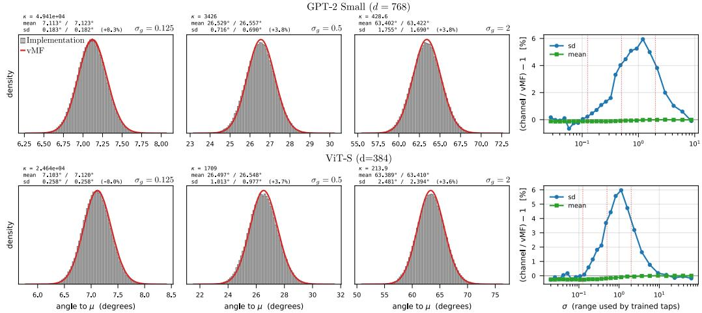  
Figure 6: Calibration of the von Mises-Fisher fit to the noisy LayerNorm channel. For several levels of noise, we show the histogram of angular deviations from the mean, $\mu$ (gray), and the analytic vMF density (red) used in our rate and Bhattacharyya coefficient calculations. The two means and spreads are printed above the three examples at the GPT-2 (top) and ViT-S (bottom) dimensionalities. On the right, the difference in the mean and spread of angular deviations is measured across a range of noise levels.

## C PUSHFORWARD DENSITY UNDER QUERY, KEY, AND VALUE PROJECTIONS

Let

$$
\mathcal { H } = \left. \boldsymbol { z } \in \mathbb { R } ^ { d } : \mathbf { 1 } ^ { \top } \boldsymbol { z } = 0 \right.
$$

denote the mean-zero LayerNorm subspace, and let $p = d - 1$ be its dimension. Choose an orthonormal basis $E \in \mathbb { R } ^ { d \times p }$ for H. Under the unit-radius convention used for the vMF approximation, a stochastic read $V \in { \mathcal { H } }$ can be written as $V = E X$ for some $X \in S ^ { p - 1 }$ . The corresponding unscaled LayerNorm state is dEX.

For a query, key, or value projection A, including the LayerNorm affine parameters $\gamma$ and $\beta ,$ , the projected state is

$$
Y _ { A } = A \left( \sqrt { d } \gamma \odot E X + \beta \right) = B _ { A } X + b _ { A } ,
$$

where

$$
B _ { A } = \sqrt d A \mathrm { d i a g } ( \gamma ) E , \qquad b _ { A } = A \beta .
$$

The shift $b _ { A }$ is common to all local posteriors and does not affect their BC.

If $B _ { A }$ is rank deficient, we restrict its codomain to im( $\left( B _ { A } \right)$ and express the output in orthonormal coordinates on this image. The resulting matrix has full row rank; we continue to denote it by $B _ { A }$ and let m denote its output dimension. Define

$$
S _ { A } = ( B _ { A } B _ { A } ^ { \top } ) ^ { 1 / 2 } , \qquad P _ { A } = S _ { A } ^ { - 1 } B _ { A } .
$$

Then

$$
B _ { A } = S _ { A } P _ { A } , \qquad P _ { A } P _ { A } ^ { \top } = I _ { m } .
$$

Thus, $P _ { A }$ has orthonormal rows and $S _ { A }$ is invertible. Writing $W _ { A } = P _ { A } X .$ , we have $Y _ { A } - b _ { A } =$ $S _ { A } W _ { A }$ . Translation by $b _ { A }$ and transformation by $S _ { A }$ are both invertible on the support of the projected distributions, so

$$
\mathrm { B C } \left( p _ { Y _ { A } | u _ { i } } , p _ { Y _ { A } | u _ { j } } \right) = \mathrm { B C } \left( p _ { W _ { A } | u _ { i } } , p _ { W _ { A } | u _ { j } } \right) .
$$

Because $P _ { A }$ has orthonormal rows and X has unit norm, the support of $W _ { A }$ is the unit ball

$$
\mathbb { B } ^ { m } = \left\{ w \in \mathbb { R } ^ { m } : \| w \| _ { 2 } \leq 1 \right\} .
$$

We next derive the density on this ball. At a fixed tap, consider a local posterior

$$
X \sim \operatorname { v M F } _ { p } ( \mu , \kappa ) , \qquad p ( x \mid \mu , \kappa ) = C _ { p } ( \kappa ) \exp ( \kappa \mu ^ { \top } x ) .
$$

Let $q = p - m$ . Complete the rows of $P _ { A }$ with an orthonormal basis $\ b { D } \in \mathbb { R } ^ { q \times p }$ for its null space, so that the matrix formed by stacking $P _ { A }$ and $D$ is orthogonal. Every point in the spherical preimage of $w \in \mathbb { B } ^ { m }$ can then be written as

$$
\begin{array} { r } { \boldsymbol { x } = \boldsymbol { P } _ { A } ^ { \top } \boldsymbol { w } + \boldsymbol { D } ^ { \top } \sqrt { 1 - \| \boldsymbol { w } \| _ { 2 } ^ { 2 } } \boldsymbol { \xi } , \qquad \boldsymbol { \xi } \in S ^ { q - 1 } . } \end{array}
$$

The spherical surface measure decomposes as

$$
\begin{array} { r } { d \omega _ { p - 1 } ( x ) = \big ( 1 - \| w \| _ { 2 } ^ { 2 } \big ) ^ { q / 2 - 1 } d w d \omega _ { q - 1 } ( \xi ) . } \end{array}
$$

Define

$$
a = P _ { A } \mu , \qquad \rho = \| D \mu \| _ { 2 } = \sqrt { 1 - \| a \| _ { 2 } ^ { 2 } } .
$$

For a point in the preimage of $w _ { \mathrm { i } }$

$$
\begin{array} { r } { \mu ^ { \top } x = a ^ { \top } w + \sqrt { 1 - \| w \| _ { 2 } ^ { 2 } } ( D \mu ) ^ { \top } \xi . } \end{array}
$$

Integrating over $\xi$ and using the vMF normalizing constant in dimension $q$ gives the pushforward density

$$
g _ { \mu } ^ { A } ( w ) = \frac { C _ { p } ( \kappa ) } { C _ { q } \left( \kappa \rho \sqrt { 1 - \| w \| _ { 2 } ^ { 2 } } \right) } \exp ( \kappa a ^ { \top } w ) \left( 1 - \| w \| _ { 2 } ^ { 2 } \right) ^ { q / 2 - 1 } , \qquad w \in \mathbb { B } ^ { m } .
$$

For local posteriors centered at $\mu _ { i }$ and $\mu _ { j }$ , let $g _ { i } ^ { A }$ and $g _ { j } ^ { A }$ denote their respective pushforward densities. Their projected BC is

$$
\mathrm { B C } _ { A } ( u _ { i } , u _ { j } ) = \int _ { \mathbb { B } ^ { m } } \sqrt { g _ { i } ^ { A } ( w ) g _ { j } ^ { A } ( w ) } d w .
$$

We estimate this integral using the equally weighted proposal

$$
r _ { A } ( w ) = { \frac { 1 } { 2 } } \left[ g _ { i } ^ { A } ( w ) + g _ { j } ^ { A } ( w ) \right] .
$$

Samples from $r _ { A }$ are obtained by selecting i or j with equal probability, drawing X from the selected vMF local posterior, and computing $W _ { A } = P _ { A } X$ . Importance sampling then gives

$$
\widehat { \mathrm { B C } } _ { A } ( u _ { i } , u _ { j } ) = \frac { 1 } { N } \sum _ { n = 1 } ^ { N } \frac { 2 \sqrt { g _ { i } ^ { A } ( w _ { n } ) g _ { j } ^ { A } ( w _ { n } ) } } { g _ { i } ^ { A } ( w _ { n } ) + g _ { j } ^ { A } ( w _ { n } ) } , \qquad w _ { n } \sim r _ { A } .
$$

This estimator is unbiased under exact sampling. Moreover, the arithmetic–geometric mean inequality gives

$$
0 \leq \frac { 2 \sqrt { g _ { i } ^ { A } ( w ) g _ { j } ^ { A } ( w ) } } { g _ { i } ^ { A } ( w ) + g _ { j } ^ { A } ( w ) } \leq 1 ,
$$

so every Monte Carlo summand is bounded.