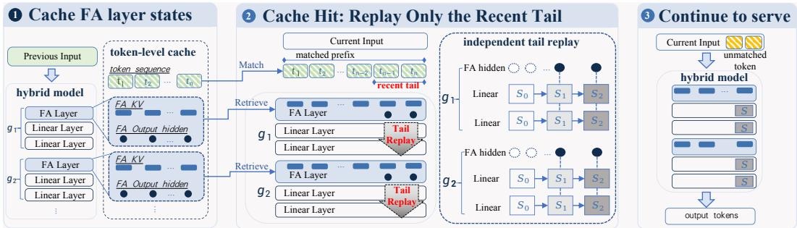

# Tail-Replay: Escaping the Curse of Linear Attention in Prefix Caching for Hybrid LLMs

Yirui Liu1,∗,† Ruoling Qi1,2,∗ Xuaner Wu1 Penghang Liu Jian Chen

1Institute of Artificial Intelligence, China Telecom (TeleAI)

2Shanghai Jiao Tong University

∗Equal contribution †Corresponding author

Yirui Liu: yiruiliu926@gmail.com Ruoling Qi: qiruoling760@sjtu.edu.cn

## Abstract

Hybrid large language models interleave full-attention layers with linear-attention layers to reduce the cost of long-context inference. This structure complicates prefix caching: full-attention key-value caches are token-addressable, whereas linearattention layers maintain recurrent states that cannot be rolled back to arbitrary prefix boundaries. Existing hybrid prefix caching methods address this mismatch by storing recurrent-state checkpoints. As a result, token-level matches are directly usable only at positions aligned with stored checkpoints, constraining prefix reuse to a discrete set of boundaries. We present Tail-Replay, a prefix caching mechanism that enables unconstrained token-level prefix reuse in hybrid large language models. The key insight is that linear-attention mechanisms such as Gated DeltaNet can be viewed as a structured, lossy compression of the input prefix: gated recurrent updates progressively attenuate the contributions of earlier inputs. Consequently, the recurrent state of a matched prefix can be well approximated by replaying only a short, recent suffix of that prefix. Tail-Replay exploits this property by caching the exact full-attention key-value cache while omitting recurrent-state checkpoints. On a cache hit, it reconstructs the linear-attention states by replaying a short, recent suffix of the matched prefix. As a result, the reuse boundary is determined by the shared tokens rather than by recurrent-state checkpoints. We evaluate Tail-Replay on three Gated DeltaNet-based hybrid models using the LongBench and RULER benchmarks. With only a 5–10% replay budget, it retains 92.8–99.9% of full-prefill quality on LongBench and RULER. For serving efficiency, we evaluate time-tofirst-token speedups across multiple matched-prefix lengths—8K, 16K, and 32K. The speedup grows with prefix length, reaching 9.1–14.3× over full prefill at 32K.

## 1 Introduction

LLM applications have evolved from single-turn instruction-following assistants [14] to richer workloads such as multi-turn dialogue [27], retrieval-augmented generation [7], tool-using agents [25], and multi-agent workflows [22, 4]. These workloads bring longer contexts, repeated invocations, and higher concurrency, making serving efficiency an increasingly important practical concern [16]. In response, model designers and system designers have pursued complementary solutions at different layers of the stack. At the model level, hybrid architectures [8, 19, 13, 12, 17, 18, 26, 11] combine full-attention (FA) layers with linear-attention layers to reduce long-context cost. At the serving level, prefix caching [28, 3, 2, 24] reuses shared prefixes across requests to avoid redundant prefill.

Hybrid models and prefix caching are two complementary techniques. A natural question is whether they can be deployed together to achieve greater overall efficiency gains. However, existing prefix caching mechanisms are largely designed for FA models and are not naturally compatible with hybrid models. In FA models, the reusable state consists of token-indexed key-value (KV) caches, so the prefix KV of a processed request can be retrieved and reused at any token boundary. In contrast, linear-attention layers summarize the processed prefix into recurrent states through in-place updates. Once the state has advanced, it cannot be rolled back to represent an arbitrary earlier prefix. We refer to this mismatch as the curse of linear attention for prefix caching: a token-level prefix match no longer directly implies a reusable model state. Recent hybrid prefix caching systems address this constraint by explicitly managing recurrent-state checkpoints. Marconi [15] focuses on which recurrent states to retain across cached prefixes, while Sparse Prefix Caching [20] focuses on where to place checkpoints within each cached prefix. These designs mitigate the problem but do not remove its root limitation: prefix reuse remains constrained by recurrent-state checkpoint locations rather than by the boundaries of shared-token prefixes.

We present Tail-Replay, a prefix caching mechanism that enables unconstrained token-level prefix reuse in hybrid LLMs. The key insight is that state-of-the-art linear-attention mechanisms such as Gated DeltaNet (GDN) can be viewed as a structured, lossy compression of the input prefix: gated recurrent updates progressively attenuate the contributions of earlier inputs. Consequently, the recurrent state of a matched prefix can be well approximated by replaying only a short, recent suffix of that prefix. Tail-Replay exploits this property by caching the exact FA KV while omitting recurrent-state checkpoints. On a cache hit, it reconstructs the linear-attention states by replaying a short, recent suffix of the matched prefix. As a result, the reuse boundary is determined by the shared tokens rather than by recurrent-state checkpoints, escaping the curse of linear attention in prefix caching.

We evaluate Tail-Replay on three Gated DeltaNet-based hybrid LLMs across LongBench and RULER. With a 5–10% replay budget, it retains 92.8–99.9% of full-prefill quality across the evaluated workloads, while achieving up to 14.3× TTFT speedup at 32K. In summary, our contributions are as follows:

1. We present Tail-Replay, to our knowledge the first hybrid prefix caching mechanism that enables unconstrained token-level prefix reuse without being constrained by recurrent-state checkpoints.

2. We introduce a replay-based state reconstruction mechanism that caches exact FA KV and rebuilds the linear-attention state from a short, recent tail of the matched prefix.

3. We implement and evaluate Tail-Replay on three Gated DeltaNet-based hybrid LLMs, demonstrating high quality retention and substantial TTFT reduction.

4. We develop two quality-preserving optimizations—a tail-FFN skip and transfer/replay overlap—that further reduce replay overhead.

## 2 Preliminary and Related Work

Hybrid LLMs interleave a small number of FA layers with linear-attention layers. In an FA layer, the reusable cache is token indexed: each token contributes its own KV pair. A linear-attention layer instead summarizes its prefix into a recurrent state $S _ { i }$ , updated token by token and exposed only through the final state after prefill.

For Gated DeltaNet [23], the update takes the form

$$
S _ { i } = T _ { i } S _ { i - 1 } + \beta _ { i } v _ { i } k _ { i } ^ { \top } , \qquad T _ { i } = \alpha _ { i } \big ( I - \beta _ { i } k _ { i } k _ { i } ^ { \top } \big ) ,\tag{1}
$$

where i indexes the i-th token in the prefix, $k _ { i }$ and $v _ { i }$ are its key and value vectors, and $\alpha _ { i } \in ( 0 , 1 ]$ is a learned gate. This gate progressively attenuates earlier information, while the rank-1 correction reshapes the current update.

Related work. Prefix caching systems for full-attention models reuse token-indexed KV caches, including RadixAttention [28], Prompt Cache [3], CachedAttention [2], and CacheBlend [24]. Positionindependent caching (PIC) extends this idea to independently matched chunks [6, 21, 9], but still relies on token-addressable attention states. For hybrid LLMs, Marconi [15] and Sparse Prefix Caching [20] retain recurrent checkpoints, while LinearKV [10] uses cached local linear states as initializers; Tail-Replay instead reconstructs the matched-prefix state from a short recent hidden suffix without storing recurrent checkpoints.

  
Figure 1: Tail-Replay overview: cache FA KV and FA output hiddens, independently applies Tail-Replay to each linear-attention group on a cache hit, and then process the unmatched suffix.

## 3 Method

Figure 1 summarizes Tail-Replay. For each previous input, we retain only token-level states associated with the FA layers: the key/value pair and the corresponding FA output hidden for each token. Given a current request with a cache hit, the FA KV of the matched prefix is retrieved for direct reuse, while only a short, recent tail of the cached FA output hiddens is fetched as the replay input. Each group of linear-attention layers independently performs Tail-Replay from a zero-initialized state $S _ { 0 }$ to reconstruct its recurrent state at the end of the matched prefix. The model then continues serving the unmatched tokens using the reconstructed linear-attention states and the retrieved FA KV.

Independent Tail-Replay. Tail-Replay approximates the recurrent state corresponding to a matched token prefix. Its accuracy is therefore governed by two factors: how much of the prefix is replayed and how faithfully the replay inputs match those used during the original prefill. The first factor is controlled by the replay ratio, for example by increasing the replayed tail from the latest 5% to the latest 10%. The second factor motivates caching the output hidden of every FA layer.

Specifically, we cache the FA output hidden of each FA layer and partition the hybrid architecture into groups, each comprising one FA layer and the consecutive linear-attention layers that follow it. This ensures that the input hidden of the first linear-attention layer in every group exactly matches its value during the original prefill, thereby confining replay error within each group. Below, we describe one FA layer and its following linear-attention group; the same construction applies to every group.

Thus, for a previous input $P ~ = ~ ( t _ { 1 } , t _ { 2 } , \ldots , t _ { n } )$ , the cache stores the token-level FA states $\{ ( K _ { i } ^ { \mathrm { F A } } , V _ { i } ^ { \mathrm { F A } } , ^ { ^ { \bullet } } h _ { i } ) \} _ { i = 1 } ^ { n }$ , where $( K _ { i } ^ { \mathrm { F A } } , \dot { V } _ { i } ^ { \mathrm { F A } } )$ are the FA key/value vectors and $h _ { i }$ is the FA output hidden. Given a cache hit covering the first m tokens, we retrieve the corresponding FA KV and replay only the most recent $k = \lceil r m \rceil$ cached FA output hiddens. For one linear-attention group, we initialize the replay state at the beginning of the selected tail to zero, $\hat { S } _ { m - k } = 0 ;$ , and apply the GDN recurrence from Preliminary to the tail:

$$
\hat { S } _ { i } = T _ { i } \hat { S } _ { i - 1 } + \beta _ { i } v _ { i } ^ { \mathrm { L A } } \big ( k _ { i } ^ { \mathrm { L A } } \big ) ^ { \top } , \qquad i = m - k + 1 , \ldots , m ,\tag{2}
$$

The cached FA output hiddens are fed through the group’s linear-attention layers, which produce $k _ { i } ^ { \mathrm { L A } } , v _ { i } ^ { \mathrm { L A } } , T _ { i }$ , and $\beta _ { i }$ at each replay step. The final state $\hat { S } _ { m }$ approximates the recurrent state at the matched-prefix boundary. We perform this reconstruction independently for every group. Once all groups have been replayed, the model continues serving the current request by processing the unmatched suffix tokens with the retrieved FA KV and reconstructed linear-attention states.

Replay efficiency. Since prefix caching aims to improve serving efficiency, we further reduce the overhead introduced by Tail-Replay with two optimizations. First, the FFN output at the end of a replayed group is not needed for state reconstruction: the next group starts from the exact FA output hidden of its following FA layer, which is already cached. We therefore omit this FFN during replay and compute only the linear-attention block of the group’s final layer, which is sufficient to update the recurrent state. Second, because Tail-Replay does not depend on the cached FA KV, transferring the FA KV from host memory to the device can proceed concurrently with replay on a separate copy stream. The transfer is synchronized only before the query forward, allowing replay to hide most of the data-movement cost.

Table 1: Average quality scores within each benchmark and across all evaluated context lengths. LongBench averages its task-level scores (token-F1 or ROUGE-L), while RULER averages recall across its eight task–length cells. Replay entries show the absolute score followed by its percentage relative to full prefill (full = 100%); complete per-cell results are in Appendix A.
<table><tr><td></td><td></td><td></td><td>LongBench</td><td></td><td></td><td></td><td>RULER</td><td></td></tr><tr><td>Model</td><td>Full</td><td>Zero</td><td>r=5%</td><td>r=10%</td><td>Full</td><td>Zero</td><td>r=5%</td><td>r=10%</td></tr><tr><td>Qwen3.6-27B</td><td>0.426</td><td>0.313</td><td>0.410 (96.2%)</td><td>0.417 (97.8%)</td><td>0.987</td><td>0.299</td><td>0.985 (99.8%)</td><td>0.986 (99.9%)</td></tr><tr><td>Qwen3.5-4B</td><td>0.374</td><td>0.271</td><td>0.369 (98.9%)</td><td>0.367 (98.1%)</td><td>0.960</td><td>0.415</td><td>0.959 (99.9%)</td><td>0.958 (99.7%)</td></tr><tr><td>OLMo-Hybrid-7B</td><td>0.317</td><td>0.159</td><td>0.294 (92.8%)</td><td>0.297 (93.9%)</td><td>0.812</td><td>0.215</td><td>0.756 (93.1%)</td><td>0.785 (96.7%)</td></tr></table>

Table 2: TTFT (ms, mean over 20 timed repetitions). ‘H2D-SER’ denotes serialized host-to-device transfer; ‘H2D-OVL+skip’ denotes overlapped transfer with the FFN skip. The matched-prefix lengths are in tokens; speedups in parentheses are relative to same-row full prefill.
<table><tr><td>Model</td><td>Matched prefix length</td><td>FULL</td><td colspan="2">5% replay</td><td colspan="2">10% replay</td></tr><tr><td></td><td></td><td></td><td>H2D-SER</td><td>H2D-OVL+skip</td><td>H2D-SER</td><td>H2D-OVL+skip</td></tr><tr><td>OLMo-Hybrid-7B</td><td>8,225</td><td>264.3</td><td>100.7</td><td>82.9 (3.19×)</td><td>101.2</td><td>82.7 (3.20×)</td></tr><tr><td></td><td>16,417</td><td>533.7</td><td>122.3</td><td>83.5 (6.39×)</td><td>121.7</td><td>85.6 (6.24×)</td></tr><tr><td></td><td>31,366</td><td>1068.3</td><td>158.8</td><td>108.8 (9.82×)</td><td>191.7</td><td>112.5 (9.50×)</td></tr><tr><td>Qwen3.5-4B</td><td>8,226</td><td>191.6</td><td>81.3</td><td>75.2 (2.55×)</td><td>82.0</td><td>75.9 (2.53×)</td></tr><tr><td></td><td>16,418</td><td>387.7</td><td>87.0</td><td>75.0 (5.17×)</td><td>87.7</td><td>76.0 (5.10×)</td></tr><tr><td></td><td>31,847</td><td>786.4</td><td>105.8</td><td>86.2 (9.12×)</td><td>133.9</td><td>108.1 (7.27×)</td></tr><tr><td>Qwen3.6-27B</td><td>8,226</td><td>879.6</td><td>166.6</td><td>154.3 (5.70×)</td><td>167.4</td><td>154.7 (5.69×)</td></tr><tr><td></td><td>16,418</td><td>1797.2</td><td>187.7</td><td>161.6 (11.12×)</td><td>260.8</td><td>218.1 (8.24×)</td></tr><tr><td></td><td>31,847</td><td>3605.2</td><td>311.9</td><td>251.8 (14.32×)</td><td>453.9</td><td>371.3 (9.71×)</td></tr></table>

## 4 Experiment

Setup. We evaluate three Gated DeltaNet-based hybrid LLMs—OLMo-Hybrid-7B, Qwen3.5-4B, and Qwen3.6-27B—on NVIDIA H100 GPUs using PyTorch 2.9.1.

End-to-end quality. We measure end-to-end quality on LongBench [1] and RULER [5], comparing full prefill with Tail-Replay at r ∈ {5%, 10%}. We also include a ZEROONLY baseline, which reuses the matched FA KV but zeros the recurrent linear-attention states without replay, isolating the benefit of state reconstruction. Table 1 reports benchmark-level averages over all evaluated tasks and context lengths; each replay entry gives its absolute score followed by its percentage relative to full prefill. Tail-Replay retains 92.8–98.9% of full-prefill quality on LongBench at r=5% and 93.9–98.1% at r=10%; on RULER, it retains 93.1–99.9% and 96.7–99.9%, respectively.

Serving efficiency. We evaluate serving efficiency with shared narrativeqa prefixes at nominal 8K, 16K, and 32K context lengths. We report TTFT from the start of cache transfer or replay to the first generated token. Table 2 compares the full-prefill baseline with H2D-SER and H2D-OVL+skip at both replay budgets. The full-prefill cost grows substantially with context length, whereas the 5% OVL+skip path remains comparatively stable: its speedup reaches 9.8×, 9.1×, and 14.3× at 32K for OLMo-Hybrid-7B, Qwen3.5-4B, and Qwen3.6-27B, respectively. Relative to serialized H2D transfer, OVL+skip further reduces TTFT by 18–42% at 32K. Increasing the replay budget to 10% has little effect at shorter contexts but raises TTFT at 32K, where replay becomes the dominant cost.

## 5 Conclusion

Tail-Replay addresses the mismatch between token-level prefix sharing and recurrent state in hybrid LLMs. By caching exact FA KV and FA output hiddens, then independently replaying only a recent suffix for each linear-attention group, it enables flexible prefix reuse without recurrent-state checkpoints. Across three Gated DeltaNet-based hybrid models, short replay tails preserve most of full-prefill quality across the evaluated workloads while delivering substantial TTFT reductions at long contexts.

## A Complete Quality Results

Table 3 lists all quality cells used in Table 1; values are absolute scores for full prefill, zero-only, and the two replay budgets.

Table 3: Complete per-cell quality results. LB denotes LongBench and R denotes RULER.
<table><tr><td>Model</td><td>Cell</td><td>Full</td><td>Zero-only</td><td>r=5%</td><td>r=10%</td></tr><tr><td>Qwen3.5-4B</td><td>LB-narrativeqa@16K</td><td>.244</td><td>.220</td><td>.243</td><td>.249</td></tr><tr><td>Qwen3.5-4B</td><td>LB-narrativeqa@32K</td><td>.276</td><td>.222</td><td>.268</td><td>.270</td></tr><tr><td>Qwen3.5-4B</td><td>LB-narrativeqa@64K</td><td>.293</td><td>.228</td><td>.292</td><td>.286</td></tr><tr><td>Qwen3.5-4B</td><td>LB-hotpotqa@16K</td><td>.652</td><td>.447</td><td>.657</td><td>.662</td></tr><tr><td>Qwen3.5-4B</td><td>LB-qasper@16K</td><td>.487</td><td>.355</td><td>.482</td><td>.461</td></tr><tr><td>Qwen3.5-4B</td><td>LB-musique@16K</td><td>.439</td><td>.223</td><td>.422</td><td>.419</td></tr><tr><td>Qwen3.5-4B</td><td>LB-qmsum@16K</td><td>.225</td><td>.202</td><td>.223</td><td>.221</td></tr><tr><td>OLMo-Hybrid-7B</td><td>LB-narrativeqa@16K</td><td>.203</td><td>.091</td><td>.203</td><td>.212</td></tr><tr><td>OLMo-Hybrid-7B</td><td>LB-narrativeqa@31K</td><td>.219</td><td>.098</td><td>.214</td><td>.217</td></tr><tr><td>OLMo-Hybrid-7B</td><td>LB-hotpotqa@16K</td><td>.565</td><td>.330</td><td>.544</td><td>.548</td></tr><tr><td>OLMo-Hybrid-7B</td><td>LB-qasper@16K</td><td>.394</td><td>.129</td><td>.308</td><td>.318</td></tr><tr><td>OLMo-Hybrid-7B</td><td>LB-musique@16K</td><td>.305</td><td>.107</td><td>.282</td><td>.273</td></tr><tr><td>OLMo-Hybrid-7B</td><td>LB-qmsum@16K</td><td>.214</td><td>.198</td><td>.213</td><td>.217</td></tr><tr><td>Qwen3.6-27B</td><td>LB-narrativeqa@16K</td><td>.265</td><td>.214</td><td>.259</td><td>.267</td></tr><tr><td>Qwen3.6-27B</td><td>LB-narrativeqa@64K</td><td>.332</td><td>.231</td><td>.329</td><td>.321</td></tr><tr><td>Qwen3.6-27B</td><td>LB-hotpotqa@16K</td><td>.688</td><td>.536</td><td>.665</td><td>.677</td></tr><tr><td>Qwen3.6-27B</td><td>LB-qasper@16K</td><td>.521</td><td>.344</td><td>.481</td><td>.484</td></tr><tr><td>Qwen3.6-27B</td><td>LB-musique@16K</td><td>.518</td><td>.346</td><td>.498</td><td>.519</td></tr><tr><td>Qwen3.6-27B</td><td>LB-qmsum@16K</td><td>.233</td><td>.208</td><td>.227</td><td>.231</td></tr><tr><td>Qwen3.5-4B</td><td>R-cwe@8K</td><td>.998</td><td>.169</td><td>.998</td><td>.998</td></tr><tr><td>Qwen3.5-4B</td><td>R-cwe@16K</td><td>.994</td><td>.215</td><td>.994</td><td>.994</td></tr><tr><td>Qwen3.5-4B</td><td>R-qa1@8K</td><td>.860</td><td>.405</td><td>.845</td><td>.850</td></tr><tr><td>Qwen3.5-4B</td><td>R-qa1@16K</td><td>.830</td><td>.330</td><td>.835</td><td>.820</td></tr><tr><td>Qwen3.5-4B</td><td>R-niah@8K</td><td>1.000</td><td>.849</td><td>1.000</td><td>1.000</td></tr><tr><td>Qwen3.5-4B</td><td>R-niah@16K</td><td>1.000</td><td>.786</td><td>1.000</td><td>1.000</td></tr><tr><td>Qwen3.5-4B</td><td>R-vt@8K</td><td>1.000</td><td>.325</td><td>1.000</td><td>1.000</td></tr><tr><td>Qwen3.5-4B</td><td>R-vt@16K</td><td>1.000</td><td>.244</td><td>1.000</td><td>1.000</td></tr><tr><td>OLMo-Hybrid-7B</td><td>R-cwe@8K</td><td>.865</td><td>.079</td><td>.786</td><td>.814</td></tr><tr><td>OLMo-Hybrid-7B</td><td>R-cwe@16K</td><td>.544</td><td>.023</td><td>.534</td><td>.558</td></tr><tr><td>OLMo-Hybrid-7B</td><td>R-qa1@8K</td><td>.730</td><td>.220</td><td>.665</td><td>.715</td></tr><tr><td>OLMo-Hybrid-7B</td><td>R-qa1@16K</td><td>.725</td><td>.190</td><td>.645</td><td>.665</td></tr><tr><td>OLMo-Hybrid-7B</td><td>R-niah@8K</td><td>.983</td><td>.624</td><td>.904</td><td>.929</td></tr><tr><td>OLMo-Hybrid-7B</td><td>R-niah@16K</td><td>.968</td><td>.580</td><td>.895</td><td>.924</td></tr><tr><td>OLMo-Hybrid-7B</td><td>R-vt@8K</td><td>.885</td><td>.006</td><td>.847</td><td>.868</td></tr><tr><td>OLMo-Hybrid-7B</td><td>R-vt@16K</td><td>.795</td><td>.000</td><td>.773</td><td>.805</td></tr><tr><td>Qwen3.6-27B</td><td>R-cwe@8K</td><td>1.000</td><td>.092</td><td>1.000</td><td>1.000</td></tr><tr><td>Qwen3.6-27B</td><td>R-cwe@16K</td><td>1.000</td><td>.061</td><td>1.000</td><td>1.000</td></tr><tr><td>Qwen3.6-27B</td><td>R-qa1@8K</td><td>.895</td><td>.405</td><td>.880</td><td>.885</td></tr><tr><td>Qwen3.6-27B</td><td>R-qa1@16K</td><td>.875</td><td>.375</td><td>.880</td><td>.885</td></tr><tr><td>Qwen3.6-27B</td><td>R-niah@8K</td><td>1.000</td><td>.899</td><td>1.000</td><td>1.000</td></tr><tr><td>Qwen3.6-27B</td><td>R-niah@16K</td><td>1.000</td><td>.881</td><td>1.000</td><td>1.000</td></tr><tr><td>Qwen3.6-27B</td><td>R-vt@8K</td><td>1.000</td><td>.011</td><td>1.000</td><td>1.000</td></tr><tr><td>Qwen3.6-27B</td><td>R-vt@16K</td><td>1.000</td><td>.060</td><td>1.000</td><td>1.000</td></tr></table>

## References

[1] Yushi Bai, Xin Lv, Jiajie Zhang, Hongchang Lyu, Jiankai Tang, Zhidian Huang, Zhengxiao Du, Xiao Liu, Aohan Zeng, Lei Hou, Yuxiao Dong, Jie Tang, and Juanzi Li. LongBench: A bilingual, multitask benchmark for long context understanding. In Annual Meeting of the Association for Computational Linguistics (ACL), 2024. URL https://arxiv.org/abs/2308.14508.

[2] Bin Gao, Zhuomin He, Puru Sharma, Qingxuan Kang, Djordje Jevdjic, Junbo Deng, Xingkun Yang, Zhou Yu, and Pengfei Zuo. Cost-efficient large language model serving for multi-turn conversations with CachedAttention. In USENIX Annual Technical Conference (ATC), 2024. URL https://arxiv.org/abs/2403.19708.

[3] In Gim, Guojun Chen, Seung-seob Lee, Nikhil Sarda, Anurag Khandelwal, and Lin Zhong. Prompt cache: Modular attention reuse for low-latency inference. In Proceedings ofMachine Learning and Systems (MLSys), 2024. URL https://arxiv.org/abs/2311.04934.

[4] Sirui Hong, Mingchen Zhuge, Jonathan Chen, Xiawu Zheng, Yuheng Cheng, Jinlin Wang, Ceyao Zhang, Zili Wang, Steven Ka Shing Yau, Zijuan Lin, Liyang Zhou, Chenyu Ran, Lingfeng

Xiao, Chenglin Wu, and Jürgen Schmidhuber. MetaGPT: Meta programming for a multi-agent collaborative framework. In International Conference on Learning Representations (ICLR), 2024. URL https://arxiv.org/abs/2308.00352.

[5] Cheng-Ping Hsieh, Simeng Sun, Samuel Kriman, Shantanu Acharya, Dima Rekesh, Fei Jia, Yang Zhang, and Boris Ginsburg. RULER: What’s the real context size of your long-context language models? In Conference on Language Modeling (COLM), 2024. URL https: //openreview.net/forum?id=kIoBbc76Sy. arXiv:2404.06654.

[6] Junhao Hu, Wenrui Huang, Weidong Wang, Haoyi Wang, Tiancheng Hu, Qin Zhang, Hao Feng, Xusheng Chen, Yizhou Shan, and Tao Xie. EPIC: Efficient position-independent caching for serving large language models. In International Conference on Machine Learning (ICML), 2025. URL https://arxiv.org/abs/2410.15332.

[7] Patrick Lewis, Ethan Perez, Aleksandra Piktus, Fabio Petroni, Vladimir Karpukhin, Naman Goyal, Heinrich Küttler, Mike Lewis, Wen-tau Yih, Tim Rocktäschel, Sebastian Riedel, and Douwe Kiela. Retrieval-augmented generation for knowledge-intensive NLP tasks. In Advances in Neural Information Processing Systems (NeurIPS), 2020. URL https://arxiv.org/abs/ 2005.11401.

[8] Opher Lieber, Barak Lenz, Hofit Bata, Gal Cohen, Jhonathan Osin, Itay Dalmedigos, Erez Safahi, Shaked Meirom, Yonatan Belinkov, Shai Shalev-Shwartz, Omri Abend, Raz Alon, Tomer Asida, Amir Bergman, Roman Glozman, Michael Gokhman, Avashalom Manevich, Nir Ratner, Noam Rozen, Erez Shwartz, Mor Zusman, and Yoav Shoham. Jamba: Hybrid transformer-mamba language models. In International Conference on Learning Representations (ICLR), 2025. URL https://arxiv.org/abs/2403.19887.

[9] Yifei Liu, Juntong Wu, Yang Liu, Junhao Hu, Minghao Li, Xiaoxu Chen, and Weihang Chen. HYPIC: Accelerating hybrid-attention LLM serving with position-independent caching. arXiv preprint arXiv:2607.01299, 2026. URL https://arxiv.org/abs/2607.01299.

[10] Yirui Liu, Ruoling Qi, Longwen Wang, Xuaner Wu, Jian Chen, Yuxin Jin, Jiawei Shao, and Xuelong Li. LinearKV: One cached state suffices for position-independent caching in hybrid LLMs. arXiv preprint arXiv:2608.11231, 2026. URL https://arxiv.org/abs/2608. 11231.

[11] William Merrill, Yanhong Li, Tyler Romero, Anej Svete, Caia Costello, Pradeep Dasigi, Dirk Groeneveld, David Heineman, Bailey Kuehl, Nathan Lambert, Chuan Li, Kyle Lo, Saumya Malik, DJ Matusz, Benjamin Minixhofer, Jacob Morrison, Luca Soldaini, Finbarr Timbers, Pete Walsh, Noah A. Smith, Hannaneh Hajishirzi, and Ashish Sabharwal. Olmo Hybrid: From theory to practice and back. arXiv preprint arXiv:2604.03444, 2026. URL https: //arxiv.org/abs/2604.03444.

[12] MiniMax. MiniMax-01: Scaling foundation models with lightning attention. arXiv preprint arXiv:2501.08313, 2025. URL https://arxiv.org/abs/2501.08313.

[13] NVIDIA. Nemotron-H: A family of accurate and efficient hybrid mamba-transformer models. arXiv preprint arXiv:2504.03624, 2025. URL https://arxiv.org/abs/2504.03624.

[14] Long Ouyang, Jeffrey Wu, Xu Jiang, Diogo Almeida, Carroll Wainwright, Pamela Mishkin, Chong Zhang, Sandhini Agarwal, Katarina Slama, Alex Ray, et al. Training language models to follow instructions with human feedback. In Advances in Neural Information Processing Systems (NeurIPS), 2022. URL https://arxiv.org/abs/2203.02155.

[15] Rui Pan, Zhuang Wang, Zhen Jia, Can Karakus, Luca Zancato, Tri Dao, Yida Wang, and Ravi Netravali. Marconi: Prefix caching for the era of hybrid LLMs. In Proceedings of Machine Learning and Systems (MLSys), 2025. URL https://arxiv.org/abs/2411.19379.

[16] Ruoyu Qin, Zheming Li, Weiran He, Mingxing Zhang, Yongwei Wu, Weimin Zheng, and Xinran Xu. Mooncake: Trading more storage for less computation—a KVCache-centric architecture for serving LLM chatbot. In USENIX Conference on File and Storage Technologies (FAST), pages 155–170, 2025. URL https://www.usenix.org/conference/fast25/presentation/ qin. arXiv:2407.00079.

[17] Qwen Team. Qwen3.5-397B-A17B. Model card, https://huggingface.co/Qwen/Qwen3. 5-397B-A17B, 2026.

[18] Qwen Team. Qwen3.6-27B. Model card, https://huggingface.co/Qwen/Qwen3.6-27B, 2026.

[19] Liliang Ren, Yang Liu, Yadong Lu, Yelong Shen, Chen Liang, and Weizhu Chen. Samba: Simple hybrid state space models for efficient unlimited context language modeling. In International Conference on Learning Representations (ICLR), 2025. URL https://arxiv.org/abs/ 2406.07522.

[20] Mikhail Shirokikh and Sergey Nikolenko. Sparse prefix caching for hybrid and recurrent LLM serving. arXiv preprint arXiv:2605.05219, 2026. URL https://arxiv.org/abs/2605. 05219.

[21] Shihao Wang, Jiahao Chen, Yanqi Pan, Hao Huang, Yichen Hao, Xiangyu Zou, Wen Xia, Wentao Zhang, Chongyang Qiu, and Pengfei Wang. ProphetKV: User-query-driven selective recomputation for efficient KV cache reuse in retrieval-augmented generation. arXiv preprint arXiv:2602.02579, 2026. URL https://arxiv.org/abs/2602.02579.

[22] Qingyun Wu, Gagan Bansal, Jieyu Zhang, Yiran Wu, Beibin Li, Erkang Zhu, Li Jiang, Xiaoyun Zhang, Shaokun Zhang, Jiale Liu, Ahmed Hassan Awadallah, Ryen W. White, Doug Burger, and Chi Wang. AutoGen: Enabling next-gen LLM applications via multi-agent conversations. In Conference on Language Modeling (COLM), 2024. URL https://arxiv.org/abs/2308. 08155.

[23] Songlin Yang, Jan Kautz, and Ali Hatamizadeh. Gated delta networks: Improving Mamba2 with delta rule. In International Conference on Learning Representations (ICLR), 2025. URL https://arxiv.org/abs/2412.06464.

[24] Jiayi Yao, Hanchen Li, Yuhan Liu, Siddhant Ray, Yihua Cheng, Qizheng Zhang, Kuntai Du, Shan Lu, and Junchen Jiang. CacheBlend: Fast large language model serving for RAG with cached knowledge fusion. In European Conference on Computer Systems (EuroSys), 2025. URL https://arxiv.org/abs/2405.16444.

[25] Shunyu Yao, Jeffrey Zhao, Dian Yu, Nan Du, Izhak Shafran, Karthik Narasimhan, and Yuan Cao. ReAct: Synergizing reasoning and acting in language models. In International Conference on Learning Representations (ICLR), 2023. URL https://arxiv.org/abs/2210.03629.

[26] Z.ai. GLM-5.3-Flash. Model card, https://huggingface.co/zai-org/GLM-5.3-Flash, 2026.

[27] Lianmin Zheng, Wei-Lin Chiang, Ying Sheng, Tianle Li, Siyuan Zhuang, Zhanghao Wu, Yonghao Zhuang, Zhuohan Li, Zi Lin, Eric P. Xing, Joseph E. Gonzalez, Ion Stoica, and Hao Zhang. LMSYS-Chat-1M: A large-scale real-world LLM conversation dataset. In International Conference on Learning Representations (ICLR), 2024. URL https://arxiv.org/abs/ 2309.11998.

[28] Lianmin Zheng, Liangsheng Yin, Zhiqiang Xie, Chuyue Sun, Jeff Huang, Cody Hao Yu, Shiyi Cao, Christos Kozyrakis, Ion Stoica, Joseph E. Gonzalez, Clark Barrett, and Ying Sheng. SGLang: Efficient execution of structured language model programs. In Advances in Neural Information Processing Systems (NeurIPS), 2024. URL https://arxiv.org/abs/2312. 07104.