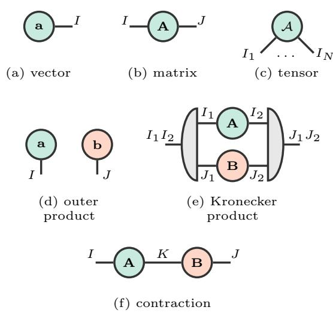
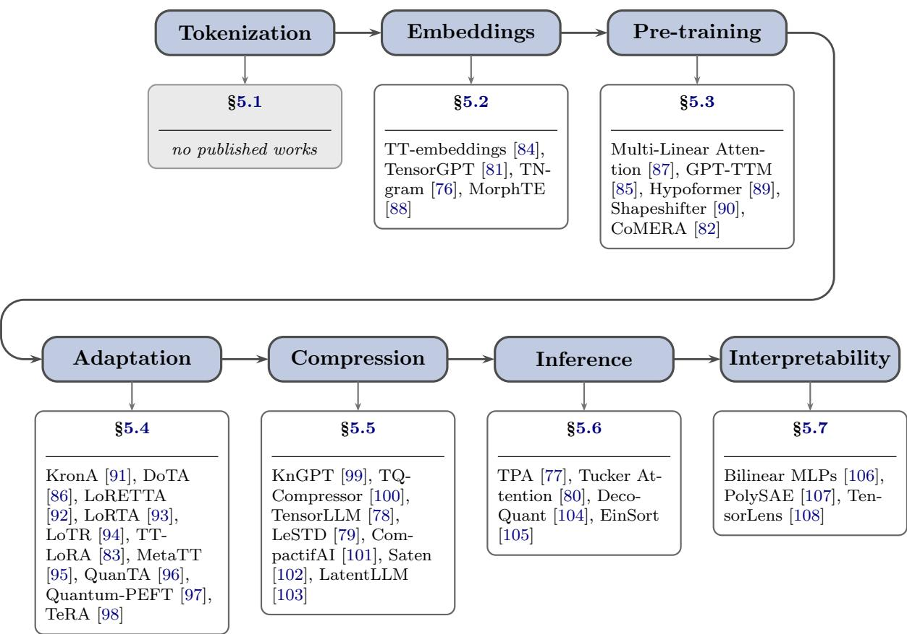
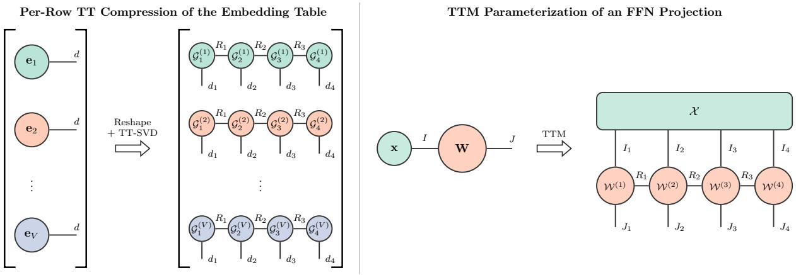
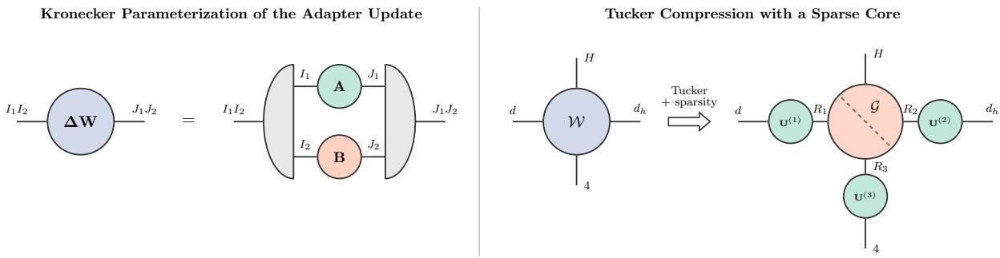
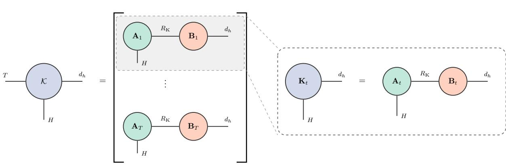

# Tensor Methods for Language Models: From Token Representation to Training, Adaptation, Compression, Inference, and Interpretability

Matvei Tarasov1, Salman Ahmadi-Asl1, Andr´e L. F. de Almeida2, and Andrzej Cichocki3

1Innopolis University, Innopolis 420500, Russia, m.tarasov@innopolis.university 1Innopolis University, Innopolis 420500, Russia, s.ahmadiasl@innopolis.ru   
2Department of Teleinformatics Engineering, Federal University of Cear´a, Fortaleza 60455-760, Brazil, andre@gtel.ufc.br

3Systems Research Institute of Polish Academy of Science and Warsaw University of Technology, Poland, cichockiand@gmail.com

## Abstract

Large language models (LLMs) are built from structured high-dimensional objects such as token representations, weights, adaptation updates, caches, and activations, whose multilinear structure is underexploited by the conventional matrix-centric view. Tensor decompositions and tensor networks provide a principled algebraic language for this structure, yet the literature often treats them as isolated compression mechanisms. This survey organizes tensor methods for LLMs through two complementary views: a seven-stage lifecycle taxonomy covering tokenization, embeddings, pre-training, adaptation, compression, inference, and interpretability, and a component view covering embeddings, attention, and feed-forward networks. We provide unified notation and theoretical foundations, analyze tensorization strategies for individual Transformer components, and compare methods at each lifecycle stage while making diferences in evaluation protocols and model scales explicit. We further connect tensor methods to neighboring eficiency techniques and probabilistic tensor networks. Finally, we synthesize open challenges and introduce ρgap, a metric for the compressionrealization gap between theoretical memory reduction and measured system-level speedup. By treating tensorization as a common structural principle, the survey provides a structured entry point to tensorized language models and clarifies when parameter savings can plausibly translate into memory eficiency, computational eficiency, or interpretability. The GitHub page dedicated to this paper is accessible at this https URL.

## 1 Introduction

Large language models (LLMs) based on the Transformer architecture [1] have reshaped deep learning and artificial intelligence by demonstrating broad capabilities and performance gains across successive model generations [2, 3, 4]. Their success stems from three factors: a highly parallelizable architecture that scales eficiently with model size and compute [1], self-supervised pretraining on internet-scale text corpora [5, 6], and the predictable improvements that arise from scaling this combination [7, 8]. Today’s production-scale LLMs, such as Qwen [9], DeepSeek [10], and Kimi [11], contain tens to hundreds of billions of parameters and are deployed at scale, demanding substantial computational resources for both training and inference.

In parallel, the past several decades have seen active development of tensor decompositions and tensor networks within the numerical linear algebra community. Emerging independently in psychometrics [12, 13, 14] and in quantum many-body physics [15, 16, 17], these tools have gradually migrated into general-purpose computational algebra. Along the way, researchers reformulated the existing formats in the language of numerical analysis and developed stable algorithms for computing them [18, 19, 20], alongside a broader theoretical efort to systematize and unify the resulting landscape [21, 22, 23]. This growing activity has, in turn, fueled interest in applying tensor methods to deep learning [24], reflecting a wider recognition that numerical linear algebra sits at the core of modern neural architectures [25].

Motivation. Despite their impressive capabilities, modern LLMs face three persistent challenges. Training a frontier model requires substantial accelerator time [26]. Inference at scale demands high memory bandwidth, and the KV cache can become the dominant memory bottleneck in long-context applications [27]. Meanwhile, internal representations, including activations and weights, remain largely opaque, and the mechanisms by which these models reason and store knowledge are still poorly understood, motivating a growing body of interpretability research [28, 29]. These challenges are usually treated separately, but a tensor perspective provides a common language for all three. LLMs are conventionally described and implemented in matrix terms: Transformer computations reduce largely to batched matrix multiplication, which is convenient and highly optimized but conceptually incomplete. Many Transformer objects, including stacked multi-head attention projections, layer collections, activation streams, and KV caches, are naturally higher-order, and a purely matrix-centric view leaves their multilinear structure underexploited.

Table 1: Literature clusters surrounding tensor methods and language models.
<table><tr><td>Cluster</td><td>Main objects or methods</td><td>Specific gap for this survey</td></tr><tr><td>Classical tensor decompositions and tensor networks [21], [22], [23], [15]</td><td>Tensors, tensor-algebraic operations; decompositions, ranks; computation algorithms</td><td>Discusses tensors abstractly; does not provide LLM applications of tensors</td></tr><tr><td>Tensor methods for machine learning and neural networks [30, 31, 32, 33, 24, 34]</td><td>Tensorized machine learning; tensorization and decomposition of generic neural modules, layers</td><td>Often predates decoder-only LLMs; omits LLM-specific objects such as the KV cache</td></tr><tr><td>LLM efficiency techniques [35, 36, 37, 38, 39, 40, 41, 42, 43, 44, 45]</td><td>PEFT; compression: quantization, pruning, knowledge distillation; efficient attention; efficient inference; KV-cache compression</td><td>Usually omits tensor counterparts; does not emphasize tensor methods as a separate class</td></tr><tr><td>LLM mechanistic interpretability [46, 47, 48]</td><td>Features, activations, logits, neurons, heads, circuits; activation patching, ablations, SAEs</td><td>Overlooks multilinear structure, both as a descriptive language and as an analysis tool</td></tr></table>

Current state of the literature. The literature on tensors and LLMs is fragmented across several partially overlapping clusters, summarized in Table 1. We cite representative surveys and reviews, so that the reader can turn to a fuller treatment of each area. Each row identifies a community with its own objects, methods, and terminology; the remainder of this section discusses each cluster in turn, together with the specific gap it leaves for a survey connecting tensor methods to LLMs.

The first cluster is the classical tensor decomposition literature [21, 22, 23, 15]. Works from this cluster are mathematically deep and essential for notation, algorithms, and theoretical concepts such as tensor rank. While this literature provides the general algebraic and numerical foundation for tensor computations, it does not map these concepts onto LLM-specific objects.

A second line of work applies tensor decompositions and tensor networks to classical machine learning [30, 31] and neural networks (NNs) [32, 33, 24, 34]. This literature establishes neuralnetwork tensorization as a general design principle. Much of it, however, predates modern decoder-only LLMs or focuses on generic layers, convolutional neural networks (CNNs), and recurrent neural networks (RNNs), leaving LLM-specific objects and constraints untreated.

A third body of work covers the broader landscape of LLM eficiency techniques. It has expanded rapidly over the past few years, spanning many directions [35]. Some of this work targets parameter-eficient fine-tuning (PEFT) [36] and post-training compression techniques such as quantization, pruning, and knowledge distillation (KD) [37, 38, 40]; some covers PEFT and compression together [39]. Other work targets inference-time eficiency [41, 42, 43] and serving [44], whereas [45] cuts across all these directions by structure rather than application, reviewing low-rank matrix factorizations in weights, adapters, and gradients. Within each of these sub-clusters, tensor decompositions surface only occasionally, mentioned as one technique among many. Yet tensor methods across all these sub-clusters rest on the same underlying algebraic theory, which suggests considering them as a standalone group.

As a fourth cluster, mechanistic interpretability has become an active and rapidly growing research direction, aiming to reverse-engineer language models’ internal computations in terms of features, activations, neurons, heads, and circuits, using tools such as activation patching, ablations, and sparse autoencoders (SAEs) [46, 47, 48]. Within this broader field, a smaller community studies Transformer circuits specifically through the lens of tensor networks, using graphical tensor notation [49]. Beyond notation, a handful of very recent works make multilinear structure the object of the analysis itself, and no existing interpretability survey covers them. This survey treats both the notation and these methods as a distinct direction (Section 5.7).

Scope. The same multilinear structure recurs across all four clusters, but the clusters use it diferently. The classical tensor literature develops a general theory, whereas tensorized neural modules, LLM eficiency techniques, and mechanistic interpretability typically use that theory locally for a specific task. This survey connects these lines of work through a unified tensortheoretic lens grounded in LLM-specific objects. Its distinguishing feature is the combination of two complementary organizations: a component view that asks what inside a Transformer is tensorized, and a lifecycle view that asks when and why tensorization is introduced. To our knowledge, existing surveys do not combine this two-view organization with unified notation, protocol-aware comparisons, and a systems-level analysis of whether theoretical compression is realized in practice.

## Contributions This survey makes four contributions:

1. We frame tensorization as a common structural principle acting on token representations, weights, adaptation updates, caches, and activations. We organize this literature with a sevenstage lifecycle taxonomy: tokenization, embeddings, pre-training, adaptation, compression, inference, and interpretability.

2. We complement the lifecycle taxonomy with a component view of embeddings, attention, and feed-forward networks. Together, the two views distinguish the structural compatibility of a decomposition with a model object from the training or deployment objective for which that decomposition is used.

3. We provide unified notation and theoretical foundations for tensor operations, decompositions, and networks in Transformer-like language models, and we compare methods while explicitly recording diferences in model scale, baselines, evaluation protocols, and reported metrics. We also connect tensor methods to neighboring eficiency techniques and probabilistic tensor networks.

4. We synthesize open challenges and formulate the compression-realization gap through ρgap, which separates algorithmic overhead from hardware realization and makes explicit why parameter reduction alone does not imply end-to-end speedup.

Structure of the survey. The remainder of this paper is organized as follows. Section 2 presents the mathematical preliminaries, including notation, tensor-network diagrams, tensor decompositions, and a brief review of the Transformer architecture. Section 3 introduces the lifecycle taxonomy and illustrates tensorization at each populated stage using LLaMA-3-8B as a running case study. Section 4 develops the component view for individual Transformer modules, whereas Section 5 develops the lifecycle view through formal problem definitions, literature reviews, and comparison tables where coverage permits. Section 6 situates tensor methods within the broader landscape of LLM eficiency techniques, and Section 7 clarifies their connections to probabilistic tensor networks. Section 8 surveys software and presents case studies. Section 9 defines the compression-realization gap, identifies open challenges, and outlines future research directions. Finally, Section 10 concludes the survey.

## 2 Preliminaries

<table><tr><td rowspan=1 colspan=1>Notation</td><td rowspan=1 colspan=1>Meaning</td></tr><tr><td rowspan=1 colspan=1>α</td><td rowspan=1 colspan=1>scalar</td></tr><tr><td rowspan=1 colspan=1>a</td><td rowspan=1 colspan=1>vector</td></tr><tr><td rowspan=1 colspan=1>A</td><td rowspan=1 colspan=1>matrix</td></tr><tr><td rowspan=1 colspan=1>A</td><td rowspan=1 colspan=1>tensor</td></tr><tr><td rowspan=1 colspan=1> $A _ { i _ { 1 } , \dots , i _ { N } }$ </td><td rowspan=1 colspan=1> $( i _ { 1 } , \dots , i _ { N } )$ -th entry</td></tr><tr><td rowspan=1 colspan=1> $\mathcal { A } _ { i _ { 1 } , . . . , i _ { n - 1 } , : , i _ { n + 1 } , . . . , i _ { N } }$ </td><td rowspan=1 colspan=1>n-th mode slice</td></tr><tr><td rowspan=1 colspan=1> $\mathbf { A } \otimes \mathbf { B }$ </td><td rowspan=1 colspan=1>Kronecker product</td></tr><tr><td rowspan=1 colspan=1>aob</td><td rowspan=1 colspan=1>outer product</td></tr><tr><td rowspan=1 colspan=1> $\mathcal { A } \times _ { n } \mathbf { B }$ </td><td rowspan=1 colspan=1>mode-n product</td></tr><tr><td rowspan=1 colspan=2> $\boldsymbol { \mathcal { A } } _ { i _ { 1 } , . . . , i _ { K } } \times ^ { j _ { 1 } , . . . , j _ { K } } \boldsymbol { B }$         contraction</td></tr></table>

  
Figure 1: Notation reference. Left: symbols used throughout this survey for scalars, vectors, matrices, tensors, and the main tensor-algebraic operations. Right: tensor-network diagram representations of the same objects, with examples of the operations.

## 2.1 Notation

Objects Calligraphic uppercase letters $\mathcal { A } \in \mathbb { R } ^ { I _ { 1 } \times I _ { 2 } \times \dots \times I _ { N } }$ denote an Nth-order tensor; matrices and vectors are denoted by bold uppercase A and lowercase letters a. The symbols in Figure 1 (left) collect the notation used throughout the survey; the tensor-network diagrams [50] in Figure 1 (right) give the corresponding graphical illustration for each object and operation.

Outer product Given N vectors $\mathbf { a } ^ { ( 1 ) } \in \mathbb { R } ^ { I _ { 1 } } , \ldots , \mathbf { a } ^ { ( N ) } \in \mathbb { R } ^ { I _ { N } }$ , their outer product is the Nth-order tensor $\mathbf { a } ^ { ( 1 ) } \circ \cdots \circ \mathbf { a } ^ { ( N ) } \in \mathbb { R } ^ { I _ { 1 } \times \cdots \times I _ { N } }$ with entries:

$$
\begin{array} { r } { \big ( \mathbf { a } ^ { ( 1 ) } \circ \cdots \circ \mathbf { a } ^ { ( N ) } \big ) _ { i _ { 1 } \ldots i _ { N } } = \mathbf { a } _ { i _ { 1 } } ^ { ( 1 ) } \mathbf { a } _ { i _ { 2 } } ^ { ( 2 ) } \cdot \cdot \cdot \mathbf { a } _ { i _ { N } } ^ { ( N ) } . } \end{array}\tag{1}
$$

This tensor is called a canonical rank-one tensor. For $N = 2$ , this reduces to the familiar rankone matrix a ◦ b $\in \mathbb { R } ^ { I \times J }$ with entries $( { \bf a } \circ { \bf b } ) _ { i j } = a _ { i } b _ { j }$ . In tensor-network diagrams, the outer product is represented by placing the tensors next to each other, as shown in Figure 1(d).

Kronecker product and decomposition The Kronecker product of two matrices ${ \textbf { A } } \in$ $\mathbb { R } ^ { I _ { 1 } \times J _ { 1 } }$ and $\mathbf { B } \in \mathbb { R } ^ { I _ { 2 } \times J _ { 2 } }$ is the block matrix obtained by replacing each entry of A with a copy of B scaled by that entry,

$$
\mathbf { A } \otimes \mathbf { B } = \left[ { \begin{array} { c c c } { A _ { 1 1 } \mathbf { B } } & { \cdots } & { A _ { 1 J _ { 1 } } \mathbf { B } } \\ { \vdots } & { \ddots } & { \vdots } \\ { A _ { I _ { 1 } 1 } \mathbf { B } } & { \cdots } & { A _ { I _ { 1 } J _ { 1 } } \mathbf { B } } \end{array} } \right] \in \mathbb { R } ^ { I _ { 1 } I _ { 2 } \times J _ { 1 } J _ { 2 } } .\tag{2}
$$

The corresponding tensor-network diagram is shown in Figure $1 ( \mathrm { e } )$ . This diagram has a strong connection with the outer product; see [51] for more details.

For a fixed $R \in \mathbb { N }$ , one may look for the best approximation of a matrix by a sum of Kronecker products

$$
\operatorname* { m i n } _ { \mathbf { U } _ { r } , \mathbf { V } _ { r } } \| \mathbf { A } - \sum _ { r = 1 } ^ { R } \mathbf { U } _ { r } \otimes \mathbf { V } _ { r } \| _ { F } ,\tag{3}
$$

where $\mathbf { A } \in \mathbb { R } ^ { I _ { 1 } I _ { 2 } \times J _ { 1 } J _ { 2 } } , \mathbf { U } _ { r } \in \mathbb { R } ^ { I _ { 1 } \times J _ { 1 } }$ , and $\mathbf { V } _ { r } \in \mathbb { R } ^ { I _ { 2 } \times J _ { 2 } }$ . This problem admits a closed-form solution; rearranging the $I _ { 2 } \times J _ { 2 }$ blocks of A into the rows of a matrix $\mathcal { R } ( \mathbf { A } ) \in \mathbb { R } ^ { I _ { 1 } J _ { 1 } \times I _ { 2 } J _ { 2 } }$ turns each Kronecker term into a rank-one matrix, so Eq. (3) reduces to a low-rank approximation of $\mathcal { R } ( { \bf A } )$ and is solved by its rank-R truncated SVD, whose singular vectors are then reshaped back into $\mathbf { U } _ { r }$ and $\mathbf { V } _ { r } ;$ see [52] for the precise construction. This is known as the Kronecker product SVD, and we refer to it as the Kronecker decomposition. The smallest R for which the approximation is exact is called the Kronecker rank of A. The decomposition is not intrinsic to A alone, since the factor shapes $I _ { 1 } I _ { 2 } = I$ and $J _ { 1 } J _ { 2 } = J$ can be chosen in several ways, and each choice defines a diferent problem (3) with its own Kronecker rank. We consider only the matrix case, although the construction generalizes to tensors [53].

Contractions Contraction can be viewed as summing with respect to one or more paired modes of two tensors, while leaving other modes free. Let $\mathcal { A } \in \mathbb { R } ^ { I _ { 1 } \times I _ { 2 } \times \dots \times I _ { N } }$ be an Nth-order tensor and $B \in \mathbb { R } ^ { J _ { 1 } \times J _ { 2 } \times \cdots \times J _ { M } }$ an Mth-order tensor, and suppose there are K mode pairs $( i _ { 1 } , j _ { 1 } ) , \dotsc , ( i _ { K } , j _ { K } )$ satisfying

$$
\left\{ \begin{array} { l l } { 1 \leq i _ { k } \leq N , \quad 1 \leq j _ { k } \leq M , } & { k \in \{ 1 , 2 , \dots , K \} } \\ { i _ { k } \neq i _ { \ell } , \quad j _ { k } \neq j _ { \ell } , } & { \forall k \neq \ell } \\ { I _ { i _ { k } } = J _ { j _ { k } } , } & { k \in \{ 1 , 2 , \dots , K \} . } \end{array} \right.\tag{4}
$$

Then the contraction of A and B over these K mode pairs, denoted as

$$
\ v { A } _ { i _ { 1 } , \dots , i _ { K } } \times ^ { j _ { 1 } , \dots , j _ { K } } \ v { B } ,\tag{5}
$$

is an $( N + M - 2 K ) \mathrm { t h { \mathrm { - } o r d e r } }$ tensor, obtained by summing over the K matched indices and keeping every remaining mode of A and B free. In tensor-network diagram notation, contractions are represented by connecting the legs of the contracted modes, while the free modes remain unconnected. This abstract operation corresponds to the einsum function in modern array programming libraries such as NumPy [54], PyTorch [55], and JAX [56].

For example, given $\mathbf { A } \in \mathbb { R } ^ { I \times K } , \mathbf { B } \in \mathbb { R } ^ { K \times J }$ , the contraction over the mode pair (2, 1) yields the standard matrix product:

$$
\mathbf { C } = \mathbf { A } \mathbf { B } = \mathbf { A } _ { 2 } \times ^ { 1 } \mathbf { B } \in \mathbb { R } ^ { I \times J } , \quad \mathbf { C } _ { i j } = \sum _ { k = 1 } ^ { K } \mathbf { A } _ { i k } \mathbf { B } _ { k j } .\tag{6}
$$

This example is depicted in Figure 1(f), where modes of size K are contracted and modes of size J and I remain free. Expressed using pseudocode einsum notation, the same operation is:

$$
{ \bf C } = { \tt e i n s u m } ( ^ { \harpoonright } i k , \ k j \to i j ^ { \harpoonright } , { \bf A } , { \bf B } ) .\tag{7}
$$

Mode-n product The mode-n product contracts an Nth-order tensor $\mathcal { A } \in \mathbb { R } ^ { I _ { 1 } \times I _ { 2 } \times \dots \times I _ { N } }$ with a matrix $\mathbf { B } \in \mathbb { R } ^ { J \times I _ { n } }$ over the mode pair $( n _ { 1 } , m _ { 1 } ) = ( n , 2 )$ :

$$
\begin{array} { r } { \mathcal { A } \times _ { n } { \bf B } = \mathcal { A } { \bf \phi } _ { n } \times ^ { 2 } { \bf B } \in \mathbb { R } ^ { I _ { 1 } \times \dots \times I _ { n - 1 } \times J \times I _ { n + 1 } \times \dots \times I _ { N } } , } \end{array}
$$

$$
( { \cal A } \times _ { n } { \bf B } ) _ { i _ { 1 } \ldots i _ { n - 1 } j i _ { n + 1 } \ldots i _ { N } } = \sum _ { i _ { n } = 1 } ^ { I _ { n } } { \cal A } _ { i _ { 1 } \ldots i _ { N } } { \bf B } _ { j , i _ { n } } .\tag{8}
$$

In einsum notation, this operation can be expressed as:

$$
\mathcal { C } = \mathsf { e i n s u m } ( ^ { \mathfrak { p } } i _ { 1 } \dots i _ { n } \dots i _ { N } , \ j i _ { n } \to i _ { 1 } \dots j \dots i _ { N } { \mathfrak { p } } , A , \mathbf { B } ) .\tag{9}
$$

Intuitively, this operation multiplies every fiber (i.e., every 1D line) running along the n-th dimension of the tensor by the matrix B. If one unfolds the tensor (i.e., reshapes the tensor into a matrix) so that the n-th dimension becomes the rows of a 2D matrix, then $\times _ { n }$ reduces to standard matrix multiplication on that unfolded matrix, after which the result is folded back into a tensor of the new shape.

## 2.2 Tensor Decompositions

This section reviews the main tensor decomposition formats relevant to this work. We cover the CP decomposition (sum of canonical rank-one terms), the Tucker decomposition (core tensor with mode-specific factors and its Tucker- $1 / 2 / 3$ variants), the TT decomposition and its matrix variant (TTM), and the block term decomposition, which generalizes both CP and Tucker. For each model, we present the mathematical formulation, highlight key properties, and discuss uniqueness and trade-ofs. Throughout this section, $\mathcal { X } \in \mathbb { R } ^ { I _ { 1 } \times I _ { 2 } \times \dots \times I _ { N } }$ stands for an Nth-order tensor.

## 2.2.1 Canonical Polyadic Decomposition

The canonical polyadic (CP) decomposition [57], [13], [14] approximates a tensor by a sum of rank-one outer products

$$
\mathcal { X } \approx \sum _ { r = 1 } ^ { R } \lambda _ { r } \mathbf { a } _ { r } ^ { ( 1 ) } \circ \mathbf { a } _ { r } ^ { ( 2 ) } \circ \cdots \circ \mathbf { a } _ { r } ^ { ( N ) } ,\tag{10}
$$

or equivalently in scalar form

$$
\mathcal { X } _ { i _ { 1 } , i _ { 2 } , \ldots , i _ { N } } \approx \sum _ { r = 1 } ^ { R } \lambda _ { r } \mathbf { A } _ { i _ { 1 } , r } ^ { ( 1 ) } \mathbf { A } _ { i _ { 2 } , r } ^ { ( 2 ) } \cdot \cdot \cdot \mathbf { A } _ { i _ { N } , r } ^ { ( N ) } ,\tag{11}
$$

where $\mathbf { A } ^ { ( n ) } = [ \mathbf { a } _ { 1 } ^ { ( n ) } , \mathbf { a } _ { 2 } ^ { ( n ) } , \ldots , \mathbf { a } _ { R } ^ { ( n ) } ] \in \mathbb { R } ^ { I _ { n } \times R }$ is the factor matrix for mode n, and $\lambda _ { r }$ are scaling coeficients. When equality holds in Eqs. (10) and (11), the decomposition is exact and we refer to it as a CP representation of X . The minimum admissible value of R in such a representation is the tensor rank, or CP rank, of X. An exact representation is unique up to trivial scaling and column permutations under the Kruskal condition $\begin{array} { r } { \sum _ { n = 1 } ^ { N } k _ { \mathbf { A } ^ { ( n ) } } \geq 2 R + ( N - 1 ) } \end{array}$ , which is suficient but not necessary, where $k _ { \mathbf { A } }$ is the k-rank of the factor matrix [58], [59], [21]. CP decomposition is compact and often interpretable, but poorly behaved as an approximation problem owing to the NP-hardness of computing CP rank [60], [61]. Consequently, R has to be selected heuristically, and at a fixed $R \geq 2$ a best rank-R approximation may fail to exist on a set of tensors of positive volume [62]. Fitting algorithms inherit these dificulties and numerical instability at high orders [21], [22]. Additional constraints such as non-negativity, orthogonality, or sparsity are therefore often imposed to improve stability and accuracy, and to relax the uniqueness conditions [22].

## 2.2.2 Tucker Decomposition

The Tucker decomposition [12] admits the following model:

$$
\begin{array} { r } { \pmb { \chi } \approx \pmb { \mathcal { G } } \times _ { 1 } \mathbf { A } ^ { ( 1 ) } \times _ { 2 } \mathbf { A } ^ { ( 2 ) } \times _ { 3 } \cdot \cdot \cdot \times _ { N } \mathbf { A } ^ { ( N ) } , } \end{array}\tag{12}
$$

where $\mathcal { G } \in \mathbb { R } ^ { R _ { 1 } \times R _ { 2 } \times \cdots \times R _ { N } }$ is an Nth-order core tensor, and each $\mathbf { A } ^ { ( n ) } \in \mathbb { R } ^ { I _ { n } \times R _ { n } }$ is the mode-n factor matrix. In scalar form, the decomposition expresses each element of X as:

$$
\mathcal { X } _ { i _ { 1 } , i _ { 2 } , \dots , i _ { N } } \approx \sum _ { r _ { 1 } = 1 , \dots , r _ { N } = 1 } ^ { R _ { 1 } , \dots , R _ { N } } \mathcal { G } _ { r _ { 1 } , r _ { 2 } , \dots , r _ { N } } \mathbf { A } _ { i _ { 1 } , r _ { 1 } } ^ { ( 1 ) } \mathbf { A } _ { i _ { 2 } , r _ { 2 } } ^ { ( 2 ) } \cdot \cdot \cdot \mathbf { A } _ { i _ { N } , r _ { N } } ^ { ( N ) } .\tag{13}
$$

If exact equality in Eqs. (12) and (13) holds, we refer to it as a Tucker representation of $x ,$ and the element-wise minimal N-tuple $( R _ { 1 } , R _ { 2 } , \ldots , R _ { N } )$ for which such a representation exists is called the Tucker, or multilinear, rank of X (such a tuple always exists, with each $R _ { n }$ equal to the rank of the mode-n matricization of X [21]). The Tucker decomposition is nonunique since, for any invertible $\mathbf { S } _ { n } \in \mathbb { R } ^ { R _ { n } \times R _ { n } }$ , replacing the factor matrix $\mathbf { A } ^ { ( n ) }$ with $\mathbf { A } ^ { ( n ) } \mathbf { S } _ { n }$ and compensating in the core with ${ \mathbf { S } } _ { n } ^ { - 1 }$ leaves the reconstructed tensor unchanged. Orthogonality restricts, but does not in general remove, this gauge freedom. Stronger uniqueness statements require additional assumptions, such as non-degenerate mode singular subspaces and a specified canonical convention. Common algorithms such as HOSVD [18] therefore fix a particular choice, producing orthogonal factor matrices $( \mathbf { A } ^ { ( n ) } ) ^ { \top } \mathbf { A } ^ { ( n ) } = \mathbf { I } _ { R _ { n } }$ and a core with additional constraints (see [18] for more details). As a result of this non-uniqueness, unlike in the CP decomposition, the vectors given by the Tucker factors and the values in the core are not directly interpretable.

For the third-order case, there is additional terminology, indexed by the number of compressed modes. Tucker-3 denotes the standard Tucker decomposition applied to a 3rd-order tensor, where all three modes are compressed. If $\mathcal { X } \in \mathbb { R } ^ { I \times J \times K }$ has only two modes of large size (say, I and $J )$ , and a dimensionality reduction is required only along those modes, the corresponding decomposition is called the Tucker-2 model, $\mathcal { X } \approx \mathcal { G } \times _ { 1 } \mathbf { A } \times _ { 2 } \mathbf { B }$ , where $\mathcal { G } \in \mathbb { R } ^ { R _ { 1 } \times R _ { 2 } \times K }$ $\mathbf { A } \in \mathbb { R } ^ { I \times R _ { 1 } }$ and $\mathbf { B } \in \mathbb { R } ^ { J \times R _ { 2 } } ; R _ { 1 } < I , R _ { 2 } < J$ are the reduced ranks; and the third mode (K) remains uncompressed. Similarly, if the tensor has only one mode of large size (say, I), and reduction is needed only in that mode, the decomposition is called the Tucker-1 model, $\mathcal { X } \approx \mathcal { G } \times _ { 1 } \mathbf { A }$ , with $\mathcal { G } \in \mathbb { R } ^ { R _ { 1 } \times J \times K } , \mathbf { A } \in \mathbb { R } ^ { I \times R _ { 1 } } , R _ { 1 } < I ;$ this reduces to a truncated SVD along the first mode. In both cases, the core tensor retains the remaining uncompressed modes in full, making these models eficient when only a subset of modes exhibits high dimensionality.

## 2.2.3 Tensor Train Decomposition

The tensor train (TT) decomposition [19] expresses a higher-order tensor $\mathcal { X } \in \mathbb { R } ^ { I _ { 1 } \times I _ { 2 } \times \dots \times I _ { N } }$ in chain-like form as follows:

$$
\mathcal { X } \approx \mathcal { G } ^ { ( 1 ) } \ – \ v { e } _ { 1 } \times { } ^ { 1 } \ \mathcal { G } ^ { ( 2 ) } \ _ { - 1 } \times { } ^ { 1 } \ \cdots \ \ v { e } _ { - 1 } \times { } ^ { 1 } \ \mathcal { G } ^ { ( N ) } ,\tag{14}
$$

where the −1 in the left contraction index denotes the last mode of the left tensor, following Python-style indexing. In scalar form, this is equivalent to

$$
\mathcal { X } _ { i _ { 1 } , i _ { 2 } , \dots , i _ { N } } \approx \sum _ { \alpha _ { 0 } , \alpha _ { 1 } , \dots , \alpha _ { N } = 1 } ^ { R _ { 0 } , R _ { 1 } , \dots , R _ { N } } \mathcal { G } _ { \alpha _ { 0 } , i _ { 1 } , \alpha _ { 1 } } ^ { ( 1 ) } \mathcal { G } _ { \alpha _ { 1 } , i _ { 2 } , \alpha _ { 2 } } ^ { ( 2 ) } \cdot \cdot \cdot \mathcal { G } _ { \alpha _ { N - 1 } , i _ { N } , \alpha _ { N } } ^ { ( N ) } ,\tag{15}
$$

where each core $\mathcal { G } ^ { ( n ) } \in \mathbb { R } ^ { R _ { n - 1 } \times I _ { n } \times R _ { n } }$ is 3rd-order, and the $( N + 1 ) – \mathrm { t u p l e \ } ( R _ { 0 } , R _ { 1 } , \dots , R _ { N } )$ is called the TT-rank, with $R _ { 0 } ~ = ~ R _ { N } ~ = ~ 1$ always holding. This decomposition can also be expressed in terms of the core slices:

$$
\begin{array} { r } { \mathcal { X } _ { i _ { 1 } , i _ { 2 } , \ldots , i _ { N } } \approx { \bf G } _ { i _ { 1 } } ^ { ( 1 ) } { \bf G } _ { i _ { 2 } } ^ { ( 2 ) } \cdot \cdot \cdot { \bf G } _ { i _ { N } } ^ { ( N ) } , } \end{array}\tag{16}
$$

where $\mathbf { G } _ { i _ { n } } ^ { ( n ) } = \mathcal { G } _ { : , i _ { n } , : } ^ { ( n ) } \in \mathbb { R } ^ { R _ { n - 1 } \times R _ { n } }$ This form of the decomposition motivates the alternative name Matrix Product State (MPS). If equality holds in the above equations, we refer to it as a TT representation of X . The TT decomposition is unique only up to gauge transformations. Specifically, for any sequence of invertible matrices $\mathbf { S } _ { n }$ inserted between adjacent cores, the cores can be transformed via $\mathbf { G } _ { i _ { n } } ^ { ( n ) } \mapsto \mathbf { S } _ { n - 1 } \mathbf { G } _ { i _ { n } } ^ { ( n ) } \mathbf { S } _ { n } ^ { - 1 }$ without changing the reconstructed tensor. This non-uniqueness is a fundamental property of the TT decomposition, although orthogonality conditions on the cores restrict this gauge freedom and yield a canonical form [22]. TT decomposition is attractive for high-order tensors due to its favorable scaling with order. Specifically, the chain-like structure ensures that the total number of parameters grows only as $\mathcal { O } ( N I R ^ { 2 } )$ (assuming uniform dimensions and ranks), which is linear in the order N, in contrast to the exponential growth of the full tensor.

The Tensor Train Matrix (TTM) format [63] applies the TT decomposition to matrices. More precisely, a given matrix $\mathbf { T } \in \mathbb { R } ^ { I \times J }$ with $\begin{array} { r } { \dot { I } = \prod _ { n = 1 } ^ { N } I _ { n } } \end{array}$ and $\begin{array} { r } { J = \prod _ { n = 1 } ^ { N } J _ { n } } \end{array}$ is reshaped into a higher-order tensor $\mathcal { T } \in \mathbb { R } ^ { I _ { 1 } \times J _ { 1 } \times \cdots \times I _ { N } \times J _ { N } }$ , which is then approximated via the TT-like structure

$$
\boldsymbol { \mathcal { T } } \approx \boldsymbol { \mathcal { G } } ^ { ( 1 ) } - 1 \times ^ { 1 } \boldsymbol { \mathcal { G } } ^ { ( 2 ) } - 1 \times ^ { 1 } \cdots - 1 \times ^ { 1 } \boldsymbol { \mathcal { G } } ^ { ( N ) } ,\tag{17}
$$

where, unlike the TT decomposition, each core $\mathcal { G } ^ { ( n ) } \in \mathbb { R } ^ { R _ { n - 1 } \times I _ { n } \times J _ { n } \times R _ { n } }$ is 4th-order. In scalar form, this can be expressed as

$$
\mathcal { T } _ { i _ { 1 } , j _ { 1 } , \dots , i _ { N } , j _ { N } } \approx \sum _ { \alpha _ { 0 } , \alpha _ { 1 } , \dots , \alpha _ { N } = 1 } ^ { R _ { 0 } , R _ { 1 } , \dots , R _ { N } } \mathcal { G } _ { \alpha _ { 0 } , i _ { 1 } , j _ { 1 } , \alpha _ { 1 } } ^ { ( 1 ) } \mathcal { G } _ { \alpha _ { 1 } , i _ { 2 } , j _ { 2 } , \alpha _ { 2 } } ^ { ( 2 ) } \cdots \mathcal { G } _ { \alpha _ { N - 1 } , i _ { N } , j _ { N } , \alpha _ { N } } ^ { ( N ) } ,\tag{18}
$$

where $( R _ { 0 } , R _ { 1 } , \ldots , R _ { N } )$ is the TTM-rank, with $R _ { 0 } = R _ { N } = 1$ . As in the MPS form of TT, TTM can also be expressed in terms of the matrix slices of the cores

$$
\begin{array} { r } { \mathcal { T } _ { i _ { 1 } , j _ { 1 } , \dots , i _ { N } , j _ { N } } \approx \mathbf { G } _ { i _ { 1 } , j _ { 1 } } ^ { ( 1 ) } \mathbf { G } _ { i _ { 2 } , j _ { 2 } } ^ { ( 2 ) } \cdot \cdot \cdot \mathbf { G } _ { i _ { N } , j _ { N } } ^ { ( N ) } , } \end{array}\tag{19}
$$

where $\mathbf { G } _ { i _ { n } , j _ { n } } ^ { ( n ) } = \mathcal { G } _ { : , i _ { n } , j _ { n } , : } ^ { ( n ) } \in \mathbb { R } ^ { R _ { n - 1 } \times R _ { n } }$ . In the TTM decomposition, each $( i _ { 1 } , j _ { 1 } , \ldots , i _ { N } , j _ { N } ) .$ -th entry of T maps one-to-one to the $( \overline { { i _ { 1 } , \ldots , i _ { N } } } , \overline { { j _ { 1 } , \ldots , j _ { N } } } )$ -th entry of $\mathbf { T } ,$ where $\overline { { i _ { 1 } , \dots , i _ { N } } }$ denotes the multi-index and equals

$$
{ \overline { { i _ { 1 } , \ldots , i _ { N } } } } = i _ { 1 } + ( i _ { 2 } - 1 ) I _ { 1 } + \cdot \cdot \cdot + ( i _ { N } - 1 ) I _ { 1 } \ldots I _ { N - 1 } .
$$

Since this mapping is a bijection, if equality holds in Eqs. (17), (18), and (19), we refer to it as a TTM representation of the matrix T itself. The advantage of TTM is that it natively handles matrices, representing them as a multilinear operator and thereby preserving the operator structure, in contrast to TT. That is why, in quantum physics, TTM is often referred to as a Matrix Product Operator (MPO) [64]. We will refer to TTM and MPO interchangeably, preferring TTM, while using MPO when it is the terminology adopted by the paper under discussion.

## 2.2.4 Block Term Decomposition

The block term (BT) decomposition [65] writes $\mathcal { X }$ as a sum of K Tucker terms

$$
\boldsymbol { \mathcal { X } } \approx \sum _ { k = 1 } ^ { K } \left[ \mathcal { G } _ { k } \times _ { 1 } \mathbf { A } _ { k } ^ { ( 1 ) } \times _ { 2 } \mathbf { A } _ { k } ^ { ( 2 ) } \cdots \times _ { N } \mathbf { A } _ { k } ^ { ( N ) } \right] ,\tag{20}
$$

where each $\mathcal { G } _ { k } \in \mathbb { R } ^ { R _ { k 1 } \times R _ { k 2 } \times \cdots \times R _ { k N } }$ is a small core tensor and each $\mathbf { A } _ { k } ^ { \left( n \right) } \in \mathbb { R } ^ { I _ { n } \times R _ { k n } }$ is a factor matrix associated with term $k ;$ the ranks $( R _ { k 1 } , R _ { k 2 } , \ldots , R _ { k N } )$ need not be shared across terms,

so each term can have its own core size, in addition to its own core and factor matrices. In scalar form:

$$
\boldsymbol { \mathcal { X } } _ { i _ { 1 } , \ldots , i _ { N } } \approx \sum _ { k = 1 } ^ { K } \left[ \sum _ { l _ { 1 } = 1 , \ldots , l _ { N } = 1 } ^ { R _ { k 1 } , \ldots , R _ { k N } } ( \mathcal { G } _ { k } ) _ { l _ { 1 } , \ldots , l _ { N } } ( \mathbf { A } _ { k } ^ { ( 1 ) } ) _ { i _ { 1 } , l _ { 1 } } \cdot \cdot \cdot ( \mathbf { A } _ { k } ^ { ( N ) } ) _ { i _ { N } , l _ { N } } \right] .\tag{21}
$$

When equality holds in Eqs. (20) and (21), we refer to it as a BT representation of X. BT decomposition interpolates between CP and Tucker. Setting $K = 1$ removes the outer sum and recovers the Tucker decomposition with core $\mathcal { G } _ { 1 }$ and ranks $( R _ { 1 1 } , R _ { 1 2 } , \ldots , R _ { 1 N } )$ , whereas setting $R _ { k n } = 1$ for every term $k$ and mode n instead collapses every core $\mathcal { G } _ { k }$ to a scalar $\lambda _ { k }$ recovering the CP decomposition as a sum of $K$ rank-one terms. Its uniqueness is more nuanced than that of the standard Tucker decomposition, as a BT decomposition carries the within-term ambiguity of Tucker in every block, and on top of that the K blocks may be permuted arbitrarily. Uniqueness beyond these indeterminacies requires additional conditions on the factor matrices, which are known for third-order tensors [65]. Its main feature is that, by choosing K and the per-term ranks $( R _ { k 1 } , R _ { k 2 } , \ldots , R _ { k N } )$ jointly, BT decomposition can trade of $\mathrm { C P ^ { \bullet } s }$ compactness against Tucker’s per-mode flexibility, at the cost of more hyperparameters and a more involved fitting procedure than either decomposition alone [65].

## 2.3 Attention Mechanism

Attention mechanism is a parametric neural component that enables a model to selectively concentrate on salient features of an input sequence while processing each element of an output sequence. It overcomes the bottleneck of fixed-dimensional context vectors in RNNs by allowing direct access to all previous hidden states at each decoding step [66]. Attention computes a context vector as a convex combination of values, where the coeficients are derived from a compatibility function between queries and keys.

## 2.3.1 Single-Head Attention

The most widely adopted formulation, introduced in the Transformer architecture [1], is scaled dot-product attention. Given a query matrix $\mathbf { Q } \in \mathbb { R } ^ { N \times d _ { k } }$ , a key matrix $\mathbf { K } \in \mathbb { R } ^ { M \times d _ { k } }$ , and a value matrix $\mathbf { V } \in \mathbb { R } ^ { M \times d _ { v } }$ , the attention output is computed as

$$
{ \mathrm { A t t e n t i o n } } ( \mathbf { Q } , \mathbf { K } , \mathbf { V } ) = { \mathrm { S o f t m a x } } \left( { \frac { \mathbf { Q } \mathbf { K } ^ { \top } } { \sqrt { d _ { k } } } } \right) \mathbf { V } ,\tag{22}
$$

where N and M denote the sequence lengths of queries and keys/values, respectively, and $d _ { k }$ $d _ { v }$ are the dimensionalities of keys and values. The scaling factor $\frac { 1 } { \sqrt { d _ { k } } }$ normalizes the variance of the softmax input, making the training process more stable.

Eq. 22 is the general formulation, in which queries and keys may come from diferent sequences and difer in length. As our survey focuses on decoder-only LLMs, two restrictions apply throughout. First, all three matrices are derived from the same sequence of $T$ tokens, so that $N = M = T ;$ attention of this kind is called self-attention. Second, a token must not attend to its successors, which is enforced by adding a mask matrix $\mathbf { M } \in \mathbb { R } ^ { T \times T }$ with zeros on and below the diagonal and −∞ entries above it:

$$
\mathrm { M a s k e d A t t e n t i o n } ( \mathbf { Q } , \mathbf { K } , \mathbf { V } ) = \mathrm { S o f t m a x } \left( \frac { \mathbf { Q } \mathbf { K } ^ { \top } } { \sqrt { d _ { k } } } + \mathbf { M } \right) \mathbf { V } ,\tag{23}
$$

where now $\mathbf { Q } , \mathbf { K } \in \mathbb { R } ^ { T \times d _ { k } }$ and $\mathbf { V } \in \mathbb { R } ^ { T \times d _ { v } }$ . The $- \infty$ entries vanish under the softmax, so the i-th output depends only on the tokens $1 , 2 , \ldots , i$ . This masked self-attention is what makes autoregressive decoding possible, and it is the variant we assume from here on.

## 2.3.2 Interpretation of the Attention Weights

The Softmax operation is applied row-wise to produce a probability distribution over the keys for each query

$$
\alpha _ { i j } = \frac { \exp \left( \mathbf { q } _ { i } ^ { \top } \mathbf { k } _ { j } / \sqrt { d _ { k } } \right) } { \sum _ { l = 1 } ^ { M } \exp \left( \mathbf { q } _ { i } ^ { \top } \mathbf { k } _ { l } / \sqrt { d _ { k } } \right) } ,\tag{24}
$$

where $\alpha _ { i j }$ represents the attention score assigned by the i-th query to the j-th key. The output for query i is then:

$$
\mathbf { o } _ { i } = \sum _ { j = 1 } ^ { M } \alpha _ { i j } \mathbf { v } _ { j } .\tag{25}
$$

In the masked case the same expressions hold with the summations restricted to $j \leq i$ , since the mask sets the remaining weights to zero. Each term can be understood with the following interpretation:

• Queries (Q): Represent the current position for which we seek relevant context. In self-attention, queries are derived from the same input sequence as keys and values.

• Keys (K): Act as labels or identifiers for each element in the input sequence. The dot product $\mathbf { Q } \mathbf { K } ^ { \top }$ measures the pairwise compatibility or similarity between each query and all keys.

• Values (V): Contain the actual information to be aggregated. The final output is a weighted sum of values, where the weighting is determined by the attention scores.

This formulation allows the model to dynamically weigh the importance of each input element, efectively creating a context-aware representation for each position in the output sequence.

## 2.3.3 Multi-Head Attention

To capture diferent types of relationships and dependencies simultaneously, the Transformer runs several attention operations in parallel, each with its own learned projection matrices. At this point the input is no longer Q, K, and V themselves, but the hidden states from which they are projected: given $\mathbf { X } _ { Q } \in \mathbb { R } ^ { N \times d }$ and $\mathbf { X } _ { K } , \mathbf { X } _ { V } \in \mathbb { R } ^ { M \times d }$ , where $d$ is the model dimension

$$
\mathrm { M u l t i H e a d A t t e n t i o n } ( \mathbf { X } _ { Q } , \mathbf { X } _ { K } , \mathbf { X } _ { V } ) = \mathrm { C o n c a t } ( \mathrm { h e a d } _ { 1 } , \dots , \mathrm { h e a d } _ { H } ) \mathbf { W } ^ { O } ,\tag{26}
$$

where each head is computed as

$$
\operatorname { h e a d } _ { i } = \operatorname { A t t e n t i o n } ( \mathbf { X } _ { Q } \mathbf { W } _ { i } ^ { Q } , \mathbf { X } _ { K } \mathbf { W } _ { i } ^ { K } , \mathbf { X } _ { V } \mathbf { W } _ { i } ^ { V } ) .\tag{27}
$$

Here, $\mathbf { W } _ { i } ^ { Q } \in \mathbb { R } ^ { d \times d _ { k } }$ $\mathbf { W } _ { i } ^ { K } \in \mathbb { R } ^ { d \times d _ { k } }$ $\mathbf { W } _ { i } ^ { V } \in \mathbb { R } ^ { d \times d _ { v } }$ are projection matrices for the i-th head, and $\mathbf { W } ^ { O } \in \mathbb { R } ^ { H d _ { v } \times d }$ projects the concatenated outputs back to the model dimension. Typically, $\begin{array} { r } { d _ { k } = d _ { v } = \frac { d } { H } } \end{array}$ , where H is the number of heads. We will denote $\begin{array} { r } { d _ { h } = \frac { d } { H } } \end{array}$ as the head dimension, so $d _ { h } = d _ { k } = d _ { v }$ in standard implementations.

In the decoder-only setting, the two restrictions introduced above carry over to every head. A single hidden-state matrix $\mathbf { X } \in \mathbb { R } ^ { T \times d }$ supplies all three projections, and each head applies masked self-attention,

$$
\begin{array} { r l } & { \mathrm { M u l t i H e a d A t t e n t i o n } ( \mathbf { X } ) = \mathrm { C o n c a t } ( \mathrm { h e a d } _ { 1 } , \dots , \mathrm { h e a d } _ { H } ) \mathbf { W } ^ { O } , } \\ & { \qquad \mathrm { h e a d } _ { i } = \mathrm { M a s k e d A t t e n t i o n } ( \mathbf { X } \mathbf { W } _ { i } ^ { Q } , \mathbf { X } \mathbf { W } _ { i } ^ { K } , \mathbf { X } \mathbf { W } _ { i } ^ { V } ) . } \end{array}\tag{28}
$$

This combination, called multi-head masked self-attention, is the standard attention mechanism of decoder-only LLMs, and we refer to it as MHA. In standard implementations $d _ { k } = d _ { v } = d / H$ and we write $d _ { h } = d / H$ for this common head dimension. Some architectures let several query heads share one key-value projection. From here on, $H _ { \mathrm { Q } }$ denotes the number of query heads and $H _ { \mathrm { K V } }$ the number of distinct key-value heads; for MHA the two coincide, $H _ { \mathrm { Q } } = H _ { \mathrm { K V } } = H$

## 2.3.4 KV-cache

Let us consider autoregressive decoding and observe that, within a head, the attention output at time step t is Eq. (25) restricted to $j \leq t ;$

$$
\mathbf { o } _ { t } = \sum _ { j = 1 } ^ { t } \alpha _ { t j } \mathbf { v } _ { j } .\tag{29}
$$

Of the queries, only $\mathbf { q } _ { t }$ enters this expression, through $\alpha _ { t j }$ in Eq. (24), whereas the keys and values of all tokens $1 , \ldots , t$ are required. The keys and values of the first $t - 1$ tokens have already been computed at the preceding steps, so they can be stored and reused instead of being recomputed. Before appending the current token’s KV pair, an implementation holds exactly these $t - 1$ cached entries. This technique is known as KV-cache and is widely used in LLMs to speed up inference by avoiding redundant computations, at the cost of an increased memory footprint. Reducing this footprint is the goal of multi-query attention (MQA) [67], which sets $H _ { \mathrm { K V } } = 1$ , and grouped-query attention (GQA) [68], which takes $1 < H _ { \mathrm { K V } } < H _ { \mathrm { Q } }$ Multi-head latent attention (MLA) [69] instead caches one low-rank latent vector per token, from which the per-head keys and values are reconstructed.

## 2.3.5 Computational and Memory Complexity

Three regimes have to be distinguished. During training the whole sequence is processed at once. At inference, the model first runs a single forward pass over the input prompt, which is called ${ \it p r e f i l l } _ { }$ and then generates tokens one at a time, each generated token requiring one decode step. The cost of an attention layer splits into two contributions that scale diferently across these regimes. The projection cost covers the computation of $\mathbf { Q } ,$ K, V and of the output projection $\mathbf { w } ^ { O }$ , while the attention cost covers the formation of $\mathbf { Q } \mathbf { K } ^ { \top }$ and the aggregation of V. Which of the two dominates depends on whether the sequence is longer than the model is wide. As for memory, training and prefill have to deal with the attention matrix, which occupies $\mathcal { O } ( T ^ { 2 } )$ memory if materialized fully. During a decode step, thanks to the KV-cache, only the last row of this matrix is needed, that is $\mathcal { O } ( T )$ memory. The cache itself, however, occupies $M _ { \mathrm { K V } } = 2 L B T H _ { \mathrm { K V } } d _ { h } b$ bytes, where L is the number of layers, B the batch size, and b the number of bytes per scalar. For full MHA one has $H _ { \mathrm { K V } } d _ { h } = d ,$ while MQA and GQA take $H _ { \mathrm { K V } } < H _ { \mathrm { Q } }$ . This expression does not cover MLA, which caches a latent vector of dimension $d _ { c }$ per token and layer instead of $H _ { \mathrm { K V } }$ key-value heads. Table 2 collects the computational cost and the corresponding memory of one attention layer in the three regimes.

Table 2: Per-sequence, per-layer complexity of one MHA block. T denotes the sequence length, and in the decode column the number of already cached tokens; d is the model dimension, $H _ { K V }$ the number of key-value heads, and $d _ { h }$ the head dimension.
<table><tr><td rowspan="2"></td><td rowspan="2">Training</td><td colspan="2">Inference</td></tr><tr><td>Prefill</td><td>Decode (per step)</td></tr><tr><td>Projection cost</td><td> $\mathcal { O } ( T d ^ { 2 } )$ </td><td> $\mathcal { O } ( T d ^ { 2 } )$ </td><td> $\mathcal { O } ( d ^ { 2 } )$ </td></tr><tr><td>Attention cost</td><td> $\mathcal { O } ( T ^ { 2 } d )$ </td><td> $\mathcal { O } ( T ^ { 2 } d )$ </td><td>O(Td)</td></tr><tr><td>Attention-matrix memory</td><td> $\mathcal { O } ( T ^ { 2 } )$ </td><td> $\mathcal { O } ( T ^ { 2 } )$ </td><td> $\mathcal { O } ( T )$ </td></tr><tr><td>KV-cache memory</td><td></td><td> $O ( T H _ { \mathrm { K V } } d _ { h } )$ </td><td> $O ( T H _ { \mathrm { K V } } d _ { h } )$ </td></tr></table>

Training and prefill share the same asymptotics, since both process the whole sequence at once; the nature of attention allows for eficient parallel training on GPUs [1], as all pairwise interactions and heads can be computed simultaneously. A decoding step, in contrast, processes a single token against the cache, which removes one factor of $T$ from both cost rows.

Consequently, training and prefill are commonly compute-bound, while decoding is commonly memory-bound [42], given that a decoding step performs only $\mathcal { O } ( T d + d ^ { 2 } )$ operations but has to read the whole cache from High Bandwidth Memory (HBM). This is a typical regime, as the actual behavior depends on the batch size, the context length, the kernel implementation, the numerical precision, and the hardware.

## 2.4 Feed-Forward Network

The feed-forward network (FFN) is a critical component of the Transformer architecture, typically accounting for approximately two-thirds of the model’s parameters [70]. In modern decoder-only LLMs, the FFN follows a gated architecture [71]:

$$
\mathrm { F F N } ( \mathbf { x } ) = \left[ \sigma ( \mathbf { x } ^ { \top } \mathbf { W } ^ { \mathrm { g a t e } } ) \odot \mathbf { x } ^ { \top } \mathbf { W } ^ { \mathrm { u p } } \right] \mathbf { W } ^ { \mathrm { d o w n } } ,\tag{30}
$$

where Wgate, $\mathbf { W } ^ { \mathrm { u p } } \in \mathbb { R } ^ { d \times d _ { \mathrm { f f } } }$ are the gate and up projections, Wdown $\in ~ \mathbb { R } ^ { d _ { \mathrm { f f } } \times d }$ is the down projection, $\sigma ( \cdot )$ denotes a non-linear activation function (commonly SiLU/Swish [72] or GELU [73]), and $\odot$ represents element-wise multiplication. The expansion factor $\textstyle { \frac { d _ { \mathrm { f f } } } { d } }$ typically ranges from 2 to 4 in practice. The FFN is applied independently and identically at each sequence position; that is, the same weights are reused for every token, so, unlike attention, it does not mix information across positions.

Two properties make this component distinctive. First, it holds a large part of the weights, yet consists of nothing but dense matrix multiplications. Since general matrix multiplication (GEMM) [74] is thoroughly optimized for modern accelerator architectures such as GPUs, an FFN is evaluated very fast despite its size, and any structured replacement has to compete with that baseline. Second, FFNs have been argued to act as key-value memories [70] and to mediate some factual associations [75], which makes their factorization relevant to interpretability and not only to eficiency.

## 2.5 Overview of Tensor Decompositions for LLMs

Table 3 compares the five formats along the properties discussed above. CP is the most compact of them and the only one that comes with a uniqueness guarantee, which makes it the natural choice when the factors themselves are meant to carry meaning. Tucker assigns a separate rank to every mode and therefore suits tensors whose modes have distinct semantics, such as layers and heads, at the price of a core that grows with the order. TT and TTM keep the parameter count linear in the order and are the usual choice for large matrices, including embedding layers, projection matrices, and adapters; TTM additionally preserves the operator structure of the matrix it replaces. BT sits in between: richer than CP, but more structured than a single large Tucker core.

## 3 Lifecycle Overview

This section introduces the lifecycle taxonomy that organizes the survey. Section 3.1 defines the stages, their boundaries, and the rule used to assign methods that afect more than one stage. Section 3.2 then grounds the taxonomy with concrete examples based on LLaMA-3- 8B. The lifecycle view is complemented by the component view in Section 4, which asks which Transformer objects are tensorized, and by Section 5, which formalizes the objective and reviews the literature at each stage.

## 3.1 The Lifecycle Taxonomy

We organize tensor methods according to the lifecycle of a language model: tokenization, embeddings, pre-training, adaptation, compression, inference, and interpretability. Adaptation is represented primarily by parameter-eficient fine-tuning (PEFT), although the stage also includes other procedures that modify a pre-trained model for a downstream use. The term lifecycle identifies the point at which tensor structure is introduced, exploited, or analyzed; it does not imply that every model follows one irreversible linear sequence. For example, adaptation and compression may be repeated or applied in either order, and interpretability can be performed before, during, or after deployment.

Table 3: Overview of the tensor decomposition formats used in language models: parameter count, main strengths and weaknesses, and representative use cases. The notation follows Section 2.2.
<table><tr><td>Decomposition</td><td>Number of parameters</td><td>Strengths</td><td>Weaknesses</td><td>Natural use cases in LLMs</td></tr><tr><td>CP [57], [13], [14]</td><td> $R \sum _ { n } I _ { n }$ </td><td>Most compact; unique under mild condition, hence interpretable factors</td><td>NP-hard CP-rank; a best approximation may not exist; unstable fitting</td><td>Compact embedding tables [76]; factored KV-cache [77]</td></tr><tr><td>Tucker [12]</td><td> $\begin{array} { r } { \prod _ { n } R _ { n } + \sum _ { n } I _ { n } R _ { n } } \end{array}$ </td><td>Per-mode ranks; flexible compression</td><td>Core grows exponentially in the order N; gauge freedom leaves factors not directly interpretable</td><td>Cross-head factor sharing [78], [79]; cross-head redundancy in the KV-cache [80]</td></tr><tr><td>TT [19]</td><td> $\begin{array} { r } { \sum _ { n } R _ { n - 1 } I _ { n } R _ { n } } \end{array}$ </td><td>Parameters linear in the order N</td><td>Gauge freedom; TT-rank depends on the chosen reshaping</td><td>Tensorized embedding layers [81], projection matrices [82], adapters [83]</td></tr><tr><td>TTM [63]</td><td> $\begin{array} { r l } { ~ } & { { } \sum _ { n } R _ { n - 1 } I _ { n } J _ { n } R _ { n } } \end{array}$ </td><td>Preserves the operator structure</td><td>Same gauge freedom as TT</td><td>Tensorized embedding layers [84], projection matrices [85], adapters [86]</td></tr><tr><td>BT [65]</td><td> $\begin{array} { r } { \sum _ { k } \Big [ \Pi _ { n } R _ { k n } + } \end{array}$   $\begin{array} { r } { \sum _ { n } I _ { n } R _ { k n } \Big ] } \end{array}$ </td><td>Interpolates between CP compactness and Tucker flexibility</td><td>More hyperparameters (K and per-term ranks)</td><td>Attention rewritten as a BT representation [87]</td></tr></table>

We distinguish the stages using four attributes: (i) the intervention time in the model lifecycle, (ii) the primary tensor object, (iii) the objective optimized by the method, and (iv) the evaluation criterion. Tokenization acts on a discrete vocabulary and segmentation rule; embeddings act on continuous token representations; pre-training learns the base model parameters; adaptation learns task- or domain-specific updates to a pre-trained model; compression transforms an already trained model to reduce its resource footprint; inference operates on runtime objects such as attention factors and the KV cache; and interpretability analyzes, reformulates, or deliberately imposes multilinear structure to expose model mechanisms. These boundaries matter, since two methods may use the same decomposition while solving diferent optimization problems and requiring diferent evidence of success.

The lifecycle view and the component view are therefore orthogonal taxonomies. A method can be located by both when tensorization is introduced and what it acts on. For example, a TTM representation of an FFN weight may be learned during pre-training, fitted post hoc for compression, or used only for an adaptation update. For methods that span several stages, we assign the primary lifecycle label according to where the tensor constraint is introduced and which objective is optimized; downstream efects are recorded as cross-stage consequences. A complete method description should consequently specify at least the lifecycle stage, component or tensor object, tensorization scheme, decomposition family and ranks, training regime, and evaluation metrics. Figure 2 presents the taxonomy with representative works, while the corresponding subsections of Section 5 give formal problem definitions and broader literature coverage.

  
Figure 2: The seven-stage lifecycle taxonomy, with representative tensor methods at each stage. The arrows show a common model-development and deployment flow: stages may be revisited, reordered, or analyzed retrospectively. Each stage corresponds to a subsection of Section 5.

Each lifecycle stage exposes a diferent structured object and a diferent notion of success. Table 4 summarizes the primary tensorization target, expected benefit, and characteristic risk at each stage. The listed risk is stage-specific; cross-cutting issues, including rank selection, tensorization-shape sensitivity, optimization stability, kernel support, and the compressionrealization gap, are discussed in Section 9.2.

The taxonomy also clarifies why decomposition names alone are insuficient for comparison. TT and TTM, for example, occur in embeddings, pre-training, adaptation, and compression, but their roles difer: they may define a trainable base-model parameterization, constrain an update, or approximate a fixed pre-trained weight. Conversely, one lifecycle stage may admit several decomposition families with diferent rank notions and contraction costs. Cross-stage dependencies further complicate evaluation: ranks selected during pre-training may constrain later adaptation capacity; post-training compression changes the kernels and memory trafic observed during inference; and interpretability can study either the original or tensorized model. Comparisons should therefore be made within a shared lifecycle objective and should report both stage-specific quality and system-level consequences.

## 3.2 Illustrative Examples for LLaMA-3-8B

To ground the abstract lifecycle stages in concrete terms, this section walks through one representative method per stage, whereas a formal description and comprehensive comparison of methods at each stage appear in Section 5. Tokenization has no example since, although it remains part of the taxonomy, no published work tensorizes this stage (Section 5.1); consequently, the walkthrough starts with embeddings. Throughout, LLaMA-3-8B [26] serves as a running example, with configuration $| V | = 1 2 8 , 0 0 0 , d = 4 0 9 6 , L = 3 2 , H _ { \mathrm { Q } } = 3 2 , H _ { \mathrm { K V } } = 8 , d _ { \mathrm { f f } } = 1 4 3 3 6 , d _ { h } = 1 2 8$ ≈8.03B parameters total. Not every stage has a published method targeting this exact model, which is why, where necessary, notation is adapted accordingly.

Table 4: Lifecycle view of tensor methods: the primary tensorization target, expected benefit, and characteristic risk at each stage.
<table><tr><td>Stage</td><td>Tensorization target</td><td>Expected benefit</td><td>Key risk or cost</td></tr><tr><td>Tokenization</td><td>Vocabulary, text segmentation</td><td>Vocabulary structured by token relatedness (no published work)</td><td>A discrete, non-differentiable map offers no object to factorize</td></tr><tr><td>Embeddings</td><td>Token representations</td><td>Compact vocabulary-scale embedding table</td><td>Less expressive token representations</td></tr><tr><td>Pre-training</td><td>Weights, optimizer states</td><td>Lower memory for weights and optimizer states; structural priors</td><td>Optimization stability; unknown scaling behavior</td></tr><tr><td>Adaptation (primarily PEFT)</td><td>Adaptation updates</td><td>Ultra-parameter-efficient fine-tuning</td><td>Unmerged adapters add contractions to every forward pass</td></tr><tr><td>Compression</td><td>Pre-trained weights</td><td>Memory reduction without full retraining</td><td>Quality loss and increased latency</td></tr><tr><td>Inference</td><td>KV-cache, attention factors</td><td>Per-token cache memory savings at long context</td><td>Compression that does not translate into decoding speedup</td></tr><tr><td>Interpretability</td><td>Activations, weights</td><td>Explicit multilinear structure; circuits as diagrams</td><td>Imposing multilinearity requires pre-training from scratch</td></tr></table>

  
Figure 3: $L e f t { \mathrm { : } }$ : each embedding row $\mathbf { e } _ { i }$ is reshaped into a tensor $\mathcal { E } ^ { ( i ) }$ , which is then approximated by a TT decomposition with cores $\mathcal { G } _ { n } ^ { ( i ) } \in \mathbb { R } ^ { R _ { n - 1 } \times d _ { n } \times R _ { n } }$ via TT-SVD [19]. Right: a dense matrix $\mathbf { W } \in \mathbb { R } ^ { I \times J }$ is represented by a chain of TTM cores $\mathcal { W } ^ { ( n ) } \in \mathbb { R } ^ { R _ { n - 1 } \cdot \times I _ { n } \times J _ { n } \times R _ { n } }$ . The reshaped input $\mathcal { X } \in \mathbb { R } ^ { I _ { 1 } \times I _ { 2 } \times I _ { 3 } \times I _ { 4 } }$ is contracted directly with the core chain, producing a factorized output $\bar { \mathcal { Y } } \in \mathbb { R } ^ { J _ { 1 } \times J _ { 2 } \times J _ { 3 } \times J _ { 4 } }$

Embeddings. One way to tensorize an embedding table is per-row factorization: each row is reshaped into a higher-order tensor and decomposed independently. TensorGPT [81] compresses each token embedding individually. This preserves row independence, which suits the look-up table nature of the embedding layer and keeps the scheme valid under a changing vocabulary. In LLaMA-3-8B, the embedding table $\mathbf { E } \in \bar { \mathbb { R } } ^ { 1 2 8 0 0 0 \times 4 0 9 6 }$ holds roughly 525M parameters, and since the model does not tie input and output embeddings [109], [110], the table alone accounts for about 6.5% of all parameters. The feature axis factors cleanly as $\dot { d } = 4 0 9 6 = 8 ^ { 4 }$ , so each row becomes a fourth-order tensor and admits a TT decomposition with TT-rank $( 1 , R _ { 1 } , R _ { 2 } , R _ { 3 } , 1 )$ as illustrated in Figure 3 (left). The technique is training-free, as TT-SVD [19] is applied directly to the pre-trained embeddings. With $R _ { 1 } = R _ { 2 } = R _ { 3 } = R _ { ☉ }$ , the whole table costs $1 2 8 , 0 0 0 \times 1 6 R ( 1 + R ) \approx 2 R ( 1 + R ) \times 1 0 ^ { 6 }$ parameters. The rank governs the trade-of: taking R = 1 compresses the table by 128×, while $R = 4$ gives 12.8× and retains more of the original embeddings, since the TT-SVD truncation error decreases as the ranks grow. The empirical quality cost of such compression is reported in [81].

Pre-training. Training a language model with tensor-structured weight matrices from scratch is the most direct way to use tensor structure as an inductive bias. One natural approach is to parameterize each large dense weight matrix with a TTM representation before training [85]. The dense matrix is then never materialized. Instead, the input x is reshaped into a tensor and contracted directly with the TTM cores, so the weights and their optimizer states scale with the cores. As a concrete illustration, consider applying the TTM representation to the down-projection $\mathbf { W } \in \mathbb { R } ^ { 1 4 3 3 6 \times 4 0 9 6 }$ of one FFN block in LLaMA-3-8B, whose input and output dimensions factor as $1 4 3 3 6 = { 8 \times 1 4 } \times 1 6 \times 8$ and $4 0 9 6 = 8 ^ { 4 }$ , respectively. As shown in Figure 3 (right), this yields a TTM chain of four cores

$$
\mathcal { W } _ { 1 } \in \mathbb { R } ^ { 1 \times 8 \times 8 \times R _ { 1 } } , \quad \mathcal { W } _ { 2 } \in \mathbb { R } ^ { R _ { 1 } \times 1 4 \times 8 \times R _ { 2 } } , \quad \mathcal { W } _ { 3 } \in \mathbb { R } ^ { R _ { 2 } \times 1 6 \times 8 \times R _ { 3 } } , \quad \mathcal { W } _ { 4 } \in \mathbb { R } ^ { R _ { 3 } \times 8 \times 8 \times 1 } .
$$

If we take $R _ { 1 } = R _ { 2 } = R _ { 3 } = R$ , the total parameter count is $1 2 8 R + 2 4 0 R ^ { 2 }$ , compared with 14336 × 4096 ≈ 58.7M for the dense matrix. At rank $R = 6 4$ , for instance, the TTM stores approximately 1M parameters, corresponding to a compression ratio of roughly 60× for this single projection. Chekalina et al. [85] demonstrate that training GPT-2 with such TTM-parametrized layers (at a suficiently high rank) incurs only a small perplexity increase, suggesting that the dense parameterization is not necessary to reach this quality level

Figure 4: $L e f t { \mathrm { : } }$ : the weight update is parameterized as a Kronecker product of two factor matrices, $\mathbf { A } \in \mathbb { R } ^ { I _ { 1 } \times J _ { 1 } }$ and $\mathbf { B } \in \mathbb { R } ^ { I _ { 2 } \times J _ { 2 } }$ , so that $\Delta \mathbf { W } \in \mathbb { R } ^ { I _ { 1 } I _ { 2 } \times J _ { 1 } J _ { 2 } }$ . Right: the attention projections of one layer are stacked into a fourth-order tensor $\mathcal { W } \in \mathbb { R } ^ { d \times d _ { h } \times 4 \times H }$ , whose modes index, in order, the model dimension $d ,$ the head dimension $d _ { h }$ , the projection type $( \mathbf { W } ^ { Q } , \mathbf { W } ^ { K } , \mathbf { W } ^ { V } , \mathbf { W } ^ { O } )$ , and the H attention heads. The tensor is approximated by a Tucker decomposition with core $\mathcal { G } \in \mathbb { R } ^ { R _ { 1 } \times R _ { 2 } \times R _ { 3 } \times H }$ and factor matrices $\hat { \mathbf { U } } ^ { ( 1 ) } \in \mathbb { R } ^ { d \times R _ { 1 } } , \tilde { \mathbf { U } } ^ { ( 2 ) } \in \mathbb { R } ^ { d _ { h } \times R _ { 2 } } , \mathbf { U } ^ { ( 3 ) } \in \mathbb { R } ^ { 4 \times R _ { 3 } }$ , leaving the head mode uncompressed. The core is then sparsified, as indicated by the dashed diagonal.

Adaptation. At the adaptation stage, the incremental weight update ∆W is either parameterized directly as a tensor network or structured through tensor-algebraic operations such as the Kronecker product. Instead of adding a low-rank matrix update $\mathbf { U } \mathbf { V } ^ { \top } \in \mathbb { R } ^ { I \times J }$ [111] with $\textbf { U } \in \mathbb { R } ^ { I \times R }$ and $\mathbf { V } \in \mathbb { R } ^ { J \times R } ;$ KronA [91] applies a Kronecker product increment $\mathbf { W } _ { 0 } \gets \mathbf { W } _ { 0 } + \alpha ( \mathbf { A } \otimes \mathbf { B } )$ , where $\mathbf { A } \in \mathbb { R } ^ { I _ { 1 } \times J _ { 1 } }$ $\dot { \textbf { B } } \in \mathbb { R } ^ { I _ { 2 } \times J _ { 2 } }$ , with scaling $\alpha ,$ and $I _ { 1 } I _ { 2 } \ = \ I ,$ $J _ { 1 } J _ { 2 } = J . \ \mathrm { F i g u r e } \ 4 \ ( \mathrm { l e f t } )$ shows the corresponding tensor network diagram. By the standard identity rank $( \mathbf { A } \otimes \mathbf { B } ) = \mathrm { r a n k } ( \mathbf { A } )$ · rank(B) [52], a single Kronecker term reaches matrix rank up to min $( I _ { 1 } , J _ { 1 } )$ · min $\left( I _ { 2 } , J _ { 2 } \right)$ at a cost of $I _ { 1 } J _ { 1 } + I _ { 2 } J _ { 2 }$ parameters. A LoRA update of rank R, by contrast, has matrix rank up to R and costs $R ( I + J )$ parameters. Thus, its rank grows linearly with the parameter budget, whereas the Kronecker form multiplies the ranks of its factors while only adding their sizes. The gap is concrete for $\mathrm { L L a M A { - } 3 { - } 8 B }$ . For the per-head query projection $\mathbf { W } _ { Q } \in \mathbb { R } ^ { 4 0 9 6 \times 1 2 8 }$ , the factorization $( I _ { 1 } , J _ { 1 } ) = ( 6 4 , 1 6 ) , ( I _ { 2 } , J _ { 2 } ) = ( 6 4 , 8 )$ gives a single-term KronA adapter of 1,536 parameters whose rank can reach 128, the full column rank. LoRA spends 4,224 parameters per unit of rank here, so the same rank costs 540K, and even $R = 1$ costs nearly three times the whole Kronecker adapter. The comparison concerns attainable rank rather than attainable updates, since Kronecker terms span only a structured subset of the matrices of that rank, while the low-rank factorization is unconstrained.

Compression. At the compression stage, tensor decompositions are applied post-hoc to pretrained weights to reduce their memory footprint, exploiting the low-rank structure that emerges in trained networks. LeSTD [79] targets the MHA block as a whole. For each head, the four projections, namely query, key, value, and output, are stacked into a third-order tensor, and the per-head tensors are stacked along a fourth mode indexing the heads. Compression is datafree and proceeds in two stages. In the first stage, a Tucker decomposition over the first three modes is computed , so all heads share the factor matrices $\mathbf { U } ^ { ( 1 ) } , \mathbf { U } ^ { \top ( 2 ) } , \mathbf { U } ^ { ( 3 ) }$ while head-specific information stays in the corresponding slice of the core $\mathcal { G } \in \mathbb { R } ^ { \tilde { R _ { 1 } } \times R _ { 2 } \times R _ { 3 } \times H _ { \frac { 1 } { \rho _ { 3 } } } } ,$ ; the head mode is left uncompressed. In the second stage, the core is sparsified by an importance score. Figure 4 (right) illustrates both transformations jointly. In LLaMA-3-8B, GQA prevents a single head mode, given that $H _ { \mathrm { Q } } = 3 2 $ whereas $H _ { K V } = 8$ , so the construction could be split into $\mathcal { W _ { \mathrm { Q O } } } \in \mathbb { R } ^ { \ }$ 4096×128×2×32 and $\mathcal { W } _ { \mathrm { K V } } \in \mathbb { R } ^ { 4 0 9 6 \times 1 2 8 \times 2 \times 8 }$ , holding 33.6M and 8.4M parameters. The smaller $K / V$ tensor uses the lower mode-1 rank since its mode-1 factor would otherwise dominate. With 70% core sparsity and Tucker ranks $( 1 0 2 4 , 6 4 , 2 , H _ { \mathrm { Q } } )$ and $( 2 5 6 , 6 4 , 2 , H _ { \mathrm { K V } } )$ , the two shrink to 5.5M and 1.1M, a factor of 6.4× for the block. What remains is dominated by the shared factors $\mathbf { U } ^ { ( 1 ) }$ (5.2M of 6.6M), so the benefit grows with the number of heads owing to the amortization of these factors across heads, while only the core scales with H. GQA works against this, since the $K / V$ tensor ofers only eight heads to amortize over.

Inference. The natural target for tensorization at the inference stage is the KV-cache, whose size grows linearly with sequence length. Tensor Product Attention (TPA) [77] factorizes the query, key, and value matrices of each token, so that the cached keys and values are never materialized. For token $t ,$ the key matrix $\mathbf { K } _ { t } \in \mathbb { R } ^ { H \times d _ { h } }$ is written as $\frac { 1 } { R _ { \mathrm { K } } } \mathbf { A } _ { t } ^ { \top } \mathbf { B } _ { t }$ with $\mathbf { A } _ { t } \in \mathbb { R } ^ { R _ { K } \times H }$ and $\mathbf { B } _ { t } \in \mathbb { R } ^ { R _ { K } \times d _ { h } }$ , and analogously for $\mathbf { Q } _ { t }$ and $\mathbf { V } _ { t }$ . Figure 5 shows this two-factor case; variants with more factors are also possible. Caching the factors costs $( R _ { K } + R _ { V } ) ( H + d _ { h } )$ values per token instead of $2 H d _ { h } .$ for a LLaMA-3-8B-sized layer with $H = 3 2$ and $d _ { h } = 1 2 8$ , that is 640 against 8,192, assuming $R _ { \mathrm { K } } = R _ { \mathrm { V } } = 2 ;$ a reduction of 12.8×. The baseline here is multi-head attention since TPA subsumes both: MHA, MQA, and GQA are its non-contextual special cases. For comparison, the grouped-query attention of LLaMA-3-8B shares keys and values across $H _ { \mathrm { K V } } = 8$ groups and therefore stores $2 H _ { \mathrm { K V } } d _ { h } = 2 { , } 0 4 8$ values per token; the factored representation is 3.2× smaller still.

  
Figure 5: $L e f t { \mathrm { : } }$ the full key tensor $\boldsymbol { K } \in \mathbb { R } ^ { T \times H \times d _ { h } }$ decomposes as stacked $\mathbf { K } _ { t }$ matrices [77]. Right: (dotted box): for a single token t, the key matrix $\mathbf { K } _ { t } \in \mathbb { R } ^ { H \times d _ { h } }$ is expressed as the contraction ${ \bf A } _ { t } ^ { \top } { \bf B } _ { t }$ over the rank mode $R _ { \mathrm { K } }$ , with ${ \bf A } _ { t } \in \mathbb { R } ^ { R \times H }$ and $\mathbf { B } _ { t } \in \mathbb { R } ^ { R _ { \mathrm { K } } \times d _ { h } }$ . Scaling by the factor of $\scriptstyle { \frac { 1 } { R _ { \mathrm { K } } } }$ is omitted for this illustration.

Interpretability. Bilinear MLPs [106] drop the element-wise nonlinearity from the gated FFN, which turns the layer into an exact contraction with a third-order tensor $B \in \mathbb { R } ^ { d \times d \times d }$ (Section 4.4, Eq. (39)). For LLaMA-3-8B this means replacing all 32 gated FFN blocks by bilinear ones. The parameter count stays the same, but SwiGLU disappears from the architecture, so the model has to be pre-trained from scratch. The resulting tensor admits three modes of analysis, difering in how much is already known about the features. Given dictionaries for both the input $\mathbf { F } ^ { \mathrm { i n } } \in \mathbb { R } ^ { f \times 4 0 9 6 }$ and the output $\mathbf { F } ^ { \mathrm { o u t } } \in \mathbb { R } ^ { f \times 4 0 9 6 }$ features of a layer, obtained for example from sparse autoencoders, contracting them into all three modes rewrites $B \in \mathbb { R } ^ { }$ 4096×4096×4096 in the feature basis $\tilde { B } = B \times _ { 1 } \mathbf { F } ^ { \mathrm { o u t } } \times _ { 2 } \mathbf { F } ^ { \mathrm { i n } } \times _ { 3 } \mathbf { F } ^ { \mathrm { i n } } \in \mathbb { R } ^ { f \times f \times f }$ , so that each entry of $\tilde { B }$ is the interaction of a pair of input features for one output feature. Given only an output feature $ { \mathbf { u } } \in \mathbb { R } ^ { 4 0 9 6 }$ , such as an unembedding row, contracting the output mode leaves the symmetric interaction matrix $\mathbf { Q } = { \boldsymbol { \mathcal { B } } } \times _ { 1 } \mathbf { u } ^ { \top } \in \mathbb { R } ^ { 4 0 9 6 \times 4 0 9 6 }$ , whose eigenvectors are the input directions driving u and whose eigenvalues weight their quadratic contributions. With no features at all, the tensor could be analyzed directly, for example through a HOSVD. The three routes therefore difer in cost as well as in prerequisites, since contracting features away keeps the analysis at matrix scale, whereas the last route touches the full tensor, where $d ^ { 3 } \approx 6 9 \mathrm { B }$ entries per layer.

## 4 Tensorizing the Transformer

The current literature tensorizes the Transformer module primarily in a component-wise fashion. Concretely, existing works mostly focus on a single Transformer submodule, such as the embedding layer [81], the attention mechanism [87], or the FFN [85]. This section follows the same component-wise organization, which we call the component view of the survey, given the substantial diferences in structural constraints across the three submodules. First, Section 4.1 introduces a two-way classification of tensorization strategies. Then, Sections 4.2 to 4.4 discuss each submodule in turn, covering where the tensor object arises, which tensorization strategies are structurally compatible with it, and what the key challenges are. Finally, Section 4.5 gives a structural overview.

## 4.1 Tensorization Strategies

Tensorization strategies can be classified by whether the modes of a tensor object carry semantic meaning. If the modes have known semantics, such as position in the sequence or the attentionhead index, we refer to this as mode-specific tensorization. In this case, knowledge about the semantic meaning allows us to exploit the structure of the tensor. For instance, decomposition factors can be shared across structurally similar modes, reducing memory consumption. Imposed tensorization arises when modes are assigned arbitrarily, for example by reshaping a weight matrix into a compatible shape. In this case nothing in principle restricts the choice of tensor network; instead, it may be motivated by the inductive bias one wishes to impose on the parameterization [112]. This distinction organizes the component analysis in the following sections.

## 4.2 Embedding Layer

Three structurally distinct lines of work on embedding tensorization can be identified, difering in how the tensor object arises and which decompositions are structurally compatible.

Classical embedding table. Let $\mathbf { E } \in \mathbb { R } ^ { | \mathrm { V } | \times d }$ be the standard token embedding matrix, where each row is an independent token representation. Since the rows are independent, the matrix carries no higher-order organization. Tensorization is therefore imposed in one of two ways. Either each row is reshaped into a tensor independently, or the full matrix is treated as a tensor. While the row-wise approach preserves row independence, tensorizing the full matrix can hurt it. In both cases, however, decomposed embeddings require a chain of contractions to recover the full vector at inference time, unlike a direct table lookup. This creates a tradeof between compression ratio and inference latency.

N-gram embedding table. A structurally diferent tensor arises when the classical embedding layer is replaced by an n-gram embedding $\mathbf { E } _ { \mathrm { n g r a m } } \in \mathbb { R } ^ { | \mathrm { V } | ^ { n } \times d }$ [113], where each entry represents a sequence of n tokens. After reshaping the vocabulary axis, each mode of the resulting tensor corresponds to a distinct position within the n-gram. Therefore, tensorization here is mode-specific. For $n \geq 2$ and any realistic vocabulary size, the full table is prohibitively large to store in memory [76]. Tensor decomposition thus serves not as a compression choice applied post-hoc, but as a structural necessity for operating with this object at all. Parameterization in the form of a tensor decomposition for the n-gram table introduces a rank hyperparameter. This rank directly controls the expressiveness of the learned representations, with higher ranks yielding lower final loss [76]. This demonstrates the key tradeof involved in selecting the optimal rank subject to memory constraints.

Morpheme-based embedding table. Instead of storing a representation for each token, one can maintain a smaller table over morphemes, i.e., the sub-token units that compose tokens. This morpheme-based matrix $\mathbf { E } _ { \mathrm { m o r p h e m e } }$ has size $| \mathrm { M } | \times d ,$ where $| \mathrm { M } | \ll | \mathrm { V } |$ , making it substantially more compact than the standard embedding layer. Token vectors are then constructed from morpheme embeddings via tensor-algebraic operations [88], making this a mode-specific tensorization, as each mode corresponds to a morpheme position within the word. However, this introduces additional hyperparameters and may yield less expressive word representations than direct lookup.

## 4.3 Attention Mechanisms

The attention mechanism exposes several structurally distinct tensor objects, each admitting a diferent tensorization rationale. We organize them into three cases.

Q, K, V tensors. For hidden states $\mathcal { X } \in \mathbb { R } ^ { B \times T \times d }$ , MHA produces query, key, and value tensors

$$
\begin{array} { r } { \mathcal { Q } \in \mathbb R ^ { B \times H _ { \mathrm { Q } } \times T \times d _ { h } } , \quad \mathcal { K } , \mathcal { V } \in \mathbb R ^ { B \times H _ { \mathrm { K V } } \times T \times d _ { h } } , } \end{array}\tag{31}
$$

where the four modes are batch, head, sequence position, and head dimension. These tensors are activations rather than static weights, so we also use the notation ${ \mathcal { Q } } ( x ) , \kappa ( x ) , \mathcal { V } ( x )$ . Since each mode carries a distinct semantic role, tensorization here is mode-specific. The primary object of interest is the KV-cache, namely the K, V tensors. Exploiting the structure of these tensors can significantly reduce the KV-cache memory footprint and the volume of inference-time data transfer. However, exploiting this structure remains non-trivial for the following reasons. First, tensor methods must either be compatible with eficient Attention implementations such as FlashAttention [114], or achieve a comparable level of GPU utilization. Second, tensor methods must match or exceed non-tensor counterparts such as GQA and MLA in terms of both compression ratio and model quality. Third, RoPE [115] compatibility is an additional constraint, given that RoPE applies position-dependent rotations to Q and K at inference time; consequently, any factored or compressed KV-cache representation must support these rotations. The crucial design challenges for a tensorized KV cache are therefore eficient GPU implementation, competitiveness with non-tensor schemes, and RoPE compatibility.

Projection matrices. We distinguish two approaches to tensorizing the projection matrices. The first one treats each matrix ${ \bf W } _ { Q } , { \bf W } _ { K } , { \bf W } _ { V } , { \bf W } _ { O }$ independently via imposed reshaping, which is structurally identical to FFN tensorization and is discussed in Section 4.4. The second one stacks projections across layers, heads, and projection types to form a joint tensor, introducing semantic modes. The projection matrices $\mathbf { W } _ { Q , h } ^ { ( \ell ) } , \mathbf { W } _ { K , h } ^ { ( \ell ) } , \mathbf { W } _ { V , h } ^ { ( \ell ) } \in \mathbb { R } ^ { d \times d _ { h } }$ (per head h and layer ℓ) and $\mathbf { W } _ { O } ^ { ( \ell ) } \in \mathbb { R } ^ { H d _ { h } \times d }$ difer in shape: $\mathbf { W } _ { O } ^ { ( \ell ) }$ maps from the concatenated outputs of all H heads and is therefore H times wider along one dimension, which must be accounted for when forming a joint tensor. If $\mathbf { W } _ { O } ^ { ( \ell ) }$ is excluded, the query, key, and value projections assemble as:

$$
\boldsymbol { \mathcal { W } } _ { Q K V } = \mathrm { s t a c k } _ { \ell , p , h } \left( \mathbf { W } _ { p , h } ^ { ( \ell ) } \right) \in \mathbb { R } ^ { L \times 3 \times H \times d \times d _ { h } } , \quad p \in \{ Q , K , V \} ,\tag{32}
$$

where ℓ and h are the layer and head indices, respectively. To include $\mathbf { W } _ { O } ^ { ( \ell ) }$ , we divide $( \mathbf { W } _ { O } ^ { ( \ell ) } ) ^ { \top }$ into H blocks $\mathbf { W } _ { O , h } ^ { ( \ell ) } \in \mathbb { R } ^ { d \times d _ { h } }$ , each corresponding to a single head. Then:

$$
\begin{array} { r } { \mathcal { W } _ { Q K V O } = \mathrm { s t a c k } _ { \ell , p , h } \left( { \mathbf W } _ { p , h } ^ { ( \ell ) } \right) \in \mathbb { R } ^ { L \times 4 \times H \times d \times d _ { h } } , \quad p \in \{ Q , K , V , O \} . } \end{array}\tag{33}
$$

For ${ \mathcal { W } } _ { Q K V }$ and ${ \mathcal { W } } _ { Q K V O }$ , the layer, projection type, and head modes carry distinct semantic meaning. This mode-specific structure enables cross-layer and cross-head factor sharing, which has been widely exploited by existing methods [79]. The key tradeof is between the compression gains from sharing and the increased coupling between modes that sharing introduces.

## 4.4 Feed-Forward Network

The FFN matrices $\mathbf { W } _ { \mathrm { g a t e } } , \ \mathbf { W } _ { \mathrm { u p } }$ , and $\mathbf { W } _ { \mathrm { d o w n } }$ can be treated independently as linear maps or organized into a joint tensor. The following two paragraphs discuss these approaches, which turn out to fall on opposite sides of the mode-specific/imposed distinction.

TT and TTM. Under imposed tensorization, the projection matrix W is reshaped into a higher-order tensor W, which is then parametrized or decomposed using a tensor network. Both the tensorization scheme, namely the shape and order of W, and the topology of the tensor network are free design choices. The TT family, represented by TT and TTM, prevails in the current literature.

Let $\begin{array} { r } { I = \prod _ { n = 1 } ^ { N } I _ { n } } \end{array}$ and $\begin{array} { r } { J = \prod _ { m = 1 } ^ { M } J _ { m } } \end{array}$ . Under TT tensorization, the projection $\mathbf { W } \in \mathbb { R } ^ { I \times J }$ is reshaped into $\mathcal { W } \in \mathbb { R } ^ { I _ { 1 } \times \cdots \times I _ { N } \times \bar { J } _ { 1 } \times \cdots \times J _ { M } }$ and the input $\mathbf { x } \in \mathbb { R } ^ { I }$ into $\mathcal { X } \in \mathbb { R } ^ { I _ { 1 } \times \dots \times I _ { N } }$ . Representing W in the TT format with third-order cores $\mathcal { G } ^ { ( \bar { 1 } ) } , \ldots , \mathcal { G } ^ { ( N + M ) }$ , the output $\mathbf { y } ^ { \top } = \mathbf { x } ^ { \top }$ W is computed entrywise as

$$
\mathcal { V } _ { j _ { 1 } , \dots , j _ { M } } = \sum _ { i _ { 1 } = 1 , \dots , i _ { N } = 1 } ^ { I _ { 1 } , \dots , I _ { N } } \mathcal { X } _ { i _ { 1 } , \dots , i _ { N } } \mathcal { G } _ { : , i _ { 1 } , : } ^ { ( 1 ) } \cdots \mathcal { G } _ { : , i _ { N } , : } ^ { ( N ) } \cdot \mathcal { G } _ { : , j _ { 1 } , : } ^ { ( N + 1 ) } \cdots \mathcal { G } _ { : , j _ { M } , : } ^ { ( N + M ) } ,\tag{34}
$$

and $\boldsymbol { \mathcal { V } } \in \mathbb { R } ^ { J _ { 1 } \times \dots \times J _ { M } }$ is reshaped back into y. TTM tensorization instead requires the two factorizations to have the same length, so that $\begin{array} { r } { I = \prod _ { n = 1 } ^ { N } I _ { n } } \end{array}$ and $\begin{array} { r } { J = \prod _ { n = 1 } ^ { N } J _ { n } } \end{array}$ . The projection is reshaped into $\mathcal { W } \in \mathbb { R } ^ { I _ { 1 } \times J _ { 1 } \times \cdots \times I _ { N } \times J _ { N } }$ , pairing each input mode with the corresponding output mode, and the contraction becomes

$$
\mathcal { V } _ { j _ { 1 } , \dots , j _ { N } } = \sum _ { i _ { 1 } = 1 , \dots , i _ { N } = 1 } ^ { I _ { 1 } , \dots , I _ { N } } \mathcal { X } _ { i _ { 1 } , \dots , i _ { N } } \mathcal { G } _ { : , i _ { 1 } , j _ { 1 } , : } ^ { ( 1 ) } \cdot \cdot \cdot \mathcal { G } _ { : , i _ { N } , j _ { N } , : } ^ { ( N ) } ,\tag{35}
$$

where $\mathcal { G } ^ { ( n ) } \in \mathbb { R } ^ { R _ { n - 1 } \times I _ { n } \times J _ { n } \times R _ { n } }$ are the TTM cores. The two formats difer in how the modes are ordered: TT chains all $N + M$ modes in sequence, whereas TTM couples the n-th input mode with the n-th output mode inside a single core, halving the length of the chain.

In TT tensorization, the cut between cores N and N + 1 separates all input modes from all output modes, so the rank of the reconstructed matrix W is bounded by $R _ { N }$ [19]. For TTM tensorization, Theorem 1 of [84] states that almost every TTM whose ranks are bounded by a fixed set R reconstructs to a matrix of full rank min $( I , J )$ . An arbitrary learned TTM projection can therefore represent a full-rank matrix in principle. In practice, however, Li et al. [89] report that TTM parameterizations with low ranks struggle to retain expressivity.

The key tradeof here is between compression and latency. A tensorized layer replaces a single GEMM with a sequential chain of small contractions, whereas modern GPUs are well optimized for large matrix computations but handle such small-size contractions poorly, so a tensorized model can cut parameters and FLOPs while still running slower than its dense counterpart; realizing an actual speedup requires kernel-level work, such as optimizing the contractions themselves and removing backend overhead [82]. The general solution to this challenge remains an open direction (Section 9).

Bilinear FFN A gated FFN becomes bilinear when the element-wise nonlinearity is dropped [71]:

$$
\mathbf { z } ^ { \top } = ( \mathbf { x } ^ { \top } \mathbf { W } ^ { \mathrm { g a t e } } ) \odot ( \mathbf { x } ^ { \top } \mathbf { W } ^ { \mathrm { u p } } ) , \quad \mathbf { y } ^ { \top } = \mathbf { z } ^ { \top } \mathbf { W } ^ { \mathrm { d o w n } } .\tag{36}
$$

This case difers from those above: the layer is multilinear in x, so it admits an exact tensor representation. Fix a hidden coordinate α. Since $( \mathbf { x } ^ { \top } \mathbf { W } ) _ { \alpha } = \mathbf { x } ^ { \top } \mathbf { W } _ { : , \alpha } ,$ , the two branches combine into a quadratic form:

$$
\begin{array} { r } { \mathbf { z } _ { \alpha } = ( \mathbf { x } ^ { \top } \mathbf { W } ^ { \mathrm { g a t e } } ) _ { \alpha } \cdot ( \mathbf { x } ^ { \top } \mathbf { W } ^ { \mathrm { u p } } ) _ { \alpha } = \left( \mathbf { x } ^ { \top } \mathbf { W } _ { : , \alpha } ^ { \mathrm { g a t e } } \right) \left( \mathbf { x } ^ { \top } \mathbf { W } _ { : , \alpha } ^ { \mathrm { u p } } \right) = \mathbf { x } ^ { \top } \mathbf { W } _ { : , \alpha } ^ { \mathrm { g a t e } } \left( \mathbf { W } _ { : , \alpha } ^ { \mathrm { u p } } \right) ^ { \top } \mathbf { x } = \mathbf { x } ^ { \top } \mathbf { B } _ { \alpha } \mathbf { x } . } \end{array}\tag{37}
$$

Note that only the symmetric part of $\mathbf { B } _ { \alpha }$ contributes to the quadratic form, so $\mathbf { B } _ { \alpha }$ may be replaced by $\frac { 1 } { 2 } ( \mathbf { B } _ { \alpha } + \mathbf { B } _ { \alpha } ^ { \top } )$ without loss of generality. Propagating through the down-projection and summing over α gives:

$$
\mathbf { y } _ { \beta } = \sum _ { \alpha = 1 } ^ { d _ { \mathrm { f f } } } \mathbf { z } _ { \alpha } \mathbf { W } _ { \alpha , \beta } ^ { \mathrm { d o w n } } = \sum _ { \alpha = 1 } ^ { d _ { \mathrm { f f } } } ( \mathbf { x } ^ { \top } \mathbf { B } _ { \alpha } \mathbf { x } ) \mathbf { W } _ { \alpha , \beta } ^ { \mathrm { d o w n } } = \mathbf { x } ^ { \top } \left( \sum _ { \alpha = 1 } ^ { d _ { \mathrm { f f } } } \mathbf { W } _ { \alpha , \beta } ^ { \mathrm { d o w n } } \mathbf { B } _ { \alpha } \right) \mathbf { x } = \mathbf { x } ^ { \top } \mathcal { B } _ { \beta , : ; } \mathbf { x } ,\tag{38}
$$

so that the whole layer collapses into a single contraction

$$
\mathbf { y } ^ { \top } = \boldsymbol { B } \times _ { 2 } \mathbf { x } ^ { \top } \times _ { 3 } \mathbf { x } ^ { \top } ,\tag{39}
$$

where $B \in \mathbb { R } ^ { d \times d \times d }$ and each slice $B _ { \beta , : , : }$ is symmetric. The modes of B carry semantic meaning, with two input coordinates and one output coordinate, so this is the place in the FFN where tensorization is mode-specific. Pearce et al. [106] use this directly as a mechanistic interpretability tool, discovering circuits from B. The practical obstacle is that gated variants remain the default in deployed LLMs [71], so obtaining a bilinear FFN requires training from scratch.

With a nonlinear activation no such representation exists. The three matrices can still be stacked into:

$$
\mathcal { S } = \left[ { \bf W } ^ { \mathrm { g a t e } } , { \bf W } ^ { \mathrm { u p } } , ( { \bf W } ^ { \mathrm { d o w n } } ) ^ { \top } \right] \in \mathbb { R } ^ { 3 \times d \times d _ { \mathrm { f } } } ,\tag{40}
$$

where the modes index the projection type, the input dimension, and the hidden dimension; as in Eq. (33), these stacks can be further concatenated across layers, or across experts in MoE models, yielding tensors of higher order. Unlike B in Eq. (39), however, S carries no multilinear operator meaning: its first mode does not participate in the forward pass at all.

## 4.5 Components Overview

Table 5 provides an overview of the component-wise analysis. The Tensorization Type column follows the mode-specific/imposed classification of Section 4.1, and the Key tradeof column names the dominant constraint.

Table 5: Structural overview of tensorized Transformer components. The tensorization strategy follows the classification of Section 4.1.
<table><tr><td>Component</td><td>Tensor object</td><td>Tensorization strategy</td><td>Key tradeoff</td></tr><tr><td rowspan="3">Embedding layer</td><td> $\mathbf { E } \in \mathbb { R } ^ { | \mathrm { V } | \times d }$ </td><td>imposed</td><td>Compression vs. lookup latency</td></tr><tr><td> $\mathbf { E } _ { \mathrm { n g r a m } } \in \mathbb { R } ^ { | \mathrm { V } | ^ { n } \times d }$ </td><td>mode-specific</td><td>Memory tractability vs. rank selection difficulty</td></tr><tr><td> $\mathbf { E } _ { \mathrm { m o r p h e m e } } \in \mathbb { R } ^ { | \mathrm { M } | \times d }$ </td><td>mode-specific</td><td>Memory reduction vs. expressiveness of representations</td></tr><tr><td rowspan="2">Attention mechanism</td><td> $\mathcal { Q } \in \mathbb { R } ^ { B \times H _ { \mathrm { Q } } \times T \times d _ { h } } ;$   $\mathcal { K } , \mathcal { V } \in \mathbb { R } ^ { B \times H _ { \mathrm { K V } } \times T \times d _ { h } }$ </td><td>mode-specific</td><td>KV-cache compression vs. kernel efficiency and quality parity</td></tr><tr><td> $\mathcal { W } _ { Q K V } \in \mathbb { R } ^ { L \times 3 \times H \times d \times d _ { h } }$   $\mathcal { W } _ { Q K V O } \in \mathbb { R } ^ { L \times 4 \times H \times d \times d _ { h } }$ </td><td>mode-specific</td><td>Parameter sharing vs. reduced independence</td></tr><tr><td rowspan="3">FFN</td><td> $\mathbf { W } _ { \mathrm { u p } } , \mathbf { W } _ { \mathrm { g a t e } } \in \mathbb { R } ^ { d \times d _ { \mathrm { f f } } } .$  7  $\mathbf { \bar { W } } _ { \mathrm { d o w n } } \in \mathbb { R } ^ { d _ { \mathrm { f f } } \times d }$ </td><td>imposed</td><td>Compression vs. latency (contractions vs. GEMM)</td></tr><tr><td> $B \in \mathbb { R } ^ { d \times d \times d } ~ ( \mathrm { b i l i n e a r } )$ </td><td>mode-specific</td><td>Exact multilinear structure vs training from scratch</td></tr><tr><td> $S \in \mathbb { R } ^ { 3 \times d \times d _ { \mathrm { f f } } } \ ( \mathrm { s t a c k e d } )$ </td><td>mode-specific</td><td>Joint representation of a layer vs. no operator semantics</td></tr></table>

## 5 Tensorization Across the Lifecycle

This section develops the lifecycle view: it organizes applications of tensor methods for LLMs by stage, following the lifecycle taxonomy introduced in Section 3. Each subsection opens with a formal problem definition, followed by a literature overview and a summary table where coverage is suficient. Stages with sparse literature acknowledge gaps directly.

## 5.1 Tokenization

The tokenization stage maps raw text to a sequence of subword units drawn from a fixed vocabulary V, typically produced by byte-pair encoding [116] or the unigram language model [117], commonly applied through SentencePiece [118]. The vocabulary is a set of discrete symbols and the tokenizer is a non-diferentiable map, which makes this stage an unusual target for tensor methods, as no continuous multilinear object exists until the tokens are embedded.

To our knowledge, no published work applies tensor methods to the tokenization procedure itself. The closest tensor work starts one step later, at the representation of tokens: MorphTE [88] injects morphological structure into the embedding table, and TN-gram [76] tensorizes ngram embeddings (Section 5.2). Both take the vocabulary as given. The tokenizer has been made stochastic [117], [119] and even learnable [120], but not tensorized. We outline what tensorization could ofer at this stage in Section 9.

## 5.2 Embeddings

Problem definition. Tensorizing the embedding layer can pursue diferent optimization objectives mirroring the two objectives for pre-training (see Section 5.3) and compression (see Section 5.5), namely training the embedding matrix from scratch or applying a training-free compression scheme to a pretrained embedding matrix. Both cases afect only the embedding layer while leaving the rest of the model unchanged, unlike the methods discussed in Section 5.3 and Section 5.5. This two-way classification is orthogonal to the table-type classification from Section 4.2, since any table type may appear under either objective.

Literature overview. Before LLMs, tensor methods in NLP were primarily used for representation learning of linguistic units. Early works constructed representations for subject-verbobject triplets via Tucker-inspired factorization [121] and tensor-algebraic operations on word vectors [122]. A second line of work emerged from reformulating the embedding-learning problem as matrix factorization of co-occurrence matrices. This motivated tensor extensions that obtain richer representations by aggregating additional information, such as sentiment [123] or frame-semantic role annotations [124], into a higher-order co-occurrence tensor, which was then factorized to produce word representations. However, with the development of LLMs, the objective shifted from tensor-based enrichment to compression and parameterization of learned embedding table.

In modern LLMs, the dominant approach for tensorizing the classical embedding layer (see Section 4.2) relies on TT-family decompositions. Hrinchuk et al. [84] replace the embedding layer with a TTM representation and trains the model from scratch. This parameterization achieves a substantial compression for Transformer-XL [125] on the language modeling task [84]. However, this approach requires training from zero in this parameterization, and, as discussed in Section 4.2, row independence is violated: token ordering may afect representation quality [84]. TensorGPT [81] treats each row of the embedding layer independently; specifically, each row is reshaped and compressed via TT-SVD [19] applied to an already pretrained model (see Figure 3, left). This eliminates the need for retraining but may yield less expressive representations and add inference latency.

Beyond the standard embedding table, tensor methods have been applied to two structurally diferent settings: n-gram embedding table and morpheme-based embedding table (see Section 4.2). In the first case, TN-gram [76] parameterizes the n-gram embedding table as a CP representation, reducing the parameter count from exponential $O ( | \mathrm { V } | ^ { n } d )$ in n to linear $\mathcal { O } ( R n \vert \mathrm { V } \vert + R d )$ . At the same time, each CP factor corresponds to a specific position within the n-gram, making the decomposition interpretable. However, as with TT-Embedding, TN-gram must be trained from scratch since the CP parameterization is intrinsic to the n-gram table. In the second case, MorphTE [88] takes a diferent direction: instead of compressing a word-level table, it maintains a small morpheme embedding table and constructs word representations as Kronecker products (referred to as tensor products in the original paper) of morpheme vectors. This drastically reduces embedding table size but, again, requires training from scratch to adapt the model to such embeddings.

Comparison. Table 6 compares the embedding methods discussed above along structural lines. Each method targets a structurally diferent embedding table, each serving a diferent representational purpose and application area. Therefore, these methods are not fairly comparable, which is why no compression-ratio or perplexity columns are included here. The table identifies the decomposition applied, the embedding table type, and whether a training stage is required (training-free vs. from-scratch training).

Table 6: Structural comparison of tensor methods for embeddings stage.
<table><tr><td>Method</td><td>Decomposition</td><td>Embedding table</td><td>Training</td></tr><tr><td>TT-embeddings [84]</td><td>TTM</td><td>Classical</td><td>from scratch</td></tr><tr><td>TensorGPT [81]</td><td>TT row-wise</td><td>Classical</td><td>training-free</td></tr><tr><td>TN-gram [76]</td><td>CP</td><td>N-gram</td><td>from-scratch</td></tr><tr><td>MorphTE [88]</td><td>Kronecker product of morpheme embeddings</td><td>Morpheme-based</td><td>from scratch</td></tr></table>

## 5.3 Pre-training

Problem definition. The optimization goal for tensorized pre-training can be stated as the following constrained optimization problem:

$$
\begin{array} { r l } { \displaystyle \operatorname* { m i n } _ { \mathcal { W } \in \mathfrak { T N } ( \mathrm { R } ) } \mathcal { L } _ { \mathrm { L M } } ( \mathcal { W } ; ~ \mathcal { D } _ { \mathrm { L M } } ) , } & { } \\ { \mathrm { s . t . } ~ m ( \mathcal { W } ) \le M , ~ c ( \mathcal { W } ) \le C } \end{array}\tag{41}
$$

Here, W denotes the tensorized weights of the language model, TN(R) is the parametric family of tensor networks given a set of ranks R, and $\mathcal { L } _ { \mathrm { L M } }$ is the language-modelling loss on a corpus $\mathcal { D } _ { \mathrm { L M } }$ . The budget uses two functions to reflect the diferent efects of tensorization: m(·) measures memory, typically the stored parameters together with the peak footprint reached during training, whereas $c ( \cdot )$ measures computation, either the contraction FLOPs or the latency they induce on the target hardware. The pre-training objective, in contrast to the compression objective (see Section 5.5), has no reference dense W, so the tensorized weights W are trained from scratch. And, unlike the embedding stage (see Section 5.2), tensorization here can target any part of the Transformer.

Literature overview. Besides Transformers, tensor methods were already used in NLP. Probabilistic language models were built directly with tensor decompositions: Tensor Space Language Model (TSLM) [126] represents sentences as a tensor product of word vectors and then expresses the conditional probability of the next token as the inner product of two tensors. Tensor Train Language Model (TTLM) [127] continues this line and parameterizes the language model via TT decomposition.

Several works reformulate the attention mechanism itself as a tensor network in order to mitigate the complexity disadvantages of the Transformer architecture. Ma et al. [87] rewrite it entirely in BT form (Eq. (20)): queries, keys and values act as the factor matrices $\mathbf { A } ^ { ( 1 ) } = \mathbf { Q }$ $\mathbf { A } ^ { ( 2 ) } = \mathbf { K } , \mathbf { A } ^ { ( 3 ) } = \mathbf { V }$ of a third-order tensor, shared across all K blocks, which difer only in their diagonal cores $\mathcal { G } _ { k } \in \mathbb { R } ^ { R \times R \times R } \mathrm { ; }$ ; each block term then plays the role of one head in classical MHA, with the head count replaced by K and the head dimension by the rank R. The construction buys factor sharing and low-rank cores at the price of non-trivial causal masking, an issue that the authors leave largely unexplained and that should be borne in mind when reading the perplexities in Table 7. TensorCoder [128] pays a similar price: its dimension-wise attention lowers the complexity from $\mathcal { O } ( T ^ { 2 } d )$ to $\mathcal { O } ( T d ^ { 2 } )$ , but only in the encoder, as the causal mask restores $\mathcal { O } ( T ^ { 2 } d ^ { 2 } )$ in the decoder. Overall, tensor networks can change attention structurally, with the autoregressive mask as the binding constraint.

A larger group of methods leaves the attention mechanism intact and tensorizes the weight projections separately instead, following earlier work on tensorizing neural networks [129]. GPT-TTM [85] applies this idea to an LLM, replacing every projection matrix in the dense layers by a TTM parameterization (Section 4.4). The dificulty is the one described there: a low TTM-rank is the regime in which the format is worth using, and also the regime in which its full-rank expressivity is hardest to retain. Hypoformer [89] addresses this with a hybrid layer

$$
\mathbf { W } = \mathbf { \Big [ } \mathbf { W } _ { \mathrm { d e n s e } } \Big ]
$$

$$
\mathbf { W } _ { \mathrm { d e n s e } } \in \mathbb { R } ^ { \alpha I \times J }
$$

$$
\mathbf { W } _ { \mathrm { T T M } } \in \mathbb { R } ^ { ( 1 - \alpha ) I \times J }
$$

branch propagates in parallel with a dense one and the input vector is divided between the two in a controlled proportion $\left( \alpha / 1 - \alpha \right)$ , combining the compression power of the tensor network with the full-rank expressivity of the dense matrix. Both methods, however, fix the ranks before training, so meeting a given budget requires a costly search. CoMERA [82], instead, makes the ranks themselves part of the optimization: it interleaves the TT parameterization with diagonal factors

$$
{ \mathcal { W } } = { \mathcal { G } } ^ { ( 1 ) } \_ { - 1 } \times ^ { 1 } \mathbf { D } ^ { ( 1 ) } \_ { 1 } \times ^ { 1 } \mathcal { G } ^ { ( 2 ) } \_ { 1 } \times ^ { 1 } \dots \dots \times ^ { 1 } \mathbf { D } ^ { ( N - 1 ) } \_ { 1 } \times ^ { 1 } \mathcal { G } ^ { ( N ) }
$$

so that, within a multi-objective optimization problem, the matrices $\mathbf { D } ^ { ( n ) } \in \mathbb { R } ^ { R _ { n } \times R _ { n } }$ allow to adjust the TT-rank dynamically during training. The authors additionally propose implementations of their framework optimized via CUDA Graph. The TT family is not the only choice; Shapeshifter [90] parameterizes all matrices as a sum of Kronecker products instead, although there the number of terms is again fixed in advance.

Comparison. Table 7 compares tensorized pre-training methods restricted to those that report perplexity on a language-modeling benchmark. Only multi-linear attention [87] and GPT-TTM [85] do this, with both appearing at two validated scales. The two are not equally solid, however. Multi-linear attention [87] is compared against a Transformer-XL baseline of diferent depth and width, so its compression may reflect the change of configuration. Shapeshifter [90], Hypoformer [89], and CoMERA [82] are omitted, as they report no language-modeling validation at all, making their compression claims incomparable with the LM pre-training-scale evidence. This distinction matters here, given that scaling behavior is a central concern of the pre-training stage in terms of Scaling Laws [7]; it is therefore necessary to know how far the empirical evidence for a method extends before drawing conclusions.

## 5.4 Adaptation

Problem definition. Tensorized PEFT generalizes the idea of LoRA [111] by parametrizing the update as a low-rank tensor network. The general optimization problem for tensorized adaptation is

$$
\begin{array} { r l } & { \underset { \Delta \mathcal { W } \in \mathfrak { T N } ( \mathrm { R } ) } { \operatorname* { m i n } } \mathcal { L } _ { \mathrm { t a s k } } ( \mathcal { W } _ { 0 } + \Delta \mathcal { W } ; \mathcal { D } _ { \mathrm { t a s k } } ) , } \\ & { \mathrm { s . t . } m ( \Delta \mathcal { W } ) \le M , \ c ( \Delta \mathcal { W } ) \le C } \end{array}\tag{42}
$$

where $\mathcal { W } _ { 0 }$ is a frozen pretrained backbone, ∆W is constrained to a tensor family TN(R) for a given set of ranks R, and $\mathcal { D } _ { \mathrm { t a s k } }$ is a task-specific dataset. The memory budget $m ( \cdot )$ is the same as in Section 5.3, only applied to the update. The compute budget $c ( \cdot )$ depends on how the adapter is deployed. If it is merged into $\mathcal { W } _ { 0 }$ after training, inference costs no more than the backbone alone. If it cannot be merged, as in multi-task serving where many adapters share one backbone, its contractions run in every forward pass and have to be counted.

Table 7: Comparison of tensorized pre-training methods. Column definitions are as follows: Decomposition denotes the underlying decomposition and its rank R; Baseline denotes the model against which ∆ PPL is calculated; Params gives the number of parameters in the tensorized model; and CR denotes the compression ratio, $\begin{array} { r } { \mathrm { { C R } = \frac { \# \ p a r a \bar { m e } t e r s _ { b a s e l i n e } } { \# \ p a r a m e t e r s _ { t e n s o r i z e d } } } } \end{array}$ . We calculate $\begin{array} { r } { \Delta \mathrm { { P P L } = \frac { \ p e r p l e x i t y _ { t e n s o r i z e d } - \ p e r p l e x i t y _ { b a s e l i n e } } { \ p e r p l e x i t y _ { b a s e l i n e } } \times 1 0 0 } } \end{array}$ , and ↓ indicates that lower values are better.
<table><tr><td>Method</td><td>Decomposition</td><td>Baseline</td><td>Train / Test dataset</td><td>#Params</td><td>CR</td><td>∆ PPL (↓)</td></tr><tr><td rowspan="2">Multi-linear attention (core 2) [87]</td><td rowspan="2">BT</td><td>Transformer-XL Large (257M) [125]</td><td>WikiText-103/ WikiText-103</td><td>85M</td><td>3.01*</td><td>3.28</td></tr><tr><td>Transformer-XL Large (0.8B)</td><td>One-Billion/ One-Billion</td><td>160M</td><td>5.0*</td><td>-10.55</td></tr><tr><td rowspan="2">GPT-TTM [85]</td><td>TTM (R=64)</td><td> $\mathrm { G P T - 2 _ { \mathrm { s m a l l } } \ [ 5 ] }$ </td><td>WikiText-103/ WikiText-103</td><td>84M</td><td>1.49</td><td>3.02</td></tr><tr><td>TTM (R=72)</td><td> $\mathrm { G P T - 2 } _ { \mathrm { m e d i u m } } \ [ 5 ]$ </td><td>OpenWebText/ WikiText-103</td><td>218M</td><td>1.63</td><td>50.05</td></tr></table>

The ratio is computed against a baseline of diferent depth and width; see the discussion in the text.

The tensorization of ∆W can take one of two forms. In the local approach, each update is reshaped and parameterized as a tensor separately. In the global approach, the updates are aggregated across all matrices into a single tensor, similar to the tensors in (32) and (40), and then parameterized jointly.

Literature overview. The first line of work follows the local tensorization approach, meaning that each update matrix is tensorized independently. KronA [91] replaces low-rank matrix factorization with a Kronecker rank-1 factorization. As discussed in Section 3.2, the resulting update matrix can have full rank. DoTA [86] represents each update matrix using a MPO initialized from the MPO decomposition of the pretrained weight $\mathbf { W } _ { 0 } \in \mathbb { R } ^ { I \times J }$ , while keeping the residual matrix $\mathbf { W } _ { \mathrm { r e s } } = \mathbf { W } _ { 0 } - \mathrm { M P O } ( \mathbf { W } _ { 0 } )$ frozen. Moreover, analogously to QLoRA [130], QDoTA [86] was proposed: it trains updates in bFloat16 while casting the frozen parts to NormalFloat4 [130]. LoRETTA [92] provides two variants using TT parameterization of matrices: $\mathrm { L o R E T T A _ { a d p } }$ incorporates a TT-parameterized Houlsby-inspired adapter [131] after each attention and FFN block, whereas $\mathrm { L o R E T T A _ { r e p } }$ makes a LoRA-like low-rank factorized incremental update ∆W = BA, where the matrices $\dot { \mathbf { B } } \in \mathbb { R } ^ { I \times R }$ and $\mathbf { A } \in \mathbb { R } ^ { R \times J }$ are TT-parameterized. TT-LoRA [83] continues this line of TT parameterization, but instead of parametrizing B and A separately, it parameterizes ∆W directly in TT form. Overall, all of the above methods adapt each weight matrix independently.

There exists a small cluster of works inspired by the quantum tensor network literature. QuanTA [96] reshapes the update matrix and then parameterizes it as a quantum-circuit tensor network constructed from a set of small ”gates,” i.e., tensors that connect only two axes. The main advantage is that QuanTA’s tensor-network representation is not restricted to low rank, since such an update can have high rank [96]. A related but structurally diferent method, Quantum-PEFT [97], instead follows the AdaLoRA [132] SVD-like update parameterization: $\Delta \mathbf { W } = \mathbf { U } \pmb { \Lambda } \mathbf { V } ^ { \top }$ where $\mathbf { U } \in \mathbb { R } ^ { I \times R } , \ \mathbf { A } \in \mathbb { R } ^ { R \times R }$ , and $\bar { \textbf { V } } \in \mathbb { R } ^ { J \times R }$ . However, unlike AdaLoRA, where orthogonality is imposed inexactly through a regularizer, Quantum-PEFT makes U and V orthogonal by construction through the Pauli parameterization. Their parameter count then grows logarithmically with the matrix dimension rather than linearly as in LoRA, while the diagonal factor contributes R parameters. This yields comparable downstream performance at

a substantially smaller parameter budget.

The second line of work follows the global approach, where all update weights are aggregated into a single tensor, which is then parameterized using some decomposition. LoRTA [93] suggests a CP parameterization for all weights, composed into a 5th-order tensor $\Delta \mathcal { W } \in \mathbb { R } ^ { d \times d _ { h } \times H \times \bar { L } \times M }$ where the modes represent the model and head dimensions, the number of heads, the layer index, and the projection type (query, key, value, output). LoTR [94] instead proposes to compose a third-order tensor $\Delta \mathcal { W } \in \mathbb { R } ^ { d \times d \times N }$ by stacking all update matrices one by one along the third mode. Then LoTR applies a Tucker-2 parameterization to this tensor: $\Delta { \mathcal { W } } = { \mathcal { G } } \times _ { 1 } \mathbf { A } \times _ { 2 } \mathbf { B }$ where the factors A and B are shared across all stacked projection updates, which helps make fine-tuning more parameter-eficient. TeRA [98] reaches the same global principle by a diferent path, starting by reshaping and Tucker-decomposing each update matrix as an N-th order tensor on its own and then constraining the resulting core and factors to be shared across all update matrices. The shared core and factors are randomly initialized and kept frozen, while only diagonal per-update additional factors are trained. Despite this per-matrix starting point, the frozen shared core and factors are what place TeRA in this cluster rather than the local one. MetaTT [95] constructs a 4-th order update tensor $\Delta \mathcal { W } \in \mathbb { R } ^ { d \times L \times M \times d _ { h } }$ , where d and $d _ { h }$ are the model and head dimensions, $L$ is the number of layers, and M is the projection type. MetaTT then utilizes a TT parameterization for this tensor. Moreover, this method proposes an adaptive rank optimization strategy [95].

Comparison. Table 8 compares the tensorized PEFT methods discussed above. For each method, the table first reports the underlying decomposition and whether it follows the local or global tensorization principle introduced earlier. Then, the table reports parameter and accuracy results as published in the original papers, for one or several models. Although they give a general idea, these numbers are still not fully comparable across methods: the models are roughly similar but not always identical, and the relative-accuracy reported is itself an average computed by each paper over its own benchmark suite, which sometimes difers from method to method.

## 5.5 Compression

Problem definition. Post-training compression can be viewed as a two-stage process. The first stage minimizes the reconstruction error between the original and the factorized weights

$$
\mathcal { Z } ^ { * } = \arg \operatorname* { m i n } _ { \mathcal { Z } \in \mathfrak { T } \mathfrak { N } ( \mathrm { R } ) } \| \mathcal { W } - \mathcal { Z } \| _ { F } ^ { 2 } ,\tag{43}
$$

where W collects the pretrained weights targeted for compression, $\mathcal { Z }$ is their tensorized approximation, and TN(R) is the set of tensors admitting a given decomposition with rank set $\operatorname { R } ;$ the minimizer ${ \mathcal { Z } } ^ { * }$ is the compressed model. It is followed by an optional second stage, hereafter called healing, that retrains the factorized model on a healing dataset, initialized with the factorized weights ${ \mathcal { Z } } ^ { * }$ obtained from Eq. (43)

$$
\operatorname* { m i n } _ { \mathcal { Z } \in \mathfrak { T N } ( \mathrm { R } ) } \mathcal { L } _ { \mathrm { h e a l } } ( \mathcal { Z } ; \ \mathcal { D } _ { \mathrm { h e a l } } ) , \quad \mathcal { Z } ^ { ( 0 ) } = \mathcal { Z } ^ { * } .\tag{44}
$$

Healing can range from short retraining on some dataset [101] to a lightweight knowledge distillation approach [136], so the healing loss $\mathcal { L } _ { \mathrm { h e a l } }$ is not restricted to the pre-training language modeling loss. The healing stage is not a cosmetic correction, as Zagitov et al. [137] give theoretical and empirical evidence that the reconstruction objective of Eq. (43) is misaligned with functional preservation. Consequently, a Frobenius-optimal $\mathcal { Z } ^ { \ast }$ need not be a good solution in the operator sense. In their experiments, even a lightweight LoRA-style repair recovers only part of the lost quality, which suggests that healing should be a full post-compression training stage.

Table 8: Comparison of tensorized PEFT methods, $\begin{array} { r } { \% \mathrm { P a r a m s } = \frac { \mathrm { p a r a m e t e r s } _ { \mathrm { m e t h o d } } } { \mathrm { p a r a m e t e r s } _ { \mathrm { b a s e l i n e } } } \times 1 0 0 \ \mathrm { \Omega } } \end{array}$ , Rel. Perf. = scoremethod × scorebaseline 100, where baseline is the full fine-tuning. scoremethod and scorebaseline are the average metric across benchmarks reported in the corresponding paper. R denotes the rank of the decomposition, if several ranks are reported. ↑ indicates that higher values are better.
<table><tr><td>Method</td><td>Decomposition</td><td>Type</td><td>Model</td><td>% Params</td><td>Rel. Perf. (↑)</td></tr><tr><td>KronA [91]</td><td>Kronecker</td><td>Local</td><td>T5 [6]</td><td>0.07</td><td>100.57</td></tr><tr><td>DoTA [86]</td><td>MPO</td><td>Local</td><td>LLaMA-2-7B [133] LLaMA-3-8B [26]</td><td>0.15 0.06</td><td>100.49 99.43</td></tr><tr><td>LoRETTArep [92]</td><td>TT</td><td>Local</td><td>LLaMA-2-7B § [133]</td><td>0.0076</td><td>92.31</td></tr><tr><td>TT-LoRA [83]</td><td>TT</td><td>Local</td><td>LLaMA-2-7B [133]</td><td>0.0015</td><td>106.87 107.56*</td></tr><tr><td rowspan="3">QuanTA [96]</td><td rowspan="3">Quantum circuit</td><td rowspan="3">Local</td><td>LLaMA3-8B [26]</td><td>0.0025</td><td>100.49</td></tr><tr><td>LLaMA-2-7B [133]</td><td>0.041 0.035</td><td>106.19*</td></tr><tr><td>LLaMA-3-8B [133] DeBERTaV3base† 十</td><td>0.051</td><td>99.56</td></tr><tr><td>Quantum-PEFT [97]</td><td>SVD-like</td><td>Local</td><td>[134] DeBERTaV3base</td><td>0.007</td><td>100.57</td></tr><tr><td>LoRTA(R=8) [93]</td><td></td><td>Global</td><td>[134] LLaMA-2-7B [133]</td><td>0.00043</td><td>99.22</td></tr><tr><td>LoRTA(R=16) [93]</td><td>CP</td><td></td><td>RoBERTabase [135]</td><td>0.012</td><td>102.15*</td></tr><tr><td rowspan="2">LoTR [94]</td><td rowspan="2">Tucker</td><td rowspan="2">Global</td><td>RoBERTabase [135]</td><td>0.26</td><td>91.44</td></tr><tr><td>RoBERTalarge [135]</td><td>0.092</td><td>93.36</td></tr><tr><td>TeRA [98]</td><td>Tucker</td><td>Global</td><td>LLaMA-2-7B [133]</td><td>0.0039</td><td>94.13</td></tr><tr><td>MetaTT(R=16) [95]</td><td rowspan="3"></td><td rowspan="3"></td><td>LLaMA-3-8B [26]</td><td>0.0033</td><td>98.46</td></tr><tr><td></td><td>LLaMA-2-7B [133]</td><td>0.0021</td><td>96.86*</td></tr><tr><td>Global</td><td>LLaMA-2-7B [133]</td><td>0.098</td><td>98.86*</td></tr><tr><td>MetaTT(R=64) [95]</td><td>TT</td><td></td><td>RoBERTabase [135]</td><td>0.125</td><td>93.35</td></tr></table>

§ These results are taken from [83]  
Calculated with respect to the best LoRA score instead of full FT  
† These results are taken from [97]

Alternatively, the first stage can minimize the error on activations over a calibration dataset [103]

$$
\mathcal { Z } ^ { * } = \arg \operatorname* { m i n } _ { \mathcal { Z } \in \mathfrak { T } \mathfrak { N } ( \mathrm { R } ) } \sum _ { i \in \mathrm { I } } \lambda _ { i } \mathbb { E } _ { x \sim \mathcal { D } _ { \mathrm { c a l } } } \big \| \left( \mathbf { W } _ { i } - \mathbf { Z } _ { i } \right) \mathbf { x } _ { i } \big \| _ { 2 } ^ { 2 } .\tag{45}
$$

Here I indexes the components being compressed, including individual projections or projection groups that a method factorizes jointly, and $\mathbf { W } _ { i } , \mathbf { Z } _ { i }$ are the corresponding slices of W and Z. The activation $\mathbf { x } _ { i }$ is the input induced at component i by a calibration sample $x \sim \mathcal { D } _ { \mathrm { c a l } }$ in the uncompressed model, and $\mathcal { D } _ { \mathrm { c a l } }$ is the calibration dataset. The weights $\lambda _ { i } > 0$ make the terms proportional, as components could difer in output dimension and in activation scale, so an unweighted sum would let the largest of them dominate.

Literature overview. One line of work uses Kronecker decomposition, which yields a high compression ratio while keeping the factorized matrices high-rank. Initially, Tahaei et al. [136] applied a Kronecker rank-1 decomposition of each projection to the BERT model [138], followed by a KD healing stage. Continuing this line, KnGPT [99] uses the same approach to compress the GPT-2 model [5], achieving the same compression ratio as DistilGPT2 [139] with better perplexity and substantially lower training time. TQCompressor [100] then adds column and row permutations to the Kronecker parameterization, which improves the compression ratio while matching quality on benchmarks.

Several works explore Tucker decomposition for model compression. TRAWL [140] was among the first to apply a tensor decomposition to a tensor aggregated from projection matrices, motivated not only by compression but also by noise reduction. TRAWL explores CP and Tucker decomposition applied to a third-order tensor formed by stacking projection matrices one by one. Following this line, TensorLLM [78] proposes operating on a fourth-order tensor that separates the head dimension. Tucker is then applied to this tensor, leaving the head mode uncompressed; it can be viewed as a per-head full Tucker decomposition with shared factors and distinct third-order cores. This yields a high compression ratio with better accuracy than the uncompressed model, for GPT-J [141] and LLaMA2 [133]. However, an accurate decomposition requires a high Tucker rank, so the dense core becomes a new memory bottleneck. To mitigate this issue, LeSTD [79] proposes a two-stage scheme: (1) finding the cores and shared factors as in TensorLLM, and (2) sparsifying the fourth-order core by pruning unimportant values. The authors also propose an algorithm for inference without reconstruction. It yields better accuracy and matches or exceeds the throughput of TensorLLM and of non-tensor counterparts.

Other decompositions were explored as well. CompactifAI [101] applies MPO decomposition to the pretrained weights of LLaMA2-7B [133], then heals on several datasets in less than one epoch. The authors systematically compare this approach against, and in combination with, quantization techniques. Saten [102] also uses sparsity, but in a diferent way from LeSTD [79]. Saten first decomposes the weight matrices with error-based TT-SVD [19] and then constructs an additive sparse correction to the residual $\mathbf { W } - \mathbf { W } _ { \mathrm { T T } }$ . LatentLLM [103] follows the activation aware optimization objective in Eq. (45), building the compression from a joint preconditioned factorization of three projection groups: query with key, value with output, and up with down. Validation across all scales of OPT [142] shows that LatentLLM outperforms activation-aware non-tensor methods.

Comparison. Table 9 compares and summarizes the compression methods discussed above. The Model column identifies the model used for validation in the original paper; where a method reports results on multiple models, we select the one closest to the 6-7B scale, and where no such model is reported, we use whatever model the paper provides. If the table contains two rows for the same method, one corresponds to the more aggressive compression (small) and the other to the softest compression (large). The table is meant to give a general picture, taking into account diferent benchmark sets, some training-free, some with a healing stage, some fine-tuned per task. Consequently, conclusions drawn from this table carry real limitations and should be read with these diferences in mind.

## 5.6 Inference

Problem definition. Given the KV-cache tensor produced by MHA for an input x: ${ \mathcal { C } } ( x ) =$ $\left( \mathcal { K } ( x ) , \mathcal { V } ( x ) \right) \in \mathbb { R } ^ { 2 \times L \times B \times H _ { \mathrm { K V } } \times T \times d _ { h } }$ , the objective for the inference stage can, roughly speaking,

$$
\operatorname* { m i n } _ { \Pi } \mathbb { E } _ { \boldsymbol { x } \sim \mathcal { D } } \Big [ \mu \big ( \mathcal { C } ( \boldsymbol { x } ) , \Pi ( \boldsymbol { x } ) \big ) \Big ]\tag{46}
$$

s.t. memory/latency budget,

Table 9: Comparison of tensorized compression methods. Model - compression target, Healing - dataset used for healing or calibration (”-” indicates no healing), CR - compression ratio, $\mathrm { C R } = { \frac { \# \ p a r a m e t e r s _ { u n c o m p r e s s e d } } { \# \ p a r a m e t e r s _ { c o m p r e s s e d } } }$ . For a single dataset/benchmark: ∆PPL = perplexitycompressed−perplexityuncompressed × 100, Rel. Perf. = scorecompressed × 100. perplexityuncompressed scoreuncompressed Where several datasets/benchmarks are listed, the resulting metrics are computed as an average. ↓, ↑ indicate that lower or higher values are better respectively.
<table><tr><td>Method</td><td>Model</td><td>Healing</td><td>PPL dataset / Benchmark</td><td>CR</td><td>∆ PPL (↓) / Rel. Perf. (↑)</td></tr><tr><td>KnGPT [99]</td><td> $\mathrm { G P T - 2 _ { s m a l l } }$  [5]</td><td>OpenWebText</td><td>WikiText-103†/ GLUE WikiText-103,</td><td>1.5</td><td>9.04 / 99.82</td></tr><tr><td>TQ- -Compressor [100]</td><td> $\mathrm { G P T - 2 _ { s m a l l } }$  [5]</td><td>OpenWebText</td><td>WikiText-2, Lambada</td><td>1.5</td><td>37.31 / -</td></tr><tr><td>TensorLLM [78]</td><td>LLaMA2-7B [133]</td><td></td><td>-1 HotPotQA, FEVER, Bios Profession, BigBenchWikidataQA</td><td>3.54 - - 5.81*</td><td>- / 106.92</td></tr><tr><td>LeSTD [79] (large) LeSTD [79]</td><td>GPT-J [141]</td><td></td><td>WikiText-2 / MathQA, GSM8K, TruthfulQA WikiText-2 /</td><td>1.25</td><td>0.68 / 88.30</td></tr><tr><td>(smail) CompactifAI [101]</td><td>LLaMA2-7B</td><td>Ultrachat, Alpaca,</td><td>MathQA, GSM8K, TruthfulQA -1 MMLU,</td><td>2.5 3.34§</td><td>459.37 / 43.78</td></tr><tr><td>Saten(2:4) [102]</td><td>(float-16) [133]</td><td>OpenHermess</td><td>HellaSwag, BoolQ, TriviaQ, GSM8K -1 BoolQ, CB, WSC,</td><td>1.59</td><td>- / 97.25 - / 101.33</td></tr><tr><td>Saten(u) [102]</td><td>LLaMA3.2-1B [143]</td><td>Fine-tuning on each task</td><td>COPA -1 BoolQ, CB, WSC, COPA</td><td>3.26</td><td>- / 88.34</td></tr><tr><td>LatentLLM [103] (large)</td><td>OPT-6.7B [142]</td><td>C4 for</td><td>WikiText-2, PTB, C4 /</td><td>1.11</td><td>0.81 / -</td></tr><tr><td>LatentLLM [103] (small)</td><td></td><td>calibration</td><td>WikiText-2, PTB, C4 /</td><td>1.67</td><td>54.39 / -</td></tr></table>

where $\Pi ( \cdot )$ is such that, for every x drawn from the input distribution $\mathcal { D } , \Pi ( x ) \in \mathfrak { T N } ( \mathrm { R } )$ is a tensor-network approximation of the KV-cache, with TN(R) denoting the tensor network family given a set of ranks R; $\mu ( \cdot , \cdot )$ is a measure of error, such as reconstruction error on the cache tensor or an activation-aware loss, analogous to Section 5.5. We do not attempt a fully rigorous formalization here, as no work poses or solves this joint constrained problem explicitly; the common implicit goal across these methods is instead to find an eficient tensor parameterization or decomposition of the KV-cache that substantially reduces memory footprint while preserving quality and maintaining or improving inference throughput.

Literature overview. Several works explore diferent tensor-based approaches to compress the KV-cache. TPA [77] parameterizes per-token slices $\mathbf { Q } _ { t } , \mathbf { K } _ { t } , \mathbf { V } _ { t } \in \mathbb { R } ^ { H \times d _ { h } }$ as a sum of contextaware tensor products

$$
\mathbf { K } _ { t } = \frac { 1 } { R _ { \mathrm { K } } } \sum _ { r = 1 } ^ { R _ { \mathrm { K } } } \mathbf { a } _ { r } ^ { \mathrm { K } } ( x _ { t } ) \circ \mathbf { b } _ { r } ^ { \mathrm { K } } ( x _ { t } ) ,\tag{47}
$$

where $\mathbf { a } _ { r } ^ { \mathrm { K } } ( x _ { t } ) \ \in \ \mathbb { R } ^ { H } , \mathbf { b } _ { r } ^ { \mathrm { K } } ( x _ { t } ) \ \in \ \mathbb { R } ^ { d _ { h } }$ are context-dependent transformations. This is equivalent to $\begin{array} { r } { \frac { 1 } { R _ { K } } \mathbf { A } _ { t } ^ { \mathrm { K } } ( x _ { t } ) ^ { \top } \mathbf { B } _ { t } ^ { \mathrm { K } } ( x _ { t } ) } \end{array}$ with $\mathbf { A } _ { t } ( x _ { t } ) \ = \ [ \mathbf { a } _ { 1 } ^ { \mathrm { K } } ( x _ { t } ) , \ldots , \mathbf { a } _ { R _ { \mathrm { K } } } ^ { \mathrm { K } } ( x _ { t } ) ] \ \in \ \mathbb { R } ^ { R _ { \mathrm { K } } \times H }$ and $\mathbf { B } _ { t } ( x _ { t } ) \ =$ $[ \mathbf { b } _ { 1 } ^ { \mathrm { K } } ( x _ { t } ) , \ldots , \mathbf { b } _ { R _ { K } } ^ { \mathrm { K } } ( x _ { t } ) ] \in \mathbb { R } ^ { R _ { \mathrm { K } } \times d _ { h } }$ , which is a low-rank factorization of the key matrix, as discussed in Section 3.2 for inference stage. The same is done for query and values. This results in $( R _ { K } + R _ { V } ) ( H + d _ { h } )$ memory per token instead of $2 H d _ { h }$ for MHA. Tucker Attention [80] starts from the observation that cross-head redundancy is left unexploited by non-tensor KV-cache methods (MQA, GQA, MLA). Inspired by this, the attention computation is first rewritten in tensor form, and the weight tensors are then parameterized via Tucker decomposition, letting the method exploit that cross-head redundancy. The per-token memory footprint is reduced to 2R, where R is a rank hyperparameter. DecoQuant [104] observes that MPO-decomposing a weight matrix into a large and a small core yields a narrow weight distribution in the large core and a wider one in the small core. This motivates a mixed-precision quantization scheme, where the large core is quantized using low precision and the small core is quantized using high precision. EinSort [105] explores the idea of permutations, motivated by the finding that sorting the elements of a matrix yields a substantially better low-rank approximation. Building on this, the framework proposes using an invertible permutation $\pi [ \cdot ]$ before compression and, after compression, restoring the initial order via $\pi ^ { - 1 }$ . This compression framework is applied to the KV-cache (note that such an approach could also be applied in the weight-compression scenario). This poses a new challenge, since the permutation order needs to be stored for each token, which can be costly.

Comparison. Table 10 compares the tensorized KV-cache compression methods discussed above along structural dimensions. PPL, benchmark score, and latency are not included, given the limited comparability of the reported numbers across methods; for example, TPA conducts experiments matching the baseline’s parameter count, while Tucker Attention actually reduces the parameter count. The table instead gives a structural comparison along two axes: the underlying decomposition family and whether the method is applied post-hoc without additional training (training-free) or requires training the entire model from scratch.

## 5.7 Interpretability

Problem definition. Interpretability operates under a structurally diferent goal than the rest of the survey. The preceding stages follow the implicit paradigm of making the model as capable as possible while minimizing memory, training, and inference costs. Interpretability instead aims to understand and explain existing models. Due to the vagueness of this goal we do not state a formal objective here.

Table 10: Structural comparison of tensorized inference methods.
<table><tr><td>Method</td><td>Decomposition</td><td>Training</td></tr><tr><td>TPA [77]</td><td>CP</td><td>from scratch</td></tr><tr><td>Tucker Attention [80]</td><td>Tucker</td><td>from scratch</td></tr><tr><td>DecoQuant [104]</td><td>MPO + quantization</td><td>training-free</td></tr><tr><td>EinSort [105]</td><td>Arbitrary</td><td>training-free</td></tr></table>

Literature overview. After tokenization, interpretability is the least developed stage in this survey, and nearly all of the work in it is recent. The contribution of tensor theory here is not eficiency but description, providing a way to write down what a model computes so that its structure becomes visible. In its weakest form, this contribution is purely notational; Taylor [49] rewrites the mathematical framework of [28] in graphical tensor notation, up to the construction of the induction head, so that circuits become diagrams.

The three substantive works on interpretability difer in how they treat multilinearity. Bilinear MLPs [106] impose it. A Gated Linear Unit without its element-wise nonlinearity is described exactly by a third-order weight tensor, so it can be analyzed from the weights alone. We discussed this bilinear construction in Section 4.4 and provide it as the example in Section 3.2. PolySAE [107] instead adds multilinearity where it was missing, since standard sparse autoencoders [144] reconstruct activations as linear combinations of dictionary atoms and therefore cannot separate a compound concept from the co-occurrence of its parts. PolySAE keeps the linear encoder but extends the decoder with quadratic and cubic terms, made tractable by a low-rank tensor factorization on a shared projection subspace, at roughly 3% extra parameters on GPT-2 small. TensorLens [108] reformulates the model as a whole: the entire Transformer stack, including attention, FFNs, normalization, and residual connections, becomes a single input-dependent operator represented as a fourth-order tensor $\mathcal { T } \in \mathbb { R } ^ { T \times d \times T \times d }$ . This tensor acts as a generalized attention matrix by replacing both the individual attention maps and their heuristic aggregations across heads and layers, thereby providing a global description of the model.

Comparison. The described interpretability works analyze diferent objects, so we do not provide a comparison table for them.

## 6 Relationship with Neighboring Eficiency Methods

Tensor methods interact with other LLM-eficiency techniques. Table 11 describes, for each neighboring technique, what it targets, its typical advantages and limitations, and exactly how it interacts with tensor methods. A key observation is that tensor methods do not need to compete with these techniques as mutually exclusive alternatives. In realistic deployments, tensor factors can be quantized, tensorized adapters can be trained on a quantized backbone model, and tensor compression can be followed by knowledge distillation.

How to read the interactions. The last column of Table 11 contains three conceptually different relationships. First, techniques can be compositional: tensorization changes the structural parameter count or operator graph, whereas quantization changes precision, pruning changes support, and knowledge distillation changes the training signal. These methods act on diferent design variables and can therefore be optimized jointly. Second, a tensor method can generalize a neighboring method. Matrix low-rank adaptation is recovered when an update has only two modes, while tensorized PEFT extends sharing across layers, heads, or modules; similarly, MQA and GQA can be viewed as restricted cases of more general tensor factorizations of attention projections or cached states. Third, methods can overlap, i.e., eficient-attention kernels, linear or sparse attention, and tensorized attention may all target the same compute or memory trafic. In this case, the gain of the combination is the marginal gain after the first method has already changed the bottleneck, not the product of two independently reported speedups.

Table 11: Comparison of tensor methods with neighboring LLM-eficiency techniques. The table emphasizes interaction and complementarity.
<table><tr><td>Technique</td><td>Target</td><td>Typical advantages</td><td>Typical limitations</td><td>How tensors interact</td></tr><tr><td>Low-rank Adapters [111, 132]</td><td>Individual matrices or updates</td><td>Simple, mature, easy to implement</td><td>Limited to two-dimensional structure</td><td>Tensorized PEFT generalizes low-rank structure across layers, modules and heads (Section 5.4)</td></tr><tr><td>Quantization [145, 146, 147]</td><td>Numerical precision</td><td>Strong memory reduction, hardware support</td><td>Quality degrades at low bit-widths; post-training methods often need calibration data</td><td>Tensor factors can be quantized to different precisions [104]</td></tr><tr><td>Pruning / sparsity [148, 149]</td><td>Weights: neurons, blocks, heads</td><td>Removes weights and the corresponding compute</td><td>Irregular sparsity may be slow</td><td>Tensor networks can be combined with structured sparsity [102, 79]</td></tr><tr><td>KD [150]</td><td>Model behavior</td><td>Recovers performance in smaller models</td><td>Requires data and training</td><td>Tensorized student models can be distilled from dense teachers [99]</td></tr><tr><td>Efficient attention [114, 151, 152]</td><td>Attention compute and memory traffic</td><td>Addresses long-context bottleneck</td><td>Often does not reduce FFN or embedding parameters</td><td>Tensorized attention may complement IO-aware and linear/sparse methods [87]</td></tr><tr><td>KV-cache [67, 68, 69]</td><td>Cached keys and values at inference</td><td>Reduces cache memory and bandwidth in long-context decoding</td><td>May degrade model quality</td><td>Non-tensor methods such as MQA and GQA are special cases of more general tensor parameterizations [77, 80]</td></tr><tr><td>MoE routing [153, 154]</td><td>Parameters activated per token</td><td>Scales capacity without activating all parameters</td><td>Routing and load-balancing complexity</td><td>The expert index becomes an additional mode, so a single factorization can share structure across experts [155]</td></tr></table>

For example, in the case of quantization, a compact memory model is

$$
M _ { \mathrm { b i t s } } = \sum _ { k = 1 } ^ { K } n _ { k } b _ { k } + M _ { \mathrm { m e t a } } ,\tag{48}
$$

where the tensorized model is stored as K factors/cores, $n _ { k }$ is the number of scalars retained in part k, $b _ { k }$ its precision in bits, and $M _ { \mathrm { m e t a } }$ collects what the format needs besides the values themselves such as quantization scales and zero-points. Written this way, the two techniques act on diferent arguments of one expression: tensorization determine $n _ { k }$ , quantization determines $b _ { k } .$ , and both are chosen per factor. A sequential pipeline such as decompose and then quantize, or decompose an already quantized model, fixes one argument before the other is examined and therefore searches only a slice of this space, with no reason for the result to be optimal. Schemes that assign diferent precisions to diferent factors are a first step out of that slice [104], and the argument is not specific to quantization. The last term $M _ { \mathrm { m e t a } }$ decides whether structural savings survive into the stored format. For instance, regular structure is almost free to describe, whereas irregular structure, which group carries which scale, which core entries survived pruning, has to be enumerated. Since high compression ratios are often obtained by introducing such irregularity, a ratio computed from the values alone can overstate the memory actually occupied.

Order of composition and error interaction. Even when two techniques target diferent variables, their order can matter. Decomposition changes the distributions and sensitivities of the resulting factors, which changes how aggressively each factor can be quantized. Pruning before decomposition may destroy a low-rank pattern that the factorization could otherwise exploit, whereas pruning the factors after decomposition introduces a diferent structured approximation. Distillation can be used either to train a tensorized student directly or as a healing stage after compression. Consequently, the errors of two techniques need not add linearly: they may amplify one another, partially cancel, or act as an implicit regularizer. A combined method should therefore be optimized and evaluated as a joint pipeline instead of being assembled from hyperparameters tuned for each technique in isolation.

Bottleneck-aware combinations. The appropriate combination depends on which resource dominates the operating regime. If weight bandwidth is the bottleneck, tensorization combined with quantization or structured sparsity can reduce the bytes fetched per token. In long-context decoding, attention and KV-cache methods are more likely to dominate, so tensor cache factorization should be evaluated together with MQA/GQA and IO-aware kernels. For adaptation, a tensorized update can reduce trainable state while a quantized backbone controls the frozenmodel footprint. Knowledge distillation is diferent again since it can recover quality or transfer behavior, but its benefit must be weighed against the additional training cost. This stagespecific view prevents a method that improves an inactive resource from being credited with an end-to-end gain it cannot deliver.

The limitation can be stated through an Amdahl-style bound. Let p be the fraction of baseline runtime afected by a technique and let $S _ { \mathrm { t a r g e t } }$ be the speedup of that fraction. Then the end-to-end speedup satisfies

$$
S _ { \mathrm { e 2 e } } \leq \frac { 1 } { ( 1 - p ) + p / S _ { \mathrm { t a r g e t } } } .\tag{49}
$$

Thus, even an arbitrarily fast tensorized module gives only a modest gain when untensorized FFNs, attention, communication, or framework overhead dominate the remaining runtime. Methods that target disjoint bottlenecks can be complementary, whereas methods that target the same fraction exhibit diminishing returns. This also explains why the same combination may help prefill, decoding, fine-tuning, and batch serving by very diferent amounts.

Evaluation of combined methods. A convincing comparison should include four systems: the dense baseline, the tensor-only method, the neighboring technique alone, and their combination, all at matched quality and under the same hardware and precision. Reporting only the combined result makes it dificult to attribute the gain to tensorization. Moreover, memory accounting should include tensor metadata, quantization scales, sparsity indices, temporary contraction bufers, and adapter state. Latency should be separated by prefill and decoding and reported both per module and end to end. Finally, the order of operations and the tuning budget for every baseline should be stated explicitly, and $\rho _ { \mathrm { g a p } }$ from Equation (55) should be reported for the tensorized part and for the full pipeline.

## 7 Relationship to Probabilistic Tensor Networks

The connection between tensor decompositions and probabilistic graphical models (PGMs) has been recognized for over a decade, primarily in the context of unsupervised learning and density estimation [156, 157, 158, 159, 160]. This relationship is often invoked to justify tensor-network architectures for sequential data, but the correspondence is subtle and requires careful qualification. In this section, we clarify the precise conditions under which a tensor decomposition corresponds to a PGM, discuss the limitations of these correspondences for real-valued tensor networks, and outline the implications for language modeling.

## 7.1 Tensor Decompositions as Parameterizations of Graphical Models

A joint probability mass function over N discrete random variables $X _ { 1 } , X _ { 2 } , \ldots , X _ { N }$ can be represented as a tensor $\mathcal { P } \in \mathbb { R } ^ { I _ { 1 } \times I _ { 2 } \times \dots \times I _ { N } }$ with non-negative entries summing to one. Many common PGMs correspond to low-rank or structured tensor factorizations of $\mathcal { P }$ , with the tensor decomposition directly encoding the conditional independence structure of the model.

CP decomposition and na¨ıve Bayes. The CP decomposition expresses an N-th-order tensor as

$$
\mathcal { P } _ { i _ { 1 } , \dots , i _ { N } } = \sum _ { r = 1 } ^ { R } \lambda _ { r } \mathbf { A } _ { i _ { 1 } , r } ^ { ( 1 ) } \mathbf { A } _ { i _ { 2 } , r } ^ { ( 2 ) } \cdot \cdot \cdot \mathbf { A } _ { i _ { N } , r } ^ { ( N ) } .\tag{50}
$$

If $\mathcal { P }$ is a joint probability tensor and the entries $\lambda _ { r } , \mathbf { A } _ { i _ { n } , r } ^ { ( n ) }$ are non-negative and suitably normal ized, then the CP representation corresponds exactly to a na¨ıve Bayes model with a latent class variable $Z \in \{ 1 , 2 , \ldots , R \}$ . Specifically, each observed variable $X _ { n }$ is conditionally independent $\mathrm { g i }$ ven $Z ,$ , with conditional distributions $\mathrm { P r } ( X _ { n } = i _ { n } \mid Z = r ) \propto \mathbf { A } _ { i _ { n } , r } ^ { ( n ) } ;$ and prior $\operatorname* { P r } ( Z = r ) \propto \lambda _ { r }$ (up to normalization constants). This correspondence is well-known in the tensor decomposition literature and has been exploited for topic modeling [161] and non-negative tensor factorization [162].

TT decomposition and hidden Markov models. The tensor train decomposition [19] represents a tensor as:

$$
\mathcal { P } _ { i _ { 1 } , \ldots , i _ { N } } = \mathbf { G } _ { i _ { 1 } } ^ { ( 1 ) } \mathbf { G } _ { i _ { 2 } } ^ { ( 2 ) } \cdot \cdot \cdot \mathbf { G } _ { i _ { N } } ^ { ( N ) } ,\tag{51}
$$

where each $\mathbf { G } _ { i _ { n } } ^ { ( n ) } \in \mathbb { R } ^ { R _ { n - 1 } \times R _ { n } }$ is a matrix slice of the n-th core, and $R _ { 0 } = R _ { N } = 1$

If the entries are non-negative and the cores satisfy certain column-stochastic normalization conditions, the TT format is equivalent to a hidden Markov model (HMM) [160]. Specifically, the bond dimension $R _ { n }$ corresponds to the number of hidden states at position $n ,$ and the core $\mathbf { G } _ { i _ { n } } ^ { ( n ) }$ encodes the transition probabilities from hidden state Rn−1 to $R _ { n }$ together with the emission probability of $X _ { n } = i _ { n }$ . This connection has been used in tensor-network-based density estimation [157], generative modeling [163], and sequence modeling [164].

Once again, the correspondence is conditional, since an unconstrained real-valued TT representation of a weight matrix does not correspond to an HMM. The cores are not stochastic matrices, the bond dimensions do not have a probabilistic interpretation, and there is no underlying latent process. The TT format is simply a structured low-rank parameterization that happens to share the same algebraic form as an HMM’s parameterization but without the probabilistic semantics.

Block-term decomposition and more general PGMs. The BT decomposition represents a tensor as a sum of Tucker blocks:

$$
\mathcal { P } = \sum _ { k = 1 } ^ { K } \mathcal { G } _ { k } \times _ { 1 } \mathbf { A } _ { k } ^ { ( 1 ) } \times _ { 2 } \mathbf { A } _ { k } ^ { ( 2 ) } \cdot \cdot \cdot \times _ { N } \mathbf { A } _ { k } ^ { ( N ) } .\tag{52}
$$

When the factors and core are non-negative and normalized, BT decomposition can represent mixtures of latent-variable models, such as mixture of na¨ıve Bayes (where each block is a na¨ıve Bayes component) or more general hierarchical models. Conversely, an unconstrained BT decomposition has no PGM interpretation and should be viewed purely as a flexible tensor parameterization.

## 7.2 Tensor Networks as Matrix-Valued Stochastic Processes

The term “matrix-valued Markov chain” is often used informally to describe the TTM or MPO parameterization of a sequence of matrices. This terminology is evocative but not formally precise. An MPO is a tensor network of the form:

$$
\mathcal { W } _ { i _ { 1 } , j _ { 1 } , \dots , i _ { N } , j _ { N } } = \mathbf { G } _ { i _ { 1 } , j _ { 1 } } ^ { ( 1 ) } \mathbf { G } _ { i _ { 2 } , j _ { 2 } } ^ { ( 2 ) } \cdot \cdot \cdot \mathbf { G } _ { i _ { N } , j _ { N } } ^ { ( N ) } ,\tag{53}
$$

where each $\mathbf { G } _ { i _ { n } , j _ { n } } ^ { ( n ) } \in \mathbb { R } ^ { R _ { n - 1 } \times R _ { n } }$ is a matrix slice indexed by an input-output pair $( i _ { n } , j _ { n } )$

This representation is not a Markov chain in the probabilistic sense. It has no transition probabilities, no state space over which probability mass is conserved, and no stochastic interpretation. The term “matrix-valued” refers to the fact that each slice is a matrix, and “chain” refers to the sequential contraction of these matrices. It is a useful mnemonic, but it should not be interpreted as implying a probabilistic Markov process unless the cores are explicitly constrained to be column-stochastic and the appropriate normalization conditions are imposed

## 7.3 Implications for Language Models

The correspondence between tensor decompositions and PGMs has several implications for tensor methods in language modeling:

1. Interpretability: When a tensor decomposition is applied to an embedding table, attention tensor, or activation tensor, the factors do not automatically correspond to interpretable latent variables such as topics, syntactic roles, or semantic features. For factors to be interpretable in a probabilistic sense, the decomposition must be non-negative and properly normalized. This is rarely the case in practice; most LLM tensorization uses real-valued decompositions optimized for reconstruction or task loss.

2. Generative modeling: If the goal is to build a generative language model directly from a tensor network, the decomposition must be constrained to represent a valid probability distribution. This requires non-negativity and normalization, which complicate optimization and may reduce expressivity compared to unconstrained real-valued factorizations.

3. Sequential structure: The TT and MPO formats are natural for sequential data, as they impose a chain-like structure that mirrors the temporal or positional ordering of tokens. However, this structural similarity does not imply that the model captures temporal dependencies in a probabilistic sense; it simply means the parameterization is aligned with the sequential nature of the data.

4. Unified view: Treating tensor decompositions as parameterizations of PGMs provides a unified perspective on tensor methods for language models. It suggests that tensorization can be viewed as imposing a particular conditional independence structure on the model’s representations, which may serve as a useful inductive bias. This perspective is particularly relevant for understanding the expressivity and generalization properties of tensorized architectures.

## 8 Software overview

## 8.1 Packages and Frameworks.

Python tensor libraries. This paragraph lists the most relevant Python packages that are either compatible with or specifically designed for deep learning scenarios. TensorLy [165] is a general-purpose tensor toolbox that runs on many backends, including NumPy [54], JAX [56], and PyTorch [55], whereas tntorch [166] targets PyTorch directly. Packages for tensorized training build upon mature deep learning frameworks: TensorLy-Torch [167] for PyTorch and T3F [168] for TensorFlow [169]. Other packages, including TensorKrowch [170] and tn4ml [171], address machine-learning applications more broadly. Finally, quimb [172] supports tensor networks of arbitrary topology across several backends, and cotengra [173] specializes in optimizing their contraction.

Hardware co-design. A separate line of work co-designs software and hardware for tensorized layers. ETTE [174] and Huang et al. [175] optimize forward pass for tensorized linear layers to accelerate inference, whereas FETTA [176] and the FPGA design of Tian et al. [177] cover both training and inference.

Others. The remaining tools fall into three groups. Some target languages other than Python, including Julia, C++, and MATLAB; examples include ITensor [178], TenDeC++ [179], and Tensor Toolbox [180]. Others implement a single decomposition family without specializing in deep learning, as in Scikit-TT [181]. A third group has not been updated for five years or more: TTAX [182], TorchMPS [183], and TedNet [184].

## 8.2 Case studies

We now examine two recent studies that illustrate how these tools are used in practice at diferent scales, with one operating at research scale and the other at production scale. Javanmard et al. [185] apply MPO parameterization to every linear layer of PicoGPT [186], a small, GPT-2-style character-level model. Their work provides an open-source MPOLinear module, whose cores can be initialized from a dense matrix or trained from scratch with standard PyTorch autograd. They validate the tensorized model against a dense baseline on the Tiny Shakespeare dataset. Kozyrev et al. [187] propose Minima, a deployment-ready compression pipeline for productionscale LLMs. The pipeline consists of sensitivity analysis, Tucker/TT/Tensor Ring compression, a short healing stage, custom Triton/CUDA kernels, and speculative decoding. The authors validate it on the Qwen3-32B [9] model.

## 9 Discussion

In this section, we discuss the challenges, gaps, and future research directions regarding tensor methods for LLMs.

## 9.1 Compression-Realization Gap

A recurrent problem with tensorized models is that a substantial reduction in parameter count rarely converts into a proportional speedup, either in training or at inference. We do not report

new measurements here; the aim is to name the phenomenon, to separate its two sources, and to fix a protocol under which it becomes comparable across methods. Intuitively, the quantity of interest is

$$
\rho _ { \mathrm { g a p } } = { \frac { \mathrm { t h e o r e t i c a l ~ c o m p r e s s i o n } } { \mathrm { p r a c t i c a l ~ s p e e d u p } } } ,
$$

whose numerator is what a paper usually claims and whose denominator is what a user obtains. Let B denote the total number of bytes, F the FLOPs count, and $T$ the wall-clock time, with the subscripts “dense” and “TN” referring to the baseline dense model and to its tensorized counterpart. We define byte compression, FLOPs compression, and speedup as

$$
C _ { B } = { \frac { B _ { \mathrm { d e n s e } } } { B _ { \mathrm { T N } } } } , \quad C _ { F } = { \frac { F _ { \mathrm { d e n s e } } } { F _ { \mathrm { T N } } } } , \quad S _ { T } = { \frac { T _ { \mathrm { d e n s e } } } { T _ { \mathrm { T N } } } } .\tag{54}
$$

These quantities are comparable only under a common setup, which we require to satisfy: (i) the same device and numerical precision, so that the peak throughput is shared; (ii) an optimized dense baseline; (iii) matched quality for the dense and the TN model; (iv) the same scope for all three quantities, either per module or end-to-end; and (v) a declared operating regime, with prefill and decoding reported separately, as they sit on opposite sides of the computebound/memory-bound boundary.

We define the compression-realization gap as

$$
\rho _ { \mathrm { g a p } } = \frac { C _ { B } } { S _ { T } } = \underbrace { \frac { C _ { B } } { C _ { F } } } _ { \mathrm { a l g o r i t h m i c } } \times \underbrace { \frac { C _ { F } } { S _ { T } } } _ { \mathrm { r e a l i z a t i o n } } ,\tag{55}
$$

which splits the gap into two complementary and independently actionable parts. The algorithmic term depends only on the decomposition and the contraction scheme, not on the hardware; it exceeds one when FLOPs increase more rapidly than memory as the decomposition-specific ranks grow, or when a suboptimal contraction order is used. The realization term admits an exact reading in terms of hardware utilization. Model FLOPs utilization is defined with respect to the device peak throughput as $\mathrm { M F U } = F / ( T \cdot F _ { \mathrm { p e a k } } )$ , so that $T = F / ( \mathrm { M F U } \cdot F _ { \mathrm { p e a k } } )$ Substituting this into $S _ { T }$ and using the shared $F _ { \mathrm { p e a k } }$ granted by condition (i), we obtain

$$
{ \frac { C _ { F } } { S _ { T } } } = { \frac { \mathrm { M F U _ { d e n s e } } } { \mathrm { M F U _ { T N } } } } .\tag{56}
$$

This identity is informative only in the compute-bound regime, where FLOPs govern the runtime. In the memory-bound regime the runtime is set by the bytes moved, and the analogous quantity is the achieved memory-bandwidth utilization.

A value $\rho _ { \mathrm { g a p } } \ : = \ : 1$ means that the system realizes all of the idealized byte-compression factor as speedup. The typical case is $\rho _ { \mathrm { g a p } } > 1$ , and the two factors attribute it either to a decomposition that buys memory at the price of arithmetic, or to a model that utilizes the device worse than dense GEMMs. A value $\rho _ { \mathrm { g a p } } < 1$ is also possible in the memory-bound regime, where shrinking the weights or the KV-cache reduces exactly the resource that bounds the runtime, so the speedup may exceed the byte compression. Since the metric only contrasts nominal compression with realized speedup, it applies equally to quantization [145, 146, 147], sparsification [148, 149], and IO-aware attention kernels [114], providing common ground for the comparison tensor and non-tensor methods; we return to it in Section 9.2.

## 9.2 Gaps, Challenges, and Possible Solutions

This subsection collects the open problems that the reviewed works themselves report. We took them from the limitations and future-work sections of the surveyed papers and grouped them by theme. For each gap we describe the challenges that arise there and the directions that could resolve them. Table 12 presents this in compact form, and the paragraphs that follow discuss each gap in more detail.

Table 12: Gaps and challenges overview across the tensor methods literature.
<table><tr><td>Gap</td><td>Challenges</td><td>Possible solutions</td></tr><tr><td>Hardware compatibility</td><td>Small, sequential, and irregular contractions underutilize GPU parallelism, so fewer parameters need not mean faster computations</td><td>Open-source Triton/CUDA libraries with fused and structure-aware kernels, evaluated via measured ρgap</td></tr><tr><td>Rank selection</td><td>Optimal rank differs across layers and component types; matrix adaptive schemes do not easily extend to tensor ranks</td><td>Adaptive ranks allocation algorithms, benchmarked against fixed-rank heuristics</td></tr><tr><td>Tensorization scheme</td><td>Schemes with equal parameter count differ in quality and contraction cost; scheme selection is a complex search whose objective is expensive to evaluate</td><td>Construct an admissible set of schemes and search it efficiently, scoring candidates by validation loss, memory, and contraction cost</td></tr><tr><td>New tensor networks</td><td>Richer topologies introduce more complex ranks/scheme choices; raise contraction cost and latency</td><td>Evaluate underexplored topologies per component/stage, reporting quality, memory, and latency jointly</td></tr><tr><td>Training/optimization dynamics</td><td>Training can be unstable since the tensor parameterization changes the loss landscape, yet optimizers are tuned for dense weight matrices</td><td>Diagnostics of gradient scale and initialization across cores; optimization routines that account for the tensor structure</td></tr><tr><td>Scaling</td><td>Training tensorized models from scratch at large scales is beyond most academic compute, which affects the pre-training stage most</td><td>Measure how quality and compression ratio change with scale, giving an analogue of scaling laws for tensorized models</td></tr><tr><td>Compatibility with neighboring efficiency methods</td><td>Orthogonality to other efficiency methods holds in principle, but whether gains add up and how errors compose is unknown</td><td>Ablations separating the contribution of tensorization from that of other methods</td></tr><tr><td>Benchmarking and evaluation</td><td>Methods use different baselines, datasets, and per-paper tuning, so reported gains are not directly comparable</td><td>A per-stage benchmark on a shared baseline, reporting the compression-realization gap next to quality</td></tr></table>

Hardware compatibility. Tensorization of all components and stages shares one common challenge: hardware compatibility. Modern GPUs are built for dense GEMMs, which are large, regular, and highly parallelizable, whereas tensor contractions are small, sequential, and irregular, so a model with fewer parameters need not run faster. Closing this compression-realization gap is probably a kernel-level problem. Two kinds of GPU kernels could address it. Fused kernels combine a chain of contractions into a single launch, removing per-launch overhead and keeping intermediate factors in fast memory instead of writing them back to global memory. Structure-aware kernels exploit the structure that a decomposition imposes on the factors, such as sparse cores, instead of treating them as dense arrays. One practical solution is open-source Triton or CUDA libraries implementing such kernels, with their benefit reported as measured ρgap (Eq. 55).

Rank selection. Ranks are the main control knob of a tensorized model. Uniform rank selection is a convenient heuristic, but it is not optimal, since the optimal ranks may difer between layers and component types. Algorithms that allocate ranks adaptively should, in principle, dominate uniform assignment at an equal parameter budget. At the same time, generalizing matrix adaptive schemes, such as AdaLoRA [132], to tensor ranks is not straightforward. Several reviewed studies [82], [95], as well as work beyond our scope [188], [189], [190], propose adaptive schemes for automatic rank allocation. However, a universal and generally applicable method for adaptive rank allocation is still missing.

Tensorization scheme. A second design choice concerns the tensorization scheme itself, namely how a model parameter becomes a tensor object, and which of the admissible mappings works best in practice. For example, in the imposed setting (Section 4.1), turning a weight matrix W into a tensor W requires choosing the number of modes and their sizes, and these choices are not obvious. Diferent choices may give the same parameter count but difer in approximation quality and contraction cost. This area remains under-theorized.

New tensor networks. Applying new tensor networks is a natural and promising direction. In the imposed tensorization setting, for instance, nothing in principle restricts the applicable tensor network to TTM; richer topologies are equally valid. Deep tensor networks are potentially more expressive and memory-eficient than shallow chain-like topologies such as TTM, and they have shown promising results in domains beyond LLMs and NLP [191], which suggests they may transfer to the LLM setting as well. The deeper and more complicated the tensor network, however, the higher the computational latency, since the contraction cost grows. Tensor Ring [20], tree-structured [192], fully-connected [193], PEPS [16], MERA-inspired [17], and Kronecker Tensor Decomposition [53] networks remain underexplored in LLM tensorization.

Training and optimization dynamics. Training a tensorized model with standard techniques and optimizers can be unstable [194]. One reason is that the tensor parameterization substantially changes the loss landscape, so optimizers designed and tuned for dense weight matrices, such as Adam, may not be optimal for tensorized models [82]. What is still missing is an understanding of how tensorized training behaves in this landscape, including how gradient magnitudes are distributed across cores, how core initialization afects convergence, and how these quantities evolve during training. Such diagnostics would also indicate what an optimizer actually has to correct. Studying optimization routines that account for the tensor structure could then make training both faster and more stable; some methods, such as MetaTT [95], point in this direction.

Scaling. Training a tensorized language model from scratch is expensive, and training one at several scales, or at a large scale at all, is beyond the compute of most academic groups [85]. This afects the pre-training stage most. The open question is how the benefits of tensorization change as the model grows, specifically how compression ratio and quality behave at each scale, thereby providing an analogue of scaling laws [7] for tensorized language models. Current evidence is far from this (Table 7). Scaling is also a practical question at the other stages, since how much a model can be compressed depends on how it was trained. Recent models are often distilled and probably harder to compress [102]. A compression ratio measured on one model therefore need not translate to a newer or larger one.

Compatibility with neighboring eficiency methods. Section 6 discusses how tensor methods relate to quantization, pruning, distillation, and other eficiency techniques. Most of them are orthogonal to tensorization in principle, but their practical interaction, including whether the gains add up and how the errors compose, remains an open question.

Benchmarking and evaluation. Numbers reported across papers often are not directly comparable; methods are evaluated on diferent baselines and datasets, and each is tuned separately, so a diference in reported quality may come from the setup, not only from the method. Claiming that one method is better than another requires a comparison on a shared baseline, with hyperparameters tuned for every method under the same approach. A benchmark would provide this, and it is probably better to have one per stage, since the stages optimize for different things. Whatever the stage, such a benchmark has to report the compression-realization gap (Eq. 55) next to quality. Otherwise a method that saves parameters on paper but not time on a GPU is indistinguishable from one that saves both.

## 9.3 Future Directions

The preceding subsection focuses on obstacles that must be removed for existing tensor methods to become reliable and eficient. Here we highlight longer-horizon directions that change where tensorization enters the model lifecycle, which objects it acts on, or what capabilities it is intended to provide. These directions extend the stage-specific literature toward tensor-native language-model design.

Tokenization. No tensor method reaches the tokenizer (Section 5.1), although relatedness between tokens is lost as soon as the vocabulary is used, as the vocabulary built by BPE and its variants is a set of subword strings, but each string is used only through its index. Consequently, two tokens sharing a morpheme may receive unrelated embeddings. Tensor methods are a natural way to impose structure that reflects this relatedness. MorphTE [88] does this for embeddings, but takes the segmentation from an external analyzer and leaves the vocabulary unchanged. More broadly, the vocabulary and the embedding table are still built in sequence; forming them jointly is an open problem. The obstacle is that the tokenizer is a discrete, non-diferentiable map, so there is no continuous object to factorize.

Interpretability. Interpretability is underexplored for the opposite reason. The stage is not empty but new and, in our view, the most promising. Apart from the notational work, every method surveyed in Section 5.7 has appeared within the last year. Together they show that multilinear structure can support understanding in three ways. It can be added to the analysis tool, as in PolySAE [107]; reformulated from a model that is multilinear without having been written that way, as in TensorLens [108]; or imposed at training time as an inductive bias, as in bilinear layers [106]. The last route is the most demanding, since it requires pre-training from scratch, and the most far-reaching, as it turns interpretability into a design constraint on the architecture.

A separate opportunity is graphical tensor notation [49]. Its immediate benefit is expository, as a diagram states which modes a method contracts, shares, or truncates; accordingly, we encourage authors of tensor interpretability methods to draw their constructions this way. Beyond that, the notation is a reasoning tool in its own right, since asking which contraction orders, factorizations, and shared factors a network admits can reveal new mechanisms.

Lifecycle-level co-design. Most existing methods optimize tensorization at one lifecycle stage while treating the surrounding stages as fixed. A tensor-native model could instead co-design the embedding factorization, base-model ranks, adaptation subspaces, post-training compression, and inference contraction schedule. Such coupling matters, since a rank pattern that minimizes pre-training loss may be unsuitable for later PEFT, and a decomposition that is compact algebraically may be dificult to execute eficiently during decoding. A useful formulation is therefore multi-objective: select tensorization schemes and ranks jointly to optimize quality, training memory, adaptation capacity, serving latency, and energy under explicit resource budgets. Results should be reported as Pareto frontiers.

Tensorized training state and distributed learning. The literature focuses primarily on model weights, adapters, and KV caches, but large-scale training also stores activations, gradients, optimizer moments, and communication bufers. These objects have natural modes associated with layers, microbatches, sequence positions, heads or experts, and devices. Exploiting low-rank structure across such modes could reduce both accelerator memory and interdevice communication, extending tensorization from model representation to the full training state. The central dificulty is that these tensors are transient and non-stationary: their useful ranks may change over the course of training, and approximation errors can accumulate through optimization. Future work should therefore evaluate convergence, numerical stability, communicated bytes, synchronization cost, and end-to-end training throughput together.

Conditional and elastic tensorization. Nearly all surveyed methods use ranks and contraction graphs that remain fixed for every input. A more flexible model could allocate tensor capacity conditionally by layer, token, context length, task, or confidence, activating additional cores or rank components only when they improve the prediction suficiently. This would turn rank from a static architecture hyperparameter into a runtime compute budget and could provide controllable quality–latency trade-ofs. The systems challenge is substantial: variable contraction shapes interfere with batching, compilation, and fused kernels. Evaluation must consequently include worst-case memory and tail latency, not only average FLOPs or average rank.

Multimodal and modular architectures. Multimodal language models and mixture-ofexperts architectures expose semantic modes that are absent from a single dense text model, including modality, expert, routing group, spatial position, and temporal position. Tucker, block-term, tree-structured, or shared-core decompositions could separate globally shared linguistic factors from modality- or expert-specific factors. This may ofer a principled alternative to duplicating full projection and adapter matrices across modules. The open questions are how to preserve modality-specific capacity, routing balance, and rare-expert behavior while avoiding negative transfer through an overly restrictive shared core. This direction would also test whether semantically meaningful tensor modes are more robust than imposed reshaping at scale.

## 10 Conclusion

This survey has examined tensor methods for language models through a unified tensor-theoretic lens, organizing the literature across the seven stages of the LLM lifecycle. Two findings emerge from this synthesis. First, the tensorization strategies available to a given component depend on whether its modes carry semantic meaning. Attention tensors and stacked projection tensors admit mode-specific decompositions, while feed-forward networks and embedding tables typically rely on imposed reshaping and chain-like tensor networks such as TT and TTM. Second, the same decomposition families recur across stages; for example, TT and TTM appear in embeddings, pre-training, PEFT, and compression. Nevertheless, the objectives difer, with pre-training optimizing a language-modeling loss under a parameter budget and compression optimizing reconstruction error or activation-aware distortion. This distinction has practical consequences for method design and evaluation.

The lifecycle view also makes the uneven coverage of the field visible. Tokenization is untouched by tensor methods, interpretability is the newest stage and, in our view, the most promising, and pre-training lacks the multi-scale evidence needed to say how tensorization interacts with scaling laws. Cutting across the stages, the central obstacle is the compressionrealization gap, since parameter savings rarely convert into proportional speedups. We formalize it as the metric $\rho _ { \mathrm { g a p } } ,$ which separates an algorithmic term, set by the decomposition and the contraction scheme, from a realization term, set by how well the model uses the device. The directions we outline address both sides of this problem. Fused and structure-aware kernels target the realization side, whereas adaptive rank allocation, better-understood tensorization schemes, and richer tensor-network topologies target the algorithmic side. These directions should be accompanied by per-stage benchmarks that report $\rho _ { \mathrm { g a p } }$ alongside quality.

Overall, this survey treats tensor methods as a coherent subfield within LLM research. We hope it serves both as a reference for the existing work and as an entry point for the next generation of tensorized language models.

## References

[1] Ashish Vaswani, Noam Shazeer, Niki Parmar, Jakob Uszkoreit, Llion Jones, Aidan N Gomez, L ukasz Kaiser, and Illia Polosukhin. “Attention is All you Need”. In: Advances in Neural Information Processing Systems. Ed. by I. Guyon, U. Von Luxburg, S. Bengio, H. Wallach, R. Fergus, S. Vishwanathan, and R. Garnett. Vol. 30. Curran Associates, Inc., 2017. url: https://proceedings.neurips.cc/paper\_files/paper/2017/file/ 3f5ee243547dee91fbd053c1c4a845aa-Paper.pdf.

[2] Tom Brown, Benjamin Mann, Nick Ryder, Melanie Subbiah, Jared D Kaplan, Prafulla Dhariwal, Arvind Neelakantan, Pranav Shyam, Girish Sastry, Amanda Askell, Sandhini Agarwal, Ariel Herbert-Voss, Gretchen Krueger, Tom Henighan, Rewon Child, Aditya Ramesh, Daniel Ziegler, Jefrey Wu, Clemens Winter, Chris Hesse, Mark Chen, Eric Sigler, Mateusz Litwin, Scott Gray, Benjamin Chess, Jack Clark, Christopher Berner, Sam McCandlish, Alec Radford, Ilya Sutskever, and Dario Amodei. “Language Models are Few-Shot Learners”. In: Advances in Neural Information Processing Systems. Ed. by H. Larochelle, M. Ranzato, R. Hadsell, M.F. Balcan, and H. Lin. Vol. 33. Curran Associates, Inc., 2020, pp. 1877–1901. url: https://proceedings.neurips.cc/paper\_ files/paper/2020/file/1457c0d6bfcb4967418bfb8ac142f64a-Paper.pdf.

[3] OpenAI. GPT-4 Technical Report. 2024. arXiv: 2303.08774 [cs.CL]. url: https:// arxiv.org/abs/2303.08774.

[4] Hugo Touvron, Thibaut Lavril, Gautier Izacard, Xavier Martinet, Marie-Anne Lachaux, Timoth´ee Lacroix, Baptiste Rozi\`ere, Naman Goyal, Eric Hambro, Faisal Azhar, Aurelien Rodriguez, Armand Joulin, Edouard Grave, and Guillaume Lample. LLaMA: Open and Eficient Foundation Language Models. 2023. arXiv: 2302.13971 [cs.CL]. url: https: //arxiv.org/abs/2302.13971.

[5] Alec Radford, Jefrey Wu, Rewon Child, David Luan, Dario Amodei, and Ilya Sutskever. “Language Models are Unsupervised Multitask Learners”. In: OpenAI Technical Report. 2019.

[6] Colin Rafel, Noam Shazeer, Adam Roberts, Katherine Lee, Sharan Narang, Michael Matena, Yanqi Zhou, Wei Li, and Peter J. Liu. Exploring the Limits of Transfer Learning with a Unified Text-to-Text Transformer. 2023. arXiv: 1910.10683 [cs.LG]. url: https: //arxiv.org/abs/1910.10683.

[7] Jared Kaplan, Sam McCandlish, Tom Henighan, Tom B. Brown, Benjamin Chess, Rewon Child, Scott Gray, Alec Radford, Jefrey Wu, and Dario Amodei. Scaling Laws for Neural Language Models. 2020. arXiv: 2001.08361 [cs.LG]. url: https://arxiv.org/abs/ 2001.08361.

[8] Jordan Hofmann, Sebastian Borgeaud, Arthur Mensch, Elena Buchatskaya, Trevor Cai, Eliza Rutherford, Diego de Las Casas, Lisa Anne Hendricks, Johannes Welbl, Aidan Clark, Tom Hennigan, Eric Noland, Katie Millican, George van den Driessche, Bogdan Damoc, Aurelia Guy, Simon Osindero, Karen Simonyan, Erich Elsen, Jack W. Rae, Oriol Vinyals, and Laurent Sifre. Training Compute-Optimal Large Language Models. 2022. arXiv: 2203.15556 [cs.CL]. url: https://arxiv.org/abs/2203.15556.

[9] Qwen Team. Qwen3 Technical Report. 2025. arXiv: 2505.09388 [cs.CL]. url: https: //arxiv.org/abs/2505.09388.

[10] DeepSeek-AI. DeepSeek-V4: Towards Highly Eficient Million-Token Context Intelligence. 2026. arXiv: 2606.19348 [cs.CL]. url: https://arxiv.org/abs/2606.19348.

[11] Kimi Team. Kimi K3: Open Frontier Intelligence. 2026. arXiv: 2607.24653 [cs.CL]. url: https://arxiv.org/abs/2607.24653.

[12] Ledyard R. Tucker. “Some Mathematical Notes on Three-Mode Factor Analysis”. In: Psychometrika 31.3 (1966), pp. 279–311. doi: 10.1007/BF02289464. url: https://doi. org/10.1007/BF02289464.

[13] J. Douglas Carroll and Jih-Jie Chang. “Analysis of Individual Diferences in Multidimensional Scaling via an N-way Generalization of “Eckart-Young” Decomposition”. In: Psychometrika 35 (1970), pp. 283–319. doi: 10.1007/BF02310791.

[14] Richard A. Harshman. “Foundations of the PARAFAC Procedure: Models and Conditions for an Explanatory Multimodal Factor Analysis”. In: UCLA Working Papers in Phonetics 16 (1970), pp. 1–84.

[15] Rom´an Or´us. “A practical introduction to tensor networks: Matrix product states and projected entangled pair states”. In: Annals of Physics 349 (2014), pp. 117–158. issn: 0003-4916. doi: https : / / doi . org / 10 . 1016 / j . aop . 2014 . 06 . 013. url: https : //www.sciencedirect.com/science/article/pii/S0003491614001596.

[16] F. Verstraete, V. Murg, and J.I. Cirac. “Matrix product states, projected entangled pair states, and variational renormalization group methods for quantum spin systems”. In: Advances in Physics 57.2 (Mar. 2008), 143–224. issn: 1460-6976. doi: 10 . 1080 / 14789940801912366. url: http://dx.doi.org/10.1080/14789940801912366.

[17] G. Vidal. “Class of Quantum Many-Body States That Can Be Eficiently Simulated”. In: Physical Review Letters 101.11 (2008). issn: 1079-7114. doi: 10.1103/physrevlett. 101.110501. url: http://dx.doi.org/10.1103/PhysRevLett.101.110501.

[18] Lieven De Lathauwer, Bart De Moor, and Joos Vandewalle. “A Multilinear Singular Value Decomposition”. In: SIAM Journal on Matrix Analysis and Applications 21.4 (2000), pp. 1253–1278. doi: 10.1137/S0895479896305696. eprint: https://doi.org/ 10.1137/S0895479896305696. url: https://doi.org/10.1137/S0895479896305696.

[19] Ivan V. Oseledets. “Tensor-Train Decomposition”. In: SIAM Journal on Scientific Computing 33.5 (2011), pp. 2295–2317. doi: 10.1137/090752286.

[20] Qibin Zhao, Guoxu Zhou, Shengli Xie, Liqing Zhang, and Andrzej Cichocki. Tensor Ring Decomposition. 2016. arXiv: 1606.05535 [math.NA]. url: https://arxiv.org/abs/ 1606.05535.

[21] Tamara G. Kolda and Brett W. Bader. “Tensor Decompositions and Applications”. In: SIAM Review 51.3 (2009), pp. 455–500. doi: 10.1137/07070111X.

[22] Andrzej Cichocki, Namgil Lee, Ivan Oseledets, Anh-Huy Phan, Qibin Zhao, and Danilo P. Mandic. “Tensor Networks for Dimensionality Reduction and Large-scale Optimization: Part 1 Low-Rank Tensor Decompositions”. In: Foundations and Trends® in Machine Learning 9.4-5 (2016), 249–429. issn: 1935-8245. doi: 10.1561/2200000059. url: http: //dx.doi.org/10.1561/2200000059.

[23] Andrzej Cichocki, Anh-Huy Phan, Qibin Zhao, Namgil Lee, Ivan Oseledets, Masashi Sugiyama, and Danilo Mandic. “Tensor Networks for Dimensionality Reduction and Large-Scale Optimizations Part 2 Applications and Future Perspectives”. In: Foundations and Trends® in Machine Learning 9.6 (May 2017), 431–673. issn: 1935-8245. doi: 10. 1561/2200000067. url: http://dx.doi.org/10.1561/2200000067.

[24] Maolin Wang, Yu Pan, Zenglin Xu, Guangxi Li, Xiangli Yang, Danilo Mandic, and Andrzej Cichocki. Tensor Networks Meet Neural Networks: A Survey and Future Perspectives. 2025. arXiv: 2302.09019 [cs.LG]. url: https://arxiv.org/abs/2302.09019.

[25] Abdelkader Baggag and Yousef Saad. “Deep learning, transformers and graph neural networks: a linear algebra perspective”. In: Numerical Algorithms 100.4 (2025), pp. 2095– 2134. doi: 10.1007/s11075-025-02218-2. url: https://doi.org/10.1007/s11075- 025-02218-2.

[26] Meta AI. The Llama 3 Herd of Models. 2024. arXiv: 2407.21783 [cs.AI]. url: https: //arxiv.org/abs/2407.21783.

[27] Woosuk Kwon, Zhuohan Li, Siyuan Zhuang, Ying Sheng, Lianmin Zheng, Cody Hao Yu, Joseph E. Gonzalez, Hao Zhang, and Ion Stoica. Eficient Memory Management for Large Language Model Serving with PagedAttention. 2023. arXiv: 2309.06180 [cs.LG]. url: https://arxiv.org/abs/2309.06180.

[28] Nelson Elhage, Neel Nanda, Catherine Olsson, Tom Henighan, Nicholas Joseph, Ben Mann, Amanda Askell, Yuntao Bai, Anna Chen, Tom Conerly, et al. “A Mathematical Framework for Transformer Circuits”. In: Transformer Circuits Thread (2021).

[29] Nelson Elhage, Tristan Hume, Catherine Olsson, Nicholas Schiefer, Tom Henighan, Shauna Kravec, Zac Hatfield-Dodds, Robert Lasenby, Dawn Drain, Carol Chen, Roger Grosse, Sam McCandlish, Jared Kaplan, Dario Amodei, Martin Wattenberg, and Christopher Olah. Toy Models of Superposition. 2022. arXiv: 2209 . 10652 [cs.LG]. url: https : //arxiv.org/abs/2209.10652.

[30] Nicholas D. Sidiropoulos, Lieven De Lathauwer, Xiao Fu, Kejun Huang, Evangelos E. Papalexakis, and Christos Faloutsos. “Tensor Decomposition for Signal Processing and Machine Learning”. In: IEEE Transactions on Signal Processing 65.13 (2017), 3551–3582. issn: 1941-0476. doi: 10.1109/tsp.2017.2690524. url: http://dx.doi.org/10.1109/ TSP.2017.2690524.

[31] Yuwang Ji, Qiang Wang, Xuan Li, and Jie Liu. “A Survey on Tensor Techniques and Applications in Machine Learning”. In: IEEE Access 7 (2019), pp. 162950–162990. doi: 10.1109/ACCESS.2019.2949814.

[32] Yannis Panagakis, Jean Kossaifi, Grigorios G. Chrysos, James Oldfield, Mihalis A. Nicolaou, Anima Anandkumar, and Stefanos Zafeiriou. “Tensor Methods in Computer Vision and Deep Learning”. In: Proceedings of the IEEE 109.5 (May 2021), 863–890. issn: 1558- 2256. doi: 10.1109/jproc.2021.3074329. url: http://dx.doi.org/10.1109/JPROC. 2021.3074329.

[33] Xinwei Ou, Zhangxin Chen, Ce Zhu, and Yipeng Liu. “Low Rank Optimization for Eficient Deep Learning: Making a Balance Between Compact Architecture And Fast Training”. In: Journal of Systems Engineering and Electronics 35.3 (2024), pp. 509–531. doi: 10.23919/JSEE.2023.000159.

[34] Yaping He, Hao Wu, Weibo Liu, and Xin Luo. “A survey of latent factorization of tensor-based model compression: Algorithms, toolboxes and future directions”. In: Neurocomputing 682 (2026), p. 133455. issn: 0925-2312. doi: https://doi.org/10.1016/ j.neucom.2026.133455. url: https://www.sciencedirect.com/science/article/ pii/S0925231226008520.

[35] Zhongwei Wan, Xin Wang, Che Liu, Samiul Alam, Yu Zheng, Jiachen Liu, Zhongnan Qu, Shen Yan, Yi Zhu, Quanlu Zhang, Mosharaf Chowdhury, and Mi Zhang. “Eficient Large Language Models: A Survey”. In: (2024). arXiv: 2312.03863 [cs.CL]. url: https: //arxiv.org/abs/2312.03863.

[36] Luping Wang, Sheng Chen, Linnan Jiang, Shu Pan, Runze Cai, Sen Yang, and Fei Yang. “Parameter-Eficient Fine-Tuning in Large Models: A Survey of Methodologies”. In: (2025). arXiv: 2410.19878 [cs.CL]. url: https://arxiv.org/abs/2410.19878.

[37] Xunyu Zhu, Jian Li, Yong Liu, Can Ma, and Weiping Wang. “A Survey on Model Compression for Large Language Models”. In: (2024). arXiv: 2308 . 07633 [cs.CL]. url: https://arxiv.org/abs/2308.07633.

[38] Yehui Tang, Yunhe Wang, Jianyuan Guo, Zhijun Tu, Kai Han, Hailin Hu, and Dacheng Tao. “A Survey on Transformer Compression”. In: (2024). arXiv: 2402.05964 [cs.LG]. url: https://arxiv.org/abs/2402.05964.

[39] Gun Il Kim, Sunga Hwang, and Beakcheol Jang. “Eficient Compressing and Tuning Methods for Large Language Models: A Systematic Literature Review”. In: ACM Comput. Surv. 57.10 (May 2025). issn: 0360-0300. doi: 10 . 1145 / 3728636. url: https : //doi.org/10.1145/3728636.

[40] Wenxiao Wang, Wei Chen, Yicong Luo, Yongliu Long, Zhengkai Lin, Liye Zhang, Binbin Lin, Deng Cai, and Xiaofei He. “Model Compression and Eficient Inference for Large Language Models: A Survey”. In: (2024). arXiv: 2402 . 09748 [cs.CL]. url: https : //arxiv.org/abs/2402.09748.

[41] Zixuan Zhou, Xuefei Ning, Ke Hong, Tianyu Fu, Jiaming Xu, Shiyao Li, Yuming Lou, Luning Wang, Zhihang Yuan, Xiuhong Li, Shengen Yan, Guohao Dai, Xiao-Ping Zhang, Yuhan Dong, and Yu Wang. “A Survey on Eficient Inference for Large Language Models”. In: (2024). arXiv: 2404.14294 [cs.CL]. url: https://arxiv.org/abs/2404.14294.

[42] Zhihang Yuan, Yuzhang Shang, Yang Zhou, Zhen Dong, Zhe Zhou, Chenhao Xue, Bingzhe Wu, Zhikai Li, Qingyi Gu, Yong Jae Lee, Yan Yan, Beidi Chen, Guangyu Sun, and Kurt Keutzer. “LLM Inference Unveiled: Survey and Roofline Model Insights”. In: (2024). arXiv: 2402.16363 [cs.CL]. url: https://arxiv.org/abs/2402.16363.

[43] Haoyang Li, Yiming Li, Anxin Tian, Tianhao Tang, Zhanchao Xu, Xuejia Chen, Nicole Hu, Wei Dong, Qing Li, and Lei Chen. A Survey on Large Language Model Acceleration based on KV Cache Management. 2025. arXiv: 2412.19442 [cs.AI]. url: https:// arxiv.org/abs/2412.19442.

[44] Xupeng Miao, Gabriele Oliaro, Zhihao Zhang, Xinhao Cheng, Hongyi Jin, Tianqi Chen, and Zhihao Jia. “Towards Eficient Generative Large Language Model Serving: A Survey from Algorithms to Systems”. In: ACM Comput. Surv. 58.1 (Sept. 2025). issn: 0360-0300. doi: 10.1145/3754448. url: https://doi.org/10.1145/3754448.

[45] Laura Balzano, Tianjiao Ding, Benjamin D. Haefele, Soo Min Kwon, Qing Qu, Peng Wang, Zhangyang Wang, and Can Yaras. “An Overview of Low-Rank Structures in the Training and Adaptation of Large Models: From Implicit Low-Dimensionality to Eficient Training and Fine-Tuning [Special Issue on the Mathematics of Deep Learning]”. In: IEEE Signal Processing Magazine 43.3 (2026), pp. 52–70. doi: 10 . 1109 / MSP . 2026 . 3666749.

[46] Shriyank Somvanshi, Md Monzurul Islam, Amir Rafe, Anannya Ghosh Tusti, Arka Chakraborty, Anika Baitullah, Tausif Islam Chowdhury, Nawaf Alnawmasi, Anandi Dutta, and Subasish Das. “Bridging the Black Box: A Survey on Mechanistic Interpretability in AI”. In: ACM Comput. Surv. 58.8 (Feb. 2026). issn: 0360-0300. doi: 10.1145/3787104. url: https://doi.org/10.1145/3787104.

[47] Daking Rai, Yilun Zhou, Shi Feng, Abulhair Saparov, and Ziyu Yao. “A Practical Review of Mechanistic Interpretability for Transformer-Based Language Models”. In: (2025). arXiv: 2407.02646 [cs.AI]. url: https://arxiv.org/abs/2407.02646.

[48] Leonard Bereska and Efstratios Gavves. “Mechanistic Interpretability for AI Safety – A Review”. In: (2024). arXiv: 2404.14082 [cs.AI]. url: https://arxiv.org/abs/2404. 14082.

[49] Jordan K. Taylor. “An introduction to graphical tensor notation for mechanistic interpretability”. In: (2024). arXiv: 2402.01790 [cs.LG]. url: https://arxiv.org/abs/ 2402.01790.

[50] Roger Penrose. “Applications of Negative Dimensional Tensors”. In: Combinatorial Mathematics and Its Applications. Academic Press, 1971, pp. 221–244.

[51] Tatsuya Yokota. “Very Basics of Tensors with Graphical Notations: Unfolding, Calculations, and Decompositions”. In: (2024). arXiv: 2411 . 16094 [cs.LG]. url: https : //arxiv.org/abs/2411.16094.

[52] Gene H. Golub and Charles F. Van Loan. Matrix Computations. Fourth. JHU Press, 2013. isbn: 1421407949 9781421407944. url: http://www.cs.cornell.edu/cv/GVL4/ golubandvanloan.htm.

[53] Kim Batselier and Ngai Wong. “A constructive arbitrary-degree Kronecker product decomposition of tensors”. In: Numerical Linear Algebra with Applications 24.5 (2017). e2097 nla.2097, e2097. doi: https://doi.org/10.1002/nla.2097. eprint: https:// onlinelibrary.wiley.com/doi/pdf/10.1002/nla.2097. url: https://onlinelibrary. wiley.com/doi/abs/10.1002/nla.2097.

[54] Charles R. Harris et al. “Array programming with NumPy”. In: Nature 585.7825 (Sept. 2020), pp. 357–362. doi: 10.1038/s41586- 020- 2649- 2. url: https://doi.org/10. 1038/s41586-020-2649-2.

[55] Adam Paszke et al. “PyTorch: An Imperative Style, High-Performance Deep Learning Library”. In: (2019). arXiv: 1912.01703 [cs.LG]. url: https://arxiv.org/abs/1912. 01703.

[56] James Bradbury et al. JAX: composable transformations of Python+NumPy programs. Version 0.3.13. 2018. url: http://github.com/jax-ml/jax.

[57] Frank L. Hitchcock. “The Expression of a Tensor or a Polyadic as a Sum of Products”. In: Journal of Mathematics and Physics 6.1-4 (1927), pp. 164–189. doi: https://doi. org/10.1002/sapm192761164. eprint: https://onlinelibrary.wiley.com/doi/pdf/ 10.1002/sapm192761164. url: https://onlinelibrary.wiley.com/doi/abs/10. 1002/sapm192761164.

[58] Joseph B. Kruskal. “Three-way arrays: rank and uniqueness of trilinear decompositions, with application to arithmetic complexity and statistics”. In: Linear Algebra and its Applications 18.2 (1977), pp. 95–138. issn: 0024-3795. doi: https://doi.org/10.1016/ 0024-3795(77)90069-6. url: https://www.sciencedirect.com/science/article/ pii/0024379577900696.

[59] Nicholas D. Sidiropoulos and Rasmus Bro. “On the uniqueness of multilinear decomposition of N-way arrays”. In: Journal of Chemometrics 14.3 (2000), pp. 229–239. doi: https: //doi.org/10.1002/1099- 128X(200005/06)14:3<229::AID- CEM587> 3.0.CO;2- N. eprint: https://analyticalsciencejournals.onlinelibrary.wiley.com/doi/ pdf/10.1002/1099- 128X%28200005/06%2914%3A3%3C229%3A%3AAID- CEM587%3E3. 0 . CO % 3B2 - N. url: https : / / analyticalsciencejournals . onlinelibrary . wiley . com / doi / abs / 10 . 1002 / 1099 - 128X % 28200005 / 06 % 2914 % 3A3 % 3C229 % 3A % 3AAID - CEM587%3E3.0.CO%3B2-N.

[60] Johan H˚astad. “Tensor rank is NP-complete”. In: Journal of Algorithms 11.4 (1990), pp. 644–654. issn: 0196-6774. doi: https://doi.org/10.1016/0196-6774(90)90014- 6. url: https://www.sciencedirect.com/science/article/pii/0196677490900146.

[61] Christopher J. Hillar and Lek-Heng Lim. “Most Tensor Problems Are NP-Hard”. In: J. ACM 60.6 (Nov. 2013). issn: 0004-5411. doi: 10.1145/2512329. url: https://doi. org/10.1145/2512329.

[62] Vin de Silva and Lek-Heng Lim. “Tensor Rank and the Ill-Posedness of the Best Low-Rank Approximation Problem”. In: SIAM Journal on Matrix Analysis and Applications 30.3 (2008), pp. 1084–1127. doi: 10.1137/06066518X. eprint: https://doi.org/10. 1137/06066518X. url: https://doi.org/10.1137/06066518X.

[63] I. V. Oseledets. “Approximation of 2d × 2d Matrices Using Tensor Decomposition”. In: SIAM Journal on Matrix Analysis and Applications 31.4 (2010), pp. 2130–2145. doi: 10 . 1137 / 090757861. eprint: https : / / doi . org / 10 . 1137 / 090757861. url: https : //doi.org/10.1137/090757861.

[64] Ulrich Schollw¨ock. “The density-matrix renormalization group in the age of matrix product states”. In: Annals of Physics 326.1 (Jan. 2011), 96–192. issn: 0003-4916. doi: 10. 1016/j.aop.2010.09.012. url: http://dx.doi.org/10.1016/j.aop.2010.09.012.

[65] Lieven De Lathauwer. “Decompositions of a Higher-Order Tensor in Block Terms—Part II: Definitions and Uniqueness”. In: SIAM Journal on Matrix Analysis and Applications 30.3 (2008), pp. 1033–1066. doi: 10.1137/070690729. eprint: https://doi.org/10. 1137/070690729. url: https://doi.org/10.1137/070690729.

[66] Dzmitry Bahdanau, Kyunghyun Cho, and Yoshua Bengio. “Neural Machine Translation by Jointly Learning to Align and Translate”. In: (2016). arXiv: 1409.0473 [cs.CL]. url: https://arxiv.org/abs/1409.0473.

[67] Noam Shazeer. “Fast Transformer Decoding: One Write-Head is All You Need”. In: (2019). arXiv: 1911.02150 [cs.NE]. url: https://arxiv.org/abs/1911.02150.

[68] Joshua Ainslie, James Lee-Thorp, Michiel de Jong, Yury Zemlyanskiy, Federico Lebr´on, and Sumit Sanghai. “GQA: Training Generalized Multi-Query Transformer Models from Multi-Head Checkpoints”. In: arXiv preprint arXiv:2305.13245 (2023).

[69] DeepSeek-AI. “DeepSeek-V2: A Strong, Economical, and Eficient Mixture-of-Experts Language Model”. In: (2024). arXiv: 2405.04434 [cs.CL]. url: https://arxiv.org/ abs/2405.04434.

[70] Mor Geva, Roei Schuster, Jonathan Berant, and Omer Levy. “Transformer Feed-Forward Layers Are Key-Value Memories”. In: (2021). arXiv: 2012.14913 [cs.CL]. url: https: //arxiv.org/abs/2012.14913.

[71] Noam Shazeer. “GLU Variants Improve Transformer”. In: (2020). arXiv: 2002.05202 [cs.LG]. url: https://arxiv.org/abs/2002.05202.

[72] Prajit Ramachandran, Barret Zoph, and Quoc V. Le. “Searching for Activation Functions”. In: (2017). arXiv: 1710.05941 [cs.NE]. url: https://arxiv.org/abs/1710. 05941.

[73] Dan Hendrycks and Kevin Gimpel. “Gaussian Error Linear Units (GELUs)”. In: (2023). arXiv: 1606.08415 [cs.LG]. url: https://arxiv.org/abs/1606.08415.

[74] Kazushige Goto and Robert A. van de Geijn. “Anatomy of High-Performance Matrix Multiplication”. In: ACM Transactions on Mathematical Software 34.3 (2008), pp. 1–25. doi: 10.1145/1356052.1356053.

[75] Kevin Meng, David Bau, Alex Andonian, and Yonatan Belinkov. “Locating and Editing Factual Associations in GPT”. In: (2023). arXiv: 2202 . 05262 [cs.CL]. url: https : //arxiv.org/abs/2202.05262.

[76] Wuyang Zhou, Yuxuan Gu, Giorgos Iacovides, Yuning Qiu, Qibin Zhao, and Danilo Mandic. “Tensorizing Engram: Sharing Latents Across N-Gram Embeddings is Beneficial in LLMs”. In: (2026). arXiv: 2606.08347 [cs.CL]. url: https://arxiv.org/abs/2606. 08347.

[77] Yifan Zhang, Yifeng Liu, Huizhuo Yuan, Zhen Qin, Yang Yuan, Quanquan Gu, and Andrew C Yao. “Tensor Product Attention Is All You Need”. In: The Thirty-ninth Annual Conference on Neural Information Processing Systems. 2025. url: https://openreview. net/forum?id=ECTxVRFhUa.

[78] Yuxuan Gu, Wuyang Zhou, Giorgos Iacovides, and Danilo Mandic. “TensorLLM: Tensorising Multi-Head Attention for Enhanced Reasoning and Compression in LLMs”. In: 2025 International Joint Conference on Neural Networks (IJCNN). 2025, pp. 1–8. doi: 10.1109/IJCNN64981.2025.11228585.

[79] Yi Li, Zhichun Guo, Miao Yin, and Bingzhe Li. “LeSTD: LLM Compression via Learningbased Sparse Tensor Decomposition”. In: The Fourteenth International Conference on Learning Representations. 2026. url: https://openreview.net/forum?id=0oHaazjMUX.

[80] Timon Klein, Jonas Kusch, Sebastian Sager, Stefan Schnake, and Stefen Schotth¨ofer. “Tucker Attention: A generalization of approximate attention mechanisms”. In: Fortythird International Conference on Machine Learning. 2026. url: https://openreview. net/forum?id=ErcPPRZaiq.

[81] Mingxue Xu, Yao Lei Xu, and Danilo P. Mandic. TensorGPT: Eficient Compression of Large Language Models based on Tensor-Train Decomposition. 2024. arXiv: 2307.00526 [cs.CL]. url: https://arxiv.org/abs/2307.00526.

[82] Zi Yang, Ziyue Liu, Samridhi Choudhary, Xinfeng Xie, Cao Gao, Siegfried Kunzmann, and Zheng Zhang. CoMERA: Computing- and Memory-Eficient Training via Rank-Adaptive Tensor Optimization. 2024. arXiv: 2405.14377 [cs.LG]. url: https://arxiv. org/abs/2405.14377.

[83] Afia Anjum, Maksim E. Eren, Ismael Boureima, Boian Alexandrov, and Manish Bhattarai. “Tensor Train Low-rank Approximation (TT-LoRA): Democratizing AI with Accelerated LLMs”. In: 2024 International Conference on Machine Learning and Applications (ICMLA). 2024, pp. 583–590. doi: 10.1109/ICMLA61862.2024.00085.

[84] Oleksii Hrinchuk, Valentin Khrulkov, Leyla Mirvakhabova, Elena Orlova, and Ivan Oseledets. “Tensorized Embedding Layers”. In: Findings of the Association for Computational Linguistics: EMNLP 2020. Ed. by Trevor Cohn, Yulan He, and Yang Liu. Online: Association for Computational Linguistics, Nov. 2020, pp. 4847–4860. doi: 10.18653/ v1/2020.findings- emnlp.436. url: https://aclanthology.org/2020.findingsemnlp.436/.

[85] Viktoriia Chekalina, Georgiy Novikov, Julia Gusak, Alexander Panchenko, and Ivan Oseledets. “Eficient GPT Model Pre-training using Tensor Train Matrix Representation”. In: Proceedings of the 37th Pacific Asia Conference on Language, Information and Computation. Hong Kong, China: Association for Computational Linguistics, Dec. 2023, pp. 600–608. url: https://aclanthology.org/2023.paclic-1.60/.

[86] Xiaolin Hu, Xiang Cheng, Peiyu Liu, Wei Liu, Jian Luan, Bin Wang, and Yong Liu. “DoTA: Weight-Decomposed Tensor Adaptation for Large Language Models”. In: Advances in Knowledge Discovery and Data Mining. Singapore: Springer Nature Singapore, 2025, pp. 16–27. isbn: 978-981-96-8186-0.

[87] Xindian Ma, Peng Zhang, Shuai Zhang, Nan Duan, Yuexian Hou, Dawei Song, and Ming Zhou. A Tensorized Transformer for Language Modeling. 2019. arXiv: 1906.09777 [cs.CL]. url: https://arxiv.org/abs/1906.09777.

[88] Guobing Gan, Peng Zhang, Sunzhu Li, Xiuqing Lu, and Benyou Wang. “MorphTE: Injecting Morphology in Tensorized Embeddings”. In: (2022). arXiv: 2210.15379 [cs.CL]. url: https://arxiv.org/abs/2210.15379.

[89] Sunzhu Li, Peng Zhang, Guobing Gan, Xiuqing Lv, Benyou Wang, Junqiu Wei, and Xin Jiang. “Hypoformer: Hybrid Decomposition Transformer for Edge-friendly Neural Machine Translation”. In: Proceedings of the 2022 Conference on Empirical Methods in Natural Language Processing. Abu Dhabi, United Arab Emirates: Association for Computational Linguistics, Dec. 2022, pp. 7056–7068. doi: 10.18653/v1/2022.emnlpmain.475. url: https://aclanthology.org/2022.emnlp-main.475/.

[90] Aliakbar Panahi, Seyran Saeedi, and Tom Arodz. “Shapeshifter: a Parameter-eficient Transformer using Factorized Reshaped Matrices”. In: Advances in Neural Information Processing Systems. Vol. 34. Curran Associates, Inc., 2021, pp. 1337–1350. url: https:// proceedings.neurips.cc/paper\_files/paper/2021/file/09def3ebbc44ff3426b28fcd88c83554- Paper.pdf.

[91] Ali Edalati, Marzieh Tahaei, Ivan Kobyzev, Vahid Partovi Nia, James J. Clark, and Mehdi Rezagholizadeh. “KronA: Parameter Eficient Tuning with Kronecker Adapter”. In: (2022). arXiv: 2212.10650 [cs.CL]. url: https://arxiv.org/abs/2212.10650.

[92] Yifan Yang, Jiajun Zhou, Ngai Wong, and Zheng Zhang. “LoRETTA: Low-Rank Economic Tensor-Train Adaptation for Ultra-Low-Parameter Fine-Tuning of Large Language Models”. In: Proceedings of the 2024 Conference of the North American Chapter of the Association for Computational Linguistics: Human Language Technologies (Volume 1: Long Papers). Mexico City, Mexico: Association for Computational Linguistics, June 2024, pp. 3161–3176. doi: 10 . 18653 / v1 / 2024 . naacl - long . 174. url: https : //aclanthology.org/2024.naacl-long.174/.

[93] Ignacio Hounie, Charilaos Kanatsoulis, Arnuv Tandon, and Alejandro Ribeiro. LoRTA: Low Rank Tensor Adaptation of Large Language Models. 2025. arXiv: 2410 . 04060 [cs.CL]. url: https://arxiv.org/abs/2410.04060.

[94] Daniel Bershatsky, Daria Cherniuk, Talgat Daulbaev, Aleksandr Mikhalev, and Ivan Oseledets. “LoTR: Low Tensor Rank Weight Adaptation”. In: (2024). arXiv: 2402.01376 [cs.CL]. url: https://arxiv.org/abs/2402.01376.

[95] Javier Lopez-Piqueres, Pranav Deshpande, Archan Ray, Mattia Jacopo Villani, Marco Pistoia, and Niraj Kumar. “MetaTT: A Global Tensor-Train Adapter for Parameter-Eficient Fine-Tuning”. In: Transactions on Machine Learning Research (2026). issn: 2835-8856. url: https://openreview.net/forum?id=1HdcPWfA9s.

[96] Zhuo Chen, Rumen Dangovski, Owen Dugan, Charlotte Loh, Di Luo, and Marin Soljaˇci´c. “QuanTA: Eficient High-Rank Fine-Tuning of LLMs with Quantum-Informed Tensor Adaptation”. In: Advances in Neural Information Processing Systems 37. NeurIPS 2024. Neural Information Processing Systems Foundation, Inc. (NeurIPS), 2024, 92210–92245. doi: 10.52202/079017-2928. url: http://dx.doi.org/10.52202/079017-2928.

[97] Toshiaki Koike-Akino, Francesco Tonin, Yongtao Wu, Frank Zhengqing Wu, Leyla Naz Candogan, and Volkan Cevher. “Quantum-PEFT: Ultra parameter-eficient fine-tuning”. In: The Thirteenth International Conference on Learning Representations. 2025. url: https://openreview.net/forum?id=dgR6i4TSng.

[98] Yuxuan Gu, Wuyang Zhou, Giorgos Iacovides, and Danilo Mandic. “TeRA: Vector-based Random Tensor Network for High-Rank Adaptation of Large Language Models”. In: Proceedings of the 64th Annual Meeting of the Association for Computational Linguistics (Volume 1: Long Papers). San Diego, California, United States: Association for Computational Linguistics, July 2026, pp. 2314–2329. isbn: 979-8-89176-390-6. doi: 10.18653/ v1/2026.acl-long.106. url: https://aclanthology.org/2026.acl-long.106/.

[99] Ali Edalati, Marzieh Tahaei, Ahmad Rashid, Vahid Nia, James Clark, and Mehdi Rezagholizadeh. “Kronecker Decomposition for GPT Compression”. In: Proceedings of the 60th Annual Meeting of the Association for Computational Linguistics (Volume 2: Short Papers). Dublin, Ireland: Association for Computational Linguistics, May 2022, pp. 219– 226. doi: 10.18653/v1/2022.acl-short.24. url: https://aclanthology.org/2022. acl-short.24/.

[100] Vadim Abronin, Aleksei Naumov, Denis Mazur, Dmitriy Bystrov, Katerina Tsarova, Artem Melnikov, Sergey Dolgov, Reuben Brasher, and Michael Perelshein. “TQCompressor: Improving Tensor Decomposition Methods in Neural Networks Via Permutations”. In: 2024 IEEE 7th International Conference on Multimedia Information Processing and Retrieval (MIPR). 2024, pp. 503–506. doi: 10.1109/MIPR62202.2024.00086.

[101] Andrei Tomut et al. “CompactifAI: Extreme Compression of Large Language Models using Quantum-Inspired Tensor Networks”. In: (2024). arXiv: 2401 . 14109 [cs.CL]. url: https://arxiv.org/abs/2401.14109.

[102] Ryan Solgi, Kai Zhen, Rupak Vignesh Swaminathan, Nathan Susanj, Athanasios Mouchtaris, Siegfried Kunzmann, and Zheng Zhang. “Saten: Sparse Augmented Tensor Networks for Post-Training Compression of Large Language Models”. In: Findings of the Association for Computational Linguistics: EMNLP 2025. Suzhou, China: Association for Computational Linguistics, Nov. 2025, pp. 23674–23683. isbn: 979-8-89176-335-7. doi: 10.18653/ v1/2025.findings-emnlp.1287. url: https://aclanthology.org/2025.findingsemnlp.1287/.

[103] Toshiaki Koike-Akino, Xiangyu Chen, Jing Liu, Ye Wang, Pu, Wang, and Matthew Brand. “LatentLLM: Attention-Aware Joint Tensor Compression”. In: (2025). arXiv: 2505.18413 [cs.LG]. url: https://arxiv.org/abs/2505.18413.

[104] Peiyu Liu, Ze-Feng Gao, Xin Zhao, Yipeng Ma, Tao Wang, and Ji-Rong Wen. “Unlocking Data-free Low-bit Quantization with Matrix Decomposition for KV Cache Compression”. In: Proceedings of the 62nd Annual Meeting of the Association for Computational Linguistics (Volume 1: Long Papers). Bangkok, Thailand: Association for Computational Linguistics, Aug. 2024, pp. 2430–2440. doi: 10.18653/v1/2024.acl-long.133. url: https://aclanthology.org/2024.acl-long.133/.

[105] Toshiaki Koike-Akino, Jing Liu, and Ye Wang. “EinSort: Sorting is All We Need for Tensorizing LLM”. In: ICML’26 workshop on CoLoRAI - The 2nd Workshop on Connecting Low-rank Representations in AI. 2026. url: https://openreview.net/forum? id=yoIh7UwdAC.

[106] Michael T Pearce, Thomas Dooms, Alice Rigg, Jose Oramas, and Lee Sharkey. “Bilinear MLPs enable weight-based mechanistic interpretability”. In: The Thirteenth International Conference on Learning Representations. 2025. url: https://openreview.net/ forum?id=gI0kPklUKS.

[107] Panagiotis Koromilas, Andreas D. Demou, James Oldfield, Yannis Panagakis, and Mihalis Nicolaou. “PolySAE: Modeling Feature Interactions in Sparse Autoencoders via Polynomial Decoding”. In: Forty-third International Conference on Machine Learning. 2026. url: https://openreview.net/forum?id=XAhDgsYn3a.

[108] Ido Andrew Atad, Itamar Zimerman, Shahar Katz, and Lior Wolf. “TensorLens: Endto-End Transformer Analysis via High-Order Attention Tensors”. In: Proceedings of the 64th Annual Meeting of the Association for Computational Linguistics (Volume 1: Long Papers). Ed. by Maria Liakata, Viviane P. Moreira, Jiajun Zhang, and David Jurgens. San Diego, California, United States: Association for Computational Linguistics, July 2026, pp. 3452–3468. isbn: 979-8-89176-390-6. doi: 10.18653/v1/2026.acl-long.156. url: https://aclanthology.org/2026.acl-long.156/.

[109] Ofir Press and Lior Wolf. “Using the Output Embedding to Improve Language Models”. In: Proceedings of the 15th Conference of the European Chapter of the Association for Computational Linguistics: Volume 2, Short Papers. Ed. by Mirella Lapata, Phil Blunsom, and Alexander Koller. Valencia, Spain: Association for Computational Linguistics, Apr. 2017, pp. 157–163. url: https://aclanthology.org/E17-2025/.

[110] Hakan Inan, Khashayar Khosravi, and Richard Socher. “Tying Word Vectors and Word Classifiers: A Loss Framework for Language Modeling”. In: (2017). arXiv: 1611.01462 [cs.LG]. url: https://arxiv.org/abs/1611.01462.

[111] Edward J. Hu, Yelong Shen, Phillip Wallis, Zeyuan Allen-Zhu, Yuanzhi Li, Shean Wang, Lu Wang, and Weizhu Chen. “LoRA: Low-Rank Adaptation of Large Language Models”. In: International Conference on Learning Representations. 2022.

[112] S. Hamreras et al. “Tensorization is a Powerful but Underexplored Tool for Neural Network Compression”. In: arXiv preprint arXiv:2505.20132 (2025).

[113] Hongzhi Huang, Defa Zhu, Banggu Wu, Yutao Zeng, Ya Wang, Qiyang Min, and Xun Zhou. “Over-Tokenized Transformer: Vocabulary is Generally Worth Scaling”. In: (2025). arXiv: 2501.16975 [cs.CL]. url: https://arxiv.org/abs/2501.16975.

[114] Tri Dao, Daniel Y. Fu, Stefano Ermon, Atri Rudra, and Christopher R´e. “FlashAttention: Fast and Memory-Eficient Exact Attention with IO-Awareness”. In: Advances in Neural Information Processing Systems. Vol. 35. 2022, pp. 16344–16359.

[115] Jianlin Su, Yu Lu, Shengfeng Pan, Ahmed Murtadha, Bo Wen, and Yunfeng Liu. “Ro-Former: Enhanced Transformer with Rotary Position Embedding”. In: (2023). arXiv: 2104.09864 [cs.CL]. url: https://arxiv.org/abs/2104.09864.

[116] Rico Sennrich, Barry Haddow, and Alexandra Birch. Neural Machine Translation of Rare Words with Subword Units. 2016. arXiv: 1508.07909 [cs.CL]. url: https:// arxiv.org/abs/1508.07909.

[117] Taku Kudo. “Subword Regularization: Improving Neural Network Translation Models with Multiple Subword Candidates”. In: Proceedings of the 56th Annual Meeting of the Association for Computational Linguistics (Volume 1: Long Papers). Ed. by Iryna Gurevych and Yusuke Miyao. Melbourne, Australia: Association for Computational Linguistics, July 2018, pp. 66–75. doi: 10.18653/v1/P18-1007. url: https://aclanthology. org/P18-1007/.

[118] Taku Kudo and John Richardson. SentencePiece: A simple and language independent subword tokenizer and detokenizer for Neural Text Processing. 2018. arXiv: 1808.06226 [cs.CL]. url: https://arxiv.org/abs/1808.06226.

[119] Ivan Provilkov, Dmitrii Emelianenko, and Elena Voita. “BPE-Dropout: Simple and Effective Subword Regularization”. In: Proceedings of the 58th Annual Meeting of the Association for Computational Linguistics. Ed. by Dan Jurafsky, Joyce Chai, Natalie Schluter, and Joel Tetreault. Online: Association for Computational Linguistics, July 2020, pp. 1882–1892. doi: 10 . 18653 / v1 / 2020 . acl - main . 170. url: https : / / aclanthology.org/2020.acl-main.170/.

[120] Yi Tay, Vinh Q. Tran, Sebastian Ruder, Jai Gupta, Hyung Won Chung, Dara Bahri, Zhen Qin, Simon Baumgartner, Cong Yu, and Donald Metzler. Charformer: Fast Character Transformers via Gradient-based Subword Tokenization. 2022. arXiv: 2106.12672 [cs.CL]. url: https://arxiv.org/abs/2106.12672.

[121] Tim Van de Cruys, Thierry Poibeau, and Anna Korhonen. “A Tensor-based Factorization Model of Semantic Compositionality”. In: Proceedings of the 2013 Conference of the North American Chapter of the Association for Computational Linguistics: Human Language Technologies. Ed. by Lucy Vanderwende, Hal Daum´e III, and Katrin Kirchhof. Atlanta, Georgia: Association for Computational Linguistics, June 2013, pp. 1142–1151. url: https://aclanthology.org/N13-1134/.

[122] Dmitrijs Milajevs, Dimitri Kartsaklis, Mehrnoosh Sadrzadeh, and Matthew Purver. “Evaluating Neural Word Representations in Tensor-Based Compositional Settings”. In: Proceedings of the 2014 Conference on Empirical Methods in Natural Language Processing (EMNLP). Ed. by Alessandro Moschitti, Bo Pang, and Walter Daelemans. Doha, Qatar: Association for Computational Linguistics, Oct. 2014, pp. 708–719. doi: 10.3115/v1/ D14-1079. url: https://aclanthology.org/D14-1079/.

[123] Zahra Rahimi and Mohammad Mehdi Homayounpour. “TensSent: a tensor based sentimental word embedding method”. In: Applied Intelligence 51.8 (Aug. 2021), 6056–6071. issn: 0924-669X. doi: 10.1007/s10489- 020- 02163- 8. url: https://doi.org/10. 1007/s10489-020-02163-8.

[124] Francis Ferraro, Adam Poliak, Ryan Cotterell, and Benjamin Van Durme. “Frame-Based Continuous Lexical Semantics through Exponential Family Tensor Factorization and Semantic Proto-Roles”. In: Proceedings of the 6th Joint Conference on Lexical and Computational Semantics (\*SEM 2017). Ed. by Nancy Ide, Aur´elie Herbelot, and Llu´ıs M\`arquez. Vancouver, Canada: Association for Computational Linguistics, Aug. 2017, pp. 97–103. doi: 10.18653/v1/S17-1011. url: https://aclanthology.org/S17-1011/.

[125] Zihang Dai, Zhilin Yang, Yiming Yang, Jaime Carbonell, Quoc V. Le, and Ruslan Salakhutdinov. “Transformer-XL: Attentive Language Models Beyond a Fixed-Length Context”. In: (2019). arXiv: 1901.02860 [cs.LG]. url: https://arxiv.org/abs/1901. 02860.

[126] Lipeng Zhang, Peng Zhang, Xindian Ma, Shuqin Gu, Zhan Su, and Dawei Song. “A Generalized Language Model in Tensor Space”. In: (2019). arXiv: 1901.11167 [cs.CL]. url: https://arxiv.org/abs/1901.11167.

[127] Zhan Su, Yuqin Zhou, Fengran Mo, and Jakob Grue Simonsen. “Language Modeling Using Tensor Trains”. In: (2024). arXiv: 2405.04590 [cs.CL]. url: https://arxiv. org/abs/2405.04590.

[128] Shuai Zhang, Peng Zhang, Xindian Ma, Junqiu Wei, Ningning Wang, and Qun Liu. “TensorCoder: Dimension-Wise Attention via Tensor Representation for Natural Language Modeling”. In: (2020). arXiv: 2008.01547 [cs.CL]. url: https://arxiv.org/abs/ 2008.01547.

[129] Alexander Novikov, Dmitrii Podoprikhin, Anton Osokin, and Dmitry Vetrov. “Tensorizing Neural Networks”. In: Advances in Neural Information Processing Systems. Vol. 28. 2015.

[130] Tim Dettmers, Artidoro Pagnoni, Ari Holtzman, and Luke Zettlemoyer. “QLoRA: Eficient Finetuning of Quantized LLMs”. In: Advances in Neural Information Processing Systems. 2023.

[131] Neil Houlsby, Andrei Giurgiu, Stanislaw Jastrzebski, Bruna Morrone, Quentin de Laroussilhe, Andrea Gesmundo, Mona Attariyan, and Sylvain Gelly. Parameter-Eficient Transfer Learning for NLP. 2019. arXiv: 1902.00751 [cs.LG]. url: https://arxiv.org/ abs/1902.00751.

[132] Qingru Zhang, Minshuo Chen, Alexander Bukharin, Nikos Karampatziakis, Pengcheng He, Yu Cheng, Weizhu Chen, and Tuo Zhao. “AdaLoRA: Adaptive Budget Allocation for Parameter-Eficient Fine-Tuning”. In: (2023). arXiv: 2303.10512 [cs.CL]. url: https: //arxiv.org/abs/2303.10512.

[133] Touvron et al. “Llama 2: Open Foundation and Fine-Tuned Chat Models”. In: (2023). arXiv: 2307.09288 [cs.CL]. url: https://arxiv.org/abs/2307.09288.

[134] Pengcheng He, Jianfeng Gao, and Weizhu Chen. “DeBERTaV3: Improving DeBERTa using ELECTRA-Style Pre-Training with Gradient-Disentangled Embedding Sharing”. In: The Eleventh International Conference on Learning Representations. 2023. url: https: //openreview.net/forum?id=sE7-XhLxHA.

[135] Yinhan Liu, Myle Ott, Naman Goyal, Jingfei Du, Mandar Joshi, Danqi Chen, Omer Levy, Mike Lewis, Luke Zettlemoyer, and Veselin Stoyanov. RoBERTa: A Robustly Optimized BERT Pretraining Approach. 2019. arXiv: 1907.11692 [cs.CL]. url: https://arxiv. org/abs/1907.11692.

[136] Marzieh S. Tahaei, Ella Charlaix, Vahid Partovi Nia, Ali Ghodsi, and Mehdi Rezagholizadeh. “KroneckerBERT: Learning Kronecker Decomposition for Pre-trained Language Models via Knowledge Distillation”. In: (2021). arXiv: 2109.06243 [cs.CL]. url: https://arxiv.org/abs/2109.06243.

[137] Artur Zagitov, Alexander Miasnikov, Maxim Krutikov, Vladimir Aletov, Gleb Molodtsov, Nail Bashirov, Artem Tsedenov, and Aleksandr Beznosikov. Rethinking the Role of Tensor Decompositions in Post-Training LLM Compression. 2026. arXiv: 2606.03465 [cs.LG]. url: https://arxiv.org/abs/2606.03465.

[138] Jacob Devlin, Ming-Wei Chang, Kenton Lee, and Kristina Toutanova. “BERT: Pretraining of Deep Bidirectional Transformers for Language Understanding”. In: Proceedings of NAACL-HLT. 2019, pp. 4171–4186. doi: 10.18653/v1/N19-1423.

[139] Victor Sanh, Lysandre Debut, Julien Chaumond, and Thomas Wolf. “DistilBERT, a Distilled Version of BERT: Smaller, Faster, Cheaper and Lighter”. In: NeurIPS EMC2 Workshop. 2019.

[140] Yiran Luo, Het Patel, Yu Fu, Dawon Ahn, Jia Chen, Yue Dong, and Evangelos E. Papalexakis. “TRAWL: Tensor Reduced and Approximated Weights for Large Language Models”. In: Data Science: Foundations and Applications. Singapore: Springer Nature Singapore, 2025, pp. 402–413. isbn: 978-981-96-8298-0.

[141] Ben Wang and Aran Komatsuzaki. GPT-J-6B: A 6 Billion Parameter Autoregressive Language Model. https://github.com/kingoflolz/mesh- transformer- jax. May 2021.

[142] Susan Zhang et al. “OPT: Open Pre-trained Transformer Language Models”. In: (2022). arXiv: 2205.01068 [cs.CL]. url: https://arxiv.org/abs/2205.01068.

[143] Meta AI. Llama 3.2-1B. https://huggingface.co/meta-llama/Llama-3.2-1B. Model card, Hugging Face. Release date: September 25, 2024. Sept. 2024.

[144] Hoagy Cunningham, Aidan Ewart, Logan Riggs, Robert Huben, and Lee Sharkey. Sparse Autoencoders Find Highly Interpretable Features in Language Models. 2023. arXiv: 2309. 08600 [cs.LG]. url: https://arxiv.org/abs/2309.08600.

[145] Elias Frantar, Saleh Ashkboos, Torsten Hoefler, and Dan Alistarh. GPTQ: Accurate Post-Training Quantization for Generative Pre-trained Transformers. 2023. arXiv: 2210. 17323 [cs.LG]. url: https://arxiv.org/abs/2210.17323.

[146] Tim Dettmers, Mike Lewis, Younes Belkada, and Luke Zettlemoyer. LLM.int8(): 8-bit Matrix Multiplication for Transformers at Scale. 2022. arXiv: 2208.07339 [cs.LG]. url: https://arxiv.org/abs/2208.07339.

[147] Zechun Liu, Barlas Oguz, Changsheng Zhao, Ernie Chang, Pierre Stock, Yashar Mehdad, Yangyang Shi, Raghuraman Krishnamoorthi, and Vikas Chandra. LLM-QAT: Data-Free Quantization Aware Training for Large Language Models. 2023. arXiv: 2305 . 17888 [cs.CL]. url: https://arxiv.org/abs/2305.17888.

[148] Elias Frantar and Dan Alistarh. SparseGPT: Massive Language Models Can Be Accurately Pruned in One-Shot. 2023. arXiv: 2301.00774 [cs.LG]. url: https://arxiv. org/abs/2301.00774.

[149] Saleh Ashkboos, Maximilian L. Croci, Marcelo Gennari do Nascimento, Torsten Hoefler, and James Hensman. SliceGPT: Compress Large Language Models by Deleting Rows and Columns. 2024. arXiv: 2401.15024 [cs.LG]. url: https://arxiv.org/abs/2401. 15024.

[150] Geofrey Hinton, Oriol Vinyals, and Jef Dean. “Distilling the Knowledge in a Neural Network”. In: (2015). arXiv: 1503.02531 [stat.ML]. url: https://arxiv.org/abs/ 1503.02531.

[151] Sinong Wang, Belinda Z. Li, Madian Khabsa, Han Fang, and Hao Ma. “Linformer: Self-Attention with Linear Complexity”. In: arXiv preprint arXiv:2006.04768. 2020.

[152] DeepSeek-AI. “DeepSeek-V3.2: Pushing the Frontier of Open Large Language Models”. In: (2025). arXiv: 2512.02556 [cs.CL]. url: https://arxiv.org/abs/2512.02556.

[153] Noam Shazeer, Azalia Mirhoseini, Krzysztof Maziarz, Andy Davis, Quoc Le, Geofrey Hinton, and Jef Dean. “Outrageously Large Neural Networks: The Sparsely-Gated Mixtureof-Experts Layer”. In: (2017). arXiv: 1701.06538 [cs.LG]. url: https://arxiv.org/ abs/1701.06538.

[154] William Fedus, Barret Zoph, and Noam Shazeer. “Switch Transformers: Scaling to Trillion Parameter Models with Simple and Eficient Sparsity”. In: Journal of Machine Learning Research. Vol. 23. 120. 2022, pp. 1–39.

[155] Yuebin Xu, Yanhong Wang, Xuemei Peng, Hui Zang, Chen Minghao, Pengfei Xia, and Zeyi Wen. “TD-MoE: Tensor Decomposition for MoE Models”. In: The Fourteenth International Conference on Learning Representations. 2026. url: https://openreview. net/forum?id=D9cnZNZfxX.

[156] Marawan Gamal Abdel Hameed and Guillaume Rabusseau. “Eficient Probabilistic Tensor Networks”. In: arXiv preprint arXiv:2510.00382 (2025).

[157] Zhao-Yu Han, Jun Wang, Heng Fan, Lei Wang, and Pan Zhang. “Unsupervised generative modeling using matrix product states”. In: Physical Review X 8.3 (2018), p. 031012.

[158] Jacob Miller, Guillaume Rabusseau, and John Terilla. “Tensor networks for probabilistic sequence modeling”. In: International Conference on Artificial Intelligence and Statistics. PMLR. 2021, pp. 3079–3087.

[159] Tom Vieijra, Laurens Vanderstraeten, and Frank Verstraete. “Generative modeling with projected entangled-pair states”. In: arXiv preprint arXiv:2202.08177 (2022).

[160] Ivan Glasser, Ryan Sweke, Nicola Pancotti, Jens Eisert, and Ignacio Cirac. “Expressive power of tensor-network factorizations for probabilistic modeling”. In: Advances in neural information processing systems 32 (2019).

[161] Animashree Anandkumar, Rong Ge, Daniel Hsu, Sham M Kakade, and Matus Telgarsky. “Tensor decompositions for learning latent variable models”. In: The Journal of Machine Learning Research 15.1 (2014), pp. 2773–2832.

[162] Andrzej Cichocki, Rafal Zdunek, Anh Huy Phan, and Shun-ichi Amari. Nonnegative Matrix and Tensor Factorizations: Applications to Exploratory Multi-way Data Analysis and Blind Source Separation. United Kingdom: John Wiley & Sons, 2009, pp. xxi, 477. isbn: 9780470746660.

[163] Ivan Glasser, Nicola Pancotti, and J Ignacio Cirac. “From probabilistic graphical models to generalized tensor networks for supervised learning”. In: IEEE Access 8 (2020), pp. 68169–68182.

[164] Edwin M. Stoudenmire and David J. Schwab. “Supervised Learning with Tensor Networks”. In: Advances in Neural Information Processing Systems. 2016.

[165] Jean Kossaifi, Yannis Panagakis, Anima Anandkumar, and Maja Pantic. “TensorLy: Tensor Learning in Python”. In: Journal of Machine Learning Research 20.26 (2019), pp. 1–6. url: http://jmlr.org/papers/v20/18-277.html.

[166] Mikhail Usvyatsov, Rafael Ballester-Ripoll, and Konrad Schindler. “tntorch: Tensor Network Learning with PyTorch”. In: Journal of Machine Learning Research 23.208 (2022), pp. 1–6. url: http://jmlr.org/papers/v23/21-1197.html.

[167] Jean Kossaifi et al. TensorLy-Torch: Deep Tensorized Learning. https : / / tensorly . org/torch/dev/. 2024.

[168] Alexander Novikov, Pavel Izmailov, Valentin Khrulkov, Michael Figurnov, and Ivan Oseledets. “Tensor Train Decomposition on TensorFlow (T3F)”. In: Journal of Machine Learning Research 21.30 (2020), pp. 1–7. url: http://jmlr.org/papers/v21/18- 008.html.

[169] Mart´ın Abadi et al. “TensorFlow: A system for large-scale machine learning”. In: (2016). arXiv: 1605.08695 [cs.DC]. url: https://arxiv.org/abs/1605.08695.

[170] Jos´e Ram´on Pareja Monturiol, David P´erez-Garc´ıa, and Alejandro Pozas-Kerstjens. “TensorKrowch: Smooth integration of tensor networks in machine learning”. In: Quantum 8 (2024), p. 1364. doi: 10.22331/q-2024-06-11-1364. arXiv: 2306.08595.

[171] Ema Puljak, Sergio Sanchez-Ramirez, Sergi Masot-Llima, Jofre Vall\`es-Muns, Artur Garcia-Saez, and Maurizio Pierini. “tn4ml: Tensor Network Training and Customization for Machine Learning”. In: (2025). arXiv: 2502.13090 [cs.LG]. url: https://arxiv.org/ abs/2502.13090.

[172] Johnnie Gray. “quimb: A python package for quantum information and many-body calculations”. In: Journal of Open Source Software 3.29 (2018), p. 819. doi: 10.21105/ joss.00819. url: https://doi.org/10.21105/joss.00819.

[173] Johnnie Gray and Stefanos Kourtis. “Hyper-optimized tensor network contraction”. In: Quantum 5 (Mar. 2021), p. 410. issn: 2521-327X. doi: 10.22331/q-2021-03-15-410. url: https://doi.org/10.22331/q-2021-03-15-410.

[174] Yu Gong, Miao Yin, Lingyi Huang, Jinqi Xiao, Yang Sui, Chunhua Deng, and Bo Yuan. “ETTE: Eficient Tensor-Train-based Computing Engine for Deep Neural Networks”. In: Proceedings of the 50th Annual International Symposium on Computer Architecture. ISCA ’23. Orlando, FL, USA: Association for Computing Machinery, 2023. isbn: 9798400700958. doi: 10.1145/3579371.3589103. url: https://doi.org/10.1145/ 3579371.3589103.

[175] Sixiao Huang, Tintin Wang, Ang Li, Ao Shen, Kai Li, Keyao Jiang, Mingqiang Huang, and Hao Yu. “A Tensor-Train Decomposition based Compression of LLMs on Group Vector Systolic Accelerator”. In: (2025). arXiv: 2501.19135 [cs.AR]. url: https:// arxiv.org/abs/2501.19135.

[176] Jinming Lu, Jiayi Tian, Hai Li, Ian. A. Young, and Zheng Zhang. “FETTA: Flexible and Eficient Hardware Accelerator for Tensorized Neural Network Training”. In: IEEE Transactions on Computer-Aided Design of Integrated Circuits and Systems 45.9 (2026), pp. 4422–4435. doi: 10.1109/TCAD.2026.3651426.

[177] Jiayi Tian, Jinming Lu, Hai Li, Xiangwei Wang, Cong Callie Hao, Ian Young, and Zheng Zhang. “Ultra Memory-Eficient On-FPGA Training of Transformers via Tensor-Compressed Optimization”. In: IEEE Transactions on Computer-Aided Design of Integrated Circuits and Systems 45.3 (2026), pp. 1352–1365. doi: 10.1109/TCAD.2025. 3597244.

[178] Matthew Fishman, Steven R. White, and E. Miles Stoudenmire. “The ITensor Software Library for Tensor Network Calculations”. In: SciPost Phys. Codebases (2022), p. 4. doi: 10.21468/SciPostPhysCodeb.4. url: https://scipost.org/10.21468/ SciPostPhysCodeb.4.

[179] Huang Jiapeng et al. “A C++ Library for Tensor Decomposition”. In: 2019 IEEE 38th International Performance Computing and Communications Conference (IPCCC). 2019, pp. 1–2. doi: 10.1109/IPCCC47392.2019.8958752.

[180] B. W. Bader and T. G. Kolda. Tensor Toolbox for MATLAB, Version 3.8. https://www. tensortoolbox.org. 2026.

[181] Patrick Gelß, Stefan Klus, Martin Scherer, Feliks N¨uske, and Marvin L¨ucke. Scikit-TT: Tensor-Train Computations in Python. https://github.com/PGelss/scikit\_tt. 2019.

[182] Alexander Novikov and Daniil Belousov. TTAX: Tensor-Train toolbox on Jax. https: //github.com/fasghq/ttax. 2021.

[183] Jacob Miller. TorchMPS. https://github.com/jemisjoky/torchmps. 2019.

[184] Yu Pan, Maolin Wang, and Zenglin Xu. “TedNet: A Pytorch toolkit for tensor decomposition networks”. In: Neurocomputing 469 (2022), pp. 234–238.

[185] Younes Javanmard, Tanmoy Pandit, and Masoud Mardani. Compressing Transformer Language Models via Matrix Product Operator Decomposition: A Case Study on PicoGPT. 2026. arXiv: 2603.28534 [cs.CL]. url: https://arxiv.org/abs/2603.28534.

[186] Tobias J. Osborne. PicoGPT.jl: From-scratch GPT in pure Julia. https://github.com/ tobiasosborne/PicoGPT.jl. GitHub repository. 2026.

[187] Sergii Kozyrev and Davyd Maiboroda. Minima: A Practical Tensor-Network Compression Pipeline for Production-Scale Large Language Models. 2026. arXiv: 2602 . 01613 [cs.CL]. url: https://arxiv.org/abs/2602.01613.

[188] Cole Hawkins and Zheng Zhang. “Bayesian Tensorized Neural Networks with Automatic Rank Selection”. In: (2019). arXiv: 1905.10478 [cs.LG]. url: https://arxiv.org/ abs/1905.10478.

[189] Cole Hawkins, Xing Liu, and Zheng Zhang. “Towards Compact Neural Networks via Endto-End Training: A Bayesian Tensor Approach with Automatic Rank Determination”. In: (2021). arXiv: 2010.08689 [cs.LG]. url: https://arxiv.org/abs/2010.08689.

[190] Jiaqi Gu, Ben Keller, Jean Kossaifi, Anima Anandkumar, Brucek Khailany, and David Z. Pan. “HEAT: Hardware-Eficient Automatic Tensor Decomposition for Transformer Compression”. In: (2022). arXiv: 2211.16749 [cs.LG]. url: https://arxiv.org/abs/ 2211.16749.

[191] Yong Qing, Ke Li, Peng-Fei Zhou, and Shi-Ju Ran. “Compressing Neural Networks Using Tensor Networks with Exponentially Fewer Variational Parameters”. In: Intelligent Computing 4 (2025), p. 0123. doi: 10.34133/icomputing.0123. eprint: https://spj. science.org/doi/pdf/10.34133/icomputing.0123. url: https://spj.science. org/doi/abs/10.34133/icomputing.0123.

[192] Lars Grasedyck. “Hierarchical Singular Value Decomposition of Tensors”. In: SIAM Journal on Matrix Analysis and Applications 31.4 (2010), pp. 2029–2054. doi: 10 . 1137 / 090764189. eprint: https://doi.org/10.1137/090764189. url: https://doi.org/10. 1137/090764189.

[193] Yu-Bang Zheng, Ting-Zhu Huang, Xi-Le Zhao, Qibin Zhao, and Tai-Xiang Jiang. “Fully-Connected Tensor Network Decomposition and Its Application to Higher-Order Tensor Completion”. In: Proceedings of the AAAI Conference on Artificial Intelligence. Vol. 35. 12. 2021, pp. 11071–11078. doi: 10.1609/aaai.v35i12.17321.

[194] Fergus Barratt, James Dborin, and Lewis Wright. “Improvements to Gradient Descent Methods for Quantum Tensor Network Machine Learning”. In: (2022). arXiv: 2203 . 03366 [cs.LG]. url: https://arxiv.org/abs/2203.03366.