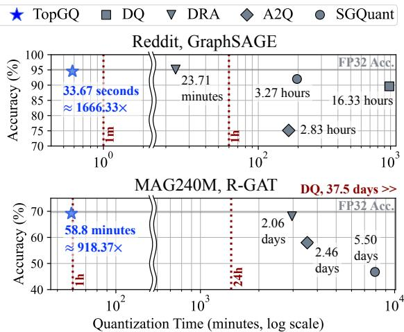
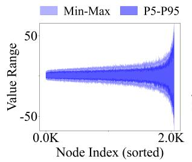
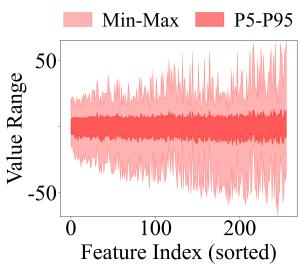
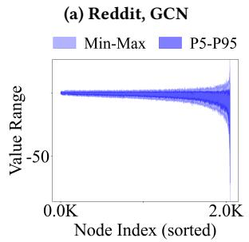
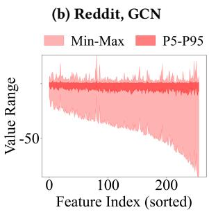
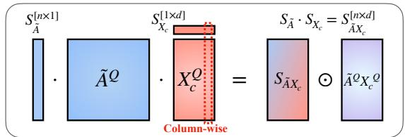
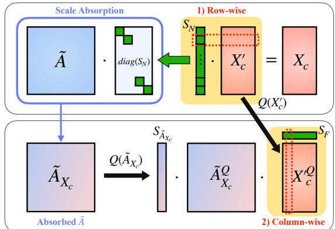
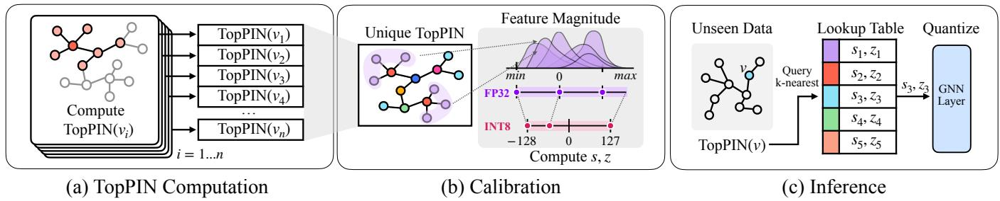

# TopGQ: Fast GNN Post-Training Quantization Leveraging Topology Information

Dain Kwon   
Seoul National University   
Seoul, South Korea   
dain.kwon@snu.ac.kr   
Sunjong Park   
Seoul National University   
Seoul, South Korea   
ryan0507@snu.ac.kr   
Kanghyun Choi   
Seoul National University   
Seoul, South Korea   
kanghyun.choi@snu.ac.kr   
Seoyong Lee   
Seoul National University   
Seoul, South Korea   
sylee2685@snu.ac.kr   
Jinho Lee   
Seoul National University   
Seoul, South Korea   
leejinho@snu.ac.kr   
Hyeyoon Lee   
Seoul National University   
Seoul, South Korea   
hylee817@snu.ac.kr   
Sukjin Kim   
Seoul National University   
Seoul, South Korea   
iamksj1212@snu.ac.kr

## Abstract

Existing GNN quantization methods sufer from considerable quantization overhead, which severely limits their practical usage in real-world scenarios. To this end, we present TopGQ, an accurate post-training GNN quantization framework, alleviating redundant quantization overhead. We propose dual-axis scale absorption, which enables activation quantization along both the outer and inner dimensions by merging one into the adjacency matrix. On top of that, we introduce TopPIN, a proxy for nodes’ local structure, and use it to group nodes with similar topology during quantization. Experimental results show that TopGQ reduces quantization time by an order of magnitude while preserving accuracy. The code is available at https://github.com/meowrowan/TopGQ.

## Keywords

Graph Neural Network, Post-Training Quantization, Inference Acceleration, Edge Device, Graph Topology

## ACM Reference Format:

Dain Kwon, Kanghyun Choi, Hyeyoon Lee, Sunjong Park, Seoyong Lee, Sukjin Kim, and Jinho Lee. 2026. TopGQ: Fast GNN Post-Training Quantization Leveraging Topology Information. In 63rdACM/IEEE Design Automation Conference (DAC ’26), July 26–29, 2026, Long Beach, CA, USA. ACM, New York, NY, USA, 7 pages. https://doi.org/10.1145/3770743.3804433

## 1 Introduction

Graph neural networks (GNNs) have attracted a great amount of attention due to their ability to process diverse unstructured data in diverse domains, such as recommendation systems [36], molecular interaction [27], transportation networks [5], and social network analysis [1]. Due to the rapid growth of the real-world graphs [13,

  
Figure 1: Quantization time-accuracy trade-of plot with large-scale graph datasets.

21], there is an urgent need to process them eficiently at scale. One promising approach is quantization, which reduces memory and computational costs by using low-bit representations [2, 19, 20, 22].

However, as illustrated in Figure 1, quantizing GNNs is dificult and time-consuming. Existing work takes hours for medium-sized graphs such as Reddit, and days for larger graphs such as MAG240M, making it infeasible. This overhead comes from handling outliers through extensive tuning or long training. Quantization-aware training (QAT) methods involve such costly model retraining [7, 14, 25, 28, 37]. While post-training quantization (PTQ) is known to be faster, existing methods [16] still employ gradient-based iterations on quantization parameters, negating this advantage.

This large quantization time poses a major barrier to the deployment of GNN quantization in real-world scenarios, particularly when frequent model updates are required. Popular applications such as personalization and recommendation [6, 9, 29, 33] operate on large-scale graphs and benefit from quantization. However, these often require model updates on a minute-to-hour scale [23, 24], and excessive quantization time makes deployment impractical by canceling out the benefits of quantization.

For this, we present TopGQ, a PTQ method that achieves orders ofmagnitude faster quantization with comparable or even better task performance. First, we show that node-wise quantization is preferable for GNNs (Section 3), due to outlier nodes. However, node-wise quantization on the aggregation phase prevents the use of fast integer arithmetic. Thus, we propose (1) dual-axis scale absorption, which enables fast and accurate integer matrix multiplication at aggregation by merging the scaling factors of each node into the adjacency matrix. We further propose (2) TopPIN, a fast-computable node index that captures its topology. Using TopPIN, we can rapidly assign quantization parameters to unseen nodes, ensuring fast inference. Extensive experimental results validate that TopGQ outperforms current state-of-the-art baselines, achieving faster quantization while preserving accuracy and speed, establishing a new standard in GNN quantization.

## 2 Background

Graph neural networks. Let $G = \left( V , E \right)$ be a directed graph with $n = | V |$ nodes, $v _ { 1 } , \ldots , v _ { n }$ . Denote $A \in \mathbb { R } ^ { n \times n }$ as the adjacency matrix, where $A _ { i j } = 1 _ { ( v _ { j } , v _ { i } ) \in E }$ . For node $v _ { i : \ l }$ define its closed inneighborhood as $N ( v _ { i } ) \stackrel { } { = } \{ v _ { j } \mid ( v _ { j } , v _ { i } ) \in E \} \cup \{ v _ { i } \}$ , and let degree $d ( v _ { i } ) = | N ( v _ { i } ) |$ . We denote $D = \operatorname { d i a g } ( d ( v _ { 1 } ) , d ( v _ { 2 } ) , \dots , d ( v _ { n } ) )$ as the diagonal degree matrix, $h _ { i }$ as feature vector of $v _ { i }$

To embed topology, GNNs aggregate information from neighboring nodes $v _ { j } \in N ( v _ { i } )$ to update $h _ { i } .$ . This procedure is referred to as the message-passing algorithm, which consists of two steps: combination and aggregation. First, the hidden node feature $h _ { i } ^ { ( l ) }$ is multiplied by the weight matrix $W ^ { ( l ) }$ in the �-th GNN layer. Next, the feature is aggregated to $h _ { i } ^ { ( l + 1 ) }$ as follows:

$$
h _ { i } ^ { ( l + 1 ) } = \phi \Big ( \bigoplus _ { \{ j | v _ { j } \in N ( v _ { i } ) \} } W ^ { ( l ) } h _ { j } ^ { ( l ) } \Big ) ,\tag{1}
$$

where $\phi$ is an update function, and $\bigoplus$ is a permutation-invariant operator such as sum or mean.

The GNN computation can also be formulated in matrix form. Let $\boldsymbol { X } ^ { ( l ) } = [ h _ { 1 } ^ { ( l ) } , \bar { \ldots } , h _ { n } ^ { ( l ) } ] ^ { T } \in \mathbb { R } ^ { n \times d _ { l } }$ be the node feature matrix at layer $l ,$ and $\bar { W ^ { ( l ) } } \in \mathbb { R } ^ { d _ { l } \times d _ { l + 1 } }$ be the weight matrix. Then, using the adjacency matrix $\tilde { A } \in \mathbb { R } ^ { n \times n }$ , the combination and aggregation are:

$$
X _ { \mathrm { c } } ^ { ( l ) } = X ^ { ( l ) } W ^ { ( l ) } , \quad X ^ { ( l + 1 ) } = \sigma \big ( \tilde { A } X _ { \mathrm { c } } ^ { ( l ) } \big ) ,\tag{2}
$$

where $\sigma$ is a nonlinear function. The specific form of $\tilde { A }$ varies by GNN architecture. GCN [18] employs the normalized graph Laplacian $\tilde { A } = D ^ { - 1 / 2 } ( A + I _ { n } ) D ^ { - 1 / 2 }$ , while GIN [31] uses the binary matrix ${ \tilde { A } } = A + I _ { n }$ . GraphSAGE [10] difers by sampling a subset of neighbors instead of using the entire neighborhood at aggregation.

Transductive and inductive settings. GNN training operates in either a transductive or an inductive setting. In the transductive setting, the full graph (e.g., features and topology of test nodes) is available during training, except for the test node labels. Thus, inference can be done with precomputed embeddings [32], leaving little room for acceleration benefits. In contrast, the inductive setting introduces unseen nodes or graphs at test time, requiring computation for node embeddings during inference. Consequently, GNN quantization is especially valuable in inductive settings, where reducing computation and memory directly accelerates inference. Moreover, the inductive setting better reflects practical real-world scenarios where graphs evolve or difer from those used for training, such as social networks and recommendation systems with new users, or molecular property prediction for unseen molecules.

Quantization replaces high-precision floating-point operations with low-bit integer operations, reducing computational cost and memory usage. We adopt uniform quantization with scale (�) and zero-point (�). Given a tensor $X ,$ element $x \in X$ is quantized as:

$$
x ^ { q } = \mathrm { c l a m p } \bigg ( \bigg \lfloor \frac { 1 } { s } \cdot ( x - z ) \bigg \rceil , q _ { \mathrm { m i n } } , q _ { \mathrm { m a x } } \bigg ) , ~ s = \frac { x _ { \mathrm { m a x } } - x _ { \mathrm { m i n } } } { q _ { \mathrm { m a x } } - q _ { \mathrm { m i n } } } ,\tag{3}
$$

�min and $q _ { \mathrm { m a x } }$ are the minimum and maximum integer values in $k ^ { - }$ bit representation, and ⌊·⌉ denotes rounding. Quantization operates at various granularities, such as per-tensor, per-row, or per-column. Finer granularity can reduce quantization error by constraining the efect of outliers to only a subset of values. However, we cannot freely choose per-row or per-column granularity, since the scale factors must follow the outer dimension of the GEMM for dequantization. This induces challenges for GNN quantization (Section 3).

Quantization can also be categorized into post-training quantization (PTQ) and quantization-aware training (QAT), depending on whether quantization is applied after training or incorporated during training. QAT iteratively updates the model weights using backpropagated gradients under simulated quantization, whereas PTQ calibrates scale and zero-point without modifying the pretrained weights, making it substantially faster in practice. As our method is PTQ-based, it inherits benefits from this eficiency.

  
(c) ogbn-products, GraphSAGE (d) ogbn-products, GraphSAGE  
Figure 2: Node-wise(blue, left) and feature-wise(red, right) range plot, sorted in ascending order. ‘Node Index’ indicates each node, and ‘Feature Index’ indicates each feature dimension. Each plot shows the min-max range and the 5th-95th percentile range of the values within the same dimension.

## 3 Motivations & Challenges

GNN quantization requires special consideration due to its unique message-passing mechanism. In particular, the accumulation of neighborhood information induces diversity across nodes, making node-wise quantization a preferred approach. Figure 2 illustrates such behavior by comparing the activation range within each node dimension (Figures 2a and 2c) and feature dimension (Figures 2b and 2d). Figures 2a and 2c show that node-wise ranges are more concentrated, with the 5th–95th percentile range close to the min–max range. This indicates that each group exhibits a suitable range for quantization, as there are no outliers far exceeding the majority distribution. However, in the feature-wise plots (Figures 2b and 2d), each min-max range is much broader, while 95% of the values exist within a narrower interval. This distribution is more prone to outliers far exceeding the majority range of values, leading to wasted quantization bins and higher error. This makes node-wise quantization a better choice for GNN activations.

Based on the observation, we assign diferent quantization scales to the group of nodes for � in both the combination and the aggregation phase. Enabling such a method in the combination phase is relatively straightforward. In fact, existing methods [7, 37] already employ node-wise quantization for combination (� · �):

$$
X \cdot W \approx \mathrm { d i a g } ( S _ { X } ) \cdot X ^ { Q } \cdot W ^ { Q } \cdot \mathrm { d i a g } ( S _ { W } ) = ( S _ { X } \cdot S _ { W } ^ { \top } ) \odot ( X ^ { Q } \cdot W ^ { Q } ) ,\tag{4}
$$

where $S _ { X } \in \mathbb { R } ^ { n \times 1 }$ is the node-wise scale of $X , S _ { W } \in \mathbb { R } ^ { d \times 1 }$ the featurewise scale of $W ,$ , and ⊙ denotes the element-wise (Hadamard) product. As � is quantized node-wise and � feature-wise, their multiplication remains a standard integer GEMM, with the scales applied afterwards for dequantization, maintaining high throughput.

Challenge 1: Quantization along inner dimensions. By contrast, node-wise quantization in the aggregation phase is challenging. Applying node-wise quantization for the aggregation step $( \tilde { A } \cdot X _ { \mathrm { c } } ) _ { : }$

$$
\tilde { A } \cdot X _ { \mathrm { c } } \approx \mathrm { d i a g } ( S _ { \tilde { A } } ) \cdot \tilde { A } ^ { Q } \cdot \mathrm { d i a g } ( S _ { X _ { \mathrm { c } } } ) \cdot X _ { \mathrm { c } } ^ { Q } ,\tag{5}
$$

introduces the diagonal matrix diag $( S _ { X _ { \mathrm { c } } } )$ within the multiplication. Unlike Equation 4, this cannot be computed using integer matrix multiplication units [15]. Thus, existing GNN quantization [7, 37] methods simply choose to employ column-wise quantization to $X _ { \mathrm { c } } .$ While this ensures acceleration, it may fail to preserve the precision of activations. To achieve the precision benefits of node-wise quantization while maintaining the eficiency of integer GEMM, TopGQ proposes a novel method, dual-axis scale absorption (Section 4.1).

Challenge 2: Generalization on unseen nodes. For practical inductive settings (Section 2), GNN encounters unseen nodes at inference. There are two ways to get quantization parameters for such nodes:

(i) On-the-Fly Quantization Parameter Computation. A straightforward approach is to dynamically compute quantization parameters per node during inference. For each activation, every row of $\cdot _ { X ^ { ( l ) } }$ and $X _ { \mathrm { c } } ^ { ( l ) }$ is scanned, and the minimum and maximum values of each node are empirically determined to obtain scales and zero-points. While this ensures low quantization error, it is less preferred as the additional runtime overhead can ofset the eficiency gains.

(ii) Precomputed Mapping. An alternative is to precompute a set of quantization parameters from train nodes at calibration time, and map each unseen node to one of them at inference. Before inference, a simple lookup can retrieve and prepare appropriate parameters for each activation. Nonetheless, this requires an accurate low-complexity node index � (·) such that nodes with similar index values exhibit similar feature statistics. TopGQ chooses this mapping approach, where we design a novel Topology-Aware Pairwise Index (TopPIN) that uses local topology for lightweight computation (Section 4.2). TopPIN ensures that unseen nodes are assigned adequate quantization parameters at low inference overhead.

## 4 TopGQ Methodology

## 4.1 Selective Dual-axis Scale Absorption

To account for the difering magnitude of node features (Figure 2), we employ a node-wise scale factor $S _ { N } \in \mathbb { R } ^ { N \times 1 }$ , where $S _ { N }$ consists of the maximum feature value for each node. Specifically, we scale $X _ { \mathrm { c } }$ to $X _ { \mathrm { c } } ^ { \prime }$ with $S _ { N } , \mathrm { i . e . , } X _ { \mathrm { c } } ^ { \prime } = \mathrm { d i a g } ^ { - 1 } ( S _ { N } ) \cdot X _ { \mathrm { c } }$ . Then, to eliminate any terms preventing integer operations, �� is merged to the given static adjacency matrix, $\tilde { A } \in \mathbb { R } ^ { N \times N }$ . The operation is as follows:

$$
\tilde { A } \cdot X _ { \mathrm { c } } = ( \tilde { A } \cdot \mathrm { d i a g } ( S _ { N } ) ) \cdot X _ { \mathrm { c } } ^ { \prime } = \tilde { A } _ { X _ { \mathrm { c } } } \cdot X _ { \mathrm { c } } ^ { \prime } .\tag{6}
$$

After merging $S _ { N }$ to ${ \tilde { A } } ,$ we can conduct integer matrix multiplication for two matrices, $\tilde { A } _ { X _ { \mathrm { c } } }$ and $X _ { \mathrm { c } } ^ { \prime }$ with corresponding quantization parameters $S _ { \tilde { A } _ { X _ { c } } } \in \mathbb { R } ^ { N \times 1 }$ , and $S _ { X _ { c } ^ { \prime } } \in \mathbb { R } ^ { 1 \times d }$

$$
\begin{array} { r l } & { \tilde { A } _ { X _ { \mathrm { c } } } \cdot X _ { \mathrm { c } } ^ { \prime } \approx ( \mathrm { d i a g } ( S _ { \tilde { A } _ { X _ { \mathrm { c } } } } ) \cdot \tilde { A } _ { X _ { \mathrm { c } } } ^ { Q } ) \cdot ( X _ { \mathrm { c } } ^ { \prime Q } \cdot d i a g ( S _ { X _ { \mathrm { c } } ^ { \prime } } ) ) } \\ & { \qquad = ( S _ { \tilde { A } _ { X _ { \mathrm { c } } } } \cdot S _ { X _ { \mathrm { c } } ^ { \prime } } ) \odot ( \tilde { A } _ { X _ { \mathrm { c } } } ^ { Q } \cdot X _ { \mathrm { c } } ^ { \prime Q } ) . } \end{array}\tag{7}
$$

(8)

In the calibration process, TopGQ adaptively chooses between dual-axis and feature-wise quantization for �c for each GNN layer. TopGQ evaluates both configurations by measuring the mean squared error (MSE) between the original floating-point activations and their quantized counterparts. The configuration with lower MSE is saved for inference. When dual-axis scale absorption is selected, the scaling elements for $S _ { N }$ are calibrated like the quantization parameters. When dual-axis scale absorption is used at inference, $X _ { \mathrm { c } }$ can be immediately quantized with $S _ { N } \cdot S _ { X _ { r } ^ { \prime } } \in \mathbb { R } ^ { N \times d }$ , which acts like an element-wise quantization parameters for $X _ { \mathrm { c } }$

  
(a) Column-wise activation quantization

  
(b) Quantization via dual-axis scale absorption (Proposed)  
Figure 3: Comparing quantization at aggregation phase.

  
Figure 4: Quantization process with TopPIN. (a) shows node group generation through the proposed topological proxy, TopPIN. Each color is used to denote each group. (b) shows the calibration process to obtain quantization parameters for each group. (c) demonstrates how inference is done on unseen data, using the quantization parameters of the nearest groups with interpolation.

Dual-axis scale absorption mimics the efect of node-wise quantization, while actually using feature-wise quantization to be compatible with integer matrix multiplication. This design allows advantages of node-wise scaling without sacrificing inference eficiency.

## 4.2 TopPIN: A Fast Index for Unseen Nodes

To support quantization in inductive settings, we devise TopPIN, a lightweight index that maps unseen nodes to existing train set nodes used at calibration. The formulation of TopPIN is as follows:

$$
\mathrm { T o p P I N } ( v ) = \Big ( d ( v ) , ~ \frac { 1 } { d ( v ) } \sum _ { v _ { k } \in N ( v ) } \frac { 1 } { d ( v _ { k } ) } ~ \Big ) .\tag{9}
$$

We observe that GNN aggregation creates distinct activation patterns for diferent nodes based on their local topology. When a GNN repeatedly aggregates neighborhood information through layers, the variance of each node’s activation accumulates diferently depending on its position in the graph. Specifically, we can characterize this accumulation through a node index function $\phi : V \to { \mathbb { R } } .$ For unnormalized GNNs $( { \tilde { A } } = A + I _ { n } ) .$ , this accumulation is proportional to the number of paths reaching the nodes:

$$
\begin{array} { r } { \phi ( \boldsymbol { v } ) = \Sigma _ { \boldsymbol { v } _ { k _ { 1 } } \in N ( \boldsymbol { v } ) } \sum _ { \boldsymbol { v } _ { k _ { 2 } } \in N ( \boldsymbol { v } _ { k _ { 1 } } ) } \quad \ldots \quad \sum _ { \boldsymbol { v } _ { k _ { l } } \in N ( \boldsymbol { v } _ { k _ { l - 1 } } ) } 1 , } \end{array}\tag{10}
$$

where nodes with denser neighborhoods accumulate more variance.

This idea suggests that nodes with similar � values will exhibit similar activation distributions after multiple layers of aggregation. Rather than using uniform quantization parameters across all nodes, we can group nodes by their expected activation patterns based on local graph structure. This insight motivates our TopPIN index, which captures these topological patterns to enable eficient node wise quantization by assigning similar quantization parameters to nodes that share similar neighborhood aggregation characteristics. To derive a practical approximation of $\phi ( \boldsymbol { v } )$ that forms our TopPIN index, let � (�) denote the indegree of node $v ,$ and we approximate all summations beyond the first term as a constant $C _ { 1 }$

$$
\phi ( v ) \approx \sum _ { v _ { k _ { 1 } } \in N ( v ) } C _ { 1 } = d ( v ) \cdot C _ { 1 } .\tag{11}
$$

For normalized GNNs $( \tilde { A } = D ^ { - 1 / 2 } ( A { + } I _ { n } ) D ^ { - 1 / 2 } )$ , the only diference is that degree normalization factors propagate through the aggregation. In this case, we approximate the summand of the second summation as a constant $C _ { 2 } { \mathrm { : } }$

$$
\phi ( v ) \approx { \frac { 1 } { d ( v ) } } \sum _ { v _ { k _ { 1 } } \in N ( v ) } \left( { \frac { 1 } { d ( v _ { k _ { 1 } } ) ^ { 2 } } } \sum _ { v _ { k _ { 2 } } \in N ( v _ { k _ { 1 } } ) } C _ { 2 } \right) = { \frac { 1 } { d ( v ) } } \sum _ { v _ { k _ { 1 } } \in N ( v ) } { \frac { C _ { 2 } } { d ( v _ { k _ { 1 } } ) } }\tag{12}
$$

These approximations lead to our final TopPIN formulation, which efectively balances accuracy and eficiency. TopPIN(�) can be applied to various GNN architectures. Our empirical observations confirm that these first-order approximations capture most of the benefits with minimal computational overhead, making TopPIN practical for large-scale inductive GNN quantization.

Figure 4 illustrates how we apply TopPIN during quantization. In the calibration phase (Figure 4a), we first compute TopPIN(�) for each node �, as defined in Section 4.2. For each value, we calculate node-wise quantization parameters $( s _ { v } , z _ { v } )$ . If multiple nodes share the same TopPIN, we aggregate the statistics by taking the global maximum and minimum (Figure 4b), ensuring the quantization parameters cover the full range. This gives a pair of quantization parameters for each unique TopPIN. Finally, in inference, we only need to compute the TopPIN(�) for each unseen node � and use it as a key to retrieve the appropriate quantization parameters (Figure 4c). For this, we retrieve the �-nearest TopPIN groups and interpolate among their parameters. Such design leverages the finding that nodes with similar TopPIN(�) values exhibit similar activation distribution, as we theoretically demonstrated.

## 5 Experimental Results

## 5.1 Experimental Settings

We evaluate TopGQ on node-level and graph-level tasks against three QAT baselines: SGQuant [7], Degree-Quant [25] (DQ), �2� [37], and one recent PTQ baseline: DRA [16]. For node classification, we use Cora, CiteSeer, Reddit, ogbn-products, and MAG240M. For graph classification, we use IMDB-BINARY, and COLLAB, and report 10-fold cross-validation accuracy. We calibrate fully-trained GCN [18], GraphSAGE (SAGE) [10], GIN [31], and GAT [26] for 4-bit and 8-bit integer quantization, with a fixed bitwidth across all layers for fair comparison. All datasets except MAG240M were evaluated in the inductive setting, better reflecting practical quantization use. MAG240M was evaluated in the original transductive setting, using R-GAT architecture from the ogb-lsc [12] challenge.

Table 1: Comparison of node classification task with graphs of varying sizes
<table><tr><td rowspan="3">Bit</td><td rowspan="3"></td><td rowspan="3">Method Type</td><td colspan="3">Cora</td><td colspan="4">Citeseer</td><td colspan="4">Reddit</td><td colspan="4">ogbn-products</td></tr><tr><td colspan="2">GCN</td><td colspan="2">GraphSAGE</td><td colspan="2">GCN</td><td colspan="2">GraphSAGE</td><td colspan="2">GCN</td><td colspan="2">GraphSAGE</td><td colspan="2">GCN</td><td colspan="2">GraphSAGE</td></tr><tr><td>Acc.</td><td>Q.Time</td><td>Acc.</td><td>Q.Time</td><td>Acc.</td><td>Q.Time</td><td>Acc.</td><td>Q.Time</td><td>Acc.</td><td>Q.Time</td><td>Acc.</td><td>Q.Time</td><td>Acc.</td><td>Q.Time</td><td>Acc.</td><td>Q.Time</td></tr><tr><td rowspan="6">INT8</td><td>FP32</td><td></td><td>80.14</td><td></td><td>77.02</td><td></td><td>76.46</td><td></td><td>76.34</td><td></td><td>94.40</td><td></td><td>95.09</td><td></td><td>71.25</td><td></td><td>70.33</td><td></td></tr><tr><td>SGQ</td><td>QAT</td><td>79.93</td><td>(6.4s)</td><td>76.28</td><td>(8.24s)</td><td>76.21</td><td>(9.3s)</td><td>76.06</td><td>(14.84s)</td><td>92.10</td><td>(4.64m)</td><td>92.01</td><td>(3.27h)</td><td>39.13</td><td>(2.52m)</td><td>58.80</td><td>(2.11h)</td></tr><tr><td>DQ</td><td>QAT</td><td>78.94</td><td>(11.5s)</td><td>75.50</td><td>(23.87s)</td><td>75.62</td><td>(25.7s)</td><td>74.77</td><td>(69.95s)</td><td>87.01</td><td>(10.59m)</td><td>90.53</td><td>(16.35h)</td><td>72.34</td><td>(14.05m)</td><td>70.17</td><td>(6.55h)</td></tr><tr><td>A2Q</td><td>QAT</td><td>79.66</td><td>(3.5s)</td><td>76.94</td><td>(4.56s)</td><td>75.72</td><td>(3.5s)</td><td>75.08</td><td>(4.96s)</td><td>73.71</td><td>(4.12m)</td><td>75.13</td><td>(2.83h)</td><td>50.78</td><td>(83.94s)</td><td>60.15</td><td>(1.67h)</td></tr><tr><td>DRA</td><td>PTQ</td><td>79.76</td><td>(1.7s)</td><td>76.46</td><td>(3.11s)</td><td>76.26</td><td>(1.6s)</td><td>75.74</td><td>(3.00s)</td><td>93.15</td><td>(42.99s)</td><td>94.36</td><td>(23.71m)</td><td>36.22</td><td>(41.63s)</td><td>47.70</td><td>(44.97m)</td></tr><tr><td>TopGQ</td><td>PTQ</td><td>79.96</td><td>(0.2s)</td><td>76.86</td><td>(0.54s)</td><td>76.52</td><td>(0.2s)</td><td>76.32</td><td>(0.56s)</td><td>94.41</td><td>(1.88s)</td><td>94.55</td><td>(35.79s)</td><td>71.33</td><td>(1.16s)</td><td>70.31</td><td>(34.88s)</td></tr><tr><td rowspan="5">INT4</td><td>SGQ</td><td>QAT</td><td>78.73</td><td>(6.4s)</td><td>75.52</td><td>(8.41s)</td><td>76.31</td><td>(10.4s)</td><td>75.94</td><td>(14.65s)</td><td>43.00</td><td>(4.84m)</td><td>87.42</td><td>(3.27h)</td><td>6.14</td><td>(2.57m)</td><td>27.95</td><td>(2.13h)</td></tr><tr><td>DQ</td><td>QAT</td><td>78.54</td><td>(11.5s)</td><td>74.36</td><td>(23.49s)</td><td>23.54</td><td>(25.5s)</td><td>74.99</td><td>(69.91s)</td><td>64.18</td><td>(10.55m)</td><td>89.61</td><td>(16.33h)</td><td>36.66</td><td>(13.93m)</td><td>69.90</td><td>(6.52h)</td></tr><tr><td>A2Q</td><td>QAT</td><td>50.00</td><td>(3.6s)</td><td>74.66</td><td>(4.65s)</td><td>43.52</td><td>(3.5s)</td><td>73.00</td><td>(5.01s)</td><td>23.24</td><td>(4.12m)</td><td>67.94</td><td>(2.83h)</td><td>25.95</td><td>(83.30s)</td><td>31.32</td><td>(1.66h)</td></tr><tr><td>DRA</td><td>PTQ</td><td>77.02</td><td>(1.7s)</td><td>76.18</td><td>(3.24s)</td><td>74.10</td><td>(1.6s)</td><td>74.60</td><td>(2.93s)</td><td>1.75</td><td>(42.82s)</td><td>5.31</td><td>(23.71m)</td><td>3.12</td><td>(41.61s)</td><td>26.40</td><td>(44.96m)</td></tr><tr><td>TopGQ</td><td>PTQ</td><td>78.84</td><td>(0.2s)</td><td>76.30</td><td>(0.53s)</td><td>75.96</td><td>(0.2s)</td><td>75.76</td><td>(0.57s)</td><td>93.05</td><td>(1.87s)</td><td>89.88</td><td>(35.28s)</td><td>39.03</td><td>(1.16s)</td><td>61.83</td><td>(34.90s)</td></tr></table>

∗Q.Time: Quantization Time, SGQ: SGQuant, DQ: Degree-Quant, TopGQ: Proposed Method

Table 2: Quantized accuracy and time on GNN architectures with learnable edge weights
<table><tr><td rowspan="3">Method Type</td><td rowspan="3"></td><td colspan="4">Cora</td><td colspan="2">MAG240M</td></tr><tr><td colspan="2">INT8</td><td colspan="2">INT4</td><td colspan="2">INT8</td></tr><tr><td>Acc.</td><td>Q.Time</td><td>Acc.</td><td>Q.Time</td><td>Acc.</td><td>Q.Time</td></tr><tr><td>FP32</td><td>1</td><td>80.36</td><td>一</td><td>80.36</td><td>一</td><td>69.66</td><td>一</td></tr><tr><td>SGQ</td><td>QAT</td><td>80.30</td><td>(7.7s)</td><td>77.92</td><td>(6.8s)</td><td>46.76</td><td>(5.50 days)</td></tr><tr><td>DQ</td><td>QAT</td><td>78.66</td><td>(14.6s)</td><td>77.90</td><td>(14.5s)</td><td>N/A</td><td>(37.5 days)</td></tr><tr><td>A2Q</td><td>QAT</td><td>75.29</td><td>(6.3s)</td><td>45.64</td><td>(6.3s)</td><td>57.97</td><td>(2.46 days)</td></tr><tr><td>DRA</td><td>PTQ</td><td>80.20</td><td>(3.6s)</td><td>74.35</td><td>(3.3s)</td><td>66.13</td><td>(2.06 days)</td></tr><tr><td>TopGQ PTQ</td><td></td><td>80.63</td><td>(0.2 s)</td><td>78.56</td><td>(0.2s)</td><td>69.14</td><td>(58.8 minutes)</td></tr></table>

All experiments are conducted using A6000 GPU, RTX 4090 GPU, and Intel(R) Xeon(R) Gold 6442Y CPU. To evaluate the practical deployment potential on edge devices, we used NVIDIA Jetson AGX Orin. We report both the accuracy and the quantization time. Bold indicates the best accuracy, and red indicates quantization times with unit changes (e.g., h → m, m → s) by TopGQ.

## 5.2 Evaluation Results of Node-level Tasks

Table 1 reports node classification results, where the graph size spans from small (Cora, Citeseer), middle (Reddit), to large (ogbnproducts). Across all sizes, TopGQ is the fastest while matching or exceeding the baseline accuracy: Baselines take up to hours (16.35h, Reddit, GraphSAGE) for quantization whilst TopGQ takes less than a minute. Notably in INT4, TopGQ achieves the best accuracy, with up to a 28.87%p gain over the strongest baseline for GCN.

We also evaluate on GAT, a representative architecture for using dynamic edge weights, shown in Table 2. TopGQ preserves the accuracy of the original model, demonstrating generalization across diferent GNN structures. On Cora, TopGQ achieves the best accuracy while keeping quantization time under half a second. Notably in 4-bit quantization, we observe at most 32.92%p accuracy gain compared to the baselines. We further emphasize the benefit of TopGQ by using a hyper-scale graph with 240 million nodes (MAG240M). We do not report accuracy for DQ because its training time (37.5 days) is prohibitive given our computational budget.

Table 3: Comparison of quantization accuracy and time for the graph-classification datasets
<table><tr><td rowspan="3" colspan="2">Method Type</td><td colspan="4">IMDB-BINARY</td><td colspan="4">COLLAB</td></tr><tr><td colspan="2">GCN</td><td colspan="2">GIN</td><td colspan="2">GCN</td><td colspan="2">GIN</td></tr><tr><td>Acc.</td><td>Q.Time</td><td>Acc.</td><td>Q.Time</td><td>Acc.</td><td>Q.Time</td><td>Acc.</td><td>Q.Time</td></tr><tr><td>FP32</td><td>一</td><td>79.58</td><td>一</td><td>79.72</td><td>一</td><td>82.54</td><td>1</td><td>82.31</td><td>一</td></tr><tr><td>INT8</td><td></td><td></td><td></td><td></td><td></td><td></td><td></td><td></td><td></td></tr><tr><td>SGQ</td><td>QAT</td><td>68.28</td><td>(5.88m)</td><td>68.26</td><td>(6.74m)</td><td>80.96</td><td>(39.35m)</td><td>81.80</td><td>(40.26m)</td></tr><tr><td>DQ</td><td>QAT</td><td>77.32</td><td>(8.98m)</td><td>76.00</td><td>(9.08m)</td><td>82.30</td><td>(2.39h)</td><td>81.62</td><td>(2.30h)</td></tr><tr><td>A2Q</td><td>QAT</td><td>75.12</td><td>(3.24m)</td><td>75.97</td><td>(3.78m)</td><td>64.10</td><td>(14.75m)</td><td>80.21</td><td>(14.50m)</td></tr><tr><td>DRA</td><td>PTQ</td><td>78.88</td><td>(2.24m)</td><td>78.52</td><td>(2.29m)</td><td>82.08</td><td>(11.49m)</td><td>82.18</td><td>(10.19m)</td></tr><tr><td>TopGQ</td><td>PTQ</td><td>79.34</td><td>(2.18s)</td><td>79.50</td><td>(2.05s)</td><td>82.52</td><td>(13.86s)</td><td>82.28</td><td>(11.71s)</td></tr><tr><td colspan="10">INT4</td></tr><tr><td>SGQ</td><td>QAT</td><td>67.64</td><td>(5.89m)</td><td>63.72</td><td>(6.71m)</td><td>78.14</td><td>(38.87m)</td><td>72.06</td><td>(40.44m)</td></tr><tr><td>DQ</td><td>QAT</td><td>76.02</td><td>(9.03m)</td><td>75.98</td><td>(9.22m)</td><td>73.24</td><td>(2.40h)</td><td>77.61</td><td>(2.31h)</td></tr><tr><td>A2Q</td><td>QAT</td><td>74.09</td><td>(3.13m)</td><td>75.62</td><td>(3.79m)</td><td>69.32</td><td>(14.94m)</td><td>74.78</td><td>(14.40m)</td></tr><tr><td>DRA</td><td>PTQ</td><td>74.32</td><td>(2.22m)</td><td>70.28</td><td>(2.30m)</td><td>64.16</td><td>(11.45m)</td><td>66.24</td><td>(10.18m)</td></tr><tr><td>TopGQ</td><td>PTQ</td><td>76.71</td><td>(2.08s)</td><td>76.00</td><td>(2.13s)</td><td>81.75</td><td>(13.85s)</td><td>77.39</td><td>(11.71s)</td></tr></table>

Other methods take at least 2.06 days, up to 5.50 days to quantize a GNN on such a hyper-scale graph, while TopGQ cuts it down to 58.8 minutes, showing at least 50× speedup. At the same time, TopGQ presents a negligible diference to the FP32 model, setting a new standard for practical quantization of large-scale GNNs.

## 5.3 Evaluation Results of Graph-level Tasks

Table 3 presents the graph-level classification results on IMDB-BINARY and COLLAB. TopGQ significantly improves quantization speed while maintaining task performance. For instance, while Degree-Quant is the strongest baseline in GCN COLLAB, it takes 2.40 hours for quantization. However, TopGQ shows superior accuracy while cutting down the overhead to 13.85 seconds. While TopGQ takes the least time to quantize, in many cases TopGQ also shows the best accuracy with minimal degradation compared to FP32. We attribute this to TopGQ’s explicit integration of GNNaware design, leveraging TopPIN to efectively capture local topology, while QAT baselines neglect these properties. Overall, the experimental results demonstrate that TopGQ provides a robust balance between accuracy and quantization speed, making it well suited for both small and large-scale GNN tasks.

Table 4: GCN inference time (sec) on GPU and edge device using ogbn-products, with mini-batching
<table><tr><td rowspan="2">Method</td><td rowspan="2">Type</td><td colspan="2">RTX4090</td><td colspan="2">Jetson AGX Orin</td></tr><tr><td>Time</td><td>Speedup</td><td>Time</td><td>Speedup</td></tr><tr><td>FP32</td><td></td><td>34.51</td><td>一</td><td>754.09</td><td></td></tr><tr><td>SGQ</td><td>QAT</td><td>20.53</td><td>1.68×</td><td>470.89</td><td>1.60×</td></tr><tr><td>DQ</td><td>QAT</td><td>20.37</td><td>1.69×</td><td>463.96</td><td>1.63×</td></tr><tr><td> $A ^ { 2 } Q$ </td><td>QAT</td><td>27.74</td><td>1.24×</td><td>635.15</td><td>1.19×</td></tr><tr><td>On-the-fly PTQ</td><td>PTQ</td><td>27.73</td><td>1.24×</td><td>689.82</td><td>1.09×</td></tr><tr><td>TopGQ</td><td>PTQ</td><td>20.53</td><td>1.68×</td><td>473.25</td><td>1.59×</td></tr></table>

Table 5: Accuracy and computation time comparison for var ious indexing strategies on IMDB-BINARY
<table><tr><td>Bit</td><td>Node Index</td><td>GCN</td><td>SAGE</td><td>GIN</td><td>Time</td></tr><tr><td rowspan="5">INT4</td><td>Naive PTQ</td><td>60.14</td><td>74.76</td><td>56.50</td><td></td></tr><tr><td>Betweenness</td><td>50.00</td><td>50.00</td><td>50.00</td><td>1.85s</td></tr><tr><td>Closeness</td><td>72.90</td><td>75.36</td><td>67.78</td><td>1.48s</td></tr><tr><td>Katz</td><td>69.34</td><td>74.26</td><td>72.58</td><td>20.04s</td></tr><tr><td>TopPIN</td><td>76.71</td><td>75.72</td><td>76.00</td><td>0.00059s</td></tr></table>

## 5.4 Evaluation Results of Inference Latency

Table 4 reports the inference latency of TopGQ and baselines with the minibatch setting of ogbn-products. Measurements were conducted on both GPU and edge devices, reflecting practical scenarios for quantized GNN deployment. A key observation is that $A ^ { 2 } Q$ and on-the-fly PTQ are expensive and slow. This is because both methods require row-wise scans per intermediate activations to derive quantization parameters. This highlights the importance of storing quantization parameters and retrieving them via an eficient map ping function. TopGQ leverages TopPIN, where computation incurs negligible overhead, enabling eficient inference (Section 4.2).

## 5.5 Analysis on TopPIN and Ablation Study

We assess the efectiveness of TopPIN by comparing it against a naive PTQ strategy as well as commonly used centrality measures, including betweenness, closeness, and Katz centrality (Table 5). We report both accuracy and the total computation time required to perform indexing for all nodes. The naive PTQ approach, which utilize a single global quantization parameter, shows significant accuracy degradation due to high variance in node magnitudes. The centrality measures may mitigate the degradation, compared to naive PTQ. However, they require costly graph traversal per node, making them impractical for inference. In contrast, TopPIN only depends on 1-hop neighborhood information, thereby significantly reducing the computational overhead. Despite its lightweight design, Top-PIN outperforms other baselines, highlighting its practicality and efectiveness as an indexing strategy for GNN quantization.

Table 6 shows the ablation study, where each row corresponds to the incremental addition of TopPIN and selective dual-axis scale absorption to the naive PTQ baseline, ultimately forming TopGQ. While naive PTQ fails to exploit quantization bins, TopPIN mitigates this limitation with topology. However, as graph size increases (e.g., ogbn-products, GCN), TopPIN alone proves insuficient. By adding dual-axis scale absorption, the node-wise quantization efects are preserved across layers, leading to additional accuracy recovery.

Table 6: Ablation Study of TopGQ
<table><tr><td rowspan="2">Bit</td><td rowspan="2">Method</td><td colspan="2">Reddit</td><td colspan="2">ogbn-products</td></tr><tr><td>GCN</td><td>SAGE</td><td>GCN</td><td>SAGE</td></tr><tr><td rowspan="3">INT4</td><td>Naive PTQ</td><td>3.79</td><td>2.97</td><td>1.33</td><td>24.74</td></tr><tr><td>Only TopPIN</td><td>93.05</td><td>85.83</td><td>1.43</td><td>52.45</td></tr><tr><td>TopGQ</td><td>93.05</td><td>89.88</td><td>39.03</td><td>63.18</td></tr></table>

## 6 Related Work

GNN quantization eficiently reduces extensive memory and computational costs of GNNs [10, 18, 26, 31]. Degree-Quant [25] is the first work to quantize GNN using QAT, excluding high-degree node activations in calibration for robust quantization parameters and compressing later at inference. SGQuant [7] and $\bar { A ^ { 2 } Q }$ [37] are also QAT methods, but they difer in that they allow mixed-precision to assign a higher bitwidth to high-magnitude features. The quantization parameters are optimized with gradients in DRA [16] to reconstruct the FP32 distributions. Thus, they require significant and redundant quantization overheads, whereas TopGQ allows orders of magnitude shorter quantization time.

Graph topology in GNNs is often integrated during training to help the model efectively learn the structural information [4, 8, 11, 30, 34, 35]. For example, [8] uses degree centrality to find central nodes for efective representation learning. Also, [35] uses betweenness centrality to assign weights to each node at aggregation. There are prior attempts to use topology for GNN binarization [3, 17]. However, these methods do not incorporate topology in relation to node feature patterns for GNN quantization.

## 7 Conclusion

We introduce TopGQ, a topology-aware PTQ framework for GNNs, eliminating retraining costs while preserving task accuracy. By leveraging a novel node index (TopPIN) and dual-axis scale absorption, TopGQ handles unseen node features of difering magnitudes. The node-level strategies enable fast and precise quantization while preserving the computational benefits of integer operations. Experiments across various GNN architectures and datasets show that TopGQ achieves QAT-level accuracy, while reducing quantization time by an order of magnitude compared to prior works.

## Acknowledgments

This work was supported by the National Research Foundation of Korea (NRF) grant funded by the Korea government (MSIT) (RS-2026-25495605), the Institute of Information & communications Technology Planning & Evaluation (IITP) (RS-2024-00395134, RS-2024-00347394, IITP-2025-RS-2023-00256081), in part by Samsung Electronics (IO230407-05813-01), and the Korea Basic Science Institute (National research Facilities and Equipment Center) grant funded by the Ministry of Science and ICT (No. RS-2025-00564840). Jinho Lee is the corresponding author.

## References

[1] Marco Arazzi, Marco Cotogni, Antonino Nocera, and Luca Virgili. 2023. Predicting tweet engagement with graph neural networks. In ICMR.

[2] Saleh Ashkboos, Amirkeivan Mohtashami, Maximilian Croci, Bo Li, Pashmina Cameron, Martin Jaggi, Dan Alistarh, Torsten Hoefler, and James Hensman. 2024. Quarot: Outlier-free 4-bit inference in rotated llms. NeurIPS (2024).

[3] Mehdi Bahri, Gaétan Bahl, and Stefanos Zafeiriou. 2021. Binary graph neural networks. In CVPR.

[4] Andrei Dragos Brasoveanu, Fabian Jogl, Pascal Welke, and Maximilian Thiessen. 2023. Extending Graph Neural Networks with Global Features. In LoG.

[5] Defu Cao, Yujing Wang, Juanyong Duan, Ce Zhang, Xia Zhu, Congrui Huang, Yunhai Tong, Bixiong Xu, Jing Bai, Jie Tong, et al. 2020. Spectral temporal graph neural network for multivariate time-series forecasting. NeurIPS (2020).

[6] Chaoyi Chen, Dechao Gao, Yanfeng Zhang, Qiange Wang, Zhenbo Fu, Xuecang Zhang, Junhua Zhu, Yu Gu, and Ge Yu. 2023. NeutronStream: A Dynamic GNN Training Framework with Sliding Window for Graph Streams. arXiv preprint arXiv:2312.02473 (2023).

[7] Boyuan Feng, Yuke Wang, Xu Li, Shu Yang, Xueqiao Peng, and Yufei Ding. 2020. Sgquant: Squeezing the last bit on graph neural networks with specialized quantization. In ICTAI.

[8] Hongyang Gao and Shuiwang Ji. 2019. Graph U-Nets. In ICML.

[9] Mingyu Guan, Saumia Singhal, Taesoo Kim, and Anand Padmanabha Iyer. 2025. ReInc: Scaling Training of Dynamic Graph Neural Networks. arXiv preprint arXiv:2501.15348 (2025).

[10] Will Hamilton, Zhitao Ying, and Jure Leskovec. 2017. Inductive representation learning on large graphs. NeurIPS (2017).

[11] Man Hu, Dezhi Sun, Fucheng You, and Han Xiao. 2022. Hybrid Structure Encoding Graph Neural Networks with Attention Mechanism for Link Prediction. In ICTAI. IEEE.

[12] Weihua Hu, Matthias Fey, Hongyu Ren, Maho Nakata, Yuxiao Dong, and Jure Leskovec. 2021. OGB-LSC: A Large-Scale Challenge for Machine Learning on Graphs. arXiv preprint arXiv:2103.09430 (2021).

[13] Weihua Hu, Matthias Fey, Marinka Zitnik, Yuxiao Dong, Hongyu Ren, Bowen Liu, Michele Catasta, and Jure Leskovec. 2020. Open graph benchmark: Datasets for machine learning on graphs. NeurIPS (2020).

[14] Linyong Huang, Zhe Zhang, Zhaoyang Du, Shuangchen Li, Hongzhong Zheng, Yuan Xie, and Nianxiong Tan. 2022. EPQuant: A Graph Neural Network com pression approach based on product quantization. Neurocomput. 503, C (2022), 49–61. doi:10.1016/j.neucom.2022.06.097

[15] BenoitJacob, Skirmantas Kligys, Bo Chen, Menglong Zhu, Matthew Tang, Andrew Howard, Hartwig Adam, and Dmitry Kalenichenko. 2018. Quantization and training of neural networks for eficient integer-arithmetic-only inference. In CVPR.

[16] Hadi Mousanejad Jeddi, Mahdieh Grailoo, and Jose Nunez-Yanez. 2024. Leveraging Dynamic Range Analysis for Eficient Post-Training Quantization in Graph Convolutional Networks. In NorCAS. doi:10.1109/NorCAS64408.2024.10752486

[17] Yongcheng Jing, Yiding Yang, Xinchao Wang, Mingli Song, and Dacheng Tao. 2021. Meta-aggregator: Learning to aggregate for 1-bit graph neural networks. In ICCV.

[18] Thomas N Kipf and Max Welling. 2016. Semi-Supervised Classification with Graph Convolutional Networks. In ICLR.

[19] Muyang Li, Yujun Lin, Zhekai Zhang, Tianle Cai, Junxian Guo, Xiuyu Li, Enze Xie, Chenlin Meng, Jun-Yan Zhu, and Song Han. [n. d.]. SVDQuant: Absorbing Outliers by Low-Rank Component for 4-Bit Difusion Models. In ICLR.

[20] Xiuyu Li, Yijiang Liu, Long Lian, Huanrui Yang, Zhen Dong, Daniel Kang, Shanghang Zhang, and Kurt Keutzer. 2023. Q-difusion: Quantizing difusion models. In ICCV.

[21] Juncheng Liu, Bryan Hooi, Kenji Kawaguchi, Yiwei Wang, Chaosheng Dong, and Xiaokui Xiao. 2024. Scalable and efective implicit graph neural networks on large graphs. In ICLR.

[22] Zechun Liu, Changsheng Zhao, Igor Fedorov, Bilge Soran, Dhruv Choudhary, Raghuraman Krishnamoorthi, Vikas Chandra, Yuandong Tian, and Tijmen Blankevoort. 2024. SpinQuant: LLM quantization with learned rotations. CoRR (2024).

[23] Zhuoran Liu, Leqi Zou, Xuan Zou, Caihua Wang, Biao Zhang, Da Tang, Bolin Zhu, Yijie Zhu, Peng Wu, Ke Wang, and Youlong Cheng. 2022. Monolith: Real Time Recommendation System with Collisionless Embedding Table. In CEUR Workshop in RecSys.

[24] Xiuyan Ni, Shujian Bu, Lucas Adams, and Igor L Markov. 2021. Prioritizing original news on Facebook. In CIKM.

[25] Shyam Anil Tailor, Javier Fernandez-Marques, and Nicholas Donald Lane. 2020. Degree-Quant: Quantization-Aware Training for Graph Neural Networks. In ICLR.

[26] Petar Veličković, Guillem Cucurull, Arantxa Casanova, Adriana Romero, Pietro Liò, and Yoshua Bengio. 2018. Graph Attention Networks. In ICLR.

[27] Nikil Wale, Ian A Watson, and George Karypis. 2008. Comparison of descriptor spaces for chemical compound retrieval and classification. Knowledge and

Information Systems 14 (2008), 347–375.

[28] Shuang Wang, Bahaeddin Eravci, Rustam Guliyev, and Hakan Ferhatosmanoglu. 2023. Low-bit quantization for deep graph neural networks with smoothnessaware message propagation. In CIKM.

[29] Dan Wu, Zhaoying Li, and Tulika Mitra. 2023. InkStream: Real-time GNN Inference on Streaming Graphs via Incremental Update. arXiv preprint arXiv:2309.11071 (2023).

[30] Zhenqin Wu, Bharath Ramsundar, Evan N Feinberg, Joseph Gomes, Caleb Ge niesse, Aneesh S Pappu, Karl Leswing, and Vijay Pande. 2018. MoleculeNet: a benchmark for molecular machine learning. Chemical science 9, 2 (2018).

[31] Keyulu Xu, Weihua Hu, Jure Leskovec, and Stefanie Jegelka. 2019. How Powerful are Graph Neural Networks?. In ICLR.

[32] Zhibo Xu, Shangqi Lai, Xiaoning Liu, Alsharif Abuadbba, Xingliang Yuan, and Xun Yi. 2024. OblivGNN: Oblivious Inference on Transductive and Inductive Graph Neural Network. In USENIX Security.

[33] Jiaxuan You, Tianyu Du, and Jure Leskovec. 2022. ROLAND: graph learning framework for dynamic graphs. In SIGKDD.

[34] Jiaxuan You, Jonathan M Gomes-Selman, Rex Ying, and Jure Leskovec. 2021. Identity-aware graph neural networks. In AAAI.

[35] Li Zhang and Haiping Lu. 2020. A feature-importance-aware and robust aggregator for GCN. In CIKM.

[36] Yiming Zhang, Lingfei Wu, Qi Shen, Yitong Pang, Zhihua Wei, Fangli Xu, Ethan Chang, and Bo Long. 2023. Graph learning augmented heterogeneous graph neural network for social recommendation. ACM TORS (2023).

[37] Zeyu Zhu, Fanrong Li, Zitao Mo, Qinghao Hu, Gang Li, Zejian Liu, Xiaoyao Liang, and Jian Cheng. 2022. �2�: Aggregation-Aware Quantization for Graph Neural Networks. In ICLR.