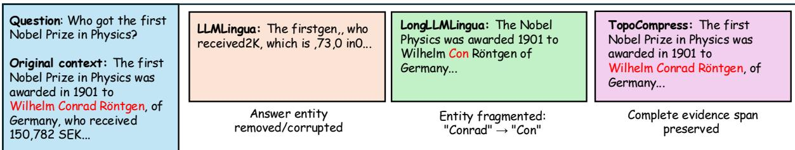
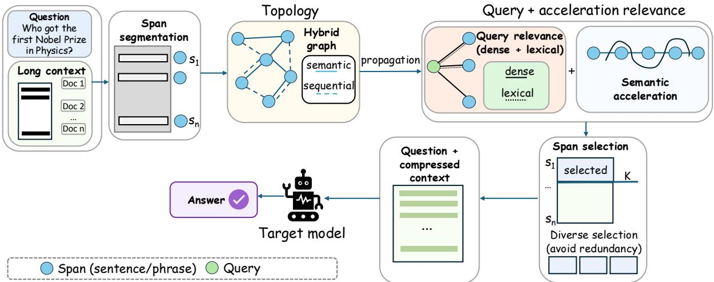
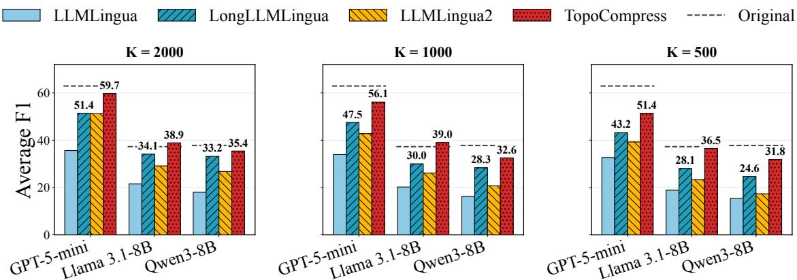
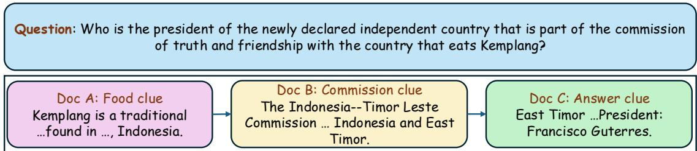

# TopoCompress: Long Context Compression via Graph-Wired Semantic Trajectories

Daniel Agyei Asante1, Yang Li1\* 1Iowa State University, United States

## Abstract

Long-context compression is essential for reducing the cost and latency of large language model inference. However, existing methods can fragment important evidence, require additional training or alignment, and often depend on the target model for effective compression. We introduce TopoCompress, a training-free and model-agnostic framework that compresses long contexts by selecting coherent semantic spans. TopoCompress first scores each span using dense and lexical query relevance together with semantic acceleration. It then constructs a hybrid graph that connects spans based on semantic similarity and sequential adjacency, and propagates the query-guided relevance scores over the graph. Across five long-context tasks—HotpotQA, 2WikiMQA, MuSiQue, Qasper, and MultiFieldQAen—TopoCompress consistently outperforms strong compression baselines. Notably, TopoCompress achieves performance comparable to the strongest baseline while using a 4× smaller compression budget, and provides a 1.41× smaller compression time over the fastest baseline.

## 1 Introduction

Large language models (LLMs) have demonstrated strong capabilities when supplied with sufficiently rich context (Lewis et al., 2020). Many complex natural language tasks require models to reason over heterogeneous sources of information, such as instructions, demonstrations, retrieved documents, conversation history, and task-specific evidence. However, existing LLMs remain constrained by finite context windows. Although substantial effort has been devoted to extending these windows, longer contexts introduce two major challenges. First, they increase inference cost and latency because the target LLM must process a larger number of input tokens (Dao et al., 2022; Keles et al., 2023).

Second, simply providing a model with more context does not necessarily improve its performance. As the input grows longer, models may struggle to effectively use relevant evidence, especially when it appears in the middle of the context (Liu and Lapata, 2019).

Long-context compression has therefore emerged as an important approach for reducing inference cost and helping models focus on the most relevant information in long inputs. Most existing context compression methods (Li et al., 2023; Jiang et al., 2023, 2024) formulate compression as a token-level pruning problem. Thus, given a long context and a compression budget, their goal is to remove tokens estimated to be less important while retaining those required to answer the question. A representative example is LLMLingua (Jiang et al., 2023), which introduces a coarse-to-fine compression framework that uses a smaller auxiliary language model MS to estimate the perplexity of tokens in a long context. Tokens with lower perplexity are treated as contributing less information and are removed through an iterative procedure. This approach does not consider the relevance of tokens to the question before dropping them. LongLLMLingua (Jiang et al., 2024) extends this formulation by making context compression question-aware. In particular, LongLLMLingua uses contrastive perplexity to measure how token importance changes when the context is conditioned on the question, thereby encouraging the compressor M to retain question-relevant information.

While these methods demonstrate the usefulness of context compression, their token-level perplexity-based formulation introduces several operational limitations. First, token-level pruning can fragment the context (Figure 1). Since compression decisions are made over individual tokens, the resulting compressed context may break word boundaries, phrases, named entities, or syntactic units.

This can distort the information seen by the target model and may require post-hoc recovery (Jiang et al., 2024), which adds extra computation. A more principled compression method should avoid creating such fragmentation in the first place.

Second, these methods are not model-agnostic. The compressor $\mathcal { M } _ { S }$ decides which information should be removed, and the target model $\mathcal { M } _ { T }$ then uses the resulting compressed context during inference to answer the query. $\mathcal { M } _ { S }$ must learn to imitate what $\mathcal { M } _ { T }$ would consider informative in order to make reliable compression decisions. Existing context compression methods (Jiang et al., 2023, 2024) attempt to reduce this mismatch through instruction-tuning, where $\mathcal { M } _ { S }$ is adapted using responses generated by $\mathcal { M } _ { T }$ . However, this alignment introduces additional computation and ties the compressor to a specific target model, limiting its generality across different LLMs.

Third, perplexity-based importance scores do not account for how pieces of evidence relate to one another. Existing compression methods (Li et al., 2023; Jiang et al., 2023, 2024) use perplexity to estimate how predictable each token is under a small language model $\mathcal { M } _ { S }$ . Yet even when made question-aware, this formulation scores tokens individually rather than modeling how one piece of evidence supports or connects to another. Many multi-document and multi-hop tasks require the model to connect evidence across documents and follow causal or temporal relations before the query can be answered (Figure 4). A token may therefore be easy to predict from its local context, and thus receive low perplexity and be dropped, while still carrying intermediate information needed to preserve the evidence chain. This makes perplexity an insufficient signal for determining which information is truly important for a downstream task.

These limitations suggest that long-context compression should move beyond treating tokens as independent units whose importance can be determined solely by a compressor model $\mathcal { M } _ { S }$ . Instead, compression should preserve coherent evidence, identify information that is relevant to the task, and account for relationships among different pieces of evidence. This naturally calls for a graph-based formulation, where the context is represented as a set of connected semantic units. Such a representation allows compression decisions to consider not only how relevant a piece of evidence is to the query, but also how it supports, connects, or provides intermediate information that links other evidence. Graph-based representations have been successfully used to capture relationships among textual units in applications such as summarization (Bugueño et al., 2025; Leite et al., 2007), conversational analysis (Montero and Araki, 2007), and information retrieval (Witschel, 2007). For the first time, we formulate long-context compression as graph-based relevance propagation.

Based on this formulation, we introduce TopoCompress, a training-free and modelagnostic framework for context compression. TopoCompress first segments the context into coherent semantic spans and scores them based on query relevance. It further incorporates semantic acceleration to highlight query-relevant spans that occur at informative transitions in the context. The spans are then connected through a hybrid graph based on semantic similarity and sequential adjacency. Rather than selecting evidence solely from its direct relevance to the query, TopoCompress propagates relevance over this graph, allowing intermediate, supporting spans to gain importance through their connections to other evidence. This is useful for complex reasoning tasks, where some necessary information may not directly match the query but is essential for completing the evidence chain (Appendix A).

We evaluate TopoCompress on five longcontext question answering tasks—HotpotQA, 2WikiMQA, MuSiQue, Qasper, and MultiFieldQAen—across several target models. The results show that TopoCompress achieves a strong balance between answer quality and compression efficiency, consistently outperforming all evaluated compression baselines across different compression budgets and target models. It also keeps the compression process lightweight and fast.

Our contributions are summarized as follows:

• We formulate long-context compression as relevance propagation over a hybrid graph. To the best of our knowledge, this graphrelevance formulation is the first of its kind for long-context compression.

• We introduce TopoCompress, a training-free and model-agnostic compression framework that selects compact, coherent, and nonredundant evidence by propagating query relevance over a hybrid graph, allowing evidence that may not directly match the query to be identified through its connections.

  
Figure 1: Example of entity fragmentation under token-level prompt compression. LLMLingua removes and corrupts the answer-bearing phrase, while LongLLMLingua preserves only a fragmented form. TopoCompress preserves the complete evidence.

• We show on several long-context tasks that TopoCompress provides competitive compression quality while being substantially faster.

## 2 Related Work

Long-context Compression. Natural language contains redundancy (Shannon, 1951) that may aid human understanding but may be unnecessary for LLMs. Motivated by this observation, prompt compression has emerged as an effective approach for reducing the computational cost of LLM inference by removing redundant information before the input is processed by the target model. For example, Selective Context (Li et al., 2023) uses a causal language model to estimate the self-information of lexical units and removes those considered less informative. LLMLingua (Jiang et al., 2023) extends this direction by introducing a coarse-to-fine compression framework. This framework uses a smaller causal language model to estimate token importance through perplexity and iteratively prunes less informative tokens. LongLLMLingua (Jiang et al., 2024) builds on this framework with question-aware coarse-grained compression, using contrastive perplexity to prioritize information that is more relevant to the query. LLMLingua-2 (Pan et al., 2024) formulates prompt compression as a token classification problem. It uses data distilled from an LLM to train a bidirectional Transformer encoder that predicts whether each token should be retained or removed at inference time.

Graph-Based Modeling of Text. Graph representations have a long history in NLP as a means of capturing relationships among textual units (Nastase et al., 2015). TextRank (Mihalcea and Tarau, 2004) represents words and sentences as nodes in a graph and applies graph-based ranking to identify keywords and sentences for tasks such as keyword extraction and extractive summarization. Similarly,

LexRank (Erkan and Radev, 2004) constructs a sentence-similarity graph and uses graph centrality to identify sentences for multi-document summarization. More recently, GraphLSS (Bugueño et al., 2025) builds a heterogeneous graph that combines structural and semantic relations to identify salient sentences for long-document summarization.

Our work brings this graph-based perspective to long-context compression by representing context as connected semantic spans to preserve intermediate, supporting information. By doing so, it avoids reliance on a separate compressor language model or target-model-specific distillation, resulting in a training-free and model-agnostic framework for structured evidence selection.

## 3 TopoCompress

In this section, we introduce TopoCompress, a training-free and model-agnostic framework for long-context compression. TopoCompress represents the context as connected semantic spans, scores each span using query relevance and semantic acceleration, propagates relevance through the hybrid graph, and selects a compact, non-redundant evidence set (Figure 2). Algorithm 1 summarizes the overall procedure.

## 3.1 Problem Formulation

Given a query q and a context consisting of M documents, $\textit { \textbf { D } } = \ \{ D _ { 1 } , D _ { 2 } , \ldots , D _ { M } \}$ , the objective is to select a compact evidence set $\mathcal { X } _ { \mathrm { c o m p } }$ that contains sufficient information to answer q while satisfying a global token budget K: $\begin{array} { r } { \sum _ { u _ { i } \in \mathcal { X } _ { \mathrm { c o m p } } } \mathrm { t o k e n s } ( u _ { i } ) \le K } \end{array}$

## 3.2 Semantic Span Construction

Token-level pruning can fragment words, entities, phrases, or relations, potentially distorting important evidence and leading the target model to incorrect conclusions. We therefore segment each document into contiguous semantic units, such as sentences or short paragraphs. Let the resulting sequence of spans be $\mathcal { U } = \{ u _ { 1 } , u _ { 2 } , . . . , u _ { N } \}$

  
Figure 2: TopoCompress compresses long contexts in four main steps: (i) the context is segmented into coherent semantic spans; (ii) each span is scored using dense and lexical query relevance together with semantic acceleration; (iii) a hybrid graph is constructed using semantic similarity and sequential adjacency, and relevance is propagated over the graph; and (iv) a diverse set of high-relevance spans is selected under the compression budget and passed to the target model.

## 3.3 Dense and Lexical Query Relevance

Let Φ denote a frozen text encoder. We instantiate the frozen encoder Φ with bge-m3 (Chen et al., 2024), which is well suited for our setting because it provides both dense semantic embeddings and lexical token-weight values. For each span $u _ { i } .$ , we compute a dense vector representation $\mathbf { e } _ { i } = \Phi ( u _ { i } )$ and the dense query representation $\mathbf { e } _ { q } = \Phi ( q )$

We first measure how semantically relevant each span is to the query. We refer to this as dense relevance, since it is computed from the dense vector representations of the span and the query. Specifically, the dense relevance score of span $u _ { i }$ is given by their cosine similarity:

$$
r _ { i } = \mathrm { m a x } ( 0 , \mathrm { s i m } ( \mathbf { e } _ { i } , \mathbf { e } _ { q } ) ) ,\tag{1}
$$

where sim $\begin{array} { r } { ( { \bf a } , { \bf b } ) = \frac { { \bf a } ^ { \top } { \bf b } } { \| { \bf a } \| _ { 2 } \| { \bf b } \| _ { 2 } } } \end{array}$ . We normalize the dense relevance scores across the candidate spans to obtain $\boldsymbol { { \hat { r } } _ { i } }$

While dense relevance captures semantic similarity to the query, it may overlook exact lexical signals such as named entities, dates, or relation terms that may be important for answering the question. We therefore complement it with lexical relevance. Let $w _ { t } ^ { q }$ denote the lexical weight assigned by bge-m3 to token t in the query, and let $w _ { t } ^ { u _ { i } }$ denote its lexical weight in span $u _ { i }$ . We define the lexical relevance score as

$$
\ell _ { i } = \sum _ { t \in q \cap u _ { i } } w _ { t } ^ { q } w _ { t } ^ { u _ { i } } .\tag{2}
$$

The lexical scores are also normalized across the candidate spans to obtain $\hat { \ell } _ { i } \in [ 0 , 1 ]$ . Finally, we combine dense and lexical relevance into a queryalignment score:

$$
g _ { i } = \mu { \hat { r } } _ { i } + ( 1 - \mu ) { \hat { \ell } } _ { i } ,\tag{3}
$$

where $\mu \in [ 0 , 1 ]$ controls the balance between semantic relevance and exact lexical evidence.

## 3.4 Semantic Acceleration

The query relevance information in Equation (3) identifies spans that directly match the question, but some important spans may be useful because they occur near semantic transitions in the context. These spans may connect different pieces of evidence or mark shifts between related facts. To capture this, TopoCompress computes a secondorder semantic acceleration score over the original span sequence.

For an interior span $u _ { i }$ within the same document, we compute $\mathbf { a } _ { i } = 2 \mathbf { e } _ { i } - \mathbf { e } _ { i - 1 } - \mathbf { e } _ { i + 1 }$ , and define its acceleration magnitude as

$$
\kappa _ { i } = \| \mathbf { a } _ { i } \| _ { 2 } .\tag{4}
$$

The score $\kappa _ { i }$ measures how sharply the semantic trajectory changes around span $u _ { i }$ . We normalize the acceleration scores across spans to obtain $\hat { \kappa } _ { i }$

Algorithm 1 TopoCompress   
Input: Context documents $\mathcal { D } ,$ query q, budget $K$   
frozen encoder Φ   
Output: Compressed context $\mathcal { X } _ { \mathrm { c o m p } }$   
1: Segment documents into semantic spans $\lambda =$   
$\{ u _ { 1 } , \dotsc , u _ { N } \}$   
2: Compute span embeddings ${ \bf e } _ { i } = \Phi ( u _ { i } )$ and   
query embedding $\mathbf { e } _ { q } = \Phi ( q )$   
3: Compute the dense relevance score $\boldsymbol { { \hat { r } } _ { i } }$ using   
Equation (1) and the lexical relevance score $\ddot { \ell } _ { i }$   
using Equation (2).   
4: Compute query alignment $g _ { i } = \mu \hat { r } _ { i } + ( 1 - \mu ) \hat { \ell } _ { i }$   
5: Compute the semantic acceleration score $\hat { \kappa } _ { i }$   
over the original span sequence using Equa  
tion (4).   
6: Compute the initial scores $s _ { i } = ( 1 + \lambda \hat { \kappa } _ { i } ) g _ { i }$   
7: Build span graph $\mathbf { W } = \alpha \mathbf { W } ^ { \mathrm { s e m } } + \beta \mathbf { W } ^ { \mathrm { s e q } }$   
8: Normalize W to obtain $\mathbf { P } = \mathbf { L } ^ { - 1 } \mathbf { W }$   
9: Propagate relevance with $\mathbf { s } ^ { ( m + 1 ) } = ( 1 - \eta ) \mathbf { s } +$   
$\eta \bar { \mathbf { P } } ^ { \bar { \top } } \mathbf { s } ^ { ( m ) }$   
10: Greedily select non-redundant spans under   
budget $K$   
11: Restore selected spans to original order   
12: return $\mathcal { X } _ { \mathrm { c o m p } }$

Semantic acceleration should not make a queryirrelevant span important. We therefore gate acceleration with query alignment:

$$
s _ { i } = ( 1 + \lambda \hat { \kappa } _ { i } ) g _ { i } ,\tag{5}
$$

where $\lambda \geq 0$ controls the contribution of acceleration. This formulation boosts spans that are both query-aligned and located near strong semantic transitions, while preventing unrelated transitions from dominating the selection process.

## 3.5 Span Topology and Relevance Propagation

Some evidence needed for complex reasoning tasks may not appear highly relevant to the query in isolation. A span can instead be important because it supports, connects, or disambiguates other evidence. To capture these relationships, we build a topology over the spans and propagate the initial query-gated score vector s $\mathbf { \epsilon } = [ s _ { 1 } , s _ { 2 } , \ldots , s _ { N } ] ^ { \top }$ (Equation (5)) across it.

Specifically, we construct a weighted graph $\mathcal { G } =$ $( \nu , \mathcal { E } )$ , where each node $v _ { i }$ corresponds to a span $u _ { i } .$ . The graph combines semantic and sequential edges. For each span $u _ { i } ,$ let $\mathcal { N } _ { k } ( i )$ denote the set of its $k$ nearest neighbors based on dense embedding similarity. We add semantic edges from $u _ { i }$ to the spans in $\mathcal { N } _ { k } ( i )$ , with edge weights defined as $\begin{array} { r } { \mathbf { W } _ { i j } ^ { \mathrm { s e m } } = \left\{ \begin{array} { l l } { \operatorname* { m a x } ( 0 , \sin ( \mathbf { e } _ { i } , \mathbf { e } _ { j } ) ) , } & { j \in \mathcal { N } _ { k } ( i ) , } \\ { 0 , } & { \mathrm { o t h e r w i s e } . } \end{array} \right. } \end{array}$ The sequential edges connect adjacent spans within the same document. Let $\mathrm { D } ( u _ { i } )$ denote the document containing span $u _ { i }$ . We define the sequential edge weight between spans $u _ { i }$ and $u _ { j }$ as $\begin{array} { r } { \mathbf { W } _ { i j } ^ { \mathrm { s e q } } = \left\{ \begin{array} { l l } { 1 , } & { | i - j | = 1 \mathrm { a n d } \mathrm { D } ( u _ { i } ) = \mathrm { D } ( u _ { j } ) , } \\ { 0 , } & { \mathrm { o t h e r w i s e } . } \end{array} \right. } \end{array}$ We combine the two adjacency matrices as $\mathbf { W } =$ $\alpha \mathbf { W } ^ { \mathrm { s e m } } + \beta \mathbf { W } ^ { \mathrm { s e q } }$ , where $\alpha , \beta \ge 0$ control the relative contributions of semantic and sequential connectivity. We then compute the degree matrix L with diagonal entries $\begin{array} { r } { \dot { \mathbf { L } } _ { i i } = \sum _ { j = 1 } ^ { N } \dot { \mathbf { W } } _ { i j } } \end{array}$ , where $\mathbf { L } _ { i j } = 0 \mathrm { ~ f o r ~ } i \neq j$ . We row-normalize W to obtain the transition matrix $\mathbf { P } = \mathbf { L } ^ { - 1 } \mathbf { W }$ . The entry $\mathbf { P } _ { i j }$ represents the proportion of relevance passed from span $u _ { i }$ to span $u _ { j }$ during propagation.

To allow each span to gain importance from connected evidence rather than relying solely on its direct relevance to the query, we perform personalized relevance propagation:

$$
\mathbf { s } ^ { ( m + 1 ) } = ( 1 - \eta ) \mathbf { s } + \eta \mathbf { P } ^ { \top } \mathbf { s } ^ { ( m ) } ,
$$

where $\eta ~ \in ~ ( 0 , 1 )$ is the damping factor and $\mathbf { s } ^ { ( 0 ) } = \mathbf { s }$ is the query-gated score defined in Equation (5). The restart term $( 1 ~ - ~ \eta ) \mathbf { s }$ keeps the propagated scores anchored to the original querygated signal. The update is repeated until convergence, producing the propagated score vector $\tilde { \mathbf { s } } = [ \tilde { s } _ { 1 } , \tilde { s } _ { 2 } , \ldots , \tilde { s } _ { N } ] ^ { \top }$ . This allows intermediate, supporting spans that may not directly match the query to gain importance through their connections to other relevant evidence.

## 3.6 Redundancy-Aware Evidence Selection

After propagation, spans with related meanings may receive similar scores. Selecting spans purely by $\tilde { s } _ { i }$ can therefore introduce redundant evidence. To reduce this redundancy, TopoCompress selects spans greedily by penalizing candidates that are too similar to evidence already selected.

Let A denote the set of selected spans and let R denote the remaining candidate spans. At each selection step, the next span is chosen as

$$
u ^ { * } = \arg \operatorname* { m a x } _ { u _ { i } \in \mathcal { R } } \left[ \tilde { s } _ { i } - \delta \operatorname* { m a x } _ { u _ { j } \in \mathcal { A } } \mathrm { s i m } ( \mathbf { e } _ { i } , \mathbf { e } _ { j } ) \right] ,
$$

where $\delta \geq 0$ controls the strength of the redundancy penalty. The first term favors spans with high propagated relevance, while the second discourages selecting a span whose semantic content is already covered by the selected evidence. After selecting u∗, we add it to A and remove it from R. The selection process continues until the global budget K is reached. Finally, selected spans are restored to their original order, preserving readability and discourse coherence for the target model.

## 4 Experiments

## 4.1 Models and Datasets

Models. We evaluate context compression using closed-source target model, GPT-5-mini (Singh et al., 2025), and open-weight target models, Llama-3.1-8B (Grattafiori et al., 2024) and Qwen3- 8B (Yang et al., 2025). These models differ in architecture, training pipeline, and tokenization.

Datasets. We evaluate TopoCompress on longcontext question answering tasks from Long-Bench (Bai et al., 2024). LongBench is a bilingual benchmark for long-context understanding that includes tasks from single-document and multi-document settings. In this work, we focus on five QA tasks: HotpotQA, 2WikiMQA, MuSiQue, Qasper, and MultiFieldQA-en. We select these tasks because they require models to identify and reason over evidence distributed across long contexts, directly testing the ability of TopoCompress to preserve intermediate, supporting information under compression. HotpotQA, 2WikiMQA, and MuSiQue are multi-document QA tasks that require the model to reason over evidence distributed across multiple documents. Qasper is a scientific document QA task based on NLP papers, while MultiFieldQA-en evaluates question answering over long articles from diverse domains. These datasets have average input lengths of 9,151 words for HotpotQA, 4,887 words for 2WikiMQA, 11,214 words for MuSiQue, 3,619 words for Qasper, and 4,559 words for MultiFieldQA-en.

## 4.2 Results and Discussion

In this section, we evaluate the effectiveness and efficiency of TopoCompress against three strong long-context compression baselines: LLMLingua (Jiang et al., 2023), LongLLMLingua (Jiang et al., 2024), and LLMLingua-2 (Pan et al., 2024). Together, these baselines cover perplexity-based, query-aware, and token-classification approaches to context compression.

Performance. Following the evaluation setting used in LongBench, we report F1 for all five tasks. We also report the sample-weighted average F1 across the five tasks. Each compression method is evaluated under three context budgets, $K \in \{ 2 0 0 0 , 1 0 0 0 , 5 0 0 \}$ . The context budget specifies the maximum number of tokens allowed in the compressed context. The K = 500 setting is the most aggressive compression regime, requiring each method to retain only limited evidence while preserving enough information for the target model to answer the query correctly.

Figure 3 presents the overall comparison of the compression methods across GPT-5-mini, Llama-3.1-8B, and Qwen3-8B. TopoCompress consistently achieves the best performance across different context budgets. At the most aggressive budget, K = 500, it outperforms the strongest baseline, LongLLMLingua, by 8.15 points on GPT-5-mini, 8.44 points on Llama-3.1-8B, and 7.21 points on Qwen3-8B. Notably, the performance of TopoCompress at K = 500 is comparable to that of LongLLMLingua at $K \ : = \ : 2 0 0 0$ (e.g., 51.37 vs. 51.44 on GPT-5-mini). This shows that TopoCompress can achieve similar performance to the strongest baseline while using a compression budget that is up to 4× smaller.

Tables 4, 5, and 6 in Appendix B provide detailed task-level results for GPT-5-mini, Llama-3.1- 8B, and Qwen3-8B, respectively. Under aggressive compression, TopoCompress achieves strong gains on multi-document QA tasks such as HotpotQA, 2WikiMQA, and MuSiQue, where answering a query often requires combining evidence distributed across multiple documents. These results highlight the importance of preserving connected evidence for multi-hop reasoning and show that the query-gated, graph-guided selection in TopoCompress effectively retains such evidence even under tight compression budgets.

Compression Time. In Table 1, we report the compression time for all compression methods at K = 1000. TopoCompress is the fastest method, completing compression across all five LongBench tasks in less than 7 minutes. Compared with LLMLingua2, the fastest baseline, TopoCompress achieves a 1.41× speedup. The difference is substantially larger compared with LLMLingua and LongLLMLingua, which require approximately

  
Figure 3: Average F1 comparison on long context tasks across compression budgets and target models. Bars show compressed-context performance for LLMLingua, LongLLMLingua, LLMLingua-2, and TopoCompress at K ∈ {500, 1000, 2000}. Dashed horizontal lines indicate the corresponding full-context Original performance for each target model.

44 and 52 minutes, respectively. These results demonstrate that TopoCompress not only preserves higher-quality evidence for the target model but also significantly reduces compression time, making it easier to integrate into long-context pipelines such as RAG systems, where compression may be required to improve inference efficiency.

## 4.3 Controller for Adaptive Reasoning

Yun and Kim (2026) showed that LLMs can serve as missing-information identifiers: given a question and partial evidence, an LLM can determine whether the evidence is sufficient and, if not, formulate a focused query for the information still needed. This can be useful in complex settings where the original question may not explicitly reveal every intermediate clue. Motivated by this idea, we evaluate TopoCompress with an LLM-based controller in the loop.

After half of the evidence budget (i.e., 0.5K) has been accumulated, the controller determines whether the selected evidence is sufficient to answer the original question. If it returns answerable, selection stops early and the accumulated evidence is used as the compressed context. If it returns unanswerable, the controller generates a focused follow-up question to retrieve additional evidence that may not be directly captured by the original question. TopoCompress then re-scores the remaining spans using this question while keeping document-side quantities, including span embeddings and semantic acceleration fixed. To limit API overhead, the controller is invoked at most twice per sample.

## 4.3.1 Controller Analysis

The controller variant provides a useful comparison for understanding the strength of the TopoCompress selector. We analyze its effect from two perspectives: the amount of context retained after compression and the downstream QA performance. For this experiment, we use GPT-5-mini as the controller to generate intermediate reasoning queries that guide additional evidence selection during compression.

Impact on Context Length. We report the average compressed context length for TopoCompress with and without the controller at K = 1000 in Table 2. Avg. Context is the average token length of the compressed evidence context given to the target model, excluding the task instruction and question. It directly measures how much source context remains after compression. In the standard TopoCompress setting, the method typically fills close to the budgeted context length. With the controller enabled, the average context tokens across all tasks reduces from 1000 tokens to roughly 681– 857 tokens depending on the task.

Impact on Performance. As shown in Table 7, the controller variant slightly improves performance over the controller-free TopoCompress setting. This suggests that the original question may not always surface all the evidence needed to answer complex problems, and that constructing intermediate reasoning queries can help recover additional supporting evidence. However, the gains are modest, indicating that TopoCompress already captures much of this benefit through its queryguided and graph-based selection mechanism. In other words, TopoCompress can trace and recover much of the relevant intermediate evidence without requiring an LLM in the compression loop.

<table><tr><td>Method</td><td>HotpotQA</td><td>2WikiMQA</td><td>MuSiQue</td><td>Qasper</td><td>MultiFieldQA-en</td><td>Overall</td><td>Speedup</td></tr><tr><td>LLMLingua</td><td>11:52</td><td>7:16</td><td>14:02</td><td>5:33</td><td>5:16</td><td>43:59</td><td>0.22×</td></tr><tr><td>LongLLMLingua</td><td>11:02</td><td>7:30</td><td>12:41</td><td>11:39</td><td>8:58</td><td>51:50</td><td>0.19×</td></tr><tr><td>LLMLingua2</td><td>2:42</td><td>1:29</td><td>3:13</td><td>1:10</td><td>1:09</td><td>9:43</td><td>1.00×</td></tr><tr><td>TopoCompress</td><td>1:59</td><td>1:04</td><td>2:03</td><td>0:53</td><td>0:56</td><td>6:54</td><td>1.41×</td></tr></table>

Table 1: Compression time at K = 1000 for long-context compression methods. Times are reported in minutes:seconds. Speedup is computed relative to LLMLingua-2 overall runtime, the fastest baseline.

<table><tr><td>Task</td><td>Avg. Ctx.</td><td>Avg. Ctx. + Ctrl.</td></tr><tr><td>HotpotQA</td><td>1000.0</td><td>729.2</td></tr><tr><td>2WikiMQA</td><td>999.0</td><td>803.3</td></tr><tr><td>MuSiQue</td><td>1001.0</td><td>857.1</td></tr><tr><td>Qasper</td><td>998.1</td><td>734.5</td></tr><tr><td>MultiFieldQA-en</td><td>999.2</td><td>680.9</td></tr></table>

Table 2: Average compressed context (Ctx) length at K = 1000 with and without the controller (Ctrl).

## 4.4 Ablation Study

We conduct an ablation study to assess the contribution of the scoring components in TopoCompress. We evaluate the ablations at two compression budgets, K = 2000 and K = 500.

TopoCompress without graph propagation (w/o Graph). Graph propagation diffuses query relevance through the hybrid span topology, allowing TopoCompress to identify evidence that may not be selected by direct query matching but is connected to relevant evidence through semantic similarity or sequential adjacency. To assess the full contribution of graph propagation, we focus this ablation on multi-hop and multi-document tasks, where answering questions depends on preserving connected evidence chains.

As shown in Table 8 (Appendix D), removing graph propagation consistently reduces performance on HotpotQA, 2WikiMQA, and MuSiQue across different target models and compression budgets. The relative drops reach 14.1% on MuSiQue, 7.4% on HotpotQA, and 5.9% on 2WikiMQA. These results indicate that graph-based relevance propagation helps preserve connected evidence under compression, particularly for tasks that require reasoning over multiple supporting spans.

Additional ablations. We further evaluate two component removals in TopoCompress: without query relevance (w/o Query Rel.), which removes the dense–lexical query relevance signal, and without semantic acceleration (w/o Accel.), which removes the semantic acceleration term. We conduct these ablations using GPT-5-mini as the target model (Table 9 in Appendix D).

The results show that removing query relevance causes the largest performance drop. This shows that the dense–lexical query gate is essential for identifying spans that are directly relevant to answering the question. However, multi-hop tasks may also require intermediate evidence that does not directly match the query (Appendix A). Our topology-aware refinement propagates query relevance through the graph to account for such connections. The semantic acceleration component has a comparatively smaller impact. Removing acceleration changes the average F1 modestly.

## 5 Conclusion

We introduced TopoCompress, a training-free and model-agnostic framework that formulates longcontext compression as graph-structured evidence selection over coherent semantic spans. Our method combines dense–lexical query relevance, semantic acceleration, and graph-based propagation over semantic and sequential span connections to select compact, non-redundant evidence for the target model. Our findings show that TopoCompress consistently outperforms strong context compression baselines across both closedsource and open-weight target models. In addition to these performance gains, TopoCompress is faster than existing baselines, making it practical for long-context pipelines. These results establish graph-based evidence selection as a more effective and practical paradigm for long-context compression, moving beyond token-level pruning and target-model-dependent designs.

## References

Yushi Bai, Xin Lv, Jiajie Zhang, Hongchang Lyu, Jiankai Tang, Zhidian Huang, Zhengxiao Du, Xiao Liu, Aohan Zeng, Lei Hou, Yuxiao Dong, Jie Tang, and Juanzi Li. 2024. LongBench: A Bilingual, Multitask Benchmark for Long Context Understanding. In Annual Meeting ofthe Associationfor Computational Linguistics (ACL).

Margarita Bugueño, Hazem Abou Hamdan, and Gerard De Melo. 2025. GraphLSS: Integrating Lexical, Structural, and Semantic Features for Long Document Extractive Summarization. In Conference of the Nations of the Americas Chapter of the Associationfor Computational Linguistics (NAACL).

Jianlyu Chen, Shitao Xiao, Peitian Zhang, Kun Luo, Defu Lian, and Zheng Liu. 2024. M3- Embedding: Multi-Linguality, Multi-Functionality, Multi-Granularity Text Embeddings Through Self-Knowledge Distillation. In Findings of the Associationfor Computational Linguistics: ACL 2024.

Tri Dao, Daniel Y Fu, Stefano Ermon, Atri Rudra, and Christopher Ré. 2022. FlashAttention: Fast and Memory-Efficient Exact Attention with IO-Awareness. Advances in Neural Information Processing Systems (NeurIPS).

Günes Erkan and Dragomir R Radev. 2004. LexRank: Graph-based Lexical Centrality as Salience in Text Summarization. Journal of Artificial Intelligence Research (JAIR), 22:457–479.

Aaron Grattafiori, Abhimanyu Dubey, Abhinav Jauhri, Abhinav Pandey, Abhishek Kadian, Ahmad Al-Dahle, Aiesha Letman, Akhil Mathur, Alan Schelten, Alex Vaughan, Amy Yang, Angela Fan, Anirudh Goyal, Anthony Hartshorn, Aobo Yang, Archi Mitra, Archie Sravankumar, Artem Korenev, Arthur Hinsvark, and 542 others. 2024. The Llama 3 Herd of Models. arXiv preprint arXiv:2407.21783.

Huiqiang Jiang, Qianhui Wu, Chin-Yew Lin, Yuqing Yang, and Lili Qiu. 2023. LLMLingua: Compressing Prompts for Accelerated Inference of Large Language Models. In Conference on Empirical Methods in Natural Language Processing (EMNLP).

Huiqiang Jiang, Qianhui Wu, Xufang Luo, Dongsheng Li, Chin-Yew Lin, Yuqing Yang, and Lili Qiu. 2024. LongLLMLingua: Accelerating and Enhancing LLMs in Long Context Scenarios via Prompt Compression. In Annual Meeting of the Association for Computational Linguistics (ACL).

Feyza Duman Keles, Pruthuvi Mahesakya Wijewardena, and Chinmay Hegde. 2023. On the Computational Complexity of Self-Attention. In International Conference on Algorithmic Learning Theory (ALT).

Daniel S. Leite, Lucia H. M. Rino, Thiago A. S. Pardo, and Maria das Graças V. Nunes. 2007. Extractive Automatic Summarization: Does more Linguistic Knowledge Make a Difference? In Proceedings of

the Second Workshop on TextGraphs: Graph-Based Algorithmsfor Natural Language Processing. Association for Computational Linguistics (ACL).

Patrick Lewis, Ethan Perez, Aleksandra Piktus, Fabio Petroni, Vladimir Karpukhin, Naman Goyal, Heinrich Küttler, Mike Lewis, Wen-tau Yih, Tim Rocktäschel, Sebastian Riedel, and Douwe Kiela. 2020. Retrieval-Augmented Generation for Knowledgeintensive Nlp Tasks. Advances in Neural Information Processing Systems (NeurIPS).

Yucheng Li, Bo Dong, Frank Guerin, and Chenghua Lin. 2023. Compressing Context to Enhance Inference Efficiency of Large Language Models. In Conference on Empirical Methods in Natural Language Processing (EMNLP).

Yang Liu and Mirella Lapata. 2019. Text Summarization with Pretrained Encoders. In Conference on Empirical Methods in Natural Language Processing and the 9th international Joint Conference on Natural Language Processing (EMNLP-IJCNLP).

Rada Mihalcea and Paul Tarau. 2004. TextRank: Bringing Order into Text. In Conference on Empirical Methods in Natural Language Processing (EMNLP).

Calkin S. Montero and Kenji Araki. 2007. Semi-Supervised Algorithm for Human-Computer Dialogue Mining. In Proceedings of the Second Workshop on TextGraphs: Graph-Based Algorithms for Natural Language Processing. Association for Computational Linguistics (ACL).

Vivi Nastase, Rada Mihalcea, and Dragomir R Radev. 2015. A Survey of Graphs in Natural Language Processing. Natural Language Engineering, 21(5):665– 698.

Zhuoshi Pan, Qianhui Wu, Huiqiang Jiang, Menglin Xia, Xufang Luo, Jue Zhang, Qingwei Lin, Victor Rühle, Yuqing Yang, Chin-Yew Lin, H. Vicky Zhao, Lili Qiu, and Dongmei Zhang. 2024. LLMLingua-2: Data distillation for Efficient and Faithful Task-Agnostic Prompt Compression. In Findings of the Association for Computational Linguistics: ACL 2024.

Claude E Shannon. 1951. Prediction and Entropy of Printed English. Bell System Technical Journal, 30(1):50–64.

Aaditya Singh, Adam Fry, Adam Perelman, Adam Tart, Adi Ganesh, Ahmed El-Kishky, Aidan McLaughlin, Aiden Low, AJ Ostrow, Akhila Ananthram, Akshay Nathan, Alan Luo, Alec Helyar, Aleksander Madry, Aleksandr Efremov, Aleksandra Spyra, Alex Baker-Whitcomb, Alex Beutel, Alex Karpenko, and 467 others. 2025. OpenAI GPT-5 System Card. arXiv preprint arXiv:2601.03267.

Harsh Trivedi, Niranjan Balasubramanian, Tushar Khot, and Ashish Sabharwal. 2022. MuSiQue: Multihop Questions via Single-hop Question Composition. Transactions of the Association for Computational Linguistics (TACL), 10:539–554.

Hans Friedrich Witschel. 2007. Multi-level Association Graphs - A New Graph-Based Model for Information Retrieval. In Proceedings of the Second Workshop on TextGraphs: Graph-Based Algorithmsfor Natural Language Processing. Association for Computational Linguistics (ACL).

An Yang, Anfeng Li, Baosong Yang, Beichen Zhang, Binyuan Hui, Bo Zheng, Bowen Yu, Chang Gao, Chengen Huang, Chenxu Lv, Chujie Zheng, Dayiheng Liu, Fan Zhou, Fei Huang, Feng Hu, Hao Ge, Haoran Wei, Huan Lin, Jialong Tang, and 41 others. 2025. Qwen3 Technical Report. arXiv preprint arXiv:2505.09388.

JungMin Yun and Youngbin Kim. 2026. IterCOMP: Reasoning-aware Adaptive Prompt Compression for Multi-hop Question Answering. In Annual Meeting of the Association for Computational Linguistics (ACL).

## A Graph-Based Evidence Recovery

Multi-hop questions often require connecting evidence across several documents rather than selecting a single directly matched span. However, an answer-bearing document may only become identifiable through intermediate evidence. Figure 4 illustrates this setting, where the question requires following a chain from one piece of evidence to another. In such situations, using query relevance alone may be insufficient to retrieve the answerbearing evidence.

We illustrate how graph propagation can recover evidence that is missed by direct query relevance. We conduct this analysis using an example from the MuSiQue dataset (Trivedi et al., 2022). MuSiQue provides gold annotations for the supporting paragraphs required to answer each question, which allows us to inspect whether the ranked spans correspond to the true evidence chain. We denote each span as p\_i:span\_j, where p\_i indicates the i-th paragraph in the input context and span\_j indicates the j-th span produced after segmenting that paragraph.

As shown in Table 3, query relevance alone can assign high scores to spans that are not part of the gold evidence chain, causing them to appear near the top of the ranking. For example, a non-supporting span is ranked 3rd by query relevance, while graph propagation move it to rank 11. More importantly, the answer-bearing span p\_19:span\_3 is ranked only 14th by query relevance and would therefore be excluded under a tight budget. After graph propagation, this span is promoted to rank 7, allowing the compressed context to retain the evidence needed to answer the question. This illustrates the role of graph propagation beyond direct query matching: it helps recover connected supporting evidence that may be weakly matched to the question itself but is topologically linked to other relevant evidence.

## B Additional Results for TopoCompress

Additional results for TopoCompress and the evaluated baselines are shown in Table 4 for GPT-5-mini, Table 5 for Llama-3.1-8B, and Table 6 for Qwen3- 8B.

## C Controller-Guided TopoCompress

In this section, we provide results for the controllerguided variant of TopoCompress (Section 4.3). The controller generates intermediate reasoning queries during compression to guide additional evidence selection when the current compressed context appears insufficient. The results are shown in Table 7.

## D Ablation Study Results

The ablation results are shown in Tables 8 and 9.

  
Figure 4: Evidence-chain illustration of multi-hop reasoning. Answering the question requires following intermediate links from Kemplang to Indonesia, from Indonesia to East Timor, and from East Timor to its president.

<table><tr><td colspan="4">Question: Who is the president of the newly declared independent country that is part of the commission of truth and friendship with the country that eats Kemplang?</td></tr><tr><td>Passage / Span</td><td>Span Text</td><td>Query Rank</td><td>Graph Rank</td></tr><tr><td>p_0:span_0</td><td>Kemplang is a traditional savory fish cracker commonly found in southern parts of Sumatra, Indonesia.</td><td>1</td><td>9</td></tr><tr><td>p_9:span_1</td><td>He was that country&#x27;s last governor before independence, from 1968 to 1975, and first president after it gained independence from the Netherlands.</td><td>3</td><td>11</td></tr><tr><td>p_3:span_2</td><td>After holding private hearings and document reviews, the commission handed in the final report to the presidents of both nations and was endorsed by Indonesian President Susilo Bambang Yudhoyono.</td><td>4</td><td>2</td></tr><tr><td>p_3:span_1</td><td>The commission was officially created to investigate acts of violence that occurred around the independence referendum held in East Timor in 1999.</td><td>9</td><td>5</td></tr><tr><td>p_3:span_0</td><td>The Indonesia-Timor Leste Commission on Truth and Friendship was established jointly by the governments of Indonesia and East Timor in August 2005.</td><td>11</td><td>10</td></tr><tr><td>p_19:span_3</td><td>Government: unitary semi-presidential constitutional republic. President: Francisco Guterres. Prime Minister: Mari Alkatiri.</td><td>14</td><td>7</td></tr></table>

Table 3: Qualitative analysis of multi-hop evidence recovery on the MuSiQue dataset using graph propagation. MuSiQue provides gold annotations for the documents or paragraphs that contain the clues needed to answer each question. Rows shaded in gray indicate spans derived from these gold supporting paragraphs.

<table><tr><td>Method</td><td>K</td><td>HotpotQA</td><td>2WikiMQA</td><td>MuSiQue</td><td>Qasper</td><td>MultiFieldQA-en</td><td>Avg. F1</td></tr><tr><td>Original</td><td>一</td><td>71.64</td><td>80.74</td><td>63.37</td><td>45.61</td><td>49.97</td><td>62.92</td></tr><tr><td>LLMLingua</td><td>2000</td><td>48.45</td><td>46.14</td><td>32.42</td><td>24.15</td><td>24.16</td><td>35.64</td></tr><tr><td>LongLLMLingua</td><td>2000</td><td>67.30</td><td>71.88</td><td>46.75</td><td>32.36</td><td>34.76</td><td>51.44</td></tr><tr><td>LLMLingua2</td><td>2000</td><td>58.89</td><td>70.04</td><td>42.93</td><td>42.91</td><td>38.13</td><td>51.24</td></tr><tr><td>TopoCompress</td><td>2000</td><td>68.71</td><td>78.23</td><td>54.72</td><td>44.08</td><td>50.37</td><td>59.69</td></tr><tr><td>LLMLingua</td><td>1000</td><td>48.24</td><td>45.13</td><td>33.08</td><td>21.00</td><td>18.28</td><td>33.93</td></tr><tr><td>LongLLMLingua</td><td>1000</td><td>67.03</td><td>65.43</td><td>44.06</td><td>25.45</td><td>31.49</td><td>47.49</td></tr><tr><td>LLMLingua2</td><td>1000</td><td>50.89</td><td>53.67</td><td>38.03</td><td>36.87</td><td>31.57</td><td>42.77</td></tr><tr><td>TopoCompress</td><td>1000</td><td>66.73</td><td>70.03</td><td>49.06</td><td>42.67</td><td>50.82</td><td>56.13</td></tr><tr><td>LLMLingua</td><td>500</td><td>49.01</td><td>44.84</td><td>28.14</td><td>18.15</td><td>20.00</td><td>32.66</td></tr><tr><td>LongLLMLingua</td><td>500</td><td>62.89</td><td>58.24</td><td>40.42</td><td>19.88</td><td>31.85</td><td>43.22</td></tr><tr><td>LLMLingua2</td><td>500</td><td>50.63</td><td>48.11</td><td>32.32</td><td>35.87</td><td>26.08</td><td>39.26</td></tr><tr><td>TopoCompress</td><td>500</td><td>63.14</td><td>63.25</td><td>44.96</td><td>38.04</td><td>46.17</td><td>51.37</td></tr><tr><td>Original</td><td>一</td><td>44.17</td><td>34.37</td><td>31.90</td><td>29.15</td><td>49.96</td><td>37.28</td></tr><tr><td>LLMLingua</td><td>2000</td><td>28.85</td><td>24.55</td><td>14.35</td><td>17.38</td><td>22.70</td><td>21.51</td></tr><tr><td>LongLLMLingua</td><td>2000</td><td>48.09</td><td>38.74</td><td>28.97</td><td>21.65</td><td>32.67</td><td>34.10</td></tr><tr><td>LLMLingua2</td><td>2000</td><td>35.41</td><td>30.14</td><td>21.84</td><td>23.08</td><td>37.27</td><td>29.14</td></tr><tr><td>TopoCompress</td><td>2000</td><td>52.01</td><td>37.70</td><td>32.50</td><td>27.07</td><td>47.24</td><td>38.89</td></tr><tr><td>LLMLingua</td><td>1000</td><td>29.95</td><td>25.84</td><td>11.10</td><td>16.85</td><td>16.40</td><td>20.22</td></tr><tr><td>LongLLMLingua</td><td>1000</td><td>46.46</td><td>30.04</td><td>23.26</td><td>20.20</td><td>30.18</td><td>30.02</td></tr><tr><td>LLMLingua2</td><td>1000</td><td>35.99</td><td>24.08</td><td>19.55</td><td>20.87</td><td>31.47</td><td>26.12</td></tr><tr><td>TopoCompress</td><td>1000</td><td>52.68</td><td>37.07</td><td>31.60</td><td>28.14</td><td>47.37</td><td>38.95</td></tr><tr><td>LLMLingua</td><td>500</td><td>29.63</td><td>22.90</td><td>12.17</td><td>15.29</td><td>12.93</td><td>18.88</td></tr><tr><td>LongLLMLingua</td><td>500</td><td>44.60</td><td>28.50</td><td>21.38</td><td>17.76</td><td>28.09</td><td>28.06</td></tr><tr><td>LLMLingua2</td><td>500</td><td>28.12</td><td>26.38</td><td>15.44</td><td>20.19</td><td>27.34</td><td>23.29</td></tr><tr><td>TopoCompress</td><td>500</td><td>51.69</td><td>37.74</td><td>25.08</td><td>25.23</td><td>44.83</td><td>36.50</td></tr></table>

Table 4: F1 results of different long-context compression methods with GPT-5-mini as the target model. K denotes the maximum number of tokens in the compressed context. Avg. F1 is computed as a sample-weighted average across tasks. Bold indicates the best compressed method by Avg. F1 at each budget, while underline indicates the second-best.

Table 5: F1 results of different long-context compression methods with Llama 3.1-8B as the target model.

<table><tr><td>Method</td><td>K</td><td>HotpotQA</td><td>2WikiMQA</td><td>MuSiQue</td><td>Qasper</td><td>MultiFieldQA-en</td><td>Avg. F1</td></tr><tr><td>Original</td><td>一</td><td>49.16</td><td>33.34</td><td>19.17</td><td>41.80</td><td>48.53</td><td>37.78</td></tr><tr><td>LLMLingua</td><td>2000</td><td>20.67</td><td>21.35</td><td>5.65</td><td>18.58</td><td>25.71</td><td>18.01</td></tr><tr><td>LongLLMLingua</td><td>2000</td><td>45.31</td><td>35.95</td><td>20.72</td><td>26.98</td><td>38.12</td><td>33.17</td></tr><tr><td>LLMLingua2</td><td>2000</td><td>32.00</td><td>23.81</td><td>8.10</td><td>37.29</td><td>34.70</td><td>26.78</td></tr><tr><td>TopoCompress</td><td>2000</td><td>45.29</td><td>29.76</td><td>16.59</td><td>41.07</td><td>47.47</td><td>35.44</td></tr><tr><td>LLMLingua</td><td>1000</td><td>18.18</td><td>24.14</td><td>5.06</td><td>13.28</td><td>21.86</td><td>16.22</td></tr><tr><td>LongLLMLingua</td><td>1000</td><td>38.50</td><td>32.60</td><td>16.48</td><td>21.07</td><td>34.62</td><td>28.34</td></tr><tr><td>LLMLingua2</td><td>1000</td><td>21.03</td><td>18.61</td><td>7.75</td><td>28.91</td><td>29.64</td><td>20.74</td></tr><tr><td>TopoCompress</td><td>1000</td><td>39.36</td><td>27.93</td><td>13.59</td><td>39.00</td><td>46.40</td><td>32.56</td></tr><tr><td>LLMLingua</td><td>500</td><td>18.12</td><td>22.82</td><td>4.45</td><td>12.31</td><td>20.53</td><td>15.39</td></tr><tr><td>LongLLMLingua</td><td>500</td><td>33.18</td><td>26.58</td><td>15.15</td><td>16.99</td><td>33.49</td><td>24.63</td></tr><tr><td>LLMLingua2</td><td>500</td><td>17.21</td><td>15.88</td><td>5.85</td><td>22.99</td><td>27.42</td><td>17.36</td></tr><tr><td>TopoCompress</td><td>500</td><td>37.98</td><td>28.32</td><td>13.59</td><td>37.07</td><td>45.72</td><td>31.84</td></tr></table>

Table 6: F1 results of different long-context compression methods with Qwen3-8B as the target model.

<table><tr><td>Target Model</td><td>Method</td><td>K</td><td>HotpotQA</td><td>2WikiMQA</td><td>MuSiQue</td><td>Qasper</td><td>MultiFieldQA-en</td><td>Avg. F1</td></tr><tr><td rowspan="6">GPT-5-mini</td><td>TopoCompress</td><td>2000</td><td>68.71</td><td>78.23</td><td>54.72</td><td>44.08</td><td>50.37</td><td>59.69</td></tr><tr><td>TopoCompress + Controller</td><td>2000</td><td>69.60</td><td>76.80</td><td>57.68</td><td>43.75</td><td>48.77</td><td>59.88</td></tr><tr><td>TopoCompress</td><td>1000</td><td>66.73</td><td>70.03</td><td>49.06</td><td>42.67</td><td>50.82</td><td>56.13</td></tr><tr><td>TopoCompress + Controller</td><td>1000</td><td>67.29</td><td>75.04</td><td>56.96</td><td>43.40</td><td>48.60</td><td>58.77</td></tr><tr><td>TopoCompress</td><td>500</td><td>63.14</td><td>63.25</td><td>44.96</td><td>38.04</td><td>46.17</td><td>51.37</td></tr><tr><td>TopoCompress + Controller</td><td>500</td><td>65.42</td><td>64.67</td><td>49.78</td><td>41.91</td><td>49.86</td><td>54.56</td></tr><tr><td rowspan="6">Llama 3.1-8B</td><td>TopoCompress</td><td>2000</td><td>52.01</td><td>37.70</td><td>32.50</td><td>27.07</td><td>47.24</td><td>38.89</td></tr><tr><td>TopoCompress + Controller</td><td>2000</td><td>55.45</td><td>42.39</td><td>34.46</td><td>28.87</td><td>46.72</td><td>41.31</td></tr><tr><td>TopoCompress</td><td>1000</td><td>52.68</td><td>37.07</td><td>31.60</td><td>28.14</td><td>47.37</td><td>38.95</td></tr><tr><td>TopoCompress + Controller</td><td>1000</td><td>52.03</td><td>46.64</td><td>35.10</td><td>27.64</td><td>43.41</td><td>40.83</td></tr><tr><td>TopoCompress</td><td>500</td><td>51.69</td><td>37.74</td><td>25.08</td><td>25.23</td><td>44.83</td><td>36.50</td></tr><tr><td>TopoCompress + Controller</td><td>500</td><td>51.41</td><td>38.52</td><td>29.94</td><td>27.21</td><td>44.07</td><td>37.92</td></tr><tr><td rowspan="6">Qwen3-8B</td><td>TopoCompress</td><td>2000</td><td>45.29</td><td>29.76</td><td>16.59</td><td>41.07</td><td>47.47</td><td>35.44</td></tr><tr><td>TopoCompress + Controller</td><td>2000</td><td>41.21</td><td>29.59</td><td>18.44</td><td>39.78</td><td>46.06</td><td>34.43</td></tr><tr><td>TopoCompress</td><td>1000</td><td>39.36</td><td>27.93</td><td>13.59</td><td>39.00</td><td>46.40</td><td>32.56</td></tr><tr><td>TopoCompress + Controller</td><td>1000</td><td>41.13</td><td>31.45</td><td>19.28</td><td>38.57</td><td>46.11</td><td>34.74</td></tr><tr><td>TopoCompress</td><td>500</td><td>37.98</td><td>28.32</td><td>13.59</td><td>37.07</td><td>45.72</td><td>31.84</td></tr><tr><td>TopoCompress + Controller</td><td>500</td><td>34.89</td><td>32.66</td><td>16.78</td><td>37.93</td><td>45.37</td><td>32.90</td></tr></table>

Table 7: Experiment comparing TopoCompress with and without the controller on several tasks across GPT-5-mini, Llama 3.1-8B, and Qwen3-8B. K denotes the compressed context budget. Bold indicates the better Avg. F1 within each target model and budget.

<table><tr><td>Target Model</td><td>Method</td><td>K</td><td>HotpotQA</td><td>2WikiMQA</td><td>MuSiQue</td></tr><tr><td rowspan="4">Llama3.1-8B</td><td>TopoCompress</td><td>2000</td><td>52.01</td><td>37.70</td><td>32.50</td></tr><tr><td>w/o Graph</td><td>2000</td><td>50.34 (-3.2%)</td><td>35.46 (-5.9%)</td><td>30.97 (-4.7%)</td></tr><tr><td>TopoCompress</td><td>500</td><td>51.69</td><td>37.74</td><td>25.08</td></tr><tr><td>w/o Graph</td><td>500</td><td>47.85 (-7.4%)</td><td>35.94 (-4.8%)</td><td>24.82 (-1.0%)</td></tr><tr><td rowspan="4">Qwen3-8B</td><td>TopoCompress</td><td>2000</td><td>45.29</td><td>29.76</td><td>16.59</td></tr><tr><td>w/o Graph</td><td>2000</td><td>44.91 (-0.8%)</td><td>29.35 (-1.4%)</td><td>15.16 (-8.6%)</td></tr><tr><td>TopoCompress</td><td>500</td><td>37.98</td><td>28.32</td><td>13.59</td></tr><tr><td>w/o Graph</td><td>500</td><td>36.56 (-3.7%)</td><td>26.64 (-5.9%)</td><td>11.68 (-14.1%)</td></tr><tr><td rowspan="4">GPT-5 mini</td><td>TopoCompress</td><td>2000</td><td>68.71</td><td>78.23</td><td>54.72</td></tr><tr><td>w/o Graph</td><td>2000</td><td>68.18 (-0.8%)</td><td>77.74 (-0.6%)</td><td>53.38 (-2.4%)</td></tr><tr><td>TopoCompress</td><td>500</td><td>63.14</td><td>63.25</td><td>44.96</td></tr><tr><td>w/o Graph</td><td>500</td><td>61.89 (-2.0%)</td><td>60.72 (-4.0%)</td><td>43.98 (-2.2%)</td></tr></table>

Table 8: Graph propagation ablation on multi-hop long context tasks. Values in parentheses indicate the relative F1 drop after removing graph propagation.

<table><tr><td>Method</td><td>K</td><td>HotpotQA</td><td>2WikiMQA</td><td>MuSiQue</td><td>Qasper</td><td>MultiFieldQA-en</td><td>Avg. F1</td></tr><tr><td>TopoCompress</td><td>2000</td><td>68.71</td><td>78.23</td><td>54.72</td><td>44.08</td><td>50.37</td><td>59.69</td></tr><tr><td>w/o Query Rel.</td><td>2000</td><td>61.36</td><td>60.59</td><td>43.09</td><td>40.99</td><td>37.21</td><td>49.25</td></tr><tr><td>w/o Accel.</td><td>2000</td><td>69.81</td><td>77.08</td><td>53.98</td><td>43.68</td><td>49.95</td><td>59.37</td></tr><tr><td>TopoCompress</td><td>500</td><td>63.14</td><td>63.25</td><td>44.96</td><td>38.04</td><td>46.17</td><td>51.37</td></tr><tr><td>w/o Query Rel.</td><td>500</td><td>57.65</td><td>44.17</td><td>35.83</td><td>27.83</td><td>23.73</td><td>38.58</td></tr><tr><td>w/o Accel.</td><td>500</td><td>61.75</td><td>63.45</td><td>42.79</td><td>37.99</td><td>48.31</td><td>50.99</td></tr></table>

Table 9: Ablation results for TopoCompress on long context tasks using GPT-5-mini as the target model.