# Towards Stream Learning on Embedded Systems: Benchmarking the Memory Consumption of Stream Learning Methods

Sebastian Buschjäger1∗, Nuwan Gunasekara2, Heitor Murilo Gomes3

1Lamarr Institute, Dortmund, Germany, sebastian.buschjaeger@tu-dortmund.de

2Lamarr Institute, Halmstad University, Sweden, nuwan.gunasekara@hh.se

3Victoria University of Wellington, New Zealand, heitor.gomes@vuw.ac.nz

## Abstract

Stream learning is commonly evaluated through predictive performance and adaptation to concept drift. However, sus- tained operation of a stream learner also requires predictable and bounded resource usage even on long streams. This re quirement becomes even more critical when learning moves from servers to near-sensor embedded systems where memory and processing are scarce resources. In state-of-the-art stream learning, however, we perceive a strong focus on concept drift adaptation, whereas resource usage is often an evaluation byproduct. To close this gap, we benchmark seven representa- tive stream classifiers on 13 real and synthetic streams under model-size budgets from 128 KiB to approximately 8 MiB. Our benchmark comprises a total of 6,463 experiments. We measure failure-aware accuracy, peak model size, time to bud- get exhaustion, and prediction-plus-update latency. The results reveal two distinct resource failure modes. Adaptive ensem- bles can exceed small budgets almost immediately because of their initial footprint, even when their size remains stable thereafter. Incremental trees can fit initially but grow through- out a long stream, with HoefdingTrees (HT) and Extremely Fast Decision Trees (EFDT) increasing by median factors of 7.37 and 5.87. This growth is often, but not invariably, accom- panied by increasing latency. Explicitly compact methods re- main the only viable option under the smallest budgets, but are usually overtaken as larger budgets make adaptive ensembles competitive. These findings show that being incremental or drift-aware does not make a learner automatically resource- bound. Hence, many state-of-the-art methods are only par- tially applicable in embedded systems or for long-running systems. We therefore call on the stream-learning community to make bounded resource usage a first-class design objective alongside drift adaptation, and propose concrete steps toward this goal, including an API through which stream learners can explicitly expose and respect resource budgets.

## Introduction

Data stream learning addresses settings in which examples arrive continuously, predictions must be made before labels are observed, and models are updated incrementally under limited computational resources. This setting is especially natural for near-sensor processors such as the microcontroller units (MCUs) used in wearables, industrial sensors, environ-mental monitors, and low-power medical devices. See Ta- ble 1 for an overview of devices. On such devices, memory is typically measured in kilobytes to a few megabytes rather than gigabytes. The hardware therefore enforces the classical streaming assumptions: each example is processed once, his- torical data cannot be retained, and the learner must remain memory bounded. This is in stark contrast to larger embed- ded Linux boards and edge servers, which typically have gigabytes of memory and thus allow for bufering, replay, or ofloading.

Table 1: Representative embedded platforms. RAM denotes total platform memory, of which only a fraction is available to the learner after accounting for the runtime, application, bufers, and operating system. Values are taken from refer- ence documentation of each device.
<table><tr><td>Platform Examples</td><td>Typical RAM</td></tr><tr><td>Arduino Uno, Mega Arduino Uno R4, Raspberry Pi Pico 2</td><td>1-8 KB 32–512 KB</td></tr><tr><td>ESP32-S3, nRF54H20 i.MX RT1170, STM32H7/N6</td><td>0.5-4 MB 1-4 MB</td></tr><tr><td>Raspberry Pi Zero 2 W, Raspberry Pi 5 NXP i.MX 93, TI AM62A + NPU Jetson Orin Nano / AGX Orin</td><td>0.5-16 GB 2-4 GB 8-64 GB</td></tr></table>

A stream learner is expected not only to adapt online but also to remain usable over long time horizons. This requires bounded model size, stable update and prediction time, and robust predictive performance even after millions of updates. These requirements were already explicit in early stream- mining systems. For example, Bifet et al. describe MOA as enabling experiments on tens of millions of examples under explicit memory limits (Bifet et al. 2018). However, much of the empirical practice in stream learning focuses on adapta- tion to concept drift and predictive accuracy as opposed to sustained resource behavior. Hoefding-style trees (Domin-gos and Hulten 2000; Bifet and Gavalda 2009; Manapragada, Webb, and Salehi 2018), and their ensembles (Gomes et al. 2017; Gomes, Read, and Bifet 2019) can refine their structure as data arrive and react to change. The same mechanisms can also cause continued growth under noise, recurring drifts, or persistent improvements in split criteria. Ensembles present a complementary risk: even when replacement mechanisms of individual trees stabilize their long-run size, maintaining multiple learners and drift detectors can impose a large initial footprint (Bifet and Gavalda 2007; Gomes et al. 2017). Last, and maybe most severe, short experiments on only a few thousand data items may conflate online update capability with sustained deployability, overlooking either immediate infeasibility or growth over the deployment horizon. While memory-aware stream learning is not absent from the lit- erature (see e.g. (da Costa et al. 2018; Buschjäger, Hess, and Morik 2022; Köbschall et al. 2026)), resource usage is still often a reported statistic or an implementation safeguard rather than a first-class experimental constraint. The software ecosystem reflects the same separation. MOA (Bifet et al. 2018), CapyMOA (Gomes et al. 2025), and River (Montiel et al. 2021) provide convenient research interfaces for prediction and incremental updates, but do not define a common, portable interface through which every learner can report its size, accept a changing budget, and actively enforce that bud- get. This matters for embedded deployment as much as for deployment on servers and the development of novel meth- ods.

In this paper, we study the current state-of-the-art of stream-learning on long-horizon streams with explicit mem- ory constraints. Our benchmark protocol is motivated by MCU-class deployment constraints, where memory available to a learner is often limited to kilobytes or a few megabytes. We evaluate representative online classifiers on seven real- world and six synthetic streams ranging from approximately 14 thousand to 11 million examples. The protocol combines prequential predictive performance with model size, update time, prediction time, and compliance with fixed memory budgets. Our goal is not to introduce a new learner, but to characterize the empirical baseline under a setting that stream learning was originally designed to address: sustained online learning under finite memory. Importantly, we do not claim to benchmark execution on a particular MCU, since such a com- parison is currently dificult to perform systematically. We therefore tackle the prerequisite research question of whether current algorithms and their current reference implementa- tions exhibit memory behavior compatible with MCU-class devices. Most importantly, the lack of MCU-capable stream- ing frameworks is not merely a matter of having the right software framework, but, as this work identifies, a matter of designing MCU-ready learning algorithms that can handle hard constraints. As a way forward, we present a potential API design that treats resource consumption as a primary design target and can serve as a basis for the next generation of stream learning algorithms.

Our contributions are as follows: we (i) identify a missing abstraction between stream-learning algorithms and resource-constrained deployment; (ii) define a frameworkindependent evaluation protocol that approximates deploy- ment readiness using initial footprint, peak model size, bud- get exhaustion, failure-aware accuracy, and latency develop- ment; (iii) apply this protocol to seven representative learners and expose two distinct resource-failure modes; and (iv) de-rive a concrete resource-aware learner interface intended to make future evaluation and MCU deployment systematic.

Table 2: Representative stream-learning methods.We distin- guish whether concept drift, memory constraints, and latency are targeted by design or reported in the empirical evalua- tion.✓ = yes; ◦ = partial/secondary; ✗ = no
<table><tr><td rowspan="2">Method</td><td colspan="3">Design</td><td colspan="3">Report</td></tr><tr><td>Drift</td><td>Mem.</td><td>Lat.</td><td>Drift</td><td>Mem.</td><td>Lat.</td></tr><tr><td>HT/VFDT (Domingos and Hulten 2000)</td><td>x</td><td>o</td><td>√</td><td>x</td><td>o</td><td>o</td></tr><tr><td>CVFDT (Hulten, Spencer, and Domingos 2001)</td><td>√</td><td>0</td><td>√</td><td>√</td><td>0</td><td>0</td></tr><tr><td>HAT (Bifet and Gavalda 2009)</td><td>√</td><td>0</td><td>0</td><td>√</td><td>√</td><td>√</td></tr><tr><td>ARF (Gomes et al. 2017)</td><td>√</td><td>x</td><td>0</td><td>√</td><td>√</td><td>√</td></tr><tr><td>EFDT (Manapragada, Webb, and Salehi 2018)</td><td>x</td><td>x</td><td>x</td><td>√</td><td>x</td><td>x</td></tr><tr><td>SVFDT (da Costa et al. 2018)</td><td>0</td><td>√</td><td>√</td><td>√</td><td>√</td><td>√</td></tr><tr><td>SRP (Gomes, Read, and Bifet 2019)</td><td>√</td><td>0</td><td>x</td><td>√</td><td>√</td><td>√</td></tr><tr><td>CS-ARF (Bahri et al. 2020) GAHT</td><td>0</td><td>√</td><td>0</td><td>√</td><td>√</td><td>√</td></tr><tr><td>(Garcia-Martin et al. 2021) Shrubs</td><td>o</td><td>√</td><td>√</td><td>√</td><td>√</td><td>√</td></tr><tr><td>(Buschjäger, Hess, and Morik 2022) EFHAT</td><td>0</td><td>√</td><td>√</td><td>√</td><td>√</td><td>√</td></tr><tr><td>(Manapragada, Salehi, and Webb 2022) SGBT</td><td>√</td><td>x</td><td>x</td><td>√</td><td>x</td><td>x</td></tr><tr><td>(Gunasekara et al. 2024)</td><td>√</td><td>x</td><td>0</td><td>√</td><td>√</td><td>x</td></tr><tr><td>PLASTIC (Heyden et al. 2024)</td><td>√</td><td>0</td><td>o</td><td>√</td><td>√</td><td>√</td></tr></table>

## Related Work

Stream learning has evolved around two central require- ments: (i) maintaining high predictive performance under continuous data arrival and (ii) handling non-stationarity through concept-drift adaptation. However, as summarized in Table 2, explicit consideration of resource constraints, par- ticularly memory and latency, remains inconsistent across the literature. Foundational methods such as HT/VFDT es- tablished incremental tree induction (Domingos and Hulten 2000), while CVFDT, HAT, EFDT, and EFHAT introduced increasingly flexible mechanisms for revising model struc- ture under concept drift (Hulten, Spencer, and Domingos 2001; Bifet and Gavalda 2009; Manapragada, Webb, and Salehi 2018; Manapragada, Salehi, and Webb 2022). En-semble methods such as ARF, SRP, and SGBT further im- prove adaptation by combining multiple learners (Gomes et al. 2017; Gomes, Read, and Bifet 2019; Gunasekara et al. 2024). Although these methods are computationally incre-mental and often report memory or runtime, they generally do not treat resource consumption as a primary design ob- jective.

Several methods address this limitation more directly. SVFDT restricts tree growth, CS-ARF and GAHT incor- porate resource-related objectives, and Shrubs explicitly bounds its ensemble through updating, pruning, and replace- ment (da Costa et al. 2018; Bahri et al. 2020; Garcia-Martin et al. 2021; Buschjäger, Hess, and Morik 2022). PLASTIC similarly targets compact and eficient adaptation (Heyden et al. 2024). These works demonstrate that resource-aware stream learning is possible, but they remain exceptions within a literature dominated by predictive performance and drift adaptation. Moreover, resource awareness varies substan- tially: limiting growth or reducing average consumption does not necessarily guarantee that a learner will respect a hard memory budget under peak utilization or throughout an ar- bitrarily long stream.

Table 3: Stream-learning frameworks and their feature set .✓ = yes; ◦ = support depends on the selected method; ✗ = no
<table><tr><td>Capability</td><td>MOA</td><td>CapyMOA</td><td>River</td></tr><tr><td>Accept budget</td><td>0</td><td>0</td><td>0</td></tr><tr><td>Report resource usage</td><td>x</td><td>x</td><td>x</td></tr><tr><td>Enforce budget</td><td>o</td><td>0</td><td>0</td></tr><tr><td>Expose budget failures</td><td>x</td><td>x</td><td>x</td></tr><tr><td>MCU backend</td><td>x</td><td>x</td><td>x</td></tr></table>

TinyML and TinyOL approach the same constraint from a diferent direction. They demonstrate online neural adap- tation on microcontrollers using restricted update schemes together with quantization, pruning, recomputation, paging, and hardware-specific implementations (Ren, Anicic, and Runkler 2021; Khouas et al. 2024; Zhu et al. 2024; Pavel et al. 2026; Velasquez, Cadavid, and Franco 2025) usually resulting in a specialized model architecture, training algo- rithm, and implementation for a given hardware, which are not generally applicable across devices and datasets.

Looking at existing stream learning frameworks, we per- ceive a lack of support for resource management. As Table 3 shows, MOA (Bifet et al. 2018), CapyMOA (Gomes et al. 2025), and River (Montiel et al. 2021) currently (July 2026) support prediction and incremental updates as first-class ab- stractions, but not resource control: some learners expose budget parameters (e.g. max\_memory), yet no framework shares a common interface across all implemented methods for reporting model size. The definition itself also difers by framework. MOA measures model size by walking the full JVM object graph via a dedicated instrumentation agent, the sizeofag companion jar, including transient data structures. CapyMOA inherits this only partially: it combines methods implemented natively in Python with others that run on the JVM, so a single agent-based measurement cannot cover both, ruling out a uniform accounting strategy across the framework. River instead manually estimates model-state size with a fixed overhead factor, consistent with a library whose design centers on the API and usability rather than resource accounting. No framework ofers a global memory budget enforced throughout execution, including manage- ment and evaluation overhead, and enforcement mechanisms (e.g., pruning) remain method-dependent and only partially supported. Last, budget failures are not handled at all. Al- though some methods do account for memory, this support is not consistent across frameworks. We see the lack of a com- mon interface and evaluation protocol as a major bottleneck for developing and deploying stream learners on MCUs.

## Experimental Evaluation

Our objective is to characterize the best behavior that each learner can attain under a memory budget, and then deter- mine whether that behavior remains deployable over a long stream. We therefore distinguish three quantities that are of- ten conflated: predictive quality, the learner’s initial memory footprint, and subsequent model growth. Our benchmark se- lects HT, HAT, EFDT, PLASTIC, ARF, SRP, and Shrubs be- cause mature implementations are available, and they cover the principal families of incremental, adaptive, ensemble- based, and explicitly compact stream learners. Each learner is evaluated under various hyperparameter configurations and memory budgets to simulate diferent MCUs.

Table 4: Benchmark streams grouped by type (synthetic in the top row, real-world in the bottom row). N, d, and C denote instances, features, and classes. A dash denotes unknown natural drift.
<table><tr><td>Dataset</td><td>N</td><td>d</td><td>C</td><td>Drift</td></tr><tr><td>AGRa</td><td>10M</td><td>9</td><td>2</td><td>Abrupt (39 drifts)</td></tr><tr><td> $\operatorname { A G R } _ { g }$ </td><td>10M</td><td>9</td><td>2</td><td>Gradual (39 drifts)</td></tr><tr><td> $\mathrm { L E D } _ { a }$ </td><td>10M</td><td>24</td><td>10</td><td>Abrupt (39 drifts)</td></tr><tr><td> $\mathrm { L E D } _ { g }$ </td><td>10M</td><td>24</td><td>10</td><td>Gradual (39 drifts)</td></tr><tr><td> $\mathrm { R B F } _ { f }$ </td><td>10M</td><td>10</td><td>5</td><td>Fast incremental (3 drifts)</td></tr><tr><td> $\mathrm { R B F } _ { m }$ </td><td>10M</td><td>10</td><td>5</td><td>Moderate incremental (3 drifts)</td></tr><tr><td>Electricity</td><td>≈45K</td><td>8</td><td>2</td><td>一</td></tr><tr><td>Airlines</td><td>≈539K</td><td>7</td><td>2</td><td>一</td></tr><tr><td>HIGGS</td><td>11M</td><td>28</td><td>2</td><td>一</td></tr><tr><td>SUSY</td><td>5M</td><td>18</td><td>2</td><td></td></tr><tr><td>Weather</td><td>≈18K</td><td>8</td><td>2</td><td>一</td></tr><tr><td>Covtype</td><td>≈581K</td><td>54</td><td>7</td><td>一</td></tr><tr><td>Gas Sensor</td><td>≈14K</td><td>128</td><td>6</td><td>Abrupt (6 drifts)</td></tr></table>

## Evaluation Protocol

We use prequential evaluation: every example is first pre- dicted and then used for one update. Hyperparameter op- timization is intentionally optimistic. For each method, dataset, and budget, we select the highest-accuracy run among the evaluated configurations that satisfies the bud- get in hindsight. Consequently, this per-dataset oracle selec- tion is not an estimate of tuning generalization, but the best observed outcome under favorable configuration choices. A configuration is budget-compliant only when the maximum recorded model size never exceeds the configured budget over the entire stream. We run HT, HAT, EFDT, PLASTIC, ARF, and SRP through CapyMOA’s Python interface to their Java MOA implementations (Gomes et al. 2025). Shrubs uses a C++ implementation through a thin Python binding.

## Datasets

We evaluate the considered stream learners on a diverse set of real-world and synthetic data streams. The benchmark includes both binary and multi-class classification problems, as well as diferent types ofconcept drift (abrupt, gradual, and incremental). Table 4 summarizes the key characteristics of the datasets, including whether they exhibit drift, their origin, number of instances, features, and classes. The six synthetic streams contain 10 million examples each. AGR and LED use matched abrupt and gradual transition schedules, while RBF provides fast and moderate incremental drift. For AGR and LED, we introduce 39 drifts (i.e. 40 concepts) evenly spaced every 250,000 items to account for the length of these datasets. The seven real-world streams range from roughly 14,000 to 11 million examples and cover binary and multi- class tasks with natural, unlabelled non-stationarity.

Table 5: Hyperparameter ranges for each method. Any other parameters are left to their respective defaults.
<table><tr><td>Parameter</td><td>Ranges</td><td>Methods</td></tr><tr><td>grace_period</td><td>{50, 100, 200}</td><td>HT, HAT, EFDT, PLASTIC</td></tr><tr><td>ensemble_size</td><td>{15, 30, 60, 100}</td><td>ARF, SRP, Shrubs</td></tr><tr><td>max_features</td><td>{0.3, 0.6, 1.0}</td><td>ARF, SRP</td></tr><tr><td>batch_size</td><td>{32, 64, 128, 256}</td><td>Shrubs</td></tr><tr><td>step_size</td><td>{0.1, 0.5}</td><td>Shrubs</td></tr><tr><td>max_memory</td><td>{128, 256, 512, 1024, 2048, 4096, 8192}KiB</td><td>All</td></tr></table>

## Scope and Measurement Boundary

No common embedded deployment stack currently exists for the considered methods as discussed previously. We therefore cannot compare compiled MCU memory foot- prints without independently reimplementing every learner. Since our goal is to assess MCU-readiness to guide such future implementations, we utilize CapyMOA and Shrubs’ own C++ implementation. It is noteworthy that both im- plementations use two diferent memory accounting tech- niques. For the MOA learners, model size is obtained from measureByteSize(), which iterates the Java Object Hi-erarchy to determine its size. For Shrubs, it is obtained from the implementation’s num\_bytes() method, which counts the size of the ensemble and its data structures manually. Ab- solute byte-level comparisons across both runtimes should therefore be interpreted cautiously. However, we are not in- terested in the specific memory consumption of a learner, as this is implementation- and runtime-dependent. We are in- terested in the algorithm-owned model state reported by the respective reference implementations. These measurements answer whether the learning algorithm itself remains com-patible with a given memory budget and show its growth factors and failure modes rather than exact equivalence be- tween Java and C++ allocations. Put diferently, our goal is not to compare “good” and “bad” implementations of the same learner, but to assess if a learning algorithm can poten- tially be deployed to an MCU with limited resources.

## Hyperparameter and Run Coverage

In our evaluation, we target modern 32-bit and AI- capable MCUs with model-size thresholds from 128 KiB to 8,192 KiB. Whenever a method exceeds the given budget during a stream, we stop training it but keep evaluating its per- formance until the stream ends. This simulates the arguably most direct and graceful way to address resource-usage dur- ing a long-running stream in which a learner grows over time. However, methods can still fail if their initial configu- ration cannot be deployed under a given memory budget at all. In addition, we execute one unconstrained run that does not impose any limits on the method. For each threshold, we randomly sampled up to 20 configurations per method followin the random search o timization b (Ber stra and Bengio 2012) and repeat each configuration three times with diferent random seeds. Table 5 give an overview of the hy- perparameter ranges. For each run, we set a total limit of 12h, stopping and discarding results whenever the run did not finish within that time. All learners were configured to utilize a single core because single-core CPUs are dominant in MCUs. All experiments were conducted on multiple com- pute nodes that allocated one AMD EPYC 7742 CPU with 3 GB RAM per configuration. Out of a total of 6,463 exper- iments, 6,109 executed successfully, and 354 failed because of memory limit, execution, or infrastructure factors. Fig- ure 1 shows how these runs are distributed across methods. It is noteworthy that SRP and ARF are the only methods with failed runs. These occurred partially because these methods would require more memory in the beginning than the budget allowed and sometimes consume more than the confi ured 3 GB of RAM or because their time limit was exhausted.

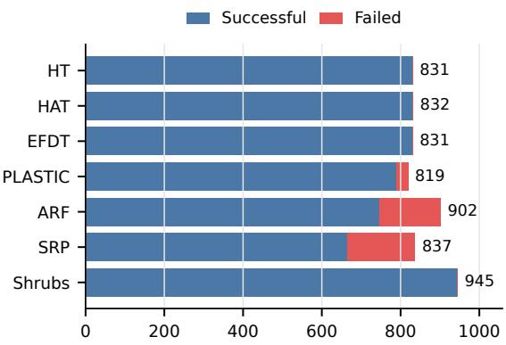  
Figure 1: Distribution of successful and failed experiments.

## RQ1: Accuracy Under a Fixed Budget

Question. Which method attains the best predictive perfor mance under a fixed memory budget?

Hypothesis. Most methods in Table 2 focus on concept drift rather than hard memory constraints. Moreover, HT, which is often used as an ensemble base learner, tends to grow as more data arrive. We therefore hypothesize that compact or explicitly bounded learners rank best at small budgets, whereas adaptive ensembles recover their accuracy advan- tage as the budget increases.

Analysis. To answer this question, we select the most ac-curate eligible configuration for each dataset, method, and target budget. If a completed sweep contains no eligible con- figuration, its accuracy is set to zero for ranking, representing a learner that cannot be deployed under that budget. Figure 2 is a stack of seven critical-diference (CD) diagrams (Demšar 2006) where each row represents one memory budget. Within a row, each colored marker is a method’s average rank across the 13 datasets, where rank 1 (more to the left) is best. Black comparison bars join methods that are not statistically distinguishable at α = .05 after Holm correction. A detailed accuracy comparison can be found in the appendix.

Finding. Our original hypothesis is supported and the findings are largely as expected. At 128 KiB, neither ARF nor SRP produces a peak-compliant configuration, whereas PLASTIC and Shrubs are compliant on all 13 datasets and attain the leading ranks. With more memory, ARF and SRP move toward the best ranks. For smaller budgets below 1 MB, Shrubs, HT, and EFDT are generally the best methods. For larger budgets, ARF and SRP dominate, followed by Shrubs in third place.

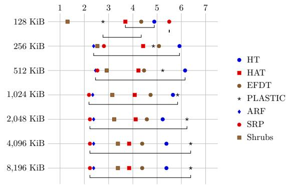  
Figure 2: Ranks by model-size budget. Each row is an inde- pendent CD diagram where lower average ranks are better.

## RQ2: Long-Horizon Model Growth

Question. Which learners continue to grow over a long stream, and how quickly?

Hypothesis. HT, HAT, and EFDT extend their tree topology and rarely remove existing structures, so we expect them to grow over time. ARF and SRP use these trees as base learners, although they manage them more dynamically. We hypothesize that model size for all five methods grows mate- rially with stream length and that the tree ensembles grow at least as much as individual trees. Explicitly bounded meth- ods should instead stabilize.

Analysis. For this analysis, we only consider the best average (over seeds) unconstrained configuration for each method. This produces one trajectory for each dataset and method. We express progress as a percentage of the dataset length so that streams of diferent lengths can be compared. At ev- er ercenta e oint, Fi ure 3(a) shows the median model size across the dataset trajectories. The shaded area contains the middle 50% of datasets. Note the logarithmic axis. Fig- ure 3(b) summarizes growth within each dataset: We first measure the model size after 10% of each stream and use this as a normalization for the final model size. Starting at 10% avoids treating initial allocation and one-time initializa- tion as sustained growth. A value of 1× means no net growth and 2× means that the model doubled in size. The box plots show the distributions over all datasets and random seeds.

Finding. Our hypothesis is only partially supported. HT, EFDT, and HAT behave as expected: HT grows by a me- dian factor of 7.37 between 10% and 100% of a stream, and at least doubles on all 13 datasets. EFDT grows by 5.87× and doubles on 11 of 13 datasets. HAT is heterogeneous. Its median growth is 1.59×, with five datasets above 2×. Contrary to our hypothesis, ARF and SRP start much larger but have median growth factors of only 1.04 and 1.05. PLASTIC and Shrubs remain constant as expected. The small relative growth of ARF and SRP, albeit unexpected, is plausible for two reasons. First, both methods allocate a fixed number of ensemble members, so their large initial footprint is already present early in the stream. Second, drift adaptation can re- place or reset existing trees instead of adding new members indefinitely. Removing an old tree also discards its accumu- lated structure and can ofset growth elsewhere in the ensem- ble. Memory risk therefore takes two forms. ARF and SRP can be infeasible initially, while HT and EFDT may become infeasible only after sustained use.

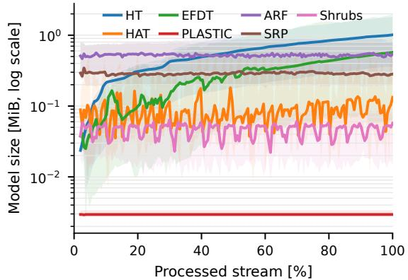

(a) Model-size trajectories over normalized stream progress.  
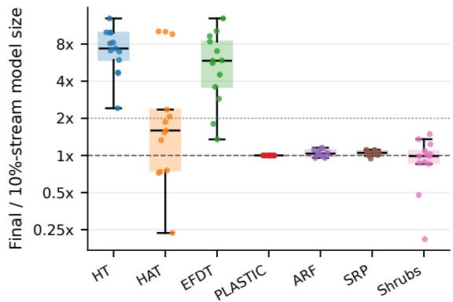  
(b) Dataset-level growth between 10% and the end of the stream.  
Figure 3: Growth of the highest-accuracy unconstrained con- figuration for each method and dataset. Panel (a) shows the progression of model size over the stream. Panel (b) shows the growth ratio per method.

## RQ3: Latency Degradation

Question. Do computational costs increase over a long stream?

Hypothesis. RQ2 shows that HT and EFDT grow, while the aggregate size of ARF and SRP remains comparatively sta- ble. We therefore expect latency degradation for HT and EFDT and little relative change for methods whose size re- mains stable.

Analysis. We analyze the same highest-accuracy unconstrained configurations used in RQ2, but measure test-thentrain latency for each example. Similar to RQ2, we ignore the first part of the stream to obtain a reference measurement because the first observations may include one-time initial- ization and unusually small model structures, so they are not a stable reference. For each dataset, learner, and seed, we in- stead define early-stream latency as the median between 2% and 10% of the stream and terminal latency as the median over the final 10%. Dividing terminal by early-stream latency gives the slowdown ratio shown in Figure 4. The dashed 1× line denotes unchanged latency. Values above 1× indicate slowdown, while values below 1× indicate faster processing. Finding. The hypothesis is partially supported. HT has a median slowdown of 1.42×, while EFDT reaches 1.16×. Their broad distributions show that model growth does not translate into the same amount of additional work on every dataset. Hence, model size is only an indirect measure of latency. The remaining methods have a median slowdown close to 1×, with some notable outliers for HAT and PLAS-TIC. We hypothesize that this is due to the restructuring of the trees, which can be triggered in both methods. ARF and SRP also have some outliers, but much less severe, while Shrubs has basically a constant latency.

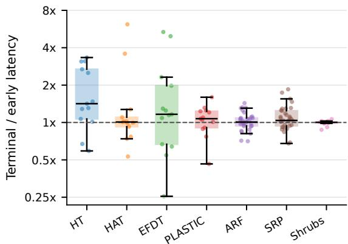  
Figure 4: Distribution of slowdowns.

## RQ4: Time to Budget Exhaustion

Question. How long does an accuracy-optimal learner re-main within a fixed memory budget?

Hypothesis. Motivated by RQ2, we hypothesize two distinct exhaustion modes: large ensembles can be infeasible almost immediately because of their initial footprint, whereas ini- tially small trees cross a budget later as their structure grows. Increasing the budget should delay or eliminate both modes. Analysis. We reuse the accuracy-optimal unconstrained configurations from RQ2 and apply each candidate budget to their recorded progressions over the stream after the fact. In each panel of Figure 5, the horizontal axis is normalized stream progress, and the vertical axis is the percentage of accuracy-optimal configurations on each dataset that have not yet exceeded the stated budget. A curve that drops close to zero near the origin indicates initial infeasibility, while a gradual decline indicates exhaustion during operation. We focus on three budgets: 128 KiB, 512 KiB, and 2 MiB as rep- resentative regimes. The appendix contains plots for all seven budgets.

Finding. The hypothesis is supported. At 128 KiB, the accuracy-optimal ARF and SRP configurations are almost uniformly infeasible from the beginning, quickly followed by HT, HAT, and EFDT. PLASTIC and Shrubs remain fea- sible as expected. At 512 KiB, exhaustion occurs later in the stream but remains an issue on all methods except PLASTIC and Shrubs. At 2 MiB, most learners complete the stream without exhausting the budget. Here, only HAT, EFDT and ARF still struggle, while most learners finish within the bud- get.

## RQ5: Model Size and Concept Drift

Question. How does model size behave around (recurring) drift events?

Hypothesis. We hypothesize that adaptive learners show event-aligned contraction, replacement, or regrowth, whereas HT retains structure across transitions and Shrubs remains bounded.

Analysis. We focus on the two synthetic datasets (AGR with abrupt and gradual drift) because their drift events are known. For visibility, we use the highest-accuracy unconstrained configuration of each of four representative methods: HT, HAT, ARF, and Shrubs. They were selected to isolate difer- ent resource mechanisms. HT is a non-adaptive growing-tree baseline that retains learned structure. HAT adds branch- level adaptation and can replace accumulated structure. ARF tests whether a fixed-size adaptive ensemble of tree learn- ers stabilizes size and latency through member replacement. Shrubs provides an explicitly memory-bounded ensemble baseline. Figure 6(a) plots model size over the stream on a logarithmic axis. Figure 6(b) plots test-then-train latency relative to the early median stream (obtained from the first 2% - 10 % of the stream).

Finding. The model size progression supports the hypothe-sis. HT grows throughout all both streams without an event- driven reset. HAT repeatedly contracts and regrows, often near transition markers. ARF fluctuates around a compara- tively stable operating level, which is consistent with the re- placement of constituent models, while Shrubs remains com- pact and bounded. Looking at latency, we see that it separates persistent growth from adaptive replacement more clearly. HT becomes progressively slower as its retained structure increases. By contrast, the repeated contractions of HAT and Shrubs and the bounded fluctuations of ARF do not cre- ate a sustained latency trend. Their curves remain close to the early-stream baseline. Model size is therefore informative about long-term computational pressure, but event-scale size variation does not translate one-to-one into latency.

## Discussion and Future Directions

Taken together, the five research questions show that be- ing incremental or drift-adaptive does not make a learner resource-bounded. RQ1 identifies a clear accuracy–memory trade-of. Compact methods remain viable under small bud- gets, while large adaptive ensembles become competitive only when more memory is available. RQ2 and RQ4 reveal two distinct failure modes. ARF and SRP can be excluded al- most immediately by their initial footprint even though their later footprint is comparatively stable. HT and EFDT can fit initially and then exhaust the same budget as the retained structure accumulates. RQ3 shows that this growth often, but not invariably, increases processing latency. RQ5 links these aggregate trends to learner mechanisms: retained trees grow, adaptive trees contract and regrow, and fixed-size or bounded ensembles operate around a more stable size. Our results ex- pose two gaps. The first is algorithmic: many stream learners either begin above MCU-class budgets or grow beyond them over time. The second is infrastructural: current frameworks provide no common mechanism for expressing, enforcing, or testing a resource budget.

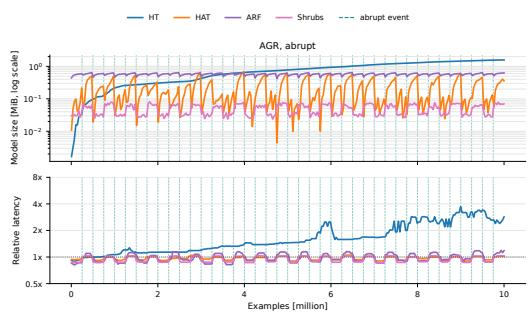  
(a) AGR, abrupt drift.

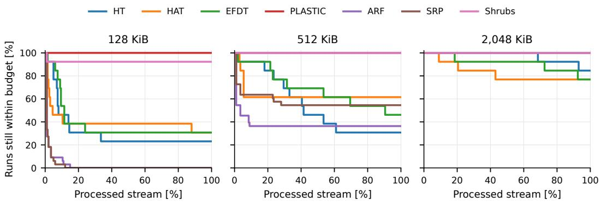  
Figure 5: Percentage of accuracy-optimal configurations that remain within the specified budget over normalized stream progress.

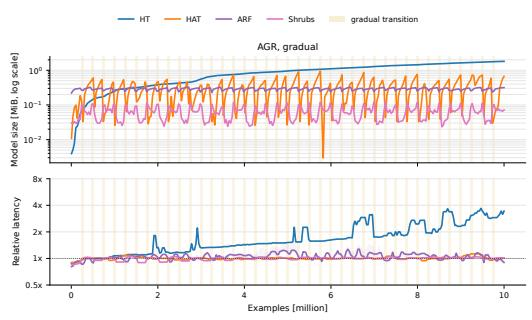  
(b) AGR, gradual drift  
Figure 6: Model size and prediction-plus-update latency. Teal dashed lines mark abrupt events, and pale-gold inter- vals mark gradual transitions.

Algorithm 1: Resource-aware stream-learning loop.   
1: set\_budget(B)   
2: while next item (x, y) exists do   
3: yˆ ← predict(x)   
4: ℓ ← eval(y, y b )   
5: report\_performance(ℓ)   
6: ˆb ← resource\_usage()   
7: report\_resource\_usage(bb)   
8: if $\hat { b } > B$ then   
9: report\_failure(bb)   
10: enforce\_budget(bb)   
11: else   
12: train\_on\_instance $_ { ( x , y ) }$   
13: end if   
14: end while

MCU-hardware evaluation remains uncommon in the stream-learning literature, in part because it currently re- quires method-specific ports and manual memory account- ing rather than a shared measurement path. Closing the in- frastructural gap is necessary before MCU deployment can become a routine benchmark rather than an isolated engi- neering project in stream learning. At minimum, evaluations should report initial footprint, peak model size, time to bud- get exhaustion, failure-aware predictive performance, and latency over suficiently long streams. This turns memory and latency from an implementation detail into an explicit property of the learning problem that we refer to as resourceaware prequential evaluation. More strongly, we advocate that stream learning should move from “learning under con- cept drift” to “learning under concept drift with limited resources”. We propose to extend the typical test-then-train core loop of today’s stream learning frameworks to directly include resources, for example, through an appropriate API as depicted in Algorithm 1. Then, future work can efectively tackle the next step in stream learning: not only how to detect and adapt to change but also how to sustain that adaptation within a fixed resource envelope.

## References

Bahri, M.; Gomes, H. M.; Bifet, A.; and Maniu, S. 2020. Cs- arf: compressed adaptive random forests for evolving data stream classification. In 2020 International Joint Conference on Neural Networks (IJCNN), 1–8. IEEE.

Bergstra, J.; and Bengio, Y. 2012. Random search for hyper- parameter optimization. Journal of machine learning research, 13(2).

Bifet, A.; and Gavalda, R. 2007. Learning from time- changing data with adaptive windowing. In SIAM (SDM), 443–448. SIAM.

Bifet, A.; and Gavalda, R. 2009. Adaptive learning from evolving data streams. In IDA, 249–260. Springer.

Bifet, A.; Gavaldà, R.; Holmes, G.; and Pfahringer, B. 2018. Machine learningfor data streams: with practical examples in MOA. MIT Press.

Buschjäger, S.; Hess, S.; and Morik, K. J. 2022. Shrub ensembles for online classification. In Proceedings ofthe AAAI Conference onArtificial Intelligence, volume 36, 6123–6131.

da Costa, V. G. T.; de Leon Ferreira, A. C. P.; Junior, S. B.; et al. 2018. Strict very fast decision tree: a memory conser- vative algorithm for data stream mining. Pattern Recognition Letters, 116: 22–28.

Demšar, J. 2006. Statistical Comparisons of Classifiers over Multiple Data Sets. Journal of Machine Learning Research, 7: 1–30.

Domingos, P.; and Hulten, G. 2000. Mining high-speed data streams. In Proceedings of the sixth ACM SIGKDD international conference on Knowledge discovery and data mining, 71–80.

Garcia-Martin, E.; Bifet, A.; Lavesson, N.; König, R.; and Linusson, H. 2021. Green Accelerated Hoefding Tree. In Research Symposium on Tiny Machine Learning.

Gomes, H. M.; Bifet, A.; Read, J.; Barddal, J. P.; Enem- breck, F.; Pfahringer, B.; Holmes, G.; and Abdessalem, T. 2017. Adaptive random forests for evolving data stream clas- sification. Machine Learning, 106(9): 1469–1495.

Gomes, H. M.; Lee, A.; Gunasekara, N.; Sun, Y.; Cassales, G. W.; Liu, J. J.; Heyden, M.; Cerqueira, V.; Bahri, M.; Koh, Y. S.; Pfahringer, B.; and Bifet, A. 2025. CapyMOA: Eficient Machine Learning for Data Streams in Python. arXiv:2502.07432.

Gomes, H. M.; Read, J.; and Bifet, A. 2019. Streaming random patches for evolving data stream classification. In IEEE (ICDM), 240–249. IEEE.

Gunasekara, N.; Pfahringer, B.; Gomes, H.; and Bifet, A. 2024. Gradient boosted trees for evolving data streams. Machine Learning.

Heyden, M.; Gomes, H. M.; Fouché, E.; Pfahringer, B.; and Böhm, K. 2024. Leveraging plasticity in incremental deci- sion trees. In Joint European conference on machine learning and knowledge discovery in databases, 38–54. Springer.

Hulten, G.; Spencer, L.; and Domingos, P. 2001. Mining time-changing data streams. In Proceedings of the seventh ACM SIGKDD international conference on Knowledge discovery and data mining, 97–106.

Khouas, A. R.; Bouadjenek, M. R.; Hacid, H.; and Aryal, S. 2024. Training machine learning models at the edge: A survey. arXiv preprint arXiv:2403.02619.

Köbschall, K.; Buschjäger, S.; Fischer, R.; Hartung, L.; and Kramer, S. 2026. Lift What You Can: Green Online Learning with Heterogeneous Ensembles. 40(3): 32.

Manapragada, C.; Salehi, M.; and Webb, G. I. 2022. Ex- tremely fast hoefding adaptive tree. In 2022 IEEE International Conference on Data Mining (ICDM), 319–328. IEEE.

Manapragada, C.; Webb, G. I.; and Salehi, M. 2018. Ex- tremely fast decision tree. In Proceedings of the 24th ACM SIGKDD International Conference on Knowledge Discovery & Data Mining, 1953–1962.

Montiel, J.; Halford, M.; Mastelini, S. M.; Bolmier, G.; Sourty, R.; Vaysse, R.; Zouitine, A.; Gomes, H. M.; Read, J.; Abdessalem, T.; et al. 2021. River: machine learning for streaming data in python. The Journal of Machine Learning Research, 22(1): 4945–4952.

Pavel, M. I.; Hu, S.; Pratama, M.; and Kowalczyk, R. 2026. Onboard optimization and learning: A survey. IEEE Access.

Ren, H.; Anicic, D.; and Runkler, T. A. 2021. Tinyol: Tinyml with online-learning on microcontrollers. In 2021 international joint conference on neural networks (IJCNN), 1–8. IEEE.

Velasquez, J. D.; Cadavid, L.; and Franco, C. J. 2025. Emerg- ing trends and strategic opportunities in tiny machine learn- ing: A comprehensive thematic analysis. Neurocomputing, 648: 130746.

Zhu, S.; Voigt, T.; Rahimian, F.; and Ko, J. 2024. On-device training: A first overview on existing systems. ACM transactions on sensor networks, 20(6): 1–39.

## APPENDIX

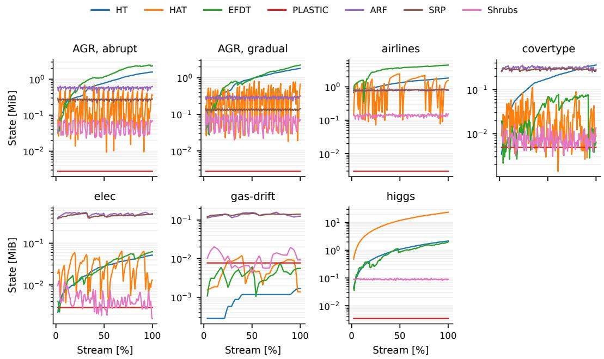  
Figure 7: RQ2 model-size trajectories, datasets 1–7.

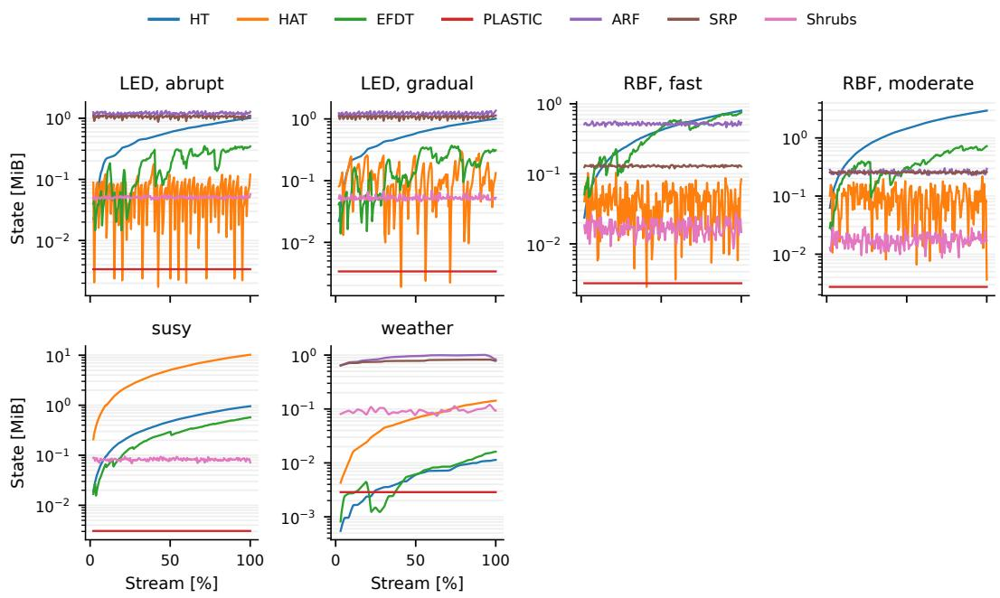  
Figure 8: RQ2 model-size trajectories, remaining datasets.

Median stream processed before first observed budget violation [%]  
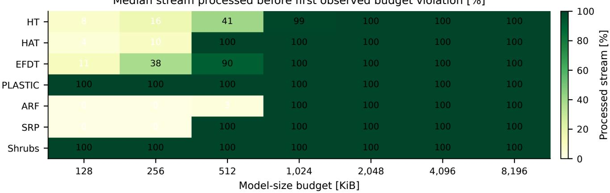  
Figure 9: RQ3 median stream percentage before the first observed violation for every configured budget. A value of 100 means that the median trajectory completes, not that every trajectory is compliant.

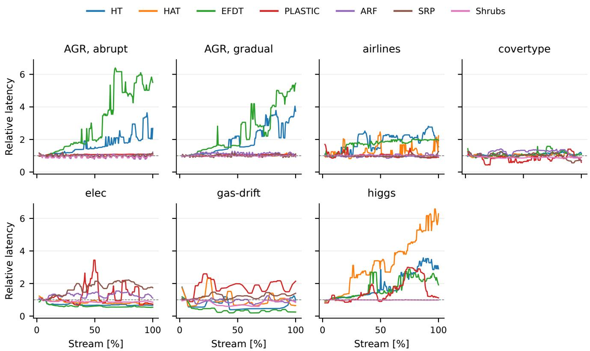  
Figure 10: RQ4 relative-latency trajectories, datasets 1–7.

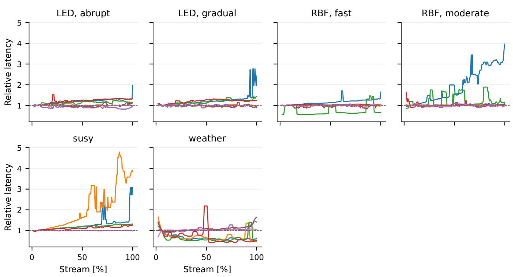  
Figure 11: RQ4 relative-latency trajectories, remaining datasets.

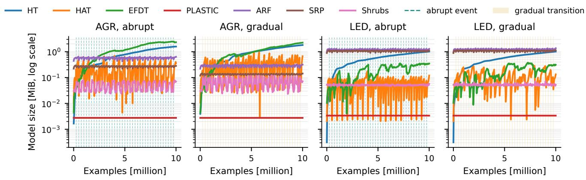  
Figure 12: RQ5 model-size trajectories for all seven methods.

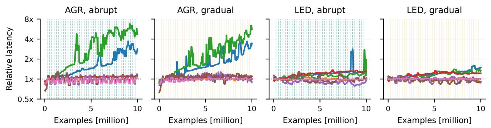  
Figure 13: RQ5 relative-latency trajectories for all seven methods.