# “Train classical, deploy quantum” requires rethinking generalization

Snehal Raj,1, 2 Natansh Mathur,1 and Alejandro Perdomo-Ortiz1, ∗

1QC Ware Corp., Palo Alto, USA and Paris, France

2LIP6, CNRS, Sorbonne Universit´e, Paris, France

Generative models have become central across science and industry, from image and text synthesis to the design of molecules and materials. Quantum generative models are considered one of the most promising applications for quantum computers, since a quantum circuit naturally produces samples from the distribution it encodes, and for suitable circuits that distribution is believed to be hard fo any classical computer to reproduce. A leading strategy trains these models on a classical computer and reserves the quantum device for generating samples at deployment. This is possible when the training loss can be evaluated on a classical computer. A prime example is the maximum mean discrepancy (MMD2), a moment-matching loss that compares the model and the data through their Pauli-Z correlations. Research so far has asked whether such models can be trained and whether their sampling is hard; whether minimizing such an objective yields a model that generalizes, rather than one that merely reproduces the training statistics, remains poorly understood. We benchmark a broad set of quantum and classical generative models by direct sampling and show that models trained with a moment-matching loss generally show worse generalization than the likelihood-trained models. We show this on two application-inspired datasets: first a cardinality-constrained dataset at up to 30 qubits and second a dataset of genomic single-nucleotide variants, whose valid set is the observed data. These results indicate that a converged moment-matching loss is not a reliable measure of generalization, and that train-classical, deploy-quantum workflows will need approaches that target generalization directly, leaving open whether better training objectives sufice or whether the model architectures themselves must change.

## I. INTRODUCTION

Generative models are used across science and industry, from image synthesis [1, 2] and text generation [3] to the design of new molecules [4]. Generative models are usually evaluated on whether the samples that they produce are novel, valid, and faithful to the target distribution, rather than reproduce their training examples [5, 6]. Quantum circuits provide a natural way to build such models. A quantum circuit Born machine (QCBM) prepares a parametrized quantum state and generates samples by measuring it in the computational basis [7–9]. Quantum correlations can increase the expressive power of generative models [10, 11]. For certain circuit families, sampling from the output distribution is believed to be classically intractable under standard complexity assumptions [12, 13]. This possible sampling advantage has made QCBMs a candidate application for near-term quantum computers [7, 9]. QCBMs have been explored on tasks ranging from finance to image synthesis, and parametrized quantum circuits are applied across machine learning more broadly [14–17]. For a review of quantum generative models beyond QCBMs and their applications, see [18].

Training a QCBM directly on quantum hardware is however expensive, even with improved training schemes [19, 20]. Each gradient estimate requires many circuit evaluations, and barren plateaus can make typical gradients exponentially small in the number of qubits [21]. One route around this cost pretrains the circuit classically as a matrix-product-state approximation and then fine-tunes it on hardware [22]; the pretraining is classically eficient, though surpassing classical models still requires the added cost of hardware training. These costs have motivated a train classical, deploy quantum (TCDQ) strategy. The loss is evaluated and optimized on a classical computer, and the quantum device is used only after training to draw samples [23, 24]. This separa tion is possible because evaluating the quantities used by the loss can be classically tractable even when sampling from the full output distribution is believed to be classically hard. Indeed, many models that provably avoid barren plateaus also allow their losses to be evaluated eficiently on a classical computer [25]. Work on this strategy has mainly asked whether the classical loss can be optimized [22, 26] and whether the deployed model can be reproduced by a classical surrogate [27]. Existing work has paid much less attention to ensuring that the trained circuit is a useful generator. Sampling may be classically hard even if the model fails to produce unseen, valid data. We therefore ask a third question: once the loss has converged, does the model generalize?

Gili et al. [28] established a way to measure generalization in this setting. They distinguish an eficient learner, which only reproduces the training distribution, from an eficient generator, which produces new and valid samples. The two are separated by sampling the trained model, through four metrics: exploration, fidelity, rate, and coverage. Scoring a generative model by the novel, valid samples it produces is also longstanding practice in molecular design [6]. In this work we take up the generalization question through both an empirical study and a theoretical analysis. Empirically, we benchmark thirteen classical and quantum generative models at up to 30 qubits, on two application-inspired datasets, a cardinality-constrained family and a set of genomic single-nucleotide variants. We score each model by free sampling, and we compare its training loss against its coverage and its forward Kullback-Leibler divergence to the target distribution. Across the benchmark, the moment-matching loss correlates poorly with both measures of generalization, whereas coverage and the forward KL agree much better with each other. Also, we find that moment-trained models generally generalize worse than likelihood-trained ones (Fig. 1). Theoretically, we prove that a loss fixed by a prescribed set of low-order correlators cannot certify generalization on its own. Two distributions can drive such a loss to zero and still cover very diferent fractions of the valid set.

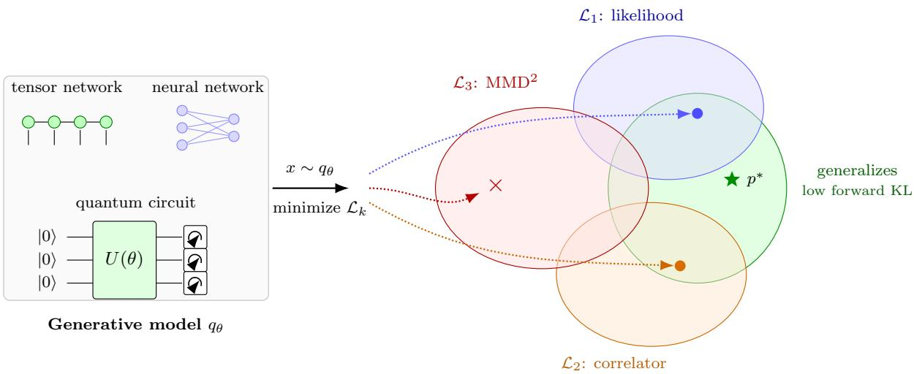  
FIG. 1. Training losses versus deployment generalization. An optimizer fits a generative model qθ (a tensor network, a neural network, or a quantum circuit) using quantities that can be evaluated without sampling the deployed model. The benchmark tests whether small empirical values of the negative log-likelihood $( \mathcal { L } _ { 1 } )$ , the fixed-order correlator (L2), and the full-kernel MMD2 (L3) objectives correspond to better generalization (low forward KL; green).

The paper is organized as follows. Section II reviews quantum circuit Born machines and the TCDQ paradigm. Section III defines the deployed training losses as moment losses, generalization through the forward KL, and its sample-based metrics, coverage and fidelity. Sec tion IV proves that a moment loss of bounded capacity admits exact global minimizers of exponentially small coverage, and locates the failure of the full MMD in its empirical minimizer, the memorizer. Section V reports the benchmark, ranking the models by loss, coverage, and forward KL on the cardinality-constrained family (to 30 qubits by state-vector simulation) and the genomic vari ants, and testing robustness across circuit gate count, kernel bandwidth, and a classical baseline.

## II. BACKGROUND AND RELATED WORK

a. Generative modeling. A generative model learns a distribution from a finite set of samples and produces new data from it. Generative adversarial networks train a generator against a discriminator [1]; autoregressive and difusion models maximize the likelihood of the data; the trained models generate text [3], images [2], and molecules [4]. How well such a model generalizes is judged on data beyond its training set. Arora et al. showed that the adversarial objective can be driven to its optimum by a generator supported on roughly as many points as the discriminator has parameters, so a small training objective does not imply that the learned distribution is close to the target [29], and support-size measurements on trained GANs confirmed the efect [30]. Evaluation therefore moved to the samples. Precision and recall separate the quality of generated data from the fraction of the target the model covers [31, 32], and memorization tests check that generated data are new [5]. Our study asks the corresponding questions for quantum generative models, in the spirit of careful benchmarking of quantum learning models [33, 34], building primarily from the work of Gili et al. [28], and formalizing our generalization derivations and results in the context of Arora et al [29].

b. Quantum circuit Born machines. A Born machine encodes a probability distribution as the measurement distribution of a quantum state, $p _ { \theta } ( x ) = | \langle x | \psi _ { \theta } \rangle | ^ { 2 }$ Trained variationally, they are a standard model for quantum generative learning [7–9], and have been trained on trapped-ion hardware on tasks up to high-resolution imagery [35–37]. For such models, sampling is native to quantum hardware, and for circuit families such as instantaneous quantum polynomial-time (IQP) circuits the output distribution is classically hard to sample under standard complexity assumptions [12]. Whether such distributions are eficiently learnable at all is an important research direction: Cliford outputs are learnable, yet a single non-Cliford gate can make distribution learning hard [38–40].

c. Train classical, deploy quantum. Training Born machines on hardware is challenging, owing to barren plateaus [21] and the cost of estimating gradients from samples. A way around this is to keep training entirely classical and use the quantum device only for inference. Recio-Armengol et al. train IQP Born machines on the moment-matching loss $\mathrm { ( M M D ^ { 2 } ) }$ at up to a thousand qubits by writing the loss as a classical mixture of Pauli-Z word expectations [23, 41], each computable in polynomial time via den Nest’s estimator [42]. Bak´o et al. propose fermionic Born machines (FBMs): magic (non-Gaussian) input states evolved by matchgate (freefermion) circuits, trained by matching constant-locality Pauli-Z string correlators [24], building on the Fermion Sampling advantage scheme [13]. Rudolph et al. pretrain a parametrized circuit from a classically optimized tensor network [22]; related classical-training protocols appear in Refs. [43, 44]. The training loss uses only classically cheap observables, while sampling from the trained model can remain classically hard for suitable circuit families.

d. Trainability and simulability. Most analysis of this paradigm studies whether the moment-matching loss is optimizable or whether the model is classically surrogatable. Lerch et al. characterize when the $\mathrm { M M D ^ { 2 } }$ loss of an IQP Born machine has barren plateaus and when data-dependent initialization restores trainability [26]. Herrero-Gonz´alez et al. identify the Born-rule probability as a Fourier series of Pauli-Z correlators, give conditions under which a correlator-described model can be classically surrogated, quantify the discrepancy between classically trained and quantumly deployed parameters, and note that an $\mathrm { M M D ^ { 2 } }$ loss whose kernel omits the relevant correlators resolves only the selected correlator sub set [27]; the expressivity of such quantum Fourier models is itself constrained [45]. T¨uys¨uz et al. show that a fixed $\mathrm { M M D ^ { 2 } }$ kernel weights the Walsh–Hadamard spectrum toward low Hamming weight, so an $\mathrm { M M D ^ { 2 } }$ -trained model matches only low-order correlations and departs from correlated, multimodal targets past a low-weight cutof, and a multi-kernel $\mathrm { M M D ^ { 2 } }$ does not remove this; they instead train a Fourier-encoded circuit by a classically tractable marginal likelihood that scales to a thousand qubits [46].

e. Evaluating generalization. Scores computed against the empirical training distribution (its KL, total variation, or moment-matching loss to the training data) measure agreement with the training set and cannot by themselves separate memorization from generalization. This is distinct from the forward KL divergence $\mathrm { K L } ( p ^ { * } \parallel q _ { \theta } )$ to the known target, which we use later as the gold standard for generalization precisely because the target distribution, $p ^ { * }$ , is known by design. Gili et al. introduce a sample-based framework (EFRC) on cardinality-constrained datasets, where validity is cheap to verify, and define the metrics we use, including the coverage of the unseen valid set [28, 47, 48]. We adopt coverage and the forward KL as our generalization measures throughout. Two of the classical models we evaluate are the tensor-network Born machine (TNBM) of Han et al. [49], which trains by likelihood, and the generative moment-matching network (GMMN) [50, 51], trained on the same moment-matching loss $\mathrm { ( M M D ^ { 2 } ) }$ ; the GMMN lets us separate the efect of the loss from that of the quantum platform. We measure coverage on both the cardinality-constrained datasets and a real-world dataset of genomic single-nucleotide variants, where the valid set is the set of observed sequences. For the genomic data we also report standard population-genetics diagnostics, per-locus allele-frequency correlation and pairwise linkage disequilibrium, alongside coverage [52].

## III. FRAMEWORK

a. Generative modeling. A generative task is specified by a distribution $p ^ { * }$ on $\{ 0 , 1 \} ^ { N }$ . Its support $S =$ $\operatorname { s u p p } ( p ^ { * } )$ is the set of valid strings. The learner observes a finite training set $T = ( X _ { 1 } , \ldots , X _ { n } ) $ drawn from $p ^ { * }$ and its empirical distribution

$$
\tilde { p } _ { T } = \frac { 1 } { n } \sum _ { i = 1 } ^ { n } \delta _ { X _ { i } } .\tag{1}
$$

It returns a model distribution $q _ { \theta } .$ . In a train-classical, deploy-quantum (TCDQ) workflow, quantities used during optimization are evaluated classically, whereas the trained model is sampled from the quantum circuit at deployment. The samples it produces beyond T determine its usefulness.

b. Quantum circuit models. A quantum circuit Born machine (QCBM) prepares $U ( \theta ) | 0 \rangle$ and generates

$$
q _ { \theta } ( x ) = | \langle x | U ( \theta ) | 0 \rangle | ^ { 2 } .\tag{2}
$$

Sampling is native to the hardware, but evaluating $q _ { \theta } ( x )$ requires estimating an exponentially small projector overlap, so the model’s probabilities are not eficiently accessible [41]. For the $\mathrm { I Q P }$ and fermionic circuit families considered here, selected Pauli-Z correlators can be evaluated classically even when sampling from the full output distribution is believed to be classically dificult [23, 24].

c. Losses. When we train a quantum generative model, we optimize a loss $\mathcal { L }$ that measures disagreement between the model and a reference distribution. Three versions of any such loss must be distinguished:

$$
\begin{array} { r } { \mathcal { L } _ { * } ( q ) : = \mathcal { L } ( p ^ { * } , q ) , \quad \mathrm { p o p u l a t i o n ~ d i s c r e p a n c y } , } \end{array}
$$

$$
\mathcal { L } _ { T } ( q ) : = \mathcal { L } ( \tilde { p } _ { T } , q ) , \mathrm { e m p i r i c a l t r a i n i n g l o s s } ,
$$

$$
\widehat { \mathcal { L } } _ { T , B } ( q ) \qquad \mathrm { f i n i t e - b u d g e t ~ e s t i m a t o r ~ o f ~ } \mathcal { L } _ { T } ( q ) .\tag{3}
$$

Here B counts the queries the estimator spends per evaluation, correlator draws and model samples together. A small $\widehat { \mathcal { L } } _ { T , B }$ can mean that the estimator is accurate and that the empirical loss has been optimized. It does not by itself imply that $q _ { \theta }$ is close to $p ^ { * }$ . For the circuit families the paradigm uses, the Pauli-Z correlators are classically computable [23, 42], while log-probabilities are not available to the precision a likelihood needs [53].

The deployed losses share one structural property, which Section IV uses in its general form:

Definition 1 (Moment loss of capacity $d )$ . A loss is a moment loss of capacity d if it depends on the model only through the expectations $\langle { \cal O } _ { 1 } \rangle _ { q } , . . . , \langle { \cal O } _ { d } \rangle _ { q }$ of bounded observables $O _ { j } : \{ 0 , 1 \} ^ { N }  [ - 1 , \dot { 1 } ]$ , and attains its minimum exactly when all d match the reference.

The widely used TCDQ losses are all moment losses, and their observables are the Pauli-Z strings $Z _ { A }$ . For $A \subseteq$ [N] write $\chi _ { A } ( x ) = ( - 1 ) ^ { \sum _ { i \in A } x _ { i } }$ for the parity of A, and $\begin{array} { r } { \langle \bar { Z _ { A } } \rangle _ { q } = \sum _ { x } q ( x ) \chi _ { A } ( x ) } \end{array}$ for the correlator of the model. Every deployed loss is a weighted square diference of correlators,

$$
\mathcal { L } _ { w , \mathcal { F } } ( p , q ) = \sum _ { A \in \mathcal { F } } w ( A ) \big ( \langle Z _ { A } \rangle _ { p } - \langle Z _ { A } \rangle _ { q } \big ) ^ { 2 } ,\tag{4}
$$

with the reference $p$ set to $p ^ { * } , \tilde { p } _ { T }$ or a batch, per Eq. (3). The index set $\mathcal { F }$ specifies which correlators the loss compares, the weight w sets the penalty on each mismatch, and the capacity of Definition 1 is d = dim span ${ \mathcal F } .$ . The three deployed losses are three choices of $( w , { \mathcal { F } } )$ , with $\begin{array} { r } { D _ { L } : = \sum _ { \ell \leq L } { \binom { N } { \ell } } = O ( N ^ { L } ) } \end{array}$ counting the correlators of order at most L:

$$
\begin{array} { r l r } { \mathrm { F B M \ c o r r e l a t o r { \cite { A 2 4 } } } \ } & { { \mathscr L } _ { 1 , \{ | A | \leq L \} } , } & { d = D _ { L } , } \\ { \mathrm { t r u n c a t e d { \ M M D } : } } & { { \mathscr L } _ { w _ { \sigma } , \{ | A | \leq L \} } , } & { d = D _ { L } , } \\ { \mathrm { f u l l \ M M D \ } \cite { A 2 4 } \ } & { { \mathscr L } _ { w _ { \sigma } , 2 ^ { [ N ] } } , } & { d = 2 ^ { N } . } \end{array}\tag{5}
$$

The first is evaluated exactly through Pfafians [24]. The third is never evaluated exactly: the sampled-spectrum estimator of Ref. [23] estimates it without bias by redrawing $A \sim w _ { \sigma }$ at every update, an instance of the estimator $\widehat { \mathcal { L } } _ { T , B }$ of Eq. (3). These losses are training surrogates: they stand in for the inaccessible likelihood during optimization, and they are the objectives under which the paradigm trains [8, 23, 24].

The weight $w _ { \sigma }$ comes from a kernel. The MMD compares two distributions through their mean embeddings $\mu _ { q } = \mathbb { E } _ { q } [ \phi ( x ) ]$ , and the loss is $\| \mu _ { p } - \mu _ { q } \| ^ { 2 }$ , written with the kernel alone as

$$
\begin{array} { r l } & { \mathrm { M M D } _ { k } ^ { 2 } ( p , q ) = \mathbb { E } _ { { x } , { x ^ { \prime } } \sim { p } } k ( x , { x ^ { \prime } } ) + \mathbb { E } _ { { y } , { y ^ { \prime } } \sim { q } } k ( y , { y ^ { \prime } } ) } \\ & { \phantom { { = } } - 2 \mathbb { E } _ { { x } \sim { p } , { y } \sim { q } } k ( x , { y } ) . } \end{array}\tag{6}
$$

On N-bit strings the kernel is the Gaussian–Hamming kernel $k _ { \sigma } ( x , y ) = e ^ { - d _ { H } ( x , y ) / 2 \sigma ^ { 2 } }$ , with $d _ { H }$ the Hamming

distance and $\sigma$ the bandwidth.1 In the Fourier basis of the cube [54],

$$
\begin{array} { r l } & { \mathrm { M M D } _ { \sigma } ^ { 2 } ( p , q ) = \mathcal { L } _ { w _ { \sigma } , 2 ^ { [ N ] } } ( p , q ) , } \\ & { ~ w _ { \sigma } ( A ) = p _ { \sigma } ^ { | A | } ( 1 - p _ { \sigma } ) ^ { N - | A | } , } \\ & { ~ p _ { \sigma } = \frac { 1 } { 2 } \big ( 1 - e ^ { - 1 / 2 \sigma ^ { 2 } } \big ) , } \end{array}\tag{7}
$$

so the full MMD compares every correlator, with weights that peak at order $p _ { \sigma } N$ , which is 0.197N at $\sigma = 1$ , and fall exponentially above it [23, 41, 46]. Since $w _ { \sigma } ( A ) > 0$ for every A, the kernel is characteristic: the population MMD vanishes only at $q = p ^ { * }$ [55, 56].

Each deployed loss is the square of an integral probability metric [57–59] with discriminator class $\mathcal { F }$ in the sense of Arora et al. [29] and capacity d.

d. Generalization and its sample-based evaluation. Generalization is the population goal of a generative model: closeness to the target on the whole valid set, including the strings the training data never showed it [28, 29]. We state it with the forward KL divergence.

Definition 2 (Generalization). A model qθ generalizes at level ε if

$$
\mathrm { K L } ( p ^ { * } \parallel q _ { \theta } ) = \sum _ { x \in S } p ^ { * } ( x ) \log \frac { p ^ { * } ( x ) } { q _ { \theta } ( x ) } \ \leq \ \varepsilon .\tag{8}
$$

The forward KL is finite only if the model assigns probability to every valid string, and small only if it weights them as the target does. That the forward KL blows up under support mismatch is the property Arjovsky and Bottou use to motivate weaker distances for GAN training [60]; here it is what makes coverage the natural sample-based metric. In deployment the divergence cannot be evaluated: q (x) is not eficiently accessible, and $p ^ { * }$ is unknown outside designed benchmarks; Section V computes the divergence ofline for its benchmark targets. What is available at deployment is a quantity computed from the samples the model produces, under a stated budget.

Definition 3 (Sample-based generalization metric). Let $G ( q _ { \theta } ; T )$ be a quantity determined by the trained model and the training set. A statistic ${ \widehat { G } } _ { Q }$ , computed from the first $Q$ terms of a sequence $Y _ { 1 } , Y _ { 2 } , . . .$ . of independent samples of $q _ { \theta } .$ , is a sample-based generalization metric for G if ${ \widehat { G } } _ { Q } \to G ( q _ { \theta } ; T )$ as $Q  \infty$ , with probability one.

Write $U = S \setminus T$ for the unseen valid strings, assumed nonempty. We use two such metrics: the coverage, for diversity over $U ,$ and the fidelity $F$ , the fraction of generated samples that are valid; the fidelity converges to the valid mass $q _ { \theta } ( S )$ . The support coverage

$$
C _ { \infty } ( q _ { \theta } ) = \frac { | \mathrm { s u p p } ( q _ { \theta } ) \cap U | } { | U | }\tag{9}
$$

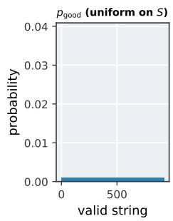

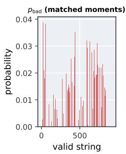

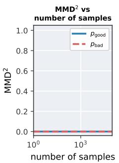

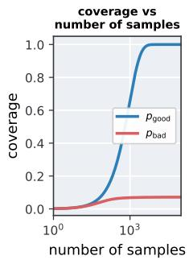  
FIG. 2. A truncated moment loss admits exact minimizers with diferent support coverage. The distributions p and $p _ { \mathrm { b a d } }$ match every correlator through order L (Corollary 1), yet their support coverages are 1 and 0.07. Statements in Section IV, proofs in Appendix A.

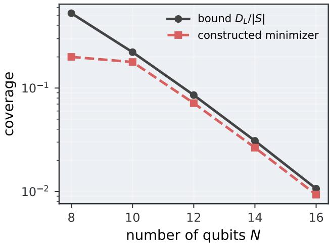  
FIG. 3. The low-coverage minimizer of Corollary 1 is explicit. For $N = 8$ to 16 at $L = 2$ , a linear program constructs a distribution matching every order-≤ L correlator of the uniform target. Realized coverage of the constructed minimizer (red) and the bound $D _ { L } / | S |$ of Corollary 1 (gray) versus $N ,$ on a logarithmic scale; the truncated loss is numerically zero at every point.

is the fraction of the unseen valid strings with positive probability under the model. The measured coverage at budget Q is the statistic $\widehat { C } _ { Q } ( q _ { \theta } ) = | \{ Y _ { 1 } , \ldots , Y _ { Q } \} \cap U | / | U |$ with expectation

$$
\mathbb { E } \widehat { C } _ { Q } ( q _ { \theta } ) = \frac { 1 } { | U | } \sum _ { x \in U } \big [ 1 - ( 1 - q _ { \theta } ( x ) ) ^ { Q } \big ] .\tag{10}
$$

Every sampled string lies in the support, so ${ \widehat { C } } _ { Q } \leq C _ { \infty }$ at every $Q ,$ and ${ \widehat { C } } _ { Q } \to C _ { \infty }$ with probability one. The shortfall $\begin{array} { r } { C _ { \infty } - \mathbb { E } \widehat { C } _ { Q } = | U | ^ { - 1 } \sum _ { x \in \mathrm { s u p p } ( q _ { \theta } ) \cap U } ( 1 - q _ { \theta } ( x ) ) ^ { Q } } \end{array}$ is small once $Q$ is large compared with the reciprocal of the smallest positive model probability on U. Whether measured coverage ranks models as the forward KL does is an empirical question, and Section V reports the observed rank correlations. The classical and the quantum literature track the generalization of generative models with coverage in one form or another [28, 31, 32]. Coverage alone sufices when the architecture confines the sup port to $S ,$ and we report coverage and fidelity together otherwise.

## IV. MOMENT LOSSES DO NOT CERTIFY GENERALIZATION

In this section we show that exact minimizers of the deployed losses can have exponentially small coverage. Our results are statements about the population loss $\mathcal { L } _ { * }$ of Eq. (3), the best case for the loss. The two finite objects are weaker: for a characteristic kernel the exact minimizer of the empirical loss $\mathcal { L } _ { T }$ is the memorizer $\tilde { p } _ { T }$ and a small estimate $\widehat { \mathcal { L } } _ { T , B }$ implies only that the estimator is accurate. The population values are estimable from polynomially many samples [29]. We show results on the cardinality task of Section $\dot { \mathrm { V : } } \ \dot { S } = \{ x : | x | = N / 2 \}$ with $\vert S \vert = { \binom { N } { N / 2 } } = \Theta ( 2 ^ { N } / \sqrt { N } )$ ， $p ^ { * }$ uniform on $S ,$ and $T = \emptyset$

Theorem 1 (Moment losses of bounded capacity admit exact sparse minimizers). Let $p ^ { * }$ have full support on a finite valid set S, and let L be a moment loss of capacity d with $d + 1 < | S |$ Then there is an exact global minimizer $q _ { \mathrm { s p a r s e } }$ of $\mathcal { L } _ { * }$ , supported inside $S$ on at most d + 1 strings, with

$$
\begin{array} { r l r } & { } & { \mathcal { L } _ { * } ( q _ { \mathrm { s p a r s e } } ) = \mathcal { L } _ { * } ( p ^ { * } ) , \qquad \mathrm { K L } ( p ^ { * } \parallel q _ { \mathrm { s p a r s e } } ) = \infty , } \\ & { } & { \widehat { C } _ { Q } ( q _ { \mathrm { s p a r s e } } ) \leq C _ { \infty } ( q _ { \mathrm { s p a r s e } } ) \leq \frac { d + 1 } { | S | } f o r e v e r y Q . } \end{array}\tag{11}
$$

The target is also an exact minimizer, and the loss takes the same value on both, so the loss value cannot select between them. By Eq. (11), $q _ { \mathrm { s p a r s e } }$ does not generalize at any level ε (Definition 2). The value of a training surrogate therefore carries no guarantee of coverage at deployment, and evaluation must come from samples. Model structure or optimizer bias may still select a good minimizer among the exact minimizers. The statement constrains distributions; whether a given circuit family realizes the sparse minimizer, and whether training reaches one, are separate questions, and Section V addresses them empirically.

For the deployed losses on the cardinality task the bound is explicit.

Corollary 1 (Fixed-order correlators on the cardinality task). The $o r d e r { \le } \ L$ losses have $\begin{array} { r } { d = D _ { L } = \sum _ { \ell \leq L } \binom { N } { \ell } = } \end{array}$ $O ( N ^ { L } )$ , and the constant function lies in the span of their observables, so on the uniform cardinality target they admit an exact global minimizer $q _ { L }$ supported on at most $D _ { L }$ strings, with

$$
\begin{array} { l } { { \displaystyle \widehat C _ { Q } ( q _ { L } ) \ \leq \ C _ { \infty } ( q _ { L } ) \ \leq \ \frac { D _ { L } } { { \binom { N } { N / 2 } } } \ = \ O \Big ( \frac { N ^ { L + 1 / 2 } } { 2 ^ { N } } \Big ) } } \\ { { f o r \ e v e r y \ Q . } } \end{array}\tag{12}
$$

The proofs are in Appendix $\operatorname { A } ;$ the support count is $d + 1$ in general and improves to d when the constant function lies in the span of the observables, as it does for the deployed losses. The theorem is the Boolean-cube form of the GAN analysis of Arora et al. [29], in which a discriminator class of bounded capacity is driven to its optimum by generators supported on roughly capacitymany points, an efect later confirmed by support measurements on trained GANs [30]. Our result does not exclude a TCDQ loss that depends on more than a bounded list of expectations. In particular, Tuysuz et al. train a Fourier-structured model on a classically estimated likelihood, which is a moment loss of no finite capacity, and pay with a restricted circuit family whose visible marginals factorize [46].

We construct the minimizer $q _ { L }$ of Corollary 1 explicitly with a linear program (Fig. 3). At $N = { \dot { 1 } } 2$ it finds a distribution that matches every correlator of $p ^ { * }$ through order $L = 2$ on a support of 66 strings. Its truncated loss is $\sim 1 0 ^ { - 2 8 }$ , its coverage is 0.07 against the target’s 1.00, and its forward KL is infinite (Table III). Figure 2 visualizes the two distributions.

Theorem 1 does not apply to the full MMD: the kernel is characteristic (Section III), so $p ^ { * }$ is the unique exact minimizer of the population loss $\mathcal { L } _ { * }$ [8], and the full MMD remains a principled training surrogate. Training, however, minimizes the empirical and stochastic objects of Eq. (3). The memorizer $\tilde { p } _ { T }$ attains $\mathcal { L } _ { T } ( \tilde { p } _ { T } ) = 0$ with $C _ { \infty } ( \tilde { p } _ { T } ) \dot { = } 0$ . An empirical MMD value therefore cannot substitute for sample-based evaluation, and Section V evaluates every trained model from its samples.

## V. BENCHMARKING GENERALIZATION

We train thirteen models on two datasets and report how well each generalizes. For every model we compare its training loss, the eval $\mathrm { M M D ^ { 2 } }$ , against two direct measures of generalization, coverage and the forward KL, and ask whether a low loss tracks them. Because the target $p ^ { * }$ is known by design, for the small systems (N=16 and $N { = } 2 0 )$ we rank the models by each score and compare the rankings; the cardinality task is pushed to $N = 3 0$ by full state-vector simulation, confirming Section IV in practice: models with nearly the same $\mathrm { M M D ^ { 2 } }$ loss difer widely in coverage. Table I reports $\mathrm { M M D ^ { 2 } }$ and coverage on both datasets. Throughout this section, C denotes the measured coverage ${ \widehat { C } } _ { Q }$ of Section III at the stated budget Q.

## A. Datasets, models, and protocol

Definition 4 (Cardinality-constrained dataset). For even $N _ { : }$ the valid set is the set of bitstrings of Hamming weight $N / 2$

$$
S = \{ x \in \{ 0 , 1 \} ^ { N } : | x | = N / 2 \} , \quad | S | = { \binom { N } { N / 2 } } ,\tag{13}
$$

and the target $p ^ { * }$ is the uniform distribution on S. We use $N \in \{ 1 6 , 2 0 , 3 0 \}$ , for which $\vert { \cal S } \vert = 1 2 , 8 7 0 .$ , 184,756, and $1 . 5 5 \times 1 0 ^ { 8 }$

The fixed-weight rule couples all N bits, so a model must capture their joint structure. The valid set is known in full, so coverage can be measured exactly.

Definition 5 (Genomic variant dataset). From $M =$ 5,008 observed single-nucleotide-variant sequences $[ 6 1 ] ,$ taken from the PennyLane quantum dataset library [62], we keep the first N loci of each sequence and deduplicate; the distinct observed sequences $\mathbf { \bar { \Phi } } _ { x } \in \{ 0 , 1 \} ^ { N }$ form the valid set

$$
S = \{ x : x \in { \mathcal { D } } \} ,\tag{14}
$$

with $| S | = 2 ,$ 716 at $N { = } 1 6$ and 3,980 at $N { = } 2 0$ . We define the target $p ^ { * }$ as the empirical distribution of $\mathcal { D } _ { \mathrm { : } }$ and a sequence is valid if it lies in $S .$

The genomic valid set has no fixed Hamming weight: for example, at N=20 the modal weight is 12 and the data span weights from 4 to 18. The target $p ^ { * }$ is non-uniform, with per-locus allele frequencies and linkage between loci.

a. Models. We evaluate thirteen models. The likelihood-trained group consists of the TNBM [49], three transformers, three GRU RNNs, and an RBM. The MMD-trained group consists of the IQP Born machine [23], the magic FBM [24], and the classical GMMN [50, 51]. The active $( S O ( \bar { 2 } N ) )$ and passive FBMs use fixed-locality correlator losses; the passive FBM also restricts its support to the fixed-Hamming-weight sector, so it is confined to the cardinality valid set by construction $( F = 1 )$ . Appendix C gives the architectures and optimization settings.

b. Training protocol. From a dataset we draw a training set $T$ at fraction $\varepsilon \cdot$ for the cardinality task, $| T | = [ \varepsilon | S | ]$ valid strings drawn uniformly without replacement from $ { S } ( \varepsilon \in \{ 0 . 0 1 , 0 . 0 5 , 0 . 1 0 \} )$ ; for the genomic task, $| T | = \lfloor \dot { \varepsilon } M \rfloor$ sequences drawn from $\textit { \textbf { D } } ( \varepsilon \in$ {0.01, 0.05, 0.10, 0.20}). A seed fixes the training subset: at each (ε, seed) every model trains on the same ${ \check { T } } _ { : }$ and $T$ is resampled across seeds, so the spread reported across seeds reflects the choice of training subset. We use three seeds for the cardinality task and five for the genomic task. Training fixes the parameters by minimizing a loss $\mathcal { L }$ that compares qθ to $T$ (Section III),

TABLE I. A benchmark of quantum and classical generative models, each scored by both its training loss and its ability to generate new, valid data. We present results on two datasets together: the cardinality task at $N = 3 0$ $( \varepsilon \approx 3 \times 1 0 ^ { - 4 }$ , corresponding to $| T | = 5 0 \mathrm { K }$ training strings; $Q = 1 0 ^ { 5 } ;$ three seeds) by full state-vector simulation, and genomic single-nucleotide variants at $N = 2 0 ~ ( \varepsilon = 0 . 2 0$ , corresponding to $| T | = 7 9 6 ; Q = 5 , 0 0 8 ;$ ; five seeds). Values are medians over seeds. Rows group models into likelihood-trained and moment-trained families. We report eval $\mathrm { M M D ^ { 2 } }$ (Gaussian–Hamming kernel, $\sigma { = } 1 )$ for both; fidelity $F$ and normalized coverage $\tilde { C } = C / C ^ { * }$ for the cardinality columns (the raw coverage is querybudget-limited at $N = 3 0 ) \colon$ ; and coverage C for the genomic. Colors encode within-column rank, from green for better values to red for worse values. Per-size cardinality and per-ε results, including the median-bandwidth IQP variant, are in Appendix D.
<table><tr><td></td><td colspan="4">Cardinality  $( N { = } 3 0 )$ </td><td colspan="2">Genomic  $( N { = } 2 0 )$ </td></tr><tr><td>Model</td><td>loss</td><td> $\mathrm { M M D ^ { 2 } }$ </td><td> $F$ </td><td> $\tilde { C }$ </td><td> $\mathrm { M M D ^ { 2 } }$ </td><td>C</td></tr><tr><td>Likelihood-trained</td><td colspan="6"></td></tr><tr><td>Transformer (L)</td><td>cross-ent</td><td>1.00e-3</td><td>1.00 1.00 1.00</td><td rowspan="4"></td><td>1.58e-3 1.49e-3</td><td>0.130</td></tr><tr><td>Transformer (M)</td><td>cross-ent</td><td>9.99e-4</td><td>1.00</td><td></td><td>0.140</td></tr><tr><td>RNN (S)</td><td>cross-ent</td><td>1.02e-3</td><td>1.00 1.00</td><td>3.05e-3</td><td>0.084</td></tr><tr><td>TNBM</td><td>NLL</td><td>1.01e-3</td><td>0.96 0.96</td><td>8.17e-4</td><td>0.140</td></tr><tr><td>RNN (M)</td><td>cross-ent</td><td>1.01e-3</td><td>0.91</td><td>0.91</td><td>1.08e-3</td><td>0.141</td></tr><tr><td>RNN (L)</td><td>cross-ent</td><td>1.01e-3</td><td>0.88</td><td>0.88</td><td>1.21e-3</td><td>0.132</td></tr><tr><td>Transformer (S)</td><td>cross-ent</td><td>9.97e-4</td><td>0.70</td><td>0.70</td><td>2.93e-3</td><td>0.087</td></tr><tr><td>RBM</td><td>CD</td><td>1.04e-3</td><td>0.15</td><td>0.15</td><td>5.62e-3</td><td>0.025</td></tr><tr><td colspan="6">Moment-trained</td><td></td></tr><tr><td>FBM (passive)</td><td>Z-corr</td><td>1.03e-3</td><td>1.00</td><td>1.00</td><td>6.43e-3</td><td>0.029</td></tr><tr><td>magic FBM</td><td> $\mathrm { M M D ^ { 2 } }$ </td><td>1.09e-3</td><td>0.16</td><td>0.16</td><td>2.47e-2</td><td>0.001</td></tr><tr><td>GMMN (classical MMD)</td><td> $\mathrm { M M D ^ { 2 } }$ </td><td>1.73e-3</td><td>0.24</td><td>0.24</td><td>2.07e-3</td><td>0.129</td></tr><tr><td>IQP</td><td> $\mathrm { M M D ^ { 2 } }$ </td><td>1.43e-3</td><td>0.14</td><td>0.14</td><td>1.08e-2</td><td>0.014</td></tr><tr><td>FBM (active)</td><td> $\scriptstyle \mathbf { Z - c o r r }$ </td><td>1.39e-3</td><td>0.09</td><td>0.09</td><td> $2 . 0 7 \mathrm { e } { - 2 }$ </td><td>0.000</td></tr></table>

$$
\theta ^ { \star } = \arg \operatorname* { m i n } _ { \theta } \mathcal { L } ( q _ { \theta } , T ) ,\tag{15}
$$

with an iterative optimizer: gradient descent for the autoregressive, IQP, FBM, and GMMN models, two-site DMRG for the TNBM, and contrastive divergence for the RBM. Autoregressive models run 200 epochs with early stopping; the FBM models run 1,500 to 2,000 gradient steps, and the IQP model 500. Full hyperparameters are in Appendix C.

c. Sampling protocol. We evaluate every model by free sampling: from the trained model we draw Q samples and keep all of them $( Q = 1 0 ^ { 4 }$ at $N = 1 6 ; Q = 1 0 ^ { \bar { 5 } }$ at $N = 2 0$ and $N = 3 0 :$ ; for the genomic task Q equals the dataset size, 5,008 at N=20 and 2,716 at $N { = } 1 6 )$ Coverage is the fraction of the unseen valid set $S \setminus T$ that appears among the distinct valid samples, and the fidelity F the fraction of new samples that are valid [28]. A model that samples uniform random bits over all $2 ^ { \dot { N } }$ strings reaches expected coverage $C _ { \mathrm { r a n d } } = 1 - ( 1 { - } 2 ^ { - N } ) ^ { Q } ;$ this no-learning floor is our baseline. When $| S | \gg Q$ the raw coverage is capped by the budget, so we also report the normalized coverage $\tilde { C } = C / \check { C } ^ { * }$ , where $C ^ { * } = 1 -$ $( 1 - 1 / | S \setminus T | ) ^ { Q }$ is the coverage an ideal uniform sampler over $S \setminus T$ reaches in $Q$ draws. Because $p ^ { * }$ is known by design, we also compute the forward KL $\mathrm { K L } ( p ^ { * } \parallel q _ { \theta } )$ of the trained model.

TABLE II. Efect of model capacity at $N = 1 6 , \ \varepsilon = 0 . 1 0$ (three seeds). Each family has its own size axis (in parentheses); parameters and coverage C run from the smallest to the largest setting. Enlarging IQP by 18× in gate count does not raise its coverage above $C _ { \mathrm { r a n d } }$ , while the TNBM rises then over-fits, as illustrated in Fig. 5c. The free-fermion FBMs have no capacity parameter.
<table><tr><td>family (size axis)</td><td>params (small→large)</td><td>C</td></tr><tr><td>Transformer  $\mathrm { ( w / d e p t h ) }$ </td><td>3.4k/25.6k/150k</td><td> $0 . 4 8 / 0 . 5 2 / 0 . 5 2$ </td></tr><tr><td>RNN (hidden dim)</td><td>1.7k/25.3k/199k</td><td>0.52/0.52/0.51</td></tr><tr><td>TNBM (bond χ)</td><td>120/1088/15016</td><td>0.27/0.52/0.22</td></tr><tr><td>IQP (gate weight)</td><td>136/696/2516</td><td>0.14/0.13/0.13</td></tr><tr><td>FBM (passive)</td><td>120</td><td>0.40</td></tr><tr><td>FBM (active)</td><td>496</td><td>0.11</td></tr><tr><td>magic FBM</td><td>784</td><td>0.14</td></tr></table>

## B. Cardinality-constrained data

After training, we measure both the $\mathrm { M M D ^ { 2 } }$ and the coverage of every model. On this task the two decouple. The deploy-quantum moment-trained models (the IQP Born machine and the active and magic FBMs) converge the $\mathrm { M M D ^ { 2 } }$ to a low value, yet do not generate valid bitstrings eficiently: a low loss does not make them generators. The likelihood-trained models reach a comparably low $\mathrm { M M D ^ { 2 } }$ and also cover most of the valid set (Table I). One moment-trained model is the exception. The passive number-conserving fermionic Born machine reaches high coverage because its matchgate circuit produces only Hamming-weight-preserving strings, so it is confined to the valid set by construction rather than by its loss. No other model was biased this way; when the valid set has known structure, encoding it into the model raises coverage where lowering the loss does not.

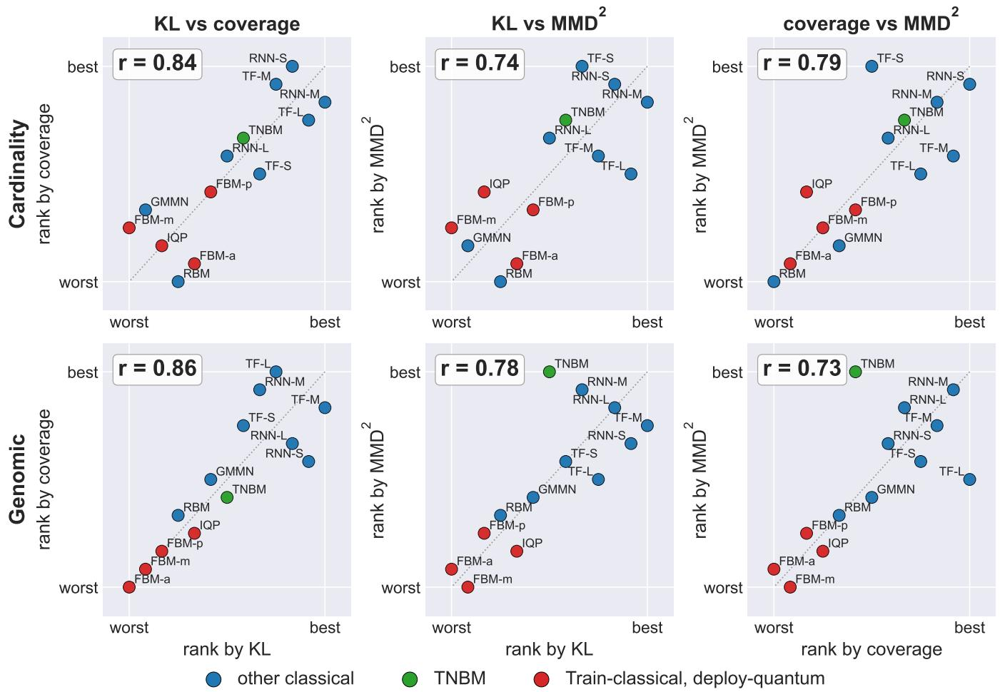  
FIG. 4. Rank correlations among $\mathbf { M M D ^ { 2 } }$ , coverage, and forward KL. Each panel ranks the same thirteen models by two scores, best in the top-right corner, for the cardinality data (top) and the genomic data (bottom), both at $N = 1 6 ;$ each score is a median over seeds, and r is Spearman’s rank correlation between the two scores. The left column pairs the two generalization measures (coverage and the forward KL); the middle and right columns pair each against the moment-matching loss $\mathrm { M M D ^ { 2 } }$ . In the labels, TF is the transformer and $\dot { \mathrm { S } } / \mathrm { M } / \mathrm { I }$ are the small, medium, and large variants.

At $N = 1 6$ , where each model’s exact probabilities are available, we rank the models by coverage, by the forward KL divergence, and by the eval $\mathrm { M M D ^ { 2 } }$ , and compare the rankings pairwise (Fig. 4, top row). Coverage and the forward KL agree closely, while the $\mathrm { M M D ^ { 2 } }$ correlates poorly with both: the IQP and tensor-network Born machines reach the same $\mathrm { { M M D ^ { 2 } } }$ within 40%, yet cover 0.09 and

0.41 of the unseen valid set, $\mathrm { ~ a ~ } 4 . 6 \times \mathrm { ~ g a p } .$ . The pattern holds for all evaluated models and across sizes to $N = 3 0$ (Appendix D).

Figure 5 shows the decoupling directly. During training the IQP Born machine drives its $\mathrm { M M D ^ { 2 } }$ down by an order of magnitude while its coverage stays near $C _ { \mathrm { r a n d } }$ (a), whereas a likelihood-trained transformer lowers its loss and raises its coverage together, toward the ideal finite-sample ceiling $C ^ { * } \left( \mathrm { b } \right)$ . Capacity does not close the gap: enlarging the $\mathrm { I Q P }$ circuit 18× in gate count leaves its coverage flat, while the tensor-network and classical models improve with size (c; Table II). The gap widens with qubit count, out to $N = 3 0 \ ( \mathrm { d } )$ The decoupling is not an artifact of the kernel bandwidth: sweeping σ from sharp to broad leaves $\mathrm { I Q P }$ near $C _ { \mathrm { r a n d } }$ (Appendix E).

(a)  
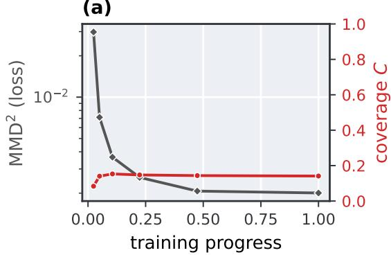  
(c)

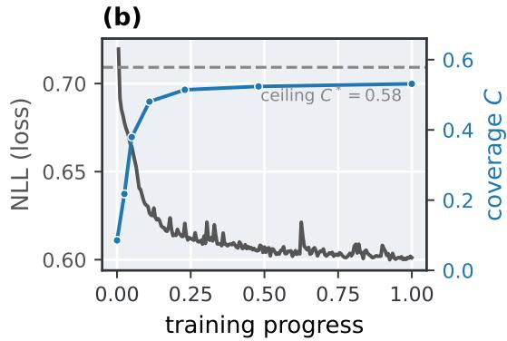

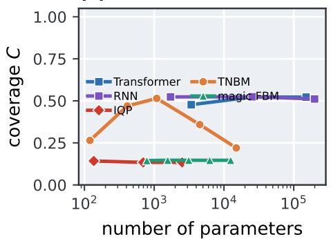

C  
(d)  
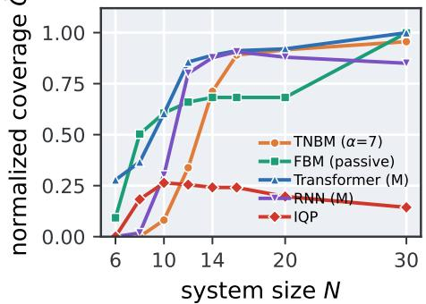  
FIG. 5. Loss and coverage decouple during training and across model size. (a) IQP at $N = 1 6 , \varepsilon { = } 0 . 1 0 \colon$ the loss $( \mathrm { M M D ^ { 2 } , \ g r a y } )$ falls by an order of magnitude while coverage (red) stays near $C _ { \mathrm { r a n d } } . \ ( b )$ a likelihood-trained transformer: the loss (NLL, gray) falls and coverage (blue) rises to the finite-sample maximum $C ^ { * } . \ ( c )$ coverage versus parameter count at $N = 1 6 \colon$ the classical transformer and RNN and the TNBM rise with size, while $\mathrm { I Q P }$ and the magic FBM stay near $C _ { \mathrm { r a n d } } .$ (d) normalized coverage $\tilde { C } = C / C ^ { * }$ versus system size N up to 30 (raw $C$ is not comparable across N because |S| grows exponentially and the query budget changes with $N )$ : the likelihood-trained and structural models increase toward $\tilde { C } = 1$ while IQP holds near $C _ { \mathrm { r a n d } }$ . Throughout, loss is gray and coverage takes each model’s group colour.

## C. Genomic variant data

On the genomic data the deploy-quantum models are again the weakest generators. The transformer and RNN reach the highest coverage, with the tensor-network Born machine just behind (all near $C = 0 . 1 4 ;$ Table I). These models also fail to reach a low $\mathrm { M M D ^ { 2 } }$ here: with no fixed Hamming weight to exploit, they match neither the data’s low-order statistics nor its support. Loss and coverage correlate slightly better than on the cardinality data (Fig. 4, bottom row), so whether the $\mathrm { M M D ^ { 2 } }$ tracks generalization depends on the dataset, and generalization has to be measured directly. The passive fermionic Born machine, which covered the cardinality valid set well, generalizes poorly here, like the other moment-trained models: its Hamming-weight bias fits the cardinality set but not the genomic one. Genomics-specific diagnostics (per-locus allele frequencies, pairwise linkage disequilibrium, and a PCA of the generated samples) are reported in Appendix F.

## VI. CONCLUSION

In this work we measure the ability of quantum generative models to produce new and valid samples directly, by sampling thirteen classical and quantum generative models and scoring the samples they produce. On two application-inspired datasets, at up to 30 qubits, the models trained with a moment-matching loss generalized worse than the likelihood-trained ones. The momentmatching loss still converged to small values, but these values did not track coverage or the forward KL divergence to the target. A low training loss was therefore not a reliable sign that a model had become a useful generator. The one exception was a fermionic Born machine whose circuit emits only fixed-weight strings, which confined it to the valid set by construction rather than through its loss.

We also analysed this behavior theoretically. For any loss fixed by a prescribed set of low-order correlators, we prove that exact matching is consistent with almost any coverage. Two distributions can drive the loss to zero while one covers the whole valid set and the other an exponentially small fraction of it. The diference lies in the high-order correlators that the loss never constrains. These results point to a change in practice. The TCDQ paradigm has so far been justified by trainability and by the hardness of sampling. Generalization, however, is the most important requirement, and it should be checked directly by sampling the trained model, not by its training loss.

Our study has limitations that point to future work. We benchmarked specific families of models and losses, on datasets whose valid set is known and cheap to check. In a real deployment the valid set may itself be uncertain, and measuring coverage would then require a reliable validity oracle. The most direct next step is to replace moment matching with a loss that targets generalization, such as maximum likelihood or an objective with a coverage-aware term. Another is to build the constraint into the model rather than into the loss. The passive fermionic Born machine did this for fixed Hamming weight, and reached high coverage as a result. Although there has been progress on structure-preserving models, in particular tensor networks that embed cardinality and other discrete linear constraints [63, 64] and Hamming-weight-preserving quantum circuits [65], find ing structure-preserving circuits for other application domains, such as molecular validity or graph properties, remains an open problem. We see generalization as a property to be measured, not assumed from a low loss, and building the losses and models that deliver it as the main task ahead.

[1] I. J. Goodfellow, J. Pouget-Abadie, M. Mirza, B. Xu, D. Warde-Farley, S. Ozair, A. Courville, and Y. Bengio, in Advances in Neural Information Processing Systems, Vol. 27 (2014).

[2] J. Ho, A. Jain, and P. Abbeel, in Advances in Neural Information Processing Systems, Vol. 33 (2020) pp. 6840– 6851.

[3] T. B. Brown, B. Mann, N. Ryder, M. Subbiah, J. Kaplan, P. Dhariwal, et al., in Advances in Neural Information Processing Systems, Vol. 33 (2020) pp. 1877–1901.

[4] R. G´omez-Bombarelli, J. N. Wei, D. Duvenaud, J. M. Hern´andez-Lobato, B. S´anchez-Lengeling, D. Sheberla, J. Aguilera-Iparraguirre, T. D. Hirzel, R. P. Adams, and A. Aspuru-Guzik, ACS Central Science 4, 268 (2018).

[5] N. Carlini, J. Hayes, M. Nasr, M. Jagielski, V. Sehwag, F. Tram\`er, B. Balle, D. Ippolito, and E. Wallace, in 32nd USENIX Security Symposium (USENIX Security 23) (2023).

[6] N. Brown, M. Fiscato, M. H. S. Segler, and A. C. Vaucher, J. Chem. Inf. Model. 59, 1096 (2019).

[7] M. Benedetti, D. Garcia-Pintos, O. Perdomo, V. Leyton-Ortega, Y. Nam, and A. Perdomo-Ortiz, npj Quantum Information 5, 45 (2019).

[8] J.-G. Liu and L. Wang, Phys. Rev. A 98, 062324 (2018).

[9] B. Coyle, D. Mills, V. Danos, and E. Kashefi, npj Quantum Information 6, 60 (2020).

[10] S. Cheng, J. Chen, and L. Wang, Entropy 20, 583 (2018), arXiv:1712.04144.

[11] X. Gao, E. R. Anschuetz, S.-T. Wang, J. I. Cirac, and M. D. Lukin, Physical Review X 12, 021037 (2022), arXiv:2101.08354.

[12] M. J. Bremner, R. Jozsa, and D. J. Shepherd, Proc. R. Soc. A 467, 459 (2011).

[13] M. Oszmaniec, N. Dangniam, M. E. S. Morales, and Z. Zimbor´as, PRX Quantum 3, 020328 (2022).

[14] E. A. Cherrat, S. Raj, I. Kerenidis, A. Shekhar, B. Wood, J. Dee, S. Chakrabarti, R. Chen, D. Herman, S. Hu, P. Minssen, R. Shaydulin, Y. Sun, R. Yalovetzky, and M. Pistoia, Quantum 7, 1191 (2023), arXiv:2303.16585.

[15] N. Mathur, B. Coyle, N. Jain, S. Raj, A. Tandon, J. S. Krauser, and R. Stoessel, in 2025 IEEE International Conference on Quantum Computing and Engineering (QCE) (2025) arXiv:2504.18103.

[16] S. Raj, B. Coyle, L. Monbroussou, A. J. Ferreira-Martins, R. Farias, and E. Kashefi, arXiv preprint arXiv:2606.26873 (2026).

[17] S. Raj and B. Coyle, arXiv preprint arXiv:2502.06916 (2025).

[18] J. Tian, X. Sun, Y. Du, S. Zhao, Q. Liu, K. Zhang, W. Yi, W. Huang, C. Wang, X. Wu, M.-H. Hsieh, T. Liu, W. Yang, and D. Tao, IEEE Transactions on Pattern Analysis and Machine Intelligence 45, 12321 (2023), arXiv:2206.03066.

[19] B. Coyle, S. Raj, N. Mathur, E. A. Cherrat, N. Jain, S. Kazdaghli, and I. Kerenidis, npj Quantum Information 11, 172 (2025), arXiv:2405.20237.

[20] B. Coyle, S. Raj, V. Umathe, E. A. Cherrat, and E. Kashefi, arXiv preprint arXiv:2606.09734 (2026).

[21] J. R. McClean, S. Boixo, V. N. Smelyanskiy, R. Babbush, and H. Neven, Nature Communications 9, 4812 (2018).

[22] M. S. Rudolph, J. Miller, D. Motlagh, J. Chen, A. Acharya, and A. Perdomo-Ortiz, Nature Communications 14, 8367 (2023).

[23] E. Recio-Armengol, S. Ahmed, and J. Bowles, arXiv preprint arXiv:2503.02934 (2025).

[24] B. Bak´o, Z. Kolarovszki, and Z. Zimbor´as, arXiv preprint arXiv:2511.13844 (2025).

[25] M. Cerezo, M. Larocca, D. Garc´ıa-Mart´ın, N. L. Diaz, P. Braccia, E. Fontana, M. S. Rudolph, et al., arXiv preprint arXiv:2312.09121 (2023).

[26] S. Lerch, J. Bowles, R. Puig, E. Armengol, Z. Holmes, and S. Thanasilp, arXiv preprint arXiv:2603.14576 (2026).

[27] M. Herrero-Gonz´alez, B. Coyle, K. McDowall, R. Grassie, S. Beentjes, A. Khamseh, and E. Kashefi, arXiv preprint arXiv:2511.01845 (2025).

[28] K. Gili, M. Mauri, and A. Perdomo-Ortiz, Phys. Rev. Applied 21, 044032 (2024), arXiv:2201.08770.

[29] S. Arora, R. Ge, Y. Liang, T. Ma, and Y. Zhang, in Proceedings of the 34th International Conference on Machine Learning (ICML), Proceedings of Machine Learning Research, Vol. 70 (2017) pp. 224–232.

[30] S. Arora, A. Risteski, and Y. Zhang, in International Conference on Learning Representations (ICLR) (2018).

[31] M. S. M. Sajjadi, O. Bachem, M. Lucic, O. Bousquet, and S. Gelly, in Advances in Neural Information Processing

Systems (NeurIPS) (2018) arXiv:1806.00035.

[32] M. F. Naeem, S. J. Oh, Y. Uh, Y. Choi, and J. Yoo, in Proceedings of the 37th International Conference on Machine Learning (ICML) (2020) arXiv:2002.09797.

[33] J. Bowles, S. Ahmed, and M. Schuld, arXiv preprint arXiv:2403.07059 (2024).

[34] M. Schuld and N. Killoran, PRX Quantum 3, 030101 (2022), arXiv:2203.01340.

[35] D. Zhu, N. M. Linke, M. Benedetti, K. A. Landsman, N. H. Nguyen, C. H. Alderete, A. Perdomo-Ortiz, N. Korda, A. Garfoot, C. Brecque, L. Egan, O. Perdomo, and C. Monroe, Science Advances 5, eaaw9918 (2019), arXiv:1812.08862.

[36] M. S. Rudolph, N. B. Toussaint, A. Katabarwa, S. Johri, B. Peropadre, and A. Perdomo-Ortiz, Physical Review X 12, 031010 (2022), arXiv:2012.03924.

[37] V. Leyton-Ortega, A. Perdomo-Ortiz, and O. Perdomo, Quantum Machine Intelligence 3, 17 (2021), arXiv:1901.08047.

[38] R. Sweke, J.-P. Seifert, D. Hangleiter, and J. Eisert, Quantum 5, 417 (2021), arXiv:2007.14451.

[39] M. Hinsche, M. Ioannou, A. Nietner, J. Haferkamp, Y. Quek, D. Hangleiter, J.-P. Seifert, J. Eisert, and R. Sweke, arXiv preprint arXiv:2110.05517 (2021).

[40] M. Hinsche, M. Ioannou, A. Nietner, J. Haferkamp, Y. Quek, D. Hangleiter, J.-P. Seifert, J. Eisert, and R. Sweke, Physical Review Letters 130, 240602 (2023), arXiv:2207.03140.

[41] M. S. Rudolph, S. Lerch, S. Thanasilp, O. Kiss, S. Vallecorsa, M. Grossi, and Z. Holmes, npj Quantum Information 10, 116 (2024).

[42] M. van den Nest, Quantum Inf. Comput. 10, 258 (2010).

[43] S. Kasture, O. Kyriienko, and V. E. Elfving, Phys. Rev. A 108, 042406 (2023), arXiv:2210.13442.

[44] O. Kyriienko, A. E. Paine, and V. E. Elfving, Phys. Rev. Research 6, 033291 (2024), arXiv:2202.08253.

[45] H. Mhiri, L. Monbroussou, M. Herrero-Gonzalez, S. Thabet, E. Kashefi, and J. Landman, Quantum 9, 1847 (2025), arXiv:2403.09417.

[46] C. T¨uys¨uz, O. Kyriienko, and M. Grossi, Quantum fourier generative models trainable at large scale, arXiv:2606.28483 (2026).

[47] M. Hibat-Allah, M. Mauri, J. Carrasquilla, and A. Perdomo-Ortiz, Communications Physics 7, 68 (2024).

[48] K. Gili, M. Hibat-Allah, M. Mauri, C. Ballance, and A. Perdomo-Ortiz, Quantum Science and Technology 8, 035021 (2023), arXiv:2207.13645.

[49] Z.-Y. Han, J. Wang, H. Fan, L. Wang, and P. Zhang, Phys. Rev. X 8, 031012 (2018).

[50] Y. Li, K. Swersky, and R. Zemel, in Proc. 32nd International Conference on Machine Learning (ICML) (2015) pp. 1718–1727.

[51] G. K. Dziugaite, D. M. Roy, and Z. Ghahramani, in Proc. 31st Conference on Uncertainty in Artificial Intelligence (UAI) (2015) pp. 258–267.

[52] J. Walonoski, M. Kramer, J. Nichols, A. Quina, C. Moesel, D. Hall, C. Dufett, K. Dube, T. Gallagher, and S. McLachlan, Journal of the American Medical Informatics Association 25, 230 (2018).

[53] X. Ni and M. Van den Nest, Quantum Information and Computation 13, 54 (2013), arXiv:1204.4570.

[54] R. O’Donnell, Analysis of Boolean Functions (Cambridge University Press, 2014).

[55] K. Fukumizu, A. Gretton, X. Sun, and B. Sch¨olkopf, in

Conference on Learning Theory (COLT) (2008).

[56] B. K. Sriperumbudur, A. Gretton, K. Fukumizu, B. Sch¨olkopf, and G. R. G. Lanckriet, J. Mach. Learn. Res. 11, 1517 (2010).

[57] A. M¨uller, Adv. Appl. Probab. 29, 429 (1997).

[58] A. Gretton, K. M. Borgwardt, M. J. Rasch, B. Sch¨olkopf, and A. Smola, J. Mach. Learn. Res. 13, 723 (2012).

[59] B. K. Sriperumbudur, K. Fukumizu, A. Gretton, B. Sch¨olkopf, and G. R. G. Lanckriet, arXiv:0901.2698 (2009).

[60] M. Arjovsky and L. Bottou, arXiv:1701.04862 (2017).

[61] B. Yelmen, A. Decelle, L. Ongaro, D. Marnetto, C. Tallec, F. Montinaro, C. Furtlehner, L. Pagani, and F. Jay, PLoS Genetics 17, e1009303 (2021).

[62] V. Bergholm et al., Pennylane: Automatic diferentiation of hybrid quantum-classical computations, arXiv:1811.04968 (2018).

[63] J. Lopez-Piqueres, J. Chen, and A. Perdomo-Ortiz, Machine Learning: Science and Technology 4, 035009 (2023), arXiv:2211.09121.

[64] J. Lopez-Piqueres and J. Chen, SciPost Physics 18, 192 (2025), arXiv:2405.09005.

[65] L. Monbroussou, E. Z. Mamon, J. Landman, A. B. Grilo, R. Kukla, and E. Kashefi, Quantum 9, 1745 (2025), arXiv:2309.15547.

[66] C. Carath´eodory, Rendiconti del Circolo Matematico di Palermo 32, 193 (1911).

[67] V. Tchakalof, Bulletin des Sciences Math´ematiques 81, 123 (1957).

[68] C. Bayer and J. Teichmann, Proceedings of the American Mathematical Society 134, 3035 (2006), arXiv:math/0502473.

[69] H. Richter, Bl¨atter der Deutschen Gesellschaft f¨ur Versicherungsmathematik 3, 147 (1957).

## Appendix Table of Contents

Appendix A Proof of Theorem 1. . . . . . . . . . . . . . . . . . . . . . . . . . . . . . . . . . . . . . . . . . . . . . . . . . . . . . . . . . . . . . . . . . . . . . . . . . . . . . . . 12   
Appendix B EFRC metrics and coverage normalization . . . . . . . . . . . . . . . . . . . . . . . . . . . . . . . . . . . . . . . . . . . . . . . . . . . . . . . . . . . . . . . . . . 13   
Appendix C Models and training details . . . . . . . . . . . . . . . . . . . . . . . . . . . . . . . . . . . . . . . . . . . . . . . . . . . . . . . . . . . . . . . . . . . . . . . . . . . . . . . . . 13   
Appendix D Additional cardinality-task results . . . . . . . . . . . . . . . . . . . . . . . . . . . . . . . . . . . . . . . . . . . . . . . . . . . . . . . . . . . . . . . . . . . . . . . . . . 14   
Appendix E Kernel-bandwidth robustness . . . . . . . . . . . . . . . . . . . . . . . . . . . . . . . . . . . . . . . . . . . . . . . . . . . . . . . . . . . . . . . . . . . . . . . . . . . . . . . 16

## Appendix A: Proof of Theorem 1

Theorem 1 (formal version). Let ${ \cal S } \subseteq \{ 0 , 1 \} ^ { N }$ be a valid set, let $p ^ { * }$ be a target with $\operatorname { s u p p } ( p ^ { * } ) = S$ , and let $O _ { 1 } , \ldots , O _ { d } : \{ 0 , 1 \} ^ { N }  [ - 1 , 1 ]$ be any bounded observables with $d + 1 < | S |$ . Let L be a loss that depends on the model only through the expectations $\langle O _ { 1 } \rangle _ { q } , \ldots , \langle O _ { d } \rangle _ { q }$ and is minimized exactly when all of them match $p ^ { * }$ . Then:

(i) Sparse exact minimizers: There is a distribution q with supp $( q ) \subseteq S$ and $| \mathrm { s u p p } ( q ) | \leq d + 1$ that matches $p ^ { * }$ on every $\langle O _ { j } \rangle ,$ when the constant function lies in the span of the $O _ { j }$ , the count improves to $d ,$ and every bound below holds with d in place of $d + 1$ . The distribution q is therefore a global minimizer of ${ \mathcal { L } } ,$ its support coverage obeys $C _ { \infty } ( q ) \leq ( d + 1 ) / | S |$ , and $\mathrm { K L } ( p ^ { * } \parallel q ) = \infty$ , while the target $p ^ { * }$ is also a global minimizer with $C _ { \infty } ( p ^ { * } ) = 1$ Hence a converged loss coexists with $\widehat { C } _ { Q } \leq ( d + 1 ) / | S |$ at every Q.

(ii) Full-support exact minimizers: For $0 < \eta < 1$ let $q _ { \eta } = ( 1 - \eta ) q + \eta p ^ { * }$ with q the minimizer of (i). Then $q _ { \eta }$ has full support on $S ,$ , so $C _ { \infty } ( q _ { \eta } ) = 1$ , it matches $p ^ { * }$ on every $\langle O _ { j } \rangle$ and remains a global minimizer, and yet

$$
\mathrm { K L } ( p ^ { * } \parallel { q } _ { \eta } ) \ge \alpha \log \frac { 1 } { \eta } - \frac { 1 } { e } , \qquad \alpha = p ^ { * } \big ( S \setminus \mathrm { s u p p } ( q ) \big ) \ge 1 - \operatorname* { m a x } _ { | V | \le d + 1 } p ^ { * } ( V ) .\tag{A1}
$$

Choosing $\eta \le \exp [ - ( R + 1 / e ) / \alpha ]$ makes the forward KL exceed any prescribed finite R. An exactly converged loss is therefore consistent with every value of the forward $K L ,$ finite or infinite.

Proof. (i) We work in the coordinates $q ( x )$ for $x \in S$ only, so that every candidate is supported on the valid set by construction. We start at $q = p ^ { * }$ , which matches all d expectations, and we shrink its support one string at a time. Suppose the current q has support R with $| \mathcal { R } | > d + 1$ . The d maps $\begin{array} { r } { v \mapsto \sum _ { x \in \mathcal { R } } v ( x ) O _ { j } ( \bar { x } ) } \end{array}$ and the mass map $\begin{array} { r } { v \mapsto \sum _ { x \in \mathcal { R } } v ( x ) } \end{array}$ together define a linear map $\mathbb { R } ^ { | \mathcal { R } | }  \mathbb { R } ^ { d + 1 }$ , and since $| \mathcal { R } | > d + 1$ its kernel contains some $v \neq 0 ;$ every such v satisfies $\textstyle \sum _ { x } v ( x ) = 0$ by the last coordinate. We replace q by $q + t v$ . All d expectations are unchanged and the total mass stays 1, so q + tv still matches $p ^ { * }$ on every $O _ { j }$ . Because the coordinates of v sum to zero, v has a coordinate of each sign, and $q > 0$ on $\mathcal { R }$ , so we can grow |t| in the direction that decreases some coordinate until the first coordinate of $q + t v$ reaches zero, which happens at a finite t. The support has strictly shrunk, and we repeat the step. The process terminates, and it can stop only once the support holds at most $d + 1$ strings. When the constant function lies in the span of the $O _ { j } .$ , the mass map is a linear combination of the d maps, the joint system has rank at most $d ,$ and the same loop runs until the support holds at most d strings. The resulting $q$ is supported on at most $d + 1$ strings of S and matches $p ^ { * }$ on every $\langle O _ { j } \rangle$ , so it attains the minimum of $\mathcal { L } .$ Its support coverage obeys $C _ { \infty } ( q ) \leq | \mathrm { s u p p } ( q ) | / | S | \leq ( d + 1 ) / | S |$ , and every distinct sampled string lies in supp(q), so $\widehat { C } _ { Q } ( q ) \leq C _ { \infty } ( q ) \leq ( d + 1 ) / | S |$ at every Q. The target has full support on $S ,$ so it too is a global minimizer, with $C _ { \infty } ( p ^ { * } ) = 1$ ; the pair $( p ^ { * } , q )$ takes the same loss value, which is the statement of the informal theorem.

(ii) Mixtures are linear in expectations, so $\langle O _ { j } \rangle _ { q _ { \eta } } = ( 1 - \eta ) \langle O _ { j } \rangle _ { q } + \eta \langle O _ { j } \rangle _ { p ^ { \ast } } = \langle O _ { j } \rangle _ { p ^ { \ast } }$ ∗ for every $j \colon ~ q _ { \eta }$ remains a global minimizer, and it has full support on $S$ because $p ^ { * }$ does. For the KL bound, we write $G = S \backslash$ supp(q) and $\alpha = p ^ { * } ( G )$ . Then $q _ { \eta } ( G ) = \eta p ^ { * } ( G ) = \eta \alpha$ , and the data-processing inequality applied to the binary partition $\{ G , G ^ { c } \}$ gives

$$
\mathrm { K L } ( p ^ { * } \parallel q _ { \eta } ) \geq \alpha \log \frac { \alpha } { \eta \alpha } + ( 1 - \alpha ) \log \frac { 1 - \alpha } { 1 - \eta \alpha } \geq \alpha \log \frac { 1 } { \eta } + ( 1 - \alpha ) \log ( 1 - \alpha ) \geq \alpha \log \frac { 1 } { \eta } - \frac { 1 } { e } ,
$$

using log $( 1 - \eta \alpha ) < 0$ and t log $t \geq - 1 / e$ on $( 0 , 1 ]$ . Finally, $\alpha \geq 1 - \operatorname* { m a x } _ { | V | \leq d + 1 } p ^ { * } ( V )$ because supp(q) is a set of at most $d + 1$ points, and the choice $\eta \le \exp [ - ( R + 1 / e ) / \alpha ]$ rearranges to α $\mathrm { l o } \overline { { \mathrm { g } } } ( 1 / \eta ) - 1 / e \geq R$

<table><tr><td>model</td><td> $\mathrm { M M D } _ { \sigma , \le L } ^ { 2 }$ </td><td> $\mathrm { M M D ^ { 2 } }$  (full)</td><td> $\mathrm { T V } ( p ^ { * } , q )$ </td><td> $\mathrm { K L } ( p ^ { * } \parallel q )$ </td><td>coverage</td></tr><tr><td>target (uniform on S)</td><td>0</td><td>0</td><td>0</td><td>0</td><td>1.00</td></tr><tr><td>sparse, L = 2 (support 66)</td><td> $1 \times 1 0 ^ { - 2 8 }$ </td><td> $9 . 6 \times 1 0 ^ { - 3 }$ </td><td>0.93</td><td>∞</td><td>0.07</td></tr><tr><td>sparse, L = 3 (support 220)</td><td> $5 \times 1 0 ^ { - 2 5 }$ </td><td> $1 . 5 \times 1 0 ^ { - 3 }$ </td><td>0.78</td><td>∞</td><td>0.24</td></tr></table>

TABLE III. The uniform target and two sparse exact minimizers of the truncated loss at $N = 1 2 .$ The truncated loss is numerically zero for every row, while coverage and the KL separate the rows. The full MMD is nonzero at the low-coverage rows, consistent with its characteristic kernel.

The proof of (i) is a support-reduction loop and produces the minimizer inside S directly; the linear program of Fig. 3 constructs the same kind of point. The support count is the classical one: a distribution constrained on d functionals is matched by one on at most $d + 1$ points (Carath´eodory [66]; Tchakalof [67, 68]; Richter [69]). The main text takes $T = \emptyset$ , so the unseen set is $S$ itself. For a nonempty training set the unseen set has $| \bar { S } | - | T |$ strings, with |T| the number of distinct training strings; each bound becomes $( d + 1 ) / ( | S | - | T | )$ , and the change has relative size $\dot { O ( \vert T \vert / \vert S \vert ) }$

We work one example in full, taking $N = 1 2$ and $L = 2$ . Then $D _ { L } = 1 + 1 2 + 6 6 = 7 9$ and $\begin{array} { r } { | S | = { \binom { 1 2 } { 6 } } = 9 2 4 } \end{array}$ , so the bound of Corollary 1 is $7 9 / 9 2 4 \approx 0 . 0 9$ . The construction of Table III reaches support 66 and coverage 0.07. For $L = 3 , D _ { L } = 2 9 9$ gives the bound 0.32 and the construction reaches 0.24.

## Appendix B: EFRC metrics and coverage normalization

This appendix collects the sample-based metrics of Gili et al. [28] in the notation of the main text. As in Section III, $S \subseteq \{ 0 , \hat  1 \} \} ^ { N }$ is the valid set, T the training set, and $U = S \setminus T$ the set of unseen valid strings; the training fraction is $\varepsilon = | T \cap S | / | S |$ , so $| U | = | S | ( 1 - \varepsilon )$ . From the trained model we draw Q samples $Y _ { 1 } , \dots , Y _ { Q } $ . Among these, let $G _ { \mathrm { n e w } }$ denote the samples that lie outside T, counted with multiplicity; let $G _ { \mathrm { s o l } }$ denote the samples that lie in $U ,$ , that is, are both new and valid, again with multiplicity; and let $g _ { \mathrm { s o l } }$ denote the set of distinct strings in $G _ { \mathrm { s o l } }$ . The four EFRC metrics are

$$
E = { \frac { | G _ { \mathrm { n e w } } | } { Q } } , \qquad F = { \frac { | G _ { \mathrm { s o l } } | } { | G _ { \mathrm { n e w } } | } } , \qquad R = { \frac { | G _ { \mathrm { s o l } } | } { Q } } = E F , \qquad C = { \frac { | g _ { \mathrm { s o l } } | } { | U | } } .\tag{B1}
$$

The exploration $E$ is the fraction of samples that leave the training set; the fidelity $F$ is the fraction of those new samples that are valid; the rate $R$ is the fraction of all samples that are new and valid; and the coverage $C$ is the fraction of the unseen valid set that the $Q$ samples reach, which is the measured coverage ${ \widehat { C } } _ { Q }$ of Section III.

Two of the metrics are reported in normalized form. The normalized rate is $\tilde { R } = R / ( 1 - \varepsilon )$ , which compares R to the value $1 - \varepsilon$ that an exact sampler of the uniform target attains in expectation. The normalized coverage is $\tilde { C } = C / C ^ { * }$ , where $C ^ { * } = 1 - ( 1 - 1 / | U | ) ^ { Q }$ is the expected coverage that an ideal uniform sampler over $U$ attains after $Q$ draws. Under i.i.d. sampling from a distribution supported on $U ,$ the uniform distribution maximizes expected coverage, so its expected normalized coverage is 1; observed $\tilde { C }$ can fluctuate above 1.

## Appendix C: Models and training details

All models train on the same training set $T$ at each (ε, seed) pair and are evaluated by the free-sampling protocol of Section V A, with three seeds for the cardinality task and five for the genomic task. The circuit families are implemented in JAX, the neural models in PyTorch, and the RBM wraps scikit-learn; every model trains on CPU, and the gradient-based models use the Adam optimizer.

a. Likelihood-trained models. The TNBM is the matrix-product-state Born machine of Han et al. [49], trained by two-site DMRG on the negative log-likelihood with an adaptive bond dimension: each local update takes 10 gradient substeps of size 0.01, singular values below $1 0 ^ { - 2 }$ are truncated, the bond dimension is capped at $\alpha = 7$ , and training runs for up to 100 sweeps. The transformers are decoder-only autoregressive models over the N bits at three sizes, with $d _ { \mathrm { m o d e l } } = 1 6 / 3 2 / 6 4 , 2 / 4 / 4$ attention heads, $1 / 2 / 3$ layers, and dropout 0.1, giving 3.4K/25.6K/150K parameters. The RNNs are autoregressive GRUs with hidden dimension $1 6 / 6 4 / 1 2 8$ and $1 / 1 / 2$ layers (1.7K/25K/199K parameters). All autoregressive models minimize the cross-entropy (negative log-likelihood) at learning rate $\mathrm { 1 0 ^ { - 3 } }$ with batch size $6 4 / 1 2 8 / 2 5 6$ (small/medium/large) for up to 200 epochs, with early stopping at patience 20. The RBM has 24 hidden units and trains by persistent contrastive divergence (learning rate 0.01, batch size 64, 200 iterations); its samples are drawn by 1,000 steps of block Gibbs sampling from random initial states.

b. Moment-trained models. The IQP Born machine follows Ref. [23]: a three-layer parametrized IQP circuit (initialization scale 0.1) trained on the $\mathrm { M M D ^ { 2 } }$ with the Gaussian–Hamming kernel at $\sigma = 1$ , estimated by the sampled-spectrum den Nest estimator with 100 Pauli-Z words and 256 samples per step, for 500 steps at learning rate 0.01. The passive (number-conserving) FBM parametrizes ${ \cal O } = e ^ { W } \in S \bar { \cal O } ( N )$ with $N ( N { - } 1 ) / 2$ parameters (120 at $N = 1 6$ , 190 at $N = 2 0 )$ ; its correlation matrix $C = O _ { [ : , : k ] } O _ { [ : , : k ] } ^ { \top }$ is a rank-k projector, so the Born distribution lives entirely in the HW=k sector and $F = 1$ holds by construction. It trains on the mean-square error of all Pauli-Z string correlators of order at most 3 against their training-set values, at learning rate 0.05 for 1,500 steps. The active FBM is the compound-matchgate model of Ref. [24] (496 parameters at $N = 1 6 )$ , trained on the same correlator loss with order at most 5, at learning rate $1 0 ^ { - 3 }$ for 2,000 steps. The magic FBM augments the matchgate circuit with one non-Gaussian input layer and one ancilla mode (784 parameters at $N = 1 6 )$ and trains on a stochastic estimate of the $\sigma = 1 ~ \mathrm { M M D ^ { 2 } }$ with 200 model samples per step, at learning rate $1 0 ^ { - 3 }$ for 2,000 steps. The GMMN [50, 51] is a multilayer perceptron that maps a 16-dimensional Gaussian latent vector through two hidden layers of 256 units to N logits, made diferentiable by the binary-concrete (Gumbel–sigmoid) relaxation at temperature $\tau = 0 . 5 ;$ it trains on the $\sigma = 1$ Gaussian–Hamming $\mathrm { M M D ^ { 2 } }$ between batches of 256 generated and 256 training samples, at learning rate $1 0 ^ { - 3 }$ for $5 , 0 0 0$ steps.

## Appendix D: Additional cardinality-task results

Table I reports the cardinality task at $N = 3 0$ and the genomic variants at $N = 2 0 ;$ the full per-ε results below, at $N = 1 6$ and $N = 2 0$ , list exploration E and rate $R$ in addition to $F$ and C, and report both the $\sigma { = } 1$ and median-heuristic $\mathrm { M M D ^ { 2 } }$ kernels.

other classical TNBM Train-classical, deploy-quantum N = 16 N = 20 N = 30

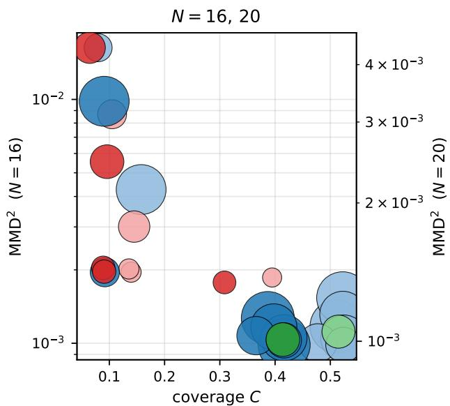

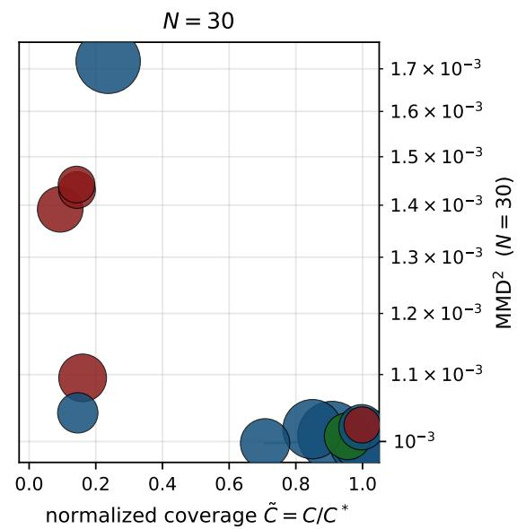  
= 0.1 (N = 16, 20), $\approx 3 \times 1 0 ^ { - 4 } ~ ( N = 3 0 ) ;$ bubble size parameters; lower and to the right is better

FIG. 6. Training loss does not track coverage across the model zoo. The same data as Table I, shown as a scatter. Left: the cardinality task at $N = 1 6$ and $N = 2 0 ~ ( \varepsilon = 0 . 1 0$ , twin $\mathrm { M M D ^ { 2 } }$ axes); right: $N = 3 0$ with normalized coverage $\tilde { C } = C / C ^ { * }$ . Each bubble is a model, colored by deployment group as in Fig. 4 (red: train-classical, deploy-quantum; green: TNBM; blue: other classical), with lighter-to-darker shade marking $N = 1 6 / 2 0 / 3 0$ and size proportional to parameter count; lower and to the right is better. The deploy-quantum moment-trained models reach only low coverage, the exception being the structurally-constrained passive FBM on the cardinality task, yet their $\mathrm { M M D ^ { 2 } }$ spans the same range as the likelihood models that generalize.

Figure 7 shows the all-models training dynamics at both $N = 1 6$ and $N = 2 0 \colon$ every model’s $\mathrm { M M D ^ { 2 } }$ converges to the same numerical range while coverage separates.

TABLE IV. Cardinality benchmark at $N = 1 6 .$ , HW= 8, $\epsilon = 0 . 0 1$ $Q = 1 0 , 0 0 0 .$ , raw sampling, mean over seeds. $\mathrm { M M D ^ { 2 } }$ is the eval Gaussian–Hamming discrepancy to held-out test (computed post-training for every model).
<table><tr><td>Model</td><td>training loss</td><td>params</td><td> $\mathrm { M M D } _ { \sigma = 1 } ^ { 2 }$ </td><td> $\mathrm { M M D _ { m e d } ^ { 2 } } \mid$ </td><td>E</td><td></td><td>F</td><td>R</td></tr><tr><td>TNBM</td><td>NLL (DMRG, cumulant)</td><td>1132</td><td> $3 . 2 6 \mathrm { { e - 3 } }$ </td><td> $4 . 3 8 \mathrm { e } { - 4 }$ </td><td>0.960</td><td>0.258</td><td>0.247</td><td>0.116</td></tr><tr><td>FBM (passive)</td><td>Z-string correlator MSE</td><td>120</td><td> $3 . 0 4 \mathrm { e } { - 3 }$ </td><td>5.38e-4</td><td>0.975</td><td>1.000</td><td>0.975</td><td>0.377</td></tr><tr><td>FBM (active)</td><td>Z-string correlator MSE</td><td>496</td><td> $9 . 0 2 \mathrm { { e } - 3 }$ </td><td>3.06e-3</td><td>0.998</td><td>0.142</td><td>0.142</td><td>0.105</td></tr><tr><td>magic FBM</td><td> $\mathrm { M M D ^ { 2 } } ^ { - } ( \mathrm { s t o c h a s t i c } )$ </td><td>784</td><td> $3 . 1 5 \mathrm { e } { - 3 }$ </td><td> $2 . 5 1 \mathrm { e } { - 4 }$ </td><td>0.998</td><td>0.210</td><td>0.210</td><td>0.143</td></tr><tr><td>IQP</td><td> $\mathrm { M M D ^ { 2 } \ : \left( d e n – N e s t \right) }$ </td><td>136</td><td> $2 . 1 1 \mathrm { e } { - 3 }$ </td><td> $1 . 5 1 \mathrm { e } { - 4 }$ </td><td>0.998</td><td>0.212</td><td>0.211</td><td>0.143</td></tr><tr><td>Transformer (S)</td><td>cross-entropy (NLL)</td><td>3394</td><td>1.54e-3</td><td>2.80e-4</td><td>0.992</td><td>0.650</td><td>0.644</td><td>0.380</td></tr><tr><td>Transformer (M)</td><td>cross-entropy (NLL)</td><td>25634</td><td> $2 . 1 1 \mathrm { e } { - 3 }$ </td><td> $4 . 6 2 \mathrm { e } { - 4 }$ </td><td>0.989</td><td>0.893</td><td>0.883</td><td>0.461</td></tr><tr><td>Transformer (L)</td><td>cross-entropy (NLL)</td><td>150402</td><td>2.02e-3</td><td>4.13e-4</td><td>0.988</td><td>0.969</td><td>0.957</td><td>0.498</td></tr><tr><td>RNN (S)</td><td>cross-entropy (NLL)</td><td>1714</td><td>1.33e-3</td><td>1.76e-4</td><td>0.991</td><td>0.727</td><td>0.721</td><td>0.416</td></tr><tr><td>RNN (M)</td><td>cross-entropy (NLL)</td><td>25282</td><td>1.51e-3</td><td>2.33e-4</td><td>0.989</td><td>0.913</td><td>0.903</td><td>0.479</td></tr><tr><td>RNN (L)</td><td>cross-entropy (NLL)</td><td>198786</td><td> $\mathrm { 1 . 8 3 e { - 3 } }$ </td><td>2.94e-4</td><td>0.982</td><td>0.971</td><td>0.953</td><td>0.453</td></tr><tr><td>RBM</td><td>contrastive divergence</td><td>424</td><td>2.68e-3</td><td>4.46e-4</td><td>0.998</td><td></td><td>0.193 0.193</td><td>0.139</td></tr></table>

TABLE V. Cardinality benchmark at $N = 1 6 ,$ , HW= 8, ϵ = 0.05. Q = 10, 000, raw sampling, mean over seeds. $\mathrm { M M D ^ { 2 } }$ the eval Gaussian–Hamming discrepancy to held-out test (computed post-training for every model).
<table><tr><td>Model</td><td>training loss</td><td>params</td><td> $\mathrm { M M D } _ { \sigma = 1 } ^ { 2 }$ </td><td> $\mathrm { M M D _ { m e d } ^ { 2 } } \mid$ </td><td>E</td><td> $F$ </td><td></td><td>R</td></tr><tr><td>TNBM</td><td>NLL (DMRG, cumulant)</td><td>1132</td><td> $1 . 3 5 \mathrm { e } { - 3 }$ </td><td> $1 . 7 9 \mathrm { e } { - 4 }$ </td><td>0.937</td><td>0.901</td><td>0.844</td><td>0.470</td></tr><tr><td>FBM (passive)</td><td>Z-string correlator MSE</td><td>120</td><td> $2 . 1 7 \mathrm { e } { - 3 }$ </td><td> $2 . 2 0 \mathrm { e } { - 4 }$ </td><td>0.932</td><td>1.000</td><td>0.932</td><td>0.388</td></tr><tr><td>FBM (active)</td><td>Z-string correlator MSE</td><td>496</td><td> $8 . 5 1 \mathrm { e } { - 3 }$ </td><td> $2 . 8 7 \mathrm { e } { - 3 }$ </td><td>0.993</td><td>0.137</td><td>0.136</td><td>0.105</td></tr><tr><td>magic FBM</td><td> $\mathrm { M M D ^ { 2 } \ ( s t o c h a s t i c ) }$ </td><td>784</td><td> $3 . 0 8 \mathrm { e } { - 3 }$ </td><td> $1 . 8 1 \mathrm { e } { - 4 }$ </td><td>0.990</td><td>0.205</td><td>0.202</td><td>0.143</td></tr><tr><td>IQP</td><td> $\mathrm { M M D ^ { 2 } \ : \left( d e n – N e s t \right) }$ </td><td>136</td><td>2.06e-3</td><td>1.19e-4</td><td>0.990</td><td>0.201</td><td>0.199</td><td>0.141</td></tr><tr><td>Transformer (S)</td><td>cross-entropy (NLL)</td><td>3394</td><td>1.12e-3</td><td>1.50e-4</td><td>0.962</td><td>0.750</td><td>0.721</td><td>0.440</td></tr><tr><td>Transformer (M)</td><td>cross-entropy (NLL)</td><td>25634</td><td>1.92e-3</td><td>4.86e-4</td><td>0.959</td><td>0.815</td><td>0.781</td><td>0.455</td></tr><tr><td>Transformer (L)</td><td>cross-entropy (NLL)</td><td>150402</td><td>1.35e-3</td><td>2.34e-4</td><td>0.949</td><td>0.989</td><td>0.939</td><td>0.524</td></tr><tr><td>RNN (S)</td><td>cross-entropy (NLL)</td><td>1714</td><td>1.03e-3</td><td>9.06e-5</td><td>0.9530.918</td><td></td><td>0.875</td><td>0.505</td></tr><tr><td>RNN (M)</td><td>cross-entropy (NLL)</td><td>25282</td><td>1.65e-3</td><td>3.37e-4</td><td>0.949</td><td>0.931</td><td>0.884</td><td>0.490</td></tr><tr><td>RNN (L)</td><td>cross-entropy (NLL)</td><td>198786</td><td>1.29e-3</td><td>1.93e-4</td><td>0.947</td><td>0.983</td><td>0.931</td><td>0.515</td></tr><tr><td>RBM</td><td>contrastive divergence</td><td>424</td><td>1.36e-1</td><td>2.56e-2</td><td></td><td></td><td></td><td>1.000 0.003 0.003 0.002</td></tr></table>

TABLE VI. Cardinality benchmark at $N = 1 6 ,$ , HW= 8, ϵ = 0.10. $Q = 1 0 , 0 0 0 .$ , raw sampling, mean over seeds. $\mathrm { M M D ^ { 2 } }$ is the eval Gaussian–Hamming discrepancy to held-out test (computed post-training for every model).
<table><tr><td>Model</td><td>training loss</td><td>params</td><td> $\mathrm { M M D } _ { \sigma = 1 } ^ { 2 }$ </td><td> $\mathrm { M M D } _ { \mathrm { m e d } } ^ { 2 } $ </td><td>E</td><td> $F$ </td><td>R</td><td>C</td></tr><tr><td>TNBM</td><td>NLL (DMRG, cumulant)</td><td>1088</td><td> $1 . 1 2 \mathrm { e } { - 3 }$ </td><td> $1 . 1 7 \mathrm { e } { - 4 }$ </td><td>0.890</td><td>0.971</td><td>0.864</td><td>0.515</td></tr><tr><td>FBM (passive)</td><td>Z-string correlator MSE</td><td>120</td><td> $1 . 8 6 \mathrm { e } { - 3 }$ </td><td> $1 . 2 2 \mathrm { e } { - 4 }$ </td><td>0.876</td><td>1.000</td><td>0.876</td><td>0.395</td></tr><tr><td>FBM (active)</td><td>Z-string correlator MSE</td><td>496</td><td> $8 . 6 9 \mathrm { e } { - 3 }$ </td><td> $2 . 9 5 \mathrm { e } { - 3 }$ </td><td>0.986 0.131</td><td></td><td>0.130</td><td>0.105</td></tr><tr><td>magic FBM</td><td> $\mathrm { M M D } ^ { 2 }$  (stochastic)</td><td>784</td><td> $3 . 0 1 \mathrm { e } { - 3 }$ </td><td> $1 . 5 1 \mathrm { e } { - 4 }$ </td><td>0.9800.199</td><td></td><td>0.195 0.145</td><td></td></tr><tr><td>IQP</td><td> $\mathrm { M M D ^ { 2 } \ : \dot { ( } d e n { - } N e s t { ) } }$ </td><td>136</td><td>1.96e-3</td><td> $9 . 4 1 \mathrm { e } { - } 5 $ </td><td>0.979 0.190 0.186 0.139</td><td></td><td></td><td></td></tr><tr><td>Transformer (S)</td><td>cross-entropy (NLL)</td><td>3394</td><td>1.00e-3</td><td> $7 . 4 1 \mathrm { e } { - } 5 $ </td><td>0.911 0.829 0.7550.477</td><td></td><td></td><td></td></tr><tr><td>Transformer (M)</td><td>cross-entropy (NLL)</td><td>25634</td><td>1.31e-3</td><td>2.37e-4</td><td>0.903 0.971 0.877 0.523</td><td></td><td></td><td></td></tr><tr><td>Transformer (L)</td><td>cross-entropy (NLL)</td><td>150402</td><td>1.54e-3</td><td>3.41e-4</td><td></td><td>0.902 0.978</td><td></td><td>0.882 0.522</td></tr><tr><td>RNN (S)</td><td>cross-entropy (NLL)</td><td>1714</td><td>9.85e-4</td><td>7.39e-5</td><td></td><td>0.9000.965</td><td></td><td>0.8680.524</td></tr><tr><td>RNN (M)</td><td>cross-entropy (NLL)</td><td>25282</td><td>1.05e-3</td><td>9.52e-5</td><td>0.897</td><td>0.978</td><td>0.877</td><td>0.524</td></tr><tr><td>RNN (L)</td><td>cross-entropy (NLL)</td><td>198786</td><td>1.17e-3</td><td>1.69e-4</td><td></td><td>0.903 0.946</td><td></td><td>0.854 0.511</td></tr><tr><td>RBM</td><td>contrastive divergence</td><td>424</td><td>1.63e-2</td><td>4.94e-3</td><td></td><td></td><td></td><td>0.989 0.097 0.096 0.080</td></tr></table>

TABLE VII. Cardinality benchmark at $N = 2 0$ , HW= 10, $\epsilon = 0 . 0 1$ $Q = 1 0 0 , 0 0 0 .$ raw sampling, mean over seeds. $\mathrm { M M D ^ { 2 } }$ is the eval Gaussian–Hamming discrepancy to held-out test (computed post-training for every model).
<table><tr><td>Model</td><td>training loss</td><td>params</td><td> $\mathrm { M M D } _ { \sigma = 1 } ^ { 2 }$ </td><td> $\mathrm { M M D _ { m e d } ^ { 2 } } \mid$ </td><td>E</td><td>F</td><td>R</td><td>C</td></tr><tr><td>TNBM</td><td>NLL (DMRG, cumulant)</td><td>1422</td><td> $\mathrm { 1 . 0 4 e { - 3 } }$ </td><td> $8 . 9 7 \mathrm { e } \mathrm { - } 5$ </td><td>0.990</td><td>0.986</td><td>0.976</td><td>0.408</td></tr><tr><td>FBM (passive)</td><td>Z-string correlator MSE</td><td>190</td><td>1.27e-3</td><td>7.74e-5</td><td>0.988</td><td>1.000</td><td>0.988</td><td>0.305</td></tr><tr><td>FBM (active)</td><td>Z-string correlator MSE</td><td>780</td><td>4.24e-3</td><td>1.93e-3</td><td>0.999</td><td>0.122</td><td>0.122</td><td>0.064</td></tr><tr><td>magic FBM</td><td> $\mathrm { M M D ^ { 2 } \ ( s t o c h a s t i c ) }$ </td><td>1230</td><td>2.47e-3</td><td>1.21e-4</td><td>0.998</td><td>0.214</td><td>0.213</td><td>0.096</td></tr><tr><td>IQP</td><td> $\mathrm { M M D ^ { 2 } \ : \left( d e n – N e s t \right) }$ </td><td>210</td><td>1.45e-3</td><td>8.22e-5</td><td>0.998</td><td>0.192</td><td>0.192</td><td>0.095</td></tr><tr><td>Transformer (S)</td><td>cross-entropy (NLL)</td><td>3394</td><td>1.03e-3</td><td>7.00e-5</td><td>0.992</td><td>0.789</td><td>0.783</td><td>0.346</td></tr><tr><td>Transformer (M)</td><td>cross-entropy (NLL)</td><td>25634</td><td>1.10e-3</td><td>1.36e-4</td><td>0.990</td><td>0.989</td><td>0.979</td><td>0.411</td></tr><tr><td>Transformer (L)</td><td>cross-entropy (NLL)</td><td>150402</td><td>1.09e-3</td><td>1.27e-4</td><td>0.990</td><td>0.994</td><td>0.983</td><td>0.411</td></tr><tr><td>RNN (S)</td><td>cross-entropy (NLL)</td><td>1714</td><td>1.09e-3</td><td>1.30e-4</td><td>0.990</td><td>0.976</td><td>0.966</td><td>0.405</td></tr><tr><td>RNN (M)</td><td>cross-entropy (NLL)</td><td>25282</td><td>1.08e-3</td><td>1.02e-4</td><td>0.990</td><td>0.989</td><td>0.979</td><td>0.410</td></tr><tr><td>RNN (L)</td><td>cross-entropy (NLL)</td><td>198786</td><td>1.36e-3</td><td>2.38e-4</td><td>0.990</td><td>0.967</td><td>0.957</td><td>0.389</td></tr><tr><td>RBM</td><td>contrastive divergence</td><td>524</td><td>1.43e-3</td><td>8.19e-5</td><td></td><td>0.998 0.175 0.175</td><td></td><td>0.091</td></tr></table>

TABLE VIII. Cardinality benchmark at $N = 2 0 .$ ， $\mathbf { H } \mathbf { W } = 1 0 { \mathrm { ; } }$ $\epsilon = 0 . 0 5 .$ $Q = 1 0 0 , 0 0 0$ , raw sampling, mean over seeds. $\mathrm { M M D ^ { 2 } }$ is the eval Gaussian–Hamming discrepancy to held-out test (computed post-training for every model).
<table><tr><td>Model</td><td>training loss</td><td>params</td><td> $\mathrm { M M D } _ { \sigma = 1 } ^ { 2 }$ </td><td> $\mathrm { M M D _ { m e d } ^ { 2 } } \mid$ </td><td>E</td><td>F</td><td>R</td><td>C</td></tr><tr><td>TNBM</td><td>NLL (DMRG, cumulant)</td><td>1244</td><td>9.90e-4</td><td>5.71e-5</td><td>0.949</td><td>0.993</td><td>0.943</td><td>0.414</td></tr><tr><td>FBM (passive)</td><td>Z-string correlator MSE</td><td>190</td><td>1.31e-3</td><td>6.09e-5</td><td>0.947</td><td>1.000</td><td>0.947</td><td>0.308</td></tr><tr><td>FBM (active)</td><td>Z-string correlator MSE</td><td>780</td><td>4.33e-3</td><td>1.98e-3</td><td>0.994</td><td>0.118</td><td>0.118</td><td>0.064</td></tr><tr><td>magic FBM</td><td> $\mathrm { M M D ^ { 2 } \ ( s t o c h a s t i c ) }$ </td><td>1230</td><td>2.41e-3</td><td>1.03e-4</td><td>0.989</td><td>0.206</td><td>0.204</td><td>0.097</td></tr><tr><td>IQP</td><td> $\mathrm { M M D } ^ { 2 }$  (den-Nest)</td><td>210</td><td>1.43e-3</td><td>7.15e-5</td><td>0.991</td><td>0.175</td><td>0.173</td><td>0.090</td></tr><tr><td>Transformer (S)</td><td>cross-entropy (NLL)</td><td>3394</td><td>1.01e-3</td><td>5.54e-5</td><td>0.960</td><td>0.803</td><td>0.770</td><td>0.354</td></tr><tr><td>Transformer (M)</td><td>cross-entropy (NLL)</td><td>25634</td><td>1.02e-3</td><td>6.93e-5</td><td>0.949</td><td>0.997</td><td>0.947</td><td>0.416</td></tr><tr><td>Transformer (L)</td><td>cross-entropy (NLL)</td><td>150402</td><td>1.16e-3</td><td>1.72e-4</td><td>0.950</td><td>0.998</td><td>0.948</td><td>0.413</td></tr><tr><td>RNN (S)</td><td>cross-entropy (NLL)</td><td>1714</td><td>1.06e-3</td><td>9.39e-5</td><td>0.949</td><td>0.998</td><td>0.948</td><td>0.416</td></tr><tr><td>RNN (M)</td><td>cross-entropy (NLL)</td><td>25282</td><td>1.09e-3</td><td>1.26e-4</td><td>0.953</td><td>0.952</td><td>0.907</td><td>0.400</td></tr><tr><td>RNN (L)</td><td>cross-entropy (NLL)</td><td>198786</td><td>1.11e-3</td><td>1.01e-4</td><td>0.953</td><td>0.929</td><td>0.885</td><td>0.389</td></tr><tr><td>RBM</td><td>contrastive divergence</td><td>524</td><td>1.44e-3</td><td>8.79e-5</td><td></td><td>0.991 0.168 0.167</td><td></td><td>0.090</td></tr></table>

TABLE IX. Cardinality benchmark at $N = 2 0$ $\mathbf { H } \mathbf { W } = 1 0 ,$ $\epsilon = 0 . 1 0 $ $Q = 1 0 0 , 0 0 0$ , raw sampling, mean over seeds. $\mathrm { M M D ^ { 2 } }$ is the eval Gaussian–Hamming discrepancy to held-out test (computed post-training for every model).
<table><tr><td>Model</td><td>training loss</td><td>params</td><td> $\mathrm { M M D } _ { \sigma = 1 } ^ { 2 }$ </td><td> $\mathrm { M M D } _ { \mathrm { m e d } } ^ { 2 }$ </td><td>E</td><td>F</td><td></td><td>R</td></tr><tr><td>TNBM</td><td>NLL (DMRG, cumulant)</td><td>1232</td><td>1.01e-3</td><td>5.35e-5</td><td>0.899</td><td>0.992</td><td>0.893</td><td>0.414</td></tr><tr><td>FBM (passive)</td><td>Z-string correlator MSE</td><td>190</td><td>1.34e-3</td><td>4.63e-5</td><td>0.895</td><td>1.000</td><td>0.895</td><td>0.308</td></tr><tr><td>FBM (active)</td><td>Z-string correlator MSE</td><td>780</td><td>4.35e-3</td><td>1.97e-3</td><td>0.988</td><td>0.113</td><td>0.111</td><td>0.064</td></tr><tr><td>magic FBM</td><td> $\mathrm { M M D ^ { 2 } }$  (stochastic)</td><td>1230</td><td>2.46e-3</td><td>8.46e-5</td><td>0.978</td><td>0.198</td><td>0.194</td><td>0.096</td></tr><tr><td>IQP</td><td>MMD² (den-Nest)</td><td>210</td><td>1.44e-3</td><td>7.77e-5</td><td>0.982</td><td>0.165</td><td>0.162</td><td>0.089</td></tr><tr><td>Transformer (S)</td><td>cross-entropy (NLL)</td><td>3394</td><td>1.03e-3</td><td>6.13e-5</td><td>0.9150.829</td><td></td><td>0.759</td><td>0.365</td></tr><tr><td>Transformer (M)</td><td>cross-entropy (NLL)</td><td>25634</td><td>1.02e-3</td><td>5.79e-5</td><td>0.900</td><td>0.999</td><td>0.899</td><td>0.416</td></tr><tr><td>Transformer (L)</td><td>cross-entropy (NLL)</td><td>150402</td><td>9.82e-4</td><td>4.25e-5</td><td>0.900</td><td>0.999</td><td>0.900</td><td>0.416</td></tr><tr><td>RNN (S)</td><td>cross-entropy (NLL)</td><td>1714</td><td>1.00e-3</td><td>5.59e-5</td><td>0.901</td><td>0.995</td><td>0.896</td><td>0.416</td></tr><tr><td>RNN (M)</td><td>cross-entropy (NLL)</td><td>25282</td><td>1.07e-3</td><td>1.10e-4</td><td>0.905</td><td>0.945</td><td>0.855</td><td>0.398</td></tr><tr><td>RNN (L)</td><td>cross-entropy (NLL)</td><td>198786</td><td>1.12e-3</td><td>1.41e-4</td><td>0.908</td><td>0.911</td><td>0.827</td><td>0.387</td></tr><tr><td>RBM</td><td>contrastive divergence</td><td>524</td><td>1.41e-3</td><td>7.52e-5</td><td></td><td>0.982 0.163 0.160</td><td></td><td>0.092</td></tr></table>

The decoupling at the largest size is shown directly in Fig. 8: every model’s $\mathrm { M M D ^ { 2 } }$ converges to the same numerical range while the normalized coverage separates. In normalized coverage the distance between the best model and IQP grows from 0.28 at small N to 0.86 at $N = 3 0$ (main-text Fig. 5d). Fig. 9 shows that at $N = 3 0$ the sampled IQP $\mathrm { M M D ^ { 2 } }$ does not descend during training, whereas the transformer NLL converges with coverage near the finite-sample maximum.

## Appendix E: Kernel-bandwidth robustness

IQP’s coverage near $C _ { \mathrm { r a n d } }$ is not an artifact of the kernel bandwidth. At N = 16, ${ \mathrm { H W } } = 8 ,$ sweeping σ from the median heuristic of [23] to sharper and flatter values leaves $\mathrm { I Q P }$ coverage between 0.13 and 0.16, near the uniform Born weight on the HW= 8 sector.
<table><tr><td>kernel bandwidth σ</td><td>F</td><td>C Born mass on</td></tr><tr><td>median  $( \mathrm { H a m m i n g } , = 8 )$ </td><td>0.21 0.15</td><td>0.22</td></tr><tr><td>median (Euclidean, = 2.83) 0.18 0.13</td><td></td><td>0.20</td></tr><tr><td>σ = 1 (main tables)</td><td>0.190.14</td><td>0.20</td></tr><tr><td>σ = 0.5</td><td>0.22 0.16</td><td>0.24</td></tr></table>

No bandwidth raises $\mathrm { I Q P ^ { \prime } s }$ coverage above $C _ { \mathrm { r a n d } } ;$ the main tables use $\sigma = 1$ , which gives $C = 0 . 1 4$

## Appendix F: Genomic-task diagnostics

Beyond coverage, we check the generated genomic samples against standard population-genetics statistics at $\varepsilon { = } 2 0 \%$ Figure 13 compares per-locus allele frequencies of generated versus reference data; Fig. 14 shows the pairwise linkagedisequilibrium $( \mathrm { L D } , \ r ^ { 2 } )$ matrices; Fig. 15 the Hamming-weight distributions; and Fig. 16 a PCA of the generated samples against the reference. The likelihood-trained generators (transformer, RNN) and the TNBM reproduce the allele frequencies, the LD structure, and the sample cloud closely, whereas the deploy-quantum moment-trained models depart from all three, consistent with their low coverage.

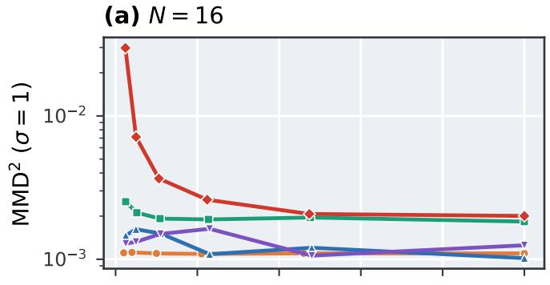  
(c) N = 20

(b) N = 16  
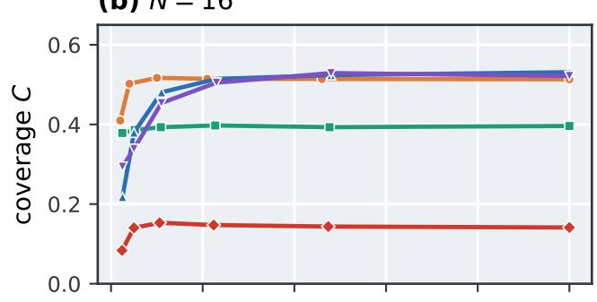

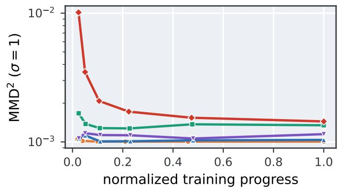

(d) N = 20  
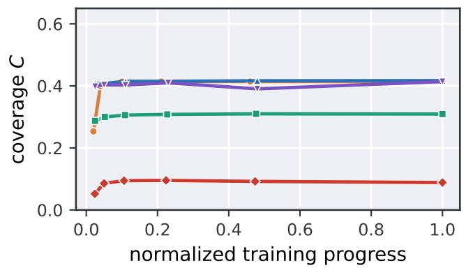  
FIG. 7. Loss converges while coverage separates. Training trajectories at $N = 1 6$ and $N = 2 0$ for five models $( \varepsilon { = } 0 . 1 0 ;$ $N = 1 6$ top, $N = 2 0$ bottom). Left: the $\mathrm { \dot { M } M \bar { D } ^ { 2 } }$ converges to the same numerical range for every model. Right: coverage C separates them, the TNBM, transformer, and RNN increasing while $\mathrm { I Q P }$ and the active and magic FBM stay near $C _ { \mathrm { r a n d } }$

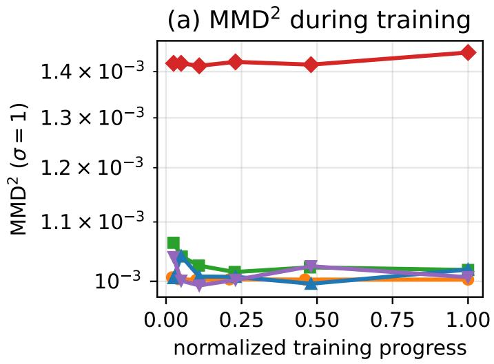

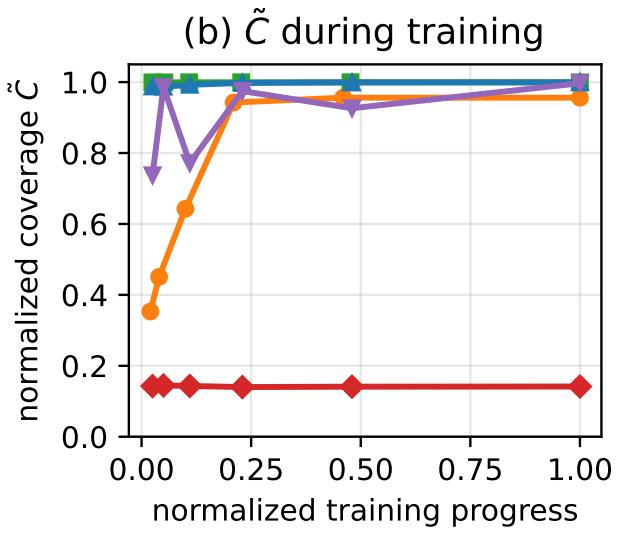  
TNBM FBM (passive) Transformer (M) RNN (M) IQP  
FIG. 8. The decoupling persists at $N = 3 0$ . Training trajectories at $N = 3 0 , { \mathrm { H W } } { = } 1 5 \ ( | S | \approx 1 . 5 5 \times 1 0 ^ { 8 } , \varepsilon \approx 3 . 2 \times 1 0 ^ { - 4 } )$ (a) every model’s $\mathrm { M M D ^ { 2 } }$ converges to the same $\sim 1 0 ^ { - 3 }$ range. (b) normalized coverage $\tilde { C }$ separates them: passive FBM, transformer, and RNN approach 1, the TNBM reaches 0.96, and $\mathrm { I Q P }$ stays near $C _ { \mathrm { r a n d } } .$

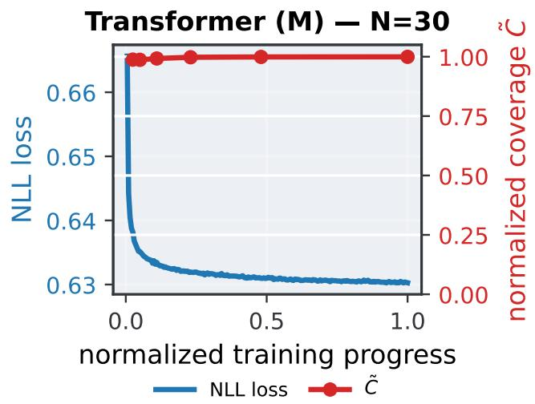

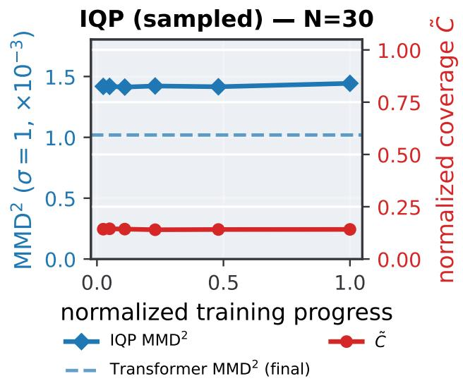  
FIG. 9. Loss-level view at $N = 3 0$ . Left: the transformer NLL falls and $\tilde { C }$ sits near the finite-sample maximum. Right: the sampled IQP $\mathrm { M M D ^ { 2 } }$ stays flat at ≈ $1 . { \overset { - } { 4 } } \times 1 0 ^ { - 3 }$ with $\tilde { C }$ near $C _ { \mathrm { r a n d } }$ , and never drops below the transformer’s final $\mathrm { M M D ^ { 2 } }$ (dashed): the NLL-trained model reaches a lower $\mathrm { M M D ^ { 2 } }$ than the MMD-trained one.

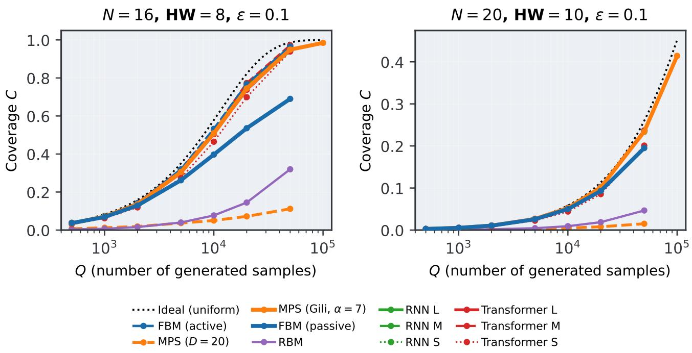  
FIG. 10. Low coverage is not a finite-sampling artifact. Coverage versus query budget Q at $N = 1 6$ and $N = 2 0$ . The likelihood-trained and structural models increase toward $C ^ { * }$ as Q grows; the moment-trained models stay near $C _ { \mathrm { r a n d } }$ across the budgets we study. In the legend, “MPS (Gili, α=7)” is the TNBM, and $^ { \mathrm { 4 } } \mathrm { M P S } ~ ( D { = } 2 0 ) ^ { \mathfrak { N } }$ is a fixed-bond $( \chi = 2 0 )$ MPS baseline.

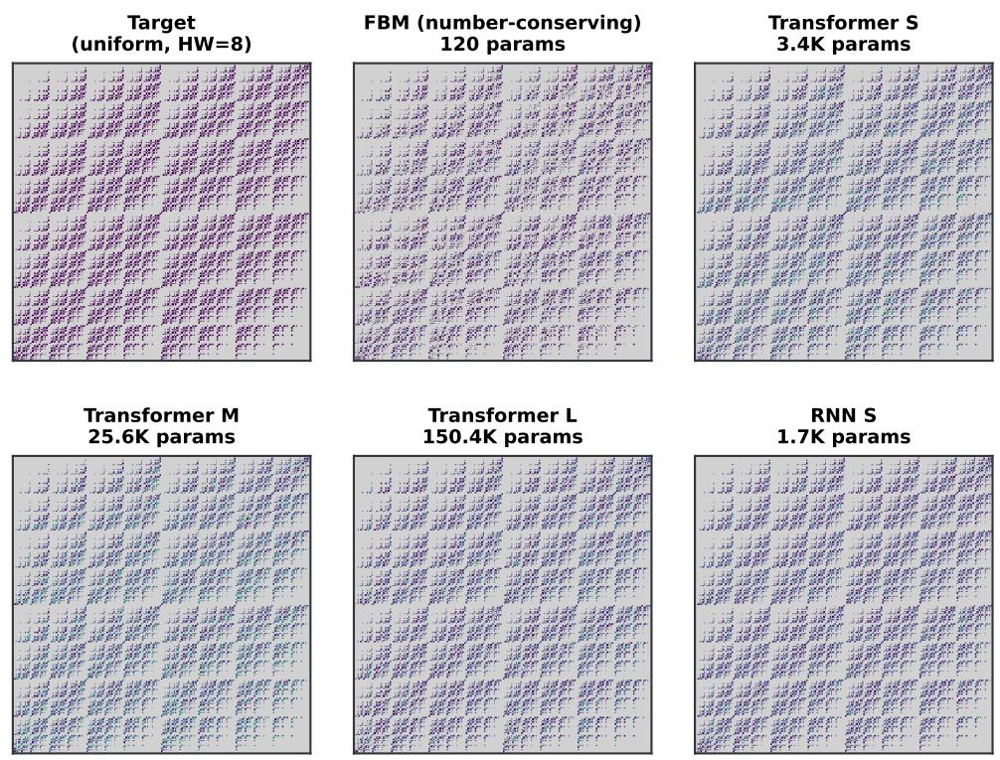  
FIG. 11. Where the models place their probability mass. The full $2 ^ { 1 6 }$ bitstring space at $\begin{array} { r } { N = 1 6 , \mathrm { H W } = 8 , } \end{array}$ rendered as a 256×256 grid; gray cells are of the $\mathrm { H W } { = } 8$ slice, colored cells are HW= 8 with intensity proportional to sample probability. The number-conserving FBM places all its mass on the valid slice by construction; the moment-trained models assign substantial probability outside the valid sector.

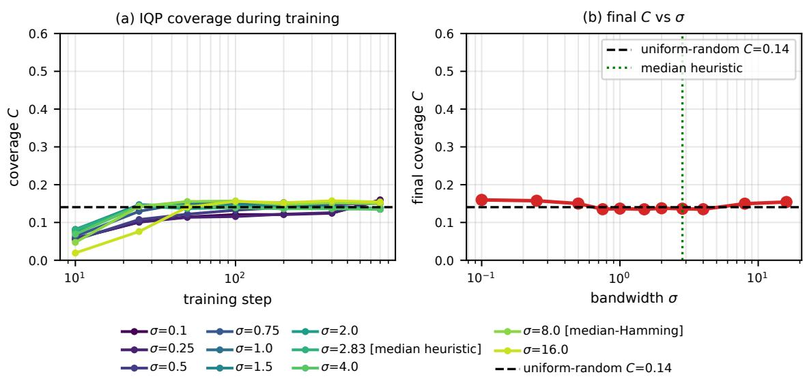  
FIG. 12. No kernel bandwidth rescues $\mathbf { I Q P }$ coverage. IQP coverage as the kernel bandwidth $\sigma$ is swept from sharp (0.1) to broad (16) at $N = 1 6$ , including the median heuristic (Euclidean, $\sigma = 2 . 8 3 )$ and the median Hamming value $( \sigma = 8 )$ . (a) coverage during training for each $\sigma ; { \mathbf \Omega } ( b )$ final coverage versus σ. IQP stays at 0.13 to 0.16, near the random-bit baseline $C _ { \mathrm { r a n d } }$ (dashed), for every σ; the likelihood-trained baselines of Table II reach ∼ 0.5 on the same task.

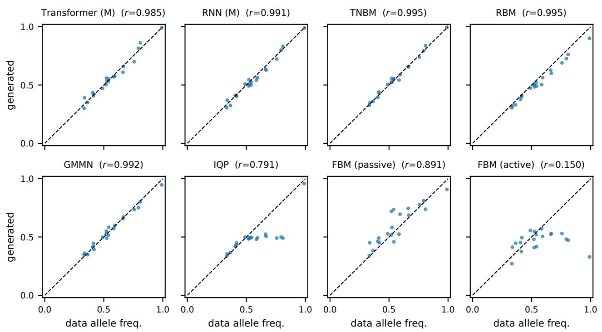  
FIG. 13. Allele frequencies. Per-locus allele frequencies of generated samples against the reference data $\left( \varepsilon { = } 2 0 \% , N { = } 2 0 \right)$ for eight of the benchmarked models; r is the Pearson correlation with the reference frequencies.

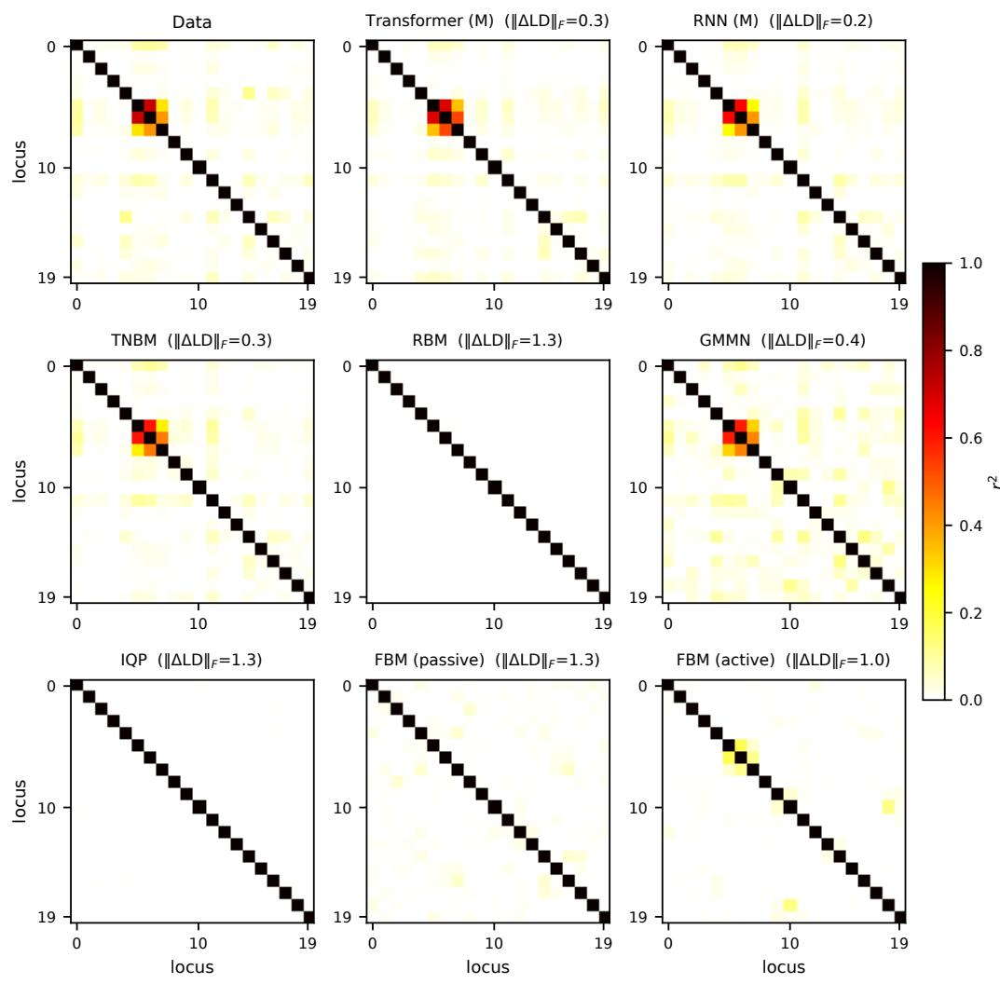  
FIG. 14. Linkage disequilibrium. Pairwise linkage-disequilibrium $( r ^ { 2 } )$ matrices for the reference data and eight of the benchmarked models at $\varepsilon { = } 2 0 \% , N { = } 2 0 $ ; each panel reports the Frobenius distance to the reference matrix.

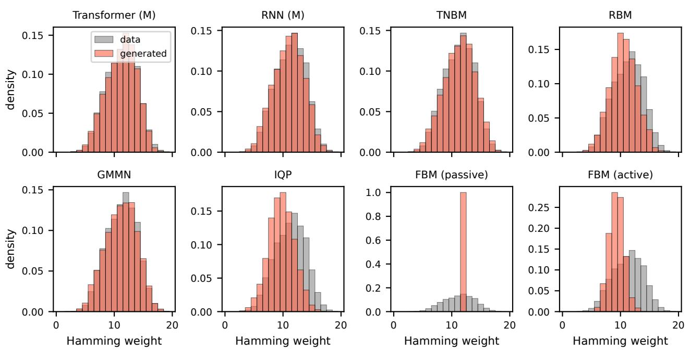  
FIG. 15. Hamming-weight distributions. Hamming-weight distributions of generated samples (red) against the reference data (gray) at ε=20%, N=20.

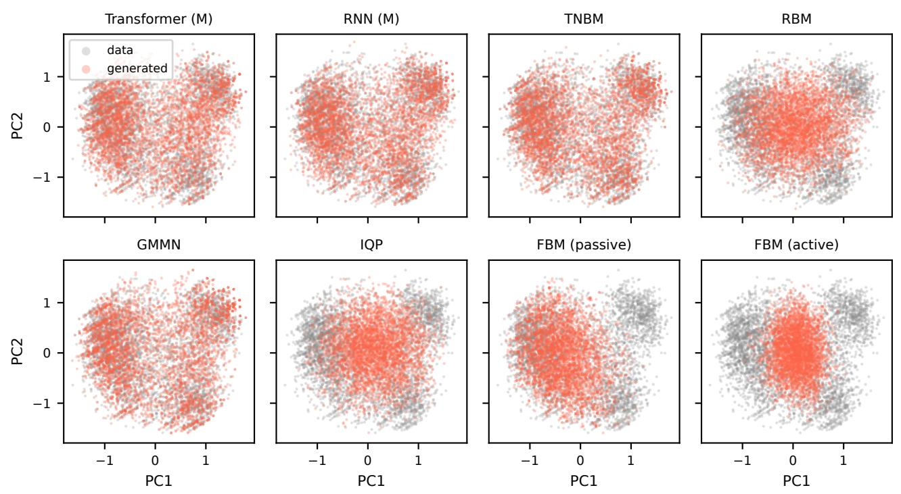  
FIG. 16. PCA projections. Projections of generated samples (red) and reference data (gray) onto the first two principal components of the reference data, at ε=20%, N=20.