# TrainSDC: Characterizing and Mitigating Silent Data Corruption in Large Language Model Training

Zhipeng Xia1, Haotian Xu1, Siyu Yun1, Liqi Lin1, Hu Liu2, Yu Li1,∗, Cheng Zhuo1

1Zhejiang University 2Huawei

∗Corresponding author: yu.li.sallylee@gmail.com

## Abstract

LLM training is increasingly vulnerable to silent data corruption (SDC), yet existing protection methods largely treat Transformer computations uniformly because their vulnerability remains poorly understood. We present the first systematic characterization of SDC vulnerability across major computation interfaces in both the forward and backward passes of Transformer training. Our analysis reveals two distinct error propagation mechanisms: forward-pass vulnerability is highly location dependent, with faults on the Q/K path producing persistent training deviations, whereas backward-pass vulnerability is largely governed by gradient exponent distributions rather than computation locations. Motivated by these observations, we propose TrainSDC, a characterization-guided protection framework consisting of Q/K-path recomputation, residual-gain monitoring, and exponent-aware gradient scaling. Experiments on Llama 3.2-1B and Qwen3-0.6B show that TrainSDC maintains training behavior close to fault-free execution under both sparse and dense fault injection while introducing only 1.65%–6.76% runtime overhead.

## 1 Introduction

In LLM training, silent data corruption (SDC) occurs when a hardware fault produces an incorrect result without triggering an exception or error signal. Because the corrupted value is consumed as valid, it can flow through activations and gradients into parameter updates even when the loss and other global signals show no obvious anomaly. The damage may become visible only later as a loss spike or failed convergence, or remain hidden while degrading final model quality [Dixit et al., 2021, Ma et al., 2025]. Training larger models typically requires more accelerators and longer runs, increasing the chance that SDC afects training. At the scale of Gemini, the team estimated that SDC events could afect training every one to two weeks [Team et al., 2023].

Without a direct alarm, assessing SDC risk requires understanding how a corrupted value propagates and whether its efect disappears or persists in later updates. A large immediate deviation is not necessarily the most harmful: some errors fade as training proceeds, whereas others bias later updates and leave persistent damage. A useful characterization must therefore consider both where a fault enters the training computation and how its efect evolves over time. Studies using faulty production hardware analyze SDC at the levels of submodule computation, a single optimizer step, and an extended training period [Ma et al., 2025]. Large injection campaigns characterize the outcomes of transient faults in LLM training [Yu et al., 2025]. Instruction- and RTL-level studies vary injection sites, fault patterns, and numerical formats [Altenbernd et al., 2026, Tyagi et al., 2026]. However, these studies do not jointly compare the major Transformer components in the forward and backward passes or distinguish short-lived efects from damage that remains at the end of training.

This incomplete understanding also limits protection design. Existing defenses infer corruption from aggregate training signals [Altenbernd et al., 2026, Yu et al., 2025], check selected computations [Liang et al., 2025], identify faulty devices [Lei et al., 2026], or duplicate execution [Park et al., 2026]. These methods either operate at coarse granularity, cover only selected computations, or incur the cost of redundant execution. Without a detailed characterization of error propagation, it remains unclear where direct verification is needed and where lightweight monitoring is suficient.

We therefore conduct a systematic fault-injection study of pre-norm LLMs. We inject faults at the outputs of the major components in a Transformer block during both forward and backward passes. We measure the largest loss change and the remaining change at the end of training to distinguish faults that fade from those that cause lasting damage. Based on the diferent ways faults propagate in the forward and backward passes, we design TrainSDC with a separate protection method for each pass.

Our contributions are threefold:

• To our knowledge, we present the first systematic characterization of SDC vulnerability across all major modules in a Transformer block during both forward and backward passes.

• We find that faults in Q/K path outputs cause more persistent forward-pass damage, whereas faults in value, attention-output, and MLP computations cause larger but shorter-lived loss changes. Backward-pass vulnerability varies less across components, and fault amplification depends on the exponent distribution of gradients.

• We develop TrainSDC, which checks Q/K operations through recomputation, monitors residual connections, and re-executes flagged steps in the forward pass. For the backward pass, it selects a power-of-two loss scale from clean gradient statistics.

On Llama 3.2-1B and Qwen3-0.6B, TrainSDC mitigates both sparse and dense faults with limited overhead. It maintains results close to fault-free training under sparse faults and preserves convergence under dense faults causing unprotected training to diverge. Overall, TrainSDC restores training outcomes to a level close to fault-free training.

## 2 Related Work

Characterizing SDC in LLM training. Prior work studies SDC through production-system measurements and controlled fault injection. Fleet-scale measurements document the prevalence and diversity of SDC in production hardware [Dixit et al., 2021]. Experiments on unhealthy training nodes analyze real-world SDC at three scales: attention and FFN outputs, a single optimizer step, and an extended training period [Ma et al., 2025]. These experiments preserve realistic hardware behavior, but do not control fault location and timing or separate the individual computations within attention and FFN. Controlled studies inject faults at GPU matrix-multiply instructions [Altenbernd et al., 2026], run large transient-fault campaigns [Yu et al., 2025], or combine RTL-level simulation with training-level injection to study permanent faults [Tyagi et al., 2026]. Our work difers in granularity and comparison scope: under the same fault settings, we inject faults separately at the outputs of individual Transformer computations and into their corresponding backward gradients. This allows us to compare vulnerability across locations and passes and distinguish short-lived from lasting efects.

Training-time SDC protection. Some methods use traininglevel statistics to detect faults. Altenbernd et al. identify harmful updates from changes in the magnitude of AdamW parameter updates and the global gradient norm [Altenbernd et al., 2026]. LLMFT instead uses heuristic training features as input to a learned fault detector [Yu et al., 2025]. These methods do not check individual Transformer computations. ATTNChecker applies algorithm-based fault tolerance (ABFT) to detect and correct extreme errors in attention [Huang and Abraham, 1984, Liang et al., 2025]. SpareTrain reduces the overhead of complete dual modular redundancy by reusing activation checkpointing and idle GPU time [Park et al., 2026]. AT-TNChecker protects attention, whereas SpareTrain duplicates the full computation. Other methods focus on distributed training. PAFT handles gradient-aggregation errors [Tang et al., 2025]; AEGIS detects SDC online and identifies faulty GPUs [Lei et al., 2026]; and ByteRobust diagnoses failures and accelerates recovery [Wan et al., 2025]. These methods address gradient aggregation, faulty devices, or job recovery rather than local Transformer computations.

In contrast, we compares SDC vulnerability across the major computations in a Transformer block and separately analyzes the forward and backward passes. TrainSDC uses this characterization to protect the two passes diferently without continuously duplicating the full training computation.

## 3 Fault Characterization

This section characterizes how transient computation errors afect large language model training. We examine how their efects vary across module outputs and between forward and backward stage, and trace whether the errors are amplified, attenuated, or retained. These results provide the basis for the protection design presented in the next section.

## 3.1 Fault Model and Metrics

Fault type. Persistent failures in storage are generally easier to detect because storage systems commonly use errorcorrecting codes and related integrity checks. In contrast, transient errors in computation can produce an incorrect result without leaving a persistent state and are therefore harder to detect. A transient error afects only the current tensor computation, and neither the corrupted value nor its bit state is retained by the next execution. We focus on transient errors in arithmetic computation and do not model persistent storage failures.

Injection location. We inject errors into module activation outputs during the forward pass and their corresponding output gradients during the backward pass. For an activation x, the backward target is $g _ { x } = \partial L / \partial x$ . In each target module, we randomly select m elements and flip four randomly selected bits in each element. All module outputs use the same random seeds, and injection is performed in the original data type. Parameters, optimizer states, and stored training data are not modified.

Loss-deviation metrics. The loss-deviation metrics separate the largest deviation during training from the deviation at the final step. Let $t _ { f }$ denote the first faulty step and T the final step:

$$
D _ { \mathrm { M a x i m u m } } \triangleq \operatorname* { m a x } _ { t _ { f } \leq t \leq T } \left( L _ { \mathrm { f a u l t } } ( t ) - L _ { \mathrm { c l e a n } } ( t ) \right) ,\tag{1}
$$

$$
D _ { \mathrm { f i n a l } } \triangleq L _ { \mathrm { f a u l t } } ( T ) - L _ { \mathrm { c l e a n } } ( T ) .\tag{2}
$$

Repeated clean trajectories estimate nondeterministic training variation. $E _ { \mathrm { f i n a l } }$ is the largest pairwise final-loss diference among clean runs, while $E _ { \mathrm { M a x i m u m } }$ is the largest pairwise loss diference at any aligned step. Figures report $D _ { \mathrm { f i n a l } } / E _ { \mathrm { f i n a l } }$ and $D _ { \mathrm { M a x i m u m } } / E _ { \mathrm { M a x i m u m } } . $ value above one exceeds every observed clean-to-clean diference under the corresponding metric.

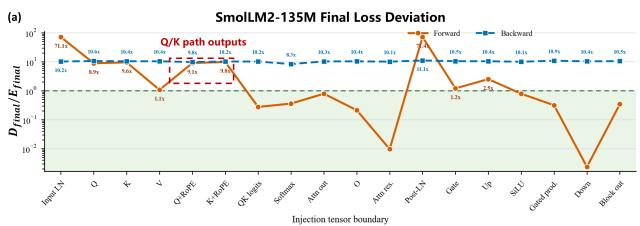

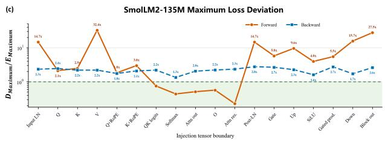

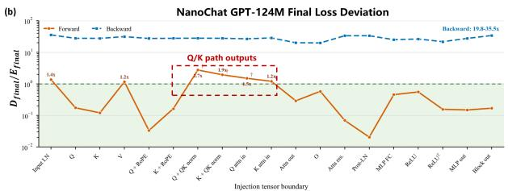

(d)  
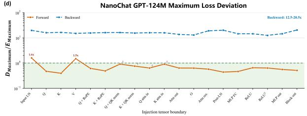

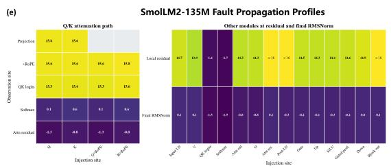

(f)  
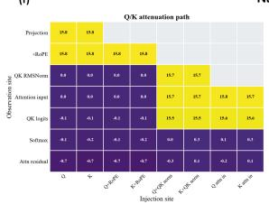

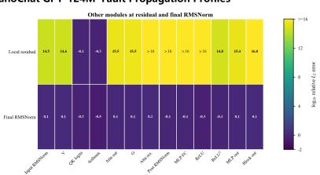  
Figure 1: Characterization results for SmolLM2-135M and NanoChat-GPT-124M. Panels (a) and (b) report the normalized final loss deviation, panels (c) and (d) report the normalized maximum loss deviation, and panels (e) and (f) report fault propagation using relative $L _ { 2 }$ error.

## 3.2 Experimental Design

Experiment 1: training vulnerability. Experiment 1 measures training vulnerability at forward and backward stage separately. We select SmolLM2-135M and NanoChat-GPT-124M as the experimental models because their modern Transformer architectures are representative of compact language models. In the injection experiment, SmolLM2 targets layer 20 and runs from steps 1222 to 2035, whereas NanoChat-GPT targets layer 5 and runs from steps 955 to 1907. Each run modifies rank 0, corrupts 100,000 elements at 1% of training steps, and uses the shared random selection described above. Repeated no-fault runs establish $( E _ { \mathrm { f i n a l } } , E _ { \mathrm { M a x i m u m } } )$ as (0.000456, 0.009299) for SmolLM2 and (0.000389, 0.003153) for NanoChat-GPT.

Experiment 2: propagation diagnostic. Experiment 2 traces the propagation of the injected fault through downstream modules. The experiment uses the same target layers, element selection, and bit selection as Experiment 1. Each run injects one module output and records the resulting changes at downstream attention, residual, multilayer-perceptron, normalization, and language-model output. For a monitored module output tensor x, the propagation metric is

$$
R _ { x } = \frac { \| x _ { \mathrm { f a u l t } } - x _ { \mathrm { c l e a n } } \| _ { 2 } } { \| x _ { \mathrm { c l e a n } } \| _ { 2 } } .\tag{3}
$$

The numerator measures the diference between the faulty and clean tensors, while the denominator normalizes this diference by the magnitude of the clean tensor. Figures 1(e) and (f) report $\log _ { 1 0 } R _ { x } ,$ , where a positive value indicates that the diference exceeds the clean tensor magnitude. A larger value therefore indicates a more pronounced efect of the fault.

## 3.3 Characterization Results

Observation O1: Forward sensitivity is path-dependent, whereas backward sensitivity is broad. Across both models, the final loss is most sensitive to faults in the Q/K path outputs, namely the Q and K tensors consumed by the attention operator, together with the input and post-attention normalization outputs. This ranking is architecture-invariant: although NanoChat-GPT applies Q/K RMSNorm after the projections and thus absorbs projection-stage errors, the Q/K path outputs remain the most vulnerable interface in both architectures.

Figure 1 further shows that peak and final loss deviations follow diferent rankings. Faults in the V, normalization, MLP, and block outputs produce the largest immediate loss perturbations, but these disturbances are gradually attenuated by normalization and subsequent clean updates. In contrast, faults in the Q/K path outputs produce only modest immediate loss perturbations while leading to the largest final loss deviations, indicating that they silently alter the optimization trajectory rather than causing conspicuous short-term failures.

Backward injection exhibits much weaker module diferentiation. Most monitored gradients lead to similarly large training deviations, suggesting that backward vulnerability is not dominated by individual Transformer modules but instead requires protection with broad coverage.

Design implication. Forward protection should distinguish computations according to their propagation characteristics.

Q/K-path faults are dificult to detect from downstream signals despite their lasting impact, whereas backward protection should employ a unified mechanism rather than modulespecific protection.

Observation O2: Q/K-path faults are weakly observable, whereas most other forward faults remain detectable after propagation. Figures 1(e) and (f) show that faults in the Q/K path outputs are strongly attenuated by the softmax operation and subsequent residual addition. Consequently, even substantial corruption often results in only modest downstream loss perturbations and can escape both loss-based and activationmagnitude monitoring, although the altered attention allocation continues to influence subsequent parameter updates.

In contrast, faults originating from the V path, normalization, attention output, and MLP remain visible as abnormal magnitude changes at the following residual writeback. These faults therefore preserve observable signatures after propagation, making them amenable to lightweight runtime monitoring.

Design implication. Protection should directly verify com putations whose faults become weakly observable after propagation, while computations that preserve detectable propagation signatures can instead be protected through lightweight monitoring.

## 4 Protection Design

Figure 2 illustrates the overall architecture of TrainSDC. TrainSDC follows the characterization in Section 3 and adopts heterogeneous protection for diferent stages of Transformer training. For the forward pass, protection is determined by fault propagation behavior. Computations whose faults become dificult to observe after propagation are protected through direct verification, whereas computations whose faults remain observable are protected through lightweight runtime monitoring. For the backward pass, vulnerability exhibits much weaker dependence on computation location. TrainSDC therefore employs a unified numerical protection mechanism based on exponent-aware gradient scaling.

## 4.1 Forward Pass Protection

The characterization identifies two categories of forward computations with distinct protection requirements. Faults in the Q/K path become weakly observable after propagation while causing the most persistent training deviation. These computations therefore require direct verification. In contrast, faults in the remaining forward computations preserve detectable propagation signatures, allowing them to be protected through lightweight runtime monitoring instead of redundant execution.

Q/K Path Recomputation. The preceding observations show that a transient fault at any stage before the Q/K tensors enter attention can afect training. Protecting only the Q/K projections is therefore insuficient because faults can also arise during Q/K normalization or rotary position encoding.

We consequently recompute the complete Q/K path, covering the projections, normalization, and rotary position encoding. At the same time, under the transient fault model, a fault is not expected to afect both executions identically, so a mismatch between them indicates an incorrect Q/K result.

The complete Q/K path is executed twice with the same input and network parameters. At worker rank $r ,$ layer $\ell ,$ and training step t, denote the original tensors entering attention by $Q _ { r , \ell , t }$ and $K _ { r , \ell , t }$ . The second execution produces $\widehat { Q } _ { r , \ell , t }$ and $\widehat { K } _ { r , \ell , t }$ as their recomputed counterparts.

Compact fingerprints avoid retaining and directly comparing the full Q/K tensors. Each Q or K tensor is reduced to two 64-bit XOR fingerprints, producing a 128-bit representation. For a flattened tensor $Z = ( z _ { 0 } , \dots , z _ { n - 1 } )$ , let $b _ { i } = \mathrm { b i t s } ( z _ { i } )$ denote the raw binary encoding of $z _ { i }$ , let w denote its bit width, and let L denote the number of elements packed into one fingerprint word. The fingerprints are

$$
\phi _ { \mathrm { r a w } } ( Z ) = \bigoplus _ { i = 0 } ^ { n - 1 } \left( b _ { i } \ll w ( i \bmod L ) \right) ,\tag{4}
$$

$$
\phi _ { \mathrm { i n d e x e d } } ( Z ) = \bigoplus _ { i = 0 } ^ { } \operatorname* { m i x } ( i , b _ { i } ) ,\tag{5}
$$

$$
\Phi ( Z ) = \left[ \phi _ { \mathrm { r a w } } ( Z ) , \phi _ { \mathrm { i n d e x e d } } ( Z ) \right] ^ { \top } .\tag{6}
$$

Here, ⊕ denotes bitwise XOR, ≪ denotes a bit shift, and mix $( i , b _ { i } )$ combines each element encoding with its flattened index. The indexed fingerprint reduces cancellation between changes at diferent tensor positions.

A Q/K mismatch is reported when either fingerprint pair difers between the two executions:

$$
a _ { r , \ell , t } ^ { Q K } = \left\{ \begin{array} { l l } { 1 , } & { \mathrm { i f } \Phi ( Q _ { r , \ell , t } ) \neq \Phi ( \widehat { Q } _ { r , \ell , t } ) , } \\ { 1 , } & { \mathrm { i f } \Phi ( K _ { r , \ell , t } ) \neq \Phi ( \widehat { K } _ { r , \ell , t } ) , } \\ { 0 , } & { \mathrm { o t h e r w i s e } . } \end{array} \right.\tag{7}
$$

Residual Gain Guard. The residual gain guard covers transient faults outside the Q/K path. These faults reach the residual writebacks without passing through any intermediate normalization, and therefore arrive as unattenuated amplitude errors. The residual output is then passed directly to subsequent com putation, so the amplitude error propagates through the network and can be detected from the input-to-output residual gain.

The first step computes the amplitude change across each residual writeback. For worker rank r, layer ℓ, training step t, and $p \in \{ \mathrm { a t t e n t i o n }$ , multilayer perceptron}, let $x _ { r , \ell , t } ^ { p , \mathrm { i n } }$ and $x _ { r , \ell , t } ^ { p , \mathrm { o u t } }$ denote the residual input and output. The root mean square and residual gain are

$$
R ( x ) = \sqrt { \frac { 1 } { | x | } \sum _ { i = 1 } ^ { | x | } x _ { i } ^ { 2 } } ,\tag{8}
$$

$$
\begin{array} { r } { g _ { r , \ell , t } ^ { p } = \log \left( R ( x _ { r , \ell , t } ^ { p , \mathrm { o u t } } ) + \epsilon \right) - \log \left( R ( x _ { r , \ell , t } ^ { p , \mathrm { i n } } ) + \epsilon \right) . } \end{array}\tag{9}
$$

Here, |x| is the number of elements, $R ( x )$ represents the endpoint amplitude, and $g _ { r , \ell , 1 } ^ { p }$ represents its relative change across the residual writeback. The logarithm places amplification and attenuation around zero. The residual gain guard reuses the token-wise mean square computed by root mean square normalization instead of scanning the residual tensor again.

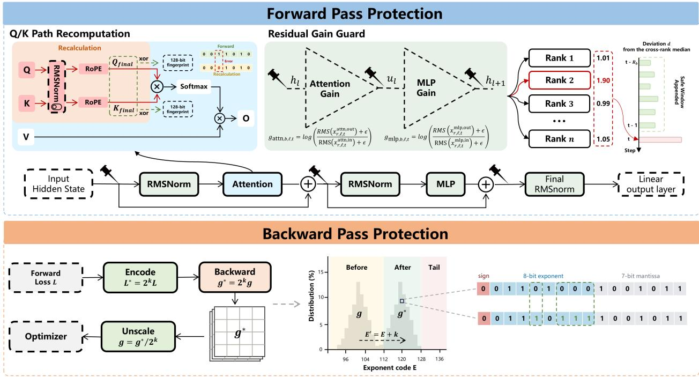  
Figure 2: Overview of the protection design. Q/K path recomputation verifies the Q/K tensors before attention, while the residual gain guard monitors the residual writebacks after attention and the multilayer perceptron. Exponent scaling protects gradient computation in the backward pass.

The second step compares each worker rank with the remaining worker ranks. In distributed data-parallel training, all worker ranks use the same network parameters at the same training step, so the remaining worker ranks provide a current reference. The reference and rank-specific deviation are

$$
c _ { - r , \ell , t } ^ { p } = \mathop { \mathrm { m e d i a n } } _ { j \neq r } g _ { j , \ell , t } ^ { p } ,\tag{10}
$$

$$
e _ { r , \ell , t } ^ { p } = g _ { r , \ell , t } ^ { p } - c _ { - r , \ell , t } ^ { p } .\tag{11}
$$

Here, j indexes the remaining worker ranks, $c _ { - r , \ell , t } ^ { p }$ is their median residual gain, and $e _ { r , \ell , t } ^ { p }$ measures how far worker rank r deviates from that reference. Excluding worker rank r prevents it from changing its own reference.

The detection thresholds are calibrated separately for the monitored layers and residual writebacks. Because normal cross-rank deviations can change with input data and training progress, a fixed reference may become inaccurate. A sliding window $\mathcal { H } _ { \ell , \ell , \ell } ^ { p }$ therefore stores recent finite deviations, with the largest absolute deviation excluded before each update. The normalized score is

$$
\mu _ { \ell , t } ^ { p } = \mathrm { m e d i a n } ( \mathcal { H } _ { \ell , t } ^ { p } ) ,\tag{12}
$$

$$
s _ { \ell , t } ^ { p } = \operatorname* { m a x } \left( 1 . 4 8 2 6 \operatorname* { m e d i a n } _ { h \in \mathcal { H } _ { \ell , t } ^ { p } } | h - \mu _ { \ell , t } ^ { p } | , s _ { \operatorname* { m i n } } \right) ,\tag{13}
$$

$$
z _ { r , \ell , t } ^ { p } = \frac { | e _ { r , \ell , t } ^ { p } - \mu _ { \ell , t } ^ { p } | } { s _ { \ell , t } ^ { p } } .\tag{14}
$$

Here, $\mu _ { \ell , t } ^ { p }$ is the typical historical deviation, $s _ { \ell , t } ^ { p }$ is its medianabsolute-deviation scale, and $z _ { r , \ell , t } ^ { p }$ measures the current deviation relative to normal historical variation.

After computing $z _ { r , \ell , t } ^ { p }$ for all worker ranks, the residual gain guard selects the largest score $z _ { ( 1 ) }$ . A transient fault is detected when $z _ { ( 1 ) }$ exceeds the efective threshold. The worker rank producing $z _ { ( 1 ) }$ is identified as the faulty candidate.

## 4.2 Backward Pass Protection

Unlike the forward pass, backward vulnerability exhibits little dependence on Transformer modules. This suggests that protecting individual computations separately would incur additional overhead without addressing the primary source of vulnerability.

To identify this common source, we analyze the numerical behavior of gradient representations under bit flips. We find that the numerical magnitude of a gradient tensor directly determines its vulnerability to bit flips. For a bfloat16 value $^ { g , }$ let $e _ { j }$ denote exponent-field bit $j .$ When the original and flipped values are both finite, flipping $e _ { j }$ changes the magnitude

by [Kalamkar et al., 2019]

$$
{ \frac { | \operatorname { H i p } _ { e _ { j } } ( g ) | } { | g | } } = { \left\{ 2 ^ { 2 ^ { j } } , \quad e _ { j } = 0 , \right. }\tag{15}
$$

The efect of a flip therefore depends on the current bit value. Small gradients occupy low exponent codes, where the selected exponent bits are zero more often, so a flip amplifies the value. Increasing the magnitude shifts the exponent-code distribution upward; once the selected bits become one, the same flip turns one into zero and attenuates the value instead, as illustrated in Figure 2. The two directions cause very diferent damage. An amplified corrupted gradient propagates into the global parameter update, whereas an attenuated corrupted gradient suppresses its own contribution and causes little deviation. Thus, exponent scaling protects the backward pass by moving gradients from the amplifying region into the attenuating region.

Exponent scaling changes exponent codes while preserving the parameter update. We use k to specify the scaling factor $2 ^ { k }$ . Before the backward pass, the loss is multiplied by $2 ^ { k }$ which multiplies every generated gradient by the same factor and adds k to its exponent code. Immediately before gradient clipping and the parameter update, the gradient is divided by $2 ^ { k }$ , so the update is unchanged:

$$
g _ { s } = \frac { \partial ( 2 ^ { k } L ) } { \partial \theta } = 2 ^ { k } g , 2 ^ { - k } g _ { s } = g .\tag{16}
$$

## 4.3 Selecting the Scaling Exponent

The scaling exponent k is selected by minimizing the predicted vulnerability within the numerical range of the backward pass. The choice is a trade-of. A small k leaves many gradients in exponent codes for which a bit flip amplifies the value, whereas a large k pushes the upper tail of the distribution toward non-finite values. We therefore collect a histogram H of gradient exponent codes from clean training steps and evaluate each candidate by shifting the codes by k:

$$
R _ { \mathrm { a m p } } ( k ; H ) = \sum _ { j \in \mathcal { I } } P _ { H , k } ( e _ { j } = 0 ) \left( 2 ^ { 2 ^ { j } } - 1 \right) ^ { 2 } ,\tag{17}
$$

$$
k ^ { * } = \arg \operatorname* { m i n } _ { k \in \mathcal { K } _ { \mathrm { s a f e } } } R _ { \mathrm { a m p } } ( k ; H ) .\tag{18}
$$

Here, $\mathcal { I }$ contains the exponent positions included by the fault model, $P _ { H , k } ( e _ { j } = 0 )$ is the fraction of shifted codes for which bit $e _ { j }$ is zero, and $\mathcal { K } _ { \mathrm { s a f e } }$ contains the candidates that keep the shifted codes within the finite range. Each term weights the probability of an amplifying flip by its squared relative magnitude change, so $R _ { \mathrm { a m p } }$ measures the expected amplification risk of a candidate. The common bit-selection probability is omitted because it is constant across the candidates and does not change $k ^ { * }$

Figure 3 compares the measured final deviation with the predicted $R _ { \mathrm { a m p } } ( k ; H )$ across the evaluated values of k. Spearman’s $\rho$ measures whether the two quantities give a consistent ranking of k, while $p _ { \mathrm { p e r m } }$ is the exact two-sided permutation probability of observing an association at least this strong under a random ranking. The correlation is $\rho = 0 . 6 5 0$ with $p _ { \mathrm { p e r m } } = 0 . 0 6 7$ for Llama-3.2-1B and $\rho = 0 . 8 6 7$ with $p _ { \mathrm { p e r m } } = 0 . 0 0 5$ for Qwen3-0.6B (n = 9 per network). Based on these results, all subsequent experiments fix the scaling exponent at the selected optimum $k = 1 5$

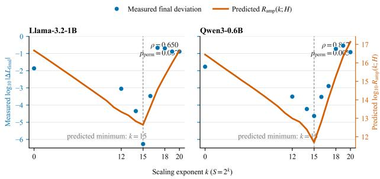  
Figure 3: Choosing the scaling factor k. The measured Final dev. is compared with $R _ { \mathrm { a m p } }$ across candidate values of k.

## 5 Evaluation

## 5.1 Experimental Setup

Models and training. The evaluation uses Llama 3.2-1B (16 layers) [Grattafiori et al., 2024] and Qwen3-0.6B (28 layers) [Yang et al., 2025], instantiated from their configurations with random weights (seed 8) and without pretrained weights. Every fault-free, faulty, protected, and ablation run resumes from a common step-1221 checkpoint and ends at step 2035. Training uses data parallelism on six NVIDIA A100 80-GB graphics processing units, one 1024-token sequence per rank, and eight accumulated microbatches, for 49,152 tokens per network update. Computation uses bfloat16 automatic mixed precision and float32 parameters. AdamW uses $( \beta _ { 1 } , \beta _ { 2 } ) = ( 0 . 9 , 0 . 9 5 )$ $\epsilon = 1 0 ^ { - 8 }$ , weight decay 0.1, and global gradient clipping at 1.0. The learning rate warms up for 100 steps to $5 \times 1 0 ^ { - 5 }$ and cosine-decays to 10% of that value.

Data. The evaluation uses the same document-disjoint SmolLM2-derived split for both networks [Allal et al., 2025]. The split contains 1,193,639 training and 12,056 evaluation documents sampled proportionally from DCLM-Edu, FineWeb-Edu, Stack-Edu, InfiMM-WebMath, FineMath, and Cosmopedia-v2, then tokenized separately for each network. The available training and evaluation corpora contain 1.102B/10.959M Llama tokens and 1.126B/11.181M Qwen tokens. Each run consumes about 100M training tokens, including 40M in the aligned continuation. Final evaluation covers 614,400 held-out token positions, and no evaluation document occurs in training.

Fault injection. We instantiate the fault model of Section 3.1 as follows. To additionally evaluate detection capability under sparse faults, we introduce a 10-element injection setting. For each spatial intensity, the protocol triggers 813 injection events; all remaining settings are identical.

<table><tr><td>Network</td><td>Method</td><td>Overhead↓ (%)</td><td> $D _ { \mathrm { f i n a l } } \downarrow$ </td><td> $D _ { \mathrm { M a x i m u m } } \downarrow$ </td><td>∆PPL↓</td><td>Top-1 ↑ (%)</td><td>W L2↓ (%)</td></tr><tr><td rowspan="7">Llama 3.2 1B</td><td>Fault</td><td>0.00 / 0.00</td><td>+1.72e-2 / nonfinite</td><td>1.23e-1 / nonfinite</td><td>4.04 / -</td><td>94.20 / -</td><td>0.69 / -</td></tr><tr><td>Loss spike</td><td>≈0/≈0</td><td>+1.72e-2 /+1.15e-1</td><td>1.24e-1 / 2.84e-1</td><td>4.03 / 27.60</td><td>94.40 / 82.60</td><td>0.692 / 2.10</td></tr><tr><td>Inf/NaN</td><td>≈0/≈0</td><td>+1.72e-2 /+1.18e-1</td><td>1.23e-1 / 4.28e-1</td><td>4.04 / 28.60</td><td>94.20 / 82.20</td><td>0.69 / 2.15</td></tr><tr><td>ATTNChecker</td><td></td><td> $\begin{array} { r l } { 7 . 6 5 / 7 . 6 5 } & { { } + 1 . 7 5 \mathrm { e } - 2 / + 1 . 0 7 \mathrm { e } - 1 } \end{array}$ </td><td>3.73e-2 / 3.86e-1</td><td>4.07 / 25.40</td><td>94.30 / 83.40</td><td>0.692 / 2.00</td></tr><tr><td>Harmful-update</td><td></td><td> $1 2 . 1 0 / 1 2 . 1 0 + 1 . 0 8 \mathrm { e } \mathrm { - } 2 / + 5 . 3 7 \mathrm { e } \mathrm { - } 3$ </td><td>1.15e-1 / 1.57e-1</td><td>2.49 / 1.25</td><td>95.00 / 96.90</td><td>0.510 / 0.480</td></tr><tr><td>LLMFT</td><td></td><td> $1 3 . 5 0 / 1 3 . 5 0 + 1 . 6 8 \mathrm { e } \mathrm { - } 2 / + 9 . 4 3 \mathrm { e } \mathrm { - } 2$ </td><td> $9 . 3 7 \mathrm { e } { - 2 } / 2 . 4 2 \mathrm { e } { - 1 }$ </td><td>3.86 / 22.20</td><td>94.50 / 84.60</td><td>0.679 / 1.84</td></tr><tr><td>Ours</td><td>1.65 / 1.65</td><td>-3.86e-5 / +6.32e-4</td><td>2.86e-4 / 9.14e-3</td><td>-3.37e-3 / 0.17399.10 / 98.602.83e-2 / 0.149</td><td></td><td></td></tr><tr><td rowspan="7">Qwen3 0.6B</td><td>Fault</td><td>0.00 / 0.00</td><td>+2.30e-2 / nonfinite</td><td>9.65e-2 / nonfinite</td><td>5.43 /-</td><td>93.10 / -</td><td>0.69 /-</td></tr><tr><td>Loss spike</td><td> $\approx 0 / \approx 0$ </td><td>+2.17e-2 / +1.25e-1</td><td>9.59e-2 / 2.82e-1</td><td>5.24 / 36.30</td><td>93.60/ 81.80</td><td>0.677 / 2.60</td></tr><tr><td>Inf/NaN</td><td>≈0/≈0</td><td>+2.30e-2 /+1.27e-1</td><td>9.65e-2 / 3.21e-1</td><td>5.43 / 36.90</td><td>93.10 / 81.70</td><td>0.690 / 2.67</td></tr><tr><td>ATTNChecker</td><td>36.70 / 36.70</td><td>+2.10e-2 /+1.26e-1</td><td>2.67e-2 / 2.93e-1</td><td>5.06 / 37.10</td><td>93.70 / 81.70</td><td>0.656 / 2.69</td></tr><tr><td>Harmful-update</td><td>11.20 /11.20</td><td>+1.39e-2 /+3.82e-3</td><td>8.85e-2 / 1.56e-1</td><td>3.24 / 1.14</td><td>94.50 / 97.90</td><td>0.471 /0.361</td></tr><tr><td>LLMFT</td><td>5.62 / 5.62</td><td>+2.17e-2 / +1.05e-1</td><td>7.06e-2 / 2.48e-1</td><td>5.33 / 29.50</td><td>93.60 / 84.20</td><td>0.676 / 2.25</td></tr><tr><td>Ours</td><td>6.76 / 6.76</td><td>+3.87e-6 / +6.15e-4</td><td>2.22e-4 / 1.48e-2</td><td>-1.25e-3 / 0.17599.10 / 98.802.16e-2 / 0.109</td><td></td><td></td></tr></table>

Table 1: Evaluation under the transient-fault injection protocol. Each slash-separated metric reports results for 10 corrupted activation elements (left) and 100,000 corrupted activation elements (right) per injection event.

<table><tr><td colspan="2">Network Variant</td><td> $D _ { \mathrm { f i n a l } } \downarrow$ </td><td>∆PPL↓</td></tr><tr><td rowspan="3">Llama</td><td>Q/K path Only</td><td>+1.69e-2 / +9.03e-2</td><td>4.00 / 21.70</td></tr><tr><td>Residual Only</td><td>+1.44e-2 / +9.02e-2</td><td>3.37 / 21.40</td></tr><tr><td>Exponent scaling Only Complete</td><td> $+ 3 . 0 3 \mathrm { e } { - 4 } / I n f$  -3.86e-5 / +6.32e-4-3.37e-3 / 0.173</td><td>7.28e-2 / -</td></tr><tr><td rowspan="4">Qwen</td><td>Q/K path Only</td><td> $+ 2 . 1 5 \mathrm { e } { - 2 } / + 1 . 0 2 \mathrm { e } { - 1 }$ </td><td>5.22 / 28.50</td></tr><tr><td>Residual Only</td><td>+1.98e-2 / +1.04e-1</td><td>4.59 / 29.10</td></tr><tr><td>Exponent scaling Only</td><td>+1.12e-3 / Inf</td><td>0.250 / –</td></tr><tr><td>Complete</td><td>+3.87e-6 / +6.15e-4-1.25e-3 / 0.175</td><td></td></tr></table>

Table 2: Component ablation under the unified injection protocol. Each slash-separated metric reports results for 10 corrupted activation elements (left) and 100,000 corrupted activation elements (right) per injection event.

Protection configuration. The protection configuration applies fused recomputation to the Q/K path, the residual gain guard to residual writebacks, and exponent scaling to the backward pass. Fused recomputation covers the Q/K path in every layer, while the residual gain guard samples layers {0, 5, 10, 15} in Llama and {0, 9, 18, 27} in Qwen. An alarm discards the accumulated gradients and replays all accumulated microbatches without a transient fault before the network update. Exponent scaling uses k = 15, and automatic scale adjustment is disabled.

Metrics. The evaluation reports Overhead, $D _ { \mathrm { f i n a l } } ,$ $D _ { \mathrm { M a x i m u m } }$ , ∆PPL, Top-1 and W L2. $D _ { \mathrm { f i n a l } }$ and DMaximum follow Section 3, and ∆PPL is the held-out perplexity diference from the aligned fault-free run. Top-1 measures token agreement, W L2 measures relative parameter drift. Overhead is the change in mean fault-free step time over 100 measured optimizer steps.

## 5.2 Main Results

All methods use the same checkpoints, data order, and injection schedules. Harmful-update follow prior training studies [Altenbernd et al., 2026], and ATTNChecker follows its attentionprotection setting [Liang et al., 2025]. LLMFT uses its learned detector through our zero-shot oracle-route adapter [Yu et al., 2025]. Slash-separated values denote 10 / 100,000 corrupted elements.

At 10 elements, the complete method achieves near-zero $D _ { \mathrm { f i n a l } } , D _ { \mathrm { M a x i m u m } }$ below $2 . 9 \times 1 0 ^ { - 4 }$ , and negligible ∆PPL on both models, with 1.65% overhead on Llama and 6.76% on Qwen. At 100,000 elements, unprotected training diverges, whereas the complete method preserves convergence consistent with fault-free training. Its $D _ { \mathrm { f i n a l } }$ is $6 . 3 2 \times 1 0 ^ { - 4 } / 6 . 1 5 \times 1 0 ^ { - 4 }$ $D _ { \mathrm { M a x i m u m } } \mathrm { i s 9 . 1 4 \times 1 0 ^ { - 3 } / 1 . 4 8 \times 1 0 ^ { - 2 } }$ , and $\Delta \mathrm { P P L }$ is 0.173 / 0.175. It achieves the best reported outcome metrics on both models and at both fault intensities.

## 5.3 Ablation Study

The ablation evaluates the Q/K-path check, residual gain guard, and exponent scaling individually, with the complete method included as a reference. All variants use the same injection protocol as Table 1.

At 10 elements, exponent scaling is the strongest individual component, reducing $D _ { \mathrm { f i n a l } } \mathrm { t o } 3 . 0 3 \times 1 0 ^ { - 4 } / 1 . 1 2 \times 1 0 ^ { - 3 }$ and ∆PPL to 0.0728 / 0.250 for Llama/Qwen. At 100,000 elements, K15-only encounters found\_inf, so its $D _ { \mathrm { f i n a l } }$ and PPL are not reported. Q/K-only and residual-only produce $D _ { \mathrm { f i n a l } }$ near $1 0 ^ { - 1 }$ and $\Delta \mathrm { P P I }$ between 21.4 and 29.1, whereas the complete method reduces $D _ { \mathrm { f i n a l } } \mathrm { t o } 6 . 3 2 \times 1 0 ^ { - 4 } / 6 . 1 5 \times 1 0 ^ { - 4 }$ and ∆PPL to 0.173 / 0.175. The three components therefore provide complementary protection under strong faults.

## 6 Conclusion

This work shows that query/key path faults cause more persistent damage, whereas value, attention-output, and multilayerperceptron faults cause larger but shorter-lived loss changes. Backward vulnerability varies less across components and depends on the gradient exponent distribution. Based on these findings, TrainSDC combines query/key path recomputation, the Residual Gain Guard, and exponent scaling. On Llama 3.2- 1B and Qwen3-0.6B, TrainSDC mitigates both sparse and dense faults with limited overhead and restores training outcomes to a level close to fault-free training.

## References

Loubna Ben Allal, Anton Lozhkov, Elie Bakouch, Gabriel Martín Blázquez, Guilherme Penedo, Lewis Tunstall, Andrés Marafioti, Hynek Kydlíček, Agustín Piqueres Lajarín, Vaibhav Srivastav, et al. Smollm2: When smol goes big–data-centric training of a small language model. arXiv preprint arXiv:2502.02737, 2025.

Anton Altenbernd, Philipp Wiesner, and Odej Kao. Exploring silent data corruption as a reliability challenge in llm training. arXiv preprint arXiv:2604.00726, 2026.

Harish Dattatraya Dixit, Sneha Pendharkar, Matt Beadon, Chris Mason, Tejasvi Chakravarthy, Bharath Muthiah, and Sriram Sankar. Silent data corruptions at scale. arXiv preprint arXiv:2102.11245, 2021.

Aaron Grattafiori, Abhimanyu Dubey, Abhinav Jauhri, Abhinav Pandey, Abhishek Kadian, Ahmad Al-Dahle, Aiesha Letman, Akhil Mathur, Alan Schelten, Alex Vaughan, et al. The llama 3 herd of models. arXiv preprint arXiv:2407.21783, 2024.

Kuang-Hua Huang and Jacob A. Abraham. Algorithm-based fault tolerance for matrix operations. IEEE Transactions on Computers, C-33(6):518–528, 1984.

Dhiraj Kalamkar, Dheevatsa Mudigere, Naveen Mellempudi, Dipankar Das, Kunal Banerjee, Sasikanth Avancha, Dharma Teja Vooturi, Nataraj Jammalamadaka, Jianyu Huang, Hector Yuen, et al. A study of bfloat16 for deep learning training. arXiv preprint arXiv:1905.12322, 2019.

Kinman Lei, Liyan Zheng, Xiang Li, Hongmin Chen, Yun Zhang, Gaohong Liu, Zuquan Song, Zixuan Ma, Zhiyu Xue, Minghui Yu, et al. Safeguarding {LLM} training at scale: Online {SDC} detection and insights from 35 million {GPU} hours. In 20th USENIX Symposium on Operating Systems Design and Implementation (OSDI 26), pages 1369–1384, 2026.

Yuhang Liang, Xinyi Li, Jie Ren, Ang Li, Bo Fang, and Jieyang Chen. ATTNChecker: Highly-optimized fault tolerant attention for large language model training. In Proceedings

of the 30th ACM SIGPLAN Annual Symposium on Principles and Practice of Parallel Programming, PPoPP ’25, pages 252–266, New York, NY, USA, 2025. Association for Computing Machinery. doi: 10.1145/3710848.3710870.

Jefrey Jian Ma, Hengzhi Pei, Leonard Lausen, and George Karypis. Understanding silent data corruption in llm training. In Proceedings ofthe 63rdAnnual Meeting oftheAssociation for Computational Linguistics (Volume 1: Long Papers), pages 20372–20394, 2025.

Rihae Park, Yeonjae Kim, Seung Yul Lee, Yeonhong Park, and Jae W. Lee. SpareTrain: Fault-tolerant LLM training via low-cost dual modular redundancy. In International Conference on Learning Representations, 2026. URL https: //openreview.net/forum?id=kDeS8jpeiZ.

Zhenheng Tang, Junlin Huang, Zichen TANG, Xueze Kang, Yuxin Wang, Peijie Dong, Shaohuai Shi, Xiaowen Chu, and Bo Li. Identifying and mitigating errors in gradient aggregation of distributed data parallel training, 2025. URL https://openreview.net/forum?id=zOgUQM6uLZ.

Gemini Team, Rohan Anil, Sebastian Borgeaud, Jean-Baptiste Alayrac, Jiahui Yu, Radu Soricut, Johan Schalkwyk, Andrew M Dai, Anja Hauth, Katie Millican, et al. Gemini: a family of highly capable multimodal models. arXiv preprint arXiv:2312.11805, 2023.

Abhishek Tyagi, Saurabh Hukerikar, Nirmal Saxena, Yanxiang Huang, Philip Shirvani, Chung-Hsuan Tung, and Yuhao Zhu. LLM-PRISM: Characterizing silent data corruption from permanent GPU faults in LLM training, 2026.

Borui Wan, Gaohong Liu, Zuquan Song, Jun Wang, Yun Zhang, Guangming Sheng, Shuguang Wang, Houmin Wei, Chenyuan Wang, Weiqiang Lou, et al. Robust llm training infrastructure at bytedance. In Proceedings of the ACM SIGOPS 31st Symposium on Operating Systems Principles, pages 186–203, 2025.

An Yang, Anfeng Li, Baosong Yang, Beichen Zhang, Binyuan Hui, Bo Zheng, Bowen Yu, Chang Gao, Chengen Huang, Chenxu Lv, et al. Qwen3 technical report. arXiv preprint arXiv:2505.09388, 2025.

Pengfei Yu, Jingjing Gu, Hao Han, Dazhong Shen, Bao Wen, and Yang Liu. Exploring and mitigating failure behavior of large language model training workloads in hpc systems. In Proceedings of the International Conference for High Performance Computing, Networking, Storage and Analysis, pages 1165–1179, 2025.

## A Appendix

## A.1 Robustness across Fault Rate, Layer, and Injection Budget

Motivation. The main characterization of SmolLM2 uses Layer 20, injects faults in 1% of training steps, and corrupts 100,000 elements in each selected tensor. We test whether its forward-pass observations remain visible when varying the fault-step rate, target layer, and injection budget separately.

Experimental variants. Figure 4 reports three controlled variants on SmolLM2-135M. Rate robustness uses Layer 20, a 0.1% fault-step rate, and 100,000 corrupted elements. Layer robustness uses Layer 10, a 1% fault-step rate, and 100,000 corrupted elements. Budget robustness uses Layer 20, a 1% fault-step rate, and corrupts exactly 1% of each target tensor. For a target tensor $x _ { i }$ containing $N _ { i }$ elements, the last variant uses

$$
m _ { i } = \mathrm { r o u n d } ( 0 . 0 1 N _ { i } )\tag{19}
$$

corrupted elements. All remaining settings, including the training continuation, temporal injection schedule, random seeds, bit-flip policy, optimizer, and fault-free reference trajectory, follow the main characterization.

Results. Across all three variants, forward sensitivity remains path-dependent. Q/K-path faults consistently leave final deviations above the fault-free envelope, while normalization outputs are also vulnerable. In contrast, V, multilayer perceptron, and block-output faults mainly produce large peak deviations that are attenuated during subsequent training. These results agree with Observation O1 and show that the forward-pass pattern remains under changes in fault-step rate, target layer, and injection budget.

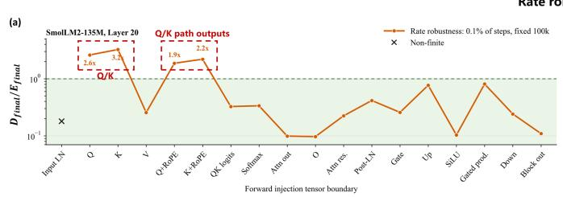

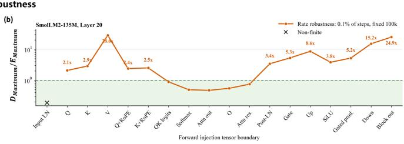

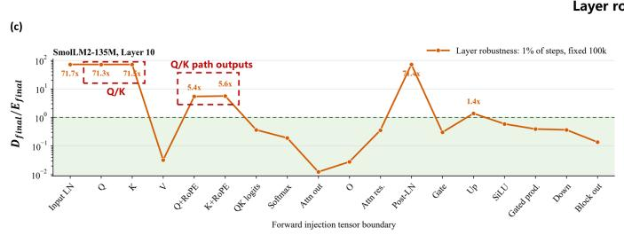

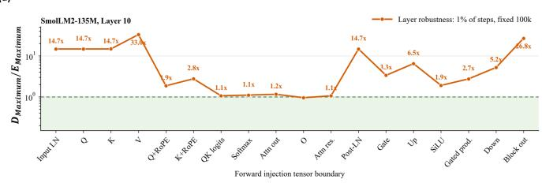

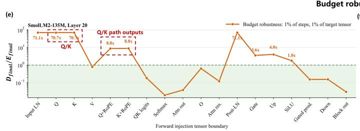

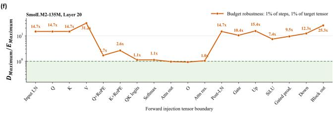  
Figure 4: Additional forward-pass characterization of SmolLM2-135M. Panels (a) and (b) evaluate rate robustness at Layer 20 with a 0.1% fault-step rate and 100,000 corrupted elements. Panels (c) and (d) evaluate layer robustness at Layer 10 with a 1% fault-step rate and 100,000 corrupted elements. Panels (e) and (f) evaluate budget robustness at Layer 20 with a 1% fault-step rate and exactly 1% of each target tensor corrupted.

## A.2 Operating Characteristics of Forward Protection

Threshold calibration and online state. Calibration starts from the common step-1221 checkpoint and runs 100 fault-free optimizer steps (steps 1222–1321). The sliding-window length is W = 64 accepted detector observations, normally one per optimizer step. For each monitored layer and residual path, one clean observation contributes the R − 1 rank deviations with the smallest absolute values; the largest rank deviation is omitted. With $R = 6$ , the stored window therefore contains $6 4 \times 5 = 3 2 0$ scalar deviations per layer and path. The first 64 calibration steps seed this window, while all 100 calibration steps are used to determine the calibrated threshold floors. Consequently, the evaluation run begins with a full window and has no additional deployment warm-up.

The robust scale follows the definition in the main text. The detector uses threshold coeficient α. Let $c _ { \mathrm { r e l } , \ell , \mathrm { c a l } } ^ { p }$ and $c _ { z , \ell , \mathrm { c a l } } ^ { p }$ denote the largest eligible relative-deviation and robust-z scores observed in the 100 clean calibration steps before any safety scaling. With $s _ { \operatorname* { m i n } } = 1 0 ^ { - 6 }$ and adaptive quantile $q = 1$ , the efective thresholds at step t are

$$
\tau _ { \mathrm { r e l } , \ell , t } ^ { p } = \alpha \operatorname* { m a x } \left( c _ { \mathrm { r e l } , \ell , \mathrm { c a l } } ^ { p } , \operatorname* { m a x } _ { h \in \mathcal { H } _ { \ell , t } ^ { p } } \left( \exp ( | h | ) - 1 \right) \right) ,\tag{20}
$$

$$
\tau _ { z , \ell , t } ^ { p } = \alpha \operatorname* { m a x } \left( c _ { z , \ell , \mathrm { c a l } } ^ { p } , \operatorname* { m a x } _ { h \in \mathcal { H } _ { \ell , t } ^ { p } } \frac { \vert h - \mathrm { m e d i a n } ( \mathcal { H } _ { \ell , t } ^ { p } ) \vert } { \operatorname* { m a x } ( 1 . 4 8 2 6 \mathrm { M A D } ( \mathcal { H } _ { \ell , t } ^ { p } ) , 1 0 ^ { - 6 } ) } \right) .\tag{21}
$$

Thus, the same coeficient jointly scales the fixed calibration floor and the adaptive history term. The floor prevents an unusually quiet recent window from making the detector over-sensitive, while the history term follows legitimate training drift.

Selection of α. We sweep $\alpha \in \{ 1 , 1 . 5 , 2 , 2 . 5 , 3 \}$ using the same four monitored layers, checkpoint, detector history, fault locations, and random seed. For each candidate, clean false positives are measured on 200 held-out fault-free optimizer steps. Detection is measured on 96 residual-path snapshot-replay events per network: 48 events with 10 corrupted elements and 48 events with 100,000 corrupted elements. Table 3 reports the result.
<table><tr><td>Network</td><td>α</td><td>Clean step FPR</td><td>10-element recall</td><td>100,000-element recall</td></tr><tr><td rowspan="5">Llama 3.2-1B</td><td>1.0</td><td>33/200 (16.5%)</td><td>48/48 (100.00%)</td><td>48/48 (100.00%)</td></tr><tr><td>1.5</td><td>3/200 (1.5%)</td><td>17/48 (35.42%)</td><td>41/48 (85.42%)</td></tr><tr><td>2.0</td><td>1/200 (0.5%)</td><td>17/48 (35.42%)</td><td>41/48 (85.42%)</td></tr><tr><td>2.5</td><td>0/200 (0%)</td><td>17/48 (35.42%)</td><td>41/48 (85.42%)</td></tr><tr><td>3.0</td><td>0/200 (0%)</td><td>17/48 (35.42%)</td><td>41/48 (85.42%)</td></tr><tr><td rowspan="5">Qwen3-0.6B</td><td>1.0</td><td>17/200 (8.5%)</td><td>7/48 (14.58%)</td><td>32/48 (66.67%)</td></tr><tr><td>1.5</td><td>0/200 (0%)</td><td>7/48 (14.58%)</td><td>32/48 (66.67%)</td></tr><tr><td>2.0</td><td>0/200 (0%)</td><td>7/48 (14.58%)</td><td>32/48 (66.67%)</td></tr><tr><td>2.5</td><td>0/200 (0%)</td><td>7/48 (14.58%)</td><td>32/48 (66.67%)</td></tr><tr><td>3.0</td><td>0/200 (0%)</td><td>7/48 (14.58%)</td><td>32/48 (66.67%)</td></tr></table>

Table 3: Selection of the single efective Residual Gain Guard coeficient α. Clean FPR is the optimizer-step false-positive rate on 200 held-out fault-free steps. The two recall columns report detected events out of 48.

The setting $\alpha = 1$ is over-sensitive on both networks. From $\alpha = 1 . 5$ onward, recall is unchanged on this sweep, while the clean FPR continues to decrease. We select $\alpha = 2 . 5$ because it is the smallest candidate with zero held-out clean alarms on both networks and shows no recall reduction relative to $\alpha = 1 . 5 \ : \mathrm { o r } 2$ . The resulting per-layer, per-path calibration floors are listed in Table 4.
<table><tr><td>Network</td><td>Layer</td><td> $\tau _ { \mathrm { r e l } } ^ { \mathrm { A t t n . } }$ </td><td> $\tau _ { z } ^ { \mathrm { A t t n . } }$ </td><td> $\tau _ { \mathrm { r e l } } ^ { \mathrm { M L P } }$ </td><td> $\tau _ { z } ^ { \mathrm { M L P } }$ </td></tr><tr><td rowspan="4">Llama 3.2-1B</td><td>0</td><td>0.340077</td><td>10.926</td><td>0.322114</td><td>11.736</td></tr><tr><td>5</td><td>0.008262</td><td>11.462</td><td>0.017856</td><td>25.025</td></tr><tr><td>10</td><td>0.008631</td><td>16.026</td><td>0.019817</td><td>13.107</td></tr><tr><td>15</td><td>0.007139</td><td>14.899</td><td>0.033000</td><td>9.942</td></tr><tr><td rowspan="4">Qwen3-0.6B</td><td>0</td><td>0.282147</td><td>11.798</td><td>0.206769</td><td>13.587</td></tr><tr><td>9</td><td>0.008335</td><td>15.364</td><td>0.011517</td><td>19.679</td></tr><tr><td>18</td><td>0.006522</td><td>15.650</td><td>0.009818</td><td>16.609</td></tr><tr><td>27</td><td>0.010103</td><td>13.767</td><td>0.018967</td><td>12.445</td></tr></table>

Table 4: Per-layer, per-path calibrated threshold floors after applying the selected $\alpha = 2 . 5 . \mathrm { \Omega ^ { 6 } A t t n . }$ ” and $\mathbf { \ddot { M L P } } ^ { \prime }$ denote the attention and multilayer-perceptron residual writebacks.

Alarm aggregation and history admission. For each layer and path, the implementation considers the largest and second-largest rank scores. The robust-z branch alarms when the largest score reaches $\tau _ { z }$ and is at least 1.5 times the second-largest score; a companion relative-deviation branch applies the same dominance rule using $\tau _ { \mathrm { r e l } }$ . A nonfinite or negative reused mean-square value bypasses both thresholds and causes an immediate alarm. Nonfinite values are never written to the history.

All rank, path, and monitored-layer decisions are OR-reduced into one optimizer-step alarm. Multiple simultaneous alarms retain their individual diagnostics but trigger only one replay of the accumulated microbatches, with fault injection disabled, before a single optimizer update. An attempt rejected by the Residual Gain Guard is not written to its window.

The online window persists within an uninterrupted training process but is not stored in the ordinary model/optimizer checkpoint. On restart, the reported implementation reloads the same 64-step seed from the separate calibration file rather than carrying recent deployment history across the checkpoint. All reported main runs were uninterrupted, so this restart behavior does not alter their measurements.

Results. Table 3 reports the held-out clean behavior used to select α. At the selected α = 2.5, neither network raises an alarm in the 200-step clean holdout. We then run an independent 814-step fault-free deployment trace and three complete 813-event fault traces per network. The complete clean traces produce zero alarms for Qwen and one alarm for Llama, corresponding to a combined step-level FPR of $1 / 1 6 2 8 = 0 . 0 6 1 \%$ . This longer measurement is the clean FPR reported below; it does not change the held-out sweep used to select α.
<table><tr><td>Network</td><td>Clean alarms</td><td>10 elements</td><td>1,000 elements</td><td>100,000 elements</td><td>All fault runs</td></tr><tr><td>Llama 3.2-1B</td><td>1/814 (0.12%)</td><td>175/403 (43.42%)</td><td>338/403 (83.87%)</td><td>348/403 (86.35%)</td><td>861/1209 (71.22%)</td></tr><tr><td>Qwen3-0.6B</td><td>0/814 (0%)</td><td>165/403 (40.94%)</td><td>279/403 (69.23%)</td><td>316/403 (78.41%)</td><td>760/1209 (62.86%)</td></tr></table>

Table 5: Complete-run clean FPR and forward-alarm recall with α = 2.5. Each fault run contains 403 valid forward injection events. An event is detected when Q/K Path Recomputation or the Residual Gain Guard requests a pre-update replay.

<table><tr><td>Injection module or node</td><td>10 elements</td><td>1,000 elements</td><td>100,000 elements</td><td>Total</td><td>Share (%)</td></tr><tr><td>Attention weights</td><td>45</td><td>45</td><td>45</td><td>135</td><td>16.94</td></tr><tr><td>Attention logits</td><td>32</td><td>32</td><td>32</td><td>96</td><td>12.05</td></tr><tr><td>Down projection</td><td>39</td><td>28</td><td>20</td><td>87</td><td>10.92</td></tr><tr><td>Attention residual</td><td>28</td><td>28</td><td>27</td><td>83</td><td>10.41</td></tr><tr><td>Pre-o attention output</td><td>42</td><td>17</td><td>8</td><td>67</td><td>8.41</td></tr><tr><td>Output projection</td><td>25</td><td>21</td><td>10</td><td>56</td><td>7.03</td></tr><tr><td>Input RMSNorm</td><td>48</td><td>0</td><td>0</td><td>48</td><td>6.02</td></tr><tr><td>SiLU output</td><td>37</td><td>7</td><td>0</td><td>44</td><td>5.52</td></tr><tr><td>Up projection</td><td>35</td><td>1</td><td>0</td><td>36</td><td>4.52</td></tr><tr><td>Gate projection</td><td>32</td><td>3</td><td>0</td><td>35</td><td>4.39</td></tr><tr><td>Post-attention RMSNorm</td><td>33</td><td>0</td><td>0</td><td>33</td><td>4.14</td></tr><tr><td>Gated MLP product</td><td>27</td><td>3</td><td>0</td><td>30</td><td>3.76</td></tr><tr><td>Value projection</td><td>25</td><td>3</td><td>0</td><td>28</td><td>3.51</td></tr><tr><td>Block output</td><td>18</td><td>1</td><td>0</td><td>19</td><td>2.38</td></tr><tr><td>All protected Q/K-path targets</td><td>0</td><td>0</td><td>0</td><td>0</td><td>0.00</td></tr></table>

Table 6: Post-hoc composition of missed forward alarms with α = 2.5, aggregated over both networks. Share is relative to all 797 missed forward events across the three spatial intensities.

Across all three intensities, Q/K Path Recomputation detects every direct corruption of the protected Q/K-path targets. The remaining misses are concentrated in attention weights, attention logits, and residual or projection outputs outside that exact-recomputation boundary. Increasing the number of corrupted elements primarily improves Residual Gain Guard recall: the combined recall rises from 43.42% to 86.35% for Llama and from 40.94% to 78.41% for Qwen.

## A.3 Temporal Stability of the Exponent-Scaling Parameter

Motivation. Exponent scaling selects k from the exponent-code histogram of clean backward gradients. This selection is practical only if the same value can be held for a substantial training interval. We therefore measure how the selected value evolves over the complete public checkpoint trajectory of Pythia-1B.

Checkpoint sweep. We evaluate all 154 released checkpoints from step 0 through step 143,000. At each checkpoint, we run 12 fixed WikiText-103 validation sequences with batch size 1 and sequence length 1,024. We collect the BF16 exponent histogram Ht of $\mathrm { d } L / \mathrm { d } Y$ at all 64 Transformer linear projections, using 8,192 deterministic samples per projection and sequence, or 6,291,456 samples per checkpoint. No fault is injected during profiling. We evaluate the same candidate set as in the main method and compute the pointwise selection

$$
k ^ { * } ( t ) = \arg \operatorname* { m i n } _ { k \in \mathcal { K } _ { \mathrm { s a f e } } } R _ { \mathrm { a m p } } ( k ; H _ { t } ) .\tag{22}
$$

For phase-wise deployment, a held value $k _ { \mathrm { h e l d } }$ remains admissible while its predicted risk is at most 25% above the pointwise minimum. A new profile is required only when this condition no longer holds. The reported values of k use the same training-equivalent convention as the main experiments.

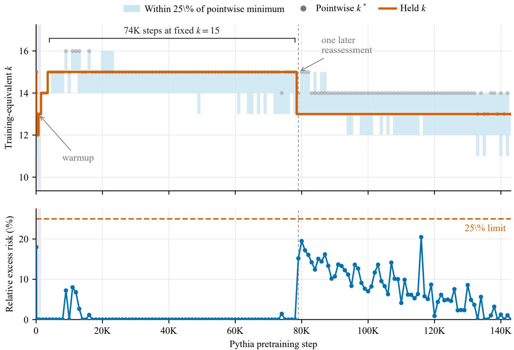  
Figure 5: Temporal stability of exponent scaling across all 154 public Pythia-1B checkpoints. The upper panel shows the pointwise optimum $k ^ { * }$ , the values within 25% of its predicted risk, and the value held for each phase. The lower panel shows the relative excess risk of the held value. The shaded region marks warm-up, and the vertical dashed line marks the only later reassessment after the initial post-warm-up value is established at step 4,000.

Results. Figure 5 shows frequent movement during warm-up and the immediate post-warm-up transition. Once $k = 1 5$ is selected at step 4,000, it remains admissible through step 78,000, a span of 74,000 training steps. One later reassessment at step 79,000 selects $k = 1 3$ , which remains admissible through the final checkpoint at step 143,000. The relative excess risk remains below the 25% limit throughout both intervals. Thus, after the initial post-warm-up operating point is established, the remaining trajectory of more than 100,000 steps requires only one additional reassessment.

Practical implication. The scaling exponent k is evaluated more frequently during warm-up, when the histogram changes rapidly, and is then held fixed over long training intervals. For this trajectory, the initial post-warm-up value requires only one reassessment in the latter half of training.