# UNCERTAINTY OF VISION MEDICAL FOUNDATION MODELS

Haoxu Huang1\* & Narges Razavian2,3

1Center for Data Science, New York University

2Department of Radiology, NYU Grossman School of Medicine

3Department of Population Health, NYU Grossman School of Medicine hh2740@nyu.edu,Narges.Razavian@nyulangone.org

## ABSTRACT

Accurate uncertainty estimation is essential for machine learning systems deployed in high-stakes domains such as medicine. Traditional approaches primarily rely on probability outputs from trained models (point predictions), which provide no formal guarantees on prediction coverage and often require additional calibration techniques to improve reliability. In contrast, conformal prediction (region prediction) offers a principled alternative by generating prediction sets with finitesample validity guarantees, ensuring that the ground truth is contained within the set at a specified confidence level.

In this study, we explore the impact of pre-training approach, dataset scale and domain on both point and region-level uncertainty quantification, by studying domain-specific vision medical foundation models vs. general domain vision foundation models. We conduct a comprehensive evaluation across foundation models trained on retinal, histopathological, and Chest X-Rays data, applying various calibration techniques. Our results demonstrate that (1) pre-training on higher-quality domain-specific datasets along with self-supervised learning leads to better-calibrated point predictions than general domain pre-training, (2) standard re-calibration methods alone cannot fully mitigate uncertainty discrepancies across models trained on different data sources, (3) domain-specific foundation model can lead to more efficient conformal prediction.

These findings highlight the importance of careful model selection and the integration of both point and region prediction to enhance the reliability and trustworthiness of medical AI systems. Our work underscores the need for a holistic approach to uncertainty quantification in recent development of medical vision foundation model, ensuring robust and interpretable AI-driven decision-making.

## 1 INTRODUCTION

A fundamental question in machine learning is how well a model can quantify its confidence in predictions, particularly in high-stakes applications where accurate uncertainty estimation is critical. Traditionally, this question is answered by interpreting the probability outputs of learning algorithms. However, such approaches often lead to mis-calibration of the machine learning system, where the predicted probabilities deviate significantly from the true likelihood of correctness on unseen data (Guo et al., 2017). This mis-calibration undermines the reliability of confidence estimates and offers no formal guarantees for prediction coverage — an essential requirement for robust decision-making in real-world scenarios.

Conformal prediction is an alternative method for evaluating uncertainty with exact coverage guarantee with no need to re-train the model. Specifically, through a post-hoc approach, it generates a (1 — α) prediction region — a set Cα that contains ground truth prediction y with probability at least (1 — α). Unlike traditional point predictions ê, these prediction regions ensure formal coverage guarantees, making them applicable across a wide range of learning tasks. For instance, in regression,

1st workshop of “Quantify Uncertainty and Hallucination in Foundation Models: The Next Frontier in Reliable AI" at ICLR'25

the prediction region can be an interval around î that includes the true value; in classification, it can be a set of possible classes containing the ground truth; and in segmentation tasks, it can identify a region of pixels encompassing the true segmentation.

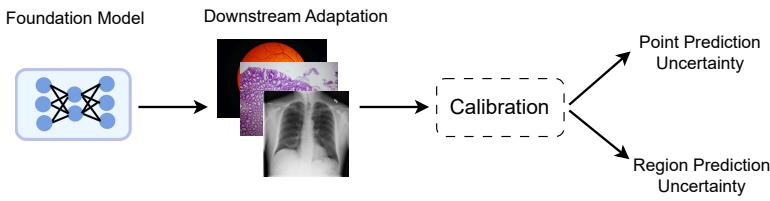  
Figure 1: Uncertainty Evaluation: initially, a foundation model is trained to adapt to downstream tasks, either with a calibration method or without. Subsequently, the model's uncertainty is evaluated using both point predictions and region predictions.

While the concept of prediction regions is initially rooted in theoretical and heuristic frameworks suggesting that the world cannot always be represented by single-point predictions (Shafer & Vovk, 2008), recent work (Jesse C. Cresswell & Vouitsis, 2024) have demonstrated its practical value. Notably, region-based AI systems, when combined with human decision-makers, have shown promising potential to improve outcomes in randomized controlled trials. This highlights the transformative potential of incorporating region predictions into critical decision-making pipelines.

In this work, we study the growing importance of accurately understanding model predictions under uncertainty, particularly in the context of high-stakes decision-making. With recent emphasis on building domain specific visual foundation model in medicine (Wang et al., 2024; Huang et al. 2023; Chen et al., 2024a; Vorontsov et al., 2024; Zhou et al., 2023b; Dong et al., 2024; Codella et al., 2024), we investigate how foundation models trained on diverse data sources influence predictive uncertainty. Specifically, we explore both point and region prediction under varying conditions and evaluate the potential of model calibration on improving uncertainty estimates across these models. This study aims to shed light on the interplay between foundation model and uncertainty quantification, paving the way for understanding trustworthiness of AI systems in critical domains.

## 2 RELATED WORKS

In the case of deep learning model prediction with softmax output, the softmax scores are often used as a proxy of model uncertainty. However, there are many studies (Guo et al., 2017; Minderer et al., 2021; Bai et al., 2021) show that softmax scores are not well calibrated and different calibration techniques are proposed to re-calibrate them.

While there have been many previous works (Guo et al., 2017; Minderer et al., 2021; Hendrycks et al., 2019) studying uncertainty of deep learning models, their studies are mostly constrained on evaluation with limited data types, model trained on small scale and point prediction uncertainty, with model uncertainty on region prediction under-explored. Additionally, their studies present contradictory results where (Guo et al., 2017) observes that larger neural networks are worse calibrated, (Minderer et al., 2021) shows that model architecture families matter more on model uncertainty than model size or pre-training amount, (Hendrycks et al., 2019) claims that better model pre-training improves uncertainty upon model trained from scratch.

Lu et al. (2022); Angelopoulos et al. (2021; 2024) explored how conformal prediction can be more adaptive on image classification. Angelopoulos et al. (2024); Quach et al. (2024) studied how to leverage conformal prediction concept to segmentation and language model problems with main focus on algorithmic design. However, their work primarily focused on methodological development, with limited exploration of models trained using different pre-training sources and methods.

## 3 PRELIMINARY

Uncertainty Quantification and Calibration Building a real-world applicable model under highstake environment is not only about high model performance on standard benchmarks, the model should also confidently represent its uncertainty of prediction outcomes with human decision-makers in the loop. Yet, it is easy to have a model that achieves high performance and does a poor job on representing its uncertainty (Guo et al., 2017). Therefore, previous studies come up with different ways of calibrating the model uncertainty, where they can be categorized by post-hoc method such as Temperature Scaling (Guo et al., 2017), regularization method such as Entropy Regularization (Pereyra et al., 2017), ensembling method such as Deep Ensembling (Lakshminarayanan et al., 2017) and bayesian method such as MC Dropout (Gal & Ghahramani, 2016).

Formally, given input $X \in { \mathcal { X } }$ from input space $x ,$ ground truth prediction $Y \in \mathcal { Y } = \{ 1 , . . . , K \}$ from label space ${ \mathcal { V } } ,$ a model with $f ( X ) = ( { \hat { Y } } , { \hat { P } } )$ , where $\hat { Y }$ represents model class prediction, $\hat { P }$ represents model probability prediction (confidence), a perfect calibrated model should fulfill the condition Guo et al. (2017).

$$
\mathbb { P } ( \hat { Y } = Y | \hat { P } = p ) = p , \quad \forall p \in [ 0 , 1 ]\tag{1}
$$

where it means the model probability prediction should accurately corresponds to its accuracy. While it is impossible to achieve perfect calibration in real world, achieving better calibration means closing the gap between model probability and accuracy.

Prediction Sets and Conformal Prediction While many machine learning problems are framed as single output prediction, there are many cases in real world that giving a set of predictions with correctness guarantee can be more sensible. For example, forecasting weather changes with only one possible outcome is un-informative, a disease progression prediction can potentially have multiple outcomes, etc. Conformal prediction (Vovk et ${ \mathrm { a l . } }$ , 2005) is a general framework rather than a specific algorithm, and it is designed to provides prediction sets with coverage guarantee.

Formally, consider the problem setup where the input $X \in { \mathcal { X } }$ comes from the input space $x ,$ and the ground truth label $\bar { Y } \in \mathcal { V } = \{ 1 , { \cdot } . . . , K \}$ belongs to the label space $\mathcal { V } .$ Our goal is to construct a prediction set $\mathcal C ( X )$ that satisfies the coverage guarantee:

$$
P ( Y \in { \mathcal { C } } ( X ) ) \geq 1 - \alpha\tag{2}
$$

To construct $\mathcal C ( X )$ , we first define a conformal score function $s ( x , y )$ , which quantifies the uncertainty of a label y for a given input x. The conformal score is computed using a calibration dataset, a held-out set of labeled examples that help determine the threshold for uncertainty quantification. Specifically, given a threshold ${ \hat { q } } ,$ estimated from the calibration dataset, the prediction set $\mathcal C ( X )$ is formed as:

$$
\mathcal { C } _ { \hat { q } } ( x ) = \{ y : s ( x , y ) \leq \hat { q } \}\tag{3}
$$

Here, $\mathcal C ( X )$ maps each input $X$ to a subset of possible labels, ensuring that the probability of the true label included in the set meets the desired confidence level $1 - \alpha$

The parameter α acts as a risk control factor by adjusting the prediction set size, thereby influencing model uncertainty. A key advantage of conformal prediction is that its coverage guarantee holds under the simple assumption of input exchangeability—without requiring i.i.d. data (Vovk et al., 2005). This independence from assumptions about the underlying model $\bar { \boldsymbol { f } }$ or data distribution Angelopoulos & Bates (2021) makes it especially suited for black-box uncertainty quantification in deep learning.

Efficiency of Conformal Prediction In the point prediction uncertainty calculation method, usually a separate quantitative measure - such as Expected Calibration Error (ECE) (Naeini et al., 2015), Brier Score (BS) (Brier, 1950) and Negative Log-Likelihood (NLL) - needs to be calculated. However, in conformal prediction, uncertainty is directly measured by the size of its prediction set: Smaller prediction set represents more informative conformal predictor. Additionally, the empirical coverage from the validation data is calculated to verify that the expected coverage is achieved under no violation of exchangeability. e.g. $\alpha = 0 . 0 5$ should ideally produce empirical coverage with $\geq 9 5 \%$ correctness prediction set. The ideal conformal predictor should provide a prediction set that is small with easy examples, and relatively larger with harder examples, such that it represents uncertainty of its prediction.

1st workshop of “Quantify Uncertainty and Hallucination in Foundation Models: The Next Frontier in Reliable AI" at ICLR'25

Retina (Retina)

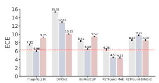  
CRC100K (Histopathology)

IDRiD (Retina)  
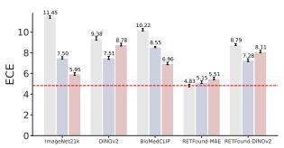  
APTOS2019 (Retina)

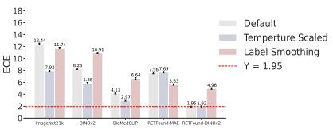  
TCGA (Histopathology)  
BraTS (Histopathology)

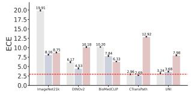  
RSNA (X-Rays)

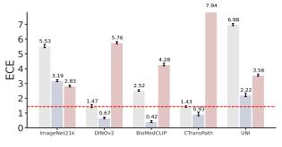  
POLCOVID (X-Rays)

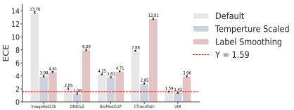

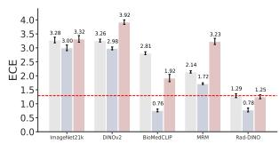

COVID-Rad (X-Rays)  
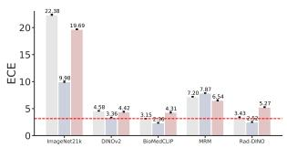

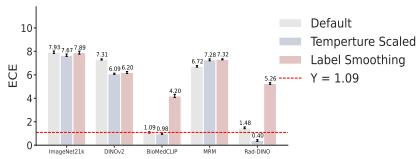  
Figure 2: Comparison of Default vs. Temperature Scaling vs. Label Smoothing Model: the red dot line indicates best performing default model. The plot shows that uncertainty raises from different pre-training sources and methods cannot be fully addressed by re-calibrating the model. Further evaluation with Brier Score and NLL are shown in Appendix Tables 1 to 3.

## 4 METHOD

Problem Setting The main objective of this study is to understand the impact of domain specific pre-training in uncertainty estimation for vision foundation models in medicine. This study mainly focus on disease classification and our experimental setups can be easily extended to other use-cases such as segmentation (Ma et al., 2024), or report generation (Quach et al., 2024), among others. Additionally, since this study focuses on evaluating the uncertainty of foundation models based on their pre-trained weights, we use linear probing as our primary evaluation protocol.

We focus on linear probing the foundation models, rather than full end-to-end finetuning for two reasons: only training the linear classification layer reduces the risk of over-fitting on the likelihood by cross-entropy loss, which is the known cause of overconfidence on model uncertainty (Wei et al., 2022; Wang et al., 2021). Further, recent released medical foundation models often restrict access to only the generated features, withholding model weights to prevent the privacy issue in medical data (Yang et al., 2024; GoogleHealth, 2024).

After model downstream training, we evaluate uncertainty with point-prediction metrics (ECE, BS, NLL — Section B) and region-prediction metrics (Empirical Coverage, Set Size) via Least Ambiguous set-valued Classifier (LAC) (Sadinle et al., 2016) and Regularized Adaptive Prediction Sets (RAPS) (Angelopoulos et al., 2021). We further show standard performance metrics (accuracy, balanced accuracy, AUROC, AUPRC) in Section G. Finally, we assess whether re-calibration techniques can resolve calibration gaps after a foundation model has been pre-training. The evaluation pipeline is shown in Figure 1, and further details are provided in Section B.

## 5 DATA AND MODELS

This study evaluates model uncertainty on three different widely used medical imaging modalities (Retina fundus imaging, Histopathology images (H&E), and Chest X-Rays). Within these modalities, we explore seven foundation models trained on different sources (four domain-specific foundation models and three general domain foundation models). We provide explanation on datasets and models in the following sections with detailed label naming and distribution for each dataset in Section A.

1st workshop of “Quantify Uncertainty and Hallucination in Foundation Models: The Next Frontier in Reliable AI" at ICLR'25

## 5.1 DATASETS

Retina (Jr2ngb, 2019) is a cataract and normal eye retina fundus image dataset for cataract detection with 4 labels of normal, glaucoma, cataract and retina disease.

IDRiD (Porwal et al., 2020) is a fundus retina dataset for diabetic retinopathy diagnosis. The labels for diabetic retinopathy are derived from the International Clinical Diabetic Retinopathy Severity Scale, which categorizes the condition into 5 stages, ranging from no diabetic retinopathy to proliferative diabetic retinopathy.

APTOS2019 (Karthik et al., 2019) is a dataset with retina images for blindness assessment with 5 grading of No, Mild, Moderate, Severe and Proliferative.

CRC100k (Kather et al., 2018) is a histological non-overlapping image patches dataset from hematoxylin & eosin (H&E) stained histological images of human colorectal cancer (CRC) and normal tissue. The tissue is separated to 9 sub-typing labels.

TCGA-Lymph (Balanis et al., 2019) is a histological images data of tumor-infiltrating lymphocyte maps for cancer sub-typing with total of 32 different labels.

BraTS-Path (Bakas et al., 2024) is histological images data of H&E-stained FFPE digitized tissue sections from The Cancer Imaging Archive's TCGA-GBM and TCGA-LGG collections. Tissue sections are re-classified using the latest WHO criteria, focusing on glioblastoma, where it contains in total 6 sub-typing labels. For BraTS-Path, we curated a subset containing 2,000 samples per label, since the full dataset's is large enough to achieve close to optimal model performance.

RSNA-Pneumonia (Stein et al., 2018) is a large scale chest X-Rays dataset on diagnosing pneumonia collected from National Institutes of Health. The goal is to distinguish normal vs. pneumonia for each X-Rays image.

POLCOVID (Suwalska et al., 2023) is a large, multi-center chest X-ray collection gathered from 15 Polish hospitals during 2020–2021. It contains 4809 images classified into COVID-19, other pneumonia, and normal cases, and provides not only the original and lung-focused preprocessed images but also corresponding lung masks— both model-generated and manually annotated.

COVID-Rad (Chowdhury et al., 2020; Rahman et al., 2021) is a large, multi-stage collection of chest X-ray images curated by an international team. The dataset includes images of COVID-19 positive cases, normal lungs, and various lung infections such as viral pneumonia and lung opacity from non-COVID causes.

## 5.2 MODELS

For fair comparison, all models are Vision Transformer Large (ViT-Large) (Dosovitskiy et al., 2021) with the difference being their pre-training data.

ImageNet21k pre-trained on ImageNet-21k (Deng et al., 2009) dataset with supervised learning to classify around 21k categories.

DINOv2 (Oquab et al., 2024) pre-trained on large-scale curated data set from Internet with 142 million images by self-supervised learning of distillation.

BioMedCLIP (Zhang et al., 2025) pre-trained on large scale 15 million biomedical image-text pairs collected from scientific articles by contrastive multi-modal learning (Radford et al., 2021).

RETFound (Zhou et al., 2023b) pre-trained on 1.6 million retinal images collected from various unannotated public dataset and Moorfields Eye Hospital, London, UK by self-supervised learning.

CTransPath (Wang et al., 2022) pre-trained on large-scale public available 15 million unlabeled histopathology imaging patches with contrastive self-supervised learning

UNI (Chen et al., 2024b) pre-trained on large scale and high-quality 100 million images from over 100,000 diagnostic H&E-stained WSIs histopathology images collected from Massachusett General Hospitals and Brigham and Women's Hospital, Boston, USA with distillation self-supervised learning

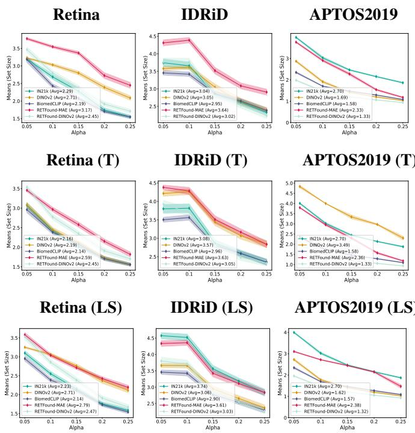  
Figure 3: Conformal prediction Set Size (Retina): the average conformal prediction Set Size across different α thresholds for retina data does not exhibit a clear trend based on point prediction uncertainty, pre-training source, or method.

1st workshop of “Quantify Uncertainty and Hallucination in Foundation Models: The Next Frontier in Reliable AI" at ICLR'25

MRM (Zhou et al., 2023a) pre-trained on MIMIC-CXR (Johnson et al., 2019) by learning to reconstruct both masked image patches from chest X-rays and masked tokens from associated radiology reports, effectively incorporating both invariant visual semantics and expert domain knowledge.

Rad-DINO (Pérez-García et al., 2025) challenges the current reliance on text supervision for training biomedical image encoders. Instead, it introduces RAD-DINO — an image encoder pretrained solely on large-scale, uni-modal Chest X-Rays imaging data collected from multiple public datasets with DINOv2 (Oquab et al., 2024) — which achieves comparable or superior performance to textsupervised models on tasks like classification, semantic segmentation, and report generation.

## 6 RESULT

## 6.1 POINT PREDICTION UNCERTAINTY

We present the result for point prediction with ECE with linear probing, linear probing follows by temperature scaling and linear probing follows by label smoothing on Figure 2. We further present the complete results for Brier Score and NLL in the Appendix (Tables 1 to 3). The observations for point prediction uncertainty experimental results are concluded as follows:

Higher Quality Domain-Specific Pre-training Reduce Uncertainty Across all datasets, domain-specific pre-training consistently show low uncertainty on ECE before re-calibration compared to other methods with few exceptions (e.g. UNI from TCGA, CTransPath for BraTS), where the discrepancy may come from mismatch on pre-training and downstream data distribution.

Re-calibrating Models Does Not Close the Uncertainty Gap Our results indicate that while uncertainty calibration techniques such as temperature scaling and label smoothing can reduce model uncertainty in certain cases, they do not consistently bridge the gap between models with inherently different levels of uncertainty. Specifically, models exhibiting higher uncertainty prior to calibration generally remain more uncertain after re-calibration, compared to models that originally had lower uncertainty. This underscores the importance of selecting an appropriate foundation model

1st workshop of “Quantify Uncertainty and Hallucination in Foundation Models: The Next Frontier in Reliable $\mathbf { A } \mathbf { I } ^ { \ \mathbf { \lessgtr } }$ at ICLR'25

CRC100K  
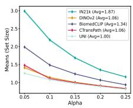  
CRC100K (T)

TCGA  
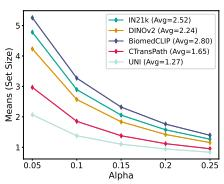  
TCGA (T)

BraTS  
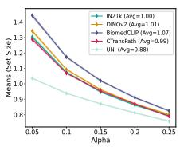  
BraTS (T)

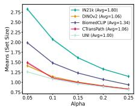  
CRC100K (LS)

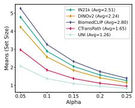  
TCGA (LS)

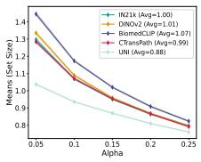

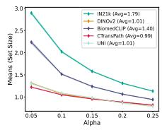

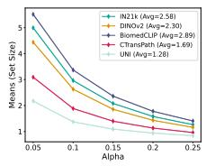

BraTS (LS)  
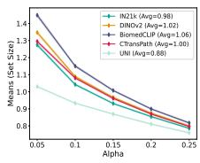  
Figure 4: Conformal prediction Set Size (Histopathology): the average conformal prediction Set Size across different α thresholds for histopathology data does not exhibit a clear trend based on point prediction uncertainty, pre-training source, or method. While UNI performs among the best (more accurate model), DINOv2 falls short on many datasets.

RSNA  
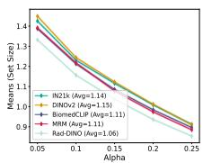  
RSNA (T)

POLCOVID  
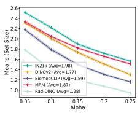  
POLCOVID (T)

COVID-Rad  
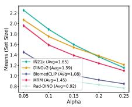  
COVID-Rad (T)

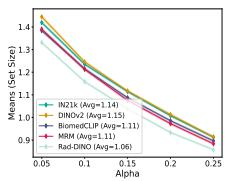  
RSNA (LS)

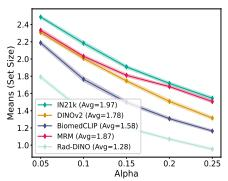

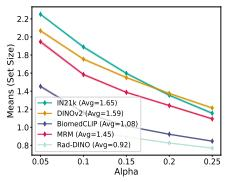  
POLCOVID (LS) COVID-Rad (LS)

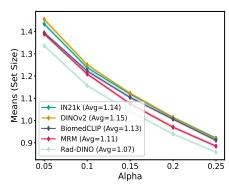

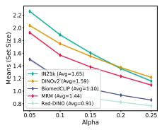  
Figure 5: Conformal prediction Set Size (X-Rays): the average conformal prediction Set Size across different α thresholds for MRI data does not exhibit a clear trend based on point prediction uncertainty, pre-training source, or method. RadImageNet generally shows smaller Set Size with more accurate model performance.

for domain-specific tasks, as post-hoc calibration and regularization techniques alone cannot fully compensate for suboptimal model choices in pre-training.

Supervised Pre-trained Models Present Higher Uncertainty Supervised pre-trained models, such as model trained on ImageNet21k generally exhibit higher uncertainty compared to models trained using self-supervised approaches. Previous study (Wang et al., 2021) has attributed this to the overconfidence introduced by updating model parameters with cross-entropy on overfitting specific specific task labels. However, the result shows that even when the backbone model remains entirely unchanged during linear probing for domain-specific tasks — such as adapting an ImageNet pre-trained model to Retin, Histopathology and X-Rays tasks — supervised pre-trained models still demonstrate high uncertainty. This increased uncertainty persists even when the downstream tasks differ significantly from the pre-training tasks.

## 6.2 REGION PREDICTION UNCERTAINTY

We present the result for region prediction with LAC (Algorithm 1) and report prediction set size with different α on Figures 3, 4 and 11. We further present the empirical coverage analysis in the Appendix Figures 9 to 11 to show that the algorithm is a valid (1 — α) conformal predictor in our experimental settings. We additionally show the same experimental settings with an alternative conformal prediction algorithm (RAPS by Angelopoulos et al. (2021)) in Section C to further verify our conclusion. The finding for region prediction uncertainty is concluded as follows:

Better Calibration Does Not Indicate Conformal Prediction Efficiency Better point prediction calibration after temperature scaling or label smoothing does not translate to more efficient conformal predictor (e.g. lower point prediction uncertainty after calibration does not decrease the prediction set size). This can also be seen from Algorithm 1 that even if a model is well-calibrated it can still assign similar (1 — α) conformal quantile threshold, hence not reducing the prediction set size.

Pre-trained Domain-Specific Models Lead to Smaller Conformal Prediction Set Domainspecific pre-training combined with self-supervised learning improves point prediction uncertainty — but this benefit doesn't always extend to conformal prediction. For example, while a foundation model pre-trained on retinal data still produces relatively large prediction sets, those trained on Histopathology and X-Rays consistently yield much smaller conformal prediction sets. Our experiments show that Histopathology and X-Rays foundation models (e.g., UNI and Rad-DINO) outperform other pre-trained models in large margin while retina foundation model (RETFound) only marginally improves performance in most cases, highlighting that domain-specific pre-training can lead to tighter region prediction under the case of high quality pre-training (see Section G).

## 7 CONCLUSION

This work investigates both point- and region-level uncertainty quantification in foundation models for medical image classification. Our findings demonstrate that leveraging domain-specific pretraining data in conjunction with self-supervised learning generally lead to reduced point and region prediction uncertainty. While calibration techniques such as temperature scaling and label smoothing can improve uncertainty calibration, they fall short in fully addressing the discrepancies in uncertainty across foundation models pre-trained on different data sources with appropriate methodologies.

Notably, the efficiency of conformal prediction cannot be directly inferred from point prediction uncertainty calibration. However, conformal prediction remains a robust framework for uncertainty quantification, offering formal coverage guarantees on prediction sets. This capability makes it remain an important tool for human-in-the-loop decision-making, providing interpretable and reliable measures of uncertainty that can enhance clinical workflows Jesse C. Cresswell & Vouitsis (2024).

We underscore the importance of a holistic approach to uncertainty quantification, where the selection of appropriate foundation models and the implementation of uncertainty-aware methods work in tandem to improve the reliability of medical AI systems. While domain-specific models often achieve superior accuracy, they do not trade the model performance with higher uncertainty. By combining careful model selection with rigorous uncertainty quantification techniques, we can foster greater trust in AI-driven medical decisions, ultimately supporting safer and more informed clinical practice.

1st workshop of “Quantify Uncertainty and Hallucination in Foundation Models: The Next Frontier in Reliable AI" at ICLR’25

## ACKNOWLEDGMENTS

H.H. and N.R. were supported by the National Institute On Aging of the National Institutes of Health under Award R01AG085617. H.H. received partial support from NSF Award 1922658. N.R. were also partially supported by the National Institute On Aging of the National Institutes of Health under Awards R01AG079175 and P30AG066512.

## REFERENCES

Anastasios N. Angelopoulos and Stephen Bates. A gentle introduction to conformal prediction and distribution-free uncertainty quantification. CoRR, abs/2107.07511, 2021. URL https: //arxiv.org/abs/2107.07511.

Anastasios Nikolas Angelopoulos, Stephen Bates, Michael Jordan, and Jitendra Malik. Uncertainty sets for image classifiers using conformal prediction. In International Conference on Learning Representations, 2021. URL https://openreview.net/forum?id=eNdiU\_DbM9.

Anastasios Nikolas Angelopoulos, Stephen Bates, Adam Fisch, Lihua Lei, and Tal Schuster. Conformal risk control. In The Twelfth International Conference on Learning Representations, 2024. URLhttps://openreview.net/forum?id=33XGfHLtZg.

Yu Bai, Song Mei, Huan Wang, and Caiming Xiong. Don't just blame over-parametrization for overconfidence: Theoretical analysis of calibration in binary classification. In Marina Meila and Tong Zhang (eds.), Proceedings of the 38th International Conference on Machine Learning, volume 139 of Proceedings of Machine Learning Research, pp. 566–576. PMLR, 18–24 Jul 2021. URL https://proceedings.mlr.press/v139/bai21c.html.

Spyridon Bakas, Siddhesh P. Thakur, Shahriar Faghani, Mana Moassefi, Ujjwal Baid, Verena Chung, Sarthak Pati, Shubham Innani, Bhakti Baheti, Jake Albrecht, Alexandros Karargyris, Hasan Kassem, MacLean P. Nasrallah, Jared T. Ahrendsen, Valeria Barresi, Maria A. Gubbiotti Giselle Y. López, Calixto-Hope G. Lucas, Michael L. Miller, Lee A. D. Cooper, Jason T. Huse, and William R. Bell. Brats-path challenge: Assessing heterogeneous histopathologic brain tumor sub-regions, 2024.

Nikolas G. Balanis, Katherine M. Sheu, Favour N. Esedebe, Saahil J. Patel, Bryan A. Smith, Jung Wook Park, Salwan Alhani, Brigitte N. Gomperts, Jiaoti Huang, Owen N. Witte, and Thomas G. Graeber. Pan-cancer convergence to a small-cell neuroendocrine phenotype that shares susceptibilities with hematological malignancies. Cancer Cell, 36(1):17–34.e7, 2019. ISSN 1535-6108. doi: https://doi.org/10.1016/j.ccell.2019.06.005. URL https : //www. sciencedirect.com/science/article/pii/S153561081930296X.

Glenn W. Brier. Verification of forecasts expressed in terms of probability. Monthly Weather Review, 78(1):1 – 3, 1950. doi: 10.1175/1520-0493(1950)078(0001:VOFEIT>2. 0.CO;2. URL https://journals.ametsoc.org/view/journals/mwre/78/1/ 1520-0493\_1950\_078\_0001\_vofeit\_2\_0\_co\_2.xml.

Richard J. Chen, Tong Ding, Ming Y. Lu, Drew F. K. Williamson, Guillaume Jaume, Andrew H. Song, Bowen Chen, Andrew Zhang, Daniel Shao, Muhammad Shaban, Mane Williams, Lukas Oldenburg, Luca L. Weishaupt, Judy J. Wang, Anurag Vaidya, Long Phi Le, Georg Gerber, Sharifa Sahai, Walt Williams, and Faisal Mahmood. Towards a general-purpose foundation model for computational pathology. Nature Medicine, 30(3):850–862, March 2024a. ISSN 1546- 170X.doi: 10.1038/s41591-024-02857-3. URL https://www.nature.com/articles/ s41591–024–02857–3. Publisher: Nature PublishingGroup.

Richard J Chen, Tong Ding, Ming Y Lu, Drew FK Williamson, Guillaume Jaume, Bowen Chen, Andrew Zhang, Daniel Shao, Andrew H Song, Muhammad Shaban, et al. Towards a generalpurpose foundation model for computational pathology. Nature Medicine, 2024b.

Muhammad E. H. Chowdhury, Tawsifur Rahman, Amith Khandakar, Rashid Mazhar, Muhammad Abdul Kadir, Zaid Bin Mahbub, Khandakar Reajul Islam, Muhammad Salman Khan, Atif Iqbal, Nasser Al Emadi, Mamun Bin Ibne Reaz, and Mohammad Tariqul Islam. Can ai help in screening viral and covid-19 pneumonia? IEEE Access, 8:132665–132676, 2020. doi: 10.1109/ACCESS.2020.3010287.

Noel C. F. Codella, Ying Jin, Shrey Jain, Yu Gu, Ho Hin Lee, Asma Ben Abacha, Alberto Santamaria-Pang, Will Guyman, Naiteek Sangani, Sheng Zhang, Hoifung Poon, Stephanie Hyland, Shruthi Bannur, Javier Alvarez-Valle, Xue Li, John Garrett, Alan McMillan, Gaurav Rajguru, Madhu Maddi, Nilesh Vijayrania, Rehaan Bhimai, Nick Mecklenburg, Rupal Jain, Daniel Holstein, Naveen Gaur, Vijay Aski, Jenq-Neng Hwang, Thomas Lin, Ivan Tarapov, Matthew Lungren, and Mu Wei. Medimageinsight: An open-source embedding model for general domain medical imaging, 2024.

Jia Deng, Wei Dong, Richard Socher, Li-Jia Li, Kai Li, and Li Fei-Fei. Imagenet: A large-scale hierarchical image database. In 2009 IEEE Conference on Computer Vision and Pattern Recognition, pp. 248–255, 2009. doi: 10.1109/CVPR.2009.5206848.

Zijian Dong, Li Ruilin, Yilei Wu, Thuan Tinh Nguyen, Joanna Su Xian Chong, Fang Ji, Nathanael Ren Jie Tong, Christopher Li Hsian Chen, and Juan Helen Zhou. Brain-JEPA: Brain dynamics foundation model with gradient positioning and spatiotemporal masking. In The Thirtyeighth Annual Conference on Neural Information Processing Systems, 2024. URL https : //openreview.net/forum?id=gtU2eLSAmO.

Alexey Dosovitskiy, Lucas Beyer, Alexander Kolesnikov, Dirk Weissenborn, Xiaohua Zhai, Thomas Unterthiner, Mostafa Dehghani, Matthias Minderer, Georg Heigold, Sylvain Gelly, Jakob Uszkoreit, and Neil Houlsby. An image is worth 16x16 words: Transformers for image recognition at scale. ICLR, 2021.

Yarin Gal and Zoubin Ghahramani. Dropout as a bayesian approximation: Representing model uncertainty in deep learning. In Maria Florina Balcan and Kilian Q. Weinberger (eds.), Proceedings of The 33rd International Conference on Machine Learning, volume 48 of Proceedings of Machine Learning Research, pp. 1050–1059, New York, New York, USA, 20–22 Jun 2016. PMLR. URLhttps://proceedings.mlr.press/v48/gal16.html.

GoogleHealth. Imaging research, 2024. URL https://github.com/Google-Health/ imaging-research/tree/master. GitHub repository, archived at Zenodo.

Chuan Guo, Geoff Pleiss, Yu Sun, and Kilian Q. Weinberger. On calibration of modern neural networks. In Doina Precup and Yee Whye Teh (eds.), Proceedings of the 34th International Conference on Machine Learning, volume 70 of Proceedings of Machine Learning Research, pp. 1321-1330. PMLR, 06–11 Aug 2017. URL https://proceedings.mlr.press/v70/ guo17a.html.

Dan Hendrycks, Kimin Lee, and Mantas Mazeika. Using pre-training can improve model robustness and uncertainty. In Kamalika Chaudhuri and Ruslan Salakhutdinov (eds.), Proceedings of the 36th International Conference on Machine Learning, volume 97 of Proceedings of Machine Learning Research, pp. 2712–2721. PMLR, 09–15 Jun 2019. URL https://proceedings.mlr. press/v97/hendrycks19a.html.

Zhi Huang, Federico Bianchi, Mert Yuksekgonul, Thomas J. Montine, and James Zou. A visual-language foundation model for pathology image analysis using medical Twitter. Nature Medicine, 29(9):2307–2316, September 2023. ISSN 1546-170X. doi: 10.1038/s41591-023-02504-3. URL https://www.nature.com/articles/ s41591–023-02504-3. Publisher: Nature PublishingGroup.

Bhargava Kumar Jesse C. Cresswell, Yi Sui and Noël Vouitsis. Conformal prediction sets improve human decision making. In International Conference on Machine Learning, 2024.

Alistair EW Johnson, Tom J Pollard, Seth J Berkowitz, Nathaniel R Greenbaum, Matthew P Lungren, Chih-ying Deng, Roger G Mark, and Steven Horng. Mimic-cxr, a de-identified publicly available database of chest radiographs with free-text reports. Scientific data, 2019.

Jr2ngb. Cataract dataset. https://www.kaggle.com/datasets/jr2ngb/ cataractdataset,2019.

Karthik, Maggie, and Sohier Dane. Aptos 2019 blindness detection. https : //www . kaggle. com/competitions/aptos2019-blindness-detection,2019.

Jakob Nikolas Kather, Niels Halama, and Alexander Marx. 100,000 histological images of human colorectal cancer and healthy tissue, May 2018. URL https : //doi.org/10.5281/ zenodo.1214456.

Balaji Lakshminarayanan, Alexander Pritzel, and Charles Blundell. Simple and scalable predictive uncertainty estimation using deep ensembles. In Proceedings of the 31st International Conference on Neural Information Processing Systems, NIPS’17, pp. 6405–6416, Red Hook, NY, USA, 2017. Curran Associates Inc. ISBN 9781510860964.

Charles Lu, Anastasios N. Angelopoulos, and Stuart Pomerantz. Improving trustworthiness of ai disease severity rating in medical imaging with ordinal conformal prediction sets. In Medical Image Computing and Computer Assisted Intervention – MICCAI 2022: 25th International Conference, Singapore, September 18–22, 2022, Proceedings, Part VIII, pp. 545–554, Berlin, Heidelberg 2022. Springer-Verlag. ISBN 978-3-031-16451-4. doi: 10.1007/978-3-031-16452-1\_52. URL https://doi.org/10.1007/978-3-031-16452-1\_52.

Jun Ma, Yuting He, Feifei Li, Lin Han, Chenyu You, and Bo Wang. Segment anything in medical images. Nature Communications, 15:654, 2024.

Matthias Minderer, Josip Djolonga, Rob Romijnders, Frances Ann Hubis, Xiaohua Zhai, Neil Houlsby, Dustin Tran, and Mario Lucic. Revisiting the calibration of modern neural networks. In A. Beygelzimer, Y. Dauphin, P. Liang, and J. Wortman Vaughan (eds.), Advances in Neural Information Processing Systems, 2021. URL https : //openreview. net/forum?id= QRBvLayFXI.

Rafael Müller, Simon Kornblith, and Geoffrey E Hinton. When does label smoothing help? In H. Wallach, H. Larochelle, A. Beygelzimer, F. d'Alché-Buc, E. Fox, and R. Garnett (eds.), Advances in Neural Information Processing Systems, volume 32. Curran Associates, Inc., 2019. URL https://proceedings.neurips.cc/paper\_files/paper/2019/ file/f1748d6b0fd9d439f71450117eba2725-Paper.pdf.

Mahdi Pakdaman Naeini, Gregory F. Cooper, and Milos Hauskrecht. Obtaining well calibrated probabilities using bayesian binning. In Proceedings of the Twenty-Ninth AAAI Conference on Artificial Intelligence, AAAI'15, pp. 2901–2907. AAAI Press, 2015. ISBN 0262511290.

Maxime Oquab, Timothée Darcet, Théo Moutakanni, Huy V. Vo, Marc Szafraniec, Vasil Khalidov, Pierre Fernandez, Daniel HAZIZA, Francisco Massa, Alaaeldin El-Nouby, Mido Assran, Nicolas Ballas, Wojciech Galuba, Russell Howes, Po-Yao Huang, Shang-Wen Li, Ishan Misra, Michael Rabbat, Vasu Sharma, Gabriel Synnaeve, Hu Xu, Herve Jegou, Julien Mairal, Patrick Labatut, Armand Joulin, and Piotr Bojanowski. DINOv2: Learning robust visual features without supervision. Transactions on Machine Learning Research, 2024. ISSN 2835-8856. URL https://openreview.net/forum?id=a68SUt6zFt.

Gabriel Pereyra, George Tucker, Jan Chorowski, Lukasz Kaiser, and Geoffrey Hinton. Regularizing neural networks by penalizing confident output distributions, 2017. URL https : //openreview.net/forum?id=HkCjNI5ex.

Fernando Pérez-García, Harshita Sharma, Sam Bond-Taylor, Kenza Bouzid, Valentina Salvatelli, Maximilian Ilse, Shruthi Bannur, Daniel C. Castro, Anton Schwaighofer, Matthew P. Lungren, Maria Teodora Wetscherek, Noel Codella, Stephanie L. Hyland, Javier Alvarez-Valle, and Ozan Oktay. Exploring scalable medical image encoders beyond text supervision. Nature Machine Intelligence, 7(1):119–130, Jan 2025. ISSN 2522-5839. doi: 10.1038/s42256-024-00965-w. URLhttps://doi.org/10.1038/s42256-024-00965-w.

Prasanna Porwal, Samiksha Pachade, Manesh Kokare, Girish Deshmukh, Jaemin Son, Woong Bae, Lihong Liu, Jianzong Wang, Xinhui Liu, Liangxin Gao, TianBo Wu, Jing Xiao, Fengyan Wang, Baocai Yin, Yunzhi Wang, Gopichandh Danala, Linsheng He, Yoon Ho Choi, Yeong Chan Lee, Sang-Hyuk Jung, Zhongyu Li, Xiaodan Sui, Junyan Wu, Xiaolong Li, Ting Zhou, Janos Toth, Agnes Baran, Avinash Kori, Sai Saketh Chennamsetty, Mohammed Safwan, Varghese Alex, Xingzheng Lyu, Li Cheng, Qinhao Chu, Pengcheng Li, Xin Ji, Sanyuan Zhang, Yaxin Shen, Ling Dai, Oindrila Saha, Rachana Sathish, Tânia Melo, Teresa Araújo, Balazs Harangi, Bin Sheng, Ruogu Fang, Debdoot Sheet, Andras Hajdu, Yuanjie Zheng, Ana Maria Mendonça, Shaoting

Zhang, Aurélio Campilho, Bin Zheng, Dinggang Shen, Luca Giancardo, Gwenolé Quellec, and Fabrice Mériaudeau. Idrid: Diabetic retinopathy – segmentation and grading challenge. Medical Image Analysis, 59:101561, 2020. ISSN 1361-8415. doi: https://doi.org/10.1016/j.media. 2019.101561. URL https://www.sciencedirect.com/science/article/pii/ S1361841519301033.

Victor Quach, Adam Fisch, Tal Schuster, Adam Yala, Jae Ho Sohn, Tommi S. Jaakkola, and Regina Barzilay. Conformal language modeling. In The Twelfth International Conference on Learning Representations, 2024. URL https://openreview.net/forum?id=pzUhfQ74c5.

Alec Radford, Jong Wook Kim, Chris Hallacy, Aditya Ramesh, Gabriel Goh, Sandhini Agarwal, Girish Sastry, Amanda Askell, Pamela Mishkin, Jack Clark, Gretchen Krueger, and Ilya Sutskever. Learning transferable visual models from natural language supervision, 2021. URL https://arxiv.org/abs/2103.00020.

Tawsifur Rahman, Amith Khandakar, Yazan Qiblawey, Anas Tahir, Serkan Kiranyaz, Saad Bin Abul Kashem, Mohammad Tariqul Islam, Somaya Al Maadeed, Susu M. Zughaier, Muhammad Salman Khan, and Muhammad E.H. Chowdhury. Exploring the effect of image enhancement techniques on covid-19 detection using chest x-ray images. Computers in Biology and Medicine, 132:104319 2021. ISSN 0010-4825. doi: https://doi.org/10.1016/j.compbiomed.2021.104319. URL https : //www.sciencedirect.com/science/article/pii/S001048252100113X.

Mauricio Sadinle, Jing Lei, and Larry A. Wasserman. Least ambiguous set-valued classifiers with bounded error levels. Journal of the American Statistical Association, 114:223 – 234, 2016. URL https://api.semanticscholar.org/CorpusID:622583.

Glenn Shafer and Vladimir Vovk. A tutorial on conformal prediction. Journal of Machine Learning Research, 9(12):371–421, 2008. URL http://jmlr.org/papers/v9/shafer08a. html.

Anouk Stein, Carol Wu, Chris Carr, George Shih, Jamie Dulkowski, kalpathy, Leon Chen, Luciano Prevedello, Marc Kohli, Mark McDonald, Peter, Phil Culliton, Safwan Halabi, and Tian Xia. Rsna pneumonia detection challenge. https://kaggle.com/competitions/ rsna-pneumonia-detection-challenge,2018.

Aleksandra Suwalska, Joanna Tobiasz, Wojciech Prazuch, Marek Socha, Pawel Foszner, Damian Piotrowski, Katarzyna Gruszczynska, Magdalena Sliwinska, Jerzy Walecki, Tadeusz Popiela, Grzegorz Przybylski, Mateusz Nowak, Piotr Fiedor, Malgorzata Pawlowska, Robert Flisiak, Krzysztof Simon, Gabriela Zapolska, Barbara Gizycka, Edyta Szurowska, Agnieszka Oronowicz-Jaskowiak, Bogumil Golebiewski, Mateusz Rataj, Przemyslaw Chmielarz, Adrianna Tur, Grzegorz Drabik, Justyna Kozub, Anna Kozanecka, Sebastian Hildebrandt, Katarzyna Krutul-Walenciej, Jan Baron, Jerzy Jaroszewicz, Piotr Wasilewski, Samuel Mazur, Krzysztof Klaude, Katarzyna Rataj, Piotr Rabiko, Pawel Rajewski, Piotr Blewaska, Katarzyna Sznajder, Robert Plesniak, Michal Marczyk, Andrzej Cieszanowski, Joanna Polanska, and for the POLCOVID Study Group. Polcovid: a multicenter multiclass chest x-ray database (poland, 2020–2021). Scientific Data, 10(1):348, Jun 2023. ISSN 2052-4463. doi: 10.1038/s41597-023-02229-5. URL https://doi.org/10.1038/s41597-023-02229-5.

Eugene Vorontsov, Alican Bozkurt, Adam Casson, George Shaikovski, Michal Zelechowski, Kristen Severson, Eric Zimmermann, James Hall, Neil Tenenholtz, Nicolo Fusi, Ellen Yang, Philippe Mathieu, Alexander van Eck, Donghun Lee, Julian Viret, Eric Robert, Yi Kan Wang, Jeremy D. Kunz, Matthew C. H. Lee, Jan H. Bernhard, Ran A. Godrich, Gerard Oakley, Ewan Millar, Matthew Hanna, Hannah Wen, Juan A. Retamero, William A. Moye, Razik Yousfi, Christopher Kanan, David S. Klimstra, Brandon Rothrock, Siqi Liu, and Thomas J. Fuchs. A foundation model for clinical-grade computational pathology and rare cancers detection. Nature Medicine, 30(10):2924–2935, Oct 2024. ISSN 1546-170X. doi: 10.1038/s41591-024-03141-0. URL https://doi.org/10.1038/s41591-024-03141-0.

Vladimir Vovk, Alex Gammerman, and Glenn Shafer. Algorithmic Learning in a Random World. 01 2005. doi: 10.1007/b106715.

1st workshop of “Quantify Uncertainty and Hallucination in Foundation Models: The Next Frontier in Reliable AI" at ICLR'25

Deng-Bao Wang, Lei Feng, and Min-Ling Zhang. Rethinking calibration of deep neural networks: Do not be afraid of overconfidence. In A. Beygelzimer, Y. Dauphin, P. Liang, and J. Wortman Vaughan (eds.), Advances in Neural Information Processing Systems, 2021. URL https : // openreview.net/forum?id=NJS8kp15zzH

Xiyue Wang, Sen Yang, Jun Zhang, Minghui Wang, Jing Zhang, Wei Yang, Junzhou Huang, and Xiao Han. Transformer-based unsupervised contrastive learning for histopathological image classification. Medical Image Analysis, 81:102559, 2022. ISSN 1361-8415. doi: https://doi.org/10.1016/j.media.2022.102559. URL https://www.sciencedirect.com/ science/article/pii/S1361841522002043.

Xiyue Wang, Junhan Zhao, Eliana Marostica, Wei Yuan, Jietian Jin, Jiayu Zhang, Ruijiang Li, Hongping Tang, Kanran Wang, Yu Li, Fang Wang, Yulong Peng, Junyou Zhu, Jing Zhang, Christopher R. Jackson, Jun Zhang, Deborah Dillon, Nancy U. Lin, Lynette Sholl, Thomas Denize, David Meredith, Keith L. Ligon, Sabina Signoretti, Shuji Ogino, Jeffrey A. Golden, MacLean P. Nasrallah, Xiao Han, Sen Yang, and Kun-Hsing Yu. A pathology foundation model for cancer diagnosis and prognosis prediction. Nature, 634(8035):970–978, October 2024. ISSN 1476- 4687. doi: 10.1038/s41586-024-07894-z. URL https://www.nature.com/articles/ s41586–024–07894-z. Publisher: Nature Publishing Group.

Hongxin Wei, Renchunzi Xie, Hao Cheng, Lei Feng, Bo An, and Yixuan Li. Mitigating neural network overconfidence with logit normalization. 2022.

Lin Yang, Shawn Xu, Andrew Sellergren, Timo Kohlberger, Yuchen Zhou, Ira Ktena, Atilla Kiraly, Faruk Ahmed, Farhad Hormozdiari, Tiam Jaroensri, Eric Wang, Ellery Wulczyn, Fayaz Jamil, Theo Guidroz, Chuck Lau, Siyuan Qiao, Yun Liu, Akshay Goel, Kendall Park, Arnav Agharwal, Nick George, Yang Wang, Ryutaro Tanno, David G. T. Barrett, Wei-Hung Weng, S. Sara Mahdavi, Khaled Saab, Tao Tu, Sreenivasa Raju Kalidindi, Mozziyar Etemadi, Jorge Cuadros, Gregory Sorensen, Yossi Matias, Katherine Chou, Greg Corrado, Joelle Barral, Shravya Shetty, David Fleet, S. M. Ali Eslami, Daniel Tse, Shruthi Prabhakara, Cory McLean, Dave Steiner, Rory Pilgrim, Christopher Kelly, Shekoofeh Azizi, and Daniel Golden. Advancing multimodal medical capabilities ofgemini, 2024.URL https://arxiv.org/abs/2405.03162.

Sheng Zhang, Yanbo Xu, Naoto Usuyama, Hanwen Xu, Jaspreet Bagga, Robert Tinn, Sam Preston, Rajesh Rao, Mu Wei, Naveen Valluri, Cliff Wong, Andrea Tupini, Yu Wang, Matt Mazzola, Swadheen Shukla, Lars Liden, Jianfeng Gao, Angela Crabtree, Brian Piening, Carlo Bifulco, Matthew P. Lungren, Tristan Naumann, Sheng Wang, and Hoifung Poon. A multimodal biomedical foundation model trained from fifteen million image–text pairs. NEJM AI, 2(1):AIoa2400640, 2025. doi:10.1056/AIoa2400640. URL https://ai.nejm.org/doi/ful1/10.1056/ AIoa2400640.

Hong-Yu Zhou, Chenyu Lian, Liansheng Wang, and Yizhou Yu. Advancing radiograph representation learning with masked record modeling. In The Eleventh International Conference on Learning Representations, 2023a. URL https://openreview.net/forum?id= w-x7U26GM7j.

Yukun Zhou, Mark A Chia, Siegfried K Wagner, Murat S Ayhan, Dominic J Williamson, Robbert R Struyven, Timing Liu, Moucheng Xu, Mateo G Lozano, Peter Woodward-Court, et al. A foundation model for generalizable disease detection from retinal images. Nature, 622(7981):156–163, 2023b.

## A DATASET

The present the detailed label distribution for train set of each dataset below:

Retina: Normal (N = 168), Glaucoma (N = 56), Cataract (N = 56), Retina disease (N = 56)

IDRiD: No (N = 107), Mild (N = 16), Moderate (N = 108), Severe (N = 59), Proliferative (N = 39) APTOS2019: No (N = 1805, Mild (N = 370), Moderate (N = 1039), Severe (N = 193), Proliferative (N = 295)

CRC100K: Adipose (N = 10407), Background (N = 10566), Debris (N = 11512), Lymphocytes (N = 11557), Mucus (N = 8896), Smooth muscle (N = 13536), Normal colon mucosa (N = 8763), Cancer-associated stroma (N = 10446), Colorectal adenocarcinoma epithelium (N = 14317)

TCGA-Lymph: Adrenocortical carcinoma (N = 24290), Bladder Urothelial Carcinoma (N = 48790), Brain Lower Grade Glioma (N = 111990), Breast invasive carcinoma (N = 111550), Cervical squamous cell carcinoma and endocervical adenocarcinoma (N = 29930), Cholangiocarcinoma (N = 3780), Colon adenocarcinoma (N = 41360), Esophageal carcinoma (N = 15840), Glioblastoma multiforme (N = 109520), Head and Neck squamous cell carcinoma (N = 56130), Kidney Chromophobe (N = 12420), Kidney renal clear cell carcinoma (N = 57560), Kidney renal papillary cell carcinoma (N = 32490), Liver hepatocellular carcinoma (N = 38280), Lung adenocarcinoma (N = 76210), Lung squamous cell carcinoma (N = 78380), Lymphoid Neoplasm Diffuse Large B-cell Lymphoma $( \mathbf { N } =$ 3390), Mesothelioma (N = 10830), Ovarian serous cystadenocarcinoma (N = 12380), Pancreatic adenocarcinoma (N = 20220), Pheochromocytoma and Paraganglioma (N = 6620), Prostate adenocarcinoma (N = 45120), Rectum adenocarcinoma (N = 8050), Sarcoma (N = 61310), Skin Cutaneous Melanoma (N = 46090), Stomach adenocarcinoma (N = 47010), Testicular Germ Cell Tumors (N = 27890), Thymoma (N = 16860), Thyroid carcinoma (N = 54470), Uterine Carcinosarcoma (N = 10050), Uterine Corpus Endometrial Carcinoma (N = 58800), Uveal Melanoma (N = 8200)

BraTS-Path: Cellular tumor (N = 2000), Pseudopalisading necrosis (N = 2000), Areas abundant in microvascular proliferation (N = 2000), Geographic necrosis (N =2 000), Infiltration into the cortex (N = 2000), Penetration into white matter (N = 2000)

RSNA-Pneumonia: Normal (N = 20672), Pneumonia (N = 6012)

POLCOVID: Normal (N = 2426), Covid (N = 1236), Pneumonia (N = 1147)

COVID-Rad: Normal (N = 10192), Covid (N = 3616), Viral Pneumonia (N = 1345), Lung Opacity (N = 6012)

## B METRICS AND ALGORITHMS

Expected Calibration Error (ECE) Given the notion that mis-calibration is defined as the difference in expectation between model confidence and accurcay for point prediction, ECE approximates the expectation by partitioning the predictions into M bins baesed on their predicted probabilities and then aggregating the discrepancies with each bin. Given a set of prediction $\{ ( \hat { p } _ { i } , y _ { i } ) \bar { \} _ { i = 1 } ^ { n } }$ , where $\hat { p } _ { i } \in [ 0 , 1 ]$ is the predicted probability of positive label and $y _ { i } \in \{ 0 , 1 \}$ is the true label, ECE is formally defined as

$$
E C E = \sum _ { m = 1 } ^ { M } \frac { | B _ { m } | } { n } | \mathrm { a c c } ( B _ { m } ) - \mathrm { c o n f } ( B _ { m } ) |\tag{4}
$$

where $B _ { m }$ is the number of instances in bin $m ,$ n is the total number of instances, $\operatorname { a c c } ( B _ { m } ) =$ $\frac { 1 } { | B _ { m } | } \sum _ { i \in B _ { m } } y _ { i }$ is the accuracy in bin $m ,$ conf $\begin{array} { r } { \dot { \ } ( B _ { m } ) \ = \ \frac { 1 } { B _ { m } } \sum _ { i \in B _ { m } } \hat { p } _ { i } } \end{array}$ is the average predicted confidence in bin m.

While ECE provides a direct measure of model calibration, it suffers from sensitivity of bin sizes choice and loss of information within bins by aggregating discrepancies within each bin.

Brier Score (BS) Brier Score measures the mean squared difference between predicted probabilities and the actual outcomes. It is commonly used for evaluating model uncertainty and sharpness

1st workshop of “Quantify Uncertainty and Hallucination in Foundation Models: The Next Frontier in Reliable $\mathbf { A } \mathbf { I } ^ { \ \mathbf { \lessgtr } }$ at ICLR'25

of probabilistic predictions. Given the set of predictions $\{ \hat { p } _ { i } , y _ { i } \} _ { i = 1 } ^ { n }$ with same definition as before, BS is defined as

$$
B S = \frac { 1 } { n } \sum _ { i = 1 } ^ { n } ( \hat { p } _ { i } - y _ { i } ) ^ { 2 }\tag{5}
$$

While Brier Score can provide measure on both calibration and refinement, it also makes it less suitable for scenario where calibration and refinement evaluation need to be separated.

Negative Log-Likelihood (NLL) Negative Log-Likelihood accesses the probability assigned to the true class labels, where it penalizes incorrect and uncertain predictions more severely than correct and confidence ones. Given the set of predictions $\{ \hat { p } _ { i } , y _ { i } \} _ { i = 1 } ^ { n }$ with same definition as before, NLL is defined as

$$
N L L = - \frac { 1 } { n } \sum _ { i = 1 } ^ { n } ( y _ { i } \log ( \hat { p } _ { i } ) + ( 1 - y _ { i } ) \log ( 1 - \hat { p } _ { i } ) )\tag{6}
$$

While NLL directly measure the likelihood of the true labels with predicted probability distribution, probing a direct probabilistic assessment, it focus on penalizing the confident errors, which may cause misleading calibration if the model is mis-specified or probabilities are misaligned.

Temperature Scaling Temperature Scaling Guo et al. (2017) smooth the model probability distribution by dividing model logits output with a single scalar parameter $T .$ Given calibrated probabilities $\mathbf { p } = \left( p _ { 1 } , . . . , p _ { K } \right)$ and logits output ${ \bf z } = ( z _ { 1 } , . . . , z _ { K } )$ , the calibrated probability for each class can be represented as

$$
p _ { i } = \frac { \exp \bigl ( \frac { z _ { i } } { T } \bigr ) } { \sum _ { j = 1 } ^ { K } \exp \bigl ( \frac { z _ { j } } { T } \bigr ) } , \quad \forall i = 1 , . . . , K\tag{7}
$$

While temperature is a post-hoc calibration method that is simple and with small computation overhead, it heavily relies on the choice of $T$ to achieve correct calibration with T to be chosen from a held-out validation set by minimizing some evaluation metric (e.g. Negative Log-Likelihood). This can cause mis-calibration when the validation set does not well represent the data distribution of test set.

In this study, a separate held-out set is created for each dataset and the optimal temperatures are computed by minimizing Negative Log-Likelihood on this held-out set.

Label Smoothing Label smoothing Müller et al. (2019) modifies the target class distribution to be a mixture of the one-hot encoded vector and a uniform distribution. Specifically, the modified target after label smoothing become

$$
y _ { j } ^ { \prime } = { \left\{ \begin{array} { l l } { 1 - \epsilon + { \frac { \epsilon } { K } } } & { { \mathrm { i f ~ } } j = k } \\ { { \frac { \epsilon } { K } } } & { { \mathrm { o t h e r w i s e } } } \end{array} \right. }\tag{8}
$$

for a specified smoothing parameter $\epsilon \in [ 0 , 1 ] ,$ , number of classes $K$ and class index $j .$

Label smoothing is equivalent to introduce a regularization term that encourage the model to distribute probability mass evenly across classes, where

$$
\mathcal { L } = - \sum _ { j = 1 } ^ { K } y _ { j } ^ { \prime } \log p _ { j } = \mathcal { L } _ { C E } + \epsilon \mathbb { E } _ { \mathbf { u } } [ - \log p _ { j } ]\tag{9}
$$

for uniform distribution u with $\begin{array} { r } { u _ { j } = \frac { 1 } { K } } \end{array}$ . We clarify the derivation of this conclusion in Section H.

While label smoothing can be a simple method to mitigate model over-confidence, it is sensible to the choice of penalty term, where a poor choice of penalty term can lead to under-confidence. Additionally, as a regularization method, label smoothing requires model re-training, which introduces additional computational overhead.

In this study, different $\epsilon = \{ 0 . 0 5 , 0 . 1 0 , 0 . 1 5 , 0 . 2 0 \}$ values are experimented on each dataset and the optimal € is chosen for the result.

1st workshop of “Quantify Uncertainty and Hallucination in Foundation Models: The Next Frontier in Reliable $\mathbf { A } \mathbf { I } ^ { \ \mathbf { \lessgtr } }$ at ICLR’25

Least Ambiguous set-valued Classifier (LAC) LAC (shown in Algorithm 1) is a recent conformal prediction algorithm (Sadinle et al., 2016) that is proven to minimize the average set size with accurate input probabilities and ensures small sets even when probabilities are only approximately correct. The algorithm detail is provided in Section D

In this study, as an image classification task, the conformal score is designed as 1-softmax(logits) for true class of model logits output.

Regularized Adaptive Prediction Sets (RAPS) RAPS (Angelopoulos et al., 2021) is a method for constructing conformal prediction sets that typically produces smaller sets (on average) than simpler approaches like top-k classification at the same coverage level. It does this by defining a score function that balances three components:

• Probability Mass of More Likely Labels: $\begin{array} { r } { \rho _ { x } ( y ) = \sum _ { y ^ { \prime } } f ( x ) _ { y ^ { \prime } } \mathbb { 1 } [ f ( x ) _ { y ^ { \prime } } > f ( x ) _ { y } ] } \end{array}$ which is how much probability mass is assigned to labels more likely than y.

• Randomly Weighted Probability of the Candidate Label $u f ( x )$ for $u \sim U n i f o r m ( 0 , 1 )$ which helps break ties among labels that have similar probabilities.

• Set Size Regularizer: $\lambda ( o _ { x } ( y ) - k _ { r e g } ) _ { - }$ where $o _ { x } ( y )$ is the ranking of $y$ by its (softmax) score, $k _ { r e g }$ is a desired baseline for how many labels to include, and λ controls the penalization for exceeding the baseline.

given $f ( x )$ represents model probability output for ground truth label $y .$ We follow the original paper to choose optimal $k _ { r e g }$ and λ.

## C CONFORMAL PREDICTION SET SIZE AND COVERAGE WITH RAPS

We additionally present result for conformal prediction set size and coverage for RAPS (Angelopoulos et al., 2021) in Figures 6 to 8 and 12 to 14, where the experimental result coincides with main conclusion from the result of LACS.

1st workshop of “Quantify Uncertainty and Hallucination in Foundation Models: The Next Frontier in Reliable $\mathbf { A } \mathbf { I } ^ { \ \mathbf { \lessgtr } }$ at ICLR'25

Retina  
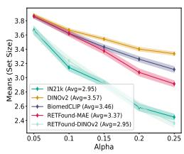  
Retina (T)

IDRiD  
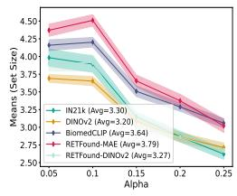  
IDRiD (T)

APTOS2019  
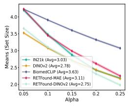  
APTOS2019 (T)

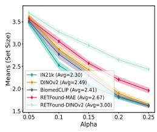  
Retina (LS)

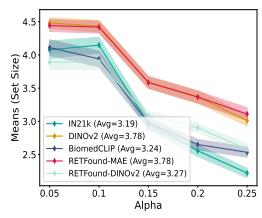  
IDRiD (LS)

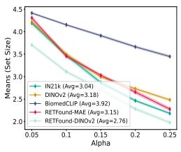  
APTOS2019 (LS)

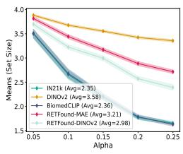

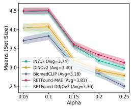

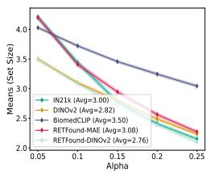  
Figure 6: Conformal prediction Set Size - RAPS (Retina)

CRC100K  
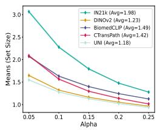  
CRC100K (T)

TCGA  
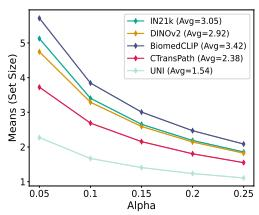  
TCGA (T)

BraTS  
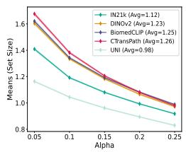  
BraTS (T)

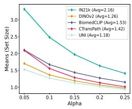  
CRC100K (LS)

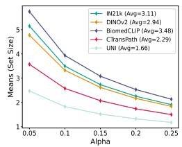  
TCGA (LS)

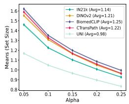

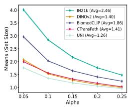

BraTS (LS)  
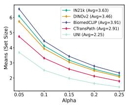

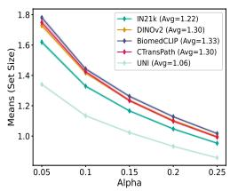  
Figure 7: Conformal prediction Set Size - RAPS (Histopathology)

1st workshop of “Quantify Uncertainty and Hallucination in Foundation Models: The Next Frontier in Reliable $\mathbf { A } \mathbf { I } ^ { \ \mathbf { \lessgtr } }$ at ICLR'25

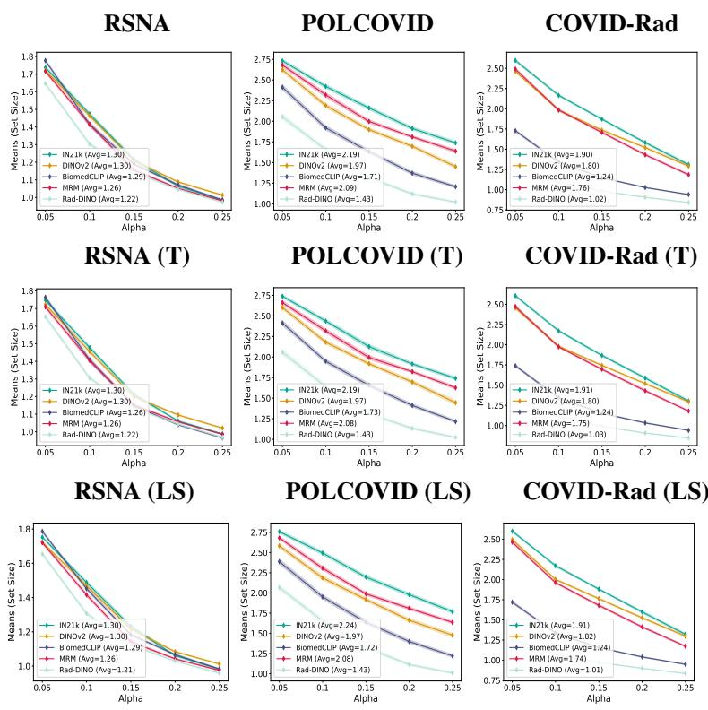  
Figure 8: Conformal prediction Set Size - RAPS (X-Rays)

## D LEAST AMBIGUOUS SET-VALUED CLASSIFIERS

Algorithm 1 Conformal Prediction for Classification (LAC)   
Require: model function $f ( x ) _ { y }$ that generate class probability output, conformal score function   
$s ( x , y )$ , significance level $\alpha ,$ calibration examples $\left\{ ( x _ { 1 } , y _ { 1 } ) , . . . , ( x _ { n - 1 } , y _ { n - 1 } ) \right\}$ , new example   
$x _ { n }$   
Ensure: construct conformal prediction set $C _ { \hat { q } } ( x ) = \{ y : s ( x , y ) \leq \hat { q } \}$ , where $\hat { q }$ is a conformal   
quantile threshold   
1: Compute conformal scores $s _ { i } = s ( x _ { i } , y _ { i } )$ on calibration dataset $\{ x _ { i } , y _ { i } \} _ { i = 1 } ^ { n - 1 }$   
2: Compute $q _ { l e v e l }$ as $\underline { { \lceil ( n + 1 ) ( 1 - \alpha ) \rceil } }$   
n   
3: Compute $\hat { q }$ as $q _ { l e v e l }$ quantile of the calibration scores $s _ { 1 } , . . . , s _ { n }$   
4: Compute conformal prediction set for the new example as $C _ { \hat { q } } ( x _ { n } ) = \{ y : s ( x _ { n } , y ) \leq \hat { q } \}$

The algorithm first compute some conformal score (nonconformity measure) s $( x , y )$ to quantify the difference between $x$ and $y$ in some separate calibration set $\{ x _ { i } , x _ { y } \} _ { i = 1 } ^ { n - 1 }$ to derive the threshold ${ \hat { q } } .$ Then, the confidence set is constructed in the way that including all classes $y$ whose scores $s ( x _ { n } , y )$ are not larger than $\hat { q }$ for a new sample $x _ { n }$ . This ensures that the probability of the true label not being in the set is controlled by $\alpha .$ Thus, this algorithm essentially matches the conformal prediction framework.

## E EMPIRICAL COVERAGE

We show model empirical coverage in Figures 9 to 14, where the result shows that the conformal predictors can achieve at least $1 - \alpha$ coverage in all cases, indicating that they achieve expected coverage.

1st workshop of “Quantify Uncertainty and Hallucination in Foundation Models: The Next Frontier in Reliable $\mathbf { A } \mathbf { I } ^ { \ \mathbf { \lessgtr } }$ at ICLR’25

Retina  
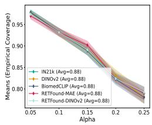  
Retina (T)

IDRiD  
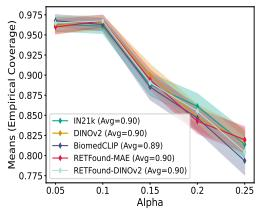  
IDRiD (T)

APTOS2019  
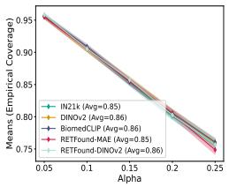  
APTOS2019 (T)

  
Retina (LS)

  
IDRiD (LS)

  
APTOS2019 (LS)

  
Figure 9: Conformal prediction Empirical Coverage (Retina)

CRC100K  

TCGA  

BraTS  
  
TCGA (T)  
BraTS (T)

CRC100K (T)  
  
CRC100K (LS)

  
TCGA (LS)

BraTS (LS)  

  
Figure 10: Conformal prediction Empirical Coverage (Histopathology)

1st workshop of “Quantify Uncertainty and Hallucination in Foundation Models: The Next Frontier in Reliable $\mathbf { A } \mathbf { I } ^ { \ \mathbf { \lessgtr } }$ at ICLR’25

RSNA  
  
RSNA (T)

POLCOVID  
  
POLCOVID (T)

COVID-Rad  
  
COVID-Rad (T)

  
RSNA (LS)

  
POLCOVID (LS)

  
COVID-Rad (LS)

  
Figure 11: Conformal prediction Empirical Coverage (X-Rays)

Retina  

IDRiD  
  
Retina (T)

APTOS2019  
  
IDRiD (T)  
APTOS2019 (T)

  
Retina (LS)

  
IDRiD (LS)

APTOS2019 (LS)  

  
Figure 12: Conformal prediction Empirical Coverage - RAPS (Retina)

1st workshop of “Quantify Uncertainty and Hallucination in Foundation Models: The Next Frontier in Reliable $\mathbf { A } \mathbf { I } ^ { \ \mathbf { \lessgtr } }$ at ICLR'25

CRC100K  
  
CRC100K (T)

TCGA  
  
TCGA (T)

BraTS  
  
BraTS (T)

  
CRC100K (LS)

  
TCGA (LS)

BraTS (LS)  

  
Figure 13: Conformal prediction Empirical Coverage - RAPS (Histopathology)

RSNA  
  
RSNA (T)

POLCOVID  
  
POLCOVID (T)

COVID-Rad  
  
COVID-Rad (T)

  
RSNA (LS)

  
POLCOVID (LS)

COVID-Rad (LS)  

  
Figure 14: Conformal prediction Empirical Coverage - RAPS (MRI)

## F POINT PREDICTION UNCERTAINTY RESULTS

We present complete point prediction uncertainty results in Tables 1 to 3, with ECE, Brier, and NLL. We show that model with better performance metrics (more accurate) is more likely have smaller conformal confidence set (T stands for temperature scaling and LS stands for label smoothing).

Table 1: Retina Datasets
<table><tr><td>Model</td><td>ECE↓</td><td>Brier ↓</td><td>NLL ↓</td></tr><tr><td colspan="4">Retina</td></tr><tr><td>ImageNet21k</td><td>7.52</td><td>0.53</td><td>0.97</td></tr><tr><td>DINOv2</td><td>15.38</td><td>0.58</td><td>1.09</td></tr><tr><td>BioMedCLIP</td><td>8.41</td><td>0.52</td><td>0.93</td></tr><tr><td>RETFound-MAE</td><td>4.38</td><td>0.67</td><td>1.26</td></tr><tr><td>RETFound-DINOv2</td><td>8.63</td><td>0.52</td><td>0.97</td></tr><tr><td colspan="4">Retina (T)</td></tr><tr><td>ImageNet21k</td><td>6.06</td><td></td><td>1.21</td></tr><tr><td>DINOv2</td><td>12.87</td><td>0.65 0.65</td><td>1.20</td></tr><tr><td>BioMedCLIP</td><td>6.50</td><td>0.65</td><td>1.20</td></tr><tr><td>RETFound-MAE</td><td>4.25</td><td>0.72</td><td>1.33</td></tr><tr><td>RETFound-DINOv2</td><td>9.79</td><td>0.52</td><td>0.96</td></tr><tr><td colspan="4">Retina (LS)</td></tr><tr><td>ImageNet21k</td><td>9.25</td><td>0.53</td><td>0.98</td></tr><tr><td>DINOv2</td><td>10.15</td><td>0.58</td><td>1.09</td></tr><tr><td>BioMedCLIP</td><td>9.52</td><td>0.52</td><td>0.94</td></tr><tr><td>RETFound-MAE</td><td>4.28</td><td>0.67</td><td>1.26</td></tr><tr><td>RETFound-DINOv2</td><td>8.60</td><td>0.52</td><td>0.97</td></tr><tr><td colspan="4">IDRiD</td></tr><tr><td>ImageNet21k DINOv2</td><td>11.45 9.38</td><td>0.64</td><td>1.20</td></tr><tr><td>BioMedCLIP</td><td>10.22</td><td>0.64</td><td>1.23</td></tr><tr><td>RETFound-MAE</td><td>4.84</td><td>0.63 0.73</td><td>1.19</td></tr><tr><td>RETFound-DINOv2</td><td>8.79</td><td></td><td>1.43</td></tr><tr><td></td><td>IDRiD (T)</td><td>0.62</td><td>1.19</td></tr><tr><td colspan="4"></td></tr><tr><td>ImageNet21k</td><td>7.50</td><td>0.74</td><td>1.46</td></tr><tr><td>DINOv2</td><td>7.51</td><td>0.78</td><td>1.55</td></tr><tr><td>BioMedCLIP</td><td>8.55 5.15</td><td>0.75</td><td>1.48</td></tr><tr><td>RETFound-MAE RETFound-DINOv2</td><td>7.28</td><td>0.78</td><td>1.55</td></tr><tr><td></td><td></td><td>0.62</td><td>1.20</td></tr><tr><td colspan="4">IDRiD (LS)</td></tr><tr><td>ImageNet21k</td><td>5.95</td><td>0.74</td><td>1.45</td></tr><tr><td>DINOv2</td><td>8.78</td><td>0.65</td><td>1.24</td></tr><tr><td>BioMedCLIP</td><td>6.96</td><td>0.63</td><td>1.19</td></tr><tr><td>RETFound-MAE</td><td>5.51</td><td>0.73</td><td>1.43</td></tr><tr><td>RETFound-DINOv2</td><td>8.11 APTOS2019</td><td>0.62</td><td>1.19</td></tr><tr><td colspan="4"></td></tr><tr><td>ImageNet21k DINOv2</td><td>12.44 8.26</td><td>0.60</td><td>1.18 0.73</td></tr><tr><td>BioMedCLIP</td><td>4.13 0.32</td><td>0.36</td><td>0.63</td></tr><tr><td>RETFound-MAE</td><td>7.56</td><td>0.46</td><td>0.97</td></tr><tr><td>RETFound-DINOv2</td><td>1.95</td><td>0.28</td><td>0.55</td></tr><tr><td></td><td>APTOS2019 (T)</td><td></td><td></td></tr><tr><td colspan="4"></td></tr><tr><td>ImageNet21k DINOv2</td><td>7.92 5.86</td><td>0.58 0.67</td><td>1.17 1.31</td></tr><tr><td>BioMedCLIP</td><td>2.97 0.32</td><td></td><td>0.63</td></tr><tr><td>RETFound-MAE</td><td>7.69</td><td>0.43</td><td>0.91</td></tr><tr><td>RETFound-DINOv2</td><td>1.92</td><td>0.28</td><td>0.55</td></tr><tr><td colspan="4">APTOS2019 (LS)</td></tr><tr><td>ImageNet21k</td><td>11.74 10.91</td><td>0.60 0.37</td><td>1.19 0.75</td></tr><tr><td>DINOv2 BioMedCLIP</td><td>6.64</td><td>0.32</td><td>0.65</td></tr><tr><td>RETFound-MAE</td><td>5.63 0.47</td><td></td><td>0.98</td></tr><tr><td>RETFound-DINOv2</td><td>4.96</td><td>0.28</td><td>0.56</td></tr></table>

Table 2: Histopathology Datasets
<table><tr><td>Model</td><td colspan="2">ECE↓ Brier ↓</td><td>NLL↓</td></tr><tr><td colspan="4">CRC100K</td></tr><tr><td>ImageNet21k</td><td>19.91 6.18</td><td>0.51</td><td>1.37</td></tr><tr><td>DINOv2</td><td></td><td>0.23</td><td>0.46</td></tr><tr><td>BioMedCLIP</td><td>10.20 2.96</td><td>0.33 0.20</td><td>0.73 0.40</td></tr><tr><td>CTransPath UNI</td><td>3.24</td><td>0.20</td><td>0.35</td></tr><tr><td></td><td>CRC100K (T)</td><td></td><td></td></tr><tr><td colspan="6"></td></tr><tr><td>ImageNet21k DINOv2</td><td>8.16 4.53</td><td>0.46</td><td>0.90</td></tr><tr><td>BioMedCLIP</td><td>7.84</td><td>0.23</td><td>0.44</td></tr><tr><td>CTransPath</td><td>2.69</td><td>0.32 0.22</td><td>0.67</td></tr><tr><td>UNI</td><td>3.68</td><td>0.20</td><td>0.45 0.35</td></tr><tr><td></td><td>CRC100K (LS)</td><td></td><td></td></tr><tr><td colspan="4"></td></tr><tr><td>ImageNet21k</td><td>8.75</td><td>0.46</td><td>0.91</td></tr><tr><td>DINOv2</td><td>10.18</td><td>0.22</td><td>0.46</td></tr><tr><td>BioMedCLIP CTransPath</td><td>6.33 12.92</td><td>0.33</td><td>0.71</td></tr><tr><td>UNI</td><td>7.98</td><td>0.21</td><td>0.45</td></tr><tr><td></td><td>TCGA</td><td>0.20</td><td>0.45</td></tr><tr><td colspan="4"></td></tr><tr><td>ImageNet21k DINOv2</td><td>5.53 1.47</td><td>0.44</td><td>1.13</td></tr><tr><td>BioMedCLIP</td><td>2.52</td><td>0.41</td><td>1.02</td></tr><tr><td>CTransPath</td><td>1.43</td><td>0.46 0.34</td><td>1.18 0.81</td></tr><tr><td>UNI</td><td>6.98</td><td>0.27</td><td>0.72</td></tr><tr><td></td><td>TCGA (T)</td><td></td><td></td></tr><tr><td colspan="4"></td></tr><tr><td>ImageNet21k DINOv2</td><td>3.19 0.67</td><td>0.44</td><td>1.11</td></tr><tr><td>BioMedCLIP</td><td>0.42</td><td>0.41</td><td>1.02</td></tr><tr><td>CTransPath</td><td>0.93</td><td>0.46 0.33</td><td>1.17</td></tr><tr><td>UNI</td><td>2.22</td><td>0.26</td><td>0.81 0.63</td></tr><tr><td colspan="4">TCGA (LS)</td></tr><tr><td>ImageNet21k</td><td>2.83</td><td></td><td>1.11</td></tr><tr><td>DINOv2</td><td>5.76</td><td>0.44 0.41</td><td>1.04</td></tr><tr><td>BioMedCLIP</td><td>4.28</td><td>0.47</td><td>1.19</td></tr><tr><td>CTransPath</td><td>7.94</td><td>0.35</td><td>0.86</td></tr><tr><td>UNI</td><td>3.56</td><td>0.26</td><td>0.65</td></tr><tr><td colspan="4">BraTS-Path</td></tr><tr><td>ImageNet21k DINOv2</td><td>13.76 2.05</td><td>0.28</td><td>2.39</td></tr><tr><td>BioMedCLIP</td><td>4.25</td><td>0.19 0.23</td><td>0.38 0.46</td></tr><tr><td>CTransPath</td><td>7.88</td><td>0.20</td><td>0.39</td></tr><tr><td>UNI</td><td>1.59</td><td>0.10</td><td>0.19</td></tr><tr><td></td><td>BraTS-Path (T)</td><td></td><td></td></tr><tr><td colspan="4"></td></tr><tr><td>ImageNet21k DINOv2</td><td>3.98 1.28</td><td>0.19 0.19</td><td>0.40 0.38</td></tr><tr><td>BioMedCLIP</td><td>3.81</td><td>0.23</td><td>0.45</td></tr><tr><td>CTransPath</td><td>2.85</td><td>0.19</td><td>0.36</td></tr><tr><td>UNI</td><td>1.42</td><td>0.10</td><td>0.19</td></tr><tr><td colspan="4">BraTS-Path (LS)</td></tr><tr><td>ImageNet21k DINOv2</td><td>4.61 8.00</td><td>0.18 0.21</td><td>0.37 0.42</td></tr><tr><td>BioMedCLIP</td><td>4.71</td><td>0.22</td><td>0.44</td></tr><tr><td>CTransPath</td><td>12.81</td><td>0.22</td><td>0.45</td></tr><tr><td>UNI</td><td>3.96</td><td>0.10</td><td>0.22</td></tr></table>

Table 3: Chest X-Rays Datasets
<table><tr><td>Model</td><td>ECE↓</td><td>Brier ↓</td><td>NLL↓</td></tr><tr><td colspan="4">RSNA-Pneumonia</td></tr><tr><td>ImageNet21k</td><td>3.28</td><td>0.27</td><td>0.43</td></tr><tr><td>DINOv2</td><td>3.26</td><td>0.24</td><td>0.38</td></tr><tr><td>BioMedCLIP</td><td>2.81</td><td>0.28</td><td>0.43</td></tr><tr><td>MRM Rad-DINO</td><td>2.14 1.29</td><td>0.26 0.23</td><td>0.41</td></tr><tr><td></td><td></td><td></td><td>0.36</td></tr><tr><td colspan="6">RSNA-Pneumonia (T)</td></tr><tr><td>ImageNet21k</td><td>3.00</td><td>0.27</td><td>0.43</td></tr><tr><td>DINOv2</td><td>2.98</td><td>0.28</td><td>0.43</td></tr><tr><td>BioMedCLIP MRM</td><td>0.76 1.72</td><td>0.23</td><td>0.37</td></tr><tr><td>Rad-DINO</td><td>0.78</td><td>0.26 0.23</td><td>0.40 0.36</td></tr><tr><td colspan="4">RSNA-Pneumonia (LS)</td></tr><tr><td>ImageNet21k</td><td>3.32</td><td>0.28</td><td>0.43</td></tr><tr><td>DINOv2</td><td>3.92</td><td>0.28</td><td>0.44</td></tr><tr><td>BioMedCLIP</td><td>1.92</td><td>0.24</td><td>0.37</td></tr><tr><td>MRM</td><td>3.23</td><td>0.26</td><td>0.41</td></tr><tr><td>Rad-DINO</td><td>1.25 POLCOVID</td><td>0.23</td><td>0.36</td></tr><tr><td colspan="4"></td></tr><tr><td>ImageNet21k</td><td>22.38 4.58</td><td>0.62</td><td>1.04</td></tr><tr><td>DINOv2 BioMedCLIP</td><td>3.15</td><td>0.47</td><td>0.80</td></tr><tr><td>MRM</td><td>7.20</td><td>0.39 0.54</td><td>0.68 0.91</td></tr><tr><td>Rad-DINO</td><td>3.43</td><td>0.29</td><td>0.52</td></tr><tr><td></td><td>POLCOVID (T)</td><td></td><td></td></tr><tr><td colspan="4"></td></tr><tr><td>ImageNet21k</td><td>9.98</td><td>0.56</td><td>0.94</td></tr><tr><td>DINOv2</td><td>3.36 2.36</td><td>0.47</td><td>0.79</td></tr><tr><td>BioMedCLIP MRM</td><td>7.87</td><td>0.39</td><td>0.68</td></tr><tr><td>Rad-DINO</td><td>2.52</td><td>0.53 0.28</td><td>0.90 0.52</td></tr><tr><td colspan="4">POLCOVID (LS)</td></tr><tr><td>ImageNet21k</td><td>19.69</td><td>0.60</td><td>1.01</td></tr><tr><td>DINOv2</td><td>4.42 4.31</td><td>0.60</td><td>1.01</td></tr><tr><td>BioMedCLIP</td><td>6.54</td><td>0.39</td><td>0.68</td></tr><tr><td>MRM Rad-DINO</td><td>5.27</td><td>0.54 0.29</td><td>0.91 0.53</td></tr><tr><td></td><td>COVID-Rad</td><td></td><td></td></tr><tr><td colspan="4"></td></tr><tr><td>ImageNet21k DINOv2</td><td>7.93 7.31</td><td>0.41</td><td>0.72 0.75</td></tr><tr><td>BioMedCLIP</td><td>1.09</td><td>0.43 0.19</td><td>0.34</td></tr><tr><td>MRM</td><td>6.72</td><td>0.37</td><td>0.67</td></tr><tr><td>Rad-DINO</td><td>1.48</td><td>0.10</td><td>0.18</td></tr><tr><td></td><td>COVID-Rad (T)</td><td></td><td></td></tr><tr><td colspan="4"></td></tr><tr><td>ImageNet21k DINOv2</td><td>7.67 6.09</td><td>0.40 0.43</td><td>0.72 0.75</td></tr><tr><td>BioMedCLIP</td><td>0.98</td><td>0.19</td><td>0.34</td></tr><tr><td>MRM</td><td>7.28</td><td>0.37</td><td>0.66</td></tr><tr><td>Rad-DINO</td><td>0.40</td><td>0.10</td><td>0.18</td></tr><tr><td colspan="4">COVID-Rad (LS)</td></tr><tr><td>ImageNet21k DINOv2</td><td>7.89 6.20</td><td>0.41 0.43</td><td>0.72 0.76</td></tr><tr><td>BioMedCLIP</td><td>4.20</td><td>0.19</td><td>0.36</td></tr><tr><td>MRM</td><td>7.32</td><td>0.37</td><td>0.67</td></tr><tr><td>Rad-DINO</td><td>5.26</td><td>0.10</td><td>0.21</td></tr></table>

1st workshop of “Quantify Uncertainty and Hallucination in Foundation Models: The Next Frontier in Reliable AI" at ICLR'25

## G MODEL PERFORMANCE RESULTS

We present detailed model performance results with accuracy (Acc), balanced accuracy (BAcc), Area Under Receiver Operating Characteristic Curve (AUROC), and Area Under Precision-Recall Curve (AUPRC) in Tables 4 to 6. All results are reported with mean and 95% confidence intervals. The result indicates that the experimented calibration methods do not vary the model accuracy performance much (T stands for temperature scaling and LS stands for label smoothing).

Table 4: Retina Datasets Performance Evaluation
<table><tr><td>Model</td><td>Acc ↑</td><td>BAcc ↑</td><td>AUROC ↑</td><td>AUPRC ↑</td></tr><tr><td colspan="5">Retina</td></tr><tr><td>ImageNet21k</td><td>85.61 ±1.58</td><td>60.36 ±2.38 58.56 ±1.77</td><td>79.50 ±2.69 73.49 ±3.03</td><td>59.66 ±4.55 53.47 ±3.75</td></tr><tr><td>DINOv2 BioMedCLIP</td><td>85.70 ±1.41</td><td>63.14 ±2.09</td><td>80.11 ±2.62</td><td>59.53 ±3.91</td></tr><tr><td>RETFound-MAE</td><td> $8 5 . 8 3 \pm 1 . 4 7$   $8 4 . 9 6 \pm 1 . 2 3$ </td><td>56.76 ±1.73</td><td>72.60 ±3.03</td><td>51.96 ±3.77</td></tr><tr><td>RETFound-DINOv2</td><td>87.13 ±1.60</td><td>67.83 ±2.59</td><td>77.11±3.57</td><td>59.97 ±5.03</td></tr><tr><td colspan="5">Retina (T)</td></tr><tr><td>ImageNet21k</td><td>86.18 ±1.25</td><td>62.76 ±2.16</td><td>81.66 ±2.27</td><td>61.73 ±4.75</td></tr><tr><td>DINOv2</td><td>85.66 ±1.37</td><td>62.05 ±2.01</td><td>81.69 ±2.83</td><td>60.17 ±4.43</td></tr><tr><td>BioMedCLIP</td><td>86.01 ±2.16</td><td>63.44 ±3.40</td><td>80.20 ±2.27</td><td>59.69 ±4.14</td></tr><tr><td>RETFound-MAE</td><td>83.24 ±1.45</td><td>59.13 ±2.23</td><td>68.63 ±3.25</td><td>48.07 ±3.77</td></tr><tr><td>RETFound-DINOv2</td><td>87.17 ±1.47</td><td>67.94 ±2.54</td><td>77.33 ±2.69</td><td>60.32 ±3.90</td></tr><tr><td colspan="5">Retina (LS)</td></tr><tr><td>ImageNet21k DINOv2</td><td>85.60 ±1.60</td><td>60.70 ±2.43</td><td>81.44 ±2.27</td><td>61.63 ±4.20</td></tr><tr><td>BioMedCLIP</td><td>85.64 ±1.57</td><td>58.99 ±1.83</td><td>73.19 ±2.61</td><td>52.65 ±4.12</td></tr><tr><td>RETFound-MAE</td><td> $8 6 . 6 0 \pm 1 . 3 0$ </td><td>64.05 ±1.98</td><td>80.44 ±2.27</td><td>60.03 ±3.61</td></tr><tr><td>RETFound-DINOv2</td><td> $8 3 . 1 9 \pm 1 . 1 9$ </td><td>60.02 ±1.58</td><td>68.40 ±3.12</td><td>47.99 ±2.70</td></tr><tr><td></td><td> ${ \bf 8 6 . 8 7 \pm 1 . 8 4 }$  IDRiD</td><td>67.63 ±2.21</td><td>77.13 ±3.26</td><td>59.94 ±4.38</td></tr><tr><td colspan="5"></td></tr><tr><td>ImageNet21k</td><td>84.65±2.30</td><td>59.48±2.42</td><td>80.12±3.54</td><td>67.11±5.35</td></tr><tr><td>DINOv2</td><td>81.18 ±1.61</td><td>55.29 ±2.04</td><td>80.09 ±2.09</td><td>52.70 ±3.61</td></tr><tr><td>BioMedCLIP</td><td>84.63±2.13</td><td>58.38±2.76</td><td>73.80±3.64</td><td>56.84±4.29</td></tr><tr><td>RETFound-MAE</td><td>84.96 ±1.53</td><td>56.78 ±1.91</td><td>72.78 ±2.78</td><td>52.34 ±4.06</td></tr><tr><td>RETFound-DINOv2</td><td>81.29 ±1.62</td><td>55.44 ±1.95</td><td>80.28 ±2.83</td><td>52.91±3.30</td></tr><tr><td colspan="5">IDRiD (T)</td></tr><tr><td>ImageNet21k</td><td>85.78±2.44</td><td>58.97 ±2.85</td><td>80.09±2.95</td><td>66.31±4.88</td></tr><tr><td>DINOv2</td><td>73.44 ±1.79</td><td>52.21 ±1.21</td><td>56.64 ±2.62</td><td>24.30 ±1.26</td></tr><tr><td>BioMedCLIP</td><td>84.67±2.23</td><td>58.23±2.85</td><td>74.07±3.55</td><td>56.89±3.94</td></tr><tr><td>RETFound-MAE</td><td>84.25 ±2.56</td><td>57.23 ±2.15</td><td>71.31±3.99</td><td>50.80 ±3.65</td></tr><tr><td>RETFound-DINOv2</td><td>81.76 ±1.24</td><td>61.70 ±2.14</td><td>74.92 ±2.02</td><td>47.20 ±2.80</td></tr><tr><td colspan="5">IDRiD (LS)</td></tr><tr><td>ImageNet21k</td><td>85.10 ±1.60</td><td>57.68 ±2.35</td><td>79.56 ±3.82</td><td>65.60 ±5.99</td></tr><tr><td>DINOv2</td><td> $8 1 . 0 2 \pm 1 . 7 7$ </td><td>56.09 ±1.52</td><td>80.28 ±2.17</td><td>52.10 ±3.90</td></tr><tr><td>BioMedCLIP</td><td>84.68 ±2.33</td><td>58.41 ±2.55</td><td>74.71 ±4.34</td><td>57.16 ±4.82</td></tr><tr><td>RETFound-MAE</td><td>84.33 ±2.39</td><td>52.34 ±2.35</td><td>70.56 ±4.40</td><td>50.04 ±4.11</td></tr><tr><td>RETFound-DINOv2</td><td>81.74 ±1.77 APTOS2019</td><td>61.73 ±2.21</td><td>74.96 ±2.19</td><td>46.55 ±3.21</td></tr><tr><td colspan="5"></td></tr><tr><td>ImageNet21k</td><td>86.28 ±1.14</td><td>51.96 ±1.11</td><td>73.00 ±3.07</td><td>37.87 ±2.93</td></tr><tr><td>DINOv2</td><td>88.89 ±1.80</td><td>60.42 ±1.66</td><td>90.40 ±1.73</td><td>57.10 ±4.38</td></tr><tr><td>BioMedCLIP</td><td> $9 0 . 3 3 \pm 1 . 8 5$ </td><td>67.89 ±2.44</td><td>90.64 ±1.74</td><td>60.98 ±4.62</td></tr><tr><td>RETFound-MAE</td><td>87.97 ±1.72</td><td>57.22 ±0.95</td><td>85.00 ±1.79</td><td>49.80 ±3.79</td></tr><tr><td>RETFound-DINOv2</td><td>90.58 ±1.36</td><td>70.89 ±2.87</td><td>92.16 ±1.79</td><td>64.65 ±5.03</td></tr><tr><td colspan="5"></td></tr><tr><td>ImageNet21k</td><td>APTOS2019 (T) 86.46 ±1.22</td><td>51.96 ±0.96</td><td>73.12 ±3.76</td><td>37.92 ±3.70</td></tr><tr><td>DINOv2</td><td>87.39 ±1.17</td><td>51.10 ±1.02</td><td>60.13 ±2.35</td><td>23.76 ±1.21</td></tr><tr><td>BioMedCLIP</td><td>90.44 ±1.45</td><td>68.15 ±3.15</td><td>90.77 ±1.68</td><td>61.39 ±4.45</td></tr><tr><td>RETFound-MAE</td><td>88.04 ±1.70</td><td>57.17 ±0.76</td><td>84.84 ±2.27</td><td>49.58 ±4.12</td></tr><tr><td>RETFound-DINOv2</td><td>90.67 ±1.51</td><td>71.09 ±3.72</td><td>92.34 ±1.70</td><td>65.18 ±6.63</td></tr><tr><td colspan="5">APTOS2019 (LS)</td></tr><tr><td>ImageNet21k</td><td>86.44 ±1.35</td><td>52.02 ±1.15</td><td>73.12 ±3.20</td><td>37.96 ±3.33</td></tr><tr><td>DINOv2</td><td>88.80 ±1.49</td><td>60.15 ±1.65</td><td>90.46 ±1.68</td><td>57.24 ±4.17</td></tr><tr><td>BioMedCLIP</td><td>90.46 ±1.78</td><td>67.68 ±3.39</td><td>90.63 ±2.12</td><td>61.02 ±5.12</td></tr><tr><td>RETFound-MAE</td><td>87.74 ±1.67</td><td>57.26 ±0.89</td><td>84.62 ±1.86</td><td>48.51 ±3.54</td></tr><tr><td>RETFound-DINOv2</td><td>90.90 ±2.17</td><td>71.49 ±3.78</td><td>92.06 ±1.47</td><td>64.81 ±5.16</td></tr></table>

Table 5: Histopathology Datasets Performance Evaluation
<table><tr><td>Model</td><td>Acc ↑</td><td>BAcc ↑</td><td>AUROC ↑</td><td>AUPRC ↑</td></tr><tr><td colspan="5">CRC100K</td></tr><tr><td>ImageNet21k  $\overline { { 6 8 . 9 7 { \pm } 1 . 8 3 } }$ </td><td></td><td> $6 5 . 8 5 { \pm } 1 . 4 2$ </td><td> $9 5 . 2 8 { \pm } 0 . 4 0 $ </td><td> $\overline { { 8 0 . 7 2 { \pm } 1 . 2 0 } }$ </td></tr><tr><td>DINOv2</td><td> $8 4 . 8 2 { \pm } 1 . 2 3 $ </td><td> $8 2 . 5 1 { \pm } 1 . 2 2$ </td><td> $9 8 . 6 9 { \pm } 0 . 1 5 $ </td><td> $8 6 . 7 6 { \pm } 1 . 2 6$ </td></tr><tr><td>BioMedCLIP</td><td> $7 7 . 4 4 \pm 1 . 1 4$ </td><td> $7 4 . 9 9 { \pm } 1 . 3 6 $ </td><td> $9 7 . 7 1 { \pm } 0 . 3 0 $ </td><td> $8 5 . 5 2 { \pm } 1 . 1 8$ </td></tr><tr><td>CTransPath</td><td> $8 6 . 1 2 { \pm } 1 . 0 2$ </td><td> $8 4 . 3 0 { \pm } 0 . 9 4 $ </td><td> $\pm 9 9 . 3 8 { \pm } 0 . 1 0 $ </td><td> $9 3 . 6 8 { \pm } 0 . 8 9$ </td></tr><tr><td>UNI  $\mathbf { 8 6 . 7 8 { \scriptstyle \pm 0 . 9 9 } }$ </td><td>CRC100K (T)</td><td> $\mathbf { 8 7 . 3 4 } \pm 0 . 8 9$ </td><td> $9 8 . 9 9 { \pm } 0 . 2 0 $ </td><td> $\mathbf { 9 4 . 0 9 } 2 { \scriptstyle \pm 0 . 8 9 }$ </td></tr><tr><td colspan="5"></td></tr><tr><td>ImageNet21k</td><td> $\overline { { 6 8 . 9 0 \pm 1 . 4 3 } }$ </td><td>65.76 ±1.36</td><td> $\overline { { 9 5 . 3 4 \pm 0 . 3 9 } }$ </td><td> $\overline { { 8 1 . 4 6 \pm 1 . 2 0 } }$ </td></tr><tr><td>DINOv2</td><td> $8 4 . 7 3 \pm 1 . 1 4$ </td><td>82.44 ±1.36</td><td> $9 8 . 7 0 \pm 0 . 1 5$ </td><td> $8 6 . 7 0 \pm 1 . 2 5$ </td></tr><tr><td>BioMedCLIP</td><td> $7 7 . 2 6 \pm 1 . 3 0$ </td><td> $7 4 . 8 2 \pm 1 . 2 1$ </td><td> $9 7 . 7 0 \pm 0 . 2 4$ </td><td> $8 5 . 4 3 \pm 1 . 1 4$ </td></tr><tr><td>CTransPath</td><td> $8 5 . 3 8 \pm 1 . 0 1$ </td><td> $8 3 . 4 8 \pm 1 . 1 7$ </td><td> ${ \bf 9 9 . 1 3 \pm 0 . 1 1 }$ </td><td> $9 1 . 8 2 \pm 0 . 9 4$ </td></tr><tr><td>UNI</td><td> $\mathbf { 8 6 . 9 1 \pm 1 . 0 3 }$ </td><td> ${ \bf 8 7 . 4 4 \pm 1 . 0 3 }$ </td><td> $9 9 . 0 0 \pm 0 . 2 0 $ </td><td> $\mathbf { 9 4 . 1 2 \pm 0 . 9 1 }$ </td></tr><tr><td colspan="5"> $\mathbf { \overline { { C R C 1 0 0 K } } } \left( \mathbf { L S } \right)$ </td></tr><tr><td>ImageNet21k</td><td> $\overline { { 7 1 . 3 6 \pm 1 . 3 7 } }$ </td><td> $6 7 . 8 0 \pm 1 . 3 8$ </td><td> $9 5 . 3 1 \pm 0 . 6 5$ </td><td> $\overline { { 8 2 . 3 2 \pm 1 . 2 2 } }$ </td></tr><tr><td>DINOv2</td><td> $\mathbf { 8 8 . 1 8 \pm 1 . 2 2 }$ </td><td> ${ \pm 1 . 2 6 }$ </td><td> $9 8 . 6 5 \pm 0 . 1 9$ </td><td> $8 9 . 3 7 \pm 0 . 9 9 $ </td></tr><tr><td>BioMedCLIP</td><td> $7 8 . 1 1 \pm 1 . 3 4$ </td><td> $7 5 . 4 9 \pm 1 . 4 0$ </td><td> $9 7 . 1 4 \pm 0 . 3 2 $ </td><td> $8 5 . 2 2 \pm 1 . 0 8$ </td></tr><tr><td>CTransPath</td><td> $8 4 . 9 2 \pm 1 . 2 2$ </td><td> $8 3 . 0 3 \pm 1 . 3 2 $ </td><td> ${ \pm 0 . 0 3 \pm 0 . 1 3 }$ </td><td> $9 0 . 9 1 \pm 1 . 1 0 $ </td></tr><tr><td>UNI</td><td> $8 5 . 8 6 \pm 1 . 1 2$ </td><td> $8 5 . 3 5 \pm 0 . 7 5$ </td><td> $9 8 . 9 0 \pm 0 . 1 7 $ </td><td> $\mathbf { 9 4 . 8 4 \pm 0 . 8 0 }$ </td></tr><tr><td colspan="5"></td></tr><tr><td>ImageNet21k</td><td> $6 7 . 6 9 { \pm } 1 . 3 2 $ </td><td>TCGA  $\overline { { 5 8 . 1 6 { \pm } 2 . 2 1 } }$ </td><td> $9 6 . 0 4 { \scriptstyle \pm 0 . 4 6 }$ </td><td>63.16±2.09</td></tr><tr><td>DINOv2</td><td> $7 0 . 0 2 { \pm } 1 . 2 2$ </td><td> $5 9 . 9 7 { \pm } 1 . 7 1 $ </td><td> $9 6 . 6 2 { \scriptstyle \pm 0 . 3 4 }$ </td><td> $6 5 . 7 9 { \scriptstyle \pm 1 . 2 6 }$ </td></tr><tr><td>BioMedCLIP</td><td> $6 5 . 5 2 { \pm } 1 . 1 6$ </td><td> $5 6 . 0 8 { \pm } 1 . 5 1 $ </td><td> $9 5 . 8 0 { \pm } 0 . 5 6 $ </td><td> $6 1 . 1 6 { \pm } 1 . 8 9$ </td></tr><tr><td>CTransPath</td><td> $7 5 . 8 9 { \pm } 1 . 1 7$ </td><td> $6 5 . 6 1 { \pm } 1 . 7 1 $ </td><td> $9 7 . 7 1 { \pm } 0 . 3 9$ </td><td> $7 2 . 5 0 { \pm } 1 . 5 2 $ </td></tr><tr><td>UNI</td><td> $\mathbf { 8 1 . 6 4 } \pm 0 . 9 5$ </td><td> ${ \bf 7 4 . 0 7 } \pm 1 . 4 6 $ </td><td> $\pm 0 . 5 7 { \pm } 0 . 2 4 $ </td><td> $\mathbf { 8 0 . 4 4 \pm 1 . 5 0 }$ </td></tr><tr><td colspan="5"></td></tr><tr><td></td><td></td><td>TCGA (T)</td><td></td><td></td></tr><tr><td>ImageNet21k</td><td> $\overline { { 6 7 . 7 1 \pm 1 . 2 3 } }$ </td><td> $\overline { { 5 8 . 0 3 \pm 1 . 4 2 } }$ </td><td> $9 6 . 0 6 \pm 0 . 4 3$ </td><td> $\overline { { 6 2 . 9 5 \pm 1 . 5 1 } }$ </td></tr><tr><td>DINOv2</td><td> $6 9 . 9 8 \pm 1 . 4 7$ </td><td> $5 9 . 8 6 \pm 1 . 7 8$ </td><td> $9 6 . 6 3 \pm 0 . 3 5$ </td><td> $6 5 . 7 0 \pm 1 . 6 9$ </td></tr><tr><td>BioMedCLIP</td><td> $6 5 . 4 6 \pm 1 . 2 9$ </td><td> $5 6 . 1 0 \pm 1 . 8 4$ </td><td> $9 5 . 7 7 \pm 0 . 4 0$ </td><td> $6 1 . 1 9 \pm 1 . 5 0$ </td></tr><tr><td>CTransPath UNI</td><td> $7 5 . 8 8 \pm 1 . 2 4$   ${ \bf 8 1 . 7 0 \pm 1 . 0 9 }$ </td><td> $6 5 . 3 7 \pm 1 . 8 0 $  74.14 ±2.04</td><td> $9 7 . 7 1 \pm 0 . 3 2 $   ${ \bf 9 8 . 5 9 } \pm 0 . 3 4$ </td><td> $7 2 . 3 0 \pm 1 . 9 4$   $\mathbf { 8 0 . 5 1 \pm 1 . 4 5 }$ </td></tr><tr><td colspan="5">TCGA (LS)</td></tr><tr><td>ImageNet21k DINOv2</td><td> $6 7 . 7 1 \pm 0 . 9 8$ </td><td> $\overline { { 5 6 . 4 0 \pm 1 . 9 3 } }$ </td><td> $\overline { { 9 5 . 4 9 \pm 0 . 5 5 } }$ </td><td> $\overline { { 6 2 . 0 9 \pm 1 . 6 9 } }$ </td></tr><tr><td>BioMedCLIP</td><td> $6 9 . 8 5 \pm 0 . 9 2 $   $6 5 . 4 6 \pm 1 . 1 9$ </td><td> $5 8 . 3 4 \pm 1 . 3 4$ </td><td> $9 6 . 2 1 \pm 0 . 2 9$ </td><td> $6 5 . 0 3 \pm 1 . 4 6$ </td></tr><tr><td>CTransPaths</td><td> $7 5 . 4 0 \pm 0 . 8 6$ </td><td> $5 4 . 1 4 \pm 1 . 3 5$ </td><td> $9 5 . 2 1 \pm 0 . 5 2 $ </td><td> $6 0 . 0 8 \pm 1 . 4 8$ </td></tr><tr><td>UNI</td><td> ${ \bf 8 1 . 9 0 \pm 1 . 0 7 }$ </td><td> $6 3 . 3 5 \pm 1 . 6 5$   ${ \bf 7 3 . 3 6 \pm 1 . 5 5 }$ </td><td> $9 7 . 4 1 \pm 0 . 4 2 $ </td><td> $7 0 . 9 9 \pm 1 . 6 1$ </td></tr><tr><td></td><td></td><td>BraTS-Path</td><td> ${ \bf 9 8 . 1 6 \pm 0 . 3 3 }$ </td><td> ${ \bf 7 9 . 8 0 \pm 1 . 4 3 }$ </td></tr><tr><td colspan="5"></td></tr><tr><td>ImageNet21k DINOv2</td><td> $\overline { { 8 7 . 3 2 \pm 1 . 1 8 } }$ </td><td>87.33±1.16</td><td> $9 8 . 3 6 { \pm } 0 . 2 4 $ </td><td> $\overline { { 9 3 . 6 1 \pm 0 . 9 3 } }$ </td></tr><tr><td></td><td> $8 6 . 9 4 { \pm } 0 . 9 5 $ </td><td> $8 6 . 9 3 { \scriptstyle \pm 0 . 8 7 }$ </td><td> $9 8 . 2 9 { \pm } 0 . 2 9 $ </td><td> $9 3 . 5 1 { \pm } 0 . 8 5 $ </td></tr><tr><td>BioMedCLIP</td><td> $8 3 . 9 5 { \pm } 1 . 4 2 $ </td><td> $8 3 . 9 5 { \pm } 1 . 3 7$ </td><td> $9 7 . 7 9 { \scriptstyle \pm 0 . 2 7 }$ </td><td> $9 1 . 5 3 { \pm } 1 . 0 0 $ </td></tr><tr><td>CTransPath UNI</td><td> $8 7 . 4 3 { \pm } 1 . 1 0 $ </td><td> $8 7 . 4 3 { \pm } 1 . 0 9 $ </td><td> $9 8 . 5 3 { \pm } 0 . 2 5 $ </td><td> $9 4 . 1 1 { \pm } 0 . 9 1 $ </td></tr><tr><td></td><td> $\mathbf { 9 3 . 7 4 } \pm 0 . 7 3$ </td><td> $\mathbf { 9 3 . 7 6 { \scriptstyle \pm 0 . 7 1 } }$ </td><td> $\mathbf { 9 9 . 5 0 } { \scriptstyle \pm 1 . 7 4 }$ </td><td> $\mathbf { 9 7 . 9 2 } { \pm } 0 . 5 8 $ </td></tr><tr><td colspan="5">BraTS-Path (T)</td></tr><tr><td>ImageNet21k</td><td> $\overline { { 8 7 . 3 0 \pm 1 . 0 3 } }$ </td><td> $\overline { { 8 7 . 3 0 \pm 0 . 9 6 } }$ </td><td> $\overline { { 9 8 . 3 5 \pm 0 . 2 4 } }$ </td><td> $\overline { { 9 3 . 6 1 \pm 0 . 8 9 } }$ </td></tr><tr><td>DINOv2</td><td> $8 6 . 8 5 \pm 1 . 0 2$ </td><td> $8 6 . 8 6 \pm 0 . 9 2$ </td><td> $9 8 . 2 6 \pm 0 . 2 4$ </td><td> $9 3 . 4 6 \pm 0 . 8 2 $ </td></tr><tr><td>BioMedCLIP</td><td> $8 3 . 9 6 \pm 1 . 3 5$ </td><td> $8 3 . 9 6 \pm 1 . 3 6$ </td><td> $9 7 . 7 8 \pm 0 . 3 3 $ </td><td> $9 1 . 5 1 \pm 1 . 0 7$ </td></tr><tr><td>CTransPath</td><td> $8 7 . 2 1 \pm 1 . 0 4$ </td><td> $8 7 . 2 2 \pm 1 . 0 5$ </td><td> $9 8 . 5 6 \pm 0 . 2 0 $ </td><td> $9 4 . 2 2 \pm 0 . 7 1$ </td></tr><tr><td>UNI</td><td> $\mathbf { 9 3 . 7 2 \pm 0 . 7 7 }$ </td><td> $\mathbf { 9 3 . 7 1 \pm 0 . 7 4 }$ </td><td> $\mathbf { 9 9 . 5 1 } \pm 0 . 0 9$ </td><td> ${ \bf 9 7 . 9 5 \pm 0 . 3 8 }$ </td></tr><tr><td colspan="5">BraTS-Path (LS)</td></tr><tr><td>ImageNet21k DINOv2</td><td> $\overline { { 8 8 . 5 0 \pm 1 . 0 9 } }$   $8 6 . 4 9 \pm 1 . 1 0$ </td><td> $\overline { { 8 8 . 5 1 \pm 1 . 1 2 } }$   $8 6 . 5 0 \pm 1 . 1 4$ </td><td> $\overline { { 9 8 . 4 0 \pm 0 . 2 2 } }$   $9 8 . 2 0 \pm 0 . 2 5$ </td><td> $\overline { { 9 4 . 1 5 \pm 0 . 8 0 } }$   $9 3 . 2 6 \pm 0 . 9 0$ </td></tr><tr><td>BioMedCLIP</td><td> $8 4 . 9 0 \pm 1 . 4 0 $ </td><td> $8 4 . 8 9 \pm 1 . 3 7$ </td><td> $9 7 . 8 0 \pm 0 . 3 5$ </td><td> $9 1 . 9 2 \pm 1 . 1 6$ </td></tr><tr><td>CTransPath</td><td> $8 6 . 8 7 \pm 1 . 3 8 $ </td><td> $8 6 . 8 7 \pm 1 . 4 3$ </td><td> $9 8 . 3 9 \pm 0 . 2 3 $ </td><td> $9 3 . 5 9 \pm 0 . 7 8$ </td></tr><tr><td>UNI</td><td> $\mathbf { 9 3 . 6 0 \pm 0 . 7 0 }$ </td><td> ${ \bf 9 3 . 6 0 \pm 0 . 7 3 }$ </td><td> $\mathbf { 9 9 . 4 5 \pm 0 . 1 4 }$ </td><td> $\mathbf { 9 7 . 8 7 \pm 0 . 3 7 }$ </td></tr></table>

Table 6: Chest X-Rays Datasets Performance Evaluation
<table><tr><td>Model</td><td>Acc ↑</td><td>BAcc ↑</td><td>AUROC ↑</td><td>AUPRC ↑</td></tr><tr><td colspan="5">RSNA-Pneumonia</td></tr><tr><td>ImageNet21k</td><td> $\overline { { 7 9 . 4 5 \pm 1 . 5 8 } }$ </td><td> $\overline { { 5 8 . 3 9 \pm 1 . 6 2 } }$ </td><td> $\overline { { 8 1 . 5 3 \pm 1 . 8 6 } }$ </td><td> $\overline { { 5 7 . 1 0 \pm 4 . 2 8 } }$ </td></tr><tr><td>DINOv2</td><td> $7 9 . 4 9 \pm 1 . 4 3$ </td><td> $5 7 . 4 7 \pm 1 . 7 0 $ </td><td> $8 1 . 3 3 \pm 1 . 8 2 $ </td><td> $5 6 . 8 2 \pm 5 . 2 0$ </td></tr><tr><td>BioMedCLIP</td><td> $8 3 . 3 5 \pm 1 . 2 2$ </td><td> $6 7 . 8 8 \pm 1 . 9 7$ </td><td> $8 6 . 6 4 \pm 1 . 4 2$ </td><td> $6 8 . 6 5 \pm 3 . 7 6 $ </td></tr><tr><td>MRM</td><td> $8 1 . 1 0 \pm 1 . 5 7$ </td><td> $6 0 . 9 7 \pm 1 . 4 9$ </td><td> $8 4 . 1 9 \pm 1 . 8 2 $ </td><td> $6 4 . 0 8 \pm 3 . 9 5$ </td></tr><tr><td>Rad-DINO  ${ \bf 8 3 . 8 9 \pm 1 . 4 1 }$ </td><td></td><td> ${ \bf 7 3 . 4 0 \pm } 2 . 4 5$ </td><td> ${ \bf 8 7 . 5 7 \pm 1 . 4 5 }$ </td><td> ${ \bf 6 8 . 9 3 \pm 4 . 0 3 }$ </td></tr><tr><td colspan="5">RSNA-Pneumonia (T)</td></tr><tr><td>ImageNet21k</td><td> $\overline { { 7 9 . 6 4 \pm 1 . 3 0 } }$ </td><td>58.37 ±1.43</td><td> $\overline { { 8 1 . 6 8 \pm 1 . 5 9 } }$ </td><td>57.21 ±3.21</td></tr><tr><td>DINOv2</td><td> $7 9 . 6 7 \pm 1 . 3 5$ </td><td> $5 7 . 5 7 \pm 1 . 4 2 $ </td><td> $8 1 . 3 9 \pm 1 . 8 7$ </td><td> $5 6 . 7 7 \pm 3 . 6 5$ </td></tr><tr><td>BioMedCLIP</td><td> $8 3 . 3 8 \pm 1 . 5 2$ </td><td> $6 7 . 8 4 \pm 1 . 9 8 $ </td><td> $8 6 . 6 3 \pm 1 . 5 6$ </td><td> $6 8 . 4 6 \pm 3 . 0 4$ </td></tr><tr><td>MRM</td><td> $8 1 . 2 3 \pm 1 . 7 0$ </td><td> $6 1 . 1 4 \pm 1 . 5 6$ </td><td> $8 4 . 0 6 \pm 1 . 7 7$ </td><td> $6 3 . 9 1 \pm 4 . 3 7$ </td></tr><tr><td>Rad-DINO</td><td> ${ \pm } \mathbf { 1 } . 6 \mathbf { 8 } \pm \mathbf { 1 } . 0 9$ </td><td> ${ \bf 7 4 . 2 1 \pm 1 . 5 5 }$ </td><td> ${ \bf 8 7 . 4 8 \pm 1 . 5 9 }$ </td><td> ${ \bf 6 8 . 9 3 \pm } 3 . 0 6 $ </td></tr><tr><td colspan="5">RSNA-Pneumonia (LS)</td></tr><tr><td>ImageNet21k</td><td> $\overline { { 7 9 . 4 7 \pm 1 . 6 5 } }$ </td><td> $\overline { { 5 8 . 3 1 \pm 1 . 3 5 } }$ </td><td> $\overline { { 8 0 . 8 1 \pm 1 . 9 6 } }$ </td><td> $\overline { { 5 5 . 2 2 \pm 4 . 2 6 } }$ </td></tr><tr><td>DINOv2</td><td> $7 9 . 3 8 \pm 1 . 5 3 $ </td><td> $5 7 . 1 0 \pm 1 . 4 3$ </td><td> $8 1 . 2 1 \pm 1 . 5 4$ </td><td> $5 6 . 9 4 \pm 3 . 7 3$ </td></tr><tr><td>BioMedCLIP</td><td> $8 3 . 2 2 \pm 1 . 2 1 $ </td><td> $6 7 . 3 1 \pm 1 . 8 4$ </td><td> $8 6 . 6 4 \pm 1 . 5 1$ </td><td> $6 8 . 5 3 \pm 4 . 4 1$ </td></tr><tr><td>MRM</td><td> $8 1 . 5 1 \pm 1 . 3 9$ </td><td> $6 1 . 7 3 \pm 1 . 3 9$ </td><td> $8 4 . 5 0 \pm 1 . 6 8$ </td><td> $6 4 . 4 3 \pm 3 . 6 7$ </td></tr><tr><td>Rad-DINO</td><td> ${ \bf 8 3 . 8 8 \pm 1 . 2 9 }$ </td><td> ${ \bf 7 4 . 4 0 \pm } 2 . 1 5$ </td><td> ${ \pm } 7 . 3 8 \pm 1 . 8 0 $ </td><td> ${ \bf 6 9 . 0 8 \pm 4 . 2 5 }$ </td></tr><tr><td colspan="5"></td></tr><tr><td>ImageNet21k</td><td>75.96 ±2.26</td><td>POLCOVID  $5 3 . 8 5 \pm 1 . 2 0$ </td><td></td><td></td></tr><tr><td>DINOv2</td><td> $7 8 . 8 7 \pm 2 . 6 8$ </td><td> $6 5 . 3 7 \pm 2 . 8 7$ </td><td> $7 7 . 9 2 \pm 2 . 4 8$   $8 2 . 6 9 \pm 2 . 5 2$ </td><td>61.60 ±3.30  $6 8 . 7 3 \pm 4 . 1 6$ </td></tr><tr><td>BioMedCLIP</td><td> $8 2 . 2 5 \pm 3 . 1 1$ </td><td> $7 3 . 8 1 \pm 3 . 4 1$ </td><td> $8 6 . 0 3 \pm 2 . 4 2$ </td><td> $7 5 . 1 1 \pm 4 . 3 0$ </td></tr><tr><td>MRM</td><td> $7 6 . 8 8 \pm 2 . 5 8 $ </td><td> $5 6 . 7 9 \pm 1 . 7 9$ </td><td> $7 9 . 1 7 \pm 2 . 5 0 $ </td><td> $6 2 . 9 5 \pm 3 . 4 6$ </td></tr><tr><td>Rad-DINO</td><td> ${ \bf 8 7 . 0 0 \pm 1 . 8 5 }$ </td><td> $\mathbf { 8 1 . 6 8 \pm } 2 . 6 4$ </td><td> ${ \pm } 2 . 6 3 \pm 1 . 5 6$ </td><td> $\mathbf { 8 5 . 5 9 } \pm 3 . 1 4$ </td></tr><tr><td colspan="5"></td></tr><tr><td>ImageNet21k</td><td>76.28 ±2.38</td><td>POLCOVID (T) 54.03 ±1.62</td><td></td><td>61.98 ±4.62</td></tr><tr><td>DINOv2</td><td> $7 8 . 6 8 \pm 2 . 9 0 $ </td><td> $6 5 . 1 7 \pm 3 . 3 0$ </td><td>78.19 ±3.03  $8 2 . 7 1 \pm 2 . 6 7$ </td><td> $6 8 . 5 6 \pm 4 . 5 0 $ </td></tr><tr><td>BioMedCLIP</td><td>82  $. 6 5 \pm 2 . 5 0 $ </td><td> $7 4 . 2 4 \pm 2 . 8 1$ </td><td></td><td></td></tr><tr><td>MRM</td><td> $7 6 . 8 5 \pm 2 . 3 0$ </td><td> $5 6 . 7 8 \pm 1 . 9 9$ </td><td> $8 6 . 1 1 \pm 2 . 4 3$ </td><td> $7 5 . 3 5 \pm 4 . 0 2$ </td></tr><tr><td>Rad-DINO</td><td> $\mathbf { 8 6 . 9 5 \pm 2 . 1 5 }$ </td><td> ${ \bf 8 1 . 4 1 \pm } 3 . 2 5 $ </td><td> $7 8 . 8 7 \pm 2 . 4 8$   $9 2 . 6 8 \pm 2 . 1 6$ </td><td> $6 2 . 7 2 \pm 3 . 5 1$   ${ \bf 8 5 . 6 6 \pm 4 . 7 6 }$ </td></tr><tr><td colspan="5">POLCOVID (LS)</td></tr><tr><td>ImageNet21k</td><td> $\overline { { 7 6 . 7 0 \pm 2 . 5 1 } }$ </td><td> $\overline { { 5 4 . 9 2 \pm 1 . 5 6 } }$ </td><td> $7 7 . 7 5 \pm 2 . 6 4$ </td><td>61.52 ±3.41</td></tr><tr><td>DINOv2</td><td> $7 8 . 8 2 \pm 3 . 1 3$ </td><td> $6 5 . 0 0 \pm 4 . 0 2$ </td><td> $8 2 . 6 2 \pm 3 . 2 6$ </td><td> $6 8 . 6 3 \pm 4 . 6 7$ </td></tr><tr><td>BioMedCLIP</td><td> $8 2 . 3 5 \pm 2 . 6 6$ </td><td> $7 3 . 8 5 \pm 3 . 3 6$ </td><td> $8 5 . 9 8 \pm 2 . 9 0 $ </td><td> $7 5 . 0 3 \pm 4 . 3 7$ </td></tr><tr><td>MRM</td><td> $7 7 . 1 5 \pm 2 . 1 6$ </td><td> $5 7 . 3 4 \pm 1 . 9 6$ </td><td> $7 9 . 3 6 \pm 2 . 8 3 $ </td><td> $6 3 . 3 9 \pm 4 . 5 4$ </td></tr><tr><td>Rad-DINO</td><td> $\mathbf { 8 6 . 8 1 \pm } 2 . 4 7$ </td><td> ${ \bf 8 1 . 4 7 \pm 3 . 5 0 }$  COVID-Rad</td><td> $\mathbf { 9 } 2 . 5 1 \pm 1 . 8 8$ </td><td> $\mathbf { 8 5 . 3 4 } \pm 3 . 6 4$ </td></tr><tr><td colspan="5"></td></tr><tr><td>ImageNet21k</td><td> $8 7 . 5 6 \pm 0 . 9 0$ </td><td>66.36 ±1.43</td><td> $\overline { { 9 3 . 5 4 \pm 0 . 8 1 } }$ </td><td> $\overline { { 8 5 . 3 1 \pm 1 . 6 3 } }$ </td></tr><tr><td>DINOv2</td><td> $8 7 . 9 7 \pm 0 . 7 2 $ </td><td> $6 5 . 4 2 \pm 1 . 4 7$ </td><td> $9 2 . 6 2 \pm 0 . 9 4$ </td><td> $8 2 . 9 5 \pm 2 . 0 9$ </td></tr><tr><td>BioMedCLIP</td><td> $9 4 . 6 3 \pm 0 . 6 0 $ </td><td> $8 9 . 0 4 \pm 1 . 2 9 $ </td><td> $9 7 . 4 4 \pm 0 . 4 7 $ </td><td> $9 4 . 3 3 \pm 1 . 1 2 $ </td></tr><tr><td>MRM</td><td> $8 7 . 2 5 \pm 0 . 8 7$ </td><td> $6 7 . 2 3 \pm 1 . 3 3 $ </td><td> $9 3 . 8 3 \pm 0 . 6 4$ </td><td> $8 5 . 0 7 \pm 1 . 7 0 $ </td></tr><tr><td>Rad-DINO</td><td> ${ \bf 9 7 . 5 9 } \pm 0 . 3 7$ </td><td>95.48 ±0.73</td><td> ${ \bf 9 9 . 2 0 \pm 0 . 2 2 }$ </td><td> $\mathbf { 9 8 . 2 4 \ : \pm 0 . 2 4 }$ </td></tr><tr><td colspan="5">COVID-Rad (T)</td></tr><tr><td>ImageNet21k</td><td> $\overline { { 8 7 . 5 3 \pm 1 . 0 1 } }$ </td><td> $\overline { { 6 6 . 0 9 \pm 1 . 5 6 } }$ </td><td> $\overline { { 9 3 . 5 1 \pm 0 . 6 9 } }$ </td><td> $\overline { { 8 5 . 1 0 \pm 1 . 9 6 } }$ </td></tr><tr><td>DINOv2</td><td> $8 7 . 9 4 \pm 0 . 8 0 $ </td><td> $6 5 . 4 3 \pm 1 . 4 0$ </td><td> $9 2 . 6 4 \pm 0 . 8 6$ </td><td> $8 2 . 9 8 \pm 1 . 7 3$ </td></tr><tr><td>BioMedCLIP</td><td> $9 4 . 5 7 \pm 0 . 6 0 $ </td><td> $8 8 . 8 6 \pm 1 . 4 0 $ </td><td> $9 7 . 4 2 \pm 0 . 5 1 $ </td><td> $9 4 . 2 0 \pm 1 . 0 7$ </td></tr><tr><td>MRM</td><td> $8 7 . 2 1 \pm 0 . 8 7$ </td><td> $6 7 . 1 4 \pm 1 . 2 7$ </td><td> $9 3 . 7 5 \pm 0 . 8 6$ </td><td> $8 4 . 9 5 \pm 1 . 6 6$ </td></tr><tr><td>Rad-DINO</td><td> $\mathbf { 9 7 . 5 8 \pm 0 . 4 0 }$ </td><td> ${ \pm } { \bf 5 . 4 8 } \pm 0 . 8 3$ </td><td> ${ \bf 9 9 . 2 0 \pm 0 . 2 2 }$ </td><td> ${ \bf 9 8 . 2 3 \pm 0 . 4 8 }$ </td></tr><tr><td colspan="5">COVID-Rad (LS)</td></tr><tr><td>ImageNet21k</td><td> $\overline { { 8 7 . 4 5 \pm 0 . 8 7 } }$ </td><td> $6 5 . 8 2 \pm 1 . 4 5$ </td><td> $9 3 . 5 6 \pm 0 . 7 4$ </td><td> $\overline { { 8 5 . 4 9 \pm 1 . 8 7 } }$ </td></tr><tr><td>DINOv2 BioMedCLIP</td><td> $8 7 . 9 2 \pm 0 . 7 3$   $9 4 . 5 4 \pm 0 . 7 6 $ </td><td> $6 5 . 2 0 \pm 1 . 3 6$   $8 8 . 6 6 \pm 1 . 3 0 $ </td><td> $9 2 . 6 4 \pm 0 . 7 7$   $9 7 . 4 2 \pm 0 . 5 0 $ </td><td> $8 3 . 1 3 \pm 2 . 2 9$   $9 4 . 1 9 \pm 1 . 0 7$ </td></tr><tr><td>MRM</td><td> $8 7 . 4 0 \pm 0 . 9 3 $ </td><td> $6 7 . 9 3 \pm 1 . 3 2 $ </td><td> $9 3 . 8 6 \pm 0 . 6 5$ </td><td> $8 5 . 1 2 \pm 1 . 5 8$ </td></tr><tr><td></td><td></td><td></td><td></td><td></td></tr><tr><td>Rad-DINO</td><td> $\mathbf { 9 7 . 5 7 \pm 0 . 4 3 }$ </td><td> ${ \pm } 0 5 . 4 7 \pm 0 . 9 8$ </td><td> ${ \bf 9 9 . 2 0 \pm 0 . 1 6 }$ </td><td> $\mathbf { 9 8 . 2 2 \pm 0 . 4 2 }$ </td></tr></table>

1st workshop of “Quantify Uncertainty and Hallucination in Foundation Models: The Next Frontier in Reliable $\mathbf { A } \mathbf { I } ^ { \ \mathbf { \lessgtr } }$ at ICLR’25

## H LABEL SMOOTHING

For label y, model probability output p, a specified smoothing parameter $\varepsilon \in [ 0 , 1 ]$ , number of classes K and class index j, the loss of label smoothing can be derived as

$$
\begin{array} { r l } {  { C - \sum _ { j = 1 } ^ { K } y _ { j } ^ { * } \log y _ { j } } } \\ & { = - ( ( 1 - \epsilon + \frac { \epsilon } { K } ) \log y _ { j } + \sum _ { j = 1 } ^ { K } \log y _ { j } ) } \\ & { = - ( 1 - \epsilon ) \log y _ { k } - \frac { \epsilon } { K } \sum _ { j = 1 } ^ { K } \log y _ { j } } \\ & { = \mathcal { E } \epsilon \mathrm { o v e r } - \frac { \epsilon } { K } \sum _ { j = 1 } ^ { K } ( \log y _ { j } ) } \\ & { = \mathcal { E } \epsilon \mathrm { o v e r } - \frac { \epsilon } { K } \sum _ { j = 1 } ^ { K } ( - \log y _ { j } ) } \\ & { = \mathcal { E } \epsilon \mathrm { o v e r } - \exp z _ { 1 } - \log y _ { 1 } } \\ & { ( \log _ { k } - \log y _ { 2 } ) - \frac { 1 } { K } \sum _ { j = 1 } ^ { K } - ( - \log y _ { 2 } ) } \\ & { \mathrm { f o r w i d e m ~ a n d s i n g ~ i n t e s i o n ~ a v e r i a g ~ } _ { \delta } } \end{array}
$$