# Uncertainty-Aware End-to-End AI Weather Forecasting: Disentangling Observation and Model Contributions

Rodrigo Almeida1,\*, Noelia Otero1, Jost Arndt1, Simon Baur1, Wojciech Samek1,2,3, and Jackie Ma1

1Applied Machine Learning Group, Fraunhofer Heinrich-Hertz Institute, 10587 Berlin, Germany

2Department of Electrical Engineering and Computer Science, Technische Universitat Berlin, 10587 Berlin,¨ Germany

3BIFOLD - Berlin Institute for the Foundations of Learning and Data, 10587 Berlin, Germany \*rodrigo.almeida@hhi.fraunhofer.de

## ABSTRACT

End-to-end weather forecasting systems produce skillful global gridded and station forecasts directly from raw Earth ob servations, replacing the numerical weather prediction pipeline, including data assimilation, at a fraction of its cost. These systems are deterministic and issue no uncertainty. Here we render the Aardvark Weather model probabilistic by attaching one stochastic mechanism to each component: learned, input-dependent noise at the observation encoder, capturing aleatoric uncertainty inherited from the observing system, and Monte Carlo dropout in the processor, capturing epistemic uncertainty in the learned dynamics. The resulting nested ensemble attributes forecast spread to the two sources through a law-of-total variance decomposition, cross-checked by withholding observation streams. Probabilistic finetuning significantly improves the mean forecast, by 4.2% on average across variables and lead times. The ensemble is calibrated against ERA5 through the medium range (spread-skill ratio 0.98), keeps station RMSE within 2.4% of the deterministic model while beating it in CRPS at every lead time, and trails the operational ECMWF ensemble. The encoder branch behaves as observation-driven uncertainty. Component-attributed uncertainty makes end-to-end forecasts more transparent, a step toward observation-driven digital twins of the atmosphere.

Keywords: end-to-end weather forecasting, uncertainty quantification, ensemble forecasting, Monte Carlo dropout, Earth observations

## Introduction

Weather forecasting has improved over recent decades in a quiet revolution, driven by a deepening understanding of atmospheric physics and by numerical weather prediction (NWP) models that solve the governing equations of the atmosphere1. Deterministic, data-driven neural networks have recently matched or surpassed these models in skill at a fraction of their computational cost2–5. They are, however, trained on and initialized from reanalysis datasets such as ERA56: gridded reconstructions of the atmosphere produced by data assimilation, the process of merging scattered, irregular observations with a background forecast7. Such models therefore depend on the assimilation pipeline, and using them directly with cycling assimilation procedures is possible but non-trivial8, 9. End-to-end (E2E) models remove this dependence by forecasting directly from raw observations. Aardvark Weather10 integrates satellite, station, ship and balloon measurements into forecasts at weather station locations through a modular pipeline: an encoder that assimilates the observation streams into a gridded analysis, a processor that advances that state in time, and a decoder that maps the forecast to station locations. Similar systems, notably ECMWF’s GraphDOP (direct-to-observations prediction)11, are likewise trained exclusively on Earth system observations. We build on Aardvark in this work because its modular encoder–processor–decoder design allows stochasticity to be introduced and attributed per component, and because its model weights and training data are openly available10, 12.

For weather forecasts, probabilistic output is required for rational decision-making: the optimal action depends on comparing an event probability with a user’s own cost-loss ratio, which is different across users, so no single deterministic forecast can be optimal for all of them13, 14. Operational assessment of AI weather models accordingly stresses probabilistic skill and forecast value over headline deterministic scores15, and AI ensembles have recently been shown to deliver greater economic value than the leading NWP ensemble16. Uncertainty can be introduced into an AI model in many ways17; for weather models trained on reanalysis this has been done through input perturbations18, 19, stochastic noise injection20 and diffusion models16, mirroring the initial-condition and model perturbations through which classical NWP ensembles, which remain the state of the art in calibrated probabilistic forecasting21, generate their spread22–28. End-to-end models have so far been left out of this development. Figure 1 summarizes the qualitative trade-offs between these system classes: end-to-end models forecast directly from raw observations at minimal cost, but issue neither a calibrated uncertainty estimate nor an attribution of that uncertaint to its sources, the gap this work addresses.

<table><tr><td>high medium</td><td>Run-time low efficiency</td><td>Data assimilation independence</td><td>Forecast skill</td><td>Calibrated uncertainty</td><td>Uncertainty attribution</td><td>Training efficiency</td><td>Physical interpretability</td></tr><tr><td>Numerical weather prediction</td><td>O</td><td>O</td><td></td><td></td><td>0</td><td></td><td></td></tr><tr><td>Al deterministic</td><td></td><td></td><td></td><td></td><td>C</td><td></td><td></td></tr><tr><td>Al probabilistic</td><td></td><td></td><td></td><td></td><td>O</td><td></td><td></td></tr><tr><td>Al end-to-end</td><td></td><td></td><td></td><td>O</td><td>O</td><td>O</td><td></td></tr><tr><td>Al end-to-end ensemble finetune</td><td></td><td></td><td></td><td></td><td></td><td></td><td></td></tr></table>

Figure 1. Qualitative comparison of weather forecasting systems. In bold the main contributions of this work are highlighted.

Predictive uncertainty is commonly divided into two components: an aleatoric part, inherited from the variability of the observed system and by definition irreducible, and an epistemic part, originating in the model itself and in principle reducible through additional data, training or better parametrization29–31. Estimating and disentangling the two is an active research field across machine learning domains: in safety-critical applications such as medical imaging, the split can inform whether an uncertain prediction calls for a better model or must be deferred to a clinician32, 33, and it is equally consequential in AI weather and climate modeling34–38, with the resulting estimates verified using the proper scores and calibration diagnostics standard in earth system modeling39–43. Knowing whether forecast spread stems from the observations or from the model tells developers and operational centers where improvement is possible. Uncertainty inherited from the observing system points to the value of new or better-placed observations, which can inform the design of future observation networks, while epistemic uncertainty can be addressed with more training data, better architectures or larger ensembles. For end-to-end models the question is new because the model constructs its own atmospheric state from raw observations rather than starting from a fixed analysis state.

The central methodological contribution of this work is a nested ensemble method that uplifts a pretrained deterministic end-to-end model into a probabilistic forecaster whose uncertainty is attributable to its components, without training a new probabilistic system from scratch. We apply it to the pioneering Aardvark Weather model10 and refer to the uplifted system as the E2E ensemble. Exploiting the modular architecture, we introduce stochasticity at two points (Fig. 2): learned, input-dependent noise in the encoder20, aimed at the uncertainty of the observations and their assimilation, and Monte Carlo dropout44 in the processor, aimed at the uncertainty of the learned forecast dynamics. Both sources are finetuned on top of the deterministic model, following a curriculum of deterministic pretraining and short probabilistic finetuning recently shown to reach frontier probabilistic skill at a fraction of the training cost45. Sampling the two sources in a nested design, with an outer ensemble over encoder noise draws whose members are each expanded by an inner ensemble over dropout masks, is what makes the resulting spread decomposable into the two contributions. Because the aleatoric/epistemic reading of the two sources is a design choice to be tested rather than assumed, we name them after their mechanisms throughout, the encoder branch and the dropout branch, and return to their interpretation once the attribution has been tested.

This design lets us pose three questions that reanalysis-trained probabilistic systems cannot, because an end-to-end model constructs its own atmospheric state: (1) explanation: where does the predictive uncertainty ofan end-to-end model originate46: in the observation encoding (assimilation) step, the analogue ofobservation and analysis uncertainty in NWP, or in the learned forecast dynamics, the analogue of model uncertainty? (2) disentanglement: can these two contributions be disentangled and separately attributed, in the aleatoric/epistemic sense ofthe deep learning uncertainty quantification literature30, 31? (3) cost: can stochasticity befinetuned cheaply into a pretrained end-to-end system without degrading the meanforecast? Here we show, verifying against ERA56, the operational IFS ensemble and HadISD station observations47, that the probabilistic finetuning improves rather than degrades the mean forecast, that the resulting ensemble is calibrated across lead times, and that a law-of-total-variance decomposition, cross-checked with an observation-denial experiment, attributes the spread to its observation and model sources. Such credibility is necessary for adoption: stakeholders who act on probabilistic forecasts, such as civil protection agencies, grid operators and insurers, need to trust not only the forecast but also its stated confidence. A forecasting system that can explain where its uncertainty comes from is more transparent, easier to audit48, and a step toward observation-driven digital twins of the atmosphere, in which the effect of adding, removing or degrading an observation stream on forecast confidence can be assessed directly

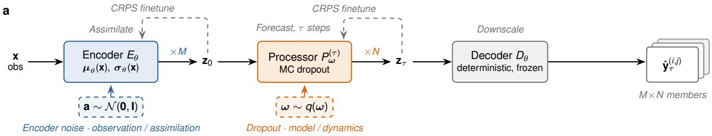

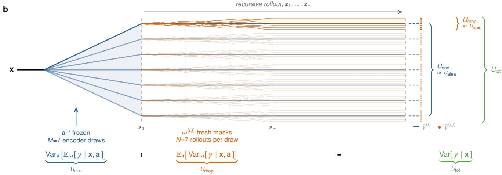  
Figure 2. E2E ensemble architecture. a, The deterministic encode–process–decode pipeline uplifted to a stochastic map: learned, input-dependent Gaussian noise a $( \mathrm { b l u e } ) ^ { 3 0 }$ enters at the encoder and Monte Carlo $\mathrm { d r o p o u t } ^ { 4 4 }$ over the weights ω (orange) perturbs the processor; the decoder remains deterministic and frozen, so each random source is attached to exactly one component. Both stochastic components are finetuned against a fair-CRPS objective on their own output (dashed grey arrows): the encoder’s noise amplitude on the analysis $\mathbf { z } _ { 0 } .$ , and the processor, with dropout active, along the rollout (see Data and training). Sampling the encoder noise M times and the dropout masks N times per draw yields an $M \times N .$ -member forecast ensemble. b, The nested ensemble, aligned with the pipeline above: each of the $M = 7$ encoder draws $\mathbf { a } ^ { ( i ) }$ shifts the assimilated state ${ \bf z } _ { 0 } ,$ fanning the forecast into group spines (blue). These are the dropout-averaged conditional means $\bar { y } ^ { ( i ) }$ . The $N = 7$ MC-dropout rollouts per encoder draw (orange; masks redrawn at every step of the recursive rollout; one group highlighted) scatter the members $\hat { y } ^ { ( i , j ) }$ around their spine, and the deterministic decoder (straight segments) adds no further spread. Within-group scatter estimates the dropout (model/dynamics) variance $U _ { \mathrm { d r o p } }$ and between-group-mean scatter the encoder (observation/assimilation) variance $U _ { \mathrm { e n c } }$ of the law-of-total-variance split $U _ { \mathrm { e n c } } + U _ { \mathrm { d r o p } } = U _ { \mathrm { t o t } }$ , via unbiased ANOVA estimators (see Methods).

## Results

## Probabilistic finetuning significantly improves the mean forecast, by 4.2% on average

Uplifting the Aardvark model to a stochastic map significantly improves the forecast skill: the ensemble mean beats the original configuration at every lead time and for all six headline variables: 2-m temperature (T2M), 850 hPa temperature (T850), the 10-m zonal and meridional wind (U10, V10), 500 hPa geopotential (Z500), and mean sea-level pressure (MSLP), with RMSE (Root Mean Squared Error, lower is better) reductions of up to 16 % (Figure 3a); averaged over all 60 variable–lead combinations the reduction is 4.2% (95% CI [−4.9,−3.4]%). Among all variables, the ensemble mean is 6.1% better at day 1 (95% CI [−7.1,−5.3]%) and 8.1% better at day 10 ([−9.2,−6.9]%), with the smallest gains around days 3 to 5. The improvement is statistically significant for 50 of the 60 variable–lead combinations. For the ten remaining, all changes are smaller than 1.5 %, most of them around the day 3 to 5 minimum, and they are statistically indistinguishable from the baseline. No variable is significantly degraded at any lead time. The probabilistic objective improving the mean forecast can be attributed to the learned input-dependent noise acting as loss attenuation, down-weighting inherently unpredictable targets during finetuning/training30. Judged as a probabilistic forecast the advantage is far larger: the fair CRPS of the ensemble improves on the proper score of the deterministic forecast (for a single member this is its absolute error) by 24–38%, significantly at every variable and lead time (Figure 3b). The probabilistic output comes on top of, not instead of, deterministic skill. Compared with the operational IFS ensemble the end-to-end model remains behind in probabilistic skill at all leads, with the CRPS gap largest at short leads (80 % in the variable mean at day 1) and narrowing to 18–36% by day 10 (Figure 3c). The gap is largest for the mass fields (Z500 and MSLP). In operational systems these fields are constrained by radiosonde, aircraft, and radio-occultation observations49. The encoder receives no aircraft or radio-occultation data at all, and its radiosonde stream carries little weight (it is the least influential stream in the observing system experiments below). This points to initial-condition error inherited from the original Aardvark analysis10.

## The E2E ensemble is calibrated across lead times, with an average spread-skill ratio of 0.98

The E2E ensemble is close to calibrated at every lead time: the variable-mean spread–skill ratio starts mildly over-dispersive at day 1 (SSR = 1.21), dips to a minimum of 0.92 around day 5, and recovers to 0.97 at day 10, closely trailing IFS ENS, which starts at 1.24 and settles just above one (Figure 3d). The mild day-1 over-dispersion, where errors are smallest, is shared with the operational ensemble rather than particular to this end-to-end model. At analysis time (lead time 0) the ensemble is the seven-member encoder output and all of its spread comes from the encoder branch. There it is under-dispersive $( \mathrm { S S R } = 0 . 7 8$ in the variable mean, from 0.86 for T2M down to 0.64 for Z500), which points at the learned observation noise representing only the uncertainty the observations leave unresolved rather than the full analysis error. Calibration is reached within the first forecast step, once the dropout branch is present: the dropout branch alone accounts for most of the calibration $( \mathrm { S S R } = 1 . 1 4  0 . 9 7 )$ whereas the encoder branch alone is under-dispersive at all leads (0.46 → 0.19; Supplementary Fig. S1c). The variable mean also hides a systematic split: averaged over variables and days 1 to 10 the SSR is 0.98, but per variable it ranges from 1.05 (T2M) down to 0.91 (Z500), with the mass fields (Z500 0.91, MSLP 0.93) mildly but persistently under-dispersed. These same two variables have the weakest analysis spread, so the deficit is inherited from the encoder branch rather than created by the rollout. We note that no spread inflation or statistical post-processing is applied at any stage, which means that the calibration in Figure 3d is produced by the probabilistic finetuning alone.

a  
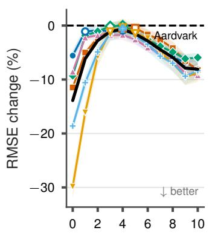

b  
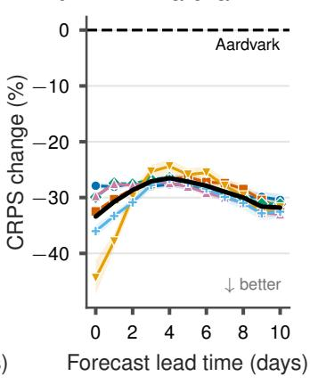

c  
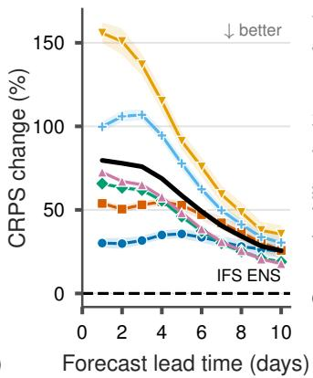

d  
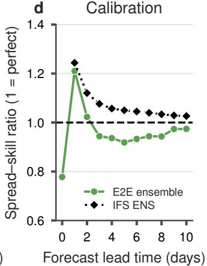

Figure 3. Skill and calibration of the probabilistically finetuned E2E ensemble, verified against ERA5 for 2018 with latitude-weighted scores. a, Relative change in the RMSE of the ensemble forecast mean with respect to Aardvark, per headline variable: 2-m and 850 hPa temperature (T2M, T850), 10-m zonal and meridional wind (U10, V10), 500 hPa geopotential (Z500), and mean sea-level pressure (MSLP). Negative change is better; the black line is the mean over variables and the dashed zero line marks the Aardvark reference. b, Relative change in the fair CRPS of the 49-member ensemble (for a single deterministic forecast the CRPS reduces to the absolute error). c, The same CRPS measure relative to the operational IFS ENS, verified identically; positive values mean the E2E ensemble is worse than the operational ensemble, and the zero line marks the IFS ENS reference. d, Spread–skill ratio (SSR, finite-ensemble corrected) of the E2E ensemble averaged over the six headline variables, with IFS ENS for reference; the dashed line marks perfect calibration (SSR = 1). Shading gives the 95% confidence interval; filled markers indicate a significant difference from the baseline; open markers are not significant (see Methods).

## Station forecasts remain as good as Aardvark Weather, within 2.4%

The picture carries over to the ground station forecast: at HadISD surface stations, where forecasts are verified for T2M and 10-m wind speed (WS10), the ensemble mean matches the skill of the Aardvark Weather deterministic model. The deterministic reference here is the modular (non-end-to-end-finetuned) Aardvark configuration; the published end-to-end finetune scores better at stations (see Methods). Station RMSE stays within 2.4% of the original deterministic forecast through the medium range (Figure 4a,d). These differences are partly statistically significant, especially for WS10 (14 of 22 variable–lead combinations), with the ensemble significantly better at the longest leads (by 4.2–5.2% for T2M at days 9–10) and at analysis time (3.9% for T2M). When evaluated probabilistically, the station ensemble is significantly better than the deterministic model at every lead time: CRPS improves on the deterministic proper score by 24–28% for T2M and 11–19% for WS10. This advantage is significant at every lead in all four regions of the Aardvark Weather evaluation protocol, including the sparse West African and Pacific station sets (Supplementary Note 2). Calibration is less favorable than on the grid: the E2E ensemble is under-dispersive at all leads (Figure 4c), a likely consequence of observation error that the gridded verification does not expose, and of the deterministic decoder adding no spread at the downscaling stage. The decomposition of the station spread (Figure 4b,e) mirrors the gridded attribution: the dropout branch dominates and grows along the rollout while the encoder branch stays flat with lead time. Rank histograms confirm the under-dispersion and reveal an asymmetry: ground truth is higher for every member increasingly often for T2M (a cold forecast bias) and lower for every member for WS10 (over-forecast wind speeds), and the per-station map (Figure 4f) shows the under-dispersion to be near-global rather than driven by a few regions.

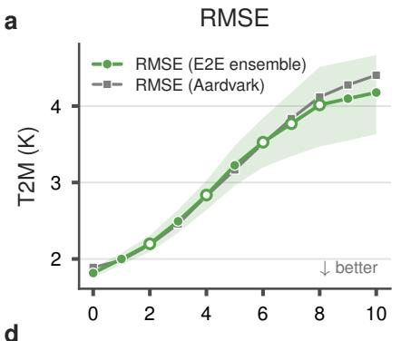

b  
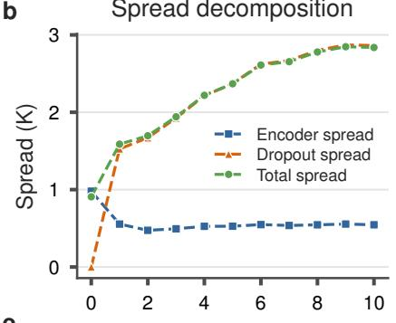

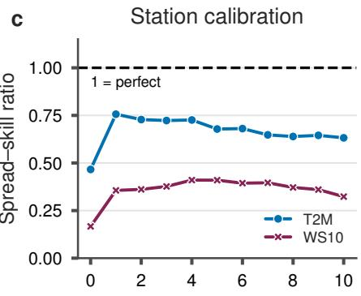

d  
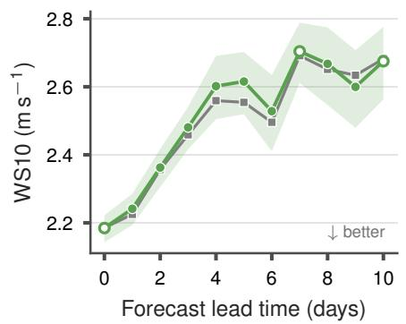

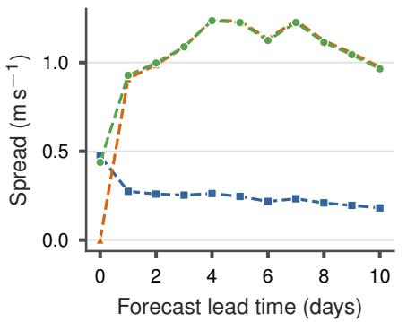

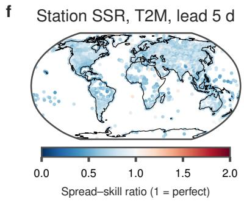  
Figure 4. Verification against HadISD surface stations for 2-m temperature (T2M) and 10-m wind speed (WS10), for 2018. a,d, RMSE of the E2E ensemble and of the Aardvark forecast (see Methods for the baseline configuration), which nearly coincide, as a function of lead time for T2M (a) and WS10 (d); shading gives the 95% confidence interval. Filled ensemble markers differ significantly from Aardvark (see Methods). b,e, Decomposition of the station ensemble spread into its encoder (noise) and dropout branches, together with the total spread; the total and dropout curves nearly coincide because spreads add in quadrature and the encoder branch holds at most 12 % of the station variance from day 1 onward. c, Station spread–skill ratio (SSR) for both variables; the dashed line marks perfect calibration (SSR = 1). f, Per-station SSR for T2M at a lead time of 5 days.

## The encoder branch carries the observation uncertainty: denying an observing system doubles it

To examine whether the stochastic encoder and processor capture distinct sources of uncertainty, we decompose the total forecast ensemble variance into its encoder and dropout components (Figure 5). The decomposition assigns each branch the role it was designed for (Figure 5a): the total variance grows roughly sevenfold from day 1 to day 10 while the encoder component stays nearly flat with all of the variance at the analysis (lead 0), a 0.14 share by day 1 and 0.04 by day 10. The dropout variance fraction rises correspondingly from 0.86 to 0.96 in the variable mean, matching the NWP expectation that model uncertaint accumulates along the rollout. The spatial fingerprints refine this reading (Figure 5d–i): at analysis time the encoder spread is largest in regions that are generally associated with greater uncertainty, such as high-latitude land, the sea-ice margins, steep orography for T2M and the polar caps for Z50050, 51. The dropout spread at day 1 concentrates over high-latitude land and sea ice for T2M and in the extratropical storm tracks for Z500. The dropout fraction for T2M dips over the equatorial eastern Pacific, possibly reflecting the influence of the slowly varying ocean surface temperature on boundary-layer variability52, which would damp the growth of processor perturbations more than the encoder, and over steep orography and the ice sheets, where the encoder noise is larger. In these regions ensemble data assimilation places its largest analysis spread26. For Z500 it dips throughout the tropics, consistent with the weak tropical error growth and low geopotential variance there53. The aleatoric uncertainty attribution survives a causal test in the style of observing-system experiments (OSEs, see Methods): withholding a single observation stream at encoding time and re-running the ensemble moves only the encoder-attributed component (Figure 5b,c). Denying the IASI sounder, which is the most influential stream, roughly doubles $U _ { \mathrm { e n c } }$ at days 1–3 (+96 to +111% in the variable mean), decaying to +5% by day 10 as the denied information is forgotten by the forecast dynamics, while $U _ { \mathrm { d r o p } }$ never responds by more than 8% (largest response −8%, at day 2); denying the least influential stream (the IGRA radiosondes) leaves every component within 1% of baseline. The denial response scales with a stream’s influence and never inflates the dropout axis. With this evidence, the two branches earn the interpretation they were designed for: we read the encoder branch as the aleatoric (observation-driven) contribution and the dropout branch as the epistemic (model-driven) contribution, writing $U _ { \mathrm { e n c } } \approx U _ { \mathrm { a l e a } }$ and $U _ { \mathrm { d r o p } } \approx U _ { \mathrm { e p i s } }$ (see Methods for the caveats attached to this reading). This responsiveness has a practical use. Where a classical denial study requires a full NWP or adjoint assimilation system54, 55, in the E2E ensemble withholding a stream amounts to re-encoding and re-running the ensemble, so the contribution of each observing system to forecast confidence can be quantified. This can be useful for planning future observing networks, e.g. to identify gaps in existing coverage.

Taken together, these results show that a deterministic end-to-end forecast system can be uplifted to a stochastic one at a gain to the forecast qualities it already had, starting at the analysis itself: the stochastically finetuned encoder produces analysis states 14% better in ensemble-mean RMSE (33% in CRPS) than the deterministic system’s, and the advantage persists at every forecast lead (Figure 3a,b). The ensemble adds 24–38% of probabilistic skill over the deterministic proper score and is calibrated on the grid throughout the medium range (variable-mean spread–skill ratio 0.98 over days 1–10) without any post-hoc spread adjustment, while station forecasts stay within a few percent of the deterministic baseline in RMSE (significantly better at analysis time and the longest leads, Figure 4a,d) and beat it in CRPS at every lead time and in every region (Figure S2). The two sources of stochasticity remain interpretable: the encoder branch carries the observation-driven, aleatoric uncertainty while the dropout branch carries model-driven, epistemic uncertainty whose share of the total variance grows from 0.86 at day 1 to 0.96 at day 10, and the observation-denial experiment confirms this assignment causally (Figure 5).

## Discussion

Uncertainty decomposition makes it possible, in principle, to ask from a forecast whether its spread reflects an initial state the observations could not pin down or dynamics the model is unsure about. These two readings call for different remedies, new or better-placed observations in the first case, more training data, better architectures or larger ensembles in the second, and an ensemble driven by a single noise source16, 20 has no way to distinguish them. Obtaining the distinction here required neither a new model nor a full generative treatment: finetuning two noise sources on top of a pretrained deterministic system, the nested-ensemble uplift proposed here, is sufficient.

Within this frame, the three questions posed in the introduction can be answered directly. On disentanglement, attaching one random source to each component makes the uncertainty decomposable: the system states, at inference time, how much of its spread is inherited from the observing system and how much from the learned dynamics, a separation NWP obtains only from its ensemble data-assimilation machinery25, 26. On cost, probabilistic output and deterministic skill are not in tension in observation-to-forecast models: the relatively cheap stochastic finetuning improves the mean forecast significantly at most variables and lead times, beginning with the analysis state itself. On the explanation of forecast uncertainty, the attribution overturns an intuition inherited from NWP ensembles21, 22. Its direction matches: model uncertainty grows in relative importance along the rollout. Its level does not. Even at day 1, where classical ensembles are dominated by initial-condition uncertainty, at most a seventh of the predictive variance traces back to the observations through the encoder branch; the rest originates in the learned dynamics. The practical reading, before any mechanistic interpretation, is a pair of bounds: the encoder share is a lower bound on the true observation (aleatoric) contribution, and the dropout share an upper bound on pure model uncertainty. Three non-exclusive mechanisms could produce this imbalance, and each merits its own follow-up investigation. The learned encoder noise may under-represent observation and assimilation uncertainty, consistent with its strong under-dispersion in isolation (SSR = 0.46 → 0.19); the EDA comparison proposed below is the direct test. The conditioning order of the variance decomposition folds the encoder–processor interaction into the dropout term; a crossed design that freezes the dropout masks while varying the encoder draws would measure that interaction separately. And finally, MC dropout with masks redrawn at every step acts as a stochastic model perturbation that accumulates along the rollout, closer to stochastic physics27, 28 than to a fixed posterior draw; rollouts holding a single mask per member would isolate the accumulation.

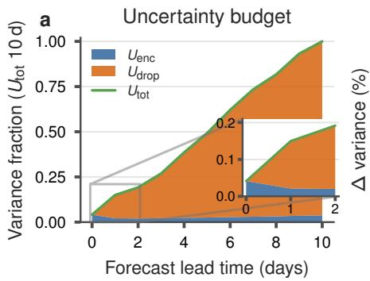

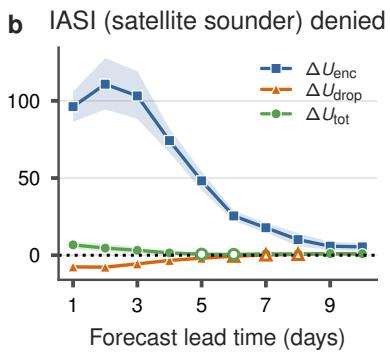

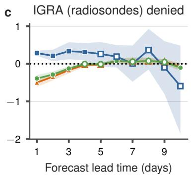

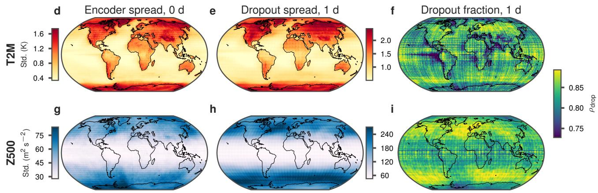  
Figure 5. Ensemble variance attributed to its observation (encoder) and model (dropout) sources across lead times, in space, and under observation denial. a, Gridded uncertainty budget: the encoder and dropout variance components (Eq. (2)), normalized per variable by that variable’s total variance at day 10 and averaged over the six headline variables, stacked so that they sum to the total (green line). At lead 0 (the encoder analysis) all variance lies on the encoder branch by construction; the inset magnifies leads 0–2. b,c, Observing-system experiment (OSE) cross-check for the most and the least influential streams: relative change of the encoder $( U _ { \mathrm { e n c } } )$ , dropout $( U _ { \mathrm { d r o p } } )$ , and total $( U _ { \mathrm { t o t } } )$ variance components when the IASI sounder (b) or the IGRA radiosonde profiles (c) are withheld at encoding time, averaged over all variables, as a function of lead time (shaded bands: 95% confidence intervals; open markers: response not significantly different from zero); denying IASI lands almost entirely on the encoder axis and decays with lead time, while the least influential stream leaves every component within 1% of baseline. d,g, Encoder ensemble spread at analysis time (lead 0), where the branch is the learned observation uncertainty alone, for T2M (d) and Z500 (g). e,h, Dropout ensemble spread at lead time 1 day; note the separate color scales, the encoder branch is substantially weaker than the day-1 dropout spread. f,i, The dropout variance fraction $\rho _ { \mathrm { d r o p } }$ implied by the two branch variance fields at lead time 1 day. The rectilinear texture in f,i reflects the difference in patch sizes of the encoder and processor ViTs.

Two findings transfer directly to the design of future stochastic end-to-end systems. First, where noise enters matters: distributing the same learned perturbation across all encoder blocks through multiplicative conditioning yields better analyses and forecasts, at less raw spread, than a single additive injection (Supplementary Note 1). Second, observation denial turns the aleatoric uncertainty attribution into a falsifiable prediction at negligible cost. Where a classical observing-system experiment re-runs a full assimilation–forecast cycle over months of dates54, withholding a stream here amounts to re-encoding and re-running the ensemble, a few hours on a single GPU, and the two variance axes respond to exactly the interventions they claim to measure (Fig. 5b,c).

The main limitations of this work are structural, and each points to its own remedy. The decoder is deterministic, so no uncertainty is added at the downscaling stage; the station-level under-dispersion, concentrated exactly where representativeness and observation error enter, points to a third stochastic branch at the decoder. The dropout posterior is a restricted one: the mask rate is a fixed hyperparameter $( p = 0 . 0 5 )$ rather than a learned quantity, so the dropout spread is calibrated only indirectly, through the adaptation of the processor weights under the fair-CRPS objective, and deep ensembles56 of processors would provide a stronger epistemic reference at a higher training cost. Verification covers a single held-out year, one backbone10, and modest ensemble sizes, so the non-negativity floor of the encoder-variance estimator in Eq. (4) is occasionally active at long leads. The backbone itself, finally, is deliberately lean: a 1.5◦ grid and under a terabyte of preprocessed observations from nine streams, a small fraction of the operationally assimilated observing system. Part of the remaining gap to IFS ENS, largest at the short leads where resolution and observation coverage matter most, is therefore attributable to the backbone rather than to the probabilistic machinery, and the skill and calibration reported here should be read as a lower bound on what the approach can deliver at higher resolution and with more observation data. The aleatoric/epistemic reading of the encoder and dropout branches likewise remains a component-aligned attribution rather than recovered ground truth31.

Two extensions follow naturally. First, the learned encoder spread invites a systematic comparison against the ERA5 Ensemble of Data Assimilations $\mathrm { ( E D A ) } ^ { 2 5 , 2 6 }$ , the closest physically grounded reference for assimilation uncertainty and the direct test of the under-representation reading above, treating the EDA’s documented under-dispersion as a qualitative reference rather than ground truth. Second, because the encoder branch is attached to the observation interface, the denial experiment of Figure 5b,c extends from attribution to observing-network design: sweeping the ingested observing systems in turn to ask not only which streams the analysis depends on, but which additions, degradations, or losses would most change forecast confidence. Questions of the form “which stream’s loss would most inflate day-3 forecast uncertainty?” are the core transaction of an observation-driven digital twin of the atmosphere, and the decomposed spread answers them here at inference cost. The decomposition also opens the door to auditing corrupted or adversarially perturbed observation inputs, although this would require further study.

## Methods

## End-to-end weather forecast as a stochastic map

Figure 2 summarizes the proposed framework. The deterministic Aardvark system10 is the composition of three learned stages, $f _ { \theta } = D _ { \theta } \circ P _ { \theta } ^ { ( \tau ) } \circ E _ { \theta }$ : the encoder $E _ { \theta }$ maps the heterogeneous observations x of an assimilation window to an initial state $\mathbf { z } _ { 0 }$ (internalizing data assimilation; 30.7 million parameters), the processor $P _ { \theta }$ advances the state autoregressively over τ daily steps $( { \bf { z } } _ { \bar { \tau } } ;$ 54.0 million parameters per step), and the decoder $D _ { \theta }$ maps the forecast state to the target stations (21.1 million parameters per variable and lead time). The encoder and processor are Vision Transformers57 and the decoder a $\mathrm { U - N e t } ^ { 5 8 }$ . As published, $f _ { \theta }$ issues a single forecast with no quantified uncertainty. We uplift it to a stochastic map g by attaching one random source to each of the encoder and processor (Fig. 2a):

$$
\hat { \mathbf { y } } _ { \tau } = g ( \mathbf { x } ; \mathbf { a } , \omega ) = D _ { \theta } \big ( P _ { \omega } ^ { ( \tau ) } \big ( E _ { \theta } ( \mathbf { x } ; \mathbf { a } ) \big ) \big ) ,\tag{1}
$$

with $\hat { \mathbf { y } } _ { \tau }$ the forecast fields at lead τ, and the encoder-noise draw a (the observation-side source) and the rollout dropout masks ω (the model-side source) sampled independently. The learned weights θ, fixed at inference, are suppressed in $^ { g ; }$ the arguments after a semicolon are random draws. Throughout the Methods, bold lowercase symbols denote fields or vectors and italic letters scalars, superscripts $( i , j )$ index the encoder-noise draw and the dropout member and hats (e.g. $\hat { U } _ { \mathrm { t o t } } )$ denote finite-ensemble estimates. Supplementary Table S1 collects all symbols used throughout the paper.

Encoder branch. The encoder is made stochastic through learned, input-dependent Gaussian noise, $E _ { \theta } ( \mathbf { x } ; \mathbf { a } ) = \mu _ { \theta } ( \mathbf { x } ) +$ $\sigma _ { \theta } ( \mathbf { x } ) \odot \mathbf { a } .$ , where $\mu _ { \boldsymbol { \theta } } ( \mathbf { x } )$ is the deterministic analysis of the pretrained encoder, $\sigma _ { \boldsymbol { \theta } } ( \mathbf { x } )$ a learned, input-dependent noise amplitude, $\mathbf { a } \sim \mathcal { N } ( \mathbf { 0 } , \mathbf { I } )$ the noise draw, and ⊙ the element-wise product. This is the heteroscedastic aleatoric construction of Kendall and $\mathrm { G a l } ^ { 3 0 }$ placed at the assimilation interface, so that observation-sparse or low-quality regions can be assigned larger latent noise. This noise injection approach is similar to the one used in $\mathrm { \Delta A I F S  – C R P S ^ { 2 0 } }$ . Concretely, a is drawn per patch, mapped by a small learned MLP to a per-patch embedding, and injected into the pretrained encoder backbone in one of two variants (Supplementary Note 1): embedding injection adds it once to the token embeddings before the first transformer block (+0.3 million parameters), while norm conditioning re-injects the same realization at every block through conditional LayerNorms in the style of feature-wise linear modulation $( \mathrm { F i L M } ) ^ { \dot { 5 } 9 }$ , whose zero-initialized projection leaves the pretrained encoder unchanged at initialization (+8.7 million parameters). The results in this paper use the norm-conditioning variant, which achieves a $4- 5 \%$ lower variable-mean CRPS than embedding injection at short and medium leads at equal ensemble size, while leaving the uncertainty attribution essentially unchanged (Supplementary Fig. S1). The amplitude $\sigma _ { \boldsymbol { \theta } } ( \mathbf { x } )$ and the injection pathway receive no direct supervision: they are learned by finetuning the encoder with a fair CRPS objective over M noise draws against ERA5 analyses (see Data and training). Because CRPS is a proper score, its minimum is a calibrated analysis ensemble.

Dropout branch. The processor weights are treated as random via MC dropout, recast as approximate Bayesian inference44: dropout $( p = 0 . 0 5 )$ stays active at inference, and one realization ω denotes the collection of masks encountered over the τ-step rollout, redrawn at every lead time and for every ensemble member; the subscript in $P _ { \omega } ^ { ( \tau ) }$ records that these masks act on the processor weights at each lead time. The rate $p = 0 . 0 5$ was selected in a sweep on the Aardvark processor (inference-time dropout at $p \in \{ 0 . 0 5 , 0 . 1 , 0 . 2 \}$ over ERA5-initialized rollouts) as the best-calibrated value by spread–skill ratio. Importantly, dropout is not applied post hoc to the published weights: the processor is itself finetuned, with dropout active, on the initial conditions produced by the stochastic encoder under a fair CRPS objective, so its weights, and the spread the dropout masks induce, are adapted to the noise-conditioned encoder it is composed with. The decoder is kept deterministic, so each random source is attached to exactly one component and the split below is a strict two-way split.

## Variance decomposition and nested-ensemble uncertainty estimation

Let y denote a single scalar component of the forecast $\hat { \mathbf { y } } _ { \tau }$ . This is one variable at one grid point and lead time; all quantities below are computed element-wise over these axes. Given the observations x, the only randomness in y comes from the two independent sources a $\sim \mathcal { N } ( \mathbf { 0 } , \mathbf { I } )$ and $\omega \sim q ( \omega )$ , the dropout-mask distribution44; every expectation and variance below is taken over this product space, with subscripts indicating the source being integrated out. Conditioning the predictive variance on the encoder-noise draw and applying the law of total variance gives the exact split:

$$
\underbrace { \mathrm { V a r } [ y \mid \mathbf { x } ] } _ { U _ { \mathrm { t o t } } } = \underbrace { \mathrm { V a r } _ { \mathbf { a } } \left[ \mathbb { E } _ { \omega } [ y \mid \mathbf { x } , \mathbf { a } ] \right] } _ { U _ { \mathrm { e n c } } } + \underbrace { \mathbb { E } _ { \mathbf { a } } { \left[ \mathrm { V a r } _ { \omega } { \left[ y \mid \mathbf { x } , \mathbf { a } \right] } \right] } } _ { U _ { \mathrm { d r o p } } } ,\tag{2}
$$

where $U _ { \mathrm { t o t } }$ is the total predictive variance and $U _ { \mathrm { e n c } }$ and $U _ { \mathrm { d r o p } }$ are its encoder (between-draw) and dropout (within-draw) components.

In the aleatoric/epistemic sense of the deep learning uncertainty quantification literature the two components are read as $U _ { \mathrm { e n c } } \approx U _ { \mathrm { a l e a } }$ (observation-driven) and $U _ { \mathrm { d r o p } } \approx U _ { \mathrm { e p i s } }$ (model-driven): this is the variance form of the decomposition of Depeweg et al.34 with the encoder noise playing the role of the aleatoric latent and the processor weights the epistemic one. Whether an uncertainty is aleatoric or epistemic depends on what is held fixed29, here the observing system and the processor architecture, and the reading above is meant in this relative sense: the split identifies which uncertainties would respond to further information Because $g$ is nonlinear, the a–ω interaction is absorbed into the dropout term by this conditioning order; we condition on a because it keeps $U _ { \mathrm { e n c } }$ a pure observation-noise effect. The identification encoder→aleatoric, processor→epistemic is a deliberate, component-aligned attribution rather than a recovery of ground-truth uncertainty types31, 35, which is why we keep the mechanistic names and write the identification as an approximation.

The expectations in Eq. (2) are estimated with a nested ensemble (Fig. 2b): M outer encoder-noise draws $\mathbf { a } ^ { ( i ) }$ , each frozen and rolled out under N inner MC-dropout realizations, giving MN members $\hat { y } ^ { ( i , j ) }$ with per-draw means $\begin{array} { r } { \bar { y } ^ { ( i ) } = \frac { 1 } { N } \sum _ { j } \hat { y } ^ { ( i , j ) } } \end{array}$ and grand mean ¯y. The within- and between-group mean squares of a one-way random-effects ANOVA:

$$
\mathbf { M S } _ { \mathbf { W } } = \frac { 1 } { M ( N - 1 ) } \sum _ { i = 1 } ^ { M } \sum _ { j = 1 } ^ { N } \left( \hat { y } ^ { ( i , j ) } - \bar { y } ^ { ( i ) } \right) ^ { 2 } , \qquad \mathbf { M S _ { B } } = \frac { N } { M - 1 } \sum _ { i = 1 } ^ { M } \left( \bar { y } ^ { ( i ) } - \bar { y } \right) ^ { 2 } ,\tag{3}
$$

MSW measures how the N dropout members scatter around their own group’s mean. This spread is attributable to the processor alone, since the encoder draw is fixed within a group, while ${ \bf M S _ { B } }$ measures how the M group means scatter around the grand mean, reflecting the effect of changing the encoder draw. The estimators of the two branches, unbiased under the random-effects model, are:

$$
\widehat { U } _ { \mathrm { d r o p } } = \mathbf { M } \mathbf { S } _ { \mathrm { W } } , \qquad \widehat { U } _ { \mathrm { e n c } } = \operatorname* { m a x } \left( 0 , \ : ( \mathbf { M } \mathbf { S } _ { \mathrm { B } } - \mathbf { M } \mathbf { S } _ { \mathrm { W } } ) / N \right) .\tag{4}
$$

The ${ \mathrm { M S } } _ { \mathrm { W } } / N$ subtraction removes the finite-N sampling noise that each group mean inherits from the dropout draws; without it, dropout variance leaks into the encoder estimate and systematically overstates the observation branch. One pass of the nested ensemble yields the full spatial fields behind Figure 5. The attribution ratio reported there is $\rho _ { \mathrm { d r o p } } = \widehat { U } _ { \mathrm { d r o p } } / ( \widehat { U } _ { \mathrm { e n c } } + \widehat { U } _ { \mathrm { d r o p } } )$

## Observation-denial cross-check

Observing-system experiments deny one observation type and measure the analysis degradation54. Applied to the nested ensemble, denial turns the component attribution into a falsifiable prediction (Fig. 5b,c): withholding a stream must inflate the between-encoder (observation) component, while the dropout (model) component has no reason to respond; a denial response leaking into the dropout axis would mean the two axes do not measure what the decomposition claims. A stream $\mathbf { X } _ { S }$ is withheld by zeroing its gridded encoder embedding. The density-aware SetConv observation interface already produces a near-zero embedding wherever a modality has no observations, so a zeroed embedding is exactly “stream absent”. Baseline and denial configurations share per-initialization random seeds (common random numbers): the conditioning-noise and dropout-mask draws are identical, so the per-initialization changes are paired. We perform this cross-check across 24 initializations spanning the test year, at the full nested configuration of the main evaluation (M=7 encoder draws, N=7 dropout rollouts each).

## Data and training

All experiments use the publicly released Aardvark data configuration10, distributed as a preprocessed dataset on Hugging Face12. The observational input comprises the original Aardvark system’s heterogeneous streams: HadISD surface station reports47 (23 GB), ICOADS marine reports (11 GB), IGRA radiosonde profiles (4 GB), AMSU-A (69 GB), AMSU-B (64 GB), HIRS (139 GB) and IASI (296 GB) sounder radiances, ASCAT scatterometer winds (91 GB), and GridSat geostationary satellite imagery (37 GB): about 0.73 TB of observations in total over the full preprocessed archive. ERA56 (156 GB) additionally provides the training targets for the encoder and processor (24 surface and pressure-level variables on the 1.5◦ global grid) and the gridded verification ground truth, while HadISD provides the station-level verification targets (T2M and WS10). Following the original paper’s protocol10, 2007–2017 is used for training, 2019 for validation and checkpoint selection, and 2018 is held out for testing.

All components are warm-started from the published deterministic Aardvark weights10 and finetuned separately with a fair (finite-ensemble-corrected) CRPS objective21, 40. The noise-conditioned encoder is finetuned against ERA5 analyses at 00 UTC with M = 7 noise members per step (AdamW, learning rate $3 \times 1 0 ^ { - 5 }$ , weight decay $1 0 ^ { - 5 }$ , cosine schedule, 20 epochs, batch size 4 per GPU). The processor is then finetuned with gradient checkpointing on the stochastic encoder’s initial conditions with dropout active $( p = 0 . 0 5 )$ and 7 dropout members per step (AdamW, learning rate $1 0 ^ { - 4 }$ annealed to $1 0 ^ { - 6 }$ , weight decay $1 0 ^ { - 5 } )$ ), sequentially for lead times 1–10, each lead initialized from the previous one and trained on its output with 20 epochs at lead 1 and 12 epochs per subsequent lead. As in the deterministic Aardvark protocol10, the processor is trained in the marginal: at each step it predicts the normalized difference to the previous daily state, which is added back to that state to advance the rollout, rather than predicting the full atmospheric field directly. The station decoders are those of the published Aardvark release, kept deterministic and frozen. The stochastic finetuning is computationally modest: with 4-GPU data parallelism on NVIDIA A100 (80 GB) nodes, the encoder finetune completes in ≈4.7 h wall-clock and the sequential lead-1–10 processor finetune in ≈11.5 h: about 65 A100-hours for one complete probabilistic chain. This amounts to 65% of the cost of pretraining such a system from scratch. No data-loading or other optimizations were performed during training, so this reflects an upper bound on training duration. The deterministic Aardvark baseline in Figures 3a,b and 4a,d is the published encoder–processor–decoder chain evaluated identically. Note that the published Aardvark station results additionally use an end-to-end finetune of the full system; since weights for that configuration were released for a single lead time only and we were unable to reproduce the published station scores with them, we use the modular (non-end-to-end-finetuned) release as the deterministic reference at all lead times.

## Experimental setup and verification metrics

At inference, ensembles are generated by crossing M encoder-noise draws with N processor dropout masks (here $M = 7 , N = 7$ i.e. 49 members). This configuration matches the member counts used during finetuning, yields a total ensemble comparable in size to the 50-member IFS ENS reference, and balances the sampling precision of the two branch estimators in Eq. (4). Forecasts are verified against ERA5 over the held-out year 2018 on the $1 . 5 ^ { \circ }$ global grid with latitude-weighted scores following the WeatherBench 2 protocol60; IFS ENS reference scores are computed against the same ERA5 targets. All evaluation is restricted to 00 UTC valid time for every model compared. Station forecasts are verified against HadISD47 T2M and WS10 station observations over 2018, restricted to the station subset used by the original Aardvark system10.

Probabilistic skill is measured with the fair (finite-ensemble-corrected) CRPS21, 40. Calibration is measured with the spread–skill ratio: ensemble spread over the RMSE of the ensemble mean, with the finite-size correction ${ \sqrt { ( K + 1 ) / K } } .$ , where $K = M N = 4 9$ is the total member count61, computed for the total ensemble and per branch, where each branch’s spread is $\sqrt { \widehat { U } _ { \mathrm { e n c } } } \mathrm { o r } \sqrt { \widehat { U } _ { \mathrm { d r o p } } }$ from Eq. (4) and the shared denominator makes the branch ratios add in quadrature to the total. Gridded scores are latitude-weighted spatial means; station scores are means over the verified station population.

All statistical inference is carried out on per-initialization score series. For every model, variable, and lead time, scores are first aggregated over space (latitude-weighted grid mean or station mean), as in the WeatherBench 2 protocol60, so that each of the n = 337 initializations contributes exactly one value. Spatial correlation is thereby absorbed before any test is applied; the only remaining dependence is the temporal autocorrelation of the series, which every procedure below accounts for through a common, data-adaptive correlation length ℓ:

$$
\ell = \operatorname* { m a x } \bigl ( n ^ { 1 / 3 } , 3 ( 1 + r _ { 1 } ) / ( 1 - r _ { 1 } ) \bigr ) ,
$$

where $r _ { 1 }$ is the lag-1 autocorrelation of the series at hand and n the number of initializations. Confidence intervals, shown as the shaded bands in the figures, are 95% percentile intervals from a circular moving-block bootstrap $( 5 \times 1 0 ^ { 3 }$ resamples) with block length ℓ. Nonlinear aggregates (RMSE, spread–skill ratios, relative changes) are recomputed on each resample rather than approximated. When two models are compared, both score series are resampled with the same block indices, preserving the pairing.

Significance of paired model differences, shown as filled versus open markers in the figures, is assessed with the Diebold– Mariano test62 applied to the score-difference series, using a Bartlett-kernel heteroskedasticity-and-autocorrelation-consistent variance with lag truncation ℓ and the Harvey–Leybourne–Newbold small-sample correction. This is equivalent to the autocorrelation-corrected paired t-test63 that is standard in the verification of data-driven forecasts4. Markers are filled only where the difference is significant at the 5% level. Finally, a deterministic forecast is scored as a one-member ensemble, whose CRPS equals its absolute error, so deterministic–probabilistic comparisons are proper-score comparisons on identical initializations.

Large-language-model assistants (Claude Code, Anthropic) were used for code assistance, manuscript editing and literature search; all AI-assisted output was reviewed and verified by the authors, who take full responsibility for the content of this manuscript.

## Data availability

The finetuned model weights and the evaluation data generated in this study are available at https://huggingface. co/datasets/rodrigoalmeida1994/uqe2e. The training and verification inputs are the publicly released Aardvark dataset12, which includes the HadISD station records47. The ERA5 fields6 and IFS ENS used for verification were fetched from WeatherBench60. The code to reproduce all experiments and figures is available at https://gitlab.hhi.fraunhofer. de/ai-aml/uqe2e.

## References

1. Bauer, P., Thorpe, A. & Brunet, G. The quiet revolution of numerical weather prediction. Nature 525, 47–55, DOI: 10.1038/nature14956 (2015).

2. Pathak, J. et al. FourCastNet: A global data-driven high-resolution weather model using adaptive fourier neural operators. arXiv preprint DOI: 10.48550/arXiv.2202.11214 (2022).

3. Bi, K. et al. Accurate medium-range global weather forecasting with 3D neural networks. Nature 619, 533–538, DOI: 10.1038/s41586-023-06185-3 (2023). ArXiv:2211.02556.

4. Lam, R. et al. Learning skillful medium-range global weather forecasting. Science 382, 1416–1421, DOI: 10.1126/science. adi2336 (2023). ArXiv:2212.12794.

5. Chen, K. et al. FengWu: Pushing the skillful global medium-range weather forecast beyond 10 days lead. arXiv preprint DOI: 10.48550/arXiv.2304.02948 (2023).

6. Hersbach, H. et al. The ERA5 global reanalysis. Q. J. Royal Meteorol. Soc. 146, 1999–2049, DOI: 10.1002/qj.3803 (2020).

7. Carrassi, A., Bocquet, M., Bertino, L. & Evensen, G. Data assimilation in the geosciences: An overview of methods, issues, and perspectives. WIREs Clim. Chang. 9, e535, DOI: 10.1002/wcc.535 (2018).

8. Slivinski, L. C., Whitaker, J. S., Frolov, S., Smith, T. A. & Agarwal, N. Assimilating observed surface pressure into ML weather prediction models. Geophys. Res. Lett. 52, e2024GL114396, DOI: 10.1029/2024GL114396 (2025).

9. Huang, H., Lei, L. & Tan, Z.-M. Ensemble-based assimilation of sounding observations with AI weather models. Geophys. Res. Lett. 53, e2026GL122153, DOI: 10.1029/2026GL122153 (2026).

10. Allen, A. et al. End-to-end data-driven weather prediction. Nature 641, 1172–1179, DOI: 10.1038/s41586-025-08897-0 (2025). ArXiv:2404.00411.

11. Alexe, M. et al. GraphDOP: Towards skilful data-driven medium-range weather forecasts learnt and initialised directly from observations. arXiv preprint DOI: 10.48550/arXiv.2412.15687 (2024).

12. Vaughan, A. aardvark-weather (revision 1a29cb4), DOI: 10.57967/hf/4274 (2025).

13. Murphy, A. H. The value of climatological, categorical and probabilistic forecasts in the cost-loss ratio situation. Mon. Weather. Rev. 105, 803–816, DOI: 10.1175/1520-0493(1977)105<0803:TVOCCA>2.0.CO;2 (1977).

14. Fundel, V. J., Fleischhut, N., Herzog, S. M., Göber, M. & Hagedorn, R. Promoting the use of probabilistic weather forecasts through a dialogue between scientists, developers and end-users. Q. J. Royal Meteorol. Soc. 145, 210–231, DOI: 10.1002/qj.3482 (2019).

15. Ben Bouallègue, Z., Clare, M. C. A., Magnusson, L., Gascón, E. et al. The rise of data-driven weather forecasting: A first statistical assessment of machine learning-based weather forecasts in an operational-like context. Bull. Am. Meteorol. Soc. 105, E864–E883, DOI: 10.1175/BAMS-D-23-0162.1 (2024).

16. Price, I. et al. Probabilistic weather forecasting with machine learning. Nature 637, 84–90, DOI: 10.1038/ s41586-024-08252-9 (2025). GenCast; arXiv:2312.15796.

17. Abdar, M. et al. A review of uncertainty quantification in deep learning: Techniques, applications and challenges. Inf. Fusion 76, 243–297, DOI: 10.1016/j.inffus.2021.05.008 (2021). ArXiv:2011.06225.

18. Almeida, R., Otero, N., Fernández-Torres, M.-Á. & Ma, J. On the Predictive Skill of Artificial Intelligence-based Weather Models for Extreme Events using Uncertainty Quantification. Artif. Intell.for Earth Syst. DOI: 10.1175/AIES-D-25-0113.1 (2026).

19. Bülte, C., Horat, N., Quinting, J. & Lerch, S. Uncertainty quantification for data-driven weather models. Artif. Intell.for Earth Syst. 5, DOI: 10.1175/AIES-D-24-0049.1 (2026). ArXiv:2403.13458.

20. Lang, S. et al. AIFS-CRPS: Ensemble forecasting using a model trained with a loss function based on the continuous ranked probability score. npj Artif. Intell. 2, 18, DOI: 10.1038/s44387-026-00073-7 (2026).

21. Leutbecher, M. & Palmer, T. N. Ensemble forecasting. J. Comput. Phys. 227, 3515–3539, DOI: 10.1016/j.jcp.2007.02.014 (2008).

22. Molteni, F., Buizza, R., Palmer, T. N. & Petroliagis, T. The ECMWF ensemble prediction system: Methodology and validation. Q. J. Royal Meteorol. Soc. 122, 73–119, DOI: 10.1002/qj.49712252905 (1996).

23. Buizza, R. & Palmer, T. N. The singular-vector structure of the atmospheric global circulation. J. Atmospheric Sci. 52, 1434–1456, DOI: 10.1175/1520-0469(1995)052<1434:TSVSOT>2.0.CO;2 (1995).

24. Toth, Z. & Kalnay, E. Ensemble forecasting at NCEP and the breeding method. Mon. Weather. Rev. 125, 3297–3319, DOI: 10.1175/1520-0493(1997)125<3297:EFANAT>2.0.CO;2 (1997).

25. Isaksen, L. et al. Ensemble of data assimilations at ECMWF. Technical Memorandum 636, ECMWF (2010). DOI: 10.21957/obke4k60.

26. Bonavita, M., Isaksen, L. & Hólm, E. On the use of EDA background error variances in the ECMWF 4D-Var. Q. J. Royal Meteorol. Soc. 138, 1540–1559, DOI: 10.1002/qj.1899 (2012).

27. Palmer, T. N. et al. Stochastic parametrization and model uncertainty. Technical Memorandum 598, ECMWF (2009). DOI: 10.21957/ps8gbwbdv.

28. Leutbecher, M. et al. Stochastic representations of model uncertainties at ECMWF: state of the art and future vision. Q. J. Royal Meteorol. Soc. 143, 2315–2339, DOI: 10.1002/qj.3094 (2017).

29. Der Kiureghian, A. & Ditlevsen, O. Aleatory or epistemic? Does it matter? Struct. Saf. 31, 105–112, DOI: 10.1016/j. strusafe.2008.06.020 (2009).

30. Kendall, A. & Gal, Y. What uncertainties do we need in Bayesian deep learning for computer vision? In Advances in Neural Information Processing Systems (NeurIPS), DOI: 10.48550/arXiv.1703.04977 (2017).

31. Hüllermeier, E. & Waegeman, W. Aleatoric and epistemic uncertainty in machine learning: an introduction to concepts and methods. Mach. Learn. 110, 457–506, DOI: 10.1007/s10994-021-05946-3 (2021).

32. Baur, S., Samek, W. & Ma, J. Benchmarking uncertainty and its disentanglement in multi-label chest X-ray classification. In Uncertaintyfor Safe Utilization ofMachine Learning in Medical Imaging (UNSURE), vol. 16166 of Lecture Notes in Computer Science, 193–203, DOI: 10.1007/978-3-032-06593-3\_18 (Springer, 2026).

33. Baur, S., Schernich, A., Böke, E., Samek, W. & Ma, J. Beyond boundary noise: Aggregated aleatoric uncertainty fails to capture presence ambiguity in 3D lung nodule segmentation. arXiv preprint arXiv:2608.14766 (2026).

34. Depeweg, S., Hernández-Lobato, J. M., Doshi-Velez, F. & Udluft, S. Decomposition of uncertainty in Bayesian deep learning for efficient and risk-sensitive learning. In Proceedings ofthe 35th International Conference on Machine Learning (ICML), vol. 80 of PMLR, DOI: 10.48550/arXiv.1710.07283 (2018).

35. Valdenegro-Toro, M. & Mori, D. S. A deeper look into aleatoric and epistemic uncertainty disentanglement. In IEEE/CVF Conference on Computer Vision and Pattern Recognition Workshops (CVPRW), 1508–1516, DOI: 10.1109/CVPRW56347. 2022.00157 (2022).

36. Houlsby, N., Huszár, F., Ghahramani, Z. & Lengyel, M. Bayesian active learning for classification and preference learning. arXiv preprint DOI: 10.48550/arXiv.1112.5745 (2011).

37. Smith, L. & Gal, Y. Understanding measures of uncertainty for adversarial example detection. In Proceedings of the 34th Conference on Uncertainty in Artificial Intelligence (UAI), DOI: 10.48550/arXiv.1803.08533 (2018).

38. Mansfield, L. A. & Christensen, H. M. Epistemic and aleatoric uncertainty quantification in weather and climate models. Q. J. Royal Meteorol. Soc. e70219, DOI: 10.1002/qj.70219 (2026).

39. Haynes, K., Lagerquist, R., McGraw, M., Musgrave, K. & Ebert-Uphoff, I. Creating and Evaluating Uncertainty Estimates with Neural Networks for Environmental-Science Applications. Artif. Intell.for Earth Syst. 2, DOI: 10.1175/ AIES-D-22-0061.1 (2023).

40. Hersbach, H. Decomposition of the continuous ranked probability score for ensemble prediction systems. Weather. Forecast. 15, 559–570, DOI: 10.1175/1520-0434(2000)015<0559:DOTCRP>2.0.CO;2 (2000).

41. Gneiting, T. & Raftery, A. E. Strictly proper scoring rules, prediction, and estimation. J. Am. Stat. Assoc. 102, 359–378, DOI: 10.1198/016214506000001437 (2007).

42. Gneiting, T., Balabdaoui, F. & Raftery, A. E. Probabilistic forecasts, calibration and sharpness. J. Royal Stat. Soc. Ser. B 69, 243–268, DOI: 10.1111/j.1467-9868.2007.00587.x (2007).

43. Hamill, T. M. Interpretation of rank histograms for verifying ensemble forecasts. Mon. Weather. Rev. 129, 550–560, DOI: 10.1175/1520-0493(2001)129<0550:IORHFV>2.0.CO;2 (2001).

44. Gal, Y. & Ghahramani, Z. Dropout as a Bayesian approximation: Representing model uncertainty in deep learning. In Proceedings ofthe 33rd International Conference on Machine Learning (ICML), DOI: 10.48550/arXiv.1506.02142 (2016).

45. Rühling Cachay, S., Watson-Parris, D. & Yu, R. U-Cast: A surprisingly simple and efficient frontier probabilistic AI weather forecaster. In Forty-third International Conference on Machine Learning (ICML), DOI: 10.48550/arXiv.2604.09041 (2026).

46. Bley, F., Lapuschkin, S., Samek, W. & Montavon, G. Explaining predictive uncertainty by exposing second-order effects. Pattern Recognit. 160, 111171, DOI: 10.1016/j.patcog.2024.111171 (2025).

47. Dunn, R. J. H. et al. HadISD: a quality-controlled global synoptic report database for selected variables at long-term stations from 1973–2011. Clim. Past 8, 1649–1679, DOI: 10.5194/cp-8-1649-2012 (2012).

48. Dramsch, J. S., Kuglitsch, M. M., Fernández-Torres, M.-Á. et al. Explainability can foster trust in artificial intelligence in geoscience. Nat. Geosci. 18, 112–114, DOI: 10.1038/s41561-025-01639-x (2025).

49. Bormann, N., Lawrence, H. & Farnan, J. Global observing system experiments in the ECMWF assimilation system. Technical Memorandum 839, ECMWF (2019). DOI: 10.21957/sr184iyz.

50. Sandu, I., Beljaars, A., Bechtold, P., Mauritsen, T. & Balsamo, G. Why is it so difficult to represent stably stratified conditions in numerical weather prediction (NWP) models? J. Adv. Model. Earth Syst. 5, 117–133, DOI: 10.1002/jame. 20013 (2013).

51. Wallace, J. M., Mitchell, T. P. & Deser, C. The influence of sea-surface temperature on surface wind in the eastern equatorial Pacific: Seasonal and interannual variability. J. Clim. 2, 1492–1499, DOI: 10.1175/1520-0442(1989)002<1492: TIOSST>2.0.CO;2 (1989).

52. Barsugli, J. J. & Battisti, D. S. The basic effects of atmosphere–ocean thermal coupling on midlatitude variability. J. Atmospheric Sci. 55, 477–493, DOI: 10.1175/1520-0469(1998)055<0477:TBEOAO>2.0.CO;2 (1998).

53. Žagar, N. A global perspective of the limits of prediction skill of NWP models. Tellus A: Dyn. Meteorol. Oceanogr. 69, 1317573, DOI: 10.1080/16000870.2017.1317573 (2017).

54. Bouttier, F. & Kelly, G. Observing-system experiments in the ECMWF 4D-Var data assimilation system. Q. J. Royal Meteorol. Soc. 127, 1469–1488, DOI: 10.1002/qj.49712757419 (2001).

55. Langland, R. H. & Baker, N. L. Estimation of observation impact using the NRL atmospheric variational data assimilation adjoint system. Tellus A 56, 189–201, DOI: 10.1111/j.1600-0870.2004.00056.x (2004).

56. Lakshminarayanan, B., Pritzel, A. & Blundell, C. Simple and scalable predictive uncertainty estimation using deep ensembles. In Advances in Neural Information Processing Systems (NeurIPS), DOI: 10.48550/arXiv.1612.01474 (2017).

57. Dosovitskiy, A. et al. An image is worth 16x16 words: Transformers for image recognition at scale. In International Conference on Learning Representations (ICLR), DOI: 10.48550/arXiv.2010.11929 (2021).

58. Ronneberger, O., Fischer, P. & Brox, T. U-Net: Convolutional networks for biomedical image segmentation. In Medical Image Computing and Computer-Assisted Intervention (MICCAI), 234–241, DOI: 10.1007/978-3-319-24574-4\_28 (2015).

59. Perez, E., Strub, F., de Vries, H., Dumoulin, V. & Courville, A. FiLM: Visual reasoning with a general conditioning layer. In Proceedings ofthe AAAI Conference on Artificial Intelligence, DOI: 10.1609/aaai.v32i1.11671 (2018).

60. Rasp, S. et al. WeatherBench 2: A benchmark for the next generation of data-driven global weather models. J. Adv. Model. Earth Syst. 16, e2023MS004019, DOI: 10.1029/2023MS004019 (2024).

61. Fortin, V., Abaza, M., Anctil, F. & Turcotte, R. Why should ensemble spread match the RMSE of the ensemble mean? J. Hydrometeorol. 15, 1708–1713, DOI: 10.1175/JHM-D-14-0008.1 (2014).

62. Diebold, F. X. & Mariano, R. S. Comparing predictive accuracy. J. Bus. & Econ. Stat. 13, 253–263, DOI: 10.1080/ 07350015.1995.10524599 (1995).

63. Geer, A. J. Significance of changes in medium-range forecast scores. Tellus A: Dyn. Meteorol. Oceanogr. 68, 30229, DOI: 10.3402/tellusa.v68.30229 (2016).

## Acknowledgements

This research has been supported by the European Union’s Horizon Europe research and innovation program (EU Horizon Europe) project MedEWSa under grant agreement no. 101121192 and ARTEMis under grant agreement no. 101225852.

## Author contributions statement

R.A. conceived the study, developed the uncertainty disentanglement framework, implemented the probabilistic models, performed the training, experiments and analysis, and wrote the manuscript. N.O. contributed to the conception and design of the study. J.A. contributed to the model training and the development of the framework. S.B. contributed to the uncertainty quantification fundamentals and the disentanglement methodology. W.S. and J.M. supervised the work. All authors discussed the results and reviewed the manuscript.

## Additional information

Competing interests: The authors declare no competing interests.

## Supplementary information

## Supplementary Note 1: Norm conditioning vs. embedding injection

The injection sites of the two encoder noise-injection variants are sketched in Supplementary Figure S1a; Supplementary Figure S1b–d compares the two full chains (each a noise-conditioned encoder plus a processor finetuned on that encoder’s initial conditions) under the evaluation protocol of the main text. The 4–5% CRPS advantage of norm conditioning at days 1–4 decays monotonically and closes to parity by day 10 (Supplementary Fig. S1b), with near-identical total calibration (day-1 SSR 1.21 vs. 1.27) and attribution $( \rho _ { \mathrm { d r o p } } = 0 . 9 6$ at day 10; Supplementary Fig. S1c,d); the difference is concentrated in the encoder branch, where embedding injection produces a visibly larger encoder spread (day-1 encoder-branch SSR 0.56 vs. 0.46; encoder mutual information 0.11 vs. 0.09 nats) yet the worse mean state. The same pattern holds already at lead 0, where the norm-conditioned encoder yields the better T2M analysis (RMSE 1.02 vs. 1.06 K, CRPS 0.54 vs. 0.56 K) with less spread (0.82 vs. 0.93 K). Mechanistically, the two variants spend their perturbation budget differently: embedding injection’s single additive perturbation must be large enough to survive all L pretrained transformer blocks, whose LayerNorms and attention were trained on unperturbed statistics, and this one-shot displacement moves the encoder off its pretrained manifold, degrading the mean state; norm conditioning composes the same calibrated output spread from many small, per-feature and per-depth FiLM modulations that keep activations close to their pretrained statistics, and its zero-initialized projections let finetuning depart from the pretrained optimum gradually rather than from an already-perturbed state. Consistent with this reading, the norm variant needs less raw encoder spread for near-identical total calibration, and its skill advantage is largest where the encoder perturbation dominates the forecast (short leads), vanishing as processor uncertainty takes over (day 10, Supplementary Fig. S1d).

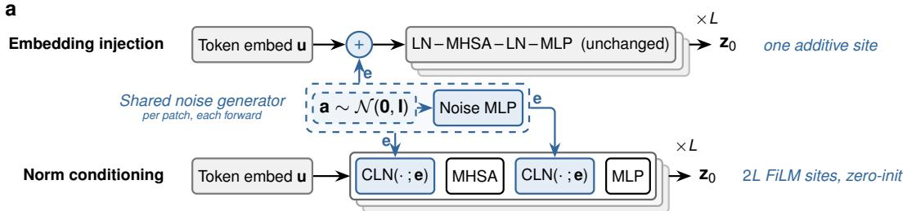

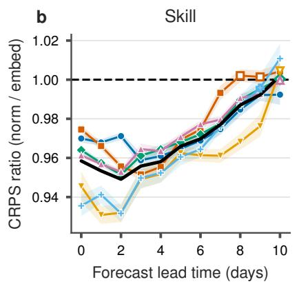

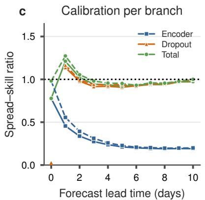

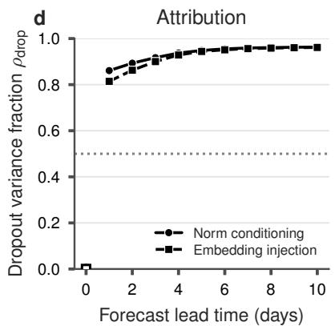  
T2M T850 U10 V10 Z500 MSLP Mean

Figure S1. The two encoder noise-injection variants and their comparison. a, Both variants share one noise generator: per-patch Gaussian noise a, redrawn at every forward pass, is mapped by a learned MLP to a per-patch embedding e, the encoder-noise variable of Figure 2a. Embedding injection adds e once before the L unchanged pretrained transformer blocks; norm conditioning re-injects the same realization at every block through zero-initialized conditional LayerNorms $( \mathrm { C L N } ) ^ { 5 9 }$ b–d, The two variants at equal ensemble size, verified against ERA5 for 2018; lead 0 is the encoder analysis, so the dropout branch in c and $\rho _ { \mathrm { d r o p } }$ in d are zero by construction. b, Fair-CRPS ratio per headline variable and their mean (black); values below the dashed parity line favor norm conditioning; shading and filled versus open markers as in Figure 3 (see Methods). c, Spread–skill ratio (finite-ensemble corrected) per branch, averaged over the headline variables, for norm conditioning (solid) and embedding injection (dashed). d, Dropout variance fraction $\rho _ { \mathrm { d r o p } }$ (mean over variables) for both variants; the dotted line mark perfect calibration (c) and parity between the branches (d).

Pacific (n=30)

## Supplementary Note 2: Regional station verification

Supplementary Figure S2 repeats the station CRPS comparison of the main text per region, over the four regions of the upstream Aardvark evaluation protocol (CONUS, Europe, West Africa, Pacific). The probabilistic ensemble improves on the deterministic system’s proper score at every lead in every region, significantly at all 88 (variable, region, lead) combinations at the 5% level, including the two sparse sets (West Africa, ∼60 verified stations; Pacific, ∼30), where the confidence intervals widen as expected but the improvement stays clear of them. This regional consistency shows the probabilistic gain to be a property of th forecast system rather than of any single, densely observed network.

a  
CONUS (n=1737)  
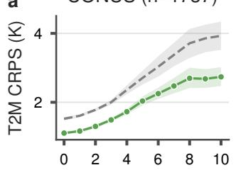

b  
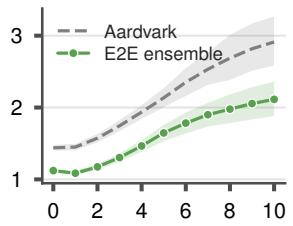

c  
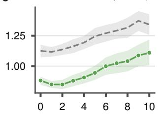  
West Africa (n=60)

d  
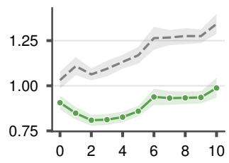

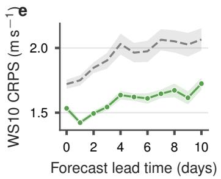

f  
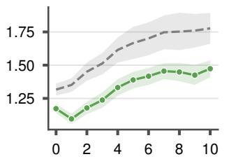

g  
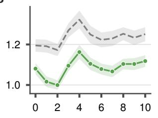

h  
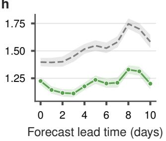  
Figure S2. Regional station verification: CRPS at HadISD stations per region of the upstream evaluation protocol (columns; median verified station counts in the titles) for 2-m temperature (a–d) and 10-m wind speed (e–h), for 2018. Fair CRPS of the full 49-member E2E ensemble (green) and of the deterministic Aardvark configuration, scored as a one-member ensemble on identical initializations (grey dashed); shading gives the 95% confidence interval. Filled markers differ significantly from the deterministic baseline (see Methods); every point shown is significant.

## Supplementary Note 3: Notation

Supplementary Table S1 collects all symbols used throughout the paper, grouped by the role they play: the forecast system and its components, data and states, the two random sources, the nested ensemble, the variance decomposition, and the verification statistics.

Table S1. Symbols used throughout the paper.
<table><tr><td>Symbol</td><td>Meaning</td></tr><tr><td>Forecast system  $f _ { \theta } = D _ { \theta } \circ P _ { \theta } ^ { ( \tau ) } \circ E _ { \theta }$   $E _ { \theta } , P _ { \theta } ^ { ( \tau ) } , D _ { \theta }$   $g ( \mathbf { x } ; \mathbf { a } , \omega )$ </td><td>deterministic Aardvark system 10 encoder; processor over τ daily steps; station decoder stochastic forecast map (Eq. (1))</td></tr><tr><td>τ Data and states X  $\mathbf { X } _ { S }$   $\mathbf { z } _ { 0 }$ </td><td>forecast lead time in daily steps heterogeneous observations of one assimilation window a single observation stream (withheld in the denial experiment) assimilated initial state forecast fields at lead τ; a single scalar component thereof</td></tr><tr><td>Random sources  $\mathbf { a } \sim \mathcal { N } ( \mathbf { 0 } , \mathbf { I } )$   $\mu _ { \theta } ( \mathbf { x } ) , \sigma _ { \theta } ( \mathbf { x } )$   $\omega \sim q ( \omega )$   $q ( \omega )$   $p$ </td><td>encoder-noise draw (observation-side source) learned mean and noise amplitude of the stochastic encoder MC-dropout masks of one rollout (model-side source) dropout-mask distribution⁴4 dropout rate  $( p = 0 . 0 5 )$ </td></tr><tr><td> $M , N$   $K = M N$   $\hat { y } ^ { ( i , j ) }$   $\bar { y } ^ { ( i ) } ; \bar { y }$ </td><td>outer encoder draws / inner dropout rollouts per draw  $\scriptstyle ( M = N = 7 )$  total member count  $( K = 4 9 )$  member j of encoder draw i mean over the N members of draw i; grand mean</td></tr><tr><td> $U _ { \mathrm { t o t } } , U _ { \mathrm { e n c } } , U _ { \mathrm { d r o p } }$   $U _ { \mathrm { e n c } } { \approx } U _ { \mathrm { a l e a } } , U _ { \mathrm { d r o p } } { \approx } U _ { \mathrm { e p i s } }$   $\mathbf { M S } _ { \mathbb { W } } , \mathbf { M S } _ { \mathrm { B } }$   $\widehat { U } _ { \mathrm { e n c } } , \widehat { U } _ { \mathrm { d r o p } }$ </td><td>predictive variance and its encoder / dropout components (Eq. (2)) component-aligned aleatoric / epistemic reading (Methods) within- and between-group mean squares  $\left( \operatorname { E q . } \left( 3 \right) \right)$  unbiased ANOVA estimates of the branch variances  $\left( \mathrm { E q . } \left( 4 \right) \right)$   $\widehat { U } _ { \mathrm { d r o p } } / ( \widehat { U } _ { \mathrm { e n c } } + \widehat { U } _ { \mathrm { d r o p } } )$ </td></tr><tr><td>Verification and statistical inference</td><td></td></tr><tr><td>n</td><td>number of forecast initializations in the test year  $( n = 3 3 7 )$ </td></tr><tr><td> $r _ { 1 }$ </td><td>lag-1 autocorrelation of a per-initialization score series</td></tr></table>