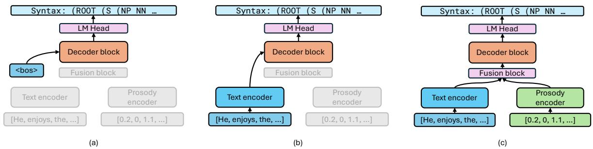
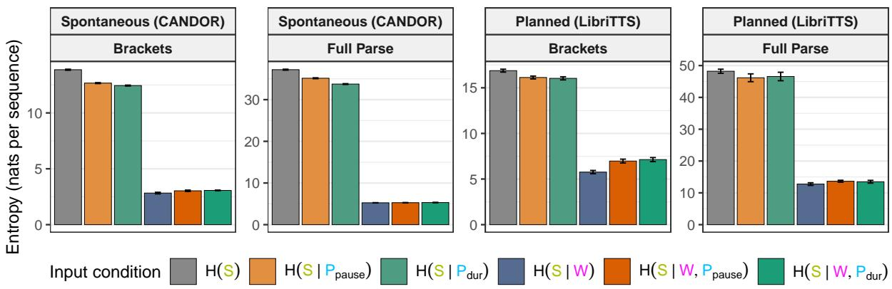
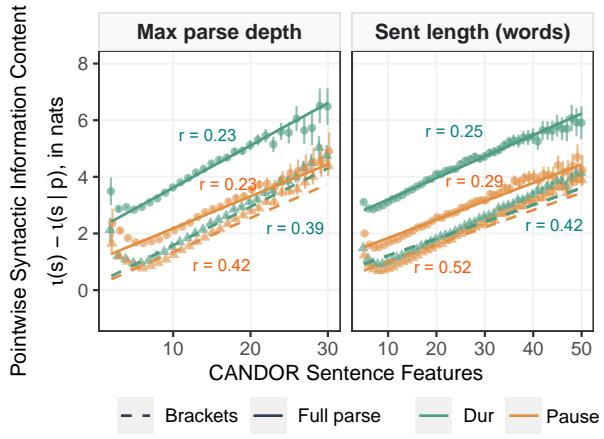
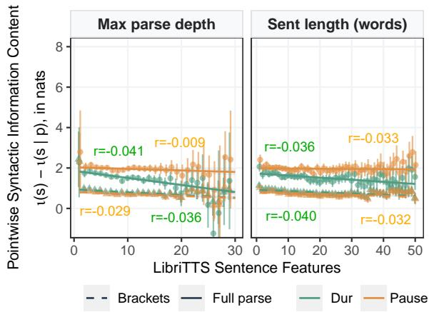

# Using Prosody to Predict Syntactic Structure

Junghyun Min1, Alex Warstadt2, Tamar I. Regev3, Tiago Pimentel4, Ethan Gotlieb Wilcox1   
1Georgetown University, 2UC San Diego, 3MIT, 4ETH Zürich Correspondence: jm3743@georgetown.edu

## Abstract

While it is well-established that prosody carries crucial cues for syntactic structure, the degree and nature of correspondence between these two domains remains contested. We in vestigate the syntax-prosody interface through an information-theoretic lens, quantifying the interaction between prosodic features and syntactic representations as their mutual information. We provide a general-purpose framework for estimating this quantity over large speechtext corpora using multimodal language models. Our framework is structure-agnostic and modular, insofar as it can be used to measure the contributions of individual prosodic features or components of structure. We evaluate the syntax-prosody relationship for two features (word duration and inter-word pauses) across two domains—read audiobooks and spontaneous conversations—both in English. Our results demonstrate that prosody contains measurable syntactic information, with prosodic features reducing syntactic uncertainty in spontaneous conversations by up to 10.2%. Our findings offer new empirical support for several theoretical accounts of the syntax-prosody interface.1

## 1 Introduction

Prosody, or the “melody” of speech, carries information that is vital for successful communication. Individual components of the prosody channel— including word duration, pauses between words, pitch, and intensity—have been shown to encode information about word identity (Wolf et al., 2023; Wilcox et al., 2025), discourse functions (Wilson and Wharton, 2006; Hamlaoui et al., 2019), and meta-linguistic information (Mozziconacci, 2002; Yadavalli et al., 2025). Prosody has also long been known to carry vital cues about syntactic structure (Elfner, 2018). Children use prosody to learn the latent structure of their language (Soderstrom et al., 2003; Christophe et al., 2008); speakers use prosodic cues like pre-boundary lengthening to signal syntactic constituents (Klatt, 1975; Ferreira, 1993; Snedeker and Trueswell, 2003); and listeners rely on prosody to disambiguate between parses during real-time communication (Price et al., 1991; Millotte et al., 2007).

While linguists studying the syntax–prosody interface agree that prosody and syntax interact, the manner and quantity of syntactic information carried by prosody remain debated. Different theories make different predictions about how tightly and in what ways the two are linked. For example, the Direct Reference Theory (DRT) posits that prosodic constituency is a direct representation of syntactic constituency, while the Indirect Reference Theory (IRT) allows mismatches between the two to satisfy phonological well-formedness constraints (see Section 2 for more details; Chomsky and Halle, 1968; Nespor and Vogel, 2007; Richards, 2016). These theories can be difficult to test due to limitations with current empirical methods. Much of the empirical evidence relies on case studies that examine individual phenomena in controlled settings (Klatt, 1975; Seidl, 2013; Zubizarreta, 1998). And studies that investigate the syntax–prosody relationship in larger datasets often rely on previous-generation statistical methods (Brierley, 2011), or make overly strong simplifying assumptions (e.g. omitting the effects of text context when predicting syntax; Anu and Karjigi, 2014; Degano et al., 2024).

In light of these limitations, this work proposes a new framework for measuring the relationship between syntax and prosody in large-scale natural corpora. Building on a line of recent work (Wolf et al., 2023; Regev et al., 2025; Wilcox et al., 2025; Yadavalli et al., 2025), we frame our method using the toolkit of information theory. We define syntactic information content of a prosodic feature as the mutual information (I; Shannon, 1948) between that prosodic feature and a structural representation. In other words, syntactic information content is the extent to which knowing prosodic features reduces uncertainty over structural interpretations (i.e., syntactic parses) of a sentence. Our framework is structure-agnostic, insofar as it can be measured with respect to any type of structural representation. It is also contextual, with predictions conditionable on both the surrounding prosody or text context. And it is modular, insofar as it can be used to measure the contributions of individual prosodic features or components of a structural representation, such as phrase-boundary locations or POS tags.

We implement a computational pipeline to measure the syntactic information content in two English text–speech corpora. We use modified T5 encoder-decoder transformer models (Raffel et al., 2020) to predict linearized syntactic parses, conditioned on either just text, just prosody, or prosody and text (see Section 4.1). We run a series of experiments to investigate: (1) how much syntactic information content is carried by individual prosodic features (word duration and inter-word pauses); (2) how syntactic information content changes across speech genre (planned vs. spontaneous speech); (3) how much information prosody carries beyond what is carried by the segmental information (i.e., words); and (4) what parts of the syntactic structure prosody contains information about (phrasal categories vs. phrase boundaries).

Our results indicate that prosody carries information about syntactic structure, with duration and pause reducing uncertainty over syntactic representations by up to 10.2%. These features primarily signal boundary location, as opposed to phrase category identity, and carry more information in spontaneous over planned speech, as a proportion of the total structural uncertainty in each genre. We do not find evidence that prosody contains additional information about structure beyond what is carried by words; the syntactic information in duration and pause is redundant with that contained in text. We interpret our results as being consistent with the Prosodic Bootstrapping theory of syntactic acquisition (Soderstrom et al., 2003; Christophe et al., 2008) and the Indirect Reference approach to the syntax–prosody interface (Selkirk, 2011; Seidl, 2013). More broadly, we argue that our methods can go beyond previous-generation statistical approaches to reveal and quantify new statistical dependencies at the prosody-syntax interface.

## 2 The Syntax–Prosody Interface

## 2.1 Theoretical Linguistics

Accounts of the syntax–prosody interface in theoretical linguistics often focus on the interplay between prosodic and syntactic well-formedness constraints. Different theories postulate different degrees of causal linking, which we argue makes predictions about the informational relationship between prosody and syntactic structure.

Direct Reference Theory (DRT). DRT proposes that prosodic rules don’t employ separate phonological structures, but are formulated with respect to the underlying syntactic parses (Chomsky and Halle, 1968; Cooper and Paccia-Cooper, 1980; Kaisse and Shaw, 1985). This is supported by phonetic evidence showing that speakers consistently produce pre-boundary lengthening at the edges of syntactic constituents (Klatt, 1975). Under this view, prosody is isomorphic to syntax; mismatches between syntax and prosody are attributed to variance in underlying syntactic operations, such as extraposition (Wagner, 2015). We interpret DRT to predict a very high degree of syntactic information content, with a strict interpretation suggesting that prosodic information should come close to reducing all uncertainty about a sentence’s syntactic parse.

Indirect Reference Theory (IRT). IRT argues that syntax and phonology are autonomous domains that communicate via a mediating mechanism (Nespor and Vogel, 2007; Seidl, 2013). Match Theory (Selkirk, 2011) formalizes this as a set of constraints that strive for isomorphism between syntactic and prosodic constituents, though this mapping can be overridden when certain phonological well-formedness constraints are ranked to outweigh isomorphism by Optimality Theory2 (Prince and Smolensky, 2004). IRT predicts a lower amount of information overlap; this is due to the fact that prosody and syntax each operate within its own framework of wellformedness constraints, with one causally influencing the other only when the two are in conflict.

Prosody-Driven Syntax (PDS). PDS argues that the interface is bidirectional: syntactic well-formedness can drive prosodic choices, but prosodic well-formedness can also influence the syntax of a sentence. Certain syntactic operations like wh-movement, heavy NP shift, or argument scrambling are triggered specifically to satisfy prosodic requirements such as nuclear stress (Zubizarreta, 1998), or contiguity (Richards, $2 0 1 6 ) . ^ { 3 }$ We take PDS to make no strong predictions about the total degree of informational overlap, but rather about differences between genres, specifically spontaneous vs. planned speech. Because in planned (read-out-loud) speech, the syntax of a sentence is fixed, it cannot be modulated by prosodic choices. However, in spontaneous speech, as prosodic choices can cause changes in syntax, prosody should provide more information about structure. We therefore interpret PDS to predict a higher degree of syntactic information content in spontaneous, as opposed to planned speech.

Prosodic Bootstrapping. Prosodic Bootstrapping is a theory of language acquisition that posits that infants use prosodic information to make inferences about the syntactic structure of a sentence, even when they are unaware of its semantics, or when it includes words that they haven’t yet learned. Proponents of the theory find evidence that infants as young as 6 months old are sensitive to prosodic markers of phrasal units (Soderstrom et al., 2003) and that they use this prosodic constituency information to constrain lexical segmentation (Christophe et al., 2008). Theories of prosodic bootstrapping predict non-zero syntactic information content in prosody, which is the basis of the bootstrapping.

## 2.2 Computational & Info-Theoretic Models

Prosodic information has long been used as featural inputs to structure predictions in NLP systems (Kahn et al., 2005; Anu and Karjigi, 2014; Brierley, 2011; Cho, 2022; Min et al., 2025), and vice versa (Koehn et al., 2000; Dhamne et al., 2025). This study builds on a line of work quantifying the informational redundancy between prosody and non-prosodic linguistic channels. This work framed informational redundancy as mutual information (Pimentel et al., 2020) and used large language models to measure this quantity between prosody and segmental information operationalized as text (Wolf et al., 2023), pitch, and word identity (Wilcox et al., 2025), as well as to assess the temporal dynamics of the overlap (Regev et al., 2025). One shortcoming of this previous work was that because the computational pipelines made predictions over continuous-valued prosodic features, estimates (of entropy) were not bounded from below, limiting the interpretation of results. One recent contribution (Yadavalli et al., 2025) proposed a solution to this problem by using prosody to measure auxiliary discrete-valued tasks, such as emotion classification or sarcasm detection. The present work builds on this contribution, using syntax as our auxiliary task.

## 3 Modeling Framework

In this section, we describe our formal framework for estimating the syntactic information carried by prosodic features, which we frame as the mutual information between prosody and syntax. To do so, we treat syntax (S), prosody (P), and text (W) as random variables (RVs). A number of operationalizations and design choices follow.

## 3.1 Our Random Variables

First, we consider a word, w, to be an element from a vocabulary Σ. A text is then a sequence of words, $\mathbf { w } \in \Sigma ^ { * }$ , which we can write as: $\mathbf { w } =$ $\left[ \mathrm { w } _ { 1 } , \mathrm { w } _ { 2 } , \cdots , \mathrm { w } _ { N } \right]$ . Second, we consider a syntactic unit, s, as an element from the set: $\Upsilon = \mathcal { P } \cup \mathcal { B } ,$ where $\mathcal { P }$ is a finite set of symbols representing phrasal category tags (e.g., NN, SBAR), and B is a set containing an opening and closing bracket.4 We then represent the syntax, $\mathbf { s } \in \Upsilon ^ { * }$ , of a text as a sequence of symbols drawn from Υ, e.g.,: (ROOT (S (NP PRP) (VP VBZ (NP DT NN NN)))). Finally, we treat a prosodic unit, ${ \mathrm { ~ p ~ } } \in \ \mathbb { R } .$ , as a real-valued feature. In our experiments, this corresponds to word-level duration and pause length (measured in milliseconds; ms), but this could correspond to any prosodic feature. We then represent the prosody, $\mathbf { p } \in \mathbb { R } ^ { d }$ , of a text as a sequence of prosodic units.

We assume that there exists an unknown ground-truth distribution over the three variables above, $p ( \mathbf { w } , \mathbf { s } , \mathbf { p } )$ , and that for any tuple $\langle \mathbf { w } , \mathbf { s } , \mathbf { p } \rangle$ with non-zero probability, length $\mathbf { \tau } ( \mathbf { w } ) \ = \ \mathrm { l e n g t h } ( \mathbf { p } ) \ = \ d .$ We use W, S, and P to denote, respectively, sentence-level text-, syntax- and prosody-valued random variables.

## 3.2 Measuring Information Content

We operationalize the information that prosody carries about syntax as the mutual information: $\operatorname { I } ( \mathbf { P } , \mathbf { S } )$ , following prior work (Wolf et al., 2023; Wilcox et al., 2025; Regev et al., 2025; Yadavalli et al., 2025). To estimate mutual information, we follow Pimentel et al. (2019)’s two-step process of estimation: We first decompose I into the difference between an unconditional and a conditional entropy. We then use probabilistic models to upperbound each of these entropies (as further described in Section 3.3). With the “good mixed-pair assumption,” (Nair et al., 2007; Beknazaryan et al., 2019), the mutual information decomposes as:5

$$
\operatorname { I } ( \mathbf { P } , \mathbf { S } ) = \operatorname { H } ( \mathbf { S } ) - \operatorname { H } ( \mathbf { S } \mid \mathbf { P } ) .\tag{1}
$$

In written or transcribed text, however, words carry substantial information about syntactic structure. It is thus a natural question to ask whether prosody carries information above and beyond what is carried by word identities. Beyond estimating the mutual information above, we thus additionally estimate the mutual information between prosody and syntax conditioned on word identities, $\mathrm { I } ( \mathbf { P } , \mathbf { S } \mid \mathbf { W } )$ . We decompose it using the same logic as above:

$$
\operatorname { I } ( \mathbf { P } , \mathbf { S } \mid \mathbf { W } ) = \operatorname { H } ( \mathbf { S } \mid \mathbf { W } ) - \operatorname { H } ( \mathbf { S } \mid \mathbf { W } , \mathbf { P } ) .\tag{2}
$$

If this value is positive, it means that prosody carries additional information about syntactic structure not carried by the text.

## 3.3 Entropy Estimation

We follow Pimentel et al. (2019) in estimating entropy via a cross-entropy upper-bound. Let $\mathrm { H } _ { \boldsymbol { \theta } } ( \mathbf { S } )$ be the cross-entropy between any distribution $p _ { \theta }$ and the ground truth distribution $p .$ We can use it to upperbound the entropy via the inequality: $\mathrm { H } _ { \theta } ( \mathbf { S } ) \geq \mathrm { H } ( \mathbf { S } )$ . The cross-entropy is defined as the expected surprisal of $p _ { \theta }$ taken with respect to $p ,$ where surprisal under $p _ { \theta }$ is defined as $\iota ( x )$ = − log $p _ { \theta } ( x )$ . As $p$ is unknown, we take a Monte Carlo estimate of the cross-entropy. Given a model $p _ { \theta }$ and a dataset $\{ \mathbf { w } ^ { n } , \mathbf { s } ^ { n } , \mathbf { p } ^ { n } \} _ { n = 1 } ^ { N }$ sampled according to $p ,$ we can estimate it as:

$$
\begin{array} { l } { { \displaystyle { \mathrm { H } } _ { \theta } ( \mathbf { S } ) = - \sum _ { \mathbf { s } \in \Upsilon ^ { * } } p ( \mathbf { s } ) \log p _ { \theta } ( \mathbf { s } ) } \ ~ ( 3 ) \ } \\ { { \displaystyle ~ \approx - \frac { 1 } { N } \sum _ { n = 1 } ^ { N } \log p _ { \theta } ( \mathbf { s } ^ { n } ) , \mathbf { w } \mathrm { h e r e ~ } \mathbf { s } ^ { n } \sim p ( \mathbf { s } ) } . } \end{array}
$$

Analogous equations exist for the conditional entropies, $\mathbf { e . g . } , \mathrm { H } _ { \theta } ( \mathbf { S } \mid \mathbf { P } )$ , but using the conditional distribution instead, $\mathrm { e . g . , } p _ { \theta } ( \mathrm { s } \mid \mathrm { p } )$ . Notably, the difference between the cross-entropy and entropy, e.g., $\mathrm { H } _ { \theta } ( \mathbf { S } ) \mathrm { ~ - ~ } \mathrm { H } ( \mathbf { S } )$ , is given by the Kullback-Leibler divergence (Kullback and Leibler, 1951) between $p _ { \theta }$ and $p .$ This implies that, the more similar $p _ { \theta }$ and $p$ are, the better our estimators will be.

Estimating $p _ { \theta } ( \mathrm { s } )$ . We train a language model from scratch on a corpus of linearized constituency parses until convergence. No conditioning information $( \mathrm { e . g . }$ , text or prosody) is provided, and this model is thus composed of a simple decoder-only autoregressive component.

Estimating conditional distributions $p _ { \theta } ( \mathbf { s _ { \theta } } | \mathbf { \theta } \mathbf { w } )$ $p _ { \theta } ( \mathbf { s } _ { \mathbf { \theta } } \mid \mathbf { \phi } _ { \mathbf { p } } )$ , and $p _ { \theta } ( \mathbf { s _ { \theta } } \mid \mathbf { w } , \mathbf { p } )$ We fine-tune an encoder-decoder language model to predict syntactic sequences (in the decoder) given a text sequence, a prosody sequence, or both sequences as input (in the encoder). While we train the decoder component of this model from scratch, the text encoder and cross-attention layers are loaded with pre-trained weights;6 this model can thus make use of text information it has learned during pretraining. All the cross-entropies reported here are over sentence-level variables, requiring no tokenlevel normalization.

## 4 Methods

The basis of our entropy estimation is multimodel encoder-decoder LMs which we train to predict syntactic structure from text input, prosody input, or no input. In this section, we detail our implementation pipeline, focusing on how we train LMs to predict (linearized) syntactic structures. We discuss model architectures in Section 4.1 and data (including datasets, syntactic-structure operationalisation, and statistical testing) in Section 4.2.

## 4.1 Encoder-Decoder Model

Our sequence-to-sequence model is based on the base-sized encoder-decoder T5 architecture (Raffel et al., 2020), with several additions, illustrated in Figure 1. In order to process prosodic inputs, we construct a new prosody encoder from scratch, which differs from T5’s text encoder in several respects: It is shallower and narrower, with 2 layers, 2 heads per layer, and a hidden dimensionality of 8. Rather than learning an embedding matrix during training, we used a fixed embedding schema, with two sinusoidal functions used to construct an encoding of the prosodic feature’s magnitude ME and absolute position encoding PE, given below. The two encodings are then concatenated before being passed to the transformer stack:

  
Figure 1: Architecture of our encoder-decoder model. (a), (b), and (c) are used for estimations of H(S), H(S | W), H(S | W, P), respectively. To estimate H(S | P), we use an architecture symmetric to (b), but with an active Prosody encoder instead.

$$
\begin{array} { r } { \mathrm { M E } _ { ( m a g , d ) } = \left\{ \begin{array} { l l } { \sin \left( \frac { m a g } { 2 0 0 0 ^ { 2 i / D } } \right) } & { \mathrm { i f } \ d = 2 i } \\ { \cos \left( \frac { m a g } { 2 0 0 0 ^ { 2 i / D } } \right) } & { \mathrm { i f } \ d = 2 i + 1 } \end{array} \right. } \end{array}\tag{4}
$$

$$
\begin{array} { r } { \mathrm { P E } _ { ( p o s , d ) } = \left\{ \begin{array} { l l } { \sin \left( \frac { p o s } { 1 0 0 0 0 ^ { 2 i / D } } \right) } & { \mathrm { i f } d = 2 i } \\ { \cos \left( \frac { p o s } { 1 0 0 0 0 ^ { 2 i / D } } \right) } & { \mathrm { i f } d = 2 i + 1 } \end{array} \right. } \end{array}\tag{5}
$$

Where mag is the prosodic feature binned into increments of 10ms. The final hidden state of the encoder is projected to match the hidden state dimensions of the text encoder to allow for stable fusion via cross-attention to the decoder stack.

For estimates of $p _ { \theta } ( \mathbf { s } \mid \mathbf { p } , \mathbf { w } )$ that condition on both prosody and text, we add a cross-attention layer to fuse inputs across modalities. The crossattention is performed with the layer’s query as text representation and key and value as prosody representations. Dropout and layer normalization are applied to the resulting fused representations. We add part-of-speech labels as additional tokens to the tokenizer, with one (and only one) token per POS label; we assign each of these new tokens a randomly initialized embedding. These additional tokens are used strictly for decoding (i.e., for predicting syntax) and are not used to tokenize the input text w. The text encoder, embedding layers, and cross-attention layers are loaded with available t5-base pre-trained weights (Raffel et al., 2020). The decoder, prosody encoder, fusion layers, and LM head are randomly initialized and trained from scratch to predict syntactic parse tokens. We report hyperparameters in Appendix B.

## 4.2 Datasets

Previous work using methodologies similar to ours has focused on prepared, read-out-loud speech (Wolf et al., 2023; Regev et al., 2025; Wilcox et al., 2025). To investigate how prosody may vary across speech styles, we consider two datasets in our experiments: LibriTTS is a dataset of audiobooks and their gold transcriptions,7 derived from the LibriSpeech corpus (Panayotov et al., 2015), with audiobooks from LibriVox,8 and the original material from Project Gutenberg.9 We use the aligned version of its clean subset using the Montreal Forced Aligner (MFA; McAuliffe et al., 2017), which comprises 44k sentences. Our second dataset is CANDOR (Conversation: A Naturalistic Dataset of Online Recordings), which consists of 1656 naturalistic, unscripted conversations between strangers that were collected over Zoom, whose transcription pipeline includes automatic speech recognition (ASR). We preprocess the dataset via the pipeline from Clark et al. (2025) and obtain pause and duration information, again by aligning them with MFA. Out of 750k sentences that are 5 words or longer, we filter for those that are not non-initial fragments due to speaker backchannel interruptions, resulting in 298k sentences. Punctuation marks are removed from the input text (as well as associated syntactic parse), as they are not part of word identities and carry syntactic information (Chafe, 1988). We report the dataset statistics in Table 1.

<table><tr><td>Metric</td><td>CANDOR</td><td>LibriTTS</td></tr><tr><td>Dataset size (sentences)</td><td>298k</td><td>44k</td></tr><tr><td>Avg. words per sentence</td><td>13.2</td><td>17.5</td></tr><tr><td>Avg. tokens per full parse</td><td>64</td><td>76</td></tr><tr><td>Avg. tokens per brackets</td><td>33</td><td>38</td></tr></table>

Table 1: Dataset statistics for CANDOR (spontaneous speech) and LibriTTS (planned speech).

Syntactic parses. Although our method could be employed with any structural representation, for our experiments, we represent syntactic structure as linearized constituency parses, following the Penn Treebank format. As we are interested in what types of syntactic information prosody contains, we generate two types of constituency trees, corresponding to differing levels of parse granularity: For our full parse condition, we obtain silver parse labels on our two datasets using Stanza (Qi et al., 2020).10 From the silver parses, we remove any punctuation marks. For our bracket-only condition, we strip out all phrase category information, leaving only brackets that indicate the hierarchical structure of the sentence. Because we use autoregressive language models to estimate $p _ { \theta } ( \mathrm { s } )$ it’s possible that the model can assign probability to non-valid syntactic parses. Thus, a certain amount of our probability can leak. To address this concern, we estimate the amount of leaked probability in Appendix A.

Prosodic features. We measure the syntactic information content of word duration and inter-word pauses. We choose these features because they have been argued to provide cues for syntactic structure (Klatt, 1975; Ratner, 1986). Duration is the difference between the word’s onset and offset time, as taken from MFA-aligned word boundaries. Inter-word pauses are taken as the difference between a word’s offset and the onset of the next word; again, taken from MFA-aligned boundaries. Duration is normalized by the number of syllables in a word, using syllable data from CELEX (Baayen et al., 1995). Both measures are taken in milliseconds, but chunked into 10ms bins in our prosody encoder (e.g. values 14ms and 18ms are represented in the same 10 − 19ms bin).

Statistical tests. We test the statistical difference in sentence-level surprisal across conditions using our cross-validation splits. To this end, we use a Wilcoxon signed-rank test (Wilcoxon, 1945), as sequence-level surprisal values are paired across conditions. Notably, when applied to our setting, this test evaluates whether our MI estimates are positive significantly more often than expected by chance, and not if its average value is larger than zero across splits—thus being more resistant to outlier negative estimation errors (note that I cannot, by definition, be negative).

## 5 Results

Table 2 and Figure 2 outline our entropy estimates H(S), H(S | P), H(S | W), H(S | P,W) across input conditions and domain. Table 3 shows mutual information I and uncertainty coefficient U, defined as the ratio between I and H(S). Prosody is labeled as $\mathrm { P _ { p a u s e } }$ and $\mathbf { P } _ { \mathrm { d u r } }$ , when representing, respectively, pause and duration information.

Overall, pause and duration carry similar amounts of syntactic information content in each condition. As noted by previous language modeling work (e.g., Godfrey et al., 1992; Zen et al., 2019), naturalistic, conversational speech has lower syntactic uncertainty across all conditions: both full and bracket parses, and both with and without text and prosody input. This may be due to a number of factors, including CANDOR’s larger dataset size that would allow a greater degree of convergence (298k vs. 44k samples), or the longer average sentence length in LibriTTS compared to CANDOR (17.5 vs. 13.2 words per sentence) and thus longer average syntax parses (76 vs. 64 tokens). It is also possible that the syntactic structures found in naturalistic, conversational speech are more predictable than those in recorded audiobooks.

Answering RQ1: How much information about syntax is carried by word duration and pause? Our experiments show that both pause and duration carry measurable syntactic information, in both spontaneous and planned speech. Our statistical tests show that the sequence-level syntactic information $\mathrm { I } ( \mathrm { S } , \mathrm { P _ { p a u s e } } )$ and $\mathrm { I } ( \mathrm { S } , \mathrm { P } _ { \mathrm { d u r } } )$ is significantly greater than zero in all input conditions $( p < 1 0 ^ { - 4 } )$ . We find that pause can contain up to

Figure 2: Estimated entropy in predicted syntactic structure given context across conditions.
<table><tr><td>Genre</td><td>Parse Type</td><td>H(S)</td><td>H(S|W)</td><td>H(S | Ppause)</td><td>H(S W, Ppause)</td><td>H(S | Pdur)</td><td>H(S | W, Pdur)</td></tr><tr><td rowspan="2">Spontaneous</td><td>Brackets</td><td>13.9</td><td>2.83</td><td>12.7</td><td>3.03</td><td>12.4</td><td>3.06</td></tr><tr><td>Full parse</td><td>37.2</td><td>5.25</td><td>35.1</td><td>5.27</td><td>33.7</td><td>5.30</td></tr><tr><td rowspan="2">Planned</td><td>Brackets</td><td>16.9</td><td>5.76</td><td>16.1</td><td>6.97</td><td>16.0</td><td>7.13</td></tr><tr><td>Full parse</td><td>48.2</td><td>12.8</td><td>46.2</td><td>13.6</td><td>46.6</td><td>13.5</td></tr></table>

Table 2: Syntactic entropy (nats per sequence) across datasets and input conditions. LibriTTS is a dataset of planned read-out-loud speech, while CANDOR is a dataset of naturalistic, spontaneous conversations.

2.06 nats of syntactic information, while duration can contain up to 3.45 nats. Words alone carry about 30 nats of syntactic information, suggesting that pause and duration carry around 10% of the information load that words do about syntax.

Answering RQ2: Do prosodic features carry syntactic information beyond what is carried by words? We find that after controlling for the syntactic information already carried by words, both pause and duration carry little or no significant measurable syntactic information in planned speech. We hypothesize this may be due to the sparsity of sentences and constructions where syntax could be disambiguated with prosody. Our framework may also underestimate the syntactic information beyond what is carried by words, a possibility which we discuss in greater detail in Limitations. For the rest of the results section, we focus on the individual contributions of prosody (that is, I(S, P), rather than on I(S, P | W)).

Answering RQ3: How does information content vary across speech styles? Duration carries more syntactic information in spontaneous than in planned speech, when quantified both in terms of total mutual information and uncertainty reduction. Pauses have higher total mutual information in spontaneous speech for our full parse condition, but less in our bracket-parse condition.

However, when quantified in terms of uncertainty reduction, pauses contribute to a greater reduction in spontaneous speech in both conditions. The overall trend in our results is clear: in the datasets we use, prosody carries more syntactic information in spontaneous, rather than planned, speech. Sentence length may be a contributing factor in the difference, although utterance length differences could be thought of as an inherent part of the differences between these two genres. An analysis in Section 6 controlling for the length shows that the cross-genre difference remains significant after controlling for the length distribution.

Answering RQ4: What parts of the syntactic structure does prosody contain information about? In both spontaneous and planned speech, phrase boundaries (represented by brackets) account for the majority of syntactic information content in prosody. Phrase boundaries contain up to around 50% of the syntactic information content in duration; 1.42 out of 3.45 nats in spontaneous speech and 0.84 out of 1.65 nats in planned speech. They contain up to 60% of the syntactic information content in pause; 1.20 out of 2.05 nats in spontaneous speech and 0.75 out of 2.06 nats in planned speech. This finding is in line with well-established phonological phenomena that connect prosodic features to phrasestructural boundaries, for example, pre-boundary lengthening (Klatt, 1975; Ferreira, 1993).

<table><tr><td rowspan="2">Genre</td><td rowspan="2"></td><td colspan="2"> $( \mathbf { S } , \mathbf { P _ { p a u s e } } )$ </td><td colspan="2"> $( \mathbf { S } , \mathbf { P _ { \mathrm { d u r } } } )$ </td><td colspan="2">(S, W)</td><td colspan="2"> $( \mathrm { S } , \mathrm { P _ { p a u s e } \mid W } )$ </td><td colspan="2"> $\left( \operatorname { S } , \operatorname { P } _ { \operatorname { d u r } } \mid \mathbf { W } \right)$ </td></tr><tr><td>Parse Type I</td><td>U</td><td>I</td><td>U</td><td>I</td><td>U</td><td>I</td><td>U</td><td>I</td><td>U</td></tr><tr><td rowspan="2">Spontaneous</td><td>Brackets</td><td>1.20</td><td>8.64%</td><td>1.42</td><td>10.2%</td><td>11.0</td><td>79.6%</td><td>-0.20</td><td>-7.14%</td><td>-0.24</td><td>-8.32%</td></tr><tr><td>Full parse</td><td>2.05</td><td>5.52%</td><td>3.45</td><td>9.27%</td><td>31.9</td><td>85.9%</td><td>-0.02</td><td>-0.42%</td><td>-0.06</td><td>-1.07%</td></tr><tr><td rowspan="2">Planned</td><td>Brackets</td><td>0.75</td><td>4.44%</td><td>0.84</td><td>4.99%</td><td>11.1</td><td>65.9%</td><td>-1.21</td><td>-21.0%</td><td>-1.37</td><td>-23.8%</td></tr><tr><td>Full parse</td><td>2.06</td><td>4.27%</td><td>1.65</td><td>3.43%</td><td>35.4</td><td>73.5%</td><td>一 -0.89</td><td>-6.95%</td><td>一 -0.73</td><td>-5.70%</td></tr></table>

Table 3: Syntactic information content in input feature as mutual information I and uncertainty coefficient U. All positive I values are statistically significant $( p < 0 . 0 0 1 )$ .

## 6 Sentence Features and Disfluencies

As described in Section 3.3, our reported crossentropies are over sentence-level variables, without token-level normalization. However, at the sentence level, it’s possible that estimates of syntactic information content interact with sequencelevel properties, such as length and syntactic complexity. Thus, we perform three follow-up analyses, all using pointwise estimates of syntactic information content— $- \iota ( \mathrm { s } ) - \iota ( \mathrm { s } , \mathrm { p } )$ , i.e., the syntactic information of a single sequence—which are averaged across a dataset to obtain I(S, P) values in the previous sections.

Effects of sentence length and parse on sentence-level syntactic information content. We inspect the Pearson correlation between the pointwise syntactic information content and two sequence-level features: length l, as measured in number of words, and maximum tree depth d. We conduct a separate correlation analysis for each dataset and each parse type (i.e., full parse and bracket-only).

We find that l and d are weakly inversely correlated with syntactic information content in pause and duration in planned speech $( | r | < 0 . 0 5$ for all conditions, $p ~ < ~ 0 . 0 0 1$ in all conditions but full parse information carried by pause). We detail correlations in planned speech in Appendix C.1. In spontaneous speech, we observe a significant, moderate correlation for l (pause: $r = 0 . 5 2 ;$ ; duration: $r = 0 . 4 2 )$ and d (pause: $r = 0 . 4 2 ;$ duration: $r = 0 . 3 9 )$ , when considering phrase boundary information. When considering full parses, the correlations are still significant, but slightly weaker for both l (pause: $r = 0 . 2 9$ ; duration: $r = 0 . 2 5 ; )$ and d (pause: $r = 0 . 2 3 ;$ duration: $r = 0 . 2 3 )$ . For all reported r values, $p < 0 . 0 0 1$ . Overall, this analysis suggests that, when it comes to spontaneous speech, pause and duration contain greater phrase boundary information content in longer and syntactically deeper sentences.

  
Figure 3: CANDOR sentence features versus pointwise syntactic information content. Each bin represents a single parse depth or sentence length value.

Effects of sentence length on cross-genre trends. In Section 5, we find that prosody carries more syntactic information in spontaneous speech. However, since length can directly influence the amount of sentence-level syntactic information, we perform a follow-up analysis controlling for sentence length. We sample subsets of both speech datasets so that the sample includes the same number of sentences for each length in number of words $( 5 \leq l \leq 2 5 )$ . Even under exact length matching, spontaneous speech yields significantly higher syntactic information content for both duration (3.59 vs. 1.55 nats; $p < . 0 0 1 )$ and pause (2.13 vs. 1.94 nats; $p < 1 0 ^ { - 1 7 } )$

Effects of disfluencies in spontaneous speech. We conduct a post-hoc analysis to assess the prevalence of disfluencies in our data and their impact on our results. While our data processing pipelines filter for sentence-initial disfluencies like restarts, we do not filter for sentence-medial disfluencies like repetitions and filled pauses, whose effects in our findings are unclear. On one hand, prosody could be used to signal disfluency, making it easier for a listener to focus on the parts of the sentence that are strictly necessary for syntactic interpretation. On the other hand, disfluencies could add noise into the prosody stream, making relevant information harder to extract. For this analysis, we define repetitions as identical adjacent tokens and filled pauses as the tokens um, uh, er, ah, and hmm. We find that 19.8% of our processed CAN-DOR sentences contain disfluencies. While I is higher in disfluent subsets for all conditions, disfluent sentences are much longer (¯l = 17.9 words) than fluent sentences $( \bar { l } = 1 1 . 9 9$ words). A lengthcontrolled analysis across fluency subsets shows that length is the primary driver of such difference, and disfluencies have a limited impact on our results. We detail the analysis in Appendix C.2.

## 7 Discussion

Implications for linguistic theories. Our results support the mainstream linguistic theories of the syntax-prosody interface outlined in Section 2. Starting with our two main theories of well-formedness, recall that Direct Reference Theory predicts a very high degree of informational overlap between prosody and syntax, whereas Indirect Reference predicts a moderate level. Our results support indirect reference—pauses and duration do carry syntactic information, but only up to about 10% of the total. Prosody-Driven Syntax predicts a higher degree of information in spontaneous speech over planned speech. Our results are in line with this prediction: I(P, S) values are higher in spontaneous speech, and U values are uniformly higher here, too, by up $t o \approx 6 \% p$ . Finally, our results can be interpreted as strong support for prosodic bootstrapping. We find that, even if a learner knows no words that are uttered in a sentence, they could still extract useful information about its syntax from prosody alone.

Prosody as an error-correcting code. What do our results suggest about the role of prosody in language comprehension, more broadly? First and unsurprisingly, our results indicate that prosody largely signals phrase boundary information, and not phrase identities. This corroborates recent research with similar findings (Degano et al., 2024). Of course, we did not study all prosodic features, and others, such as pitch, may carry more information about identity (see e.g., Wilcox et al., 2025).

Second, prosody plays a largely redundant role for signaling syntax, when word identity is already known. This suggests that, when it comes to syntax, prosody can be thought of as an errorcorrecting code (MacKay, 2003), i.e., information that can be used to reconstruct a message if the original signal is corrupted. Given that different linguistic channels may be corrupted by different sources of noise, using a separate prosodic channel as a source of redundancy for important syntactic information may be optimal given resource constraints. To this point, in Section 6, we find that syntactic information content in disfluent spontaneous sentences is higher than that in fluent spontaneous sentences. One possibility is that speakers adjust their prosodic usage in real-time to amplify its error-correcting role, for example to compensate for making disfluencies. However, prosody as an error-correcting signal may not extend beyond syntax; recent work by Yadavalli et al. (2025) has shown that prosody contributes significant information above and beyond words for other tasks, such as emotion detection.

Generalization beyond English. Our findings are from English data only; there is no guarantee that they generalize to other languages. Given that pre-boundary lengthening and pause-based boundary marking are consistently observed crosslingually (Vaissière, 1983; Fletcher, 2010), we predict that our high-level findings will hold when our methods are applied to multilingual datasets. However, the redundancy between syntactic information carried by words and that by prosodic features may vary significantly cross-lingually, as phonological richness (e.g., tonality) or word order flexibility may affect how prosodic features are used to signal syntactic structure.

## 8 Conclusion

In this work, we design and implement a pipeline to measure syntactic information content in two prosodic features: word duration and pause. We confirm existing linguistic theories that prosodic features do carry measurable, statistically significant syntactic information content. More broadly, this work presents novel, machine learning methods for measuring the interaction between prosody and syntax over large corpora. We anticipate that our work will be useful for exploring a range of phenomena at the prosody-syntax interface, across a larger suite of datasets and languages.

## Limitations

Limitations with our approach. Our crossentropy estimates of entropy, which we use to measure the syntactic information content via mutual information, are not unbiased estimates. The better our model in predicting S, the lower the estimated entropy may be. Thus, our estimates are an upper bound of the actual uncertainty in predicting S from W and P. We consider the pre-trained text encoder to be an effective representation of W. On the other hand, the prosody encoder which is trained from scratch and the fused representation of prosody and text encoder are likely less effective representations of P and W. Thus, our estimates of H(S | W) may be a much better estimate than our estimates of H(S | W, P), leading to a deflated measurement of I(S, P | W). The negative I estimates in Table 3 reflect this, as mutual informations are by definition always positive.

Additionally, while we separately measure the syntactic information content in two features: duration and pause, it is possible that they contain redundant syntactic information. Future work may benefit from combining the two features, or estimating the redundant information content between the two features.

Finally, we use gold transcripts for planned speech, versus ASR silver transcripts for spontaneous speech. This may reduce the total amount of syntax predictable from text, and thus affect our mutual information estimates.

Model limitations. Despite the rising popularity of multimodality in language processing (Zhang et al., 2024a), methods to reliably fuse text and real-valued input modes lag behind the likes of vision language models (Zhang et al., 2024b; Beyer et al., 2024) and speech and audio language models (Chu et al., 2023; Borsos et al., 2023). We believe our architecture can be further improved. First, the internal architecture of our prosody encoder can be optimized further via hyperparameter search. Our current encoders are fairly small and shallow, and it is possible that a deeper and larger encoder may be more effective. In addition, earlier fusion of text and prosody input may also positively affect model performance, to allow interaction between the two modes at the encoder stage. Second, although the output space of our experiments is extremely limited to 66 tokens representing POS and constituency labels and brackets, we currently utilize the entire pre-trained (Raffel et al., 2020) vocabulary. This setup may result in probability leakage; the models may be assigning probabilities to illegal tokens during inference, adversely affecting our entropy estimates. We investigate probability leakage in Appendix A. Decoupling input and output tokenizers may help estimate entropy in syntax prediction more effectively. Furthermore, models are known to be biased by tokenization, and to systematically assign less probability to strings with more tokens (Lesci et al., 2025); while we control for this in our spontaneous vs. read speech in Section 6, this may affect the correlations in Figure 3. Finally, the token embedding layer can also be decoupled between the encoder and the decoder.

Other experimental limitations. In our study, we investigate the effects of only two prosodic features—pause and duration. However, there are many others, including pitch, loudness, tempo, and prominence, which is a composite prosodic feature. In addition, our pipeline used silver parses, meaning that errors in the parse itself may be propagated and impact our results. Finally, we only investigate English. The use of prosody is known to differ between languages, and running experiments on a wider set of languages is a necessary step to establish the generalizability of our results.

## Acknowledgements

We thank Nathan Schneider, Amir Zeldes, members of the Georgetown University PICoL Lab, and anonymous reviewers for their help in shaping this work. This work was made possible in part by support from Georgetown University HPC (managed by Woonki Chung), the CLI Leon Node (managed by Abhishek Purushothama and Dan DeGenaro), and the Digital Research Alliance of Canada / Alliance de recherche numérique du Canada.

## Ethical Considerations

Our work mainly concerns speech data, its transcriptions, and automatically generated annotations from NLP systems. The datasets and NLP systems are publicly available; we do not report any potential issues regarding privacy or safety. However, we acknowledge that our work is relevant to and contributes to research around large language models (LLMs) and other systems that are capable of generating and processing language data, possibly for malicious purposes.

Finally, we disclose the use of commercial LLMs as brainstorming, coding, and writing assistants during the design and implementation of the experiments and during the writing of this paper.

## References

J.P. Anu and Veena Karjigi. 2014. Sentence segmentation for speech processing. In 2014 IEEE National Conference on Communication, Signal Processing and Networking (NCCSN), pages 1–4.

R. Harald Baayen, Richard Piepenbrock, and Leon Gulikers. 1995. The CELEX2 lexical database (release 2); LDC96L14. Distributed by the Linguistic Data Consortium, University of Pennsylvania, web download.

Aleksandr Beknazaryan, Xin Dang, and Hailin Sang. 2019. On mutual information estimation for mixedpair random variables. Statistics & Probability Letters, 148:9–16.

Lucas Beyer, Andreas Steiner, André Susano Pinto, Alexander Kolesnikov, Xiao Wang, Daniel Salz, Maxim Neumann, Ibrahim Alabdulmohsin, Michael Tschannen, Emanuele Bugliarello, Thomas Unterthiner, Daniel Keysers, Skanda Koppula, Fangyu Liu, Adam Grycner, Alexey A. Gritsenko, Neil Houlsby, Manoj Kumar, Keran Rong, and 16 others. 2024. PaliGemma: A versatile 3B VLM for transfer. CoRR, abs/2407.07726.

Zalán Borsos, Raphaël Marinier, Damien Vincent, Eugene Kharitonov, Olivier Pietquin, Matt Sharifi, Dominik Roblek, Olivier Teboul, David Grangier, Marco Tagliasacchi, and Neil Zeghidour. 2023. AudioLM: A Language Modeling Approach to Audio Generation. IEEE/ACM Transactions on Audio, Speech, and Language Processing, 31:2523–2533.

Claire Brierley. 2011. Prosody resources and symbolic prosodic features for automated phrase break prediction. Ph.D. thesis, University of Leeds. Unpublished.

Wallace Chafe. 1988. Punctuation and the prosody of written language. Written Communication, 5(4):395–426.

Jenny Y. Cho. 2022. Leveraging Prosody for Punctuation Prediction of Spontaneous Speech. Ph.D. thesis, University of Washington. Copyright - Database copyright ProQuest LLC; ProQuest does not claim copyright in the individual underlying works; Last updated - 2023-03-08.

N. Chomsky and M. Halle. 1968. The Sound Pattern of English. Studies in English. Harper & Row.

Anne Christophe, Séverine Millotte, Savita Bernal, and Jeffrey Lidz. 2008. Bootstrapping lexical and syntactic acquisition. Language and Speech, 51(1- 2):61–75. PMID: 18561544.

Yunfei Chu, Jin Xu, Xiaohuan Zhou, Qian Yang, Shiliang Zhang, Zhijie Yan, Chang Zhou, and Jingren Zhou. 2023. Qwen-Audio: Advancing Universal Audio Understanding via Unified Large-Scale Audio-Language Models. Preprint, arXiv:2311.07919.

Thomas Hikaru Clark, Moshe Poliak, Tamar Regev, A. J. Haskins, Caroline Robertson, and Edward Gibson. 2025. The relationship between surprisal and prosodic prominence in conversation reflects intelligibility-oriented pressures. Cognitive Science, 49(10):e70134.

W.E. Cooper and J. Paccia-Cooper. 1980. Syntax and Speech. Cognitive science series. Harvard University Press.

Giulio Degano, Peter W Donhauser, Laura Gwilliams, Paola Merlo, and Narly Golestani. 2024. Speech prosody enhances the neural processing of syntax. Communications Biology, 7(1):748.

Mansi Dhamne, Sneha Raman, and Preeti Rao. 2025. Predicting prosodic boundaries for children’s texts. In Proceedings of the 2025 Conference on Empirical Methods in Natural Language Processing, pages 31863–31873, Suzhou, China. Association for Computational Linguistics.

Emily Elfner. 2018. The syntax-prosody interface: Current theoretical approaches and outstanding questions. Linguistics Vanguard, 4(1).

Fernanda Ferreira. 1993. Creation of prosody during sentence production. Psychological Review, 100(2):233.

Janet Fletcher. 2010. The Prosody of Speech: Timing and Rhythm, chapter 15. John Wiley & Sons, Ltd.

J.J. Godfrey, E.C. Holliman, and J. McDaniel. 1992. SWITCHBOARD: telephone speech corpus for research and development. In [Proceedings] ICASSP-92: 1992 IEEE International Conference on Acoustics, Speech, and Signal Processing, volume 1, pages 517–520 vol.1.

Fatima Hamlaoui, Marzena Zygis, Jonas Engelmann,˙ and Michael Wagner. 2019. Acoustic correlates of focus marking in Czech and Polish. Language and Speech, 62(2):358–377.

Jeremy G. Kahn, Matthew Lease, Eugene Charniak, Mark Johnson, and Mari Ostendorf. 2005. Effective use of prosody in parsing conversational speech. In Proceedings of Human Language Technology Conference and Conference on Empirical Methods in Natural Language Processing, pages 233–240, Vancouver, British Columbia, Canada. Association for Computational Linguistics.

Ellen M. Kaisse and Patricia A. Shaw. 1985. On the theory of lexical phonology. Phonology Yearbook, 2:1–30.

Dennis H. Klatt. 1975. Vowel lengthening is syntactically determined in a connected discourse. Journal ofPhonetics, 3(3):129–140.

Philipp Koehn, Steven Abney, Julia Hirschberg, and Michael Collins. 2000. Improving intonational phrasing with syntactic information. In 2000 IEEE International Conference on Acoustics, Speech, and Signal Processing. Proceedings (Cat. No. 00CH37100), volume 3, pages 1289–1290. IEEE.

S. Kullback and R. A. Leibler. 1951. On information and sufficiency. The Annals ofMathematical Statistics, 22(1):79–86.

Pietro Lesci, Clara Meister, Thomas Hofmann, Andreas Vlachos, and Tiago Pimentel. 2025. Causal estimation of tokenisation bias. In Proceedings of the 63rd Annual Meeting of the Association for Computational Linguistics (Volume 1: Long Papers), pages 28325–28340, Vienna, Austria. Association for Computational Linguistics.

David JC MacKay. 2003. Information theory, inference and learning algorithms. Cambridge University Press.

Michael McAuliffe, Michaela Socolof, Samuel Mihuc, Michael Wagner, and Morgan Sonderegger. 2017. Montreal Forced Aligner: Trainable Text-Speech Alignment Using Kaldi. In Proceedings of Interspeech 2017, pages 498–502, Stockholm, Sweden.

Séverine Millotte, Roger Wales, and Anne Christophe. 2007. Phrasal prosody disambiguates syntax. Language and Cognitive Processes, 22(6):898–909.

Junghyun Min, Minho Lee, Woochul Lee, and Yeonsoo Lee. 2025. Punctuation restoration improves structure understanding without supervision. In Proceedings ofthe 10th Workshop on Representation Learning for NLP (RepL4NLP-2025), pages 120–130, Albuquerque, NM. Association for Computational Linguistics.

Sylvie Mozziconacci. 2002. Prosody and emotions. In Speech Prosody 2002, pages 1–9.

Chandra Nair, Balaji Prabhakar, and Devavrat Shah. 2007. On entropy for mixtures of discrete and continuous variables. Preprint, arXiv:cs/0607075.

M. Nespor and I. Vogel. 2007. Prosodic Phonology: With a New Foreword. Studies in generative grammar. Mouton de Gruyter.

Vassil Panayotov, Guoguo Chen, Daniel Povey, and Sanjeev Khudanpur. 2015. LibriSpeech: An ASR corpus based on public domain audio books. In 2015 IEEE International Conference on Acoustics, Speech and Signal Processing (ICASSP), pages 5206–5210.

Tiago Pimentel, Arya D. McCarthy, Damian Blasi, Brian Roark, and Ryan Cotterell. 2019. Meaning to form: Measuring systematicity as information. In Proceedings of the 57th Annual Meeting of the Association for Computational Linguistics, pages 1751– 1764, Florence, Italy. Association for Computational Linguistics.

Tiago Pimentel, Josef Valvoda, Rowan Hall Maudslay, Ran Zmigrod, Adina Williams, and Ryan Cotterell. 2020. Information-theoretic probing for linguistic structure. In Proceedings of the 58th Annual Meeting of the Association for Computational Linguistics, pages 4609–4622, Online. Association for Computational Linguistics.

P. J. Price, M. Ostendorf, S. ShattuckHufnagel, and C. Fong. 1991. The use of prosody in syntactic disambiguation. The Journal of the Acoustical Society of America, 90(6):2956–2970.

Alan Prince and Paul Smolensky. 2004. Optimality Theory: Constraint Interaction in Generative Grammar, chapter 1. John Wiley & Sons, Ltd.

Peng Qi, Yuhao Zhang, Yuhui Zhang, Jason Bolton, and Christopher D. Manning. 2020. Stanza: A python natural language processing toolkit for many human languages. In Proceedings of the 58th Annual Meeting of the Association for Computational Linguistics: System Demonstrations, pages 101– 108, Online. Association for Computational Linguistics.

Colin Raffel, Noam Shazeer, Adam Roberts, Katherine Lee, Sharan Narang, Michael Matena, Yanqi Zhou, Wei Li, and Peter J. Liu. 2020. Exploring the limits of transfer learning with a unified text-totext transformer. Journal of Machine Learning Research, 21(140):1–67.

Nan Bernstein Ratner. 1986. Durational cues which mark clause boundaries in mother-child speech. Journal ofPhonetics, 14(2):303–309.

Tamar I Regev, Chiebuka Ohams, Shaylee Xie, Lukas Wolf, Evelina Fedorenko, Alex Warstadt, Ethan Wilcox, and Tiago Pimentel. 2025. The time scale of redundancy between prosody and linguistic context. In Proceedings of the 63rd Annual Meeting of the Association for Computational Linguistics (Volume 1: Long Papers), pages 30476–30488, Vienna, Austria. Association for Computational Linguistics.

N. Richards. 2016. Contiguity Theory. Linguistic Inquiry Monographs. MIT Press.

A. Seidl. 2013. Minimal Indirect Reference: A Theory of the Syntax-Phonology Interface. Outstanding Dissertations in Linguistics. Taylor & Francis.

Elisabeth Selkirk. 2011. The Syntax-Phonology Interface, chapter 14. John Wiley & Sons, Ltd.

C. E. Shannon. 1948. A mathematical theory of communication. The Bell System Technical Journal, 27(3):379–423.

Jesse Snedeker and John Trueswell. 2003. Using prosody to avoid ambiguity: Effects of speaker awareness and referential context. Journal of Memory and Language, 48(1):103–130.

Melanie Soderstrom, Amanda Seidl, Deborah G Kemler Nelson, and Peter W Jusczyk. 2003. The prosodic bootstrapping of phrases: Evidence from prelinguistic infants. Journal of Memory and Language, 49(2):249–267.

Jacqueline Vaissière. 1983. Language-Independent Prosodic Features, pages 53–66. Springer Berlin Heidelberg, Berlin, Heidelberg.

Michael Wagner. 2015. Phonological evidence in syntax. Syntax–theory and analysis: An international handbook, pages 1154–1198.

Ethan Wilcox, Cui Ding, Giovanni Acampa, Tiago Pimentel, Alex Warstadt, and Tamar I Regev. 2025. Using information theory to characterize prosodic typology: The case of tone, pitch-accent and stressaccent. In Proceedings of the 63rd Annual Meeting of the Association for Computational Linguistics (Volume 1: Long Papers), pages 24439–24451, Vienna, Austria. Association for Computational Linguistics.

Frank Wilcoxon. 1945. Individual comparisons by ranking methods. Biometrics Bulletin, 1(6):80–83.

Deirdre Wilson and Tim Wharton. 2006. Relevance and prosody. Journal of Pragmatics, 38(10):1559– 1579. Special Issue: Prosody and Pragmatics.

Lukas Wolf, Tiago Pimentel, Evelina Fedorenko, Ryan Cotterell, Alex Warstadt, Ethan Gotlieb Wilcox, and Tamar I. Regev. 2023. Quantifying the redundancy between prosody and text. In Proceedings of the 2023 Conference on Empirical Methods in Natural Language Processing, pages 9765–9784, Singapore. Association for Computational Linguistics.

Aditya Yadavalli, Tiago Pimentel, Tamar I Regev, Ethan Wilcox, and Alex Warstadt. 2025. What Do Prosody and Text Convey? Characterizing How Meaningful Information is Distributed Across Multiple Channels. Preprint, arXiv:2512.16832.

Heiga Zen, Viet Dang, Rob Clark, Yu Zhang, Ron J. Weiss, Ye Jia, Zhifeng Chen, and Yonghui Wu. 2019. LibriTTS: A Corpus Derived from LibriSpeech for Text-to-Speech. Preprint, arXiv:1904.02882.

Duzhen Zhang, Yahan Yu, Jiahua Dong, Chenxing Li, Dan Su, Chenhui Chu, and Dong Yu. 2024a. MM-LLMs: Recent advances in MultiModal large language models. In Findings of the Association for Computational Linguistics: ACL 2024, pages 12401–12430, Bangkok, Thailand. Association for Computational Linguistics.

Jingyi Zhang, Jiaxing Huang, Sheng Jin, and Shijian Lu. 2024b. Vision-language models for vision tasks: A survey. IEEE Transactions on Pattern Analysis and Machine Intelligence, 46(8):5625–5644.

M.L. Zubizarreta. 1998. Prosody, Focus, and Word Order. Linguistic Inquiry Monographs. MIT Press.

## A Probability Leakage

As discussed in Limitations, our model architecture Section 4.1 does not explicitly disallow illegal tokens while predicting syntactic parses. When non-zero probabilities are assigned to illegal tokens (e.g. tokens that are not a POS tag, a phrase tag, or a bracket), our H estimates are inflated. In this section, we analyze such probability leakage in our trained models.

For each trained model, we randomly select 1,000 sentences and measure at each prediction step the amount of probability assigned to illegal tokens. The aggregate probability is then divided by the total number of prediction steps to obtain the average probability mass assigned to illegal tokens at a given prediction step.

We find that a significant probability mass is assigned to illegal tokens to full parse autoregressive models that estimate H(S): 15.7% in the planned speech (LibriTTS) model, and 11.7% in the spontaneous speech (CANDOR) model. Assuming a uniform distribution across 32k illegal tokens, the leakage contributes to $m _ { l e a k } \times \ln m _ { l e a k } / N = 1 . 9 2$ and 1.46 nats of inflated H estimation, respectively, compared to an ideal model that assigns zero probability to illegal tokens.

The remaining models’ leakage ranges from between 0.07% (from $\mathrm { H } ( \mathbf { S } \mid \mathbf { P _ { p a u s e } } )$ estimation on CANDOR), accounting for around 0.01 nats of inflation to 1.3% (from $\mathrm { H } ( \mathbf { S } \mid \mathbf { P } _ { \mathrm { d u r } } )$ estimation on LibriTTS), accounting for around 0.18 nats of inflation. Models conditioned on brackets only leak no more than 0.001% probability mass, producing negligible inflation.

## B Modeling Hyperparameters

We employ k-fold cross-validation where $k = 1 0$ for LibriTTS and k = 5 for CANDOR, resulting in 90:10 and 80:20 train-test splits for each fold, respectively. During training on each fold, we use the following hyperparameters: learning rate 3e-4 with a cosine scheduler, max length 256, batch size between 24 and 96, depending on GPU VRAM and modality, and early stopping patience 3. Each LibriTTS experiment requires around 4 GPU-days on a single Tesla L4 GPU, while each CANDOR experiment requires around 2 GPUdays on a single NVIDIA H100 GPU. Our models are trained to predit S by teacher-forcing.

  
Figure 4: LibriTTS sentence features (sentence length and maximum tree depth) versus pointwise syntactic information content. Each bin represents a single depth or length value.

## C Details on Post-Hoc Analyses

In Section 6, we perform analyses into how sentence features (sentence length, parse depth) and disfluency affects our findings. We provide additional detail on the two analyses in this section.

## C.1 Sentence Features and Sentence-level Syntactic Information Content in Planned Speech

We find that l and d are weakly inversely correlated with sequence-level syntactic information content in pause and duration in planned speech. The correlation is significant in all conditions when considering boundary information $( p \_ { } <$ 0.001), with $r ~ = ~ - 0 . 0 3 2$ for l and pause, $r =$ −0.029 for d and pause; $r = - 0 . 0 4 0$ for l and duration, $r = - 0 . 0 3 6$ for d and duration. The correlation is significant only in full parse information carried by duration with $r = - 0 . 0 3 6 , p < 0 . 0 0 1$ for l and duration and $r = - 0 . 0 4 1 , p < 0 . 0 0 1$ for d and duration, while full parse information carried by pause is inversely, weakly, and insignificantly correlated: $r = - 0 . 0 0 3 , p = 0 . 4 9$ for l and pause, $r = - 0 . 0 0 9 , p = 0 . 0 5 4$ for d and pause. We plot sentence features and sentence-level syntactic information content that duration and pause carry in planned speech in Figure 4.

## C.2 Effects of Disfluency on I(S, P)

At first glance, the fluent and disfluent subsets vary significantly in I and U, as seen in Table 4. For example, in the disfluent subset, duration has 3.91 nats of I with syntax, compared to 3.31 in the fluent subset. And pauses 2.61 nats of I, vs. only 1.90 in the fluent subset.

<table><tr><td></td><td></td><td colspan="4">Uncontrolled</td><td colspan="4">Length-controlled</td></tr><tr><td></td><td></td><td></td><td> $( \mathbf { S } , \mathbf { P _ { p a u s e } } )$ </td><td></td><td> $( \mathbf { S } , \mathbf { P _ { \mathrm { d u r } } } )$ </td><td></td><td> $( \mathbf { S } , \mathbf { P _ { p a u s e } } )$ </td><td></td><td> $( \mathbf { S } , \mathbf { P _ { \mathtt { d u r } } } )$ </td></tr><tr><td rowspan="3">Brackets</td><td>Parse Type Subset</td><td>I</td><td>U</td><td>I</td><td>U</td><td>I</td><td>U</td><td>I</td><td>U</td></tr><tr><td>Fluent</td><td>1.13</td><td>9.05%</td><td>1.36</td><td>10.9%</td><td>1.45</td><td>7.74%</td><td>1.68</td><td>8.96%</td></tr><tr><td>Disfluent Full</td><td>1.45 1.20</td><td>7.45% 8.64%</td><td>1.62 1.42</td><td>8.33% 10.2%</td><td>1.40 1.43</td><td>7.49% 7.62%</td><td>1.58 1.63</td><td>8.42% 8.69%</td></tr><tr><td rowspan="3">Full parse</td><td>Fluent</td><td>1.90</td><td>5.70%</td><td>3.31</td><td>9.92%</td><td>2.21</td><td>4.61%</td><td>3.69</td><td>7.70%</td></tr><tr><td>Disfluent</td><td>2.61</td><td>4.93%</td><td>3.91</td><td>7.39%</td><td>2.58</td><td>5.02%</td><td>3.88</td><td>7.55%</td></tr><tr><td>Full</td><td>2.05</td><td>5.52%</td><td>3.45</td><td>9.27%</td><td>2.40</td><td>4.82%</td><td>3.79</td><td>7.63%</td></tr></table>

Table 4: I in nats U across fluent, disfluent, and full datasets in uncontrolled $( N = 2 9 8 k )$ and length-controlled $( N = 5 8 k$ matched pairs, $\bar { l } = 1 7 . 2 8$ words) CANDOR subsets. In each subset, H is computed separately, and the full “subset” rows are equivalent to those in Table 3.

However, given the large difference in mean sentence length ˜l across the fluent (11.99 words) and disfluent (17.90 words) subsets, the length could be the primary driver in the cross-fluency variation.

A length-controlled analysis, similar to our cross-genre analysis in Section 6, shows that l accounts for the majority of this difference, reducing the cross-subset gap in both I and U. After controlling for l, the difference in I between the subsets and the full dataset drops from up to 40% of the total value to within 7.5% of the total value.

To statistically confirm that l is in fact the main driver for the uncontrolled cross-subset difference, we perform a regression analysis by fitting ordinary least squares models. We compare a baseline model predicting $\Delta \iota \ = \ \iota ( \mathrm { s } ) - \iota ( \mathrm { s } , \mathrm { p } )$ using only l, against an augmented model containing both l and binary fluency information (fluent or disfluent). Across all conditions, adding fluency information to a regression model provides little added explanatory power, with $\Delta R ^ { 2 } < 0 . 0 1$ That is, length is the main driver for the variance of sentence-level syntactic information content between fluent and disfluent subsets.