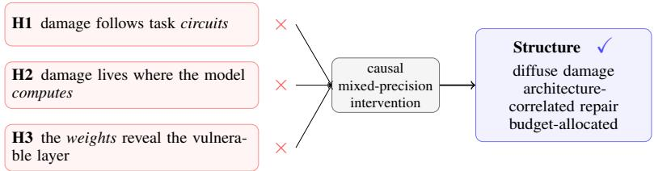
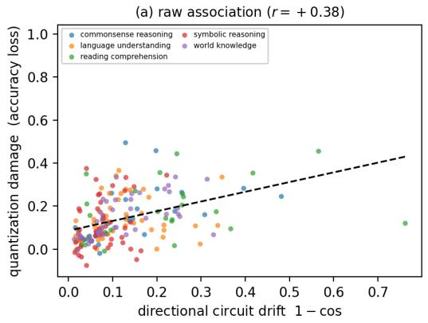
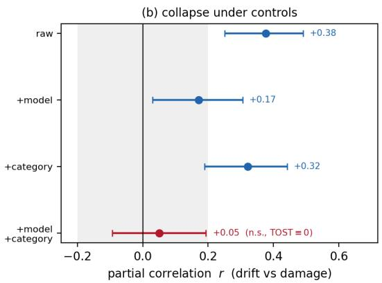
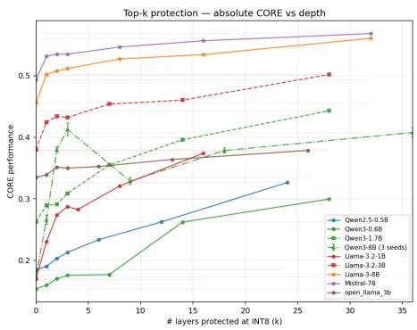
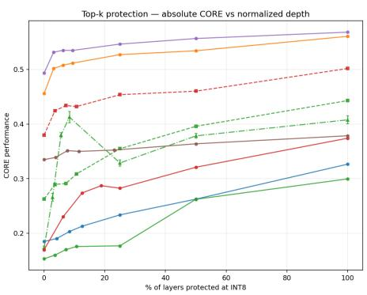
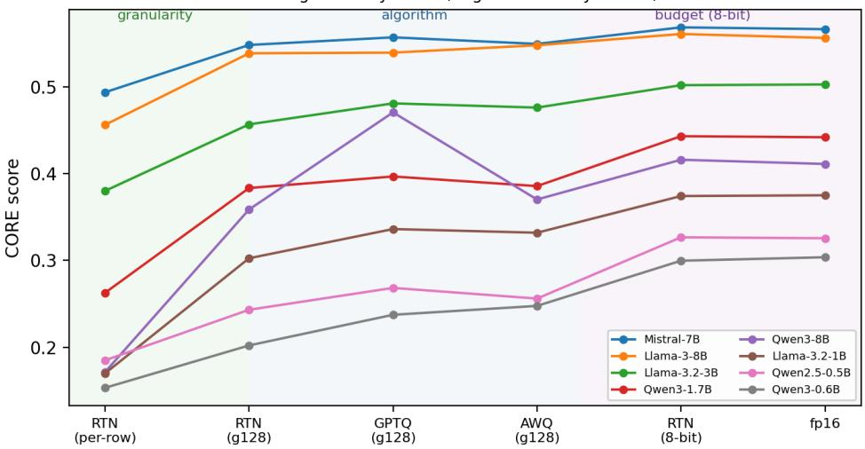

# The Structure of Quantization Damage in LLMs: Why the Next Bit Should Be Spent Globally

Jundong Hu∗ PayPal AI jundhu@paypal.com

Shekar Ramachandran PayPal AI sheramachandran@paypal.com

## Abstract

Post-training quantization (PTQ) is widely used to reduce the cost of serving large language models (LLMs), but its accuracy cost is uneven and is often tuned per model. We study where quantization damage occurs and how to allocate a small additional precision budget. Using causal mixed-precision intervention as ground truth (raise each layer to 8-bit in turn and measure the accuracy it recovers) across 9 open-weight models in 4 architecture families, we test 3 intuitive hypotheses: that quantization damage lives in task circuits, where the model computes, or in weight statistics. None of them predicts which layers benefit from restored precision. Recovery is instead diffuse: for 8 of 9 models, recovering 75% of the gap takes roughly half the layers; the lone exception, Qwen3-8B, is sharply concentrated. At a matched precision budget, spending it globally on finer quantization granularity beats locally repairing the most recoverable layers for all 8 group-128-compatible models (all but OpenLLaMA, whose width rules out group-128), by 21–52 points, including the concentrated Qwen3-8B. We report 2 secondary findings: the residual is budget-limited (8-bit is near-lossless in our evaluation across RTN, GPTQ, and AWQ), and the location of peak recovery correlates with architecture within a family, though not across families. Within this budget setting, global granularity is a better default than selectively protecting critical layers. More broadly, cheap signals that correlate with quantization damage do not necessarily identify where restoring precision improves accuracy; this must be tested with causal intervention.

## 1 Introduction

Quantization is now standard for cheap LLM serving, but its accuracy cost is uneven: under the same 4-bit scheme some models and tasks lose far more than others, and practitioners mitigate this by trial and error. A natural response is to locate the damage: if we know which parts of the network low precision hurts, we can protect them. This leads to 2 practical questions: where does the damage occur, and how should a limited precision budget be allocated to repair it?

We test 3 hypotheses about the location of the damage, and therefore about where precision should be restored; 2 come from interpretability and 1 from the weights: task circuits (H1), where the model computes (H2), or its weights (H3). Each comes with a cheap localizer (circuit drift, causal activation patching, weight statistics), but a localizer is only useful if it points at precision that pays off. We test all 3 against a causal ground truth, mixed-precision intervention: raise each candidate location to 8-bit in turn, leave the rest at 4-bit, and measure the accuracy recovered (its marginal value of precision).

None of the 3 localizers reliably predicts this marginal value. The mixed-precision intervention instead shows recovery is generally diffuse: at a matched budget, precision is best allocated globally, to finer granularity, not to a critical few layers (Figure 1; claims below).

  
Figure 1: Three hypotheses, one causal test. Three hypotheses for where quantization damage lives (H1–H3, left) are each refuted by mixed-precision intervention (center, ×); the resulting pattern is shown at right (✓).

## Contributions.

• A resource-allocation rule for precision. At matched effective bits/weight, global granularity beats oracle-selected local layer repair for all 8 group-128-compatible models (by 21–52 points), including the most concentrated one (Qwen3-8B): unconditional within the tested budget setting (§5).

• No cheap localizer predicts the marginal value of precision. Task circuits, the causal computation site, and weight/reconstruction statistics all fail to locate where restoring precision recovers accuracy; only the causal intervention identifies where restoring precision improves accuracy (§4).

• The structure of recovery. Damage is diffuse (∼half the layers); the residual is budgetlimited (8-bit near-lossless across RTN, GPTQ, AWQ); and where recovery concentrates, the site is architecture-correlated within a family (leave-one-out predicts the held-out LLaMA-3.x size, 3/3), not across (§4–§5).

## 2 Related Work

Standard 4-bit PTQ (round-to-nearest (RTN), group-wise scaling, GPTQ [Frantar et al., 2023] and AWQ [Lin et al., 2024]) and near-lossless mixed-precision 8-bit inference [Dettmers et al., 2022] define our operating range. We introduce no quantization method, instead separating the contributions of granularity and quantization algorithm. Sensitivity-based allocation (Hessian importance [Dong et al., 2019], weight magnitude) and salience-based weight protection [Xiao et al., 2025] both assume damage is localizable. We find the recoverable layer is dissociated from causal importance, weight statistics, and reconstruction error (we do not test Hessian sensitivity itself; see §6), so such heuristics transfer only within some families, and our “no few-layer fix” concerns whole layers, leaving weightlevel protection a separate axis. Task-aware quantization ties damage to calibration data [Williams and Aletras, 2024] and task [LeVi et al., 2025]; we examine why it is task-specific. We also use circuit analysis and causal-intervention methods [Meng et al., 2022, Wang et al., 2023, Vig et al., 2020], which were developed to explain behavior, to generate candidate localizers. We retain only signals that pass causal validation.

## 3 Experimental Setup

Models and evaluation. We study 9 open-weight models spanning 4 architecture families and a 16× size range: LLaMA-3.2-1B/3B [Meta AI, 2024] and LLaMA-3-8B [AI@Meta, 2024]; Qwen2.5- 0.5B [Qwen Team, 2024] and Qwen3-0.6B/1.7B/8B [Qwen Team, 2025]; Mistral-7B [Jiang et al., 2023]; and OpenLLaMA-3B [Geng and Liu, 2023]. Each is evaluated on 22 tasks at 200 samples/task with a fixed continuation-scoring harness (CORE [Li et al., 2024], a nanochat-style loop [Karpathy, 2025], seed 1337). The tasks span reading comprehension, commonsense completion, factual retrieval, and formal/symbolic reasoning, among others (e.g. squad, hellaswag, arc\_challenge, dyck\_languages), and cluster into roughly 5 reproducible groups stable across all 9 models, so “quantization disrupts task circuits” is a natural hypothesis (Appendix A). Quantization damage is a model’s fp16→4-bit CORE gap.

Three hypotheses, one causal test. The 3 hypotheses locate the damage, each with a cheap localizer computed on a common calibration set: H1 (circuits), each task’s head-deviation profile (every head’s activation relative to the cross-task mean), from which we measure circuit drift; H2 (computation site), causal activation patching [Meng et al., 2022], i.e. which layers the prediction causally depends on; and H3 (weights), per-layer weight statistics (standard deviation and reconstruction error). We compare these localizers with one causal instrument, mixed-precision intervention: raise a chosen layer (or set) to 8-bit with the rest at 4-bit and read the fraction of the 4-bit→8-bit gap it recovers, the marginal value ofprecision at that location. We regard a localizer as successful only when it identifies a location at which the intervention shows a precision benefit.

Quantization. The controlled damage probe is per-row RTN at 4-bit (localization, §4); the budget analysis (§5) adds package GPTQ/AWQ (llm-compressor [Red Hat AI and vLLM Project, 2024], W4A16, group-128) and an 8-bit tier. Our group-128 configuration needs a width divisible by 128, which excludes OpenLLaMA (intermediate dim 8640); the budget analysis (§5) therefore covers the 8 remaining models.

## 4 Three Hypotheses, None Sufficient: The Damage Is Diffuse

None of the three localizers predicts layer-level recovery. H1 (circuits): if quantization hurt a task by reorganizing its circuit, tasks whose circuits drift more should lose more accuracy. This prediction fails: the raw drift–damage correlation (r=+0.377, 198 task–model pairs) is a task-type confound that falls to +0.05 (n.s.) after jointly controlling for model and category, TOST (two onesided tests)-equivalent to zero within ±0.2 [Lakens, 2017, Schuirmann, 1987] and not underpowered (magnitude drift does predict damage under the same test; Appendix B). H2 (computation site): causal activation patching places computation at the boundary layers (first and last MLP), which suggests protecting them. However, the boundary pair recovers ≤13% of the gap in 6 of 9 models (only Mistral-7B is substantially helped, 55.5%; Qwen3-1.7B and OpenLLaMA exceed 13% only modestly; Appendix C), so the computation site does not predict the repair site. H3 (weights): weight statistics (standard deviation or reconstruction error) should identify the recoverable layer, but neither does so outside LLaMA: a weight-std “fragility” heuristic finds it only within LLaMA (there, L1), missing Mistral’s endpoint and Qwen’s L4, while reconstruction error is negatively related to recovery in the one concentrated model (Qwen3-8B), whose most-recoverable layers are among the lowest-error ones (protecting its top 3 cuts reconstruction error by only ∼7% yet recovers nearly all the accuracy; Appendix D). We do not test Hessian sensitivity (§6).

The damage is diffuse. Because none of the localizers identifies a small set of layers, we next measure how many layers must be restored. Ranking layers by their own protect-one recovery (raising that layer alone to 8-bit; an oracle order) and restoring the top-k to 8-bit, recovery accrues slowly: reaching 50/75/90% of the gap takes ∼20/49/73% of layers on average (9/9 models; curves in Figure 3, Appendix E). No single layer accounts for more than ∼44% of the damage in any model. Recovering most of the gap thus needs roughly half the network, not a few layers.

Peak recovery locations correlate within a family. Qwen3-8B is an exception: its 3 highestrecovery layers recover essentially the whole gap (its single best only ∼40%), so concentration is family-contingent. Where it sits is architecture-correlated: LLaMA-3.x peaks at the same layer (L1) at every size, so leave-one-out predicts the held-out size (3/3); Mistral (n=1) peaks at its last, Qwen only at 8B. But this is within-family only: Qwen3’s peak moves with scale, and no signal forecasts a new family’s site before a sweep (Appendix E). The recoverable fraction therefore does not align with any of the 3 localizers. Under our greedy, recovery-ranked protocol, no small layer set closes the remaining gap; identifying layers is therefore insufficient, and we next examine allocation of the global bit budget.

## 5 Where the Next Bit Should Go: At a Matched Budget, Global Granularity Beats Local Repair

Starting from per-row 4-bit RTN, a small increment of +0.146 effective bits/weight can be allocated in 2 ways: globally, by using finer granularity everywhere (per-row → group-128 scales), or locally, by restoring the most-recoverable whole layers to 8-bit. We match the two at equal effective bits/weight (first-order, weight-only, non-integer layer counts interpolated; App. G) and score recovery as % of the per-row RTN4→RTN8 CORE gap.

Table 1: Global (g128) vs. matched local 8-bit repair at +0.146 eff. bits/weight (8 group-128- compatible models; OpenLLaMA’s dim 8640 ∤ 128, so g128 is undefined). Recovery = % of the per-row RTN4→RTN8 CORE gap; “top-1 conc.” = single-best-layer recovery.
<table><tr><td>Model</td><td>global (g128)</td><td>local @ matched</td><td>top-1 conc.</td></tr><tr><td>Llama-3-8B</td><td>78.8</td><td>44.7</td><td>43.7</td></tr><tr><td>Qwen3-8B</td><td>76.6</td><td>54.9</td><td>39.7</td></tr><tr><td>Mistral-7B</td><td>72.9</td><td>51.7</td><td>50.9</td></tr><tr><td>Qwen3-1.7B</td><td>66.9</td><td>14.9</td><td>14.9</td></tr><tr><td>Llama-3.2-1B</td><td>64.9</td><td>17.2</td><td>29.5</td></tr><tr><td>Llama-3.2-3B</td><td>62.9</td><td>36.7</td><td>36.5</td></tr><tr><td>Qwen2.5-0.5B</td><td>41.1</td><td>3.4</td><td>3.9</td></tr><tr><td>Qwen3-0.6B</td><td>33.4</td><td>4.8</td><td>4.7</td></tr></table>

At a matched budget, global beats local for every model. Global granularity yields higher recovery than the best matched local repair for all 8 group-128-compatible models, by 21–52 points (Table 1). The local arm is oracle-selected (top layers by their own protect-one recovery, scored on the set they select on), so this is a conservative bound: a deployable selector would do worse. Even the most concentrated model, Qwen3-8B, favors global (77 vs. 55%). Finer granularity applied globally is therefore a better default than selective layer protection, unconditional within the tested matched-budget setting (scope caveats in §6).

Why this holds, and that it is robust. Concentration does not imply that local repair is better at this budget: the local arm funds only ∼1.3 layers, and Qwen3-8B’s single best recovers just ∼40%, so even a model whose top 3 layers would close the gap cannot assemble enough of them locally. Concentration is a property of the cumulative curve, not of what a tight budget can fund. The comparison is also insensitive to substantial errors in the bit accounting. The equal-budget match is first-order, but for the 7 diffuse models local repair would need 5.16–6.33 effective bits/weight to match global (7–15× the disputed +0.146 increment), so the accounting would have to be wrong by 7–15× to flip any of them. Only Qwen3-8B is close (local ties global at 4.206 bits/weight, +0.05 over g128), and its local arm is oracle-selected. A task-bootstrap agrees: P(global>local)≥0.95 for 8/8, and the 95% margin CI excludes local for 6/8 (Appendix G).

Granularity, not algorithm, drives the 4-bit gain. The gain from the global arm is primarily attributable to granularity rather than calibration: per-row→g128 RTN recovers +0.095 CORE on average, whereas GPTQ and AWQ add only +0.020/+0.017 over the same granularity. At 8-bit, the methods perform similarly within the evaluation noise: per-row RTN matches fp16 within harness noise (residual CI contains zero for 6/8; full ladder, Table 8), and every 4-bit lever collapses to zero (Appendix F).

## 6 Limitations

Untested alternatives: our “no few-layer fix” is scoped to greedy, recovery-ranked interventions at layer granularity; non-greedy layer sets and weight-level salience protection [Xiao et al., 2025] are untested, and H3 covers weight standard deviation and reconstruction error, not Hessian sensitivity. Maximal-damage regime: localization uses per-row RTN as a maximal-damage probe (§4), so whether the same structure holds at the smaller gaps of GPTQ/AWQ/g128 is untested. Scale ceiling: all runs used a single 40 GB A100 (MIG) partition, which capped evaluation at ≤8B parameters, so larger scales are untested. Oracle selectors: our top-k curves rank and score on the same eval set (only Qwen3-8B is multi-seeded), so they are oracle, not deployable, selectors; small-model recoveries lie near the noise floor, and Mistral and OpenLLaMA are single models (n=1). First-order bit-accounting: the equal-budget comparison is per-layer and weight-only; an exact-byte, per-weight local allocation and a multi-bit rate–distortion sweep [Xu et al., 2024] are left to future work.

## Author Contributions

Jundong Hu: Led and carried out the research end to end, including conceptualization, methodology, implementation, experimental design and execution, analysis, and manuscript drafting and revision.

Shekar Ramachandran: Provided supervision, compute resources, and manuscript review.

## Acknowledgments

We thank Prakhar Mehrotra, Chandramouliswaran V, Avinash Karn, Anindya Moitra, Uma Kona, Angela McAtee, Linsey Pang, and Yun-Shiuan Chuang for their organizational support and coordination throughout this work. Jundong Hu additionally thanks Loga Vinayagam for the opportunity to join the team where this work began.

## References

AI@Meta. Llama 3 Model Card. https://github.com/meta-llama/llama3/blob/main/ MODEL\_CARD.md, 2024.

Tim Dettmers, Mike Lewis, Younes Belkada, and Luke Zettlemoyer. LLM.int8(): 8-bit matrix multiplication for transformers at scale. In Advances in Neural Information Processing Systems (NeurIPS), 2022.

Zhen Dong, Zhewei Yao, Amir Gholami, Michael W. Mahoney, and Kurt Keutzer. HAWQ: Hessian aware quantization of neural networks with mixed-precision. In Proceedings of the IEEE/CVF International Conference on Computer Vision (ICCV), 2019.

Elias Frantar, Saleh Ashkboos, Torsten Hoefler, and Dan Alistarh. GPTQ: Accurate post-training quantization for generative pre-trained transformers. In International Conference on Learning Representations (ICLR), 2023. arXiv:2210.17323.

Xinyang Geng and Hao Liu. OpenLLaMA: An Open Reproduction of LLaMA. https://github. com/openlm-research/open\_llama, 2023.

Albert Q. Jiang, Alexandre Sablayrolles, Arthur Mensch, Chris Bamford, Devendra Singh Chaplot, Diego de las Casas, Florian Bressand, Gianna Lengyel, Guillaume Lample, Lucile Saulnier, Lélio Renard Lavaud, Marie-Anne Lachaux, Pierre Stock, Teven Le Scao, Thibaut Lavril, Thomas Wang, Timothée Lacroix, and William El Sayed. Mistral 7B. arXiv preprint arXiv:2310.06825, 2023. URL https://arxiv.org/abs/2310.06825.

Andrej Karpathy. nanochat: The best ChatGPT that \$100 can buy. https://github.com/ karpathy/nanochat, 2025.

Daniël Lakens. Equivalence tests: A practical primer for t tests, correlations, and meta-analyses. Social Psychological and Personality Science, 8(4):355–362, 2017. doi: 10.1177/1948550617697177. URL https://doi.org/10.1177/1948550617697177.

Amit LeVi, Raz Lapid, Rom Himelstein, Chaim Baskin, Ravid Shwartz Ziv, and Avi Mendelson. You had one job: Per-task quantization using LLMs’ hidden representations. arXiv preprint arXiv:2511.06516, 2025. Accepted at ICML 2026 Workshop on AdaptFM.

Jeffrey Li, Alex Fang, Georgios Smyrnis, Maor Ivgi, Matt Jordan, Samir Yitzhak Gadre, et al. DataComp-LM: In search of the next generation of training sets for language models. In Advances in Neural Information Processing Systems (NeurIPS) Datasets and Benchmarks Track, 2024.

Ji Lin, Jiaming Tang, Haotian Tang, Shang Yang, Wei-Ming Chen, Wei-Chen Wang, Guangxuan Xiao, Xingyu Dang, Chuang Gan, and Song Han. AWQ: Activation-aware weight quantization for on-device LLM compression and acceleration. In Proceedings ofMachine Learning and Systems (MLSys), 2024.

Kevin Meng, David Bau, Alex Andonian, and Yonatan Belinkov. Locating and editing factual associations in GPT. In Advances in Neural Information Processing Systems (NeurIPS), 2022.

Meta AI. Llama 3.2 Model Card. https://github.com/meta-llama/llama-models/blob/ main/models/llama3\_2/MODEL\_CARD.md, 2024. Covers the Llama 3.2 1B and 3B text models.

Qwen Team. Qwen2.5: A Party of Foundation Models, September 2024. URL https://qwenlm. github.io/blog/qwen2.5/. Model checkpoint: Qwen/Qwen2.5-0.5B.

Qwen Team. Qwen3 Technical Report, 2025. URL https://arxiv.org/abs/2505.09388.

Red Hat AI and vLLM Project. LLM compressor: Model compression toolkit for large language models. https://github.com/vllm-project/llm-compressor, 2024.

Donald J. Schuirmann. A comparison of the two one-sided tests procedure and the power approach for assessing the equivalence of average bioavailability. Journal of Pharmacokinetics and Biopharmaceutics, 15:657–680, 1987. doi: 10.1007/BF01068419. URL https: //doi.org/10.1007/BF01068419.

Jesse Vig, Sebastian Gehrmann, Yonatan Belinkov, Sharon Qian, Daniel Nevo, Yaron Singer, and Stuart Shieber. Investigating gender bias in language models using causal mediation analysis. In Advances in Neural Information Processing Systems (NeurIPS), 2020.

Kevin Wang, Alexandre Variengien, Arthur Conmy, Buck Shlegeris, and Jacob Steinhardt. Interpretability in the wild: a circuit for indirect object identification in GPT-2 small. In International Conference on Learning Representations (ICLR), 2023.

Miles Williams and Nikolaos Aletras. On the impact of calibration data in post-training quantization and pruning. In Proceedings of the 62nd Annual Meeting of the Association for Computational Linguistics (ACL), 2024.

Hanqi Xiao, Yi-Lin Sung, Elias Stengel-Eskin, and Mohit Bansal. Task-circuit quantization: Leveraging knowledge localization and interpretability for compression. In Proceedings of the Conference on Language Modeling (COLM), 2025. URL https://openreview.net/forum?id= a201nfn3xX. arXiv:2504.07389.

Zifei Xu, Alexander Lan, Wanzin Yazar, Tristan Webb, Sayeh Sharify, and Xin Wang. Scaling laws for post-training quantized large language models. In NeurIPS 2024 Workshop on Efficient Natural Language and Speech Processing (ENLSP), 2024.

## A Task Circuit Clusters

We probe each task’s reliance on attention heads by recording, for every head, its activation relative to the cross-task mean (a head-deviation profile), then cluster the 22 tasks by cosine similarity of these profiles (Ward linkage). The cluster count is chosen by silhouette score, an internal criterion using no task labels: sweeping k = 2 . . . 8, the silhouette is sharply maximal at k=2 (the formal-vs-rest cut) and has a broad secondary plateau around k=5, the granularity we report as it is the finest split that stays stable across all 9 models.

Five stable groups. Across all 9 models the tasks recur in the 5 groups of Table 2. The strongest, most universal cut is k=2 (formal/structured vs. the rest), drawn identically by every model across a 16× size range. Head-only silhouette at k=5 ranges 0.48–0.60, and head-only clustering beats head+MLP in 8/9 models (adding MLP neurons degrades quality, e.g. Llama-3-8B 0.54→0.43), so we use the head-deviation signal in the remaining analyses.

Interpretation of the clusters. The groupings are more consistent with task demands than with surface labels: arc\_easy and arc\_challenge co-cluster in 9/9 models (a single multiple-choice mechanism); language\_identification clusters with formal tasks in 7/9 (processed as pattern-matching); and commonsense\_qa is a persistent orphan (7 different partner sets). “Same tasks cluster” means similar relative activation patterns, not that identical physical heads fire; each model finds its own circuits under similar computational demands.

Table 2: The 5 data-driven task groups (recurring across the 9 models; coqa co-clusters in 7/9, with 2 further variable tasks discussed in the text).
<table><tr><td>Group</td><td>Tasks</td></tr><tr><td>Formal / structured</td><td>dyck_languages, 1sat_ar, cs_algorithms, operators, repeat_copy_logic</td></tr><tr><td>Short-context completion</td><td>copa, openbook_qa, lambada, winograd, winogrande</td></tr><tr><td>Reading comprehension</td><td>squad, boolq (coqa 7/9)</td></tr><tr><td>Factual retrieval</td><td>jeopardy, bigbench_qa_wikidata</td></tr><tr><td>Multiple-choice selection</td><td>arc_easy, arc_challenge, hellaswag, piqa</td></tr></table>

## B Circuit Drift Is a Task-Type Confound (H1)

Directional drift is $1 - \cos ( { \bf c } ^ { \mathrm { f p 1 6 } } , { \bf c } ^ { \mathrm { r t n 4 } } )$ on the centered head-deviation profile c. Table 3 reports the full control-subset grid behind H1 (§4): the drift–damage association remains significant after each control is applied separately, but is no longer significant when model and task category are controlled jointly (Figure 2). Under joint control it is also TOST-equivalent to zero within ±0.2. Baseline difficulty is a mild suppressor (controlling it alone raises r).

Table 3: Partial Pearson r between directional drift and damage under increasing controls (198 task–model pairs); each row adds the controls named at left.
<table><tr><td>Controls held constant</td><td>partial r</td><td>95% CI</td><td>p</td></tr><tr><td>none (raw)</td><td>+0.377</td><td>[+0.25, +0.49]</td><td>&lt; 0.001</td></tr><tr><td>baseline only</td><td>+0.425</td><td>[+0.30, +0.53]</td><td>&lt; 0.001</td></tr><tr><td>category only</td><td>+0.322</td><td>[+0.19, +0.44]</td><td>&lt; 0.001</td></tr><tr><td>model only</td><td>+0.172</td><td>[+0.03, +0.31]</td><td>0.018</td></tr><tr><td>model + baseline</td><td>+0.163</td><td>[+0.02, +0.30]</td><td>0.025</td></tr><tr><td>model + category</td><td>+0.054</td><td>[−0.09, +0.20]</td><td>0.46</td></tr><tr><td> ${ \mathrm { m o d e l + b a s e l i n e + c a t e g o r y } }$ </td><td>+0.054</td><td>[−0.09, +0.20]</td><td>0.46</td></tr></table>

  
Figure 2: Circuit drift vs. damage. (a) Pooled scatter of drift against damage across 198 (task, model) pairs, with the raw regression line. (b) Partial correlation between drift and damage as controls are added left-to-right (TOST ±0.2 equivalence band shaded), ending with model and task category held jointly constant.

A further 4 corroborating tests agree with the grid. A mixed-effects model (acc\_drop ∼ drift + (1|model)) gives a coefficient o $\tilde { \cdot } - 0 . 2 3 5 \left( p = 0 . 0 1 5 \right)$ before category control. The confound lives in task type. A within-model permutation test $( 1 0 ^ { 4 }$ permutations) gives $p = 0 . 0 2 4 \colon$ it controls for model but not category, so it stays significant via the task-type confound. A model-level t-test (each model one unit) gives mean per-model $r = + 0 . 1 8 ( t = 3 . 0 1 , p = 0 . 0 1 7 ) , 8 / 9$ positive but 0/9 individually significant. Finally, repeating the model-controlled test within each of the 5 task clusters yields $| r | \leq 0 . 2 3$ in all 5 (all n.s.), so the dissociation is not a quirk of one task type.

## C H2: Where the Model Computes, Boundary-Pair Recovery

Causal activation patching localizes computation to the boundary layers (first and last MLP); we therefore test protection of that pair. Protecting the causal boundary pair at 8-bit recovers, per model: Mistral-7B 55.5% (L0+31); Qwen3-1.7B 21.6% (L0+27); OpenLLaMA 16.3% (L0+25); Qwen3-8B 12.9% (L0+35); Llama-3.2-1B 11.2% (L0+15); Qwen3-0.6B 7.8% (L0+27); Llama-3.2-3B 5.3% (L0+27); Llama-3-8B 2.2% (L0+31); Qwen2.5-0.5B −4.1% (L0+23). Overall, 6 of 9 are ≤13% of the gap; only Mistral-7B is substantially helped (Qwen3-1.7B and OpenLLaMA exceed 13% only modestly), so the computation site does not predict the repair site.

## D H3: Weight Statistics Do Not Localize the Layer

Weight-std vs. ground truth. The weight-std “fragility” pair matches the protect-one peak (Appendix E) only in the LLaMA family (Table 4).

Table 4: E1 fragile-pair recovery vs. the true protect-one sweep peak; “found?” marks whether the weight-std pair coincides with the sweep peak.
<table><tr><td>Model</td><td>weight-std pair (recovery)</td><td>true peak</td><td>found?</td></tr><tr><td>Llama-3.2-1B</td><td>L1+5 (45.8%)</td><td>L1</td><td>yes</td></tr><tr><td>Llama-3.2-3B</td><td>L1+5 (37.0%)</td><td>L1</td><td>yes</td></tr><tr><td>Llama-3-8B</td><td>L1+15 (40.6%)</td><td>L1</td><td>yes</td></tr><tr><td>Mistral-7B</td><td>L3+2 (-1.9%)</td><td>L31</td><td>no (caught via boundary, 55.5%)</td></tr><tr><td>Qwen3-8B</td><td>L24+23 (-0.1%)</td><td>L4</td><td>no</td></tr><tr><td>Qwen3-1.7B</td><td>L26+21 (6.6%)</td><td>L2</td><td>no</td></tr></table>

Reconstruction-error decoupling. Because we protect by protect-one recovery, the recoverable layers are the lowest-reconstruction-error layers: for Qwen3-8B, protecting the top 3 cuts total weight reconstruction error by only ∼7% yet recovers nearly all the accuracy, while the remaining 285× reduction buys essentially nothing. Reconstruction error increases toward later layers, whereas CORE recovery is concentrated earlier in the network.

## E Diffuseness and Concentration of Recovery

No few-layer fix (per model). Table 5 gives the best single-layer and best tested-pair recovery (% of the RTN4→RTN8 CORE gap, all @200/task).

Table 5: Best single-layer (protect-one) and best tested-pair (E1) recovery, % of the RTN4→RTN8 gap. Residual = 100 − max(best single, best pair). ∗Qwen3-8B’s tested pairs missed its sweep peak L4; we report the protect-one L4 recovery (3-seed mean 39.7±3%; per seed 38.1/44.2/36.7%). †open\_llama gap 0.043 (near-noise).
<table><tr><td>Model</td><td>best single (@layer)</td><td>best pair (E1)</td><td>residual</td></tr><tr><td>Mistral-7B</td><td>50.9% (L31)</td><td>55.5% (L0+31)</td><td>~45%</td></tr><tr><td>Llama-3-8B</td><td>43.7% (L1)</td><td>40.6% (L1+15)</td><td>~56%</td></tr><tr><td>Qwen3-8B</td><td>39.7±3% (L4) *</td><td>12.9% (L0+35)</td><td>~60%</td></tr><tr><td>Llama-3.2-3B</td><td>36.5% (L1)</td><td>41.2% (L0+1)</td><td>~59%</td></tr><tr><td>Llama-3.2-1B</td><td>29.5% (L1)</td><td>45.8% (L1+5)</td><td>~54%</td></tr><tr><td>Qwen3-1.7B</td><td>14.9% (L2)</td><td>21.6% (L0+27)</td><td>~78%</td></tr><tr><td>open_llama_3b</td><td>9.2% (L6)</td><td>22.7%†</td><td></td></tr><tr><td>Qwen3-0.6B</td><td>4.7% (L0)</td><td>7.8%</td><td>~92%</td></tr><tr><td>Qwen2.5-0.5B</td><td>3.9% (L2)</td><td>4.7%</td><td>~95%</td></tr></table>

Damage per layer is small (single-layer damage). No single layer accounts for more than ∼44% of the damage (all 9 models): max single-layer damage is Mistral 43.9%, Llama-3-8B 30.7%, Llama

3.2-3B 28.6%, Llama-3.2-1B 20.5%, open\_llama 14.8%, Qwen2.5-0.5B 13.4%, Qwen3-8B 13.1%, Qwen3-0.6B 11.5%, Qwen3-1.7B 8.1%, consistent with damage being distributed across layers.

E1↔E2 additivity (validation). Pair recovery closely matches the sum of the 2 single-layer recoveries (ratios 0.91–1.10): Llama-3.2-1B 45.8 vs 44.6 (1.03); Llama-3-8B 40.6 vs 41.0 (0.99); Qwen3-1.7B 21.6 vs 22.3 (0.97); Llama-3.2-3B 41.2 vs 37.4 (1.10); Mistral-7B 55.5 vs 60.7 (0.91). The pair results are therefore consistent with the sum of the 2 single-layer effects.

Top-k cumulative protection. Ranking layers by protect-one recovery and protecting the top-k together, the mean depth to recover 50/75/90% of the gap is 20/49/73% of layers (9/9). Qwen3-8B is the most concentrated model: its top 3 most-recoverable layers (L4, L2, L6) recover essentially the whole gap. Multi-seeded (eval seeds 1337/42/0): k1=39.7 ± 3, k2=88.2 ± 2, k3=102.2 ± 4 (per-seed spreads are tight, suggesting that the single-layer variance is driven more by task sampling than by the evaluation seed); the slight > 100% at k=3 is eval-sampling noise around the 8-bit ceiling (the k3 model reconstructs weights 285× worse than full 8-bit yet scores as high; few-shot self-exclusion holds).

  
Figure 3: Cumulative CORE as the top-k most-recoverable layers are restored to 8-bit (rest at 4-bit), against each model’s 4-bit (floor) and 8-bit (ceiling) bands. Layers are ranked by their own protect-one recovery, an oracle ordering, not a deployable selector. Curves are absolute CORE on the finite 200-sample subset, so cross-model levels track fp16 baselines (Qwen3-8B’s level sits marginally below Qwen3-1.7B’s here, a small-sample ordering, not a model defect); all claims are within-model recovery. Color=family, marker/linestyle=size.

## F Budget and Method Decomposition

The full ladder (CORE @200; GPTQ/AWQ = 3-seed calibration mean). Table 6 gives the per-model rungs and the granularity/method decomposition.

Headline. Mean granularity gain +0.095 (Table 7); excluding Qwen3-8B from both method columns (its GPTQ value exceeds fp16; Table 6), mean method gain is GPTQ +0.020 / AWQ +0.017 (0.21× / 0.18× the granularity gain); including it, GPTQ rises to +0.032 (0.33×) and AWQ is +0.016. Method-isolated recovery (also excl. that model) is ≈34% (GPTQ) / ≈28% (AWQ) of the fp16→g128-RTN gap. Effective bits per weight: per-row RTN 4.01, g128 4.156, fp16 16.

8-bit tier. At 8-bit every lever collapses (Table 7): per-row RTN is already lossless (mean gap to fp16 −0.001, every model within ±0.005; full per-model ladder in Table 8), and the Qwen3-8B GPTQ>fp16 anomaly resolves (GPTQ-8 0.418 ≈ fp16 0.411). Figure 4 shows the per-model ladder.

Seed stability and provenance. AWQ is stable across calibration seeds (spread 0–2%); GPTQ is more variable (4–24%, worst on Qwen3-8B). All quantization uses llm-compressor 0.6.0.1 (W4A16 g128), evaluated through the same CORE harness at 200 samples/task on the fixed seed-1337 subset; GPTQ/AWQ use 3 calibration-subset seeds. open\_llama is excluded from the g128 rungs (intermediate dim 8640 ∤ 128) and its fp16→RTN gap 0.043 is near-noise.

Table 6: Per-model 4-bit ladder. gran∆ = per-row→g128 RTN (granularity); the last column is the GPTQ / AWQ gain over g128-RTN (method). ⋄Qwen3-8B GPTQ exceeds fp16 (200-sample noise + regularization); this model is excluded from both method means for consistency. †open\_llama: dim 8640 is not a multiple of 128, so g128 is not run; per-row RTN and fp16 only.
<table><tr><td>Model</td><td>per-row</td><td>g128</td><td>GPTQ</td><td>AWQ</td><td>fp16</td><td>gran∆</td><td>GPTQ / AWQ method</td></tr><tr><td>Qwen2.5-0.5B</td><td>.185</td><td>.243</td><td>.268</td><td>.256</td><td>.325</td><td>+.058</td><td>+.025 / +.013</td></tr><tr><td>Qwen3-0.6B</td><td>.153</td><td>.202</td><td>.237</td><td>.248</td><td>.304</td><td>+.049</td><td>+.035 /+.046</td></tr><tr><td>Qwen3-1.7B</td><td>.263</td><td>.383</td><td>.397</td><td>.385</td><td>.442</td><td>+.121</td><td>+.013/+.002</td></tr><tr><td>Qwen3-8B</td><td>.171</td><td>.359</td><td>.470</td><td>.370</td><td>.411</td><td>+.187</td><td>+.112/+.012</td></tr><tr><td>Llama-3.2-1B</td><td>.170</td><td>.302</td><td>.336</td><td>.332</td><td>.375</td><td>+.133</td><td>+.034/+.029</td></tr><tr><td>Llama-3.2-3B</td><td>.380</td><td>.457</td><td>.481</td><td>.476</td><td>.502</td><td>+.077</td><td>+.024/+.019</td></tr><tr><td>Llama-3-8B</td><td>.456</td><td>.538</td><td>.539</td><td>.548</td><td>.556</td><td>+.082</td><td>+.001/+.009</td></tr><tr><td>Mistral-7B</td><td>.493</td><td>.548</td><td>.557</td><td>.549</td><td>.566</td><td>+.054</td><td>+.009/+.001</td></tr><tr><td>open_llama_3b†</td><td>.335</td><td></td><td></td><td></td><td>.378</td><td></td><td></td></tr></table>

Table 7: Mean CORE gains over the 8 group-128-compatible models, per lever, at the 4-bit and 8-bit tiers. Both the GPTQ and AWQ means exclude Qwen3-8B (its GPTQ value exceeds fp16, a 200-sample outlier; dropped from both method columns for consistency); including it, GPTQ is +0.032 and AWQ +0.016.
<table><tr><td>Lever</td><td>4-bit</td><td>8-bit</td></tr><tr><td>gap to fp16 @ per-row RTN</td><td>+0.151</td><td>-0.001</td></tr><tr><td>granularity (per-row → g128 RTN)</td><td>+0.095</td><td>-0.001</td></tr><tr><td>GPTQ over g128 RTN</td><td>+0.020</td><td>+0.001</td></tr><tr><td>AWQ over g128 RTN</td><td>+0.017</td><td>+0.000</td></tr></table>

## G Equal-Budget Allocation: Global vs. Local (Matched Effective Bits/Weight)

At a matched increment of +0.146 effective bits/weight over per-row 4-bit RTN, we compare spending it globally (group-128 RTN) vs. locally (restore the top layers by protect-one recovery to 8-bit, an oracle recovery ranking, rest 4-bit; matched layer count $k ^ { * } { = } 0 . 0 3 6 5 n _ { L }$ , interpolated along the top-k curve). Recovery is % of the per-row RTN4→RTN8 CORE gap, so the two are directly comparable (Table 1, main text). “top-1” is the single-best-layer recovery (the concentration indicator). Global granularity yields higher recovery for all 8 models; even the most concentrated model, Qwen3-8B, favors global at this matched budget (its single most recoverable layer recovers only ∼40%, so the ∼1.3 layers the budget funds cannot match g128). Note that on the shallowest model (Llama-3.2-1B, nL=16) the matched budget buys only k∗=0.58 of a layer, so its local figure (17.2) is the fractional-layer interpolation of its top-1 (29.5), i.e. +0.146 bits cannot even fund one 8-bit layer there, which favors the global arm even under this interpolation.

Caveat (bounded): the local bit-accounting is first-order (uniform-block, weight-only). To bound its effect we compute, from each model’s per-k curve, the effective bits/weight local repair would need to match global’s recovery: for the 7 diffuse models this is 5.16–6.33 bits/weight, i.e. 1.0–2.2 above g128’s 4.156, or 7–15× the disputed 0.146 increment. The accounting would therefore have to be wrong by 7–15× to flip any of them.

Only the concentrated model, Qwen3-8B, is close: local matches global at 4.206 bits/weight (+0.05 over g128), so a ≈34% under-estimate of the 0.146 increment would tie it, but its local arm is oracle-selected (an upper bound) and its single best layer recovers only ∼40%, so a deployable selector would need more still. Qwen3-8B’s single-layer figure is stable across eval seeds (k=1: 38.1/44.2/36.7%, mean 39.7±3), with k=2/3 at 88±2 / 102±4 (§E).

Task-bootstrap robustness (no new inference). Because CORE averages over tasks and we cache per-task scores, we resample the tasks to put confidence intervals on these margins (5,000 bootstrap resamples of the ∼22 CORE tasks with replacement, seed 1337). Across all 8 models, the globalfavoring margin is robust: P(global>local)≥0.95 for 8/8, and the 95% CI of the margin excludes the local arm for 6/8 (the 2 exceptions, Qwen2.5-0.5B and Mistral-7B, are the near-noise 0.5B model and the smallest-margin singleton). We apply the same bootstrap procedure to Qwen3-8B, the most concentrated model. Its per-seed k=1 recovery is tight (38.1/44.2/36.7%), so its uncertainty is taskrather than seed-driven, and its bootstrapped margin is +25 (95% CI [12, 37], P=1.00). This margin is the median of the resampled margin distribution, which differs from the Table 1 point margin of 21.7 (76.6−54.9) because under task-level skew the median of the per-resample margins is not the difference of the point recoveries. Applying the same resampling to the 8-bit tier, the per-row RTN8→fp16 residual CI contains zero for 6/8 models (8-bit is fp16-lossless within harness noise), with a small residual (< 0.02 CORE) remaining only for Qwen3-1.7B and Llama-3.2-1B.

Table 8: Full 8-bit ladder (CORE @200), for the 8 models with an 8-bit run. Last column: fp16 − per-row RTN8. †open\_llama was not run at 8-bit (per-row 4-bit and fp16 only; Table 6).
<table><tr><td>Model</td><td>fp16</td><td>RTN8</td><td>g128-RTN8</td><td>GPTQ8</td><td>AWQ8</td><td>gap (fp16-RTN8)</td></tr><tr><td>Qwen2.5-0.5B</td><td>.325</td><td>.326</td><td>.324</td><td>.321</td><td>.322</td><td>-.001</td></tr><tr><td>Qwen3-0.6B</td><td>.304</td><td>.300</td><td>.305</td><td>.302</td><td>.305</td><td>+.004</td></tr><tr><td>Qwen3-1.7B</td><td>.442</td><td>.443</td><td>.437</td><td>.439</td><td>.445</td><td>-.001</td></tr><tr><td>Qwen3-8B</td><td>.411</td><td>.416</td><td>.416</td><td>.418</td><td>.411</td><td>-.005</td></tr><tr><td>Llama-3.2-1B</td><td>.375</td><td>.374</td><td>.375</td><td>.377</td><td>.374</td><td>+.001</td></tr><tr><td>Llama-3.2-3B</td><td>.502</td><td>.502</td><td>.502</td><td>.505</td><td>.504</td><td>+.001</td></tr><tr><td>Llama-3-8B</td><td>.556</td><td>.561</td><td>.559</td><td>.562</td><td>.557</td><td>-.005</td></tr><tr><td>Mistral-7B</td><td>.566</td><td>.568</td><td>.566</td><td>.568</td><td>.569</td><td>-.002</td></tr></table>

The 4-bit ladder: granularity climbs, algorithm barely moves, 8-bit closes it  
  
Figure 4: Per-model CORE across the ladder (per-row RTN → g128 RTN → GPTQ → AWQ → 8-bit RTN → fp16). Qwen3-8B’s GPTQ spike above fp16 is the noted 200-sample outlier.