# VATO: A Vortex-Force-Aware Transformer Operator for Unsteady Separated Aerofoil Flows

Xingxin Yanga,∗, Zhan Zhanga,∗, Yichen Lia, Juan Lia,∗∗

aDepartment of Engineering, King’s College London, London, WC2R 2LS, UK

## Abstract

Accurate prediction of unsteady separated flows is challenging because the aerodynamic loads depend on nonlinear separation and vortex-shedding dynamics. Although high-fidelity CFD resolves these mechanisms, its cost limits repeated use in design and control. Standard field-level surrogate training, however, does not distinguish the flow regions that contribute most strongly to the aerodynamic loads. We introduce VATO (Vortex-Force-Aware Transformer Operator), which couples the Vortex Force Map (VFM) method to a geometry-aware neural operator through two complementary mechanisms. VATO-S adds training-only supervision of the local VFM force-contribution field, with no increase in model size or inference cost. VATO-A uses VFM contribution and sensitivity fields to prioritise force-relevant source locations for residual cross attention. The methods are evaluated on unsteady CFD data for double-edged-plate aerofoils over 54 trajectories from nine geometries. Over lead times of 1–20 ms, VATO-S reduces velocity, pressure, and vorticity errors by 10.4%, 1.0%, and 15.6%, respectively, while VATO-A achieves reductions of 15.8%, 7.5%, and 31.2%. VATO-S gives the lowest VFM-derived drag error, whereas VATO-A gives the lowest pressure-derived lift and drag errors. Over lead times extending 50% beyond the training range, VATO-A retains a 26.9% reduction in vorticity error and larger improvements in all four force readouts, despite reduced gains in velocity and pressure. These results show that force-aware operator learning can improve both flow-field prediction and aerodynamic functional accuracy in unsteady separated flows.

Keywords: neural operator, vortex-aware operator learning, residual cross attention, unsteady separated flow

## 1. Introduction

Accurate prediction of unsteady aerodynamic loads is essential for the design, optimisation, and control of vehicles operating in separated flow. In such regimes, lift and drag are governed by flow separation, vortex formation, and vortex shedding, whose strongly nonlinear and history-dependent dynamics are dificult to represent with linearised aerodynamic models. Highfidelity computational fluid dynamics (CFD) can resolve these mechanisms, but the cost of repeated simulations remains prohibitive for iterative design and control. This has motivated the development of data-driven surrogate models that approximate the evolution of the flow and its aerodynamic response at substantially reduced computational cost.

Machine learning has been widely applied across fluid mechanics over the past decade [1, 2], while data-driven modelling of unsteady aerodynamics has developed into a substantial research area of its own [3]. Existing approaches can broadly be separated according to whether they predict aerodynamic quantities directly or reconstruct the underlying flow field. At the level of aerodynamic coeficients, Yao et al. [4] optimised the endurance coeficient of a tail-sitter UAV using a multi-objective genetic algorithm, Lou et al. [5] modified aerofoil geometry with a double deep Q-network using a neural-network reward, Zhu et al. [6] learned a closure between turbulent eddy viscosity and mean flow variables, and Zhao et al. [7] predicted the lift-to-drag characteristics of Mars helicopter aerofoils. Liu et al. [8] review this broader class of surrogate-based aerodynamic shape modelling and optimisation. These approaches demonstrate that learned surrogates can replace repeated solver evaluations when integral aerodynamic quantities are the primary outputs, but models based on steady or time-averaged quantities do not directly resolve the unsteady flow structures responsible for transient load histories. Field-level surrogates instead seek to reconstruct the spatial flow state from which aerodynamic quantities can subsequently be evaluated. Convolutional and fully connected architectures have reproduced aerodynamic fields and coeficients across varied geometries [9, 10, 11], while recurrent architectures have been developed for unsteady modelling [12, 13, 14] and high-incidence prediction [15]. Recursive temporal prediction, however, remains susceptible to accumulated error over long horizons. Physics-informed formulations constrain the learned field by the governing equations [16]. Neural operators learn mappings between function spaces that transfer across discretisations, through branch-trunk architectures built on the universal approximation theorem for operators [17], spectral parameterisations of the integral kernel [18], and formulations that impose boundary conditions for aerofoil flows [19]. Physics-guided reconstruction has recovered high-fidelity fields from sparse or low-resolution inputs with difusion models [20, 21] and regularised sparse compressible-flow reconstruction with discrete conservation residuals [22].Geometry-aware operator transformers further extend operator learning to unstructured meshes and non-uniform domains [23], enabling a single surrogate to operate across families of geometries.

Despite these advances, the training signal in field-level surrogates is applied uniformly over the computational domain. A relative error on velocity, pressure, or vorticity assigns every mesh point the same weight, so the wake and far field, which occupy most of the mesh, dominate the objective, while the aerodynamic load originates in a small fraction of the domain. The objective therefore contains no mechanism that identifies the flow structures on which the downstream design or control task depends. The Vortex Force Map (VFM) method [24, 25, 26] provides a mechanics-based means of making this distinction. VFM solves an auxiliary potential problem determined by the body geometry and force direction, producing a vortex-force factor field whose interaction with the local velocity and vorticity identifies the spatial contribution of the flow to lift or drag. The auxiliary field requires no additional flow solution and can therefore be precomputed for each geom etry and incidence before operator training. VFM was introduced to estimate unsteady forces from measured or computed snapshots [24, 25] and has subsequently been extended to three-dimensional (3-D) unsteady flow [26]. He et al. [33] combined vortex-force information with a graph convolution attention network to infer velocity and vortex-force contributions from incomplete flow measurements and thereby recover force coeficients for flow around a circular cylinder, demonstrating that vortex-force information can guide reconstruction from sparse observations. However, the question remains: whether vortex-force awareness can be introduced to shape the learning and information-routing mechanisms of a neural operator for full-field unsteady prediction.

To address this question, we introduce VATO (Vortex-Force-Aware Transformer Operator), a family of neural operators that couples the VFM method to a geometry-aware transformer backbone [23] at two interfaces. VATO-S supervises the per-point VFM contribution field during training, leaving the architecture, the parameter count, and the inference-time operator of the backbone unchanged, and therefore suits deployments in which inference cost is fixed. VATO-A uses the current flow vorticity together with the VFM contribution and sensitivity fields to identify regions relevant to Lift and Drag, and admits the ordinary flow state from those regions through residual cross attention without embedding the VFM values, providing larger field improvements where additional inference cost is acceptable. Both configurations are trained with a flow-aware sampler, and a sampling-matched control is retained alongside the retrained backbone reference so that the efect of each coupling is separated from the efect of the sampler. Neither coupling is tied to a particular section: the vortex-force fields follow from the shape and the incidence alone, and the backbone accepts arbitrary unstructured meshes.

The double-edged-plate (DEP) aerofoil proposed for Martian rotorcraft provides a demanding test case for this purpose. The thin Martian atmosphere places rotor blades at low Reynolds numbers of order $1 0 ^ { 4 } – 1 0 ^ { 5 }$ , where leading-edge separation bubbles form readily [27], may burst into fully separated states [28], and the separation location in this regime materially afects drag [29]. Sharp-edged sections address this sensitivity by imposing the separation point geometrically [30], so that the load is governed by the vortex structures rather than by the onset of separation. Traub and Cofman [31] showed experimentally that leading- and trailing-edge folds fix the location at which separation begins and improve the eficiency of thin plate aerofoils at low Reynolds number, and Koning et al. [32] evaluated and optimised the resulting DEP family for Martian rotor applications. Varying the two fold angles produces a family of geometries with the same separation mechanism but diferent vortex structures and aerodynamic responses. This provides a suitable test case for force-aware operator learning.

The main contributions of this work are as follows.

1. A training-only coupling of the VFM method to a neural operator, VATO-S, which supervises where the aerodynamic load originates and improves field prediction at the parameter count and inference cost of the backbone.

2. An architectural coupling, VATO-A, in which VFM contribution and sensitivity fields identify Lift- and Drag-relevant regions whose flow state enters residual cross attention, yielding the strongest field accuracy of the family, most prominently in vorticity.

3. An attribution protocol built on a retrained reference and a samplingmatched control, which separates the efect of the vortex-force couplings from that of the training sampler and shows the two act on diferent quantities.

4. An evaluation across held-out incidences and a 50% lead-time extension, in which $( C _ { L } )$ and $\left( C _ { D } \right)$ are recovered from the predicted fields through two independent readouts, a pressure-surface integral and the VFM volume integral.

The remainder of this paper is organised as follows. Section 2 describes the DEP dataset and its CFD configuration. Section 3 presents the backbone, the two couplings, and the training protocol. Section 4 reports the benchmark, the force functionals, and the predicted fields. Section 5 discusses the findings and their limitations, and Section 6 concludes.

## 2. Dataset

The dataset consists of two-dimensional unsteady CFD solutions for a family of DEP aerofoils, spanning fourteen geometries and thirteen angles of attack.

## 2.1. Geometry and CFD configuration

The DEP aerofoil is parameterised by independent leading- and trailingedge fold angles, $\theta _ { 1 }$ and $\theta _ { 2 }$ , measured as the interior angle at each fold vertex, so that $1 8 0 ^ { \circ }$ denotes an unfolded edge and a smaller angle denotes a larger deflection of the surface at that vertex. Fourteen geometries span a continuous envelope from the most folded shape $( \theta _ { 1 } = 1 5 6 . 2 ^ { \circ } , \theta _ { 2 } = 1 1 6 . 6 ^ { \circ } )$ to the flat-plate reference $( \theta _ { 1 } = \theta _ { 2 } = 1 8 0 ^ { \circ } )$ , shown in Figure 1a,b.

a  
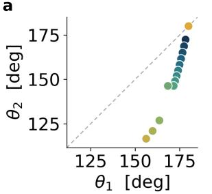

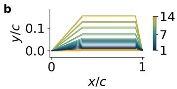

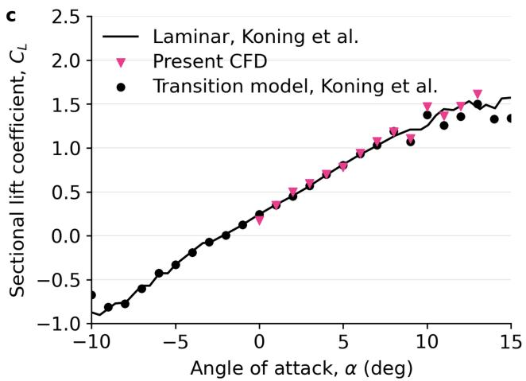  
Figure 1: Dataset geometry and CFD cross-check. (a) Envelope in $( \theta _ { 1 } , \theta _ { 2 } )$ interior-foldangle space; the dashed diagonal denotes $\theta _ { 1 } = \theta _ { 2 }$ . (b) Chord-normalised surface contours of the fourteen DEP geometries, coloured by geometry index. (c) Time-averaged sectional $C _ { L }$ from the present STAR-CCM+ simulations, compared with the transition-model and fully laminar results computed by Koning et al. [32] on the matched configuration.

Each geometry and angle-of-attack pair was solved as a two-dimensional unsteady case in STAR-CCM+ on an unstructured mesh of 39,552 to 44,600 cells, corresponding to 24,404 to 29,178 mesh points. The Martian atmospheric conditions are a density of $0 . 0 1 4 5 9 \mathrm { k g } \mathrm { m } ^ { - 3 }$ and a dynamic viscosity of $1 . 2 2 \times 1 0 ^ { - 5 } \mathrm { P a s }$ , and the freestream speed of $6 9 . 6 \mathrm { { m s } ^ { - 1 } }$ follows Koning et al. [32], giving a chord Reynolds number of 10,117. Turbulence is treated with the SST $k { - } \omega$ model. The computational domain extends five chords upstream and eight chords downstream of the section, and time integration uses a physical time step of $5 \times 1 0 ^ { - 5 } \mathrm { s }$

Sampling began at initialisation and continued until the $C _ { L }$ and $C _ { D }$ settled into a regular periodic oscillation, which required between 4,000 and 10,000 time steps depending on the geometry and the angle of attack. Recording every 20 steps gives trajectories of 200 to 500 frames at intervals of 1 ms, each containing the initial transient followed by the established shedding. Velocity and pressure were exported at every sampled step. The angle of attack ranges from 1◦ to 13◦.

The CFD setup was cross-checked against the independent Mars-rotorcraft baseline of Koning et al. [32] on a matched flat-plate and DEP configuration. Their computations solve the compressible RANS equations in OVER-

FLOW 2.2o with the SA-neg-1a one-equation model coupled to the AFT2017b transition model, and a second set of cases is run fully laminar. The two baselines agree closely with each other over the operating envelope of interest, so at this Reynolds number the sectional lift is set by the geometrically fixed separation rather than by the turbulence closure. The present time-averaged $C _ { L }$ agree with both baselines across that envelope (Figure 1c).

## 2.2. Dataset training settings

The dataset spans fourteen geometries at thirteen angles of attack: nine geometries were simulated across the full incidence range and five at $1 ^ { \circ } , 6 ^ { \circ }$ and $1 2 ^ { \circ }$ only, giving 132 trajectories. Seven incidences provide 68 training trajectories, on which the lead time is sampled at random from 1 to 20 ms, and four further incidences provide 36 validation trajectories evaluated at a fixed lead time of 1 ms to monitor the field objective during training; all reported comparisons use the final epoch-300 checkpoint, so no checkpoint was selected on the validation set. The test set contains 54 trajectories from the nine fully simulated geometries at six incidences, none of which appears in training, and of these $6 ^ { \circ }$ and $1 2 ^ { \circ }$ appear in neither the training nor the validation set and therefore test interpolation to an unseen angle of attack. Evaluation covers every integer lead time from 1 to 30 ms, extending 50% beyond the longest lead time covered in training and testing extrapolation in lead time (Table 1).

Table 1: Data split by angle of attack. Lead times are sampled at random within the stated range during training and evaluated at every integer value within it at test time. The validation set serves only to monitor the field objective and is evaluated at a single lead time.
<table><tr><td>Split</td><td>Angles of attack</td><td>Lead time τ (ms)</td><td>Trajectories</td></tr><tr><td>Train</td><td> $1 ^ { \circ } , 2 ^ { \circ } , 4 ^ { \circ } , 7 ^ { \circ } , 8 ^ { \circ } , 1 0 ^ { \circ } , 1 3 ^ { \circ }$ </td><td>1-20</td><td>68</td></tr><tr><td>Validation</td><td> $3 ^ { \circ } , 5 ^ { \circ } , 9 ^ { \circ } , 1 1 ^ { \circ }$ </td><td>1</td><td>36</td></tr><tr><td>Test</td><td> $3 ^ { \circ } , 5 ^ { \circ } , 6 ^ { \circ } , 9 ^ { \circ } , 1 1 ^ { \circ } , 1 2 ^ { \circ }$ </td><td>1-30</td><td>54</td></tr></table>

## 3. Method

## 3.1. GAOT backbone and VATO variants

All four reported configurations use the GAOT backbone [23]. The backbone consists of three core modules: a multiscale attentional graph neural operator (MAGNO) encoder, which maps unstructured physical coordinates onto a regular latent grid; a vision transformer, which divides the latent grid into patch tokens and processes them with global attention; and a MAGNO decoder, which maps the processed latent features back onto arbitrary query coordinates. In the validated configuration, the latent grid size is 128 × 128, the lifting channel dimension is 96, the number of transformer layers is six, the number of attention heads is eight, the MAGNO neighbourhood radius is 0.03 with multiscale factors [0.5, 1.0], and at most 512 neighbours are aggregated per query point.

Two common adaptations are used for the present dataset. First, the encoder and decoder operate on diferent point sets, so that the model accepts a sampled source state and predicts on the native CFD mesh. Second, geometry and time are provided through a signed-distance field and temporal scalars, as defined in Section 3.2. The vortex-force information is then coupled to this backbone along two routes, which define the two variants (Figure 2). VATO-S retains the architecture above and changes only the training objective, through the contribution field supervision defined in Section 3.6. VATO-A instead inserts three zero-initialised residual attention paths. After transformer processing, each latent patch reads 256 ordinary source tokens selected from the full current frame using the VFM contribution and sensitivity fields. Within the MAGNO decoder, each output query reads nearby ordinary source points through gated local attention. After the preliminary prediction, each native-mesh query reads the same 256 selected tokens again through a global cross attention residual. The VFM values determine which full-frame locations are prioritised but are not embedded in the selected token content.

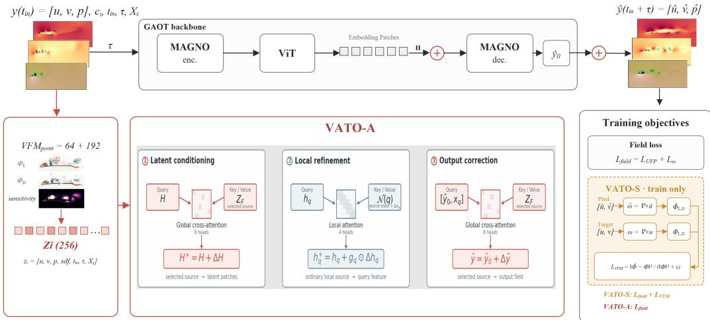  
Figure 2: VFM coupling to the shared GAOT backbone. A parameter-free prioritisation rule forms 256 ordinary source tokens from the current input frame: 64 indices retain geometric coverage, while the remaining 192 are balanced over signed Lift and Drag contribution groups and VFM sensitivity. VFM values determine the selected locations but are not embedded in the token content. VATO-A augments the backbone through three zero-initialised residual paths. Processed latent patches read the selected tokens through an eight-head, width-192 cross attention; each output query reads up to 32 nearby ordinary source points through a gated four-head, width-96 local attention with radius 0.04; and each preliminary output query reads the selected tokens through a second eight-head, width-192 cross attention. The common field objective combines physical-space UVP and mesh-curl signed-log-vorticity losses. VATO-S retains the GAOT architecture and additionally applies the training-only VFM contribution field loss, whereas VATO-A uses the field objective without that VFM loss.

## 3.2. Prediction task

The prediction target is the future full-mesh field $\mathbf { y } ( t _ { \mathrm { i n } } + \tau , \mathbf { X } )$ . Each model writes the output as

$$
\begin{array} { r } { \hat { \mathbf { y } } ( t _ { \mathrm { i n } } + \tau , \mathbf { X } ) = G _ { \theta } ( \mathbf { y } ( t _ { \mathrm { i n } } , \mathbf { X } _ { s } ) , \mathbf { c } ( \mathbf { X } _ { s } ) , t _ { \mathrm { i n } } , \tau , \mathbf { X } ) , } \end{array}\tag{1}
$$

where $\mathbf { X } = \{ \mathbf { x } _ { i } \} _ { i = 1 } ^ { N }$ is the native CFD mesh, $\mathbf { X } _ { s } \subset \mathbf { X }$ is the 12,000-point input set used during training, $t _ { \mathrm { i n } }$ is the source time, and $\tau = t _ { \mathrm { t a r g e t } } - t _ { \mathrm { i n } }$ is the requested scalar lead time. At each mesh point, the state vector is

$$
\mathbf { y } _ { i } ( t ) = [ u _ { i } ( t ) , v _ { i } ( t ) , p _ { i } ( t ) ] ^ { T } .\tag{2}
$$

Here $u _ { i }$ and $v _ { i }$ are velocity components in m s−1 and $p _ { i }$ is pressure in Pa. The spatial condition field c contains the signed distance to the aerofoil surface,

The input at each source point is $[ u , v , p ] ^ { T }$ together with c and the temporal scalars $t _ { \mathrm { i n } }$ and τ (Figure 2).

Because the CFD mesh is strongly refined near the body, with roughly 72% of points lying within a near-wall band of signed distance $\leq 0 . 1 c$ , an unstratified draw of encoder points would under-represent the wake. The sampler therefore reserves $6 \%$ of the encoder budget for body-wall points, caps the near-wall band at 50%, and assigns the remaining 44% to the far field, while in the reported benchmark every configuration uses ${ \bf X } _ { s } = { \bf X }$ as its encoder source. Training uses direct single-step prediction, mapping a source state to a single requested lead time rather than through a recursive rollout.

## 3.3. Pressure surface integral

$C _ { L }$ and $C _ { D }$ are recovered from a predicted field through two readouts, The first integrates the pressure over the body wall. Let $\Omega _ { b }$ denote the solid aerofoil region and $\partial \Omega _ { b }$ its boundary. With n the unit normal directed from the body into the fluid, the pressure force per unit span is

$$
\mathbf { F } ^ { \mathrm { p r e s s } } = - \int _ { \partial \Omega _ { b } } p \mathbf { n } d s .\tag{3}
$$

The Cartesian components are projected onto the wind-axis drag and lift directions using the angle of attack α:

$$
F _ { D } ^ { \mathrm { p r e s s } } = F _ { x } ^ { \mathrm { p r e s s } } \cos \alpha + F _ { y } ^ { \mathrm { p r e s s } } \sin \alpha ,\tag{4}
$$

$$
F _ { L } ^ { \mathrm { p r e s s } } = - F _ { x } ^ { \mathrm { p r e s s } } \sin \alpha + F _ { y } ^ { \mathrm { p r e s s } } \cos \alpha .\tag{5}
$$

With freestream density $\rho _ { \infty } ,$ speed $U _ { \infty }$ , and reference chord ${ \mathit { c } } ,$ the corresponding pressure-induced force coeficient is

$$
C _ { k } ^ { \mathrm { p r e s s } } = \frac { { F } _ { k } ^ { \mathrm { p r e s s } } } { \frac { 1 } { 2 } \rho _ { \infty } U _ { \infty } ^ { 2 } c } , \qquad k \in \{ L , D \} .\tag{6}
$$

In the implementation, Eq. (3) is evaluated by quadrature over the bodyboundary edges of each sample’s native mesh. For the pressure readout, $p$ is given by either the target or model-predicted pressure field.

## 3.4. VFM volume integral

The VFM volume integral provides a second, geometrically distinct path to lift and drag, supported on the wake and separation region rather than the body wall. Let Ω be the fluid domain and $\mathbf { e } _ { k }$ the wind-axis unit vector for $k \in \{ L , D \}$ . VFM introduces a geometry- and wind-axis-dependent auxiliary potential

$$
\left\{ \begin{array} { l l } { \nabla ^ { 2 } \phi _ { k } = 0 , } & { \mathbf { x } \in \Omega , } \\ { \nabla \phi _ { k } \cdot \mathbf { n } = \mathbf { e } _ { k } \cdot \mathbf { n } , } & { \mathbf { x } \in \partial \Omega _ { b } , } \\ { \nabla \phi _ { k } \to 0 , } & { | \mathbf { x } | \to \infty , } \end{array} \right.\tag{7}
$$

from which the vortex-force factor is obtained as

$$
\pmb { \Lambda } _ { k } = \nabla ^ { \perp } \phi _ { k } = ( \phi _ { k , y } , - \phi _ { k , x } ) ^ { T } \equiv ( P _ { k } , Q _ { k } ) ^ { T } .\tag{8}
$$

VATO uses the vortex-pressure contribution of this formulation. Taking the constant fluid density as $\rho = \rho _ { \infty }$ , the force per unit span is

$$
F _ { k } ^ { \mathrm { V F M } } = \rho \int _ { \Omega } \left( \mathbf { \Lambda } \Lambda _ { k } \cdot \mathbf { u } \right) \omega _ { z } d A .\tag{9}
$$

With the freestream dynamic-pressure scale, the corresponding force coeficient is

$$
C _ { k } ^ { \mathrm { V F M } } = \frac { F _ { k } ^ { \mathrm { V F M } } } { \frac { 1 } { 2 } \rho U _ { \infty } ^ { 2 } c } = \frac { 1 } { \frac { 1 } { 2 } U _ { \infty } ^ { 2 } c } \int _ { \Omega } \left( \boldsymbol { \Lambda } _ { k } \cdot \boldsymbol { \mathbf { u } } \right) \omega _ { z } d A , \qquad k \in \{ L , D \} .\tag{10}
$$

The fields $P _ { L } ( x ) , \ Q _ { L } ( x ) , \ P _ { D } ( x )$ , and $Q _ { D } ( x )$ are precomputed for each geometry and angle of attack and sampled at the corresponding mesh points (Figure 3a–d).

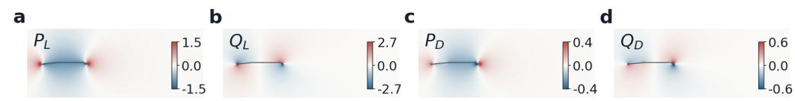

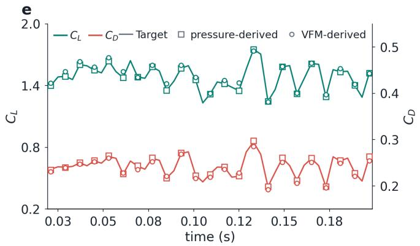

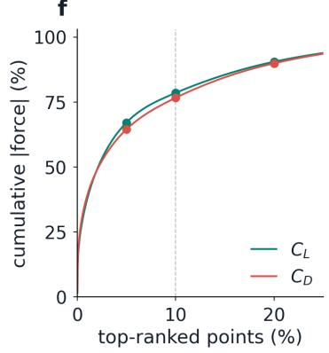  
Figure 3: Physical basis for the VFM coupling, shown for $( \theta _ { 1 } , \theta _ { 2 } ) = ( 1 7 4 . 1 ^ { \circ } , 1 5 5 . 0 ^ { \circ } )$ at AoA $= 1 2 ^ { \circ }$ . (a–d) Panel-method coeficient fields $P _ { L } , Q _ { L } , P _ { D } , Q _ { D }$ . (e) Lift and drag recovered on paired left/right ordinates from the target force record, the pressure integral on the target pressure field, and the VFM integral evaluated on the target velocity and mesh curl; the VFM mean absolute relative errors are 2.09% for $C _ { L }$ and 2.22% for $C _ { D }$ . (f) Cumulative absolute force contribution after ranking fluid points by local VFM magnitude. At the displayed input frame $( t = 0 . 0 7 3 ~ \mathrm { s } )$ the top 10% contributes approximately 79% of lift and 77% of drag, and the top 20% approximately 90% of both.

For physics validation and predicted-field post-processing, Eq. (10) is evaluated in discrete form on the query mesh. The spanwise vorticity is reconstructed as $w \equiv \omega _ { z } = \partial v / \partial x - \partial u / \partial y$ using the native mesh derivatives. Let V be the valid fluid-point set and $a _ { i }$ the nodal quadrature weight; in the sampled training path, $a _ { i }$ also contains the stratified-sampling correction. The discrete coeficient is

$$
C _ { k } ^ { \mathrm { V F M } } = \frac { 1 } { \frac { 1 } { 2 } U _ { \infty } ^ { 2 } c } \sum _ { i \in \mathcal { V } } \bigl [ P _ { k , i } u _ { i } + Q _ { k , i } v _ { i } \bigr ] \omega _ { i } a _ { i } , \qquad k \in \{ L , D \} .\tag{11}
$$

For predicted-field readout, $( u _ { i } , v _ { i } , \omega _ { i } )$ in Eq. (11) are replaced by $\left( \hat { u } _ { i } , \hat { v } _ { i } , \hat { \omega } _ { i } \right)$ with $\hat { \omega } _ { i }$ reconstructed from the predicted velocity by the same mesh-curl operator.

Both operators are validated on the target fields before being applied to predicted fields. The validation uses a representative test trajectory at an incidence excluded from training, with $( \theta _ { 1 } , \theta _ { 2 } ) = ( 1 7 4 . 1 ^ { \circ } , 1 5 5 . 0 ^ { \circ } )$ and AoA $= ~ 1 2 ^ { \circ }$ over a 0.18 s physical time, and takes the $C _ { L }$ and $C _ { D }$ recorded by the solver as the reference. The viscous contribution to these coeficients is negligible on this case, so the reference is governed by the pressure force. The coeficients recovered through Eqs. (3) agree closely with the target values, with correlation coeficients $r = 1 . 0 0 0 0$ for $C _ { L }$ and $r = 0 . 9 9 9 6$ for $C _ { D }$ . The VFM integral, computed from $u , v ,$ , and $\omega$ without any pressure information, gives $r = 0 . 9 7 2 1$ and $r = 0 . 9 6 9 5$ and matches the target to mean absolute relative errors of $2 . 0 9 \%$ and 2.22% (Figure 3e). Both operators recover accurate coeficients from diferent information. The agreement establishes both the accuracy of the VFM formulation on this flow and the reliability of the two operators used to recover lift and drag from predicted fields in Section 4.

The same integrand, evaluated pointwise on the target field by combining the four panel-method coeficients with the reconstructed vorticity and quadrature weight, gives the pointwise force-contribution maps $\Phi _ { L , i }$ and $\Phi _ { D , i }$ At the displayed input-frame snapshot $( t = 0 . 0 7 3 ~ \mathrm { s } )$ , the top 10% of fluid points account for approximately 79% of the absolute lift contribution and 77% of the absolute drag contribution; the corresponding top-20% shares are approximately 90% (Figure 3f). This concentration motivates the fixed source budget in Section 3.7.

## 3.5. Data preprocessing

All CFD fields are first represented as point data on the native mesh. For each geometry–incidence trajectory, an inlet-background state ${ \bf b } _ { g }$ is estimated by averaging $[ u , v , p ] ^ { T }$ over the upstream band $\Omega _ { \mathrm { u p } }$ of the first frame. The state field used for learning is the corresponding perturbation field,

$$
\tilde { \mathbf { y } } _ { i } ( t ) = \mathbf { y } _ { i } ( t ) - \mathbf { b } _ { g } .\tag{12}
$$

The residual state field and the spatial condition field are then standardised using training-set statistics,

$$
\mathbf { y } _ { i } ^ { * } ( t ) = \frac { \tilde { \mathbf { y } } _ { i } ( t ) - \pmb { \mu } _ { y } } { \pmb { \sigma } _ { y } } , \qquad c _ { i } ^ { * } = \frac { c _ { i } - \mu _ { c } } { \sigma _ { c } } .\tag{13}
$$

Here $\tilde { \bf y } _ { i } ( t )$ is the perturbation state at point i, $\mathbf { y } _ { i } ^ { * } ( t )$ and $c _ { i } ^ { * }$ are its standardised counterpart and the standardised condition field, and $\mu _ { y } , \sigma _ { y } , \mu _ { c } , \sigma _ { c }$ are per-channel means and standard deviations computed over the training set.

The temporal scalars are scaled separately before being appended to the model input. Points inside the aerofoil, identified from the signed-distance field, are masked in the state and appended temporal channels, while signed distance remains available as the geometry condition. Vorticity is not used as a predicted state channel.

## 3.6. VFM contribution field supervision

VATO-S preserves the GAOT architecture and adds supervision on the two per-point contribution fields whose sums give the discrete VFM $C _ { L }$ and $C _ { D }$ . For $k \in \{ L , D \}$ , the VFM contribution field at mesh point i is

$$
\Phi _ { k , i } = \frac { \left( P _ { k , i } u _ { i } + Q _ { k , i } v _ { i } \right) \omega _ { i } a _ { i } } { \frac { 1 } { 2 } U _ { \infty } ^ { 2 } c } .\tag{14}
$$

The auxiliary objective compares the predicted and target $C _ { L } / C _ { D }$ maps as one vector-valued field,

$$
L ^ { \mathrm { V F M - c o n t r i b } } = \frac { \sum _ { i \in \mathcal { V } } \sum _ { k \in \{ L , D \} } \left( \hat { \Phi } _ { k , i } - \Phi _ { k , i } \right) ^ { 2 } } { \operatorname* { m a x } \left( \sum _ { i \in \mathcal { V } } \sum _ { k \in \{ L , D \} } \Phi _ { k , i } ^ { 2 } , \varepsilon \right) } .\tag{15}
$$

The predicted contribution field $\hat { \Phi }$ uses predicted velocity and curl-derived vorticity; pressure does not enter Eq. (14). The target field Φ is detached from the gradient graph. Equation (15) is evaluated for each sample with $\varepsilon = 1 0 ^ { - 8 }$ and then averaged over the valid samples in the batch. The target contribution field is available only during training. At inference, VATO-S receives the same state, geometry, and time inputs as the matched GAOT control and therefore adds no model parameters or inference-time operator.

## 3.7. Source prioritisation and residual cross attention

VATO-A uses current flow vorticity together with VFM contribution and sensitivity fields to identify regions relevant to Lift and Drag. This information prioritises source locations but is neither embedded as an input field nor used as an auxiliary loss. From the full native input frame, the model combines the mesh curl of $( u , v )$ , the precomputed VFM basis, nodal quadrature weight, and dynamic pressure to form signed local contributions and their normalised positive and negative groups:

$$
\begin{array} { r l r l } & { \Phi _ { k , i } = \frac { \left( P _ { k , i } u _ { i } + Q _ { k , i } v _ { i } \right) \omega _ { i } a _ { i } } { \frac { 1 } { 2 } U _ { \infty } ^ { 2 } c } , } & & { k \in \{ L , D \} , } \\ & { \sigma _ { k } = \left( \cfrac { 1 } { \left| \mathcal { V } \right| } \displaystyle \sum _ { j \in \mathcal { V } } \Phi _ { k , j } ^ { 2 } \right) ^ { 1 / 2 } , } & & { \widehat { \Phi } _ { k , i } = \mathrm { c l i p } \left( \frac { \Phi _ { k , i } } { \operatorname* { m a x } \left( \sigma _ { k } , \varepsilon _ { r } \right) } , - \gamma , \gamma \right) , } \\ & { r _ { k , i } ^ { + } = \operatorname* { m a x } \left( \widehat { \Phi } _ { k , i } , 0 \right) , } & & { r _ { k , i } ^ { - } = \operatorname* { m a x } \left( - \widehat { \Phi } _ { k , i } , 0 \right) . } \end{array}\tag{16}
$$

Here V is the valid fluid-point set, $\sigma _ { k }$ is the framewise root mean square (RMS) contribution, $\varepsilon _ { r } = 1 0 ^ { - 1 2 }$ prevents division by zero, and $\gamma = 6$ is the fixed clipping limit. The four local VFM sensitivity factors, defined with vorticity held fixed, are

$$
s _ { k , u , i } = \frac { P _ { k , i } \omega _ { i } a _ { i } } { \frac { 1 } { 2 } U _ { \infty } ^ { 2 } c } , \qquad s _ { k , v , i } = \frac { Q _ { k , i } \omega _ { i } a _ { i } } { \frac { 1 } { 2 } U _ { \infty } ^ { 2 } c } , \qquad k \in \{ L , D \} .\tag{17}
$$

For $m \in \{ u , v \}$ , these factors are normalised and combined as

$$
\begin{array} { r l r } {  { \eta _ { k } = [ \frac { 1 } { 2 | \mathcal { V } | } \sum _ { j \in \mathcal { V } } ( s _ { k , u , j } ^ { 2 } + s _ { k , v , j } ^ { 2 } ) ] ^ { 1 / 2 } , } } \\ & { } & { \widehat { s } _ { k , m , i } = \mathrm { c l i p } ( \frac { s _ { k , m , i } } { \operatorname* { m a x } ( \eta _ { k } , \varepsilon _ { r } ) } , - \gamma , \gamma ) , } \\ & { } & { r _ { i } ^ { s } = [ \frac { 1 } { 4 } \sum _ { k \in \{ L , D \} } \sum _ { m \in \{ u , v \} } \frac { \widetilde { s } _ { k , m , i } ^ { 2 } } { \widetilde { s } _ { k , m , i } } ] ^ { 1 / 2 } , } \\ & { } & \\ & { } & { r _ { i } ^ { \mathrm { a l l } } = [ ( r _ { i } ^ { s } ) ^ { 2 } + \widehat { \Phi } _ { L , i } ^ { 2 } + \widehat { \Phi } _ { D , i } ^ { 2 } ] ^ { 1 / 2 } . } \end{array}\tag{18}
$$

The score $r _ { i } ^ { s }$ forms the fifth prioritisation group, while $r _ { i } ^ { \mathrm { a l l } }$ fills any unassigned quota. All prioritisation values and selected indices are detached, and only input-frame quantities are used. Exactly 64 tokens are reserved for spatial coverage over the valid fluid domain. The remaining 192-token budget is balanced over $r _ { L } ^ { + } , r _ { L } ^ { - } , r _ { D } ^ { + } , r _ { D } ^ { - }$ , and combined VFM sensitivity, with unfilled quotas assigned by the combined VFM contribution–sensitivity score.

Each selected token carries the baseline source features $[ u , v , p , c , t _ { \mathrm { i n } } , \tau ]$ and coordinates $( x , y )$ , not the VFM values used for prioritisation. Let $\mathbf { Z } _ { F }$ denote these 256 full-frame tokens, $\mathbf { S } _ { \mathcal { N } ( q ) }$ the ordinary source tokens in the local neighbourhood of query $q ,$ , H the processed latent patches, $\mathbf { h } _ { q }$ the MAGNO-decoded feature at query $q ,$ , and $\hat { \mathbf { y } } _ { q } ^ { 0 }$ the preliminary UVP prediction. VATO-A applies

$$
\begin{array} { r l } & { { \bf H } ^ { + } = { \bf H } + A _ { \mathrm { p a t c h } } ( { \bf H } , { \bf Z } _ { F } ) , } \\ & { ~ { \bf h } _ { q } ^ { + } = { \bf h } _ { q } + { \bf g } _ { q } \odot A _ { \mathrm { l o c a l } } ( { \bf h } _ { q } , { \bf S } _ { \mathcal { N } ( q ) } ) , } \\ & { ~ \hat { \bf y } _ { q } = \hat { \bf y } _ { q } ^ { 0 } + A _ { \mathrm { q u e r y } } ( [ \hat { \bf y } _ { q } ^ { 0 } , { \bf x } _ { q } ] , { \bf Z } _ { F } ) . } \end{array}\tag{19}
$$

Here each A is multi-head scaled dot-product attention, with its first argument providing queries and its second providing keys and values; $\odot$ denotes channel-wise multiplication. The operators $\mathcal { A } _ { \mathrm { p a t c h } }$ and $A _ { \mathrm { { q u e r y } } }$ are eighthead, width-192 residual cross attention modules. The former is applied after Transformer processing and before MAGNO decoding; the latter is applied to the preliminary $\mathrm { U V P }$ output in query chunks of 2,048. The local path uses four-head, width-96 attention over the neighbourhood $\mathcal { N } ( q )$ of at most 32 ordinary source points within radius 0.04, including relative displacement and distance. Its learned sigmoid gate $\mathbf { g } _ { q } \in ( 0 , 1 ) ^ { 9 6 }$ modulates the local residual before the final decoder projection. All three output projections are zeroinitialised. Figure 4 visualises the prioritisation rule at the trained 256-token budget.

## 3.8. Training objective and protocol

The GAOT reference, matched GAOT control, and both VATO variants optimise physical-space, squared relative $L _ { 2 }$ errors for velocity and pressure together with a mesh-curl vorticity term:

$$
\begin{array} { r l } & { L ^ { \mathrm { t o t a l } } = \displaystyle \sum _ { f \in \{ u , v , p \} } \alpha _ { f } \frac { \| \hat { f } - f \| _ { 2 , \mathcal { V } } ^ { 2 } } { \operatorname* { m a x } ( \| f \| _ { 2 , \mathcal { V } } ^ { 2 } , \varepsilon _ { \ell } ) } + \alpha _ { w } \frac { \| \hat { w } _ { \mathrm { l o g } } - w _ { \mathrm { l o g } } \| _ { 2 , \mathcal { V } } ^ { 2 } } { \operatorname* { m a x } ( \| w _ { \mathrm { l o g } } \| _ { 2 , \mathcal { V } } ^ { 2 } , \varepsilon _ { \ell } ) } , } \\ & { w _ { \mathrm { l o g } } = \mathrm { s i g n } ( \omega ) \log ( 1 + | \omega | ) , } \\ & { \hat { w } _ { \mathrm { l o g } } = \mathrm { s i g n } ( \hat { \omega } ) \log ( 1 + | \hat { \omega } | ) . } \end{array}\tag{20}
$$

where $\hat { \omega }$ is reconstructed from the mesh curl of the predicted velocity and $\varepsilon _ { \ell } = 1 0 ^ { - 8 }$ . Each ratio is evaluated per sample over valid fluid points, excluding body-interior and padded points, and then averaged over the batch. Velocity and pressure are denormalised and the inlet background is restored before this physical-space objective is evaluated. All four channel weights are one. VATO-S uses ${ \cal L } ^ { \mathrm { t o t a l } } + { \cal L } ^ { \mathrm { V F M - c o n t r i b } }$ with unit weight on the second term. The GAOT reference, matched GAOT control, and VATO-A use only $L ^ { \mathrm { t o t a l } }$ Pressure-integral, scalar force-coeficient, and VFM-integral losses have zero weight in all four configurations and are used only as diagnostic readouts.

a Geometry (174.1°,155.0 °), $\mathsf { A o A } = 3 ^ { \circ }$  
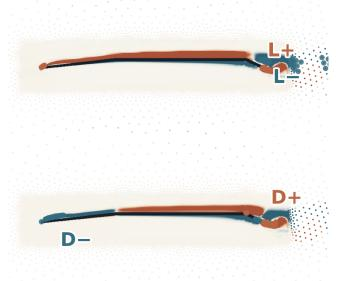

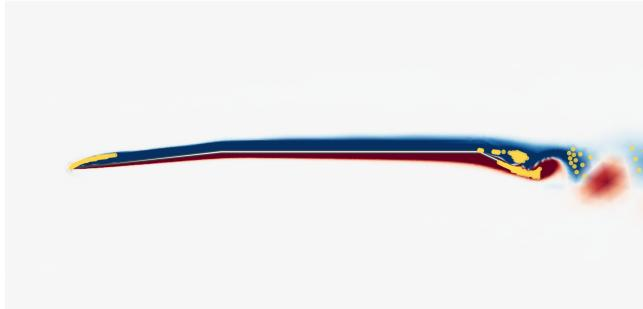

b Geometry (174.1°, 155.0 °), $\mathsf { A o A } = 1 2 ^ { \circ }$  
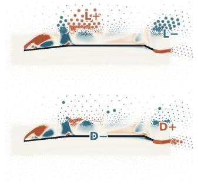

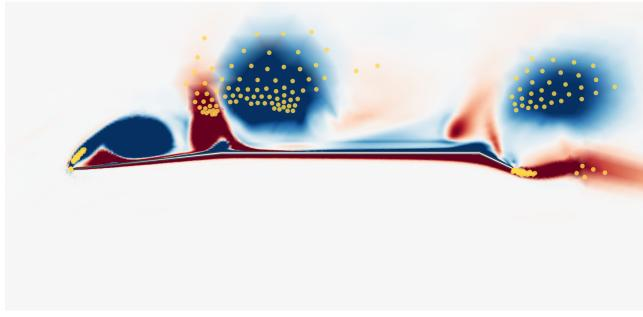

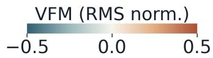

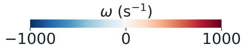  
Figure 4: Source prioritisation for the input frame at $t ~ = ~ 0 . 0 7 3$ s with $( \theta _ { 1 } , \theta _ { 2 } ) ~ =$ $( 1 7 4 . 1 ^ { \circ } , 1 5 5 . 0 ^ { \circ } )$ , at (a) $\mathrm { A o A } = 3 ^ { \circ }$ and (b) $1 2 ^ { \circ }$ . The stacked left maps show the RMSnormalised signed VFM Lift and Drag contributions, with markers identifying the indices retained from their positive and negative groups; display values are clipped to $[ - 0 . 5 , 0 . 5 ]$ without changing the indices. The right maps show the 192 VFM-prioritised indices over the input-frame vorticity, with the 64 spatial-coverage indices omitted for clarity. The displayed allocation uses the trained 256-token budget. Prioritisation uses only detached input-frame quantities, and the selected tokens carry ordinary state and coordinates rather than VFM values. The vorticity background uses the common $[ - 1 0 0 0 , 1 0 0 0 ] ~ \mathrm { s } ^ { - 1 }$ scale on the native mesh.

Optimisation uses AdamW with weight decay $1 \times 1 0 ^ { - 4 }$ , drop-path 0.1, attention dropout 0.1, and a cosine-annealed learning rate from $1 \times 1 0 ^ { - 4 }$ to $5 \times 1 0 ^ { - 5 }$ . Training uses 8,192 sampled pairs per epoch, batch size 8 per rank, and four-rank distributed data parallelism for 300 epochs. All reported comparisons use the final epoch-300 checkpoint.

The four configurations are summarised in Table 2. The GAOT reference uses uniform sampling, meaning the default training sampler without trajectory reweighting. The matched GAOT control, VATO-S, and VATO-A instead share flow-aware trajectory sampling. Each trajectory receives a fixed flow-variation score $D _ { c } ,$ , formed from the spatial standard deviation of the increment between source and target frames and weighted 0.20, 0.45, 0.25, and 0.10 over $u , v , p ,$ and the variation of that quantity between pairs, so $D _ { c }$ is governed by the transverse velocity and carries no vorticity contribution. Source–target pairs are drawn with replacement in proportion to max $( 0 . 0 5 , D _ { c } ^ { 1 / 2 } )$ , which every pair of a trajectory shares, so the number of pairs a trajectory ofers enters its sampling mass alongside $D _ { c }$ . The scores are computed once before training, are not updated from model errors, and are absent at inference. Because the matched control carries this sampler but no vortex-force coupling, it isolates the efect of the coupling from that of the sampler.

## 3.9. Evaluation metrics

Field errors are evaluated separately for the velocity vector, pressure, and vorticity over the valid fluid-point set V:

$$
r L _ { 2 } ^ { U V } = \left[ \frac { \sum _ { i \in \mathcal { V } } \bigl ( ( \hat { u } _ { i } - u _ { i } ) ^ { 2 } + ( \hat { v } _ { i } - v _ { i } ) ^ { 2 } \bigr ) } { \sum _ { i \in \mathcal { V } } ( u _ { i } ^ { 2 } + v _ { i } ^ { 2 } ) } \right] ^ { 1 / 2 } ,\tag{21}
$$

$$
r L _ { 2 } ^ { f } = \left[ \frac { \sum _ { i \in \mathcal { V } } ( \hat { f } _ { i } - f _ { i } ) ^ { 2 } } { \sum _ { i \in \mathcal { V } } f _ { i } ^ { 2 } } \right] ^ { 1 / 2 } , \qquad f \in \{ p , w \} .\tag{22}
$$

Both $w$ and $\hat { w }$ are reconstructed from the corresponding velocity field with the same native mesh-curl operator. Tables and figures report $1 0 0 r L _ { 2 }$ in

Table 2: The four configurations. GAOT is the published architecture retrained under the common task protocol, so the values listed come from this retraining rather than from the cited paper. Uniform denotes the default training sampler without trajectory reweighting; flow-aware denotes fixed training-only trajectory weighting derived from the variation between source and target frames. GAOT difers from GAOT (matched) only in the sampler, and GAOT (matched) difers from VATO-S only in the contribution field loss, so each row isolates one change from the row above. Inference is the median preprocessingplus-forward time per sample for batch size 8 on an NVIDIA H200, excluding data loading and force post-processing.
<table><tr><td>Configuration</td><td>Training sampling</td><td>VFM coupling</td><td>Params. (M)</td><td>Inference (ms/sample)</td></tr><tr><td>GAOT [23]</td><td>Uniform</td><td></td><td>19.09</td><td>34.9</td></tr><tr><td>GAOT (matched)</td><td>Flow-aware</td><td></td><td>19.09</td><td>34.8</td></tr><tr><td>VATO-S</td><td>Flow-aware</td><td>VFM contribution field supervision</td><td>19.09</td><td>34.8</td></tr><tr><td>VATO-A</td><td>Flow-aware</td><td>VFM based source prioritisation and residual attention</td><td>20.08</td><td>56.9</td></tr></table>

percent. For operator $o \in \{ \mathrm { p r e s s } , \mathrm { V F M } \}$ and force direction $k \in \{ L , D \}$ , the sequence MAE for one source anchor and lead-time block $\tau$ is

$$
\mathrm { M A E } _ { k } ^ { o } = \frac { 1 } { | T | } \sum _ { \tau \in \mathcal { T } } \left| \hat { C } _ { k } ^ { o } ( \tau ) - C _ { k } ^ { o } ( \tau ) \right| .\tag{23}
$$

Here $\hat { C } _ { k } ^ { o } ( \tau )$ and $C _ { k } ^ { o } ( \tau )$ apply the same operator o to the predicted and target fields, respectively, at lead time $\tau .$ For each reported lead-time window, pair-level field errors and anchor-level force MAEs are averaged over anchors within a trajectory, over the six incidences within a geometry, and then with equal weight over the nine geometries. Lead-time-resolved figures retain $\tau$ before applying the same anchor–incidence–geometry hierarchy. Bodyinterior points are excluded from all field metrics.

## 4. Results

All four configurations reduce both the training and validation field objectives under the common 300-epoch protocol (Figure 5). The GAOT reference ends at a validation field loss of 0.3741 and the matched GAOT control at 0.3569. VATO-S ends at 0.3602, marginally above the matched control, while the benchmark below shows it to be substantially more accurate over the evaluated horizon; the validation view is restricted to a one-frame lead time, so the contribution field target carries no measurable advantage on single-step pointwise accuracy. VATO-A ends at 0.2325, a 34.9% reduction relative to the matched control. These curves describe one completed run per configuration.

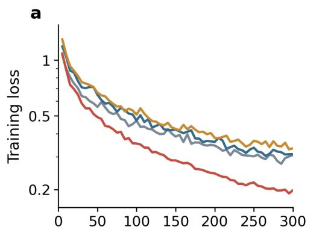

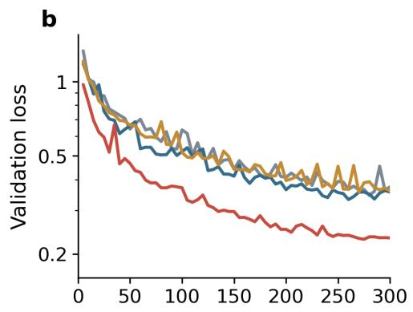  
Figure 5: Training dynamics under the common 300-epoch protocol. (a) Training and (b) validation values of the field objective shared by all four configurations, defined by Eq. (20) with unit channel weights. The auxiliary contribution field term of VATO-S is excluded so that all four configurations share the same ordinate. Each point is the exact aggregate logged at a five-epoch interval, with no smoothing or interpolation.

## 4.1. Comprehensive direct-field benchmark

The final 300-epoch checkpoints of the four configurations were applied to the test set defined in Section 2.2. Each of the 54 trajectories supplies 28 source anchors and every integer lead time from 1 to 30 ms, giving 45,360 source–target combinations per configuration. Errors follow the aggregation of Section 3.9 and are reported in Table 3.

The two GAOT configurations separate the headline comparison from attribution to the training protocol. The GAOT reference uses uniform sampling and is the denominator for all displayed percentages. Relative to it, flow-aware sampling in the matched GAOT control increases velocity, pressure, and vorticity error by 0.8%, 9.4%, and 0.7% over lead times 1–20 ms and by 2.6%, 7.1%, and 2.0% over lead times 21–30 ms. It nevertheless reduces every force MAE, with gains ranging from 2.6% to 19.5%. Flow-aware sampling therefore lowers the force-diagnostic errors at the cost of broad field accuracy. Both VATO configurations retain this sampling regime.

Table 3: Field errors and force diagnostics on the 54-trajectory benchmark, with 45,360 source–target combinations per configuration. (a) Fluid-only relative $L _ { 2 }$ error in percent, with velocity pooled over u and v through their joint vector energy. (b) Sequence mean absolute error in the $C _ { L }$ and $C _ { D }$ coeficients, obtained by applying the pressure-surface and vortex-force-volume operators to the predicted and the target fields. Aggregation follows Section 3.9. Parentheses give the reduction against the GAOT reference in the same column, with positive values favouring the named configuration. Lead times 1– 20 ms match the training horizon and 21–30 ms extend it by 50%. Values are shown to one decimal place, and column minima are bold.  
(a) Field prediction: relative $L _ { 2 }$ error (%)
<table><tr><td rowspan="2">Name</td><td colspan="3">Lead time 1–20 ms</td><td colspan="3">Lead time 21–30 ms</td></tr><tr><td>Velocity</td><td>Pressure</td><td>Vorticity</td><td>Velocity</td><td>Pressure</td><td>Vorticity</td></tr><tr><td>GAOT [24]</td><td>15.44</td><td>18.83</td><td>31.42</td><td>18.82</td><td>24.10</td><td>31.83</td></tr><tr><td>GAOT (matched)</td><td>15.56 (-0.8%)</td><td>20.60 (-9.4%)</td><td>31.65 (-0.7%)</td><td>19.31 (-2.6%)</td><td>25.82 (-7.1%)</td><td>32.47 (-2.0%)</td></tr><tr><td>VATO-S</td><td>13.83 (+10.4%)</td><td>18.64 (+1.0%)</td><td>26.53 (+15.6%)</td><td>18.10 (+3.8%)</td><td>24.49 (-1.6%)</td><td>27.47 (+13.7%)</td></tr><tr><td>VATO-A</td><td>12.99 (+15.8%)</td><td>17.41 (+7.5%)</td><td>21.62 (+31.2%)</td><td>17.60 (+6.5%)</td><td>24.09 (+0.0%)</td><td>23.27 (+26.9%)</td></tr></table>

(b) $C _ { L }$ and $C _ { D }$ MAE from predicted fields
<table><tr><td>Name</td><td>Quantity</td><td>Pressure-derived 1-20 ms</td><td>Pressure-derived 21-30 ms</td><td>VFM-derived 1-20 ms</td><td>VFM-derived 21-30 ms</td></tr><tr><td rowspan="2">GAOT [24]</td><td>Lift</td><td>0.3791</td><td>0.3976</td><td>0.1725</td><td>0.2068</td></tr><tr><td>Drag</td><td>0.0455</td><td>0.0476</td><td>0.0205</td><td>0.0254</td></tr><tr><td rowspan="2">GAOT (matched)</td><td>Lift</td><td>0.3693 (+2.6%)</td><td>0.3805 (+4.3%)</td><td>0.1388 (+19.5%)</td><td>0.1717 (+17.0%)</td></tr><tr><td>Drag</td><td>0.0436 (+4.2%)</td><td>0.0441 (+7.3%)</td><td>0.0165 (+19.5%)</td><td>0.0208 (+18.0%)</td></tr><tr><td rowspan="2">VATO-S</td><td>Lift</td><td>0.3651 (+3.7%)</td><td>0.3762 (+5.4%)</td><td>0.1356 (+21.4%)</td><td>0.1477 (+28.6%)</td></tr><tr><td>Drag</td><td>0.0433 (+4.7%)</td><td>0.0447 (+6.0%)</td><td>0.0151 (+26.7%)</td><td>0.0169 (+33.6%)</td></tr><tr><td rowspan="2">VATO-A</td><td>Lift</td><td>0.3262 (+13.9%)</td><td>0.3292 (+17.2%)</td><td>0.1241 (+28.0%)</td><td>0.1459 (+29.4%)</td></tr><tr><td>Drag</td><td></td><td>0.0377 (+17.1%) 0.0372 (+21.7%)</td><td>0.0164 (+19.9%)</td><td>0.0191 (+24.9%)</td></tr></table>

Relative to the GAOT reference, VATO-S reduces velocity and vorticity error by 10.4% and 15.6% over lead times 1–20 ms and by 3.8% and 13.7% over lead times 21–30 ms; its pressure changes are +1.0% and −1.6%. Measured against the matched GAOT control, which shares its sampling regime, the pressure reductions are 9.5% and 5.2%, so the auxiliary term recovers the pressure accuracy that flow-aware sampling gives up and, over lead times 1–20 ms, returns it to the level of the reference. VATO-A gives reductions of 15.8%, 7.5%, and 31.2% over lead times 1–20 ms and 6.5%, 0.04%, and 26.9% over lead times 21–30 ms. It is therefore the minimum-error configuration in all six field cells, although its extrapolated-pressure advantage over the GAOT reference is negligible. Paired geometry–incidence bootstrap intervals exclude zero for five of the six VATO-A reductions; extrapolated pressure is the exception.

The force readouts separate the two configurations diferently. VATO-A gives the lowest pressure-derived $C _ { L }$ and $C _ { D }$ MAE in both windows, reducing them by 13.9% and 17.1% over lead times 1–20 ms and by 17.2% and 21.7% over lead times 21–30 ms. It also reduces VFM-derived $C _ { L }$ MAE by 28.0% and 29.4%. VATO-S instead gives the lowest VFM-derived $C _ { D }$ MAE, with reductions of 26.7% and 33.6%. The two complete configurations therefore have distinct functional profiles: VATO-A gives the stronger overall field and pressure-derived force result, whereas VATO-S is most favourable for the VFM-derived Drag readout. Because VATO-A changes source prioritisation, three residual attention paths, and trainable capacity together, this contrast does not isolate the efect of the VFM interface alone.

The matched GAOT control and VATO-S each contain 19.09 million parameters and require 34.8 ms per sample. VATO-A contains 20.08 million parameters and requires 56.9 ms per sample, about 63.4% above the matched control. The additional cost arises from its latent-patch, local-query, and output-query residual attention paths.

Resolving the same errors by lead time shows the ordering of the four configurations to be stable across the horizon rather than produced by a particular window (Figure 6). Figure 7 resolves the improvement of VATO-A over the reference by lead time. Panel (a) reports the equal-channel UVP relative $L _ { 2 }$ improvement, which reaches close to 24% at the shortest lead times and decreases as the horizon grows, giving window-level values of 11.8% over the trained range and 3.0% over the extrapolation window. Panel (b) reports the improvement in the pressure-derived $C _ { L }$ and $C _ { D }$ mean absolute error on the same population, which holds between roughly 12% and 20% across the trained range.

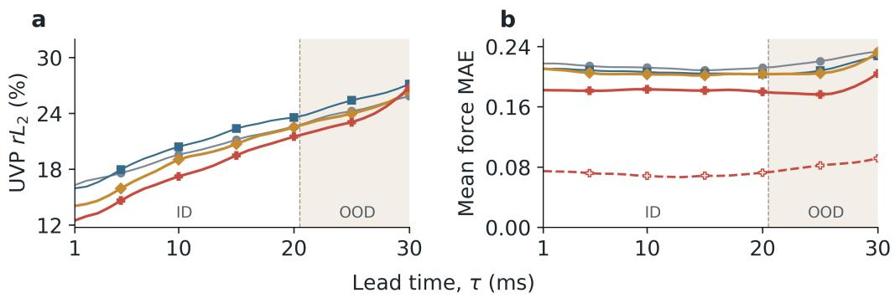  
Figure 6: Lead-time-resolved absolute errors on the 54-trajectory population. At each lead time, errors are averaged over the 28 anchors within each trajectory, over the six evaluated incidences within each geometry, and then with equal weight over the nine geometries. (a) Equal-channel UVP relative $L _ { 2 }$ error for GAOT, GAOT (matched), VATO-S, and VATO-A. (b) Equal mean of pressure-derived $C _ { L }$ and $C _ { D }$ MAE at each lead time for all four configurations, with the VFM-derived VATO-A result shown as an additional dashed curve. In-distribution (ID) training range $( \tau = 1 { - } 2 0 ~ \mathrm { m s } )$ and the temporal extrapolation beyond the maximum training lead-time, out-of-distribution (OOD) range $( \tau = 2 1 \mathrm { - } 3 0 \mathrm { m s } )$

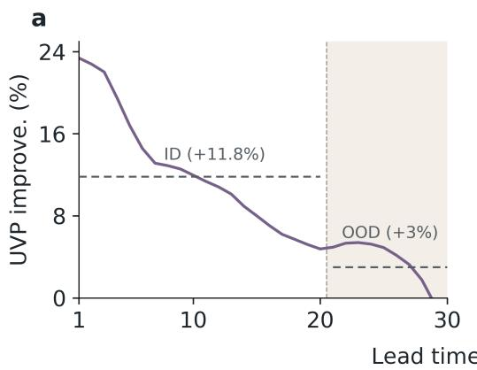

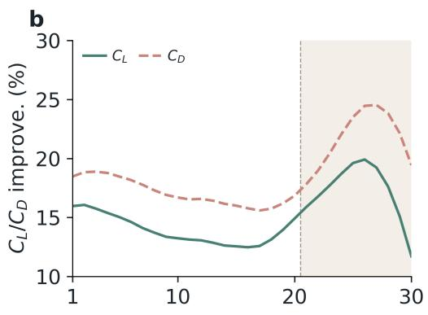  
Figure 7: Lead-time-resolved improvement of VATO-A over the GAOT reference on the same reported 54-trajectory population. (a) Equal-channel UVP relative $L _ { 2 }$ improvement. (b) Pressure-derived $C _ { L }$ and $C _ { D }$ MAE improvement. Improvement is defined as $1 0 0 ( E _ { \mathrm { G A O T } } - E _ { \mathrm { V A T O - A } } ) / E _ { \mathrm { G A O T } }$ , where E denotes UVP relative $L _ { 2 }$ error in (a) and the corresponding $C _ { L }$ or $C _ { D }$ MAE in (b); positive values favour VATO-A. The dashed horizontal segments in (a) report window-level improvement after averaging each model’s error over the ID and OOD.

Beyond 20 ms the two force curves rise together rather than following the field metric downward, reaching close to 20% for $C _ { L }$ and close to 25% for $C _ { D }$ near 25 ms before falling back toward 30 ms. $C _ { L }$ and $C _ { D }$ are generated by the shed vortices, so these readouts respond to how well the coherent structures are preserved rather than to the pointwise accuracy of the field as a whole. The rise indicates that the reference reproduces those structures markedly less well once the requested lead time leaves the range seen in training, while VATO-A sustains them over part of the extrapolation window, and the subsequent fall toward 30 ms follows as the prediction of both configurations degrades further.

## 4.2. Aerodynamic functional consistency

The force MAEs of Table 3 pool over geometry and incidence. Figure 8 instead resolves the VFM-derived $C _ { L }$ and $C _ { D }$ by incidence for four geometries spanning the thickness range of the reported population, with each point a benchmark-window mean over the same 28 source anchors and direct lead times 1–30 ms.

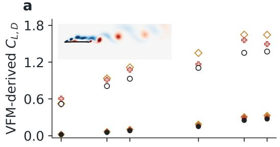

b  
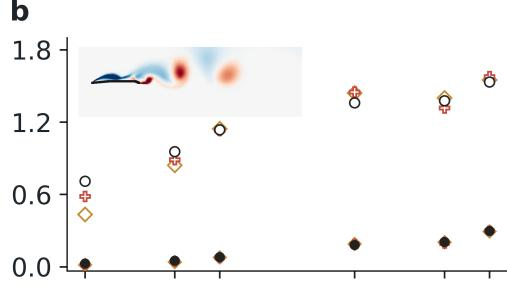

C  
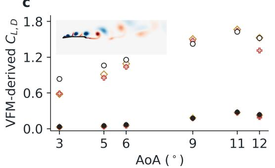

d  
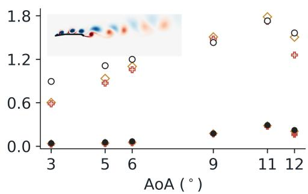  
。Target VATO-S + VATO-A。 $C _ { L }$ • CD  
Figure 8: Fixed-geometry VATO predictions of VFM-derived mean $C _ { L }$ and $C _ { D }$ against matched targets. (a–d) The thinnest, median, second-thickest, and thickest geometries of the nine geometry sweep, with $( \theta _ { 1 } , \theta _ { 2 } )$ equal to $( 1 7 8 . 3 2 ^ { \circ } , 1 7 2 . 4 1 ^ { \circ } )$ ， $( 1 7 4 . 9 5 ^ { \circ } , 1 5 8 . 1 9 ^ { \circ } )$ , $( 1 7 2 . 4 6 ^ { \circ } , 1 4 9 . 0 4 ^ { \circ } )$ , and $( 1 7 1 . 6 3 ^ { \circ } , 1 4 6 . 3 1 ^ { \circ } )$ . Within each geometry and AoA, each point is the mean force coeficient over all direct predictions at lead times 1–30 ms. Circles are the target values; diamonds and crosses are the mean force coeficients predicted by VATO-S and VATO-A. Open markers denote $C _ { L }$ and filled markers denote $C _ { D }$ . The overlay in each panel shows a target-vorticity snapshot at $\mathrm { A o A } = 1 2 ^ { \circ }$ for the same geometry, rendered on the native mesh with the common w $\in [ - 1 0 0 0 , 1 0 0 0 ] \ \mathrm { s } ^ { - 1 }$ range.

The four fixed-geometry views expose incidence-dependent behaviour that an across-geometry coeficient average would hide. Both VATO variants reproduce the overall $C _ { L }$ rise and the lower-amplitude $C _ { D }$ trend, including the high-incidence turning of the thicker geometries. Agreement remains geometry-dependent: VATO-A is generally closer for the thinnest geometry, whereas VATO-S more closely follows the $\mathrm { A o A } = 1 2 ^ { \circ }$ response of the two thickest geometries.

## 4.3. Representative and diagnostic field predictions

Figure 9 examines the output-level residual path on a single frame with the geometry, AoA, source time, and lead time fixed in advance. Panel (a) shows the prioritisation rule of Figure 4 realised at the trained budget of 256 tokens, with the selected locations lying on the vortices above the section and in the near wake. In panel (b), the RMS magnitude of the output correction is distributed along the upper surface and coincides with the vortices convected downstream from the sharp leading edge, which generate the suction that carries the load. Bypassing this path on the same checkpoint, with the latent residual and the local attention left active, raises the vorticity relative $L _ { 2 }$ error from 58.4% to 64.2%, and the resulting diference in panel (e) attains its maximum along the same surface, averaging $3 6 8 . 1 \mathrm { s } ^ { - 1 }$ within the displayed crop. These values apply to this intervention on this frame.

The three models are compared at 12◦, an incidence held out from both training and validation, at fixed geometry (Figure 10). The frame at $t =$ 0.081 s serves as the source, and predictions are made 5, 10, 20, 25, and 30 ms ahead of it, with the pressure field in the upper row and the vorticity field in the lower row of each block. The baseline shown alongside the two VATO configurations is GAOT rather than the matched control, GAOT being the more accurate of the two on every field metric of Table 3. All three models predict the shed structures at a lead time of 5 ms. From a lead time of 10 ms onwards the GAOT prediction degrades visibly: adjacent cores on the upper surface are no longer resolved as separate structures and merge, so the predicted vorticity distribution departs from the target in shape while its overall position is retained. The vortex shed downstream of the trailing edge is still predicted by GAOT at 20 ms, although with a markedly diferent shape, and is absent at 25 ms, whereas both VATO configurations continue to resolve it at 25 and 30 ms. The vorticity errors follow the same ordering at every displayed lead time: VATO-S is below GAOT throughout, and VATO-A is the most accurate of the three, with an error of 0.334 at 30 ms against 0.392 for VATO-S and 0.437 for GAOT. In pressure the ordering is less uniform, VATO-A being the most accurate at 20 and 30 ms and VATO-S at the three remaining lead times.

VFM-prioritised sources  
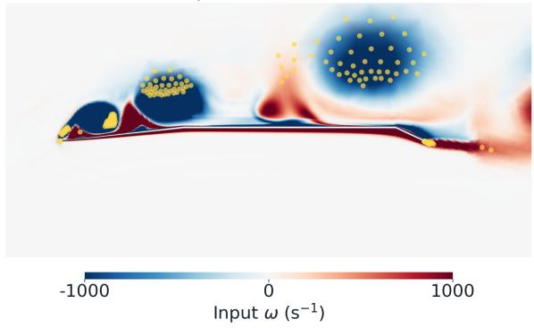

C  
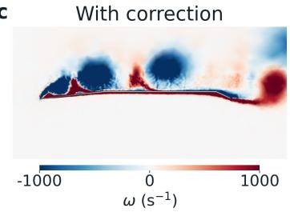  
d Without correction

b  
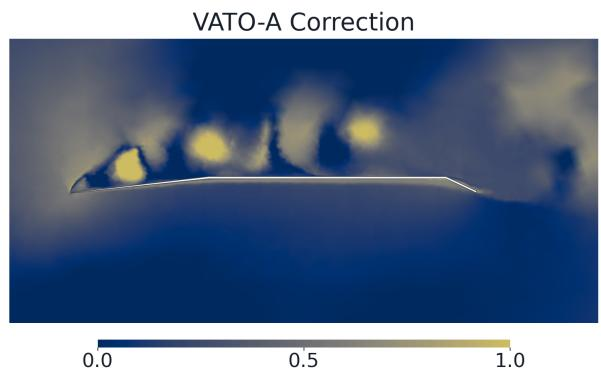  
Output-attention (RMS norm.)

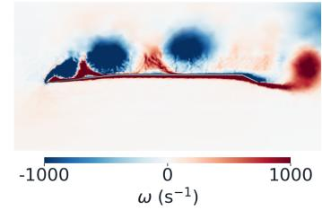

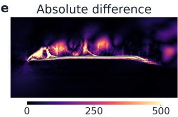  
|ωfull − ωreadout off| (s−1)  
Figure 9: Output-level residual cross-attention correction in VATO-A for one input from the test population, with the geometry, $\mathrm { A o A }$ , source time, and lead time fixed in advance. The geometry is $( \theta _ { 1 } , \theta _ { 2 } ) = ( 1 7 4 . 1 ^ { \circ } , 1 5 5 . 0 ^ { \circ } )$ at $\mathrm { A o A } = 1 2 ^ { \circ }$ , with source time 0.081 s and lead time $\tau = 1 0$ ms. (a) Current-input vorticity w with the realised VFM-prioritised source locations at the trained budget of 256 tokens; the spatial-coverage locations are omitted from the display. (b) RMS magnitude of the output-level residual correction across the normalised $[ u , v , p ]$ channels, linearly stretched between its fluid-point 5th and 99th percentiles. (c) VATO-A prediction with the output correction. (d) Prediction from the same checkpoint after bypassing only the selected-token global query-readout residual, with the latent residual and the local geometric attention left active. (e) Pointwise absolute vorticity diference between $( \mathrm { c ) }$ and (d). Vorticity panels use $[ - 1 0 0 0 , 1 0 0 0 ] ~ \mathrm { s } ^ { - 1 }$ and the diference panel $[ 0 , 5 0 0 ] ~ \mathrm { s } ^ { - 1 }$ ; clipping afects the display only.

Figure 11 shows the same comparison across the six test incidences at a fixed lead time of 20 ms. As the flow develops from attached to separated and the prediction becomes more demanding, VATO-A is more accurate than GAOT in both fields at every incidence, by 29% to 43% in vorticity and by up to 71% in pressure at $9 ^ { \circ }$ . VATO-S also resolves the vortex structures that GAOT fails to recover, improving on it in vorticity at every incidence and in pressure once the flow separates. VATO-A, the most accurate of the three on the vorticity field, is examined against the target over five randomly selected geometries and four incidences (Figure 12), which extends the comparison from single cases to a broader sample of the population. The twenty cells cover the flow states the family spans: a thin attached shear layer along the surface, a regular vortex street in the wake downstream of the trailing edge, a single large separated region over the upper surface, and discrete cores arranged along the upper surface. VATO-A predicts each of them, together with the transitions between them that occur as incidence increases within a geometry and as the fold angles change at fixed incidence. The relative $L _ { 2 }$ errors range from 0.151 to 0.411, the largest values arising where several discrete cores must be positioned individually.

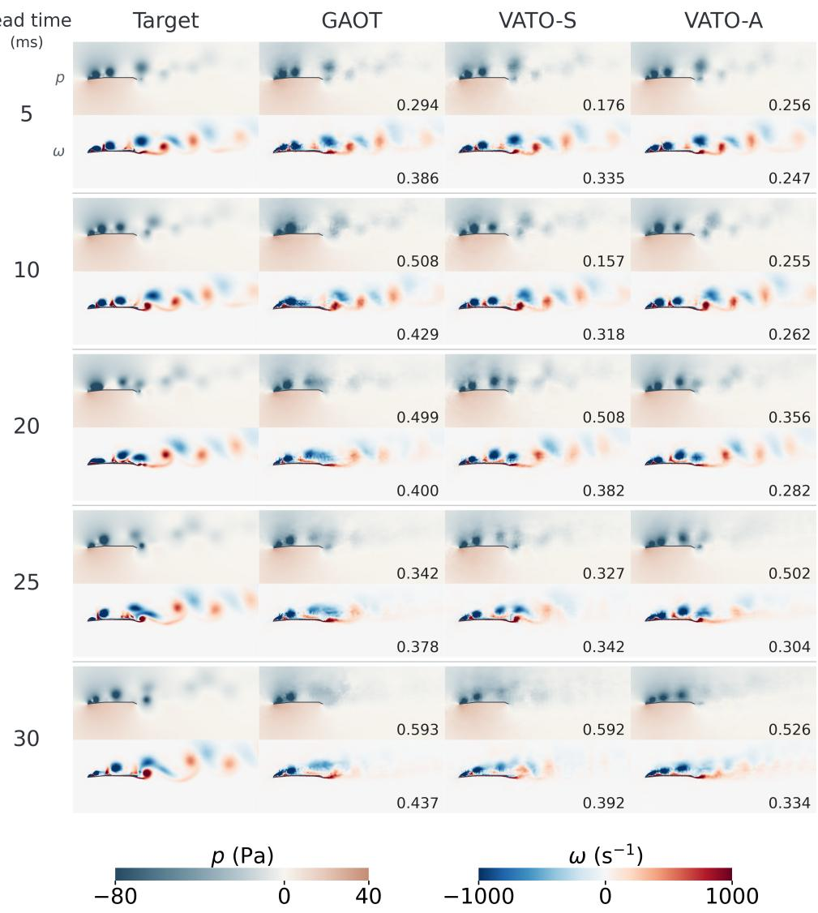  
Figure 10: Predictions of the pressure and vorticity fields by the three models for the same case, $( \theta _ { 1 } , \theta _ { 2 } ) = ( 1 7 4 . 1 ^ { \circ } , 1 5 5 . 0 ^ { \circ } )$ at $\mathrm { A o A } = 1 2 ^ { \circ }$ , with a source time of 0.081 s. Rows show lead times of $5 , 1 0 , 2 0 , 2 5 ,$ , and 30 ms; columns compare the target with the three predictions. Each cell places the pressure field above the vorticity field, and the numbers on the prediction tiles give the unclipped relative $L _ { 2 }$ error over the valid fluid points. All panels use $x / c \in [ - 0 . 3 0 ,$ 3.50] and $y / c \in [ - 0 . 7 3 , 0 . 7 7 ]$ , with colour ranges $p \in [ - 8 0 , 4 0 ]$ Pa and $w \in [ - 1 0 0 0 , 1 0 0 0 ] \mathrm { ~ s } ^ { - 1 }$

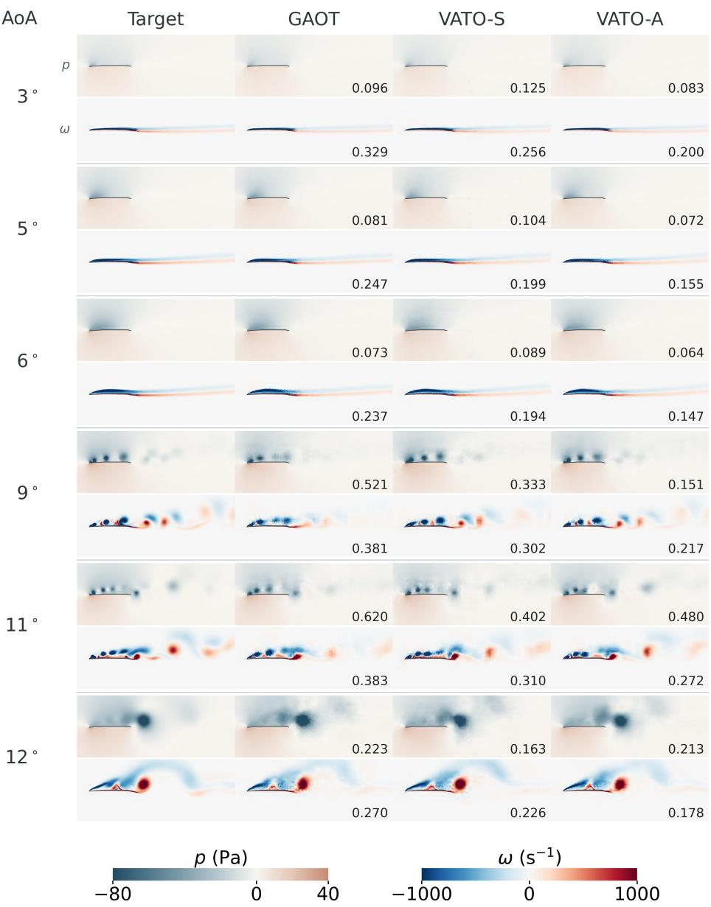  
Figure 11: Predictions by the three models for the same geometry, $\begin{array} { r l } { ( \theta _ { 1 } , \theta _ { 2 } ) } & { { } = } \end{array}$ $( 1 7 6 . 6 ^ { \circ } , 1 6 5 . 1 ^ { \circ } )$ , at a lead time of 20 ms. Rows span the six test incidences; columns compare the target with the three predictions. Each cell places the pressure field above the vorticity field, and the numbers on the prediction tiles give the unclipped relative $L _ { 2 }$ error over the valid fluid points. All panels share $x / c \in [ - 0 . 3 0 , 3 . 5 0 ]$ and $y / c \in [ - 0 . 7 3 , 0 . 7 7 ]$ with colour ranges $p \in [ - 8 0 , 4 0 ]$ Pa and $\omega \in [ - 1 0 0 0 , 1 0 0 0 ] \mathrm { s } ^ { - 1 }$

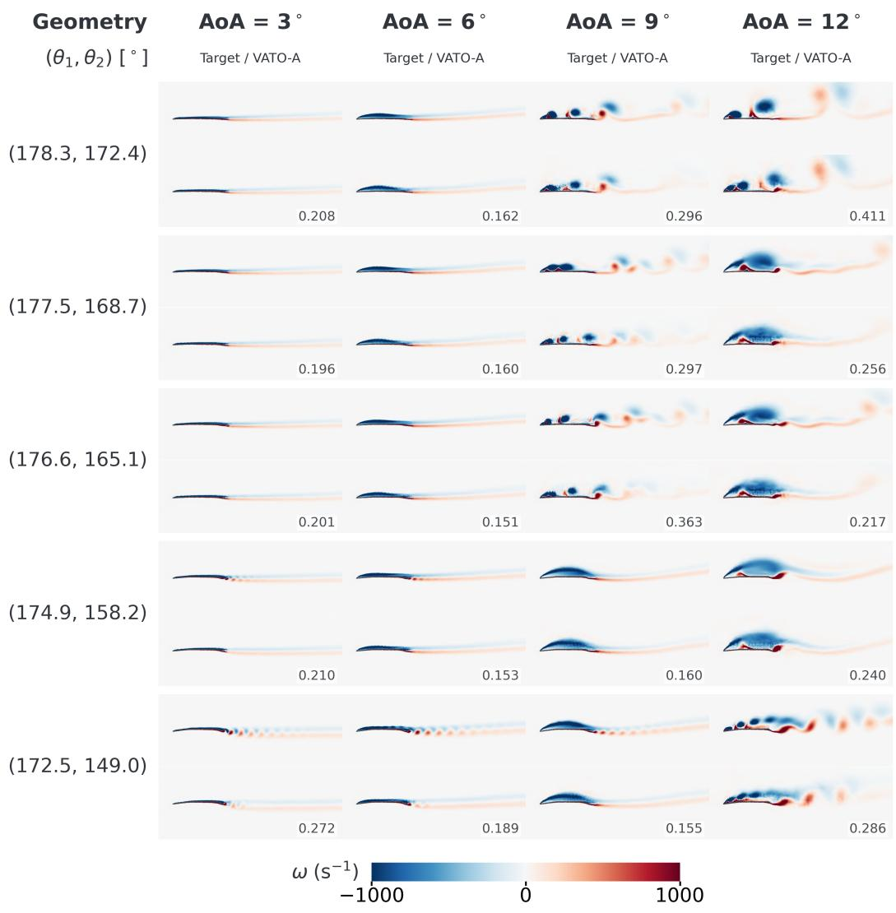  
Figure 12: VATO-A predictions of the vorticity field across geometry and incidence at a lead time of 20 ms. Rows show five randomly selected test geometries indexed by the interior fold angles $( \theta _ { 1 } , \theta _ { 2 } ) ;$ columns show four incidences. Each cell places the target vorticity above the $\mathrm { V A T O - A }$ prediction, and the number on each prediction gives the unclipped relative $L _ { 2 }$ error over the valid fluid points. All panels share $x / c \in [ - 0 . 3 0 , 3 . 5 0 ]$ $y / c \in [ - 0 . 7 3 , 0 . 7 7 ]$ , and $w \in [ - 1 0 0 0 , 1 0 0 0 ] \mathrm { ~ s } ^ { - 1 }$

## 5. Discussion and Limitations

The training sampler and the vortex-force coupling act on diferent quantities. Relative to the uniformly sampled reference, the matched control raises every field error and lowers every force MAE, so flow-aware sampling changes the balance between the two families of metric rather than giving a uniformly stronger configuration. Both VATO configurations improve on that control in velocity, pressure, and vorticity across both lead-time windows, which attributes the field improvement to the coupling rather than to the sampler.

Each interface improves the functional it is aligned with. VATO-S is trained on the contribution field and gives the lowest VFM-derived Drag error, at the parameter count and inference cost of the backbone. VATO-A is trained on neither functional and improves the predicted field broadly, including pressure, so both readouts follow and it gives the lowest pressurederived $C _ { L }$ and $C _ { D }$ errors, at about 63% more measured inference time. The choice between them follows from which functional is required and how much inference time is available: VATO-S adds nothing at inference, while VATO-A spends additional communication and capacity on the predicted field.

Outside the trained lead-time range the two families of metric separate again. Over the 50% temporal extension, the pointwise margins of VATO-A fall, its vorticity margin is retained at 26.9%, and all four force margins increase. Lift and drag are generated by the shed vortices, so the quantities that hold their advantage there are those that depend on the coherent structures rather than on the pointwise accuracy of the field as a whole. A surrogate placed in a design or control loop is queried at horizons its training set did not fix, and the readouts it is asked to supply are the force functionals.

Where each interface enters bounds what can be inferred from it. The contribution field constrains force-relevant combinations of velocity and vorticity, does not uniquely determine the underlying state, and contains no pressure term, so its improvements do not establish that supervising it alone recovers every force-bearing flow feature. In VATO-A the VFM values determine only which locations are prioritised and are not embedded in learned query, key, or value content, but the reported comparison changes the prioritisation rule, the residual attention paths, and the trainable capacity together. Its result is an efect of the complete configuration, and isolating the rule would require a geometry-only prioritisation control matched in path and capacity.

The reported population contains 54 trajectories from nine geometries represented during training at other incidences, so the evidence covers unseen incidences on known geometries rather than unseen shapes. Thirty-six of these trajectories also provided the 1-ms validation view, and all comparisons use frozen final checkpoints, so no selection was performed on them. Every configuration is represented by one training seed, and the hierarchical bootstrap quantifies variation over geometry and incidence rather than over retraining. Training encodes 12,000 sampled source points whereas the benchmark supplies the full native mesh to every configuration. The force results are matched-operator diagnostics, with the same operator applied to predicted and target fields, and both operators are inviscid in construction and recover the pressure-derived component of the load. Multiple seeds, unseen geometries, cross-solver tests, calibrated force validation, and autoregressive evaluation would be needed to support stronger claims.

## 6. Conclusion

We introduced VATO, a family of neural operators that couples the Vortex Force Map method to a geometry-aware transformer backbone at two interfaces. The coupling draws on a geometry-only auxiliary potential problem and requires no additional flow solution. It was evaluated on doubleedged-plate aerofoils at incidences excluded from training, against a retrained backbone reference and a sampling-matched control.

VATO-S supervises the per-point contribution field during training, leaving the architecture, the parameter count, and the inference cost of the backbone unchanged. Relative to the reference it reduces velocity and vorticity error by 10.4% and 15.6% over the trained lead-time range, and it gives the lowest VFM-derived Drag error of the family. VATO-A uses the same information to prioritise 256 source locations for residual cross attention, reduces velocity, pressure, and vorticity error by 15.8%, 7.5%, and 31.2% over the same range, and gives the lowest pressure-derived $C _ { L }$ and $C _ { D }$ errors, at about 63% more measured inference time.

Over a horizon 50% longer than the longest lag seen in training, the pointwise margins of VATO-A fall while its vorticity margin is retained at 26.9% and all four force margins increase. The advantage outside the trained range therefore lies in the quantities that carry the load. The sampling matched control separates a second efect along the same line, in which flowaware sampling on its own lowers force error and raises pointwise field error.

The two interfaces cover a range of deployment conditions, from a trainingonly intervention that leaves inference unchanged to one that spends additional inference time on the predicted field. Separating the contribution of the prioritisation rule from that of the additional attention paths, and testing on unseen geometries, are the next steps.

## Acknowledgements

This research was funded by the Engineering Start-up Grant from King’s College London and by the Daiwa Anglo-Japanese Foundation through Daiwa Foundation Awards (14465/15310). The authors acknowledge the use of King’s Computational Research, Engineering and Technology Environment (CREATE) in conducting this research. The authors appreciate financial support from the China Scholarship Council Program (202508440025)

Declaration of generative AI and AI-assisted technologies in the writing process

During the preparation of this work the authors used generative AI tools to assist with language editing and manuscript structuring. The authors reviewed and edited the content as needed and take full responsibility for the content of the publication.

## References

[1] S.L. Brunton, B.R. Noack, P. Koumoutsakos, Machine learning for fluid mechanics, Annu. Rev. Fluid Mech. 52 (2020) 477–508. https://doi. org/10.1146/annurev-fluid-010719-060214.

[2] R. Vinuesa, S.L. Brunton, Enhancing computational fluid dynamics with machine learning, Nat. Comput. Sci. 2 (6) (2022) 358–366. https:// doi.org/10.1038/s43588-022-00264-7.

[3] J. Kou, W. Zhang, Data-driven modeling for unsteady aerodynamics and aeroelasticity, Prog. Aerosp. Sci. 125 (2021) 100725. https://doi. org/10.1016/j.paerosci.2021.100725.

[4] X. Yao, W. Liu, W. Han, G. Li, Q. Ma, Development of response surface model of endurance time and structural parameter optimization for a

tailsitter UAV, Sensors 20 (6) (2020) 1766. https://doi.org/10.3390/ s20061766.

[5] J. Lou, R. Chen, J. Liu, Y. Bao, Y. You, Z. Chen, Aerodynamic optimization of airfoil based on deep reinforcement learning, Phys. Fluids 35 (3) (2023) 037128. https://doi.org/10.1063/5.0137002.

[6] L. Zhu, W. Zhang, J. Kou, Y. Liu, Machine learning methods for turbulence modeling in subsonic flows around airfoils, Phys. Fluids 31 (1) (2019) 015105. https://doi.org/10.1063/1.5061693.

[7] P. Zhao, X. Gao, B. Zhao, H. Liu, J. Wu, Z. Deng, Machine learning assisted prediction of airfoil lift-to-drag characteristics for Mars helicopter, Aerospace 10 (7) (2023) 614. https://doi.org/10.3390/ aerospace10070614.

[8] X. Liu, S. Yang, H. Sun, Z. Wang, X. Guan, Y. Gu, Y. Wang, Review of deep learning-based aerodynamic shape surrogate models and optimization for airfoils and blade profiles, Phys. Fluids 37 (4) (2025) 041304. https://doi.org/10.1063/5.0268466.

[9] C. White, D.M. Ushizima, C. Farhat, Fast neural network predictions from constrained aerodynamics datasets, in: AIAA SciTech 2020 Forum, AIAA Paper 2020-0364, 2020. https://doi.org/10.2514/6. 2020-0364.

[10] Y. Zhang, W.J. Sung, D.N. Mavris, Application of convolutional neural network to predict airfoil lift coeficient, in: 2018 AIAA/ASCE/AHS/ASC Structures, Structural Dynamics, and Materials Conference, AIAA Paper 2018-1903, 2018. https://doi.org/10. 2514/6.2018-1903.

[11] J. Zhang, X. Zhao, Machine-learning-based surrogate modeling of aerodynamic flow around distributed structures, AIAA J. 59 (3) (2021) 868– 879. https://doi.org/10.2514/1.J059877.

[12] H.E. Tekaslan, Y. Demiroglu, M. Nikbay, Surrogate unsteady aerodynamic modeling with autoencoders and LSTM networks, in: AIAA SciTech 2022 Forum, AIAA Paper 2022-0508, 2022. https://doi.org/ 10.2514/6.2022-0508.

[13] K. Li, J. Kou, W. Zhang, Unsteady aerodynamic reduced-order modeling based on machine learning across multiple airfoils, Aerosp. Sci. Technol. 119 (2021) 107173. https://doi.org/10.1016/j.ast.2021.107173.

[14] X. Ding, C. Gong, H. Su, C. Li, W. Li, X. Jia, High-fidelity modeling of unsteady aerodynamic loads under structural vibration using dual modal spaces and LSTM networks, Aerosp. Sci. Technol. 176 (Part A) (2026) 111927. https://doi.org/10.1016/j.ast.2026.111927.

[15] W. Dong, X. Wang, Q. Lin, C. Cheng, L. Zhu, A weighted feature fusion model for unsteady aerodynamic modeling at high angles of attack, Aerospace 11 (5) (2024) 339. https://doi.org/10.3390/ aerospace11050339.

[16] J.H. Harmening, F. Pioch, L. Fuhrig, F.-J. Peitzmann, D. Schramm, O. el Moctar, Data-assisted training of a physics-informed neural network to predict the separated Reynolds-averaged turbulent flow field around an airfoil under variable angles of attack, Neural Comput. Appl. 36 (25) (2024) 15353–15371. https://doi.org/10.1007/ s00521-024-09883-9.

[17] L. Lu, P. Jin, G. Pang, Z. Zhang, G.E. Karniadakis, Learning nonlinear operators via DeepONet based on the universal approximation theorem of operators, Nat. Mach. Intell. 3 (3) (2021) 218–229. https://doi. org/10.1038/s42256-021-00302-5.

[18] Z. Li, N. Kovachki, K. Azizzadenesheli, B. Liu, K. Bhattacharya, A. Stuart, A. Anandkumar, Fourier neural operator for parametric partial diferential equations, in: International Conference on Learning Representations (ICLR), 2021. https://openreview.net/forum? id=c8P9NQVtmnO.

[19] Y. Dai, Y. An, Z. Li, J. Zhang, C. Yu, Fourier neural operator with boundary conditions for eficient prediction of steady airfoil flows, Appl. Math. Mech. (Engl. Ed.) 44 (11) (2023) 2019–2038. https://doi.org/ 10.1007/s10483-023-3050-9.

[20] D. Shu, Z. Li, A. Barati Farimani, A physics-informed difusion model for high-fidelity flow field reconstruction, J. Comput. Phys. 478 (2023) 111972. https://doi.org/10.1016/j.jcp.2023.111972.

[21] Y. Chen, L. Huang, W. Xu, F. Yang, Eficient high-fidelity threedimensional super-resolution reconstruction of swirling flame via spaced physically consistent difusion model, J. Comput. Phys. 549 (2026) 114631. https://doi.org/10.1016/j.jcp.2025.114631.

[22] T. Zhu, B. Si, L. Fu, Y. Lu, SFVnet: Finite-volume informed U-net for compressible flow prediction with sparse data under ill-conditions, J. Comput. Phys. 552 (2026) 114696. https://doi.org/10.1016/j.jcp. 2026.114696.

[23] S. Wen, A. Kumbhat, L. Lingsch, S. Mousavi, Y. Zhao, P. Chandrashekar, S. Mishra, Geometry aware operator transformer as an efficient and accurate neural surrogate for PDEs on arbitrary domains, in: Advances in Neural Information Processing Systems, Vol. 38, 2025. https://openreview.net/forum?id=HXFvNkNt0n.

[24] S. Otomo, P. Gehlert, H. Babinsky, J. Li, Vortex force map ¯ method to estimate unsteady forces from snapshot flowfield measurements, Exp. Fluids 66 (3) (2025) 64. https://doi.org/10.1007/ s00348-025-03962-w.

[25] J. Li, Z.-N. Wu, Vortex force map method for viscous flows of general airfoils, J. Fluid Mech. 836 (2018) 145–166. https://doi.org/10.1017/ jfm.2017.783.

[26] J. Li, X. Zhao, M. Graham, Vortex force maps for three-dimensional unsteady flows with application to a delta wing, J. Fluid Mech. 900 (2020) A36. https://doi.org/10.1017/jfm.2020.515.

[27] A. Aprovitola, L. Iuspa, G. Pezzella, A. Viviani, Optimization procedure for wings flying in the Martian atmosphere, Acta Astronaut. 235 (2025) 339–354. https://doi.org/10.1016/j.actaastro.2025.05.023.

[28] M. Carreño Ruiz, D. D’Ambrosio, Implicit and explicit large eddy simulations in Martian aerodynamics, in: AIAA AVIATION Forum and ASCEND 2025, AIAA Paper 2025-3585, 2025. https://doi.org/10. 2514/6.2025-3585.

[29] G.R. Spedding, J. McArthur, Span eficiencies of wings at low Reynolds numbers, J. Aircr. 47 (1) (2010) 120–128. https://doi.org/10.2514/ 1.44247.

[30] A. Rizzi, Separated and vortical flow in aircraft aerodynamics: a CFD perspective, Aeronaut. J. 127 (1313) (2023) 1065–1103. https://doi. org/10.1017/aer.2023.39.

[31] L.W. Traub, C. Cofman, Eficient low-Reynolds-number airfoils, J. Aircr. 56 (5) (2019) 1987–2003. https://doi.org/10.2514/1.C035515.

[32] W.J. Koning, E.A. Romander, W. Johnson, Optimization of low Reynolds number airfoils for Martian rotor applications using an evolutionary algorithm, in: AIAA SciTech 2020 Forum, AIAA Paper 2020- 0084, 2020. https://doi.org/10.2514/6.2020-0084.

[33] X. He, Y. Wang, J. Li, Flow completion network: Inferring the fluid dynamics from incomplete flow information using graph neural networks, Physics of Fluids 34 (8) (2022) 087114. https://doi.org/10.1063/5. 0097688