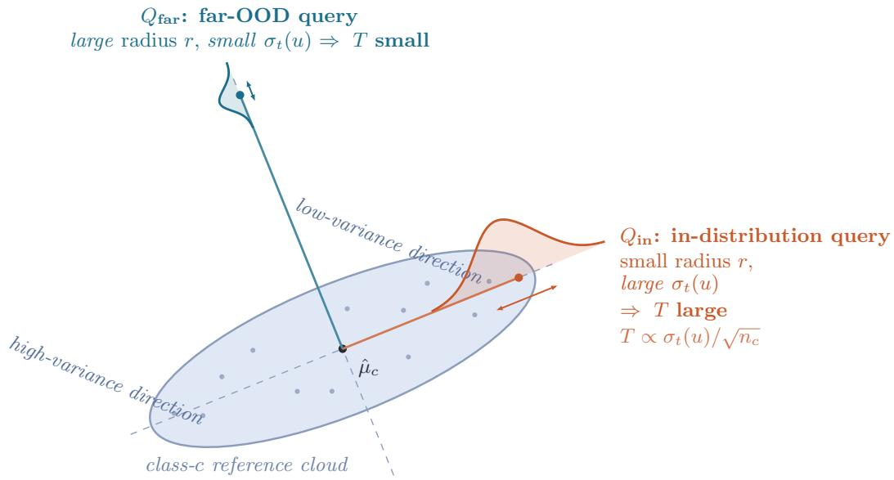
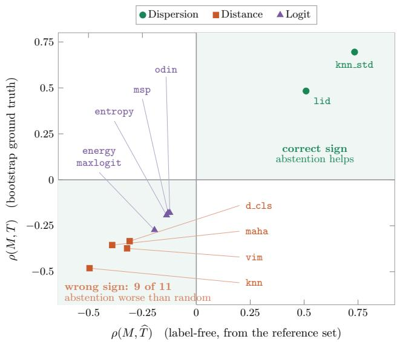

# Verdict Instability of OOD Scores under Reference Resampling

Donghoon Lee Hongik University

## Abstract

Post-hoc out-of-distribution detectors are fitted on a finite reference set, so every score they produce is an estimate. If we had chosen a diferent set, some verdicts would have moved. We measure that movement by resampling the reference set and recording the bootstrap standard deviation of the score, which we call verdict instability. It admits a closed form with no fitted parameters. The instability of a verdict is the within-class dispersion of the assigned class along the query’s direction, divided by the square root of that class’s reference count. That count is what separates verdict instability from the geometry of the score distribution, and it is identifiable only under class imbalance. Instability grows with the local dispersion. Far-OOD queries lie along the low-variance directions of an anisotropic embedding, so every distance-based score we test assigns its highest values to the verdicts that are most reproducible. Only estimators of local dispersion carry the sign a practitioner expects. We give a rule that predicts this sign for any score from a single label-free correlation, and abstention driven by a wrong-signed score turns out worse than abstention at random on every dataset we test.

## 1 Introduction

Post-hoc out-of-distribution (OOD) detectors are built from a finite reference set. A Mahalanobis detector estimates class means and a covariance from it (Lee et al., 2018) and a kNN detector stores it outright (Sun et al., 2022). Even logit-based scores inherit the ref erence set through the classifier head (Hendrycks and Gimpel, 2017; Liu et al., 2020). The scores assigned to queries are therefore estimates. A diferent reference set would have changed the scores for some queries.

The question at a gate is not how far the query lies

Shinjin Kang Hongik University

from the training data but how much its verdict would move under a diferent draw of it. The two are routinely conflated, since OOD scores are read as uncertainty estimates and used to abstain. Yet nobody has measured how much the finiteness of the reference set drives a score or whether proxy scores reflect that contribution.

Fix a detector, resample the reference set by the bootstrap (Efron and Tibshirani, 1993) and record the standard deviation of the resulting score. We call this the query’s verdict instability. It is epistemic and needs no labels, which lets us measure it in the far-OOD region where selective prediction (Geifman and El-Yaniv, 2017) cannot follow.

Our first result is that verdict instability admits a closed form. For a query at direction u from the centroid of its assigned class c with $n _ { c }$ reference points,

$$
\mathrm { s t d } \left[ s ( x ) \right] \approx \sqrt { \frac { \sigma _ { t } ( u ) ^ { 2 } } { n _ { c } } + \lambda ^ { 2 } \mathrm { V a r } \big [ \mathrm { p e n } ( x ) \big ] } ,\tag{1}
$$

where $\sigma _ { t } ( u ) ^ { 2 } = u ^ { \top } \Sigma _ { c } u$ projects the within-class scatter onto the query direction and the second term is carried only by detectors with a global reference (Ren et al., 2021). Instability is the within-class dispersion of the assigned class along the query’s direction, divided by the square root of that class’s reference count. There are no free parameters. Eq. (1) tracks the bootstrap variance at $R ^ { 2 } = 0 . 8 2 – 0 . 9 7$ across CIFAR-100, CIFAR-10 and DermaMNIST.

The count is what separates verdict instability from the geometry of the score distribution. No score in common use falls with it, and the recent geometric analysis of Mahalanobis detectors (Janiak et al., 2026) does not either. We therefore exploit the natural class imbalance of DermaMNIST (Yang et al., 2023; Tschandl et al., 2018), whose reference counts span a factor of 58.7. Replacing $n _ { c }$ by its mean collapses $R ^ { 2 }$ from 0.923 to 0.276.

Our second result follows from the first, and it has practical implications. Instability rises with $\sigma _ { t } ( u )$ , so any score anti-correlated with the dispersion moves against the reliability of the verdict. Far-OOD queries sit along the low-variance directions of the class cloud, so the distance-based scores in common use assign their highest values to the queries whose verdicts are the most reproducible. Only the scores that estimate a dispersion directly carry the sign a practitioner expects. The sign is a property of the embedding rather than the theory, and it can be switched of by destroying the anisotropy of our self-supervised backbone (Caron et al., 2021).

  
Figure 1: The geometry of the sign. Verdict instability is the class cloud’s dispersion along the query direction, scaled by $n _ { c } ^ { - 1 / 2 } \left( \mathrm { E q . \ 1 } \right)$ : the in-distribution $Q _ { \mathrm { i n } }$ lies along a high-variance eigen-direction (T large), the farther $Q _ { \mathrm { f a r } }$ along a low-variance one (T small). The efect is the embedding’s anisotropy (§5). Removing the anisotropy removes the sign.

The result is a rule that takes just one correlation to check. Its predictor is the model itself, and $\mathrm { s i g n } [ \rho ( M , T ) ] = \mathrm { s i g n } [ \rho ( M , \widehat { T } ) ]$ for any score M, where the right-hand side needs no bootstrap and no labels. The count is essential here too, because under heavy imbalance a dispersion-only predictor reads the sign of several scores backwards where the full model does not. Abstaining on the queries a score flags as uncertain is then worse than random abstention, and this happens exactly when the score has the wrong sign. The wrong sign lands on a diferent score in each dataset, but the wrong-signed score fails in every case.

Our contributions are as follows.

• We identify the bootstrap variance of an OOD score under reference-set resampling as the epistemic uncertainty of the detector, and give a closed form for it with no fitted parameters (Eq. 1).

• We validate the $1 / \sqrt { n _ { c } }$ dependence across classes under natural imbalance (58.7×), which no other account of OOD scores depends on.

• We establish a sign separation between distance and dispersion scores. A label-free rule (Eq. 9) predicts the sign of any new score, including the stretch channel that a geometric analysis tunes upward for detection.

• Abstention driven by a wrong-signed score is worse than random abstention. The rule calls the side of the baseline correctly for every score on both datasets, over ten seeds.

## 2 Related Work

Post-hoc OOD scores. A large family of detectors attaches a scalar to a trained network without retrain ing it. They read the classifier head (Hendrycks and Gimpel, 2017; Liang et al., 2018), the logits before normalization (Liu et al., 2020; Hendrycks et al., 2022) or the feature space directly (Sun et al., 2022; Ma et al., 2018; Wang et al., 2022), and surveys organize them into a common protocol (Yang et al., 2022, 2024; Fang et al., 2022). All are evaluated by how well they separate in- from out-of-distribution inputs. We take the same eleven scores and ask instead how each behaves as a function of the uncertainty in the detector that produced it.

The geometry of Mahalanobis detectors. The Mahalanobis family (Lee et al., 2018) has been refined at the score level by relative Mahalanobis (Ren et al., 2021) and by Mahalanobis++ (M¨uller and Hein, 2025). A recent line instead asks which properties of the feature space make the same quadratic detector succeed or fail (Janiak et al., 2026), and it is the closest work to ours. Its variance is taken over queries with the reference set held fixed and carries no depen dence on the reference count, while ours is taken over reference sets with the query held fixed and is exactly $\Theta ( n _ { c } ^ { - 1 / 2 } )$ . The two are built from the same geometry with reciprocal weights, and §5.4 shows the stretch they tune upward for detection to be anti-correlated with the reliability our rule predicts.

Uncertainty and its conflation with OOD. Predictive uncertainty splits into aleatoric and epistemic components (Kendall and Gal, 2017) and is estimated by MC dropout (Gal and Ghahramani, 2016), deep ensembles (Lakshminarayanan et al., 2017) or featurespace density (Mukhoti et al., 2023). OOD scores are routinely read as such estimates and used to abstain. That the conflation is unsafe is known in one direction, since ReLU classifiers can be arbitrarily confident far from the data (Ulmer and Cin\`a, 2021). We argue the other. An OOD score can be a fine detector and still be a harmful uncertainty proxy, because the epistemic uncertainty of the detector itself carries the opposite sign, and in this literature that uncertainty is always the model’s and never the detector’s.

Finite samples and selective prediction. That a decision rule inherits uncertainty from the finite sample used to fit it is standard statistics. The bootstrap (Efron and Tibshirani, 1993) is its canonical instrument and covariance shrinkage (Ledoit and Wolf, 2004) is an admission that $\hat { \Sigma }$ is estimated, while conformal prediction quantifies the same dependence for a cali bration set (Vovk et al., 2005; Angelopoulos and Bates, 2023). The corresponding statement for OOD scores is missing and this paper supplies it (§4). When a model may abstain, performance is summarized by the risk–coverage curve and its area (El-Yaniv and Wiener, 2010; Geifman and El-Yaniv, 2017; Geifman et al., 2019). That framework needs ground-truth labels and is confined to the in-distribution region, whereas the failure mode we identify lives where labels do not exist and reference resampling needs none (§6).

## 3 Problem Formulation

## 3.1 Setup

Let f be a frozen feature extractor and $z = f ( x ) \in \mathbb { R } ^ { d }$ the embedding of an input x. A post-hoc detector is fitted on a reference set $\mathcal { R } = \{ ( x _ { i } , y _ { i } ) \} _ { i = 1 } ^ { N }$ of labeled in-distribution data, partitioned into class subsets $\mathcal { R } _ { c }$ with $n _ { c } = | \mathcal { R } _ { c } |$ and $\textstyle \sum _ { c } n _ { c } = N$ . Write $\hat { \mu } _ { c }$ for the empirical centroid of class c, ˆµ for the global centroid and $\hat { \Sigma } _ { c }$ for the within-class scatter of class c. Everything the detector knows about the in-distribution world it knows through R.

The detector assigns to a query x a scalar

$$
s ( x ; \mathcal { R } ) = \underbrace { \operatorname* { m i n } _ { c } \left\| z - \hat { \mu } _ { c } \right\| } _ { \mathrm { c l a s s ~ t e r m } } + \lambda \cdot \underbrace { \left[ \tau - \left\| z - \hat { \mu } _ { 0 } \right\| \right] _ { + } } _ { \mathrm { g l o b a l ~ p e n a l t y } } ,\tag{2}
$$

where $[ \cdot ] _ { + } = \operatorname* { m a x } ( 0 , \cdot )$ and τ is a low quantile of the global distance over R. The first term is the nearestclass-mean distance and the second is a hinge against a global reference, in the spirit of the correction that relative Mahalanobis applies to the class-conditional distance (Ren et al., 2021). We analyze Eq. (2) because it is the simplest score carrying both ingredients that every member of the Mahalanobis family shares, a class-conditional term estimated from $n _ { c }$ points and a global term estimated from N. Section 5 treats eleven standard scores as observables evaluated against its instability rather than as objects to be re-derived. A verdict is obtained by thresholding at an operating point $t ,$ so it is a statistic of R exactly as the score is.

## 3.2 Verdict instability

Fix the query and resample the reference set. Let $\mathcal { R } ^ { \ast }$ be a nonparametric bootstrap replicate of R drawn class-wise so that the class counts $n _ { c }$ are preserved (Efron and Tibshirani, 1993), and define

$$
T ( x ) \ \triangleq \ \mathrm { s t d } _ { \mathcal { R } ^ { * } } \left[ s ( x ; \mathcal { R } ^ { * } ) \right] .\tag{3}
$$

We call $T ( x )$ the verdict instability of x. It is the standard deviation of the score under the counterfac tual “had I collected diferent reference data”. It is epistemic and caused by what was not collected. We will show that it decays as $n _ { c } ^ { - 1 / 2 }$ . The standard deviation is taken over $B = 2 0 0$ replicates throughout. The Monte-Carlo error this leaves in $T$ is common to every score compared against it and is absorbed by the seed-level intervals of §6.2, since each seed redraws the bootstrap.

Two properties make T the object a practitioner actually needs. It converts directly into a flip probability. If the score is approximately Gaussian under resampling, the chance that the verdict at threshold t reverses is

$$
\mathrm { P r } \left[ \mathrm { v e r d i c t ~ f l i p s } \right] \approx \Phi \left( - \frac { | s ( x ; \mathcal { R } ) - t | } { T ( x ) } \right) ,\tag{4}
$$

so instability is the natural denominator against which a margin should be read. A query far from the threshold in units of T is safe and a query close to it is not, however far it sits from the training data in absolute terms.

T also requires no labels, neither for the query nor for the notion of correct. It is a property of the estimator rather than of the ground truth, which is what al lows us to evaluate it in the far-OOD region where the risk–coverage machinery of selective prediction (Geifman and El-Yaniv, 2017; Geifman et al., 2019) cannot follow.

We stress what T is not. It is neither the probability that x is OOD nor the model’s predictive uncertainty, and it says nothing about whether the verdict is right. A confidently wrong detector can be perfectly stable. Instability and correctness are orthogonal by construction and we make no claim about the latter.

The remaining details of the evaluation protocol, the three query groups and the resolution and class-count controls that keep the comparison honest, are given in Appendix A. Correlations that treat $T$ as an observable to be tracked (§5.1) are computed after centering both variables within query group, so that they report within-population behavior. Section 6 evaluates a global abstention policy instead, so its correlations are computed over the pooled query set without centering. The two are reported separately and never mixed.

## 4 Verdict Instability as Projected Within-Class Dispersion

The bootstrap quantity $T ( x )$ of Eq. (3) costs B refits, and a practitioner holding a single reference set cannot obtain it at all. We show that it is predicted to within a few percent by quantities computable from that set. The score of Eq. (2) has two terms estimated from diferent samples, and each contributes an independent channel of variance.

## 4.1 The class channel

Fix a query x with embedding z and let c be its assigned class. Write $r = \| z - \hat { \mu } _ { c } \|$ for its radius from the class centroid and $u = ( z - \hat { \mu } _ { c } ) / r$ for its direction. Under class-wise resampling the bootstrap centroid obeys $\hat { \mu } _ { c } ^ { * } = \hat { \mu } _ { c } + n _ { c } ^ { - 1 / 2 } \xi$ with $\xi \sim \mathcal { N } ( 0 , \Sigma _ { c } )$ . Substituting this into the class term of $\operatorname { E q . } \ ( 2 )$ and expanding the norm (Appendix B), the perturbation enters at first order only through its component along the query direction. Retaining that term,

$$
\mathrm { V a r } \left[ s _ { \mathrm { c l a s s } } \right] \approx \frac { \sigma _ { t } ( u ) ^ { 2 } } { n _ { c } } ,\tag{5}
$$

where $\sigma _ { t } ( u ) ^ { 2 } \triangleq u ^ { \intercal } \Sigma _ { c } u$ . We call $\sigma _ { t } ( u )$ the transverse dispersion, the standard deviation of the class cloud projected onto the direction in which the query happens to lie.

Three features of $\mathrm { E q . ~ ( 5 ) }$ drive everything that follows. Only the assigned class matters, because the other cen troids move under resampling but do not attain the minimum in $\operatorname { E q . }$ (2). The dispersion is directional rather than global, since $\Sigma _ { c }$ enters only through the scalar $u ^ { \top } \Sigma _ { c } u$ . It is constant in an isotropic embedding and varies by a factor of several across the directions of an anisotropic one. And $\sigma _ { t } ( u )$ is a plug-in functional of the reference set that needs no resampling and no labels.

## 4.2 The penalty channel

Write $D ( x ) = \| z - \hat { \mu } _ { 0 } \|$ for the global distance. It is estimated from all N reference points, so its bootstrap fluctuation is $s _ { D } \approx \sigma _ { w } / \sqrt { N }$ This channel is quiet at the source, but the hinge of $\operatorname { E q . }$ . (2) rectifies it and rectification does not preserve variance. Write $m = \tau -$ $D ( x )$ for the signed activation margin and model $D ^ { * }$ ≈ $\textit { D } + s _ { D } \eta .$ . The penalty is then a rectified Gaussian whose variance is available in closed form,

$$
\mathrm { V a r } \left[ s _ { \mathrm { p e n } } \right] = \lambda ^ { 2 } s _ { D } ^ { 2 } \cdot v \left( \frac { m } { s _ { D } } \right) ,\tag{6}
$$

with v the variance of a standard rectified Gaussian at margin a (Appendix B). It is monotone in a and vanishes as $a  - \infty$ , so a query comfortably outside the hinge contributes nothing and one sitting at the elbow contributes most.

The penalty is therefore a tail phenomenon rather than a background term. On DermaMNIST the large majority of queries lie outside the hinge and contribute exactly zero, so the median penalty share of the variance vanishes while the variance-weighted share is carried by the small fraction at the elbow. The share also decays with the number of classes. It must, because the class channel scales as $1 / n _ { c }$ while the global channel scales as $1 / ( C \bar { n } )$ . Moving only the class-count thresh old, the variance-weighted share falls monotonically as C rises (Appendix C).

## 4.3 The two channels

The two channels are driven by diferent samples. They are not strictly independent, since $\hat { \mu } _ { 0 }$ depends on class c with weight $n _ { c } / N$ . We neglect the covariance and check the cost empirically. This gives the explicit form of Eq. (1),

$$
\widehat { T } ( x ) = \sqrt { \frac { \sigma _ { t } ( u ) ^ { 2 } } { n _ { c } } + \lambda ^ { 2 } s _ { D } ^ { 2 } \cdot v \bigg ( \frac { \tau - D ( x ) } { s _ { D } } \bigg ) } ,\tag{7}
$$

Table 1: Equation (7) against the bootstrap ground truth, with nothing fitted. Here $R ^ { 2 } = \mathrm { c o r r } ( T , \widehat { T } ) ^ { 2 }$ measures shape agreement and the median of $T / \widehat { T }$ measures scale agreement. Centering within query group lowers each $R ^ { 2 }$ by at most four points.
<table><tr><td>Dataset</td><td>C</td><td> $n _ { c }$ </td><td> $R ^ { 2 }$ </td><td> $T / \widehat { T }$ </td></tr><tr><td>CIFAR-100</td><td>50</td><td>400</td><td>0.820</td><td>0.953</td></tr><tr><td>CIFAR-10</td><td>5</td><td>400</td><td>0.918</td><td>0.963</td></tr><tr><td>DermaMNIST</td><td>3</td><td>769-4693</td><td>0.974</td><td>1.005</td></tr><tr><td>DermaMNIST</td><td>7</td><td>80-4693</td><td>0.923</td><td>0.976</td></tr></table>

which has no fitted parameters. Here λ and τ are hyperparameters of the detector fixed before any instability is measured, and the remaining quantities are plug-in statistics of R. Nothing is tuned against T. We report a shape agreement and a scale agreement because they are diferent claims (Table 1).

The fit does not degrade as C falls from 50 to 3, even though the composition of the variance changes completely over that range. The channels trade of and the sum tracks T throughout. The scale is also right without being fitted, since every median $T / \widehat { T }$ in Table 1 sits within a few percent of unity.

## 4.4 The reference count

Equation (7) carries one claim that separates it from every other analysis of OOD scores we know of. The class channel is a dispersion divided by a count, and the count is what no score in common use falls with. Isolating it requires classes that difer in $n _ { c }$ within a single fit, sharing an embedding and a detector and a query set. The standard protocol gives every class the same $n _ { c }$ and cannot supply this, and sweeping the reference-set size moves every class at once. Natural imbalance can.

DermaMNIST (Yang et al., 2023; Tschandl et al., 2018) supplies exactly this, with seven lesion classes at clinical frequencies and reference counts running from 80 to 4693. We do not subsample the majority classes down to the minority level. That would destroy the only variation that identifies the count, and in a clinical reference set the common lesion is common. We instead use the class-count threshold of §A as a knob, which admits progressively smaller classes and widens the imbalance from 6.1× at C = 3 to 58.7× at C = 7.

The test is a single substitution. Replace the count in Eq. (7) by its mean $\bar { n } = N / C$ and leave every other quantity exactly as it was. The two models see the same directions and the same dispersions and the same penalty. They difer only in whether a class with 4693 reference points is treated diferently from one with 80.

The gain grows with the imbalance, as it must if the count is doing real work. Replacing $n _ { c }$ by ¯n drops the $R ^ { 2 }$ from 0.974 to 0.756 at 6.1× and from 0.923 to 0.276 at 58.7×, so at the widest imbalance discarding the count destroys 70% of the model’s explanatory power (Appendix D). Once the reference set is unbalanced, the count carries most of the content.

The exponent itself is not fitted but read of the classconditional means. If Eq. (5) is right then $\gamma _ { c } \triangleq$ $\overline { { T } } _ { c } \sqrt { n _ { c } } / \overline { { \sigma } } _ { t , c }$ equals 1 for every class, the averages taken over queries assigned to c. This is a sharp test with one scalar per class and nothing tuned, and we drop the penalty channel because it concentrates in the majority class. The ratio then holds at unity from 80 to 4693 with no free parameter, and the two endpoints track the argmin rather than the exponent (Appendix C).

The dispersion form is what makes this test available at all. Our embeddings have $d = 7 6 8$ and the smallest classes have $n _ { c } \ < \ d ,$ so any whitened quantity would invert a singular scatter. Equation (5) never inverts $\hat { \Sigma } _ { c } .$ It evaluates the single quadratic form $u ^ { \top } \hat { \Sigma } _ { c } u$ whose coeficient of variation is $\bar { O } ( n _ { c } ^ { - 1 / 2 } )$ independently of $d ,$ and the fit is undamaged at $d / n = 9 . 6$ This is a structural advantage of the dispersion form over the whitened form to which we return in §5.4.

## 5 The Sign of a Score

Verdict instability grows with $\sigma _ { t } ( u )$ and shrinks with $n _ { c }$ . Any score that moves against that combination is anti-correlated with the reliability of the verdict it produces, and a practitioner who abstains on it abstains on exactly the wrong queries. Whether the standard scores are such quantities is an empirical question. They are.

## 5.1 Eleven scores against instability

We evaluate eleven post-hoc scores as observables. For each score M we report Spearman correlations with the plug-in estimate $\widehat { T }$ and with the bootstrap instability T of Eq. (3). Both are computed after centering within query group (§A), so that a correlation reports within-population behavior rather than the trivial fact that far-OOD queries difer from in-distribution ones on every axis at once.

Figure 2 is CIFAR-100, with the exact correlations tabulated in Appendix E. The pattern is not a scatter of signs but a partition by what the score measures. Every score that estimates a distance is negatively correlated with instability, whether it reads a class mean or the k-th neighbor or the whitened metric or the residual outside the principal subspace. Only the two scores that estimate a local dispersion carry the positive sign, and the logit family inherits the distance sign because a logit is a soft minimum over class distances. Nine of eleven scores are anti-correlated with the reliability of the verdict they produce.

  
Figure 2: Nine of eleven post-hoc scores carry the wrong sign. Each score M on CIFAR-100 by its correlation with the plug-in estimate Tb (label-free) and with the bootstrap instability T, within-group centered. Only the dispersion scores sit in the positive quadrant. The distance and logit scores call the most reproducible verdicts the most suspicious. Every point shares the sign of both axes (shaded), which is the rule of Eq. 9.

## 5.2 Why distance carries the negative sign

The sign is inherited from the geometry of the embedding through a single correlation. For a query far from the class cloud the bootstrap fluctuation of the distance collapses onto a one-dimensional projection and the spread of that projection is $\sigma _ { t } ( u )$ . The sign of any distance-like score is therefore the sign of $\rho ( r , \sigma _ { t } )$ , which asks whether far queries lie along high- or lowvariance directions of the class cloud. Table 2 shows they lie along the low-variance ones, with both regimes visible in a single dataset.

The second column of Table 2 is the mechanism, and it is worth stating in the eigenbasis in which the geometry of these detectors has been analyzed (Janiak et al., 2026). Write $\Sigma _ { c } = U \Lambda U ^ { \top }$ and let $p _ { i } ( z ) = ( u _ { i } ^ { \top } \delta ) ^ { 2 } / \| \delta \| ^ { 2 }$ be the allocation of the query’s deviation onto the i-th eigendirection, so that $\textstyle \sum _ { i } p _ { i } = 1$ . Then

$$
\sigma _ { t } ( u ) ^ { 2 } = \sum _ { i } p _ { i } ( z ) \lambda _ { i } ,\tag{8}
$$

the allocation-weighted mean of the spectrum. An indistribution deviation is concentrated on the few high variance directions the embedding gave the class, while a far-OOD deviation aligns with nothing in particular and spreads across a spectrum that decays steeply, so its allocation is pulled toward the small eigenvalues. The allocation efective dimension of Table 2 rises by nearly an order of magnitude from in-distribution to far-OOD data and $\sigma _ { t }$ falls with it. That is the whole of $\rho ( r , \sigma _ { t } ) < 0$

Table 2: Far queries lie along low-variance directions. The allocation efective dimension $1 / \textstyle \sum _ { i } p _ { i } ^ { 2 }$ rises from in- to far-OOD and $\sigma _ { t }$ falls with it. DermaMNIST is in-distribution here.
<table><tr><td>Query group</td><td> $\rho ( r , \sigma _ { t } )$ </td><td>Alloc. eff. dim.</td></tr><tr><td>in</td><td>+0.15</td><td>8.5</td></tr><tr><td>near</td><td>+0.12</td><td>12.9</td></tr><tr><td>SVHN</td><td>-0.24</td><td>34.7</td></tr><tr><td>DTD</td><td>-0.61</td><td>64.9</td></tr><tr><td>CIFAR-10</td><td>-0.47</td><td>75.5</td></tr><tr><td>pooled</td><td>-0.83</td><td></td></tr></table>

The sign reverses inside the in-distribution cloud, because a query that never leaves its class has a larger radius only by running further along a high-variance direction. It is a property of the embedding rather than of the theory, since Eq. (1) holds whatever the sign of $\rho ( r , \sigma _ { t } )$ turns out to be, and §5.3 shows it can be switched of.

## 5.3 A falsification, and the rule

If the account above is right, removing the anisotropy should erase the sign rather than weaken it. Whitening the embedding would equalize the eigenvalues, turning the transverse dispersion into a constant independent of the query direction and collapsing the correlations of the distance family with $\sigma _ { t }$ . Whitening changes the metric as well, so we isolate the mechanism with a weaker intervention. It is suficient to fix where the deviation lies in the leading principal directions. This drives the pooled $\rho ( r , \sigma _ { t } )$ to zero on CIFAR-100 (Appendix G). The sign is not an artifact of our estimator. It is the anisotropy, and it can be switched of. The rule below is therefore conditional on the embedding. In an isotropic feature space there is no sign to predict, because no direction matters. The rule survives a change of training objective in fifty-two of fifty-five cells and a change of architecture family in fifty-four (Appendix H).

What survives is a rule that costs no labels to check. The predictor is the model itself. Verdict instability is estimated by $\widehat { T }$ of Eq. (7), a plug-in functional of the reference set. The claim is that its sign against a score matches that of the true instability,

$$
\mathrm { s i g n } \left[ \rho ( M , T ) \right] \ = \ \mathrm { s i g n } \left[ \rho ( M , \widehat { T } ) \right] .\tag{9}
$$

The predictor on the right-hand side needs no bootstrap and no labels, since $\widehat { T }$ is computed from the reference set alone. A practitioner can evaluate the rule for any candidate score before deploying it. The rule is not a separate device. It is the model of §4 used as a predictor, and it inherits the model’s lack of free parameters.

The count is the part of the model this criterion identifies. Weakening the predictor to $\sigma _ { t } ^ { 2 } / n _ { c } ^ { \alpha } + \lambda ^ { 2 } \mathrm { V a r [ p e n ] }$ and counting sign agreements over five settings and eleven scores, dropping the count at $\alpha = 0$ costs ten agreements out of fifty-five that no penalty weight recovers, while the model’s own values reach a plateau at the maximum (Appendix I). The plateau is wide, so the ablation pins down neither the exponent nor the penalty weight; the warrant for those is the fit of Table 1, not this grid. The count is essential because under heavy imbalance a logit reflects the class prior and so couples to the $n _ { c }$ in the denominator of instability, which a dispersion-only predictor cannot see. This is the mechanism behind the logit reversal on DermaMNIST in §6.3.

## 5.4 The rule predicts a quantity it was not built from

Equation (9) is a claim about any score, including scores designed by other people for other purposes. We test it on one we did not choose. Geometric anal yses of Mahalanobis detectors factor the score into a size channel and a whitened stretch channel (Janiak et al., 2026),

$$
W ( z ) = \frac { \delta ^ { \top } \Sigma ^ { - 1 } \delta } { \| \delta \| ^ { 2 } } = \sum _ { i } \frac { p _ { i } ( z ) } { \lambda _ { i } } ,\tag{10}
$$

and shape representations to control its variability because doing so improves detection performance. Comparing Eq. (10) with Eq. (8), the two are built from the same allocation and the same spectrum combined with reciprocal weights. Cauchy–Schwarz then gives $W ( z ) \sigma _ { t } ( u ) ^ { 2 } \geq 1$ , so stretch and dispersion are reciprocal proxies. The inequality is violated in none of 3021 queries and $\rho ( \log W , - \log \sigma _ { t } ^ { 2 } ) = 0 . 9 3$

Equation (9) therefore predicts W before we measure anything. Deferring by stretch should be worse than deferring at random. On DermaMNIST $\rho ( W , { \widehat { T } } ) =$ −0.271 and $\rho ( W , T ) = - 0 . 2 3 1$ , and W costs 12.75% against a coin flip (Appendix J). The claim holds for the size channel and the Mahalanobis score as well. This is no criticism of that work, whose target is detection performance and which achieves it. It is a statement about what that target omits. In this embedding, the quantity one maximizes to separate in- from out-of-distribution inputs is the reciprocal of the quantity that governs whether the verdict would survive a diferent reference set.

## 6 The Cost of the Wrong Sign

Section 5 established a sign and a rule that predicts it without labels. This section measures what the sign costs a practitioner who ignores it. Abstention driven by a wrong-signed score is worse than abstention driven by nothing at all, and which scores are wrong-signed is what Eq. (9) says in advance.

## 6.1 Instability–coverage

Fix a score M used to abstain. At coverage κ we retain the fraction κ of queries on which M is smallest and record the mean verdict instability of the retained set. Sweeping κ from 1 to 0.5 traces an instability– coverage curve whose area (AURC) summarizes how much stability the abstention buys, in analogy with the risk–coverage curves of selective prediction (Geifman and El-Yaniv, 2017; Geifman et al., 2019). Random abstention is the baseline and its curve is flat by construction, since removing a random subset leaves the mean unchanged. A useful score bends the curve down and a harmful one bends it up. That flatness also fixes the baseline exactly at $\scriptstyle { \frac { 1 } { 2 } } { \overline { { T } } }$ for the mean instability ${ \overline { { T } } } ,$ so a diferent draw of queries rescales every row of a table together. We therefore report the position of a score relative to the baseline as $\Delta _ { M } = \mathrm { A U R C } _ { M } / \mathrm { A U R C } _ { \mathrm { r a n d } } - 1$ , which that rescaling leaves fixed.

The curve needs no labels, which is the point. Risk– coverage is defined only where correctness is defined, so it cannot be evaluated in the far-OOD region at all. Ours can, because the target is a property of the estimator rather than of the truth.

## 6.2 Worse than random

Deferring the queries an energy detector calls uncertain leaves behind a population whose verdicts are less reproducible than the one it started with, and the retained instability rises monotonically as coverage falls while random abstention holds flat. The abstention is not merely useless but anti-informative.

The sign of $\rho ( M , { \widehat { T } } )$ says which side of the baseline a score lands on, and it is right for all five scores on both datasets. The interval on $\Delta$ excludes zero in all ten cells and its sign agrees in all ten seeds. The narrowest margin is energy on CIFAR-100 at +2.15% with an interval of $[ + 1 . 9 8 , + 2 . 3 1 ]$ . The level $\overline { T }$ moves between runs and the contrast does not (Appendix K).

Table 3: Abstention against verdict instability on two datasets. ∆ is the position of a score relative to the random baseline in percent, so a positive value (bold) costs more than random. Entries average ten seeds and carry half the width of a 95% interval over them. We pool correlations without centering to match the policy under evaluation (§3). The identity of the failing score changes with the dataset while the sign of $\rho ( M , { \widehat { T } } )$ predicts it in both.
<table><tr><td rowspan="2">Score</td><td colspan="3">CIFAR-100 (C=50)</td><td colspan="3">DermaMNIST (C=3)</td></tr><tr><td> $\rho ( M , \widehat { T } )$ </td><td>AURC</td><td> $\Delta ~ ( \% )$ </td><td> $\rho ( M , \widehat { T } )$ </td><td>AURC</td><td>∆(%)</td></tr><tr><td>knn_std</td><td>+0.714</td><td>0.1201</td><td> $- 6 . 9 9 \pm 0 . 1 2$ </td><td>+0.747</td><td>0.0500</td><td> $- 1 9 . 7 0 \pm 0 . 1 7$ </td></tr><tr><td>lid</td><td>+0.541</td><td>0.1220</td><td> $- 5 . 5 7 \pm 0 . 1 3$ </td><td>+0.714</td><td>0.0500</td><td> $- 1 9 . 6 8 \pm 0 . 1 7$ </td></tr><tr><td>energy</td><td>-0.129</td><td>0.1319</td><td> $\mathbf { + 2 . 1 5 \pm 0 . 1 7 }$ </td><td>+0.530</td><td>0.0534</td><td> $- 1 4 . 1 9 \pm 0 . 2 5$ </td></tr><tr><td>msp</td><td>-0.199</td><td>0.1321</td><td> $\mathbf { + 2 . 3 2 \pm 0 . 1 0 }$ </td><td>+0.320</td><td>0.0580</td><td> $- 6 . 8 2 \pm 0 . 3 4$ </td></tr><tr><td>maha</td><td>-0.534</td><td>0.1342</td><td> $\mathbf { + 3 . 9 3 \pm 0 . 0 9 }$ </td><td>-0.696</td><td>0.0704</td><td> $\mathbf { + 1 3 . 0 9 } \pm 0 . 1 6$ </td></tr><tr><td>random</td><td>+0.000</td><td>0.1291</td><td></td><td>+0.000</td><td>0.0622</td><td></td></tr></table>

The magnitudes order the extremes as well. The score most strongly aligned with the class channel buys the most stability and the score most strongly anti-aligned costs the most. Ranking by $\rho ( M , { \widehat { T } } )$ reproduces the ranking by $\Delta$ in both datasets, but not every adjacent pair separates. The closest pair difers by 0.02 percentage points over an interval that straddles zero. We claim the direction and not the magnitude.

The failure is not a small-sample artifact. Sweeping the reference count over a wide range leaves every score on the same side of the baseline at every size, while the mean instability falls as $n _ { c } ^ { - 1 / 2 }$ predicts (Appendix L). Collecting more reference data shrinks the instability without repairing the sign.

## 6.3 Which score fails is not universal

Table 3 might be read as a verdict on energy, but the failure travels with the sign rather than with the detector, and on a diferent dataset a diferent score carries it.

On DermaMNIST the logit scores carry a positive correlation with the class channel, because under imbalance a logit reads the class prior and the prior enters instability through $n _ { c }$ (Appendix I). Energy now helps and Mahalanobis, mediocre on CIFAR-100, now carries the failure. The identity of the failing detector changed while the law did not, and the sign calls the side of the baseline correctly for every score on both datasets.

The scores that fail here are not bad scores but scores optimized against a diferent target, and the two targets turn out close to antipodal. Evaluated against misclassification of the in-distribution classifier in the conventional way, the same scores invert their order almost exactly, so each is beaten by a coin flip in the column it was not designed for (Appendix M). “Uncertainty” is thereby asked to name at least three separate quantities, how likely the classifier is to be wrong and how unfamiliar the input is and how reproducible the verdict is, and on real embeddings these are not merely distinct but oppositely ordered.

## 7 Conclusion

An out-of-distribution score is an estimate fitted on a reference set that could have been drawn diferently. We asked how much a verdict would move if it had been. The answer has a closed form with no fitted parameters, the within-class dispersion of the assigned class along the query’s direction divided by the square root of that class’s reference count. That count is identifiable only under class imbalance and is what distinguishes verdict instability from the geometry of the score distribution. Its consequence is a sign. Far-fromcloud queries in an anisotropic embedding lie along the low-dispersion directions, so every distance-based score is anti-correlated with the reliability of the verdict it produces where only the dispersion scores carry the sign a practitioner expects. The sign is cheap to check. It needs one label-free correlation, and deferring on a wrong-signed score is worse than deferring at random.

The broader point is that “uncertainty” has been asked to name at least three quantities at once, which §6.3 and Appendix M show to be oppositely ordered on real representations rather than merely distinct. One of them is the reliability of a detector’s own output. This quantity is measurable and predictable but remains unmeasured. We argue that it belongs in the budget.

## References

Angelopoulos, A. N. and Bates, S. (2023). Conformal prediction: A gentle introduction. Foundations and Trends in Machine Learning, 16:494–591.

Bitterwolf, J., M¨uller, M., and Hein, M. (2023). In or out? fixing ImageNet out-of-distribution detection evaluation. In Proceedings of the 40th International Conference on Machine Learning, volume 202, pages 2471–2506. PMLR.

Caron, M., Touvron, H., Misra, I., J´egou, H., Mairal, J., Bojanowski, P., and Joulin, A. (2021). Emerging properties in self-supervised vision transformers. In Proceedings of the IEEE/CVF International Conference on Computer Vision, pages 9650–9660.

Cimpoi, M., Maji, S., Kokkinos, I., Mohamed, S., and Vedaldi, A. (2014). Describing textures in the wild. In Proceedings ofthe IEEE Conference on Computer Vision and Pattern Recognition, pages 3606–3613.

Efron, B. and Tibshirani, R. J. (1993). An Introduction to the Bootstrap, volume 57 of Monographs on Statistics and Applied Probability. Chapman & Hall.

El-Yaniv, R. and Wiener, Y. (2010). On the foundations of noise-free selective classification. Journal of Machine Learning Research, 11(53):1605–1641.

Fang, Z., Li, Y., Lu, J., Dong, J., Han, B., and Liu, F. (2022). Is out-of-distribution detection learnable? In Advances in Neural Information Processing Systems, volume 35, pages 37199–37213. Curran Associates, Inc.

Fort, S., Ren, J., and Lakshminarayanan, B. (2021). Exploring the limits of out-of-distribution detection. In Advances in Neural Information Processing Systems, volume 34, pages 7068–7081. Curran Associates, Inc.

Gal, Y. and Ghahramani, Z. (2016). Dropout as a bayesian approximation: Representing model uncertainty in deep learning. In Proceedings of the 33rd International Conference on Machine Learning, volume 48, pages 1050–1059. PMLR.

Geifman, Y. and El-Yaniv, R. (2017). Selective classification for deep neural networks. In Advances in Neural Information Processing Systems, volume 30, pages 4878–4887. Curran Associates, Inc.

Geifman, Y., Uziel, G., and El-Yaniv, R. (2019). Biasreduced uncertainty estimation for deep neural classifiers. In International Conference on Learning Representations.

He, K., Zhang, X., Ren, S., and Sun, J. (2016). Deep residual learning for image recognition. In Proceedings of the IEEE Conference on Computer Vision and Pattern Recognition, pages 770–778.

Hendrycks, D., Basart, S., Mazeika, M., Zou, A., Kwon, J., Mostajabi, M., Steinhardt, J., and Song, D. (2022). Scaling out-of-distribution detection for real-world settings. In Proceedings of the 39th International Conference on Machine Learning, volume 162, pages 8759–8773. PMLR.

Hendrycks, D. and Gimpel, K. (2017). A baseline for detecting misclassified and out-of-distribution examples in neural networks. In International Conference on Learning Representations.

Janiak, D., Binkowski, J., and Kajdanowicz, T. J. (2026). A geometry-based view of mahalanobis OOD detection. In Proceedings of the 43rd International Conference on Machine Learning.

Kendall, A. and Gal, Y. (2017). What uncertainties do we need in bayesian deep learning for computer vision? In Advances in Neural Information Processing Systems, volume 30, pages 5574–5584. Curran Associates, Inc.

Krizhevsky, A. (2009). Learning multiple layers of features from tiny images. Technical report, University of Toronto.

Lakshminarayanan, B., Pritzel, A., and Blundell, C. (2017). Simple and scalable predictive uncertainty estimation using deep ensembles. In Advances in Neural Information Processing Systems, volume 30, pages 6402–6413. Curran Associates, Inc.

Ledoit, O. and Wolf, M. (2004). A well-conditioned estimator for large-dimensional covariance matrices. Journal of Multivariate Analysis, 88(2):365–411.

Lee, K., Lee, K., Lee, H., and Shin, J. (2018). A simple unified framework for detecting out-of-distribution samples and adversarial attacks. In Advances in Neural Information Processing Systems, volume 31, pages 7167–7177. Curran Associates, Inc.

Liang, S., Li, Y., and Srikant, R. (2018). Enhancing the reliability of out-of-distribution image detection in neural networks. In International Conference on Learning Representations.

Liu, W., Wang, X., Owens, J., and Li, Y. (2020). Energy-based out-of-distribution detection. In Advances in Neural Information Processing Systems, volume 33, pages 21464–21475. Curran Associates, Inc.

Ma, X., Li, B., Wang, Y., Erfani, S. M., Wijewickrema, S., Schoenebeck, G., Song, D., Houle, M. E., and Bailey, J. (2018). Characterizing adversarial subspaces using local intrinsic dimensionality. In International Conference on Learning Representations.

Mukhoti, J., Kirsch, A., van Amersfoort, J., Torr, P. H. S., and Gal, Y. (2023). Deep deterministic uncertainty: A new simple baseline. In Proceedings

of the IEEE/CVF Conference on Computer Vision and Pattern Recognition, pages 24384–24394.

M¨uller, M. and Hein, M. (2025). Mahalanobis++: Improving OOD detection via feature normalization. In Proceedings of the 42nd International Conference on Machine Learning, volume 267, pages 45151– 45184. PMLR.

Netzer, Y., Wang, T., Coates, A., Bissacco, A., Wu, B., and Ng, A. Y. (2011). Reading digits in natural images with unsupervised feature learning. In NIPS Workshop on Deep Learning and Unsupervised Feature Learning.

Radford, A., Kim, J. W., Hallacy, C., Ramesh, A., Goh, G., Agarwal, S., Sastry, G., Askell, A., Mishkin, P., Clark, J., Krueger, G., and Sutskever, I. (2021). Learning transferable visual models from natural language supervision. In Proceedings of the 38th International Conference on Machine Learning, volume 139, pages 8748–8763. PMLR.

Ren, J. J., Fort, S., Liu, J. Z., Roy, A. G., Padhy, S., and Lakshminarayanan, B. (2021). A simple fix to mahalanobis distance for improving near-ood detection. arXiv preprint arXiv:2106.09022. Presented at ICML 2021 Workshop on Uncertainty and Robustness in Deep Learning.

Sun, Y., Ming, Y., Zhu, X., and Li, Y. (2022). Out-of distribution detection with deep nearest neighbors. In Proceedings of the 39th International Conference on Machine Learning, volume 162, pages 20827– 20840. PMLR.

Tschandl, P., Rosendahl, C., and Kittler, H. (2018). The ham10000 dataset, a large collection of multisource dermatoscopic images of common pigmented skin lesions. Scientific Data, 5(1):180161.

Ulmer, D. and Cin\`a, G. (2021). Know your limits: Uncertainty estimation with relu classifiers fails at reliable ood detection. In Proceedings of the Thirty-Seventh Conference on Uncertainty in Artificial Intelligence, volume 161, pages 1766–1776. PMLR.

Vovk, V., Gammerman, A., and Shafer, G. (2005). Algorithmic Learning in a Random World. Springer.

Wang, H., Li, Z., Feng, L., and Zhang, W. (2022). Vim: Out-of-distribution with virtual-logit matching. In Proceedings of the IEEE/CVF Conference on Computer Vision and Pattern Recognition, pages 4911–4920.

Xu, P., Ehinger, K. A., Zhang, Y., Finkelstein, A., Kulkarni, S. R., and Xiao, J. (2015). TurkerGaze: Crowdsourcing saliency with webcam based eye tracking. arXiv preprint arXiv:1504.06755.

Yang, J., Shi, R., Wei, D., Liu, Z., Zhao, L., Ke, B., Pfister, H., and Ni, B. (2023). Medmnist v2 - a large-

scale lightweight benchmark for 2d and 3d biomed ical image classification. Scientific Data, 10(1):41.

Yang, J., Wang, P., Zou, D., Zhou, Z., Ding, K., Peng, W., Wang, H., Chen, G., Li, B., Sun, Y., Du, X., Zhou, K., Zhang, W., Hendrycks, D., Li, Y., and Liu, Z. (2022). OpenOOD: Benchmarking generalized out-of-distribution detection. In Advances in Neural Information Processing Systems, volume 35, pages 32598–32611. Curran Associates, Inc. Datasets and Benchmarks Track.

Yang, J., Zhou, K., Li, Y., and Liu, Z. (2024). Generalized out-of-distribution detection: A survey. International Journal ofComputer Vision, 132(12):5635– 5662.

Yu, F., Sef, A., Zhang, Y., Song, S., Funkhouser, T., and Xiao, J. (2015). LSUN: Construction of a largescale image dataset using deep learning with humans in the loop. arXiv preprint arXiv:1506.03365.

Zhou, B., Lapedriza, A., Khosla, A., Oliva, A., and Torralba, A. (2018). Places: A 10 million image database for scene recognition. IEEE Transactions on Pattern Analysis and Machine Intelligence, 40(6):1452–1464.

## A Evaluation Protocol

Datasets. The in-distribution sets are CIFAR-100 and CIFAR-10 (Krizhevsky, 2009) and DermaMNIST (Yang et al., 2023; Tschandl et al., 2018). In the CIFAR settings the far-OOD sources are SVHN (Netzer et al., 2011), DTD (Cimpoi et al., 2014), LSUN (Yu et al., 2015), iSUN (Xu et al., 2015), Places365 (Zhou et al., 2018) and the other CIFAR set. DermaMNIST draws its far-OOD from SVHN, DTD and CIFAR-10 alone. Five settings recur throughout: CIFAR-100 at C = 50, CIFAR-10 at C = 5, and DermaMNIST at $C = 3 , 5 , 7$ . Every source is public and used as released. DermaMNIST is CC BY 4.0 and repackages HAM10000, which is CC BY-NC 4.0 and collects de-identified dermatoscopic images released for research by its curators. Places365 is CC BY. The remaining sources carry no license beyond the research-use terms of the publications that introduced them.

Backbone. The frozen feature extractor is a ViT-B/16 trained with DINO (Caron et al., 2021), taken as the public timm checkpoint vit base patch16 224.dino. It carries no classification head and gives $d \ : = \ : 7 6 8$ . Images are encoded at 224 × 224 under that checkpoint’s default evaluation transform, a resize to 248 followed by a center crop and ImageNet normalization. The two check encoders of Appendix H are vit base patch16 clip 224.openai and resnet50.a1 in1k, the second at d = 2048. All three share the resize and crop geometry above. The first matches it natively and only the convolutional encoder is overridden, so the same crop of the same image enters every encoder, while the normalization constants remain each backbone’s own. Nothing is fine-tuned.

Query groups. Queries are drawn from three disjoint groups. These are held-in test data, near-OOD (held-out classes of the same dataset) and far-OOD (unrelated datasets). The groups difer enormously in both s and T, so a pooled correlation between any score and T is dominated by between-group structure. Correlations that track T as an observable (§5.1) therefore center both variables within each group. The abstention experiments of §6 rank the pooled query set instead, because that is the policy a practitioner deploys. Their correlations pool the same way and skip the centering. Each table states which convention it follows, and we never compare one against the other.

Resolution control. Because our claims compare in-distribution and OOD populations inside one embedding, where conclusions are known to be fragile to contamination (Bitterwolf et al., 2023) and to representation choice (Fort et al., 2021), any systematic diference in preprocessing between them is a confound. When a $2 8 \times 2 8$ medical dataset is paired against natural-image OOD sets, every OOD image is downsampled to $2 8 \times 2 8$ before feature extraction, so that upsampling artifacts cannot be mistaken for distributional distance. We report the mean feature norm of each group as a check.

Class filtering. Held-in classes are selected by a sample-count threshold and the classes that fall below it are recycled as near-OOD rather than discarded. We do not subsample majority classes down to the minority level, because imbalance is the deployed condition and is the only setting in which the $n _ { c }$ dependence of Eq. (3) is identifiable at all (§4.4).

Detector hyperparameters. The detector of Eq. (2) runs at λ = 5, with τ the 20th percentile of the global distance over R. Both are fixed before any instability is measured. The eleven scores of §5.1 take their conventional settings: knn reads the 5th neighbor, lid the maximum-likelihood estimate over 20, vim a principa subspace of dimension 64, maha a shrinkage of 0.3 toward the scaled identity (Ledoit and Wolf, 2004), and knn std the standard deviation over a window of $0 . 7 n _ { c }$ neighbors inside the assigned class. The logit family reads a multinomial logistic probe fitted on R (Appendix F) at its default $\ell _ { 2 }$ regularization and at most 1000 iterations, and odin uses the published T = 1000 and ε = 0.0014. Reference sets hold 400 points per class in the CIFAR settings and the full training split on DermaMNIST, and each query group contributes at most 800 queries on CIFAR and 700 on DermaMNIST. None of these values is selected against T.

Seeds. Every number in §6 is a mean over ten seeds. A seed redraws the reference subsample, the query subsample, the B bootstrap replicates and the random baseline. The intervals we report are therefore end-toend rather than conditional on a fixed draw. DermaMNIST keeps the full training split as its reference set by design, because subsampling it would destroy the natural imbalance the identification depends on. A seed there varies the query subsample and the bootstrap alone. Query counts are 6400 on CIFAR-100 and 3021 on DermaMNIST.

Compute. Everything runs on one workstation with a single NVIDIA RTX 4090 of 24 GB, 16 cores and 30 GB of system memory available to the environment. Feature extraction is the only step that loads the GPU and takes a few minutes per encoder over the $1 . 7 \times 1 0 ^ { 5 }$ images the study encodes. The exception is odin, which recomputes an embedding from raw pixels with an input gradient and takes about twenty minutes per encoder. Once the features are cached the rest runs on CPU, since a bootstrap replicate recomputes only the centroids and Eq. (2). One setting at $B = 2 0 0$ together with all eleven scores takes one to three minutes, so a full replication over the five settings costs under fifteen minutes.

## B Derivation of the Two Channels

The class channel. Fix a query x with embedding z and assigned class c. Write

$$
r = \lVert z - \hat { \mu } _ { c } \rVert ,\tag{11}
$$

for the radius and $u = ( z - \hat { \mu } _ { c } ) / r \in \mathbb { S } ^ { d - 1 }$ for the direction. Under class-wise bootstrap resampling the centroid obeys the central limit behavior

$$
\hat { \mu } _ { c } ^ { * } = \hat { \mu } _ { c } + \frac { 1 } { \sqrt { n _ { c } } } \xi , \xi  \mathcal { N } ( 0 , \Sigma _ { c } ) .\tag{12}
$$

Substituting into the class term of Eq. (2) and expanding the norm,

$$
\left\| z - \hat { \mu } _ { c } ^ { * } \right\| = r - \frac { 1 } { \sqrt { n _ { c } } } \left. u , \xi \right. + \frac { 1 } { 2 r n _ { c } } \Big ( \| \xi \| ^ { 2 } - \left. u , \xi \right. ^ { 2 } \Big ) + O \big ( n _ { c } ^ { - 3 / 2 } \big ) .\tag{13}
$$

The perturbation enters at first order only through its component along the query direction. Retaining that term and using $\mathrm { V a r } [ \langle u , \xi \rangle ] = u ^ { \top } \Sigma _ { c } u$ gives Eq. (5) of the main text. The dropped quadratic term is $O ( \epsilon ^ { 2 } )$ with $\epsilon = \sqrt { \mathrm { t r } \Sigma _ { c } / n _ { c } } / r .$ , which stays under 0.4% everywhere.

The penalty channel. Let $m = \tau - D ( x )$ be the signed activation margin and $s _ { D }$ the bootstrap standard deviation of the global distance. With $\eta \sim \mathcal { N } ( 0 , 1 )$ the penalty $\lambda [ m - s _ { D } \eta ] _ { + }$ is a rectified Gaussian. Its variance is $\lambda ^ { 2 } s _ { D } ^ { 2 } v ( m / s _ { D } )$ with

$$
v ( a ) = ( a ^ { 2 } + 1 ) \Phi ( a ) + a \phi ( a ) - \bigl [ a \Phi ( a ) + \phi ( a ) \bigr ] ^ { 2 } ,\tag{14}
$$

where $\phi$ and Φ are the standard normal density and distribution function. The function v is monotone in a and vanishes as $a  - \infty$

## C Additional Tables

Penalty share and the imbalance knob. With the dataset and the embedding and the resolution fixed and only the class-count threshold of $\ S \mathrm { A }$ moving, the variance-weighted share of Var[s] carried by the penalty channel decays with C as Eq. (7) requires. The median share is 0 at every C, since 94% of queries never activate the hinge. The same threshold serves as an imbalance knob, because classes below it are recycled as near-OOD rather than discarded, so lowering it admits progressively smaller classes and widens the imbalance without any subsampling.

Table 4: The class-count threshold governs two quantities at once. As it admits smaller classes the imbalance widens without subsampling, and the variance-weighted penalty share decays with C as the $1 / ( C \bar { n } )$ scaling of the global channel requires. The median share is 0 throughout.
<table><tr><td>min_n Held-in classes C Imbalance max  $n _ { c } / \operatorname* { m i n } n _ { c }$ </td><td>400 3 6.1×</td><td>200 5 20.6×</td><td>80 7 58.7×</td></tr><tr><td>Variance-weighted penalty share Median per-query share</td><td>34.9% 0%</td><td>21.9% 0%</td><td>9.8% 0%</td></tr></table>

Query groups are held fixed across the three settings in the main text, so that only the reference partition moves. Letting the groups vary naturally with the threshold changes nothing material. The fit is unchanged. It reads $R ^ { 2 } = 0 . 9 6 8$ and 0.978 and 0.912 at $C = 3 , 5 , 7$ against the 0.974 and 0.973 and 0.923 obtained with groups held fixed.

Reading the exponent of the classes. The ratio $\gamma _ { c } = \overline { { T } } _ { c } \sqrt { n _ { c } } / \overline { { \sigma } } _ { t , c }$ equals 1 if the class channel scales as $n _ { c } ^ { - 1 / 2 }$ . Evaluated on all queries it returns 1.77 in the majority class, which is the penalty channel being misattributed to the scaling. The penalty-inactive subset removes the contamination.

Table 5: The exponent read of the classes. The ratio $\gamma _ { c } = \overline { { T } } _ { c } \sqrt { n _ { c } } / \overline { { \sigma } } _ { t , c }$ equals 1 if the class channel scales as $n _ { c } ^ { - 1 / 2 }$ . Evaluated on all queries it returns 1.77 in the majority class, which is the penalty channel being misattributed to the scaling. The second row holds the argmin at its observed assignment.
<table><tr><td> $n _ { c }$ </td><td>80</td><td>99</td><td>228</td><td>359</td><td>769</td><td>779</td><td>4693</td></tr><tr><td> $\gamma _ { c }$ </td><td>0.80</td><td>0.90</td><td>0.98</td><td>0.98</td><td>1.01</td><td>1.00</td><td>1.25</td></tr><tr><td> $\gamma _ { c }$  fixed</td><td>0.97</td><td>1.00</td><td>1.02</td><td>0.98</td><td>0.99</td><td>0.99</td><td>1.03</td></tr></table>

Holding the argmin at its observed assignment puts the ratio within 0.03 of unity over the whole range with no free parameter. The two endpoints of the first row move with the assignment rather than with the exponent.

Why the endpoints move. Equation (13) expands the norm for a fixed class, and the score takes a minimum over all of them. A bootstrap replicate can therefore change which centroid wins. The share of replicates that switch runs from 26% at $n _ { c } = 8 0$ down to $7 \%$ at $n _ { c } = 4 6 9 3$ , and the switch compresses $T$ in the small classes while it inflates T in the majority class. The two rows of Table 5 difer by that efect alone.

## D The Reference Count Against the Mean

Table 6 isolates the contribution of the reference count $n _ { c }$ in Eq. (7). Replacing $n _ { c }$ by the mean count $\bar { n } = N / C$ leaves every other quantity untouched, including $\sigma _ { t } ( u )$ , so the two models difer only in whether a class with 4693 reference points is treated diferently from one with 80. The gain from the count grows with the imbalance, and at 58.7× the count contributes 0.647 of the total $R ^ { 2 }$ of 0.923, or 70%.

Table 6: The reference count is not a refinement. Replacing $n _ { c }$ in Eq. (7) by the mean count $\bar { n } = N / C$ leaves every other quantity untouched, including $\sigma _ { t } ( u )$ . The gain grows with the imbalance.
<table><tr><td>Imbalance</td><td>6.1× (C=3)</td><td>20.6× (C=5)</td><td>58.7× (C=7)</td></tr><tr><td> $R ^ { 2 }$  with  $n _ { c }$ </td><td>0.974</td><td>0.973</td><td>0.923</td></tr><tr><td> $R ^ { 2 }$  with ñ</td><td>0.756</td><td>0.483</td><td>0.276</td></tr><tr><td>Gain from the count</td><td>+0.218</td><td>+0.490</td><td>+0.647</td></tr></table>

## E The Eleven Scores in Full

Figure 2 places each of the eleven post-hoc scores by its two correlations but does not print the values. Table 7 supplies them and adds the transverse dispersion $\sigma _ { t } .$ , which the plot leaves out. The scores fall into three families by what they estimate, and the sign of each correlation follows the family rather than the individual score. The two dispersion scores carry the positive sign a practitioner expects while the distance and logit families carry the negative one, so nine of eleven are anti-correlated with the reliability of the verdict they produce. Every poin agrees in the sign of both axes, which is the rule of Eq. (9) read of the raw correlations. Appendix F states how we compute the logit family and what odin does.

The dispersion column is the one §5.2 reasons about, and it is not the input the rule takes. $\mathrm { O n }$ CIFAR-100 the two coincide closely enough to hide the diference. Every class holds $n _ { c } = 4 0 0$ reference points, so $\widehat { T }$ departs from $\sigma _ { t }$ only through the penalty channel. The two rank the queries at $\rho = 0 . 9 5$ , and all eleven scores therefore agree in sign across the two columns.

## F How We Compute the Logit Family

The frozen backbone carries no classification head, so we fit a multinomial logistic probe on R itself and read the logit family of that probe. All five of energy, msp, maxlogit, entropy and odin use it.

Table 7: Eleven post-hoc scores on CIFAR-100. Spearman correlations against the transverse dispersion, the plug-in estimate and the bootstrap instability, centered within query group. The middle and right columns are the two sides of $\operatorname { E q . }$ (9) and they are the coordinates plotted in Figure 2. Nine of eleven are anti-correlated with the reliability of the verdict they produce.
<table><tr><td>Family</td><td>Score</td><td> $\rho ( M , \sigma _ { t } )$ </td><td> $\rho ( M , \widehat { T } )$ </td><td> $\rho ( M , T )$ </td><td>Agree</td></tr><tr><td rowspan="2">Dispersion</td><td>knn_std</td><td>+0.767</td><td>+0.734</td><td>+0.695</td><td>√</td></tr><tr><td>lid</td><td>+0.532</td><td>+0.509</td><td>+0.483</td><td>√</td></tr><tr><td rowspan="4">Distance</td><td>d_cls</td><td>-0.202</td><td>-0.309</td><td>-0.334</td><td>√</td></tr><tr><td>knn</td><td>-0.419</td><td>-0.495</td><td>-0.481</td><td>√</td></tr><tr><td>maha</td><td>-0.265</td><td>-0.390</td><td>-0.355</td><td>√</td></tr><tr><td>vim</td><td>-0.326</td><td>-0.321</td><td>-0.373</td><td>√</td></tr><tr><td rowspan="5">Logit</td><td>energy</td><td>-0.257</td><td>-0.194</td><td>-0.273</td><td>√</td></tr><tr><td>maxlogit</td><td>-0.257</td><td>-0.195</td><td>-0.273</td><td>√</td></tr><tr><td>odin</td><td>-0.153</td><td>-0.123</td><td>-0.179</td><td>√</td></tr><tr><td>msp</td><td>-0.164</td><td>-0.131</td><td>-0.180</td><td>√</td></tr><tr><td>entropy</td><td>-0.177</td><td>-0.138</td><td>-0.193</td><td>√</td></tr></table>

odin applies both components that Liang et al. (2018) describe. Temperature scaling runs at 1000 and input perturbation at $\varepsilon = 0 . 0 0 1 4$ , which are the published values. We tune neither. The original recipe selects ε on a labeled out-of-distribution validation set and that would contradict the label-free protocol of $\ S 3 .$ , so we treat ε exactly as we treat the neighbor count of knn or the subspace dimension of vim.

Perturbation acts on the normalized input tensor, which makes odin the one score we compute from raw pixels rather than from a cached embedding. Its embedding therefore depends on R through the probe that supplies the gradient, while the other ten scores read a fixed embedding. Table 8 sweeps ε across the range Liang et al. (2018) consider. The sign of $\rho ( M , T )$ survives every value and the top row of Table 11 settles at its reported value for every $\varepsilon \ge 0 . 0 0 1$

Table 8: The perturbation magnitude decides nothing. Spearman correlations of odin on CIFAR-100, centered within query group, beside the $\alpha = 0$ row of Table 11. The published default is $\varepsilon = 0 . 0 0 1 4$ (bold) and $\varepsilon = 0$ recovers temperature scaling alone.
<table><tr><td>ε</td><td> $\rho ( M , \sigma _ { t } )$ </td><td> $\rho ( M , T )$ </td><td> $\alpha = 0$  row</td></tr><tr><td>0</td><td>-0.257</td><td>-0.273</td><td>42</td></tr><tr><td>0.0005</td><td>-0.202</td><td>-0.227</td><td>42</td></tr><tr><td>0.001</td><td>-0.167</td><td>-0.194</td><td>44</td></tr><tr><td>0.0014</td><td>-0.153</td><td>-0.179</td><td>44</td></tr><tr><td>0.002</td><td>-0.142</td><td>-0.165</td><td>44</td></tr><tr><td>0.004</td><td>-0.123</td><td>-0.142</td><td>44</td></tr></table>

## G Falsifying the Sign

The negative sign of the distance family is a property of the embedding rather than of the theory, and §5.3 argues it can be switched of by destroying the anisotropy. Whitening does so but changes the metric as well, so we isolate the mechanism by conditioning instead. Stratifying on the alignment of the deviation with the leading principal directions, and leaving the metric and $\sigma _ { t }$ untouched, takes $\rho ( r , \sigma _ { t } )$ pooled over all query groups on CIFAR-100 from −0.31 to +0.01. The allocation is the mechanism and the anisotropy is its cause.

## H A Representation Check

The intervention above reshapes the embedding we have. A coarser one on the same axis is to build the embedding diferently, and we use it to check that Eq. (9) still calls the sign. We re-encode every dataset twice. The first encoder is trained on a diferent objective (Radford et al., 2021) with the architecture, the embedding dimension, the input resolution and the patch size held at the values our backbone uses, so that the pretraining objective is the only thing that moves. The second is a convolutional network trained with labels (He et al., 2016), which moves the architecture family and the embedding dimension with it. We pin its crop geometry to ours, so the same crop enters all three encoders. Every hyperparameter of the detector is transplanted unchanged and nothing is reselected, so neither check introduces a free parameter. The reference sets, the query sets and the bootstrap draws are the same images in the same order.

Run on our own embedding the same code path returns all thirty-three entries of Table 7 to three decimals and recovers the grid of Table 11 in each of the five settings, so the numbers in Tables 9 and 10 difer from our own only by the encoding. Equation (7) is undamaged by either change. Across the ten fits the median $T / \widehat { T }$ lies between 0.91 and 0.99 and the $R ^ { 2 }$ between 0.66 and 0.97.

The sign of $\rho ( M , T )$ is unchanged from the one our own embedding gives in fifty-two of the fifty-five score-andsetting pairs under the first encoding and in fifty-four under the second, and the rule calls it in fifty-two and in fifty-four. The convolutional encoder moves the most and agrees with our own backbone everywhere but one pair. The logit family carries the positive sign under imbalance on all three encodings, so the reversal of §6.3 travels with the class prior rather than with the representation.

Table 9: The eleven scores under the objective-only re-encoding, $\rho ( M , T )$ , centered within query group. Daggers mark the cells in which $\operatorname { E q . }$ (9) reads the sign backwards. The first summary row counts the scores whose sign matches the one our own embedding gives and the second those satisfying Eq. (9).
<table><tr><td>Family</td><td>Score</td><td>CIFAR-100</td><td>CIFAR-10</td><td>Derma C=3</td><td>Derma C=5</td><td>Derma C=7</td></tr><tr><td rowspan="2">Dispersion</td><td>knn_std</td><td>+0.787</td><td>+0.790</td><td>+0.528</td><td>+0.253</td><td>+0.372</td></tr><tr><td>lid</td><td>+0.570</td><td>+0.536</td><td>+0.479</td><td>+0.510</td><td>+0.550</td></tr><tr><td rowspan="4">Distance</td><td>d_cls</td><td>-0.331</td><td>-0.536</td><td>-0.500</td><td>-0.458</td><td>-0.213</td></tr><tr><td>knn</td><td>-0.511</td><td>-0.681</td><td>-0.568</td><td>-0.532</td><td>-0.387</td></tr><tr><td>maha</td><td>-0.443</td><td>-0.660</td><td>-0.560</td><td>-0.505</td><td>-0.388</td></tr><tr><td>vim</td><td>-0.420</td><td>-0.368</td><td>-0.327</td><td>-0.323</td><td>-0.294</td></tr><tr><td rowspan="5">Logit</td><td>energy</td><td>-0.075†</td><td>+0.051</td><td>+0.232</td><td>+0.293</td><td>+0.218</td></tr><tr><td>maxlogit</td><td>-0.085†</td><td>+0.042</td><td>+0.232</td><td>+0.289</td><td>+0.205</td></tr><tr><td>odin</td><td>-0.095</td><td>-0.185</td><td>+0.270</td><td>+0.369</td><td>+0.229</td></tr><tr><td>msp</td><td>-0.119</td><td>-0.029</td><td>+0.154</td><td>+0.153</td><td>+0.009</td></tr><tr><td>entropy</td><td>-0.120</td><td>-0.025†</td><td>+0.171</td><td>+0.173</td><td>+0.018</td></tr><tr><td colspan="2">Sign unchanged from ours Eq. (9) holds</td><td>11 / 11 9 / 11</td><td>9 / 11 10 / 11</td><td>11 / 11 11 / 11</td><td>11 / 11 11 / 11</td><td>10 / 11</td></tr></table>

Table 10: The same eleven scores under the convolutional re-encoding, which moves the architecture family and the embedding dimension as well. Columns, conventions and summary rows are those of Table 9.
<table><tr><td>Family</td><td>Score</td><td>CIFAR-100</td><td>CIFAR-10</td><td>Derma C=3</td><td>Derma C=5</td><td>Derma C=7</td></tr><tr><td rowspan="2">Dispersion</td><td>knn_std</td><td>+0.656</td><td>+0.566</td><td>+0.391</td><td>+0.248</td><td>+0.180</td></tr><tr><td>lid</td><td>+0.474</td><td>+0.350</td><td>+0.427</td><td>+0.471</td><td>+0.352</td></tr><tr><td rowspan="4">Distance</td><td>d_cls</td><td>-0.181</td><td>-0.454</td><td>-0.457</td><td>-0.533</td><td>-0.009</td></tr><tr><td>knn</td><td>-0.334</td><td>-0.570</td><td>-0.431</td><td>-0.524</td><td>-0.014</td></tr><tr><td>maha</td><td>-0.343</td><td>-0.589</td><td>-0.456</td><td>-0.521</td><td>+0.015†</td></tr><tr><td>vim</td><td>-0.361</td><td>-0.367</td><td>-0.172</td><td>-0.276</td><td>+0.142</td></tr><tr><td rowspan="5">Logit</td><td>energy</td><td>-0.210</td><td>-0.100</td><td>+0.219</td><td>+0.294</td><td>+0.227</td></tr><tr><td>maxlogit</td><td>-0.219</td><td>-0.093</td><td>+0.223</td><td>+0.291</td><td>+0.211</td></tr><tr><td>odin</td><td>-0.126</td><td>-0.074</td><td>+0.172</td><td>+0.256</td><td>+0.265</td></tr><tr><td>msp</td><td>-0.211</td><td>-0.068</td><td>+0.197</td><td>+0.216</td><td>+0.100</td></tr><tr><td>entropy</td><td>-0.214</td><td>-0.083</td><td>+0.212</td><td>+0.256</td><td>+0.132</td></tr><tr><td colspan="2">Sign unchanged from ours Eq. (9) holds</td><td>11 / 11 11 / 11</td><td>11 / 11 11 / 11</td><td>11 / 11 11 / 11</td><td>11 / 11 11 / 11</td><td>10 / 11</td></tr></table>

The four daggered cells sit at $\rho ( M , \widehat { T } ) = + 0 . 0 2 1 , ~ + 0 . 0 0 9 , ~ + 0 . 0 0 9 ~ \mathrm { a n d } ~ - 0 . 0 0 6$ , so in none of them does the predictor carry a sign for the rule to read backwards. Where the sign does difer from ours the rule follows the re-encoding and calls the new one in three of the four such pairs; the fourth is the daggered cell at −0.006. In the three settings that identify the reference count it calls sixty-five of sixty-six.

## I The Ablation Behind the Rule

Section 5.3 states that the rule of Eq. (9) uses the full model and that the count is essential. Here we weaken the predictor along its two non-trivial axes and count sign agreements against the true instability. The axes are the exponent α on the reference count and the weight λ of the penalty channel. Writing the predictor as $\sigma _ { t } ^ { 2 } / n _ { c } ^ { \alpha } + \lambda ^ { \bar { 2 } } \mathrm { V a r [ p e n ] }$ , the model sits at $\alpha = 1$ with λ equal to the detector’s own hinge weight. The square root of Eq. (7) is a monotone transform and leaves every rank correlation unchanged, so these two axes are the only ones that matter.

Table 11: The count is what this grid identifies. Entries are sign agreements out of fifty-five, over five settings and eleven scores, for the predictor $\sigma _ { t } ^ { 2 } / n _ { c } ^ { \alpha } + \lambda ^ { 2 } \mathrm { V a r [ p e n ] }$ . The model sits at $\alpha = 1$ and λ = 5 (bold). Dropping the count entirely, the top row, costs ten agreements that no penalty weight recovers. At the derived exponent the penalty channel recovers two agreements, but the maximum is a plateau: this criterion does not identify the exponent or the penalty weight sharply.
<table><tr><td>α\λ</td><td>0</td><td>1</td><td>2.5</td><td>5</td><td>10</td></tr><tr><td>0.00</td><td>44</td><td>44</td><td>44</td><td>44</td><td>44</td></tr><tr><td>0.25</td><td>53</td><td>53</td><td>53</td><td>54</td><td>54</td></tr><tr><td>0.50</td><td>53</td><td>53</td><td>53</td><td>53</td><td>53</td></tr><tr><td>0.75</td><td>54</td><td>54</td><td>54</td><td>54</td><td>54</td></tr><tr><td>1.00</td><td>52</td><td>52</td><td>54</td><td>54</td><td>54</td></tr><tr><td>1.25</td><td>52</td><td>53</td><td>54</td><td>54</td><td>49</td></tr></table>

Dropping the count entirely at $\alpha = 0$ costs ten agreements out of fifty-five, and no choice of penalty weight recovers them. The model’s own values reach the maximum of the grid and the maximum is a plateau, so the rule is robust to the exact exponent and to the penalty weight alike. The grid reads the sign of a rank correlation and is insensitive to the precise exponent by construction, and the stronger claim that the exponent is one half is made where the model itself is fit, in §4.4. The count is essential for the same reason it is there. A logit reflects the class prior, so under heavy imbalance it correlates with $n _ { c } .$ , which instability carries in its denominator. A score coupled to that denominator reaches T without passing through $\sigma _ { t } .$ , so a predictor that omits the count reads the sign backwards. This is why the dispersion-only predictor at $\alpha = 0$ scores 44 where the full mode scores 54.

## J The Stretch Channel

Section 5.4 puts the stretch channel W of $\operatorname { E q . }$ (10) through Eq. (9). The rule reads ${ \widehat { T } } ,$ so Table 12 reports $\rho ( W , { \widehat { T } } )$ beside $\rho ( W , T )$ . The size channel and the product of the two, which is the Mahalanobis score itself, run alongside it.

Table 12: The three channels of the Mahalanobis decomposition against instability. Spearman correlations, centered within query group, as means over the ten seeds of Appendix K. The two columns of each dataset are the two sides of Eq. (9). Every entry is negative, so all three channels rank the most reproducible verdicts as the most suspicious.
<table><tr><td rowspan="3">Channel</td><td colspan="2">CIFAR-100</td><td colspan="2">DermaMNIST</td></tr><tr><td> $\rho ( M , \widehat { T } )$ </td><td>ρ(M,T)</td><td> $\rho ( M , \widehat { T } )$ </td><td> $\rho ( M , T )$ </td></tr><tr><td></td><td>-0.184</td><td>-0.271</td><td>-0.231</td></tr><tr><td>Stretch W Size</td><td>-0.293 -0.299</td><td>-0.325</td><td>-0.403</td><td>-0.395</td></tr><tr><td> $\| \delta \| ^ { 2 }$ </td><td>-0.388</td><td>-0.347</td><td>-0.394</td><td></td></tr><tr><td>Product  $\delta ^ { \top } \Sigma ^ { - 1 } \delta$ </td><td></td><td></td><td></td><td>-0.369</td></tr></table>

The prediction of §5.4 is a statement about deferral, so we measure it with the instrument of §6 as well. Table 13 defers on each channel and compares the area against the random baseline. It follows the pooled convention of Appendix A, which is the one Table 3 uses.

The product row is the Mahalanobis score written in the notation of the decomposition, and it tracks the maha row of Table 3 on both datasets. The stretch channel is the one Janiak et al. (2026) shape representations to

Table 13: Deferring by any channel of the Mahalanobis decomposition is worse than deferring at random. AURC and its position $\Delta$ against the random baseline, pooled and uncentered, as means over the ten seeds of Appendix K with a 95% interval on $\Delta$ . Lower AURC is better and a positive $\Delta$ is a loss. The sign is unanimous in all ten seeds in all six cells.
<table><tr><td></td><td colspan="3">CIFAR-100</td><td colspan="3">DermaMNIST</td></tr><tr><td>Channel</td><td> $\rho ( M , \widehat { T } )$ </td><td>AURC</td><td>∆(%)</td><td> $\rho ( M , \widehat { T } )$ </td><td>AURC</td><td> $\Delta ~ ( \% )$ </td></tr><tr><td>Stretch W</td><td>-0.405</td><td>0.1323</td><td> $\pm \mathbf { 2 . 4 4 } \pm \mathbf { 0 . 0 9 }$ </td><td>-0.663</td><td>0.0701</td><td> $\mathbf { + 1 2 . 7 5 \pm 0 . 1 4 }$ </td></tr><tr><td>Size  $\| \delta \| ^ { 2 }$ </td><td>-0.451</td><td>0.1342</td><td> $+ 3 . 9 4 \pm 0 . 1 1$ </td><td>-0.693</td><td>0.0703</td><td> $+ 1 3 . 0 6 \pm 0 . 1 8$ </td></tr><tr><td>Product  $\delta ^ { \top } \Sigma ^ { - 1 } \delta$ </td><td>-0.537</td><td>0.1343</td><td> $+ 4 . 0 3 \pm 0 . 1 0$ </td><td>-0.696</td><td>0.0704</td><td> $+ 1 3 . 0 9 \pm 0 . 1 6$ </td></tr><tr><td>random</td><td>+0.000</td><td>0.1291</td><td></td><td>+0.000</td><td>0.0622</td><td></td></tr></table>

control, and of the three it is the one that costs the least, at 2.4% on CIFAR-100 against the 3.9% of the size channel it compensates. Controlling it buys detection performance and sells the stability of the verdict.

## K Seeds

Table 14 gives the seed-to-seed behavior of $\Delta$ behind Table 3, and Table 15 separates the two quantities that a re-run moves. A seed redraws the reference subsample, the query subsample, the B bootstrap replicates and the random baseline (Appendix A).

Table 14: The relative position $\Delta$ of each score across ten seeds, in percent. The sign is the claim and it is unanimous in every cell. The spread within a score is an order of magnitude smaller than its distance from the baseline.
<table><tr><td></td><td colspan="4">CIFAR-100</td><td colspan="4">DermaMNIST</td></tr><tr><td>Score</td><td>mean</td><td>sd</td><td>range</td><td>sign</td><td>mean</td><td>sd</td><td>range</td><td>sign</td></tr><tr><td>knn_std</td><td>-6.99</td><td>0.20</td><td>[−7.24, -6.67]</td><td>10/10</td><td>-19.70</td><td>0.28</td><td> $[ - 2 0 . 0 6 , - 1 9 . 3 0 ]$ </td><td>10/10</td></tr><tr><td>lid</td><td>-5.57</td><td>0.22</td><td> $[ - 5 . 8 4 , - 5 . 1 9 ]$ </td><td>10/10</td><td>-19.68</td><td>0.27</td><td> $[ - 2 0 . 0 9 , - 1 9 . 2 2 ]$ </td><td>10/10</td></tr><tr><td>energy</td><td>+2.15</td><td>0.27</td><td> $[ + 1 . 7 6 , + 2 . 6 0 ]$ </td><td>10/10</td><td>-14.19</td><td>0.41</td><td> $[ - 1 4 . 7 6 , - 1 3 . 4 4 ]$ </td><td>10/10</td></tr><tr><td>msp</td><td>+2.32</td><td>0.16</td><td> $[ + 2 . 1 5 , + 2 . 6 7 ]$ </td><td>10/10</td><td>-6.82</td><td>0.55</td><td> $[ - 7 . 6 0 , - 5 . 9 8 ]$ </td><td>10/10</td></tr><tr><td>maha</td><td>+3.93</td><td>0.15</td><td> $[ + 3 . 6 8 , + 4 . 2 0 ]$ </td><td>10/10</td><td>+13.09</td><td>0.25</td><td> $\left[ + 1 2 . 7 0 , + 1 3 . 4 9 \right]$ </td><td>10/10</td></tr></table>

The level and the contrast behave diferently, which is why we report $\Delta$ rather than the area itself. The baseline area matches its predicted value $\scriptstyle { \frac { 1 } { 2 } } { \overline { { T } } }$ to four decimals on both datasets. That confirms it as a functional of the query set rather than an estimate drawn from it. The level then moves by a few percent between seeds and carries every score with it at a correlation of 0.85 or above in all ten cells. The contrast holds still. The widest interval on ∆ is 0.68 percentage points against margins between 2 and 20.

Table 15: What a re-run moves. The level of the table drifts by a few percent and takes every row with it. The position of a score relative to the baseline does not.
<table><tr><td></td><td>CIFAR-100</td><td>DermaMNIST</td></tr><tr><td>Baseline area AURCrand</td><td>0.1291</td><td>0.0622</td></tr><tr><td>Predicted  $\scriptstyle { \frac { 1 } { 2 } } { \overline { { T } } }$ </td><td>0.1291</td><td>0.0622</td></tr><tr><td>Level spread across seeds</td><td>1.22%</td><td>3.83%</td></tr><tr><td>Widest interval on ∆</td><td>0.33 pp</td><td>0.68 pp</td></tr><tr><td> $\mathrm { c o r r } ( \mathrm { A U R C } _ { M } , \mathrm { A U R C } _ { \mathrm { r a n d } } )$ </td><td>0.85-0.96</td><td>0.91-0.99</td></tr></table>

We evaluate the baseline as the mean of twenty uniform draws rather than one. A single draw is itself an estimate, with a coeficient of variation of 0.13% on CIFAR-100 and 0.55% on the smaller DermaMNIST query set, and that noise would propagate into every $\Delta$ in the column. Averaging removes it. The result agrees with $\scriptstyle { \frac { 1 } { 2 } } { \overline { { T } } }$ , which carries no noise at all.

The predictor of the rule is stable across the same seeds. The sign of $\rho ( M , \widehat { T } )$ is unanimous over ten seeds for all five scores on both datasets, including the smallest magnitude in either table, energy on CIFAR-100 at $- 0 . 1 2 9 \pm 0 . 0 1 5$ . Eq. (9) holds in all ten seeds in all ten cells.

## L The Reference-Count Sweep

Table 16 sweeps the reference count on CIFAR-100 and reports per-score AURC at each size. Every score stays on the same side of the random baseline throughout, while the mean verdict instability at full coverage falls with an exponent of 0.45. Holding the argmin fixed raises that exponent to 0.50, so the same competition that moves the endpoints of Table 5 also flattens the sweep. This is the evidence behind the small-sample claim of §6.2.

The margins themselves are not constant across the sweep. Read as ∆, those of the logit scores narrow as $n _ { c }$ grows, from +6.4% to +2.3% for energy, while maha holds near +4% and knn std near −7%. We therefore claim the sign at the reference sizes we test and do not extrapolate it past them.

Table 16: Per-score AURC on CIFAR-100 across reference-set sizes $n _ { c } .$ Lower is better. The two dispersion scores beat the random baseline at every size and the three distance and logit scores below it fall short at every size, twenty-five cells with no crossing, while the mean instability shrinks with $n _ { c } .$ . The $n _ { c } = 4 0 0$ column is an independent run from Table 3 and predates the seeded protocol of Appendix K. Its baseline area sits 0.43% from the seeded one, which is the level $\scriptstyle { \frac { 1 } { 2 } } { \overline { { T } } }$ moving with the query draw. Against that, ∆ agrees in sign on all five scores and in magnitude to within 0.21 percentage points. An unreplicated run reproduces the claim but does not pin down the level.
<table><tr><td> $n _ { c }$ </td><td>25</td><td>50</td><td>100</td><td>200</td><td>400</td></tr><tr><td>Mean instability</td><td>0.908</td><td>0.674</td><td>0.495</td><td>0.356</td><td>0.260</td></tr><tr><td>knn_std</td><td>0.4139</td><td>0.3112</td><td>0.2284</td><td>0.1649</td><td>0.1209</td></tr><tr><td>lid</td><td>0.4142</td><td>0.3119</td><td>0.2299</td><td>0.1669</td><td>0.1227</td></tr><tr><td>random</td><td>0.4521</td><td>0.3365</td><td>0.2474</td><td>0.1783</td><td>0.1297</td></tr><tr><td>energy</td><td>0.4810</td><td>0.3500</td><td>0.2573</td><td>0.1834</td><td>0.1327</td></tr><tr><td>msp</td><td>0.4817</td><td>0.3512</td><td>0.2563</td><td>0.1832</td><td>0.1329</td></tr><tr><td>maha</td><td>0.4762</td><td>0.3504</td><td>0.2574</td><td>0.1848</td><td>0.1348</td></tr></table>

## M The Two Targets Are Antipodal

Section 6.3 notes that the scores failing against verdict instability are not bad scores but scores optimized against a diferent target. Table 17 makes the point on CIFAR-100. The left column is abstention against verdict instability and the right is abstention against misclassification of the in-distribution classifier, the conventional selective-prediction target. MSP is the best score in the right column and the second worst in the left, and knn std is the best in the left and the worst in the right. Each is beaten by a coin flip in the column it was not designed for, and the same reversal appears on DermaMNIST.

Table 17: The two targets are close to antipodal on CIFAR-100. The left column is abstention against verdict instability and the right is abstention against misclassification of the in-distribution classifier. Lower is better in both. Each score is beaten by a coin flip in the column it was not designed for. Both columns are means over the ten seeds of Appendix $\mathrm { K } ;$ the left column is the AURC of Table 3 and the right is measured on the same queries at the same seeds.
<table><tr><td>Score</td><td>AURC (instab.)</td><td>AURC (misclass.)</td></tr><tr><td>knn_std</td><td>0.1201</td><td>0.0761</td></tr><tr><td>lid</td><td>0.1220</td><td>0.0751</td></tr><tr><td>random</td><td>0.1291</td><td>0.0592</td></tr><tr><td>energy</td><td>0.1319</td><td>0.0273</td></tr><tr><td>msp</td><td>0.1321</td><td>0.0194</td></tr><tr><td>maha</td><td>0.1342</td><td>0.0450</td></tr></table>

The reading is not that one column is correct. A deployment that abstains on MSP is buying accuracy and selling stability, and one that abstains on knn std is doing the reverse. Neither is wrong and neither is what the word suggests, and the choice is currently made by default.