# ViTAMINS : An Empirical Study of Training Self-Supervised Vision Transformers with Synthetic Hard Negatives

Nikos Giakoumoglou

Andreas Floros

Kleanthis-Marios Papadopoulos

Tania Stathaki

Imperial College London

{nikos,andreas.floros18,kleanthis-marios.papadopoulos18,tania}@imperial.ac.uk

Code: https://github.com/giakoumoglou/vitamins

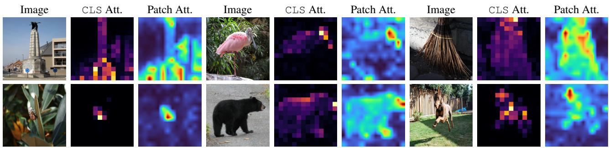  
Figure 1. Vision Transformer (ViT-S/16) attention visualization of ViTAMINS. For each image set, we show the input image, CLS token attention, and patch attention maps from our method. Our approach with memory and synthetic hard negatives produces focused attention on semantically important regions with clear object boundaries and fine-grained details.

## Abstract

We introduce ViTAMINS, a method that integrates synthetic hard negatives into unsupervised vision transformer pretraining to improve representation quality. Our approach is thoroughly benchmarked on ImageNet and transfer learning, image retrieval, copy detection, and image, video segmentation tasks. Notably, our proposed negatives give rise to emergent properties, where learned representations contain explicit information about the semantic content of an image and serve as excellent classifiers (up to +11.3% over baselines). ViTAMINS achieves these benefits through simple modifications to existing contrastive frameworks and outperforms competing methods while being more resource efficient, e.g., our ViT-B surpasses V-JEPA with ViT-L. Our findings motivate reconsidering contrastive learning as a simpler yetpowerful alternative to dominant generative and self-distillation approaches.

## 1. Introduction

Transformers [68] have revolutionized computer vision as powerful alternatives to ConvNets [23, 48, 66], adopting an NLP-inspired strategy of pretraining on large data and finetuning on the target dataset [23, 66]. Scaling to billions of parameters on increasingly diverse datasets, they achieve state-of-the-art performance in both supervised and self-supervised paradigms [30, 33, 53].

Self-supervised learning has established itself as a powerful approach for visual representation learning, enabling models to extract meaningful patterns from vast amounts of unlabeled data [4, 8, 28, 46]. Self-supervised approaches for vision fall into three categories: (i) pretext task methods that solve auxiliary tasks such as rotation prediction [29, 52] or jigsaw puzzles [52]; (ii) generative methods that reconstruct or predict masked portions of inputs, such as MAE [33] inspired by masked language modeling [9, 22, 59, 60], and BEiT [5] following BERT-like pretraining [22, 45]; and (iii) joint embedding architecture methods that learn representations by comparing different views of data in a shared embedding space [14, 15, 31, 32, 61]. This work focuses on training transformers with joint embedding architectures, unlike prior works using generative methods [5, 33, 55].

The joint embedding methods adapted for vision transformers fall into three categories shown in Figure 2, each using different “tricks” to avoid representational collapse: (i) contrastive learning methods embed different augmented views of the same image into a joint space, maximizing similarity between same-instance embeddings while minimizing similarity across instances [15, 18, 32, 71] (Fig-

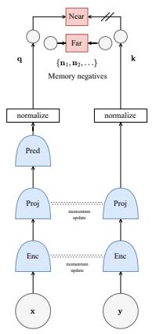  
(a) Contrastive (MoBY)

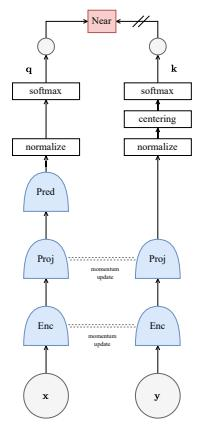  
(b) Self-distillation (DINO)

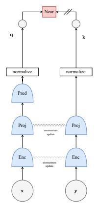  
(c) Self-distillation (BYOL)

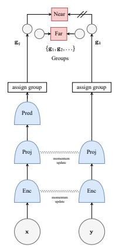  
(d) Clustering (SMoG)

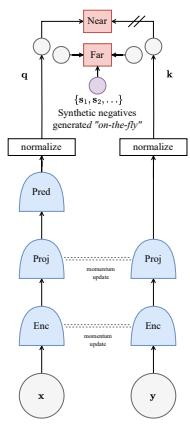  
(e) Ours (ViTAMINS)

Figure 2. Self-supervised learning categories on vision transformers and this paper’s contribution. From left to right: (a) contrastive learning method [18, 71]; (b), (c) self-distillation [14, 31]; (d) clustering-based [54]; and (e) ViTAMINS (ours). Our method introduces synthetic hard negatives generated “on-the-fly” to improve contrastive learning methods for vision transformers. Shaded circles repre sent observed variables, dashed gray lines indicate the momentum update, // indicates a stop-gradient for backpropagation, white boxes represent functions, and red boxes represent loss functions. Abbreviations legend: Enc: encoder, Proj: projector, Pred: predictor.

ure 2a); (ii) self-distillation (teacher–student) methods train a student to match a teacher’s embeddings without negatives [6, 7, 14, 31] (Figures 2b and 2c); and (iii) clusteringbased methods employ clustering objectives [11–13, 54] (Figure 2d).

Transformers trained with joint embedding methods exhibit emergent properties beyond classification accuracy: their features encode explicit semantic segmentation information that emerges less clearly in supervised transformers or ConvNets [14]. Self-distillation methods like DINO [14, 53, 63] and iBOT [78] show strong unsupervised segmentation, with attention aligning to object boundaries without supervision. Such behaviors arise from extensive pretraining and architectural design.

Despite generative methods achieving higher accuracy [5, 33], joint embedding approaches remain competitive and often surpass them in linear probing [7, 53]. Among these, contrastive methods stand out for their simplicity and efficiency [18, 71], explicitly using negatives to define representation boundaries [15, 32], yet have received less attention recently.

We seek to answer the simple question:

Can simple modifications to negative sampling in contrastive learning unlock stronger representations and emergent properties for vision transformers comparable to or exceeding those of selfdistillation methods?

In this paper, we address this question by integrating synthetic hard negative generation in transformer-based contrastive learning, a strategy previously demonstrated effective for convolutional networks [27, 38] but not investigated for vision transformers. Instead of using complex architectures or training schemes (like multi-crop, centering, sharpening, etc., see Section 2), we adapt established synthetic negative generation approaches to transformer architectures, generating challenging samples “on-the-fly”.

Through extensive empirical evaluation, we demonstrate that integrating synthetic hard negatives into transformerbased self-supervised learning yields three key improvements over training without synthetic hard negatives or without negatives: (i) higher top-1 accuracy on ImageNet linear evaluation (Tables 1 and 2), achieving 73.1% and 77.1% with ViT-S/16 and ViT-B/16, and 75.4% and 78.0% with Swin-T and Swin-S, respectively; (ii) improved transfer learning performance across diverse downstream tasks (Tables 6 to 8); and (iii) strong emergent properties, where self-supervised vision transformer features encode explicit semantic segmentation information (Tables 3 to 5), producing precise attention maps that capture object boundaries (Figure 3) and serve as effective k-NN classifiers (Tables 1 and 2), achieving 73.3% top-1 accuracy with ViT-B/16.

## 2. Related Work

## 2.1. Joint Embedding Architectures

Joint embedding architecture methods map augmented views into a shared embedding space while avoiding representational collapse through distinct mechanisms. Contrastive learning methods prevent collapse using large batch sizes [15] or momentum-encoded memory banks [17, 18, 32, 71] to provide sufficient negative samples. Alternative approaches formalize collapse avoidance via mutual information [34, 64, 67]. Self-distillation (a.k.a. teacherstudent distillation) methods surprisingly avoid collapse without negatives. They use asymmetric architectures [16], momentum updates [14, 31], and stop-gradient operations [14, 16, 31]. Alternatively, they explicitly regularize feature covariance so representations do not collapse, $e . g .$ , decorrelate features [6, 75], employ whitening [26], or manifold regularization [74]. Notably, DINO [14, 53, 63], which employs multiple techniques including centering, sharpening, momentum encoder, multi-crop training [13], and extended training, and iBOT [78], which integrates masked patch prediction, exhibit strong unsupervised segmentation. Recent predictive architectures extend this by matching embeddings to target distributions; LeJEPA [3] regularizes representations toward an isotropic Gaussian via sketched-based constraints, while Rectified LpJEPA [44] employs rectified distribution matching to enforce sparsity. In contrast, I-JEPA [2] and V-JEPA [7] primarily rely on their masked predictive structure and architectural asymmetry to avoid collapse without explicit variance or covariance constraints. Finally, clustering-based approaches align embeddings with prototype assignments obtained via the Sinkhorn-Knopp algorithm [13] or via momentum grouping [54].

## 2.2. Contrastive Learning

Contrastive learning methods treat instance discrimination as a pretext task, treating each image as its own class [15, 32]. The core principle involves bringing an anchor and $\mathrm { ~ a ~ } \stackrel {  } { p o s i t i v e } ^ { , }$ sample closer in the embedding space while pushing the anchor away from “negative” samples [39]. Training typically employs InfoNCE loss [67] or its variants [15, 25, 65, 73], maximizing mutual information between positive pairs while minimizing it for negatives. Negative samples are drawn from large batch sizes [15] or memory banks [17, 18, 32, 71]. The concept of challenging negative samples has been explored as a way to improve contrastive learning models. These samples, which lie close to the decision boundary, are crucial for refining the model’s discriminative abilities [1, 62]. Various strategies leverage hard negatives through mixup-based interpolation between embeddings [38], debiased contrastive losses with theoretical analysis [62], importance reweighting schemes [73], and hardness-aware sampling from memory queues [65]. Systematic synthetic generation through transformation strategies has proven effective for convolutional networks [27]. Our method adapts synthetic hard negative generation to vision transformers by generating diverse, informative negatives “on-the- $\cdot \mathrm { { f l y } ^ { \prime } }$ rather than relying solely on batch size or memory bank capacity.

## 3. Methodology

In this section, we introduce our approach, named ViTA-MINS (Vision Transformers with synthetic hard negatives). Our method builds upon existing contrastive learning frameworks (see Figure 2a) and aims to improve representation quality by generating informative negative samples.

## 3.1. ViTAMINS

Like other joint embedding methods, ViTAMINS also operates on the embedding pairs of distorted images. Specifically, given an image x, and two distributions of image augmentation $\mathcal { T } _ { q } , \mathcal { T } _ { k } .$ , we create two augmented views of the same image using the transformations $t _ { q } \sim \tau _ { q }$ and $t _ { k } \sim \mathcal { T } _ { k }$ $i . e , \mathbf { x } _ { q } = t _ { q } ( x )$ and ${ \bf x } _ { k } = t _ { k } ( x )$

Then, we use two encoders $f _ { \theta }$ and $f _ { \xi }$ , two projectors gθ and $g _ { \xi } ,$ , and a predictor $h _ { \theta }$ with parameters θ and ξ to generate the corresponding embeddings q and k, where $\mathbf { q } =$ $h _ { \theta } ( g _ { \theta } ( f _ { \theta } ( \mathbf { x } _ { q } ) ) )$ and $\mathbf { k } = g _ { \xi } ( f _ { \xi } ( \mathbf { x } _ { k } ) )$ , and $\mathbf { q } , \mathbf { k } \in \mathbb { R } ^ { d }$ [31, 71]. We denote the online branch as $f _ { \theta } , \ g _ { \theta }$ , and $h _ { \theta }$ , and the target branch as $f _ { \xi }$ and $g _ { \xi }$ , with parameters θ and $\xi ,$ respectively. We assume that the outputs are $\ell _ { 2 } \cdot$ -normalized.

We maintain a memory queue ${ \mathcal { Q } } = \{ \mathbf { n } _ { 1 } , . . . , \mathbf { n } _ { K } \}$ of features from distinct images serving as $K = 4 0 9 6$ negative samples [17, 18, 32, 71]. These $\{ { \bf n } _ { i } \} _ { i = 1 } ^ { K }$ are target-branch embeddings from previous steps, requiring memory $\mathcal { O } ( K$ d) with embedding dimension $d .$

Only θ is updated by backpropagation, while ξ is the exponential moving average $\xi  m \cdot \xi + ( 1 - m ) \cdot \theta$ , with momentum coefficient $m \in [ 0 , 1 ] \ [ 3 1 , 7 1 ]$ . This ensures gradual evolution of $f _ { \xi }$ , stabilizing negative samples across iterations [32].

To generate synthetic hard negatives, we define the hardness of negative samples by their similarity to the query, measured through the logit values $\ell ( { \mathbf { n } } _ { i } ) ~ = ~ { \mathbf { q } } ^ { \intercal }$ $\mathbf { n } _ { i } .$ To identify the most challenging negatives, we order all negative features by decreasing similarity, $i . e . , \ \hat { \mathcal { Q } } \ =$ $\left\{ \mathbf { n } _ { 1 } , \mathbf { n } _ { 2 } , \ldots , \mathbf { n } _ { K } \right\}$ where $\ell ( { \mathbf { n } } _ { i } ) > \ell ( { \mathbf { n } } _ { j } )$ for all $i < j$ . The top-N hardest negatives are then selected as $\hat { \mathcal { Q } } ^ { N }$ by truncating this ordered set. We define a general framework for synthetic negative generation where $\mathbf { s } _ { k } ^ { i }$ represents the k-th synthetic negative from the i-th strategy. All synthetic negatives are $\ell _ { 2 }$ -normalized to ensure consistency with the representation space geometry. Following [27, 38], we implement six distinct transformation strategies:

$$
\mathbf { s } _ { k } ^ { i } = { \left\{ \begin{array} { l l } { \alpha _ { k } \cdot \mathbf { q } + ( 1 - \alpha _ { k } ) \cdot \mathbf { n } _ { j } , } & { i = 1 } \\ { \mathbf { n } _ { j } + { \boldsymbol { \beta } } _ { k } \cdot ( \mathbf { n } _ { j } - \mathbf { q } ) , } & { i = 2 } \\ { \gamma _ { k } \cdot \mathbf { n } _ { j } + ( 1 - \gamma _ { k } ) \cdot \mathbf { n } _ { l } , } & { i = 3 } \\ { \mathbf { n } _ { j } + { \mathcal { N } } ( \mathbf { 0 } , \sigma ^ { 2 } \cdot \mathbf { I } ) , } & { i = 4 } \\ { \mathbf { n } _ { j } + { \boldsymbol { \delta } } \cdot \nabla _ { \mathbf { n } _ { j } } \sin ( \mathbf { q } , \mathbf { n } _ { j } ) , } & { i = 5 } \\ { \mathbf { n } _ { j } + { \boldsymbol { \eta } } \cdot { \mathrm { s i g n } } ( \nabla _ { \mathbf { n } _ { j } } \sin ( \mathbf { q } , \mathbf { n } _ { j } ) ) , } & { i = 6 } \end{array} \right. }\tag{1}
$$

where $\mathbf { n } _ { j } , \mathbf { n } _ { l } \in \hat { \mathcal { Q } } ^ { N }$ are selected hard negatives, and sim $( \mathbf { q } , \mathbf { n } _ { j } ) = \mathbf { q } ^ { \top } \cdot \mathbf { n } _ { j }$ represents the cosine similarity function. (i) Interpolated negatives $( i ~ = ~ 1 )$ create synthetic examples between the query and hard negatives, where $\alpha _ { k } \in ( 0 , 0 . 5 )$ controls the balance between query and negative contributions. (ii) Extrapolated negatives $( i = 2 )$ explore directions beyond hard negatives, where $\beta _ { k } \in ( 1 , 1 . 5 )$ determines the extrapolation distance. (iii) Mixup negatives $( i = 3 )$ combine pairs of hard negatives with mixing coefficient $\gamma _ { k } \in ( 0 , 1 )$ . (iv) Noise-injected negatives $( i = 4 )$ add controlled stochasticity with Gaussian noise $( \sigma = 0 . 0 1 )$ . (v) Perturbed negatives $( i ~ = ~ 5 )$ modify hard negatives using gradient-based perturbations with $\delta = 0 . 0 1$ . (vi) Adversarial negatives $( i ~ = ~ 6 )$ apply sign-based perturbations with strength $\eta = 0 . 0 1$

The complete set of synthetic hard negatives is formed as $\textstyle S = \bigcup _ { i = 1 } ^ { 6 } S ^ { i }$ , where $S ^ { i } = \{ \mathbf { s } _ { 1 } ^ { i } , \mathbf { s } _ { 2 } ^ { i } , . . . \}$ contains all $| S ^ { i } |$ synthetic negatives generated by the i-th strategy. These synthetic negatives require memory size $O ( | S | \cdot d )$ , where $\textstyle | S | = \sum _ { i = 1 } ^ { 6 } | S ^ { i } | \ll K$ . We augment the memory queue’s negative samples with synthetically generated hard negatives by calculating the denominator Z that comprises contributions from both memory-based and synthetic negatives:

$$
Z = \sum _ { \mathbf { n } \in \mathcal { Q } } \exp ( \mathbf { q } ^ { \intercal } \cdot \mathbf { n } / \tau ) + \sum _ { \mathbf { s } \in \mathcal { S } } \exp ( \mathbf { q } ^ { \intercal } \cdot \mathbf { s } / \tau )\tag{2}
$$

where τ is the temperature parameter. We set $\tau = 0 . 2$ Finally, we optimize the combined negative set using the InfoNCE loss function:

$$
\mathcal { L } ( \mathbf { q } , \mathbf { k } , \mathcal { Q } , \mathcal { S } ) = - \log \frac { \exp ( \mathbf { q } ^ { \top } \cdot \mathbf { k } / \tau ) } { \exp ( \mathbf { q } ^ { \top } \cdot \mathbf { k } / \tau ) + Z } .\tag{3}
$$

Relation to MoBY. When no synthetic hard negatives are generated $( i . e . , S = \emptyset )$ , our method reduces to the standard InfoNCE loss used by MoBY [71] and MoCo-v3 [18] for vision transformers (Figure 2a):

$$
\mathcal { L } ( \mathbf { q } , \mathbf { k } , \mathcal { Q } ) = - \log \frac { \exp ( \mathbf { q } ^ { \top } \cdot \mathbf { k } / \tau ) } { \exp ( \mathbf { q } ^ { \top } \cdot \mathbf { k } / \tau ) + \displaystyle \sum _ { \mathbf { n } \in \mathcal { Q } } \exp ( \mathbf { q } ^ { \top } \cdot \mathbf { n } / \tau ) } .\tag{4}
$$

Relation to BYOL. When we replace the InfoNCE loss with a mean squared error loss between the query q and key k representations, our method reduces to DINO [14] (Figure 2b) without “tricks” or to BYOL [31] (Figure 2c):

$$
\mathcal { L } _ { \mathrm { M S E } } ( \mathbf { q } , \mathbf { k } ) = \frac { 1 } { 2 } \| \mathbf { q } - \mathbf { k } \| _ { 2 } ^ { 2 } .\tag{5}
$$

## 3.2. Implementation and Evaluation Protocols

Architecture. We adopt ViT-S/16 (22M) and ViT-B/16 (86M) [23, 66] or Swin-T (28M) and Swin-S (50M) [48] as the backbone $f _ { \theta }$ . The projection (gθ) and prediction $\left( h _ { \theta } \right)$ heads are two-layer MLPs. Their hidden layers are 4096-dim with ReLU [50], and outputs are 256-dim without ReLU. All MLP layers use BN [36].

Implementation details. We pretrain on ImageNet ILSVRC-2012 [21] and ImageNet-100 [39] without labels.Following MoBY [71], we train the model using AdamW [49] with a batch size of 512, a base learning rate of $1 0 ^ { - 3 }$ , and a weight decay of 0.05. Training spans 300 epochs. The target-network EMA parameter m starts at $m _ { \mathrm { s t a r t } } = 0 . 9 9$ and increases with cosine schedule to 1. We adopt BYOL augmentations [31]. For synthetic negatives, we select the top $N \ = \ 2 5 6$ negatives from the memory queue and generate 128 synthetic hard negatives per anchor using six transformation strategies (Section 3.1), totaling 768 synthetic negatives. Finally, we apply asymmetric drop path rates [35] of 0.2 to the online encoder and 0.0 to the target encoder, as in [71]. More implementation details in the supplementary material.

Evaluation protocols. We follow standard selfsupervised learning evaluation protocols to assess the quality of learned representations [15, 32, 76]. Three primary approaches are used: (i) linear probing evaluation, where a linear classifier is trained on frozen features while keeping the backbone network fixed; (ii) full fine-tuning, where all model parameters are updated on downstream tasks; and (iii) k-NN evaluation, where the model’s learned features are used to predict labels using a k-nearest neighbors classifier.

## 4. Main Results

In this section, we present experimental results validating the effectiveness of ViTAMINS for vision transformers, with implementation details and more results in the supplementary material.

## 4.1. Linear Evaluation on ImageNet

We train a linear classifier on the frozen representation following standard protocols [40, 41], reporting top-1, top-5, and k-NN $( k = 1 0 )$ accuracy in Tables 1 and 2. Our ViT-S surpasses I-JEPA ViT-B, and our ViT-B outperforms I-JEPA, V-JEPA, and iBOT despite their larger models. Vi-TAMINS also surpasses MoBY (no synthetic negatives) and BYOL (no negatives) by a large margin on both linear and k-NN evaluation.

Table 1. Linear and k-NN ViT classification on ImageNet. Results show top-1 and top-5 accuracy and k-NN accuracy for models trained without multi-crop augmentation. Symbols: † adapted from [18]; ‡ from [14]; ⋄ from [78]; § from [19].
<table><tr><td>Method</td><td>Arch.</td><td>Ep. Top-1</td><td></td><td>Top-5 k-NN</td></tr><tr><td>Supervised [66]</td><td>ViT-S</td><td>300 79.8</td><td>一</td><td>一</td></tr><tr><td>Supervised [66]</td><td>ViT-B</td><td>300 81.8</td><td></td><td></td></tr><tr><td></td><td>Generative</td><td></td><td></td><td></td></tr><tr><td>MAE [33]</td><td>ViT-B 1600</td><td>68.0</td><td></td><td></td></tr><tr><td>SimMIM [72]</td><td>ViT-B</td><td>800 56.7</td><td></td><td></td></tr><tr><td>BeiT [5]§</td><td>ViT-S</td><td>300 15.7</td><td></td><td>一</td></tr><tr><td>CAE [19]§</td><td>ViT-S</td><td>300 51.8</td><td></td><td>一</td></tr><tr><td>CAE [19]</td><td>ViT-B</td><td>1600 70.4</td><td></td><td>一</td></tr><tr><td>Joint Embedding Predictive Architectures</td><td></td><td></td><td></td><td></td></tr><tr><td>I-JEPA [2]</td><td>ViT-B</td><td>600 72.9</td><td></td><td></td></tr><tr><td>V-JEPA [7]</td><td>ViT-L</td><td>600 73.7</td><td></td><td>一</td></tr><tr><td>LeJEPA [3]</td><td>ViT-H</td><td>100 77.1</td><td>一</td><td>一</td></tr><tr><td>Joint Embedding Architectures</td><td></td><td></td><td></td><td></td></tr><tr><td>SwAV [13]†</td><td>ViT-S</td><td>300 67.1</td><td></td><td></td></tr><tr><td>BYOL [31]†</td><td>ViT-S</td><td>300 71.0</td><td></td><td></td></tr><tr><td>BYOL [31] (repr.)</td><td>ViT-S</td><td>300 70.3</td><td>91.0</td><td>62.5</td></tr><tr><td>MoBY [71] (repr.)</td><td>ViT-S</td><td>300 72.3</td><td>88.3</td><td>64.3</td></tr><tr><td>MoBY [71]</td><td>ViT-S</td><td>300 72.8</td><td></td><td></td></tr><tr><td>MoCo-v3 [18]†</td><td>ViT-S</td><td>300 72.5</td><td></td><td>一</td></tr><tr><td>MoCo-v3 [18]°</td><td>ViT-B</td><td>300 76.7</td><td></td><td></td></tr><tr><td>DINO [14]‡</td><td>ViT-S</td><td>300 72.5</td><td></td><td>67.9</td></tr><tr><td>DINO [14] (repr.)</td><td>ViT-S</td><td>300 72.3</td><td>93.5</td><td>66.5</td></tr><tr><td>DINO [14]°</td><td>ViT-B</td><td>200 76.0</td><td></td><td>71.2</td></tr><tr><td>iBOT [78]</td><td>ViT-B</td><td>200 76.0</td><td></td><td>71.2</td></tr><tr><td>ViTAMINS (ours)</td><td>ViT-S</td><td>300</td><td>73.1 91.4</td><td>71.0</td></tr><tr><td></td><td></td><td></td><td></td><td></td></tr><tr><td>ViTAMINS (ours)</td><td>ViT-B</td><td>300 77.1</td><td>94.4</td><td>73.3</td></tr></table>

## 4.2. Nearest Neighbor Retrieval

We further evaluate our representations on landmark retrieval and copy detection tasks to assess their effectiveness for matching and similarity search.

Image retrieval. Following [14], we consider the revisited [58] Oxford and Paris datasets [56]. We freeze the features and directly apply k-NN for retrieval. As shown in Table 3, ViTAMINS demonstrates competitive retrieval performance, with our smaller models achieving results comparable to or exceeding those of larger architectures.

Copy detection. We evaluate performance on copy detection following [14] protocol, reporting mean average precision on the “strong” subset of the Copydays dataset [24]. As shown in Table 4, ViTAMINS surpass DINO [14] on this task.

Table 2. Linear and k-NN Swin classification on ImageNet. Results show top-1 and top-5 accuracy and k-NN accuracy
<table><tr><td>Method</td><td>Arch Ep. Top-1 Top-5 k-NN Swin-T</td></tr><tr><td>Supervised [48] 300 Supervised [48] Swin-S 300</td><td>81.3 一 83.0 一</td></tr><tr><td>SiMIM [72] Swin-T1</td><td>Generative 100 56.0</td></tr><tr><td>Joint Embedding Architectures BYOL [31] (repr.) Swin-T 300 MoBY [71] Swin-T MoBY [71] (repr.) Swin-T SMoG [54] Swin-T</td><td>68.5 89.4 58.0 300 75.0 300 74.7 92.7 67.8 400 74.5 一 一</td></tr><tr><td>ViTAMINS (ours) Swin-T ViTAMINS (ours) Swin-S</td><td>300 75.4 93.1 69.3 300 78.0 95.6 71.9</td></tr></table>

Table 3. Image retrieval performance. We report mAP on revisited Oxford (ROx) and Paris (RPar) datasets. Symbols: ♢ trained for more epochs with multi-crop augmentation.
<table><tr><td rowspan="2">Method</td><td rowspan="2">Arch.</td><td colspan="2">ROx</td><td colspan="2">RPar</td></tr><tr><td>M</td><td>H</td><td>M</td><td>H</td></tr><tr><td>Supervised</td><td>ViT-S ViT-S</td><td>33.5 23.8</td><td>8.9</td><td>63.0</td><td>37.2</td></tr><tr><td>BYOL [31] (repr.) BYOL [31] (repr.)</td><td>Swin-T</td><td>24.1</td><td>5.4 4.1</td><td>52.2 49.7</td><td>20.5 18.7</td></tr><tr><td>MoBY [71] (repr.)</td><td>ViT-S</td><td>32.4</td><td>6.8</td><td>61.9</td><td>25.2</td></tr><tr><td>MoBY [71] (repr.)</td><td>Swin-T</td><td>32.4</td><td>7.3</td><td>61.5</td><td></td></tr><tr><td>DINO [14] (repr.)</td><td>ViT-S</td><td>39.0</td><td></td><td></td><td>24.4</td></tr><tr><td>DINO [14]</td><td>ViT-S</td><td>37.2</td><td>11.5 13.7</td><td>65.6</td><td>30.1</td></tr><tr><td>iBOT [78]</td><td>ViT-B</td><td>36.6</td><td>13.0</td><td>63.1 61.5</td><td>34.4 34.1</td></tr><tr><td></td><td></td><td></td><td></td><td></td><td></td></tr><tr><td>ViTAMINS (ours) ViTAMINS (ours)</td><td>ViT-S Swin-T</td><td>40.0 35.3</td><td>12.6 9.3</td><td>66.8 64.1</td><td>31.3 29.3</td></tr></table>

Table 4. Copy detection. We report the mAP performance in copy detection on Copydays “strong” subset [24]. All models use resolution 2242 and 1536 dimensions.
<table><tr><td>Method</td><td>Arch.</td><td>mAP</td></tr><tr><td>Supervised [66]</td><td>ViT-B</td><td>76.4</td></tr><tr><td>DINO [14]</td><td>ViT-B</td><td>81.7</td></tr><tr><td>DINO [14] (repr.)</td><td>ViT-S</td><td>78.4</td></tr><tr><td>ViTAMINS (ours)</td><td>ViT-S</td><td>79.7</td></tr><tr><td>ViTAMINS (ours)</td><td>ViT-B</td><td>82.0</td></tr></table>

## 4.3. Discovering the Semantic Layout of Scenes

A remarkable property of self-supervised vision transformers, as shown by DINO [14, 53], is their ability to capture semantic scene structure without supervision. We evaluate this property through two complementary analyses: quanti tative video segmentation performance (Table 5) and qualitative visualization of learned attention patterns (Figure 3).

Table 5. DAVIS 2017 video object segmentation. We report mean region similarity ${ \mathcal { I } } _ { m } .$ , mean contour-based accuracy ${ \mathcal { F } } _ { m } ,$ and their respective recall metrics $\mathcal { I } _ { r }$ and ${ \mathcal { F } } _ { r }$ . Image resolution is 480p.
<table><tr><td rowspan=1 colspan=2>Method           Arch. $( \mathcal { T } \& \mathcal { F } ) _ { m }$  $\mathcal { I } _ { m }$  $\mathcal { I } _ { r }$  $\mathcal { F } _ { m }$  ${ \mathcal { F } } _ { r }$ </td></tr><tr><td rowspan=1 colspan=2>BYOL [31] (repr.) ViT-S    41.3   41.5 40.9 41.1 33.6BYOL [31] (repr.) Swin-T   34.4   37.9 30.3 31.0 13.7MoBY [71] (repr.) ViT-S    42.2   42.1 39.6 42.2 34.9MoBY [71] (repr.) Swin-T   36.6   39.7 32.7 33.516.5DINO [14] (repr.)ViT-S    39.1   40.3 37.4 39.2 34.8</td></tr><tr><td rowspan=1 colspan=2>DINO $[ 1 4 ] ^ { \diamond }$        ViT-S    61.8   60.2     63.4 一DINO $[ 1 4 ] ^ { \diamond }$        ViT-B   62.3   60.7     63.9 $\mathrm { i B O T } [ 7 8 ] ^ { \odot }$         ViT-B    61.8   60.4 一 63.2 一</td></tr><tr><td rowspan=2 colspan=1>ViTAMINS (ours) ViT-SViTAMINS (ours) Swin-T</td><td rowspan=2 colspan=1>44.3   44.1 41.8 44.5 38.537.6   40.5 32.1 34.6 17.0</td></tr><tr><td rowspan=1 colspan=1></td></tr></table>

Video instance segmentation. Following [37], we evaluate spatial coherence on DAVIS-2017 [57], segmenting via nearest-neighbor matching between consecutive frames on frozen features without any training. ViTAMINS achieves strong performance (Table 5).

Visualizing attention mechanisms. Recent work [14, 53] showed vision transformers segment objects and attend to meaningful regions without supervision, but whether this is exclusive to self-distillation or emerges more generally remains unclear. Following [14], we visualize last-layer attention: (i) [CLS]-to-patch attention and (ii) patch selfattention capturing object boundaries. In Figure 1, all methods separate foreground from background, but ViTAMINS yields significantly sharper maps, capturing fine details like the bear’s head and claws, the horse’s body, and the dog’s head and feet (Figures 1 and 3), without DINO’s tricks [14] (Section 2). More in the supplementary material.

## 4.4. Transfer Learning on Downstream Tasks

We evaluate ViTAMINS transfer learning on dense prediction and classification tasks.

Detection and segmentation on COCO. We evaluate on the COCO dataset [47] using Cascade Mask R-CNN [10], which simultaneously predicts bounding boxes and instance masks. As reported in Table $^ { 6 , }$ our method consistently improves over strong self-supervised baselines across both architectures.

Table 6. Transfer learning performance on dense prediction tasks. Object detection $( m A P ^ { b b } )$ and instance segmentation $( m A P ^ { m s k } )$ are evaluated on COCO while semantic segmentation performance is reported as mIoU on ADE20K.
<table><tr><td>Method</td><td>Arch.</td><td> $\mathbf { m A P ^ { b b } }$ </td><td> $\mathbf { m A P ^ { m s k } }$ </td><td>mIoU</td></tr><tr><td>Supervised [66]</td><td>ViT-S</td><td>46.2</td><td>40.1</td><td>44.5</td></tr><tr><td>Supervised [48]</td><td>Swin-T</td><td>48.1</td><td>41.7</td><td>44.5</td></tr><tr><td>iBOT [78]</td><td>ViT-S</td><td>49.4</td><td>42.6</td><td>45.4</td></tr><tr><td>MoBY [71]</td><td>Swin-T</td><td>48.1</td><td>41.5</td><td>44.1</td></tr><tr><td>DINO [14] (repr.)</td><td>ViT-S</td><td>41.5</td><td>41.3</td><td>45.0</td></tr><tr><td>ViTAMINS (ours)</td><td>ViT-S</td><td>49.9</td><td>42.8</td><td>46.0</td></tr><tr><td>ViTAMINS (ours)</td><td>Swin-T</td><td>48.9</td><td>42.2</td><td>45.2</td></tr></table>

Table 7. Linear probing performance on various downstream classification datasets. Results show top-1 accuracy (in %) with frozen weights except for the final fully-connected layer. Abbreviations: C: CIFAR, Flwr: Flowers-102, F: Food.
<table><tr><td>Method</td><td> $\bf { C _ { 1 0 } }$ </td><td> ${ \bf C _ { 1 0 0 } }$ </td><td>Flwr</td><td>Pets</td><td> ${ \bf F _ { 1 0 1 } }$ </td></tr><tr><td colspan="6"></td></tr><tr><td rowspan="3">BYOL [31] (repr.) MoBY [71] (repr.) ViTAMINS (ours)</td><td>90.5</td><td>ViT-S 74.2</td><td>87.7</td><td>85.1</td><td>73.3</td></tr><tr><td>88.9</td><td>73.0</td><td>56.8</td><td>80.8</td><td>69.7</td></tr><tr><td>92.1</td><td>79.7</td><td>72.6</td><td>86.1</td><td>75.0</td></tr><tr><td colspan="6">Swin-T</td></tr><tr><td>BYOL [31] (repr.)</td><td>88.6</td><td>72.2</td><td>83.8</td><td>83.0</td><td>73.7</td></tr><tr><td>MoBY [71] (repr.)</td><td>90.6</td><td>76.5</td><td>90.3</td><td>88.2</td><td>78.8</td></tr><tr><td>ViTAMINS (ours)</td><td>91.4</td><td>77.7</td><td>89.5</td><td>88.5</td><td>79.8</td></tr></table>

Semantic segmentation on ADE20K. We further evaluate representation quality on semantic segmentation, a dense pixel-level classification task, using ADE20K [77] with UPerNet [70]. As shown in Table 6, our method achieves the best mIoU across transformer architectures.

Transfer learning. Finally, we test whether ViTAMINS’s ImageNet features are generic or ImageNet-specific, performing linear evaluation and fine-tuning on the classification tasks of [40, 41] (Tables 7 and 8). In linear probing, our method wins on 8/11 datasets with ViT-S and 9/11 with Swin-T (see the supplementary material); in finetuning, it outperforms both baselines on all 5 datasets with both architectures. Representations transfer effectively to small images (CIFAR-10/100 [43]), fine-grained recognition (Flowers-102 [51], Cars [42]), landscapes (SUN397 [69]), and textures (DTD [20]).

## 5. Ablation Study of ViTAMINS

We conduct ablations to analyze synthetic negative strategies, regularization techniques, and hyperparameters. More ablations in the supplementary material.

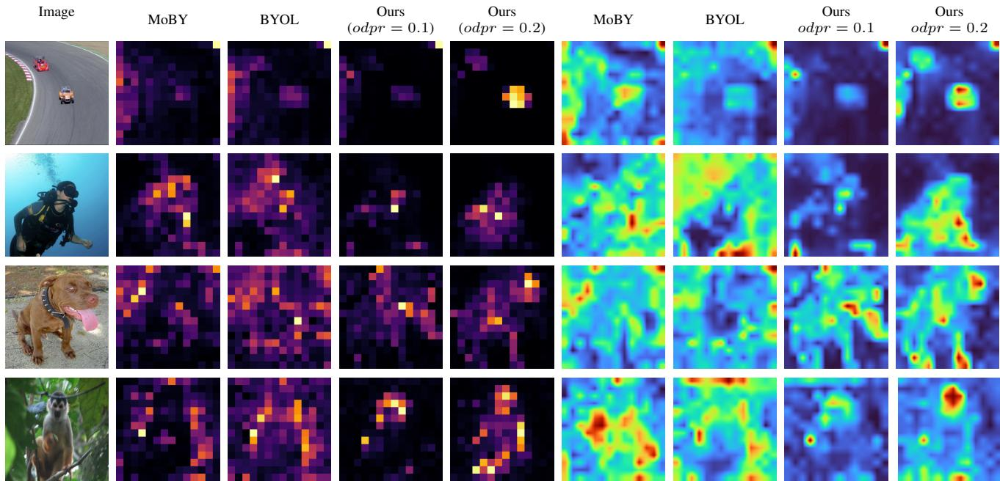  
Figure 3. ViT-S/16 attention visualization across self-supervised methods. We show CLS attention (left group) and patch attention (right group) for MoBY, BYOL, and our proposed ViTAMINS method for odpr = 0.1 and $o d p r = 0 . 2$ . More in the supplementary material.

Table 8. End-to-end finetuning performance on various downstream classification tasks. Results show top-1 accuracy (in %) with all parameters updated during training. Abbreviations: C: CIFAR, Flwr: Flowers-102, F: Food.
<table><tr><td>Method</td><td> $\bf { C _ { 1 0 } }$ </td><td> $\bf { C _ { 1 0 0 } }$ </td><td>Flwr</td><td>Pets</td><td> $\bf { F _ { 1 0 1 } }$ </td></tr><tr><td colspan="6">ViT-S</td></tr><tr><td rowspan="3">BYOL [31] (repr.) MoBY [71] (repr.) ViTAMINS (ours)</td><td>86.3</td><td>62.4</td><td>87.7</td><td>85.1</td><td>73.5</td></tr><tr><td>75.2</td><td>80.3</td><td>66.0</td><td>82.3</td><td>71.0</td></tr><tr><td>96.8</td><td>83.1</td><td>88.3</td><td>87.2</td><td>85.7</td></tr><tr><td colspan="6">Swin-T</td></tr><tr><td>BYOL [31] (repr.)</td><td>89.2</td><td>64.9</td><td>83.8</td><td>83.0</td><td>74.0</td></tr><tr><td>MoBY [71] (repr.)</td><td>97.3</td><td>84.8</td><td>90.3</td><td>88.2</td><td>79.8</td></tr><tr><td>ViTAMINS (ours)</td><td>97.6</td><td>85.8</td><td>91.2</td><td>89.5</td><td>90.3</td></tr><tr><td></td><td></td><td></td><td></td><td></td><td></td></tr></table>

Synthetic hard negatives strategies. We perform ablation studies on combinations of synthetic negative transformation strategies. Table 9 shows that combining all six types $( S ^ { 1 } – { S } ^ { \overline { { 6 } } } )$ yields the highest performance. Without synthetic negatives, the baseline improves by +0.8% and +0.7% when all strategies are applied. While individual strategies vary in effectiveness $( S ^ { 3 }$ most impactful, then $S ^ { 1 } )$ , their combination provides complementary benefits exceeding individual contributions, validating that diverse synthetic negatives improve representations.

Table 9. Ablation study on synthetic negative strategies on Im ageNet. Each strategy generates 128 synthetic negatives. We pretrain for 100 epochs and report top-1 accuracy (%). We highlight the default hyperparameter.
<table><tr><td> $S ^ { 1 }$ </td><td> $S ^ { 2 }$ </td><td> $S ^ { 3 }$ </td><td> $S ^ { 4 }$ </td><td> $S ^ { 5 }$ </td><td> $S ^ { 6 }$ </td><td>ViT-S</td><td>Swin-T</td></tr><tr><td>x</td><td>x</td><td>x</td><td>X</td><td>x</td><td>x</td><td>69.2</td><td>70.9</td></tr><tr><td>√</td><td>x</td><td>x</td><td>X</td><td>x</td><td>x</td><td>69.5</td><td>71.2</td></tr><tr><td>x</td><td>√</td><td>x</td><td>x</td><td>X</td><td>x</td><td>69.4</td><td>71.1</td></tr><tr><td>x</td><td>X</td><td>√</td><td>X</td><td>x</td><td>x</td><td>69.6</td><td>71.3</td></tr><tr><td>x</td><td>x</td><td>X</td><td>√</td><td>x</td><td>x</td><td>69.4</td><td>71.1</td></tr><tr><td>x</td><td>x</td><td>x</td><td>x</td><td>√</td><td>x</td><td>69.3</td><td>71.0</td></tr><tr><td>x</td><td>x</td><td>x</td><td>X</td><td>x</td><td>√</td><td>69.3</td><td>71.0</td></tr><tr><td>√</td><td>√</td><td>√</td><td>√</td><td>√</td><td>√</td><td>70.0</td><td>71.6</td></tr></table>

Drop path regularization. We investigate the effect of asymmetric drop path on online and target encoders. Table 10 shows that higher drop path rates for the online encoder with no dropout for the target encoder yields optima results. This asymmetric configuration outperforms both no regularization and symmetric drop path rates, with the effectiveness likely stemming from encouraging the online encoder to learn more robust representations while maintaining stability in the target encoder. Table 10 also shows how our method benefits from extended pretraining.

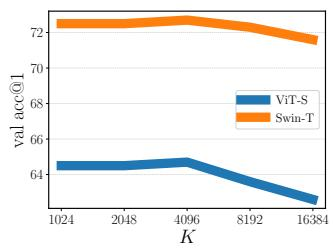

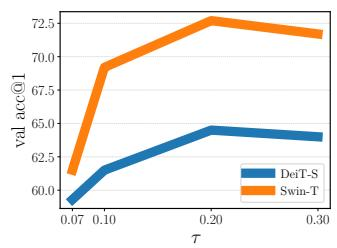

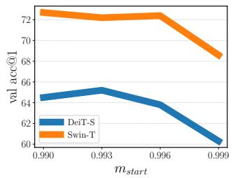

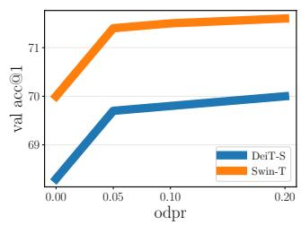  
Figure 4. Ablation studies of ViTAMINS on ImageNet-100. We pretrain for 100 epochs and report top-1 accuracy (%) using ViT-S and Swin-T architectures. (left): queue size K; (second from left): temperature τ ; (second from right): momentum mstart; (right): online drop path rate (ImageNet here, see Tab. 10). Default hyperparameters: $K = 4 0 9 6 , \tau = 0 . 2 , m _ { \mathrm { s t a r t } } = 0 . 9 9$ , online drop path rate = 0.2.

Table 10. Ablation study on the drop path rates on ImageNet. We pretrain and report top-1 accuracy (%). We highlight the default hyperparameter.
<table><tr><td>Online dpr</td><td>Target dpr</td><td>Epochs</td><td>ViT-S</td><td>Swin-T</td></tr><tr><td>0.0</td><td>0.0</td><td>100</td><td>68.3</td><td>70.0</td></tr><tr><td>0.1</td><td>0.1</td><td>100</td><td>68.1</td><td>69.8</td></tr><tr><td>0.05</td><td>0.0</td><td>100</td><td>69.7</td><td>71.4</td></tr><tr><td>0.1</td><td>0.0</td><td>100</td><td>69.8</td><td>71.5</td></tr><tr><td>0.2</td><td>0.0</td><td>100</td><td>70.0</td><td>71.6</td></tr><tr><td>0.1</td><td>0.0</td><td>300</td><td>72.5</td><td>74.7</td></tr><tr><td>0.2</td><td>0.0</td><td>300</td><td>73.1</td><td>75.4</td></tr></table>

Table 11. Ablation study on applying MoCo-v3 and SynCo tricks on ImageNet. We pretrain for 300 epochs and report top-1 accuracy (%). We highlight the default hyperparameter.
<table><tr><td>Fixed Patch Embed</td><td>Cooldown</td><td>ViT-S</td><td>Swin-T</td></tr><tr><td>√</td><td>x</td><td>72.0</td><td>73.6</td></tr><tr><td>x</td><td>x</td><td>72.2</td><td>74.1</td></tr><tr><td>x</td><td>√</td><td>73.1</td><td>75.4</td></tr></table>

Tricks of MoCo-v3 and SynCo. We evaluate the necessity of implementation tricks from MoCo-v3 [18] and SynCo [27]. Table 11 shows that fixed patch embeddings from MoCo-v3 are unnecessary when using our approach, while SynCo’s cooldown strategy (disabling synthetic negatives for the last 100 epochs) achieves optimal results. This cooldown approach (along warmup) has proven effective for both convnets [27] and vision transformers (ours). Synthetics without warmup hurt because early representations are not yet semantically organized, while synthetics without cooldown destabilize convergence. A full ablation of the three phases is provided in the supplementary material.

Other hyperparameters. We study the robustness of our approach across different contrastive hyperparameter settings to demonstrate seamless integration with existing frameworks. Figure 4 shows that performance remains stable across a wide range of queue sizes, temperatures, and momentum values using default hyperparameters from MoBY. These findings confirm that synthetic negatives can be readily adopted in existing contrastive learning pipelines without requiring architectural modifications, extensive hyperparameter re-tuning, or additional computational overhead during the hyperparameter search process.

## 6. Conclusion

We demonstrate that synthetic hard negatives significantly improve vision transformer representations in selfsupervised contrastive learning. Emergent semantic segmentation properties, previously considered exclusive to self-distillation methods like DINO [14], naturally arise in contrastive learning and are further strengthened through synthetic negative generation. ViTAMINS achieves five improvements over standard contrastive baselines: (i) improved ImageNet linear accuracy, (ii) strong k-NN performance indicating high-quality features, (iii) improved downstream performance across diverse settings, (iv) sharper attention maps with better object boundary alignment, and (v) strong video object segmentation despite no video training. These gains are achieved without DINO’s complex procedures (centering, sharpening, multi-crop, extended schedules); under identical regimes (300 epochs, no multi-crop), ViTAMINS outperforms our reproduced DINO across all tasks: linear probing, k-NN, image retrieval, copy detection, video segmentation, and dense prediction (Tables 1 and 3 to 6). See the supplementary material for scope, fair comparison (including DINO), and broader gains. Overall, our results challenge the focus on selfdistillation and generative approaches: contrastive learning with high-quality negatives remains a simple yet powerful alternative that integrates with any InfoNCE-based method [67], generalizes across architectures, and incurs minimal overhead. We hope this encourages renewed interest in contrastive learning.

## Acknowledgments

We acknowledge the computational resources and support provided by the Imperial College Research Computing Service (http://doi.org/10.14469/hpc/2232), which enabled our experiments.

## References

[1] Adnan Ali, Jinlong Li, Huanhuan Chen, and Ali Kashif Bashir. From overfitting to robustness: Quantity, quality, and variety oriented negative sample selection in graph contrastive learning, 2024. 3

[2] Mahmoud Assran, Quentin Duval, Ishan Misra, Piotr Bojanowski, Pascal Vincent, Michael Rabbat, Yann LeCun, and Nicolas Ballas. Self-supervised learning from images with a joint-embedding predictive architecture, 2023. 3, 5

[3] Randall Balestriero and Yann LeCun. Lejepa: Provable and scalable self-supervised learning without the heuristics, 2025. 3, 5

[4] Randall Balestriero, Mark Ibrahim, Vlad Sobal, Ari Morcos, Shashank Shekhar, Tom Goldstein, Florian Bordes, Adrien Bardes, Gregoire Mialon, Yuandong Tian, Avi Schwarzschild, Andrew Gordon Wilson, Jonas Geiping, Quentin Garrido, Pierre Fernandez, Amir Bar, Hamed Pirsiavash, Yann LeCun, and Micah Goldblum. A cookbook of self-supervised learning, 2023. 1

[5] Hangbo Bao, Li Dong, Songhao Piao, and Furu Wei. Beit: Bert pre-training of image transformers, 2022. 1, 2, 5

[6] Adrien Bardes, Jean Ponce, and Yann LeCun. Vicreg: Variance-invariance-covariance regularization for selfsupervised learning, 2022. 2, 3

[7] Adrien Bardes, Quentin Garrido, Jean Ponce, Michael Rabbat, Yann LeCun, Mahmoud Assran, and Nicolas Ballas. Revisiting feature prediction for learning visual representations from video. arXiv preprint arXiv:2404.08471, 2024. 2, 3, 5

[8] Rishi Bommasani, Drew A. Hudson, Ehsan Adeli, Russ Altman, Simran Arora, Sydney von Arx, Michael S. Bernstein, Jeannette Bohg, Antoine Bosselut, Emma Brunskill, Erik Brynjolfsson, S. Buch, Dallas Card, Rodrigo Castellon, Niladri S. Chatterji, Annie S. Chen, Kathleen A. Creel, Jared Davis, Dora Demszky, Chris Donahue, Moussa Doumbouya, Esin Durmus, Stefano Ermon, John Etchemendy, Kawin Ethayarajh, Li Fei-Fei, Chelsea Finn, Trevor Gale, Lauren E. Gillespie, Karan Goel, Noah D. Goodman, Shelby Grossman, Neel Guha, Tatsunori Hashimoto, Peter Henderson, John Hewitt, Daniel E. Ho, Jenny Hong, Kyle Hsu, Jing Huang, Thomas F. Icard, Saahil Jain, Dan Jurafsky, Pratyusha Kalluri, Siddharth Karamcheti, Geoff Keeling, Fereshte Khani, O. Khattab, Pang Wei Koh, Mark S. Krass, Ranjay Krishna, Rohith Kuditipudi, Ananya Kumar, Faisal Ladhak, Mina Lee, Tony Lee, Jure Leskovec, Isabelle Levent, Xiang Lisa Li, Xuechen Li, Tengyu Ma, Ali Malik, Christopher D. Manning, Suvir P. Mirchandani, Eric Mitchell, Zanele Munyikwa, Suraj Nair, Avanika Narayan, Deepak Narayanan, Benjamin Newman, Allen Nie, Juan Carlos Niebles, Hamed Nilforoshan, J. F. Nyarko, Giray Ogut, Laurel Orr, Isabel Papadimitriou, Joon Sung Park,

Chris Piech, Eva Portelance, Christopher Potts, Aditi Raghu nathan, Robert Reich, Hongyu Ren, Frieda Rong, Yusuf H. Roohani, Camilo Ruiz, Jack Ryan, Christopher R’e, Dorsa Sadigh, Shiori Sagawa, Keshav Santhanam, Andy Shih, Kr ishna Parasuram Srinivasan, Alex Tamkin, Rohan Taori, Armin W. Thomas, Florian Tramer, Rose E. Wang, William\` Wang, Bohan Wu, Jiajun Wu, Yuhuai Wu, Sang Michael Xie, Michihiro Yasunaga, Jiaxuan You, Matei A. Zaharia, Michael Zhang, Tianyi Zhang, Xikun Zhang, Yuhui Zhang, Lucia Zheng, Kaitlyn Zhou, and Percy Liang. On the opportunities and risks of foundation models. ArXiv, 2021. 1

[9] Tom Brown, Benjamin Mann, Nick Ryder, Melanie Subbiah, Jared D Kaplan, Prafulla Dhariwal, Arvind Neelakantan, Pranav Shyam, Girish Sastry, Amanda Askell, et al. Language models are few-shot learners. Advances in neural information processing systems, 33:1877–1901, 2020. 1

[10] Zhaowei Cai and Nuno Vasconcelos. Cascade r-cnn: High quality object detection and instance segmentation, 2019. 6

[11] Mathilde Caron, Piotr Bojanowski, Armand Joulin, and Matthijs Douze. Deep clustering for unsupervised learning of visual features, 2019. 2

[12] Mathilde Caron, Piotr Bojanowski, Julien Mairal, and Armand Joulin. Unsupervised pre-training of image features on non-curated data, 2019.

[13] Mathilde Caron, Ishan Misra, Julien Mairal, Priya Goyal, Piotr Bojanowski, and Armand Joulin. Unsupervised learning of visual features by contrasting cluster assignments. In Advances in Neural Information Processing Systems, pages 9912–9924. Curran Associates, Inc., 2020. 2, 3, 5

[14] Mathilde Caron, Hugo Touvron, Ishan Misra, Herve J´ egou,´ Julien Mairal, Piotr Bojanowski, and Armand Joulin. Emerg ing properties in self-supervised vision transformers, 2021. 1, 2, 3, 4, 5, 6, 8

[15] Ting Chen, Simon Kornblith, Mohammad Norouzi, and Geoffrey Hinton. A simple framework for contrastive learning of visual representations, 2020. 1, 2, 3, 4

[16] Xinlei Chen and Kaiming He. Exploring simple siamese representation learning, 2020. 3

[17] Xinlei Chen, Haoqi Fan, Ross Girshick, and Kaiming He. Improved baselines with momentum contrastive learning, 2020. 3

[18] Xinlei Chen, Saining Xie, and Kaiming He. An empirical study of training self-supervised vision transformers, 2021. 1, 2, 3, 4, 5, 8

[19] Xiaokang Chen, Mingyu Ding, Xiaodi Wang, Ying Xin, Shentong Mo, Yunhao Wang, Shumin Han, Ping Luo, Gang Zeng, and Jingdong Wang. Context autoencoder for self supervised representation learning, 2023. 5

[20] Mircea Cimpoi, Subhransu Maji, Iasonas Kokkinos, Sammy Mohamed, and Andrea Vedaldi. Describing textures in the wild. In 2014 IEEE Conference on Computer Vision and Pattern Recognition, pages 3606–3613, 2014. 6

[21] Jia Deng, Wei Dong, Richard Socher, Li-Jia Li, K. Li, and Li Fei-Fei. Imagenet: A large-scale hierarchical image database. 2009 IEEE Conference on Computer Vision and Pattern Recognition, pages 248–255, 2009. 4

[22] Jacob Devlin, Ming-Wei Chang, Kenton Lee, and Kristina Toutanova. Bert: Pre-training of deep bidirectional transformers for language understanding, 2018. 1

[23] Alexey Dosovitskiy, Lucas Beyer, Alexander Kolesnikov, Dirk Weissenborn, Xiaohua Zhai, Thomas Unterthiner, Mostafa Dehghani, Matthias Minderer, Georg Heigold, Sylvain Gelly, Jakob Uszkoreit, and Neil Houlsby. An image is worth 16x16 words: Transformers for image recognition at scale, 2021. 1, 4

[24] Matthijs Douze, Herve J´ egou, Harsimrat Sandhawalia, Lau-´ rent Amsaleg, and Cordelia Schmid. Evaluation of gist descriptors for web-scale image search. In Proceedings of the ACM International Conference on Image and Video Retrieval, New York, NY, USA, 2009. Association for Computing Machinery. 5

[25] Debidatta Dwibedi, Yusuf Aytar, Jonathan Tompson, Pierre Sermanet, and Andrew Zisserman. With a little help from my friends: Nearest-neighbor contrastive learning of visual representations, 2021. 3

[26] Aleksandr Ermolov, Aliaksandr Siarohin, Enver Sangineto, and Nicu Sebe. Whitening for self-supervised representation learning, 2021. 3

[27] Nikolaos Giakoumoglou and Tania Stathaki. Synco: Synthetic hard negatives for contrastive visual representation learning, 2025. 2, 3, 8

[28] Nikolaos Giakoumoglou, Tania Stathaki, and Athanasios Gkelias. A review on discriminative self-supervised learning methods in computer vision, 2025. 1

[29] Spyros Gidaris, Praveer Singh, and Nikos Komodakis. Unsupervised representation learning by predicting image rotations, 2018. 1

[30] Priya Goyal, Mathilde Caron, Benjamin Lefaudeux, Min Xu, Pengchao Wang, Vivek Pai, Mannat Singh, Vitaliy Liptchinsky, Ishan Misra, Armand Joulin, and Piotr Bojanowski. Self-supervised pretraining of visual features in the wild, 2021. 1

[31] Jean-Bastien Grill, Florian Strub, Florent Altche, Corentin´ Tallec, Pierre H. Richemond, Elena Buchatskaya, Carl Doersch, Bernardo Avila Pires, Zhaohan Daniel Guo, Mohammad Gheshlaghi Azar, Bilal Piot, Koray Kavukcuoglu, Remi´ Munos, and Michal Valko. Bootstrap your own latent: A new approach to self-supervised learning, 2020. 1, 2, 3, 4, 5, 6, 7

[32] Kaiming He, Haoqi Fan, Yuxin Wu, Saining Xie, and Ross Girshick. Momentum contrast for unsupervised visual representation learning, 2020. 1, 2, 3, 4

[33] Kaiming He, Xinlei Chen, Saining Xie, Yanghao Li, Piotr Dollar, and Ross Girshick. Masked autoencoders are scalable´ vision learners, 2021. 1, 2, 5

[34] R Devon Hjelm, Alex Fedorov, Samuel Lavoie-Marchildon, Karan Grewal, Phil Bachman, Adam Trischler, and Yoshua Bengio. Learning deep representations by mutual information estimation and maximization, 2019. 3

[35] Gao Huang, Yu Sun, Zhuang Liu, Daniel Sedra, and Kilian Weinberger. Deep networks with stochastic depth, 2016. 4

[36] Sergey Ioffe and Christian Szegedy. Batch normalization: Accelerating deep network training by reducing internal covariate shift, 2015. 4

[37] Allan Jabri, Andrew Owens, and Alexei Efros. Space-time correspondence as a contrastive random walk. In Advances in Neural Information Processing Systems, pages 19545– 19560. Curran Associates, Inc., 2020. 6

[38] Yannis Kalantidis, Mert Bulent Sariyildiz, Noe Pion, Philippe Weinzaepfel, and Diane Larlus. Hard negative mixing for contrastive learning, 2020. 2, 3

[39] Prannay Khosla, Piotr Teterwak, Chen Wang, Aaron Sarna, Yonglong Tian, Phillip Isola, Aaron Maschinot, Ce Liu, and Dilip Krishnan. Supervised contrastive learning, 2021. 3, 4

[40] Alexander Kolesnikov, Xiaohua Zhai, and Lucas Beyer. Re visiting self-supervised visual representation learning, 2019. 4, 6

[41] Simon Kornblith, Jonathon Shlens, and Quoc V. Le. Do better imagenet models transfer better?, 2019. 4, 6

[42] Jonathan Krause, Michael Stark, Jia Deng, and Li Fei-Fei. 3d object representations for fine-grained categorization. In 2013 IEEE International Conference on Computer Vision Workshops, pages 554–561, 2013. 6

[43] Alex Krizhevsky. Learning multiple layers of features from tiny images. pages 32–33, 2009. 6

[44] Yilun Kuang, Yash Dagade, Tim G. J. Rudner, Randall Balestriero, and Yann LeCun. Rectified lpjepa: Joint-embedding predictive architectures with sparse and maximum-entropy representations, 2026. 3

[45] Zhenzhong Lan, Mingda Chen, Sebastian Goodman, Kevin Gimpel, Piyush Sharma, and Radu Soricut. Albert: A lite bert for self-supervised learning of language representations, 2020. 1

[46] Yann LeCun, Yoshua Bengio, and Geoffrey Hinton. Deep learning. Nature, 521(7553):436–444, 2015. 1

[47] Tsung-Yi Lin, Michael Maire, Serge Belongie, Lubomir Bourdev, Ross Girshick, James Hays, Pietro Perona, Deva Ramanan, C. Lawrence Zitnick, and Piotr Dollar. Microsoft´ coco: Common objects in context, 2015. 6

[48] Ze Liu, Yutong Lin, Yue Cao, Han Hu, Yixuan Wei, Zheng Zhang, Stephen Lin, and Baining Guo. Swin transformer: Hierarchical vision transformer using shifted win dows, 2021. 1, 4, 5, 6

[49] Ilya Loshchilov and Frank Hutter. Decoupled weight decay regularization, 2019. 4

[50] Vinod Nair and Geoffrey Hinton. Rectified linear units improve restricted boltzmann machines vinod nair. pages 807– 814, 2010. 4

[51] Maria-Elena Nilsback and Andrew Zisserman. Automated flower classification over a large number of classes. In 2008 Sixth Indian Conference on Computer Vision, Graphics and Image Processing, pages 722–729, 2008. 6

[52] Mehdi Noroozi and Paolo Favaro. Unsupervised learning of visual representations by solving jigsaw puzzles, 2016. 1

[53] Maxime Oquab, Timothee Darcet, Theo Moutakanni, Huy V.´ Vo, Marc Szafraniec, Vasil Khalidov, Pierre Fernandez, Daniel Haziza, Francisco Massa, Alaaeldin El-Nouby, Russell Howes, Po-Yao Huang, Hu Xu, Vasu Sharma, Shang-Wen Li, Wojciech Galuba, Mike Rabbat, Mido Assran, Nicolas Ballas, Gabriel Synnaeve, Ishan Misra, Herve Jegou,

Julien Mairal, Patrick Labatut, Armand Joulin, and Piotr Bojanowski. Dinov2: Learning robust visual features without supervision, 2023. 1, 2, 3, 5, 6

[54] Bo Pang, Yifan Zhang, Yaoyi Li, Jia Cai, and Cewu Lu. Unsupervised visual representation learning by synchronous momentum grouping, 2022. 2, 3, 5

[55] Zhiliang Peng, Li Dong, Hangbo Bao, Qixiang Ye, and Furu Wei. Beit v2: Masked image modeling with vector-quantized visual tokenizers, 2022. 1

[56] James Philbin, Ondrej Chum, Michael Isard, Josef Sivic, and Andrew Zisserman. Lost in quantization: Improving particular object retrieval in large scale image databases. In 2008 IEEE Conference on Computer Vision and Pattern Recognition, pages 1–8, 2008. 5

[57] Jordi Pont-Tuset, Federico Perazzi, Sergi Caelles, Pablo Arbelaez, Alex Sorkine-Hornung, and Luc Van Gool. The 2017´ davis challenge on video object segmentation, 2018. 6

[58] Filip Radenovic, Ahmet Iscen, Giorgos Tolias, Yannis´ Avrithis, and Ondˇrej Chum. Revisiting oxford and paris: Large-scale image retrieval benchmarking, 2018. 5

[59] Alec Radford and Karthik Narasimhan. Improving language understanding by generative pre-training. 2018. 1

[60] Alec Radford, Jeff Wu, Rewon Child, David Luan, Dario Amodei, and Ilya Sutskever. Language models are unsupervised multitask learners. 2019. 1

[61] Alec Radford, Jong Wook Kim, Chris Hallacy, Aditya Ramesh, Gabriel Goh, Sandhini Agarwal, Girish Sastry, Amanda Askell, Pamela Mishkin, Jack Clark, Gretchen Krueger, and Ilya Sutskever. Learning transferable visual models from natural language supervision, 2021. 1

[62] Joshua Robinson, Ching-Yao Chuang, Suvrit Sra, and Stefanie Jegelka. Contrastive learning with hard negative samples. In International Conference on Learning Representations, 2021. 3

[63] Oriane Simeoni, Huy V. Vo, Maximilian Seitzer, Federico´ Baldassarre, Maxime Oquab, Cijo Jose, Vasil Khalidov, Marc Szafraniec, Seungeun Yi, Michael Ramamonjisoa,¨ Francisco Massa, Daniel Haziza, Luca Wehrstedt, Jianyuan Wang, Timothee Darcet, Th´ eo Moutakanni, Leonel Sentana,´ Claire Roberts, Andrea Vedaldi, Jamie Tolan, John Brandt, Camille Couprie, Julien Mairal, Herve J ´ egou, Patrick La-´ batut, and Piotr Bojanowski. Dinov3, 2025. 2, 3

[64] Yonglong Tian, Chen Sun, Ben Poole, Dilip Krishnan, Cordelia Schmid, and Phillip Isola. What makes for good views for contrastive learning? In Advances in Neural Information Processing Systems, pages 6827–6839. Curran Associates, Inc., 2020. 3

[65] Nenad Tomasev, Ioana Bica, Brian McWilliams, Lars Buesing, Razvan Pascanu, Charles Blundell, and Jovana Mitrovic. Pushing the limits of self-supervised resnets: Can we outperform supervised learning without labels on imagenet?, 2022. 3

[66] Hugo Touvron, Matthieu Cord, Matthijs Douze, Francisco Massa, Alexandre Sablayrolles, and Herve J ´ egou. Training´ data-efficient image transformers and distillation through attention, 2021. 1, 4, 5, 6

[67] Aaron van den Oord, Yazhe Li, and Oriol Vinyals. Repre sentation learning with contrastive predictive coding, 2019. 3, 8

[68] Ashish Vaswani, Noam Shazeer, Niki Parmar, Jakob Uszkoreit, Llion Jones, Aidan N Gomez, Łukasz Kaiser, and Illia Polosukhin. Attention is all you need. In Advances in Neural Information Processing Systems, pages 5998–6008, 2017. 1

[69] Jianxiong Xiao, James Hays, Krista A. Ehinger, Aude Oliva, and Antonio Torralba. Sun database: Large-scale scene recognition from abbey to zoo. In 2010 IEEE Computer Society Conference on Computer Vision and Pattern Recogni tion, pages 3485–3492, 2010. 6

[70] Tete Xiao, Yingcheng Liu, Bolei Zhou, Yuning Jiang, and Jian Sun. Unified perceptual parsing for scene understanding, 2018. 6

[71] Zhenda Xie, Yutong Lin, Zhuliang Yao, Zheng Zhang, Qi Dai, Yue Cao, and Han Hu. Self-supervised learning with swin transformers, 2021. 1, 2, 3, 4, 5, 6, 7

[72] Zhenda Xie, Zheng Zhang, Yue Cao, Yutong Lin, Jianmin Bao, Zhuliang Yao, Qi Dai, and Han Hu. Simmim: A simple framework for masked image modeling, 2022. 5

[73] Chun-Hsiao Yeh, Cheng-Yao Hong, Yen-Chi Hsu, Tyng-Luh Liu, Yubei Chen, and Yann LeCun. Decoupled contrastive learning, 2022. 3

[74] Thomas Yerxa, Yilun Kuang, Eero Simoncelli, and SueYeon Chung. Learning efficient coding of natural images with maximum manifold capacity representations, 2023. 3

[75] Jure Zbontar, Li Jing, Ishan Misra, Yann LeCun, and Stephane Deny. Barlow twins: Self-supervised learning via´ redundancy reduction, 2021. 3

[76] Richard Zhang, Phillip Isola, and Alexei A. Efros. Colorful image colorization, 2016. 4

[77] Bolei Zhou, Hang Zhao, Xavier Puig, Tete Xiao, Sanja Fidler, Adela Barriuso, and Antonio Torralba. Semantic understanding of scenes through the ade20k dataset, 2018. 6

[78] Jinghao Zhou, Chen Wei, Huiyu Wang, Wei Shen, Cihang Xie, Alan Yuille, and Tao Kong. ibot: Image bert pre-training with online tokenizer, 2022. 2, 3, 5, 6