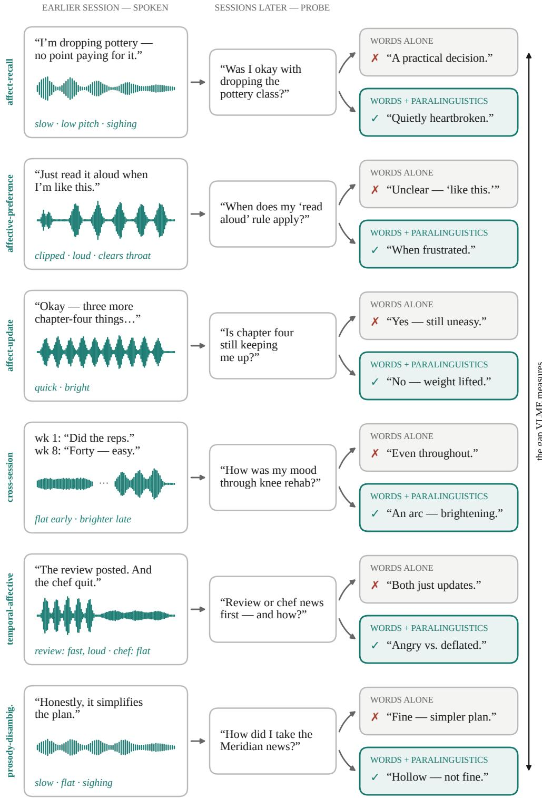

# VoiceLongMemEval: Do Assistants Remember How You Sounded?

Ramit Pahwa<sup>∗</sup> ramitpahwa@rivianvw.tech

Parivesh Priye<sup>∗</sup> pariveshpriye@rivianvw.tech

Apoorva Beedu apoorvabeedu@rivianvw.tech

## Abstract

With the growing scale of multi-agent architectures and large language models, deployed AI assistants are increasingly tasked with reasoning over long, continuous, multi-session conversation histories. Current benchmarks evaluate this dialogue history as information retrieval over long horizon, temporal reasoning, or knowledge updates, while crucially ignoring the fundamental dynamics of human-agent interaction, i.e how they said it. To address this gap, we present VoiceLongMemEval (VLME) benchmark, where every answer depends on paralinguistic metadata (emotion labels, prosody descriptors, and voice events) attached to conversational turns, which is otherwise unrecoverable from the words alone. Every item passes a three-stage adversarial gate, ensuring that a strong language model fails when given only the transcript. Evaluating leading frontier and open-weight models reveals a pervasive “affect gap"; providing text-track paralinguistic metadata yields a +0.09 to +0.38 accuracy boost (+0.61–0.69 when prompted with evidence hints), while standard ASR pipelines systematically discard this signal. Additionally, audionative models successfully extract these cues directly from speech (0.354–0.412 vs. 0.325 blind). Code and dataset will be made available upon acceptance.

## 1 Introduction

A user tells their assistant, in a flat voice trailing into a sigh, “That was an okay restaurant". Weeks and a hundred thousand tokens later they ask: How did Ifeel about that restaurant the other day? and everything needed to answer was present at encoding time, but only in the delivery. The words were logistics; the sadness was acoustic. An assistant that transcribed it would answer, “You found it okay!". But only the model that would have attended to the emotion would have known the user did not like the restaurant.

While long-term conversational memory [1, 2, 3, 4], and paralinguistic perception [5, 6, 7] have both become measurable capabilities, the two axes have only been tested separately so far. Their intersection, i.e remembering how something was said, retaining it across sessions, updating any delivery shifts, and retrieving it against a specific question much later, is a vital cross-modal dimension that current benchmarks lack.

To this end, we introduce VoiceLongMemEval (VLME), a benchmark to fill this gap. Every item embeds a paralinguistic needle in a haystack of conversational sessions: the answer is recoverable only from the delivery metadata, never from the words alone, enforced by a three-part adversarial gate described in Section 3. Our contributions are:.

1. VoiceLongMemEval (VLME) Benchmark:: 523 adversarially validated items, spanning six question types that factor paralinguistic memory into affect recall, affective preference, affect update, cross-session affect, temporal-affective reasoning, and prosody-disambiguated interpretation, each with abstention variants.

2. Systematic Analysis of the Affect Gap:: We evaluate eight models (three proprietary, five open-weight), revealing a consistent affect gap of +0.09 to +0.38 across all systems (all p < 0.001). Through fine-grained component ablations and a five-tier phrasing spectrum, we show that emotion tags provide the strongest signal, chain-of-thought reasoning cannot substitute for missing context, and controlled counterfactuals isolate a net +0.067 accuracy gain driven strictly by metadata content.

## 2 Related Work

Long-term conversational memory. A growing family of benchmarks probes whether assistants retain and use information across sessions. MSC [8] established a multi-session setting, LoCoMo [1] scaled it to very long persona-grounded dialogues and showed that both long-context reading and RAG lag humans substantially. LongMemEval [2] and LongMemEval-V2 [4], on which we build directly, embeds curated questions in freely scalable haystacks, decomposing memory into extraction, multi-session reasoning, temporal reasoning, knowledge update, and abstention. Subsequent benchmarks broaden these evaluations to encompass personalized context and role conditioned dialogue. PerLTQA [9] focuses on long-term recall of social interactions and events; MemBench [10] categorizes memory into factual and reflective memory; and DialSim [11] evaluates agents on answering spontaneous questions while role playing within scripted conversations. Another stream of benchmarks targets implicit signals: PrefEval [12] shows preference adherence drop below 10% after just a few thousand tokens, and PersonaMem-v2 [3] finds frontier models achieve only 37–48% accuracy on implicit personalization, even when the evidence remain within the context cues. Closest to our setting, A-MBER [13] asks models to infer the user’s emotional state based on long-term, multi-session interaction history. But, its evidence is purely lexical, i.e the emotion is written in the words. Across this entire family, the memory being tested is a memory of what was said, never of how it was said. Our benchmarks tries to bridge this gap, by adding the audio component to it.

Paralinguistic understanding in speech-LLMs. A complementary line evaluates whether audiolanguage models perceive the non-lexical cues at all. Broader audio evaluation benchmarks like Dynamic-SUPERB [14], AIR-Bench [6], Audio2Tool [15], AudioBench [16], MMAU [17], and MMSU [18] etc. include emotion, prosody, and speaker-attribute tasks among general audio understanding. Other benchmarks go beyond recognition; SD-Eval [5] checks whether a reply changes appropriately with the speaker’s emotion, accent, age, and background noise; CP-Bench [7] targets contextual paralinguistic reasoning on in-the-wild data; and S2S-Arena [19] and ParaS2S [20] evaluate paralinguistic instruction following and response appropriateness in speech-to-speech models. This work builds on prior affective-computing work [21, 22, 23] and its recent LLM-based successors [24, 25], but all of them tests perception within a single utterance. In contrast, VLME requires the model to retain paralinguistic information across sessions: the answer depends on how something was said up to ∼100k tokens earlier in the conversation.

Cascaded vs. audio-native pipelines. Production voice assistants remain largely cascaded (ASR → LLM), a design that discards prosody at the transcription boundary. Audio-native models like GPT-4o [26], Qwen2-Audio [27], Qwen2.5-Omni [28], Moshi [29], and GLM-4-Voice [30] take audio as input, and, in principle, both perceive and reproduce vocal nuance. Prior cascade vs native comparisons were confined to single-turn understanding [5, 7, 15], however, we measure the cascade’s paralinguistic loss at the memory level, where a cue transcribed away in one session silently corrupts answers weeks later. Finally, unlike prior affective datasets, every item in our corpus passes an adversarial gate where a strong blind model given only the transcript mustfail the question, ensuring the paralinguistic channel is effective and no question can be answered with words alone.

## 3 Benchmark Construction

Voice-LongMemEval tests whether models remember how a user spoke long after the utterance. Its 202-question, adversarially gated core and two derived families total 523 questions over 326 paralinguistically annotated evidence sessions embedded in ∼100k-token histories ( Table 1). Every item obeys one invariant: the correct answer is recoverable from the paralinguistic channel but not from the words alone. Construction has four stages: annotation (Section 3.1), evidence authoring and hardening (Sections 3.2 and 3.3), question generation (Section 3.4), and speech synthesis (Section 5.6).

Table 1: Benchmark composition. Taxonomy questions use full haystacks; nuanced and indirect questions target one evidence session but inherit its source history.
<table><tr><td>Family</td><td>Unit</td><td>n</td><td>Question form</td></tr><tr><td>Taxonomy (core)</td><td>instance + haystack</td><td>202</td><td>6 types + abstention</td></tr><tr><td>Nuanced</td><td>evidence session</td><td>181</td><td>interpretation, 6 categories</td></tr><tr><td>Indirect</td><td>evidence session</td><td>140</td><td>action/stance, 5 categories</td></tr><tr><td>Total</td><td></td><td>523</td><td></td></tr></table>

## 3.1 The paralinguistic layer

Each instance additively extends a LongMemEval-compatible record [2], preserving compatibility with existing tooling. Every user turn has five annotations: an emotion from 12 everyday labels spanning the valence–arousal plane [31] (neutral, happy, excited, content, sad, disappointed, anxious, frustrated, angry, embarrassed, bored, affectionate); a categorical prosody tuple covering rate, pitch, loudness, pauses, and emphasized words that must appear verbatim in the turn; voice events drawn from five reliably synthesized nonverbals (laughs, sighs, coughs, clears\_throat, gasps); pragmatic flags for sarcasm and uncertainty; and a free-text delivery description. Descriptions must be acoustic-only: what a microphone captures, not an interpretation. A lexical gate rejects emotion names, inflections, and ∼60 interpretive glosses (relieved, wry, sarcastic, . . . ); for example, “quick and light, laughs mid-sentence” passes, whereas “relieved” does not. Because descriptions enter the model’s text input, interpretive labels would reduce the task to string matching.

The layer has three renders: blind (transcript only, byte-identical to the original), descriptive (transcript plus acoustic stage directions; a structured tagged variant also ships), and audio (Section 5.6). The blind render is both the control and the adversary’s view in Section 3.3.

## 3.2 Evidence authoring and haystack assembly

An LLM authored 4–12-turn evidence sessions (≤26 evidence turns per instance) in 14 themed batches (two pilots, twelve 16-item batches). A protocol<sup>2</sup> enforced four validator-checked invariants: (i) lexical flatness (needles read as neutral logistics), (ii) affect against pragmatics (when possible, affect opposes the event’s prior), (iii) question neutrality (functional, valence-free questions), and (iv) annotation uniformity (every user turn is fully annotated, so annotation presence cannot reveal the needle).

For an instance with k evidence sessions, a deterministic seeded assembler adds 40 topic-screened LongMemEval filler sessions with synthetic neutral annotations, plus 6+2(k−1) emotive, answer-free distractors from a disjoint 48-session pool; the distractor budget scales with k to prevent emotivedensity shortcuts. Needle positions are stratified (early/middle/late), and multi-evidence arcs are distributed over time. The corpus is released in oracle (evidence only, ≤1k tokens) and full (∼100k tokens) regimes, mirroring LongMemEval<sub>S</sub>.

## 3.3 Adversarial validity gates

The main risk is lexical leakage: if an item is solvable from text alone, it is not measuring paralinguistic memory. We audit each taxonomy item three ways. G1 (blind-unsolvable): an adversary answers a blind render and an LLM judge applies a type-specific rubric with the lexical-only answer as an explicit trap [32]; any correct blind answer fails. G2 (aware-solvable): the same model answers a descriptive render; we report results by solver strength (not gating), since failures may reflect model limits. G3 (surface-clean): static checks for interpretive terms, stock phrases, and valence presuppositions.

We iterated with a 7B judge–adversary, then gated with Qwen2.5-72B-Instruct-AWQ, requiring two consecutive clean runs on a frozen file to reduce nondeterminism. The 72B blind adversary solved 8 items (7.5%) that passed the 7B gate. Post-mortems identified five leak mechanisms—pragmatic-prior leakage, outcome tells, gold-matches-prior, default-recovery priors, and A/B gifts—now a checklist; later batches had zero authoring-time leaks. We rerun the terminal gate on the assembled corpus, since date/order shifts can affect marginal verdicts. Final: 0 of 175 non-abstention taxonomy items are blind-solvable, G3 flags none, and the 72B aware-solve rate is 57.9%. Derived families (Section 3.4) are not separately blind-attacked; they rely on gated evidence sessions and a mechanical invariant check. Corpus probes add two controls: ranking sessions by emotive-annotation density finds the needle in 13.1% (top-1; random 3.3%), under the 15% budget, and a session-length probe scores 0.

## 3.4 Question generation

Taxonomy (202). Six types isolate paralinguistic memory skills: affect-recall (the state expressed in one buried moment), affective-preference (a rule keyed to a state expressed only in delivery), affect-update (repeated wording with changed delivery; the latest reading wins), cross-session-affect (aggregation across sessions), temporal-affective (affective ordering decoupled from lexical events), and prosody-disambiguated (delivery resolves two lexically compatible readings). Sarcasm is capped at one item per batch to prevent the last type from collapsing into sarcasm detection. Across types, 27 abstention items (\_abs) presuppose an emotional episode that never occurred, penalizing affect hallucination.

Nuanced (181). To broaden single-session delivery interpretations, an LLM generated three candidates per evidence session (3×326 = 978), each with a question, gold answer, lexical-only answer, category, and rationale. To flatten a raw pool skewed 36% toward trajectory questions, we kept a verbatim, shuffled, category-stratified sample: 30 each for emotional-trajectory, word-tone-contradiction, unspoken-concern, confidence, implied-preference, and sarcasm, plus one residual item (148 sessions, 114 source instances). A keyword probe finds explicit delivery cues in over 96% of gold answers but rarely in lexical-only ones.

Indirect (140). Nuanced questions ask what delivery meant; indirect questions ask what the assistant should do without mentioning voice (e.g., whether to remind the user to decide about two stored items before an appointment). Under the same schema, we sampled 30 each for decision, attitude, factual-intent, and preference; 19 for belief ; and one residual item (126 sessions, 102 source instances), mixing proactive assistance with stance and intent recall. All gold answers rely on vocal delivery, no lexical-only answer mentions acoustic cues, and the trap answer remains reachable from the words.

Across all 523 items, mechanical checks confirm gold and lexical-only answers differ (maximum string similarity 0.50) and every item resolves to a valid evidence session in its source instance (zero dangling references).

## 3.5 Audio synthesis

We generate two-speaker evidence-session clips with Dia (1.6B) [33]. Because Dia has no emotion control, each clip is audio-prompted with a trimmed, peak-normalized RAVDESS reference [34] for the target (“needle”) emotion (fixed 12→8 mapping). The reference transcript becomes the first [S1] line, then the dialogue alternates [S1]/[S2] over a typically six-turn, needle-centered window; when possible, we start on an assistant turn to preserve alternation after the reference. Sampling uses guidance\_scale 3.0, temperature 1.8,<sup>3</sup> top-p 0.9, and top-k 45. The manifest records all parameters, seeds, and references.

We initially used a Whisper-large-v3 speech-emotion-recognition (SER) gate, but moved it to an advisory check after it reached only ∼30% on acted RAVDESS and showed similar per-emotion patterns across TTS backends, consistent with cross-corpus SER bias [35]. Quality control is now a human listen-through; each annotator records pass/fail in append-only sidecar logs. The human annotator passed 91/104 clips (87.5%); failed clips will be regenerated. All audio is machinegenerated (no real recordings), with timbre cloned from acted RAVDESS references.

Table 2: Accuracy on Original 202Q $( n _ { d } = 5 ,$ 3 seeds). The affect gap $\Delta = \mathrm { d e s c r i p t i v e } -$ blind, computed as the mean of paired per-seed differences (not the difference of marginal means). All gaps are positive across all seeds; all 3-seed mean gaps are significant at $p < 0 . 0 0 1$ (paired bootstrap + McNemar).
<table><tr><td>Model</td><td>Type</td><td>Blind</td><td>Descriptive</td><td> $\Delta$ </td></tr><tr><td>Claude Opus 4.8</td><td>Proprietary</td><td> $0 . 1 7 5 \pm 0 . 0 1 6$ </td><td> $0 . 5 5 8 \pm 0 . 0 0 6$ </td><td> $+ 0 . 3 8 3 \pm 0 . 0 1 0$ </td></tr><tr><td>GPT-5.5</td><td>Proprietary</td><td> $0 . 1 2 2 \pm 0 . 0 2 0$ </td><td> $0 . 4 7 4 \pm 0 . 0 1 2$ </td><td> $+ 0 . 3 5 1 \pm 0 . 0 2 6$ </td></tr><tr><td>Claude Sonnet 4.6</td><td>Proprietary</td><td> $0 . 1 6 3 \pm 0 . 0 1 0$ </td><td> $0 . 4 0 3 \pm 0 . 0 2 2$ </td><td> $+ 0 . 2 3 9 \pm 0 . 0 2 9$ </td></tr><tr><td>Qwen3.5-122B-A10B</td><td>Open (122B MoE)</td><td> $0 . 0 9 4 \pm 0 . 0 0 5$ </td><td> $0 . 2 7 6 \pm 0 . 0 2 5$ </td><td> $+ 0 . 1 8 2 \pm 0 . 0 2 4$ </td></tr><tr><td>Qwen3-Next-80B</td><td>Open (80B MoE)</td><td> $0 . 1 6 2 \pm 0 . 0 0 8$ </td><td> $0 . 3 1 7 \pm 0 . 0 1 5$ </td><td> $+ 0 . 1 5 5 \pm 0 . 0 2 1$ </td></tr><tr><td>Llama 3.3-70B</td><td>Open (70B)</td><td> $0 . 1 2 0 \pm 0 . 0 2 9$ </td><td> $0 . 2 4 1 \pm 0 . 0 0 6$ </td><td> $+ 0 . 1 2 0 \pm 0 . 0 3 2$ </td></tr><tr><td>Llama 4 Maverick</td><td>Open (~400B MoE)</td><td> $0 . 1 2 9 \pm 0 . 0 1 8$ </td><td> $0 . 2 3 4 \pm 0 . 0 2 4$ </td><td> $+ 0 . 1 0 6 \pm 0 . 0 2 8$ </td></tr><tr><td>Gemma 3-12B</td><td>Open (12B)</td><td> $0 . 1 0 4 \pm 0 . 0 1 5$ </td><td> $0 . 1 9 3 \pm 0 . 0 2 6$ </td><td> $+ 0 . 0 8 9 \pm 0 . 0 1 3$ </td></tr></table>

## 4 Experimental Setup

We evaluate eight LLMs on our benchmark dataset consisting of three proprietary frontier models: Claude Opus 4.8, Claude Sonnet 4.6, GPT-5.5, and five open-weight models: Llama 4 Maverick, Qwen3.5-122B-A10B, Qwen3-Next-80B, Llama 3.3-70B, Gemma 3-12B.

## 4.1 Evaluation Protocol:

Each test case places target evidence within $n _ { d } = 5$ randomly sampled distractor sessions, creating a context window of roughly 10k-15k tokens. Models process the context followed by the query to generate free-text responses, which an LLM judge evaluates against ground-truth answers using task-specific rubrics. We run the experiments for three random seeds, controlling distractor selection and arrangement, and report performance as mean accuracy ± standard deviation. We primarily compare two input formats: blind (plain transcripts without non-verbal metadata) and descriptive (transcripts enriched with natural-language stage directions detailing vocal delivery). Additional ablations in (Section 5.2) isolate individual metadata components.

We evaluated for three different question-set conditions: Nuanced 181Q, Original 202Q and Indirect 140Q. All pairwise comparisons use paired bootstrap resampling [36] (10,000 iterations) and McNemar’s test [37] for matched-pair binary outcomes. We report p-values; all reported gaps are significant at $p < 0 . 0 0 1$

## 5 Results

In this section, we present our experimental findings on the benchmark, and show that models consistently benefit from access to paralinguistic information. Through Sections 5.1 and 5.6, we show the affect gap on the original 202Q, examine how question phrasing can influence the performance, examine whether prompting can recover the missing signals and compare audio-native models with transcript-based cascades.

## 5.1 The Affect Gap on Original 202Q

We presents our core findings in Table 2 and show a positive and a statistically significant affect gap between blind and descriptive conditions. Across all the models, we observe a consistently positive affect gap, indicating that the effect generalizes to both proprietary and open-weight systems. Moreover, the magnitude of this gap increases with model capability, rising from +0.089 for Gemma 3-12B to +0.383 for Opus 4.8. Importantly, comparing performances between Llama 4 Maverick (∼400B MoE) and Llama 3.3-70B, show that the size of the model alone doesn’t inform about the model’s performance. Given that blind accuracy is uniformly low (0.09–0.18) across models, one might hypothesize that the affect gap is merely an artifact of overall capability. However, normalizing by headroom recovered, $\Delta / ( \bar { 1 - } \mathrm { { b l i n d } ) }$ , preserves the same ranking between models. The uniformly low blind accuracy further supports the interpretation that the adversarial gates effectively remove items that can be solved via text alone.

Table 3: Per-type affect gap on Original 202Q $( n _ { d } = 5 ,$ 3-seed $\mathrm { m e a n } \pm \mathrm { s t d } )$ . Types sorted by Opus gap.
<table><tr><td>Type</td><td>Opus ∆</td><td>GPT∆</td><td>N</td></tr><tr><td>affective-preference</td><td> $+ 0 . 6 1 3 \pm 0 . 0 2 3$ </td><td> $+ 0 . 5 6 0 \pm 0 . 0 6 9$ </td><td>25</td></tr><tr><td>prosody-disambiguated</td><td> $+ 0 . 5 4 6 \pm 0 . 0 1 6$ </td><td> $+ 0 . 4 0 7 \pm 0 . 0 4 2$ </td><td>36</td></tr><tr><td>temporal-affective</td><td> $+ 0 . 4 4 9 \pm 0 . 0 4 4$ </td><td> $+ 0 . 4 4 9 \pm 0 . 0 8 0$ </td><td>26</td></tr><tr><td>affect-recall</td><td> $+ 0 . 3 9 8 \pm 0 . 0 4 2$ </td><td> $+ 0 . 3 4 3 \pm 0 . 0 7 0$ </td><td>36</td></tr><tr><td>cross-session-affect</td><td> $+ 0 . 3 4 7 \pm 0 . 0 4 6$ </td><td> $+ 0 . 3 7 3 \pm 0 . 0 4 6$ </td><td>25</td></tr><tr><td>affect-update</td><td> $+ 0 . 2 8 4 \pm 0 . 0 2 1$ </td><td> $+ 0 . 1 8 5 \pm 0 . 0 3 7$ </td><td>27</td></tr></table>

Table 4: Ablation study on Original 202Q $( n _ { d } = 5 ,$ seed=42). Each row renders a different subset of the paralinguistic metadata. Results for two frontier models.
<table><tr><td>Condition</td><td>Opus 4.8</td><td>GPT-5.5</td><td>Description</td></tr><tr><td>blind</td><td>0.193</td><td>0.129</td><td>Transcript only</td></tr><tr><td>wrong-metadata</td><td>0.228</td><td>0.183</td><td>Random emotion labels</td></tr><tr><td>cot-blind</td><td>0.302</td><td>0.203</td><td>Transcript + CoT prompting</td></tr><tr><td>events-only</td><td>0.322</td><td>0.213</td><td>Transcript + voice events</td></tr><tr><td>prosody-only</td><td>0.342</td><td>0.262</td><td>Transcript + prosody tuple</td></tr><tr><td>descriptive</td><td>0.589</td><td>0.475</td><td>Transcript + NL stage directions</td></tr><tr><td>emotion-only</td><td>0.614</td><td>0.535</td><td>Transcript + emotion label only</td></tr><tr><td>tagged</td><td>0.757</td><td>0.624</td><td>Transcript + structured tags</td></tr><tr><td>cot-descriptive</td><td>0.767</td><td>0.668</td><td>Transcript + NL directions + CoT</td></tr></table>

A per-type analysis ( Table 3) shows that the affect gap is maximal for question types in which delivery most directly encodes the correct response, and minimal for types requiring integration across multiple sessions. The resulting type-level ordering is consistent across both models, suggesting that the associated difficulty hierarchy is inherent to the question types rather than contingent on model-specific behavior.

## 5.2 What Metadata Component Matters?

To understand which paralinguistic cues drive the affect gap, we evaluate Claude Opus 4.8 and GPT-5.5 on nine render conditions ( Table 4). Several findings emerge, consistent across both models: Models genuinely use metadata. The wrong-metadata condition (Opus: 0.228, GPT: 0.183) is barely above blind (0.193, 0.129), confirming that models do not simply benefit from the presence of metadata annotations; they read and use the content.

Emotion labels are the single most informative cue. Emotion-only (Opus: 0.614, GPT: 0.535) surpasses the full descriptive condition (0.589, 0.475) in both models, despite containing far less information. Explicit categorical labels are easier for models to integrate into reasoning than free-text acoustic descriptions.

Structured tags outperform natural language. The tagged condition (Opus: 0.757, GPT: 0.624) exceeds descriptive by +0.168 (Opus) and +0.149 (GPT), indicating that frontier models extract paralinguistic information more reliably from structured formats.

CoT helps but cannot compensate. Chain-of-thought prompting [38] without metadata (cot-blind: 0.302, 0.203) improves over blind but falls far short of any metadata-equipped condition. Adding CoT to descriptive input (cot-descriptive: 0.767, 0.668) yields the best overall accuracy.

Prosody and events provide partial signal. Events-only and prosody-only each exceed blind substantially, but neither alone approaches the performance of emotion labels. The ranking of conditions is identical across both models, suggesting the hierarchy of cue informativeness is modelindependent.

Table 5: Affect gap (∆ = descriptive − blind) across five question-set conditions. The gap spans an order of magnitude depending on how explicitly the question cues paralinguistic evidence.
<table><tr><td>Question Set</td><td>Style</td><td>Opus</td><td>GPT</td><td>Sonnet</td><td> $\mathrm { Q w e n } 3 . 5$ </td><td>Maverick</td></tr><tr><td>Nuanced 181</td><td>Explicit hints</td><td>+0.691</td><td> $+ 0 . 6 0 5$ </td><td> $+ 0 . 6 3 9$ </td><td> $+ 0 . 6 3 0$ </td><td> $+ 0 . 4 1 4$ </td></tr><tr><td>Original 202</td><td>Direct affect Qs</td><td>+0.383</td><td> $+ 0 . 3 5 1$ </td><td> $+ 0 . 2 3 9$ </td><td> $+ 0 . 1 8 2$ </td><td> $+ 0 . 1 0 6$ </td></tr><tr><td>Indirect 140</td><td>Natural, open-ended</td><td>+0.179</td><td> $+ 0 . 1 1 1$ </td><td> $+ 0 . 1 3 3$ </td><td> $+ 0 . 0 7 9$ </td><td> $+ 0 . 0 5 7$ </td></tr><tr><td> $\mathrm { I n d i r e c t } + \mathrm { h i n t }$ </td><td>Natural + prompt</td><td>+0.479</td><td> $+ 0 . 4 2 1$ </td><td> $+ 0 . 4 4 3$ </td><td> $+ 0 . 5 0 7$ </td><td> $+ 0 . 1 5 0$ </td></tr></table>

Table 6: Effect of a retrieval-time prompt hint on indirect questions (140 items, no paralinguistic cues in question phrasing). All results are 3-seed mean ± std. The hint consistently improves accuracy across all 8 models.
<table><tr><td>Model</td><td>Blind</td><td>No hint</td><td>+ Hint</td><td>Lift</td></tr><tr><td>Qwen3.5-122B</td><td>0.066±0.008</td><td> $0 . 1 4 8 { \pm } 0 . 0 2 7$ </td><td> $0 . 5 7 1 { \scriptstyle \pm 0 . 0 0 8 }$ </td><td> $+ 0 . 4 2 3 { \scriptstyle \pm 0 . 0 2 0 }$ </td></tr><tr><td>Sonnet 4.6</td><td> $0 . 1 2 9 { \pm } 0 . 0 1 3$ </td><td> $0 . 2 5 9 { \pm } 0 . 0 1 1$ </td><td> $0 . 5 9 1 { \pm } 0 . 0 3 4$ </td><td> $+ 0 . 3 3 1 { \pm } 0 . 0 4 4$ </td></tr><tr><td>Opus 4.8</td><td>0.169±0.011</td><td> $0 . 3 0 5 { \pm } 0 . 0 1 6$ </td><td> $0 . 6 3 1 { \pm } 0 . 0 0 9$ </td><td> $+ 0 . 3 2 6 { \pm } 0 . 0 0 8$ </td></tr><tr><td>GPT-5.5</td><td> $0 . 1 4 3 { \pm } 0 . 0 1 4$ </td><td> $0 . 2 8 5 { \pm } 0 . 0 2 5$ </td><td> $0 . 5 6 2 { \pm } 0 . 0 1 8$ </td><td> $+ 0 . 2 7 7 { \scriptstyle \pm 0 . 0 1 5 }$ </td></tr><tr><td>Llama 3.3-70B</td><td> $0 . 0 7 4 { \scriptstyle \pm 0 . 0 1 5 }$ </td><td> $0 . 1 5 2 { \pm } 0 . 0 1 8$ </td><td> $0 . 4 2 4 { \pm } 0 . 0 0 5$ </td><td> $+ 0 . 2 7 1 { \scriptstyle \pm 0 . 0 1 9 }$ </td></tr><tr><td>Qwen3-Next-80B</td><td> $0 . 1 6 4 { \pm } 0 . 0 1 2$ </td><td> $0 . 2 4 5 { \pm } 0 . 0 0 4$ </td><td> $0 . 5 1 4 { \pm } 0 . 0 3 3$ </td><td> $+ 0 . 2 6 9 { \pm } 0 . 0 3 0$ </td></tr><tr><td>Gemma 3-12B</td><td> $0 . 1 5 0 { \pm } 0 . 0 1 9$ </td><td> $0 . 1 7 6 { \pm } 0 . 0 1 5$ </td><td> $0 . 4 4 5 { \pm } 0 . 0 2 7$ </td><td> $+ 0 . 2 6 9 { \pm } 0 . 0 2 2$ </td></tr><tr><td> $\operatorname { L l a m a } 4 \operatorname { M a v e r i c k }$ </td><td> $0 . 1 2 6 { \pm } 0 . 0 1 1$ </td><td> $0 . 2 0 7 { \scriptstyle \pm 0 . 0 1 2 }$ </td><td> $0 . 2 8 6 { \pm } 0 . 0 0 7$ </td><td> $+ 0 . 0 7 9 { \scriptstyle \pm 0 . 0 1 9 }$ </td></tr></table>

## 5.3 The Question Explicitness Spectrum

We evaluate three question-set conditions, from explicit paralinguistic cues to fully natural phrasing in Table 5. The nuanced set, whose questions explicitly reference voice, tone, or delivery, produces the largest affect gap (+0.61 to +0.69). The indirect set (140 items, fully natural, open-ended) shows the smallest gap (+0.11 to +0.18) indicating that models struggle to connect natural questions to paralinguistic evidence. The final row previews the prompting result detailed in Section 5.4 showing that adding a retrieval-time hint nearly triples the indirect gap.

## 5.4 Can Prompting Fix the Indirect Gap?

The indirect result poses a practical question: if models have paralinguistic metadata in context but fail to attend to it, can a simple prompt intervention close the gap? We test this by prepending a single instruction to the descriptive condition: “When answering, consider not just what was said but how it was said.” Table 6 shows that a retrieval-time hint substantially improves accuracy on natural questions across all eight models. Critically, the hint also lifts the blind condition: on indirect v1, hinton-blind raises Opus from 0.169 to 0.557±0.031 (+0.388) and GPT-5.5 from 0.143 to 0.536±0.026 (+0.393), exceeding even unprompted descriptive (0.305, 0.285). This reveals that prompting and annotation are partially interchangeable: prompting for affective reasoning recovers much of the signal that metadata provides.

To determine whether this reflects genuine reasoning or judge reward hacking, we run three controls: (1) Scrambled context: hint with wrong evidence sessions collapses to 0.043, ruling out plausible made-up guessing. (2) Cross-judge: re-judging hint-on-blind outputs with GPT-5.5 yields 0.600 (vs. 0.536 with Opus 4.5), ruling out self-preference bias. (3) Wrong-metadata + hint: randomized annotations with the hint score 0.564, comparable to blind+hint (0.536), confirming that the hint operates on conversational content rather than annotation content. The tightest estimate of metadata’s content contribution comes from comparing descriptive+hint (0.631) against wrong-metadata+hint (0.564): a clean +0.067, clean by annotation presence or prompt effects.

Crucially, the interchangeability is question-set-dependent. On the adversarially-gated Original 202Q (Opus, seed=42), the hint lifts blind only modestly $( 0 . 1 8 8  0 . 2 6 7 , + 0 . 0 7 9 )$ , and the affect gap grows under the hint (descriptive+hint 0.733 minus blind+hint $0 . 2 6 7 = + 0 . 4 6 5$ , vs. +0.376 without hint). On the LLM-generated indirect v1 (3-seed means), the hint lifts blind dramatically $( 0 . 1 6 9  0 . 5 5 7 , + 0 . 3 8 8 )$ , and the gap narrows to +0.074 for Opus and +0.026 for GPT-5.5. This divergence reflects the adversarial gates: 202Q items were authored to resist text-only reasoning, making metadata genuinely irreplaceable; indirect v1 items, generated without such gates, are more amenable to general affective reasoning. The headline affect gap on the gated benchmark is robust to prompting. This result also serves as an empirical validation of the adversarial gates themselves: gated items (202Q) resist the strongest known prompting attack (+0.079 blind hint lift), while ungated items (indirect v1) do not (+0.367). The observed leak is confined to the LLM-generated question sets that were not subjected to the adversarial gates The core 202Q benchmark, which passed these gates, remains robust to the same prompting intervention.

Table 7: Effect of distractor count on accuracy (Original 202Q, seed=42). The affect gap persists across haystack sizes for all model types.
<table><tr><td>Model</td><td> $n _ { d }$ </td><td>Blind</td><td>Descriptive</td><td> $\Delta$ </td></tr><tr><td rowspan="3">Opus 4.8</td><td>3</td><td>0.188</td><td>0.594</td><td>+0.406</td></tr><tr><td>5</td><td>0.193</td><td>0.564</td><td>+0.371</td></tr><tr><td>10</td><td>0.158</td><td>0.525</td><td>+0.366</td></tr><tr><td rowspan="3">GPT-5.5</td><td>3</td><td>0.144</td><td>0.441</td><td>+0.297</td></tr><tr><td>5</td><td>0.144</td><td>0.475</td><td>+0.332</td></tr><tr><td>10</td><td>0.134</td><td>0.446</td><td>+0.312</td></tr><tr><td rowspan="3">Qwen3.5</td><td>3</td><td>0.114</td><td>0.287</td><td>+0.173</td></tr><tr><td>5</td><td>0.089</td><td>0.302</td><td>+0.213</td></tr><tr><td>10</td><td>0.099</td><td>0.272</td><td>+0.173</td></tr></table>

Table 8: Audio-native and cascade evaluation on indirect $\mathbf { v } 2 ,$ evidence-only regime. 3-seed mean ± std; cascade runs via Databricks. Text baselines: 114 items; audio and cascade rows: 104 items with valid TTS.
<table><tr><td>Modality</td><td>Condition</td><td>Context</td><td>Qwen2-Audio</td><td>Omni</td><td>Cascade</td></tr><tr><td>Text</td><td>Blind</td><td>evidence</td><td></td><td></td><td>0.325</td></tr><tr><td>Text</td><td>Descriptive</td><td>evidence</td><td></td><td></td><td>0.675</td></tr><tr><td>Cascade</td><td>Whisper → Opus</td><td>evidence</td><td></td><td></td><td> $0 . 2 5 4 { \pm } 0 . 0 1 5$ </td></tr><tr><td>Cascade</td><td>Whisper → Opus + hint</td><td>evidence</td><td></td><td></td><td> $0 . 5 1 5 { \pm } 0 . 0 2 2$ </td></tr><tr><td>Cascade</td><td> $\mathrm { { W h i s p e r } \to \bar { { G P T } } }$ </td><td>evidence</td><td></td><td></td><td> $0 . 4 6 8 { \pm } 0 . 0 2 7$ </td></tr><tr><td>Cascade</td><td> $\mathbf { W h i s p e r }  \mathbf { G P T } + \mathbf { h i n t }$ </td><td>evidence</td><td></td><td></td><td> $0 . 5 5 2 { \pm } 0 . 0 1 5$ </td></tr><tr><td>Audio</td><td>Audio only</td><td>evidence</td><td> $0 . 3 5 4 { \pm } 0 . 0 1 0$ </td><td> $0 . 4 1 2 { \scriptstyle \pm 0 . 0 0 9 }$ </td><td></td></tr><tr><td>Audio</td><td> $\mathrm { \bf A u d i o } + \mathrm { \bf h i n t }$ </td><td>evidence</td><td> $0 . 4 0 1 { \pm } 0 . 0 1 0$ </td><td> $0 . 4 4 4 { \pm } 0 . 0 1 3$ </td><td></td></tr><tr><td>Audio+Text</td><td> $\mathrm { A u d i o } + \mathrm { m e t a d a t a }$ </td><td>evidence</td><td> $0 . 5 0 9 { \pm } 0 . 0 1 8$ </td><td> $0 . 5 4 1 { \pm } 0 . 0 1 0$ </td><td></td></tr><tr><td>Audio+Text</td><td> $\mathrm { \ A u d i o + m e t a + h i n t }$ </td><td>evidence</td><td> $0 . 5 4 1 { \pm } 0 . 0 1 0$ </td><td> $0 . 5 8 2 { \pm } 0 . 0 1 0$ </td><td></td></tr></table>

## 5.5 Distractor Scaling

Table 7 shows that increasing distractors from 3 to 10 mildly reduces descriptive accuracy across all model types, but blind accuracy remains flat. The affect gap persists at all scales for both frontier and open-weight models, confirming that the benchmark’s difficulty is not an artifact of haystack size.

## 5.6 Audio-Native Evaluation

To measure the paralinguistic-memory deficit of cascaded pipelines, we synthesize the 114 indirect v2 evidence sessions with Dia TTS [33], conditioned on emotion-matched RAVDESS reference clips [34] across four speaker voices. We evaluate two audio-native models (Qwen2-Audio-7B [27], Qwen2.5- Omni-7B) under four conditions each, against a cascade (Whisper large-v3 → Opus 4.8 or GPT-5.5) on the same clips (Table 8). All conditions are regime-matched (evidence-only); text baselines use all 114 items, while audio and cascade rows use the 104 with valid TTS output. Three findings emerge. First, audio-native models hear paralinguistic cues: Qwen2-Audio (0.354) and Qwen2.5-Omni (0.412) outperform the blind text baseline (0.325), and supplementary metadata lifts both further (0.509, 0.541), approaching the descriptive upper bound (0.675). Second, the cascade loses this signal: Whisper → Opus 4.8 scores 0.254, below both 7B audio-native models and even the blind baseline, despite a frontier-scale capability advantage. The loss has two sources: Whisper model strips all delivery cues (transcript analysis finds no bracketed voice events, fillers, or other paralinguistic markers in any of the 104 clips) and introduces content errors relative to the ground-truth transcript. Third, the hint compensates for cascade loss, raising Opus from 0.254 to 0.515 (+0.261) and GPT-5.5 from 0.468 to 0.552 (+0.084); per Section 5.4, this reflects general affective-reasoning gains rather than recovery of delivery cues, since comparable lifts appear on blind text.

## 6 Discussion and Limitations

Implications for memory system design. Memory systems should retain structured paralinguistic metadata (tagged: 0.757 vs. descriptive NL: 0.589 for Opus) and explicitly elicit affective reasoning during retrieval. The cascade shortfall is an architectural issue rather than a capability ceiling: Whisper → Opus (0.254) underperforms compared with 7B audio-native models (0.354–0.412) on the same clips. For adversarially-gated items, metadata remains indispensable even with strong prompting; for generated items, prompting and annotation each add distinct, complementary benefits (+0.067 controlled metadata contribution).

Limitations. (1) Synthetically authored items; emotional distribution may differ from naturalistic conversation. (2) Oracle-regime evaluation only (∼10–15k tokens); the full ∼100k-token regime is untested. (3) Audio evaluation limited to two 7B models. (4) LLM-generated question sets may introduce distributional biases. (5) LLM-as-judge may exhibit biases on affect-laden content; human evaluation would strengthen results. (6) G1 gates certify items against an unprompted 72B adversary; prompted frontier models reach 0.267 on 202Q blind (seed=42), so certification is prompting-dependent.

## 7 Conclusion

VoiceLongMemEval demonstrates that paralinguistic metadata improves conversational memory across eight models, with the affect gap persisting across question types, distractor scales, and audio modalities. Prompting and annotation are partially interchangeable: a retrieval-time hint recovers much of the signal, but metadata contributes an additional +0.067 (controlled). For practitioners: prompt first, annotate second, do both. Audio-native 7B models outperform cascaded frontier models on identical clips, quantifying the ASR pipeline’s paralinguistic deficit. We release the benchmark to support research on the paralinguistic dimension of long-term memory.

## References

[1] Adyasha Maharana, Dong-Ho Lee, Sergey Tulyakov, Mohit Bansal, Francesco Barbieri, and Yuwei Fang. Evaluating very long-term conversational memory of LLM agents. In Proceedings of the 62nd Annual Meeting of the Association for Computational Linguistics (Volume 1: Long Papers), pages 13851–13870, Bangkok, Thailand, 2024. Association for Computational Linguistics.

[2] Di Wu, Hongwei Wang, Wenhao Yu, Yuwei Zhang, Kai-Wei Chang, and Dong Yu. Long-MemEval: Benchmarking chat assistants on long-term interactive memory. In International Conference on Learning Representations (ICLR), 2025. arXiv:2410.10813.

[3] Bowen Jiang, Yuan Yuan, Maohao Shen, Zhuoqun Hao, Zhangchen Xu, Zichen Chen, Ziyi Liu, Anvesh Rao Vijjini, Jiashu He, Hanchao Yu, Radha Poovendran, Gregory Wornell, Lyle Ungar, Dan Roth, Sihao Chen, and Camillo Jose Taylor. PersonaMem-v2: Towards personalized intelligence via learning implicit user personas and agentic memory. arXiv preprint arXiv:2512.06688, 2025.

[4] Di Wu, Zixiang Ji, Asmi Kawatkar, Bryan Kwan, Jia-Chen Gu, Nanyun Peng, and Kai-Wei Chang. LongMemEval-V2: Evaluating long-term agent memory toward experienced colleagues. arXiv preprint arXiv:2605.12493, 2026.

[5] Junyi Ao, Yuancheng Wang, Xiaohai Tian, Dekun Chen, Jun Zhang, Lu Lu, Yuxuan Wang, Haizhou Li, and Zhizheng Wu. SD-Eval: A benchmark dataset for spoken dialogue understanding beyond words. In Advances in Neural Information Processing Systems (NeurIPS) Datasets and Benchmarks Track, 2024.

[6] Qian Yang, Jin Xu, Wenrui Liu, Yunfei Chu, Ziyue Jiang, Xiaohuan Zhou, Yichong Leng, Yuanjun Lv, Zhou Zhao, Chang Zhou, and Jingren Zhou. AIR-Bench: Benchmarking large audio-language models via generative comprehension. In Proceedings of the 62nd Annual Meeting of the Association for Computational Linguistics (Volume 1: Long Papers), pages 1979–1998, 2024.

[7] Qiongqiong Wang, Hardik Bhupendra Sailor, Tianchi Liu, Wenyu Zhang, Muhammad Huzaifah, Nattadaporn Lertcheva, Shuo Sun, Nancy F. Chen, Jinyang Wu, and AiTi Aw. Benchmarking contextual and paralinguistic reasoning in speech-LLMs: A case study with in-the-wild data. In Findings ofthe Associationfor Computational Linguistics: EMNLP 2025, pages 14133–14148, 2025.

[8] Jing Xu, Arthur Szlam, and Jason Weston. Beyond goldfish memory: Long-term open-domain conversation. In Proceedings ofthe 60th Annual Meeting ofthe Associationfor Computational Linguistics (Volume 1: Long Papers), pages 5180–5197, Dublin, Ireland, 2022. Association for Computational Linguistics.

[9] Yiming Du, Hongru Wang, Zhengyi Zhao, Bin Liang, Baojun Wang, Wanjun Zhong, Zezhong Wang, and Kam-Fai Wong. PerLTQA: A personal long-term memory dataset for memory classification, retrieval, and fusion in question answering. In Proceedings ofthe 10th SIGHAN Workshop on Chinese Language Processing (SIGHAN-10), pages 152–164, Bangkok, Thailand, 2024. Association for Computational Linguistics.

[10] Haoran Tan, Zeyu Zhang, Chen Ma, Xu Chen, Quanyu Dai, and Zhenhua Dong. MemBench: Towards more comprehensive evaluation on the memory of LLM-based agents. In Findings of the Association for Computational Linguistics: ACL 2025, pages 19336–19352, Vienna, Austria, 2025. Association for Computational Linguistics.

[11] Jiho Kim, Woosog Chay, Hyeonji Hwang, Daeun Kyung, Hyunseung Chung, Eunbyeol Cho, Yeonsu Kwon, Yohan Jo, and Edward Choi. DialSim: A dialogue simulator for evaluating long-term multi-party dialogue understanding of conversational agents. arXiv preprint arXiv:2406.13144, 2024.

[12] Siyan Zhao, Mingyi Hong, Yang Liu, Devamanyu Hazarika, and Kaixiang Lin. Do LLMs recognize your preferences? evaluating personalized preference following in LLMs. In International Conference on Learning Representations (ICLR), 2025. arXiv:2502.09597.

[13] Deliang Wen, Ke Sun, and Yu Wang. A-MBER: Affective memory benchmark for emotion recognition. arXiv preprint arXiv:2604.07017, 2026.

[14] Chien-yu Huang, Ke-Han Lu, Shih-Heng Wang, Chi-Yuan Hsiao, Chun-Yi Kuan, Haibin Wu, Siddhant Arora, Kai-Wei Chang, Jiatong Shi, Yifan Peng, Roshan Sharma, Shinji Watanabe, Bhiksha Ramakrishnan, Shady Shehata, and Hung-yi Lee. Dynamic-SUPERB: Towards a dynamic, collaborative, and comprehensive instruction-tuning benchmark for speech. In IEEE International Conference on Acoustics, Speech and Signal Processing (ICASSP), 2024.

[15] Ramit Pahwa, Apoorva Beedu, Parivesh Priye, Rutu Gandhi, Saloni Takawale, Aruna Baijal, and Zengli Yang. Audio2tool: Speak, call, act–a dataset for benchmarking speech tool use. arXiv preprint arXiv:2604.22821, 2026.

[16] Bin Wang, Xunlong Zou, Geyu Lin, Shuo Sun, Zhuohan Liu, Wenyu Zhang, Zhengyuan Liu, AiTi Aw, and Nancy F. Chen. AudioBench: A universal benchmark for audio large language models. In Proceedings of the 2025 Conference of the Nations of the Americas Chapter of the Association for Computational Linguistics: Human Language Technologies (Volume 1: Long Papers), pages 4297–4316, 2025.

[17] S Sakshi, Utkarsh Tyagi, Sonal Kumar, Ashish Seth, Ramaneswaran Selvakumar, Oriol Nieto, Ramani Duraiswami, Sreyan Ghosh, and Dinesh Manocha. MMAU: A massive multi-task audio understanding and reasoning benchmark. In The Thirteenth International Conference on Learning Representations (ICLR), 2025.

[18] Dingdong Wang, Junan Li, Jincenzi Wu, Dongchao Yang, Xueyuan Chen, Tianhua Zhang, and Helen Meng. MMSU: A massive multi-task spoken language understanding and reasoning benchmark. In The Fourteenth International Conference on Learning Representations (ICLR), 2026. arXiv:2506.04779.

[19] Feng Jiang, Zhiyu Lin, Yiyang Liu, Liumeng Xue, Fan Bu, Yuhao Du, Xiangying Chen, Benyou Wang, and Haizhou Li. S2S-Arena: Evaluating paralinguistic instruction following in speech-tospeech models. In Proceedings of the 64th Annual Meeting of the Association for Computational Linguistics (Volume 1: Long Papers), 2026. arXiv:2503.05085.

[20] Shu-wen Yang, Ming Tu, Andy T. Liu, Xinghua Qu, Hung-yi Lee, Lu Lu, Yuxuan Wang, and Yonghui Wu. ParaS2S: Benchmarking and aligning spoken language models for paralinguisticaware speech-to-speech interaction. In The Fourteenth International Conference on Learning Representations (ICLR), 2026. arXiv:2511.08723.

[21] Carlos Busso, Murtaza Bulut, Chi-Chun Lee, Abe Kazemzadeh, Emily Mower, Samuel Kim, Jeannette N. Chang, Sungbok Lee, and Shrikanth S. Narayanan. IEMOCAP: Interactive emotional dyadic motion capture database. Language Resources and Evaluation, 42(4):335– 359, 2008.

[22] Soujanya Poria, Devamanyu Hazarika, Navonil Majumder, Gautam Naik, Erik Cambria, and Rada Mihalcea. MELD: A multimodal multi-party dataset for emotion recognition in conversations. In Proceedings ofthe 57th Annual Meeting ofthe Associationfor Computational Linguistics, pages 527–536, Florence, Italy, 2019. Association for Computational Linguistics.

[23] Santiago Castro, Devamanyu Hazarika, Verónica Pérez-Rosas, Roger Zimmermann, Rada Mihalcea, and Soujanya Poria. Towards multimodal sarcasm detection (an \_obviously\_ perfect paper). In Proceedings of the 57th Annual Meeting of the Association for Computational Linguistics, pages 4619–4629, Florence, Italy, 2019. Association for Computational Linguistics.

[24] Yaoxun Xu, Hangting Chen, Jianwei Yu, Qiaochu Huang, Zhiyong Wu, Shi-Xiong Zhang, Guangzhi Li, Yi Luo, and Rongzhi Gu. SECap: Speech emotion captioning with large language model. In Proceedings of the AAAI Conference on Artificial Intelligence, volume 38, pages 19323–19331, 2024.

[25] Guan-Ting Lin, Prashanth Gurunath Shivakumar, Ankur Gandhe, Chao-Han Huck Yang, Yile Gu, Shalini Ghosh, Andreas Stolcke, Hung-yi Lee, and Ivan Bulyko. Paralinguistics-enhanced large language modeling of spoken dialogue. In IEEE International Conference on Acoustics, Speech and Signal Processing (ICASSP), pages 10316–10320, 2024.

[26] Aaron Hurst, Adam Lerer, Adam P. Goucher, et al. GPT-4o system card. arXiv preprint arXiv:2410.21276, 2024.

[27] Yunfei Chu, Jin Xu, Qian Yang, Haojie Wei, Xipin Wei, Zhifang Guo, Yichong Leng, Yuanjun Lv, Jinzheng He, Junyang Lin, Chang Zhou, and Jingren Zhou. Qwen2-Audio technical report. arXiv preprint arXiv:2407.10759, 2024.

[28] Jin Xu, Zhifang Guo, Jinzheng He, Hangrui Hu, Ting He, Shuai Bai, Keqin Chen, Jialin Wang, Yang Fan, Kai Dang, Bin Zhang, Xiong Wang, Yunfei Chu, and Junyang Lin. Qwen2.5-Omni technical report. arXiv preprint arXiv:2503.20215, 2025.

[29] Alexandre Défossez, Laurent Mazaré, Manu Orsini, Amélie Royer, Patrick Pérez, Hervé Jégou, Edouard Grave, and Neil Zeghidour. Moshi: A speech-text foundation model for real-time dialogue. arXiv preprint arXiv:2410.00037, 2024.

[30] Aohan Zeng, Zhengxiao Du, Mingdao Liu, Kedong Wang, Shengmin Jiang, Lei Zhao, Yuxiao Dong, and Jie Tang. GLM-4-Voice: Towards intelligent and human-like end-to-end spoken chatbot. arXiv preprint arXiv:2412.02612, 2024.

Table 9: Error analysis: joint outcome categories for Claude Opus 4.8 on Original 202Q.
<table><tr><td>Category</td><td>N Interpretation</td><td></td></tr><tr><td>Gap contributors</td><td>85</td><td>Descriptive correct, blind wrong; metadata is decisive</td></tr><tr><td>Hard for both</td><td>78</td><td>Both conditions fail; item difficulty exceeds model capacity</td></tr><tr><td>Easy / lexical</td><td>29</td><td>Both correct; some lexical signal despite adversarial gates</td></tr><tr><td>Metadata hurts</td><td>10</td><td>Descriptive wrong, blind correct; mostly abstention items</td></tr></table>

[31] James A. Russell. A circumplex model of affect. Journal of Personality and Social Psychology, 39(6):1161–1178, 1980.

[32] Lianmin Zheng, Wei-Lin Chiang, Ying Sheng, Siyuan Zhuang, Zhanghao Wu, Yonghao Zhuang, Zi Lin, Zhuohan Li, Dacheng Li, Eric P. Xing, Hao Zhang, Joseph E. Gonzalez, and Ion Stoica. Judging LLM-as-a-judge with MT-Bench and chatbot arena. In Advances in Neural Information Processing Systems (NeurIPS) Datasets and Benchmarks Track, 2023.

[33] Nari Labs. Dia: A 1.6b-parameter dialogue text-to-speech model. https://huggingface. co/nari-labs/Dia-1.6B, 2025.

[34] Steven R. Livingstone and Frank A. Russo. The ryerson audio-visual database of emotional speech and song (RAVDESS): A dynamic, multimodal set of facial and vocal expressions in north american english. PLoS ONE, 13(5):e0196391, 2018.

[35] Björn Schuller, Bogdan Vlasenko, Florian Eyben, Martin Wöllmer, André Stuhlsatz, Andreas Wendemuth, and Gerhard Rigoll. Cross-corpus acoustic emotion recognition: Variances and strategies. IEEE Transactions on Affective Computing, 1(2):119–131, 2010.

[36] Bradley Efron, Robert J Tibshirani, et al. An introduction to the bootstrap. Boca Raton, Florida, 2000.

[37] Quinn McNemar. Note on the sampling error of the difference between correlated proportions or percentages. Psychometrika, 12(2):153–157, 1947.

[38] Jason Wei, Xuezhi Wang, Dale Schuurmans, Maarten Bosma, Fei Xia, Ed Chi, Quoc V Le, Denny Zhou, et al. Chain-of-thought prompting elicits reasoning in large language models. Advances in neural information processing systems, 35:24824–24837, 2022.

## A Error Analysis

We categorize all 202 items by the joint outcome of blind and descriptive conditions for Claude Opus 4.8 (Table 9).

The 85 gap contributors (42% of items) are the benchmark’s core: items where paralinguistic metadata makes the difference between success and failure. The 78 hard-for-both items represent a ceiling challenge: even with full metadata, the model fails, often on temporal-affective or crosssession-affect types requiring integration across multiple sessions. The 29 easy/lexical items suggest residual text signal that survived the adversarial gates; these are candidates for future tightening. The 10 metadata-hurts items are predominantly abstention variants where the model, given rich emotional metadata, hallucinates an affective episode that the question presupposes but that never occurred; metadata increases the temptation to fabricate answers.

## B Taxonomy.

Six question types factor the competence (Table 10) and (Figure 1). Each type has an abstention variant (\_abs, 15% of items) whose question presupposes an emotional episode that never occurred; the gold answer is that it was never expressed, punishing affect hallucination.

  
Figure 1: Original Benchmark Questions

Table 10: The six question types. Each row shows a question, what the words alone suggest (wrong), and what the delivery reveals (correct). The gap between the two is what the benchmark measures.
<table><tr><td>Type</td><td>Question</td><td>Words suggest</td><td>Delivery reveals</td></tr><tr><td>affect-recall</td><td>Was I okay with drop- ping the pottery class?</td><td>Practical decision (no point paying)</td><td>Slow, low, sighing → quietly heartbroken</td></tr><tr><td>affective- preference</td><td>When does my “read aloud&quot; rule apply?</td><td>Unclear: “when I&#x27;m like this&quot;</td><td>Clipped, loud, clears throat → when frustrated</td></tr><tr><td>affect-update</td><td>Is chapter four still keep- ing me up?</td><td>Still uneasy (full page of follow-ups)</td><td>Quick, bright now → weight has lifted</td></tr><tr><td>cross-session</td><td>How was my mood through knee rehab?</td><td>Even throughout (logis- tics and numbers)</td><td>Flat, sighing early → brighter late: an arc</td></tr><tr><td>temporal- affective</td><td>Review or chef news first, and how?</td><td>Both read as factual up- dates</td><td>Review: fast, loud, angry; chef news: flat, deflated</td></tr><tr><td>prosody- disambig.</td><td>How did I take the Meridian news?</td><td>“Simplifies the plan&quot; → fine with it</td><td>Slow, flat, sighing → hollow framing, not fine</td></tr></table>

## C Prompts

Standard prompt (text conditions).

You are a personal assistant with access to the user’s conversation history.

```javascript
=== CONVERSATION HISTORY ===
```

{history}

=== END HISTORY ===

Today’s date is {question\_date}. Answer the user’s question based on the history above. Be concise (1–3 sentences). If the history does not contain enough information to answer, say so instead of guessing.

Question: {question}

Hint prompt (retrieval-time intervention). Identical to the standard prompt, with one sentence prepended to the answer instruction:

When answering, consider not just what was said but how it was said. Delivery cues like tone, pace, volume, pauses, laughter, and sighs often reveal the speaker’s true feelings, intentions, and preferences.

## Audio prompt.

Listen to this conversation. Answer concisely (1–3 sentences).

Question: {question}

## D Qualitative Examples: Hint vs. No-Hint

Below are examples from the indirect v1 set where the hint prompt yields a correct answer (green) while the standard prompt yields an incorrect answer (red). Model: Claude Opus 4.8, descriptive condition with 3 distractors. Each example shows the evidence session with its paralinguistic metadata (the model also sees 3 distractor sessions, omitted for space).

Example 1 (belief): “Should I expect this coverage period to be manageable?” Evidence session (descriptive render):

User (plain, conversational): talked with my manager about her leave today Assistant: The eight weeks starting next month?

User (slow, quiet; long hesitations; sighs): I told her yes. I’ll cover the vendor approvals and the monday scheduling while she’s out, and she’ll do a handover doc before she goes

Assistant: Coverage confirmed: vendor approvals and Monday scheduling for eight weeks, with a handover doc to come. [. . . 6 more turns]

Gold: Challenging. Hesitations and sighs when accepting suggest you’re already feeling the weight of it.

No hint: The coverage is fairly contained: you’re taking on vendor approvals and Monday scheduling for eight weeks, with a clear handover document coming. . .

With hint: Your delivery when agreeing suggested otherwise—the slow, quiet tone, long hesitations, and sighs pointed to real reservations, even though the words sounded agreeable. . .

## Example 2 (belief): “Am I actually going to use all ten yoga sessions?” Evidence session (descriptive render):

User (slow, flat, quiet; long pauses): upgraded to level two and bought a tenpack. expires in ninety days

Assistant: Ten sessions in ninety days — want me to block two mornings a week?

User (even pace, no stress): sure. tuesdays and thursdays [. . . ]

Gold: Unlikely. Delivery was slow, flat, and resigned, suggesting obligation rather than enthusiasm. No hint: Based on your history, I can’t predict that. You bought the ten-pack with a 90-day expiration and seem to have planned sessions. . .

With hint: It’s uncertain. The way you spoke about the yoga plan was flat and low-energy with long pauses, which doesn’t scream enthusiasm. . .

## Example 3 (preference): “Should I plan anything special to celebrate the certification?” Evidence session (descriptive render):

User (slow, flat; long pause; sighs): name was on the pass list this morning. state inspector cert is done

Assistant: Congratulations — that’s the full certification now. Want me to update your credentials file? [. . . ]

Gold: Probably not. The passing news came with flat, dragging speech and a sigh, suggesting relief rather than celebration.

No hint: You passed the state inspector exam, which is certainly worth celebrating! However, there’s no mention of plans. . .

With hint: Based on how you shared that news—flat, dragging, with a long sigh—you didn’t sound celebratory; it read more like relief or crossing off a to-do. . .

## NeurIPS Paper Checklist

## 1. Claims

Question: Do the main claims made in the abstract and introduction accurately reflect the paper’s contributions and scope?

Answer: [Yes]

Justification: The abstract and Section 1 state the contributions — the VLME benchmark, the three-stage adversarial gating protocol (G1–G3), and the empirical findings on paralinguistic memory across blind, descriptive, cascade, and audio-native conditions — and these match the experiments reported in Section 5. Claims are scoped to the evaluated context regimes.

Guidelines:

• The answer [N/A] means that the abstract and introduction do not include the claims made in the paper.

• The abstract and/or introduction should clearly state the claims made, including the contributions made in the paper and important assumptions and limitations. A [No] or [N/A] answer to this question will not be perceived well by the reviewers.

• The claims made should match theoretical and experimental results, and reflect how much the results can be expected to generalize to other settings.

• It is fine to include aspirational goals as motivation as long as it is clear that these goals are not attained by the paper.

## 2. Limitations

Question: Does the paper discuss the limitations of the work performed by the authors?

Answer: [Yes]

Justification: The paper includes a dedicated, numbered Limitations section covering, among others, the evaluated context-length regime, the reliance on LLM-generated sessions and TTS-rendered audio, the fact that derived question families are not separately blind-gated, and sensitivity to prompting.

Guidelines:

• The answer [N/A] means that the paper has no limitation while the answer [No] means that the paper has limitations, but those are not discussed in the paper.

• The authors are encouraged to create a separate “Limitations” section in their paper.

• The paper should point out any strong assumptions and how robust the results are to violations of these assumptions (e.g., independence assumptions, noiseless settings, model well-specification, asymptotic approximations only holding locally). The authors should reflect on how these assumptions might be violated in practice and what the implications would be.

• The authors should reflect on the scope of the claims made, e.g., if the approach was only tested on a few datasets or with a few runs. In general, empirical results often depend on implicit assumptions, which should be articulated.

• The authors should reflect on the factors that influence the performance of the approach. For example, a facial recognition algorithm may perform poorly when image resolution is low or images are taken in low lighting. Or a speech-to-text system might not be used reliably to provide closed captions for online lectures because it fails to handle technical jargon.

• The authors should discuss the computational efficiency of the proposed algorithms and how they scale with dataset size.

• If applicable, the authors should discuss possible limitations of their approach to address problems of privacy and fairness.

• While the authors might fear that complete honesty about limitations might be used by reviewers as grounds for rejection, a worse outcome might be that reviewers discover limitations that aren’t acknowledged in the paper. The authors should use their best judgment and recognize that individual actions in favor of transparency play an important role in developing norms that preserve the integrity of the community. Reviewers will be specifically instructed to not penalize honesty concerning limitations.

## 3. Theory assumptions and proofs

Question: For each theoretical result, does the paper provide the full set of assumptions and a complete (and correct) proof?

Answer: [N/A]

Justification: The paper is an empirical benchmark and evaluation study and contains no theoretical results.

Guidelines:

• The answer [N/A] means that the paper does not include theoretical results.

• All the theorems, formulas, and proofs in the paper should be numbered and crossreferenced.

• All assumptions should be clearly stated or referenced in the statement of any theorems.

• The proofs can either appear in the main paper or the supplemental material, but if they appear in the supplemental material, the authors are encouraged to provide a short proof sketch to provide intuition.

• Inversely, any informal proof provided in the core of the paper should be complemented by formal proofs provided in appendix or supplemental material.

• Theorems and Lemmas that the proof relies upon should be properly referenced.

## 4. Experimental result reproducibility

Question: Does the paper fully disclose all the information needed to reproduce the main experimental results of the paper to the extent that it affects the main claims and/or conclusions of the paper (regardless of whether the code and data are provided or not)?

Answer: [Yes]

Justification: Sections 3–4 and the appendix specify the item taxonomy and schema, the full gating protocol (adversary and judge models, type-specific rubrics, and the two-consecutiveclean-runs criterion), the audio synthesis recipe (Dia TTS conditioned on RAVDESS reference clips), model versions and endpoints, evaluation prompts, and the multi-seed evaluation protocol.

Guidelines:

• The answer [N/A] means that the paper does not include experiments.

• If the paper includes experiments, a [No] answer to this question will not be perceived well by the reviewers: Making the paper reproducible is important, regardless of whether the code and data are provided or not.

• If the contribution is a dataset and/or model, the authors should describe the steps taken to make their results reproducible or verifiable.

• Depending on the contribution, reproducibility can be accomplished in various ways. For example, if the contribution is a novel architecture, describing the architecture fully might suffice, or if the contribution is a specific model and empirical evaluation, it may be necessary to either make it possible for others to replicate the model with the same dataset, or provide access to the model. In general. releasing code and data is often one good way to accomplish this, but reproducibility can also be provided via detailed instructions for how to replicate the results, access to a hosted model (e.g., in the case of a large language model), releasing of a model checkpoint, or other means that are appropriate to the research performed.

• While NeurIPS does not require releasing code, the conference does require all submissions to provide some reasonable avenue for reproducibility, which may depend on the nature of the contribution. For example

(a) If the contribution is primarily a new algorithm, the paper should make it clear how to reproduce that algorithm.

(b) If the contribution is primarily a new model architecture, the paper should describe the architecture clearly and fully.

(c) If the contribution is a new model (e.g., a large language model), then there should either be a way to access this model for reproducing the results or a way to reproduce the model (e.g., with an open-source dataset or instructions for how to construct the dataset).

(d) We recognize that reproducibility may be tricky in some cases, in which case authors are welcome to describe the particular way they provide for reproducibility. In the case of closed-source models, it may be that access to the model is limited in some way (e.g., to registered users), but it should be possible for other researchers to have some path to reproducing or verifying the results.

## 5. Open access to data and code

Question: Does the paper provide open access to the data and code, with sufficient instructions to faithfully reproduce the main experimental results, as described in supplemental material?

## Answer: [Yes]

Justification: An anonymized repository containing the benchmark (items, prompts, gating rubrics, and audio synthesis scripts and manifests) and the full evaluation code, with instructions to reproduce the main results, is provided at ANONYMIZED-URL-HERE. The de-anonymized version will be released publicly upon publication.

Guidelines:

• The answer [N/A] means that paper does not include experiments requiring code.

• Please see the NeurIPS code and data submission guidelines (https://neurips.cc/ public/guides/CodeSubmissionPolicy) for more details.

• While we encourage the release of code and data, we understand that this might not be possible, so [No] is an acceptable answer. Papers cannot be rejected simply for not including code, unless this is central to the contribution (e.g., for a new open-source benchmark).

• The instructions should contain the exact command and environment needed to run to reproduce the results. See the NeurIPS code and data submission guidelines (https: //neurips.cc/public/guides/CodeSubmissionPolicy) for more details.

• The authors should provide instructions on data access and preparation, including how to access the raw data, preprocessed data, intermediate data, and generated data, etc.

• The authors should provide scripts to reproduce all experimental results for the new proposed method and baselines. If only a subset of experiments are reproducible, they should state which ones are omitted from the script and why.

• At submission time, to preserve anonymity, the authors should release anonymized versions (if applicable).

• Providing as much information as possible in supplemental material (appended to the paper) is recommended, but including URLs to data and code is permitted.

## 6. Experimental setting/details

Question: Does the paper specify all the training and test details (e.g., data splits, hyperparameters, how they were chosen, type of optimizer) necessary to understand the results?

Answer: [Yes]

Justification: Section 4 specifies the evaluation conditions, context regimes, models, decoding settings, and number of seeds; full prompts and per-condition details appear in the appendix. No models are trained, so no optimizer or training hyperparameters apply.

Guidelines:

• The answer [N/A] means that the paper does not include experiments.

• The experimental setting should be presented in the core of the paper to a level of detail that is necessary to appreciate the results and make sense of them.

• The full details can be provided either with the code, in appendix, or as supplemental material.

## 7. Experiment statistical significance

Question: Does the paper report error bars suitably and correctly defined or other appropriate information about the statistical significance of the experiments?

Answer: [Yes]

Justification: Main results are reported as mean ± standard deviation (1-sigma) over 3 evaluation seeds with fixed items, capturing decoding and judging nondeterminism; this is stated in the corresponding table captions.

## Guidelines:

• The answer [N/A] means that the paper does not include experiments.

• The authors should answer [Yes] if the results are accompanied by error bars, confidence intervals, or statistical significance tests, at least for the experiments that support the main claims of the paper.

• The factors of variability that the error bars are capturing should be clearly stated (for example, train/test split, initialization, random drawing of some parameter, or overall run with given experimental conditions).

• The method for calculating the error bars should be explained (closed form formula, call to a library function, bootstrap, etc.)

• The assumptions made should be given (e.g., Normally distributed errors).

• It should be clear whether the error bar is the standard deviation or the standard error of the mean.

• It is OK to report 1-sigma error bars, but one should state it. The authors should preferably report a 2-sigma error bar than state that they have a 96% CI, if the hypothesis of Normality of errors is not verified.

• For asymmetric distributions, the authors should be careful not to show in tables or figures symmetric error bars that would yield results that are out of range (e.g., negative error rates).

• If error bars are reported in tables or plots, the authors should explain in the text how they were calculated and reference the corresponding figures or tables in the text.

## 8. Experiments compute resources

Question: For each experiment, does the paper provide sufficient information on the computer resources (type of compute workers, memory, time of execution) needed to reproduce the experiments?

Answer: [Yes]

Justification: All experiments are inference-only evaluations: frontier models are accessed via hosted API endpoints, and open-weight models (7B–72B, AWQ-quantized) run on a single GPU node; the appendix reports the inference setup and approximate total evaluation cost, including gating reruns.

Guidelines:

• The answer [N/A] means that the paper does not include experiments.

• The paper should indicate the type of compute workers CPU or GPU, internal cluster, or cloud provider, including relevant memory and storage.

• The paper should provide the amount of compute required for each of the individual experimental runs as well as estimate the total compute.

• The paper should disclose whether the full research project required more compute than the experiments reported in the paper (e.g., preliminary or failed experiments that didn’t make it into the paper).

## 9. Code of ethics

Question: Does the research conducted in the paper conform, in every respect, with the NeurIPS Code of Ethics https://neurips.cc/public/EthicsGuidelines?

Answer: [Yes]

Justification: We have reviewed the NeurIPS Code of Ethics and the research conforms to it: the benchmark consists of synthetic sessions and TTS-rendered audio, involves no human subjects or personal data, and the submission preserves anonymity.

Guidelines:

• The answer [N/A] means that the authors have not reviewed the NeurIPS Code of Ethics.

• If the authors answer [No], they should explain the special circumstances that require a deviation from the Code of Ethics.

• The authors should make sure to preserve anonymity (e.g., if there is a special consideration due to laws or regulations in their jurisdiction).

## 10. Broader impacts

Question: Does the paper discuss both potential positive societal impacts and negative societal impacts of the work performed?

Answer: [Yes]

Justification: The paper discusses positive impacts (memory systems that respond to how something was said, benefiting conversational and assistive applications) and negative ones: persistent storage of affective and paralinguistic metadata about users raises privacy and profiling risks, which the paper notes alongside mitigations such as user control over stored metadata.

Guidelines:

• The answer [N/A] means that there is no societal impact of the work performed.

• If the authors answer [N/A] or [No], they should explain why their work has no societal impact or why the paper does not address societal impact.

• Examples of negative societal impacts include potential malicious or unintended uses (e.g., disinformation, generating fake profiles, surveillance), fairness considerations (e.g., deployment of technologies that could make decisions that unfairly impact specific groups), privacy considerations, and security considerations.

• The conference expects that many papers will be foundational research and not tied to particular applications, let alone deployments. However, if there is a direct path to any negative applications, the authors should point it out. For example, it is legitimate to point out that an improvement in the quality of generative models could be used to generate Deepfakes for disinformation. On the other hand, it is not needed to point out that a generic algorithm for optimizing neural networks could enable people to train models that generate Deepfakes faster.

• The authors should consider possible harms that could arise when the technology is being used as intended and functioning correctly, harms that could arise when the technology is being used as intended but gives incorrect results, and harms following from (intentional or unintentional) misuse of the technology.

• If there are negative societal impacts, the authors could also discuss possible mitigation strategies (e.g., gated release of models, providing defenses in addition to attacks, mechanisms for monitoring misuse, mechanisms to monitor how a system learns from feedback over time, improving the efficiency and accessibility of ML).

## 11. Safeguards

Question: Does the paper describe safeguards that have been put in place for responsible release of data or models that have a high risk for misuse (e.g., pre-trained language models, image generators, or scraped datasets)?

Answer: [N/A]

Justification: The paper releases no models; the benchmark is a small evaluation set of synthetic text sessions and TTS-rendered audio (no scraped data) and poses no high risk for misuse.

Guidelines:

• The answer [N/A] means that the paper poses no such risks.

• Released models that have a high risk for misuse or dual-use should be released with necessary safeguards to allow for controlled use of the model, for example by requiring that users adhere to usage guidelines or restrictions to access the model or implementing safety filters.

• Datasets that have been scraped from the Internet could pose safety risks. The authors should describe how they avoided releasing unsafe images.

• We recognize that providing effective safeguards is challenging, and many papers do not require this, but we encourage authors to take this into account and make a best faith effort.

## 12. Licenses for existing assets

Question: Are the creators or original owners of assets (e.g., code, data, models), used in the paper, properly credited and are the license and terms of use explicitly mentioned and properly respected?

Answer: [Yes]

Justification: All existing assets are cited — RAVDESS, Dia TTS, Whisper large-v3, Qwen2- Audio-7B, Qwen2.5-Omni-7B, Qwen2.5-72B-Instruct, and the hosted frontier-model APIs — and are used in accordance with their respective licenses and terms of service, listed in the appendix.

Guidelines:

• The answer [N/A] means that the paper does not use existing assets.

• The authors should cite the original paper that produced the code package or dataset.

• The authors should state which version of the asset is used and, if possible, include a URL.

• The name of the license (e.g., CC-BY 4.0) should be included for each asset.

• For scraped data from a particular source (e.g., website), the copyright and terms of service of that source should be provided.

• If assets are released, the license, copyright information, and terms of use in the package should be provided. For popular datasets, paperswithcode.com/datasets has curated licenses for some datasets. Their licensing guide can help determine the license of a dataset.

• For existing datasets that are re-packaged, both the original license and the license of the derived asset (if it has changed) should be provided.

• If this information is not available online, the authors are encouraged to reach out to the asset’s creators.

## 13. New assets

Question: Are new assets introduced in the paper well documented and is the documentation provided alongside the assets?

Answer: [Yes]

Justification: The VLME benchmark introduced here is documented in Section 3 and the appendix (item schema and taxonomy, gating rubrics and prompts, audio synthesis recipe), and this documentation is included in the anonymized repository (see Question 5). All released content is synthetic (LLM-authored text and TTS-rendered audio); voice conditioning uses reference clips from the licensed RAVDESS corpus.

Guidelines:

• The answer [N/A] means that the paper does not release new assets.

• Researchers should communicate the details of the dataset/code/model as part of their submissions via structured templates. This includes details about training, license, limitations, etc.

• The paper should discuss whether and how consent was obtained from people whose asset is used.

• At submission time, remember to anonymize your assets (if applicable). You can either create an anonymized URL or include an anonymized zip file.

## 14. Crowdsourcing and research with human subjects

Question: For crowdsourcing experiments and research with human subjects, does the paper include the full text of instructions given to participants and screenshots, if applicable, as well as details about compensation (if any)?

Answer: [N/A]

Justification: The paper involves neither crowdsourcing nor research with human subjects; sessions are LLM-generated, and all audits are performed by the authors via automated adversary–judge gates and static checks.

Guidelines:

• The answer [N/A] means that the paper does not involve crowdsourcing nor research with human subjects.

• Including this information in the supplemental material is fine, but if the main contribution of the paper involves human subjects, then as much detail as possible should be included in the main paper.

• According to the NeurIPS Code of Ethics, workers involved in data collection, curation, or other labor should be paid at least the minimum wage in the country of the data collector.

## 15. Institutional review board (IRB) approvals or equivalent for research with human subjects

Question: Does the paper describe potential risks incurred by study participants, whether such risks were disclosed to the subjects, and whether Institutional Review Board (IRB) approvals (or an equivalent approval/review based on the requirements of your country or institution) were obtained?

Answer: [N/A]

Justification: No human-subject research was conducted, so no IRB review or equivalent was required.

Guidelines:

• The answer [N/A] means that the paper does not involve crowdsourcing nor research with human subjects.

• Depending on the country in which research is conducted, IRB approval (or equivalent) may be required for any human subjects research. If you obtained IRB approval, you should clearly state this in the paper.

• We recognize that the procedures for this may vary significantly between institutions and locations, and we expect authors to adhere to the NeurIPS Code of Ethics and the guidelines for their institution.

• For initial submissions, do not include any information that would break anonymity (if applicable), such as the institution conducting the review.

## 16. Declaration of LLM usage

Question: Does the paper describe the usage of LLMs if it is an important, original, or non-standard component of the core methods in this research? Note that if the LLM is used only for writing, editing, or formatting purposes and does not impact the core methodology, scientific rigor, or originality of the research, declaration is not required.

Answer: [Yes]

Justification: LLMs are a core methodological component and are fully described in Sections 3–4: benchmark items are LLM-authored and validated through an LLM adversary– judge gating protocol, evaluation scoring uses an LLM judge with a cross-judge control, and (audio-)LLMs are the systems under evaluation.

Guidelines:

• The answer [N/A] means that the core method development in this research does not involve LLMs as any important, original, or non-standard components.

• Please refer to our LLM policy in the NeurIPS handbook for what should or should not be described.