# When Does Online Adaptation Pay on the Edge? A Leakage-Free Evaluation of Warmup, Learning-Rate Selection, and Resource Trade-offs for Time-Series Forecasting

Takumi Fujimoto

School of Science for Open and Environmental Systems,

Graduate School of Science and Technology,

Keio University

Yokohama, Japan

takmin@keio.jp

Hiroaki Nishi

School of Informatics, Management, and Human Sciences,

Graduate School of Science and Technology,

Keio University

Yokohama, Japan

west@keio.jp

Abstract—Online adaptation can help edge time-series forecasting under distribution drift, but its measured benefit is sensitive to evaluation choices. We study six public multivariate streams, including building-sensor and smart-meter data, under a leakage-free streaming protocol. We identify two additional sources of comparison bias. First, the warmup budget of the static baseline has a two-sided effect: insufficient warmup undertrains the baseline, whereas excessive warmup can degrade its predrift generalization. Across six dataset-backbone settings, the estimated adaptation benefit changes by 3.0 to 18.8 percentage points (pp) over the 1,000–20,000-step warmup range. Second, comparing SGD with momentum (SGD+m) and Adam at a shared default learning rate conflates optimizer quality with rate sensitivity. We select both the warmup budget and each optimizer's online rate using a held-out pre-drift validation slice without accessing test data. Under this validation-only procedure, Adam outperforms SGD+m in 310 of 360 evaluated cells, while 4 Adam cells remain below the static baseline. We further characterize accuracy against adaptation-state memory and A100- measured per-update latency for full, head-only, and calibrationbased adaptation. In the evaluated PatchTST frontier settings, several parameter-efficient variants are nondominated on the adaptation-state-memory axis. Smart-meter analyses also show that reported gains depend on meter-selection rules. These findings support a validation-only commissioning procedure, while target-device latency and energy remain to be measured. Code, data, and all reported numbers: https://github.com/keiotakmin/ tsf-edge-adaptation.

Index Terms—online time-series forecasting, test-time adaptation, concept drift, edge computing, evaluation methodology, building energy

## I. INTRODUCTION

Time-series forecasting (TSF) models can be deployed on edge devices: a smart building can predict its next-hour load from an embedded meter, and an IoT node can forecast a sensor stream without a round trip to the cloud. Such deployments often face two coupled conditions. First, the data distribution drifts: occupancy patterns, seasons, retrofits, and sensor aging can change the signal after the model is trained. This motivates on-device adaptation, that is, continuing to update the model from the incoming stream. Second, the device is resourceconstrained: optimizer state, peak memory, and per-update compute are first-order deployment costs. A forecaster that adapts effectively but requires substantial adaptation state may exceed the memory available for adaptation. The question is therefore not only “does adaptation help?" but “when does adaptation pay, and at what resource cost?"

Answering this question requires an evaluation protocol whose sources of bias are explicit. The first is already known: evaluating a streaming adapter with overlapping prediction windows lets the model see, in a gradient step, targets that will later be scored—an information leak formalized by DSOF [1] and by concurrent work on delayed ground truth [2]. We use a leakage-free protocol (non-overlapping windows at stride equal to the horizon, with each target scored before it can enter any gradient) and verify that our implementation reproduces the known leakage effect against a delayed-adaptation control.

Our main contribution concerns the static comparison baseline. The reported benefit of adaptation is measured against a baseline—the same model without online updates—and that baseline's quality depends on its warmup budget. In our sweep, this dependence is two-sided and non-monotone. An underwarmed baseline underfits, so adaptation can receive credit for completing base training rather than tracking drift. An over-warmed baseline can generalize worse from the pre-drift warmup segment to the drifted test window, increasing the estimated benefit again. Within the sweep, the estimated benefit is least sensitive to the baseline training budget near the budget that minimizes static test error; we use that point only as a test-selected oracle reference. Its one-sided form is related to the familiar weak-baseline critique and to observations in testtime adaptation [3], but the non-monotone pattern motivates an explicit selection rule. We therefore adapt the validation-based comparison principle of offline optimizer benchmarking [4]: early-stop warmup on a held-out slice of the most recent predrift data without accessing test data.

A second evaluation sensitivity emerged from our analysis. Comparing SGD with momentum (SGD+m) and Adam at the shared rate 10−3 can make SGD+m appear more robust than Adam. This is primarily a statement about learning-rate robustness. In our grid, the two optimizers exhibit different empirical rate ranges in which no cell falls below the static baseline, and the shared default lies in different parts of those ranges. We select each optimizer's rate by rehearsing online adaptation on the same held-out pre-drift slice. This selection substantially changes the observed cell-wise comparison.

Under this validation-only protocol, we characterize accuracy against adaptation-state memory and A100-measured update latency for several adaptation strategies. All tuned choices are made per device at commissioning from that device's own pre-drift data, with no test data and no cross-device coordination. We additionally evaluate smart-meter subsets, a 280-meter site, and a 240-meter fleet spanning 18 of 19 BDG2 sites (§IV-C).

## Contributions.

• C1  The baseline's warmup budget is an evaluation sensitivity distinct from target leakage and is twosided and non-monotone in our sweep. Validation earlystopping on held-out pre-drift data selects a reference whose estimated benefit differs from the test-selected oracle by at most +3.4 pp in the six examined panels (§IV-A).

• C2 — A shared online learning-rate default can bias the SGD+m- versus-Adam comparison. Optimizer-specific rate rehearsal substantially reduces this default-rate asymmetry and changes the observed winner counts (§IV-B).

• C3 — A validation-selected accuracy-adaptation-statememory-compute characterization over the evaluated parameter subsets and optimizers. In the PatchTST frontier settings, several parameter-efficient variants are nondominated on the adaptation-state-memory axis (§IV-C); §IV-D distils conditional guidance from these measurements.

We deliberately do not propose a new adapter or optimizer;   
the contribution is measurement, protocol, and recipe.

## II. RELATED WORK

Evaluation leakage in online TSF. DSOF [1] and concurrent work on delayed-ground-truth protocols [2] identify that overlapping evaluation windows let a streaming model train on targets it will later be scored on, inflating the apparent benefit of adaptation; recent test-time adapters (δ-Adapter [5], SOLID [6], TAFAS [7]) operate in related streaming settings, and further concurrent work adapts only on matured ground truth [8]the same principle as the delayed control arm we use in §III. We adopt this line's protocol rather than extend it. The separate evaluation sensitivity we study is the baseline's warmup budget (§I, §IV-A), which we are not aware of prior work in this line isolating.

Parameter-efficient and test-time adaptation. PETSA [9] proposes parameter-efficient input/output calibration for online forecasting; our calib strategy is a simplified calibration variant inspired by PETSA—a per-channel affine input calibration (2C parameters) plus the linear output head, in place of PETSA's low-rank additive modules and dedicated calibration loss. We use it as one resource-constrained adaptation point and do not compare it with the official implementation (§V). Broader online/continual adaptation for TSF (FSNet [10], OneNet [11], and the detect-then-adapt / proactive-drift lines D3A [12] and PROCEED [13]) provides context for our drift-triggered schedule; we vary adaptation strategy within fixed backbones rather than benchmark against these methods. OneNet, for example, maintains two model instances, a cost outside our adaptation-state accounting.

Building-energy forecasting at the edge. Online adaptation for building-load forecasting exists as an algorithmic line online adaptive RNNs under concept drift [14] and subsequent online ensembles—but without reporting the adaptation-state memory and per-update compute metrics used here. Symmetrically, training on real smart meters has recently been shown feasible: federated split learning trains load forecasters on meters with 192kB of SRAM [15], and one-off ondevice training of PV forecasters has been demonstrated on a commercial meter [16]. Neither, however, adapts online under drift. The broader on-device/TinyML continual-learning literature is largely vision-centric. We did not identify work jointly evaluating online TSF adaptation on edge hardware under drift with the memory and compute criteria used here. This is the gap the paper targets.

When to adapt. “Adapt Only When It Pays" [17] frames adaptation as a budgeted decision, with a regret guarantee, over whether to spend an update. Our work is complementary: given that one adapts, we compare optimizer/rate and parameter-subset choices and their adaptation-state memory cost. The regimes where we find small benefits further qualify that whether question on independent data.

Fair-evaluation methodology. The fair-benchmarking tradition [4] stresses tuned baselines and multiple seeds for offline optimizer comparison; our warmup and learning-rate protocols are motivated by the same validation-based comparison principle. The closest prior warning is on the test-time-adaptation side: TTAB [3] finds TTA benefit strongly dependent on the quality of the model being adapted, and identifies hyperparameter and model selection as difficult parts of a fair protocol. That dependence is monotone in source quality; the two-sided form we find (§I, §IV-A) makes a generic recommendation to “train the baseline well" insufficient, and motivates the forecasting-specific selection procedure studied here.

## III. EXPERIMENTAL SETUP

Data. Six public multivariate series, selected to include differing observed drift patterns, two of them building data (a mixed sensor stream and a pure energy-meter corpus): the four ETT subsets (ETTh1, ETTh2, ETTm1, ETTm2; electricity-transformer temperature/load) [18], the UCI Appliances dataset, a multivariate building-sensor stream comprising appliance and lighting load together with indoor/outdoor temperature, humidity, and weather variables [19]¹, and a subset of the Building Data Genome 2 (BDG2) corpus [20]. The BDG2 subset is site “Rat," the corpus's largest by meter count; from it we take the 15 buildings with the least missingness and two years of hourly meter readings. Missing BDG2 readings are imputed per meter by forward filling. If a leading missing prefix remains before a meter's first valid observation, it is backward-filled from that first observation; thus, after the first valid observation, no imputed value uses a later time point. In the main Rat least-missing subset, backward filling is a no-op. (§IV-C additionally evaluates two further sites, an antiselection subset of the most-missing meters, the full 280-meter Rat site, and a 240-meter fleet.) Each series is split by time into a pre-drift warmup pool (first half) and a streamed test region (second half), and z-normalized using statistics computed on the warmup pool only. All Appliances results reported below are multivariate MSEs over the 26 channels; we therefore use this dataset as a mixed building-sensor setting rather than as an appliance-load-only evaluation.

Backbones. We use two forecasting backbones with contrasting parameterization: DLinear [21] (a decompositionlinear model with a trend/seasonal moving-average split and two linear maps), and a compact, channel-independent PatchTST [22] (patch embedding, a 2-layer transformer encoder, and a linear head, plus a per-channel input affine calibration targeted by our PEFT strategy). DLinear provides a linear baseline; PatchTST provides a compact transformer baseline.

Quality metric and grid. Both errors we compare are online (prequential) MSEs over the streamed test region, and every benefit figure in this paper is the adaptation benefit $\mathrm { ( M S E _ { s t a t i c } - M S E _ { a d a p t } ) / M S E _ { s t a t i c } }$ in %, so a positive value means adaptation beats the static baseline and a larger one means a larger relative improvement. A difference between two such percentages is reported in percentage points (pp). A configuration is one (dataset, backbone, horizon H, lookback L) tuple, and a cell is one seed-specific realization of that configuration. The optimizer grid is 6 datasets × 2 backbones $\times ~ H \in \{ 2 4 , 4 8 , 9 6 \} \times L \in \{ 9 6 , 1 9 2 \}$ , i.e., 72 configurations at five seeds each, for 360 cells. Selection and aggregation use different units: Table I selects its oracle reference on the mean curve across three seeds; Table II reports cell-level counts and seed-majority configuration counts; and Table III selects the optimizer separately for each seed. Unless stated otherwise, dispersion is reported descriptively as the standard deviation across the stated seeds, not as a confidence interval.

Leakage-free streaming protocol. After warmup, we stream the test region with non-overlapping windows at stride equal to the horizon H. At each step we predict H steps from the previous L-step lookback, score the prediction against the revealed truth, and only then adapt on that (lookback, truth) pair. Because every scored target is evaluated before it can appear in any gradient, the protocol is leakage-free by construction.

Verifying the protocol. We reproduce leakage only to verify our implementation. To isolate it, we add a delayed control arm: stride-1 evaluation in which the model adapts at every step only on the most recent fully-revealed window, so no future evaluation target can enter any gradient. Against that control, target leakage increases the reported benefit by +11.3 to +39.8 pp, reversing its sign on ETTh2/PatchTST (+24.2% leaky vs. -15.6% delayed). The residual stride-1-vs-stride-H difference (-23.4 to -7.9 pp over this control's four settings, ETTh2 and Appliances × both backbones) is consistent with the combined effect of denser evaluation and an H× higher update count. All later results use the leakage-free protocol; the warmup sensitivity of §IV-A is analyzed separately.

Adaptation strategies and schedules. We compare parameter-subset and optimizer combinations: static (no adaptation), ful1·SGD+m, ful1·Adam [23], head·SGD+m (output head only; for DLinear, whose two linear maps have no separate head, this updates the trend-branch map), and calib·SGD+m, a simplified PatchTST per-channel input/output calibration variant. §IV-C completes the cross product by pairing head and calib with Adam as well. Update schedules are every-step, periodic (every k), and drift-triggered (adapt when the current error exceeds τ× a running error EMA). We sweep, rather than tune, k and τ $( k \in \{ 1 , 2 , 4 , 8 , 1 6 \} , \tau \in \{ 1 . 1 , 1 . 3 , 1 . 5 , 2 . 0 , 3 . 0 \} )$ to trace each schedule's quality-vs-update-budget curve, and compare the two curves at matched update fraction.

Resource metrics. For each strategy we log optimizer-state bytes (measured, not assumed, where the state is not a fixed multiple of the trainable-parameter bytes), per-update wallclock, an illustrative time-power calculation (wall-clock × a 5 W device assumption), and the trainable-parameter count. Wall-clock is the median over updates after a discarded warm-up prefix, minimized over repeats that interleave every strategy: at batch size 1 the update is launch-latency bound, so a single sequential pass can be dominated by host contention and warm-up rather than optimizer computation. The C3 memory axis is adaptation-state memory: gradient buffer plus optimizer state (8 B/param for SGD+m, 12 for Adam in fp32; momentum-free SGD would be 4, but we do not report it). This accounting excludes model weights, activations, and runtimememory overhead.

Validation-selected warmup. The warmup budget is chosen by early-stopping on a held-out pre-drift validation slice (the most-recent 20% of the warmup pool), i.e., without touching the test region. Two grids of warmup budgets appear in this paper, and every arm of a given comparison shares one. The study grid of §IV-A runs over 10 milestones from 50 to 50,000 steps (Fig. 1; Table I, whose “under" and “over" columns are its two ends); it is deliberately wider than any deployment would sweep, because exhibiting a two-sided sensitivity requires both extremes. Both selection arms read that same grid at the same milestones: the validation criterion above, and an oracle reference (the budget minimizing static test error) used only to quantify the validation criterion's proximity (§IV-A). The oracle never picks above 20,000 steps, and neither does the validation early-stop in five of the six dataset×backbone panels. The exception is BDG2/DLinear, where the validation curve is still improving at the top of the grid (§IV-A). The deployment grid, applied per cell by every downstream measurement (frontier, schedules, and the optimizer grid), is the practical 7 milestones from 200 to 20,000 steps; all of them run the identical criterion, so their baselines coincide exactly. Unlike the rate grid, it is capped rather than bracketed: 42 of 360 cells select the top budget, so the selected budget is truncated by the grid for those cells. The slice is deliberately the most recent pre-drift data and is held out of all base training. We use it as a proxy for the forthcoming stream, and both selection procedures (warmup early-stopping here and rate rehearsal below) require a stream that the model has not fitted. The cost is reduced training-data freshness (§V).

Validation-selected online LR (rehearsal). The online learning rate is selected without test data in the same spirit: after warmup, we rehearse online adaptation over the heldout pre-drift validation slice, using the identical score-thenadapt streaming. The rehearsal runs at each of ten candidate rates on a $\{ 1 , 3 \} \times 1 0 ^ { k }$ grid spanning $3 \times 1 0 ^ { - 6 } \mathrm { ~ t o ~ } 1 0 ^ { - 1 }$ , separately per strategy and per optimizer. We then deploy the rate with the lowest validation online MSE, held constant for the whole stream (no decay or adaptive schedule). The rehearsal is a one-off commissioning cost, incurred wherever the base model is warmed up (on-device or tethered): ten short validation streams per optimizer, in our splits about two online passes over a stream of length comparable to the test region. Adam's momentum constants stay at their defaults $( \beta _ { 1 } , \beta _ { 2 } ) \ = \ ( 0 . 9 , 0 . 9 9 9 )$ . All results use three seeds for the warmup studies and five for the optimizer grid, whose full design (360 cells) is covered by the rate sweep of §IV-B. The few measurements that depart from this are noted where they appear.

## IV. RESULTS

## A. C1 — Warmup Sensitivity and a Validation-Selected Protocol

Warmup sensitivity is two-sided and non-monotone in the examined panels. Sweeping the baseline warmup budget from 50 to 50,000 steps (three seeds, six dataset×backbone panels; Fig. 1), the static baseline's test error is U-shaped, and the estimated adaptation benefit is larger at both ends of the sweep (Table I). All readings in this paragraph are on seed-mean curves. Under-warming increases the estimated benefit in 6 of 6 panels by +0.6 to +26.0 pp: an under-warmed baseline underfits, and the measured benefit can include completion of base training. Over-warming increases it in 6 of 6 panels by +1.0 up to +21.9 pp, as the baseline overfits the pre-drift segment. The pattern is observed in both building-data settings examined, although its magnitude is regime-dependent: it is pronounced for PatchTST and mild for DLinear. We use the warmup budget with minimum static test error only as an oracle reference. Nor does the effect occur only at the two extreme budgets. Within our 1,000–20,000-step practical sweep, the estimated benefit still moves by 3.0 to 18.8 pp across the six panels. Changing only the warmup budget in this controlled sweep can therefore move the estimated benefit by more than the gap between the optimizers compared in §IV-B.

TABLE I  
WARMUP SENSITIVITY (C1). ADAPTATION BENEFIT (%; MEAN ± POPULATION STANDARD DEVIATION OVER THREE SEEDS) AT 50 STEPS, AT THE TEST-SELECTED ORACLE REFERENCE, AND AT 50,000 STEPS. THE ORACLE REFERENCE IS THE WARMUP STEP THAT MINIMIZES THE SEED-AVERAGED STATIC-TEST MSE; THE ORACLE COLUMN REPORTS BOTH THE BENEFIT AND THAT STEP.
<table><tr><td>dataset / backbone</td><td>under</td><td>oracle ref.</td><td>over</td></tr><tr><td>ETTm2 / DLinear</td><td> $+ 2 1 . 0 \pm 6 . 5$ </td><td> $- 0 . 2 \pm 1 . 1 \ @ 2 0 , 0 0 0$ </td><td> $+ 4 . 6 \pm 5 . 1$ </td></tr><tr><td>ETTm2 / PatchTST</td><td> $+ 2 8 . 7 \pm 1 4 . 6 $ </td><td> $+ 8 . 7 \pm 8 . 3 \ @ 2 , 0 0 0$ </td><td> $+ 3 0 . 6 \pm 3 . 3$ </td></tr><tr><td>Appl. / DLinear</td><td> $+ 3 3 . 4 \pm 1 . 0$ </td><td> $+ 7 . 4 \pm 2 . 1 \ @ 4 . 0 0 0$ </td><td> $+ 8 . 4 \pm 1 . 4$ </td></tr><tr><td>Appl. / PatchTST</td><td> $+ 5 0 . 3 \pm 4 . 1$ </td><td> $+ 4 9 . 7 \pm 2 . 1 \ @ 1 . 0 0 0$ </td><td> $+ 6 3 . 0 \pm 5 . 0$ </td></tr><tr><td>BDG2 / DLinear</td><td> $+ 1 7 . 6 \pm 0 . 5$ </td><td> $+ 4 . 9 \pm 0 . 3 \ @ 1 . 0 0 0$ </td><td> $+ 6 . 0 \pm 1 . 1$ </td></tr><tr><td> $\mathrm { B D G 2 } / \mathrm { P a t c h T S T }$ </td><td> $+ 2 0 . 8 \pm 4 . 0$ </td><td> $+ { I I . 6 \pm 3 . 3 \ @ 1 , 0 0 0 }$ </td><td> $+ 2 4 . 1 \pm 2 . 0$ </td></tr></table>

A validation-only selection procedure. The oracle reference above uses test data. Early-stopping warmup on the heldout pre-drift validation slice changes the estimated benefit by +0.0 to +3.4 pp relative to that reference across all 6 panels (three seeds; both selections read on seed-mean curves; Fig. 2). This residual is consistent with distributional change between the validation slice and the drifted test, so C1 provides a validation-only selection procedure rather than merely a diagnostic. The criterion does not reproduce the budget itself. On BDG2/DLinear it picks 50,000 steps against an oracle reference at 1,000, five milestones apart, yet changes the estimated benefit by only +1.1 pp; the largest residual, +3.4 pp on ETTm2/DLinear at 4,000 against 20,000, is similar. In both cases the static-test curve is flat enough that a distant budget has little effect.

## B. C2 — A Shared Learning-Rate Default Can Bias Optimizer Comparisons

The apparent asymmetry at the default rate. Over all 360 cells, with both online optimizers at the commonly used rate of $1 0 ^ { - 3 } , { } ^ { 2 }$ the observed cell counts are strongly asymmetric, and the asymmetry concerns robustness: full·SGD+m is worse than the static baseline in 29/360 cells and reaches a minimum of -21.2%, whereas ful1·Adam is worse in 174/360 (48%) and reaches a minimum of -46.5%—for one extra state copy per parameter. 69 of 72 configurations agree on the winner across five seeds, and the asymmetry sharpens with lookback (Adam negative in 61% of L=192 cells vs. 36% at L=96). Read as a property of the optimizers, this grid would favor $\mathrm { S G D + m }$ under the shared-rate evaluation. The rest of this section shows that the pattern is primarily a statement about one rate.

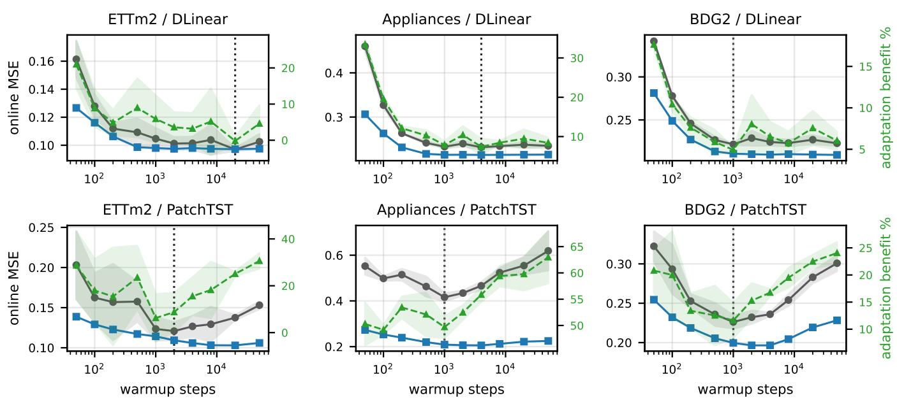  
Fig. 1. Warmup sensitivity on the study milestone grid (three seeds; mean ± standard deviation). In each dataset-backbone panel, gray and blue curves show the online test MSE of the static and full·SGD+m adapted models, respectively (left axis), and the green curve shows adaptation benefit (right axis). The black dotted rule marks the test-selected oracle warmup.

The asymmetry depends on the rate. For every cell we swept a ten-point rate grid $( 3 { \times } 1 0 ^ { - 6 } { - } 1 0 ^ { - 1 } )$ per optimizer, logging validation-rehearsal and test performance at every rate (Fig. 3A); read at $1 0 ^ { - 3 }$ , the sweep reproduces the default-rate grid of the preceding paragraph cell-for-cell. In this grid, both optimizers exhibit empirical nonnegative-benefit ranges, but the ranges are offset by about a grid step: SGD+m has no below-static cells from $3 \times 1 0 ^ { - 6 }$ through $1 0 ^ { - 4 }$ and Adam only through $3 \times 1 0 ^ { - 5 }$ , after which Adam degrades more quickly already 174 negative cells at $1 0 ^ { - 3 }$ against SGD+m's 29, and every one of the 360 cells from $1 0 ^ { - 2 }$ up (per-rate counts along the bottom of Fig. 3A). The default $1 0 ^ { - 3 }$ lies in SGD+m's empirical nonnegative-benefit range but outside Adam's in this grid. Even a fixed $1 0 ^ { - 4 }$ , with no per-cell tuning, changes the observed cell-wise comparison: Adam wins 322 of 360 cells (versus 45 at $1 0 ^ { - 3 } )$ , with 2 negative cells and a mean benefit of +15.1%. This is the highest mean benefit among the fixed-rate settings evaluated here; SGD+m's best is +12.1% at $3 \times 1 0 ^ { - 4 }$ The error trajectory at large rates is consistent with a loss of tracking stability: on the longest stream (ETTm2, 1,451 windows; seed 0), Adam@ $1 0 ^ { - 2 } \mathrm { { \bar { s } } }$ per-window error rises from 0.32 in the first quarter to 0.78 in the last, against 0.09 for the static model.

The comparison at rehearsed rates. Table II reads the same cells at three per-cell rate choices. At the rehearsed rate (the validation-based procedure of §III), Adam wins 310 of 360 cells overall. At the three evaluated horizons, it wins 100, 102 and 108 of 120 cells at H=24, 48, and 96, respectively. Its below-static count falls from 174 at the default to 4 of 360 cells at the rehearsed rate; the latter are all ETTm2/DLinear, with a worst value of -1.3% (Fig. 3B). In 246 of 360 cells, rehearsed Adam even beats SGD+m at its test-selected oracle rate, an unavailable reference at deployment (median +0.38 pp). Adam's rehearsed rate is at most $3 \times 1 0 ^ { - 4 }$ in 340 of 360 cells and shifts one notch lower at $L { = } 1 9 2 .$ where the adapted parameter count roughly doubles; symmetrically, the 20 cells where it does pick $\bar { 1 } 0 ^ { - 3 }$ or higher all sit at $H \in \{ 4 8 , 9 6 \}$ where the stream contains $2 { - } 4 \times$ fewer updates. Both shifts are consistent with dependence on the cumulative amount of adaptation exposure. This also explains the lookback effect: at the default, longer lookbacks move Adam further outside its empirical nonnegative-benefit range; at rehearsed rates they narrow Adam's margin (median +2.1 to +1.0 pp) without changing its sign.

Limits of the rehearsal criterion. What SGD+m retains is robustness, not quality, and one state copy per parameter instead of two. Rehearsal trades a little of that robustness for quality. On the calmer pre-drift slice a rate beyond that range can win the rehearsal and still destabilize on the drifted stream, so SGD+m's rehearsal reaches into the top two rates of the grid $( 3 \times 1 0 ^ { - 2 }$ and $1 0 ^ { - 1 } )$ in 14 of 360 cells and 7 of its picks

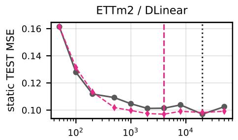

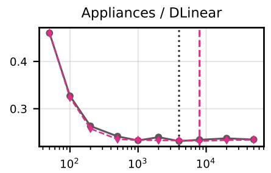

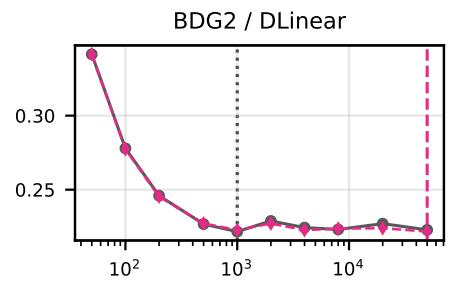

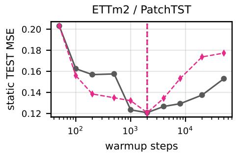

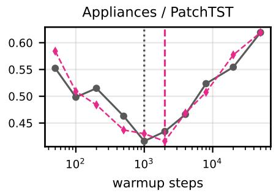

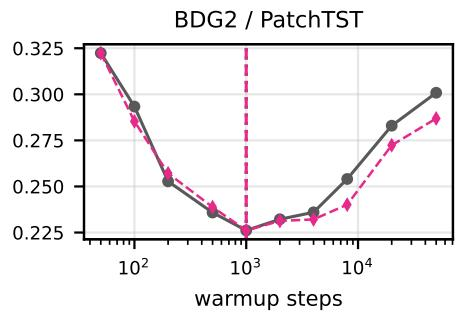  
Fig. 2. Validation-only warmup selection on the study milestone grid and panel layout of Fig. 1 (three seeds; mean ± standard deviation). Gray and magenta curves show static test MSE (left axis) and held-out pre-drift validation MSE (right axis), respectively. The magenta dashed and black dotted rules mark the validation early-stop and test-selected oracle warmups. The validation-MSE scale is suppressed because only its argmin is used for selection.

## TABLE II

LEARNING-RATE SENSITIVITY (C2) OVER THE SAME CELLS, EVALUATED AT THREE PER-CELL RATE CHOICES. VALUES ARE ADAPTATION BENEFIT (%) RELATIVE TO THE STATIC BASELINE (>0 IS BETTER); NEGATIVE CELLS ARE REPORTED AS COUNT (WORST VALUE). THE LAST COLUMN IS THE MEDIAN PER-CELL ADAM—SGD+M DIFFERENCE, AND “CONFIGS" COUNTS SEED-MAJORITY WINNERS. “DEFAULT" FIXES BOTH OPTIMIZERS AT $1 0 ^ { - 3 } ;$ “REHEARSED" SELECTS THE RATE USING HELD-OUT PRE-DRIFT VALIDATION; “ORACLE" SELECTS THE BEST RATE ON THE TEST STREAM.
<table><tr><td></td><td colspan="2">negative cells (worst %)</td><td>wins</td><td>configs</td><td>median</td></tr><tr><td>rate choice</td><td>SGD+m</td><td>Adam</td><td>S/A</td><td>S/A</td><td>A-S (pp)</td></tr><tr><td>L=96 (36 configurations × 5 seeds = 180 cells)</td><td></td><td></td><td></td><td></td><td></td></tr><tr><td>default  $1 0 ^ { - 3 }$ </td><td>8 (-4.4)</td><td>65 (-29.0)</td><td>138/42</td><td>27/9</td><td>-5.6</td></tr><tr><td>rehearsed</td><td>6 (-4.6)</td><td>4 (-1.3)</td><td>23/157</td><td>4/32</td><td>+2.1</td></tr><tr><td>oracle</td><td>0 (+0.1)</td><td>0 (+0.1)</td><td>2/178</td><td>0/36</td><td>+1.3</td></tr><tr><td>L=192 (36 configurations × 5 seeds =</td><td></td><td></td><td>180 cells)</td><td></td><td></td></tr><tr><td>default  $1 0 ^ { - 3 }$ </td><td>21 (-21.2)</td><td>109 (-46.5)</td><td>177/3</td><td>35/1</td><td>-12.8</td></tr><tr><td>rehearsed</td><td>1 (-0.5)</td><td>0 (+0.3)</td><td>27/153</td><td>4/32</td><td>+1.0</td></tr><tr><td>oracle</td><td>0 (+0.4)</td><td>0 (+0.4)</td><td>6/174</td><td>1/35</td><td>+1.1</td></tr></table>

land below static (worst -4.6%, 1 of them on the most driftheavy pairing, Appliances/DLinear), against 4 cells (worst - 1.3%) for Adam (Fig. 3B). Momentum removes the severe form of this failure: with plain SGD the same protocol produced diverged streams, whereas none of the SGD+m picks diverges and the worst case is a few pp rather than a collapse. The pre-drift slice can select strong validation quality within an empirical nonnegative-benefit range, but it does not certify stability under drift. A conservative variant—the smallest rate within 2% of the best validation MSE—eliminates below-static picks in this grid, but it alters 337 of 360 picks at a median cost of 3.6 pp, so we report the unmodified rule. The results suggest a division of roles: SGD+m is more tolerant of a mis-set rate, whereas Adam achieves higher benefits after rate rehearsal in this grid.

Regime probes do not predict the optimizer. Three cheap probes on the frozen base modelstream noise, gradient consistency, and a post-hoc drift ratio—yield no usable optimizer guidance: at the rehearsed rate the choice they were meant to inform has largely dissolved, and at the fixed default they separate the cells only weakly.3 At the default, these probes primarily describe where the shared rate leaves Adam's empirical nonnegative-benefit range in this grid, rather than where either optimizer is intrinsically preferable.

## C. C3 — The Accuracy-Memory-Compute Frontier

Every frontier point uses the validation-selected warmup and rehearsed learning rate, both chosen per dataset×backbone×strategy on the pre-drift validation slice. We place each strategy on the accuracy-vs-resource plane over five seeds (mean±std, Fig. 4); the full-model points coincide with the corresponding cells of §IV-B. The parameterefficient strategies are evaluated on ETTm2 and Appliances, two contrasting datasets in our preliminary characterization.

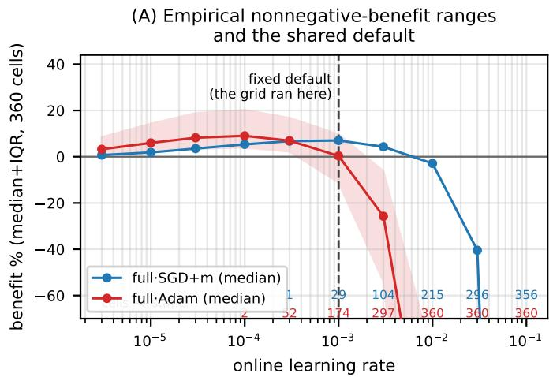

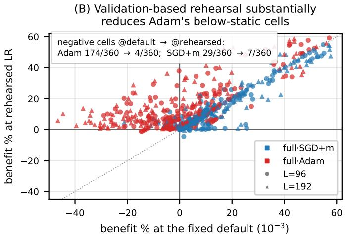  
Fig. 3. Learning-rate sensitivity across all 360 cells. (A) Adaptation benefit by online learning rate, summarized by the median and interquartile range across cells; numbers along the bottom give the count of cells below the static baseline at each rate. The dashed line marks the shared default, 10-3. (B) Per-cell benefit at the shared default (x-axis) versus the validation-rehearsed rate (y-axis); color denotes optimizer and marker shape denotes lookback length

Parameter-efficient trade-offs depend on the dataset. On PatchTST, calib (per-channel input/output calibration, 16,934 trainable parameters, ≈1/5.1 of the full model's) achieves a similar mean improvement to full·SGD+m on ETTm2 (+8.2±5.3% against +10.2±4.5%), and head matches it at the same adaptation-state memory but lower measured compute (1.86 ms against 2.88 ms: input-side calibration forces a backward pass through the encoder, whereas head-only stops at the last layer). Applying Adam to these subsets yields intermediate accuracy-memory trade-offs. On Appliances, the six PatchTST points form a monotone mean trade-off: calib +42.1% at 136kB, calib·Adam +44.5% at 204kB, ful1·SGD+m +47.3% at 686kB, and ful1·Adam +52.5% at 1,028 kB. No plotted point dominates another in this setting. On ETTm2, head·Adam is nondominated relative to ful1·SGD+m: it obtains +10.7% at 203 kB against ful1·SGD+m's +10.2% at 685 kB. Thus, whether PEFT×Adam replaces full-model SGD+m or merely competes with it is dataset-dependent. The cost of Adam's rate and its state are separable; in these PatchTST settings, applying Adam to a smaller subset can retain a substantial fraction of the observed full-model improvement at lower adaptation-state memory.

Rate sensitivity on the frontier. At the fixed default, the ETTm2 full·Adam point reads -19.6% and appears dominated under that shared-rate comparison; the rehearsed rate moves it to the highest-mean-benefit endpoint. Rehearsal is mildly costly for full·SGD+m: on Appliances it reads +47.3% against +53.1% at its default. It leaves PEFT unchanged in this case, with calib at +42.1% and its rehearsal selecting the default rate in all five seeds. The one sub-static Appliances/DLinear pick of §IV-B does not appear here because it uses a longer lookback and horizon than the frontier settings.

The adaptation-state-memory axis against an illustrative 192 kB allowance. A resource axis is easiest to interpret against a budget. Federated split learning has been demonstrated on smart meters carrying 192 kB of SRAM [15]. Relative to an illustrative 192 kB adaptation-state allowance, full-model PatchTST adaptation exceeds the allowance (686— 1,028 kB of gradients and optimizer state), PEFT with Adam is marginally above it (203–204 kB), and PEFT with SGD+m is below it (135–136 kB). This comparison includes gradient buffers and optimizer state only; it excludes model weights, activations, and runtime memory. It therefore illustrates how the adaptation-state accounting changes the feasible strategy set, rather than establishing total-memory fit on a particular meter.

A low update duty cycle under the A100 timing proxy. Under the A100 batch-1 timing proxy, one update per revealed horizon corresponds, at H=24 for an hourly meter, to one update per day. The 0.85–3.69 ms updates of Fig. 4 therefore amount to 0.31–1.35 s of measured update time per meter per year. This duty-cycle calculation needs no power assumption; only the equivalent 4.3-18.5 mJ per update uses the 5 W proxy. In the two BDG2 measurements, per-update wall-clock is 3.4/3.7 ms (SGD+m/Adam) on the 15-meter subset and 3.5/3.8 ms on the 280-meter site. This is not an edge-device scaling result. The measurements suggest that adaptation-state memory and the quality-vs-update-frequency (staleness) tradeoff may be more consequential than the measured A100 timing proxy.

Staleness and drift-triggering. Quality improves with update frequency with diminishing returns (Fig. 5). At validationselected warmup and rehearsed rates, periodic and drifttriggered scheduling show dataset- and optimizer-dependent differences (three seeds, mean±std). At matched update budget, drift-triggering is ahead on both Appliances panels (+5.6±1.0% 1ower MSE for SGD+m, +1.9±0.3% for Adam) and both ETTm2 panels (+2.6±1.4% and +4.5±0.4%), and behind on both ETTh2 panels (-1.1±1.0% and -2.8±1.6%). No schedule dominates across the examined datasets; schedule choice should therefore be validated per deployment.

METER SELECTION AND SCALE WITHIN BDG2 (THREE SEEDS; H=24, L=96). REPORTED VALUES ARE ADAPTATION BENEFIT (%) FOR THE OPTIMIZER SELECTED SEPARATELY FOR EACH SEED BY VALIDATION ONLINE MSE AT ITS REHEARSED RATE. PATCHTST ENTRIES ARE MEAN [MIN, MAX] ACROSS THE SELECTED-SEED RESULTS.  
“LEAST/MOST-MISSING" RANK METERS BY MISSINGNESS; “ACTIVE" REQUIRES COVERAGE ≥50% AND THE INACTIVE-METER RULE; THE FLEET RETAINS UP TO THE 15 LEAST-MISSING ACTIVE METERS PER SITE (SWAN HAS NO METER MEETING THE COVERAGE RULE). THE BDG2 ROW  
IN TABLE I IS NOT DIRECTLY COMPARABLE BECAUSE IT USES FULL·SGD+M AT THE FIXED $1 0 ^ { - 3 }$ RATE AND THE TEST-SELECTED ORACLE WARMUP.
<table><tr><td>BDG2 subset</td><td>meters</td><td>PatchTST</td><td>DLinear</td></tr><tr><td>Rat, least-missing 15 (§III)</td><td>15</td><td>+13.5 [+12.0, +15.0]</td><td>+6.4</td></tr><tr><td>Fox, least-missing 15</td><td>15</td><td>+11.4 [+9.9, +13.8]</td><td>+7.5</td></tr><tr><td>Panther, least-missing 15</td><td>15</td><td>+5.6 [+4.3, +7.3]</td><td>+4.8</td></tr><tr><td>Rat, most-missing 15 (anti-sel.)</td><td>15</td><td>+42.8 [+41.6, +44.0]</td><td>+2.1</td></tr><tr><td>Rat, all active meters</td><td>280</td><td>+43.7 [+39.8, +47.1]</td><td>+2.0</td></tr><tr><td>Fleet: 18 of 19 sites</td><td>240</td><td>+28.7 [+25.8, +31.9]</td><td>+7.0</td></tr></table>

Meter selection changes the estimated benefit. The 15-meter BDG2 subset of §III retains the least-missing meters of one site—a choice that a 3,053-meter corpus makes possible to examine. Table III reruns the validation-selected protocol on five further subsets, selecting the optimizer separately per seed by validation online MSE. On PatchTST, the anti-selected 15 most-missing meters of the same site report +42.8%, against +13.5% on the least-missing 15; on DLinear the ordering reverses (+2.1% against +6.4%). Thus, fleet-scale estimates should report their meter-selection rule. The comparison is also affected by what is being scored: in the anti-selected subset, many evaluation targets are forward-filled rather than directly observed. Its larger reported benefit should therefore be interpreted as performance on the imputed stream under this preprocessing rule, not as a data-quality-independent estimate of adaptation benefit on observed readings. In particular, the anti-selected series have a median of 44.5% consecutiveequal samples, compared with 0.6% for the §III subset. We introduced the inactive-meter rule after observing a constantvalue meter that flattened the fleet-wide metric; results using this post-hoc data-quality rule should therefore be read as exploratory, although the rule uses only warmup-pool statistics.

Additional scale within BDG2. With those rules fixed, the procedure is additionally evaluated on a 280-meter site, which reports +43.7%, and on a 240-meter, 18-site fleet, which reports +28.7%. In these BDG2 subsets, the observed improvements are higher for PatchTST than for DLinear. Every step— warmup selection, rate rehearsal, and adaptation—remains a per-device computation.

## D. Conditional Deployment Guidance

The measurements above provide conditional, per-device guidance without using test data.

(i) Select the warmup budget and online learning rate on the held-out pre-drift validation slice at commissioning (§III).

(ii) When adaptation-state memory is the binding constraint, first consider head-only or calibration-based adaptation. In the evaluated PatchTST settings, these variants often retain a substantial fraction of the full-model gain at lower adaptation-state memory.

(iii) If the extra optimizer state and rehearsal are affordable, use Adam at its rehearsed rate—typically 1/10 to 1/30 of the default in the 360-cell full-model grid—for a median +1.5 pp at 1.5× the adaptation-state memory. If state is what binds, apply Adam to the calibration/head subset, or keep momentum alone.

(iv) If no tuning is possible, SGD+m at $1 0 ^ { - 3 }$ was more raterobust within our grid; this observation should not be treated as a universal default. Our drift probe is post hoc, so “heavy drift" is not decidable at commissioning.

(v) No schedule dominates across the evaluated datasets; validate periodic or drift-triggered scheduling per deployment. The ETT/DLinear settings showed only small mean improvements, so whether to adapt at all remains part of the decision.

## V. DISCUSSION AND LIMITATIONS

• The validation-selection protocols spend the freshest predrift data on selection rather than training: the validation slice is never trained on, and there is no refit after selection, so the deployed model's training data ends one validation span (≈73 days on the hourly and 15-minute sets, ≈14 days on Appliances) before the stream starts. Both arms share this limitation, so the comparisons are internally consistent; however, a deployment that folded the slice back into warmup training would use a fresher static baseline and could change the reported benefit. Refitafter-selection, and the slice's size and position (fixed at the adjacent 20% throughout), remain unexplored.

• The optimizer axis is deliberately the SGD+m/Adam pair, so the conclusion in §IV-B concerns that pair, not optimizers in general. Whether memory-light, learningrate-free, and non-stationary-online optimizers (e.g., AdaFactor, Prodigy, and ObGD) move the frontier points of §IV-C requires a separate study under the same protocol. A direct comparison of our simplified calibration point with the official PETSA implementation is likewise left for future work.

• Everything is measured on a datacenter GPU. Adaptation memory is counted rather than observed under an embedded allocator; per-update latency is launch-bound at batch 1 on an A100, a regime an edge device does not share, so the near-flat scaling with meter count (§IV-C) need not carry over; and the millijoule figures additionally assume a 5 W device. Validating memory and latency on Jetson- or Raspberry-Pi-class hardware, and ultimately on a meter, is required before the recipe can be called deployable end-to-end.

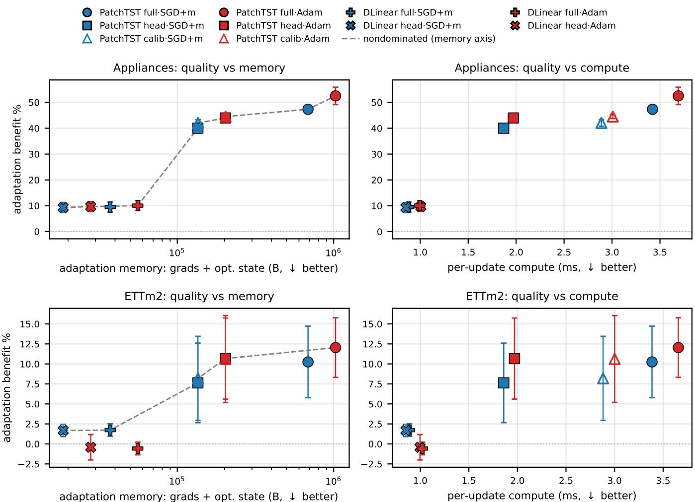  
Fig. 4. Accuracy-resource characterization (C3) at validation-selected warmup and rehearsed learning rates (five seeds; mean ± standard deviation). Adaptation benefit is plotted against adaptation-state memory (gradient buffers + optimizer state; left) and A100-measured per-update time (right) for Appliances (top) and ETTm2 (bottom). Color denotes optimizer (blue: SGD+m; red: Adam); marker shape denotes backbone and parameter subset (PatchTST: circle/square/triangle for full/head/calib; DLinear: plus/cross for full/head). Dashed links identify nondominated mean points on the memory axis; hollow calib markers overlay head markers because their adaptation-state memory differs only by the 2C calibration parameters.

## VI. CONCLUSION

Conclusions about on-device time-series adaptation depend critically on the evaluation protocol. Even under a leakagefree streaming protocol, we find that two additional evaluation choices materially affect the estimated benefit: the baseline's warmup budget (two-sided and non-monotone in our sweep) and a shared online learning-rate default. Selecting the warmup budget and each optimizer's rate on a held-out predrift validation slice mitigates, rather than eliminates, these sensitivities without accessing test data. Under this validationonly procedure, we characterize accuracy against adaptationstate memory and A100-measured update latency on six public multivariate series, including a smart-meter corpus at fleet scale. In the evaluated frontier settings, several parameterefficient variants are nondominated at lower adaptation-state memory than full-model alternatives. These measurements provide conditional deployment guidance; target-device memory, latency, and energy remain to be validated.

## ACKNOWLEDGMENT

This work was supported by the JST SIP project (Grant Number JPJ012207). The authors also gratefully acknowledge support from the JSPS KAKENHI (Grant Number JP26K02884).

## REFERENCES

[1] Y.-y. A. Lau, Z. Shao, and D.-Y. Yeung, "Fast and slow streams for online time series forecasting without information leakage," in International Conference on Learning Representations (ICLR), 2025.

[2] D. Liang, H. Zhang, J. Wang, D. Yuan, and M. Zhang, "Act now: A novel online forecasting framework for large-scale streaming data," arXiv preprint arXiv:2412.00108, 2024.

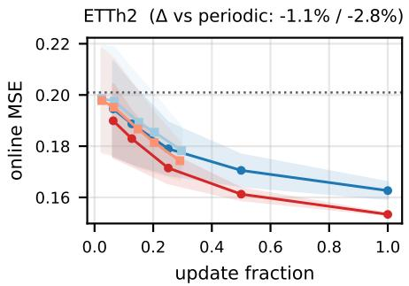

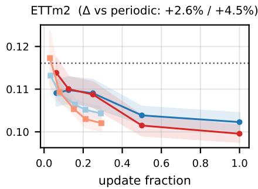

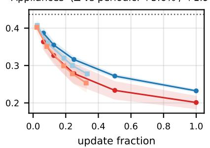  
Fig. 5. Online MSE versus update fraction for PatchTST under validation-selected warmup and rehearsed learning rates (three seeds; mean with ± standarddeviation bands). Periodic every-k and drift-triggered schedules are shown for SGD+m and Adam in each dataset panel. Hue denotes optimizer (blue: SGD+m; red: Adam), and the lighter shade denotes drift-triggered updating. Panel-title values give the matched-budget difference between drift-triggered and periodic schedules for SGD+m / Adam; positive values favor drift-triggered updating.

[3] H. Zhao, Y. Liu, A. Alahi, and T. Lin, "On pitfalls of test-time adaptation," in International Conference on Machine Learning (ICML), ser. PMLR, vol. 202, 2023, pp. 42 058–42 080.

[4] R. M. Schmidt, F. Schneider, and P. Hennig, "Descending through a crowded valley—benchmarking deep learning optimizers," in International Conference on Machine Learning (ICML), ser. PMLR, vol. 139, 2021, pp. 9367–9376.

[5] D. Liang, Q. Li, Y. Wang, J. Chen, H. Zhang, X. Cui, Q. Wang, and S. Li, “The forecast after the forecast: A post-processing shift in time series," in International Conference on Learning Representations (ICLR), 2026.

[6] M. Chen, L. Shen, H. Fu, Z. Li, J. Sun, and C. Liu, “Calibration of timeseries forecasting: Detecting and adapting context-driven distribution shift," in ACM SIGKDD Conference on Knowledge Discovery and Data Mining (KDD), 2024.

[7] H. Kim, S. Kim, J. Mok, and S. Yoon, "Battling the non-stationarity in time series forecasting via test-time adaptation," in AAAI Conference on Artificial Intelligence, 2025.

[8] H. Wang, R. Xu, G. Kementzidis, K. Cho, S. Ramirez Villarreal, and Y. Deng, “Towards principled test-time adaptation for time series forecasting," arXiv preprint arXiv:2605.17250, 2026.

[9] H. R. Medeiros, H. Sharifi-Noghabi, G. L. Oliveira, and S. Irandoust, “Accurate parameter-efficient test-time adaptation for time series forecasting," in ICML 2025 Workshop on Test-Time Adaptation: Putting Updates to the Test! (PUT), 2025.

[10] Q. Pham, C. Liu, D. Sahoo, and S. C. H. Hoi, "Learning fast and slow for online time series forecasting," in International Conference on Learning Representations (ICLR), 2023.

[11] Y.-F. Zhang, Q. Wen, X. Wang, W. Chen, L. Sun, Z. Zhang, L. Wang, R. Jin, and T. Tan, "OneNet: Enhancing time series forecasting models under concept drift by online ensembling," in Advances in Neural Information Processing Systems (NeurIPS), 2023.

[12] Y. Zhang, W. Chen, Z. Zhu, D. Qin, L. Sun, X. Wang, Q. Wen, Z. Zhang, L. Wang, and R. Jin, “Addressing concept shift in online time series forecasting: Detect-then-adapt," arXiv preprint arXiv:2403.14949, 2024.

[13] L. Zhao and Y. Shen, “"Proactive model adaptation against concept drift for online time series forecasting," in ACM SIGKDD Conference on Knowledge Discovery and Data Mining (KDD), 2025.

[14] M. N. Fekri, H. Patel, K. Grolinger, and V. Sharma, "Deep learning for load forecasting with smart meter data: Online adaptive recurrent neural network," Applied Energy, vol. 282, p. 116177, 2021.

[15] Y. Li, D. Qin, H. V. Poor, and Y. Wang, “"Introducing edge intelligence to smart meters via federated split learning," Nature Communications, vol. 15, no. 9044, 2024.

[16] J. Huang, Y. Zhu, L. Xu, Z. Zheng, W. Cui, and M. Sun, "On-device training of PV power forecasting models in a smart meter for grid edge intelligence," arXiv:2507.07016, 2025.

[17] X. Wang, "Adapt only when it pays: Budgeted decision-loss priority for

delayed online time-series adaptation,"arXiv preprint arXiv:2606.25068, 2026.

[18] H. Zhou, S. Zhang, J. Peng, S. Zhang, J. Li, H. Xiong, and W. Zhang, “Informer: Beyond efficient transformer for long sequence time-series forecasting," in AAAI Conference on Artificial Intelligence, 2021.

[19] L. M. Candanedo, V. Feldheim, and D. Deramaix, “"Data driven prediction models of energy use of appliances in a low-energy house," Energy and Buildings, vol. 140, pp. 81–97, 2017.

[20] C. Miller, A. Kathirgamanathan, B. Picchetti, P. Arjunan, J. Y. Park, Z. Nagy, P. Raftery, B. W. Hobson, Z. Shi, and F. Meggers, "The Building Data Genome Project 2: Energy meter data from the ASHRAE Great Energy Predictor III competition," Scientific Data, vol. 7, no. 368, 2020.

[21] A. Zeng, M. Chen, L. Zhang, and Q. Xu, “Are transformers effective for time series forecasting?" in AAAI Conference on Artificial Intelligence, 2023.

[22] Y. Nie, N. H. Nguyen, P. Sinthong, and J. Kalagnanam, "A time series is worth 64 words: Long-term forecasting with transformers," in International Conference on Learning Representations (ICLR), 2023.

[23] D. P. Kingma and J. Ba, “Adam: A method for stochastic optimization," in International Conference on Learning Representations (ICLR), 2015.