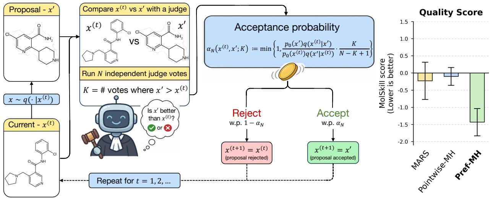
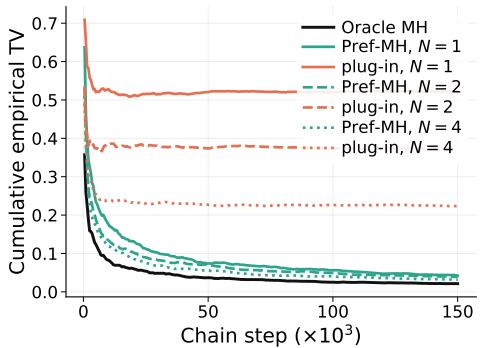
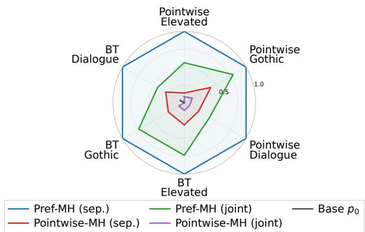
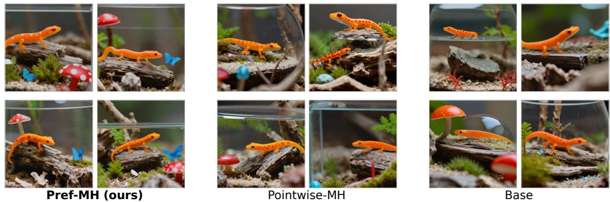
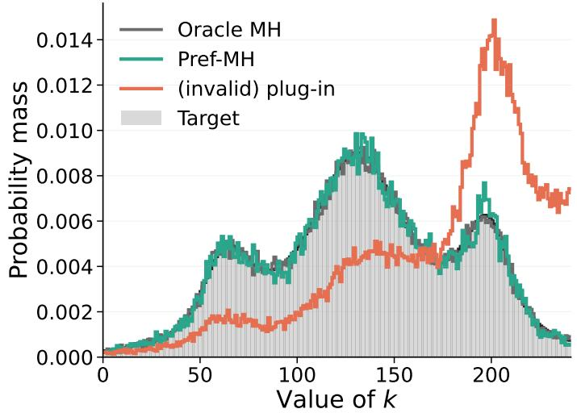
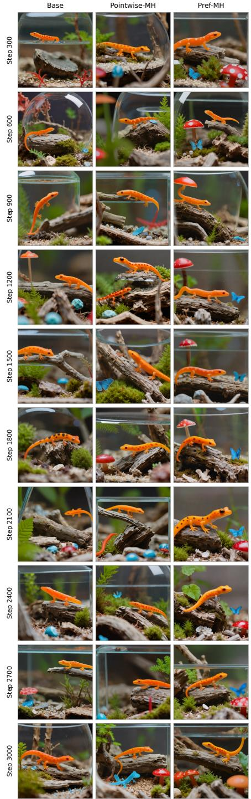

# When Metropolis and Hastings Meet Bradley and Terry: Exact MCMC From Preference Voting

Ariel Smogorghevski<sup>1</sup> Nir Rosenfeld<sup>2</sup> Yaniv Romano<sup>2,3</sup>

<sup>1</sup>Department of Data and Decision Sciences, Technion – Israel Institute of Technology <sup>2</sup>Department of Computer Science, Technion – Israel Institute of Technology <sup>3</sup>Department of Electrical and Computer Engineering, Technion – Israel Institute of Technology

## Abstract

Sampling from distributions conditioned on desired semantic properties is an emerging challenge in modern generative modeling. Metropolis–Hastings (MH) provides a principled route to conditional sampling, but requires access to exact pointwise target-density evaluations, which are not available in generative settings. Meanwhile, pairwise comparisons by humans or model “judges” are highly accessible and have proved valuable across diverse applications. We introduce Pref-MH, a general exact MH sampler for judge-induced conditional distributions using only stochastic binary pairwise comparisons. Our key observation is that the MH unnormalized density ratio matches the preference odds of the Bradley–Terry (BT) choice model. The central challenge is that while MH requires precise ratio computation, BT judges provide only sampled binary feedback. To this end, we develop a valid accept/reject rule whose resulting Markov chain provably converges to the target distribution. We further show that, for a fixed proposal kernel and budget, Pref-MH is optimal in the Peskun–Tierney sense among this class of exact reversible acceptance rules. Experiments on text generation and molecular design with LLM judges, as well as image generation with VLM judges, demonstrate that Pref-MH provides a practical and flexible approach to conditional sampling when comparative feedback is relatively easy to obtain.

## 1 Introduction

Drawing samples from conditional distributions is a fundamental challenge in computational statistics and machine learning. Markov Chain Monte Carlo (MCMC) methods provide a canonical framework for this task, with Metropolis–Hastings (MH) serving as one of their most widely used instances [1, 2]. Such methods have found widespread use in probabilistic machine learning and across diverse applications ranging from statistical physics to computational biology [3–8]. Unlike methods that return a single “best” solution, MCMC enables repeated sampling of plausible instances from a target distribution. This makes it especially well suited to tasks requiring multiple diverse outputs, or settings in which a human selects a preferred option from a set of candidates. For example, in molecular design, MCMC can generate multiple molecules that satisfy a given criterion yet difer in their trade-ofs across key properties such as eficacy, toxicity, and synthesizability [9–12].

Modern generative models, such as large language models (LLMs) and vision-language models (VLMs), ofer the potential to unlock a wide range of new applications that require sampling from semantically meaningful conditional distributions over complex modalities [13–17]. However, while sampling from generative models in itself is straightforward, it is unclear how to rigorously ensure that instances are indeed drawn from the correct and full target conditional distribution. For example, if we wish to generate responses that are ‘helpful’, ‘polite’, and in ‘Shakespearean style’, then prompting for these properties does not guarantee that generated completed sequences truly satisfy them, nor does it provide control over the nature of variation across samples.

  
Figure 1: Illustration of our proposed Pref-MH for molecular design for drug discovery. At each step t: (i) a proposal sample $x ^ { \prime }$ is generated given the current state $x ^ { ( t ) }$ ; (ii) $x ^ { \prime }$ is then compared against ${ \bf \Phi } _ { x } ( t )$ by using N stochastic judge votes; (iii) the proposal $x ^ { \prime }$ is either accepted or rejected according to our vote-based acceptance rule $\alpha _ { N }$ . The right panel summarizes the results of a molecular-design experiment (Section 4.4), highlighting that Pref-MH outperforms the score-based baselines (lower is better).

Our work addresses this gap by introducing a novel Metropolis–Hastings (MH) algorithm tailored to generative models that enables principled conditional sampling. MH algorithms work by repeatedly proposing a candidate sample given the current sample, which is either accepted or rejected according to a predefined acceptance rule designed to ensure convergence to the desired conditional distribution [2, 18, 19]. The key methodological challenge is that implementing the acceptance rule requires access to the true unnormalized density ratios of the target conditional distribution. For current generative models, this is typically infeasible [20]: informally, in our example, this would require computing the probability of any given text under the distribution of all texts that are ‘helpful’, ‘polite’, and ‘Shakespearean’. Similarly, in molecular design, it would require assigning exact conditional likelihoods to molecules satisfying complex and often competing properties such as eficacy, toxicity, and synthesizability.

To overcome this challenge, we leverage the fact that pairwise comparisons have become ubiquitous in generative modeling, whether in model alignment via human comparative feedback [21–25] or in the use of generative models as “judges” for benchmarks and competitions [26]. Such binary pairwise comparisons are readily obtainable, broadly applicable across tasks, and have often proven efective in practice. However, using pairwise comparisons for conditional sampling raises two dificulties. First, the canonical MH algorithm innately depends on access to pointwise density ratios, making it unclear how to incorporate pairwise feedback. Second, it requires computing density ratios precisely in order to guarantee convergence to the target distribution, whereas judges provide only sample access to stochastic binary votes between alternatives.

This structural limitation raises a fundamental question: how to formulate an exact MCMC sampler when the target distribution is accessible only through stochastic, binary pairwise comparisons? Exactness here means that the resulting chain’s stationary distribution matches the desired target judge-induced conditional distribution. In this paper, we show that such exact sampling is indeed possible by introducing Pref-MH: the first exact MH framework that uses only binary pairwise preference comparisons, with support for general state spaces and arbitrary proposal kernels. Figure 1 visualizes the method in the context of de novo molecular design, where the goal is to generate molecules (SMILES-encoded) for downstream drug discovery campaigns; a task we revisit later in our experiments.

## Preview of Pref-MH and key contributions

We begin by observing a simple but powerful connection (Section 3.1): under the assumption that the conditional target is structured as a Gibbs distribution, the MH acceptance ratio closely mirrors the Bradley-Terry (BT) preference model from discrete choice [27, 28]. In MH, the acceptance rule depends on the ratio between the target densities of two candidate inputs. Under the BT model, the odds of comparison probabilities equal the ratio between the judge’s implicit (and unobserved) preference ‘strength’ for the two candidates. We link the two by establishing a theoretical equivalence between both ratios.

Our key contribution is to then turn this connection between MH and BT into a practical, exact sampling algorithm. The main dificulty is that the sampler does not have access to the underlying comparison probability itself; rather, it can only query judges to obtain binary preference votes for a given input pair. A natural idea is therefore to estimate the required odds ratio by first estimating each comparison probability independently from multiple samples, and then plugging the ratio of these estimates into the standard MH acceptance rule. We prove a strong impossibility result: any procedure that uses a fixed number of binary comparisons—including such plug-in estimation—cannot implement the oracle acceptance rule (Thm. 1). Intuitively, this holds since even small errors in estimating the acceptance ratio can accumulate to completely distort the chain’s induced stationary distribution [29, 30]. We circumvent this impossibility by designing a randomized accept/reject mechanism whose marginal acceptance probabilities satisfy the Hastings ratio induced by the pairwise judges; see the illustration in Figure 1. Although this does not implement the oracle rule, it nonetheless yields a Markov chain whose stationary distribution provably matches the target conditional distribution—despite using only a fixed number of sampled binary comparisons at each transition (Thm. 2 and Cor. 1).

Our resulting Pref-MH method is an exact reversible MCMC sampler that never evaluates a pointwise score function and never plugs in an estimated comparison probability or numerical approximation to the acceptance ratio. Moreover, we establish a strong optimality result (Thm. 3): for any fixed proposal mechanism and fixed comparison budget, Pref-MH is optimal in the Peskun–Tierney sense among the class of exact competitors using the same number of pairwise comparisons [31, 32]. Because the rule is parameterized by a fixed number of judge queries, the user can choose the per-step comparison budget; increasing this budget can, in turn, support higher acceptance probabilities, allowing the sampler to explore the space of plausible candidates more efectively.

Finally, our accept/reject mechanism extends naturally to multi-judge settings (Sec. 3.5). This is because our method treats proposal generation and comparative evaluation as separate components:

one proposes candidate samples, while the other judges their relative fit to the desired properties. This allows us to combine multiple independent comparative criteria—for example, one for helpfulness, one for politeness, and one for Shakespearean-ness–without reducing them to a single manually-weighted aggregate score or a single judge query. More broadly, this yields a modular way to build samplers from diverse comparative feedback sources, where each “judge” specializes in a single property, enabling conditional sampling that is more direct and easier to adapt across tasks.

We conclude with experiments demonstrating the utility and flexibility of the resulting sampler across several conditional generation tasks, including synthetic experiments, text generation, image generation, and molecular design for drug discovery. Figure 1 highlights the results from the molecular-design experiment (Sec. 4.4), showing that our Pref-MH achieves better performance on an external evaluation metric, than MH baselines that do not use pairwise LLM judgments. The MolSkill metric presented reflects a human expert quality score [33] and we do not use it to guide the sampling, making it an objective performance measure.

Related work. Fotakis et al. [34] study perfect sampling from pairwise comparisons over a fixed finite item set, using comparison samples from a local sampling scheme. Human-in-the-loop MCMC methods, such as Sanborn and Grifiths [35], Sanborn et al. [36], Harrison et al. [37], use human choices to construct sampling procedures for subjective or semantic representations, but are tied to specific behavioral protocols, choice models, or update structures. A diferent line of work uses MH or related MCMC methods in generative modeling and controllable generation, including energy-based sampling for masked or controllable language models and quality-aware sampling for machine translation [38–43]. Recent inference-time sampling methods have also used MCMC-inspired procedures to improve LLM reasoning, but rely on base-model likelihoods rather than pairwise comparison-only access [44]. These methods strictly rely on an evaluable energy, score, reward, likelihood, constraint indicator, or quality metric. Our Pref-MH difers in its technical scope: It ofers an MH accept/reject rule for general state spaces, user-chosen proposal kernels, and builds on comparisons between the current and proposed states. Pref-MH is not restricted to finite catalogs, symmetric proposals, Barker-style updates, or pointwise reward evaluations. Further, Pref-MH supports any fixed finite comparison budget per transition, trading judge cost for higher acceptance and exploration while preserving the target distribution exactly. Additional related work is in Appx. A.

## 2 Problem Setup and Background

Let X denote the sample space (e.g., plots for a film, math word problems, posters for an event), and let M be a property of interest, such as adherence to an instruction, factual correctness, or a particular style. We assume access to a base distribution $p _ { 0 }$ over X—typically a generative model—but no direct mechanism for conditioning $p _ { 0 }$ on M. To define this conditioning, we consider settings in which the question of whether an input x admits the property M can be evaluated by a judge, e.g., human or generative model. Formally, we define the judge-induced target conditional distribution to be:

$$
\pi ( x ) : = p ( x \mid M ) = { \frac { p _ { 0 } ( x ) p _ { J } ( M \mid x ) } { \int _ { \mathcal { X } } p _ { 0 } ( u ) p _ { J } ( M \mid u ) d \mu ( u ) } } \propto p _ { 0 } ( x ) p _ { J } ( M \mid x ) ,\tag{1}
$$

Here $p _ { J } ( M \mid x )$ denotes the probability that x satisfies M according to a given judge J. In words, the target π can be viewed as a reweighting of the base distribution $p _ { 0 }$ toward samples which the judge J views as more likely to exhibit the property M. Crucially, in this work, we do not assume that we have direct access to $p _ { J } ( M \mid x )$ , but rather have only sample access to pairwise comparisons between two candidates x and $x ^ { \prime }$ . This restriction is in line with many settings in which head-to-head comparisons are available via a judge, whereas the true probability $p _ { J } ( M \mid x )$ is generally unknown.

In general, M may reflect multiple desiderata that should hold simultaneously, such as helpfulness, politeness, and stylistic fidelity. To ease the exposition of our method, we begin with a single property M and return to the multi-condition case $M = \left( M _ { 1 } , \ldots , M _ { m } \right)$ in Section 3.5.

Metropolis–Hastings sampling. MH is a general algorithm that produces samples from a target distribution π by constructing a Markov chain whose stationary distribution matches the target. Given an initial state $x _ { 0 }$ and a chosen proposal kernel $q ( x ^ { \prime } \mid x )$ , MH generates a sequence of samples in the following manner: At each state $x ,$ , a new candidate state $x ^ { \prime }$ is proposed by sampling $x ^ { \prime } \sim q ( \cdot \mid x )$ . Then, $x ^ { \prime }$ is accepted with probability:

$$
\alpha _ { \mathrm { M H } } ( x , x ^ { \prime } ) = \operatorname* { m i n } \left\{ 1 , { \frac { \pi ( x ^ { \prime } ) q ( x \mid x ^ { \prime } ) } { \pi ( x ) q ( x ^ { \prime } \mid x ) } } \right\} .\tag{2}
$$

If successful, the state transitions from $x$ to $x ^ { \prime } ,$ otherwise it remains at x. The proposal kernel q is the main design choice controlling how the sampler explores $\mathcal { X } .$ , from global proposals such as resampling from $p _ { 0 }$ to local proposals such as modifying the current state. A key feature of our setup is that it leaves this proposal mechanism user-specified. Thus, Pref-MH could be combined with any valid proposal kernel, subject to the usual regularity conditions needed for convergence as stated in Corollary 1. Repeating this accept/reject step iteratively produces the desired Markov chain.

In our setting, directly evaluating the target density $\pi$ is infeasible. However, MH only requires ratios of target densities, so substituting Eq. (1) into the MH ratio gives:

$$
\frac { \pi ( x ^ { \prime } ) q ( x \mid x ^ { \prime } ) } { \pi ( x ) q ( x ^ { \prime } \mid x ) } = \frac { p _ { 0 } ( x ^ { \prime } ) q ( x \mid x ^ { \prime } ) } { p _ { 0 } ( x ) q ( x ^ { \prime } \mid x ) } \cdot \frac { p _ { J } ( M \mid x ^ { \prime } ) } { p _ { J } ( M \mid x ) } .\tag{3}
$$

The first factor is tractable since $p _ { 0 }$ is assumed given and $q$ is a design choice. Since we do not assume direct access to $p _ { J } ( M \mid x )$ , the remaining challenge lies in computing the likelihood ratio $p _ { J } ( M \mid x ^ { \prime } ) / p _ { J } ( M \mid x )$

## 3 Proposed Method: Exact Sampling from Preference-Based Judges

## 3.1 Integrating Bradley–Terry within Metropolis–Hastings

To present the basic construction of our method, suppose for a moment that we have access to $p _ { J } ( M \mid x )$ . A straightforward way to compute the likelihood ratio in Eq. (3) is to compute $p _ { J } ( M \mid x )$ and $p J ( M \mid x ^ { \prime } )$ independently and then divide. Unfortunately, this is not rigorously possible for generative models over arbitrary properties M. Instead, we make the (implicit) parametric assumption that $p _ { J } ( M | x ) \propto \exp ( s ( x ) )$ ) for some unknown, latent score function $s : \mathcal { X } \to \mathbb { R }$ . Under this construction, the target in Eq. (1) admits the following Gibbs, score-tilted form

$$
\pi ( x ) \propto p _ { 0 } ( x ) e ^ { s ( x ) } .\tag{4}
$$

Tilted distributions of this form play a central role in modern generative modeling and LLM alignment, where one seeks to bias sampling toward a desired reward while staying close to the base distribution [21, 23, 25, 45].

While the latent score is unknown, we can still leverage any pairwise comparison “judge” whose (stochastic) preferences over elements in X are induced by s. For a judge J of the property M, the parametric assumption on s entails probabilistic pairwise comparisons that follow:

$$
p _ { J } ( x \prec x ^ { \prime } ) = \sigma \big ( s ( x ^ { \prime } ) - s ( x ) \big ) , \qquad \sigma ( t ) = \frac { 1 } { 1 + e ^ { - t } } .\tag{5}
$$

where $p J ( x \prec x ^ { \prime } )$ denotes the probability that judge J prefers $x ^ { \prime }$ to x. This corresponds to the canonical BT model for discrete choice [27, 28].

Substituting Eq. (5) into $\mathrm { E q . \ ( 3 ) }$ , we can now write the likelihood ratio using pairwise preferences:

$$
{ \frac { p _ { J } ( M \mid x ^ { \prime } ) } { p _ { J } ( M \mid x ) } } = e ^ { s ( x ^ { \prime } ) - s ( x ) } = { \frac { p _ { J } ( x \prec x ^ { \prime } ) } { p _ { J } ( x \succ x ^ { \prime } ) } } = { \frac { p _ { J } ( x \prec x ^ { \prime } ) } { 1 - p _ { J } ( x \prec x ^ { \prime } ) } } ,\tag{6}
$$

known as the win-rate ratio. Plugging this into Eq. (3) yields a preference-based acceptance rule:

$$
\alpha _ { \mathrm { B T - M H } } ( x , x ^ { \prime } ) : = \operatorname* { m i n } \Big \{ 1 , \underbrace { \frac { p _ { 0 } ( x ^ { \prime } ) q ( x \mid x ^ { \prime } ) } { \underbrace { p _ { 0 } ( x ) q ( x ^ { \prime } \mid x ) } _ { r _ { 0 } ( x , x ^ { \prime } ) } } } _ { r _ { 0 } ( x , x ^ { \prime } ) } \cdot \underbrace { \frac { p _ { J } ( x \prec x ^ { \prime } ) } { 1 - p _ { J } ( x \prec x ^ { \prime } ) } } _ { \mathrm { w i n - r a t e ~ r a t i o ~ } w ( x , x ^ { \prime } ) } \Big \} .\tag{7}
$$

The above derivation shows that, if the comparison probability were available, the BT model would provide the likelihood ratio needed to run MH without knowing the latent score itself. Essentially, this enables us to replace the pointwise question “does x satisfy $M ? ^ { \mathfrak { s } }$ with the pairwise question “which of x and $x ^ { \prime }$ is more likely $M ? ^ { \dag }$ . However, this creates a diferent challenge: we need access to the win-rate ratio $w ( x , x ^ { \prime } )$ . As a result, Eq. (7) does not yet provide an implementable sampler, since the sampler observes only binary comparisons drawn by the judge. The question, then, is how to construct an exact reversible kernel for π given only access to such one-bit judge outcomes.

## 3.2 Impossibility of directly implementing the BT-MH acceptance rule

Since each judge’s query returns only a binary vote, one may hope that a fixed number of such outcomes is enough to implement the oracle acceptance probability $\alpha _ { \mathrm { B T - M H } } ( x , x ^ { \prime } )$ . For example, one natural attempt is to query the judge N times on the pair $( x , x ^ { \prime } )$ , estimate $p _ { J } ( x \prec x ^ { \prime } )$ , and plug this estimate into Eq. (7). However, we show that this strategy, and in fact any fixed-budget procedure over binary votes, cannot reproduce the oracle BT-MH acceptance probability for every value of the unknown comparison probability $p _ { J } ( x \prec x ^ { \prime } ) = p \in ( 0 , 1 )$ .

Theorem 1 (No fixed-budget implementation of the BT-MH acceptance rule). Fix a proposed move $x  x ^ { \prime } .$ , and suppose that $r _ { 0 } ( x , x ^ { \prime } ) \in ( 0 , \infty )$ . For any $N < \infty$ , there is no procedure using only N samples $J ^ { ( 1 ) } , \ldots , J ^ { ( N ) } \sim$ Bernoulli(p) whose marginal acceptance probability equals $\alpha _ { \mathrm { B T - M H } } ( x , x ^ { \prime } )$ simultaneously for all $p \in ( 0 , 1 )$

The proof is given in Appx. D.1

A few remarks are in place. First, the assumption $r _ { 0 } ( x , x ^ { \prime } ) \in ( 0 , \infty )$ merely excludes degenerate proposed moves whose acceptance decision is independent of the judge outcomes. Second, the fixed-budget requirement is important in modern LLM- or human-as-a-judge applications in which judge queries are often costly, and a sampler should have a prescribed finite comparison cost per MH step. Third, the theorem does not rule out exact fixed-budget sampling altogether; rather, it rules out any attempt for reproducing the exact oracle BT-MH acceptance probability from finitely many binary comparisons. In turn, this highlights a fundamental challenge in obtaining an exact Pref-MH sampler. This motivates the next subsection, where we construct a valid accept/reject rule directly.

## 3.3 A budget-optimal acceptance rule via N-vote construction

We now give an explicit fixed-budget acceptance rule for Pref-MH—using only binary judge outcomes, while ensuring that the resulting Markov chain exactly matches the target distribution $\pi .$

Fix a current state x and a proposal $x ^ { \prime } \sim q ( \cdot \mid x )$ . Our construction queries the judge independently N times on the pair $( x , x ^ { \prime } )$ , resulting in $J ^ { ( 1 ) } , \ldots , J ^ { ( N ) }$ <sup>iid</sup>∼ Bernoulli $( p _ { J } ( x \prec x ^ { \prime } ) )$ . We denote by $\begin{array} { r } { K : = \sum _ { t = 1 } ^ { N } J ^ { ( t ) } } \end{array}$ , the number of votes favoring the proposal $x ^ { \prime }$ . With this in place, we now define our Pref-MH acceptance rule, given by

$$
\alpha _ { N } ( x , x ^ { \prime } ; K ) : = \operatorname* { m i n } \biggr \{ 1 , \ r _ { 0 } ( x , x ^ { \prime } ) \frac { K } { N - K + 1 } \biggr \} .\tag{8}
$$

A useful way to view the above N-vote rule is as follows. We start from the tractable baseline factor $r _ { 0 } ( x , x ^ { \prime } )$ and then adjust it according to the evidence from the judge. The vote count K summarizes that evidence. If many votes favor the proposal $x ^ { \prime } ,$ it is desired to upweight $r _ { 0 } ( x , x ^ { \prime } )$ and increase the probability of accepting $x ^ { \prime } .$ By contrast, if few votes favor the proposal, it is desired to reduce the acceptance probability by downweighting $r _ { 0 } ( x , x ^ { \prime } )$ . The factor above does exactly this. When $K = N$ , the factor equals $N$ , giving the largest upweighting; when $K = 0$ , the factor equals 0, ensuring the proposal will be rejected; and when the vote is roughly split, the factor is close to 1, so the decision is driven mainly by $r _ { 0 } ( x , x ^ { \prime } )$

This interpretation is also consistent with the BT odds. Indeed, for large $N$

$$
\frac { K } { N - K + 1 } = \frac { K / N } { 1 - K / N + 1 / N } \xrightarrow [ N  \infty ] { \mathrm { a . s . } } \frac { p _ { J } ( x \prec x ^ { \prime } ) } { 1 - p _ { J } ( x \prec x ^ { \prime } ) } ,
$$

so the vote-based factor behaves like a finite-sample surrogate for the ideal win-rate ratio. In turn, since the acceptance probability is a continuous function of this vote-based factor, the realized acceptance rule converges almost surely to the ideal MH update:

$$
\operatorname* { m i n } \biggl \{ 1 , \ r _ { 0 } ( x , x ^ { \prime } ) \frac { K } { N - K + 1 } \biggr \} \xrightarrow [ N  \infty ] { \mathrm { a . s . } } \operatorname* { m i n } \biggl \{ 1 , \ r _ { 0 } ( x , x ^ { \prime } ) \frac { p _ { J } ( x \prec x ^ { \prime } ) } { 1 - p _ { J } ( x \prec x ^ { \prime } ) } \biggr \} .
$$

Hence, our proposed N-vote family may be viewed as a fixed-budget exact approximation toward the full MH acceptance rule, with larger N yielding behavior closer to the ideal update.

In view of the impossibility result, the key question is whether the N-vote rule in Eq. (8) still preserves the desired target distribution for every fixed finite N. The next theorem shows that this is indeed the case. The key idea behind the proof is to show that the N-vote rule satisfies the detailed balance property, defined as follows:

$$
\pi ( x ) q ( x ^ { \prime } \mid x ) \bar { \alpha } _ { N } ( x , x ^ { \prime } ) = \pi ( x ^ { \prime } ) q ( x \mid x ^ { \prime } ) \bar { \alpha } _ { N } ( x ^ { \prime } , x ) , \mathrm { f o r e v e r y } x \neq x ^ { \prime } .\tag{9}
$$

Above, $\bar { \alpha } _ { N } ( x , x ^ { \prime } )$ denotes the acceptance probability, averaged over the random judge outcomes; it is formally defined in Eq. (13) in the appendix.

Theorem 2 (Exactness of the N-vote acceptance rule). Under the BT parametric assumption from Section 3.1, for every integer $N \geq 1$ , the N-vote acceptance rule in $E q . \ ( 8 )$ , combined with a valid proposal kernel $q ,$ defines a Markov transition kernel that satisfies detailed balance with respect to $\pi .$ Consequently, the resulting chain is reversible and has π as a stationary distribution.

The proof is given in Appx. D.2

```latex
Algorithm 1 Single-judge Pref-MH with exact N-vote acceptance
Require: Initial state $x ^ { ( 0 ) } \in \mathcal { X } .$ , proposal kernel $q ( \cdot \mid x )$ , comparisons $N \geq 1$ , iterations T
1: for $t = 0 , 1 , \ldots , T - 1$ do
2: Propose $x ^ { \prime } \sim q ( \cdot \mid x ^ { ( t ) } )$
3: Query J independently N times on $( x ^ { ( t ) } , x ^ { \prime } )$ , and obtain $J ^ { ( 1 ) } , \ldots , J ^ { ( N ) }$
4: Set $\begin{array} { r } { \dot { K } = \sum _ { i = 1 } ^ { N } J ^ { ( i ) } } \end{array}$ , and compute
$x ^ { ( t + 1 ) } = { \left\{ \begin{array} { l l } { x ^ { \prime } , } \\ { x ^ { ( t ) } } \end{array} \right. }$ with probability min $\left\{ 1 , { \frac { p _ { 0 } ( x ^ { \prime } ) q ( x ^ { ( t ) } \mid x ^ { \prime } ) } { p _ { 0 } ( x ^ { ( t ) } ) q ( x ^ { \prime } \mid x ^ { ( t ) } ) } } \cdot { \frac { K } { N - K + 1 } } \right\}$
, otherwise.
5: return the trajectory $x ^ { ( 0 ) } , x ^ { ( 1 ) } , \ldots , x ^ { ( T ) } .$
```

Having converted binary comparison outcomes into a valid, implementable accept/reject rule, we now summarize the resulting single-judge Pref-MH sampler in Algorithm 1.

As with standard MH, stationarity alone does not by itself imply convergence from an arbitrary initialization. To achieve this, we impose regularity assumptions on the proposal mechanism, stated formally in Appx. D.3. These are common assumptions in the MH literature and are not specific to preference-based sampling [19, 46]. Informally, these ensure that the chain can explore the support of the target distribution and cannot get trapped in a deterministic cycle. For example, both $q ( \cdot | x ) = p _ { 0 } ( \cdot )$ and a q which only resamples a sufix of x using p<sub>0</sub> satisfy these assumptions [43, 44, 47].

Corollary 1 (Convergence of the Pref-MH chain). Consider the setting of Theorem 2, and fix any comparison budget $N \geq 1$ . Under the standard MH regularity assumptions on the proposal mechanism, stated formally in Appx. D.3, the Markov chain generated by Algorithm 1 converges in distribution to the judge-induced target distribution π, for every initialization in the support of π. The proof is given in Appx. D.3

## 3.4 Optimality

We turn to show that our N-vote construction is optimal among exact fixed-budget acceptance rules. The sense of optimality we use is the standard Peskun–Tierney (PT) ordering for MCMC. In our setting, this ordering has a simple form. The proposal kernel q is fixed, and competing sampling methods difer only in how they decide whether to accept or reject a proposal after observing exactly N judge queries. Thus, it is enough to compare their acceptance probabilities for each proposed move. We say that rule A dominates rule B in a PT-sense if, for every proposed move $x \to x ^ { \prime }$

$$
\mathbb { P } _ { A } ( \operatorname { a c c e p t } x ^ { \prime } | x , x ^ { \prime } \operatorname { p r o p o s e d } ) \geq \mathbb { P } _ { B } ( \operatorname { a c c e p t } x ^ { \prime } | x , x ^ { \prime } \operatorname { p r o p o s e d } ) .
$$

Above, the probability is taken with respect to the randomness of the acceptance rule, which is afected not only by the judge but also by the design of A and B. Intuitively, the idea is that among samplers that preserve the same target distribution, the one that accepts more proposals explores the space at least as eficiently.

The next theorem shows that our N-vote rule is optimal in this PT sense. That is, there is no other exact acceptance rule that can assign a larger acceptance probability to any proposed move using the same (i) proposal mechanism q, (ii) judge J, and (iii) number of judge queries N.

Theorem 3 (Peskun–Tierney optimality of the N-vote rule). Fix a proposal kernel q and a comparison budget $N \geq 1$ . Among all exact acceptance rules satisfying detailed balance with respect to π, that use the same proposal kernel and only the outcomes of exactly N judge queries per proposal, the N-vote rule Peskun–Tierney dominates every competitor. Equivalently, for every proposed move $x  x ^ { \prime } ,$ we have $\mathbb P _ { N - v o t e }$ (accept x<sup>′</sup> | x, x<sup>′</sup> proposed) ≥ P<sub>competitor</sub>(accept $x ^ { \prime } \mid x , x ^ { \prime }$ proposed).

The proof is given in Appx. $D . 4$

## 3.5 Composing multiple judges

We now extend our Pref-MH to settings where one wishes to favor several attributes simultaneously— for example, responses that are helpful, polite, and stylistically appropriate—without collapsing them into a single hand-engineered score or judge.

Let $M _ { 1 } , \dots , M _ { m }$ denote the desired conditions, and $J _ { 1 } , \ldots , J _ { m }$ the associated judges. We consider the composite target

$$
\pi _ { m } ( x ) : = p ( x \mid M _ { 1 } , \ldots , M _ { m } ) \propto p _ { 0 } ( x ) \prod _ { i = 1 } ^ { m } p _ { J _ { i } } ( M _ { i } \mid x ) \propto p _ { 0 } ( x ) \exp \left( \sum _ { i = 1 } ^ { m } s _ { i } ( x ) \right) .\tag{10}
$$

The first decomposition holds due to Bayes’ rule and under conditional independence given x, as shown in Appx. E. This condition is satisfied in our setting because each event $M _ { i }$ is determined by an independent judge $J _ { i \cdot }$ , conditional on x. The second transition holds under the parametric assumption that $p _ { J _ { i } } ( M _ { i } \mid x ) \propto \exp { ( s _ { i } ( x ) ) } , i = 1 , . . . , m$ , similarly to Eq. (4). As in the single-judge setting, we assume that judge $J _ { i }$ follows a BT model with latent score $s _ { i } ,$ satisfying $p _ { J _ { i } } ( x \prec x ^ { \prime } ) = \sigma \big ( s _ { i } ( x ^ { \prime } ) - s _ { i } ( x ) \big )$ , where $p _ { J _ { i } } ( x \prec x ^ { \prime } )$ denotes the probability that judge $J _ { i }$ prefers $x ^ { \prime }$ to x.

Accordingly, for a proposal kernel $q ( x ^ { \prime } \mid x )$ , the MH ratio factorizes as

$$
{ \frac { \pi _ { m } ( x ^ { \prime } ) q ( x \mid x ^ { \prime } ) } { \pi _ { m } ( x ) q ( x ^ { \prime } \mid x ) } } = r _ { 0 } ( x , x ^ { \prime } ) \prod _ { i = 1 } ^ { m } { \frac { p _ { J _ { i } } ( x \prec x ^ { \prime } ) } { 1 - p _ { J _ { i } } ( x \prec x ^ { \prime } ) } } .\tag{11}
$$

Thus, the single-judge win-rate ratio is replaced by a product of the multiple judges’ win-rate ratios. Since these comparison probabilities are not observed directly, for each judge $J _ { i }$ , we query the pair $( x , x ^ { \prime } )$ independently N times and record in $K _ { i }$ the number of votes favoring $x ^ { \prime }$ . Finally, our multi-judge Pref-MH N-vote acceptance rule is given by

$$
\alpha _ { N } ^ { ( m ) } ( x , x ^ { \prime } ; K _ { 1 } , \ldots , K _ { m } ) : = \operatorname* { m i n } \left\{ 1 , \ r _ { 0 } ( x , x ^ { \prime } ) \prod _ { i = 1 } ^ { m } \frac { K _ { i } } { N - K _ { i } + 1 } \right\} .\tag{12}
$$

Indeed, when $m = 1$ , the rule in Eq. (12) reduces to the single-judge construction. This highlights that the multiplication keeps the construction modular: adding a condition amounts to adding a judge and multiplying by its corresponding N-vote factor.

Algorithm 2 (Appx. B) summarizes our resulting multi-judge Pref-MH sampler. The formal statements and proofs of the exact MCMC property and PT optimality are given in Appx. D.5.

## 4 Experiments

We evaluate Pref-MH in four diferent settings. The first is a controlled experiment that demonstrates the validity of our construction. The second focuses on multi-condition sampling for open-ended text generation, showing the advantage of using separate judges when conditions are complex. The third addresses image generation under multiple conditions, illustrating the ability of Pref-MH to sample from the target even when the state space is over a complex continuous modality. Finally, we study de novo molecular design, a real-world scientific design task where generating diverse candidates with desirable chemical properties is critical for early-stage drug discovery. An additional machine-translation experiment is presented in Appendix C.5.

## 4.1 Synthetic validation

To illustrate how Pref-MH converges to the true target distribution despite inexact pairwise feedback, we consider a synthetic setting in which the target distribution is known exactly. We set $p _ { 0 } ( x )$ to be an arbitrary, non-uniform categorical distribution over $k \in \{ 0 , \ldots , 2 4 0 \}$ . We then set $p _ { J } ( M \mid x )$ indirectly by defining the judge’s preferences over elements in this set through a complex (latent) score function s(k), defined as a smoothed sum of distances between k and three anchor states {60, 130, 200}, and an additional linear component. Together, these determine $\pi ( k ) \propto p _ { 0 } ( k ) \exp ( s ( k ) )$ Binary judge outcomes are sampled from Eq. (5) using s. See Appx. C.1 for additional details.

We compare Pref-MH to an invalid Plug-in MH sampler that estimates the win-rate odds from the observed judge votes and plugs this empirical estimate into Eq. (7). By Theorem 1, this plug-in baseline is invalid and is not guaranteed to converge to the target π. We consider $N \in \{ 1 , 2 , 4 \}$ for both methods. As a benchmark, we also compare to an ‘oracle’ MH that has (pointwise) access to s—which is ideal, but infeasible. For all methods, we set $q$ to be a symmetric mixture of a global uniform proposal over the finite state space and a local nearest-neighbor move. Figure 2 shows a clear separation between Pref-MH and the invalid plug-in approach. Pref-MH continues to approach the target distribution as the chain progresses, even with a single judge query per proposal. In contrast, the plug-in chain plateaus at a large error even when using N = 4 judge queries.

  
Figure 2: Synthetic validation of MH methods. Cumulative empirical total variation distance (TV) between the sampled chain and the true target. The distribution is visualized in Fig. 5 in the Appx.

## 4.2 Multi-condition text generation

We next consider open-ended text generation under multiple semantic properties. Llama-3.1-8B-Instruct [48] serves as the base model and is prompted to generate the opening of a story from a short scenario description. The dataset includes 50 diferent descriptions, such as $^ { 6 6 } a$ weary traveler arriving at a deserted inn just after midnight.” We condition on three stylistic properties: $M _ { 1 } =$ ‘elevated language,’ $M _ { 2 } = \mathrm { \ ' a }$ gothic or dramatic atmosphere,’ and $M _ { 3 } = \mathrm { \mathop { f r e q u e n t } }$ dialogue.’ The same LLM model is also used as a judge.

We evaluate two variants of our method. Pref-MH (sep.) uses a separate pairwise judge for each property $M _ { i }$ , while Pref-MH (joint) uses a single pairwise judge prompted to assess all properties jointly. We compare these against three baselines. Base LLM directly samples from the base model without prompting for the desired attributes, testing whether MH can steer $p _ { 0 }$ toward the desired conditional distribution. Pointwise-MH (sep.) is an MH sampler that prompts the Llama model to assign pointwise scores, evaluating each property separately, and Pointwise-MH (joint) uses a single pointwise score intended to assess the three properties jointly. The pointwise variants provide natural score-based MH baselines, but their scalar scores should not be interpreted as equivalent to the latent scores underlying the pairwise comparison model. Thus, even when using the same LLM, pointwise scoring and pairwise comparison may define diferent evaluation signals. The proposal kernel $q ( \cdot \mid x )$ is a sufix-resampling kernel that uses the same Llama model. See Appx. C.2 for details.

We compare methods by evaluating their ability to achieve the three properties. Since there are no subjective measures for this, we use each method’s evaluation signal: (i) pointwise scores for each semantic property, and (ii) pairwise scores obtained by fitting a BT model to each judge’s binary vote. Figure 3 presents the results, where we normalized each evaluation criterion across methods. As shown, Pref-MH with separate judges performs best across all properties under the two metrics considered. The gap between separate and joint Pref-MH suggests that decomposing the conditioning criteria into multiple judgments is advantageous. The inferior performance of the pointwise-MH variants suggests that pairwise comparisons are more discriminative.

  
Figure 3: Passage generation under multiple stylistic properties. Pointwise scores and BT coeficients are normalized across methods for each semantic property; higher is better.

## 4.3 Image generation in continuous space

The following stylized experiment demonstrates the applicability of Pref-MH on a completely diferent modality: conditional image generation. Here, the state is a continuous latent noise vector. We use a difusion model (SDXL-Turbo) as the base image generator [49, 50], which maps an input Gaussian noise vector to an image. Since the Gaussian density of each latent state can be evaluated, we run the chain in the noise space and seek noise vectors whose decoded images satisfy the desired properties. We use Qwen3-VL-8B-Instruct [51] as the VLM judge. See Appx. C.3 for details.

We consider multiple visual properties; the image should contain $M _ { 1 } = \mathrm { { ^ { \circ } a n } }$ orange salamander, $M _ { 2 } = \mathrm { \Omega ^ { 6 } a }$ turquoise butterfly,’ and $M _ { 3 } = \mathrm { \dot { a } }$ red mushroom.’ We compare the chain sampled by Pref-MH to Pointwise-MH and base. The Base SDXL-Turbo model is prompted to generate images with the desired properties. The two MH methods are implemented with the same base method and prompt, but also using a separate VLM for each of the three conditions. Pref-MH uses $N = 9$ pairwise votes per judge, while Pointwise-MH uses per-property scores. Both methods use the same proposal q, which randomly makes a local move, a wider move, or generates a fresh noise vector.

We evaluate each method’s performance by reporting the fraction of images generated in the chain that contain all three desired objects. Object detection is performed using Gemma-3-12B-IT [52]. Our Pref-MH achieves a success rate of 63.6%, substantially outperforming Pointwise-MH and the base model, which achieve success rates of 7.4% and 4.5%, respectively. At the same time, our approach produces images of comparable visual quality, as measured by the Aesthetic Predictor V2.5 score [53] (higher is better). Specifically, the average aesthetic scores are 6.395, 6.289, and 6.287 for Pref-MH, Pointwise-MH, and the base model, respectively. These quantitative evaluations are consistent with the qualitative results. Figure 4 shows representative samples, and full evaluation details are provided in Appx. C.3.

  
Figure 4: Image-generation samples, targeting three visual conditions: an orange salamander, a turquoise butterfly, and a red mushroom. Samples correspond to MH steps 300, 1200, 1800, and 2700. Figure 6 presents additional samples. Notice that only Pref-MH achieves the three desired properties.

## 4.4 De novo molecular design from preference feedback

We next consider de novo molecular design, the task of generating candidate molecules with desirable properties for downstream drug-discovery campaigns. This is a central challenge in computational drug discovery, where the goal is to produce plausible candidates that can be inspected, compared, and prioritized for experimental or medicinal-chemistry follow-up. MCMC-based molecular design methods such as MARS [11] instantiate this idea by using multiple hand-crafted cheminformatics scores; specifically, in our experiment we implemented it with proxies for drug-likeness (QED score [54]) and synthetic accessibility (SA score [55]).

While useful, such scores capture only selected aspects of molecular quality and may fail to reflect the full complexity of medicinal-chemistry decision-making. Choung et al. [33] make this point explicit and developed a surrogate score model, called MolSkill, intended to capture aspects of chemist preference that are not well explained by standard cheminformatics descriptors. The MolSkill score model was trained on collected preference data from expert medicinal chemists. We will use this model as an external evaluator in our experiments.

Inspired by MARS [11], we use a proposal kernel q that, given a current molecule x, generates a molecule x<sup>′</sup> by either randomly deleting a local fragment from x or randomly adding a local fragment from a pre-defined vocabulary. Our Pref-MH uses Qwen3-235B-A22B-Instruct [56] as a pairwise judge, prompted to choose which of two SMILES molecules is more promising for medicinal-chemistry follow-up, with N = 8. We include Pointwise-MH as a natural baseline, which uses the same Qwen model to provide a pointwise score using the same prompt but now asking the model to rate each molecule from 1 to 10. We query the judge 8 times and average the results, ensuring that the LLM-based baselines use the same compute budget. Additionally, we compare against MARS that uses QED and SA scores, serving as a strong baseline. For this baseline, we implement the original MARS proposal kernel, which learns a model q for proposing local fragment edits.

We run each method for 1000 MCMC steps and evaluate the final state of each chain using the following molecular-design metrics: (1) QED for drug-likeness [54]; (2) SA for synthetic accessibility [55], rescaled so that higher values indicate easier synthesis; (3) diversity [11]; and (4) MolSkill [33], reported by both mean and median, as our primary external learned proxy for medicinal-chemist follow-up preference. See Appx. C.4 for implementation details.

<table><tr><td>Method</td><td>QED</td><td>SA</td><td>Div.</td><td></td><td>MolSkill mean MolSkill median</td></tr><tr><td>MARS</td><td> $. 7 7 3 \pm . 0 0 2$ </td><td> $. 7 8 9 \pm . 0 0 6$ </td><td> $. 8 9 5 \pm . 0 0 5$ </td><td> $- 0 . 2 2 6 \pm . 5 4 4$ </td><td> $- 0 . 1 5 7 \pm . 4 6 4$ </td></tr><tr><td>Pointwise-MH</td><td> $. 6 0 6 \pm . 0 0 6$ </td><td> $. 7 6 1 \pm . 0 0 4$ </td><td> $. 9 0 0 \pm . 0 0 1$ </td><td> $- 0 . 0 9 8 \pm . 2 6 1$ </td><td> $. 3 0 3 \pm . 3 0 9$ </td></tr><tr><td>Pref-MH</td><td> $. 6 9 8 \pm . 0 0 2$ </td><td> $. 7 8 1 \pm . 0 0 1$ </td><td> $. 8 9 9 \pm . 0 0 1$ </td><td> $- 1 . 4 3 2 \pm . 3 9 8$ </td><td> $- 1 . 1 1 6 \pm . 3 9 6$ </td></tr></table>

Table 1: Molecular design from preference feedback. Final-state evaluation after 1000 MCMC steps across cheminformatics metrics and MolSkill. Values report the mean and standard error across the independent runs; higher is better for all metrics, except for MolSkill, for which lower is better.

Table 1 shows that Pref-MH achieves the best MolSkill mean and median, suggesting that pairwise LLM feedback steers the chain toward molecules that are better aligned with medicinal-chemist follow-up preference than either explicit cheminformatics scores or pointwise LLM scores. At the same time, the remaining metrics indicate that this improvement does not come at a major cost to other quality measures: Pref-MH maintains high diversity and a high SA score.

## 5 Discussion

Pref-MH is a flexible, exact MCMC sampler using only pairwise comparisons with an arbitrary proposal kernel over a general state space. Our work makes the parametric BT assumption that there exists an unknown latent score underlying judges’ preferences. This assumption is widely used in modern generative modeling, discrete choice modeling, and beyond, but it may not hold exactly in practice when using LLMs, VLMs, or humans as a judge. A promising future direction is to characterize how violations of the BT assumption afect the coherence of the stationary distribution.

More broadly, our experiments highlight the possibility of treating comparative feedback not merely as an evaluation signal, but as a direct interface for defining sampling distributions. This is especially relevant in domains where the desired notion of quality is dificult to reduce to a pointwise score. In our experiments, this role is played by an LLM judge, yet the same mechanism could in principle be used with human experts. Relying on human judges, however, requires the development of eficient versions of Pref-MH that utilize its ability to incorporate clever proposal functions, as otherwise the annotation burden can be infeasible. This opens a broader route for incorporating powerful generative models and expert comparative feedback into high-stakes design tasks.

## References

[1] Nicholas Metropolis, Arianna W Rosenbluth, Marshall N Rosenbluth, Augusta H Teller, and Edward Teller. Equation of state calculations by fast computing machines. The journal of chemical physics, 21(6):1087–1092, 1953.

[2] W. K. Hastings. Monte carlo sampling methods using markov chains and their applications. Biometrika, 57(1):97–109, 1970.

[3] Xiang Zhou and Scott C Schmidler. Bayesian parameter estimation in ising and potts models: A comparative study with applications to protein modeling. Department of Statistical Science, Duke University, Durham, NC, 2009.

[4] Ulrich HE Hansmann and Yuko Okamoto. New monte carlo algorithms for protein folding. Current opinion in structural biology, 9(2):177–183, 1999.

[5] John P Huelsenbeck, Fredrik Ronquist, Rasmus Nielsen, and Jonathan P Bollback. Bayesian inference of phylogeny and its impact on evolutionary biology. science, 294(5550):2310–2314, 2001.

[6] Mandev S Gill, Philippe Lemey, Nuno R Faria, Andrew Rambaut, Beth Shapiro, and Marc A Suchard. Improving bayesian population dynamics inference: a coalescent-based model for multiple loci. Molecular biology and evolution, 30(3):713–724, 2013.

[7] Zhuowen Tu and Song-Chun Zhu. Image segmentation by data-driven markov chain monte carlo. IEEE Transactions on pattern analysis and machine intelligence, 24(5):657–673, 2002.

[8] Ryan Turner, Jane Hung, Eric Frank, Yunus Saatchi, and Jason Yosinski. Metropolis-hastings generative adversarial networks. In International Conference on Machine Learning, pages 6345–6353. PMLR, 2019.

[9] Jenna C Fromer and Connor W Coley. Computer-aided multi-objective optimization in small molecule discovery. Patterns, 4(2), 2023.

[10] Christos A. Nicolaou and Nathan Brown. Multi-objective optimization methods in drug design. Drug Discovery Today: Technologies, 10(3):e427–e435, 2013.

[11] Yutong Xie, Chence Shi, Hao Zhou, Yuwei Yang, Weinan Zhang, Yong Yu, and Lei Li. MARS: Markov molecular sampling for multi-objective drug discovery. In International Conference on Learning Representations, 2021.

[12] Tianfan Fu, Cao Xiao, Xinhao Li, Lucas M Glass, and Jimeng Sun. Mimosa: Multi-constraint molecule sampling for molecule optimization. In AAAI Conference on Artificial Intelligence, volume 35, pages 125–133, 2021.

[13] Zhiting Hu, Zichao Yang, Xiaodan Liang, Ruslan Salakhutdinov, and Eric P. Xing. Toward controlled generation of text. In Proceedings of the 34th International Conference on Machine Learning - Volume 70, page 1587–1596. JMLR.org, 2017.

[14] Sumanth Dathathri, Andrea Madotto, Janice Lan, Jane Hung, Eric Frank, Piero Molino, Jason Yosinski, and Rosanne Liu. Plug and play language models: A simple approach to controlled text generation. In International Conference on Learning Representations, 2020.

[15] Kevin Yang and Dan Klein. FUDGE: Controlled text generation with future discriminators. In Proceedings of the 2021 Conference of the North American Chapter of the Association for Computational Linguistics: Human Language Technologies, pages 3511–3535. Association for Computational Linguistics, 2021.

[16] Ben Krause, Akhilesh Deepak Gotmare, Bryan McCann, Nitish Shirish Keskar, Shafiq Joty, Richard Socher, and Nazneen Fatema Rajani. GeDi: Generative discriminator guided sequence generation. In Findings of the Association for Computational Linguistics: EMNLP 2021, pages 4929–4952. Association for Computational Linguistics, 2021.

[17] Xun Liang, Hanyu Wang, Yezhaohui Wang, Shichao Song, Jiawei Yang, Simin Niu, Jie Hu, Dan Liu, Shunyu Yao, Feiyu Xiong, and Zhiyu Li. Controllable text generation for large language models: A survey, 2024.

[18] Siddhartha Chib and Edward Greenberg. Understanding the metropolis-hastings algorithm. The American Statistician, 49(4):327–335, 1995.

[19] Luke Tierney. Markov chains for exploring posterior distributions. The Annals of Statistics, 22 (4):1701–1728, 1994.

[20] Sanjit Dandapanthula and Nicholas M. Bofi. Are we really tilting? the mechanics of reward guidance in flow and difusion models, 2026.

[21] Paul F Christiano, Jan Leike, Tom Brown, Miljan Martic, Shane Legg, and Dario Amodei. Deep reinforcement learning from human preferences. Advances in neural information processing systems, 30, 2017.

[22] Nisan Stiennon, Long Ouyang, Jef Wu, Daniel M. Ziegler, Ryan Lowe, Chelsea Voss, Alec Radford, Dario Amodei, and Paul Christiano. Learning to summarize from human feedback. In Proceedings of the 34th International Conference on Neural Information Processing Systems, 2020.

[23] Long Ouyang, Jefrey Wu, Xu Jiang, Diogo Almeida, Carroll Wainwright, Pamela Mishkin, Chong Zhang, Sandhini Agarwal, Katarina Slama, Alex Ray, John Schulman, Jacob Hilton, Fraser Kelton, Luke Miller, Maddie Simens, Amanda Askell, Peter Welinder, Paul Christiano, Jan Leike, and Ryan Lowe. Training language models to follow instructions with human feedback. In Advances in Neural Information Processing Systems, 2022.

[24] Yuntao Bai, Andy Jones, Kamal Ndousse, Amanda Askell, Anna Chen, Nova DasSarma, Dawn Drain, Stanislav Fort, Deep Ganguli, Tom Henighan, Nicholas Joseph, Saurav Kadavath, Jackson Kernion, Tom Conerly, Sheer El-Showk, Nelson Elhage, Zac Hatfield-Dodds, Danny Hernandez, Tristan Hume, Scott Johnston, Shauna Kravec, Liane Lovitt, Neel Nanda, Catherine Olsson, Dario Amodei, Tom Brown, Jack Clark, Sam McCandlish, Chris Olah, Ben Mann, and Jared Kaplan. Training a helpful and harmless assistant with reinforcement learning from human feedback. arXiv preprint arXiv:2204.05862, 2022.

[25] Rafael Rafailov, Archit Sharma, Eric Mitchell, Christopher D Manning, Stefano Ermon, and Chelsea Finn. Direct preference optimization: Your language model is secretly a reward model. Advances in neural information processing systems, 36:53728–53741, 2023.

[26] Lianmin Zheng, Wei-Lin Chiang, Ying Sheng, Siyuan Zhuang, Zhanghao Wu, Yonghao Zhuang, Zi Lin, Zhuohan Li, Dacheng Li, Eric Xing, Hao Zhang, Joseph E. Gonzalez, and Ion Stoica.

Judging LLM-as-a-judge with MT-bench and chatbot arena. In Thirty-seventh Conference on Neural Information Processing Systems Datasets and Benchmarks Track, 2023.

[27] Ralph Allan Bradley and Milton E Terry. Rank analysis of incomplete block designs: I. the method of paired comparisons. Biometrika, 39(3/4):324–345, 1952.

[28] R. Duncan Luce. Individual choice behavior. Wiley New York, 1959.

[29] P. Alquier, N. Friel, R. Everitt, and A. Boland. Noisy monte carlo: convergence of markov chains with approximate transition kernels. Statistics and Computing, 26(1–2):29–47, 2016.

[30] A. Yu. Mitrophanov. Sensitivity and convergence of uniformly ergodic markov chains. Journal of Applied Probability, 42(4):1003–1014, 2005.

[31] P. H. Peskun. Optimum monte-carlo sampling using markov chains. Biometrika, 60(3):607–612, 1973.

[32] Luke Tierney. A note on metropolis-hastings kernels for general state spaces. The Annals of Applied Probability, 8(1):1–9, 1998.

[33] Oh-Hyeon Choung, Riccardo Vianello, Marwin Segler, Nikolaus Stiefl, and Jos´e Jim´enez-Luna. Extracting medicinal chemistry intuition via preference machine learning. Nature Communications, 14(1):6651, 2023.

[34] Dimitris Fotakis, Alkis Kalavasis, and Christos Tzamos. Perfect sampling from pairwise comparisons. Advances in Neural Information Processing Systems, 35:25615–25630, 2022.

[35] Adam Sanborn and Thomas Grifiths. Markov chain monte carlo with people. Advances in neural information processing systems, 20, 2007.

[36] Adam N. Sanborn, Thomas L. Grifiths, and Richard M. Shifrin. Uncovering mental representations with markov chain monte carlo. Cognitive Psychology, 60(2):63–106, 2010.

[37] Peter Harrison, Raja Marjieh, Federico Adolfi, Pol van Rijn, Manuel Anglada-Tort, Ofer Tchernichovski, Pauline Larrouy-Maestri, and Nori Jacoby. Gibbs sampling with people. Advances in neural information processing systems, 33:10659–10671, 2020.

[38] Kartik Goyal, Chris Dyer, and Taylor Berg-Kirkpatrick. Exposing the implicit energy networks behind masked language models via metropolis–hastings. In International Conference on Learning Representations, 2022.

[39] Fatemehsadat Mireshghallah, Kartik Goyal, and Taylor Berg-Kirkpatrick. Mix and match: Learning-free controllable text generation using energy language models. In Proceedings of the 60th Annual Meeting of the Association for Computational Linguistics (Volume 1: Long Papers), pages 401–415. Association for Computational Linguistics, 2022.

[40] Jarad Forristal, Fatemehsadat Mireshghallah, Greg Durrett, and Taylor Berg-Kirkpatrick. A block metropolis-hastings sampler for controllable energy-based text generation. In Proceedings of the 27th Conference on Computational Natural Language Learning (CoNLL), pages 403–413. Association for Computational Linguistics, 2023.

[41] Li Du, Afra Amini, Lucas Torroba Hennigen, Xinyan Velocity Yu, Holden Lee, Jason Eisner, and Ryan Cotterell. Principled gradient-based MCMC for conditional sampling of text. In Proceedings of the 41st International Conference on Machine Learning, volume 235, pages 11663–11685. PMLR, 2024.

[42] Emmanuel Anaya Gonzalez, Sairam Vaidya, Kanghee Park, Ruyi Ji, Taylor Berg-Kirkpatrick, and Loris D’Antoni. Constrained sampling for language models should be easy: An MCMC perspective. In The Thirty-ninth Annual Conference on Neural Information Processing Systems, 2025.

[43] Gon¸calo R. A. Faria, Sweta Agrawal, Ant´onio Farinhas, Ricardo Rei, Jos´e G. C. de Souza, and Andr´e F. T. Martins. QUEST: Quality-aware metropolis-hastings sampling for machine translation. Advances in Neural Information Processing Systems, 37:89042–89068, 2024.

[44] Aayush Karan and Yilun Du. Reasoning with sampling: Your base model is smarter than you think. In The Fourteenth International Conference on Learning Representations, 2026.

[45] Sergey Levine. Reinforcement learning and control as probabilistic inference: Tutorial and review. arXiv preprint arXiv:1805.00909, 2018.

[46] Gareth O. Roberts and Jefrey S. Rosenthal. General state space Markov chains and MCMC algorithms. Probability Surveys, 1:20 – 71, 2004.

[47] Jun S Liu. Metropolized independent sampling with comparisons to rejection sampling and importance sampling. Statistics and computing, 6(2):113–119, 1996.

[48] Aaron Grattafiori, Abhimanyu Dubey, Abhinav Jauhri, Abhinav Pandey, Abhishek Kadian, Ahmad Al-Dahle, Aiesha Letman, Akhil Mathur, Alan Schelten, Alex Vaughan, Amy Yang, Angela Fan, Anirudh Goyal, Anthony Hartshorn, Aobo Yang, Archi Mitra, Archie Sravankumar, Artem Korenev, Arthur Hinsvark, Arun Rao, Aston Zhang, Aurelien Rodriguez, Austen Gregerson, Ava Spataru, Baptiste Roziere, Bethany Biron, Binh Tang, Bobbie Chern, Charlotte Caucheteux, Chaya Nayak, Chloe Bi, Chris Marra, Chris McConnell, Christian Keller, Christophe Touret, Chunyang Wu, Corinne Wong, Cristian Canton Ferrer, Cyrus Nikolaidis, Damien Allonsius, Daniel Song, Danielle Pintz, Danny Livshits, Danny Wyatt, David Esiobu, Dhruv Choudhary, Dhruv Mahajan, Diego Garcia-Olano, Diego Perino, Dieuwke Hupkes, Egor Lakomkin, Ehab AlBadawy, Elina Lobanova, Emily Dinan, Eric Michael Smith, Filip Radenovic, Francisco Guzm´an, Frank Zhang, Gabriel Synnaeve, Gabrielle Lee, Georgia Lewis Anderson, Govind Thattai, Graeme Nail, Gregoire Mialon, Guan Pang, Guillem Cucurell, Hailey Nguyen, Hannah Korevaar, Hu Xu, Hugo Touvron, Iliyan Zarov, Imanol Arrieta Ibarra, Isabel Kloumann, Ishan Misra, Ivan Evtimov, Jack Zhang, Jade Copet, Jaewon Lee, Jan Gefert, Jana Vranes, Jason Park, Jay Mahadeokar, Jeet Shah, Jelmer van der Linde, Jennifer Billock, Jenny Hong, Jenya Lee, Jeremy Fu, Jianfeng Chi, Jianyu Huang, Jiawen Liu, Jie Wang, Jiecao Yu, Joanna Bitton, Joe Spisak, Jongsoo Park, Joseph Rocca, Joshua Johnstun, Joshua Saxe, Junteng Jia, Kalyan Vasuden Alwala, Karthik Prasad, Kartikeya Upasani, Kate Plawiak, Ke Li, Kenneth Heafield, Kevin Stone, Khalid El-Arini, Krithika Iyer, Kshitiz Malik, Kuenley Chiu, Kunal Bhalla, Kushal Lakhotia, Lauren Rantala-Yeary, Laurens van der Maaten, Lawrence Chen, Liang Tan, Liz Jenkins, Louis Martin, Lovish Madaan, Lubo Malo, Lukas Blecher, Lukas Landzaat, Luke de Oliveira, Madeline Muzzi, Mahesh Pasupuleti, Mannat Singh, Manohar Paluri, Marcin Kardas, Maria Tsimpoukelli, Mathew Oldham, Mathieu Rita, Maya Pavlova, Melanie Kambadur, Mike Lewis, Min Si, Mitesh Kumar Singh, Mona Hassan, Naman Goyal,

Narjes Torabi, Nikolay Bashlykov, Nikolay Bogoychev, Niladri Chatterji, Ning Zhang, Olivier Duchenne, Onur C¸ elebi, Patrick Alrassy, Pengchuan Zhang, Pengwei Li, Petar Vasic, Peter Weng, Prajjwal Bhargava, Pratik Dubal, Praveen Krishnan, Punit Singh Koura, Puxin Xu, Qing He, Qingxiao Dong, Ragavan Srinivasan, Raj Ganapathy, Ramon Calderer, Ricardo Silveira Cabral, Robert Stojnic, Roberta Raileanu, Rohan Maheswari, Rohit Girdhar, Rohit Patel, Romain Sauvestre, Ronnie Polidoro, Roshan Sumbaly, Ross Taylor, Ruan Silva, Rui Hou, Rui Wang, Saghar Hosseini, Sahana Chennabasappa, Sanjay Singh, Sean Bell, Seohyun Sonia Kim, Sergey Edunov, Shaoliang Nie, Sharan Narang, Sharath Raparthy, Sheng Shen, Shengye Wan, Shruti Bhosale, Shun Zhang, Simon Vandenhende, Soumya Batra, Spencer Whitman, Sten Sootla, Stephane Collot, Suchin Gururangan, Sydney Borodinsky, Tamar Herman, Tara Fowler, Tarek Sheasha, Thomas Georgiou, Thomas Scialom, Tobias Speckbacher, Todor Mihaylov, Tong Xiao, Ujjwal Karn, Vedanuj Goswami, Vibhor Gupta, Vignesh Ramanathan, Viktor Kerkez, Vincent Gonguet, Virginie Do, Vish Vogeti, V´ıtor Albiero, Vladan Petrovic, Weiwei Chu, Wenhan Xiong, Wenyin Fu, Whitney Meers, Xavier Martinet, Xiaodong Wang, Xiaofang Wang, Xiaoqing Ellen Tan, Xide Xia, Xinfeng Xie, Xuchao Jia, Xuewei Wang, Yaelle Goldschlag, Yashesh Gaur, Yasmine Babaei, Yi Wen, Yiwen Song, Yuchen Zhang, Yue Li, Yuning Mao, Zacharie Delpierre Coudert, Zheng Yan, Zhengxing Chen, Zoe Papakipos, Aaditya Singh, Aayushi Srivastava, Abha Jain, Adam Kelsey, Adam Shajnfeld, Adithya Gangidi, Adolfo Victoria, Ahuva Goldstand, Ajay Menon, Ajay Sharma, Alex Boesenberg, Alexei Baevski, Allie Feinstein, Amanda Kallet, Amit Sangani, Amos Teo, Anam Yunus, Andrei Lupu, Andres Alvarado, Andrew Caples, Andrew Gu, Andrew Ho, Andrew Poulton, Andrew Ryan, Ankit Ramchandani, Annie Dong, Annie Franco, Anuj Goyal, Aparajita Saraf, Arkabandhu Chowdhury, Ashley Gabriel, Ashwin Bharambe, Assaf Eisenman, Azadeh Yazdan, Beau James, Ben Maurer, Benjamin Leonhardi, Bernie Huang, Beth Loyd, Beto De Paola, Bhargavi Paranjape, Bing Liu, Bo Wu, Boyu Ni, Braden Hancock, Bram Wasti, Brandon Spence, Brani Stojkovic, Brian Gamido, Britt Montalvo, Carl Parker, Carly Burton, Catalina Mejia, Ce Liu, Changhan Wang, Changkyu Kim, Chao Zhou, Chester Hu, Ching-Hsiang Chu, Chris Cai, Chris Tindal, Christoph Feichtenhofer, Cynthia Gao, Damon Civin, Dana Beaty, Daniel Kreymer, Daniel Li, David Adkins, David Xu, Davide Testuggine, Delia David, Devi Parikh, Diana Liskovich, Didem Foss, Dingkang Wang, Duc Le, Dustin Holland, Edward Dowling, Eissa Jamil, Elaine Montgomery, Eleonora Presani, Emily Hahn, Emily Wood, Eric-Tuan Le, Erik Brinkman, Esteban Arcaute, Evan Dunbar, Evan Smothers, Fei Sun, Felix Kreuk, Feng Tian, Filippos Kokkinos, Firat Ozgenel, Francesco Caggioni, Frank Kanayet, Frank Seide, Gabriela Medina Florez, Gabriella Schwarz, Gada Badeer, Georgia Swee, Gil Halpern, Grant Herman, Grigory Sizov, Guangyi, Zhang, Guna Lakshminarayanan, Hakan Inan, Hamid Shojanazeri, Han Zou, Hannah Wang, Hanwen Zha, Haroun Habeeb, Harrison Rudolph, Helen Suk, Henry Aspe gren, Hunter Goldman, Hongyuan Zhan, Ibrahim Damlaj, Igor Molybog, Igor Tufanov, Ilias Leontiadis, Irina-Elena Veliche, Itai Gat, Jake Weissman, James Geboski, James Kohli, Janice Lam, Japhet Asher, Jean-Baptiste Gaya, Jef Marcus, Jef Tang, Jennifer Chan, Jenny Zhen, Jeremy Reizenstein, Jeremy Teboul, Jessica Zhong, Jian Jin, Jingyi Yang, Joe Cummings, Jon Carvill, Jon Shepard, Jonathan McPhie, Jonathan Torres, Josh Ginsburg, Junjie Wang, Kai Wu, Kam Hou U, Karan Saxena, Kartikay Khandelwal, Katayoun Zand, Kathy Matosich, Kaushik Veeraraghavan, Kelly Michelena, Keqian Li, Kiran Jagadeesh, Kun Huang, Kunal Chawla, Kyle Huang, Lailin Chen, Lakshya Garg, Lavender A, Leandro Silva, Lee Bell, Lei Zhang, Liangpeng Guo, Licheng Yu, Liron Moshkovich, Luca Wehrstedt, Madian Khabsa, Manav Avalani, Manish Bhatt, Martynas Mankus, Matan Hasson, Matthew Lennie, Matthias Reso, Maxim Groshev, Maxim Naumov, Maya Lathi, Meghan Keneally, Miao Liu, Michael L. Seltzer, Michal Valko, Michelle Restrepo, Mihir Patel, Mik Vyatskov, Mikayel Samvelyan,

Mike Clark, Mike Macey, Mike Wang, Miquel Jubert Hermoso, Mo Metanat, Mohammad Rastegari, Munish Bansal, Nandhini Santhanam, Natascha Parks, Natasha White, Navyata Bawa, Nayan Singhal, Nick Egebo, Nicolas Usunier, Nikhil Mehta, Nikolay Pavlovich Laptev, Ning Dong, Norman Cheng, Oleg Chernoguz, Olivia Hart, Omkar Salpekar, Ozlem Kalinli Parkin Kent, Parth Parekh, Paul Saab, Pavan Balaji, Pedro Rittner, Philip Bontrager, Pierre Roux, Piotr Dollar, Polina Zvyagina, Prashant Ratanchandani, Pritish Yuvraj, Qian Liang, Rachad Alao, Rachel Rodriguez, Rafi Ayub, Raghotham Murthy, Raghu Nayani, Rahul Mitra, Rangaprabhu Parthasarathy, Raymond Li, Rebekkah Hogan, Robin Battey, Rocky Wang, Russ Howes, Ruty Rinott, Sachin Mehta, Sachin Siby, Sai Jayesh Bondu, Samyak Datta, Sara Chugh, Sara Hunt, Sargun Dhillon, Sasha Sidorov, Satadru Pan, Saurabh Mahajan, Saurabh Verma, Seiji Yamamoto, Sharadh Ramaswamy, Shaun Lindsay, Shaun Lindsay, Sheng Feng, Shenghao Lin, Shengxin Cindy Zha, Shishir Patil, Shiva Shankar, Shuqiang Zhang, Shuqiang Zhang, Sinong Wang, Sneha Agarwal, Soji Sajuyigbe, Soumith Chintala, Stephanie Max, Stephen Chen, Steve Kehoe, Steve Satterfield, Sudarshan Govindaprasad, Sumit Gupta, Summer Deng, Sungmin Cho, Sunny Virk, Suraj Subramanian, Sy Choudhury, Sydney Goldman, Tal Remez, Tamar Glaser, Tamara Best, Thilo Koehler, Thomas Robinson, Tianhe Li, Tianjun Zhang, Tim Matthews, Timothy Chou, Tzook Shaked, Varun Vontimitta, Victoria Ajayi, Victoria Montanez, Vijai Mohan, Vinay Satish Kumar, Vishal Mangla, Vlad Ionescu, Vlad Poenaru, Vlad Tiberiu Mihailescu, Vladimir Ivanov, Wei Li, Wenchen Wang, Wenwen Jiang, Wes Bouaziz, Will Constable, Xiaocheng Tang, Xiaojian Wu, Xiaolan Wang, Xilun Wu, Xinbo Gao, Yaniv Kleinman, Yanjun Chen, Ye Hu, Ye Jia, Ye Qi, Yenda Li, Yilin Zhang, Ying Zhang, Yossi Adi, Youngjin Nam, Yu, Wang, Yu Zhao, Yuchen Hao, Yundi Qian, Yunlu Li, Yuzi He, Zach Rait, Zachary DeVito, Zef Rosnbrick, Zhaoduo Wen, Zhenyu Yang, Zhiwei Zhao, and Zhiyu Ma. The llama 3 herd of models. arXiv preprint arXiv:2407.21783, 2024.

[49] Axel Sauer, Dominik Lorenz, Andreas Blattmann, and Robin Rombach. Adversarial difusion distillation. In European Conference on Computer Vision, pages 87–103. Springer, 2024.

[50] Dustin Podell, Zion English, Kyle Lacey, Andreas Blattmann, Tim Dockhorn, Jonas M¨uller, Joe Penna, and Robin Rombach. SDXL: Improving latent difusion models for high-resolution image synthesis. In International Conference on Learning Representations, 2024.

[51] Shuai Bai, Yuxuan Cai, Ruizhe Chen, Keqin Chen, Xionghui Chen, Zesen Cheng, Lianghao Deng, Wei Ding, Chang Gao, Chunjiang Ge, Wenbin Ge, Zhifang Guo, Qidong Huang, Jie Huang, Fei Huang, Binyuan Hui, Shutong Jiang, Zhaohai Li, Mingsheng Li, Mei Li, Kaixin Li, Zicheng Lin, Junyang Lin, Xuejing Liu, Jiawei Liu, Chenglong Liu, Yang Liu, Dayiheng Liu, Shixuan Liu, Dunjie Lu, Ruilin Luo, Chenxu Lv, Rui Men, Lingchen Meng, Xuancheng Ren, Xingzhang Ren, Sibo Song, Yuchong Sun, Jun Tang, Jianhong Tu, Jianqiang Wan, Peng Wang, Pengfei Wang, Qiuyue Wang, Yuxuan Wang, Tianbao Xie, Yiheng Xu, Haiyang Xu, Jin Xu, Zhibo Yang, Mingkun Yang, Jianxin Yang, An Yang, Bowen Yu, Fei Zhang, Hang Zhang, Xi Zhang, Bo Zheng, Humen Zhong, Jingren Zhou, Fan Zhou, Jing Zhou, Yuanzhi Zhu, and Ke Zhu. Qwen3-vl technical report. 2025.

[52] Gemma Team, Aishwarya Kamath, Johan Ferret, Shreya Pathak, Nino Vieillard, Ramona Merhej, Sarah Perrin, Tatiana Matejovicova, Alexandre Ram´e, Morgane Rivi\`ere, Louis Rouillard, Thomas Mesnard, Geofrey Cideron, Jean bastien Grill, Sabela Ramos, Edouard Yvinec, Michelle Casbon, Etienne Pot, Ivo Penchev, Ga¨el Liu, Francesco Visin, Kathleen Kenealy, Lucas Beyer, Xiaohai Zhai, Anton Tsitsulin, Robert Busa-Fekete, Alex Feng, Noveen Sachdeva, Benjamin Coleman, Yi Gao, Basil Mustafa, Iain Barr, Emilio Parisotto, David Tian, Matan

Eyal, Colin Cherry, Jan-Thorsten Peter, Danila Sinopalnikov, Surya Bhupatiraju, Rishabh Agarwal, Mehran Kazemi, Dan Malkin, Ravin Kumar, David Vilar, Idan Brusilovsky, Jiaming Luo, Andreas Steiner, Abe Friesen, Abhanshu Sharma, Abheesht Sharma, Adi Mayrav Gilady, Adrian Goedeckemeyer, Alaa Saade, Alex Feng, Alexander Kolesnikov, Alexei Bendebury, Alvin Abdagic, Amit Vadi, Andr´as Gy¨orgy, Andr´e Susano Pinto, Anil Das, Ankur Bapna, Antoine Miech, Antoine Yang, Antonia Paterson, Ashish Shenoy, Ayan Chakrabarti, Bila Piot, Bo Wu, Bobak Shahriari, Bryce Petrini, Charlie Chen, Charline Le Lan, Christopher A. Choquette-Choo, CJ Carey, Cormac Brick, Daniel Deutsch, Danielle Eisenbud, Dee Cattle, Derek Cheng, Dimitris Paparas, Divyashree Shivakumar Sreepathihalli, Doug Reid, Dustin Tran, Dustin Zelle, Eric Noland, Erwin Huizenga, Eugene Kharitonov, Frederick Liu, Gagik Amirkhanyan, Glenn Cameron, Hadi Hashemi, Hanna Klimczak-Pluci´nska, Harman Singh, Harsh Mehta, Harshal Tushar Lehri, Hussein Hazimeh, Ian Ballantyne, Idan Szpektor, Ivan Nardini, Jean Pouget-Abadie, Jetha Chan, Joe Stanton, John Wieting, Jonathan Lai, Jordi Orbay, Joseph Fernandez, Josh Newlan, Ju yeong Ji, Jyotinder Singh, Kat Black, Kathy Yu, Kevin Hui, Kiran Vodrahalli, Klaus Gref, Linhai Qiu, Marcella Valentine, Marina Coelho, Marvin Ritter, Matt Hofman, Matthew Watson, Mayank Chaturvedi, Michael Moynihan, Min Ma, Nabila Babar, Natasha Noy, Nathan Byrd, Nick Roy, Nikola Momchev, Nilay Chauhan, Noveen Sachdeva, Oskar Bunyan, Pankil Botarda, Paul Caron, Paul Kishan Rubenstein, Phi Culliton, Philipp Schmid, Pier Giuseppe Sessa, Pingmei Xu, Piotr Stanczyk, Pouya Tafti, Rakesh Shivanna, Renjie Wu, Renke Pan, Reza Rokni, Rob Willoughby, Rohith Vallu, Ryan Mullins, Sammy Jerome, Sara Smoot, Sertan Girgin, Shariq Iqbal, Shashir Reddy, Shruti Sheth, Siim P˜oder, Sijal Bhatnagar, Sindhu Raghuram Panyam, Sivan Eiger, Susan Zhang, Tianqi Liu, Trevor Yacovone, Tyler Liechty, Uday Kalra, Utku Evci, Vedant Misra, Vincent Roseberry, Vlad Feinberg, Vlad Kolesnikov, Woohyun Han, Woosuk Kwon, Xi Chen, Yinlam Chow, Yuvein Zhu, Zichuan Wei, Zoltan Egyed, Victor Cotruta, Minh Giang, Phoebe Kirk, Anand Rao, Kat Black, Nabila Babar, Jessica Lo, Erica Moreira, Luiz Gustavo Martins, Omar Sanseviero, Lucas Gonzalez, Zach Gleicher, Tris Warkentin, Vahab Mirrokni, Evan Senter, El Collins, Joelle Barral, Zoubin Ghahramani, Raia Hadsell, Yossi Matias, D. Sculley, Slav Petrov, Noah Fiedel, Noam Shazeer, Oriol Vinyals, Jef Dean, Demis Hassabis, Koray Kavukcuoglu, Clement Farabet, Elena Buchatskaya, Jean-Baptiste Alayrac, Rohan Anil, Dmitry, Lepikhin, Sebastian Borgeaud, Olivier Bachem, Armand Joulin, Alek Andreev, Cassidy Hardin, Robert Dadashi, and L´eonard Hussenot. Gemma 3 technical report, 2025.

[53] discus0434. Aesthetic predictor v2.5. https://github.com/discus0434/ aesthetic-predictor-v2-5, 2024.

[54] G. Richard Bickerton, Gaia V. Paolini, J´er´emy Besnard, Sorel Muresan, and Andrew L. Hopkins. Quantifying the chemical beauty of drugs. Nature Chemistry, 4(2):90–98, 2012.

[55] Peter Ertl and Ansgar Schufenhauer. Estimation of synthetic accessibility score of drug-like molecules based on molecular complexity and fragment contributions. Journal of Cheminformatics, 1(1):8, 2009.

[56] An Yang, Anfeng Li, Baosong Yang, Beichen Zhang, Binyuan Hui, Bo Zheng, Bowen Yu, Chang Gao, Chengen Huang, Chenxu Lv, Chujie Zheng, Dayiheng Liu, Fan Zhou, Fei Huang, Feng Hu, Hao Ge, Haoran Wei, Huan Lin, Jialong Tang, Jian Yang, Jianhong Tu, Jianwei Zhang, Jianxin Yang, Jiaxi Yang, Jing Zhou, Jingren Zhou, Junyang Lin, Kai Dang, Keqin Bao, Kexin Yang, Le Yu, Lianghao Deng, Mei Li, Mingfeng Xue, Mingze Li, Pei Zhang, Peng Wang, Qin Zhu, Rui Men, Ruize Gao, Shixuan Liu, Shuang Luo, Tianhao Li, Tianyi Tang, Wenbiao Yin,

Xingzhang Ren, Xinyu Wang, Xinyu Zhang, Xuancheng Ren, Yang Fan, Yang Su, Yichang Zhang, Yinger Zhang, Yu Wan, Yuqiong Liu, Zekun Wang, Zeyu Cui, Zhenru Zhang, Zhipeng Zhou, and Zihan Qiu. Qwen3 technical report, 2025.

[57] Karl Cobbe, Vineet Kosaraju, Mohammad Bavarian, Mark Chen, Heewoo Jun, Lukasz Kaiser, Matthias Plappert, Jerry Tworek, Jacob Hilton, Reiichiro Nakano, Christopher Hesse, and John Schulman. Training verifiers to solve math word problems, 2021.

[58] Ahmad Beirami, Alekh Agarwal, Jonathan Berant, Alexander Nicholas D’Amour, Jacob Eisenstein, Chirag Nagpal, and Ananda Theertha Suresh. Theoretical guarantees on the best-of-n alignment policy. In Forty-second International Conference on Machine Learning, 2025.

[59] Leo Gao, John Schulman, and Jacob Hilton. Scaling laws for reward model overoptimization. In Proceedings of the 40th International Conference on Machine Learning, volume 202 of Proceedings of Machine Learning Research, pages 10835–10866. PMLR, 2023.

[60] Diederik M Roijers, Peter Vamplew, Shimon Whiteson, and Richard Dazeley. A survey of multi-objective sequential decision-making. Journal of Artificial Intelligence Research, 48: 67–113, 2013.

[61] Conor F. Hayes, Roxana R˘adulescu, Eugenio Bargiacchi, Johan K¨allstr¨om, Matthew Macfarlane, Mathieu Reymond, Timothy Verstraeten, Luisa M. Zintgraf, Richard Dazeley, Fredrik Heintz, Enda Howley, Athirai A. Irissappane, Patrick Mannion, Ann Now´e, Gabriel Ramos, Marcello Restelli, Peter Vamplew, and Diederik M. Roijers. A practical guide to multi-objective reinforcement learning and planning. Autonomous Agents and Multi-Agent Systems, 36(1):26, 2022.

[62] Zihao Wang, Chirag Nagpal, Jonathan Berant, Jacob Eisenstein, Alexander Nicholas D’Amour, Sanmi Koyejo, and Victor Veitch. Transforming and combining rewards for aligning large language models. In Proceedings of the 41st International Conference on Machine Learning, pages 51161–51176, 2024.

[63] Alisa Liu, Maarten Sap, Ximing Lu, Swabha Swayamdipta, Chandra Bhagavatula, Noah A. Smith, and Yejin Choi. DExperts: Decoding-time controlled text generation with experts and anti-experts. In Proceedings of the 59th Annual Meeting of the Association for Computational Linguistics and the 11th International Joint Conference on Natural Language Processing (Volume 1: Long Papers), pages 6691–6706. Association for Computational Linguistics, 2021.

[64] Lianhui Qin, Sean Welleck, Daniel Khashabi, and Yejin Choi. COLD decoding: Energy-based constrained text generation with langevin dynamics. In Advances in Neural Information Processing Systems, 2022.

[65] Haikang Deng and Colin Rafel. Reward-augmented decoding: Eficient controlled text generation with a unidirectional reward model. In Proceedings of the 2023 Conference on Empirical Methods in Natural Language Processing, pages 11781–11791. Association for Computational Linguistics, 2023.

[66] Sidharth Mudgal, Jong Lee, Harish Ganapathy, YaGuang Li, Tao Wang, Yanping Huang, Zhifeng Chen, Heng-Tze Cheng, Michael Collins, Trevor Strohman, Jilin Chen, Alex Beutel, and Ahmad Beirami. Controlled decoding from language models. In Forty-first International Conference on Machine Learning, 2024.

[67] Mark A Beaumont. Estimation of population growth or decline in genetically monitored populations. Genetics, 164(3):1139–1160, 2003.

[68] Christophe Andrieu and Gareth O. Roberts. The pseudo-marginal approach for eficient monte carlo computations. The Annals of Statistics, 37(2):697–725, 2009.

[69] Iain Murray, Zoubin Ghahramani, and David J. C. MacKay. MCMC for doubly-intractable distributions. In Proceedings of the Twenty-Second Conference on Uncertainty in Artificial Intelligence, page 359–366, Arlington, Virginia, USA, 2006.

[70] Fl´avio B. Gon¸calves, Krzysztof Latuszy´nski, and Gareth O. Roberts. Barker’s algorithm for Bayesian inference with intractable likelihoods. Brazilian Journal of Probability and Statistics, 31(4):732 – 745, 2017.

[71] Dootika Vats, Fl´avio B Gon¸calves, K Latuszy´nski, and Gareth O Roberts. Eficient bernoulli factory markov chain monte carlo for intractable posteriors. Biometrika, 109(2):369–385, 2022.

[72] Daniel M Ziegler, Nisan Stiennon, Jefrey Wu, Tom B Brown, Alec Radford, Dario Amodei, Paul Christiano, and Geofrey Irving. Fine-tuning language models from human preferences. arXiv preprint arXiv:1909.08593, 2019.

[73] Yang Liu, Dan Iter, Yichong Xu, Shuohang Wang, Ruochen Xu, and Chenguang Zhu. G-eval: NLG evaluation using gpt-4 with better human alignment. In Proceedings of the 2023 conference on empirical methods in natural language processing, pages 2511–2522, 2023.

[74] Yinhong Liu, Han Zhou, Zhijiang Guo, Ehsan Shareghi, Ivan Vuli´c, Anna Korhonen, and Nigel Collier. Aligning with human judgement: The role of pairwise preference in large language model evaluators. In First Conference on Language Modeling, 2024.

[75] Wei-Lin Chiang, Lianmin Zheng, Ying Sheng, Anastasios N. Angelopoulos, Tianle Li, Dacheng Li, Banghua Zhu, Hao Zhang, Michael I. Jordan, Joseph E. Gonzalez, and Ion Stoica. Chatbot arena: an open platform for evaluating llms by human preference. In Proceedings of the 41st International Conference on Machine Learning, 2024.

[76] Weizhe Yuan, Richard Yuanzhe Pang, Kyunghyun Cho, Xian Li, Sainbayar Sukhbaatar, Jing Xu, and Jason Weston. Self-rewarding language models. In Proceedings of the 41st International Conference on Machine Learning. JMLR.org, 2024.

[77] Aman Madaan, Niket Tandon, Prakhar Gupta, Skyler Hallinan, Luyu Gao, Sarah Wiegrefe, Uri Alon, Nouha Dziri, Shrimai Prabhumoye, Yiming Yang, Shashank Gupta, Bodhisattwa Prasad Majumder, Katherine Hermann, Sean Welleck, Amir Yazdanbakhsh, and Peter Clark. Self-refine: Iterative refinement with self-feedback. In Thirty-seventh Conference on Neural Information Processing Systems, 2023.

[78] Ning Miao, Yee Whye Teh, and Tom Rainforth. Selfcheck: Using LLMs to zero-shot check their own step-by-step reasoning. In The Twelfth International Conference on Learning Representations, 2024.

[79] Simon L Cotter, Gareth O Roberts, Andrew M Stuart, and David White. Mcmc methods for functions: modifying old algorithms to make them faster. Statistical Science, pages 424–446, 2013.

[80] Barbara Zdrazil, Eloy Felix, Fiona Hunter, Emma J Manners, James Blackshaw, Sybilla Corbett, Marleen de Veij, Harris Ioannidis, David Mendez Lopez, Juan F Mosquera, Maria Paula Magarinos, Nicolas Bosc, Ricardo Arcila, Tevfik Kizil¨oren, Anna Gaulton, A Patr´ıcia Bento, Melissa F Adasme, Peter Monecke, Gregory A Landrum, and Andrew R Leach. The chembl database in 2023: a drug discovery platform spanning multiple bioactivity data types and time periods. Nucleic Acids Research, 52(D1):D1180–D1192, 2024.

[81] Tom Kocmi, Eleftherios Avramidis, Rachel Bawden, Ondˇrej Bojar, Anton Dvorkovich, Christian Federmann, Mark Fishel, Markus Freitag, Thamme Gowda, Roman Grundkiewicz, Barry Haddow, Philipp Koehn, Benjamin Marie, Christof Monz, Makoto Morishita, Kenton Murray, Masaaki Nagata, Toshiaki Nakazawa, Martin Popel, Maja Popovi´c, Mariya Shmatova, and Jun Suzuki. Findings of the 2023 conference on machine translation (WMT23): LLMs are here but not quite there yet. In Proceedings of the Eighth Conference on Machine Translation, pages 1–42. Association for Computational Linguistics, 2023.

[82] Duarte Miguel Alves, Jos´e Pombal, Nuno M Guerreiro, Pedro Henrique Martins, Jo˜ao Alves, Amin Farajian, Ben Peters, Ricardo Rei, Patrick Fernandes, Sweta Agrawal, Pierre Colombo, Jos´e G. C. de Souza, and Andre Martins. Tower: An open multilingual large language model for translation-related tasks. In First Conference on Language Modeling, 2024.

[83] An Yang, Baosong Yang, Beichen Zhang, Binyuan Hui, Bo Zheng, Bowen Yu, Chengyuan Li, Dayiheng Liu, Fei Huang, Haoran Wei, Huan Lin, Jian Yang, Jianhong Tu, Jianwei Zhang, Jianxin Yang, Jiaxi Yang, Jingren Zhou, Junyang Lin, Kai Dang, Keming Lu, Keqin Bao, Kexin Yang, Le Yu, Mei Li, Mingfeng Xue, Pei Zhang, Qin Zhu, Rui Men, Runji Lin, Tianhao Li, Tianyi Tang, Tingyu Xia, Xingzhang Ren, Xuancheng Ren, Yang Fan, Yang Su, Yichang Zhang, Yu Wan, Yuqiong Liu, Zeyu Cui, Zhenru Zhang, and Zihan Qiu. Qwen2.5 technical report, 2024.

[84] Ricardo Rei, Nuno M. Guerreiro, Jos´e Pombal, Daan van Stigt, Marcos Treviso, Luisa Coheur, Jos´e G. C. de Souza, and Andr´e F. T. Martins. Scaling up CometKiwi: Unbabel-IST 2023 submission for the quality estimation shared task. In Proceedings of the Eighth Conference on Machine Translation, 2023.

[85] Kishore Papineni, Salim Roukos, Todd Ward, and Wei-Jing Zhu. Bleu: a method for automatic evaluation of machine translation. In Proceedings of the 40th Annual Meeting of the Association for Computational Linguistics, 2002.

[86] Maja Popovi´c. chrF: character n-gram F-score for automatic MT evaluation. In Proceedings of the Tenth Workshop on Statistical Machine Translation, 2015.

[87] Matthew Snover, Bonnie Dorr, Rich Schwartz, Linnea Micciulla, and John Makhoul. A study of translation edit rate with targeted human annotation. In Proceedings of the 7th Conference of the Association for Machine Translation in the Americas: Technical Papers, 2006.

[88] Matt Post. A call for clarity in reporting BLEU scores. In Proceedings of the Third Conference on Machine Translation: Research Papers, 2018.

[89] Nuno M. Guerreiro, Ricardo Rei, Daan van Stigt, Luisa Coheur, Pierre Colombo, and Andr´e F. T. Martins. xCOMET: Transparent machine translation evaluation through fine-grained error detection. Transactions of the Association for Computational Linguistics, 12:979–995, 2024.

[90] Morris H DeGroot. Unbiased sequential estimation for binomial populations. The Annals of Mathematical Statistics, pages 80–101, 1959.

[91] Erich Leo Lehmann and George Casella. Theory of point estimation. Springer, 1998.

[92] Luis Mendo. Estimating odds and log odds with guaranteed accuracy. Statistical Papers, 66(1): 26, 2025.

## A Additional Related Work

Inference-time guided generation. The need to generate content that satisfies specified properties has motivated methods for user-guided inference. A natural approach, known as bestof-N, generates multiple outputs from a base model and selects the candidate that maximizes a learned reward, verifier score, or preference-model score [57, 58]. While such procedures can induce a sampling policy, they are typically used to return a single selected output per query rather than to sample from an explicitly specified conditional distribution. Furthermore, their reliance on proxy rewards makes guidance indirect and susceptible to overoptimization risks [59]. Accommodating multiple desired properties also requires additional design choices, such as scalarizing, transforming, or combining multiple objectives or reward models [60–62]. A diferent class of methods uses controlled decoding to steer the generative process. Examples include plug-and-play generation with attribute classifiers [14], future-discriminator guidance [15], generative-discriminator guidance [16], expert/anti-expert decoding [63], energy-based constrained decoding [64], reward-augmented decoding [65], and prefix-scorer based controlled decoding [66]. These approaches ofer some degree of distributional control, but they rely on pointwise scores, classifiers, reward models, or learned prefix scorers for providing guidance. Our approach difers in three key respects: (i) it explicitly aims to sample from the generative distribution conditioned on the desired property as defined by a judge, (ii) it supports guidance via pairwise-comparison judgments, and (iii) it admits rigorous convergence guarantees.

MCMC from inexact inputs. Our approach relates to an established line of research in the sampling literature. This field concerns MCMC methods for settings in which the ideal MH acceptance ratio cannot be evaluated exactly, but one still wants to target the desired distribution exactly. Pseudo-marginal methods achieve this by running MH on an augmented state space, replacing the intractable unnormalized target density or likelihood with a nonnegative unbiased estimator [67, 68]. Related exchange algorithms for doubly intractable distributions introduce auxiliary draws so that parameter-dependent normalizing constants cancel from the acceptance ratio [69]. Bernoulli-factory MCMC instead constructs the accept/reject decision directly from random coins, rather than first estimating the full acceptance probability [70, 71]. We follow a similar yet distinct philosophy: rather than constructing an unbiased likelihood estimator or evaluating an intractable pointwise ratio, we construct the accept/reject decision directly from stochastic pairwise comparisons, in a way that preserves the target distribution exactly for any fixed comparison budget.

Preference learning and LLM judges. Pairwise comparisons have become ubiquitous in the generative modeling literature. Human preferences elicited through pairwise feedback are routinely used for model alignment, either through learned reward models [21–24, 72] or directly through preference-optimization objectives [25]. Recently, LLMs have also become widely used as judges for evaluating and comparing model outputs, either through direct scoring or rubric-based evaluation [26, 73] or through pairwise preference-based evaluation and leaderboards [74, 75]. Our approach is diferent: we use a model’s comparative judgments to guide generation through an exact sampling procedure. Conceptually, this connects to work on self-rewarding, self-evaluation, and self-refinement in language models [76–78]. However, rather than relying on prompting, in-context learning, or iterative self-improvement, our approach steers the generative process via a principled conditional sampling procedure. It also enables one model to guide another, as well as guidance along multiple preference dimensions. This represents, to our knowledge, a novel perspective on model preferences.

## B Multi-judge Pref-MH with Exact N-vote Acceptance Algorithm

Algorithm 2 Multi-judge Pref-MH with exact N-vote acceptance   
Require: Initial state $x ^ { ( 0 ) } \in \mathcal { X } .$ proposal kernel $q ( \cdot \mid x )$ , judges $J _ { 1 } , \ldots , J _ { m } ,$ comparisons per judge   
$N \geq 1$ , iterations T   
1: for $t = 0 , 1 , \ldots , T - 1$ do   
2: Propose $x ^ { \prime } \sim q ( \cdot \mid x ^ { ( t ) } )$   
3: For $i = 1 , \ldots , m$ , query $J _ { i }$ independently N times on $( x ^ { ( t ) } , x ^ { \prime } )$ , and obtain $J _ { i } ^ { ( 1 ) } , \ldots , J _ { i } ^ { ( N ) }$   
4: Set $\begin{array} { r } { K _ { i } = \sum _ { l = 1 } ^ { N } J _ { i } ^ { ( l ) } } \end{array}$ , and compute   
$\begin{array} { r } { x ^ { ( t + 1 ) } = \left\{ \begin{array} { l l } { x ^ { \prime } , } & { \mathrm { w i t h ~ p r o b a b i l i t y ~ } \operatorname* { m i n } \Biggl \{ 1 , ~ \frac { p _ { 0 } ( x ^ { \prime } ) q ( x ^ { ( t ) } \mid x ^ { \prime } ) } { p _ { 0 } ( x ^ { ( t ) } ) q ( x ^ { \prime } \mid x ^ { ( t ) } ) } \cdot \prod _ { i = 1 } ^ { m } \frac { K _ { i } } { N - K _ { i } + 1 } \Biggr \} , } \\ { x ^ { ( t ) } , } & { \mathrm { o t h e r w i s e } . } \end{array} \right. } \end{array}$   
5: return the trajectory $x ^ { ( 0 ) } , x ^ { ( 1 ) } , \ldots , x ^ { ( T ) }$

## C Experimental Details and Additional Results

This appendix provides the complete experimental setups underlying the experiments in the main text, together with additional quantitative and qualitative results.

## C.1 Synthetic validation

The synthetic experiment provides a controlled test of the central theoretical claim in Section 4.1. Here the target distribution is known exactly, allowing us to verify whether a sampler based only on binary comparison outcomes converges to the intended stationary distribution. At the same time, the construction is deliberately nontrivial: the base distribution is non-uniform, the target contains several separated modes, and the sampler must account for both the preference-induced tilt and the base-density ratio.

Experimental setup. The state space is the finite set $\mathcal { X } = \{ 0 , 1 , \ldots , 2 4 0 \}$

We define the non-uniform base distribution

$$
p _ { 0 } ( k ) = \frac { \exp \left\{ - \frac { 1 } { 2 } \left( \frac { k - 6 8 } { 5 6 } \right) ^ { 2 } \right\} } { \sum _ { \ell = 0 } ^ { 2 4 0 } \exp \left\{ - \frac { 1 } { 2 } \left( \frac { \ell - 6 8 } { 5 6 } \right) ^ { 2 } \right\} } .
$$

To construct the preference-induced tilt, let $\begin{array} { r } { g _ { a , \tau } ( k ) = \exp \left\{ - \frac { 1 } { 2 } \left( \frac { k - a } { \tau } \right) ^ { 2 } \right\} } \end{array}$ , and define the latent score $\begin{array} { r } { s ( k ) = \frac { 5 } { 2 4 0 } k + 0 . 9 g _ { 6 0 , 1 3 } ( k ) + 0 . 7 g _ { 1 3 0 , 2 1 } ( k ) + 1 . 0 g _ { 2 0 0 , 1 3 } ( k ) } \end{array}$

The resulting target distribution is

$$
\pi ( k ) = \frac { p _ { 0 } ( k ) \exp ( s ( k ) ) } { \sum _ { \ell = 0 } ^ { 2 4 0 } p _ { 0 } ( \ell ) \exp ( s ( \ell ) ) } .
$$

Although this target is available for evaluation, neither Pref-MH nor the plug-in baseline is given direct access to $s ( k ) \mathrm { o r } \pi ( k )$ when making accept/reject decisions.

For a proposed move from k to $k ^ { \prime } ,$ the synthetic judge follows the Bradley–Terry model

$$
p _ { J } ( k \prec k ^ { \prime } ) = \sigma \big ( s ( k ^ { \prime } ) - s ( k ) \big ) , \qquad \sigma ( u ) = \frac { 1 } { 1 + \exp ( - u ) } .
$$

Given a comparison budget $N$ , we draw K ∼ Binomial $( N , p _ { J } ( k \prec k ^ { \prime } ) )$ , where K is the number of votes favoring the proposal.

All methods use the same symmetric proposal. With probability $\gamma = 0 . 8 8$ , we draw a global proposal uniformly from $\{ 0 , \ldots , 2 4 0 \}$ ; with probability $1 - \gamma = 0 . 1 2$ , we use a local nearest-neighbor move. For an interior state $1 \leq k \leq 2 3 9 $ $L ( k \mid k ) = { \textstyle { \frac { 1 } { 2 } } } , L ( k - 1 \mid k ) = L ( k + 1 \mid k ) = { \textstyle { \frac { 1 } { 4 } } }$ . At the boundaries, probability mass that would leave the state space is kept at the current state, so that: $L ( 0 \mid 0 ) = { \textstyle { \frac { 3 } { 4 } } } , L ( 1 \mid 0 ) = { \textstyle { \frac { 1 } { 4 } } }$ , and analogously, $L ( 2 4 0 \mid 2 4 0 ) = \textstyle { \frac { 3 } { 4 } } , L ( 2 3 9 \mid 2 4 0 ) = \textstyle { \frac { 1 } { 4 } }$ . The full proposal is therefore $q ( k ^ { \prime } \mid k ) = \gamma \operatorname { U n i f } \{ 0 , \ldots , 2 4 0 \} ( k ^ { \prime } ) + ( 1 - \gamma ) L ( k ^ { \prime } \mid k )$ . Since $q$ is symmetric, the proposal ratio cancels and

$$
r _ { 0 } ( k , k ^ { \prime } ) = { \frac { p _ { 0 } ( k ^ { \prime } ) } { p _ { 0 } ( k ) } } .
$$

Sampling methods. We compare three samplers that share the same proposal kernel. Oracle MH has direct access to the latent score and accepts according to

$$
\alpha _ { \mathrm { o r a c l e } } ( k , k ^ { \prime } ) = \operatorname* { m i n } \left\{ 1 , \frac { p _ { 0 } ( k ^ { \prime } ) \exp ( s ( k ^ { \prime } ) ) } { p _ { 0 } ( k ) \exp ( s ( k ) ) } \right\} .
$$

This sampler is unavailable in the preference-only setting, but provides a reference for the behavior of a valid chain targeting π.

Pref-MH instead uses only the N binary judge outcomes. Given $K \sim$ Binomial $( N , p _ { J } ( k \prec k ^ { \prime } ) )$ , it accepts with probability

$$
\alpha _ { N } ( k , k ^ { \prime } ; K ) = \operatorname* { m i n } \left\{ 1 , { \frac { p _ { 0 } ( k ^ { \prime } ) } { p _ { 0 } ( k ) } } { \frac { K } { N - K + 1 } } \right\} .
$$

We evaluate $N \in \{ 1 , 2 , 4 \}$

Finally, Plug-in uses the same N judge votes but replaces the exact vote-based construction with the empirical win-rate odds. For $0 < K < N$ , it forms

$$
\widehat { w } ( k , k ^ { \prime } ) = \frac { K / N } { ( N - K ) / N } = \frac { K } { N - K } ,
$$

and accepts according to

$$
\alpha _ { \mathrm { p l u g - i n } } ( k , k ^ { \prime } ; K ) = \operatorname* { m i n } \left\{ 1 , \frac { p _ { 0 } ( k ^ { \prime } ) } { p _ { 0 } ( k ) } \frac { K } { N - K } \right\} .
$$

For $K = 0$ and $K = N$ , we set the acceptance probability to 0 and 1, respectively. As established by Theorem 1, this natural plug-in construction is not guaranteed to preserve the desired target.

  
Figure 5: Synthetic target distribution and empirical samples. We compare the true target distribution over $k \in \{ 0 , \ldots , 2 4 0 \}$ with the empirical distributions obtained by Oracle MH, Pref-MH, and the invalid plug-in sampler. The preference-based methods use N = 2 judge votes per proposal.

Evaluation and results. All chains are initialized at k = 0 and run for 150,000 MH steps. Because our goal is to display convergence from a common nonstationary initialization, we do not discard burn-in samples in the convergence plot. Every 500 steps, we compute the cumulative empirical distribution

$$
\widehat { \pi } _ { t } ( k ) = \frac { 1 } { t } \sum _ { r = 1 } ^ { t } \mathbf { 1 } \{ X _ { r } = k \} ,
$$

and report its total variation distance from the true target,

$$
\operatorname { T V } ( \widehat { \pi } _ { t } , \pi ) = \frac { 1 } { 2 } \sum _ { k = 0 } ^ { 2 4 0 } | \widehat { \pi } _ { t } ( k ) - \pi ( k ) | .
$$

This is the quantity shown in Figure 2. To make the limiting behavior directly visible, we also run the methods with N = 2 and compare their empirical state distributions with the exact target in Figure 5.

The experiment isolates the efect of the accept/reject construction: the BT model is exactly satisfied and the target is known. As expected, both Oracle MH and Pref-MH continue to approach the true target, with Pref-MH doing so using only a fixed number of binary comparisons at each transition. The plug-in sampler receives exactly the same comparison budget, but its TV distance plateaus away from zero. This separation illustrates the practical consequence of the impossibility result: even under a correctly specified comparison model, replacing the exact construction by an empirica odds estimate can change the stationary distribution.

## C.2 Multi-condition text generation

We next provide the complete setup for the open-ended text experiment in Section 4.2. The purpose of this experiment is twofold. First, it tests whether preference-based MH can steer a language-model distribution toward several subjective properties at once. Second, it compares two ways of representing a multi-condition target: a collection of property-specific judges and a single judge asked to assess the full conjunction.

Experimental setup. The task is to generate the opening paragraph of a short story. Each input is a short scenario description, such as “a weary traveler arriving at a deserted inn just after midnight.” The base model receives the neutral system prompt

You are a fiction writer. Respond with only the requested opening paragraph of a story. Do not add explanations, bullet points, titles, or meta-commentary.

The neutral wording is intentional: it prevents the base generator from being directly instructed to satisfy the hidden evaluation criteria. We use 50 scenario prompts, limit each opening to at most 192 new tokens, and sample at temperature 0.9.

The target contains three stylistic properties: $M _ { 1 }$ is elevated literary language, $M _ { 2 }$ is a gothic or dramatic atmosphere, and $M _ { 3 }$ is frequent direct dialogue. In the separate-judge variants, each property is handled by its own judge; in the joint variants, one judge is asked to assess all three properties simultaneously.

We use Llama-3.1-8B-Instruct as the base distribution $p _ { 0 }$ , as the judge, and as the held-out evaluator, with distinct prompts for the three roles.

The proposal combines global refreshes with local sufix regeneration. With probability 0.10, we draw a fresh independent opening from $p _ { 0 }$ . Otherwise, we sample a cut point uniformly from the full generation limit, retain the current prefix up to that point, and ask the base model to regenerate the remaining sufix conditional on both the original scenario and the retained prefix (inspired by [43]). If the selected cut point lies beyond the end of the current response, the proposal is identical to the current state. Conditional on the selected move type and cut point, the base-model proposal factor cancels with the corresponding base-distribution ratio. The acceptance decision therefore depends only on the judge terms.

Sampling methods. We compare five methods. Base LLM draws directly from the neutral base model and applies no accept/reject correction. It therefore measures what the unconditioned generator produces without being told the target properties.

The two preference-based methods difer only in how the target is decomposed. Pref-MH (sep.) uses one pairwise judge for each property. For every proposal $x ^ { \prime }$ from the current state $x ,$ judge i is queried $N = 3$ times and $K _ { i }$ records the number of votes favoring the proposal. Since the proposal/base ratio cancels, the acceptance probability is

$$
\alpha _ { \mathrm { s e p } } ( x , x ^ { \prime } ; K _ { 1 } , K _ { 2 } , K _ { 3 } ) = \operatorname* { m i n } \left\{ 1 , \prod _ { i = 1 } ^ { 3 } \frac { K _ { i } } { N - K _ { i } + 1 } \right\} .
$$

Pref-MH (joint) instead uses a single pairwise judge prompted to assess the three properties jointly. If K of the $N = 3$ votes favor the proposal, it accepts according to

$$
\alpha _ { \mathrm { j o i n t } } ( x , x ^ { \prime } ; K ) = \operatorname* { m i n } \left\{ 1 , \frac { K } { N - K + 1 } \right\} .
$$

The pointwise baselines mirror the same decomposition while replacing binary comparisons with absolute ratings. In Pointwise-MH (sep.), each of the three judges assigns an integer score from 1

Table 2: Multi-condition text generation results. Pointwise scores are normalized to [0, 1] and reported as mean ± standard deviation over evaluated samples. BT columns report Bradley–Terry coeficients fitted from pairwise comparisons for each criterion. Higher is better for all metrics.
<table><tr><td rowspan="2">Method</td><td colspan="3">Pointwise score</td><td colspan="3">BT coefficient</td></tr><tr><td>Elevated</td><td>Gothic</td><td>Dialogue</td><td>Elevated</td><td>Gothic</td><td>Dialogue</td></tr><tr><td>Base LLM</td><td> $0 . 8 0 1 \pm 0 . 0 0 9$ </td><td> $0 . 7 4 4 \pm 0 . 1 1 1$ </td><td> $0 . 5 5 2 \pm 0 . 1 6 1$ </td><td>-0.841</td><td>-0.902</td><td>-0.413</td></tr><tr><td>Pointwise-MH (sep.)</td><td> $0 . 8 0 3 \pm 0 . 0 1 8$ </td><td> $0 . 7 6 7 \pm 0 . 0 8 9$ </td><td> $0 . 5 8 5 \pm 0 . 1 6 1$ </td><td>-0.361</td><td>-0.474</td><td>-0.161</td></tr><tr><td>Pointwise-MH (joint)</td><td> $0 . 8 0 2 \pm 0 . 0 1 5$ </td><td> $0 . 7 5 1 \pm 0 . 1 0 7$ </td><td> $0 . 5 6 4 \pm 0 . 1 6 0$ </td><td>-0.675</td><td>-0.758</td><td>-0.504</td></tr><tr><td>Pref-MH (joint)</td><td> $0 . 8 1 0 \pm 0 . 0 3 0$ </td><td> $0 . 7 8 6 \pm 0 . 0 9 1$ </td><td> $0 . 6 1 0 \pm 0 . 1 7 4$ </td><td>0.295</td><td>0.320</td><td>-0.012</td></tr><tr><td>Pref-MH (sep.)</td><td> $\mathbf { 0 . 8 1 7 \pm 0 . 0 3 7 }$ </td><td> $\mathbf { 0 . 7 9 7 \pm 0 . 0 6 5 }$ </td><td> $\mathbf { 0 . 6 9 3 \pm 0 . 1 4 7 }$ </td><td>0.703</td><td>0.755</td><td>0.639</td></tr></table>

to 10, which is normalized to $[ 0 , 1 ]$ . Writing $s _ { i } ( x )$ for the normalized score under property $i ,$ the proposal is accepted with probability

$$
\alpha _ { \mathrm { a b s , s e p } } ( x , x ^ { \prime } ) = \operatorname* { m i n } \left\{ 1 , \exp \left( \sum _ { i = 1 } ^ { 3 } \bigl ( s _ { i } ( x ^ { \prime } ) - s _ { i } ( x ) \bigr ) \right) \right\} .
$$

Pointwise-MH (joint) uses a single absolute-score judge for the full conjunction. If $s _ { \mathrm { j o i n t } } ( x )$ denotes its score, the acceptance probability is

$$
\alpha _ { \mathrm { a b s , j o i n t } } ( x , x ^ { \prime } ) = \operatorname* { m i n } \left\{ 1 , \exp \left( s _ { \mathrm { j o i n t } } ( x ^ { \prime } ) - s _ { \mathrm { j o i n t } } ( x ) \right) \right\} .
$$

Evaluation and results. For each prompt and each MH method, the chain is initialized with a direct sample from the base model and run for 300 steps. We discard the first 50 states as burn-in and retain the final 50 states for evaluation, without additional thinning.

We evaluate the resulting openings using both pointwise and pairwise judgments. For pointwise evaluation, a held-out prompt asks the evaluator to score elevated language, gothic atmosphere, direct dialogue, and overall quality on a 1–10 scale. For pairwise evaluation, the evaluator compares outputs from diferent methods head-to-head for each individual property. We then fit a Bradley–Terry model to these binary comparisons and report the resulting BT coeficients. Figure 3 normalizes each criterion across methods for visualization only; Table 2 reports the underlying values.

The unnormalized results support the same conclusion as the radar plot. Pref-MH (sep.) performs best under every reported pointwise and pairwise criterion. The advantage over Pref-MH (joint) is especially pronounced for dialogue, suggesting that a judge asked to evaluate a complex conjunction may provide a less discriminative signal than several property-specific judges. Both preference-based variants also outperform their pointwise counterparts, indicating that the improvement is not explained by the use of MH alone, but by the comparative evaluation signal used to define the accept/reject decisions.

## C.3 Image generation in continuous space

The image experiment demonstrates that Pref-MH is not tied to discrete sequence spaces. Here the Markov chain evolves in the continuous latent space of a difusion model, while all semantic decisions are made by vision-language judges applied to the decoded images. The experiment also tests the multi-judge construction in a setting where prompting alone often produces only a subset of the requested visual attributes.

Experimental setup. The state of the chain is a latent noise tensor z. We use SDXL-Turbo [49, 50] as the base text-to-image model and decode each latent state using the fixed prompt

A macro photograph of a glass terrarium interior: a bright orange salamander climbing on a piece of grey driftwood, a small turquoise butterfly flying in the terrarium, and a red mushroom with white spots growing at the base near soil.

Images are generated at resolution $5 1 2 \times 5 1 2$ . Since SDXL-Turbo maps Gaussian latent noise to images, the base distribution over states is the standard Gaussian prior, $p _ { 0 } = \mathcal { N } ( 0 , I )$

The three semantic properties are

M<sub>1</sub> = orange salamander on grey driftwood,

M<sub>2</sub> = turquoise butterfly flying in the scene,

M<sub>3</sub> = red mushroom with white spots near the soil.

We use Qwen3-VL-8B-Instruct [51] as the judge. Each property is assigned a separate judge prompt, and each judge is instructed to focus only on its own criterion rather than on the remaining objects or general image aesthetics.

Both MH methods use the same fixed mixture of a local $\mathrm { p C N }$ move, a wider pCN move, and an independent refresh:

$$
q ( z ^ { \prime } \mid z ) = 0 . 6 q _ { \mathrm { l o c a l } } ( z ^ { \prime } \mid z ) + 0 . 3 q _ { \mathrm { w i d e } } ( z ^ { \prime } \mid z ) + 0 . 1 q _ { \mathrm { r e f r e s h } } ( z ^ { \prime } \mid z ) .
$$

The local and wide components are preconditioned Crank–Nicolson (pCN) proposals [79],

$$
z ^ { \prime } = \sqrt { 1 - \beta ^ { 2 } } z + \beta \xi , \qquad \xi \sim \mathcal { N } ( 0 , I ) ,
$$

with $\beta = 0 . 0 8$ and $\beta = 0 . 2 5$ , respectively. The refresh component draws $z ^ { \prime } \sim \mathcal { N } ( 0 , I )$ . Each component is reversible with respect to the Gaussian prior, and a fixed mixture preserves this reversibility. Consequently,

$$
r _ { 0 } ( z , z ^ { \prime } ) = \frac { p _ { 0 } ( z ^ { \prime } ) q ( z \mid z ^ { \prime } ) } { p _ { 0 } ( z ) q ( z ^ { \prime } \mid z ) } = 1 .
$$

Sampling methods. The Base method consists of independent latent draws from $\mathcal { N } ( 0 , I )$ decoded with the same target-property prompt. It therefore tests whether direct prompting is suficient to satisfy the three visual constraints without any sampling correction.

For Pref-MH, each of the three judges compares the current and proposed images. Candidate order is randomized before every comparison to reduce position bias. We query each judge $N = 9$ times and let $K _ { i }$ denote the number of votes favoring the proposal under criterion i. Since $r _ { 0 } ( z , z ^ { \prime } ) = 1$ the proposal is accepted with probability

$$
\alpha _ { \mathrm { P r e f } } ( z , z ^ { \prime } ; K _ { 1 } , K _ { 2 } , K _ { 3 } ) = \operatorname* { m i n } \left\{ 1 , \prod _ { i = 1 } ^ { 3 } \frac { K _ { i } } { N - K _ { i } + 1 } \right\} .
$$

Pointwise-MH uses the same proposal and the same three criteria, but replaces each pairwise judge with an absolute VLM score from 0 to 10, which is normalized to [0, 1]. If $s _ { i } ( z )$ denotes the normalized score assigned to the image decoded from z, then

$$
\alpha _ { \mathrm { p o i n t } } ( z , z ^ { \prime } ) = \operatorname* { m i n } \left\{ 1 , \exp \left( \sum _ { i = 1 } ^ { 3 } \bigl ( s _ { i } ( z ^ { \prime } ) - s _ { i } ( z ) \bigr ) \right) \right\} .
$$

  
Figure 6: Additional image-generation trajectory samples. Columns show Base, Pointwise-MH, and Pref-MH from left to right; rows show samples every 300 steps from step 300 to step 3000.

Evaluation and results. We run each MH chain for 3000 steps. The main-text comparison reports samples from steps 300, 1200, 1800, and 2700. To show how the methods behave throughout the trajectory rather than only at a few selected states, we additionally save samples every 300 steps. These trajectories are presented in Figure 6.

In addition to this qualitative trajectory visualization, we perform an automated quantitative evaluation using models that are separate from the Qwen3-VL judges used during sampling. To measure simultaneous adherence to the three desired visual conditions, we use Gemma-3-12B-IT [52] as a VLM classifier and report the fraction of images in which all three target objects are detected. We additionally evaluate overall visual quality using Aesthetic Predictor V2.5 [53]. Neither evaluator is used by any method during sampling.

The quantitative results reinforce the qualitative trajectories. Pref-MH satisfies all three desired object constraints in 63.6% of evaluated images, compared with only 7.4% for Pointwise-MH and 4.5% for the base model. At the same time, the average aesthetic scores remain comparable across methods, with Pref-MH obtaining a slightly higher mean score. Together with the trajectory samples in Figure 6, these results illustrate that the preference-based construction can operate directly over a continuous latent space and combine several specialized semantic judges without collapsing them into a single pointwise score.

## C.4 De novo molecular design

We provide additional details for the molecular-design experiment in Section 4.4. This experiment tests whether pairwise feedback can provide a useful guidance signal for molecular generation when the desired notion of quality is dificult to capture through a small collection of explicit cheminformatics scores.

Experimental setup. We follow the molecular-generation setup of MARS [11]. The state space consists of valid molecules represented as SMILES, and proposals modify the current molecule through local fragment additions and deletions. The fragment vocabulary is derived from ChEMBL [80] and contains 1,000 fragments with at most 10 heavy atoms. All chains are initialized from $x ^ { ( 0 ) } = \mathtt { C C }$ and generated molecules are restricted to at most 40 heavy atoms.

For the LLM-guided methods, we use Qwen3-235B-A22B-Instruct-2507 [56] to assess how promising a molecule is for medicinal-chemistry follow-up. The evaluation considers general medicinal-chemistry factors such as drug-likeness, synthetic accessibility, developability, and potentially problematic chemical motifs.

Sampling methods. The MARS baseline is guided by QED and synthetic accessibility. Specifically, we use

$$
s _ { \mathrm { M A R S } } ( x ) = \frac { 1 } { 2 } \left[ \operatorname* { m i n } \{ \mathrm { Q E D } ( x ) , 0 . 7 \} + \operatorname* { m i n } \{ \widetilde { \mathrm { S A } } ( x ) , 0 . 7 \} \right] ,
$$

where $\widetilde { \mathrm { S A } } ( x ) = ( 1 0 - \mathrm { S A } ( x ) ) / 9$ rescales synthetic accessibility so that larger values correspond to easier synthesis. A valid proposal is accepted according to

$$
\alpha _ { \mathrm { M A R S } } ( x , x ^ { \prime } ) = \operatorname* { m i n } \left\{ 1 , r _ { 0 } ( x , x ^ { \prime } ) \left( \frac { s _ { \mathrm { M A R S } } ( x ^ { \prime } ) } { s _ { \mathrm { M A R S } } ( x ) } \right) ^ { \beta } \right\} , \qquad \beta = 3 0 ,
$$

where $\beta = 3 0$ is the default value used by MARS [11].

For Pref-MH, the judge compares the current and proposed molecules using $N = 8$ binary votes. To mitigate positional bias, four comparisons present the current molecule first and four present the

proposed molecule first. If K votes favor the proposal, it is accepted according to

$$
\alpha _ { \mathrm { P r e f } } ( x , x ^ { \prime } ; K ) = \operatorname* { m i n } \left\{ 1 , r _ { 0 } ( x , x ^ { \prime } ) \frac { K } { N - K + 1 } \right\} .
$$

Pointwise-MH uses the same LLM and medicinal-chemistry criterion but asks the judge to assign each molecule an integer rating in $\{ 1 , \ldots , 1 0 \}$ . As with Pref-MH, we use $N = 8$ judge queries per proposal and average the resulting ratings. The proposal is then accepted according to

$$
\alpha _ { \mathrm { P o i n t } } ( x , x ^ { \prime } ) = \operatorname* { m i n } \left\{ 1 , r _ { 0 } ( x , x ^ { \prime } ) \left( \frac { s _ { \mathrm { L L M } } ( x ^ { \prime } ) } { s _ { \mathrm { L L M } } ( x ) } \right) ^ { \beta } \right\} , \qquad \beta = 3 0 .
$$

Following the released MARS implementation, in this experiment we use the simplified convention $r _ { 0 } ( x , x ^ { \prime } ) = 1$ for valid proposals, rather than explicitly evaluating the corresponding base/proposal factor. We use the same convention for all three methods, so that the experiment isolates the efect of the diferent guidance signals within the MARS molecular-editing framework.

Evaluation and results. We run each method for 1000 MCMC steps using 200 parallel chains and repeat the experiment over 5 independent random seeds. We evaluate the final state of each chain and report aggregate results as mean ± standard error across the independent runs.

We consider four complementary molecular-design metrics. QED [54] measures conventional druglikeness; SA [55] measures synthetic accessibility and is rescaled so that higher values correspond to easier synthesis; and diversity is computed from pairwise Tanimoto similarities between Morgan fingerprints, following Xie et al. [11]. Finally, we evaluate the generated molecules using MolSkill [33], a learned proxy derived from pairwise preferences of professional medicinal chemists. MolSkill is used only for evaluation and is not available to any of the methods during sampling.

As reported in Table 1, Pref-MH achieves the best MolSkill mean and median while maintaining high synthetic accessibility, and molecular diversity. This suggests that pairwise LLM feedback captures aspects of medicinal-chemistry follow-up preference that are not fully represented either by the QED–SA objective used by MARS or by an elicited pointwise LLM score.

## C.5 Machine translation

Finally, as an additional real-world evaluation, we consider machine translation and compare Pref-MH against QUEST [43], a published MCMC method for quality-aware machine translation. QUEST uses a learned scalar quality-estimation reward to tilt the base translation distribution, whereas Pref-MH replaces this numerical acceptance signal with pairwise judgments. We additionally include a pointwise LLM baseline which shares the generator, proposal, judge, and per-step query budget with Pref-MH, but elicits absolute ratings rather than pairwise preferences.

Experimental setup. We evaluate on the WMT23 test sets [81] in both German→English and English→German, using 549 and 557 paired source sentences, respectively. Following Faria et al. [43], the base distribution $p _ { 0 }$ is TowerInstruct-7B-v0.2 [82], sampled at temperature $\tau = 0 . 8$ with a maximum of 256 new tokens.

All methods use the sufix-regeneration proposal of Faria et al. [43]. Given a current translation y with $n = | y |$ tokens, we sample an index $i \sim \operatorname { U n i f } \{ 0 , \dots , n - 1 \}$ , retain the prefix $y _ { < i }$ , and regenerate the remaining sufix from the base model conditioned on the source sentence. If $n ^ { \prime }$ denotes the length of the proposed translation, the corresponding base/proposal factor reduces to

$$
r _ { 0 } ( y , y ^ { \prime } ) = \frac { p _ { 0 } ( y ^ { \prime } ) q ( y \mid y ^ { \prime } ) } { p _ { 0 } ( y ) q ( y ^ { \prime } \mid y ) } = \frac { n } { n ^ { \prime } } .
$$

Thus, all three samplers use the same proposal mechanism and difer only in how translation quality enters the accept/reject decision.

For the LLM-guided methods, we use Qwen2.5-32B-Instruct [83] as the judge. The judge receives the source sentence, the candidate translation or translations, and a reference-free quality estimate, but is never shown the human reference. The quality-estimation (QE) signal is CometKiwi-XL (wmt23-cometkiwi-da-xl) [84], the same reference-free QE model used by QUEST. We also provide this score to the Pref-MH and Pointwise-MH judges so that all three methods have access to the same quality-estimation information.

Sampling methods. QUEST [43] uses the CometKiwi score to define a reward

$$
r ( y , x ) = \mathrm { l o g i t } \big ( \mathrm { c l i p } \big ( \mathrm { C o m e t K i w i } ( y , x ) , 1 0 ^ { - 3 } , 1 - 1 0 ^ { - 3 } \big ) \big )
$$

and targets the corresponding Gibbs-tilted distribution. Its acceptance rule is

$$
\alpha _ { \mathrm { Q U E S T } } ( y , y ^ { \prime } ) = \operatorname* { m i n } \left\{ 1 , \frac { n } { n ^ { \prime } } \exp \left( \frac { r ( y ^ { \prime } , x ) - r ( y , x ) } { \beta } \right) \right\} .
$$

The temperature parameter $\beta$ controls the strength of the quality-reward tilt, with smaller values placing greater weight on diferences in the CometKiwi reward. We evaluate

$$
\beta \in \{ 0 . 0 1 , 0 . 0 2 , 0 . 0 5 , 0 . 1 , 0 . 2 , 0 . 5 \} ,
$$

covering the range considered by Faria et al. [43].

Pref-MH uses $N = 5$ independent pairwise judgments for each proposal. The presentation order of the current and proposed translations is randomized across queries. If K of the $N$ votes favor the proposal, the acceptance probability is

$$
\alpha _ { \mathrm { P r e f } } ( y , y ^ { \prime } ; K ) = \operatorname* { m i n } \left\{ 1 , \frac { n } { n ^ { \prime } } \frac { K } { N - K + 1 } \right\} .
$$

Pointwise-MH uses the same generator, proposal, QE input, judge model, prompt structure, and N = 5 judge-query budget. The only change is that the judge evaluates one translation at a time and returns an integer rating in $\{ 1 , \ldots , 1 0 \}$ . The $N$ ratings are averaged to obtain $s ( y )$ , and the proposal is accepted according to

$$
\alpha _ { \mathrm { P o i n t } } ( y , y ^ { \prime } ) = \operatorname* { m i n } \left\{ 1 , \frac { n } { n ^ { \prime } } \exp \left( s ( y ^ { \prime } ) - s ( y ) \right) \right\} .
$$

The score of the current state is cached, so the pointwise method uses the same number of judge queries per proposal as Pref-MH.

Table 3: Machine-translation results on WMT23. Methods are evaluated using the chainmean protocol after 32 burn-in steps and 16 retained states per source sentence. Unmarked baseline entries are significantly worse than Pref-MH at the 95% level; † denotes a baseline that is significantly better, while ‡ denotes no significant diference.
<table><tr><td rowspan="2">Method</td><td colspan="4">German → English (n = 549)</td><td colspan="4">English → German (n = 557)</td></tr><tr><td>BLEU ↑</td><td>chrF ↑</td><td>TER ↓</td><td>XCOMET ↑</td><td>BLEU ↑</td><td>chrF ↑</td><td>TER ↓</td><td>XCOMET ↑</td></tr><tr><td>QUEST (β=0.01)</td><td>35.83</td><td>63.29</td><td>51.94</td><td>.9017†</td><td>32.00</td><td>61.10</td><td>58.13</td><td>.8707†</td></tr><tr><td>QUEST (β=0.02)</td><td>35.99</td><td>63.13</td><td>51.82</td><td>.9025†</td><td>32.39</td><td>61.31</td><td>57.70</td><td>.8700†</td></tr><tr><td>QUEST (β=0.05)</td><td>36.94</td><td>63.38</td><td>51.08</td><td>.8952†</td><td>32.30</td><td>61.20</td><td>56.37</td><td>.8654†</td></tr><tr><td>QUEST (β=0.1)</td><td>37.04</td><td>63.41</td><td>49.88</td><td>.8907‡</td><td>32.01</td><td>60.74</td><td>56.86</td><td>.8570†</td></tr><tr><td>QUEST (β=0.2)</td><td>36.73</td><td>62.97</td><td>50.13</td><td>.8828</td><td>31.64</td><td>60.46</td><td>57.12</td><td>.8418</td></tr><tr><td>QUEST (β=0.5)</td><td>36.94</td><td>62.97</td><td>49.95</td><td>.8763</td><td>30.91</td><td>59.87</td><td>57.54</td><td>.8278</td></tr><tr><td>Pointwise-MH</td><td>37.44</td><td>63.31</td><td>49.26</td><td>.8755</td><td>31.46</td><td>60.37</td><td>56.82</td><td>.8252</td></tr><tr><td>Pref-MH</td><td>39.59</td><td>65.30</td><td>47.57</td><td>.8886</td><td>34.09</td><td>62.98</td><td>54.07</td><td>.8521</td></tr></table>

Evaluation and results. Each chain is initialized with an ancestral sample from p and run for 128 steps, following Faria et al. [43]. We use a chain-mean evaluation protocol: the first 32 states are discarded as burn-in, after which 16 evenly spaced states are retained and their evaluation scores are averaged for each source sentence.

We report BLEU [85], chrF [86], and TER [87], computed using sacrebleu [88], together with XCOMET-XL [89]. XCOMET-XL is a reference-based evaluator and is used only for evaluation; neither it nor the human reference is available during sampling. Statistical significance is assessed using paired bootstrap resampling over source sentences with 10,000 resamples, comparing each baseline against Pref-MH at the 95% level.

Table 3 shows a consistent advantage for Pref-MH on the reference-based lexical metrics. It obtains the best BLEU, chrF, and TER in both translation directions and significantly outperforms every tested QUEST temperature as well as Pointwise-MH on all three metrics.

XCOMET exhibits a diferent trade-of. At smaller values of β, where QUEST places greater weight on the CometKiwi reward, QUEST achieves higher XCOMET scores than Pref-MH. As β increases, this advantage disappears and eventually reverses. This is consistent with XCOMET being more closely aligned with the COMET-family quality-estimation signal directly optimized by QUEST. Importantly, no tested QUEST configuration improves on Pref-MH simultaneously on XCOMET and on any of BLEU, chrF, or TER. Thus, the preference judge appears to provide a signal that is not reducible to maximizing the scalar QE reward and whose gains generalize across several independent translation metrics.

The pointwise ablation further isolates the role of comparative feedback. Pref-MH significantly outperforms Pointwise-MH on all four evaluation metrics in both translation directions, despite the two methods sharing the same generator, proposal, QE information, judge model, and per-step query budget.

## C.6 Compute resources and assets

Compute resources. The synthetic validation experiment was run on CPU using an x86 64 machine with two Intel(R) Xeon(R) CPU cores at 2.20 GHz and 55 MiB of L3 cache. The remaining experiments were run on an internal GPU cluster. We used machines with the following configurations: 224 Intel(R) Xeon(R) 6746E CPU cores, 2.0 TB RAM, and eight NVIDIA H200 GPUs with 143 GB memory each; and 112 Intel(R) Xeon(R) 6746E CPU cores, 2.0 TB RAM, and eight NVIDIA RTX PRO 6000 Blackwell GPUs with 96 GB memory each.

The machine-translation experiment required approximately 15 hours per translation direction, with six H200 GPUs processing disjoint dataset shards in parallel. The image-generation experiment required approximately 6 hours on the GPU cluster, while the multi-condition text experiment required approximately 10–12 hours on a single GPU. The molecular-design experiment required approximately 48 hours on the GPU cluster. No pretrained generative or judge model was fine-tuned; the reported compute was dominated by model inference, judge queries, sampling, and evaluation. Additional exploratory runs were used to refine the experimental setups but are not included in the reported results.

Existing assets and licenses. Our experiments use existing models, datasets, codebases, and evaluation tools. We use Llama-3.1-8B-Instruct under the Llama 3.1 Community License; WMT23 data for research use under the WMT23 General Machine Translation task terms; SDXL-Turbo under the corresponding Stability AI license; Qwen3-VL-8B-Instruct under the Apache-2.0 license; Qwen3-235B-A22B-Instruct-2507 under the Apache-2.0 license; and COMET/XCOMET under the license specified by the corresponding Unbabel model release.

For the molecular-design experiment, we build on the oficial MARS implementation [11], including its provided fragment vocabulary; the MARS repository is released under the Creative Commons Attribution-NonCommercial 4.0 license. We evaluate generated molecules using the oficial MolSkill implementation of Choung et al. [33], which is released under the MIT License.

## D Mathematical Proofs

## D.1 Proof of Theorem 1

The proof of the following theorem draws connections to other known hardness results for unbiased estimation of odds ratios [90–92].

Proof. Fix the pair $( x , x ^ { \prime } )$ and write

$$
p : = p _ { J } ( x \prec x ^ { \prime } ) , \qquad c : = r _ { 0 } ( x , x ^ { \prime } ) .
$$

By assumption, $c \in ( 0 , \infty )$

Suppose, toward a contradiction, that there exists a fixed-budget procedure using only the N binary judge outcomes and additional internal randomness whose marginal acceptance probability is equal to

$$
\alpha _ { \mathrm { B T - M H } } ( p ) = \operatorname* { m i n } \left\{ 1 , c { \frac { p } { 1 - p } } \right\}
$$

for every $p \in ( 0 , 1 )$ .

For each possible outcome vector $z = ( z _ { 1 } , \dots , z _ { N } ) \in \{ 0 , 1 \} ^ { N }$ , let $a ( z ) \in [ 0 , 1 ]$ denote the probability that the procedure accepts after observing z, where the probability is taken only over the additional internal randomness of the procedure. Since the procedure does not have access to the unknown value of $p ,$ the function $a$ is fixed as a function of the observed binary vector.

Because the judge queries are independent Bernoull $. ( p )$ trials, the probability of observing the vector $z$ is

$$
\begin{array} { r } { \mathbb { P } _ { p } \big ( ( J ^ { ( 1 ) } , \dots , J ^ { ( N ) } ) = z \big ) = p ^ { \sum _ { t = 1 } ^ { N } z _ { t } } ( 1 - p ) ^ { N - \sum _ { t = 1 } ^ { N } z _ { t } } . } \end{array}
$$

Therefore, by summing over all possible binary outcome vectors, the marginal acceptance probability of the procedure is

$$
A _ { N } ( p ) = \sum _ { z \in \{ 0 , 1 \} ^ { N } } a ( z ) p ^ { \sum _ { t = 1 } ^ { N } z _ { t } } ( 1 - p ) ^ { N - \sum _ { t = 1 } ^ { N } z _ { t } } .
$$

The right-hand side is a polynomial in $p$ of degree at most $N$

By the assumed correctness of the procedure, this polynomial must satisfy

$$
A _ { N } ( p ) = \operatorname* { m i n } \left\{ 1 , c { \frac { p } { 1 - p } } \right\} \qquad { \mathrm { f o r ~ a l l ~ } } p \in ( 0 , 1 ) .
$$

Since $c > 0$ , the interval $0 < p < 1 / ( 1 + c )$ is nonempty. On this interval,

$$
c { \frac { p } { 1 - p } } < 1 ,
$$

and hence

$$
A _ { N } ( p ) = c { \frac { p } { 1 - p } } .
$$

Equivalently,

$$
( 1 - p ) A _ { N } ( p ) - c p = 0
$$

for every $p \in ( 0 , 1 / ( 1 + c ) )$ .

Now define

$$
B ( p ) : = ( 1 - p ) A _ { N } ( p ) - c p .
$$

Since $A _ { N } ( p )$ is a polynomial, $B ( p )$ is also a polynomial. We have just shown that

$$
B ( p ) = 0 \qquad \mathrm { f o r ~ e v e r y ~ } p \in ( 0 , 1 / ( 1 + c ) ) .
$$

Thus B has infinitely many roots, since every point in this interval is a root. But a nonzero polynomial of finite degree can have only finitely many roots. Therefore B cannot be a nonzero polynomial; it must be the zero polynomial. Hence

$$
B ( p ) \equiv 0
$$

as a polynomial identity.

In particular, this identity must also hold when evaluating the polynomial at $p = 1$ . But

$$
B ( 1 ) = ( 1 - 1 ) A _ { N } ( 1 ) - c = - c ,
$$

so $B ( 1 ) = 0$ would imply $c = 0$ , contradicting the assumption that $c \in ( 0 , \infty )$ . Thus no such fixed-budget procedure can exist. □

## D.2 Proof of Theorem 2

Proof. This theorem follows as the single-judge special case of the more general multi-judge exactness result proved in Appx. D.5. Indeed, set $m = 1$ in the multi-judge construction. Then the composite target

$$
\pi _ { m } ( x ) \propto p _ { 0 } ( x ) \prod _ { i = 1 } ^ { m } p _ { J _ { i } } ( M _ { i } \mid x )
$$

reduces to

$$
\pi ( x ) \propto p _ { 0 } ( x ) p _ { J } ( M \mid x ) ,
$$

and the multi-judge acceptance rule

$$
\alpha _ { N } ^ { ( m ) } ( x , x ^ { \prime } ; k _ { 1 } , \ldots , k _ { m } ) = \operatorname* { m i n } \left\{ 1 , \ r _ { 0 } ( x , x ^ { \prime } ) \prod _ { i = 1 } ^ { m } \frac { k _ { i } } { N - k _ { i } + 1 } \right\}
$$

from observing the vote-count vector $k = ( k _ { 1 } , \ldots , k _ { m } )$ , reduces exactly to the single-judge rule

$$
\alpha _ { N } ( x , x ^ { \prime } ; K ) = \operatorname* { m i n } \biggl \{ 1 , \ : r _ { 0 } ( x , x ^ { \prime } ) \frac { K } { N - K + 1 } \biggr \} .
$$

The multi-judge proof shows that, for every $m \geq 1$ , the corresponding marginal acceptance probabilities satisfy

$$
\frac { \bar { \alpha } _ { N } ^ { ( m ) } ( x , x ^ { \prime } ) } { \bar { \alpha } _ { N } ^ { ( m ) } ( x ^ { \prime } , x ) } = \frac { \pi _ { m } ( x ^ { \prime } ) q ( x \mid x ^ { \prime } ) } { \pi _ { m } ( x ) q ( x ^ { \prime } \mid x ) } .
$$

Taking $m = 1$ gives

$$
{ \frac { { \bar { \alpha } } _ { N } ( x , x ^ { \prime } ) } { { \bar { \alpha } } _ { N } ( x ^ { \prime } , x ) } } = { \frac { \pi ( x ^ { \prime } ) q ( x \mid x ^ { \prime } ) } { \pi ( x ) q ( x ^ { \prime } \mid x ) } } .
$$

Equivalently,

$$
\pi ( x ) q ( x ^ { \prime } \mid x ) \bar { \alpha } _ { N } ( x , x ^ { \prime } ) = \pi ( x ^ { \prime } ) q ( x \mid x ^ { \prime } ) \bar { \alpha } _ { N } ( x ^ { \prime } , x ) ,
$$

which is detailed balance with respect to $\pi .$ . Hence the single-judge N-vote chain is reversible with respect to $\pi ,$ and therefore has π as a stationary distribution. □

## D.3 Convergence of the Pref-MH chain

We give suficient regularity conditions under which the stationary-distribution result of Theorem 2 yields convergence from an arbitrary initialization. Fix a comparison budget $N \geq 1$ . Averaging over the random judge votes and the final accept/reject randomness, define the marginal acceptance probability

$$
\bar { \alpha } _ { N } ( x , y ) : = \mathbb { E } _ { K \sim \mathrm { B i n o m i a l } ( N , p J ( x \sim y ) ) } \left[ \operatorname* { m i n } \left\{ 1 , r _ { 0 } ( x , y ) \frac { K } { N - K + 1 } \right\} \right] .\tag{13}
$$

The state sequence generated by Algorithm 1 is therefore a time-homogeneous Markov chain with transition kernel

$$
{ \cal P } _ { N } ( x , A ) = \int _ { \mathcal { X } } \left[ \bar { \alpha } _ { N } ( x , y ) { \bf 1 } \{ y \in A \} + \left( 1 - \bar { \alpha } _ { N } ( x , y ) \right) { \bf 1 } \{ x \in A \} \right] q ( d y \mid x ) ,\tag{14}
$$

for every measurable set $A \subseteq { \mathcal { X } }$

Let $S = \mathrm { s u p p } ( \pi )$

Assumption 1 (Proposal regularity). The proposal kernel q satisfies the following conditions on $S .$

1. π-irreducibility. For every $x \in S$ and every measurable $A \subseteq S$ with $\pi ( A ) > 0$ , there exists $m \geq 1$ such that

$$
q ^ { m } ( A \mid x ) > 0 ,
$$

where $q ^ { m } ( \cdot \mid x )$ denotes the m-step kernel obtained by applying the proposal kernel successively, without an accept/reject step.

2. Compatible support. For every $x \in S$

$$
q ( \{ y \in S : r _ { 0 } ( x , y ) \not \in ( 0 , \infty ) \} \mid x ) = 0 .
$$

In words, a proposal drawn from $q ( \cdot \mid x )$ has a finite and strictly positive baseline ratio $r _ { 0 } ( x , y )$ with probability one. In the discrete case, this simply requires $r _ { 0 } ( x , y ) \in ( 0 , \infty )$ for every $y \in S$ satisfying q(y $\mid x ) > 0$ . When the base density is positive on $S ,$ this corresponds to the usual forward–reverse support condition that an admissible forward proposal also admits the corresponding reverse proposal.

3. Target absolute continuity. For every $x \in S$

$$
q ( \cdot \mid x ) \ll \pi .
$$

That $i s ,$ any measurable set having zero probability under π also has zero proposal probability from every $x \in S$

The judge requires no additional assumption here. Under the BT model in Section 3.1, the latent score is finite-valued, $s : \mathcal { X } \to \mathbb { R }$ , and hence

$$
p _ { J } ( x \prec y ) = \sigma ( s ( y ) - s ( x ) ) \in ( 0 , 1 )
$$

for every $x , y \in { \mathcal { X } }$

We next show that the marginal Pref-MH kernel inherits the required irreducibility and aperiodicity properties from the proposal.

π-irreducibility. Fix $x \in S$ and a proposed $y$ for which $r _ { 0 } ( x , y ) \in ( 0 , \infty )$ , and write $p = p _ { J } ( x \prec y )$ Since $p \in ( 0 , 1 )$ ,

$$
\begin{array} { c l l } { \displaystyle \bar { \alpha } _ { N } ( x , y ) \geq \mathbb { P } ( K = 1 ) \operatorname* { m i n } \left\{ 1 , \frac { r _ { 0 } ( x , y ) } { N } \right\} } \\ { \displaystyle = N p ( 1 - p ) ^ { N - 1 } \operatorname* { m i n } \left\{ 1 , \frac { r _ { 0 } ( x , y ) } { N } \right\} > 0 . } \end{array}\tag{15}
$$

Thus every admissible move of $q$ has strictly positive marginal probability of being accepted by Pref-MH. Consequently, if an m-step path of the proposal kernel reaches a measurable set $A$ with positive probability, then the event that the same m proposals are generated and accepted also has positive probability. Hence

$$
q ^ { m } ( A \mid x ) > 0 \quad \Longrightarrow \quad P _ { N } ^ { m } ( x , A ) > 0 .
$$

By Assumption $1 ( 1 ) , P _ { N }$ is therefore π-irreducible on $S .$

Aperiodicity. For a proposed move $x  y .$ , the event $K = 0$ has probability $( 1 - p _ { J } ( x \prec y ) ) ^ { N } > 0$ and on this event the proposal is rejected. Therefore,

$$
P _ { N } ( x , \{ x \} ) \geq \int _ { S } \left( 1 - p _ { J } ( x \prec y ) \right) ^ { N } q ( d y \mid x ) > 0 \qquad { \mathrm { f o r ~ e v e r y ~ } } x \in S .\tag{16}
$$

Thus the chain has a positive probability of remaining at its current state. Together with $\pi -$ irreducibility, this implies that $P _ { N }$ is aperiodic.

Proof of Corollary 1. Fix $N \geq 1$ . By Theorem 2, the marginal transition kernel $P _ { N }$ satisfies detailed balance with respect to π. Hence $\pi$ is stationary for $P _ { N }$

As shown above, Assumption 1 implies that $P _ { N }$ is π-irreducible and aperiodic on S. The standard general-state-space convergence theorem (Theorem 1 of Tierney [19]), therefore implies that there exists a measurable set $G \subseteq S$ with $\pi ( G ) = 1$ such that

$$
\left\| P _ { N } ^ { t } ( x , \cdot ) - \pi \right\| _ { \mathrm { T V } } \longrightarrow 0 \qquad { \mathrm { a s ~ } } t \to \infty
$$

for every $x \in G \ [ 1 9 , 4 6 ]$

It remains to extend the conclusion from π-almost every initialization to every $x \in S$ . Since $\pi ( G ) = 1$ , Assumption 1(3) gives

$$
q ( G \mid x ) = 1 \qquad { \mathrm { f o r ~ e v e r y ~ } } x \in S .
$$

Moreover, by (15), every admissible proposal has strictly positive marginal acceptance probability. Thus, if $x \not \in G$ , then while the chain remains at $x ,$ each transition has strictly positive probability of accepting a proposal in G. Consequently, the hitting time

$$
\tau _ { G } : = \operatorname* { i n f } \{ t \geq 0 : X _ { t } \in G \}
$$

is finite almost surely.

Once the chain enters $G ,$ it remains in $G \colon$ proposals lie in G almost surely by Assumption $1 ( 3 )$ and rejection leaves the current state unchanged. Applying the Markov property at $\tau _ { G }$ and the convergence result on G therefore yields

$$
\left\| P _ { N } ^ { t } ( x , \cdot ) - \pi \right\| _ { \mathrm { T V } } \longrightarrow 0 \qquad \mathrm { f o r ~ e v e r y ~ } x \in S .
$$

In particular, the law of $X _ { t }$ converges to $\pi$ from every initialization in the support of $\pi .$ . □

## D.4 Proof of Theorem 3

Proof. This theorem follows by taking $m = 1$ in the multi-judge optimality result proved in Appx. D.5. In the general multi-judge setting, a competing exact rule observes N binary comparisons from each of m judges, and the multi-judge N-vote rule accepts a proposal after observing the vote-count vector $k = ( k _ { 1 } , \ldots , k _ { m } )$ with probability

$$
\alpha _ { N } ^ { ( m ) } ( x , x ^ { \prime } ; k ) = \operatorname * { m i n } \left\{ 1 , \ r _ { 0 } ( x , x ^ { \prime } ) \prod _ { i = 1 } ^ { m } \frac { k _ { i } } { N - k _ { i } + 1 } \right\} .
$$

Setting $m = 1$ , the vote-count vector consists of a single count $K$ , and the acceptance rule becomes

$$
\alpha _ { N } ( x , x ^ { \prime } ; K ) = \operatorname* { m i n } \biggl \{ 1 , \ : r _ { 0 } ( x , x ^ { \prime } ) \frac { K } { N - K + 1 } \biggr \} ,
$$

which is exactly the single-judge N-vote rule.

The multi-judge optimality proof shows that, for every exact fixed-budget competitor using the same proposal kernel and the same number of judge queries, the competitor’s marginal acceptance probability is pointwise no larger than that of the multi-judge N-vote rule:

$$
\bar { \beta } _ { N } ^ { ( m ) } ( x , x ^ { \prime } ) \leq \bar { \alpha } _ { N } ^ { ( m ) } ( x , x ^ { \prime } ) \qquad \mathrm { f o r ~ e v e r y ~ p r o p o s e d ~ m o v e ~ } x  x ^ { \prime } .
$$

Taking $m = 1$ gives

$$
{ \bar { \beta } } _ { N } ( x , x ^ { \prime } ) \leq { \bar { \alpha } } _ { N } ( x , x ^ { \prime } ) \qquad { \mathrm { f o r ~ e v e r y ~ p r o p o s e d ~ m o v e ~ } } x \to x ^ { \prime } .
$$

Since the proposal kernel $q$ is the same for both procedures, integrating this pointwise inequality over any set $A \subseteq \mathcal { X } \setminus \{ x \}$ gives

$$
P _ { \mathrm { c o m p } } ( x , A ) \leq P _ { N } ^ { \star } ( x , A ) .
$$

Thus, from every current state x, the single-judge N-vote sampler assigns at least as much probability as any exact fixed-budget competitor to moving into any set of states diferent from x. This is precisely Peskun–Tierney domination. Therefore, the single-judge N-vote rule is optimal among exact fixed-budget acceptance rules using the same proposal kernel and N judge queries. □

## D.5 Proofs for multiple judges

## D.5.1 Multi-judge exactness

Theorem 4 (Exactness of the multi-judge N-vote acceptance rule). Under the multi-judge BT parametric assumptions from Section 3.5, for every integer $N \geq 1$ , the multi-judge N-vote acceptance rule in $E q .$ (12), combined with a valid proposal kernel q, defines a Markov transition kernel that satisfies detailed balance with respect to the composite target $\pi _ { m }$ . Consequently, the resulting chain is reversible and has $\pi _ { m }$ as a stationary distribution.

Proof. To prove exactness of the multi-judge rule, it is enough to verify detailed balance. In our proposal–accept/reject setting, detailed balance means that for every pair $x \neq x ^ { \prime }$ 2

$$
\pi _ { m } ( x ) q ( x ^ { \prime } \mid x ) \bar { \alpha } _ { N } ^ { ( m ) } ( x , x ^ { \prime } ) = \pi _ { m } ( x ^ { \prime } ) q ( x \mid x ^ { \prime } ) \bar { \alpha } _ { N } ^ { ( m ) } ( x ^ { \prime } , x ) ,
$$

where $\bar { \alpha } _ { N } ^ { ( m ) } ( x , x ^ { \prime } )$ denotes the marginal probability of accepting $x ^ { \prime }$ after it is proposed from $x ,$ averaging over the random judge outcomes from all judges.

Fix a proposal pair $( x , x ^ { \prime } )$ . We first dispose of degenerate proposal-ratio cases. If $q ( x ^ { \prime } \mid x ) = 0$ then the forward flow $\pi _ { m } ( x ) q ( x ^ { \prime } \mid x ) \bar { \alpha } _ { N } ^ { ( m ) } ( x , x ^ { \prime } )$ is zero. Moreover, if $q ( x \mid x ^ { \prime } ) > 0$ , then the reverse baseline ratio $r _ { 0 } ( x ^ { \prime } , x )$ is zero, so the reverse acceptance probability is zero for every realization of the judge votes; if $q ( x \mid x ^ { \prime } ) = 0$ , the reverse proposal probability itself is zero. Thus detailed balance is immediate.

Similarly, if $q ( x ^ { \prime } \mid x ) > 0$ but $q ( x \mid x ^ { \prime } ) = 0$ , then $r _ { 0 } ( x , x ^ { \prime } ) = 0 .$ , so the forward acceptance probability is zero for every vote realization, while the reverse flow is zero because $q ( x \mid x ^ { \prime } ) = 0$ . Hence detailed balance is again immediate. The same conclusion holds if $p _ { 0 } ( x ^ { \prime } ) = 0$ , since then $\pi _ { m } ( x ^ { \prime } ) = 0$ and $r _ { 0 } ( x , x ^ { \prime } ) = 0$

Therefore, in the only nontrivial case, both proposal probabilities and both base probabilities are positive, and hence

$$
0 < r _ { 0 } ( x , x ^ { \prime } ) < \infty .
$$

We now restrict to this case.

Fix a proposal pair $( x , x ^ { \prime } )$ , and write

$$
p _ { i } : = p _ { J _ { i } } ( x \prec x ^ { \prime } ) , \qquad c : = r _ { 0 } ( x , x ^ { \prime } ) .
$$

Thus, when the chain proposes $x ^ { \prime }$ from x, the number of votes from judge $J _ { i }$ favoring $x ^ { \prime }$ satisfies

$$
K _ { i } \sim \mathrm { B i n o m i a l } ( N , p _ { i } ) ,
$$

independently across judges. The realized acceptance probability after observing the vote-count vector $k = ( k _ { 1 } , \ldots , k _ { m } )$ is

$$
\alpha _ { N } ^ { ( m ) } ( x , x ^ { \prime } ; k ) = \operatorname* { m i n } \left\{ 1 , \ c \prod _ { i = 1 } ^ { m } { \frac { k _ { i } } { N - k _ { i } + 1 } } \right\} .
$$

Therefore,

$$
\bar { \alpha } _ { N } ^ { ( m ) } ( x , x ^ { \prime } ) = \sum _ { k _ { 1 } = 0 } ^ { N } \cdots \sum _ { k _ { m } = 0 } ^ { N } \alpha _ { N } ^ { ( m ) } ( x , x ^ { \prime } ; k ) \prod _ { i = 1 } ^ { m } \binom { N } { k _ { i } } p _ { i } ^ { k _ { i } } ( 1 - p _ { i } ) ^ { N - k _ { i } } .
$$

For the reverse move from $x ^ { \prime }$ to x, the comparison probability for judge i is $1 - p _ { i }$ , and

$$
r _ { 0 } ( x ^ { \prime } , x ) = { \frac { p _ { 0 } ( x ) q ( x ^ { \prime } \mid x ) } { p _ { 0 } ( x ^ { \prime } ) q ( x \mid x ^ { \prime } ) } } = { \frac { 1 } { r _ { 0 } ( x , x ^ { \prime } ) } } = { \frac { 1 } { c } } .
$$

We will show that

$$
\bar { \alpha } _ { N } ^ { ( m ) } ( x , x ^ { \prime } ) = c \prod _ { i = 1 } ^ { m } \frac { p _ { i } } { 1 - p _ { i } } \bar { \alpha } _ { N } ^ { ( m ) } ( x ^ { \prime } , x ) .
$$

We first record the identities that will be used in the sum below. For each $j _ { i } = 1 , \ldots , N$ , the binomial coeficients satisfy

$$
{ \binom { N } { j _ { i } - 1 } } = { \binom { N } { j _ { i } } } { \frac { j _ { i } } { N - j _ { i } + 1 } } .
$$

Indeed,

$$
{ \binom { N } { j _ { i } - 1 } } = { \frac { N ! } { ( j _ { i } - 1 ) ! ( N - j _ { i } + 1 ) ! } } = { \frac { N ! } { j _ { i } ! ( N - j _ { i } ) ! } } { \frac { j _ { i } } { N - j _ { i } + 1 } } = { \binom { N } { j _ { i } } } { \frac { j _ { i } } { N - j _ { i } + 1 } } .
$$

Second, the forward and reverse realized acceptance probabilities satisfy

$$
\alpha _ { N } ^ { ( m ) } ( x , x ^ { \prime } ; N - j + 1 ) = c \prod _ { i = 1 } ^ { m } \frac { N - j _ { i } + 1 } { j _ { i } } \alpha _ { N } ^ { ( m ) } ( x ^ { \prime } , x ; j ) ,
$$

where $j = ( j _ { 1 } , \dots , j _ { m } )$ and $N - j + 1$ denotes the vector

$$
( N - j _ { 1 } + 1 , \ldots , N - j _ { m } + 1 ) .
$$

To see this, note first that

$$
\alpha _ { N } ^ { ( m ) } ( x , x ^ { \prime } ; N - j + 1 ) = \operatorname* { m i n } \Biggl \{ 1 , ~ c \prod _ { i = 1 } ^ { m } \frac { N - j _ { i } + 1 } { j _ { i } } \Biggr \} ,
$$

because $N - \left( N - j _ { i } + 1 \right) + 1 = j _ { i }$ for each coordinate i. For the reverse move, $r _ { 0 } ( x ^ { \prime } , x ) = 1 / c$ , and hence

$$
\alpha _ { N } ^ { ( m ) } ( x ^ { \prime } , x ; j ) = \operatorname * { m i n } \left\{ 1 , \ \frac { 1 } { c } \prod _ { i = 1 } ^ { m } \frac { j _ { i } } { N - j _ { i } + 1 } \right\} .
$$

Now set

$$
A : = c \prod _ { i = 1 } ^ { m } { \frac { N - j _ { i } + 1 } { j _ { i } } } .
$$

Then

$$
\alpha _ { N } ^ { ( m ) } ( x , x ^ { \prime } ; N - j + 1 ) = \operatorname* { m i n } \{ 1 , A \} , \qquad \alpha _ { N } ^ { ( m ) } ( x ^ { \prime } , x ; j ) = \operatorname* { m i n } \{ 1 , A ^ { - 1 } \} .
$$

Since, for every $A > 0$

$$
\operatorname* { m i n } \{ 1 , A \} = A \operatorname* { m i n } \{ 1 , A ^ { - 1 } \} ,
$$

we obtain

$$
\alpha _ { N } ^ { ( m ) } ( x , x ^ { \prime } ; N - j + 1 ) = c \prod _ { i = 1 } ^ { m } \frac { N - j _ { i } + 1 } { j _ { i } } \alpha _ { N } ^ { ( m ) } ( x ^ { \prime } , x ; j ) .
$$

We now use these identities to compare the marginal forward and reverse acceptance probabilities. Since $\alpha _ { N } ^ { ( m ) } ( x , x ^ { \prime } ; k ) = 0$ whenever some $k _ { i } = 0$ , we may restrict the sum to $k _ { i } \geq 1$ for all $i \colon$

$$
\bar { \alpha } _ { N } ^ { ( m ) } ( x , x ^ { \prime } ) = \sum _ { k _ { 1 } = 1 } ^ { N } \cdots \sum _ { k _ { m } = 1 } ^ { N } \alpha _ { N } ^ { ( m ) } ( x , x ^ { \prime } ; k ) \prod _ { i = 1 } ^ { m } \binom { N } { k _ { i } } p _ { i } ^ { k _ { i } } ( 1 - p _ { i } ) ^ { N - k _ { i } } .
$$

Substituting $k _ { i } = N - j _ { i } + 1$ for each $i = 1 , \ldots , m$ gives

$$
\bar { \alpha } _ { N } ^ { ( m ) } ( x , x ^ { \prime } ) = \sum _ { j _ { 1 } = 1 } ^ { N } \cdots \sum _ { j _ { m } = 1 } ^ { N } \alpha _ { N } ^ { ( m ) } ( x , x ^ { \prime } ; N - j + 1 ) \prod _ { i = 1 } ^ { m } { \binom { N } { j _ { i } - 1 } } p _ { i } ^ { N - j _ { i } + 1 } ( 1 - p _ { i } ) ^ { j _ { i } - 1 } .
$$

Using the identities above, we have

$$
\begin{array} { l } { { \displaystyle \alpha _ { N } ^ { ( m ) } ( x , x ^ { \prime } ; N - j + 1 ) \prod _ { i = 1 } ^ { m } \binom { N } { j _ { i } - 1 } } } \\ { { \displaystyle = \left( c \prod _ { i = 1 } ^ { m } \frac { N - j _ { i } + 1 } { j _ { i } } \alpha _ { N } ^ { ( m ) } ( x ^ { \prime } , x ; j ) \right) \left( \prod _ { i = 1 } ^ { m } \binom { N } { j _ { i } } \frac { j _ { i } } { N - j _ { i } + 1 } \right) } } \\ { { \displaystyle = c \alpha _ { N } ^ { ( m ) } ( x ^ { \prime } , x ; j ) \prod _ { i = 1 } ^ { m } \binom { N } { j _ { i } } . } } \end{array}
$$

Therefore,

$$
\bar { \alpha } _ { N } ^ { ( m ) } ( x , x ^ { \prime } ) = c \sum _ { j _ { 1 } = 1 } ^ { N } \cdots \sum _ { j _ { m } = 1 } ^ { N } \alpha _ { N } ^ { ( m ) } ( x ^ { \prime } , x ; j ) \prod _ { i = 1 } ^ { m } \binom { N } { j _ { i } } p _ { i } ^ { N - j _ { i } + 1 } ( 1 - p _ { i } ) ^ { j _ { i } - 1 } .
$$

Factoring out $\textstyle \prod _ { i = 1 } ^ { m } p _ { i } / ( 1 - p _ { i } )$ gives

$$
\bar { \alpha } _ { N } ^ { ( m ) } ( x , x ^ { \prime } ) = \left( c \prod _ { i = 1 } ^ { m } \frac { p _ { i } } { 1 - p _ { i } } \right) \sum _ { j _ { 1 } = 1 } ^ { N } \cdots \sum _ { j _ { m } = 1 } ^ { N } \alpha _ { N } ^ { ( m ) } ( x ^ { \prime } , x ; j ) \prod _ { i = 1 } ^ { m } { \binom { N } { j _ { i } } } p _ { i } ^ { N - j _ { i } } ( 1 - p _ { i } ) ^ { j _ { i } } .
$$

Since $\alpha _ { N } ^ { ( m ) } ( x ^ { \prime } , x ; j ) = 0$ whenever some $j _ { i } = 0$ , the sum on the right is exactly

$$
\sum _ { j _ { 1 } = 0 } ^ { N } \cdot \cdot \cdot \sum _ { j _ { m } = 0 } ^ { N } \alpha _ { N } ^ { ( m ) } ( x ^ { \prime } , x ; j ) \prod _ { i = 1 } ^ { m } \binom { N } { j _ { i } } p _ { i } ^ { N - j _ { i } } ( 1 - p _ { i } ) ^ { j _ { i } } = \bar { \alpha } _ { N } ^ { ( m ) } ( x ^ { \prime } , x ) .
$$

Thus,

$$
\bar { \alpha } _ { N } ^ { ( m ) } ( x , x ^ { \prime } ) = \left( c \prod _ { i = 1 } ^ { m } \frac { p _ { i } } { 1 - p _ { i } } \right) \bar { \alpha } _ { N } ^ { ( m ) } ( x ^ { \prime } , x ) .
$$

Finally, by the multi-judge Metropolis–Hastings ratio in (11),

$$
c \prod _ { i = 1 } ^ { m } { \frac { p _ { i } } { 1 - p _ { i } } } = { \frac { \pi _ { m } ( x ^ { \prime } ) q ( x \mid x ^ { \prime } ) } { \pi _ { m } ( x ) q ( x ^ { \prime } \mid x ) } } .
$$

Substituting this into the previous display and multiplying both sides by $\pi _ { m } ( x ) q ( x ^ { \prime } \mid x )$ gives

$$
\pi _ { m } ( x ) q ( x ^ { \prime } \mid x ) \bar { \alpha } _ { N } ^ { ( m ) } ( x , x ^ { \prime } ) = \pi _ { m } ( x ^ { \prime } ) q ( x \mid x ^ { \prime } ) \bar { \alpha } _ { N } ^ { ( m ) } ( x ^ { \prime } , x ) ,
$$

which is detailed balance with respect to $\pi _ { m }$ . Hence the induced multi-judge Markov chain is reversible with respect to $\pi _ { m }$ , and $\pi _ { m }$ is stationary. □

## D.5.2 Convergence of the multi-judge Pref-MH chain

Corollary 2 (Convergence of the multi-judge Pref-MH chain). Fix $N \geq 1$ . Under Assumption 1, with π replaced by $\pi _ { m . }$ , the Markov chain generated by the multi-judge Pref-MH algorithm converges in total variation to $\pi _ { m }$ from every initialization in supp(π<sub>m</sub>).

Proof. By the multi-judge exactness result, the corresponding Markov chain is reversible with respect to $\pi _ { m } ,$ and hence $\pi _ { m }$ is stationary.

The irreducibility and aperiodicity arguments from Section D.3 apply directly. Under the multi-judge BT model, each judge satisfies

$$
p _ { J _ { i } } ( x \prec y ) = \sigma \big ( s _ { i } ( y ) - s _ { i } ( x ) \big ) \in ( 0 , 1 ) , \qquad i = 1 , \ldots , m .
$$

Thus every admissible proposal has strictly positive marginal probability of being accepted; for example, the event $K _ { 1 } = \cdots = K _ { m } = 1$ has positive probability and yields a strictly positive acceptance factor. Hence the chain inherits $\pi _ { m } .$ -irreducibility from the proposal kernel.

Moreover, if $K _ { i } = 0$ for any judge $i ,$ then the product acceptance factor is zero. Since this event has positive probability, the chain has a positive self-transition probability and is therefore aperiodic.

Finally, Assumption 1(3), with π replaced by $\pi _ { m }$ , allows the same full-measure-set argument used in the proof of Corollary 1 to extend convergence to every initialization in $\operatorname { s u p p } ( \pi _ { m } )$ . Therefore the chain converges in total variation to $\pi _ { m }$ from every such initialization. □

## D.5.3 Multi-judge optimality

Theorem 5 (Peskun–Tierney optimality of the multi-judge N-vote rule). Fix a proposal kernel q and a comparison budget $N \geq 1$ per judge. Among all exact acceptance rules satisfying detailed balance with respect to $\pi _ { m }$ , that use the same proposal kernel and only the outcomes of exactly N judge queries per judge per proposal, the multi-judge N-vote rule Peskun–Tierney dominates every competitor. Equivalently, for every proposed move $x  x ^ { \prime } .$ , we have

$$
\mathbb { P } _ { m u l t i - j u d g e \ N - v o t e } ( \operatorname { a c c e p t \ } x ^ { \prime } \mid x , x ^ { \prime } { \mathrm { ~ p r o p o s e d } } ) \geq \mathbb { P } _ { c o m p e t i t o r } ( \operatorname { a c c e p t \ } x ^ { \prime } \mid x , x ^ { \prime } { \mathrm { ~ p r o p o s e d } } ) .
$$

Proof. Fix a proposed move $x  x ^ { \prime } .$ , and write

$$
p _ { i } : = p _ { J _ { i } } ( x \prec x ^ { \prime } ) , \qquad c : = r _ { 0 } ( x , x ^ { \prime } ) .
$$

Thus the reverse move $x ^ { \prime }  x$ has comparison probability $1 - p _ { i }$ for judge $i ,$ and baseline factor $1 / c$ We first describe the form of any competing rule that uses exactly N binary queries from each of the m judges. Such a rule may depend on the full collection of comparison outcomes and may also use additional internal randomness. After averaging over any such internal randomness, let $b _ { k } ( x , x ^ { \prime } ) \in [ 0 , 1 ]$ , for $\boldsymbol { k } = ( k _ { 1 } , \dots , k _ { m } )$ , denote the probability that the competitor accepts the proposal $x ^ { \prime }$ when exactly $k _ { i }$ of the N queries to judge $J _ { i }$ favor $x ^ { \prime }$ , for each $i = 1 , \ldots , m$

Since the number of votes from judge $J _ { i }$ favoring $x ^ { \prime }$ is $K _ { i } \sim \mathrm { B i n o m i a l } ( N , p _ { i } )$ , independently across judges, the competitor’s marginal acceptance probability can be written as

$$
\bar { \beta } _ { N } ^ { ( m ) } ( x , x ^ { \prime } ) = \sum _ { k _ { 1 } = 0 } ^ { N } \cdot \cdot \cdot \sum _ { k _ { m } = 0 } ^ { N } b _ { k } ( x , x ^ { \prime } ) \prod _ { i = 1 } ^ { m } { \binom { N } { k _ { i } } } p _ { i } ^ { k _ { i } } ( 1 - p _ { i } ) ^ { N - k _ { i } } .
$$

Similarly, for the reverse move,

$$
\bar { \beta } _ { N } ^ { ( m ) } ( x ^ { \prime } , x ) = \sum _ { j _ { 1 } = 0 } ^ { N } \cdot \cdot \cdot \sum _ { j _ { m } = 0 } ^ { N } b _ { j } ( x ^ { \prime } , x ) \prod _ { i = 1 } ^ { m } \binom { N } { j _ { i } } ( 1 - p _ { i } ) ^ { j _ { i } } p _ { i } ^ { N - j _ { i } } .
$$

Because the competitor is assumed to satisfy detailed balance with respect to $\pi _ { m }$ , its marginal acceptance probabilities must obey

$$
\pi _ { m } ( x ) q ( x ^ { \prime } \mid x ) \bar { \beta } _ { N } ^ { ( m ) } ( x , x ^ { \prime } ) = \pi _ { m } ( x ^ { \prime } ) q ( x \mid x ^ { \prime } ) \bar { \beta } _ { N } ^ { ( m ) } ( x ^ { \prime } , x ) .
$$

Equivalently,

$$
\bar { \beta } _ { N } ^ { ( m ) } ( x , x ^ { \prime } ) = \frac { \pi _ { m } ( x ^ { \prime } ) q ( x \mid x ^ { \prime } ) } { \pi _ { m } ( x ) q ( x ^ { \prime } \mid x ) } \bar { \beta } _ { N } ^ { ( m ) } ( x ^ { \prime } , x ) .
$$

By the multi-judge Bradley–Terry odds identity and the definition of $r _ { 0 } .$

$$
{ \frac { \pi _ { m } ( x ^ { \prime } ) q ( x \mid x ^ { \prime } ) } { \pi _ { m } ( x ) q ( x ^ { \prime } \mid x ) } } = r _ { 0 } ( x , x ^ { \prime } ) \prod _ { i = 1 } ^ { m } { \frac { p _ { J _ { i } } ( x \prec x ^ { \prime } ) } { 1 - p _ { J _ { i } } ( x \prec x ^ { \prime } ) } } .
$$

Writing $c = r _ { 0 } ( x , x ^ { \prime } )$ and $p _ { i } = p _ { J _ { i } } ( x \prec x ^ { \prime } )$ , we obtain

$$
\bar { \beta } _ { N } ^ { ( m ) } ( x , x ^ { \prime } ) = \left( c \prod _ { i = 1 } ^ { m } \frac { p _ { i } } { 1 - p _ { i } } \right) \bar { \beta } _ { N } ^ { ( m ) } ( x ^ { \prime } , x ) .
$$

Substituting the two expressions for the marginal acceptance probabilities gives

$$
\begin{array} { l } { { \displaystyle \sum _ { k _ { 1 } = 0 } ^ { N } \cdots \sum _ { k _ { m } = 0 } ^ { N } b _ { k } ( x , x ^ { \prime } ) \prod _ { i = 1 } ^ { m } \binom { N } { k _ { i } } p _ { i } ^ { k _ { i } } ( 1 - p _ { i } ) ^ { N - k _ { i } } } } \\ { { \displaystyle = \left( c \prod _ { i = 1 } ^ { m } \frac { p _ { i } } { 1 - p _ { i } } \right) \sum _ { j _ { 1 } = 0 } ^ { N } \cdots \sum _ { j _ { m } = 0 } ^ { N } b _ { j } ( x ^ { \prime } , x ) \prod _ { i = 1 } ^ { m } \binom { N } { j _ { i } } ( 1 - p _ { i } ) ^ { j _ { i } } p _ { i } ^ { N - j _ { i } } . } } \end{array}
$$

Since the rule must be exact for the unknown comparison probabilities $p _ { i } \in ( 0 , 1 )$ , this identity holds as an identity in $\left( p _ { 1 } , \ldots , p _ { m } \right)$

To compare the two sides cleanly, set

$$
t _ { i } : = { \frac { p _ { i } } { 1 - p _ { i } } } , \qquad i = 1 , \ldots , m .
$$

Since each $p _ { i } \in ( 0 , 1 )$ , we may divide both sides by $\begin{array} { r } { \prod _ { i = 1 } ^ { m } ( 1 - p _ { i } ) ^ { N } } \end{array}$ . On the left, each term becomes

$$
\frac { p _ { i } ^ { k _ { i } } ( 1 - p _ { i } ) ^ { N - k _ { i } } } { ( 1 - p _ { i } ) ^ { N } } = \left( \frac { p _ { i } } { 1 - p _ { i } } \right) ^ { k _ { i } } = t _ { i } ^ { k _ { i } } .
$$

On the right, after incorporating the factor $\prod _ { i } p _ { i } / ( 1 - p _ { i } )$ , each coordinate contributes

$$
\frac { p _ { i } ^ { N - j _ { i } + 1 } ( 1 - p _ { i } ) ^ { j _ { i } - 1 } } { ( 1 - p _ { i } ) ^ { N } } = \left( \frac { p _ { i } } { 1 - p _ { i } } \right) ^ { N - j _ { i } + 1 } = t _ { i } ^ { N - j _ { i } + 1 } .
$$

Thus we obtain the polynomial identity

$$
\sum _ { k _ { 1 } = 0 } ^ { N } \cdots \sum _ { k _ { m } = 0 } ^ { N } b _ { k } ( x , x ^ { \prime } ) \prod _ { i = 1 } ^ { m } { \binom { N } { k _ { i } } } t _ { i } ^ { k _ { i } } = c \sum _ { j _ { 1 } = 0 } ^ { N } \cdots \sum _ { j _ { m } = 0 } ^ { N } b _ { j } ( x ^ { \prime } , x ) \prod _ { i = 1 } ^ { m } { \binom { N } { j _ { i } } } t _ { i } ^ { N - j _ { i } + 1 } .
$$

We first note that this identity forces zero acceptance whenever at least one judge gives zero votes in favor of the proposed move. Indeed, suppose that some coordinate $j _ { i } = 0$ on the right-hand side.

Then the corresponding term contains the power $t _ { i } ^ { N + 1 }$ . No term on the left-hand side contains a power of $t _ { i }$ larger than N. Since the identity holds as a polynomial identity, the coeficient of every such monomial must be zero. Hence

$$
b _ { j } ( x ^ { \prime } , x ) = 0 \qquad { \mathrm { w h e n e v e r ~ s o m e ~ } } j _ { i } = 0 .
$$

Similarly, no term on the right-hand side contains a power $t _ { i } ^ { 0 }$ , so

$$
b _ { k } ( x , x ^ { \prime } ) = 0 \qquad { \mathrm { w h e n e v e r ~ s o m e ~ } } k _ { i } = 0 .
$$

We may therefore restrict attention to indices with all coordinates at least one. The polynomial identity becomes

$$
\sum _ { k _ { 1 } = 1 } ^ { N } \cdots \sum _ { k _ { m } = 1 } ^ { N } b _ { k } ( x , x ^ { \prime } ) \prod _ { i = 1 } ^ { m } { \binom { N } { k _ { i } } } t _ { i } ^ { k _ { i } } = c \sum _ { j _ { 1 } = 1 } ^ { N } \cdots \sum _ { j _ { m } = 1 } ^ { N } b _ { j } ( x ^ { \prime } , x ) \prod _ { i = 1 } ^ { m } { \binom { N } { j _ { i } } } t _ { i } ^ { N - j _ { i } + 1 } .
$$

Now reindex the right-hand side coordinatewise by setting

$$
k _ { i } = N - j _ { i } + 1 , \qquad i = 1 , \dots , m .
$$

Equivalently,

$$
j _ { i } = N - k _ { i } + 1 .
$$

As $j _ { i }$ ranges from 1 to $N .$ , so does $k _ { i }$ . Therefore,

$$
\begin{array} { l } { { \displaystyle c \sum _ { j _ { 1 } = 1 } ^ { N } \cdots \sum _ { j _ { m } = 1 } ^ { N } b _ { j } ( x ^ { \prime } , x ) \prod _ { i = 1 } ^ { m } \binom { N } { j _ { i } } t _ { i } ^ { N - j _ { i } + 1 } } } \\ { { \displaystyle c \sum _ { k _ { 1 } = 1 } ^ { N } \cdots \sum _ { k _ { m } = 1 } ^ { N } b _ { N - k + 1 } ( x ^ { \prime } , x ) \prod _ { i = 1 } ^ { m } \binom { N } { N - k _ { i } + 1 } t _ { i } ^ { k _ { i } } , } } \end{array}
$$

where $N - k + 1$ denotes the vector

$$
( N - k _ { 1 } + 1 , \ldots , N - k _ { m } + 1 ) .
$$

Thus

$$
\sum _ { k _ { 1 } = 1 } ^ { N } \cdots \sum _ { k _ { m } = 1 } ^ { N } b _ { k } ( x , x ^ { \prime } ) \prod _ { i = 1 } ^ { m } { \binom { N } { k _ { i } } } t _ { i } ^ { k _ { i } } = c \sum _ { k _ { 1 } = 1 } ^ { N } \cdots \sum _ { k _ { m } = 1 } ^ { N } b _ { N - k + 1 } ( x ^ { \prime } , x ) \prod _ { i = 1 } ^ { m } { \binom { N } { N - k _ { i } + 1 } } t _ { i } ^ { k _ { i } } .
$$

This equality holds for all $t _ { i } > 0 , i = 1 , . . . , m$ . Since both sides are polynomials in $\left( t _ { 1 } , \ldots , t _ { m } \right)$ ， their coeficients must agree. Hence, for every $k = ( k _ { 1 } , \ldots , k _ { m } )$ with $k _ { i } \geq 1$ for all $i ,$

$$
b _ { k } ( x , x ^ { \prime } ) \prod _ { i = 1 } ^ { m } { \binom { N } { k _ { i } } } = c b _ { N - k + 1 } ( x ^ { \prime } , x ) \prod _ { i = 1 } ^ { m } { \binom { N } { N - k _ { i } + 1 } } .
$$

Because $b _ { N - k + 1 } ( x ^ { \prime } , x ) \leq 1$ , we get

$$
b _ { k } ( x , x ^ { \prime } ) \leq c \prod _ { i = 1 } ^ { m } \frac { \binom { N } { N - k _ { i } + 1 } } { \binom { N } { k _ { i } } } .
$$

Using

$$
\binom { N } { N - k _ { i } + 1 } = \binom { N } { k _ { i } - 1 } ,
$$

this becomes

$$
b _ { k } ( x , x ^ { \prime } ) \leq c \prod _ { i = 1 } ^ { m } { \frac { { \binom { N } { k _ { i } - 1 } } } { { \binom { N } { k _ { i } } } } } = c \prod _ { i = 1 } ^ { m } { \frac { k _ { i } } { N - k _ { i } + 1 } } .
$$

Since $b _ { k } ( x , x ^ { \prime } )$ is an acceptance probability, we also have $b _ { k } ( x , x ^ { \prime } ) \leq 1$ . Therefore, for every vote-count vector $k = ( k _ { 1 } , \ldots , k _ { m } )$ ，

$$
b _ { k } ( x , x ^ { \prime } ) \leq \operatorname* { m i n } \left\{ 1 , \ c \prod _ { i = 1 } ^ { m } { \frac { k _ { i } } { N - k _ { i } + 1 } } \right\} .
$$

For vectors with some $k _ { i } = 0$ , this also holds because we already showed $b _ { k } ( x , x ^ { \prime } ) = 0$

But the right-hand side is exactly the realized acceptance probability of the multi-judge N-vote rule after observing the vote-count vector k:

$$
\alpha _ { N } ^ { ( m ) } ( x , x ^ { \prime } ; k ) = \operatorname* { m i n } \Biggl \{ 1 , \ r _ { 0 } ( x , x ^ { \prime } ) \prod _ { i = 1 } ^ { m } \frac { k _ { i } } { N - k _ { i } + 1 } \Biggr \} = \operatorname* { m i n } \Biggl \{ 1 , \ c \prod _ { i = 1 } ^ { m } \frac { k _ { i } } { N - k _ { i } + 1 } \Biggr \} .
$$

Thus,

$$
b _ { k } ( x , x ^ { \prime } ) \leq \alpha _ { N } ^ { ( m ) } ( x , x ^ { \prime } ; k ) \qquad \mathrm { ~ f o r ~ e v e r y ~ } k = ( k _ { 1 } , \ldots , k _ { m } ) .
$$

Averaging over the independent vote counts $K _ { i } \sim \mathrm { B i n o m i a l } ( N , p _ { i } )$ , and using that all binomial probabilities are nonnegative, gives

$$
\begin{array} { r l r } {  { \bar { \beta } _ { N } ^ { ( m ) } ( x , x ^ { \prime } ) = \sum _ { k _ { 1 } = 0 } ^ { N } \cdots \sum _ { k _ { m } = 0 } ^ { N } b _ { k } ( x , x ^ { \prime } ) \prod _ { i = 1 } ^ { m } \binom { N } { k _ { i } } p _ { i } ^ { k _ { i } } ( 1 - p _ { i } ) ^ { N - k _ { i } } } } \\ & { } & { \leq \displaystyle \sum _ { k _ { 1 } = 0 } ^ { N } \cdots \sum _ { k _ { m } = 0 } ^ { N } \alpha _ { N } ^ { ( m ) } ( x , x ^ { \prime } ; k ) \prod _ { i = 1 } ^ { m } \binom { N } { k _ { i } } p _ { i } ^ { k _ { i } } ( 1 - p _ { i } ) ^ { N - k _ { i } } . } \end{array}
$$

The right-hand side is precisely the marginal acceptance probability of the multi-judge N-vote rule:

$$
\bar { \alpha } _ { N } ^ { ( m ) } ( x , x ^ { \prime } ) = \mathbb { P } _ { \mathrm { m u l t i - j u d g e } } \ N \mathrm { \mathrm { - v o t e } } \big ( \mathrm { a c c e p t \ } x ^ { \prime } \ | \ x , x ^ { \prime } \ \mathrm { p r o p o s e d } \big ) .
$$

Therefore,

$$
\begin{array} { r l } & { \mathbb { P } _ { \mathrm { c o m p } } ( \mathrm { a c c e p t ~ } x ^ { \prime } \mid x , x ^ { \prime } \mathrm { ~ p r o p o s e d } ) = \bar { \beta } _ { N } ^ { ( m ) } ( x , x ^ { \prime } ) \leq \bar { \alpha } _ { N } ^ { ( m ) } ( x , x ^ { \prime } ) } \\ & { \qquad = \mathbb { P } _ { \mathrm { m u l t i - j u d g e ~ } N \mathrm { - v o t e } } ( \mathrm { a c c e p t ~ } x ^ { \prime } \mid x , x ^ { \prime } \mathrm { ~ p r o p o s e d } ) . } \end{array}
$$

It remains to translate this acceptance-probability dominance into the Peskun–Tierney comparison of the resulting Markov chains. Let $P _ { N , m } ^ { \star }$ denote the one-step transition rule of the multi-judge N-vote sampler, meaning the distribution of the next state after one proposal and accept/reject step, and let $P _ { \mathrm { c o m p } }$ denote the one-step transition rule of the competing sampler. Thus, $P _ { N , m } ^ { \star } ( x , A )$ is the probability that the multi-judge N-vote chain moves from the current state x into a set of states A in one step, and $P _ { \mathrm { c o m p } } ( x , A )$ is the corresponding probability for the competitor.

Peskun–Tierney domination compares the probabilities of moving away from the current state. Therefore, consider any set $A \subseteq \mathcal { X } \setminus \{ x \}$ , so that A contains only states diferent from the current state. Since both samplers use the same proposal kernel $q ,$ the only diference between them is the probability of accepting a proposed state. Hence

$$
{ \cal P } _ { N , m } ^ { \star } ( x , A ) = \int _ { A } \bar { \alpha } _ { N } ^ { ( m ) } ( x , y ) q ( d y \mid x ) ,
$$

where $\bar { \alpha } _ { N } ^ { ( m ) } ( x , y )$ is the marginal probability that the multi-judge N-vote rule accepts y after it is proposed from x. Similarly,

$$
P _ { \mathrm { c o m p } } ( x , A ) = \int _ { A } \bar { \beta } _ { N } ^ { ( m ) } ( x , y ) q ( d y \mid x ) ,
$$

where $\bar { \beta } _ { N } ^ { ( m ) } ( x , y )$ is the marginal acceptance probability of the competing rule.

From the pointwise argument above, we have shown that for every proposed move $x  y .$

$$
\hat { \beta } _ { N } ^ { ( m ) } ( x , y ) \le \hat { \alpha } _ { N } ^ { ( m ) } ( x , y ) .
$$

Because $q ( d y \mid x )$ is the same nonnegative proposal measure for both samplers, integrating this inequality over A gives

$$
P _ { \mathrm { c o m p } } ( x , A ) \leq P _ { N , m } ^ { \star } ( x , A ) .
$$

Thus, from every current state $x ,$ the multi-judge N-vote sampler assigns at least as much probability as the competitor to moving into any set of diferent states. This is exactly the Peskun–Tierney domination condition. Therefore, the multi-judge N-vote rule Peskun–Tierney dominates every exact fixed-budget competitor. □

## E Conditional Target Derivation

We derive the product-form target used in the multi-condition setting. Let X denote the space of candidate objects, and let $p _ { 0 }$ be the base distribution over $\mathcal { X } .$ , with density or mass function also denoted by $p _ { 0 }$ . Let $M _ { 1 } , \dots , M _ { m }$ denote the desired conditions, and let $J _ { 1 } , \ldots , J _ { m }$ be the associated judges. For each condition $M _ { i } .$ we write $p _ { J _ { i } } ( M _ { i } \mid x )$ for the judge-induced probability, or likelihood factor, that x satisfies $M _ { i }$ according to judge $J _ { i }$

We consider the joint model in which $x \ \sim \ p _ { 0 }$ , and the judge-induced events $M _ { 1 } , \dots , M _ { m }$ are conditionally independent given x:

$$
p _ { J } ( M _ { 1 } , \ldots , M _ { m } \mid x ) = \prod _ { i = 1 } ^ { m } p _ { J _ { i } } ( M _ { i } \mid x ) .\tag{17}
$$

Equivalently,

$$
p _ { J } ( M _ { i } \mid x , M _ { - i } ) = p _ { J _ { i } } ( M _ { i } \mid x ) , \qquad i = 1 , \ldots , m ,\tag{18}
$$

where $M _ { - i }$ denotes all conditions except $M _ { i }$

By Bayes’ rule, the conditional distribution induced by the base model and the judges is

$$
p ( x \mid M _ { 1 } , \ldots , M _ { m } ) = { \frac { p _ { 0 } ( x ) p _ { J } ( M _ { 1 } , \ldots , M _ { m } \mid x ) } { \int _ { \mathcal { X } } p _ { 0 } ( u ) p _ { J } ( M _ { 1 } , \ldots , M _ { m } \mid u ) d \mu ( u ) } }\tag{19}
$$

$$
\begin{array} { r } { \overline { { \int _ { \mathcal { X } } p _ { 0 } ( u ) \prod _ { i = 1 } ^ { m } p _ { J _ { i } } ( M _ { i } \mid u ) d \mu ( u ) } } \cdot } \end{array}\tag{20}
$$

Thus, defining

$$
\tilde { \pi } _ { m } ( x ) : = p _ { 0 } ( x ) \prod _ { i = 1 } ^ { m } p _ { J _ { i } } ( M _ { i } \mid x ) , \qquad Z _ { m } : = \int _ { \chi } \tilde { \pi } _ { m } ( u ) d \mu ( u ) ,\tag{21}
$$

we obtain the normalized target

$$
\pi _ { m } ( x ) : = \frac { \tilde { \pi } _ { m } ( x ) } { Z _ { m } } \propto p _ { 0 } ( x ) \prod _ { i = 1 } ^ { m } p _ { J _ { i } } ( M _ { i } \mid x ) .\tag{22}
$$

When the judge likelihoods satisfy $p J _ { i } ( M _ { i } \mid x ) \propto \exp ( s _ { i } ( x ) )$ , this becomes

$$
\pi _ { m } ( x ) \propto p _ { 0 } ( x ) \exp \left( \sum _ { i = 1 } ^ { m } s _ { i } ( x ) \right) ,\tag{23}
$$

which is the multi-condition target used in the main text.