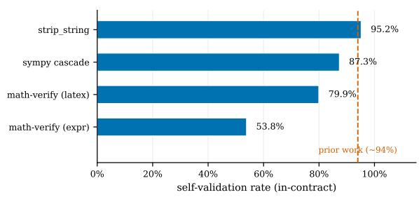
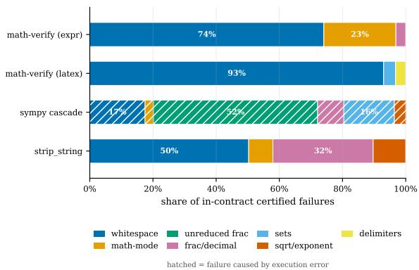
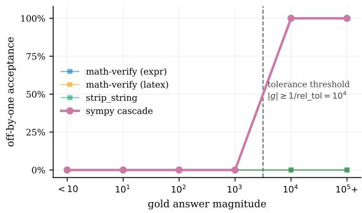

# Where the Verifier Fails: A Category-Level Audit of Reward Signals in RLVR

Esther Xin

Independent Researcher

estherxin0011@gmail.com

Code and data: https://github.com/ethxin0011/verifier-error-budget

## Abstract

Reinforcement learning with verifiable rewards (RLVR) and standard benchmark evaluation both rely on an automatic verifier that turns a free-text answer into a binary reward. Prior work reports that one evaluation harness accepts only about 94% of its own ground-truth answers, blaming LaTeX parsing. That is an aggregate: it does not say which answer forms consume the error budget.

We supply the decomposition. We apply metamorphic testing to the verifier rather than the model, generating certified-equivalent answer variants—rewrites that preserve mathematical meaning by construction, so any rejection is a provable false negative needing no human adjudication—and measure rejection per answer category across four widely used verifiers over 307,420 verdicts.

We find three things. (1) Self-validation ranges from 53.8% to 95.2% on identical inputs, a 41.3-point spread. The published figure describes one implementation, not the task; two configurations of the same library disagree on 49.9% of pairs. (2) The residual is not spread across parsing categories but concentrated in whitespace and punctuation, which account for 93.0% of in-contract failures for the default La-TeX configuration. A trailing period or newline dominates the budget. (3) Separating rejection from execution failure shows that verifiers with similar aggregate error fail for opposite reasons, and that a reference numeric cascade accepts off-by-one wrong answers as a step function of magnitude—0% below 104, 100% at or above— because its relative tolerance is scale-invariant.

## 1 Introduction

Reinforcement learning with verifiable rewards (RLVR) has become the dominant post-training recipe for mathematical reasoning. Its central appeal is that the reward requires no human annotation (Guo et al., 2025): a model emits an answer, an automatic verifier checks it against a reference, and the resulting binary signal drives policy optimisation. The same verifiers serve a second role, converting free-text model outputs into the accuracy figures reported on benchmarks such as MATH and GSM8K (Hendrycks et al., 2021; Cobbe et al., 2021).

This shifts a substantial burden onto a component that is rarely examined. The verifier is not a mathematical oracle; it is a program that extracts a substring, normalises it, and compares it to a reference under some notion of equivalence. Every step is a design decision, and every decision has a failure mode. If the verifier rejects a correct answer, the policy is penalised for behaviour it should be rewarded for. If it accepts an incorrect one, the policy is rewarded for being wrong.

Recent work has begun to treat this seriously. Cai et al. (2025) formalise verifier unreliability as a stochastic reward channel with asymmetric noise rates $\rho _ { 0 }$ (false positive) and $\rho _ { 1 }$ (false negative), and derive backward and forward corrections to the policy gradient; notably, the forward correction requires only the false-negative rate as input. Egashira et al. (2026) show that this framing is incomplete in an important way: verifier errors in practice are systematic rather than random, and systematic false positives can drive outcomes ranging from suboptimal plateaus to collapse, with the result determined by the pattern of errors rather than the aggregate rate. Huang et al. (2026) document that rule-based checkers and model-based judges fail in opposite directions, the former through brittle parsing and the latter through reward hacking.

Both threads point at the same missing quantity. Corrections need error rates as parameters; the systematic-error analysis needs the shape of the error, not merely its magnitude. Yet the reliability literature reports aggregates. The most concrete published figure is that a standard evaluation harness validates ground truth against itself at roughly

94% accuracy, with the residual attributed to La-TeX parsing failures (Hugging Face, 2025b). That number tells a practitioner that six percent of correct answers are lost somewhere. It does not say where.

This paper supplies the decomposition. We adapt metamorphic testing (Asgari et al., 2025; Hyun et al., 2024), a technique normally applied to models, and point it at the verifier instead. Given a gold answer g and a transformation T that preserves mathematical meaning by construction, the pair $( g , T ( g ) )$ has a known correct verdict. Any verifier rejecting it commits a false negative that is certified: no human adjudication, no trusted arbiter, no appeal to a stronger model. The dual construction, applying a meaning-changing transformation and observing acceptance, certifies false positives. Because ground truth comes from the construction rather than from labelling, the procedure scales combinatorially in golds × transforms × verifiers and runs entirely on CPU.

We apply this to four widely used implementations across 43 transformations in 14 strata, yielding 307,420 verdicts. A contract matrix records which strata each verifier claims to handle, so that a normalizer which never advertised answer extraction is not scored as defective for rejecting a boxed answer; out-of-contract behaviour is reported but never counted as a bug. We further separate rejection from execution failure, so that a verifier which crashes on an input cannot be credited with a correct verdict.

Findings. (1) Self-validation is implementation-specific, not a property of the task. Acceptance of certified-equivalent variants ranges from 53.8% to 95.2% across the four implementations on identical inputs, a spread of 41.3 points. Two configurations of the same library differ by 26 points and disagree on 49.9% of individual pairs. A benchmark accuracy figure is therefore a function of the verifier configuration, which is almost never reported.

(2) The residual is string hygiene, not grammar. Whitespace and punctuation handling accounts for 93.0% of in-contract failures for the default LaTeX configuration and 74.1% for the plain-expression configuration. A trailing period or a newline, which no reasonable specification treats as semantically meaningful, dominates the error budget. This reframes the problem: the prior attribution to LaTeX parsing suggests difficult grammar work, whereas the measured distribution points at normalisation that is largely trivial to fix.

(3) Similar aggregates hide opposite failure modes. Separating rejection from execution failure shows that sympy-cascade and strip-string have comparable aggregate residuals (12.7% and 4.8%) arising from disjoint causes: sympy-cascade returns a verdict on only 87.3% of inputs but is correct on every input it judges, whereas strip-string judges everything and errs by rejecting. Additionally, sympy-cascade accepts off-by-one adversarial answers as a deterministic step function of magnitude—0% below $1 0 ^ { 4 }$ 100% at or above—because its relative tolerance is scale-invariant. This is maximally systematic in the sense of Egashira et al. (2026) and invisible in any aggregate rate.

Contributions. (i) A certified metamorphic protocol for verifier auditing in which ground truth is constructed rather than adjudicated; (ii) a percategory decomposition across four implementations at 307,420 verdicts with Wilson intervals on every cell; (iii) a contract matrix separating implementation defects from specification ambiguity, and a coverage measure separating rejection from execution failure; (iv) identification of a scaledependent false-positive mechanism with an exact threshold; and (v) released transform suite, contract matrix, and per-sample verdict records.

## 2 Method

## 2.1 Certified equivalence

Let g be a gold answer and T a transformation. If T is semantics-preserving by construction, then $T ( g )$ is correct, and a verifier V returning $V ( g , T ( g ) ) =$ FALSE commits a certified false negative. Dually, for a meaning-changing transformation $T ^ { \prime }$ , acceptance is a certified false positive.

This design has three consequences: ground truth is free; the sample size is combinatorial in golds × transforms × verifiers; and the entire procedure is CPU-only.

## 2.2 Transform classes and the contract matrix

We use 43 transformations across 14 strata, partitioned into three classes. CERTIFIED-EQUIV transformations are mathematically identical and within the verifier’s declared contract; rejection is scored as a false negative. CONTRACT-DEP transformations depend on the declared contract (boxing, units, text wrappers) and are reported as specification ambiguity, never as defects. ADVERSAR-IAL transformations change meaning; acceptance is scored as a false positive.

Two design decisions matter. First, transformations producing empty output are discarded automatically. Second, a verifier is scored only on strata it claims to handle: a normalizer that never advertised answer extraction is not “wrong” to reject a boxed answer. Out-of-contract results appear in Table 7. The contract assignments are a judgement call and are published in the released code so that they can be contested.

## 2.3 Coverage: rejection versus execution failure

A verifier can fail in two distinct ways: it can return FALSE on a correct answer, or it can fail to return a verdict at all (parse exception, timeout, crash). Conflating these is a reporting error with real consequences—a verifier that crashes on every input in a stratum would otherwise be credited with a false-positive rate of 0.0%, which reads as “correctly rejected”. The same distinction between judgement accuracy and judgement availability has been argued for in security-scanner evaluation (Lan et al., 2026).

We therefore define the evaluated denominator

$$
n _ { \mathrm { e v a l } } = n _ { \mathrm { T R U E } } + n _ { \mathrm { F A L S E } } , ~ \mathrm { c o v e r a g e } = n _ { \mathrm { e v a l } } / n ,
$$

and report both the all-inputs rate (denominator n) and the evaluated rate (denominator $n _ { \mathrm { e v a l } } )$ . Cells with zero coverage report N/A, never 0. Overall in-contract coverage is 96.5%; the deficit is concentrated in a single implementation (§3).

## 2.4 Verifiers under test

We audit four implementations: math-verify (Hugging Face, 2025a) with LaTeX extraction (library default); math-verify restricted to plainexpression extraction; the DeepSeek-Math lineage string normalizer (Shao et al., 2024); and a reference three-level cascade (exact string, then numeric with relative tolerance $1 0 ^ { - 4 }$ , then symbolic via SymPy). The ANTLR4 runtime is pinned to 4.13.2; behaviour differs across runtimes.

## 2.5 Data

We use 4,990 unique gold answers drawn from GSM8K (Cobbe et al., 2021), MATH across all seven subjects (Hendrycks et al., 2021), Big-Math (Albalak et al., 2025), plus 2,000 synthetic answers in standard MATH answer forms. Synthesis was necessary because set and interval notation appears in only 0.1% of corpus answers, leaving those strata underpowered. Synthetic golds are tagged and reported separately; §3.5 confirms all findings hold on corpus-derived answers alone.

## 2.6 Execution

The audit runs as an Azure ML parallel pipeline on five CPU nodes. Each verification executes in an isolated subprocess with a five-second peritem budget matching the documented symboliccomparison timeout; crashes and timeouts are recorded as distinct verdict classes.

## 3 Results

<table><tr><td>Verifier</td><td>n</td><td>Self-val.</td><td>Cov.</td><td>Judged</td></tr><tr><td>strip-string</td><td>28,570</td><td>95.2%</td><td>100.0%</td><td>95.2%</td></tr><tr><td>sympy-cascade</td><td>31,266</td><td>87.3%</td><td>87.3%</td><td>100.0%</td></tr><tr><td>mv-latex</td><td>31,266</td><td>79.9%</td><td>100.0%</td><td>79.9%</td></tr><tr><td>mv-expr</td><td>22,953</td><td>53.8%</td><td>100.0%</td><td>53.8%</td></tr></table>

Table 1: Self-validation: acceptance of certifiedequivalent variants, in-contract strata only. Self-val. is over all inputs; Cov. is the fraction on which the verifier returned a verdict at all; Judged restricts to those. The 41.3-point spread on identical inputs shows the figure is implementation-specific. sympy-cascade is correct on every input it judges: its residual is entirely execution failure.

<table><tr><td>Verifier</td><td>Stratum</td><td>Fail</td><td>Share</td></tr><tr><td>mv-expr</td><td>S6 whitespace</td><td>7,852</td><td>74.1%</td></tr><tr><td>mv-expr</td><td>S5 math-mode</td><td>2,417</td><td>22.8%</td></tr><tr><td>mv-latex</td><td>S6 whitespace</td><td>5,846</td><td>93.0%</td></tr><tr><td>mv-latex</td><td>S10 sets</td><td>238</td><td>3.8%</td></tr><tr><td>strip-string</td><td>S6 whitespace</td><td>694</td><td>50.3%</td></tr><tr><td>strip-string</td><td>S2 frac/dec</td><td>438</td><td>31.7%</td></tr><tr><td>sympy-cascade</td><td>S14 unreduced</td><td>2,062</td><td>52.0%</td></tr><tr><td>sympy-cascade</td><td>S6 whitespace</td><td>694</td><td>17.5%</td></tr></table>

Table 2: Error mass share: fraction of each verifier’s in-contract failures attributable to each stratum, top two strata per verifier. Whitespace and punctuation dominate both math-verify configurations. Every failure in the sympy-cascade rows is a parse exception rather than a rejected answer; the full breakdown is in the released T2\_error\_mass\_share.csv.

## 3.1 Self-validation varies by 41 points

Table 1 reports self-validation: the fraction of certified-equivalent variants a verifier accepts. The range is 53.8% to 95.2% on identical inputs. The published ∼94% figure (Hugging Face, 2025b) falls near the top of this range rather than at its centre, indicating that it characterises one particular harness on one particular input distribution rather than the task. Figure 1 plots the spread.

<table><tr><td>Stratum</td><td>Verif.</td><td>n FN</td><td>95% CI</td></tr><tr><td>S6 white S5 math</td><td>mv-expr mv-expr</td><td>15,704 50.0% 4,951 48.8%</td><td>[49.2, 50.8] [47.4, 50.2]</td></tr><tr><td>S10 sets S6 white</td><td>mv-latex mv-latex</td><td>634 37.5% 15,704 37.2%</td><td>[33.9, 41.4] [36.5, 38.0]</td></tr><tr><td>S7 sqrt</td><td> $\mathsf { s t r i p - s t r i n g }$ </td><td>404 35.1%</td><td>[30.7, 39.9]</td></tr><tr><td>S2 frac S2 frac</td><td>strip-string</td><td>1,725 25.4% 1,725 19.1%</td><td>[23.4, 27.5]</td></tr><tr><td>S4 delim</td><td> $\mathsf { m v { \mathrm { - } e x p r } }$  mv-latex</td><td>1,067 18.7%</td><td>[17.3, 21.0] [16.5, 21.2]</td></tr><tr><td>S6 white</td><td> $\mathsf { s t r i p - s t r i n g }$ </td><td>4.4%</td><td>[4.1, 4.8]</td></tr><tr><td>S5 math</td><td></td><td>15,704</td><td></td></tr><tr><td>S7 sqrt</td><td> $\mathsf { s t r i p - s t r i n g }$ </td><td>4,951 2.1% 0.2%</td><td>[1.8, 2.6]</td></tr><tr><td>S14 unred</td><td> $\mathtt { m v - l a t e x }$ </td><td>404 0.0%</td><td>[0.0, 1.4]</td></tr><tr><td>S1 frac d.</td><td> $\mathtt { m v - l a t e x }$ </td><td>2,062</td><td>[0.0, 0.2]</td></tr><tr><td></td><td></td><td></td><td></td></tr><tr><td>S9 group</td><td> $\mathtt { m v - l a t e x }$ </td><td>4,146</td><td>0.0% [0.0, 0.1]</td></tr><tr><td></td><td>all</td><td>573</td><td>0.0% [0.0, 0.7]</td></tr><tr><td></td><td></td><td></td><td></td></tr><tr><td>zero coverage (no verdict returned)</td><td></td><td></td><td></td></tr><tr><td>S10 sets</td><td>sympy-cascade</td><td>634</td><td>n/a n/a</td></tr><tr><td></td><td></td><td></td><td></td></tr><tr><td>S14 unred</td><td> $\mathtt { s y m p y - c a s c a d e }$ </td><td> $2 { , } 0 6 2$ </td><td>n/a n/a</td></tr></table>

Table 3: Certified false-negative rates by stratum and verifier, in-contract only, with Wilson score intervals. Rates are computed over verdicts actually returned; cells where the verifier never returned a verdict report N/A rather than 0. Strata with zero failures are retained to show which cases are handled correctly.

<table><tr><td>Mag.</td><td>n V1 V2 V3 V4</td></tr><tr><td> $< 1 0$  20 0.0</td><td>0.0 0.0 0.0</td></tr><tr><td> $1 0 ^ { 1 }$  134</td><td>0.0 0.0 0.0 0.0</td></tr><tr><td> $1 0 ^ { 2 }$ </td><td>560 0.0 0.0 0.0 0.0</td></tr><tr><td> $1 0 ^ { 3 }$ </td><td>367 0.0 0.0 0.0 0.0</td></tr><tr><td> $1 0 ^ { 4 }$ </td><td>131 0.0 0.0 0.0 100.0</td></tr><tr><td> $> 1 0 ^ { 5 }$ </td><td>75 0.0 0.0 0.0 100.0</td></tr></table>

Table 4: Off-by-one acceptance rate (%) by gold answer magnitude, over verdicts actually returned. V1 = mv-expr, $\mathsf { V } 2 = \mathsf { m } \mathsf { v } - \mathsf { l a t e x } .$ $\mathsf { V } 3 = \mathsf { s t r i p } \mathsf { - s t r i n g } .$ V4 = sympy-cascade. V4 steps deterministically at $1 0 ^ { 4 } \colon$ a relative tolerance of $1 0 ^ { - 4 }$ is scale-invariant, so 10,001 differs from 10,000 by 0.01% and is accepted. Aggregate rate 16.0% (95% CI [14.1, 18.1], n = 1,287).

The coverage column separates two failure modes that the aggregate hides. sympy-cascade returns a verdict on 87.3% of inputs and is correct on 100% of those it judges: its entire residual is parse failure, not equivalence error. The two math-verify configurations return verdicts on 100% of inputs and err by rejecting. These are different defects requiring different fixes, and an aggregate rate conflates them.

  
Figure 1: Self-validation rate by implementation, incontract strata. The dashed line marks the ∼94% figure reported in prior work (Hugging Face, 2025b).

## 3.2 Whitespace dominates the error budget

Table 2 and Figure 2 decompose in-contract failures by stratum. For mv-latex, whitespace and punctuation account for 93.0% of all failures; for mv-expr, 74.1%. The remaining mass is spread thinly across sets, delimiters, and fraction handling.

Table 3 gives per-stratum rates with Wilson intervals. The whitespace stratum is measured at n = 15,704 with intervals of ±0.8 points, so the effect is not a small-sample artefact. Table 8 shows representative pairs: an expression is accepted, and the same expression followed by a period is rejected.

## 3.3 A scale-dependent false-positive mechanism

Table 4 and Figure 3 report acceptance of off-byone adversarial answers by gold magnitude. Three verifiers reject all of them at every magnitude. sympy-cascade rejects all of them below $1 0 ^ { 4 }$ and accepts all of them at or above $1 0 ^ { 4 }$ . The mechanism is that a relative tolerance of 10−4 is scaleinvariant: for a gold answer of 10,000, the value

  
Figure 2: Error budget: share of in-contract certified failures by stratum. Hatched segments indicate failures caused by execution error rather than rejection.

10,001 differs by 0.01% and is accepted. The aggregate off-by-one false-positive rate for this verifier is 16.0% (95% CI [14.1, 18.1], n = 1,287), but the aggregate conceals a threshold.

  
Figure 3: Off-by-one acceptance by gold answer magnitude. The reference cascade steps deterministically at $1 0 ^ { 4 } ;$ ; the other three verifiers reject all off-by-one variants at every magnitude.

## 3.4 Reported accuracy is not comparable across papers

Table 6 shows acceptance on contract-dependent input classes. Acceptance on boxed answers ranges from 0.0% to 75.1%; on scientific notation, from 0.0% to 100.0%. These are not defects—each implementation behaves as designed—but the differences are undocumented.

Table 5 quantifies the consequence. Two configurations of the same library disagree on 49.9% of certified-equivalent pairs; panel (b) of the same table gives the pair counts supporting each cell.

## 3.5 Robustness: corpus-only

Excluding all synthetic golds, self-validation is 57.5% (mv-expr), 84.1% (mv-latex), 87.8%

(strip-string), and 88.3% (sympy-cascade). Ordering and magnitude are preserved; synthesis is not driving the results.

## 4 Discussion

The residual is string hygiene, not grammar. Prior attribution—“LaTeX parsing failures”— implies difficult grammar work. The decomposition shows otherwise: 93.0% of one verifier’s in-contract failures are whitespace and punctuation. This is more actionable and more surprising than the aggregate suggests.

Verifier configuration must be reported. Acceptance on identical inputs ranges 0%–100% by configuration, and two configurations of one library disagree on 49.9% of cases. A reported benchmark accuracy is therefore a function of the verifier configuration, which is almost never stated. We recommend reporting verifier identity, version, extraction configuration, and runtime.

Coverage is a first-class metric. §2.3 is not merely a reporting nicety. Two verifiers with similar aggregate residuals—sympy-cascade at 12.7% and strip-string at 4.8%—fail for opposite reasons, and only the coverage split reveals it. We recommend that verifier evaluations report coverage alongside accuracy.

Scale-dependent false positives. Table 4 shows a threshold rather than a rate. Egashira et al. (2026) distinguish systematic from random verifier error and show that systematic false positives can produce plateaus or collapse, with outcomes determined by the error pattern rather than the overall rate. A magnitude threshold is maximally systematic and invisible in any aggregate figure.

Relation to reported false-negative rates. Reported false-negative rates near 38% (Cai et al., 2025) are measured on real model outputs, which include mathematical non-equivalences such as unreduced fractions. Our measurement isolates the formatting and equivalence component under certified transformations and is therefore a lower bound on that quantity. The two are complementary.

## 5 Limitations

Verifier-level, not model-level. We do not estimate the effect on any model’s benchmark score; real outputs do not produce transform variants at equal rates. No training runs. We do not measure downstream RLVR effect; Zhang (2026) examine hardened versus leaky rewards in code RLVR and find bounded effects. Open implementations only. No claims about closed frontier systems. Synthetic component. 2,000 of 4,990 golds are synthetic; §3.5 reports corpus-only results separately. Contract assignment is a judgement. We publish the matrix so it can be contested.

## 6 Related Work

Verifier noise in RLVR. Cai et al. (2025) model the verifier as a stochastic reward channel with asymmetric noise rates and derive corrections requiring the false-negative rate as input. Their motivating example, a checker marking 1236 wrong against a canonical 13 , is one of our strata. Their method assumes the rates; we measure and decompose them. Egashira et al. (2026) distinguish systematic from random verifier error and show outcomes are determined by the error pattern; our per-stratum decomposition characterises that pattern, and the magnitude threshold in §3 is a maximally systematic instance. Huang et al. (2026) compare rule-based and model-based verifiers and find opposing failure directions; we extend the falsenegative side with a category-level decomposition and add certified adversarial probes.

Verifier and benchmark auditing. Ammanamanchi et al. (2026) audit five Lean theoremproving benchmarks with corpus-scale static checkers, surfacing 4,833 findings and proposing a fault taxonomy with released tooling. We adopt the same posture for natural-language answer verification. In code RLVR, Zhang (2026) run a preregistered causal contrast between leaky and hardened reward suites, and Rajan (2026) measure that 28.5% of SWE-bench Verified tasks accept Docker-verified incorrect patches. Outside RLVR, Lan et al. (2026) make a structurally similar argument for security scanners: conventional metrics characterise only cases where a tool yields a usable judgement, so coverage must be reported separately from accuracy.

Metamorphic testing. Semantics-preserving transformation as a robustness probe has an established lineage (Asgari et al., 2025; Hyun et al., 2024; Zhou et al., 2026). All of this work perturbs the input to test the model. We invert the target: the transformation is applied to the answer string, and the system under test is the grader.

Evaluation brittleness. Su et al. (2025) show that changing the single character separating incontext examples moves MMLU accuracy by up to ±23%. Hua et al. (2025) argue much reported prompt sensitivity is an artefact of heuristic scoring. Our results are the verifier-side counterpart to both. Miller (2024) argues for statistical rigour in evaluation reporting; we attach Wilson intervals to every cell.

## 7 Conclusion

Verifier reliability is a measurable property that varies by 41 points across widely used implementations, is dominated by whitespace handling rather than mathematical parsing, and includes at least one deterministic false-positive mechanism triggered by answer magnitude. Separating rejection from execution failure shows that implementations with similar aggregate residuals fail for opposite reasons. The transform suite, contract matrix, and per-sample verdict records are released with this paper.

## References

Alon Albalak, Duy Phung, Nathan Lile, Rafael Rafailov, Kanishk Gandhi, Louis Castricato, Anikait Singh, Chase Blagden, Violet Xiang, Dakota Mahan, and Nick Haber. 2025. Big-math: A large-scale, highquality math dataset for reinforcement learning in language models. arXiv preprint arXiv:2502.17387.

Pawan Sasanka Ammanamanchi, Siddharth Bhat, and Stella Biderman. 2026. Faults in our formal benchmarking: Dataset defects and evaluation failures in Lean theorem proving. arXiv preprint arXiv:2606.29493.

Ali Asgari, Milan de Koning, Pouria Derakhshanfar, and Annibale Panichella. 2025. Metamorphic testing of deep code models: A systematic literature review. Journal ofthe ACM. ArXiv:2507.22610.

Xin-Qiang Cai, Wei Wang, Feng Liu, Tongliang Liu, Gang Niu, and Masashi Sugiyama. 2025. Reinforcement learning with verifiable yet noisy rewards under imperfect verifiers. arXiv preprint arXiv:2510.00915.

Karl Cobbe, Vineet Kosaraju, Mohammad Bavarian, Mark Chen, Heewoo Jun, Lukasz Kaiser, Matthias Plappert, Jerry Tworek, Jacob Hilton, Reiichiro Nakano, Christopher Hesse, and John Schulman. 2021. Training verifiers to solve math word problems. arXiv preprint arXiv:2110.14168.

Kazuki Egashira, Mark Vero, Jasper Dekoninck, Florian E. Dorner, Robin Staab, and Martin Vechev. 2026. Delay, plateau, or collapse: Evaluating the

impact of systematic verification error on RLVR. In Conference on Language Modeling (COLM). ArXiv:2605.02909.

Daya Guo, Dejian Yang, Haowei Zhang, et al. 2025. DeepSeek-R1: Incentivizing reasoning capability in LLMs via reinforcement learning. arXiv preprint arXiv:2501.12948.

Dan Hendrycks, Collin Burns, Saurav Kadavath, Akul Arora, Steven Basart, Eric Tang, Dawn Song, and Jacob Steinhardt. 2021. Measuring mathematical problem solving with the MATH dataset. In NeurIPS Datasets and Benchmarks Track.

Andong Hua, Kenan Tang, Chenhe Gu, Jindong Gu, Eric Wong, and Yao Qin. 2025. Flaw or artifact? rethinking prompt sensitivity in evaluating LLMs. In Proceedings ofEMNLP. ArXiv:2509.01790.

Yuzhen Huang, Weihao Zeng, Xingshan Zeng, Qi Zhu, and Junxian He. 2026. From accuracy to robustness: A study of rule- and model-based verifiers in mathematical reasoning. In Proceedings ofthe 2026 Con ference on Empirical Methods in Natural Language Processing (EMNLP). ArXiv:2505.22203.

Hugging Face. 2025a. Math-Verify: A robust mathematical expression evaluation system. https:// github.com/huggingface/Math-Verify. Version 0.9.0, ANTLR4 runtime 4.13.2.

Hugging Face. 2025b. Troubleshooting math parsing. https : / / github . com / huggingface / evaluation-guidebook. Reports approximately 94% self-validation of ground truth under SymPy parsing.

Sangwon Hyun, Mingyu Guo, and M. Ali Babar. 2024. METAL: Metamorphic testing framework for analyzing large-language model qualities. In IEEE International Conference on Software Testing, Verification and Validation (ICST). ArXiv:2312.06056.

Qianlong Lan, Vinothini Pandurangan, Anuj Kaul, and Indranil Sanyal. 2026. Beyond F1: Evaluating coverage and failure recovery in AI model security scanners. arXiv preprint arXiv:2608.27424.

Evan Miller. 2024. Adding error bars to evals: A statistical approach to language model evaluations. arXiv preprint arXiv:2411.00640.

Shreshth Rajan. 2026. Auditing reward hackability in code RL training environments. arXiv preprint arXiv:2606.16062.

Zhihong Shao, Peiyi Wang, Qihao Zhu, Runxin Xu, Junxiao Song, Xiao Bi, Haowei Zhang, Mingchuan Zhang, Y. K. Li, Y. Wu, and Daya Guo. 2024. DeepSeekMath: Pushing the limits of mathematical reasoning in open language models. arXiv preprint arXiv:2402.03300.

Jingtong Su, Jianyu Zhang, Karen Ullrich, Léon Bottou, and Mark Ibrahim. 2025. A single character can make or break your LLM evals. arXiv preprint arXiv:2510.05152.

Chuyifei Zhang. 2026. When the reward suite is leaky: A preregistered causal contrast of natural verifier false positives in RLVR. arXiv preprint arXiv:2607.11022.

Zenghui Zhou, Man Li, Xiaoke Fang, Xinyi Zhou, Weibin Lin, and Zheng Zheng. 2026. LGMT: Logic-grounded metamorphic testing for evaluating the reasoning reliability of LLMs. arXiv preprint arXiv:2605.23965.

## A Supplementary Tables

Tables 5–8 give the cross-verifier disagreement matrix with its pair support, acceptance on contractdependent input classes, out-of-contract behaviour, and representative certified-equivalent pairs that production verifiers reject. Throughout, V1 = mv-expr, V2 = mv-latex, V3 = strip-string, and V4 = sympy-cascade.

<table><tr><td colspan="3">(a) Disagreement rate (%)</td></tr><tr><td>V1 V1 V2 49.9 V3 48.0</td><td>V2 49.9 31.4</td><td>V3 V4 48.0 53.4 31.4 22.0</td></tr><tr><td>V4 53.4 22.0</td><td>0.4</td><td>0.4</td></tr><tr><td colspan="3">(b) Pairs judged by both</td></tr><tr><td>V1 V2 31,266</td><td>V3</td><td>V4</td></tr><tr><td>V1 31,266</td><td>31,266 31,266</td><td>27,299</td></tr><tr><td>V2 31,266</td><td>31,266</td><td>27,299</td></tr><tr><td>V3 31,266</td><td>31,266 31,266</td><td>27,299</td></tr><tr><td>V4 27,299</td><td>27,299 27,299</td><td>27,299</td></tr></table>

Table 5: Pairwise disagreement on certified-equivalent pairs, computed only over pairs where both verifiers returned a verdict. V1 = mv-expr, V2 = mv-latex, V3 = strip-string, V4 = sympy-cascade. Two configurations of the same library (V1, V2) disagree on 49.9% of cases. Support is lower for pairs involving V4 because it does not return a verdict on every input.

<table><tr><td>Input class</td><td>n</td><td>V1</td><td>V2</td><td>V3</td></tr><tr><td>boxed</td><td>19,952</td><td>8.0</td><td>75.1</td><td>0.0</td></tr><tr><td>scientific</td><td>326</td><td>0.0</td><td>100.0</td><td>0.0</td></tr><tr><td>with unit</td><td>2,782</td><td>50.0</td><td>100.0</td><td>100.0</td></tr><tr><td>text prefix</td><td>9,980</td><td>28.2</td><td>39.6</td><td>48.9</td></tr><tr><td>percent</td><td>20</td><td>0.0</td><td>100.0</td><td>0.0</td></tr></table>

Table 6: Acceptance rate (%) on contract-dependent input classes, over verdicts actually returned. V1 = mv-expr, V2 = mv-latex, V3 = strip-string. Classes are a boxed answer, scientific notation, a trailing unit, the prefix “The answer is”, and a percent sign. Acceptance spans 0–100% on identical inputs: these are undocumented contract differences, not defects. sympy-cascade is omitted because it returns no verdict on boxed or scientific inputs.

<table><tr><td>Stratum</td><td>Verifier</td><td>n</td><td>Rejection</td></tr><tr><td>S10 sets</td><td>strip-string</td><td>634</td><td>100.0%</td></tr><tr><td>S14 unred</td><td>mv-expr</td><td>2,062</td><td>100.0%</td></tr><tr><td>S14 unred</td><td>strip-string</td><td>2,062</td><td>100.0%</td></tr><tr><td>S10 sets</td><td>mv-expr</td><td>634</td><td>97.5%</td></tr><tr><td>S1 frac d.</td><td>mv-expr</td><td>4,146</td><td>93.8%</td></tr><tr><td>S4 delim</td><td>mv-expr</td><td>1,067</td><td>87.1%</td></tr><tr><td>S7 sqrt</td><td>mv-expr</td><td>404</td><td>31.4%</td></tr></table>

Table 7: Out-of-contract behaviour: strata a verifier does not claim to handle. Reported for completeness; not counted as defects.

<table><tr><td>Gold</td><td>Variant</td><td>Rejected by</td></tr><tr><td>\frac{1}{2}</td><td>\frac{1}{2}.</td><td>V2, V1</td></tr><tr><td>\frac{1}{2}</td><td>\frac{1}{2}\n</td><td>V2, V1</td></tr><tr><td>\frac{1}{2}</td><td>\dfrac{1}{2}</td><td>V1</td></tr><tr><td>(a+5)(b+2)</td><td>\left(a+5\right)</td><td>V1</td></tr><tr><td>3\pm\sqrt{2}</td><td> $3 \backslash , \backslash { \mathsf { p m } } \backslash , \backslash s { \mathsf { q r t } } \{ 2 \}$ </td><td>V3</td></tr></table>

Table 8: Certified-equivalent pairs rejected by production verifiers. V1 = mv-expr, $\mathsf { V } 2 = \mathsf { m } \mathsf { v } - \mathsf { l a t e } \mathsf { x } ,$ , V3 = strip-string. A trailing period changes the verdict. The fourth variant is truncated for width; the full form is \left(a+5\right)\left(b+2\right).