# iPINN for Broadband CARS Phase Retrieval: A Framework for Function Approximation and Inverse Modeling Problems in Nonlinear Spectroscopy

Ravi Teja Vulchi1,2, Carl Messerschmidt2, Mohammadsadegh Vafaeinezhad1,2, Rajendhar Junjuri1, Tobias Meyer-Zedler2, Juergen Popp1,2, and Thomas Bocklitz\*1,2

1Institute of Physical Chemistry (IPC) and Abbe Center of Photonics (ACP), Friedrich Schiller University Jena, Member of the Leibniz Centre for Photonics in Infection Research (LPI), Helmholtzweg 4, 07743 Jena, Germany 2Leibniz Institute of Photonic Technology, Member of Leibniz Health Technologies, Member of the Leibniz Centre for Photonics in Infection Research (LPI), Albert-Einstein-Strasse 9, 07745 Jena, Germany

\*Email: thomas.bocklitz@uni-jena.de

## Abstract

Phase retrieval in broadband coherent anti-Stokes Raman spectroscopy (BCARS) is an ill-posed inverse problem. The Raman-like signal is encoded in the imaginary part of the resonant susceptibility, which mixes coherently with a non-resonant background (NRB) that varies across acquisitions. We introduce an inverse physics-informed neural network (iPINN) that predicts Lorentzian peak parameters from raw BCARS spectra and reconstructs the resonant susceptibility through a diferentiable analytical forward model. A transformer encoder assigns spectral features to 24 learnable peak slots, and a multiview consistency loss enforces invariance across NRB pattern, NRB strength, and noise. Unlike direct spectral regression approaches, the method retains accuracy under varying acquisition conditions. On a public benchmark, iPINN achieves the lowest error among the tested baselines (MAE 0.016 vs. next-best 0.046). On 28 zero-shot test spectra acquired across seven solvents and four focal positions, accuracy is depth-invariant in five of seven solvents. These results show that inverse parametric prediction with a diferentiable physical decoder supports robust phase retrieval across measurement conditions.

## Keywords

Semi-supervised learning, Physics AI, Inverse modeling, Artifact correction, BCARS spectroscopy

## Problem Statement and Motivation

Inverse problems that recover a sparse set of latent parameters from indirect measurements are ubiquitous in the physical sciences and are inherently ill-posed; as such, priors and regularization are essential for stable inference [1, 2]. The same dificulty arises throughout spectroscopy and related photonic measurement systems in artifact removal tasks, where the recorded signal is distorted by background interference or instrumental noise that obscures the underlying physical response [2, 3].

Broadband coherent anti-Stokes Raman spectroscopy (BCARS) is a representative example of this challenge. Although BCARS enables chemically specific measurements, the recorded spectrum is distorted by interference between the resonant signal and the non-resonant background (NRB), producing asymmetric line shapes that are not directly interpretable. The chemically meaningful Raman-like information is encoded in the complex susceptibility, particularly in the imaginary resonant component, which follows a Lorentzian spectral shape. However, this phase information is not measured directly and must instead be inferred from intensity-only observations [4].

A useful phase-retrieval method must therefore remain stable across substantial measurement variability. NRB shape, NRB strength relative to the resonant signal, instrumental broadening, and signal-to-noise level all change between focal positions, samples, and acquisition setups, whereas the underlying molecular structure is governed by a small, low-dimensional set of peak parameters. The chemistry of interest is invariant; the artifacts that afect it are not. The method must therefore separate this invariant molecular content from acquisition-dependent distortions rather than fit any single representative measurement condition.

## The Challenge of Inverse Modeling in CARS

Because phase and susceptibility components are not directly observable, classical BCARS workflows rely either on experimental NRB-suppression strategies or on numerical phase-retrieval methods such as Kramers– Kronig (KK) and maximum entropy methods (MEM) [5, 6]. Both methods typically require reference NRB spectra, or equivalent normalization standards, together with non-trivial parameter choices, and their performance degrades on spectra with finite spectral support, non-ideal spectral features, or substantial measurement noise [4, 5, 7]. KK retrieval in particular is theoretically defined over an infinite frequency range, so the truncation imposed by an experimental window introduces phase artifacts that often require additional preprocessing [5].

Deep learning (DL) alternatives, including convolutional neural networks (CNNs), recurrent neural networks (RNNs), and physics-informed approaches, have been proposed to bypass these limitations [8–12]. However, recent reviews of CARS phase retrieval indicate that current DL pipelines inherit two persistent weaknesses [4, 10]. First, they remain sensitive to the choice of synthetic training distribution and exhibit larger errors near spectral edges and for weak features. Second, validation is most often performed on a narrow set of acquisition conditions, so reported accuracy does not directly indicate cross-instrument generalizability. Public real-experimental benchmarks typically contain only a handful of solvent spectra acquired under fixed acquisition settings [10, 11]. Physics-informed networks have been applied to this problem in two recent forms [11, 12]. RamPINN enforces KK consistency through a diferentiable Hilbert-transform loss and regularizes the non-resonant background with a smoothness prior, using a dual-branch decoder that separates the two contributions, and it reports low errors on synthetic data and on six public solvent spectra [12]. Its output is a gridded spectrum rather than a set of physical parameters; peak positions and intensities are obtained from it by detection, and linewidths require a separate fit. Its training noise is a single additive term rather than a signal-to-noise range, and its wavenumber grid is held fixed across training and inference; the resulting fixed spectral resolution is noted in that work as a limitation, with resolution agnostic operators proposed as future work [12]. These considerations motivate inverse models that predict physically meaningful parameters directly and remain stable across acquisition conditions.

## The Inverse PINN Framework (iPINN)

Our goal is to recover a compact, physically meaningful set of peaks from BCARS measurements rather than estimate an unconstrained spectrum on a fixed grid. We describe this compact description as the latent peak parameterization: a finite set $\boldsymbol { \theta } = \{ A _ { k } , \omega _ { k } , \Gamma _ { k } \} _ { k = 1 } ^ { \bar { K } }$ of amplitudes, wavenumber centers, and linewidths that fully specifies the resonant susceptibility under a sum of Lorentzian models. This difers from the original PINN setting, in which neural networks approximate continuous solution fields and, in inverse variants, a small number of coeficients of governing equations [13]. In BCARS, the latent structure is instead naturally discrete and parametric: a small number of resonances are embedded in a measurement that the NRB dominates.

We therefore adopt an inverse-first formulation: instead of mapping spectrum to spectrum, the network maps a measured BCARS spectrum directly to θ, and a diferentiable physics layer reconstructs the resonant signal from θ through the analytical Lorentzian model (Fig. 1A). This places the Lorentzian shape constraint inside the architecture rather than in the loss alone, so features outside the predicted peak set are suppressed by construction. The inverse model is implemented with transformer layers because self-attention integrates information across the full BCARS wavenumber axis [14]. This is important for BCARS because the spectra contain three very diferent regimes in practice: weak but information-rich fingerprint bands below $1 8 0 0 ~ \mathrm { { c m } ^ { - 1 } }$ , the largely feature-sparse silent region from about 1800 to $2 8 0 0 ~ \mathrm { { c m } ^ { - 1 } }$ , and the typically stronger C–H stretch region between 2800 and $3 1 0 0 ~ \mathrm { { c m } ^ { - 1 } }$ . Global context allows the model to stabilize local resonance estimates across regions and addresses generalization issues reported for CNN-based and shallow recurrent baselines, which can struggle with long-range dependencies and edge behavior on narrow synthetic training sets.

To keep the inverse problem well-grounded during training, supervision is introduced at the level of θ whenever reference information is available. Peak-center priors are anchored to tabulated Raman shift values from established reference standards, including ASTM E1840 and the NIST Chemistry WebBook for common solvents [15–18]. This gives the model physically grounded peak targets rather than synthetic labels with no chemical interpretation. Robustness is then improved through two additional constraints: a physicsconsistency objective implemented through the diferentiable forward simulator, which regularizes θ so that the predicted peak set reproduces the observed spectrum through the forward map; and a self-supervised consistency objective, which encourages the same θ to be recovered from multiple corrupted views of the same molecular sample (Fig. 1B). To prevent the consistency loss from collapsing onto a single assumed background morphology, the corrupted views are drawn from three NRB functional families(Gaussian, sigmoidal, and polynomial) combined with broad ranges of NRB strength and signal-to-noise. This forces the inverse map to be invariant to the NRB family rather than to a single parametric form, reducing dependence on any single NRB assumption at training time.

## Datasets and Methods

## Procedural Data Generation Pipeline

To train the inverse model across a wide range of measurement conditions, synthetic BCARS spectra were generated on the fly rather than drawn from a fixed precomputed dataset. This choice reflects the asymmetry of the inverse problem: experimental nuisance factors such as NRB shape, NRB strength, instrumental broadening, and noise can vary substantially, whereas the underlying molecular structure is governed by a lower-dimensional set of physically meaningful peak parameters. The full procedural pipeline is summarized in Fig. 2.

Each synthetic sample was generated in a fixed sequence. First, a solvent-specific latent peak template was selected, defined by a set of nominal Raman bands. Peak positions, amplitudes, and linewidths were taken from the tabulated reference assignments for that solvent and held fixed across samples. This parameterization tied the latent variables to measured molecular signatures rather than to synthetic values, so that any variation between generated spectra originated in the measurement model rather than in the underlying chemistry.

The resonant susceptibility was then constructed as a sum of complex Lorentzian modes evaluated on the experimental wavenumber axis. A complex-valued formulation is necessary because, in CARS, the resonant and non-resonant fields interfere coherently and produce asymmetric line shapes in the measured spectrum.

$$
\chi _ { \mathrm { R e s } } ^ { ( 3 ) } ( \omega ) = \sum _ { j = 1 } ^ { N } \frac { A _ { j } } { \omega _ { 0 , j } ^ { 2 } - \omega ^ { 2 } - i \Gamma _ { j } \omega }\tag{1}
$$

where each mode is parameterized by its amplitude $A _ { j }$ , wavenumber center $\omega _ { 0 , j } ,$ and linewidth $\Gamma _ { j }$

To prevent the network from overfitting to a single assumed background morphology, the NRB was sampled from three functional families, as illustrated in Fig. 2B. A Gaussian NRB was included to represent smooth, low-curvature envelope distortions, which are consistent with the broad system-response and smoothly varying background structures commonly encountered in BCARS modelling [19]. A sigmoidal family was included to represent monotonic or asymmetric roll-of across the spectral window; this choice is also consistent with prior studies in which the NRB was parameterized using one or two sigmoid functions [8].

A polynomial NRB of order 4–5 was included because polynomial baseline models are widely used in Raman preprocessing, and fourth-order polynomial NRB models have also been shown to improve synthetic CARS training performance relative to sigmoid-only parameterizations [8]. At each training iteration, one

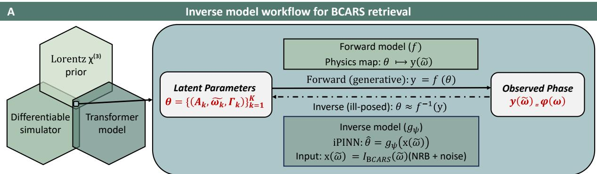  
Self-supervised consistency learning with augmentation anchoring

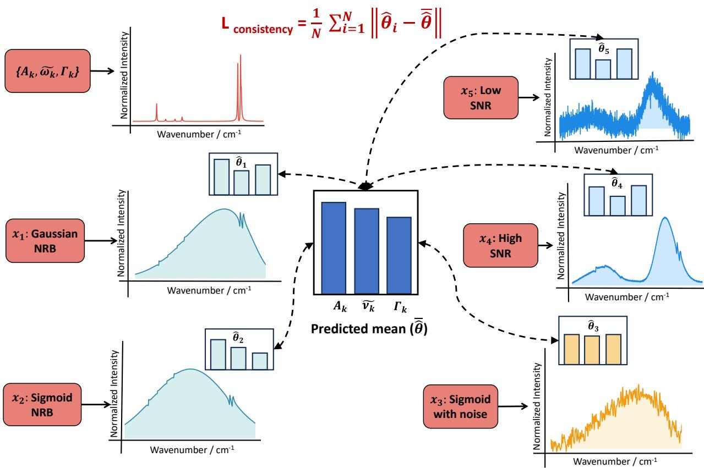  
Figure 1: Inverse modeling workflow for BCARS phase retrieval. (A) A latent peak parameterization $\theta = \{ A _ { k } , \omega _ { k } , \Gamma _ { k } \} _ { k = 1 } ^ { K }$ of amplitudes $\left( A _ { k } \right)$ , wavenumber centers $\left( \omega _ { k } \right)$ , and linewidths $\left( \Gamma _ { k } \right)$ defines the parametric prior $\chi _ { \mathrm { p r i o r } } ^ { ( 3 ) } .$ The diferentiable forward simulator implements the physics model $f ,$ mapping $\theta$ to the observable phase spectrum $y ( \omega ) = f ( \theta )$ . The inverse problem is ill-posed, $\theta \approx f ^ { - 1 } ( y ) ;$ we approximate it with a transformer-based inverse model $g _ { \psi }$ that predicts $\theta = g _ { \psi } ( x ( \omega ) )$ from measured BCARS spectra $x ( \omega ) = I _ { \mathrm { B C A R S } } ( \omega )$ , which include NRB and noise. (B) Starting from a single latent peak set $\theta ,$ multiple augmented BCARS variations are generated by varying NRB shape, NRB strength, and noise level. Each variation is passed through the inverse model to produce a prediction $\theta _ { i } .$ , and a consistency loss penalizes dis agreement among the $\theta _ { i } ,$ encouraging the network to recover invariant physical parameters despite stochastic background and noise variation.

NRB family was selected, its family-specific parameters were drawn from broad uniform priors, and the resulting background was scaled relative to the resonant signal before noise was added. This procedure exposed the model to symmetric and higher-order smooth background distortions, thereby reducing dependence on any single NRB assumption and improving robustness to unseen experimental conditions. Representative examples of these NRB shapes at increasing NRB strengths are shown in Fig. 2B.

After NRB synthesis, signal-dependent Gaussian noise was added to the simulated spectrum. The noise was modelled as heteroscedastic, with a standard deviation scaling with the local signal intensity, combined with a spectrally correlated component and an optional slow baseline drift. This reproduces the intensitydependent behaviour of detector-limited measurements, in which photon statistics scale with signal while electronic readout noise contributes an approximately constant floor [20]. The overall signal-to-noise ratio was sampled uniformly from 2 to 60 dB to cover both low-light acquisitions and higher-quality averaged measurements. Representative examples of the resulting degradation are shown in Fig. 2C. This step prevents the network from learning unrealistically clean spectra and forces it to recover stable latent parameters under heterogeneous noise conditions.

For a given solvent, the latent molecular structure was held fixed at the level of the mode count and the nominal peak-center priors. In contrast, noise factors were resampled for every generation. Specifically, each spectrum received a newly sampled NRB profile, an NRB-to-signal ratio drawn log-uniformly from 1 to 10, and noise spanning 2–60 dB. By keeping the solvent-defining structure fixed while randomizing measurement-specific distortions, the training pipeline encouraged the model to separate invariant molecular information from acquisition-dependent artifacts, as illustrated in Fig. 2A–C.

This generator was designed to maximize distributional diversity during training. Because spectra were synthesized on the fly rather than read from a static dataset, each epoch exposed the model to new combinations of NRB shape, NRB strength, noise level, and spectral coverage; in approximately 30% of samples a randomly placed coverage crop removed the bands falling outside the retained window, so that the number of active peaks also varied between samples. The same generator also supplies the grouping information needed for the multi-view consistency loss: each sample is assigned a solvent index when its Lorentzian parameters are sampled, and predictions sharing that index are grouped within the batch, allowing multiple corrupted variations of the same underlying solvent to be regularized toward a common latent solution. In practice, this means that the network repeatedly encounters the same underlying physics under diferent nuisance conditions, but not the same spectrum twice.

To monitor learning independently of the stochastic training stream, a fixed validation set spanning diverse NRB profiles and noise levels was held out throughout optimization. Keeping validation static while training remains stochastic makes the learning curves interpretable and allows changes in validation performance to be attributed to model improvement rather than to resampling variability. This separation is especially important here because the training generator intentionally changes the input distribution at every iteration.

## Experimental Datasets and Evaluation Data

The iPINN model was evaluated on two experimental datasets. The first was a public BCARS benchmark comprising five experimental spectra acquired under diferent chemical and instrumental conditions. As shown in Fig. 5A–B, the benchmark includes toluene measured in two-color (2C) and three-color (3C) BCARS configurations [21], together with DMSO spectra extracted from a PMMA+DMSO hyperspectral image at multiple SNR levels [22].

To evaluate robustness under stronger and more variable NRB conditions, we also used a second experimental dataset acquired from seven reference solvents: acetonitrile (ACN), dimethyl sulfoxide (DMSO), ethanol (EtOH), methanol (MeOH), toluene (Tol), cyclohexane (CyHex), and n-dodecane (Dodec). BCARS spectra were collected on a broadband CARS system with a 1032 nm pump and a 1200–1600 nm Stokes range (spectrally masked to separate 2C and 3C CARS regimes), corresponding to a spectral window of 600– 3400 cm−1. This configuration produces distinct 2C and 3C CARS contributions separated at $1 3 5 0 ~ \mathrm { { c m } ^ { - 1 } }$ a transition clearly visible in spectra with elevated NRB levels. To introduce controlled variation in NRB strength, the focal position was swept from 3 to 12 µm relative to the glass–solvent interface, producing four diferent NRB-to-resonant signal ratios for each solvent. Examples from this dataset are shown in Fig. 3A.

This focus sweep creates a physically meaningful gradient of dificulty. At shallow focal positions, the interface produces a stronger and more complex non-resonant contribution, leading to heavily distorted BCARS spectra. As the focus is moved deeper into the liquid, the NRB contribution decreases, and the spectra become progressively cleaner. As shown in Fig. 3A, this allows the model to be tested across a continuous range of background conditions rather than under a single fixed acquisition setting. Independent Raman reference spectra were used to evaluate spectral fidelity. The FT-Raman reference spectra are shown in Fig. 3B.

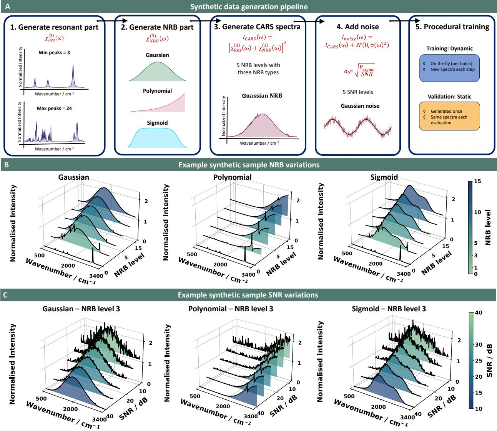

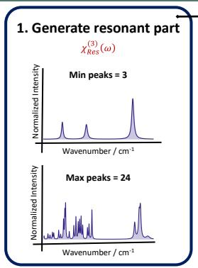

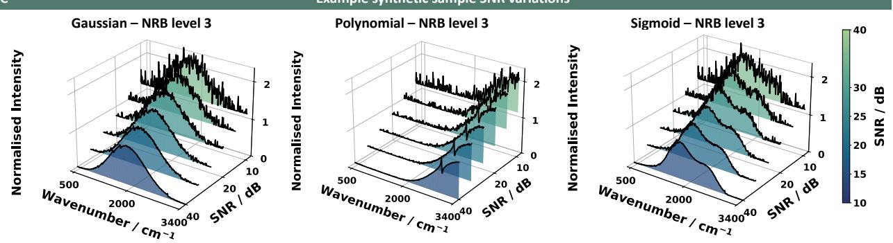

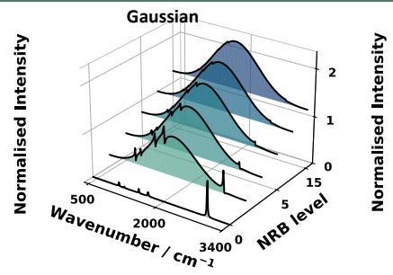

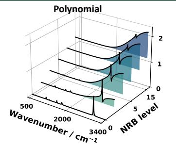

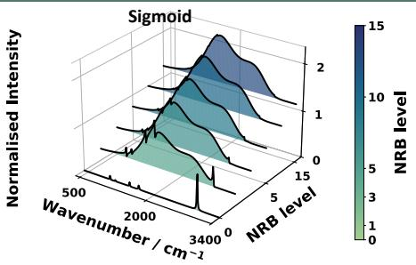  
Figure 2: Synthetic BCARS spectra used for training and validation. (A) Each spectrum is generated from a resonant model based on reference band assignments and measurement standards. The solvent peak parameters are kept fixed, while the background, the noise level, and the spectral coverage are varied to create realistic spectral diversity. A randomly sampled NRB is added to produce smooth baselines and interference-like distortions, followed by Gaussian noise to cover a wide range of signal quality. Validation spectra are generated once and then kept fixed (orange). (B) Examples of the three NRB families used in this study (Gaussian, polynomial, and sigmoid) shown at increasing NRB levels. (C) Examples of noise levels at a fixed NRB setting (level 3), showing the progression from clean to noisy spectra.

CyHex  
MeOH  
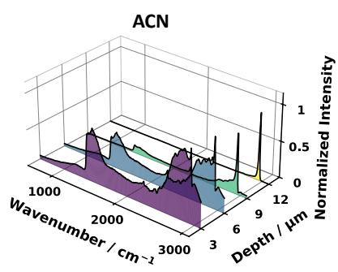

Solvents NRB variations with focus position variations  
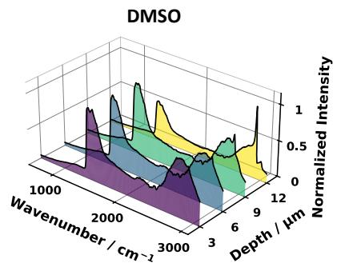

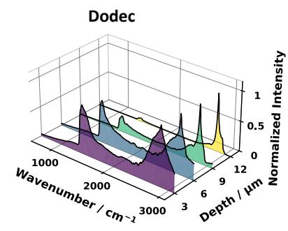

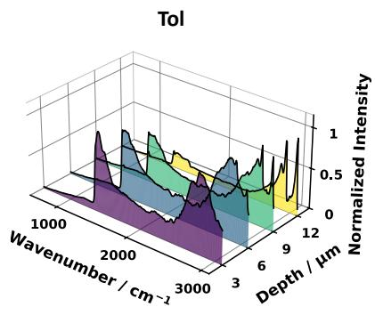

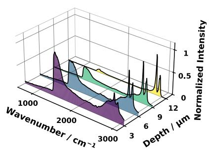

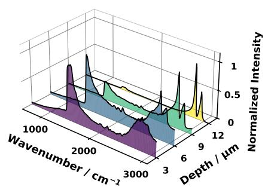

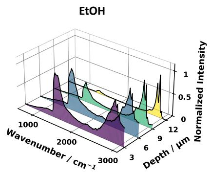

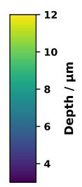

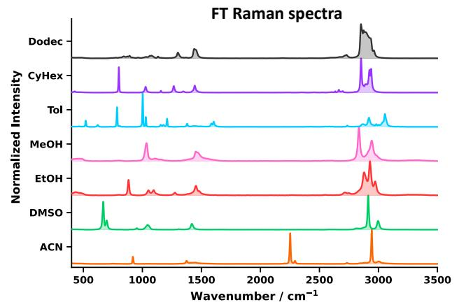  
Figure 3: Solvent benchmark dataset for zero-shot evaluation under NRB variability. (A) Broadband BCARS spectra were acquired from seven solvents while sweeping the focal position (3–12 µm) relative to the glass– solvent interface. This produced distinct NRB interference profiles and a progressive reduction in distortion with increasing depth. (B) FT-Raman reference spectra were acquired at 1064 nm. BCARS measurements use a pump at 1032 nm and a Stokes spanning $1 2 0 0 { - } 1 6 0 0$ nm (spectrally masked to separate 2C and 3C CARS regimes at $1 3 5 0 ~ \mathrm { c m } ^ { - 1 } )$ . This covers 600– $3 4 0 0 ~ \mathrm { c m } ^ { - 1 }$ with a spectral resolution $< 1 0 ~ \mathrm { c m ^ { - 1 } }$ . Four focal positions per solvent yield 28 unique test spectra.

## Model Architecture

The proposed model (Fig. 4) predicts Lorentzian peak parameters from a BCARS spectrum and constrains those predictions with a diferentiable physics layer, so that phase retrieval and parameter estimation are performed jointly. Because the measured CARS signal arises from coherent mixing between resonant and non-resonant contributions [8, 23], the network is required to recover physically meaningful latent structure, not only to reproduce the observed intensity. The model is an encoder–decoder system. The encoder is a transformer [14] that maps the spectrum to a set of peak slots; the decoder is the analytical Lorentz forward model itself, which is diferentiable but parameter-free. The encoder is therefore trained end-to-end by a reconstruction signal in resonant-spectrum space, not by parameter regression alone.

A 3,000-point input spectrum is partitioned into 30 overlapping windows of length $L = 3 0 0$ with hop $H = 9 6$ , yielding ≈ 68% overlap (Fig. 4A). Reflect-padding fills the right-most window, and each frame is multiplied by a Hann taper before embedding to suppress spectral leakage at token boundaries [24]. Every spectral position therefore belongs to three analysis windows, so no resonant feature is lost at a token boundary, and each peak is presented to the encoder in three diferent contexts; we found this redundancy to be necessary at the low signal-to-noise ratios encountered in experimental BCARS (see Section ). Each Hann-weighted token is mapped into a 512-dimensional space by a single linear projection. The same windowed-token strategy has been used for transformer models in other spectral domains, including music audio analysis [24]. A rotary positional encoding (RoPE) [25] then injects spectral order into the token embeddings as a rotation rather than as an additive code, which preserves relative position information across the depth of the encoder.

To allow several peaks to coexist within the same spectral region, a bank of 24 learnable class tokens, randomly initialised and deliberately without positional codes, is concatenated to the patch sequence (Fig. 4B). Withholding the positional code forces each class token to acquire its role through attention rather than through a fixed spectral position, so the same slot can bind to a peak at any wavenumber. Each class token then acts as a query for one candidate vibrational mode, while the 30 patch tokens supply the evidence. The resulting 54-token tensor is processed by six standard Transformer encoder blocks [14] with eight attention heads of head dimension 64, feed-forward width 1024, ReLU activation, dropout 0.1, and post-norm layer normalization, so each class token can aggregate evidence from any region of the spectrum, and from the other class tokens, through joint self-attention. After the final encoder layer, the patch outputs are discarded and only the 24 class-token outputs are read out. This design lets several peaks come from the same spectral region without competing for a slot: three closely spaced solvent modes can be predicted by three class tokens that all attend to the same patch. This behaviour is important in the crowded fingerprint range below $1 { , } 7 0 0 ~ \mathrm { c m ^ { - 1 } }$

The 24 class-token outputs are routed in parallel to four task-specific multilayer perceptrons (Fig. 4C). For each candidate peak, the heads emit a presence logit and the three Lorentzian parameters $( A , \omega _ { 0 } , \Gamma )$ The four heads are asymmetric by design. The amplitude head is the deepest, with two hidden layers of widths 1,024 and 512 and GELU activation, because peak amplitudes span the widest dynamic range and are the most sensitive to NRB-induced bias. The width head is the lightest, a single hidden layer of width 256 with ReLU activation, because the empirical Γ distribution is narrow and an over-parameterized head tends to overshoot. The center and presence heads share a common two-layer design with GELU activation. All four heads emit raw, unconstrained outputs. The physical bounds $A \geq 0$ and $\Gamma > 0$ are not enforced inside the heads but downstream, when the predicted parameters enter the $\chi ^ { ( 3 ) }$ model. This separation simplifies the regression gradients and confines all hard physical constraints to a single place, the Lorentz-model loss described next.

## Training Objectives

Each of the four prediction heads contributes a supervision signal. The presence head is supervised by a binary cross-entropy loss against a binary target that flags which slots correspond to real peaks. The three regression heads are supervised by a mask-weighted mean absolute error loss ${ \mathcal { L } } _ { \mathrm { p a r a m } }$ , with the mask ensuring that errors are computed only over slots flagged as real peaks. Within ${ \mathcal { L } } _ { \mathrm { p a r a m } }$ the per-parameter weights are 1.5 for amplitude, 2.0 for center, and 1.0 for width, which gives the center regression slightly more weight during training without overwhelming the amplitude and width signals.

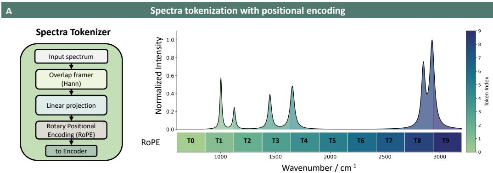

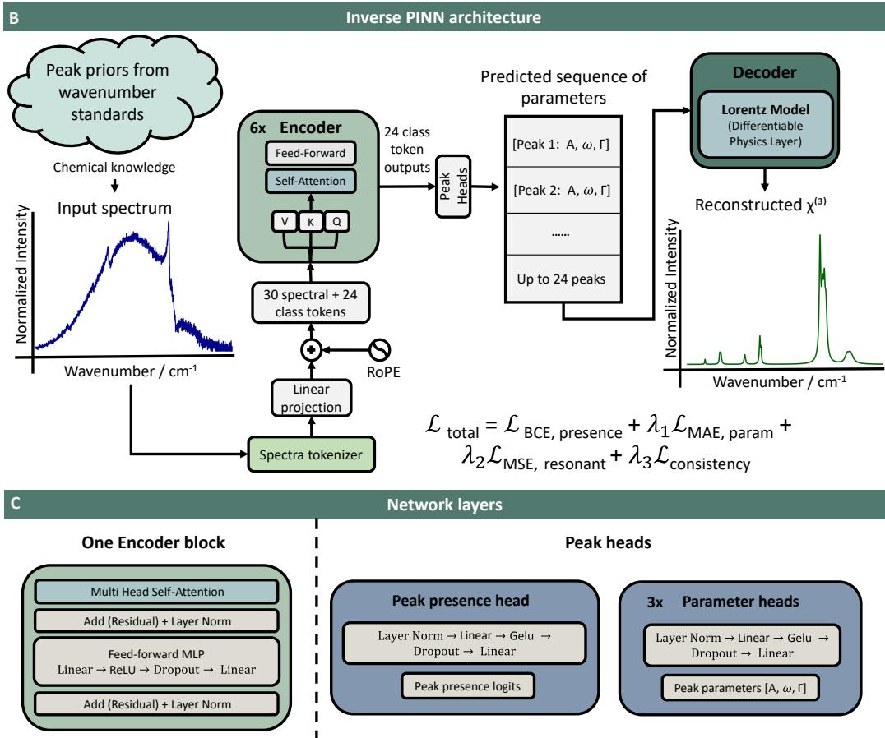  
Figure 4: Physics-informed architecture for inverse BCARS analysis. (A) The input BCARS spectrum is divided into overlapping Hann-windowed segments, each treated as a spectral token. The tokens are linearly projected into the model’s embedding space, and a rotary positional encoding then injects spectral order. The color gradient indicates token position along the wavenumber axis. (B) A bank of learnable class tokens is concatenated to the spectral tokens, and the combined sequence is processed by a stack of Transformer encoder blocks. The class-token outputs are routed to peak heads, which emit a presence indicator and the corresponding Lorentzian parameters for each candidate peak. The predicted peak set is passed to a diferentiable physics layer based on the analytical Lorentz model; this layer is a parameter-free decoder that reconstructs the resonant signal from the predicted parameters. Wavenumber-standard peak priors inform synthetic training-data generation but are not used at inference. (C) Internal structure of the encoder block and the prediction heads. Each encoder block combines multi-head self-attention with a feed-forward MLP; both have residual connections and layer normalization. The presence head outputs one logit per slot, and the three parameter heads predict A, ω , and $\Gamma ;$ the heads difer in depth to reflect the dynamic range of each parameter.

The third term is a physics-informed reconstruction loss, which we refer to as the Lorentz-model loss. At every training step, the predicted parameters are inverse-scaled to physical units and substituted into the closed-form complex Raman susceptibility, evaluated on the experimental wavenumber axis. The imaginary part is normalized per spectrum by its peak magnitude (matching the normalization used on the supervised target), and an $L _ { 1 }$ distance against the ground-truth imaginary $\chi ^ { ( 3 ) }$ is back-propagated into the encoder. Because $\chi ^ { ( 3 ) }$ is rebuilt analytically from the predicted $( A , \omega _ { 0 } , \Gamma )$ at every step, the encoder is supervised against the full spectral signature implied by its predictions, not only against the scalar parameter values. The slot-selection mask used to assemble $\chi ^ { ( 3 ) }$ is the ground-truth presence mask, not the predicted one. This decouples the regression supervision from the presence head, so classification errors early in training cannot inject random or partially trained parameter values into the $\chi ^ { ( 3 ) }$ sum and corrupt the regression gradient.

The fourth term is a multi-view solvent-consistency loss $\mathcal { L } _ { \mathrm { c o n s i s t e n c y } } .$ . For each underlying latent spectrum, several BCARS realizations are generated that share the same Lorentzian peak set but difer in NRB shape, NRB strength, and noise, drawn from the three NRB patterns described in Section (Fig. 1B), and the model is required to make consistent predictions across all of them. This formulation follows the consistencybased family of semi-supervised objectives [26], with the augmentation set restricted to realisations that are physically equivalent in terms of the underlying chemistry. The loss therefore penalizes only those changes in prediction that the underlying physics says should not occur.

The total objective combines the four terms with two warm-up schedules. The physics weight is introduced after a 15-epoch warm-up and ramped linearly to 0.25 over a further 40 epochs; the consistency weight is introduced after a 45-epoch warm-up and ramped to 0.005 over a further 90 epochs. The regression heads are therefore allowed to stabilize before the physics and consistency terms begin to shape the latent peak set; in earlier runs without this delay, gradients from a mis-specified $\chi ^ { ( 3 ) }$ pushed the heads into poor local minima. Optimisation uses AdamW [27] with a base learning rate of $1 0 ^ { - 4 }$ , reduced by a factor of 100 for the class-token bank and the prediction heads to stabilize their joint adaptation with the deeper backbone, under a cyclic schedule of 10 epochs up and 15 epochs down. The batch size is 512, gradients are clipped at unit $L _ { 2 }$ norm, and an exponential moving average (decay 0.999) is maintained on a separate copy of the parameters; the EMA weights are used at evaluation, while the live optimizer state continues to drive training. Training is performed in mixed precision to reduce memory footprint and accelerate the encoder pass, with one exception: the $\chi ^ { ( 3 ) }$ reconstruction path is forced to single precision because $\omega _ { 0 } ^ { 2 }$ reaches ≈ $1 . 4 \times 1 0 ^ { 7 }$ and would overflow half-precision arithmetic, and a small clamp on the squared denominator keeps the complex division well-conditioned when no peak is selected. Training runs for $\mathrm { u p }$ to 300 epochs with early stopping on validation MAE (patience 20). All training uses the procedurally generated spectra from Section mixed with a combination of NRB patterns at signal-to-noise ratios down to 2 dB; the experimental BCARS data described in Section are reserved for zero-shot evaluation only.

## Results

## Generalization across the BCARS Phase Retrieval Benchmark

We benchmarked iPINN against five published deep-learning models for direct CARS-to-Raman regression: SpecNet, BiLSTM, CNN-GRU, GAN, and VECTOR [10, 11, 28, 29]. The benchmark comprises five experimental spectra drawn from two solvents under diferent acquisition conditions; together with iPINN, six models were compared on these spectra. All model outputs were max-normalized before metric computation, so that comparisons are not biased by diferences in absolute spectral scale.

Figure 5A shows the toluene reconstructions for the 2C and 3C BCARS configurations. In the raw CARS spectra, the broad NRB dominates the signal and the vibrational features appear as distorted asymmetric bands; the FT-Raman reference shows the same features as sharp peaks on a flat baseline. iPINN recovered the major toluene peaks with the lowest absolute error in both configurations: MAE 0.019 for 2C and 0.025 for 3C.

Three properties of the iPINN reconstruction are visible in Fig. 5A. The model recovers the expected number of major peaks without introducing false positives. The silent region between 1700 and 2800 $\mathrm { c m } ^ { - 1 }$ stays close to zero, with no spurious peaks, residual NRB curvature, or oscillatory artifacts. The reconstructed bands are smooth and symmetric, and the baseline between neighbouring peaks returns close to zero even in the congested low-wavenumber fingerprint region; this is most visible in the $5 0 0 { - } 8 0 0 \ \mathrm { c m ^ { - 1 } }$ range, where the ring-deformation modes near 521, 622, and $7 8 5 ~ \mathrm { c m ^ { - 1 } }$ are closely spaced.

VECTOR, SpecNet, and GAN all recovered the dominant toluene peaks, but each retained visible artifacts. VECTOR preserved peak positions but showed an elevated background across the mid-wavenumber range. SpecNet produced broader line shapes and a non-zero baseline. GAN introduced low-amplitude oscillations between major peaks, especially in the $1 2 0 0 { - } 1 5 0 0 ~ \mathrm { c m } ^ { - 1 }$ region. In all three baselines, the silent region remained contaminated by low-level residual structure. iPINN itself showed a mild tendency to underestimate the relative intensity of the C–H stretching cluster around $3 0 0 0 { - } 3 1 0 0 ~ \mathrm { c m ^ { - 1 } }$ compared with the ring-breathing mode at $1 0 0 3 ~ \mathrm { { c m } ^ { - 1 } }$ . This bias is less pronounced in some of the baselines, which reproduce the overall envelope more closely in that region but with stronger baseline artifacts and a less clean silent region.

Figure 5B evaluates DMSO under three SNR conditions, using spectra extracted from individual pixels of a PMMA+DMSO hyperspectral image. The raw CARS inputs difer markedly from the toluene examples: the NRB dominates the full spectral envelope and the DMSO resonances appear only as weak inflections on a smooth background, which makes phase retrieval harder because the resonant contribution is small relative to the NRB. iPINN reconstructed the DMSO Raman spectrum consistently as SNR decreased, with MAE values of 0.011 (high SNR), 0.011 (medium SNR), and 0.012 (low SNR). Six expected vibrational bands were recovered: the symmetric C–S stretch at $6 7 0 ~ \mathrm { c m } ^ { - 1 }$ , the antisymmetric C–S stretch at $7 0 1 ~ \mathrm { c m } ^ { - 1 }$ , the $\mathrm { S } { = } \mathrm { O }$ stretch near $1 0 4 3 ~ \mathrm { { c m } ^ { - 1 } }$ , the $\mathrm { C H _ { 3 } }$ deformation at $1 4 2 0 ~ \mathrm { { c m } ^ { - 1 } }$ , and the C–H stretching bands at 2912 and $2 9 9 6 ~ \mathrm { { c m } ^ { - 1 } }$ Across the three noise levels, peak positions and relative intensities stayed close to the FT-Raman reference and the silent region stayed near baseline. The baseline models showed more residual background and spurious low-level features, especially in weak-intensity regions.

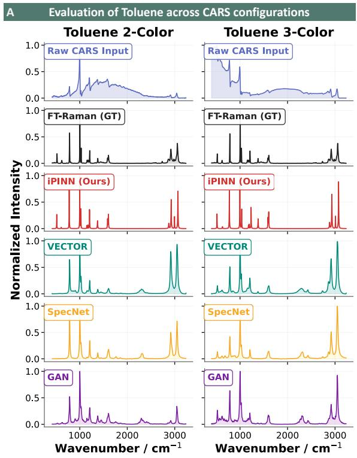

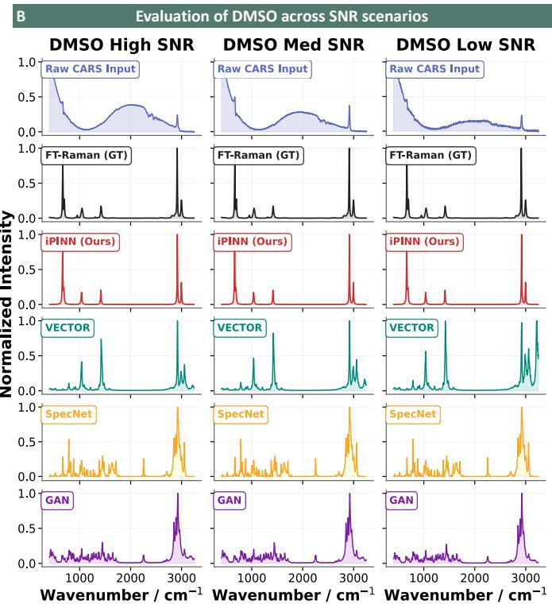  
Figure 5: Reconstruction performance on the public BCARS phase-retrieval benchmark. Each row of the spectral panels shows, from top to bottom, the raw CARS input, the FT-Raman reference (ground truth), and the spectra reconstructed by iPINN, VECTOR, SpecNet, and GAN, which are the three best-performing baselines from Figure 6A. (A) Toluene reconstructions for the 2C and 3C BCARS configurations. (B) DMSO reconstructions at high, medium, and low SNR, using spectra extracted from a PMMA+DMSO hyperspectra image.

Figure 6A summarizes the mean MAE and RMSE of each of the six models, averaged over the five benchmark spectra. iPINN achieved the lowest mean MAE (0.0156) and the lowest mean RMSE (0.0489), with the smallest error-bar spread across spectra. The next-best baseline was VECTOR (MAE 0.046), about three times higher than iPINN. SpecNet (0.047) and GAN (0.058) followed, while CNN-GRU (0.115) and BiLSTM (0.298) showed substantially larger errors and wider variation across spectra. To keep the spectral comparisons in Fig. 5 readable, we plot iPINN alongside the three best-performing baselines from this ranking: VECTOR, SpecNet, and GAN.

## Stability across NRB Conditions on the Focus Depth Dataset

The public benchmark above tests robustness to changes in solvent, excitation scheme, and SNR, but each spectrum is acquired under a single fixed measurement geometry. To examine robustness against systematic variation in NRB strength, we evaluated iPINN on the focus-depth dataset described in Section , where spectra were acquired at four focus depths (3, 6, 9, and 12 µm) for seven solvents. Shallower focus produces a stronger NRB contribution from the glass–solvent interface; the shaded band in Fig. 6B marks the strong-NRB depths. To quantify stability, we report the coeficient of variation (CV) of MAE across the four depths, defined as the standard deviation divided by the mean; lower CV indicates more depth-invariant performance.

Figure 6B plots the per-depth MAE for the full iPINN (red) on all seven solvents. For five of the seven solvents (MeOH, EtOH, CyHex, Dodec, ACN), the red line stays close to flat across the depth sweep. At 12 µm, the model reached MAE values of 0.005 for ACN, 0.007 for DMSO, 0.008 for MeOH, and 0.013 for CyHex. Going from 12 µm to 3 µm, the error grew only slightly in the easier cases, from 0.005 to 0.006 for ACN and from 0.008 to 0.010 for MeOH. CyHex was the most depth-insensitive case in absolute terms (CV 2.6%, Table 1), and EtOH had the lowest CV anywhere in the ablation table at 0.6%, so reconstruction accuracy was efectively independent of focus depth for these two solvents.

The two cases with weaker depth invariance are toluene and DMSO. Tol MAE held near 0.030 at 3, 6, and 9 µm and dropped to roughly 0.018 at 12 µm, giving a CV of 18.6%. DMSO showed a similar pattern, with a clear improvement only at 12 µm and a CV of 34.7%. In both cases the residual depth dependence is dominated by a single deeper-focus value rather than by a steady decline through the sweep.

## Ablation Study: Contributions of Physics and Consistency Losses

To isolate the contribution of the two auxiliary losses, we trained three ablation variants alongside the full model: one without the consistency loss (no-Cons), one without the physics-informed Lorentz-model loss (no-Physics), and one without either loss (no-Both). Architecture, optimiser settings, and validation set were identical across the four variants, so any diference in behaviour reflects the loss configuration alone.

The four MAE-vs-depth curves in each panel of Fig. 6B show that removing the physics loss is the dominant failure mode under strong NRB. For methanol, the no-Both variant climbs to MAE around 0.030 at 3 µm before recovering at deeper focus, while the full iPINN stays near MAE 0.008 across the same range. For ethanol, all three ablation variants reach MAE around 0.032 at 3 µm and remain elevated through 6 µm, while the full iPINN holds near MAE 0.014 at every depth. The same general ordering, with the full iPINN closest to flat and the no-Both variant the most depth-sensitive, is repeated in the MeOH, EtOH, CyHex, and Dodec panels.

The corresponding spectral reconstructions for MeOH and EtOH are shown in Fig. 7, at all four focus depths and for all four model variants, with the FT-Raman reference plotted in grey behind each prediction.

For MeOH (Fig. 7A), the full iPINN row produced visually similar reconstructions across all four depths. The no-Both row degraded most strongly at 3 µm, with broadened peaks, baseline distortion, and visible intensity in the silent region between the fingerprint and C–H stretching ranges. At 3 µm, the average predicted intensity in non-peak regions was 5.1 times the ground-truth baseline for no-Both, compared with 1.2 times for the full iPINN. Across the depth sweep, the full-model MAE ranged from 0.0073 to 0.0088 (CV 7.1%), while no-Both ranged from 0.0087 to 0.0302 (CV 65.0%).

For EtOH (Fig. 7B), the full iPINN row closely matches the FT-Raman reference at every depth, and the silent-region baseline remains clean. The three ablation rows visibly deviate from the reference at 3 and 6 µm, with the deviation easing at 9 and 12 µm. The CV values in Table 1 quantify the gap: the full iPINN reaches CV 0.6% on ethanol, the lowest value in the table, while no-Cons rises to 29.3%, no-Both to 39.2%, and no-Physics to 50.6%. For EtOH, the physics loss is therefore the largest single change to remove, and the consistency loss provides additional stability beyond it.

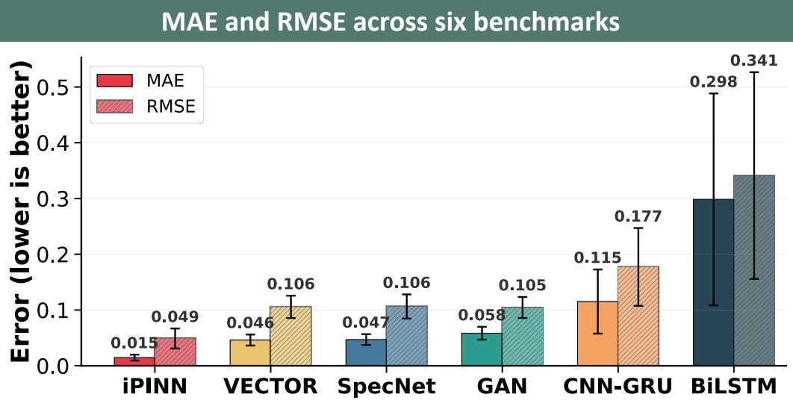

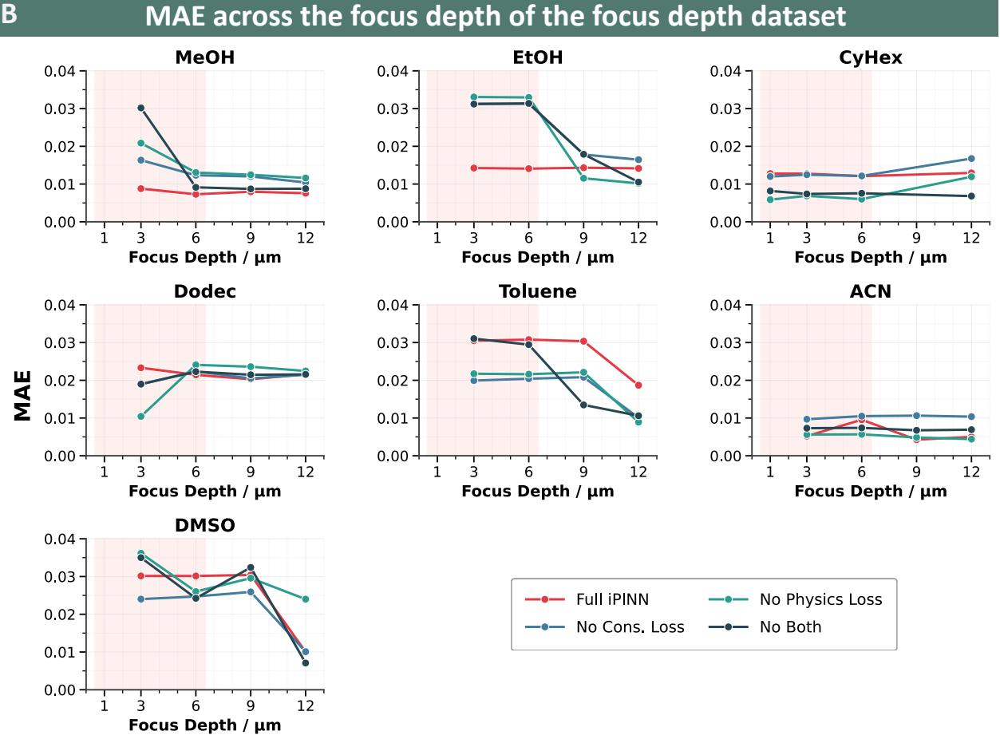  
Figure 6: Quantitative evaluation across the public benchmark and the focus-depth dataset. (A) Mean MAE and RMSE for iPINN and five published baselines (VECTOR, SpecNet, GAN, CNN-GRU, BiLSTM) each averaged over the five benchmark spectra; error bars are ±1 standard deviation across spectra. The in-pane heading “six benchmarks” refers to the six compared models. iPINN has the lowest mean error and the smallest variation. (B) MAE as a function of focus depth (3, 6, 9, and 12 µm) for the full iPINN and three ablation variants (no-Cons. loss, no-Physics loss, no-Both) on the focus-depth dataset, plotted separately for each of the seven solvents. The shaded band marks the strong-NRB depth range (1–6 µm). Lower MAE indicates better reconstruction.

A direct comparison between no-Cons and no-Both isolates the role of physics loss. At 3 µm on methanol, no-Cons reached MAE 0.0163 while no-Both reached MAE 0.0302; the physics loss alone roughly halves the error under the strongest NRB. The consistency loss reduces variation in relative peak amplitudes across measurement conditions.

Table 1 summarizes depth stability across all seven solvents. The full iPINN has the lowest CV in five of the seven solvents, with the strongest gains on MeOH (7.1% versus 65.0% for no-Both), EtOH (0.6% versus 29.3% for no-Cons), and CyHex (2.6% versus 32.5% for no-Physics). For ACN and DMSO the lowest CV is reached by an ablation variant rather than by the full model. In these two cases the absolute MAE values for the full iPINN are already small (around 0.005 for ACN and as low as 0.007 at 12 µm for DMSO), and the CV is dominated by the gap between the deepest-focus value and the rest of the sweep, so a flatter but uniformly less accurate ablation variant can score a lower CV without producing better reconstructions. The two losses therefore behave as complementary regularizers under varying NRB strength, with the lowest CV across the dataset reached only when both are active.

Table 1: Ablation of iPINN loss components and comparison with baseline methods. The coeficient of variation (CV) of MAE is reported in percent; lower values indicate better stability.
<table><tr><td rowspan="2">Variant</td><td colspan="2">Loss components</td><td colspan="7">CV of MAE (%) ↓</td></tr><tr><td> $\chi ^ { ( 3 ) }$ </td><td>Cons.</td><td>MeOH</td><td>EtOH</td><td>CyHex</td><td>Dodec.</td><td>Tol</td><td>ACN</td><td>DMSO</td></tr><tr><td colspan="10">iPINN variants</td></tr><tr><td>Full iPINN</td><td></td><td>√</td><td>7.1</td><td>0.6</td><td>2.6</td><td>5.0</td><td>18.6</td><td>34.5</td><td>34.7</td></tr><tr><td>No Cons. loss</td><td>&gt;&gt;</td><td>×</td><td>17.1</td><td>29.3</td><td>14.8</td><td>6.1</td><td>25.1</td><td>3.6</td><td>30.4</td></tr><tr><td>No Physics Loss</td><td>X</td><td>√</td><td>25.6</td><td>50.6</td><td>32.5</td><td>28.0</td><td>30.1</td><td>10.3</td><td>16.0</td></tr><tr><td>Both losses</td><td>X</td><td>×</td><td>65.0</td><td>39.2</td><td>6.5</td><td>5.9</td><td>43.4</td><td>3.8</td><td>44.2</td></tr><tr><td colspan="10">Baselines</td></tr><tr><td>GAN</td><td>X</td><td>X</td><td>22.8</td><td>46.9</td><td>42.6</td><td>11.9</td><td>57.9</td><td>18.1</td><td>43.2</td></tr><tr><td>SpecNet</td><td>X</td><td>X</td><td>29.5</td><td>44.1</td><td>49.9</td><td>7.2</td><td>37.2</td><td>54.5</td><td>36.7</td></tr></table>

## Discussion and Future Outlook

The advantage of iPINN over the baseline models is structural: the network does not predict the spectrum directly. It infers peak positions, amplitudes, and widths, and the Raman spectrum is reconstructed from those parameters through the Lorentzian model. The reconstruction is therefore always a sum of smooth Lorentzian peaks, and regions without predicted vibrational activity return close to baseline. False peaks and residual background structure are suppressed by construction. The baseline models predict every spectral point independently, which leaves room for background artifacts and features unconnected to any molecular vibration. iPINN reached the lowest MAE on all five benchmark spectra. It also produced cleaner spectra in the silent region, and the MAE difered by only 0.001 between the high-SNR and low-SNR DMSO cases.

The same parameter-prediction strategy changes how the NRB is handled. Classical KK methods face a circular dependency: the KK transform requires normalization by the NRB, which is itself unknown [5]. Recent dual-decoder physics-informed networks address this by jointly estimating the NRB and the resonant signal in parallel branches, but the NRB still has to be reconstructed explicitly [12]. Predicting θ directly removes this requirement. The physics loss compares the spectrum reconstructed from θ to the measurement through the forward map, so no explicit NRB estimate is needed during training; the NRB enters only through data generation.

The ablation study over four focus depths, seven solvents, and 28 spectra shows the contribution of each loss term. The physics loss suppresses false peaks under strong NRB. This is most visible for methanol at 3 µm in Fig. 7A, where removing the physics loss introduces spurious peaks and increases the MAE by 46% relative to the full iPINN. The consistency loss controls the relative amplitudes of closely spaced peaks. For ethanol at 9 µm in Fig. 7B, the no-Physics variant gives a 36% lower MAE than no-Both, indicating that recovering correct relative amplitudes in the C–H stretching cluster requires the consistency objective specifically. With both losses active, performance remains the most stable as the NRB changes: the full iPINN reaches the lowest CV in five of the seven solvents in Table 1, and the depth-MAE curves in Fig. 6B stay flattest under this configuration.

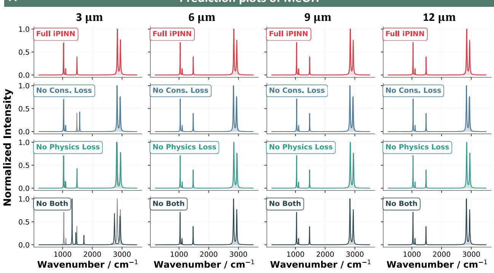

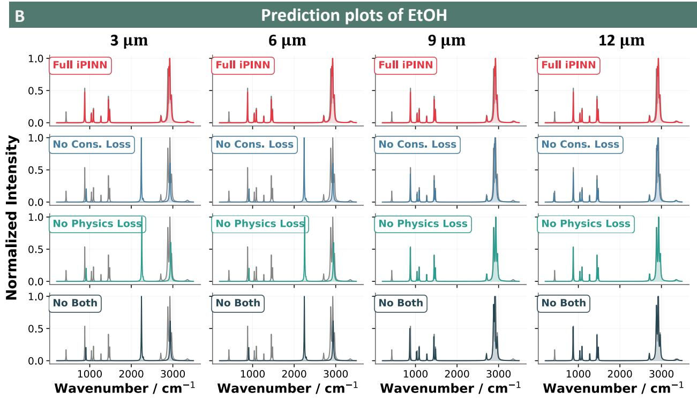  
Figure 7: Spectral reconstructions across focus depth for the full iPINN and the three ablation variants. Predicted Raman spectra at four focus depths (3, 6, 9, and 12 µm; columns) for the four model variants (rows), shown against the FT-Raman reference (grey). (A) MeOH. (B) EtOH. The full iPINN preserves peak shape and silent-region baseline across depths in both solvents, while the ablation variants deviate from the reference most strongly at 3 and 6 µm.

Table 1 also shows that the full model is not the best for every solvent. For ACN and DMSO, an ablation variant reaches a lower CV. The likely cause is the forward model itself: the Lorentzian sum captures peak positions accurately but does not yet reproduce the exact NRB envelope of every solvent under changing focus conditions. For solvents dominated by a small number of strong bands, or where the measured envelope departs from the idealized Lorentzian shape, small mismatches in modelled peak height or residual NRB curvature can shift with focus depth and reduce consistency, even when peak positions are recovered correctly. The full model is therefore best on average but not uniformly across all seven solvents.

This analysis points to two limitations of the present method. The first is the lower consistency seen for some solvents under changing background conditions, which reflects cases where the forward model cannot fully reproduce the measured envelope. A loss that penalizes relative amplitude errors between neighbouring peaks would address part of this, and a forward-modelling refinement step that adjusts NRB shape and peak heights while keeping positions fixed would close the rest, without disturbing the peak positions iPINN already predicts well. The second limitation is the fixed maximum of 24 peaks per spectrum. This is suficient for common solvents such as toluene and DMSO, but biological samples with dense, overlapping vibrational bands may require more; allowing the network to infer the number of active peaks from the input would broaden the method to more demanding chemical and biological imaging tasks.

The depth-invariant behaviour reported here is already useful in practice. Hyperspectral BCARS images contain pixel-to-pixel variation in efective NRB, and a model that stays stable under this variation makes spectra directly comparable across an image without per-pixel correction.

The inverse-first formulation also suggests a structural change at the input side of the network. The current spectrum tokenizer uses a linear projection of overlapping Hann-windowed segments followed by rotary positional encoding (Fig. 4A). The projection learns its filters from data and has to discover during training that the relevant local features are Lorentzian. This prior could instead be encoded directly at the input by replacing the linear projection with a layer of parametric Lorentzian neurons, each of which outputs a Lorentzian response with a learnable amplitude, center, and width. This is the input-side counterpart of the diferentiable Lorentz model at the output, where in both cases a learned approximation is replaced by a parametric form whose parameters carry physical meaning. With this prior built into the tokenizer, the network would rely less on training data to express the spectroscopic structure of the input, which should reduce the synthetic-to-real gap. Together with adaptive peak budgets and forward-model refinement, the method should then extend to chemically heterogeneous and spectrally dense samples, including those encountered in label-free pathology and live-tissue imaging.

## Acknowledgements

This work is supported by the BMBF funding program Photonics Research Germany (13N15464 (LPI-BT1-IPHT), 13N15466 (LPI-BT1-FSU), and 13N15706 (LPI-BT2-FSU)) and is integrated into the Leibniz Center for Photonics in Infection Research (LPI). The LPI, initiated by Leibniz-IPHT, Leibniz-HKI, Friedrich Schiller University Jena, and Jena University Hospital, is part of the BMBF national road map for research infrastructures. This project has received funding from the European Union’s Horizon 2020 research and innovation programme under grant agreement No. 101016923 (CRIMSON), and from the European Union’s Horizon Europe research and innovation programme under grant agreement No. 101135175 (uCAIR). The authors gratefully acknowledge support from the Carl Zeiss Foundation through the project “Sensorized Surgery” (P2022-06-004), and from Deutsche Krebshilfe under Projekt-Nr. 70116281 (Arbor). This work was co-funded by the Deutsche Forschungsgemeinschaft (DFG, German Research Foundation) – 441958208 (NFDI4Chem). We acknowledge support by the German Research Foundation Projekt-Nr. 512648189 and the Open Access Publication Fund of the Thüringer Universitäts- und Landesbibliothek Jena.

## Author Contributions

Conceptualization, R.T.V. and T.B.; methodology, R.T.V. and T.B.; software, R.T.V.; formal analysis, R.T.V.; investigation, R.T.V.; data curation, C.M., M.V., T.M.-Z.; writing, original draft preparation, R.T.V.; writing, review and editing, R.T.V., T.B., C.M., M.V., R.J., T.M.-Z., and J.P.; visualization, R.T.V.; supervision, T.B. and J.P.; project administration, T.B.; funding acquisition, T.B. and J.P. All authors have read and agreed to the published version of the manuscript.

## Notes

The authors declare no competing financial interest.

## Data and Software Availability

The public BCARS phase-retrieval benchmark used in this work is available from the cited sources. The focus-depth solvent dataset and the iPINN implementation are available at https://git.photonicdata. science/ravi\_vulchi/inverse\_pinn\_paper.git.

## References

(1) Kaipio, J. P.; Somersalo, E., Statistical and computational inverse problems; Springer: 2005.

(2) Vulchi, R. T.; Morgunov, V.; Hniopek, J.; Ryabchykov, O.; Bocklitz, T. Inverse Modeling for Artifact Removal in Photonic Data: A Computational Physics and Transfer Learning-Based Approach. J. Chem. Inf. Model. 2025, 65, 11733–11745.

(3) Houhou, R. Inverse and forward modeling tools for biophotonic data, Ph.D. Thesis, Friedrich Schiller University Jena, 2022.

(4) Junjuri, R.; Bocklitz, T. Review of Coherent Anti-Stokes Raman Scattering Nonresonant Background Removal and Phase Retrieval Approaches: From Experimental Methods to Deep Learning Algorithms. Adv. Photonics Res. 2025, 2500035.

(5) Liu, Y.; Lee, Y. J.; Cicerone, M. T. Broadband CARS spectral phase retrieval using a time-domain Kramers–Kronig transform. Opt. Lett. 2009, 34, 1363–1365.

(6) Okuno, M.; Kano, H.; Leproux, P.; Couderc, V.; Day, J. P.; Bonn, M.; Hamaguchi, H.-o. Quantitative CARS molecular fingerprinting of single living cells with the use of the maximum entropy method. Angew. Chem. 2010, 122, 6925–6929.

(7) Rinia, H. A.; Bonn, M.; Müller, M.; Vartiainen, E. M. Quantitative CARS spectroscopy using the maximum entropy method: the main lipid phase transition. ChemPhysChem 2007, 8, 279–287.

(8) Junjuri, R.; Saghi, A.; Lensu, L.; Vartiainen, E. M. Efect of non-resonant background on the extraction of Raman signals from CARS spectra using deep neural networks. RSC Adv. 2022, 12, 28755–28766.

(9) Houhou, R.; Barman, P.; Schmitt, M.; Meyer, T.; Popp, J.; Bocklitz, T. Deep learning as phase retrieval tool for CARS spectra. Opt. Express 2020, 28, 21002–21024.

(10) Junjuri, R.; Saghi, A.; Lensu, L.; Vartiainen, E. M. Evaluating diferent deep learning models for eficient extraction of Raman signals from CARS spectra. Phys. Chem. Chem. Phys. 2023, 25, 16340– 16353.

(11) Muddiman, R.; O’Dwyer, K.; Camp, C. H.; Hennelly, B. Removing non-resonant background from broadband CARS using a physics-informed neural network. Anal. Methods 2023, 15, 4032–4043.

(12) Vemuri, S. K.; Valapil, A. A. C.; Büchner, T.; Denzler, J. RamPINN: Recovering Raman Spectra From Coherent Anti-Stokes Spectra Using Embedded Physics, arXiv preprint arXiv:2510.06020, 2025.

(13) Raissi, M.; Perdikaris, P.; Karniadakis, G. E. Physics-informed neural networks: A deep learning framework for solving forward and inverse problems involving nonlinear partial diferential equations. J. Comput. Phys. 2019, 378, 686–707.

(14) Vaswani, A.; Shazeer, N.; Parmar, N.; Uszkoreit, J.; Jones, L.; Gomez, A. N.; Kaiser, Ł.; Polosukhin, I. Attention is all you need. Adv. Neural Inf. Process. Syst. 2017, 30.

(15) Hickstein, D.; Goldfarmmuren, R.; Darrah, J.; Erickson, L.; Johnson, L. A Raman-spectroscopy-based sensor for rapid, accurate, and precise concentration measurements of a methanol-water mixture, arXiv preprint arXiv:1806.06404, 2018.

(16) Carrabba, M. M., Wavenumber standards for Raman spectrometry In Handbook of Vibrational Spectroscopy; Wiley: 2006; Vol. 1.

(17) National Institute of Standards and Technology Methane, ed. by Linstrom, P. J.; Mallard, W. G., NIST Chemistry WebBook, NIST Standard Reference Database Number 69, 2025.

(18) National Institute of Standards and Technology Ethane, ed. by Linstrom, P. J.; Mallard, W. G., NIST Chemistry WebBook, NIST Standard Reference Database Number 69, 2025.

(19) Danehy, P. M.; O’Byrne, S.; Cutler, A. D.; Rodriguez, C. G. Coherent anti-Stokes Raman scattering (CARS) as a probe for supersonic hydrogen-fuel/air mixing, Presented at the JANNAF APS/CS/PSHS/MSS Joint Meeting, Colorado Springs, CO, 2003.

(20) Foi, A.; Trimeche, M.; Katkovnik, V.; Egiazarian, K. Practical Poissonian-Gaussian noise modeling and fitting for single-image raw-data. IEEE Trans. Image Process. 2008, 17, 1737–1754.

(21) Vernuccio, F.; Vanna, R.; Ceconello, C.; Bresci, A.; Manetti, F.; Sorrentino, S.; Ghislanzoni, S.; Lambertucci, F.; Motiño, O.; Martins, I. Full-spectrum CARS microscopy of cells and tissues with ultrashort white-light continuum pulses. J. Phys. Chem. B 2023, 127, 4733–4745.

(22) Vernuccio, F.; Broggio, E.; Sorrentino, S.; Bresci, A.; Junjuri, R.; Vanna, R.; Bocklitz, T.; Bregonzio, M.; Cerullo, G.; Rigneault, H.; Polli, D. Supplementary material - Non-resonant background removal in broadband CARS microscopy using deep-learning algorithms, v1 edn. Dataset, Zenodo, 2024.

(23) Cheng, J.-X.; Xie, X. S. Coherent anti-Stokes Raman scattering microscopy: instrumentation, theory, and applications. J. Phys. Chem. B 2004, 108, 827–840.

(24) Lu, W.-T.; Wang, J.-C.; Won, M.; Choi, K.; Song, X. SpecTNT: A time-frequency transformer for music audio, arXiv preprint arXiv:2110.09127, 2021.

(25) Su, J.; Ahmed, M.; Lu, Y.; Pan, S.; Bo, W.; Liu, Y. RoFormer: Enhanced transformer with rotary position embedding. Neurocomputing 2024, 568, 127063.

(26) Sohn, K.; Berthelot, D.; Carlini, N.; Zhang, Z.; Zhang, H.; Rafel, C. A.; Cubuk, E. D.; Kurakin, A.; Li, C.-L. FixMatch: Simplifying semi-supervised learning with consistency and confidence. Adv. Neural Inf. Process. Syst. 2020, 33, 596–608.

(27) Loshchilov, I.; Hutter, F. Fixing weight decay regularization in Adam, arXiv preprint arXiv:1711.05101, 2017.

(28) Vernuccio, F.; Broggio, E.; Sorrentino, S.; Bresci, A.; Junjuri, R.; Vanna, R.; Bocklitz, T.; Bregonzio, M.; Cerullo, G.; Rigneault, H.; Polli, D. Non-resonant background removal in broadband CARS microscopy using deep-learning algorithms. Sci. Rep. 2024, 14, 23903.

(29) Wang, Z.; O’Dwyer, K.; Muddiman, R.; Ward, T.; Camp Jr., C. H.; Hennelly, B. M. VECTOR: Very deep convolutional autoencoders for non-resonant background removal in broadband coherent anti-Stokes Raman scattering. J. Raman Spectrosc. 2022, 53, 1081–1093.