# mzCache: On-Device LLM Memory Management under Multitasking

Hongseung Yu1, Minsung Kim1, Jongseok Park2, Kyunghan Lee1 1Seoul National University 2UC Berkeley

{hongseung, minsungkim.cs, kyunghanlee}@snu.ac.kr, js\_park@berkeley.edu

## ABSTRACT

On-device mobile Large Language Model (LLM) inference is gaining significant attention. However, mobile devices op erate in highly dynamic multitasking environments where users frequently switch between applications. This creates memory pressure, forcing LLM memory—model weights and KV cache—to be evicted by the operating system. When a new inference request arrives, the inference system must restore the evicted memory through slow storage reads or re- compute the entire KV cache, severely degrading responsiveness. To address this, we present mzCache, an on-device LLM inference system with specialized memory management for multitasking environments. Under unpredictable memory pressure, mzCache elastically evicts LLM memory and lever-ages the unified memory of mobile SoCs to enable zero-wait inference on the GPU with concurrent CPU-side restoration. mzCache realizes this through restoration-oriented memory management: LLM memory is partitioned into fine-grained shared bufers to enable partial eviction and restoration with concurrent cross-processor access, while hybrid swap and backward-out eviction policies ensure low-latency restora- tion from any eviction state. Implemented on llama.cpp and deployed as an Android application, mzCache achieves 2.1– 5.5× reduction in Time-to-First-Token compared to storagebacked partial ofload and demonstrates its efectiveness in real multitasking scenarios.

## CCS CONCEPTS

• Human-centered computing → Ubiquitous and mobile computing; • Software and its engineering → Mem ory management.

## KEYWORDS

Large Language Models, On-device Inference, Memory Management, Multitasking

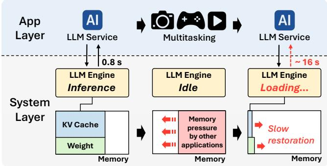  
Figure 1: Multitasking on mobile devices: the user inter-acts with an on-device LLM service, switches to other apps, and later returns. Memory pressure from concurrent apps evicts LLM memory, increasing the response time from 0.8s to 16s.

## 1 INTRODUCTION

Large Language Model (LLM)-based services are rapidly gaining adoption on mobile devices [2, 6, 24, 44], unlocking per-sonalized experiences that leverage local user data without cloud dependence. On-device LLM assistants, for example, can summarize email threads using local message history or suggest contextually relevant responses based on prior conversations [10, 33, 71]. These benefits stem from preserving the context of prior interactions.

LLM inference systems achieve this by storing the interaction history as a set of key–value pairs known as the KV cache. Preserving the KV cache enables generating contextaware responses to new inputs while avoiding expensive recomputation. Despite its benefits, as the KV cache accumulates over long or repeated interactions, even a single context for a small mobile-optimized model can grow to around 4 GB. When combined with model weights, the to- tal LLM memory footprint reaches 5 to 7 GB, consuming nearly half of the typical 12 GB RAM available on modern smartphones [5, 41, 45].

Such large memory demand poses a critical challenge in mobile multitasking environments, where users frequently switch between multiple applications. As illustrated in Fig- ure 1, after an LLM interaction completes, users transition to other applications such as camera, game, or video streaming.

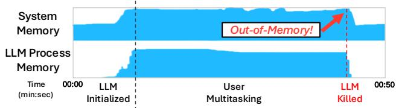  
Figure 2: System and LLM process memory traces under multitasking, collected on a Galaxy S25+ using Perfetto [4]. As memory pressure increases, the Low-Memory Killer terminates the LLM process.

As more apps are launched and used, the limited memory of mobile devices becomes rapidly scarce. Under this mem- ory pressure, the operating system (OS) evicts the idle LLM memory to make room for active applications. When the user returns to the LLM service with a new inference request, this evicted memory must be restored before a response can be generated. During this restoration, inference computation is blocked by slow storage reads and on-demand paging mech- anisms [49], substantially increasing Time-to-First-Token (TTFT)—the time to generate the first output token—from 0.8 to 16 seconds.

To overcome the limited bandwidth ofstorage-only restora- tion, mobile OSes such as Android employ zRAM [3], a compression-based in-memory swap space that compresses evicted pages within RAM itself. However, zRAM’s general-purpose compression algorithms (e.g., lz4 [13] and zstd [14]) barely compress the KV cache, leaving memory pressure largely unrelieved. As shown in Figure 2, this unresolved pressure leads to process termination by the Low-Memory Killer. As a result, before generating a new response, the LLM system must reload weights from storage and recompute the entire KV cache. Both operations incur significant latency, severely degrading the responsiveness and user experience.

As such, general OS memory management mechanisms are largely unsuitable for LLMs. Unfortunately, existing mobile LLM services [54, 60, 65] focus primarily on runtime inference optimizations, and their memory management is entirely dependent on these OS-based mechanisms. As a result, the TTFT and user experience of LLM-based applications sufer greatly in multitasking mobile environments, calling for an LLM- and mobile-aware system that properly handles external memory pressure.

To this end, we present mzCache, a complete on-device LLM inference system that integrates specialized memory management for responsive inference under multitasking. A key challenge is that memory pressure from competing appli-cations is inherently dynamic and unpredictable. To handle this, mzCache employs a restoration-oriented design, elastically reducing its memory footprint according to external pressure while maintaining readiness for rapid restoration throughout the eviction process.

mzCache first establishes a memory management mech- anism tailored to mobile platforms: it partitions weights and KV cache into fine-grained units and allocates them as shared bufers on the mobile SoC’s unified memory. This en- ables evicting only the necessary amount of memory while allowing the CPU to perform restoration and the GPU to execute inference without redundant data transfers between processors. On top of this, mzCache introduces two policies that govern where and when each unit should be evicted, so that any partial eviction state allows for the fastest possible restoration regardless of the eviction amount.

To overcome the storage read bottleneck in restoration, we draw inspiration from Android’s zRAM and apply KV cache compression techniques [23, 36, 37, 48, 68] that exploit its structural properties, making in-memory compressed space a viable second restore path alongside storage reads. Evicted KV cache is distributed across the two paths so that both remain fully utilized during restoration. Beyond placement, mzCache evicts later layers first so that early layers, which LLM inference executes first, are always preserved. During restoration, the GPU can begin inference immediately on the preserved front layers while the CPU restores evicted layers in the same forward order, maximizing the overlap between restoration and inference.

We implement mzCache on top of llama.cpp [18], a widely used LLM inference framework for mobile environments, and evaluate its performance across various mobile devices and LLM models. Compared to a storage-backed partial ofload baseline, mzCache reduces TTFT by 2.1–5.5× and demon-strates efectiveness in real-world multitasking scenarios under memory pressure. The main contributions of this pa-per are summarized as follows:

• We reveal that OS memory management is inadequate for LLM workloads in mobile multitasking environments, causing severe TTFT degradation.

• We present mzCache, a complete LLM inference system with restoration-oriented memory management that enables responsive inference from any eviction state.

• We test mzCache on commercial smartphones, show 2.1–5.5× faster TTFT than partial ofload, and validate its practicality under realistic multitasking pressure.

## 2 BACKGROUND

## 2.1 Characteristics of LLM

Modern LLMs are constructed by stacking dozens of transformer layers [57]. During inference, input tokens are pro-cessed through these stacked layers to generate output to- kens. The inference consists of two stages: First, the pre- fill stage processes the entire input sequence of tokens. For each token, every transformer layer computes key and value (KV) vectors, and the resulting KV pairs are stored as KV cache. Because self-attention in this stage requires interactions across all input tokens, the prefill latency, referred to as Time-to-First-Token (TTFT), grows quadratically with the input sequence length. The second stage, called the decode stage, autoregressively generates output tokens one by one. In the decode stage, each newly generated token references the accumulated KV cache to avoid recomputation, making each decoding step far cheaper than prefill.

Table 1: Memory footprint of representative LLMs used in mobile and edge environments. All models listed here have fewer than 3 billion parameters.
<table><tr><td>LLM model</td><td>Weight</td><td>Context Length (max)</td><td>KV (max)</td><td>Max footprint (Weight + KV)</td></tr><tr><td>EXAONE-4.0-1.2B [32]</td><td>2.6 GB</td><td>64k</td><td>3.8 GB</td><td>6.4 GB</td></tr><tr><td>Gemma2-2B [53]</td><td>4.9 GB</td><td>8k</td><td>0.8 GB</td><td>5.7 GB</td></tr><tr><td>Llama3.2-1B [38]</td><td>2.5 GB</td><td>128k</td><td>4GB</td><td>6.5 GB</td></tr><tr><td>Qwen3-0.6B [43]</td><td>1.2 GB</td><td>32k</td><td>3.5 GB</td><td>4.7 GB</td></tr><tr><td>Qwen3-1.7B [43]</td><td>3.5 GB</td><td>32k</td><td>3.5 GB</td><td>7.0 GB</td></tr></table>

## 2.2 Context-Aware LLM Inference in Mobile

In mobile LLM inference, preserving the KV cache across interactions is particularly important, as applications are designed to deliver personalized experiences. For instance, mobile LLM services process private user data—such as message history, email threads, and chat logs—as inference context, storing it as KV cache [10, 33, 71]. The model then references this KV cache during inference to generate relevant responses across interactions.

Preserving the KV cache, however, directly afects the memory footprint. As shown in Table 1, for models under 3 billion parameters, the KV cache alone can grow up to 4 GB depending on context length, reaching 5–7 GB when combined with model weights. In practice, reaching such long contexts is common: popular LLM datasets show that a single interaction produces hundreds of tokens on aver- age [46, 63, 69], and contextual input such as email threads easily exceeds a thousand tokens [61]. As these interactions accumulate throughout the day, the context quickly approaches its maximum.

The large KV cache also afects the computational cost of prefill. When a new request arrives, the model must process all new input tokens while performing attention over the entire stored KV cache. This causes the prefill computation to scale with both the new input length and the size of the accumulated KV cache, thus increasing the TTFT.

## 2.3 Memory Pressure under Multitasking

Modern mobile devices operate in highly dynamic multitasking environments, where users switch between applications over 100 times per day [16]. As multiple apps run concur-rently, they create unpredictable memory pressure on the limited RAM available on mobile devices. Under such pres sure, the mobile operating system (OS) must reclaim memory from inactive processes, such as background applications that the user is not actively using, to make room for active applications [3].

Table 2: KV cache space savings under lz4 and zstd at an 8k-token WikiText context. These zRAM algo- rithms achieve only 0.2–9.3% space savings, indicating KV cache compresses poorly under zRAM.
<table><tr><td></td><td>EXAONE-4.0 1.2B [32]</td><td>Gemma2 2B [53]</td><td>Llama3.2 1B [38]</td><td>Qwen3 0.6B [43]</td><td>Qwen3 1.7B [43]</td></tr><tr><td>lz4 (%)</td><td>0.28</td><td>0.20</td><td>1.19</td><td>0.19</td><td>0.19</td></tr><tr><td>zstd (%)</td><td>9.30</td><td>8.65</td><td>9.28</td><td>8.04</td><td>8.04</td></tr></table>

To reclaim memory under pressure, the OS relies on two mechanisms. The first is paging, which evicts pages from RAM: file-backed pages are simply dropped because their contents already reside on storage, while anonymous pages have no such backing and must be swapped out to a swap space. If the swap space resides in flash storage as a swap file, the high latency of storage reads during restoration severely degrades responsiveness. To address this, modern mobile OSes such as Android employ zRAM [3], an in-memory com-pressed swap space that stores evicted pages in compressed form within RAM itself. This trades CPU cycles for faster restoration than storage-backed swap. When memory pressure persists despite paging, the OS escalates to its second mechanism: the Low-Memory Killer (LMK), which terminates background processes to free their entire memory.

## 3 MOTIVATION

## 3.1 Limitations of OS Memory Management for LLMs

Depending on how the inference engine allocates memory, LLM data resides in one of two memory regions—pageable or page-locked—and under multitasking memory pressure, the OS handles neither region well.

1) Pageable region. The OS can reclaim this region through paging, but with mechanisms blind to LLM data. For LLM processes, file-backed pages containing model weights are dropped, while anonymous pages containing the KV cache are written to zRAM. However, zRAM uses general-purpose compression algorithms such as lz4 [13] or zstd [14], which rely on byte-level pattern matching. These algorithms fail on KV cache because it consists of arithmetic data that lacks such patterns: as shown in Table 2, space savings range from only 0.2% to 9.3% across diferent LLM models. As a result, memory pressure remains largely unrelieved, as the poorly compressed KV cache continues to occupy substantial memory in zRAM. When such pressure persists, the LMK eventually terminates the LLM process, whose large memory footprint makes it particularly vulnerable [1]. Upon termina tion, the entire KV cache representing the user’s context is lost. Resuming the service requires a cold-start that reloads weights from storage and recomputes the KV cache from scratch, leading to severe responsiveness degradation.

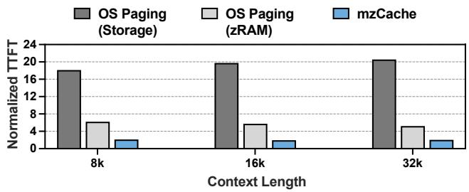  
Figure 3: TTFT under full eviction (Galaxy S25+, Qwen3-0.6B, 8 input tokens), normalized to the allin-memory case. mzCache keeps TTFT close to the in-memory case. Note that zRAM still leaves memory pressure largely unrelieved (Table 2).

Even when the LLM process avoids termination, the restora- tion introduces substantial latency. When an inference re- quest arrives, the OS must restore both weights from storage and KV cache from swap space through on-demand paging: pages are brought back into memory only when accessed during inference, triggering page faults [49]. Because prefill must access all weights and the entire KV cache to generate the first token, page faults continue throughout restoration until all evicted data has been recovered. As shown in Fig- ure 3, this on-demand restoration severely degrades TTFT. Under full eviction, TTFT increases by 18–20 times when using flash storage swap and 5–6 times when using zRAM, compared to the all-in-memory case.

2) Page-locked region. Memory pinned by an accelerator (GPU or NPU) driver, or locked through system calls like mlock, is exempt from paging: the OS cannot evict these pages regardless of pressure. The only lever the OS retains here is the LMK, which terminates the process and thereby incurs the cold-start penalty described above.

To avoid even this penalty, Android AICore [2] provides Google’s Gemini Nano model as a system-level service efectively shielded from LMK termination [3], with its weights locked in memory and exempt from paging [55, 56]. As a result, the weights always remain in memory, ready for infer-ence without restoration. This protection, however, comes at a critical cost: the locked weights occupy RAM even when the service is idle, wasting scarce memory and reducing headroom for other applications. Moreover, it provides no solution for the KV cache, which can still be evicted under pressure, reintroducing significant latency upon resumption.

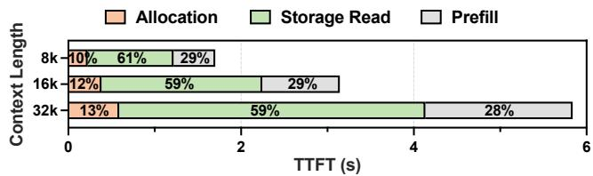  
Figure 4: TTFT breakdown when loading entire weights and KV cache from flash storage and executing infer- ence on GPU (OnePlus 12, Qwen3-0.6B, 8 input tokens), showing time spent on allocation, storage reads, and prefill across diferent context lengths.

## 3.2 Design Constraints

Since the OS handles neither memory region well, mobile LLM inference systems must themselves incorporate principled memory management. Building such a solution requires two capabilities: (1) evicting memory under pressure to make room for concurrent applications, and (2) rapidly restoring evicted data to run inference when a new request arrives. However, several constraints in existing LLM inference sys- tems and mobile platforms make achieving these capabilities challenging.

Monolithic memory bufer. LLM inference systems typi-cally adopt monolithic memory allocation: they allocate one large contiguous bufer at initialization to avoid repeated allocation overhead and simplify memory layout management for performance-critical kernels. However, the monolithic approach operates as all-or-nothing: the system cannot ad- just its memory footprint in response to memory pressure. Without mechanisms to partially release or allocate memory, adaptive memory management becomes infeasible.

Limited memory hierarchy. On mobile platforms, prefill relies on accelerators such as GPUs to achieve acceptable performance [11, 61]. When data is not resident in accelerator memory, the system must restore it before prefill can proceed. On servers, discrete GPU systems provide a separate host memory tier: data ofloaded from GPU memory can be tem- porarily stored in host memory and quickly restored via highbandwidth interconnects such as PCIe [12, 17, 25, 67]. Mobile platforms, however, employ unified memory architectures where accelerators and the CPU share the same physical memory, eliminating this intermediate fast-access tier. Con-sequently, systems must rely on flash storage, where slow read performance becomes a critical bottleneck. As shown in Figure 4, storage reads dominate restoration time, accounting for 59–61% of TTFT across diferent context lengths.

Allocation overhead. Since eviction releases memory re- gions back to the system, restoration requires re-allocating them before any data can be loaded. This re-allocation incurs substantial overhead, as it involves system calls that trigger page allocation, zeroing, and IOMMU / SMMU1 page table updates [7, 22]. The cost scales with the allocation size and recurs at every restoration. As shown in Figure 4, allocation accounts for 10–13% of TTFT, representing a non-trivial cost that compounds the restoration latency.

## 3.3 Opportunities

To achieve the goal of responsive LLM inference restoration, it is critical to understand and leverage the unique charac- teristics of mobile memory systems. We identify two such characteristics: (1) the use of compressed memory regions, and (2) the unified memory architecture.

Due to the low access speeds of flash storage on mobile devices, memory ofloading on mobile is often bound by storage I/O. To overcome this, Android’s zRAM ofers a com pressed region in the main memory, providing a small but high-throughput alternative to the larger but slower storage path (§2.3). We reinterpret this dual-choice ofloading concept of the mobile OS for LLM memory management, and apply compressed ofloading to the dynamically generated KV cache while keeping the static model weights on the flash storage. The reason is clear: the KV cache exhibits similarity between adjacent tokens and channels, allowing higher com pression ratios with minimal accuracy loss [23, 36, 37, 48, 68], while the larger model weights can remain unchanged in storage, allowing reduced I/O on eviction and a more eficient use of the system’s memory resources.

The single shared physical memory on mobile devices also provides a key opportunity for eficient LLM memory management. This unified memory provides a common workspace for diferent processors of the mobile SoC to co- ordinate the use and management of the LLM memory, of- ten at the same time. For example, the GPU can focus on high-throughput prefill computation, while the CPU handles memory management tasks such as allocation, storage reads, and decompression, without requiring costly memory copies between the two processors. By carefully partitioning the LLM memory into manageable chunks and scheduling the access patterns between the GPU and CPU, the two proces- sors can cooperate to leverage the unified memory of the mobile system to its full potential.

A natural concern in exploiting both opportunities simulta-neously is memory bandwidth contention, as the two restore paths and the two processors share the physical memory subsystem. In practice, however, this shared bandwidth is an underutilized resource, since no single processor can fully utilize it [11] and storage reads occupy only a small fraction of it2. The shared memory bandwidth is thus an enabler rather than a bottleneck: engaging the CPU, GPU, and storage to-gether puts this spare bandwidth to work for restoration.

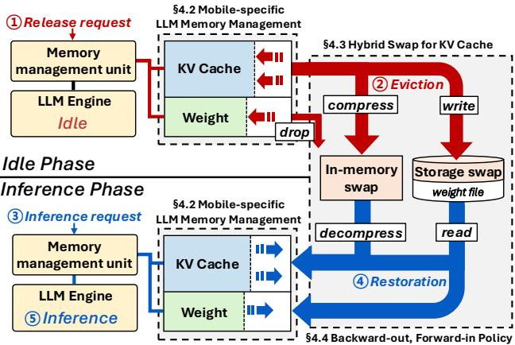  
Figure 5: System Overview of mzCache

## 4 SYSTEM DESIGN

## 4.1 Overview

Figure 5 presents an overview of mzCache. mzCache operates in two distinct phases: the idle phase and the inference phase. During the idle phase, when the system receives a memory release request due to external memory pressure ➀, mzCache evicts the requested amount of LLM memory ➁. The idle phase continues until a new inference request arrives ➂. During the inference phase, mzCache restores evicted LLM memory ➃ and performs inference ➄. After the inference completes, the system transitions back to the idle phase.

Unlike server-side LLM systems with exclusive control over GPU memory, a mobile LLM inference system faces dynamic and unpredictable pressure from competing user applications. To overcome this novel challenge, it is critical that LLM memory is elastically reduced according to outside memory pressure, evicting only the necessary amount of memory while maintaining readiness for rapid restoration throughout the eviction process. mzCache enables and leverages this Restoration-oriented Eviction concept to the fullest, allowing low-latency restoration of LLM memory under any pattern or degree of memory pressure that an LLM inference system may face in the mobile environment.

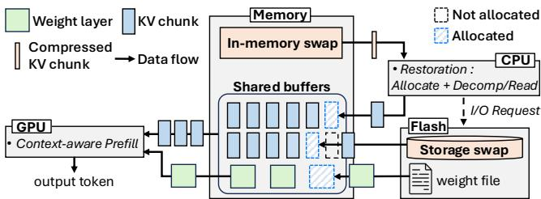  
Figure 6: Overview of GPU-CPU cooperation on the mobile SoC’s unified memory during mzCache restora- tion.

To realize this, we first design an LLM memory manage-ment mechanism that can leverage the unified memory of mobile environments to enable fine-grained management of LLM memory with concurrent model execution (§4.2). On top of this mechanism, two policies govern the eviction and restoration process to ensure eficient memory recovery from any intermediate eviction state, providing a robust solution to the problem of dynamic memory pressure in the mobile environment. The first policy determines where to place evicted data across the two restore paths, in-memory decompression and storage reads, to balance restoration load between the two paths (§4.3). The second policy determines when each LLM data should be evicted and restored, to min imize the time to first token generation in LLM inference restoration (§4.4).

## 4.2 Mobile-specific LLM Memory Management

The main goal of mzCache’s memory management mecha- nism is to bridge the gap between mobile memory systems and its restoration-oriented eviction policies. To achieve this, we first depart from the monolithic allocation of traditional LLM inference systems and partition the layer weights and KV cache into finer-grained units, allowing the system to elastically evict data only to the minimum required amount. We use layer-level granularity for weights, since each layer forms a fixed-size unit that serves as a natural boundary for model execution. For KV cache, the layer-level granular- ity is insuficient as the KV cache size varies with context length. We instead divide each layer’s KV cache into fixed- size chunks following popular server-side practices [28], en-abling flexible partial eviction regardless of context length. We detail the exact chunk size of the KV cache in §4.3, as the most efective size depends on the I/O characteristics of the given memory system.

Using Figure 6 as an example, we show how mzCache leverages the unified memory and fine-grained units to achieve low-latency LLM memory restoration on mobile devices. We first allocate the weight layers and KV cache chunks (KV chunks) as shared bufers directl visible to both the CPU and the GPU. When a new inference request arrives after a partial eviction, mzCache immediately begins the prefill com-putation of the request on the GPU using the partial weights and KV chunks that remain in shared bufers. Concurrently, mzCache also restores partially evicted data on the CPU by loading weight layers and KV chunks from storage via direct I/O and decompressing KV chunks from in-memory swap, all directly into shared bufers. Since each fine-grained memory unit can be independently allocated and loaded, we distrib- ute memory allocation and data loading across multiple CPU cores to maximize restoration throughput. This design re-moves any explicit data transfers between the two processors and allows seamless pipelining between the restoration on the CPU and the consumption of the restored data on the GPU to achieve minimum-latency LLM memory restoration in mobile environments.

To compute directly on KV chunks residing in noncontigu-ous shared bufers, mzCache employs a custom attention ker- nel using OpenCL [27]. Unlike server-side systems that must coordinate KV cache history across concurrent multi-user requests using a prefix-tree system [28, 67, 70], mobile inference serving a single user can manage KV cache through a simple array of KV chunk pointers. Our kernel targets prefill over a large KV cache accumulated from prior interactions. Due to the restricted load/store bandwidth ofmobile GPU on- chip memory [29] and limited data reuse from single-batch serving of mobile LLMs, we find that caching the KV data on the GPU on-chip memory is often slower than streaming directly from shared bufers. Therefore, the kernel reads KV chunks directly from shared bufers and streams through the chunk pointer array, applying online softmax [15] across noncontiguous chunks to enable seamless single-pass atten- tion without consolidation. To maximize throughput, the kernel employs 8-wide FP16 vector operations that exploit the double-rate FP16 execution hardware of the Qualcomm Adreno GPUs that we mainly target.

## 4.3 Hybrid Swap for KV Cache

As identified in §3.3, compressing the KV cache in memory during eviction opens a second restore path, in-memory decompression, alongside storage reads. However, a fixed assignment that simply directs the KV cache to in-memory space and the weights to storage is insuficient: the two restore paths have diferent throughputs and the KV cache size varies with context length, so restoration inevitably becomes imbalanced. To address this, mzCache introduces hybrid swap for the KV cache: rather than assigning KV cache exclusively to in-memory compressed space, a portion is also written to storage, enabling the system to distribute data across both paths.

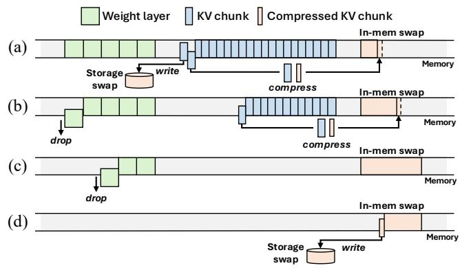  
Figure 7: Four eviction stages in mzCache. (a) KVonly: evict KV chunks to both swap spaces. (b) KVandW: drop weights while evicting KV. (c) Wonly: drop only weights. (d) CompKV: compressed KV may be evicted to storage under further pressure.

The key question is how to determine this distribution, given that the system cannot know in advance how much memory will ultimately be evicted. Consider, for example, a policy that evicts all KV chunks first across both paths before dropping any weight layer. Distributing KV cache evenly may appear balanced initially. But once all KV cache has been evicted and further eviction is needed, the system has no choice but to drop weight layers, which must later be reloaded from storage. As more weight layers are dropped, the restoration load shifts increasingly toward the storage path, breaking the balance. This illustrates that a more prin- cipled approach is needed.

Ofline profiling. Balancing the two restore paths requires knowing how long each takes to process a unit of data. These per-unit times come from a one-time profiling on each target device, which measures two throughputs: the decompression throughput of the configured compression algorithm and the sequential read throughput of the flash storage via direct I/O. Given the sizes of a KV chunk and a weight layer, dividing each by the corresponding throughput yields the three per unit times: $t _ { d } ^ { \mathrm { K V } }$ (decompress one KV chunk), $t _ { r } ^ { \mathrm { K V } }$ (read one KV chunk from storage), and $t _ { r } ^ { \mathrm { W } }$ (read one weight layer from storage). Even when a diferent model changes these unit sizes, the per-unit times are simply re-derived from the same measured throughputs, without re-profiling the device.

KV chunk size. For the per-unit profiling above to be valid, each path must operate at full throughput even for a single unit. Decompression satisfies this regardless of data size: in our measurements, its throughput remains constant. Stor age reads, in contrast, reach full bandwidth only when each read request is suficiently large: in our experiments on UFS

Algorithm 1 Hybrid Swap Eviction Policy   
Input: Per-unit times $t _ { d } ^ { \mathrm { K V } } , t _ { r } ^ { \mathrm { K V } } , t _ { r } ^ { \mathrm { W } } ;$ ; threshold �   
1: $N _ { \mathrm { K V } }  N _ { \mathrm { K V } } ^ { \mathrm { t o t a l } }$ ⊲ KV chunks not yet evicted   
2: $N _ { \mathrm { W } }  N _ { \mathrm { W } } ^ { \mathrm { t o t a } }$ l ⊲ weight layers not yet dropped   
3: while release request do   
4: if $N _ { \mathrm { K V } } > T$ then   
5: $N _ { \mathrm { K V } } \gets$ KVonly $( N _ { \mathrm { K V } } , t _ { d } ^ { \mathrm { K V } } , t _ { r } ^ { \mathrm { K V } } )$   
6: else if $ { N _ { \mathrm { K V } } } > 0$ and $\tilde { N } _ { \mathrm { { W } } } \ddot { > } 0$ then   
7: � , � ← KVandW $( N _ { \mathrm { K V } } , N _ { \mathrm { W } } , t _ { d } ^ { \mathrm { K V } } , t _ { r } ^ { \mathrm { W } } )$   
8: else if $N _ { \mathrm { W } } > 0$ then   
9: �W ← Wonly(�W)   
10: else   
11: CompKV()   
12: end if   
13: end while

4.0 flash storage, sequential reads saturate the storage band- width at about 512 KB per operation. Weight layers, at tens of megabytes each, are well above this size. To meet this thresh- old for models with a small KV hidden dimension (e.g., 512), a minimum of 256 tokens per chunk is required.3 We therefore fix the chunk size at 256 tokens across all configurations.

Four-stage eviction. Since KV chunks can be directed to either restore path, they serve as the balancing lever between the two paths. To keep the two paths balanced, mzCache sets aside enough KV chunks to cover the weight reload: the threshold $T$ is the number of KV chunks that keeps the decompression path occupied while all weight layers are reloaded from storage. The eviction policy follows from how the remaining number of KV chunks $( N _ { \mathrm { K V } } )$ relates to � throughout eviction.

Let $N _ { \mathrm { K V } } ^ { \mathrm { t o t a l } }$ and $N _ { \mathrm { W } } ^ { \mathrm { t o t a l } }$ denote the total number ofKV chunks and evictable weight layers, respectively.4 While reloading one weight layer from storage, the decompression path can process $\mathsf { \bar { L } } t _ { r } ^ { \mathrm { W } } / t _ { d } ^ { \mathrm { W } } ]$ KV chunks, giving:

$$
T = N _ { \mathrm { W } } ^ { \mathrm { t o t a l } } \cdot \lfloor t _ { r } ^ { \mathrm { W } } / t _ { d } ^ { \mathrm { K V } } \rfloor
$$

Two cases arise based on whether $N _ { \mathrm { K V } } ^ { \mathrm { t o t a l } }$ exceeds � (Algorithm 1, Figure 7).

1) KVonly→ KVandW $( N _ { \mathrm { K V } } ^ { \mathrm { t o t a l } } > T ) .$ . The KV cache exceeds what the decompression path alone can handle, so eviction starts in KVonly, evicting KV chunks to both swap spaces while weights remain untouched. The chunks are split in inverse proportion to $t _ { d } ^ { \mathrm { K V } }$ and $t _ { r } ^ { \mathrm { K V } }$ , with the faster path tak- ing more, so that both paths finish restoring their shares in the same amount of time. Once $N _ { \mathrm { { K V } } }$ falls to �, the system transitions to KVandW, compressing remaining KV chunks to in-memory space while dropping weight layers: for every layer dropped, $\lfloor { t _ { r } ^ { \mathrm { W } } } / t _ { d } ^ { \mathrm { K V } } \rfloor$ KV chunks are compressed. Because $N _ { \mathrm { { K V } } }$ equals � at this transition, the remaining KV chunks and the weight layers run out together.

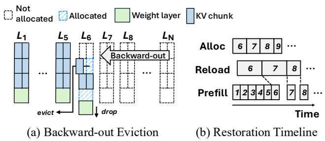

2) KVandW → Wonly $( N _ { \mathrm { K V } } ^ { \mathrm { t o t a l } } ~ \leq ~ T )$ . All KV cache fits within the decompression path, so eviction starts directly at KVandW. With fewer KV chunks than the weight reload requires, however, the KV cache is exhausted while weight layers still remain. Eviction then continues in Wonly, drop- ping the remaining weight layers.

In either case, once all weight layers have been dropped and all KV chunks evicted, only the compressed KV chunks remain in the in-memory swap space. If memory pressure persists even then, the system enters CompKV, moving the compressed KV to storage to release this last portion of memory.

Balance preservation. Throughout KVonly and KVandW, every increment of eviction adds equal restoration work to both aths, so the lacement remains balanced wherever eviction stops. Wonly and CompKV extend beyond the point where this balance can be maintained: no KV chunks are left to assign to the decompression path, so any further eviction can no longer be balanced across the two paths. Because they are entered only after the earlier stages have balanced the placement across both paths, the system still preserves the best achievable balance for the given eviction amount.

## 4.4 Backward-out, Forward-in Policy

While §4.3 determines where to place evicted data across restore paths, this section addresses in what order to evict and restore weight layers and KV chunks. To determine this order, we must consider the sequential dependency struc- ture of LLM inference: each layer $( L _ { i } )$ cannot begin until the preceding layer $\left( L _ { i - 1 } \right)$ completes, so eviction ordering di-rectly determines whether restoration and prefill can proceed concurrently. Consider, for example, an LRU-based policy, widely used in OS page reclamation [20], that evicts the earliest-accessed layers starting from $L _ { 1 }$ . Even if only a small amount of memory is reclaimed, prefill cannot start until $L _ { 1 }$ is restored, leaving the GPU entirely idle. Under this pol icy, prefill is always blocked by restoration regardless of the eviction amount. This is especially problematic in mobile environments where the eviction amount is unpredictable.

mzCache takes the opposite approach, following the well- known MRU-style ordering (Figure 8a). The system evicts in reverse layer order, always taking the rearmost of the remaining weight layers and KV chunks.5 This backwardout eviction ensures that early layers are always preserved regardless of how much memory is ultimately reclaimed.

Figure 8: Backward-out eviction and restoration overlap in mzCache. (a) Eviction proceeds from the last layer backward. (b) Timeline of GPU prefill overlap-ping with CPU restoration of evicted layers.

Restoration then proceeds forward from the earliest evicted layer (forward-in), matching the order inference will access them. As prefill progresses through $L _ { 1 }  L _ { 2 }  \cdots$ , the CPU concurrently restores evicted layers in the same direction, naturally overlapping the two processes and minimizing prefill stalls (Figure 8b).

The backward-out, forward-in policy produces a natural LIFO access pattern: compressed KV chunks are added in tail order during eviction and removed in head order dur- ing restoration. mzCache exploits this by organizing the in-memory swap space as a stack. Rather than pre-allocating a large fixed-size stack, the system begins with a small stack and grows incrementally, allocating additional stack seg- ments only when needed and releasing them after restoration completes. This approach minimizes the memory footprint and reduces fragmentation.

## 5 IMPLEMENTATION

We implement mzCache with 6k lines of C/C++ on top of llama.cpp [18], an open-source LLM inference framework that supports various backends including mobile GPUs [58]. Compression and kernels. mzCache treats KV cache com-pression as a modular component with a drop-in replaceable interface. In our implementation, we adopt two existing compression algorithms: 8-bit quantization [48] and CacheGen [36], a higher-ratio technique at the cost of slower decompression. We use 8-bit quantization as the default method, and compare the two in §6.5. To enable these com-pression methods on the CPU, we implement new compres-sion and decompression kernels using ARM NEON SIMD instructions [8], targeting the ARMv8-A architecture commonly found in mobile devices. Our custom GPU attention kernel is implemented in 0.6k lines of OpenCL [27], and shared bufers between the CPU and GPU are realized using OpenCL’s Shared Virtual Memory (SVM) [9].

Table 3: Evaluation testbed specifications
<table><tr><td colspan="5">Devices</td></tr><tr><td>Device</td><td>CPU</td><td>GPU</td><td>Memory</td><td>Storage</td></tr><tr><td>Galaxy S25+</td><td>2×Oryon Phoenix L 6×Oryon Phoenix M</td><td>Adreno 830</td><td>12 GB LPDDR5X</td><td>UFS 4.0</td></tr><tr><td>OnePlus 12</td><td>1×Cortex-X4 5×Cortex-A720 2×Cortex-A520</td><td>Adreno 750</td><td>12 GB LPDDR5X</td><td>UFS 4.0</td></tr><tr><td colspan="3">LLM Models</td><td></td><td></td></tr><tr><td>Model</td><td>Weights</td><td></td><td>KV cache (8k / 16k / 32k)</td><td></td></tr><tr><td>Qwen3-0.6B</td><td>1.2 GB</td><td></td><td>0.9 GB / 1.8 GB / 3.5 GB</td><td></td></tr><tr><td>EXAONE-4.0-1.2B</td><td>2.6 GB</td><td></td><td>0.5 GB / 1.0 GB / 1.9 GB</td><td></td></tr></table>

Eviction and restoration interface. mzCache provides interfaces for both eviction and restoration operations, as-suming that the amount of memory to release is provided externally:

• evict(size): Given the amount of memory to be released, this function evicts LLM memory based on the current state until the specified size is freed.

• restore\_generate(input\_tokens): This function restores evicted LLM memory based on the current state. Using C++ primitives such as std::promise, it allows the GPU to begin prefill computation on layers as soon as they are restored.

System integration. SVM bufers are allocated through the GPU driver and thus belong to the page-locked region described in §3.1, which the OS paging path cannot reclaim. Consequently, mzCache operates independently of the OS paging path, and deploying mzCache requires no modifications to the OS kernel. For memory pressure detection, we use Android’s onTrimMemory callback in our applicationlevel deployment (§6.6).

## 6 EVALUATION

This section evaluates mzCache, analyzing the impact of its optimization techniques and demonstrating its practicality in mobile multitasking environments. We first compare overall performance against baselines (§6.2), then dissect the contribution of each core technique (§6.3), measure power and energy consumption (§6.4), compare compression algorithms in terms of compression ratio, accuracy, and TTFT (§6.5), and validate its efectiveness in real-world deployment (§6.6).

## 6.1 Experimental Setup

Devices. Table 3 summarizes device specifications. We eval uate on two of-the-shelf smartphones representing difer- ent processor generations. On Galaxy S25+ [45], big cores handle decompression and storage I/O while middle cores perform allocation. On OnePlus 12 [40], we distribute workloads across the six higher-performance cores, excluding the two little cores.

LLM models. We evaluate mzCache using two lightweight LLMs: Qwen3-0.6B [43] and EXAONE-4.0-1.2B [32]. Table 3 shows their weight sizes and KV cache sizes at diferent context lengths.

Number of tokens. Real-world LLM conversation traces show that accumulated context readily reaches thousands of tokens as interactions progress [63]. We use context lengths of 8k, 16k, and 32k tokens to evaluate performance across representative KV cache sizes. We fix the input sequence length to 8 tokens to model a short follow-up query against the accumulated context.

Baselines. We compare mzCache against two baselines:

1) OS Paging. We leverage the default Android paging mechanism to represent the behavior of LLM services that rely solely on OS memory management. Model weights are managed via standard memory mapping (mmap) as filebacked pages, while the KV cache is treated as anonymous memory and compressed into zRAM using the zstd algorithm [14]. Since this approach relies on OS-level page fault handling, we run inference on the CPU: GPU bufers reside in the page-locked region (§3.1), which the OS paging path cannot reclaim, so a GPU-based deployment ofers no graceful reclaim path and thus cannot serve as a partial-eviction baseline. On the CPU, pages are restored on demand as they are accessed.

2) Partial Ofload. Since no existing mobile LLM system provides mechanisms to handle memory pressure, we imple-ment a partial ofload baseline in llama.cpp. Note that default llama.cpp adopts monolithic memory allocation, limiting it to all-or-nothing eviction. To enable fair comparison with mzCache across diferent eviction amounts, we extend it to support partial eviction and restoration at layer granularity for both weights and KV cache. Upon restoration, the base- line sequentially loads weights and KV cache from storage into GPU memory before executing prefill on the GPU. Con-sequently, the eviction and restoration order does not afect its performance. Only the eviction amount matters.

Measurements. We measure CPU memory usage via smaps and GPU memory usage through the gpumem\_mapped\_bytes value exposed by the Qualcomm KGSL driver [42]. smaps reports how much data is swapped out, not how much space it occupies after zRAM compression. Thus, for OS Paging, we pre-profile the compression ratio from full swap-out sce- narios and apply it to the reported size to estimate the actual memory footprint. Power consumption is estimated by multiplying the battery’s current and voltage values obtained from sysfs. To evaluate the impact of diferent compression algorithms on accuracy, we measure F1 scores using 428 question-answer pairs from 30 documents in TriviaQA [26], whose context lengths range from 8.8k to 28k tokens. Ex- cept for application-level deployment experiments, all mea surements are conducted through Android Debug Bridge (ADB) [19].

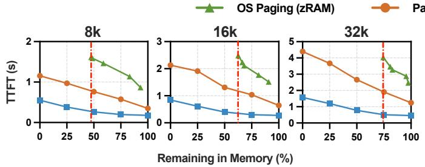

(a) Galaxy S25+, Qwen3-0.6B  
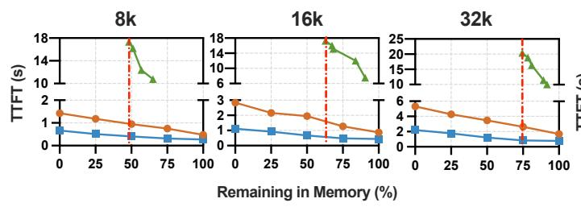

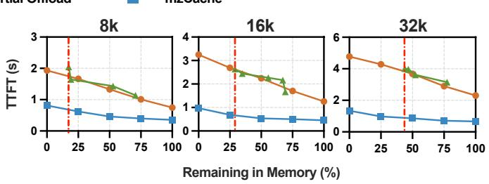

(c) OnePlus 12, Qwen3-0.6B  
(b) Galaxy S25+, EXAONE-4.0-1.2B  
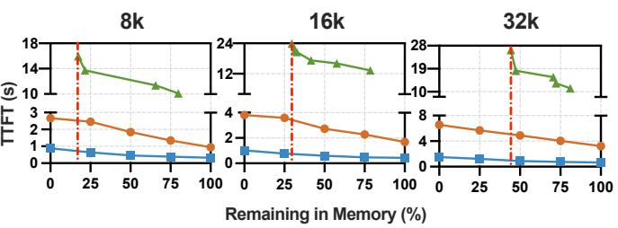  
(d) OnePlus 12, EXAONE-4.0-1.2B  
Figure 9: TTFT across diferent remaining-memory levels. The red dashed line marks full eviction under OS Paging, which still retains non-negligible memory due to poor KV cache compression. mzCache consistently achieves lower TTFT than baselines across all conditions.

## 6.2 Overall Performance - TTFT

We evaluate restoration and inference scenarios with vary- ing amounts of LLM memory remaining in system memory. Remaining in memory denotes the percentage of weights and KV cache that stays resident in memory after eviction. This includes compressed KV cache held in system memory. We exclude token embeddings for simplicity.

For Partial Ofload and mzCache, we compare the restora- tion performance at 0%, 25%, 50%, and 75% of remaining memory. Since granularity difers between the two, we allow a ±3% margin, always evicting slightly more in mzCache to ensure fairness. For OS Paging, we evict data by running a memory-intensive dummy process to induce OS-level reclamation. Since the ratio of evicted weights to KV cache at a given remaining memory level can afect TTFT, we drop weights before swapping out KV cache to keep this ratio fixed across runs, isolating the remaining-memory level as the sole variable.

TTFT comparison. Figure 9 shows that mzCache consis- tently achieves lower TTFT than Partial Ofload across all configurations. Specifically, mzCache achieves a 2.1–5.5× speedup at 0%, 25%, 50%, and 75% remaining memory levels. The speedup is consistent regardless of KV cache size, model type, or device, demonstrating mzCache’s efective- ness across diverse scenarios. OS Paging performs worse than Partial Ofload in most cases. Consistent with Figure 3, this latency is dominated by on-demand paging in restoration rather than prefill computation. On the OnePlus 12, OS Paging exhibits significantly higher latency with large vari-ance. During restoration, we monitored the resident set size (RSS) and observed that it sometimes decreased rather than increased, indicating that on-demand page faults triggered additional evictions of already-resident pages. This cascading efect substantially increases TTFT.

Analysis of compressed KV cache. The red vertical dashed line in Figure 9 marks the remaining memory when all weights are dropped and all KV cache is swapped out under OS Paging. Even with full eviction, OS Paging consumes substantial memory due to poor KV cache compression. In contrast, mzCache reduces remaining memory to 0% by evicting compressed KV cache to storage in the CompKV stage. At these respective full-eviction states, mzCache achieves a 2.5– 3.0× speedup over OS Paging on Galaxy S25+ and 9.2–25.9× on OnePlus 12.

## 6.3 Impact of Core Techniques

To understand the contribution of each core technique in mzCache, we conduct a detailed breakdown analysis of each technique. For focused comparison, we use Galaxy S25+ with Qwen3-0.6B, restoring from 50% remaining memory for a representative case unless noted.

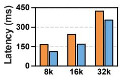

(a) Allocation  
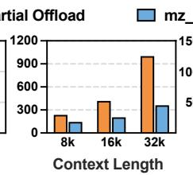  
(b) Reload

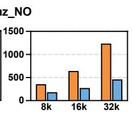  
(c) Prefill

Figure 10: Latency breakdown for (a) allocation, (b) reload, and (c) prefill. Partial Ofload vs. mzCache without overlap (mz\_NO).  
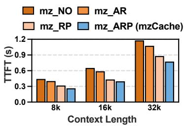  
(a) w/o Overlap

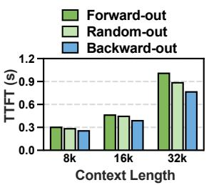  
(b) Eviction Policy  
Figure 11: TTFT with diferent (a) overlapping strategies and (b) eviction policies. mz\_NO: no overlap, mz\_AR: Allocation-Reload overlap, mz\_RP: Reload-Prefill overlap, mzCache: Allocation-Reload-Prefill overlap.

Breakdown of performance improvements. Figure 10 shows the latency of allocation, reload, and prefill for Partial Ofload and mzCache. For a clear analysis, we disable the overlapping feature of mzCache. mzCache achieves a 1.37× speedup in allocation through parallelized memory alloca- tion across CPU cores, 2.15× in reload via zero-copy transfers and hybrid swap (further analyzed in Figure 12), and 2.33× in prefill using a mobile-optimized attention kernel.

Benefits of overlapping. Figure 11a demonstrates the efect of overlapping by comparing four configurations: no overlap, allocation-reload overlap, reload-prefill overlap, and full overlap of all three operations. Overlapping allocation and reload achieves 1.10× speedup, while overlapping reload and prefill achieves larger gains of 1.41×. Full overlap of alloca tion, reload, and prefill yields 1.61× speedup, demonstrating the cumulative benefit of overlapping all phases.

Impact of eviction ordering. Figure 11b evaluates the im-pact of our backward-out eviction policy. For comprehensive comparison, we implement two alternative eviction policies: forward-out, which evicts early layers first similar to LRU-based eviction, and random-out, averaged over 10 runs. All policies use forward-in restoration ordering. The results show that backward-out minimizes prefill stalls during infer- ence, confirming the importance of evicting later layers first to preserve early layers needed for immediate computation. Efect of hybrid swap. Figure 12 shows the efect of hybrid swap, demonstrating two key benefits: first, the speedup achieved by restoring via parallel paths compared to sequential restoration, and second, the efectiveness of load bal- ancing between the two restore paths. The sequential case shows that the two restoration paths achieve similar laten- cies, confirming efective load balancing. As a result, parallel restoration significantly outperforms the sequential case.

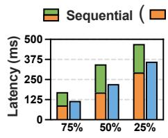  
(a) 8k

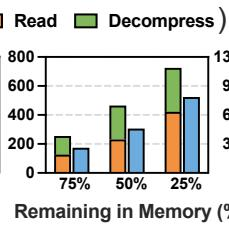  
(b) 16k

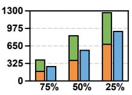  
(c) 32k

Figure 12: Sequential vs. parallel restoration time at different remaining memory levels. Sequential bars show stacked in-memory and storage restoration times.  
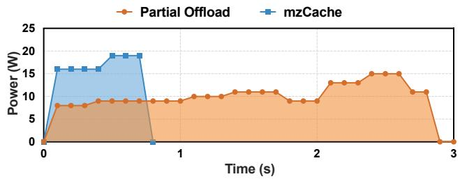  
Figure 13: Power consumption during restoration and prefill. The shaded area under each curve indicates total energy consumption. Due to the reduced TTFT, mzCache consumes significantly less energy than Partial Ofload despite its higher peak power.

## 6.4 Power and Energy Consumption

Figure 13 shows the power consumption trace during restoration and prefill on Galaxy S25+ with Qwen3-0.6B at 50% remaining memory and 32k context length. mzCache exhibits higher peak power at 19.2 W compared to Partial Ofload’s 14.6 W, because mzCache fully utilizes storage, CPU, and GPU in parallel. Despite the higher peak power, mzCache completes the restoration and prefill process significantly faster, and as shown by the shaded area under each curve rep- resenting total energy consumption, mzCache consumes less energy overall. This demonstrates that mzCache’s latency reduction achieves better energy eficiency, an important consideration for battery-constrained mobile devices.

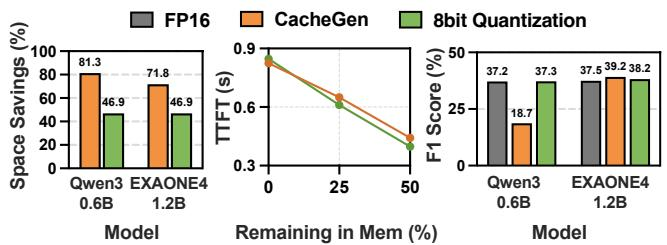  
Figure 14: Comparison of 8-bit quantization and CacheGen: space savings, TTFT at diferent remaining memory levels, and F1 score relative to FP16.

## 6.5 Compression Algorithm Comparison

mzCache treats KV cache compression as a modular com-ponent, allowing the algorithm to be replaced as needed. To analyze how the choice of compression algorithm af- fects performance, we compare 8-bit quantization [48] and CacheGen [36] on Galaxy S25+ in Figure 14. Space savings and TTFT are measured at 16k context length. At 50%, 8-bit quantization achieves lower TTFT due to faster decompres- sion from in-memory swap. At 0%, CacheGen achieves better performance because its higher compression ratio reduces the size of compressed KV cache that must be loaded from storage. Both algorithms maintain comparable F1 scores on EXAONE-4.0-1.2B, while 8-bit quantization better preserves accuracy on Qwen3-0.6B, likely due to its larger KV hidden dimension and smaller model size. Notably, both algorithms are idempotent, so repeated compression and decompression do not accumulate error, keeping accuracy stable across swap cycles. These results show that the choice of compression algorithm should be tailored to the deployment scenario.

## 6.6 Verifying Real-world Deployment

To validate mzCache in a real mobile multitasking setting, we deploy an Android LLM application on Galaxy S25+ running Qwen3-0.6B with a 32k context length. To generate realistic memory pressure, we interleave LLM use with everyday smartphone activity across ten rounds over ∼45 minutes. Within each round, we interact with a range of popular consumer apps—social networking, video streaming, gaming, camera, and web browsing6—before triggering a prefill on the LLM application at the round’s end. We compare three configurations: OS Paging (zRAM), from §6.1; mzCache (15 pp), which evicts approximately 15 percentage points (pp) of LLM memory upon each Android onTrimMemory callback; and mzCache (25 pp), which evicts approximately 25 pp.

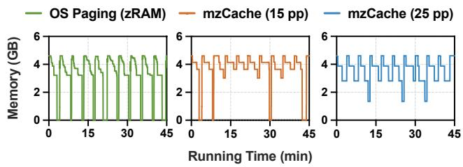  
Figure 15: Total memory trace of an LLM application under real-world multitasking, comparing OS Paging (zRAM) with mzCache evicting approximately 15 pp and 25 pp of LLM memory under pressure. OS Paging is terminated by the LMK in every round, whereas mzCache (25 pp) survives the entire session.

Figure 15 shows memory traces over the session. OS Pag- ing is terminated by the LMK because the KV cache com-presses poorly, forcing a cold start on every return. In contrast, mzCache (25 pp) progressively evicts memory as pres-sure builds and survives all ten rounds, restoring context on each return without a cold start. This shows that mzCache remains efective under real-world multitasking pressure where OS memory management fails. With a smaller eviction amount, however, mzCache (15 pp) is terminated in four of ten rounds. Since process termination is decided by the LMK and mzCache operates independently of the OS, mzCache cannot prevent such terminations entirely. How much memory to evict, and when, thus becomes important for practical deployment, which we discuss in §7.

## 7 DISCUSSION

Extensibility across hardware. In our implementation, the CPU handles decompression while the GPU executes prefill, but these roles are not fixed and can be adapted to diferent hardware configurations; for instance, prefill can run on an NPU, or decompression can be ofloaded to the GPU. More broadly, although we implement mzCache on a Qualcomm SoC, its design applies to any unified-memory SoC, including those now found in laptops and workstations. Porting mzCache to other hardware platforms thus requires replacing only the device-specific kernels to match each target SoC, while the rest of the system remains unchanged. Pressure detection and eviction amount. mzCache de- couples both memory pressure detection and the eviction amount from its core design, so each can be set per de- ployment. An application-level deployment can detect pressure via callbacks such as onTrimMemory and evict a larger amount to reduce the risk of LMK termination. A systemlevel deployment can instead use kernel signals such as vmpressure or PSI, and its low oom\_score\_adj places it far down the LMK’s kill order, substantially reducing the risk that motivated the larger eviction amount [3]. The core mechanism is unchanged in either case, making mzCache deployable across the software stack, from third-party appli- cations to system-level services.

Multi-context support. mzCache currently supports a sin-gle LLM context scenario. However, as LLM applications be- come more prevalent, multiple LLM applications may coexist, each maintaining its own weights and KV caches. mzCache can be extended to handle such scenarios by adding coordi- nation policies and data structures for managing multiple weights and KV caches. Such extensions are beyond the scope of this work and we leave them for future work.

Thermal throttling. mzCache balances the two restore paths using the sequential read and decompression through- puts obtained by ofline profiling. Under sustained load, ther- mal throttling can shift these throughputs and thereby dis- rupt the balance between the two paths. One way to address this is to profile across multiple memory and CPU frequency combinations in advance, allowing mzCache to adapt to the current operating conditions at runtime. Such runtime adap- tation, however, would require migrating already-evicted data between the two paths to match the new balance point. Selectively activated models. Our design assumes that first-token generation touches all model weights and the entire KV cache, which holds for dense transformer models. Some architectures, however, activate only a subset at the first token: mixture-of-experts (MoE) models route each layer to a few experts [47], and sparse-attention models attend to only part of the KV cache [52]. For such models, the natural extension is to restore the activated subset first and defer the rest. Since which experts or KV chunks are active is inputdependent and not fully known before prefill, it must be predicted in advance, e.g., from statistics of prior interactions. Incorporating such predictions into the restoration order is an interesting direction for future work.

## 8 RELATED WORK

Ofloading-based LLM inference. Several systems ofload LLM data between GPU, CPU, or disk throughout inference to accommodate model weights and KV cache that exceed GPU memory [31, 48, 51]. Other work focuses on managing stored KV cache contexts across memory tiers to accelerate restoration upon reuse [12, 17, 25, 66, 67]. In all cases, the LLM system controls what to ofload and when, with full knowledge of available memory. mzCache addresses a fundamentally diferent setting where eviction is externally imposed under unpredictable memory pressure, requiring a new system that adapts its memory management to un- known eviction amounts at runtime.

Mobile LLM inference systems. Existing optimizations for on-device LLM inference focus on accelerating runtime exe- cution through heterogeneous co-execution across mobile processors [11, 21, 61], compiler and system stack optimizations for mobile SoCs [39, 54], and storage-based weight ofloading for models exceeding device memory [59, 62, 64]. However, these are all runtime inference optimizations. In mobile multitasking environments, preserving the KV cache across interactions to reuse prior context creates a memory management challenge in the idle periods between infer- ences, a phase these systems do not manage. mzCache is the first system to address it.

Hybrid swap in mobile OS. In the mobile OS domain, some systems combine in-memory compressed swap with storage-backed swap to sustain responsiveness under memory pressure [30, 34, 35, 50], an idea that inspired our design. However, their general-purpose compression fails on the LLM KV cache (§3.1). Rather than modifying the OS, we adapt hybrid swap within the LLM inference system itself, specializing it for the KV cache and driving both paths in parallel with balanced load distribution, without OS kernel modifications.

## 9 CONCLUSION

In this paper, we present mzCache, an on-device LLM inference system that elastically evicts and rapidly restores LLM memory under external memory pressure. Our eval-uation on commercial smartphones shows that mzCache achieves 2.1–5.5× faster TTFT compared to storage-backed partial ofload, and preserves the user’s context under the pressure of real-world app usage. These results validate that dedicated memory management, rather than reliance on OS- based mechanisms, is essential for responsive on-device LLM inference in multitasking environments.

## ACKNOWLEDGMENTS

We sincerely thank the anonymous reviewers and our shep- herd for their valuable comments that helped improve this paper. This work was supported by the National Research Foundation of Korea (NRF) grant (RS-2022-NR070834), an In-stitute of Information & Communications Technology Planning & Evaluation (IITP)-Information Technology Research Center (ITRC) grant (IITP-2021-0-02048), and an IITP grant (RS-2024-00418784), funded by the Korea government (MSIT). Kyunghan Lee is the corresponding author.

## REFERENCES

[1] Android. 2023. Overview of memory management. https://developer. android.com/topic/performance/memory-overview

[2] Android. 2025. Gemini nano. https://developer.android.com/ai/gemininano

[3] Android. 2025. Memory allocation among processes. https://developer. android.com/topic/performance/memory-management

[4] Android. 2025. perfetto. https://developer.android.com/tools/perfetto [5] Apple. 2025. iPhone 17. https://www.apple.com/iphone-17/

[6] Apple. 2025. Updates to Apple’s on-device and server foundation language models. https://machinelearning.apple.com/research/applefoundation-models-2025-updates

[7] ARM. 2025. Initializing the SMMU. https://developer. arm.com/documentation/100310/0202/Software-initialization-examples/Initializing-the-SMMU

[8] ARM. 2025. Neon Intrinsics. https://developer.arm.com/architectures/ instruction-sets/intrinsics

[9] ARM. 2025. Shared virtual memory. https://developer.arm.com/ documentation/101574/0601/OpenCL-2-0/Shared-virtual-memory

[10] Daihang Chen, Yonghui Liu, Mingyi Zhou, Yanjie Zhao, Haoyu Wang, Shuai Wang, Xiao Chen, Tegawendé F. Bissyandé, Jacques Klein, and Li Li. 2025. LLM for mobile: An initial roadmap. ACM Transactions on Software Engineering and Methodology (2025).

[11] Le Chen, Dahu Feng, Erhu Feng, Yingrui Wang, Rong Zhao, Yubin Xia, Pinjie Xu, and Haibo Chen. 2025. Characterizing mobile SoC for accelerating heterogeneous LLM inference. In Proceedings ofthe ACM SIGOPS 31st Symposium on Operating Systems Principles. 359–374.

[12] Weijian Chen, Shuibing He, Haoyang Qu, Ruidong Zhang, Siling Yang, Ping Chen, Yi Zheng, Baoxing Huai, and Gang Chen. 2025. IMPRESS: An importance-informed multi-tier prefix KV storage system for large language model inference. In Proceedings of the 23rd USENIX Conference on File and Storage Technologies. 187–201.

[13] Yann Collet. 2011. LZ4: Extremely Fast Compression Algorithm. https: //github.com/lz4/lz4

[14] Yann Collet. 2016. zstd: Zstandard - Fast real-time compression algo-rithm. https://github.com/facebook/zstd

[15] Tri Dao, Daniel Y Fu, Stefano Ermon, Atri Rudra, and Christopher Ré. 2022. FlashAttention: Fast and memory-eficient exact attention with IO-awareness. In Proceedings of the Neural Information Processing Systems Conference.

[16] Tao Deng, Shaheen Kanthawala, Jingbo Meng, Wei Peng, Anastasia Kononova, Qi Hao, Qinhao Zhang, and Prabu David. 2019. Measuring smartphone usage and task switching with log tracking and selfreports. Mobile Media & Communication (2019).

[17] Shiwei Gao, Youmin Chen, and Jiwu Shu. 2025. Fast state restoration in LLM serving with HCache. In Proceedings of the 20th European Conference on Computer Systems. 128–143.

[18] Georgi Gerganov. 2023. llama.cpp: LLM inference in C/C++. https: //github.com/ggml-org/llama.cpp

[19] Google. 2025. Android Debug Bridge. https://developer.android.com/ studio/command-line/adb

[20] Mel Gorman. 2004. Page Frame Reclamation. https://www.kernel. org/doc/gorman/html/understand/understand013.html

[21] Zixu Hao, Jianyu Wei, Tuowei Wang, Minxing Huang, Huiqiang Jiang, Shiqi Jiang, Ting Cao, and Ju Ren. 2025. Scaling LLM Test-Time Compute with Mobile NPU on Smartphones. In arXiv preprint arXiv:2509.23324.

[22] Ben Hawkes. 2020. Attacking the Qualcomm Adreno GPU. https://googleprojectzero.blogspot.com/2020/09/attacking-qualcomm-adreno-gpu.html

[23] Coleman Hooper, Sehoon Kim, Hiva Mohammadzadeh, Michael W. Mahoney, Yakun Sophia Shao, Kurt Keutzer, and Amir Gholami. 2024. KVQuant: Towards 10 Million Context Length LLM Inference with KV Cache Quantization. In Proceedings of the Neural Information Processing Systems Conference.

[24] Huawei. 2025. HiAI - HiAI IDE. https://developer.huawei.com/ consumer/en/hiai#Engine

[25] Jinwoo Jeong and Jeongseob Ahn. 2025. Accelerating LLM serving for multi-turn dialogues with eficient resource management. In Proceedings of the 30th ACM International Conference on Architectural Support for Programming Languages and Operating Systems. 1–15.

[26] Mandar Joshi, Eunsol Choi, Daniel Weld, and Luke Zettlemoyer. 2017. TriviaQA: A large scale distantly supervised challenge dataset for reading comprehension. In Proceedings of the 55th Annual Meeting of the Association for Computational Linguistics. 1601–1611.

[27] Khronos Group. 2025. OpenCL – The Open Standard for Parallel Programming of Heterogeneous Systems. https://www.khronos.org/ opencl/

[28] Woosuk Kwon, Zhuohan Li, Siyuan Zhuang, Ying Sheng, Lianmin Zheng, Cody Hao Yu,Joseph Gonzalez, Hao Zhang, and Ion Stoica. 2023. Eficient memory management for large language model serving with PagedAttention. In Proceedings ofthe ACM SIGOPS 29th Symposium on Operating Systems Principles. 611–626.

[29] Chester Lam. 2024. The Snapdragon X Elite’s Adreno iGPU. https: //chipsandcheese.com/p/the-snapdragon-x-elites-adreno-igpu

[30] Niel Lebeck, Arvind Krishnamurthy, Henry M. Levy, and Irene Zhang. 2020. End the Senseless Killing: Improving Memory Management for Mobile Operating Systems. In Proceedings ofthe 2020 USENIX Annual Technical Conference. 873–887.

[31] Wonbeom Lee, Jungi Lee, Junghwan Seo, and Jaewoong Sim. 2024. InfiniGen: Eficient Generative Inference of Large Language Models with Dynamic KV Cache Management. In Proceedings of the 18th USENIX Symposium on Operating Systems Design and Implementation. 155–172.

[32] LG AI Research. 2025. EXAONE 4.0: Unified Large Language Models Integrating Non-reasoning and Reasoning Modes. In arXiv preprint arXiv:2507.11407.

[33] Borui Li, Yitao Wang, Haoran Ma, Ligeng Chen, Jun Xiao, and Shuai Wang. 2025. MobiLoRA: Accelerating LoRA-based LLM Inference on Mobile Devices via Context-aware KV Cache Optimization. In Proceedings ofthe 63rd Annual Meeting ofthe Association for Computational Lin uistics. 23400–23410.

[34] Yu Liang, Aofeng Shen, Chun Jason Xue, Riwei Pan, Haiyu Mao, Nika Mansouri Ghiasi, Qingcai Jiang, Rakesh Nadig, Lei Li, Rachata Ausavarungnirun, Mohammad Sadrosadati, and Onur Mutlu. 2025. Ariadne: A Hotness-Aware and Size-Adaptive Compressed Swap Technique for Fast Application Relaunch and Reduced CPU Usage on Mobile Devices. In Proceedings ofthe 2025 IEEE International Symposium on High-Performance Computer Architecture. 1588–1602.

[35] Geunsik Lim, Donghyun Kang, Myungjoo Ham, and Young Ik Eom. 2023. SWAM: Revisiting swap and OOMK for improving application responsiveness on mobile devices. In Proceedings of the 29th Annual International Conference on Mobile Computing and Networking. 1–15.

[36] Yuhan Liu, Hanchen Li, Yihua Cheng, Siddhant Ray, Yuyang Huang, Qizheng Zhang, Kuntai Du, Jiayi Yao, Shan Lu, Ganesh Ananthanarayanan, Michael Maire, Henry Hofmann, Ari Holtzman, and Junchen Jiang. 2024. CacheGen: KV cache compression and streaming for fast large language model serving. In Proceedings of the ACM SIGCOMM 2024 Conference. 38–56.

[37] Zirui Liu, Jiayi Yuan, Hongye Jin, Shaochen Zhong, Zhaozhuo Xu, Vladimir Braverman, Beidi Chen, and Xia Hu. 2024. KIVI: A Tuning- Free Asymmetric 2bit Quantization for KV Cache. In Proceedings of the 41st International Conference on Machine Learning. 32332–32344.

[38] Llama Team. 2024. The Llama 3 herd of models. In arXiv preprint arXiv:2407.21783.

[39] Chengfei Lv, Chaoyue Niu, Renjie Gu, Xiaotang Jiang, Zhaode Wang, Bin Liu, Ziqi Wu, Qiulin Yao, Congyu Huang, Panos Huang, Tao Huang, Hui Shu, Jinde Song, Bin Zou, Peng Lan, Guohuan Xu, Fei Wu, Shaojie Tang, Fan Wu, and Guihai Chen. 2022. Walle: An End-to-End, General Purpose, and Large-Scale Production System for Device-Cloud Collabo rative Machine Learning. In Proceedings of the 16th USENIX Symposium on Operating Systems Design and Implementation. 249–265.

[40] OnePlus. 2024. OnePlus 12. https://www.oneplus.com/global/12

[41] OnePlus. 2025. OnePlus 15. https://www.oneplus.com/global/15

[42] Qualcomm. 2024. Qualcomm Linux Graphics Guide. https://docs. qualcomm.com/doc/80-70014-19/topic/graphics-overview.html

[43] Qwen Team. 2025. Qwen3 Technical Report. In arXiv preprint arXiv:2505.09388.

[44] Samsung. 2025. Galaxy AI. https://www.samsung.com/us/galaxy-ai/

[45] Samsung. 2025. Samsung Galaxy S25+. https://www.samsung.com/ us/smartphones/galaxy-s25/

[46] ShareGPT. 2022. ShareGPT. https://sharegpt.com/

[47] Noam Shazeer, Azalia Mirhoseini, Krzysztof Maziarz, Andy Davis, Quoc Le, Geofrey Hinton, and Jef Dean. 2017. Outrageously Large Neural Networks: The Sparsely-Gated Mixture-of-Experts Layer. In Proceedings ofthe 5th International Conference on Learning Representations.

[48] Ying Sheng, Lianmin Zheng, Binhang Yuan, Zhuohan Li, Max Ryabinin, Beidi Chen, Percy Liang, Christopher Ré, Ion Stoica, and Ce Zhang. 2023. FlexGen: High-throughput generative inference of large lan guage models with a single GPU. In Proceedings ofthe 40th International Conference on Machine Learning. 31094–31116.

[49] Abraham Silberschatz, Peter B. Galvin, and Greg Gagne. 2018. Operating System Concepts (10th ed.). Wiley.

[50] Sam Son, Seung Yul Lee, Jonghyun Bae, Yunho Jin, Jinkyu Jeong, Tae Jun Ham, Jae W. Lee, and Hongil Yoon. 2021. ASAP: Fast Mobile Application Switch via Adaptive Prepaging. In Proceedings of the 2021 USENIX Annual Technical Conference. 365–380.

[51] Yixin Song, Zeyu Mi, Haotong Xie, and Haibo Chen. 2024. PowerInfer: Fast Large Language Model Serving with a Consumer-grade GPU. In Proceedings of the ACM SIGOPS 30th Symposium on Operating Systems Principles. 590–606.

[52] Jiaming Tang, Yilong Zhao, Kan Zhu, Guangxuan Xiao, Baris Kasikci, and Song Han. 2024. QUEST: Query-Aware Sparsity for Eficient Long-Context LLM Inference. In Proceedings of the 41st International Conference on Machine Learning. 47901–47911.

[53] Gemma Team. 2024. Gemma 2: Improving open language models at a practical size. In arXiv preprint arXiv:2408.00118.

[54] MLC Team. 2023. MLC-LLM. https://github.com/mlc-ai/mlc-llm

[55] Robert Triggs. 2024. Tested: Google’s Pixel 9 Pro models only have 13GB RAM for apps. https://www.androidauthority.com/tested-pixel-9-pro-ai-ram-3472624/

[56] Robert Triggs. 2025. The Pixel 10 comes with 12GB ofRAM, but Google has locked some of it away. https://www.androidauthority.com/pixel-10-ai-ram-use-3591327/

[57] Ashish Vaswani, Noam Shazeer, Niki Parmar, Jakob Uszkoreit, Llion Jones, Aidan N. Gomez, Łukasz Kaiser, and Illia Polosukhin. 2017. Attention is all you need. In Proceedings of the Neural Information Processing Systems Conference.

[58] Hongqiang Wang. 2024. Introducing the new OpenCL GPU backend in llama.cpp for Qualcomm Adreno GPUs. https://www.qualcomm.com/developer/blog/2024/11/introducing new-opn-cl-gpu-backend-llama-cpp-for-qualcomm-adreno-gpu

[59] Tuowei Wang, Ruwen Fan, Minxing Huang, Zixu Hao, Kun Li, Ting Cao, Youyou Lu, Yaoxue Zhang, and Ju Ren. 2025. Neuralink: Fast

on-Device LLM Inference with Neuron Co-Activation Linking. In Proceedings of the 30th ACM International Conference on Architectural Support for Programming Languages and Operating Systems. 147–162.

[60] Zhaode Wang, Jingbang Yang, Xinyu Qian, Shiwen Xing, Xiaotang Jiang, Chengfei Lv, and Shengyu Zhang. 2024. MNN-LLM: A generic inference engine for fast large language model deployment on mobile devices. In Proceedings of the 6th ACM International Conference on Multimedia in Asia Workshops. 1–7.

[61] Daliang Xu, Hao Zhang, Liming Yang, Ruiqi Liu, Gang Huang, Meng- wei Xu, and Xuanzhe Liu. 2025. Fast on-device LLM inference with NPUs. In Proceedings of the 30th ACM International Conference on Architectural Support for Programming Languages and Operating Systems. 445–462.

[62] Zhenliang Xue, Yixin Song, Zeyu Mi, Xinrui Zheng, Yubin Xia, and Haibo Chen. 2024. PowerInfer-2: Fast Large Language Model Inference on a Smartphone. In arXiv preprint arXiv:2406.06282.

[63] Yueru Yan, Tuc Nguyen, Bo Su, Melissa Liefers, and Thai Le. 2025. ShareChat: A Dataset of Chatbot Conversations in the Wild. In arXiv preprint arXiv:2512.17843.

[64] Rongjie Yi, Liwei Guo, Shiyun Wei, Ao Zhou, Shangguang Wang, and Mengwei Xu. 2025. EdgeMoE: Empowering sparse large language models on mobile devices. IEEE Transactions on Mobile Computing (2025).

[65] Rongjie Yi, Xiang Li, Zhenyan Lu, Hao Zhang, Daliang Xu, Liming Yang, Weikai Xie, Chenghua Wang, Xuanzhe Liu, and Mengwei Xu. 2023. mllm: fast and lightweight multimodal LLM inference engine for mobile and edge devices. https://github.com/UbiquitousLearning/ mllm

[66] Wangsong Yin, Mengwei Xu, Yuanchun Li, and Xuanzhe Liu. 2024. LLM as a System Service on Mobile Devices. In arXiv preprint arXiv:2403.11805.

[67] Lingfan Yu, Jinkun Lin, and Jinyang Li. 2025. Stateful large language model serving with pensieve. In Proceedings of the 20th European Conference on Computer Systems. 144–158.

[68] Tianyi Zhang, Jonah Yi, Zhaozhuo Xu, and Anshumali Shrivastava. 2024. KV Cache is 1 Bit Per Channel: Eficient Large Language Model Inference with Coupled Quantization. In Proceedings of the Neural Information Processing Systems Conference.

[69] Lianmin Zheng, Wei-Lin Chiang, Ying Sheng, Tianle Li, Siyuan Zhuang, Zhanghao Wu, Yonghao Zhuang, Zhuohan Li, Zi Lin, Eric P. Xing, Hao Zhang, Joseph E. Gonzalez, and Ion Stoica. 2023. LMSYS-Chat-1M: A Large-Scale Real-World LLM Conversation Dataset. In arXiv preprint arXiv:2309.11998.

[70] Lianmin Zheng, Liangsheng Yin, Zhiqiang Xie, Chuyue Sun, Jef Huang, Cody Hao Yu, Shiyi Cao, Christos Kozyrakis, Ion Stoica, Joseph E. Gonzalez, Clark Barrett, and Ying Sheng. 2024. SGLang: Eficient Execution of Structured Language Model Programs. In Proceedings ofthe Neural Information Processing Systems Conference.

[71] Yue Zheng, Yuhao Chen, Bin Qian, Xiufang Shi, Yuanchao Shu, and Jiming Chen. 2024. A Review on Edge Large Language Models: Design, Execution, and Applications. In arXiv preprint arXiv:2410.11845.