# What Else Needs Fixing? Exploring Cost-Effective Test-Time Compute for Revision Propagation in Artifacts Generated Through Conversation

Daisuke Kikuta NTT, Inc. daisuke.kikuta@ntt.com

## Abstract

Large Language Models (LLMs) often help users generate artifacts through iterative cycles of generation and revision in conversation. A challenge here is that, when users specify only a local change during revision, LLMs must instead identify the relevant dependencies and propagate the revision to all affected parts of the artifact. This paper studies this ability of LLMs on conversationally generated artifacts, where the artifact context and its dependencies may be embedded in the conversation history. Toward practical use, we also explore cost-effective test-time compute for this new setting. Specifically, we introduce a new benchmark for this setting, and evaluate nine revision methods, including sequential reflection and parallel sampling variants, using gpt-oss-20b/120b, gpt-5.4-mini, and qwen3.5- 9b/27b/122b on the benchmark. The results show that baselines achieve accuracies of 68.3– 93%, and the most cost-effective method is selecting from three parallel samples using either LLM-based or medoid selection, which improves accuracy by 2.2–9.7%. Our code and dataset are available at https://github.com/ ntt-dkiku/llm-revision-propagation.

## 1 Introduction

Large Language Models (LLMs) have become general-purpose tools for efficiently generating artifacts such as documents, code, and plans. This generation process usually involves iterative cycles of generation and revision through conversations between users and LLMs. A problem here is that, when requesting revisions, users often find it difficult or burdensome to explicitly specify all parts of the artifact that are affected by the request. Consequently, LLMs must instead identify the relevant parts and propagate the required revisions across the artifact to preserve consistency.

This problem has been studied extensively in LLM-based repository-level coding (Jimenez et al.,

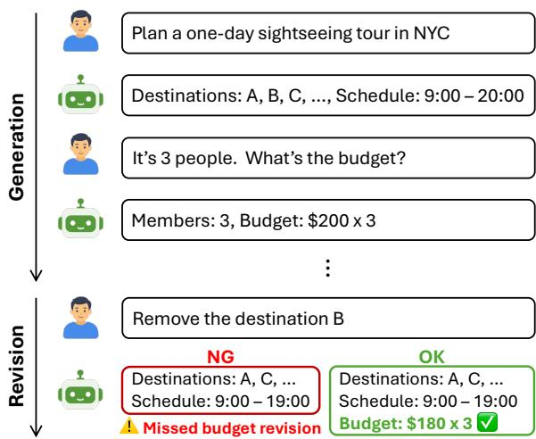  
Figure 1: Illustration of revision propagation in conversationally generated artifacts. Given a local revision request, LLMs must identify implicit dependencies and update not only the explicitly mentioned element but also other dependent elements to preserve consistency.

2024; Bairi et al., 2024; Du et al., 2025), where LLMs must locate relevant files and propagate edits across codebase-wide dependencies. More recently, similar propagation problems have been studied in LLM-based knowledge editing (Cohen et al., 2024; Dong et al., 2025), where factual edits are expected to propagate to related facts or logically connected knowledge, and in LLM-based document editing (Wang et al., 2026; Kruthof, 2026), where local revisions may require updates to dependent document elements or claims to preserve consistency.

However, these works focus on artifacts whose dependencies are largely explicit or statically analyzable: in coding, through call graphs, imports, and variable references; in knowledge editing, through pre-existing knowledge graphs; and in document editing, through references to sections, figures, citations, or claims. In contrast, for conversationally generated artifacts to support practical tasks such as planning (Figure 1), dependencies among elements are often implicit and may be established through the surrounding conversational context (i.e., outside the artifact). Revision propagation in this practical setting remains unexplored.

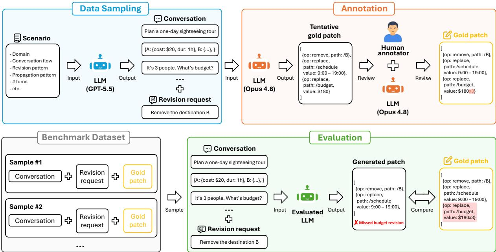  
Figure 2: Overview of RevPropBench. The upper half shows the benchmark construction process, while the lower half shows the evaluation process. Samples are generated via LLM-based synthetic sampling and human annotation.

Motivated by this, this paper studies the ability of LLMs to propagate revisions across dependent elements in such conversationally generated artifacts1. Toward practical use, we also investigate how costeffectively test-time compute improves the performance. Specifically, we introduce RevPropBench, a new human-annotated benchmark for evaluating revision propagation in the new setting. It consists of 30 development samples and 120 test samples across nine domains involving planning, recordkeeping, and configuration, with three artifact sizes: 10, 50, and 100 JSON elements. We then evaluate nine revision methods, including sequential reflection and parallel sampling variants, using gpt-oss-20b/120b, gpt-5.4-mini, qwen3.5-9b/27b/122b on the benchmark.

The results show that LLMs can propagate revisions in a single inference with an accuracy of 68.3– 93%, varying across models. Among the test-time compute methods, selecting one of three parallel samples using either LLM-based or medoid-based selection is the most cost-effective, which improves accuracy by 2.2–9.7%.

In summary, our contributions are threefold:

• We propose a new benchmark for evaluating the ability of LLMs to propagate revisions across dependent elements in conversationally generated JSON artifacts (Section 2).

• We comprehensively evaluate nine revision methods with six LLMs on the benchmark, providing practical guidance for cost-effective method selection (Section 4.2).

• We release the benchmark instance, data sampling and annotation tool for reproducibility and future extension.

## 2 RevPropBench

Figure 2 shows the overview of our proposed RevPropBench. In the following, we describe the task definition, the benchmark construction process (data sampling, human annotation, and statistics), and the evaluation process (data split and metrics).

## 2.1 Task definition

The benchmark consists of two phases: a generation phase and a revision phase. During the generation phase, an LLM incrementally adds elements to a JSON artifact through multiple turns of conversation with a user. In the subsequent revision phase, the user provides a local revision request, and the LLM accordingly revises the relevant elements of the artifact by outputting JSON patches (RFC 6902). The generation-phase conversation is prepared in advance, so the task is to revise the artifact in the revision phase. Here, we evaluate whether the LLM can make exactly the necessary revisions to the artifact, i.e., whether the generated patches match the gold patches in both paths and values.

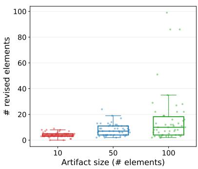  
(a) Propagation size by artifact size.

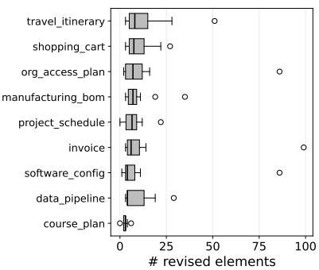  
(b) Propagation size by domain.

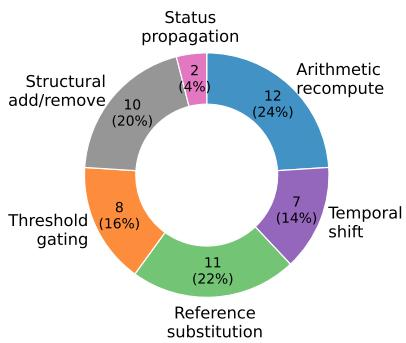  
(c) Propagation patterns.  
Figure 3: Statistics of RevPropBench (n=150 samples over 9 domains and 50 scenarios).

## 2.2 Synthetic data sampling

For each sample in the benchmark, we prepare a conversation history between an LLM and a user, including the generated JSON artifact, a local revision request from the user, and the corresponding gold patches. The samples are synthetically generated using a strong LLM (e.g., GPT-5.5) for controllable data sampling. We first create scenarios through LLM-assisted brainstorming, where each scenario specifies the conversation flow and the revision-propagation pattern. Scenario design is guided by three criteria: covering diverse domains, covering diverse propagation patterns, and ensuring that the gold patches are deterministically defined for subsequent annotation. We then use these scenarios to prompt the LLM to generate synthetic user–LLM conversation histories and local revision requests, similar to existing synthetic dialogue generation (Ding et al., 2023; Xu et al., 2023).

Each LLM turn includes patches that add at least one element to the artifact, and applying them sequentially across turns yields a single final artifact. The final artifact size is controlled by varying the maximum number of conversation turns: each conversation proceeds up to this limit but stops early once the target element count is reached.

## 2.3 LLM-assisted human annotation

For each generated sample, we annotate gold patches corresponding to the revision request. We first use another strong LLM (e.g., Claude-Opus-4.8) to generate tentative gold patches for each sample. Human annotators then review and correct the patches through the GUI of our annotation tool, while consulting the LLM when necessary. See Appendix C.2 for details of the annotation tool.

A JSON patch (RFC 6902) is an ordered sequence of operations that modify a JSON artifact. Each operation is a triple (op,path, value), where op ∈ {replace, add, remove} specifies the operation to apply, path specifies the target element, and value is the new content. For free-form values that can be phrased in different ways, we define matchers that check for required keywords rather than exact string matches. We also allow annotators to assign an optional flag to elements for which both editing and leaving unchanged are contextually valid. Optional elements are treated as correct in either case and are counted as errors only when they are edited with an incorrect value.

## 2.4 Metrics

We evaluate LLMs by comparing their generated patches with the gold patches. Our primary metric is the completion rate: the proportion of samples for which the patched JSON artifact exactly matches the gold-patched artifact. In failure analysis, we also report three finer-grained metrics: miss for omitted necessary edits, over edit for unnecessary edits, and wrong value for incorrect values in necessary edits.

## 2.5 Benchmark instance

In this paper, we create 50 scenarios across nine practical domains, including travel itineraries, invoices, shopping carts, project schedules, course plans, data pipelines, software deployment configurations, organizational access plans, and manufacturing BOMs. For each scenario, we generate three samples with JSON artifacts containing 10 (small), 50 (medium), and 100 (large) elements, resulting in $5 0 \times 3 = 1 5 0$ samples in total.

Figure 3 summarizes the statistics of the instantiated benchmark. The number of propagated revisions increases as the number of artifact elements grows (Figure 3a), while the distribution of characteristic propagation patterns across scenarios illustrates the diversity of revision-propagation cases covered by the benchmark (Figure 3c).

## 3 Evaluation Settings

Data split We divide the 150 samples into a development split for prompt tuning and a test split for evaluation. The split is performed at the scenario level, with all three size variants of each scenario assigned to the same split. We assign 10 of the 50 scenarios (i.e., 30 samples) to development via random sampling with seed 42, balanced by domain, propagation size, and propagation pattern. The remaining 120 samples form the test split, on which all reported metrics are computed.

Evaluated revision methods We evaluate nine methods, covering single-pass baselines and testtime compute methods, including sequential reflection and parallel sampling variants:

• Baselines generate a patch in a single inference, with the final JSON artifact (J), the conversation history (H), or both (J+H) provided as auxiliary context.

• Sequential reflection (REFLECT) starts from the patch generated with J+H and iteratively refines it through reflection.

• Parallel sampling with rule-based selection, similar to self-consistency (Wang et al., 2023), first generates multiple patches in parallel using J+H, and then generates the final patch from them according to predefined rules. OR, AND, and MAJ update a leaf element when any candidate changes it, when all candidates agree on the same new value, and when a strict majority agrees on the same new value, respectively. MED (medoid), inspired by minimum Bayes-risk decoding (Eikema and Aziz, 2022), selects the candidate whose resulting artifact has the smallest mean leaf-level disagreement with the others. See Appendix D for more details.

• Parallel sampling with LLM-based selection (SELECT) first generates multiple patches in parallel using J+H, and then selects one of them as the final patch using the same LLM.

Evaluated LLMs We use six representative LLMs spanning two model families and three different parameter scales: gpt-oss-20b/120b (OpenAI et al., 2025), gpt-5.4-mini (OpenAI, 2026), and qwen3.5-9b/27b/122b-a10b (Qwen Team, 2026). Reasoning is enabled for all models, and the effort level is set to medium for the GPT models.

Hyperparameters We set the temperature to 0.6 for all models that support it, except for gpt-5.4- mini, and set the maximum output context length to 32K tokens. Local models are deployed using vLLM (Kwon et al., 2023) on four NVIDIA A100 (80GB) GPUs. We run five evaluations for each sample with seeds $s = 0 , 4 2 , 8 4 , 1 2 6 , 1 6 8 .$ RE-FLECT performs four reflection iterations, i.e., five LLM calls in total, using the same seed s. For parallel sampling in each run, we sample five outputs with seeds $s , s + 1 , \ldots , s + 4 .$ . Note that SELECT samples four outputs and uses seed s for the additional LLM-based selection call, and that LiteLLM caching (BerriAI, 2023) ensures identical outputs for the same seed and input.

## 4 Evaluation Results

## 4.1 Performance

Figure 4 reports the completion rate of the nine revision methods across the six LLMs on the test split, averaged over five runs.

Importance of conversation history Across every model, the baselines follow a consistent performance ordering, $\mathrm { J } < \mathrm { H } < \mathrm { J } + \mathrm { H } \ ( \mathrm { e . g . } , 9 0 . 7 \% < 9 2 . 7 \%$ $< 9 3 . 0 \%$ for gpt-5.4-mini and 81. $. 7 \% < 8 6 . 7 \% <$ 90.3% for qwen3.5-122b). The improvement from J to H suggests that the conversation history contains important contextual information about the elements and their dependencies that are not fully recoverable from the final artifact alone. This reflects our benchmark design for conversationally generated artifacts. The further improvement from H to J+H indicates that, although the conversation history already contains the information needed to reconstruct the final artifact through patches, explicitly re-providing the final artifact helps LLMs avoid path errors and missed revisions when generating JSON patches.

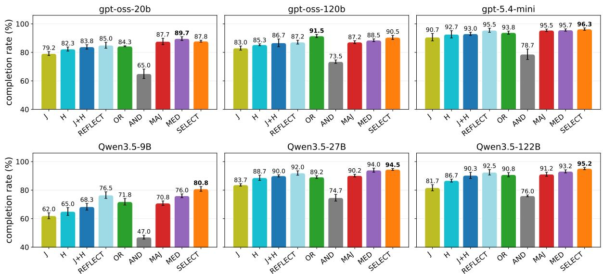  
Figure 4: Completion rate of the nine revision methods on the 120-sample test split, for each of the six models. Bars are the mean over five different seeds and error bars the standard deviation. The test-time compute methods (REFLECT, OR, AND, MAJ, MED, and SELECT) are evaluated with five LLM calls.

Model comparison Performance varies widely across models. With the strongest baseline (J+H), for example, completion rates span 68.3–93.0%. Generally, they tend to be higher for models with larger scale, i.e., qwen3.5-9b < 27b < 122b and gpt-oss-20b < 120b < gpt-5.4-mini.

Method comparison Among the test-time compute methods, SELECT yields the most consistent improvement over J+H (+3.3–12.5%), achieving the highest completion rate on four of the six models and the second-highest on the remaining two. MED provides the second-most consistent improvement (+1.8–7.7%), achieving the highest completion rate on one model and the second-highest on three models. The rule-based merging methods are far less reliable: AND falls well below J+H on every model (−13.2–21.3%), since demanding unanimous agreement discards correct edits that only some samples find, while OR and MAJ are competitive with SELECT and MED on a few models but are not consistent across models (−0.8–+4.8%). RE-FLECT yields small, consistent gains (+0.5–8.2%) but rarely matches SELECT or MED.

Failure analysis We group failures into miss, over edit, and wrong value. Figure 5 summarizes their composition by method. For most methods, miss accounts for the majority of errors: models tend to propagate too little rather than too much. REFLECT reduces misses through iterative revision, but the reduction is limited. AND fails almost only by miss because its strict unanimity requirement discards even correct edits if any candidate differs, whereas OR introduces many over edits by accepting any proposed edit. MAJ lies between AND and OR. MED and SELECT produce the fewest failures by returning one whole candidate: MED reduces outlier over-edits by choosing the most typical sample but recovers fewer misses, whereas SELECT’s reasoning tends to target the most complete candidate, reducing misses the most but not over edits.

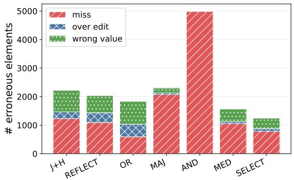  
Figure 5: Element-level failure composition by method, pooled over the six models (i.e., 3600 samples)

## 4.2 Cost analysis

Figure 6 plots completion rate against API cost2, with each curve showing how performance and cost change for each model and method as the number of LLM calls increases. Solid markers show points up to the five LLM calls set as a hyperparameter, while faded markers show additional points with more calls for analyzing cost-performance scaling. Note that we plot MAJ only at odd call counts, and SELECT from three calls onward (2 sampling + 1 selection calls).

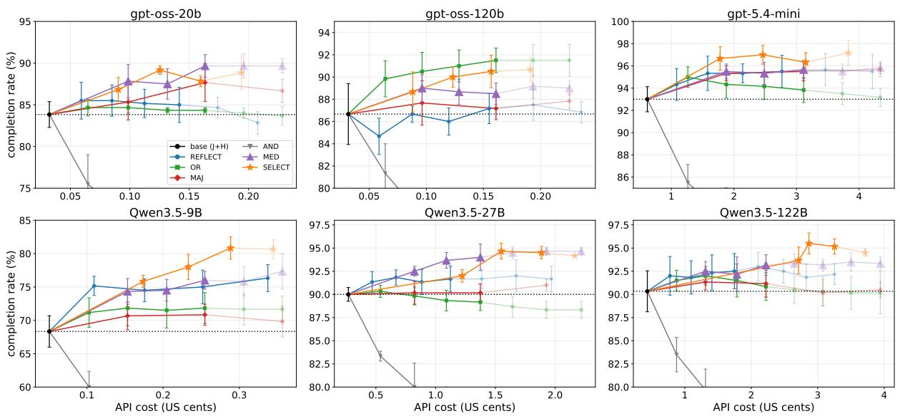  
Figure 6: Completion rate versus API cost as the number of LLM calls increases. Solid markers show points up to five LLM calls, while faded markers show additional points for analyzing performance convergence.

Cost comparison under fixed LLM calls At five LLM calls, corresponding to the rightmost solid markers, GPT models consume similar amounts of API cost across all methods, with costs increasing roughly in proportion to the number of calls from J+H. In contrast, for Qwen models, SELECT tends to incur higher costs than the other methods, increasing the cost by 5.7–7.5× over J+H. This difference is mainly due to the larger number of reasoning tokens generated in SELECT.

Performance comparison under fixed cost To compare performance more fairly with respect to cost, we next compare methods after aligning their costs. Specifically, we extend the number of calls for the other methods until their costs become comparable to, or higher than, that of SELECT. Even under this alignment, the relative performance ordering among methods remains largely unchanged, indicating that SELECT’s advantage is not merely due to higher cost.

Cost-performance scaling Finally, we analyze how performance improves relative to the additional cost based on the full curves, including both solid and faded points. Figure 6 shows that performance largely saturates around four to five LLM calls for most methods and models. In this posthoc analysis, we find that, on average across models, the highest cost-effectiveness $\dot { \big ( } \frac { \mathrm { g a i n } } { \mathrm { c o s t / c o s t } _ { \mathrm { J + H } } - 1 } \big )$ is achieved by either SELECT with three or four LLM calls, or MED with three LLM calls.

Guidelines for cost-effective test-time compute Based on the above analyses and absolute values, we recommend SELECT with four LLM calls as a practical choice for cost-effectively improving revision propagation through test-time compute. On the other hand, it requires two sequential stages of sampling and selection, whereas MED only requires a single parallel sampling stage. Thus, when inference latency is also considered, MED with three LLM calls is an alternative choice, offering competitive performance with SELECT at lower latency.

## 5 Related Work

Revision Propagation Revision propagation refers to the problem of applying a local edit and updating other parts that depend on it to preserve global consistency. This problem has been studied actively in repository-level code editing (Jimenez et al., 2024; Bairi et al., 2024; Du et al., 2025), where, given a task, LLMs must identify the required edits and propagate them across all dependent parts of the repository. Recent work has shown that explicitly extracted repository graphs can improve such repository-level coding (Liu et al., 2024, 2025; Ouyang et al., 2025; Fehr et al., 2025; Tao et al., 2025).

Knowledge editing studies how to update factual knowledge encoded in LLMs. In this setting, revision propagation is studied as a ripple effect: after editing one fact, the model should also update related facts that are affected by the edit. RippleEdits (Cohen et al., 2024) evaluates this by querying the edited model about both the target fact and related facts that should change or remain unchanged after the edit. ChainEdit (Dong et al., 2025) improves ripple-effect propagation by extracting logical rules from knowledge graphs and using them with LLM reasoning to update chains of logically connected facts.

Document editing studies how to revise longform documents while preserving consistency across dependent textual elements. In this setting, revision propagation arises when a local edit affects other claims, references, or descriptions elsewhere in the document. EditPropBench (Kruthof, 2026) evaluates factual edit propagation in scientific manuscripts by testing whether LLMs update not only the directly edited sentence but also dependent manuscript claims that should change, while leaving unrelated text unchanged. LEDGER (Wang et al., 2026) improves agentic document editing by constructing a dependency graph from both document structure and LLM-inferred semantic dependencies, and using graph-guided retrieval to select only the necessary context for each edit.

Our work studies revision propagation in a different setting. Unlike prior settings that can rely on pre-existing dependency sources such as repository graphs, knowledge graphs, document structure, or explicit references, our setting often lacks such dependency information in advance. Additionally, a distinctive feature of our setting is that dependencies may be established implicitly during the multi-turn conversation that generated the artifact, outside the artifact itself.

JSON artifacts in LLM-based systems JSON is a standard output format for LLM systems, used for tool calls, agent actions, or structured outputs for system-side data processing (OpenAI, 2024; The LangChain Team, 2024). Therefore, considering both practical utility and the ease of automated evaluation, this paper adopts JSON artifacts as the output format for LLMs during conversations. Similar to our work, Duanis et al. (2025) study the performance of LLMs in generating JSON patches. However, their focus is on the accuracy of modifying the JSON artifact itself, and their setting does not consider the conversational process that generated it. In addition, our work has a different objective: to identify cost-effective test-time compute methods for revision propagation.

Test-time compute Test-time compute improves model outputs by increasing inference-time computation through reasoning, sampling, or search. Representative parallel sampling approaches include self-consistency (Wang et al., 2023), which selects the most consistent answer from sampled reasoning paths; best-of-N (Cobbe et al., 2021), which chooses among generated candidates using a learned verifier or reward model. Other approaches iteratively improve outputs in a sequential manner through reflection or self-feedback, such as Self-Refine (Madaan et al., 2023) and Reflexion (Shinn et al., 2023). In this paper, we study whether testtime compute remains effective in our new problem setting and investigate how many samples provide the best cost–performance trade-off.

## 6 Conclusion

In this paper, we proposed a new benchmark for evaluating the ability of LLMs to propagate revisions across JSON artifacts generated through conversation. We then studied how test-time compute improves the performance, demonstrating that selecting one of three parallel samples using either LLM-based or medoid-based selection is the most cost-effective, and this improves accuracy by 2.2– 9.7%, compared to a single inference. Our findings provide practical insights into how we can improve revision reliability by test-time compute while balancing performance gains and inference cost in the new problem setting.

## Limitations

Scope This work does not generalize to the revision propagation problems studied in existing work on repository-level code editing, knowledge editing, or document editing. For these problems, prior work has already shown that performance can be improved by explicitly providing dependency information that is largely available in advance, such as statically analyzable code dependency graphs, knowledge graphs, and chapter or reference structures. On the other hand, this work focuses on a distinct setting in which dependencies are unavailable in advance and may be established by the conversation outside the artifact.

Gap from real-world conversations Although we created scenarios that approximate real-world use cases, the conversations are still synthetically generated by an LLM based on those scenarios to enable controllable evaluation. We do not use actual human–LLM interaction data. Furthermore, to enable reliable automatic evaluation, we control the dependencies established during the conversation to be deterministic. As a result, this work does not cover revision propagation in ambiguous cases that can arise in real conversations, where people may disagree on whether a particular element should be jointly revised.

Data coverage and potential biases The benchmark consists of 150 samples covering nine practical domains, six propagation patterns, and three artifact sizes. Although it covers a broad range of representative patterns, it does not exhaustively cover all possible patterns. In terms of preference biases, since we do not use an LLM-as-a-judge, there is no concern regarding the use of models from the same GPT family for both data generation and evaluation. On the other hand, because the conversations were generated using GPT-5.5, the resulting samples may be easier for GPT models. In this paper, the scenarios were created by humans with Claude-Opus-4.8, and the conversations were constructed from meta-level instructions such that task overlap between data generation and evaluation is small, thereby mitigating such a bias.

Performance saturation Currently, the baseline completion rates of six representative models range from 68.3% to 93%, allowing meaningful comparisons across models and methods. However, gpt-5.4-mini already achieves a completion rate of 93%, raising concerns that, as future models become more capable, performance may saturate and make such comparisons increasingly difficult. To address this limitation, this work provides not only the benchmark instances but also a tool that supports the entire benchmark construction process, from sample generation to annotation. Using this tool, the benchmark will need to be continuously updated to increase its difficulty as model capabilities improve.

## Ethical Considerations

Since our benchmark is synthetic, it does not raise direct privacy concerns related to personal information. Moreover, during scenario construction and after data sampling, we carefully reviewed the scenarios and generated samples for ethically problematic content. We confirmed that none of the samples contained such content.

## References

Ramakrishna Bairi, Atharv Sonwane, Aditya Kanade, Vageesh D. C., Arun Iyer, Suresh Parthasarathy, Sriram Rajamani, B. Ashok, and Shashank Shet. 2024. CodePlan: Repository-level coding using LLMs and planning. Proc. ACM Softw. Eng., 1(FSE):675–698.

BerriAI. 2023. LiteLLM. https://github.com/ BerriAI/litellm. Accessed: 2026-06-16.

Karl Cobbe, Vineet Kosaraju, Mohammad Bavarian, Mark Chen, Heewoo Jun, Lukasz Kaiser, Matthias Plappert, Jerry Tworek, Jacob Hilton, Reiichiro Nakano, Christopher Hesse, and John Schulman. 2021. Training verifiers to solve math word problems. Preprint, arXiv:2110.14168.

Roi Cohen, Eden Biran, Ori Yoran, Amir Globerson, and Mor Geva. 2024. Evaluating the ripple effects of knowledge editing in language models. Transactions of the Association for Computational Linguistics, 12:283–298.

Ning Ding, Yulin Chen, Bokai Xu, Yujia Qin, Shengding Hu, Zhiyuan Liu, Maosong Sun, and Bowen Zhou. 2023. Enhancing chat language models by scaling high-quality instructional conversations. In Proceedings of the 2023 Conference on Empirical Methods in Natural Language Processing, pages 3029–3051, Singapore. Association for Computational Linguistics.

Zilu Dong, Xiangqing Shen, Zinong Yang, and Rui Xia. 2025. ChainEdit: Propagating ripple effects in LLM knowledge editing through logical rule-guided chains. In Proceedings of the 63rd Annual Meeting of the Associationfor Computational Linguistics (Volume 1: Long Papers), pages 13558–13571, Vienna, Austria. Association for Computational Linguistics.

Junjia Du, Yadi Liu, Hongcheng Guo, Jiawei Wang, Haojian Huang, Yunyi Ni, and Zhoujun Li. 2025. DependEval: Benchmarking LLMs for repository dependency understanding. In Findings of the Associationfor Computational Linguistics: ACL 2025, pages 7150–7179, Vienna, Austria. Association for Computational Linguistics.

Sarel Duanis, Asnat Greenstein-Messica, and Eliya Habba. 2025. JSON whisperer: Efficient JSON editing with LLMs. In Proceedings ofthe 2025 Conference on Empirical Methods in Natural Language Processing: Industry Track, pages 1265–1274, Suzhou (China). Association for Computational Linguistics.

Bryan Eikema and Wilker Aziz. 2022. Sampling-based approximations to minimum Bayes risk decoding for neural machine translation. In Proceedings of

the 2022 Conference on Empirical Methods in Natural Language Processing, pages 10978–10993, Abu Dhabi, United Arab Emirates. Association for Computational Linguistics.

Fabio James Fehr, Prabhu Teja S, Luca Franceschi, and Giovanni Zappella. 2025. CoRet: Improved retriever for code editing. In Proceedings ofthe 63rd Annual Meeting of the Association for Computational Linguistics (Volume 2: Short Papers), pages 775–789, Vienna, Austria. Association for Computational Linguistics.

Carlos E Jimenez, John Yang, Alexander Wettig, Shunyu Yao, Kexin Pei, Ofir Press, and Karthik R Narasimhan. 2024. SWE-bench: Can language models resolve real-world Github issues? In The Twelfth International Conference on Learning Representations.

Garvin Kruthof. 2026. EditPropBench: Measuring factual edit propagation in scientific manuscripts. Preprint, arXiv:2605.02083.

Woosuk Kwon, Zhuohan Li, Siyuan Zhuang, Ying Sheng, Lianmin Zheng, Cody Hao Yu, Joseph Gonzalez, Hao Zhang, and Ion Stoica. 2023. Efficient memory management for large language model serving with PagedAttention. In Proceedings ofthe 29th Symposium on Operating Systems Principles, SOSP ’23, page 611–626, New York, NY, USA. Association for Computing Machinery.

Wei Liu, Ailun Yu, Daoguang Zan, Bo Shen, Wei Zhang, Haiyan Zhao, Zhi Jin, and Qianxiang Wang. 2024. GraphCoder: Enhancing repository-level code completion via coarse-to-fine retrieval based on code context graph. In Proceedings of the 39th IEEE/ACM International Conference on Automated Software Engineering, ASE ’24, page 570–581, New York, NY, USA. Association for Computing Machinery.

Xiangyan Liu, Bo Lan, Zhiyuan Hu, Yang Liu, Zhicheng Zhang, Fei Wang, Michael Qizhe Shieh, and Wenmeng Zhou. 2025. CodexGraph: Bridging large language models and code repositories via code graph databases. In Proceedings of the 2025 Conference ofthe Nations ofthe Americas Chapter ofthe Association for Computational Linguistics: Human Language Technologies (Volume 1: Long Papers), pages 142–160, Albuquerque, New Mexico. Association for Computational Linguistics.

Aman Madaan, Niket Tandon, Prakhar Gupta, Skyler Hallinan, Luyu Gao, Sarah Wiegreffe, Uri Alon, Nouha Dziri, Shrimai Prabhumoye, Yiming Yang, Shashank Gupta, Bodhisattwa Prasad Majumder, Katherine Hermann, Sean Welleck, Amir Yazdanbakhsh, and Peter Clark. 2023. Self-Refine: Iterative refinement with self-feedback. In Advances in Neural Information Processing Systems, volume 36, pages 46534–46594. Curran Associates, Inc.

OpenAI, :, Sandhini Agarwal, Lama Ahmad, Jason Ai, Sam Altman, Andy Applebaum, Edwin Arbus,

Rahul K. Arora, Yu Bai, Bowen Baker, Haiming Bao, Boaz Barak, Ally Bennett, Tyler Bertao, Nivedita Brett, Eugene Brevdo, Greg Brockman, Sebastien Bubeck, and 108 others. 2025. gpt-oss-120b & gptoss-20b model card. Preprint, arXiv:2508.10925.

OpenAI. 2024. Introducing Structured Outputs in the API. Accessed 2026-06-16.

OpenAI. 2026. Introducing GPT-5.4 mini and nano. Accessed 2026-06-16.

Siru Ouyang, Wenhao Yu, Kaixin Ma, Zilin Xiao, Zhihan Zhang, Mengzhao Jia, Jiawei Han, Hongming Zhang, and Dong Yu. 2025. RepoGraph: Enhancing AI software engineering with repository-level code graph. In The Thirteenth International Conference on Learning Representations.

Qwen Team. 2026. Qwen3.5: Towards native multimodal agents. Accessed 2026-06-16.

Noah Shinn, Federico Cassano, Ashwin Gopinath, Karthik Narasimhan, and Shunyu Yao. 2023. Reflexion: language agents with verbal reinforcement learning. In Advances in Neural Information Processing Systems, volume 36, pages 8634–8652. Curran Associates, Inc.

Hongyuan Tao, Ying Zhang, Zhenhao Tang, Hongen Peng, Xukun Zhu, Bingchang Liu, Yingguang Yang, Ziyin Zhang, Zhaogui Xu, Haipeng Zhang, Linchao Zhu, Rui Wang, Hang Yu, Jianguo Li, and Peng Di. 2025. Code Graph Model (CGM): A graphintegrated large language model for repository-level software engineering tasks. In Advances in Neural Information Processing Systems, volume 38, Main Conference, pages 15869–15909. Curran Associates, Inc.

The LangChain Team. 2024. Tool calling with LangChain. Accessed 2026-06-16.

Hang Wang, Utkarsh Garg, Reza Davari, Huitian Jiao, Hao Cheng, Baolin Peng, Si-Qing Chen, and Tao Ge. 2026. LEDGER: Scaling agentic document editing with dependency-aware graph retrieval. In Findings ofthe Associationfor Computational Linguistics: ACL 2026, pages 10614–10644, San Diego, California, United States. Association for Computational Linguistics.

Xuezhi Wang, Jason Wei, Dale Schuurmans, Quoc V Le, Ed H. Chi, Sharan Narang, Aakanksha Chowdhery, and Denny Zhou. 2023. Self-consistency improves chain of thought reasoning in language models. In The Eleventh International Conference on Learning Representations.

Canwen Xu, Daya Guo, Nan Duan, and Julian McAuley. 2023. Baize: An open-source chat model with parameter-efficient tuning on self-chat data. In Proceedings ofthe 2023 Conference on Empirical Methods in Natural Language Processing, pages 6268– 6278, Singapore. Association for Computational Linguistics.

<table><tr><td rowspan="2">Model</td><td rowspan="2">J+H</td><td colspan="4">REFLECT</td><td colspan="4">MED</td><td colspan="3">SELECT</td></tr><tr><td>k=2</td><td>k=3</td><td>k=4</td><td>k=5</td><td>k=2</td><td>k=3</td><td>k=4</td><td>k=5</td><td>k=3</td><td>k=4</td><td>k=5</td></tr><tr><td>gpt-oss-20b</td><td>15.9s</td><td>2.71×</td><td>3.37×</td><td>3.98×</td><td>4.56×</td><td>1.21×</td><td>1.36×</td><td>1.44×</td><td>1.49×</td><td>2.95×</td><td>2.87×</td><td>3.08×</td></tr><tr><td>gpt-oss-120b</td><td>19.3 s</td><td>2.09×</td><td>2.76×</td><td>3.41×</td><td>4.04×</td><td>1.08×</td><td>1.12×</td><td>1.15×</td><td>1.17×</td><td>1.95×</td><td>2.13×</td><td>2.20×</td></tr><tr><td>gpt-5.4-mini</td><td>7.3s</td><td>2.04×</td><td>2.54×</td><td>3.03×</td><td>3.52×</td><td>1.20×</td><td>1.27×</td><td>1.33×</td><td>1.39×</td><td>2.08×</td><td>2.23×</td><td>2.41×</td></tr><tr><td>qwen3.5-9b</td><td>23.3 s</td><td>2.73×</td><td>3.75×</td><td>4.75×</td><td>5.70×</td><td>1.14×</td><td>1.20×</td><td>1.29×</td><td>1.32×</td><td>3.65×</td><td>4.11×</td><td>4.41×</td></tr><tr><td>qwen3.5-27b</td><td>58.5 s</td><td>2.64×</td><td>3.45×</td><td>4.24×</td><td>5.04×</td><td>1.13×</td><td>1.24×</td><td>1.28×</td><td>1.35×</td><td>4.81×</td><td>5.20×</td><td>5.56×</td></tr><tr><td>qwen3.5-122b</td><td>41.5 s</td><td>3.28×</td><td>4.26×</td><td>5.14×</td><td>6.02×</td><td>1.19×</td><td>1.29×</td><td>1.41×</td><td>1.47×</td><td>6.24×</td><td>5.62×</td><td>5.51×</td></tr></table>

Table 1: Average latency per sample of J+H and relative latency multipliers of REFLECT, MED, and SELECT with respect to J+H. k denotes the total number of LLM calls. Bold marks the settings recommended in Section 4.2. gpt-5.4-mini is called from OpenAI API. qwen3.5-122b uses four A100 GPUs (80GB), while other local models use a single A100 GPU (80GB).

## A Latency Analysis

In addition to the cost analysis in Section 4.2, we also measure the latency of the revision methods. Table 1 shows the average latency per sample of J+H and relative latency multipliers of REFLECT, MED, and SELECT with respect to J+H. The latency of REFLECT increases roughly in proportion to the number of LLM calls. Because MED executes its samples in parallel, its latency is determined by the slowest sample. Consequently, its latency is only slightly higher than that of J+H but remains below 1.5× even as the number of samples increases. SE-LECT remains within around 2–3× for GPT models, whereas for Qwen models, the increased amount of reasoning raises the latency to 3.3–6×. In terms of performance gain relative to the increase in latency $\big ( \frac { \mathrm { g a i n } } { \mathrm { l a t e n c y / l a t e n c y } _ { \mathrm { J + H } } - 1 } \big )$ , MED with k = 3 is the most latency-efficient method on average across all models, quantitatively supporting the guidelines in Section 4.2. Note that the absolute latency of J+H depends heavily on the deployment environment. Consequently, the extent to which the latency multipliers of different test-time compute methods affect practical responsiveness also depends on the deployment environment.

## B API Pricing

Table 2 lists the per-token prices used to compute the API cost in Section 4.2. For the local models, we use the prices listed on OpenRouter3, and for gpt-5.4-mini, we use the official OpenAI pricing4, both as of June 12, 2026. The cost is simply calculated as the input price times the number of input tokens plus the output price times the number of output tokens.

<table><tr><td rowspan="2">Model</td><td colspan="2">USD per 1M tokens</td></tr><tr><td>Input</td><td>Output</td></tr><tr><td>gpt-oss-20b</td><td>0.029</td><td>0.140</td></tr><tr><td>gpt-oss-120b</td><td>0.039</td><td>0.180</td></tr><tr><td>gpt-5.4-mini</td><td>0.750</td><td>4.500</td></tr><tr><td>qwen3.5-9b</td><td>0.100</td><td>0.150</td></tr><tr><td>qwen3.5-27b</td><td>0.195</td><td>1.560</td></tr><tr><td>qwen3.5-122b</td><td>0.260</td><td>2.080</td></tr></table>

Table 2: Per-token prices used for the cost analysis (as of June 12, 2026).

## C Details of Benchmark Construction

## C.1 Scenarios

The 50 scenarios cover nine domains and six propagation patterns. Table 3 summarizes the six patterns with a representative scenario for each. Figure 7 shows a scenario and a sample generated from it. The sample includes a conversation and a revision request. This example simulates a user planning a trip schedule. The user specifies activities relative to the trip date, and the LLM records them. The user then requests a shift in the trip start date. To satisfy this revision request, the LLM must update the dates of the relevant entries accordingly. However, in this case, the required updates are not uniquely determined by the JSON artifact alone. A simple interpretation is to shift the entire schedule. In practice, however, the user may want to keep certain dates fixed, which cannot be inferred from the artifact alone. The dependency is identifiable only when the user describes activities in relation to the trip start date, such as “three days after the trip begins.” Only then is it clear that changes to the trip start date should be propagated to the related activities. In cases like this, when an artifact is created through a conversation, the conversation may contain information that defines dependencies. This sample successfully simulates that situation.

<table><tr><td>Pattern</td><td>Description</td><td>Representative scenario (edit → cascade)</td></tr><tr><td>arithmetic</td><td>Numeric value feeds a for- mula chain</td><td>Invoice total chain (invoice): edit one line&#x27;s quantity or unit price → its line amount, the subtotal, and every charge built on the subtotal recompute in order</td></tr><tr><td>substitution</td><td>An entity is swapped and its governed attributes are copied in</td><td>Changing an employee role (org access): the new role&#x27;s permission groups, approval limit, required trainings, review interval, and support queue replace the old ones</td></tr><tr><td>add_remove</td><td>A list element is added/re- moved and downstream links and aggregates update</td><td>Removing a task (project schedule): successors relink to the removed task&#x27;s predecessor, downstream dates pull earlier, and the task count and project end shift</td></tr><tr><td>threshold</td><td>Effect is conditional on cross- ing or clamping to a stated threshold</td><td>Crossing a data-volume threshold (data pipeline): raising the daily volume recomputes the storage estimate and, only if it crosses the threshold, flips the partition strategy and steps the compaction/retention tiers</td></tr><tr><td>temporal</td><td>Date/time values shift along the dependency chain</td><td>Shifting the trip&#x27;s anchor date (travel): every date derived from the anchor by a fixed offset shifts by the same delta, while independent dates stay</td></tr><tr><td>status_flip</td><td>A state change moves a set of status-governed fields to- gether</td><td>Marking the invoice as paid (invoice): every status-governed field moves to its paid-state value at once</td></tr></table>

Table 3: The six propagation patterns covered by RevPropBench’s 50 scenarios, with a representative scenario for each. Every pattern appears across multiple domains.

Conversation pattern. Center the artifact on a trip anchored on one date, where several other dates each derive from that anchor by a fixed offset stated in the conversation, so the anchor alone determines them. Around this core, add the realistic, independent details a traveler would record that do not depend on the dates, and vary their number from sample to sample. Revision pattern. Move the anchor start date to a specific new date a few days from the original. Propagation pattern. Every date that derives from the anchor shifts by the same delta, since each is the anchor plus a fixed offset, so the new anchor uniquely fixes them all. Values that do not derive from the anchor date stay unchanged.

(a) Scenario (domain: travel\_itinerary, theme: “Shifting the trip’s anchor date”, pattern: temporal).

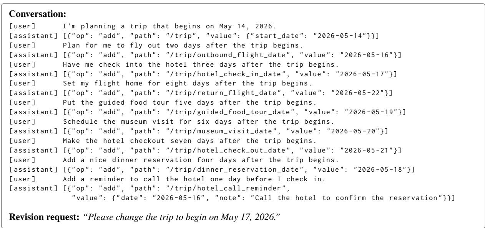  
(b) Generated sample.  
Figure 7: An example scenario and its corresponding generated sample.

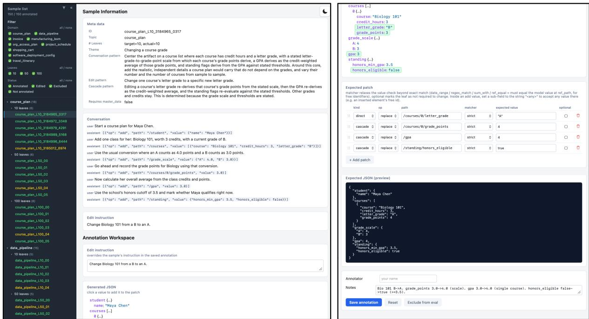  
Figure 8: Graphical user interface of the annotation tool.

## C.2 Annotation

GUI tool Figure 8 shows the GUI of our annotation tool. Annotators can select a sample to annotate from the sidebar. The main panel displays the metadata, conversation history, and revision request for the selected sample. While reviewing this information, annotators perform the annotation in the Annotation Workspace. For the revision request, annotators generally do not modify it. However, if the request is ambiguous and makes it difficult to assign a unique annotation, they are allowed to revise the request to make it more specific.

The main annotation task is the creation of the gold patch, which is performed in the Expected Patch section. Here, annotators add patch operations consisting of op (replace, add, or remove), path, and expected value. For each operation, annotators also specify its kind: direct if the target is explicitly mentioned in the revision request, or cascade if it is not explicitly mentioned but must be revised due to a dependency. For value comparison, annotators can choose among several matching methods, including exact matching (strict), regular-expression matching (regex\_match), accepting any value (any), and checking equality with the value of another leaf element (ref\_equal). If an operation is contextually valid both when applied and when left unchanged, annotators can mark it as optional by checking the optional box.

The Expected JSON (preview) displays the JSON artifact after the patch has been applied, allowing annotators to visually inspect the resulting artifact. Finally, at the bottom of the main panel, annotators enter their name and any notes, then click Save to complete the annotation for one sample.

Process Claude Code (Opus 4.8) generates tentative gold patches in batches by artifact size. First, Claude Code generates all patches for artifact size 10, and the annotator then reviews and revises the entire batch. The same process is then repeated for artifact size 50, followed by artifact size 100. For each subsequent batch, Claude Code refers to the annotator’s revisions from the previous batch when generating new tentative gold patches. During the human review, when the annotator identifies points that required further clarification, they ask Claude Code about the rationale or background behind the tentative patch. If the explanation is judged to be reasonable, the patch is kept. If Claude Code has misunderstood any aspect of the annotation, the annotator corrects the patch accordingly. Here, the human annotator uses the GUI, while Claude Code annotates patches via CLI.

Results One annotator carefully performed the annotation and subsequent double-checking with assistance from Claude Code (Opus 4.8), spending more than 32 hours over 10 days. 23 out of 150 samples (15%) were revised by the annotator: one involved a revision to the revision request, and 22 involved revisions to the patches. The actual revisions can be checked in the GUI of the provided annotation tool.

## D Details of Merging Rules

For OR, AND, MAJ, and MED, each of the k sampled patches is first applied to the current artifact, yielding k candidate artifacts. We compare these candidate artifacts rather than the patches themselves, as the same edit can be expressed by many different JSON patches.

OR, AND, and MAJ merge the candidates element-wise. Each leaf-level key–value pair in a JSON object is treated as an independent merge unit. If the value is an array, elements at the same index are treated as separate merge units only when the current artifact and all candidates have the same length. Otherwise, the key–array pair is treated as a single, indivisible merge unit. For each merge unit, we compare whether each candidate adds, modifies, removes, or leaves it unchanged, based on the presence of the key and its corresponding value. AND adopts a change only when all candidates propose the same change. MAJ adopts a change only when a strict majority $( > k / 2 )$ propose the same change. OR adopts a change whenever at least one candidate proposes one (if multiple different changes are proposed, the change from the earliest sampled candidate is adopted). The merged artifact is then converted back into a JSON patch. If the merged artifact exactly matches one of the candidate artifacts, we reuse that candidate’s original patch. Otherwise, a new patch is constructed from the difference between the current and merged artifacts.

In contrast, MED returns one whole candidate. Each candidate artifact is flattened into its leaflevel merge units, and the disagreement between two candidates is measured as the fraction of mismatched merge units among all units appearing in either candidate (a unit missing from one of them also counts as a mismatch). For each candidate, this disagreement is averaged over the other k − 1 candidates, and the candidate with the minimum mean disagreement is selected.

## E Safeguards for Critical Revisions

In practical use cases such as financial data processing and invoice processing, even a single overedit or miss in revision propagation can result in significant errors. Since our problem setting assumes interactive conversation between humans and LLMs, we suggest incorporating human review as a safeguard in such cases. For example, a practical safeguard would be for the LLM to present all propagated changes before application and apply only those explicitly approved by the user. We believe that presenting the required edits alone can substantially reduce human effort. Additionally, we could consider several approaches to reduce the effort required for human review, such as using an LLM-as-a-judge to prioritize edits based on their criticality or allowing users to specify critical items in advance. Note that these suggestions are our conceptual ideas and have not yet been experimentally validated.

## F System Prompts

In this section, we provide the prompts used for both data generation and evaluation. Figures 9–12 show the prompts for data generation. Curly-brace tokens such as {domain\_name} are placeholders filled with specific values. The system prompt (Figure 9) and the first-turn user prompt (Figure 10) are first provided as the initial context, from which the first user–LLM conversation turn is generated. Subsequently, at each turn, the subsequent-turn user prompt (Figure 11) is appended to the current context to generate the next conversation turn. Both the prompt and the generated turn are then retained in the context. This process is repeated until the full conversation has been generated. Finally, the revision-instruction prompt (Figure 12) is appended to the end of the context to generate a revision request.

Figures 13–17 show prompts for evaluation. For a single inference, the revision system prompt (Figure 13) and the revision user prompt (Figure 14) are provided as the context to generate a JSON patch. In Figure 14, J includes only {current\_json}, H includes only {conversation}, and J+H includes both, while {requested\_edit} is always included. For parallel sampling, multiple JSON patches are generated in parallel using the same system prompt and user prompt. For SELECT, multiple JSON patches are first generated, after which the final patch is selected using the system prompt and user prompt for SELECTION (Figures 15 and 16). For REFLECT, after a single inference, the user prompt for REFLECT (Figure 17) is appended to the context to generate a new JSON patch. This process is repeated for k − 1 iterations.

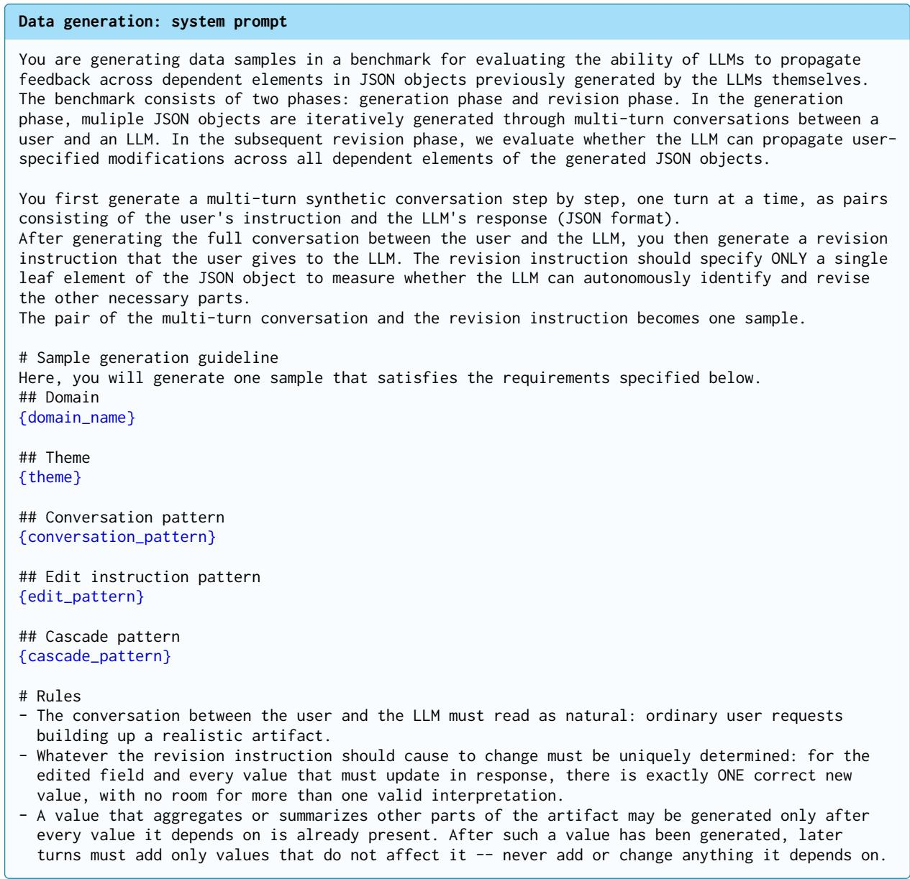

Figure 9: System prompt for data generation.  
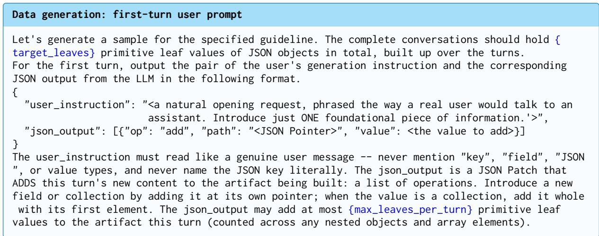  
Figure 10: User prompt for the first conversation turn.

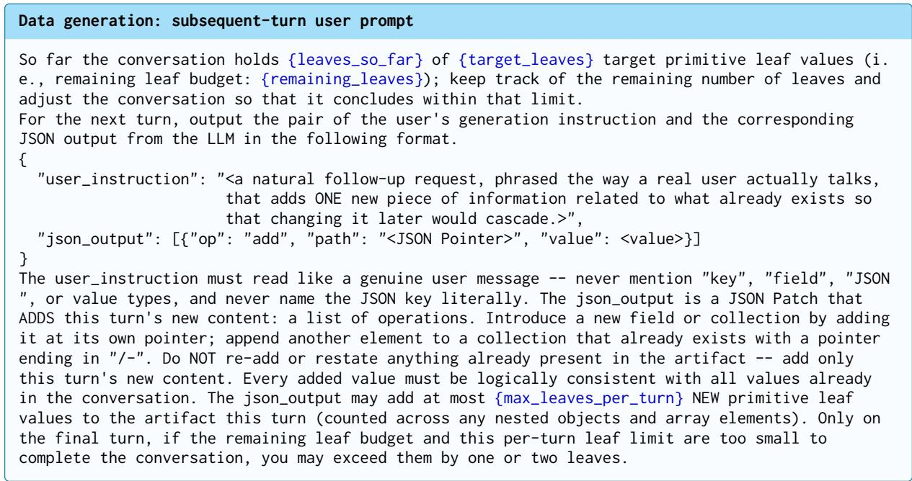  
Figure 11: User prompt for every subsequent conversation turn.

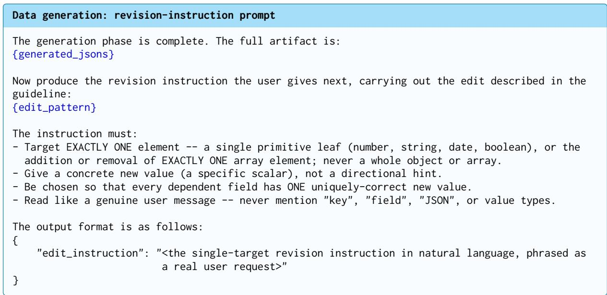  
Figure 12: User prompt for generating a revision request.

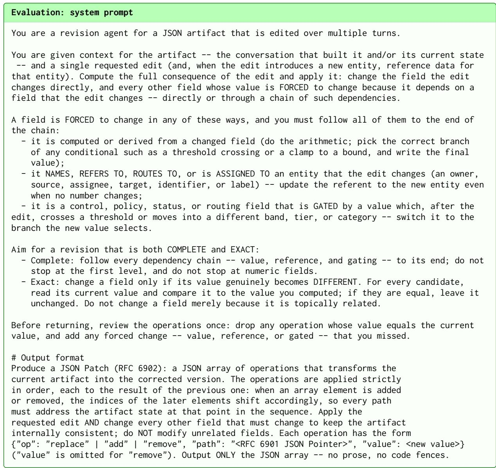  
Figure 13: Revision system prompt, shared by all revision methods.

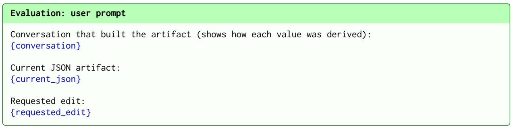  
Figure 14: Revision user prompt; the conversation (H) and JSON (J) blocks are included per baseline.

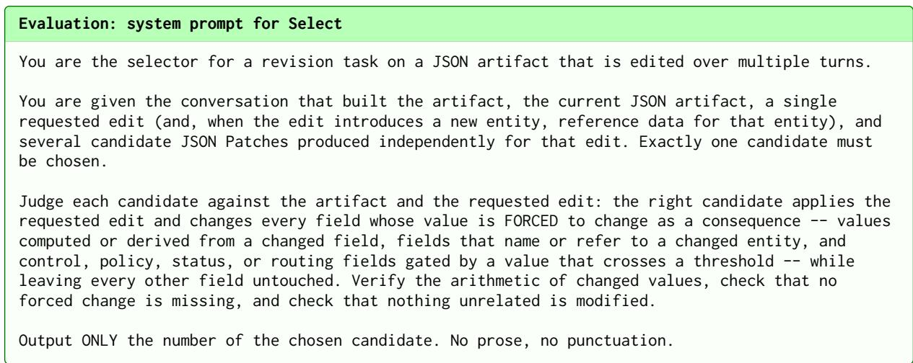  
Figure 15: System prompt for SELECT.

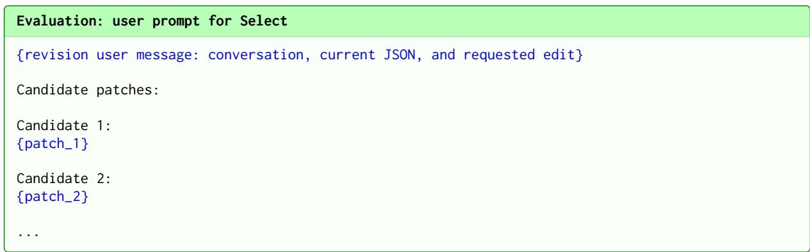  
Figure 16: User prompt for SELECT.

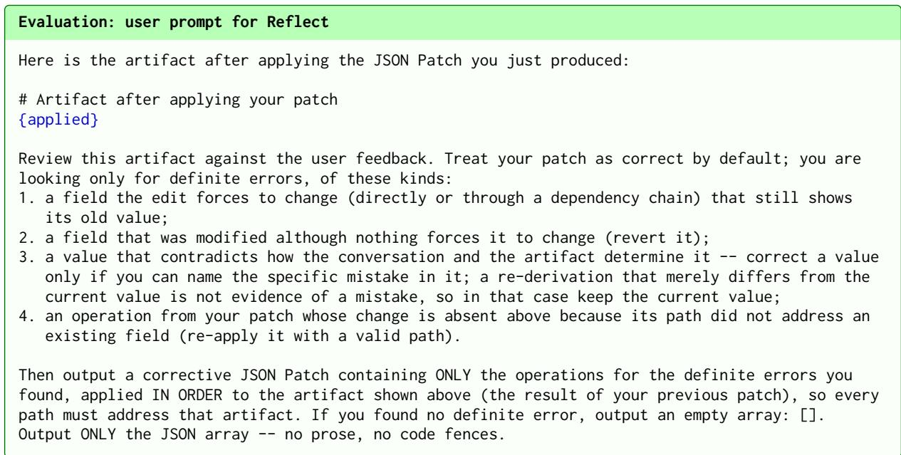  
Figure 17: User prompt for REFLECT