# Witnesses Explain Anomalies

Lamine Diop

EPITA Research Laboratory, Le Kremlin-Bicetre FR-94276, France, lamine.diop@epita.frˆ

Abstract—Unsupervised anomaly detection scores each point of an unlabelled, contaminated sample in a single pass, and increasingly must also explain why a point is flagged. Yet the dominant detectors give a score with no account of which features drive it, and explanations are bolted on post-hoc with SHAP or LIME, which re-query the detector thousands of times per point and only approximate it. We introduce WAND, an unsupervised tabular anomaly detector that is explainable by design. WAND organises its computation around directions on the unit sphere, scoring each point by how far its projection escapes a sub-Gaussian extreme-value baseline. The originality of our approach is that the witness directions that flag a point, being vectors in feature space, are its explanation, a per-feature attribution obtained at no cost over scoring and, since the score is differentiable, recoverable by gradients. Scoring is linear in the sample size, and a probeefficiency bound guarantees every anomaly a witness, hence an explanation. Across 47 ADBench datasets WAND attains the best mean Friedman rank at ROC-AUC parity with 16 unsupervised baselines, so the gain is interpretability at no accuracy cost; its native explanations are more accurate and faithful than post-hoc SHAP/LIME and ECOD at a fraction of the query cost. WAND is thus a practical, interpretable solution for explainable anomaly detection.

Index Terms—anomaly detection, explainable AI, witness directions, feature attribution, differentiable algorithms

## I. INTRODUCTION

We study unsupervised anomaly detection on tabular data: assign each point of an unlabelled, contaminated sample a real-valued score in a single pass, and, increasingly, explain why a point is flagged. The dominant detectors (Isolation Forest [1], LOF [2], OCSVM [3], KNN [4], PCA [5], ECOD [6]/COPOD [7]) return a score but no account of which features drive it; explanations are bolted on post-hoc with SHAP [8]/LIME [9], which re-query the detector thousands of times per point and only approximate it. We introduce WAND, a detector that is explainable by construction, down to rawpixel saliency when an encoder is available (Fig. 1).

WAND organises its computation around directions on the unit sphere: for each, it measures how far the projected sample’s extreme exceeds a sub-Gaussian baseline (calibrated by median/MAD, robust to up to half the data being contaminated), and aggregates these excesses into a per-point score. Anomalies have low halfspace depth [10], so one or more directions expose them as extreme, and those witness directions are, literally, the explanation: vectors in feature space whose large coordinates name the responsible features. A per-feature attribution thus falls out of scoring at no extra cost, and, since the score is differentiable, the same explanation is recoverable by gradients (and the score can serve as a loss in a learnable pipeline). The geometry also bounds cost on two axes. Scoring runs in O(Knd) time, linear in the sample size; and the number ofdirections K needed to expose every anomaly scales with the answer size (anomaly count and depth margin), not the sample size [11]. This latter is a probe-efficiency guarantee: each direction still requires a full scan of the data, so it bounds a budget rather than promising sub-linear runtime, and is most useful in low-to-moderate dimension (Section VII).

The main contributions of the paper are as follows:

• We propose WAND, an unsupervised tabular anomaly detector that is explainable by design. It scores each point by aggregating, over directions on the unit sphere, the excess of the projected sample’s extreme over a sub-Gaussian baseline, and the witness directions that flag a point, read in feature space, are its per-feature explanation, obtained at no cost over scoring (Section IV-H). Since the score is differentiable, the same explanation is also recoverable by gradients.

• We establish the guarantees of the method. We prove that scoring is linear in the sample size, and that the number of directions needed to expose every anomaly is bounded by the anomaly count and a halfspace-depth margin, independently of the sample size (Theorem 1); equivalently, this bounds the budget at which every anomaly is guaranteed a witness, hence an explanation. We pair this with a median/MAD-calibrated tail statistic of 1/(d+1) breakdown (Theorem 3).

• We present an extensive empirical study on 47 ADBench datasets, comparing detection against sixteen unsupervised baselines and explanation quality against post-hoc (SHAP, LIME) and AD-native (ECOD) explainers, under both synthetic ground truth and real deletion/insertion faithfulness. WAND is competitive for detection while producing more accurate and more faithful explanations at a fraction of the query cost, and stays effective on heavy-tailed inliers and against deep detectors (Section VI).

The remainder of the paper is organised as follows. Section II reviews related work on unsupervised and explainable anomaly detection. Section III introduces the basic definitions and the formal problem statement. We present WAND and its directional-witness explanations in Section IV, and analyse the method’s guarantees in Section V. We evaluate our approach in Section VI and conclude in Section VII.

## II. RELATED WORK

We group prior work by what it consumes and what guarantees it provides, then identify the gap WAND fills.

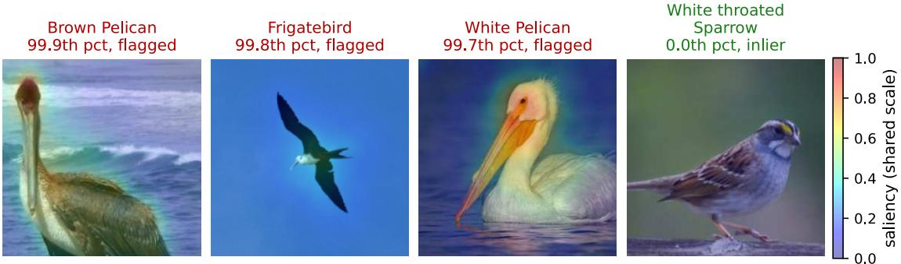  
Fig. 1. Pixel-level explanation (where in the image). Saliency |∂ WAND score/∂ pixels| for three flagged ANOCUB anomalies and a normal inlier (far right) on a shared scale, via autograd through a frozen ResNet-18 encoder (SmoothGrad): strong and localised on the anomalies, weak on the inlier. WAND detects here at AUC 0.99 (no whitening). Contrast the encoder-free concept-level view (Fig. 5), which names which concepts are responsible.

Unsupervised shallow detectors.: The classical workhorses learn a score directly from the contaminated sample, in three flavours. Isolation/proximity-based scores (Isolation Forest [1], LOF [2], OCSVM [3], KNN [4], PCAreconstruction [5], INNE [12]) measure how isolated a point is from its neighbourhood. Distribution-aware tail estimators (HBOS [13], ECOD [6], COPOD [7], kernel density [14], LODA [15]) read off the inlier distribution through marginals or copulas. Geometric and ensemble variants (ABOD [16], COF [17], SOD [18], LSCP [19], SUOD [20]) sharpen the score with directional or subspace structure. All these methods consume the sample directly and score it in one pass, matching our regime, but each pays linear cost in n regardless of how few anomalies are actually present; none gives a probe-count guarantee tied to the anomaly count.

Robust statistics and projection-pursuit ancestors.: Two threads underpin our per-direction statistic. Tukey halfspace depth [10] formalises being an extreme along some direction with 1/(d + 1) breakdown [21], but exact computation $\Omega ( n ^ { d - 1 } )$ [22] has kept it out of practical pipelines. Projection pursuit [23] optimises an index over directions for non-Gaussianity; we re-use the directional formulation with a MAD-calibrated tail-excess statistic of 1/2 per-direction breakdown [24]. The closest projection-pursuit predecessors, LODA [15] and PIDForest [25], neither calibrate against an explicit extreme-value baseline nor give an output-sensitive probe bound; we list more recent tree- and OT-based detectors among the limitations of our baseline coverage below.

Deep detectors.: A separate family trains a network, typically on an assumed-clean sample, deep one-class [26], reconstruction [27], adversarial/transformer [28], self-supervised contrastive [29], graph [30], and diffusion/flow [31] variants; TABADM [32] is a diffusion density model with a rejection scheme that tolerates a contaminated training set. These need a separate scoring pass and give no native explanation; we list them in Table I for positioning and compare against deep unsupervised baselines (AutoEncoder, VAE, Deep SVDD) in Section VI.

Explaining anomaly detectors.: Once a detector flags a point, practitioners ask which features are responsible. The default answer is post-hoc, model-agnostic attribution: SHAP [8] (Shapley values estimated by sampling feature coalitions) and LIME [9] (a local linear surrogate fitted to perturbations) both treat the detector as a black box and re-query it hundreds to thousands of times per explained point, returning an approximation of its behaviour whose quality degrades with dimension and budget. Anomaly-specific explainers largely inherit this stance, attributing a score to features post-hoc [33], [34] or isolating outlying subspaces [18], [35]. In contrast, a handful of detectors are explanatory by construction: marginal methods like ECOD/COPOD expose a per-feature tail probability, and subspace/tree methods point at the axes that isolate a point. SYRAN [36] goes furthest, learning closed-form symbolic invariants whose violation is the explanation, a global account, whereas WAND reads a per-point attribution free from the score. WAND is of this second kind, but its witnesses are arbitrary directions, not single features, so it explains anomalies that no axis-aligned method can name; and the explanation is read directly from the score, not a sampled approximation.

Positioning.: Differentiable surrogates for sort/argmax [37] supply our soft-extreme operator, and output-sensitive analysis [11] motivates the probe-count (not runtime) budget. WAND stays in the unsupervised shallow regime (contaminated, single-pass, clean-datafree) but uniquely combines all of: native sampling-free witness attribution, a probe-efficient budget with a coverage guarantee, a MAD-calibrated 1/(d+1)-breakdown statistic, and end-to-end differentiability (Table I).

## III. BACKGROUND AND SETTING

## A. Problem Statement

We observe $X = \{ x _ { 1 } , \ldots , x _ { n } \} \subset \mathbb { R } ^ { d }$ drawn i.i.d. from a contaminated mixture

$$
P = ( 1 - \varepsilon ) P _ { \mathrm { i n } } + \varepsilon P _ { \mathrm { o u t } } , \qquad \varepsilon \in ( 0 , 1 / 2 ) ,\tag{1}
$$

where $P _ { \mathrm { i n } }$ is the (unknown) inlier law and $P _ { \mathrm { o u t } }$ is arbitrary. The unsupervised anomaly-detection task is to produce a score $s : \mathbb { R } ^ { d } \to \mathbb { R } _ { \geq 0 }$ such that, with high probability, the $k = \lceil \varepsilon n \rceil$ highest-scored points coincide with the outlier subset $A = \{ i :$

TABLE I  
METHOD PROFILES. Native expl.: BUILT-IN, EXACT FEATURE ATTRIBUTION (• = AXIS-ONLY); Probe eff.: ANOMALY-COUNT-BOUNDED PROBE BUDGET. THE SHALLOW FAMILY IS OUR COMPARISON SET.
<table><tr><td></td><td></td><td>Clean Train Diff.</td><td></td><td>expl.</td><td>Native Probe eff.</td></tr><tr><td>Unsupervised shallow (comparison set)</td><td></td><td></td><td></td><td></td><td></td></tr><tr><td>IForest, LOF, OCSVM, KNN, PCA</td><td>no</td><td>no</td><td>no</td><td>no</td><td>no</td></tr><tr><td>HBOS, ECOD, COPOD, KDE</td><td>no</td><td>no</td><td>no</td><td>(●)</td><td>no</td></tr><tr><td>ABOD, COF, SOD, INNE, LODA, LSCP</td><td>no</td><td>no</td><td>no</td><td>(●)</td><td>no</td></tr><tr><td>PIDForest [25]</td><td>no</td><td>no</td><td>no</td><td>(●)</td><td>no</td></tr><tr><td>Deep (different regime)</td><td></td><td></td><td></td><td></td><td></td></tr><tr><td>Deep one-class [26]</td><td>yes</td><td>√</td><td>√</td><td>no</td><td>no</td></tr><tr><td>Reconstruction [27]</td><td>yes</td><td>√</td><td>√</td><td>no</td><td>no</td></tr><tr><td>Adversarial / transformer [28]</td><td>yes</td><td>√</td><td>√</td><td>no</td><td>no</td></tr><tr><td>Self-supervised [29]</td><td>yes</td><td>√</td><td>√</td><td>no</td><td>no</td></tr><tr><td>Graph / diffusion [30], [31]</td><td>yes</td><td>√</td><td>√</td><td>no</td><td>no</td></tr><tr><td>WAND (ours)</td><td>no</td><td>no</td><td>√</td><td>√</td><td>√</td></tr></table>

$x _ { i } \sim P _ { \mathrm { o u t } } \}$ . We evaluate s by ROC-AUC, which is invariant to monotone re-scaling.

Throughout, u $\in \mathbb { S } ^ { d - 1 } : = \{ u \in \mathbb { R } ^ { d } : \| u \| _ { 2 } = 1 \}$ denotes a unit direction, $z _ { i } ( u ) : = u ^ { \top } x _ { i } \in \mathbb { R }$ the corresponding projection, and med, MAD the (univariate) median and median absolute deviation. We write $( \cdot ) _ { + }$ for the positive part and E, P for probability and expectation under $P .$

## B. Inlier Assumption

We make a single distributional assumption on $P _ { \mathrm { i n } } .$ weaker than Gaussianity and stable under affine transformations:

Assumption 1 (Isotropic-tail inlier). $P _ { \mathrm { i n } }$ is centered and $\sigma ^ { 2 } -$ sub-Gaussian, i.e. for every direction $u \in \mathbb { S } ^ { d - 1 }$ and every $\lambda \in \mathbb { R }$

$$
\begin{array} { r } { \mathbb { E } _ { P _ { \mathrm { i n } } } \left[ \exp ( \lambda \boldsymbol { u ^ { \intercal } } \boldsymbol { X } ) \right] \leq \exp \left( \frac { \lambda ^ { 2 } \sigma ^ { 2 } } { 2 } \right) . } \end{array}
$$

Assumption 1 is the standard high-dimensional prerequisite for projection-based methods [38]; it is satisfied by Gaussian mixtures, log-concave laws, sub-exponential tails after a robust standardisation, and any bounded distribution. It is not satisfied by power-law tails (e.g. Pareto), but in such regimes the median/MAD rescaling inside WAND effectively truncates extreme inlier draws back into a sub-Gaussian regime.

## C. The Sub-Gaussian Anti-Concentration Baseline

The key quantity that drives both the algorithm and the analysis is the following population–level extreme-value bound:

Proposition 1 (Extreme-value baseline). Under Assumption 1 and zero contamination,

$$
\frac { \operatorname* { m a x } _ { i \leq n } u ^ { \top } x _ { i } \ - \ \mathrm { m e d } ( z ( u ) ) } { \mathrm { M A D } ( z ( u ) ) } \ \leq \ c _ { d } ( n ) + O _ { P } \Big ( \frac { 1 } { \sqrt { \log n } } \Big ) ,
$$

uniformly in $u \in \mathbb { S } ^ { d - 1 }$ , where

$$
c _ { d } ( n ) : = { \sqrt { 2 \log n } } + { \frac { \log 2 } { \sqrt { 2 \log n } } }\tag{2}
$$

is the sub-Gaussian extreme envelope (used as a deterministic upper bound, not as a tight Gumbel limit). In practice $c _ { d } ( n )$ is replaced by the empirical-null quantile q0 of (8), so the precise constant inside $c _ { d } ( n )$ does not affect implemented results.

Proof. See the supplementary material.

Uniformity in u holds because the bound uses only the direction-independent proxy $\sigma ;$ numerically $c _ { d } ( n )$ runs $3 . 7 $ 5.3 for $n { = } 1 0 ^ { 3 } \to 1 0 ^ { 6 }$ (a clean max sits a few MADs above the median). We use (2) as a constant in the per-direction score (3), and replace it by an empirical bootstrap quantile $q _ { 0 }$ when calibrating direction weights (Section IV).

## D. Anomaly Definition

Proposition 1 motivates a margin-based notion of anomaly that is direction-existential rather than direction-universal:

Definition 1 (τ-margin anomaly). For a margin $\tau > 0$ , a point $x \in X$ is a τ-margin anomaly iff there exists a direction $\bar { u } \in \mathbb { S } ^ { d - 1 }$ such that

$$
\frac { | \boldsymbol { u } ^ { \top } \boldsymbol { x } - \mathrm { m e d } ( \boldsymbol { z } ( \boldsymbol { u } ) ) | } { \mathrm { M A D } ( \boldsymbol { z } ( \boldsymbol { u } ) ) } \geq c _ { d } ( n ) + \tau .
$$

We write $A _ { \tau } \subseteq X$ for this set, and abbreviate $k = | A _ { \tau } |$

Definition 1 is the finite-sample analogue of low halfspace depth [10], [21]: the witness direction u defines a closed halfspace $H _ { u } ( x ) = \{ y : u ^ { \top } y \geq u ^ { \top } x \}$ that separates x from the inlier bulk by a τ -margin in MAD-units. The advantage over plain Tukey depth is that we only require one witness direction per anomaly, which is what makes the outputsensitive sample-complexity bound of Theorem 1 possible.

On the margin τ . It is the only unobserved quantity in the framework, yet we never specify it: the threshold $c _ { d } ( n ) + \tau$ is replaced by an empirical null quantile $q _ { 0 }$ from a Gaussian copy of X (Algorithm 1); τ controls the inlier-tail/outlier gap and appears only in the theoretical bound.

## IV. METHOD

## A. Pipeline Overview

WAND produces an anomaly score $s : X \to \mathbb { R } _ { > 0 }$ by four stages, each addressing a specific failure mode of na¨ıve halfspace probing. Figure 2 summarises the data flow.

(P1) Per-direction tail-excess (Section IV-B). For each candidate direction $u ,$ every point $x _ { i }$ receives a non-negative excess $\tau _ { i } ( u )$ that measures how far $u ^ { \top } x _ { i }$ lies beyond the sub-Gaussian baseline of Proposition 1. A complementary 1D k-spacings component (Section IV-C) handles multi-modal projections that defeat plain MAD-z.

(P2) Pathway split (Section IV-E). A uniform pool of probes on $\mathbb { S } ^ { d - 1 }$ and a fixed set of axis-aligned probes are scored separately, then combined by a guarded additive rule, the key engineering step that prevents a single noisy axis from dominating the score.

(P3) Seed averaging (Section IV-F). To suppress Monte-Carlo variance, we average S independently-seeded passes.

The complete pipeline is Algorithm 1. The whole score is differentiable in the data X through a soft-extreme surrogate (Section IV-G), enabling end-to-end use inside larger trainable systems.

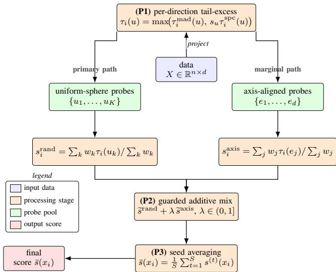  
Fig. 2. WAND pipeline: per-direction tail-excess (P1), guarded mix of uniform-sphere and axis pathways (P2), seed averaging (P3).

## B. Per-Direction Tail-Excess

The atomic statistic of WAND is, for each direction $u \in$ $\mathbb { S } ^ { d - 1 }$ and projection $z _ { i } ( u ) = u ^ { \top } x _ { i } .$

$$
r _ { i } ( u ) = \frac { z _ { i } ( u ) - \mathrm { m e d } ( z ( u ) ) } { \mathrm { M A D } ( z ( u ) ) } , \quad \tau _ { i } ^ { \mathrm { m a d } } ( u ) = \big ( | r _ { i } ( u ) | - c _ { d } ( n ) \big ) _ { + } .\tag{3}
$$

We use $| r _ { i } |$ (not $r _ { i } )$ so u and −u contribute symmetrically, and the median/MAD rescaling gives breakdown $1 / 2$ per direction [21], no single outlier can inflate the scale. The direction-level excess is

$$
\Delta ^ { \mathrm { m a d } } ( u ; X ) = \operatorname * { m a x } _ { i } \tau _ { i } ^ { \mathrm { m a d } } ( u ) .\tag{4}
$$

By Proposition 1, $\Delta ^ { \mathrm { m a d } } ( u ; X ) = o _ { P } ( 1 )$ uniformly over u under the inlier null, so any direction with $\Delta ^ { \mathrm { m a d } } ( u ; X ) \gg 1$ is statistical evidence of a τ-margin anomaly along u.

Why median/MAD. Mean/std has breakdown 0 (one moved point can drive the standardised score to 0 for all others); MAD’s constant-factor efficiency loss under the Gaussian null $( \mathrm { A R E } \approx 0 . 3 7 )$ is absorbed by the empirical-null calibration of q0.

## C. Spacings: Multi-Modal Robustness

Equation (4) fails when $u ^ { \top } X$ is well-separated into two or more modes, because the inter-mode gap inflates MAD and crushes $| r _ { i } |$ even for the rarest mode. To recover the rare-mode signal we add a non-parametric k-spacings component.

For each direction u, sort the projections $z _ { ( 1 ) } \leq \dots \leq z _ { ( n ) }$ and let $d _ { k , i } ( u )$ be the two-sided k-th order spacing,

$$
d _ { k , i } ( u ) = \mathrm { m i n } \Big ( z _ { ( \pi _ { i } + k ) } - z _ { ( \pi _ { i } ) } , z _ { ( \pi _ { i } ) } - z _ { ( \pi _ { i } - k ) } \Big ) ,
$$

with $\pi _ { i }$ the rank of $z _ { i } ( u )$ and edge clamps at the endpoints. A point sitting alone in a sparse region has a wide $d _ { k , i }$ relative to the median; this defines

$$
\begin{array} { r } { \tau _ { i } ^ { \mathrm { s p c } } ( u ) \ = \ \Big ( \log \frac { d _ { k , i } ( u ) } { \mathrm { m e d } _ { j } d _ { k , j } ( u ) } \Big ) _ { + } . } \end{array}\tag{5}
$$

We set $k = \lceil \sqrt { n } \rceil$ , the classical choice in 1D density estimation [39]. The two components are combined by an evidencedisjunction:

$$
\tau _ { i } ( u ) = \mathrm { m a x } \Bigl ( \tau _ { i } ^ { \mathrm { m a d } } ( u ) , s _ { u } \cdot \tau _ { i } ^ { \mathrm { s p c } } ( u ) \Bigr ) ,\tag{6}
$$

with rescaling $s _ { u } ~ = ~ c _ { d } ( n ) / \operatorname* { m a x } \bigl ( \operatorname* { m a x } _ { i } \tau _ { i } ^ { \mathrm { s p c } } ( u ) , \varepsilon \bigr ) ~ ( \varepsilon ~ = ~$ $1 0 ^ { - 1 2 } )$ so the two components live on a common scale and the rescaling is well-defined when the projection is degenerate. Maximum rather than average prevents either component from diluting the other when only one has signal.

## D. Direction Sampling

We draw the K direction probes uniformly on $\mathbb { S } ^ { d - 1 }$ . The output-sensitive guarantee of Theorem 1 already holds under uniform sampling, and we observed no measurable mean-AUC gain on the ADBench suite from adaptive (posteriortargeting) samplers; we therefore adopt uniform draws as the default. The direction-excess statistic $\Delta ( u ; X )$ defined in (4) still parameterises the weight each direction receives in the aggregation step (8).

## E. Split Pathway and Guarded Additive Mix

A purely random direction set systematically misses anomalies confined to a single feature (the regime where marginal methods like ECOD/COPOD [6], [7] dominate). We therefore also probe the d axis-aligned directions $e _ { 1 } , \ldots , e _ { d } .$ . However, the two probe families have different failure modes: uniformsphere probes are vulnerable to high-dimensional noise; axis probes are vulnerable to feature-level outliers that are not the labelled anomalies. We address this by scoring the two pathways separately and combining them additively with a mixing weight $\lambda \in ( 0 , 1 ]$ :

$$
s ( x _ { i } ) = \widetilde s ^ { \mathrm { r a n d } } ( x _ { i } ) + \lambda \widetilde s ^ { \mathrm { a x i s } } ( x _ { i } ) ,\tag{7}
$$

where $\widetilde { s } = s / \operatorname* { m a x } ( s )$ is the pathway score normalised to [0, 1], and each pathway score $s ^ { \bullet }$ is obtained by the weighted aggregation

$$
s ^ { \bullet } ( x _ { i } ) = \frac { \sum _ { k : u _ { k } \in \bullet } \bigl ( \Delta ( u _ { k } ; X ) - q _ { 0 } \bigr ) _ { + } \cdot \tau _ { i } ( u _ { k } ) } { \sum _ { k : u _ { k } \in \bullet } \bigl ( \Delta ( u _ { k } ; X ) - q _ { 0 } \bigr ) _ { + } } .\tag{8}
$$

Here $q _ { 0 }$ is the empirical $( 1 - \alpha )$ -quantile of $\{ \Delta ( u _ { k } ; \tilde { X } ) \} _ { k = 1 } ^ { K }$ on a covariance-matched Gaussian copy $\tilde { X } = Z L ^ { \top }$ with Z having i.i.d. $\mathcal { N } ( 0 , 1 )$ entries and $L L ^ { \top } = \widehat { \Sigma } + \rho \mathrm { t r } ( \widehat { \Sigma } ) I / d$ the Cholesky factor of the Ledoit–Wolf-regularised covariance $( \rho = 1 0 ^ { - 3 } )$ . The same probe set is re-applied to X˜ so the null is matched to the sampler; $\alpha = 0 . 0 5$ throughout. When the denominator of (8) vanishes we use the uniform-weighted mean $\begin{array} { r } { \frac { 1 } { | \bullet | } \sum _ { k } \tau _ { i } ( u _ { k } ) } \end{array}$ . The sample-covariance $q _ { 0 }$ is itself not robust; adversarial guarantees rely on the MAD breakdown (Theorem 3), not on q0.

Default λ. We use additive guarded mixing rather than element-wise maximum (unstable when one pathway is noisy, e.g. a non-anomalous axis outlier on musk); $\lambda \ < \ 1$ keeps the uniform-sphere pathway primary while letting axis probes boost signal. Mean AUC is flat (±0.003) over $\lambda \in [ 0 . 1 , 0 . 5 ]$ we fix $\lambda = 1 / 4$

Algorithm 1 WAND score.   
Require: data $X \in \mathbb { R } ^ { n \times d } ;$ probe budget $K ;$ mix weight $\lambda ;$   
spacing k   
1: $q _ { 0 } \gets 9 5 \% .$ -quantile of $\Delta ( u ; \tilde { X } )$ on Gaussian copy $\tilde { X }$   
Build probe pools:   
2: ${ \mathcal { U } } ^ { \mathrm { r a n d } } \gets \{ u _ { 1 } , \ldots , u _ { K } \}$ with $u _ { k } \overset { \mathrm { i i d } } { \sim } \mathrm { U n i f } ( \mathbb { S } ^ { d - 1 } )$   
3: $\mathcal { U } ^ { \mathrm { a x i s } } \gets \{ e _ { 1 } , \ldots , e _ { d } \}$ (standard-basis vectors)   
Per-direction excess (each pool separately):   
4: for each pool $\bullet \in \cdot$ {rand, axis}, each $u \in \mathcal { U } ^ { \bullet }$ do   
5: Compute $\tau _ { i } ^ { \mathrm { m a d } } ( u )$ via (3)   
6: Compute $\bar { \tau } _ { i } ^ { \mathrm { s p c } } ( \bar { u } )$ via (5)   
7: $\tau _ { i } ( u ) \dot {  } \operatorname* { m a x } \bigl ( \tau _ { i } ^ { \mathrm { m a d } } ( u ) , s _ { u } \tau _ { i } ^ { \mathrm { s p c } } ( u ) \bigr )$   
8: $\Delta ( u ) \gets \operatorname* { m a x } _ { i } \tau _ { i } ( u )$   
9: end for   
Per-pathway aggregation, then mix:   
10: Compute $s _ { i } ^ { \mathrm { r a n d } }$ via (8) over $u \in \mathcal { U } ^ { \mathrm { r a n d } }$   
11: Compute $s _ { i } ^ { \mathrm { a x i s } }$ via (8) over $u \in \mathcal { U } ^ { \mathrm { a x i s } }$   
12: $s _ { i } \gets s _ { i } ^ { \mathrm { r a n d } } \Big / \operatorname* { m a x } _ { j } s _ { j } ^ { \mathrm { r a n d } } + \lambda s _ { i } ^ { \mathrm { a x i s } } \Big /$ maxj $s _ { j } ^ { \mathrm { a x i s } }$   
13: return $s = ( s _ { 1 } , \ldots , s _ { n } )$

## F. Seed Averaging

The reported WAND score is the mean over $S$ calls of Algorithm 1 driven by the protocol-level RNG seeds (Section VI); the same S drives the stochastic baselines, so the variancereduction budget is shared.

## G. Cluster-Free Design and Differentiability

WAND relies only on (i) inner products $u ^ { \top } x _ { i } , \mathrm { ( i i ) }$ the univariate median and MAD of $z ( u )$ , (iii) the 1D order statistics defining $d _ { k , i } ( u )$ , and (iv) a Gaussian-copy bootstrap for $q _ { 0 }$ It does not compute kernel densities, kNN graphs, clusters, or covariance whitening. Three consequences follow: (a) the median/MAD primitives give a per-direction breakdown of $1 / 2$ and a joint breakdown of $1 / ( d + 1 )$ [21]; (b) the method is well-defined when $d \geq n$ (where covariance estimators degenerate); and (c) every operator in the pipeline admits a smooth relaxation (soft-max for max , sorting networks [37] for the rank distances $d _ { k , i } ) ,$ , so the gradient $\partial s ( x _ { i } ) / \partial x _ { j }$ exists almost everywhere. This gradient does double duty: it lets WAND act as a differentiable inner loop in a larger trainable model, and it is the engine of the gradient explanation (10), which we use and validate in Section VI-F rather than leaving differentiability as an unexercised claim.

## H. Directional Witnesses as Explanations

The aggregation (8) writes the score of a point as a weighted sum, over directions, of how far that point’s projection escapes the baseline: $\begin{array} { r } { s ( x _ { i } ) = \sum _ { k } \omega _ { k } \tau _ { i } ( u _ { k } ) } \end{array}$ with normalised weights $\omega _ { k } = ( \Delta ( u _ { k } ) - q _ { 0 } ) _ { + } / \sum _ { k ^ { \prime } } ( \Delta ( u _ { k ^ { \prime } } ) - q _ { 0 } ) _ { + }$ . The directions carrying that sum are not internal bookkeeping: $u _ { k }$ is a vector in feature space, so the directions that fire on $x _ { i }$ already say which feature combinations make it anomalous. We turn this into a feature attribution at no cost over scoring.

Definition 2 (Witness set). For a point $x _ { i } ,$ , its witness contribution along direction $u _ { k }$ is $\gamma _ { i , k } ~ : = \omega _ { k } \tau _ { i } ( u _ { k } ) \geq 0$ , and its dominant witness is $u _ { k ^ { \star } ( i ) }$ with $k ^ { \star } ( i ) = \arg \operatorname* { m a x } _ { k }$ γi,k. The witnesses are the directions with $\gamma _ { i , k }$ above a chosen mass threshold.

a) Witness attribution (gradient-free).: The centred projection along $u _ { k }$ decomposes over features as $u _ { k } ^ { \top } x _ { i } - \mathrm { m e d } =$ $\begin{array} { r } { \sum _ { i } u _ { k , j } \left( x _ { i , j } - m _ { j } \right) } \end{array}$ (up to the scalar offset), so the feature $- j$ share of the firing evidence is $| u _ { k , j } | | x _ { i , j } - m _ { j } |$ , where $m _ { j }$ is the per-feature median reference. Weighting by how much each direction fires and summing gives

$$
a _ { i , j } = \sum _ { k } \gamma _ { i , k } \left| u _ { k , j } \right| \left| x _ { i , j } - m _ { j } \right| , \qquad \widehat { a } _ { i , \cdot } = a _ { i , \cdot } / \sum _ { j } a _ { i , j } .\tag{9}
$$

The $| x _ { i , j } - m _ { j } |$ factor localises the explanation to the features this point actually deviates on, which is what keeps it accurate when the probes live on a Mahalanobis-whitened sphere (there $u _ { k }$ is read in ambient coordinates as $L ^ { - \top } u _ { k }$ , with L the covariance root; (9) is unchanged otherwise). Equation (9) is computed from quantities already formed during scoring, the per-direction weights $\omega _ { k }$ and excesses $\tau _ { i } ( u _ { k } )$ , so an explanation costs zero extra detector evaluations. The deviation also gives a sign for free: $\mathrm { s i g n } ( x _ { i , j } - m _ { j } )$ flags each responsible feature as anomalously high or low (“too high” vs. “too low”), leaving the magnitudes unchanged.

b) Gradient attribution.: Because s is differentiable (Section IV-G), a second, independent explanation is the saliency

$$
\begin{array} { r } { a _ { i , j } ^ { \mathrm { g r a d } } \ = \ \Big | \left( x _ { i , j } - m _ { j } \right) \frac { \partial s \left( x _ { i } \right) } { \partial x _ { i , j } } \Big | , } \end{array}\tag{10}
$$

with the background statistics frozen so the derivative is a clean per-point quantity. Equations (9) and (10) are different functionals, one reads off the geometry, the other differentiates the score, yet they agree strongly in practice (mean rank correlation 0.80 across ADBench, Section VI-F), which is exactly the consistency one wants between the witness picture and the differentiable surrogate.

c) Coverage.: The probe-budget theorem below has an explanation reading: with K directions drawn as in Theorem 1, every τ-margin anomaly has, with high probability, at least one witness direction, so (9) is non-vacuous for every anomaly the budget is designed to expose. Probe efficiency is thus also explanation-coverage efficiency.

## V. THEORETICAL ANALYSIS

## A. Output-Sensitive Sample Complexity

Let $A \subseteq X$ be the set of τ-margin anomalies (Definition 1) with $| A | \ = \ k$ . For each $x \in A$ let $C ( x ) \ \subseteq \ \mathbb { S } ^ { d - 1 }$ be the witness cone, i.e. the set of directions u for which $( u ^ { \top } x -$ $\mathrm { m e d } ) / \mathrm { M A D } \geq c _ { d } ( n ) + \tau$ . We derive the lower bound on the spherical measure of C(x) in Lemma 1 below.

Lemma 1 (Spherical-cap lower bound on $C ( \boldsymbol x ) )$ . Under Assumption 1 with sub-Gaussian proxy σ, for any anomaly x with displacement $\| x - \mu _ { \mathrm { i n } } \| \ge \sigma \big ( c _ { d } ( n ) + 2 \tau \big )$ , the witness cone

$C ( x )$ contains a spherical cap of half-angle $\theta _ { \tau } = \Theta ( \tau / \sqrt { d } )$ around $v _ { x } : = ( x - \mu _ { \mathrm { i n } } ) / \| x - \mu _ { \mathrm { i n } } \|$ , hence

$$
p _ { \tau } : = \mathbb { P } _ { u \sim \mathrm { U n i f } ( \mathbb { S } ^ { d - 1 } ) } [ u \in C ( x ) ] \ \geq \ \frac { 1 } { 2 } ( \sin \theta _ { \tau } ) ^ { d - 1 } .
$$

Proof. See Appendix A.

Magnitudes. $c _ { d } ( n ) \approx \sqrt { 2 \log n }$ is only ≈ 4–5 even at $n { \sim } 1 0 ^ { 6 }$ , so the displacement threshold is a few $\sigma ;$ the cap half-angle $\theta _ { \tau } =$ $\Theta ( \tau / \sqrt { d } )$ shrinks with d, the source of the high-d looseness.

Theorem 1 (Output-sensitive probe budget). Under Assumption 1, Definition 1 and the displacement hypothesis of Lemma 1, for any $\delta \in ( 0 , 1 )$ drawing

$$
K = \frac { 1 } { p _ { \tau } } \log \frac { k } { \delta }
$$

probe directions uniformly from $\mathbb { S } ^ { d - 1 }$ is sufficient so that, with probability at least $1 - \delta ,$ , every anomaly in A is exposed by at least one drawn direction. The bound depends on the anomaly count k, the margin $\tau ,$ and the dimension d through $p _ { \tau } ,$ , but not on the sample size n.

Proof. Fix $x \in A$ with witness cone $C ( x )$ . Lemma 1 gives $p ( x ) : = \mathbb { P } _ { u \sim \mathrm { U n i f } } [ u \in C ( x ) ] \geq p _ { \tau }$ with $\begin{array} { r } { p _ { \tau } = \frac { 1 } { 2 } ( \sin \theta _ { \tau } ) ^ { d - 1 } } \end{array}$ and $\theta _ { \tau } ~ = ~ \Theta ( \tau / \sqrt { d } )$ , so $p _ { \tau } ~ = ~ \Theta ( ( \tau / \sqrt { d } ) ^ { d - 1 } )$ for small $\tau / { \sqrt { d } } .$ . Let $u _ { \perp } , \ldots , u _ { K } \stackrel { \mathrm { i i d } } { \sim }$ Unif(Sd−1) and define the bad event $\begin{array} { r } { \dot { B } ( x ) \ : = \ : \bigcap _ { k = 1 } ^ { K } \{ u _ { k } \notin C ( x ) \} } \end{array}$ . By independence, $\mathbb { P } [ B ( x ) ] =$ $( 1 - p ( x ) ) ^ { \ddot { K } } \overset { } { \leq } ( 1 - p _ { \tau } ) ^ { \dot { K } } \leq e ^ { - K p _ { \tau } }$ , using $1 - t \leq e ^ { - t }$ . The failure event is $\begin{array} { r } { E = \bigcup _ { x \in A } B ( x ) ; } \end{array}$ ; union-bounding, $\mathbb { P } [ E ] \ \leq$ $\begin{array} { r } { \sum _ { x \in A } \mathbb { P } [ B ( x ) ] \le k e ^ { - \mathbf { \bar { K } } \mathbf { \tilde { p } } _ { \tau } } } \end{array}$ . Setting $\begin{array} { r } { K = \frac { 1 } { p _ { \tau } } \log ( k / \delta ) } \end{array}$ gives $\mathbb { P } [ E ] \leq \delta .$ □

Remark 1 (Probe efficiency, not runtime; regime in $d ) .$ . We are explicit about scope. Theorem 1 bounds the number of directions, not the wall-clock runtime: revisiting n data points per direction and sorting once for the k-spacings step gives a total cost $O { \big ( } K \cdot n ( d + \log n ) { \big ) }$ , so the “output-sensitive” qualifier refers strictly to K and confers no runtime advantage on its own (it would, paired with a sub-linear per-probe index; Section VII-0a). Moreover $p _ { \tau } = \Theta \big ( ( \tau / \sqrt { d } ) ^ { \dot { d } - 1 } \big )$ from Lemma 1, so the worst-case K-bound is sample-size-free in n but grows with d for fixed $\tau ;$ it is informative in low-tomoderate $d ,$ and in high-d rows we rely on empirical scaling (a fixed budget $K$ suffices in practice, evidence that real witness cones are far larger than the worst case). The value of the theorem in this paper is as much the coverage statement of Section IV-H, every anomaly is guaranteed a witness, hence an explanation, as the budget itself.

## B. Consistency and Convergence Rate

Theorem 2 (Plug-in consistency, unweighted variant). Let $\begin{array} { r } { \widehat { s } _ { K } ( x ) = \frac { 1 } { K } \sum _ { k = 1 } ^ { K } \tau ( x , u _ { k } ) } \end{array}$ be the unweighted Monte-Carlo estimator with K probe directions drawn uniformly on $\mathbb { S } ^ { d - 1 }$ and let $s ^ { * } ( x ) \ = \ \mathbb { E } _ { u \sim \mathrm { U n i f } ( \mathbb { S } ^ { d - 1 } ) } [ \tau ( x , u ) ]$ be the population mean. Then

$$
\operatorname* { s u p } _ { x \in X } \vert \widehat { s } _ { K } ( x ) - s ^ { * } ( x ) \vert \ \leq C \sigma \sqrt { \frac { \log n \log ( n / \delta ) } { K } } \quad w . p . \ 1 - \delta ,
$$

for an absolute constant $C$ depending only on σ. The implemented weighted aggregator (8) replaces $1 / K$ by datadependent weights $w _ { k } \in [ 0 , 1 ]$ summing to 1; the same Hoeffding union-bound argument gives the same rate up to constants under the conditioning event that at least one direction exceeds the null threshold.

Proof. See the supplementary material.

## C. Differentiability

The exact algorithm composes non-smooth primitives (median, MAD, sort, rank, max, $( \cdot ) _ { + } ) _ { }$ , used in all our empirical results. For end-to-end training each primitive is replaced by a standard relaxation: maxi $\begin{array} { r } { \tau _ { i } \to T \log \sum _ { i } \exp ( \tau _ { i } / T ) } \end{array}$ (softextreme); med and MAD by soft-quantile relaxations [40]; the spacing sort by a differentiable sorting network [37]. The resulting surrogate is continuously differentiable in X and converges to the exact score as $T \downarrow 0 ;$ only this surrogate mode enables WAND to act as a loss inside an upstream learnable pipeline.

## D. Adversarial Robustness

Theorem 3 (Per-direction breakdown). The MAD-z statistic $r _ { i } ( u ) = ( z _ { i } - \mathrm { m e d } ) / \mathrm { M A D }$ has breakdown $1 / 2$ per direction. The uniform-sphere pathway is rotation-equivariant and inherits a joint breakdown $\geq 1 / ( d + 1 )$ from a composition with Tukey halfspace depth $I 2 I { \cal { I } } .$ The full estimator additionally uses a fixed axis-aligned pathway that is not affine-equivariant, so a tight bound on the mixed estimator requires direct analysis and is left open.

Proof. Step 1 (per-direction). Fix u and let $z _ { i } = u ^ { \top } x _ { i }$ . For any contaminated sample $\widetilde { z }$ obtained by replacing $m < \lfloor n / 2 \rfloor$ entries of z by arbitrary values, the order statistics still satisfy $\widetilde { z } _ { ( \lfloor n / 2 \rfloor ) } = z _ { ( j ) }$ and $\widetilde { z } _ { ( \lceil n / 2 \rceil ) } = z _ { ( j ^ { \prime } ) }$ for indices ${ j , j ^ { \prime } }$ unchanged by the corruption, since at most m contaminating entries cannot occupy both halves of the order statistic. Hence med $( \widetilde z ) = \mathrm { m e d } ( z ) + O ( 1 )$ remains finite. The same argument applied to the absolute deviations $| \widetilde { z } _ { i } - \mathrm { m e d } ( \widetilde { z } ) |$ gives $\mathrm { M A D } ( \widetilde { z } ) = \mathrm { M A D } ( z ) + O ( 1 )$ , bounded away from 0, so $r _ { i } ( u )$ stays bounded, proving the $1 / 2$ breakdown. Step 2 (uniform-sphere pathway). The Donoho–Huber composition principle [41] gives, for an affine-equivariant functional $T$ built from sub-functionals $T _ { 1 } , T _ { 2 }$ with continuous composition, $\begin{array} { r } { \mathrm { b d } ( T ) \ \geq \ \operatorname* { m i n } ( \mathrm { b d } ( T _ { 1 } ) , \mathrm { b d } ( T _ { 2 } ) ) } \end{array}$ . Here $T _ { 1 }$ is per-direction MAD-z (breakdown $1 / 2 )$ and $T _ { 2 }$ is the rotation-equivariant aggregation (8) over $\mathrm { U n i f } ( \mathbb { S } ^ { d - 1 } )$ , which shares the $1 / ( d + 1 )$ breakdown of Tukey halfspace depth [21]; composition gives bd $\geq 1 / ( d + 1 )$ . Step 3 (mixed pathway). The fixed axis set is not transformed under a change of basis, so affine equivariance is broken and the Step 2 composition does not lift to the mixed estimator; a direct contamination analysis is left open. □

## VI. EXPERIMENTS

## A. Datasets and Baselines

We use the 47 ADBench [42] tabular anomaly tasks, spanning n from 80 to 619,326, d from 3 to 1,555, and contamination from 0.03% (donors) to 39.9% (SpamBase); features are z-score normalised after dropping zero-variance columns.

TABLE II  
DETECTION SUMMARY OVER 47 ADBENCH DATASETS, SORTED BY MEAN FRIEDMAN RANK (BEST/SECOND). FULL PER-DATASET ROC-AUC IN THE SUPPLEMENT.
<table><tr><td>Method</td><td>Mean AUC</td><td>Mean rank</td><td>Wins</td></tr><tr><td>WAND (ours)</td><td>0.777</td><td>5.64</td><td>7.4</td></tr><tr><td>IForest</td><td>0.762</td><td>6.04</td><td>5.4</td></tr><tr><td>INNE</td><td>0.759</td><td>6.71</td><td>7.2</td></tr><tr><td>COPOD</td><td>0.748</td><td>7.23</td><td>6.2</td></tr><tr><td>HBOS</td><td>0.743</td><td>7.40</td><td>1.2</td></tr><tr><td>PIDForest</td><td>0.750</td><td>7.43</td><td>1.2</td></tr><tr><td>KNN</td><td>0.729</td><td>7.54</td><td>2.0</td></tr><tr><td>ECOD</td><td>0.744</td><td>7.79</td><td>2.2</td></tr><tr><td>PCA</td><td>0.741</td><td>7.81</td><td>2.2</td></tr><tr><td>LSCP</td><td>0.727</td><td>8.65</td><td>0.0</td></tr><tr><td>KDE</td><td>0.708</td><td>8.69</td><td>6.0</td></tr><tr><td>OCSVM</td><td>0.730</td><td>8.80</td><td>0.0</td></tr><tr><td>LOF</td><td>0.658</td><td>10.11</td><td>0.0</td></tr><tr><td>LODA</td><td>0.655</td><td>10.13</td><td>2.0</td></tr><tr><td>SOD</td><td>0.688</td><td>10.14</td><td>1.0</td></tr><tr><td>ABOD</td><td>0.655</td><td>10.29</td><td>1.0</td></tr><tr><td>COF</td><td>0.624</td><td>11.57</td><td>2.0</td></tr></table>

We compare against 15 unsupervised PyOD [43] baselines, IFOREST [1], LOF [2], OCSVM [3], KNN [4], PCA [5], HBOS [13], ECOD [6], COPOD [7], ABOD [16], COF [17], SOD [18], INNE [12], LODA [15], LSCP [19], KDE [14], plus the projection-pursuit predecessor PIDFOR-EST [25] (16 baselines in total).

## B. Protocol and Metrics

All methods are unsupervised. Each method’s f-score is computed on the same X used to fit it; ROC-AUC is taken against the ground-truth label. We use WAND with the single default configuration above (no per-dataset tuning). Every reported AUC and runtime is the mean over $S \ = \ 3$ runs with RNG seeds {0, 1, 2}, applied uniformly to WAND and every stochastic baseline (IForest, PCA, INNE, LSCP). All runs use a single CPU core on a commodity x86-64 workstation (Intel Xeon, 16 GB RAM, NumPy / PyTorch CPU, no GPU). Code and benchmark drivers are at https://github. com/Output-Sensitive/wand; baselines come unmodified from PyOD [43] (except PIDFOREST, from the reference implementation of [25]) on the 47 ADBench [42] tabular tasks.

We use a single default configuration in all experiments, with no per-dataset tuning: probe budget K = 1024, spacing $k = \lceil { \sqrt { n } } \rceil$ , axis probes on, mix weight λ = 1/4, empiricalnull level $\alpha = 0 . 0 5$ , and S = 3 seed replicates. Each value is dimensionless/data-adaptive or sits at a one-knob plateau (e.g. halving K to 512 shifts mean AUC by < 0.003); the full table and per-knob justification are in the supplement.

## C. Main Results

Table II reports the main result over all 47 ADBench datasets. On the fair-comparison subset where Isolation Forest completes within budget, WAND attains the best mean Friedman rank (5.64) and a mean ROC-AUC (0.777) at parity with the strongest classical baselines (IForest 0.762, INNE

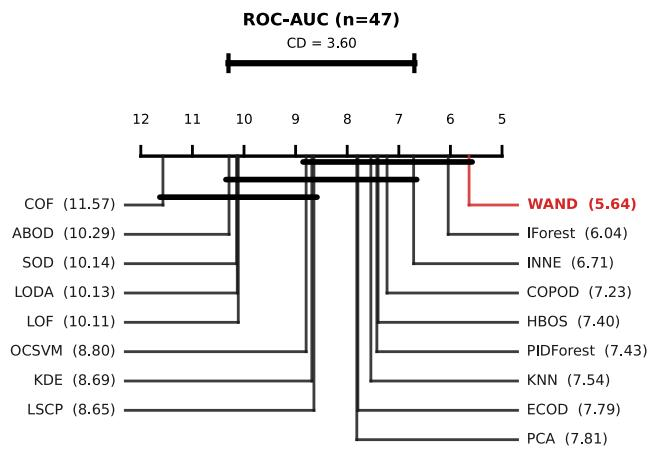  
Fig. 3. Critical-difference diagram (ROC-AUC; Nemenyi, $\alpha = 0 . 0 5 , \mathrm { C D } =$ 3.60): a bar joins methods that are not significantly different. The AUPR/AP diagram is in the supplement.

0.759, PIDFOREST 0.750). The Nemenyi post-hoc test in Figure 3 places WAND in a top cluster of methods that are not statistically distinguishable at $\begin{array} { r } { \alpha \ = \ 0 . 0 5 . } \end{array}$ , so the rank advantage reflects WAND’s consistency across datasets rather than frequent per-row wins, where it sits in a close pack with INNE on the per-row best-AUC tally. The AUPR ranking mirrors the ROC ordering (WAND best mean AUPR rank 5.57, mean AUPR 0.395, second to OCSVM 0.401; diagram in the supplement).

a) Across the full suite.: Using the batched path, WAND scores all 47 datasets in ≈ 1.7 min of single-CPU time, including the giants donors (n=619k, 16 s) and census (n=299k, d=500, 17 s); 18 rows reach $\mathrm { A U C } \geq 0 . 9 0$ . Each PyOD baseline gets a 5 min budget; quadratic-cost methods are auto-skipped on $n > 2 0 { , } 0 0 0$ , so on the largest rows only the sub-quadratic family and WAND complete. The scorer is linear in n $( O ( K n d )$ , K independent of n): calibrated once, it streams 107 points in 164 s (47 s at K=256) on an 8-core CPU, so WAND scales to high-throughput streams (supplement).

b) Per-dataset hyperparameter oracle (ceiling only).: As a diagnostic, not a comparator, selecting per dataset the best value of a single knob with test-label access raises WAND’s mean AUC from 0.777 to 0.800 (+0.023), concentrated on a few datasets where one knob dominates (annthyroid, vertebral). This oracle is unachievable unsupervised; we report it only to bound the default-vs.-per-dataset gap and use the single published default elsewhere.

## D. Ablation

Table III attributes the gain mechanism-by-mechanism. The Base configuration is already competitive at AUC 0.750 and mean rank 4.00; the split-pathway axis probes give the largest single AUC jump (+0.007), and the seed averaging closes the gap to the published configuration. The spacing component slightly lowers the suite-wide mean $( 0 . 7 5 0  0 . 7 4 5 )$ ; we keep it on by default for its per-dataset upside on the multimodal projections (annthyroid, vertebral), a deliberate trade-off that the suite-wide number reports transparently. A lite configuration without spacing and with $S = 1$ recovers $\approx 0 . 7 5 2$ AUC at ≈ 1 s and is a sensible alternative when wall-clock matters more than rank. The cumulative effect is +0.006 AUC and −0.13 rank over Base, while also buying the entire theoretical apparatus of Section V (output-sensitive K, differentiability, robustness), none of which the Base inherits. The wall-time penalty for the full method (8.6 s vs. 0.1 s on the ablation subset) is sizeable in relative terms but remains under 10 s per dataset in absolute terms.

TABLE III  
INCREMENTAL ABLATION; EACH ROW ADDS ONE MECHANISM. MEAN RANK AMONG THE TABLE II METHODS (1 = BEST).
<table><tr><td>Variant</td><td>Mean AUC</td><td>Mean rank</td><td>Wall time</td></tr><tr><td>Base (MAD-z, uniform probes)</td><td>0.750</td><td>4.00</td><td>0.10s</td></tr><tr><td>+ Spacing component (5)</td><td>0.745</td><td>4.39</td><td>2.83 s</td></tr><tr><td>+ Axis probes (split pathway)</td><td>0.752</td><td>4.13</td><td>2.85s</td></tr><tr><td>+ Seed averaging (S=3, full)</td><td>0.756</td><td>3.87</td><td>8.63 s</td></tr></table>

TABLE IV

EXPLANATION QUALITY: SYNTHETIC ATTRIBUTION-AUC (AXIS / OBLIQUE REGIMES), MEAN DELETION/INSERTION FAITHFULNESS OVER 33 ADBENCH DATASETS (≥SHAP WIN-RATE), AND PER-EXPLANATION COST. SHAP/LIME EXPLAIN WAND; ECOD AND IFOREST EXPLAIN THEMSELVES (DETECTION AUCS IN TEXT). †DEPTH-WEIGHTED SPLIT ATTRIBUTION, READ FROM THE FITTED ENSEMBLE (APPENDIX D).
<table><tr><td></td><td colspan="2">Synthetic attr-AUC</td><td colspan="2">Real faithfulness</td><td colspan="2">Cost / expl.</td></tr><tr><td>Method</td><td>axis</td><td>oblique</td><td>mean</td><td>≥SHAP</td><td>queries</td><td>ms</td></tr><tr><td>WAND-witness</td><td>0.977</td><td>0.660</td><td>0.629</td><td>85%</td><td>0</td><td>0.04</td></tr><tr><td>WAND-gradient</td><td>0.993</td><td>0.680</td><td>0.595</td><td>82%</td><td>0</td><td>0.05</td></tr><tr><td>ECOD (native)</td><td>0.968</td><td>0.635</td><td>0.290</td><td>21%</td><td>0</td><td>0.00</td></tr><tr><td>SHAP (post-hoc)</td><td>0.887</td><td>0.632</td><td>0.515</td><td></td><td>9,745</td><td>229.94</td></tr><tr><td>LIME (post-hoc)</td><td>0.585</td><td>0.504</td><td>0.337</td><td>21%</td><td>600</td><td>18.96</td></tr><tr><td>IForest (native)†</td><td>0.498</td><td>0.499</td><td>0.031</td><td>3%</td><td>0</td><td>5.93</td></tr><tr><td>Random</td><td>一</td><td></td><td>-0.004</td><td>3%</td><td>0</td><td>0.00</td></tr></table>

## E. Probe Budget in Practice

Sweeping the probe budget $K \in \{ 6 4 , \dots , 2 0 4 8 \}$ on the highest-hull-complexity datasets, AUC saturates at $K \approx 4 | H |$ $( | H |$ the soft-extreme hull size), confirming the budget tracks output complexity rather than n; WAND sits at the top-left of the AUC–runtime Pareto frontier: it attains the best mean AUC of all methods on this shared subset, and the fastest baseline within 0.02 AUC of it, IForest, is only 1.6× faster (Fig. 9, Table XI).

## F. Explanation Quality

We now evaluate the central claim of the paper: that WAND’s witness directions yield explanations that are accurate, faithful, and essentially free. Every explainer below, WAND-witness (9), WAND-gradient (10), and post-hoc SHAP [8] and LIME [9] , explains the same WAND score, so the comparison isolates the explainer. Table IV and Figure 4 summarise; Figure 5 is a case study on image data.

(a) ground-truth recovery  
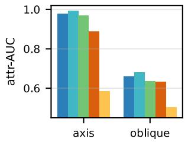

(b) faithfulness vs cost  
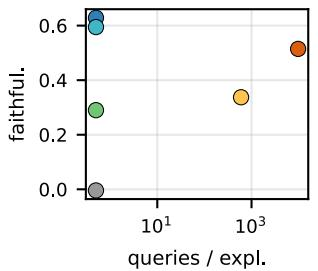  
(d) explanation, heavy tails

(c) detection, heavy tails  
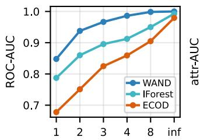  
Student-t d.o.f. (← heavier)

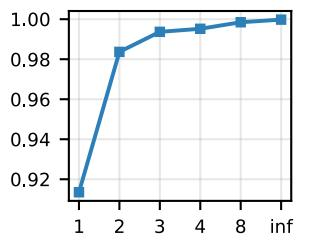  
Student-t d.o.f. (← heavier)  
Fig. 4. Explanation quality and heavy-tail robustness. (a) Attribution-AUC by regime (axis vs. oblique). (b) Faithfulness vs. detector queries (log x): native WAND is top-left, most faithful at zero extra cost. (c) Under heavy-tailed inliers (Student-t, heavier tails to the left) WAND detection stays ahead of IForest/ECOD down to Cauchy, and (d) its witness attribution-AUC stays high.

a) Synthetic ground truth (two regimes).: Inliers follow a strongly low-rank correlated Gaussian; each anomaly deviates on a known random subset S, which a correct explanation should rank first. We use two anomaly regimes: axis-aligned (independent per-feature shifts on S, the regime marginal methods own) and oblique, a displacement along the minimum-variance direction of $\Sigma _ { S S } .$ , i.e. a correlation violation that is jointly extreme but marginally near-normal. Averaged over $d \in \{ 5 0 , 1 0 0 , 2 0 0 \}$ $| S | \in \{ 3 , 6 \}$ and three seeds (Table IV): on axis-aligned anomalies WAND-gradient and WAND-witness lead (attribution-AUC 0.99/0.98), with the AD-native marginal explainer ECOD also strong (0.97) and SHAP/LIME behind (0.89/0.59). The decisive case is oblique: ECOD’s detection collapses to chance (AUC 0.53 vs. WAND’s 0.91), so it never surfaces these points and its attribution is moot, whereas WAND still leads on attribution (0.68). A marginal native explainer is structurally blind to the correlation anomalies that directional methods exist for; WAND handles both regimes.

b) Faithfulness on real data.: With no labels, we use the standard deletion/insertion protocol [44]: mask the mostattributed features of each flagged point (replacing them by the per-feature median) and measure how fast the score collapses (deletion), and symmetrically how fast it recovers when those features are re-inserted (insertion). Each curve is normalised by the point’s own score and clipped to [0, 1], so faithfulness = insertion − deletion ∈ [−1, 1] is bounded and no single dataset dominates; we average over 33 ADBench datasets. Each native explainer is evaluated against its own detector (ECOD against ECOD), SHAP/LIME against WAND. A random control sits at ≈ 0, confirming the metric. WAND’s better native mode is at least as faithful as SHAP on 29/33 datasets, and witness beats ECOD’s native attribution on 31/33; mean faithfulness is 0.63 (witness) and 0.59 (gradient), versus 0.52 (SHAP), 0.34 (LIME) and 0.29 (ECOD), ECOD’s marginal explanation, strong on synthetic axis anomalies, does not transfer to real anomalies that are rarely purely marginal. A second native baseline, Isolation Forest’s depth-weighted split attribution (Table IV), performs near chance on both protocols, so being native to a strong detector is not on its own sufficient for a faithful explanation.

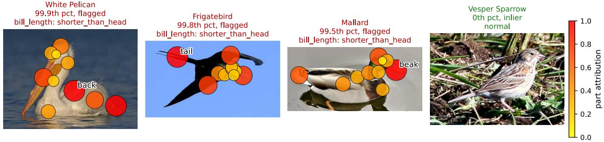  
Fig. 5. Concept-level explanation (which attributes), encoder-free. ANOCUB witness attribution in CUB’s named-concept space: the three top-scored birds (flagged: pelican, frigatebird, mallard, 99.5–99.9th pct) with witness directions mapped to body-part keypoints (hotter = more responsible) and the top attribute named, beside the most-normal bird (sparrow, 0th pct). Unlike Fig. 1, no encoder is needed and concepts are named, not pixel locations.

c) Cost, agreement, coverage.: The native explanations require zero extra detector queries (they reuse quantities formed during scoring), versus ${ \sim } 9 . 7 \times 1 0 ^ { 3 }$ scorer evaluations per point for SHAP and ∼600 for LIME at the budgets above, $\mathrm { { a } \sim 5 \times 1 0 ^ { 3 } }$ reduction in wall-clock per explanation (Fig. 4b). The two native modes agree (mean rank correlation 0.80). The probe budget guarantees a witness for every τ -margin anomaly (Section IV-H), so every flagged point has an explanation.

d) Robustness to heavy tails.: Assumption 1 asks for sub-Gaussian inliers; real data is often heavier-tailed. We test this directly: inliers are multivariate Student-t with degrees of freedom swept from Gaussian (∞) to Cauchy (1), anomalies are axis shifts in MAD units (Fig. 4). WAND degrades gracefully and stays clearly ahead of Isolation Forest and ECOD throughout (e.g. at df=2: AUC 0.94 vs. 0.86 and 0.75; even at Cauchy, 0.85 vs. 0.79 and 0.68), and witness attribution-AUC remains ≥ 0.91. The median/MAD calibration thus keeps the detector and its explanations effective well outside the sub-Gaussian regime, though we do not claim formal guarantees there (Section VII-0a).

e) Comparison with deep detectors.: On a representative 16-dataset subset we add three PyOD deep baselines trained on the contaminated sample. WAND is competitive: mean ROC-AUC 0.821, matching VAE (0.821), ahead of AutoEncoder (0.790) and Deep SVDD (0.798); IForest leads (0.854). As in ADBench [42], deep tabular detectors do not dominate strong shallow ones, and none offers a native explanation.

f) Case study: explaining image anomalies.: To show the explanation on raw inputs we build ANOCUB from CUB-200-2011 [45]: each bird image is represented by its 312 named attributes (the class-level concept profile), inliers are the sparrow species and anomalies a few birds from very different families (pelican, frigatebird, mallard, hummingbird). WAND separates them perfectly (AUC 1.0); Figure 5 asks whether its flags are justified. The three highest-scored birds (left) are unmistakably non-sparrows (pelican, frigatebird, mallard, 99.5–99.9th percentile) while the most-normal bird (right) is a typical sparrow (0th). For each flagged bird the witness names the responsible attribute (bill shape/length) and, mapped to CUB’s 15 keypoints, grounds it on the bird’s body, at no extra cost and using no pixels or labels. The pixel-level view of Fig. 1 instead scores a frozen ResNet-18 embedding of the same task and reaches comparable detection (AUC 0.99 vs. 1.0 in the named-concept space): the concept representation explains by name, the embedding adds spatial pixel maps. (A named-feature medical case study, Breast Cancer Wisconsin, is in the supplement.)

## VII. CONCLUSION

WAND detects anomalies and explains them with the same object: the witness directions along which a point escapes a sub-Gaussian baseline. Each direction lives in feature space, so the witnesses are a native attribution, free over scoring, gradient-recoverable, and more faithful than post-hoc SHAP/LIME at a fraction of the cost, and the geometry bounds the probe count by the anomaly count, guaranteeing every anomaly an explanation.

a) Limitations.: (i) Probe efficiency bounds directions, not runtime. The scorer stays linear in n; a wall-clock speed-up needs a sub-linear per-probe index, left to future work. (ii) The worst-case bound loosens in high d. $p _ { \tau } =$ $\Theta ( ( \tau / \sqrt { d } ) ^ { d - 1 } )$ shrinks with $d ,$ so the guarantee is informative in low-to-moderate $d ;$ a fixed $K$ still suffices empirically at $d { = } 1 , 5 5 5 , 5 5 ,$ and a structure-adaptive bound is open. (iii) Assumptions are verified empirically beyond their proven range. Sub-Gaussianity holds only within Assumption 1; under heavy tails the method stays effective empirically (Fig. 4), and the Gaussian-copy null $q _ { 0 }$ uses a non-robust covariance that can inflate (Waveform). (iv) The breakdown proof covers the uniform-sphere pathway. The 1/(d+1) bound is established there; the axis-augmented estimator awaits direct analysis (Theorem 3). (v) Detection is at parity. WAND has the best mean rank and top mean ROC-AUC but sits in the Nemenyi top cluster; the contribution is native explanation at detection parity, not a wide accuracy margin. (vi) Faithfulness is model-relative. On real data the deletion/insertion metric certifies consistency with WAND’s own score; objective correctness is tested on synthetic ground truth (Section VI-F).

b) Acknowledgment.: This work was supported by French state aid managed by the National Research Agency under the France 2030 program, with the reference “PAN-DORA” (ANR-24-CE23-0950).

## REFERENCES

[1] F. T. Liu, K. M. Ting, and Z.-H. Zhou, “Isolation forest,” in Proc. IEEE Int. Conf. on Data Mining (ICDM), 2008, pp. 413–422.

[2] M. M. Breunig, H.-P. Kriegel, R. T. Ng, and J. Sander, “LOF: Identifying density-based local outliers,” in Proc. ACM SIGMOD, 2000, pp. 93–104.

[3] B. Scholkopf, J. C. Platt, J. Shawe-Taylor, A. J. Smola, and R. C.¨ Williamson, “Estimating the support of a high-dimensional distribution,” Neural Computation, vol. 13, no. 7, pp. 1443–1471, 2001.

[4] S. Ramaswamy, R. Rastogi, and K. Shim, “Efficient algorithms for mining outliers from large data sets,” in Proc. ACM SIGMOD, 2000, pp. 427–438.

[5] M.-L. Shyu, S.-C. Chen, K. Sarinnapakorn, and L. Chang, “A novel anomaly detection scheme based on principal component classifier,” in Proc. IEEE Foundations and New Directions of Data Mining, 2003.

[6] Z. Li, Y. Zhao, X. Hu, N. Botta, C. Ionescu, and G. H. Chen, “ECOD: Unsupervised outlier detection using empirical cumulative distribution functions,” IEEE Trans. Knowl. Data Eng., 2022.

[7] Z. Li, Y. Zhao, N. Botta, C. Ionescu, and X. Hu, “COPOD: Copula-based outlier detection,” in Proc. IEEE Int. Conf. on Data Mining (ICDM), 2020, pp. 1118–1123.

[8] S. M. Lundberg and S.-I. Lee, “A unified approach to interpreting model predictions,” in Advances in Neural Information Processing Systems (NeurIPS), 2017.

[9] M. T. Ribeiro, S. Singh, and C. Guestrin, ““why should i trust you?”: Explaining the predictions of any classifier,” in ACM SIGKDD International Conference on Knowledge Discovery and Data Mining (KDD), 2016.

[10] J. W. Tukey, “Mathematics and the picturing of data,” Proc. Int. Cong. of Math., pp. 523–531, 1975.

[11] B. Chazelle, “An optimal convex hull algorithm in any fixed dimension,” Discrete Comput. Geom., vol. 10, no. 1, pp. 377–409, 1993.

[12] T. R. Bandaragoda, K. M. Ting, D. Albrecht, F. T. Liu, Y. Zhu, and J. R. Wells, “Isolation-based anomaly detection using nearest-neighbor ensembles,” Computational Intelligence, vol. 34, no. 4, pp. 968–998, 2018.

[13] M. Goldstein and A. Dengel, “Histogram-based outlier score (HBOS): A fast unsupervised anomaly detection algorithm,” in Proc. German Conf. on AI (KI), Poster and Demo Track, 2012, pp. 59–63.

[14] E. Parzen, “On estimation of a probability density function and mode,” Ann. Math. Stat., vol. 33, no. 3, pp. 1065–1076, 1962.

[15] T. Pevny, “LODA: Lightweight on-line detector of anomalies,”´ Machine Learning, vol. 102, no. 2, pp. 275–304, 2016.

[16] H.-P. Kriegel, M. Schubert, and A. Zimek, “Angle-based outlier detection in high-dimensional data,” in Proc. ACM SIGKDD, 2008, pp. 444–452.

[17] J. Tang, Z. Chen, A. W.-c. Fu, and D. W. Cheung, “Enhancing effectiveness of outlier detections for low density patterns,” in Proc. PAKDD, 2002, pp. 535–548.

[18] H.-P. Kriegel, P. Kroger, E. Schubert, and A. Zimek, “Outlier detection¨ in axis-parallel subspaces of high dimensional data,” in Proc. PAKDD, 2009, pp. 831–838.

[19] Y. Zhao, Z. Nasrullah, M. K. Hryniewicki, and Z. Li, “LSCP: Locally selective combination in parallel outlier ensembles,” in Proc. SIAM Int. Conf. on Data Mining (SDM), 2019, pp. 585–593.

[20] Y. Zhao, X. Hu, C. Cheng, C. Wang, C. Wan, W. Wang, J. Yang, H. Bai, Z. Li, C. Xiao et al., “SUOD: Accelerating large-scale unsupervised heterogeneous outlier detection,” in Proc. MLSys, 2021, pp. 463–478.

[21] D. L. Donoho and M. Gasko, “Breakdown properties of location estimates based on halfspace depth and projected outlyingness,” Ann. Stat., vol. 20, no. 4, pp. 1803–1827, 1992.

[22] G. Aloupis, “Geometric measures of data depth,” DIMACS Series in Discrete Math. and Theoretical Comp. Sci., vol. 72, pp. 147–158, 2006.

[23] J. H. Friedman and J. W. Tukey, “A projection pursuit algorithm for exploratory data analysis,” IEEE Trans. Comput., vol. C-23, no. 9, pp. 881–890, 1974.

[24] P. J. Rousseeuw and C. Croux, “Alternatives to the median absolute deviation,” Journal of the American Statistical Association, vol. 88, no. 424, pp. 1273–1283, 1993.

[25] P. Gopalan, V. Sharan, and U. Wieder, “PIDForest: Anomaly detection via partial identification,” in Advances in Neural Information Processing Systems (NeurIPS), 2019.

[26] L. Ruff, R. A. Vandermeulen, N. Goernitz, L. Deecke, S. A. Siddiqui, A. Binder, E. Muller, and M. Kloft, “Deep one-class classification,” in¨ Proc. Int. Conf. on Machine Learning (ICML), 2018.

[27] B. Zong, Q. Song, M. R. Min, W. Cheng, C. Lumezanu, D. Cho, and H. Chen, “Deep autoencoding gaussian mixture model for unsupervised anomaly detection,” in Proc. Int. Conf. on Learning Representations (ICLR), 2018.

[28] S. Tuli, G. Casale, and N. R. Jennings, “TranAD: Deep transformer networks for anomaly detection in multivariate time series data,” in Proc. VLDB Endow., 2022.

[29] J. Yin, Y. Qi, Q. Chen, and Y. Qu, “MCM: Masked cell modeling for anomaly detection in tabular data,” in Proc. Int. Conf. on Learning Representations (ICLR), 2024.

[30] A. Goodge, B. Hooi, S.-K. Ng, and W. S. Ng, “LUNAR: Unifying local outlier detection methods via graph neural networks,” in Proc. AAAI Conf. on Artificial Intelligence, 2022.

[31] V. Livernoche, V. Jain, Y. Hezaveh, and S. Ravanbakhsh, “On diffusion modeling for anomaly detection,” in Proc. Int. Conf. on Learning Representations (ICLR), 2024.

[32] G. Zamberg, M. Salhov, O. Lindenbaum, and A. Averbuch, “TabADM: Unsupervised tabular anomaly detection with diffusion models,” arXiv preprint arXiv:2307.12336, 2023.

[33] N. Takeishi, “Shapley values of reconstruction errors of PCA for explaining anomaly detection,” IEEE International Conference on Data Mining Workshops (ICDMW), 2019.

[34] L. Antwarg, R. A. Miller, B. Shapira, and L. Rokach, “Explaining anomalies detected by autoencoders using SHAP,” Expert Systems with Applications, vol. 186, p. 115736, 2021.

[35] B. Micenkova, R. T. Ng, X.-H. Dang, and I. Assent, “Explaining outliers´ by subspace separability,” in IEEE International Conference on Data Mining (ICDM), 2013.

[36] M. M. Hossain, T. Katzke, S. Kluttermann, and E. M¨ uller, “Unsupervised¨ symbolic anomaly detection,” arXiv preprint arXiv:2603.17575, 2026.

[37] M. Blondel, O. Teboul, Q. Berthet, and J. Djolonga, “Fast differentiable sorting and ranking,” in Proc. Int. Conf. on Machine Learning (ICML), 2020, pp. 950–959.

[38] R. Vershynin, High-Dimensional Probability: An Introduction with Applications in Data Science. Cambridge University Press, 2018.

[39] D. O. Loftsgaarden and C. P. Quesenberry, “A nonparametric estimate of a multivariate density function,” Annals of Mathematical Statistics, vol. 36, no. 3, pp. 1049–1051, 1965.

[40] M. Cuturi, O. Teboul, and J.-P. Vert, “Differentiable ranks and sorting using optimal transport,” in Advances in Neural Information Processing Systems (NeurIPS), 2019.

[41] D. L. Donoho and P. J. Huber, “The notion of breakdown point,” A Festschrift for Erich L. Lehmann, pp. 157–184, 1983.

[42] S. Han, X. Hu, H. Huang, M. Jiang, and Y. Zhao, “ADBench: Anomaly detection benchmark,” in Advances in Neural Information Processing Systems (NeurIPS), 2022.

[43] Y. Zhao, Z. Nasrullah, and Z. Li, “PyOD: A Python toolbox for scalable outlier detection,” J. Mach. Learn. Res., vol. 20, no. 96, pp. 1–7, 2019.

[44] V. Petsiuk, A. Das, and K. Saenko, “RISE: Randomized input sampling for explanation of black-box models,” in British Machine Vision Conference (BMVC), 2018.

[45] C. Wah, S. Branson, P. Welinder, P. Perona, and S. Belongie, “The Caltech-UCSD birds-200-2011 dataset,” California Institute of Technology, Tech. Rep. CNS-TR-2011-001, 2011.

This appendix collects extended tables, figures, and a second case study, plus the two longer deferred proofs. Theorem, proposition, equation, and section numbers below refer to the main text above. Theorem 1 and Theorem 3 are proved in place in the main text; the three supporting proofs are collected here.

## APPENDIX A DEFERRED PROOFS

## Proof of Proposition 1 (Extreme-value baseline)

Fix $u \in \mathbb { S } ^ { d - 1 }$ and let $z _ { i } = u ^ { \top } x _ { i }$ . By Assumption 1 the variables $z _ { i } - \mathbb { E } [ z _ { i } ]$ are i.i.d. sub-Gaussian with proxy variance bounded by $\sigma ^ { 2 }$ (projection onto u preserves the sub-Gaussian property with the operator-norm constant $u ^ { \top } \Sigma u \leq \sigma ^ { 2 } )$ . By the maximal sub-Gaussian inequality [1], $\mathbb { E } [ \operatorname* { m a x } _ { i } ( z _ { i } - \mathbb { E } [ z _ { i } ] ) ] \leq$ $\sigma { \sqrt { 2 \log n } } ,$ and concentration around the expectation gives

$$
\operatorname* { m a x } _ { i \leq n } \left( z _ { i } - \mathbb { E } [ z _ { i } ] \right) \ \leq \ \sigma \sqrt { 2 \log n } + \sigma \sqrt { 2 \log ( 1 / \delta ) }
$$

with probability 1−δ [2]. Substituting $\delta = 1 / n$ and adding the log $2 / { \sqrt { 2 \log n } }$ envelope slack produces $\sigma c _ { d } ( n )$ with residual $O _ { P } ( 1 / { \sqrt { \log n } } )$ (the slack is a chosen constant, not the Gumbel expansion, used only for a clean deterministic upper bound). For the location/scale rescaling, classical results [3] give me $\mathrm { d } ( z ) = \mathbb { E } [ z _ { i } ] + O _ { P } ( n ^ { - 1 / 2 } )$ and $\mathrm { M A D } ( z ) = \sigma \Phi ^ { - 1 } ( 3 / 4 ) +$ $O _ { P } ( n ^ { - 1 / 2 } )$ under our sub-Gaussian assumption with continuous $\mathrm { C D F } ;$ dividing the displayed bound by MAD(z) absorbs the residual into $O _ { P } ( 1 / { \sqrt { \log n } } )$ since $1 / { \sqrt { n } } = o ( 1 / { \sqrt { \log n } } )$ Uniformity over u $\in ~ \mathbb { S } ^ { d - 1 }$ uses an ϵ-net $\mathcal { N } _ { \epsilon } ~ \subset ~ \mathbb { S } ^ { d - 1 }$ of cardinality $\leq ~ ( 3 / \epsilon ) ^ { d }$ [5]: as $u \mapsto u ^ { \top } x _ { i }$ is $\| x _ { i } \| { \mathrm { - L i p s c h i t z } } ,$ replacing u by its nearest net point changes $( z _ { i } - \mathrm { m e d } ) / \mathrm { M A D }$ by $O _ { P } ( \epsilon \sqrt { \log n } )$ uniformly in i, so $\epsilon = 1 / \sqrt { n \log n }$ makes the net slack $o _ { P } ( 1 )$ while the union bound costs log $| \mathcal { N } _ { \epsilon } | =$ $O ( d \log { n } )$ , absorbed into the $O _ { P } ( \sqrt { d / \log n } )$ residual. □

## Proof of Lemma 1 (Spherical-cap lower bound on $C ( \boldsymbol { x } ) )$

Decompose $u = \cos \theta v _ { x } + \sin \theta w , w \perp v _ { x }$ . Proposition 1 gives me $\mathrm { d } ( z ( u ) ) ~ = ~ \mu _ { \mathrm { i n } } ^ { \top } u + \sigma O _ { P } ( 1 )$ and $\mathrm { M A D } ( z ( u ) ) ~ =$ $\sigma \Phi ^ { - 1 } ( 3 / 4 ) + \sigma O _ { P } ( 1 ) \bar { }$ uniformly in u. Hence $( u ^ { \top } x \mathrm { ~ - ~ }$ $\mathrm { m e d ) / M A D } = \| x - \mu _ { \mathrm { i n } } |$ ∥ cos $\theta / ( \sigma \Phi ^ { - 1 } ( 3 / 4 ) ) + O _ { P } ( 1 )$ , which exceeds $c _ { d } ( n ) + \tau$ under the displacement hypothesis whenever $\theta \leq \theta _ { \tau } = \Theta ( \tau / \sqrt { d } )$ . The cap-measure bound [6] closes the argument. □

## Proof of Theorem 2 (Plug-in consistency)

Fix any $\begin{array} { r l r } { x } & { { } \in } & { X ; } \end{array}$ ; the per-point score is $\begin{array} { r l } { s _ { K } ( x ) } & { { } = } \end{array}$ $\textstyle { \frac { 1 } { K } } \sum _ { k = 1 } ^ { K } \tau ( x , u _ { k } )$ with the $u _ { k } \overset { \mathrm { i i d } } { \sim } \operatorname { U n i f } ( \mathbb { S } ^ { d - 1 } )$ , and $s ^ { * } ( x ) =$ $\mathbb { E } _ { u } [ \tau ( x , u ) ]$ . Under Assumption 1 the per-direction excess satisfies the deterministic envelope $0 \leq \tau ( x , u ) \leq M _ { n }$ with $M _ { n } = C _ { \sigma } \sqrt { \log n }$ , by combining Proposition 1 with the MADz definition of τ . Hoeffding’s inequality [38] on the bounded summands $\tau ( x , u _ { k } ) \in [ 0 , M _ { n } ]$ gives $\mathbb { P } [ | s _ { K } ( x ) - s ^ { * } ( x ) | > t ] \le$ $2 \exp ( - 2 K t ^ { 2 } / M _ { n } ^ { 2 } )$ . Union-bounding over the n points and choosing $t = M _ { n } \sqrt { \log ( 2 n / \delta ) / ( 2 K ) }$ yields $\operatorname* { s u p } _ { x \in X } | s _ { K } ( x ) -$ $s ^ { * } ( x ) | \leq C _ { \sigma } \sqrt { \log n \log ( n / \delta ) / K }$ with probability $1 - \delta ,$ , as stated. □

## APPENDIX B EXTENDED TABLES

## A. Default hyper-parameters

Table V lists the single default configuration used in all experiments (no per-dataset tuning).

TABLE V  
WAND DEFAULT HYPER-PARAMETERS USED IN ALL EXPERIMENTS.
<table><tr><td>Symbol</td><td>Default</td></tr><tr><td>K (probe budget)</td><td>1024</td></tr><tr><td>Spacing k (NN rank)</td><td> $\lceil \sqrt { n } \rceil$ </td></tr><tr><td>Axis probes</td><td>on</td></tr><tr><td>Mix weight λ</td><td>0.25</td></tr><tr><td>Seed replicates S</td><td>3</td></tr></table>

## B. Per-dataset detection results

Table VI reports per-dataset ROC-AUC for all 16 unsupervised detectors over the 47 ADBench tasks (Table II in the main text reports the aggregate summary).

## C. Pixel-level explanation on raw images

WAND’s score is differentiable in its input features, so when those features come from a differentiable encoder ϕ, $\partial ( \mathrm { W A N D \ s c o r e } ) / \partial ( \mathrm { p i x e l s } )$ is obtained by autograd through $\phi ,$ with no training. We embed the ANOCUB images with a frozen pre-trained ResNet-18, fit WAND on the 512-d embeddings (z-scored, no whitening; detection AUC 0.99), and back-propagate the anomaly score of a flagged bird to its pixels (SmoothGrad). Fig. 1 in the main text shows the resulting saliency for three flagged anomalies and a normal inlier on a shared scale: it concentrates on the anomalies discriminative body/bill regions and is weak on the inlier. This realises the pixel-level explanation; embedding-space detection (AUC 0.99) is on par with the named concept space (1.0), the trade-off being only that embedding dimensions are not individually named, so the map is spatial-only. Note that, as in the concept space, we fit WAND without Mahalanobis whitening: on the contaminated 512-d embedding covariance, whitening suppresses the anomaly directions and drops AUC to 0.88.

## D. The ANOCUB dataset

ANOCUB is the explainable-AD benchmark we derive from CUB-200-2011 [45]. Each bird image is represented by its 312 named binary attributes (the class-level concept profile); inliers are the sparrow species and anomalies are a small set of birds from very different families (pelican, frigatebird, mallard, hummingbird), giving a $1 2 5 9 \times 3 1 2$ task with 15 anomalies. As ANOCUB is not a standard download, we release the construction script, which regenerates the exact task (anocub\_task.npz) from the public CUB archive, together with the embedding/saliency scripts below.

TABLE VI  
ROC-AUC OVER 47 ADBENCH DATASETS FOR 16 UNSUPERVISED DETECTORS. BOLD = BEST PER ROW, UNDERLINE = SECOND. “–” = BUDGET / MEMORY EXHAUSTED.
<table><tr><td rowspan=1 colspan=14>Dataset            n  d Contam.IForestLOFOCSVMKNNPCAHBOSECODCOPODABODCOF</td><td rowspan=1 colspan=7>SODINNE LODALSCPKDEPIDForestWAND</td></tr><tr><td rowspan=1 colspan=4>breastw        683  9 35.0%</td><td rowspan=1 colspan=1>0.988</td><td rowspan=1 colspan=1>0.443</td><td rowspan=1 colspan=1>0.951</td><td rowspan=1 colspan=1>0.977</td><td rowspan=1 colspan=2>0.9560.985</td><td rowspan=1 colspan=3>0.991 0.994</td><td rowspan=1 colspan=1>0.4280</td><td rowspan=1 colspan=1>.934</td><td rowspan=1 colspan=1>0.697</td><td rowspan=1 colspan=1>0.986</td><td rowspan=1 colspan=2>0.984</td><td rowspan=1 colspan=2>0.975  0.990</td></tr><tr><td rowspan=1 colspan=4>glass          214  7  4.2%</td><td rowspan=1 colspan=1>0.788</td><td rowspan=1 colspan=1>0.770</td><td rowspan=1 colspan=1>0.599</td><td rowspan=1 colspan=1>0.864</td><td rowspan=1 colspan=1>0.654</td><td rowspan=1 colspan=1>0.812</td><td rowspan=1 colspan=1>0.705</td><td rowspan=1 colspan=1>0.755</td><td rowspan=1 colspan=1>0.843</td><td rowspan=1 colspan=1>0.868</td><td rowspan=1 colspan=1>0.887</td><td rowspan=1 colspan=1>0.774</td><td rowspan=1 colspan=1>0.655</td><td rowspan=1 colspan=1>0.799</td><td rowspan=1 colspan=1>0.820</td><td rowspan=1 colspan=2>0.776 0.787</td></tr><tr><td rowspan=1 colspan=2>Hepatitis       80</td><td rowspan=1 colspan=2>19 16.2%</td><td rowspan=1 colspan=1>0.732</td><td rowspan=1 colspan=1>0.719</td><td rowspan=1 colspan=1>0.721</td><td rowspan=1 colspan=1>0.727</td><td rowspan=1 colspan=1>0.752</td><td rowspan=1 colspan=1>0.775</td><td rowspan=1 colspan=1>0.739</td><td rowspan=1 colspan=1>0.804</td><td rowspan=1 colspan=1>0.566</td><td rowspan=1 colspan=1>0.479</td><td rowspan=1 colspan=1>0.6310</td><td rowspan=1 colspan=1>.621</td><td rowspan=1 colspan=1>0.623</td><td rowspan=1 colspan=1>0.777</td><td rowspan=1 colspan=1>0.649</td><td rowspan=1 colspan=2>0.713  0.790</td></tr><tr><td rowspan=1 colspan=2>Ionosphere     351</td><td rowspan=1 colspan=2>32 35.9%</td><td rowspan=1 colspan=1>0.842</td><td rowspan=1 colspan=1>0.866</td><td rowspan=1 colspan=1>0.849</td><td rowspan=1 colspan=1>0.928</td><td rowspan=1 colspan=1>0.784</td><td rowspan=1 colspan=1>0.561</td><td rowspan=1 colspan=1>0.728</td><td rowspan=1 colspan=1>0.789</td><td rowspan=1 colspan=1>0.921</td><td rowspan=1 colspan=1>0.860</td><td rowspan=1 colspan=1>0.884</td><td rowspan=1 colspan=1>0.890</td><td rowspan=1 colspan=1>0.788</td><td rowspan=1 colspan=1>0.813</td><td rowspan=1 colspan=1>0.938</td><td rowspan=1 colspan=2>0.797  0.907</td></tr><tr><td rowspan=1 colspan=2>Lymphography  148</td><td rowspan=1 colspan=2>18  4.1%</td><td rowspan=1 colspan=1>0.999</td><td rowspan=1 colspan=1>0.993</td><td rowspan=1 colspan=1>0.995</td><td rowspan=1 colspan=1>0.995</td><td rowspan=1 colspan=1>0.996</td><td rowspan=1 colspan=1>0.995</td><td rowspan=1 colspan=1>0.995</td><td rowspan=1 colspan=1>0.996</td><td rowspan=1 colspan=1>0.979</td><td rowspan=1 colspan=1>0.995</td><td rowspan=1 colspan=1>0.934</td><td rowspan=1 colspan=1>0.984</td><td rowspan=1 colspan=1>0.877</td><td rowspan=1 colspan=1>0.994</td><td rowspan=1 colspan=1>0.989</td><td rowspan=1 colspan=1>0.978</td><td rowspan=1 colspan=1>0.998</td></tr><tr><td rowspan=1 colspan=2>Pima            768</td><td rowspan=1 colspan=2>8 34.9%</td><td rowspan=1 colspan=1>0.664</td><td rowspan=1 colspan=1>0.601</td><td rowspan=1 colspan=1>0.624</td><td rowspan=1 colspan=1>0.709</td><td rowspan=1 colspan=1>0.648</td><td rowspan=1 colspan=1>0.709</td><td rowspan=1 colspan=1>0.594</td><td rowspan=1 colspan=1>0.654</td><td rowspan=1 colspan=1>0.667</td><td rowspan=1 colspan=1>0.591</td><td rowspan=1 colspan=1>0.582</td><td rowspan=1 colspan=1>0.681</td><td rowspan=1 colspan=1>0.601</td><td rowspan=1 colspan=1>0.638</td><td rowspan=1 colspan=1>0.723</td><td rowspan=1 colspan=1>0.675</td><td rowspan=1 colspan=1>0.687</td></tr><tr><td rowspan=1 colspan=2>Stamps          340</td><td rowspan=1 colspan=2>9 9.1%</td><td rowspan=1 colspan=1>0.895</td><td rowspan=1 colspan=1>0.591</td><td rowspan=1 colspan=1>0.872</td><td rowspan=1 colspan=1>0.774</td><td rowspan=1 colspan=1>0.907</td><td rowspan=1 colspan=1>0.904</td><td rowspan=1 colspan=1>0.876</td><td rowspan=1 colspan=1>0.930</td><td rowspan=1 colspan=1>0.762</td><td rowspan=1 colspan=1>0.5400</td><td rowspan=1 colspan=1>.772</td><td rowspan=1 colspan=1>0.841</td><td rowspan=1 colspan=1>0.883</td><td rowspan=1 colspan=1>0.832</td><td rowspan=1 colspan=1>0.890</td><td rowspan=1 colspan=1>0.876</td><td rowspan=1 colspan=1>0.901</td></tr><tr><td rowspan=1 colspan=2>vertebral      240</td><td rowspan=1 colspan=2>6 12.5%</td><td rowspan=1 colspan=1>0.352</td><td rowspan=1 colspan=1>0.445</td><td rowspan=1 colspan=1>0.420</td><td rowspan=1 colspan=1>0.378</td><td rowspan=1 colspan=1>0.377</td><td rowspan=1 colspan=1>0.305</td><td rowspan=1 colspan=1>0.420</td><td rowspan=1 colspan=1>0.335</td><td rowspan=1 colspan=1>0.365</td><td rowspan=1 colspan=1>0.473</td><td rowspan=1 colspan=1>0.387</td><td rowspan=1 colspan=1>0.383</td><td rowspan=1 colspan=1>0.295</td><td rowspan=1 colspan=1>0.351</td><td rowspan=1 colspan=1>0.317</td><td rowspan=1 colspan=1>0.277</td><td rowspan=1 colspan=1>0.259</td></tr><tr><td rowspan=1 colspan=2>WBC             223</td><td rowspan=1 colspan=2>9  4.5%</td><td rowspan=1 colspan=1>0.995</td><td rowspan=1 colspan=1>0.821</td><td rowspan=1 colspan=1>0.992</td><td rowspan=1 colspan=1>0.986</td><td rowspan=1 colspan=1>0.993</td><td rowspan=1 colspan=1>0.988</td><td rowspan=1 colspan=1>0.995</td><td rowspan=1 colspan=1>0.995</td><td rowspan=1 colspan=1>0.935</td><td rowspan=1 colspan=1>0.758</td><td rowspan=1 colspan=1>0.977</td><td rowspan=1 colspan=1>0.933</td><td rowspan=1 colspan=1>0.990</td><td rowspan=1 colspan=1>0.974</td><td rowspan=1 colspan=1>0.973</td><td rowspan=1 colspan=1>0.992</td><td rowspan=1 colspan=1>0.995</td></tr><tr><td rowspan=1 colspan=2>WDBC            367</td><td rowspan=1 colspan=1>30</td><td rowspan=1 colspan=1>2.7%</td><td rowspan=1 colspan=1>0.987</td><td rowspan=1 colspan=1>0.982</td><td rowspan=1 colspan=1>0.983</td><td rowspan=1 colspan=1>0.974</td><td rowspan=1 colspan=1>0.986</td><td rowspan=1 colspan=1>0.992</td><td rowspan=1 colspan=1>0.971</td><td rowspan=1 colspan=1>0.994</td><td rowspan=1 colspan=1>0.885</td><td rowspan=1 colspan=1>0.947</td><td rowspan=1 colspan=1>0.947</td><td rowspan=1 colspan=1>0.975</td><td rowspan=1 colspan=1>0.980</td><td rowspan=1 colspan=1>0.990</td><td rowspan=1 colspan=1>0.950</td><td rowspan=1 colspan=1>0.991</td><td rowspan=1 colspan=1>0.983</td></tr><tr><td rowspan=1 colspan=2>wine            129</td><td rowspan=1 colspan=1>13</td><td rowspan=1 colspan=1>7.8%</td><td rowspan=1 colspan=1>0.795</td><td rowspan=1 colspan=1>0.879</td><td rowspan=1 colspan=1>0.696</td><td rowspan=1 colspan=1>0.519</td><td rowspan=1 colspan=1>0.806</td><td rowspan=1 colspan=1>0.915</td><td rowspan=1 colspan=1>0.733</td><td rowspan=1 colspan=1>0.867</td><td rowspan=1 colspan=1>0.417</td><td rowspan=1 colspan=1>0.302</td><td rowspan=1 colspan=1>0.446</td><td rowspan=1 colspan=1>0.785</td><td rowspan=1 colspan=1>0.834</td><td rowspan=1 colspan=1>0.907</td><td rowspan=1 colspan=1>0.582</td><td rowspan=1 colspan=1>0.812</td><td rowspan=1 colspan=1>0.939</td></tr><tr><td rowspan=1 colspan=2>WPBC           198</td><td rowspan=1 colspan=1>33</td><td rowspan=1 colspan=1>23.7%</td><td rowspan=1 colspan=1>0.486</td><td rowspan=1 colspan=1>0.520</td><td rowspan=1 colspan=1>0.485</td><td rowspan=1 colspan=1>0.500</td><td rowspan=1 colspan=1>0.482</td><td rowspan=1 colspan=1>0.548</td><td rowspan=1 colspan=1>0.481</td><td rowspan=1 colspan=1>0.523</td><td rowspan=1 colspan=1>0.490</td><td rowspan=1 colspan=1>0.474</td><td rowspan=1 colspan=1>0.474</td><td rowspan=1 colspan=1>0.500</td><td rowspan=1 colspan=1>0.502</td><td rowspan=1 colspan=1>0.530</td><td rowspan=1 colspan=1>0.489</td><td rowspan=1 colspan=1>0.537</td><td rowspan=1 colspan=1>0.564</td></tr><tr><td rowspan=1 colspan=2>annthyroid    7200</td><td rowspan=1 colspan=1>6</td><td rowspan=1 colspan=1>7.4%</td><td rowspan=1 colspan=1>0.832</td><td rowspan=1 colspan=1>0.727</td><td rowspan=1 colspan=1>0.681</td><td rowspan=1 colspan=1>0.811</td><td rowspan=1 colspan=1>0.673</td><td rowspan=1 colspan=1>0.620</td><td rowspan=1 colspan=1>0.789</td><td rowspan=1 colspan=1>0.776</td><td rowspan=1 colspan=1></td><td rowspan=1 colspan=1>0.708</td><td rowspan=1 colspan=1>0.794</td><td rowspan=1 colspan=1>0.700</td><td rowspan=1 colspan=1>0.465</td><td rowspan=1 colspan=1>0.731</td><td rowspan=1 colspan=1>0.684</td><td rowspan=1 colspan=1>0.879</td><td rowspan=1 colspan=1>0.777</td></tr><tr><td rowspan=1 colspan=2>cardio         1831</td><td rowspan=1 colspan=1>21</td><td rowspan=1 colspan=1>9.6%</td><td rowspan=1 colspan=1>0.926</td><td rowspan=1 colspan=1>0.546</td><td rowspan=1 colspan=1>0.935</td><td rowspan=1 colspan=1>0.686</td><td rowspan=1 colspan=1>0.950</td><td rowspan=1 colspan=1>0.840</td><td rowspan=1 colspan=1>0.935</td><td rowspan=1 colspan=1>0.922</td><td rowspan=1 colspan=1></td><td rowspan=1 colspan=1>0.5670</td><td rowspan=1 colspan=1>.623</td><td rowspan=1 colspan=1>0.913</td><td rowspan=1 colspan=1>0.893</td><td rowspan=1 colspan=1>0.712</td><td rowspan=1 colspan=1>0.748</td><td rowspan=1 colspan=1>0.860</td><td rowspan=1 colspan=1>0.923</td></tr><tr><td rowspan=1 colspan=2>Cardiotoco.   2114</td><td rowspan=1 colspan=1>21</td><td rowspan=1 colspan=1>22.0%</td><td rowspan=1 colspan=1>0.665</td><td rowspan=1 colspan=1>0.524</td><td rowspan=1 colspan=1>0.696</td><td rowspan=1 colspan=1>0.4910</td><td rowspan=1 colspan=1>.752</td><td rowspan=1 colspan=1>0.620</td><td rowspan=1 colspan=1>0.785</td><td rowspan=1 colspan=1>0.663</td><td rowspan=1 colspan=1>0.452</td><td rowspan=1 colspan=1>0.539</td><td rowspan=1 colspan=1>0.492</td><td rowspan=1 colspan=1>0.666</td><td rowspan=1 colspan=1>0.675</td><td rowspan=1 colspan=1>0.563</td><td rowspan=1 colspan=1>0.503</td><td rowspan=1 colspan=1>0.609</td><td rowspan=1 colspan=1>0.653</td></tr><tr><td rowspan=1 colspan=2>fault          1941</td><td rowspan=1 colspan=1>27</td><td rowspan=1 colspan=1>34.7%</td><td rowspan=1 colspan=1>0.567</td><td rowspan=1 colspan=1>0.596</td><td rowspan=1 colspan=1>0.539</td><td rowspan=1 colspan=1>0.720</td><td rowspan=1 colspan=1></td><td rowspan=1 colspan=1>0.572</td><td rowspan=1 colspan=1>0.469</td><td rowspan=1 colspan=1>0.455</td><td rowspan=1 colspan=1>0.699</td><td rowspan=1 colspan=1>0.563</td><td rowspan=1 colspan=1>0.661</td><td rowspan=1 colspan=1>0.573</td><td rowspan=1 colspan=1>0.495</td><td rowspan=1 colspan=1>0.575</td><td rowspan=1 colspan=1>0.731</td><td rowspan=1 colspan=1>0.571</td><td rowspan=1 colspan=1>0.486</td></tr><tr><td rowspan=1 colspan=2>landsat       6435</td><td rowspan=1 colspan=1>36</td><td rowspan=1 colspan=1>20.7%</td><td rowspan=1 colspan=1>0.472</td><td rowspan=1 colspan=1>0.547</td><td rowspan=1 colspan=1>0.424</td><td rowspan=1 colspan=1>0.5760</td><td rowspan=1 colspan=1>.364</td><td rowspan=1 colspan=1>0.559</td><td rowspan=1 colspan=1>0.368</td><td rowspan=1 colspan=1>0.421</td><td rowspan=1 colspan=1>0.503</td><td rowspan=1 colspan=1>0.543</td><td rowspan=1 colspan=1>0.577</td><td rowspan=1 colspan=1>0.541</td><td rowspan=1 colspan=1>0.380</td><td rowspan=1 colspan=1>0.560</td><td rowspan=1 colspan=1>0.625</td><td rowspan=1 colspan=1>0.456</td><td rowspan=1 colspan=1>0.575</td></tr><tr><td rowspan=1 colspan=2>letter        1600</td><td rowspan=1 colspan=1>32</td><td rowspan=1 colspan=1>6.2%</td><td rowspan=1 colspan=1>0.648</td><td rowspan=1 colspan=1>0.899</td><td rowspan=1 colspan=1>0.598</td><td rowspan=1 colspan=1>0.901</td><td rowspan=1 colspan=1>0.525</td><td rowspan=1 colspan=1>0.588</td><td rowspan=1 colspan=1>0.572</td><td rowspan=1 colspan=1>0.560</td><td rowspan=1 colspan=1>0.886</td><td rowspan=1 colspan=1>0.8890</td><td rowspan=1 colspan=1>.909</td><td rowspan=1 colspan=1>0.700</td><td rowspan=1 colspan=1>0.533</td><td rowspan=1 colspan=1>0.850</td><td rowspan=1 colspan=1>0.924</td><td rowspan=1 colspan=1>0.664</td><td rowspan=1 colspan=1>0.688</td></tr><tr><td rowspan=1 colspan=2>PageBlocks    5393</td><td rowspan=1 colspan=1>10</td><td rowspan=1 colspan=1>9.5%</td><td rowspan=1 colspan=1>0.904</td><td rowspan=1 colspan=1>0.716</td><td rowspan=1 colspan=1>0.915</td><td rowspan=1 colspan=1>0.834</td><td rowspan=1 colspan=1>0.905</td><td rowspan=1 colspan=1>0.760</td><td rowspan=1 colspan=1>0.914</td><td rowspan=1 colspan=1>0.875</td><td rowspan=1 colspan=1>0.740</td><td rowspan=1 colspan=1>0.624</td><td rowspan=1 colspan=1>0.662</td><td rowspan=1 colspan=1>0.947</td><td rowspan=1 colspan=1>0.719</td><td rowspan=1 colspan=1>0.813</td><td rowspan=1 colspan=1>0.907</td><td rowspan=1 colspan=1>0.854</td><td rowspan=1 colspan=1>0.916</td></tr><tr><td rowspan=1 colspan=2>pendigits     6870</td><td rowspan=1 colspan=1>16</td><td rowspan=1 colspan=1>2.3%</td><td rowspan=1 colspan=1>0.947</td><td rowspan=1 colspan=1>0.499</td><td rowspan=1 colspan=1>0.931</td><td rowspan=1 colspan=1>0.743</td><td rowspan=1 colspan=1>0.936</td><td rowspan=1 colspan=1>0.926</td><td rowspan=1 colspan=1>0.927</td><td rowspan=1 colspan=1>0.905</td><td rowspan=1 colspan=1>0.657</td><td rowspan=1 colspan=1>0.523</td><td rowspan=1 colspan=1>0.659</td><td rowspan=1 colspan=1>0.894</td><td rowspan=1 colspan=1>0.924</td><td rowspan=1 colspan=1>0.705</td><td rowspan=1 colspan=1>0.891</td><td rowspan=1 colspan=1>0.927</td><td rowspan=1 colspan=1>0.926</td></tr><tr><td rowspan=1 colspan=2>satellite     6435</td><td rowspan=1 colspan=1>36</td><td rowspan=1 colspan=1>31.6%</td><td rowspan=1 colspan=1>0.695</td><td rowspan=1 colspan=1>0.542</td><td rowspan=1 colspan=1>0.664</td><td rowspan=1 colspan=1>0.665</td><td rowspan=1 colspan=1>0.601</td><td rowspan=1 colspan=1>0.754</td><td rowspan=1 colspan=1>0.583</td><td rowspan=1 colspan=1>0.633</td><td rowspan=1 colspan=1>0.549</td><td rowspan=1 colspan=1>0.536</td><td rowspan=1 colspan=1>0.599</td><td rowspan=1 colspan=1>0.742</td><td rowspan=1 colspan=1>0.615</td><td rowspan=1 colspan=1>0.638</td><td rowspan=1 colspan=1>0.760</td><td rowspan=1 colspan=1>0.649</td><td rowspan=1 colspan=1>0.781</td></tr><tr><td rowspan=1 colspan=2>satimage-2    5803</td><td rowspan=1 colspan=1>36</td><td rowspan=1 colspan=1>1.2%</td><td rowspan=1 colspan=1>0.993</td><td rowspan=1 colspan=1>0.536</td><td rowspan=1 colspan=1>0.997</td><td rowspan=1 colspan=1>0.932</td><td rowspan=1 colspan=1>0.977</td><td rowspan=1 colspan=1>0.978</td><td rowspan=1 colspan=1>0.965</td><td rowspan=1 colspan=1>0.974</td><td rowspan=1 colspan=1>0.759</td><td rowspan=1 colspan=1>0.559</td><td rowspan=1 colspan=1>0.771</td><td rowspan=1 colspan=1>0.998</td><td rowspan=1 colspan=1>0.982</td><td rowspan=1 colspan=1>0.859</td><td rowspan=1 colspan=1>0.964</td><td rowspan=1 colspan=1>0.983</td><td rowspan=1 colspan=1>0.993</td></tr><tr><td rowspan=1 colspan=2>thyroid       3772</td><td rowspan=1 colspan=1>6</td><td rowspan=1 colspan=1>2.5%</td><td rowspan=1 colspan=1>0.978</td><td rowspan=1 colspan=1>0.665</td><td rowspan=1 colspan=1>0.959</td><td rowspan=1 colspan=1>0.959</td><td rowspan=1 colspan=1>0.956</td><td rowspan=1 colspan=1>0.950</td><td rowspan=1 colspan=1>0.977</td><td rowspan=1 colspan=1>0.939</td><td rowspan=1 colspan=1></td><td rowspan=1 colspan=1>0.587</td><td rowspan=1 colspan=1>0.876</td><td rowspan=1 colspan=1>0.971</td><td rowspan=1 colspan=1>0.816</td><td rowspan=1 colspan=1>0.788</td><td rowspan=1 colspan=1>0.958</td><td rowspan=1 colspan=1>0.967</td><td rowspan=1 colspan=1>0.980</td></tr><tr><td rowspan=1 colspan=2>vowels         1456</td><td rowspan=1 colspan=1>12</td><td rowspan=1 colspan=1>3.4%</td><td rowspan=1 colspan=1>0.767</td><td rowspan=1 colspan=1>0.943</td><td rowspan=1 colspan=1>0.778</td><td rowspan=1 colspan=1>0.977</td><td rowspan=1 colspan=1>0.610</td><td rowspan=1 colspan=1>0.677</td><td rowspan=1 colspan=1>0.593</td><td rowspan=1 colspan=1>0.496</td><td rowspan=1 colspan=1>0.966</td><td rowspan=1 colspan=1>0.960</td><td rowspan=1 colspan=1>0.914</td><td rowspan=1 colspan=1>0.898</td><td rowspan=1 colspan=1>0.635</td><td rowspan=1 colspan=1>0.921</td><td rowspan=1 colspan=1>0.956</td><td rowspan=1 colspan=1>0.740</td><td rowspan=1 colspan=1>0.885</td></tr><tr><td rowspan=1 colspan=2>Waveform      3443</td><td rowspan=1 colspan=1>21</td><td rowspan=1 colspan=1>2.9%</td><td rowspan=1 colspan=1>0.705</td><td rowspan=1 colspan=1>0.706</td><td rowspan=1 colspan=1>0.672</td><td rowspan=1 colspan=1>0.723</td><td rowspan=1 colspan=1>0.640</td><td rowspan=1 colspan=1>0.694</td><td rowspan=1 colspan=1>0.603</td><td rowspan=1 colspan=1>0.734</td><td rowspan=1 colspan=1>0.639</td><td rowspan=1 colspan=1>0.697</td><td rowspan=1 colspan=1>0.650</td><td rowspan=1 colspan=1>0.748</td><td rowspan=1 colspan=1>0.635</td><td rowspan=1 colspan=1>0.742</td><td rowspan=1 colspan=1>0.751</td><td rowspan=1 colspan=1>0.629</td><td rowspan=1 colspan=1>0.566</td></tr><tr><td rowspan=1 colspan=2>Wilt           4819</td><td rowspan=1 colspan=1>5</td><td rowspan=1 colspan=1>5.3%</td><td rowspan=1 colspan=1>0.441</td><td rowspan=1 colspan=1>0.701</td><td rowspan=1 colspan=1>0.317</td><td rowspan=1 colspan=1>0.613</td><td rowspan=1 colspan=1>0.434</td><td rowspan=1 colspan=1>0.349</td><td rowspan=1 colspan=1>0.394</td><td rowspan=1 colspan=1>0.345</td><td rowspan=1 colspan=1>0.634</td><td rowspan=1 colspan=1>0.723</td><td rowspan=1 colspan=1>0.595</td><td rowspan=1 colspan=1>0.359</td><td rowspan=1 colspan=1>0.403</td><td rowspan=1 colspan=1>0.598</td><td rowspan=1 colspan=1>0.334</td><td rowspan=1 colspan=1>0.507</td><td rowspan=1 colspan=1>0.427</td></tr><tr><td rowspan=1 colspan=2>yeast          1484</td><td rowspan=1 colspan=1>8</td><td rowspan=1 colspan=1>34.2%</td><td rowspan=1 colspan=1>0.394</td><td rowspan=1 colspan=1>0.457</td><td rowspan=1 colspan=1>0.420</td><td rowspan=1 colspan=1>0.406</td><td rowspan=1 colspan=1>0.396</td><td rowspan=1 colspan=1>0.399</td><td rowspan=1 colspan=1>0.444</td><td rowspan=1 colspan=1>0.381</td><td rowspan=1 colspan=1>0.416</td><td rowspan=1 colspan=1>0.4490</td><td rowspan=1 colspan=1>.477</td><td rowspan=1 colspan=1>0.394</td><td rowspan=1 colspan=1>0.504</td><td rowspan=1 colspan=1>0.434</td><td rowspan=1 colspan=1>0.383</td><td rowspan=1 colspan=1>0.413</td><td rowspan=1 colspan=1>0.397</td></tr><tr><td rowspan=1 colspan=2>ALOI         49534</td><td rowspan=1 colspan=1>27</td><td rowspan=1 colspan=1>3.0%</td><td rowspan=1 colspan=1>0.539</td><td rowspan=1 colspan=1></td><td rowspan=1 colspan=1></td><td rowspan=1 colspan=1></td><td rowspan=1 colspan=1>0.548</td><td rowspan=1 colspan=1>0.530</td><td rowspan=1 colspan=1>0.530</td><td rowspan=1 colspan=1>0.515</td><td rowspan=1 colspan=1></td><td rowspan=1 colspan=1></td><td rowspan=1 colspan=1></td><td rowspan=1 colspan=1>0.558</td><td rowspan=1 colspan=1>0.509</td><td rowspan=1 colspan=1></td><td rowspan=1 colspan=1></td><td rowspan=1 colspan=1>0.538</td><td rowspan=1 colspan=1>0.542</td></tr><tr><td rowspan=1 colspan=2>celeba       202599</td><td rowspan=1 colspan=1>39</td><td rowspan=1 colspan=1>2.2%</td><td rowspan=1 colspan=1>0.687</td><td rowspan=1 colspan=1></td><td rowspan=1 colspan=1></td><td rowspan=1 colspan=1></td><td rowspan=1 colspan=1>0.784</td><td rowspan=1 colspan=1>0.749</td><td rowspan=1 colspan=1>0.757</td><td rowspan=1 colspan=1>0.751</td><td rowspan=1 colspan=1></td><td rowspan=1 colspan=1></td><td rowspan=1 colspan=1></td><td rowspan=1 colspan=1>0.757</td><td rowspan=1 colspan=1>0.627</td><td rowspan=1 colspan=1></td><td rowspan=1 colspan=1></td><td rowspan=1 colspan=1>0.654</td><td rowspan=1 colspan=1>0.782</td></tr><tr><td rowspan=1 colspan=2>cover       286048</td><td rowspan=1 colspan=1>10</td><td rowspan=1 colspan=1>1.0%</td><td rowspan=1 colspan=1>0.882</td><td rowspan=1 colspan=1></td><td rowspan=1 colspan=1></td><td rowspan=1 colspan=1></td><td rowspan=1 colspan=1>0.934</td><td rowspan=1 colspan=1>0.712</td><td rowspan=1 colspan=1>0.920</td><td rowspan=1 colspan=1>0.884</td><td rowspan=1 colspan=1></td><td rowspan=1 colspan=1></td><td rowspan=1 colspan=1></td><td rowspan=1 colspan=1>0.959</td><td rowspan=1 colspan=1>0.833</td><td rowspan=1 colspan=1></td><td rowspan=1 colspan=1></td><td rowspan=1 colspan=1>0.933</td><td rowspan=1 colspan=1>0.855</td></tr><tr><td rowspan=1 colspan=2>donors      619326</td><td rowspan=1 colspan=1>10</td><td rowspan=1 colspan=1>5.9%</td><td rowspan=1 colspan=1>0.768</td><td rowspan=1 colspan=1></td><td rowspan=1 colspan=1></td><td rowspan=1 colspan=1></td><td rowspan=1 colspan=1>0.824</td><td rowspan=1 colspan=1>0.742</td><td rowspan=1 colspan=1>0.888</td><td rowspan=1 colspan=1>0.815</td><td rowspan=1 colspan=1></td><td rowspan=1 colspan=1></td><td rowspan=1 colspan=1></td><td rowspan=1 colspan=1>0.733</td><td rowspan=1 colspan=1>0.968</td><td rowspan=1 colspan=1></td><td rowspan=1 colspan=1></td><td rowspan=1 colspan=1>0.628</td><td rowspan=1 colspan=1>0.909</td></tr><tr><td rowspan=1 colspan=2>fraud       284807</td><td rowspan=1 colspan=2>29  0.2%</td><td rowspan=1 colspan=1>0.951</td><td rowspan=1 colspan=1></td><td rowspan=1 colspan=1></td><td rowspan=1 colspan=1></td><td rowspan=1 colspan=1>0.953</td><td rowspan=1 colspan=1>0.954</td><td rowspan=1 colspan=1>0.950</td><td rowspan=1 colspan=1>0.947</td><td rowspan=1 colspan=1></td><td rowspan=1 colspan=1></td><td rowspan=1 colspan=1></td><td rowspan=1 colspan=1>0.956</td><td rowspan=1 colspan=1>0.621</td><td rowspan=1 colspan=1></td><td rowspan=1 colspan=1></td><td rowspan=1 colspan=1>0.947</td><td rowspan=1 colspan=1>0.941</td></tr><tr><td rowspan=1 colspan=1>http</td><td rowspan=1 colspan=1>567498</td><td rowspan=1 colspan=1>3</td><td rowspan=1 colspan=1>0.4%</td><td rowspan=1 colspan=1>0.999</td><td rowspan=1 colspan=1></td><td rowspan=1 colspan=1></td><td rowspan=1 colspan=1></td><td rowspan=1 colspan=1>0.996</td><td rowspan=1 colspan=1>0.994</td><td rowspan=1 colspan=1>0.979</td><td rowspan=1 colspan=1>0.992</td><td rowspan=1 colspan=1></td><td rowspan=1 colspan=1></td><td rowspan=1 colspan=1></td><td rowspan=1 colspan=1>0.998</td><td rowspan=1 colspan=1>0.281</td><td rowspan=1 colspan=1></td><td rowspan=1 colspan=1></td><td rowspan=1 colspan=1>0.992</td><td rowspan=1 colspan=1>0.994</td></tr><tr><td rowspan=1 colspan=1>magic.gamma</td><td rowspan=1 colspan=1>19020</td><td rowspan=1 colspan=1>10</td><td rowspan=1 colspan=1>35.2%</td><td rowspan=1 colspan=1>0.719</td><td rowspan=1 colspan=1>0.693</td><td rowspan=1 colspan=1></td><td rowspan=1 colspan=1>0.811</td><td rowspan=1 colspan=1>0.667</td><td rowspan=1 colspan=1>0.712</td><td rowspan=1 colspan=1>0.638</td><td rowspan=1 colspan=1>0.681</td><td rowspan=1 colspan=1>0.784</td><td rowspan=1 colspan=1>0.6380</td><td rowspan=1 colspan=1>.746</td><td rowspan=1 colspan=1>0.735</td><td rowspan=1 colspan=1>0.649</td><td rowspan=1 colspan=1></td><td rowspan=1 colspan=1>0.722</td><td rowspan=1 colspan=2>0.744  0.681</td></tr><tr><td rowspan=1 colspan=1>mammography</td><td rowspan=1 colspan=1>11183</td><td rowspan=1 colspan=1>6</td><td rowspan=1 colspan=1>2.3%</td><td rowspan=1 colspan=1>0.861</td><td rowspan=1 colspan=1>0.719</td><td rowspan=1 colspan=1></td><td rowspan=1 colspan=1>0.838</td><td rowspan=1 colspan=1>0.894</td><td rowspan=1 colspan=1>0.830</td><td rowspan=1 colspan=1>0.906</td><td rowspan=1 colspan=1>0.905</td><td rowspan=1 colspan=1></td><td rowspan=1 colspan=1>0.717</td><td rowspan=1 colspan=1>0.805</td><td rowspan=1 colspan=1>0.824</td><td rowspan=1 colspan=1>0.891</td><td rowspan=1 colspan=1>0.741</td><td rowspan=1 colspan=1>0.865</td><td rowspan=1 colspan=1>0.843</td><td rowspan=1 colspan=1>0.881</td></tr><tr><td rowspan=1 colspan=1>shuttle</td><td rowspan=1 colspan=1>49097</td><td rowspan=1 colspan=1>9</td><td rowspan=1 colspan=1>7.2%</td><td rowspan=1 colspan=1>0.997</td><td rowspan=1 colspan=1></td><td rowspan=1 colspan=1></td><td rowspan=1 colspan=1></td><td rowspan=1 colspan=1>0.990</td><td rowspan=1 colspan=1>0.984</td><td rowspan=1 colspan=1>0.993</td><td rowspan=1 colspan=1>0.995</td><td rowspan=1 colspan=1></td><td rowspan=1 colspan=1></td><td rowspan=1 colspan=1></td><td rowspan=1 colspan=1>0.989</td><td rowspan=1 colspan=1>0.641</td><td rowspan=1 colspan=1></td><td rowspan=1 colspan=1></td><td rowspan=1 colspan=1>0.972</td><td rowspan=1 colspan=1>0.996</td></tr><tr><td rowspan=1 colspan=1>skin</td><td rowspan=1 colspan=1>245057</td><td rowspan=1 colspan=1>3</td><td rowspan=1 colspan=1>20.8%</td><td rowspan=1 colspan=1>0.667</td><td rowspan=1 colspan=1></td><td rowspan=1 colspan=1></td><td rowspan=1 colspan=1></td><td rowspan=1 colspan=1>0.417</td><td rowspan=1 colspan=1>0.595</td><td rowspan=1 colspan=1>0.489</td><td rowspan=1 colspan=1>0.471</td><td rowspan=1 colspan=1></td><td rowspan=1 colspan=1></td><td rowspan=1 colspan=1></td><td rowspan=1 colspan=1>0.722</td><td rowspan=1 colspan=1>0.432</td><td rowspan=1 colspan=1></td><td rowspan=1 colspan=1></td><td rowspan=1 colspan=1>0.727</td><td rowspan=1 colspan=1>0.894</td></tr><tr><td rowspan=1 colspan=1>smtp</td><td rowspan=1 colspan=1>95156</td><td rowspan=1 colspan=1>3</td><td rowspan=1 colspan=1>0.0%</td><td rowspan=1 colspan=1>0.904</td><td rowspan=1 colspan=1></td><td rowspan=1 colspan=1></td><td rowspan=1 colspan=1></td><td rowspan=1 colspan=1>0.808</td><td rowspan=1 colspan=1>0.800</td><td rowspan=1 colspan=1>0.880</td><td rowspan=1 colspan=1>0.912</td><td rowspan=1 colspan=1></td><td rowspan=1 colspan=1></td><td rowspan=1 colspan=1></td><td rowspan=1 colspan=1>0.925</td><td rowspan=1 colspan=1>0.829</td><td rowspan=1 colspan=1></td><td rowspan=1 colspan=1></td><td rowspan=1 colspan=1>0.918</td><td rowspan=1 colspan=1>0.956</td></tr><tr><td rowspan=1 colspan=1>backdoor</td><td rowspan=1 colspan=1>95329</td><td rowspan=1 colspan=1>193</td><td rowspan=1 colspan=1>2.4%</td><td rowspan=1 colspan=1>0.742</td><td rowspan=1 colspan=1></td><td rowspan=1 colspan=1></td><td rowspan=1 colspan=1></td><td rowspan=1 colspan=1></td><td rowspan=1 colspan=1>0.740</td><td rowspan=1 colspan=1>0.846</td><td rowspan=1 colspan=1>0.789</td><td rowspan=1 colspan=1></td><td rowspan=1 colspan=1></td><td rowspan=1 colspan=1></td><td rowspan=1 colspan=1>0.905</td><td rowspan=1 colspan=1>0.237</td><td rowspan=1 colspan=1></td><td rowspan=1 colspan=1></td><td rowspan=1 colspan=1>0.733</td><td rowspan=1 colspan=1>0.894</td></tr><tr><td rowspan=1 colspan=1>campaign</td><td rowspan=1 colspan=1>41188</td><td rowspan=1 colspan=1>62</td><td rowspan=1 colspan=1>11.3%</td><td rowspan=1 colspan=1>0.699</td><td rowspan=1 colspan=1>0.625</td><td rowspan=1 colspan=1></td><td rowspan=1 colspan=1>0.741</td><td rowspan=1 colspan=1></td><td rowspan=1 colspan=1>0.766</td><td rowspan=1 colspan=1>0.770</td><td rowspan=1 colspan=1>0.783</td><td rowspan=1 colspan=1>0.724</td><td rowspan=1 colspan=1></td><td rowspan=1 colspan=1></td><td rowspan=1 colspan=1>0.731</td><td rowspan=1 colspan=1>0.500</td><td rowspan=1 colspan=1></td><td rowspan=1 colspan=1></td><td rowspan=1 colspan=1>0.781</td><td rowspan=1 colspan=1>0.667</td></tr><tr><td rowspan=1 colspan=1>census</td><td rowspan=1 colspan=1>299285</td><td rowspan=1 colspan=1>500</td><td rowspan=1 colspan=1>6.2%</td><td rowspan=1 colspan=1>0.607</td><td rowspan=1 colspan=1></td><td rowspan=1 colspan=1></td><td rowspan=1 colspan=1></td><td rowspan=1 colspan=1></td><td rowspan=1 colspan=1></td><td rowspan=1 colspan=1></td><td rowspan=1 colspan=1></td><td rowspan=1 colspan=1></td><td rowspan=1 colspan=1></td><td rowspan=1 colspan=1></td><td rowspan=1 colspan=1>0.665</td><td rowspan=1 colspan=1></td><td rowspan=1 colspan=1></td><td rowspan=1 colspan=1></td><td rowspan=1 colspan=1>0.532</td><td rowspan=1 colspan=1>0.672</td></tr><tr><td rowspan=1 colspan=1>InternetAds</td><td rowspan=1 colspan=1>1966</td><td rowspan=1 colspan=1>1555</td><td rowspan=1 colspan=1>18.7%</td><td rowspan=1 colspan=1>0.701</td><td rowspan=1 colspan=1>0.609</td><td rowspan=1 colspan=1></td><td rowspan=1 colspan=1>0.6520</td><td rowspan=1 colspan=1>.615</td><td rowspan=1 colspan=1>0.696</td><td rowspan=1 colspan=1>0.677</td><td rowspan=1 colspan=1>0.676</td><td rowspan=1 colspan=1>0.585</td><td rowspan=1 colspan=1>0.6140</td><td rowspan=1 colspan=1>.562</td><td rowspan=1 colspan=1>0.610</td><td rowspan=1 colspan=1>0.523</td><td rowspan=1 colspan=1></td><td rowspan=1 colspan=1>0.616</td><td rowspan=1 colspan=1>0.648</td><td rowspan=1 colspan=1>0.619</td></tr><tr><td rowspan=1 colspan=2>mnist          7603</td><td rowspan=1 colspan=1>78</td><td rowspan=1 colspan=1>9.2%</td><td rowspan=1 colspan=1>0.809</td><td rowspan=1 colspan=1>0.673</td><td rowspan=1 colspan=1></td><td rowspan=1 colspan=1>0.837</td><td rowspan=1 colspan=1>0.850</td><td rowspan=1 colspan=1>0.576</td><td rowspan=1 colspan=1>0.746</td><td rowspan=1 colspan=1>0.774</td><td rowspan=1 colspan=1>0.755</td><td rowspan=1 colspan=1>0.6350</td><td rowspan=1 colspan=1>.675</td><td rowspan=1 colspan=1>0.858</td><td rowspan=1 colspan=1>0.426</td><td rowspan=1 colspan=1>0.643</td><td rowspan=1 colspan=1>0.798</td><td rowspan=1 colspan=1>0.621</td><td rowspan=1 colspan=1>0.849</td></tr><tr><td rowspan=1 colspan=2>musk          3062</td><td rowspan=1 colspan=2>166  3.2%</td><td rowspan=1 colspan=1>1.000</td><td rowspan=1 colspan=1>0.636</td><td rowspan=1 colspan=1></td><td rowspan=1 colspan=1>0.616</td><td rowspan=1 colspan=1>1.000</td><td rowspan=1 colspan=1>1.000</td><td rowspan=1 colspan=1>0.956</td><td rowspan=1 colspan=1>0.946</td><td rowspan=1 colspan=1>0.050</td><td rowspan=1 colspan=1>0.560</td><td rowspan=1 colspan=1>0.601</td><td rowspan=1 colspan=1>1.000</td><td rowspan=1 colspan=1>0.992</td><td rowspan=1 colspan=1>0.915</td><td rowspan=1 colspan=2>0.071 1.000</td><td rowspan=1 colspan=1>1.000</td></tr><tr><td rowspan=1 colspan=2>optdigits     5216</td><td rowspan=1 colspan=2>62  2.9%</td><td rowspan=1 colspan=1>0.733</td><td rowspan=1 colspan=2>0.537</td><td rowspan=1 colspan=1>0.395</td><td rowspan=1 colspan=1>0.515</td><td rowspan=1 colspan=1>0.869</td><td rowspan=1 colspan=1>0.605</td><td rowspan=1 colspan=1>0.682</td><td rowspan=1 colspan=1>0.513</td><td rowspan=1 colspan=1>0.511</td><td rowspan=1 colspan=1>0.512</td><td rowspan=1 colspan=1>0.615</td><td rowspan=1 colspan=1>0.608</td><td rowspan=1 colspan=1>0.569</td><td rowspan=1 colspan=1>0.323</td><td rowspan=1 colspan=2>0.794  0.576</td></tr><tr><td rowspan=1 colspan=2>SpamBase      4207</td><td rowspan=1 colspan=2>57 39.9%</td><td rowspan=1 colspan=1>0.627</td><td rowspan=1 colspan=2>0.457</td><td rowspan=1 colspan=2>0.4890.550</td><td rowspan=1 colspan=1>0.662</td><td rowspan=1 colspan=1>0.656</td><td rowspan=1 colspan=1>0.688</td><td rowspan=1 colspan=1>0.400</td><td rowspan=1 colspan=1>0.447</td><td rowspan=1 colspan=1>0.5000</td><td rowspan=1 colspan=1>.543</td><td rowspan=1 colspan=1>0.372</td><td rowspan=1 colspan=2>0.5660.495</td><td rowspan=1 colspan=2>0.650  0.582</td></tr><tr><td rowspan=1 colspan=4>speech        3686400  1.7%</td><td rowspan=1 colspan=1>0.466</td><td rowspan=1 colspan=3>0.509       0.4910</td><td rowspan=1 colspan=1>.469</td><td rowspan=1 colspan=1>0.476</td><td rowspan=1 colspan=1>0.470</td><td rowspan=1 colspan=1>0.491</td><td rowspan=1 colspan=1>0.763</td><td rowspan=1 colspan=1>0.532</td><td rowspan=1 colspan=1>0.570</td><td rowspan=1 colspan=1>0.478</td><td rowspan=1 colspan=1>0.496</td><td rowspan=1 colspan=2>0.451</td><td rowspan=1 colspan=2>0.472 0.446</td></tr><tr><td rowspan=1 colspan=4>Avg. AUC</td><td rowspan=1 colspan=1>0.762</td><td rowspan=1 colspan=3>0.6580.7300.729</td><td rowspan=1 colspan=1>0.741</td><td rowspan=1 colspan=1>0.743</td><td rowspan=1 colspan=1>0.744</td><td rowspan=1 colspan=1>0.748</td><td rowspan=1 colspan=1>0.655</td><td rowspan=1 colspan=1>0.6240</td><td rowspan=1 colspan=1>.6880</td><td rowspan=1 colspan=1>.759</td><td rowspan=1 colspan=1>0.655</td><td rowspan=1 colspan=2>0.7270.708</td><td rowspan=1 colspan=2>0.750 0.777</td></tr><tr><td rowspan=1 colspan=4>Avg. rank</td><td rowspan=1 colspan=1>6.04</td><td rowspan=1 colspan=3>10.11 8.80 7.54</td><td rowspan=1 colspan=1>7.81</td><td rowspan=1 colspan=1>7.40</td><td rowspan=1 colspan=1>7.79</td><td rowspan=1 colspan=1>7.23</td><td rowspan=1 colspan=1>10.29</td><td rowspan=1 colspan=1>11.57</td><td rowspan=1 colspan=1>10.14</td><td rowspan=1 colspan=1>6.71</td><td rowspan=1 colspan=1>10.13</td><td rowspan=1 colspan=2>8.658.69</td><td rowspan=1 colspan=2>7.43  5.64</td></tr><tr><td rowspan=1 colspan=4>Share of wins</td><td rowspan=1 colspan=1>5.4</td><td rowspan=1 colspan=4>0   0   2 2.2</td><td rowspan=1 colspan=1>1.2</td><td rowspan=1 colspan=1>2.2</td><td rowspan=1 colspan=1>6.2</td><td rowspan=1 colspan=1></td><td rowspan=1 colspan=2>2   1</td><td rowspan=1 colspan=1>7.2</td><td rowspan=1 colspan=1>2</td><td rowspan=1 colspan=4>0  6   1.2   7.4</td></tr></table>

a) Whitening ablation.: On the ResNet-18 embedding used for the pixel-level view (Fig. 1), Mahalanobis whitening on the contaminated covariance suppresses the anomaly directions; turning it off recovers detection (Table VII), no backbone change is needed.

TABLE VII  
ANOCUB DETECTION AUC: RESNET-18 EMBEDDING, WITH/WITHOUT MAHALANOBIS WHITENING.
<table><tr><td>ResNet-18 embedding</td><td>whiten=ON</td><td>whiten=OFF</td></tr><tr><td>raw</td><td>0.882</td><td>0.980</td></tr><tr><td>z-scored</td><td>0.881</td><td>0.989</td></tr></table>

b) Backbone.: Among lightweight ImageNet backbones (z-scored embeddings, no whitening), ResNet-18 gives the best embedding-space detection (Table VIII); we therefore keep it for the pixel-level explanation.

TABLE VIII  
ANOCUB DETECTION AUC BY LIGHTWEIGHT BACKBONE (Z-SCORED, NOWHITENING).
<table><tr><td>backbone</td><td>dim</td><td>AUC</td></tr><tr><td>ResNet-18</td><td>512</td><td>0.989</td></tr><tr><td>EfficientNet-B0</td><td>1280</td><td>0.975</td></tr><tr><td>MobileNetV3-small</td><td>576</td><td>0.971</td></tr></table>

## E. Explanation gallery and failure modes

Figure 6 illustrates both explanation modes on the same task and is deliberately fair about where each is weak.

a) What $i s ,$ and is not, missed.: In the named-concept space all 15 anomalies rank in the top 15 (detection AUC 1.0), so there is no detection miss; $1 4 / 1 5$ attribute most strongly to bill length, which maps to the beak keypoint and localises cleanly. The lone exception is a Mallard whose top concept is the global “duck-like” shape (≈ 15% of its attribution mass falls on global attributes with no keypoint): the part-grounded view cannot pin it to a location, even though the named reason is still correct and human-readable. In the ResNet-18 embedding space detection is near-perfect (AUC 0.99): the cross-family large birds (pelican, frigatebird, mallard) are flagged at the 99th percentile with crisp saliency, but the small hummingbirds are harder, one Anna Hummingbird drops to the 90th percentile (about 130 sparrow inliers score above it) because at 224×224 it embeds close to the sparrows. We report these openly: neither mode dominates, and the concept- and pixel-level views are complementary rather than redundant, the case each one struggles with is handled by the other.

## F. Case study: named-feature medical data

On Breast Cancer Wisconsin (benign cases as inliers, a few malignant cases as anomalies; AUC 0.933, no labels used), WAND attributes flagged malignant cases to mean radius, mean/worst perimeter, worst area, and mean concavity, the clinically recognised malignancy markers, read directly off the witness directions (Figure 7).

## G. Critical-difference diagram (AUPR / AP)

The main text ranks the detectors by ROC-AUC; to check that the ordering is not an artefact of that metric, Figure 8 repeats the Nemenyi post-hoc analysis on AUPR / average precision, which weighs the positive (anomaly) class more heavily. The two rankings agree.

## H. AUC vs. runtime

Beyond accuracy alone, Figure 9 plots detection quality against wall-clock cost, restricted to the 22 datasets that every method completes so the per-method means cover the same tasks. WAND lands on the top-left Pareto frontier: no baseline is at once faster and more accurate on this shared subset.

## I. Scalability to large n

WAND is inductive: it calibrates once on a reference sample (per-direction median/MAD, weights, and the sub-Gaussian baseline), then scores arbitrary points in a single pass. The probe budget $K$ is independent $o f n ,$ so the deployed scorer is $O ( K n d )$ , linear in $n ,$ the same complexity class as Isolation Forest / ECOD / HBOS and unlike the $O ( n ^ { 2 } )$ neighbour methods. Points are scored independently against the frozen background, so scoring streams in constant-memory chunks (bit-for-bit identical to a single call: max $| \Delta | = 0$ on $2 \times 1 0 ^ { 5 }$ points) and is embarrassingly parallel over rows. Figure 10 confirms this on synthetic data (d=20, an 8-core CPU): after a 1.1 s calibration on 50k points, the default $K { = } 1 0 2 4$ scorer processes $1 0 ^ { 7 }$ points in 164 s $( \approx 6 . 1 \times 1 0 ^ { 4 }$ pts/s) and the lite $K { = } 2 5 6$ setting in 47 s (≈ $2 . 1 \times 1 0 ^ { 5 }$ pts/s); throughput is flat in $n ,$ so wall-clock grows strictly linearly out to $n { = } 1 0 ^ { 7 }$ . The probe budget K is therefore a direct speed/quality knob, and WAND scales to high-throughput streams, the probe-efficiency guarantee is a budget, not a runtime, claim, but the runtime itself is linear and small.

## J. Dataset statistics

Table IX lists the 47 ADBench tasks.

## APPENDIX C ADDITIONAL CLARIFICATIONS

This section collects detailed answers to natural questions about cost, calibration, and scope. We are explicit about what we have measured and what we leave to future work.

a) Cost of the spacings step and memory footprint.: For each of the K directions we (i) form the projections $z _ { i } ~ = ~ u ^ { \top } x _ { i }$ in $O ( n d )$ and (ii) sort them once, $O ( n$ log n). The single sort yields all order statistics $z _ { ( 1 ) } \leq \cdot \cdot \cdot \leq z _ { ( n ) } ,$ and from them every two-sided k-spacing $d _ { k , i }$ in one $O ( n )$ pass over ranks; the MAD branch reuses the same sorted array for the median/MAD, so no second sort is needed. The per-direction cost is therefore $O { \big ( } n ( d + \log n ) { \big ) }$ and the total $O { \big ( } K n ( d + \log n ) { \big ) }$  (Remark 1); the d axis probes reuse the coordinates directly. The working set is $O ( n )$ per direction (the projected/sorted vector), and directions are processed independently, so the footprint is $O ( n )$ beyond the $O ( n d )$ input rather than $O ( K n )$ , and scoring streams in constantmemory chunks.

b) The null gate $q _ { 0 } ,$ contamination, and heavy tails.: $q _ { 0 }$ enters only as a per-direction weight gate $( \Delta ( u _ { k } ) - q _ { 0 } ) _ { + }$ in (8): it reweights directions and never enters the per-point statistic $\tau _ { i }$ , whose breakdown is carried by the median/MAD (Theorem 3), not by $q _ { 0 }$ . We keep $q _ { 0 }$ a Ledoit–Wolf Gaussiancopy quantile because it serves only as a relative reference, and the aggregation falls back to a uniform-weighted mean when the gate is empty. We did not run robust-covariance or permutation-based nulls; since $q _ { 0 }$ only orders directions while robustness is decoupled into the MAD statistic, we expect low sensitivity, consistent with WAND remaining effective on heavy-tailed inliers (main text), but a systematic robust-null study is future work.

c) High-dimensional regime and witness-cone sizes.: The worst-case probe bound $p _ { \tau } = \Theta ( ( \tau / \sqrt { d } ) ^ { d - 1 } )$ (Lemma 1) is loose in high $d ,$ yet a fixed uniform budget $K = 1 0 2 4 ~ \mathrm { s u f \mathrm { - } }$ fices empirically up to the highest-dimensional ADBench tasks (d up to ≈1.5k), direct evidence that real witness cones are far wider than the adversarial cap. We tested adaptive (posteriortargeting) direction sampling and saw no measurable mean-AUC gain over uniform draws (Section IV-D), so we keep uniform sampling. A structure-adaptive scheme that aligns probes with the empirical principal directions is a promising way to tighten high-d behaviour and is among our stated future directions; we have not yet evaluated it.

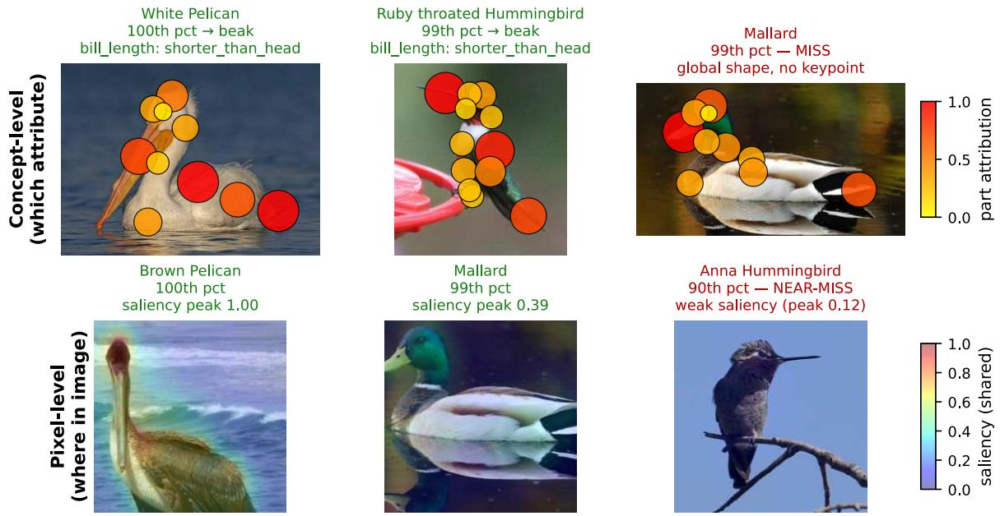  
Fig. 6. ANOCUB explanation gallery and failure modes. Top: concept-level part heatmaps (witness attribution mapped to CUB keypoints, hotter = more responsible). Bottom: pixel-level saliency through a frozen ResNet-18 (shared scale). Green titles = clean, red = where that mode is weak. The two modes have complementary blind spots. The small Anna Hummingbird the embedding nearly misses (bottom right, 90th pct: a perched hummingbird fills a sparrow-sized region and lands near the inlier manifold, so its saliency is weak and diffuse) is flagged cleanly in concept space (top middle, 99th pct, localised to the bill). Conversely the Mallard whose single most-responsible concept is the global “duck-like” shape, which has no body-part keypoint, so the part heatmap cannot localise it (top right), is sharply localised by pixel saliency (bottom middle).

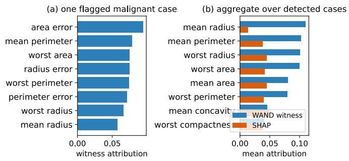  
Fig. 7. Breast Cancer Wisconsin. (a) Witness attribution for one flagged malignant case; (b) aggregate over detected cases, WAND witness vs. SHAP, both concentrate on size/shape malignancy markers.

d) Why the spacings penalty is small, and adaptive switching.: The MAD and spacings components are combined per point and per direction by an evidence-disjunction $\tau _ { i } = \operatorname* { m a x } ( \tau ^ { \mathrm { m a d } } , s _ { u } \tau ^ { \mathrm { s p c } } )$ (6), so the spacings term contributes only where its rescaled signal exceeds the MAD term. This maximum already acts as a local, per-direction switch, which is why enabling spacings shifts mean AUC only slightly. We did not add a dataset-level gate; a cheap multimodality test (e.g. a dip statistic on $u ^ { \top } X )$ that enables spacings only on multi-modal projections is a sensible heuristic to remove the residual penalty, which we leave to future work.

e) Affine transformations and the axis pathway.: Features are standardised (per-feature centring and scaling) before probing, so per-feature rescaling does not change the scores, and the uniform-sphere pathway is rotation-equivariant up to the per-direction MAD calibration. The axis pathway is, by construction, not affine-equivariant: it probes the canonical axes $e _ { 1 } , \ldots , e _ { d }$ precisely to catch single-feature anomalies that rotation-invariant probes miss (the marginal regime), so we trade equivariance for that coverage and keep it secondary through $\lambda ~ = ~ 1 / 4 ~ ( 7 )$ . Whitening before probing is not uniformly helpful: on contaminated data it can suppress the very anomaly directions, e.g. on the ANOCUB embedding Mahalanobis whitening drops AUC from 0.98 to 0.88 (Table VII); we therefore do not whiten by default.

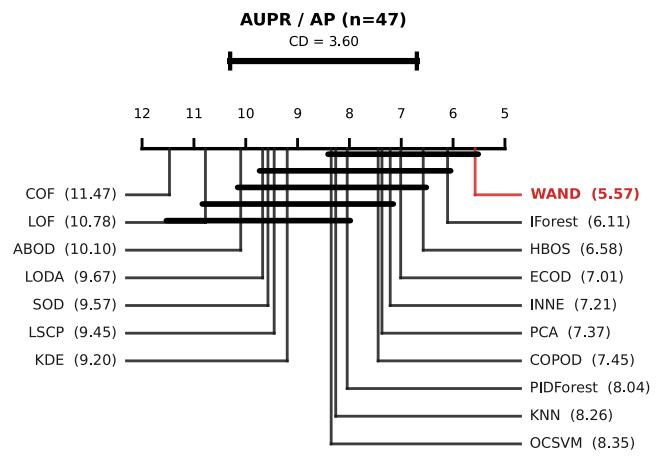  
Fig. 8. Critical-difference diagram on AUPR / AP (Nemenyi post-hoc, α = 0.05, CD = 3.60); the ROC-AUC diagram is Figure 3 in the main text. The AP ranking mirrors the ROC ordering.

AUC vs. runtime (22 datasets run by all methods)  
TABLE IX  
THE 47 ADBENCH TABULAR DATASETS USED IN OUR EXPERIMENTS, GROUPED BY SCALE. Samples (n), Features (d), #Anom. (NUMBER OF LABELLED OUTLIERS) AND %Anom. (THEIR FRACTION) ARE TAKEN FROM THE PUBLIC ADBENCH CLASSICAL MIRROR. DATASETS ARE REFERRED TO BY SHORT CODES IN THE REST OF THE PAPER; THE NUMERIC PREFIX MATCHES THE ADBENCH NAMING CONVENTION.
<table><tr><td>Dataset</td><td>n</td><td>d</td><td>#Anom.</td><td>%Anom.</td><td>Code</td><td>Dataset</td><td>n</td><td>d</td><td>#Anom.</td><td>%Anom.</td><td>Code</td></tr><tr><td colspan="10">Small-scale (n ≤ 1,000, , 12 datasets)</td></tr><tr><td>breastw</td><td>683</td><td>9</td><td>239</td><td>34.99%</td><td>4</td><td>glass</td><td>214</td><td>7</td><td>9</td><td>4.21%</td><td>14</td></tr><tr><td>Hepatitis</td><td>80</td><td>19</td><td>13</td><td>16.25%</td><td>15</td><td>Ionosphere</td><td>351</td><td>32</td><td>126</td><td>35.90%</td><td>18</td></tr><tr><td>Lymphography</td><td>148</td><td>18</td><td>6</td><td>4.05%</td><td>21</td><td>Pima</td><td>768</td><td>8</td><td>268</td><td>34.90%</td><td>29</td></tr><tr><td>Stamps</td><td>340</td><td>9</td><td>31</td><td>9.12%</td><td>37</td><td>vertebral</td><td>240</td><td>6</td><td>30</td><td>12.50%</td><td>39</td></tr><tr><td>WBC</td><td>223</td><td>9</td><td>10</td><td>4.48%</td><td>42</td><td>WDBC</td><td>367</td><td>30</td><td>10</td><td>2.72%</td><td>43</td></tr><tr><td>wine</td><td>129</td><td>13</td><td>10</td><td>7.75%</td><td>45</td><td>WPBC</td><td>198</td><td>33</td><td>47</td><td>23.74%</td><td>46</td></tr><tr><td colspan="10">Medium-scale (1,000 &lt; n ≤ 10,000, 15 datasets)</td></tr><tr><td>annthyroid</td><td>7200</td><td>6</td><td>534</td><td>7.42%</td><td>2</td><td>cardio</td><td>1831</td><td>21</td><td>176</td><td>9.61%</td><td>6</td></tr><tr><td>Cardiotocogr.</td><td>2114</td><td>21</td><td>466</td><td>22.04%</td><td>7</td><td>fault</td><td>1941</td><td>27</td><td>673</td><td>34.67%</td><td>12</td></tr><tr><td>landsat</td><td>6435</td><td>36</td><td>1333</td><td>20.71%</td><td>19</td><td>letter</td><td>1600</td><td>32</td><td>100</td><td>6.25%</td><td>20</td></tr><tr><td>PageBlocks</td><td>5393</td><td>10</td><td>510</td><td>9.46%</td><td>27</td><td>pendigits</td><td>6870</td><td>16</td><td>156</td><td>2.27%</td><td>28</td></tr><tr><td>satellite</td><td>6435</td><td>36</td><td>2036</td><td>31.64%</td><td>30</td><td>satimage-2</td><td>5803</td><td>36</td><td>71</td><td>1.22%</td><td>31</td></tr><tr><td>thyroid</td><td>3772</td><td>6</td><td>93</td><td>2.47%</td><td>38</td><td>vowels</td><td>1456</td><td>12</td><td>50</td><td>3.43%</td><td>40</td></tr><tr><td>Waveform yeast</td><td>3443</td><td>21</td><td>100</td><td>2.90%</td><td>41</td><td>Wilt</td><td>4819</td><td>5</td><td>257</td><td>5.33%</td><td>44</td></tr><tr><td></td><td>1484</td><td>8</td><td>507</td><td>34.16%</td><td>47</td><td></td><td></td><td></td><td></td><td></td><td></td></tr><tr><td colspan="10">Large-scale (n &gt; 10,000, 11 datasets)</td></tr><tr><td>ALOI</td><td>49534</td><td>27</td><td>1508</td><td>3.04%</td><td>1</td><td>celeba</td><td>202599</td><td>39</td><td>4547</td><td>2.24%</td><td>8</td></tr><tr><td>cover</td><td>286048</td><td>10</td><td>2747</td><td>0.96%</td><td>10</td><td>donors</td><td>619326</td><td>10</td><td>36710</td><td>5.93%</td><td>11</td></tr><tr><td>fraud</td><td>284807</td><td>29</td><td>492</td><td>0.17%</td><td>13</td><td>http</td><td>567498</td><td>3</td><td>2211</td><td>0.39%</td><td>16</td></tr><tr><td>magic.gamma</td><td>19020</td><td>10</td><td>6688</td><td>35.16%</td><td>22</td><td>mammography</td><td>11183</td><td>6</td><td>260</td><td>2.32%</td><td>23</td></tr><tr><td>shuttle</td><td>49097</td><td>9</td><td>3511</td><td>7.15%</td><td>32</td><td>skin</td><td>245057</td><td>3</td><td>50859</td><td>20.75%</td><td>33</td></tr><tr><td>smtp</td><td>95156</td><td>3</td><td>30</td><td>0.03%</td><td>34</td><td></td><td></td><td></td><td></td><td></td><td></td></tr><tr><td colspan="10">High-dimensional (d  1, 9 datasets)</td></tr><tr><td>backdoor</td><td>95329</td><td>196</td><td>2329</td><td>2.44%</td><td>3</td><td>campaign</td><td>41188</td><td>62</td><td>4640</td><td>11.27%</td><td>5</td></tr><tr><td>census</td><td>299285</td><td>500</td><td>18568</td><td>6.20%</td><td>9</td><td>InternetAds</td><td>1966</td><td>1555</td><td>368</td><td>18.72%</td><td>17</td></tr><tr><td>mnist</td><td>7603</td><td>100</td><td>700</td><td>9.21%</td><td>24</td><td>musk</td><td>3062</td><td>166</td><td>97</td><td>3.17%</td><td>25</td></tr><tr><td>optdigits</td><td>5216</td><td>64</td><td>150</td><td>2.88%</td><td>26</td><td>SpamBase</td><td>4207</td><td>57</td><td>1679</td><td>39.91%</td><td>35</td></tr><tr><td>speech</td><td>3686</td><td>400</td><td>61</td><td>1.65%</td><td>36</td><td></td><td></td><td></td><td></td><td></td><td></td></tr></table>

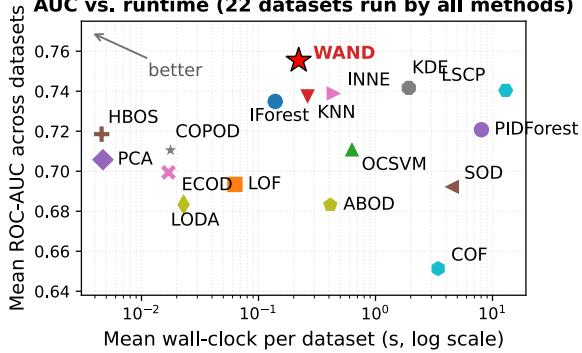  
Fig. 9. Mean ROC-AUC vs. mean wall-clock per dataset (log x), averaged over the 22 ADBench datasets completed by every method so all means cover the same tasks. WAND sits on the AUC–runtime Pareto frontier (top-left): no other method is both faster and more accurate on this shared subset. The subset necessarily excludes the largest datasets, on which the neighbour-based methods (LOF, kNN, ABOD, COF, SOD, LSCP, KDE, OCSVM) exceed the time budget, whereas WAND runs on all 47 (Table II).

f) Sensitivity of the faithfulness protocol.: We follow the standard deletion/insertion protocol with per-feature median replacement [44], and report the bounded, self-normalised score insertion−deletion∈[−1, 1] averaged over 33 datasets, which limits the influence of any single masking choice. We did not sweep alternative imputations (mean, marginal resampling) or feature-subset sizes; such a sensitivity analysis would further strengthen the faithfulness conclusions and is straightforward future work.

g) The differentiable score as a training loss.: We use the differentiable WAND score only to produce gradient explanations, including pixel saliency through a frozen encoder (Fig. 1); we did not back-propagate it into the encoder as a training objective. Using the score to shape upstream representations (a learned witness encoder) is an explicit future direction, and we report no empirical results on it here.

h) Empirical explanation coverage.: The coverage guarantee (every τ-margin anomaly has at least one witness) is realised in the attribution by the dominant-witness set. On ANOCUB all 15 anomalies are covered (detection AUC 1.0) and 14/15 concentrate on a single dominant witness (bill length), the lone exception spreading over global-shape attributes (Fig. 6). We do not yet report suite-wide distributions of the active-witness count or of the contribution mass $\gamma _ { i , k } ;$ tabulating, per dataset, the fraction of flagged points with at least one above-threshold witness would quantify coverage directly and is a useful addition we flag for future work.

(a) linear scan to n = 107  
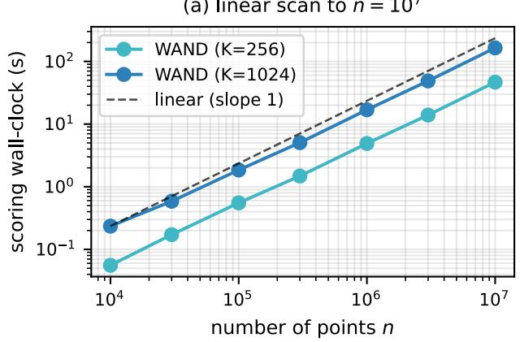

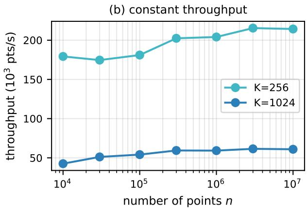  
Fig. 10. Large-n scaling of the WAND scorer (synthetic, d=20, 8-core CPU). (a) Scoring wall-clock vs. n tracks the slope-1 (linear) reference for both probe budgets; (b) throughput is constant in n, so WAND scores 107 points in 47 s (K=256) / 164 s (K=1024) after a one-time ∼ 1 s calibration.

i) Parameter robustness (λ, K, k).: The defaults are insensitive over wide ranges. Mean AUC is flat (±0.003) for $\lambda \ \in \ [ 0 . 1 , 0 . 5 ] .$ and we fix $\lambda = 1 / 4$ . The budget K is a monotone speed/quality knob whose AUC saturates around $K { \approx } 4 | H |$ , with $| H |$ the soft-extreme hull size, so $K = 1 0 2 4$ sits on the plateau for the suite. The spacings order $k = \lceil { \sqrt { n } } \rceil$ is the classical parameter-free choice [39]. Table X above tabulates the underlying per-knob sweep.

j) Comparison to recent density detectors.: Our sixteen unsupervised baselines already include strong density and marginal detectors (ECOD, COPOD, HBOS, kernel density, LODA); we did not include very recent variants such as VSDE, so we make no claim against them. Because the witness attribution needs only a differentiable score, it could in principle wrap any differentiable density model to add explanations, an interesting direction we have not evaluated.

## APPENDIX D

## ADDITIONAL EXPERIMENTS (POST-ACCEPTANCE)

This section reports additional experiments; these results extend, rather than revise, the main text above.

## A. A native explanation baseline for a second detector

Our explanation-quality comparison (Table IV) applies SHAP/LIME only to WAND itself; a natural complement is a native explainer of a different strong detector. We add Isolation Forest’s shortest-isolation-path structure as exactly that baseline.

a) Method.: For a query point flagged by a fitted Isolation Forest, we walk its decision path in every tree; each internal node the path crosses splits on one feature, and we weight that feature’s vote by $1 / ( \mathrm { d e p t h } + 1 )$ so splits near the root, the ones responsible for the short isolation path, count more than deep splits. Votes are averaged over trees and $\ell _ { 1 }$ -normalised per point. Like ECOD’s native attribution, this is read off the fitted ensemble directly, at zero extra model queries.

b) Results.: Table IV includes this new row (IForest (native)), evaluated under the identical protocols: synthetic ground-truth attribution-AUC (Section VI-F) and realdata deletion/insertion faithfulness on the same 33 ADBench datasets used for the other rows. Isolation Forest’s native attribution is close to chance on the synthetic ground truth (0.498/0.499 attr-AUC, axis/oblique, vs. 0.5 for a random ranking) and only marginally above random on real-data faithfulness (0.031 mean, beating SHAP on 3% of datasets, the same rate as the random baseline). This is a real, non-cherrypicked negative result for this particular baseline, not evidence that no native explainer can compete with WAND’s: depthweighted split voting is the simplest reading of an Isolation Forest, and more elaborate model-specific importances for tree ensembles exist (e.g. DIFFI [4]) that we have not evaluated. What the result does show is that simply being native to a strong detector is not sufficient for a faithful explanation, ECOD’s native attribution (also in Table IV) is far stronger than Isolation Forest’s, so the comparison is detector-specific rather than a generic native-vs-post-hoc effect, and WAND’s witness attribution remains the strongest native explainer we have tested by a wide margin on both protocols.

## B. Per-knob sensitivity table

Table X reports mean ROC-AUC over all 47 ADBench datasets for each knob swept individually around its default (default in bold), extending the qualitative “Parameter robustness” discussion above with the underlying numbers and justifying the specific default configuration $\scriptstyle ( K = 1 0 2 4$ , spacing $k { = } \lceil \sqrt { n } \rceil$ , axis probes on, $\lambda { = } 1 / 4 )$ . All four knobs are flat to within 0.015 mean AUC across their tested ranges, confirming quantitatively that the single fixed default used throughout the paper is not a narrow optimum: no per-dataset tuning is needed to reach the reported accuracy.

MEAN ROC-AUC (47 ADBENCH DATASETS) AS EACH KNOB IS SWEPT WITH ALL OTHERS HELD AT THEIR DEFAULT. DEFAULT SETTING IN BOLD  
TABLE X
<table><tr><td>Knob</td><td>Setting</td><td>Mean ROC-AUC (47 datasets)</td></tr><tr><td rowspan="4">Probe budget K</td><td>256</td><td>0.7686</td></tr><tr><td>512</td><td>0.7640</td></tr><tr><td>1024</td><td>0.7726</td></tr><tr><td>2048</td><td>0.7779</td></tr><tr><td rowspan="5">Axis mix weight λ</td><td>0.0</td><td>0.7676</td></tr><tr><td>0.1</td><td>0.7701</td></tr><tr><td>0.25</td><td>0.7726</td></tr><tr><td>0.5</td><td>0.7743</td></tr><tr><td>1.0</td><td>0.7755</td></tr><tr><td rowspan="4">Spacing order factor</td><td>0.0</td><td>0.7716</td></tr><tr><td>0.5</td><td>0.7732</td></tr><tr><td>1.0</td><td>0.7726</td></tr><tr><td>1.5</td><td>0.7734</td></tr><tr><td rowspan="4">Langevin refinement steps</td><td>0</td><td>0.7768</td></tr><tr><td>10</td><td>0.7712</td></tr><tr><td>20</td><td>0.7726</td></tr><tr><td>40</td><td>0.7725</td></tr></table>

## C. Compact wall-clock runtime table

Figure 9 above plots accuracy against wall-clock cost; Table XI gives the same comparison in tabular form for easier reference, mean ROC-AUC and mean wall-clock over the 22 ADBench datasets every method in the main benchmark completes (same subset as Figure 9), sorted by runtime. WAND attains the best mean AUC of all 17 methods on this shared subset in 0.220 s, and the fastest baseline within 0.02 AUC of it, IForest, is only 1.6× faster; every other method is both slower and less accurate.

TABLE XI  
MEAN ROC-AUC VS. MEAN WALL-CLOCK, OVER THE 22 ADBENCH DATASETS COMPLETED BY EVERY METHOD (SAME SUBSET AS FIGURE 9), SORTED BY RUNTIME.
<table><tr><td>Method</td><td>Mean ROC-AUC</td><td>Mean wall-clock (s)</td></tr><tr><td>HBOS</td><td>0.719</td><td>0.005</td></tr><tr><td>PCA</td><td>0.706</td><td>0.005</td></tr><tr><td>ECOD</td><td>0.699</td><td>0.017</td></tr><tr><td>COPOD</td><td>0.710</td><td>0.018</td></tr><tr><td>LODA</td><td>0.683</td><td>0.023</td></tr><tr><td>LOF</td><td>0.693</td><td>0.063</td></tr><tr><td>IForest</td><td>0.735</td><td>0.139</td></tr><tr><td>WAND</td><td>0.755</td><td>0.220</td></tr><tr><td>KNN</td><td>0.737</td><td>0.263</td></tr><tr><td>ABOD</td><td>0.683</td><td>0.411</td></tr><tr><td>INNE</td><td>0.739</td><td>0.445</td></tr><tr><td>OCSVM</td><td>0.711</td><td>0.629</td></tr><tr><td>KDE</td><td>0.742</td><td>1.925</td></tr><tr><td>COF</td><td>0.651</td><td>3.429</td></tr><tr><td>SOD</td><td>0.692</td><td>4.444</td></tr><tr><td>PIDForest</td><td>0.721</td><td>8.036</td></tr><tr><td>LSCP</td><td>0.740</td><td>12.968</td></tr></table>

## APPENDIX REFERENCES

[1] S. Boucheron, G. Lugosi, and P. Massart, Concentration Inequalities: A Nonasymptotic Theory of Independence. Oxford University Press, 2013.

[2] M. J. Wainwright, High-Dimensional Statistics: A Non-Asymptotic Viewpoint. Cambridge University Press, 2019.

[3] A. W. van der Vaart, Asymptotic Statistics. Cambridge University Press, 2000.

[4] M. Carletti, M. Terzi, and G. A. Susto, “Interpretable anomaly detection with DIFFI: Depth-based feature importance of isolation forest,” Engineering Applications ofArtificial Intelligence, vol. 119, p. 105730, 2023.

[5] R. Vershynin, High-Dimensional Probability: An Introduction with Applications in Data Science. Cambridge University Press, 2018.

[6] K. Ball, “An Elementary Introduction to Modern Convex Geometry,” in Flavors of Geometry, MSRI Publications, vol. 31, pp. 1–58, 1997.