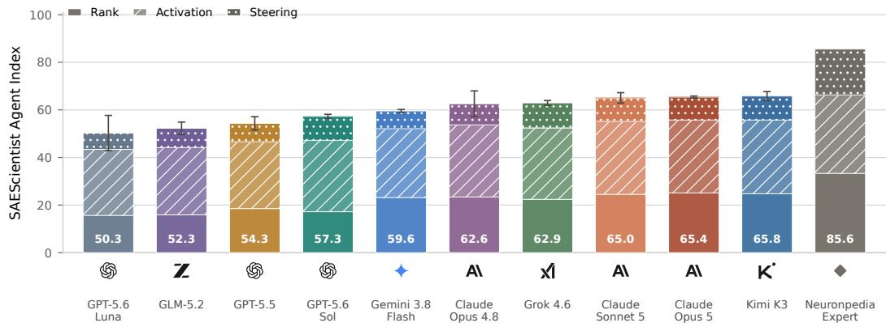
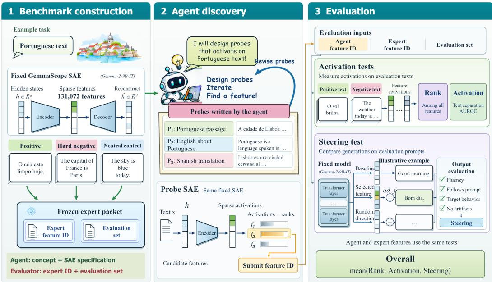
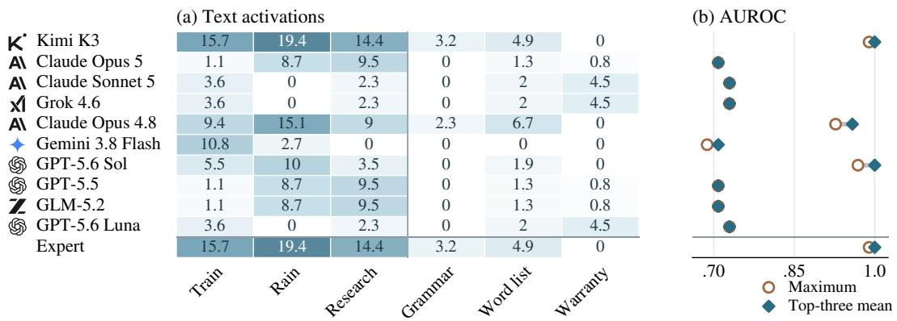
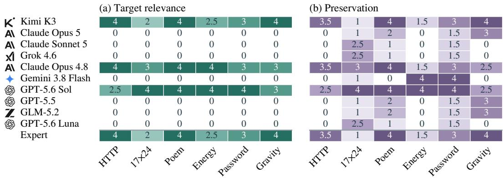
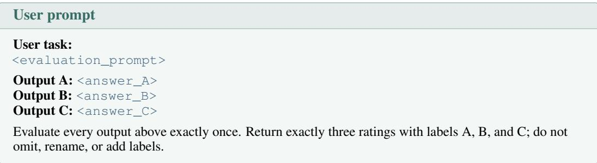
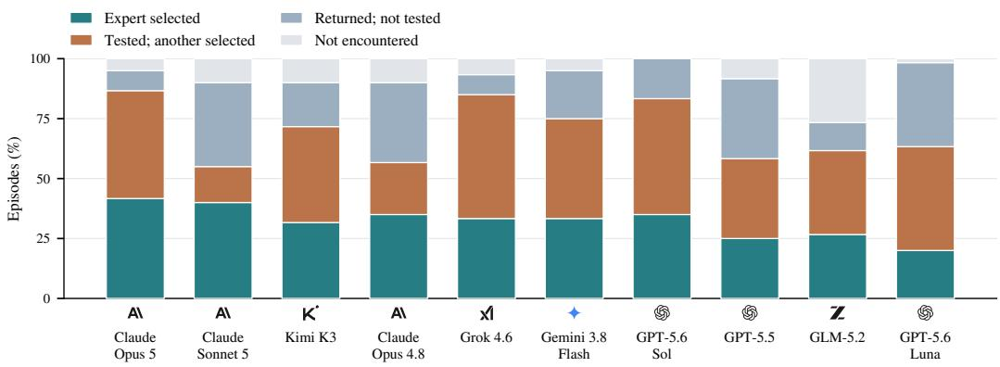
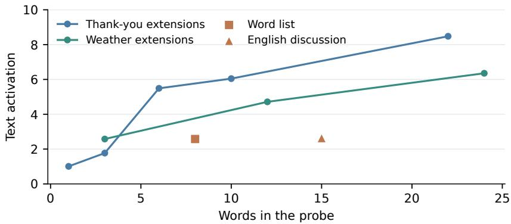
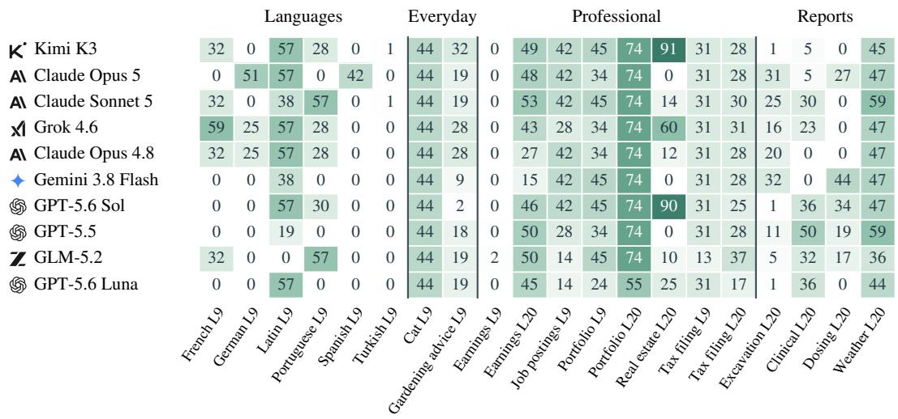
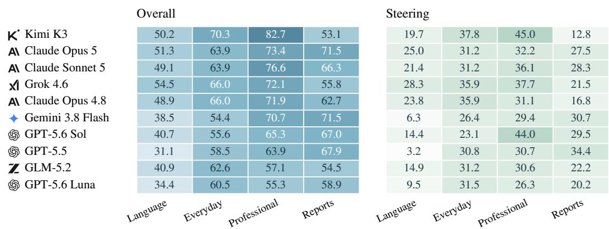
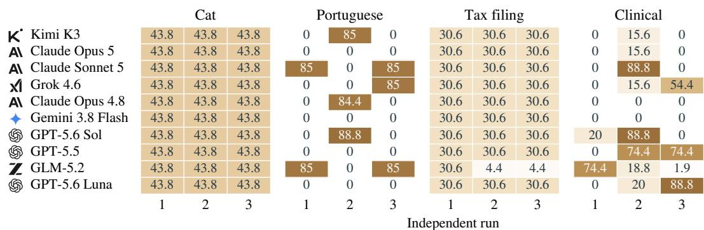

# SAESCIENTIST-BENCH: CAN AI AGENTS CONDUCT AUTONOMOUS SAE INTERPRETABILITY RESEARCH?

Yuqiao Tan1,2, Shizhu He1,2∗, Jun Zhao1,2, Kang Liu1,2

1The Key Laboratory of Cognitive Intelligence, Institute of Automation, CAS 2School of Artificial Intelligence, University of Chinese Academy of Sciences tanyuqiao2025@ia.ac.cn, {shizhu.he,jzhao,kliu}@nlpr.ia.ac.cn

## ABSTRACT

While research on recursive self-improvement (RSI) has predominantly automated model training pipelines, reliable autonomous development demands a missing pillar: post-hoc monitoring and auditing to understand what models learn and ensure safe alignment. Mechanistic interpretability tools are essential to bridge this gap, among which Sparse Autoencoders (SAEs) serve as a cornerstone by isolating interpretable features for model inspection and steering. In this paper, we introduce SAESCIENTIST-BENCH to evaluate whether AI agents can act as scientists utilizing SAE tools for autonomous mechanistic discovery. Given a target concept, an agent designs contrastive probes and navigates a Gemma Scope dictionary of 131K+ features in Gemma-2-9B-IT to discover the optimal feature, evaluated against curated expert reference features anchored on Neuronpedia across activation rank, concept selectivity on contrastive texts, and causal steering. Across 10 agent configurations and 20 tasks, frontier agents demonstrate genuine discovery capabilities and lead different evaluation dimensions, but remain well behind the expert baseline, approaching expert levels on separating target concepts from contrastive controls while lagging substantially in causal generation steering. Further analysis reveals that although agents can design contrasts to rule out spurious candidates, they frequently misinterpret experimental measurements. These results establish experimental model understanding as a measurable capability for closed-loop autonomous AI R&D. Our code is available at https://github.com/Trae1ounG/SAEScientist.

  
Figure 1: SAEScientist Agent Index. Agents are ordered by their composite Overall score, with each bar decomposed into equally weighted Rank, Activation, and Steering components. Error bars denote standard deviations across three independent runs.

## 1 INTRODUCTION

Recursive self-improvement (RSI) represents a central ambition of autonomous AI research, driving the development of agents capable of iteratively discovering, training, and refining frontier models (Mahmoud et al., 2026; Meng et al., 2026; Lu et al., 2024; Zhang et al., 2026; Chan et al., 2025; Starace et al., 2025; Rank et al., 2026; Tan et al., 2026). However, current efforts focus almost exclusively on automating empirical training pipelines, including data curation, algorithm design, and post-training, while treating the evolving models as black boxes evaluated solely through external task performance.

As models grow rapidly in scale and complexity, their internal mechanisms become increasingly opaque, rendering behavioral observations insufficient to diagnose failures or guarantee true alignment. When optimization is driven purely by external metrics, autonomous training loops are notoriously vulnerable to reward hacking, specification gaming, and deceptive alignment, where models score well while harboring unintended behaviors (Skalse et al., 2022; Hubinger et al., 2024). Consequently, achieving a trustworthy and controllable RSI cycle fundamentally demands a critical missing pillar: continuous post-hoc monitoring and auditing of internal representations to inspect what models actually learn (Shaham et al., 2024; Bricken et al., 2025). Without white-box inspection tools, autonomous iteration risks reinforcing spurious shortcuts and undetectable safety failures.

Mechanistic interpretability tools are essential to bridge this gap, among which Sparse Autoencoders (SAEs) have emerged as a foundational paradigm (Cunningham et al., 2023; Bricken et al., 2023; Gao et al., 2024; Templeton et al., 2024). By decomposing polysemantic activations into millions of interpretable feature directions, SAEs provide a transparent lens into model representations. Crucially, these isolated features offer a dual utility: they enable researchers to audit whether specific concepts are genuinely acquired, while also serving as precise causal levers to steer model behavior during generation (Marks et al., 2024; Wu et al., 2025; Wang et al., 2026b). As pretrained dictionaries such as Gemma Scope (Lieberum et al., 2024) become widely accessible, utilizing SAE tools to inspect and steer models has become a vital instrument for understanding internal representations.

While recent studies show that AI agents can discover features or analyze circuits (Han et al., 2026; Marin-Llobet & Ferrando, 2026; Khan et al., 2026), the community lacks a standardized benchmark to rigorously evaluate this scientific capability across frontier models. In particular, autonomous discovery requires hypothesis-driven testing to separate genuine concepts from spurious correlations and validate causal control, making a unified quantitative scoring framework essential (Wu et al., 2025; Wang et al., 2026b).

To address this challenge, we introduce SAESCIENTIST-BENCH, a benchmark designed to evaluate AI agents as scientists utilizing SAE tools for mechanistic discovery. Covering 20 tasks across diverse concept domains (e.g., multilingual understanding, specialized formats, and safety-critical topics), an agent designs contrastive probes to navigate pretrained SAE dictionaries in Gemma-2-9B-IT (Gemma Team, 2024) and selects optimal features. Discovered features are systematically evaluated against curated expert reference baselines anchored on Neuronpedia features (Lin, 2023) under a unified scoring framework comprising activation rank, activation selectivity, and causal steering.

Across 10 frontier agents and these tasks, empirical evaluations demonstrate that agents exhibit genuine discovery capabilities, with Kimi K3 (Kimi Team, 2026) achieving the highest composite overall score, followed closely by Claude Opus 5 and Sonnet 5 (Anthropic, 2026), while GPT-5.6 Sol (OpenAI, 2026) and Grok 4.6 (xAI, 2026) demonstrate strong reasoning and steering capabilities. Different frontier models excel in distinct dimensions: Opus leads in activation rank, Kimi leads in activation selectivity, and Grok 4.6 leads in steering efficacy. However, a substantial gap remains compared to the expert reference baseline. While top agents approach expert levels on activation selectivity, reaching 92.91 against the Expert baseline of 98.92, their ability to causally steer model generation falls markedly short, scoring only 31.47 against 57.75. Further qualitative and behavioral analysis indicates that agents often misread experimental measurements, struggle to separate format from concept, and produce features that degrade downstream generation. Our contributions are as follows:

• We introduce SAESCIENTIST-BENCH, comprising 20 discovery tasks across diverse concept domains, where agents design contrastive probes and navigate a 131K+ feature dictionary in Gemma-2-9B-IT to discover SAE features.

  
Figure 2: SAEScientist-Bench workflow. For a concept and fixed SAE, the agent writes probes $P _ { i } ,$ compares candidates $f _ { j } ,$ , and submits a feature. The evaluator measures Rank, Activation, and Steering using Expert and the evaluation set. Portuguese texts and replies illustrate the process.

• We establish a standardized evaluation framework measuring activation rank, activation selectivity, and causal steering against Neuronpedia expert reference baselines, evaluating 10 frontier agents across multiple independent runs.

• We provide systematic behavioral analyses of authored probes, candidate comparisons, and steering outputs, revealing how agents interpret experimental evidence and where autonomous scientific discovery currently succeeds and fails.

## 2 PRELIMINARIES: SAE FEATURES AND STEERING

SAE formulation and feature activations. A language model maps input text into token-level hidden states. At a chosen layer, a Sparse Autoencoder (SAE) encodes a hidden state $h \in \mathbb { R } ^ { d }$ into a sparse vector of nonnegative feature activations $z \in \mathbb { R } ^ { m }$ , reconstructing the state via a linear decoder:

$$
z = \mathrm { E n c o d e r } ( h ) , \qquad { \hat { h } } = b _ { \mathrm { d e c } } + \sum _ { f = 0 } ^ { m - 1 } z _ { f } d _ { f } ,\tag{1}
$$

where m is the dictionary size, $b _ { \mathrm { d e c } }$ is a reconstruction bias, and $d _ { f } = W _ { \mathrm { d e c } } [ f , : ]$ denotes feature $f ^ { \ast } \mathrm { \mathbf { s } }$ decoder direction. SAE training balances reconstruction fidelity with sparsity (Cunningham et al., 2023). In Gemma Scope (Lieberum et al., 2024), JumpReLU applies learned activation thresholds to ensure that only a small subset of features activate per token (Rajamanoharan et al., 2024). Each coordinate $f$ corresponds to an isolated latent feature, and its scalar activation $z _ { f }$ quantifies the expression of that feature on the input text.

Feature steering via activation addition. Beyond measuring activations, a feature can be used to causally intervene on model generation. Specifically, activation steering adds the feature’s decoder direction $d _ { f }$ directly to the model’s hidden state during inference:

$$
h  h + \alpha d _ { f } ,\tag{2}
$$

where α controls the intervention strength. The language model then continues generation from this modified state. By comparing model outputs before and after intervention, one can directly evaluate the causal effect of feature $f$ on downstream behavior (Arad et al., 2025).

<table><tr><td rowspan="4">20% 30% 10% 40%</td><td>Concept family</td><td>Layer 9</td><td>Layer 20</td><td>Example concept</td><td>Expert</td></tr><tr><td>Languages</td><td>6</td><td></td><td>Portuguese</td><td>L9·41424</td></tr><tr><td>Everyday domains</td><td>2</td><td></td><td>Cats</td><td>L9· 62610</td></tr><tr><td>Professional domains</td><td>4</td><td>4</td><td>Tax filing</td><td>L9· 18713</td></tr><tr><td></td><td>Specialized reports</td><td></td><td>4</td><td>Clinical reports</td><td>L20· 3927</td></tr></table>

Figure 3: Benchmark coverage. Category shares and task counts by SAE layer, with an example concept and Expert feature for each category. All tasks have equal weight. Appendix A.1 lists the full set.

## 3 SAESCIENTIST-BENCH

## 3.1 TASK CONSTRUCTION

A task pairs a target concept with a specific layer of the base language model, Gemma-2-9B-IT (Gemma Team, 2024), equipped with pretrained Gemma Scope residual-stream SAEs (Lieberum et al., 2024). The agent is tasked with discovering a single feature within that layer’s SAE dictionary (131,072 features) that best represents the concept. As illustrated in Figure 3, SAESCIENTIST-BENCH comprises 20 discovery tasks across layers 9 and 20, covering diverse concept domains including multilingual understanding (e.g., Portuguese, Spanish, Latin, Turkish), specialized document formats (e.g., earnings reports, tax filing, job postings), and domain-specific knowledge (e.g., clinical symptom reports, pharmaceutical dosing).

For each task, the benchmark provides an evaluation suite consisting of three types of text: positive texts expressing the intended concept, hard-negative texts presenting confusable alternatives (e.g., discussing Portuguese in English), and neutral texts providing unrelated controls. In addition, each task includes evaluation prompts to test causal steering effects on downstream generation. To establish a rigorous reference standard, each task is paired with an Expert reference feature anchored in Neuronpedia’s feature repository (Lin, 2023), established either directly from public steering presets (e.g., Cat) or through standard expert curation workflows across positive and contrastive texts. These task descriptions, Expert features, and evaluation suites remain strictly frozen during agent discovery and are reserved solely for post-submission benchmarking.

## 3.2 INTERACTION PROTOCOL

The agent receives the concept description, base-model and SAE identifiers, hook point, and dictionary width. Expert and the evaluation set remain reserved for evaluation. The probe\_sae interface accepts up to 64 agent-written texts per request and either retrieves the top-k activating features or measures a supplied set of candidates. Responses include activations and ranks in the full dictionary. The model and its execution harness jointly carry out this investigation. The agent revises its texts and candidates, then submits one feature ID for the evaluator to test through activation and steering.

In Figure 2, P denotes an agent-written probe and $f _ { j }$ a candidate feature. The subscripts enumerate the illustrated probes and candidates. We use $f$ for the submitted feature and $f _ { \mathrm { e x p } }$ for Expert. Agentwritten probes guide discovery, while the separate evaluation set measures the final submission. During discovery, access is restricted to the probe interface and the provided workspace. The same fixed base model and SAE support both discovery measurements and subsequent evaluation.

## 3.3 MEASUREMENTS AND SCORES

We evaluate each submitted feature across three complementary dimensions, which are subsequently averaged across tasks: Activation Rank evaluates how prominently a feature activates relative to the dictionary, Activation Selectivity evaluates concept separation between positive texts and contrastive (negative and neutral) controls, and Causal Steering measures downstream generation change under feature intervention.

Activation Rank (Rank). An effective SAE feature should be prominently activated when the model processes its target concept, rather than being overshadowed by irrelevant dictionary directions. To assess whether an agent identifies a sufficiently prominent feature for the concept, we measure its activation rank relative to the expert reference baseline across positive evaluation texts. For each positive text, a feature’s text-level activation is computed as the mean of its three largest non-special token activations across the sequence, providing a more stable estimate than single-token maximums (Section 5.2). We then determine the feature’s rank against the full dictionary, where higher activation corresponds to a lower numerical rank and inactive features receive the worst possible rank equal to the dictionary size. Let $r _ { f }$ and $r _ { \mathrm { e x p } }$ denote the average dictionary ranks of the submitted feature and the Expert baseline over positive texts. We compute the relative rank score scaled to a 100-point reference:

$$
{ \mathrm { R a n k } } = 1 0 0 \times { \frac { 2 r _ { \mathrm { e x p } } } { r _ { f } + r _ { \mathrm { e x p } } } } .\tag{3}
$$

This score is defined in [0, 200], where a score of 100.0 indicates parity with the expert baseline, values above 100.0 indicate a feature ranking ahead of expert, and values below 100.0 indicate lower prominence.

Activation Selectivity (Activation). Beyond raw activation strength on target texts, a monosemantic feature should respond selectively to the target concept itself rather than to confusable or spurious patterns. We assess this on the evaluation suite by computing the AUROC separating positive texts from contrastive controls (pooling hard-negative and neutral texts), crediting half a point for ties, and scaling the result to [0, 100]:

$$
\mathrm { A c t i v a t i o n } = 1 0 0 \times \mathrm { m a x } ( 0 , 2 \mathrm { A U R O C } - 1 ) .\tag{4}
$$

The score lies in [0, 100], where 100.0 denotes complete separation of positive texts from contrastive controls, and 0 indicates chance-level or reversed discrimination.

Causal Steering (Steering). Feature discovery is ultimately validated by its ability to causally steer model generation toward the target concept. On each evaluation prompt, the base model generates completions under three conditions: unmodified baseline inference, feature steering $( h  h + \alpha d _ { f } )$ and a norm-matched random-direction control. An automated judge rates target relevance and instruction preservation on a 0–4 scale, while separately flagging degeneration. Let $T _ { f } , T _ { \mathrm { b a s e } } ,$ and $T _ { \mathrm { r a n d o m } }$ denote the average target-relevance ratings across prompts and judge passes. The steering score measures the net increase in target expression beyond the stronger control condition, scaled to [0, 100]:

$$
{ \mathrm { S t e e r i n g } } = 1 0 0 \times \operatorname* { m a x } \left( 0 , { \frac { T _ { f } - \operatorname* { m a x } ( T _ { \mathrm { b a s e } } , T _ { \mathrm { r a n d o m } } ) } { 4 } } \right) .\tag{5}
$$

The score lies in [0, 100], with higher values indicating stronger causal induction of target expressions. We also denote this net gain as Target Effect $( \Delta _ { f } = \mathrm { \bar { S } t e e r i n g / 1 0 0 } )$ . Crucially, Steering isolates the magnitude of induced target expression; instruction preservation and output degeneration capture complementary dimensions of generation quality and are evaluated alongside the primary score. For alternative features, the intervention strength α is calibrated on five held-out prompts prior to final evaluation to satisfy a minimum non-degeneration threshold, while Expert retains its frozen reference scale (Appendix A.6).

Overall Score. As a default summary index to present overall discovery performance, each task’s overall score is computed as the unweighted arithmetic mean across the three dimension scores:

$$
\mathrm { O v e r a l l } = \frac { \mathrm { R a n k + A c t i v a t i o n + S t e e r i n g } } { 3 } .\tag{6}
$$

The Expert baseline achieves an overall score of 85.56 under this default setting. While this composite provides a unified view for leaderboard presentation, individual metrics reflect complementary dimensions of feature quality and are evaluated independently (Table 1 and Appendix A.4). All reported benchmark scores represent this unweighted mean across all 20 tasks.

Table 1: Agent scores and rankings on Rank, Activation, Steering, and Overall across 20 tasks.
<table><tr><td rowspan="2">Agent</td><td colspan="2">Overall</td><td colspan="2">Rank</td><td colspan="2">Activation</td><td colspan="2">Steering</td></tr><tr><td>Score</td><td>Pos.</td><td>Score</td><td>Pos.</td><td>Score</td><td>Pos.</td><td>Score</td><td>Pos.</td></tr><tr><td>Expert (Lin, 2023)</td><td>85.56</td><td>一</td><td>100.00</td><td>一</td><td>98.92</td><td>一</td><td>57.75</td><td>一</td></tr><tr><td>K Kimi K3</td><td> ${ \bf 6 5 . 8 2 \pm 1 . 8 7 }$ </td><td>1</td><td> $7 4 . 3 0 \pm 5 . 6 0$ </td><td>2</td><td> ${ \bf 9 } 2 . { \bf 9 1 } \pm 1 . 0 7 $ </td><td>1</td><td> $3 0 . 2 6 \pm 2 . 0 2$ </td><td>2</td></tr><tr><td>AI Claude Opus 5</td><td> $6 5 . 4 1 \pm 0 . 4 1$ </td><td>2</td><td> $7 5 . 3 5 \pm 0 . 1 4$ </td><td>1</td><td> $9 1 . 8 9 \pm 0 . 8 6$ </td><td>3</td><td> $2 8 . 9 9 \pm 2 . 0 1$ </td><td>5</td></tr><tr><td>AI Claude Sonnet 5</td><td> $6 5 . 0 4 \pm 2 . 2 0$ </td><td>3</td><td> $7 3 . 4 5 \pm 2 . 8 1$ </td><td>3</td><td> $9 2 . 0 1 \pm 3 . 4 7 $ </td><td>2</td><td> $2 9 . 6 6 \pm 2 . 6 8$ </td><td>4</td></tr><tr><td> Grok 4.6</td><td> $6 2 . 9 3 \pm 1 . 0 1$ </td><td>4</td><td> $6 7 . 2 1 \pm 3 . 0 7$ </td><td>6</td><td> $9 0 . 1 1 \pm 0 . 8 3$ </td><td>5</td><td> $3 1 . 4 7 \pm 3 . 3 9$ </td><td>1</td></tr><tr><td>AI Claude Opus 4.8</td><td> $6 2 . 5 7 \pm 5 . 4 2$ </td><td>5</td><td> $7 0 . 2 5 \pm 6 . 3 8$ </td><td>4</td><td> $9 0 . 9 0 \pm 3 . 5 6$ </td><td>4</td><td> $2 6 . 5 5 \pm 7 . 1 3$ </td><td>6</td></tr><tr><td>Gemini 3.8 Flash</td><td> $5 9 . 5 7 \pm 0 . 6 1$ </td><td>6</td><td> $6 9 . 4 9 \pm 5 . 0 7$ </td><td>5</td><td> $8 6 . 7 8 \pm 2 . 6 1$ </td><td>7</td><td> $2 2 . 4 3 \pm 1 . 3 9$ </td><td>9</td></tr><tr><td>GPT-5.6 Sol</td><td> $5 7 . 2 8 \pm 0 . 8 6$ </td><td>7</td><td> $5 1 . 6 5 \pm 2 . 1 5$ </td><td>8</td><td> $9 0 . 0 3 \pm 0 . 9 1$ </td><td>6</td><td> $3 0 . 1 6 \pm 3 . 3 7$ </td><td>3</td></tr><tr><td>GPT-5.5</td><td> $5 4 . 3 4 \pm 2 . 8 0$ </td><td>8</td><td> $5 5 . 6 3 \pm 5 . 2 8$ </td><td>7</td><td> $8 4 . 1 9 \pm 0 . 5 8$ </td><td>9</td><td> $2 3 . 1 9 \pm 3 . 5 0$ </td><td>8</td></tr><tr><td>Z GLM-5.2</td><td> $5 2 . 2 7 \pm 2 . 6 2$ </td><td>9</td><td> $4 7 . 6 6 \pm 5 . 7 5$ </td><td>9</td><td> $8 4 . 8 5 \pm 3 . 6 9$ </td><td>8</td><td> $2 4 . 2 8 \pm 1 . 6 9$ </td><td>7</td></tr><tr><td>GPT-5.6 Luna</td><td> $5 0 . 2 7 \pm 7 . 4 0$ </td><td>10</td><td> $4 6 . 9 2 \pm 1 4 . 9 1$ </td><td>10</td><td> $8 3 . 3 6 \pm 1 . 7 2$ </td><td>10</td><td> $2 0 . 5 4 \pm 5 . 7 6$ </td><td>10</td></tr></table>

Scores are means over three runs. The ± values give the standard deviation across runs.

## 4 EXPERIMENTAL SETUP

## 4.1 EVALUATED MODELS AND HARNESSES

We evaluate 10 representative frontier agent configurations across our 20 discovery tasks. The evaluated models span major model families: Kimi K3 (Kimi Team, 2026), Claude Opus 5, Claude Sonnet 5, Claude Opus 4.8 (Anthropic, 2026), Grok 4.6 (xAI, 2026), Gemini 3.8 Flash, GLM-5.2, and the OpenAI series (GPT-5.6 Sol, GPT-5.5, GPT-5.6 Luna; OpenAI, 2026). Sol and Luna operate within the Codex harness, while all other models are deployed in Cursor. To ensure parity and prevent data contamination, all agents receive identical task instructions and interaction interfaces, with external network access disabled. Models operate under unconstrained interactive environments where each agent autonomously decides its reasoning effort, exploration trajectories, query counts, and stopping criteria without artificial step caps. Detailed execution environments, model identifiers, and harness specifications are provided in Appendix A.3.

## 4.2 EVALUATION PIPELINE AND AGGREGATION

For each task, an agent conducts an autonomous, multi-turn investigation using the probe interface. Once the agent submits its chosen feature ID, the evaluation pipeline executes post-submission validation: measuring text-level activations on the frozen evaluation set and performing causal steering via greedy generation. Intervention scale α is calibrated against non-degeneration criteria on held-out prompts (Appendix A.6), and steering outputs are rated in two passes by an automated GPT-4o judge using anonymized output triples (baseline, steered, and random control; Appendix A.7).

To evaluate consistency, every model–harness configuration conducts three independent, end-to-end investigations per task. We report the mean score and sample standard deviation (±) across the three runs, with benchmark-level scores averaging all 20 tasks equally. Across these experiments, we examine how effectively agents navigate the dictionary space to discover features, how they design contrastive probes and interpret empirical feedback, and how their selected features causally alter downstream generation.

## 5 RESULTS

## 5.1 OVERALL PERFORMANCE

Table 1 presents the main benchmark results across the ten evaluated agent configurations, alongside the Neuronpedia Expert baseline. Overall performance reveals two overarching patterns. First, frontier agents exhibit substantial scientific discovery capabilities across the 20 tasks, with Kimi K3 achieving the highest composite Overall score of 65.82, closely followed by Claude Opus 5 (65.41) and Claude Sonnet 5 (65.04). Notably, different model families excel along distinct evaluative axes: Claude Opus 5 achieves the strongest dictionary-wide Activation Rank (75.35), Kimi K3 dominates Activation Selectivity (92.91), and Grok 4.6 leads in Causal Steering efficacy (31.47).

Second, while agents approach expert-level performance in distinguishing target concepts from contrastive texts, a persistent capability gap remains in causal intervention. On Activation Selectivity, top agents reach 92.91 compared to the Expert baseline of 98.92, indicating that agents can reliably identify features that selectively fire on target concepts. In sharp contrast, causal generation steering proves far more challenging: the top agent steering score reaches only 31.47 against Expert’s 57.75. This divergence underscores that finding a correlated, selective feature does not readily translate into finding a causally potent steering vector. For instance, although GPT-5.6 Sol ranks third on Steering with a score of 30.16 and closely trails the category leader by only 1.31 points, its lower Activation Rank of 51.65 primarily accounts for its gap behind the top performers.

Across repeated independent runs, agents exhibit stable overall rankings with modest variance, typically within 1–3 points in standard deviation, demonstrating that discovery capabilities remain consistent despite stochastic search trajectories (Appendix E). Finally, comparing overall scores with general capability rankings on the Artificial Analysis Intelligence Index v4.2 reveals a strong rank correlation $( \rho = 0 . 8 0 0 )$ ) across matching frontier models (Artificial Analysis, 2026), aligning well with general model capabilities while highlighting white-box interpretability as a distinct evaluative frontier (detailed in Appendix E.1).

Takeaway 1. Frontier agents exhibit clear capability trade-offs in mechanistic discovery, but lag in causal validation.

Across 20 single-feature discovery tasks, frontier models achieve strong activation selectivity but lag the curated expert baseline in causal steering (Overall 65.82 vs. 85.56, Steering 31.47 vs. 57.75). While agents can formulate informative contrastive probes to separate concepts in representation space, their current difficulty in identifying causally potent steering vectors highlights representational auditing as a critical bottleneck for future white-box RSI workflows.

## 5.2 HOW AGENTS SEARCH AND TEST CANDIDATES

Table 2: Authored contrastive probes and case-level discovery scores on Portuguese (Layer 9). For each agent, final benchmark scores on the submitted feature are shown alongside the contrastive probes designed during discovery and the resulting feature activations, illustrating candidate discrimination quality.
<table><tr><td>Agent &amp; Case Scores</td><td>Agent-authored Probe Texts</td><td>Activation</td></tr><tr><td>Neuronpedia Expert</td><td>Reference: Rank 100.0 Act 100.0 Steer 85.0 | Overall 95.0</td><td></td></tr><tr><td>GPT-5.6 Sol</td><td>Portuguese: Nas manhãs de domingo, costumo abrir...</td><td>7.04</td></tr><tr><td>Rank: 3.97 Act: 100.0</td><td>English about Portuguese: Portuguese is a Romance...</td><td>0.00</td></tr><tr><td>Steer: 88.8 Ovr: 64.2</td><td>Spanish translation: Los domingos por la mañana, suelo abrir...</td><td>0.00</td></tr><tr><td>A\ Claude Opus 4.8</td><td>Portuguese: O meu vizinho comprou um carro novo...</td><td>11.94</td></tr><tr><td>Rank: 30.8 Act: 91.7</td><td>French about Brazil: Le Brésil est le plus grand pays. ..</td><td>0.00</td></tr><tr><td>Steer: 84.4 Ovr: 68.9</td><td>Spanish translation: Mi vecino compró un coche nuevo.. .</td><td>0.00</td></tr><tr><td>A Claude Opus 5</td><td></td><td>3.81</td></tr><tr><td>Rank: 0.08 Act: 41.7</td><td>Portuguese: Hoje de manhã fui à padaria comprar. . . Spanish translation: Esta mañana fui a la panadería...</td><td>1.19</td></tr><tr><td>Steer: 0.00 Ovr: 13.9</td><td>English translation: This morning I went to the bakery. ..</td><td>4.50</td></tr><tr><td>K Kimi K3</td><td>Portuguese: Ontem fui ao mercado comprar frutas. ..</td><td>26.33</td></tr><tr><td>Rank: 100.0 Act: 100.0</td><td>English translation: Yesterday I went to the market. ..</td><td>0.00</td></tr><tr><td>Steer: 85.0 Ovr: 95.0</td><td>Spanish translation: Ayer fui al mercado a comprar. . .</td><td>1.80</td></tr><tr><td></td><td>English about Portugal: Portugal is a country. . .</td><td>0.00</td></tr></table>

How do agents formulate hypotheses, construct contrastive probes, and navigate empirical feedback? Table 2 illustrates this process across four independent Portuguese investigations in the layer-9 SAE, linking the contrastive probes designed during discovery to final benchmark scores.

Cross-lingual probing and evidence interpretation. The probes reveal clear differences in concept discrimination. Sol, Opus 4.8, and Kimi K3 successfully identify features that distinguish Portuguese from related languages (Spanish) and non-target language descriptions (English or French), with zero or negligible activation on controls. However, their final Rank scores reflect an important trade-off between selectivity and activation strength: Sol’s feature achieves clean separation with an Activation score of 100.00 and strong causal steering of 88.75, but its target activation is modest at 7.04, placing it lower in the dictionary-wide ranking with a Rank score of 3.97. In contrast, Kimi K3 identifies a prominent direction with much stronger target activation of 26.33, attaining both perfect separation and a leading Rank score of 100.00. Meanwhile, Opus 5 illustrates an evidence-interpretation failure: despite authoring matched Portuguese, Spanish, and English probes, its selected feature activates more strongly on the English control at 4.50 than on the Portuguese target at 3.81, leading to an overall score collapse down to 13.91. Detailed probe suites and complete search traces appear in Appendices C.2 and B.2.

Separating concepts from format and substring distractors. Beyond cross-lingual contrasts, agents construct targeted counterexamples to rule out superficial string matching and format-level spurious correlations. In the Cat discovery task, Claude Opus 5 encounters a candidate feature that activates strongly on genuine feline sentences at 32.92, but also fires aggressively on unrelated compound words such as Copycat killer at 44.00 and Catalytic converter at 24.54. By explicitly designing these morphological negative controls, Opus 5 identifies that the candidate is merely detecting the substring “cat” rather than the animal concept, and successfully rejects it in favor of the monosemantic Expert feature, as detailed in Appendix Table 12. Conversely, GLM-5.2 demonstrates an evidence-misinterpretation failure on the Clinical symptom task: while it designs diagnostic controls to rule out general medical bureaucracy, its final candidate still fires at 70.25 on a patient medical history entirely devoid of symptoms, as detailed in Appendix Table 14. GLM-5.2 erroneously downplays this strong non-symptom response as negligible in its report, mistakenly selecting a feature driven by clinical document formatting rather than actual symptoms.

Feature purity versus generation degeneration. Agents also face fundamental trade-offs between concept selectivity and downstream behavioral impact. In the Real estate task, agents diverge on how to balance candidate purity against coverage, illustrated in Appendix Table 10. Sol and Grok 4.6 deliberately reject a broad feature candidate due to minor leakages on non-housing ads, selecting a strictly selective feature instead. In contrast, Kimi K3 prioritizes broad listing coverage and accepts this leakier candidate. Consequently, Kimi’s chosen feature achieves higher target relevance and causal steering, but at the cost of substantial generation degeneration, rising from 32.5% to 52.5%. These diverse strategies illustrate that autonomous discovery requires not only finding selective features, but also arbitrating trade-offs between precision, coverage, and output stability.

Behind broad summary metrics, agents exhibit fundamentally distinct scientific investigation philosophies, as reflected in their search workflows in Figure 4. Rather than following a uniform trial-anderror strategy, models diverge along two critical dimensions: candidate breadth versus probe depth, and deliberate verification versus heuristic selection.

Exploration breadth vs. probe depth. Sol prioritizes textual diversity over dictionary span, authoring extensive probe variations averaging 115.1 texts across sentence lengths, topical contexts, and crosslingual translations, while testing a relatively small pool of 20.2 candidate features. Conversely, Claude Opus 5 behaves as a broad screener, comparing over four times as many candidate features at 80.2 across fewer probe texts averaging 77.6. Meanwhile, Kimi K3 adopts a highly targeted strategy: making far fewer retrieval queries and rarely returning to retrieval once a promising candidate is identified, yet achieving top overall discovery scores through precise hypothesis formulation.

Active validation vs. heuristic selection. Even when agents converge on identical features, their underlying scientific rigor differs sharply. For example, while Claude Opus 5 and Sonnet 5 select the canonical Expert feature at nearly identical rates, their decision traces reveal opposite behaviors: Opus 5 acts as an active hypothesis-tester, repeatedly authoring dedicated probes to directly evaluate the Expert candidate before either selecting or deliberately rejecting it in favor of an alternative. In contrast, Sonnet 5 frequently encounters the Expert candidate during initial retrieval but overlooks it without direct validation, relying instead on initial ranking heuristics. Because Expert identity is fully anonymized during discovery, these patterns underscore that autonomous agents vary substantially in scientific thoroughness, spanning from active experimental verification to passive reliance on initial retrieval outputs, with comprehensive search outcomes detailed in Appendix B.1.

<table><tr><td rowspan=1 colspan=2>K Kimi K3</td><td rowspan=1 colspan=1></td><td rowspan=1 colspan=1></td><td rowspan=1 colspan=1>1.7</td><td rowspan=1 colspan=1>3.2</td><td rowspan=1 colspan=1>38.9</td><td rowspan=1 colspan=1>32.0</td></tr><tr><td rowspan=1 colspan=2>AI Claude Opus 5</td><td rowspan=1 colspan=1></td><td rowspan=1 colspan=1></td><td rowspan=1 colspan=1>3.1</td><td rowspan=1 colspan=1>5.8</td><td rowspan=1 colspan=1>77.6</td><td rowspan=1 colspan=1>80.2</td></tr><tr><td rowspan=1 colspan=2>AI Claude Sonnet 5</td><td rowspan=1 colspan=1></td><td rowspan=1 colspan=1>2.4</td><td rowspan=1 colspan=1>4.4</td><td rowspan=1 colspan=1>51.2</td><td rowspan=1 colspan=1>13.6</td><td rowspan=1 colspan=1>36.7</td></tr><tr><td rowspan=1 colspan=3> Grok 4.6</td><td rowspan=1 colspan=1>3.8</td><td rowspan=1 colspan=1>4.8</td><td rowspan=1 colspan=1>62.2</td><td rowspan=1 colspan=1>51.6</td><td rowspan=1 colspan=1>75.0</td></tr><tr><td rowspan=1 colspan=3>AI Claude Opus 4.8</td><td rowspan=1 colspan=1>1.8</td><td rowspan=1 colspan=1>3.2</td><td rowspan=1 colspan=1>37.5</td><td rowspan=1 colspan=1>16.1</td><td rowspan=1 colspan=1>20.0</td></tr><tr><td rowspan=1 colspan=3>★Gemini 3.8 Flash</td><td rowspan=1 colspan=1>7.2</td><td rowspan=1 colspan=1>13.5</td><td rowspan=1 colspan=1>83.4</td><td rowspan=1 colspan=1>67.3</td><td rowspan=1 colspan=1>88.3</td></tr><tr><td rowspan=1 colspan=3>SGPT-5.6 Sol</td><td rowspan=1 colspan=1>2.8</td><td rowspan=1 colspan=1>5.2</td><td rowspan=1 colspan=1>115.1</td><td rowspan=1 colspan=1>20.2</td><td rowspan=1 colspan=1>65.0</td></tr><tr><td rowspan=1 colspan=3>SGPT-5.5</td><td rowspan=1 colspan=1>2.0</td><td rowspan=1 colspan=1>2.9</td><td rowspan=1 colspan=1>51.4</td><td rowspan=1 colspan=1>22.8</td><td rowspan=1 colspan=1>25.0</td></tr><tr><td rowspan=1 colspan=3>ZGLM-5.2</td><td rowspan=1 colspan=1>1.5</td><td rowspan=1 colspan=1>3.8</td><td rowspan=1 colspan=1>32.5</td><td rowspan=1 colspan=1>40.0</td><td rowspan=1 colspan=1>13.3</td></tr><tr><td rowspan=1 colspan=3>SGPT-5.6 Luna</td><td rowspan=1 colspan=1>3.5</td><td rowspan=1 colspan=1>4.6</td><td rowspan=1 colspan=1>87.9</td><td rowspan=1 colspan=1>21.9</td><td rowspan=1 colspan=1>63.3</td></tr><tr><td rowspan=1 colspan=8>Retrieval       Candidate        Distinct         Tested        Return tocalls         test calls         texts          features       retrieval (%)</td></tr></table>

Figure 4: Autonomous scientific search workflows across frontier agents. Metrics report average behavior per investigation across 20 tasks: number of authored probe requests, unique authored probe texts, directly tested feature candidates, and the percentage of episodes where the agent resumed candidate retrieval after direct testing. Column color scales are normalized independently.

Takeaway 2. Search strategy matters, but rigorous hypothesis testing determines discovery success.

Agents explore differently: Sol varies texts, Opus screens candidates, and Kimi targets precise hypotheses. Yet finding effective features depends less on search volume than on designing informative counterexamples, avoiding surface distractors, and accurately reading experimental results.

## 5.3 WHAT ACTIVATION SCORES REVEAL

While agent-authored probes guide candidate selection during search, our shared benchmark suite objectively evaluates how the submitted features generalize across unseen contexts. Following the Portuguese investigations examined in Table 2, Figure 5 tests the identical submitted candidate features against the standardized Portuguese evaluation suite of eight held-out positive sentences and twelve contrastive controls (full texts in Appendix Table 17). This controlled blind evaluation exposes substantial disparities in generalization and selectivity that remain invisible during internal search.

Coverage gaps and spurious activations. Features that appeared promising under agent probes often falter on held-out benchmark texts. As shown in Figure 5a, candidates selected by Sonnet, Grok, and Luna remain completely inactive on natural target sentences such as the rain passage, yet exhibit spurious activations on irrelevant English controls such as warranty statements. Similarly, Gemini’s submitted feature fails to fire on the research passage and misses multiple positives across the broader test set. These coverage gaps demonstrate that surface-level probe validation frequently under-specifies concept boundaries, allowing models to select features tied to narrow lexical cues rather than the intended global semantic concept.

High selectivity vs. weak activation strength. A high scalar Activation score can mask critical differences in feature strength. Both Sol and Expert achieve a perfect AUROC of 1.000 across the full evaluation suite, cleanly ranking every positive text above every control text. However, their absolute activation magnitudes tell a fundamentally different story. Sol’s feature is exceptionally clean, remaining completely inactive at 0.00 across almost all control texts, but its target activation on Portuguese sentences is very modest, averaging only 3.5–10.0 compared to 14.4–19.4 for Expert and 26.3 for Kimi K3 in Table 2. Because its target signal is relatively weak, the feature fails to stand out against competing features across the full dictionary, collapsing Sol’s Activation Rank score to only 3.97 versus 100.00 for Expert. This contrast illustrates that a feature can exhibit near-perfect selectivity while remaining too weak to serve as a prominent, primary representation of the target concept, explaining why rank and selectivity must be evaluated together.

  
Figure 5: Generalization and aggregation sensitivity of discovered Portuguese features. (a) Activations across representative positive texts (Train, Rain, Research) and contrastive controls (Grammar, Word list, Warranty), demonstrating that identical AUROC separation (e.g., Sol vs. Expert) conceals major differences in absolute activation strength and dictionary rank. (b) AUROC comparison between maximum token activation and top-three-token mean aggregation; token averaging dampens isolated lexical spikes in control texts, reliably isolating continuous semantic activation.

Robustness via top-three-token aggregation. Figure 5b highlights why sequence-level aggregation is critical when evaluating concept selectivity. Relying solely on the maximum token activation leaves metrics vulnerable to isolated token outliers. For example, in Sol’s vocabulary control, an isolated Portuguese loanword produces a sharp single-token spike of 5.56, whereas the full target sentence maintains a moderate per-token response of 2.96. Under maximum aggregation, this spurious spike degrades Sol’s AUROC to 0.969. In contrast, aggregating the top-three token activations amortizes transient spikes, raising Sol’s AUROC to 1.000 and Opus 4.8’s from 0.927 to 0.958 (detailed in Appendix Table 18). This verifies that multi-token averaging effectively filters isolated morphological artifacts while rewarding coherent semantic activation across the text. Complete activation matrices across all tasks appear in Appendix Figure 9.

## 5.4 STEERING AND INSTRUCTION PRESERVATION

While activation scores measure representational correlation, activation steering intervenes directly on inference to evaluate causal control. Following the identical Portuguese features examined in Table 2 and Figure 5, Figure 6 evaluates how intervening along each agent’s submitted direction (h ← $h + \alpha d _ { f } )$ affects base model generation across six evaluation instructions. Each generation is rated on a 0–4 scale along two orthogonal axes: target relevance (degree of Portuguese expression induced) and instruction preservation (retention of user constraints such as length, topic, and formatting).

Figure 6 reveals a sharp divide in causal efficacy across submitted features. While many features achieved strong activation separation in Figure 5, only a small fraction reliably steer generation. Features submitted by Sol, Opus 4.8, and Kimi K3, which discovered the Expert feature 41424, exhibit high target relevance across instructions, successfully flipping model outputs into fluent Portuguese, as illustrated in Table 3. In contrast, features selected by Opus 5, Sonnet 5, Grok 4.6, and Luna yield flat zero target relevance across all six prompts, indicating that their correlated activations fail to exert causal influence on downstream generation.

Furthermore, generation steering reveals subtle trade-offs between target induction and output quality. While Steering isolates the net gain in target expressions, a high score does not guarantee well-formed completions if user constraints are violated. Across the full 20-instruction benchmark suite, Sol achieves a leading Steering score of 88.75 with high preservation of 3.525, whereas Opus 4.8 attains

  
Figure 6: Causal steering and instruction preservation under Portuguese feature intervention. Evaluations across six diverse instructions: HTTP request explanation, 17×24 arithmetic, 4-line poem, clean energy essay, password generation, and gravity definition. (a) Target relevance (0–4 scale) measures the intensity of induced Portuguese expression; (b) Instruction preservation (0–4 scale) measures fulfillment of the original task constraints without degeneration or incoherence.

Table 3: Opening excerpts under Portuguese steering.
<table><tr><td colspan="2">Prompt: Introduce yourself in two sentences.</td></tr><tr><td>Selected by</td><td>Opening excerpt</td></tr><tr><td>No steering</td><td>I am Gemma, an open-weights AI assistant. . .</td></tr><tr><td>Expert /KKimi K3</td><td>Olá! Eu sou o Gemma, um modelo de linguagem. ..</td></tr><tr><td>GPT-5.6 Sol</td><td>Olá! Eu sou Gemma, um modelo de linguagem. ..</td></tr><tr><td>AI Claude Opus 4.8</td><td>Olá! Eu sou um modelo de linguagem grande...</td></tr><tr><td>GPT-5.6 Luna</td><td>Hello! I am Gemma, an open-weights AI assistant...</td></tr></table>

84.38 with lower preservation of 3.050 due to repetition and length drift. For instance, on a requested four-line rhyming poem, Sol outputs four coherent Portuguese lines, while Opus 4.8 generates eleven lines with repetitive loops, and Expert generates six. In more extreme failures like the clinical symptom task, GLM-5.2’s intervention completely disrupts instruction following, converting an innocent self-introduction into a rambling patient medical history. Complete generated responses, preservation ratings, and degeneration checks appear in Appendix D.3.

## Takeaway 3. Causal steering separates superficial activation correlates from actionable mechanisms.

While multiple agents discover features that achieve near-perfect activation separation on static texts, very few translate into reliable steering directions. Effective causal intervention requires precise semantic modulation without triggering degeneration, instruction drift, or formatting collapse, marking causal steering as the most rigorous test of autonomous interpretability research.

## 6 RELATED WORK

Mechanistic interpretability: From neurons to SAE features. Early mechanistic interpretability focused on analyzing individual neurons and localized circuits through activation patching, causal tracing, and knowledge attribution (Elhage et al., 2021; Meng et al., 2022; Wang et al., 2022; Geva et al., 2021; Dai et al., 2022; Song et al., 2024; Yu & Ananiadou, 2024; Tan et al., 2025a;b). However, polysemanticity, where individual neurons activate across unrelated concepts, fundamentally limits the interpretability of raw hidden states (Bricken et al., 2023). Sparse Autoencoders (SAEs) address this barrier by decomposing internal activations into sparse combinations of learned feature directions (Cunningham et al., 2023; Gao et al., 2024; Templeton et al., 2024). These features support causal intervention (Marks et al., 2024), with steering effectiveness depending on their influence on model outputs (Arad et al., 2025; Shu et al., 2025; Wang et al., 2026b). Recent selection methods use correlations with task performance, supervision, or similarities between features to improve steering (Cho et al., 2026; Jørgensen & Hansen, 2026; Liu et al., 2026). Pretrained libraries such as Gemma Scope make large dictionaries accessible (Lieberum et al., 2024), while feature splitting, absorption, and composition complicate the mapping between features and concepts (Chanin et al., 2024; Leask et al., 2025).

Automated interpretation and SAE benchmarking. Automated methods use language models to explain neurons and SAE features from activating examples (Bills et al., 2023; Paulo et al., 2025). Agents extend this process through interactive experiments (Shaham et al., 2024; Han et al., 2026; Bissell et al., 2025), feature discovery (Marin-Llobet & Ferrando, 2026), and circuit analysis (Khan et al., 2026). Other agents investigate hidden model behaviors using auditing tools (Bricken et al., 2025; Sheshadri et al., 2026). In parallel, execution-grounded benchmarks evaluate whether agents can conduct and audit mechanistic interpretability experiments end-to-end (Bai et al., 2026). Existing evaluations measure SAE quality and feature recovery (Karvonen et al., 2025; Venhoff et al., 2024), interpretability without generated explanations (Paulo & Belrose, 2025), concept disentanglement (Huang et al., 2024), circuit identification (Mueller et al., 2025), and concept detection and steering (Wu et al., 2025). Studies also examine whether SAE metrics reliably distinguish feature quality and learned structure (Chanin, 2026; Heap et al., 2026). Rather than evaluating dictionary training or explanation text quality, SAESCIENTIST-BENCH evaluates agents’ ability to navigate large pretrained dictionaries via hypothesis-driven contrastive probing, scoring discovered features across dictionary prominence, empirical selectivity, and causal generation intervention.

Autonomous AI agents in recursive self-improvement. Recursive self-improvement (RSI) envisions autonomous systems iteratively advancing their own capabilities (Lu et al., 2024; Zhang et al., 2026; Mahmoud et al., 2026). Recent benchmarks evaluate agent autonomy across end-to-end scientific research workflows, including machine learning engineering (Chan et al., 2025), paper reproduction (Starace et al., 2025), scientific insight rediscovery (Wang et al., 2026a), research idea soundness and literature exploration (Ho et al., 2026; Xiong et al., 2026), and data-centric discovery and post-training (Chen et al., 2025; Meng et al., 2026; Rank et al., 2026; Tan et al., 2026; Edelman et al., 2026; Wang et al., 2026c). Yet these environments treat evolving models strictly as black boxes, optimizing external task metrics while remaining blind to internal representational changes. Without white-box inspection, autonomous optimization loops remain vulnerable to specification gaming and deceptive alignment (Skalse et al., 2022; Hubinger et al., 2024). In contrast to empirical training and workflow benchmarks, SAESCIENTIST-BENCH focuses specifically on the representational auditing pillar, evaluating agents’ ability to scientifically inspect and causally steer internal model representations within pretrained SAE dictionaries.

## 7 LIMITATIONS

While SAESCIENTIST-BENCH establishes a standardized foundation for evaluating autonomous mechanistic interpretability agents, several limitations offer directions for future work. First, our benchmark focuses on concept-driven single-feature discovery within Gemma-2-9B-IT across two layers of Gemma Scope residual-stream SAEs under a fixed probe interface. Expanding evaluations to diverse model families, broader dictionary widths, multi-feature circuit discovery, and open-ended hypothesis generation without pre-specified concepts will provide a more comprehensive view of agent capabilities. Second, candidate evaluation relies on fixed text suites, frozen expert baselines, and automated LLM-as-a-judge assessments for steering; incorporating human-in-the-loop validation, multiple reference features, and multi-judge ensembles can further minimize potential rating noise. Finally, while SAESCIENTIST-BENCH benchmarks post-hoc feature auditing, integrating agentdiscovered features directly into downstream model editing, unlearning, or continual alignment loops represents an essential next step toward realizing fully closed-loop recursive self-improvement.

## 8 CONCLUSION

SAESCIENTIST-BENCH establishes a standardized benchmark to evaluate AI agents as scientists conducting autonomous mechanistic interpretability research. Across ten frontier agent configurations and 20 tasks, our evaluations reveal that while agents approach the expert reference baseline in distinguishing concepts in activation space, a substantial capability gap persists in causal steering. Behavioral analyses demonstrate that effective discovery hinges not on exploration volume, but on rigorous hypothesis testing, designing informative counterexamples, and accurately interpreting experimental feedback. By bridging mechanistic interpretability with autonomous AI research, SAESCIENTIST-BENCH provides an essential, auditable foundation toward verifying internal representations in recursive self-improvement loops.

## REPRODUCIBILITY STATEMENT

Appendix A specifies the tasks, agents, and evaluation protocol. Appendix B follows the investigations. Appendices C and D provide activation measurements and complete generations. Appendix E compares tasks and repeated runs. The underlying records preserve model identifiers and execution traces.

## AI USE STATEMENT

Generative AI tools were used solely for writing assistance, text polishing, and editorial phrasing throughout the preparation of this manuscript. All research conceptualization, benchmark design, experimental execution, data collection, and analytical interpretations were conducted entirely by the human authors.

## REFERENCES

Anthropic. Claude Model Family and Intelligence Updates. Anthropic Research Blog, 2026. URL https://www.anthropic.com/news.

Dana Arad, Aaron Mueller, and Yonatan Belinkov. SAEs are good for steering – if you select the right features. In Proceedings ofthe 2025 Conference on Empirical Methods in Natural Language Processing, pp. 10241–10259. Association for Computational Linguistics, 2025. doi: 10.18653/v1/ 2025.emnlp-main.519. URL https://aclanthology.org/2025.emnlp-main.519/.

Artificial Analysis. Artificial Analysis Intelligence Index, 2026. URL https:// artificialanalysis.ai/models. Version 4.2. Model pages checked September 7, 2026.

Yuntao Bai et al. The story is not the science: Execution-grounded evaluation of mechanistic interpretability research. arXiv preprint, 2026.

Steven Bills, Nick Cammarata, Dan Mossing, Henk Tillman, Leo Gao, Gabriel Goh, Ilya Sutskever, Jan Leike, Jeff Wu, and Alec Radford. Language models can explain neurons in language models. OpenAI Research Blog, 2023. URL https://openaipublic.blob.core.windows. net/neuron-explainer/paper/index.html.

Mark Bissell, Michael Byun, and Daniel Balsam. You and your research agent: Lessons from using agents for interpretability research. Goodfire Research, technical article, 2025. URL https://www.goodfire.com/blog/you-and-your-research-agent.

Trenton Bricken, Adly Templeton, Joshua Batson, Brian Chen, Adam Jermyn, Tom Conerly, Nick Turner, Cem Anil, Carson Denison, Amanda Askell, Robert Lasenby, Yifan Wu, Shauna Kravec, Nicholas Schiefer, Tim Maxwell, Nicholas Joseph, Zac Hatfield-Dodds, Alex Tamkin, Karina Nguyen, Brayden McLean, Josiah E Burke, Tristan Hume, Shan Carter, Tom Henighan, and Christopher Olah. Towards monosemanticity: Decomposing language models with dictionary learning. Transformer Circuits Thread, 2023. URL https://transformer-circuits. pub/2023/monosemantic-features/index.html.

Trenton Bricken, Rowan Wang, Sam Bowman, Euan Ong, Johannes Treutlein, Jeff Wu, Evan Hubinger, and Samuel Marks. Building and evaluating alignment auditing agents. Anthropic Alignment Science, research report, 2025. URL https://alignment.anthropic.com/ 2025/automated-auditing/.

Jun Shern Chan, Neil Chowdhury, Oliver Jaffe, James Aung, Dane Sherburn, Evan Mays, Giulio Starace, Kevin Liu, Leon Maksin, Tejal Patwardhan, Lilian Weng, and Aleksander M ˛adry. MLEbench: Evaluating Machine Learning Agents on Machine Learning Engineering. In International Conference on Learning Representations, 2025. URL https://arxiv.org/abs/2410. 07095.

David Chanin. Are sparse autoencoder benchmarks reliable?, 2026. URL https://arxiv.org/ abs/2605.18229.

David Chanin, James Wilken-Smith, Tomáš Dulka, Hardik Bhatnagar, Satvik Golechha, and Joseph Bloom. A is for absorption: Studying feature splitting and absorption in sparse autoencoders, 2024. URL https://arxiv.org/abs/2409.14507.

Ziru Chen et al. ScienceAgentBench: Toward rigorous assessment of language agents for data-driven scientific discovery. In International Conference on Learning Representations, 2025.

Seonglae Cho, Zekun Wu, and Adriano Koshiyama. CorrSteer: Generation-time LLM steering via correlated sparse autoencoder features. In International Conference on Machine Learning, 2026. URL https://arxiv.org/abs/2508.12535.

Hoagy Cunningham, Aidan Ewart, Logan Riggs, Robert Huben, and Lee Sharkey. Sparse autoencoders find highly interpretable features in language models, 2023. URL https://arxiv. org/abs/2309.08600.

Damai Dai, Li Dong, Yaru Hao, Zhifang Sui, Baobao Chang, and Furu Wei. Knowledge neurons in pretrained transformers. In Proceedings of the 60th Annual Meeting of the Association for Computational Linguistics (Volume 1: Long Papers), pp. 8493–8509. Association for Computational Linguistics, 2022. doi: 10.18653/v1/2022.acl-long.581. URL https: //aclanthology.org/2022.acl-long.581/.

Benjamin L. Edelman et al. AIRS-Bench: A suite of tasks for frontier AI research science agents. arXiv preprint, 2026.

Nelson Elhage, Neel Nanda, Catherine Olsson, Tom Henighan, Nicholas Joseph, Ben Mann, Amanda Askell, Yuntao Bai, Anna Chen, Tom Conerly, et al. A mathematical framework for transformer circuits. Transformer Circuits Thread, 2021. URL https://transformer-circuits. pub/2021/framework/index.html.

Leo Gao, Tom Dupré la Tour, Henk Tillman, Gabriel Goh, Rajan Troll, Alec Radford, Ilya Sutskever, Jan Leike, and Jeffrey Wu. Scaling and evaluating sparse autoencoders, 2024. URL https: //arxiv.org/abs/2406.04093.

Gemma Team. Gemma 2: Improving open language models at a practical size. arXiv preprint arXiv:2408.00118, 2024. URL https://arxiv.org/abs/2408.00118.

Mor Geva, Roei Schuster, Jonathan Berant, and Omer Geva. Transformer feed-forward layers are key-value memories. In Proceedings ofthe 2021 Conference on Empirical Methods in Natural Language Processing, pp. 5484–5495. Association for Computational Linguistics, 2021. doi: 10.18653/v1/2021.emnlp-main.446. URL https://aclanthology.org/2021.emnlpmain.446/.

Jiaojiao Han, Wujiang Xu, Mingyu Jin, and Mengnan Du. SAGE: An agentic explainer framework for interpreting SAE features in language models. In Proceedings ofthe 19th Conference ofthe European Chapter of the Association for Computational Linguistics (Volume 5: Industry Track), pp. 483–495. Association for Computational Linguistics, 2026. doi: 10.18653/v1/2026.eacl-industry. 37. URL https://aclanthology.org/2026.eacl-industry.37/.

Thomas Heap, Tim Lawson, Lucy Farnik, and Laurence Aitchison. Automated interpretability metrics do not distinguish trained and random transformers. In International Conference on Learning Representations, 2026. URL https://proceedings.iclr.cc/paper\_ files/paper/2026/hash/7ab63a5314680e2f083cb288abeaeb8e-Abstract-Conference.html.

Namgyu Ho et al. SoundnessBench: Can your AI scientist really tell good research ideas from bad ones? arXiv preprint, 2026.

Jing Huang, Zhengxuan Wu, Christopher Potts, Mor Geva, and Atticus Geiger. RAVEL: Evaluating interpretability methods on disentangling language model representations. In Proceedings ofthe 62nd Annual Meeting ofthe Associationfor Computational Linguistics (Volume 1: Long Papers), pp. 8669–8687, 2024. doi: 10.18653/v1/2024.acl-long.470. URL https://aclanthology. org/2024.acl-long.470/.

Evan Hubinger, Carson Denison, Jesse Mu, Mike Lambert, Meg Ba, Monte MacDiarmid, Alex Tamkin, Kamal Ndousse, Ethan Perez, Jacob Steinhardt, et al. Sleeper agents: Training deceptive LLMs that persist through safety training. arXiv preprint arXiv:2401.05566, 2024. URL https: //arxiv.org/abs/2401.05566.

Mikkel Godsk Jørgensen and Lars Kai Hansen. Steering LLMs? actually, sparse autoencoders can outperform simple baselines, 2026. URL https://arxiv.org/abs/2605.31183.

Adam Karvonen, Can Rager, Johnny Lin, Curt Tigges, Joseph Bloom, David Chanin, Yeu-Tong Lau, Eoin Farrell, Callum McDougall, Kola Ayonrinde, Demian Till, Matthew Wearden, Arthur Conmy, Samuel Marks, and Neel Nanda. SAEBench: A comprehensive benchmark for sparse autoencoders in language model interpretability, 2025. URL https://arxiv.org/abs/2503.09532.

Ayan Antik Khan, Harsh Kohli, Yuekun Yao, Huan Sun, and Ziyu Yao. Can language model agents be helpful circuit explainers in mechanistic interpretability? arXiv preprint arXiv:2606.24026, 2026. URL https://arxiv.org/abs/2606.24026.

Kimi Team. Kimi K3: Open Frontier Intelligence. arXiv preprint arXiv:2607.24653, 2026. URL https://arxiv.org/abs/2607.24653.

Patrick Leask, Bart Bussmann, Michael Pearce, Joseph Bloom, Curt Tigges, Noura Al Moubayed, Lee Sharkey, and Neel Nanda. Sparse autoencoders do not find canonical units of analysis. In International Conference on Learning Representations, 2025. URL https://arxiv.org/ abs/2502.04878.

Tom Lieberum, Senthooran Rajamanoharan, Arthur Conmy, Lewis Smith, Nicolas Sonnerat, Vikrant Varma, János Kramár, Anca Dragan, Rohin Shah, and Neel Nanda. Gemma scope: Open sparse autoencoders everywhere all at once on gemma 2, 2024. URL https://arxiv.org/abs/ 2408.05147.

Johnny Lin. Neuronpedia: Interactive Reference and Tooling for Analyzing Neural Networks, 2023. URL https://www.neuronpedia.org. Software available from neuronpedia.org.

Yutian Liu, Xu Wang, and Difan Zou. Enhancing SAE-based steering via neighbor integrated feature selection, 2026. URL https://arxiv.org/abs/2608.28806.

Chris Lu, Cong Lu, Robert Tjarko Lange, Jakob Foerster, Jeff Clune, and David Ha. The AI Scientist: Towards Fully Automated Open-Ended Scientific Discovery, 2024. URL https: //arxiv.org/abs/2408.06292.

Anas Mahmoud, MohammadHossein Rezaei, Mingchen Zhuge, Chenguang Wang, Yuandong Tian, and Yunzhong He. Announcing RSI Bench. Scale AI, 2026. URL https://www.rsibenchmark.com/blog/announcing-rsi-bench.

Arnau Marin-Llobet and Javier Ferrando. Automated interpretability and feature discovery in language models with agents, 2026. URL https://arxiv.org/abs/2605.01555.

Samuel Marks, Can Rager, Eric J. Michaud, Yonatan Belinkov, David Bau, and Aaron Mueller. Sparse feature circuits: Discovering and editing interpretable causal graphs in language models, 2024. URL https://arxiv.org/abs/2403.19647.

Fanqing Meng, Lingxiao Du, Qiguang Chen, Ziqi Zhao, Haocheng Lu, Mengkang Hu, and Michael Qizhe Shieh. RSIBench-Data: Benchmarking Data-Centric Research for Recursive Self-Improvement. arXiv preprint arXiv:2607.25886, 2026. URL https://arxiv.org/ abs/2607.25886.

Kevin Meng, David Bau, Alex Andonian, and Yonatan Belinkov. Locating and editing factual associations in GPT. In Advances in Neural Information Processing Systems, volume 35, pp. 17359–17372, 2022.

Aaron Mueller, Atticus Geiger, Sarah Wiegreffe, Dana Arad, Iván Arcuschin, Adam Belfki, Yik Siu Chan, Jaden Fried Fiotto-Kaufman, Tal Haklay, Michael Hanna, Jing Huang, Rohan Gupta, Yaniv Nikankin, Hadas Orgad, Nikhil Prakash, Anja Reusch, Aruna Sankaranarayanan, Shun Shao, Alessandro Stolfo, Martin Tutek, Amir Zur, David Bau, and Yonatan Belinkov. MIB: A mechanistic interpretability benchmark. In Proceedings of the 42nd International Conference on Machine Learning, volume 267 of Proceedings ofMachine Learning Research, pp. 45069–45108, 2025. URL https://proceedings.mlr.press/v267/mueller25a.html.

OpenAI. GPT-5.6 System Card and Frontier Intelligence. OpenAI Research, 2026. URL https: //openai.com/research.

Gonçalo Paulo and Nora Belrose. Evaluating SAE interpretability without explanations, 2025. URL https://arxiv.org/abs/2507.08473.

Gonçalo Santos Paulo, Alex Troy Mallen, Caden Juang, and Nora Belrose. Automatically interpreting millions of features in large language models. In Proceedings ofthe 42nd International Conference on Machine Learning, volume 267 of Proceedings ofMachine Learning Research, pp. 48393– 48421, 2025. URL https://proceedings.mlr.press/v267/paulo25a.html.

Senthooran Rajamanoharan, Tom Lieberum, Nicolas Sonnerat, Arthur Conmy, Vikrant Varma, János Kramár, and Neel Nanda. Jumping ahead: Improving reconstruction fidelity with JumpReLU sparse autoencoders, 2024. URL https://arxiv.org/abs/2407.14435.

Ben Rank, Hardik Bhatnagar, Ameya Prabhu, Shira Eisenberg, Karina Nguyen, Matthias Bethge, and Maksym Andriushchenko. PostTrainBench: Can LLM Agents Automate LLM Post-Training?, 2026. URL https://arxiv.org/abs/2603.08640.

Tamar Rott Shaham, Sarah Schwettmann, Franklin Wang, Achyuta Rajaram, Evan Hernandez, Jacob Andreas, and Antonio Torralba. A multimodal automated interpretability agent. In Proceedings of the 41st International Conference on Machine Learning, volume 235 of Proceedings of Machine Learning Research, pp. 44293–44321, 2024. URL https://proceedings.mlr.press/ v235/shaham24a.html.

Abhay Sheshadri, Aidan Ewart, Kai Fronsdal, Isha Gupta, Samuel R. Bowman, Sara Price, Samuel Marks, and Rowan Wang. AuditBench: Evaluating alignment auditing techniques on models with hidden behaviors, 2026. URL https://arxiv.org/abs/2602.22755.

Dong Shu, Xuansheng Wu, Haiyan Zhao, Mengnan Du, and Ninghao Liu. Beyond input activations: Identifying influential latents by gradient sparse autoencoders. In Proceedings of the 2025 Conference on Empirical Methods in Natural Language Processing, pp. 1673–1682. Association for Computational Linguistics, 2025. doi: 10.18653/v1/2025.emnlp-main.87. URL https://aclanthology.org/2025.emnlp-main.87/.

Joar Skalse, Nikolaus Howe, Dmitrii Krasheninnikov, and David Krueger. Defining and characterizing reward hacking. Advances in Neural Information Processing Systems, 35:9460–9471, 2022.

Ran Song, Shizhu He, Shuting Jiang, Yantuan Xian, Shengxiang Gao, Kang Liu, and Zhengtao Yu. Does large language model contain task-specific neurons? In Proceedings of the 2024 Conference on Empirical Methods in Natural Language Processing, pp. 7101–7113. Association for Computational Linguistics, 2024. doi: 10.18653/v1/2024.emnlp-main.397. URL https: //aclanthology.org/2024.emnlp-main.397/.

Giulio Starace, Oliver Jaffe, Dane Sherburn, James Aung, Jun Shern Chan, Leon Maksin, Rachel Dias, Evan Mays, Benjamin Kinsella, Wyatt Thompson, Johannes Heidecke, Amelia Glaese, and Tejal Patwardhan. PaperBench: Evaluating AI’s Ability to Replicate AI Research, 2025. URL https://arxiv.org/abs/2504.01848.

Yuqiao Tan, Shizhu He, Kang Liu, and Jun Zhao. Neural incompatibility: The unbridgeable gap of cross-scale parametric knowledge transfer in large language models. In Proceedings ofthe 63rd Annual Meeting of the Association for Computational Linguistics (Volume 1: Long Papers), pp. 21586–21601. Association for Computational Linguistics, 2025a. doi: 10.18653/v1/2025.acl-long. 1047. URL https://aclanthology.org/2025.acl-long.1047/.

Yuqiao Tan, Minzheng Wang, Shizhu He, Huanxuan Liao, Chengfeng Zhao, Qiunan Lu, Tian Liang, Jun Zhao, and Kang Liu. Bottom-up policy optimization: Your language model policy secretly contains internal policies, 2025b. URL https://arxiv.org/abs/2512.19673.

Yuqiao Tan, Minzheng Wang, Shizhu He, Jun Zhao, and Kang Liu. PostTrainBench0: Can LLM Agents Automate LLM Post-Training Without Gradients? Research blog, 2026. URL https: //trae1oung.github.io/posttrainbench0/.

Adly Templeton, Tom Conerly, Jonathan Marcus, Jack Lindsey, Trenton Bricken, Brian Chen, Adam Pearce, Craig Citro, Emmanuel Ameisen, Andy Jones, Hoagy Cunningham, Nicholas L Turner, Callum McDougall, Monte MacDiarmid, Alex Tamkin, Esin Durmus, Tristan Hume, Francesco Mosconi, C. Daniel Freeman, Theodore R. Sumers, Edward Rees, Joshua Batson, Adam Jermyn, Shan Carter, Chris Olah, and Tom Henighan. Scaling monosemanticity: Extracting interpretable features from Claude 3 Sonnet. Transformer Circuits Thread, 2024. URL https://transformer-circuits.pub/2024/scalingmonosemanticity/index.html.

Constantin Venhoff, Anisoara Calinescu, Philip Torr, and Christian Schroeder de Witt. SAGE: Scalable ground truth evaluations for large sparse autoencoders, 2024. URL https://arxiv. org/abs/2410.07456.

Hanchen Wang et al. FIRE-Bench: Evaluating agents on the rediscovery of scientific insights. arXiv preprint, 2026a.

Kevin Wang, Alexandre Variengien, Arthur Conmy, Buck Shlegeris, and Jacob Steinhardt. Interpretability in the wild: A circuit for indirect object identification in GPT-2 small. arXiv preprint arXiv:2211.00593, 2022. URL https://arxiv.org/abs/2211.00593.

Xu Wang, Yan Hu, Benyou Wang, and Difan Zou. Does higher interpretability imply better utility? a pairwise analysis on sparse autoencoders. In International Conference on Learning Representations, 2026b. URL https://iclr.cc/media/iclr-2026/Slides/10009623.pdf.

Zicheng Wang et al. ResearchClawBench: A benchmark for end-to-end autonomous scientific research. arXiv preprint, 2026c.

Zhengxuan Wu, Aryaman Arora, Atticus Geiger, Zheng Wang, Jing Huang, Dan Jurafsky, Christopher D. Manning, and Christopher Potts. AxBench: Steering LLMs? even simple baselines outperform sparse autoencoders. In Proceedings ofthe 42nd International Conference on Machine Learning, volume 267 of Proceedings of Machine Learning Research, pp. 67035–67080, 2025. URL https://proceedings.mlr.press/v267/wu25a.html.

xAI. Grok 4.6 Frontier Model Release. xAI Blog, 2026. URL https://x.ai/blog.

Shengda Xiong et al. AutoResearchBench: Benchmarking AI agents on complex scientific literature discovery. arXiv preprint, 2026.

Zeping Yu and Sophia Ananiadou. Neuron-level knowledge attribution in large language models. In Proceedings of the 2024 Conference on Empirical Methods in Natural Language Processing, pp. 3267–3280. Association for Computational Linguistics, 2024. doi: 10.18653/v1/2024.emnlp-main. 188. URL https://aclanthology.org/2024.emnlp-main.188/.

Jenny Zhang, Shengran Hu, Cong Lu, Robert Lange, and Jeff Clune. Darwin Gödel Machine: Open-Ended Evolution of Self-Improving Agents. In International Conference on Learning Representations, 2026. URL https://arxiv.org/abs/2505.22954.

## A TASKS AND EXPERIMENTAL PROTOCOL

The appendix follows the experiment from task construction to agent investigation, activation testing, and generated outputs. Task and feature identifiers are retained in measurement tables to make the records traceable. The narrative describes candidates by their observed responses.

## A.1 TASK INVENTORY

The benchmark uses 20 concept–layer tasks and 17 concepts. Earnings reports, portfolio allocation, and tax filing each occur at both layers. An Expert ID is local to its stated SAE checkpoint. Crucially, all 20 Expert features serve as frozen reference baselines: where public steering presets are documented on Neuronpedia (Lin, 2023) alongside Gemma Scope (Lieberum et al., 2024) (e.g., Cat), they are adopted directly; for remaining concepts, features are validated via standard expert curation workflows as detailed below.

Table 4: Task concepts and Expert IDs. Each SAE contains 131,072 features.
<table><tr><td>Layer</td><td>Concept</td><td>Expert ID</td></tr><tr><td>20</td><td>archaeological excavation</td><td>7256</td></tr><tr><td>9</td><td>cat</td><td>62610</td></tr><tr><td>20</td><td>clinical symptom reports</td><td>3927</td></tr><tr><td>9</td><td>earnings reports</td><td>131024</td></tr><tr><td>20</td><td>earnings reports</td><td>100747</td></tr><tr><td>9</td><td>French</td><td>105738</td></tr><tr><td>9</td><td>gardening advice</td><td>93406</td></tr><tr><td>9</td><td>German</td><td>33987</td></tr><tr><td>9</td><td>job postings</td><td>91086</td></tr><tr><td>9</td><td>Latin</td><td>7659</td></tr><tr><td>20</td><td>pharmaceutical dosing</td><td>104583</td></tr><tr><td>9</td><td>portfolio allocation</td><td>77390</td></tr><tr><td>20</td><td>portfolio allocation</td><td>101617</td></tr><tr><td>9</td><td>Portuguese</td><td>41424</td></tr><tr><td>20</td><td>real estate listings</td><td>27182</td></tr><tr><td>9</td><td>Spanish</td><td>94329</td></tr><tr><td>9</td><td>tax filing language</td><td>18713</td></tr><tr><td>20</td><td>tax filing language</td><td>78694</td></tr><tr><td>9</td><td>Turkish</td><td>99383</td></tr><tr><td>20</td><td>weather forecasts</td><td>44494</td></tr></table>

## A.2 EXPERT CONSTRUCTION AND EVALUATION REUSE

The Expert features serve as established reference baselines, directly adopted from public Neuronpedia presets where available (e.g., Cat originates from Neuronpedia’s primary steering preset). For the remaining tasks, candidate features were validated using standard expert curation workflows: candidates were retrieved from six positive and six negative construction probes, then verified on eight positive, eight hard-negative, and four neutral texts to confirm concept fidelity. All Expert IDs occur in the retained validation records, and their activation case lists and matching metrics are fully traceable.

The evaluation texts are unavailable to agents but were used during Expert construction. Because Expert features represent canonical, pre-identified directions from official presets and verified work flows, they provide an objective, fixed reference point rather than an artificially tuned competitor. Gemma Scope supplies the SAE checkpoints, and Neuronpedia documents their features. The text suites and Expert selection procedure are specified here as benchmark components. The unified Expert steering evaluation regenerates answers using the task’s frozen scale and the common 4o judge. Rank compares against Expert. Activation and Steering use each feature’s measurements directly.

## A.3 AGENT CONFIGURATIONS AND REPEATED RUNS

Table 5: Agent models and execution harnesses.  
Agent Harness Model identifier   
Claude Opus 5 Cursor claude-opus-5-thinking-high   
Claude Sonnet 5 Cursor claude-sonnet-5-thinking-high   
Kimi K3 Cursor kimi-k3-high   
Claude Opus 4.8 Cursor claude-opus-4-8-thinking-high   
Grok 4.6 Cursor cursor-grok-4.6-high   
Gemini 3.8 Flash Cursor gemini-3.8-flash-high   
GPT-5.6 Sol Codex gpt-5.6-sol   
GPT-5.5 Cursor gpt-5.5-high   
GLM-5.2 Cursor glm-5.2-high   
GPT-5.6 Luna Codex gpt-5.6-luna  
Each configuration has 60 scored episodes, covering three investigations of each task. Cursor model identifiers encode the high reasoning setting. Codex receives an explicit reasoning\_effort=high argument.

Each configuration contributes three complete runs over 20 tasks. Failed attempts (e.g., tool syntax errors) are replaced by retries, with exactly one scored result per episode. Agents interact with the environment using identical task specifications, probe interfaces, a dedicated writable workspace, and disabled network access. Cursor and Codex traces are audited to ensure full compliance. The evaluation runner applies a standard 60-minute execution timeout per task.

## A.4 METRIC DEFINITIONS AND WORKED EXAMPLE

Benchmark scores implement Equations 3–6. Text activations pool the three largest non-special-token responses. AUROC credits ties at half a point against pooled hard-negative and neutral controls.

Table 6: Component scores for GPT-5.6 Sol’s Portuguese selection.
<table><tr><td>Measurement or score</td><td>GPT-5.6 Sol: 49607</td><td>Expert: 41424</td></tr><tr><td>Mean positive rank</td><td>642.625</td><td>13.000</td></tr><tr><td>AUROC</td><td>1.000</td><td>1.000</td></tr><tr><td>Target Effect</td><td>0.8875</td><td>0.8500</td></tr><tr><td>Rank</td><td>3.97</td><td>100.00</td></tr><tr><td>Activation</td><td>100.00</td><td>100.00</td></tr><tr><td>Steering</td><td>88.75</td><td>85.00</td></tr><tr><td>Overall</td><td>64.24</td><td>95.00</td></tr></table>

The score export records all 600 episodes, including raw activation ranks, AUROC, and Target Effect, preserving each run and submitted feature ID. Exact ID recovery is reported as a separate diagnostic. Table 6 provides a worked step-by-step calculation illustrating how these metrics are evaluated for both Expert and agent submissions.

## A.5 EXPERIMENT ACCOUNTING

In total, the benchmark archive contains 600 scored episodes, 4,873 probe calls, and 49,407 text entries across the evaluated agents. Steering evaluation covers 124 task–direction pairs and 10,940

generations across calibration and final evaluation, evaluated over two independent passes by GPT-4o (yielding 14,880 condition ratings).

## A.6 STEERING GENERATION PROTOCOL

Table 7: Frozen generation and steering settings. Counts refer to one task–direction evaluation unless stated otherwise.
<table><tr><td>Setting</td><td>Value</td></tr><tr><td>Generator</td><td>google/gemma-2-9b-it with greedy decoding</td></tr><tr><td>Intervention</td><td>Add  $\alpha W _ { \mathrm { d e c } } [ f , : ]$  at every token position</td></tr><tr><td>Expert scale</td><td>Frozen task  $\alpha _ { E } .$  Values across the 20 tasks: {45, 60, 120, 160, 240}</td></tr><tr><td>Alternative scale grid</td><td>{0.5, 0.75, 1, 1.25, 1.5}  $\cdot \alpha _ { E } .$  If none yields at least 90% non-degenerate calibration outputs, try {0.0625, 0.125, 0.25, 0.375}αE</td></tr><tr><td>Calibration data</td><td>5 prompts per attempted scale. Deterministic cue score only</td></tr><tr><td>Scale tie-break</td><td>Cue success rate, then mean cue score, then smaller α</td></tr><tr><td>Evaluation data</td><td>20 instructions with baseline, feature, and matched-random generation for each</td></tr><tr><td>Generation length</td><td>64 tokens for 15 tasks, 128 for 4 language tasks, and 192 for the cat task</td></tr><tr><td>Random control</td><td>Seed-0 Gaussian vector rescaled to the submitted decoder row&#x27;s norm</td></tr><tr><td>Judge</td><td>4o, two separately shuffled passes, temperature 0</td></tr></table>

Scale selection and final scoring. To enable fair causal comparison while preventing output degeneration, the evaluator calibrates the intervention strength α for each submitted feature using a principled grid search on held-out calibration prompts prior to benchmark scoring. Expert features retain their frozen task reference scale $\alpha _ { E }$ (Table 7), adopting Neuronpedia’s public steering preset for Cat and established task calibration scales for remaining tasks. For agent-submitted alternative features, the pipeline searches over the layer-specific candidate grid in Table 7 (e.g., $\alpha \in \{ 8 0 , 1 2 0$ , 160, 200, 240} for Layer 9).

The calibration selects α via a three-stage filter on five held-out calibration prompts:

1. Non-degeneration filter: The candidate scale must yield $\geq 9 0 \%$ non-degenerate generations (all 5 calibration outputs must pass coherence and formatting checks without repetitive loops).

2. Target cue optimization: Among retained scales passing the degeneration check, the scale maximizing the target keyword cue success rate (and tie-broken by mean cue score) is selected.

3. Minimal perturbation tie-break: If multiple scales achieve identical target cue performance without degeneration, the smaller α is preferred to minimize unnecessary perturbation of the representation space.

The selected scale is then frozen and applied across all 20 final evaluation instructions. The normmatched random direction control uses the identical calibrated scale. Intervention scales for selected generation cases appear in Table 21.

## A.7 STEERING EVALUATION RUBRIC AND JUDGE PROMPTS

An automated GPT-4o judge evaluates steered completions against the user instruction and target concept. To ensure blinded and impartial evaluation, the judge receives the generation instruction along with three candidate completions labeled A, B, and C in pseudo-randomized order, concealing whether an output originated from baseline inference, the submitted SAE feature intervention, or the norm-matched random-direction control.

For each completion, the judge independently assigns:

• Target Relevance (0–4): Quantifies the degree to which the target concept is induced (0 = none, 1 = weak, 2 = implicit, 3 = explicit, 4 = dominant).

• Task Preservation (0–4): Measures adherence to original constraints (e.g., formatting, length, answering user queries).

• Degeneration (Boolean): Flags severe output collapse, such as repetitive token loops or incoherent formatting.

Ratings are averaged across the 20 evaluation prompts and two independent evaluation passes per prompt at temperature 0, with strict JSON output formatting. The complete system prompt, user prompt template, and concept-specific scoring criteria are detailed below.

Judge messages. The templates below reproduce the scoring instructions. Angle-bracket fields are replaced by the concept criteria, generation prompt, and three answers. Line wrapping is adjusted for display. The user message requests one rating for each of A, B, and C.

System prompt   
You are evaluating activation steering for one SAE feature.   
The intended concept is <concept>.   
For each candidate output, independently score:   
- target\_relevance (0-4):   
0 none;   
1 weak or ambiguous evidence;   
2 implicit but recognizable target content;   
3 explicit target content or multiple specific cues;   
4 dominant and repeated target content.   
- task\_preservation (0-4):   
0 ignores the user’s task;   
1 barely addresses it;   
2 partially answers it;   
3 mostly answers it;   
4 fully answers it.   
- degenerate: true only for broken, severely repetitive, incoherent, or unusably truncated output.   
Strong target evidence: <strong\_evidence>   
Do not count as sufficient evidence: <insufficient\_evidence>   
Return strict JSON only:   
{   
"ratings": [{   
"label": "A", "target\_relevance": 0,   
"task\_preservation": 0, "degenerate": false,   
"reason": "short reason"   
}]   
}

Concept criteria. Table 8 gives the exact values inserted into the system message. The three concepts evaluated at both SAE layers use the same wording at each layer.

Table 8: Concept-specific criteria in the steering judge’s system message.
<table><tr><td>Concept</td><td>Strong target evidence</td><td>Insufficient evidence</td></tr><tr><td>domestic-cat or feline identity and behavior</td><td>explicit cat or feline identity, or multiple specific cues such as meowing, purring, whiskers, litter boxes, paws, claws, tabby, or calico</td><td>generic words such as animal, owner, elegant, mysterious, independent, queen, fur, or tail alone</td></tr><tr><td>coherent French-language output</td><td>most of the answer is grammatical French rather than isolated French words</td><td>mentions of France, French names, or a few borrowed French words</td></tr><tr><td>coherent grammatical Spanish-language output</td><td>most of the answer is connected grammatical Spanish</td><td>Spanish names, places, borrowed words, or nearby Portuguese and Italian text</td></tr><tr><td>coherent grammatical Portuguese-language output</td><td>most of the answer is connected grammatical Portuguese</td><td>Portuguese names, places, borrowed words, or nearby Spanish and Italian text</td></tr><tr><td>coherent grammatical German-language output</td><td>most of the answer is connected grammatical German</td><td>German names, places, borrowed words, or English discussion of German</td></tr><tr><td>corporate earnings results</td><td>company financial results, profit metrics, margins, guidance, or cash generation</td><td>stock commentary, executive profiles, product launches, or accounting lessons without earnings results</td></tr><tr><td>practical gardening advice</td><td>hands-on garden care guidance about planting, watering, pruning, soil, compost, or growing conditions</td><td>botanical exhibits, cut flowers, landscaping design, biology lessons, weather, or cooking herbs without care advice</td></tr><tr><td>tax filing and taxable income</td><td>filing instructions or calculations involving returns, taxable income, credits, deductions, or forms</td><td>budget policy, accountants, general finance, or taxes mentioned without filing substance</td></tr><tr><td>job advertisement</td><td>employment ad language naming a role, responsibilities, qualifications, compensation, benefits, or application</td><td>career advice, resumes, hiring trends, layoffs, employee policy, or recruiting events without a posting</td></tr><tr><td>coherent Latin-language output</td><td>steps most of the answer is connected grammatical Latin</td><td>Roman names, isolated mottos, or English discussion of Latin</td></tr><tr><td>investment portfolio allocation</td><td>asset weights, diversification decisions, rebalancing rules, or risk positioning</td><td>single-stock news, account setup, market commentary, or personal</td></tr><tr><td>coherent grammatical Turkish-language</td><td>across holdings most of the answer is connected grammatical Turkish</td><td>budgeting without allocation Turkish names, places, isolated words, or English discussion of Turkey</td></tr><tr><td>output clinical symptom presentation</td><td>specific patient complaints, onset, severity, associated symptoms, or</td><td>general health discussion, hospital operations, or medical terms without</td></tr><tr><td>medication dosing</td><td>clinical presentation drug administration instructions with</td><td>a patient symptom narrative drug names, pharmacy logistics, or</td></tr><tr><td>instructions real estate property</td><td>amount, route, timing, or frequency property advertisement details about</td><td>treatment discussion without dosing instructions housing policy, renovation stories, mortgage discussion, architecture plans,</td></tr><tr><td>listing weather forecast</td><td>rooms, amenities, price, location, rent, or showing information predicted future conditions such as</td><td>or neighborhood descriptions without a listing climate analysis, past storm damage,</td></tr><tr><td>wording</td><td>precipitation, temperature, wind, clouds, or timing field excavation context with artifacts,</td><td>generic weather interest, or radar display without prediction museums, history documentaries,</td></tr><tr><td>archaeological excavation evidence</td><td>layers, trenches, dating, site grids, or occupation phases</td><td>ruins tourism, construction digging, or heritage policy without excavation</td></tr></table>

## B AGENT INVESTIGATIONS

We first compare how agents retrieve and test candidates, then follow the evidence behind Portuguese, clinical, and real-estate selections. Complete authored inputs and evaluation measurements follow in Appendix C.

## B.1 RETRIEVAL, DIRECT TESTS, AND SUBMISSION

Figure 7 distinguishes whether each agent encounters Expert, directly tests it, and ultimately select it. This separates candidate availability from the decision to evaluate or submit a feature.

  
Figure 7: Per-agent search outcomes across 60 episodes each. Returned means the Expert is present in the recorded candidate set; tested means it was directly requested. Each episode belongs to one segment.

Claude Opus 5 and Claude Sonnet 5 select the Expert in 25 and 24 episodes. Opus 5 tests it but selects another direction in 27 episodes, versus nine for Sonnet 5. Sonnet 5 encounters it without testing in 21 episodes, versus five for Opus 5. Opus more often compares Expert directly before choosing an alternative, while Sonnet more often selects from the retrieved candidates without an explicit Expert test.

## B.2 EXTENDED AGENT INVESTIGATIONS

The following cases follow probe design, candidate comparison, and selection. Candidate descriptions refer to observed responses on the stated tests. Measurement tables retain the feature IDs for crosschecking.

Finding a candidate beyond the first retrieval. Table 9 follows GPT-5.6 Sol’s Portuguese investigation. Sol begins by retrieving the top 80 features on eight Portuguese passages. The strongest response on the first passage is 50.58, but its eventual selection appears in none of these eight lists. Sol expands retrieval to the top 500 and directly compares candidates using new texts. The expanded request is recorded, and Sol’s report supplies the result of that offloaded stage. Subsequent direct comparisons provide measured responses for the shortlisted candidates.

Testing what an activation means. Sol’s ninth probe compares three candidates on six contrasting inputs (Table 11). One candidate responds strongly to a Portuguese Sunday passage (33.83) but remains inactive on a restaurant request, whereas Sol’s final selection responds consistently to both (7.04 and 6.62), demonstrating better topical coverage. In contrast, an English description of Portuguese strongly activates Expert (33.67) but leaves Sol’s candidate inactive (0.00). Similarly, a Spanish control activates a Sunday-responsive candidate at 7.02 but leaves Sol’s candidate inactive.

Table 9: GPT-5.6 Sol’s Portuguese investigation.
<table><tr><td>Probe</td><td>Experiment</td><td>Recorded observation</td></tr><tr><td>1</td><td>Retrieve top-80 features on Portuguese passages from different topics.</td><td>On the first passage, 111414 leads at 50.58. Final choice 49607 is absent from all eight returned lists.</td></tr><tr><td>7</td><td>Expand to top-500 with Portuguese texts, translations, and terminology controls.</td><td>The 36-text request is recorded. Sol reports that 49607 appeared on nine of twelve Portuguese lists. This stage&#x27;s response was offloaded.</td></tr><tr><td>8-10</td><td>Compare candidates across topic, language, vocabulary, and orthography.</td><td>Probe 9 measures 68458 at 33.83 on one passage and zero on a restaurant request. Feature 49607 responds to both at 7.04 and 6.62.</td></tr><tr><td>11</td><td>Extend two short Portuguese phrases and test vocabulary-only controls.</td><td>A thank-you sequence rises from 1.01 to 8.48. A word list scores 2.58. The final submission is 49607.</td></tr></table>

The selected feature also shows mild activation on Galician (4.19) and a Portuguese vocabulary list (5.04).

Sol’s final probe examines whether this feature fires on isolated words or extended syntax: expanding a short thank-you phrase into a full sentence raises activation from 1.01 to 8.48, while a raw word list yields only 2.58 and English commentary yields 2.63 (Figure 8).

Opus 4.8 performs a complementary cross-lingual test: a French passage about Brazil activates Expert strongly at 45.58 but leaves its candidate inactive, while a Portuguese passage activates both at 10.02 and 11.94. The French control preserves the regional topic while changing language, verifying that the candidate fires on language rather than topic cues. Both agents thus leverage contrastive probes to identify features with high empirical selectivity.

Rejecting candidates for different reasons. GLM-5.2’s clinical investigation demonstrates systematic candidate filtering across three contrastive probes (detailed in Appendix Table 14). A generic medical candidate fires strongly across hospital administration, pharmacology, and symptoms alike. A second candidate fires on headache but completely misses sore throat, revealing a coverage defect. A third candidate fires more strongly on a non-medical customer complaint than on genuine symptoms, exposing spurious wording triggers. GLM’s selected feature responds consistently to both symptoms while suppressing these controls. However, patient history formatting still triggers an activation of 70.25, showing that non-symptom clinical formatting remains a confounder.

How agents resolve competing candidates. Real-estate listings provide a direct comparison of candidate trade-offs across agents (Table 10). Sol tests matched listing and non-listing pairs, while Grok uses housing ablations to reject candidate 84434 for broad activations on non-housing ads, both deliberately selecting the cleaner candidate 17219. In contrast, Kimi K3 prioritizes broad listing coverage and accepts 84434 despite minor control leakages. While 84434 achieves slightly higher AUROC (1.000 vs. 0.917) and Target Effect (0.944 vs. 0.900), it causes severe downstream degeneration, collapsing on 52.5% of outputs compared with 32.5% for 17219. Across nine independent runs across three models, candidate 17219 is preferred in seven instances, illustrating how agents trade off feature purity against downstream output stability.

Table 10: Real-estate candidate trade-offs and evaluation. Top: Search strategies of Sol, Grok 4.6, and Kimi K3 during candidate exploration. Bottom: Retrospective benchmark evaluation of competing features (17219 vs. 84434) and Expert 27182 across nine independent runs.
<table><tr><td colspan="3">Search methodology and authored controls across agents</td></tr><tr><td>Agent</td><td>Selected Feature</td><td>Probes Search Methodology and Rejection Criteria</td></tr><tr><td>GPT-5.6 Sol</td><td>17219</td><td>6 Eight matched listing/non-listing pairs; controls span vehicles, hospitality, policy, architecture, mortgages; rejects leakier candidate 84434.</td></tr><tr><td> Grok 4.6</td><td>17219</td><td>7 Listing intersections, commercial ads, housing ablations; explicitly rejects 84434 due to broad activation on non-housing ads.</td></tr><tr><td>K Kimi K3</td><td>84434</td><td>6 Four iterative rounds with 14 listing probes, named negatives, and edge cases; prioritizes broad coverage despite minor control leakage.</td></tr></table>

<table><tr><td>Feature ID</td><td>Chosen Count</td><td>AUROC</td><td>Target Effect</td><td>Preservation</td><td>Degeneration</td><td>Correlation w/ Expert</td></tr><tr><td>Expert 27182</td><td>0/9</td><td>1.000</td><td>0.394</td><td>0.500</td><td></td><td>1.000</td></tr><tr><td>Feature 17219</td><td>7/9</td><td>0.917</td><td>0.900</td><td>1.100</td><td>32.5%</td><td>0.427</td></tr><tr><td>Feature 84434</td><td>1/9</td><td>1.000</td><td>0.944</td><td>1.100</td><td>52.5%</td><td>0.343</td></tr></table>

## C PROBE TEXTS AND ACTIVATION EVIDENCE

## C.1 MEASUREMENTS BEHIND THE INVESTIGATION CASES

The tables record the authored tests behind the search decisions. Source labels distinguish original measurements, agent reports, and replayed requests. Feature IDs identify dictionary entries within the stated task and SAE layer.

Table 11: Language, topic, and coverage tests in Sol’s ninth Portuguese probe. Columns show Expert and the features selected by Luna and Sol. Values are top-three-token mean activations on Sol’s full inputs. Prose entries show their first sentence, and the word list is complete. Appendix C.2 provides the full inputs.
<table><tr><td>Authored contrast Feature ID</td><td>Expert 41424</td><td>Luna 68458</td><td>Sol 49607</td></tr><tr><td>Portuguese passage Nas manhãs de domingo, costumo abrir as janelas e ouvir os pássaros enquanto preparo o café.</td><td>20.96</td><td>33.83</td><td>7.04</td></tr><tr><td>Portuguese request Bom dia, gostaria de reservar uma mesa para quatro pessoas.</td><td>26.81</td><td>0.00</td><td>6.62</td></tr><tr><td>English about Portuguese Portuguese is a Romance language spoken by millions of people.</td><td>33.67</td><td>3.38</td><td>0.00</td></tr><tr><td>Spanish translation Los domingos por la mañana, suelo abrir las ventanas y escuchar a los pájaros mientras preparo el café.</td><td>0.00</td><td>7.02</td><td>0.00</td></tr><tr><td>Galician translation Nas mañás do domingo, adoito abrir as fiestras e escoitar os paxaros mentres preparo o café.</td><td>8.62</td><td>28.92</td><td>4.19</td></tr><tr><td>Portuguese word list De manhã domingo pássaros janela café jornal mãe abrir ouvir preparar ler telefonar.</td><td>23.08</td><td>0.00</td><td>5.04</td></tr></table>

Table 12: Probing traces from Claude Opus 5 on Cat and Tax Filing tasks. Contrastive probe texts expose candidate feature sensitivities: string-level matching (19127) vs. true semantic concept (62610), and specialized filing forms (64827) vs. broader tax concept (18713).
<table><tr><td colspan="3">Probe Excerpt &amp; Context</td><td>Candidate ID Activation</td><td>Dict Rank</td></tr><tr><td></td><td colspan="3">Cat Task (Layer 9) | Target: Feline animal | Neuronpedia Expert: 62610</td><td></td></tr><tr><td colspan="3">Positive (Feline context): My cat sleeps on the windowsill</td><td>19127 32.92</td><td>1</td></tr><tr><td colspan="3"></td><td>62610 (Expert) 30.96</td><td>3</td></tr><tr><td colspan="3"></td><td>2662 19.88</td><td>9</td></tr><tr><td colspan="3">String distractor: Copycat killer</td><td>19127 44.00</td><td>1</td></tr><tr><td colspan="3"></td><td>62610 (Expert) 1.27</td><td>6,800</td></tr><tr><td colspan="3">Compound distractor: Catalytic converter</td><td>19127 24.54</td><td>5</td></tr><tr><td colspan="3"></td><td>62610 (Expert) 0.00 2662</td><td>inactive</td></tr><tr><td colspan="3">Cat anatomy / behavior: Whiskers twitch, pouncing on laser dot</td><td>43.83</td><td>1</td></tr><tr><td colspan="3">Purring / coat pattern: Soft purr, beautiful tortoiseshell</td><td>27.17</td><td>5</td></tr><tr><td colspan="3">markings</td><td>62610 (Expert) 62610 (Expert) 45.92</td><td>2</td></tr><tr><td colspan="3">2662</td><td>5.49</td><td>474</td></tr><tr><td colspan="3">Tax Filing Task (Layer 9) | Target: Income tax filing | Neuronpedia Expert: 18713</td><td></td><td></td></tr><tr><td colspan="3">Income threshold: Below the filing threshold</td><td>64827</td><td>58.00 1</td></tr><tr><td colspan="3">Form Schedule A: Schedule A itemized deductions</td><td>18713 (Expert) 9.12</td><td>172</td></tr><tr><td colspan="3"></td><td>64827 46.92</td><td>2</td></tr><tr><td colspan="3">Form 4868: Form 4868 automatic extension of time</td><td>18713 (Expert) 32.83</td><td>3</td></tr><tr><td colspan="3"></td><td>64827 46.75</td><td>2</td></tr><tr><td colspan="3"></td><td>18713 (Expert) 0.90</td><td>17,690</td></tr><tr><td colspan="3">Negative control: Local property tax rate assessment</td><td>64827 1.12</td><td>10,614</td></tr><tr><td colspan="3">18713 (Expert)</td><td>0.00</td><td>inactive</td></tr></table>

## C.2 COMPLETE AUTHORED PROBE INPUTS

Table 2 in the main paper presents key probe comparisons across agents. Here, Table 13 provides the complete, structured inventory of authored probe inputs across the four Portuguese investigations (Sol, Claude Opus 4.8, Claude Opus 5, and Kimi K3), organized by probe round and contrastive hypothesis.

Table 13: Complete authored probe texts across four agent investigations (Portuguese, Layer 9). This table details the exact inputs authored by Sol, Claude Opus 4.8, Claude Opus 5, and Kimi K3, categorized by probe round and contrastive hypothesis.
<table><tr><td>Agent &amp; Probe #</td><td>Contrast Type</td><td>Full Authored Input Text</td></tr><tr><td colspan="3"> GPT-5.6 Sol (Probe 9| Submitted: 49607</td></tr><tr><td>Sol (Probe 9)</td><td>Portuguese (Target)</td><td>Nas manhãs de domingo, costumo abrir as janelas e ouvir os pássaros enquanto preparo o café. Depois leio o jornal e telefono para minha mãe.</td></tr><tr><td>Sol (Probe 9)</td><td>Portuguese Request</td><td>Bom dia, gostaria de reservar uma mesa para quatro pes- soas. Há algum horário disponível depois das oito da noite?</td></tr><tr><td>Sol (Probe 9)</td><td>English (About Pt)</td><td>Portuguese is a Romance language spoken by millions of people. Brazil has the largest number of Portuguese speakers, while Portugal is where the language developed.</td></tr><tr><td>Sol (Probe 9)</td><td>Spanish Translation</td><td>Los domingos por la mañana, suelo abrir las ventanas y escuchar a los pájaros mientras preparo el café. Depois leo el periódico y llamo a mi madre.</td></tr><tr><td>Sol (Probe 9)</td><td>Galician Translation</td><td>Nas mañás do domingo, adoito abrir as fiestras e escoitar os paxaros mentres preparo o café. Despois leo o xornal e chamo á miña nai</td></tr><tr><td>Sol (Probe 9)</td><td>Word List</td><td>De manhã domingo pássaros janela café jornal mãe abrir ouvir preparar ler telefonar.</td></tr><tr><td colspan="3">A Claude Opus 4.8 (Probe 9 Submitted: 27283 |Expert: 41424)</td></tr><tr><td>Opus 4.8 (Probe 9)</td><td>Portuguese (Target)</td><td>O meu vizinho comprou um carro novo e todos os dias sai muito cedo para o trabalho na cidade vizinha.</td></tr><tr><td>Opus 4.8 (Probe 9)</td><td>French (About Brazil)</td><td>Le Brésil est le plus grand pays d’Amérique du Sud et sa capitale est Brasilia, une ville moderne.</td></tr><tr><td>Opus 4.8 (Probe 9)</td><td>Spanish Translation</td><td>Mi vecino compró un coche nuevo y todos los días sale muy temprano para el trabajo en la ciudad vecina.</td></tr><tr><td colspan="3">A Claude Opus 5 (Probe 5 Submitted:114418 Expert: 41424)</td></tr><tr><td>Opus 5 (Probe 5)</td><td>Portuguese (Target)</td><td>Hoje de manhã fui à padaria comprar pão fresco e um café. O tempo estava agradável, com uma brisa leve que vinha do rio. Depois voltei para casa e li o jornal enquanto tomava o pequeno-almoço.</td></tr><tr><td>Opus 5 (Probe 5)</td><td>Spanish Translation</td><td>Esta mañana fui a la panadería a comprar pan fresco y un café. El tiempo estaba agradable, con una brisa ligera que venía del río. Luego volví a casa y leí el periódico mientras desayunaba.</td></tr><tr><td>Opus 5 (Probe 5)</td><td>English Translation</td><td>This morning I went to the bakery to buy fresh bread and a coffee. The weather was pleasant, with a light breeze coming from the river. Afterwards I returned home and read the newspaper while having breakfast.</td></tr><tr><td colspan="3">K' Kimi K3 (Probes 1–4 Submitted: 41424 Expert: 41424)</td></tr><tr><td>Kimi (Probe 1)</td><td>Portuguese (Target)</td><td>Ontem fui ao mercado comprar frutas e legumes frescos. A feira estava cheia de gente, e os preços estavam bem mais baratos do que no supermercado. Aproveitei para conversar com a vendedora sobre a colheita deste ano.</td></tr><tr><td>Kimi (Probe 2)</td><td>English Translation</td><td>Yesterday I went to the market to buy fresh fruits and vegetables. The fair was full of people, and the prices were much cheaper than at the supermarket.</td></tr><tr><td>Kimi (Probe 2)</td><td>Spanish Translation</td><td>Ayer fui al mercado a comprar frutas y verduras frescas. La feria estaba llena de gente, y los precios eran mucho más baratos que en el supermercado.</td></tr><tr><td>Kimi (Probe 2)</td><td>English (About Portugal)</td><td>Portugal is a country in southwestern Europe known for its beaches, wine, and maritime history. Many tourists visit Lisbon and Porto every year to enjoy the local cuisine and architecture.</td></tr><tr><td>Kimi (Probe 3)</td><td>Meeting Postponed</td><td>A reunião foi adiada para a próxima terça-feira porque o di- retor está viajando a negócios. Todos os participantes serão notificados por e-mail com a nova pauta e os documentos</td></tr><tr><td>Kimi (Probe 4)</td><td>Catalan Control</td><td>atualizados. Ahir vaig anar al mercat a comprar fruites i verdures fresques. La fira estava plena de gent i els preus eren molt més barats que al supermercat.</td></tr><tr><td>Kimi (Probe 4)</td><td>Galician Translation</td><td>Onte fun ao mercado a mercar froitas e verduras frescas. A feira estaba chea de xente e os prezos eran moito máis</td></tr><tr><td>Kimi (Probe 4)</td><td>English with Pt Quote</td><td>baratos ca no supermercado. I was reading a Brazilian novel yesterday. The phrase “ela atravessava a ponte velha" appeared in the first chapter, which my teacher translated for the class.</td></tr></table>

In its final investigation report, Kimi K3 explicitly details its rejection rationale for competing candidates: it rejects candidate 19127 because it activates strongly across languages (activating at 35.33 on the English market probe and 39.75 on the Spanish probe, compared to 0.00 and 1.80 for its final selection 41424). It also rejects candidate 85098 due to broad leakage onto Catalan (activating at 26.92 vs. 0.71). Kimi’s final selection 41424 is identical to Neuronpedia Expert.

## C.3 DETAILED CASE INPUTS

Table 14 provides the complete GLM-5.2 diagnostic probes, illustrating how the agent attempted to isolate clinical symptoms from hospital bureaucracy, drug mechanisms, and non-symptom patient history formatting.

Table 14: Complete GLM-5.2 contrastive probes for Clinical Symptom discovery (Layer 20). Probes 2–4 tested competing hypotheses to disentangle disease symptoms from medical bureaucracy, pharmacology, and clinical document format.
<table><tr><td>Label &amp; Probe #</td><td>Hypothesis Tested</td><td>Full Authored Input Text</td></tr><tr><td>Headache (Probe 2)</td><td>Target Symptom (Neurology)</td><td>A 28-year-old woman presents with a 2-week history of daily throbbing headaches, photophobia, and nausea. The pain is bilateral, frontal, worse in the mornings, and rates 6/10. She reports no prior similar episodes. Her</td></tr><tr><td>Hospital (Probe 2)</td><td>Distractor (Hospital Admin)</td><td>The hospital administration announced a new policy for scheduling operating rooms, effective next quarter. Surgeons must submit block time requests through the electronic scheduling system. The committee reviewed throughput metrics, bed occupancy rates, and</td></tr><tr><td>Drug (Probe 2)</td><td>Distractor (Pharmacology)</td><td>length of stay averages across all departments. Pharmacokinetic studies demonstrate that metformin is excreted unchanged in the urine with a half-life of approximately 6 hours. The drug inhibits mitochondrial respiratory chain complex I, reducing hepatic gluconeogenesis. Dosage adjustment is required in renal</td></tr><tr><td>Sore Throat (Probe 3) Target Symptom (ENT)</td><td></td><td>The patient complains of a sore throat that started 3 days ago, with pain rated 4/10, painful swallowing, and mild fever. No cough or shortness of breath. Onset was gradual. She has no significant past medical history</td></tr><tr><td>Complaint (Probe 4)</td><td>Distractor (Non-medical Complaint)</td><td>The customer complained that the product arrived damaged and requested a full refund. She reported the issue started two days after delivery and rated her dissatisfaction 9 out of 10. She has a history of filing similar</td></tr><tr><td>History (Probe 4)</td><td>Spurious Format (No Symptoms)</td><td>complaints with other retailers. The patient is a 55-year-old married accountant who lives with his wife and two children. He works full time, does not smoke, and drinks alcohol occasionally. He has no known drug allergies. His father died of a</td></tr></table>

Sol's final context tests. Table 15 gives all inputs from probe 11, in request order.

## C.4 MATCHED CROSS-AGENT EVALUATIONS

These comparisons fix the Portuguese task and use run 2 for every agent. Table 16 maps the ten selections to six unique directions. Agents that select the same direction share its activation and generation records.

Table 17 lists the complete evaluation texts in positive, hard-negative, and neutral groups, separated by horizontal rules. Values are top-three-token mean activations. Appendix D follows the same selections through generation tests.

Table 15: All ten inputs in Sol's final Portuguese probe, measured on feature 49607.
<table><tr><td>Full input</td><td>Activation</td><td>Rank</td></tr><tr><td>Obrigado.</td><td>1.01</td><td>3,506</td></tr><tr><td>Obrigado pela ajuda.</td><td>1.77</td><td>1,232</td></tr><tr><td>Obrigado pela ajuda que você ofereceu.</td><td>5.49</td><td>188</td></tr><tr><td>Obrigado pela ajuda que você ofereceu ontem durante a reunião.</td><td>6.05</td><td>211</td></tr><tr><td>Obrigado pela ajuda que você ofereceu ontem durante a reunião, pois ela permitiu que nossa equipe concluísse o projeto dentro do prazo.</td><td>8.48</td><td>198</td></tr><tr><td>O vento aumentou.</td><td>2.58</td><td>800</td></tr><tr><td>O vento aumentou durante a noite, e as ondas ficaram mais fortes.</td><td>4.71</td><td>690</td></tr><tr><td>O vento aumentou durante a noite, e as ondas ficaram mais fortes. Por segurança, os</td><td>6.35</td><td>551</td></tr><tr><td>pescadores decidiram permanecer no porto até a manhã seguinte. português Portugal Lisboa saudade obrigado café fado Brasil</td><td>2.58</td><td></td></tr><tr><td>Portuguese words include obrigado, saudade, café, and português; Portugal and Brazil are major Portuguese-speaking countries.</td><td>2.63 5,685</td><td>1,273</td></tr></table>

  
Figure 8: Sol tests context extensions and terminology controls. Each line follows one progressively extended Portuguese text; square and triangle mark the word list and English discussion. Word counts use whitespace-separated words. The extensions change both content and length.

Table 16: Selected Portuguese features and task-level Steering scores.
<table><tr><td>Feature</td><td>Selected by</td><td>Steering</td></tr><tr><td>41424</td><td>Expert K Kimi K3</td><td>85.00</td></tr><tr><td>114418</td><td>A Claude Opus 5 GPT-5.5  GLM-5.2</td><td>0.00</td></tr><tr><td>68458</td><td>A Claude Sonnet 5 Grok 4.6GPT-5.6 Luna</td><td>0.00</td></tr><tr><td>27283</td><td>AI Claude Opus 4.8</td><td>84.38</td></tr><tr><td>84579</td><td>Gemini 3.8 Flash</td><td>0.00</td></tr><tr><td>49607</td><td>GPT-5.6 Sol</td><td>88.75</td></tr></table>

Table 17: Activations on all Portuguese evaluation texts.
<table><tr><td>Evaluation text</td><td>41424114418</td><td></td><td>68458</td><td>27283</td><td>8457949607</td><td></td></tr><tr><td colspan="7">Positive texts</td></tr><tr><td>O trem chegará à estação dentro de vinte minutos.</td><td>15.7</td><td>1.1</td><td>3.6</td><td>9.4</td><td>10.8</td><td>5.5</td></tr><tr><td>Precisamos revisar os resultados antes de tomar uma decisão.</td><td>25.4</td><td>0.0</td><td>6.5</td><td>11.3</td><td>7.5</td><td>2.6</td></tr><tr><td>O romance conta a história de uma família que vive perto do mar.</td><td>18.1</td><td>7.2</td><td>7.9</td><td>9.6</td><td>13.3</td><td>4.7</td></tr><tr><td>Guarde uma cópia do documento em um lugar seguro.</td><td>19.8</td><td>0.0</td><td>3.9</td><td>8.3</td><td>3.0</td><td>2.6</td></tr><tr><td>Embora estivesse chovendo, as crianças continuaram brincando.</td><td>19.4</td><td>8.7</td><td>0.0</td><td>15.1</td><td>2.7</td><td>10.0</td></tr><tr><td>Esta pesquisa pode melhorar a eficiência das baterias.</td><td>14.4</td><td>9.5</td><td>2.3</td><td>9.0</td><td>0.0</td><td>3.5</td></tr><tr><td>Preparamos café enquanto nossos amigos arrumavam a mesa.</td><td>20.0</td><td>9.9</td><td>5.2</td><td>8.3</td><td>0.0</td><td>7.8</td></tr><tr><td>Por que esta solução funciona melhor do que a anterior?</td><td>15.3</td><td>9.1</td><td>1.7</td><td>10.4</td><td>0.0</td><td>5.4</td></tr><tr><td colspan="7">Hard negatives</td></tr><tr><td>The Portuguese delegation arrived in Lisbon for the annual summit.</td><td>0.9</td><td>1.1</td><td>2.7</td><td>1.8</td><td>0.0</td><td>0.0</td></tr><tr><td>Portuguese grammar was discussed entirely in English.</td><td>3.2</td><td>0.0</td><td>0.0</td><td>2.3</td><td>0.0</td><td>0.0</td></tr><tr><td>Uma is a Portuguese article, and não expresses negation.</td><td>13.0</td><td>1.3</td><td>0.0</td><td>9.4</td><td>4.6</td><td>0.0</td></tr><tr><td>El tren llegará a la estación dentro de veinte minutos.</td><td>0.0</td><td>0.9</td><td>0.0</td><td>0.0</td><td>1.5</td><td>0.0</td></tr><tr><td>Il treno arriverà alla stazione tra venti minuti.</td><td>0.0</td><td>0.0</td><td>0.0</td><td>0.0</td><td>0.0</td><td>0.0</td></tr><tr><td>Lisboa, fado, obrigado, pastel appeared on the vocabulary sheet.</td><td>4.9</td><td>1.3</td><td>2.0</td><td>6.7</td><td>0.0</td><td>1.9</td></tr><tr><td>The café served Portuguese pastries with an English menu.</td><td>2.0</td><td>0.9</td><td>1.8</td><td>1.5</td><td>0.0</td><td>0.0</td></tr><tr><td>A translator converted the Portuguese paragraph into English.</td><td>8.3</td><td>2.6</td><td>2.6</td><td>2.9</td><td>3.0</td><td>0.0</td></tr><tr><td colspan="7">Neutral controls</td></tr><tr><td>A narrow trail followed the edge of the lake.</td><td>1.4</td><td>2.6</td><td>1.5</td><td>1.0</td><td>3.0</td><td>0.0</td></tr><tr><td>The warranty expires at the end of the year.</td><td>0.0</td><td>0.8</td><td>4.5</td><td>0.0</td><td>0.0</td><td>0.0</td></tr><tr><td>The orchestra rehearsed until the hall closed.</td><td>0.0</td><td>1.6</td><td>2.8</td><td>0.0</td><td>0.0</td><td>0.0</td></tr><tr><td>Measure the flour before adding it to the bowl.</td><td>0.0</td><td>2.1</td><td>4.0</td><td>0.0</td><td>0.0</td><td>0.0</td></tr></table>

Peak versus mean activation. Table 18 retains the source texts and token summaries for the aggregation comparison in Figure 5. Both AUROCs use the same eight positive and twelve control texts, crediting half a success for tied positive–control pairs. Only the activation aggregation changes.

Table 18: Token peaks and text-level responses for feature 49607.
<table><tr><td>Evaluation text</td><td>Peak Top-3 mean</td><td></td><td> Active tokens</td></tr><tr><td>Positive. Guarde uma cópia do documento em um lugar seguro. Keep a copy of the document in a safe place.</td><td>2.96</td><td>2.60</td><td>3</td></tr><tr><td>Vocabulary control. Lisboa, fado, obrigado, pastel appeared on the vocabulary sheet.</td><td>5.56</td><td>1.85</td><td>1</td></tr></table>

## C.5 ACTIVATION ACROSS ALL TASKS

Figure 9 recomputes AUROC from positive–control pairs, giving ties half credit. Combined AUROC weights control types by their counts. Nonzero response rates use top-three-token means and a threshold of zero. A control response can still be smaller than a positive response.

Kimi responds to 99.17% of positive texts, compared with 94.17% for Sol and 91.67% for GLM. Kimi also responds to 54.79% of hard negatives, and Expert to 61.46%, while their hard-negative AUROCs are 96.32% and 99.18%. Nonzero control responses coexist with strong separation when positive responses are larger.

(a) AUROC (%)
<table><tr><td>Expert</td><td>99.5</td><td>99.2</td><td>100.0</td></tr><tr><td>K&#x27; Kimi K3</td><td>96.5</td><td>96.3</td><td>96.7</td></tr><tr><td>A Claude Opus 5</td><td>95.9</td><td>96.0</td><td>95.9</td></tr><tr><td>AI Claude Sonnet 5</td><td>95.4</td><td>95.1</td><td>96.0</td></tr><tr><td> Grok 4.6</td><td>95.0</td><td>94.4</td><td>96.4</td></tr><tr><td>A\ Claude Opus 4.8</td><td>95.4</td><td>95.1</td><td>96.1</td></tr><tr><td>Gemini 3.8 Flash</td><td>92.6</td><td>91.7</td><td>94.2</td></tr><tr><td>S GPT-5.6 Sol</td><td>95.0</td><td>94.4</td><td>96.1</td></tr><tr><td>S GPT-5.5</td><td>92.1</td><td>91.7</td><td>92.8</td></tr><tr><td>Z GLM-5.2</td><td>92.2</td><td>91.4</td><td>94.0</td></tr><tr><td>S GPT-5.6 Luna</td><td>91.4</td><td>91.0</td><td>92.1</td></tr><tr><td></td><td>All controls</td><td>Hard negatives</td><td>Neutral</td></tr></table>

(b) Texts with nonzero activation (%)
<table><tr><td rowspan=1 colspan=1>100.0</td><td rowspan=1 colspan=1>61.5</td><td rowspan=1 colspan=1>15.0</td></tr><tr><td rowspan=1 colspan=1>99.2</td><td rowspan=1 colspan=1>54.8</td><td rowspan=1 colspan=1>26.7</td></tr><tr><td rowspan=1 colspan=1>96.0</td><td rowspan=1 colspan=1>54.2</td><td rowspan=1 colspan=1>20.8</td></tr><tr><td rowspan=1 colspan=1>97.5</td><td rowspan=1 colspan=1>55.4</td><td rowspan=1 colspan=1>20.8</td></tr><tr><td rowspan=1 colspan=1>97.1</td><td rowspan=1 colspan=1>54.0</td><td rowspan=1 colspan=1>20.0</td></tr><tr><td rowspan=1 colspan=1>95.6</td><td rowspan=1 colspan=1>52.3</td><td rowspan=1 colspan=1>18.3</td></tr><tr><td rowspan=1 colspan=1>93.3</td><td rowspan=1 colspan=1>49.2</td><td rowspan=1 colspan=1>18.8</td></tr><tr><td rowspan=1 colspan=1>94.2</td><td rowspan=1 colspan=1>51.7</td><td rowspan=1 colspan=1>19.2</td></tr><tr><td rowspan=1 colspan=1>92.5</td><td rowspan=1 colspan=1>49.8</td><td rowspan=1 colspan=1>27.9</td></tr><tr><td rowspan=1 colspan=1>91.7</td><td rowspan=1 colspan=1>50.0</td><td rowspan=1 colspan=1>20.0</td></tr><tr><td rowspan=1 colspan=1>93.3</td><td rowspan=1 colspan=1>52.3</td><td rowspan=1 colspan=1>25.4</td></tr><tr><td rowspan=1 colspan=2>Positive  Hard negatives</td><td rowspan=1 colspan=1>Neutral</td></tr></table>

Figure 9: AUROC by control type and nonzero activation by text type. Values average runs within task, then tasks equally. Both color scales span 0–100.

## D STEERING OUTCOMES AND OUTPUT EVALUATION

We connect selected features to changes in generated answers, then give every agent’s complete outputs on four shared instructions. Target relevance, instruction preservation, and degeneration describe different properties of the same response.

## D.1 FROM FEATURE SELECTION TO GENERATED CONTENT

Table 19 reports target relevance and instruction preservation for every Portuguese evaluation prompt, averaged over two judge passes on a 0–4 scale.

Table 19: Target relevance / preservation on all steering prompts.
<table><tr><td>Instruction</td><td>41424</td><td>114418</td><td>68458</td><td>27283</td><td>84579</td><td>49607</td></tr><tr><td>Introduce yourself in two sentences.</td><td>4/4</td><td>0/2</td><td>0/0</td><td>4/4</td><td>0/2</td><td>4/4</td></tr><tr><td>Give three practical ways to stay focused while studying.</td><td>3/3</td><td>0/1</td><td>0/2</td><td>2/2</td><td></td><td>0/02.5/2.5</td></tr><tr><td>Write a short welcome message for a new teammate.</td><td>4/4</td><td>0/0.5</td><td>0/1</td><td>4/4</td><td>0/2</td><td>4/4</td></tr><tr><td>Explain photosynthesis in two sentences.</td><td>4/4</td><td>0/1</td><td>0/1</td><td>4/4</td><td>0/2</td><td>4/4</td></tr><tr><td>Suggest a simple dinner using rice and vegetables.</td><td>4/3</td><td>0/0</td><td>0/0</td><td>4/3.5</td><td>0/0</td><td>4/4</td></tr><tr><td>Explain what an HTTP request is to a beginner.</td><td>4/3.5</td><td>0/0</td><td>0/0</td><td>4/3.5</td><td></td><td>0/02.5/2.5</td></tr><tr><td>Calculate 17 times 24 and explain the calculation.</td><td>2/1</td><td>0/1</td><td>0/2.5</td><td>3/3</td><td>0/1</td><td>4/4</td></tr><tr><td>Plan a quiet one-day visit to a small coastal town.</td><td>3.5/3</td><td>0/0</td><td>0/0</td><td>3/2.5</td><td>0/0</td><td>3/3</td></tr><tr><td>Draft a polite email asking to reschedule a meeting.</td><td>4/4</td><td>0/1.5</td><td>0/0</td><td>4/3.5</td><td>0/1.5</td><td>4/4</td></tr><tr><td>Summarize the water cycle in three steps.</td><td>4/4</td><td>0/2</td><td>0/1</td><td>4/4</td><td>0/4</td><td>4/4</td></tr><tr><td>Give two debugging tips for a Python program.</td><td>2/2</td><td>0/0.5</td><td>0/0</td><td>2/2</td><td></td><td>0/01.5/1.5</td></tr><tr><td>Write a four-line poem about moonlight.</td><td>4/4</td><td>0/2</td><td>0/1</td><td>4/4</td><td>0/0</td><td>4/4</td></tr><tr><td>Compare solar and wind energy in two sentences.</td><td>2.5/1.5</td><td>0/0</td><td>0/0</td><td>4/1.5</td><td>0/4</td><td>4/4</td></tr><tr><td>Create a three-item agenda for a weekly team meeting.</td><td>3.5/2.5</td><td>0/0</td><td>0/0</td><td>4/4</td><td>0/0</td><td>4/4</td></tr><tr><td>Describe what visitors might see in a natural history museum.</td><td>2.5/2.5</td><td>0/0</td><td>0/1</td><td>3/2</td><td>0/0</td><td>3/3</td></tr><tr><td>Suggest a healthy breakfast that takes under ten minutes.</td><td>3/3</td><td>0/1</td><td>0/0</td><td>2/2</td><td></td><td>0/03.5/3.5</td></tr><tr><td>Give three pieces of advice for creating a strong password.</td><td>3/3</td><td>0/1.5</td><td>0/1.5</td><td>3/3</td><td>0/4</td><td>4/4</td></tr><tr><td>Write a brief positive review of an imaginary novel.</td><td>3/3</td><td>0/0</td><td>0/0</td><td>3.5/3.5</td><td>0/0</td><td>4/4</td></tr><tr><td>Provide a concise project status update with one risk.</td><td>4/4</td><td>0/0</td><td>0/0</td><td>3/2.5</td><td>0/0</td><td>4/4</td></tr><tr><td>Explain gravity to a ten-year-old.</td><td>4/4</td><td>0/3</td><td>0/0</td><td>3/2.5</td><td>0/0</td><td>3/2.5</td></tr></table>

Clinical output change. The clinical selection changes a requested self-introduction into a patient history, mixes first- and third-person narration, and ends with an unfinished list.

## D.2 EVALUATION DIAGNOSTICS

To inspect alternative features discovered by agents when diverging from Expert, Table 22 summarizes Target Effect, instruction preservation, and output degeneration across the 13 tasks where every agent selects an alternative candidate in at least one run. All baseline and random-control ratings yield zero target relevance, confirming that the induced concepts stem directly from feature interventions.

Table 20: Clinical steering with the feature selected by GLM-5.2.
<table><tr><td colspan="2">Prompt Introduce yourself in two sentences.</td></tr><tr><td>Selected by</td><td>Complete Gemma output</td></tr><tr><td>No steering Assistant identity</td><td>I am Gemma, an open-weights AI assistant developed by the Gemma team at Google DeepMind. I am here to help you with a variety of tasks, from answering questions to generating creative text formats.</td></tr><tr><td>Z GLM-5.2 Layer 20 Feature 53882 Patient identity</td><td>I am a 32-year-old male presenting with a history of hypertension and type 2 diabetes mellitus. He complains of progressive dyspnea on exertion for the past 2 months. **Key findings:**</td></tr></table>

Table 21: Intervention scales used for the generation case studies. Each scale belongs to the evaluated task–feature pair.
<table><tr><td>Case</td><td>Feature selected by</td><td>Feature ID</td><td>α</td></tr><tr><td>Portuguese, layer 9</td><td>Expert</td><td>41424</td><td>160</td></tr><tr><td></td><td>GPT-5.6 Sol</td><td>49607</td><td>160</td></tr><tr><td></td><td>A Claude Opus 4.8</td><td>27283</td><td>160</td></tr><tr><td></td><td>GPT-5.6 Luna</td><td>68458</td><td>80</td></tr><tr><td>Clinical, layer 20</td><td>Z GLM-5.2</td><td>53882</td><td>180</td></tr></table>

Table 22: Target effect, instruction preservation, and degeneration of non-Expert selections on 13 tasks.
<table><tr><td>Agent</td><td>Selections</td><td>Target effect</td><td>Instruction preservation</td><td>Degenerate outputs</td></tr><tr><td>A Claude Opus 5</td><td>34</td><td>0.111</td><td>1.005</td><td>25.1%</td></tr><tr><td>A Claude Sonnet 5</td><td>33</td><td>0.103</td><td>0.967</td><td>25.3%</td></tr><tr><td>K Kimi K3</td><td>37</td><td>0.204</td><td>0.964</td><td>29.7%</td></tr><tr><td>A Claude Opus 4.8</td><td>37</td><td>0.119</td><td>1.042</td><td>25.8%</td></tr><tr><td> Grok 4.6</td><td>35</td><td>0.184</td><td>0.979</td><td>28.7%</td></tr><tr><td>Gemini 3.8 Flash</td><td>38</td><td>0.095</td><td>0.945</td><td>21.4%</td></tr><tr><td>GPT-5.6 Sol</td><td>36</td><td>0.179</td><td>1.121</td><td>25.8%</td></tr><tr><td>GPT-5.5</td><td>38</td><td>0.138</td><td>1.056</td><td>26.8%</td></tr><tr><td>Z GLM-5.2</td><td>34</td><td>0.125</td><td>0.993</td><td>32.4%</td></tr><tr><td>GPT-5.6 Luna</td><td>38</td><td>0.113</td><td>1.001</td><td>26.3%</td></tr></table>

Each task has at least one non-Expert selection for every agent. Values average within task and then across tasks. Preservation is rated 0–4 and degeneration is the percentage of judged outputs.

Case inspection of judge ratings. As a concrete qualitative check, Table 20 retains the complete generated clinical text alongside the judge ratings. In this instance, the strong clinical feature induction successfully drives disease-specific terminology, while simultaneously highlighting the tension between aggressive concept induction and user prompt preservation.

## D.3 COMPLETE CROSS-AGENT STEERING OUTPUTS

The following tables compare all agents on four Portuguese steering instructions. Agents sharing a selected feature share one recorded output. Feature IDs and task-level Steering scores appear once in Table 16. Gemma generates the answers and the agents select the directions. Each model row gives target relevance and instruction preservation as T/P, on the 0–4 scale. Ratings average two judge passes. Table 19 contains all 20 instructions. Complete recorded wording is preserved, including repetition and unfinished passages. Markdown emphasis is typeset and code-fence delimiters are omitted. Brown marks poetry lines beyond the requested four. Line counts follow the source line breaks.

Table 23: Complete cross-agent outputs: self-introduction.  
Prompt: Introduce yourself in two sentences.
<table><tr><td>Selected by T/P</td></tr><tr><td>No steering</td></tr><tr><td>I am Gemma, an open-weights AI assistant developed by the Gemma team at Google DeepMind. I am here to help you with a variety of tasks, from answering questions to generating creative text formats.</td></tr><tr><td>Expert K Kimi K3 4/4 Olá! Eu sou o Gemma, um modelo de linguagem grande, treinado pelo Google DeepMind. Estou aqui para</td></tr><tr><td>ajudar você com suas tarefas, respondendo perguntas e gerando textos de forma criativa e informativa.</td></tr><tr><td>A Claude Opus 5  GPT-5.5  GLM-5.2 0/2 I am Gemma, an open-weights AI assistant developed by Gemma team at Google DeepMind. I&#x27; open-weights</td></tr><tr><td>nature means my weights are publicly accessible, allowing anyone to study, modify, and use me for their own purposes.</td></tr><tr><td>A Claude Sonnet 5  Grok 4.6 GPT-5.6 Luna 0/0 Hello! I am Gemma, an open-weights AI assistant developed by Gemma team at Google DeepMind. I&#x27; am</td></tr><tr><td>here to help you with your questions and requests to the best of my ability, using knowledge I was trained on.</td></tr><tr><td>A\ Claude Opus 4.8 4/4 Olá! Eu sou um modelo de linguagem grande, treinado para gerar texto, capaz de conversar e responder às</td></tr><tr><td>suas perguntas da melhor forma possível. Estou sempre aprendendo e evoluindo para lhe oferecer o melhor.</td></tr><tr><td>Gemini 3.8 Flash 0/2</td></tr><tr><td>I am Gemma, an open-weights AI assistant, trained by Google DeepMind. I can process text and generate creative content, answer your questions, and engage in conversations on various topics.</td></tr><tr><td>GPT-5.6 Sol 4/4</td></tr><tr><td>Olá! Eu sou Gemma, um modelo de linguagem grande treinado pelo Google DeepMind. Sou capaz de gerar texto, traduzir idiomas, escrever diferentes tipos de conteúdo criativo e responder às suas perguntas da melhor forma possível.</td></tr></table>

## Table 24: Complete cross-agent outputs: HTTP explanation.

Prompt: Explain what an HTTP request is to a beginner.
<table><tr><td>Selected by T/P</td></tr><tr><td></td></tr></table>

## No steering

Imagine you’re at a restaurant. You want to order food, right? You tell the waiter what you want (like "I’d like a cheeseburger and fries"). That’s like an HTTP request. The waiter takes your order and goes to the kitchen (the server). The kitchen prepares your food (the response). Then, the waiter brings your food back to you. That’s the HTTP response. In the world of computers, instead of waiters and kitchens, we have browsers (like Chrome or Firefox) and websites (the servers). When

## Expert Kimi K3

4/3.5

Imagine que você está em um restaurante e quer pedir comida. Para isso acontecer, você precisa se comunicar com o restaurante, certo? É assim que funciona com as solicitações HTTP: Você (cliente) envia uma mensagem para o servidor (restaurante), pedindo o que quer. Essa mensagem pode ser um pedido de informação, como "quero um prato", "quero uma bebida" ou "quero a conta". E o servidor, por sua vez, responde com a comida, a bebida ou a conta. Essa troca de informações é chamada de HTTP Request. \*\*Em resumo

## Claude Opus 5 GPT-5.5 GLM-5.2

0/0

Imagine you’ internet like a giant library. You want to find book you’ book you’ book you want to read, but you don’ library doesn’ library a a a a a a a a a a a a a a a a a a a a a a a a a a a a a a a a a a a a a a a a a a a a a a a a a a a a a a a a a a a a a a a a a a a a a a a a a a a a a a a a a a a a a a a a a a a a a a a

## Claude Sonnet 5 Grok 4.6 GPT-5.6 Luna

0/0

Imagine you’ internet as a giant library of world wide web. Every website you visit is like a book in this library. To get information from a website, you need to ask the library for it. HTTP request is like your question you ask the librarian. HTTP request is a message you send to the website’ server (the librarian) asking for something specific, like a specific page you want to see. HTTP request tells the server: \* What you want: The page you want to see (like the title of the book you want to read). \* how you want it:\*\* format you

## Claude Opus 4.8

4/3.5

Imagine que você está a pedir comida num restaurante. Você faz um pedido, o garçom o recebe, leva para a cozinha e volta com a sua comida. Esse processo, de enviar e receber pedidos, é chamado de HTTP request. Em termos mais técnicos, é uma comunicação entre o cliente e o servidor. Vamos entender como funciona? 1. O cliente faz uma solicitação ao servidor, pedindo o que quer comer. O servidor, por sua vez, recebe a solicitação e a encaminha para a cozinha, onde é preparada e depois enviada de volta ao

## Gemini 3.8 Flash

0/0

Imagine you want to order a pizza online. You go to the pizza place’ website, choose your pizza, toppings, size, and delivery address, and click "order now’. That "order now’ click is like an HTTP request. What’ your request: \* What you want: A pizza! To whom you’ request it: The pizza place’ website (a specific server). How you send it: a message (data) your computer to the their computer. What happens next: The website’ server receives your request, processes it, and sends back a response

## GPT-5.6 Sol

2.5/2.5

Imagine você quer pedir comida em um restaurante. Primeiro, você olha o menu, escolhe o que quer, e depois pede ao garçom. O garçom leva a sua comida até a sua mesa. Um HTTP request é parecido com isso! É uma forma de você, usuário, pedir informações a um servidor. Em detalhes: \* Você (usuário) faz uma solicitação (o request HTTP) para um servidor (o site). Exemplo: Você quer ver uma página da internet, precisa fazer

Table 25: Complete cross-agent outputs: arithmetic explanation.  
Prompt: Calculate 17 times 24 and explain the calculation.
<table><tr><td>Selected by T/P</td></tr><tr><td>No steering</td></tr><tr><td>Here&#x27;s how to calculate 17 times 24: Method 1: Traditional Multiplication * Write the numbers vertically:  $1 7 \times 2 4 \dots ^ { * }$  Multiply the ones digit of the bottom number (4) by the top number (17): 4</td></tr></table>

## Expert Kimi K3

17 x 24 = 408 Explicação: Para calcular o produto 17 x 24, precisamos entender que estamos multiplicando dois números: 17 (um número inteiro) por 24 (outro número inteiro). Para isso, podemos usar a propriedade distributiva da multiplicação: \* a x b = a1 + a2 Onde a1 é a soma dos produtos dos elementos de cada linha. Passo a passo: 1. 17 x 24 = 408 Explicação: Para calcular

## Claude Opus 5 GPT-5.5 GLM-5.2

Here’ calculation: 17 x 24 = 408 Explanation: \* We start by multiplying the ones digit of first number (7) by the ones digit of the second number (4): 7 x 4 = 28. \* We write down the 8 and carry-over the 2. \* Next, multiply the tens digit of the first number (1) by the second number (24): 1 x 24 = 24. \* Add the carry-over 2 to the result: 24 + 2

## Claude Sonnet 5 Grok 4.6 GPT-5.6 Luna

Here’ calculation: 17 x 24 = 408 Explanation: \* We start by multiplying the ones digit of 24 (4) by 17: 4 x 17 = 68. \* Then we multiply the tens digit of the 24 (2) by the 17: 2 x 17 = 34. \* We write the result of the multiplication of ones digit (68) and the result of the multiplication of tens digit (34) together

## Claude Opus 4.8

Aqui está a explicação passo-a-passo da multiplicação de 17 por 24: 1. Multiplicação: \* Passo 1: Começamos por multiplicar 17 por 24. \* Passo 2: 17 \* 24 = 408 Explicação: Para calcular 17 vezes 24, basta multiplicarmos o número 17 por 24. Resposta: 17 \* 24 = 408 Explicação: Para calcular 17 vezes

## Gemini 3.8 Flash

Here’17 x 24: Method 1: Repeated Addition: \* We can think 17 x 24 as adding 17 to itself 24 times: 17 + 17 + 17 + 17... (24 times) This can be a bit tedious, but it works! Method 2 Multiplication Table: \* You can use a multiplication table to find the answer. Look for the row 17 and the column 24. The number where they intersect will be your answer. \*\*Method 3 Long

## GPT-5.6 Sol

Aqui está a explicaçao: 17 vezes 24 é igual a 408. Explicação: \* Multiplicação é uma operação matemática que envolve a multiplicação de dois números. \* No caso específico, estamos multiplicando 17 por 24. Para calcular isso, fazemos o seguinte: 17 \* 24 = 408 Podemos verificar isso com a seguinte lógica: $^ { * } 1 7 ^ { * } 2 4 =$ 408

Table 26: Complete cross-agent outputs: four-line poetry.  
Prompt: Write a four-line poem about moonlight.
<table><tr><td>Selected by</td><td>T/P</td></tr><tr><td>No steering 4 lines</td><td></td></tr><tr><td>Silver spills across the land, A gentle touch, a silent hand.</td><td></td></tr><tr><td>The world in shades of pearl and grey,</td><td></td></tr><tr><td>Dreams dance beneath the moon&#x27;s soft sway.</td><td></td></tr><tr><td></td><td></td></tr><tr><td>Expert K Kimi K3 6 lines</td><td></td></tr><tr><td>Lua prateada, manto de luz,</td><td></td></tr><tr><td>Que banha a terra em prata pura, Em tons suaves, que acalmam a alma,</td><td></td></tr><tr><td>E trazem paz, em cada olhar.</td><td></td></tr><tr><td>Noite serena, sonhos doces,</td><td></td></tr><tr><td>Que a vida nos presenteia.</td><td></td></tr><tr><td></td><td></td></tr><tr><td>A Claude Opus 5  GPT-5.5 Z GLM-5.2 4 lines</td><td></td></tr><tr><td>Pale moonbeams dance on silver stream,</td><td></td></tr><tr><td>Whispering secrets of the night, Stars above, a silent gleam,</td><td></td></tr><tr><td>World bathed in silver, soft and light.</td><td></td></tr><tr><td>A Claude Sonnet 5  Grok 4.6  GPT-5.6 Luna 12 lines</td><td></td></tr><tr><td>Pale moon hangs high, a silver dime,</td><td></td></tr><tr><td>Casting world in silver&#x27; night&#x27; soft glow.</td><td></td></tr><tr><td>Shadows dance, whispers soft wind&#x27; sigh,</td><td></td></tr><tr><td>Stars above, a silent, starry show.</td><td></td></tr><tr><td>moon hangs high, a silver dime,</td><td></td></tr><tr><td>Casting world in silver night&#x27; soft glow.</td><td></td></tr><tr><td>Shadows dance, whispers soft wind&#x27; sigh,</td><td></td></tr><tr><td>Stars above, a silent, starry show.</td><td></td></tr><tr><td>moon hangs high, a silver dime,</td><td></td></tr><tr><td>Casting world in silver night&#x27; soft glow.</td><td></td></tr><tr><td>Shadows dance, whispers soft wind&#x27; sigh,</td><td></td></tr><tr><td>Stars above, a silent, starry show.</td><td></td></tr><tr><td></td><td></td></tr><tr><td>A\ Claude Opus 4.8 11 lines</td><td></td></tr><tr><td>A prémio a lua, um farol de luz, Que a noite nos dá, um brilho que encanta,</td><td></td></tr><tr><td>Em cada canto, um sussurro, um doce encanto.</td><td></td></tr><tr><td>A lua, um farol de luz,</td><td></td></tr><tr><td></td><td></td></tr><tr><td>Que a noite nos dá, um brilho que encanta.</td><td></td></tr><tr><td>A lua, um farol de luz,</td><td></td></tr><tr><td>Que a noite nos dá, um brilho que encanta.</td><td></td></tr><tr><td>Em cada canto, um sussurro, um doce encanto.</td><td></td></tr><tr><td>A lua, um farol de luz,</td><td></td></tr><tr><td>Que a noite nos dá, um brilho que encanta.</td><td></td></tr><tr><td>Em cada canto, um sussurro, um doce encanto</td><td></td></tr><tr><td>Gemini 3.8 Flash 4 lines</td><td></td></tr><tr><td>Silver whispers on a velvet night,</td><td></td></tr><tr><td>Stars like diamonds, scattered light,</td><td></td></tr><tr><td>Moonbeams dance on silent streams, Whispering secrets in silver dreams.</td><td></td></tr><tr><td></td><td></td></tr><tr><td> GPT-5.6 Sol 4 lines</td><td></td></tr><tr><td>Lua pratea no céu,</td><td></td></tr><tr><td>Um véu de prata,</td><td></td></tr><tr><td>Iluminando a noite,</td><td></td></tr><tr><td>Em sonhos, a alma se acende</td><td></td></tr></table>

## E TASK DIFFERENCES AND REPEATED INVESTIGATIONS

## E.1 COMPARISON WITH THE ARTIFICIAL ANALYSIS INTELLIGENCE INDEX

We compare agent benchmark performance against measured scores on the Artificial Analysis Intelligence Index v4.2 (Artificial Analysis, 2026) across four matching frontier models evaluated at comparable high reasoning effort (Claude Opus 5, Grok 4.6, GPT-5.6 Sol, and Gemini 3.8 Flash; Table 27).

Table 27: Models with measured AA scores at high reasoning effort. Model names link to their AA pages.
<table><tr><td>Model</td><td>AA Index</td><td>Overall</td></tr><tr><td>A Claude Opus 5</td><td>52</td><td>65.41</td></tr><tr><td> Grok 4.6</td><td>51</td><td>62.93</td></tr><tr><td>GPT-5.6 Sol</td><td>48</td><td>57.28</td></tr><tr><td>1 Gemini 3.8 Flash</td><td>47</td><td>59.57</td></tr></table>

As shown in Table 28, our benchmark’s Overall score exhibits a strong positive rank correlation $( \rho = 0 . 8 0 0 )$ with the AA Intelligence Index, while Activation Selectivity achieves a perfect rank correlation $( \rho = 1 . 0 0 0 )$ . These results indicate that agentic mechanistic interpretability capabilities align broadly with general frontier model intelligence, while retaining distinct evaluative variance in causal steering and dictionary-wide ranking.

Table 28: Spearman rank correlation of benchmark scores with the AA Intelligence Index.
<table><tr><td>Benchmark dimension</td><td>Spearman ρ</td></tr><tr><td>Activation Selectivity</td><td>1.000</td></tr><tr><td>Overall Score</td><td>0.800</td></tr><tr><td>Activation Rank</td><td>0.400</td></tr><tr><td>Causal Steering</td><td>0.400</td></tr></table>

## E.2 PERFORMANCE ACROSS TASKS AND CATEGORIES

Steering by task. Figure 10 reports each agent’s mean Steering on every task, averaging its three investigations. Shared columns identify common outcomes, while differences within a column compare agents on the same target and layer. Kimi and Sol obtain positive real-estate Steering scores, whereas Opus 5 scores zero on that task. Opus 5 instead obtains nonzero Spanish Steering, where most agents score zero. Cat has the same result for every agent. The matrix makes these task-specific differences visible alongside the overall ranking.

  
Figure 10: Mean Steering for every agent and task. Values are rounded to integers; color spans 0–100. L9 and L20 identify the SAE layer.  
Comparing categories. Figure 11 groups the same measurements into six language, two everyday, eight professional, and four specialized-report tasks. Each category weights its tasks equally. The benchmark’s Overall score weights all 20 tasks equally, so these four category means contribute in proportion to their task counts. Kimi’s professional Steering of 45.03 exceeds Opus 5’s 32.19, while Opus leads Kimi on reports, 27.50 versus 12.81. Sol is close to Kimi on professional Steering at 44.04, despite a lower category Overall of 65.30 versus 82.71. These differences link the component ranking to the tasks on which each agent obtains its scores.

  
Figure 11: Overall and Steering within each task category. Cells show the adopted scores, with a common 0–100 color range for the displayed values.

Repeatability across all tasks. Table 29 reports identical selections and the advantage of taking the retrospectively best investigation for each task. Together with the task matrix, it distinguishes consistently repeated choices from the feature with the highest Steering score across three attempts.

Table 29: Repeated feature selections and mean versus best Steering across three runs on 20 tasks.
<table><tr><td rowspan="3">Agent</td><td colspan="4">Same choice</td></tr><tr><td rowspan="2"></td><td rowspan="2">Mean</td><td rowspan="2">Steering Best</td><td rowspan="2">Gap</td></tr><tr><td>across runs</td></tr><tr><td>K Kimi K3</td><td>50%</td><td>30.26</td><td>38.09</td><td>7.83</td></tr><tr><td>AI Claude Opus 5</td><td>45%</td><td>28.99</td><td>37.00</td><td>8.01</td></tr><tr><td>A Claude Sonnet 5</td><td>35%</td><td>29.66</td><td>42.94</td><td>13.28</td></tr><tr><td> Grok 4.6</td><td>35%</td><td>31.47</td><td>46.00</td><td>14.53</td></tr><tr><td>AI Claude Opus 4.8</td><td>45%</td><td>26.55</td><td>38.34</td><td>11.79</td></tr><tr><td>★ Gemini 3.8 Flash</td><td>55%</td><td>22.43</td><td>26.66</td><td>4.23</td></tr><tr><td>GPT-5.6 Sol</td><td>50%</td><td>30.16</td><td>37.69</td><td>7.53</td></tr><tr><td>GPT-5.5</td><td>30%</td><td>23.19</td><td>32.31</td><td>9.12</td></tr><tr><td>Z GLM-5.2</td><td>20%</td><td>24.28</td><td>38.16</td><td>13.88</td></tr><tr><td>GPT-5.6 Luna</td><td>30%</td><td>20.54</td><td>29.38</td><td>8.83</td></tr></table>

## E.3 REPEATED DISCOVERIES ON FOUR CONCEPTS

  
Figure 12: Steering scores across independent discoveries of four concepts.