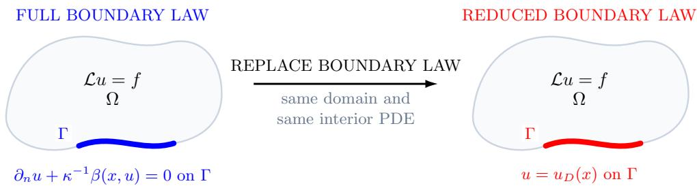
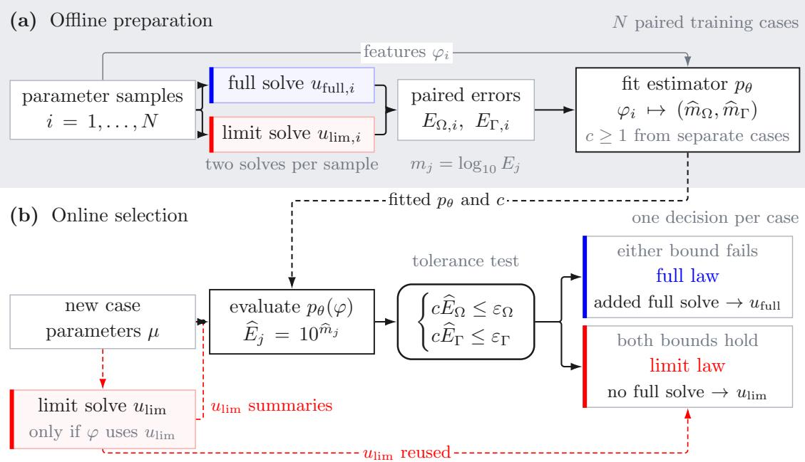
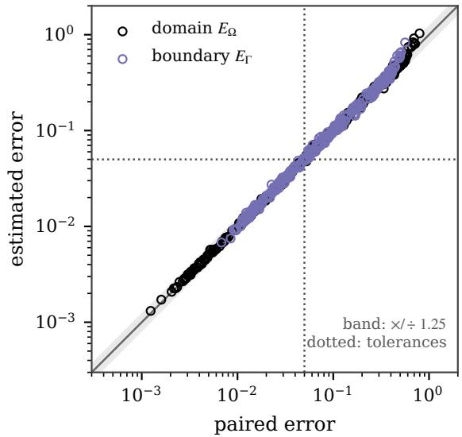
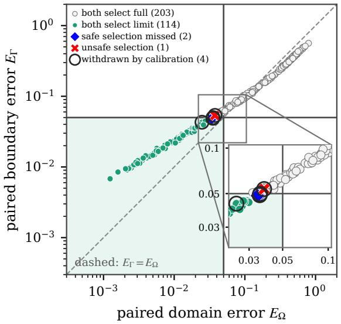
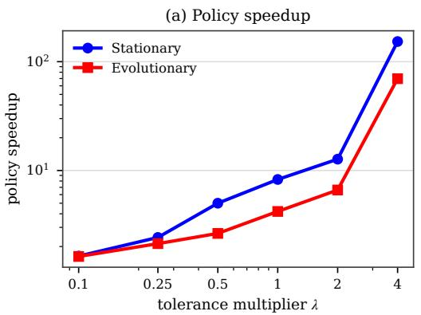
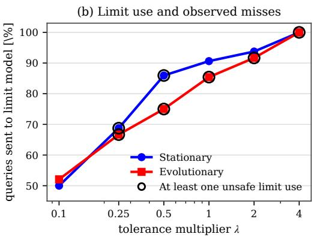

# SELECTIVE BOUNDARY CONDITION REDUCTION VIA LEARNED ERROR GATING

DANIEL FERNANDEZ´ ∗, DOMINIK PENK† AND DOMINIK RIEDELBAUCH†

Abstract. Parametric PDEs can admit diferent boundary conditions with different accuracy and computational cost. We introduce a framework for learning when one reduced boundary condition can replace another: paired solutions train a neural network to estimate the resulting domain and boundary errors, and the simpler condition is used only when both predicted errors meet prescribed tolerances. We focus on singular limits in applications, in which a stif Robin or nonlinear boundary law is replaced by its limiting Dirichlet form. We evaluate the method on a galvanic corrosion problem and other nonlinear stationary and evolution problems.

## 1. Introduction

Boundary conditions govern the exchange of heat, mass, or charge with the surroundings. Diferent conditions can describe the same exchange process at diferent fidelity and cost, motivating us to learn whether one can replace another for each parameter instance. We focus on singular limits in applications. Under strong transfer or reaction, a stif Robin or nonlinear law drives the boundary value toward a target; electrochemical interfaces are one example [3]. The full law can be expensive to solve even though its singular limit reduces to a Dirichlet condition.

Classical analyses establish convergence to the Dirichlet problem [5, 2, 1], but not whether the limiting law is accurate enough at a given finite parameter value. That decision also depends on the forcing, coeficients, geometry, and error norm. In particular, a small domain error can coexist with a much larger boundary error that matters for coupling.

In contrast to PINNs, neural operators, and other neural surrogates, which usually fail in singular regimes [11, 22, 15, 17], our selector avoids reconstructing the full field. It learns two scalar discrepancies, while a PDE solver returns the field and enforces the selected law. The learned component chooses which PDE model is solved. The full law remains the fallback, and new tolerances require no retraining. By targeting the decision quantities while retaining solver accuracy, the method can outperform direct field emulation in data eficiency and reliability when singular or localized features control the tolerance decision.

## 1.1. Contributions. The paper makes three main contributions:

• Selection supported by PDE solvers in singular regimes. Predicting two errors avoids full field reconstruction in singular regimes. The solution is computed by a PDE solver that enforces the selected boundary law. The full law remains the fallback. Tolerances can change without retraining, and split conformal calibration can make both error estimates conservative.

• Evaluation on stationary and evolutionary PDEs. Three benchmarks cover harmonic galvanic corrosion, stationary nonlinear transfer, and nonlinear evolution. In the tested stationary and evolutionary examples, the predictor identifies when the simpler boundary law meets the prescribed tolerances, with few observed selection errors.

• Speedup of the complete online policy. The stationary benchmark achieves about 133× speedup when the limit model is selected and 8.3× for the complete policy. Timings include feature construction, inference, selected solves, and full fallbacks; ofline preparation is excluded.

1.2. Related work. Analyses of limits from Robin to Dirichlet conditions give convergence rates and uniform estimates [5, 2, 1], including results for contact impedance and nonlinear jumps in boundary data [6, 7]; robust discretizations across boundary regimes appear in [13]. This literature establishes or discretizes the limit; we learn whether it meets separate domain and trace tolerances at a finite parameter instance.

Neural surrogate models, including PINNs and neural operators [14], are often unreliable near singular phenomena such as shocks, boundary layers, and singular limits [11, 22, 19, 18, 15, 17]. Our selector avoids full field reconstruction and learns only the errors needed to choose the boundary condition.

Adaptivity based on quantities of interest, certified hierarchies, learned error estimates, and hybrid switching also address model choice [20, 12, 8, 9, 21]. Our specialization holds the state space, interior operator, and discretization fixed, changing only the boundary law. The rule relates to selective prediction [4, 10]; split conformal calibration gives marginal coverage under exchangeability [16].

## 2. Mathematical setting and structure of the singular limit

2.1. A preliminary elliptic example. Let $\Omega \subset \mathbb { R } ^ { d }$ be a bounded Lipschitz domain, let $\Gamma \subset \partial \Omega$ be relatively open, and let T denote the trace on Γ. For $f \in L ^ { 2 } ( \Omega )$ ， target $u _ { D } \in L ^ { 2 } ( \Gamma )$ , and $\kappa > 0$ , the Robin problem

$$
u _ { \kappa } = \underset { v \in H ^ { 1 } ( \Omega ) } { \arg \operatorname* { m i n } } \left\{ \frac 1 2 \int _ { \Omega } ( | \nabla v | ^ { 2 } + | v | ^ { 2 } ) d x - \int _ { \Omega } f v d x + \frac { 1 } { 2 \kappa } \int _ { \Gamma } | T v - u _ { D } | ^ { 2 } d s \right\}\tag{2.1}
$$

has Euler equation $- \Delta u _ { \kappa } + u _ { \kappa } = f$ and boundary law $\partial _ { n } u _ { \kappa } + \kappa ^ { - 1 } ( u _ { \kappa } - u _ { D } ) = 0$ on Γ (with homogeneous Neumann data elsewhere). As $\kappa \downarrow 0$ , the last term in (2.1) enforces $T u = u _ { D }$ . If $\{ v \in H ^ { 1 } ( \Omega ) : T v = u _ { D } \}$ is nonempty, the minimizers converge to the corresponding problem constrained by Dirichlet data. For a nonzero jump in $u _ { D } .$ , that set may be empty and the limit must instead be interpreted in a weaker trace class; this is the situation in Experiment 1. Standard analyses of Robin limits make these statements precise [5, 2].

2.2. Full and limit models. We compare a full solution $u _ { \mathrm { f u l l } }$ with a limit solution $u _ { \mathrm { { l i m } } }$ on a domain Ω. Away from a designated boundary part Γ, both satisfy

$$
\mathcal { L } u = f \quad \mathrm { i n ~ } \Omega ,\tag{2.2}
$$

and the same conditions on $\partial \Omega \backslash \Gamma$ . The operator, source, boundary response, geometry, and prescribed data may vary from case to case. We suppress that dependence in the notation; only the law on Γ changes.

The full model uses the possibly nonlinear law

$$
\partial _ { n } u _ { \mathrm { f u l l } } + \frac { 1 } { \kappa } \beta ( x , u _ { \mathrm { f u l l } } ) = 0 \qquad \mathrm { o n } \ \Gamma ,\tag{2.3}
$$

where n is the outward unit normal and boundary values denote traces. The response $\beta$ drives the trace toward a preferred value $u _ { D } ( x )$ , which may difer between boundary pieces, and smaller $\kappa > 0$ means a stifer response. The limit model replaces (2.3) by

$$
u _ { \mathrm { l i m } } = u _ { D } ( x ) \qquad { \mathrm { o n ~ } } \Gamma .\tag{2.4}
$$

  
Figure 1. Only the boundary law changes; the domain and interior PDE remain fixed.

Assumption 2.1 (Standing limit assumptions). For the parameter range under consideration, the full and limit models are well posed in the solution classes used below. Away from finitely many junction points, the boundary response $\beta ( x , \cdot )$ has $u _ { D } ( x )$ as its only zero in a fixed neighborhood and is uniformly strongly monotone there. The full solution converges to the stated limit in the domain and boundary norms used for selection.

Under Assumption 2.1, the boundary identity gives $\beta ( x , u _ { \mathrm { f u l l } } ) = - \kappa \partial _ { n } u _ { \mathrm { f u l l } }$ . For a smooth target and bounded normal derivatives, strong monotonicity directly gives $u _ { \mathrm { f u l l } } | _ { \Gamma }  u _ { D } = u _ { \mathrm { l i m } } | _ { \Gamma }$ , and stability carries the convergence into the domain. At a jump in $u _ { D } ,$ the normal derivative need not remain bounded and convergence instead holds in weaker trace norms and locally in the interior. These hypotheses are standard and, in fact, are satisfied by all three benchmarks in Section 4, with the evolutionary problem interpreted in its natural time-dependent weak formulation. Precise results show that the rate depends on geometry, smoothness, and the chosen norm [5, 2, 7].

2.3. Error measures and the reference rule. Let $\| \cdot \| _ { \Omega }$ and $\| \cdot \| _ { \Gamma }$ denote the domain and boundary norms, respectively. The benchmarks in Section 4 specify how these norms are discretized. The two relative errors are

$$
E _ { \Omega } = \frac { \| u _ { \mathrm { f u l l } } - u _ { \mathrm { l i m } } \| _ { \Omega } } { \| u _ { \mathrm { l i m } } \| _ { \Omega } } , ~ E _ { \Gamma } = \frac { \| u _ { \mathrm { f u l l } } - u _ { \mathrm { l i m } } \| _ { \Gamma } } { \| u _ { \mathrm { l i m } } \| _ { \Gamma } } .\tag{2.5}
$$

$E _ { \Omega }$ measures the global change, whereas $E _ { \Gamma }$ exposes a discrepancy that the domain norm can hide. If both solutions were known, the ideal rule would use the limit model exactly when

$$
E _ { \Omega } \leq \varepsilon _ { \Omega } \mathrm { a n d } E _ { \Gamma } \leq \varepsilon _ { \Gamma } .\tag{2.6}
$$

A choice is unsafe if the limit model is used while either inequality fails. Because evaluating this rule requires the full solution, the practical rule estimates both errors before the full solve.

Errors over an evolutionary trajectory. When one model is chosen for a complete trajectory on $0 \leq t \leq T$ , the two errors are the largest discrepancies between the full and limit solutions over the stored time levels:

$$
E _ { j } ^ { \operatorname* { m a x } } = \operatorname* { m a x } _ { 0 \leq t \leq T } \frac { \| u _ { \mathrm { f u l l } } ( t ) - u _ { \mathrm { l i m } } ( t ) \| _ { j } } { \| u _ { \mathrm { f u l l } } ( t ) \| _ { j } } , \qquad j \in \{ \Omega , \Gamma \} .\tag{2.7}
$$

The evolutionary benchmark estimates both quantities before advancing the selected trajectory and accepts the limit model only when both predicted maxima satisfy their tolerances.

The stationary studies normalize with the limit solution, consistent with their estimates for the singular limit. The evolutionary errors use the full trajectory as their reference and protect every denominator by a positive numerical floor, which is inactive in the reported cases.

## 3. Method for selecting boundary laws

The selection procedure has an ofline and an online stage. Ofline, paired full and limit solves are used to learn the domain and boundary errors; online, the predicted errors are compared with tolerances chosen by the user to select the boundary law. We next explain the choice of learning target and how the paired data are organized.

Choosing the error estimate and applying the rule. Paired solutions can support several learning targets: a classifier tied to one tolerance pair, the two scalar errors, a correction field, or the full solution. We predict the two errors. This keeps the output dimension independent of the mesh, allows tolerances to change without retraining, and ensures that the returned field still comes from a PDE solver. By contrast, field surrogates have many more outputs and are more costly to predict and verify.

Within this formulation, we use neural networks primarily because the errors depend nonlinearly on several interacting PDE parameters.

  
Figure 2. Initial preparation and repeated selection between boundary laws. Ofline, paired full and limit solutions are used to train the error estimator. Online, the selector returns the solution from the chosen model.

Inputs containing only parameters require only the selected solve. Inputs derived from the limit solution require that solve before selection, so savings occur only when avoided full solves outweigh this overhead.

Paired solutions and errors to be estimated. For each stationary training case, we solve both models and record the errors in (2.5). For evolutionary cases, we record the trajectory errors in (2.7).

Let $j \in \{ \Omega , \Gamma \}$ denote either error type, corresponding respectively to the interior domain and the boundary. Let $m _ { j } : = \log _ { 1 0 } E _ { j }$ , and let $p _ { \theta }$ denote the fitted error estimator with input vector $\varphi .$ . It returns

$$
( \widehat { m } _ { \Omega } , \widehat { m } _ { \Gamma } ) = p _ { \theta } ( \varphi ) , \qquad \widehat { E } _ { j } : = 1 0 ^ { \widehat { m } _ { j } } .\tag{3.1}
$$

Inputs contain parameters and, when used, inexpensive summaries of the limit solution. The practical rule chooses the limit model exactly when

$$
{ \widehat E } _ { \Omega } \leq \varepsilon _ { \Omega } \qquad \mathrm { a n d } \qquad { \widehat E } _ { \Gamma } \leq \varepsilon _ { \Gamma } .\tag{3.2}
$$

Optional conservative calibration. To reduce unsafe selections, we multiply both predicted errors by a common factor $c \geq 1$ learned from separate calibration cases. For example, $c = 1 . 2$ raises both estimates by 20% before comparison with the tolerances. Split conformal calibration chooses this factor so that both true errors are no larger than the adjusted estimates with probability at least $1 - \alpha$ under exchangeability (for example, independent cases from the same distribution) [16]; Appendix A gives the calculation. Thus, for a new case, an unsafe selection has probability at most α. This does not bound the unsafe fraction among accepted cases or protect against distribution shift.

## 4. Numerical results

We evaluate the selector on independent cases from three benchmarks. Online totals include feature construction, inference, the selected solve, and fallbacks to the full model; paired labeling and training are ofline. Sampling, data splits, architectures, discretizations, solver settings, refinement checks, and timing protocols are collected in Appendix A, after the references. The code is available in the project repository.

4.1. Experiment 1: harmonic galvanic corrosion model with a boundary jump. Following [7], let $\Omega = ( 0 , 0 . 0 2 ) \times ( 0 , 0 . 0 1 )$ . The bottom boundary is split into cathodic and anodic halves, denoted by $\Gamma _ { c }$ and $\Gamma _ { a } \mathbf { ; }$ ; the remainder $\Gamma _ { N }$ is insulated. The full problem is

$$
\left\{ \begin{array} { l l } { - \Delta \phi _ { \kappa } = 0 } & { \mathrm { i n } \ \Omega , } \\ { \partial _ { n } \phi _ { \kappa } = - \frac { 1 } { \kappa } i _ { c } ( \phi _ { \kappa } ) } & { \mathrm { o n } \ \Gamma _ { c } , } \\ { \partial _ { n } \phi _ { \kappa } = - \frac { 1 } { \kappa } i _ { a } ( \phi _ { \kappa } ) } & { \mathrm { o n } \ \Gamma _ { a } , } \\ { \partial _ { n } \phi _ { \kappa } = 0 } & { \mathrm { o n } \ \Gamma _ { N } , } \end{array} \right.\tag{4.1}
$$

where the cathodic and anodic currents are

$$
\begin{array} { l } { { i _ { c } ( \phi ) = i _ { c , 0 } \left[ \exp \bigl ( C _ { 1 } ( \phi - \phi _ { c } ) \bigr ) - \exp \bigl ( - C _ { 2 } ( \phi - \phi _ { c } ) \bigr ) \right] , } } \\ { { i _ { a } ( \phi ) = i _ { a , 0 } \left[ \exp \bigl ( A _ { 2 } ( \phi - \phi _ { a } ) \bigr ) - \exp \bigl ( - A _ { 1 } ( \phi - \phi _ { a } ) \bigr ) \right] . } } \end{array}\tag{4.2}
$$

We use the fixed exponential slopes from [7] and vary κ, the equilibrium potentials, and the current scales around their reference values. The varied parameter vector is $( \kappa , \phi _ { a } , \phi _ { c } , i _ { c , 0 } , i _ { a , 0 } )$ . The limit sets $\phi _ { 0 } = \phi _ { c }$ on $\Gamma _ { c }$ and $\phi _ { 0 } = \phi _ { a }$ on $\Gamma _ { a }$ , so its trace jumps at their junction. Both models use the same graded conforming $P _ { 1 }$ mesh. Errors are measured in Ω and on $\Gamma _ { \star } = \Gamma _ { c } \cup \Gamma _ { a }$ . The estimator corrects two linearized error indicators rather than learning the errors from scratch. In each repetition, split conformal calibration uses 90 cases that are separate from the training and evaluation sets.

At 5% domain and boundary tolerances, the raw selector accepts most of the cases that the paired reference identifies as safe. Split conformal calibration reduces unsafe choices but misses more safe cases. Across repetitions, the conditional unsafe rate ranges from 0.87% to 3.48% for the raw selector and from 0 to 0.93% after calibration.

Table 1 compares the neural rules with a tuned κ threshold, the two linearized indicators used directly, and ridge residual regression using the same inputs and target. The paired reference row is an unattainable oracle bound.

Figure 3 resolves these counts on the first locked evaluation. The estimates follow the paired errors over nearly three decades, including the stif cases whose errors reach 80%, and the induced decision difers from the paired reference on three of the 320 cases: one unsafe selection and two safe cases sent to the full model. The conformal factor of about 1.09 withdraws four acceptances; this removes the unsafe selection and raises the number of missed safe cases from two to five, which is the trade-of reported above. Both error types are comparable in magnitude for this problem, so neither tolerance is uniformly the binding one, and cases near the corner of the acceptance region decide the outcome.

(a) Error estimates over the sampled regime
<table><tr><td>Estimator</td><td></td><td>Limit use [%] Unsafe / uses Missed / safe</td><td></td></tr><tr><td>Tuned κ threshold</td><td>33.9</td><td>20/542</td><td>48/570</td></tr><tr><td>Linearized indicator</td><td>0.5</td><td> $0 / 8$ </td><td>562/570</td></tr><tr><td>Ridge residual regression</td><td>36.5</td><td>14/584</td><td>0/570</td></tr><tr><td>Neural residual regression</td><td>35.2</td><td>8/564</td><td>14/570</td></tr><tr><td>Calibrated neural regression</td><td>33.4</td><td>1/534</td><td>37/570</td></tr><tr><td>Paired reference</td><td>35.6</td><td>0/570</td><td>0/570</td></tr></table>

Table 1. Galvanic corrosion results with our framework.

(b) Selection at the nominal tolerances  
  
Figure 3. Estimated errors and the resulting selection on the first locked evaluation. (a) Estimated against paired errors, with the common $5 \%$ tolerance dotted. (b) The same cases in the plane of paired errors; the shaded rectangle is the acceptance region, the inset magnifies its corner, and black rings mark the acceptances withdrawn by calibration.

4.2. Experiment 2: stationary nonlinear transfer. We consider the stationary problem on $\Omega = ( 0 , 1 ) ^ { 2 }$ :

$$
- \Delta u _ { \kappa } + u _ { \kappa } = f _ { \mu } \mathrm { i n } \Omega ,\tag{4.3}
$$

$$
\partial _ { n } u _ { \kappa } + \frac { 1 } { \kappa } \bigl [ ( u _ { \kappa } - g _ { \mu } ) + \gamma ( u _ { \kappa } - g _ { \mu } ) ^ { 3 } \bigr ] = 0 \quad \mathrm { o n } \partial \Omega .
$$

Here $g _ { \mu } ~ = ~ g _ { 0 } + g _ { x } \cos ( 2 \pi x ) + g _ { y } \sin ( \pi y )$ . Let $s _ { 1 } ~ = ~ \sin ( \pi x ) \sin ( \pi y )$ and $s _ { 2 } =$ $\sin ( 2 \pi x ) \sin ( \pi y )$ , so $f _ { \mu } ~ = ~ f _ { 1 } s _ { 1 } + f _ { 2 } s _ { 2 }$ We vary the stifness, nonlinearity, boundary target, and load amplitudes. The corresponding parameter vector is $\mu = ( \kappa , \gamma , g _ { 0 } , g _ { x } , g _ { y } , f _ { 1 } , f _ { 2 } )$

At the nominal tolerances, the selector misses one safe case. For this finite test set, the descriptive 95% upper endpoint for unsafe use is 6.2%, so it is not a guarantee.

<table><tr><td>Quantity</td><td>Value</td><td>Unit</td></tr><tr><td>Full solve, median</td><td>130.597</td><td>ms/query</td></tr><tr><td>NN + limit solve, median</td><td>0.978</td><td>ms/query</td></tr><tr><td>Accepted path, ratio of medians</td><td>133.5</td><td>X</td></tr><tr><td>Policy speedup</td><td>8.3</td><td>X</td></tr><tr><td>Raw selector limit choices</td><td>58/64</td><td>cases</td></tr><tr><td>Unsafe limit choices</td><td>0/58</td><td>cases</td></tr></table>

Table 2. Stationary selector accuracy and timings on one thread at nominal tolerances. Policy speedup includes feature construction, inference, selected solves, and all fallbacks to the full model.

Table 2 shows a large acceleration on accepted limit paths. Fallbacks reduce, but do not eliminate, the policy gain.

4.3. Experiment 3: evolutionary nonlinear transfer. The evolutionary benchmark uses the same square domain over $0 < t \leq 0 . 8 \colon$

$$
\partial _ { t } u _ { \kappa } - \nu \Delta u _ { \kappa } = f _ { \mu } ( x , y , t ) \mathrm { i n } \Omega ,\tag{4.4}
$$

$$
\nu \partial _ { n } u _ { \kappa } + \frac { 1 } { \kappa } \frac { \sinh \bigl ( \beta ( u _ { \kappa } - g _ { \mu } ) \bigr ) } { \beta } = 0 \qquad \mathrm { o n ~ } \partial \Omega .
$$

The limit imposes $u _ { 0 } = g _ { \mu }$ on the boundary. We set $g _ { \mu } = 0 . 6 5 + a _ { g } \sin ( 2 \pi \omega _ { g } t +$ $\psi ) + 0 . 0 7 5 ( x - 0 . 5 ) - 0 . 0 5 5 ( y - 0 . 5 ) , f _ { \mu } = a _ { f } \cos ( 1 . 4 \pi t ) \exp [ - 3 5 ( ( x - 0 . 6 8 ) ^ { 2 } + ( y - 0 . 5 ) ^ { 2 } ) ] ,$ $0 . 3 4 ) ^ { 2 } ) ]$ ], and $u ( \cdot , 0 ) = g _ { \mu } ( \cdot , 0 ) { + } 0 . 1 2 \sin ( \pi x ) \sin ( \pi y )$ . We vary the stifness, difusivity, nonlinearity, boundary oscillation, source amplitude, and phase. The corresponding parameter vector is $\mu = ( \kappa , \nu , \beta , a _ { g } , \omega _ { g } , a _ { f } , \psi )$

At the nominal tolerances, the larger test set has one unsafe accepted case and no missed safe case; the separate direct policy evaluation also has one borderline boundary miss. Accepted limit paths are much faster than full solves, but fallbacks substantially reduce policy speedup. The smaller policy evaluation has correspondingly wide uncertainty, so both results are descriptive rather than safety guarantees.

4.4. Tolerance versus speedup. We hold each network fixed and multiply its tolerance pair by λ. The tolerance pairs are (0.5%, 0.5%) for the stationary problem and $( 1 \% , 2 \% )$ for the evolutionary problem. For the accepted set $A _ { \lambda }$ defined by predictions, policy speedup is

$$
S _ { \mathrm { p o l i c y } } ( \lambda ) = \frac { \sum _ { i } T _ { \mathrm { f u l l } , i } } { \sum _ { i \in A _ { \lambda } } T _ { \mathrm { N N + l i m i t } , i } + \sum _ { i \notin A _ { \lambda } } T _ { \mathrm { N N + f u l l } , i } } .\tag{4.5}
$$

Here $T _ { \mathrm { f u l l } }$ is the cost of the full solve, while $T _ { \mathrm { N N + l i m i t } }$ and $T _ { \mathrm { N N + f u l l } }$ are the measured costs of the selected branches. The denominator therefore includes prediction, limit solves, and all full fallbacks.

  
Figure 4. Policy speedup and limit use versus tolerance multiplier λ; open rings mark observed unsafe selections.

Relaxing the tolerances increases limit use and policy speedup in both benchmarks. At $\lambda = 1$ , the stationary sweep agrees with Table $2 ;$ the evolutionary result uses the larger test set rather than the separate policy evaluation. Ringed markers denote an observed unsafe selection, so speedup must be interpreted with the tolerances and safety result.

## 5. Conclusion and open problems

We presented a framework for learning when one boundary condition can replace another, focusing on singular limits from Robin or nonlinear laws to Dirichlet data. Unlike full field neural surrogates, which are unreliable near singular behavior, it predicts only domain and boundary errors. A PDE solver enforces the choice, the full law provides a fallback, and tolerances can change without retraining. Tests on stationary and evolutionary PDEs show that tolerance, limit use, reusable operators, and fallbacks determine policy speedup.

This leaves several questions for the further development of the framework:

• Reliability among accepted cases. The optional calibration bounds the marginal probability of an unsafe decision, but does not provide the same bound for a tolerance violation conditional on selecting the limit model. An open task is to control this conditional risk while retaining a useful acceptance rate, and to quantify the calibration sample size needed for that trade-of.

• Accuracy throughout a trajectory. The evolutionary test selects one model for an entire trajectory and measures errors at stored time levels. Controlling errors between these levels requires temporal error estimates. Adaptive switching during a solve also requires tracking accumulated error: returning to the full model does not by itself remove errors inherited from earlier limit solves.

• Asymptotic features beyond linearization. The corrosion estimator already corrects two linearized indicators. Extending this idea to other boundary laws could use justified convergence rates, boundary-layer structure, and junction corrections to improve predictions where data are sparse. Such features must account for changes in the rate or relevant norm caused by nonsmooth data.

## Acknowledgements

The authors sincerely thank Enrique Zuazua for his unwavering support. This work was funded by Schaefler Technologies AG & Co. KG.

## References

[1] Ch´erif Amrouche, Carlos Conca, Amrita Ghosh, and Tuhin Ghosh, Uniform $W ^ { 1 , p }$ estimates for an elliptic operator with Robin boundary condition in $a \mathcal { C } ^ { 1 }$ domain, Calculus of Variations and Partial Diferential Equations 59 (2020), no. 2, 71.

[2] Giles Auchmuty, Robin approximation of Dirichlet boundary value problems, Numerical Functional Analysis and Optimization 39 (2018), no. 10, 999–1010.

[3] Martin Z. Bazant, Theory of chemical kinetics and charge transfer based on nonequilibrium thermodynamics, Accounts of Chemical Research 46 (2013), no. 5, 1144–1160.

[4] C. K. Chow, On optimum recognition error and reject tradeof, IEEE Transactions on Information Theory 16 (1970), no. 1, 41–46.

[5] Martin Costabel and Monique Dauge, A singularly perturbed mixed boundary value problem, Communications in Partial Diferential Equations 21 (1996), no. 11–12, 1919–1949.

[6] J´er´emi Dard´e and Stratos Staboulis, Electrode modelling: The efect of contact impedance, ESAIM: Mathematical Modelling and Numerical Analysis 50 (2016), no. 2, 415–431.

[7] Daniel Fern´andez, Singular limit phenomenon in a nonlinear elliptic model arising in electrochemistry, 2026, arXiv:2606.20619 [math.AP].

[8] Brian A. Freno and Kevin T. Carlberg, Machine-learning error models for approximate solutions to parameterized systems of nonlinear equations, Computer Methods in Applied Mechanics and Engineering 348 (2019), 250–296.

[9] Felix Fritzen, Mauricio Fern´andez, and Fredrik Larsson, On-the-fly adaptivity for nonlinear twoscale simulations using artificial neural networks and reduced order modeling, Frontiers in Materials 6 (2019), 75.

[10] Yonatan Geifman and Ran El-Yaniv, Selective classification for deep neural networks, Advances in Neural Information Processing Systems, vol. 30, 2017, pp. 4878–4887.

[11] Gung-Min Gie, Youngjoon Hong, and Chang-Yeol Jung, Semi-analytic PINN methods for singularly perturbed boundary value problems, Applicable Analysis 103 (2024), no. 14, 2554– 2571.

[12] Bernard Haasdonk, Hendrik Kleikamp, Mario Ohlberger, Felix Schindler, and Tizian Wenzel, A new certified hierarchical and adaptive RB–ML–ROM surrogate model for parametrized PDEs, SIAM Journal on Scientific Computing 45 (2023), no. 3, A1039–A1065.

[13] Mika Juntunen and Rolf Stenberg, Nitsche’s method for general boundary conditions, Mathematics of Computation 78 (2009), no. 267, 1353–1374.

[14] Nikola Kovachki, Zongyi Li, Burigede Liu, Kamyar Azizzadenesheli, Kaushik Bhattacharya, Andrew Stuart, and Anima Anandkumar, Neural operator: Learning maps between function spaces with applications to PDEs, Journal of Machine Learning Research 24 (2023), no. 89, 1–97.

[15] Samuel Lanthaler, Roberto Molinaro, Patrik Hadorn, and Siddhartha Mishra, Nonlinear reconstruction for operator learning of PDEs with discontinuities, The Eleventh International Conference on Learning Representations, 2023.

[16] Jing Lei, Max G’Sell, Alessandro Rinaldo, Ryan J. Tibshirani, and Larry Wasserman, Distribution-free predictive inference for regression, Journal of the American Statistical Association 113 (2018), no. 523, 1094–1111.

[17] Ye Li, Ting Du, Yiwen Pang, and Zhongyi Huang, Component Fourier neural operator for singularly perturbed diferential equations, Proceedings of the AAAI Conference on Artificial Intelligence 38 (2024), no. 12, 13691–13699.

[18] Xinliang Liu, Bo Xu, Shuhao Cao, and Lei Zhang, Mitigating spectral bias for the multiscale operator learning, Journal of Computational Physics 506 (2024), 112944.

[19] Miguel Liu-Schiafini, Julius Berner, Boris Bonev, Thorsten Kurth, Kamyar Azizzadenesheli, and Anima Anandkumar, Neural operators with localized integral and diferential kernels, Proceedings of the 41st International Conference on Machine Learning, Proceedings of Machine Learning Research, vol. 235, PMLR, 2024, pp. 32576–32594.

[20] J. Tinsley Oden, Serge Prudhomme, Daniel C. Hammerand, and Mieczys law S. Kuczma, Modeling error and adaptivity in nonlinear continuum mechanics, Computer Methods in Applied Mechanics and Engineering 190 (2001), no. 49–50, 6663–6684.

[21] S´ebastien Rifaud, Accurate and robust predictions for model order reduction via an adaptive, hybrid FOM/ROM approach, Journal of Computational Physics 523 (2025), 113677.

[22] Makoto Takamoto, Timothy Praditia, Raphael Leiteritz, Daniel MacKinlay, Francesco Alesiani, Dirk Pfl¨uger, and Mathias Niepert, PDEBench: An extensive benchmark for scientific machine learning, Advances in Neural Information Processing Systems, vol. 35, 2022, pp. 1596– 1611.

## Appendix A. Technical implementation details

Common protocol. Held out evaluation and validation data do not split trajectories; fitting data set all standardizations, and fixed seeds determine every design and fit (Table A.1). For calibration, sort $s _ { i } = \operatorname* { m a x } _ { j } ( E _ { i , j } / \widehat { E } _ { i , j } )$ on $n _ { \mathrm { c a l } }$ cases unused for training. With $k = \lceil ( n _ { \mathrm { c a l } } + 1 ) ( 1 - \alpha ) \rceil$ , take the kth smallest score $q \ ( \mathrm { o r } \ + \infty$ if $k > n _ { \mathrm { c a l } } )$ and set $c = \operatorname* { m a x } ( 1 , q )$
<table><tr><td>Study</td><td> $\mathrm { F i t / c a l . / t e s t }$ </td><td>Online inputs</td><td>Discretization</td><td>Estimator fit</td></tr><tr><td>Corrosion</td><td> $2 7 0 / 9 0 / 3 2 0 ,$  five repeats</td><td>8: five parameters, graded jump, two indicators</td><td> $3 1 ^ { 2 } \ P _ { 1 }$ </td><td>(96, 96) ReL  $\mathrm { U / A d a m } ; 1 0 ^ { - 4 }$  penalty;  $1 0 ^ { - 3 }$  rate; 15% early stop</td></tr><tr><td>Stationary</td><td> $2 5 6 / - / 6 4$ </td><td>8 parameter/load features</td><td> $9 7 ^ { 2 } \ Q _ { 1 }$ </td><td>(24, 12) tanh with L-BFGS;  $1 0 ^ { - 4 }$  penalty</td></tr><tr><td>Evolutionary</td><td> $1 2 8 / 3 2 / ( 1 2 +$  48)</td><td>10 parameter features</td><td>labels:  $2 5 ^ { 2 } / 4 8$  steps; checks:  $9 7 ^ { 2 } / 1 9 2$  steps</td><td> $( 3 2 , 1 6 )$  tanh with L-BFGS;  $2 \times 1 0 ^ { - 3 }$  penalty</td></tr></table>

Table A.1. Shared protocol; “cal.” means calibration or validation; test sets are disjoint.

Experiment 1: Corrosion. Ranges are $\log _ { 1 0 } \kappa \in [ - 7 , - 3 ] , \phi _ { a } \in [ - 0 . 2 6 , - 0 . 1 4 ]$ $\phi _ { c } \in [ 0 . 1 4 , 0 . 2 6 ] , i _ { c , 0 } \in [ 1 . 5 , 6 ] \times 1 0 ^ { - 4 }$ , and $i _ { a , 0 } \in [ 1 . 5 , 6 ] \times 1 0 ^ { - 2 } ;$ currents are sampled logarithmically. Calibration and test cases use independent samples from this design.

Inputs are the five parameters, the jump $\phi _ { c } - \phi _ { a }$ , and two linearized indicators. From the limit flux $q _ { h }$ , the correction $\delta _ { \Gamma } = - \kappa q _ { h } / i _ { * } ^ { \prime } ( \phi _ { * } )$ and its harmonic extension give $b _ { \Omega } , b _ { \Gamma }$ ; targets are $m _ { j } - \log _ { 1 0 } b _ { j }$

Experiment 2: Stationary. Fitting and test samples use log $\zeta _ { 1 0 } \kappa \in [ - 5 , - 0 . 5 ]$ $\begin{array} { r } { \log _ { 1 0 } \gamma \in [ 4 , 8 ] , \ g _ { 0 } \in [ 0 . 8 , 1 . 2 ] , \ g _ { x } \in [ - 0 . 3 , 0 . 3 ] , \ g _ { y } \in [ - 0 . 2 5 , 0 . 2 5 ] , \ f _ { 1 } \in \mathbf { \widetilde { \Gamma } } [ 0 , 8 ] . } \end{array}$ , and $f _ { 2 } \in [ - 4 , 4 ]$ . Inputs are $\log _ { 1 0 } \kappa , \log _ { 1 0 } ( 1 + \gamma )$ , the other five values, and $\log _ { 1 0 } ( \kappa L )$ with $L = 1 + | f _ { 1 } | + | f _ { 2 } | + 4 \pi ^ { 2 } ( | g _ { x } | + | g _ { y } | )$

Experiment 3: Evolutionary. Samples use $\log _ { 1 0 } \kappa \in [ - 3 . 5 , - 0 . 5 ] , \nu \in$ [0.035, 0.14], $\beta ~ \in ~ [ 2 0 , 1 2 0 ] , ~ a _ { g } ~ \in ~ [ 0 . 0 6 , 0 . 3 0 ] , ~ \omega _ { g } ~ \in ~ [ 0 . 5 , 2 . 3 ] , ~ a _ { f } ~ \in ~ [ 0 . 1 5 , 1 . 1 0 ]$ 2 and $\psi \in [ 0 , 2 \pi ]$ . Inputs are $\log _ { 1 0 } \kappa , \nu , \beta / 1 0 0 , a _ { g } , \omega _ { g } , a _ { f }$ , sin ψ, cos $\psi , \log _ { 1 0 } ( \kappa / \nu )$ , and $\beta a _ { g }$ . Labels use backward Euler and checks use centered diferences of order two. Full solves use damped Newton; selected trajectories reuse the limit factorization.

Timing and refinement. Single thread timings exclude training and the initial factorization. Table 2 uses 24 cases and seven repeats; policy speedup uses 64 tests, three repeats, and six fallbacks. Sweeps time each path once with prediction and fallback. Refining one case per study to $4 1 ^ { 2 } , \ 1 2 9 ^ { 2 }$ , and $1 2 9 ^ { 2 }$ (256 steps) changed errors by at most $2 . 4 \times 1 0 ^ { - 3 } , 1 . 8 \times 1 0 ^ { - 7 }$ , and $2 . 2 \times 1 0 ^ { - 4 }$ ; no decision changed.